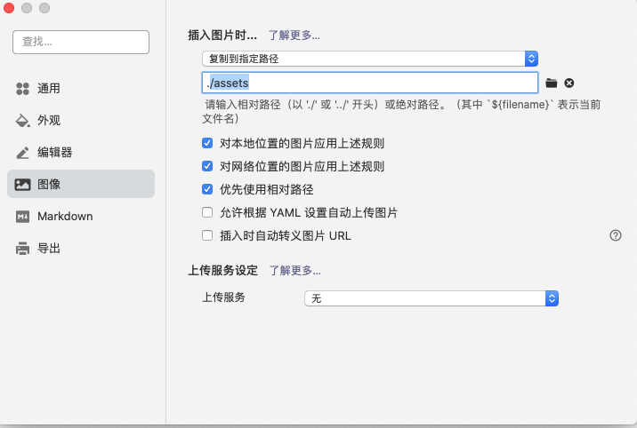

# Python环境搭建

按时肯德基；阿可接受的；副科级啊；山东矿机发；卡视角大富科技啊；谁看得见风

```python
print("123")
print("123")
print("123")
print("123")
print("123")
```

```java
```


阿斯顿福建 `name="xxxx"`


阿斯顿福建；卡视角的；副科级啊；历史地看就

## Python解释器的安装


### 谢新雪


#### 笑嘻嘻的





知识点需要三步：

- 安装
  - 奥术大师多
  - 阿萨德
    - 阿萨德电风扇
- 胜多负少
  - 阿萨德
- 解压
- 某个目录


1. 奥术大师多
2. 阿萨德
3. 阿萨德
4. 阿萨德


阿斯蒂芬


|      |      |      |
| ---- | ---- | ---- |
|      |      |      |
|      |      |      |
|      |      |      |


