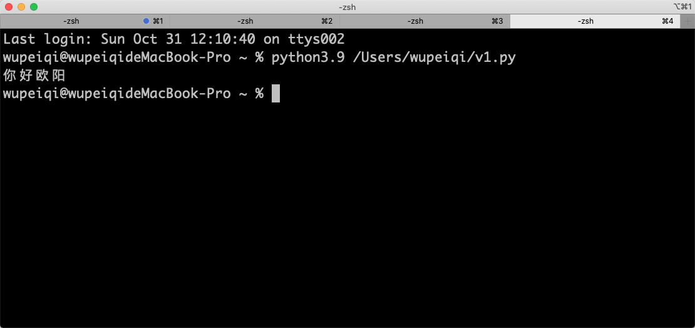
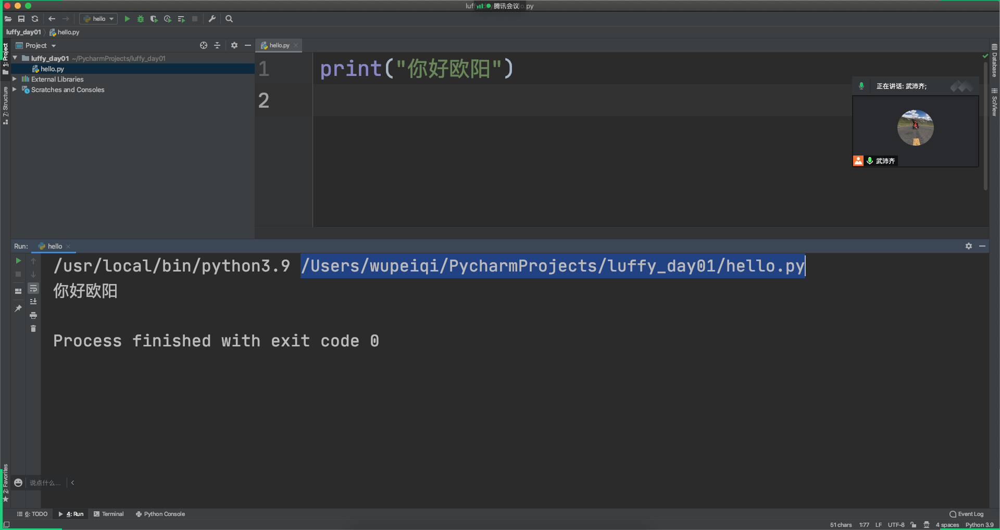
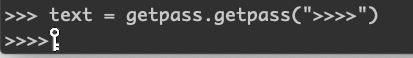

# day01 基础入门

今日概要：

1. 环境搭建
2. 编码相关
3. Pycharm
4. 输出
5. 数据类型
   - 字符串
   - 整型
   - 布尔类型
6. 变量（有坑）【*】
7. 条件语句
8. 循环语句
9. 字符串格式化
10. 运算符【*】


## 1.环境搭建

- 安装Python解释器（3.9.0）

  ```
  C语言写出来的软件。
  	- 上层，Python语法写的代码。
  	- 软件，执行并翻译
  	- 底层，计算机识别的代码。
  
  在安装目录下一个有一个可执行文件。
  	终端设备：xx/xxx/xx/xxx/python.exe  D:\code\xxx.py
  	
  一般情况下：
  	C:\python39
  		- python.exe
  		- Scripts(bin)
  			- pip.exe ，包管理工具
  		- Lib
  			site-packages（安装的第三方的包）
  				- 。。。。
  			内置包
  		
  	>>> C:\python39\python.exe D:\code\xxx.py
  	>>> C:\python39\Script\pip.exe  install requests
  ```

  - 一定要安装在方便找的目录。

    ```
    /Library/Frameworks/Python.framework/Versions/python3.9/python    代码文件路径
    /Library/Frameworks/Python.framework/Versions/python3.9/bin/pip   代码文件路径
    ```

  - 环境变量

    ```
    /Library/Frameworks/Python.framework/Versions/python3.9
    /Library/Frameworks/Python.framework/Versions/python3.9/bin
    
    >>>python 代码
    >>>pip install xxx
    ```

  - 多个Python环境

    ```
    - C:\python39
    	- python.exe
    	- python3.9.exe
    	- Scripts
    		- pip.exe
    		- pip3.9.exe
    - C:\python38
    	- python.exe
    	- python3.8.exe
    - C:\python37
    	- python.exe
    	- python3.7.exe
    ...
    
    >>>python xxx.py
    ```

  - 目录不要出现中文。

  

## 2.编码

- 文件存储编码

  ```
  存储时候，用一种编码。
  打开时候，也一定要用同样的编码，否则就会乱码。
  ```

- 编码

  - ascii编码，256个。

    ```
    python2的默认解释器编码ascii码。
    ```

  - unicode。

    - ucs2

      ```
      00000000 00000001   武
      00000000 00000010   想
      ```

    - ucs4

      ```
      00000000 00000000 00000000 00000001     武
      00000000 00000000 00000000 00000001     碰
      ```

  - ut-8编码，对unicode的压缩（网络传输或文件存储的时都需要用他）。


在Python3版本中：

```
name = "欧阳"   # unicode
data = name.encode("utf-8")  # utf-8

# 写文件或网络传输
```

在Python2版本中：

```
# python解释器转换成了utf-8编码。

name = "欧阳"     # utf-8编码

data = name.decode("utf-8") # unicode
```


## 3.写代码

- 传统的方式

  ```python
  print("你好欧阳")
  ```

  

- IDE，集成开发环境。【Pycharm + 不要汉化】
  


- Python3解释器，默认编码是utf-8。

  ```
  print("你好欧阳")
  ```

- python2解释器，默认编码ascii

  ```python
  # -*- coding:utf-8 -*-
  
  print("你好欧阳")
  ```


## 4.输出

```python
print("hello world")
print(11,22,333,44)

print("你好欧阳", end="")  # \n
print("Hello")
```


## 5.初识数据类型

```
- 字符串一类
    "xxxx"
    "xad"
    "武沛齐"
    
- 整型
	12
	77
	99
	
- 布尔类型
	True
	False
```


### 5.1 字符串 str

- 定义

  ```python
  v1 = "王苹安"
  v2 = '陈聪'
  v3 = """asdf
  asdfasd
  asdfasdf
  asdf
  asdf"""
  v4 = str("xxxx")
  ```

- 拼接（相加）

  ```
  "王苹安" + '陈聪'
  ```

- 乘法

  ```
  "王苹安" * 3
  ```

  

### 5.2 整型 int

整数，python3中没有了整型和长整形的区分。

```
8+9
12-10
19*8
18/2
19%2
```


### 5.3 布尔值 bool

True/False

```python
if 1>2:
    pass
else:
    pass
```


### 5.4 转换

- 字符串 <-> 整型

- 整型和字符串  -> 布尔类型

  - 整型转换布尔类型：0-> False
  - 字符串转换成布尔类型："" -> False

  ```
  if False:
  	pass
  ```

  ```
  if "陈聪":
  	pass
  ```


### 练习题

```python
print( "100" *3 )
print( int("100") *3 )

print( int("123") + int("88") )
print( str(111) + str(222) )
print( str(111)*3 )
print( int("8") > 7 )
print( str(111) == 111 )
print( bool(-1) )
print( bool(0) )
print( bool("") )
print( bool("你好") )
print( True == True)
print( True == False)
print( bool("") == bool(0) )
```

在比较大小时，一般都是同一种数据类型来比较。 `"程聪" > "欧阳"`


## 6.变量

变量，昵称，代号。

```python
data = "中华人民共和国"
value = "魏志彪"

res = data + value
```


### 6.1 变量要求

- 字母、数字、下划线。
- 不能数字开头
- 不能用python内置内置关键字。

建议：

- 见名知意

  ```
  age = 123
  size = 345
  ```

- 多个单词用下划线拼接

  ```
  user_data_info = 123
  ```

```python
_ = 9
n0 = 123
n+9 = q23
```


### 6.2 变量的赋值相关内存

```python
v1 = 9
v2 = 10
v3 = v1 + v2 
```

```python
v1 = "魏淑彪"
v2 = "魏淑彪"
```

```python
v1 = "魏淑彪"
v2 = v1
```


```python
v1 = "王卓"
v1 = 123
```

```python
v1 = "王卓"
v2 = v1
v1 = "王平安"
```

```python
v1 = 123
v2 = str(v1)
```


## 7.输入

```python
# 1.输出：请输入用户名
# 2.等待用户输入
# 3.赋值给v1变量（无论你输入什么，都是字符串类型）
v1 = input("请输入用户名")
```

```python
v1 = input("请输入用户名")
res = "你好" + v1
print(res)
```


```python
v1 = input("请输入数字：") # 123
v2 = input("请输入数字：") # 100
res = v1 + v2
print(res)
```

```python
v1 = input("请输入数字：") # 123
v2 = input("请输入数字：") # 100
res = int(v1) + int(v2)
print(res)
```

```python
print("欢迎使用xx系统，请选择功能：1.登录;2.注册;3.注销")
v1 = input("请选择：")

if v1 == "1":
    pass
```


## 8.条件语句

```java
if 条件{
 	...   
}else{
    ...
}
```


```python
if 条件 :
    调整成立，执行这个缩进里面的代码
    。。。
    。。。
    。。
else:
    调整成立，执行这个缩进里面的代码
    ..
```

```python
if True:
    pass
```

```python
if 9:
    pass
```

```python
if 1 > 4:
    pass
```

```python
if 2 == 5:
    pass

v1 = 3 == 9
```

```python
data = 9
if data > 10:
    pass
```


```python
name = input("请输入用户名：")
pwd = input("请输入密码：")

if name == "root" and pwd == "123":
    print("登录成功")
else:
    print("登录失败")
```


```python
if 条件:
	pass
```

```python
if 条件:
    pass
elif 条件:
    pass
elif 条件:
   	pass
else:
    pass
```

```python
if 1:
	if 1>9:
        pass
    else:
        pass
else:
    pass
```


```python
print("欢迎使用10086")
print("1.手机业务；2.宽带业务；3.企业业务")
choice = input("请选择：")

if choice == "1":
    print("手机业务")
    print("1.话费查询；2.流量查询；3.人工服务")
    second_choice = input("请输入：")
    if second_choice == "1":
        print("话费查询...")
    elif second_choice == "2":
        print("..,")
elif choice == "2":
    pass
elif choice == "3":
    pass
else:
    print("输入错误")
```


## 9.循环

- while循环

  ```python
  while 条件:
      代码
      代码
  ```

  ```python
  while True:
      print("下午好困")
  
  while 1>2:
      print("下午好困")
  ```

  ```python
  count = 0
  while count < 5:
      print("又累又困")
      count = 9
  print("结束")
  ```

  ```python
  count = 0
  while count < 5:
      print("又累又困")
      count = count + 1
  print("结束")
  ```

  - break，终止循环，跳出循环。

    ```python
    count = 0
    while count < 5:
        print("又累又困")
        break
        print("好像下课")
        count = count + 1
    print("结束")
    ```

  - continue，结束本次循环，开始下次循环。

    ```python
    count = 0
    while count < 5:
        print("又累又困")
        continue
        print("好像下课")
        count = count + 1
    print("结束")
    ```

  练习题：

  ```python
  # 1.输入用户名直到输入正确位置
  while True:
  	name = input("请输入用户名：")
      if name:
          break
  	print("输入错误，请重新输入")
  
  # 2.输入密码直到输入正确位置
  while True:
  	pwd = input("请输入密码：")
      if pwd:
          break
  	print("输入错误，请重新密码")
      
  if name == "alex" and pwd == "sb":
      print("成功")
  else:
      print("失败")
  ```

  ```python
  # 三次机会。
  count = 0
  while True:
  
      # 1.输入用户名直到输入正确位置
      while True:
          name = input("请输入用户名：")
          if name:
              break
          print("输入错误，请重新输入")
  
      # 2.输入密码直到输入正确位置
      while True:
          pwd = input("请输入密码：")
          if pwd:
              break
          print("输入错误，请重新密码")
  
      if name == "alex" and pwd == "sb":
          print("成功")
          break
      else:
          print("失败")
          count = count + 1
          # 1 2 3
          if count == 3:
              print("错误次数用完了,直接终止")
              break
  
  ```

  ```python
  # 三次机会。
  count = 0
  while True:
      # 1.输入用户名直到输入正确位置
      while True:
          name = input("请输入用户名：")
          if name:
              break
          print("输入错误，请重新输入")
  
      # 2.输入密码直到输入正确位置
      while True:
          pwd = input("请输入密码：")
          if pwd:
              break
          print("输入错误，请重新密码")
  
      if name == "alex" and pwd == "sb":
          print("成功")
          break
  
      print("失败")
      count = count + 1
      # 1 2 3
      if count == 3:
          print("错误次数用完了,直接终止")
          break
  ```

- for循环

  ```python
  name = "熊阳a阳阳阳"   # int和bool不可以被for循环。
  for i in name:
      print(i)
  ```

  ```python
  name_list = ["刘森","王建伟","张海波"]
  
  for i in name_list:
      print(i)
  ```

  ```python
  v1 = range(1,10) # [1,2,3,4,5,6,7,8,9]
  v2 = range(1,10,2) # [1,3,5,7,9]
  v3 = range(10,1,-1) # [10,9,....., 2]
  ```

  ```python
  for i in range(3):
      pass
  
  for i in range(10):
      pass
  ```

  break和continue在for循环中可以使用。

### 练习题

```python
for i in range(3):
    # 1.输入用户名直到输入正确位置
    while True:
        name = input("请输入用户名：")
        if name:
            break
        print("输入错误，请重新输入")

    # 2.输入密码直到输入正确位置
    while True:
        pwd = input("请输入密码：")
        if name:
            break
        print("输入错误，请重新密码")

    if name == "alex" and pwd == "sb":
        print("成功")
        break

        print("失败")


```


循环的嵌套：

```python
for i in range(1,10):
    # i=1
    for j in range(1,10):
        print(i,j)
```

输出一副扑克牌：

```python
color = ["黑桃", "红桃", "梅花", "方片"]
for i in range(1, 14):
    for j in color:
        data = j + str(i)
        print(data)
```

```python
color = ["黑桃", "红桃", "梅花", "方片"]
for i in range(1, 14):
    print(i)
    for j in color:
        print(j)
        break
        data = j + str(i)
        print(data)
```


## 10.字符串格式化

### 10.1 format

```python
v1 = "我是{0},今年{1}岁 {0}。 ".format("王超辉",19)
v2 = "我是{n1},今年{n2}岁".format(n1="王超辉",n2=19)
v3 = "我是{},今年{}岁".format("王超辉",19)
```

```python
tpl = "我是{},今年{}岁"
v1 = tpl.format("王超辉",19)
v2 = tpl.format("王卓",19)
```


### 10.2 %

```python
v1 = "我是%s,今年%d岁" %("王超辉",19)
v1 = "我是%(n1)s,今年%(n2)d岁" %{"n1":"王超辉","n2":19}
```

```python
tpl = "我是%s,今年%d岁"

v1 = tpl %("王超辉",19)
```


### 10.3 f-string

```python
name = "王卓"
age = 19

v1 = f"我叫{name},今年{age}岁。"
```


## 11.运算符相关

- 加减乘除

- 赋值运算

  ```
  v1 = 123
  
  v2 = 0
  v2 = v2 + 1   # v2 += 1
  v2 = v2 - 1   # v2 -= 1
  v2 = v2 * 1   # v2 *= 1
  ```

- in 和 not in

  ```python
  # 内容是否包含某些值。
  if "发" in "大发大阿斯蒂芬":
      print(True)
  else:
      print(False)
  ```

  ```python
  # 内容是否包含某些值。
  if "发" not in "大发大阿斯蒂芬":
      print(True)
  else:
      print(False)
  ```


  ```python
  color = ["黑桃", "红桃", "梅花", "方片"]
  if "红桃" in color:
      pass
  else:
      pass
  ```

- not / and / or 

  - 传统的使用

    ```python
    if 1==1 and 2==2:
        pass
    
    if 1> 2 or 4<5:
        pass
    ```

  - 特殊用法

    ```python
    v1 = 2>1 and 3==4  # True
    
    v1 = 9 and 8 # 8
    v2 = 0 and 8 
    v3 = "" and 8 
    v4 = 6 or 9 
    v5 = 0 or 9 
    
    v6 = 9 and 8 or "" and "王平安" or "蒙蔽了"
    	    8 or "" or "蒙蔽了"
        	  8 or "蒙蔽了"
                 8
    ```

    ```python
    data = 9
    if data:
        v1 = data
    else:
        v1 = 88
        
    v1 = data or 88
    ```

    ```python
    v1 = not 9 and 8 or "" and 12
    			 False and 8 or "" and 12
      			False or ""
        		""
    ```
    
    
  
  ### 练习题
  
  | 案例：猜年龄游戏 and 版本升级 |
  | ----------------------------- |
  | 案例：成绩等级处理            |
  | 案例：用户认证程序            |
  
  ```python
  # 在终端运行才有意义。
  import getpass
  text = getpass.getpass(">>>>")   #终端运行 输入密码时候隐藏输入的内容
  print(text)
  
  ```
  
  
  
  ```python
  score = input("请输入分数：")
  score = int(score)
  if 90 < score <= 100:
      print("A")
  elif 80 < score <= 90:
      print("B")
  else:
      print("C")
  ```
  
  

```python
target_value = 19

num = input("猜数字：")
num = int(num)
if num == target_value:
    print("猜对了，下课")
else:
    print("没猜对，继续")
```


```python
target_value = 19

while True:
    num = input("猜数字：")
    num = int(num)
    if num == target_value:
        print("猜对了，下课")
        break
    else:
        print("没猜对，继续")
```


```python
target_value = 19

while True:
    num = input("猜数字：")
    num = int(num)
    if num > target_value:
        print("大了")
    elif num < target_value:
        print("小了")
    else:
        print("正确")
        break
```


## 扩展：作用域

- java

  ```java
  if(True){
      int a1 = 123;
  }
  print(a1) // 报错
  ```

- python

  ```python
  if True:
      a1 = 123
  
  print(a1) # 可以获取
  ```

  


