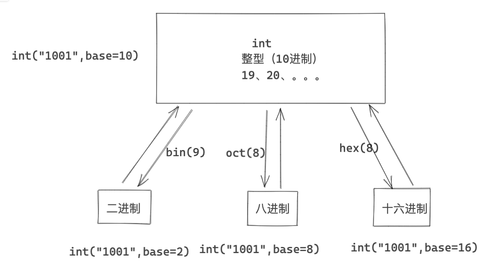

# day02 数据类型（上）

数据类型的概要：

```
	  类		基于str类实例化出来的对象
字符串 str(upper) ："中国"	"日本"	"台湾省"
列表	list ：[1,2,3]	["王平安","欧阳"]
字典	dict ：{"k1":123,"k2":345}	{"age":"xx","name":"alex"}
元组	tuple
集合	set
布尔	bool
特殊  None
```

```python
name = "root"
val = name.upper()
print(val) # "ROOT"
```


## 今日概要

- int
- None
- bool
- str
- list
- tuple
- dict


## 1.整型（int）

```
age = 18

其他进制：
v2 = "010100100101"
v8 = "010100100101"
v16 = "010100100101"
```



```python
v1 = 982

v2 = bin(v1)
v3 = oct(v1)
v4 = hex(v1)
```

```python
# 0b1111010110 0o1726 0x3d6
v1 = "0b1111010110"
v2 = int(v1,base=2)
```


### 练习题

```python
ip = "192.168.11.23"

# 1.切割成四个数字
data_list = ip.split(".")  # ["192","168","11","23"]

# 2.获取列表的第一个值
v1 = data_list[0] # "192"

# 3.整型
v2 = int(v1) # 192

# 4.二进制
v3 = bin(v2) # "0b10010010101"
```


## 2.None

```python
v1 = ""
..
...
v1 = "武沛齐"
```

```python
v2 = None
v2 = "武沛齐"
```


None转化布尔值也是False。


## 3.布尔类型（bool）

都有哪些东西转成bool是False：

- 0
- ""
- None
- []
- ()
- {}

## 4.字符串类型（str）

```python
v1 = "root"
data = v1.upper()

print(v1) # root
print(data) # ROOT
```

```python
v1 = [11,22,33]
v1.append(44)

print(v1) # [11,22,33,44]
```

### 4.1 独有功能

- startswith、endswith

  ```python
  name = "root"
  
  # True/False
  v1 = name.startswith("xx")
  ```

  ```python
  addr = input("地址：")
  
  if addr.startswith("北京"):
      print("京户")
  else:
      print("非京户")
  ```

- upper/lower

  ```python
  name = "root"
  
  v1 = name.upper()
  print(v1) # ROOT
  ```

  ```python
  while True:
      num = input("请输入数字（q/Q）：")
      data = num.upper()
      if data == "Q":
          break
  ```

- isdecimal，判断输入的字符串是否是整数

  ```python
  print("欢迎使用xx系统")
  print("1.登录;2.注册;3.注销...")
  choice = input("请选择：")
  
  if choice.isdecimal():
      data = int(choice)
      print("序号是：", data)
  else:
      print("序号选择错误")
  ```

  ```python
  v1 = "②"
  
  print(v1.isdecimal())  # True
  print(v1.isdigit())  # True
  ```

- strip/lstrip/rstrip

  ```python
  v1 = " 路飞 "
  
  print(len(v1))  # 4
  
  res = v1.strip()
  print(res, len(res))  # 2
  ```

  ```python
  text = "中国的国中"
  
  res = text.rstrip("中")
  print(res) # 中国的国
  ```

  ```python
  text = "中国的国中"
  
  res = text.rstrip("国中")
  print(res) # 中国的
  ```

  ```python
  text = "中国的国中"
  
  res = text.rstrip("国")
  print(res)  # 中国的国中
  ```

  ```python
  text = "中国的国中"
  
  res = text.rstrip("中国")
  print(res) # 中国的
  ```

- replace

  ```python
  name = "日本人是人"
  data = name.replace("日本","**")
  
  print(data) # "**人是人"
  ```

  ```python
  text = "刘森和王卓是好基友"
  
  text.replace("刘森","**")
  text.replace("王卓","xx")
  
  print(text) # **和xx是好基友
  print(text) # 刘森和xx是好基友
  ```

  ```python
  text = "刘森和王卓是好基友"
  
  v1 = text.replace("刘森","**") 
  v2 = v1.replace("王卓","xx")
  
  print(v2) # **和xx是好基友
  ```

  ```python
  text = "刘森和王卓是好基友"
  
  text = text.replace("刘森","**") 
  text = text.replace("王卓","xx") 
  ```

  ```python
  text = input(">>>") # 王卓今天和欧阳一起玩，玩到深夜去找刘森，被刘森骂了出来。
  
  data_list = ["王卓","刘森","欧阳"]
  for item in data_list:
  	# item="王卓" "刘森","欧阳"
      # **今天和欧阳一起玩，玩到深夜去找**，被**骂了出来。
      text = text.replace(item,"**") 
  ```

- split/rsplit

  ```python
  ip = "192.168.11.11"
  data_list = ip.split(".") # ["192","168","11","11"]
  ```

  ```python
  ip = "192.168.11.11"
  data_list = ip.split(".", maxsplit=1)
  
  print(data_list)  # ['192', '168.11.11']
  ```

  ```python
  file_path= "C:\xxx\xxx\xx.mp4"
  data_list = file_path.rplit(".",maxsplit=1) # ["C:\xxx\xxx\xx","mp4"]
  ```

  ```python
  cls_path = "xx.xxxx.xxx.xxx.UserInfo"
  cls_path.rsplit(".",maxsplit=1)
  ```

- join

  ```python
  res = "*".join(["192","188"])
  print(res) # "192*188"
  ```

  ```python
  #'aid=246387571&auto_play=0&cid=289008441&did=KREhESMUJh8tFCEVaRVpE2taPQk7WChCJg&epid=0&ftime=1627100937&lv=0&mid=0&part=1&sid=0&stime=1627104372&sub_type=0&type=3'
  
  data_list = ["aid=246387571","auto_play=0","cid=289008441"]
  
  res = "&".join(data_list)
  print(res)
  ```

  ```python
  param = {
      "aid":"246387571",
      "auto_play":"0",
      "cid":"289008441",
  }
  
  # data_list = ["aid=246387571","auto_play=0","cid=289008441"]
  data_list = []
  
  # 1.循环字典，并添加到列表中
  for k,v in param.items():
      # k=aid v=246387571
      ele = "{}={}".format(k,v) # "aid=246387571"
  
      data_list.append(ele)
      
  # 2.拼接起来
  res = "&".join(data_list)
  print(res)
  ```

- center / ljust / rjust / zfill

  ```python
  name = "董国鹏"
  
  res = name.center(13, "*")
  print(res)
  ```

  ```python
  name = "董国鹏"
  
  res = name.ljust(13, "*")
  print(res)
  ```

  ```python
  name = "董国鹏"
  
  res = name.rjust(13, "*")
  print(res)
  ```

  ```python
  name = "101"
  
  res = name.zfill(10)
  print(res) # 0000000101
  ```


### 4.2 公共功能

- 长度

  ```python
  v = len("alex烧饼")
  ```

- 索引，下标

  ```python
  #       0 1 23 4 5
  name = "中国北京昌平"
  
  name[0]
  name[1]
  name[2]
  name[ len(name)-1 ]
  name[-1]
  ```

  循环输出字符串中的每一个字符。

  ```python
  1.括号
  	print()
      input()
      range()
      len()
      
      取索引
      	name = "中国北京昌平"
      	name[2]
  	列表数据类型
      	v1 = [11,22,33,44,55]
  2.语法规则
  	if xx:
          pass
      else:
          pass
      
      for x in xx:
          pass
      
      while True:
          pass
      
  3.循环
  	- while循环
      	count = 0
      	while True:
  			print(count)
              count += 1
          
  	- for循环
      	range(5)
          for i in range(5):
              # 0/1/2/3/4
  ```

  ```python
  # while循环
  
  name = "中国北京昌平"
  count = 0
  while True:
      print(name[count])
      count += 1
      if count == len(name):
          break
  ```

  ```python
  name = "中国北京昌平"
  for i in range(len(name)): # [0,1,2,3,4,5]
      print(name[i])
  ```

  ```python
  text = "alex是我们的大傻儿子"
  for i in text:
      print(i)
  ```

- 切片

  ```python
  #       0 1 23 4 5
  #             -2 -1
  name = "中国北京昌平"
  
  v1 = name[0:2]  # 中国
  print(v1)
  
  v2 = name[1:5]  # 国北京昌
  print(v2)
  
  v3 = name[1:-1]  # 国北京昌
  print(v3)
  
  v4 = name[1:]  # 国北京昌平
  print(v4)
  
  v5 = name[:-1]  # 中国北京昌
  print(v5)
  
  v6 = name[:]  # 中国北京昌平
  print(v6)
  
  ```

  ```python
  v1 = 187
  
  v2 = bin(v1) # 0b01010101
  res = v2[2:]
  
  print(res)
  ```

- 步长

  ```python
  #       0 1 23 4 5
  #             -2 -1
  name = "中国北京昌平"
  name[0:5:2]
  ```

  ```python
  name = "中国北京昌平"
  res = name[::-1]
  print(res)
  ```

  ```python
  name = "中国北京昌平"
  
  char_list = []
  for i in range(len(name) - 1, -1, -1):  # [5,4,3,2,1,0]
      char = name[i]
      char_list.append(char)
  
  res = "".join(char_list)
  print(res)
  ```

- 包含

  ```python
  name = "中国北京昌平"
  v1 = "北京" in name
  ```

  ```python
  name = "中国北京昌平"
  if "北京" in name:
      pass
  else:
      pass
  ```

  

### 练习题

1. 提示用户持续录入敏感字符串 ，直到输入(Q/q)终止。每输入一个敏感字符串，就在列表中添加一个。

   ```python
   data = []
   data.append(1)
   data.append("xx")
   print(data)
   ```

   ```python
   data_list = []
   while True:
       data = input("请输入（q/Q）：")
       if data == "q" or data == "Q":
           break
       data_list.append(data)
   print(data)
   ```

   ```python
   data_list = []
   while True:
       data = input("请输入（q/Q）：")
       if data.upper() == "Q":
           break
       data_list.append(data)
   print(data)
   ```

   ```python
   data_list = []
   while True:
       data = input("请输入（q/Q）：")   
       data = data.strip()
       if not data:
           print("输入不能为空")
           continue
       if data.upper() == "Q":
           break
       data_list.append(data)
   print(data)
   ```

   ```python
   data_list = []
   while True:
       data = input("请输入（q/Q）：").strip()
       if not data:
           print("输入不能为空")
           continue
       if data.upper() == "Q":
           break
       data_list.append(data)
   print(data)
   ```

   ```python
   text = "沙河是一个美丽如绕的城市"
   
   text = text.replace("沙","潮白").replace("美丽","魅力").strip()
   ```

2. 提示用户输入两个值，保证两个值都要是数字（一直输入指导是数字），两个数字相加。

   ```python
   while True:
       num1 = input("请输入数字：").strip()
       if not num1:
           print("输入不能为空")
           continue
       if num1.isdecimal():
           num1 = int(num1)
           break
   
   while True:
       num2 = input("请输入数字：").strip()
       if not num2:
           print("输入不能为空")
           continue
       if num2.isdecimal():
           num2 = int(num2)
           break
   
   res = num1 + num2
   print(res)
   ```

   ```python
   while True:
       num1 = input("请输入数字：").strip()
       num2 = input("请输入数字：").strip()
       if num1.isdecimal() and num2.isdecimal():
           res = int(num1) + int(num2)
           print(res)
           break
       print("输入错误，请重新输入")
   ```

   ```python
   num_list = []
   while True:
       num = input("请输入数字：").strip()
       if not num:
           print("输入不能为空")
           continue
       if num.isdecimal():
           num_list.append(int(num))
           if len(num_list) == 2:
               break
       else:
           print("格式不合法")
   
   res = num_list[0] + num_list[1]
   ```

3. 遍历一个目录下所有的文件，找到所有 `png` or `PNG` 后缀的文件。

   ```python
   file_name = "xxxxx.png"
   
   # ["xxxxxx","png"]
   data_list = file_name.rsplit(".",maxsplit=1)
   
   ext = data_list[-1]
   ```

   ```python
   # 遍历目录下的所有文件
   import os
   
   file_name_list = os.listdir(r"/Users/wupeiqi/PycharmProjects/day02")
   
   # ['log.txt', '1.初识数据类型.py', '.idea']
   for file_name in file_name_list:
       print(file_name,type(file_name))
   ```

   ```python
   import os
   
   # 1.遍历目录下所有的文件和文件夹并放入列表
   file_name_list = os.listdir("/Users/wupeiqi/PycharmProjects/day02")
   
   # 2.循环这个列表，获取每个文件名称
   for file_name in file_name_list:
       data_list = file_name.rsplit(".", maxsplit=1)
       # 获取扩展名
       ext = data_list[-1]
       # 判断是否是png
       if ext.lower() == 'png':
           print(file_name)
   ```

4. 让用户输入一段文本，遍历文本的每个字符，如果是数字则追加到列表；然后将所有的字符串拼接起来；再将拼接起来的字符串转换成整形；再转换成二进制；不要前面0b。

   ```python
   data_list = ["1","4","9"]
   
   res = "".join(data)
   print(res) # "149"
   ```

   ```python
   data_list = []
   
   text = input("请输入：")
   for i in text:
   	if i.isdecimal():
           data_list.append(i)
   
   print(data_list)
   ```

   ```python
   data_list = []
   
   text = input("请输入：")
   for i in text:
       if i.isdecimal():
           data_list.append(i)
   
   data_string = "".join(data_list)
   data_int = int(data_string)
   data_bin_string = bin(data_int)
   print(data_bin_string[2:])
   ```

   ```python
   data_list = []
   
   text = input("请输入：")
   for i in text:
       if i.isdecimal():
           data_list.append(i)
   
   res = bin(int("".join(data_list)))[2:]
   print(res)
   ```


## 5.列表（list）

```python
data = [1,1,True,None,"",[11,22,34],"xxx"]
```


### 5.1独有功能

- 追加

  ```python
  data = []
  data.append(11)
  data.append(22)
  
  print(data) # [11,22]
  ```

- 插入

  ```python
  data = ["王卓", "于明宇"]
  
  data.insert(0, "欧阳")
  
  print(data) # ["欧阳","王卓", "于明宇"]
  ```

- 删除（值）

  ```python
  data = ["欧阳", "王卓", "于明宇"]
  
  data.remove("王卓")
  
  print(data)
  ```

  ```python
  data = ["欧阳", "王卓", "于明宇"]
  
  v1 = data.pop(2)
  
  print(data) # ["欧阳", "王卓"]
  print(v1) # "于明宇"
  ```

  ```python
  # 练习题1
  user_list = []
  
  while True:
      user = input("请输入用户名：").strip()
      pwd = input("请输入密码：").strip()
      item = "{},{}".format(user,pwd)
      user_list.append(item)
  ```

  ```python
  # 练习题2
  user_list = []
  while True:
      name = input("姓名：")
      if name.startswith("李"):
          user_list.insert(0,name)
  	else:
          user_list.append(name)
  ```

  ```python
  # 订票系统
  user_list = []
  while True:
      name = input("姓名：")
      if name.upper() == 'Q':
          break
      user_list.append(name)
      
  # 获取前三个人
  u1 = user_list.pop(0)
  u2 = user_list.pop(0)
  u3 = user_list.pop(0)
  print(u1,u2,u3)
  
  # 买不到票的人
  user_string = ",".join(user_list)
  message = "抱歉，以下人员无票:{}".format(user_string)
  print(message)
  ```

- 排序

  ```python
  num_list = [11, 22, 33, 9, 10, 90]
  
  print(num_list)
  # num_list.sort() # 从小到大
  num_list.sort(reverse=True)  # 从大到小
  print(num_list)
  ```

  ```python
  num_list = ["root-1", "alex-2", "李杰-3", "土鳖-4"]
  
  print(num_list)
  # num_list.sort() # 从小到大
  num_list.sort(reverse=True)  # 从大到小
  print(num_list)
  ```


### 5.2 公共功能

- 长度 len([11,22,33])

- 索引

  ```python
  num_list = ["root-1", "alex-2", "李杰-3", "土鳖-4"]
  
  num_list[0]
  num_list[1]
  num_list[-1]
  
  num_list[1] = "xxxx"
  print(num_list)
  
  del num_list[0]
  ```

- 切片

  ```python
  num_list = ["root-1", "alex-2", "李杰-3", "土鳖-4"]
  
  num_list[0:3]
  ```

- for循环

  ```python
  num_list = ["root-1", "alex-2", "李杰-3", "土鳖-4"]
  for item in num_list:
      print(item)
  ```

- 包含

  ```python
  v1 = "root" in ["root-1", "alex-2", "李杰-3", "土鳖-4"]
  ```

  ```python
  data_list = ["root-1", "alex-2", "李杰-3", "土鳖-4"]
  if "root" in data_list:
      print('...')
  else:
      print("...")
      
  ```

  

### 5.3 嵌套

```python
data_list = [
	1,
	5,
	True,
	None,
	"路飞",
	[11,22,33],
	["99","alex", [99,88,56], "root"]
]
```

```python
data_list[0] 
data_list[3] 
data_list[4][0] 
data_list[5][-1] 
data_list[6][1][-1] 
```

```python
data_list.append(999)
data_list[-1].append(999)
data_list[-1][2].append(999)
data_list[-1][1].upper()
```


案例：循环提示用户注册，输入Q/q终止

```python
user_list = [
    ["用户名","密码 "],
    ["用户名","密码 "],
    ["用户名","密码 "],
]
```

```python
user_list = []

v1 = ["root","123"]
user_list.append(v1)

v2 = ["root","123"]
user_list.append(v2)

v3 = ["root","123"]
user_list.append(v3)

print(user_list)
```

```python
user_list = []

while True:
    user = input("请输入用户名:")
    if user.upper() == "Q":
        break
    pwd = input("请输入密码:")    

    v1 = []
    v1.append(pwd)
    v1.append(user)    
    
    user_list.append(v1)

print(user_list)
```

```python
v1 = [11,22,33]

n1 = 11
n2 = 22
v2 = [n1,n2]
```

```python
user_list = []

while True:
    user = input("请输入用户名:")
    if user.upper() == "Q":
        break
    pwd = input("请输入密码:")    

    v1 = [user,pwd] 
    
    user_list.append(v1)

print(user_list)
```

```python
user_list = []

while True:
    user = input("请输入用户名:")
    if user.upper() == "Q":
        break
    pwd = input("请输入密码:")    
   
    user_list.append(   [user,pwd]    )

print(user_list)
```


继续实现：用户登录。

```python
user_list = [
    ["root","123 "],
    。。。
    ["admin","123 "],
]
```


```python
user_list = []

while True:
    user = input("请输入用户名:")
    if user.upper() == "Q":
        break
    pwd = input("请输入密码:")    
   
    user_list.append(   [user,pwd]    )

# 1.提示用户输入用户名和密码
username = input("用户名：")
password = input("用户名：")

# 2.校验
is_success = False
for item in user_list:
    if item[0] == username and item[1] == password:
		is_success = True
        break

if is_success:
    print("登录成功")
else:
    print("登录失败")
```


## 6.元组 （tuple）

元素不可以被修改的一个容器。

```python
# 列表
v1 = [11,22,33]

# 元组
v2 = (11,22,33)
```


### 6.1 独有功能（无）


### 6.2 公共功能

- 长度

  ```python
  v2 = (11,22,33)
  data = len(v2)
  print(data) # 3
  ```

- 索引

  ```python
  v3 = (11,22,33)
  
  v3[0]
  v3[-1]
  v3[ len(v3) -1   ]
  ```

- 切片

  ```python
  num = ("root", "alex", "李杰", "土鳖")
  
  data = num[1:3]
  print(data) # ('alex', '李杰')
  ```

- for循环

  ```python
  num = ("root", "alex", "李杰", "土鳖")
  for item in num:
      print(item)
  ```

- 包含

  ```python
  num = ("root", "alex", "李杰", "土鳖")
  if "xx" in num:
      pass
  else:
      pass
  ```


### 6.3 嵌套

```python
data = (
	1,
    True,
    "",
    "alex",
    (11,22,[11,22,33],33),
    [11,22,33,(999,666),44]
)
```

```python
data[0]
data[-2][-1]
data[-2][-2][1]
```

```python
data[0] = 9989 # 失败
data[-1].append(9989) # 成功
```


### 6.4 必考题

```python
v4 = (123,123)
v5 = (123,123,)
```

```python
v4 = (123)
v5 = (123,)
```

```python
v1 = 123
v2 = (123)
v3 = (123,)
```


## 练习题

```python
user_list = [
    ("用户","密码")
]
```

```python
user_list = []
while True:
    user = input(">>>")
    pwd = input(">>>")
    
    item = (user,pwd, )
    user_list.append(item)
```

生成一副扑克牌。

```python
poke_list = [
    ("黑桃",1),
    ("黑桃",2),
    ("黑桃",3),
]
```

```python
color_list = ["黑桃","红桃","方片","梅花"]
num_list = range(1,14)

poke_list = []

for color in color_list:
    # color = "黑桃"
    for num in num_list:
        # num = 1 2 3 4 ... 13
        item = (color,num)
        poke_list.append(item)
print(poke_list)
```

```python
import random

color_list = ["黑桃", "红桃", "方片", "梅花"]
num_list = range(1, 14)

poke_list = []

for color in color_list:
    # color = "黑桃"
    for num in num_list:
        # num = 1 2 3 4 ... 13
        item = (color, num)
        poke_list.append(item)

user_poker_list = []
for i in range(3):
    index = random.randint(0, len(poke_list) - 1)
    tuple_item = poke_list.pop(index)
    user_poker_list.append(tuple_item)


result = 0
for item in user_poker_list:
    number = item[-1]
    result += number

print(result)


```

现在：有三个人，每个人抽三张牌。

```python
import random

color_list = ["黑桃", "红桃", "方片", "梅花"]
num_list = range(1, 14)

poke_list = []

for color in color_list:
    # color = "黑桃"
    for num in num_list:
        # num = 1 2 3 4 ... 13
        item = (color, num)
        poke_list.append(item)

"""
[
    [('方片', 12), ('黑桃', 1), ('黑桃', 2)],
    [('梅花', 1), ('红桃', 7), ('方片', 5)],
    [('梅花', 9), ('红桃', 1), ('梅花', 11)]
]
"""

total_user_list = []
for _ in range(3):
    user_poker_list = []
    for i in range(3):
        index = random.randint(0, len(poke_list) - 1)
        tuple_item = poke_list.pop(index)
        user_poker_list.append(tuple_item)
    total_user_list.append(user_poker_list)

print(total_user_list)
score_list = []
for item_list in total_user_list:
    score = 0
    for item in item_list:
        score += item[-1]
    score_list.append(score)

print(score_list)

# result = 0
# for item in user_poker_list:
#     number = item[-1]
#     result += number
#
# print(result)
```


