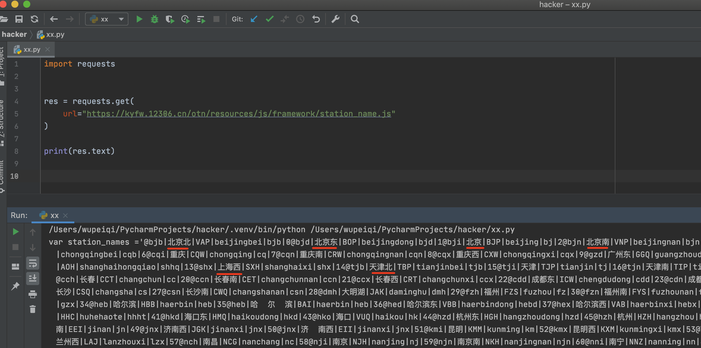

## 作业A

> 注意：
>
> - 与我沟通过的那几个学员，仅提交此作业A（忽略作业B）。
> - 其他同学可以把作业A当做练习题（无需提交），仅提交作业B即可。


1. 哪些是可变类型：str、list、tuple、dict、set、int 。

2. 现有列表 `l1 = [1, 2, 3, 4, 5] `, 那么执行 `l1[1:3]` 的结果是多少？

3. 将字符串`text = "wupeiqi|alex|eric"`根据 `|` 分割为列表 。

4. 先有列表 `li=['alex','eric','rain']`，请通过 `_`将所有内容拼接起来。

5. 请将字符串 `li=['alex','wupeiqi',123,23,54,7,4,7] `，中的字符串类型筛选出来并放入到列表中，然后再用`*`拼接起来。

6. 有字典 `dic = {'k1': "v1", "k2": "v2", "k3": [11,22,33]}`。

   ```
   a.请循环输出所有的key
   b.请循环输出所有的value
   c.请循环输出所有的key和value
   ```

7. 有字符串 `text = "k:1|k1:2|k2:3|k3:4"`, 请将字符串处理成字典 `{'k':1,'k1':2....} `。

8. 有列表 `data_list = [11,22,33,44,55,11,22,55]`，请将列表中的元素去重。

9. 写代码实现选课系统

   ```python
   course_info = {
       11:{"title":"毛概","teacher":"alex"},
       22:{"title":"高数","teacher":"张扬"},
       31:{"title":"数据结构","teacher":"闵杰"},
   }
   # 1. 展所有的课程，格式如下：
   	11-毛概（alex）
   	22-高数（张扬）
   	31-数据结构（闵杰）   
       
   # 2.用户选择课程ID进行选课。
   
   # 3.将用户选择的课程全部加入到列表。
   
   ```

10. 看代码写结果

    ```python
    v1 = [11,22,33]
    v2 = [11,22,33]
    v1.append(666)
    
    print(v1)
    print(v2)
    ```

11. 看代码写结果

    ```python
    v1 = [11,22,33]
    v2 = v1
    v1.append(666)
    
    print(v1)
    print(v2)
    ```

12. 定义函数，需要2个都是整型的参数，函数内部返回值较大的那个值。

13. 定义函数，可以接收任意个位置参数，统计参数中字符串类型的个数，并返回。

14. 函数的默认返回值是什么？

15. 以下代码输出什么？

    ```python
    def func(*args):
        print(args[0])
        
    v1 = func(11,22,33,44)
    print(v1)
    ```

    ```python
    def func(args):
        print(args[0])
        
    v1 = func([11,22,33,44])
    print(v1)
    ```

    ```python
    def func(*args):
        print(args[0])
        
    v1 = func([11,22,33,44])
    print(v1)
    ```

    ```python
    def func(*args):
        print(args[0])
        
    v1 = func(*[11,22,33,44])
    print(v1)
    ```

16. 以下代码输出什么？

    ```python
    def func(data):
        data.append(999)
        
    v1 = [11,22,33]
    func(v1)
    print(v1)
    ```

    ```python
    def func(data):
        data.strip()
        
    v1 = " root "
    func(v1)
    print(v1)
    ```

17. 发送请求获取如下格式的数据，写函数，在函数内部实现对原数据进行解析，提取火车站点名称并添加到列表中，最终将列表在函数中返回。

    ```python
    import requests
    res = requests.get(
        url="https://kyfw.12306.cn/otn/resources/js/framework/station_name.js"
    )
    print(res.text)
    ```

    

18. 补充代码实现，资源下载器。

    ```python
    import requests
    
    
    def download(file_name, url):
        res = requests.get(
            url=url,
            headers={
                "User-Agent": "Mozilla/5.0 (Macintosh; Intel Mac OS X 10_15_7) AppleWebKit/537.36 (KHTML, like Gecko) Chrome/87.0.4280.88 Safari/537.36"
            }
        )
    
        with open(file_name, mode="wb") as f:
            f.write(res.content)
    
    
    def run():
        image_dict = {
            "1": ("吉他男神", "https://hbimg.huabanimg.com/51d46dc32abe7ac7f83b94c67bb88cacc46869954f478-aP4Q3V"),
            "2": ("漫画美女", "https://hbimg.huabanimg.com/703fdb063bdc37b11033ef794f9b3a7adfa01fd21a6d1-wTFbnO"),
            "3": ("游戏地图", "https://hbimg.huabanimg.com/b438d8c61ed2abf50ca94e00f257ca7a223e3b364b471-xrzoQd"),
            "4": ("alex媳妇", "https://hbimg.huabanimg.com/4edba1ed6a71797f52355aa1de5af961b85bf824cb71-px1nZz"),
        }
    
        # 1.展示图片信息，格式如下：
        """
        1.吉他男神
        2.漫画美女
        3.游戏地图
        4.alex媳妇
        """
    
        # 2.用户选择序号，输出当前用户选择的序号对应的URL
    
        # 3.拼接文件名，文件名 = 标题.mp4
        #    例如：用户选择2，那么拼接后的文件名就是： 漫画美女.png
    
        # 4.执行函数下载图片 download(文件名,URL)  【已实现，直接调用即可】
    
    run()
    ```

19. 下面的代码执行后，结果是什么？

    ```python
    def func(num):
        return num + 100
    
    v1 = [ func, func, func]
    print(v1)
    ```

    ```python
    def func(num):
        return num + 100
    
    v2 = [ func(1), func(1), func(2)]
    print(v2)
    ```

20. 补充代码实现用户管理。

    ```python
    import requests
    
    USER_LIST = []
    
    
    def register():
        """ 用户注册 """
    
        # 1.循环提示用户输入  用户名  密码（输入q/Q 停止注册）
    
        # 2.将用户名和密码构建成字典 {"name":"用户输入密码","pwd":"用户输入的密码"}，并添加到全局变量 USER_LIST中
    
    
    def show_users():
        """ 查询用户信息 """
    
        # 1. 获取全局变量中USER_LIST，并实现所有的用户信息
    
        # 2. 构造每一行数据，然后输出（每个用户的密码的后四位用 * 代替），例如：
        """输出
        用户名：wupeiqi，密码：123f****
        用户名：wupeiqi，密码：123f****
        用户名：wupeiqi，密码：123f****
        """
    
    
    
    
    def run():
        func_dict = {
            "1": register,
            "2": show_users,
        }
        print("欢迎使用xx系统")
        while True:
            print("1.注册；2.查看用户列表")
            choice = input("请输入序号：")
            if choice.upper() == 'Q':
                return
            func = func_dict.get(choice)
            if not func:
                print("输入错误")
                continue
            func()
    
    
    run()
    ```

    

## 作业B

根据要求实现资源下载器。

- 启动后，让用户选择专区，每个专区用单独的函数实现，提供的专区如下：

  - 下载 花瓣网图片专区
  - 下载 抖音短视频专区
  - 下载 NBA锦集 专区

- 在用户选择了某个功能之后，表示进入某下载专区，在里面循环提示用户可以下载的内容选项，用户只要选择序号就可以下载指定的资源。

- 在某个专区中，如果用户输入（Q/q）表示 退出上一级，即：回到选择专区。

- 在选择专区如果输入Q/q则退出整个程序。

- 每个专区实现下载的案例如下：

  - 图片

    ```python
    # 可供用户下载的图片如下
    image_dict = {
        "1":("吉他男神","https://hbimg.huabanimg.com/51d46dc32abe7ac7f83b94c67bb88cacc46869954f478-aP4Q3V"),
        "2":("漫画美女","https://hbimg.huabanimg.com/703fdb063bdc37b11033ef794f9b3a7adfa01fd21a6d1-wTFbnO"),
        "3":("游戏地图","https://hbimg.huabanimg.com/b438d8c61ed2abf50ca94e00f257ca7a223e3b364b471-xrzoQd"),
        "4":("alex媳妇","https://hbimg.huabanimg.com/4edba1ed6a71797f52355aa1de5af961b85bf824cb71-px1nZz"),
    }
    ```

    ```python
    # 下载图片示例
    import request
    
    res = requests.get(
        url="https://hbimg.huabanimg.com/4edba1ed6a71797f52355aa1de5af961b85bf824cb71-px1nZz",
        headers={
            "User-Agent": "Mozilla/5.0 (Macintosh; Intel Mac OS X 10_15_7) AppleWebKit/537.36 (KHTML, like Gecko) Chrome/87.0.4280.88 Safari/537.36"
        }
    )
    
    with open("alex媳妇.png",mode="wb") as f:
        f.write(res.content)
    ```

  - 短视频

    ```python
    # 可供用户下载的短视频如下
    video_dict = {
    	"1":{"title":"东北F4模仿秀",'url':"https://aweme.snssdk.com/aweme/v1/playwm/?video_id=v0300f570000bvbmace0gvch7lo53oog"},
    	"2":{"title":"卡特扣篮",'url':"https://aweme.snssdk.com/aweme/v1/playwm/?video_id=v0200f3e0000bv52fpn5t6p007e34q1g"},
    	"3":{"title":"罗斯mvp",'url':"https://aweme.snssdk.com/aweme/v1/playwm/?video_id=v0200f240000buuer5aa4tij4gv6ajqg"},
    }
    ```

    ```python
    # 下载视频示例
    import requests
    
    res = requests.get(
        url="https://aweme.snssdk.com/aweme/v1/playwm/?video_id=v0200f240000buuer5aa4tij4gv6ajqg",
        headers={
            "user-agent": "Mozilla/5.0 (Macintosh; Intel Mac OS X 10_15_7) AppleWebKit/537.36 (KHTML, like Gecko) Chrome/87.0.4280.88 Safari/537.36 FS"
        }
    )
    with open('罗斯mvp.mp4', mode='wb') as f:
        f.write(res.content)
    ```

  - NBA

    ```python
    # 可供用户下载的NBA视频如下
    nba_dict = {
        "1":{"title":"威少奇才首秀三双","url":"https://aweme.snssdk.com/aweme/v1/playwm/?video_id=v0200f3e0000bv52fpn5t6p007e34q1g"},
        "2":{"title":"塔图姆三分准绝杀","url":"https://aweme.snssdk.com/aweme/v1/playwm/?video_id=v0200f240000buuer5aa4tij4gv6ajqg"}
    }
    ```

    ```python
    # 下载示例
    import requests
    
    res = requests.get(
        url="https://aweme.snssdk.com/aweme/v1/playwm/?video_id=v0d00fb60000bvi0ba63vni5gqts0uag&ratio=720p&line=0",
        headers={
            "user-agent": "Mozilla/5.0 (Macintosh; Intel Mac OS X 10_15_7) AppleWebKit/537.36 (KHTML, like Gecko) Chrome/87.0.4280.88 Safari/537.36 FS"
        }
    )
    with open('塔图姆三分准绝杀.mp4', mode='wb') as f:
        f.write(res.content)
    ```

  


