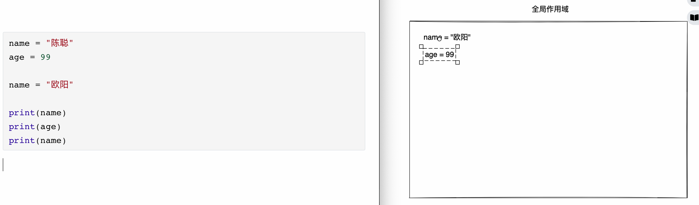
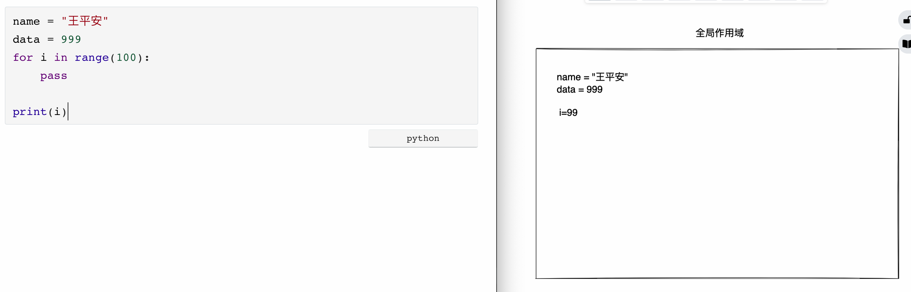
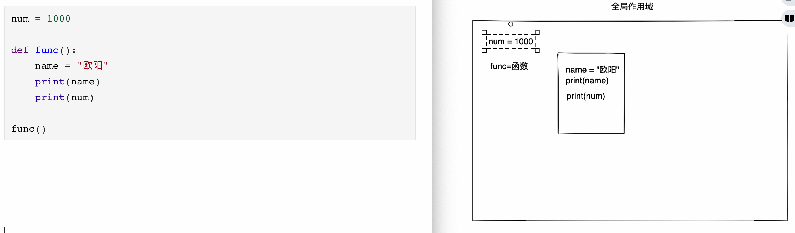
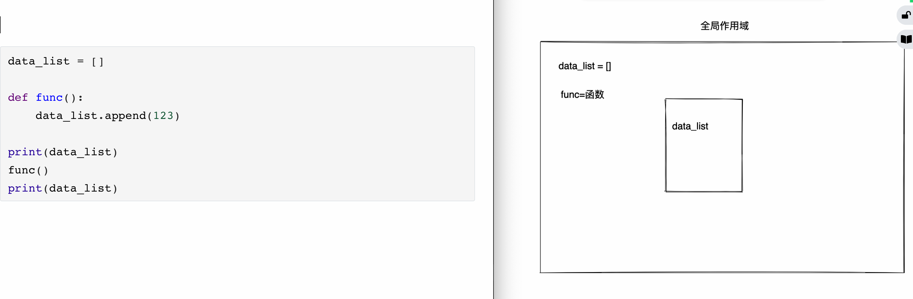
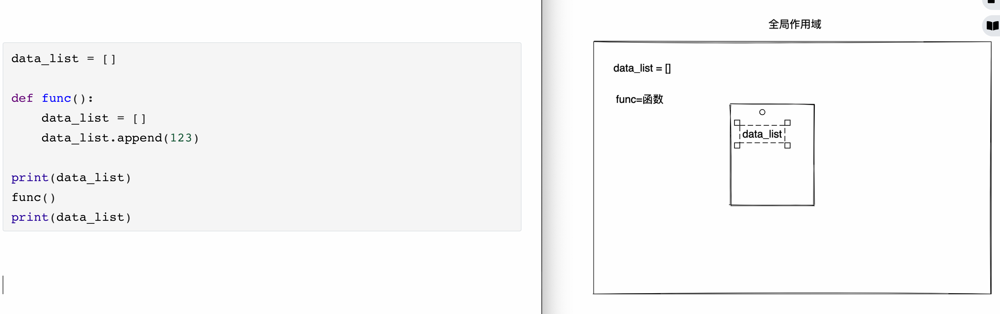

# day04 函数

今日概要：

- 函数基础
  - 定义函数
  - 参数
  - 返回值
- 函数进阶
  - 作用域（全局和局部变量）
  - 参数传递易错点
  - 嵌套

- 函数高级
  - 闭包
  - 装饰器
  - 生成器


## 知识补充和作业

- 列表，支持相加。

  ```python
  v1 = [11,22]
  v2 = [33,44]
  v3 = v1 + v2 
  ```

- 列表，批量追加

  ```python
  v1 = [11, 22]
  v1.extend([55, 66, 77, 88])
  print(v1)
  ```

- 推导式中的嵌套

  ```python
  data = []
  for i in range(10):
      data.append(i)
  
  data = [ i for i in range(10)]
  ```

  ```python
  data = []
  for i in ["红桃","黑桃"]:
      for j in [1,2,3]:
      	data.append(i,j)
  
  data = [ (i,j) for i in ["红桃","黑桃"] for j in [1,2,3] ]
  # [ ("红桃",1),("红桃",2),("红桃",3),("黑桃",1),("黑桃",2)]
  ```

- 规范

  - 外部有循环

    ```python
    while True:
    	if xxx:
    		pass
        	continue / break
    	pass
    ```

  - 简单逻辑先处理


## 上节作业：11点游戏

- 发牌，判断分值。
- 生成牌直接是分值。


~~~python
"""
 需求：

    - 生成一副扑克牌（自己设计扑克牌的结构，小王和大王可以分别用14、15表示 ）

    - 3个玩家

      ```python
      user_list = ["alex","武沛齐","李路飞"]
      ```

    - 发牌规则

      - 默认先给用户发一张牌，其中 J、Q、K、小王、大王代表的值为0.5，其他就是则就是当前的牌面值。
      - 用户根据自己的情况判断是否继续要牌。
        - 要，则再给他发一张。
        - 不要，则开始给下个玩家发牌。
      - 如果用户手中的所有牌相加大于11，则表示爆了，此人的分数为0，并且自动开始给下个人发牌。

"""
import random

# 1.生成扑克牌
"""
poke_list = [("大王", 15), ("大王", 14), ]
color_list = ["红桃", "黑桃", "梅花", "方片"]
num_list = range(1, 14)

for color in color_list:
    for num in num_list:
        poke_list.append((color, num,))
"""
poke_list = [(color, num) for color in ["红桃", "黑桃", "梅花", "方片"] for num in range(1, 14)]
poke_list.extend([("大王", 15), ("大王", 14), ])

# 打乱列表中数据的顺序
# random.shuffle(poke_list)

print(poke_list)

# 2.三个玩家
user_list = ["alex", "武沛齐", "李路飞"]

result = {}

# 3.发票（逐一发牌）
for user in user_list:
    score = 0

    # 3.1 先发一张牌
    idx = random.randint(0, len(poke_list) - 1)
    poker = poke_list.pop(idx)

    # 解包
    _, num = poker

    # 分值
    if num > 10:
        score += 0.5
    else:
        score += num

    while True:
        # 3.2 是否继续
        choice = input("是否继续（y/n):")
        choice = choice.upper()

        # 3.3 判断输入的合法性
        if choice not in {"Y", "N"}:
            print("输入错误，请重新输入")
            continue

        # 3.4 输入N
        if choice == "N":
            result[user] = score
            break

        # 3.5 输入Y
        idx = random.randint(0, len(poke_list) - 1)
        poker = poke_list.pop(idx)
        _, num = poker
        if num > 10:
            score += 0.5
        else:
            score += num

        # 3.6 判断是否爆了
        if score <= 11:
            continue

        print("超过11点，爆了")
        score = 0
        result[user] = score
        break
~~~


## 1. 初识函数

```python
name = "陈聪"

def f1():
    print(123)
    print(123)
    print(123)
    print(123)
    
print( f1 ) # 变量，代指函数（多行代码的集合）
f1()   # 执行函数
```

```python
def 函数名():
    print(123)
    print(666)
    ...
    
函数名()
```

函数有什么意义？

```python
# 监控系统

if CPU > 90%:
    发送邮件报警10行代码

if 硬盘 > 95%:
    发送邮件报警10行代码

if 内存 > 99%:
    发送邮件报警10行代码
```

```python
def send_email():
    发送邮件报警10行代码
    
if CPU > 90%:
    send_email()

if 硬盘 > 95%:
    send_email()

if 内存 > 99%:
    send_email()
```

当我们的程序出现可重用的代码时，可以通过函数解决。【增强代码的重用性】


```python
import random

def create_poke():
    
    poke_list = [(color, num) for color in ["红桃", "黑桃", "梅花", "方片"] for num in range(1, 14)]
    poke_list.extend([("大王", 15), ("大王", 14), ])


def random_get_poke():
    # 3.1 先发一张牌
    idx = random.randint(0, len(poke_list) - 1)
    poker = poke_list.pop(idx)

    # 解包
    _, num = poker

    # 分值
    if num > 10:
        score += 0.5
    else:
        score += num


poke_list = create_poke()

# 2.三个玩家
user_list = ["alex", "武沛齐", "李路飞"]

result = {}

# 3.发票（逐一发牌）
for user in user_list:
    score = 0

	random_get_poke()
    
    while True:
        # 3.2 是否继续
        choice = input("是否继续（y/n):")
        choice = choice.upper()

        xx()
        # 3.6 判断是否爆了
        if score <= 11:
            continue

        print("超过11点，爆了")
        score = 0
        result[user] = score
        break


```


综上所述，函数的应用场景：

- 代码重用性
- 增加代码的可读性

注意：必须用函数。


### 1.1 定义并执行函数

```python
def get_user_info():
    """ 获取用户信息 """
    print(123)
    print(123)
    print(123)
    print(123)


get_user_info()
```


函数名本质上就是一个变量：

```python
def get_user_info():
    """ 获取用户信息 """
    print(123)
    print(123)
    print(123)
    print(123)

get_user_info = "陈聪"

get_user_info() # 错误
```


### 1.2 参数

```python
def send_email(x1):
    """ 发送邮件 """
    msg = "给{}发送了一封邮件".format(x1)
    print(msg)


send_email("小魏")
send_email("小陈")
```

```python
def send_email(x1, x2):
    """ 发送邮件 """
    msg = "给{}发送了一封{}".format(x1, x2)
    print(msg)


send_email("小魏", "邮件")
send_email("小陈", "钉钉")
```

- 位置传参

  ```python
  def send_email(x1, x2):
      """ 发送邮件 """
      msg = "给{}发送了一封{}".format(x1, x2)
      print(msg)
  
  
  send_email("小魏", "邮件")
  send_email("小陈", "钉钉")
  ```

- 关键字传参

  ```python
  def send_email(x1, x2):
      """ 发送邮件 """
      msg = "给{}发送了一封{}".format(x1, x2)
      print(msg)
  
  
  send_email(x1="小魏", x2="邮件")
  send_email(x2="钉钉", x1="小陈")
  ```

- 混搭（关键字一定要在后面）

  ```python
  def send_email(x1, x2):
      """ 发送邮件 """
      msg = "给{}发送了一封{}".format(x1, x2)
      print(msg)
  
  
  send_email("小魏", x2="邮件")
  ```


#### 1.2.1 默认参数

```python
def send_email(x1, x2="邮件"):
    """ 发送信息 """
    msg = "给{}发送了一封{}".format(x1, x2)
    print(msg)


send_email("小魏")
send_email("小魏", "钉钉")
```

注意：坑（面试）。


#### 1.2.2 动态参数

在执行函数时，可以支持传递任意个参数。

```python
def send_email(x1, x2="邮件"):
    """ 发送信息 """
    msg = "给{}发送了一封{}".format(x1, x2)
    print(msg)


send_email("小魏")
```

- *

  ```python
  def send_email(*x1):
      print(x1)
  
  
  send_email("小魏")
  send_email("小魏", "钉钉")
  send_email("小魏", "钉钉", "微信")
  ```

  ```python
  # 易错点
  def send_email(*x1):
      print(x1) # 
  
  
  send_email(123)
  send_email([11, 22, 33])
  send_email((11, 22, 33))
  
  >>>
  (123,)
  ([11, 22, 33],)
  ((11, 22, 33),)
  ```

  ```python
  # 易错点
  def send_email(*x1):
      print(x1)  # ([11, 22, 33],)   (11, 22, 33)
  
  
  send_email([11, 22, 33])
  send_email(*[11, 22, 33])
  ```

  ```python
  msg = "我叫{}，今年{}，女朋友是{}".format("陈聪", 18, "王卓")
  print(msg)
  
  msg = "我叫{}，今年{}，女朋友是{}".format(*["陈聪", 18, "王卓"])
  print(msg)
  ```

- **

  ```python
  def send_email(**x1):
      print(x1)
  
  send_email(v1="xx", v2=123, m10=123)
  ```

  ```python
  def send_email(**x1):
      print(x1)
  
  
  send_email(v1="xx", v2=123, m10=123)
  
  info = {"name": "王卓", "age": 99}
  send_email(**info)
  ```

- 混合用

  ```python
  def func(*x1, **x2):
      print(x1)
      print(x2)
  
  func(1, 2, 3, v1=99)
  func(1, 2, 3)
  ```

  潜规则：

  ```python
  def func(*args, **kwargs):
      print(args)
      print(kwargs)
  
  func(1, 2, 3, v1=99)
  func(1, 2, 3)
  ```

  ```python
  def func(v1, v2, *args, **kwargs):
      print(args)
      print(kwargs)
  
  
  func(1, 2, 3, v1=99)
  
  func(1, 2, 3, 4)
  ```

  ```python
  msg = "我叫{n1}，今年{n2}，女朋友是{n3}".format(n1="陈聪", n2=18, n3="王卓")
  print(msg)
  ```


### 1.3 返回值

```python
# 定义函数实现，计算字符串中陈出现的次数。

def get_count():
    text = "陈聪过几年就是编程老陈了"
    count = 0
    for item in text:
        if item == "陈":
            count += 1
	return count

# 1.执行函数
# 2.res=函数的返回值
res = get_count()
print(res)
```


关于函数的返回值：

- 如果函数中没有出现return，默认return None

  ```python
  def get_count():
      text = "陈聪过几年就是编程老陈了"
      count = 0
  
  
  v1 = get_count()
  print(v1)
  ```

- 函数一旦遇到返回return，立即终止程序

  ```python
  def get_count():
      text = "陈聪过几年就是编程老陈了"
      return 123
      count = 0
  
  v1 = get_count()
  print(v1)
  ```

- 关于return后面的值

  ```python
  def get_count():
      text = "陈聪过几年就是编程老陈了"
      return
      count = 0
  
  
  v1 = get_count()
  print(v1)
  
  ```

  ```python
  def get_count():
      text = "陈聪过几年就是编程老陈了"
      return [11,22]
      count = 0
  
  
  v1 = get_count()
  print(v1)
  ```

  ```python
  def get_count():
      text = "陈聪过几年就是编程老陈了"
      return 11,22
      count = 0
  
  
  v1 = get_count()
  print(v1)
  ```


关于break、continue、return

```python
def run():
    name = "小城"
    for i in range(10):
        return
    age = 19

res = run()
```


关于print和return：

```python
def run():
    print("小王")
    for i in range(10):
        print(i)
        return
    print("666")


res = run()
print(res)
```


## 练习题

1. 定义函数，接收两个整型的参数，函数的内部两个数相加并返回。

   ```python
   def func(a1,a2):
       a3 = a1 + a2
       reutrn a3
       
   v1 = func(11,22)
   ```

2. 定义函数，接收1个参数（列表/元组），找到元组或列表中元素是以 `北京`开头的字符串，添加到列表并返回。

   ```python
   def func(data):
       result = []
       
       for item in data:
           if item.startswith("北京"):
               result.append(item)
   	
       return result
   
   res = func(["上海", "黑龙江", "北京1", "北京2", "河北"])
   ```

   ```python
   des=[]
   
   def test(*args):
       # args = (["上海", "黑龙江", "北京1", "北京2", "河北"], )
       for city_list in args:
           for city in city_list:
               # print(city)
               if city.startswith("北京"):
                   des.append(city)
                   
   test(["上海", "黑龙江", "北京1", "北京2", "河北"])
   print(des)
   ```

   ```python
   def test(*args):
       des=[]
       # args = (["上海", "黑龙江", "北京1", "北京2", "河北"], )
       for city_list in args:
           for city in city_list:
               # print(city)
               if city.startswith("北京"):
                   des.append(city)
       return des
   
   
   res=test(["上海", "黑龙江", "北京1", "北京2", "河北"])
   print(res)
   ```

3. 写函数，接收任意个参数（位置传参），筛选出所有字符串类型的数据，放在列表并返回。

   ```python
   name = 'xxx'
   
   if type(name) == str:
       print("字符串类型")
   ```

   ```python
   def ff(*args):
       result = []
       for item in args:
           if type(item) == str:
               result.append(item)
   	return result
   
   res = ff(123,"sss","xxx",[11,22])
   ```

   ```python
   def func(*args):
       data = []
       for i in args:
            if type(i) == str:
               data.append(i)
       print(data)
   func("sst",123,"阿里")
   ```

4. 向某网站发送请求，获取数据，写一个函数对获取到的数据进行处理并获取我想要数据。

   ```python
   def download_info():
       """ 向网站发送请求并获取数据 """
       pass
   
   
   def get_name_list(data):
       """
       获取标题列表
       :param data: 原始信息
       :return: 解析出来的标题列表
       """
       pass
   
   
   total_data = download_info()
   result = get_name_list(total_data)
   ```

   在python中如果想要通过代码想某个网站发送请求：

   - 安装第三方的模块

     - 找到自己的python解释器安装在哪里？

     - 拼接地址 `"C:\python39\Scripts\pip.exe"`

     - 在终端或pycharm中运行。

       ```python
       >>>"C:\python39\Scripts\pip.exe" install requests
       ```

       ```
       /Library/Frameworks/Python.framework/Versions/3.9/bin/pip install requests
       ```

   - 使用第三方包

     ```python
     import requests
     
     response = requests.get(url="https://api.luffycity.com/api/v1/course/actual/?category_id=1")
     data_dict = response.json()
     
     for item in data_dict['data']:
         print(item["name"])
     
     ```

     

     ```python
     def download_info():
         """ 向网站发送请求并获取数据 """
         import requests
     
         response = requests.get(url="https://api.luffycity.com/api/v1/course/actual/?category_id=1")
         data_dict = response.json()
         return data_dict
     
     
     def get_name_list(data):
         """
         获取标题列表，将所有的name获取并添加到一个列表中（返回）
         :param data: 原始字典信息
         :return: 解析出来的标题列表
         """
         result = []
         for item in data['data']:
             result.append(item["name"])
         return result
     
     
     total_data = download_info()
     
     res = get_name_list(total_data)
     print(res)
     ```

     

     简化：

     ```python
     info  = {
         "code":0,
         "data":[
             {"id":"111","name":"xxx","age":12},
             {"id":"111","name":"xxx","age":12},
             {"id":"111","name":"xxx","age":12},
         ]
     }
     ```

     

## 2.函数的进阶


### 2.1 函数名是变量

```python
def func():
    return 123

v1 = func()
```

```python
def func():
    return 123

v1 = func
v2 = v1()
```

```python
num = 123
age = 999

def func():
    return 666


data_list = [num,age, func ]
data_list[0]
data_list[1]
data_list[2]()


```

```python
num = 123
age = 999

def func():
    return 666


data_list = [num,age, func() ]
```

假设：我现在定义了四个函数。

```python
def send_email():
    pass

def send_msg():
    pass

def send_dingding():
    pass

def send_wechat():
    pass

send_email()
send_msg()
send_dingding()
send_wechat()
```

```python
def send_email():
    pass

def send_msg():
    pass

def send_dingding():
    pass

def send_wechat():
    pass

func_list = [send_email,send_msg,send_dingding,send_wechat ]
for item in func_list:
    item()
```


```python
def send_email():
    pass

def send_msg():
    pass

def send_dingding():
    pass

def send_wechat():
    pass

func_dict = {
    "1":send_email,
    "2":send_msg,
    "3":send_dingding,
    "4":send_wechat,
}

func_dict["2"]()
```


需求：

- 定义三个函数：登录、注册、查看用户
- 用户根据选择：1、2、3

```python
def login():
    print("来登录了")


def register():
    print("来注册了")


def show_user():
    print("用户信息列表")


print("欢迎使用xxx系统，1.登录;2.注册;3.查看用户列表")
choice = input("请选择序号：")

if choice == "1":
    login()
elif choice == '2':
    register()
elif choice == '3':
    show_user()
else:
    print("输入错误")
```

```python
def login():
    print("来登录了")


def register():
    print("来注册了")


def show_user():
    print("用户信息列表")


func_dict = {
    "1": login,
    "2": register,
    "3": show_user,
}

print("欢迎使用xxx系统，1.登录;2.注册;3.查看用户列表")
choice = input("请选择序号：")

func = func_dict.get(choice)
if func == None:
    print("用户输入错误")
else:
    func()
```


```python
def f1(a1):
    print("F1函数")


def f2(a1, a2=None):
    print("F2函数")


func_list = [f1, f2]
for item in func_list:
    item(1)
```

```python
def f1(*args, **kwargs):
    print("F1函数")


def f2(*args, **kwargs):
    print("F2函数")


func_list = [f1, f2]
for item in func_list:
    item(1)
```


### 2.2 函数参数可以是任意类型

```python
def func(a1, a2, a3, a4, a5):
    pass

name = "王卓"

func(1, name, [11, 2], (1,), {"k1": 123})

```


```python
def do():
    return "战象"


def func(v1, v2):
    # print(v1)
    # print(v2)
    data = v2()
    print(data)  # 战象


res = func(123, do)
print(res)
```


### 练习题

```python
def f1():
    print(123)
    
def f2():
    print(666)
    return 999

v1 = f1()
v2 = f2()
print(v1)
print(v2)

>>>
123
666
None
999
```


```python
def do():
    return 123

def show():
    print("开始")
    do()
    print("结束")
    
res = show()
print(res)

>>>
开始
结束
None
```


```python
def func(arg):
    return arg + 1

def do(a1,a2):
    print(a2)
    res = a1(999)
    print(res)
    return res

data = do(func,123)
print(data)

>>>
123
1000
1000
```

```python
def do(arg,num):
    return arg + num

def func(a1,a2,base): # a1=do  a2=do  base=20
    v1 = a1(base,10)  # v1 = do(20,10)  30
    v2 = a2(base,100) # v2 =do(20,100)  120
    return v1 + v2

res = func(do,do,20) # 150
print(res)
```


### 2.3 作用域

- 在Python中是以函数为作用域。

- 全局作用域。

- 但执行函数时，会为函数创建作用域，在作用域中寻找数据时，优先：自己作用、上级。

- 在局部作用域使用global，强制引用全局变量。

- 规范：

  - 全局变量都是大写

  - 局部变量都是小写

    ```python
    DATA_LIST = [11, 22]
    
    def func():
        global DATA_LIST  # 强制data_list就是全局的那个data_list
        DATA_LIST = []
        name = "xxx"
        
    func()
    ```


示例1：



```python
name = "陈聪"
age = 99

name = "欧阳"

print(name)
print(age)
print(name)
```


示例2：



```python
name = "王平安"
data = 999
for i in range(100):
    pass

print(i)
```


示例3：

```python
num = 1000

def func():
    name = "欧阳"
    print(name)
    
func()
```


示例4：



```python
num = 1000

def func():
    name = "欧阳"
    print(name)
    print(num)
    
func()
```


示例5：





```python
data_list = []

def func():
    data_list.append(123)
    
print(data_list)
func()
print(data_list)
```


示例6：



```python
data_list = []

def func():
    data_list = []
    data_list.append(123)
    
print(data_list) # []
func()
print(data_list)
```


示例7：

```python
data_list = [11,22]

def func():
    global data_list  # 强制data_list就是全局的那个data_list
	data_list = []
    data_list.append(123)
    
print(data_list) # [11,22]
func()
print(data_list) # [123,]
```


### 练习题

```python
v1 = 666

def func():
    v1 = 999
	print(v1)
    return v1

func()
print(v1)

>>>
999
666
```

```python
v1 = "root"

def func():
    print(v1) # root

print(v1) # root
func()
print(v1) # root
```

```python
v1 = "root"

def func():
    v1 = "admin"
    print(v1) # admin

print(v1) # root
func()
print(v1) # root
```

```python
v1 = "root"

def func():
    global v1
    v1 = "admin"
    print(v1) # admin

print(v1) # root
func()
print(v1) # admin
```


```python
v1 = "root"

def func():
    v1.upper()
    print(v1) # root

print(v1) # root
func()
print(v1) # root
```


```python
v1 = "root"

def func():
    global v1
    v1.upper()
    print(v1) # root

print(v1) # root
func()
print(v1) # root
```


不支持的语法：来回用就不知道。

```python
v1 = "root"

def func():
    v1 = v1.upper()
    print(v1) # ROOT

print(v1) # root
func()
print(v1) # root

```

```python
v1 = "root"


def func():
    print(v1)
    v1 = 999
    print(v1)  # ROOT


print(v1)  # root
func()
print(v1)  # root
```


### 2.4 函数参数传递引用（内存地址）

```python
def func(a1):
    print(a1)

name = "李杰"
func(name)
```

```python
def func(a1):
    a1.upper()

name = "root"
func(name)
```


```python
def func(v1):
    v1.append(999)


data = [11, 22, 33]
func(data)
print(data)

```

Python执行并传参时默认传递的是：引用、内存地址。


### 2.5 关于默认参数

- 开发时，默认参数不要用可变类型。
- 面试时，当时你的参数的默认值是可变类型时。


```python
def func(a2=[]):
    a2.append(11)
    print(a2)
    
func() # [11,]

func([55,66]) # [55,66,11]

func() # [11,11]
```


```python
def func(num,l=[]):
    l.append(num)
    return l

v1 = func(11)
v2 = func(22,[55,66])
v3 = func(33)

print(v1)
print(v2)
print(v3)
```

```python
def func(num,l=[]):
    l.append(num)
    return l

v1 = func(11)
print(v1)
v2 = func(22,[55,66])
print(v2)
v3 = func(33)
print(v3)
```

问题：def(a, b=[])这种写法有什么陷阱？


如果在开发中就需要每次执行函数时，不传参数默认是空列表。

```python
def func(num,l=None):
    if not l:
        l = []
    l.append(num)
    return l
```


## 3.函数的高级

### 3.1 生成器函数

如果在函数中出现了yield关键字，那么这个函数就是生成器函数。

```python
# 生成器函数
def func():
    print(123)
    yield 1
    print(456)
    yield 2
    print(789)
    yield 3
    
    
# 生成器（生成器对象）
data = func()

for item in data:
    print(item)
```


```python
def create_num(max_num):
    val = 0
    while True:
        if val == max_num:
            return
        yield val
        val += 1


data = create_num(100)
for item in data:
    print(item)
```

注意：

- 只要函数中出现yield关键字，我们称为这是“生成器函数”
- 只有被循环的才执行。


