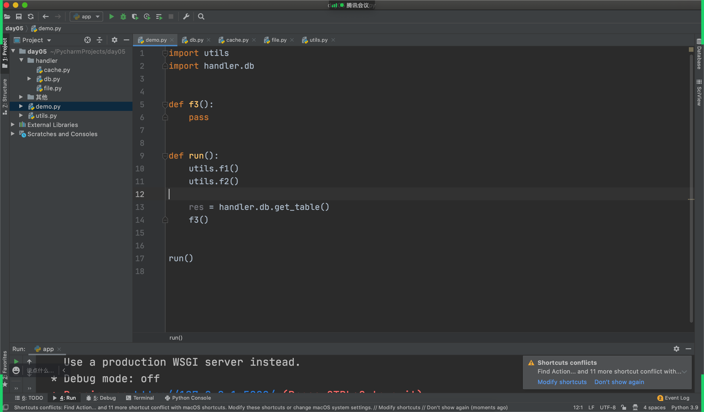
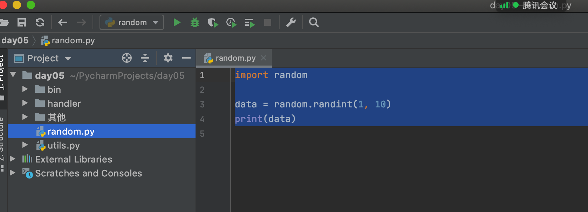

# day05 函数和模块

今日概要：

- 函数
  - 闭包
  - 装饰器
- 模块
  - 自定义模块
  - 内置模块
  - 第三方模块


## 上节作业

- 三元运算

  ```
  简单的if else判断和赋值。
  
  if 1==1:
  	v1 = 123
  else:
  	v1 = 456
  ```

  ```
  v1 =  123  if 条件  else 456
  ```

- eval

  ```python
  def f1(arg):
      print(arg)
      
  data_string  = "f1(123)"
  
  eval("f1(123)")  # f1(123)
  ```

  ```python
  import requests
  
  
  def xx(arg):
      print(arg)
  
  
  res = requests.get(
      url='http://num.10010.com/NumApp/NumberCenter/qryNum?callback=xx&provinceCode=18&cityCode=188&advancePayLower=0&sortType=1&goodsNet=4&searchCategory=3&qryType=02&channel=B2C&groupKey=15237219&judgeType=1')
  # print(res.text)
  # print(type(res.text))
  
  eval(res.text)
  ```

  ```python
  func_dict = {
      "1": "register()",
      "2": "login()",
  }
  
  
  def register():
      print(1)
  
  
  def login():
      print(2)
  
  
  eval(func_dict["1"])
  ```


## 1. 闭包

- Python中是以函数为作用域。

- 以前编写函数

  ```python
  def f1():
      pass
  
  def f2():
      pass
  ```

- 函数中嵌套函数

  ```python
  name = "陈聪"
  
  def outer():
      name = "王卓"
      def inner():
          age = 19
  	
      inner()
      
  outer()
  ```

  ```python
  name = "陈聪"
  
  def outer():
      def inner():
          print(name)
      inner()
      
  outer()
  ```

  ```python
  name = "陈聪"
  
  def outer():
      def inner():
          pass
      return inner
      
  v = outer()
  v()
  ```

  ```python
  def outer(name):
      def inner():
          msg = "给{}一刀".format(name)
          print(msg)
      return inner
  
  v1 = outer("陈聪")
  v2 = outer("小魏")
  ```

  ```python
  def func(name):
      msg = "给{}一刀".format(name)
  	print(msg)
      
  func("陈聪")
  func("小魏")
  ```

  

### 1.2 线程池

```python
import time
import requests
from concurrent.futures import ThreadPoolExecutor


def task():
    # res = requests.get("https://hbimg.huabanimg.com/51d46dc32abe7ac7f83b94c67bb88cacc46869954f478-aP4Q3V")
    # print(res)
    time.sleep(2)
    return "任务执行后的返回值"


def done(res):
    print(res)


# 内部最多可以创建10个线程的线程池
pool = ThreadPoolExecutor(10)
for i in range(500):
    # 将任务交给线程池，线程池安排线程去执行。
    future = pool.submit(task)
    future.add_done_callback(done)
```


```python
def func(res):
    pass


v1 = func


def outer(xx):
    def func(res):
        pass

    return func

v1 = outer(123)
```

```python
def outer(name):
    def inner():
        msg = "给{}一刀".format(name)
        print(msg)
	return inner

v1 = outer("陈聪")
v2 = outer("小魏")

v1() # 给陈聪一刀
v2() # 给小魏一刀
```


```python
def outer(name):
    def inner(action):
        msg = "给{}一{}".format(name,action)
        print(msg)
	return inner

v1 = outer("陈聪") # inner函数
v2 = outer("小魏") # inner函数


v1("刀")    # 给陈聪一刀
v1("梭子")  # 给陈聪一梭子

v2("枪")    # 给小魏一枪
```

```python
def outer(name):
    def inner(action):
        msg = "给{}一{}".format(name,action)
        print(msg)
	return inner
```


## 2.装饰器

```python
def outer(a1):
    def inner():
        a1()
    return inner

def x():
    print("XX")
    
res = outer(x)
res()
```

```python
def outer(a1):
    def inner():
        a1()
    return inner

def x():
    print("XX")
    
x = outer(x)
x()
```

```python
def outer(a1):
    def inner():
        data = a1()
        return 123
    return inner

def x():
    return "XX"
    
x = outer(x)
v1 = x() # 123
```

```python
def outer(a1):
    def inner():
        data = a1()
        return data
    return inner

def x():
    return "XX"
    
x = outer(x)
v1 = x() # "XX"
```


```python
def get_data(arg):
	return arg + 100

a1 = 123
a1 = get_data(a1)
print(a1)
```


```python
# 1. 执行x1函数 x1(func)，并获取他的返回值，
# 2. 将返回值再重新赋值给func
@x1
def func():
    pass

print(func)
```


```python
def x1(arg):
    # arg=原来的func函数
    def inner():
        arg()
    return inner 
# func = x1(func)
@x1
def func():
    pass

func()
```


```python
def x1(arg):
    # arg=原来的func函数
    def inner():
        print(123)
        res = arg() # 执行原来的func函数
        print(456)
        return res
    return inner 

@x1   # func = x1(func)
def func():
    return 123


v1 = func() # ?
```


```python
def func():
    return 123

print(123)
v1 = func()
print(456)
```


```python
def outer(arg):
    def inner():
        print(123)
        res = arg()
        print(456)
        return res
   	return inner

@outer
def f1():
    pass

@outer
def f2():
    pass

@outer
def f3():
    pass

@outer
def f4():
    pass

@outer
def f5():
    pass
```


```python
@yy
def xxxx():
    pass
```


### 案例：计算函数的执行时间

```python
import time


def get_exec_time(arg):
    def inner():
        start = time.time()
        res = arg()
        end = time.time()
        print(end - start)
        return res

    return inner


def func():
    data = 0
    for i in range(1000000):
        data += i
    return data


@get_exec_time
def do():
    pass


v1 = func()
print(v1)
```


### 小结

```python
def outer(func):
    def inner():
        return func()
    return inner

@outer
def do():
    return 123

v1 = do()
```


### 练习题

1. 写一个装饰器，应用到一个函数上，在函数执行之前输出一个”before“。

   ```python
   def outer(func):
       def inner():
           print("123")
           return func()
   
       return inner
   
   
   # do = outer(do)
   @outer
   def do():
       return 999
   
   
   v1 = do()
   print(v1)
   
   ```

2. 写一个装饰器，应用到一个函数上，实现对原函数的返回值 + 100.

   ```python
   def outer(func):
       def inner():
           return func() + 100
   
       return inner
   
   
   @outer
   def do():
       return 999
   
   
   v1 = do()
   print(v1)
   ```

3. 写一个装饰器，应用到一个函数上，实现执行5次代码并将结果汇总。

   ```python
   def outer(func):
       def inner():
           result = 0
           for i in range(5):
               res = func()
               result += res
           return result
   
       return inner
   
   
   @outer
   def do():
       return 100
   
   
   v1 = do()
   print(v1)
   ```


```python
def outer(func):
    def inner(a1, a2):
        return func(a1, a2)
    return inner


@outer
def plus(v1, v2):
    return v1 + v2


value = plus(1, 2)
print(value)
```

```python
def outer2(func):
    def inner(u1):
        return func(u1)

    return inner


@outer2
def do(data):
    return data + 1000


value = do(10)
print(value)
```


### 小结

```python
def outer(func):
    def inner(*args, **kwargs):
        return func(*args, **kwargs)
    return inner

@outer
def do(data):
    return data + 1000


@outer
def plus(v1, v2):
    return v1 + v2


value1 = plus(1, 2)
print(value1)

value2 = do(10)
print(value2)
```


```python
def tt(count):
    def outer(func):
        def inner(*args, **kwargs):
            return func(*args, **kwargs)

        return inner

    return outer


@tt(5)
def do(v1, v2):
    return v1 + v2


data = do(11, 22)
print(data)
```


案例：写装饰器，实现执行n次函数。

```python
def loop_exec(count):
    def outer(func):
        def inner(*args, **kwargs):
            result = 0
            for i in range(count):
                data = func(*args, **kwargs)
                result += data
            return result

        return inner

    return outer


@loop_exec(5)
def get_info(a1, a2):
    return a1 + a2 + 100


res = get_info(1, 2)
print(res)
```


### 案例：Flask框架

```
pip install flask
```

```
Python安装目录/Scripts/pip  install flask
```


```python
from flask import Flask

app = Flask(__name__)


# 以后在浏览器上输入：www.xxx.com/show/index
# @decorator
@app.route('/show/index')
def index():
    return "首页"


@app.route('/xxx/xxx/home')
def home():
    return "HOME页面"


app.run()
```


### 总结

- 理解闭包

- 闭包 + @语法糖

- 装饰器的应用场景：在不改变原函数的基础上，想要在函数之前、之后定制功能。

  ```
  开放封闭原则。
  ```

- *args,**kwargs解决被装饰的多个参数的问题。

- 带参数的装饰器。

- 装饰器

  - 传统，2层。
  - 带参数，3层。


## 3.模块

模块和包。

- 模块，一个py文件。
- 包，包含多个py文件。




### 3.1 关于sys.path

```
# 当前运行的脚本所在目录。
/Users/wupeiqi/PycharmProjects/day05

# 忽略，这是Python自动添加的（线上运行不会有这个目录）
/Users/wupeiqi/PycharmProjects/day05
/Applications/PyCharm.app/Contents/plugins/python/helpers/pycharm_display
/Library/Frameworks/Python.framework/Versions/3.9/lib/python39.zip
/Library/Frameworks/Python.framework/Versions/3.9/lib/python3.9
/Library/Frameworks/Python.framework/Versions/3.9/lib/python3.9/lib-dynload
/Library/Frameworks/Python.framework/Versions/3.9/lib/python3.9/site-packages
```


- 在执行Python代码时，如果要导入某个模块，默认Python寻找模块的路径：（前面找到后，就不再继续找了）

- Python会自动条件的项目目录（忽略，线上代码就会错误）

- 想控制Python去定义的路径下寻找模块。

  ```
  import sys
  sys.path.append("寻找的绝对路径")
  
  import 模块
  ```

  ```python
  import os
  import sys
  
  # __file__  当前文件所在目录
  # os.path.abspath(__file__) 获取文件的绝对路径
  # os.path.dirname(目录)     获取上一级目录
  BASE_PATH = os.path.dirname(os.path.dirname(os.path.abspath(__file__)))
  sys.path.append(BASE_PATH)
  # sys.path.append("/Users/wupeiqi/PycharmProjects/day05")
  
  import utils
  
  utils.f1()
  ```

  

```
# 当前运行的脚本所在目录。
/Users/wupeiqi/PycharmProjects/day05

# 忽略，这是Python自动添加的（线上运行不会有这个目录）
/Users/wupeiqi/PycharmProjects/day05
/Applications/PyCharm.app/Contents/plugins/python/helpers/pycharm_display
/Library/Frameworks/Python.framework/Versions/3.9/lib/python39.zip
/Library/Frameworks/Python.framework/Versions/3.9/lib/python3.9
/Library/Frameworks/Python.framework/Versions/3.9/lib/python3.9/lib-dynload
/Library/Frameworks/Python.framework/Versions/3.9/lib/python3.9/site-packages
```




### 3.2 导入模块

- import 模块

  ```
  - 导入到py文件的级别。
  - 使用模块中的成员时，需要全部路径都写上。
      import utils
      import handler.commons.db
  
      utils.f1()
      handler.commons.db.get_table()
  ```

- from xxx import xxxx

  ```
  - 级别可以到成员
  	from utils import f1
      from utils import f1, f2
      from utils import *
      from utils import f2 as u2
  - 导入后使用时，不需要写全路径
      from handler.commons import db
      db.get_table()
  	
  	from handler.commons.db import get_table
  	get_table()
  
      from handler.commons import db as xx
      xx.get_table()
  ```


关于导入模块的规范：

```python
import os
import sys
import random

import flask
import requests

import utils
from utils import (f1, f2, f1)

from handler import cache
from handler.commons import db
```

```python
import os
import sys
import random

import flask
import requests

import utils
from utils import (f1, f2, f1)

from handler import cache
from handler.commons import db


def run():
    pass


if __name__ == '__main__':
    run()
```


约定：以后写脚本都是用这个main。


### 3.3 内置模块：json

```
v1 = '{"name":"程聪","age":99,"hobby":[11,22,33]}'
v2 = "{'name':'程聪',"age":99}"
v3 = '{"name":"程聪","age":99,"hobby":(11,22,33)}'
```


#### 3.3.1 获取数据

```python
import requests
import json

res = requests.get(
    url="https://api.luffycity.com/api/v1/course/actual/?category_id=9"
)

# print(type(res.text))
info = json.loads(res.text)
# print(info['code'])
for item in info['data']:
    print(item['name'])
```


直接以Python的语法编译执行：

```python
data_string = "{'name':'程聪','age':99}"

result = eval(data_string)
print(result)
print(type(result))
```


#### 3.3.2 响应数据

```python
import json
from flask import Flask

app = Flask(__name__)


@app.route('/api')
def index():
    data_list = [
        (11, 22, 33, '王卓'),
        {"code": 123, 'msg': 999},
        [55, 66, True]
    ]

    data_string = json.dumps(data_list, ensure_ascii=False)
    print(data_string)

    return data_string


if __name__ == '__main__':
    app.run()
```


常见的JSON相关的函数：

- json.dumps，Python数据局类型 -> JSON格式字符串（序列化）
- json.loads，  JSON格式字符串 -> Python数据局类型 （反序列化）


关于显示中文：

```python
import json

data_list = [
    (11, 22, 33, '王卓'),
    {"code": 123, 'msg': 999},
    [55, 66, True]
]

data_string = json.dumps(data_list, ensure_ascii=False)
print(data_string)
```


在调用json.dumps时，不会可以讲所有的数据都序列化，对数据是有要求：

```
+-------------------+---------------+
| Python            | JSON          |
+===================+===============+
| dict              | object        |
+-------------------+---------------+
| list, tuple       | array         |
+-------------------+---------------+
| str               | string        |
+-------------------+---------------+
| int, float        | number        |
+-------------------+---------------+
| True              | true          |
+-------------------+---------------+
| False             | false         |
+-------------------+---------------+
| None              | null          |
+-------------------+---------------+
```

```python
import json
import decimal

data_list = [11, 22, 33, str(decimal.Decimal("0.3"))]
data_string = json.dumps(data_list, ensure_ascii=False)
print(data_string)
```


平时自己看JSON格式用的（开发中一般不用）。

```python
import json

string = json.dumps(data, indent=2, ensure_ascii=False)

print(string)
```


### 3.4 内置模块：time和datetime

- 时间戳： `1638094331.760319`

  ```python
  import time
  
  v1 = time.time()
  print(v1)
  ```

- datetime类型：对象

  ```python
  import datetime
  
  v2 = datetime.datetime.now()
  
  print(v2, type(v2))
  ```

  ```python
  from datetime import datetime, timedelta
  
  v1 = datetime.now()
  v2 = v1 - timedelta(hours=3, seconds=500)
  print(v2)
  ```

- 字符串类型：2021-11-11 

  ```python
  import datetime
  
  v2 = datetime.datetime.now()
  string_time = v2.strftime("%Y-%m-%d %H:%M:%S")
  print(string_time, type(string_time))
  ```

  

时间的转换：


- 字符串类型 -> datetime类型

  ```python
  from datetime import datetime
  
  text = "2021-11-11"
  v1 = datetime.strptime(text,'%Y-%m-%d') # %Y 年，%m，月份，%d，天。
  print(v1)
  ```

- datetime ->字符串类型

  ```python
  from datetime import datetime
  
  v2 = datetime.now()
  string_time = v2.strftime("%Y-%m-%d %H:%M:%S")
  print(string_time, type(string_time))
  ```

- 时间戳 -> datetime

  ```python
  import time
  from datetime import datetime
  
  ctime = time.time()  # 11213245345.123
  v1 = datetime.fromtimestamp(ctime)
  print(v1)
  ```

- datetime -> 时间戳

  ```python
  from datetime import datetime
  
  v1 = datetime.now()
  val = v1.timestamp()
  print(val)
  ```

  

```python
import time

while True:
    print(123)
    time.sleep(1)
```


### 3.5 内置模块：OS（部分）

- 拼接路径

  ```python
  import os
  
  data = os.path.join("f1", 'f2', 'f3', 'xxx.png')
  print(data)
  
  ```

- 分隔符

  ```python
  print(os.path.sep)
  ```

- 路径是否存在

  ```python
  import os
  
  file_path = os.path.join('handler', 'cache.py')
  
  v1 = os.path.exists(file_path)
  print(v1)
  ```

- 文件下的文件和文件夹

  ```python
  import os
  
  file_path = os.path.join('handler')
  
  data_list = os.listdir(file_path)
  print(data_list)
  ```

  ```python
  import os
  
  # win同学，自己写的路径记得加r（转义）
  file_path = r"/Users/wupeiqi/PycharmProjects/day05/handler"
  
  data_list = os.listdir(file_path)
  print(data_list)
  ```

- 文件还是文件夹

  ```python
  import os
  
  file_path = r"/Users/wupeiqi/PycharmProjects/day05/handler/cache.py"
  
  v1 = os.path.isdir(file_path)
  print(v1)
  ```

- 创建目录

  ```python
  import os
  
  # file_path = r'db/xx/oo/xo'
  file_path = os.path.join('db', 'xx', 'oo', 'xo')
  if not os.path.exists(file_path):
      os.makedirs(file_path)
  ```

  


