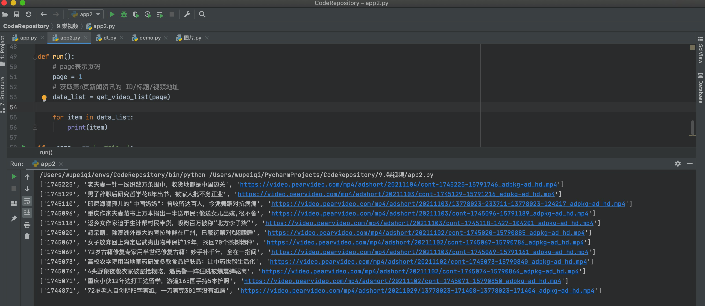
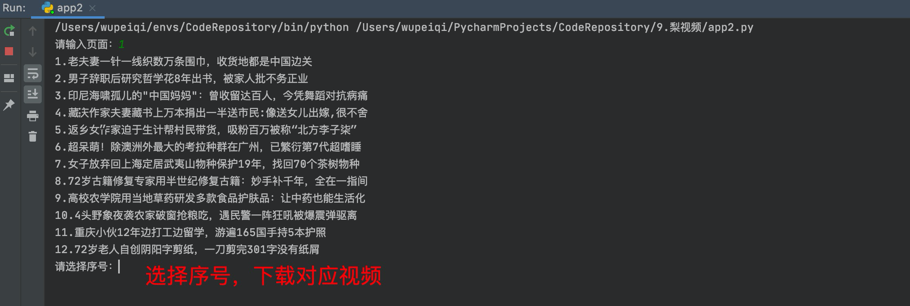
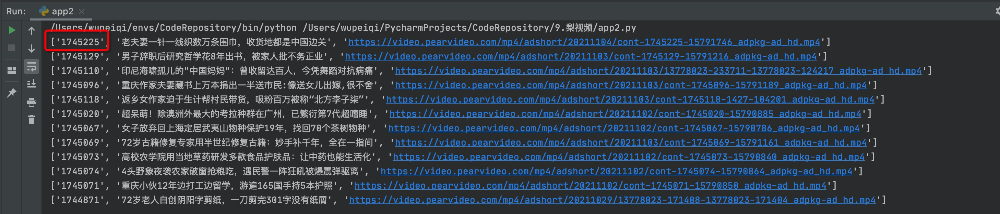
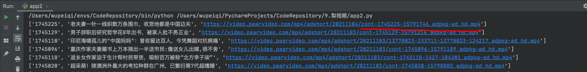
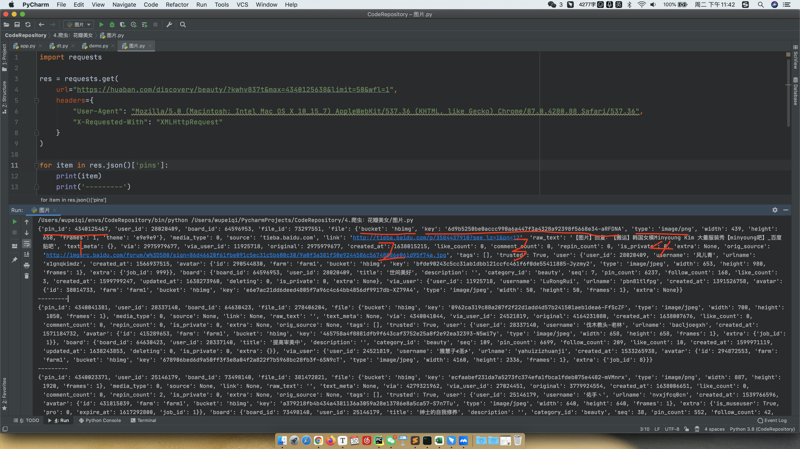

# day05 函数和模块作业


# 作业A

1. 如果将元组转换成列表。

2. 如何将列表中的元素去重？

3. 将如下列表构造构造成特定的字典。

   ```python
   header = ["id","name","age"]
   data_list = [
       [1,"武沛齐1",18],
       [2,"武沛齐2",18],
       [3,"武沛齐3",18],
       [4,"武沛齐4",18],
       [5,"武沛齐5",18],
       ...
   ]
   
   # 写代码，实现将上述数据构造成如下结构。
   result = {
       {"id":1, "name":"武沛齐1","age":18},
       {"id":2, "name":"武沛齐2","age":18},
       {"id":3, "name":"武沛齐3","age":18},
       ...
   }
   ```

4. 写函数，接收动态的位置参数，函数内部循环获取奇数索引位置的值，并将元素添加到列表，最终将列表返回。

5. 编写装饰器，实现在函数执行前输出 before。

6. 编写装饰器，保证函数的返回值永远是列表。

   - 判断原函数返回值，如果是None， 则应用装饰器期返回空列表。
   - 判断原函数返回值，如果不是None，则将原返回值当做列表的第0个元素，返回列表。

5. 编写装饰器，让函数固定执行5次，并将每次执行的返回值添加到列表中，最终返回列表（含五次执行原函数的返回值）。

6. 编写带参数的装饰器，实现动态设置函数的执行此处，，并将每次执行的返回值添加到列表中，最终返回列表（含多次执行原函数的返回值）。

7. 编写用户注册示例

   - 循环提示用户输入：用户名、密码

   - 将用户名、密码、注册时间写入到文件中。

     ```python
     # 写入文件示例（字符串末尾的\n表示换行，这样可以实现将每个用户的信息写在一行）
     line = "wupeiqi,123,2021-11-11\n"
     
     f = open("db.txt",mode="a",encoding="utf-8")
     f.write(line)
     f.close()
     ```

8. 目录查看器

   - 提示用户输入要查看的目录。
   - 监测目录是否存在。 不存在，则提示目录不存在；存在，则展示目录下所有的文件和文件夹。

9. 目录查看器（升级版）

   - 提示用户输入要查看的目录。
   - 监测目录是否存在。 不存在，则提示目录不存在；存在，则展示目录下所有的文件和文件夹。
   - 用户可输入当前目录下的任意文件夹名称，表示进入文件夹（进入目录时需要输出已当前所在路径）。
   - 输入 Q 可返回上一级目录（无目录则终止）。
   - 输入 B 终止程序。


# 作业B


## 1.梨视频视频下载器

> 根据下面的提示逐步完成相关的功能。


### 1.1 安装第三方模块

```
pip install requests
pip install beautifulsoup4
```


### 1.2 运行脚本

此脚本是已提供好的内容，确保可以运行（后续功能在此基础上进行扩展）。

```python
"""
运行此脚本需要预先安装：
    pip install request
    pip install beautifulsoup4

"""
import requests
from bs4 import BeautifulSoup


def get_mp4_url(video_id):
    """ 根据视频ID构造视频的下载地址（已破解）"""
    data = requests.get(
        url="https://www.pearvideo.com/videoStatus.jsp?contId={}".format(video_id),
        headers={
            "Referer": "https://www.pearvideo.com/video_{}".format(video_id),
        }
    )
    response = data.json()
    image_url = response['videoInfo']['video_image']
    video_url = response['videoInfo']['videos']['srcUrl']
    middle = image_url.rsplit('/', 1)[-1].rsplit('-', 1)[0]
    before, after = video_url.rsplit('/', 1)
    suffix = after.split('-', 1)[-1]
    url = "{}/{}-{}".format(before, middle, suffix)
    return url


def get_video_list(page):
    """
    获取梨视频最新视频列表
    :param page: 页码
    :return:
    """
    data_list = []
    res = requests.get(
        url="https://www.pearvideo.com/category_loading.jsp?reqType=14&categoryId=&start={}".format(page)
    )
    bs = BeautifulSoup(res.text, 'lxml')
    a_list = bs.find_all("a", attrs={'class': "vervideo-lilink"})
    for tag in a_list:
        title = tag.find('div', attrs={'class': "vervideo-title"}).text.strip()
        video_id = tag.get('href').split('_')[-1]
        mp4_url = get_mp4_url(video_id)
        data_list.append([video_id, title, mp4_url])
    return data_list


def run():
    # page表示页码
    page = 1
    # 获取第n页新闻资讯的 ID/标题/视频地址
    data_list = get_video_list(page)

    for item in data_list:
        print(item)

if __name__ == '__main__':
    run()

```




### 1.3 功能需求

- 循环提示用户输入页码（输入Q/q终止）。

- 用户输入页码后，展示当前页码所有的资讯信息，格式如下：（每页的视频序号都是从1开始，无需累加）。

  

- 视频存储要求

  - 存储视频根目录名称为 `pearvideo`
  - 选择要下载的视频后，需要为当前视频创建文件夹，文件夹名称为：`视频ID`（文件已存在则不再重复下载）
    

  - 在当前视频的文件夹下再创建`info.txt`，写入视频标题。

    ```python
    # 创建文件 & 写入内容
    
    f = open("info.txt",mode="w",encoding="utf-8")
    
    f.write("男子辞职后研究哲学花8年出书，被家人批不务正业")
    
    f.close()
    ```

  - 在当前视频的文件夹下再下载视频，视频文件的名称是URL的后缀，例如：
    

    ```python
    # 下载文件示例代码
    import requests
    
    
    def download(file_name, url):
        res = requests.get(
            url=url
        )
    
        with open(file_name, mode='wb') as file_object:
            # 分块读取下载的视频文件（最多一次读512字节），并逐一写入到文件中。 len(chunk)表示实际读取到每块的视频文件大小。
            for chunk in res.iter_content(512):
                file_object.write(chunk)
                file_object.flush()
            file_object.close()
    
        res.close()
    
    
    if __name__ == '__main__':
        file_name = 'x1.mp4'
        url = "https://video.pearvideo.com/mp4/adshort/20210105/cont-1715046-15562045_adpkg-ad_hd.mp4"
        download(file_name, url)
    ```

    

  - 最终下载目录的文件夹结构如下：

    ```
    pearvideo
    	1745225
    		cont-1745225-15791746_adpkg-ad_hd.mp4
    		info.txt
    	1745129
    		cont-1745129-15791216_adpkg-ad_hd.mp4
    		info.txt
    ```

    


## 2. 花瓣美女图片下载器


### 2.1 发送网络

发送网络请求，获取图片JSON格式的信息。

```python
import requests

res = requests.get(
    url="https://huaban.com/discovery/beauty/?kwhv837t&max=4340125638&limit=10&wfl=1",
    headers={
        "User-Agent": "Mozilla/5.0 (Macintosh; Intel Mac OS X 10_15_7) AppleWebKit/537.36 (KHTML, like Gecko) Chrome/87.0.4280.88 Safari/537.36",
        "X-Requested-With": "XMLHttpRequest"
    }
)

for item in res.json()['pins']:
    print(item)
    print('---------')
```




### 2.2 获取特定格式数据

根据上图所示，分别获取每张图片的：`pin_id`、`bucket`、`key`、`type` 四个信息并构造成如下元组，然后再统一追加到列表中。

- 如果bucket不等于 `hbimg`，则跳过（不获取）。
- key的值前面需要添加 `https://hbimg.huabanimg.com/`前缀。

```python
result = [
	(
		4340125467, 
		'hbimg', 
		'https://hbimg.huabanimg.com/6d9b5250be0accc990a6a447f3a4328a92398f5668e34-aRFDNA',
		'image/png'
	),
    ...

]
```


### 2.3 函数封装

写函数实现上述功能，并将`result`列表作为返回值。例如：

```python
def get_pic_list():
    result = []
    res = requests.get(
        url="https://huaban.com/discovery/beauty/?kwhv837t&max=4340125638&limit=10&wfl=1",
        headers={
            "User-Agent": "Mozilla/5.0 (Macintosh; Intel Mac OS X 10_15_7) AppleWebKit/537.36 (KHTML, like Gecko) Chrome/87.0.4280.88 Safari/537.36",
            "X-Requested-With": "XMLHttpRequest"
        }
    )
    for item in res.json()['pins']:
        # 补充代码实现
    return result
```


### 2.4 实现图片的下载

- 检查项目根目录是否存在 `huaban`目录，不存在则创建。

- 将result中的所有图片下载到 `huaban`目录下，文件名：`pin_id.type后缀名`，例如：

  ```
  result = [
  	(
  		4340125467, 
  		'hbimg', 
  		'https://hbimg.huabanimg.com/6d9b5250be0accc990a6a447f3a4328a92398f5668e34-aRFDNA',
  		'image/png'
  	),
      ...
  ]
  
  下载文件名为：4340125467.png
  ```

- 下载图片的代码

  ```python
  import requests
  
  image_url = "https://hbimg.huabanimg.com/6d9b5250be0accc990a6a447f3a4328a92398f5668e34-aRFDNA"
  file_name = "4340125467.png"
  
  res = requests.get(
      url=image_url,
      headers={
          "User-Agent": "Mozilla/5.0 (Macintosh; Intel Mac OS X 10_15_7) AppleWebKit/537.36 (KHTML, like Gecko) Chrome/87.0.4280.88 Safari/537.36",
          "X-Requested-With": "XMLHttpRequest"
      }
  )
  with open(file_name, mode='wb') as f:
      f.write(res.content)
  ```


### 2.5 翻页下载

支持翻页下载，输入Y继续，如果N则停止。

分析请求的URL：

```
第一次访问，记录本次最后一条的 pin_id，用于下次请求用。
	https://huaban.com/discovery/beauty/?kwhv837t&max=4340125638&limit=10&wfl=1

第二次访问：记录本次最后一条的 pin_id，用于下次请求用。
	https://huaban.com/discovery/beauty/?kwhv837t&max=上次最后一个pin_id的值&limit=10&wfl=1
	
第三次访问：记录本次最后一条的 pin_id，用于下次请求用。
	https://huaban.com/discovery/beauty/?kwhv837t&max=上次最后一个pin_id的值&limit=10&wfl=1
...
```


