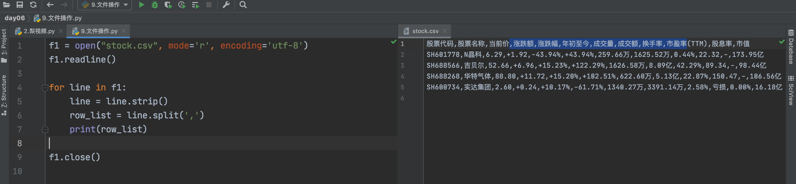
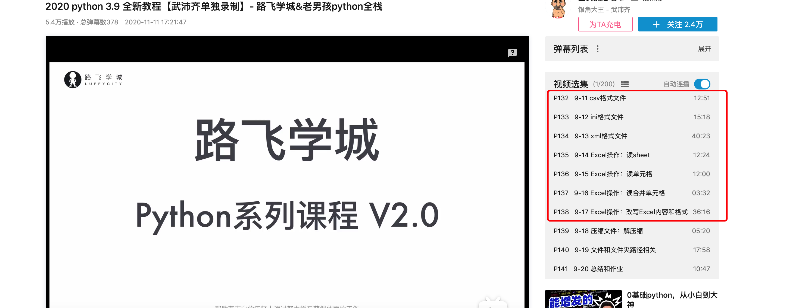
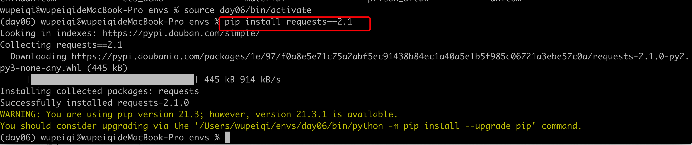
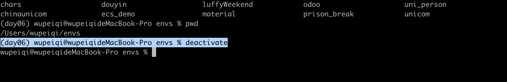
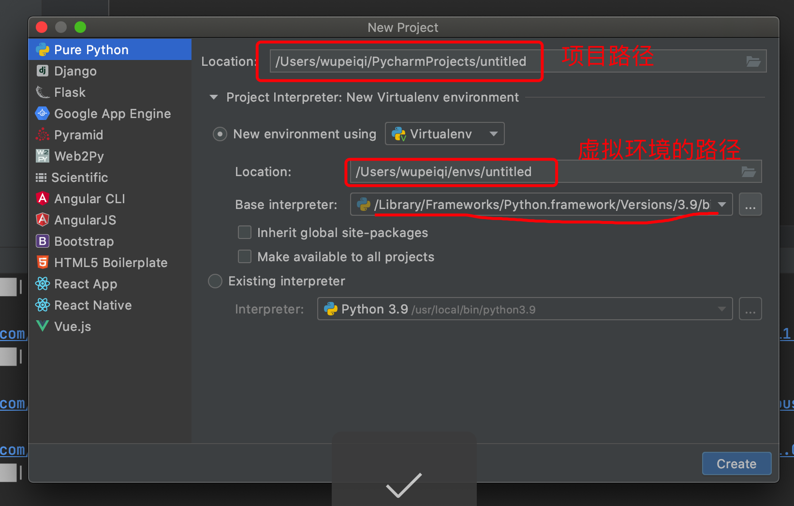
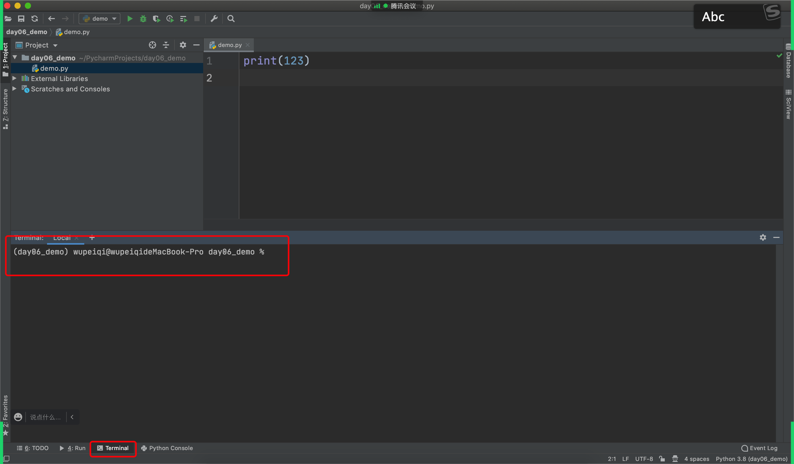

# day06 模块

今日概要：

- 内置模块
- 第三方模块
- 虚拟环境


## 1.内置模块

```
os/random/time/datetime/json
```


### 1.1 md5加密

hashlib，密码不能是明文。

```python
import hashlib

data_string = "欧阳"

obj = hashlib.md5()
obj.update(data_string.encode('utf-8'))
result = obj.hexdigest()

print(result)
```


MD5加密不可逆，但可以被撞库。避免这种风险就需要加盐。

```python
import hashlib

data_string = "欧阳"

obj = hashlib.md5("xdqadkfjasdkjfa".encode('utf-8'))
obj.update(data_string.encode('utf-8'))
result = obj.hexdigest()
print(result)
```


后续再进行对比用户名和密码时，就需要使用密文进行操作。


```python
import hashlib

DATA_DICT = {}


def md5(data_string):
    """ MD5加密"""
    salt = "xdqadkfjasdkjfa".encode('utf-8')
    obj = hashlib.md5(salt)
    obj.update(data_string.encode('utf-8'))
    return obj.hexdigest()


def register():
    user = input("用户名：")
    pwd = input("密码：")
    encrypt_pwd = md5(pwd)
    DATA_DICT[user] = encrypt_pwd


def login():
    user = input("用户名：")
    pwd = input("密码：")
    encrypt_pwd = md5(pwd)

    db_pwd = DATA_DICT.get(user)
    if encrypt_pwd == db_pwd:
        print("登录成功")
    else:
        print("登录失败")


if __name__ == '__main__':
    register()
```


### 1.2 寻找目录下所有的文件

```
import os

# 只罗列一级
# for item in os.listdir("xx"):
#     print(item)


for base_path, folder_list, name_list in os.walk("/Users/wupeiqi/Documents/路飞工作/爬虫和APP逆向课程/视频"):
    for name in name_list:
        file_path = os.path.join(base_path, name)
        print(file_path)
```


需求：找到所有mp4后缀的文件。

```python
import os

for base_path, folder_list, name_list in os.walk("/Users/wupeiqi/Documents/路飞工作/爬虫和APP逆向课程/mp4"):
    for name in name_list:
        ext = name.split('.')[-1]
        if ext != 'mp4':
            continue
        file_path = os.path.join(base_path, name)
        print(file_path)
```


需求：文件的重命名。

寻找指定目录下的所有mp4文件，将MP4文件中的 :

```python
import os

os.rename('db.txt', 'db1.txt')
os.rename('xx', 'xo')
```

```python
import shutil

shutil.move('db1.txt', 'db.txt')
shutil.move('xo', 'xx')
```

```python
import os
import shutil

for base_path, folder_list, name_list in os.walk("/Users/wupeiqi/Documents/路飞工作/爬虫和APP逆向课程/mp4"):
    for name in name_list:
        ext = name.split('.')[-1]
        if ext != 'mp4':
            continue
        # day01 fullstack s4 数据类型.mp4ß
        # day01 数据类型.mp4ß
        # xxx/xxxx/xxxx/xxx/day01 fullstack s4 数据类型.mp4ß
        file_path = os.path.join(base_path, name)

        new_name = name.replace("fullstack s4 ", "")
        # xxx/xxxx/xxxx/xxx/day01 数据类型.mp4ß
        new_file_path = os.path.join(base_path, new_name)

        shutil.move(file_path, new_file_path)
```


### 1.3 os模块

```python
import os

# 1. 获取当前脚本绝对路径
"""
abs_path = os.path.abspath(__file__)
print(abs_path)
"""

# 2. 获取当前文件的上级目录
"""
base_path = os.path.dirname( os.path.dirname(路径) ）
print(base_path)
"""

# 3. 路径拼接
"""
p1 = os.path.join(base_path, 'xx')
print(p1)

p2 = os.path.join(base_path, 'xx', 'oo', 'a1.png')
print(p2)
"""

# 4. 判断路径是否存在
"""
exists = os.path.exists(p1)
print(exists)
"""

# 5. 创建文件夹
"""
os.makedirs(路径)
"""
"""
path = os.path.join(base_path, 'xx', 'oo', 'uuuu')
if not os.path.exists(path):
    os.makedirs(path)
"""

# 6. 是否是文件夹
"""
file_path = os.path.join(base_path, 'xx', 'oo', 'uuuu.png')
is_dir = os.path.isdir(file_path)
print(is_dir) # False

folder_path = os.path.join(base_path, 'xx', 'oo', 'uuuu')
is_dir = os.path.isdir(folder_path)
print(is_dir) # True

"""


# 7. 删除文件或文件夹
# import os
# import shutil

# 文件
# os.remove("hauban")
# 文件夹
# shutil.rmtree("xxx")


# 8. 重命名
"""
os.rename("原文件名","目标文件名")
"""
```


### 1.4 shutil模块

```python
import shutil

# 1. 删除文件夹
"""
path = os.path.join(base_path, 'xx')
shutil.rmtree(path)
"""

# 2. 拷贝文件夹（新建目录）
"""
import shutil

shutil.copytree('pearvideo', 'x1')
"""

# 3.拷贝文件
"""
shutil.copy('x1/1745129/cont-1745129-15791216_adpkg-ad_hd.mp4', 'xx')
"""

# 4.文件或文件夹重命名
"""
shutil.move("x.png","xxxx.png")
shutil.move("/Users/wupeiqi/PycharmProjects/CodeRepository/files","/Users/wupeiqi/PycharmProjects/CodeRepository/images")
"""

# 5. 压缩文件
"""
# base_name，压缩后的压缩包文件
# format，压缩的格式，例如："zip", "tar", "gztar", "bztar", or "xztar".
# root_dir，要压缩的文件夹路径
"""
shutil.make_archive(base_name=r'datafile',format='zip',root_dir=r'files')


# 6. 解压文件
"""
# filename，要解压的压缩包文件
# extract_dir，解压的路径
# format，压缩文件格式
"""
shutil.unpack_archive(filename=r'2021.zip', extract_dir='x2/x3/x4', format='zip')
```


### 1.5 subprocess模块

```python
import subprocess

res = subprocess.getoutput("ls")
print(res)

res = subprocess.check_output("ls -l", shell=True, cwd="/Users/wupeiqi/PycharmProjects/day06/pearvideo/1745129")
res_string = res.decode('utf-8')
print(res_string)
```


### 1.6 sys

- sys.path

  ```
  导入文件默认寻找的路径。
  ```

- sys.argv

  ```
  执行脚本时获取的参数。例如：
  ```

  ```python
  # demo.py
  import sys
  print(sys.argv)
  # ["demo.py"]
  # ["demo.py","x1","x2"]
  ```

  ```python
  python demo.py    
  python demo.py   x1  x2 
  ```

  

### 1.7 re模块

```python
import re

data = re.findall("\d", "kajsdpfija;lskndfpaoiej;iajhpuq9w873rpokajnxc0970823uir")
print(data)
```

正则表达式的意义，就是从一段文本中获取我们想要的特定格式的数据。


#### 1.7.1 正则

##### 1. 字符相关

- `wupeiqi` 匹配文本中的wupeiqi

  ```python
  import re
  
  text = "你好wupeiqi,阿斯顿发wupeiqasd 阿士大夫能接受的wupeiqiff"
  data_list = re.findall("wupeiqi", text)
  print(data_list) # ['wupeiqi', 'wupeiqi'] 可用于计算字符串中某个字符出现的次数
  ```

- `[abc]` 匹配a或b或c 字符。

  ```python
  import re
  
  text = "你2b好wupeiqi,阿斯顿发awupeiqasd 阿士大夫a能接受的wffbbupqaceiqiff"
  data_list = re.findall("[abc]", text)
  print(data_list) # ['b', 'a', 'a', 'a', 'b', 'b', 'c']
  ```

  ```python
  import re
  
  text = "你2b好wupeiqi,阿斯顿发awupeiqasd 阿士大夫a能接受的wffbbupqcceiqiff"
  data_list = re.findall("q[abc]", text)
  print(data_list) # ['qa', 'qc']
  ```

- `[^abc]` 匹配除了abc以外的其他字符。

  ```python
  import re
  
  text = "你wffbbupceiqiff"
  data_list = re.findall("[^abc]", text)
  print(data_list)  # ['你', 'w', 'f', 'f', 'u', 'p', 'e', 'i', 'q', 'i', 'f', 'f']
  ```

- `[a-z]`  匹配a~z的任意字符（ [0-9]也可以 ）。 [A-Z]

  ```python
  import re
  
  text = "alexrootrootadmin"
  data_list = re.findall("t[a-z]", text)
  print(data_list)  # ['tr', 'ta']
  ```

- `.`  代指除换行符以外的任意字符。

  ```python
  import re
  
  text = "alexraotrootadmin"
  data_list = re.findall("r.o", text)
  print(data_list) # ['rao', 'roo']
  ```

  ```python
  import re
  
  text = "alexraotrootadmin"
  data_list = re.findall("r.+o", text) # 贪婪匹配
  print(data_list) # ['raotroo']
  ```

  ```python
  import re
  
  text = "alexraotrootadmin"
  data_list = re.findall("r.+?o", text) # 非贪婪匹配
  print(data_list) # ['rao']
  ```

- `\w` 代指字母或数字或下划线（汉字）。

  ```python
  import re
  
  text = "北京武沛alex齐 北京武沛alex齐"
  data_list = re.findall("武\w+x", text)
  print(data_list) # 
  ```

- `\d` 代指数字

  ```python
  import re
  
  text = "root-ad32min-add3-admd1in"
  data_list = re.findall("d\d", text)
  print(data_list) # ['d3', 'd3', 'd1']
  ```

  ```python
  import re
  
  d\d
  d\d{2}       固定数量-2个。
  d\d{2,10}    固定数量-2,10个。   text = "root-ad32min-add3111-admd1in"
  d\d{2,}
  d\d?         0次或1次  d    d一个数字
  d\d+         1次或n次
  d\d*         0次或n次
  
  # 示例1
  import re
  
  text = "陈松的手机号13999999993，欧阳的手机号99999999993999999手机号15999999993，"
  data = re.findall('1[358]\d{9}', text)
  print(data)
  
  # 示例2（默认贪婪匹配）
  import re
  text = "陈松的d9手机号d123,asdfddd999as;df123"
  data = re.findall('d\d+', text)
  print(data)
  
  # 示例3：（数量后面加？，变成非贪婪模式）
  import re
  text = "陈松的d9手机号d123,asdfddd999as;df123"
  data = re.findall('d\d+?', text)
  print(data)
  
  
  text = "root-ad32min-add3-admd1in"
  data_list = re.findall("d\d+", text)
  print(data_list) # ['d32', 'd3', 'd1']
  ```

- `\s` 代指任意的空白符，包括空格、制表符等。

  ```python
  import re
  
  text = "root admin add admin"
  data_list = re.findall("a\w+\s\w+", text)
  print(data_list) # ['admin add']
  ```


##### 

##### 2. 数量相关

- `*` 重复0次或更多次

  ```python
  import re
  
  text = "他是大B个，确实是个大2B。"
  data_list = re.findall("大2*B", text)
  print(data_list) # ['大B', '大2B']
  ```

- `+` 重复1次或更多次

  ```python
  import re
  
  text = "他是大B个，确实是个大2B，大3B，大66666B。"
  data_list = re.findall("大\d+B", text)
  print(data_list) # ['大2B', '大3B', '大66666B']
  ```

- `?` 重复0次或1次

  ```python
  import re
  
  text = "他是大B个，确实是个大2B，大3B，大66666B。"
  data_list = re.findall("大\d?B", text)
  print(data_list) # ['大B', '大2B', '大3B']
  ```

- `{n}` 重复n次

  ```python
  import re
  
  text = "楼主太牛逼了，在线想要 442662578@qq.com和xxxxx@live.com谢谢楼主，手机号也可15131255789，搞起来呀"
  data_list = re.findall("151312\d{5}", text)
  print(data_list) # ['15131255789']
  ```

- `{n,}` 重复n次或更多次

  ```python
  import re
  
  text = "楼主太牛逼了，在线想要 442662578@qq.com和xxxxx@live.com谢谢楼主，手机号也可15131255789，搞起来呀"
  data_list = re.findall("\d{9,}", text)
  print(data_list) # ['442662578', '15131255789']
  
  ```

- `{n,m}` 重复n到m次

  ```python
  import re
  
  text = "楼主太牛逼了，在线想要 442662578@qq.com和xxxxx@live.com谢谢楼主，手机号也可15131255789，搞起来呀"
  data_list = re.findall("\d{10,15}", text)
  print(data_list) # ['15131255789']
  ```


##### 3.括号

分组功能1：提取数据区域

```python
import re

text = "楼主太牛51789逼了，在手机号也可15131251789线想要 442662578@qq.com和xxxxx@live.com谢谢楼主，手机号也可15131255789，搞起来呀"
data_list = re.findall("151(312\d{5})", text)
print(data_list)
```

```python
import re

text = "楼主太牛逼了，在线想要 442662578@qq.com和xxxxx@live.com谢谢楼主，手机号也可15131255789，搞起来15131266666呀"
data_list = re.findall("15(13)1(2\d{5})", text)
print(data_list)  # [ ('13', '255789')   ]
```

```python
import re

text = "楼主太牛逼了，在线想要 442662578@qq.com和xxxxx@live.com谢谢楼主，手机号也可15131255789，搞起来呀"
data_list = re.findall("(15131(2\d{5}))", text)
print(data_list)  # [('15131255789', '255789')]
```


示例：身份证

```python
import re

text = "dsf130429191912015219k13042919591219521Xkk"
data_list = re.findall("\d{17}[\dX]", text) # [abc]
print(data_list) # ['130429191912015219', '13042919591219521X']
```

```python
import re

text = "dsf130429191912015219k13042919591219521Xkk"
data_list = re.findall("\d{17}(\d|X)", text)
print(data_list) # ['9', 'X']
```

```python
import re

text = "dsf130429191912015219k13042919591219521Xkk"
data_list = re.findall("(\d{17}(\d|X))", text)
print(data_list) # [('130429191912015219', '9'), ('13042919591219521X', 'X')]
```

```python
import re

text = "dsf130429191912015219k13042919591219521Xkk"
data_list = re.findall("(\d{6})(\d{4})(\d{2})(\d{2})(\d{3})([0-9]|X)", text)
print(data_list) # [('130429', '1919', '12', '01', '521', '9'), ('130429', '1959', '12', '19', '521', 'X')]
```


分组功能2：获取指定区域 + 或条件

```python
import re

text = "楼主15131root太牛15131alex逼了，在线想要 442662578@qq.com和xxxxx@live.com谢谢楼主，手机号也可15131255789，搞起来呀"
data_list = re.findall("15131(2\d{5}|r\w+太)", text)
print(data_list)  # ['root太', '255789']
```

```python
import re

text = "楼主15131root太牛15131alex逼了，在线想要 442662578@qq.com和xxxxx@live.com谢谢楼主，手机号也可15131255789，搞起来呀"
data_list = re.findall("(15131(2\d{5}|r\w+太))", text)
print(data_list)  # [('15131root太', 'root太'), ('15131255789', '255789')]
```


  ##### 练习题


1. 利用正则匹配QQ号码

   ```
   [1-9]\d{4,}
   ```

2. 身份证号码

   ```python
   import re
   
   text = "dsf130429191912015219k13042919591219521Xkk"
   data_list = re.findall("\d{17}[\dX]", text) # [abc]
   print(data_list) # ['130429191912015219', '13042919591219521X']
   ```

   ```python
   import re
   
   text = "dsf130429191912015219k13042919591219521Xkk"
   data_list = re.findall("\d{17}(\d|X)", text)
   print(data_list) # ['9', 'X']
   ```

   ```python
   import re
   
   text = "dsf130429191912015219k13042919591219521Xkk"
   data_list = re.findall("(\d{17}(\d|X))", text)
   print(data_list) # [('130429191912015219', '9'), ('13042919591219521X', 'X')]
   ```

   ```python
   import re
   
   text = "dsf130429191912015219k13042919591219521Xkk"
   data_list = re.findall("(\d{6})(\d{4})(\d{2})(\d{2})(\d{3})([0-9]|X)", text)
   print(data_list) # [('130429', '1919', '12', '01', '521', '9'), ('130429', '1959', '12', '19', '521', 'X')]
   ```

3. 手机号

   ```python
   import re
   
   text = "我的手机哈是15133377892，你的手机号是1171123啊？"
   data_list = re.findall("1[3-9]\d{9}", text)
   print(data_list)  # ['15133377892']
   ```

4. 邮箱地址

   ```python
   import re
   
   text = "楼主太牛逼了，在线想要 442662578@qq.com和xxxxx@live.com谢谢楼主，手机号也可15131255789，搞起来呀"
   email_list = re.findall("\w+@\w+\.\w+",text)
   print(email_list) # ['442662578@qq.com和xxxxx']
   ```

   ```python
   import re
   
   text = "楼主太牛逼了，在线想要 442662578@qq.com和xxxxx@live.com谢谢楼主，手机号也可15131255789，搞起来呀"
   email_list = re.findall("[a-zA-Z0-9_-]+@[a-zA-Z0-9_-]+\.[a-zA-Z0-9_-]+", text, re.ASCII)
   print(email_list) # ['442662578@qq.com', 'xxxxx@live.com']
   
   ```

   ```python
   import re
   
   text = "楼主太牛44266-2578@qq.com逼了，在线想要 442662578@qq.com和xxxxx@live.com谢谢楼主，手机号也可15131255789，搞起来呀"
   email_list = re.findall("\w+([-+.]\w+)*@\w+([-.]\w+)*\.\w+([-.]\w+)*", text, re.ASCII)
   print(email_list) # [('44266-2578@qq.com', '-2578', '', ''), ('xxxxx@live.com', '', '', '')]
   ```


##### 4.起始和结束

一般用于判断用户输入的格式。

```python
import re

text = "13999999993"
data = re.findall('^1[358]\d{9}$', text)
print(data)
```


### 2.文件操作

常见的使用的格式：

- txt/log
- csv
- ini
- xml
- excel


#### 2.1 文件操作

三个动作：打开、操作、关闭。

```
f = open("文件路径",mode="r/w/a",编码)

r.read()
f.write()

f.close()
```


##### 2.1.1 打开模式

```python
f1 = open("db.txt",mode='rb')
# 字节类型 (utf-8/gbk编码)
data = f1.read()
f1.close()
```

```python
f1 = open("db.txt", mode='wb')
# 字节类型 (utf-8/gbk编码)
data = f1.write("程松".encode('utf-8'))
f1.close()
```

```python
f1 = open("db.txt", mode='ab')
data = f1.write("程松".encode('utf-8'))
f1.close()
```

-----

如果你以后是对文本文档的内容做操作，那么Python可以帮助你自动实现字符串和字节的转换。

```python
f1 = open("db.txt",mode='r', encoding='utf-8')
data = f1.read()
f1.close()
```

```python
f1 = open("db.txt", mode='w', encoding='utf-8')
data = f1.write("程松")
f1.close()
```

```python
f1 = open("db.txt", mode='a', encoding='utf-8')
data = f1.write("程松")
f1.close()
```


##### 2.1.2 操作

- 写，write

  ```python
  f1 = open("new.txt", mode='w', encoding='utf-8')
  while True:
      text = input(">>>")
      line = "{}\n".format(text)
      data = f1.write(line)
      f1.flush()
  ```

- 读，read

  ```python
  f1 = open("new.txt", mode='r', encoding='utf-8')
  data = f1.read() # 读所有
  print(data)
  f1.close()
  ```

  ```python
  f1 = open("new.txt", mode='r', encoding='utf-8')
  for item in f1:
      print(item.strip())
  f1.close()
  ```

  ```python
  import os
  
  total_size = os.stat("new.txt").st_size
  print(total_size)
  f1 = open("new.txt", mode='rb')
  f1.read(3)
  f1.read(3)
  f1.read(3)
  f1.read(3)
  f1.close()
  ```

  ```python
  f1 = open("new.txt", mode='rb')
  
  f1.seek(2)
  
  data = f1.read(1)
  print(data)
  f1.close()
  ```

##### 2.1.3 关闭文件

```python
f1 = open("db.txt", mode='a', encoding='utf-8')
data = f1.write("程松")
f1.close()
```

```python
with open("db.txt", mode='a', encoding='utf-8') as f1:
    f1.write("xx")
    f1.write("xx")
    f1.write("xx")
    f1.write("xx")
```


#### 2.2 csv格式

```
id,name,age
1,小魏,19
1,小魏,19
1,小魏,19
1,小魏,19
1,小魏,19
1,小魏,19
```


#### 练习题



```python
import os

BASE_DIR = "log"

for name in os.listdir(BASE_DIR):
    file_path = os.path.join(BASE_DIR, name)
    f = open(file_path, mode='r', encoding='utf-8')
    f.readline()
    for line in f:
        line = line.strip()
        print(line)
    f.close()
```


#### 2.3 XML格式

```xml
<info>
	<name>陈聪</name>
	<age>19</age>
	<gender>男</gender>
</info>
```

```python
from xml.etree import ElementTree


content = """<xml>
    <ToUserName>程聪</ToUserName>
    <FromUserName>小魏</FromUserName>
    <CreateTime>1395658920</CreateTime>
    <MsgType>even</MsgType>
    <Event>123</Event>
    <MsgID>200163836</MsgID>
    <Status>success</Status>
</xml>"""

root = ElementTree.XML(content)

info = {}
for node in root:
    # print(node.tag,node.text)
    info[node.tag] = node.text
print(info)
```

其他视频：https://www.bilibili.com/video/BV1m54y1r7zE?p=134


#### 2.4 ini格式

ini文件是Initialization File的缩写，平时用于存储软件的的配置文件。例如：MySQL数据库的配置文件。

```ini
[mysqld]
datadir=/var/lib/mysql
socket=/var/lib/mysql/mysql.sock
log-bin=py-mysql-bin
character-set-server=utf8
collation-server=utf8_general_ci
log-error=/var/log/mysqld.log
# Disabling symbolic-links is recommended to prevent assorted security risks
symbolic-links=0

[mysqld_safe]
log-error=/var/log/mariadb/mariadb.log
pid-file=/var/run/mariadb/mariadb.pid

[client]
default-character-set=utf8
```

这种格式是可以直接使用open来出来，考虑到自己处理比较麻烦，所以Python为我们提供了更为方便的方式。

```python
import configparser

config = configparser.ConfigParser()

config.read('files/my.ini', encoding='utf-8')

# 1.获取所有的节点
"""
result = config.sections()
print(result)  # ['mysqld', 'mysqld_safe', 'client']
"""

# 2.获取节点下的键值
"""
result = config.items("mysqld_safe")
print(result)  # [('log-error', '/var/log/mariadb/mariadb.log'), ('pid-file', '/var/run/mariadb/mariadb.pid')]

for key, value in config.items("mysqld_safe"):
    print(key, value)
"""

# 3.获取某个节点下的键对应的值
"""
result = config.get("mysqld","collation-server")
print(result)
"""

# 4.其他

# 4.1 是否存在节点
# v1 = config.has_section("client")
# print(v1)

# 4.2 添加一个节点
# config.add_section("group")
# config.set('group','name','wupeiqi')
# config.set('client','name','wupeiqi')
# config.write(open('files/new.ini', mode='w', encoding='utf-8'))

# 4.3 删除
# config.remove_section('client')
# config.remove_option("mysqld", "datadir")
# config.write(open('files/new.ini', mode='w', encoding='utf-8'))
```

- 读取所有节点

  ```python
  import configparser
  
  config = configparser.ConfigParser()
  config.read('/Users/wupeiqi/PycharmProjects/luffyCourse/day09/files/my.conf', encoding='utf-8')
  # config.read('my.conf', encoding='utf-8')
  ret = config.sections()
  print(ret) 
  
  >>输出
  ['mysqld', 'mysqld_safe', 'client']
  ```

- 读取节点下的键值

  ```python
  import configparser
  
  config = configparser.ConfigParser()
  config.read('/Users/wupeiqi/PycharmProjects/luffyCourse/day09/files/my.conf', encoding='utf-8')
  # config.read('my.conf', encoding='utf-8')
  item_list = config.items("mysqld_safe")
  print(item_list) 
  
  >>输出
  [('log-error', '/var/log/mariadb/mariadb.log'), ('pid-file', '/var/run/mariadb/mariadb.pid')]
  ```

- 读取节点下值（根据 节点+键 ）

  ```python
  import configparser
  
  config = configparser.ConfigParser()
  config.read('/Users/wupeiqi/PycharmProjects/luffyCourse/day09/files/my.conf', encoding='utf-8')
  
  value = config.get('mysqld', 'log-bin')
  print(value)
  
  >>输出
  py-mysql-bin
  ```

- 检查、删除、添加节点

  ```python
  import configparser
  
  config = configparser.ConfigParser()
  config.read('files/my.conf', encoding='utf-8')
  # config.read('my.conf', encoding='utf-8')
  
  
  # 检查
  has_sec = config.has_section('mysqld')
  print(has_sec)
  
  # 添加节点
  config.add_section("SEC_1")
  # 节点中设置键值
  config.set('SEC_1', 'k10', "123")
  config.set('SEC_1', 'name', "哈哈哈哈哈")
  
  config.add_section("SEC_2")
  config.set('SEC_2', 'k10', "123")
  # 内容写入新文件
  config.write(open('files/new.conf', 'w'))
  
  
  # 删除节点
  config.remove_section("SEC_2")
  # 删除节点中的键值
  config.remove_option('SEC_1', 'k10')
  config.write(open('/Users/wupeiqi/PycharmProjects/luffyCourse/day09/files/new.conf', 'w'))
  ```


#### 2.5 excel

```
pip install openpyxl
```


##### 读Excel

- 读sheet

  ```python
  from openpyxl import load_workbook
  
  wb = load_workbook("files/p1.xlsx")
  
  # sheet相关操作
  
  # 1.获取excel文件中的所有sheet名称
  """
  print(wb.sheetnames) # ['数据导出', '用户列表', 'Sheet1', 'Sheet2']
  """
  
  # 2.选择sheet，基于sheet名称
  """
  sheet = wb["Sheet0"]
  cell = sheet.cell(1,2)
  print(cell.value)
  """
  
  # 3.选择sheet，基于索引位置
  """
  sheet = wb.worksheets[0]
  cell = sheet.cell(1,2)
  print(cell.value)
  """
  
  # 4.循环所有的sheet
  """
  for name in wb.sheetnames:
      sheet = wb[name]
      cell = sheet.cell(1, 1)
      print(cell.value)
  """
  """
  for sheet in wb.worksheets:
      cell = sheet.cell(1, 1)
      print(cell.value)
  """
  """
  for sheet in wb:
      cell = sheet.cell(1, 1)
      print(cell.value)
  """
  ```

- 读sheet中单元格的数据

  ```python
  from openpyxl import load_workbook
  
  wb = load_workbook("files/p1.xlsx")
  sheet = wb.worksheets[0]
  
  # 1.获取第N行第N列的单元格(位置是从1开始）
  """
  cell = sheet.cell(1, 1)
  
  print(cell.value)
  print(cell.style)
  print(cell.font)
  print(cell.alignment)
  """
  
  # 2.获取某个单元格
  """
  cell = sheet["A2"]
  print(cell.value)
  
  c2 = sheet['D4']
  print(c2.value)
  """
  
  # 3.第N行所有的单元格
  """
  for cell in sheet[1]:
      print(cell.value)
  """
  
  # 4.所有行的数据（获取某一列数据）
  """
  for row in sheet.rows:
      print(row[0].value, row[1].value)
  """
  """
  for row in sheet.iter_rows(5):
      print(row[0].value, row[1].value)
  """
  
  # 5.获取所有列的数据
  """
  for col in sheet.columns:
      print(col[1].value)
  """
  ```

- 读合并的单元格

  

  ```python
  from openpyxl import load_workbook
  
  wb = load_workbook("files/p1.xlsx")
  sheet = wb.worksheets[2]
  
  # 获取第N行第N列的单元格(位置是从1开始）
  c1 = sheet.cell(1, 1)
  print(c1)  # <Cell 'Sheet1'.A1>
  print(c1.value) # 用户信息
  
  c2 = sheet.cell(1, 2)
  print(c2)  # <MergedCell 'Sheet1'.B1>
  print(c2.value) # None
  
  ```

  ```python
  from openpyxl import load_workbook
  from openpyxl.cell.cell import MergedCell, Cell
  
  wb = load_workbook("files/new.xlsx")
  sheet = wb.worksheets[0]
  
  # 获取第N行第N列的单元格(位置是从1开始）
  c1 = sheet.cell(1, 2)
  if type(c1) == MergedCell:
      print("被合并的单元格")
  else:
      print("正常单元格")
  ```

  ```python
  from openpyxl import load_workbook
  
  wb = load_workbook('files/p1.xlsx')
  sheet = wb.worksheets[2]
  for row in sheet.rows:
      print(row)
  ```

  ```
  >>> 输出结果
  (<Cell 'Sheet1'.A1>, <MergedCell 'Sheet1'.B1>, <Cell 'Sheet1'.C1>)
  (<Cell 'Sheet1'.A2>, <Cell 'Sheet1'.B2>, <Cell 'Sheet1'.C2>)
  (<Cell 'Sheet1'.A3>, <Cell 'Sheet1'.B3>, <Cell 'Sheet1'.C3>)
  (<MergedCell 'Sheet1'.A4>, <Cell 'Sheet1'.B4>, <Cell 'Sheet1'.C4>)
  (<Cell 'Sheet1'.A5>, <Cell 'Sheet1'.B5>, <Cell 'Sheet1'.C5>)
  ```

  ```pyhthon
  from openpyxl.worksheet.merge import MergedCellRange
  
  for item in sorted(sheet.merged_cells.ranges):
      if c2.coordinate in item:
          print(item.start_cell.value)
  ```

  

##### 写Excel

在Excel中想要写文件，大致要分为在：

- 原Excel文件基础上写内容。

  ```python
  from openpyxl import load_workbook
  
  wb = load_workbook('files/p1.xlsx')
  sheet = wb.worksheets[0]
  
  # 找到单元格，并修改单元格的内容
  cell = sheet.cell(1, 1)
  cell.value = "新的开始"
  
  # 将excel文件保存到p2.xlsx文件中
  wb.save("files/p2.xlsx")
  ```

- 新创建Excel文件写内容。

  ```python
  from openpyxl import workbook
  
  # 创建excel且默认会创建一个sheet（名称为Sheet）
  wb = workbook.Workbook()
  
  sheet = wb.worksheets[0] # 或 sheet = wb["Sheet"]
  
  # 找到单元格，并修改单元格的内容
  cell = sheet.cell(1, 1)
  cell.value = "新的开始"
  
  # 将excel文件保存到p2.xlsx文件中
  wb.save("files/p2.xlsx")
  ```


```
# sheet_object.insert_rows(1)
# sheet_object.delete_rows(1)
```


在了解了如何读取Excel和创建Excel之后，后续对于Excel中的sheet和cell操作基本上都相同。

```python
from openpyxl import workbook

wb = workbook.Workbook() # Sheet

# 1. 修改sheet名称
"""
sheet = wb.worksheets[0]
sheet.title = "数据集"
wb.save("p2.xlsx")
"""

# 2. 创建sheet并设置sheet颜色
"""
sheet = wb.create_sheet("工作计划", 0)
sheet.sheet_properties.tabColor = "1072BA"
wb.save("p2.xlsx")
"""

# 3. 默认打开的sheet
"""
wb.active = 0
wb.save("p2.xlsx")
"""

# 4. 拷贝sheet
"""
sheet = wb.create_sheet("工作计划")
sheet.sheet_properties.tabColor = "1072BA"

new_sheet = wb.copy_worksheet(wb["Sheet"])
new_sheet.title = "新的计划"
wb.save("p2.xlsx")
"""

# 5.删除sheet
"""
del wb["用户列表"]
wb.save('files/p2.xlsx')
"""
```

```python
from openpyxl import load_workbook
from openpyxl.styles import Alignment, Border, Side, Font, PatternFill, GradientFill


wb = load_workbook('files/p1.xlsx')

sheet = wb.worksheets[1]

# 1. 获取某个单元格，修改值
"""
cell = sheet.cell(1, 1)
cell.value = "开始"
wb.save("p2.xlsx")
"""

# 2.  获取某个单元格，修改值
"""
sheet["B3"] = "Alex"
wb.save("p2.xlsx")
"""

# 3. 获取某些单元格，修改值
"""
cell_list = sheet["B2":"C3"]
for row in cell_list:
    for cell in row:
        cell.value = "新的值"
wb.save("p2.xlsx")
"""

# 4. 对齐方式
"""
cell = sheet.cell(1, 1)

# horizontal，水平方向对齐方式："general", "left", "center", "right", "fill", "justify", "centerContinuous", "distributed"
# vertical，垂直方向对齐方式："top", "center", "bottom", "justify", "distributed"
# text_rotation，旋转角度。
# wrap_text，是否自动换行。
cell.alignment = Alignment(horizontal='center', vertical='distributed', text_rotation=45, wrap_text=True)
wb.save("p2.xlsx")
"""

# 5. 边框
# side的style有如下：dashDot','dashDotDot', 'dashed','dotted','double','hair', 'medium', 'mediumDashDot', 'mediumDashDotDot','mediumDashed', 'slantDashDot', 'thick', 'thin'
"""
cell = sheet.cell(9, 2)
cell.border = Border(
    top=Side(style="thin", color="FFB6C1"), 
    bottom=Side(style="dashed", color="FFB6C1"),
    left=Side(style="dashed", color="FFB6C1"),
    right=Side(style="dashed", color="9932CC"),
    diagonal=Side(style="thin", color="483D8B"),  # 对角线
    diagonalUp=True,  # 左下 ~ 右上
    diagonalDown=True  # 左上 ~ 右下
)
wb.save("p2.xlsx")
"""

# 6.字体
"""
cell = sheet.cell(5, 1)
cell.font = Font(name="微软雅黑", size=45, color="ff0000", underline="single")
wb.save("p2.xlsx")
"""

# 7.背景色
"""
cell = sheet.cell(5, 3)
cell.fill = PatternFill("solid", fgColor="99ccff")
wb.save("p2.xlsx")
"""

# 8.渐变背景色
"""
cell = sheet.cell(5, 5)
cell.fill = GradientFill("linear", stop=("FFFFFF", "99ccff", "000000"))
wb.save("p2.xlsx")
"""

# 9.宽高（索引从1开始）
"""
sheet.row_dimensions[1].height = 50
sheet.column_dimensions["E"].width = 100
wb.save("p2.xlsx")
"""

# 10.合并单元格
"""
sheet.merge_cells("B2:D8")
sheet.merge_cells(start_row=15, start_column=3, end_row=18, end_column=8)
wb.save("p2.xlsx")
"""
"""
sheet.unmerge_cells("B2:D8")
wb.save("p2.xlsx")
"""

# 11.写入公式
"""
sheet = wb.worksheets[3]
sheet["D1"] = "合计"
sheet["D2"] = "=B2*C2"
wb.save("p2.xlsx")
"""
"""
sheet = wb.worksheets[3]
sheet["D3"] = "=SUM(B3,C3)"
wb.save("p2.xlsx")
"""

# 12.删除
"""
# idx，要删除的索引位置
# amount，从索引位置开始要删除的个数（默认为1）
sheet.delete_rows(idx=1, amount=20)
sheet.delete_cols(idx=1, amount=3)
wb.save("p2.xlsx")
"""

# 13.插入
"""
sheet.insert_rows(idx=5, amount=10)
sheet.insert_cols(idx=3, amount=2)
wb.save("p2.xlsx")
"""

# 14.循环写内容
"""
sheet = wb["Sheet"]
cell_range = sheet['A1:C2']
for row in cell_range:
    for cell in row:
        cell.value = "xx"

for row in sheet.iter_rows(min_row=5, min_col=1, max_col=7, max_row=10):
    for cell in row:
        cell.value = "oo"
wb.save("p2.xlsx")
"""

# 15.移动
"""
# 将H2:J10范围的数据，向右移动15个位置、向上移动1个位置
sheet.move_range("H2:J10",rows=1, cols=15)
wb.save("p2.xlsx")
"""
"""
sheet = wb.worksheets[3]
sheet["D1"] = "合计"
sheet["D2"] = "=B2*C2"
sheet["D3"] = "=SUM(B3,C3)"
sheet.move_range("B1:D3",cols=10, translate=True) # 自动翻译公式
wb.save("p2.xlsx")
"""

# 16.打印区域
"""
sheet.print_area = "A1:D200"
wb.save("p2.xlsx")
"""

# 17.打印时，每个页面的固定表头
"""
sheet.print_title_cols = "A:D"
sheet.print_title_rows = "1:3"
wb.save("p2.xlsx")
"""
```





## 3.第三方模块

### 3.1 requests模块

```
pip install requests
```

```python
Https协议

	get /web?query=alex&_asf=www.sogou.com&_ast=&w=01019900 http1.1\r\nhost:www.sogou.com\r\nuser-agent=xxxxxxx\r\n\r\n


	import requests

	requests.get(
	    url="https://www.sogou.com/web",
	    params={
	        "query": "alex",
	        "_asf": "xxx"
	    },
	    headers={
	        'host':"www.sogou.com",
	        'user-agent':"xxxxxxx"
	    }
	)


Https协议
	post /web?query=alex http1.1\r\nhost:www.sogou.com\r\nuser-agent=xxxxxxx \r\n\r\n a1=123&a2=456


	import requests

	requests.post(
	    url="https://www.sogou.com/web",
	    params={
	        "query": "alex",
	    },
	    headers={
	        'host':"www.sogou.com",
	        'user-agent':"xxxxxxx"
	    },
	    data={
	    	"a1":123,
	    	"a2":456
	    }
	)
```

```python
post /web?query=alex http1.1\r\nhost:www.sogou.com\r\nuser-agent=xxxxxxx \r\n\r\n a1=123&a2=456

import requests
requests.post(
    url="https://www.sogou.com/web",
    params={
        "query": "alex",
    },
    headers={
        'host':"www.sogou.com",
        'user-agent':"xxxxxxx"
    },
    data={
    	"a1":123,
    	"a2":456
    }
)


post /web?query=alex http1.1\r\nhost:www.sogou.com\r\nuser-agent=xxxxxxx \r\n\r\n {"a1":123,"a2":456}

import requests
requests.post(
    url="https://www.sogou.com/web",
    params={
        "query": "alex",
    },
    headers={
        'host':"www.sogou.com",
        'user-agent':"xxxxxxx"
    },
    json={
    	"a1":123,
    	"a2":456
    }
)

```


requests，本质就是代码模拟浏览器发送网络请求。

- get，数据在URL中传递过去。
- post，数据放在请求体中传递过去。


### 案例

- 自动获取知乎评论

  ```python
  import requests
  
  res = requests.get(
      url="https://www.zhihu.com/api/v4/answers/2251390935/root_comments?order=normal&limit=20&offset=0&status=open",
      headers={
          "user-agent": "Mozilla/5.0 (Macintosh; Intel Mac OS X 10_15_7) AppleWebKit/537.36 (KHTML, like Gecko) Chrome/96.0.4664.55 Safari/537.36"
      }
  )
  
  print(res.text)
  ```

- POST请求，自动登录路飞平台

  ```python
  import requests
  
  res = requests.post(
      url="https://api.luffycity.com/api/v1/auth/password/login/?loginWay=password",
      json={"username": "alex", "password": "alex4608!!asdfasdf"},
  )
  print(res.text)
  ```

  


## 4.虚拟环境

- 自己电脑上安装了系统解释器（Python3.9）

  ```python
  C:\pythnon39
      - Scripts
      - bin
      - lib
          site-packages
              requests==2.25.1
              bs4=1.19
              flask=2.3
  ```

- 根据系统解释器完全拷贝一份解释器环境。

  ```python
  D:envs\p1
  	- Scripts
      - bin
      - lib
          site-packages
              requests==2.13
              bs4=1.1
              flask=2.0
  ```

- 根据系统解释器完全拷贝一份解释器环境。

  ```python
  D:envs\p1
  	- Scripts
      - bin
      - lib
      	site-packages
          	- ...
  ```

- 根据系统解释器完全拷贝一份解释器环境。

  ```python
  D:envs\p1
  	- Scripts
      - bin
      - lib
      	site-packages
          	- ...
  ```

- 根据系统解释器完全拷贝一份解释器环境。

  ```python
  D:envs\p1
  	- Scripts
      - bin
      - lib
      	site-packages
          	- ...
  ```

  

### 4.1 虚拟环境的创建

- venv

- virtualenv

  ```python
  pip3.9 install virtualenv
  ```

  ```python
  执行完这个命令后，在系统解释器的目录下创建一个：
  C:\pythnon39
      - Scripts
      	virtualenv.exe
      - lib
          site-packages
              requests==2.25.1
              bs4=1.19
              flask=2.3
  ```

  

建议：

- 在自己的指定目录创建一个文件夹，称为：envs 例如：`D:\envs\`

- 打开终端

- 进入`D:\envs\`

- 执行命令

  ```
  >>>virtualenv  环境名称  --python=python3.9
  ```


Windows同学：

```
>>>D:
>>>cd envs
>>>virtualenv day06 --python=python3.9
```


### 4.2 激活虚拟环境

windows：

```
>>>D:
>>>cd envs
>>>cd day06
>>>cd Scripts
>>>activate
```

mac:

```
>>>source 环境名称/bin/activate
```





### 4.3 退出虚拟环境

```
(day06) wupeiqi@wupeiqideMacBook-Pro envs % deactivate
```




### 4.4 Pycharm创建项目 & 虚拟环境








### 强调

- 三个重要的目录

  ```
  - Python系统解释器， C:/python39
  - 代码文件的路径：   F:/code
  - 虚拟环境路径 D:/envs
  ```

- 目前，不要每一天都创建一个虚拟环境。

  - Python系统解释器

  - 虚拟环境（luffy）

  - 项目（项目）

    ```
    如果你目前在这个虚拟环境中，执行一个命令就可以把所有的虚拟环境的包和版本写入到一个文件中。
    ```

- 问题：关于虚拟环境有常用的2个

  ```python
  venv
  virtualenv
  ```

- 问题：虚拟环境我到底应该放在哪里？

  ```python
  目前：建议放到单独的目录。
  后期：
  	项目包含虚拟环境（.venv) + git
  ```

  


## 总结

- 不用看
  - ini
  - xml
  - excel
- 理解
  - shutil
  - subprocess
  - sys
  - requests
- 常用
  - md5
  - os & os.walk
  - 正则（过一遍）
- 虚拟环境
  - 命令
  - Pycharm操作


