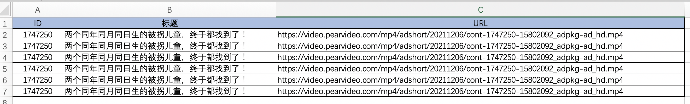

# day06 模块

## 作业A

1. 简述在开发中为什么要使用虚拟环境？

2. 通过命令如何实现：创建虚拟环境、激活虚拟环境、在虚拟环境中安装第三方包、退出虚拟环境。

3. 用户注册功能实现，需求如下：

   - 提示用户输入：用户名、密码

   - 对密码进行md5加密

   - 获取当前时间，格式为：2011-11-11 

   - 按照csv的格式写入到文件db.csv文件中，例如：

     ```
     wupeiqi,123,2021-11-11
     root,123,2021-11-11
     ```

4. 计算目录文件大小（字节）

   - 提示用户输入目录路径

   - 判断路径是否存在

     - 不存在，提示不存在
     - 存在，寻找目录下的所有文件并计算文件总大小（字节）

   - 提示：计算文件大小可以用。

     ```python
     import os
     
     size = os.stat('文件路径').st_size
     ```

5. 补充代码实现：下载并打包代码。

   ```python
   code_folder = "/Users/wupeiqi/codes"
   
   # 1.判断code_folder目录是否存在，不存在则创建
   
   
   # 2.进入code_folder目录并执行下载代码的命令（subprocess模块）
   #   git clone https://gitee.com/wupeiqi/luffy.git
   
   
   # 3.把下载的代码打包成zip包且保存在code_folder目录，文件名是当前时间(年月日时分秒)，如：2021111219223.zip
   ```

6. 补充代码获取联通商城信息，获取商品的标题、价格、评价人数，并写入Excel文件中。
   

   ```python
   # 代码依赖第三方包
   pip install requests
   pip install BeautifulSoup4
   ```

   ```python
   import re
   import requests
   from bs4 import BeautifulSoup
   
   res = requests.get(url="http://s.10010.com/hebei/mobilelist-0-0-0-0-0-0-0-0-177-0-0-p2/")
   
   soup_object = BeautifulSoup(res.text, 'html.parser')
   
   goods_object_list = soup_object.find_all(name='li', attrs={"class": "goodsLi"})
   
   for goods in goods_object_list:
       # 商品ID
       goods_id = goods.get("goodsid")
   
       # 商品标题
       title = goods.find(name='p', attrs={"class": "mobileGoodsName"}).find(name='a').text
   
       # 需求1：补充代码实现提取价格中的数字，例如：￥59，则想办法只获取数字部分。
       price_string = goods.find(name="label", attrs={'class': "priceD"}).text
   
       # 需求2：提取评论数量，例如：已有5人评价，想办法只获取数字部分。
       comment_string = goods.find(name="p", attrs={'class': "evalNum"}).text
   
       # 需求3：将已处理好的商品ID、价格、评论数量、商品标题写入到Excel文件中。
       print(goods_id, price_string, comment_string, title)
   ```

   Excel文件写入的代码示例：

   ```python
   from openpyxl import workbook
   from openpyxl.utils import get_column_letter
   
   # 创建Workbook
   wb = workbook.Workbook()
   
   # 获取sheet对象
   sheet = wb.worksheets[0]
   
   # 设置单元格的宽度：方式1
   # sheet.column_dimensions["A"].width = 15
   # sheet.column_dimensions["B"].width = 10
   # sheet.column_dimensions["C"].width = 10
   # sheet.column_dimensions["D"].width = 100
   
   # 设置单元格的宽度：方式2
   # sheet.column_dimensions[get_column_letter(1)].width = 15
   # sheet.column_dimensions[get_column_letter(2)].width = 10
   # sheet.column_dimensions[get_column_letter(3)].width = 10
   # sheet.column_dimensions[get_column_letter(4)].width = 100
   
   # 设置单元格的宽度：方式3
   width_dict = {"A": 15, "B": 10, "C": 10, "D": 100}
   for col_name, value in width_dict.items():
       sheet.column_dimensions[col_name].width = value
   
   # 写标题
   header = ["ID", "价格", "评论数", "标题"]
   for i, item in enumerate(header, 1):
       cell_object = sheet.cell(1, i)
       cell_object.value = item
   
   # 写内容
   sheet.cell(2, 1).value = "2999122121"
   sheet.cell(2, 2).value = "39"
   sheet.cell(2, 3).value = "10"
   sheet.cell(2, 4).value = "震惊了。。。。"
   
   # 保存到文件中
   wb.save('new.xlsx')
   ```

7. 学习示例代码，对第4题中的Excel文件的格式进行设置：

   - 所有单元格加边框。

   - 表头加背景色。

     示例代码如下：

     ```python
     
     from openpyxl import workbook
     from openpyxl.styles import Alignment, Border, Side, Font, PatternFill, GradientFill
     
     # 创建Workbook
     wb = workbook.Workbook()
     
     # 获取sheet对象
     sheet = wb.worksheets[0]
     
     # 获取第3行、第3列的单元格对象
     c1 = sheet.cell(3, 3)
     
     # 写文字
     c1.value = "武沛齐"
     
     # 文字居中
     c1.alignment = Alignment(horizontal='center', vertical="center")
     
     # 设置边框
     c1.border = Border(
         top=Side(style="thin", color="000000"),
         bottom=Side(style="thin", color="000000"),
         left=Side(style="thin", color="000000"),
         right=Side(style="thin", color="000000"),
     )
     
     # 设置背景色
     c1.fill = PatternFill("solid", fgColor="99ccff")
     
     wb.save('new.xlsx')
     ```


## 作业B

### 1. 下载梨视频

#### 1.1 下载488条数据

阅读代码，并修改代码，实现只下载488条数据。

```python
import requests
from bs4 import BeautifulSoup


def get_mp4_url(video_id):
    data = requests.get(
        url="https://www.pearvideo.com/videoStatus.jsp?contId={}".format(video_id),
        headers={
            "Referer": "https://www.pearvideo.com/video_{}".format(video_id),
        }
    )
    response = data.json()
    image_url = response['videoInfo']['video_image']
    video_url = response['videoInfo']['videos']['srcUrl']
    middle = image_url.rsplit('/', 1)[-1].rsplit('-', 1)[0]
    before, after = video_url.rsplit('/', 1)
    suffix = after.split('-', 1)[-1]
    url = "{}/{}-{}".format(before, middle, suffix)
    return url


def download_video():
    count = 0
    while True:
        res = requests.get(
            url="https://www.pearvideo.com/category_loading.jsp?reqType=14&categoryId=&start={}".format(count)
        )
        bs = BeautifulSoup(res.text, 'lxml')
        a_list = bs.find_all("a", attrs={'class': "vervideo-lilink"})
        for tag in a_list:
            title = tag.find('div', attrs={'class': "vervideo-title"}).text.strip()
            video_id = tag.get('href').split('_')[-1]
            mp4_url = get_mp4_url(video_id)
            count += 1
            print(video_id, title, mp4_url)


if __name__ == '__main__':
    download_video()
```


#### 1.2 写入Excel

写入Excel时，格式有如下要求：

- 所有单元格加边框。
- 标题加背景色 + 居中。
- ID列居中，其他列居左（默认）。




##### 示例：Excel内容写入

```python
from openpyxl import workbook
from openpyxl.utils import get_column_letter

# 创建Workbook
wb = workbook.Workbook()

# 获取sheet对象
sheet = wb.worksheets[0]

# 设置单元格的宽度：方式1
# sheet.column_dimensions["A"].width = 15
# sheet.column_dimensions["B"].width = 10
# sheet.column_dimensions["C"].width = 10
# sheet.column_dimensions["D"].width = 100

# 设置单元格的宽度：方式2
# sheet.column_dimensions[get_column_letter(1)].width = 15
# sheet.column_dimensions[get_column_letter(2)].width = 10
# sheet.column_dimensions[get_column_letter(3)].width = 10
# sheet.column_dimensions[get_column_letter(4)].width = 100

# 设置单元格的宽度：方式3
width_dict = {"A": 15, "B": 10, "C": 10, "D": 100}
for col_name, value in width_dict.items():
    sheet.column_dimensions[col_name].width = value

# 写标题
header = ["ID", "价格", "评论数", "标题"]
for i, item in enumerate(header, 1):
    cell_object = sheet.cell(1, i)
    cell_object.value = item

# 写内容
sheet.cell(2, 1).value = "2999122121"
sheet.cell(2, 2).value = "39"
sheet.cell(2, 3).value = "10"
sheet.cell(2, 4).value = "震惊了。。。。"

# 保存到文件中
wb.save('new.xlsx')
```


##### 示例：Excel加样式

```python

from openpyxl import workbook
from openpyxl.styles import Alignment, Border, Side, Font, PatternFill, GradientFill

# 创建Workbook
wb = workbook.Workbook()

# 获取sheet对象
sheet = wb.worksheets[0]

# 获取第3行、第3列的单元格对象
c1 = sheet.cell(3, 3)

# 写文字
c1.value = "武沛齐"

# 文字居中
c1.alignment = Alignment(horizontal='center', vertical="center")

# 设置边框
c1.border = Border(
    top=Side(style="thin", color="000000"),
    bottom=Side(style="thin", color="000000"),
    left=Side(style="thin", color="000000"),
    right=Side(style="thin", color="000000"),
)

# 设置背景色
c1.fill = PatternFill("solid", fgColor="99ccff")

wb.save('db.xlsx')
```


### 2.梨视频管理平台

将读取作业B的第1题中生成的 `db.xlsx` 作为数据源，提供视频管理平台。

核心功能如下：

- 分页看新闻（每页显示10条数据），提示用户输入页码，根据页码显示指定页面的数据。

  - 提示用户输入页码，根据页码显示指定页面的数据。
  - 当用户输入的页码不存在时，默认显示第1页

  ```python
  # 获取Excel最大行数
  from openpyxl import load_workbook
  
  wb = load_workbook("files/p1.xlsx")
  sheet = wb.worksheets[0]
  print(sheet.max_row)
  ```

  ```python
  # 读取Excel部分数据
  from openpyxl import load_workbook
  
  wb = load_workbook("files/p1.xlsx")
  sheet = wb.worksheets[0]
  
  for row in sheet.iter_rows(min_row=1, max_row=10):
      print(row[0].value)
  ```

- 搜索专区，用户输入关键字，根据关键词筛选出所有匹配成功的短视频资讯。
  - 支持的搜索两种搜索格式：
    - `id=1715025`，筛选出id等于1715025的新闻信息并输出。
    - `key=文本`，模糊搜索，筛选包含关键字的所有新闻信息并输出。

- 下载专区
  - 用户输入视频id，根据id找到对应的mp4视频下载地址，然后下载视频到项目的files目录。

    - 视频的文件名为：`视频id-年-月-日-时-分-秒.mp4`


**下载示例1：**下载视频并显示视频大小和已下载大小。

```python
import requests

res = requests.get(
    url='https://video.pearvideo.com/mp4/adshort/20211206/cont-1747250-15802092_adpkg-ad_hd.mp4'
)

# 视频总大小（字节）
file_size = int(res.headers['Content-Length'])

download_size = 0
with open('xxx.mp4', mode='wb') as file_object:
    # 分块读取下载的视频文件（最多一次读128字节），并逐一写入到文件中。 len(chunk)表示实际读取到每块的视频文件大小。
    for chunk in res.iter_content(128):
        download_size += len(chunk)
        file_object.write(chunk)
        file_object.flush()
        message = "视频总大小为：{}字节，已下载{}字节。".format(file_size, download_size)
        print(message)
    file_object.close()

res.close()
```


**下载示例2**：下载视频并显示视频大小和已下载大小（仅在一行展示）

```python


import requests

res = requests.get(
    url='https://video.pearvideo.com/mp4/adshort/20211206/cont-1747250-15802092_adpkg-ad_hd.mp4'
)

# 视频总大小（字节）
file_size = int(res.headers['Content-Length'])

download_size = 0
with open('xxx.mp4', mode='wb') as file_object:
    # 分块读取下载的视频文件（最多一次读128字节），并逐一写入到文件中。 len(chunk)表示实际读取到每块的视频文件大小。
    for chunk in res.iter_content(128):
        download_size += len(chunk)
        file_object.write(chunk)
        file_object.flush()

        # 1.输出字符串前面加\r时，输出时，会回到当前行的最前面，然后再输出。（原来的内容清空，出现一直在当前行输出的效果）
        # 2. end="" 为了保证每次都是在同一行输出，这样 \r 才能回到原来输出行的最前面。
        message = "\r视频总大小为：{}字节，已下载{}字节。".format(file_size, download_size)
        print(message, end="")
    file_object.close()

res.close()

# 3.由于之前的输出都是没有换行符，所以这个输出时候前面加一个\n，可以再另起一行输出下载完成。
print("\n下载完成")

```


**下载示例3：进度百分比**

```python
import requests

res = requests.get(
    url='https://video.pearvideo.com/mp4/adshort/20211206/cont-1747250-15802092_adpkg-ad_hd.mp4'
)

# 视频总大小（字节）
file_size = int(res.headers['Content-Length'])

download_size = 0
with open('xxx.mp4', mode='wb') as file_object:
    # 分块读取下载的视频文件（最多一次读128字节），并逐一写入到文件中。 len(chunk)表示实际读取到每块的视频文件大小。
    for chunk in res.iter_content(128):
        download_size += len(chunk)
        file_object.write(chunk)
        file_object.flush()
        percent = "\r{}%".format(int(download_size*100 / file_size))
        print(percent, end="")
    file_object.close()

res.close()

# 3.由于之前的输出都是没有换行符，所以这个输出时候前面加一个\n，可以再另起一行输出下载完成。
print("\n下载完成")
```


