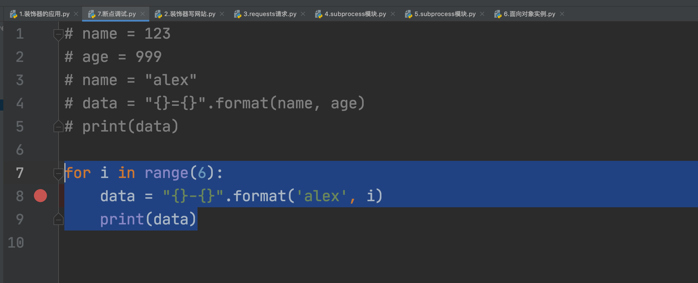

# day07 复习和答疑

> 不讲新课，只做答疑和知识点复习。

今日概要：

- 答疑
- 知识点复习
- 作业问题


## 1.答疑

```
装饰器的使用方法，写作业不知道怎么能用上
requests模块，模拟浏览器发请求，接收不到需要的数据
讲解下函数的具体用例(比如将之前的作业利用函数来实现)
分享下企业常用Python套路(分享下做Python开发的公司项目)
subprocess想听老师详细详细讲一讲，因为运维用的挺普遍的
怎么把面向对象学好啊，感觉学的有点懵比
讲的内容都会，但是做作业就没有思路，有没有什么方法可以借鉴一下，除了多练习
```


### 1.1 装饰器应用

- 现阶段：装饰器伪命题。

  ```
  xx平台的开发：登录、查看信息、我的资料，其中查看信息、我的资料是需要用户登录成功之后，才能观看。
  ```

  ```python
  """
  xx平台的开发：登录、查看信息、我的资料，其中查看信息、我的资料是需要用户登录成功之后，才能观看。
  """
  
  # 当前登录用户（未登录时None，已登录时就是当前的用户名）
  CURRENT_USER = None
  
  
  def outer(func):
      def inner(*args, **kwargs):
          # 判断，用户是否已登录。
          if CURRENT_USER == None:
              print("未登录，无权查看")
              return
          return func(*args, **kwargs)
      return inner
  
  
  def login():
      """ 用户登录 """
      user = input("用户名：")
      pwd = input("密码：")
  
      if user == 'alex' and pwd == 'sb':
          print("登录成功")
          global CURRENT_USER
          CURRENT_USER = user
      else:
          print("用户名或密码错误")
  
  
  @outer
  def my():
      """ 我的资料 """
      print("我的资料")
  
  
  @outer
  def info():
      """ 查看信息 """
      print("查看信息")
  
  
  def run():
      print("欢迎使用xxx系统")
      func_dict = {"1": login, '2': my, '3': info}
      while True:
          print("1.登录；2.我的资料；3.查看信息；")
          choice = input("请选择序号：")
          func = func_dict.get(choice)
          if not func:
              print("用户输入错误")
              continue
          func()
  
  
  if __name__ == '__main__':
      run()
  
  ```

- web框架：使用到装饰器。

  ```
  网站，有些页面都是登录成功后才能看，未登录时访问某些页面，就会自动跳转到登录页面。
  ```

  ```python
  """
  pip install flask
  """
  
  from flask import Flask
  
  app = Flask(__name__)
  
  
  # 本质，就是将 /index 和 Python函数创建对应关系
  @app.route('/index')
  def index():
      # 判断用户是否已登录
      # 未登录，跳转到登录页面
      # 已登录，则继续向下访问
  
      return "首页"
  
  
  # 本质，就是将 /index 和 Python函数创建对应关系
  @app.route('/my')
  def my():
      # 判断用户是否已登录
      # 未登录，跳转到登录页面
      # 已登录，则继续向下访问
  
      return "我的资料"
  
  
  # 本质，就是将 /index 和 Python函数创建对应关系
  @app.route('/login')
  def login():
      return "登录页面"
  
  
  if __name__ == '__main__':
      app.run()
  ```


### 1.2 requests获取数据

```
- 浏览器，正常的访问网站。
- 代码模拟浏览器发送请求（伪造的足够像）
	- user-agent
	- IP频率限制（代理IP）
	- 算法，JS逆向。
```

```python
import requests

res = requests.get(
    url="https://www.zhihu.com/api/v4/answers/2265266340/root_comments?order=normal&limit=20&offset=0&status=open"
)

print(res.text) # 无法获取数据
```

```python
import requests

res = requests.get(
    url="https://www.zhihu.com/api/v4/answers/2265266340/root_comments?order=normal&limit=20&offset=0&status=open",
    headers={
        "user-agent": "Mozilla/5.0 (Macintosh; Intel Mac OS X 10_15_7) AppleWebKit/537.36 (KHTML, like Gecko) Chrome/96.0.4664.55 Safari/537.36"
    }
)

print(res.text) # 获取到数据
```


### 1.3 函数的应用

```
xx平台的开发：登录、查看信息、我的资料，其中查看信息、我的资料是需要用户登录成功之后，才能观看。
```

```python
choice = input(">>>")
if choice == "1":
    写登录的代码
elif choice == "2":
    写查看信息代码
elif choice == "3":
    我的资料代码
```

上述实现方式可读性差。

```python
def f1():pass
def f2():pass
def f3():pass

choice = input(">>>")
if choice == "1":
    f1()
elif choice == "2":
	f2()
elif choice == "3":
	f3()
```

初学者，不要想着一次性拆分非常合理。

- 整体从大的方面拆。
- 函数里面重复的代码出现，再讲重复的抽离出来写成另外一个公共的函数，让其他调用者去使用。


案例：扑克牌。

```python
# 1.生成扑克牌，用一个函数生成。

# 2.发牌 & 比较大小。
```

注意 ：代码超过一屏 或 有功能功能，才用函数。


### 1.4 subprocess模块

```python
import subprocess

res = subprocess.getoutput("df")
print(res)

res = subprocess.check_output("df", shell=True, cwd="跳转到指定目录")
print(res)
```

知识点的补充：

- 实时数据获取

  ```python
  import subprocess
  
  obj = subprocess.Popen('ping www.baidu.com', shell=True, stdout=subprocess.PIPE)
  
  # 去管道中读取所有的数据
  # res = obj.stdout.read()
  # print(res)
  
  while True:
      res = obj.stdout.readline()
      print(res.decode('utf-8'))
  ```

- 实时输入和实时错误（线程）

  ```python
  import subprocess
  
  obj = subprocess.Popen('python3.9 -i', shell=True, stdout=subprocess.PIPE, stdin=subprocess.PIPE,
                         stderr=subprocess.PIPE)
  
  # stdin，输入指令 print(1+3)
  obj.stdin.write("print(1+3)\n".encode('utf-8'))
  obj.stdin.flush()
  
  # stdout，读取内容
  line = obj.stdout.readline()
  print(line.decode('utf-8'))
  
  # stdin，输入指令 print(1+3)
  obj.stdin.write("print(4+3)\n".encode('utf-8'))
  obj.stdin.flush()
  
  # stdout，读取内容
  line = obj.stdout.readline()
  print(line.decode('utf-8'))
  ```

  ```python
  import subprocess
  import threading
  import time
  
  obj = subprocess.Popen('python3.9 -i', shell=True, stdout=subprocess.PIPE, stdin=subprocess.PIPE,
                         stderr=subprocess.PIPE)
  
  
  def read_task():
      while True:
          # stdout，读取内容
          line = obj.stdout.readline()
          if line:
              print(line.decode('utf-8'))
  
  
  # 创建一个线程（人），让他专门去执行read_task函数，函数内部源源不断的读取stdout
  t = threading.Thread(target=read_task)
  t.start()
  
  # 我，专门写
  while True:
      code = input("请输入代码：")  # print(4+3)
      code_line = "{}\n".format(code)
      obj.stdin.write(code_line.encode('utf-8'))
      obj.stdin.flush()
      time.sleep(2)
  ```


### 1.5 面向对象

> 线上的同学。

在Python中想要进行项目的开发：

- 函数式编程，单独函数做开发完全没问题。【更好理解，简单，绝大部分的功能】
- 面向对象编程，单纯用面向对象做开发完全没问题。【初学者不太友好，复杂】

在你们此时此刻学习时，应优先用函数来实现，实现完成之后，再用面向对象尝试是否可以更加简洁。


如何学好面向对象对象？

- 三大特性

  ```
  封装，数据打包【用户注册，用户信息存字典、封装到对象】
  继承，自己有用自己的，没有就想上级找。【有公共的功能提取到父类】
  多态，默认多态。
  ```

- 高级用法

  ```
  可迭代对象/上下文管理/__call__
  ```


应用场景

```python
from flask import Flask, jsonify

app = Flask(__name__)


class BaseResponse(object):
    def __init__(self):
        self.status = True
        self.data = None
        self.error = "错误信息"


@app.route('/index')
def index():
    # data = {"status": True, 'data': None, 'error': "错误信息"}
    # data['data'] = "999"
    # data['status'] = False
    # return jsonify(data)

    data = BaseResponse()
    data.status = False
    data.data = "999"
    return jsonify(data.__dict__)


@app.route('/my')
def my():
    data = {"status": True, 'data': None, 'error': "错误信息"}

    return jsonify(data)


@app.route('/login')
def login():
    data = {"status": True, 'data': None, 'error': "错误信息"}

    return jsonify(data)


if __name__ == '__main__':
    app.run()
```


### 1.6 写作业没思路

```
做作业就没有思路，有没有什么方法可以借鉴一下，除了多练习。
```

```
根据Excel中的会员积分排序和查找。

已掌握
	- 数据类型
	- 函数
	- MySQL
任务：
	- 网上搜，直接拿来用。（百度、百度文档），粘贴到程序，试错。（文章描述：...）
	- 找朋友帮忙，问怎么做。
	- 大致的解决思路
		- 程序读取Excel文件，导入到access。
		- 在access中执行SQL语句。
		- wform中进行展示。
	- 逐步去实现：
		1. C#打开Excel文件、读取每一行
		2. wform中如何上传excel，C#打开Excel文件、读取每一行
		3. C#连接access数据，数据插入。
		...
```

```python
分析作业：
	- 已知知识点， 未知知识点，单独学习知识点。
    - 整体实现的思路
    	- 中文
        - 伪代码
	- 设计的功能罗列出来，功能是否都会。
    - 套，实现。
    
    - 优化
    	- 自己优化
        - 参考别人代码
        - 课堂讲解
```

```python
需求：
	- 评估时，先看这个里面都有哪些功能。【2天】
    - 项目设计 & 表结构【20】
    - 开发简单【8天】
```


## 2.知识点的复习

### 2.1 基础知识点

- 环境搭建

  ```
  Python安装目录，以及重要的目录：
  	- Scripts
  		- pip.exe
  	- Lib
  		- sitepackage
  ```

- 写代码

  ```
  - 注释
  - 输入输出
  - 变量
  - 条件语句/循环语句
  - 运算符（面试）
  	- 一般用法：加减乘除...
  	- 逻辑运算符
  		- 普通用法
  			if user == "alex" and pwd == "123":
  				pass
  		- 特殊用法：逻辑运算符前后放值
  			9 and 8 
  			10 or [11,22]
  			
  			- 结果是前面的值或后面的值。
  			- 整个结果取决于那个值，结果是就那个值。
  			  v1 = 9 and 8   -> 8
  			  v1 = 0 and 8   -> 0
  			  v1 = [11,22] and False  -> False
  			  v1 = False and True     -> False
  			  
  			  分析以前的一般用法：
  			  user == "alex" and pwd == "123"
  			  True and False 
  ```


### 2.2 数据类型

- 字符串类型

  ```
  - 不可变类型 & 可哈希类型
  - 独有功能：upper/lower/strip/split/join/isdecimal（原数据不变）
  	v1 = "root"
  	data = v1.upper()
  - 公共功能：长度/切片（读取）/索引（读取）/for循环/in判断是否包含。
  ```

- 列表类型

  ```
  - 可变类型 & 不可哈希
  - 独有功能：append/insert/remove/pop...
  	v1 = [11,22,33]
  	v1.append(44)
  - 公共功能：长度/切片/索引/for循环/in判断包含。
  	v1 = [11,22,33]
  	v1[0] = 666
  ```

- 字典类型

  ```python
  - 可变类型 & 不可哈希
  - 独有功能：get/keys/items/values
  - 公共功能：长度/索引（键）/for循环/in判断（效率高，底层基于哈希实现）
  ```

- 元组类型

  ```python
  - 不可变类型 & 可哈希（哈希函数的内部会去获取每个元素，每个元素都要保证可哈希(11,22,[11,22],33) )
  - 独有功能：无
  - 公共功能：长度/切片（读取）/索引（读取）/for循环/in判断是否包含。
  ```

- 整型

- 布尔类型

  ```
  什么类型转换成布尔值为False ：空值/None/0，其他都是True。
  ```

  

### 2.3 函数

- 定义函数

- 参数

  ```python
  def func(a1):
      pass
  
  def func(a1,a2=345):
      pass
  
  def func(*args,**kwargs):
      pass
  ```

- 返回值

  - 看到return立即终止函数的运行

  - return一个或多个值

    ```python
    def func(*args,**kwargs):
        return 1,2,3,4
    ```

- 函数名 本质就是变量

  ```python
  def func():
      return 123
  
  # func是一个变量名。
  # func()
  
  data_list = [ func, func, func ]
  data_list = [ func(), func(), func() ]
  
  # 函数一个非常重要的应用。
  func_dict = {"1":login,'2':register}
  ```

- 函数作用域

  ```python
  for i in range(10):
      pass
  
  print(i)
  ```

- 闭包

- 装饰器

- 内置函数

  ```
  max/bin/hex/ord/chr....
  ```

  ```python
  # 注意事项，定义变量时不要用python内置的函数。
  bin = 123
  bin(55)
  ```


### 2.4 模块

- 自定义模块

  ```
  定义模块和包
  导入模块：sys.path 、 import 、from xxx
  
  自定义模块名字时，不要用内置的模块名。
  ```

- 内置模块

  ```python
  os/time/datetime/json/random/hashlib/subprocess...
  
  更多功能：搜、官方文档。
  ```

- 第三方模块

  ```python
  requests/bs4/openpyxl/...
  ```

  ```
  安装第三方模块：
  	- pip安装
  	- 源码安装
  	- wheel包安装
  安装成功的第三方模块都是放在sitepackage目录。
  ```

  

### 2.5 虚拟环境

- 系统解释器，自己电脑上安装Python解释器（`c:\python39`)。

  ```
  pip install flask==1.2
  pip install requests==1.9
  ```

  ```python
  c:\python39
      - Lib
      	- sitepackages
          	- flask 1.2
              - requests 1.9
      - python3.9.exe
  ```

  ```python
  # code.py
  import flask
  import requests
  
  print(...)
  
  >>>c:\python39\python3.9.exe code.py
  ```

- 虚拟环境，虚拟解释器，根据系统解释器拷贝出多份解释器的环境。

  ```python
  # 系统解释器
  c:\python39
      - Lib
      	- site-packages
          	- flask 1.2
              - requests 1.9
      - python3.9.exe
  ```

  ```
  # 虚拟解释器 1
  D:\envs\crm
  	- Scripts
  		- activate.exe
  		- pip.exe
  	- Lib
  		- site-packages
  			- ...
  			- ...
  	- python3.9.exe
  	
  >>>activate.exe
  >>>pip install xxx
  >>>pip install xxx
  >>>pip install xxx
  ```

  ```
  # 虚拟解释器 1
  D:\envs\crm
  	- Scripts
  		- activate.exe
  		- pip.exe
  	- Lib
  		- site-packages
  			- ...
  			- ...
  	- python3.9.exe
  	
  >>>activate.exe
  >>>pip install xxx
  >>>pip install xxx
  >>>pip install xxx
  ```


以后在进行项目开发时，一般都是一个项目使用一个虚拟环境。

- 项目A
- 虚拟环境A，将项目所需的所有第三方包和版本。


注意：一定要将三个目录区分开

- 系统解释器，例如：C:\python39
- 虚拟环境（虚拟解释器），例如：E:\envs
- 项目目录，例如：D:\code


### 案例

- 我写项目。

- 给刘冀超

  - 代码
  - requirements.txt

- 刘冀超拿到代码后。

  - 创建虚拟环境

  - 在虚拟环境下安装 `requirements.txt`中所有的第三方包。

    ```python
    pip install -r requirements.txt
    ```

  - 使用此虚拟环境运行项目。

  


### 问题

- 写项目，产品的交付。

  - exe文件，打开之后就是终端操作。

    ```
    用python中的一个pyinstaller的模块，直接就可以打包，在第一期周末直播课（以前）。
    ```

  - 桌面应用，pyqt5

    ```python
    亚马逊价格监测平台，直接通过pyinstaller打包成exe文件。
    ```

  - Web页面，写网站。

    ```python
    用户在页面上操作。
    ```

- 做进销存管理

  - 壳子，做用户交互。

    - 用户提交数据，例如：录入数据、删除。
    - 给用户展示数据，例如：用户列表、商品列表。

  - 做Excel处理时，对Excel里面的进行增删改查。

    ```python
    所有的操作的都是读取到内存，自己在内存进行操作。
    例如：删除Excel中的一条数据。
    	- 读取所有的内容
        - 删除一行数据
        - 所有的内容再重新写入到文件。
    ```

  - 数据库

    ```
    - sqlite / access
    - MySQL  / SQLServer
    
    注意：wform、wpf（导入到系统，插件，就是将数据放在内存）
    ```

- 加密和解密 ？

  ```
  路飞大课的同学们?
  app逆向，app中的加密和逆向；java如何实现？Python如何实现。
  ```

- 字符集

  ```
  老师，浏览器输入的数据，传到后端，是默认使用的客户端电脑字符集吗（浏览器设置和代码有关）。
  ```

- pycharm断点调试

  

- 什么是api

  ```
  - api，官方内部提供的功能。
  	data = "root"
  	res = data.upper() # 官方API中提供的功能。
  	print(res)
  	
  - api，就是泛指URL。
  	https://api.luffycity.com/api/v1/course/actual/?category_id=9&offset=0&limit=5
  	你给我一个API，我来调用，返回一个数据。
  	
  前后端分离会有API
  ```

- PEP8规范

  ```
  建议配合pycharm来使用。
  ```

- 写项目必不可少：队列、nginx、服务。

  ```
  vue.js + elementui
  ```

- 关于源码

  ```
  - 学会如何用， Django如何是用。
  - 深入研究源码，Drf源码。
  ```

- 关于自动化课程

  ```
  - 基础都是一样（精简）
  - 项目驱动（数据库、前端、框架） -> 项目。
  - 分方向项目：测试、运维 -> 开发出来项目
  - 自主研发，属于你自己的项目。
  ```

- 垃圾回收机制

  ```python
  https://www.bilibili.com/video/BV1dp4y1C7ja?spm_id_from=333.999.0.0
  https://pythonav.com/wiki/detail/6/88/
  ```

- 关于URL的处理

  ```python
  from urllib.parse import urlencode
  
  param_dict = {
      "k1": "123",
      "age": "hahah"
  }
  data = urlencode(param_dict)
  print(data)
  ```

  ```python
  www.luffycity.com?a1=123&a2=456
  ```

  ```
  "GET /?a1=123&a2=456 http1.1\r\n请求头\r\nxxx\r\nxxx\r\n"
  ```

  

## 3.作业问题

```
【腾讯文档】12月11日，课程答疑问题收集
https://docs.qq.com/sheet/DSmdaUUpnZW1vY3Zz
```


