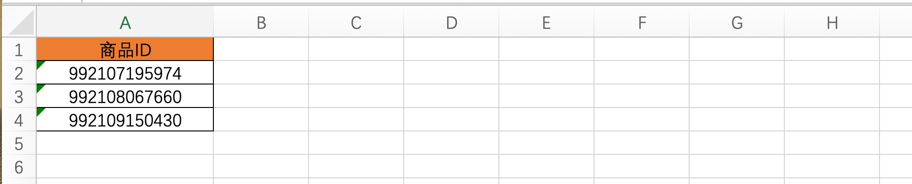
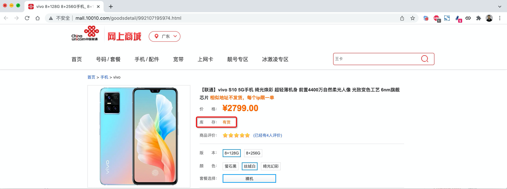

# day08 作业

## 1. 代码发布脚本

> 此作业针对 运维 & 测试方向的同学，不熟悉Linux和服务器操作的同学可忽略。

编写代码发布脚本，实现如下功能：

- 本地通过git下载代码到指定目录。
- 本地打包成zip压缩文件。
- 基于paramiko上传zip文件至服务器的指定目录。
- 基于paramiko实现解压文件。


## 2. 库存监测系统（基础版）

> 我要求只做作业A的同学，仅需完成此作业即可。

请开发一个联通商城商品库存监测平台，监测自己感兴趣的商品是否有库存，如果有库存，则发送消息报警，系统要求如下：

- 打开指定的Excel文件，读取要监控的商品ID，例如：

  

- 循环监测每个商品的库存情况（无需考虑并发情况）。

  ```
  示例链接如下：
  	http://mall.10010.com/goodsdetail/992108067660.html
  	http://mall.10010.com/goodsdetail/992109150430.html
  
  也可以自行寻找商品连接：
  	http://s.10010.com/gd/mobile/
  ```

  

- 如果监测到有库存，则发送消息报警（使用企业微信的机器人）。

  ```
  快速使用教程：https://zhuanlan.zhihu.com/p/447472516
  ```

- 系统配置文件中有如下几个值（ini格式），以供用户进行配置。

  ```
  [settings]
  
  # Excel文件的路径
  excel_path = C:\xxx\xx\db.xlsx
  
  # 微信机器人通知地址，检测到有库存
  wx_url = https://qyapi.weixin.qq.com/cgi-bin/webhook/send?key=e69ddddddd
  ```

  

## 3. 库存监测系统（升级版）

在实现上述功能的前提下，再实现如下两个功能。

### 3.1 报警间隔处理

为了避免报警消息反复的提醒，如果持续在监测到有库存，则每个10分钟报警一次（默认）。例如：

```
10:21 第1次发送报警   
10:31 第2次发送报警   
10:41 第3次发送报警   

如果后续不再有库存，则不需要再提醒，继续监测。
```


### 3.2 将程序打包成exe文件

将程序打包成exe文件，提供给其他用户使用。

如何将程序打包成exe文件呢？

- windows用户

  ```
  第一步：安装pyinstaller模块
  	   pip install pyinstaller
  	   
  第二步：在终端进入项目目录 并 使用pyinstaller 命令进行打包。
  		pyinstaller -F demo.py  -n  价格监控
  		其中：
  			demo.py 是代码文件名。
  			价格监控 是打包后生成的exe文件名称
  第六步：在项目目录下的dist目录中可以看到生成的exe文件
  ```

- mac用户

  ```
  第一步：安装windows虚拟机
  第二步：在windows虚拟机中安装项目所需的模块，例如：requests 、 openpyxl
  第三步：在windows虚拟中安装pyinstaller模块
  	   pip install pyinstaller
  	   
  第四步：在windows虚拟机中，打开终端并进入项目目录 并 使用pyinstaller 命令进行打包。
  第五步：在终端进入项目目录 并 使用pyinstaller 命令进行打包。
  		pyinstaller -F demo.py  -n  进程监控
  		其中：
  			demo.py 是代码文件名。
  			价格监控 是打包后生成的exe文件名称
  第六步：在项目目录下的dist目录中可以看到生成的exe文件
  ```


## 作业提交说明

本周大家的作业需要提交两部分的内容：

- 代码文件：不用提交md文件了，只需要提交 代码文件 + 配置文件即可。
- exe文件：将打包好的exe文件提交。


