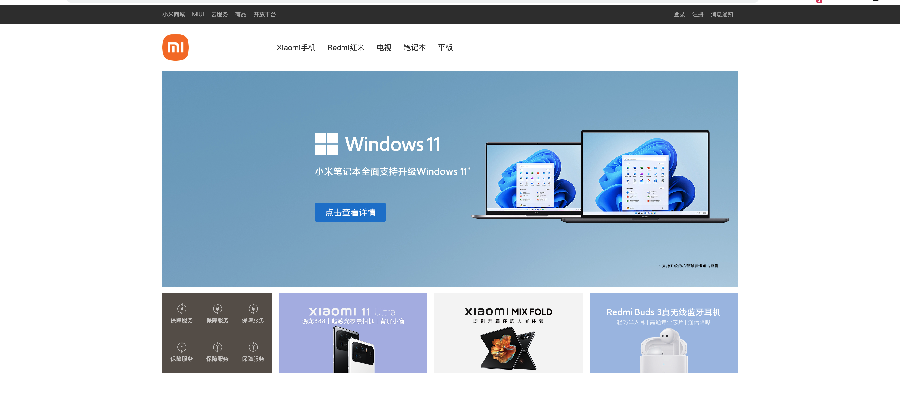
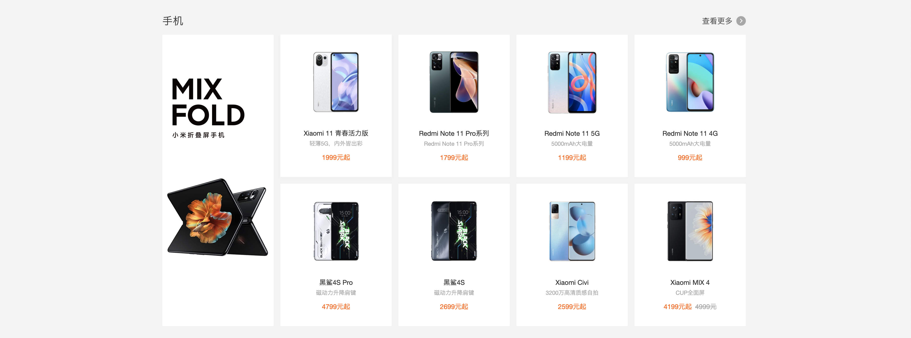

# day09 作业

## 1.库存监测系统（线程版）

对上节作业进行扩展，实现如下功能：

- 创建线程池，数量与Exce中读取的型号数量一致（1个线程负责一个型号的监测）
- 每个线程专门负责一个型号的监测和通知。

## 2.小米商城

根据小米商城的主页 https://www.mi.com/ 完成如下页面的开发。

更多HTML+CSS+JS学习文档：https://pythonav.com/wiki/detail/5/61/

