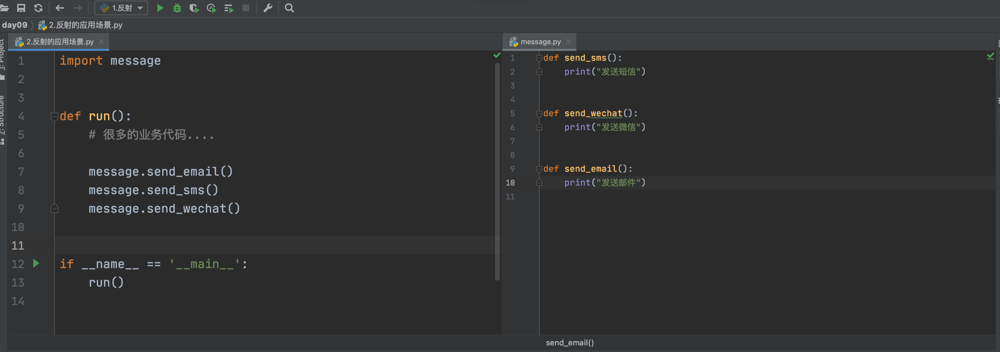
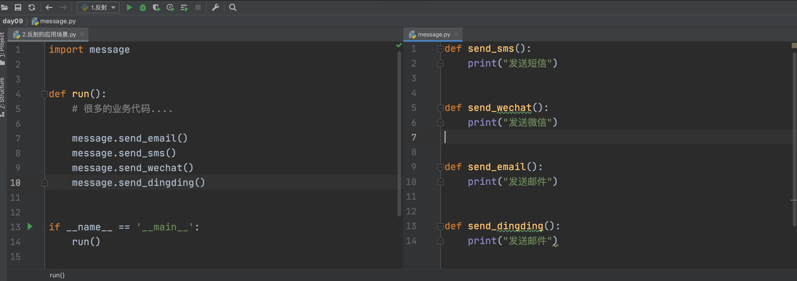
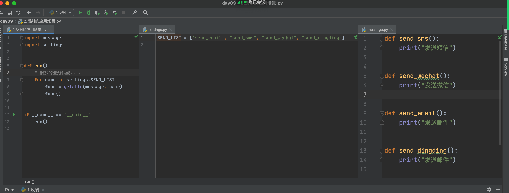
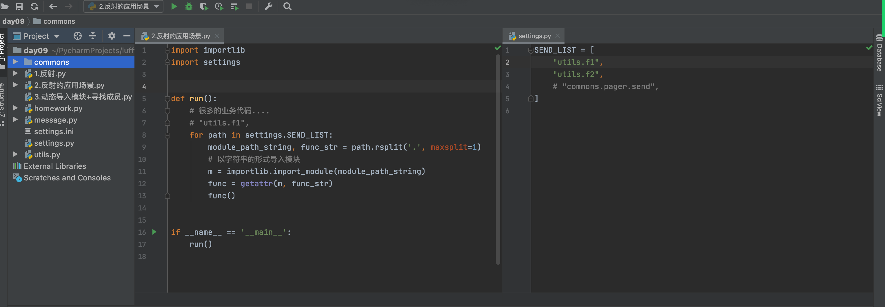
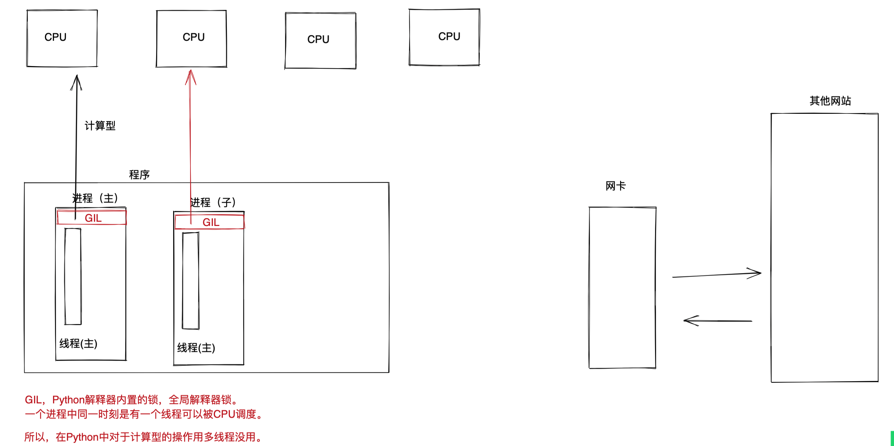
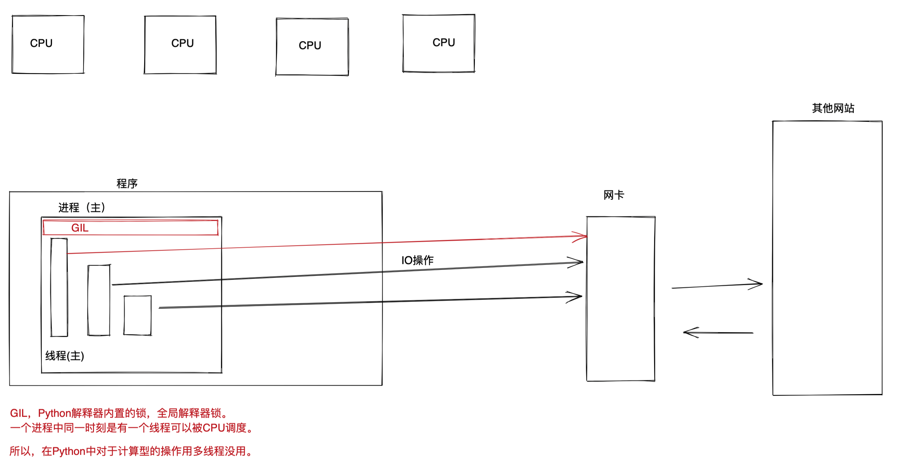

# day09 并发和前端

今日概要：

- 并发：进程、线程。
- 项目：小猿圈项目（项目驱动）
  - Flask写小网站
  - 前端开发：HTML、CSS、JS、第三方插件。
  - 数据库操作


## 1.上节作业

见代码：homework.py


## 2.反射

以字符串的形式去操作某个 对象 中的成员（Python中一切皆对象）。

```python
# 1.传统的导入并执行成员
# import utils
# utils.f1()

# 2.反射的形式找成员
"""
import utils
data = getattr(utils, "f2")
data()
"""
```


```python
class Foo(object):
    def __init__(self, name, age):
        self.name = name
        self.age = age


obj1 = Foo("欧阳", 99)
print(obj1.name)
print(obj1.age)

v1 = getattr(obj1, 'name')
print(v1)
v2 = getattr(obj1, 'age')
print(v2)
```


- getattr，去对象中获取成员

  ```
  getattr(对象,"成员")
  ```

- settattr，设置成员

  ```
  class Foo(object):
      def __init__(self, name, age):
          self.name = name
          self.age = age
  
  
  obj1 = Foo("欧阳", 99)
  obj1.email = "xxx@live.com"
  
  setattr(obj1, "email", "xxx@live.com")
  setattr(obj1, "name", "熊阳")
  ```

- hasattr，判断对象中是否有此成员

  ```python
  class Foo(object):
      def __init__(self, name, age):
          self.name = name
          self.age = age
          
  obj1 = Foo("欧阳", 99)
  v1 = hasattr(obj1, 'xxxx')
  print(v1)
  ```

- delattr，删除对象中的成员

  ```python
  class Foo(object):
      def __init__(self, name, age):
          self.name = name
          self.age = age
  
  
  obj1 = Foo("欧阳", 99)
  print(obj1.name)
  
  delattr(obj1, 'name')
  
  print(obj1.name)
  ```

  


所以，以后给你一个对象，让你通过这个对象去 操作 他内部成员时，就有两种方式：

- 对象.xxxx
- 反射：getattr/setattr/hasattr/delattr


应用场景和优势：

- 一般做普通项目开发用不上。
- 动态对某些值想要配置配置并根据配置去操作时才会用他。







利用反射：






写在最后：

- 简单应用用不上。
- 可扩展应用（不同公司不同用法）。


## 3.疑问

- 关于数据类型

  ```python
  class Foo(object):
  	def get(self):
         	pass
  
  obj1 = Foo()
  obj1.get()
  
  obj2 = Foo()
  obj2.get()
  ```

  ```python
  str/list/dict/tuple，其实是Python写好的类。
  
  class list:
      def insert(self..):
          pass
      def append(self,..):
          pass
  
  v1 = [11,22,33]
  v1 = list()
  v1.append(11)
  v1.append(22)
  v1.append(33)
  
  v1[0]    ->  list类中 __getitem__ 方法
  ```

  ```python
  v1 = [11, 22, 33]
  
  print(v1[2])
  
  res = v1.__getitem__(2)
  print(res)
  
  method = getattr(v1, '__getitem__')
  res = method(2)
  print(res)
  ```


## 4.并发编程

https://www.bilibili.com/video/BV1Ev411G7i3

### 4.1 进程和线程

- 进程包含线程
- 线程是计算机中工作的最小单元
- 默认：进程之间是相互隔离
- 默认：一个程序中有一个进程、一个进程中有一个线程。


对于其他的所有编程语言来将，一般都会创建多线程。







在Python开发中（全局解释器锁导致）。

- IO型的操作，用多线程提高并发。
- 计算型的操作，用多进程提高并发。


串行的代码：

```python
import requests


def download(url):
    res = requests.get(url)
    print(res)


def run():
    url_list = [
        "https://space.bilibili.com/283478842",
        "https://www.luffycity.com/",
        "https://www.cnblogs.com/wupeiqi"
    ]

    for url in url_list:
        download(url)
        
    print("END")


if __name__ == '__main__':
    run()
```


多线程：

```python
import time
import threading


def task(v1, v2):
    time.sleep(10)
    print("结束")

t = threading.Thread(target=task, args=(11, 22))
t.start()
```

```python
import threading
import requests


def download(url):
    res = requests.get(url)
    print(res)


def run():
    url_list = [
        "https://space.bilibili.com/283478842",
        "https://www.luffycity.com/",
        "https://www.cnblogs.com/wupeiqi"
    ]

    for url in url_list:
        # download(url)
        t = threading.Thread(target=download, args=(url,))
        t.start()

    print("END")


if __name__ == '__main__':
    run()
```


多进程示例：

```python
import multiprocessing


def task(v1):
    print("V1")


def run():
    print("开始")
    p = multiprocessing.Process(target=task, args=(1,))
    p.start()
    print("结束")


if __name__ == '__main__':
    run()
```

```python
import multiprocessing
import requests


def download(url):
    res = requests.get(url)
    print(res)


def run():
    url_list = [
        "https://space.bilibili.com/283478842",
        "https://www.luffycity.com/",
        "https://www.cnblogs.com/wupeiqi"
    ]

    for url in url_list:
        # download(url)
        t = multiprocessing.Process(target=download, args=(url,))
        t.start()

    print("END")


if __name__ == '__main__':
    run()
```


### 4.2 线程

#### 1. 创建多线程

```python
import threading

t = threading.Thread(target=函数名,args=(11,11))
t.start()
```


#### 2.线程共享和锁

同一个进程中的线程，是共享进程中的资源。

```python
import threading

LK = threading.RLock()

DATA = 0


def task():
    # 9等待
    # 申请锁
    LK.acquire()
    global DATA
    DATA += 1
    # 释放锁
    LK.release()

for i in range(10):
    t = threading.Thread(target=task)
    t.start()
```

```python
import threading

LK = threading.RLock()

DATA = 0


def task():
    # 申请锁
    with LK:
        global DATA
        DATA += 1
        # 释放锁


for i in range(10):
    t = threading.Thread(target=task)
    t.start()
```


#### 3.线程池

如何使用线程池呢？

```python
import time
from concurrent.futures import ThreadPoolExecutor

def task(v1):
    time.sleep(1)
    print(v1)


# 创建线程池，做多有10个线程
pool = ThreadPoolExecutor(10)

# 100任务丢给线程池
for i in range(100):
    pool.submit(task, i)

print(1)
pool.shutdown()
print(2)  # 执行完毕的动作
```


### 4.3 进程

#### 1. 创建多进程

```python
import multiprocessing

p = multiprocessing.Process(target=函数, args=(参数,))
p.start()
```


#### 2. 进程的数据共享

进程之间数据是相互隔离。

```python
import time
import multiprocessing

data = [11]


def task():
    data.append(123)


if __name__ == '__main__':
    p = multiprocessing.Process(target=task)
    p.start()
    time.sleep(2)

    print(data)  # [11,]
```


如果想要实现共享就需要利用特殊的东西：Queue、Manager、Array..

如果进程之间数据共享，势必会存在数据混乱，一定要加进程锁。


#### 3.进程池

```python
import time
from concurrent.futures import ThreadPoolExecutor, ProcessPoolExecutor


def task(v1):
    time.sleep(1)
    print(v1)


def run():
    # 创建线程池，做多有10个线程
    pool = ProcessPoolExecutor(10)

    # 100任务丢给线程池
    for i in range(100):
        pool.submit(task, i)

    print(1)
    pool.shutdown()
    print(2)  # 执行完毕的动作


if __name__ == '__main__':
    run()
```


获取结果：

```python
import time
from concurrent.futures import ThreadPoolExecutor

data_result = []


def task(v1):
    time.sleep(1)
    print(v1)
    data_result.append("结果")


pool = ThreadPoolExecutor(10)

for i in range(100):
    pool.submit(task, i)

pool.shutdown()
```

```python
import time
from concurrent.futures import ThreadPoolExecutor


def task(v1):
    time.sleep(1)
    return v1


pool = ThreadPoolExecutor(10)
fu_list = []
for i in range(100):
    future = pool.submit(task, i)
    fu_list.append(future)

pool.shutdown()
# 执行完毕之后，自行此处代码
for obj in fu_list:
    data = obj.result()
    print(data)
```


## 5.Flask框架


### 5.1 创建项目和虚拟环境


### 5.2 创建程序

```python
from flask import Flask

app = Flask(__name__)


@app.route('/show')
def show():
    return "成功"


if __name__ == '__main__':
    app.run()
```


### 5.3 HTML & CSS

想要让用户浏览器看到我们定义的效果：

- HTML超文本标记语言，控制浏览器的显示。
- CSS，样式，对标签进行修饰，让他可以更加好看。


### 5.4 HTML

- a标签，行内

  ```html
  <a id='xx' xx="123">百度</a>
  <a href="https://www.luffycity.com">路飞学城</a>
  <a href="https://www.luffycity.com" target="_blank">路飞学城</a>
  ```

  ```html
  锚点，当前页面中显示那一部分数据。
  
  <a href="#i1">第2张</a>
  <a href="#i2">第3张</a>
  
  <div style="height: 800px;background-color: pink">第1章</div>
  
  <div id="i1" style="height: 800px;background-color: gold">第2章</div>
  
  <div id="i2" style="height: 800px;background-color: black">第3章</div>
  
  ```

- img标签，行内标签

  ```html
  
  
  -- 自己的图片
  
  
  -- 其他图片（有时可以）
  
  ```

- div，块级标签（自己独占一行）。

  ```html
  <div>王平安</div>
  ```

  ```html
  <div>
      
      
      
  </div>
  <div>
      <div>
          
      	
      </div>
      
  </div>
  ```

- span，行内标签（自己有多宽就占多宽）

  ```html
  <span>王平安</span>
  ```


### 5.5 样式

- 高度和宽度

  ```html
  -- 块级：生效
  <div style="height: 100px;width: 200px;">宋琪瑞</div>
  
  -- 行内：不生效
  <span style="height: 100px;width: 200px;">宋琪瑞</span>
  ```

- 行内和块级标签

  ```html
  <span style="height: 100px;width: 200px;display: block;">宋琪瑞</span>
  <div style="height: 100px;width: 200px; display: inline;">宋琪瑞</div>
  <div style="height: 100px;width: 200px;display: inline-block;">宋琪瑞</div>
  ```

- 外边距 margin

  ```html
  <div style="background-color: gold;height: 50px;margin-bottom: 50px;margin-top: 20px;"></div>
  <div style="background-color: red;height: 50px;margin-top: 20px;margin-left: 50px;"></div>
  ```

  ```html
  <div style="background-color: red;height: 50px;margin:10px 20px 9px 8px;"></div>
  <div style="background-color: red;height: 50px;margin:10px 20px"></div>
  ```

  

  居中：

  ```html
  <div style="height: 300px;width: 400px;background-color: burlywood;margin: 100px auto 0 auto;"></div>
  ```

  框架居中：

  ```html
  <!DOCTYPE html>
  <html lang="en">
  <head>
      <meta charset="UTF-8">
      <title>标题</title>
  </head>
  <body>
  
  <div style="background-color: white">
      <div style="margin: 0 auto;width: 980px">
          内容
      </div>
  </div>
  
  </body>
  </html>
  ```

  body标签默认外边距：

  ```html
  <body style="margin: 0">
  </body>
  ```

- 内边距，自己扩大，内部数据距离变宽就远了（脂肪厚了）

  ```html
  <div style="background-color: gold;height: 50px;"></div>
  <div style="background-color: red;height: 50px;padding-top:20px;padding-left: 20px; ">
      5：30断点
  </div>
  ```

- 浮动

  ```html
  <div>
      <span style="float: left;">左边</span>
      <span style="float: right;">右边</span>
  </div>
  
  如果用了浮动，就会脱离文档流。
  <div style="background-color: red;">
      <span style="float: left;">左边</span>
      <span style="float: right;">右边</span>
      <div style="clear: both;"></div>
  </div>
  <div>你好呀</div>
  ```


### 案例：小猿圈

```html
<!DOCTYPE html>
<html lang="en">
<head>
    <meta charset="UTF-8">
    <title>标题</title>
</head>
<body style="margin: 0">

<div style="background-color: white;">
    <div style="width: 1190px;margin: 0 auto;line-height: 68px;">
        <div style="float: left;">Logo</div>

        <div style="float: left;margin-left: 200px">
            <a style="padding: 0 10px;" href="#">Python</a>
            <a style="padding: 0 10px;" href="#">Linux云计算</a>
            <a style="padding: 0 10px;" href="#">Java</a>
        </div>

        <div style="float: right;">
            <a href="#">登录</a>
        </div>

        <div style="clear: both"></div>
    </div>
</div>

<div style="background-color: #edecec">
    <div style="margin: 0 auto;width: 1190px;padding-top: 20px;">

        <!--
        <div>
            
        </div>
        -->
        <div style="width: 1190px;">
            
        </div>

        <div style="background-color: white;height: 800px;margin-top: 10px;padding: 20px 10px;">

            <div style="font-size: 20px;font-weight: bold;border-bottom: 2px solid #ddd;padding: 5px 0;">Python</div>
            <div>
                <div style="width: 373.33px;height: 90px;background-color: #dfdfdf;float: left;margin-right: 10px;margin-top: 10px;padding: 5px;">
                    <div style="float: left;margin-top: 30px;">图片</div>
                    <div style="float:left;margin-top: 30px;width: 300px">
                        <div>
                            Python开发入门
                            <div style="float: right;">1999在学</div>
                        </div>
                        <div>零基础2周搞定Python开发</div>
                    </div>
                    <div style="clear: both;"></div>
                </div>
                <div style="width: 383.33px;height: 100px;background-color: #dfdfdf;float: left;margin-right: 10px;margin-top: 10px;">asd</div>
                <div style="width: 383.33px;height: 100px;background-color: #dfdfdf;float: left;margin-top: 10px;">asd</div>

                <div style="width: 383.33px;height: 100px;background-color: #dfdfdf;float: left;margin-right: 10px;margin-top: 10px;">asd</div>
                <div style="width: 383.33px;height: 100px;background-color: #dfdfdf;float: left;margin-right: 10px;margin-top: 10px;">asd</div>
                <div style="width: 383.33px;height: 100px;background-color: #dfdfdf;float: left;margin-top: 10px;">asd</div>

                <div style="clear: both;"></div>
            </div>
        </div>
    </div>
</div>
</body>
</html>
```


