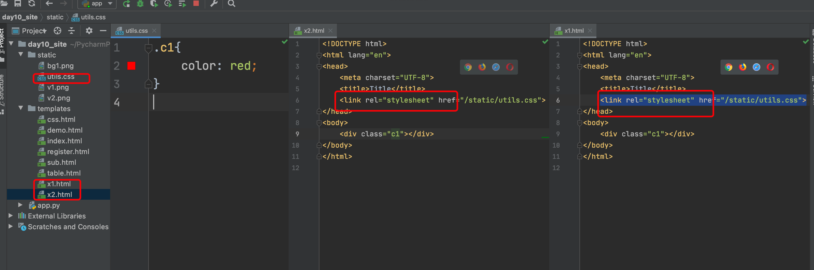
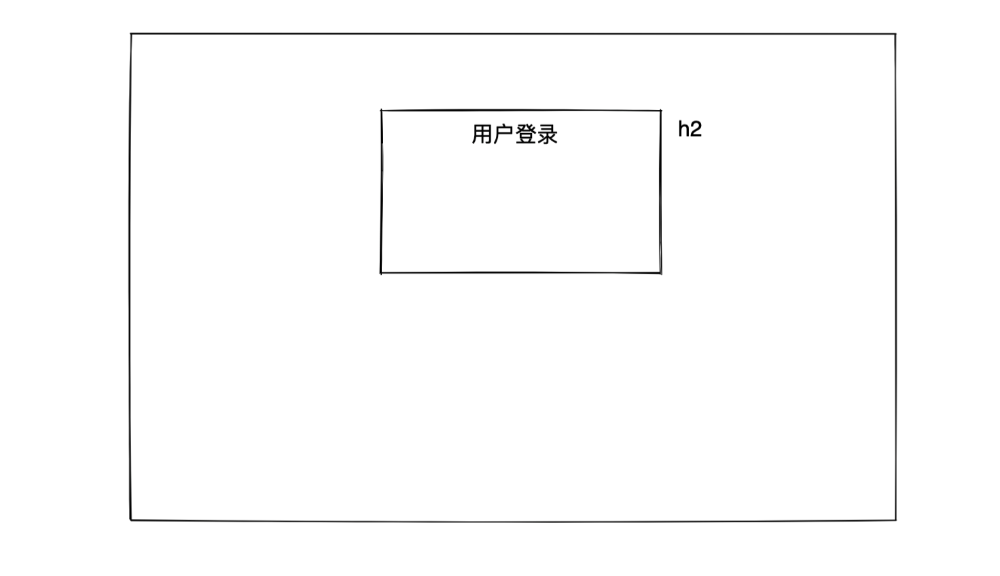
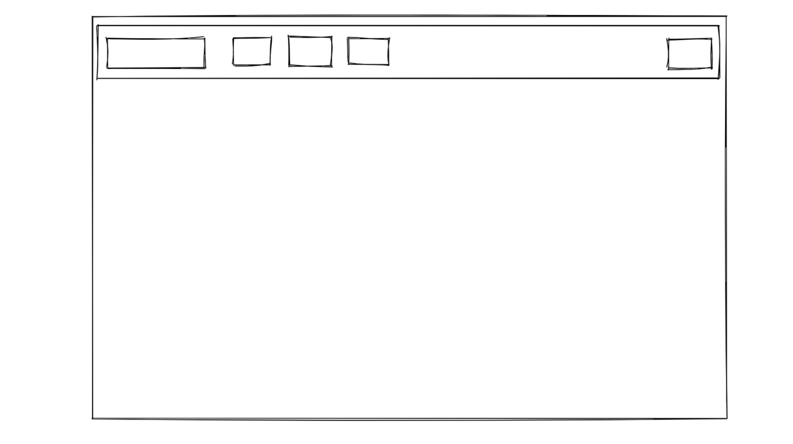
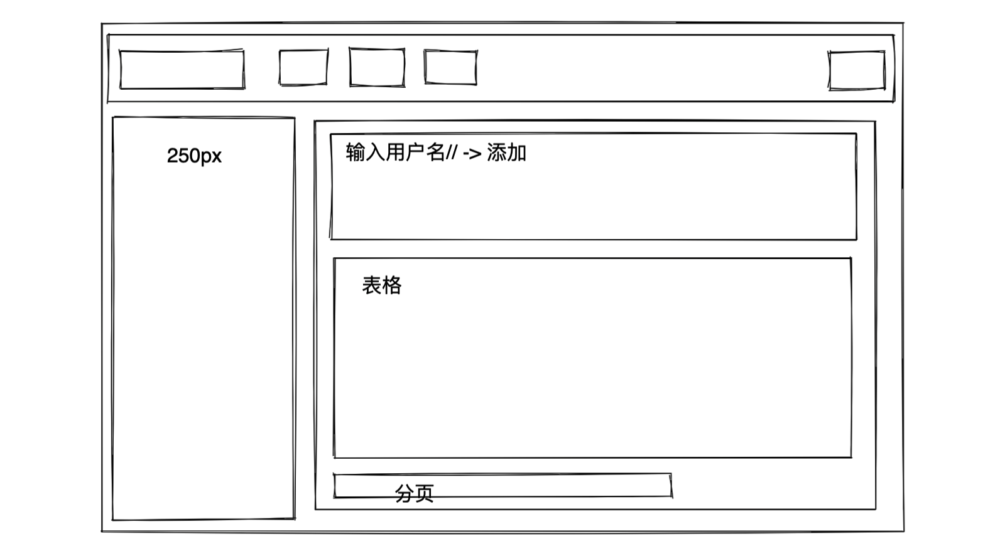

# day10 前端开发

今日概要：

- HTML标签：a、span、div、img
- CSS样式：高度、宽度、内外边距、浮动
- BooStrap，非前后端分离项目。
- JavaScript基础


## 1.HTML标签

### 1.1 显示数据 & 布局

- a，锚点+超链接。

- img，图片。

- div，块

- span，行内

- table表格

  ```html
  <table>
      <thead>
      	<tr> <th>ID</th> <th>标题</th> <th>操作</th> </tr>
      </thead>
      <tbody>
      	<tr> <td>1</td> <td>震惊了..</td> <td>删除</td> </tr>
      	<tr> <td>1</td> <td>震惊了..</td> <td>删除</td> </tr>
      	<tr> <td>1</td> <td>震惊了..</td> <td>删除</td> </tr>
      	<tr> <td>1</td> <td>震惊了..</td> <td>删除</td> </tr>
      </tbody>
  </table>
  ```

  ```html
  <table border="1">
      <thead>
      	<tr> <th>ID</th> <th>标题</th> <th>操作</th> </tr>
      </thead>
      <tbody>
      	<tr> <td colspan='2'>1</td> <td>删除</td> </tr>
      	<tr> <td>1</td> <td>震惊了..</td> <td>删除</td> </tr>
      	<tr> <td rowspan='2'>1</td> <td>震惊了..</td> <td>删除</td> </tr>
      	<tr> <td>震惊了..</td> <td>删除</td> </tr>
      </tbody>
  </table>
  ```

- ul，列表。

  ```html
  <ul>
      <li>中国</li>
      <li>美国</li>
      <li>俄罗斯</li>
  </ul>
  ```

- p标签


### 1.2 数据交互

- input系列

  - text，普通文本框。
  - password，密码黑点。
  - radio，单选
  - checkbox，复选框
  - file，文件
  - button，按钮
  - submit，按钮

- textarea，多行文本框。

  ```
  <textarea rows="5" style="height: 100px;width: 500px;"></textarea>
  ```

- select，下拉框

  ```html
  <select>
      <option>北京</option>
      <option>上海</option>
      <option>深圳</option>
  </select>
  ```


### 案例：注册页面

```
用户名/手机/邮箱/密码/性别/爱好/城市/备注/
```

```html
<!DOCTYPE html>
<html lang="en">
<head>
    <meta charset="UTF-8">
    <title>Title</title>
</head>
<body>
<h1>用户注册</h1>
<p>
    用户名：<input type="text"/>
</p>
<p>
    手机号：<input type="text"/>
</p>
<p>
    邮箱：<input type="text"/>
</p>
<p>
    密码：<input type="password"/>
</p>
<p>
    性别：
    男：<input type="radio" name="gender"/>
    女：<input type="radio" name="gender"/>
</p>
<p>
    爱好：
    篮球：<input type="checkbox">
    足球：<input type="checkbox">
</p>
<p>
    城市：
    <select>
        <option>北京</option>
        <option>上海</option>
    </select>
</p>
<p>
    备注：<textarea></textarea>
</p>
</body>
</html>
```

### 1.3 数据提交

以后在开发过程中想要将浏览器中用户填写好的或选择好的数据提交到后台：

- form表单【此处】

  - GET方式，明目张胆。

    ```
    URL: http://127.0.0.1:5000/xxx?user=cc&phone=6638&pwd=999
    ```

  - POST方式

    ```
    URL: http://127.0.0.1:5000/xxx
    请求体：user=cc&phone=6638&pwd=999
    ```

- ajax请求【后期】


```html
# 向别的网站提交时：http://127.0.0.1:5000/sub
<form action="http://127.0.0.1:5000/sub">
    <input type='text' />
    <input type='password' />
    
    <input type='submit' value="提交" />
</form>
```

```html
# 向自己的网站提交时：/xxx   ->  http://127.0.0.1:5000/xxx
<form action="/sub" method="post">
    <input type='text' name='user' />
    <input type='text' name='phone' />
    <input type='password' name='pwd' />
    
    <input type='submit' value="提交" />
</form>
```


### 小结

- 后端：两个URL+两个函数

  ```python
  # 访问，看到页面，用户可以在这个页面输入数据。
  @app.route('/login')
  def login():
      return render_template('login.html')
  
  
  @app.route('/xxxxxx', methods=["GET", "POST"])
  def xxxxxx():
      # 接收用户提交过来的数据 GET
      # print(request.args)
  
      # 去请求体中获取数据POST
      # print(request.form)
      return "OK"
  
  ```

- 在HTML中：

  - login.html

    ```html
    <form action="/xxxxxx" method="post">
        <input type='text' name="user"/>
        <input type='password' name="pwd"/>
        <input type='submit' value="提交"/>
    </form>
    ```


## 2.CSS样式

- 高度

- 宽度

- 行内和块级

- 内外边距

- 浮动，float + clear:both

- 边框

  ```
          线条  实体  颜色
  border: 1px solid red
  border-left: 1px solid red
  border-right: 1px solid red
  ```

  ```
  border-radius: 5px;
  ```

- 背景色

  ```
  <div style="height: 100px;width: 200px;background-color: #00009;"></div>
  ```

- 背景图片

  ```
  <div style='height: 500px;width: 100%;background-image: url("/static/bg1.png")'></div>
  ```

  ```
  <div style='height: 500px;width: 100%;background-image: url("/static/v1.png");background-repeat:no-repeat;'></div>
  ```

  ```
  <div style="height: 52px;width: 86px;background-image: url('/static/v2.png');background-repeat: no-repeat;background-size: 113px 86.5px;"></div>
  ```

- position

  - fixed，固定在浏览器窗口的某个位置。

    ```html
    <!DOCTYPE html>
    <html lang="en">
    <head>
        <meta charset="UTF-8">
        <title>Title</title>
    </head>
    <body>
        <div style="height: 2000px;background-color: pink;"></div>
        <div style="position: fixed;right: 10px;top: 10px;">返回顶部</div>
    </body>
    </html>
    ```

  - relative + absolute

    ```html
    <div style="width: 100px;height: 300px;border: 1px solid red; position: relative">
        <div style="position: absolute;right: 0;bottom: 0;">xxxx</div>
    </div>
    ```

  - 示例：

    ```html
    <div style="padding: 20px;position: relative;">
        用户名：<input type="text">
        <div style="position: absolute;bottom: 0;left: 50px;">用户名或密码错误</div>
    </div>
    <div style="padding: 20px">
        密码：<input type="password">
    </div>
    ```

  

  模态对话框：

  ```html
  <div style="background-color: black; position: fixed;left: 0;right: 0;bottom: 0;top: 0;opacity: 0.5;z-index: 1000"></div>
  
  <div style="width: 500px;height: 300px;background-color: white;position: fixed;z-index: 1001;top: 200px;margin: auto;left: 0;right: 0;">
      asdf
  </div>
  ```

  ```html
  <div style="background-color: black; position: fixed;left: 0;right: 0;bottom: 0;top: 0;opacity: 0.5;z-index: 1000"></div>
  
  <div style="width: 500px;height: 300px;background-color: white;position: fixed;z-index: 1001;left: 50%;top: 50%;margin-left: -250px; margin-top: -150px">
      asdf
  </div>
  ```

  - hover

    ```html
    <div style="...."></div>
    <div style="...."></div>
    ```

    ```html
    <!DOCTYPE html>
    <html lang="en">
    <head>
        <meta charset="UTF-8">
        <title>Title</title>
        <style>
            .wpa {
                height: 100px;
                background-color: pink;
            }
            .wpa:hover{
                color: red;
            }
        </style>
    </head>
    <body>
    <div class="wpa">万平安</div>
    
    </body>
    </html>
    ```

    ```html
    <!DOCTYPE html>
    <html lang="en">
    <head>
        <meta charset="UTF-8">
        <title>Title</title>
        <style>
            .item {
                display: inline-block;
                padding: 5px;
                border: 1px solid #dddddd;
            }
            .item:hover{
                color: white;
                background-color: red;
            }
        </style>
    </head>
    <body>
    <div>
        <a class="item">红米</a>
        <a class="item">小米</a>
        <a class="item">电视</a>
    </div>
    
    </body>
    </html>
    ```

    ```html
    <!DOCTYPE html>
    <html lang="en">
    <head>
        <meta charset="UTF-8">
        <title>Title</title>
        <style>
            .item {
                display: inline-block;
                padding: 5px;
                border-bottom: 2px solid transparent;
            }
            .item:hover{
                border-bottom: 2px solid red;
            }
        </style>
    </head>
    <body>
    <div>
        <a class="item">红米</a>
        <a class="item">小米</a>
        <a class="item">电视</a>
    </div>
    <div>你好啊有</div>
    
    </body>
    </html>
    ```

    ```html
    <!DOCTYPE html>
    <html lang="en">
    <head>
        <meta charset="UTF-8">
        <title>Title</title>
        <style>
            .logo {
                width: 200px;
                height: 80px;
                background-color: black;
                color: white;
    
                position: relative;
            }
    
            .wechat {
                position: absolute;
                left: 22px;
                top: 100px;
                display: none;
            }
    
            .logo:hover .wechat{
                display: block;
            }
        </style>
    </head>
    <body>
    <div class="logo">扫码下载
        <div class="wechat">
            
        </div>
    </div>
    </body>
    </html>
    
    ```

    ```html
    <!DOCTYPE html>
    <html lang="en">
    <head>
        <meta charset="UTF-8">
        <title>Title</title>
        <style>
            .logo {
                width: 200px;
                height: 80px;
                background-color: black;
                color: white;
    
            }
    
            .logo:hover .c2{
                color: red;
            }
        </style>
    </head>
    <body>
    <div class="logo">扫码下载
        <div class="c1">你好</div>
        <div class="c2">你不好</div>
    </div>
    </body>
    </html>
    ```

  - after，在标签内部且底部加入指定内容。

    ```html
    <!DOCTYPE html>
    <html lang="en">
    <head>
        <meta charset="UTF-8">
        <title>Title</title>
        <style>
            .item{
                color: red;
            }
            .item:after{
                content: "率帽子";
            }
        </style>
    </head>
    <body>
    <ul>
        <li class="item">欧阳</li>
        <li class="item">王平安</li>
        <li class="item">翔</li>
    </ul>
    
    </body>
    </html>
    ```

    ```html
    <div style="background-color: red;">
        <div style="float: left;">左边</div>
        <div style="float: right;">右边</div>
    
        <div style="clear: both;"></div>
    </div>
    ```

    ```html
    <!DOCTYPE html>
    <html lang="en">
    <head>
        <meta charset="UTF-8">
        <title>Title</title>
        <style>
            .clearfiex:after{
                content: "";
                display: block;
                clear: both;
            }
        </style>
    </head>
    <body>
    <div style="background-color: red;" class="clearfiex">
        <div style="float: left;">左边</div>
        <div style="float: right;">右边</div>
    </div>
    
    </body>
    </html>
    
    ```

    

如果一个标签有样式表示隐藏标签。

```
display:none;
```


### css的引入方式

- 直接写在标签上。

  ```html
  <div style='color:red;'>
      
  </div>
  ```

- 写在style

  ```html
  <!DOCTYPE html>
  <html lang="en">
  <head>
      <meta charset="UTF-8">
      <title>Title</title>
      <style>
          .c1 {
              color: red;
          }
      </style>
  </head>
  <body>
  <div class="c1"></div>
  <div class="c1"></div>
  </body>
  </html>
  
  ```

  ```html
  <!DOCTYPE html>
  <html lang="en">
  <head>
      <meta charset="UTF-8">
      <title>Title</title>
      <style>
          #c3 {
              color: grey;
          }
  
          .c1 {
              color: red !important;
          }
  
          .c2 {
              background-color: black;
              color: green;
          }
  
  
      </style>
  </head>
  <body>
  <a id="c3"></a>
  <div class="c1"></div>
  <div class="c1 c2"></div>
  
  </body>
  </html>
  ```

  ```html
  <!DOCTYPE html>
  <html lang="en">
  <head>
      <meta charset="UTF-8">
      <title>Title</title>
      <style>
          p{
              
          }
          div{
              
          }
      </style>
  </head>
  <body>
  <div></div>
  <a></a>
  <p></p>
  </body>
  </html>
  ```

  ```html
  <!DOCTYPE html>
  <html lang="en">
  <head>
      <meta charset="UTF-8">
      <title>Title</title>
      <style>
          .c10 > .c1{
  
          }
      </style>
  </head>
  <body>
  
  <div class="cc">
      <div class="c1"></div>
      <div class="c10">
          <a class="c1"></a>
          <a class="c2">
              <span class="c1"></span>
          </a>
      </div>
      <div class="b2"></div>
  </div>
  
  </body>
  </html>
  ```

- 以css文件的形式引入，多个页面共用

  


## 3.BootStrap


### 3.1 登录页面



```html
<!DOCTYPE html>
<html lang="en">
<head>
    <meta charset="UTF-8">
    <title>Title</title>
    <style>
        body {
            margin: 0;
        }

        .account {
            width: 480px;
            height: 300px;
            margin-left: auto;
            margin-right: auto;
            margin-top: 100px;
            border: 1px solid #dddddd;
        }

        .account > h2 {
            text-align: center;
        }
    </style>
</head>
<body>
<div class="account">
    <h2>用户登录</h2>

</div>
</body>
</html>
```


### 3.2 首页




- container，宽度+内容居中。
-  container-fluid，平铺。





