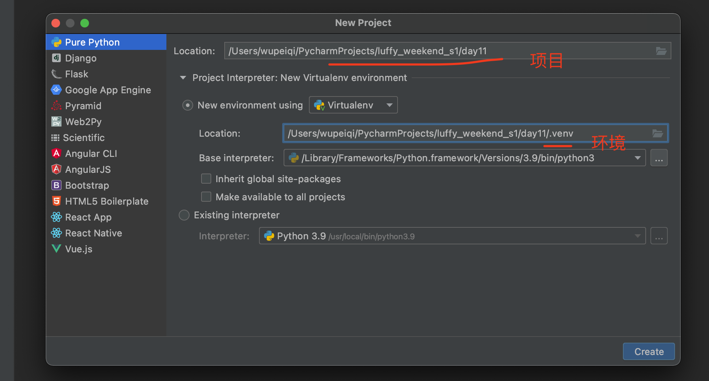
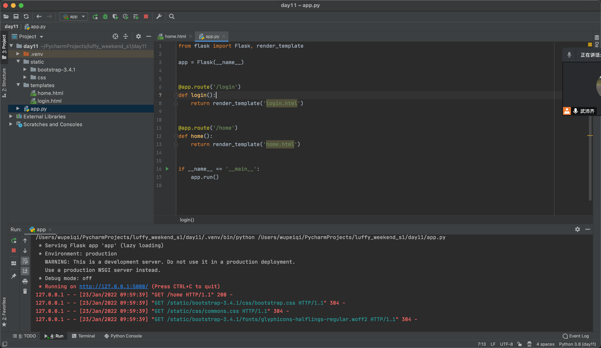
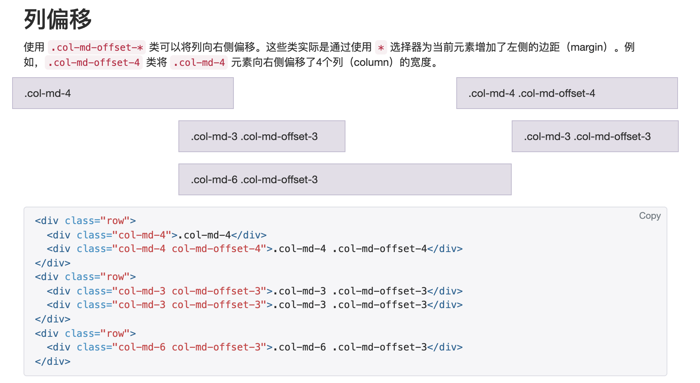
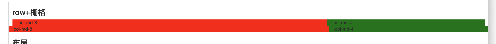
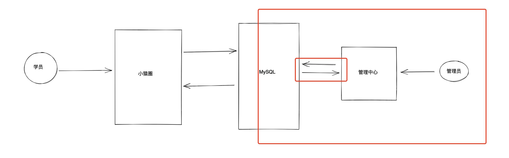
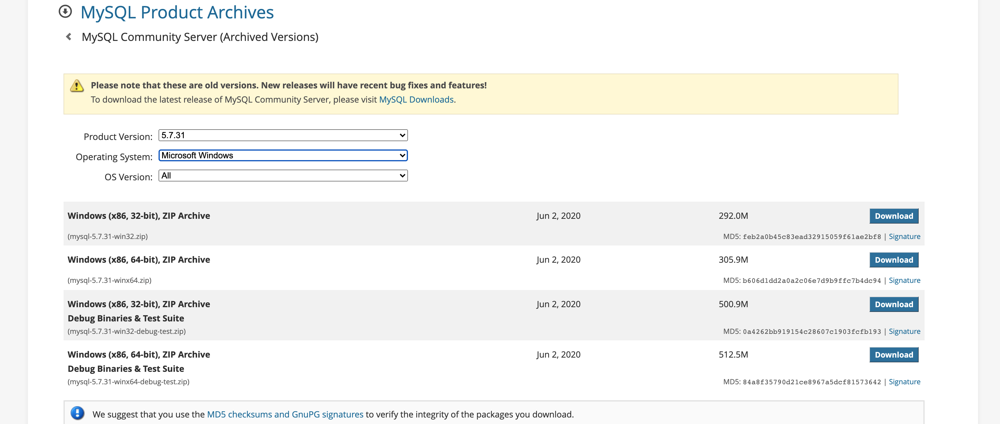
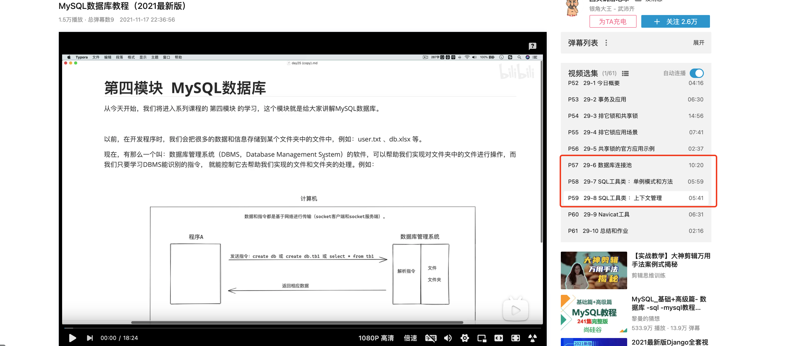

# day11 前端和数据库

> 以实现小猿圈管理管理中心为目标来学习前端和MySQL数据库相关知识。

今日概要：

- BooStrap组件
- 图标插件
- JavaScript & DOM & BOM
- jQuery
- Flask知识点（配置&菜单）
- MySQL数据


## 1.新建项目




## 2.上节代码

- 安装Flask

  ```
  pip install flask
  ```

- 打开上一节项目

  - app.py
  - static
  - templates




## 3.BootStrap

### 3.1 栅格系统

实现页面的布局，一行等分成12份。

```html
<div>
	<div class="col-xs-3">左边</div>
	<div class="col-xs-9">右边</div>
</div>
```

```html
<div>
    <div class="col-xs-6">
        <div class="col-xs-3">左边</div>
        <div class="col-xs-9">右边</div>
    </div>
</div>
```

```html
<div class="clearfix">
    <div class="col-sm-3">123</div>
    <div class="col-sm-9">
        <div class="col-sm-6">111</div>
        <div class="col-sm-6">222</div>
    </div>
</div>
```


BootStrap提供了四种栅格：响应式布局（根据设备页面的大小来动态调整布局关系）。

```html
<div>
	<div class="col-xs-3">左边</div>
	<div class="col-xs-9">右边</div>
</div>
<div>
	<div class="col-sm-3">左边</div>  750px
	<div class="col-sm-9">右边</div>
</div>
<div>
	<div class="col-md-3">左边</div>  970px
	<div class="col-md-9">右边</div>
</div>
<div>
	<div class="col-lg-3">左边</div>  1170px
	<div class="col-lg-9">右边</div>
</div>
```





### 3.2 container

```html
# 宽度 + 居中（响应式布局）
<div class="container">
  ...
</div>
```


```html
# 占据宽度的100%
<div class="container-fluid">
  ...
</div>
```


### 3.3 clearfix

```html
<div class="clearfix">
    <div style="float:left;wi">
        
    </div>
    <div style="float:left;wi">
        
    </div>
</div>
```


### 3.4 row+栅格




### 3.5 其他

布局 + 文档 + 组件（非Js组件）


## 4.关于图标

https://fontawesome.dashgame.com/

- 下载css
- 引入
- 根据模板中的图标，拷贝代码  + 修改color改颜色


## 5.需求来了

- 实现左侧的菜单：二级菜单（静态）。
- Flask中的知识点（ 动态效果 + 每个页面中拷贝+维护一套菜单显示）


### 5.1 Flask中的母版

让HTML模板实现继承。

- 母版：layout.html

  ```html
  <div>
     <p>标题。。。。</p>    
      
  </div>
  ```

- 页面A：user.html

  ```html
  
  
  
  	<div> 用户中心 </div>
  
  ```

  自动找母版并替换

  ```html
  <div>
     <p>标题。。。。</p>    
     <div> 用户中心 </div>
  </div>
  ```

- 页面B: order.html

  ```
  
  
  
  	<div> 订单中心 </div>
  
  ```

  自动找母版并替换

  ```
  <div>
     <p>标题。。。。</p>    
     <div> 订单中心 </div>
  </div>
  ```


### 5.2 选中状态没有了

思路：获取用户请求的URL中的后面地址部分 `/user` ，让URL和菜单创建关系。


```
<div class="item">
    <div class="head"><i class="fa fa-cubes" aria-hidden="true"></i> 用户中心</div>
    <div class="body">
        <a href="/home">管理中心</a>
        <a href="/user">用户管理</a>
    </div>
</div>
<div class="item">
    <div class="head"><i class="fa fa-drivers-license" aria-hidden="true"></i> VIP会员</div>
    <div class="body">
        <a href="/vip">VIP管理</a>
        <a href="/order">订单管理</a>
    </div>
</div>
```


### 答疑

- 流程不清晰

  - 关于母版，HTML页面可以继承的功能（菜单都放在母版）。

  - template_global功能

    ```
    from flask import Flask, render_template, Markup, request
    
    app = Flask(__name__)
    
    @template_global()
    def show_menu():
    	return "666"  # Markup("<a>666</a>")
    
    @app.route('/order')
    def order():
    	name = "程聪"
        return render_template('order.html',name=name)
    
    
    if __name__ == '__main__':
        app.run()
    ```

    ```html
    <h1>哈哈哈哈</h1>
    <div>{{ name }}</div>
    <h1> {{ show_menu() }}</h1>
    ```

  - Flask的render_template的功能（HTML文件+数据渲染）

    ```python
    from flask import Flask, render_template, Markup, request
    
    app = Flask(__name__)
    
    @app.route('/order')
    def order():
    	# return "首页"
    	return render_template('order.html')
    
    
    if __name__ == '__main__':
        app.run()
    ```

    

  - 在后台生成菜单

    ```python
    from flask import Flask, render_template, Markup, request
    
    app = Flask(__name__)
    
    @template_global()
    def show_menu():
        menu_list = []
        # 读取文件
        data = render_template("menu.html",menu_list=menu_list)
    	return Markup(data)
    
    @app.route('/order')
    def order():
    	name = "程聪"
        return render_template('order.html',name=name)
    
    
    if __name__ == '__main__':
        app.run()
    ```

    ```html
    <h1>哈哈哈哈</h1>
    <div>{{ name }}</div>
    <h1>{{ show_menu() }}</h1>
    ```


## 6.需求来了：切换菜单

### 6.1 JavaScript & DOM & BOM

- JavaScript，是一门编程语言。

- DOM，对HTML文档中的标签进行操作。

  ```html
  <!DOCTYPE html>
  <html lang="en">
  <head>
      <meta charset="UTF-8">
      <title>Title</title>
  </head>
  <body>
  <h1>Js的学习</h1>
  <input type="text"/>
  <div id="x1">自动化开发</div>
  <div id="x2"></div>
  
  <script>
      // 对象，封装了标签相关的功能。
      var tag = document.getElementById("x1");
      // 读取标签中的内容
      var text = tag.innerText;
  
      var target = document.getElementById('x2');
      target.innerText = text;
  </script>
  
  </body>
  </html>
  ```

- BOM，浏览器为咱们提供的功能。

  ```html
  <!DOCTYPE html>
  <html lang="en">
  <head>
      <meta charset="UTF-8">
      <title>Title</title>
  </head>
  <body>
  <h1>Js的学习</h1>
  <input type="text"/>
  <div id="x1">自动化开发</div>
  <div id="x2">xx</div>
  
  <script>
      // 对象，封装了标签相关的功能。
      var tag = document.getElementById("x1");
      // 读取标签中的内容
      var text = tag.innerText;
  
      // window.alert(text);
      // window.confirm(text);
      // window.setTimeout(function () {
      //     var target = document.getElementById("x2");
      //     target.innerText = text;
      // },5000);
  </script>
  
  </body>
  </html>
  ```

- jQuery，第三方模块，用更少的代码实现更多的功能。

  ```html
  <!DOCTYPE html>
  <html lang="en">
  <head>
      <meta charset="UTF-8">
      <title>Title</title>
  </head>
  <body>
  <h1>Js的学习</h1>
  <input type="text"/>
  <div id="x1">自动化开发</div>
  <div id="x2">xx</div>
  
  <script src="/static/jquery-3.6.0.min.js"></script>
  <script>
      // 对象，封装了标签相关的功能。
      var tag = $("#x1");
      var text = tag.text();
  
      window.setTimeout(function () {
          var target = $("#x2")
          target.text(text);
      }, 5000);
  </script>
  
  </body>
  </html>
  ```

  


### 6.2 JavaScript语言

> ES5（特性）、ES6

#### 1.代码的位置

- head，内部&底部

  ```html
  <!DOCTYPE html>
  <html lang="en">
  <head>
      <meta charset="UTF-8">
      <title>Title</title>
      <script type="text/javascript">
          // javascript代码（耗时）
      </script>
  </head>
  <body>
      <h1>你好</h1>
  </body>
  </html>
  ```

- body，内部&底部**（推荐）**

  ```html
  <!DOCTYPE html>
  <html lang="en">
  <head>
      <meta charset="UTF-8">
      <title>Title</title>
  </head>
  <body>
      <h1>你好</h1>
      
      <script type="text/javascript">
          // javascript代码（耗时）
      </script>
  </body>
  </html>
  ```

  

#### 2.存在形式

```html
<!DOCTYPE html>
<html lang="en">
<head>
    <meta charset="UTF-8">
    <title>Title</title>
</head>
<body>
    <h1>你好</h1>
    
    <script type="text/javascript">
        // javascript代码（耗时）
    </script>
</body>
</html>
```


```html
<!DOCTYPE html>
<html lang="en">
<head>
    <meta charset="UTF-8">
    <title>Title</title>
</head>
<body>
<h1>Js的学习</h1>

<script src="/static/demo.js"></script>
</body>
</html>
```


#### 3.变量

```html
<script>
    var v1 = 123; // 局部变量（函数）
        v2 = 123; // 全局变量
</script>
```

```html
<script>
    function f1(a1, a2) {
        var v1 = 123; // 局部变量
        v2 = 123; // 全局变量
    }

    f1();
    console.log(v2); // 正确
    console.log(v1); // 错误，不存在
</script>
```


#### 4.注释

- HTML

  ```
  <!-- 注释 -->
  ```

- CSS

  ```css
  /* CSS注释 */
  ```

- JavaScript

  ```javascript
  // 注释
  /*  */
  ```

  

```html
<!DOCTYPE html>
<html lang="en">
<head>
    <meta charset="UTF-8">
    <title>Title</title>
    <style>
        .xx {
            color: red; /* CSS注释 */
            /* background-color: #f0ad4e; */
        }
    </style>
</head>
<body>
<!-- HTML注释 -->
<!-- <h1>Js的学习</h1> -->
<h1>Js的学习</h1>
<h1>Js的学习</h1>

<script>
    function f1(a1, a2) {
        var v1 = 123; // 局部变量
        v2 = 123; // 全局变量
    }

    // 单行注释
    // f1();

    // 多行注释
    /*
    console.log(v2); // 正确
    console.log(v1); // 错误，不存在
     */
</script>
</body>
</html>
```


目前咱们使用的Flask这个Web框架，render_template 的作用：读取模板 + 数据 渲染得到字符串，给用户浏览器返回。

```html
<!DOCTYPE html>
<html lang="en">
<head>
    <meta charset="UTF-8">
    <title>Title</title>
    <style>
        .xx {
            color: red; /* CSS注释 */
            /* background-color: #f0ad4e; */
        }
    </style>
</head>
<body>
<!-- HTML注释 -->
<!-- <h1>Js的学习</h1> -->
<h1>Js的学习</h1>
{# <h1>Js的学习</h1> #}

<script>
    function f1(a1, a2) {
        var v1 = 123; // 局部变量
        v2 = 123; // 全局变量
    }

    // 单行注释
    // f1();

    // 多行注释
    /*
    console.log(v2); // 正确
    console.log(v1); // 错误，不存在
     */
</script>
</body>
</html>

```


#### 5.数据类型

```html
<script>
    var v1 = 123;
    var v2 = "哈哈哈";
    var v3 = [11, 22, 33];
    var v4 = {name: "alex", age: 19};
</script>
```

```html
<script>
    var v1 = 123;
    var v2 = "哈哈哈";
    var v3 = [11, 22, 33];
    var v4 = {name: "alex", age: 19};
</script>
```


#### 6.条件

```javascript
// 格式1
if(v1 == 123){
    
}

// 格式2
if(v1 == 123){
    
}else{
    
}

// 格式3
if(v1 == 123){
    
}else if(v1 == 789){
    
}else{
    
}
```

注意：在js中的 `==` 和 `===`


#### 7.循环

```
<script>
    var v3 = [11, 22, 33]; // 数组
    for (var i = 0; i < v3.length; i++) {
        console.log(i, v3[i]);
    }
</script>
```

```
<script>
    var v3 = [11, 22, 33]; // 数组
    for(var idx in v3){
        console.log(idx,v3[idx]);
    }
</script>
```


如果是对象（字典）

```javascript
var info = {k1:123,k2:456};
info.k1
info['k1']
```

```javascript
var info = {k1:123,k2:456};
for(var key in info){
    console.log(key, info[key]);
}
```


#### 8.函数

```javascript
function f1(a1,a2){
    return a1 + a2;
}
var res = f1(11,22);
```


```javascript
var f1 = function(a1,a2){
    return a1 + a2;
}
var res = f1(11,22);
```

```javascript
function f1(arg){
	arg();
}

f1( function(){return 999}  )
```


强调：JavaScript语法还有很多，没必要全都背一遍。


### 6.3 DOM（不用）

对HTML进行操作。

- 寻找标签
- 操作标签
- 事件

```html
<!DOCTYPE html>
<html lang="en">
<head>
    <meta charset="UTF-8">
    <title>Title</title>
</head>
<body>
    <div id="x1">路飞学城</div>

<script>
    var tagObject = document.getElementById('x1');
    // 获取中间文本
    // tagObject.innerText
    // 设置文本
    tagObject.innerText = tagObject.innerText + "倒闭了";
</script>
</body>
</html>
```

```html
<!DOCTYPE html>
<html lang="en">
<head>
    <meta charset="UTF-8">
    <title>Title</title>
</head>
<body>
    <input type="text" id="x1" />

<script>
    var tagObject = document.getElementById('x1');
    // tagObject.value
    tagObject.value = "老板跑路了";
</script>
</body>
</html>
```

```html
<!DOCTYPE html>
<html lang="en">
<head>
    <meta charset="UTF-8">
    <title>Title</title>
</head>
<body>
<input type="text" id="x1"/>
<input type="button" value="点击" onclick="clickMe();">
<h1 id="x2"></h1>

<script>
    function clickMe() {
        // 1.获取x1中的内容
        var txt = document.getElementById('x1').value;

        // 2.给x2写上文本
        document.getElementById('x2').innerText = txt;
    }
</script>
</body>
</html>
```


### 6.4 BOM

- alert

  ```html
  <!DOCTYPE html>
  <html lang="en">
  <head>
      <meta charset="UTF-8">
      <title>Title</title>
  </head>
  <body>
  <input type="text" id="x1"/>
  <input type="button" value="点击" onclick="clickMe();">
  <h1 id="x2"></h1>
  
  <script>
      function clickMe() {
          // 1.获取x1中的内容
          var txt = document.getElementById('x1').value; // ""
          if (txt.length === 0) {
              // alert("请输入内容");
              window.alert("请输入内容")
              return;
          }
  
          // 2.给x2写上文本
          document.getElementById('x2').innerText = txt;
      }
  </script>
  </body>
  </html>
  ```

- confirm

  ```html
  <!DOCTYPE html>
  <html lang="en">
  <head>
      <meta charset="UTF-8">
      <title>Title</title>
  </head>
  <body>
  <input type="text" id="x1"/>
  <input type="button" value="点击" onclick="clickMe();">
  <h1 id="x2"></h1>
  
  <script>
      function clickMe() {
          // 1.获取x1中的内容
          var txt = document.getElementById('x1').value; // ""
          var flag = window.confirm("是否继续？")
          if (!flag) {
              return;
          }
          // 2.给x2写上文本
          document.getElementById('x2').innerText = txt;
      }
  </script>
  </body>
  </html>
  ```

- 页面刷新和跳转

  ```html
  <!DOCTYPE html>
  <html lang="en">
  <head>
      <meta charset="UTF-8">
      <title>Title</title>
  </head>
  <body>
  地址：<input type="text" id="x1"/>
  <input type="button" value="跳转" onclick="clickMe1();">
  
  <input type="button" value="刷新" onclick="clickMe2();">
  
  
  <script>
      function clickMe1() {
          var txt = document.getElementById('x1').value;
          // location.href = "https://www.xx.com";
          // window.location.href = "https://www.xx.com";
          location.href = txt;
      }
  
      function clickMe2() {
          // window.location.reload();
          location.reload();
      }
  </script>
  </body>
  </html>
  ```

- 定时器

  ```javascript
  // 周期性
  setInterval(function () {
      location.reload();
  }, 5000);
  ```

  ```javascript
  // 1次
  setTimeout(function () {
      location.href = "https://www.luffycity.com"
  }, 5000);
  ```


### 6.5 jQuery

- 下载jQuery

  ```
  https://jquery.com/download/
  ```

- 在页面中去引入（下面）

  ```html
  <!DOCTYPE html>
  <html lang="en">
  <head>
      <meta charset="UTF-8">
      <title>Title</title>
  </head>
  <body>
  
  <script src="/static/jquery-3.6.0.min.js"></script>
  <script>
      // 利用jQuery提供功能去做xx
  </script>
  </body>
  </html>
  ```


使用jQuery可以方便的让我们实现三类操作：

- 寻找标签
- 操作标签
- 事件的绑定


```
<!DOCTYPE html>
<html lang="en">
<head>
    <meta charset="UTF-8">
    <title>Title</title>
</head>
<body>
<div id="i1">11</div>
<div class="item">22</div>
<div class="item">33</div>
<div class="item">44</div>
<div class="item">
    <a href="">哈哈哈</a>
    <a href="" class="c1">哈哈哈</a>
</div>

<script src="/static/jquery-3.6.0.min.js"></script>
<script>
    var obj1 = $("#i1");                        // jQuery封装的对象。
    // obj1.text();
    var obj2 = document.getElementById('i1');   // DOM对象
    // obj2.innerText;

    // 相互转换 jQuery -> DOM对象：   obj1[0]
    //         DOM对象-> jQuery     $(obj2)

</script>
</body>
</html>
```

#### 1.寻找标签

```html
<!DOCTYPE html>
<html lang="en">
<head>
    <meta charset="UTF-8">
    <title>Title</title>
</head>
<body>
<div>
    <div id="i1">11</div>
    <div class="item">22</div>
    <div class="item" id="x2">
        <a>百度</a>
        <a>
            <span class="c2">xx</span>
            <span class="c2">xx</span>
        </a>
        <a>
            <span>xx</span>
        </a>
    </div>
    <div class="item">44</div>
    <div class="item">
        <a href="">哈哈哈</a>
        <a href="" class="c1">哈哈哈</a>
    </div>
</div>

<script src="/static/jquery-3.6.0.min.js"></script>
<script>
    // 选择器
    var obj1 = $("#i1");
    var obj2 = $(".item")
    var obj3 = $(".item .c1")

    // 筛选器
    $("#x2").prev(); // 兄弟，上一个
    $("#x2").next();// 兄弟，下一个
    $("#x2").parent();//父亲
    $("#x2").children();// 儿子
    $("#x2").find('.c2'); // 子孙

</script>
</body>
</html>
```


#### 2.操作标签

```html
<div>
    <div id="i1">11</div>

</div>

<script src="/static/jquery-3.6.0.min.js"></script>
<script>
    // 获取文本
    var x = $("#i1").text();
    alert(x);
    // 设置文本
    $("#i1").text("xxxx");;

</script>
```


```html
<div>
    <input type="text" id="i2" value="123" />

</div>

<script src="/static/jquery-3.6.0.min.js"></script>
<script>
    // 获取文本
    var x = $("#i2").val();
    alert(x);
    // 设置文本
    $("#i2").val("999");

</script>
```


```html
<div>
    <div id="i3" class="c1 c2">xx</div>
</div>

<script src="/static/jquery-3.6.0.min.js"></script>
<script>

    $("#i3").removeClass("c2");
    $("#i3").addClass("c100");
    
</script>
```


#### 3.事件

```html
<div>
    <input type="text" id="txt"/>
    <input type="button" value="点击" id="btn" />
</div>

<script src="/static/jquery-3.6.0.min.js"></script>
<script>
    // 绑定点击事件
    $("#btn").click(function () {
        // alert("点我了");

        // var data = $("#txt").val();
        // alert(data);

        // console.log(this); // DOM对象 -> jQuery ==> $(this)
        var data = $(this).prev().val();
        console.log(data);
    });

</script>
```

注意：this到底是谁？


补充：当页面框架加载完成之后，自动触发。

```html
<script src="/static/jquery-3.6.0.min.js"></script>
<script>
    // 当页面框架加载完成后自动执行
    $(function () {
        ...
    })
</script>
```


### 6.6 需求实现

```html
<style>
    .hide{
        display:none;
    }
</style>

<div class="menu-area">
    <div class="item">
        <div class="head"><i class="fa fa-cubes" aria-hidden="true"></i> 用户中心</div>
        <div class="body">
            <a href="/home">管理中心</a>
            <a href="/user">用户中心</a>
        </div>
    </div>

    <div class="item">
        <div class="head"><i class="fa fa-drivers-license" aria-hidden="true"></i> VIP中心</div>
        <div class="body hide">
            <a href="/vip">VIP管理</a>
            <a href="/order">订单管理</a>
        </div>
    </div>

</div>


<script src="/static/jquery-3.6.0.min.js"></script>
<script>
    // 1.当页面框架加载完成执行给所有 class="head" 标签绑定点击事件。
    $(function () {
        $(".head").click(function(){
            // 当点击标签时，此函数会被触发。 this
            // $(this).next().addClass("hide");
            // $(this).next().removeClass("hide");
            
            if($(this).next().hasClass("hide")){
                $(this).next().removeClass("hide");
            }else{
                $(this).next().addClass("hide");
            }
        });
    })
</script>
```


```html
<style>
    .hide{
        display:none;
    }
</style>

<div class="menu-area">
    <div class="item">
        <div class="head"><i class="fa fa-drivers-license" aria-hidden="true"></i> VIP中心</div>
        <div class="body hide">
            <a href="/vip">VIP管理</a>
            <a href="/order">订单管理</a>
        </div>
    </div>
    
    <div class="item">
        <div class="head"><i class="fa fa-cubes" aria-hidden="true"></i> 用户中心</div>
        <div class="body">
            <a href="/home">管理中心</a>
            <a href="/user">用户中心</a>
        </div>
    </div>

    <div class="item">
        <div class="head"><i class="fa fa-drivers-license" aria-hidden="true"></i> VIP中心</div>
        <div class="body hide">
            <a href="/vip">VIP管理</a>
            <a href="/order">订单管理</a>
        </div>
    </div>

</div>


<script src="/static/jquery-3.6.0.min.js"></script>
<script>
    // 1.当页面框架加载完成执行给所有 class="head" 标签绑定点击事件。
    $(function () {
        $(".head").click(function(){
            $(this).parent().siblings().find(".body").addClass("hide");
            $(this).next().removeClass("hide");
        });
    })
</script>
```


## 7.数据库相关



### 7.1 安装MySQL（win）

- 下载MySQL

  ```
  https://downloads.mysql.com/archives/community/
  ```

  

- 解压到指定目录

  

- 创建配置文件在MySQL的安装目录下创建 `my.ini` 的文件，作为MySQL的配置文件。

  

- 初始化

  ```
  >>> "C:\Program Files\mysql-5.7.31-winx64\bin\mysqld.exe"  --initialize-insecure
  ```

  初始化命令在执行时，会自动读取配置文件并执行初始化，此过程主要会做两件事：

  - 自动创建data目录，以后我们的数据都会存放在这个目录。
  - 同时创建建必备一些的数据，例如默认账户 root （无密码），用于登录MySQL并通过指令操作MySQL。

  

  ```
  - 无权限问题（管理员账户打开终端）
  - msvcr120.dll不存在，请下载并安装下面的两个补丁：（建议提前安装）
  	- vcredist：
  		https://www.microsoft.com/zh-cn/download/confirmation.aspx?id=40784  （主要）
  	- dirctx：
  		https://www.microsoft.com/zh-CN/download/details.aspx?id=35
  ```

- 启动MySQL，启动MySQL常见的有两种方式：

  - 临时启动

    ```bash
    >>> "C:\Program Files\mysql-5.7.31-winx64\bin\mysqld.exe"
    ```

    

    注意：此时程序会挂起，内部就是可以接收客户端发来的MySQL指令，关闭窗口或Ctrl+c 就可以停止运行。

    这种启动方式每次开机或想要开启都需要手动执行一遍命令比较麻烦。

  - 制作windows服务，基于windows服务管理。

    ```bash
    >>>"C:\Program Files\mysql-5.7.31-winx64\bin\mysqld.exe" --install mysql57
    ```

    

    创建好服务之后，可以通过命令 启动和关闭服务，例如：

    ```bash
    >>> net start mysql57
    >>> net stop mysql57
    ```

    也可以在window的服务管理中点击按钮启动和关闭服务。例如：

    

    

    

    

    以后不再想要使用window服务了，也可以将制作的这个MySQL服务删除。

    ```
    >>>"C:\Program Files\mysql-5.7.31-winx64\bin\mysqld.exe" --remove mysql57
    ```

    

  

- 连接MySQL

  安装并启动MySQL之后，就可以连接MySQL来测试是否已正确安装并启动成功。

  

  在安装MySQL时，其实也自动安装了一个工具（客户端），让我们快速实现连接MySQL并发送指令。

  

  注意：如果把bin目录加入环境变量，每次在运行命令时，就不用再重新输入绝对路径了。

  

  

  上述过程如果操作完成之后，证明你的安装和启动过程就搞定了。

  ```
  >>>mysql -u root -p
  >>>密码
  ...
  ```

  

### 7.2 创建数据库和表

学习MySQL指令，并通过指令对数据库进行操作。（工具操作MySQL）

看视频：https://www.bilibili.com/video/BV15R4y1b7y9（前2天）


### 7.3 操作数据库和表

- 连接MySQL
- 发送指令（SQL语句）

看视频：https://www.bilibili.com/video/BV15R4y1b7y9（前2天）


## 8.如何做项目？

- 安装MySQL & 启动

- 内置工具 创建数据库 + 数据表

- day11项目中去操作数据表

  - 安装模块

    ```
    pip install pymysql
    ```

  - 使用模块进行操作

    ```python
    import pymysql
    
    # 连接MySQL，自动执行 use userdb; -- 进入数据库
    conn = pymysql.connect(host='127.0.0.1', port=3306, user='root', passwd='root123', charset="utf8", db='userdb')
    cursor = conn.cursor()
    
    # 添加
    cursor.execute("insert into 表名(username,password) values('wupeiqi','123')")
    conn.commit()
    
    # 关闭连接
    cursor.close()
    conn.close()
    ```

    ```python
    import pymysql
    
    # 连接MySQL，自动执行 use userdb; -- 进入数据库
    conn = pymysql.connect(host='127.0.0.1', port=3306, user='root', passwd='root123', charset="utf8", db='userdb')
    cursor = conn.cursor()
    
    # 删除
    cursor.execute("delete from 表名 where id=1")
    conn.commit()
    
    # 关闭连接
    cursor.close()
    conn.close()
    ```

    ```python
    import pymysql
    
    # 连接MySQL，自动执行 use userdb; -- 进入数据库
    conn = pymysql.connect(host='127.0.0.1', port=3306, user='root', passwd='root123', charset="utf8", db='userdb')
    cursor = conn.cursor()
    
    # 修改
    cursor.execute("update tb1 set name='xx' where id=1")
    conn.commit()
    
    # 关闭连接
    cursor.close()
    conn.close()
    ```

    ```python
    import pymysql
    
    # 连接MySQL，自动执行 use userdb; -- 进入数据库
    conn = pymysql.connect(host='127.0.0.1', port=3306, user='root', passwd='root123', charset="utf8", db='userdb')
    cursor = conn.cursor()
    
    # 查询
    cursor.execute("select * from tb where id>10")
    data = cursor.fetchall()
    print(data) # [(),(),()]
    
    # 关闭连接
    cursor.close()
    conn.close()
    ```

- 额外：

  


## 总结

- BootStrap

  - 记住

    ```
    布局容器/栅格/clearfix
    ```

  - 其他：每次用都去官方查询（图标）

- JavaScript & DOM & BOM

  - 记住

    ```
    大致干什么/代码放在哪里
    ```

  - 其他：不用去特地记。

- jQuery（记住）

- Flask知识

  - 母版
  - template_global

- 左侧菜单（亲自写一遍+步骤知道）+ 优化

- MySQL数据（前两天视频）

- 项目功能：
  - 在页面上的表格中显示数据库中的数据
  - 删除指定函数的数据【扩展】
  - 添加/编辑【扩展】


