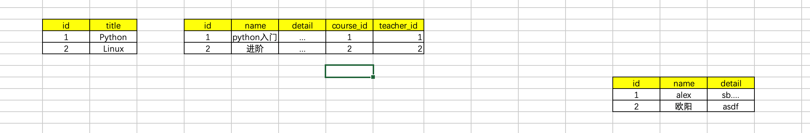
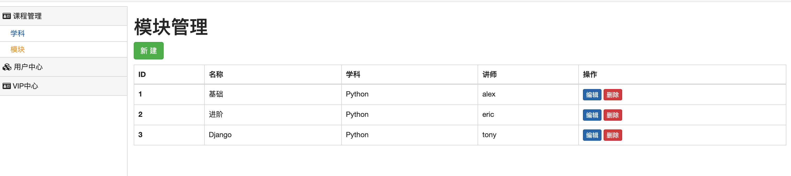
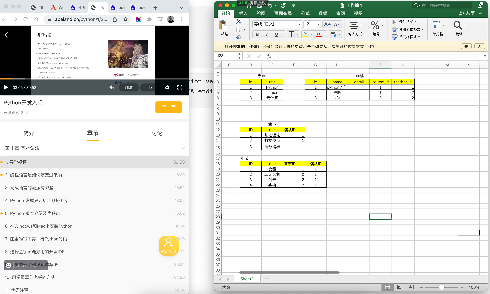
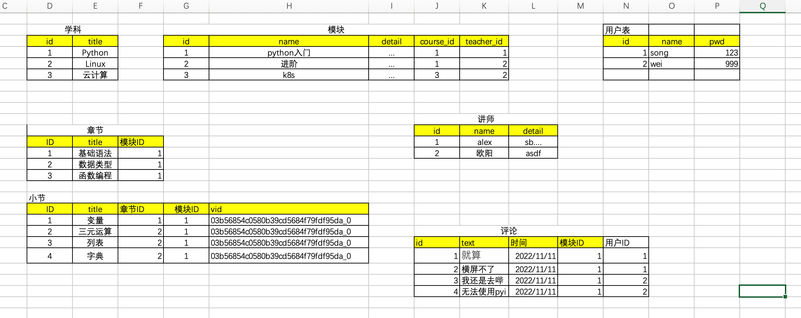
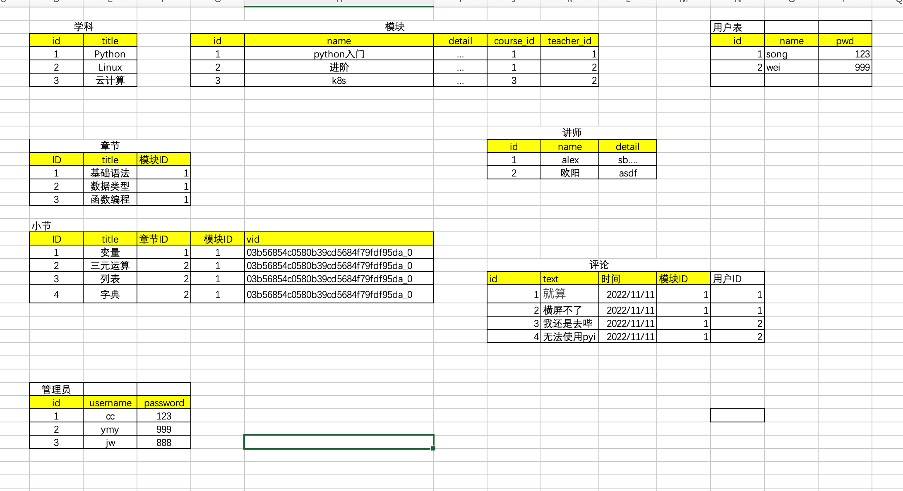
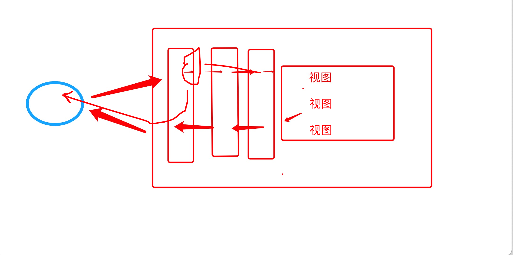
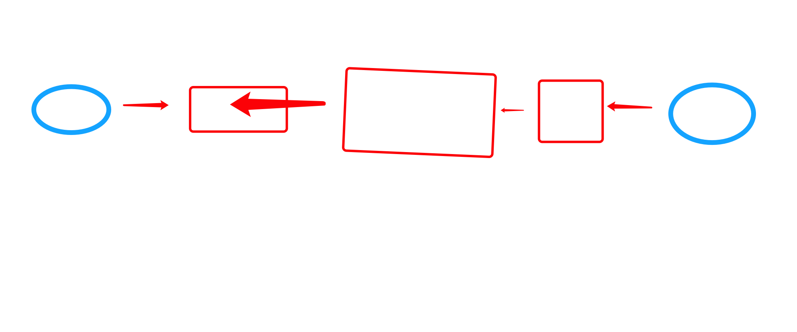

# day13 小猿圈

今日概要：

- 后台
  - 学科管理
  - 模块管理
  - 章节 & 视频
  - 管理员
  - 评论 & 用户
- 前台
  - 数据展示
  - 观看视频
  - 评论
  - 登录 & 注册


## 1.模块表结构

- 新增课程介绍
- 讲师ID（外键约束）




## 2.模块管理




- 关于删除

  - 物理删除

    ```
    select * from module
    ```

    ```
    delete from module where id=1
    ```

  - 逻辑删除

    ```
    select * from module where active=1
    ```

    ```
    update module set active=0 where id=1
    ```

- 添加模块

- 编辑模块

  ```
  
                      
                          <option value="{{item.id}}" selected>{{item.title}}</option>
                      
                          <option value="{{item.id}}">{{item.title}}</option>
                      
                  
  ```

  ```
        <option value="{{item.id}}"  selected >{{item.title}}</option>
                  
  ```

  

## 3.章节 & 小节




视频播放的平台都是怎么搞得？

- 主流：点播服务

- 美洽、保利`https://www.polyv.net/`

  ```javascript
  <div id='plv_03b56854c0ae52d2e5af0472c4c7d102_0'></div>
  
  <script src='//player.polyv.net/script/player.js'></script>
  <script>
      var player = polyvPlayer({
          'wrap': '#plv_03b56854c0ae52d2e5af0472c4c7d102_0',
          'width': '600',
          'height': '375',
          'vid': '03b56854c0ae52d2e5af0472c4c7d102_0',
          'playsafe': '' // 播放加密视频的凭证, 取值参考文档: https://help.polyv.net/index.html#/vod/api/playsafe/token/create_token
      });
  </script>
  ```

  ```javascript
  <div id='plv_03b56854c0580b39cd5684f79fdf95da_0'></div>
  
  <script src='//player.polyv.net/script/player.js'></script>
  <script>
  var player = polyvPlayer({
    'wrap':'#plv_03b56854c0580b39cd5684f79fdf95da_0',
    'width':'600',
    'height':'375',
    'vid': '03b56854c0580b39cd5684f79fdf95da_0',
    'playsafe': '' // 播放加密视频的凭证, 取值参考文档: https://help.polyv.net/index.html#/vod/api/playsafe/token/create_token 
  });
  </script>
  03b56854c0580b39cd5684f79fdf95da_0
  ```

  

手动在数据库中添加即可。


## 4.评论和用户




## 5.管理员



注意：权限表。


## 6.cookie和session是怎么回事？




## 7.小猿圈平台




请实现在我的代码基础上实现：点击模块，进入模块详细页面（获取章节列表）。

- URL：/module/模块ID
- 视图函数


