# VUE3框架

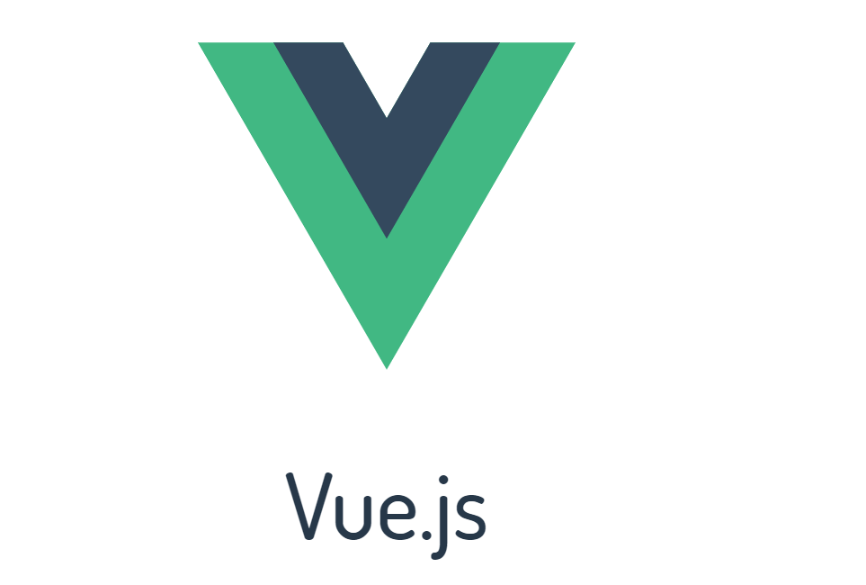

# 一、介绍

Vue (读音 /vjuː/，类似于 **view**) 是一套用于构建用户界面的**渐进式框架**。与其它大型框架不同的是，Vue 被设计为可以自底向上逐层应用。Vue 的核心库只关注视图层，不仅易于上手，还便于与第三方库或既有项目整合。另一方面，当与[现代化的工具链](https://vue3js.cn/docs/zh/guide/single-file-component.html)以及各种[支持类库](https://github.com/vuejs/awesome-vue#components--libraries)结合使用时，Vue 也完全能够为复杂的单页应用提供驱动。

vue.js是目前前端web开发最流行的工具库，由尤雨溪在2014年2月发布的。

VUE3文档：https://v3.cn.vuejs.org/guide/introduction.html

## 1.1、安装

Vue.js 设计的初衷就包括可以被渐进式地采用。这意味着它可以根据需求以多种方式集成到一个项目中。

将 Vue.js 添加到项目中主要有四种方式：

1. 在页面上以 [CDN 包](https://v3.cn.vuejs.org/guide/installation.html#cdn)的形式导入。

   ```html 
   <script src="https://cdnjs.cloudflare.com/ajax/libs/vue/3.0.5/vue.global.js"></script>
   ```

2. 下载 JavaScript 文件并[自行托管](https://v3.cn.vuejs.org/guide/installation.html#下载并自托管)。

3. 使用 [npm](https://v3.cn.vuejs.org/guide/installation.html#npm) 安装它。

4. 使用官方的 [CLI](https://v3.cn.vuejs.org/guide/installation.html#命令行工具-cli) 来构建一个项目，它为现代前端工作流程提供了功能齐备的构建设置 (例如，热重载、保存时的提示等等)。

## 1.2、基本使用

### （1）基本案例

Vue.js 的核心是一个允许采用简洁的模板语法来声明式地将数据渲染进 DOM 的系统。我们不再和 HTML 直接交互了。一个 Vue 应用会将其挂载到一个 DOM 元素上 (对于这个例子是 `#app`) 然后对其进行完全控制。那个 HTML 是我们的入口，但其余都会发生在新创建的 Vue 实例内部。Vue是数据驱动页面。

```vue 
<!DOCTYPE html>
<html lang="en">
<head>
    <meta charset="UTF-8">
    <title>Title</title>
    <script src="https://cdnjs.cloudflare.com/ajax/libs/vue/3.0.5/vue.global.js"></script>
</head>
<body>

<div id="app">
    <!-- 设置vue可以操作的html内容范围，值一般就是css的id选择器。 -->
    <p>{{ msg }}</p>
</div>

<script>

    const Counter = {
        data() {
            return {
                msg: "hello world"
            }
        }
    }

    vm = Vue.createApp(Counter).mount('#app')

</script>

</body>
</html>
```

### （2）JS操作真实DOM的代价

用我们传统的开发模式，原生JS或JQ操作DOM时，浏览器会从构建DOM树开始从头到尾执行一遍流程。在一次操作中，我需要更新10个DOM节点，浏览器收到第一个DOM请求后并不知道还有9次更新操作，因此会马上执行流程，最终执行10次。例如，第一次计算完，紧接着下一个DOM更新请求，这个节点的坐标值就变了，前一次计算为无用功。计算DOM节点坐标值等都是白白浪费的性能。即使计算机硬件一直在迭代更新，操作DOM的代价仍旧是昂贵的，频繁操作还是会出现页面卡顿，影响用户体验。

### （3）什么是虚拟DOM

Web界面由DOM树(树的意思是数据结构)来构建，当其中一部分发生变化时，其实就是对应某个DOM节点发生了变化，

虚拟DOM就是为了**解决浏览器性能问题**而被设计出来的。**如前**，若一次操作中有10次更新DOM的动作，虚拟DOM不会立即操作DOM，而是将这10次更新的diff内容保存到本地一个JS对象中，最终将这个JS对象一次性attch到DOM树上，再进行后续操作，避免大量无谓的计算量。**所以，**用JS对象模拟DOM节点的好处是，页面的更新可以先全部反映在JS对象(虚拟DOM)上，操作内存中的JS对象的速度显然要更快，等更新完成后，再将最终的JS对象映射成真实的DOM，交由浏览器去绘制。

Vue是数据驱动视图（数据的变化将引起视图的变化），但你发现某个数据改变时，视图是局部刷新而不是整个重新渲染，如何精准的找到数据对应的视图并进行更新呢？

整个过程还是比较简单的，新旧节点如果不相似，直接根据新节点创建dom；如果相似，先是对data比较，包括class、style、event、props、attrs等，有不同就调用对应的update函数，然后是对子节点的比较，子节点的比较用到了**diff算法**。

> vue的virtual dom的diff算法是基于snabbdom算法改造而来，与react的diff算法一样。仅在同级的vnode间做diff，递归的进行同级vnode的diff，最终实现整个DOM树的更新。

### （4）MVVM 模式

MVVM 是Model-View-ViewModel 的缩写，它是一种基于前端开发的架构模式。

* `Model` 指代的就是vue对象的data属性里面的数据。这里的数据要显示到页面中。

* `View` 指代的就是vue中数据要显示的HTML页面，在vue中，也称之为“视图模板” 。

* `ViewModel `指代的是vue.js中我们编写代码时的vm对象了，它是vue.js的核心，负责连接 View 和 Model，保证视图和数据的一致性，所以前面代码中，data里面的数据被显示中p标签中就是vm对象自动完成的。


组件的 `data` 选项是一个函数。Vue 在创建新组件实例的过程中调用此函数。它应该返回一个对象，然后 Vue 会通过响应性系统将其包裹起来，并以 `$data` 的形式存储在组件实例中。为方便起见，该对象的任何顶级 property 也直接通过组件实例暴露出来

> ```js
> console.log(vm)     // 全局vue对象
> console.log(vm.$data);  // vm对象要显示到页面中的数据
> console.log(vm.$data.msg);  // 访问data里面的数据
> console.log(vm.msg);  // 这个 name就是data里面声明的数据,也可以使用 vm.变量名显示其他数据,name只是举例.
> vm.foo()
> ```

# 二、模板语法

Vue.js 使用了基于 HTML 的模板语法，允许开发者声明式地将 DOM 绑定至底层组件实例的数据。所有 Vue.js 的模板都是合法的 HTML，所以能被遵循规范的浏览器和 HTML 解析器解析。

在底层的实现上，Vue 将模板编译成虚拟 DOM 渲染函数。结合响应性系统，Vue 能够智能地计算出最少需要重新渲染多少组件，并把 DOM 操作次数减到最少。

## 2.1、插值

#### （1）文本

数据绑定最常见的形式就是使用“Mustache”语法 (双大括号) 的文本插值：

```html
<span>Message: {{ msg }}</span>
```

Mustache 标签将会被替代为对应组件实例中 `msg` property 的值。无论何时，绑定的组件实例上 `msg` property 发生了改变，插值处的内容都会更新。

#### （2） 原始 HTML（v-html）

双大括号会将数据解释为普通文本，而非 HTML 代码。为了输出真正的 HTML，你需要使用[`v-html` 指令](https://v3.cn.vuejs.org/api/directives.html#v-html)：

指令 (Directives) 是带有 `v-` 前缀的特殊 attribute。指令的职责是，当表达式的值改变时，将其产生的连带影响，响应式地作用于 DOM。

````vue 
<div id="app">
    <p>Using mustaches: {{ rawHtml }}</p>
    <p>Using v-html directive: <span v-html="rawHtml"></span></p>
</div>

<script>

    const Counter = {
        data() {
            return {
                rawHtml: "<a href=''>hello</a>"
            }
        }
    }

    vm = Vue.createApp(Counter).mount('#app')

</script>
````

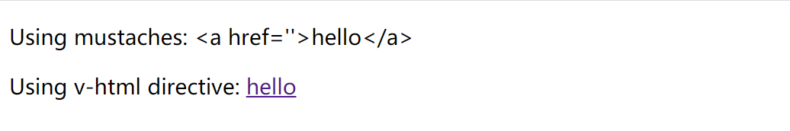

#### （3）value 值（v-model）

```vue 
<div id="app">
    <!-- 设置vue可以操作的html内容范围，值一般就是css的id选择器。 -->
    <p>{{ msg }}</p>
    <p><input type="text" v-model="msg"></p>
</div>

<script>

    const Counter = {
        data() {
            return {
                msg: "hello world"
            }
        }
    }

    vm = Vue.createApp(Counter).mount('#app')

</script>
```

#### （4）Attribute（v-bind）

Mustache 语法不能在 HTML attribute 中使用，然而，可以使用 [`v-bind` 指令](https://v3.cn.vuejs.org/api/directives.html#v-bind)进行绑定

```vue
<div id="app">
    <p><a v-bind:href="link">{{site}}</a></p>
    <p><a :href="link">{{site}}</a></p>
    <p>
       网站名称 <input type="text" v-model="site">
       url地址 <input type="text" v-model="link">
    </p>
</div>

<script>

    const Counter = {
        data() {
            return {
                site: "百度",
                link: "http://www.baidu.com"
            }
        }
    }

    vm = Vue.createApp(Counter).mount('#app')

</script>
```

> 1、`v-bind:属性名` 简写格式  `:属性名`
>
> 2、指令的意思是：“将这个元素节点的 `href` attribute 和 Vue 实例的 `link` property 保持一致”。

#### （5）使用 JavaScript 表达式

迄今为止，在我们的模板中，我们一直都只绑定简单的 property 键值。但实际上，对于所有的数据绑定，Vue.js 都提供了完全的 JavaScript 表达式支持。

````vue 
<div id="app">
    <p> {{ number + 1 }}</p>
    <p> {{ ok ? 'YES' : 'NO' }}</p>
    <p> {{ msg.split('').reverse().join('') }}</p>
    <div :class="'list-' + id">{{id}}</div>
</div>

<script>

    const Counter = {
        data() {
            return {
                number:100,
                ok:true,
                msg: "hello world",
                id:3,
            }
        }
    }

    vm = Vue.createApp(Counter).mount('#app')

</script>
````

这些表达式会在当前活动实例的数据作用域下作为 JavaScript 被解析。有个限制就是，每个绑定都只能包含**单个表达式**，不能是js语句，所以下面的例子都**不会**生效。

```html
<!--  这是语句，不是表达式：-->
{{ var a = 1 }}

<!-- 流控制也不会生效，请使用三元表达式 -->
{{ if (ok) { return message } }}
```

## 2.2、样式绑定（class与style）

### 2.2.1、class属性操作

操作元素的 class 列表和内联样式是数据绑定的一个常见需求。因为它们都是 attribute，所以我们可以用 `v-bind` 处理它们：只需要通过表达式计算出字符串结果即可（`<div :class="c1 c2"></div>`）。不过，字符串拼接麻烦且易错。因此，在将 `v-bind` 用于 `class` 和 `style` 时，Vue.js 做了专门的增强。表达式结果的类型除了字符串之外，还可以是对象或数组。

#### （1）对象语法

我们可以传给 `:class` (`v-bind:class` 的简写) 一个对象，以动态地切换 class：

```html
<div :class="{ c1: isC1 }"></div>
```

上面的语法表示 `c1` 这个 class值 存在与否将取决于data数据 property `isC1` 的布尔值，true即存在，false不存在。

你可以在对象中传入更多字段来动态切换多个 class。此外，`:class` 指令也可以与普通的 `class` attribute 共存。当有如下模板：

```html
<div
  class="static"
  :class="{ c1: isC1, c2: isC2 }"
></div>
```

和如下 data：

```js
data() {
  return {
    isC1: true,
    isC2: false
  }
}
```

渲染的结果为：

```html
<div class="static c1"></div>
```

当 `isC1` 或者 `isC2` 变化时，class 列表将相应地更新。

绑定的数据对象不必内联定义在模板里：

```html
<div :class="classObject"></div>
```

```js
data() {
  return {
    classObject: {
      c1: false,
      c2: true
    }
  }
}
```

渲染的结果:

````html
<div class="static c2"></div>
````

#### （2）数组语法

我们可以把一个数组传给 `:class`，以应用一个 class 列表：

```html
<div :class="[activeClass, errorClass]"></div>
```

```js
data() {
  return {
    activeClass: 'active',
    errorClass: 'text-danger'
  }
}
```

渲染的结果为：

```html
<div class="active text-danger"></div>
```

如果你想根据条件切换列表中的 class，可以使用三元表达式：

```html
<div :class="[isActive ? activeClass : '', errorClass]"></div>
```

这样写将始终添加 `errorClass`，但是只有在 `isActive` 为 truthy[[1\]](https://v3.cn.vuejs.org/guide/class-and-style.html#footnote-1) 时才添加 `activeClass`。

不过，当有多个条件 class 时这样写有些繁琐。所以在数组语法中也可以使用对象语法：

```html
<div :class="[{ active: isActive }, errorClass]"></div>
```

### 2.2.2、style属性操作

#### （1）对象语法

`:style` 的对象语法十分直观——看着非常像 CSS，但其实是一个 JavaScript 对象。CSS property 名可以用驼峰式 (camelCase) 或短横线分隔 (kebab-case，记得用引号括起来) 来命名：

```html
<div :style="{ color: activeColor, fontSize: fontSize + 'px' }"></div>
```

```js
data() {
  return {
    activeColor: 'red',
    fontSize: 30
  }
}
```

直接绑定到一个样式对象通常更好，这会让模板更清晰：

```html
<div :style="styleObject"></div>
```

```js
data() {
  return {
    styleObject: {
      color: 'red',
      fontSize: '13px'
    }
  }
}
```

同样的，对象语法常常结合返回对象的计算属性使用。

#### （2）数组语法

`:style` 的数组语法可以将多个样式对象应用到同一个元素上：

```html
<div id="app">
    <div :style="[baseStyles, overridingStyles]">yuan</div>
</div>

<script>

    const Counter = {
        data() {
            return {
                baseStyles: {
                    fontSize: "30px",
                    color: "red"
                },
                overridingStyles: {
                    color: "green"
                }
            }
        }
    }

    vm = Vue.createApp(Counter).mount('#app')

</script>
```

## 2.3、条件渲染

### 2.3.1、`v-if`

`v-if` 指令用于条件性地渲染一块内容。这块内容只会在指令的表达式返回 truthy 值的时候被渲染。也可以用 `v-else` 添加一个“else 块”：

```vue 
<div id="app">
    <h3>if-else</h3>
    <div>
        <input type="text" v-model="age" placeholder="您的年龄">
        <div v-if="age>18">成年影视</div>
        <div v-else>青少年影视</div>  <!--  if和else要紧挨着-->
    </div>

    <h3>if-else-if</h3>
    <div>
        <input type="text" v-model="score" placeholder="您的成绩">
        <div v-if="score>90">优秀</div>
        <div v-else-if="score>80">良好</div>
        <div v-else-if="score>60">及格</div>
        <div v-else>不及格</div>
    </div>

</div>

<script>

    Vue.createApp({
        data() {
            return {
                age: 10,
                score: 80,
            }
        },

    }).mount('#app')
</script>
```

### 2.3.2、`v-show`

另一个用于条件性展示元素的选项是 `v-show` 指令。用法大致一样：

```html
<h1 v-show="ok">Hello Yuan</h1>
```

不同的是带有 `v-show` 的元素始终会被渲染并保留在 DOM 中。`v-show` 只是简单地切换元素的 CSS property `display`。

> 注意，`v-show` 不支持 `<template>` 元素，也不支持 `v-else`。

```vue
<div id="app">

    <div>
        <input type="text" v-model="show_num">
        <div class="item" v-show="show_num==='1'">亚洲区</div>
        <div class="item" v-show="show_num==='2'">欧美区</div>
        <div class="item" v-show="show_num==='3'">非洲区</div>
    </div>

</div>

<script>

    var vm = Vue.createApp({
        data() {
            return {
                show_num: "1"
            }
        },

    }).mount('#app')
</script>
```

### 2.3.3、`v-if` vs `v-show`的区别

`v-if` 是“真正”的条件渲染，因为它会确保在切换过程中，条件块内的事件监听器和子组件适当地被销毁和重建。

`v-if` 也是**惰性的**：如果在初始渲染时条件为假，则什么也不做——直到条件第一次变为真时，才会开始渲染条件块。

相比之下，`v-show` 就简单得多——不管初始条件是什么，元素总是会被渲染，并且只是简单地基于 CSS 进行切换。

一般来说，`v-if` 有更高的切换开销，而 `v-show` 有更高的初始渲染开销。因此，如果需要非常频繁地切换，则使用 `v-show` 较好；如果在运行时条件很少改变，则使用 `v-if` 较好。

## 2.4、循环渲染（`v-for`）

### 2.4.1、数组循环

我们可以用 `v-for` 指令基于一个数组来渲染一个列表。`v-for` 指令需要使用 `item in items` 形式的特殊语法，其中 items 是源数据数组，而 `item` 则是被迭代的数组元素的**别名**。

```vue 
<div id="app">
       <ul>
           <!--           v-for 还支持一个可选的第二个参数，即当前项的索引。-->
           <li v-for="(stu,index) in students">序号：{{index}} 姓名: {{stu.name}}  年龄：{{stu.age}}</li>
       </ul>
</div>

<script>

    Vue.createApp({
        data() {
            return {
                students:[{"name":"yuan","age":22},{"name":"rain","age":24},{"name":"eric","age":21}]
            }
        },

    }).mount('#app')
</script>
```

> 注意，不能在ul上v-for，这样的话会循环渲染出多个ul标签

### 2.4.2、对象循环

```vue 
<div id="app">
       <ul>
<!--           提供第二个的参数为 property 名称 (也就是键名 key)-->
           <li v-for="(val,key) in student">{{key}} ::: {{val}}</li>
       </ul>
</div>

<script>

    Vue.createApp({
        data() {
            return {
                student:{"name":"yuan","age":22}
            }
        },

    }).mount('#app')
</script>
```

## 2.5、v-for与v-if

Vue.js 中使用最多的两个指令就是 `v-if` 和 `v-for`，因此我们可能会想要同时使用它们。虽然官方不建议这样做，但有时确实是必须的，我们来了解下他们的工作方式：

- 在 vue 2.x 中，在一个元素上同时使用 `v-if` 和 `v-for` 时，`v-for` 会优先作用。
- 在 vue 3.x 中，`v-if` 总是优先于 `v-for` 生效。

在 vue2 中，`v-for` 优先级高于 `v-if`，我们可以这样实现：

```vue
<!DOCTYPE html>
<html lang="en">
<head>
    <meta charset="UTF-8">
    <title>Title</title>
    <script src="https://cdn.bootcdn.net/ajax/libs/vue/2.6.14/vue.js"></script>
</head>
<body>

<div id="app">
    <ul>
        <!--           v-for 还支持一个可选的第二个参数，即当前项的索引。-->
        <li v-for="(stu,index) in students" v-if="stu.age>21">序号：{{index}} 姓名: {{stu.name}} 年龄：{{stu.age}}</li>
    </ul>
</div>

<script>
    var vm = new Vue({
        el: '#app',   // 设置当前vue对象要控制的标签范围。
        data: {  //  保存vue.js中要显示到html页面的数据。
            students: [{"name": "yuan", "age": 22}, {"name": "rain", "age": 24}, {"name": "eric", "age": 21}]
        }
    });
</script>
</body>
</html>
```

在 vue3 中，由于 `v-if` 优先级要高于 `v-for`，所以不能像 vue2 那样将 `v-for` 和 `v-if` 放在同一个元素上，我们在 `li` 外面套一层用来执行 for 循环：

```vue
<!DOCTYPE html>
<html lang="en">
<head>
    <meta charset="UTF-8">
    <title>Title</title>
    <script src="https://cdnjs.cloudflare.com/ajax/libs/vue/3.0.5/vue.global.js"></script>
</head>
<body>

<div id="app">
    <ul>
        <template v-for="(stu,index) in students">
            <li v-if="stu.age>21">序号：{{index}} 姓名: {{stu.name}} 年龄：{{stu.age}}</li>
        </template>
    </ul>
</div>

<script>

    Vue.createApp({
        data() {
            return {
                students: [{"name": "yuan", "age": 22}, {"name": "rain", "age": 24}, {"name": "eric", "age": 21}]
            }
        },

    }).mount('#app')
</script>

</body>
</html>
```

> 可以看出，如果在 vue2.x 中 `v-if` 和 `v-for` 在同一个元素上使用是无法直接在 vue3.x 中兼容的。

针对 `v-if` 和 `v-for` 的使用，其实官方是建议我们使用计算属性来处理的，这样既提高了性能，又可以兼容到 vue3.x，接下来我们看看计算属性实现方式：

```vue
<!DOCTYPE html>
<html lang="en">
<head>
    <meta charset="UTF-8">
    <title>Title</title>
    <script src="https://cdnjs.cloudflare.com/ajax/libs/vue/3.0.5/vue.global.js"></script>
</head>
<body>

<div id="app">
    <ul>
        <li v-for="(stu,index) in filterStudents">序号：{{index}} 姓名: {{stu.name}} 年龄：{{stu.age}}</li>
    </ul>
</div>

<script>

    Vue.createApp({
        data() {
            return {
                students: [{"name": "yuan", "age": 22}, {"name": "rain", "age": 24}, {"name": "eric", "age": 21}]
            }
        },
        computed: {
            filterStudents() {
                return this.students.filter(stu => stu.age > 22)
            },
        },

    }).mount('#app')
</script>

</body>
</html>
```

练习：将所有书籍中价格大于100元的背景变蓝色


```vue 
<!DOCTYPE html>
<html lang="en">
<head>
    <meta charset="UTF-8">
    <title>Title</title>
    <script src="https://cdnjs.cloudflare.com/ajax/libs/vue/3.0.5/vue.global.js"></script>
    <style>
        body {
            font-size: 14px;
        }

        table, tr, th, td {
            border: 1px solid red;
            border-collapse: collapse; /* 合并边框 */
        }

        th, td {
            width: 200px;
            text-align: center; /* 文本水平居中 */
            height: 30px;
            line-height: 30px;
        }

        input {
            width: 80px;
        }

        .active{
            background-color: lightskyblue;
        }
    </style>
</head>
<body>

<div id="app">

    <table>
        <tr>
            <th>序号</th>
            <th>书籍名称</th>
            <th>价格</th>
        </tr>

        <tr v-for="book,index in books" :class="book.price > 100?active:''">
            <td>{{index + 1}}</td>
            <td>{{book.name}}</td>
            <td>{{book.price}}</td>
        </tr>

    </table>
</div>

<script>

    Vue.createApp({
        data() {
            return {
                books: [
                    {"name": "python入门", "price": 150},
                    {"name": "python进阶", "price": 100},
                    {"name": "python高级", "price": 75},
                    {"name": "python研究", "price": 60},
                    {"name": "python放弃", "price": 110},
                ],
                active:"active"
            }
        },

    }).mount('#app')
</script>

</body>
</html>
```

计算属性：

```vue
<!DOCTYPE html>
<html lang="en">
<head>
    <meta charset="UTF-8">
    <title>Title</title>
    <script src="https://cdnjs.cloudflare.com/ajax/libs/vue/3.0.5/vue.global.js"></script>
    <style>
        body {
            font-size: 14px;
        }

        table, tr, th, td {
            border: 1px solid red;
            border-collapse: collapse; /* 合并边框 */
        }

        th, td {
            width: 200px;
            text-align: center; /* 文本水平居中 */
            height: 30px;
            line-height: 30px;
        }

        input {
            width: 80px;
        }

        .active {
            background-color: orange;
        }
    </style>
</head>
<body>

<div id="app">

    <table>
        <tr>
            <th>序号</th>
            <th>书籍名称</th>
            <th>价格</th>
        </tr>

        <tr v-for="(book,index) in books2" :class="{active:book.isActive}">
            <td>{{index + 1}}</td>
            <td>{{book.name}}</td>
            <td>{{book.price}}</td>
        </tr>

    </table>
</div>

<script>

    Vue.createApp({
        data() {
            return {
                books: [
                    {"name": "python入门", "price": 150},
                    {"name": "python进阶", "price": 100},
                    {"name": "python高级", "price": 75},
                    {"name": "python高阶", "price": 160},
                    {"name": "python放弃", "price": 110},
                ],
            }
        },
        computed: {
            books2() {
                return this.books.filter(function (book) {
                    console.log(book)
                    if (book.price > 100) {
                        book.isActive = "true"
                    }
                    return book
                })
            },
        }

    }).mount('#app')
</script>

</body>
</html>
```

# 三、方法（methods）

## 3.1、基本语法

我们用 `methods` 选项向组件实例添加方法，它应该是一个包含所需方法的对象：

```vue 
<div id="app"></div>

<script>

    const app = Vue.createApp({
        data() {
            return {count: 4}
        },
        methods: {
            increment() {
                // `this` 指向该组件实例
                this.count++
            }
        }
    })

    const vm = app.mount('#app')
    console.log(vm.data)
    console.log(vm.count) // => 4
    vm.increment()
    console.log(vm.count) // => 5

</script>

```

Vue 自动为 `methods` 绑定 `this`，以便于它始终指向组件实例。这将确保方法在用作事件监听或回调时保持正确的 `this` 指向。在定义 `methods` 时应避免使用箭头函数，因为这会阻止 Vue 绑定恰当的 `this` 指向。

这些 `methods` 和组件实例的其它所有 property 一样可以在组件的模板中被访问。在模板中，它们通常被当做事件监听使用：

```html
 <button @click="increment">Up vote </button> {{count}}
```

在上面的例子中，点击 `<button>` 时，会调用 `increment` 方法。

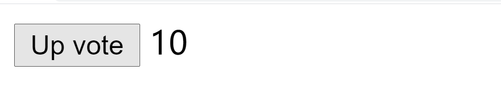

> ```vue 
> 1. 基本都是使用@事件名来进行事件的绑定
>    语法：
>       <h1 @click="num++">{{num}}</h1>
> 
> 2. 绑定的事件的事件名，全部都是js的事件名：
>    @submit   --->  onsubmit
>    @focus    --->  onfocus
>    @blur     --->  onblur
>    @click    --->  onclick
> ```

## 3.2、案例

### 案例1：tab切换案例vue实现


````vue
<!DOCTYPE html>
<html lang="en">
<head>
    <meta charset="UTF-8">
    <title>Title</title>

    <style>

        * {
            margin: 0;
            padding: 0;
        }

        .tab {
            width: 800px;
            height: 300px;
            /*border: 1px solid rebeccapurple;*/
            margin: 200px auto;
        }

        .tab ul {
            list-style: none;
        }

        .tab ul li {
            display: inline-block;
        }

        .tab_title {
            background-color: #f7f7f7;
            border: 1px solid #eee;
            border-bottom: 1px solid #e4393c;
        }

        .tab .tab_title li {
            padding: 10px 25px;
            font-size: 14px;
        }

        .tab .tab_title li.active {
            background-color: #e4393c;
            color: #fff;
            cursor: default;
        }

        .tab_con li.hide {
            display: none;
        }

    </style>

    <script src="https://cdnjs.cloudflare.com/ajax/libs/vue/3.0.5/vue.global.js"></script>
</head>
<body>

<div class="tab">
    <div>
        <ul class="tab_title">
            <li @click="currentNum=index" :class="{active:currentNum===index}"
                v-for="(tab_title,index) in tab_title_list">{{tab_title}}
            </li>
        </ul>

        <ul class="tab_con">
            <li v-for="(tab_con,index) in tab_con_list" :class="{hide:currentNum!==index}">{{tab_con}}</li>
        </ul>
    </div>
</div>

<script>

    // vue版本

    vm = Vue.createApp({
        data() {
            return {
                currentNum: 0,
                tab_title_list: ["商品介绍", "规格与包装", "售后保障", "商品评论"],
                tab_con_list: ["商品介绍...", "规格与包装...", "售后保障...", "商品评论..."],
            }
        },


    }).mount('.tab')


</script>

</body>
</html>
````

### 案例2：任务栏

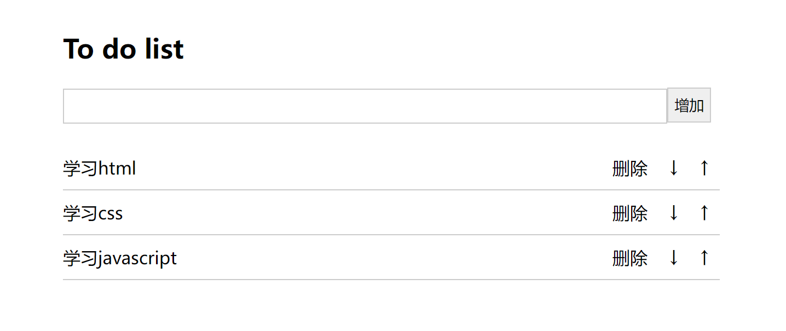

```vue
<!DOCTYPE html>
<html lang="en">
<head>
    <meta charset="UTF-8">
    <title>todolist</title>
    <style type="text/css">
        .list_con {
            width: 600px;
            margin: 50px auto 0;
        }

        .inputtxt {
            width: 550px;
            height: 30px;
            border: 1px solid #ccc;
            padding: 0px;
            text-indent: 10px;
        }

        .inputbtn {
            width: 40px;
            height: 32px;
            padding: 0px;
            border: 1px solid #ccc;
        }

        .list {
            margin: 0;
            padding: 0;
            list-style: none;
            margin-top: 20px;
        }

        .list li {
            height: 40px;
            line-height: 40px;
            border-bottom: 1px solid #ccc;
        }

        .list li span {
            float: left;
        }

        .list li a {
            float: right;
            text-decoration: none;
            margin: 0 10px;
        }
    </style>
    <script src="https://cdnjs.cloudflare.com/ajax/libs/vue/3.0.5/vue.global.js"></script>
</head>
<body>
<div id="todolist" class="list_con">
    <h2>To do list</h2>
    <input type="text" v-model="message" class="inputtxt">
    <input type="button" @click="addItem" value="增加" class="inputbtn">
    <ul id="list" class="list">
        <li v-for="(item,key) in dolist">
            <span>{{item}}</span>
            <a @click="upItem(key)" class="up"> ↑ </a>
            <a @click="downItem(key)" class="down"> ↓ </a>
            <a @click="delItem(key)" class="del">删除</a>
        </li>
    </ul>
</div>
<script>
    // 计划列表代码
    Vue.createApp({
        data() {
            return {
                message: "",
                dolist: ["学习html", "学习css", "学习javascript"]
            }
        },
        methods: {
            addItem() {
                if (this.messsage == "") {
                    return false;
                }

                this.dolist.push(this.message);
                this.message = ""
            },
            delItem(key) {
                // 删除和替换
                // 参数1: 开始下表
                // 参数2: 元素长度，如果不填默认删除到最后
                // 参数3: 表示使用当前参数替换已经删除内容的位置
                this.dolist.splice(key, 1);
            },
            upItem(key) {
                if (key == 0) {
                    return false;
                }
                // 向上移动
                let result = this.dolist.splice(key, 1);
                this.dolist.splice(key - 1, 0, result[0]);
            },
            downItem(key) {
                // 向下移动
                let result = this.dolist.splice(key, 1);
                console.log(result);
                this.dolist.splice(key + 1, 0, result[0]);
            }
        }
    }).mount("#todolist")

</script>
</body>
</html>
```

# 四、计算属性和侦听器

## 4.1、计算属性

模板内的表达式非常便利，但是设计它们的初衷是用于简单运算的。在模板中放入太多的逻辑会让模板过重且难以维护。例如，有一个嵌套数组对象：我们想根据 `author` 是否已经有一些书来显示不同的消息

```vue 
<div id="computed-basics">
    <p>Has published books:</p>
    <span>{{ author.books.length > 0 ? 'Yes' : 'No' }}</span>
</div>

<script>

    Vue.createApp({
        data() {
            return {
                author: {
                    name: 'John Doe',
                    books: [
                        'Vue 2 - Advanced Guide',
                        'Vue 3 - Basic Guide',
                        'Vue 4 - The Mystery'
                    ]
                }
            }
        }
    }).mount("#computed-basics")
</script>
```

此时，模板不再是简单的和声明性的。你必须先看一下它，然后才能意识到它执行的计算取决于 `author.books`。如果要在模板中多次包含此计算，则问题会变得更糟。

所以，对于任何包含响应式数据的复杂逻辑，你都应该使用**计算属性**。

````vue 

<div id="computed-basics">
    <p>Has published books:</p>
    <span>{{ publishedBooksMessage }}</span>
</div>

<script>

    Vue.createApp({
        data() {
            return {
                author: {
                    name: 'John Doe',
                    books: [
                        'Vue 2 - Advanced Guide',
                        'Vue 3 - Basic Guide',
                        'Vue 4 - The Mystery'
                    ]
                }
            }
        },
        computed: {
            // 计算属性的 getter
            publishedBooksMessage() {
                // `this` 指向 vm 实例
                return this.author.books.length > 0 ? 'Yes' : 'No'
            }
        }
    }).mount('#computed-basics')
</script>
````

这里声明了一个计算属性 `publishedBooksMessage`。

尝试更改应用程序 `data` 中 `books` 数组的值，你将看到 `publishedBooksMessage` 如何相应地更改。

你可以像普通属性一样将数据绑定到模板中的计算属性。Vue 知道 `vm.publishedBookMessage` 依赖于 `vm.author.books`，因此当 `vm.author.books` 发生改变时，所有依赖 `vm.publishedBookMessage` 的绑定也会更新。

**计算属性缓 vs 方法**

你可能已经注意到我们可以通过在表达式中调用方法来达到同样的效果：

```html
<p>{{ calculateBooksMessage() }}</p>
```

```js
// 在组件中
methods: {
  calculateBooksMessage() {
    return this.author.books.length > 0 ? 'Yes' : 'No'
  }
}
```

我们可以将同一函数定义为一个方法而不是一个计算属性。两种方式的最终结果确实是完全相同的。然而，不同的是**计算属性是基于它们的响应依赖关系缓存的**。计算属性只在相关响应式依赖发生改变时它们才会重新求值。这就意味着只要 `author.books` 还没有发生改变，多次访问 `publishedBookMessage` 计算属性会立即返回之前的计算结果，而不必再次执行函数。

这也同样意味着下面的计算属性将不再更新，因为 Date.now () 不是响应式依赖：

```js 
computed: {
  now() {
    return Date.now()
  }
}
```

相比之下，每当触发重新渲染时，调用方法将总会再次执行函数。

我们为什么需要缓存？假设我们有一个性能开销比较大的计算属性 `list`，它需要遍历一个巨大的数组并做大量的计算。然后我们可能有其他的计算属性依赖于 `list`。如果没有缓存，我们将不可避免的多次执行 `list` 的 getter！如果你不希望有缓存，请用 `method` 来替代。

案例：


````vue 
<!DOCTYPE html>
<html lang="en">
<head>
    <meta charset="UTF-8">
    <title>Title</title>
    <script src="https://cdnjs.cloudflare.com/ajax/libs/vue/3.0.5/vue.global.js"></script>
    <style>
        body {
            font-size: 14px;
        }

        table, tr, th, td {
            border: 1px solid red;
            border-collapse: collapse; /* 合并边框 */
        }

        th, td {
            width: 200px;
            text-align: center; /* 文本水平居中 */
            height: 30px;
            line-height: 30px;
        }

        input {
            width: 80px;
        }

        .active {
            background-color: lightskyblue;
        }
    </style>
</head>
<body>

<div id="app">
    <table>
        <tr>
            <th>商品ID</th>
            <th>商品标题</th>
            <th>商品库存</th>
            <th>商品单价</th>
            <th>购买数量</th>
            <th>商品小计</th>
        </tr>
        <tr v-for="book in book_list">
            <td>{{book.id}}</td>
            <td>《{{book.title}}》</td>
            <td>{{book.max_num}}</td>
            <td>{{book.price}}</td>
            <td>
                <button @click="sub(book)">-</button>
                <input type="text" v-model.number="book.num">
                <button @click="add(book)">+</button>
            </td>
            <td>{{total(book)}}</td>
        </tr>
        <tr>
            <td colspan="4"></td>
            <td>总计</td>
            <td>{{calc}}</td>
        </tr>
    </table>
</div>

<script>

    Vue.createApp({
        data() {
            return {
                book_list: [
                    {id: 10, title: "诛仙", price: 98.50, num: 1, max_num: 7,},
                    {id: 110, title: "元月", price: 68.50, num: 1, max_num: 5,},
                    {id: 30, title: "一月", price: 108.50, num: 1, max_num: 3,},
                    {id: 100, title: "二月", price: 78.50, num: 1, max_num: 10,},
                ]
            }
        },
        // 所谓的计算属性，就是新声明一个新的变量，这个变量是经过data里面的数据运算后的结果。
        computed: {
            calc() {
                let ret = 0;
                this.book_list.forEach((book, key) => {
                    ret += book.price * book.num;
                });
                return ret.toFixed(2);
            }
        },
        methods: {
            total(book) {
                return (book.price * book.num).toFixed(2);
            },
            sub(book) {
                // 减少数量
                if (book.num > 1) {
                    book.num -= 1;
                }
            },
            add(book) {
                // 增加数量
                if (book.num < book.max_num) {
                    book.num += 1;
                }
            }
        }

    }).mount('#app')
</script>

</body>
</html>
````

## 4.2、侦听属性

虽然计算属性在大多数情况下更合适，但有时也需要一个自定义的侦听器。这就是为什么 Vue 通过 `watch` 选项提供了一个更通用的方法，来响应数据的变化。当需要在数据变化时执行异步或开销较大的操作时，这个方式是最有用的。

侦听属性是一个对象，它的键是要监听的对象或者变量，值一般是函数，当侦听的data数据发生变化时，会自定执行的对应函数，这个函数在被调用时，vue会传入两个形参，第一个是变化前的数据值，第二个是变化后的数据值。

#### 案例1

```vue 
<div id="app">
    <p>{{num}}</p>
    <p><input type="text" v-model="num"></p>
</div>

<script>

    Vue.createApp({
        data() {
            return {
                num: 10
            }
        },
        watch: {
            num: function (newval, oldval) {
                //num发生变化的时候，要执行的代码
                console.log(`num已经从${oldval}变成${newval}`);
            }
        }

    }).mount('#app')
</script>
```

#### 案例2

```vue 
<!DOCTYPE html>
<html lang="en">
<head>
    <meta charset="UTF-8">
    <title>Title</title>
    <script src="https://cdnjs.cloudflare.com/ajax/libs/vue/3.0.5/vue.global.js"></script>
    <style>
        input[type=password] {
            outline-color: red;
        }

        input.is_pass {
            outline-color: green;
        }

        input.is_fail {
            outline-color: red;
        }
    </style>
</head>
<body>

<div id="app">
    <p>
        <input type="password" :class="tips" v-model="password">
    </p>
</div>

<script>

    Vue.createApp({
        data() {
            return {
                tips: "is_fail",
                password:""
            }
        },
        watch: {
            password() {
                if (this.password.length > 6 && this.password.length < 16) {
                    this.tips = "is_pass"
                } else {
                    this.tips = "is_fail";
                }
            }
        },

    }).mount('#app')
</script>

</body>
</html>
```

# 五、生命周期


 ```vue 
 <!DOCTYPE html>
 <html lang="en">
 <head>
     <meta charset="UTF-8">
     <title>Title</title>
     <script src="https://cdnjs.cloudflare.com/ajax/libs/vue/3.0.5/vue.global.js"></script>
 
 </head>
 <body>
 
 <div id="app">
     <p ref="p1">{{num}}</p>
     <input type="text" v-model="num">
 </div>
 
 <script>
 
     vm = Vue.createApp({
         data() {
             return {
                 num: 0,
             }
         },
         beforeCreate() {
             console.log("--------data数据被赋值到vm对象之前---------");
             console.log("this", this);
             console.log("num:", this.num);
             console.log("$el", this.$el);
         },
         created() { // 重点掌握，最常用，开发中一般会在这里编写ajax代码，发送http请求获取来自服务端的数据
             console.log("--------data数据被赋值到vm对象之后---------");
             console.log("this", this);
             console.log("num:", this.num);
             console.log("$el", this.$el);
             this.num = 10
         },
         beforeMount() {
             console.log("--------把data数据渲染到HTML模板之前---------");
             console.log("this", this);
             console.log("num:", this.num);
             console.log("$el", this.$el);
         },
         mounted() { // 重点掌握，最常用，开发中一般会在这里编写页面初始化的操作，一般就是根据条件/状态，进行页面跳转，改变页面的特效。
             console.log("--------把data数据渲染到HTML模板之后---------");
             console.log("this", this);
             console.log("num:", this.num);
             console.log("$el", this.$el.parentElement);
         },
         beforeUpdate() {
             console.log("--------data数据发生改变以后，同步到HTML模板之前，此时data和模板的数据是不一致的---------");
             console.log("this", this);
             console.log("num:", this.num);
             console.log("$el", this.$el.parentElement.innerHTML);
         },
         updated() {
             console.log("--------data数据发生改变以后，同步到HTML模板之后，此时data和模板中的数据保持一致---------");
             alert(123)
             console.log("this", this);
             console.log("num:", this.num);
             console.log("$el", this.$el.parentElement.innerHTML);
         }
 
     }).mount('#app')
 </script>
 
 </body>
 </html>
 ```


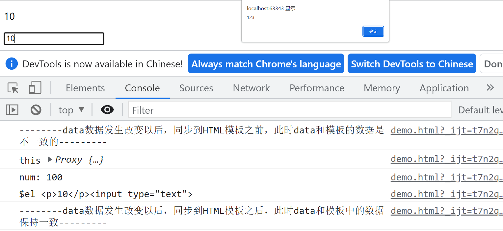

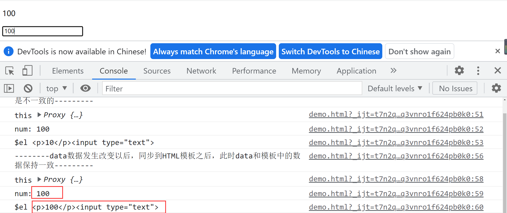

# 六、Ajax请求


```vue
<!DOCTYPE html>
<html lang="en">
<head>
    <meta charset="UTF-8">
    <title>Title</title>
    <script src="https://cdnjs.cloudflare.com/ajax/libs/vue/3.0.5/vue.global.js"></script>
    <script src="https://cdn.staticfile.org/axios/0.18.0/axios.min.js"></script>
    <style>
        table {
            width: 800px;
            border-collapse: collapse;
        }

        td, th {
            border: 1px solid gray;
            background-color: #369;
            color: white;
            font-family: "Times New Roman";
            text-align: center;
            font-weight: lighter;
        }
    </style>

</head>
<body>

<div id="app">
    <div>
        <p><input type="text" v-model="city">
            <button @click="get_weather">获取天气</button>
        </p>
        <table v-if="weather_list.length>1">
            <tr>
                <th>日期</th>
                <th>天气</th>
                <th>温度</th>
                <th>风向</th>
            </tr>
            <tr v-for="weather in weather_list">
                <td>{{ weather.date }}</td>
                <td>{{ weather.type }}</td>
                <td>{{ weather.low }}~{{ weather.high }}</td>
                <td>{{ weather.fengxiang }}{{ showFengLi(weather.fengli) }}</td>
            </tr>
        </table>
    </div>
</div>

<script>

    vm = Vue.createApp({
        data() {
            return {
                city: "北京",
                weather_list: [],
            }
        },
        methods: {
            get_weather() {
                // 发送http请求获取天气
                axios.get("http://wthrcdn.etouch.cn/weather_mini", {
                    params: {
                        city: this.city,
                    }
                }).then(response => {
                    console.log(response.data.data.forecast);
                    this.weather_list = response.data.data.forecast;
                }).catch(error => {
                    console.log(error);
                })
            },
            showFengLi(content) {
                return content.replaceAll("<![CDATA[", "").replaceAll("]]>", "");
            },
        },
        created(){
            this.get_weather()
        }

    }).mount('#app')
</script>

</body>
</html>
```

# 七、组件基础

组件（Component）是自定义封装的功能。在前端开发过程中，经常出现多个网页的功能是重复的，而且很多不同的页面之间，也存在同样的功能。而在网页中实现一个功能，需要使用html定义功能的内容结构，使用css声明功能的外观样式，还要使用js来定义功能的特效，因此就产生了把一个功能相关的[HTML、css和javascript]代码封装在一起组成一个整体的代码块封装模式，我们称之为“组件”。所以，组件就是一个html网页中的功能，一般就是一个标签，标签中有自己的html内容结构，css样式和js特效。这样，前端人员就可以在组件化开发时，只需要书写一次代码，随处引入即可使用。

vue的组件有两种：默认组件[全局组件] 和 单文件组件。我们在这里先讲一下默认组件。

## 7.1、默认组件

这里有一个 Vue 组件的示例：组件是带有名称的可复用实例，在这个例子中是 `<button-counter>`。我们可以把这个组件作为一个根实例中的自定义元素来使用：

```html 
<!DOCTYPE html>
<html lang="en">
<head>
    <meta charset="UTF-8">
    <title>Title</title>
    <script src="https://cdnjs.cloudflare.com/ajax/libs/vue/3.0.5/vue.global.js"></script>

</head>
<body>

<div id="components-demo">
    <button-counter></button-counter>
    <button-counter></button-counter>
    <button-counter></button-counter>
</div>

<script>
    // 创建一个Vue 应用
    const app = Vue.createApp({})

    // 定义一个名为 button-counter 的新全局组件
    app.component('button-counter', {
        data() {
            return {
                count: 0
            }
        },
        template: `
          <button @click="count++">
          You clicked me {{ count }} times.
          </button>`,
        style:{
            color:"red",
        }
    })
    app.mount('#components-demo')
</script>

</body>
</html>
```

因为组件是可复用的组件实例，所以它们与根实例接收相同的选项，例如 `data`、`computed`、`watch`、`methods` 以及生命周期钩子等。

> - 不支持 CSS (No CSS support) 意味着当 HTML 和 JavaScript 组件化时，CSS 明显被遗漏

## 7.2、单文件组件

Vue 单文件组件（又名 `*.vue` 文件，缩写为 **SFC**）是一种特殊的文件格式，它允许将 Vue 组件的模板、逻辑 **与** 样式封装在单个文件中。下面是 SFC 示例：

```vue
<script>
export default {
  data() {
    return {
      greeting: 'Hello World!'
    }
  }
}
</script>

<template>
  <p class="greeting">{{ greeting }}</p>
</template>

<style>
.greeting {
  color: red;
  font-weight: bold;
}
</style>
```

正如所见，Vue SFC 是经典的 HTML、CSS 与 JavaScript 三个经典组合的自然延伸。每个 `*.vue` 文件由三种类型的顶层代码块组成：`<template>`、`<script>` 与 `<style>`：

> - `<script>` 部分是一个标准的 JavaScript 模块。它应该导出一个 Vue 组件定义作为其默认导出。
> - `<template>` 部分定义了组件的模板。
> - `<style>` 部分定义了与此组件关联的 CSS。

在实际项目中，通常会将 SFC 编译器与 [Vite](https://vitejs.dev/) 或 [Vue CLI](http://cli.vuejs.org/)（基于 [webpack](https://webpack.js.org/)）等构建工具集成在一起，Vue 提供的官方脚手架工具，可让你更快地开始使用 SFC。

虽然 SFC 需要一个构建步骤，但益处颇多：

- 使用熟悉的 HTML、CSS 与 JavaScript 语法编写模块化组件
- 预编译模板
- 组件作用域 CSS
- 通过交叉分析模板与脚本进行更多编译时优化
- [IDE 支持](https://v3.cn.vuejs.org/api/sfc-tooling.html#ide-support) 模板表达式的自动补全与类型检查
- 开箱即用的热模块更换（HMR）支持

# 八、脚手架（@vue/cli）

## 8.1、vue cli介绍

Vue CLI 是一个基于 Vue.js 进行快速开发的完整系统，提供：

> - 通过 `@vue/cli` 实现的交互式的项目脚手架。
>
> - 通过 `@vue/cli` + `@vue/cli-service-global` 实现的零配置原型开发。
>
> - 一个运行时依赖 (
>
>   ```bash 
>   @vue/cli-service
>   ```
>
>   )，该依赖：
>
>   - 可升级；
>   - 基于 webpack 构建，并带有合理的默认配置；
>   - 可以通过项目内的配置文件进行配置；
>   - 可以通过插件进行扩展。
>
> - 一个丰富的官方插件集合，集成了前端生态中最好的工具。

Vue CLI 致力于将 Vue 生态中的工具基础标准化。它确保了各种构建工具能够基于智能的默认配置即可平稳衔接，这样你可以专注在撰写应用上，而不必花好几天去纠结配置的问题。与此同时，它也为每个工具提供了调整配置的灵活性。

Vue CLI 有几个独立的部分——如果你看到了我们的[源代码](https://github.com/vuejs/vue-cli/tree/dev/packages/%40vue)，你会发现这个仓库里同时管理了多个单独发布的包。

* CLI

CLI (`@vue/cli`) 是一个全局安装的 npm 包，提供了终端里的 `vue` 命令。它可以通过 `vue create` 快速搭建一个新项目，或者直接通过 `vue serve` 构建新想法的原型。你也可以通过 `vue ui` 通过一套图形化界面管理你的所有项目。我们会在接下来的指南中逐章节深入介绍。

* CLI 服务

CLI 服务 (`@vue/cli-service`) 是一个开发环境依赖。它是一个 npm 包，局部安装在每个 `@vue/cli` 创建的项目中。

## 8.2 、安装

关于旧版本

> Vue CLI 的包名称由 `vue-cli` 改成了 `@vue/cli`。 如果你已经全局安装了旧版本的 `vue-cli` (1.x 或 2.x)，你需要先通过 `npm uninstall vue-cli -g` 或 `yarn global remove vue-cli` 卸载它。

关于Node 版本要求

> Vue CLI 4.x 需要 [Node.js](https://nodejs.org/) v8.9 或更高版本 (推荐 v10 以上)。你可以使用 [n](https://github.com/tj/n)，[nvm](https://github.com/creationix/nvm) 或 [nvm-windows](https://github.com/coreybutler/nvm-windows) 在同一台电脑中管理多个 Node 版本。

可以使用下列任一命令安装这个新的包：

```bash
npm install -g @vue/cli
# OR
yarn global add @vue/cli
```

安装之后，你就可以在命令行中访问 `vue` 命令。你可以通过简单运行 `vue`，看看是否展示出了一份所有可用命令的帮助信息，来验证它是否安装成功。

你还可以用这个命令来检查其版本是否正确：

```bash
vue --version
```

如需升级全局的 Vue CLI 包，请运行：

```bash
npm update -g @vue/cli
# 或者
yarn global upgrade --latest @vue/cli
```

> 对于 Vue 3.x 的项目，需要使用 Vue CLI v4.5 以上的版本。

## 8.3、构建项目流程

### 8.3.1、创建项目

```bash
vue create hello-world
```

你会被提示选取一个 preset。你可以选默认的包含了基本的 Babel + ESLint 设置的 preset，也可以选“手动选择特性”来选取需要的特性。


这个默认的设置非常适合快速创建一个新项目的原型，而手动设置则提供了更多的选项，它们是面向生产的项目更加需要的。


如果你决定手动选择特性，在操作提示的最后你可以选择将已选项保存为一个将来可复用的 preset。

### 8.3.2、启动项目

项目创建之后，会在当前目录下多出一个项目文件夹。从它的 `package.json` 中可以看到只有 vue.js 的核心依赖

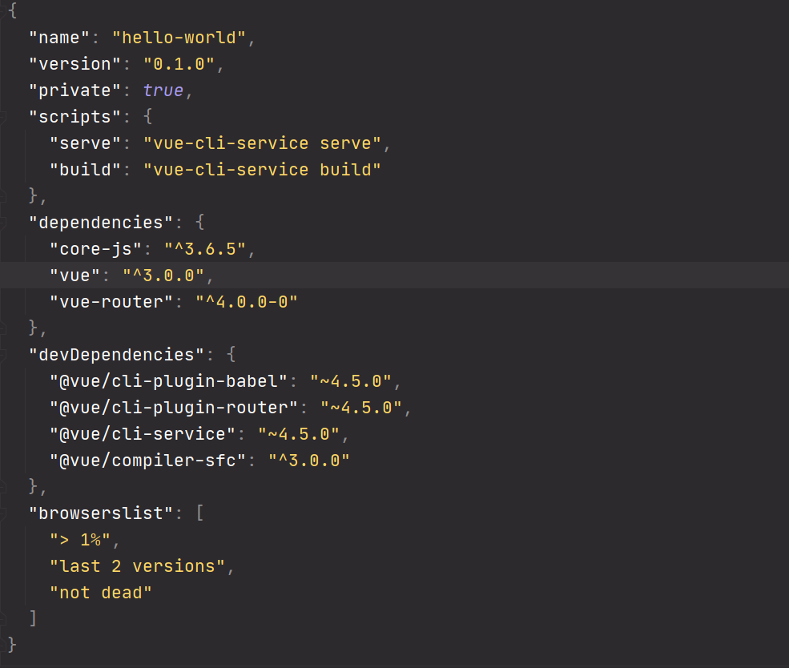

然后启动项目试试，在项目根目录运行终端，在命令行输入

```bash 
npm run serve
# OR
yarn serve
```

在一个 Vue CLI 项目中，`@vue/cli-service` 安装了一个名为 `vue-cli-service` 的命令。你可以在 npm scripts 中以 `vue-cli-service`、或者从终端中以 `./node_modules/.bin/vue-cli-service` 访问这个命令。

这是你使用默认 preset 的项目的 `package.json`：

```json
{
  "scripts": {
    "serve": "vue-cli-service serve",
    "build": "vue-cli-service build"
  }
}
```

在浏览器中打开链接 **http://localhost:8080/**，就能看到项目的启动页

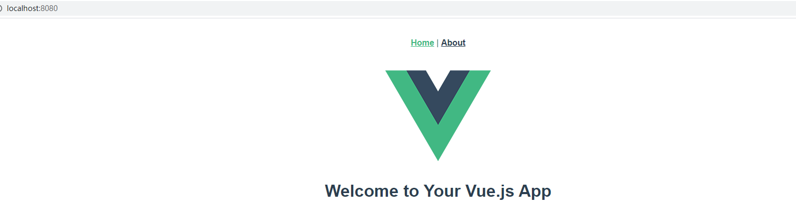

 pycharm中运快捷启动项目：


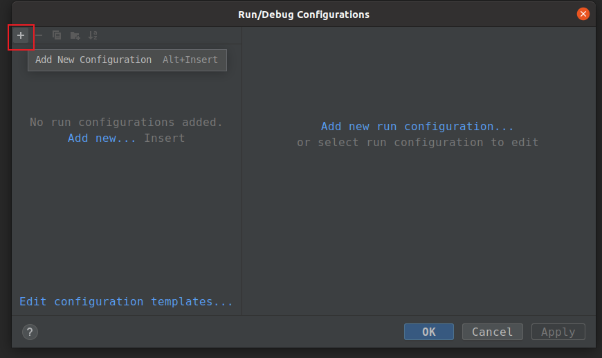

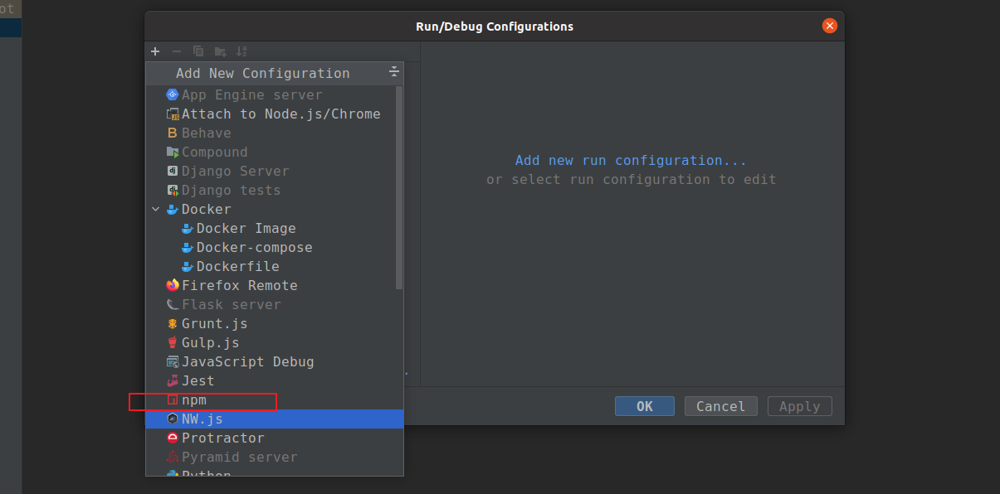

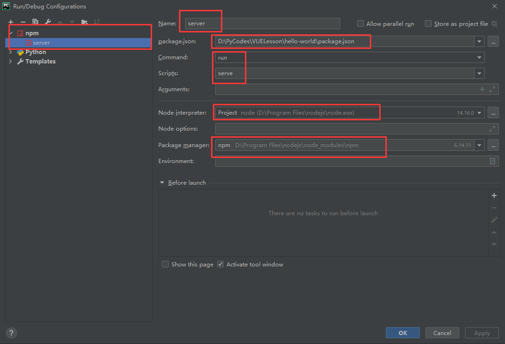

### 8.3.3、配置文件

项目默认使用的端口是 8080，如果想使用别的端口，可以在**项目的根目录**创建一个 **vue.config.js** 

````js 
// vue.config.js
module.exports = {
  outputDir: 'dist', // 打包的目录
  lintOnSave: true, // 在保存时校验格式
  productionSourceMap: false, // 生产环境是否生成 SourceMap
  devServer: {
    open: true, // 启动服务后是否打开浏览器
    overlay: { // 错误信息展示到页面
      warnings: true,
      errors: true
    },
    host: '0.0.0.0',
    port: 8082, // 服务端口
    https: false,
    hotOnly: false,
    // proxy: { // 设置代理
    //   '/api': {
    //     target: host,
    //     changeOrigin: true,
    //     pathRewrite: {
    //       '/api': '/',
    //     }
    //   },
    // },
   },
}
````

### 8.3.4、目录结构


#### （1）node_modules——[依赖包]

node_modules里面是项目依赖包，其中包括很多基础依赖，自己也可以根据需要安装其他依赖。安装方法为打开cmd，进入项目目录，输入npm install [依赖包名称],回车。

在两种情况下我们会自己去安装依赖：

<1> 项目运行缺少该依赖包：例如项目加载外部css会用到的css-loader，路由跳转vue-loader等（安装方法示例：npm install css-loader）

<2> 安装插件：如vux（基于WEUI的移动端组件库），vue-swiper（轮播插件）

> 注：有时会安装指定依赖版本，需在依赖包名称后加上版本号信息，如安装11.1.4版本的vue-loader，输入npm install vue-loader@11.1.4

#### （2）index.html——[主页]

index.html如其他html一样，但一般只定义一个空的根节点，在main.js里面定义的实例将挂载在根节点下，内容都通过vue组件来填充。这是整个应用的 html 基础模板，也是打包编译后的项目入口。

```html 
<!DOCTYPE html>
<html lang="">
  <head>
    <meta charset="utf-8">
    <meta http-equiv="X-UA-Compatible" content="IE=edge">
    <meta name="viewport" content="width=device-width,initial-scale=1.0">
    <link rel="icon" href="<%= BASE_URL %>favicon.ico">
    <title><%= htmlWebpackPlugin.options.title %></title>
  </head>
  <body>
    <noscript>
      <strong>We're sorry but <%= htmlWebpackPlugin.options.title %> doesn't work properly without JavaScript enabled. Please enable it to continue.</strong>
    </noscript>
    <div id="app"></div>
    <!-- built files will be auto injected -->
  </body>
</html>

```

#### （3）src——[项目核心文件]

 项目核心文件前面已经进行了简单的说明，接下来重点讲解main.js，App.vue,及router的index.js


#### （4）main.js——[入口文件]

main.js主要是引入vue框架，根组件及路由设置，并且定义vue实例，后期还可以引入插件，当然首先得安装插件。

````js 
import { createApp } from 'vue'
import App from './App.vue'
import router from './router'

createApp(App).use(router).mount('#app')

````

main.js 只是引入了 App.vue 组件，并挂载到上面提到的 #app 节点下。这里的 `createApp`方法是 Vue 3 新增的全局 API，用来创建一个 Vue 应用，并挂载到某个 DOM 节点。

#### （5）App.vue——[根组件] 

一个vue页面通常由三部分组成:模板(template)、js(script)、样式(style)

````html 
<template>
  <div id="nav">
    <router-link to="/">Home</router-link> |
    <router-link to="/about">About</router-link>
  </div>
  <router-view/>
</template>

<style>
#app {
  font-family: Avenir, Helvetica, Arial, sans-serif;
  -webkit-font-smoothing: antialiased;
  -moz-osx-font-smoothing: grayscale;
  text-align: center;
  color: #2c3e50;
}

#nav {
  padding: 30px;
}

#nav a {
  font-weight: bold;
  color: #2c3e50;
}

#nav a.router-link-exact-active {
  color: #42b983;
}
</style>

````

> 【template】
>
> 其中模板只能包含一个父节点，也就是说顶层的div只能有一个（例如下图，父节点为#app的div，其没有兄弟节点）
>
> <router-view></router-view>是子路由视图，后面的路由页面都显示在此处
>
> 打一个比喻吧,<router-view>类似于一个插槽，跳转某个路由时，该路由下的页面就插在这个插槽中渲染显示
>
> 【script】
>
> vue通常用es6来写，用export default导出，其下面可以包含数据data，生命周期(mounted等)，方法(methods)等，具体语法请看vue.js文档，在后面我也会通过例子来说明。
>
>  【style】
>
> 样式通过style标签<style></style>包裹，默认是影响全局的，如需定义作用域只在该组件下起作用，需在标签上加scoped，<style scoped></style>

#### （6）router——[路由配置]

 router文件夹下，有一个index.js，即为路由配置文件

```js 
import { createRouter, createWebHistory } from 'vue-router'
import Home from '../views/Home.vue'

const routes = [
  {
    path: '/',
    name: 'Home',
    component: Home
  },
  {
    path: '/about',
    name: 'About',
    // route level code-splitting
    // this generates a separate chunk (about.[hash].js) for this route
    // which is lazy-loaded when the route is visited.
    component: () => import(/* webpackChunkName: "about" */ '../views/About.vue')
  }
]

const router = createRouter({
  history: createWebHistory(process.env.BASE_URL),
  routes
})

export default router

```

这里定义了路径为'/'的路由，该路由对应的页面是Home组件，所以当我们在浏览器url访问http://localhost:8080/#/时就渲染的Home组件

类似的，我们可以设置多个路由，‘/index’,'/list'之类的，当然首先得引入该组件，再为该组件设置路由。

## 8.4、单文件组件的使用

### 8.4.1、单文件组件模式流程


整个项目是一个主文件index.html，index.html中会引入src文件夹中的main.js，main.js中会导入顶级单文件组件App.vue，App.vue中会通过组件嵌套或者路由来引用其他页面组件文件，页面组件也可以嵌套或者路由引用的方式加载子组件。

组件有两种：脚本化组件、单文件组件

脚本化组件的缺点：

> 2. 脚本化组件用在小项目中非常合适，但是复杂的大项目中，如果把更多的组件放在html文件中，那么维护成本就会变得非常昂贵。
> 3. 脚本化组件只是整合了js和html，但是css代码被剥离出去了。使用组件时还要另外引入css文件。

将一个组件相关的html结构，css样式，以及交互的JavaScript代码从html文件中剥离出来，合成一个文件，这种文件就是单文件组件，相当于一个组件具有了结构、表现和行为的完整功能，方便组件之间随意组合以及组件的重用，这种文件的扩展名为“.vue”，比如：“Home.vue”。

> 1. 在template 编写html代码，script编写vue.js代码，style编写当前组件的样式代码
> 2. 从上面可以看到，虽然我们现在使用了单文件组件，但是之前我们在脚本化阶段学习过的所有语法，在这里都是通用的。

### 8.4.2、构建Nav组件

在src/components目录下,可以创建当前页面的子组件,例如Nav.vue

```vue 
<template>
  <div>
    <ul>
      <li v-for="menu in menu_list"><a :href="menu.link">{{ menu.name }}</a></li>
      <li>
        &nbsp;&nbsp;&nbsp; <span>所在地：</span><select v-model="city" name="" id="">
        <option value="北京">北京</option>
        <option value="上海">上海</option>
        <option value="深圳">深圳</option>
      </select>
      </li>
    </ul>

  </div>
</template>

<script>
export default {
  name: "Nav",
  data() {
    return {
      menu_list: [
        {name: "百度", "link": "http://www.baidu.com"},
        {name: "腾讯", "link": "http://www.qq.com"},
        {name: "小米", "link": "http://www.xiaomi.com"},
      ],
     city:"北京",
    }
  },

}
</script>

<style scoped>
ul, li {
  list-style: none;
  padding: 0;
  margin: 0;
}

ul::after {
  overflow: hidden;
  clear: both;
  display: block;
  content: "";
}

li {
  float: left;
  margin: 0 20px;
}

a {
  text-decoration: none;
  color: #666;
}
</style>

```

接下来就可以在Home.vue中通过import导入Nav进行嵌套使用。

```vue 
<template>
  <div class="home">
<!--    -->
<!--    <HelloWorld msg="Welcome to Your Vue.js App"/>-->
    <Nav></Nav>
  </div>
</template>

<script>
// @ is an alias to /src
import Nav from '@/components/Nav.vue'

export default {
  name: 'Home',
  components: {
    Nav
  }
}
</script>

```


## 8.5、vue-cli 中使用 Axios

安装 axios：

```bash 
npm install  axios --save-dev
```

接着在src目录下创建一个http.js脚本中，导入axios并通过create方法实例化一个http请求对象，这样我们才能在组件中使用。

src/http.js，代码：

```js 
import axios from "axios"; // 要导入安装的包，则直接填写包名即可。不需要使用路径

// 实例化
const $http = axios.create({
      baseURL: 'http://wthrcdn.etouch.cn/', // 请求的公共路径,一般填写服务端的api地址
      timeout: 1000,                           // 最大请求超时时间，请求超过这个时间则报错
      headers: {'X-Custom-Header': 'foobar'}   // 预定义请求头，一般工作中这里填写隐藏了客户端身份的字段
});

export default $http;
```

在src/components目录下构建Forecast组件，使用axios模块：

```vue 
<template>
  <div>
    <p>
        <input type="text" v-model="city">
        <button @click="get_weather">获取天气</button>
    </p>
    <table v-if="weather_list.length>1">
      <tr>
        <th>日期</th>
        <th>天气</th>
        <th>温度</th>
        <th>风向</th>
      </tr>
      <tr v-for="weather in weather_list">
        <td>{{ weather.date }}</td>
        <td>{{ weather.type }}</td>
        <td>{{ weather.low }}~{{ weather.high }}</td>
        <td>{{ weather.fengxiang }}{{ showFengLi(weather.fengli) }}</td>
      </tr>
    </table>
  </div>
</template>

<script>
import $http from "../http";

export default {
  name: "Forecast",
  data() {
    return {
      city: "北京",
      weather_list: [],
    }
  },
  created() {
    // 任意一个组件中都可以获取查询参数
    console.log(this.$route.query); // 获取所有的查询参数
    if (this.$route.query.city) {
      this.city = this.$route.query.city
    }

  },
  methods: {
    get_weather() {
      // 发送http请求获取天气
      $http.get("http://wthrcdn.etouch.cn/weather_mini", {
        params: {
          city: this.city,
        }
      }).then(response => {
        console.log(response.data.data.forecast);
        this.weather_list = response.data.data.forecast;
      }).catch(error => {
        console.log(error);
      })
    },
    showFengLi(content) {
      return content.replaceAll("<![CDATA[", "").replaceAll("]]>", "");
    },
  }
}
</script>

<style scoped>
table {
  width: 800px;
  border-collapse: collapse;
}

td, th {
  border: 1px solid red;
}
</style>
```

在Home.Vue更新为：

```vue 
<template>
  <div class="home">
    <!--    -->
    <!--    <HelloWorld msg="Welcome to Your Vue.js App"/>-->
    <Nav></Nav>
    <Forecast></Forecast>

  </div>
</template>

<script>
// @ is an alias to /src
import Nav from '@/components/Nav.vue'
import Forecast from '@/components/Forecast.vue'

export default {
  name: 'Home',
  components: {
    Nav,
    Forecast
  }
}
</script>

```


## 8.6、父子组件之间传递数据

Nav组件是Forecast组件的父组件。

#### （1）子组件传递数据给父组件

在子组件中，通过`this.$emit('自定义事件名', 参数1,参数2,...)`来调用父组件中定义的事件.

 子组件Nav.Vue添加：

```vue
<template>
  <div>
    <ul>
      <li v-for="menu in menu_list"><a :href="menu.link">{{ menu.name }}</a></li>
      <li>
        &nbsp;&nbsp;&nbsp; <span>所在地：</span><select v-model="city" name="" id="">
        <option value="北京">北京</option>
        <option value="上海">上海</option>
        <option value="深圳">深圳</option>
      </select>
      </li>
    </ul>

  </div>
</template>

<script>
export default {
  name: "Nav",
  data() {
    return {
      menu_list: [
        {name: "百度", "link": "http://www.baidu.com"},
        {name: "腾讯", "link": "http://www.qq.com"},
        {name: "小米", "link": "http://www.xiaomi.com"},
      ],
      city: "北京",
    }
  },
  watch: {
    city() {
      alert(this.city)
      this.$emit("getCity", this.city);
    }
  },

}
</script>

<style scoped>
ul, li {
  list-style: none;
  padding: 0;
  margin: 0;
}

ul::after {
  overflow: hidden;
  clear: both;
  display: block;
  content: "";
}

li {
  float: left;
  margin: 0 20px;
}

a {
  text-decoration: none;
  color: #666;
}
</style>

```

父组件Home.Vue：

````vue
<template>
  <div class="home">
    <!--    -->
    <!--    <HelloWorld msg="Welcome to Your Vue.js App"/>-->
    <Nav @getCity="getCity"></Nav>
    <Forecast></Forecast>
  </div>
</template>

<script>
// @ is an alias to /src
import Nav from '@/components/Nav.vue'
import Forecast from '@/components/Forecast.vue'

export default {
  name: 'Home',

  components: {
    Nav,
    Forecast
  },
  data() {
    return {
      city: ""
    }
  },
  methods: {
    getCity: function (city) {
      console.log(city)
      this.city = city;
    },
  }
}
</script>
````

> 注意：子组件中往父组件传递数据，属于单向数据量。

#### （2）父组件的数据传递给子组件

Home.Vue组件：

```html 
<Forecast :choose_city="city"></Forecast>
```

子组件Forecast.Vue：

````js 
  props: {  // 接收来自父组件的数据
    choose_city: {
      default:"北京",
      type: String,
    }
  },

  watch: {
    choose_city() {
        this.city = this.choose_city
        this.get_weather();
    },
  },
````


##  8.7、路由

上面是将Forecast组件作为了Home的子组件使用，现在我们将其作为一个路由组件使用。

在router/index.js路由系统注册路由：

```js 
 {
        path: '/forecast',
        name: 'Forecast',
        // route level code-splitting
        // this generates a separate chunk (about.[hash].js) for this route
        // which is lazy-loaded when the route is visited.
        component: () => import(/* webpackChunkName: "about" */ '../components/Forecast.vue')
    },
```

app.Vue中更新为：

````html 
<template>
  <div id="nav">
    <router-link to="/">Home</router-link> |
    <router-link to="/about">About</router-link>|
    <router-link to="/forecast">天气预报</router-link>
  </div>
  <router-view/>
</template>
````


### 8.7.1、路由跳转

vue-router提供了2种写法让我们实现页面跳转。

#### （1）通过router-link来跳转

正如App.Vue中的使用：

```html 
<template>
  <div id="nav">
    <router-link to="/">Home</router-link> |
    <router-link to="/about">About</router-link>|
    <router-link to="/forecast">天气预报</router-link>|
  </div>

  <router-view/>
</template>
```

#### （2）通过this.$router来跳转

```vue 
<template>
  <div id="nav">
    <router-link to="/">Home</router-link> |
    <router-link to="/about">About</router-link>|
    <router-link to="/forecast">天气预报</router-link>|
     <a href="" @click.prevent="gohome">Home</a>
  </div>


  <router-view/>
</template>
<script>
export default {
  name: 'App',  // 组件名
  data(){
    return {
      user:"root",
    }
  },
  methods:{
    gohome(){
      // 页面跳转
      if(this.user === "root"){
         this.$router.push("/"); // ajax页面跳转到指定的路由地址
        // this.$router.back(); // 跳转返回上一页
        // this.$router.go(-1); // -1相当于back，后退一页
        // this.$router.go(1); // 1表示forward，前进一页
      }
    }
  },
}
</script>
<style>
#app {
  font-family: Avenir, Helvetica, Arial, sans-serif;
  -webkit-font-smoothing: antialiased;
  -moz-osx-font-smoothing: grayscale;
  text-align: center;
  color: #2c3e50;
}

#nav {
  padding: 30px;
}

#nav a {
  font-weight: bold;
  color: #2c3e50;
}

#nav a.router-link-exact-active {
  color: #42b983;
}
</style>

```

### 8.7.2、传递参数

vue-router提供了2种用于开发中传递参数的方式给我们使用。

#### （1）路径参数

url地址的路径作为变量，传递参数到下一个页面组件中进行获取使用。

 注册路由：

```js 
 {
        path: '/article/:year/:month',
        name: 'Article',
        // route level code-splitting
        // this generates a separate chunk (about.[hash].js) for this route
        // which is lazy-loaded when the route is visited.
        component: () => import(/* webpackChunkName: "about" */ '../components/Article.vue')
    },
```

创建Article.vue：

````vue 
<template>
  <h3>
    查询{{year}}年{{month}}的系列文章
  </h3>
</template>

<script>
export default {
  name: "Article",
  data(){
    return {
      year: 0,
      month: 0,
    }
  },
  created() {
    this.year = this.$route.params.year;
    this.month = this.$route.params.month;
  }
}
</script>

<style scoped>

</style>
````

最后在App.Vue中添加：

```html 
<router-link to="/article/2000/12">文章列表</router-link>|
```

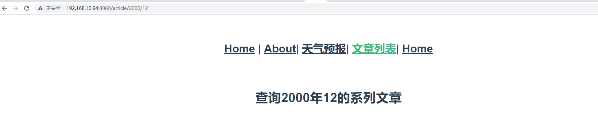

#### （2）查询参数

url地址的查询字符串作为参数，在下一个页面组件中进行获取使用。

注册路由：

```js 
 {
        path: '/article2/',
        name: 'Article2',
        // route level code-splitting
        // this generates a separate chunk (about.[hash].js) for this route
        // which is lazy-loaded when the route is visited.
        component: () => import(/* webpackChunkName: "about" */ '../components/Article2.vue')
    },
```

创建Article2.vue：

```vue 
<template>
  <h3>
    查询{{year}}年{{month}}的系列文章
  </h3>
</template>

<script>
export default {
  name: "Article",
  data(){
    return {
      year: 0,
      month: 0,
    }
  },
  created() {
    this.year = this.$route.query.year
    this.month = this.$route.query.month
  }
}
</script>

<style scoped>

</style>
```

最后在App.Vue中添加：

```html 
<router-link to="/article2/?year=2008&month=12">文章列表2</router-link>|
```


练习：将天气预报组件不再设置为子组件而是路由组件后，城市作为路由参数进行传递。

## 8.8、项目打包

在项目根目录中执行如下命令：

```bash
npm run build
```

> 注：Vue脚手架打包的项目必须在服务器上运行，不能直接双击运行；

在打包之后项目中出现 `dist` 目录，`dist` 目录就是 Vue脚手架项目的生产目录（直接部署目录）。

## 8.9、项目作业

建立新路由：当前全国疫情信息，基于Ajax获取当前疫情数据，构建疫情信息组件。通过路由参数可以筛选不同城市的疫情数据。

疫情数据API

```apl
https://2019ncov.chinacdc.cn/JKZX/yq_20220401.json
```

通过在线格式观察：

```apl
https://www.bejson.com/index.html
```

