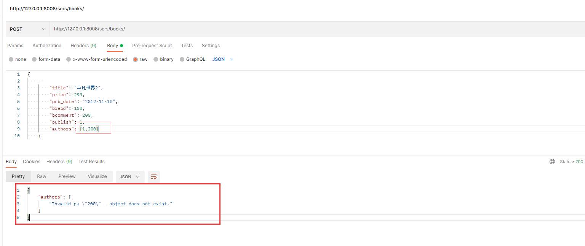

# DRF

#  1. Web应用模式

在开发Web应用中，有两种应用模式：

1. 前后端不分离[客户端看到的内容和所有界面效果都是由服务端提供出来的。]


2. 前后端分离【把前端的界面效果(html，css，js分离到另一个服务端，python服务端只需要返回数据即可)】

   前端形成一个独立的网站，服务端构成一个独立的网站


# 2. api接口  

应用程序编程接口（Application Programming Interface，API接口），就是应用程序对外提供了一个操作数据的入口，这个入口可以是一个函数或类方法，也可以是一个url地址或者一个网络地址。当客户端调用这个入口，应用程序则会执行对应代码操作，给客户端完成相对应的功能。

当然，api接口在工作中是比较常见的开发内容，有时候，我们会调用其他人编写的api接口，有时候，我们也需要提供api接口给其他人操作。由此就会带来一个问题，api接口往往都是一个函数、类方法、或者url或其他网络地址，不断是哪一种，当api接口编写过程中，我们都要考虑一个问题就是这个接口应该怎么编写？接口怎么写的更加容易维护和清晰，这就需要大家在调用或者编写api接口的时候要有一个明确的编写规范！！！

为了在团队内部形成共识、防止个人习惯差异引起的混乱，我们都需要找到一种大家都觉得很好的接口实现规范，而且这种规范能够让后端写的接口，用途一目了然，减少客户端和服务端双方之间的合作成本。

目前市面上大部分公司开发人员使用的接口实现规范主要有：restful、RPC。

RPC（ Remote Procedure Call ）: 翻译成中文:远程过程调用[远程服务调用]. 从字面上理解就是访问/调用远程服务端提供的api接口。这种接口一般以服务或者过程式代码提供。

+ 服务端提供一个**唯一的访问入口地址**：http://api.xxx.com/ 或 http://www.xxx.com/api 或者基于其他协议的地址

+ 客户端请求服务端的时候，所有的操作都理解为动作(action)，一般web开发时，对应的就是HTTP请求的post请求

+ 通过**请求体**参数，指定要调用的接口名称和接口所需的参数

  > action=get_all_student&class=301&sex=1
  >
  > m=get_all_student&sex=1&age=22
  >
  > command=100&sex=1&age=22

rpc接口多了,对应函数名和参数就多了,前端在请求api接口时难找.对于年代久远的rpc服务端的代码也容易出现重复的接口

restful: 翻译成中文: **资源状态转换**.(表征性状态转移)

+ 把服务端提供的所有的数据/文件都看成资源， 那么通过api接口请求数据的操作，本质上来说就是对资源的操作了.

  因此，restful中要求，我们把当前接口对外提供哪种资源进行操作，就把**资源的名称写在url地址**。

+ web开发中操作资源，最常见的最通用的无非就是增删查改，所以restful要求在地址栏中声明要操作的资源是什么。然后通过**http请求动词**来说明对该资源进行哪一种操作. l  ,, 

  > POST http://www.xxx.com/api/students/   添加学生数据
  >
  > GET    http://www.xxx.com/api/students/   获取所有学生
  >
  > GET    http://www.xxx.com/api/students/<pk>/     获取id=pk的学生
  >
  > DELETE http://www.xxx.com/api/students/<pk>/   删除id=pk的一个学生
  >
  > PUT   http://www.xxx.com/api/students/<pk>/       修改一个学生的全部信息 [id,name,sex,age,]
  >
  > PATCH  http://www.xxx.com/api/students/<pk>/    修改一个学生的部分信息[age]

也就是说，我们仅需要通过url地址上的资源名称结合HTTP请求动作，就可以说明当前api接口的功能是什么了。restful是以资源为主的api接口规范，体现在地址上就是资源就是以名词表达。

# 3. RESTful API规范


REST全称是Representational State Transfer，中文意思是表述（编者注：通常译为表征）性状态转移。 它首次出现在2000年Roy Fielding的博士论文中。

RESTful是一种专门为Web 开发而定义API接口的设计风格，尤其适用于前后端分离的应用模式中。

这种风格的理念认为后端开发任务就是提供数据的，对外提供的是数据资源的访问接口，所以在定义接口时，客户端访问的URL路径就表示这种要操作的数据资源。

而对于数据资源分别使用POST、DELETE、GET、UPDATE等请求动作来表达对数据的增删查改。

| GET      | /students      | 获取所有学生       |
| -------- | -------------- | ------------------ |
| 请求方法 | 请求地址       | 后端操作           |
| POST     | /students      | 增加学生           |
| GET      | /students/<pk> | 获取编号为pk的学生 |
| PUT      | /students/<pk> | 修改编号为pk的学生 |
| DELETE   | /students/<pk> | 删除编号为pk的学生 |

restful规范是一种通用的规范，不限制语言和开发框架的使用。事实上，我们可以使用任何一门语言，任何一个框架都可以实现符合restful规范的API接口。

参考文档：http://www.runoob.com/w3cnote/restful-architecture.html

## 幂等性

接口实现过程中，会存在**幂等性**。所谓幂等性是指代**客户端发起多次同样请求时，是否对于服务端里面的资源产生不同结果**。如果**多次请求**，服务端**结果**还是**一样**，则属于**幂等接口**，如果多次请求，服务端产生结果是不一样的，则属于**非幂等接口**。

| 请求方式  | 是否幂等 | 是否安全 |
| --------- | -------- | -------- |
| GET       | 幂等     | 安全     |
| POST      | 不幂等   | 不安全   |
| PUT/PATCH | 幂等     | 不安全   |
| DELETE    | 幂等     | 不安全   |

# 4. 序列化

api接口开发，最核心最常见的一个代码编写过程就是序列化，所谓序列化就是把**数据转换格式**。常见的序列化方式：

json，pickle，base64，….

序列化可以分两个阶段：

**序列化**： 把我们识别的数据转换成指定的格式提供给别人。

例如：我们在django中获取到的数据默认是模型对象，但是模型对象数据无法直接提供给前端或别的平台使用，所以我们需要把数据进行序列化，变成字符串或者json数据，提供给别人。

**反序列化**：把别人提供的数据转换/还原成我们需要的格式。

例如：前端js提供过来的json数据，对于python而言json就是字符串，我们需要进行反序列化换成字典，然后接着字典再进行转换成模型对象，这样我们才能把数据保存到数据库中。


# 5. Django_Rest_Framework

核心思想: 大量缩减编写api接口的代码

Django REST framework是一个建立在Django基础之上的Web 应用开发框架，可以快速的开发REST API接口应用。在REST framework中，提供了序列化器Serialzier的定义，可以帮助我们简化序列化与反序列化的过程，不仅如此，还提供丰富的类视图、扩展类、视图集来简化视图的编写工作。REST framework还提供了认证、权限、限流、过滤、分页、接口文档等功能支持。REST framework提供了一个API 的Web可视化界面来方便查看测试接口。


中文文档：https://q1mi.github.io/Django-REST-framework-documentation/#django-rest-framework

github: https://github.com/encode/django-rest-framework/tree/master

特点

> - 提供了定义序列化器Serializer的方法，可以快速根据 Django ORM 或者其它库自动序列化/反序列化；
> - 提供了丰富的类视图、Mixin扩展类，简化视图的编写；
> - 丰富的定制层级：函数视图、类视图、视图集合到自动生成 API，满足各种需要；
> - 多种身份认证和权限认证方式的支持；[jwt]
> - 内置了限流系统；
> - 直观的 API web 界面；【方便我们调试开发api接口】
> - 可扩展性，插件丰富

# 6. 环境安装与配置

DRF需要以下依赖：

- Python (3.5 以上)
- Django (2.2 以上)

**DRF是以Django子应用的方式提供的，所以我们可以直接利用已有的Django环境而无需从新创建。（若没有Django环境，需要先创建环境安装Django）**

## 6.1 安装DRF

前提是已经安装了django，建议安装在虚拟环境

```python
# conda create -n drfdemo python=3.8
# pip install django==3.2.4  -i https://pypi.douban.com/simple

pip install djangorestframework -i https://pypi.douban.com/simple

# 因为我们需要接下来，需要开发api接口肯定要操作数据，所以安装pymysql
pip install pymysql -i https://pypi.douban.com/simple
```

linux 复制  shift+insert

### 6.1.1 创建django项目

```
cd ~/Desktop
django-admin startproject drfdemo
```


使用pycharm打开项目，设置虚拟环境的解析器，并修改manage.py中的后缀参数。

## 6.2 添加rest_framework应用

在**settings.py**的**INSTALLED_APPS**中添加'rest_framework'。

```python
INSTALLED_APPS = [
    ...
    'rest_framework',
]
```

接下来就可以使用DRF提供的功能进行api接口开发了。在项目中如果使用rest_framework框架实现API接口，主要有以下三个步骤：

- 将请求的数据（如JSON格式）转换为模型类对象
- 操作数据库
- 将模型类对象转换为响应的数据（如JSON格式）

接下来，我们快速体验下四天后我们学习完成drf以后的开发代码。接下来代码不需要理解，看步骤。

## 6.3 快速体验

### 6.3.1. 创建模型操作类

```python
class Student(models.Model):
    # 模型字段
    name = models.CharField(max_length=100,verbose_name="姓名")
    sex = models.BooleanField(default=1,verbose_name="性别")
    age = models.IntegerField(verbose_name="年龄")
    class_null = models.CharField(max_length=5,verbose_name="班级编号")
    description = models.TextField(max_length=1000,verbose_name="个性签名")

    class Meta:
        db_table="tb_student"
        verbose_name = "学生"
        verbose_name_plural = verbose_name
```

为了方便测试，所以我们可以先创建一个数据库。

```
create database students charset=utf8;
```


#### 6.3.1.1 执行数据迁移

把students子应用添加到INSTALL_APPS中


初始化数据库连接

```python
# 安装pymysql
pip install pymysql
```

主引用中`__init__.py`设置使用pymysql作为数据库驱动

```python
import pymysql
pymysql.install_as_MySQLdb()
```

settings.py配置文件中设置mysql的账号密码

```python
DATABASES = {
    # 'default': {
    #     'ENGINE': 'django.db.backends.sqlite3',
    #     'NAME': os.path.join(BASE_DIR, 'db.sqlite3'),
    # },
    'default': {
        'ENGINE': 'django.db.backends.mysql',
        'NAME': "students",
        "HOST": "127.0.0.1",
        "PORT": 3306,
        "USER": "root",
        "PASSWORD":"123",
    },
}
```

终端下，执行数据迁移。

```python 
python manage.py makemigrationspython manage.py migrate
```

### 6.3.2. 创建序列化器

例如，在django项目中创建学生子应用。

```python
python manage.py startapp students
```

在syudents应用目录中新建serializers.py用于保存该应用的序列化器。

创建一个StudentModelSerializer用于序列化与反序列化。

```python
# 创建序列化器类，回头会在试图中被调用
class StudentModelSerializer(serializers.ModelSerializer):
    class Meta:
        model = Student
        fields = "__all__"
```

> - **model** 指明该序列化器处理的数据字段从模型类Student参考生成
> - **fields** 指明该序列化器包含模型类中的哪些字段，'__all__'指明包含所有字段

### 6.3.3. 编写视图

在students应用的views.py中创建视图StudentViewSet，这是一个视图集合。

```python
from rest_framework.viewsets import ModelViewSet
from .models import Student
from .serializers import StudentModelSerializer
# Create your views here.
class StudentViewSet(ModelViewSet):
    queryset = Student.objects.all()
    serializer_class = StudentModelSerializer
```

- **queryset** 指明该视图集在查询数据时使用的查询集
- **serializer_class** 指明该视图在进行序列化或反序列化时使用的序列化器

### 6.3.4. 定义路由

在students应用的urls.py中定义路由信息。

```python
from . import views
from rest_framework.routers import DefaultRouter

# 路由列表
urlpatterns = []
router = DefaultRouter()  # 可以处理视图的路由器
router.register('students', views.StudentViewSet)  # 向路由器中注册视图集

urlpatterns += router.urls  # 将路由器中的所以路由信息追到到django的路由列表中
```

最后把students子应用中的路由文件加载到总路由文件中.

```python
from django.contrib import admin
from django.urls import path,include

urlpatterns = [
    path('admin/', admin.site.urls),
    path("stu/",include("students.urls")),
]
```

### 6.3.5. 运行测试

运行当前程序（与运行Django一样）

```shell
python manage.py runserver
```

在浏览器中输入网址127.0.0.1:8000，可以看到DRF提供的API Web浏览页面：


1）点击链接127.0.0.1:8000/stu/students 可以访问**获取所有数据的接口**，呈现如下页面：


2）在页面底下表单部分填写学生信息，可以访问**添加新学生的接口**，保存学生信息：


点击POST后，返回如下页面信息：


3）在浏览器中输入网址127.0.0.1:8000/stu/students/5/，可以访问**获取单一学生信息的接口**（id为5的学生），呈现如下页面：


4）在页面底部表单中填写学生信息，可以访问**修改学生的接口**：


点击PUT，返回如下页面信息：


5）点击DELETE按钮，可以访问**删除学生的接口**：


返回，如下页面：


# 7、APIView视图

```
rest_framework.views.APIView
```

`APIView`是REST framework提供的所有视图的基类，继承自Django的`View`父类。

`APIView`与`View`的不同之处在于：

> - 传入到视图方法中的是REST framework的`Request`对象，而不是Django的`HttpRequeset`对象；
> - 视图方法可以返回REST framework的`Response`对象，视图会为响应数据设置（render）符合前端期望要求的格式；
> - 任何`APIException`异常都会被捕获到，并且处理成合适格式的响应信息返回给客户端；
> - 重新声明了一个新的as_views方法并在dispatch()进行路由分发前，会对请求的客户端进行身份认证、权限检查、流量控制。

APIView新增了类属性

> - **authentication_classes** 列表或元组，身份认证类
> - **permissoin_classes** 列表或元组，权限检查类
> - **throttle_classes** 列表或元祖，流量控制类

在`APIView`中仍以常规的类视图定义方法来实现get() 、post() 或者其他请求方式的方法。

> 掌握APIView的请求流程！！！

DRF在django原有的基础上，新增了一个request对象继承到了APIVIew视图类，并在django原有的HttpResponse响应类的基础上实现了一个子类rest_framework.response.Response响应类。这两个类，都是基于内容协商来完成数据的格式转换的。

> request->parser->识别客户端请求头中的Content-Type来完成数据转换成->类字典(QueryDict，字典的子类)
>
> response->renderer->识别客户端请求头的"Accept"来提取客户单期望的返回数据格式，-> 转换成客户端的期望格式数据

## 7.1、请求

REST framework 传入视图的request对象不再是Django默认的HttpRequest对象，而是REST framework提供的扩展了HttpRequest类的**Request**类的对象。

REST framework 提供了**Parser**解析器，在接收到请求后会自动根据Content-Type指明的请求数据类型（如JSON、表单等）将请求数据进行parse解析，解析为类字典[QueryDict]对象保存到**Request**对象中。

**Request对象的数据是自动根据前端发送数据的格式进行解析之后的结果。**

无论前端发送的哪种格式的数据，我们都可以以统一的方式读取数据。

### 7.1.1、常用属性

#### 1）.data

`request.data` 返回解析之后的请求体数据。类似于Django中标准的`request.POST`和 `request.FILES`属性，但提供如下特性：

- 包含了解析之后的文件和非文件数据
- 包含了对POST、PUT、PATCH请求方式解析后的数据
- 利用了REST framework的parsers解析器，不仅支持表单类型数据，也支持JSON数据

#### 2）.query_params

`request.query_params`与Django标准的`request.GET`相同，只是更换了更正确的名称而已。

#### 3）request._request 

获取django封装的Request对象

### 7.1.2、基本使用

视图代码：

```python
from django.views import View
from django.http.response import HttpResponse
from django.http.request import HttpRequest
from django.core.handlers.wsgi import WSGIRequest
class ReqView(View):
    def get(self,request):
        print(request)
        return HttpResponse("ok")

"""
默认情况下, 编写视图类时，如果继承的是django内置的django.view.View视图基类，
则视图方法中得到的request对象，是django默认提供的django.core.handlers.wsgi.WSGIRequest
WSGIRequest这个请求处理对象，无法直接提供的关于json数据数据处理。
在编写api接口时很不方便，所以drf为了简写这块内容，在原来的HttpRequest的基础上面，新增了一个Request对象
这个Request对象是单独声明的和原来django的HttpRequest不是父子关系。
同时注意：
   要使用drf提供的Request请求处理对象，必须在编写视图类时继承drf提供的视图基类
   from rest_framework.views import APIView
   
   如果使用drf提供的视图基类APIView编写类视图，则必须使用来自drf提供的Request请求对象和Response响应对象
"""
from rest_framework.views import APIView
from rest_framework.response import Response
from rest_framework import status
class ReqAPIView(APIView):
    def get(self,request):
        # rest_framework.request.Request对象
        print(request) # <rest_framework.request.Request: GET '/req/req2?name=xiaoming&age=17&lve=swim&lve=code'>
        # 获取查询字符串
        print(request.query_params)
        # 没有参数情况下： <QueryDict: {}>
        # 有参数的情况下： <QueryDict: {'name': ['xiaoming'], 'age': ['17'], 'lve': ['swim', 'code']}>
        # 所以，request.query_params的返回值操作和原来在django里面是一模一样的
        print(request.query_params.get("name")) # xiaoming
        print(request.query_params.getlist("lve")) # ['swim', 'code']

        return Response("ok")

    def post(self, request):
        # 获取请求体
        print(request.data) # {'name': 'xiaoming', 'age': 16, 'lve': ['swim', 'code']}
        """直接从请求体中提取数据转
        # 客户端如果上传了json数据，直接返回字典
        {'name': '灰太狼', 'age': 20, 'sex': 1, 'classmate': '301', 'description': '我还会再回来的~'}
        # 客户端如果上传了表单数据，直接返回QueryDict
        <QueryDict: {'name': ['xiaohui'], 'age': ['18']}>
        """
        print(request.FILES) # 获取上传文件列表
        
        # 要获取django原生提供的HttpRequest对象，可以通过request._request来获取到
        print(request._request.META.get("Accept")) # 当值为None时，drf默认在响应数据时按json格式返回
        # response = Response(data="not ok", status=204, headers={"Company":"Oldboy"})
        response = Response(data="not ok", status=status.HTTP_400_BAD_REQUEST, headers={"Company":"Oldboy"})
        return response
```

## 7.2、响应

```
rest_framework.response.Response
```

REST framework提供了一个响应类`Response`，使用该类构造响应对象时，响应的具体数据内容会被转换（render渲染器）成符合前端需求的类型。

REST framework提供了`Renderer` 渲染器，用来根据请求头中的`Accept`（接收数据类型声明）来自动转换响应数据到对应格式。如果前端请求中未进行Accept声明，则会采用Content-Type方式处理响应数据，我们可以通过配置来修改默认响应格式。

可以在**rest_framework.settings**查找所有的drf默认配置项

```python
REST_FRAMEWORK = {
    'DEFAULT_RENDERER_CLASSES': (  # 默认响应渲染类
        'rest_framework.renderers.JSONRenderer',  # json渲染器，返回json数据
        'rest_framework.renderers.BrowsableAPIRenderer',  # 浏览器API渲染器，返回调试界面
    )
}
```

#### 7.2.1 构造方式

```python
Response(data, status=None, template_name=None, headers=None, content_type=None)
```

drf的响应处理类和请求处理类不一样，Response就是django的HttpResponse响应处理类的子类。

`data`数据不要是render处理之后的数据，只需传递python的内建类型数据即可，REST framework会使用`renderer`渲染器处理`data`。

`data`不能是复杂结构的数据，如Django的模型类对象，对于这样的数据我们可以使用`Serializer`序列化器序列化处理后（转为了Python字典类型）再传递给`data`参数。

参数说明：

> - `data`: 为响应准备的序列化处理后的数据；
> - `status`: 状态码，默认200；
> - `template_name`: 模板名称，如果使用`HTMLRenderer` 时需指明；
> - `headers`: 用于存放响应头信息的字典；
> - `content_type`: 响应数据的Content-Type，通常此参数无需传递，REST framework会根据前端所需类型数据来设置该参数

#### 7.2.2 response对象的属性

> .data：传给response对象的序列化后，但尚未render处理的数据
>
> .status_code：状态码的数字
>
> .content：经过render处理后的响应数据

#### 7.2.3 状态码

为了方便设置状态码，REST framewrok在`rest_framework.status`模块中提供了常用http状态码的常量。

```python
# 1）信息告知 - 1xx
HTTP_100_CONTINUE
HTTP_101_SWITCHING_PROTOCOLS

# 2）成功 - 2xx
HTTP_200_OK
HTTP_201_CREATED
HTTP_202_ACCEPTED
HTTP_203_NON_AUTHORITATIVE_INFORMATION
HTTP_204_NO_CONTENT
HTTP_205_RESET_CONTENT
HTTP_206_PARTIAL_CONTENT
HTTP_207_MULTI_STATUS

# 3）重定向 - 3xx
HTTP_300_MULTIPLE_CHOICES
HTTP_301_MOVED_PERMANENTLY
HTTP_302_FOUND
HTTP_303_SEE_OTHER
HTTP_304_NOT_MODIFIED
HTTP_305_USE_PROXY
HTTP_306_RESERVED
HTTP_307_TEMPORARY_REDIRECT

# 4）客户端错误 - 4xx
HTTP_400_BAD_REQUEST
HTTP_401_UNAUTHORIZED
HTTP_402_PAYMENT_REQUIRED
HTTP_403_FORBIDDEN
HTTP_404_NOT_FOUND
HTTP_405_METHOD_NOT_ALLOWED
HTTP_406_NOT_ACCEPTABLE
HTTP_407_PROXY_AUTHENTICATION_REQUIRED
HTTP_408_REQUEST_TIMEOUT
HTTP_409_CONFLICT
HTTP_410_GONE
HTTP_411_LENGTH_REQUIRED
HTTP_412_PRECONDITION_FAILED
HTTP_413_REQUEST_ENTITY_TOO_LARGE
HTTP_414_REQUEST_URI_TOO_LONG
HTTP_415_UNSUPPORTED_MEDIA_TYPE
HTTP_416_REQUESTED_RANGE_NOT_SATISFIABLE
HTTP_417_EXPECTATION_FAILED
HTTP_422_UNPROCESSABLE_ENTITY
HTTP_423_LOCKED
HTTP_424_FAILED_DEPENDENCY
HTTP_428_PRECONDITION_REQUIRED
HTTP_429_TOO_MANY_REQUESTS
HTTP_431_REQUEST_HEADER_FIELDS_TOO_LARGE
HTTP_451_UNAVAILABLE_FOR_LEGAL_REASONS

# 5）服务器错误 - 5xx
HTTP_500_INTERNAL_SERVER_ERROR
HTTP_501_NOT_IMPLEMENTED
HTTP_502_BAD_GATEWAY
HTTP_503_SERVICE_UNAVAILABLE
HTTP_504_GATEWAY_TIMEOUT
HTTP_505_HTTP_VERSION_NOT_SUPPORTED
HTTP_507_INSUFFICIENT_STORAGE
HTTP_511_NETWORK_AUTHENTICATION_REQUIRED
```

# 8. 序列化器-Serializer

作用：

    1. 序列化,序列化器会把模型对象转换成字典,经过response以后变成json字符串
    2. 反序列化,把客户端发送过来的数据,经过request以后变成字典,序列化器可以把字典转成模型
    3. 反序列化,完成数据校验功能


## 8.1 定义序列化器

Django REST framework中的Serializer使用类来定义，须继承自rest_framework.serializers.Serializer。

接下来，为了方便演示序列化器的使用，我们先创建一个新的子应用sers

```
python manage.py startapp sers
```

我们创建几个图书相关模型

```python
from django.db import models


# Create your models here.


class Book(models.Model):
    title = models.CharField(max_length=32,verbose_name="书籍名称")
    price = models.IntegerField(verbose_name="价格")
    pub_date = models.DateField(verbose_name="出版日期")
    
    bread = models.IntegerField(verbose_name="阅读量") 
    bcomment = models.IntegerField(verbose_name="评论量") 
    
    publish = models.ForeignKey("Publish",on_delete=models.CASCADE,verbose_name="出版社")
    # authors = models.ManyToManyField("Author",verbose_name="作者")
    def __str__(self):
        return self.title


class Publish(models.Model):
    name = models.CharField(max_length=32,verbose_name="出版社名称")
    email = models.EmailField(verbose_name="出版社邮箱")

    def __str__(self):
        return self.name

class Author(models.Model):
    name = models.CharField(max_length=32,verbose_name="作者")
    age = models.IntegerField(verbose_name="年龄")

    def __str__(self):
        return self.name

```

我们想为Book模型类提供一个序列化器，可以定义如下：

```python
from rest_framework import serializers

class BookSerializer(serializers.Serializer):
 
    title = serializers.CharField()
    price = serializers.IntegerField()
    pub_date = serializers.DateField()
    publish_id = serializers.IntegerField(write_only=True)
    publish_name = serializers.CharField(source="publish.name", read_only=True)
    publish_email = serializers.CharField(source="publish.email", read_only=True)
```

**注意：serializer不是只能为数据库模型类定义，也可以为非数据库模型类的数据定义。**serializer是独立于数据库之外的存在。

**常用字段类型**：

| 字段                    | 字段构造方式                                                 |
| ----------------------- | ------------------------------------------------------------ |
| **BooleanField**        | BooleanField()                                               |
| **NullBooleanField**    | NullBooleanField()                                           |
| **CharField**           | CharField(max_length=None, min_length=None, allow_blank=False, trim_whitespace=True) |
| **EmailField**          | EmailField(max_length=None, min_length=None, allow_blank=False) |
| **RegexField**          | RegexField(regex, max_length=None, min_length=None, allow_blank=False) |
| **SlugField**           | SlugField(max*length=50, min_length=None, allow_blank=False) 正则字段，验证正则模式 [a-zA-Z0-9*-]+ |
| **URLField**            | URLField(max_length=200, min_length=None, allow_blank=False) |
| **UUIDField**           | UUIDField(format='hex_verbose')  format:  1) `'hex_verbose'` 如`"5ce0e9a5-5ffa-654b-cee0-1238041fb31a"`  2） `'hex'` 如 `"5ce0e9a55ffa654bcee01238041fb31a"`  3）`'int'` - 如: `"123456789012312313134124512351145145114"`  4）`'urn'` 如: `"urn:uuid:5ce0e9a5-5ffa-654b-cee0-1238041fb31a"` |
| **IPAddressField**      | IPAddressField(protocol='both', unpack_ipv4=False, **options) |
| **IntegerField**        | IntegerField(max_value=None, min_value=None)                 |
| **FloatField**          | FloatField(max_value=None, min_value=None)                   |
| **DecimalField**        | DecimalField(max_digits, decimal_places, coerce_to_string=None, max_value=None, min_value=None) max_digits: 最多位数 decimal_palces: 小数点位置 |
| **DateTimeField**       | DateTimeField(format=api_settings.DATETIME_FORMAT, input_formats=None) |
| **DateField**           | DateField(format=api_settings.DATE_FORMAT, input_formats=None) |
| **TimeField**           | TimeField(format=api_settings.TIME_FORMAT, input_formats=None) |
| **DurationField**       | DurationField()                                              |
| **ChoiceField**         | ChoiceField(choices) choices与Django的用法相同               |
| **MultipleChoiceField** | MultipleChoiceField(choices)                                 |
| **FileField**           | FileField(max_length=None, allow_empty_file=False, use_url=UPLOADED_FILES_USE_URL) |
| **ImageField**          | ImageField(max_length=None, allow_empty_file=False, use_url=UPLOADED_FILES_USE_URL) |
| **ListField**           | ListField(child=, min_length=None, max_length=None)          |
| **DictField**           | DictField(child=)                                            |

**选项参数：**

| 参数名称            | 作用             |
| ------------------- | ---------------- |
| **max_length**      | 最大长度         |
| **min_lenght**      | 最小长度         |
| **allow_blank**     | 是否允许为空     |
| **trim_whitespace** | 是否截断空白字符 |
| **max_value**       | 最小值           |
| **min_value**       | 最大值           |

通用参数：

| 参数名称           | 说明                                          |
| ------------------ | --------------------------------------------- |
| **read_only**      | 表明该字段仅用于序列化输出，默认False         |
| **write_only**     | 表明该字段仅用于反序列化输入，默认False       |
| **required**       | 表明该字段在反序列化时必须输入，默认True      |
| **default**        | 反序列化时使用的默认值                        |
| **allow_null**     | 表明该字段是否允许传入None，默认False         |
| **validators**     | 该字段使用的验证器                            |
| **error_messages** | 包含错误编号与错误信息的字典                  |
| **label**          | 用于HTML展示API页面时，显示的字段名称         |
| **help_text**      | 用于HTML展示API页面时，显示的字段帮助提示信息 |

## 8.2 创建Serializer对象

定义好Serializer类后，就可以创建Serializer对象了。

Serializer的构造方法为：

```python
Serializer(instance=None, data=empty, **kwarg)
```

说明：

1）用于序列化时，将模型类对象传入**instance**参数

2）用于反序列化时，将要被反序列化的数据传入**data**参数

3）除了instance和data参数外，在构造Serializer对象时，还可通过**context**参数额外添加数据，如

```python
serializer = AccountSerializer(account, context={'request': request})
```

**通过context参数附加的数据，可以通过Serializer对象的context属性获取。**

> 1. 使用序列化器的时候一定要注意，序列化器声明了以后，不会自动执行，需要我们在视图中进行调用才可以。
> 2. 序列化器无法直接接收数据，需要我们在视图中创建序列化器对象时把使用的数据传递过来。
> 3. 序列化器的字段声明类似于我们前面使用过的表单系统。
> 4. 开发restful api时，序列化器会帮我们把模型数据转换成字典.
> 5. drf提供的视图会帮我们把字典转换成json,或者把客户端发送过来的数据转换字典.

## 8.3 序列化器的使用

序列化器的使用分两个阶段：

1. 处理客户端请求时，使用序列化器可以完成对数据的反序列化。
2. 处理服务器响应时，使用序列化器可以完成对数据的序列化。

### 8.3.1 序列化

#### （1）基本序列化

《1》 先查询出一个学生对象

```python
from sers.models import Book
book = Book.objects.get(pk=1)
```

《2》 构造序列化器对象

```python
from .serializers import BookSerializer
bookSer = BookSerializer(instance=book)
```

《3》获取序列化数据

通过data属性可以获取序列化后的数据

```python
bookSer.data 
# {'title': '乱世佳人', 'price': 335, 'pub_date': '2012-12-12', 'publish_name': '苹果出版社', 'publish_email': '123@qq.com'}
```

路由视图代码：

```python 
# urls.py
path("sers/", include("sers.urls")),
# sers.urls
path('books/', BookView.as_view()),
```

```python
from rest_framework.response import Response
from rest_framework.views import APIView
from .models import Book
from .sers import BookSerializer

class BookView(APIView):

    def get(self, request):
        book = Book.objects.get(pk=1)
        bs = BookSerializer(instance=book)
        return Response(bs.data)
```


《5》如果要被序列化的是包含多条数据的查询集QuerySet，可以通过添加**many=True**参数补充说明

```python
class BookView(APIView):

    def get(self, request):
        # book = Book.objects.get(pk=1)
        books = Book.objects.all()
        bs = BookSerializer(instance=books, many=True)
        return Response(bs.data)
```

#### （2）关联字段序列化

```python 
from rest_framework import serializers

from .models import Book, Publish, Author


class BookRelatedPublish(serializers.RelatedField):

    def to_representation(self, value):
        return "pub-%s" % value.name

class BookRelatedAuthor(serializers.RelatedField):

    def to_representation(self, value):
        return "author-%s" % value.name

class BookSerializer(serializers.Serializer):
    title = serializers.CharField(max_length=32)
    price = serializers.IntegerField(required=False)
    pub_date = serializers.DateField(required=False)
    # 序列化关联对象的主键,read_only=True限制只能做序列化
    # publish = serializers.PrimaryKeyRelatedField(read_only=True) 
    # 序列化关联对象的主键，queryset设置可以反序列化做校验
    # authors = serializers.PrimaryKeyRelatedField(queryset=Author.objects.all(),many=True) 
    # publish = serializers.StringRelatedField(read_only=True) # 序列化关联对象的字符串表示形式 即__str__
    # publish = serializers.SlugRelatedField(read_only=True,slug_field="email") # 序列化关联对象的指定字段
    authors = BookRelatedAuthor(read_only=True,many=True)
    publish = BookRelatedPublish(read_only=True)
```

### 8.3.2  反序列化

#### （1）数据验证

使用序列化器进行反序列化时，需要对数据进行验证后，才能获取验证成功的数据或保存成模型类对象。

在获取反序列化的数据前，必须调用**is_valid()**方法进行验证，验证成功返回True，否则返回False。

验证失败，可以通过序列化器对象的**errors**属性获取错误信息，返回字典，包含了字段和字段的错误。如果是非字段错误，可以通过修改REST framework配置中的**NON_FIELD_ERRORS_KEY**来控制错误字典中的键名。

验证成功，可以通过序列化器对象的**validated_data**属性获取数据。

在定义序列化器时，指明每个字段的序列化类型和选项参数，本身就是一种验证行为。

通过构造序列化器对象，并将要反序列化的数据传递给data构造参数，进而进行验证

```python
from sers.sers import BookSerializer
bs = BookSerializer(data={"title":"小王子","price":100})
bs.is_valid()  # 必须先要is_valid,才会有bs.validated_data和bs.errors
False
bs.validated_data
{}
bs.errors
{'pub_date': [ErrorDetail(string='This field is required.', code='required')], 'publish_id': [ErrorDetail(string='This field is required.', code='required')]}


```

> 可以设置required=False让校验字段可以为空！

is_valid()方法还可以在验证失败时抛出异常serializers.ValidationError，可以通过传递**raise_exception=True**参数开启，REST framework接收到此异常，会向前端返回HTTP 400 Bad Request响应。

```python
# Return a 400 response if the data was invalid.serializer.is_valid(raise_exception=True)
```

如果觉得这些还不够，需要再补充定义验证行为，可以使用以下三种方法：

##### 1) validate_字段名

对`<field_name>`字段进行验证，如

```python
class BookSerializer(serializers.Serializer):
    title = serializers.CharField(max_length=32)
    price = serializers.IntegerField(required=True)
    pub_date = serializers.DateField(required=True)

    def validate_title(self, value):
        if 'django' not in value.lower():
            raise serializers.ValidationError("图书不是关于Django的")
        return value
```

测试

```python
from sers.sers import BookSerializer
bs = BookSerializer(data={"title":"小王子","price":100})
bs.is_valid()
False
bs.errors
{'title': [ErrorDetail(string='图书不是关于Django的', code='invalid')], 'pub_date': [ErrorDetail(string='This field is required.', code='required')]}
```

还有一种写法：

```python 
def title_django(self, value):
    if 'django' not in value.lower():
        raise serializers.ValidationError("图书不是关于Django的")
    return value

class BookSerializer(serializers.Serializer):
    title = serializers.CharField(max_length=32,validators=[title_django,])
    ...
```

##### 2) validate

在序列化器中需要同时对多个字段进行比较验证时，可以定义validate方法来验证，如

```python 

class BookSerializer(serializers.Serializer):
    title = serializers.CharField(max_length=32)
    price = serializers.IntegerField(required=False)
    pub_date = serializers.DateField(required=False)

    bread = serializers.IntegerField(label='阅读量', max_value=2147483647, min_value=-2147483648, required=False)
    bcomment = serializers.IntegerField(label='评论量', max_value=2147483647, min_value=-2147483648, required=False)


    def validate_title(self, value):
        if 'django' not in value.lower():
            raise serializers.ValidationError("图书不是关于Django的")
        return value

    def validate(self, data):
        bread = data.get("bread")
        bcomment = data.get("bcomment")
        if bread < bcomment:
            raise serializers.ValidationError('阅读量小于评论量')
        return data

```

测试

```python
bs = BookSerializer(data={"title":"Django深入浅出","bread":100,"bcomment":200,"publish_id":1})
bs.is_valid()
False
bs.errors
{'non_field_errors': [ErrorDetail(string='阅读量小于评论量', code='invalid')]}
```

#### （2）反序列化-保存数据

前面的验证数据成功后,我们可以使用序列化器来完成数据反序列化的过程.这个过程可以把数据转成模型类对象.

可以通过实现create()和update()两个方法来实现。

```python
class BookSerializer(serializers.Serializer):
    """图书数据序列化器"""
    ...

    def create(self, validated_data):
        """新建"""
        return instance

    def update(self, instance, validated_data):
        
        return instance
```

实现了上述两个方法后，在反序列化数据的时候，就可以通过save()方法返回一个数据对象实例了

```python
book = serializer.save()
```

> 1、如果创建序列化器对象的时候，没有传递instance实例，则调用save()方法的时候，create()被调用
>
> 2、相反，如果传递了instance实例，则调用save()方法的时候，update()被调用。

````python 
# 路由
from django.urls import path,re_path ,include

from sers.views import BookView,BookDetailView

urlpatterns = [
    path('books/', BookView.as_view()),
    re_path('books/(?P<pk>\d+)/', BookDetailView.as_view()),
]
````


```python 
# 序列化器
# 声明序列化器，所有的序列化器都要直接或者间接继承于 Serializer
# 其中，ModelSerializer是Serializer的子类，ModelSerializer在Serializer的基础上进行了代码简化
from rest_framework import serializers

from .models import Book, Publish, Author


class BookRelatedPublish(serializers.RelatedField):

    def to_representation(self, value):
        return "pub-%s" % value.name


class BookRelatedAuthor(serializers.RelatedField):

    def to_representation(self, value):
        return "author-%s" % value.name


class BookSerializer(serializers.Serializer):
    title = serializers.CharField(max_length=32)
    price = serializers.IntegerField(required=False)
    pub_date = serializers.DateField(required=False)

    publish = serializers.PrimaryKeyRelatedField(queryset=Publish.objects.all())  # queryset用于反序列化做校验
    authors = serializers.PrimaryKeyRelatedField(queryset=Author.objects.all(), many=True)

    def create(self, validated_data):
        """新建"""
        print("validated_data:", validated_data)
        authors = validated_data.pop("authors")
        book = Book(**validated_data)
        book.save()
        book.authors.set(authors)
        return book

    def update(self, instance, validated_data):
        """更新，instance为要更新的对象实例"""
        authors = validated_data.pop("authors")
        for attr, value in validated_data.items():
            setattr(instance, attr, value)
        instance.save()

        instance.authors.set(authors)

        return instance
```

````python 
# 视图函数
# Create your views here.


from rest_framework.response import Response
from rest_framework.views import APIView

from .models import Book
from .sers import BookSerializer


class BookView(APIView):

    def get(self, request):
        # book = Book.objects.get(pk=1)
        books = Book.objects.all()
        bs = BookSerializer(instance=books, many=True)
        return Response(bs.data)

    def post(self, request):
        bs = BookSerializer(data=request.data)
        if bs.is_valid():
            bs.save()
            return Response(bs.data)
        else:
            return Response(bs.errors)


class BookDetailView(APIView):
    def get(self, request, pk):
        book = Book.objects.get(pk=pk)
        bs = BookSerializer(instance=book)
        return Response(bs.data)

    def put(self, request, pk):
        instance = Book.objects.get(pk=pk)
        bs = BookSerializer(instance=instance, data=request.data)
        if bs.is_valid():
            bs.save()
            return Response(bs.data)
        else:
            return Response(bs.errors)

    def delete(self, request, pk):
        instance = Book.objects.get(pk=pk).delete()
        return Response()

````



#### （3） 附加说明

1） 在对序列化器进行save()保存时，可以额外传递数据，这些数据可以在create()和update()中的validated_data参数获取到

```python
# request.user 是django中记录当前登录用户的模型对象serializer.save(owner=request.user)
```

2）默认序列化器必须传递所有required的字段，否则会抛出验证异常。但是我们可以使用partial参数来允许部分字段更新

```python
# Update `comment` with partial dataserializer = CommentSerializer(comment, data={'content': u'foo bar'}, partial=True)
```

### 8.3.3 模型类序列化器

如果我们想要使用序列化器对应的是Django的模型类，DRF为我们提供了ModelSerializer模型类序列化器来帮助我们快速创建一个Serializer类。

ModelSerializer与常规的Serializer相同，但提供了：

- 基于模型类自动生成一系列字段
- 基于模型类自动为Serializer生成validators，比如unique_together
- 包含默认的create()和update()的实现

#### （1）定义

比如我们创建一个BookInfoSerializer

```python 

class BookSerializer(serializers.ModelSerializer):
    """图书数据序列化器"""
    class Meta:
        model = Book
        fields = '__all__'
```

- model 指明参照哪个模型类
- fields 指明为模型类的哪些字段生成

我们可以在python manage.py shell中查看自动生成的BookSerializer的具体实现

```python
>>> from sers.sers import BookSerializer
>>> serializer = BookSerializer()
>>> serializer
BookSerializer():
    id = IntegerField(label='ID', read_only=True)
    title = CharField(label='书籍名称', max_length=32)
    price = IntegerField(label='价格')
    pub_date = DateField(label='出版日期')
    bread = IntegerField(required=False)
    bcomment = IntegerField(required=False)
    publish = PrimaryKeyRelatedField(label='出版社', queryset=Publish.objects.all())
    authors = PrimaryKeyRelatedField(allow_empty=False, label='作者', many=True, queryset=Author.objects.all())
>>>
```


#### （2）指定字段

1) 使用**fields**来明确字段，`__all__`表名包含所有字段，也可以写明具体哪些字段，如

```python
class BookSerializer(serializers.ModelSerializer):
    """图书数据序列化器"""
    class Meta
        model = BookInfo
        fields = ('id', 'title', 'pub_date')
```

2) 使用**exclude**可以明确排除掉哪些字段

```python
class BookSerializer(serializers.ModelSerializer):
    """图书数据序列化器"""
    class Meta:
        model = Book
        exclude = ('pub_date',)
```

3. 指明只读字段

可以通过**read_only_fields**指明只读字段，即仅用于序列化输出的字段

```python
class BookSerializer(serializers.ModelSerializer):
    """图书数据序列化器"""
    class Meta:
        model = Book
        fields = ('id', 'title', 'pub_date'， 'bread', 'bcomment')
        read_only_fields = ('id', 'bread', 'bcomment')
```

#### （3）添加额外参数

我们可以使用**extra_kwargs**参数为ModelSerializer添加或修改原有的选项参数

```python
class BookSerializer(serializers.ModelSerializer):
    """图书数据序列化器"""
    class Meta:
        model = Book
        fields = ('id', 'title', 'pub_date', 'bread', 'bcomment')
        extra_kwargs = {
            'bread': {'min_value': 0, 'required': True},
            'bcomment': {'min_value': 0, 'required': True},
        }
'''
BookSerializer():
    id = IntegerField(label='ID', read_only=True)
    title = CharField(label='书籍名称', max_length=32)
    pub_date = DateField(label='出版日期')
    bread = IntegerField(min_value=0, required=True)
    bcomment = IntegerField(min_value=0, required=True)

'''
```

[参考文章](https://blog.csdn.net/qyf__123/article/details/84992721)

# 9. 视图

Django REST framwork 提供的视图的主要作用：

- 控制序列化器的执行（检验、保存、转换数据）
- 控制数据库模型的操作

REST framework 提供了众多的通用视图基类与扩展类，以简化视图的编写。

## 9.1、两个视图基类

### 9.1.1、APIView[基本视图类]

### 9.1.2、GenericAPIView[通用视图类]

通用视图类主要作用就是把视图中的独特的代码抽取出来，让视图方法中的代码更加通用，方便把通用代码进行简写。

```python
rest_framework.generics.GenericAPIView
```

继承自`APIView`，**主要增加了操作序列化器和数据库查询的方法，作用是为下面Mixin扩展类的执行提供方法支持。通常在使用时，可搭配一个或多个Mixin扩展类。**

**提供的关于序列化器使用的属性与方法**

#### （1）get_serializer_class(self)

当出现一个视图类中调用多个序列化器时,那么可以通过条件判断在get_serializer_class方法中通过返回不同的序列化器类名就可以让视图方法执行不同的序列化器对象了。

返回序列化器类，默认返回`serializer_class`，可以重写

#### （2）get_serializer(self, *args, \**kwargs)

返回序列化器对象，主要用来提供给Mixin扩展类使用，如果我们在视图中想要获取序列化器对象，也可以直接调用此方法。

**注意，该方法在提供序列化器对象的时候，会向序列化器对象的context属性补充三个数据：request、format、view，这三个数据对象可以在定义序列化器时使用。**

- **request** 当前视图的请求对象
- **view** 当前请求的类视图对象
- **format** 当前请求期望返回的数据格式

#### （3）get_queryset(self)

返回视图使用的查询集，主要用来提供给Mixin扩展类使用，是列表视图与详情视图获取数据的基础，默认返回`queryset`属性，可以重写，例如：

```python
def get_queryset(self):
    user = self.request.user
    return user.accounts.all()
```

#### （4）get_object(self)

返回详情视图所需的模型类数据对象，主要用来提供给Mixin扩展类使用。

在试图中可以调用该方法获取详情信息的模型类对象。

**若详情访问的模型类对象不存在，会返回404。**

该方法会默认使用APIView提供的check_object_permissions方法检查当前对象是否有权限被访问。

举例：

```python
# url(r'^books/(?P<pk>\d+)/$', views.BookDetailView.as_view()),
class BookDetailView(GenericAPIView):
    queryset = BookInfo.objects.all()
    serializer_class = BookInfoSerializer

    def get(self, request, pk):
        book = self.get_object() # get_object()方法根据pk参数查找queryset中的数据对象
        serializer = self.get_serializer(book)
        return Response(serializer.data)
```

其他可以设置的属性

- **pagination_class** 指明分页控制类
- **filter_backends** 指明过滤控制后端

**通用视图类的应用**

为了方便学习上面的GenericAPIView通用视图类，我们新建一个子应用。

```python
python manage.py startapp gen
```

路由和视图代码分别为：

```python 
# 路由
from django.contrib import admin
from django.urls import path, include

urlpatterns = [
    path('admin/', admin.site.urls),
    path("gen/", include("gen.urls")),
]
# 子路由
 
```

````python 
from rest_framework import status
from rest_framework.generics import GenericAPIView
from rest_framework.response import Response

from sers.models import Book
from .sers import BookSerializer


class BookView(GenericAPIView):
    queryset = Book.objects.all()
    serializer_class = BookSerializer

    def get(self, request):
        bs = BookSerializer(instance=self.get_queryset(), many=True)
        return Response(bs.data)

    def post(self, request):
        serializer = self.get_serializer(data=request.data)
        serializer.is_valid(raise_exception=True)
        serializer.save()
        return Response(serializer.data)


class BookDetailView(GenericAPIView):
    queryset = Book.objects.all()
    serializer_class = BookSerializer

    def get(self, request, pk):
        bs = BookSerializer(instance=self.get_object())
        return Response(bs.data)

    def put(self, request, pk):
        serializer = BookSerializer(instance=self.get_object(), data=request.data)
        serializer.is_valid(raise_exception=True)
        serializer.save()
        return Response(serializer.data)

    def delete(self, request, pk):
        self.get_object().delete()
        return Response(status=status.HTTP_204_NO_CONTENT)
````

## 9.2、5个视图扩展类

也叫混入类（Mixin）。

作用：

提供了几种后端视图（对数据资源进行增删改查）处理流程的实现，如果需要编写的视图属于这五种，则视图可以通过继承相应的扩展类来复用代码，减少自己编写的代码量。

这五个扩展类需要搭配GenericAPIView通用视图基类，因为五个扩展类的实现需要调用GenericAPIView提供的序列化器与数据库查询的方法。

#### （1）ListModelMixin

列表视图扩展类，提供`list(request, *args, **kwargs)`方法快速实现列表视图，返回200状态码。

该Mixin的list方法会对数据进行过滤和分页。

源代码：

```python
class ListModelMixin:
    """
    List a queryset.
    """
    def list(self, request, *args, **kwargs):
        queryset = self.filter_queryset(self.get_queryset())

        page = self.paginate_queryset(queryset)
        if page is not None:
            serializer = self.get_serializer(page, many=True)
            return self.get_paginated_response(serializer.data)

        serializer = self.get_serializer(queryset, many=True)
        return Response(serializer.data)
```

基于扩展类实现BookView：

```python 
from rest_framework import status
from rest_framework.generics import GenericAPIView
from rest_framework.response import Response

from sers.models import Book
from .sers import BookSerializer

from rest_framework.mixins import ListModelMixin

class BookView(GenericAPIView,ListModelMixin):
    queryset = Book.objects.all()
    serializer_class = BookSerializer

    def get(self, request):
        return self.list(request)
```

#### （2）CreateModelMixin

创建视图扩展类，提供`create(request, *args, **kwargs)`方法快速实现创建资源的视图，成功返回201状态码。

如果序列化器对前端发送的数据验证失败，返回400错误。

源代码：

```python
class CreateModelMixin:
    """
    Create a model instance.
    """
    def create(self, request, *args, **kwargs):
        serializer = self.get_serializer(data=request.data)
        serializer.is_valid(raise_exception=True)
        self.perform_create(serializer)
        headers = self.get_success_headers(serializer.data)
        return Response(serializer.data, status=status.HTTP_201_CREATED, headers=headers)

    def perform_create(self, serializer):
        serializer.save()

    def get_success_headers(self, data):
        try:
            return {'Location': str(data[api_settings.URL_FIELD_NAME])}
        except (TypeError, KeyError):
            return {}
```

基于扩展类实现BookView：

```python 
class BookView(GenericAPIView, ListModelMixin, CreateModelMixin):
    queryset = Book.objects.all()
    serializer_class = BookSerializer

    def get(self, request):
        return self.list(request)

    def post(self, request):
        return self.create(request)
```

#### （3）RetrieveModelMixin

详情视图扩展类，提供`retrieve(request, *args, **kwargs)`方法，可以快速实现返回一个存在的数据对象。

如果存在，返回200， 否则返回404。

源代码：

````python 
class RetrieveModelMixin:
    """
    Retrieve a model instance.
    """
    def retrieve(self, request, *args, **kwargs):
        instance = self.get_object()
        serializer = self.get_serializer(instance)
        return Response(serializer.data)
````

基于扩展类实现BookDetailView：

````python 
class BookDetailView(GenericAPIView,RetrieveModelMixin):
    queryset = Book.objects.all()
    serializer_class = BookSerializer

    def get(self, request, pk):
        return self.retrieve(request, pk)
````

#### （4）UpdateModelMixin

更新视图扩展类，提供`update(request, *args, **kwargs)`方法，可以快速实现更新一个存在的数据对象。

同时也提供`partial_update(request, *args, **kwargs)`方法，可以实现局部更新。

成功返回200，序列化器校验数据失败时，返回400错误。

源代码：

````python 

class UpdateModelMixin:
    """
    Update a model instance.
    """
    def update(self, request, *args, **kwargs):
        partial = kwargs.pop('partial', False)
        instance = self.get_object()
        serializer = self.get_serializer(instance, data=request.data, partial=partial)
        serializer.is_valid(raise_exception=True)
        self.perform_update(serializer)

        if getattr(instance, '_prefetched_objects_cache', None):
            # If 'prefetch_related' has been applied to a queryset, we need to
            # forcibly invalidate the prefetch cache on the instance.
            instance._prefetched_objects_cache = {}

        return Response(serializer.data)

    def perform_update(self, serializer):
        serializer.save()

    def partial_update(self, request, *args, **kwargs):
        kwargs['partial'] = True
        return self.update(request, *args, **kwargs)

````

基于扩展类实现BookDetailView：

```python 
class BookDetailView(GenericAPIView, RetrieveModelMixin, UpdateModelMixin):
    queryset = Book.objects.all()
    serializer_class = BookSerializer

    def get(self, request, pk):
        return self.retrieve(request, pk)

    def put(self, request, pk):
        return self.update(request, pk)

```

#### （5）DestroyModelMixin

删除视图扩展类，提供`destroy(request, *args, **kwargs)`方法，可以快速实现删除一个存在的数据对象。

成功返回204，不存在返回404。

源代码：

````python 
class DestroyModelMixin:
    """
    Destroy a model instance.
    """
    def destroy(self, request, *args, **kwargs):
        instance = self.get_object()
        self.perform_destroy(instance)
        return Response(status=status.HTTP_204_NO_CONTENT)

    def perform_destroy(self, instance):
        instance.delete()
````

基于扩展类实现BookDetailView：

````python 
class BookDetailView(GenericAPIView, RetrieveModelMixin, UpdateModelMixin, DestroyModelMixin):
    queryset = Book.objects.all()
    serializer_class = BookSerializer

    def get(self, request, pk):
        return self.retrieve(request, pk)

    def put(self, request, pk):
        return self.update(request, pk)

    def delete(self, request, pk):
        return self.destroy(request, pk)
````

整体代码，使用GenericAPIView结合视图扩展类，实现5个基本api接口，视图代码：

````python 
# Create your views here.
"""
基于GenericAPIView结合5个视图扩展类完成基本的5个API接口
ListModelMixin     提供了list方法，获取多条数据
CreateModelMixin   提供了create方法，添加一条数据

RetrieveModelMixin 提供了retrieve方法，获取一条数据
UpdateModelMixin   提供了update方法，更新一条数据
DestroyModelMixin   提供了destroy方法，删除一条数据
"""

from rest_framework.generics import GenericAPIView
from rest_framework.mixins import ListModelMixin, CreateModelMixin, RetrieveModelMixin, UpdateModelMixin, \
    DestroyModelMixin

from sers.models import Book
from .sers import BookSerializer


class BookView(GenericAPIView, ListModelMixin, CreateModelMixin):
    queryset = Book.objects.all()
    serializer_class = BookSerializer

    def get(self, request):
        return self.list(request)

    def post(self, request):
        return self.create(request)


class BookDetailView(GenericAPIView, RetrieveModelMixin, UpdateModelMixin, DestroyModelMixin):
    queryset = Book.objects.all()
    serializer_class = BookSerializer

    def get(self, request, pk):
        return self.retrieve(request, pk)

    def put(self, request, pk):
        return self.update(request, pk)

    def delete(self, request, pk):
        return self.destroy(request, pk)


````

序列化组件：

```python 
class BookSerializer(serializers.ModelSerializer):
    class Meta:
        model = Book
        fields = "__all__"
```

路由：

```python 
urlpatterns = [
    path('books/', BookView.as_view()),
    re_path('books/(?P<pk>\d+)/', BookDetailView.as_view()),
]
```

## 9.3、 GenericAPIView的视图子类

#### （1）CreateAPIView

提供了post方法，内部调用了create方法

继承自： GenericAPIView、CreateModelMixin

#### （2）ListAPIView

提供了get方法，内部调用了list方法

继承自：GenericAPIView、ListModelMixin

#### （3）RetrieveAPIView

提供了get方法，内部调用了retrieve方法

继承自: GenericAPIView、RetrieveModelMixin

#### （4）DestoryAPIView

提供了delete方法，内部调用了destory方法

继承自：GenericAPIView、DestoryModelMixin

#### （5）UpdateAPIView

提供了put和patch方法，内部调用了update和partial_update方法

继承自：GenericAPIView、UpdateModelMixin

#### （6）ListCreateAPIView

提供了get和post方法，内部调用了list和create方法

继承自：GenericAPIView、ListModelMixin、CreateModelMixin

#### （7）RetrieveUpdateAPIView

提供 get、put、patch方法

继承自： GenericAPIView、RetrieveModelMixin、UpdateModelMixin

#### （8）RetrieveDestoryAPIView

提供 get、delete方法

继承自：GenericAPIView、RetrieveModelMixin、DestoryModelMixin

#### （9）RetrieveUpdateDestoryAPIView

提供 get、put、patch、delete方法

继承自：GenericAPIView、RetrieveModelMixin、UpdateModelMixin、DestoryModelMixin

```python 
from rest_framework import generics
class BookView(generics.ListCreateAPIView):
    queryset = Book.objects.all()
    serializer_class = BookSerializer


class BookDetailView(generics.RetrieveUpdateDestroyAPIView):
    queryset = Book.objects.all()
    serializer_class = BookSerializer
```

## 9.4、视图集

### 9.4.1、ViewSet

继承自`APIView`与`ViewSetMixin`，作用也与APIView基本类似，提供了身份认证、权限校验、流量管理等。

**ViewSet主要通过继承ViewSetMixin来实现在调用as_view()时传入字典{“http请求”：“视图方法”}的映射处理工作，如{'get':'list'}，**

在ViewSet中，没有提供任何动作action方法，需要我们自己实现action方法。

使用视图集ViewSet，可以将一系列视图相关的代码逻辑和相关的http请求动作封装到一个类中：

- list() 提供一组数据
- retrieve() 提供单个数据
- create() 创建数据
- update() 保存数据
- destory() 删除数据

ViewSet视图集类不再限制视图方法名只允许get()、post()等这种情况了，而是实现允许开发者根据自己的需要定义自定义方法名，例如  list() 、create() 等，然后经过路由中使用http和这些视图方法名进行绑定调用。

为了方便演示视图集的使用，我们新建一个子应用，

```bash
python manage.py startapp vset
```

视图集只在使用as_view()方法的时候，才会将**action**动作与具体请求方式对应上。如：

```python 
from django.urls import path, re_path

from vset.views import BookView

urlpatterns = [
    # path("set", views.BookView.as_view({"http请求":"视图方法"})),
    path("books/", BookView.as_view({
        "get": "get_all_book",
        "post": "add_book"
    })),
    re_path("^books/(?P<pk>\d+)$", BookView.as_view({
        "get": "get_one_book",
        "put": "edit_book",
        "delete": "delete",
    })),
]

```

```python 
from rest_framework import serializers
from rest_framework import status
from rest_framework.response import Response
from rest_framework.viewsets import ViewSet

from sers.models import Book


class BookSerializer(serializers.ModelSerializer):
    class Meta:
        model = Book
        fields = "__all__"


class BookView(ViewSet):

    def get_all_book(self, request):

        books = Book.objects.all()
        bs = BookSerializer(instance=books, many=True)
        return Response(bs.data)

    def add_book(self, request):
        bs = BookSerializer(data=request.data)
        if bs.is_valid():
            bs.save()
            return Response(bs.data)
        else:
            return Response(bs.errors)

    def get_one_book(self, request, pk):
        book = Book.objects.get(pk=pk)
        bs = BookSerializer(instance=book)
        return Response(bs.data)

    def edit_book(self, request, pk):
        instance = Book.objects.get(pk=pk)
        bs = BookSerializer(instance=instance, data=request.data)
        if bs.is_valid():
            bs.save()
            return Response(bs.data)
        else:
            return Response(bs.errors)

    def delete(self, request, pk):
        Book.objects.get(pk=pk).delete()
        return Response(status=status.HTTP_204_NO_CONTENT)

```

### 9.4.2、GenericViewSet

继承自GenericAPIView和ViewSetMixin，作用让视图集的视图代码变得更加通用，抽离独特代码作为视图类的属性。

使用ViewSet通常并不方便，因为list、retrieve、create、update、destory等方法都需要自己编写，而这些方法与前面讲过的Mixin扩展类提供的方法同名，所以我们可以通过继承Mixin扩展类来复用这些方法而无需自己编写。但是Mixin扩展类依赖与`GenericAPIView`，所以还需要继承`GenericAPIView`。

**GenericViewSet**就帮助我们完成了这样的继承工作，继承自`GenericAPIView`与`ViewSetMixin`，在实现了调用as_view()时传入字典（如`{'get':'list'}`）的映射处理工作的同时，还提供了`GenericAPIView`提供的基础方法，可以直接搭配Mixin扩展类使用。

视图代码：

```python 
from rest_framework.viewsets import GenericViewSet

class BookView(GenericViewSet):

    def list(self, request):

        books = Book.objects.all()
        bs = BookSerializer(instance=books, many=True)
        return Response(bs.data)

    def create(self, request):
        bs = BookSerializer(data=request.data)
        if bs.is_valid():
            bs.save()
            return Response(bs.data)
        else:
            return Response(bs.errors)

    def retrieve(self, request, pk):
        book = Book.objects.get(pk=pk)
        bs = BookSerializer(instance=book)
        return Response(bs.data)

    def update(self, request, pk):
        instance = Book.objects.get(pk=pk)
        bs = BookSerializer(instance=instance, data=request.data)
        if bs.is_valid():
            bs.save()
            return Response(bs.data)
        else:
            return Response(bs.errors)

    def delete(self, request, pk):
        Book.objects.get(pk=pk).delete()
        return Response(status=status.HTTP_204_NO_CONTENT)

```

```python 
from django.urls import path, re_path

from vset.views import BookView

urlpatterns = [
    # path("set", views.BookView.as_view({"http请求":"视图方法"})),
    path("books/", BookView.as_view({
        "get": "list",
        "post": "create"
    })),
    re_path("^books/(?P<pk>\d+)$", BookView.as_view({
        "get": "retrieve",
        "put": "update",
        "delete": "delete",
    })),
]
```

集合我们上面学习的模型扩展类，实现简写操作，视图，代码：

```python 
from rest_framework.viewsets import GenericViewSet
from rest_framework.mixins import ListModelMixin, CreateModelMixin, RetrieveModelMixin, UpdateModelMixin, \
    DestroyModelMixin


class BookView(GenericViewSet, ListModelMixin, CreateModelMixin, RetrieveModelMixin, UpdateModelMixin,
                          DestroyModelMixin):
    queryset = Book.objects
    serializer_class = BookSerializer
```

### 9.4.3、ModelViewSet和ReadOnlyModelViewSet

ModelViewSet继承自`GenericViewSet`，同时包括了ListModelMixin、RetrieveModelMixin、CreateModelMixin、UpdateModelMixin、DestoryModelMixin。

ReadOnlyModelViewSet承自`GenericViewSet`，同时包括了ListModelMixin、RetrieveModelMixin。

```python 
from rest_framework.viewsets import ModelViewSet

class BookView(ModelViewSet):
    queryset = Book.objects
    serializer_class = BookSerializer
```

# 10. 路由Routers

对于视图集ViewSet，我们除了可以自己手动指明请求方式与动作action之间的对应关系外，还可以使用Routers来帮助我们快速实现路由信息。

REST framework提供了两个router

- **SimpleRouter**
- **DefaultRouter**

## 10.1 使用方法

1） 创建router对象，并注册视图集，例如

```python
from rest_framework import routers
router = routers.DefaultRouter()
router.register('book', BookView, base_name='book')
```

register(prefix, viewset, base_name)

> - prefix 该视图集的路由前缀
> - viewset 视图集
> - base_name 路由别名的前缀

如上述代码会形成的路由如下：

```python
^book/$    name: book-list
^book/{pk}/$   name: book-detail
```

2）添加路由数据

可以有两种方式：

```python
urlpatterns = [
    ...
]
urlpatterns += router.urls

```

或

```python
urlpatterns = [
    ...
    path('^', include(router.urls))
]

```

路由代码：

```python
from django.urls import path, re_path
from . import views
urlpatterns = [
    ...
]

"""使用drf提供路由类router给视图集生成路由列表"""
# 实例化路由类
# drf提供一共提供了两个路由类给我们使用,他们用法一致,功能几乎一样
from rest_framework.routers import DefaultRouter
router = DefaultRouter()

# 注册视图集
# router.register("路由前缀",视图集类)
router.register("book",views.BookView)

# 把生成的路由列表追加到urlpatterns
print( router.urls )
urlpatterns += router.urls
```

上面的代码就成功生成了路由地址[增/删/改/查一条/查多条的功能]，但是不会自动我们在视图集自定义方法的路由。

所以我们如果也要给自定义方法生成路由，则需要进行action动作的声明。

## 10.2 视图集中附加action的声明

在视图集中，如果想要让Router自动帮助我们为自定义的动作生成路由信息，需要使用`rest_framework.decorators.action`装饰器。

以action装饰器装饰的方法名会作为action动作名，与list、retrieve等同。

action装饰器可以接收两个参数：

- **methods**: 声明该action对应的请求方式，列表传递

- **detail**: 声明该action的路径是否与单一资源对应

  ```
  路由前缀/<pk>/action方法名/
  ```

  - True 表示路径格式是`xxx/<pk>/action方法名/`
  - False 表示路径格式是`xxx/action方法名/`

- url_path：声明该action的路由尾缀。

举例：

```python
from rest_framework.viewsets import ModelViewSet
from rest_framework.decorators import action

class BookView(ModelViewSet):
    queryset = Book.objects
    serializer_class = BookSerializer
    """
    action装饰器的作用：告诉路由类给视图集的自定义方法生成路由信息
    methods, 列表，允许哪些http请求能访问当前视图方法
    detail，布尔，生成路由时是否拼接pk参数
            detail为True，表示路径名格式应该为 book/{pk}/login/
    url_path，字符串，生成路由时末尾路由路径，如果没有声明，则自动以当前方法名作为路由尾缀
    
    """
    @action(methods=['get'], detail=True,url_path="login")
    def login(self, request,pk):
        """登录"""
        return Response({"msg":request.method})

    # detail为False 表示路径名格式应该为 book/get_new_5/
    @action(methods=['get'], detail=False)
    def get_new_5(self, request):
        """获取最新添加的5本书"""
        ...

```

由路由器自动为此视图集自定义action方法形成的路由会是如下内容：

```python
^book/get_new_5/$    name: book-get_new_5
^book/{pk}/login/$   name: book-login
```

## 10.3 路由router形成URL的方式

1） SimpleRouter（prefix=“路由前缀”，viewset=视图集类，basename=“路由别名”）


2）DefaultRouter


DefaultRouter与SimpleRouter的区别是，DefaultRouter会多附带一个默认的API根视图，返回一个包含所有列表视图的超链接响应数据。

# 11、其它功能组件

为了方便接下来的学习，我们创建一个新的子应用 opt

```python
python manage.py startapp opt
```

注册子应用

```python
INSTALLED_APPS = [
    ...
    'opt',     # drf提供的组件使用
]
```

总路由，代码：

```python
from django.contrib import admin
from django.urls import path, include

urlpatterns = [
    path('admin/', admin.site.urls),
    path('students/', include("students.urls")),
    path('sers/', include("sers.urls")),
    path('school/', include("school.urls")),
    path("req/", include("req.urls")),
    path("demo/", include("demo.urls")),
    path("opt/", include("opt.urls")),
]

```

子路由，代码：

```python
from django.urls import path
from . import views
urlpatterns = [

]
```

因为接下来的认证组件中需要使用到登陆功能，所以我们使用django内置admin站点并创建一个管理员.

admin运营站点的访问地址：http://127.0.0.1:8000/admin

```shell
python manage.py createsuperuser
# 如果之前有账号，但是忘了，可以通过终端下的命令修改指定用户的密码，这里的密码必须8位长度以上的
python manage.py changepassword 用户名
```

创建管理员以后，访问admin站点，先修改站点的语言配置

settings.py

```
LANGUAGE_CODE = 'zh-hans'

TIME_ZONE = 'Asia/Shanghai'
```

## 11.1. 认证Authentication

可以在配置文件中配置全局默认的认证方案

常见的认证方式：cookie、session、token

/home/moluo/.virtualenvs/drfdemo/lib/python3.6/site-packages/rest_framework/settings.py 默认配置文件

```python
REST_FRAMEWORK = {
    # 配置认证方式的选项
    'DEFAULT_AUTHENTICATION_CLASSES': (
        'rest_framework.authentication.SessionAuthentication', # session认证
        'rest_framework.authentication.BasicAuthentication',   # 基本认证
    )
}
```

也可以在具体的视图类中通过设置authentication_classess类属性来设置单独的不同的认证方式

```python
from rest_framework.authentication import SessionAuthentication, BasicAuthentication
from rest_framework.views import APIView

class ExampleView(APIView):
    # 类属性
    authentication_classes = [SessionAuthentication, BasicAuthentication]
    def get(self,request):
        pass
```

认证失败会有两种可能的返回值，这个需要我们配合权限组件来使用：

- 401 Unauthorized 未认证
- 403 Permission Denied 权限被禁止

自定义认证，`drfdemo.authentication`代码：

```python
from rest_framework.authentication import BaseAuthentication
from rest_framework.exceptions import APIException


class CustomAuthentication(BaseAuthentication):
    """
    自定义认证方式
    """

    def authenticate(self, request):
        print(":::")
        """
        认证方法
        request: 本次客户端发送过来的http请求对象
        """

        # token = request.query_params.get("token")
        token = request._request.META.get("HTTP_TOKEN")
        if token != "123456789":
            raise APIException("认证失败")
        user = "root"
        return (user,token)  # 按照固定的返回格式填写 （用户模型对象, None）
```

视图调用自定义认证，视图代码：

```python
from django.contrib.auth.models import AnonymousUser
from django.shortcuts import render
from rest_framework.views import APIView
from rest_framework.response import Response
from rest_framework.authentication import SessionAuthentication
from drfdemo.authentication import CustomAuthentication
# Create your views here.
class HomeAPIView(APIView):
    # authentication_classes = [CustomAuthentication, ]
    def get(self,request):
        """单独设置认证方式"""
        print(request.user) # 在中间件AuthenticationMiddleware中完成用户身份识别的，如果没有登录request.user值为AnonymousUser
        if request.user.id is None:
            return Response("未登录用户：游客")
        else:
            return Response(f"已登录用户：{request.user}")
```

当然，也可以注释掉上面视图中的配置，改成全局配置。settings.py，代码：

```python
"""drf配置信息必须全部写在REST_FRAMEWORK配置项中"""
REST_FRAMEWORK = {
    # 配置认证方式的选项【drf的认证是内部循环遍历每一个注册的认证类，一旦认证通过识别到用户身份，则不会继续循环】
    'DEFAULT_AUTHENTICATION_CLASSES': (
        'drfdemo.authentication.CustomAuthentication',          # 自定义认证
        'rest_framework.authentication.SessionAuthentication',  # session认证
        'rest_framework.authentication.BasicAuthentication',    # 基本认证
    )
}
```


## 11.2. 权限Permissions

权限控制可以限制用户对于视图的访问和对于具有模型对象的访问。

- 在执行视图的as_view()方法的dispatch()方法前，会先进行视图访问权限的判断
- 在通过get_object()获取具体模型对象时，会进行模型对象访问权限的判断

### 使用

可以在配置文件中**全局设置**默认的权限管理类，如

```python
REST_FRAMEWORK = {
    ....
    
    'DEFAULT_PERMISSION_CLASSES': (
        'rest_framework.permissions.IsAuthenticated',
    )
}
```

如果未指明，则采用如下默认配置

```python
'DEFAULT_PERMISSION_CLASSES': (
   'rest_framework.permissions.AllowAny',
)
```

也可以在具体的视图中通过permission_classes属性来进行局部设置，如

```python
from rest_framework.permissions import IsAuthenticated
from rest_framework.views import APIView

class ExampleView(APIView):
    permission_classes = (IsAuthenticated,)
    ...
```

### 提供的权限

- AllowAny 允许所有用户，默认权限
- IsAuthenticated 仅通过登录认证的用户
- IsAdminUser 仅管理员用户
- IsAuthenticatedOrReadOnly 已经登陆认证的用户可以对数据进行增删改操作，没有登陆认证的只能查看数据。

### 举例

```python
from rest_framework.authentication import SessionAuthentication
from rest_framework.permissions import IsAuthenticated
from rest_framework.generics import RetrieveAPIView

class StudentAPIView(RetrieveAPIView):
    queryset = Student.objects.all()
    serializer_class = StudentSerializer
    authentication_classes = [SessionAuthentication]
    permission_classes = [IsAuthenticated]
```


### 自定义权限

如需自定义权限，需继承rest_framework.permissions.BasePermission父类，并实现以下两个任何一个方法或全部

- `.has_permission(self, request, view)`

  是否可以访问视图， view表示当前视图对象

- `.has_object_permission(self, request, view, obj)`

  是否可以访问模型对象， view表示当前视图， obj为模型数据对象

例如：

在当前子应用下，创建一个权限文件drfdemo.permissions.py中声明自定义权限类:

```python
from rest_framework.permissions import BasePermission
class IsXiaoMingPermission(BasePermission):
    """
    自定义权限，可用于全局配置，也可以用于局部
    """
    def has_permission(self, request, view):
        """
        视图权限
        返回结果未True则表示允许访问视图类
        request: 本次客户端提交的请求对象
        view: 本次客户端访问的视图类
        """
        role = request.query_params.get("role")
        return role == "xiaoming"

    def has_object_permission(self, request, view, obj):
        """
        模型权限
        返回结果为True则表示允许操作模型对象
        """
        return True
```

视图代码：

```python
from .permissions import IsXiaoMingPermission
class StudentViewSet(ModelViewSet):
    queryset = Student.objects.all()
    serializer_class = StudentSerializer
    permission_classes = [IsXiaoMingPermission] # 自定义权限
```

认证和权限的举例代码：

settings.py，全局配置，代码：

```python
# 关于REST_FRAMEWORK的所有配置项都是填写在django的settings配置文件中的。
# 所有的REST_FRAMEWORK都要填写在 REST_FRAMEWORK的配置项，而且配置只能大写！！
REST_FRAMEWORK = {
    # # 认证全局配置
    # 'DEFAULT_AUTHENTICATION_CLASSES':[
    #     # 默认由drf提供的认证方式
    #     'rest_framework.authentication.SessionAuthentication',  # session认证
    #     'rest_framework.authentication.BasicAuthentication',   # 基本认证
    #     # 将来开发中，我们还可以自己实现属于自己项目的认证方式
    #     'drfdemo.authentications.CustomAuthentication',
    # ],
    # # 权限全局配置
    # 'DEFAULT_PERMISSION_CLASSES': [
    #     # 设置所有视图只能被已经登录认证过的用户访问
    #     'rest_framework.permissions.IsAuthenticated',
    # ]
}
```

视图代码：

```python
from rest_framework.viewsets import ModelViewSet
from student.models import Student
from student.serializers import StudentModelSerializer
from drfdemo.authentications import CustomAuthentication
from rest_framework.authentication import SessionAuthentication
from rest_framework.permissions import IsAuthenticated,IsAdminUser,IsAuthenticatedOrReadOnly
from drfdemo.permissions import IsXiaoMingPermission
class Student1ModelViewSet(ModelViewSet):
    queryset = Student.objects
    serializer_class = StudentModelSerializer
    # 局部认证配置方式
    authentication_classes = [SessionAuthentication,CustomAuthentication]
    # 局部权限配置方式
    # permission_classes = [IsAuthenticated] # 只要经过认证登录就可以访问
    # permission_classes = [IsAdminUser] # 只要是站点管理员就可以访问
    # permission_classes = [IsAuthenticatedOrReadOnly] # 登录用户可以访问视图的增删查改页面，未登录的游客只能查看数据。不能修改！
    # permission_classes = [] # 取消权限判断识别
    permission_classes = [IsXiaoMingPermission] # 自定义权限
```

自定义认证类，`drfdemo.authentications`，代码：

```python
from rest_framework.authentication import SessionAuthentication,BaseAuthentication
from django.contrib.auth.models import User
class CustomAuthentication(BaseAuthentication):
    """
    自定义认证
    """
    def authenticate(self, request):
        """
        认证方法
        request: 本次客户端发送过来的http请求对象
        """
        role = request.query_params.get("role")
        root = None
        if role == "root":
            root = User.objects.get(pk=1)
            return (root,None) # 按照固定的返回格式填写 （用户模型对象, None）
        else:
            return None
```

自定义权限类，`defdemo.permissions`，代码：

```python
from rest_framework.permissions import BasePermission
class IsXiaoMingPermission(BasePermission):
    """
    自定义权限，可用于全局配置，也可以用于局部
    """
    def has_permission(self, request, view):
        """
        视图权限
        返回结果未True则表示允许访问视图类
        request: 本次客户端提交的请求对象
        view: 本次客户端访问的视图类
        """
        role = request.query_params.get("role")
        return role == "xiaoming" # 认证的结果必须返回True或者False，表示是否有权限

    def has_object_permission(self, request, view, obj):
        """
        模型权限
        返回结果未True则表示允许操作模型对象
        """
        return True
```

urls，路由代码：

```python
from django.urls import path,include
from . import views
# 视图集的路由
from rest_framework.routers import SimpleRouter
router = SimpleRouter()
router.register("stu1", views.Student1ModelViewSet,)

urlpatterns = [
    path("", include(router.urls)),
]
```

## 11.3. 限流Throttling

可以对接口访问的频次进行限制，以减轻服务器压力，或者实现特定的业务。

一般用于付费购买次数,投票等场景使用.

### 基本使用

可以在配置文件中，使用`DEFAULT_THROTTLE_CLASSES` 和 `DEFAULT_THROTTLE_RATES`进行全局配置，

```python
REST_FRAMEWORK = {
    # 限流全局配置
    # 'DEFAULT_THROTTLE_CLASSES':[ # 限流配置类
    #     'rest_framework.throttling.AnonRateThrottle', # 未认证用户[未登录用户]
    #     'rest_framework.throttling.UserRateThrottle', # 已认证用户[已登录用户]
    # ],
    'DEFAULT_THROTTLE_RATES':{ # 频率配置
        'anon': '2/day',  # 针对游客的访问频率进行限制，实际上，drf只是识别首字母，但是为了提高代码的维护性，建议写完整单词
        'user': '5/day', # 针对会员的访问频率进行限制，
    }
}
```

`DEFAULT_THROTTLE_RATES` 可以使用 `second`, `minute`, `hour` 或`day`来指明周期。

也可以在具体视图中通过throttle_classess属性来配置，如

```python
from rest_framework.throttling import UserRateThrottle
class Student2ModelViewSet(ModelViewSet):
    queryset = Student.objects
    serializer_class = StudentModelSerializer
    # 限流局部配置[这里需要配合在全局配置中的DEFAULT_THROTTLE_RATES来设置频率]
    throttle_classes = [UserRateThrottle]
```

### 可选限流类

1） AnonRateThrottle

限制所有匿名未认证用户，使用IP区分用户。【很多公司这样的，IP结合设备信息来判断，当然比IP要靠谱一点点而已】

使用`DEFAULT_THROTTLE_RATES['anon']` 来设置频次

2）UserRateThrottle

限制认证用户，使用User模型的 id主键 来区分。

使用`DEFAULT_THROTTLE_RATES['user']` 来设置频次

3）ScopedRateThrottle

限制用户对于每个视图的访问频次，使用ip或user id。

settings.py，代码：

```python
REST_FRAMEWORK = {
    # 限流全局配置
    'DEFAULT_THROTTLE_CLASSES':[ # 限流配置类
    #     'rest_framework.throttling.AnonRateThrottle', # 未认证用户[未登录用户]
    #     'rest_framework.throttling.UserRateThrottle', # 已认证用户[已登录用户]
        'rest_framework.throttling.ScopedRateThrottle', # 自定义限流
    ],
    'DEFAULT_THROTTLE_RATES':{ # 频率配置
        'anon': '2/day',  # 针对游客的访问频率进行限制，实际上，drf只是识别首字母，但是为了提高代码的维护性，建议写完整单词
        'user': '5/day', # 针对会员的访问频率进行限制，
        'vip': '10/day', # 针对会员的访问频率进行限制，
    }
}
```

视图代码：

```python
from rest_framework.throttling import UserRateThrottle
class Student2ModelViewSet(ModelViewSet):
    queryset = Student.objects
    serializer_class = StudentModelSerializer
    # 限流局部配置[这里需要配合在全局配置中的DEFAULT_THROTTLE_RATES来设置频率]
    # throttle_classes = [UserRateThrottle] # 使用drf限流类来配置频率
    throttle_scope = "vip" # 自定义频率
```

## 11.4. 过滤Filtering

对于列表数据可能需要根据字段进行过滤，我们可以通过添加django-fitlter扩展来增强支持。

```shel
pip install django-filter
```

在配置文件中增加过滤后端的设置：

```python
INSTALLED_APPS = [
    ...
    'django_filters',  # 需要注册应用，
]

REST_FRAMEWORK = {
    ...
    'DEFAULT_FILTER_BACKENDS': ('django_filters.rest_framework.DjangoFilterBackend',)
}
```

在视图类中添加类属性filter_fields，指定可以过滤的字段

```python
class StudentListView(ListAPIView):
    queryset = Student.objects.all()
    serializer_class = StudentSerializer
    filter_fields = ['age', 'sex']

# 127.0.0.1:8000/four/students/?sex=1
```

## 11.5. 排序Ordering

对于列表数据，REST framework提供了**OrderingFilter**过滤器来帮助我们快速指明数据按照指定字段进行排序。

使用方法：

在类视图中设置filter_backends，使用`rest_framework.filters.OrderingFilter`过滤器，REST framework会在请求的查询字符串参数中检查是否包含了ordering参数，如果包含了ordering参数，则按照ordering参数指明的排序字段对数据集进行排序。

前端可以传递的ordering参数的可选字段值需要在ordering_fields中指明。

示例：

```python
class StudentListView(ListAPIView):
    queryset = Student.objects.all()
    serializer_class = StudentModelSerializer
    filter_backends = [OrderingFilter]
    ordering_fields = ['id', 'age']

# 127.0.0.1:8000/books/?ordering=-age
# -id 表示针对id字段进行倒序排序
# id  表示针对id字段进行升序排序
```


如果需要在过滤以后再次进行排序，则需要两者结合!

全局配置下的过滤组件不能和排序组件一起使用，只支持局部配置的过滤组件和排序组件一起使用。

```python
from rest_framework.generics import ListAPIView
from students.models import Student
from .serializers import StudentModelSerializer
from django_filters.rest_framework import DjangoFilterBackend
class Student3ListView(ListAPIView):
    queryset = Student.objects.all()
    serializer_class = StudentModelSerializer
    filter_fields = ['age', 'sex']
    # 因为局部配置会覆盖全局配置,所以需要重新把过滤组件核心类再次声明,
    # 否则过滤功能会失效
    filter_backends = [OrderingFilter,DjangoFilterBackend]
    ordering_fields = ['id', 'age']
```

## 11.6. 分页Pagination

因为django默认提供的分页器主要使用于前后端不分离的业务场景，所以REST framework也提供了分页的支持。

我们可以在配置文件中设置全局的分页方式，如：

```python
REST_FRAMEWORK = {
    'DEFAULT_PAGINATION_CLASS':  'rest_framework.pagination.PageNumberPagination',
    'PAGE_SIZE': 100  # 每页数目
}
```

```python
# 如果在配置settings.py文件中， 设置了全局分页，那么在drf中凡是调用了ListModelMixin的list()，都会自动分页。如果项目中出现大量需要分页的数据，只有少数部分的分页，则可以在少部分的视图类中关闭分页功能。
# 另外，视图类在使用过分页以后，务必在编写queryset属性时，模型.objects后面调用结果。例如：
# Student.objects.all()
class Student3ModelViewSet(ListAPIView):
	pagination_class = None
```

也可通过自定义Pagination类，来为视图添加不同分页行为。在视图中通过`pagination_clas`属性来指明。

可选分页器：

1） **PageNumberPagination**

前端访问网址形式：

```http
GET  http://127.0.0.1:8000/students/?page=4
```

可以在子类中定义的属性：

- page_size 每页数目
- page_query_param 前端发送的页数关键字名，默认为"page"
- page_size_query_param 前端发送的每页数目关键字名，默认为None
- max_page_size 前端最多能设置的每页数量

分页器类，`paginations`，代码：

```python
from  rest_framework.pagination import PageNumberPagination,LimitOffsetPagination
# PageNumberPagination，以页码作为分页条件
# page=1&size=10      第1页
# page=2&size=10      第2页
# ...
# LimitOffsetPagination，以数据库查询的limit和offset数值作为分页条件
# limit=10&offset=0   第1页
# limit=10&offset=10  第2页
# ...

# PageNumberPagination
class StudentPageNumberPagination(PageNumberPagination):
    page_query_param = "page" # 查询字符串中代表页码的变量名
    page_size_query_param = "size" # 查询字符串中代表每一页数据的变量名
    page_size = 2 # 每一页的数据量
    max_page_size = 4 # 允许客户端通过查询字符串调整的最大单页数据量
```

视图，`views` ，代码：

```python
from .paginations import StudentPageNumberPagination,StudentLimitOffsetPagination
class Student3ModelViewSet(ModelViewSet):
    queryset = Student.objects.all()
    serializer_class = StudentModelSerializer
    # 取消当前视图类的分页效果
    # pagination_class = None
    # 局部分页
    pagination_class = StudentPageNumberPagination
```

2）**LimitOffsetPagination**

前端访问网址形式：

```http
GET http://127.0.0.1/four/students/?limit=100&offset=100
```

可以在子类中定义的属性：

- default_limit 默认限制，默认值与`PAGE_SIZE`设置一直
- limit_query_param limit参数名，默认'limit'
- offset_query_param offset参数名，默认'offset'
- max_limit 最大limit限制，默认None

分页类，代码：

```python
from  rest_framework.pagination import PageNumberPagination,LimitOffsetPagination
# PageNumberPagination，以页码作为分页条件
# page=1&size=10      第1页
# page=2&size=10      第2页
# LimitOffsetPagination，以数据库查询的limit和offset数值作为分页条件
# limit=10&offset=0   第1页
# limit=10&offset=10  第2页

# LimitOffsetPagination
class StudentLimitOffsetPagination(LimitOffsetPagination):
    limit_query_param = "limit" # 查询字符串中代表每一页数据的变量名
    offset_query_param = "offset" # 查询字符串中代表页码的变量名
    default_limit = 2 # 每一页的数据量
    max_limit = 4 # 允许客户端通过查询字符串调整的最大单页数据量
```

视图，`views`，代码：

```python
from .paginations import StudentPageNumberPagination,StudentLimitOffsetPagination
class Student3ModelViewSet(ModelViewSet):
    queryset = Student.objects.all()
    serializer_class = StudentModelSerializer
    # 取消当前视图类的分页效果
    # pagination_class = None
    # 局部分页
    pagination_class = StudentLimitOffsetPagination
```

## 11.7. 异常处理 Exceptions

REST framework提供了异常处理，我们可以自定义异常处理函数。例如我们想在要创建一个自定义异常函数，

这个函数，我们保存到当前子应用opt中[注意，开发时，我们会找个独立的公共目录来保存这种公共的函数/工具/类库]。

```python
from rest_framework.views import exception_handler

def custom_exception_handler(exc, context):
    # 先调用REST framework默认的异常处理方法获得标准错误响应对象
    response = exception_handler(exc, context)

    # 在此处补充自定义的异常处理
    if response is None:
        response.data['status_code'] = response.status_code

    return response
```

在配置文件中声明自定义的异常处理，`settings`，代码：

```python
REST_FRAMEWORK = {
    'EXCEPTION_HANDLER': 'drfdemo.exceptions.custom_excetion_handle'
}
```

如果未声明，会采用默认的方式，如下

rest_frame/settings.py

```python
REST_FRAMEWORK = {
    'EXCEPTION_HANDLER': 'rest_framework.views.exception_handler'
}
```

例如：

补充上处理关于数据库的异常，这里使用其他异常来举例：

`主应用.exceptions`，代码：

```python
# 自定义异常函数: 在drf本身提供的异常函数基础上，我们增加更多的异常处理就可以了。
from rest_framework.views import exception_handler
from django.db import DatabaseError
from rest_framework import status
from rest_framework.response import Response
def custom_excetion_handle(exc, context):
    """
    自定义异常函数，必须要在配置文件中注册才能被drf使用
    exc: 异常对象，本次发生的异常对象
    context: 字典，本次发生异常时，python解析器提供的执行上下文
    所谓的执行上下文[context]，就是程序执行到当前一行代码时，能提供给开发者调用的环境信息异常发生时，代码所在的路径，时间，视图，客户端http请求等等...]
    """
    # 先让drf处理它能识别的异常
    response = exception_handler(exc, context)
    # 在经过了drf的异常处理以后，还是返回None则表示有2种情况:
    if response is None:
        # 异常发生时的视图对象
        view = context['view']
        # 异常发生时的http请求
        request = context["request"]
        if isinstance(exc, DatabaseError):
            print('[%s]: %s' % (view, exc))
            response = Response({'detail': '服务器内部错误'}, status=status.HTTP_507_INSUFFICIENT_STORAGE)

        if isinstance(exc, TypeError):
            print("0不能作为除数~")
            print(request)
            response = Response({'detail': '0不能作为除数'}, status=status.HTTP_500_INTERNAL_SERVER_ERROR)

    return response
```

视图中，故意报错：

```python
from .paginations import StudentPageNumberPagination,StudentLimitOffsetPagination
class Student3ModelViewSet(ModelViewSet):
    queryset = Student.objects  # 去掉 .all()，就会报错。
    serializer_class = StudentModelSerializer
    pagination_class = StudentPageNumberPagination
```


### REST framework定义的异常

- APIException 所有异常的父类
- ParseError 解析错误
- AuthenticationFailed 认证失败
- NotAuthenticated 尚未认证
- PermissionDenied 权限决绝
- NotFound 未找到
- MethodNotAllowed 请求方式不支持
- NotAcceptable 要获取的数据格式不支持
- Throttled 超过限流次数
- ValidationError 校验失败

也就是说，很多的没有在上面列出来的异常，就需要我们在自定义异常中自己处理了。

## 11.8. 自动生成接口文档

REST framework可以自动帮助我们生成接口文档。

接口文档以网页的方式呈现。

自动接口文档能生成的是继承自`APIView`及其子类的视图。

### 11.8.1. 安装依赖

REST framewrok生成接口文档需要`coreapi`库的支持。

```python
pip install coreapi
```

### 11.8.2. 设置接口文档访问路径

在总路由中添加接口文档路径。

文档路由对应的视图配置为`rest_framework.documentation.include_docs_urls`，

参数`title`为接口文档网站的标题。总路由，代码：

```python
from rest_framework.documentation import include_docs_urls

urlpatterns = [
    ...
    path('docs/', include_docs_urls(title='站点页面标题'))
]
```

在settings.py中配置接口文档。

```python
REST_FRAMEWORK = {
    # 。。。 其他选项
    # 接口文档
    'DEFAULT_SCHEMA_CLASS': 'rest_framework.schemas.AutoSchema',
}
```


### 11.8.3. 文档描述说明的定义位置

1） 单一方法的视图，可直接使用类视图的文档字符串，如

```python
class BookListView(generics.ListAPIView):
    """
    返回所有图书信息.
    """
```

2）包含多个方法的视图，在类视图的文档字符串中，分开方法定义，如

```python
class BookListCreateView(generics.ListCreateAPIView):
    """
    get:
    返回所有图书信息.

    post:
    新建图书.
    """
```

3）对于视图集ViewSet，仍在类视图的文档字符串中封开定义，但是应使用action名称区分，如

```python
class BookInfoViewSet(mixins.ListModelMixin, mixins.RetrieveModelMixin, GenericViewSet):
    """
    list:
    返回图书列表数据

    retrieve:
    返回图书详情数据

    latest:
    返回最新的图书数据

    read:
    修改图书的阅读量
    """
```

### 11.8.4. 访问接口文档网页

浏览器访问 127.0.0.1:8000/docs/，即可看到自动生成的接口文档。


两点说明：

1） 视图集ViewSet中的retrieve名称，在接口文档网站中叫做read

2）参数的Description需要在模型类或序列化器类的字段中以help_text选项定义，如：

```python
class Student(models.Model):
    ...
    age = models.IntegerField(default=0, verbose_name='年龄', help_text='年龄')
    ...
```

或

```python
class StudentSerializer(serializers.ModelSerializer):
    class Meta:
        model = Student
        fields = "__all__"
        extra_kwargs = {
            'age': {
                'required': True,
                'help_text': '年龄'
            }
        }
```