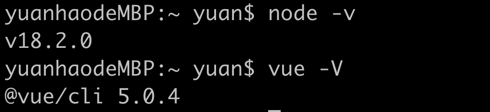
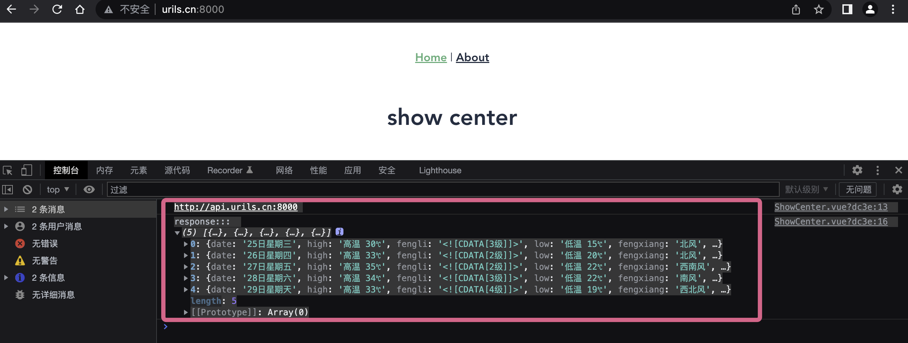
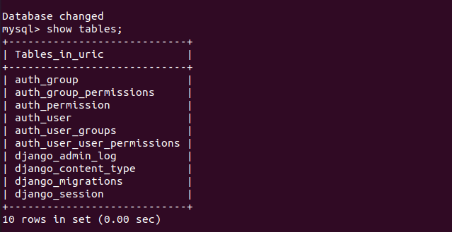

# Uric组件2022文档

预备知识点：

```text
Python基础
Mysql
前端
Django
DRF组件+VUE3
```

# 一 前端项目初始化

## 1.1 客户端项目创建

我们使用的vue-cli脚手架作为我们前端开发使用的框架，下面看一下vue-cli的安装。

安装脚手架：

```bash
$ npm install -g @vue/cli 
# OR
$ yarn global add @vue/cli
```

项目前端环境版本依赖



```text
node的版本：v14.16.0以上
vue-cli需要的安装和运行需要借助到node.js的环境(换句话说也是js代码的解释器)
vue：3版本
@vue/cli 4.5.13
```

### 1.1.1 Node.js的安装

Node.js是一个服务端语言，它的语法和JavaScript类似，所以可以说它是属于前端的后端语言，后端语言和前端语言的区别：

- 运行环境：后端语言一般运行在服务器端，前端语言运行在客户端的浏览器上

- 功能：后端语言可以操作文件，可以读写数据库，前端语言不能操作文件，不能读写数据库。

  我们一般安装LTS(长线支持版本)：

  下载地址：https://nodejs.org/en/download/【上面已经安装了nvm，那么这里不用手动安装了】

	下载之后双击安装，一路点击下一步就可以了。

node.js的版本有两大分支：

```
官方发布的node.js版本：0.xx.xx 这种版本号就是官方发布的版本
社区发布的node.js版本：xx.xx.x  就是社区开发的版本
```

Node.js如果安装成功，可以查看Node.js的版本,在终端输入如下命令：

```
node -v
npm -v   #pip
```

在安装node.js完成后，在node.js中会同时帮我们安装一个包管理器npm。我们可以借助npm命令来安装node.js的第三方包。这个工具相当于python的pip管理器，php的composer，go语言的go get，java的maven。

### 1.1.2 npm

常用指令

```shell
npm install -g 包名              # 安装模块   -g表示全局安装，如果没有-g，则表示在当前项目跟母下.node_modules下保存
npm list                        # 查看当前目录下已安装的node包
npm view 包名 engines            # 查看包所依赖的Node的版本 
npm outdated                    # 检查包是否已经过时，命令会列出所有已过时的包
npm update 包名                  # 更新node包
npm uninstall 包名               # 卸载node包
npm 命令 -h                      # 查看指定命令的帮助文档
```

如果npm大家觉得速度比较慢，可以安装cnpm来进行国内包源的下载

#### cnpm介绍

1. 说明：因为谷歌安装插件是从国外服务器下载，受网络影响大，可能出现异常，如果谷歌的服务器在中国就好了，所以我们乐于分享的淘宝团队干了这事来自官网：“这是一个完整npmjs.org镜像，你可以用此代替官方版本（只读），同步频率目前为10分钟一次以保证尽量与官方服务同步“。
2. 官方网址：[http://npm.taobao.org](http://npm.taobao.org/)
3. 安装：命令提示符执行`npm install cnpm -g --registry=https://registry.npm.taobao.org`
4. 注意：安装完后最好查看其版本cnpm -v或关闭命令提示符重新打开，安装完直接使用有可能会出现错误 

```shell
//临时使用
npm install jquery --registry https://registry.npm.taobao.org

//可以把这个选型配置到文件中，这样不用每一次都很麻烦
npm config set registry https://registry.npm.taobao.org

//验证是否配置成功 
npm config list 或者 npm config get registry

//安装cnpm，在任意目录下都可执行,--global是全局安装，不可省略
npm install --global cnpm 或者 npm install -g cnpm --registry=https://registry.npm.taobao.org

//安装后直接使用
cnpm install jquery
```

说明：NPM（节点包管理器）是的NodeJS的包管理器，用于节点插件管理（包括安装，卸载，管理依赖等）

> 1. 使用NPM安装插件：命令提示符执行`npm install <name> [-g] [--save-dev]` 
>    `<name>`：节点插件名称。 
>    例：`npm install gulp-less --save-dev`
> 2. `-g`：全局安装。 将会安装在C：\ Users \ Administrator \ AppData \ Roaming \ npm，并且写入系统环境变量;非全局安装：将会安装在当前定位目录;全局安装可以通过命令行任何地方调用它，本地安装将安装在定位目录的node_modules文件夹下，通过要求（）调用;
> 3. `--save`：将保存至的package.json（的package.json是的NodeJS项目配置文件）
> 4. `-dev`：保存至的package.json的devDependencies节点，不指定-dev将保存至依赖节点

为什么要保存至的的package.json？因为节点插件包相对来说非常庞大，所以不加入版本管理，将配置信息写入的package.json并将其加入版本管理，其他开发者对应下载即可（命令提示符执行npm install，则会根据package.json下载所有需要的包）

### 1.1.3  vue-cli创建项目

#### 创建项目

	使用vue自动化工具可以快速搭建单页应用项目目录。
	
	该工具为现代化的前端开发工作流提供了开箱即用的构建配置。只需几分钟即可创建并启动一个带热重载、保存时静态检查以及可用于生产环境的构建配置的项目：

```js
vue create uric_web

// 启动开发服务器 ctrl+c 停止服务
cd uric_web
npm run serve           // 运行这个命令就可以启动node提供的测试http服务器
```

加选 Vuex。后面需要用到


```js
// 那么访问一下命令执行完成后提示出来的网址就可以看到网站了：http://localhost:8080/
```


项目创建完成之后，我们会看到urilsweb项目其实是一个文件夹，我们进入到文件夹内部就会发现一些目录和文件，我们简单介绍一下它们都是干什么的

#### 项目目录结构介绍

核心文件和目录

```python
src/         主开发目录，要开发的客户端代码文件（单文件组件，样式、工具函数等等）全部在这个目录下

static/      静态资源目录，项目中的静态资源(css，js，图片等文件)放在这个文件夹

dist/        项目打包发布文件夹，目前没有这个文件夹，最后要上线单文件项目文件都在这个文件夹中	
		    后面使用npm build 打包项目，让项目中的vue组件经过编译变成js 代码以后,dist就出现了

node_modules/     node的包目录，项目运行的依赖包存储目录，
                  package.json和package-lock.json文件中会自动记录了这个目录下所有的包以及包的版本信息，
                  如果node_modules没有，但是有package.json，则可以在终端下，通过npm install进行恢复。

config/      配置目录，是环境配置目录与项目无关。

build/       项目打包时依赖的目录

src/router/  路由，是我们创建项目的时候，如果选择安装vue-router，就自动会生成这个目录。
src/assets/  静态资源存储目录，与static目录作用类似。
src/components/  组件存储目录，就是浏览器中用户看到的页面的一部分内容。
src/views/       组件存储目录，就是浏览器中用户看到的页面内容，views往往会加载并包含components中的组件进来
```

目录结构详细介绍


#### 项目执行流程图


### 1.1.4 展示中心组件

src/main.js

```js
import { createApp } from 'vue'
import App from './App.vue'
import router from './router'
import store from './store'

createApp(App).use(store).use(router).mount('#app')
```

src/App.vue

```html
<template>
  <nav>
    <router-link to="/">Home</router-link> |
    <router-link to="/about">About</router-link> |
    <router-link to="/showcenter">showcenter</router-link>
  </nav>

  <router-view/>
</template>

<style>
#app {
  font-family: Avenir, Helvetica, Arial, sans-serif;
  -webkit-font-smoothing: antialiased;
  -moz-osx-font-smoothing: grayscale;
  text-align: center;
  color: #2c3e50;
}

nav {
  padding: 30px;
}

nav a {
  font-weight: bold;
  color: #2c3e50;
}

nav a.router-link-exact-active {
  color: #42b983;
}
</style>

```

router/index.js，代码：

```javascript
import { createRouter, createWebHistory } from 'vue-router'
import HomeView from '../views/HomeView.vue'
import ShowCenter from '../views/ShowCenter.vue'

const routes = [
  {
    path: '/',
    name: 'home',
    component: HomeView
  },
  {
    path: '/about',
    name: 'about',
    // route level code-splitting
    // this generates a separate chunk (about.[hash].js) for this route
    // which is lazy-loaded when the route is visited.
    component: () => import(/* webpackChunkName: "about" */ '../views/AboutView.vue')
  },
  {
    path:'/showcenter',
    name:'showcenter',
    component: ShowCenter
  }
]

const router = createRouter({
  history: createWebHistory(process.env.BASE_URL),
  routes
})

export default router
```

views/ShowCenter.vue

```html
<template>
  <div class="showcenter">
    <h1>show center</h1>
  </div>
</template>

<script>

export default {
  name: 'ShowCenter',
}
</script><template>
  <div class="showcenter">
    <h1>show center</h1>
  </div>
</template>

<script>

export default {
  name: 'ShowCenter',
}
</script>
```

访问http://localhost:8080  就看到了我们的展示中心页面。

### 1.1.5 调整配置

为了方便开发，我们做一些配置调整

Vue.config.js是一个可选的配置文件，如果项目的根目录存在这个文件，那么它就会被 `@vue/cli-service` 自动加载。你也可以使用package.json中的vue字段，但要注意严格遵守JSON的格式来写。这里使用配置vue.config.js的方式进行处理。

```js
const {defineConfig} = require('@vue/cli-service')

module.exports = defineConfig({
    transpileDependencies: true,
    devServer: {
        host: "localhost",
        /* 本地ip地址 */
        //host: "192.168.0.131",
        // host: "www.urils.cn", //局域网和本地访问
        port: "8000",
        // hot: true,
        /* 自动打开浏览器 */
        // open: false,
        /*overlay: {
            warning: false,
            error: true
        },*/
        /* 跨域代理 */
        /*proxy: {
            "/api": {
                /!* 目标代理服务器地址 *!/
                target: "http://xxxx.top", //
                /!* 允许跨域 *!/
                changeOrigin: true,
                ws: true,
                pathRewrite: {
                    "^/api": ""
                }
            }
        }*/
    },
})
```

我们现在为前端和后端分别设置两个不同的域名：

| 位置 | 域名          |
| ---- | ------------- |
| 前端 | `www.uric.cn` |
| 后端 | `api.uric.cn` |

Linux/mac系统下执行指令

```shell
vi /etc/hosts

# windows下是C:/windows/system32/drivers/etc/hosts
```

加上如下内容

```shell
127.0.0.1   localhost
127.0.0.1   api.uric.cn
127.0.0.1   www.uric.cn
```

部分使用windows开发的同学，如果hosts修改保存不了，可以复制这个文件到桌面，修改完成以后，在粘贴到对应目录下。


在开发过程中，我们可能经常会在前端项目的业务里面使用到某些变量，我们可以添加到配置文件中，比如我们在src目录下创建一个settings.js文件

```js
export default { // 注意，对象要抛出后，其他文件中才能引入使用
    host: 'http://api.urils.cn:8000' // 我们的后台项目将来就通过这个域名和端口来启动
}
```

为了方便后面其他页面组件使用settings中的配置变量，我们在main.js文件中引入封装成vue对象的全局属性.

main.js，代码：

```js
import {createApp} from 'vue'
import App from './App.vue'
import router from './router'
import settings from "@/settings";

const app = createApp(App)
app.use(router).mount('#app')
app.config.globalProperties.$settings = settings;
```

### 1.1.6 安装axios

后面我们需要在前端来获取后端的数据，意味着要发送请求，我们使用axios模块来进行http请求的发送，

它的特点和ajax一样：异步请求。

```shell
项目根目录下执行如下指令
npm install -S axios --registry https://registry.npm.taobao.org
```

`ShowCenter`组件：

```vue
<template>
  <div class="showcenter">
    <h1>show center</h1>
  </div>
</template>

<script>
import axios from 'axios'

export default {
  name: 'ShowCenter',
  mounted() {
    console.log(this.$settings.host)
    axios.get('http://wthrcdn.etouch.cn/weather_mini?city=北京')
        .then((response) => {
          console.log("response:::", response.data.data.forecast)
        })
  }
}
</script>

```



接下来我们将展示中心页面写的好看一些。

我们当前前端项目使用的用于展示界面的前端插件是Ant Design，能够帮我们快速优雅的完成前端页面效果，下面介绍一下。

## 1.2 ant-design插件

### 介绍

	Ant Design 是一个致力于提升『用户』和『设计者』使用体验的中台设计语言。它模糊了产品经理、交互设计师、视觉设计师、前端工程师、开发工程师等角色边界，将进行 UE 设计和 UI 设计人员统称为『设计者』，利用统一的规范进行设计赋能，全面提高中台产品体验和研发效率，是蚂蚁金服出品的开源框架。
	
	Ant Design 官方介绍： "在中台产品的研发过程中，会出现不同的设计规范和实现方式，但其中往往存在很多类似的页面和组件，给设计师和工程师带来很多困扰和重复建设，大大降低了产品的研发效率。"
	
	蚂蚁金服体验技术部经过大量的项目实践和总结，沉淀出设计语言 Ant Design，这可不单纯只是设计原则、控件规范和视觉尺寸，还配套有前端代码实现方案。也就是说采用Ant Design后，UI设计和前端界面研发可同步完成，效率大大提升。目前有阿里、美团、滴滴、简书采用。Ant Design有Web版和Moblie版。
	
	如果前端这些插件都是我们通过js或者jquery手撸的话，工作量太重不说，效率还低。
	
	Ant Design 则封装了一系列高质量的 React 组件，十分适用于在企业级的应用中，框架提供的 api 十分详尽，上手和使用相对简单，值得一提的是， Ant Design 使用 ES6 进行编写，因此使用过程中对 ES6 也是一次学习的机会。
	
	我们现在学习的是vue框架和ant-desigin的兼容，那么已经有高手开源出了一套ant-design的vue实现，下面我们就来学习使用。

ant-desigin特点

-  专为Web应用程序设计的企业级UI。
-  开箱即用的一组高质量React组件。
-  用具有可预测的静态类型的TypeScript编写。
-  整套设计资源和开发工具。
-  支持数十种语言的国际化。
-  强大的主题自定义细节。

### 常用网址

官网：https://ant.design/，antdv工具的使用，全称 Ant Design of Vue。

官网地址：https://next.antdv.com/docs/vue/getting-started-cn

Ant Design of Vue的使用，我们在项目中学习。

### 安装上手

```bash
$ npm i --save ant-design-vue@next
```

在main.js文件中引入

```js
import {createApp} from 'vue'
import App from './App.vue'
import router from './router'
import Antd from 'ant-design-vue';
import 'ant-design-vue/dist/antd.css';
import './settings'
import settings from "@/settings";


const app = createApp(App)
app.use(router).use(Antd).mount('#app')

app.config.globalProperties.$settings = settings;
```

下面测试一下效果，我们在ShowCenter.vue组件中引入一个ant-design的button按钮，看看怎么样

```vue
<template>
  <div class="showcenter">
    <h1>show center</h1>
    <a-button type="primary">Primary</a-button>
  </div>
</template>

<script>
import axios from 'axios'

export default {
  name: 'ShowCenter',
  mounted() {
    console.log(this.$settings.host)
    axios.get('http://wthrcdn.etouch.cn/weather_mini?city=北京')
        .then((response) => {
          console.log("response:::", response.data.data.forecast)
        })
  }
}
</script>
```

好，效果有了。


### 中文支持

ShowCenter.vue展示中文日历，没有配置之前：

```vue
<template>
  <div class="showcenter">
    <h1>show center</h1>
    <a-button type="primary">Primary</a-button>
    <div :style="{ width: '300px', border: '1px solid #d9d9d9', borderRadius: '4px' }">
      <a-calendar v-model:value="value" :fullscreen="false" @panelChange="onPanelChange"/>
    </div>
  </div>
</template>

<script>
import axios from 'axios'
import {ref} from 'vue';

export default {
  name: 'ShowCenter',
  setup() {
    const value = ref();

    const onPanelChange = (value, mode) => {
      console.log(value, mode);
    };

    return {
      value,
      onPanelChange,
    };
  },
  mounted() {
    console.log(this.$settings.host)
    axios.get('http://wthrcdn.etouch.cn/weather_mini?city=北京')
        .then((response) => {
          console.log("response:::", response.data.data.forecast)
        })
  }
}
</script>

```

`ant-design-vue` 目前的默认文案是英文。在使用某些插件(比如时间日期选择框等)的时候，需要我们来做中文支持，设置如下。

src/App.vue，代码：

```vue
<template>
  <a-config-provider :locale="locale">
    <div class="showcenter">
      <h1>show center</h1>
      <a-button type="primary">Primary</a-button>
      <div :style="{ width: '300px', border: '1px solid #d9d9d9', borderRadius: '4px' }">
        <a-calendar v-model:value="value" :fullscreen="false" @panelChange="onPanelChange"/>
      </div>
    </div>
  </a-config-provider>
</template>

<script>
import axios from 'axios'
import {ref} from 'vue';

import zhCN from 'ant-design-vue/es/locale/zh_CN';
import dayjs from 'dayjs';
import 'dayjs/locale/zh-cn';

dayjs.locale('zh-cn');

export default {
  name: 'ShowCenter',
  data() {
    return {
      locale: zhCN,
    };
  },
  setup() {
    const value = ref();

    const onPanelChange = (value, mode) => {
      console.log(value, mode);
    };

    return {
      value,
      onPanelChange,
    };
  },
  mounted() {
    console.log(this.$settings.host)
    axios.get('http://wthrcdn.etouch.cn/weather_mini?city=北京')
        .then((response) => {
          console.log("response:::", response.data.data.forecast)
        })
  }
}
</script>

```

需要安装一个包：

```bash
npm install dayjs
```

### echarts图表插件

由于我们有很多的图表数据展示，而Ant-desigin中没有很优秀的图表插件，所以我们还需要借助其他开源插件，比如echarts和hcharts，我们本次采用的是百度开源的echarts，那么我们如何引入使用呢，看下面的步骤。

[Echarts官方](https://echarts.apache.org/zh/index.html)

下载：

```shell
npm install echarts --save --registry=https://registry.npm.taobao.org
```

为了方便后面组件的使用，我们在src/main.js中引入一下

```js
// import echarts from 'echarts'
let echarts = require('echarts')
app.config.globalProperties.$echarts = echarts
```

在ShowCenter.vue组件中简单使用

```vue
<template>
  <h1>show center</h1>
  <p>
    <a-button type="primary">Primary</a-button>
  </p>
  <a-config-provider :locale="locale">
    <div class="showcenter">
      <div class="calendar" :style="{ width: '400px', border: '1px solid #d9d9d9', borderRadius: '4px'}">
        <a-calendar v-model:value="value" :fullscreen="false" @panelChange="onPanelChange"/>
      </div>
      <div class="chart" ref="chart"></div>
    </div>
  </a-config-provider>
</template>

<script>
import axios from 'axios'
import {ref} from 'vue';

import zhCN from 'ant-design-vue/es/locale/zh_CN';
import dayjs from 'dayjs';
import 'dayjs/locale/zh-cn';

dayjs.locale('zh-cn');

export default {
  name: 'ShowCenter',
  data() {
    return {
      locale: zhCN,
    };
  },
  methods: {
    init_chart() {
      // 基于准备好的dom，初始化echarts实例
      let myChart = this.$echarts.init(this.$refs.chart)
      // 绘制图表
      let option = {
        tooltip: {
          trigger: 'axis',
          axisPointer: {
            // Use axis to trigger tooltip
            type: 'shadow' // 'shadow' as default; can also be 'line' or 'shadow'
          }
        },
        legend: {},
        grid: {
          left: '3%',
          right: '4%',
          bottom: '3%',
          containLabel: true
        },
        xAxis: {
          type: 'value'
        },
        yAxis: {
          type: 'category',
          data: ['Mon', 'Tue', 'Wed', 'Thu', 'Fri', 'Sat', 'Sun']
        },
        series: [
          {
            name: 'Direct',
            type: 'bar',
            stack: 'total',
            label: {
              show: true
            },
            emphasis: {
              focus: 'series'
            },
            data: [320, 302, 301, 334, 390, 330, 320]
          },
          {
            name: 'Mail Ad',
            type: 'bar',
            stack: 'total',
            label: {
              show: true
            },
            emphasis: {
              focus: 'series'
            },
            data: [120, 132, 101, 134, 90, 230, 210]
          },
          {
            name: 'Affiliate Ad',
            type: 'bar',
            stack: 'total',
            label: {
              show: true
            },
            emphasis: {
              focus: 'series'
            },
            data: [220, 182, 191, 234, 290, 330, 310]
          },
          {
            name: 'Video Ad',
            type: 'bar',
            stack: 'total',
            label: {
              show: true
            },
            emphasis: {
              focus: 'series'
            },
            data: [150, 212, 201, 154, 190, 330, 410]
          },
          {
            name: 'Search Engine',
            type: 'bar',
            stack: 'total',
            label: {
              show: true
            },
            emphasis: {
              focus: 'series'
            },
            data: [820, 832, 901, 934, 1290, 1330, 1320]
          }
        ]
      };
      myChart.setOption(option);

    },
  },
  setup() {
    const value = ref();

    const onPanelChange = (value, mode) => {
      console.log(value, mode);
    };

    return {
      value,
      onPanelChange,
    };
  },
  mounted() {

    console.log(this.$settings.host)
    axios.get('http://wthrcdn.etouch.cn/weather_mini?city=北京')
        .then((response) => {
          console.log("response:::", response.data.data.forecast)
        })

    this.init_chart();
  }
}
</script>

<style>
.calendar, .chart {
  width: 500px;
  height: 500px;
  float: left;
  margin: 0 auto 0 100px;
}


</style>
```


改进组合API：

```vue
<template>
  <h1>show center</h1>
  <p>
    <a-button type="primary">Primary</a-button>
  </p>
  <div class="chart" ref="chart"></div>
  <div class="chart2" ref="chart2"></div>

</template>

<script setup>


import {onMounted, ref} from "vue";
import zhCN from 'ant-design-vue/es/locale/zh_CN';
import dayjs from 'dayjs';
import 'dayjs/locale/zh-cn';
import * as echarts from 'echarts';

dayjs.locale('zh-cn');
const locale = zhCN

// (1)
const value = ref();
const onPanelChange = (value, mode) => {
  console.log(value, mode);
};


// (2)
let init_chart = () => {

  var myChart = echarts.init(chart.value);
  var option;
  // 绘制图表
  option = {
    tooltip: {
      trigger: 'axis',
      axisPointer: {
        // Use axis to trigger tooltip
        type: 'shadow' // 'shadow' as default; can also be 'line' or 'shadow'
      }
    },
    legend: {},
    grid: {
      left: '3%',
      right: '4%',
      bottom: '3%',
      containLabel: true
    },
    xAxis: {
      type: 'value'
    },
    yAxis: {
      type: 'category',
      data: ['Mon', 'Tue', 'Wed', 'Thu', 'Fri', 'Sat', 'Sun']
    },
    series: [
      {
        name: 'Direct',
        type: 'bar',
        stack: 'total',
        label: {
          show: true
        },
        emphasis: {
          focus: 'series'
        },
        data: [320, 302, 301, 334, 390, 330, 320]
      },
      {
        name: 'Mail Ad',
        type: 'bar',
        stack: 'total',
        label: {
          show: true
        },
        emphasis: {
          focus: 'series'
        },
        data: [120, 132, 101, 134, 90, 230, 210]
      },
      {
        name: 'Affiliate Ad',
        type: 'bar',
        stack: 'total',
        label: {
          show: true
        },
        emphasis: {
          focus: 'series'
        },
        data: [220, 182, 191, 234, 290, 330, 310]
      },
      {
        name: 'Video Ad',
        type: 'bar',
        stack: 'total',
        label: {
          show: true
        },
        emphasis: {
          focus: 'series'
        },
        data: [150, 212, 201, 154, 190, 330, 410]
      },
      {
        name: 'Search Engine',
        type: 'bar',
        stack: 'total',
        label: {
          show: true
        },
        emphasis: {
          focus: 'series'
        },
        data: [820, 832, 901, 934, 1290, 1330, 1320]
      }
    ]
  };
  option && myChart.setOption(option);
}

const chart = ref();

onMounted(() => {
  init_chart()
  init_chart2()
});

// (3)

const chart2 = ref();

let init_chart2 = () => {
  console.log(chart2.value)
  var myChart = echarts.init(chart2.value);
  var option;
  option = {
    tooltip: {
      trigger: 'item'
    },
    legend: {
      top: '5%',
      left: 'center'
    },
    series: [
      {
        name: 'Access From',
        type: 'pie',
        radius: ['40%', '70%'],
        avoidLabelOverlap: false,
        itemStyle: {
          borderRadius: 10,
          borderColor: '#fff',
          borderWidth: 2
        },
        label: {
          show: false,
          position: 'center'
        },
        emphasis: {
          label: {
            show: true,
            fontSize: '40',
            fontWeight: 'bold'
          }
        },
        labelLine: {
          show: false
        },
        data: [
          {value: 1048, name: 'Search Engine'},
          {value: 735, name: 'Direct'},
          {value: 580, name: 'Email'},
          {value: 484, name: 'Union Ads'},
          {value: 300, name: 'Video Ads'}
        ]
      }
    ]
  };

  option && myChart.setOption(option);

}
</script>

<style>
.chart, .chart2 {
  width: 500px;
  height: 500px;
  float: left;
  margin: 0 auto 0 100px;
}


</style>
```


好，到此前端项目初始化完成。

## 1.3 组件初始化

### 登录组件初始化

views/Login.vue，代码

```vue
<template>
  <div class="login box">
    
    <div class="login">
      <div class="login-title">
        <p class="hi">Hello,Urils!</p>
      </div>
      <div class="login_box">
        <div class="title">
          <span>登录</span>
        </div>
        <div class="inp">
          <a-input v-model:value="username" type="text" placeholder="用户名" class="user"></a-input>
          <a-input v-model:value="password" type="password" class="pwd" placeholder="密码"></a-input>
          <div class="rember">
            <p>
              <input type="checkbox" class="no" v-model="remember"/>
              <span>记住密码</span>
            </p>
          </div>
          <button class="login_btn" @click="login">登录</button>

        </div>

      </div>
    </div>
  </div>
</template>

<script>
export default {
  name: 'Login',
  data() {
    return {
      username: '',
      password: '',
      remember: true
    }
  },

  methods: {
    login() {
    
    }

  }

}
</script>

<style scoped>
.login .hi{
  font-size: 20px;
  font-family: "Times New Roman";
  font-style: italic;
}
.box {
  width: 100%;
  height: 100%;
  position: relative;
  overflow: hidden;
}

.box img {
  width: 100%;
  min-height: 100%;
}

.box .login {
  position: absolute;
  width: 500px;
  height: 400px;
  left: 0;
  margin: auto;
  right: 0;
  bottom: 0;
  top: -338px;
}

.login .login-title {
  width: 100%;
  text-align: center;
}

.login-title img {
  width: 190px;
  height: auto;
}

.login-title p {
  font-size: 18px;
  color: #fff;
  letter-spacing: .29px;
  padding-top: 10px;
  padding-bottom: 50px;
}

.login_box {
  width: 400px;
  height: auto;
  background: rgba(255, 255, 255, 0.3);
  box-shadow: 0 2px 4px 0 rgba(0, 0, 0, .5);
  border-radius: 4px;
  margin: 0 auto;
  padding-bottom: 40px;
}

.login_box .title {
  font-size: 20px;
  color: #9b9b9b;
  letter-spacing: .32px;
  border-bottom: 1px solid #e6e6e6;
  display: flex;
  justify-content: space-around;
  padding: 50px 60px 0 60px;
  margin-bottom: 20px;
  cursor: pointer;
}

.login_box .title span:nth-of-type(1) {
  color: #4a4a4a;
  border-bottom: 2px solid #396fcc;
}

.inp {
  width: 350px;
  margin: 0 auto;
}

.inp input {
  outline: 0;
  width: 100%;
  height: 45px;
  border-radius: 4px;
  border: 1px solid #d9d9d9;
  text-indent: 20px;
  font-size: 14px;
  background: #fff !important;
}

.inp input.user {
  margin-bottom: 16px;
}

.inp .rember {
  display: flex;
  justify-content: space-between;
  align-items: center;
  position: relative;
  margin-top: 10px;
}

.inp .rember p:first-of-type {
  font-size: 12px;
  color: #4a4a4a;
  letter-spacing: .19px;
  margin-left: 22px;
  display: -ms-flexbox;
  display: flex;
  -ms-flex-align: center;
  align-items: center;
  /*position: relative;*/
}

.inp .rember p:nth-of-type(2) {
  font-size: 14px;
  color: #9b9b9b;
  letter-spacing: .19px;
  cursor: pointer;
}

.inp .rember input {
  outline: 0;
  width: 30px;
  height: 45px;
  border-radius: 4px;
  border: 1px solid #d9d9d9;
  text-indent: 20px;
  font-size: 14px;
  background: #fff !important;
}

.inp .rember p span {
  display: inline-block;
  font-size: 12px;
  width: 100px;
  /*position: absolute;*/
  /*left: 20px;*/

}

#geetest {
  margin-top: 20px;
}

.login_btn {
  width: 100%;
  height: 45px;
  background: #396fcc;
  border-radius: 5px;
  font-size: 16px;
  color: #fff;
  letter-spacing: .26px;
  margin-top: 30px;
}

.inp .go_login {
  text-align: center;
  font-size: 14px;
  color: #9b9b9b;
  letter-spacing: .26px;
  padding-top: 20px;
}

.inp .go_login span {
  color: #84cc39;
  cursor: pointer;
}
</style>
```

src/router/index.js，代码：

```javascript
import { createRouter, createWebHistory } from 'vue-router'
import ShowCenter from '../views/ShowCenter.vue'
import Login from '../views/Login.vue'

const routes = [
  {
    path: '/',
    name: 'ShowCenter',
    component: ShowCenter
  },
  {
    path: '/login',
    name: 'Login',
    component: Login
  }
]

const router = createRouter({
  history: createWebHistory(process.env.BASE_URL),
  routes
})

export default router

```


由于除了登录页面之外我们后面所有的组件都具备顶部导航栏和左侧菜单栏的效果，所以我直接将共有效果放到了一个Base.vue组件中。里面通过 ant design vue中的

布局组件：https://next.antdv.com/components/layout-cn

### Base组件初始化

布局和导航菜单搭建App页面效果，简单如下

views/Base.vue，代码：

```vue
<template>
  <a-layout style="min-height: 100vh">
    <a-layout-sider v-model:collapsed="collapsed" collapsible>
      <div class="logo" />
      <a-menu v-model:selectedKeys="selectedKeys" theme="dark" mode="inline">
        <a-menu-item key="1">
          <pie-chart-outlined />
          <span>Option 1</span>
        </a-menu-item>
        <a-menu-item key="2">
          <desktop-outlined />
          <span>Option 2</span>
        </a-menu-item>
        <a-sub-menu key="sub1">
          <template #title>
            <span>
              <user-outlined />
              <span>User</span>
            </span>
          </template>
          <a-menu-item key="3">Tom</a-menu-item>
          <a-menu-item key="4">Bill</a-menu-item>
          <a-menu-item key="5">Alex</a-menu-item>
        </a-sub-menu>
        <a-sub-menu key="sub2">
          <template #title>
            <span>
              <team-outlined />
              <span>Team</span>
            </span>
          </template>
          <a-menu-item key="6">Team 1</a-menu-item>
          <a-menu-item key="8">Team 2</a-menu-item>
        </a-sub-menu>
        <a-menu-item key="9">
          <file-outlined />
          <span>File</span>
        </a-menu-item>
      </a-menu>
    </a-layout-sider>
    <a-layout>
      <a-layout-header style="background: #fff; padding: 0" />
      <a-layout-content style="margin: 0 16px">
        <a-breadcrumb style="margin: 16px 0">
          <a-breadcrumb-item>User</a-breadcrumb-item>
          <a-breadcrumb-item>Bill</a-breadcrumb-item>
        </a-breadcrumb>
        <div :style="{ padding: '24px', background: '#fff', minHeight: '360px' }">
          Bill is a cat.
        </div>
      </a-layout-content>
      <a-layout-footer style="text-align: center">
        Ant Design ©2018 Created by Ant UED
      </a-layout-footer>
    </a-layout>
  </a-layout>
</template>
<script>
import { PieChartOutlined, DesktopOutlined, UserOutlined, TeamOutlined, FileOutlined } from '@ant-design/icons-vue';
import { defineComponent, ref } from 'vue';
export default defineComponent({
  components: {
    PieChartOutlined,
    DesktopOutlined,
    UserOutlined,
    TeamOutlined,
    FileOutlined,
  },

  data() {
    return {
      collapsed: ref(false),
      selectedKeys: ref(['1']),
    };
  },

});
</script>
<style>
#components-layout-demo-side .logo {
  height: 32px;
  margin: 16px;
  background: rgba(255, 255, 255, 0.3);
}

.site-layout .site-layout-background {
  background: #fff;
}
[data-theme='dark'] .site-layout .site-layout-background {
  background: #141414;
}
</style>
```

设置路由：

```js
 {
        path: '/base',
        name: 'Base',
        component: Base
    },
```


### Base组件修改

Base.vue修改菜单中的标题信息，Base.vue，代码：

```html
<template>
  <a-layout style="min-height: 100vh">
    <a-layout-sider v-model:collapsed="collapsed" collapsible>
      <div class="logo"
           style="font-style: italic;text-align: center;font-size: 20px;color:#fff;margin: 10px 0;background-color: #333;line-height: 50px;font-family: 'Times New Roman'">
        <span> Urils</span>
      </div>
      <div class="logo"/>
      <a-menu v-for="menu in menu_list" v-model:selectedKeys="selectedKeys" theme="dark" mode="inline">
        <a-menu-item v-if="menu.children.length===0" :key="menu.id">

          <router-link :to="menu.menu_url">
            <desktop-outlined/>
            <span> {{ menu.title }}</span>
          </router-link>
        </a-menu-item>

        <a-sub-menu v-else :key="menu.id">
          <template #title>
            <span>
              <user-outlined/>
              <span>{{ menu.title }}</span>
            </span>
          </template>
          <a-menu-item v-for="child_menu in menu.children" :key="child_menu.id">
            <router-link :to="child_menu.menu_url">{{ child_menu.title }}</router-link>
          </a-menu-item>
        </a-sub-menu>
      </a-menu>
    </a-layout-sider>
    <a-layout>
      <a-layout-header style="background: #369; padding: 0"/>
      <a-layout-content style="margin: 0 16px">
        <router-view></router-view>
      </a-layout-content>
      <a-layout-footer style="text-align: center">
        Ant Design ©2018 Created by Ant UED
      </a-layout-footer>
    </a-layout>
  </a-layout>
</template>
<script>
import {DesktopOutlined, FileOutlined, PieChartOutlined, TeamOutlined, UserOutlined} from '@ant-design/icons-vue';
import {defineComponent, ref} from 'vue';

export default defineComponent({
  components: {
    PieChartOutlined,
    DesktopOutlined,
    UserOutlined,
    TeamOutlined,
    FileOutlined,
  },

  data() {
    return {
      collapsed: ref(false),
      selectedKeys: ref(['1']),
      menu_list: [
        {
          id: 1, icon: 'mail', title: '展示中心', tube: '', 'menu_url': '/urils/show_center', children: []
        },
        {
          id: 2, icon: 'mail', title: '资产管理', 'menu_url': '/urils/host', children: []
        },
        {
          "id": 3, icon: 'bold', title: '批量任务', tube: '', menu_url: '/urils/workbench', children: [
            {id: 10, icon: 'mail', title: '执行任务', 'menu_url': '/urils/multi_exec'},
            {id: 11, icon: 'mail', title: '命令管理', 'menu_url': '/urils/template_manage'},
          ]
        },
        {
          id: 4, icon: 'highlight', title: '代码发布', tube: '', menu_url: '/urils/workbench', children: [
            {id: 12, title: '应用管理', menu_url: '/urils/release'},
            {id: 13, title: '发布申请', menu_url: '/urils/release'}
          ]
        },
        {id: 5, icon: 'mail', title: '定时计划', tube: '', menu_url: '/urils/workbench', children: []},
        {
          id: 6, icon: 'mail', title: '配置管理', tube: '', menu_url: '/urils/workbench', children: [
            {id: 14, title: '环境管理', 'menu_url': '/urils/environment'},
            {id: 15, title: '服务配置', 'menu_url': '/urils/workbench'},
            {id: 16, title: '应用配置', 'menu_url': '/urils/workbench'}
          ]
        },
        {id: 7, icon: 'mail', title: '监控预警', tube: '', 'menu_url': '/urils/workbench', children: []},
        {
          id: 8, icon: 'mail', title: '报警', tube: '', 'menu_url': '/urils/workbench', children: [
            {id: 17, title: '报警历史', 'menu_url': '/urils/workbench'},
            {id: 18, title: '报警联系人', 'menu_url': '/urils/workbench'},
            {id: 19, title: '报警联系组', 'menu_url': '/urils/workbench'}
          ]
        },
        {
          id: 9, icon: 'mail', title: '用户管理', tube: '', menu_url: '/urils/workbench', children: [
            {id: 20, title: '账户管理', tube: '', menu_url: '/urils/workbench'},
            {id: 21, title: '角色管理', tube: '', menu_url: '/urils/workbench'},
            {id: 22, title: '系统设置', tube: '', menu_url: '/urils/workbench'}
          ]
        }
      ]
    };
  },

});
</script>
<style>
#components-layout-demo-side .logo {
  height: 32px;
  margin: 16px;
  background: rgba(255, 255, 255, 0.3);
}

.site-layout .site-layout-background {
  background: #fff;
}

[data-theme='dark'] .site-layout .site-layout-background {
  background: #141414;
}
</style>
```


路由router/index.js：

```js
import {createRouter, createWebHistory} from 'vue-router'
import Login from '../views/Login.vue'
import Base from '../views/Base'


const routes = [
    {
        meta: {
            title: 'uric自动化运维平台'
        },
        path: '/uric',
        alias: '/', // 给当前路径起一个别名
        name: 'Base',
        component: Base, // 快捷键：Alt+Enter快速导包

    },
    {
        meta: {
            title: '账户登陆'
        },
        path: '/login',
        name: 'Login',
        component: Login // 快捷键：Alt+Enter快速导包
    },
    {
        path: '/',
        name: 'ShowCenter',
        component: ShowCenter
    },
]

const router = createRouter({
    history: createWebHistory(process.env.BASE_URL),
    routes
})

export default router
```

接着我们再创建一个测试路由的组件，Host.vue，代码：

```html
<template>
  <div class="host">
    <h1>host页面</h1>
  </div>
</template>

<script>
export default {
  name: 'Host'
}
</script>

<style scoped>

</style>

```

### 子路由配置

由于我们使用了组件嵌套，所以我们要通过路由嵌套来进行控制

Router/index.js

```js
import {createRouter, createWebHistory} from 'vue-router'
import ShowCenter from '../views/ShowCenter.vue'
import Login from '../views/Login.vue'
import Base from '../views/Base'
import Host from '../views/Host'

const routes = [
    {
        meta: {
            title: 'Urils自动化运维平台'
        },
        path: '/urils',
        alias: '/', // 给当前路径起一个别名
        name: 'Base',
        component: Base, // 快捷键：Alt+Enter快速导包
        children: [
            {
                meta: {
                    title: '展示中心'
                },
                path: 'show_center',
                alias: '',
                name: 'ShowCenter',
                component: ShowCenter
            },
            {
                meta: {
                    title: '资产管理'
                },
                path: 'host',
                name: 'Host',
                component: Host
            }
        ]
    },
    {
        meta: {
            title: '账户登陆'
        },
        path: '/login',
        name: 'Login',
        component: Login // 快捷键：Alt+Enter快速导包
    },
]

const router = createRouter({
    history: createWebHistory(process.env.BASE_URL),
    routes
})

export default router

```


# 二 服务端项目初始化

## （1）虚拟环境

Python创建虚拟环境
创建虚拟环境是为了让项目运行在一个独立的局部的Python环境中，使得不同环境的项目互不干扰。

```bash
1. 安装虚拟环境的第三方包 virtualenv
pip install virtualenv
使用清华源安装：pip install virtualenv -i https://pypi.python.org/simple/

2. 创建虚拟环境
cd 到存放虚拟环境光的地址
virtualenv ENV 在当前目录下创建名为ENV的虚拟环境（如果第三方包virtualenv安装在python3下面，此时创建的虚拟环境就是基于python3的）
virtualenv -p 指定python版本创建虚拟环境 参数 
virtualenv -p /usr/local/bin/python3.6 虚拟环境名称 
virtualenv --system-site-packages ENV 参数 --system-site-packages 指定创建虚拟环境时继承系统三方库

3. 激活/退出虚拟环境
cd ~/ENV 跳转到虚拟环境的文件夹
source bin/activate 激活虚拟环境
pip list 查看当前虚拟环境下所安装的第三方库
deactivate 退出虚拟环境

4. 删除虚拟环境
直接删除虚拟环境所在目录即可
```

> window系统没有bin文件夹，cd进入Scripts路径下运行：`activate.bat`


## （2）搭建项目

基于Pycharm创建Django项目时可以直接构建虚拟环境


可以直接在pycharm中使用创建好的虚拟环境，安装和查看第三方库。也可以在终端中使用虚拟环境，转到pycharm中设定的**虚拟环境的位置，一般在工程的根目录**。这个虚拟环境和上述用命令创建的虚拟环境一样，采用上述**激活/退出虚拟环境**命令即可执行相应操作。

测试，安装requests模块


## （3）项目目录调整

```python
# 默认结构
└── uric_api
    ├── manage.py
    └── uric_api
        ├── asgi.py
        ├── __init__.py
        ├── settings.py
        ├── urls.py
        └── wsgi.py

# 调整结构

└── uric_api         # 后端项目目录
    ├── __init__.py
    ├── logs         # 项目运行时/开发时日志目录
    ├── manage.py    # 开发阶段的启动文件
    ├── scripts      # 保存项目运营时的脚本文件 bash
    │   └── __init__.py
    └── uric_api     # 项目主应用，开发时的代码保存
        ├── apps     # 开发者的代码保存目录，以模块[子应用]为目录保存（包）
        │   └── __init__.py
        ├── asgi.py
        ├── __init__.py
        ├── libs              # 第三方类库的保存目录[第三方组件、模块]（包）
        │   └── __init__.py
        ├── settings
        │   ├── dev.py         # 项目开发时的本地配置
        │   ├── __init__.py
        │   ├── prod.py        # 项目上线时的运行配置
        │   └── test.py        # 测试人员使用的配置(咱们不需要)
        ├── settings.py
        ├── urls.py            # 总路由（包） 
        ├── utils          # 多个模块[子应用]的公共函数类库[自己开发的组件]
        │   └── __init__.py
        └── wsgi.py

```

> 注意：创建文件夹的时候，是创建包(含`__init__.py`文件的)还是创建单纯的文件夹，看目录里面放的是什么，如果放的是py文件相关的代码，最好创建包，如果不是，那就创建单纯的文件夹。
>

切换manage.py启动项目时使用的配置文件。mange.py，代码：


## （4）注册DRF组件

下载：

```python
pip install djangorestframework -i https://pypi.douban.com/simple
```

settings.dev.py，代码：

```python
INSTALLED_APPS = [
    'django.contrib.admin',
    'django.contrib.auth',
    'django.contrib.contenttypes',
    'django.contrib.sessions',
    'django.contrib.messages',
    'django.contrib.staticfiles',
    'rest_framework',
]
```

调整子应用保存以后，创建并注册子应用需要调整如下，

例如：创建home子应用

```python 
cd uric_api/apps
python ../../manage.py startapp home
```

子应用的注册，settings.dev.py，代码：

```python
import sys
BASE_DIR = Path(__file__).resolve().parent.parent
sys.path.insert(0, str(BASE_DIR / 'apps'))
INSTALLED_APPS = [
    'django.contrib.admin',
    'django.contrib.auth',
    'django.contrib.contenttypes',
    'django.contrib.sessions',
    'django.contrib.messages',
    'django.contrib.staticfiles',
    'rest_framework',
    "home"
]
```

创建了一个测试视图，提供给外界访问。home.views.py，代码：

```python
from rest_framework.views import APIView
from rest_framework.response import Response
class TestAPIView(APIView):
    def get(self,request):
        return Response({"message":"hello"},)
```

home.urls.py，代码：

```python
from django.urls import path
from . import views
urlpatterns = [
    path("test", views.TestAPIView.as_view())
]
```

总路由加载home子应用的路由信息，`uric_api.urls`，代码：

```python
from django.contrib import admin
from django.urls import path,include

urlpatterns = [
    path('admin/', admin.site.urls),
    path("", include("home.urls")),
]
```


## （5）日志配置

 参考django官方文档，网址：https://docs.djangoproject.com/zh-hans/3.2/topics/logging/

在settings/dev.py文件中追加如下配置：

```python
# 日志配置
LOGGING = {
    # 使用的python内置的logging模块，那么python可能会对它进行升级，所以需要写一个版本号，目前就是1版本
    'version': 1,
    # 是否去掉目前项目中其他地方中以及使用的日志功能，但是将来我们可能会引入第三方的模块，里面可能内置了日志功能，所以尽量不要关闭，肯定False
    'disable_existing_loggers': False,
    # 日志的处理格式
    'formatters': {
        # 详细格式，往往用于记录日志到文件/其他第三方存储设备
        'verbose': {
            # levelname等级，asctime记录时间，module表示日志发生的文件名称，lineno行号，message错误信息
            'format': '{levelname} {asctime} {module}:{lineno:d} {message}',
            # 日志格式中的，变量分隔符
            'style': '{',
        },
        'simple': {  # 简单格式，往往用于终端
            'format': '{levelname} {module}:{lineno} {message}',
            'style': '{',
        },
    },
    'filters': { # 日志的过滤设置，可以对日志进行输出时的过滤用的
        # 在debug=True下产生的一些日志信息，要不要记录日志，需要的话就在handlers中加上这个过滤器，不需要就不加
        'require_debug_true': {
            '()': 'django.utils.log.RequireDebugTrue',
        },
    },
    'handlers': {  # 日志的处理方式
        'console': {  # 终端下显示
            'level': 'DEBUG',  # 日志的最低等级
            'filters': ['require_debug_true'],
            'class': 'logging.StreamHandler', # 处理日志的核心类
            'formatter': 'simple'
        },
        'file': {  # 文件中记录日志
            'level': 'INFO',
            'class': 'logging.handlers.RotatingFileHandler',
            # 日志位置,日志文件名,日志保存目录必须手动创建
            'filename': BASE_DIR.parent / "logs/uric.log",
            # 单个日志文件的最大值,这里我们设置300M
            'maxBytes': 300 * 1024 * 1024,
            # 备份日志文件的数量,设置最大日志数量为10
            'backupCount': 10,
            # 日志格式:详细格式
            'formatter': 'verbose',
            # 设置默认编码，否则打印出来汉字乱码
            'encoding': 'utf-8',
        },
    },
    # 日志实例对象
    'loggers': {
        'django': { # 固定名称，将来django内部也会有异常的处理，只会调用django下标的日志对象
            'handlers': ['console', 'file'],
            'propagate': True,  # 是否让日志信息继续冒泡给其他的日志处理系统
        },
      "DRF":{
            'handlers': ['file'],
            'propagate': True,  # 是否让日志信息继续冒泡给其他的日志处理系统     
      }
    }
}
```

案例：构建中间件，记录每次请求信息

````python
from django.utils.deprecation import MiddlewareMixin

import logging
import time


class LogMiddleware(MiddlewareMixin):
    start = 0

    def process_request(self, request):
        self.start = time.time()

    def process_response(self, request, response):
        cost_timer = time.time() - self.start

        logger = logging.getLogger("django")
        if cost_timer > 0.5:
            logger.warning(f"请求路径: {request.path} 耗时{cost_timer}秒")

        return response
````


## （6）异常处理

新建utils/exceptions.py

```python
import logging

from rest_framework.views import exception_handler
from rest_framework.response import Response
from rest_framework import status

from django.db import DatabaseError

logger = logging.getLogger("django")

def custom_exception_handler(exc, context):
    """
    自定义异常处理
    :param exc: 异常类实例对象
    :param context: 抛出异常的执行上下文[context，是一个字典格式的数据，里面记录了异常发生时的环境信息]
    :return: Response 响应对象
    """
    # 先让drf内置的异常处理函数先解决掉它能识别的异常
    response = exception_handler(exc, context)
    
    if response is None:
        """drf无法处理的异常"""
        view = context["view"]
        if isinstance(exc, DatabaseError):
            logger.error('[%s] %s' % (view, exc))
            response = Response({"errmsg":"服务器内部存储错误"}, status=status.HTTP_507_INSUFFICIENT_STORAGE)
        
    return response
```

settings/dev.py配置文件中添加

```python
REST_FRAMEWORK = {
    # 异常处理
    'EXCEPTION_HANDLER': 'uric_api.utils.exceptions.custom_exception_handler',
}
```

```python
# 视图更改
class TestAPIView(APIView):
    def get(self, request):
        from django.db import DatabaseError
        raise DatabaseError("mysql连接失败")
        return Response({"message": "hello"})
```

## （7）连接数据库

```mysql
create database uric default charset=utf8mb4; -- utf8也会导致有些极少的中文出现乱码的问题，mysql5.5之后官方才进行处理，出来了utf8mb4，这个是真正的utf8，能够容纳所有的中文。
```

为当前项目创建数据库用户[这个用户只能看到uric这个数据库]

```mysql
# mysql8.0版本以上执行
# 创建用户：create user '用户名'@'主机地址' identified by '密码';
create user 'uricUser01'@'%' identified by 'uric';  # %表示任意主机都可以通过当前账户登录到mysql
# 分配权限：grant 权限选项 on 数据库名.数据表 to '用户名'@'主机地址' with grant option;
grant all privileges on uric.* to 'uricUser'@'%' with grant option;

# mysql8.0版本以下执行，创建数据库用户并设置数据库权限给当前新用户，并刷新内存中的权限记录
# create user uric_user identified by 'uric';
# grant all privileges on uric.* to 'uric_user'@'%';
# flush privileges;
```

配置数据库连接：打开settings/dev.py文件，并配置

```python
DATABASES = {
    "default": {
        "ENGINE": "django.db.backends.mysql",
        "HOST": "127.0.0.1",
        "PORT": 3306,
        "USER": "uric_user",
        "PASSWORD": "uric",
        "NAME": "uric",
    }
}
```

在项目主模块的 `__init__.py`中导入pymysql

```python
from pymysql import install_as_MySQLdb
install_as_MySQLdb()
```

> 注意是主模块的初始化文件，不是项目根目录的初始化文件！

初始化Django默认表：

```python 
python manage.py makemigrations
python manage.py migrate
```

初始化Django默认表：

```python 
python manage.py makemigrations
python manage.py migrate
```



## （8）跨域设置

#### cors解决跨域请求

我们现在为前端和后端分别设置两个不同的域名：

| 位置   | 域名          |
| ------ | ------------- |
| 客户端 | `www.uric.cn` |
| 服务端 | `api.uric.cn` |

编辑`/etc/hosts`文件，可以设置本地域名

```bash
sudo vim /etc/hosts
```

window中在`C:\Windows\System32\drivers\etc`

在文件中增加两条信息

```shell
127.0.0.1   localhost
127.0.0.1   api.uric.cn
127.0.0.1   www.uric.cn
```

现在，前端与后端分处不同的域名，我们需要为后端添加跨域访问的支持，否则前端无法使用axios无法请求后端提供的api数据，开发中，我们使用CORS来解决后端对跨域访问的支持。CORS 即 Cross Origin Resource Sharing 跨域资源共享。

```python
在 Response(headers={"Access-Control-Allow-Origin":'客户端地址或*'})
```

 ```python
 class CorsMiddleWare(MiddlewareMixin):
 
     def process_response(self, request, response):
         response["Access-Control-Allow-Origin"] = "*"
 
         return response
 
 ```

#### 跨域复杂请求

**跨域请求分两种：简单请求、复杂请求.**

```text
简单请求

简单请求必须满足下述条件.

HTTP方法为这三种方法之一：HEAD、GET、POST

HTTP头消息不超出以下字段：

Accept、Accept-Language、Content-Language、Last-Event-ID

且Content-Type只能为下列类型中的某一个：

- application/x-www-from-urlencoded
- multipart/form-data
- text/plain.

==任何不满足上述要求的请求，都会被认为是复杂请求.
```

复杂请求会先发出一个预请求——预检，OPTIONS请求.==

```python
from django.utils.deprecation import MiddlewareMixin
 
class CorsMiddleWare(MiddlewareMixin):
  def process_response(self, request, response):
    # 如下，等于'*'后，便可允许所有简单请求的跨域访问
    response['Access-Control-Allow-Origin'] = '*'
 
    # 判断是否为复杂请求
    if request.method == 'OPTIONS':
      response['Access-Control-Allow-Headers'] = 'Content-Type'
      response['Access-Control-Allow-Methods'] = 'PUT,PATCH,DELETE'
 
    return response
```


#### cors-headers组件

文档：https://github.com/ottoyiu/django-cors-headers/

安装

```python
pip install django-cors-headers -i https://pypi.douban.com/simple/
```

添加应用，settings.dev.py，代码：

```python
INSTALLED_APPS = (
    ...
    'rest_framework',
    'corsheaders',
    ...
)
```

中间件设置【必须写在第一个位置】，settings.dev.py，代码：

```python
MIDDLEWARE = [
    'corsheaders.middleware.CorsMiddleware', #放在中间件的最上面，就是给响应头加上了一个响应头跨域
    ...
]
```

需要添加跨域白名单，确定一下哪些客户端可以跨域。settings.dev.py，代码：

```python
# CORS组的配置信息
CORS_ORIGIN_WHITELIST = (
    #'www.uric.cn:8080', # 如果这样写不行的话，就加上协议(http://www.uric.cn:8080，因为不同的corsheaders版本可能有不同的要求)
    'http://www.uric.cn:8080',
)
CORS_ALLOW_CREDENTIALS = False  # 是否允许ajax跨域请求时携带cookie，False表示不用，我们后面也用不到cookie，所以关掉它就可以了，以防有人通过cookie来搞我们的网站
```

允许客户端通过api.uric.cn访问Django项目，settings.dev.py，代码：

```python
ALLOWED_HOSTS = ["api.uric.cn",]
```

完成了上面的步骤，我们将来就可以通过后端提供数据给前端使用ajax访问了。前端使用 axios就可以访问到后端提供给的数据接口，但是如果要附带cookie信息，前端还要设置一下，这个等我们搭建客户端项目时再配置。

## （9）git设置

完成了上面的操作以后，服务端的初始化算基本完成了。我们现在已经写了那么多代码的话，肯定要对代码进行版本跟踪和管理，这时候，我们就要使用git通过gitee/github/gitlab进行创建代码版本。

码云：http://www.gitee.com

创建Git仓库：


````bash 
# Git 全局设置:
git config --global user.name "Yuan先生"
git config --global user.email "916852314@163.com"
# 创建 git 仓库:
mkdir uric
cd uric
git init
touch README.md
git add README.md
git commit -m "first commit"
git remote add origin https://gitee.com/pythonyuan/uric.git
git push -u origin master

# 已有仓库
cd existing_git_repo
git remote add origin https://gitee.com/pythonyuan/uric.git
git push -u origin master
````

接下来，在终端下设置当前开发者的身份。这里，我们把客户端和服务端的代码保存到一个代码仓库中。所以直接在uric目录下创建代码仓库。

```bash
cd Desktop/
cd uric/
git init  # 初始化git代码库
# 设置身份
git config --global user.name "Yuan先生"
git config --global user.email "916852314@163.com"
# 设置远程仓库
git remote add origin https://gitee.com/pythonyuan/uric.git
# 接下来，我们就可以把上面服务端初始化的代码保存一个版本
git  add .
git commit -m "api服务端初始化完成"
# 生成本地ssh密码，链接到服务端
ssh-keygen -t rsa -C "916852314@qq.com"
# 查看上面生成的ssh公钥，并复制到gitee码云上面
cat ~/.ssh/id_rsa.pub  # ssh-rsa 
ssh-rsa AAAAB3NzaC1yc2EAAAADAQABAAABgQDG/4nDPBNat3NgYdDM/ttxDTfRrlc5sH6KDgX+YXB8Zv8/YDJT7y2MPLPFTt/WXE4bxfFxn/5/87LELSbcOFz9VGzYSeZtysnX70rbxxP59/m6X6/oLiH4D++0zu5879gbHSOU5P5V0m1qofF4DD1so6R5FbO1aavFyIOt15IpKHLg9jkSIw3x6QSY3dojlnbR41Xu5XutdA1D1F3cjUjPQzGlMtnW3S79tocrLzHk2PDrqsDydvJGqQw//M9HCQqzZDUTAgMVldP8f0Pyzop4nnfrwPGf5uwWx0Pve6k4cpnGKwS0rnOcjU0fUqnbVq6Qaye5wR8IfFgoPMDBZCy4UAwMNtbP5YTx8nBVHr6b2N7ZNRYLZQXbPwra3ic8TmgLcUNyYsvNa98VTS56pLcSNKUBnSqY70OilbKAyysrPWN9Q5a69bbh4xwJRIf+7NEqvtBKpI2Beg7nXeWs2CS9pkJ5hwLIHtAzouwjrQZshVSjqg9n4R61AOOObwIpLLc= 916852314@qq.com


#  git remote remove origin
#  git remote add origin git@gitee.com:pythonyuan/uric.git
```

访问个人中心的设置ssh公钥的地址：https://gitee.com/profile/sshkeys


```bash
# 把git版本库历史记录同步到gitee码云上面
git push -u origin master  # 此时就不需要提交用户名密码了
```

# 三 资产管理
