# 六 代码发布

在接下来的学习中，我们要在我们的运维平台上添加代码发布功能，实际上就是要实现一套自动化项目构建与部署方案。


## 发布方案

### 传统代码发布


+ 开发者开发代码，开发完毕后将代码打包，提交给运维人员Ops
+ 运维人员获取包，手工将包部署到对应的环境Env当中
+ 运维人员部署完毕后，通知测试人员环境部署完毕
+ 测试人员开始进行测试，测试对应功能是否正确，进行缺陷管理
+ 测试完毕后若有Bug，开发进行修复，修复后则重新开始进行步骤1的操作
+ 所以缺陷修复并测试通过后，项目发布上线

在这个过程当中，开发团队开发编码，打包提交，但没有以常规、可重复的方式安装/部署产品。因此在整个周期中，安装/部署任务（以及其它支持任务）就会留给了运维团队来负责，而运维人员部署完成以后才通知测试人员进行测试，这经常导致很多混乱和问题，因为运维团队在后期才开始介入，并且必须在短时间内完成工作。同样开发团队也会因为这种模式而经常处于不利地位 （因为开发人员没有充分测试产品的安装/部署功能），这往往导致开发团队和运维团队、测试团队之间严重脱节和缺乏合作。


这种情况在中国开发行业中持续了很久，直到2006年，在中国软件产业发展高峰论坛上迎来了一位便捷开发布道师——[**Martin Fowler（马丁·福勒）**](https://baike.baidu.com/item/%E9%A9%AC%E4%B8%81%C2%B7%E7%A6%8F%E5%8B%92/3107032)，他在发表演讲时提到了一个让人无法理解的事情：“原本为期需要8个月构建交付的项目，只需要两个月时就已经上线，并开始向客户收钱了。”，以此把敏捷开发的最佳实现方案-持续集成这个概念引入了中国。


**持续集成指的是，频繁地（一天多次）将代码集成到主干。**

> **持续集成好处主要有两点：
>
> （1）快速发现错误。每完成一点更新，就集成到主干，可以快速发现错误，定位错误也比较容易。
>
> （2）防止分支大幅偏离主干。如果不是经常集成，主干又在不断更新，会导致以后集成的难度变大，甚至难以集成。**集成地狱**

**持续集成的目的，就是让产品可以快速迭代，同时还能保持高质量。**它的核心措施是，代码集成到主干之前，必须通过自动化测试，自动化部署。只要有一个测试用例失败，就不能集成。

Martin Fowler说过，"持续集成并不能消除Bug，而是让它们非常容易发现和改正。"


### 自动化部署-CI/CD

CI/CD 的核心概念是持续集成（Continuous Integration）、持续交付（Continuous Delivery）与持续部署（Continuous Deployment），它实现了从开发、编译、测试、发布、部署自动化的一套自动化构建的流程。


持续集成（CI）是在源代码变更后自动检测、拉取、构建和（在大多数情况下）进行单元测试的过程，持续集成的目标是**快速确保开发人员新提交的变更是好的，并且适合在代码库中进一步使用**。持续集成的基本思想是让一个自动化过程监测一个或多个源代码仓库是否有变更。当变更被推送到仓库时，它会监测到更改、下载副本、构建并运行任何相关的单元测试。

监测程序通常是像 [Jenkins](https://jenkins.io/) 这样的应用程序，它还协调管道中运行的所有（或大多数）进程，监视变更是其功能之一。监测程序可以以几种不同方式监测变更。这些包括：

- **轮询**：监测程序反复询问代码管理系统，当代码管理系统有新的变更时，监测程序会“唤醒”并完成其工作以获取新代码并构建/测试它。
- **定期**：监测程序配置为定期启动构建，无论源码是否有变更。理想情况下，如果没有变更，则不会构建任何新内容，因此这不会增加额外的成本。
- **推送**：这与用于代码管理系统检查的监测程序相反。在这种情况下，代码管理系统被配置为提交变更到仓库时将“推送”一个通知到监测程序。最常见的是，这可以以 webhook 的形式完成 —— 在新代码被推送时一个挂勾hook的程序通过互联网向监测程序发送通知。为此，监测程序必须具有可以通过网络接收 webhook 信息的开放端口。

持续交付（CD）通常是指整个流程链（管道），它自动监测源代码变更并通过构建、测试、打包和相关操作运行它们以生成可部署的版本，基本上没有任何人为干预。持续交付的目标是**自动化、效率、可靠性、可重复性和质量保障（通过持续测试CT）**，持续交付包含持续集成（自动检测源代码变更、执行构建过程、运行单元测试以验证变更），持续测试（对代码运行各种测试以保障代码质量），和（可选）持续部署（通过管道发布版本自动提供给用户）。


持续部署（CD）是指能够自动提供持续交付管道中发布版本给最终用户使用的想法。根据用户的安装方式，可能是在云环境中自动部署、app 升级（如手机上的应用程序）、更新网站或只更新可用版本列表。


## CI/CD部署流程


实现效果图：

所谓的应用，实际上代表的就是我们要远程发布的代码的项目版本或者项目中的一个功能代码版本。

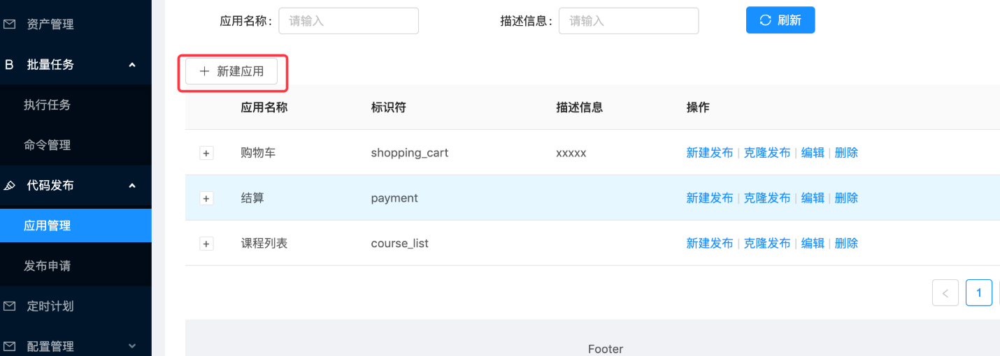


配置部署的环境与Git仓库地址，同时设置是否在发布成功或事变时设置结果通知。

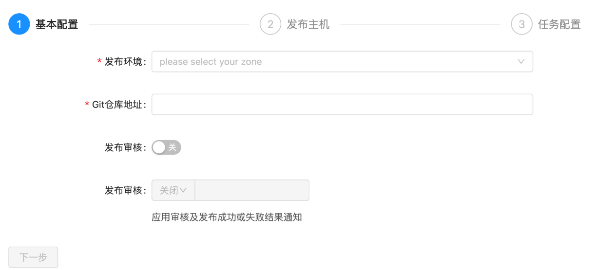


由于我们进行代码发布的时候，需要选择环境(测试环境、运营环境等等)，来区分我们本次将代码发布到什么环境的主机。


环境是针对公司内部的资产根据实际业务进行再次划分的单位。会存在1个服务器，在不同的时间属于多个不同的环境，一个环境有可能配套了多个企业资产。


## 软件安装

### jetkins

官网地址：https://www.jenkins.io/zh/

安装文档：https://www.jenkins.io/zh/doc/book/installing/


#### 系统要求

最低推荐配置:

- 256MB可用内存（JVM）
- 1GB可用磁盘空间(作为一个[Docker](https://www.jenkins.io/zh/doc/book/installing/#docker)容器运行jenkins的话推荐10GB)

为小团队推荐的硬件配置：

- 1GB+可用内存
- 50 GB+ 可用磁盘空间

软件配置:

- Java 8—无论是Java运行时环境（JRE）还是Java开发工具包（JDK）都可以。

**注意:** 如果将Jenkins作为Docker 容器运行，这不是必需的。


#### 版本说明

jenkins实际上由2个发布版本，分别是：**LTS**（长期支持版本）与 **Weekly**（普通发行版本）。

| 版本号          | 描述                                                         |
| --------------- | ------------------------------------------------------------ |
| 稳定版 (LTS)    | LTS (长期支持) 版本每12周从常规版本流中选择，作为该时间段的稳定版本。<br> 每隔 4 周，我们会发布稳定版本，其中包括错误和安全修复反向移植。 |
| 定期发布 (每周) | 每周都会发布一个新版本，为用户和插件开发人员提供错误修复和功能。 |

这里，我们直接开发使用 稳定版 (LTS) 。


#### 安装

docker-compose安装jetkins，docker-compose.yaml，代码：

```yaml
version: '3.7'
services:
  jenkins:
    image: 'jenkins/jenkins:lts-jdk11'
    container_name: jenkins
    restart: always
    user: root
    environment:
      - TZ=Asia/Shanghai
    ports:
      - '8888:8080'
      - '5000:50000'
    volumes:
      - './data/jenkins:/var/jenkins_home'
```

注释版：

```yaml
version: '3.7'   # docker-compose版本，目前最新版本是3.9版本，此处我们使用3.7即可。
services:          # 容器服务列表，一个docker-complse.yaml文件中只能有一个services
  jenkins:         # 服务名
    image: 'jenkins/jenkins:lts-jdk11'   # 当前容器的基础镜像
    container_name: jenkins   # 容器名
    restart: always                   # 设置开机自启，注意：如果公司安装的不是docker，而是podman的话。podman是没有这个配置的，如果要设置容器开机自启，只能借助python的supervisor这样的进程管理器来启动。
    user: root                          # 以root用户身份启动容器
    environment:                    # 容器内系统环境变量。
      - TZ=Asia/Shanghai       # 设置时区和国际化本地化
    ports:                                # 容器内部与宿主机之间的端口映射： 宿主机端口:容器端口
      - '8888:8080'
      - '5000:50000'                # 如果是windows下使用docker-desktop要调整50000端口为其他端口，因为50000被windows虚拟机hyper-V占用了。linux或macOS没这个问题
    volumes:                          # 逻辑卷配置，设置目录映射：宿主机路径: 容器内部路径
      - './data/jenkins:/var/jenkins_home'
```

拉取镜像启动docker容器（注意：要保证当前开发电脑上已经安装了docker、docker-compose，docker-compose依赖于python环境）。

```bash
# cd 项目根目录下，创建上面的 docker-compose.yaml
docker-compose up -d

# 如果要关闭当前docker-compose.yaml中所有的容器服务，则可以使用
docker-compose down

# 如果要查看某个容器运行过程中的日志
docker logs <容器名>
# 监控容器的日志
docker logs -f <容器名>
```


安装完成以后，等待2分钟左右，可以通过浏览器访问`http://127.0.0.1:8888`(如果你设置的也是这个端口的话)访问jenkins的管理站点。效果如下：

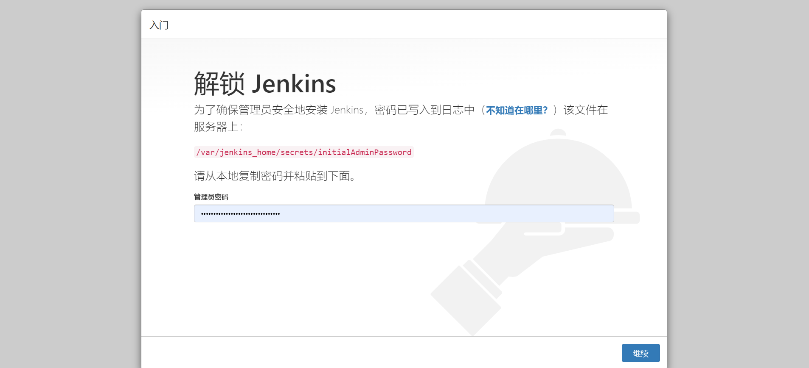

按界面中所说，进入找到容器内部`/var/jenkins_home`目录的映射路径`./data/jenkins`目录下的初始化密码文件复制密码，点击"继续"。


登陆后续界面如下：


建议选择“安装推荐的插件”，若插件安装失败，多试几次即可)，当然，也可以选择右边的自定义插件安装，先选择不安装插件，先进去也可以。


插件下载较慢是由于插件源服务器在国外，可以根据以下教程切换插件源服务器地址改成国内的。

当然也可以一直重试到下载完成为止。

>更换为国内插件源
>
>**方式1：**
>
>选择右边的自定义插件安装，先选择不安装插件，在配置管理员账号进入到jenkins管理页面时，点击"Manage Jenkins"--->"Manage Plugins"--->"Advanced"
>
>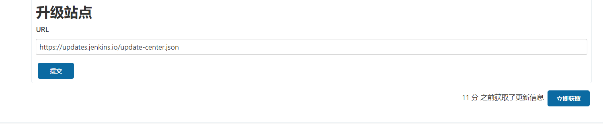
>
>将上图的URL地址改为清华源并点击提交即可：https://mirrors.tuna.tsinghua.edu.cn/jenkins/updates/update-center.json
>
>**方式2：**
>
>更改配置文件（`jenkins_home/updates/default.json`），我们现在的jenkins应用安装在docker并做了数据映射，因此直接在宿主机下进行修改即可。
>
>
>
>因为default.json配置文件配置内容较多，修改的地址也很多，因此建议使用代码编辑器替换（Ctrl+H/Ctrl+R）或者`使用sed命令`进行替换：
>
>sed -i 's#https://updates.jenkins.io/download#https://mirrors.tuna.tsinghua.edu.cn/jenkins#g' default.json && sed -i 's#http://www.google.com#https://www.baidu.com#g' default.json
>
>完成以后，重启jenkins即可。

安装完成以后，创建管理员。

>注意：
>
>老师不知道各位同学的密码！！！自己设置的麻烦自己记一下哈。

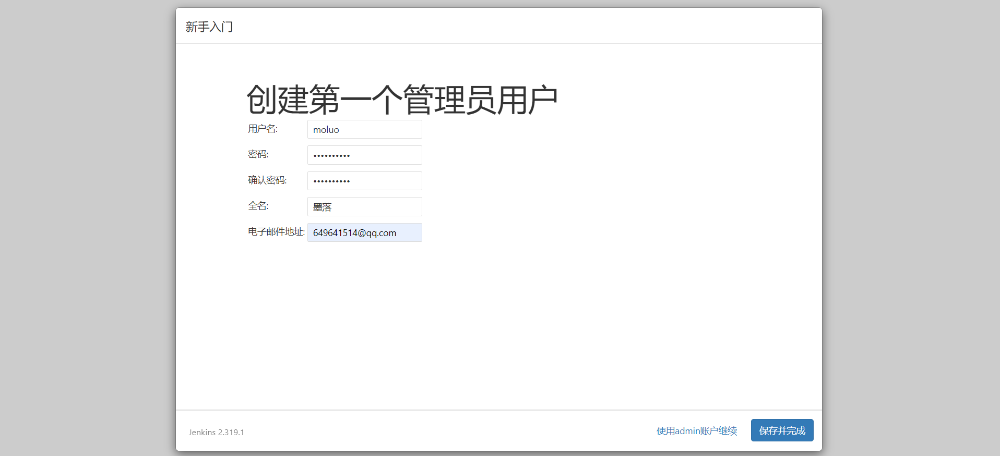


实例配置，默认点击继续即可。


配置完成！

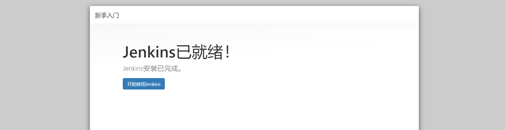


进入主界面，以后登陆的界面如下：


在前面如果没有选择安装推荐的插件，而是选择自定义安装而没有安装插件的同学，可以`系统管理`->`插件管理`处，进行插件的安装与卸载操作。常用的插件：git、pipeline、Blue Ocean、Allure等等。


#### 基本使用

接下来，我们快速使用jenkins来完成一个工程（就是一个项目的CI构建流程）。


填写任务名称，并勾选默认插件，此处我们选择第一个"freestyle project"。


上面的操作项目于创建了一个项目工程的发布流程。


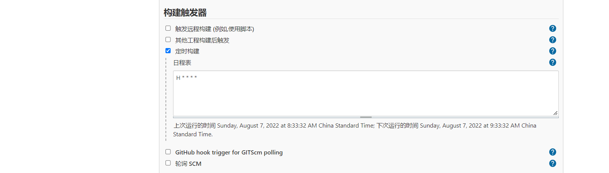


保存成功以后，可以在demo工程的管理菜单左侧选择立即构建。


等待以后，可以点击查看构建历史：


查看构建过程中的控制台输出。

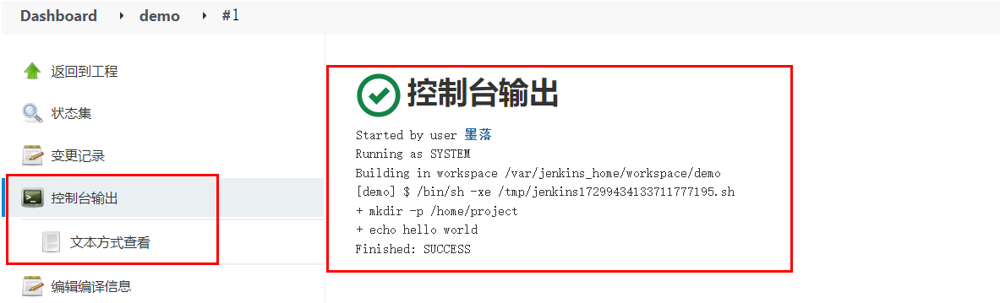


#### 系统配置

##### 中文支持

默认是没有该配置的，需要安装额外安装中文扩展插件。安装中文扩展，等待jenkins重启。


重启完成以后，如果出现部分页面翻译一半的情况，可以打开系统设置，找到Locale选项，设置中文，接着访问http://127.0.0.1:8888/restart进行重启。


##### 凭据管理

所谓的凭据就是当前jenkins所在服务器对远程服务器节点进行操作的登陆凭证（可以是账号密码，也可以是sshkey）


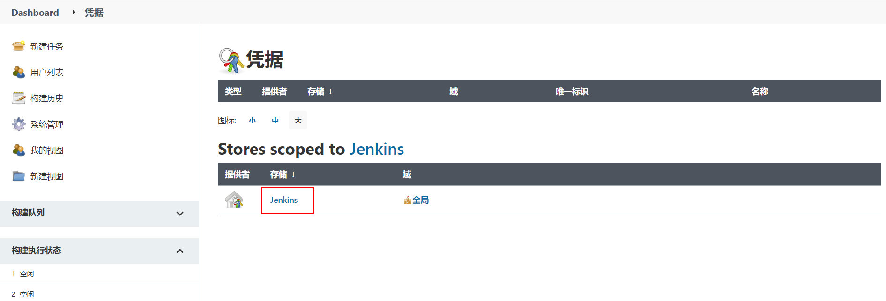


##### 节点管理

节点（node），实际上就是jenkins用于在分布式主机下执行构建任务的服务器。

点击进入节点管理功能。


右侧是节点名称。点击左侧红框位置可以新建节点。

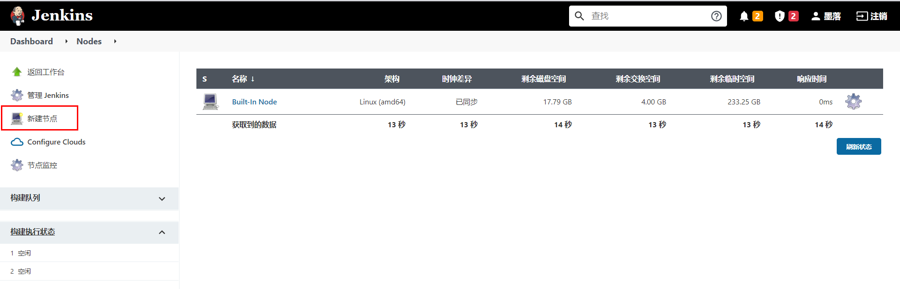


节点名称，可以自定义的名称，但最好将远程服务器的ip地址或者计算机名填上，便于后期维护查看。

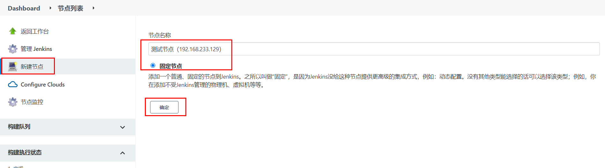


节点连接配置


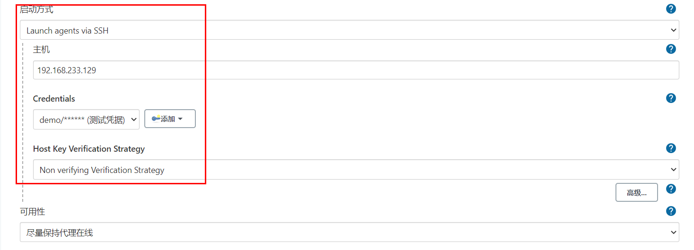

在节点对应的服务器上，使用`which git`，可以查看git命令的路径位置。

使用`echo $JAVE_HOME`，可以查看java的工作目录。

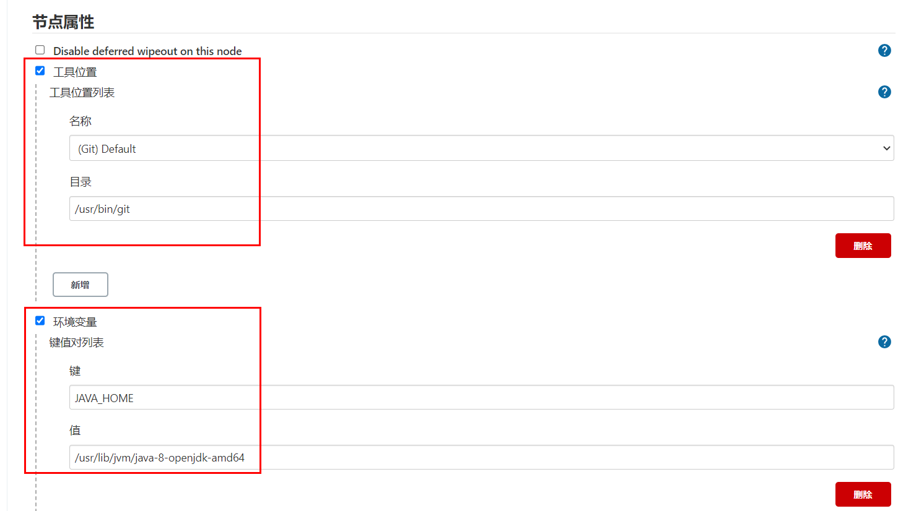

完成上面配置以后，点击"保存"。

并在新建节点对应的服务器（也就是上面添加的192.168.233.129）修改jenkins工作目录的权限并为jenkins设置java链接文件。

```bash
# 这里 /var/jenkins/workspace 为上述步骤设置的节点的工作目录
sudo mkdir -p /var/jenkins/workspace/jdk/bin/

sudo chown -P moluo:moluo /var/jenkins

which java
#  which java 命令的结果，/usr/bin/java，然后创建软连接
sudo ln -s /usr/bin/java /var/jenkins/workspace/jdk/bin/java
```

节点配置成功。

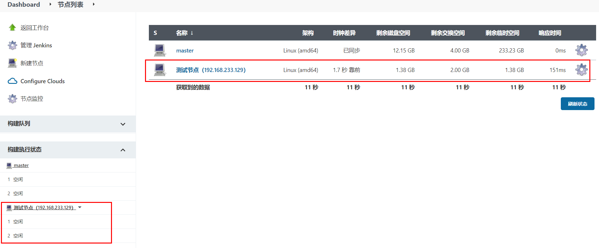


#### 用户管理

在jenkins安装完成以后，默认需要创建了一个超级管理员。但是在企业开发中，肯定不是所有人都使用超管账号的，而且不同的团队人员，能使用jenkins的功能权限应该也是不一样的。所以需要进行用户的账号分配以及权限分配。

从系统配置中点击全局安全配置，设置开启用户管理。


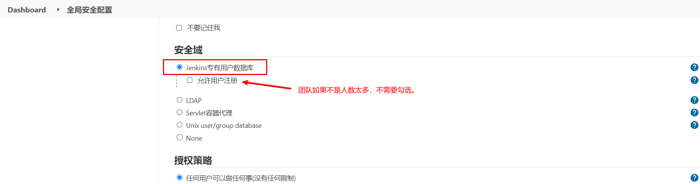

点击进入用户管理功能。


点击"新建用户"


删除用户。


指定用户分配权限。


#### 通知配置

jenkins在构建任务完成以后，可以设置结果通知的。它支持邮件通知、企业微信、钉钉等等，但是都需要安装插件才可以使用。

这里，我们使用邮件通知看下jenkins的通知效果。


##### 安装插件

进入系统管理->插件管理->可选插件，安装Email Extension Template、Email Extension Plugin和Build Timestamp插件


安装等待jenkins重启。


在系统配置->设置邮件发送人的邮箱地址。


开启构建任务完成以后的邮件发送规则。


配置邮件通知。

登陆要使用的SMTP服务器所在的站点配置，设置第三方邮件发送服务。

SMTP（简单邮件发送协议，Simple Mail Transfer Protocol）服务器，就是邮件服务器所在的网关地址。


完成上面配置以后，可以通过点击"**通过发送测试邮件测试配置**"进行发送测试邮件，验证上面的配置是否正确！


##### 配置邮件模板内容

进入系统管理 - 系统配置，配置获取的时间戳格式 用于发送邮件时获取log和html报告为邮件附件


配置发送邮件账号与邮件类型


设置默认收件、邮件标题和邮件内容


jenkins提供的邮件发送变量

| 变量名        | 描述                        |
| ------------- | --------------------------- |
| $PROJECT_NAME | 构建任务的项目名（job名称） |
| $BUILD_NUMBER | 构建任务的编号ID            |
| $BUILD_STATUS | 构建任务的结果              |
| $CAUSE        | 构建任务的失败原因          |
| $PROJECT_URL  | 构建任务的详情URL地址       |

default content（默认邮件模板）：

```html
<!DOCTYPE html>
<html>
<head>
<meta charset="UTF-8">
<title>${PROJECT_NAME}-第${BUILD_NUMBER}次构建日志</title>
</head>
<body leftmargin="8" marginwidth="0" topmargin="8" marginheight="4" offset="0">
    <table width="95%" cellpadding="0" cellspacing="0"  style="font-size: 11pt; font-family: Tahoma, Arial, Helvetica, sans-serif">
        <tr>本邮件由jenkins系统自动发出，无需回复，以下为${PROJECT_NAME }项目构建信息</br>
            <td><font color="#CC0000">构建结果 - ${BUILD_STATUS}</font></td>
        </tr>
        <tr>
            <td><br />
            <b><font color="#0B610B">构建信息</font></b>
            <hr size="2" width="100%" align="center" /></td>
        </tr>
        <tr>
            <td>
                <ul>
                    <li>项目名称：${PROJECT_NAME}</li>
                    <li>构建编号：第${BUILD_NUMBER}次构建</li>
                    <li>触发原因：${CAUSE}</li>
                    <li>构建状态：${BUILD_STATUS}</li>
                    <li>项目URL：<a href="${PROJECT_URL}">${PROJECT_URL}</a></li>
                    <li>工作目录：<a href="${PROJECT_URL}ws">${PROJECT_URL}ws</a></li>
                    <li>构建URL：<a href="${BUILD_URL}">${BUILD_URL}</a></li>
                    <li>构建日志： <a href="${BUILD_URL}console">${BUILD_URL}console</a></li>
                    <li>测试报告：<a href="${BUILD_URL}HTML_20Report/">${BUILD_URL}HTML_20Report/</a></li>
                </ul>
                <h4><font color="#0B610B">失败用例</font></h4>
                <hr size="2" width="100%" />$FAILED_TESTS<br/>
                <h4><font color="#0B610B">最近提交版本(git：$GIT_REVISION)</font></h4>
                <hr size="2" width="100%" />
                <ul>
                ${CHANGES_SINCE_LAST_SUCCESS, reverse=true, format="%c", changesFormat="<li>%d[%a] %m</li>"}
                </ul>
                    详细提交: <a href="${PROJECT_URL}changes">${PROJECT_URL}changes</a><br/>
            </td>
        </tr>
    </table>
</body>
</html>
```


Default Triggers（发送邮件的触发规则）：


注：配置完成后可通过发送测试邮件是否配置正确。


### Gitlab

gitlab是一个类似github/giree的源码托管平台，是一个开源项目，经常在企业中用于构建私有git仓库，托管企业内部的项目源代码，支持使用http以及ssh协议进行源码管理，支持使用svn/git源码管理工具。

官方地址：https://gitlab.com/

#### 使用docker-compose安装Gitlab

docker-compose.yaml，代码：

```yaml
version: '3.7'
services:
  gitlab:
    image: 'gitlab/gitlab-ce:latest' # gitlab的镜像，如果已经有了，指定自己的镜像版本即可
    container_name: gitlab # 生成的docker容器的名字
    restart: always
    environment:
      GITLAB_OMNIBUS_CONFIG: |
        external_url 'http://192.168.101.8:8993' # 此处填写所在服务器ip若有域名可以写域名
        gitlab_rails['gitlab_shell_ssh_port'] = 2224
    ports:
      - '8993:8993' # 此处端口号须与 external_url 中保持一致，左边和右边都要一样
      - '2224:22' # 这里的2224和上面的2224一致，但是右边必须是22，不能是其他
    volumes:
      #将相关配置映射到当前目录下的config目录
      - './conf/gitlab:/etc/gitlab'
      #将日志映射到当前目录下的logs目录
      - './logs/gitlab:/var/log/gitlab'
      #将数据映射到当前目录下的data目录
      - './data/gitlab:/var/opt/gitlab'

  jenkins:
    image: 'jenkins/jenkins:lts-jdk11'
    container_name: jenkins
    restart: always
    user: root
    environment:
      - TZ=Asia/Shanghai
    ports:
      - '8888:8080'
      - '5000:50000'
    volumes:
      - './data/jenkins:/var/jenkins_home'
```

终端下关闭原来的jenkins，并重启启动两个容器即可。

```bash
docker-compose down 
docker-compose up -d
```

gitlab容器启动以后，需要等待几分钟，接着在浏览器访问登陆地址：http://192.168.101.8:8993/

首次登陆需要创建一个管理员账号。


#### 基本使用

>注意：
>
>老师不知道各位同学的密码！！！自己设置的麻烦自己记一下哈。

刚安装完成的gitlab默认已经内置了一个超级管理员root，密码保存在文件配置目录下initial_root_password文件中。


直接使用上面的账号和密码登陆即可。


登陆成功以后，配置中文界面。


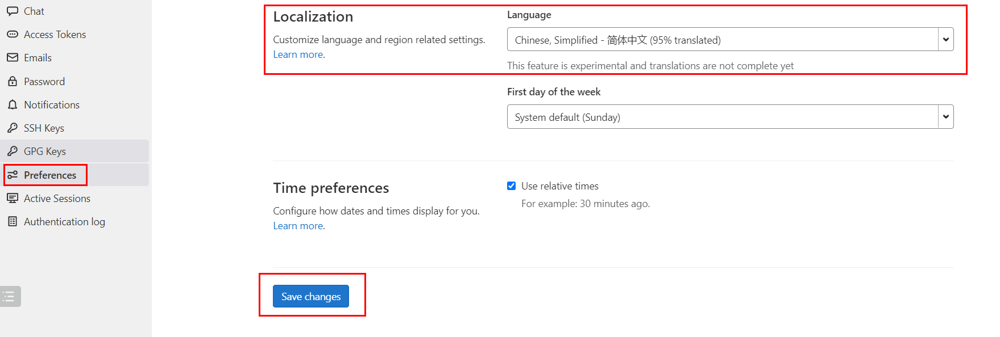


## API调用

不管是jenkins还是gitlab实际上都提供了外界操作的http api接口给开发者进行远程调用的。

Gitlab RestAPI 文档：http://192.168.101.8:8993/help/api/api_resources.md

要使用Gitlab RestAPI需要配置访问令牌。


有了令牌，就可以通过postman或者编程代码，使用http请求操作gitlab了。


jenkins RestAPI：http://127.0.0.1:8888/api/

访问格式：http://账号:密码@服务端地址:端口/job/任务名/build

jenkins状态的API：http://127.0.0.1:8888/api/json?pretty=true


