# 六 代码发布

在接下来的学习中，我们要在我们的运维平台上添加代码发布功能，实际上就是要实现一套自动化项目构建与部署方案。


## 发布方案

### 传统代码发布

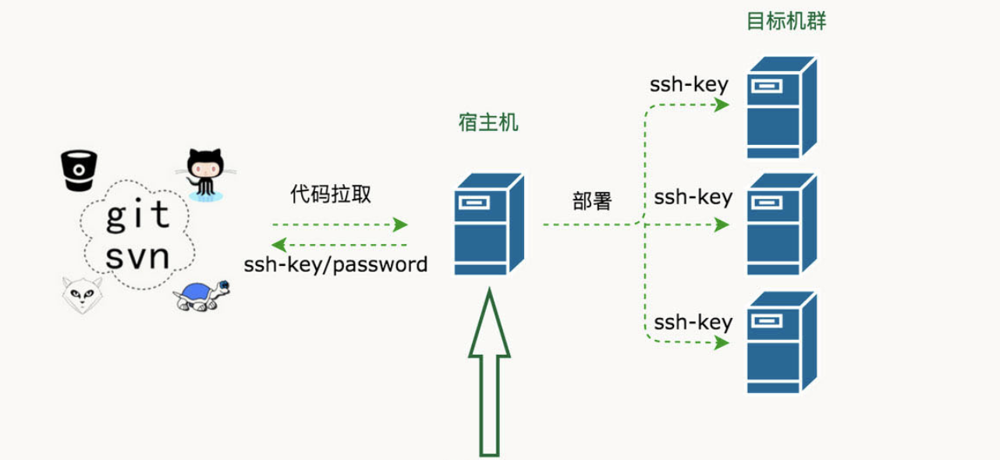


+ 开发者开发代码，开发完毕后将代码打包，提交给运维人员Ops
+ 运维人员获取包，手工将包部署到对应的环境Env当中
+ 运维人员部署完毕后，通知测试人员环境部署完毕
+ 测试人员开始进行测试，测试对应功能是否正确，进行缺陷管理
+ 测试完毕后若有Bug，开发进行修复，修复后则重新开始进行步骤1的操作
+ 所以缺陷修复并测试通过后，项目发布上线

在这个过程当中，开发团队开发编码，打包提交，但没有以常规、可重复的方式安装/部署产品。因此在整个周期中，安装/部署任务（以及其它支持任务）就会留给了运维团队来负责，而运维人员部署完成以后才通知测试人员进行测试，这经常导致很多混乱和问题，因为运维团队在后期才开始介入，并且必须在短时间内完成工作。同样开发团队也会因为这种模式而经常处于不利地位 （因为开发人员没有充分测试产品的安装/部署功能），这往往导致开发团队和运维团队、测试团队之间严重脱节和缺乏合作。


这种情况在中国开发行业中持续了很久，直到2006年，在中国软件产业发展高峰论坛上迎来了一位便捷开发布道师——[**Martin Fowler（马丁·福勒）**](https://baike.baidu.com/item/%E9%A9%AC%E4%B8%81%C2%B7%E7%A6%8F%E5%8B%92/3107032)，他在发表演讲时提到了一个让人无法理解的事情：“原本为期需要8个月构建交付的项目，只需要两个月时就已经上线，并开始向客户收钱了。”，以此把敏捷开发的最佳实现方案-持续集成这个概念引入了中国。


**持续集成指的是，频繁地（一天多次）将代码集成到主干。**

> **持续集成好处主要有两点：
>
> （1）快速发现错误。每完成一点更新，就集成到主干，可以快速发现错误，定位错误也比较容易。
>
> （2）防止分支大幅偏离主干。如果不是经常集成，主干又在不断更新，会导致以后集成的难度变大，甚至难以集成。**集成地狱**

**持续集成的目的，就是让产品可以快速迭代，同时还能保持高质量。**它的核心措施是，代码集成到主干之前，必须通过自动化测试，自动化部署。只要有一个测试用例失败，就不能集成。

Martin Fowler说过，"持续集成并不能消除Bug，而是让它们非常容易发现和改正。"


### 自动化部署-CI/CD

CI/CD 的核心概念是持续集成（Continuous Integration）、持续交付（Continuous Delivery）与持续部署（Continuous Deployment），它实现了从开发、编译、测试、发布、部署自动化的一套自动化构建的流程。


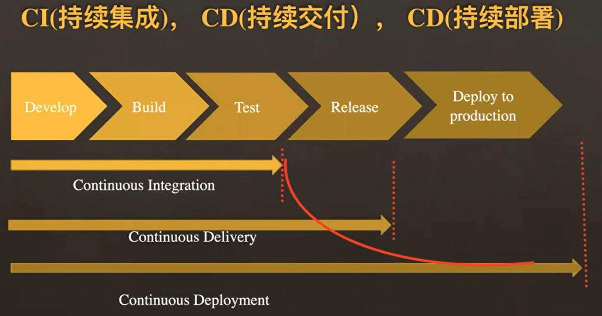


持续集成（CI）是在源代码变更后自动检测、拉取、构建和（在大多数情况下）进行单元测试的过程，持续集成的目标是**快速确保开发人员新提交的变更是好的，并且适合在代码库中进一步使用**。持续集成的基本思想是让一个自动化过程监测一个或多个源代码仓库是否有变更。当变更被推送到仓库时，它会监测到更改、下载副本、构建并运行任何相关的单元测试。

监测程序通常是像 [Jenkins](https://jenkins.io/) 这样的应用程序，它还协调管道中运行的所有（或大多数）进程，监视变更是其功能之一。监测程序可以以几种不同方式监测变更。这些包括：

- **轮询**：监测程序反复询问代码管理系统，当代码管理系统有新的变更时，监测程序会“唤醒”并完成其工作以获取新代码并构建/测试它。
- **定期**：监测程序配置为定期启动构建，无论源码是否有变更。理想情况下，如果没有变更，则不会构建任何新内容，因此这不会增加额外的成本。
- **推送**：这与用于代码管理系统检查的监测程序相反。在这种情况下，代码管理系统被配置为提交变更到仓库时将“推送”一个通知到监测程序。最常见的是，这可以以 webhook 的形式完成 —— 在新代码被推送时一个挂勾hook的程序通过互联网向监测程序发送通知。为此，监测程序必须具有可以通过网络接收 webhook 信息的开放端口。

持续交付（CD）通常是指整个流程链（管道），它自动监测源代码变更并通过构建、测试、打包和相关操作运行它们以生成可部署的版本，基本上没有任何人为干预。持续交付的目标是**自动化、效率、可靠性、可重复性和质量保障（通过持续测试CT）**，持续交付包含持续集成（自动检测源代码变更、执行构建过程、运行单元测试以验证变更），持续测试（对代码运行各种测试以保障代码质量），和（可选）持续部署（通过管道发布版本自动提供给用户）。


持续部署（CD）是指能够自动提供持续交付管道中发布版本给最终用户使用的想法。根据用户的安装方式，可能是在云环境中自动部署、app 升级（如手机上的应用程序）、更新网站或只更新可用版本列表。


## CI/CD部署流程


实现效果图：

所谓的应用，实际上代表的就是我们要远程发布的代码的项目版本或者项目中的一个功能代码版本。


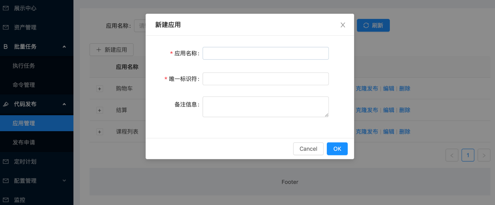


配置部署的环境与Git仓库地址，同时设置是否在发布成功或事变时设置结果通知。


由于我们进行代码发布的时候，需要选择环境(测试环境、运营环境等等)，来区分我们本次将代码发布到什么环境的主机。


环境是针对公司内部的资产根据实际业务进行再次划分的单位。会存在1个服务器，在不同的时间属于多个不同的环境，一个环境有可能配套了多个企业资产。


## 软件安装

### jetkins

官网地址：https://www.jenkins.io/zh/

安装文档：https://www.jenkins.io/zh/doc/book/installing/


#### 系统要求

最低推荐配置:

- 256MB可用内存（JVM）
- 1GB可用磁盘空间(作为一个[Docker](https://www.jenkins.io/zh/doc/book/installing/#docker)容器运行jenkins的话推荐10GB)

为小团队推荐的硬件配置：

- 1GB+可用内存
- 50 GB+ 可用磁盘空间

软件配置:

- Java 8—无论是Java运行时环境（JRE）还是Java开发工具包（JDK）都可以。

**注意:** 如果将Jenkins作为Docker 容器运行，这不是必需的。


#### 版本说明

jenkins实际上由2个发布版本，分别是：**LTS**（长期支持版本）与 **Weekly**（普通发行版本）。

| 版本号          | 描述                                                         |
| --------------- | ------------------------------------------------------------ |
| 稳定版 (LTS)    | LTS (长期支持) 版本每12周从常规版本流中选择，作为该时间段的稳定版本。<br> 每隔 4 周，我们会发布稳定版本，其中包括错误和安全修复反向移植。 |
| 定期发布 (每周) | 每周都会发布一个新版本，为用户和插件开发人员提供错误修复和功能。 |

这里，我们直接开发使用 稳定版 (LTS) 。


#### 安装

docker-compose安装jetkins，docker-compose.yaml，代码：

```yaml
version: '3.7'
services:
  jenkins:
    image: 'jenkins/jenkins:lts-jdk11'
    container_name: jenkins
    restart: always
    user: root
    environment:
      - TZ=Asia/Shanghai
    ports:
      - '8888:8080'
      - '5000:50000'
    volumes:
      - './data/jenkins:/var/jenkins_home'
```

注释版：

```yaml
version: '3.7'   # docker-compose版本，目前最新版本是3.9版本，此处我们使用3.7即可。
services:          # 容器服务列表，一个docker-complse.yaml文件中只能有一个services
  jenkins:         # 服务名
    image: 'jenkins/jenkins:lts-jdk11'   # 当前容器的基础镜像
    container_name: jenkins   # 容器名
    restart: always                   # 设置开机自启，注意：如果公司安装的不是docker，而是podman的话。podman是没有这个配置的，如果要设置容器开机自启，只能借助python的supervisor这样的进程管理器来启动。
    user: root                          # 以root用户身份启动容器
    environment:                    # 容器内系统环境变量。
      - TZ=Asia/Shanghai       # 设置时区和国际化本地化
    ports:                                # 容器内部与宿主机之间的端口映射： 宿主机端口:容器端口
      - '8888:8080'
      - '5000:50000'                # 如果是windows下使用docker-desktop要调整50000端口为其他端口，因为50000被windows虚拟机hyper-V占用了。linux或macOS没这个问题
    volumes:                          # 逻辑卷配置，设置目录映射：宿主机路径: 容器内部路径
      - './data/jenkins:/var/jenkins_home'
```

拉取镜像启动docker容器（注意：要保证当前开发电脑上已经安装了docker、docker-compose，docker-compose依赖于python环境）。

```bash
# cd 项目根目录下，创建上面的 docker-compose.yaml
docker-compose up -d

# 如果要关闭当前docker-compose.yaml中所有的容器服务，则可以使用
docker-compose down

# 如果要查看某个容器运行过程中的日志
docker logs <容器名>
# 监控容器的日志
docker logs -f <容器名>
```


安装完成以后，等待2分钟左右，可以通过浏览器访问`http://127.0.0.1:8888`(如果你设置的也是这个端口的话)访问jenkins的管理站点。效果如下：


按界面中所说，进入找到容器内部`/var/jenkins_home`目录的映射路径`./data/jenkins`目录下的初始化密码文件复制密码，点击"继续"。


登陆后续界面如下：

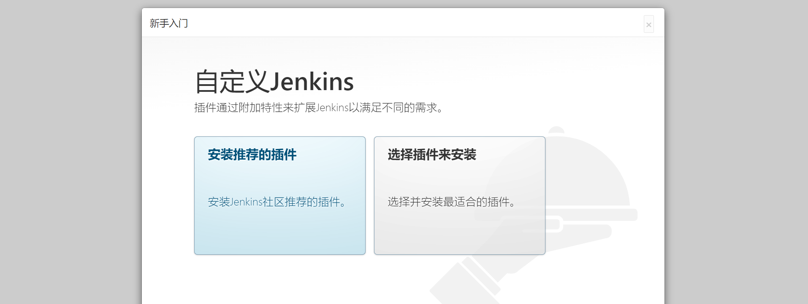


建议选择“安装推荐的插件”，若插件安装失败，多试几次即可)，当然，也可以选择右边的自定义插件安装，先选择不安装插件，先进去也可以。

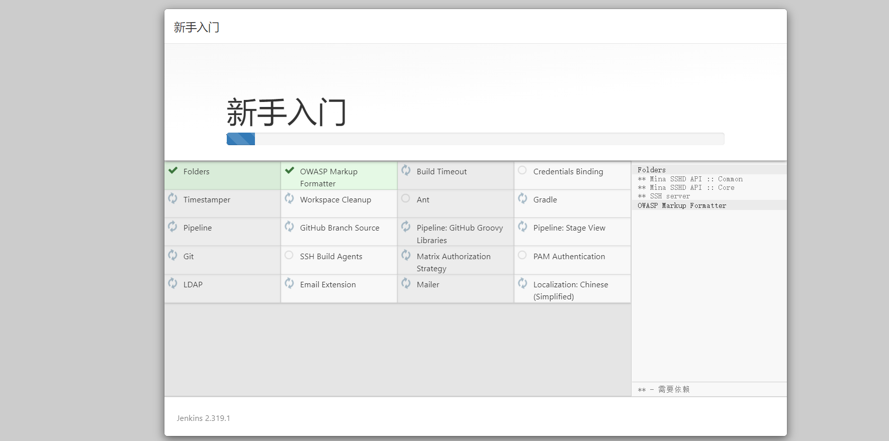


插件下载较慢是由于插件源服务器在国外，可以根据以下教程切换插件源服务器地址改成国内的。

当然也可以一直重试到下载完成为止。

>更换为国内插件源
>
>**方式1：**
>
>选择右边的自定义插件安装，先选择不安装插件，在配置管理员账号进入到jenkins管理页面时，点击"Manage Jenkins"--->"Manage Plugins"--->"Advanced"
>
>
>
>将上图的URL地址改为清华源并点击提交即可：https://mirrors.tuna.tsinghua.edu.cn/jenkins/updates/update-center.json
>
>**方式2：**
>
>更改配置文件（`jenkins_home/updates/default.json`），我们现在的jenkins应用安装在docker并做了数据映射，因此直接在宿主机下进行修改即可。
>
>
>
>因为default.json配置文件配置内容较多，修改的地址也很多，因此建议使用代码编辑器替换（Ctrl+H/Ctrl+R）或者`使用sed命令`进行替换：
>
>sed -i 's#https://updates.jenkins.io/download#https://mirrors.tuna.tsinghua.edu.cn/jenkins#g' default.json && sed -i 's#http://www.google.com#https://www.baidu.com#g' default.json
>
>完成以后，重启jenkins即可。

安装完成以后，创建管理员。

>注意：
>
>老师不知道各位同学的密码！！！自己设置的麻烦自己记一下哈。


实例配置，默认点击继续即可。


配置完成！


进入主界面，以后登陆的界面如下：

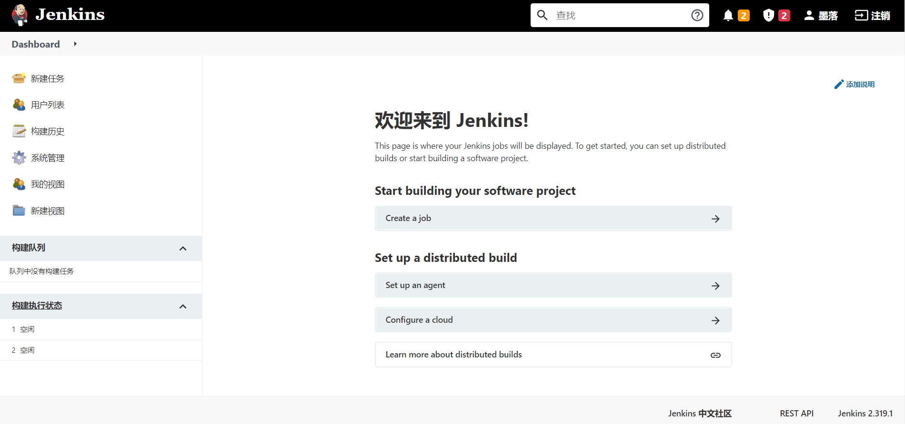

在前面如果没有选择安装推荐的插件，而是选择自定义安装而没有安装插件的同学，可以`系统管理`->`插件管理`处，进行插件的安装与卸载操作。常用的插件：git、pipeline、Blue Ocean、Allure等等。


#### 基本使用

接下来，我们快速使用jenkins来完成一个工程（就是一个项目的CI构建流程）。


填写任务名称，并勾选默认插件，此处我们选择第一个"freestyle project"。

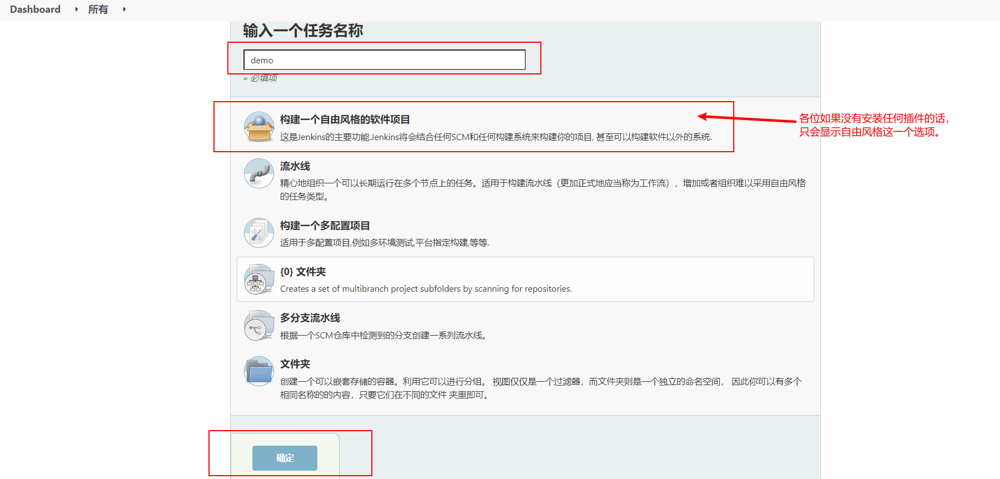

上面的操作项目于创建了一个项目工程的发布流程。


保存成功以后，可以在demo工程的管理菜单左侧选择立即构建。

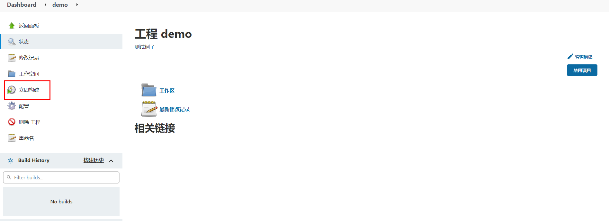

等待以后，可以点击查看构建历史：


查看构建过程中的控制台输出。


#### 系统配置

##### 中文支持

默认是没有该配置的，需要安装额外安装中文扩展插件。安装中文扩展，等待jenkins重启。

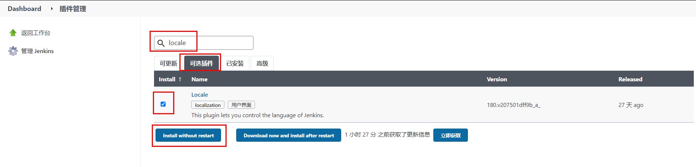


重启完成以后，如果出现部分页面翻译一半的情况，可以打开系统设置，找到Locale选项，设置中文，接着访问http://127.0.0.1:8888/restart进行重启。


##### 凭据管理

所谓的凭据就是当前jenkins所在服务器对远程服务器节点进行操作的登陆凭证（可以是账号密码，也可以是sshkey）


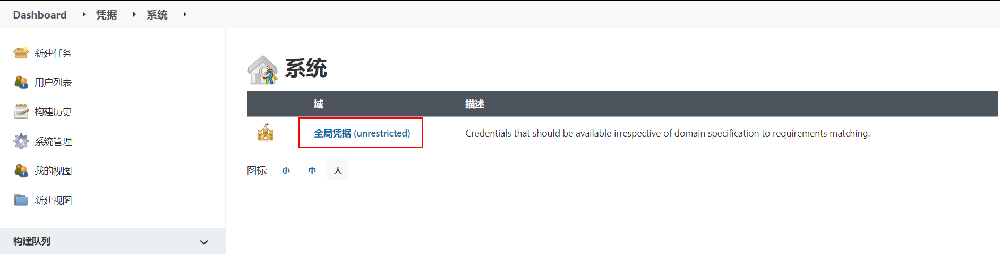


##### 节点管理

节点（node），实际上就是jenkins用于在分布式主机下执行构建任务的服务器。

点击进入节点管理功能。


右侧是节点名称。点击左侧红框位置可以新建节点。


节点名称，可以自定义的名称，但最好将远程服务器的ip地址或者计算机名填上，便于后期维护查看。


节点连接配置


在节点对应的服务器上，使用`which git`，可以查看git命令的路径位置。

使用`echo $JAVE_HOME`，可以查看java的工作目录。


完成上面配置以后，点击"保存"。

并在新建节点对应的服务器（也就是上面添加的192.168.233.129）修改jenkins工作目录的权限并为jenkins设置java链接文件。

```bash
# 这里 /var/jenkins/workspace 为上述步骤设置的节点的工作目录
sudo mkdir -p /var/jenkins/workspace/jdk/bin/

sudo chown -P moluo:moluo /var/jenkins

which java
#  which java 命令的结果，/usr/bin/java，然后创建软连接
sudo ln -s /usr/bin/java /var/jenkins/workspace/jdk/bin/java
```

节点配置成功。


#### 用户管理

在jenkins安装完成以后，默认需要创建了一个超级管理员。但是在企业开发中，肯定不是所有人都使用超管账号的，而且不同的团队人员，能使用jenkins的功能权限应该也是不一样的。所以需要进行用户的账号分配以及权限分配。

从系统配置中点击全局安全配置，设置开启用户管理。


点击进入用户管理功能。


点击"新建用户"


删除用户。

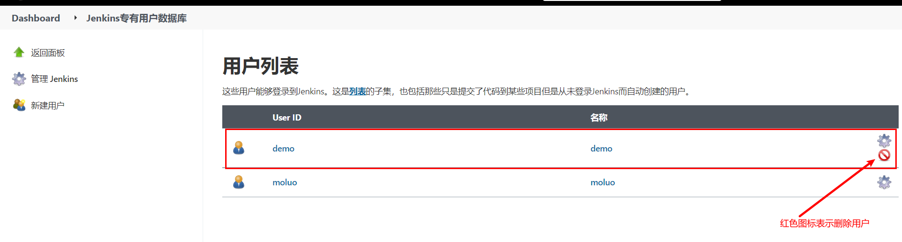

指定用户分配权限。


#### 通知配置

jenkins在构建任务完成以后，可以设置结果通知的。它支持邮件通知、企业微信、钉钉等等，但是都需要安装插件才可以使用。

这里，我们使用邮件通知看下jenkins的通知效果。


##### 安装插件

进入系统管理->插件管理->可选插件，安装Email Extension Template、Email Extension Plugin和Build Timestamp插件


安装等待jenkins重启。


在系统配置->设置邮件发送人的邮箱地址。


开启构建任务完成以后的邮件发送规则。


配置邮件通知。

登陆要使用的SMTP服务器所在的站点配置，设置第三方邮件发送服务。

SMTP（简单邮件发送协议，Simple Mail Transfer Protocol）服务器，就是邮件服务器所在的网关地址。

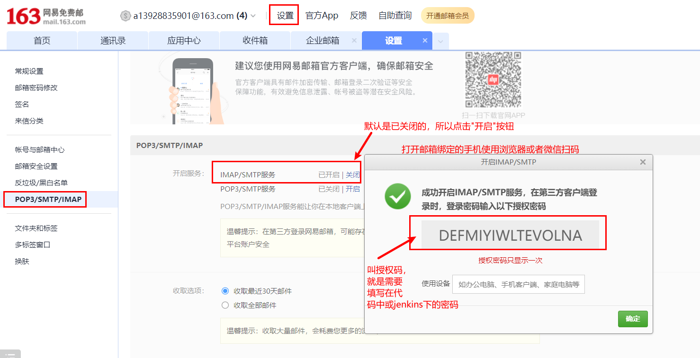


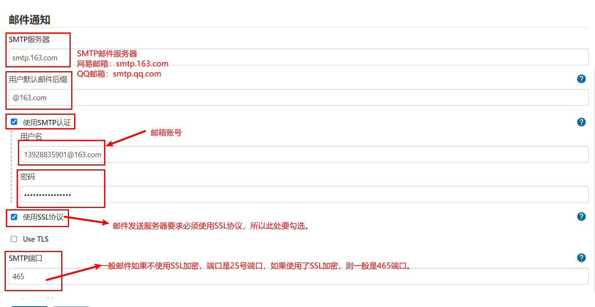


完成上面配置以后，可以通过点击"**通过发送测试邮件测试配置**"进行发送测试邮件，验证上面的配置是否正确！


##### 配置邮件模板内容

进入系统管理 - 系统配置，配置获取的时间戳格式 用于发送邮件时获取log和html报告为邮件附件


配置发送邮件账号与邮件类型


设置默认收件、邮件标题和邮件内容


jenkins提供的邮件发送变量

| 变量名        | 描述                        |
| ------------- | --------------------------- |
| $PROJECT_NAME | 构建任务的项目名（job名称） |
| $BUILD_NUMBER | 构建任务的编号ID            |
| $BUILD_STATUS | 构建任务的结果              |
| $CAUSE        | 构建任务的失败原因          |
| $PROJECT_URL  | 构建任务的详情URL地址       |

default content（默认邮件模板）：

```html
<!DOCTYPE html>
<html>
<head>
<meta charset="UTF-8">
<title>${PROJECT_NAME}-第${BUILD_NUMBER}次构建日志</title>
</head>
<body leftmargin="8" marginwidth="0" topmargin="8" marginheight="4" offset="0">
    <table width="95%" cellpadding="0" cellspacing="0"  style="font-size: 11pt; font-family: Tahoma, Arial, Helvetica, sans-serif">
        <tr>本邮件由jenkins系统自动发出，无需回复，以下为${PROJECT_NAME }项目构建信息</br>
            <td><font color="#CC0000">构建结果 - ${BUILD_STATUS}</font></td>
        </tr>
        <tr>
            <td><br />
            <b><font color="#0B610B">构建信息</font></b>
            <hr size="2" width="100%" align="center" /></td>
        </tr>
        <tr>
            <td>
                <ul>
                    <li>项目名称：${PROJECT_NAME}</li>
                    <li>构建编号：第${BUILD_NUMBER}次构建</li>
                    <li>触发原因：${CAUSE}</li>
                    <li>构建状态：${BUILD_STATUS}</li>
                    <li>项目URL：<a href="${PROJECT_URL}">${PROJECT_URL}</a></li>
                    <li>工作目录：<a href="${PROJECT_URL}ws">${PROJECT_URL}ws</a></li>
                    <li>构建URL：<a href="${BUILD_URL}">${BUILD_URL}</a></li>
                    <li>构建日志： <a href="${BUILD_URL}console">${BUILD_URL}console</a></li>
                    <li>测试报告：<a href="${BUILD_URL}HTML_20Report/">${BUILD_URL}HTML_20Report/</a></li>
                </ul>
                <h4><font color="#0B610B">失败用例</font></h4>
                <hr size="2" width="100%" />$FAILED_TESTS<br/>
                <h4><font color="#0B610B">最近提交版本(git：$GIT_REVISION)</font></h4>
                <hr size="2" width="100%" />
                <ul>
                ${CHANGES_SINCE_LAST_SUCCESS, reverse=true, format="%c", changesFormat="<li>%d[%a] %m</li>"}
                </ul>
                    详细提交: <a href="${PROJECT_URL}changes">${PROJECT_URL}changes</a><br/>
            </td>
        </tr>
    </table>
</body>
</html>
```


Default Triggers（发送邮件的触发规则）：


注：配置完成后可通过发送测试邮件是否配置正确。


### Gitlab

gitlab是一个类似github/giree的源码托管平台，是一个开源项目，经常在企业中用于构建私有git仓库，托管企业内部的项目源代码，支持使用http以及ssh协议进行源码管理，支持使用svn/git源码管理工具。

官方地址：https://gitlab.com/


#### 使用docker-compose安装Gitlab

docker-compose.yaml，代码：

```yaml
version: '3.7'
services:
  gitlab:
    image: 'gitlab/gitlab-ce:latest' # gitlab的镜像，如果已经有了，指定自己的镜像版本即可
    container_name: gitlab # 生成的docker容器的名字
    restart: always
    environment:
      GITLAB_OMNIBUS_CONFIG: |
        external_url 'http://192.168.101.8:8993' # 此处填写所在服务器ip若有域名可以写域名
        gitlab_rails['gitlab_shell_ssh_port'] = 2224
    ports:
      - '8993:8993' # 此处端口号须与 external_url 中保持一致，左边和右边都要一样
      - '2224:22' # 这里的2224和上面的2224一致，但是右边必须是22，不能是其他
    volumes:
      #将相关配置映射到当前目录下的config目录
      - './conf/gitlab:/etc/gitlab'
      #将日志映射到当前目录下的logs目录
      - './logs/gitlab:/var/log/gitlab'
      #将数据映射到当前目录下的data目录
      - './data/gitlab:/var/opt/gitlab'

  jenkins:
    image: 'jenkins/jenkins:lts-jdk11'
    container_name: jenkins
    restart: always
    user: root
    environment:
      - TZ=Asia/Shanghai
    ports:
      - '8888:8080'
      - '5000:50000'
    volumes:
      - './data/jenkins:/var/jenkins_home'
```

终端下关闭原来的jenkins，并重启启动两个容器即可。

```bash
docker-compose down 
docker-compose up -d
```

gitlab容器启动以后，需要等待几分钟，接着在浏览器访问登陆地址：http://192.168.101.8:8993/

首次登陆需要创建一个管理员账号。


#### 基本使用

>注意：
>
>老师不知道各位同学的密码！！！自己设置的麻烦自己记一下哈。

刚安装完成的gitlab默认已经内置了一个超级管理员root，密码保存在文件配置目录下initial_root_password文件中。


直接使用上面的账号和密码登陆即可。


登陆成功以后，配置中文界面。


## API调用

不管是jenkins还是gitlab实际上都提供了外界操作的http api接口给开发者进行远程调用的。

Gitlab RestAPI 文档：http://192.168.101.8:8993/help/api/api_resources.md

要使用Gitlab RestAPI需要配置访问令牌。


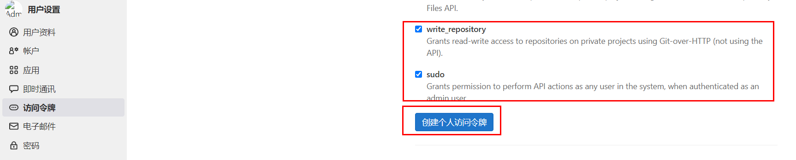


有了令牌，就可以通过postman或者编程代码，使用http请求操作gitlab了。


jenkins RestAPI：http://127.0.0.1:8888/api/

访问格式：http://账号:密码@服务端地址:端口/job/任务名/build

jenkins状态的API：http://127.0.0.1:8888/api/json?pretty=true


### Python调用Gitlab

操作文档：https://python-gitlab.readthedocs.io/en/master/api-usage.html

安装

```bash
pip install python-gitlab
```

#### 基本使用

连接gitlab

```python
import gitlab
url = "http://192.168.101.8"
token = "yussaW8kaV26qhbOL9A3pMrScD7D6HdHRU2vPufs"
gl = gitlab.Gitlab(url, token)
```

#### 常用操作

| 方法                                                         | 描述                                                         |
| ------------------------------------------------------------ | ------------------------------------------------------------ |
| projects =gl.projects.list(page=1)                           | 获取第一页project                                            |
| **`projects=gl.projects.list(all=True)`**                    | 获取所有的project                                            |
| **`projects=gl.projects.get(1)`**                            | 通过指定id 获取 project 对象                                 |
| **`projects = gl.projects.list(search='keyword')`**          | 查找项目                                                     |
| **`projects = gl.projects.list(visibility='public')`**       | 获取公开的项目，参数visibility的值：<br>public  公有项目<br>internal 内部项目<br>private 私有项目 |
| **`project = gl.projects.create({'name': 'test2', 'description': '测试项目2','visibility': 'public'})`** | 创建一个项目                                                 |
| **`branches = project.branches.list()`**                     | 通过指定project对象获取该项目的所有分支                      |
| **`branch = project.branches.get('main')`**                  | 获取指定分支的属性                                           |
| **`branch = project.branches.create({'branch_name': 'feature/user','ref': 'main'})`** | 创建分支                                                     |
| project.branches.delete('feature/user')                      | 删除分支                                                     |
| branch.protect()                                             | 分支保护[v4版本没有该功能]                                   |
| branch.unprotect()                                           | 取消保护[v4版本没有该功能]                                   |
| **`tags = project.tags.list()`**                             | 获取指定项目的所有tags                                       |
| **`tag = project.tags.get('v1.0')`**                         | 获取某个指定tag 的信息                                       |
| **`tag = project.tags.create({'tag_name':'v1.0', 'ref':'main'})`** | 创建一个tag                                                  |
| tag.set_release_description('v1.0 release')                  | 设置tags 说明                                                |
| project.tags.delete('v1.0')                                  | 删除tags                                                     |
| tag.delete()                                                 | 删除tags                                                     |
| **commits = project.commits.list()**                         | 获取所有commit                                               |
| data = {<br/>    'branch_name': 'master',  # v3<br/>    'commit_message': 'commit message description',<br/>    'actions': [<br/>        {<br/>            'action': 'create',<br/>            'file_path': '.',<br/>            'content': 'blah'<br/>        }<br/>    ]<br/>}<br/>**`commit = project.commits.create(data)`**<br/> | 创建一个commit                                               |
| **`commit = project.commits.get('d3a5171b')`**               | 获取指定commit                                               |
| mrs = project.mergerequests.list()                           | 获取指定项目的所有merge request                              |
| mr = project.mergerequests.get(mr_id)                        | 获取 指定merge request                                       |
| project.mergerequests.create({'source_branch':'cool_feature', 'target_branch':'master', 'title':'merge cool feature', }) | 创建一个merge request                                        |
| mr.description = 'merge description'                         | 更新一个merge request 的描述                                 |
| mr.state_event = 'close'  <br>mr.save()                      | 开关一个merge request  (close or reopen)                     |
| project.mergerequests.delete(mr_id)                          | 删除一个merge request                                        |
| mr.merge()                                                   | 通过一个merge request                                        |
| mrs = project.mergerequests.list(state='merged', sort='asc') | 指定条件过滤 所有的merge request<br>state：all、merged、opened、closed<br>sort：asc、desc |
| gl.users.list()                                              | 所有用户列表                                                 |

基本使用

```python
import gitlab

if __name__ == '__main__':
    """获取所有项目列表"""
    url = "http://192.168.101.8:8993/"
    token = "LAgbKLyaysE4UjPyX1EV"
    gl = gitlab.Gitlab(url, token)
    # print(gl)

    # """获取所有项目列表"""
    # projects = gl.projects.list(all=True)
    # for project in projects:
    #     print(project.id, project.name ,project.description)
    #
    #
    # """获取单个项目"""
    # project = gl.projects.get(2)
    #
    # print("项目ID", project.id)
    # print("项目描述", project.description)
    # print("项目名", project.name)
    # print("创建时间", project.created_at)
    # print("默认主分支", project.default_branch)
    # print("tag数量", len(project.tag_list))
    # print("仓库地址[ssh]", project.ssh_url_to_repo)
    # print("仓库地址[http]", project.http_url_to_repo)
    # print("仓库访问地址", project.web_url)
    # print("仓库可见性", project.visibility)  # internal 内部项目 public 开源项目   private私有项目
    # print("仓库派生数量", project.forks_count)
    # print("仓库星标数量", project.star_count)
    # print("仓库拥有者", getattr(project, "owner", None)) # 因为默认的第一个仓库是没有拥有者的!!
    #
    #
    #
    # """
    # {
    #     'id': 2,
    #     'description': '自动化运维平台',
    #     'name': 'uric',
    #     'name_with_namespace': 'Administrator / uric',
    #     'path': 'uric',
    #     'path_with_namespace': 'root/uric',
    #     'created_at': '2022-08-20T03:34:48.446Z',
    #     'default_branch': 'main',
    #     'tag_list': [],
    #     'topics': [],
    #     'ssh_url_to_repo': 'ssh://git@192.168.101.8:2224/root/uric.git',
    #     'http_url_to_repo': 'http://192.168.101.8:8993/root/uric.git',
    #     'web_url': 'http://192.168.101.8:8993/root/uric',
    #     'readme_url': 'http://192.168.101.8:8993/root/uric/-/blob/main/README.md',
    #     'avatar_url': None,
    #     'forks_count': 0,
    #     'star_count': 0,
    #     'last_activity_at': '2022-08-20T03:34:48.446Z',
    #     'namespace': {
    #         'id': 1,
    #         'name': 'Administrator',
    #         'path': 'root',
    #         'kind': 'user',
    #         'full_path': 'root',
    #         'parent_id': None,
    #         'avatar_url': 'https://www.gravatar.com/avatar/e64c7d89f26bd1972efa854d13d7dd61?s=80&d=identicon',
    #         'web_url': 'http://192.168.101.8:8993/root'
    #     },
    #     '_links': {
    #         'self': 'http://192.168.101.8:8993/api/v4/projects/2',
    #         'issues': 'http://192.168.101.8:8993/api/v4/projects/2/issues',
    #         'merge_requests': 'http://192.168.101.8:8993/api/v4/projects/2/merge_requests',
    #         'repo_branches': 'http://192.168.101.8:8993/api/v4/projects/2/repository/branches',
    #         'labels': 'http://192.168.101.8:8993/api/v4/projects/2/labels',
    #         'events': 'http://192.168.101.8:8993/api/v4/projects/2/events',
    #         'members': 'http://192.168.101.8:8993/api/v4/projects/2/members'
    #     },
    #     'packages_enabled': True,
    #     'empty_repo': False,
    #     'archived': False,
    #     'visibility': 'internal',
    #     'owner': {
    #         'id': 1,
    #         'username': 'root',
    #         'name': 'Administrator',
    #         'state': 'active',
    #         'avatar_url': 'https://www.gravatar.com/avatar/e64c7d89f26bd1972efa854d13d7dd61?s=80&d=identicon',
    #         'web_url': 'http://192.168.101.8:8993/root'},
    #         'resolve_outdated_diff_discussions': False,
    #         'container_expiration_policy': {'cadence': '1d',
    #         'enabled': False,
    #         'keep_n': 10,
    #         'older_than': '90d',
    #         'name_regex': '.*',
    #         'name_regex_keep': None,
    #         'next_run_at': '2022-08-21T03:34:49.221Z'},
    #         'issues_enabled': True,
    #         'merge_requests_enabled': True,
    #         'wiki_enabled': True,
    #         'jobs_enabled': True,
    #         'snippets_enabled': True,
    #         'container_registry_enabled': True,
    #         'service_desk_enabled': False,
    #         'service_desk_address': None,
    #         'can_create_merge_request_in': True,
    #         'issues_access_level': 'enabled',
    #         'repository_access_level': 'enabled',
    #         'merge_requests_access_level': 'enabled',
    #         'forking_access_level': 'enabled',
    #         'wiki_access_level': 'enabled',
    #         'builds_access_level': 'enabled',
    #         'snippets_access_level': 'enabled',
    #         'pages_access_level': 'private',
    #         'operations_access_level': 'enabled',
    #         'analytics_access_level': 'enabled',
    #         'container_registry_access_level': 'enabled',
    #         'emails_disabled': None,
    #         'shared_runners_enabled': True,
    #         'lfs_enabled': True,
    #         'creator_id': 1,
    #         'import_status': 'none',
    #         'open_issues_count': 0,
    #         'ci_default_git_depth': 50,
    #         'ci_forward_deployment_enabled': True,
    #         'ci_job_token_scope_enabled': False,
    #         'public_jobs': True,
    #         'build_timeout': 3600,
    #         'auto_cancel_pending_pipelines': 'enabled',
    #         'build_coverage_regex': None,
    #         'ci_config_path': None,
    #         'shared_with_groups': [],
    #         'only_allow_merge_if_pipeline_succeeds': False,
    #         'allow_merge_on_skipped_pipeline': None,
    #         'restrict_user_defined_variables': False,
    #         'request_access_enabled': True,
    #         'only_allow_merge_if_all_discussions_are_resolved': False,
    #         'remove_source_branch_after_merge': True,
    #         'printing_merge_request_link_enabled': True,
    #         'merge_method': 'merge',
    #         'squash_option': 'default_off',
    #         'suggestion_commit_message': None,
    #         'merge_commit_template': None,
    #         'squash_commit_template': None,
    #         'auto_devops_enabled': True,
    #         'auto_devops_deploy_strategy': 'continuous',
    #         'autoclose_referenced_issues': True,
    #         'repository_storage': 'default',
    #         'keep_latest_artifact': True,
    #         'permissions': {
    #             'project_access': {
    #                 'access_level': 40,
    #                 'notification_level': 3
    #             },
    #             'group_access': None
    #         }
    #     }
    # """

    # """根据项目名搜索项目"""
    # projects = gl.projects.list(search='uric')
    # print(projects)


    # """根据项目的可见性列出符合条件的项目"""
    # # projects = gl.projects.list(visibility='public')  # 公有项目列表
    # projects = gl.projects.list(visibility='private') # 私有项目列表
    # # projects = gl.projects.list(visibility='internal') # 内部项目列表
    # print(projects)

    """创建一个项目"""
    # project = gl.projects.create({
    #     'name': 'test2',   # 项目名，不要使用中文或其他特殊符号
    #     # 'path': 'test2',   # 访问路径，如果不设置path，则path的值默认为name
    #     'description': '测试项目2',
    #     'visibility': 'public'
    # })

    # """更新一个项目"""
    # # 先获取项目
    # project = gl.projects.get(5)
    # # 在获取了项目以后，直接对当前项目对象设置属性进行覆盖，后面调用save方法即可保存更新内容
    # project.description = "测试项目2的描述信息被修改了1次"
    # project.save()

    # """删除一个项目"""
    # project = gl.projects.get(5)
    # project.delete()


    # """分支管理：获取所有分支"""
    # project = gl.projects.get(3)
    # # branches = project.branches.list()
    # # print(branches)  # [<ProjectBranch name:main>]
    #
    # """根据名称获取一个分支"""
    # project = gl.projects.get(3)
    # branch = project.branches.get('main')
    # print("分支名称：", branch.name)
    # print("分支最新提交记录：", branch.commit)
    # print("分支合并状态：", branch.merged)
    # print("是否属于保护分支：", branch.protected)
    # print("当前分支是否可以推送代码：", branch.can_push)
    # print("是否是默认分支：", branch.default)
    # print("当前分支的访问路径：", branch.web_url)
    #
    # """
    # {
    #     'name': 'main',
    #     'commit': {
    #         'id': 'be71595d791b3437dee7e36a9dc221376392912f',
    #         'short_id': 'be71595d',
    #         'created_at': '2022-08-20T04:00:44.000+00:00',
    #         'parent_ids': [],
    #         'title': 'Initial commit',
    #         'message': 'Initial commit',
    #         'author_name': 'Administrator',
    #         'author_email': 'admin@example.com',
    #         'authored_date': '2022-08-20T04:00:44.000+00:00',
    #         'committer_name': 'Administrator',
    #         'committer_email': 'admin@example.com',
    #         'committed_date': '2022-08-20T04:00:44.000+00:00',
    #         'trailers': {},
    #         'web_url': 'http://192.168.101.8:8993/root/tools/-/commit/be71595d791b3437dee7e36a9dc221376392912f'
    #     },
    #     'merged': False,
    #     'protected': True,
    #     'developers_can_push': False,
    #     'developers_can_merge': False,
    #     'can_push': True,
    #     'default': True,
    #     'web_url': 'http://192.168.101.8:8993/root/tools/-/tree/main'
    # """

    # """给指定项目创建分支"""
    # project = gl.projects.get(3)
    # branch = project.branches.create({'branch': 'feature/user', 'ref': 'main'})
    # print(branch)

    """更新分支的属性【gitbal的v4版本中没有保护分支和取消保护分支的功能】"""
    # project = gl.projects.get(3)
    # branch = project.branches.get('feature/user')
    # # 设置当前分支为保护分支
    # branch.protect()


    # """删除一个分支"""
    # # 注意，只有一个保护分支时，是不能删除当前分支的
    # project = gl.projects.get(3)
    # project.branches.delete('feature/user')

    # """创建一个tag标签"""
    # project = gl.projects.get(3)
    # tag = project.tags.create({'tag_name': 'v1.0', 'ref': 'main'})
    # print(tag)

    # """获取所有tag标签"""
    # project = gl.projects.get(3)
    # tags = project.tags.list(all=True)
    # print(tags)

    # """获取一个tag标签信息"""
    # project = gl.projects.get(3)
    # tag = project.tags.get('v1.0')
    # print("标签名", tag.name)
    # print("标签的版本描述", tag.message)
    # print("标签的唯一标记(版本号)", tag.target) # 实际上就是本次创建标签时的分支最后一条commit的版本号
    # print("标签的最后一个commit记录", tag.commit)
    # print("当前标签是否发布", tag.release)
    # print("当前标签是佛属于保护标签", tag.protected)
    #
    # """
    # {
    #     'name': 'v1.0',
    #     'message': '',
    #     'target': 'be71595d791b3437dee7e36a9dc221376392912f',
    #     'commit': {
    #         'id': 'be71595d791b3437dee7e36a9dc221376392912f',
    #         'short_id': 'be71595d',
    #         'created_at': '2022-08-20T04:00:44.000+00:00',
    #         'parent_ids': [],
    #         'title': 'Initial commit',
    #         'message': 'Initial commit',
    #         'author_name': 'Administrator',
    #         'author_email': 'admin@example.com',
    #         'authored_date': '2022-08-20T04:00:44.000+00:00',
    #         'committer_name': 'Administrator',
    #         'committer_email': 'admin@example.com',
    #         'committed_date': '2022-08-20T04:00:44.000+00:00',
    #         'trailers': {},
    #         'web_url': 'http://192.168.101.8:8993/root/tools/-/commit/be71595d791b3437dee7e36a9dc221376392912f'
    #     },
    #     'release': None,
    #     'protected': False
    # }
    # """


    # """指定项目的commit提交记录"""
    # project = gl.projects.get(3)
    # commits = project.commits.list(all=True)
    # print(commits)

    # """根据版本号来获取commit记录"""
    # project = gl.projects.get(3)
    # commit = project.commits.get("be71595d791b3437dee7e36a9dc221376392912f")
    # print(commit)
    # """
    # {
    #     'id': 'be71595d791b3437dee7e36a9dc221376392912f',
    #     'short_id': 'be71595d',
    #     'created_at': '2022-08-20T04:00:44.000+00:00',
    #     'parent_ids': [],
    #     'title': 'Initial commit',
    #     'message': 'Initial commit',
    #     'author_name': 'Administrator',
    #     'author_email': 'admin@example.com',
    #     'authored_date': '2022-08-20T04:00:44.000+00:00',
    #     'committer_name': 'Administrator',
    #     'committer_email': 'admin@example.com',
    #     'committed_date': '2022-08-20T04:00:44.000+00:00',
    #     'trailers': {},
    #     'web_url': 'http://192.168.101.8:8993/root/tools/-/commit/be71595d791b3437dee7e36a9dc221376392912f',
    #     'stats': {
    #         'additions': 3,
    #         'deletions': 0,
    #         'total': 3},
    #         'status': None,
    #         'project_id': 3,
    #         'last_pipeline': None
    #     }
    # """


    # """创建一个commit版本"""
    # project = gl.projects.get(3)
    # data = {
    # 'branch': 'main',
    # 'commit_message': '提交代码的版本描述',
    #     'actions': [
    #         {
    #         'action': 'create',  # 创建文件
    #         # 'action': 'update',  # 更新文件
    #         # 'action': 'delete',    # 删除文件
    #         'file_path': 'docs/uric_api/logs/uric.log', # 文件路径
    #         'content': '上传文件的内容'  # 文件内容
    #         }
    #     ]
    # }
    #
    # commit = project.commits.create(data)


    """获取用户列表"""
    # print(gl.users.list())  # [<User id:1 username:root>]

    """获取单个用户信息"""
    user = gl.users.get(1)
    print(user)


```


封装工具类

```python
import gitlab


class Gitlabapi(object):
    VISIBILITY = {
        "private": "私有",
        "internal": "内部",
        "public": "公开"
    }

    def __init__(self, url, token):
        self.url = url
        self.token = token
        self.conn = gitlab.Gitlab(self.url, self.token)

    def get_projects(self):
        """
        获取所有的项目
        :return:
        """
        projects = self.conn.projects.list(all=True, iterator=True)
        projectslist = []
        for pro in projects:
            projectslist.append(pro.attributes)  # pro.attributes 项目的所有属性
        return projectslist

    def get_projects_visibility(self, visibility="public"):
        """
        根据可见性属性获取项目
        :param visibility:
        :return:
        """
        if visibility in self.VISIBILITY:
            attribute = visibility
        else:
            attribute = "public"
        projects = self.conn.projects.list(all=True, visibility=attribute)
        projectslist = []
        for pro in projects:
            projectslist.append(pro.attributes)
        return projectslist

    def get_projects_id(self, project_id):
        """
        根据id获取项目
        :param project_id:
        :return:
        """
        res = self.conn.projects.get(project_id)
        return res.attributes

    def get_projects_search(self, name):
        """
        模糊搜索项目
        :param name:
        :return:
        """
        projects = self.conn.projects.list(search=name)
        projectslist = []
        for pro in projects:
            projectslist.append(pro.attributes)
        return projectslist

    def create_project(self, name):
        """
        创建项目
        :param name:
        :return:
        """
        res = self.conn.projects.create({"name": name})
        return res.attributes

    def get_project_brances(self, project_id):
        """
        获取项目所有分支
        :param project_id:
        :return:
        """
        project = self.conn.projects.get(project_id)
        brancheslist = []
        for branches in project.branches.list():
            brancheslist.append(branches.attributes)
        return brancheslist

    def get_project_brance_attribute(self, project_id, branch):
        """
        获取指定项目指定分支
        :param project_id:
        :param branch:
        :return:
        """
        project = self.conn.projects.get(project_id)
        res = project.branches.get(branch)
        return res.attributes

    def create_get_project_brance(self, project_id, branch, ref="main"):
        """
        创建分支
        :param project_id:
        :param branch:
        :param ref:
        :return:
        """
        project = self.conn.projects.get(project_id)
        res = project.branches.create({"branch": branch, "ref": ref})
        return res.attributes

    def delete_project_brance(self, project_id, branch):
        """
        删除分支
        :param project_id:
        :param branch:
        :return:
        """
        project = self.conn.projects.get(project_id)
        project.branches.delete(branch)

    def protect_project_brance(self, project_id, branch, is_protect=None):
        """
        分支保护[v3.0可用, V4.0不可用]
        :param project_id:
        :param branch:
        :param is_protect:
        :return:
        """
        project = self.conn.projects.get(project_id)
        branch = project.branches.get(branch)
        if is_protect == "protect":
            branch.unprotect()
        else:
            branch.protect()

    def get_project_tags(self, project_id):
        """
        获取所有的tags标签
        :param project_id:
        :return:
        """
        project = self.conn.projects.get(project_id)
        tags = project.tags.list()
        taglist = []
        for tag in tags:
            taglist.append(tag.attributes)
        return taglist

    def get_project_tag_name(self, project_id, name):
        """
        获取指定的tag
        :param project_id:
        :param name:
        :return:
        """
        project = self.conn.projects.get(project_id)
        tags = project.tags.get(name)
        return tags.attributes

    def create_project_tag(self, project_id, name, branch="master"):
        """
        创建tag
        :param project_id:
        :param name:
        :param branch:
        :return:
        """
        project = self.conn.projects.get(project_id)
        tags = project.tags.create({"tag_name": name, "ref": branch})
        return tags.attributes

    def delete_project_tag(self, project_id, name):
        """
        删除tags
        :param project_id:
        :param name:
        :return:
        """
        project = self.conn.projects.get(project_id)
        project.tags.delete(name)

    def get_project_commits(self, project_id):
        """
        获取所有的commit
        :param project_id:
        :return:
        """
        project = self.conn.projects.get(project_id)
        commits = project.commits.list()
        commitslist = []
        for com in commits:
            commitslist.append(com.attributes)
        return commitslist

    def get_project_commit_info(self, project_id, commit_id):
        """
        获取指定的commit
        :param project_id:
        :param commit_id:
        :return:
        """
        project = self.conn.projects.get(project_id)
        commit = project.commits.get(commit_id)
        return commit.attributes

    def get_project_merge(self, project_id):
        """
        获取所有的合并请求
        :param project_id:
        :return:
        """
        project = self.conn.projects.get(project_id)
        mergerquests = project.mergerequests.list()
        mergerquestslist = []
        for mergerquest in mergerquests:
            mergerquestslist.append(mergerquest.attributes)
        return mergerquestslist

    def get_project_merge_id(self, project_id, mr_id):
        """
        获取请求的详细信息
        :param project_id:
        :param mr_id:
        :return:
        """
        project = self.conn.projects.get(project_id)
        mrinfo = project.mergerequests.get(mr_id)
        return mrinfo.attributes

    def create_project_merge(self, project_id, source_branch, target_branch, title):
        """
        创建合并请求
        :param project_id:
        :param source_branch:
        :param target_branch:
        :param title:
        :return:
        """
        project = self.conn.projects.get(project_id)
        res = project.mergerequests.create(
            {"source_branch": source_branch, "target_branch": target_branch, "title": title})
        return res

    def update_project_merge_info(self, project_id, mr_id, data):
        """
        更新合并请求的信息
        :param project_id:
        :param mr_id:
        :param data:
        :return:
        """
        # data = {"description":"new描述","state_event":"close"}
        project = self.conn.projects.get(project_id)
        mr = project.mergerequests.get(mr_id)
        if "description" in data:
            mr.description = data["description"]
        if "state_event" in data:
            state_event = ["close", "reopen"]
            if data["state_event"] in state_event:
                mr.state_event = data["state_event"]
        res = mr.save()
        return res

    def delete_project_merge(self, project_id, mr_id):
        """
        删除合并请求
        :param project_id:
        :param mr_id:
        :return:
        """
        project = self.conn.projects.get(project_id)
        res = project.mergerequests.delete(mr_id)
        return res

    def access_project_merge(self, project_id, mr_id):
        """
        允许合并请求
        :param project_id:
        :param mr_id:
        :return:
        """
        project = self.conn.projects.get(project_id)
        mr = project.mergerequests.get(mr_id)
        res = mr.merge()
        return res

    def search_project_merge(self, project_id, state, sort):
        '''
        搜索项目合并请求
        :param id:
        :param state: state of the mr,It can be one of all,merged,opened or closed
        :param sort: sort order (asc or desc)
        :param order_by: sort by created_at or updated_at
        :return:
        '''
        stateinfo = ["merged", "opened", "closed"]
        sortinfo = ["asc", "desc"]
        if state not in stateinfo:
            state = "merged"
        if sort not in sortinfo:
            sort = "asc"
        project = self.conn.projects.get(project_id)
        mergerquests = project.mergerequests.list(state=state, sort=sort)
        mergerquestslist = []
        for mergerquest in mergerquests:
            mergerquestslist.append(mergerquest.attributes)
        return mergerquestslist

    def create_project_commit(self, project_id, branch_name, message, actions):
        """
        创建项目提交记录
        :param project_id:
        :param branch_name:
        :param message:
        :param actions:
        :return:
        """
        project = self.conn.projects.get(project_id)
        data = {
            'branch': branch_name,
            'commit_message': message,
            'actions': actions,
            # 'actions': [{
            #     'action': 'create',
            #     'file_path': 'myreadme',
            #     'contend': 'commit_test'
            # }]
        }
        commit = project.commits.create(data)
        return commit

    def diff_project_branches(self, project_id, source_branch, target_branch):
        """
        比较2个分支
        :param project_id:
        :param source_branch:
        :param target_branch:
        :return:
        """
        project = self.conn.projects.get(project_id)
        result = project.repository_compare(source_branch, target_branch)
        # commits = result["commits"]
        # commits = result["diffs"]
        return result


if __name__ == '__main__':
    url = "http://192.168.101.8:8993/"
    token = "LAgbKLyaysE4UjPyX1EV"
    gl = Gitlabapi(url, token)
    # projects = gl.get_projects()
    projects = gl.get_projects_visibility("internal")
    print(projects)

```


### Python调用Jenkins

官方文档：https://python-jenkins.readthedocs.io/en/latest/

安装python-jenkins

```
pip install python-jenkins
```

#### 基本使用

基于密码/Token连接jenkins

```python
import jenkins
    # 基于登陆密码连接jenkins
    # server = jenkins.Jenkins('http://192.168.101.8:8888/', username='admin', password='7bb3d493057242edaf5a9e72c63ca27e')
    # 基于token连接jenkins
    server = jenkins.Jenkins('http://192.168.101.8:8888/', username='admin', password='11217915472cb72a7edb9a4de8113a5928')
    print(server)
```

#### token的获取方式

进入用户个人页面 —>  点击左上角的设置 —> API Token   —> 添加新 Token。 


#### 常用操作

| 方法                                                         | 描述                                                         |
| ------------------------------------------------------------ | ------------------------------------------------------------ |
| `server.get_jobs()`                                          | 项目列表                                                     |
| `server.get_job_info('job名称')`                             | 根据名称获取执行项目                                         |
| `server.build_job(name='构建的job名称')`                     | 构建项目                                                     |
| `server.build_job(name='构建的job名称', parameters='构建的参数，字典类型')` | 参数化构建项目                                               |
| `server.stop_build('job名称', '构建编号ID')`                 | 停止一个正在运行的项目                                       |
| `server.enable_job('job名称')`                               | 激活项目状态为可构建                                         |
| `server.disable_job('job名称')`                              | 变更项目状态为不可构建                                       |
| `server.delete_job('job名称')`                               | 删除项目                                                     |
| `last_build_number = server.get_job_info('job名称')['lastBuild']['number']` | 获取项目当前构建的最后一次编号                               |
| `status = server.get_build_info('job名称', last_build_number)['result']` | 通过构建编号获取任务状态<br>状态有4种：SUCCESS、FAILURE、ABORTED、pending |
| `result = server.get_build_console_output(name='job名称', number=last_build_number)` | 获取项目控制台日志                                           |
| `result = server.get_build_test_report(name='job名称', number=last_build_number)` | 获取项目测试报告                                             |

快速入门，代码：

```python
import jenkins

if __name__ == '__main__':
    """连接jenkins"""
    # 基于登陆密码连接jenkins
    # server = jenkins.Jenkins('http://192.168.101.8:8888/', username='admin', password='7bb3d493057242edaf5a9e72c63ca27e')
    # 基于token连接jenkins
    server = jenkins.Jenkins('http://192.168.101.8:8888/', username='admin', password='11217915472cb72a7edb9a4de8113a5928')
    # print(server)

    # """我是谁?"""
    # user = server.get_whoami()
    # print(user)
    #
    # """jenkins的版本号"""
    # version = server.get_version()
    # print(version)

    # """查看所有的构建任务"""
    # jobs = server.get_jobs()
    # print(jobs)
    # """
    # [{
    #     '_class': 'hudson.model.FreeStyleProject',   # 构建项目的类型  FreeStyleProject 表示自由风格的构建项目
    #     'name': 'demo',                              # 构建项目的名称
    #     'url': 'http://192.168.101.8:8888/job/demo/',   # 访问地址
    #     'color': 'notbuilt',                            # 构建状态  【notbuilt, blue, 】
    #     'fullname': 'demo'                              # 构建项目的名称
    # }]
    # """

    # """获取指定的构建任务信息"""
    # info = server.get_job_info(name="demo")
    # print(info)
    # """
    # {
    #     '_class': 'hudson.model.FreeStyleProject',   # 构建项目类型
    #     'actions': [   # 构建项目的配置配置
    #         {},
    #         {},
    #         {'_class': 'org.jenkinsci.plugins.displayurlapi.actions.JobDisplayAction'},
    #         {'_class': 'com.cloudbees.plugins.credentials.ViewCredentialsAction'}
    #     ],
    #     'description': '测试构建项目',   # 构建项目的描述
    #     'displayName': 'demo',         # 构建项目的名称
    #     'displayNameOrNull': None,
    #     'fullDisplayName': 'demo',
    #     'fullName': 'demo',
    #     'name': 'demo',                # 构建项目的名称
    #     'url': 'http://192.168.101.8:8888/job/demo/',    # 访问地址
    #     'buildable': True,                               # 当前构建项目是否属于可构建状态（激活状态）
    #     'builds': [{                                     # 构建项目的执行记录
    #         '_class': 'hudson.model.FreeStyleBuild',
    #         'number': 1,
    #         'url': 'http://192.168.101.8:8888/job/demo/1/'
    #     }],
    #     'color': 'blue',                                 # 构建项目的执行状态（晴雨表）
    #     'firstBuild': {                                  # 首次构建的结果
    #         '_class': 'hudson.model.FreeStyleBuild',
    #         'number': 1,
    #         'url': 'http://192.168.101.8:8888/job/demo/1/'
    #     },
    #     'healthReport': [{                               # 构建项目的健康报告（晴雨表）
    #         'description': 'Build stability: No recent builds failed.',
    #         'iconClassName': 'icon-health-80plus',
    #         'iconUrl': 'health-80plus.png',
    #         'score': 100                                 # 构建任务的成功率
    #     }],
    #     'inQueue': False,                                # 是否处理队列等待中
    #     'keepDependencies': False,
    #     'lastBuild': {                                   # 上一次构建构建任务的状态
    #         '_class': 'hudson.model.FreeStyleBuild',
    #         'number': 1,
    #         'url': 'http://192.168.101.8:8888/job/demo/1/'},
    #         'lastCompletedBuild': {                     # 上一次完成构建的执行记录
    #             '_class': 'hudson.model.FreeStyleBuild',
    #             'number': 1,
    #             'url': 'http://192.168.101.8:8888/job/demo/1/'
    #         },
    #         'lastFailedBuild': None,                    # 上一次失败记录
    #         'lastStableBuild': {                        # 上次构建状态
    #             '_class': 'hudson.model.FreeStyleBuild',
    #             'number': 1,
    #             'url': 'http://192.168.101.8:8888/job/demo/1/'
    #         },
    #         'lastSuccessfulBuild': {                    # 上一次成功记录
    #             '_class': 'hudson.model.FreeStyleBuild',
    #             'number': 1,
    #             'url': 'http://192.168.101.8:8888/job/demo/1/'
    #         },
    #         'lastUnstableBuild': None,
    #         'lastUnsuccessfulBuild': None,
    #         'nextBuildNumber': 2,
    #         'property': [],
    #         'queueItem': None,
    #         'concurrentBuild': False,
    #         'disabled': False,
    #         'downstreamProjects': [],
    #         'labelExpression': None,
    #         'scm': {'_class': 'hudson.scm.NullSCM'},
    #         'upstreamProjects': []
    #     }
    # """

    # """开始构建任务"""
    # # 如果要构建的任务，不存在，则报错！！
    # build_id = server.build_job(name='demo')
    # print(build_id)

    # """设置构建任务为禁用状态(不可构建状态)"""
    # server.disable_job(name='demo')

    # """设置构建任务为激活激活状态(可构建状态)"""
    # server.enable_job(name="demo")

    # """删除一个构建任务"""
    # server.delete_job(name='demo')

    # """获取项目的最后一次构建编号"""
    # last_build_number = server.get_job_info('demo')['lastBuild']['number']
    # print(last_build_number)

    # """根据构建编号来获取构建结果"""
    # last_build_number = server.get_job_info('demo')['lastBuild']['number']
    # result = server.get_build_info('demo', last_build_number)['result']
    # print(result)  # SUCCESS

    # """根据构建编号获取构建过程中的终端输出内容"""
    # last_build_number = server.get_job_info('demo')['lastBuild']['number']
    # result = server.get_build_console_output(name='demo', number=last_build_number)
    # print(result)

    # """根据构建编号获取构建的测试报告【Allure】"""
    # last_build_number = server.get_job_info('demo')['lastBuild']['number']
    # result = server.get_build_test_report(name='demo', number=last_build_number)
    # print(result)

    """基于已有的任务，生成一份xml配置文档"""
    # config_xml = server.get_job_config(name="demo")
    # print(config_xml)

#     """
#     基于xml构建项目
#     """
#     config_xml = """<project>
# <description>测试构建项目</description>
# <keepDependencies>false</keepDependencies>
# <properties/>
# <scm class="hudson.scm.NullSCM"/>
# <canRoam>true</canRoam>
# <disabled>false</disabled>
# <blockBuildWhenDownstreamBuilding>false</blockBuildWhenDownstreamBuilding>
# <blockBuildWhenUpstreamBuilding>false</blockBuildWhenUpstreamBuilding>
# <triggers/>
# <concurrentBuild>false</concurrentBuild>
# <builders>
# <hudson.tasks.Shell>
#   <command>echo "hello, project-1"</command>
#   <configuredLocalRules/>
# </hudson.tasks.Shell>
# </builders>
# <publishers/>
# <buildWrappers/>
# </project>"""
#
#     server.create_job("project-1", config_xml=config_xml)

```

封装工具类，代码：

```python
import jenkins

class Jenkinsapi(object):
    def __init__(self,url, user, token):
        self.server_url = url
        self.user = user
        self.token = token
        self.conn = jenkins.Jenkins(self.server_url, username=self.user, password=self.token)

    def get_jobs(self):
        """
        获取所有的构建项目列表
        :return:
        """
        return self.conn.get_jobs()

    def get_job_info(self, job):
        """
        根据项目名获取构建项目
        :param job:
        :return:
        """
        return self.conn.get_job_info(job)

    def build_job(self,job,**kwargs):
        """
        开始构建项目
        :param job:
        :param kwargs:
        :return:
        """
        # dict1 = {"version":11} # 参数话构建
        # dict2 = {'Status': 'Rollback', 'BUILD_ID': '26'} # 回滚
        return self.conn.build_job(job, parameters=kwargs)

    def get_build_info(self,job, build_number):
        """
        通过构建编号获取构建项目的构建记录
        :param job:
        :param build_number:
        :return:
        """
        return self.conn.get_build_info(job,build_number)

    def get_job_config(self,job):
        '''
        获取xml文件
        '''
        res = self.conn.get_job_config(job)
        print(res)

    def create_job(self,name,config_xml):
        '''
        任务名字
        xml格式的字符串
        '''
        self.conn.create_job(name, config_xml)

    def update_job(self,name,config_xml):
        res = self.conn.reconfig_job(name,config_xml)
        print(res)


if __name__ == '__main__':
    server_url = 'http://192.168.101.8:8888/'
    username = 'admin'
    password = '11217915472cb72a7edb9a4de8113a5928'
    server = Jenkinsapi(server_url, username, password)

    # jobs = server.get_jobs()
    # print(jobs)

    # job = server.get_job_info("project-1")
    # print(job)

    # build_number = server.build_job("project-1")
    # print(build_number)

    # info = server.get_build_info("project-1", 2)
    # print(info)

    # 先获取已有构建项目的配置文档
    # config_xml = server.get_job_config("project-1")
    # print(config_xml)

    config_xml = """<project>
<description>测试构建项目</description>
<keepDependencies>false</keepDependencies>
<properties/>
<scm class="hudson.scm.NullSCM"/>
<canRoam>true</canRoam>
<disabled>false</disabled>
<blockBuildWhenDownstreamBuilding>false</blockBuildWhenDownstreamBuilding>
<blockBuildWhenUpstreamBuilding>false</blockBuildWhenUpstreamBuilding>
<triggers/>
<concurrentBuild>false</concurrentBuild>
<builders>
<hudson.tasks.Shell>
  <command>echo "hello, project-2"</command>
  <configuredLocalRules/>
</hudson.tasks.Shell>
</builders>
<publishers/>
<buildWrappers/>
</project>"""
    server.create_job("project-2", config_xml=config_xml)

```


## 环境管理

由于我们进行代码发布的时候，需要选择环境(测试环境、线上环境等等)，来区分我们本次将代码发布到什么环境的主机群组中。

所以我们先完成左侧菜单栏中环境管理。


#### 后端实现环境管理的API接口

创建应用

```bash
cd uric_api/apps
python ../../manage.py startapp conf_center
```

配置应用，`settings/dev.py`，代码：

```python
INSTALLED_APPS = [
		...,
    'conf_center',
]
```

创建子应用路由文件，`conf_center/urls.py`，代码：

```python
from django.urls import path
from . import views

urlpatterns = [

]

```

总路由，`uric_api/urls`，代码：

```python
from django.contrib import admin
from django.urls import path, include

urlpatterns = [
    path('admin/', admin.site.urls),
    path('home/', include("home.urls")),
    path('host/', include("host.urls")),
    path('users/', include("users.urls")),
    path('mtask/', include('mtask.urls')),
    path('conf/', include('conf_center.urls')),
]
```

创建环境模型类，conf_center/models.py

```python
from uric_api.utils.models import BaseModel,models
# Create your models here.
class Environment(BaseModel):
    tag = models.CharField(max_length=32,verbose_name='标识符')
    class Meta:
        db_table = "uc_environment"
        verbose_name = "环境配置"
        verbose_name_plural = verbose_name
```

终端下在项目根目录下执行数据迁移。

```sql
python manage.py makemigrations
python manage.py migrate
```

在mysql中，执行SQL语句， 添加测试数据。

```sql
INSERT INTO uric.environment (id, name, is_show, orders, is_deleted, created_time, updated_time, description, tag) VALUES (1, '测试环境', 1, 1, 0, '2022-08-18 00:43:09', '2022-08-18 00:43:09', null, 'dev');
INSERT INTO uric.environment (id, name, is_show, orders, is_deleted, created_time, updated_time, description, tag) VALUES (2, '运营环境', 1, 1, 0, '2022-08-18 00:43:09', '2022-08-18 00:43:09', null, 'prod');
```

扩展host子应用的主机模型的字段，添加上主机和环境的关系。

host/models.py

```python
class Host(BaseModel):
    # 真正在数据库中的字段实际上叫 category_id，而category则代表了关联的哪个分类模型对象
    category = models.ForeignKey('HostCategory', on_delete=models.DO_NOTHING, verbose_name='主机类别', related_name='hc',
                                 null=True, blank=True)
    ip_addr = models.CharField(blank=True, null=True, max_length=500, verbose_name='连接地址')
    port = models.IntegerField(verbose_name='端口')
    username = models.CharField(max_length=50, verbose_name='登录用户')
    users = models.ManyToManyField(User)
    environment = models.ForeignKey(Environment, on_delete=models.DO_NOTHING, default=1, verbose_name='从属环境')

    class Meta:
        db_table = "host"
        verbose_name = "主机信息"
        verbose_name_plural = verbose_name

    def __str__(self):
        return self.name + ':' + self.ip_addr

```

执行数据库数据迁移，同步数据结构：

```python
python manage.py makemigrations
python manage.py migrate
```

conf_center/urls，路由代码：

```python
from django.urls import path
from rest_framework.routers import DefaultRouter
from . import views

router = DefaultRouter()
router.register("env", views.EnvironmentAPIView, basename="env")

urlpatterns = [

] + router.urls

```

conf_center.views，视图代码：

```python
from rest_framework.viewsets import ModelViewSet
from rest_framework.permissions import IsAuthenticated
from .models import Environment
from .serializers import EnvironmentModelSerializer
# Create your views here.


class EnvironmentAPIView(ModelViewSet):
    """
    环境管理的api接口
    """
    queryset = Environment.objects.all()
    serializer_class = EnvironmentModelSerializer
    permission_classes = [IsAuthenticated]

```

conf_center/serializers.py，序列化器代码：

```python
from rest_framework import serializers
from .models import Environment


class EnvironmentModelSerializer(serializers.ModelSerializer):
    class Meta:
        model = Environment
        fields = ["id", "name", "tag", "description"]

```


#### 前端实现环境管理的功能

src/views/Environment.vue，代码：

```html
<template>
  <a-row>
    <a-col :span="20">
      <div class="add_host" style="margin: 15px;">
        <a-button @click="showEnvModal" type="primary">
          新建
        </a-button>
      </div>
    </a-col>
  </a-row>

  <a-table :dataSource="envList.data" :columns="envFormColumns">
    <template #bodyCell="{ column, text, record }">
      <template v-if="column.dataIndex === 'action'">
        <a-popconfirm
            v-if="envList.data.length"
            title="Sure to delete?"
            @confirm="deleteEnv(record)"
        >
          <a>Delete</a>
        </a-popconfirm>
        <a style="margin-left: 20px;" @click="showEnvUpdateModal(record)">Update</a>
      </template>
    </template>
  </a-table>

  <a-modal v-model:visible="envFormVisible" title="添加主机" @ok="onEnvFormSubmit" @cancel="resetForm()" :width="800">
    <a-form
        ref="formRef"
        name="custom-validation"
        :model="envForm.form"
        :rules="envForm.rules"
        v-bind="layout"
        @finish="handleFinish"
        @validate="handleValidate"
        @finishFailed="handleFinishFailed"
    >

      <a-form-item has-feedback label="环境名称" name="name">
        <a-input v-model:value="envForm.form.name" type="text" autocomplete="off"/>
      </a-form-item>

      <a-form-item has-feedback label="唯一标记符" name="tag">
        <a-input v-model:value="envForm.form.tag" type="text" autocomplete="off"/>
      </a-form-item>

      <a-form-item has-feedback label="备注信息" name="description">
        <a-textarea placeholder="请输入环境备注信息" v-model:value="envForm.form.description" type="text"
                    :auto-size="{ minRows: 3, maxRows: 5 }" autocomplete="off"/>
      </a-form-item>


      <a-form-item :wrapper-col="{ span: 14, offset: 4 }">
        <a-button @click="resetForm">Reset</a-button>
      </a-form-item>
    </a-form>


  </a-modal>
  <a-modal
      :width="600"
      title="新建主机类别"
      :visible="HostCategoryFromVisible"
      @cancel="hostCategoryFormCancel"
  >
    <template #footer>
      <a-button key="back" @click="hostCategoryFormCancel">取消</a-button>
      <a-button key="submit" type="primary" :loading="loading" @click="onHostCategoryFromSubmit">提交</a-button>
    </template>
    <a-form-model ref="hostCategoryRuleForm" v-model:value="hostCategoryForm.form" :rules="hostCategoryForm.rules"
                  :label-col="hostCategoryForm.labelCol" :wrapper-col="hostCategoryForm.wrapperCol">
      <a-form-model-item ref="name" label="类别名称" name="name">
        <a-row>
          <a-col :span="24">
            <a-input placeholder="请输入主机类别名称" v-model:value="hostCategoryForm.form.name"/>
          </a-col>
        </a-row>
      </a-form-model-item>
    </a-form-model>
  </a-modal>
  <!-- 批量导入主机 -->
  <div>
    <a-modal v-model:visible="excelVisible" title="导入excel批量创建主机" @ok="onExcelSubmit" @cancel="excelFormCancel"
             :width="800">
      <a-alert type="info" message="导入或输入的密码仅作首次验证使用，并不会存储密码。" banner closable/>
      <br/>

      <p>
        <a-form-item has-feedback label="模板下载" help="请下载使用该模板填充数据后导入">
          <a download="主机导入模板.xls">主机导入模板.xls</a>
        </a-form-item>
      </p>
      <p>
        <a-form-item label="默认密码"
                     help="如果Excel中密码为空则使用该密码">
          <a-input v-model:value="default_password" placeholder="请输入默认主机密码" type="password"/>
        </a-form-item>
      </p>
      <a-form-item label="导入数据">
        <div class="clearfix">
          <a-upload
              :file-list="fileList"
              name="file"
              :before-upload="beforeUpload"
          >
            <a-button>
              <upload-outlined></upload-outlined>
              Click to Upload
            </a-button>
          </a-upload>
        </div>
      </a-form-item>
    </a-modal>
    </div>

</template>
```

```vue
<script>
import {ref, reactive} from 'vue';
import axios from "axios";
import settings from "@/settings";
import store from "@/store";
import {message} from 'ant-design-vue';

export default {
  setup() {
    const formRef = ref();
    const HostCategoryFromVisible = ref(false);
    const envList = reactive({
      data: []
    })

    const envForm = reactive({
      labelCol: {span: 6},
      wrapperCol: {span: 14},
      other: '',
      form: {
        name: '',
        category: "",
        ip_addr: '',
        username: '',
        port: '',
        description: '',
        password: ''
      },
      rules: {
        name: [
          {required: true, message: '请输入环境名称', trigger: 'blur'},
          {min: 3, max: 30, message: '长度在3-10位之间', trigger: 'blur'}
        ],
        tag: [
          {required: true, message: '唯一标识符', trigger: 'blur'},
          {min: 3, max: 30, message: '长度在3-10位之间', trigger: 'blur'}
        ],
        description: [
          {required: true, message: '备注信息', trigger: 'blur'},
          {min: 1, max: 150, message: '长度在150位以内', trigger: 'blur'}
        ]
      }
    });

    const layout = {
      labelCol: {
        span: 4,
      },
      wrapperCol: {
        span: 14,
      },
    };

    const envFormColumns = [
        {
          title: 'ID',
          dataIndex: 'id',
          key: 'id',
          width: 100,
          sorter: {
            compare: (a, b) => a.id - b.id,
          },
        },
        {
          title: '环境名称',
          dataIndex: 'name',
          key: 'name',
          width: 200,
          sorter: {
            compare: (a, b) => a.name > b.name,
          },
        },
        {
          title: '唯一标记符',
          dataIndex: 'tag',
          key: 'tag',
          ellipsis: true,
          sorter: true,
          width: 200
        },
        {
          title: '备注',
          dataIndex: 'description',
          key: 'description',
          ellipsis: true
        },
        {
          title: '操作',
          key: 'action',
          width: 200,
          dataIndex: "action",
          scopedSlots: {customRender: 'action'}
        }
      ]

    const handleFinish = values => {
      console.log(values, envForm);
    };

    const handleFinishFailed = errors => {
      console.log(errors);
    };

    const resetForm = () => {
      formRef.value.resetFields();
    };

    const handleValidate = (...args) => {
      console.log(args);
    };

    const envFormVisible = ref(false);

    const showEnvModal = () => {
      envFormVisible.value = true;
    };


    // 提交添加环境的表单
    const onEnvFormSubmit = () => {
      // 将数据提交到后台进行保存，但是先进行连接校验，验证没有问题，再保存
      axios.post(`${settings.host}/conf/env/`, envForm.form, {
            headers: {
              Authorization: "jwt " + store.getters.token,
            }
          }
      ).then((response) => {
        console.log("response>>>", response)
        envList.data.unshift(response.data)
        // 清空
        resetForm()
        envFormVisible.value = false; // 关闭对话框
        message.success('成功添加主机信息！')

      }).catch((err) => {
        message.error('添加主机失败')
      });
    }

    const deleteEnv = record => {
      axios.delete(`${settings.host}/conf/env/${record.id}`, {
        headers: {
          Authorization: "jwt " + store.getters.token
        }
      }).then(response => {
        let index = envList.data.indexOf(record)
        envList.data.splice(index, 1);
      }).catch(err => {
        message.error('删除环境失败！')
      })
    }


    const get_env_list = () => {
      // 获取环境列表

      axios.get(`${settings.host}/conf/env`, {
        headers: {
          Authorization: "jwt " + store.getters.token
        }
      }).then(response => {
        envList.data = response.data
        console.log("envList.data=", envList.data)
      }).catch(err => {
        message.error('无法获取环境列表信息！')
      })
    }

    // 获取环境列表
    get_env_list()

    // 更新环境信息
    const showEnvUpdateModal = ()=>{

    }

    return {
      envForm,
      formRef,
      layout,
      HostCategoryFromVisible,
      handleFinishFailed,
      handleFinish,
      resetForm,
      handleValidate,
      envFormVisible,
      showEnvModal,
      onEnvFormSubmit,
      deleteEnv,
      envFormColumns,
      envList,
      showEnvUpdateModal,
    };
  },
};
</script>
```


路由，src/router/index.js，代码：

```javascript
import {createRouter, createWebHistory} from 'vue-router'
import ShowCenter from '../views/ShowCenter.vue'
import Login from '../views/Login.vue'
import Base from '../views/Base'
import Host from '../views/Host'
import Console from '../views/Console'
import MultiExec from '../views/MultiExec'
import Environment from '../views/Environment'
import store from "../store"

const routes = [
    {
        path: '/uric',
        alias: '/', // 给当前路径起一个别名
        name: 'Base',
        component: Base, // 快捷键：Alt+Enter快速导包
        children: [
            {
                meta: {
                    title: '展示中心',
                    authenticate: false,
                },
                path: 'show_center',
                alias: '',
                name: 'ShowCenter',
                component: ShowCenter
            },
            {
                meta: {
                    title: '资产管理',
                    authenticate: true,
                },
                path: 'host',
                name: 'Host',
                component: Host
            },
            {
                meta: {
                    title: 'Console',
                    authenticate: true,
                },
                path: 'console/:host_id',
                name: 'Console',
                component: Console
            },
            {
                path: 'multi_exec',
                name: 'MultiExec',
                component: MultiExec,
            },
            {
                path: 'environment',
                name: 'Environment',
                component: Environment,
            }
        ]
    },


    {
        meta: {
            title: '账户登陆',
            authenticate: false,
        },
        path: '/login',
        name: 'Login',
        component: Login // 快捷键：Alt+Enter快速导包
    },
];

const router = createRouter({
    history: createWebHistory(process.env.BASE_URL),
    routes
})

router.beforeEach((to, from, next) => {
    document.title = to.meta.title;
    // console.log("to", to)
    // console.log("from", from)
    // console.log("store.getters.token:", store.getters.token)
    if (to.meta.authenticate && store.getters.token === "") {
        next({name: "Login"})
    } else {
        next()
    }
});

export default router

```


#### 添加主机时设置当前主机的从属环境

src/views/Host.vue，在添加主机的a-modal组件中新增从属环境的字段，代码：

```vue
<template>
  // 中间代码省略。。。。
  <a-modal v-model:visible="hostFormVisible" title="添加主机" @ok="onHostFormSubmit" @cancel="resetForm()" :width="800">
    <a-form
        ref="formRef"
        name="custom-validation"
        :model="hostForm.form"
        :rules="hostForm.rules"
        v-bind="layout"
        @finish="handleFinish"
        @validate="handleValidate"
        @finishFailed="handleFinishFailed"
    >
      <a-form-item label="主机类别" name="category">
        <a-row>
          <a-col :span="12">
            <a-select
                ref="select"
                v-model:value="hostForm.form.category"
                @change="handleCategorySelectChange"
            >
              <a-select-option :value="category.id" v-for="category in categoryList.data" :key="category.id">
                {{ category.name }}
              </a-select-option>
            </a-select>
          </a-col>
          <a-button style="margin-left: 10px;" @click="showHostCategoryFormModal">添加类别</a-button>
        </a-row>
      </a-form-item>
      <a-form-item label="从属环境" name="environment">
        <a-row>
          <a-col :span="12">
            <a-select
                ref="select"
                v-model:value="hostForm.form.environment"
                @change="handleEnvironmentSelectChange"
            >
              <a-select-option :value="environment.id" v-for="environment in environmentList.data" :key="environment.id">
                {{ environment.name }}
              </a-select-option>
            </a-select>
          </a-col>
        </a-row>
      </a-form-item>
      <a-form-item has-feedback label="主机名称" name="name">
        <a-input v-model:value="hostForm.form.name" type="text" autocomplete="off"/>
      </a-form-item>


      <a-form-item has-feedback label="连接地址" name="username">
        <a-row>
          <a-col :span="8">
            <a-input placeholder="用户名" addon-before="ssh" v-model:value="hostForm.form.username" type="text"
                     autocomplete="off"/>
          </a-col>
          <a-col :span="8">
            <a-input placeholder="ip地址" addon-before="@" v-model:value="hostForm.form.ip_addr" type="text"
                     autocomplete="off"/>
          </a-col>
          <a-col :span="8">
            <a-input placeholder="端口号" addon-before="-p" v-model:value="hostForm.form.port" type="text"
                     autocomplete="off"/>
          </a-col>
        </a-row>
      </a-form-item>

      <a-form-item has-feedback label="连接密码" name="password">
        <a-input v-model:value="hostForm.form.password" type="password" autocomplete="off"/>
      </a-form-item>

      <a-form-item has-feedback label="备注信息" name="description">
        <a-textarea placeholder="请输入主机备注信息" v-model:value="hostForm.form.description" type="text"
                    :auto-size="{ minRows: 3, maxRows: 5 }" autocomplete="off"/>
      </a-form-item>

      <a-form-item :wrapper-col="{ span: 14, offset: 4 }">
        <a-button @click="resetForm">Reset</a-button>
      </a-form-item>
    </a-form>
  </a-modal>
  // 中间代码省略。。。。
</template>
```

```vue
<script>
  // 中间代码省略。。。。

export default {
  // 中间代码省略。。。。
  setup() {
  // 中间代码省略。。。。
    const handleEnvironmentSelectChange = (value) => {
      // 切换环境的回调处理
      console.log(value)
    }

    const environmentList = reactive({  // 新增环境列表
      data: []
    })

    const hostForm = reactive({
      labelCol: {span: 6},
      wrapperCol: {span: 14},
      other: '',
      form: {
        name: '',
        category: "",
        environment: "",  // 新增环境字段
        ip_addr: '',
        username: '',
        port: '',
        description: '',
        password: ''
      },
      rules: {
        name: [
          {required: true, message: '请输入主机名称', trigger: 'blur'},
          {min: 3, max: 30, message: '长度在3-10位之间', trigger: 'blur'}
        ],
        password: [
          {required: true, message: '请输入连接密码', trigger: 'blur'},
          {min: 3, max: 30, message: '长度在3-10位之间', trigger: 'blur'}
        ],
        category: [
          {required: true, message: '请选择类别', trigger: 'change'}
        ],
        environment: [ // 新增环境字段的校验代码
          {required: true, message: '请选择环境', trigger: 'change'}
        ],
        username: [
          {required: true, message: '请输入用户名', trigger: 'blur'},
          {min: 3, max: 30, message: '长度在3-10位', trigger: 'blur'}
        ],
        ip_addr: [
          {required: true, message: '请输入连接地址', trigger: 'blur'},
          {max: 30, message: '长度最大15位', trigger: 'blur'}
        ],
        port: [
          {required: true, message: '请输入端口号', trigger: 'blur'},
          {max: 5, message: '长度最大5位', trigger: 'blur'}
        ]
      }
    });

   // 中间代码省略。。。。

    const hostFormColumns = [
        {
          title: '类别',
          dataIndex: 'category_name',
          key: 'category_name'
        },
        {
          title: '环境',  // 主机列表的表格中新增从属环境字段
          dataIndex: 'environment_name',
          key: 'environment_name'
        },
        {
          title: '主机名称',
          dataIndex: 'name',
          key: 'name',
          sorter: true,
          width: 230
        },
        {
          title: '连接地址',
          dataIndex: 'ip_addr',
          key: 'ip_addr',
          ellipsis: true,
          sorter: true,
          width: 150
        },
        {
          title: '端口',
          dataIndex: 'port',
          key: 'port',
          ellipsis: true
        },
        {
          title: 'Console',
          dataIndex: 'console',
          key: 'console',
          ellipsis: true
        },

        {
          title: '操作',
          key: 'action',
          width: 200,
          dataIndex: "action",
          scopedSlots: {customRender: 'action'}
        }
      ]

    // 中间代码省略。。。。 
    
    const get_environment_list = () => {
      // 获取主机类别列表
      axios.get(`${settings.host}/conf/env`, {
        headers: {
          Authorization: "jwt " + store.getters.token
        }
      }).then(response => {
        environmentList.data = response.data
      }).catch(err => {
        message.error('无法获取环境列表信息！')
      })
    }
    // 获取环境列表
    get_environment_list()

    // 中间代码省略。。。。
      
    return {
      // 中间代码省略。。。。
      handleEnvironmentSelectChange,
      environmentList,
    };
  },
};
</script>
```

服务端代码中在添加主机时接受环境id以及在查询主机列表时新增返回环境字段给客户端。

host/serializers.py，代码：

```python
class HostModelSerializers(serializers.ModelSerializer):
    """主机信息的序列化器"""
    category_name = serializers.CharField(source='category.name', read_only=True)
    environment_name = serializers.CharField(source='environment.name', read_only=True)
    password = serializers.CharField(max_length=32, write_only=True, label="登录密码")

    class Meta:
        model = models.Host
        fields = ['id', 'category', "category_name", 'environment', "environment_name", 'name', 'ip_addr', 'port', 'description', 'username', 'password', "description"]

```


## 应用管理

所谓的应用，就是项目的代码（项目，更具体就是git仓库里面的提交代码版本历史）与数据（软件，mysql中的数据表）。


### 服务端实现

创建代码发布功能的应用

```python
cd uric_api/apps
python ../../manage.py startapp release
```

配置应用，settings/dev.py，代码：

```python
INSTALLED_APPS = [
    ...,
    'release',
]
```

创建子应用release的路由文件，`release.urls`，代码：

```python
from django.urls import path
from . import views

urlpatterns = [

]
```

总路由，`uric_api.urls`，代码：

```python
from django.contrib import admin
from django.urls import path, include

urlpatterns = [
    path('admin/', admin.site.urls),
    path('home/', include("home.urls")),
    path('host/', include("host.urls")),
    path('users/', include("users.urls")),
    path('mtask/', include('mtask.urls')),
    path('conf/', include('conf_center.urls')),
    path('release/', include('release.urls')),
]

```

创建应用模型类

releaseApp/models.py

```python
from uric_api.utils.models import BaseModel, models
from users.models import User


# Create your models here.
class ReleaseApp(BaseModel):
    tag = models.CharField(max_length=32, unique=True, verbose_name='应用唯一标识号')
    user = models.ForeignKey(User, on_delete=models.CASCADE, verbose_name='用户')

    class Meta:
        db_table = "release_app"
        verbose_name = "应用管理"
        verbose_name_plural = verbose_name

```

数据迁移，项目根目录下，执行

```bash
python manage.py makemigrations
python manage.py migrate
```


release.urls，路由，代码：

```python
from django.urls import path
from . import views

from rest_framework.routers import DefaultRouter

router = DefaultRouter()
router.register("app", views.ReleaseAPIView, "app")

urlpatterns = [

] + router.urls

```

release.views，视图，代码：

```python
from rest_framework.viewsets import ModelViewSet
from rest_framework.permissions import IsAuthenticated
from .models import ReleaseApp
from .serializers import ReleaseAppModelSerializer


class ReleaseAPIView(ModelViewSet):
    queryset = ReleaseApp.objects.all()
    serializer_class = ReleaseAppModelSerializer
    permission_classes = [IsAuthenticated]

```

release.serailizers，代码：

```python
from rest_framework import serializers
from .models import ReleaseApp


class ReleaseAppModelSerializer(serializers.ModelSerializer):
    """发布应用的序列化器"""
    class Meta:
        model = ReleaseApp
        fields = ["id", "name", "tag", "description"]

    def create(self, validated_data):
        """添加"""
        print("self.context", self.context)
        # self.context = {"request": request, "view": view, "format": format}
        validated_data["user_id"] = self.context["request"].user.id
        return super().create(validated_data)

```

mysql执行SQL语句，添加测试数据。

```sql
INSERT INTO uric.release_app (id, name, is_show, orders, is_deleted, created_time, updated_time, description, tag, user_id) VALUES (1, '购物车', 1, 1, 0, '2021-08-08 01:50:04', '2021-08-08 01:50:04', null, 'cart', 1);
INSERT INTO uric.release_app (id, name, is_show, orders, is_deleted, created_time, updated_time, description, tag, user_id) VALUES (2, '支付模块', 1, 1, 0, '2021-08-08 01:50:04', '2021-08-08 01:50:04', null, 'pay', 1);
INSERT INTO uric.release_app (id, name, is_show, orders, is_deleted, created_time, updated_time, description, tag, user_id) VALUES (3, '商品模块', 1, 1, 0, '2021-08-08 01:50:04', '2021-08-08 01:50:04', null, 'goods', 1);
```


### 客户端实现

客户端新建发布应用的组件，`src/views/Release.vue`，代码：

```vue
<template>
  <div class="search" style="margin-top: 15px;">
    <a-row>
      <a-col :span="8">
        <a-form-item :label-col="formItemLayout.labelCol" :wrapper-col="formItemLayout.wrapperCol" label="应用名称：">
          <a-input placeholder="请输入"/>
        </a-form-item>
      </a-col>
      <a-col :span="8">
        <a-form-item :label-col="formItemLayout.labelCol" :wrapper-col="formItemLayout.wrapperCol" label="描述信息：">
          <a-input placeholder="请输入"/>
        </a-form-item>
      </a-col>
      <a-col :span="8">
        <router-link to="/release">
          <a-button type="primary" style="margin-top: 3px;">刷新</a-button>
        </router-link>
      </a-col>
    </a-row>
  </div>

  <div class="add_app">
    <a-button style="margin-bottom: 20px;" @click="showAppModal">新建应用</a-button>
  </div>
  <a-modal v-model:visible="AppModelVisible" title="新建应用" @ok="handleaddappOk" ok-text="添加" cancel-text="取消">
    <a-form ref="addappruleForm" :model="app_form" :rules="add_app_rules" :label-col="labelCol" :wrapper-col="wrapperCol">
      <a-form-item ref="app_name" label="应用名称" prop="app_name">
        <a-input v-model:value="app_form.app_name"/>
      </a-form-item>
      <a-form-item ref="tag" label="唯一标识符" prop="tag"><a-input v-model:value="app_form.tag"/>
      </a-form-item>
      <a-form-item label="备注信息" prop="app_desc">
        <a-textarea v-model:value="app_form.app_desc"/>
      </a-form-item>
    </a-form>
  </a-modal>

  <div class="release">
    <div class="app_list">
      <a-table :columns="columns" :data-source="releaseAppList" row-key="id">
        <template #bodyCell="{ column, text, record }">
          <template v-if="column.dataIndex === 'action'">
            <a>新建发布</a>
            <span style="color: lightgray"> | </span>
            <a>克隆发布</a>
            <span style="color: lightgray"> | </span>
            <a>编辑</a>
            <span style="color: lightgray"> | </span>
            <a>删除</a>
          </template>
        </template>
      </a-table>
    </div>
  </div>
</template>

<script>
import {ref, reactive} from 'vue';
import axios from "axios";
import settings from "@/settings";
import {message} from 'ant-design-vue';
import store from "@/store";

export default {
  setup() {
    // 搜索栏的表单布局设置
    const formItemLayout = reactive({
      labelCol: {span: 8},
      wrapperCol: {span: 12},
    });

    // 表格字段列设置
    const columns = [
      {
        title: '应用名称',
        dataIndex: 'name',
        key: 'name',
        sorter: true,
        width: 230
      },
      {
        title: '标识符',
        dataIndex: 'tag',
        key: 'tag',
        sorter: true,
        width: 150
      },
      {
        title: '描述信息',
        dataIndex: 'description',
        key: 'description'
      },
      {
        title: '操作',
        dataIndex: 'action',
        width: 300,
        key: 'action', scopedSlots: {customRender: 'action'}
      },
    ]

    // 发布应用列表
    const releaseAppList = ref([])

    // 获取发布应用列表
    const get_release_app_list = ()=>{
      axios.get(`${settings.host}/release/app/`,{
        headers: {
          Authorization: "jwt " + store.getters.token,
        }
      })
      .then(response=>{
        releaseAppList.value = response.data;
      }).catch((error)=>{
        message.error(error.response.data)
      })
    }

    get_release_app_list()

    // 是否显示新建发布应用的弹窗
    const AppModelVisible = ref(false)

    const showAppModal = ()=>{
      AppModelVisible.value = true;
    }

    const labelCol = reactive({
      span: 6
    })

    const wrapperCol = reactive({
      span: 16
    })


    const app_form = reactive({               // 新建发布应用的表单数据
        app_name: '',
        tag: '',
        app_desc: '',
    })

    const add_app_rules = reactive({  // 添加发布应用的表单数据验证规则
        app_name: [
          {required: true, message: '请输入应用名称', trigger: 'blur'},
          {min: 1, max: 30, message: '应用名称的长度必须在1~30个字符之间', trigger: 'blur'},
        ],
        tag: [
          {required: true, message: '请输入应用唯一标识符', trigger: 'blur'},
          {min: 1, max: 50, message: '应用名称的长度必须在1~50个字符之间', trigger: 'blur'},
        ],
    })

    const handleaddappOk = ()=>{
      // 添加应用的表单提交处理
      
    }

    return {
      formItemLayout,

      columns,
      releaseAppList,

      AppModelVisible,
      showAppModal,
      app_form,
      labelCol,
      wrapperCol,
      add_app_rules,
    }
  }
}
</script>


<style scoped>
.release_btn span{
  color: #1890ff;
  cursor: pointer;
}
</style>
```


添加发布应用的表单数据提交处理

```vue
<template>
  <div class="release">
    <div class="search">
      <a-row>
        <a-col :span="8">
          <a-form-item
            :label-col="formItemLayout.labelCol"
            :wrapper-col="formItemLayout.wrapperCol"
            label="应用名称："
          >
            <a-input
              placeholder="请输入"
            />
          </a-form-item>
        </a-col>
        <a-col :span="8">
          <a-form-item :label-col="formItemLayout.labelCol" :wrapper-col="formItemLayout.wrapperCol" label="描述信息：">
            <a-input placeholder="请输入"/>
          </a-form-item>
        </a-col>
        <a-col :span="8">
          <router-link to="/release">
            <a-button type="primary" style="margin-top: 3px;">
              刷新
            </a-button>
          </router-link>
        </a-col>
      </a-row>
    </div>
    <div class="add_app">
      <a-button style="margin-bottom: 20px;" @click="showAppModal">新建应用</a-button>
      <a-modal v-model:visible="AppModelVisible" title="新建应用" @ok="handleaddappOk" ok-text="添加" cancel-text="取消">
        <a-form ref="addappruleForm" :model="app_form" :rules="add_app_rules" :label-col="labelCol" :wrapper-col="wrapperCol">
          <a-form-item ref="app_name" label="应用名称" prop="app_name">
            <a-input v-model:value="app_form.app_name"/>
          </a-form-item>
          <a-form-item ref="tag" label="唯一标识符" prop="tag"><a-input v-model:value="app_form.tag"/>
          </a-form-item>
          <a-form-item label="备注信息" prop="app_desc">
            <a-textarea v-model:value="app_form.app_desc"/>
          </a-form-item>
        </a-form>
      </a-modal>
    </div>
    <div class="app_list">
      <a-table :columns="columns" :data-source="app_data" row-key="id">
        <template #bodyCell="{ column, text, record }">
          <template v-if="column.dataIndex === 'action'">
            <a @click="showModal(record.id)">新建发布</a>
            <span style="color: lightgray"> | </span>
            <a>克隆发布</a>
            <span style="color: lightgray"> | </span>
            <a>编辑</a>
            <span style="color: lightgray"> | </span>
            <a>删除</a>
          </template>
        </template>
      </a-table>

    </div>
  </div>
</template>

<script>
import {ref, reactive} from 'vue';
import axios from "axios";
import settings from "@/settings";
import {message} from 'ant-design-vue';
import store from "@/store";

export default {
  setup() {
    const columns = ref([
      {
        title: '应用名称',
        dataIndex: 'name',
        key: 'name',
        sorter: true,
        width: 230
      },
      {
        title: '标识符',
        dataIndex: 'tag',
        key: 'tag',
        sorter: true,
        width: 150
      },
      {
        title: '描述信息',
        dataIndex: 'description',
        key: 'description'
      },
      {
        title: '操作',
        dataIndex: 'action',
        width: 300,
        key: 'action', scopedSlots: {customRender: 'action'}
      },
    ]);

    const formItemLayout = reactive({
      labelCol: {span: 8},
      wrapperCol: {span: 12},
    });

    const labelCol = reactive({
      span: 6
    })

    const wrapperCol = reactive({
      span: 16
    })

    // 应用列表
    const app_data = ref([])

    // 发布环境数据
    const env_data = ref([])

    // 是否显示新建发布应用的弹窗
    const AppModelVisible = ref(false)

    const app_form = reactive({               // 新建发布应用的表单数据
        app_name: '',
        tag: '',
        app_desc: '',
    })

    const add_app_rules = reactive({  // 添加发布应用的表单数据验证规则
        app_name: [
          {required: true, message: '请输入应用名称', trigger: 'blur'},
          {min: 1, max: 30, message: '应用名称的长度必须在1~30个字符之间', trigger: 'blur'},
        ],
        tag: [
          {required: true, message: '请输入应用唯一标识符', trigger: 'blur'},
          {min: 1, max: 50, message: '应用名称的长度必须在1~50个字符之间', trigger: 'blur'},
        ],
    })

    const get_release_app_data = ()=>{
      let token = sessionStorage.token || localStorage.token;
      axios.get(`${settings.host}/release/app`,{
        headers: {
          Authorization: "jwt " + store.getters.token,
        }
      })
      .then(response=>{
        app_data.value = response.data;
      }).catch((error)=>{
        message.error(error.response.data)
      })
    }

    get_release_app_data()

    // 显示添加应用窗口
    const showAppModal = ()=>{
      AppModelVisible.value = true;
    }

    const handleaddappOk = (e)=>{
      let data = {
          name: app_form.app_name,
          tag: app_form.tag,
          description: app_form.app_desc,
        }
        let token = sessionStorage.token || localStorage.token;
        axios.post(`${settings.host}/release/app`,data,{
          headers: {
            Authorization: "jwt " + store.getters.token,
          }
        })
        .then((res)=>{
          app_data.value.push(res.data);
          message.success('添加成功！');
          AppModelVisible.value = false;
        }).catch((error)=>{
          message.error('添加失败！');
        })
    }

    const showModal = (record_id)=>{
      console.log(record_id)
    }

    return {
      columns,
      formItemLayout,
      labelCol,
      wrapperCol,
      app_data,
      env_data,
      AppModelVisible,
      app_form,
      add_app_rules,
      get_release_app_data,
      showAppModal,
      handleaddappOk,
      showModal,
    }
  }
}
</script>


<style scoped>
.release_btn span{
  color: #1890ff;
  cursor: pointer;
}
</style>
```

路由，代码：

```javascript
import {createRouter, createWebHistory} from 'vue-router'
import ShowCenter from '../views/ShowCenter.vue'
import Login from '../views/Login.vue'
import Base from '../views/Base'
import Host from '../views/Host'
import Console from '../views/Console'
import MultiExec from '../views/MultiExec'
import Environment from '../views/Environment'
import Release from '../views/Release'
import store from "../store"

const routes = [
    {
        path: '/uric',
        alias: '/', // 给当前路径起一个别名
        name: 'Base',
        component: Base, // 快捷键：Alt+Enter快速导包
        children: [
            {
                meta: {
                    title: '展示中心',
                    authenticate: false,
                },
                path: 'show_center',
                alias: '',
                name: 'ShowCenter',
                component: ShowCenter
            },
            {
                meta: {
                    title: '资产管理',
                    authenticate: true,
                },
                path: 'host',
                name: 'Host',
                component: Host
            },
            {
                meta: {
                    title: 'Console',
                    authenticate: true,
                },
                path: 'console/:host_id',
                name: 'Console',
                component: Console
            },
            {
                path: 'multi_exec',
                name: 'MultiExec',
                component: MultiExec,
            },
            {
                path: 'environment',
                name: 'Environment',
                component: Environment,
            },
            {
                path: 'release',
                name: 'Release',
                component: Release,
            }
        ]
    },


    {
        meta: {
            title: '账户登陆',
            authenticate: false,
        },
        path: '/login',
        name: 'Login',
        component: Login // 快捷键：Alt+Enter快速导包
    },
];

const router = createRouter({
    history: createWebHistory(process.env.BASE_URL),
    routes
})

router.beforeEach((to, from, next) => {
    document.title = to.meta.title;
    // console.log("to", to)
    // console.log("from", from)
    // console.log("store.getters.token:", store.getters.token)
    if (to.meta.authenticate && store.getters.token === "") {
        next({name: "Login"})
    } else {
        next()
    }
});

export default router


```


### 搜索应用功能实现

release/views.py，代码：

```python
from rest_framework.viewsets import ModelViewSet
from rest_framework.permissions import IsAuthenticated
from .models import ReleaseApp
from .serializers import ReleaseAppModelSerializer


class ReleaseAPIView(ModelViewSet):
    serializer_class = ReleaseAppModelSerializer
    permission_classes = [IsAuthenticated]

    def get_queryset(self):
        queryset = ReleaseApp.objects
        app_name = self.request.query_params.get("app_name", None)
        description = self.request.query_params.get("description", None)
        tag = self.request.query_params.get("tag", None)
        if app_name:
            queryset = queryset.filter(name__contains=app_name)
        if description:
            queryset = queryset.filter(description__contains=description)
        if tag:
            queryset = queryset.filter(tag__contains=tag)

        return queryset.all()

```

客户端实现搜索应用功能，views/Release.vue，代码：

```python
<template>
  <div class="search" style="margin-top: 15px;">
    <a-row>
      <a-col :span="6">
        <a-form-item :label-col="formItemLayout.labelCol" :wrapper-col="formItemLayout.wrapperCol" label="应用名称：">
          <a-input v-model:value="searchForm.app_name" placeholder="请输入"/>
        </a-form-item>
      </a-col>
      <a-col :span="6">
        <a-form-item :label-col="formItemLayout.labelCol" :wrapper-col="formItemLayout.wrapperCol" label="标记符：">
          <a-input v-model:value="searchForm.tag" placeholder="请输入"/>
        </a-form-item>
      </a-col>
      <a-col :span="6">
        <a-form-item :label-col="formItemLayout.labelCol" :wrapper-col="formItemLayout.wrapperCol" label="描述信息：">
          <a-input v-model:value="searchForm.description" placeholder="请输入"/>
        </a-form-item>
      </a-col>
      <a-col :span="6">
        <router-link to="/release">
          <a-button type="primary" style="margin-top: 3px;">刷新</a-button>
        </router-link>
      </a-col>
    </a-row>
  </div>

  // 中间代码省略。。。。

</template>
```

```vue
<script>
import {ref, reactive, watch} from 'vue';
import axios from "axios";
import settings from "@/settings";
import {message} from 'ant-design-vue';
import store from "@/store";

export default {
  setup() {
    // 搜索栏的表单布局设置
    const formItemLayout = reactive({
      labelCol: {span: 8},
      wrapperCol: {span: 12},
    });

    // 中间代码省略。。。。
    
    // 应用搜索
    const searchForm = reactive({
      app_name: "",
      description: "",
      tag: "",
    })

    // 监听搜索框的输入内容
    watch(
        searchForm,
        ()=>{
          get_release_app_list(searchForm)
        }
    )

    return {
      // 中间代码省略。。。。
      searchForm,
    }
  }
}
</script>
```


## 代码发布

代码发布流程中，需要管理gitlab的仓库，所以我们需要把gitlab的仓库地址与发布应用结合。


### Gitlab仓库列表

utils/gitlabapi.py，代码：

```python
import gitlab
from django.conf import settings

class GitlabApi(object):
    VISIBILITY = {
        "private": "私有",
        "internal": "内部",
        "public": "公开"
    }

    def __init__(self, url=None, token=None):
        if url is None:
            url = settings.GITLAB.get("url")
        if token is None:
            token = settings.GITLAB.get("token")

        self.url = url
        self.token = token
        self.conn = gitlab.Gitlab(self.url, self.token)

    def get_projects(self):
        """
        获取所有的项目
        :return:
        """
        projects = self.conn.projects.list(all=True, iterator=True)
        projectslist = []
        for pro in projects:
            projectslist.append(pro.attributes)  # pro.attributes 项目的所有属性
        return projectslist

    def get_projects_visibility(self, visibility="public"):
        """
        根据可见性属性获取项目
        :param visibility:
        :return:
        """
        if visibility in self.VISIBILITY:
            attribute = visibility
        else:
            attribute = "public"
        projects = self.conn.projects.list(all=True, visibility=attribute)
        projectslist = []
        for pro in projects:
            projectslist.append(pro.attributes)
        return projectslist

    def get_projects_id(self, project_id):
        """
        根据id获取项目
        :param project_id:
        :return:
        """
        res = self.conn.projects.get(project_id)
        return res.attributes

    def get_projects_search(self, name):
        """
        模糊搜索项目
        :param name:
        :return:
        """
        projects = self.conn.projects.list(search=name)
        projectslist = []
        for pro in projects:
            projectslist.append(pro.attributes)
        return projectslist

    def create_project(self, data):
        """
        创建项目
        :param data:
        :return:
        """
        res = self.conn.projects.create(data)
        return res.attributes

    def get_project_brances(self, project_id):
        """
        获取项目所有分支
        :param project_id:
        :return:
        """
        project = self.conn.projects.get(project_id)
        brancheslist = []
        for branches in project.branches.list():
            brancheslist.append(branches.attributes)
        return brancheslist

    def get_project_brance_attribute(self, project_id, branch):
        """
        获取指定项目指定分支
        :param project_id:
        :param branch:
        :return:
        """
        project = self.conn.projects.get(project_id)
        res = project.branches.get(branch)
        return res.attributes

    def create_get_project_brance(self, project_id, branch, ref="main"):
        """
        创建分支
        :param project_id:
        :param branch:
        :param ref:
        :return:
        """
        project = self.conn.projects.get(project_id)
        res = project.branches.create({"branch": branch, "ref": ref})
        return res.attributes

    def delete_project_brance(self, project_id, branch):
        """
        删除分支
        :param project_id:
        :param branch:
        :return:
        """
        project = self.conn.projects.get(project_id)
        project.branches.delete(branch)

    def protect_project_brance(self, project_id, branch, is_protect=None):
        """
        分支保护[v3.0可用, V4.0不可用]
        :param project_id:
        :param branch:
        :param is_protect:
        :return:
        """
        project = self.conn.projects.get(project_id)
        branch = project.branches.get(branch)
        if is_protect == "protect":
            branch.unprotect()
        else:
            branch.protect()

    def get_project_tags(self, project_id):
        """
        获取所有的tags标签
        :param project_id:
        :return:
        """
        project = self.conn.projects.get(project_id)
        tags = project.tags.list()
        taglist = []
        for tag in tags:
            taglist.append(tag.attributes)
        return taglist

    def get_project_tag_name(self, project_id, name):
        """
        获取指定的tag
        :param project_id:
        :param name:
        :return:
        """
        project = self.conn.projects.get(project_id)
        tags = project.tags.get(name)
        return tags.attributes

    def create_project_tag(self, project_id, name, branch="master"):
        """
        创建tag
        :param project_id:
        :param name:
        :param branch:
        :return:
        """
        project = self.conn.projects.get(project_id)
        tags = project.tags.create({"tag_name": name, "ref": branch})
        return tags.attributes

    def delete_project_tag(self, project_id, name):
        """
        删除tags
        :param project_id:
        :param name:
        :return:
        """
        project = self.conn.projects.get(project_id)
        project.tags.delete(name)

    def get_project_commits(self, project_id):
        """
        获取所有的commit
        :param project_id:
        :return:
        """
        project = self.conn.projects.get(project_id)
        commits = project.commits.list()
        commitslist = []
        for com in commits:
            commitslist.append(com.attributes)
        return commitslist

    def get_project_commit_info(self, project_id, commit_id):
        """
        获取指定的commit
        :param project_id:
        :param commit_id:
        :return:
        """
        project = self.conn.projects.get(project_id)
        commit = project.commits.get(commit_id)
        return commit.attributes

    def get_project_merge(self, project_id):
        """
        获取所有的合并请求
        :param project_id:
        :return:
        """
        project = self.conn.projects.get(project_id)
        mergerquests = project.mergerequests.list()
        mergerquestslist = []
        for mergerquest in mergerquests:
            mergerquestslist.append(mergerquest.attributes)
        return mergerquestslist

    def get_project_merge_id(self, project_id, mr_id):
        """
        获取请求的详细信息
        :param project_id:
        :param mr_id:
        :return:
        """
        project = self.conn.projects.get(project_id)
        mrinfo = project.mergerequests.get(mr_id)
        return mrinfo.attributes

    def create_project_merge(self, project_id, source_branch, target_branch, title):
        """
        创建合并请求
        :param project_id:
        :param source_branch:
        :param target_branch:
        :param title:
        :return:
        """
        project = self.conn.projects.get(project_id)
        res = project.mergerequests.create(
            {"source_branch": source_branch, "target_branch": target_branch, "title": title})
        return res

    def update_project_merge_info(self, project_id, mr_id, data):
        """
        更新合并请求的信息
        :param project_id:
        :param mr_id:
        :param data:
        :return:
        """
        # data = {"description":"new描述","state_event":"close"}
        project = self.conn.projects.get(project_id)
        mr = project.mergerequests.get(mr_id)
        if "description" in data:
            mr.description = data["description"]
        if "state_event" in data:
            state_event = ["close", "reopen"]
            if data["state_event"] in state_event:
                mr.state_event = data["state_event"]
        res = mr.save()
        return res

    def delete_project_merge(self, project_id, mr_id):
        """
        删除合并请求
        :param project_id:
        :param mr_id:
        :return:
        """
        project = self.conn.projects.get(project_id)
        res = project.mergerequests.delete(mr_id)
        return res

    def access_project_merge(self, project_id, mr_id):
        """
        允许合并请求
        :param project_id:
        :param mr_id:
        :return:
        """
        project = self.conn.projects.get(project_id)
        mr = project.mergerequests.get(mr_id)
        res = mr.merge()
        return res

    def search_project_merge(self, project_id, state, sort):
        '''
        搜索项目合并请求
        :param project_id:
        :param state: state of the mr,It can be one of all,merged,opened or closed
        :param sort: sort order (asc or desc)
        :return:
        '''
        stateinfo = ["merged", "opened", "closed"]
        sortinfo = ["asc", "desc"]
        if state not in stateinfo:
            state = "merged"
        if sort not in sortinfo:
            sort = "asc"
        project = self.conn.projects.get(project_id)
        mergerquests = project.mergerequests.list(state=state, sort=sort)
        mergerquestslist = []
        for mergerquest in mergerquests:
            mergerquestslist.append(mergerquest.attributes)
        return mergerquestslist

    def create_project_commit(self, project_id, branch_name, message, actions):
        """
        创建项目提交记录
        :param project_id:
        :param branch_name:
        :param message:
        :param actions:
        :return:
        """
        project = self.conn.projects.get(project_id)
        data = {
            'branch': branch_name,
            'commit_message': message,
            'actions': actions,
            # 'actions': [{
            #     'action': 'create',
            #     'file_path': 'myreadme',
            #     'contend': 'commit_test'
            # }]
        }
        commit = project.commits.create(data)
        return commit

    def diff_project_branches(self, project_id, source_branch, target_branch):
        """
        比较2个分支
        :param project_id:
        :param source_branch:
        :param target_branch:
        :return:
        """
        project = self.conn.projects.get(project_id)
        result = project.repository_compare(source_branch, target_branch)
        # commits = result["commits"]
        # commits = result["diffs"]
        return result

```

settings/dev.py，代码：

```python
GITLAB = {
    "url": "http://192.168.101.8:8993/",
    "token": "LAgbKLyaysE4UjPyX1EV",
}
```

release/views.py，代码：

```python
from rest_framework.viewsets import ViewSet
from rest_framework.response import Response
from rest_framework.permissions import IsAuthenticated
from uric_api.utils.gitlabapi import GitlabApi
from rest_framework.decorators import action

class GitlabAPIView(ViewSet):
    """gitlab仓库的管理"""
    git = GitlabApi()
    permission_classes = [IsAuthenticated]
    def list(self, request):
        """获取所有仓库列表"""
        return Response(self.git.get_projects())

    @action(methods=["GET"], detail=True)
    def branchs(self, request, pk):
        """获取指定项目的分支列表"""
        return Response(self.git.get_project_brances(pk))

    @action(methods=["GET"], detail=True)
    def commits(self, request, pk):
        """获取指定项目的commit历史版本列表"""
        return Response(self.git.get_project_commits(pk))

```

release/urls.py，代码：

```python
from django.urls import path
from . import views

from rest_framework.routers import DefaultRouter

router = DefaultRouter()
router.register("app", views.ReleaseAPIView, "app")
router.register("gitlab", views.GitlabAPIView, "gitlab")

urlpatterns = [

] + router.urls

```


### 客户端仓库列表

创建菜单，src/views/Base.vue，代码：

```vue
<template>
  <a-layout style="min-height: 100vh">
    <a-layout-sider v-model:collapsed="collapsed" collapsible>
      <div class="logo"
           style="font-style: italic;text-align: center;font-size: 20px;color:#fff;margin: 10px 0;line-height: 50px;font-family: 'Times New Roman'">
        <span><a-switch v-model:checked="checked"/> DevOps</span>
      </div>
      <div class="logo"/>
      <a-menu v-for="menu in menu_list" v-model:selectedKeys="selectedKeys" theme="dark" mode="inline">
        <a-menu-item v-if="menu.children.length===0" :key="menu.id">

          <router-link :to="menu.menu_url">
            <desktop-outlined/>
            <span> {{ menu.title }}</span>
          </router-link>
        </a-menu-item>

        <a-sub-menu v-else :key="menu.id">
          <template #title>
            <span>
              <user-outlined/>
              <span>{{ menu.title }}</span>
            </span>
          </template>
          <a-menu-item v-for="child_menu in menu.children" :key="child_menu.id">
            <router-link :to="child_menu.menu_url">{{ child_menu.title }}</router-link>
          </a-menu-item>
        </a-sub-menu>
      </a-menu>
    </a-layout-sider>
    <a-layout>
      <a-layout-header style="background: #fff; padding: 20px">


        <a-row type="flex" justify="start">

          <a-col :span="6">
            <a-breadcrumb>
              <a-breadcrumb-item href="">
                <home-outlined/>
              </a-breadcrumb-item>
              <a-breadcrumb-item href="">
                <user-outlined/>
                <span>Application List</span>
              </a-breadcrumb-item>
              <a-breadcrumb-item>Application</a-breadcrumb-item>
            </a-breadcrumb>
          </a-col>

          <a-col :span="1" :offset="17">
            <a-breadcrumb>
              <a-button @click="logout" type="primary" class="logout">
                注销
              </a-button>
            </a-breadcrumb>
          </a-col>

        </a-row>

      </a-layout-header>

      <a-layout-content style="margin: 0 16px">

        <router-view></router-view>

      </a-layout-content>
      <a-layout-footer style="text-align: center">
        Ant Design ©2018 Created by Ant UED
      </a-layout-footer>
    </a-layout>
  </a-layout>
</template>
<script>


import {
  DesktopOutlined,
  FileOutlined,
  PieChartOutlined,
  TeamOutlined,
  UserOutlined,
  HomeOutlined
} from '@ant-design/icons-vue';
import {defineComponent, ref} from 'vue';

export default defineComponent({
  setup() {
    const checked = ref(true);
    return {
      checked,
    };
  },
  components: {
    PieChartOutlined,
    DesktopOutlined,
    UserOutlined,
    TeamOutlined,
    FileOutlined,
    HomeOutlined,
  },

  data() {
    return {
      collapsed: ref(false),
      selectedKeys: ref(['1']),
      menu_list: [
        {
          id: 1, icon: 'mail', title: '展示中心', tube: '', 'menu_url': '/uric/show_center', children: []
        },
        {
          id: 2, icon: 'mail', title: '资产管理', 'menu_url': '/uric/host', children: []
        },
        {
          "id": 3, icon: 'bold', title: '批量任务', tube: '', menu_url: '/uric/workbench', children: [
            {id: 10, icon: 'mail', title: '执行任务', 'menu_url': '/uric/multi_exec'},
            {id: 11, icon: 'mail', title: '命令管理', 'menu_url': '/uric/template_manage'},
          ]
        },
        {
          id: 4, icon: 'highlight', title: '代码发布', tube: '', menu_url: '/uric/workbench', children: [
            {id: 23, title: '仓库管理', menu_url: '/uric/git'},
            {id: 12, title: '应用管理', menu_url: '/uric/release'},
            {id: 13, title: '发布申请', menu_url: '/uric/release'}
          ]
        },
        {id: 5, icon: 'mail', title: '定时计划', tube: '', menu_url: '/uric/workbench', children: []},
        {
          id: 6, icon: 'mail', title: '配置管理', tube: '', menu_url: '/uric/workbench', children: [
            {id: 14, title: '环境管理', 'menu_url': '/uric/environment'},
            {id: 15, title: '服务配置', 'menu_url': '/uric/workbench'},
            {id: 16, title: '应用配置', 'menu_url': '/uric/workbench'}
          ]
        },
        {id: 7, icon: 'mail', title: '监控预警', tube: '', 'menu_url': '/uric/workbench', children: []},
        {
          id: 8, icon: 'mail', title: '报警', tube: '', 'menu_url': '/uric/workbench', children: [
            {id: 17, title: '报警历史', 'menu_url': '/uric/workbench'},
            {id: 18, title: '报警联系人', 'menu_url': '/uric/workbench'},
            {id: 19, title: '报警联系组', 'menu_url': '/uric/workbench'}
          ]
        },
        {
          id: 9, icon: 'mail', title: '用户管理', tube: '', menu_url: '/uric/workbench', children: [
            {id: 20, title: '账户管理', tube: '', menu_url: '/uric/workbench'},
            {id: 21, title: '角色管理', tube: '', menu_url: '/uric/workbench'},
            {id: 22, title: '系统设置', tube: '', menu_url: '/uric/workbench'}
          ]
        }
      ]
    };
  },
  methods: {
    logout() {
      let self = this;
      this.$confirm({
        title: 'Uric系统提示',
        content: '您确认要注销登陆吗？',
        onOk() {
          self.$store.commit('setToken', '')
          self.$router.push('/login')
        }
      })
    },
  }

});
</script>
<style>
#components-layout-demo-side .logo {
  height: 32px;
  margin: 16px;
}

.site-layout .site-layout-background {
  background: #fff;
}

[data-theme='dark'] .site-layout .site-layout-background {
  background: #141414;
}

.logout {
  line-height: 1.5715;
}
</style>
```

客户端展示仓库列表以及仓库下的分支列表和commit历史版本列表，views/Git.vue，代码：

````vue
<template>
  <div class="release">
    <div class="app_list">
      <a-table :columns="columns" :data-source="gitList" row-key="id">
        <template #bodyCell="{ column, text, record }">
          <template v-if="column.dataIndex === 'name'">
            <LockOutlined v-if="record.visibility==='private'"></LockOutlined>
            <TeamOutlined v-if="record.visibility==='internal'"></TeamOutlined>
            <GlobalOutlined v-if="record.visibility==='public'"></GlobalOutlined>
             {{record.name}}
          </template>
          <template v-if="column.dataIndex === 'owner'">
            <a :href="record.web_url">{{record.owner?.name}}</a>
          </template>
          <template v-if="column.dataIndex === 'web_url'">
            <a :href="record.web_url">{{record.web_url}}</a>
          </template>
          <template v-if="column.dataIndex === 'action'">
            <a @click="showBranchModal(record)">分支管理</a>
            <span style="color: lightgray"> | </span>
            <a @click="showCommitModal(record)">历史版本</a>
            <span style="color: lightgray"> | </span>
            <a>编辑</a>
            <span style="color: lightgray"> | </span>
            <a>删除</a>
          </template>
        </template>
      </a-table>
    </div>
  </div>

  <!-- 分支管理 -->
  <a-modal v-model:visible="branchVisible" width="1000px" title="分支管理">
    <a-table :columns="branchColumns" :data-source="branchList" row-key="id">
        <template #bodyCell="{ column, text, record }">
          <template v-if="column.dataIndex === 'web_url'">
            <a :href="record.web_url">{{record.web_url}}</a>
          </template>
          <template v-if="column.dataIndex === 'commit'">
            <span :title="record.commit.id">{{record.commit.short_id}}</span>
            <span style="color: lightgray"> | </span>
            <span>{{record.commit.committer_name}}</span>
            <span style="color: lightgray"> | </span>
            <span>{{record.commit.message}}</span>
          </template>
          <template v-if="column.dataIndex === 'action'">
            <a>编辑</a>
            <span style="color: lightgray"> | </span>
            <a>删除</a>
          </template>
        </template>
      </a-table>
  </a-modal>


  <!-- 分支管理 -->
  <a-modal v-model:visible="commitVisible" width="1000px" title="历史版本管理">
    <a-table :columns="commitColumns" :data-source="commitList" row-key="id">
        <template #bodyCell="{ column, text, record }">
          <template v-if="column.dataIndex === 'short_id'">
            <a-tooltip placement="top">
            <template #title>
              <span>{{record.id}}</span>
            </template>
            <span>{{record.short_id}}</span>
            </a-tooltip>
          </template>
          <template v-if="column.dataIndex === 'web_url'">
            <a :href="record.web_url">{{record.web_url}}</a>
          </template>
          <template v-if="column.dataIndex === 'action'">
            <a>编辑</a>
            <span style="color: lightgray"> | </span>
            <a>删除</a>
          </template>
        </template>
      </a-table>
  </a-modal>

</template>

<script>
import {ref, reactive, watch} from 'vue';
import axios from "axios";
import settings from "@/settings";
import {message} from 'ant-design-vue';
import store from "@/store";
import {GlobalOutlined, LockOutlined, TeamOutlined} from '@ant-design/icons-vue';

export default {
  name: "Git",
  components:{
    GlobalOutlined,
    LockOutlined,
    TeamOutlined,
  },
  setup(){
    // git项目的表格字段列设置
    const columns = [
      {
        title: 'ID',
        dataIndex: 'id',
        key: 'id',
        sorter: true,
        width: 100
      },
      {
        title: '项目名称',
        dataIndex: 'name',
        key: 'name',
        sorter: true,
        width: 200
      },
      {
        title: '项目地址',
        dataIndex: 'web_url',
        key: 'web_url'
      },
      {
        title: '项目所有者',
        dataIndex: 'owner',
        key: 'owner',
        sorter: true,
        width: 150
      },
      {
        title: '描述信息',
        dataIndex: 'description',
        key: 'description'
      },
      {
        title: 'forks',
        dataIndex: 'forks_count',
        key: 'forks_count'
      },
      {
        title: 'star',
        dataIndex: 'star_count',
        key: 'star_count'
      },
      {
        title: '操作',
        dataIndex: 'action',
        width: 400,
        key: 'action', scopedSlots: {customRender: 'action'}
      },
    ]

    // git仓库列表
    const gitList = ref([])

    // 获取git仓库列表
    const get_git_list = (searchForm)=>{
      axios.get(`${settings.host}/release/gitlab/`,{
        params: searchForm,
        headers: {
          Authorization: "jwt " + store.getters.token,
        }
      })
      .then(response=>{
        gitList.value = response.data;
      }).catch((error)=>{
        message.error(error.response.data)
      })
    }

    get_git_list()


    // 分支管理
    const branchColumns = [
      {
        title: '分支名称',
        dataIndex: 'name',
        key: 'name',
        sorter: true,
        width: 150
      },
      {
        title: '最新Commit版本',
        dataIndex: 'commit',
        key: 'commit'
      },
      {
        title: '分支地址',
        dataIndex: 'web_url',
        key: 'web_url'
      },
      {
        title: '操作',
        dataIndex: 'action',
        width: 200,
        key: 'action', scopedSlots: {customRender: 'action'}
      },
    ]

    // 分支列表
    const branchList = ref([])
    // 获取指定git仓库的分支列表
    const get_branch_list = ()=>{
      axios.get(`${settings.host}/release/gitlab/${current_project_id.value}/branchs/`,{
        headers: {
          Authorization: "jwt " + store.getters.token,
        }
      })
      .then(response=>{
        branchList.value = response.data;
      }).catch((error)=>{
        message.error(error.response.data)
      })
    }

    const current_project_id = ref("")
    const branchVisible = ref(false)
    const showBranchModal = (record)=>{
      current_project_id.value = record.id
      get_branch_list()
      branchVisible.value = true
    }


    // 历史版本管理
    const commitVisible = ref(false)
    const showCommitModal = (record)=>{
      current_project_id.value = record.id
      get_commit_list()
      commitVisible.value = true;
    }
    const commitColumns = [
      {
        title: '版本ID',
        dataIndex: 'short_id',
        key: 'short_id',
        sorter: true,
        width: 150
      },
      {
        title: '版本描述',
        dataIndex: 'message',
        key: 'message'
      },
      {
        title: '提交者',
        dataIndex: 'committer_name',
        key: 'committer_name'
      },
      {
        title: '操作',
        dataIndex: 'action',
        width: 200,
        key: 'action', scopedSlots: {customRender: 'action'}
      },
    ]

    // 历史版本
    const commitList = ref([])
    const get_commit_list = ()=>{
      // 获取指定仓库的历史版本
      axios.get(`${settings.host}/release/gitlab/${current_project_id.value}/commits/`,{
        headers: {
          Authorization: "jwt " + store.getters.token,
        }
      })
      .then(response=>{
        commitList.value = response.data;
      }).catch((error)=>{
        message.error(error.response.data)
      })
    }

    return {
      columns,
      gitList,

      branchList,
      branchVisible,
      showBranchModal,
      branchColumns,

      commitVisible,
      commitColumns,
      showCommitModal,
      commitList,
    }
  }
}
</script>

<style scoped>

</style>
````

路由代码：

```javascript
import {createRouter, createWebHistory} from 'vue-router'
import ShowCenter from '../views/ShowCenter.vue'
import Login from '../views/Login.vue'
import Base from '../views/Base'
import Host from '../views/Host'
import Console from '../views/Console'
import MultiExec from '../views/MultiExec'
import Environment from '../views/Environment'
import Release from '../views/Release'
import Git from '../views/Git'
import store from "../store"

const routes = [
    {
        path: '/uric',
        alias: '/', // 给当前路径起一个别名
        name: 'Base',
        component: Base, // 快捷键：Alt+Enter快速导包
        children: [
            {
                meta: {
                    title: '展示中心',
                    authenticate: false,
                },
                path: 'show_center',
                alias: '',
                name: 'ShowCenter',
                component: ShowCenter
            },
            {
                meta: {
                    title: '资产管理',
                    authenticate: true,
                },
                path: 'host',
                name: 'Host',
                component: Host
            },
            {
                meta: {
                    title: 'Console',
                    authenticate: true,
                },
                path: 'console/:host_id',
                name: 'Console',
                component: Console
            },
            {
                path: 'multi_exec',
                name: 'MultiExec',
                component: MultiExec,
            },
            {
                path: 'environment',
                name: 'Environment',
                component: Environment,
            },
            {
                path: 'release',
                name: 'Release',
                component: Release,
            },
            {
                path: 'git',
                name: 'Git',
                component: Git,
            }
        ]
    },


    {
        meta: {
            title: '账户登陆',
            authenticate: false,
        },
        path: '/login',
        name: 'Login',
        component: Login // 快捷键：Alt+Enter快速导包
    },
];

const router = createRouter({
    history: createWebHistory(process.env.BASE_URL),
    routes
})

router.beforeEach((to, from, next) => {
    document.title = to.meta.title;
    // console.log("to", to)
    // console.log("from", from)
    // console.log("store.getters.token:", store.getters.token)
    if (to.meta.authenticate && store.getters.token === "") {
        next({name: "Login"})
    } else {
        next()
    }
});

export default router


```

### 服务端实现仓库添加

release./views.py，代码：

```python
from rest_framework.viewsets import ViewSet
from rest_framework.response import Response
from rest_framework import status
from rest_framework.permissions import IsAuthenticated
from uric_api.utils.gitlabapi import GitlabApi
from rest_framework.decorators import action

class GitlabAPIView(ViewSet):
    """gitlab仓库的管理"""
    git = GitlabApi()
    permission_classes = [IsAuthenticated]
    def list(self, request):
        """获取所有仓库列表"""
        return Response(self.git.get_projects())

    @action(methods=["GET"], detail=True)
    def branchs(self, request, pk):
        """获取指定项目的分支列表"""
        return Response(self.git.get_project_brances(pk))

    @action(methods=["GET"], detail=True)
    def commits(self, request, pk):
        """获取指定项目的commit历史版本"""
        return Response(self.git.get_project_commits(pk))

    def create(self, request):
        """创建仓库项目"""
        data = request.data
        result = self.git.create_project(data)
        return Response(result, status=status.HTTP_201_CREATED)
```

### 客户端实现仓库添加

src/views/Git.vue，代码：

```vue
<template>
  <a-row>
    <a-col :span="20">
      <div class="add_host" style="margin: 15px;">
        <a-button @click="showProjectModal" type="primary">
          新建
        </a-button>
      </div>
    </a-col>
  </a-row>
  <div class="release">
    <div class="app_list">
      <a-table :columns="columns" :data-source="gitList" row-key="id">
        <template #bodyCell="{ column, text, record }">
          <template v-if="column.dataIndex === 'name'">
            <LockOutlined v-if="record.visibility==='private'"></LockOutlined>
            <TeamOutlined v-if="record.visibility==='internal'"></TeamOutlined>
            <GlobalOutlined v-if="record.visibility==='public'"></GlobalOutlined>
             {{record.name}}
          </template>
          <template v-if="column.dataIndex === 'owner'">
            <a :href="record.web_url">{{record.owner?.name}}</a>
          </template>
          <template v-if="column.dataIndex === 'web_url'">
            <a :href="record.web_url">{{record.web_url}}</a>
          </template>
          <template v-if="column.dataIndex === 'action'">
            <a @click="showBranchModal(record)">分支管理</a>
            <span style="color: lightgray"> | </span>
            <a @click="showCommitModal(record)">历史版本</a>
            <span style="color: lightgray"> | </span>
            <a>编辑</a>
            <span style="color: lightgray"> | </span>
            <a>删除</a>
          </template>
        </template>
      </a-table>
    </div>
  </div>
  <!-- 分支管理 -->
  <a-modal v-model:visible="branchVisible" width="1000px" title="分支管理">
    <a-table :columns="branchColumns" :data-source="branchList" row-key="id">
        <template #bodyCell="{ column, text, record }">
          <template v-if="column.dataIndex === 'web_url'">
            <a :href="record.web_url">{{record.web_url}}</a>
          </template>
          <template v-if="column.dataIndex === 'commit'">
            <span :title="record.commit.id">{{record.commit.short_id}}</span>
            <span style="color: lightgray"> | </span>
            <span>{{record.commit.committer_name}}</span>
            <span style="color: lightgray"> | </span>
            <span>{{record.commit.message}}</span>
          </template>
          <template v-if="column.dataIndex === 'action'">
            <a>编辑</a>
            <span style="color: lightgray"> | </span>
            <a>删除</a>
          </template>
        </template>
      </a-table>
  </a-modal>
  <!-- commit历史版本管理 -->
  <a-modal v-model:visible="commitVisible" width="1000px" title="历史版本管理">
    <a-table :columns="commitColumns" :data-source="commitList" row-key="id">
        <template #bodyCell="{ column, text, record }">
          <template v-if="column.dataIndex === 'short_id'">
            <a-tooltip placement="top">
            <template #title>
              <span>{{record.id}}</span>
            </template>
            <span>{{record.short_id}}</span>
            </a-tooltip>
          </template>
          <template v-if="column.dataIndex === 'web_url'">
            <a :href="record.web_url">{{record.web_url}}</a>
          </template>
          <template v-if="column.dataIndex === 'action'">
            <a>编辑</a>
            <span style="color: lightgray"> | </span>
            <a>删除</a>
          </template>
        </template>
      </a-table>
  </a-modal>
  <!-- 添加项目 -->
  <a-modal v-model:visible="projectModelVisible" title="新建仓库" @ok="handleadProjectOk" ok-text="添加" cancel-text="取消">
    <a-form ref="addProjectRuleForm" :model="project_form" :rules="add_project_rules" :label-col="labelCol" :wrapper-col="wrapperCol">
      <a-form-item ref="name" label="仓库名称" prop="name">
        <a-input v-model:value="project_form.name"/>
      </a-form-item>
      <a-form-item ref="path" label="仓库路径" prop="path">
        <a-input v-model:value="project_form.path"/>
      </a-form-item>
      <a-form-item label="仓库描述" prop="description">
        <a-textarea v-model:value="project_form.description"/>
      </a-form-item>
      <a-form-item ref="default_branch" label="默认分支" prop="default_branch">
        <a-select ref="select" v-model:value="project_form.default_branch">
          <a-select-option value="main" key="main">
            main
          </a-select-option>
          <a-select-option value="master" key="master">
            master
          </a-select-option>
        </a-select>
      </a-form-item>
      <a-form-item ref="visibility" label="可见度" prop="visibility">
        <a-select ref="select" v-model:value="project_form.visibility">
          <a-select-option :value="key" v-for="(visibility,key) in visibility_list" :key="key">
            {{ visibility }}
          </a-select-option>
        </a-select>
      </a-form-item>
    </a-form>
  </a-modal>
</template>
```

```vue
<script>
import {ref, reactive, watch} from 'vue';
import axios from "axios";
import settings from "@/settings";
import {message} from 'ant-design-vue';
import store from "@/store";
import {GlobalOutlined, LockOutlined, TeamOutlined} from '@ant-design/icons-vue';

export default {
  name: "Git",
  components:{
    GlobalOutlined,
    LockOutlined,
    TeamOutlined,
  },
  setup(){
    // git项目的表格字段列设置
    const columns = [
      {
        title: 'ID',
        dataIndex: 'id',
        key: 'id',
        sorter: true,
        width: 100
      },
      {
        title: '项目名称',
        dataIndex: 'name',
        key: 'name',
        sorter: true,
        width: 200
      },
      {
        title: '项目地址',
        dataIndex: 'web_url',
        key: 'web_url'
      },
      {
        title: '项目所有者',
        dataIndex: 'owner',
        key: 'owner',
        sorter: true,
        width: 150
      },
      {
        title: '描述信息',
        dataIndex: 'description',
        key: 'description'
      },
      {
        title: 'forks',
        dataIndex: 'forks_count',
        key: 'forks_count'
      },
      {
        title: 'star',
        dataIndex: 'star_count',
        key: 'star_count'
      },
      {
        title: '操作',
        dataIndex: 'action',
        width: 400,
        key: 'action', scopedSlots: {customRender: 'action'}
      },
    ]

    // git仓库列表
    const gitList = ref([])

    // 获取git仓库列表
    const get_git_list = (searchForm)=>{
      axios.get(`${settings.host}/release/gitlab/`,{
        params: searchForm,
        headers: {
          Authorization: "jwt " + store.getters.token,
        }
      })
      .then(response=>{
        gitList.value = response.data;
      }).catch((error)=>{
        message.error(error.response.data)
      })
    }

    get_git_list()


    // 分支管理
    const branchColumns = [
      {
        title: '分支名称',
        dataIndex: 'name',
        key: 'name',
        sorter: true,
        width: 150
      },
      {
        title: '最新Commit版本',
        dataIndex: 'commit',
        key: 'commit'
      },
      {
        title: '分支地址',
        dataIndex: 'web_url',
        key: 'web_url'
      },
      {
        title: '操作',
        dataIndex: 'action',
        width: 200,
        key: 'action', scopedSlots: {customRender: 'action'}
      },
    ]

    // 分支列表
    const branchList = ref([])
    // 获取指定git仓库的分支列表
    const get_branch_list = ()=>{
      axios.get(`${settings.host}/release/gitlab/${current_project_id.value}/branchs/`,{
        headers: {
          Authorization: "jwt " + store.getters.token,
        }
      })
      .then(response=>{
        branchList.value = response.data;
      }).catch((error)=>{
        message.error(error.response.data)
      })
    }

    const current_project_id = ref("")
    const branchVisible = ref(false)
    const showBranchModal = (record)=>{
      current_project_id.value = record.id
      get_branch_list()
      branchVisible.value = true
    }


    // 历史版本管理
    const commitVisible = ref(false)
    const showCommitModal = (record)=>{
      current_project_id.value = record.id
      get_commit_list()
      commitVisible.value = true;
    }
    const commitColumns = [
      {
        title: '版本ID',
        dataIndex: 'short_id',
        key: 'short_id',
        sorter: true,
        width: 150
      },
      {
        title: '版本描述',
        dataIndex: 'message',
        key: 'message'
      },
      {
        title: '提交者',
        dataIndex: 'committer_name',
        key: 'committer_name'
      },
      {
        title: '操作',
        dataIndex: 'action',
        width: 200,
        key: 'action', scopedSlots: {customRender: 'action'}
      },
    ]

    // 历史版本
    const commitList = ref([])
    const get_commit_list = ()=>{
      // 获取指定仓库的历史版本
      axios.get(`${settings.host}/release/gitlab/${current_project_id.value}/commits/`,{
        headers: {
          Authorization: "jwt " + store.getters.token,
        }
      })
      .then(response=>{
        commitList.value = response.data;
      }).catch((error)=>{
        message.error(error.response.data)
      })
    }


    // 添加git项目/仓库
    const projectModelVisible = ref(false)
    const showProjectModal = ()=>{
      projectModelVisible.value = true
    }

    // 新建仓库的表单内容
    const project_form = reactive({
      name:"",
      path:"",
      description:"",
      default_branch:"master",
      visibility:"private",
    })

    const visibility_list = reactive({
        "private": "私有仓库",
        "internal": "内部仓库",
        "public": "公开仓库"
    })

    const labelCol = reactive({span: 6})
    const wrapperCol = reactive({span: 14})

    const add_project_rules = reactive({  // 添加发布应用的表单数据验证规则
        name: [
          {required: true, message: '请输入仓库名称', trigger: 'blur'},
          {min: 1, max: 30, message: '仓库名称的长度必须在1~30个字符之间', trigger: 'blur'},
        ],
        path: [
          {required: true, message: '请输入仓库路径', trigger: 'blur'},
          {min: 1, max: 50, message: '仓库路径的长度必须在1~50个字符之间', trigger: 'blur'},
        ]
    })


    const handleadProjectOk = ()=>{
      // 添加应用的表单提交处理
      axios.post(`${settings.host}/release/gitlab/`, project_form,{
          headers: {
            Authorization: "jwt " + store.getters.token,
          }
        })
        .then((res)=>{
          gitList.value.push(res.data);
          message.success('添加成功！');
          projectModelVisible.value = false;
        }).catch((error)=>{
          message.error('添加失败！');
        })
    }


    return {
      columns,
      gitList,

      branchList,
      branchVisible,
      showBranchModal,
      branchColumns,

      commitVisible,
      commitColumns,
      showCommitModal,
      commitList,

      projectModelVisible,
      showProjectModal,
      project_form,
      visibility_list,
      labelCol,
      wrapperCol,
      add_project_rules,
      handleadProjectOk,
    }
  }
}
</script>
```


我们新建发布的功能是为了保存一条发布记录，在代码发布的另外一个发布申请功能模块中，我们再进行发布申请、审批通过之后在进行真正的发布过程。


### 服务端实现

需要统计和保存用户的发布流程信息，所以我们进行表结构设计

release/models.py

```python
from conf_center.models import Environment
from host.models import Host
class ReleaseRecord(BaseModel):
    msg_type_choices = (
        (0, '关闭'),
        (1, '钉钉'),
        (2, '短信'),
        (3, '邮件'),
    )

    file_filter_choices = (
        (0, '包含'),
        (1, '排除'),

    )

    release_app = models.ForeignKey(ReleaseApp, on_delete=models.CASCADE, related_name='release_appliction', verbose_name='发布从属应用')
    envs = models.ForeignKey(Environment, on_delete=models.CASCADE, related_name='release_envs', verbose_name='发布环境')
    code_git_addr = models.CharField(max_length=128, verbose_name='Git仓库地址,注意我们使用的是ssh地址')
    # 应该加一个项目名称字段，因为我们将来可能要存储多个项目，通过项目名称进行区分和作为将来存放该项目的目录名称
    git_project_name = models.CharField(max_length=128,verbose_name='项目名称/目录名称')
    # 有了项目名称字段，那么保存数据的时候别忘了添加该字段的数据，其实就通过git仓库地址就能分离出名称
    msg_notice_status = models.BooleanField(default=False, verbose_name='发布审核开启')  # 默认是没有开启审核通知的
    msg_type = models.IntegerField(choices=msg_type_choices, default=0, verbose_name='审核通知方式')
    msg_content = models.CharField(max_length=128, verbose_name='审核通知内容')
    target_host_pub_path = models.CharField(max_length=128, verbose_name="远程主机的发布路径")
    target_host_repository_path = models.CharField(max_length=128, verbose_name="远程主机的git仓库地址")
    keep_history_count = models.IntegerField(default=5, verbose_name="远程主机中代码的历史版本数量")
    filefilterway = models.IntegerField(choices=file_filter_choices, verbose_name='文件过滤方式', help_text='默认是包含')
    # 往下的几个数据，都是客户端代码发布的第三步时填写的数据，全部都是通过换行符进行分割取值。
    file_filter_cmd_content = models.TextField(verbose_name='需要过滤的文件或者目录, 通过换行符分隔', null=True, blank=True)
    before_code_check_out_value = models.TextField(verbose_name='代码检出前的执行动作')
    before_release_content = models.TextField(verbose_name='代码发布前的执行动作', null=True, blank=True, help_text='在管理的目标主机执行')
    custom_global_variable = models.TextField(verbose_name='全局变量', null=True, blank=True, help_text='全局变量设置')
    after_code_check_out_value = models.TextField(verbose_name='代码检出后的动作', help_text='在uric项目所在服务器执行的', null=True,  blank=True)
    after_release_value = models.TextField(verbose_name='代码发布后执行', help_text='在目标主机执行的', null=True, blank=True)

    class Meta:
        db_table = "release_record"
        verbose_name = "发布记录"
        verbose_name_plural = verbose_name

class ReleaseRecordDetail(BaseModel):
    record = models.ForeignKey(ReleaseRecord, related_name='release_record', on_delete=models.CASCADE, verbose_name='发布记录')
    hosts = models.ForeignKey(Host, on_delete=models.CASCADE, related_name='release_host', verbose_name='发布的主机')

    class Meta:
        db_table = "hp_release_record_detail"
        verbose_name = "发布记录详情"
        verbose_name_plural = verbose_name
```

项目根目录下，进行数据迁移。

```bash
python manage.py makemigrations
python manage.py migrate
```


release.urls，代码：

```python
from django.urls import path
from . import views

urlpatterns = [
    path('app', views.ReleaseAPIView.as_view()),
    path('new', views.NewReleaseAPIView.as_view()),
]
```

release.views，代码：

```python
from rest_framework.views import APIView
from rest_framework.response import Response
from rest_framework import status
from django.db import transaction
from .models import ReleaseRecord,ReleaseRecordDetail
import logging
logger = logging.getLogger("django")

class NewReleaseAPIView(APIView):
    def post(self,request):
        print('新建发布的数据： ', request.data)
        # 按理来讲，应该对数据进行校验，我这里就不做了，直接保存
        # 默认发布状态为待审核
        data = request.data
        # 发布应用的主机列表
        host_ids = data.pop('pub_target_host_choose')

        # 事务，在数据库中，为了保证多条SQL在同一个函数或功能中，要么一起操作成功，要么一起操作失败而提供的。
        # 关于事务在MySQL等关系型数据库中一个比较重要的概念，所以大家去看下 事务的特性：
        # 4个特性(ACID)：原子性，一致性，隔离性和持久性
        # 5个级别：指代的就是项目运行过程中，遇到多个事务一并执行的情况下，事务操作的数据之间的存在的隔离性问题,从低到高：
        # 没有隔离级别
        # 未提交读[read-uncommitted]
        # 不可重复读[read-committed]
        # 已提交读[repeatable-read]
        # 串行化[serializable]

        # 由于有两张表的数据要同时保存，所以我们要开启事务[transaction]
        with transaction.atomic():
            sid = transaction.savepoint() #创建事务回滚点
            try:
                re_record_obj = ReleaseRecord.objects.create(**data)
                for host_id in host_ids:
                    ReleaseRecordDetail.objects.create(
                        record_id=re_record_obj.id,
                        hosts_id=host_id
                    )
            except Exception as e:
                transaction.savepoint_rollback(sid)
                # 记录日志
                error_msg = f'新建发布失败，请联系管理员,错误信息为{str(e)}'
                logger.error(error_msg)
                # 回复错误信息提示客户端
                return Response({'error': error_msg}, status=status.HTTP_507_INSUFFICIENT_STORAGE)

        return Response({'msg': 'ok'})


'''
新建发布的数据： 
{
	'release_app_id': 1, 发布从属的应用id
	'envs_id': 1, 发布环境
	'code_git_addr': 'git@gitee.com:s32-private-club/spa.git', git仓库的ssh地址
	'msg_notice_status': True,#消息通知状态是否开启，True表示开启
	'msg_type': 1,#消息通知类型（钉钉、短信等）
	'msg_content': 消息通知内容
	#  'release_status': 1, #发布状态  这个放到发布申请的表中了
	'target_host_pub_path': '/var/www/html', 代码发布到目标主机的路径
	'target_host_repository_path': '/data/uric/repos', 代码版本管理目录
	'keep_history_count': '10', 代码版本存储个数
	'pub_target_host_choose': [11, 10], 目标主机的id列表
	'filefilterway': 1,  # 文件过滤方式 1表示包含，2表示过滤
	'file_filter_cmd_content': 'readme.txt\nreadme.md', 代码文件过滤的指令
	'before_code_check_out_value': 'mkdir xxx', 代码检出前的执行指令
	'before_release_content': 'mkdir kkk', 代码发布前的执行指令
	'custom_global_variable': "user='root'\npassword='123'", 代码所需的全局变量
	'after_code_check_out_value': 'mkdir ooo', 代码检出后执行的指令
	'after_release_value': 'mkdir vvv' 代码发布后执行的指令
}
'''
```


### 客户端实现

显示选择发布方式的窗口

src/components/Release.vue，代码：

```vue
<template>
  <div class="release">
    <div class="search">
      <a-row>
        <a-col :span="8">
          <a-form-item
            :label-col="formItemLayout.labelCol"
            :wrapper-col="formItemLayout.wrapperCol"
            label="应用名称："
          >
            <a-input
              placeholder="请输入"
            />
          </a-form-item>
        </a-col>
        <a-col :span="8">
          <a-form-item
            :label-col="formItemLayout.labelCol"
            :wrapper-col="formItemLayout.wrapperCol"
            label="描述信息："
          >
            <a-input
              v-decorator="[
          'nickname',
          { rules: [{ required: true, message: 'Please input your nickname' }] },
        ]"
              placeholder="请输入"
            />
          </a-form-item>
        </a-col>
        <a-col :span="8">
          <router-link to="/release">
            <a-button type="primary" icon="sync" style="margin-top: 3px;">
              刷新
            </a-button>
          </router-link>
        </a-col>
      </a-row>
    </div>
    <div class="add_app">
      <a-button @click="showaddModal" icon="plus">新建应用</a-button>
      <a-modal v-model="addmodelvisible" title="新建应用" @ok="handleaddappOk">
        <a-form-model ref="addappruleForm" :model="app_form" :rules="add_app_rules" :label-col="labelCol" :wrapper-col="wrapperCol">
          <a-form-model-item ref="app_name" label="应用名称" prop="app_name">
            <a-input v-model="app_form.app_name" @blur=" () => { $refs.app_name.onFieldBlur(); }"/>
          </a-form-model-item>
          <a-form-model-item ref="tag" label="唯一标识符" prop="tag"><a-input v-model="app_form.tag" @blur=" () => { $refs.tag.onFieldBlur(); }"/>
          </a-form-model-item>
          <a-form-model-item label="备注信息" prop="app_desc">
            <a-input v-model="app_form.desc" type="textarea"/>
          </a-form-model-item>
        </a-form-model>
      </a-modal>
    </div>
    <div class="app_list">
      <a-table :columns="columns" :data-source="app_data" :rowKey="record => record.id">
        <span class="release_btn" slot="action" slot-scope="record">
          <span @click="showModal(record.id)">新建发布</span>
          <span style="color: lightgray"> | </span>
          <span>克隆发布</span>
          <span style="color: lightgray"> | </span>
          <span>编辑</span>
          <span style="color: lightgray"> | </span>
          <span>删除</span>
        </span>
        <p slot="expandedRowRender" slot-scope="record, index, indent, expanded" style="margin: 0">
          {{ record.name }} {{expanded}}
        </p>
      </a-table>
    </div>
    <div class="create_new_release">

      <a-modal width="800px" v-model="visible" title="选择发布方式" @ok="handleOk" :footer="null">
        <div style="background-color: #ececec; padding: 20px;">
          <a-row :gutter="10">
            <a-col :span="10" :offset="1" @click="showModal1">
              <a-card :bordered="false" style="cursor: pointer;">
                <div style="display: flex;">
                  <div style="margin-right: 16px;">
                    <a-icon type="ordered-list" style="font-size: 36px; color: rgb(24, 144, 255);"/>
                  </div>
                  <div>
                    <div style="margin-bottom: 12px;font-weight: 500;font-size: 16px; color: rgba(0,0,0,.85);"><span>常规发布</span></div>
                    <div>由 uric 来控制发布的主流程，你可以通过添加钩子脚本来执行额外的自定义操作。</div>
                  </div>
                </div>
              </a-card>
            </a-col>
            <a-col :span="10" :offset="1">
              <a-card :bordered="false" style="cursor: pointer;">
                <div style="display: flex;">
                  <div style="margin-right: 16px;">
                    <a-icon type="build" style="font-size: 36px; color: rgb(24, 144, 255);"/>
                  </div>
                  <div>
                    <div style="margin-bottom: 12px;font-weight: 500;font-size: 16px; color: rgba(0,0,0,.85);"><span>自定义发布</span></div>
                    <div>你可以完全自己定义发布的所有流程和操作，uric 负责按顺序依次执行你记录的动作。</div>
                  </div>
                </div>
              </a-card>
            </a-col>
          </a-row>
        </div>
      </a-modal>
    </div>
  </div>
</template>

<script>
const columns = [
  {title: '应用名称', dataIndex: 'name', key: 'name'},
  {title: '标识符', dataIndex: 'tag', key: 'tag'},
  {title: '描述信息', dataIndex: 'description', key: 'description'},
  {title: '操作', dataIndex: '', key: 'x', scopedSlots: {customRender: 'action'}},
];
const formItemLayout = {
  labelCol: {span: 8},
  wrapperCol: {span: 12},
};
export default {
  name: "Release",
  data(){
    return {
      columns,
      formItemLayout,
      labelCol: {span: 6},
      wrapperCol: {span: 16},
      app_data:[],      // 应用列表
      env_datas:[],     // 发布环境数据
      addmodelvisible: false,   // 是否显示新建发布应用的弹窗
      app_form: {               // 新建发布应用的表单数据
        app_name: '',
        tag: '',
        app_desc: '',
      },
      add_app_rules: {  // 添加发布应用的表单数据验证规则
        app_name: [
          {required: true, message: '请输入应用名称', trigger: 'blur'},
          {min: 1, max: 30, message: '应用名称的长度必须在1~30个字符之间', trigger: 'blur'},
        ],
        tag: [
          {required: true, message: '请输入应用唯一标识符', trigger: 'blur'},
          {min: 1, max: 50, message: '应用名称的长度必须在1~50个字符之间', trigger: 'blur'},
        ],
      },
      visible: false, // 显示新建发布弹窗
    }
  },
  created(){
    this.get_release_app_data();
  },
  methods:{
    get_release_app_data(){
      let token = sessionStorage.token || localStorage.token;
      this.$axios.get(`${this.$settings.host}/release/app`,{
        headers: {
          Authorization: "jwt " + token,
        }
      })
      .then(response=>{
        this.app_data = response.data;
      }).catch((error)=>{
        console.log(error.response.data)
      })
    },
    // 添加应用
    showaddModal() {
      this.addmodelvisible = true;
    },
    handleaddappOk(e) {
      this.$refs.addappruleForm.validate(valid => {
        if (valid) {
          let data = {
            name:this.app_form.app_name,
            tag:this.app_form.tag,
            description:this.app_form.desc,
          }
          let token = sessionStorage.token || localStorage.token;
          this.$axios.post(`${this.$settings.host}/release/app`,data,{
            headers: {
              Authorization: "jwt " + token,
            }
          })
          .then((res)=>{
            this.app_data.push(res.data);
            this.$message.success('添加成功');
            this.addmodelvisible = false;
          }).catch((error)=>{

          })
        } else {
          console.log('error submit!!');
          return false;
        }
      });
    },
    showModal(record_id){
      this.release_app_id = record_id;  // 将点击的应用的id保存下来
      this.visible = true;
    },
    handleOk(e) {
      console.log(e);
      this.visible = false;
    },
    showModal1() {
      
    }
  },
  components: {
    editor: require('vue2-ace-editor')
  },
}
</script>

<style scoped>
.release_btn span{
  color: #1890ff;
  cursor: pointer;
}
</style>
```

编辑发布流程的窗口

src/components/Release.vue，代码：

```html
<template>
  <div class="release">
    <div class="search">
      <a-row>
        <a-col :span="8">
          <a-form-item
            :label-col="formItemLayout.labelCol"
            :wrapper-col="formItemLayout.wrapperCol"
            label="应用名称："
          >
            <a-input
              placeholder="请输入"
            />
          </a-form-item>
        </a-col>
        <a-col :span="8">
          <a-form-item
            :label-col="formItemLayout.labelCol"
            :wrapper-col="formItemLayout.wrapperCol"
            label="描述信息："
          >
            <a-input
              v-decorator="[
          'nickname',
          { rules: [{ required: true, message: 'Please input your nickname' }] },
        ]"
              placeholder="请输入"
            />
          </a-form-item>
        </a-col>
        <a-col :span="8">
          <router-link to="/release">
            <a-button type="primary" icon="sync" style="margin-top: 3px;">
              刷新
            </a-button>
          </router-link>
        </a-col>
      </a-row>
    </div>
    <div class="add_app">
      <a-button @click="showaddModal" icon="plus">新建应用</a-button>
      <a-modal v-model="addmodelvisible" title="新建应用" @ok="handleaddappOk">
        <a-form-model ref="addappruleForm" :model="app_form" :rules="add_app_rules" :label-col="labelCol" :wrapper-col="wrapperCol">
          <a-form-model-item ref="app_name" label="应用名称" prop="app_name">
            <a-input v-model="app_form.app_name" @blur=" () => { $refs.app_name.onFieldBlur(); }"/>
          </a-form-model-item>
          <a-form-model-item ref="tag" label="唯一标识符" prop="tag"><a-input v-model="app_form.tag" @blur=" () => { $refs.tag.onFieldBlur(); }"/>
          </a-form-model-item>
          <a-form-model-item label="备注信息" prop="app_desc">
            <a-input v-model="app_form.desc" type="textarea"/>
          </a-form-model-item>
        </a-form-model>
      </a-modal>
    </div>
    <div class="app_list">
      <a-table :columns="columns" :data-source="app_data" :rowKey="record => record.id">
        <span class="release_btn" slot="action" slot-scope="record">
          <span @click="showModal(record)">新建发布</span>
          <span style="color: lightgray"> | </span>
          <span>克隆发布</span>
          <span style="color: lightgray"> | </span>
          <span>编辑</span>
          <span style="color: lightgray"> | </span>
          <span>删除</span>
        </span>
        <p slot="expandedRowRender" slot-scope="record, index, indent, expanded" style="margin: 0">
          {{ record.name }} {{expanded}}
        </p>
      </a-table>
    </div>
    <div class="create_new_release">

      <a-modal width="800px" v-model="visible" title="选择发布方式" @ok="handleOk" :footer="null">
        <div style="background-color: #ececec; padding: 20px;">
          <a-row :gutter="10">
            <a-col :span="10" :offset="1" @click="showModal1">
              <a-card :bordered="false" style="cursor: pointer;">
                <div style="display: flex;">
                  <div style="margin-right: 16px;">
                    <a-icon type="ordered-list" style="font-size: 36px; color: rgb(24, 144, 255);"/>
                  </div>
                  <div>
                    <div style="margin-bottom: 12px;font-weight: 500;font-size: 16px; color: rgba(0,0,0,.85);"><span>常规发布</span></div>
                    <div>由 uric 来控制发布的主流程，你可以通过添加钩子脚本来执行额外的自定义操作。</div>
                  </div>
                </div>
              </a-card>
            </a-col>
            <a-col :span="10" :offset="1">
              <a-card :bordered="false" style="cursor: pointer;">
                <div style="display: flex;">
                  <div style="margin-right: 16px;">
                    <a-icon type="build" style="font-size: 36px; color: rgb(24, 144, 255);"/>
                  </div>
                  <div>
                    <div style="margin-bottom: 12px;font-weight: 500;font-size: 16px; color: rgba(0,0,0,.85);"><span>自定义发布</span></div>
                    <div>你可以完全自己定义发布的所有流程和操作，uric 负责按顺序依次执行你记录的动作。</div>
                  </div>
                </div>
              </a-card>
            </a-col>
          </a-row>
        </div>
      </a-modal>
    </div>


    <!--    发布流程对话框 -->
    <div>
      <a-modal width="900px" v-model="visible1" :title="`新建常规发布 - ${release_app_name}`" @ok="handleOk" :footer="null">
        <div>
          <a-steps :current="current">
            <a-step v-for="item in steps" :key="item.title" :title="item.title"/>
          </a-steps>
          <div class="steps-content" style="margin-top: 20px;">
            <a-form-model ref="ruleForm" :model="form" :rules="rules" :label-col="labelCol" :wrapper-col="wrapperCol">
              <div class="basic_config" v-show="current===0">
                <a-form-model-item label="发布环境" prop="envrionment">
                  <a-select v-model="form.envrionment" placeholder="请选择发布环境">
                    <a-select-option :value="env_value.id" v-for="(env_value,env_index) in env_datas" :key="env_index">
                      {{env_value.name}}
                    </a-select-option>
                  </a-select>
                </a-form-model-item>
                <a-form-model-item ref="git_addr" label="Git仓库地址" prop="git_addr">
                  <a-input v-model="form.git_addr" @blur=" () => { $refs.git_addr.onFieldBlur(); }"/>
                </a-form-model-item>
                <a-form-model-item label="发布审核" prop="delivery">
                  <a-switch @change="msg_notice" checked-children="开" un-checked-children="关"/>
                </a-form-model-item>
                <a-form-model-item label="发布审核" prop="delivery">
                  <a-input-group compact>
                    <a-select v-model="form.msg_type" :disabled="!msg_notice_status">
                      <a-select-option value="0">关闭</a-select-option>
                      <a-select-option value="1">钉钉</a-select-option>
                      <a-select-option value="2">短信</a-select-option>
                      <a-select-option value="3">邮件</a-select-option>
                    </a-select>
                    <a-auto-complete :disabled="!msg_notice_status" style="width: auto" @change="handleChange"/>
                  </a-input-group>
                  <span>应用审核及发布成功或失败结果通知</span>
                </a-form-model-item>
              </div>
              <div class="pub_host" v-show="current===1">
                <a-form-model-item ref="target_host_pub_path" label="目标主机部署路径:" prop="target_host_pub_path">
                  <a-input v-model="form.target_host_pub_path" @blur=" () => { $refs.target_host_pub_path.onFieldBlur(); }"/>
                  <span style="color:darkgrey">目标主机的应用根目录，例如：/var/www/html</span>
                </a-form-model-item>
                <a-form-model-item ref="target_host_repository_path" label="目标主机仓库路径" prop="target_host_repository_path">
                  <a-input v-model="form.target_host_repository_path" @blur=" () => { $refs.target_host_repository_path.onFieldBlur(); }"/>
                  <span style="color:darkgrey">此目录用于存储应用的历史版本，例如：/data/uric/repos</span>
                </a-form-model-item>
                <a-form-model-item ref="keep_history_count" label="保留历史版本数量" prop="keep_history_count">
                  <a-input v-model="form.keep_history_count" @blur=" () => { $refs.keep_history_count.onFieldBlur(); }"/>
                  <span style="color:darkgrey">早于指定数量的历史版本会被删除，以释放空间</span>
                </a-form-model-item>
                <a-form-model-item label="发布目标主机选择" prop="pub_target_host_choose">
                  <a-select @change="handleselectChange" mode="multiple" v-model="form.pub_target_host_choose" placeholder="please select your zone">
                    <a-select-option :value="host_value.id" v-for="(host_value,host_index) in hosts_data" :key="host_index">
                      {{host_value.name}}:{{host_value.ip_addr}}
                    </a-select-option>
                  </a-select>
                </a-form-model-item>
              </div>
              <div class="task_config" v-show="current===2">
                <a-row>
                  <a-col :span="11">
                    <div class="file_filter" style="margin-bottom: 20px;">
                      <div class="file_filter_head">
                        <span>文件过滤：</span>
                        <span>
                          <a-radio-group v-model="filefilterway" @change="filterfilteronChange">
                          <a-radio :value="1">
                            包含
                            <a-tooltip>
                              <template slot="title">仅将匹配文件放到目标主机</template>
                              <a-icon type="info-circle"/>
                            </a-tooltip>
                          </a-radio>
                          <a-radio :value="2">
                            排除
                            <a-tooltip>
                              <template slot="title">匹配文件将不会放到目标主机</template>
                              <a-icon type="info-circle"/>
                            </a-tooltip>
                          </a-radio>
                        </a-radio-group>
                        </span>
                      </div>
                      <div>
                        <editor v-model="file_filter_cmd_content" @init="editorInit" lang="html" theme="chrome" width="100%" height="100"></editor>
                      </div>
                    </div>
                    <div class="before_code_check_out" style="margin-bottom: 20px;">
                      <div class="before_code_check_out_head">
                        <span>代码检出前执行：</span>
                        <span>
                          <a-tooltip>
                              <template slot="title">在部署了uric项目的服务器上执行，拉去代码之前可以执行任意指令</template>
                              <a-icon type="info-circle"/>
                            </a-tooltip>
                        </span>
                      </div>
                      <div>
                        <editor v-model="before_code_check_out_value" @init="editorInit" lang="html" theme="chrome" width="100%" height="100"></editor>
                      </div>
                    </div>
                    <div class="before_release" style="margin-bottom: 20px;">
                      <div class="before_release_head">
                        <span>应用发布前执行：</span>
                        <span>
                          <a-tooltip>
                            <template slot="title">在发布的目标主机上运行，当前目录为目标主机上待发布的源代码目录，可执行任意自定义命令。</template>
                            <a-icon type="info-circle"/>
                          </a-tooltip>
                        </span>
                      </div>
                      <div>
                        <editor v-model="before_release_content" @init="editorInit" lang="html" theme="chrome" width="100%" height="100"></editor>
                      </div>
                    </div>
                  </a-col>
                  <a-col :span="2">
                    <div style="margin-top: 37px;vertical-align: center;text-align: center;height: 100px;">
                      <a-icon style="font-size: 32px" type="setting"/><br><span>基础设置</span>
                    </div>
                    <div style="margin-top: 37px;vertical-align: center;text-align: center;height: 100px;">
                      <a-icon style="font-size: 32px" type="gitlab"/><br><span>代码检出</span>
                    </div>
                    <div style="margin-top: 37px;vertical-align: center;text-align: center;height: 100px;">
                      <a-icon style="font-size: 32px" type="swap"/><br><span>版本切换</span>
                    </div>
                  </a-col>
                  <a-col :span="11">
                    <div class="custom_global_variable" style="margin-bottom: 20px;">
                      <div class="custom_global_variable_head">
                        <span>自定义全局变量:</span>
                        <span>
                          <a-tooltip>
                              <template slot="title">uric 内置了一些全局变量，这些变量可以直接使用，请参考官方文档：<a href="#">全局变量</a></template>
                              <a-icon type="info-circle"/>
                            </a-tooltip>
                        </span>
                      </div>
                      <div>
                        <editor v-model="custom_global_variable" @init="editorInit" lang="html" theme="chrome" width="100%" height="100"></editor>
                      </div>
                    </div>
                    <div class="after_code_check_out" style="margin-bottom: 20px;">
                      <div class="after_code_check_out_head">
                        <span>代码检出后执行:</span>
                        <span>
                          <a-tooltip>
                            <template slot="title">在部署 uric 的服务器上运行，当前目录为检出后待发布的源代码目录，可执行任意自定义命令。</template>
                            <a-icon type="info-circle"/>
                          </a-tooltip>
                        </span>
                      </div>
                      <div>
                        <editor v-model="after_code_check_out_value" @init="editorInit" lang="html" theme="chrome" width="100%" height="100"></editor>
                      </div>
                    </div>
                    <div class="after_release" style="margin-bottom: 20px;">
                      <div class="after_release_head">
                        <span>应用发布后执行：</span>
                        <span>
                          <a-tooltip>
                            <template slot="title">在发布的目标主机上运行，当前目录为已发布的应用目录，可执行任意自定义命令。</template>
                            <a-icon type="info-circle"/>
                          </a-tooltip>
                        </span>
                      </div>
                      <div>
                        <editor v-model="after_release_value" @init="editorInit" lang="html" theme="chrome" width="100%" height="100"></editor>
                      </div>
                    </div>
                  </a-col>
                </a-row>
              </div>
              <div class="steps-action">
                <a-button :disabled="next_status_control()" v-if="current < steps.length - 1" type="primary" @click="next">下一步</a-button>
                <a-button v-if="current == steps.length - 1" type="primary" @click="onSubmit">提交</a-button>
                <a-button v-if="current > 0" style="margin-left: 8px" @click="prev">上一步</a-button>
              </div>
            </a-form-model>
          </div>
        </div>
      </a-modal>
    </div>
  </div>
</template>

<script>
const columns = [
  {title: '应用名称', dataIndex: 'name', key: 'name'},
  {title: '标识符', dataIndex: 'tag', key: 'tag'},
  {title: '描述信息', dataIndex: 'description', key: 'description'},
  {title: '操作', dataIndex: '', key: 'x', scopedSlots: {customRender: 'action'}},
];
const formItemLayout = {
  labelCol: {span: 8},
  wrapperCol: {span: 12},
};
export default {
  name: "Release",
  data(){
    return {
      columns,
      formItemLayout,
      labelCol: {span: 6},
      wrapperCol: {span: 16},
      app_data:[],      // 应用列表
      env_datas:[],     // 发布环境数据
      addmodelvisible: false,   // 是否显示新建发布应用的弹窗
      app_form: {               // 新建发布应用的表单数据
        app_name: '',
        tag: '',
        app_desc: '',
      },
      add_app_rules: {  // 添加发布应用的表单数据验证规则
        app_name: [
          {required: true, message: '请输入应用名称', trigger: 'blur'},
          {min: 1, max: 30, message: '应用名称的长度必须在1~30个字符之间', trigger: 'blur'},
        ],
        tag: [
          {required: true, message: '请输入应用唯一标识符', trigger: 'blur'},
          {min: 1, max: 50, message: '应用名称的长度必须在1~50个字符之间', trigger: 'blur'},
        ],
      },
      release_app_id: 0,    // 新建发布时从属的应用id
      release_app_name: "", // 新建发布时从属的应用名称
      hosts_data:[],      // 主机数据
      msg_notice_status: false,
      filefilterway: 1,
      file_filter_cmd_content: '',
      before_code_check_out_value: '',
      before_release_content: '',
      custom_global_variable: '',
      after_code_check_out_value: '',
      after_release_value: '',
      visible: false,  // 显示新建发布弹窗
      visible1: false, // 显示发布流程配置弹窗
      current: 0,      // 当前发布流程配置的步骤下标
      steps: [         // 发布流程步骤提示
          {
            title: '基本配置',
            content: '基本配置',
          },
          {
            title: '发布主机',
            content: '发布主机',
          },
          {
            title: '任务配置',
            content: '任务配置',
          },
      ],
      form: { // 新建发布流程的表单数据
          git_addr: '',
          envrionment: undefined,
          msg_type: '0',
          msg_content: '',
          target_host_pub_path: '',
          target_host_repository_path: '',
          keep_history_count: '',
          // pub_target_host_choose:[],
          pub_target_host_choose: undefined,

      },
      rules: {  // 新建发布流程的表单验证规则
          git_addr: [
            {required: true, message: '请输入git地址', trigger: 'blur'},
            {min: 1, max: 64, message: 'Length should be 1 to 64', trigger: 'blur'},
          ],
          target_host_pub_path: [
            {required: true, message: 'Please input Activity name', trigger: 'blur'},
            {min: 3, max: 32, message: 'Length should be 3 to 5', trigger: 'blur'},
          ],
          target_host_repository_path: [
            {required: true, message: 'Please input Activity name', trigger: 'blur'},
            {min: 3, max: 32, message: 'Length should be 3 to 5', trigger: 'blur'},
          ],
          keep_history_count: [
            {required: true, message: 'Please input Activity name', trigger: 'blur'},
            {min: 1, max: 5, message: 'Length should be 3 to 5', trigger: 'blur'},
          ],
          envrionment: [{required: true, message: '请选择环境', trigger: 'change'}],
          pub_target_host_choose: [{required: true, message: '请选择主机', trigger: 'change'}],
        },
    }
  },
  created(){
    this.get_envrionments_data()
    this.get_release_app_data();
  },
  watch:{
    // 切换环境时，触发主机数据的筛选
    'form.envrionment': function(){
      this.get_host_list(this.form.envrionment);
    }
  },
  methods:{
    get_host_list(env) {
      // 获取所选环境对应的主机列表
      let token = sessionStorage.token || localStorage.token;
      this.$axios.get(`${this.$settings.host}/host/host`,{
        params: {
          env: env,
        },
        headers: {
          Authorization: "jwt " + token,
        }
      }).then((res) => {
          this.hosts_data = res.data;
        })

    },
    // 获取所有环境数据
    get_envrionments_data(){
      let token = sessionStorage.token || localStorage.token;
      this.$axios.get(`${this.$settings.host}/conf_center/environment`,{
        headers: {
          Authorization: "jwt " + token,
        }
      })
      .then((res)=>{
        this.env_datas = res.data;
      }).catch((error)=>{

      })
    },
    get_release_app_data(){
      let token = sessionStorage.token || localStorage.token;
      this.$axios.get(`${this.$settings.host}/release/app`,{
        headers: {
          Authorization: "jwt " + token,
        }
      })
      .then(response=>{
        this.app_data = response.data;
      }).catch((error)=>{
        console.log(error.response.data)
      })
    },
    // 添加应用
    showaddModal() {
      this.addmodelvisible = true;
    },
    handleaddappOk(e) {
      this.$refs.addappruleForm.validate(valid => {
        if (valid) {
          let data = {
            name:this.app_form.app_name,
            tag:this.app_form.tag,
            description:this.app_form.desc,
          }
          let token = sessionStorage.token || localStorage.token;
          this.$axios.post(`${this.$settings.host}/release/app`,data,{
            headers: {
              Authorization: "jwt " + token,
            }
          })
          .then((res)=>{
            this.app_data.push(res.data);
            this.$message.success('添加成功');
            this.addmodelvisible = false;
          }).catch((error)=>{

          })
        } else {
          console.log('error submit!!');
          return false;
        }
      });
    },
    showModal(record){
      this.release_app_id = record.id;      // 记录本次发布的应用ID
      this.release_app_name = record.name;  // 记录本次发布的应用名称
      this.visible = true;
    },
    handleOk(e) {
      console.log(e);
      this.visible = false;
    },
    showModal1() {
      this.visible = false;
      this.visible1 = true;
    },
    // 消息通知开启和关闭切换
    msg_notice(value) {
      console.log('>>>>>', value);
      this.msg_notice_status = value;
    },
    // 控制下一步按钮的状态
    next_status_control() {
      if (this.current === 0 && (this.form.git_addr === '' || this.form.envrionment === undefined)) {
        return true
      } else if (this.current === 1 && (this.form.target_host_pub_path === '' || this.form.target_host_repository_path === '' || this.form.keep_history_count === '' || this.form.pub_target_host_choose === undefined)) {
        return true
      }
    },
    handleChange(value) {
      if (!value && this.msg_type !== 0) {
        this.$message.error('不能为空')
      } else {
        this.form.msg_content = value;
      }
    },
    onSubmit() {
      this.$refs.ruleForm.validate(valid => {
        if (valid) {
          let data = {
            release_app_id:this.release_app_id,
            // 基础配置
            envs_id: this.form.envrionment,
            code_git_addr: this.form.git_addr,
            msg_notice_status: this.msg_notice_status,
            msg_type: parseInt(this.form.msg_type),
            msg_content: this.form.msg_content,

            // 发布主机
            target_host_pub_path: this.form.target_host_pub_path,
            target_host_repository_path: this.form.target_host_repository_path,
            keep_history_count: this.form.keep_history_count,
            pub_target_host_choose: this.form.pub_target_host_choose,
            
            // 任务配置
            filefilterway:this.filefilterway, // 文件过滤方式 1表示包含 2表示过滤
            file_filter_cmd_content: this.file_filter_cmd_content,
            before_code_check_out_value: this.before_code_check_out_value,
            before_release_content: this.before_release_content,
            custom_global_variable: this.custom_global_variable,
            after_code_check_out_value: this.after_code_check_out_value,
            after_release_value: this.after_release_value,

          }
          console.log(data);
          this.$axios.post(`${this.$settings.host}/release/new`,data).then((res)=>{
            this.visible1 = false;
            this.$message.success('新建发布成功！');
          }).catch((error)=>{
            this.$message.error(`新建发布失败！原因：${error.response.data}`);
          })
        } else {
          console.log('error submit!!');
          return false;
        }
      });
    },
    editorInit: function () {
      require('brace/ext/language_tools') //language extension prerequsite...
      require('brace/mode/html')
      require('brace/mode/javascript')    //language
      require('brace/mode/less')
      require('brace/theme/chrome')
      require('brace/snippets/javascript') //snippet
    },
    filterfilteronChange(e) {
      console.log('radio checked', e.target.value);
    },

    handleselectChange(pub_target_host_choose) {
      this.pub_target_host_choose = pub_target_host_choose;
    },
    next() {
      this.current++;
    },
    prev() {
      this.current--;
    },

  },
  components: {
    editor: require('vue2-ace-editor')
  },
}
</script>

<style scoped>
.release_btn span{
  color: #1890ff;
  cursor: pointer;
}
</style>
```


#### 发布申请功能

效果：


点击新建发布按钮效果


点击其中某一个，比如点击订单服务

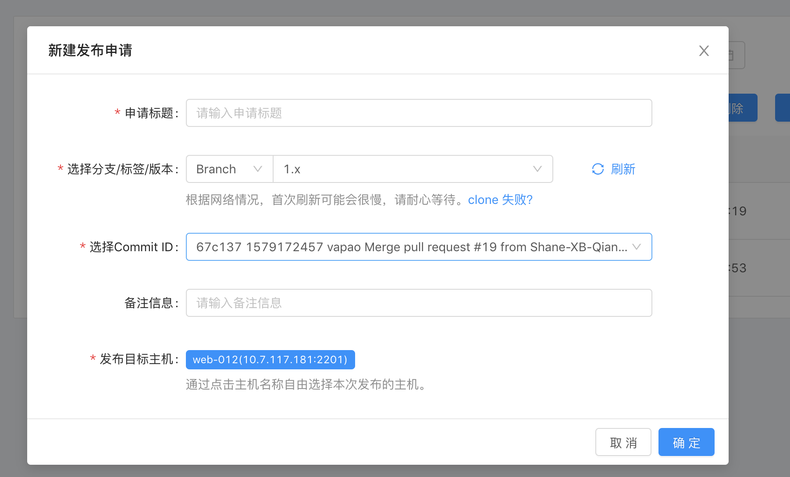


点击确定


待审核的发布，操作应该是有个审核按钮，点击审核

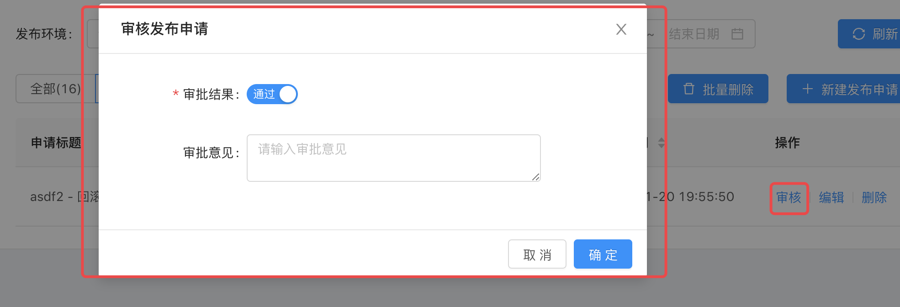


点击通过，待审核的发布就变为待发布的任务

待发布的列表中，每一项应该有个发布按钮，点击发布按钮，来到发布页面，点击右上角的发布按钮，才进行真正的部署流程的执行，执行的每个阶段我们都需要捕获是否存在问题，如果存在问题，将某个主机的某个阶段的错误都展示出来

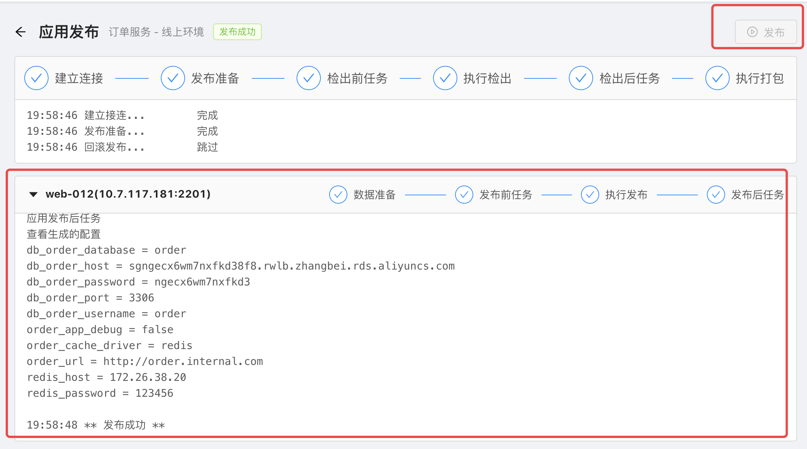


发布成功之后，我们可以点击返回按钮，回到发布申请的列表出，我们的发布就尽到了发布成功的列表中


可以点击回滚，点击回滚我们弹出一个对话框，列出目前所有保存的版本，让用户可以自行选择回滚到哪一个版本，选择对应版本后，继续进入到待审核状态，然后按照一步一步的流程进行该版本的发布。


##### 前期准备

完成这个功能，我们需要的准备工作挺多的，首先说明一点，代码发布流程有很多的方案，目前我采用的方案没有迭代发布和灰度发布等，目前只是简单粗暴的将代码推送到目标主机，部署然后重启服务，后面我们再陆续的将多个方案更新进来，但是这个简单粗暴的方案肯定也能给你提供一定的开发思路。

我们先准备两个虚拟机作为我们的目标主机。

我给大家准备了两个东西

​	第一个：装好开发环境的虚拟机(通过vmware打开即可，但是要求vmware要在14及以上版本)：

```python
链接：https://pan.baidu.com/s/1_trF2CGBNNQxtC2IkX1YJA 
提取码：22s7 
复制这段内容后打开百度网盘手机App，操作更方便哦
```

​	第二个： 纯净的Ubuntu18.04镜像：需要自行安装系统

```python
链接:https://pan.baidu.com/s/19qZ2-vtMbz4amIJG3KNPcQ
提取码:40nl
复制这段内容后打开百度网盘手机App，操作更方便哦
```


我们使用vmware通过第二个ubuntu镜像，来创建两个虚拟机

我创建的两个虚拟机信息

```python
两个虚拟机都在本地安装，要相互组件网络被访问，需要在2个虚拟机中都安装一下：
sudo apt-get install net-tools  #网络工具
ssh服务是默认开启的，最好自己查询下是否开启了。如果没有开，请自行处理

u1:
  user: root
  password: 123456
  ip:  123.112.22.232
  hostname: iZbp1b1jw4l12ho53ivhkkZ

u2:
  user:root
  password: 123456
  ip: 
  hostname: 

```

给这两个系统安装nginx等项目运行软件。注意：安装之前别忘了保存快照。

我们的远程仓库使用的是码云，其他远程仓库请自行处理。

在运行我们项目的服务器上安装git

配置git操作码云时的免密登录(公私钥)

生成公私钥

```shell
执行系统指令

1. 输入ssh-keygen -t rsa -C "你的邮箱地址" 三次回车之后就可以生成密钥对 
2. 上面的指令会自动在 ~/.ssh  目录中生成公私钥文件，mac的生成在 /Users/chao/.ssh/目录下面了
3. 这是这两个文件的名称id_rsa(私钥文件)		id_rsa.pub(公钥文件)
4. 将公钥文件中的内容复制一份放到码云的下面的位置
在使用git来操作码云远程仓库的时候，就是免密操作了。

但是当我们第一次配置完公私钥之后，我们要先在系统终端中执行一下git clone或者git pull指令，因为会提示如下内容
The authenticity of host 'gitee.com (212.64.62.183)' can't be established.
ECDSA key fingerprint is SHA256:FQGC9Kn/eye1W8icdBgrQp+KkGYoFgbVr17bmjey0Wc.
Are you sure you want to continue connecting (yes/no)?
我们需要进行指纹认证，其实就是在~/.ssh目录中的kown_hosts文件中添加一个记录，输入yes，以后就可以了。
```

如下图


保存即可。


##### 表结构设计

Release/models.py

```python
from uric_api.utils.models import BaseModel,models
from users.models import User

# 发布应用表
class ReleaseApp(BaseModel):
    tag = models.CharField(max_length=32, unique=True, verbose_name='应用唯一标识号')
    user = models.ForeignKey(User, on_delete=models.CASCADE,verbose_name='用户')
    class Meta:
        db_table = "hp_release_app"
        verbose_name = "应用管理"
        verbose_name_plural = verbose_name

from conf_center.models import Environment
from host.models import Host
class ReleaseRecord(BaseModel):
    msg_type_choices = (
        (0, '关闭'),
        (1, '钉钉'),
        (2, '短信'),
        (3, '邮件'),
    )

    file_filter_choices = (
        (0, '包含'),
        (1, '排除'),

    )

    release_app = models.ForeignKey(ReleaseApp, on_delete=models.CASCADE, related_name='release_appliction', verbose_name='发布从属应用')
    envs = models.ForeignKey(Environment, on_delete=models.CASCADE, related_name='release_envs', verbose_name='发布环境')
    code_git_addr = models.CharField(max_length=128, verbose_name='Git仓库地址,注意我们使用的是ssh地址')
    # 应该加一个项目名称字段，因为我们将来可能要存储多个项目，通过项目名称进行区分和作为将来存放该项目的目录名称
    git_project_name = models.CharField(max_length=128,verbose_name='项目名称/目录名称')
    # 有了项目名称字段，那么保存数据的时候别忘了添加该字段的数据，其实就通过git仓库地址就能分离出名称
    msg_notice_status = models.BooleanField(default=False, verbose_name='发布审核开启')  # 默认是没有开启审核通知的
    msg_type = models.IntegerField(choices=msg_type_choices, default=0, verbose_name='审核通知方式')
    msg_content = models.CharField(max_length=128, verbose_name='审核通知内容')
    target_host_pub_path = models.CharField(max_length=128, verbose_name="远程主机的发布路径")
    target_host_repository_path = models.CharField(max_length=128, verbose_name="远程主机的git仓库地址")
    keep_history_count = models.IntegerField(default=5, verbose_name="远程主机中代码的历史版本数量")
    filefilterway = models.IntegerField(choices=file_filter_choices, verbose_name='文件过滤方式', help_text='默认是包含')
    # 往下的几个数据，都是客户端代码发布的第三步时填写的数据，全部都是通过换行符进行分割取值。
    file_filter_cmd_content = models.TextField(verbose_name='需要过滤的文件或者目录, 通过换行符分隔', null=True, blank=True)
    before_code_check_out_value = models.TextField(verbose_name='代码检出前的执行动作')
    before_release_content = models.TextField(verbose_name='代码发布前的执行动作', null=True, blank=True, help_text='在管理的目标主机执行')
    custom_global_variable = models.TextField(verbose_name='全局变量', null=True, blank=True, help_text='全局变量设置')
    after_code_check_out_value = models.TextField(verbose_name='代码检出后的动作', help_text='在uric项目所在服务器执行的', null=True,  blank=True)
    after_release_value = models.TextField(verbose_name='代码发布后执行', help_text='在目标主机执行的', null=True, blank=True)

    class Meta:
        db_table = "hp_release_record"
        verbose_name = "发布记录"
        verbose_name_plural = verbose_name

class ReleaseRecordDetail(BaseModel):
    record = models.ForeignKey(ReleaseRecord, related_name='release_record', on_delete=models.CASCADE, verbose_name='发布记录')
    hosts = models.ForeignKey(Host, on_delete=models.CASCADE, related_name='release_host', verbose_name='发布的主机')

    class Meta:
        db_table = "hp_release_record_detail"
        verbose_name = "发布记录详情"
        verbose_name_plural = verbose_name


# 先进行发布，然后进行发布申请，在发布申请阶段进行真正的发布流程
# 发布申请记录表
class ReleaseApply(BaseModel):

    release_status_choices = (
        (1, '待审核'),
        (2, '待发布'),
        (3, '发布成功'),
        (4, '发布异常'),
        (5, '其他'),
    )

    branch_or_tag_choices = (
        (1, '分支'),
        (2, '标签'),
    )

    release_record = models.ForeignKey('ReleaseRecord', on_delete=models.CASCADE, verbose_name='发布记录', related_name='release_record_apply')
    # git_release_branch = models.CharField(max_length=128,verbose_name='分支',null=True, blank=True)
    # git_release_tag = models.CharField(max_length=128,verbose_name='git标签',null=True, blank=True)
    git_release_branch_or_tag = models.IntegerField(verbose_name='分支/标签', choices=branch_or_tag_choices, default=1)
    git_release_version = models.CharField(max_length=128, verbose_name='发布版本(其实是哪个分支或者哪个标签)')
    git_release_commit_id = models.CharField(max_length=256,verbose_name='git_commit_id',null=True,blank=True)

    release_status = models.IntegerField(choices=release_status_choices, default=1, verbose_name='状态')
    user = models.ForeignKey(User, verbose_name='申请人', on_delete=models.CASCADE, related_name='release_apply_user')

    class Meta:
        db_table = "hp_release_apply"
        verbose_name = "发布申请记录表"
        verbose_name_plural = verbose_name

    def git_release_branch_or_tag_name(self):
        # self.git_release_branch_or_tag # 获取choices对应的子成员的第一个信息，保存数据库中的数值
        return self.get_git_release_branch_or_tag_display() # 获取choices选项中对应的文本提示
```

数据迁移

```bash
python manage.py makemigrations
python manage.py migrate
```

添加测试数据，SQL语句：

```sql
INSERT INTO uric.hp_release_apply (id, name, is_show, orders, is_deleted, created_time, updated_time, description, git_release_branch_or_tag, git_release_version, git_release_commit_id, release_status, release_record_id, user_id) VALUES (1, '购物车代码发布', 1, 1, 0, '2021-08-15 07:14:43.544185', '2021-08-15 07:14:43.544563', null, 1, 'master', '6214836', 1, 1, 1);
INSERT INTO uric.hp_release_apply (id, name, is_show, orders, is_deleted, created_time, updated_time, description, git_release_branch_or_tag, git_release_version, git_release_commit_id, release_status, release_record_id, user_id) VALUES (2, '购物车v1', 1, 1, 0, '2021-08-15 07:15:07.577511', '2021-08-15 07:15:07.577727', null, 1, 'master', 'ca474c4', 1, 1, 1);
INSERT INTO uric.hp_release_apply (id, name, is_show, orders, is_deleted, created_time, updated_time, description, git_release_branch_or_tag, git_release_version, git_release_commit_id, release_status, release_record_id, user_id) VALUES (3, '支付功能', 1, 1, 0, '2021-08-15 07:15:28.132845', '2021-08-15 07:15:28.132897', null, 1, 'dev', 'f03c54b', 1, 2, 1);
```


##### 发布申请的界面基本效果

创建组件，ReleaseApply.vue，代码：

```html
<template>

  <div class="release_apply">
    <!--    <h1>发布申请</h1>-->
    <div class="release_apply_category" style="display: flex;justify-content: space-between;">
      <a-radio-group :value="apply_category" @change="handleCategoryChange">
        <a-radio-button value="0">
          全部
        </a-radio-button>
        <a-radio-button value="1">
          Default
        </a-radio-button>
        <a-radio-button value="2">
          Small
        </a-radio-button>
      </a-radio-group>
      <a-button type="primary" icon="plus" @click="new_release_apply">
        新建发布申请
      </a-button>

    </div>

    <div class="choose_app">

      <a-modal v-model="choose_app_visible" title="选择应用" width="800px">
        <a-row>
          <a-col :span="6">
            <div>
              <a-menu
                :default-selected-keys="['1']"
                mode="inline"
                :inline-collapsed="collapsed"
                @select="envs_menu_change"
              >
                <a-menu-item key="1">
                  <a-icon type="pie-chart"/>
                  <span>线上环境</span>
                </a-menu-item>
                <a-menu-item key="2">
                  <a-icon type="desktop"/>
                  <span>测试环境</span>
                </a-menu-item>
                <a-menu-item key="3">
                  <a-icon type="inbox"/>
                  <span>准生产环境</span>
                </a-menu-item>

              </a-menu>
            </div>
          </a-col>
          <a-col :span="18">
            <a-row type="flex" justify="space-around" align="middle">
              <a-col :span="8">
                <p style="height: 80px;line-height: 80px;text-align: center">

                  <a-button @click="show_new_release_apply" type="primary" style="height: 50px;width: 150px;">
                    Primary
                  </a-button>

                </p>
              </a-col>

            </a-row>
          </a-col>
        </a-row>


      </a-modal>
    </div>

    <div class="new_release_apply_modal">

      <a-modal v-model="new_release_visible" title="新建发布申请" width="800px" >
        <template slot="footer">
          <a-button key="back" @click="resetCreateApplyForm">
            取消
          </a-button>
          <a-button key="submit" type="primary" @click="onCreateApplySubmit">
            提交
          </a-button>
        </template>

        <div class="new_release_model_from">
          <a-form-model
            ref="ruleForm"
            :model="new_release_form_data.form"
            :rules="new_release_form_data.rules"
            :label-col="new_release_form_data.labelCol"
            :wrapper-col="new_release_form_data.wrapperCol"
          >
            <a-form-model-item ref="name" label="申请标题" prop="name">
              <a-input
                v-model="new_release_form_data.form.name"
                @blur="
          () => {
            $refs.name.onFieldBlur();
          }
        "
              />
            </a-form-model-item>
            <a-form-model-item label="选择分支/标签版本" prop="version">
              <a-input-group compact>

                <a-select style="width: 30%" v-model="new_release_form_data.form.git_release_branch_or_tag" default-value="1">

                  <a-select-option value="1">
                    branch
                  </a-select-option>
                  <a-select-option value="2">
                    Tag
                  </a-select-option>
                </a-select>
                <a-select style="width: 70%" v-model="new_release_form_data.form.git_release_version" default-value="1">
                  <a-select-option value="1">
                    v1版本
                  </a-select-option>
                  <a-select-option value="2">
                    v2版本
                  </a-select-option>
                </a-select>
              </a-input-group>
            </a-form-model-item>
            <a-form-model-item label="选择Commit ID" required prop="git_release_commit_id" v-if="new_release_form_data.form.git_release_branch_or_tag==='1'">
              <a-select v-model="new_release_form_data.form.git_release_commit_id" default-value="1">
                  <a-select-option value="1">
                    37c137 13833013278 吴超  更新订单功能成功
                  </a-select-option>
                  <a-select-option value="2">
                    2233x6 13833013278 吴超  生成购物车成功
                  </a-select-option>
                </a-select>

            </a-form-model-item>


            <a-form-model-item label="备注信息" prop="description">
              <a-input v-model="new_release_form_data.form.description" type="textarea"/>
            </a-form-model-item>

          </a-form-model>
        </div>


      </a-modal>
    </div>
    <div class="release_apply_list" style="margin-top: 20px;">
      <a-table :columns="columns" :data-source="data" rowKey="id">
        <a slot="action" slot-scope="text">action</a>
      </a-table>

    </div>
  </div>


</template>

<script>
  const columns = [
    {title: '申请标题', width: 100, dataIndex: 'name', key: 'name',},
    {title: '应用', width: 100, dataIndex: 'age', key: 'age',},
    {title: '发布环境', dataIndex: 'address', key: '1', width: 150},
    {title: '版本', dataIndex: 'address', key: '2', width: 150},
    {title: '状态', dataIndex: 'address', key: '3', width: 150},
    {title: '申请人', dataIndex: 'address', key: '4', width: 150},
    {title: '申请时间', dataIndex: 'address', key: '5', width: 150},

    {
      title: '操作',
      key: 'operation',
      width: 100,
      scopedSlots: {customRender: 'action'},
    },
  ];
  const data = [];
  for (let i = 0; i < 100; i++) {
    data.push({
      id: i,
      name: `Edrward ${i}`,
      age: 32,
      address: `London ${i}`,
    });
  }
  export default {
    name: "ReleaseApply",
    data() {
      return {
        columns,
        data,
        apply_category: 0,  // 发布申请分类，默认为全部
        choose_app_visible: false,
        new_release_visible: false,

        collapsed: false, // 环境分类菜单栏数据属性

        new_release_form_data: {
          labelCol: {span: 4},
          wrapperCol: {span: 14},
          other: '',
          form: {
            name: '', // 申请标题
            git_release_branch_or_tag:'1',  // 申请选择的是git分支还是标签
            git_release_version:'1', // 分支/标签 的版本
            git_release_commit_id: '', // git的commit id 数据

            description: '',  // 备注信息
          },
          rules: {
            name: [
              {required: true, message: '请输入申请标题', trigger: 'blur'},
              {min: 1, max: 10, message: 'Length should be 1 to 10', trigger: 'blur'},
            ],
            git_release_branch_or_tag: [{required: true, message: '请选择分支还是标签', trigger: 'change'}],
            git_release_version: [{required: true, message: '请选择版本', trigger: 'change'}],

            git_release_commit_id: [{required: true, message: '请选择commit ID', trigger: 'change'}],

          },
        }

      }
    },

    methods: {

      // 点击新建发布的弹框中的确认按钮的效果
      onCreateApplySubmit() {
        this.$refs.ruleForm.validate(valid => {
          if (valid) {
            alert('submit!');
          } else {
            console.log('error submit!!');
            return false;
          }
        });
      },
      // 点击新建发布的弹框中的取消按钮的效果
      resetCreateApplyForm() {
        this.$refs.ruleForm.resetFields();
        this.new_release_visible = false;
      },


      // 点击新建发布按钮的弹框效果
      new_release_apply() {
        this.choose_app_visible = true;
      },
      // 点击应用，弹出新建发布申请的弹框
      show_new_release_apply() {
        this.choose_app_visible = false;
        this.new_release_visible = true;
      },

      // // 点击新建发布的确认按钮效果
      // handle_new_release_apply(e) {
      //   console.log(e);
      //   this.new_release_visible = false;
      // },
      // 新建发布弹框中，选择不同环境的切换效果,antd官网中就有这个select事件如何使用
      envs_menu_change({item, key, selectedKeys}) {
        console.log(item, key, selectedKeys);
      },


      // 发布类型按钮点击切换效果
      handleCategoryChange(e) {

        this.apply_category = e.target.value;
        console.log(this.apply_category, typeof this.apply_category);
      }
    }

  }
</script>

<style scoped>

</style>

```

配置前端路由

```js
...
import ReleaseApply from '@/components/ReleaseApply'
...
	,
    {
      path: 'Release_apply',
      name: 'ReleaseApply',
      component: ReleaseApply,
    }


```

components/Base.vue，代码：

```javascript
{id: 13,  title: '发布申请', 'menu_url': '/uric/release_apply'},
```


##### 新建发布申请记录

###### 展示和添加申请数据: 后端实现

release.urls，路由，代码：

```python
path('apply', views.ReleaseApplyViewSet.as_view({'get': 'list', 'post': 'create'})),

# 获取发布申请的状态数据 接口路径
path('release_apply/status/', views.ReleaseApplyStatus.as_view()),
```

release.views，视图，代码：

```python
from .serializers import ReleaseApplyModelSerializer
from rest_framework.permissions import IsAuthenticated
class ReleaseApplyViewSet(ModelViewSet):
    permission_classes = [IsAuthenticated]
    queryset = models.ReleaseApply.objects.filter(is_show=True, is_deleted=False)
    serializer_class = ReleaseApplyModelSerializer
    
# 获取发布申请的状态数据
class ReleaseApplyStatus(APIView):
    def get(self,request):
        status = models.ReleaseApply.release_status_choices
        return Response({'status_data': status})    
```


Release/serializers.py

```python
from rest_framework import serializers
from release import models

# 新建发布的序列化器
class ReleaseModelSerializer(serializers.ModelSerializer):
    class Meta:
        model = models.ReleaseApp
        fields = '__all__'
        extra_kwargs = {
            'remark': {
                'required': False,
                # 'allow_blank': True,
                # 'allow_null': True,
            },
            'user': {
                'required': False,
                # 'allow_blank': True,
                # 'allow_null': True,
            }

        }
    def create(self, validated_data):
        user_obj = models.ReleaseApp.objects.create(**{
            'name': validated_data.get('name'),
            'app_id': validated_data.get('app_id'),
            # 'user':self.context['request'].user.id,
            'user_id': 1,
            'remark': validated_data.get('remark'),
        })
        return user_obj


# 新建发布申请的序列化器
class ReleaseApplyModelSerializer(serializers.ModelSerializer):
    app_name = serializers.CharField(source='release_record.release_app.name',read_only=True)
    envs_name = serializers.CharField(source='release_record.envs.name',read_only=True)
    username = serializers.CharField(source='user.username',read_only=True)

    # 关于git_release_commit_id只有现在选择的是git分支时才需要传递过来进行序列化器的校验，所有我们暂时不对他进行校验，回头再补充

    class Meta:
        model = models.ReleaseApply
        fields = ['id', 'name', 'app_name', 'envs_name', 'git_release_branch_or_tag','git_release_branch_or_tag_name', 'git_release_version', 'release_status', 'get_release_status_display', 'username', 'created_time', 'release_record', ]
        # branch_or_tag_choices为发布申请的状态数据
        extra_kwargs = {
            'release_status': {'read_only': True},
            'created_time': {'read_only': True},

        }

    # 对数据进行额外的校验
    # def validate(self, attrs):
    #     pass

    # 自定定制create，因为保存的数据不仅仅是用提交过来的数据，并且该方法的返回值是新创建的记录的模型类对象
    def create(self, validated_data):
        # self.context['request'].user  用户信息
        user_id = 1
        new_obj = models.ReleaseApply.objects.create(**{
            "git_release_branch_or_tag": validated_data.get('git_release_branch_or_tag'),
            "git_release_version": validated_data.get('git_release_version'),
            "name": validated_data.get('name'),
            "git_release_commit_id": validated_data.get('git_release_commit_id'),
            "description": validated_data.get('description'),
            "release_record": validated_data.get('release_record'),
            "user_id": user_id,
        })

        return new_obj


```

大家可以通过postman进行接口调试,在这里大家可以多添加几条数据，并且改一改每条记录的发布状态，争取每个发布状态下都有一些数据。


其实我们想完成前端效果的话，在前端发布申请页面，我们应该在页面加载的时候获取页面所需要的展示数据，比如：所有环境数据，所有应用数据，所有发布申请状态类型，所有的发布申请数据。

环境数据和应用数据的接口其实我们之前已经写好了，直接调用之前的接口就可以了

```python
http://api.uric.cn:8000/conf_center/environment  #环境接口 
http://api.uric.cn:8000/release/app  # 应用接口
```


并且新建发布申请按钮的时候，我们应该获取我们新建发布的时候存储的那个git仓库地址的代码仓库中的所有分支和标签以及分支版本和标签的版本数据。

###### 展示申请数据: 前端实现

src/components/ReleaseApply.vue

```html
<template>

  <div class="release_apply">
    <!--    <h1>发布申请</h1>-->
    <div class="release_apply_category" style="display: flex;justify-content: space-between;">
      <a-radio-group :value="apply_category" @change="handleCategoryChange">
        <a-radio-button value="0">
          全部({{release_apply_data.length}})
        </a-radio-button>
        <a-radio-button :value="status_value[0]" v-for="(status_value,status_index) in release_apply_status_data" :key="status_index">
          {{status_value[1]}} ({{classify_release_apply_data[status_value[0]].length}})
        </a-radio-button>

      </a-radio-group>
      <a-button type="primary" icon="plus" @click="new_release_apply">
        新建发布申请
      </a-button>

    </div>

    <div class="choose_app">

      <a-modal v-model="choose_app_visible" title="选择应用" width="800px">
        <a-row>
          <a-col :span="6">
            <div>
              <a-menu
                :default-selected-keys="['1']"
                mode="inline"
                :inline-collapsed="collapsed"
                @select="envs_menu_change"
              >
                <a-menu-item :key="envs_value.id" v-for="(envs_value,envs_index) in envs_data">
                  <a-icon type="pie-chart"/>
                  <span>{{envs_value.name}}</span>
                </a-menu-item>


              </a-menu>
            </div>
          </a-col>
          <a-col :span="18">
            <a-row type="flex" justify="space-around" align="middle">
              <a-col :span="8" :key="app_index" v-for="(app_value,app_index) in app_data">
                <p style="height: 80px;line-height: 80px;text-align: center">

                  <a-button @click="show_new_release_apply(app_value.id)" type="primary" style="height: 50px;width: 150px;">
                    {{app_value.name}}
                  </a-button>

                </p>
              </a-col>

            </a-row>
          </a-col>
        </a-row>


      </a-modal>
    </div>

    <div class="new_release_apply_modal">

      <a-modal v-model="new_release_visible" title="新建发布申请" width="800px" >
        <template slot="footer">
          <a-button key="back" @click="resetCreateApplyForm">
            取消
          </a-button>
          <a-button key="submit" type="primary" @click="onCreateApplySubmit">
            提交
          </a-button>
        </template>

        <div class="new_release_model_from">
          <a-form-model
            ref="ruleForm"
            :model="new_release_form_data.form"
            :rules="new_release_form_data.rules"
            :label-col="new_release_form_data.labelCol"
            :wrapper-col="new_release_form_data.wrapperCol"
          >
            <a-form-model-item ref="name" label="申请标题" prop="name">
              <a-input
                v-model="new_release_form_data.form.name"
                @blur="
          () => {
            $refs.name.onFieldBlur();
          }
        "
              />
            </a-form-model-item>
            <a-form-model-item label="选择分支/标签版本" prop="version">
              <a-input-group compact>

                <a-select style="width: 30%" v-model="new_release_form_data.form.git_release_branch_or_tag" default-value="1">

                  <a-select-option value="1">
                    branch
                  </a-select-option>
                  <a-select-option value="2">
                    Tag
                  </a-select-option>
                </a-select>
                <a-select style="width: 70%" v-model="new_release_form_data.form.git_release_version" default-value="1">
                  <a-select-option value="1">
                    v1版本
                  </a-select-option>
                  <a-select-option value="2">
                    v2版本
                  </a-select-option>
                </a-select>
              </a-input-group>
            </a-form-model-item>
            <a-form-model-item label="选择Commit ID" required prop="git_release_commit_id" v-if="new_release_form_data.form.git_release_branch_or_tag==='1'">
              <a-select v-model="new_release_form_data.form.git_release_commit_id" default-value="1">
                  <a-select-option value="1">
                    37c137 13833013278 吴超  更新订单功能成功
                  </a-select-option>
                  <a-select-option value="2">
                    2233x6 13833013278 吴超  生成购物车成功
                  </a-select-option>
                </a-select>

            </a-form-model-item>


            <a-form-model-item label="备注信息" prop="description">
              <a-input v-model="new_release_form_data.form.description" type="textarea"/>
            </a-form-model-item>

          </a-form-model>
        </div>


      </a-modal>
    </div>
    <div class="release_apply_list" style="margin-top: 20px;">
      <a-table :columns="columns" :data-source="different_status_release_apply" rowKey="id">
        <a slot="action" slot-scope="text, record" v-if="record.release_status==='1'">
          <a-button size="small"  type="link">审核</a-button> |
          <a-button size="small"  type="link">编辑</a-button> |
          <a-button size="small"  type="link">删除</a-button>
        </a>
        <a slot="action" slot-scope="text, record" v-else-if="record.release_status==='2'">
          <a-button size="small"  type="link">发布</a-button> |
          <a-button size="small"  type="link">查看</a-button>

        </a>
        <a slot="action" slot-scope="text, record" v-else-if="record.release_status==='3'">
          <a-button size="small" type="link">查看</a-button> |
          <a-button size="small"  type="link">回滚</a-button>
        </a>

        <a slot="action" slot-scope="text, record" v-else-if="record.release_status==='4'">
          <a-button size="small" type="link" style="color:Red;">快查看吧</a-button>

        </a>
        <a slot="action" slot-scope="text, record" v-else>
          <a-button size="small"  type="link">查看</a-button>
        </a>


      </a-table>

    </div>
  </div>


</template>

<script>
  const columns = [
    {title: '申请标题', width: 50, dataIndex: 'name', key: 'name',},
    {title: '应用', width: 50, dataIndex: 'app_name', key: 'age',},
    {title: '发布环境', dataIndex: 'envs_name', key: '1', width: 80},
    {title: '版本', dataIndex: 'git_release_version', key: '2', width: 50},
    {title: '状态', dataIndex: 'get_release_status_display', key: '3', width: 50},
    {title: '申请人', dataIndex: 'username', key: '4', width: 50},
    {title: '申请时间', dataIndex: 'created_time', key: '5', width: 100},

    {
      title: '操作',
      key: 'operation',
      width: 100,
      scopedSlots: {customRender: 'action'},
    },
  ];
  // const data = [];
  // for (let i = 0; i < 100; i++) {
  //   data.push({
  //     id: i,
  //     name: `Edrward ${i}`,
  //     age: 32,
  //     address: `London ${i}`,
  //   });
  // }
  export default {
    name: "ReleaseApply",
    data() {
      return {
        envs_data:[],  // 环境数据
        app_data:[],  // 应用数据
        release_apply_data:[],  // 发布申请数据
        classify_release_apply_data:{},  // 所有分类归纳的发布申请数据
        different_status_release_apply:[], // 点击不能分类时的 发布申请数据

        release_apply_status_data:[],  // 发布申请状态数据

        // 根据分类划分出5个数据
        release_apply_data_1 : [], // 待审核数据
        release_apply_data_2 : [], // 待发布数据
        release_apply_data_3 : [], // 发布成功数据
        release_apply_data_4 : [], // 发布异常数据
        release_apply_data_5 : [], // 其他类型数据


        columns,
        // data,
        apply_category: '0',  // 发布申请分类，默认为全部
        choose_app_visible: false,
        new_release_visible: false,

        collapsed: false, // 环境分类菜单栏数据属性

        new_release_form_data: {
          labelCol: {span: 4},
          wrapperCol: {span: 14},
          other: '',
          form: {
            name: '', // 申请标题
            git_release_branch_or_tag:'1',  // 申请选择的是git分支还是标签
            git_release_version:'1', // 分支/标签 的版本
            git_release_commit_id: '', // git的commit id 数据

            description: '',  // 备注信息
          },
          rules: {
            name: [
              {required: true, message: '请输入申请标题', trigger: 'blur'},
              {min: 1, max: 10, message: 'Length should be 1 to 10', trigger: 'blur'},
            ],
            git_release_branch_or_tag: [{required: true, message: '请选择分支还是标签', trigger: 'change'}],
            git_release_version: [{required: true, message: '请选择版本', trigger: 'change'}],

            git_release_commit_id: [{required: true, message: '请选择commit ID', trigger: 'change'}],

          },
        }

      }
    },
    created() {
      this.get_envs_data();
      this.get_app_data();
      this.get_release_apply_data();
      this.get_release_apply_status_data();
    },

    methods: {

      // 根据发布申请的状态，将发布申请数据进行分类,请求数据回来之后，就执行该方法
       classify_release_data_by_status(){
         this.release_apply_data.forEach((k,v)=>{
           if (k.release_status === '1'){
             this.release_apply_data_1.push(k);
           }
           else if (k.release_status === '2'){
             this.release_apply_data_2.push(k);
           }
           else if (k.release_status === '3'){
             this.release_apply_data_3.push(k);
           }
           else if (k.release_status === '4'){
             this.release_apply_data_4.push(k);
           }
           else {
             this.release_apply_data_5.push(k);
           }

         });
        this.classify_release_apply_data['0'] = this.release_apply_data
        this.classify_release_apply_data['1'] = this.release_apply_data_1
        this.classify_release_apply_data['2'] = this.release_apply_data_2
        this.classify_release_apply_data['3'] = this.release_apply_data_3
        this.classify_release_apply_data['4'] = this.release_apply_data_4
        this.classify_release_apply_data['5'] = this.release_apply_data_5

       },

      // 点击新建发布的弹框中的确认按钮的效果
      onCreateApplySubmit() {
        this.$refs.ruleForm.validate(valid => {
          if (valid) {
            alert('submit!');
          } else {
            console.log('error submit!!');
            return false;
          }
        });
      },
      // 点击新建发布的弹框中的取消按钮的效果
      resetCreateApplyForm() {
        this.$refs.ruleForm.resetFields();
        this.new_release_visible = false;
      },


      // 点击新建发布按钮的弹框效果
      new_release_apply() {
        this.choose_app_visible = true;
      },
      // 点击应用，弹出新建发布申请的弹框
      show_new_release_apply() {
        this.choose_app_visible = false;
        this.new_release_visible = true;
      },

      // // 点击新建发布的确认按钮效果
      // handle_new_release_apply(e) {
      //   console.log(e);
      //   this.new_release_visible = false;
      // },
      // 新建发布弹框中，选择不同环境的切换效果,antd官网中就有这个select事件如何使用
      envs_menu_change({item, key, selectedKeys}) {
        console.log(item, key, selectedKeys);
      },


      // 发布类型按钮点击切换效果
      handleCategoryChange(e) {

        this.apply_category = e.target.value;
        this.different_status_release_apply = this.classify_release_apply_data[this.apply_category]
        // console.log(0)
        console.log(this.apply_category, typeof this.apply_category);
      },

      // 获取所有环境数据
      get_envs_data(){
        let token = sessionStorage.token || localStorage.token;
        this.$axios.get(`${this.$settings.host}/conf_center/environment`,{
          headers:{
            Authorization: "jwt "+ token
          }
        })
        .then((res)=>{
          this.envs_data = res.data;
        }).catch((error)=>{

        })
      },

      // 获取所有应用数据
      get_app_data(){
        let token = sessionStorage.token || localStorage.token;
        this.$axios.get(`${this.$settings.host}/release/app`, {
          headers:{
            Authorization: "jwt "+ token
          }
        })
        .then((res)=>{
          this.app_data = res.data;
        }).catch((error)=>{

        })
      },
      // 获取所有发布申请数据

      get_release_apply_data(){
        let token = sessionStorage.token || localStorage.token;
        this.$axios.get(`${this.$settings.host}/release/apply`, {
          headers:{
            Authorization: "jwt "+ token
          }
        })
        .then((res)=>{
          this.release_apply_data = res.data;
          this.classify_release_data_by_status();
          this.different_status_release_apply = this.release_apply_data;
        }).catch((error)=>{

        })
      },
      // 获取所有发布申请的状态数据

      get_release_apply_status_data(){
        let token = sessionStorage.token || localStorage.token;
        this.$axios.get(`${this.$settings.host}/release/apply/status`, {
          headers:{
            Authorization: "jwt "+ token
          }
        })
        .then((res)=>{
          this.release_apply_status_data = res.data;
        }).catch((error)=>{

        })
      },

    },

  }
</script>

<style scoped>

</style>
```


##### 切换环境得到不同环境下的应用

###### 前端实现

其实这个功能，我们点击切换环境时，将环境id发送给后台，后台筛选出该环境下所有的新建发布，通过新建发布数据反向查找对应的应用

当点击应用时，我们找到该应用对应的最新发布，拿到发布对应的git仓库地址，将git仓库clone下来，并获取仓库的所有分支和标签以及版本信息在页面上显示即可。


###### 切换环境得到不同环境的应用: 后端实现

Release/urls.py

```python
# 切换环境时获得不同的应用
path('envs/apps', views.EnvsAppsView.as_view()),
```

Release/views.py

```python
# 获取不同环境下的应用数据
class EnvsAppsView(APIView):

    def get(self,request):
        # 获取环境id
        envs_id = request.query_params.get('envs_id')
        envs_apps_data = list(models.ReleaseRecord.objects.filter(envs_id=envs_id).values(
            'release_app__id',
            'release_app__name',
        ).distinct())  # 别忘了去重
        return Response({'envs_apps_data': envs_apps_data})

```


###### 切换环境得到不同环境的应用: 前端实现

```vue
<template>

  <div class="release_apply">
    <!--    <h1>发布申请</h1>-->
    <div class="release_apply_category" style="display: flex;justify-content: space-between;">
      <a-radio-group :value="apply_category" @change="handleCategoryChange">
        <a-radio-button value="0">
          全部({{release_apply_data.length}})
        </a-radio-button>
        <a-radio-button :value="status_value[0]" v-for="(status_value,status_index) in release_apply_status_data" :key="status_index">
          {{status_value[1]}}({{classify_release_apply_data[status_value[0]].length}})
        </a-radio-button>

      </a-radio-group>
      <a-button type="primary" icon="plus" @click="new_release_apply">
        新建发布申请
      </a-button>

    </div>

    <div class="choose_app">

      <a-modal v-model="choose_app_visible" title="选择应用" width="800px">
        <a-row>
          <a-col :span="6">
            <div>
              <a-menu
                :default-selected-keys="['1']"
                mode="inline"
                :inline-collapsed="collapsed"
                @select="envs_menu_change"
              >
                <a-menu-item :key="envs_value.id" v-for="(envs_value,envs_index) in envs_data" @click="change_env_event(envs_value.id)">
                  <a-icon type="pie-chart"/>
                  <span>{{envs_value.name}}</span>
                </a-menu-item>


              </a-menu>
            </div>
          </a-col>
          <a-col :span="18">
            <a-row type="flex" justify="space-around" align="middle">
              <a-col :span="8" :key="app_index" v-for="(app_value,app_index) in app_data">
                <p style="height: 80px;line-height: 80px;text-align: center">

                  <a-button @click="show_new_release_apply(app_value.release_app__id)" type="primary" style="height: 50px;width: 150px;">
                    {{app_value.release_app__name}}
                  </a-button>

                </p>
              </a-col>

            </a-row>
          </a-col>
        </a-row>


      </a-modal>
    </div>

    <div class="new_release_apply_modal">

      <a-modal v-model="new_release_visible" title="新建发布申请" width="800px" >
        <template slot="footer">
          <a-button key="back" @click="resetCreateApplyForm">
            取消
          </a-button>
          <a-button key="submit" type="primary" @click="onCreateApplySubmit">
            提交
          </a-button>
        </template>

        <div class="new_release_model_from">
          <a-form-model
            ref="ruleForm"
            :model="new_release_form_data.form"
            :rules="new_release_form_data.rules"
            :label-col="new_release_form_data.labelCol"
            :wrapper-col="new_release_form_data.wrapperCol"
          >
            <a-form-model-item ref="name" label="申请标题" prop="name">
              <a-input
                v-model="new_release_form_data.form.name"
                @blur="
          () => {
            $refs.name.onFieldBlur();
          }
        "
              />
            </a-form-model-item>
            <a-form-model-item label="选择分支/标签版本" prop="version">
              <a-input-group compact>

                <a-select style="width: 30%" v-model="new_release_form_data.form.git_release_branch_or_tag" default-value="1">

                  <a-select-option value="1">
                    branch
                  </a-select-option>
                  <a-select-option value="2">
                    Tag
                  </a-select-option>
                </a-select>
                <a-select style="width: 70%" v-model="new_release_form_data.form.git_release_version" default-value="1">
                  <a-select-option value="1">
                    v1版本
                  </a-select-option>
                  <a-select-option value="2">
                    v2版本
                  </a-select-option>
                </a-select>
              </a-input-group>
            </a-form-model-item>
            <a-form-model-item label="选择Commit ID" required prop="git_release_commit_id" v-if="new_release_form_data.form.git_release_branch_or_tag==='1'">
              <a-select v-model="new_release_form_data.form.git_release_commit_id" default-value="1">
                  <a-select-option value="1">
                    37c137 13833013278 吴超  更新订单功能成功
                  </a-select-option>
                  <a-select-option value="2">
                    2233x6 13833013278 吴超  生成购物车成功
                  </a-select-option>
                </a-select>

            </a-form-model-item>


            <a-form-model-item label="备注信息" prop="description">
              <a-input v-model="new_release_form_data.form.description" type="textarea"/>
            </a-form-model-item>

          </a-form-model>
        </div>


      </a-modal>
    </div>
    <div class="release_apply_list" style="margin-top: 20px;">
      <a-table :columns="columns" :data-source="different_status_release_apply" rowKey="id">
        <a slot="action" slot-scope="text, record" v-if="record.release_status==='1'">
          <a-button size="small"  type="link">审核</a-button> |
          <a-button size="small"  type="link">编辑</a-button> |
          <a-button size="small"  type="link">删除</a-button>
        </a>
        <a slot="action" slot-scope="text, record" v-else-if="record.release_status==='2'">
          <a-button size="small"  type="link">发布</a-button> |
          <a-button size="small"  type="link">查看</a-button>

        </a>
        <a slot="action" slot-scope="text, record" v-else-if="record.release_status==='3'">
          <a-button size="small" type="link">查看</a-button> |
          <a-button size="small"  type="link">回滚</a-button>
        </a>

        <a slot="action" slot-scope="text, record" v-else-if="record.release_status==='4'">
          <a-button size="small" type="link" style="color:Red;">快查看吧</a-button>

        </a>
        <a slot="action" slot-scope="text, record" v-else>
          <a-button size="small"  type="link">查看</a-button>
        </a>


      </a-table>

    </div>
  </div>


</template>

<script>
  const columns = [
    {title: '申请标题', width: 50, dataIndex: 'name', key: 'name',},
    {title: '应用', width: 50, dataIndex: 'app_name', key: 'age',},
    {title: '发布环境', dataIndex: 'envs_name', key: '1', width: 80},
    {title: '版本', dataIndex: 'git_release_version', key: '2', width: 50},
    {title: '状态', dataIndex: 'get_release_status_display', key: '3', width: 50},
    {title: '申请人', dataIndex: 'username', key: '4', width: 50},
    {title: '申请时间', dataIndex: 'created_time', key: '5', width: 100},

    {
      title: '操作',
      key: 'operation',
      width: 100,
      scopedSlots: {customRender: 'action'},
    },
  ];
  // const data = [];
  // for (let i = 0; i < 100; i++) {
  //   data.push({
  //     id: i,
  //     name: `Edrward ${i}`,
  //     age: 32,
  //     address: `London ${i}`,
  //   });
  // }
  export default {
    name: "ReleaseApply",
    data() {
      return {
        envs_data:[],  // 环境数据
        envs_id:1, // 所选环境的id值
        app_data:[],  // 应用数据
        release_apply_data:[],  // 发布申请数据
        classify_release_apply_data:{},  // 所有分类归纳的发布申请数据
        different_status_release_apply:[], // 点击不能分类时的 发布申请数据

        release_apply_status_data:[],  // 发布申请状态数据

        // 根据分类划分出5个数据
        release_apply_data_1 : [], // 待审核数据
        release_apply_data_2 : [], // 待发布数据
        release_apply_data_3 : [], // 发布成功数据
        release_apply_data_4 : [], // 发布异常数据
        release_apply_data_5 : [], // 其他类型数据


        columns,
        // data,
        apply_category: '0',  // 发布申请分类，默认为全部
        choose_app_visible: false,
        new_release_visible: false,

        collapsed: false, // 环境分类菜单栏数据属性

        new_release_form_data: {
          labelCol: {span: 4},
          wrapperCol: {span: 14},
          other: '',
          form: {
            name: '', // 申请标题
            git_release_branch_or_tag:'1',  // 申请选择的是git分支还是标签
            git_release_version:'1', // 分支/标签 的版本
            git_release_commit_id: '', // git的commit id 数据

            description: '',  // 备注信息
          },
          rules: {
            name: [
              {required: true, message: '请输入申请标题', trigger: 'blur'},
              {min: 1, max: 10, message: 'Length should be 1 to 10', trigger: 'blur'},
            ],
            git_release_branch_or_tag: [{required: true, message: '请选择分支还是标签', trigger: 'change'}],
            git_release_version: [{required: true, message: '请选择版本', trigger: 'change'}],

            git_release_commit_id: [{required: true, message: '请选择commit ID', trigger: 'change'}],

          },
        }

      }
    },
    created() {
      this.get_envs_data();
      // this.get_app_data();
      this.change_env_event(); // 获取不同环境的应用，默认是测试环境，页面加载时触发一次，环境菜单切换时也触发
      this.get_release_apply_data();
      this.get_release_apply_status_data();
    },

    methods: {

      // 切换环境时，展示对应的环境的应用
      change_env_event(){
        let token = sessionStorage.token || localStorage.token;
        this.$axios.get(`${this.$settings.host}/release/envs/apps`,{
          params:{
            envs_id:this.envs_id,
          }
        }, {
          headers:{
            Authorization: "jwt "+ token
          }
        }).then((res)=>{
          this.app_data = res.data.envs_apps_data;


        }).catch((error)=>{

        })


      },


      // 根据发布申请的状态，将发布申请数据进行分类,请求数据回来之后，就执行该方法
       classify_release_data_by_status(){
         this.release_apply_data.forEach((k,v)=>{
           if (k.release_status === '1'){
             this.release_apply_data_1.push(k);
           }
           else if (k.release_status === '2'){
             this.release_apply_data_2.push(k);
           }
           else if (k.release_status === '3'){
             this.release_apply_data_3.push(k);
           }
           else if (k.release_status === '4'){
             this.release_apply_data_4.push(k);
           }
           else {
             this.release_apply_data_5.push(k);
           }

         });
        this.classify_release_apply_data['0'] = this.release_apply_data
        this.classify_release_apply_data['1'] = this.release_apply_data_1
        this.classify_release_apply_data['2'] = this.release_apply_data_2
        this.classify_release_apply_data['3'] = this.release_apply_data_3
        this.classify_release_apply_data['4'] = this.release_apply_data_4
        this.classify_release_apply_data['5'] = this.release_apply_data_5

       },

      // 点击新建发布的弹框中的确认按钮的效果
      onCreateApplySubmit() {
        this.$refs.ruleForm.validate(valid => {
          if (valid) {
            alert('submit!');
          } else {
            console.log('error submit!!');
            return false;
          }
        });
      },
      // 点击新建发布的弹框中的取消按钮的效果
      resetCreateApplyForm() {
        this.$refs.ruleForm.resetFields();
        this.new_release_visible = false;
      },


      // 点击新建发布按钮的弹框效果
      new_release_apply() {
        this.choose_app_visible = true;
      },
      // 点击应用，弹出新建发布申请的弹框
      show_new_release_apply(app_id) {
         console.log('app_id>> ',app_id);
        this.choose_app_visible = false;
        this.new_release_visible = true;
      },

      // // 点击新建发布的确认按钮效果
      // handle_new_release_apply(e) {
      //   console.log(e);
      //   this.new_release_visible = false;
      // },
      // 新建发布弹框中，选择不同环境的切换效果,antd官网中就有这个select事件如何使用
      envs_menu_change({item, key, selectedKeys}) {
        // console.log(item, key, selectedKeys);  key是环境id
        this.envs_id = key;
        this.change_env_event();
      },


      // 发布类型按钮点击切换效果
      handleCategoryChange(e) {

        this.apply_category = e.target.value;
        this.different_status_release_apply = this.classify_release_apply_data[this.apply_category]
        // console.log(0)
        console.log(this.apply_category, typeof this.apply_category);
      },

      // 获取所有环境数据
      get_envs_data(){
          let token = sessionStorage.token || localStorage.token;
        this.$axios.get(`${this.$settings.host}/conf_center/environment`, {
          headers:{
            Authorization: "jwt "+ token
          }
        })
        .then((res)=>{
          this.envs_data = res.data;
        }).catch((error)=>{

        })
      },

      // // 获取所有应用数据
      // get_app_data(){
      //   let token = sessionStorage.token || localStorage.token;
      //   this.$axios.get(`${this.$settings.host}/release/app`, {
      //     headers:{
      //       Authorization: "jwt "+ token
      //     }
      //   })
      //   .then((res)=>{
      //     this.app_data = res.data;
      //   }).catch((error)=>{
      //
      //   })
      // },
      // 获取所有发布申请数据

      get_release_apply_data(){
          let token = sessionStorage.token || localStorage.token;
        this.$axios.get(`${this.$settings.host}/release/apply`, {
          headers:{
            Authorization: "jwt "+ token
          }
        })
        .then((res)=>{
          this.release_apply_data = res.data;
          this.classify_release_data_by_status();
          this.different_status_release_apply = this.release_apply_data;
        }).catch((error)=>{

        })
      },
      // 获取所有发布申请的状态数据

      get_release_apply_status_data(){
          let token = sessionStorage.token || localStorage.token;
        this.$axios.get(`${this.$settings.host}/release/apply/status`, {
          headers:{
            Authorization: "jwt "+ token
          }
        })
        .then((res)=>{
          this.release_apply_status_data = res.data;
        }).catch((error)=>{

        })
      },
    },

  }
</script>

<style scoped>

</style>

```


##### 新建发布具体信息

点击应用弹框效果


点击应用


**后端实现**

配置一下git clone的代码存放目录

uric/settings.py

```python
# git clone的代码存放目录
GIT_CODE_DIR = BASE_DIR.parent / 'projects'
```


Release/urls.py

```python
# 获取git 仓库的分支数据
path('git/branchs/', views.GitBranchView.as_view()),
```

创建一个py文件，完成代码检出(git clone)，并获取代码的分支信息

utils/git_oprations.py

```python
import os

# 拉取git仓库并获得分支数据
def get_git_branchs(git_addr, git_code_dir):
    '''
    :param git_addr:  远程仓库的ssh地址
    :return:  该仓库的分支列表数据
    '''


    # 1 检出(git clone)前的动作

    # 2 检出代码

    # 3 检出后动作

    # 后面3步是在点击发布的时候进行的
    # 4 发布前，对目标主机执行的动作

    # 5 发布

    # 6 发布后，对目标主机执行的动作

    # git仓库地址：git_addr = 'git@gitee.com:mooluo_admin/uric.git'
    # 本地仓库目录：git_pro_name = gitee.com/mooluo_admin
    git_path_name = "/".join(git_addr.split("@")[-1].replace(":","/")[:-4].split("/")[:-1])

    # 如果确定以后公司只会在某个git平台上存储git版本，则本地仓库目录采用项目名即可：uric
    # 项目目录名：pro_name = 'uric'
    pro_name = git_addr.rsplit('/')[-1].split('.')[0]

    # 指定git存储目录，目前的方式是在settings中配置的GIT_CODE_DIR的目录下根据项目名称创建一个目录，然后进入到这个目录里面再执行git clone
    # from django.conf import settings
    # git_code_dir = settings.GIT_CODE_DIR
    git_dir_path = f'{git_code_dir}/{git_path_name}' # '/home/moluo/Desktop/uric/uric_api/projects/gitee.com/mooluo_admin'
    git_pro_path = f'{git_code_dir}/{git_path_name}/{pro_name}' # '/home/moluo/Desktop/uric/uric_api/projects/gitee.com/mooluo_admin/uric'
    # import os
    if os.path.exists(git_pro_path):
        git_branch_info = os.popen( f'cd {git_pro_path} && git pull {git_addr} && git branch -r').readlines()
        # git_branch_info = ['已经是最新的。\n', '  origin/HEAD -> origin/master\n', '  origin/dev\n', '  origin/master\n']
        git_branch_info_s = git_branch_info[2:]
    else:
        git_branch_info = os.popen( f'mkdir -p -m 777 {git_dir_path} && cd {git_dir_path} && git clone {git_addr} && cd {pro_name} && git branch -r').readlines()[1:]
        # git_branch_info = ['  origin/HEAD -> origin/master\n', '  origin/dev\n', '  origin/master\n']
        git_branch_info_s = git_branch_info[1:]

    # 查看提交版本的指令 git log --pretty="%h %an %s" --since="2020" --before="2021"  -10    #-10指的是最近的10次提交记录
    print('git_branch_info>>>', git_branch_info)
    print('git_branch_info_s>>>>', git_branch_info_s)
    # 将查看分支指令的返回结果进行加工，筛选出所有的分支名称
    branch_list = [i.split('/')[-1].replace('\n', '') for i in git_branch_info_s]
    print('>>>>>', branch_list)
    return branch_list


# 获取git 仓库中分支的commit版本信息
def get_git_commits(branchs_name, git_addr, git_code_dir):
    # git仓库代码的存储路径
    git_path_name = "/".join(git_addr.split("@")[-1].replace(":","/")[:-4].split("/")[:-1])
    # git仓库名称
    pro_name = git_addr.rsplit('/')[-1].split('.')[0]
    git_pro_path = f'{git_code_dir}/{git_path_name}'
    print(git_pro_path)
    print('branchs_name>>', branchs_name)
    result = os.popen(f'cd {git_pro_path}/{pro_name} && git checkout {branchs_name} && git log --pretty="%h %an %s"').readlines()[1:]
    print('result>>>>', result)
    res_dict = {}  #{'版本id号'，版本具体信息, }
    for i in result:
        i_list = i.split(' ')
        res_dict[i_list[0]] = i

    return res_dict

```

视图部分

Release/views.py

```python
from django.conf import settings
from uric_api.utils.git_oprations import get_git_branchs,get_git_commits
class GitBranchAPIView(APIView):
    # 获取git仓库的分支记录获取tag标签
    def get(self,request):
        app_id = request.query_params.get('app_id')
        # 先找到该应用的新建的最新发布记录
        release_record_obj = ReleaseRecord.objects.filter(is_show=True, is_deleted=False,release_app_id=app_id).order_by( '-id').first()
        git_code_dir = settings.GIT_CODE_DIR
        git_remote_attr = release_record_obj.code_git_addr
        # 获取git仓库的分支数据
        git_branch_list = get_git_branchs(git_remote_attr, git_code_dir)
        # 获得branch -- master等分支的所有提交版本
        branchs_name = request.query_params.get('branchs')  # master or dev

        commits = get_git_commits(branchs_name, git_remote_attr, git_code_dir)

        return Response({
            'branch_list': git_branch_list,
            'commits': commits,
            'release_record_id': release_record_obj.id
        })
```


前端实现

ReleaseApply.vue，代码：

```html
<template>

  <div class="release_apply">
    <!--    <h1>发布申请</h1>-->
    <div class="release_apply_category" style="display: flex;justify-content: space-between;">
      <a-radio-group :value="apply_category" @change="handleCategoryChange">
        <a-radio-button value="0">
          全部({{release_apply_data.length}})
        </a-radio-button>
        <a-radio-button :value="status_value[0]" v-for="(status_value,status_index) in release_apply_status_data" :key="status_index">
          {{status_value[1]}} ({{classify_release_apply_data[status_value[0]].length}})
        </a-radio-button>

      </a-radio-group>
      <a-button type="primary" icon="plus" @click="new_release_apply">
        新建发布申请
      </a-button>

    </div>

    <div class="choose_app">

      <a-modal v-model="choose_app_visible" title="选择应用" width="800px">
        <a-row>
          <a-col :span="6">
            <div>
              <a-menu
                :default-selected-keys="['1']"
                mode="inline"
                :inline-collapsed="collapsed"
                @select="envs_menu_change"
              >
                <a-menu-item :key="envs_value.id" v-for="(envs_value,envs_index) in envs_data" @click="change_env_event(envs_value.id)">
                  <a-icon type="pie-chart"/>
                  <span>{{envs_value.name}}</span>
                </a-menu-item>


              </a-menu>
            </div>
          </a-col>
          <a-col :span="18">
            <a-row type="flex" justify="space-around" align="middle">
              <a-col :span="8" :key="app_index" v-for="(app_value,app_index) in app_data">
                <p style="height: 80px;line-height: 80px;text-align: center">

                  <a-button @click="show_new_release_apply(app_value.release_app__id)" type="primary" style="height: 50px;width: 150px;">
                    {{app_value.release_app__name}}
                  </a-button>

                </p>
              </a-col>

            </a-row>
          </a-col>
        </a-row>


      </a-modal>
    </div>

    <div class="new_release_apply_modal">

      <a-modal v-model="new_release_visible" title="新建发布申请" width="800px" >
        <template slot="footer">
          <a-button key="back" @click="resetCreateApplyForm">
            取消
          </a-button>
          <a-button key="submit" type="primary" @click="onCreateApplySubmit">
            提交
          </a-button>
        </template>

        <div class="new_release_model_from">
          <a-form-model
            ref="ruleForm"
            :model="new_release_form_data.form"
            :rules="new_release_form_data.rules"
            :label-col="new_release_form_data.labelCol"
            :wrapper-col="new_release_form_data.wrapperCol"
          >
            <a-form-model-item ref="name" label="申请标题" prop="name">
              <a-input
                v-model="new_release_form_data.form.name"
                @blur="
          () => {
            $refs.name.onFieldBlur();
          }
        "
              />
            </a-form-model-item>
            <a-form-model-item label="选择分支/标签版本" prop="version">
              <a-input-group compact>

                <a-select style="width: 30%" v-model="new_release_form_data.form.git_release_branch_or_tag" default-value="1">

                  <a-select-option value="1">
                    branch
                  </a-select-option>
                  <a-select-option value="2">
                    Tag
                  </a-select-option>
                </a-select>
                <a-select style="width: 70%" v-model="new_release_form_data.form.git_release_version" default-value="1">
                  <a-select-option :value="branch_value" v-for="(branch_value, branch_index) in git_branchs" :key="branch_index">
                    {{branch_value}}
                  </a-select-option>

                </a-select>
              </a-input-group>
            </a-form-model-item>
            <a-form-model-item label="选择Commit ID" required prop="git_release_commit_id" v-if="new_release_form_data.form.git_release_branch_or_tag==='1'">
              <a-select v-model="new_release_form_data.form.git_release_commit_id" default-value="1">
                  <a-select-option :value="commit_info_index" v-for="(commit_info_value, commit_info_index) in git_branchs_commit_info" :key="commit_info_index">
                    {{commit_info_value}}>>>>{{commit_info_index}}
                  </a-select-option>

                </a-select>

            </a-form-model-item>


            <a-form-model-item label="备注信息" prop="description">
              <a-input v-model="new_release_form_data.form.description" type="textarea"/>
            </a-form-model-item>

          </a-form-model>
        </div>


      </a-modal>
    </div>
    <div class="release_apply_list" style="margin-top: 20px;">
      <a-table :columns="columns" :data-source="different_status_release_apply" rowKey="id">
        <a slot="action" slot-scope="text, record" v-if="record.release_status===1">
          <a-button size="small"  type="link">审核</a-button> |
          <a-button size="small"  type="link">编辑</a-button> |
          <a-button size="small"  type="link">删除</a-button>
        </a>
        <a slot="action" slot-scope="text, record" v-else-if="record.release_status===2">
          <a-button size="small"  type="link">发布</a-button> |
          <a-button size="small"  type="link">查看</a-button>

        </a>
        <a slot="action" slot-scope="text, record" v-else-if="record.release_status===3">
          <a-button size="small" type="link">查看</a-button> |
          <a-button size="small"  type="link">回滚</a-button>
        </a>

        <a slot="action" slot-scope="text, record" v-else-if="record.release_status===4">
          <a-button size="small" type="link" style="color:Red;">快查看吧</a-button>

        </a>
        <a slot="action" slot-scope="text, record" v-else>
          <a-button size="small"  type="link">查看</a-button>
        </a>


      </a-table>

    </div>
  </div>


</template>

<script>
  const columns = [
    {title: '申请标题', width: 50, dataIndex: 'name', key: 'name',},
    {title: '应用', width: 50, dataIndex: 'app_name', key: 'app_name',},
    {title: '发布环境', dataIndex: 'envs_name', key: 'envs_name', width: 80},
    {title: '版本', dataIndex: 'git_release_commit_id', key: 'git_release_commit_id', width: 50},
    {title: '状态', dataIndex: 'get_release_status_display', key: 'get_release_status_display', width: 50},
    {title: '申请人', dataIndex: 'username', key: 'username', width: 50},
    {title: '申请时间', dataIndex: 'created_time', key: 'created_time', width: 100},

    {
      title: '操作',
      key: 'operation',
      width: 100,
      scopedSlots: {customRender: 'action'},
    },
  ];
  // const data = [];
  // for (let i = 0; i < 100; i++) {
  //   data.push({
  //     id: i,
  //     name: `Edrward ${i}`,
  //     age: 32,
  //     address: `London ${i}`,
  //   });
  // }
  export default {
    name: "ReleaseApply",
    data() {
      return {
        envs_data:[],  // 环境数据
        envs_id:1, // 所选环境的id值
        app_data:[],  // 应用数据
        release_apply_data:[],  // 发布申请数据
        classify_release_apply_data:{},  // 所有分类归纳的发布申请数据
        different_status_release_apply:[], // 点击不同分类时的 发布申请数据
        app_id:1, // 用户新建发布申请时选择的应用id
        release_apply_status_data:[],  // 发布申请状态数据

        // 根据分类划分出5个数据
        release_apply_data_1 : [], // 待审核数据
        release_apply_data_2 : [], // 待发布数据
        release_apply_data_3 : [], // 发布成功数据
        release_apply_data_4 : [], // 发布异常数据
        release_apply_data_5 : [], // 其他类型数据

        git_branchs:[], // 不同应用的新建发布对应的git仓库的分支信息
        git_branchs_commit_info:[], // 不同分支的commit版本信息，默认先获得master分支的，业务级别就定好有master分支


        columns,
        // data,
        apply_category: '0',  // 发布申请分类，默认为全部
        choose_app_visible: false,
        new_release_visible: false,

        collapsed: false, // 环境分类菜单栏数据属性

        new_release_form_data: {
          labelCol: {span: 4},
          wrapperCol: {span: 14},
          other: '',
          form: {
            name: '', // 申请标题
            git_release_branch_or_tag:'1',  // 申请选择的是git分支还是标签
            git_release_version:'master', // 分支/标签 的版本, 也就是我们选择哪个分支
            git_release_commit_id: '', // git的commit id 数据
            release_record:0,
            description: '',  // 备注信息
          },
          rules: {
            name: [
              {required: true, message: '请输入申请标题', trigger: 'blur'},
              {min: 1, max: 10, message: 'Length should be 1 to 10', trigger: 'blur'},
            ],
            git_release_branch_or_tag: [{required: true, message: '请选择分支还是标签', trigger: 'change'}],
            git_release_version: [{required: true, message: '请选择版本', trigger: 'change'}],

            git_release_commit_id: [{required: true, message: '请选择commit ID', trigger: 'change'}],

          },
        }

      }
    },
    created() {
      this.get_envs_data();
      // this.get_app_data();
      this.change_env_event(); // 获取不同环境的应用，默认是测试环境，页面加载时触发一次，环境菜单切换时也触发
      this.get_release_apply_data();
      this.get_release_apply_status_data();
    },

    watch:{
      'new_release_form_data.form.git_release_version':function (val) {
        // this.get_branch_commit_history()
        // console.log('val', val);

        this.show_new_release_apply(); // 执行获取不同分支的版本数据

      }
    },

    methods: {

      // 切换环境时，展示对应的环境的应用
      change_env_event(){
        let token = sessionStorage.token || localStorage.token;
        this.$axios.get(`${this.$settings.host}/release/envs/apps`,{
          params:{
            envs_id:this.envs_id,
          }
        }, {
          headers:{
            Authorization: "jwt "+ token
          }
        }).then((res)=>{
          this.app_data = res.data.envs_apps_data;


        }).catch((error)=>{

        })


      },


      // 根据发布申请的状态，将发布申请数据进行分类,请求数据回来之后，就执行该方法
       classify_release_data_by_status(){
        this.release_apply_data_1 = []
        this.release_apply_data_2 = []
        this.release_apply_data_3 = []
        this.release_apply_data_4 = []
        this.release_apply_data_5 = []

        this.release_apply_data.forEach((k,v)=>{
           if (k.release_status === 1){
             this.release_apply_data_1.push(k);
           }
           else if (k.release_status === 2){
             this.release_apply_data_2.push(k);
           }
           else if (k.release_status === 3){
             this.release_apply_data_3.push(k);
           }
           else if (k.release_status === 4){
             this.release_apply_data_4.push(k);
           }
           else {
             this.release_apply_data_5.push(k);
           }

         });
        this.classify_release_apply_data['0'] = this.release_apply_data
        this.classify_release_apply_data['1'] = this.release_apply_data_1
        this.classify_release_apply_data['2'] = this.release_apply_data_2
        this.classify_release_apply_data['3'] = this.release_apply_data_3
        this.classify_release_apply_data['4'] = this.release_apply_data_4
        this.classify_release_apply_data['5'] = this.release_apply_data_5

       },

      // 点击新建发布的弹框中的确认按钮的效果，提交发布申请的数据
      onCreateApplySubmit() {
        this.$refs.ruleForm.validate(valid => {
          if (valid) {
            let token = sessionStorage.token || localStorage.token;
            this.$axios.post(`${this.$settings.host}/release/apply`,this.new_release_form_data.form,{
              headers:{
                Authorization: "jwt " + token
              }
            })
              .then((res)=>{
                this.release_apply_data.push(res.data);
                this.classify_release_data_by_status();
                this.different_status_release_apply = this.release_apply_data;
                this.resetCreateApplyForm();
              }).catch((error)=>{

            })

          } else {
            console.log('error submit!!');
            return false;
          }
        });
      },
      // 点击新建发布的弹框中的取消按钮的效果
      resetCreateApplyForm() {
        this.$refs.ruleForm.resetFields();
        this.new_release_visible = false;
      },


      // 点击新建发布按钮的弹框效果
      new_release_apply() {
        this.choose_app_visible = true;
      },
      // 点击应用，弹出新建发布申请的弹框,获取该应用新建的最新发布对应的git仓库的分支信息和版本信息，默认先展示的是master分支相关信息
      show_new_release_apply(app_id=null) {
         console.log('app_id>> ',app_id);
         // 发送请求，获取分支数据以及不同分支的commits版本数据
        if (app_id){
          this.app_id = app_id;
        }

        this.$axios.get(`${this.$settings.host}/release/git/branch`,{
          params:{
            app_id: this.app_id,
            branchs:this.new_release_form_data.form.git_release_version,
          }
        }).then((res)=>{
          // res.data.branch_list -- ["dev" ,"master"]

          this.git_branchs = res.data.branch_list;
          this.git_branchs_commit_info = res.data.commits;
          this.new_release_form_data.form.release_record = res.data.release_record_id;
        }).catch((error)=>{

        })
        this.choose_app_visible = false;
        this.new_release_visible = true;
      },


      // // 点击新建发布的确认按钮效果
      // handle_new_release_apply(e) {
      //   console.log(e);
      //   this.new_release_visible = false;
      // },
      // 新建发布弹框中，选择不同环境的切换效果,antd官网中就有这个select事件如何使用
      envs_menu_change({item, key, selectedKeys}) {
        // console.log(item, key, selectedKeys);  key是环境id
        this.envs_id = key;
        this.change_env_event();


      },


      // 发布类型按钮点击切换效果
      handleCategoryChange(e) {

        this.apply_category = e.target.value;
        this.different_status_release_apply = this.classify_release_apply_data[this.apply_category]
        // console.log(0)
        console.log(this.apply_category, typeof this.apply_category);
      },

      // 获取所有环境数据
      get_envs_data(){
          let token = sessionStorage.token || localStorage.token;
        this.$axios.get(`${this.$settings.host}/conf_center/environment`, {
          headers:{
            Authorization: "jwt "+ token
          }
        })
        .then((res)=>{
          this.envs_data = res.data;
        }).catch((error)=>{

        })
      },


      // // 获取所有应用数据
      // get_app_data(){
      //   let token = sessionStorage.token || localStorage.token;
      //   this.$axios.get(`${this.$settings.host}/release/app`, {
      //     headers:{
      //       Authorization: "jwt "+ token
      //     }
      //   })
      //   .then((res)=>{
      //     this.app_data = res.data;
      //   }).catch((error)=>{
      //
      //   })
      // },
      // 获取所有发布申请数据

      get_release_apply_data(){
          let token = sessionStorage.token || localStorage.token;
        this.$axios.get(`${this.$settings.host}/release/apply`, {
          headers:{
            Authorization: "jwt "+ token
          }
        })
        .then((res)=>{
          this.release_apply_data = res.data;
          this.classify_release_data_by_status();
          this.different_status_release_apply = this.release_apply_data;
        }).catch((error)=>{

        })
      },
      // 获取所有发布申请的状态数据

      get_release_apply_status_data(){
          let token = sessionStorage.token || localStorage.token;
        this.$axios.get(`${this.$settings.host}/release/apply/status`, {
          headers:{
            Authorization: "jwt "+ token
          }
        })
        .then((res)=>{
          this.release_apply_status_data = res.data;
        }).catch((error)=>{

        })
      },

    },


  }
</script>

<style scoped>

</style>
```


##### 代码审核

###### 后端实现

Release/models.py添加三个字段

```python
# 先进行发布，然后进行发布申请，在发布申请阶段进行真正的发布流程
# 发布申请记录表
class ReleaseApply(BaseModel):

    release_status_choices = (
        (1, '待审核'),
        (2, '待发布'),
        (3, '发布成功'),
        (4, '发布异常'),
        (5, '其他'),
    )

    branch_or_tag_choices = (
        (1, '分支'),
        (2, '标签'),
    )

    release_record = models.ForeignKey('ReleaseRecord', on_delete=models.CASCADE, verbose_name='发布记录', related_name='release_record_apply')
    # git_release_branch = models.CharField(max_length=128,verbose_name='分支',null=True, blank=True)
    # git_release_tag = models.CharField(max_length=128,verbose_name='git标签',null=True, blank=True)
    git_release_branch_or_tag = models.IntegerField(verbose_name='分支/标签', choices=branch_or_tag_choices, default=1)
    git_release_version = models.CharField(max_length=128, verbose_name='发布版本(其实是哪个分支或者哪个标签)')
    git_release_commit_id = models.CharField(max_length=256,verbose_name='git_commit_id',null=True,blank=True)

    release_status = models.IntegerField(choices=release_status_choices, default=1, verbose_name='状态')
    user = models.ForeignKey(User, verbose_name='申请人', on_delete=models.CASCADE, related_name='release_apply_user')

    # 新增如下三个字段
    review_user = models.ForeignKey(User, verbose_name='审核人', on_delete=models.CASCADE, related_name='release_apply_review_user', null=True, blank=True)
    review_desc = models.CharField(max_length=128, null=True, blank=True, verbose_name='审核意见')
    release_user = models.ForeignKey(User, verbose_name='发布人', on_delete=models.CASCADE, related_name='release_apply_release_user', null=True, blank=True)

    class Meta:
        db_table = "hp_release_apply"
        verbose_name = "发布申请记录表"
        verbose_name_plural = verbose_name

    def git_release_branch_or_tag_name(self):
        # self.git_release_branch_or_tag # 获取choices对应的子成员的第一个信息，保存数据库中的数值
        return self.get_git_release_branch_or_tag_display() # 获取choices选项中对应的文本提示
```

执行数据库同步指令

```python
python manage.py makemigrations
python manage.py migrate
```


Release/urls.py

```python
from django.urls import path,re_path
from . import views

urlpatterns = [
    path('app', views.ReleaseAPIView.as_view()),
    path('new', views.NewReleaseAPIView.as_view()),
    path('apply', views.ReleaseApplyViewSet.as_view({'get': 'list', 'post': 'create',})),
    # 获取发布申请的状态数据 接口路径
    path('apply/status', views.ReleaseApplyStatusAPIView.as_view()),
    # 切换环境时获取当前环境下的所有发布应用
    path('envs/apps', views.EnvsAppsAPIView.as_view()),
    # 获取git 仓库的分支数据
    path('git/branch', views.GitBranchAPIView.as_view()),
    # 审核发布记录的接口，这里仅仅涉及到部分字段的修改，所以我们绑定路由的请求方法使用patch，
    # 调用ModelViewSet中partial_update
    re_path('release_ap/(?P<pk>\d+)/', views.ReleaseApplyViewSet.as_view({'patch': 'partial_update', })),
]
```

release/views.py

```python
from .serializers import ReleaseApplyModelSerializer
from rest_framework.viewsets import ModelViewSet
from .models import ReleaseApply
from rest_framework.permissions import IsAuthenticated
class ReleaseApplyViewSet(ModelViewSet):
    permission_classes = [IsAuthenticated]
    queryset = ReleaseApply.objects.filter(is_show=True, is_deleted=False).order_by("-id")
    serializer_class = ReleaseApplyModelSerializer
```

Release/serializers.py

对ReleaseApplyModelSerializer这个类做一些调整，添加上我们models里面添加的字段

```python
from .models import ReleaseApply
class ReleaseApplyModelSerializer(serializers.ModelSerializer):
    app_name = serializers.CharField(source='release_record.release_app.name', read_only=True)
    envs_name = serializers.CharField(source='release_record.envs.name', read_only=True)
    username = serializers.CharField(source='user.username', read_only=True)
    # 关于git_release_commit_id只有现在选择的是git分支时才需要传递过来进行序列化器的校验，所有我们暂时不对他进行校验，回头再补充

    class Meta:
        model = ReleaseApply
        fields = ['id', 'name', 'app_name', 'envs_name', 'git_release_branch_or_tag',
                  'git_release_branch_or_tag_name', 'git_release_version', 'release_status',
                  'get_release_status_display', 'username', 'created_time', 'release_record', 'git_release_commit_id',
                  'review_user','review_desc']

        # branch_or_tag_choices为发布申请的状态数据
        extra_kwargs = {
            'release_status': {'read_only': True},
            'created_time': {'read_only': True},

        }

    # 对数据进行额外的校验
    # def validate(self, attrs):
    #     pass

    # 自定定制create，因为保存的数据不仅仅是用提交过来的数据，并且该方法的返回值是新创建的记录的模型类对象
    def create(self, validated_data):
        # 1. self 在这里代表的就是序列化器
        # 2. self.context 是一个字典类型的数据，里面有3个成员，分别是本次客户端的request请求对象，本次调用序列化器的view视图对象，和本次客户端提交请求时的format数据格式
        # 3. self.context 是 ModelSerializerd的父类Serializer->BaseSerializer->Field中定义的，在BaseSerializer中被赋值，本质上就是 BaseSerializer的 _context属性
        # 4. self.context 的最终结果是在通用视图类 ModelViewSet的父类GenericViewSet-->GenericAPIView-->get_serializer_context方法中被最终赋值。
        user_id = self.context['request'].user.id  # 用户信息
        # user_id = 1

        new_obj = ReleaseApply.objects.create(**{
            "git_release_branch_or_tag": validated_data.get('git_release_branch_or_tag'),
            "git_release_version": validated_data.get('git_release_version'),
            "name": validated_data.get('name'),
            "git_release_commit_id": validated_data.get('git_release_commit_id'),
            "description": validated_data.get('description'),
            "release_record": validated_data.get('release_record'),
            "user_id": user_id,
        })

        return new_obj
```


###### 前端实现

```html
<template>

  <div class="release_apply">
    <!--    <h1>发布申请</h1>-->
    <div class="release_apply_category" style="display: flex;justify-content: space-between;">
      <a-radio-group :value="apply_category" @change="handleCategoryChange">
        <a-radio-button value="0">
          全部({{release_apply_data.length}})
        </a-radio-button>
        <a-radio-button :value="status_value[0]" v-for="(status_value,status_index) in release_apply_status_data" :key="status_index">
          {{status_value[1]}} ({{classify_release_apply_data[status_value[0]].length}})
        </a-radio-button>

      </a-radio-group>
      <a-button type="primary" icon="plus" @click="new_release_apply">
        新建发布申请
      </a-button>

    </div>

    <div class="choose_app">

      <a-modal v-model="choose_app_visible" title="选择应用" width="800px">
        <a-row>
          <a-col :span="6">
            <div>
              <a-menu
                :default-selected-keys="['1']"
                mode="inline"
                :inline-collapsed="collapsed"
                @select="envs_menu_change"
              >
                <a-menu-item :key="envs_value.id" v-for="(envs_value,envs_index) in envs_data" @click="change_env_event(envs_value.id)">
                  <a-icon type="pie-chart"/>
                  <span>{{envs_value.name}}</span>
                </a-menu-item>


              </a-menu>
            </div>
          </a-col>
          <a-col :span="18">
            <a-row type="flex" justify="space-around" align="middle">
              <a-col :span="8" :key="app_index" v-for="(app_value,app_index) in app_data">
                <p style="height: 80px;line-height: 80px;text-align: center">

                  <a-button @click="show_new_release_apply(app_value.release_app__id)" type="primary" style="height: 50px;width: 150px;">
                    {{app_value.release_app__name}}
                  </a-button>

                </p>
              </a-col>

            </a-row>
          </a-col>
        </a-row>


      </a-modal>
    </div>

    <div class="new_release_apply_modal">

      <a-modal v-model="new_release_visible" title="新建发布申请" width="800px" >
        <template slot="footer">
          <a-button key="back" @click="resetCreateApplyForm">
            取消
          </a-button>
          <a-button key="submit" type="primary" @click="onCreateApplySubmit">
            提交
          </a-button>
        </template>

        <div class="new_release_model_from">
          <a-form-model
            ref="ruleForm"
            :model="new_release_form_data.form"
            :rules="new_release_form_data.rules"
            :label-col="new_release_form_data.labelCol"
            :wrapper-col="new_release_form_data.wrapperCol"
          >
            <a-form-model-item ref="name" label="申请标题" prop="name">
              <a-input
                v-model="new_release_form_data.form.name"
                @blur="
          () => {
            $refs.name.onFieldBlur();
          }
        "
              />
            </a-form-model-item>
            <a-form-model-item label="选择分支/标签版本" prop="version">
              <a-input-group compact>

                <a-select style="width: 30%" v-model="new_release_form_data.form.git_release_branch_or_tag" default-value="1">

                  <a-select-option value="1">
                    branch
                  </a-select-option>
                  <a-select-option value="2">
                    Tag
                  </a-select-option>
                </a-select>
                <a-select style="width: 70%" v-model="new_release_form_data.form.git_release_version" default-value="1">
                  <a-select-option :value="branch_value" v-for="(branch_value, branch_index) in git_branchs" :key="branch_index">
                    {{branch_value}}
                  </a-select-option>

                </a-select>
              </a-input-group>
            </a-form-model-item>
            <a-form-model-item label="选择Commit ID" required prop="git_release_commit_id" v-if="new_release_form_data.form.git_release_branch_or_tag==='1'">
              <a-select v-model="new_release_form_data.form.git_release_commit_id" default-value="1">
                  <a-select-option :value="commit_info_index" v-for="(commit_info_value, commit_info_index) in git_branchs_commit_info" :key="commit_info_index">
                    {{commit_info_value}}>>>>{{commit_info_index}}
                  </a-select-option>

                </a-select>

            </a-form-model-item>


            <a-form-model-item label="备注信息" prop="description">
              <a-input v-model="new_release_form_data.form.description" type="textarea"/>
            </a-form-model-item>

          </a-form-model>
        </div>

      </a-modal>
    </div>
    <div class="release_apply_list" style="margin-top: 20px;">
      <a-table :columns="columns" :data-source="different_status_release_apply" rowKey="id">
        <a slot="action" slot-scope="text, record" v-if="record.release_status===1">
          <a-button size="small" @click="review_info(record.id)" type="link">审核</a-button> |
          <a-button size="small"  type="link">编辑</a-button> |
          <a-button size="small"  type="link">删除</a-button>
        </a>
        <a slot="action" slot-scope="text, record" v-else-if="record.release_status===2">
          <a-button size="small"  type="link">发布</a-button> |
          <a-button size="small"  type="link">查看</a-button>

        </a>
        <a slot="action" slot-scope="text, record" v-else-if="record.release_status===3">
          <a-button size="small" type="link">查看</a-button> |
          <a-button size="small"  type="link">回滚</a-button>
        </a>

        <a slot="action" slot-scope="text, record" v-else-if="record.release_status===4">
          <a-button size="small" type="link" style="color:Red;">快查看吧</a-button>

        </a>
        <a slot="action" slot-scope="text, record" v-else>
          <a-button size="small"  type="link">查看</a-button>
        </a>
      </a-table>
    </div>
    <!-- 审核发布代码记录的弹窗 -->
    <div class="review_modal">
      <a-modal v-model="review_visible" title="审核发布申请" @ok="handleReviewOk">
        <a-form-model ref="reviewForm" :model="review_data.form" :label-col="review_data.labelCol" :wrapper-col="review_data.wrapperCol">
          <a-form-model-item label="审核结果">
            <a-switch v-model="review_data.review_status"/>
          </a-form-model-item>

          <a-form-model-item label="审核意见">
            <a-input v-model="review_data.form.review_desc" type="textarea"/>
          </a-form-model-item>
        </a-form-model>
      </a-modal>
    </div>


  </div>


</template>

<script>
  const columns = [
    {title: '申请标题', width: 50, dataIndex: 'name', key: 'name',},
    {title: '应用', width: 50, dataIndex: 'app_name', key: 'app_name',},
    {title: '发布环境', dataIndex: 'envs_name', key: 'envs_name', width: 80},
    {title: '版本', dataIndex: 'git_release_commit_id', key: 'git_release_commit_id', width: 50},
    {title: '状态', dataIndex: 'get_release_status_display', key: 'get_release_status_display', width: 50},
    {title: '申请人', dataIndex: 'username', key: 'username', width: 50},
    {title: '申请时间', dataIndex: 'created_time', key: 'created_time', width: 100},

    {
      title: '操作',
      key: 'operation',
      width: 100,
      scopedSlots: {customRender: 'action'},
    },
  ];
  // const data = [];
  // for (let i = 0; i < 100; i++) {
  //   data.push({
  //     id: i,
  //     name: `Edrward ${i}`,
  //     age: 32,
  //     address: `London ${i}`,
  //   });
  // }
  export default {
    name: "ReleaseApply",
    data() {
      return {
        envs_data:[],  // 环境数据
        envs_id:1, // 所选环境的id值
        app_data:[],  // 应用数据
        release_apply_data:[],  // 发布申请数据
        classify_release_apply_data:{},  // 所有分类归纳的发布申请数据
        different_status_release_apply:[], // 点击不同分类时的 发布申请数据
        app_id:1, // 用户新建发布申请时选择的应用id
        release_apply_status_data:[],  // 发布申请状态数据

        // 根据分类划分出5个数据
        release_apply_data_1 : [], // 待审核数据
        release_apply_data_2 : [], // 待发布数据
        release_apply_data_3 : [], // 发布成功数据
        release_apply_data_4 : [], // 发布异常数据
        release_apply_data_5 : [], // 其他类型数据

        git_branchs:[], // 不同应用的新建发布对应的git仓库的分支信息
        git_branchs_commit_info:[], // 不同分支的commit版本信息，默认先获得master分支的，业务级别就定好有master分支


        columns,
        // data,
        apply_category: '0',  // 发布申请分类，默认为全部
        choose_app_visible: false,
        new_release_visible: false,

        collapsed: false, // 环境分类菜单栏数据属性

        new_release_form_data: {
          labelCol: {span: 4},
          wrapperCol: {span: 14},
          other: '',
          form: {
            name: '', // 申请标题
            git_release_branch_or_tag:'1',  // 申请选择的是git分支还是标签
            git_release_version:'master', // 分支/标签 的版本, 也就是我们选择哪个分支
            git_release_commit_id: '', // git的commit id 数据
            release_record:0,
            description: '',  // 备注信息
          },
          rules: {
            name: [
              {required: true, message: '请输入申请标题', trigger: 'blur'},
              {min: 1, max: 10, message: 'Length should be 1 to 10', trigger: 'blur'},
            ],
            git_release_branch_or_tag: [{required: true, message: '请选择分支还是标签', trigger: 'change'}],
            git_release_version: [{required: true, message: '请选择版本', trigger: 'change'}],

            git_release_commit_id: [{required: true, message: '请选择commit ID', trigger: 'change'}],

          },

        },

        review_visible: false, // 审核弹框显示或者隐藏
        review_data:{
          labelCol: { span: 4 },
          wrapperCol: { span: 14 },
          release_id:0,// 点击审核的申请记录id
          review_status: false, // 审核状态，
          form: {
            release_status: 1, // 审核状态为true时，它的值为2，表示待发布
            review_user:1,  // 审核用户的id
            review_desc: '',// 审核意见
          },
        },
      }
    },
    created() {
      this.get_envs_data();
      // this.get_app_data();
      this.change_env_event(); // 获取不同环境的应用，默认是测试环境，页面加载时触发一次，环境菜单切换时也触发
      this.get_release_apply_data();
      this.get_release_apply_status_data();
    },

    watch:{
      'new_release_form_data.form.git_release_version':function (val) {
        // this.get_branch_commit_history()
        // console.log('val', val);

        this.show_new_release_apply(); // 执行获取不同分支的版本数据

      }
    },

    methods: {

      // 切换环境时，展示对应的环境的应用
      change_env_event(){
        let token = sessionStorage.token || localStorage.token;
        this.$axios.get(`${this.$settings.host}/release/envs/apps`,{
          params:{
            envs_id:this.envs_id,
          }
        }, {
          headers:{
            Authorization: "jwt "+ token
          }
        }).then((res)=>{
          this.app_data = res.data.envs_apps_data;


        }).catch((error)=>{

        })


      },


      // 根据发布申请的状态，将发布申请数据进行分类,请求数据回来之后，就执行该方法
       classify_release_data_by_status(){
        this.release_apply_data_1 = []
        this.release_apply_data_2 = []
        this.release_apply_data_3 = []
        this.release_apply_data_4 = []
        this.release_apply_data_5 = []

        this.release_apply_data.forEach((k,v)=>{
           if (k.release_status === 1){
             this.release_apply_data_1.push(k);
           }
           else if (k.release_status === 2){
             this.release_apply_data_2.push(k);
           }
           else if (k.release_status === 3){
             this.release_apply_data_3.push(k);
           }
           else if (k.release_status === 4){
             this.release_apply_data_4.push(k);
           }
           else {
             this.release_apply_data_5.push(k);
           }

         });
        this.classify_release_apply_data['0'] = this.release_apply_data
        this.classify_release_apply_data['1'] = this.release_apply_data_1
        this.classify_release_apply_data['2'] = this.release_apply_data_2
        this.classify_release_apply_data['3'] = this.release_apply_data_3
        this.classify_release_apply_data['4'] = this.release_apply_data_4
        this.classify_release_apply_data['5'] = this.release_apply_data_5

       },

      // 点击新建发布的弹框中的确认按钮的效果，提交发布申请的数据
      onCreateApplySubmit() {
        this.$refs.ruleForm.validate(valid => {
          if (valid) {
            let token = sessionStorage.token || localStorage.token;
            this.$axios.post(`${this.$settings.host}/release/apply`,this.new_release_form_data.form,{
              headers:{
                Authorization: "jwt " + token
              }
            })
              .then((res)=>{
                this.release_apply_data.push(res.data);
                this.classify_release_data_by_status();
                this.different_status_release_apply = this.release_apply_data;
                this.resetCreateApplyForm();
              }).catch((error)=>{

            })

          } else {
            console.log('error submit!!');
            return false;
          }
        });
      },
      // 点击新建发布的弹框中的取消按钮的效果
      resetCreateApplyForm() {
        this.$refs.ruleForm.resetFields();
        this.new_release_visible = false;
      },


      // 点击新建发布按钮的弹框效果
      new_release_apply() {
        this.choose_app_visible = true;
      },
      // 点击应用，弹出新建发布申请的弹框,获取该应用新建的最新发布对应的git仓库的分支信息和版本信息，默认先展示的是master分支相关信息
      show_new_release_apply(app_id=null) {
         console.log('app_id>> ',app_id);
         // 发送请求，获取分支数据以及不同分支的commits版本数据
        if (app_id){
          this.app_id = app_id;
        }

        this.$axios.get(`${this.$settings.host}/release/git/branch`,{
          params:{
            app_id: this.app_id,
            branchs:this.new_release_form_data.form.git_release_version,
          }
        }).then((res)=>{
          // res.data.branch_list -- ["dev" ,"master"]

          this.git_branchs = res.data.branch_list;
          this.git_branchs_commit_info = res.data.commits;
          this.new_release_form_data.form.release_record = res.data.release_record_id;
        }).catch((error)=>{

        })
        this.choose_app_visible = false;
        this.new_release_visible = true;
      },


      // // 点击新建发布的确认按钮效果
      // handle_new_release_apply(e) {
      //   console.log(e);
      //   this.new_release_visible = false;
      // },
      // 新建发布弹框中，选择不同环境的切换效果,antd官网中就有这个select事件如何使用
      envs_menu_change({item, key, selectedKeys}) {
        // console.log(item, key, selectedKeys);  key是环境id
        this.envs_id = key;
        this.change_env_event();


      },

      // 发布类型按钮点击切换效果
      handleCategoryChange(e) {

        this.apply_category = e.target.value;
        this.different_status_release_apply = this.classify_release_apply_data[this.apply_category]
        // console.log(0)
        console.log(this.apply_category, typeof this.apply_category);
      },

      // 获取所有环境数据
      get_envs_data(){
          let token = sessionStorage.token || localStorage.token;
        this.$axios.get(`${this.$settings.host}/conf_center/environment`, {
          headers:{
            Authorization: "jwt "+ token
          }
        })
        .then((res)=>{
          this.envs_data = res.data;
        }).catch((error)=>{

        })
      },


      // // 获取所有应用数据
      // get_app_data(){
      //   let token = sessionStorage.token || localStorage.token;
      //   this.$axios.get(`${this.$settings.host}/release/app`, {
      //     headers:{
      //       Authorization: "jwt "+ token
      //     }
      //   })
      //   .then((res)=>{
      //     this.app_data = res.data;
      //   }).catch((error)=>{
      //
      //   })
      // },
      // 获取所有发布申请数据

      get_release_apply_data(){
          let token = sessionStorage.token || localStorage.token;
        this.$axios.get(`${this.$settings.host}/release/apply`, {
          headers:{
            Authorization: "jwt "+ token
          }
        })
        .then((res)=>{
          this.release_apply_data = res.data;
          this.classify_release_data_by_status();
          this.different_status_release_apply = this.release_apply_data;
        }).catch((error)=>{

        })
      },

      // 获取所有发布申请的状态数据
      get_release_apply_status_data(){
          let token = sessionStorage.token || localStorage.token;
        this.$axios.get(`${this.$settings.host}/release/apply/status`, {
          headers:{
            Authorization: "jwt "+ token
          }
        })
        .then((res)=>{
          this.release_apply_status_data = res.data;
        }).catch((error)=>{

        })
      },

      // 点击审核,记录id值并弹出审核对话框
      review_info(release_id) {
        console.log('release_id>>>', release_id);
        // this.$axios.put()
        this.review_data.release_id = release_id;
        this.review_visible = true;
      },
      // 审核弹框中点击提交，发送请求，修改申请记录的状态为待发布
      handleReviewOk() {
        let release_status = 1
        if( this.review_data.review_status ){
          this.review_data.form.release_status = 2;
        }else{
          this.review_data.form.release_status = 5;
        }
        let token = sessionStorage.token || localStorage.token;
        this.$axios.patch(`${this.$settings.host}/release/release_ap/${this.review_data.release_id}/`, this.review_data.form,{
          headers:{
            Authorization: "jwt " + token,
          }
        })
        .then((res)=>{
          for(let data of this.release_apply_data){
            if(data.id === res.data.id){
              data.release_status = res.data.release_status
              data.review_desc    = res.data.review_desc
              data.review_user    = res.data.review_user
            }
          }
          this.classify_release_data_by_status();
          this.different_status_release_apply = this.release_apply_data;
          this.resetReviewApplyForm();
        }).catch((error)=>{

        })

      },

      resetReviewApplyForm() {
        this.review_data.review_status = false,
        this.review_data.form = {
            release_status: 1, // 审核状态为true时，它的值为2，表示待发布
            review_user:1,     // 审核用户的id
            review_desc: '',   // 审核意见
        }
        this.apply_category = '0';
        this.review_visible = false;
      },
    },
  }
</script>

<style scoped>

</style>
```


##### 点击发布

我们必须在projects有至少一个git仓库，里面存放要发布的代码，作为我们的部署项目

###### 前端实现

创建一个ReleaseResult.vue

```html
<template>
  <div class="release_result">
    <h1>发布结果: </h1>
    <ul>
      <li :key="result_index" v-for="(result_value,result_index) in result_list">{{result_value}}</li>
    </ul>
  </div>
</template>
<script>
    export default {
      name: "ReleaseResult",
      data(){
        return {
          release_apply_id:0,
          result_list:[

          ]
        }
      },
      created() {
        let ths = this;
        this.release_apply_id = this.$route.params.id
        let ws = new WebSocket(`${this.$settings.ws_host}/ws/release/${this.release_apply_id}/`);
        ws.onmessage = function (event) {
          console.log('>>>>>',event.data);
          ths.result_list.push(event.data)
        }
      }

    }
</script>

<style scoped>

</style>

```

src/settings.js，代码：

```javascript
import zhCN from 'ant-design-vue/lib/locale-provider/zh_CN';
export default {  // 注意，对象要抛出后，其他文件中才能引入使用
  host:'http://api.uric.cn:8000',   //http服务端 我们的后台项目将来就通过这个域名和端口来启动
  ws_host: "ws://api.uric.cn:8000", //weboscket服务端
  locale: zhCN, // 语言
}
```


Router/index.js  配置前端路由

```js
import ReleaseResult from '@/components/ReleaseResult'
    // ....
   ,{
      path: 'release_result/:id',
      name: 'ReleaseResult',
      component: ReleaseResult,
    },
```


修改展示的每条发布记录，在发布按钮的地方添加一个router-link

```vue
        <a slot="action" slot-scope="text, record" v-else-if="record.release_status===2">
          <router-link :to="`/release_result/${record.id}`">发布</router-link> |
          <a-button size="small"  type="link">查看</a-button>
        </a>
```


###### 后端实现

由于客户端要展示部署过程中的相关信息，所以我们还是通过websocket来实现。

Consumer/routing.py

```python
from django.urls import path
from channels.routing import URLRouter
from .middleware import AuthMiddleware
from .consumers import *

# 由于我们可能会对websocket请求进行一些验证或者身份认证，所以我们在consumer应用下面在创建一个middleware文件，里面可以配置一些认证规则
ws_router = AuthMiddleware(
    URLRouter([
        # path('ws/exec/<str:token>/', ExecConsumer),
        path('ws/ssh/<int:id>/', SSHConsumer),
        path('ws/release/<int:id>/', ReleaseConsumer),
    ])
)
```


consumer/consumer.py

```python
# websocket的视图类代码
# channels中所有的webscoetk视图类，都必须直接或间接继承于WebsocketConsumer
from channels.generic.websocket import WebsocketConsumer
from host.models import Host
from threading import Thread
from uric_api.utils.key import AppSetting
from django.conf import settings

class SSHConsumer(WebsocketConsumer):
    def __init__(self, *args, **kwargs):
        super().__init__(*args, **kwargs)
        self.id = self.scope['url_route']['kwargs']['id']
        # websocket通讯的管道对象
        self.chan = None
        # 这就是基于paramiko连接远程服务器时的ssh操作对象
        self.ssh = None

    # 3 接受连接返回结果并返回给客户端    # 5 接受主机指令的执行结果，并返回给客户端
    def loop_read(self):

        while True:
            data = self.chan.recv(32 * 1024)
            if not data:
                self.close(3333)
                break
            self.send(data.decode())

    #4 结果客户端发送过来的指令，并发送给主机执行指令
    def receive(self, text_data=None, bytes_data=None):
        data = text_data or bytes_data
        print('receive:  xxxxxx',data,type(data))
        if data:
            self.chan.send(data+'\r\n')

    def disconnect(self, code):
        """websocket断开连接以后，服务端这边也要和远程主机关闭ssh通信"""
        self.chan.close()
        self.ssh.close()
        print('Connection close')

    # 1 请求来了自动触发父类connect方法，我们继承拓展父类的connect方法，因为我们和客户端建立连接的同时，就可以和客户端想要操作的主机建立一个ssh连接通道。
    def connect(self):
        print('connect连接来啦')
        self.accept()  # 建立websocket连接，进行连接的三次握手
        self._init()   # 建立和主机的ssh连接

    # 2 建立和主机的ssh连接
    def _init(self):
        # self.send(bytes_data=b'Connecting ...\r\n')
        self.send('Connecting ...\r\n')
        host = Host.objects.filter(pk=self.id).first()
        if not host:
            self.send(text_data='Unknown host\r\n')
            self.close()
        try:
            primary_key, public_key = AppSetting.get(settings.DEFAULT_KEY_NAME)
            self.ssh = host.get_ssh(primary_key).get_client()

        except Exception as e:
            self.send(f'Exception: {e}\r\n')
            self.close()
            return

        self.chan = self.ssh.invoke_shell(term='xterm') # invoke_shell激活shell终端模式，也就是长连接模式，exec_command()函数是将服务器执行完的结果一次性返回给你；invoke_shell()函数类似shell终端，可以将执行结果分批次返回，所以我们接受数据时需要循环的取数据

        self.chan.transport.set_keepalive(30)  # 连接中没有任何信息时，该连接能够维持30秒

        # 和主机的连接一旦建立，主机就会将连接信息返回给服务端和主机的连接通道中，并且以后我们还要在这个通道中进行指令发送和指令结果的读取，所以我们开启单独的线程，去连接中一直等待和获取指令执行结果的返回数据
        Thread(target=self.loop_read).start()


from django.conf import settings
# 发布过程记录的类
from release.models import ReleaseApply
import subprocess,json,os


def put_code_to_target(host_obj,cli,cmd_list, obj):
    """推送代码到远程主机"""
    pass

class ReleaseConsumer(WebsocketConsumer):
    def __init__(self, *args, **kwargs):
        super().__init__(*args, **kwargs)
        # self.user = self.scope['user']
        # print('SSHConsumer>>>41')
        self.id = self.scope['url_route']['kwargs']['id']
        print('>>>>id', self.id)
        # print(self.scope['url_route'])
        self.chan = None
        self.ssh = None

    def connect(self):
        print('发布连接来啦！！！！')
        self.accept()
        self._init()

    def _init(self):
        self.send('Connecting ...\r\n')
        # 查询本次发布的记录
        release_apply_obj = ReleaseApply.objects.filter(pk=self.id).first()
        release_record_obj = release_apply_obj.release_record
        # print(release_record_obj)

        # 1 检出(git clone)前的动作
        self.send('执行检出前的动作。。。')

        '''
            filefilterway   文件过滤方式
            file_filter_cmd_content  过滤的文件或目录
            before_code_check_out_value  代码检出前的指令(针对本机)
            before_release_content  代码发布前的指令(针对目标主机)
            custom_global_variable 部署运行的项目时给项目设置的全局变量
            after_code_check_out_value  代码检出后的指令(针对本机)
            after_release_value 代码发布后的指令(针对目标主机)
        '''
        code, output = subprocess.getstatusoutput(release_record_obj.before_code_check_out_value)
        # code, output = subprocess.getstatusoutput(release_record_obj.before_code_check_out_value)
        if code != 0:
            error_msg = {
                'step': 1,  # 表示自动化部署进行到第几步了
                'error': output, # 错误信息
                'status': 1,  # status不等于0，表示有错误
            }
            error_msg_str = json.dumps(error_msg)

            self.send(error_msg_str) # 发送错误信息
            self.close()  # 并关闭wbsocket通道
            # 并还原为执行动作之前的状态（这里我就不写了）
            return code
        self.send('执行代码检出前动作完成。。。')

        # 2 检出代码
        self.send('执行代码检出中。。。')
        # git仓库地址
        git_addr = release_record_obj.code_git_addr
        # git仓库的存储目录
        git_path_name = "/".join(git_addr.split("@")[-1].replace(":", "/")[:-4].split("/")[:-1])
        # # 获取项目名称，方便后面创建文件夹和打包项目代码目录
        pro_name = git_addr.rsplit('/')[-1].split('.')[0]
        git_code_dir = settings.GIT_CODE_DIR
        git_dir_path = f'{git_code_dir}/{git_path_name}'  # '/home/moluo/Desktop/uric/uric_api/projects/gitee.com/mooluo_admin'
        git_pro_path = f'{git_code_dir}/{git_path_name}/{pro_name}'  # '/home/moluo/Desktop/uric/uric_api/projects/gitee.com/mooluo_admin/uric'

        # print('project_name>>', project_name)
        if os.path.exists(git_pro_path):
            code, output = subprocess.getstatusoutput(f'cd {git_pro_path} && git pull {git_addr}')
        else:
            code, output = subprocess.getstatusoutput(f'mkdir -p -m 777 {git_dir_path} && cd {git_dir_path} && git clone {git_addr} && cd {pro_name} && git branch -r')
        # code, output = subprocess.getstatusoutput(f'git clone {release_record_obj.code_git_addr}')
        if code != 0:
            error_msg = {
                'step': 2,
                'error': output,
                'status': 1,
            }
            error_msg_str = json.dumps(error_msg)

            self.send(error_msg_str)# 发送错误信息
            self.close()  # 并关闭wbsocket通道
            # 并还原为执行动作之前的状态（这里我就不写了）
            return code

        self.send('执行代码检出完成。。。')

        # 3 检出后动作
        self.send('执行代码检出后的动作。。。')
        code, output = subprocess.getstatusoutput(f'cd {git_dir_path} && {release_record_obj.after_code_check_out_value} {pro_name}.tar.gz {pro_name}')
        # code, output = subprocess.getstatusoutput(release_record_obj.after_code_check_out_value)
        if code != 0:
            error_msg = {
                'step': 3,
                'error': output,
                'status': 1,
            }
            error_msg_str = json.dumps(error_msg)
            self.send(error_msg_str)  # 发送错误信息

            self.close()  # 并关闭wbsocket通道
            # 并还原为执行动作之前的状态

        self.send('执行代码检出后的动作完成。。。')
        # 如果检出没有问题的话，代码继续往下面执行
        # self.send('执行代码发布前动作。。。')
        # 后面3步是在点击发布的时候进行的

        # 4. 发布前，对目标主机执行的动作
        release_record_detail_list = release_record_obj.release_record.all()

        # 根据本次发布查询到的主机列表
        target_host_list = []
        for record_detail in release_record_detail_list:
            target_host_list.append(record_detail.hosts)

        # 开启多线程或者线程池来并发执行多个主机的代码推送
        # 并且将推送的结果和错误保存到redis中，
        # 将代码发布前  发布  发布后的指令作为成一个列表交给线程任务
        cmd_list = [
            {'step': '4','cmd': release_record_obj.before_release_content, 'msg': '代码发布前动作。。。', },

            {'step': '5','cmd': 'ls', 'msg': '代码发布中。。。', 'local_path': f'{git_dir_path}/{pro_name}.tar.gz', 'remote_path': f'{release_record_obj.target_host_pub_path}/{pro_name}.tar.gz'},

            {'step': '6','cmd': release_record_obj.after_release_value, 'msg': '代码发布后动作。。。', }

        ]

        # print('---',target_host_list)
        # pkey = AppSetting.get('private_key')
        # for host_obj in target_host_list:
        #     cli = host_obj.get_ssh(pkey)
        #     put_code_to_target(host_obj,cli,cmd_list, self)

        primary_key, public_key = AppSetting.get(settings.DEFAULT_KEY_NAME)
        t_list = []
        for host_obj in target_host_list:
            cli = host_obj.get_ssh(primary_key)
            # print(cli)
            t = Thread(target=put_code_to_target, args=(host_obj,cli,cmd_list, self) )
            t.start()
            t_list.append(t)

        for tt in t_list:
            tt.join()

        # self.send(json.dumps(a))
        self.send('代码发布完成！！！！')

        self.close()  # 并关闭wbsocket通道
        # 并还原为执行动作之前的状态
```


**推送代码到远程主机中**

`consumer.consumers`，代码：

```python
# websocket的视图类代码
# channels中所有的webscoetk视图类，都必须直接或间接继承于WebsocketConsumer
from channels.generic.websocket import WebsocketConsumer
from host.models import Host
from threading import Thread
from uric_api.utils.key import AppSetting
from django.conf import settings

class SSHConsumer(WebsocketConsumer):
    def __init__(self, *args, **kwargs):
        super().__init__(*args, **kwargs)
        self.id = self.scope['url_route']['kwargs']['id']
        # websocket通讯的管道对象
        self.chan = None
        # 这就是基于paramiko连接远程服务器时的ssh操作对象
        self.ssh = None

    # 3 接受连接返回结果并返回给客户端    # 5 接受主机指令的执行结果，并返回给客户端
    def loop_read(self):

        while True:
            data = self.chan.recv(32 * 1024)
            if not data:
                self.close(3333)
                break
            self.send(data.decode())

    #4 结果客户端发送过来的指令，并发送给主机执行指令
    def receive(self, text_data=None, bytes_data=None):
        data = text_data or bytes_data
        print('receive:  xxxxxx',data,type(data))
        if data:
            self.chan.send(data+'\r\n')

    def disconnect(self, code):
        """websocket断开连接以后，服务端这边也要和远程主机关闭ssh通信"""
        self.chan.close()
        self.ssh.close()
        print('Connection close')

    # 1 请求来了自动触发父类connect方法，我们继承拓展父类的connect方法，因为我们和客户端建立连接的同时，就可以和客户端想要操作的主机建立一个ssh连接通道。
    def connect(self):
        print('connect连接来啦')
        self.accept()  # 建立websocket连接，进行连接的三次握手
        self._init()   # 建立和主机的ssh连接

    # 2 建立和主机的ssh连接
    def _init(self):
        # self.send(bytes_data=b'Connecting ...\r\n')
        self.send('Connecting ...\r\n')
        host = Host.objects.filter(pk=self.id).first()
        if not host:
            self.send(text_data='Unknown host\r\n')
            self.close()
        try:
            primary_key, public_key = AppSetting.get(settings.DEFAULT_KEY_NAME)
            self.ssh = host.get_ssh(primary_key).get_client()

        except Exception as e:
            self.send(f'Exception: {e}\r\n')
            self.close()
            return

        self.chan = self.ssh.invoke_shell(term='xterm') # invoke_shell激活shell终端模式，也就是长连接模式，exec_command()函数是将服务器执行完的结果一次性返回给你；invoke_shell()函数类似shell终端，可以将执行结果分批次返回，所以我们接受数据时需要循环的取数据

        self.chan.transport.set_keepalive(30)  # 连接中没有任何信息时，该连接能够维持30秒

        # 和主机的连接一旦建立，主机就会将连接信息返回给服务端和主机的连接通道中，并且以后我们还要在这个通道中进行指令发送和指令结果的读取，所以我们开启单独的线程，去连接中一直等待和获取指令执行结果的返回数据
        Thread(target=self.loop_read).start()


from django.conf import settings
# 发布过程记录的类
from release.models import ReleaseApply
import subprocess,json,os


def put_code_to_target(host_obj, cli, cmd_list, self):
    """推送代码到远程主机"""
    for cmd_info in cmd_list:
        self.send(cmd_info.get('msg'))
        if cmd_info.get('step') == '5':
            try:
                # 创建代码存储目录
                code, output = cli.exec_command(f"mkdir -p -m 777 {cmd_info.get('remote_dir')}")
                # 上传文件
                cli.put_file(cmd_info.get('local_path'), cmd_info.get('remote_path'))
                # 解压文件
                code, output = cli.exec_command(f"cd {cmd_info.get('remote_dir')} && tar -zxf {cmd_info.get('remote_path')}" )
            except Exception as e:
                error_msg = {
                    'step': cmd_info.get('step'),  # 表示自动化部署进行到第几步了
                    'error': str(e),  # 错误信息
                    'ip_addr': host_obj.ip_addr,  # 错误主机ip地址
                    'hostname': host_obj.name,  # 错误主机名称
                    'status': 1,  # status不等于0，表示有错误
                }
                error_msg_str = json.dumps(error_msg)
                self.send(error_msg_str)  # 发送错误信息
                self.close()  # 并关闭wbsocket通道
                break
        else:
            code, output = cli.exec_command(cmd_info.get('cmd'))
            if code != 0:
                # host_obj
                error_msg = {
                    'step': cmd_info.get('step'),  # 表示自动化部署进行到第几步了
                    'error': output,  # 错误信息
                    'ip_addr': host_obj.ip_addr,  # 错误主机ip地址
                    'hostname': host_obj.name,  # 错误主机名称
                    'status': 1,  # status不等于0，表示有错误
                }
                error_msg_str = json.dumps(error_msg)
                self.send(error_msg_str)  # 发送错误信息
                self.close()  # 并关闭wbsocket通道
                break


class ReleaseConsumer(WebsocketConsumer):
    def __init__(self, *args, **kwargs):
        super().__init__(*args, **kwargs)
        # self.user = self.scope['user']
        # print('SSHConsumer>>>41')
        self.id = self.scope['url_route']['kwargs']['id']
        print('>>>>id', self.id)
        # print(self.scope['url_route'])
        self.chan = None
        self.ssh = None

    def connect(self):
        print('发布连接来啦！！！！')
        self.accept()
        self._init()

    def _init(self):
        self.send('Connecting ...\r\n')
        # 查询本次发布的记录
        release_apply_obj = ReleaseApply.objects.filter(pk=self.id).first()
        release_record_obj = release_apply_obj.release_record
        # print(release_record_obj)

        # 1 检出(git clone)前的动作
        self.send('执行检出前的动作。。。')

        '''
            filefilterway   文件过滤方式
            file_filter_cmd_content  过滤的文件或目录
            before_code_check_out_value  代码检出前的指令(针对本机)
            before_release_content  代码发布前的指令(针对目标主机)
            custom_global_variable 部署运行的项目时给项目设置的全局变量
            after_code_check_out_value  代码检出后的指令(针对本机)
            after_release_value 代码发布后的指令(针对目标主机)
        '''
        code, output = subprocess.getstatusoutput(release_record_obj.before_code_check_out_value)
        if code != 0:
            error_msg = {
                'step': 1,  # 表示自动化部署进行到第几步了
                'error': output, # 错误信息
                'status': 1,  # status不等于0，表示有错误
            }
            error_msg_str = json.dumps(error_msg)

            self.send(error_msg_str) # 发送错误信息
            self.close()  # 并关闭wbsocket通道
            # 并还原为执行动作之前的状态（这里我就不写了）
            return code
        self.send('执行代码检出前动作完成。。。')

        # 2 检出代码
        self.send('执行代码检出中。。。')
        # git仓库地址
        git_addr = release_record_obj.code_git_addr
        # git仓库的存储目录
        git_path_name = "/".join(git_addr.split("@")[-1].replace(":", "/")[:-4].split("/")[:-1])
        # # 获取项目名称，方便后面创建文件夹和打包项目代码目录
        pro_name = git_addr.rsplit('/')[-1].split('.')[0]
        git_code_dir = settings.GIT_CODE_DIR
        git_dir_path = f'{git_code_dir}/{git_path_name}'  # '/home/moluo/Desktop/uric/uric_api/projects/gitee.com/mooluo_admin'
        git_pro_path = f'{git_code_dir}/{git_path_name}/{pro_name}'  # '/home/moluo/Desktop/uric/uric_api/projects/gitee.com/mooluo_admin/uric'

        if os.path.exists(git_pro_path):
            code, output = subprocess.getstatusoutput(f'cd {git_pro_path} && git pull {git_addr}')
        else:
            code, output = subprocess.getstatusoutput(f'mkdir -p -m 777 {git_dir_path} && cd {git_dir_path} && git clone {git_addr} && cd {pro_name} && git branch -r')
        if code != 0:
            error_msg = {
                'step': 2,
                'error': output,
                'status': 1,
            }
            error_msg_str = json.dumps(error_msg)

            self.send(error_msg_str)# 发送错误信息
            self.close()  # 并关闭wbsocket通道
            # 并还原为执行动作之前的状态（这里我就不写了）
            return code

        self.send('执行代码检出完成。。。')

        # 3 检出后动作
        self.send('执行代码检出后的动作。。。')
        code, output = subprocess.getstatusoutput(f'cd {git_dir_path} && {release_record_obj.after_code_check_out_value} {pro_name}.tar.gz {pro_name}')
        # code, output = subprocess.getstatusoutput(release_record_obj.after_code_check_out_value)
        if code != 0:
            error_msg = {
                'step': 3,
                'error': output,
                'status': 1,
            }
            error_msg_str = json.dumps(error_msg)
            self.send(error_msg_str)  # 发送错误信息

            self.close()  # 并关闭wbsocket通道
            # 并还原为执行动作之前的状态

        self.send('执行代码检出后的动作完成。。。')
        # 如果检出没有问题的话，代码继续往下面执行
        # self.send('执行代码发布前动作。。。')
        # 后面3步是在点击发布的时候进行的

        # 4. 发布前，对目标主机执行的动作
        release_record_detail_list = release_record_obj.release_record.all()

        # 根据本次发布查询到的主机列表
        target_host_list = []
        for record_detail in release_record_detail_list:
            target_host_list.append(record_detail.hosts)

        # 开启多线程或者线程池来并发执行多个主机的代码推送
        # 并且将推送的结果和错误保存到redis中，
        # 将代码发布前  发布  发布后的指令作为成一个列表交给线程任务
        cmd_list = [
            {'step': '4','cmd': release_record_obj.before_release_content, 'msg': '代码发布前动作。。。', },

            {'step': '5','cmd': "", 'msg': '代码发布中。。。', 'local_path': f'{git_dir_path}/{pro_name}.tar.gz', 'remote_path': f'{release_record_obj.target_host_pub_path}/{pro_name}.tar.gz', 'remote_dir': release_record_obj.target_host_pub_path},

            {'step': '6','cmd': release_record_obj.after_release_value, 'msg': '代码发布后动作。。。', }

        ]

        # print('---',target_host_list)
        # primary_key, public_key = AppSetting.get(settings.DEFAULT_KEY_NAME)
        # for host_obj in target_host_list:
        #     cli = host_obj.get_ssh(primary_key)
        #     put_code_to_target(host_obj,cli,cmd_list, self)

        primary_key, public_key = AppSetting.get(settings.DEFAULT_KEY_NAME)
        t_list = []
        for host_obj in target_host_list:
            cli = host_obj.get_ssh(primary_key)
            print(f"cli={cli}")
            t = Thread(target=put_code_to_target, args=(host_obj,cli,cmd_list, self) )
            t.start()
            t_list.append(t)

        for tt in t_list:
            tt.join()

        self.send('代码发布完成！！！！')

        self.close()  # 并关闭wbsocket通道
        # 并还原为执行动作之前的状态
```

新增put_file上传文件方法，并解决ssh的连接断开以后，client属性没有清空导致出错的bug。

```python
from paramiko.client import SSHClient, AutoAddPolicy
from paramiko.config import SSH_PORT
from paramiko.rsakey import RSAKey
from paramiko.ssh_exception import AuthenticationException, SSHException
from io import StringIO

class SSH(object):
    def __init__(self,hostname, port=SSH_PORT, username='root', pkey=None, password=None, connect_timeout=30):
        if pkey is None and password is None:
            raise SSHException('私钥或者密码必须有一个不为空')

        self.client = None

        self.arguments = {
            'hostname': hostname,
            'port'    : port,
            'username': username,
            'password': password,
            'pkey'    : RSAKey.from_private_key(StringIO(pkey)) if isinstance(pkey, str) else pkey,
            'timeout' : connect_timeout,
        }

        # print(self.arguments)

    @staticmethod
    def generate_key():
        # 生成公私钥键值对
        key_obj = StringIO()
        key = RSAKey.generate(2048) # 生成长度为2024的秘钥对
        key.write_private_key(key_obj)
        # 返回值是一个元祖，两个成员分别是私钥和公钥
        return key_obj.getvalue(), 'ssh-rsa ' + key.get_base64()

    # 将公钥上传到对应主机
    def add_public_key(self, public_key):
        # 700 是文档拥有可读可写可执行，同一组用户或者其他用户都不具有操作权限
        # 600 是文件拥有者可读可写，不可执行，同一组用户或者其他用户都不具有操作权限
        command = f'mkdir -p -m 700 ~/.ssh && \
        echo {public_key!r} >> ~/.ssh/authorized_keys && \
        chmod 600 ~/.ssh/authorized_keys'
        code, out = self.exec_command(command)
        print(f"code={code},out={out},command={command}")
        if code != 0:
            raise SSHException(f'添加公钥失败: {out}')

    def exec_command(self, command, timeout=1800, environment=None):
        # 设置执行指令过程，一旦遇到错误/异常，则直接退出操作，不再继续执行。
        command = 'set -e\n' + command
        with self as cli:
            chan = cli.get_transport().open_session()
            chan.settimeout(timeout)
            chan.set_combine_stderr(True)  # 正确和错误输出都在一个管道对象里面输出出来
            # if environment:
            #     str_env = ' '.join(f"{k}='{v}'" for k, v in environment.items())
            #     command = f'export {str_env} && {command}'
            chan.exec_command(command)
            stdout = chan.makefile("rb", -1)
            return chan.recv_exit_status(), self._decode(stdout.read())

    def _decode(self, out: bytes):
        # 解码方法[把bytes类型数据转换成普通字符]
        try:
            return out.decode()
        except UnicodeDecodeError:
            return out.decode('GBK')

    # 检测连接并获取连接
    def ping(self):
        """ping远程主机，连接成功则返回True"""

        with self: # self 实际上就是 self.get_client() 的 返回值
            print("ping......")
            return True

    def put_file(self, lacal_path, remote_path, callback=None):
        """
        根据本地路径上传文件到远程主机
        """
        with self as cli:
            sftp = cli.open_sftp()
            sftp.put(lacal_path, remote_path, callback=callback)
            sftp.close()

    def put_file_by_fl(self, fl, remote_path, callback=None):
        """
        上传文件到远程主机
        fl:文件对象(文件句柄或类文件句柄)
        remote_path: 远程主机中存储当前文件的路径
        callback: 上传文件以后的回调方法
        """
        with self as cli:
            sftp = cli.open_sftp()
            # 这里之所以上传的是文件对象的主要原因是我们api服务器上传到远程主机的文件，往往来自于客户端上传过来的。
            # 所以我们api服务器中得到的本来就是一个文件对象，因此没必要保存到api服务器，直接转发给远程主机即可
            sftp.putfo(fl, remote_path, callback=callback)
            sftp.close()

    # 从远程主机下载文件到本地
    def download_file(self, local_path, remote_path):
        """
        local_path: 指定保存下载文件的本地地址
        remote_path: 要下载文件在远程主机的路径
        """
        with self as cli:
            sftp = cli.open_sftp()
            sftp.get(remote_path, local_path)

    # 获取指定目录路径下的文件和文件夹列表详细信息,结果为列表，列表里面的每一项是from paramiko.sftp_attr import SFTPAttributes  类的对象，通过对象.属性可以获取对应的数据，比如获取修改时间用对象.st_mtime
    def list_dir_attr(self, remote_path):
        with self as cli:
            sftp = cli.open_sftp()
            return sftp.listdir_attr(remote_path)

    # 根据指定路径删除对应文件,没有对应文件会报错，有返回None
    def remove_file(self, remote_path):
        with self as cli:
            sftp = cli.open_sftp()
            sftp.remove(remote_path)

    # 删除远程主机上的目录
    def remove_dir(self, remote_path):
        with self as cli:
            sftp = cli.open_sftp()
            sftp.rmdir(remote_path)

    # 获取文件详情
    def file_stat(self, remote_path):
        with self as cli:
            sftp = cli.open_sftp()
            return sftp.stat(remote_path)

    # 直接获取连接
    def get_client(self):
        if self.client is not None:
            return self.client
        try:
            # 创建客户端连接对象
            self.client = SSHClient()
            # 在本机第一次连接远程主机时记录指纹信息
            self.client.set_missing_host_key_policy(AutoAddPolicy)
            # 建立连接
            self.client.connect(**self.arguments)
        except AuthenticationException as e:
          return None

        return self.client

    # with self: 先执行__enter__方法
    def __enter__(self):
        if self.client is not None:
            # 告知当前执行上下文，self.client已经实例化
            raise RuntimeError('已经建立连接了！！！')

        return self.get_client()
        # with self: 语句体内容结束后执行如下方法 先执行__enter__方法

    def __exit__(self, Type, value, traceback):
        self.client.close()
        self.client = None
```


