# 六 代码发布

在接下来的学习中，我们要在我们的运维平台上添加代码发布功能，实际上就是要实现一套自动化项目构建与部署方案。


## 发布方案

### 传统代码发布


+ 开发者开发代码，开发完毕后将代码打包，提交给运维人员Ops
+ 运维人员获取包，手工将包部署到对应的环境Env当中
+ 运维人员部署完毕后，通知测试人员环境部署完毕
+ 测试人员开始进行测试，测试对应功能是否正确，进行缺陷管理
+ 测试完毕后若有Bug，开发进行修复，修复后则重新开始进行步骤1的操作
+ 所以缺陷修复并测试通过后，项目发布上线

在这个过程当中，开发团队开发编码，打包提交，但没有以常规、可重复的方式安装/部署产品。因此在整个周期中，安装/部署任务（以及其它支持任务）就会留给了运维团队来负责，而运维人员部署完成以后才通知测试人员进行测试，这经常导致很多混乱和问题，因为运维团队在后期才开始介入，并且必须在短时间内完成工作。同样开发团队也会因为这种模式而经常处于不利地位 （因为开发人员没有充分测试产品的安装/部署功能），这往往导致开发团队和运维团队、测试团队之间严重脱节和缺乏合作。


这种情况在中国开发行业中持续了很久，直到2006年，在中国软件产业发展高峰论坛上迎来了一位便捷开发布道师——[**Martin Fowler（马丁·福勒）**](https://baike.baidu.com/item/%E9%A9%AC%E4%B8%81%C2%B7%E7%A6%8F%E5%8B%92/3107032)，他在发表演讲时提到了一个让人无法理解的事情：“原本为期需要8个月构建交付的项目，只需要两个月时就已经上线，并开始向客户收钱了。”，以此把敏捷开发的最佳实现方案-持续集成这个概念引入了中国。


**持续集成指的是，频繁地（一天多次）将代码集成到主干。**

> **持续集成好处主要有两点：
>
> （1）快速发现错误。每完成一点更新，就集成到主干，可以快速发现错误，定位错误也比较容易。
>
> （2）防止分支大幅偏离主干。如果不是经常集成，主干又在不断更新，会导致以后集成的难度变大，甚至难以集成。**集成地狱**

**持续集成的目的，就是让产品可以快速迭代，同时还能保持高质量。**它的核心措施是，代码集成到主干之前，必须通过自动化测试，自动化部署。只要有一个测试用例失败，就不能集成。

Martin Fowler说过，"持续集成并不能消除Bug，而是让它们非常容易发现和改正。"


### 自动化部署-CI/CD

CI/CD 的核心概念是持续集成（Continuous Integration）、持续交付（Continuous Delivery）与持续部署（Continuous Deployment），它实现了从开发、编译、测试、发布、部署自动化的一套自动化构建的流程。


持续集成（CI）是在源代码变更后自动检测、拉取、构建和（在大多数情况下）进行单元测试的过程，持续集成的目标是**快速确保开发人员新提交的变更是好的，并且适合在代码库中进一步使用**。持续集成的基本思想是让一个自动化过程监测一个或多个源代码仓库是否有变更。当变更被推送到仓库时，它会监测到更改、下载副本、构建并运行任何相关的单元测试。

监测程序通常是像 [Jenkins](https://jenkins.io/) 这样的应用程序，它还协调管道中运行的所有（或大多数）进程，监视变更是其功能之一。监测程序可以以几种不同方式监测变更。这些包括：

- **轮询**：监测程序反复询问代码管理系统，当代码管理系统有新的变更时，监测程序会“唤醒”并完成其工作以获取新代码并构建/测试它。
- **定期**：监测程序配置为定期启动构建，无论源码是否有变更。理想情况下，如果没有变更，则不会构建任何新内容，因此这不会增加额外的成本。
- **推送**：这与用于代码管理系统检查的监测程序相反。在这种情况下，代码管理系统被配置为提交变更到仓库时将“推送”一个通知到监测程序。最常见的是，这可以以 webhook 的形式完成 —— 在新代码被推送时一个挂勾hook的程序通过互联网向监测程序发送通知。为此，监测程序必须具有可以通过网络接收 webhook 信息的开放端口。

持续交付（CD）通常是指整个流程链（管道），它自动监测源代码变更并通过构建、测试、打包和相关操作运行它们以生成可部署的版本，基本上没有任何人为干预。持续交付的目标是**自动化、效率、可靠性、可重复性和质量保障（通过持续测试CT）**，持续交付包含持续集成（自动检测源代码变更、执行构建过程、运行单元测试以验证变更），持续测试（对代码运行各种测试以保障代码质量），和（可选）持续部署（通过管道发布版本自动提供给用户）。


持续部署（CD）是指能够自动提供持续交付管道中发布版本给最终用户使用的想法。根据用户的安装方式，可能是在云环境中自动部署、app 升级（如手机上的应用程序）、更新网站或只更新可用版本列表。


## CI/CD部署流程


实现效果图：

所谓的应用，实际上代表的就是我们要远程发布的代码的项目版本或者项目中的一个功能代码版本。


配置部署的环境与Git仓库地址，同时设置是否在发布成功或事变时设置结果通知。


由于我们进行代码发布的时候，需要选择环境(测试环境、运营环境等等)，来区分我们本次将代码发布到什么环境的主机。

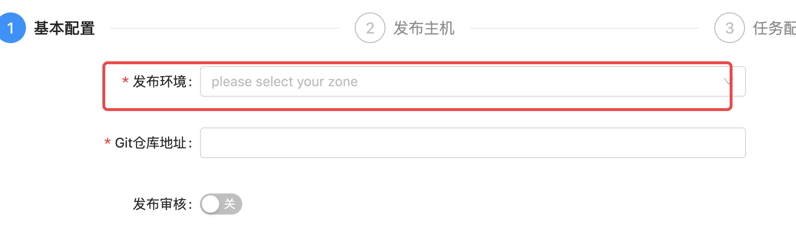


环境是针对公司内部的资产根据实际业务进行再次划分的单位。会存在1个服务器，在不同的时间属于多个不同的环境，一个环境有可能配套了多个企业资产。


## 软件安装

### jetkins

官网地址：https://www.jenkins.io/zh/

安装文档：https://www.jenkins.io/zh/doc/book/installing/


#### 系统要求

最低推荐配置:

- 256MB可用内存（JVM）
- 1GB可用磁盘空间(作为一个[Docker](https://www.jenkins.io/zh/doc/book/installing/#docker)容器运行jenkins的话推荐10GB)

为小团队推荐的硬件配置：

- 1GB+可用内存
- 50 GB+ 可用磁盘空间

软件配置:

- Java 8—无论是Java运行时环境（JRE）还是Java开发工具包（JDK）都可以。

**注意:** 如果将Jenkins作为Docker 容器运行，这不是必需的。


#### 版本说明

jenkins实际上由2个发布版本，分别是：**LTS**（长期支持版本）与 **Weekly**（普通发行版本）。

| 版本号          | 描述                                                         |
| --------------- | ------------------------------------------------------------ |
| 稳定版 (LTS)    | LTS (长期支持) 版本每12周从常规版本流中选择，作为该时间段的稳定版本。<br> 每隔 4 周，我们会发布稳定版本，其中包括错误和安全修复反向移植。 |
| 定期发布 (每周) | 每周都会发布一个新版本，为用户和插件开发人员提供错误修复和功能。 |

这里，我们直接开发使用 稳定版 (LTS) 。


#### 安装

docker-compose安装jetkins，docker-compose.yaml，代码：

```yaml
version: '3.7'
services:
  jenkins:
    image: 'jenkins/jenkins:lts-jdk11'
    container_name: jenkins
    restart: always
    user: root
    environment:
      - TZ=Asia/Shanghai
    ports:
      - '8888:8080'
      - '5000:50000'
    volumes:
      - './data/jenkins:/var/jenkins_home'
```

注释版：

```yaml
version: '3.7'   # docker-compose版本，目前最新版本是3.9版本，此处我们使用3.7即可。
services:          # 容器服务列表，一个docker-complse.yaml文件中只能有一个services
  jenkins:         # 服务名
    image: 'jenkins/jenkins:lts-jdk11'   # 当前容器的基础镜像
    container_name: jenkins   # 容器名
    restart: always                   # 设置开机自启，注意：如果公司安装的不是docker，而是podman的话。podman是没有这个配置的，如果要设置容器开机自启，只能借助python的supervisor这样的进程管理器来启动。
    user: root                          # 以root用户身份启动容器
    environment:                    # 容器内系统环境变量。
      - TZ=Asia/Shanghai       # 设置时区和国际化本地化
    ports:                                # 容器内部与宿主机之间的端口映射： 宿主机端口:容器端口
      - '8888:8080'
      - '5000:50000'                # 如果是windows下使用docker-desktop要调整50000端口为其他端口，因为50000被windows虚拟机hyper-V占用了。linux或macOS没这个问题
    volumes:                          # 逻辑卷配置，设置目录映射：宿主机路径: 容器内部路径
      - './data/jenkins:/var/jenkins_home'
```

拉取镜像启动docker容器（注意：要保证当前开发电脑上已经安装了docker、docker-compose，docker-compose依赖于python环境）。

```bash
# cd 项目根目录下，创建上面的 docker-compose.yaml
docker-compose up -d

# 如果要关闭当前docker-compose.yaml中所有的容器服务，则可以使用
docker-compose down

# 如果要查看某个容器运行过程中的日志
docker logs <容器名>
# 监控容器的日志
docker logs -f <容器名>
```


安装完成以后，等待2分钟左右，可以通过浏览器访问`http://127.0.0.1:8888`(如果你设置的也是这个端口的话)访问jenkins的管理站点。效果如下：


按界面中所说，进入找到容器内部`/var/jenkins_home`目录的映射路径`./data/jenkins`目录下的初始化密码文件复制密码，点击"继续"。


登陆后续界面如下：


建议选择“安装推荐的插件”，若插件安装失败，多试几次即可)，当然，也可以选择右边的自定义插件安装，先选择不安装插件，先进去也可以。


插件下载较慢是由于插件源服务器在国外，可以根据以下教程切换插件源服务器地址改成国内的。

当然也可以一直重试到下载完成为止。

>更换为国内插件源
>
>**方式1：**
>
>选择右边的自定义插件安装，先选择不安装插件，在配置管理员账号进入到jenkins管理页面时，点击"Manage Jenkins"--->"Manage Plugins"--->"Advanced"
>
>
>
>将上图的URL地址改为清华源并点击提交即可：https://mirrors.tuna.tsinghua.edu.cn/jenkins/updates/update-center.json
>
>**方式2：**
>
>更改配置文件（`jenkins_home/updates/default.json`），我们现在的jenkins应用安装在docker并做了数据映射，因此直接在宿主机下进行修改即可。
>
>
>
>因为default.json配置文件配置内容较多，修改的地址也很多，因此建议使用代码编辑器替换（Ctrl+H/Ctrl+R）或者`使用sed命令`进行替换：
>
>sed -i 's#https://updates.jenkins.io/download#https://mirrors.tuna.tsinghua.edu.cn/jenkins#g' default.json && sed -i 's#http://www.google.com#https://www.baidu.com#g' default.json
>
>完成以后，重启jenkins即可。

安装完成以后，创建管理员。

>注意：
>
>老师不知道各位同学的密码！！！自己设置的麻烦自己记一下哈。


实例配置，默认点击继续即可。


配置完成！


进入主界面，以后登陆的界面如下：


在前面如果没有选择安装推荐的插件，而是选择自定义安装而没有安装插件的同学，可以`系统管理`->`插件管理`处，进行插件的安装与卸载操作。常用的插件：git、pipeline、Blue Ocean、Allure等等。


#### 基本使用

接下来，我们快速使用jenkins来完成一个工程（就是一个项目的CI构建流程）。

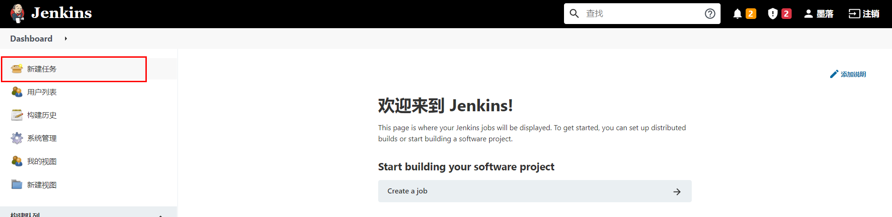


填写任务名称，并勾选默认插件，此处我们选择第一个"freestyle project"。


上面的操作项目于创建了一个项目工程的发布流程。


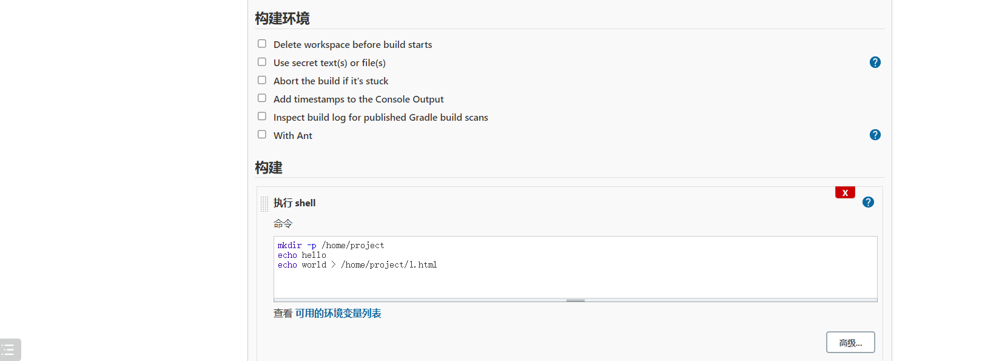


保存成功以后，可以在demo工程的管理菜单左侧选择立即构建。


等待以后，可以点击查看构建历史：


查看构建过程中的控制台输出。


#### 系统配置

##### 中文支持

默认是没有该配置的，需要安装额外安装中文扩展插件。安装中文扩展，等待jenkins重启。


重启完成以后，如果出现部分页面翻译一半的情况，可以打开系统设置，找到Locale选项，设置中文，接着访问http://127.0.0.1:8888/restart进行重启。


##### 凭据管理

所谓的凭据就是当前jenkins所在服务器对远程服务器节点进行操作的登陆凭证（可以是账号密码，也可以是sshkey）


##### 节点管理

节点（node），实际上就是jenkins用于在分布式主机下执行构建任务的服务器。

点击进入节点管理功能。

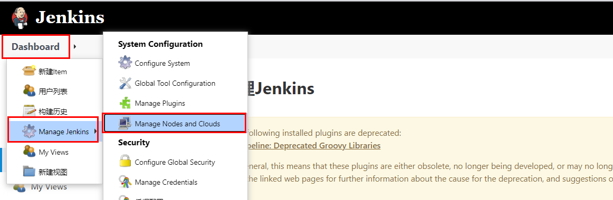


右侧是节点名称。点击左侧红框位置可以新建节点。


节点名称，可以自定义的名称，但最好将远程服务器的ip地址或者计算机名填上，便于后期维护查看。


节点连接配置


在节点对应的服务器上，使用`which git`，可以查看git命令的路径位置。

使用`echo $JAVE_HOME`，可以查看java的工作目录。


完成上面配置以后，点击"保存"。

并在新建节点对应的服务器（也就是上面添加的192.168.233.129）修改jenkins工作目录的权限并为jenkins设置java链接文件。

```bash
# 这里 /var/jenkins/workspace 为上述步骤设置的节点的工作目录
sudo mkdir -p /var/jenkins/workspace/jdk/bin/

sudo chown -P moluo:moluo /var/jenkins

which java
#  which java 命令的结果，/usr/bin/java，然后创建软连接
sudo ln -s /usr/bin/java /var/jenkins/workspace/jdk/bin/java
```

节点配置成功。


#### 用户管理

在jenkins安装完成以后，默认需要创建了一个超级管理员。但是在企业开发中，肯定不是所有人都使用超管账号的，而且不同的团队人员，能使用jenkins的功能权限应该也是不一样的。所以需要进行用户的账号分配以及权限分配。

从系统配置中点击全局安全配置，设置开启用户管理。


点击进入用户管理功能。


点击"新建用户"


删除用户。


指定用户分配权限。

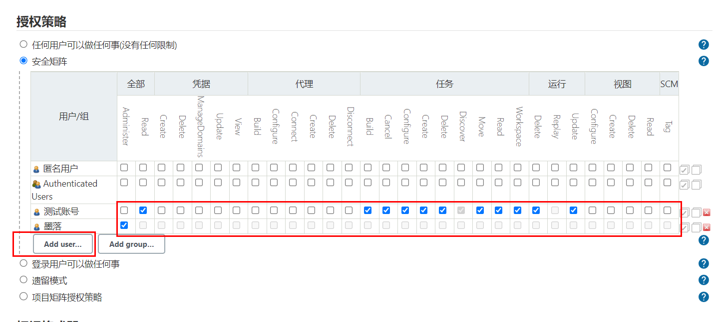


#### 通知配置

jenkins在构建任务完成以后，可以设置结果通知的。它支持邮件通知、企业微信、钉钉等等，但是都需要安装插件才可以使用。

这里，我们使用邮件通知看下jenkins的通知效果。


##### 安装插件

进入系统管理->插件管理->可选插件，安装Email Extension Template、Email Extension Plugin和Build Timestamp插件


安装等待jenkins重启。


在系统配置->设置邮件发送人的邮箱地址。


开启构建任务完成以后的邮件发送规则。


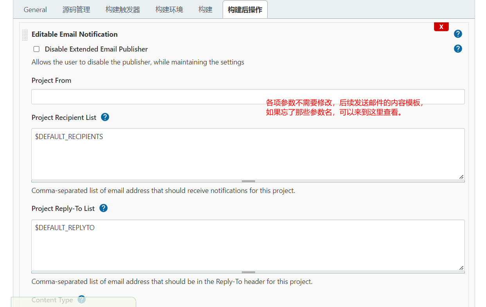


配置邮件通知。

登陆要使用的SMTP服务器所在的站点配置，设置第三方邮件发送服务。

SMTP（简单邮件发送协议，Simple Mail Transfer Protocol）服务器，就是邮件服务器所在的网关地址。


完成上面配置以后，可以通过点击"**通过发送测试邮件测试配置**"进行发送测试邮件，验证上面的配置是否正确！


##### 配置邮件模板内容

进入系统管理 - 系统配置，配置获取的时间戳格式 用于发送邮件时获取log和html报告为邮件附件


配置发送邮件账号与邮件类型


设置默认收件、邮件标题和邮件内容


jenkins提供的邮件发送变量

| 变量名        | 描述                        |
| ------------- | --------------------------- |
| $PROJECT_NAME | 构建任务的项目名（job名称） |
| $BUILD_NUMBER | 构建任务的编号ID            |
| $BUILD_STATUS | 构建任务的结果              |
| $CAUSE        | 构建任务的失败原因          |
| $PROJECT_URL  | 构建任务的详情URL地址       |

default content（默认邮件模板）：

```html
<!DOCTYPE html>
<html>
<head>
<meta charset="UTF-8">
<title>${PROJECT_NAME}-第${BUILD_NUMBER}次构建日志</title>
</head>
<body leftmargin="8" marginwidth="0" topmargin="8" marginheight="4" offset="0">
    <table width="95%" cellpadding="0" cellspacing="0"  style="font-size: 11pt; font-family: Tahoma, Arial, Helvetica, sans-serif">
        <tr>本邮件由jenkins系统自动发出，无需回复，以下为${PROJECT_NAME }项目构建信息</br>
            <td><font color="#CC0000">构建结果 - ${BUILD_STATUS}</font></td>
        </tr>
        <tr>
            <td><br />
            <b><font color="#0B610B">构建信息</font></b>
            <hr size="2" width="100%" align="center" /></td>
        </tr>
        <tr>
            <td>
                <ul>
                    <li>项目名称：${PROJECT_NAME}</li>
                    <li>构建编号：第${BUILD_NUMBER}次构建</li>
                    <li>触发原因：${CAUSE}</li>
                    <li>构建状态：${BUILD_STATUS}</li>
                    <li>项目URL：<a href="${PROJECT_URL}">${PROJECT_URL}</a></li>
                    <li>工作目录：<a href="${PROJECT_URL}ws">${PROJECT_URL}ws</a></li>
                    <li>构建URL：<a href="${BUILD_URL}">${BUILD_URL}</a></li>
                    <li>构建日志： <a href="${BUILD_URL}console">${BUILD_URL}console</a></li>
                    <li>测试报告：<a href="${BUILD_URL}HTML_20Report/">${BUILD_URL}HTML_20Report/</a></li>
                </ul>
                <h4><font color="#0B610B">失败用例</font></h4>
                <hr size="2" width="100%" />$FAILED_TESTS<br/>
                <h4><font color="#0B610B">最近提交版本(git：$GIT_REVISION)</font></h4>
                <hr size="2" width="100%" />
                <ul>
                ${CHANGES_SINCE_LAST_SUCCESS, reverse=true, format="%c", changesFormat="<li>%d[%a] %m</li>"}
                </ul>
                    详细提交: <a href="${PROJECT_URL}changes">${PROJECT_URL}changes</a><br/>
            </td>
        </tr>
    </table>
</body>
</html>
```


Default Triggers（发送邮件的触发规则）：


注：配置完成后可通过发送测试邮件是否配置正确。


### Gitlab

gitlab是一个类似github/giree的源码托管平台，是一个开源项目，经常在企业中用于构建私有git仓库，托管企业内部的项目源代码，支持使用http以及ssh协议进行源码管理，支持使用svn/git源码管理工具。

官方地址：https://gitlab.com/


#### 使用docker-compose安装Gitlab

docker-compose.yaml，代码：

```yaml
version: '3.7'
services:
  gitlab:
    image: 'gitlab/gitlab-ce:latest' # gitlab的镜像，如果已经有了，指定自己的镜像版本即可
    container_name: gitlab # 生成的docker容器的名字
    restart: always
    environment:
      GITLAB_OMNIBUS_CONFIG: |
        external_url 'http://192.168.101.8:8993' # 此处填写所在服务器ip若有域名可以写域名
        gitlab_rails['gitlab_shell_ssh_port'] = 2224
    ports:
      - '8993:8993' # 此处端口号须与 external_url 中保持一致，左边和右边都要一样
      - '2224:22' # 这里的2224和上面的2224一致，但是右边必须是22，不能是其他
    volumes:
      #将相关配置映射到当前目录下的config目录
      - './conf/gitlab:/etc/gitlab'
      #将日志映射到当前目录下的logs目录
      - './logs/gitlab:/var/log/gitlab'
      #将数据映射到当前目录下的data目录
      - './data/gitlab:/var/opt/gitlab'

  jenkins:
    image: 'jenkins/jenkins:lts-jdk11'
    container_name: jenkins
    restart: always
    user: root
    environment:
      - TZ=Asia/Shanghai
    ports:
      - '8888:8080'
      - '5000:50000'
    volumes:
      - './data/jenkins:/var/jenkins_home'
```

终端下关闭原来的jenkins，并重启启动两个容器即可。

```bash
docker-compose down 
docker-compose up -d
```

gitlab容器启动以后，需要等待几分钟，接着在浏览器访问登陆地址：http://192.168.101.8:8993/

首次登陆需要创建一个管理员账号。


#### 基本使用

>注意：
>
>老师不知道各位同学的密码！！！自己设置的麻烦自己记一下哈。

刚安装完成的gitlab默认已经内置了一个超级管理员root，密码保存在文件配置目录下initial_root_password文件中。


直接使用上面的账号和密码登陆即可。

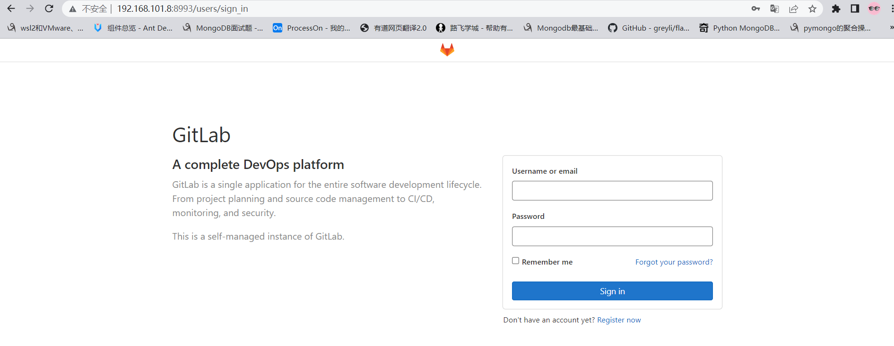

登陆成功以后，配置中文界面。


## API调用

不管是jenkins还是gitlab实际上都提供了外界操作的http api接口给开发者进行远程调用的。

Gitlab RestAPI 文档：http://192.168.101.8:8993/help/api/api_resources.md

要使用Gitlab RestAPI需要配置访问令牌。


有了令牌，就可以通过postman或者编程代码，使用http请求操作gitlab了。


jenkins RestAPI：http://127.0.0.1:8888/api/

访问格式：http://账号:密码@服务端地址:端口/job/任务名/build

jenkins状态的API：http://127.0.0.1:8888/api/json?pretty=true


### Python调用Gitlab

操作文档：https://python-gitlab.readthedocs.io/en/master/api-usage.html

安装

```bash
pip install python-gitlab
```

#### 基本使用

连接gitlab

```python
import gitlab
url = "http://192.168.101.8"
token = "yussaW8kaV26qhbOL9A3pMrScD7D6HdHRU2vPufs"
gl = gitlab.Gitlab(url, token)
```

#### 常用操作

| 方法                                                         | 描述                                                         |
| ------------------------------------------------------------ | ------------------------------------------------------------ |
| projects =gl.projects.list(page=1)                           | 获取第一页project                                            |
| **`projects=gl.projects.list(all=True)`**                    | 获取所有的project                                            |
| **`projects=gl.projects.get(1)`**                            | 通过指定id 获取 project 对象                                 |
| **`projects = gl.projects.list(search='keyword')`**          | 查找项目                                                     |
| **`projects = gl.projects.list(visibility='public')`**       | 获取公开的项目，参数visibility的值：<br>public  公有项目<br>internal 内部项目<br>private 私有项目 |
| **`project = gl.projects.create({'name': 'test2', 'description': '测试项目2','visibility': 'public'})`** | 创建一个项目                                                 |
| **`branches = project.branches.list()`**                     | 通过指定project对象获取该项目的所有分支                      |
| **`branch = project.branches.get('main')`**                  | 获取指定分支的属性                                           |
| **`branch = project.branches.create({'branch_name': 'feature/user','ref': 'main'})`** | 创建分支                                                     |
| project.branches.delete('feature/user')                      | 删除分支                                                     |
| branch.protect()                                             | 分支保护[v4版本没有该功能]                                   |
| branch.unprotect()                                           | 取消保护[v4版本没有该功能]                                   |
| **`tags = project.tags.list()`**                             | 获取指定项目的所有tags                                       |
| **`tag = project.tags.get('v1.0')`**                         | 获取某个指定tag 的信息                                       |
| **`tag = project.tags.create({'tag_name':'v1.0', 'ref':'main'})`** | 创建一个tag                                                  |
| tag.set_release_description('v1.0 release')                  | 设置tags 说明                                                |
| project.tags.delete('v1.0')                                  | 删除tags                                                     |
| tag.delete()                                                 | 删除tags                                                     |
| **commits = project.commits.list()**                         | 获取所有commit                                               |
| data = {<br/>    'branch_name': 'master',  # v3<br/>    'commit_message': 'commit message description',<br/>    'actions': [<br/>        {<br/>            'action': 'create',<br/>            'file_path': '.',<br/>            'content': 'blah'<br/>        }<br/>    ]<br/>}<br/>**`commit = project.commits.create(data)`**<br/> | 创建一个commit                                               |
| **`commit = project.commits.get('d3a5171b')`**               | 获取指定commit                                               |
| mrs = project.mergerequests.list()                           | 获取指定项目的所有merge request                              |
| mr = project.mergerequests.get(mr_id)                        | 获取 指定merge request                                       |
| project.mergerequests.create({'source_branch':'cool_feature', 'target_branch':'master', 'title':'merge cool feature', }) | 创建一个merge request                                        |
| mr.description = 'merge description'                         | 更新一个merge request 的描述                                 |
| mr.state_event = 'close'  <br>mr.save()                      | 开关一个merge request  (close or reopen)                     |
| project.mergerequests.delete(mr_id)                          | 删除一个merge request                                        |
| mr.merge()                                                   | 通过一个merge request                                        |
| mrs = project.mergerequests.list(state='merged', sort='asc') | 指定条件过滤 所有的merge request<br>state：all、merged、opened、closed<br>sort：asc、desc |
| gl.users.list()                                              | 所有用户列表                                                 |

基本使用

```python
import gitlab

if __name__ == '__main__':
    """获取所有项目列表"""
    url = "http://192.168.101.8:8993/"
    token = "LAgbKLyaysE4UjPyX1EV"
    gl = gitlab.Gitlab(url, token)
    # print(gl)

    # """获取所有项目列表"""
    # projects = gl.projects.list(all=True)
    # for project in projects:
    #     print(project.id, project.name ,project.description)
    #
    #
    # """获取单个项目"""
    # project = gl.projects.get(2)
    #
    # print("项目ID", project.id)
    # print("项目描述", project.description)
    # print("项目名", project.name)
    # print("创建时间", project.created_at)
    # print("默认主分支", project.default_branch)
    # print("tag数量", len(project.tag_list))
    # print("仓库地址[ssh]", project.ssh_url_to_repo)
    # print("仓库地址[http]", project.http_url_to_repo)
    # print("仓库访问地址", project.web_url)
    # print("仓库可见性", project.visibility)  # internal 内部项目 public 开源项目   private私有项目
    # print("仓库派生数量", project.forks_count)
    # print("仓库星标数量", project.star_count)
    # print("仓库拥有者", getattr(project, "owner", None)) # 因为默认的第一个仓库是没有拥有者的!!
    #
    #
    #
    # """
    # {
    #     'id': 2,
    #     'description': '自动化运维平台',
    #     'name': 'uric',
    #     'name_with_namespace': 'Administrator / uric',
    #     'path': 'uric',
    #     'path_with_namespace': 'root/uric',
    #     'created_at': '2022-08-20T03:34:48.446Z',
    #     'default_branch': 'main',
    #     'tag_list': [],
    #     'topics': [],
    #     'ssh_url_to_repo': 'ssh://git@192.168.101.8:2224/root/uric.git',
    #     'http_url_to_repo': 'http://192.168.101.8:8993/root/uric.git',
    #     'web_url': 'http://192.168.101.8:8993/root/uric',
    #     'readme_url': 'http://192.168.101.8:8993/root/uric/-/blob/main/README.md',
    #     'avatar_url': None,
    #     'forks_count': 0,
    #     'star_count': 0,
    #     'last_activity_at': '2022-08-20T03:34:48.446Z',
    #     'namespace': {
    #         'id': 1,
    #         'name': 'Administrator',
    #         'path': 'root',
    #         'kind': 'user',
    #         'full_path': 'root',
    #         'parent_id': None,
    #         'avatar_url': 'https://www.gravatar.com/avatar/e64c7d89f26bd1972efa854d13d7dd61?s=80&d=identicon',
    #         'web_url': 'http://192.168.101.8:8993/root'
    #     },
    #     '_links': {
    #         'self': 'http://192.168.101.8:8993/api/v4/projects/2',
    #         'issues': 'http://192.168.101.8:8993/api/v4/projects/2/issues',
    #         'merge_requests': 'http://192.168.101.8:8993/api/v4/projects/2/merge_requests',
    #         'repo_branches': 'http://192.168.101.8:8993/api/v4/projects/2/repository/branches',
    #         'labels': 'http://192.168.101.8:8993/api/v4/projects/2/labels',
    #         'events': 'http://192.168.101.8:8993/api/v4/projects/2/events',
    #         'members': 'http://192.168.101.8:8993/api/v4/projects/2/members'
    #     },
    #     'packages_enabled': True,
    #     'empty_repo': False,
    #     'archived': False,
    #     'visibility': 'internal',
    #     'owner': {
    #         'id': 1,
    #         'username': 'root',
    #         'name': 'Administrator',
    #         'state': 'active',
    #         'avatar_url': 'https://www.gravatar.com/avatar/e64c7d89f26bd1972efa854d13d7dd61?s=80&d=identicon',
    #         'web_url': 'http://192.168.101.8:8993/root'},
    #         'resolve_outdated_diff_discussions': False,
    #         'container_expiration_policy': {'cadence': '1d',
    #         'enabled': False,
    #         'keep_n': 10,
    #         'older_than': '90d',
    #         'name_regex': '.*',
    #         'name_regex_keep': None,
    #         'next_run_at': '2022-08-21T03:34:49.221Z'},
    #         'issues_enabled': True,
    #         'merge_requests_enabled': True,
    #         'wiki_enabled': True,
    #         'jobs_enabled': True,
    #         'snippets_enabled': True,
    #         'container_registry_enabled': True,
    #         'service_desk_enabled': False,
    #         'service_desk_address': None,
    #         'can_create_merge_request_in': True,
    #         'issues_access_level': 'enabled',
    #         'repository_access_level': 'enabled',
    #         'merge_requests_access_level': 'enabled',
    #         'forking_access_level': 'enabled',
    #         'wiki_access_level': 'enabled',
    #         'builds_access_level': 'enabled',
    #         'snippets_access_level': 'enabled',
    #         'pages_access_level': 'private',
    #         'operations_access_level': 'enabled',
    #         'analytics_access_level': 'enabled',
    #         'container_registry_access_level': 'enabled',
    #         'emails_disabled': None,
    #         'shared_runners_enabled': True,
    #         'lfs_enabled': True,
    #         'creator_id': 1,
    #         'import_status': 'none',
    #         'open_issues_count': 0,
    #         'ci_default_git_depth': 50,
    #         'ci_forward_deployment_enabled': True,
    #         'ci_job_token_scope_enabled': False,
    #         'public_jobs': True,
    #         'build_timeout': 3600,
    #         'auto_cancel_pending_pipelines': 'enabled',
    #         'build_coverage_regex': None,
    #         'ci_config_path': None,
    #         'shared_with_groups': [],
    #         'only_allow_merge_if_pipeline_succeeds': False,
    #         'allow_merge_on_skipped_pipeline': None,
    #         'restrict_user_defined_variables': False,
    #         'request_access_enabled': True,
    #         'only_allow_merge_if_all_discussions_are_resolved': False,
    #         'remove_source_branch_after_merge': True,
    #         'printing_merge_request_link_enabled': True,
    #         'merge_method': 'merge',
    #         'squash_option': 'default_off',
    #         'suggestion_commit_message': None,
    #         'merge_commit_template': None,
    #         'squash_commit_template': None,
    #         'auto_devops_enabled': True,
    #         'auto_devops_deploy_strategy': 'continuous',
    #         'autoclose_referenced_issues': True,
    #         'repository_storage': 'default',
    #         'keep_latest_artifact': True,
    #         'permissions': {
    #             'project_access': {
    #                 'access_level': 40,
    #                 'notification_level': 3
    #             },
    #             'group_access': None
    #         }
    #     }
    # """

    # """根据项目名搜索项目"""
    # projects = gl.projects.list(search='uric')
    # print(projects)


    # """根据项目的可见性列出符合条件的项目"""
    # # projects = gl.projects.list(visibility='public')  # 公有项目列表
    # projects = gl.projects.list(visibility='private') # 私有项目列表
    # # projects = gl.projects.list(visibility='internal') # 内部项目列表
    # print(projects)

    """创建一个项目"""
    # project = gl.projects.create({
    #     'name': 'test2',   # 项目名，不要使用中文或其他特殊符号
    #     # 'path': 'test2',   # 访问路径，如果不设置path，则path的值默认为name
    #     'description': '测试项目2',
    #     'visibility': 'public'
    # })

    # """更新一个项目"""
    # # 先获取项目
    # project = gl.projects.get(5)
    # # 在获取了项目以后，直接对当前项目对象设置属性进行覆盖，后面调用save方法即可保存更新内容
    # project.description = "测试项目2的描述信息被修改了1次"
    # project.save()

    # """删除一个项目"""
    # project = gl.projects.get(5)
    # project.delete()


    # """分支管理：获取所有分支"""
    # project = gl.projects.get(3)
    # # branches = project.branches.list()
    # # print(branches)  # [<ProjectBranch name:main>]
    #
    # """根据名称获取一个分支"""
    # project = gl.projects.get(3)
    # branch = project.branches.get('main')
    # print("分支名称：", branch.name)
    # print("分支最新提交记录：", branch.commit)
    # print("分支合并状态：", branch.merged)
    # print("是否属于保护分支：", branch.protected)
    # print("当前分支是否可以推送代码：", branch.can_push)
    # print("是否是默认分支：", branch.default)
    # print("当前分支的访问路径：", branch.web_url)
    #
    # """
    # {
    #     'name': 'main',
    #     'commit': {
    #         'id': 'be71595d791b3437dee7e36a9dc221376392912f',
    #         'short_id': 'be71595d',
    #         'created_at': '2022-08-20T04:00:44.000+00:00',
    #         'parent_ids': [],
    #         'title': 'Initial commit',
    #         'message': 'Initial commit',
    #         'author_name': 'Administrator',
    #         'author_email': 'admin@example.com',
    #         'authored_date': '2022-08-20T04:00:44.000+00:00',
    #         'committer_name': 'Administrator',
    #         'committer_email': 'admin@example.com',
    #         'committed_date': '2022-08-20T04:00:44.000+00:00',
    #         'trailers': {},
    #         'web_url': 'http://192.168.101.8:8993/root/tools/-/commit/be71595d791b3437dee7e36a9dc221376392912f'
    #     },
    #     'merged': False,
    #     'protected': True,
    #     'developers_can_push': False,
    #     'developers_can_merge': False,
    #     'can_push': True,
    #     'default': True,
    #     'web_url': 'http://192.168.101.8:8993/root/tools/-/tree/main'
    # """

    # """给指定项目创建分支"""
    # project = gl.projects.get(3)
    # branch = project.branches.create({'branch': 'feature/user', 'ref': 'main'})
    # print(branch)

    """更新分支的属性【gitbal的v4版本中没有保护分支和取消保护分支的功能】"""
    # project = gl.projects.get(3)
    # branch = project.branches.get('feature/user')
    # # 设置当前分支为保护分支
    # branch.protect()


    # """删除一个分支"""
    # # 注意，只有一个保护分支时，是不能删除当前分支的
    # project = gl.projects.get(3)
    # project.branches.delete('feature/user')

    # """创建一个tag标签"""
    # project = gl.projects.get(3)
    # tag = project.tags.create({'tag_name': 'v1.0', 'ref': 'main'})
    # print(tag)

    # """获取所有tag标签"""
    # project = gl.projects.get(3)
    # tags = project.tags.list(all=True)
    # print(tags)

    # """获取一个tag标签信息"""
    # project = gl.projects.get(3)
    # tag = project.tags.get('v1.0')
    # print("标签名", tag.name)
    # print("标签的版本描述", tag.message)
    # print("标签的唯一标记(版本号)", tag.target) # 实际上就是本次创建标签时的分支最后一条commit的版本号
    # print("标签的最后一个commit记录", tag.commit)
    # print("当前标签是否发布", tag.release)
    # print("当前标签是佛属于保护标签", tag.protected)
    #
    # """
    # {
    #     'name': 'v1.0',
    #     'message': '',
    #     'target': 'be71595d791b3437dee7e36a9dc221376392912f',
    #     'commit': {
    #         'id': 'be71595d791b3437dee7e36a9dc221376392912f',
    #         'short_id': 'be71595d',
    #         'created_at': '2022-08-20T04:00:44.000+00:00',
    #         'parent_ids': [],
    #         'title': 'Initial commit',
    #         'message': 'Initial commit',
    #         'author_name': 'Administrator',
    #         'author_email': 'admin@example.com',
    #         'authored_date': '2022-08-20T04:00:44.000+00:00',
    #         'committer_name': 'Administrator',
    #         'committer_email': 'admin@example.com',
    #         'committed_date': '2022-08-20T04:00:44.000+00:00',
    #         'trailers': {},
    #         'web_url': 'http://192.168.101.8:8993/root/tools/-/commit/be71595d791b3437dee7e36a9dc221376392912f'
    #     },
    #     'release': None,
    #     'protected': False
    # }
    # """


    # """指定项目的commit提交记录"""
    # project = gl.projects.get(3)
    # commits = project.commits.list(all=True)
    # print(commits)

    # """根据版本号来获取commit记录"""
    # project = gl.projects.get(3)
    # commit = project.commits.get("be71595d791b3437dee7e36a9dc221376392912f")
    # print(commit)
    # """
    # {
    #     'id': 'be71595d791b3437dee7e36a9dc221376392912f',
    #     'short_id': 'be71595d',
    #     'created_at': '2022-08-20T04:00:44.000+00:00',
    #     'parent_ids': [],
    #     'title': 'Initial commit',
    #     'message': 'Initial commit',
    #     'author_name': 'Administrator',
    #     'author_email': 'admin@example.com',
    #     'authored_date': '2022-08-20T04:00:44.000+00:00',
    #     'committer_name': 'Administrator',
    #     'committer_email': 'admin@example.com',
    #     'committed_date': '2022-08-20T04:00:44.000+00:00',
    #     'trailers': {},
    #     'web_url': 'http://192.168.101.8:8993/root/tools/-/commit/be71595d791b3437dee7e36a9dc221376392912f',
    #     'stats': {
    #         'additions': 3,
    #         'deletions': 0,
    #         'total': 3},
    #         'status': None,
    #         'project_id': 3,
    #         'last_pipeline': None
    #     }
    # """


    # """创建一个commit版本"""
    # project = gl.projects.get(3)
    # data = {
    # 'branch': 'main',
    # 'commit_message': '提交代码的版本描述',
    #     'actions': [
    #         {
    #         'action': 'create',  # 创建文件
    #         # 'action': 'update',  # 更新文件
    #         # 'action': 'delete',    # 删除文件
    #         'file_path': 'docs/uric_api/logs/uric.log', # 文件路径
    #         'content': '上传文件的内容'  # 文件内容
    #         }
    #     ]
    # }
    #
    # commit = project.commits.create(data)


    """获取用户列表"""
    # print(gl.users.list())  # [<User id:1 username:root>]

    """获取单个用户信息"""
    user = gl.users.get(1)
    print(user)


```


封装工具类

```python
import gitlab


class Gitlabapi(object):
    VISIBILITY = {
        "private": "私有",
        "internal": "内部",
        "public": "公开"
    }

    def __init__(self, url, token):
        self.url = url
        self.token = token
        self.conn = gitlab.Gitlab(self.url, self.token)

    def get_projects(self):
        """
        获取所有的项目
        :return:
        """
        projects = self.conn.projects.list(all=True, iterator=True)
        projectslist = []
        for pro in projects:
            projectslist.append(pro.attributes)  # pro.attributes 项目的所有属性
        return projectslist

    def get_projects_visibility(self, visibility="public"):
        """
        根据可见性属性获取项目
        :param visibility:
        :return:
        """
        if visibility in self.VISIBILITY:
            attribute = visibility
        else:
            attribute = "public"
        projects = self.conn.projects.list(all=True, visibility=attribute)
        projectslist = []
        for pro in projects:
            projectslist.append(pro.attributes)
        return projectslist

    def get_projects_id(self, project_id):
        """
        根据id获取项目
        :param project_id:
        :return:
        """
        res = self.conn.projects.get(project_id)
        return res.attributes

    def get_projects_search(self, name):
        """
        模糊搜索项目
        :param name:
        :return:
        """
        projects = self.conn.projects.list(search=name)
        projectslist = []
        for pro in projects:
            projectslist.append(pro.attributes)
        return projectslist

    def create_project(self, name):
        """
        创建项目
        :param name:
        :return:
        """
        res = self.conn.projects.create({"name": name})
        return res.attributes

    def get_project_brances(self, project_id):
        """
        获取项目所有分支
        :param project_id:
        :return:
        """
        project = self.conn.projects.get(project_id)
        brancheslist = []
        for branches in project.branches.list():
            brancheslist.append(branches.attributes)
        return brancheslist

    def get_project_brance_attribute(self, project_id, branch):
        """
        获取指定项目指定分支
        :param project_id:
        :param branch:
        :return:
        """
        project = self.conn.projects.get(project_id)
        res = project.branches.get(branch)
        return res.attributes

    def create_get_project_brance(self, project_id, branch, ref="main"):
        """
        创建分支
        :param project_id:
        :param branch:
        :param ref:
        :return:
        """
        project = self.conn.projects.get(project_id)
        res = project.branches.create({"branch": branch, "ref": ref})
        return res.attributes

    def delete_project_brance(self, project_id, branch):
        """
        删除分支
        :param project_id:
        :param branch:
        :return:
        """
        project = self.conn.projects.get(project_id)
        project.branches.delete(branch)

    def protect_project_brance(self, project_id, branch, is_protect=None):
        """
        分支保护[v3.0可用, V4.0不可用]
        :param project_id:
        :param branch:
        :param is_protect:
        :return:
        """
        project = self.conn.projects.get(project_id)
        branch = project.branches.get(branch)
        if is_protect == "protect":
            branch.unprotect()
        else:
            branch.protect()

    def get_project_tags(self, project_id):
        """
        获取所有的tags标签
        :param project_id:
        :return:
        """
        project = self.conn.projects.get(project_id)
        tags = project.tags.list()
        taglist = []
        for tag in tags:
            taglist.append(tag.attributes)
        return taglist

    def get_project_tag_name(self, project_id, name):
        """
        获取指定的tag
        :param project_id:
        :param name:
        :return:
        """
        project = self.conn.projects.get(project_id)
        tags = project.tags.get(name)
        return tags.attributes

    def create_project_tag(self, project_id, name, branch="master"):
        """
        创建tag
        :param project_id:
        :param name:
        :param branch:
        :return:
        """
        project = self.conn.projects.get(project_id)
        tags = project.tags.create({"tag_name": name, "ref": branch})
        return tags.attributes

    def delete_project_tag(self, project_id, name):
        """
        删除tags
        :param project_id:
        :param name:
        :return:
        """
        project = self.conn.projects.get(project_id)
        project.tags.delete(name)

    def get_project_commits(self, project_id):
        """
        获取所有的commit
        :param project_id:
        :return:
        """
        project = self.conn.projects.get(project_id)
        commits = project.commits.list()
        commitslist = []
        for com in commits:
            commitslist.append(com.attributes)
        return commitslist

    def get_project_commit_info(self, project_id, commit_id):
        """
        获取指定的commit
        :param project_id:
        :param commit_id:
        :return:
        """
        project = self.conn.projects.get(project_id)
        commit = project.commits.get(commit_id)
        return commit.attributes

    def get_project_merge(self, project_id):
        """
        获取所有的合并请求
        :param project_id:
        :return:
        """
        project = self.conn.projects.get(project_id)
        mergerquests = project.mergerequests.list()
        mergerquestslist = []
        for mergerquest in mergerquests:
            mergerquestslist.append(mergerquest.attributes)
        return mergerquestslist

    def get_project_merge_id(self, project_id, mr_id):
        """
        获取请求的详细信息
        :param project_id:
        :param mr_id:
        :return:
        """
        project = self.conn.projects.get(project_id)
        mrinfo = project.mergerequests.get(mr_id)
        return mrinfo.attributes

    def create_project_merge(self, project_id, source_branch, target_branch, title):
        """
        创建合并请求
        :param project_id:
        :param source_branch:
        :param target_branch:
        :param title:
        :return:
        """
        project = self.conn.projects.get(project_id)
        res = project.mergerequests.create(
            {"source_branch": source_branch, "target_branch": target_branch, "title": title})
        return res

    def update_project_merge_info(self, project_id, mr_id, data):
        """
        更新合并请求的信息
        :param project_id:
        :param mr_id:
        :param data:
        :return:
        """
        # data = {"description":"new描述","state_event":"close"}
        project = self.conn.projects.get(project_id)
        mr = project.mergerequests.get(mr_id)
        if "description" in data:
            mr.description = data["description"]
        if "state_event" in data:
            state_event = ["close", "reopen"]
            if data["state_event"] in state_event:
                mr.state_event = data["state_event"]
        res = mr.save()
        return res

    def delete_project_merge(self, project_id, mr_id):
        """
        删除合并请求
        :param project_id:
        :param mr_id:
        :return:
        """
        project = self.conn.projects.get(project_id)
        res = project.mergerequests.delete(mr_id)
        return res

    def access_project_merge(self, project_id, mr_id):
        """
        允许合并请求
        :param project_id:
        :param mr_id:
        :return:
        """
        project = self.conn.projects.get(project_id)
        mr = project.mergerequests.get(mr_id)
        res = mr.merge()
        return res

    def search_project_merge(self, project_id, state, sort):
        '''
        搜索项目合并请求
        :param id:
        :param state: state of the mr,It can be one of all,merged,opened or closed
        :param sort: sort order (asc or desc)
        :param order_by: sort by created_at or updated_at
        :return:
        '''
        stateinfo = ["merged", "opened", "closed"]
        sortinfo = ["asc", "desc"]
        if state not in stateinfo:
            state = "merged"
        if sort not in sortinfo:
            sort = "asc"
        project = self.conn.projects.get(project_id)
        mergerquests = project.mergerequests.list(state=state, sort=sort)
        mergerquestslist = []
        for mergerquest in mergerquests:
            mergerquestslist.append(mergerquest.attributes)
        return mergerquestslist

    def create_project_commit(self, project_id, branch_name, message, actions):
        """
        创建项目提交记录
        :param project_id:
        :param branch_name:
        :param message:
        :param actions:
        :return:
        """
        project = self.conn.projects.get(project_id)
        data = {
            'branch': branch_name,
            'commit_message': message,
            'actions': actions,
            # 'actions': [{
            #     'action': 'create',
            #     'file_path': 'myreadme',
            #     'contend': 'commit_test'
            # }]
        }
        commit = project.commits.create(data)
        return commit

    def diff_project_branches(self, project_id, source_branch, target_branch):
        """
        比较2个分支
        :param project_id:
        :param source_branch:
        :param target_branch:
        :return:
        """
        project = self.conn.projects.get(project_id)
        result = project.repository_compare(source_branch, target_branch)
        # commits = result["commits"]
        # commits = result["diffs"]
        return result


if __name__ == '__main__':
    url = "http://192.168.101.8:8993/"
    token = "LAgbKLyaysE4UjPyX1EV"
    gl = Gitlabapi(url, token)
    # projects = gl.get_projects()
    projects = gl.get_projects_visibility("internal")
    print(projects)

```


### Python调用Jenkins

官方文档：https://python-jenkins.readthedocs.io/en/latest/

安装python-jenkins

```
pip install python-jenkins
```

#### 基本使用

基于密码/Token连接jenkins

```python
import jenkins
    # 基于登陆密码连接jenkins
    # server = jenkins.Jenkins('http://192.168.101.8:8888/', username='admin', password='7bb3d493057242edaf5a9e72c63ca27e')
    # 基于token连接jenkins
    server = jenkins.Jenkins('http://192.168.101.8:8888/', username='admin', password='11217915472cb72a7edb9a4de8113a5928')
    print(server)
```

#### token的获取方式

进入用户个人页面 —>  点击左上角的设置 —> API Token   —> 添加新 Token。 


#### 常用操作

| 方法                                                         | 描述                                                         |
| ------------------------------------------------------------ | ------------------------------------------------------------ |
| `server.get_jobs()`                                          | 项目列表                                                     |
| `server.get_job_info('job名称')`                             | 根据名称获取执行项目                                         |
| `server.build_job(name='构建的job名称')`                     | 构建项目                                                     |
| `server.build_job(name='构建的job名称', parameters='构建的参数，字典类型')` | 参数化构建项目                                               |
| `server.stop_build('job名称', '构建编号ID')`                 | 停止一个正在运行的项目                                       |
| `server.enable_job('job名称')`                               | 激活项目状态为可构建                                         |
| `server.disable_job('job名称')`                              | 变更项目状态为不可构建                                       |
| `server.delete_job('job名称')`                               | 删除项目                                                     |
| `last_build_number = server.get_job_info('job名称')['lastBuild']['number']` | 获取项目当前构建的最后一次编号                               |
| `status = server.get_build_info('job名称', last_build_number)['result']` | 通过构建编号获取任务状态<br>状态有4种：SUCCESS、FAILURE、ABORTED、pending |
| `result = server.get_build_console_output(name='job名称', number=last_build_number)` | 获取项目控制台日志                                           |
| `result = server.get_build_test_report(name='job名称', number=last_build_number)` | 获取项目测试报告                                             |

快速入门，代码：

```python
import jenkins

if __name__ == '__main__':
    """连接jenkins"""
    # 基于登陆密码连接jenkins
    # server = jenkins.Jenkins('http://192.168.101.8:8888/', username='admin', password='7bb3d493057242edaf5a9e72c63ca27e')
    # 基于token连接jenkins
    server = jenkins.Jenkins('http://192.168.101.8:8888/', username='admin', password='11217915472cb72a7edb9a4de8113a5928')
    # print(server)

    # """我是谁?"""
    # user = server.get_whoami()
    # print(user)
    #
    # """jenkins的版本号"""
    # version = server.get_version()
    # print(version)

    # """查看所有的构建任务"""
    # jobs = server.get_jobs()
    # print(jobs)
    # """
    # [{
    #     '_class': 'hudson.model.FreeStyleProject',   # 构建项目的类型  FreeStyleProject 表示自由风格的构建项目
    #     'name': 'demo',                              # 构建项目的名称
    #     'url': 'http://192.168.101.8:8888/job/demo/',   # 访问地址
    #     'color': 'notbuilt',                            # 构建状态  【notbuilt, blue, 】
    #     'fullname': 'demo'                              # 构建项目的名称
    # }]
    # """

    # """获取指定的构建任务信息"""
    # info = server.get_job_info(name="demo")
    # print(info)
    # """
    # {
    #     '_class': 'hudson.model.FreeStyleProject',   # 构建项目类型
    #     'actions': [   # 构建项目的配置配置
    #         {},
    #         {},
    #         {'_class': 'org.jenkinsci.plugins.displayurlapi.actions.JobDisplayAction'},
    #         {'_class': 'com.cloudbees.plugins.credentials.ViewCredentialsAction'}
    #     ],
    #     'description': '测试构建项目',   # 构建项目的描述
    #     'displayName': 'demo',         # 构建项目的名称
    #     'displayNameOrNull': None,
    #     'fullDisplayName': 'demo',
    #     'fullName': 'demo',
    #     'name': 'demo',                # 构建项目的名称
    #     'url': 'http://192.168.101.8:8888/job/demo/',    # 访问地址
    #     'buildable': True,                               # 当前构建项目是否属于可构建状态（激活状态）
    #     'builds': [{                                     # 构建项目的执行记录
    #         '_class': 'hudson.model.FreeStyleBuild',
    #         'number': 1,
    #         'url': 'http://192.168.101.8:8888/job/demo/1/'
    #     }],
    #     'color': 'blue',                                 # 构建项目的执行状态（晴雨表）
    #     'firstBuild': {                                  # 首次构建的结果
    #         '_class': 'hudson.model.FreeStyleBuild',
    #         'number': 1,
    #         'url': 'http://192.168.101.8:8888/job/demo/1/'
    #     },
    #     'healthReport': [{                               # 构建项目的健康报告（晴雨表）
    #         'description': 'Build stability: No recent builds failed.',
    #         'iconClassName': 'icon-health-80plus',
    #         'iconUrl': 'health-80plus.png',
    #         'score': 100                                 # 构建任务的成功率
    #     }],
    #     'inQueue': False,                                # 是否处理队列等待中
    #     'keepDependencies': False,
    #     'lastBuild': {                                   # 上一次构建构建任务的状态
    #         '_class': 'hudson.model.FreeStyleBuild',
    #         'number': 1,
    #         'url': 'http://192.168.101.8:8888/job/demo/1/'},
    #         'lastCompletedBuild': {                     # 上一次完成构建的执行记录
    #             '_class': 'hudson.model.FreeStyleBuild',
    #             'number': 1,
    #             'url': 'http://192.168.101.8:8888/job/demo/1/'
    #         },
    #         'lastFailedBuild': None,                    # 上一次失败记录
    #         'lastStableBuild': {                        # 上次构建状态
    #             '_class': 'hudson.model.FreeStyleBuild',
    #             'number': 1,
    #             'url': 'http://192.168.101.8:8888/job/demo/1/'
    #         },
    #         'lastSuccessfulBuild': {                    # 上一次成功记录
    #             '_class': 'hudson.model.FreeStyleBuild',
    #             'number': 1,
    #             'url': 'http://192.168.101.8:8888/job/demo/1/'
    #         },
    #         'lastUnstableBuild': None,
    #         'lastUnsuccessfulBuild': None,
    #         'nextBuildNumber': 2,
    #         'property': [],
    #         'queueItem': None,
    #         'concurrentBuild': False,
    #         'disabled': False,
    #         'downstreamProjects': [],
    #         'labelExpression': None,
    #         'scm': {'_class': 'hudson.scm.NullSCM'},
    #         'upstreamProjects': []
    #     }
    # """

    # """开始构建任务"""
    # # 如果要构建的任务，不存在，则报错！！
    # build_id = server.build_job(name='demo')
    # print(build_id)

    # """设置构建任务为禁用状态(不可构建状态)"""
    # server.disable_job(name='demo')

    # """设置构建任务为激活激活状态(可构建状态)"""
    # server.enable_job(name="demo")

    # """删除一个构建任务"""
    # server.delete_job(name='demo')

    # """获取项目的最后一次构建编号"""
    # last_build_number = server.get_job_info('demo')['lastBuild']['number']
    # print(last_build_number)

    # """根据构建编号来获取构建结果"""
    # last_build_number = server.get_job_info('demo')['lastBuild']['number']
    # result = server.get_build_info('demo', last_build_number)['result']
    # print(result)  # SUCCESS

    # """根据构建编号获取构建过程中的终端输出内容"""
    # last_build_number = server.get_job_info('demo')['lastBuild']['number']
    # result = server.get_build_console_output(name='demo', number=last_build_number)
    # print(result)

    # """根据构建编号获取构建的测试报告【Allure】"""
    # last_build_number = server.get_job_info('demo')['lastBuild']['number']
    # result = server.get_build_test_report(name='demo', number=last_build_number)
    # print(result)

    """基于已有的任务，生成一份xml配置文档"""
    # config_xml = server.get_job_config(name="demo")
    # print(config_xml)

#     """
#     基于xml构建项目
#     """
#     config_xml = """<project>
# <description>测试构建项目</description>
# <keepDependencies>false</keepDependencies>
# <properties/>
# <scm class="hudson.scm.NullSCM"/>
# <canRoam>true</canRoam>
# <disabled>false</disabled>
# <blockBuildWhenDownstreamBuilding>false</blockBuildWhenDownstreamBuilding>
# <blockBuildWhenUpstreamBuilding>false</blockBuildWhenUpstreamBuilding>
# <triggers/>
# <concurrentBuild>false</concurrentBuild>
# <builders>
# <hudson.tasks.Shell>
#   <command>echo "hello, project-1"</command>
#   <configuredLocalRules/>
# </hudson.tasks.Shell>
# </builders>
# <publishers/>
# <buildWrappers/>
# </project>"""
#
#     server.create_job("project-1", config_xml=config_xml)

```

封装工具类，代码：

```python
import jenkins

class Jenkinsapi(object):
    def __init__(self,url, user, token):
        self.server_url = url
        self.user = user
        self.token = token
        self.conn = jenkins.Jenkins(self.server_url, username=self.user, password=self.token)

    def get_jobs(self):
        """
        获取所有的构建项目列表
        :return:
        """
        return self.conn.get_jobs()

    def get_job_info(self, job):
        """
        根据项目名获取构建项目
        :param job:
        :return:
        """
        return self.conn.get_job_info(job)

    def build_job(self,job,**kwargs):
        """
        开始构建项目
        :param job:
        :param kwargs:
        :return:
        """
        # dict1 = {"version":11} # 参数话构建
        # dict2 = {'Status': 'Rollback', 'BUILD_ID': '26'} # 回滚
        return self.conn.build_job(job, parameters=kwargs)

    def get_build_info(self,job, build_number):
        """
        通过构建编号获取构建项目的构建记录
        :param job:
        :param build_number:
        :return:
        """
        return self.conn.get_build_info(job,build_number)

    def get_job_config(self,job):
        '''
        获取xml文件
        '''
        res = self.conn.get_job_config(job)
        print(res)

    def create_job(self,name,config_xml):
        '''
        任务名字
        xml格式的字符串
        '''
        self.conn.create_job(name, config_xml)

    def update_job(self,name,config_xml):
        res = self.conn.reconfig_job(name,config_xml)
        print(res)


if __name__ == '__main__':
    server_url = 'http://192.168.101.8:8888/'
    username = 'admin'
    password = '11217915472cb72a7edb9a4de8113a5928'
    server = Jenkinsapi(server_url, username, password)

    # jobs = server.get_jobs()
    # print(jobs)

    # job = server.get_job_info("project-1")
    # print(job)

    # build_number = server.build_job("project-1")
    # print(build_number)

    # info = server.get_build_info("project-1", 2)
    # print(info)

    # 先获取已有构建项目的配置文档
    # config_xml = server.get_job_config("project-1")
    # print(config_xml)

    config_xml = """<project>
<description>测试构建项目</description>
<keepDependencies>false</keepDependencies>
<properties/>
<scm class="hudson.scm.NullSCM"/>
<canRoam>true</canRoam>
<disabled>false</disabled>
<blockBuildWhenDownstreamBuilding>false</blockBuildWhenDownstreamBuilding>
<blockBuildWhenUpstreamBuilding>false</blockBuildWhenUpstreamBuilding>
<triggers/>
<concurrentBuild>false</concurrentBuild>
<builders>
<hudson.tasks.Shell>
  <command>echo "hello, project-2"</command>
  <configuredLocalRules/>
</hudson.tasks.Shell>
</builders>
<publishers/>
<buildWrappers/>
</project>"""
    server.create_job("project-2", config_xml=config_xml)

```


## 环境管理

由于我们进行代码发布的时候，需要选择环境(测试环境、线上环境等等)，来区分我们本次将代码发布到什么环境的主机群组中。

所以我们先完成左侧菜单栏中环境管理。


#### 后端实现环境管理的API接口

创建应用

```bash
cd uric_api/apps
python ../../manage.py startapp conf_center
```

配置应用，`settings/dev.py`，代码：

```python
INSTALLED_APPS = [
		...,
    'conf_center',
]
```

创建子应用路由文件，`conf_center/urls.py`，代码：

```python
from django.urls import path
from . import views

urlpatterns = [

]

```

总路由，`uric_api/urls`，代码：

```python
from django.contrib import admin
from django.urls import path, include

urlpatterns = [
    path('admin/', admin.site.urls),
    path('home/', include("home.urls")),
    path('host/', include("host.urls")),
    path('users/', include("users.urls")),
    path('mtask/', include('mtask.urls')),
    path('conf/', include('conf_center.urls')),
]
```

创建环境模型类，conf_center/models.py

```python
from uric_api.utils.models import BaseModel,models
# Create your models here.
class Environment(BaseModel):
    tag = models.CharField(max_length=32,verbose_name='标识符')
    class Meta:
        db_table = "uc_environment"
        verbose_name = "环境配置"
        verbose_name_plural = verbose_name
```

终端下在项目根目录下执行数据迁移。

```sql
python manage.py makemigrations
python manage.py migrate
```

在mysql中，执行SQL语句， 添加测试数据。

```sql
INSERT INTO uric.environment (id, name, is_show, orders, is_deleted, created_time, updated_time, description, tag) VALUES (1, '测试环境', 1, 1, 0, '2022-08-18 00:43:09', '2022-08-18 00:43:09', null, 'dev');
INSERT INTO uric.environment (id, name, is_show, orders, is_deleted, created_time, updated_time, description, tag) VALUES (2, '运营环境', 1, 1, 0, '2022-08-18 00:43:09', '2022-08-18 00:43:09', null, 'prod');
```

扩展host子应用的主机模型的字段，添加上主机和环境的关系。

host/models.py

```python
class Host(BaseModel):
    # 真正在数据库中的字段实际上叫 category_id，而category则代表了关联的哪个分类模型对象
    category = models.ForeignKey('HostCategory', on_delete=models.DO_NOTHING, verbose_name='主机类别', related_name='hc',
                                 null=True, blank=True)
    ip_addr = models.CharField(blank=True, null=True, max_length=500, verbose_name='连接地址')
    port = models.IntegerField(verbose_name='端口')
    username = models.CharField(max_length=50, verbose_name='登录用户')
    users = models.ManyToManyField(User)
    environment = models.ForeignKey(Environment, on_delete=models.DO_NOTHING, default=1, verbose_name='从属环境')

    class Meta:
        db_table = "host"
        verbose_name = "主机信息"
        verbose_name_plural = verbose_name

    def __str__(self):
        return self.name + ':' + self.ip_addr

```

执行数据库数据迁移，同步数据结构：

```python
python manage.py makemigrations
python manage.py migrate
```

conf_center/urls，路由代码：

```python
from django.urls import path
from rest_framework.routers import DefaultRouter
from . import views

router = DefaultRouter()
router.register("env", views.EnvironmentAPIView, basename="env")

urlpatterns = [

] + router.urls

```

conf_center.views，视图代码：

```python
from rest_framework.viewsets import ModelViewSet
from rest_framework.permissions import IsAuthenticated
from .models import Environment
from .serializers import EnvironmentModelSerializer
# Create your views here.


class EnvironmentAPIView(ModelViewSet):
    """
    环境管理的api接口
    """
    queryset = Environment.objects.all()
    serializer_class = EnvironmentModelSerializer
    permission_classes = [IsAuthenticated]

```

conf_center/serializers.py，序列化器代码：

```python
from rest_framework import serializers
from .models import Environment


class EnvironmentModelSerializer(serializers.ModelSerializer):
    class Meta:
        model = Environment
        fields = ["id", "name", "tag", "description"]

```


#### 前端实现环境管理的功能

src/views/Environment.vue，代码：

```html
<template>
  <a-row>
    <a-col :span="20">
      <div class="add_host" style="margin: 15px;">
        <a-button @click="showEnvModal" type="primary">
          新建
        </a-button>
      </div>
    </a-col>
  </a-row>

  <a-table :dataSource="envList.data" :columns="envFormColumns">
    <template #bodyCell="{ column, text, record }">
      <template v-if="column.dataIndex === 'action'">
        <a-popconfirm
            v-if="envList.data.length"
            title="Sure to delete?"
            @confirm="deleteEnv(record)"
        >
          <a>Delete</a>
        </a-popconfirm>
        <a style="margin-left: 20px;" @click="showEnvUpdateModal(record)">Update</a>
      </template>
    </template>
  </a-table>

  <a-modal v-model:visible="envFormVisible" title="添加主机" @ok="onEnvFormSubmit" @cancel="resetForm()" :width="800">
    <a-form
        ref="formRef"
        name="custom-validation"
        :model="envForm.form"
        :rules="envForm.rules"
        v-bind="layout"
        @finish="handleFinish"
        @validate="handleValidate"
        @finishFailed="handleFinishFailed"
    >

      <a-form-item has-feedback label="环境名称" name="name">
        <a-input v-model:value="envForm.form.name" type="text" autocomplete="off"/>
      </a-form-item>

      <a-form-item has-feedback label="唯一标记符" name="tag">
        <a-input v-model:value="envForm.form.tag" type="text" autocomplete="off"/>
      </a-form-item>

      <a-form-item has-feedback label="备注信息" name="description">
        <a-textarea placeholder="请输入环境备注信息" v-model:value="envForm.form.description" type="text"
                    :auto-size="{ minRows: 3, maxRows: 5 }" autocomplete="off"/>
      </a-form-item>


      <a-form-item :wrapper-col="{ span: 14, offset: 4 }">
        <a-button @click="resetForm">Reset</a-button>
      </a-form-item>
    </a-form>


  </a-modal>
  <a-modal
      :width="600"
      title="新建主机类别"
      :visible="HostCategoryFromVisible"
      @cancel="hostCategoryFormCancel"
  >
    <template #footer>
      <a-button key="back" @click="hostCategoryFormCancel">取消</a-button>
      <a-button key="submit" type="primary" :loading="loading" @click="onHostCategoryFromSubmit">提交</a-button>
    </template>
    <a-form-model ref="hostCategoryRuleForm" v-model:value="hostCategoryForm.form" :rules="hostCategoryForm.rules"
                  :label-col="hostCategoryForm.labelCol" :wrapper-col="hostCategoryForm.wrapperCol">
      <a-form-model-item ref="name" label="类别名称" name="name">
        <a-row>
          <a-col :span="24">
            <a-input placeholder="请输入主机类别名称" v-model:value="hostCategoryForm.form.name"/>
          </a-col>
        </a-row>
      </a-form-model-item>
    </a-form-model>
  </a-modal>
  <!-- 批量导入主机 -->
  <div>
    <a-modal v-model:visible="excelVisible" title="导入excel批量创建主机" @ok="onExcelSubmit" @cancel="excelFormCancel"
             :width="800">
      <a-alert type="info" message="导入或输入的密码仅作首次验证使用，并不会存储密码。" banner closable/>
      <br/>

      <p>
        <a-form-item has-feedback label="模板下载" help="请下载使用该模板填充数据后导入">
          <a download="主机导入模板.xls">主机导入模板.xls</a>
        </a-form-item>
      </p>
      <p>
        <a-form-item label="默认密码"
                     help="如果Excel中密码为空则使用该密码">
          <a-input v-model:value="default_password" placeholder="请输入默认主机密码" type="password"/>
        </a-form-item>
      </p>
      <a-form-item label="导入数据">
        <div class="clearfix">
          <a-upload
              :file-list="fileList"
              name="file"
              :before-upload="beforeUpload"
          >
            <a-button>
              <upload-outlined></upload-outlined>
              Click to Upload
            </a-button>
          </a-upload>
        </div>
      </a-form-item>
    </a-modal>
    </div>

</template>
```

```vue
<script>
import {ref, reactive} from 'vue';
import axios from "axios";
import settings from "@/settings";
import store from "@/store";
import {message} from 'ant-design-vue';

export default {
  setup() {
    const formRef = ref();
    const HostCategoryFromVisible = ref(false);
    const envList = reactive({
      data: []
    })

    const envForm = reactive({
      labelCol: {span: 6},
      wrapperCol: {span: 14},
      other: '',
      form: {
        name: '',
        category: "",
        ip_addr: '',
        username: '',
        port: '',
        description: '',
        password: ''
      },
      rules: {
        name: [
          {required: true, message: '请输入环境名称', trigger: 'blur'},
          {min: 3, max: 30, message: '长度在3-10位之间', trigger: 'blur'}
        ],
        tag: [
          {required: true, message: '唯一标识符', trigger: 'blur'},
          {min: 3, max: 30, message: '长度在3-10位之间', trigger: 'blur'}
        ],
        description: [
          {required: true, message: '备注信息', trigger: 'blur'},
          {min: 1, max: 150, message: '长度在150位以内', trigger: 'blur'}
        ]
      }
    });

    const layout = {
      labelCol: {
        span: 4,
      },
      wrapperCol: {
        span: 14,
      },
    };

    const envFormColumns = [
        {
          title: 'ID',
          dataIndex: 'id',
          key: 'id',
          width: 100,
          sorter: {
            compare: (a, b) => a.id - b.id,
          },
        },
        {
          title: '环境名称',
          dataIndex: 'name',
          key: 'name',
          width: 200,
          sorter: {
            compare: (a, b) => a.name > b.name,
          },
        },
        {
          title: '唯一标记符',
          dataIndex: 'tag',
          key: 'tag',
          ellipsis: true,
          sorter: true,
          width: 200
        },
        {
          title: '备注',
          dataIndex: 'description',
          key: 'description',
          ellipsis: true
        },
        {
          title: '操作',
          key: 'action',
          width: 200,
          dataIndex: "action",
          scopedSlots: {customRender: 'action'}
        }
      ]

    const handleFinish = values => {
      console.log(values, envForm);
    };

    const handleFinishFailed = errors => {
      console.log(errors);
    };

    const resetForm = () => {
      formRef.value.resetFields();
    };

    const handleValidate = (...args) => {
      console.log(args);
    };

    const envFormVisible = ref(false);

    const showEnvModal = () => {
      envFormVisible.value = true;
    };


    // 提交添加环境的表单
    const onEnvFormSubmit = () => {
      // 将数据提交到后台进行保存，但是先进行连接校验，验证没有问题，再保存
      axios.post(`${settings.host}/conf/env/`, envForm.form, {
            headers: {
              Authorization: "jwt " + store.getters.token,
            }
          }
      ).then((response) => {
        console.log("response>>>", response)
        envList.data.unshift(response.data)
        // 清空
        resetForm()
        envFormVisible.value = false; // 关闭对话框
        message.success('成功添加主机信息！')

      }).catch((err) => {
        message.error('添加主机失败')
      });
    }

    const deleteEnv = record => {
      axios.delete(`${settings.host}/conf/env/${record.id}`, {
        headers: {
          Authorization: "jwt " + store.getters.token
        }
      }).then(response => {
        let index = envList.data.indexOf(record)
        envList.data.splice(index, 1);
      }).catch(err => {
        message.error('删除环境失败！')
      })
    }


    const get_env_list = () => {
      // 获取环境列表

      axios.get(`${settings.host}/conf/env`, {
        headers: {
          Authorization: "jwt " + store.getters.token
        }
      }).then(response => {
        envList.data = response.data
        console.log("envList.data=", envList.data)
      }).catch(err => {
        message.error('无法获取环境列表信息！')
      })
    }

    // 获取环境列表
    get_env_list()

    // 更新环境信息
    const showEnvUpdateModal = ()=>{

    }

    return {
      envForm,
      formRef,
      layout,
      HostCategoryFromVisible,
      handleFinishFailed,
      handleFinish,
      resetForm,
      handleValidate,
      envFormVisible,
      showEnvModal,
      onEnvFormSubmit,
      deleteEnv,
      envFormColumns,
      envList,
      showEnvUpdateModal,
    };
  },
};
</script>
```


路由，src/router/index.js，代码：

```javascript
import {createRouter, createWebHistory} from 'vue-router'
import ShowCenter from '../views/ShowCenter.vue'
import Login from '../views/Login.vue'
import Base from '../views/Base'
import Host from '../views/Host'
import Console from '../views/Console'
import MultiExec from '../views/MultiExec'
import Environment from '../views/Environment'
import store from "../store"

const routes = [
    {
        path: '/uric',
        alias: '/', // 给当前路径起一个别名
        name: 'Base',
        component: Base, // 快捷键：Alt+Enter快速导包
        children: [
            {
                meta: {
                    title: '展示中心',
                    authenticate: false,
                },
                path: 'show_center',
                alias: '',
                name: 'ShowCenter',
                component: ShowCenter
            },
            {
                meta: {
                    title: '资产管理',
                    authenticate: true,
                },
                path: 'host',
                name: 'Host',
                component: Host
            },
            {
                meta: {
                    title: 'Console',
                    authenticate: true,
                },
                path: 'console/:host_id',
                name: 'Console',
                component: Console
            },
            {
                path: 'multi_exec',
                name: 'MultiExec',
                component: MultiExec,
            },
            {
                path: 'environment',
                name: 'Environment',
                component: Environment,
            }
        ]
    },


    {
        meta: {
            title: '账户登陆',
            authenticate: false,
        },
        path: '/login',
        name: 'Login',
        component: Login // 快捷键：Alt+Enter快速导包
    },
];

const router = createRouter({
    history: createWebHistory(process.env.BASE_URL),
    routes
})

router.beforeEach((to, from, next) => {
    document.title = to.meta.title;
    // console.log("to", to)
    // console.log("from", from)
    // console.log("store.getters.token:", store.getters.token)
    if (to.meta.authenticate && store.getters.token === "") {
        next({name: "Login"})
    } else {
        next()
    }
});

export default router

```


#### 添加主机时设置当前主机的从属环境

src/views/Host.vue，在添加主机的a-modal组件中新增从属环境的字段，代码：

```vue
<template>
  // 中间代码省略。。。。
  <a-modal v-model:visible="hostFormVisible" title="添加主机" @ok="onHostFormSubmit" @cancel="resetForm()" :width="800">
    <a-form
        ref="formRef"
        name="custom-validation"
        :model="hostForm.form"
        :rules="hostForm.rules"
        v-bind="layout"
        @finish="handleFinish"
        @validate="handleValidate"
        @finishFailed="handleFinishFailed"
    >
      <a-form-item label="主机类别" name="category">
        <a-row>
          <a-col :span="12">
            <a-select
                ref="select"
                v-model:value="hostForm.form.category"
                @change="handleCategorySelectChange"
            >
              <a-select-option :value="category.id" v-for="category in categoryList.data" :key="category.id">
                {{ category.name }}
              </a-select-option>
            </a-select>
          </a-col>
          <a-button style="margin-left: 10px;" @click="showHostCategoryFormModal">添加类别</a-button>
        </a-row>
      </a-form-item>
      <a-form-item label="从属环境" name="environment">
        <a-row>
          <a-col :span="12">
            <a-select
                ref="select"
                v-model:value="hostForm.form.environment"
                @change="handleEnvironmentSelectChange"
            >
              <a-select-option :value="environment.id" v-for="environment in environmentList.data" :key="environment.id">
                {{ environment.name }}
              </a-select-option>
            </a-select>
          </a-col>
        </a-row>
      </a-form-item>
      <a-form-item has-feedback label="主机名称" name="name">
        <a-input v-model:value="hostForm.form.name" type="text" autocomplete="off"/>
      </a-form-item>


      <a-form-item has-feedback label="连接地址" name="username">
        <a-row>
          <a-col :span="8">
            <a-input placeholder="用户名" addon-before="ssh" v-model:value="hostForm.form.username" type="text"
                     autocomplete="off"/>
          </a-col>
          <a-col :span="8">
            <a-input placeholder="ip地址" addon-before="@" v-model:value="hostForm.form.ip_addr" type="text"
                     autocomplete="off"/>
          </a-col>
          <a-col :span="8">
            <a-input placeholder="端口号" addon-before="-p" v-model:value="hostForm.form.port" type="text"
                     autocomplete="off"/>
          </a-col>
        </a-row>
      </a-form-item>

      <a-form-item has-feedback label="连接密码" name="password">
        <a-input v-model:value="hostForm.form.password" type="password" autocomplete="off"/>
      </a-form-item>

      <a-form-item has-feedback label="备注信息" name="description">
        <a-textarea placeholder="请输入主机备注信息" v-model:value="hostForm.form.description" type="text"
                    :auto-size="{ minRows: 3, maxRows: 5 }" autocomplete="off"/>
      </a-form-item>

      <a-form-item :wrapper-col="{ span: 14, offset: 4 }">
        <a-button @click="resetForm">Reset</a-button>
      </a-form-item>
    </a-form>
  </a-modal>
  // 中间代码省略。。。。
</template>
```

```vue
<script>
  // 中间代码省略。。。。

export default {
  // 中间代码省略。。。。
  setup() {
  // 中间代码省略。。。。
    const handleEnvironmentSelectChange = (value) => {
      // 切换环境的回调处理
      console.log(value)
    }

    const environmentList = reactive({  // 新增环境列表
      data: []
    })

    const hostForm = reactive({
      labelCol: {span: 6},
      wrapperCol: {span: 14},
      other: '',
      form: {
        name: '',
        category: "",
        environment: "",  // 新增环境字段
        ip_addr: '',
        username: '',
        port: '',
        description: '',
        password: ''
      },
      rules: {
        name: [
          {required: true, message: '请输入主机名称', trigger: 'blur'},
          {min: 3, max: 30, message: '长度在3-10位之间', trigger: 'blur'}
        ],
        password: [
          {required: true, message: '请输入连接密码', trigger: 'blur'},
          {min: 3, max: 30, message: '长度在3-10位之间', trigger: 'blur'}
        ],
        category: [
          {required: true, message: '请选择类别', trigger: 'change'}
        ],
        environment: [ // 新增环境字段的校验代码
          {required: true, message: '请选择环境', trigger: 'change'}
        ],
        username: [
          {required: true, message: '请输入用户名', trigger: 'blur'},
          {min: 3, max: 30, message: '长度在3-10位', trigger: 'blur'}
        ],
        ip_addr: [
          {required: true, message: '请输入连接地址', trigger: 'blur'},
          {max: 30, message: '长度最大15位', trigger: 'blur'}
        ],
        port: [
          {required: true, message: '请输入端口号', trigger: 'blur'},
          {max: 5, message: '长度最大5位', trigger: 'blur'}
        ]
      }
    });

   // 中间代码省略。。。。

    const hostFormColumns = [
        {
          title: '类别',
          dataIndex: 'category_name',
          key: 'category_name'
        },
        {
          title: '环境',  // 主机列表的表格中新增从属环境字段
          dataIndex: 'environment_name',
          key: 'environment_name'
        },
        {
          title: '主机名称',
          dataIndex: 'name',
          key: 'name',
          sorter: true,
          width: 230
        },
        {
          title: '连接地址',
          dataIndex: 'ip_addr',
          key: 'ip_addr',
          ellipsis: true,
          sorter: true,
          width: 150
        },
        {
          title: '端口',
          dataIndex: 'port',
          key: 'port',
          ellipsis: true
        },
        {
          title: 'Console',
          dataIndex: 'console',
          key: 'console',
          ellipsis: true
        },

        {
          title: '操作',
          key: 'action',
          width: 200,
          dataIndex: "action",
          scopedSlots: {customRender: 'action'}
        }
      ]

    // 中间代码省略。。。。 
    
    const get_environment_list = () => {
      // 获取主机类别列表
      axios.get(`${settings.host}/conf/env`, {
        headers: {
          Authorization: "jwt " + store.getters.token
        }
      }).then(response => {
        environmentList.data = response.data
      }).catch(err => {
        message.error('无法获取环境列表信息！')
      })
    }
    // 获取环境列表
    get_environment_list()

    // 中间代码省略。。。。
      
    return {
      // 中间代码省略。。。。
      handleEnvironmentSelectChange,
      environmentList,
    };
  },
};
</script>
```

服务端代码中在添加主机时接受环境id以及在查询主机列表时新增返回环境字段给客户端。

host/serializers.py，代码：

```python
class HostModelSerializers(serializers.ModelSerializer):
    """主机信息的序列化器"""
    category_name = serializers.CharField(source='category.name', read_only=True)
    environment_name = serializers.CharField(source='environment.name', read_only=True)
    password = serializers.CharField(max_length=32, write_only=True, label="登录密码")

    class Meta:
        model = models.Host
        fields = ['id', 'category', "category_name", 'environment', "environment_name", 'name', 'ip_addr', 'port', 'description', 'username', 'password', "description"]

```


## 应用管理

所谓的应用，就是项目的代码（项目，更具体就是git仓库里面的提交代码版本历史）与数据（软件，mysql中的数据表）。


### 服务端实现

创建代码发布功能的应用

```python
cd uric_api/apps
python ../../manage.py startapp release
```

配置应用，settings/dev.py，代码：

```python
INSTALLED_APPS = [
    ...,
    'release',
]
```

创建子应用release的路由文件，`release.urls`，代码：

```python
from django.urls import path
from . import views

urlpatterns = [

]
```

总路由，`uric_api.urls`，代码：

```python
from django.contrib import admin
from django.urls import path, include

urlpatterns = [
    path('admin/', admin.site.urls),
    path('home/', include("home.urls")),
    path('host/', include("host.urls")),
    path('users/', include("users.urls")),
    path('mtask/', include('mtask.urls')),
    path('conf/', include('conf_center.urls')),
    path('release/', include('release.urls')),
]

```

创建应用模型类

releaseApp/models.py

```python
from uric_api.utils.models import BaseModel, models
from users.models import User


# Create your models here.
class ReleaseApp(BaseModel):
    tag = models.CharField(max_length=32, unique=True, verbose_name='应用唯一标识号')
    user = models.ForeignKey(User, on_delete=models.CASCADE, verbose_name='用户')

    class Meta:
        db_table = "release_app"
        verbose_name = "应用管理"
        verbose_name_plural = verbose_name

```

数据迁移，项目根目录下，执行

```bash
python manage.py makemigrations
python manage.py migrate
```


release.urls，路由，代码：

```python
from django.urls import path
from . import views

from rest_framework.routers import DefaultRouter

router = DefaultRouter()
router.register("app", views.ReleaseAPIView, "app")

urlpatterns = [

] + router.urls

```

release.views，视图，代码：

```python
from rest_framework.viewsets import ModelViewSet
from rest_framework.permissions import IsAuthenticated
from .models import ReleaseApp
from .serializers import ReleaseAppModelSerializer


class ReleaseAPIView(ModelViewSet):
    queryset = ReleaseApp.objects.all()
    serializer_class = ReleaseAppModelSerializer
    permission_classes = [IsAuthenticated]

```

release.serailizers，代码：

```python
from rest_framework import serializers
from .models import ReleaseApp


class ReleaseAppModelSerializer(serializers.ModelSerializer):
    """发布应用的序列化器"""
    class Meta:
        model = ReleaseApp
        fields = ["id", "name", "tag", "description"]

    def create(self, validated_data):
        """添加"""
        print("self.context", self.context)
        # self.context = {"request": request, "view": view, "format": format}
        validated_data["user_id"] = self.context["request"].user.id
        return super().create(validated_data)

```

mysql执行SQL语句，添加测试数据。

```sql
INSERT INTO uric.release_app (id, name, is_show, orders, is_deleted, created_time, updated_time, description, tag, user_id) VALUES (1, '购物车', 1, 1, 0, '2021-08-08 01:50:04', '2021-08-08 01:50:04', null, 'cart', 1);
INSERT INTO uric.release_app (id, name, is_show, orders, is_deleted, created_time, updated_time, description, tag, user_id) VALUES (2, '支付模块', 1, 1, 0, '2021-08-08 01:50:04', '2021-08-08 01:50:04', null, 'pay', 1);
INSERT INTO uric.release_app (id, name, is_show, orders, is_deleted, created_time, updated_time, description, tag, user_id) VALUES (3, '商品模块', 1, 1, 0, '2021-08-08 01:50:04', '2021-08-08 01:50:04', null, 'goods', 1);
```


### 客户端实现

客户端新建发布应用的组件，`src/views/Release.vue`，代码：

```vue
<template>
  <div class="search" style="margin-top: 15px;">
    <a-row>
      <a-col :span="8">
        <a-form-item :label-col="formItemLayout.labelCol" :wrapper-col="formItemLayout.wrapperCol" label="应用名称：">
          <a-input placeholder="请输入"/>
        </a-form-item>
      </a-col>
      <a-col :span="8">
        <a-form-item :label-col="formItemLayout.labelCol" :wrapper-col="formItemLayout.wrapperCol" label="描述信息：">
          <a-input placeholder="请输入"/>
        </a-form-item>
      </a-col>
      <a-col :span="8">
        <router-link to="/release">
          <a-button type="primary" style="margin-top: 3px;">刷新</a-button>
        </router-link>
      </a-col>
    </a-row>
  </div>

  <div class="add_app">
    <a-button style="margin-bottom: 20px;" @click="showAppModal">新建应用</a-button>
  </div>
  <a-modal v-model:visible="AppModelVisible" title="新建应用" @ok="handleaddappOk" ok-text="添加" cancel-text="取消">
    <a-form ref="addappruleForm" :model="app_form" :rules="add_app_rules" :label-col="labelCol" :wrapper-col="wrapperCol">
      <a-form-item ref="app_name" label="应用名称" prop="app_name">
        <a-input v-model:value="app_form.app_name"/>
      </a-form-item>
      <a-form-item ref="tag" label="唯一标识符" prop="tag"><a-input v-model:value="app_form.tag"/>
      </a-form-item>
      <a-form-item label="备注信息" prop="app_desc">
        <a-textarea v-model:value="app_form.app_desc"/>
      </a-form-item>
    </a-form>
  </a-modal>

  <div class="release">
    <div class="app_list">
      <a-table :columns="columns" :data-source="releaseAppList" row-key="id">
        <template #bodyCell="{ column, text, record }">
          <template v-if="column.dataIndex === 'action'">
            <a>新建发布</a>
            <span style="color: lightgray"> | </span>
            <a>克隆发布</a>
            <span style="color: lightgray"> | </span>
            <a>编辑</a>
            <span style="color: lightgray"> | </span>
            <a>删除</a>
          </template>
        </template>
      </a-table>
    </div>
  </div>
</template>

<script>
import {ref, reactive} from 'vue';
import axios from "axios";
import settings from "@/settings";
import {message} from 'ant-design-vue';
import store from "@/store";

export default {
  setup() {
    // 搜索栏的表单布局设置
    const formItemLayout = reactive({
      labelCol: {span: 8},
      wrapperCol: {span: 12},
    });

    // 表格字段列设置
    const columns = [
      {
        title: '应用名称',
        dataIndex: 'name',
        key: 'name',
        sorter: true,
        width: 230
      },
      {
        title: '标识符',
        dataIndex: 'tag',
        key: 'tag',
        sorter: true,
        width: 150
      },
      {
        title: '描述信息',
        dataIndex: 'description',
        key: 'description'
      },
      {
        title: '操作',
        dataIndex: 'action',
        width: 300,
        key: 'action', scopedSlots: {customRender: 'action'}
      },
    ]

    // 发布应用列表
    const releaseAppList = ref([])

    // 获取发布应用列表
    const get_release_app_list = ()=>{
      axios.get(`${settings.host}/release/app/`,{
        headers: {
          Authorization: "jwt " + store.getters.token,
        }
      })
      .then(response=>{
        releaseAppList.value = response.data;
      }).catch((error)=>{
        message.error(error.response.data)
      })
    }

    get_release_app_list()

    // 是否显示新建发布应用的弹窗
    const AppModelVisible = ref(false)

    const showAppModal = ()=>{
      AppModelVisible.value = true;
    }

    const labelCol = reactive({
      span: 6
    })

    const wrapperCol = reactive({
      span: 16
    })


    const app_form = reactive({               // 新建发布应用的表单数据
        app_name: '',
        tag: '',
        app_desc: '',
    })

    const add_app_rules = reactive({  // 添加发布应用的表单数据验证规则
        app_name: [
          {required: true, message: '请输入应用名称', trigger: 'blur'},
          {min: 1, max: 30, message: '应用名称的长度必须在1~30个字符之间', trigger: 'blur'},
        ],
        tag: [
          {required: true, message: '请输入应用唯一标识符', trigger: 'blur'},
          {min: 1, max: 50, message: '应用名称的长度必须在1~50个字符之间', trigger: 'blur'},
        ],
    })

    const handleaddappOk = ()=>{
      // 添加应用的表单提交处理
      
    }

    return {
      formItemLayout,

      columns,
      releaseAppList,

      AppModelVisible,
      showAppModal,
      app_form,
      labelCol,
      wrapperCol,
      add_app_rules,
    }
  }
}
</script>


<style scoped>
.release_btn span{
  color: #1890ff;
  cursor: pointer;
}
</style>
```


添加发布应用的表单数据提交处理

```vue
<template>
  <div class="release">
    <div class="search">
      <a-row>
        <a-col :span="8">
          <a-form-item
            :label-col="formItemLayout.labelCol"
            :wrapper-col="formItemLayout.wrapperCol"
            label="应用名称："
          >
            <a-input
              placeholder="请输入"
            />
          </a-form-item>
        </a-col>
        <a-col :span="8">
          <a-form-item :label-col="formItemLayout.labelCol" :wrapper-col="formItemLayout.wrapperCol" label="描述信息：">
            <a-input placeholder="请输入"/>
          </a-form-item>
        </a-col>
        <a-col :span="8">
          <router-link to="/release">
            <a-button type="primary" style="margin-top: 3px;">
              刷新
            </a-button>
          </router-link>
        </a-col>
      </a-row>
    </div>
    <div class="add_app">
      <a-button style="margin-bottom: 20px;" @click="showAppModal">新建应用</a-button>
      <a-modal v-model:visible="AppModelVisible" title="新建应用" @ok="handleaddappOk" ok-text="添加" cancel-text="取消">
        <a-form ref="addappruleForm" :model="app_form" :rules="add_app_rules" :label-col="labelCol" :wrapper-col="wrapperCol">
          <a-form-item ref="app_name" label="应用名称" prop="app_name">
            <a-input v-model:value="app_form.app_name"/>
          </a-form-item>
          <a-form-item ref="tag" label="唯一标识符" prop="tag"><a-input v-model:value="app_form.tag"/>
          </a-form-item>
          <a-form-item label="备注信息" prop="app_desc">
            <a-textarea v-model:value="app_form.app_desc"/>
          </a-form-item>
        </a-form>
      </a-modal>
    </div>
    <div class="app_list">
      <a-table :columns="columns" :data-source="app_data" row-key="id">
        <template #bodyCell="{ column, text, record }">
          <template v-if="column.dataIndex === 'action'">
            <a @click="showModal(record.id)">新建发布</a>
            <span style="color: lightgray"> | </span>
            <a>克隆发布</a>
            <span style="color: lightgray"> | </span>
            <a>编辑</a>
            <span style="color: lightgray"> | </span>
            <a>删除</a>
          </template>
        </template>
      </a-table>

    </div>
  </div>
</template>

<script>
import {ref, reactive} from 'vue';
import axios from "axios";
import settings from "@/settings";
import {message} from 'ant-design-vue';
import store from "@/store";

export default {
  setup() {
    const columns = ref([
      {
        title: '应用名称',
        dataIndex: 'name',
        key: 'name',
        sorter: true,
        width: 230
      },
      {
        title: '标识符',
        dataIndex: 'tag',
        key: 'tag',
        sorter: true,
        width: 150
      },
      {
        title: '描述信息',
        dataIndex: 'description',
        key: 'description'
      },
      {
        title: '操作',
        dataIndex: 'action',
        width: 300,
        key: 'action', scopedSlots: {customRender: 'action'}
      },
    ]);

    const formItemLayout = reactive({
      labelCol: {span: 8},
      wrapperCol: {span: 12},
    });

    const labelCol = reactive({
      span: 6
    })

    const wrapperCol = reactive({
      span: 16
    })

    // 应用列表
    const app_data = ref([])

    // 发布环境数据
    const env_data = ref([])

    // 是否显示新建发布应用的弹窗
    const AppModelVisible = ref(false)

    const app_form = reactive({               // 新建发布应用的表单数据
        app_name: '',
        tag: '',
        app_desc: '',
    })

    const add_app_rules = reactive({  // 添加发布应用的表单数据验证规则
        app_name: [
          {required: true, message: '请输入应用名称', trigger: 'blur'},
          {min: 1, max: 30, message: '应用名称的长度必须在1~30个字符之间', trigger: 'blur'},
        ],
        tag: [
          {required: true, message: '请输入应用唯一标识符', trigger: 'blur'},
          {min: 1, max: 50, message: '应用名称的长度必须在1~50个字符之间', trigger: 'blur'},
        ],
    })

    const get_release_app_data = ()=>{
      let token = sessionStorage.token || localStorage.token;
      axios.get(`${settings.host}/release/app`,{
        headers: {
          Authorization: "jwt " + store.getters.token,
        }
      })
      .then(response=>{
        app_data.value = response.data;
      }).catch((error)=>{
        message.error(error.response.data)
      })
    }

    get_release_app_data()

    // 显示添加应用窗口
    const showAppModal = ()=>{
      AppModelVisible.value = true;
    }

    const handleaddappOk = (e)=>{
      let data = {
          name: app_form.app_name,
          tag: app_form.tag,
          description: app_form.app_desc,
        }
        let token = sessionStorage.token || localStorage.token;
        axios.post(`${settings.host}/release/app`,data,{
          headers: {
            Authorization: "jwt " + store.getters.token,
          }
        })
        .then((res)=>{
          app_data.value.push(res.data);
          message.success('添加成功！');
          AppModelVisible.value = false;
        }).catch((error)=>{
          message.error('添加失败！');
        })
    }

    const showModal = (record_id)=>{
      console.log(record_id)
    }

    return {
      columns,
      formItemLayout,
      labelCol,
      wrapperCol,
      app_data,
      env_data,
      AppModelVisible,
      app_form,
      add_app_rules,
      get_release_app_data,
      showAppModal,
      handleaddappOk,
      showModal,
    }
  }
}
</script>


<style scoped>
.release_btn span{
  color: #1890ff;
  cursor: pointer;
}
</style>
```

路由，代码：

```javascript
import {createRouter, createWebHistory} from 'vue-router'
import ShowCenter from '../views/ShowCenter.vue'
import Login from '../views/Login.vue'
import Base from '../views/Base'
import Host from '../views/Host'
import Console from '../views/Console'
import MultiExec from '../views/MultiExec'
import Environment from '../views/Environment'
import Release from '../views/Release'
import store from "../store"

const routes = [
    {
        path: '/uric',
        alias: '/', // 给当前路径起一个别名
        name: 'Base',
        component: Base, // 快捷键：Alt+Enter快速导包
        children: [
            {
                meta: {
                    title: '展示中心',
                    authenticate: false,
                },
                path: 'show_center',
                alias: '',
                name: 'ShowCenter',
                component: ShowCenter
            },
            {
                meta: {
                    title: '资产管理',
                    authenticate: true,
                },
                path: 'host',
                name: 'Host',
                component: Host
            },
            {
                meta: {
                    title: 'Console',
                    authenticate: true,
                },
                path: 'console/:host_id',
                name: 'Console',
                component: Console
            },
            {
                path: 'multi_exec',
                name: 'MultiExec',
                component: MultiExec,
            },
            {
                path: 'environment',
                name: 'Environment',
                component: Environment,
            },
            {
                path: 'release',
                name: 'Release',
                component: Release,
            }
        ]
    },


    {
        meta: {
            title: '账户登陆',
            authenticate: false,
        },
        path: '/login',
        name: 'Login',
        component: Login // 快捷键：Alt+Enter快速导包
    },
];

const router = createRouter({
    history: createWebHistory(process.env.BASE_URL),
    routes
})

router.beforeEach((to, from, next) => {
    document.title = to.meta.title;
    // console.log("to", to)
    // console.log("from", from)
    // console.log("store.getters.token:", store.getters.token)
    if (to.meta.authenticate && store.getters.token === "") {
        next({name: "Login"})
    } else {
        next()
    }
});

export default router


```


### 搜索应用功能实现

release/views.py，代码：

```python
from rest_framework.viewsets import ModelViewSet
from rest_framework.permissions import IsAuthenticated
from .models import ReleaseApp
from .serializers import ReleaseAppModelSerializer


class ReleaseAPIView(ModelViewSet):
    serializer_class = ReleaseAppModelSerializer
    permission_classes = [IsAuthenticated]

    def get_queryset(self):
        queryset = ReleaseApp.objects
        app_name = self.request.query_params.get("app_name", None)
        description = self.request.query_params.get("description", None)
        tag = self.request.query_params.get("tag", None)
        if app_name:
            queryset = queryset.filter(name__contains=app_name)
        if description:
            queryset = queryset.filter(description__contains=description)
        if tag:
            queryset = queryset.filter(tag__contains=tag)

        return queryset.all()

```

客户端实现搜索应用功能，views/Release.vue，代码：

```python
<template>
  <div class="search" style="margin-top: 15px;">
    <a-row>
      <a-col :span="6">
        <a-form-item :label-col="formItemLayout.labelCol" :wrapper-col="formItemLayout.wrapperCol" label="应用名称：">
          <a-input v-model:value="searchForm.app_name" placeholder="请输入"/>
        </a-form-item>
      </a-col>
      <a-col :span="6">
        <a-form-item :label-col="formItemLayout.labelCol" :wrapper-col="formItemLayout.wrapperCol" label="标记符：">
          <a-input v-model:value="searchForm.tag" placeholder="请输入"/>
        </a-form-item>
      </a-col>
      <a-col :span="6">
        <a-form-item :label-col="formItemLayout.labelCol" :wrapper-col="formItemLayout.wrapperCol" label="描述信息：">
          <a-input v-model:value="searchForm.description" placeholder="请输入"/>
        </a-form-item>
      </a-col>
      <a-col :span="6">
        <router-link to="/release">
          <a-button type="primary" style="margin-top: 3px;">刷新</a-button>
        </router-link>
      </a-col>
    </a-row>
  </div>

  // 中间代码省略。。。。

</template>
```

```vue
<script>
import {ref, reactive, watch} from 'vue';
import axios from "axios";
import settings from "@/settings";
import {message} from 'ant-design-vue';
import store from "@/store";

export default {
  setup() {
    // 搜索栏的表单布局设置
    const formItemLayout = reactive({
      labelCol: {span: 8},
      wrapperCol: {span: 12},
    });

    // 中间代码省略。。。。
    
    // 应用搜索
    const searchForm = reactive({
      app_name: "",
      description: "",
      tag: "",
    })

    // 监听搜索框的输入内容
    watch(
        searchForm,
        ()=>{
          get_release_app_list(searchForm)
        }
    )

    return {
      // 中间代码省略。。。。
      searchForm,
    }
  }
}
</script>
```


## 代码发布

代码发布流程中，需要管理gitlab的仓库，所以我们需要把gitlab的仓库地址与发布应用结合。

### Gitlab仓库管理

#### Gitlab仓库列表

utils/gitlabapi.py，代码：

```python
import gitlab
from django.conf import settings

class GitlabApi(object):
    VISIBILITY = {
        "private": "私有",
        "internal": "内部",
        "public": "公开"
    }

    def __init__(self, url=None, token=None):
        if url is None:
            url = settings.GITLAB.get("url")
        if token is None:
            token = settings.GITLAB.get("token")

        self.url = url
        self.token = token
        self.conn = gitlab.Gitlab(self.url, self.token)

    def get_projects(self):
        """
        获取所有的项目
        :return:
        """
        projects = self.conn.projects.list(all=True, iterator=True)
        projectslist = []
        for pro in projects:
            projectslist.append(pro.attributes)  # pro.attributes 项目的所有属性
        return projectslist

    def get_projects_visibility(self, visibility="public"):
        """
        根据可见性属性获取项目
        :param visibility:
        :return:
        """
        if visibility in self.VISIBILITY:
            attribute = visibility
        else:
            attribute = "public"
        projects = self.conn.projects.list(all=True, visibility=attribute)
        projectslist = []
        for pro in projects:
            projectslist.append(pro.attributes)
        return projectslist

    def get_projects_id(self, project_id):
        """
        根据id获取项目
        :param project_id:
        :return:
        """
        res = self.conn.projects.get(project_id)
        return res.attributes

    def get_projects_search(self, name):
        """
        模糊搜索项目
        :param name:
        :return:
        """
        projects = self.conn.projects.list(search=name)
        projectslist = []
        for pro in projects:
            projectslist.append(pro.attributes)
        return projectslist

    def create_project(self, data):
        """
        创建项目
        :param data:
        :return:
        """
        res = self.conn.projects.create(data)
        return res.attributes

    def get_project_brances(self, project_id):
        """
        获取项目所有分支
        :param project_id:
        :return:
        """
        project = self.conn.projects.get(project_id)
        brancheslist = []
        for branches in project.branches.list():
            brancheslist.append(branches.attributes)
        return brancheslist

    def get_project_brance_attribute(self, project_id, branch):
        """
        获取指定项目指定分支
        :param project_id:
        :param branch:
        :return:
        """
        project = self.conn.projects.get(project_id)
        res = project.branches.get(branch)
        return res.attributes

    def create_get_project_brance(self, project_id, branch, ref="main"):
        """
        创建分支
        :param project_id:
        :param branch:
        :param ref:
        :return:
        """
        project = self.conn.projects.get(project_id)
        res = project.branches.create({"branch": branch, "ref": ref})
        return res.attributes

    def delete_project_brance(self, project_id, branch):
        """
        删除分支
        :param project_id:
        :param branch:
        :return:
        """
        project = self.conn.projects.get(project_id)
        project.branches.delete(branch)

    def protect_project_brance(self, project_id, branch, is_protect=None):
        """
        分支保护[v3.0可用, V4.0不可用]
        :param project_id:
        :param branch:
        :param is_protect:
        :return:
        """
        project = self.conn.projects.get(project_id)
        branch = project.branches.get(branch)
        if is_protect == "protect":
            branch.unprotect()
        else:
            branch.protect()

    def get_project_tags(self, project_id):
        """
        获取所有的tags标签
        :param project_id:
        :return:
        """
        project = self.conn.projects.get(project_id)
        tags = project.tags.list()
        taglist = []
        for tag in tags:
            taglist.append(tag.attributes)
        return taglist

    def get_project_tag_name(self, project_id, name):
        """
        获取指定的tag
        :param project_id:
        :param name:
        :return:
        """
        project = self.conn.projects.get(project_id)
        tags = project.tags.get(name)
        return tags.attributes

    def create_project_tag(self, project_id, name, branch="master"):
        """
        创建tag
        :param project_id:
        :param name:
        :param branch:
        :return:
        """
        project = self.conn.projects.get(project_id)
        tags = project.tags.create({"tag_name": name, "ref": branch})
        return tags.attributes

    def delete_project_tag(self, project_id, name):
        """
        删除tags
        :param project_id:
        :param name:
        :return:
        """
        project = self.conn.projects.get(project_id)
        project.tags.delete(name)

    def get_project_commits(self, project_id):
        """
        获取所有的commit
        :param project_id:
        :return:
        """
        project = self.conn.projects.get(project_id)
        commits = project.commits.list()
        commitslist = []
        for com in commits:
            commitslist.append(com.attributes)
        return commitslist

    def get_project_commit_info(self, project_id, commit_id):
        """
        获取指定的commit
        :param project_id:
        :param commit_id:
        :return:
        """
        project = self.conn.projects.get(project_id)
        commit = project.commits.get(commit_id)
        return commit.attributes

    def get_project_merge(self, project_id):
        """
        获取所有的合并请求
        :param project_id:
        :return:
        """
        project = self.conn.projects.get(project_id)
        mergerquests = project.mergerequests.list()
        mergerquestslist = []
        for mergerquest in mergerquests:
            mergerquestslist.append(mergerquest.attributes)
        return mergerquestslist

    def get_project_merge_id(self, project_id, mr_id):
        """
        获取请求的详细信息
        :param project_id:
        :param mr_id:
        :return:
        """
        project = self.conn.projects.get(project_id)
        mrinfo = project.mergerequests.get(mr_id)
        return mrinfo.attributes

    def create_project_merge(self, project_id, source_branch, target_branch, title):
        """
        创建合并请求
        :param project_id:
        :param source_branch:
        :param target_branch:
        :param title:
        :return:
        """
        project = self.conn.projects.get(project_id)
        res = project.mergerequests.create(
            {"source_branch": source_branch, "target_branch": target_branch, "title": title})
        return res

    def update_project_merge_info(self, project_id, mr_id, data):
        """
        更新合并请求的信息
        :param project_id:
        :param mr_id:
        :param data:
        :return:
        """
        # data = {"description":"new描述","state_event":"close"}
        project = self.conn.projects.get(project_id)
        mr = project.mergerequests.get(mr_id)
        if "description" in data:
            mr.description = data["description"]
        if "state_event" in data:
            state_event = ["close", "reopen"]
            if data["state_event"] in state_event:
                mr.state_event = data["state_event"]
        res = mr.save()
        return res

    def delete_project_merge(self, project_id, mr_id):
        """
        删除合并请求
        :param project_id:
        :param mr_id:
        :return:
        """
        project = self.conn.projects.get(project_id)
        res = project.mergerequests.delete(mr_id)
        return res

    def access_project_merge(self, project_id, mr_id):
        """
        允许合并请求
        :param project_id:
        :param mr_id:
        :return:
        """
        project = self.conn.projects.get(project_id)
        mr = project.mergerequests.get(mr_id)
        res = mr.merge()
        return res

    def search_project_merge(self, project_id, state, sort):
        '''
        搜索项目合并请求
        :param project_id:
        :param state: state of the mr,It can be one of all,merged,opened or closed
        :param sort: sort order (asc or desc)
        :return:
        '''
        stateinfo = ["merged", "opened", "closed"]
        sortinfo = ["asc", "desc"]
        if state not in stateinfo:
            state = "merged"
        if sort not in sortinfo:
            sort = "asc"
        project = self.conn.projects.get(project_id)
        mergerquests = project.mergerequests.list(state=state, sort=sort)
        mergerquestslist = []
        for mergerquest in mergerquests:
            mergerquestslist.append(mergerquest.attributes)
        return mergerquestslist

    def create_project_commit(self, project_id, branch_name, message, actions):
        """
        创建项目提交记录
        :param project_id:
        :param branch_name:
        :param message:
        :param actions:
        :return:
        """
        project = self.conn.projects.get(project_id)
        data = {
            'branch': branch_name,
            'commit_message': message,
            'actions': actions,
            # 'actions': [{
            #     'action': 'create',
            #     'file_path': 'myreadme',
            #     'contend': 'commit_test'
            # }]
        }
        commit = project.commits.create(data)
        return commit

    def diff_project_branches(self, project_id, source_branch, target_branch):
        """
        比较2个分支
        :param project_id:
        :param source_branch:
        :param target_branch:
        :return:
        """
        project = self.conn.projects.get(project_id)
        result = project.repository_compare(source_branch, target_branch)
        # commits = result["commits"]
        # commits = result["diffs"]
        return result

```

settings/dev.py，代码：

```python
GITLAB = {
    "url": "http://192.168.101.8:8993/",
    "token": "LAgbKLyaysE4UjPyX1EV",
}
```

release/views.py，代码：

```python
from rest_framework.viewsets import ViewSet
from rest_framework.response import Response
from rest_framework.permissions import IsAuthenticated
from uric_api.utils.gitlabapi import GitlabApi
from rest_framework.decorators import action

class GitlabAPIView(ViewSet):
    """gitlab仓库的管理"""
    git = GitlabApi()
    permission_classes = [IsAuthenticated]
    def list(self, request):
        """获取所有仓库列表"""
        return Response(self.git.get_projects())

    @action(methods=["GET"], detail=True)
    def branchs(self, request, pk):
        """获取指定项目的分支列表"""
        return Response(self.git.get_project_brances(pk))

    @action(methods=["GET"], detail=True)
    def commits(self, request, pk):
        """获取指定项目的commit历史版本列表"""
        return Response(self.git.get_project_commits(pk))

```

release/urls.py，代码：

```python
from django.urls import path
from . import views

from rest_framework.routers import DefaultRouter

router = DefaultRouter()
router.register("app", views.ReleaseAPIView, "app")
router.register("gitlab", views.GitlabAPIView, "gitlab")

urlpatterns = [

] + router.urls

```


#### 客户端仓库列表

创建菜单，src/views/Base.vue，代码：

```vue
<template>
  <a-layout style="min-height: 100vh">
    <a-layout-sider v-model:collapsed="collapsed" collapsible>
      <div class="logo"
           style="font-style: italic;text-align: center;font-size: 20px;color:#fff;margin: 10px 0;line-height: 50px;font-family: 'Times New Roman'">
        <span><a-switch v-model:checked="checked"/> DevOps</span>
      </div>
      <div class="logo"/>
      <a-menu v-for="menu in menu_list" v-model:selectedKeys="selectedKeys" theme="dark" mode="inline">
        <a-menu-item v-if="menu.children.length===0" :key="menu.id">

          <router-link :to="menu.menu_url">
            <desktop-outlined/>
            <span> {{ menu.title }}</span>
          </router-link>
        </a-menu-item>

        <a-sub-menu v-else :key="menu.id">
          <template #title>
            <span>
              <user-outlined/>
              <span>{{ menu.title }}</span>
            </span>
          </template>
          <a-menu-item v-for="child_menu in menu.children" :key="child_menu.id">
            <router-link :to="child_menu.menu_url">{{ child_menu.title }}</router-link>
          </a-menu-item>
        </a-sub-menu>
      </a-menu>
    </a-layout-sider>
    <a-layout>
      <a-layout-header style="background: #fff; padding: 20px">


        <a-row type="flex" justify="start">

          <a-col :span="6">
            <a-breadcrumb>
              <a-breadcrumb-item href="">
                <home-outlined/>
              </a-breadcrumb-item>
              <a-breadcrumb-item href="">
                <user-outlined/>
                <span>Application List</span>
              </a-breadcrumb-item>
              <a-breadcrumb-item>Application</a-breadcrumb-item>
            </a-breadcrumb>
          </a-col>

          <a-col :span="1" :offset="17">
            <a-breadcrumb>
              <a-button @click="logout" type="primary" class="logout">
                注销
              </a-button>
            </a-breadcrumb>
          </a-col>

        </a-row>

      </a-layout-header>

      <a-layout-content style="margin: 0 16px">

        <router-view></router-view>

      </a-layout-content>
      <a-layout-footer style="text-align: center">
        Ant Design ©2018 Created by Ant UED
      </a-layout-footer>
    </a-layout>
  </a-layout>
</template>
<script>


import {
  DesktopOutlined,
  FileOutlined,
  PieChartOutlined,
  TeamOutlined,
  UserOutlined,
  HomeOutlined
} from '@ant-design/icons-vue';
import {defineComponent, ref} from 'vue';

export default defineComponent({
  setup() {
    const checked = ref(true);
    return {
      checked,
    };
  },
  components: {
    PieChartOutlined,
    DesktopOutlined,
    UserOutlined,
    TeamOutlined,
    FileOutlined,
    HomeOutlined,
  },

  data() {
    return {
      collapsed: ref(false),
      selectedKeys: ref(['1']),
      menu_list: [
        {
          id: 1, icon: 'mail', title: '展示中心', tube: '', 'menu_url': '/uric/show_center', children: []
        },
        {
          id: 2, icon: 'mail', title: '资产管理', 'menu_url': '/uric/host', children: []
        },
        {
          "id": 3, icon: 'bold', title: '批量任务', tube: '', menu_url: '/uric/workbench', children: [
            {id: 10, icon: 'mail', title: '执行任务', 'menu_url': '/uric/multi_exec'},
            {id: 11, icon: 'mail', title: '命令管理', 'menu_url': '/uric/template_manage'},
          ]
        },
        {
          id: 4, icon: 'highlight', title: '代码发布', tube: '', menu_url: '/uric/workbench', children: [
            {id: 23, title: '仓库管理', menu_url: '/uric/git'},
            {id: 12, title: '应用管理', menu_url: '/uric/release'},
            {id: 13, title: '发布申请', menu_url: '/uric/release'}
          ]
        },
        {id: 5, icon: 'mail', title: '定时计划', tube: '', menu_url: '/uric/workbench', children: []},
        {
          id: 6, icon: 'mail', title: '配置管理', tube: '', menu_url: '/uric/workbench', children: [
            {id: 14, title: '环境管理', 'menu_url': '/uric/environment'},
            {id: 15, title: '服务配置', 'menu_url': '/uric/workbench'},
            {id: 16, title: '应用配置', 'menu_url': '/uric/workbench'}
          ]
        },
        {id: 7, icon: 'mail', title: '监控预警', tube: '', 'menu_url': '/uric/workbench', children: []},
        {
          id: 8, icon: 'mail', title: '报警', tube: '', 'menu_url': '/uric/workbench', children: [
            {id: 17, title: '报警历史', 'menu_url': '/uric/workbench'},
            {id: 18, title: '报警联系人', 'menu_url': '/uric/workbench'},
            {id: 19, title: '报警联系组', 'menu_url': '/uric/workbench'}
          ]
        },
        {
          id: 9, icon: 'mail', title: '用户管理', tube: '', menu_url: '/uric/workbench', children: [
            {id: 20, title: '账户管理', tube: '', menu_url: '/uric/workbench'},
            {id: 21, title: '角色管理', tube: '', menu_url: '/uric/workbench'},
            {id: 22, title: '系统设置', tube: '', menu_url: '/uric/workbench'}
          ]
        }
      ]
    };
  },
  methods: {
    logout() {
      let self = this;
      this.$confirm({
        title: 'Uric系统提示',
        content: '您确认要注销登陆吗？',
        onOk() {
          self.$store.commit('setToken', '')
          self.$router.push('/login')
        }
      })
    },
  }

});
</script>
<style>
#components-layout-demo-side .logo {
  height: 32px;
  margin: 16px;
}

.site-layout .site-layout-background {
  background: #fff;
}

[data-theme='dark'] .site-layout .site-layout-background {
  background: #141414;
}

.logout {
  line-height: 1.5715;
}
</style>
```

客户端展示仓库列表以及仓库下的分支列表和commit历史版本列表，views/Git.vue，代码：

````vue
<template>
  <div class="release">
    <div class="app_list">
      <a-table :columns="columns" :data-source="gitList" row-key="id">
        <template #bodyCell="{ column, text, record }">
          <template v-if="column.dataIndex === 'name'">
            <LockOutlined v-if="record.visibility==='private'"></LockOutlined>
            <TeamOutlined v-if="record.visibility==='internal'"></TeamOutlined>
            <GlobalOutlined v-if="record.visibility==='public'"></GlobalOutlined>
             {{record.name}}
          </template>
          <template v-if="column.dataIndex === 'owner'">
            <a :href="record.web_url">{{record.owner?.name}}</a>
          </template>
          <template v-if="column.dataIndex === 'web_url'">
            <a :href="record.web_url">{{record.web_url}}</a>
          </template>
          <template v-if="column.dataIndex === 'action'">
            <a @click="showBranchModal(record)">分支管理</a>
            <span style="color: lightgray"> | </span>
            <a @click="showCommitModal(record)">历史版本</a>
            <span style="color: lightgray"> | </span>
            <a>编辑</a>
            <span style="color: lightgray"> | </span>
            <a>删除</a>
          </template>
        </template>
      </a-table>
    </div>
  </div>

  <!-- 分支管理 -->
  <a-modal v-model:visible="branchVisible" width="1000px" title="分支管理">
    <a-table :columns="branchColumns" :data-source="branchList" row-key="id">
        <template #bodyCell="{ column, text, record }">
          <template v-if="column.dataIndex === 'web_url'">
            <a :href="record.web_url">{{record.web_url}}</a>
          </template>
          <template v-if="column.dataIndex === 'commit'">
            <span :title="record.commit.id">{{record.commit.short_id}}</span>
            <span style="color: lightgray"> | </span>
            <span>{{record.commit.committer_name}}</span>
            <span style="color: lightgray"> | </span>
            <span>{{record.commit.message}}</span>
          </template>
          <template v-if="column.dataIndex === 'action'">
            <a>编辑</a>
            <span style="color: lightgray"> | </span>
            <a>删除</a>
          </template>
        </template>
      </a-table>
  </a-modal>


  <!-- 分支管理 -->
  <a-modal v-model:visible="commitVisible" width="1000px" title="历史版本管理">
    <a-table :columns="commitColumns" :data-source="commitList" row-key="id">
        <template #bodyCell="{ column, text, record }">
          <template v-if="column.dataIndex === 'short_id'">
            <a-tooltip placement="top">
            <template #title>
              <span>{{record.id}}</span>
            </template>
            <span>{{record.short_id}}</span>
            </a-tooltip>
          </template>
          <template v-if="column.dataIndex === 'web_url'">
            <a :href="record.web_url">{{record.web_url}}</a>
          </template>
          <template v-if="column.dataIndex === 'action'">
            <a>编辑</a>
            <span style="color: lightgray"> | </span>
            <a>删除</a>
          </template>
        </template>
      </a-table>
  </a-modal>

</template>

<script>
import {ref, reactive, watch} from 'vue';
import axios from "axios";
import settings from "@/settings";
import {message} from 'ant-design-vue';
import store from "@/store";
import {GlobalOutlined, LockOutlined, TeamOutlined} from '@ant-design/icons-vue';

export default {
  name: "Git",
  components:{
    GlobalOutlined,
    LockOutlined,
    TeamOutlined,
  },
  setup(){
    // git项目的表格字段列设置
    const columns = [
      {
        title: 'ID',
        dataIndex: 'id',
        key: 'id',
        sorter: true,
        width: 100
      },
      {
        title: '项目名称',
        dataIndex: 'name',
        key: 'name',
        sorter: true,
        width: 200
      },
      {
        title: '项目地址',
        dataIndex: 'web_url',
        key: 'web_url'
      },
      {
        title: '项目所有者',
        dataIndex: 'owner',
        key: 'owner',
        sorter: true,
        width: 150
      },
      {
        title: '描述信息',
        dataIndex: 'description',
        key: 'description'
      },
      {
        title: 'forks',
        dataIndex: 'forks_count',
        key: 'forks_count'
      },
      {
        title: 'star',
        dataIndex: 'star_count',
        key: 'star_count'
      },
      {
        title: '操作',
        dataIndex: 'action',
        width: 400,
        key: 'action', scopedSlots: {customRender: 'action'}
      },
    ]

    // git仓库列表
    const gitList = ref([])

    // 获取git仓库列表
    const get_git_list = (searchForm)=>{
      axios.get(`${settings.host}/release/gitlab/`,{
        params: searchForm,
        headers: {
          Authorization: "jwt " + store.getters.token,
        }
      })
      .then(response=>{
        gitList.value = response.data;
      }).catch((error)=>{
        message.error(error.response.data)
      })
    }

    get_git_list()


    // 分支管理
    const branchColumns = [
      {
        title: '分支名称',
        dataIndex: 'name',
        key: 'name',
        sorter: true,
        width: 150
      },
      {
        title: '最新Commit版本',
        dataIndex: 'commit',
        key: 'commit'
      },
      {
        title: '分支地址',
        dataIndex: 'web_url',
        key: 'web_url'
      },
      {
        title: '操作',
        dataIndex: 'action',
        width: 200,
        key: 'action', scopedSlots: {customRender: 'action'}
      },
    ]

    // 分支列表
    const branchList = ref([])
    // 获取指定git仓库的分支列表
    const get_branch_list = ()=>{
      axios.get(`${settings.host}/release/gitlab/${current_project_id.value}/branchs/`,{
        headers: {
          Authorization: "jwt " + store.getters.token,
        }
      })
      .then(response=>{
        branchList.value = response.data;
      }).catch((error)=>{
        message.error(error.response.data)
      })
    }

    const current_project_id = ref("")
    const branchVisible = ref(false)
    const showBranchModal = (record)=>{
      current_project_id.value = record.id
      get_branch_list()
      branchVisible.value = true
    }


    // 历史版本管理
    const commitVisible = ref(false)
    const showCommitModal = (record)=>{
      current_project_id.value = record.id
      get_commit_list()
      commitVisible.value = true;
    }
    const commitColumns = [
      {
        title: '版本ID',
        dataIndex: 'short_id',
        key: 'short_id',
        sorter: true,
        width: 150
      },
      {
        title: '版本描述',
        dataIndex: 'message',
        key: 'message'
      },
      {
        title: '提交者',
        dataIndex: 'committer_name',
        key: 'committer_name'
      },
      {
        title: '操作',
        dataIndex: 'action',
        width: 200,
        key: 'action', scopedSlots: {customRender: 'action'}
      },
    ]

    // 历史版本
    const commitList = ref([])
    const get_commit_list = ()=>{
      // 获取指定仓库的历史版本
      axios.get(`${settings.host}/release/gitlab/${current_project_id.value}/commits/`,{
        headers: {
          Authorization: "jwt " + store.getters.token,
        }
      })
      .then(response=>{
        commitList.value = response.data;
      }).catch((error)=>{
        message.error(error.response.data)
      })
    }

    return {
      columns,
      gitList,

      branchList,
      branchVisible,
      showBranchModal,
      branchColumns,

      commitVisible,
      commitColumns,
      showCommitModal,
      commitList,
    }
  }
}
</script>

<style scoped>

</style>
````

路由代码：

```javascript
import {createRouter, createWebHistory} from 'vue-router'
import ShowCenter from '../views/ShowCenter.vue'
import Login from '../views/Login.vue'
import Base from '../views/Base'
import Host from '../views/Host'
import Console from '../views/Console'
import MultiExec from '../views/MultiExec'
import Environment from '../views/Environment'
import Release from '../views/Release'
import Git from '../views/Git'
import store from "../store"

const routes = [
    {
        path: '/uric',
        alias: '/', // 给当前路径起一个别名
        name: 'Base',
        component: Base, // 快捷键：Alt+Enter快速导包
        children: [
            {
                meta: {
                    title: '展示中心',
                    authenticate: false,
                },
                path: 'show_center',
                alias: '',
                name: 'ShowCenter',
                component: ShowCenter
            },
            {
                meta: {
                    title: '资产管理',
                    authenticate: true,
                },
                path: 'host',
                name: 'Host',
                component: Host
            },
            {
                meta: {
                    title: 'Console',
                    authenticate: true,
                },
                path: 'console/:host_id',
                name: 'Console',
                component: Console
            },
            {
                path: 'multi_exec',
                name: 'MultiExec',
                component: MultiExec,
            },
            {
                path: 'environment',
                name: 'Environment',
                component: Environment,
            },
            {
                path: 'release',
                name: 'Release',
                component: Release,
            },
            {
                path: 'git',
                name: 'Git',
                component: Git,
            }
        ]
    },


    {
        meta: {
            title: '账户登陆',
            authenticate: false,
        },
        path: '/login',
        name: 'Login',
        component: Login // 快捷键：Alt+Enter快速导包
    },
];

const router = createRouter({
    history: createWebHistory(process.env.BASE_URL),
    routes
})

router.beforeEach((to, from, next) => {
    document.title = to.meta.title;
    // console.log("to", to)
    // console.log("from", from)
    // console.log("store.getters.token:", store.getters.token)
    if (to.meta.authenticate && store.getters.token === "") {
        next({name: "Login"})
    } else {
        next()
    }
});

export default router


```

#### 服务端实现仓库添加

release./views.py，代码：

```python
from rest_framework.viewsets import ViewSet
from rest_framework.response import Response
from rest_framework import status
from rest_framework.permissions import IsAuthenticated
from uric_api.utils.gitlabapi import GitlabApi
from rest_framework.decorators import action

class GitlabAPIView(ViewSet):
    """gitlab仓库的管理"""
    git = GitlabApi()
    permission_classes = [IsAuthenticated]
    def list(self, request):
        """获取所有仓库列表"""
        return Response(self.git.get_projects())

    @action(methods=["GET"], detail=True)
    def branchs(self, request, pk):
        """获取指定项目的分支列表"""
        return Response(self.git.get_project_brances(pk))

    @action(methods=["GET"], detail=True)
    def commits(self, request, pk):
        """获取指定项目的commit历史版本"""
        return Response(self.git.get_project_commits(pk))

    def create(self, request):
        """创建仓库项目"""
        data = request.data
        result = self.git.create_project(data)
        return Response(result, status=status.HTTP_201_CREATED)
```

#### 客户端实现仓库添加

src/views/Git.vue，代码：

```vue
<template>
  <a-row>
    <a-col :span="20">
      <div class="add_host" style="margin: 15px;">
        <a-button @click="showProjectModal" type="primary">
          新建
        </a-button>
      </div>
    </a-col>
  </a-row>
  <div class="release">
    <div class="app_list">
      <a-table :columns="columns" :data-source="gitList" row-key="id">
        <template #bodyCell="{ column, text, record }">
          <template v-if="column.dataIndex === 'name'">
            <LockOutlined v-if="record.visibility==='private'"></LockOutlined>
            <TeamOutlined v-if="record.visibility==='internal'"></TeamOutlined>
            <GlobalOutlined v-if="record.visibility==='public'"></GlobalOutlined>
             {{record.name}}
          </template>
          <template v-if="column.dataIndex === 'owner'">
            <a :href="record.web_url">{{record.owner?.name}}</a>
          </template>
          <template v-if="column.dataIndex === 'web_url'">
            <a :href="record.web_url">{{record.web_url}}</a>
          </template>
          <template v-if="column.dataIndex === 'action'">
            <a @click="showBranchModal(record)">分支管理</a>
            <span style="color: lightgray"> | </span>
            <a @click="showCommitModal(record)">历史版本</a>
            <span style="color: lightgray"> | </span>
            <a>编辑</a>
            <span style="color: lightgray"> | </span>
            <a>删除</a>
          </template>
        </template>
      </a-table>
    </div>
  </div>
  <!-- 分支管理 -->
  <a-modal v-model:visible="branchVisible" width="1000px" title="分支管理">
    <a-table :columns="branchColumns" :data-source="branchList" row-key="id">
        <template #bodyCell="{ column, text, record }">
          <template v-if="column.dataIndex === 'web_url'">
            <a :href="record.web_url">{{record.web_url}}</a>
          </template>
          <template v-if="column.dataIndex === 'commit'">
            <span :title="record.commit.id">{{record.commit.short_id}}</span>
            <span style="color: lightgray"> | </span>
            <span>{{record.commit.committer_name}}</span>
            <span style="color: lightgray"> | </span>
            <span>{{record.commit.message}}</span>
          </template>
          <template v-if="column.dataIndex === 'action'">
            <a>编辑</a>
            <span style="color: lightgray"> | </span>
            <a>删除</a>
          </template>
        </template>
      </a-table>
  </a-modal>
  <!-- commit历史版本管理 -->
  <a-modal v-model:visible="commitVisible" width="1000px" title="历史版本管理">
    <a-table :columns="commitColumns" :data-source="commitList" row-key="id">
        <template #bodyCell="{ column, text, record }">
          <template v-if="column.dataIndex === 'short_id'">
            <a-tooltip placement="top">
            <template #title>
              <span>{{record.id}}</span>
            </template>
            <span>{{record.short_id}}</span>
            </a-tooltip>
          </template>
          <template v-if="column.dataIndex === 'web_url'">
            <a :href="record.web_url">{{record.web_url}}</a>
          </template>
          <template v-if="column.dataIndex === 'action'">
            <a>编辑</a>
            <span style="color: lightgray"> | </span>
            <a>删除</a>
          </template>
        </template>
      </a-table>
  </a-modal>
  <!-- 添加项目 -->
  <a-modal v-model:visible="projectModelVisible" title="新建仓库" @ok="handleadProjectOk" ok-text="添加" cancel-text="取消">
    <a-form ref="addProjectRuleForm" :model="project_form" :rules="add_project_rules" :label-col="labelCol" :wrapper-col="wrapperCol">
      <a-form-item ref="name" label="仓库名称" prop="name">
        <a-input v-model:value="project_form.name"/>
      </a-form-item>
      <a-form-item ref="path" label="仓库路径" prop="path">
        <a-input v-model:value="project_form.path"/>
      </a-form-item>
      <a-form-item label="仓库描述" prop="description">
        <a-textarea v-model:value="project_form.description"/>
      </a-form-item>
      <a-form-item ref="default_branch" label="默认分支" prop="default_branch">
        <a-select ref="select" v-model:value="project_form.default_branch">
          <a-select-option value="main" key="main">
            main
          </a-select-option>
          <a-select-option value="master" key="master">
            master
          </a-select-option>
        </a-select>
      </a-form-item>
      <a-form-item ref="visibility" label="可见度" prop="visibility">
        <a-select ref="select" v-model:value="project_form.visibility">
          <a-select-option :value="key" v-for="(visibility,key) in visibility_list" :key="key">
            {{ visibility }}
          </a-select-option>
        </a-select>
      </a-form-item>
    </a-form>
  </a-modal>
</template>
```

```vue
<script>
import {ref, reactive, watch} from 'vue';
import axios from "axios";
import settings from "@/settings";
import {message} from 'ant-design-vue';
import store from "@/store";
import {GlobalOutlined, LockOutlined, TeamOutlined} from '@ant-design/icons-vue';

export default {
  name: "Git",
  components:{
    GlobalOutlined,
    LockOutlined,
    TeamOutlined,
  },
  setup(){
    // git项目的表格字段列设置
    const columns = [
      {
        title: 'ID',
        dataIndex: 'id',
        key: 'id',
        sorter: true,
        width: 100
      },
      {
        title: '项目名称',
        dataIndex: 'name',
        key: 'name',
        sorter: true,
        width: 200
      },
      {
        title: '项目地址',
        dataIndex: 'web_url',
        key: 'web_url'
      },
      {
        title: '项目所有者',
        dataIndex: 'owner',
        key: 'owner',
        sorter: true,
        width: 150
      },
      {
        title: '描述信息',
        dataIndex: 'description',
        key: 'description'
      },
      {
        title: 'forks',
        dataIndex: 'forks_count',
        key: 'forks_count'
      },
      {
        title: 'star',
        dataIndex: 'star_count',
        key: 'star_count'
      },
      {
        title: '操作',
        dataIndex: 'action',
        width: 400,
        key: 'action', scopedSlots: {customRender: 'action'}
      },
    ]

    // git仓库列表
    const gitList = ref([])

    // 获取git仓库列表
    const get_git_list = (searchForm)=>{
      axios.get(`${settings.host}/release/gitlab/`,{
        params: searchForm,
        headers: {
          Authorization: "jwt " + store.getters.token,
        }
      })
      .then(response=>{
        gitList.value = response.data;
      }).catch((error)=>{
        message.error(error.response.data)
      })
    }

    get_git_list()


    // 分支管理
    const branchColumns = [
      {
        title: '分支名称',
        dataIndex: 'name',
        key: 'name',
        sorter: true,
        width: 150
      },
      {
        title: '最新Commit版本',
        dataIndex: 'commit',
        key: 'commit'
      },
      {
        title: '分支地址',
        dataIndex: 'web_url',
        key: 'web_url'
      },
      {
        title: '操作',
        dataIndex: 'action',
        width: 200,
        key: 'action', scopedSlots: {customRender: 'action'}
      },
    ]

    // 分支列表
    const branchList = ref([])
    // 获取指定git仓库的分支列表
    const get_branch_list = ()=>{
      axios.get(`${settings.host}/release/gitlab/${current_project_id.value}/branchs/`,{
        headers: {
          Authorization: "jwt " + store.getters.token,
        }
      })
      .then(response=>{
        branchList.value = response.data;
      }).catch((error)=>{
        message.error(error.response.data)
      })
    }

    const current_project_id = ref("")
    const branchVisible = ref(false)
    const showBranchModal = (record)=>{
      current_project_id.value = record.id
      get_branch_list()
      branchVisible.value = true
    }


    // 历史版本管理
    const commitVisible = ref(false)
    const showCommitModal = (record)=>{
      current_project_id.value = record.id
      get_commit_list()
      commitVisible.value = true;
    }
    const commitColumns = [
      {
        title: '版本ID',
        dataIndex: 'short_id',
        key: 'short_id',
        sorter: true,
        width: 150
      },
      {
        title: '版本描述',
        dataIndex: 'message',
        key: 'message'
      },
      {
        title: '提交者',
        dataIndex: 'committer_name',
        key: 'committer_name'
      },
      {
        title: '操作',
        dataIndex: 'action',
        width: 200,
        key: 'action', scopedSlots: {customRender: 'action'}
      },
    ]

    // 历史版本
    const commitList = ref([])
    const get_commit_list = ()=>{
      // 获取指定仓库的历史版本
      axios.get(`${settings.host}/release/gitlab/${current_project_id.value}/commits/`,{
        headers: {
          Authorization: "jwt " + store.getters.token,
        }
      })
      .then(response=>{
        commitList.value = response.data;
      }).catch((error)=>{
        message.error(error.response.data)
      })
    }


    // 添加git项目/仓库
    const projectModelVisible = ref(false)
    const showProjectModal = ()=>{
      projectModelVisible.value = true
    }

    // 新建仓库的表单内容
    const project_form = reactive({
      name:"",
      path:"",
      description:"",
      default_branch:"master",
      visibility:"private",
    })

    const visibility_list = reactive({
        "private": "私有仓库",
        "internal": "内部仓库",
        "public": "公开仓库"
    })

    const labelCol = reactive({span: 6})
    const wrapperCol = reactive({span: 14})

    const add_project_rules = reactive({  // 添加发布应用的表单数据验证规则
        name: [
          {required: true, message: '请输入仓库名称', trigger: 'blur'},
          {min: 1, max: 30, message: '仓库名称的长度必须在1~30个字符之间', trigger: 'blur'},
        ],
        path: [
          {required: true, message: '请输入仓库路径', trigger: 'blur'},
          {min: 1, max: 50, message: '仓库路径的长度必须在1~50个字符之间', trigger: 'blur'},
        ]
    })


    const handleadProjectOk = ()=>{
      // 添加应用的表单提交处理
      axios.post(`${settings.host}/release/gitlab/`, project_form,{
          headers: {
            Authorization: "jwt " + store.getters.token,
          }
        })
        .then((res)=>{
          gitList.value.push(res.data);
          message.success('添加成功！');
          projectModelVisible.value = false;
        }).catch((error)=>{
          message.error('添加失败！');
        })
    }


    return {
      columns,
      gitList,

      branchList,
      branchVisible,
      showBranchModal,
      branchColumns,

      commitVisible,
      commitColumns,
      showCommitModal,
      commitList,

      projectModelVisible,
      showProjectModal,
      project_form,
      visibility_list,
      labelCol,
      wrapperCol,
      add_project_rules,
      handleadProjectOk,
    }
  }
}
</script>
```


### jenkins拉取代码

#### 基本流程


根据上面的流程，准备一台基本的部署代码的服务器，此处我们可以从163镜像站下载一个镜像（这里，我安装了ubuntu20.04）

到本地，记录这个服务器的IP地址。

```
IP：192.168.233.136
username: docker
password: 123
```

接着，我们在gitlab上创建一个仓库，例如：taobao。


在开发机子上，拉取项目仓库，创建代码版本。

```
django-admin startproject taobao
cd taobao
git init  --initial-branch=master
git config user.name "Administrator"
git config user.email "admin@example.com"
git remote add origin http://192.168.101.8:8993/root/taobao.git
git add .
git commit -m "first commit"
git push -u origin master
```

Jenkins安装插件GitLab 与Publish Over SSH


针对jenkins在创建构建任务中，因为安装了gitlab，所以我们可以对gitlab源码库进行配置，实现可以拉取代码到jenkins所在服务器。


中间的凭据就是我们之前学习jenkins基本的时候创建的全局凭据。


点击保存。然后回到工程目录下，点击“立即构建”。


查看终端输入。


然后，我们可以登陆到jenkins服务器的远程终端，查看具体的代码。


设置定时部署推送代码。当gitlab仓库的指定分支（此处，我们设置的是master分支）被检测有新的代码提交，则自动构建。


### jenkins部署代码

在jenkins的系统管理->系统配置中创建ssh服务器。


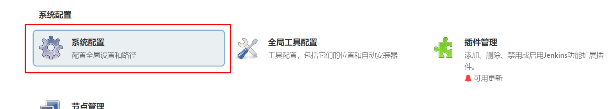

找到SSH的相关配置，添加SSH Server。


完成了上面配置填写，可以通过底下的`Test Configuration`来测试上面的配置项是否能正确连接到远程主机。


上面Success表示配置没有问题，最后，点击保存配置即可。


完成了SSH服务端连接配置以后，我们接下来就可以构建项目的配置中，对构建


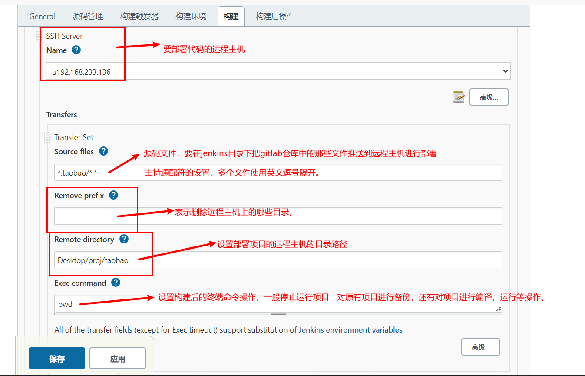

上面的操作中Exec Command中的构建后的命令操作，我们可以调整成项目运行。

```bash
cd /home/docker/Desktop/proj/taobao
pip install -r requirements.txt
kill -9 $(ps -aef | grep uwsgi | grep -v grep | awk '{print $2}')
/home/docker/.local/bin/uwsgi --ini ./uwsgi.ini
```

等待1分钟，jenkins自动构建项目并推送代码远程主机。


经过上面的步骤，我们就得到了一个使用jenkins基于gitlab进行ssh推送代码到远程主机的配置。

可以通过之前等待python操作jenkins的接口，得到如下配置，发布django代码的发布流程：

```xml
<?xml version='1.1' encoding='UTF-8'?>
<project>
  <actions/>
  <description>测试代码发布</description>
  <keepDependencies>false</keepDependencies>
  <properties>
    <com.dabsquared.gitlabjenkins.connection.GitLabConnectionProperty plugin="gitlab-plugin@1.5.35">
      <gitLabConnection></gitLabConnection>
      <jobCredentialId></jobCredentialId>
      <useAlternativeCredential>false</useAlternativeCredential>
    </com.dabsquared.gitlabjenkins.connection.GitLabConnectionProperty>
  </properties>
  <scm class="hudson.plugins.git.GitSCM" plugin="git@4.11.4">
    <configVersion>2</configVersion>
    <userRemoteConfigs>
      <hudson.plugins.git.UserRemoteConfig>
        <url>http://192.168.101.8:8993/root/taobao.git</url>
        <credentialsId>2d198778-f631-4425-b35d-0918a2c61554</credentialsId>
      </hudson.plugins.git.UserRemoteConfig>
    </userRemoteConfigs>
    <branches>
      <hudson.plugins.git.BranchSpec>
        <name>*/master</name>
      </hudson.plugins.git.BranchSpec>
    </branches>
    <doGenerateSubmoduleConfigurations>false</doGenerateSubmoduleConfigurations>
    <submoduleCfg class="empty-list"/>
    <extensions/>
  </scm>
  <canRoam>true</canRoam>
  <disabled>false</disabled>
  <blockBuildWhenDownstreamBuilding>false</blockBuildWhenDownstreamBuilding>
  <blockBuildWhenUpstreamBuilding>false</blockBuildWhenUpstreamBuilding>
  <triggers>
    <hudson.triggers.SCMTrigger>
      <spec>*/1 * * * *</spec>
      <ignorePostCommitHooks>false</ignorePostCommitHooks>
    </hudson.triggers.SCMTrigger>
  </triggers>
  <concurrentBuild>false</concurrentBuild>
  <builders>
    <jenkins.plugins.publish__over__ssh.BapSshBuilderPlugin plugin="publish-over-ssh@1.24">
      <delegate>
        <consolePrefix>SSH: </consolePrefix>
        <delegate plugin="publish-over@0.22">
          <publishers>
            
            <jenkins.plugins.publish__over__ssh.BapSshPublisher plugin="publish-over-ssh@1.24">
              <configName>u192.168.233.136</configName>
              <verbose>true</verbose>
              <transfers>
                <jenkins.plugins.publish__over__ssh.BapSshTransfer>
                  <remoteDirectory>Desktop/proj/taobao</remoteDirectory>
                  <sourceFiles>*,taobao/*.*</sourceFiles>
                  <excludes></excludes>
                  <removePrefix></removePrefix>
                  <remoteDirectorySDF>false</remoteDirectorySDF>
                  <flatten>false</flatten>
                  <cleanRemote>false</cleanRemote>
                  <noDefaultExcludes>false</noDefaultExcludes>
                  <makeEmptyDirs>false</makeEmptyDirs>
                  <patternSeparator>[, ]+</patternSeparator>
                  <execCommand>cd /home/docker/Desktop/proj/taobao
pip install -r requirements.txt
kill -9 $(ps -aef | grep uwsgi | grep -v grep | awk &apos;{print $2}&apos;)
/home/docker/.local/bin/uwsgi --ini ./uwsgi.ini</execCommand>
                  <execTimeout>120000</execTimeout>
                  <usePty>false</usePty>
                  <useAgentForwarding>false</useAgentForwarding>
                  <useSftpForExec>false</useSftpForExec>
                </jenkins.plugins.publish__over__ssh.BapSshTransfer>
              </transfers>
              <useWorkspaceInPromotion>false</useWorkspaceInPromotion>
              <usePromotionTimestamp>false</usePromotionTimestamp>
            </jenkins.plugins.publish__over__ssh.BapSshPublisher>
            
          </publishers>
          <continueOnError>false</continueOnError>
          <failOnError>false</failOnError>
          <alwaysPublishFromMaster>false</alwaysPublishFromMaster>
          <hostConfigurationAccess class="jenkins.plugins.publish_over_ssh.BapSshPublisherPlugin" reference="../.."/>
        </delegate>
      </delegate>
    </jenkins.plugins.publish__over__ssh.BapSshBuilderPlugin>
  </builders>
  <publishers/>
  <buildWrappers/>
</project>
```


### jenkins构建项目列表

#### 服务端代码实现

添加jenkins配置到项目中，settings/dev.py，代码：

```python
# jenkins配置信息
JENKINS = {
    "server_url": 'http://192.168.101.8:8888/',
    "username": 'admin',
    "password": '11217915472cb72a7edb9a4de8113a5928',
}

```

封装jenkins操作工具类，utils/jenkinsapi.py，代码：

```python
import jenkins
from django.conf import settings


class Jenkinsapi(object):
    def __init__(self, server_url=None, username=None, password=None):
        self.server_url = settings.JENKINS['server_url'] if server_url is None else server_url
        self.username = settings.JENKINS['username'] if username is None else username
        self.password = settings.JENKINS['password'] if password is None else password
        self.conn = jenkins.Jenkins(url=self.server_url, username=self.username, password=self.password)

    def get_jobs(self):
        """
        获取所有的构建项目列表
        :return:
        """
        return self.conn.get_jobs()

    def get_job_info(self, job):
        """
        根据项目名获取构建项目
        :param job:
        :return:
        """
        return self.conn.get_job_info(job)

    def build_job(self,job,**kwargs):
        """
        开始构建项目
        :param job:
        :param kwargs:
        :return:
        """
        # dict1 = {"version":11} # 参数话构建
        # dict2 = {'Status': 'Rollback', 'BUILD_ID': '26'} # 回滚
        return self.conn.build_job(job, parameters=kwargs)

    def get_build_info(self,job, build_number):
        """
        通过构建编号获取构建项目的构建记录
        :param job:
        :param build_number:
        :return:
        """
        return self.conn.get_build_info(job,build_number)

    def get_job_config(self,job):
        '''
        获取xml文件
        '''
        return self.conn.get_job_config(job)

    def create_job(self,name,config_xml):
        '''
        任务名字
        xml格式的字符串
        '''
        return self.conn.create_job(name, config_xml)

    def update_job(self,name,config_xml):
        res = self.conn.reconfig_job(name,config_xml)
        return res


```

提供jenkins构建项目列表的视图代码，release/views.py，代码：

```python
from uric_api.utils.jenkinsapi import Jenkinsapi


class JenkinsAPIView(ViewSet):
    """jenkins构建项目工程的管理"""
    permission_classes = [IsAuthenticated]
    def list(self, request):
        return Response(Jenkinsapi().get_jobs())

```

路由，releaese/urls.py，代码：

```python
from django.urls import path
from . import views

from rest_framework.routers import DefaultRouter

router = DefaultRouter()
router.register("app", views.ReleaseAPIView, "app")
router.register("gitlab", views.GitlabAPIView, "gitlab")
router.register("jenkins", views.JenkinsAPIView, "jenkins")

urlpatterns = [

] + router.urls

```

#### 客户端代码实现

**`src/views/Jenkins.vue`**，代码：

```vue
<template>
  <div class="search" style="margin-top: 15px;">
    <a-row>
      <a-col :span="6">
        <a-form-item :label-col="formItemLayout.labelCol" :wrapper-col="formItemLayout.wrapperCol" label="应用名称：">
          <a-input v-model:value="searchForm.app_name" placeholder="请输入"/>
        </a-form-item>
      </a-col>
      <a-col :span="6">
        <a-form-item :label-col="formItemLayout.labelCol" :wrapper-col="formItemLayout.wrapperCol" label="标记符：">
          <a-input v-model:value="searchForm.tag" placeholder="请输入"/>
        </a-form-item>
      </a-col>
      <a-col :span="6">
        <a-form-item :label-col="formItemLayout.labelCol" :wrapper-col="formItemLayout.wrapperCol" label="描述信息：">
          <a-input v-model:value="searchForm.description" placeholder="请输入"/>
        </a-form-item>
      </a-col>
      <a-col :span="6">
        <router-link to="/release">
          <a-button type="primary" style="margin-top: 3px;">刷新</a-button>
        </router-link>
      </a-col>
    </a-row>
  </div>

  <div class="add_app">
    <a-button style="margin-bottom: 20px;" @click="showAppModal">新建应用</a-button>
  </div>
  <a-modal v-model:visible="AppModelVisible" title="新建应用" @ok="handleaddappOk" ok-text="添加" cancel-text="取消">
    <a-form ref="addappruleForm" :model="app_form" :rules="add_app_rules" :label-col="labelCol" :wrapper-col="wrapperCol">
      <a-form-item ref="app_name" label="应用名称" prop="app_name">
        <a-input v-model:value="app_form.app_name"/>
      </a-form-item>
      <a-form-item ref="tag" label="唯一标识符" prop="tag"><a-input v-model:value="app_form.tag"/>
      </a-form-item>
      <a-form-item label="备注信息" prop="app_desc">
        <a-textarea v-model:value="app_form.app_desc"/>
      </a-form-item>
    </a-form>
  </a-modal>

  <div class="release">
    <div class="app_list">
      <a-table :columns="columns" :data-source="jobList" row-key="id">
        <template #bodyCell="{ column, text, record }">
          <template v-if="column.dataIndex === 'color'">
            <smile-outlined v-if="record.color === 'blue'" style="color: blue; font-size:48px;"/>
            <meh-outlined v-else-if="record.color === 'notbuilt'" style="color: orage; font-size:48px;"/>
            <frown-outlined v-else style="font-size:48px; color: red"/>
          </template>
          <template v-if="column.dataIndex === 'action'">
            <a>发布</a>
            <span style="color: lightgray"> | </span>
<!--            <a>克隆发布</a>-->
<!--            <span style="color: lightgray"> | </span>-->
            <a>编辑</a>
            <span style="color: lightgray"> | </span>
            <a>删除</a>
          </template>
        </template>
      </a-table>
    </div>
  </div>
</template>

<script>
import {ref, reactive, watch} from 'vue';
import axios from "axios";
import settings from "@/settings";
import {message} from 'ant-design-vue';
import store from "@/store";
import {SmileOutlined, MehOutlined, FrownOutlined}  from '@ant-design/icons-vue';
export default {
  components: {
    SmileOutlined,
    MehOutlined,
    FrownOutlined,
  },
  setup() {
    // 搜索栏的表单布局设置
    const formItemLayout = reactive({
      labelCol: {span: 8},
      wrapperCol: {span: 12},
    });

    // 表格字段列设置
    const columns = [
      {
        title: 'job名称',
        dataIndex: 'fullname',
        key: 'fullname',
        sorter: true,
        width: 230
      },
      {
        title: '发布状态',
        dataIndex: 'color',
        key: 'description'
      },
      {
        title: 'job访问地址',
        dataIndex: 'url',
        key: 'url'
      },
      {
        title: '操作',
        dataIndex: 'action',
        width: 300,
        key: 'action', scopedSlots: {customRender: 'action'}
      },
    ]

    // 构建项目列表
    const jobList = ref([])

    // 获取构建项目列表
    const get_job_list = (searchForm)=>{
      axios.get(`${settings.host}/release/jenkins/`,{
        // params: searchForm,
        headers: {
          Authorization: "jwt " + store.getters.token,
        }
      })
      .then(response=>{
        jobList.value = response.data;
        console.log(jobList.value)
      }).catch((error)=>{
        message.error(error.response.data)
      })
    }

    get_job_list()

    // 是否显示新建构建项目的弹窗
    const AppModelVisible = ref(false)

    const showAppModal = ()=>{
      AppModelVisible.value = true;
    }

    const labelCol = reactive({
      span: 6
    })

    const wrapperCol = reactive({
      span: 16
    })


    const app_form = reactive({               // 新建发布应用的表单数据
        app_name: '',
        tag: '',
        app_desc: '',
    })

    const add_app_rules = reactive({  // 添加发布应用的表单数据验证规则
        app_name: [
          {required: true, message: '请输入应用名称', trigger: 'blur'},
          {min: 1, max: 30, message: '应用名称的长度必须在1~30个字符之间', trigger: 'blur'},
        ],
        tag: [
          {required: true, message: '请输入应用唯一标识符', trigger: 'blur'},
          {min: 1, max: 50, message: '应用名称的长度必须在1~50个字符之间', trigger: 'blur'},
        ],
    })

    const handleaddappOk = ()=>{
      // 添加应用的表单提交处理
      let data = {
        name: app_form.app_name,
        tag: app_form.tag,
        description: app_form.app_desc,
      }
      axios.post(`${settings.host}/release/app/`,data,{
          headers: {
            Authorization: "jwt " + store.getters.token,
          }
        })
        .then((res)=>{
          releaseAppList.value.push(res.data);
          message.success('添加成功！');
          AppModelVisible.value = false;
        }).catch((error)=>{
          message.error('添加失败！');
        })
    }

    // 应用搜索
    const searchForm = reactive({
      app_name: "",
      description: "",
      tag: "",
    })

    // 监听搜索框的输入内容
    watch(
        searchForm,
        ()=>{
          get_release_app_list(searchForm)
        }
    )

    return {
      formItemLayout,
      columns,
      jobList,

      AppModelVisible,
      showAppModal,
      app_form,
      labelCol,
      wrapperCol,
      add_app_rules,
      handleaddappOk,
      searchForm,
    }
  }
}
</script>


<style scoped>
.release_btn span{
  color: #1890ff;
  cursor: pointer;
}
</style>
```

创建路由，并调整Base.vue中的菜单地址。router/index.js，代码：

```javascript
import {createRouter, createWebHistory} from 'vue-router'
import ShowCenter from '../views/ShowCenter.vue'
import Login from '../views/Login.vue'
import Base from '../views/Base'
import Host from '../views/Host'
import Console from '../views/Console'
import MultiExec from '../views/MultiExec'
import Environment from '../views/Environment'
import Release from '../views/Release'
import Git from '../views/Git'
import Jenkins from '../views/Jenkins'
import store from "../store"

const routes = [
    {
        path: '/uric',
        alias: '/', // 给当前路径起一个别名
        name: 'Base',
        component: Base, // 快捷键：Alt+Enter快速导包
        children: [
            {
                meta: {
                    title: '展示中心',
                    authenticate: false,
                },
                path: 'show_center',
                alias: '',
                name: 'ShowCenter',
                component: ShowCenter
            },
            {
                meta: {
                    title: '资产管理',
                    authenticate: true,
                },
                path: 'host',
                name: 'Host',
                component: Host
            },
            {
                meta: {
                    title: 'Console',
                    authenticate: true,
                },
                path: 'console/:host_id',
                name: 'Console',
                component: Console
            },
            {
                path: 'multi_exec',
                name: 'MultiExec',
                component: MultiExec,
            },
            {
                path: 'environment',
                name: 'Environment',
                component: Environment,
            },
            {
                path: 'release',
                name: 'Release',
                component: Release,
            },
            {
                path: 'git',
                name: 'Git',
                component: Git,
            },
            {
                path: 'jenkins',
                name: 'Jenkins',
                component: Jenkins,
            }
        ]
    },


    {
        meta: {
            title: '账户登陆',
            authenticate: false,
        },
        path: '/login',
        name: 'Login',
        component: Login // 快捷键：Alt+Enter快速导包
    },
];

const router = createRouter({
    history: createWebHistory(process.env.BASE_URL),
    routes
})

router.beforeEach((to, from, next) => {
    document.title = to.meta.title;
    // console.log("to", to)
    // console.log("from", from)
    // console.log("store.getters.token:", store.getters.token)
    if (to.meta.authenticate && store.getters.token === "") {
        next({name: "Login"})
    } else {
        next()
    }
});

export default router


```

views/Base.vue，代码：

```vue
<script>


import {
  DesktopOutlined,
  FileOutlined,
  PieChartOutlined,
  TeamOutlined,
  UserOutlined,
  HomeOutlined
} from '@ant-design/icons-vue';
import {defineComponent, ref} from 'vue';

export default defineComponent({
  setup() {
    const checked = ref(true);
    return {
      checked,
    };
  },
  components: {
    PieChartOutlined,
    DesktopOutlined,
    UserOutlined,
    TeamOutlined,
    FileOutlined,
    HomeOutlined,
  },

  data() {
    return {
      collapsed: ref(false),
      selectedKeys: ref(['1']),
      menu_list: [
        {
          id: 1, icon: 'mail', title: '展示中心', tube: '', 'menu_url': '/uric/show_center', children: []
        },
        {
          id: 2, icon: 'mail', title: '资产管理', 'menu_url': '/uric/host', children: []
        },
        {
          "id": 3, icon: 'bold', title: '批量任务', tube: '', menu_url: '/uric/workbench', children: [
            {id: 10, icon: 'mail', title: '执行任务', 'menu_url': '/uric/multi_exec'},
            {id: 11, icon: 'mail', title: '命令管理', 'menu_url': '/uric/template_manage'},
          ]
        },
        {
          id: 4, icon: 'highlight', title: '代码发布', tube: '', menu_url: '/uric/workbench', children: [
            {id: 23, title: '仓库管理', menu_url: '/uric/git'},
            {id: 12, title: '应用管理', menu_url: '/uric/release'},
            {id: 13, title: '发布申请', menu_url: '/uric/jenkins'}
          ]
        },
        {id: 5, icon: 'mail', title: '定时计划', tube: '', menu_url: '/uric/workbench', children: []},
        {
          id: 6, icon: 'mail', title: '配置管理', tube: '', menu_url: '/uric/workbench', children: [
            {id: 14, title: '环境管理', 'menu_url': '/uric/environment'},
            {id: 15, title: '服务配置', 'menu_url': '/uric/workbench'},
            {id: 16, title: '应用配置', 'menu_url': '/uric/workbench'}
          ]
        },
        {id: 7, icon: 'mail', title: '监控预警', tube: '', 'menu_url': '/uric/workbench', children: []},
        {
          id: 8, icon: 'mail', title: '报警', tube: '', 'menu_url': '/uric/workbench', children: [
            {id: 17, title: '报警历史', 'menu_url': '/uric/workbench'},
            {id: 18, title: '报警联系人', 'menu_url': '/uric/workbench'},
            {id: 19, title: '报警联系组', 'menu_url': '/uric/workbench'}
          ]
        },
        {
          id: 9, icon: 'mail', title: '用户管理', tube: '', menu_url: '/uric/workbench', children: [
            {id: 20, title: '账户管理', tube: '', menu_url: '/uric/workbench'},
            {id: 21, title: '角色管理', tube: '', menu_url: '/uric/workbench'},
            {id: 22, title: '系统设置', tube: '', menu_url: '/uric/workbench'}
          ]
        }
      ]
    };
  },
  methods: {
    logout() {
      let self = this;
      this.$confirm({
        title: 'Uric系统提示',
        content: '您确认要注销登陆吗？',
        onOk() {
          self.$store.commit('setToken', '')
          self.$router.push('/login')
        }
      })
    },
  }

});
</script>
```


### jenkins开始构建项目

服务端提供api接口，release/views.py，代码：

```python
from uric_api.utils.jenkinsapi import Jenkinsapi
from rest_framework.decorators import action


class JenkinsAPIView(ViewSet):
    """jenkins构建项目工程的管理"""
    permission_classes = [IsAuthenticated]
    jenkins = Jenkinsapi()
    def list(self, request):
        """获取job构建项目列表"""
        return Response(self.jenkins.get_jobs())

    @action(methods=["PUT"], detail=False)
    def build(self, request):
        """开始构建项目"""
        job_name = request.data.get("name")
        self.jenkins.build_job(job_name)
        job_info = self.jenkins.get_job_info(job_name)
        number = job_info["builds"][0]["number"]
        result = self.jenkins.get_build_info(job_name, number)
        return Response(result)
```

客户端代码实现，**`views/Jenkins.vue`**，代码：

```vue
<template>
  <div class="search" style="margin-top: 15px;">
    <a-row>
      <a-col :span="6">
        <a-form-item :label-col="formItemLayout.labelCol" :wrapper-col="formItemLayout.wrapperCol" label="应用名称：">
          <a-input v-model:value="searchForm.app_name" placeholder="请输入"/>
        </a-form-item>
      </a-col>
      <a-col :span="6">
        <a-form-item :label-col="formItemLayout.labelCol" :wrapper-col="formItemLayout.wrapperCol" label="标记符：">
          <a-input v-model:value="searchForm.tag" placeholder="请输入"/>
        </a-form-item>
      </a-col>
      <a-col :span="6">
        <a-form-item :label-col="formItemLayout.labelCol" :wrapper-col="formItemLayout.wrapperCol" label="描述信息：">
          <a-input v-model:value="searchForm.description" placeholder="请输入"/>
        </a-form-item>
      </a-col>
      <a-col :span="6">
        <router-link to="/release">
          <a-button type="primary" style="margin-top: 3px;">刷新</a-button>
        </router-link>
      </a-col>
    </a-row>
  </div>

  <div class="add_app">
    <a-button style="margin-bottom: 20px;" @click="showAppModal">新建应用</a-button>
  </div>
  <a-modal v-model:visible="AppModelVisible" title="新建应用" @ok="handleaddappOk" ok-text="添加" cancel-text="取消">
    <a-form ref="addappruleForm" :model="app_form" :rules="add_app_rules" :label-col="labelCol" :wrapper-col="wrapperCol">
      <a-form-item ref="app_name" label="应用名称" prop="app_name">
        <a-input v-model:value="app_form.app_name"/>
      </a-form-item>
      <a-form-item ref="tag" label="唯一标识符" prop="tag"><a-input v-model:value="app_form.tag"/>
      </a-form-item>
      <a-form-item label="备注信息" prop="app_desc">
        <a-textarea v-model:value="app_form.app_desc"/>
      </a-form-item>
    </a-form>
  </a-modal>

  <div class="release">
    <div class="app_list">
      <a-table :columns="columns" :data-source="jobList" row-key="id">
        <template #bodyCell="{ column, text, record }">
          <template v-if="column.dataIndex === 'color'">
            <smile-outlined v-if="record.color === 'blue'" style="color: blue; font-size:48px;"/>
            <meh-outlined v-else-if="record.color === 'notbuilt'" style="color: orage; font-size:48px;"/>
            <frown-outlined v-else style="font-size:48px; color: red"/>
          </template>
          <template v-if="column.dataIndex === 'action'">
            <a @click="build_job(record.fullname)">发布</a>
            <span style="color: lightgray"> | </span>
<!--            <a>克隆发布</a>-->
<!--            <span style="color: lightgray"> | </span>-->
            <a>编辑</a>
            <span style="color: lightgray"> | </span>
            <a>删除</a>
          </template>
        </template>
      </a-table>
    </div>
  </div>
</template>

<script>
import {ref, reactive, watch} from 'vue';
import axios from "axios";
import settings from "@/settings";
import {message} from 'ant-design-vue';
import store from "@/store";
import {SmileOutlined, MehOutlined, FrownOutlined}  from '@ant-design/icons-vue';
export default {
  components: {
    SmileOutlined,
    MehOutlined,
    FrownOutlined,
  },
  setup() {
    // 搜索栏的表单布局设置
    const formItemLayout = reactive({
      labelCol: {span: 8},
      wrapperCol: {span: 12},
    });

    // 表格字段列设置
    const columns = [
      {
        title: 'job名称',
        dataIndex: 'fullname',
        key: 'fullname',
        sorter: true,
        width: 230
      },
      {
        title: '发布状态',
        dataIndex: 'color',
        key: 'description'
      },
      {
        title: 'job访问地址',
        dataIndex: 'url',
        key: 'url'
      },
      {
        title: '操作',
        dataIndex: 'action',
        width: 300,
        key: 'action', scopedSlots: {customRender: 'action'}
      },
    ]

    // 构建项目列表
    const jobList = ref([])

    // 获取构建项目列表
    const get_job_list = ()=>{
      axios.get(`${settings.host}/release/jenkins/`,{
        headers: {
          Authorization: "jwt " + store.getters.token,
        }
      })
      .then(response=>{
        jobList.value = response.data;
        console.log(jobList.value)
      }).catch((error)=>{
        message.error(error.response.data)
      })
    }

    get_job_list()

    // 开始构建项目
    const build_job = (job_name)=>{
      axios.put(`${settings.host}/release/jenkins/build/`,{name: job_name},{
        headers: {
          Authorization: "jwt " + store.getters.token,
        }
      })
      .then(response=>{
        message.success("构建成功！")
      }).catch((error)=>{
        message.error(error.response.data)
      })
    }

    // 是否显示新建构建项目的弹窗
    const AppModelVisible = ref(false)

    const showAppModal = ()=>{
      AppModelVisible.value = true;
    }

    const labelCol = reactive({
      span: 6
    })

    const wrapperCol = reactive({
      span: 16
    })


    const app_form = reactive({               // 新建发布应用的表单数据
        app_name: '',
        tag: '',
        app_desc: '',
    })

    const add_app_rules = reactive({  // 添加发布应用的表单数据验证规则
        app_name: [
          {required: true, message: '请输入应用名称', trigger: 'blur'},
          {min: 1, max: 30, message: '应用名称的长度必须在1~30个字符之间', trigger: 'blur'},
        ],
        tag: [
          {required: true, message: '请输入应用唯一标识符', trigger: 'blur'},
          {min: 1, max: 50, message: '应用名称的长度必须在1~50个字符之间', trigger: 'blur'},
        ],
    })

    const handleaddappOk = ()=>{
      // 添加应用的表单提交处理
      let data = {
        name: app_form.app_name,
        tag: app_form.tag,
        description: app_form.app_desc,
      }
      axios.post(`${settings.host}/release/app/`,data,{
          headers: {
            Authorization: "jwt " + store.getters.token,
          }
        })
        .then((res)=>{
          releaseAppList.value.push(res.data);
          message.success('添加成功！');
          AppModelVisible.value = false;
        }).catch((error)=>{
          message.error('添加失败！');
        })
    }

    // 应用搜索
    const searchForm = reactive({
      app_name: "",
      description: "",
      tag: "",
    })

    // 监听搜索框的输入内容
    watch(
        searchForm,
        ()=>{
          get_release_app_list(searchForm)
        }
    )

    return {
      formItemLayout,
      columns,
      jobList,
      build_job,

      AppModelVisible,
      showAppModal,
      app_form,
      labelCol,
      wrapperCol,
      add_app_rules,
      handleaddappOk,
      searchForm,
    }
  }
}
</script>


<style scoped>
.release_btn span{
  color: #1890ff;
  cursor: pointer;
}
</style>
```

服务端提供创建单个构建job项目的api接口，views/release.py，代码：

```python
from uric_api.utils.jenkinsapi import Jenkinsapi
from rest_framework.decorators import action
from django.conf import settings


class JenkinsAPIView(ViewSet):
    """jenkins构建项目工程的管理"""
    permission_classes = [IsAuthenticated]
    jenkins = Jenkinsapi()
    def list(self, request):
        """获取job构建项目列表"""
        return Response(self.jenkins.get_jobs())

    @action(methods=["PUT"], detail=False)
    def build(self, request):
        """开始构建项目"""
        job_name = request.data.get("name")
        self.jenkins.build_job(job_name)
        job_info = self.jenkins.get_job_info(job_name)
        number = job_info["builds"][0]["number"]
        result = self.jenkins.get_build_info(job_name, number)
        return Response(result)

    def create(self, request):
        config_xml = f"""<?xml version='1.1' encoding='UTF-8'?>
        <project>
          <actions/>
          <description>{request.data.get('description')}</description>
          <keepDependencies>false</keepDependencies>
          <properties>
            <com.dabsquared.gitlabjenkins.connection.GitLabConnectionProperty plugin="gitlab-plugin@1.5.35">
              <gitLabConnection></gitLabConnection>
              <jobCredentialId></jobCredentialId>
              <useAlternativeCredential>false</useAlternativeCredential>
            </com.dabsquared.gitlabjenkins.connection.GitLabConnectionProperty>
          </properties>
          <scm class="hudson.plugins.git.GitSCM" plugin="git@4.11.4">
            <configVersion>2</configVersion>
            <userRemoteConfigs>
              <hudson.plugins.git.UserRemoteConfig>
                <url>{request.data.get('git')}</url>
                <credentialsId>2d198778-f631-4425-b35d-0918a2c61554</credentialsId>
              </hudson.plugins.git.UserRemoteConfig>
            </userRemoteConfigs>
            <branches>
              <hudson.plugins.git.BranchSpec>
                <name>{request.data.get('branch')}</name>
              </hudson.plugins.git.BranchSpec>
            </branches>
            <doGenerateSubmoduleConfigurations>false</doGenerateSubmoduleConfigurations>
            <submoduleCfg class="empty-list"/>
            <extensions/>
          </scm>
          <canRoam>true</canRoam>
          <disabled>false</disabled>
          <blockBuildWhenDownstreamBuilding>false</blockBuildWhenDownstreamBuilding>
          <blockBuildWhenUpstreamBuilding>false</blockBuildWhenUpstreamBuilding>
          <triggers>
            <hudson.triggers.SCMTrigger>
              <spec>{request.data.get('trigger')}</spec>
              <ignorePostCommitHooks>false</ignorePostCommitHooks>
            </hudson.triggers.SCMTrigger>
          </triggers>
          <concurrentBuild>false</concurrentBuild>
          <builders>
            <jenkins.plugins.publish__over__ssh.BapSshBuilderPlugin plugin="publish-over-ssh@1.24">
              <delegate>
                <consolePrefix>SSH: </consolePrefix>
                <delegate plugin="publish-over@0.22">
                  <publishers>
                    <jenkins.plugins.publish__over__ssh.BapSshPublisher plugin="publish-over-ssh@1.24">
                      <configName>{request.data.get('publishers')}</configName>
                      <verbose>false</verbose>
                      <transfers>
                        <jenkins.plugins.publish__over__ssh.BapSshTransfer>
                          <remoteDirectory>{request.data.get('remote_directory')}</remoteDirectory>
                          <sourceFiles>{request.data.get('source_files')}</sourceFiles>
                          <excludes></excludes>
                          <removePrefix>{request.data.get('remove_prefix')}</removePrefix>
                          <remoteDirectorySDF>false</remoteDirectorySDF>
                          <flatten>false</flatten>
                          <cleanRemote>false</cleanRemote>
                          <noDefaultExcludes>false</noDefaultExcludes>
                          <makeEmptyDirs>false</makeEmptyDirs>
                          <patternSeparator>[, ]+</patternSeparator>
                          <execCommand>{request.data.get('command')}</execCommand>
                          <execTimeout>120000</execTimeout>
                          <usePty>false</usePty>
                          <useAgentForwarding>false</useAgentForwarding>
                          <useSftpForExec>false</useSftpForExec>
                        </jenkins.plugins.publish__over__ssh.BapSshTransfer>
                      </transfers>
                      <useWorkspaceInPromotion>false</useWorkspaceInPromotion>
                      <usePromotionTimestamp>false</usePromotionTimestamp>
                    </jenkins.plugins.publish__over__ssh.BapSshPublisher>
                  </publishers>
                  <continueOnError>false</continueOnError>
                  <failOnError>false</failOnError>
                  <alwaysPublishFromMaster>false</alwaysPublishFromMaster>
                  <hostConfigurationAccess class="jenkins.plugins.publish_over_ssh.BapSshPublisherPlugin" reference="../.."/>
                </delegate>
              </delegate>
            </jenkins.plugins.publish__over__ssh.BapSshBuilderPlugin>
          </builders>
          <publishers/>
          <buildWrappers/>
        </project>
        """
        self.jenkins.create_job(request.data.get('job_name'), config_xml)
        return Response("ok", status=status.HTTP_201_CREATED)
```


客户端提交表单代码：

```vue
<template>
  <div class="add_app">
    <a-button style="margin: 20px 0;" @click="showAppModal">新建job项目</a-button>
  </div>
  <a-modal v-model:visible="AppModelVisible" title="新建job项目" @ok="handleAddJobOk" ok-text="添加" cancel-text="取消">
    <a-form ref="addJobForm" :model="job_form" :rules="add_job_rules" :label-col="labelCol" :wrapper-col="wrapperCol">
      <a-form-item ref="job_name" label="项目名称" prop="job_name">
        <a-input v-model:value="job_form.job_name"/>
      </a-form-item>
      <a-form-item label="备注信息" prop="description">
        <a-textarea v-model:value="job_form.description"/>
      </a-form-item>
      <a-form-item ref="git" label="Git仓库地址" prop="git">
        <a-input v-model:value="job_form.git"/>
      </a-form-item>
      <a-form-item ref="branch" label="Git分支" prop="branch">
        <a-input v-model:value="job_form.branch"/>
      </a-form-item>
      <a-form-item ref="trigger" label="设置定时构建" prop="trigger">
        <a-input v-model:value="job_form.trigger"/>
      </a-form-item>
      <a-form-item ref="publishers" label="部署环境" prop="publishers">
        <a-select ref="select" v-model:value="job_form.publishers">
          <a-select-option value="u192.168.233.136" key="u192.168.233.136">
            u192.168.233.136
          </a-select-option>
          <a-select-option value="u192.168.233.137" key="u192.168.233.137">
            u192.168.233.137
          </a-select-option>
        </a-select>
      </a-form-item>
      <a-form-item label="远程主机部署代码的目录" prop="remote_directory">
        <a-input v-model:value="job_form.remote_directory"/>
      </a-form-item>
      <a-form-item label="推送到远程主机的源码文件" prop="source_files">
        <a-input v-model:value="job_form.source_files"/>
      </a-form-item>
      <a-form-item label="构建之前要删除的远程主机目录" prop="remove_prefix">
        <a-input v-model:value="job_form.remove_prefix"/>
      </a-form-item>
      <a-form-item label="构建后执行的Shell命令" prop="command">
        <a-textarea v-model:value="job_form.command"/>
      </a-form-item>
    </a-form>
  </a-modal>

  <div class="release">
    <div class="app_list">
      <a-table :columns="columns" :data-source="jobList" row-key="id">
        <template #bodyCell="{ column, text, record }">
          <template v-if="column.dataIndex === 'color'">
            <smile-outlined v-if="record.color === 'blue'" style="color: blue; font-size:48px;"/>
            <meh-outlined v-else-if="record.color === 'notbuilt'" style="color: orage; font-size:48px;"/>
            <frown-outlined v-else style="font-size:48px; color: red"/>
          </template>
          <template v-if="column.dataIndex === 'action'">
            <a @click="build_job(record.fullname)">发布</a>
            <span style="color: lightgray"> | </span>
<!--            <a>克隆发布</a>-->
<!--            <span style="color: lightgray"> | </span>-->
            <a>编辑</a>
            <span style="color: lightgray"> | </span>
            <a>删除</a>
          </template>
        </template>
      </a-table>
    </div>
  </div>
</template>

<script>
import {ref, reactive, watch} from 'vue';
import axios from "axios";
import settings from "@/settings";
import {message} from 'ant-design-vue';
import store from "@/store";
import {SmileOutlined, MehOutlined, FrownOutlined}  from '@ant-design/icons-vue';
export default {
  components: {
    SmileOutlined,
    MehOutlined,
    FrownOutlined,
  },
  setup() {
    // 搜索栏的表单布局设置
    const formItemLayout = reactive({
      labelCol: {span: 8},
      wrapperCol: {span: 12},
    });

    // 表格字段列设置
    const columns = [
      {
        title: 'job名称',
        dataIndex: 'fullname',
        key: 'fullname',
        sorter: true,
        width: 230
      },
      {
        title: '发布状态',
        dataIndex: 'color',
        key: 'description'
      },
      {
        title: 'job访问地址',
        dataIndex: 'url',
        key: 'url'
      },
      {
        title: '操作',
        dataIndex: 'action',
        width: 300,
        key: 'action', scopedSlots: {customRender: 'action'}
      },
    ]

    // 构建项目列表
    const jobList = ref([])

    // 获取构建项目列表
    const get_job_list = ()=>{
      axios.get(`${settings.host}/release/jenkins/`,{
        headers: {
          Authorization: "jwt " + store.getters.token,
        }
      })
      .then(response=>{
        jobList.value = response.data;
        console.log(jobList.value)
      }).catch((error)=>{
        message.error(error.response.data)
      })
    }

    get_job_list()

    // 开始构建项目
    const build_job = (job_name)=>{
      axios.put(`${settings.host}/release/jenkins/build/`,{name: job_name},{
        headers: {
          Authorization: "jwt " + store.getters.token,
        }
      })
      .then(response=>{
        message.success("构建成功！")
      }).catch((error)=>{
        message.error(error.response.data)
      })
    }

    // 是否显示新建构建项目的弹窗
    const AppModelVisible = ref(false)

    const showAppModal = ()=>{
      AppModelVisible.value = true;
    }

    const labelCol = reactive({
      span: 6
    })

    const wrapperCol = reactive({
      span: 16
    })


    const job_form = reactive({               // 新建发布应用的表单数据
      job_name: "",
      description: "",
      git: "",
      branch: "",
      trigger: "",
      publishers: "",
      remote_directory: "",
      source_files: "",
      remove_prefix: "",
      command: "",
    })

    const add_job_rules = reactive({  // 添加发布应用的表单数据验证规则
        job_name: [
          {required: true, message: '请输入構建項目名称', trigger: 'blur'},
          {min: 1, max: 30, message: '应用名称的长度必须在1~30个字符之间', trigger: 'blur'},
        ],
        git: [
          {required: true, message: '请输入Gitca仓库的地址', trigger: 'blur'},
          {min: 1, max: 150, message: '应用名称的长度必须在1~150个字符之间', trigger: 'blur'},
        ],
    })

    const handleAddJobOk = ()=>{
      // 添加应用的表单提交处理
      axios.post(`${settings.host}/release/jenkins/`,job_form,{
          headers: {
            Authorization: "jwt " + store.getters.token,
          }
        })
        .then((res)=>{
          // JobList.value.push(res.data);
          message.success('新建成功！');
          AppModelVisible.value = false;
        }).catch((error)=>{
          message.error('新建失败！');
        })
    }

    return {
      formItemLayout,
      columns,
      jobList,
      build_job,

      AppModelVisible,
      showAppModal,
      job_form,
      labelCol,
      wrapperCol,
      add_job_rules,
      handleAddJobOk,
    }
  }
}
</script>


<style scoped>
.release_btn span{
  color: #1890ff;
  cursor: pointer;
}
</style>
```

# 七、定时计划

界面效果：

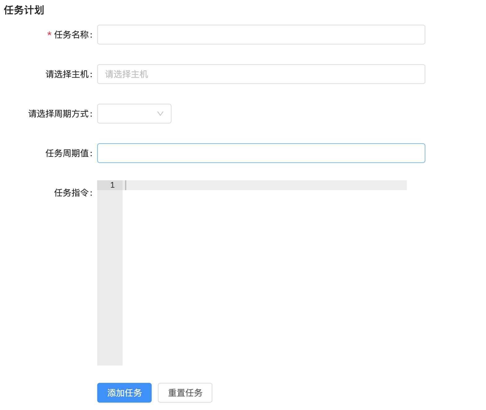


创建应用

```python
cd uric_api/apps/
python ../../manage.py startapp schedule
```


配置应用，settings/dev.py，代码：

```python
INSTALLED_APPS = [
    ...
    'schedule',
		...
]
```

在应用中创建urls.py文件，`schedule.urls`，代码：

```python
from django.urls import path,re_path
from . import views

urlpatterns = [
    
]
```

总路由，`uric_api.urls`，代码：

```python
    path('schedule/', include('schedule.urls')),
```

创建模型类,保存任务计划，schedule/models.py，代码：

```python
from django.db import models
from host.models import Host


# Create your models here.
class TaskSchedule(models.Model):
    period_way_choices = (
        (1, '普通任务'),  # 普通的异步任务
        (2, '定时任务'),  # 定时一次异步任务
        (3, '计划任务'),  # 定时多次异步任务
    )

    status_choices = (
        (1, '激活'),
        (2, '停止'),
        (3, '报错'),
    )

    period_beat = models.IntegerField(verbose_name='任务ID', help_text='django-celery-beat调度服务的任务ID，方便我们通过这个id值来控制celery的任务状态', null=True, blank=True)
    task_name = models.CharField(max_length=150, unique=True, verbose_name='任务名称')
    task_cmd = models.TextField(verbose_name='任务指令')
    period_way = models.IntegerField(choices=period_way_choices, default=1, verbose_name='任务周期方式')
    period_content = models.CharField(max_length=32, verbose_name='任务执行周期')
    period_status = models.IntegerField(choices=status_choices, default=1)

    class Meta:
        db_table = "schedule_taskschedule"
        verbose_name = "任务记录表"
        verbose_name_plural = verbose_name


class TaskHost(models.Model):
    tasks = models.ForeignKey('TaskSchedule',on_delete=models.CASCADE,verbose_name='执行的任务')
    hosts = models.ForeignKey(Host,on_delete=models.CASCADE,verbose_name='任务执行主机')

    class Meta:
        db_table = "schedule_taskhost"  # 切换选中内容中的字母大小写：ctrl+Shift+U
        verbose_name = "任务和主机的关系表"
        verbose_name_plural = verbose_name

```

数据迁移，同步模型的数据表到MySQL中，新开终端窗口：

```bash
python manage.py makemigrations
python manage.py migrate
```


### celery定时计划

celery是python的一个第三方模块，是一个可插拔的功能完备的异步任务框架，开源免费，高性能，支持协程、多进程、多线程的模式来高效执行异步任务，同时，因为使用的开发者众多，所以官方资料或第三方资料比较完善，同时基于celery开发的一些周边插件也是比较成熟可靠的。常用于完成项目开发中的耗时任务或者定时任务。最新版本已经到了5.2版本。

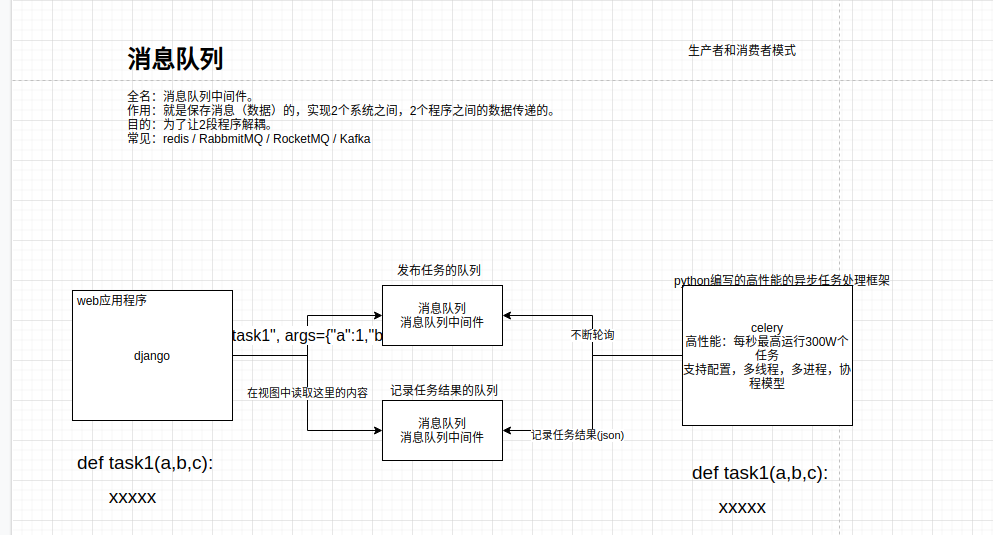


安装依赖库

```python
pip install celery==4.4.7
pip install django-celery-beat==2.0.0
pip install django-celery-results==2.0.0
pip install django-redis
```

windows系统下celery不要使用超过4.x以上版本，linux系统可以使用任意版本。


项目配置文件中配置django-celery-beat，`stttings.dev`，代码：

```python
INSTALLED_APPS = [
    'django.contrib.admin',
    ...
    'django_celery_beat',
]

LANGUAGE_CODE = 'zh-hans'  # 使用中国语言
TIME_ZONE = 'Asia/Shanghai'  # 设置Django使用中国上海时间
# 如果USE_TZ设置为True时，Django会使用当前操作系统默认设置的时区，此时的TIME_ZONE不管有没有设置都不起作用
# 如果USE_TZ 设置为False,TIME_ZONE = 'Asia/Shanghai', 则使用上海的UTC时间。
USE_TZ = False  # 如果用的sqlit数据库，那么改为True，sqlit数据库不支持
```

我们当前celery要使用redis作为消息队列，所以要记得查看下，redis是否正常启动了。

OK，安装完成相关的模块以后，我们接下来要使用celery。

首先，需要在uric_api服务端项目根目录下创建一个保存celery代码的包目录celery_tasks。

在celery_tasks包目录下创建几个python文件，用于对celery进行初始化配置。

main.py(celery初始化) 、config.py(配置文件) 、  tasks.py(任务文件，文件名必须叫tasks.py)

celery_tasks/main.py，代码：

```python
import os

# 为celery设置django相关的环境变量，方便将来在celery中调用django的代码
os.environ.setdefault('DJANGO_SETTINGS_MODULE', 'uric_api.settings.dev')

from celery import Celery
from . import config

# 创建celery实例对象[可以以项目名作为名称，或者以项目根目录名也可以]
app = Celery('uric_api')

# 从配置文件中加载celery的相关配置
app.config_from_object(config)

# 设置app自动加载任务
app.autodiscover_tasks([
    'celery_tasks', # celery会自动得根据列表中对应的目录下的tasks.py 进行搜索注册
])
```

celery_tasks/config.py

```python
# 为celery设置django相关的环境变量，方便将来在celery中调用django的代码
import os
os.environ.setdefault('DJANGO_SETTINGS_MODULE', 'uric_api.settings.dev')
from django.conf import settings

# 设置celery接受任务的队列
broker_url = 'redis://:12345678@127.0.0.1:6379/14'
# 设置celery保存任务执行结果的队列
result_backend = 'redis://:12345678@127.0.0.1:6379/15'

# celery 的启动工作数量设置[进程数量]
CELERY_WORKER_CONCURRENCY = 20

# 任务预取功能，就是每个工作的进程／线程在获取任务的时候，会尽量多拿 n 个，以保证获取的通讯成本可以压缩。
WORKER_PREFETCH_MULTIPLIER = 20

# 非常重要,有些情况下可以防止死锁
CELERYD_FORCE_EXECV = True

# celery 的 worker 执行多少个任务后进行重启操作
CELERY_WORKER_MAX_TASKS_PER_CHILD = 100

# 禁用所有速度限制，如果网络资源有限，不建议开足马力。
worker_disable_rate_limits = True

# celery beat配置
CELERY_ENABLE_UTC = False
settings.USE_TZ = True
timezone = settings.TIME_ZONE
# 保存定时任务记录的驱动类，使用mysql数据库来进行定时任务
CELERY_BEAT_SCHEDULER = 'django_celery_beat.schedulers:DatabaseScheduler'
```

tasks.py，任务文件，注意：保存任务代码的文件名，必须叫tasks.py，否则celery不识别。

```python
from .main import app

# 经过@app.task装饰过，就会被celery识别为任务，否则就是普通的函数
@app.task
def task1():
    print("任务1函数正在执行....")

@app.task
def task2(a, b, c):
    print(f"任务2函数正在执行，参数：{[a, b, c]}....")

@app.task
def task3():
    print(f"任务3函数正在执行....")
    return True

@app.task
def task4(a, b, c):
    print(f"任务4函数正在执行....")
    return a, b, c

```

上述配置做完之后，我们需要执行数据库迁移指令，去生成django_celery_beat应用的表

```python
python manage.py makemigrations
python manage.py migrate
```


完成了数据迁移以后，我们接下来就要启动celery和celery_beat，让celery正常工作起来。

```shell
# 命令必须在manage.py的父目录下执行
# 启动定时任务首先需要有一个work执行异步任务，然后再启动一个定时器触发任务。
celery -A celery_tasks.main worker -l info
# windows下关闭celery，快捷键：ctrl+C即可

# 启动定时器触发 beat  (注意：下面是一条完整指令)
celery -A celery_tasks.main beat -l info --scheduler  django_celery_beat.schedulers:DatabaseScheduler
```

接下来，我们还没有提供客户端的操作界面，所以我们要测试celery的定时任务，可以先在django的终端下进行测试。


#### 普通周期任务

```python
# 进入django提供的shell终端，执行如下指令
python manage.py shell

from django_celery_beat.models import PeriodicTask, IntervalSchedule
# executes every 10 seconds.
# 从定时器数据表中获取一个10秒的计时器信息，如果没有则先创建一个再读取出来。
schedule, _ = IntervalSchedule.objects.get_or_create(
  		every=10,
  		period=IntervalSchedule.SECONDS, # 单位，下面有说明
)
"""
   # 可以看到上面固定间隔的时间是采用秒 period=IntervalSchedule.SECONDS，
   # 如果你还想要固定其他的时间单位，可以设置其他字段参数，如下：
   IntervalSchedule.DAYS 固定间隔天数
   IntervalSchedule.HOURS 固定间隔小时数
   IntervalSchedule.MINUTES 固定间隔分钟数
   IntervalSchedule.SECONDS 固定间隔秒数
   IntervalSchedule.MICROSECONDS 固定间隔微秒

   # 可以从源码中进行查看
   # from django_celery_beat.models import PeriodicTask, IntervalSchedule                                                                                                  
   # IntervalSchedule.PERIOD_CHOICES                                                                                                                                       
   # 能够看到单位选项：
   (
      ('days', 'Days'),
      ('hours', 'Hours'),
      ('minutes', 'Minutes'),
      ('seconds', 'Seconds'),
      ('microseconds', 'Microseconds')
   )
"""
# 执行定时任务，带参数的
import json
from datetime import datetime, timedelta
# 带参数的任务写法：
period_obj = PeriodicTask.objects.create(
     interval=schedule,                  # we created this above.
     name='task4',                       # 唯一的任务名称，名字不能重复
     task='celery_tasks.tasks.task4',    # 如果任何没有设置别名，则必须填写任务的导包路径，否则直接写上别名即可。
     args=json.dumps([5, 10, 15]),       # 异步任务有参数时，可以通过args或者kwargs来设置
     #kwargs=json.dumps({
     #   'be_careful': True,
     #}),
     expires=datetime.utcnow() + timedelta(seconds=30), # 任务的持续时间
)

# 不带参数的任务写法：
period_obj1 = PeriodicTask.objects.create(
     interval=schedule,                  # we created this above.
     name='task1',                       # 唯一的任务名称，名字不能重复
     task='celery_tasks.tasks.task1',    # 任务的导包路径
     expires=datetime.utcnow() + timedelta(seconds=30), # 任务的持续时间
)

# 可以查看所有计划任务
PeriodicTask.objects.all()
# 所有任务执行都是ok的，只要数据库改变了，那么beat任务会自动调用执行，因为celery一直处于轮询状态。

# 暂停执行两个周期性任务
task = PeriodicTask.objects.get(name="task1")
task.enabled = False # 把执行状态改成False，就可以暂停了。                       
task.save() 

# 把暂停的任务，重启激活。设置任务的 enabled 为 True 即可：
task = PeriodicTask.objects.get(name="task1")
task.enabled = True                                     
task.save()

# 删除任务
task4 = PeriodicTask.objects.get(name="task4")
task4.delete()

# 注意：如果celery中的任务文件代码发生改变，例如tasks.py中的任务逻辑修改了，都需要重启beat和worker  
```


#### 基于 crontab 的周期性任务

```python
import pytz  
# 创建周期
# https://docs.celeryproject.org/en/v4.4.7/userguide/periodic-tasks.html#crontab-schedules
from django_celery_beat.models import CrontabSchedule, PeriodicTask
schedule, _ = CrontabSchedule.objects.get_or_create( 
     minute='*', 
     hour='*', 
     day_of_week='*', 
     day_of_month='*', 
     month_of_year='*', 
     timezone=pytz.timezone('Asia/Shanghai') 
)

# 查看crontab数据表的中所有crontab定时器
CrontabSchedule.objects.all()  


# 执行周期任务
PeriodicTask.objects.create(
     crontab=schedule, # 上面创建的 crontab 对象 * * * * *，表示每分钟执行一次
     name='task3', # 设置任务的name值，还是一样，name必须唯一
     task='celery_tasks.tasks.task3',  # 指定需要周期性执行的任务，任务也可以通过args或kwargs添加参数
)

# 返回值
# <PeriodicTask: task3: * * * * * (m/h/d/dM/MY) Asia/Shanghai>

# 暂停执行两个周期性任务
task3 = PeriodicTask.objects.get(name="task3")
task3.enabled = False # 把执行状态改成False，就可以暂停了。                       
task3.save() 

```


后端编写计划任务的异步任务注册celery中。

celery_tasks/tasks.py

```python
from .main import app

# 经过@app.task装饰过，就会被celery识别为任务，否则就是普通的函数
@app.task
def task1(a, b, c):
    print("任务1函数正在执行....")
    return a + b + c

"""
import json
from datetime import datetime, timedelta
period_obj = PeriodicTask.objects.create(
     interval=schedule,                  # we created this above.
     name='task23',                       # 唯一的任务名称，名字不能重复
     task='celery_tasks.tasks.task1',    # 任务的导包路径
     args=json.dumps([5, 10, 15]),  # 异步任务有参数时，可以通过args或者kwargs来设置
     #kwargs=json.dumps({
     #   'be_careful': True,
     #}),
     expires=datetime.utcnow() + timedelta(seconds=30), # 任务的持续时间
)
"""

@app.task
def task2():
    print("任务2函数正在执行....")

"""
period_obj1 = PeriodicTask.objects.create(
     interval=schedule,                  # we created this above.
     name='task30',                       # 唯一的任务名称，名字不能重复
     task='celery_tasks.tasks.task2',    # 任务的导包路径
     expires=datetime.utcnow() + timedelta(seconds=30), # 任务的持续时间
)
"""

# uric计划任务
import json
from host.models import Host
from django.conf import settings
from uric_api.utils.key import PkeyManager
@app.task(name='schedule_task')
def schedule_task(cmd, hosts_ids):
    """计划任务"""
    hosts_objs = Host.objects.filter(id__in=hosts_ids)
    result_data = []
    private_key, public_key = PkeyManager.get(settings.DEFAULT_KEY_NAME)
    for host_obj in hosts_objs:
        cli = host_obj.get_ssh(private_key)
        code, result = cli.exec_command(cmd)
        result_data.append({
            'host_id': host_obj.id,
            'host': host_obj.ip_addr,
            'status': code,
            'result': result
        })
        print('>>>>', code, result)

    return json.dumps(result_data)
```

Schedule/views.py

```python
import json
import random
import pytz
from datetime import datetime, timedelta
from django_celery_beat.models import IntervalSchedule, CrontabSchedule, PeriodicTask
from rest_framework.response import Response
from rest_framework.views import APIView
from .models import TaskSchedule, TaskHost
from django.conf import settings

class PeriodView(APIView):
    # 获取计划任务的周期类型数据返回给客户端
    def get(self,request):
        data = TaskSchedule.period_way_choices
        return Response(data)


class TaskView(APIView):
    def get(self,request):
        # 1. 获取任务列表数据返回给客户端
        # 2. 去redis中获取每个任务的执行结果展示给客户端
        return Response([])

    def post(self, request):
        task_data = request.data
        period_way = task_data.get('period_way')  # 计划任务的周期类型
        hosts_ids = task_data.get('hosts')  # 计划任务的执行的远程主机列表
        task_cmd = task_data.get('task_cmd')  # 计划任务要执行的任务指令
        period_content = task_data.get('period_content')  # 计划任务的周期的时间值
        task_name = task_data.get('task_name')  # 任务名称，注意不能重复
        try:
            PeriodicTask.objects.get(name=task_name)
            task_name = f"{task_name}-{str(random.randint(1000, 9999))}"
        except:
            pass

        if period_way == 1:  # 普通周期任务,默认单位为秒数，可以选择修改
            schedule, created = IntervalSchedule.objects.get_or_create(
                every=int(period_content),
                period=IntervalSchedule.SECONDS,
            )
            period_obj = PeriodicTask.objects.create(
                interval=schedule,    # we created this above.
                name=task_name,        # simply describes this periodic task.
                task='schedule_task',  # name of task.
                args=json.dumps([task_cmd, hosts_ids]),
                expires=datetime.utcnow() + timedelta(minutes=30)
            )
            period_beat = period_obj.id
        elif period_way == 2:  # 一次性任务
            period_beat = 1
            pass
        else:  # cron任务
            period_content_list = period_content.split(" ")
            schedule, created = CrontabSchedule.objects.get_or_create(
                minute=period_content_list[0],
                hour=period_content_list[1],
                day_of_week=period_content_list[2],
                day_of_month=period_content_list[3],
                month_of_year=period_content_list[4],
                timezone=pytz.timezone(settings.TIME_ZONE)
            )

            period_obj = PeriodicTask.objects.create(
                crontab=schedule,    # we created this above.
                name=task_name,        # simply describes this periodic task.
                task='celery_tasks.tasks.schedule_task',  # name of task.
                args=json.dumps([task_cmd, hosts_ids]),
            )
            period_beat = period_obj.id

        # 保存任务
        task_schedule_obj = TaskSchedule.objects.create(**{
            'period_beat': period_beat,  # celery-beat的任务id值
            'period_way': period_way,
            'task_cmd': task_cmd,
            'period_content': period_content,
            'task_name': task_name,
            'period_status': 1,  # 默认为激活状态
        })

        for host_id in hosts_ids:
            TaskHost.objects.create(**{
                'tasks_id': task_schedule_obj.id,
                'hosts_id': host_id,
            })

        return Response({'errmsg': 'ok'})

```

schedule/urls.py

```python
from django.urls import path
from . import views

urlpatterns = [
    path('periods/', views.PeriodView.as_view()),
    path('tasks/', views.TaskView.as_view()),
]
```

#### 客户端实现定时计划

views/Schedule.vue，代码：

```html
<template>
  <div class="schedule">
    <div class="add_app" style="margin-top: 20px">
      <a-button style="margin-bottom: 20px;" @click="showScheduleModal">新建周期任务</a-button>
    </div>

    <a-modal v-model:visible="ScheduleModalVisible" title="新建周期任务" @ok="handOk" ok-text="添加" cancel-text="取消">
      <a-form
        ref="ruleForm"
        :model="form"
        :rules="rules"
        :label-col="labelCol"
        :wrapper-col="wrapperCol"
      >
        <a-form-item ref="task_name" label="任务名称：" prop="task_name">
          <a-input v-model:value="form.task_name"/>
        </a-form-item>
        <a-form-item label="请选择主机：" prop="hosts">
          <a-select
            mode="multiple"
            v-model:value="form.hosts"
            style="width: 100%"
            placeholder="请选择主机"
            @change="handleHostChange"
          >
            <a-select-option v-for="(host_value,host_index) in host_list" :key="host_index" :value="host_value.id">
             {{host_value.ip_addr}}--{{host_value.name}}
            </a-select-option>
          </a-select>
        </a-form-item>
        <a-form-item label="请选择周期方式：" prop="hosts">
          <a-select style="width: 120px" v-model:value="form.period_way" @change="handlePeriodChange">
            <a-select-option v-for="(period_value,period_index) in period_way_choices" :value="period_value[0]" :key="period_index">
              {{period_value[1]}}
            </a-select-option>
          </a-select>
        </a-form-item>
        <a-form-item ref="period_content" label="任务周期值：" prop="period_content">
          <a-input v-model:value="form.period_content" />
        </a-form-item>
        <a-form-item ref="task_cmd" label="任务指令：" prop="task_cmd">
          <v-ace-editor v-model:value="form.task_cmd" lang="html" theme="chrome" style="height: 200px"/>
        </a-form-item>
      </a-form>
    </a-modal>

    <div class="release">
      <div class="app_list">
        <a-table :columns="columns" :data-source="ScheduleList" row-key="id">
          <template #bodyCell="{ column, text, record }">
            <template v-if="column.dataIndex === 'action'">
              <a>禁用</a>
              <span style="color: lightgray"> | </span>
              <a>激活</a>
              <span style="color: lightgray"> | </span>
              <a>停止</a>
              <span style="color: lightgray"> | </span>
              <a>删除</a>
            </template>
          </template>
        </a-table>
      </div>
    </div>

  </div>
</template>

<script>
import {ref, reactive, watch} from 'vue';
import axios from "axios";
import settings from "@/settings";
import {message} from 'ant-design-vue';
import store from "@/store";


import {VAceEditor} from 'vue3-ace-editor';
import 'ace-builds/src-noconflict/mode-html';
import 'ace-builds/src-noconflict/theme-chrome';

export default {
  components: {
    VAceEditor,
  },
  setup() {

    // 表格字段列设置
    const columns = [
      {
        title: '任务名称',
        dataIndex: 'name',
        key: 'name',
        sorter: true,
        width: 230
      },
      {
        title: '任务类型',
        dataIndex: 'tag',
        key: 'tag',
        sorter: true,
        width: 150
      },
      {
        title: '任务周期',
        dataIndex: 'description',
        key: 'description'
      },
      {
        title: '操作',
        dataIndex: 'action',
        width: 300,
        key: 'action', scopedSlots: {customRender: 'action'}
      },
    ]


    // 周期任务列表
    const ScheduleList = ref([]);

    const get_tasks_list = ()=>{
      axios.get(`${settings.host}/schedule/tasks/`,{
        headers:{
          Authorization: "jwt " + store.getters.token
        }
      }).then((res) => {
          ScheduleList.value = res.data;
      })
    }

    get_tasks_list();

    const labelCol = reactive({span: 4})
    const wrapperCol = reactive({span: 14})
    const other = ref('')
    const period_way_choices = ref([])  // 所有周期类型数据
    const host_list = ref([]) // 主机列表数据

    const form = reactive({
        task_name: '',
        hosts: [],
        period_way: 1,
        task_cmd:'',
        period_content:'',
    })

    const rules = reactive({
      task_name: [
        {required: true, message: '请输入任务名称', trigger: 'blur'},
      ],
    })

    // 获取主机列表
    const get_host_list = ()=>{
      axios.get(`${settings.host}/host/`,{
        headers:{
          Authorization: "jwt " + store.getters.token
        }
      }).then((res) => {
          host_list.value = res.data;
      })
    }

    get_host_list();

    const get_period_data = ()=>{
        axios.get(`${settings.host}/schedule/periods/`).then((res)=>{
          period_way_choices.value = res.data;
          console.log(period_way_choices);
        }).catch((error)=>{

        })
    }

    get_period_data()

    // 是否显示添加周期任务的弹窗
    const ScheduleModalVisible = ref(false)
    const showScheduleModal = ()=>{
      ScheduleModalVisible.value = true
    }

    const handleHostChange = ()=>{

    }

    // 提交表单
    const handOk = ()=>{

    }

    return {
      columns,
      labelCol,
      wrapperCol,
      other,
      period_way_choices,
      host_list,
      form,
      rules,
      ScheduleList,
      ScheduleModalVisible,
      showScheduleModal,
      handleHostChange,
      handOk,
    }
  }
}
</script>

<style scoped>

</style>
```

views/Base.vue，代码：

```vue
        {id: 5, icon: 'mail', title: '定时计划', tube: '', menu_url: '/uric/schedule', children: []},
```

router/index.js

```js
// ..
import Schedule from "../views/Schedule"

// ....  jenkins下面
            {
                path: 'schedule',
                name: 'Schedule',
                component: Schedule,
            },
      ]
    },

  ]
})

```

完成添加任务的提交

views/Schedule.vue

```vue
<template>
  <div class="schedule">
    <div class="add_app" style="margin-top: 20px">
      <a-button style="margin-bottom: 20px;" @click="showScheduleModal">新建周期任务</a-button>
    </div>

    <a-modal v-model:visible="ScheduleModalVisible" title="新建周期任务" @ok="handOk" ok-text="添加" cancel-text="取消">
      <a-form
        ref="ruleForm"
        :model="form"
        :rules="rules"
        :label-col="labelCol"
        :wrapper-col="wrapperCol"
      >
        <a-form-item ref="task_name" label="任务名称：" prop="task_name">
          <a-input v-model:value="form.task_name"/>
        </a-form-item>
        <a-form-item label="请选择主机：" prop="hosts">
          <a-select
            mode="multiple"
            v-model:value="form.hosts"
            style="width: 100%"
            placeholder="请选择主机"
            @change="handleHostChange"
          >
            <a-select-option v-for="(host_value,host_index) in host_list" :key="host_index" :value="host_value.id">
             {{host_value.ip_addr}}--{{host_value.name}}
            </a-select-option>
          </a-select>
        </a-form-item>
        <a-form-item label="请选择周期方式：" prop="hosts">
          <a-select style="width: 120px" v-model:value="form.period_way" @change="handlePeriodChange">
            <a-select-option v-for="(period_value,period_index) in period_way_choices" :value="period_value[0]" :key="period_index">
              {{period_value[1]}}
            </a-select-option>
          </a-select>
        </a-form-item>
        <a-form-item ref="period_content" label="任务周期值：" prop="period_content">
          <a-input v-model:value="form.period_content" />
        </a-form-item>
        <a-form-item ref="task_cmd" label="任务指令：" prop="task_cmd">
          <v-ace-editor v-model:value="form.task_cmd" lang="html" theme="chrome" style="height: 200px"/>
        </a-form-item>
      </a-form>
    </a-modal>

    <div class="release">
      <div class="app_list">
        <a-table :columns="columns" :data-source="ScheduleList" row-key="id">
          <template #bodyCell="{ column, text, record }">
            <template v-if="column.dataIndex === 'action'">
              <a>禁用</a>
              <span style="color: lightgray"> | </span>
              <a>激活</a>
              <span style="color: lightgray"> | </span>
              <a>停止</a>
              <span style="color: lightgray"> | </span>
              <a>删除</a>
            </template>
          </template>
        </a-table>
      </div>
    </div>

  </div>
</template>

<script>
import {ref, reactive, watch} from 'vue';
import axios from "axios";
import settings from "@/settings";
import {message} from 'ant-design-vue';
import store from "@/store";


import {VAceEditor} from 'vue3-ace-editor';
import 'ace-builds/src-noconflict/mode-html';
import 'ace-builds/src-noconflict/theme-chrome';

export default {
  components: {
    VAceEditor,
  },
  setup() {

    // 表格字段列设置
    const columns = [
      {
        title: '任务名称',
        dataIndex: 'name',
        key: 'name',
        sorter: true,
        width: 230
      },
      {
        title: '任务类型',
        dataIndex: 'tag',
        key: 'tag',
        sorter: true,
        width: 150
      },
      {
        title: '任务周期',
        dataIndex: 'description',
        key: 'description'
      },
      {
        title: '操作',
        dataIndex: 'action',
        width: 300,
        key: 'action', scopedSlots: {customRender: 'action'}
      },
    ]


    // 周期任务列表
    const ScheduleList = ref([]);

    const get_tasks_list = ()=>{
      axios.get(`${settings.host}/schedule/tasks/`,{
        headers:{
          Authorization: "jwt " + store.getters.token
        }
      }).then((res) => {
          ScheduleList.value = res.data;
      })
    }

    get_tasks_list();

    const labelCol = reactive({span: 4})
    const wrapperCol = reactive({span: 14})
    const other = ref('')
    const period_way_choices = ref([])  // 所有周期类型数据
    const host_list = ref([]) // 主机列表数据

    const form = reactive({
        task_name: '',
        hosts: [],
        period_way: 1,
        task_cmd:'',
        period_content:'',
    })

    const rules = reactive({
      task_name: [
        {required: true, message: '请输入任务名称', trigger: 'blur'},
      ],
    })

    // 获取主机列表
    const get_host_list = ()=>{
      axios.get(`${settings.host}/host/`,{
        headers:{
          Authorization: "jwt " + store.getters.token
        }
      }).then((res) => {
          host_list.value = res.data;
      })
    }

    get_host_list();

    const get_period_data = ()=>{
        axios.get(`${settings.host}/schedule/periods/`).then((res)=>{
          period_way_choices.value = res.data;
          console.log(period_way_choices);
        }).catch((error)=>{

        })
    }

    get_period_data()

    // 是否显示添加周期任务的弹窗
    const ScheduleModalVisible = ref(false)
    const showScheduleModal = ()=>{
      ScheduleModalVisible.value = true
    }

    const handleHostChange = ()=>{

    }

    // 提交表单
    const handOk = ()=>{
      axios.post(`${settings.host}/schedule/tasks/`,form, {
        headers:{
          Authorization: "jwt " + store.getters.token
        }
      }).then((res) => {
          ScheduleList.value.unshift(res.data);
      })
    }

    return {
      columns,
      labelCol,
      wrapperCol,
      other,
      period_way_choices,
      host_list,
      form,
      rules,
      ScheduleList,
      ScheduleModalVisible,
      showScheduleModal,
      handleHostChange,
      handOk,
    }
  }
}
</script>

<style scoped>

</style>
```


#### 显示计划任务列表

schedule/views.py，代码：

```python
import json
import random
import pytz
from datetime import datetime, timedelta
from django_celery_beat.models import IntervalSchedule, CrontabSchedule, PeriodicTask
from rest_framework.response import Response
from rest_framework.views import APIView
from .models import TaskSchedule, TaskHost
from django.conf import settings
from celery.schedules import schedule
from django_celery_beat.tzcrontab import TzAwareCrontab
class PeriodView(APIView):
    # 获取计划任务的周期类型数据返回给客户端
    def get(self,request):
        data = TaskSchedule.period_way_choices
        return Response(data)


class TaskView(APIView):
    def get(self,request):
        # 1. 获取任务列表数据返回给客户端
        task_list = PeriodicTask.objects.all()
        results = [{
            "id": task.id,
            "name": task.name,
            "enabled": task.enabled,
            "type": "普通计划任务" if isinstance(task.schedule, schedule) else ("周期计划任务" if isinstance(task.schedule, TzAwareCrontab) else "定时一次任务"),
        } for task in task_list]

        # todo 2. 去redis中获取每个任务的执行结果展示给客户端

        return Response(results)

    def post(self, request):
        task_data = request.data
        period_way = task_data.get('period_way')  # 计划任务的周期类型
        hosts_ids = task_data.get('hosts')  # 计划任务的执行的远程主机列表
        task_cmd = task_data.get('task_cmd')  # 计划任务要执行的任务指令
        period_content = task_data.get('period_content')  # 计划任务的周期的时间值
        task_name = task_data.get('task_name')  # 任务名称，注意不能重复
        try:
            PeriodicTask.objects.get(name=task_name)
            task_name = f"{task_name}-{str(random.randint(1000, 9999))}"
        except:
            pass

        if period_way == 1:  # 普通周期任务,默认单位为秒数，可以选择修改
            schedule, created = IntervalSchedule.objects.get_or_create(
                every=int(period_content),
                period=IntervalSchedule.SECONDS,
            )
            period_obj = PeriodicTask.objects.create(
                interval=schedule,    # we created this above.
                name=task_name,        # simply describes this periodic task.
                task='schedule_task',  # name of task.
                args=json.dumps([task_cmd, hosts_ids]),
                expires=datetime.utcnow() + timedelta(minutes=30)
            )
            period_beat = period_obj.id
        elif period_way == 2:  # 一次性任务
            period_beat = 1
            pass
        else:  # cron任务
            period_content_list = period_content.split(" ")
            schedule, created = CrontabSchedule.objects.get_or_create(
                minute=period_content_list[0],
                hour=period_content_list[1],
                day_of_week=period_content_list[2],
                day_of_month=period_content_list[3],
                month_of_year=period_content_list[4],
                timezone=pytz.timezone(settings.TIME_ZONE)
            )

            period_obj = PeriodicTask.objects.create(
                crontab=schedule,    # we created this above.
                name=task_name,        # simply describes this periodic task.
                task='celery_tasks.tasks.schedule_task',  # name of task.
                args=json.dumps([task_cmd, hosts_ids]),
            )
            period_beat = period_obj.id

        # 保存任务
        task_schedule_obj = TaskSchedule.objects.create(**{
            'period_beat': period_beat,  # celery-beat的任务id值
            'period_way': period_way,
            'task_cmd': task_cmd,
            'period_content': period_content,
            'task_name': task_name,
            'period_status': 1,  # 默认为激活状态
        })

        for host_id in hosts_ids:
            TaskHost.objects.create(**{
                'tasks_id': task_schedule_obj.id,
                'hosts_id': host_id,
            })

        return Response({'errmsg': 'ok'})
```

客户端展示数据.  views/Schedule.vue

```vue
<template>
  <div class="schedule">
    <div class="add_app" style="margin-top: 20px">
      <a-button style="margin-bottom: 20px;" @click="showScheduleModal">新建周期任务</a-button>
    </div>

    <a-modal v-model:visible="ScheduleModalVisible" title="新建周期任务" @ok="handOk" ok-text="添加" cancel-text="取消">
      <a-form
        ref="ruleForm"
        :model="form"
        :rules="rules"
        :label-col="labelCol"
        :wrapper-col="wrapperCol"
      >
        <a-form-item ref="task_name" label="任务名称：" prop="task_name">
          <a-input v-model:value="form.task_name"/>
        </a-form-item>
        <a-form-item label="请选择主机：" prop="hosts">
          <a-select
            mode="multiple"
            v-model:value="form.hosts"
            style="width: 100%"
            placeholder="请选择主机"
            @change="handleHostChange"
          >
            <a-select-option v-for="(host_value,host_index) in host_list" :key="host_index" :value="host_value.id">
             {{host_value.ip_addr}}--{{host_value.name}}
            </a-select-option>
          </a-select>
        </a-form-item>
        <a-form-item label="请选择周期方式：" prop="hosts">
          <a-select style="width: 120px" v-model:value="form.period_way" @change="handlePeriodChange">
            <a-select-option v-for="(period_value,period_index) in period_way_choices" :value="period_value[0]" :key="period_index">
              {{period_value[1]}}
            </a-select-option>
          </a-select>
        </a-form-item>
        <a-form-item ref="period_content" label="任务周期值：" prop="period_content">
          <a-input v-model:value="form.period_content" />
        </a-form-item>
        <a-form-item ref="task_cmd" label="任务指令：" prop="task_cmd">
          <v-ace-editor v-model:value="form.task_cmd" lang="html" theme="chrome" style="height: 200px"/>
        </a-form-item>
      </a-form>
    </a-modal>

    <div class="release">
      <div class="app_list">
        <a-table :columns="columns" :data-source="ScheduleList" row-key="id">
          <template #bodyCell="{ column, text, record }">
            <template v-if="column.dataIndex === 'action'">
              <a v-if="record.enabled">暂停</a>
              <a v-else>激活</a>
              <span style="color: lightgray"> | </span>
              <a>删除</a>
            </template>
          </template>
        </a-table>
      </div>
    </div>

  </div>
</template>

<script>
import {ref, reactive, watch} from 'vue';
import axios from "axios";
import settings from "@/settings";
import {message} from 'ant-design-vue';
import store from "@/store";


import {VAceEditor} from 'vue3-ace-editor';
import 'ace-builds/src-noconflict/mode-html';
import 'ace-builds/src-noconflict/theme-chrome';

export default {
  components: {
    VAceEditor,
  },
  setup() {

    // 表格字段列设置
    const columns = [
      {
        title: '任务ID',
        dataIndex: 'id',
        key: 'id',
        sorter: true,
        width: 230
      },
      {
        title: '任务名称',
        dataIndex: 'name',
        key: 'name',
        sorter: true,
        width: 150
      },
      {
        title: '任务类型',
        dataIndex: 'type',
        key: 'type'
      },
      {
        title: '操作',
        dataIndex: 'action',
        width: 300,
        key: 'action', scopedSlots: {customRender: 'action'}
      },
    ]


    // 周期任务列表
    const ScheduleList = ref([]);

    const get_tasks_list = ()=>{
      axios.get(`${settings.host}/schedule/tasks/`,{
        headers:{
          Authorization: "jwt " + store.getters.token
        }
      }).then((res) => {
          ScheduleList.value = res.data;
      })
    }

    get_tasks_list();

    const labelCol = reactive({span: 4})
    const wrapperCol = reactive({span: 14})
    const other = ref('')
    const period_way_choices = ref([])  // 所有周期类型数据
    const host_list = ref([]) // 主机列表数据

    const form = reactive({
        task_name: '',
        hosts: [],
        period_way: 1,
        task_cmd:'',
        period_content:'',
    })

    const rules = reactive({
      task_name: [
        {required: true, message: '请输入任务名称', trigger: 'blur'},
      ],
    })

    // 获取主机列表
    const get_host_list = ()=>{
      axios.get(`${settings.host}/host/`,{
        headers:{
          Authorization: "jwt " + store.getters.token
        }
      }).then((res) => {
          host_list.value = res.data;
      })
    }

    get_host_list();

    const get_period_data = ()=>{
        axios.get(`${settings.host}/schedule/periods/`).then((res)=>{
          period_way_choices.value = res.data;
          console.log(period_way_choices);
        }).catch((error)=>{

        })
    }

    get_period_data()

    // 是否显示添加周期任务的弹窗
    const ScheduleModalVisible = ref(false)
    const showScheduleModal = ()=>{
      ScheduleModalVisible.value = true
    }

    const handleHostChange = ()=>{

    }

    // 提交表单
    const handOk = ()=>{
      axios.post(`${settings.host}/schedule/tasks/`,form, {
        headers:{
          Authorization: "jwt " + store.getters.token
        }
      }).then((res) => {
          ScheduleList.value.unshift(res.data);
      })
    }


    return {
      columns,
      labelCol,
      wrapperCol,
      other,
      period_way_choices,
      host_list,
      form,
      rules,
      ScheduleList,
      ScheduleModalVisible,
      showScheduleModal,
      handleHostChange,
      handOk,
    }
  }
}
</script>

<style scoped>

</style>
```

#### 切换计划任务状态

schedule/views.py，代码：

```python
import json
import random
import pytz
from datetime import datetime, timedelta
from django_celery_beat.models import IntervalSchedule, CrontabSchedule, PeriodicTask
from rest_framework.response import Response
from rest_framework.views import APIView
from .models import TaskSchedule, TaskHost
from django.conf import settings
from celery.schedules import schedule
from django_celery_beat.tzcrontab import TzAwareCrontab
from rest_framework import status

class PeriodView(APIView):
    # 获取计划任务的周期类型数据返回给客户端
    def get(self,request):
        data = TaskSchedule.period_way_choices
        return Response(data)


class TaskView(APIView):
    def get(self,request):
        # 1. 获取任务列表数据返回给客户端
        task_list = PeriodicTask.objects.all()
        results = [{
            "id": task.id,
            "name": task.name,
            "enabled": task.enabled,
            "type": "普通计划任务" if isinstance(task.schedule, schedule) else ("周期计划任务" if isinstance(task.schedule, TzAwareCrontab) else "定时一次任务"),
        } for task in task_list]

        # todo 2. 去redis中获取每个任务的执行结果展示给客户端

        return Response(results)

    def post(self, request):
        task_data = request.data
        period_way = task_data.get('period_way')  # 计划任务的周期类型
        hosts_ids = task_data.get('hosts')  # 计划任务的执行的远程主机列表
        task_cmd = task_data.get('task_cmd')  # 计划任务要执行的任务指令
        period_content = task_data.get('period_content')  # 计划任务的周期的时间值
        task_name = task_data.get('task_name')  # 任务名称，注意不能重复
        try:
            PeriodicTask.objects.get(name=task_name)
            task_name = f"{task_name}-{str(random.randint(1000, 9999))}"
        except:
            pass

        if period_way == 1:  # 普通周期任务,默认单位为秒数，可以选择修改
            schedule, created = IntervalSchedule.objects.get_or_create(
                every=int(period_content),
                period=IntervalSchedule.SECONDS,
            )
            period_obj = PeriodicTask.objects.create(
                interval=schedule,    # we created this above.
                name=task_name,        # simply describes this periodic task.
                task='schedule_task',  # name of task.
                args=json.dumps([task_cmd, hosts_ids]),
                expires=datetime.utcnow() + timedelta(minutes=30)
            )
            period_beat = period_obj.id
        elif period_way == 2:  # 一次性任务
            period_beat = 1
            pass
        else:  # cron任务
            period_content_list = period_content.split(" ")
            schedule, created = CrontabSchedule.objects.get_or_create(
                minute=period_content_list[0],
                hour=period_content_list[1],
                day_of_week=period_content_list[2],
                day_of_month=period_content_list[3],
                month_of_year=period_content_list[4],
                timezone=pytz.timezone(settings.TIME_ZONE)
            )

            period_obj = PeriodicTask.objects.create(
                crontab=schedule,    # we created this above.
                name=task_name,        # simply describes this periodic task.
                task='celery_tasks.tasks.schedule_task',  # name of task.
                args=json.dumps([task_cmd, hosts_ids]),
            )
            period_beat = period_obj.id

        # 保存任务
        task_schedule_obj = TaskSchedule.objects.create(**{
            'period_beat': period_beat,  # celery-beat的任务id值
            'period_way': period_way,
            'task_cmd': task_cmd,
            'period_content': period_content,
            'task_name': task_name,
            'period_status': 1,  # 默认为激活状态
        })

        for host_id in hosts_ids:
            TaskHost.objects.create(**{
                'tasks_id': task_schedule_obj.id,
                'hosts_id': host_id,
            })

        return Response({'errmsg': 'ok'})

class TaskDetaiView(APIView):
    def put(self, request, pk):
        """激活/禁用计划任务"""
        try:
            task = PeriodicTask.objects.get(id=pk)
        except:
            return Response({"errmsg":" 当前任务不存在 ！"}, status=status.HTTP_400_BAD_REQUEST)

        task.enabled = not task.enabled
        task.save()

        return Response({"errmsg": "ok"})
```

schedule/urls.py，代码：

```python
from django.urls import path, re_path
from . import views

urlpatterns = [
    path('periods/', views.PeriodView.as_view()),
    path('tasks/', views.TaskView.as_view()),
    re_path('tasks/(?P<pk>\d+)/', views.TaskDetaiView.as_view()),
]
```

客户端实现点击切换计划任务状态

views/Schedule.vue

```vue
<template>
  <div class="schedule">
    <div class="add_app" style="margin-top: 20px">
      <a-button style="margin-bottom: 20px;" @click="showScheduleModal">新建周期任务</a-button>
    </div>

    <a-modal v-model:visible="ScheduleModalVisible" title="新建周期任务" @ok="handOk" ok-text="添加" cancel-text="取消">
      <a-form
        ref="ruleForm"
        :model="form"
        :rules="rules"
        :label-col="labelCol"
        :wrapper-col="wrapperCol"
      >
        <a-form-item ref="task_name" label="任务名称：" prop="task_name">
          <a-input v-model:value="form.task_name"/>
        </a-form-item>
        <a-form-item label="请选择主机：" prop="hosts">
          <a-select
            mode="multiple"
            v-model:value="form.hosts"
            style="width: 100%"
            placeholder="请选择主机"
            @change="handleHostChange"
          >
            <a-select-option v-for="(host_value,host_index) in host_list" :key="host_index" :value="host_value.id">
             {{host_value.ip_addr}}--{{host_value.name}}
            </a-select-option>
          </a-select>
        </a-form-item>
        <a-form-item label="请选择周期方式：" prop="hosts">
          <a-select style="width: 120px" v-model:value="form.period_way" @change="handlePeriodChange">
            <a-select-option v-for="(period_value,period_index) in period_way_choices" :value="period_value[0]" :key="period_index">
              {{period_value[1]}}
            </a-select-option>
          </a-select>
        </a-form-item>
        <a-form-item ref="period_content" label="任务周期值：" prop="period_content">
          <a-input v-model:value="form.period_content" />
        </a-form-item>
        <a-form-item ref="task_cmd" label="任务指令：" prop="task_cmd">
          <v-ace-editor v-model:value="form.task_cmd" lang="html" theme="chrome" style="height: 200px"/>
        </a-form-item>
      </a-form>
    </a-modal>

    <div class="release">
      <div class="app_list">
        <a-table :columns="columns" :data-source="ScheduleList" row-key="id">
          <template #bodyCell="{ column, text, record }">
            <template v-if="column.dataIndex === 'action'">
              <a v-if="record.enabled" @click="change_schedule_status(record)">暂停</a>
              <a v-else  @click="change_schedule_status(record)">激活</a>
              <span style="color: lightgray"> | </span>
              <a>删除</a>
            </template>
          </template>
        </a-table>
      </div>
    </div>

  </div>
</template>

<script>
import {ref, reactive, watch} from 'vue';
import axios from "axios";
import settings from "@/settings";
import {message} from 'ant-design-vue';
import store from "@/store";


import {VAceEditor} from 'vue3-ace-editor';
import 'ace-builds/src-noconflict/mode-html';
import 'ace-builds/src-noconflict/theme-chrome';

export default {
  components: {
    VAceEditor,
  },
  setup() {

    // 表格字段列设置
    const columns = [
      {
        title: '任务ID',
        dataIndex: 'id',
        key: 'id',
        sorter: true,
        width: 230
      },
      {
        title: '任务名称',
        dataIndex: 'name',
        key: 'name',
        sorter: true,
        width: 150
      },
      {
        title: '任务类型',
        dataIndex: 'type',
        key: 'type'
      },
      {
        title: '操作',
        dataIndex: 'action',
        width: 300,
        key: 'action', scopedSlots: {customRender: 'action'}
      },
    ]


    // 周期任务列表
    const ScheduleList = ref([]);

    const get_tasks_list = ()=>{
      axios.get(`${settings.host}/schedule/tasks/`,{
        headers:{
          Authorization: "jwt " + store.getters.token
        }
      }).then((res) => {
          ScheduleList.value = res.data;
      })
    }

    get_tasks_list();

    const labelCol = reactive({span: 4})
    const wrapperCol = reactive({span: 14})
    const other = ref('')
    const period_way_choices = ref([])  // 所有周期类型数据
    const host_list = ref([]) // 主机列表数据

    const form = reactive({
        task_name: '',
        hosts: [],
        period_way: 1,
        task_cmd:'',
        period_content:'',
    })

    const rules = reactive({
      task_name: [
        {required: true, message: '请输入任务名称', trigger: 'blur'},
      ],
    })

    // 获取主机列表
    const get_host_list = ()=>{
      axios.get(`${settings.host}/host/`,{
        headers:{
          Authorization: "jwt " + store.getters.token
        }
      }).then((res) => {
          host_list.value = res.data;
      })
    }

    get_host_list();

    const get_period_data = ()=>{
        axios.get(`${settings.host}/schedule/periods/`).then((res)=>{
          period_way_choices.value = res.data;
          console.log(period_way_choices);
        }).catch((error)=>{

        })
    }

    get_period_data()

    // 是否显示添加周期任务的弹窗
    const ScheduleModalVisible = ref(false)
    const showScheduleModal = ()=>{
      ScheduleModalVisible.value = true
    }

    const handleHostChange = ()=>{

    }

    // 提交表单
    const handOk = ()=>{
      axios.post(`${settings.host}/schedule/tasks/`,form, {
        headers:{
          Authorization: "jwt " + store.getters.token
        }
      }).then((res) => {
          ScheduleList.value.unshift(res.data);
      })
    }

    // 切换计划任务的状态
    const change_schedule_status = (record)=>{
      axios.put(`${settings.host}/schedule/tasks/${record.id}/`,{}, {
        headers:{
          Authorization: "jwt " + store.getters.token
        }
      }).then((res) => {
          record.enabled = !record.enabled;
      })
    }

    return {
      columns,
      labelCol,
      wrapperCol,
      other,
      period_way_choices,
      host_list,
      form,
      rules,
      ScheduleList,
      ScheduleModalVisible,
      showScheduleModal,
      handleHostChange,
      handOk,
      change_schedule_status,
    }
  }
}
</script>

<style scoped>

</style>
```


