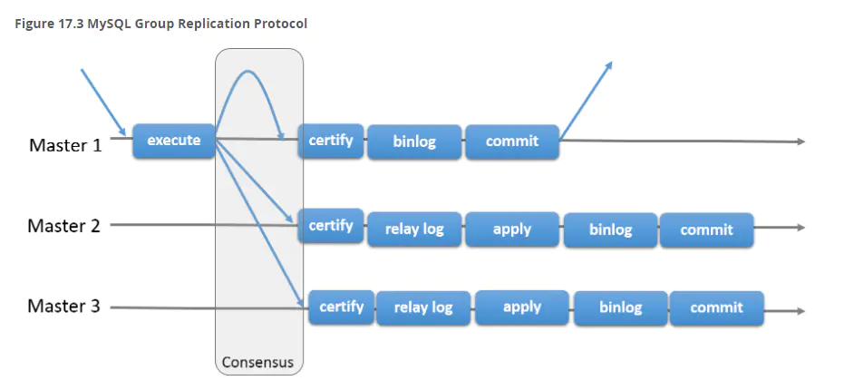

# MGR介绍

基于传统异步复制和半同步复制的缺陷——数据的一致性问题无法保证，MySQL官方在5.7.17版本正式推出组复制（MySQL Group Replication，简称MGR）。

由若干个节点共同组成一个复制组，一个事务的提交，必须经过组内大多数节点（N / 2 + 1）决议并通过，才能得以提交。如上图所示，由3个节点组成一个复制组，Consensus层为一致性协议层，在事务提交过程中，发生组间通讯，由2个节点决议(certify)通过这个事务，事务才能够最终得以提交并响应。

引入组复制，主要是为了解决传统异步复制和半同步复制可能产生数据不一致的问题。组复制依靠分布式一致性协议(Paxos协议的变体)，实现了分布式下数据的最终一致性，提供了真正的数据高可用方案(是否真正高可用还有待商榷)。其提供的多写方案，给我们实现多活方案带来了希望。



image.png

# 1. 创建用户


```undefined
useradd mysql
```

# 2. 上传5.7.20软件到/usr/local解压


```undefined
tar -zxvf mysql-5.7.20-linux-glibc2.12-x86_64.tar.gz 
mv mysql-5.7.20-linux-glibc2.12-x86_64/  mysql
```

# 3. 环境变量


```ruby
vi /root/.bash_profile
export PATH=$PATH:/usr/local/mysql/bin

mkdir -p /data/3306/data  /data/3307/data /data/3308/data
chown -R mysql.mysql /data /usr/local/mysql
```

# 4. 配置文件说明


```objectivec
配置示例：
++++++++++3306++++++
[mysqld]
user=mysql
datadir=/data/3306/data
basedir=/usr/local/mysql
port=3306
socket=/data/3306/mysql.sock
server_id=1
gtid_mode=ON
enforce_gtid_consistency=ON
master_info_repository=TABLE
relay_log_info_repository=TABLE
binlog_checksum=NONE
log_slave_updates=ON
log_bin=binlog
binlog_format=ROW
transaction_write_set_extraction=XXHASH64
loose-group_replication_group_name="22d56f7c-dfe5-4eb1-a21a-cf9c27e8d625"
loose-group_replication_start_on_boot=off
loose-group_replication_local_address="192.168.29.128:33061"
loose-group_replication_group_seeds="192.168.29.128:33061,192.168.29.128:33062,192.168.29.128:33063"
loose-group_replication_bootstrap_group=off
loose-group_replication_single_primary_mode=FALSE
loose-group_replication_enforce_update_everywhere_checks= TRUE

++++++++++3307++++++
[mysqld]
user=mysql
datadir=/data/3307/data
basedir=/usr/local/mysql
port=3307
socket=/data/3307/mysql.sock
server_id=2
gtid_mode=ON
enforce_gtid_consistency=ON
master_info_repository=TABLE
relay_log_info_repository=TABLE
binlog_checksum=NONE
log_slave_updates=ON
log_bin=binlog
binlog_format=ROW
transaction_write_set_extraction=XXHASH64
loose-group_replication_group_name="22d56f7c-dfe5-4eb1-a21a-cf9c27e8d625"
loose-group_replication_start_on_boot=off
loose-group_replication_local_address="192.168.29.128:33062"
loose-group_replication_group_seeds="192.168.29.128:33061,192.168.29.128:33062,192.168.29.128:33063"
loose-group_replication_bootstrap_group=off
loose-group_replication_single_primary_mode=FALSE
loose-group_replication_enforce_update_everywhere_checks= TRUE

++++++++++3308++++++
[mysqld]
user=mysql
datadir=/data/3308/data
basedir=/usr/local/mysql
port=3308
socket=/data/3308/mysql.sock
server_id=3
gtid_mode=ON
enforce_gtid_consistency=ON
master_info_repository=TABLE
relay_log_info_repository=TABLE
binlog_checksum=NONE
log_slave_updates=ON
log_bin=binlog
binlog_format=ROW
transaction_write_set_extraction=XXHASH64
loose-group_replication_group_name="22d56f7c-dfe5-4eb1-a21a-cf9c27e8d625"
loose-group_replication_start_on_boot=off
loose-group_replication_local_address="192.168.29.128:33063"
loose-group_replication_group_seeds="192.168.29.128:33061,192.168.29.128:33062,192.168.29.128:33063"
loose-group_replication_bootstrap_group=off
loose-group_replication_single_primary_mode=FALSE
loose-group_replication_enforce_update_everywhere_checks= TRUE

组复制部分，配置文件介绍：
group_replication变量使用的loose-前缀是指示Server启用时尚未加载复制插件也将继续启动
transaction_write_set_extraction = XXHASH64
##指示Server必须为每个事务收集写集合，并使用XXHASH64哈希算法将其编码为散列
loose-group_replication_group_name="01e5fb97-be64-41f7-bafd-3afc7a6ab555"
##表示将加入或者创建的复制组命名为01e5fb97-be64-41f7-bafd-3afc7a6ab555
##可自定义(通过cat /proc/sys/kernel/random/uuid)
loose-group_replication_start_on_boot=off 
##设置为Server启动时不自动启动组复制
loose-group_replication_local_address="192.168.29.128:33061" 
##绑定本地的192.168.29.128及33061端口接受其他组成员的连接，IP地址必须为其他组成员可正常访问
loose-group_replication_group_seeds="192.168.29.128:33061,192.168.29.128:33062,192.168.29.128:33063"
##本行为告诉服务器当服务器加入组时，应当连接到192.168.29.128:33061,192.168.29.128:33062,192.168.29.128:33063
##这些种子服务器进行配置。本设置可以不是全部的组成员服务地址。
loose-group_replication_bootstrap_group = off 
##配置是否自动引导组
loose-group_replication_ip_whitelist=”10.30.0.0/16,10.31.0..0/16,10.27.0.0/16″
##配置白名单，默认情况下只允许192.168.29.128连接到复制组，如果是其他IP则需要配置。
```

# 5. 初始化数据,并启动数据库节点


```ruby
/usr/local/mysql/bin/mysqld --initialize-insecure --user=mysql --basedir=/usr/local/mysql --datadir=/data/3306/data

/usr/local/mysql/bin/mysqld --initialize-insecure --user=mysql --basedir=/usr/local/mysql --datadir=/data/3307/data

/usr/local/mysql/bin/mysqld --initialize-insecure  --user=mysql --basedir=/usr/local/mysql --datadir=/data/3308/data

mysqld_safe --defaults-file=/data/3306/my.cnf &
mysqld_safe --defaults-file=/data/3307/my.cnf &
mysqld_safe --defaults-file=/data/3308/my.cnf &
```

# 6. 3306节点加入GR


```csharp
创建复制用户
mysql -S /data/3306/mysql.sock
set sql_log_bin=0;
 grant replication slave,replication client on *.* to repl@'localhost' identified by '123';
 grant replication slave,replication client on *.* to repl@'127.0.0.1' identified by '123';
 grant replication slave,replication client on *.* to repl@'192.168.29.%' identified by '123';
  SET SQL_LOG_BIN=1;
 注：如果为三台独立节点，需要将localhost、127.0.0.1和远程主机域都授权用户
开启分布式复制

 change master to master_user='repl',master_password='123' for channel 'group_replication_recovery';

加载GR插件

install plugin group_replication soname 'group_replication.so';
show plugins;

启动复制程序
set global group_replication_bootstrap_group=ON;
start group_replication;
set global group_replication_bootstrap_group=OFF;
#检测组是否创建并已加入新成员
select * from performance_schema.replication_group_members;
```

# 7. 3307加入GR：


```csharp
创建复制用户
mysql -S /data/3307/mysql.sock
set sql_log_bin=0;
 grant replication slave,replication client on *.* to repl@'localhost' identified by '123';
 grant replication slave,replication client on *.* to repl@'127.0.0.1' identified by '123';
 grant replication slave,replication client on *.* to repl@'192.168.29.%' identified by '123';
 SET SQL_LOG_BIN=1;
 注：如果为三台独立节点，需要将localhost、127.0.0.1和远程主机域都授权用户
 开启分布式复制
 change master to master_user='repl',master_password='123' for channel 'group_replication_recovery';

加载GR插件
install plugin group_replication soname 'group_replication.so';
show plugins;

启动复制程序
start group_replication;

#检测组是否创建并已加入新成员
select * from performance_schema.replication_group_members;

注： 前面的用户密码修改和创建用户操作必须设置binlog不记录，执行后再打开，否则会引起START GROUP_REPLICATION执行报错:
ERROR 3092 (HY000): The server is not configured properly to be an active member of the group. Please see more details on error log.
解决方案是：根据提示打开group_replication_allow_local_disjoint_gtids_join选项，mysql命令行执行:
mysql> set global group_replication_allow_local_disjoint_gtids_join=ON;
然后再执行:
mysql> start group_replication;
```

# 8. 3308加入GR


```csharp
创建复制用户
mysql -S /data/3308/mysql.sock
set sql_log_bin=0;
 grant replication slave,replication client on *.* to repl@'localhost' identified by '123';
 grant replication slave,replication client on *.* to repl@'127.0.0.1' identified by '123';
 grant replication slave,replication client on *.* to repl@'192.168.29.%' identified by '123';
 set sql_log_bin=1;

 注：如果为三台独立节点，需要将localhost、127.0.0.1和远程主机域都授权用户

 开启分布式复制
 change master to master_user='repl',master_password='123' for channel 'group_replication_recovery';

加载GR插件
install plugin group_replication soname 'group_replication.so';
show plugins;

启动复制程序
start group_replication;
#检测组是否创建并已加入新成员
select * from performance_schema.replication_group_members;
```


