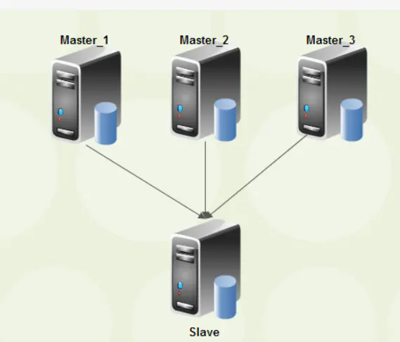

# 1. 多源复制架构



image.png

# 2. 主机角色

| 主机角色 | 地址      | 端口 |
| -------- | --------- | ---- |
| Master1  | 10.0.0.51 | 3306 |
| Master2  | 10.0.0.52 | 3306 |
| Slave    | 10.0.0.53 | 3306 |

# 3.  配置过程

## 3.1 GTID环境准备


```ruby
(1) 清理环境
pkill mysqld 
rm -rf /data/3306/*
mv /etc/my.cnf /tmp 

(2) 创建需要的目录 
mkdir -p /data/3306/data /data/3306/binlog
chown -R mysql.mysql /data

(3) 准备配置文件 
# db01 
cat > /etc/my.cnf <<EOF
[mysqld]
user=mysql
basedir=/data/app/mysql
datadir=/data/3306/data
server_id=6
socket=/tmp/mysql.sock
log_bin=/data/3306/binlog/mysql-bin
gtid_mode=ON
enforce_gtid_consistency
log-slave-updates=1
secure-file-priv=/tmp
innodb_data_file_path=ibdata1:128M;ibdata2:128M:autoextend
innodb_temp_data_file_path=ibtmp1:128M;ibtmp2:128M:autoextend:max:500M
innodb_undo_tablespaces=3
innodb_max_undo_log_size=128M
innodb_undo_log_truncate=ON
innodb_purge_rseg_truncate_frequency=32
autocommit=0
innodb_flush_method=O_DIRECT
slow_query_log=ON
slow_query_log_file=/data/3306/data/db01-slow.log
long_query_time=0.1
log_queries_not_using_indexes
master_info_repository=TABLE
relay_log_info_repository=TABLE
[client]
socket=/tmp/mysql.sock
[mysql]
prompt=db01 [\\d]>
socket=/tmp/mysql.sock
EOF

# db02 
cat > /etc/my.cnf <<EOF
[mysqld]
user=mysql
basedir=/data/app/mysql
datadir=/data/3306/data
server_id=7
socket=/tmp/mysql.sock
log_bin=/data/3306/binlog/mysql-bin
gtid_mode=ON
enforce_gtid_consistency
log-slave-updates=1
secure-file-priv=/tmp
innodb_data_file_path=ibdata1:128M;ibdata2:128M:autoextend
innodb_temp_data_file_path=ibtmp1:128M;ibtmp2:128M:autoextend:max:500M
innodb_undo_tablespaces=3
innodb_max_undo_log_size=128M
innodb_undo_log_truncate=ON
innodb_purge_rseg_truncate_frequency=32
autocommit=0
innodb_flush_method=O_DIRECT
slow_query_log=ON
slow_query_log_file=/data/3306/data/db01-slow.log
long_query_time=0.1
log_queries_not_using_indexes
master_info_repository=TABLE
relay_log_info_repository=TABLE
[client]
socket=/tmp/mysql.sock
[mysql]
prompt=db02 [\\d]>
socket=/tmp/mysql.sock
EOF

# db03 
cat > /etc/my.cnf <<EOF
[mysqld]
user=mysql
basedir=/data/app/mysql
datadir=/data/3306/data
server_id=8
socket=/tmp/mysql.sock
log_bin=/data/3306/binlog/mysql-bin
gtid_mode=ON
enforce_gtid_consistency
log-slave-updates=1
secure-file-priv=/tmp
innodb_data_file_path=ibdata1:128M;ibdata2:128M:autoextend
innodb_temp_data_file_path=ibtmp1:128M;ibtmp2:128M:autoextend:max:500M
innodb_undo_tablespaces=3
innodb_max_undo_log_size=128M
innodb_undo_log_truncate=ON
innodb_purge_rseg_truncate_frequency=32
autocommit=0
innodb_flush_method=O_DIRECT
slow_query_log=ON
slow_query_log_file=/data/3306/data/db01-slow.log
long_query_time=0.1
log_queries_not_using_indexes
master_info_repository=TABLE
relay_log_info_repository=TABLE
[client]
socket=/tmp/mysql.sock
[mysql]
prompt=db03 [\\d]>
socket=/tmp/mysql.sock
EOF

(4) 初始化数据 
mysqld --initialize-insecure --user=mysql --basedir=/data/app/mysql  --datadir=/data/3306/data 

(5) 启动数据库
/etc/init.d/mysqld start 

(6) 构建主从  
# 1. 创建复制用户
grant replication slave on *.*  to repl@'10.0.0.%' identified by '123';
```

## 3.2 配置多源复制


```bash
CHANGE MASTER TO MASTER_HOST='10.0.0.51',MASTER_USER='repl', MASTER_PASSWORD='123', MASTER_AUTO_POSITION=1 FOR CHANNEL 'Master_1';                

CHANGE MASTER TO MASTER_HOST='10.0.0.52',MASTER_USER='repl', MASTER_PASSWORD='123', MASTER_AUTO_POSITION=1 FOR CHANNEL 'Master_2';           

start slave for CHANNEL  'Master_1';
start slave for CHANNEL  'Master_2';
```

## 3.3 多源复制监控


```csharp
db03 [(none)]>SHOW SLAVE STATUS FOR CHANNEL 'Master_1'\G
db03 [(none)]>SHOW SLAVE STATUS FOR CHANNEL 'Master_2'\G
db03 [performance_schema]>select * from replication_connection_configuration\G
SELECT * FROM replication_connection_status WHERE CHANNEL_NAME='master_1'\G
db03 [performance_schema]>select * from performance_schema.replication_applier_status_by_worker;
```

## 3.4多源复制配置过滤


```bash
mysql> CHANGE REPLICATION FILTER REPLICATE_WILD_DO_TABLE = ('db1.%') FOR CHANNEL "master_1";
mysql> CHANGE REPLICATION FILTER REPLICATE_WILD_DO_TABLE = ('db2.%') FOR CHANNEL "master_2";
```

> [https://dev.mysql.com/doc/refman/8.0/en/replication-rules-channel-based-filters.html](https://links.jianshu.com/go?to=https%3A%2F%2Fdev.mysql.com%2Fdoc%2Frefman%2F8.0%2Fen%2Freplication-rules-channel-based-filters.html)
>  This section explains how to work with replication filters when multiple replication channels exist, for example in a multi-source replication topology. Before MySQL 8.0, replication filters were global, so filters were applied to all replication channels. From MySQL 8.0, replication filters can be global or channel specific, enabling you to configure multi-source replicas with replication filters on specific replication channels. Channel specific replication filters are particularly useful in a multi-source replication topology when the same database or table is present on multiple sources, and the replica is only required to replicate it from one source.


