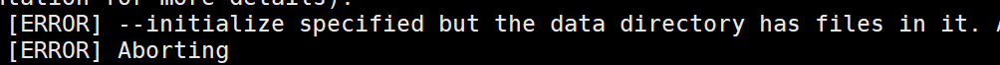

# 第一章   MySQL 大纲介绍

## 1、官方定义的MySQL  DBA工作内容


```undefined
（1）运维DBA
初级：各版本、各平台安装搭建、升级
中级：体系结构原理、基础管理（启动关闭、初始化配置文件管理、多实例管理、用户权限管理、基本SQL（增删改查））、
     日志管理、备份与恢复、主从复制（构建、状态监控） 
高级：高可用（MGR、InnoDB Cluster）、高性能（优化）
（2）开发DBA
懂至少一门开发语言 ：JAVA、Python
基本SQL语句深入学习（增删改查）、数据库结构设计（建模）
高级SQL：存储过程、函数、触发器、视图、事件
```

## 2、老男孩MySQL课程-2019-03月-中级DBA要求（80%以上）


```css
（1）MySQL 5.7 安装部署（二进制）*****
    编译自己扩展
（2）MySQL升级步骤扩展 ***
（3）MySQL5.7 体系结构原理 *****
（4）MySQL基础管理  *****
（5）基础SQL语句使用 *****
（6）SQL高级应用  ***
（7）Information_schema获取元数据 ***
（8）索引、执行计划管理（基础优化）*****
（9）存储引擎  *****
（10）日志管理 *****
（11）备份与恢复 ******
（12）主从复制及架构演变 ******
（13）传统的高可用及读写分离（MHA&Atlas）****
（14）传统分布式架构设计与实现-扩展（Mycat--->DBLE,DRDS）**
（15）MySQL 5.7 高可用及分布式架构-扩展（MGR,InnoDB Cluster）***
（16）MySQL优化（安全、性能） ****
（17）MySQL 监控（zabbix、Open-falcon）    ****
 (18) RDS(阿里云课程)    *****

额外要会的：
    Redis
    mongodb     
了解: 
    PG
    Oracle  
```

## 3、DBA职业素养

------

### 3.1、人品


```undefined
责任-----权利
```

### 3.2

#### 3.2.1、严谨


```rust
磁带库----->备份软件-----17楼
数据库修改\删除类的命令时 再三考虑，而且要有理论或者实践的支撑
```

#### 3.2.2 请收起你的好奇心！！！！！


```undefined
注意规范:
脱库？ 华住网（ip root 密码），“脱敏”!!!!!。
学会保护自己!!!
```

### 3.3、细心


```undefined
把最简单的事情做的最漂亮，最专业。
不要怕成功的门很拥挤,因为很多人在半路就已经放弃了.
                                           ----oldguo                     
```

### 3.4、心态


```undefined
别惹事，出事别怕事
```

### 3.5、熟悉操作系统（精通）

### 3.6、熟悉公司业务


```undefined
业务？
    产品的功能
    用户的行为(热功能,热数据)      
```

### 3.7、熟悉行业


```cpp
熟悉行业发展趋势
版本
数据库产品类型
https://db-engines.com/en/ranking
```

### 3.8、喜欢数据库


```undefined
体验很重要
```

# 第二章: MySQL 介绍和安装

## 1、什么是数据？


```undefined
数据：文字、图片、视频。。。人类认知的数据表现方式
计算机：二进制、16进制的机器语言
基于数据的重要性和复杂性的不同，我们可能有不同的管理方式。

哪些数据是适合存储到数据库的呢？
重要性比较高的
关系较复杂的数据
```

## 2、什么是数据库管理系统（DBMS）？


```undefined
RDBMS: 关系型数据库管理系统
比较适合于,安全级别要求高的数据以及关系较复杂的数据

NoSQL:非关系型数据库管理系统
适合于高性能存取数据,一般是配合RDBMS进行使用的
针对大数据处理分析,分布式架构更加擅长
```

## 3、数据库管理系统种类


```csharp
RDBMS  ：
MySQL 、Oracle、MSSQL（SQL Server）、PG
 
NoSQL：Not Only SQL
键-值（key-value）：Redis, memcached
文档（document）：Mongodb
```

## 4、MySQL简介及产品线

### 4.1 MySQL行业主流版本：


```css
    5.6  
    5.7    
    8.0(现在开始研究新特性)
```

### 4.2 企业版本选择(MySQL分支版本),笔试题


```undefined
Oracle:
      MySQL官方版
红帽  :
      MariaDB
Percona:
      PerconaDB
```

### 4.3 版本选择建议要上新环境


```css
1.一般选择官方主流版本:5.6,5.7 
2.GA（稳定发布版）
3.6-12月的产品版本
```

### 4.4 课程版本：


```css
5.7.20  二进制安装，其他安装方式自己扩展
```

### 4.5 如何获取MySQL软件


```css
企业版：Enterprise  , 互联网行业一般不选择.
社区版本：选择
源码包：source code    .tar.gz   
通用二进制   
面试题:
你们公司用什么版本数据库? 具体什么小版本号?
5.6.20 5.6.34 5.6.36  5.6.38  5.6.40    
5.7.18  5.7.20  5.7.22
```

## 5、MySQL二进制安装

### 5.1.创建软件目录:

```csharp
[root@db01 ~]# mkdir -p /app/
上传软件到此目录
```

### 5.2. 解压并改名为mysql

```ruby
wget https://downloads.mysql.com/archives/get/p/23/file/mysql-5.7.20-linux-glibc2.12-x86_64.tar.gz
[root@db01 app]# tar zxvf mysql-5.7.20-linux-glibc2.12-x86_64.tar.gz -C ./
[root@db01 app]# mv mysql-5.7.20-linux-glibc2.12-x86_64 mysql
[root@db01 app]# ls -l /app/mysql/
total 36
drwxr-xr-x  2 root root   4096 Mar  4 14:55 bin
-rw-r--r--  1 7161 31415 17987 Sep 13  2017 COPYING
drwxr-xr-x  2 root root     55 Mar  4 14:55 docs
drwxr-xr-x  3 root root   4096 Mar  4 14:55 include
drwxr-xr-x  5 root root    229 Mar  4 14:55 lib
drwxr-xr-x  4 root root     30 Mar  4 14:55 man
-rw-r--r--  1 7161 31415  2478 Sep 13  2017 README
drwxr-xr-x 28 root root   4096 Mar  4 14:55 share
drwxr-xr-x  2 root root     90 Mar  4 14:55 support-files
```

修改环境变量:

```bash
vim /etc/profile
export PATH=/app/mysql/bin:$PATH
[root@db01 bin]# source /etc/profile
```

### 5.3. 建立mysql用户和组(如果已有可忽略)

```undefined
 useradd mysql 
```

### 5.4. 创建相关目录并修改权限

```kotlin
 mkdir /data/mysql -p 
 chown -R mysql.mysql /app/*
 chown -R mysql.mysql /data/*
```

### 5.5 初始化数据（建库）

方法一:

```csharp
初始化数据，初始化管理员的临时密码
mysqld --initialize  --user=mysql --basedir=/app/mysql --datadir=/data/mysql

2019-04-18T03:21:53.381108Z 0 [Warning] TIMESTAMP with implicit DEFAULT value is deprecated. Please use --explicit_defaults_for_timestamp server option (see documentation for more details).
2019-04-18T03:21:54.583415Z 0 [Warning] InnoDB: New log files created, LSN=45790
2019-04-18T03:21:54.697859Z 0 [Warning] InnoDB: Creating foreign key constraint system tables.
2019-04-18T03:21:54.760821Z 0 [Warning] No existing UUID has been found, so we assume that this is the first time that this server has been started. Generating a new UUID: 1daa0c57-6189-11e9-bc80-000c294234c8.
2019-04-18T03:21:54.770856Z 0 [Warning] Gtid table is not ready to be used. Table 'mysql.gtid_executed' cannot be opened.
2019-04-18T03:21:54.772016Z 1 [Note] A temporary password is generated for root@localhost: 9LN.fh_Ea#uU
```


image.png


```undefined
报错原因: Linux系统中缺少libaio-devel 软件包
解决:
yum install -y libaio-devel
```



image.png


```kotlin
报错原因:
在/data/mysql 存在文件
解决:
\rm -rf /data/mysql/*
```

**新特性重要说明:**
 **5.7开始,MySQL加入了全新的 密码的安全机制:**
 **1.初始化完成后,会生成临时密码(显示到屏幕上,并且会往日志中记一份)**
 **2.密码复杂度:长度:超过12位? 复杂度:字符混乱组合**
 **3.密码过期时间180天**


```mysql
方法二 :
初始化数据，初始化管理员的密码为空

\rm -rf  /data/mysql/*
[root@db01 ~]# mysqld --initialize-insecure  --user=mysql --basedir=/app/mysql --datadir=/data/mysql

2019-04-18T03:37:43.146018Z 0 [Warning] TIMESTAMP with implicit DEFAULT value is deprecated. Please use --explicit_defaults_for_timestamp server option (see documentation for more details).
2019-04-18T03:37:43.892132Z 0 [Warning] InnoDB: New log files created, LSN=45790
2019-04-18T03:37:43.970412Z 0 [Warning] InnoDB: Creating foreign key constraint system tables.
2019-04-18T03:37:44.029490Z 0 [Warning] No existing UUID has been found, so we assume that this is the first time that this server has been started. Generating a new UUID: 5378f3b3-618b-11e9-9164-000c294234c8.
2019-04-18T03:37:44.041469Z 0 [Warning] Gtid table is not ready to be used. Table 'mysql.gtid_executed' cannot be opened.
2019-04-18T03:37:44.042348Z 1 [Warning] root@localhost is created with an empty password ! Please consider switching off the --initialize-insecure option.
[root@db01 ~]# 

[root@db01 ~]# cd /data/mysql/
[root@db01 mysql]# ll
total 110628
-rw-r----- 1 mysql mysql       56 Apr 18 11:37 auto.cnf
-rw-r----- 1 mysql mysql      419 Apr 18 11:37 ib_buffer_pool
-rw-r----- 1 mysql mysql 12582912 Apr 18 11:37 ibdata1
-rw-r----- 1 mysql mysql 50331648 Apr 18 11:37 ib_logfile0
-rw-r----- 1 mysql mysql 50331648 Apr 18 11:37 ib_logfile1
drwxr-x--- 2 mysql mysql     4096 Apr 18 11:37 mysql
drwxr-x--- 2 mysql mysql     8192 Apr 18 11:37 performance_schema
drwxr-x--- 2 mysql mysql     8192 Apr 18 11:37 sys
[root@db01 mysql]# 
```

**注释：5.6初始化的区别**

```jsx
/application/mysql/scripts/mysql_install_db  --user=mysql --datadir=/application/mysql/data --basedir=/application/mysql

```

### 5.6 书写默认配置文件


```jsx
vim /etc/my.cnf
[mysqld]
user=mysql
basedir=/app/mysql
datadir=/data/mysql
server_id=6
port=3306
socket=/tmp/mysql.sock
[mysql]
socket=/tmp/mysql.sock
prompt=3306 [\\d]>
```

### 5.7 配置启动脚本:

```csharp
[root@db01 mysql]# cd /app/mysql/support-files
[root@db01 support-files]# ./mysql.server start
Starting MySQL.Logging to '/data/mysql/db01.err'.
 SUCCESS! 
    
cp mysql.server    /etc/init.d/mysqld    # 这种是centos6的软件启动管理方式
```

### 5.8 使用systemd管理mysql

```csharp
vim /etc/systemd/system/mysqld.service 
[Unit]
Description=MySQL Server
Documentation=man:mysqld(8)
Documentation=http://dev.mysql.com/doc/refman/en/using-systemd.html
After=network.target
After=syslog.target
[Install]
WantedBy=multi-user.target
[Service]
User=mysql
Group=mysql
ExecStart=/app/mysql/bin/mysqld --defaults-file=/etc/my.cnf
LimitNOFILE = 5000
```

注意：将原来模式启动mysqld先关闭，然后再用systemd管理。

```undefined
systemctl  start/stop/restart/status   mysqld
```

## 6. 安装后的简单管理

```css
[root@db01 ~]# mysqladmin -uroot -p password 123  #root用户设置密码
Enter password:  #输入原密码。就是初始化的密码
mysqladmin: [Warning] Using a password on the command line interface can be insecure.
Warning: Since password will be sent to server in plain text, use ssl connection to ensure password safety.

5.6版本:
select user,password,host from mysql.user;
5.7 中用户基本信息
select user,authentication_string,host from mysql.user;
desc  mysql.user;

```

小结:
 1.版本 (主流版本的GA时间了解一下)


```css
5.6 5.7 
5.6.38   5.7.20  ==>20170913 发行
5.6 和5.7的区别
(1) 初始化方式变了
mysql_install_db   
mysqld  --initialize-insecure
(2) 用户安全
12位
180天
4种复杂度

(3)密码字段
authentication_strings
```

2.安装方法:

```undefined
二进制
源码
yum 
```

3.建库(初始化数据库)

```jsx
mysqld --intialize-insecure --user=mysql --basedir=/app/mysql --datadir=/data/mysql 
```

4.简易的配置文件/etc/my.cnf

```undefined
user 
basedir
datadir 
server_id
port
socket 
```

1.  管理员密码修改

```undefined
mysqladmin -uroot -p password xx
```

-------------------------------------------------------------------------------

### 忘记密码修改

```
1.停止mysql数据库
/etc/init.d/mysqld stop
 （或者直接 kill -9 [PID]  杀进程！）

2.执行如下命令
mysqld_safe --user=mysql --skip-grant-tables --skip-networking &

3.使用root登录mysql数据库
mysql -u root mysql

4.更新root密码
mysql> UPDATE user SET Password=PASSWORD('newpassword') where USER='root';

最新版MySQL请采用如下SQL：
mysql> UPDATE user SET authentication_string=PASSWORD('newpassword') where USER='root';

5.刷新权限
mysql> FLUSH PRIVILEGES;

6.退出mysql
mysql> quit

7.重启mysql
/etc/init.d/mysqld restart

8.使用root用户重新登录mysql
mysql -uroot -p
 Enter password: <输入新设的密码newpassword>
```

