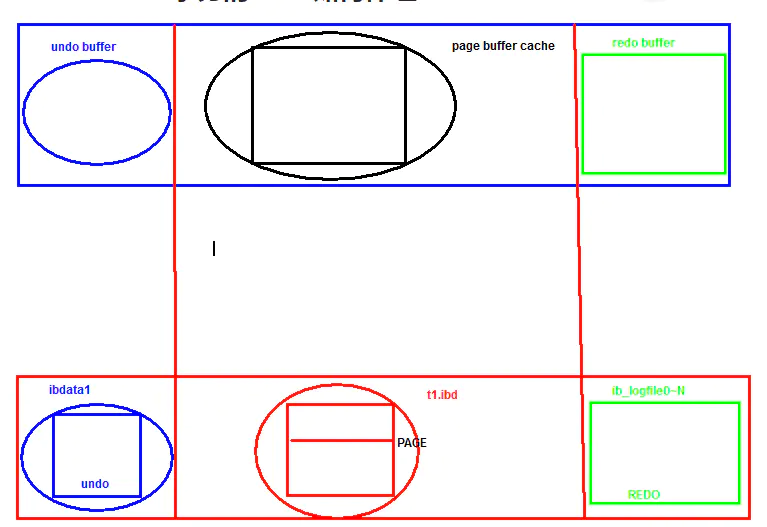

# 1、简介


```undefined
相当于Linux文件系统，只不过比文件系统强大
```

# 2、功能了解


```undefined
数据读写
数据安全和一致性
提高性能
热备份
自动故障恢复
高可用方面支持
等.
```

# 3、存储引擎种类（笔试）

## 3.1 介绍(Oracle MySQL)


```undefined
InnoDB
MyISAM
MEMORY
ARCHIVE
FEDERATED
EXAMPLE
BLACKHOLE
MERGE
NDBCLUSTER
CSV
```

## 3.2 引擎种类查看


```dart
show engines;
存储引擎是作用在表上的，也就意味着，不同的表可以有不同的存储引擎类型。
PerconaDB:默认是XtraDB
MariaDB:默认是InnoDB
其他的存储引擎支持:
TokuDB    
RocksDB
MyRocks
以上三种存储引擎的共同点:压缩比较高,数据插入性能极高
现在很多的NewSQL,使用比较多的功能特性.
    
# 查看数据里是不是有某种存储种类的表
select table_schema,table_name,engine from information_schema.tables where engine='MEMORY';
```

## 3.3 简历案例---zabbix监控系统架构整改


```css
环境: zabbix 3.2    mariaDB 5.5  centos 7.3
现象 : zabbix卡的要死 ,  每隔3-4个月,都要重新搭建一遍zabbix,存储空间经常爆满.
问题 :
1. zabbix 版本 
2. 数据库版本
3. zabbix数据库500G,存在一个文件里
优化建议:
1.数据库版本升级到5.7版本,zabbix升级更高版本
2.存储引擎改为tokudb
3.监控数据按月份进行切割(二次开发:zabbix 数据保留机制功能重写,数据库分表)
4.关闭binlog和双1
5.参数调整....
优化结果:
监控状态良好

为什么?
1. 原生态支持TokuDB,另外经过测试环境,5.7要比5.5 版本性能 高  2-3倍
2. TokuDB:insert数据比Innodb快的多，数据压缩比要Innodb高
3.监控数据按月份进行切割,为了能够truncate每个分区表,立即释放空间
4.关闭binlog ----->减少无关日志的记录.
5.参数调整...----->安全性参数关闭,提高性能.
```

## 3.4 InnoDB和MyISAM存储引擎的替换


```css
环境: centos 5.8 ,MySQL 5.0版本,MyISAM存储引擎,网站业务(LNMP),数据量50G左右
现象问题: 业务压力大的时候,非常卡;经历过宕机,会有部分数据丢失.
问题分析:
1.MyISAM存储引擎表级锁,在高并发时,会有很高锁等待
2.MyISAM存储引擎不支持事务,在断电时,会有可能丢失数据
职责
1.监控锁的情况:有很多的表锁等待
2.存储引擎查看:所有表默认是MyISAM
解决方案:
1.升级MySQL 5.6.10版本
2. 迁移所有表到新环境
3. 开启双1安全参数
```

# 4、InnoDB存储引擎介绍


image.png


```css
在MySQL5.5版本之后，默认的存储引擎，提供高可靠性和高性能。
```

## 4.1 优点


```php
1、事务（Transaction）
2、MVCC（Multi-Version Concurrency Control多版本并发控制）
3、行级锁(Row-level Lock)
4、ACSR（Auto Crash Safey Recovery）自动的故障安全恢复
5、支持热备份(Hot Backup)
6、Replication: Group Commit , GTID (Global Transaction ID) ,多线程(Multi-Threads-SQL ) 
```

## 4.2 笔试题


```undefined
请你列举MySQL InnoDB存储优点？
请你列举 InooDB和MyIsam的区别？
```

# 5. 存储引擎查看

## 5.1 使用 SELECT 确认会话存储引擎


```csharp
SELECT @@default_storage_engine;
## 5.2 存储引擎(不代表生产操作)
会话级别:
set default_storage_engine=myisam;
全局级别(仅影响新会话):
set global default_storage_engine=myisam;
重启之后,所有参数均失效.
如果要永久生效:
写入配置文件
vim /etc/my.cnf
[mysqld]
default_storage_engine=myisam
存储引擎是表级别的,每个表创建时可以指定不同的存储引擎,但是我们建议统一为innodb.
```

## 5.3 SHOW 确认每个表的存储引擎：


```bash
SHOW CREATE TABLE City\G;
SHOW TABLE STATUS LIKE 'CountryLanguage'\G
```

## 5.4 INFORMATION_SCHEMA 确认每个表的存储引擎


```csharp
[world]>select table_schema,table_name ,engine from information_schema.tables where table_schema not in ('sys','mysql','information_schema','performance_schema');
Master [world]>show table status;
Master [world]>show create table city;
```

## 5.5 修改一个表的存储引擎


```css
// 业务中delete操作有可能产生碎片整理、
注意：此命令我们经常使用他，进行innodb表的碎片整理
db01 [oldboy]>alter table t1 engine innodb;


//拼接一个批量语句
select concat("ALTER TABLE ",table_schema,".",table_name," engine=innodb") from information_schema.tables where table_schema='world';
```

## 5.6 平常处理过的MySQL问题--碎片处理


```css
环境:centos7.4,MySQL 5.7.20,InnoDB存储引擎
业务特点:数据量级较大,经常需要按月删除历史数据.
问题:磁盘空间占用很大,不释放
处理方法:
以前:将数据逻辑导出,手工drop表,然后导入进去
现在:
对表进行按月进行分表(partition,中间件)
业务替换为truncate方式
```

## 5.6  扩展:如何批量修改


```csharp
需求:将zabbix库中的所有表,innodb替换为tokudb
select concat("alter table zabbix.",table_name," engine tokudb;") from
information_schema.tables where table_schema='zabbix' into outfile '/tmp/tokudb.sql';
```

# 6、InnoDB存储引擎物理存储结构

## 6.0 最直观的存储方式(/data/mysql/data)


```undefined
ibdata1：系统数据字典信息(统计信息)，UNDO表空间等数据
ib_logfile0 ~ ib_logfile1: REDO日志文件，事务日志文件。
ibtmp1： 临时表空间磁盘位置，存储临时表
frm：存储表的列信息
ibd：表的数据行和索引
```

## 6.1 表空间(Tablespace)

### 6.1.1、共享表空间


```css
需要将所有数据存储到同一个表空间中 ，管理比较混乱
5.5版本出现的管理模式，也是默认的管理模式。
5.6版本以，共享表空间保留，只用来存储:数据字典信息,undo,临时表。
5.7 版本,临时表被独立出来了
8.0版本,undo也被独立出去了
```

具体变化参考官方文档:
 [https://dev.mysql.com/doc/refman/5.6/en/innodb-architecture.html](https://links.jianshu.com/go?to=https%3A%2F%2Fdev.mysql.com%2Fdoc%2Frefman%2F5.6%2Fen%2Finnodb-architecture.html)
 [https://dev.mysql.com/doc/refman/5.7/en/innodb-architecture.html](https://links.jianshu.com/go?to=https%3A%2F%2Fdev.mysql.com%2Fdoc%2Frefman%2F5.7%2Fen%2Finnodb-architecture.html)
 [https://dev.mysql.com/doc/refman/5.8/en/innodb-architecture.html](https://links.jianshu.com/go?to=https%3A%2F%2Fdev.mysql.com%2Fdoc%2Frefman%2F5.8%2Fen%2Finnodb-architecture.html)

### 6.1.2 共享表空间设置


```csharp
共享表空间设置(在搭建MySQL时，初始化数据之前设置到参数文件中)
[(none)]>select @@innodb_data_file_path;
[(none)]>show variables like '%extend%';
innodb_data_file_path=ibdata1:512M:ibdata2:512M:autoextend 
innodb_autoextend_increment=64
#初始化的设置大小，第1个512M 不够用加第2个512M 再不够用了就自动增长单位是64M
```

### 6.1.3 独立表空间


```cpp
从5.6，默认表空间不再使用共享表空间，替换为独立表空间。
主要存储的是用户数据
存储特点为：一个表一个ibd文件，存储数据行和索引信息
基本表结构元数据存储：
xxx.frm
最终结论：
      元数据            数据行+索引
mysql表数据    =（ibdataX+frm）+ibd(段、区、页)
        DDL             DML+DQL

MySQL的存储引擎日志：
Redo Log: ib_logfile0  ib_logfile1，重做日志
Undo Log: ibdata1 ibdata2(存储在共享表空间中)，回滚日志
临时表:ibtmp1，在做join union操作产生临时数据，用完就自动
```

### 6.1.4 独立表空间设置问题


```dart
db01 [(none)]>select @@innodb_file_per_table; 
+-------------------------+
| @@innodb_file_per_table |
+-------------------------+
|                      1  |  #1表示独立表空间，每个表一个独立文件
+-------------------------+
#删除表空间文件，（ibd文件）留下了frm文件和元数据，表的素据和索引没了。
alter table city dicard tablespace; 
 #导入表空间（从别的地方拷贝ibd文件，使用这个命令）；数据和索引
alter table city import tablespace;

------
#影响后面的创建的表为共享表空间
> set global innodb_file_per_table=0; 
3306 [(none)]>quit
# mysql -uroot -p
[(none)]>select @@innodb_file_per_table;
+-------------------------+
| @@innodb_file_per_table |
+-------------------------+
|                       0 |
+-------------------------+
1 row in set (0.00 sec)
3306 [(none)]>create database world charset=utf8mb4;
3306 [(none)]>use world;create table bbb(id int);
3306 [world]>exit
[root@MiWiFi-R3-srv mysql]# cd world
[root@MiWiFi-R3-srv world]# ll
total 16  # 没有ibd文件，元素据和表数据放到ibdata 里去了共享表空间
-rw-r-----. 1 mysql mysql 8556 Nov 27 13:54 bbb.frm 
-rw-r-----. 1 mysql mysql   67 Nov 27 13:53 db.opt
```

### 6.1.5 真实的学生案例

案例背景:


```css
硬件及软件环境:
联想服务器（IBM） 
磁盘500G 没有raid
centos 6.8
mysql 5.6.33  innodb引擎  独立表空间
备份没有，日志也没开

开发用户专用库:
jira(bug追踪) 、 confluence(内部知识库)    ------>LNMT
```

故障描述:


```undefined
/usr/bin/mysql
/var/lib/mysql   {confulence,jira}
断电了，启动完成后“/” 只读
fsck  重启,系统成功启动,mysql启动不了。
结果：confulence库在  ， jira库不见了

----以后操作， 先不要fsck
救援模式进入系统，挂一块一样大小的磁盘，比原磁盘大也可以 
# dd镜像数据一份数据到新的磁盘上备份
dd if=/dev/sda of=/dev/sdb
后续再随便操作， 可以随时恢复


```

学员求助内容:


```csharp
求助：
这种情况怎么恢复？
我问：
有备份没  #查看计划任务，crontab -l
求助：
连二进制日志都没有，没有备份，没有主从
我说：
没招了，jira需要硬盘恢复了。
求助：
1、jira问题拉倒中关村了
2、能不能暂时把confulence库先打开用着
将生产库confulence，拷贝到1:1虚拟机上/var/lib/mysql,直接访问时访问不了的

问：有没有工具能直接读取ibd
我说：我查查，最后发现没有
```

我想出一个办法来：


```css
表空间迁移:
create table xxx
alter table  confulence.t1 discard tablespace;
alter table confulence.t1 import tablespace;
虚拟机测试可行。
```

处理问题思路:


```csharp
confulence库中一共有107张表。
1、创建107和和原来一模一样的表。
他有2016年的历史库，我让他去他同时电脑上 mysqldump备份confulence库
mysqldump -uroot -ppassw0rd -B  confulence --no-data >test.sql
拿到你的测试库，进行恢复
到这步为止，表结构有了。
2、表空间删除。
select concat('alter table ',table_schema,'.'table_name,' discard tablespace;') from information_schema.tables where table_schema='confluence' into outfile '/tmp/discad.sql';
source /tmp/discard.sql
执行过程中发现，有20-30个表无法成功。主外键关系
很绝望，一个表一个表分析表结构，很痛苦。 
set foreign_key_checks=0 跳过外键检查。
把有问题的表表空间也删掉了。
3、拷贝生产中confulence库下的所有表的ibd文件拷贝到准备好的环境中
select concat('alter table ',table_schema,'.'table_name,' import tablespace;') from information_schema.tables where table_schema='confluence' into outfile '/tmp/discad.sql';
4、验证数据
表都可以访问了，数据挽回到了出现问题时刻的状态（2-8）
```

# 8、事务的ACID特性

**Atomic（原子性）**

```undefined
所有语句作为一个单元全部成功执行或全部取消。不能出现中间状态。
```

**Consistent（一致性）**

```undefined
如果数据库在事务开始时处于一致状态，则在执行该事务期间将保留一致状态。
```

**Isolated（隔离性）**

```undefined
事务之间不相互影响。
```

**Durable（持久性）**

```undefined
事务成功完成后，所做的所有更改都会准确地记录在数据库中。所做的更改不会丢失。
```

# 9、事务的生命周期（事务控制语句）

## 9.1 事务的开始


```ruby
begin
说明:在5.5 以上的版本，不需要手工begin，只要你执行的是一个DML，会自动在前面加一个begin命令。
```

## 9.2 事务的结束


```undefined
commit：提交事务
完成一个事务，一旦事务提交成功 ，就说明具备ACID特性了。
rollback ：回滚事务
将内存中，已执行过的操作，回滚回去
```

## 9.3 自动提交策略（autocommit）


```csharp
db01 [(none)]>select @@autocommit;
db01 [(none)]>set autocommit=0;  #临时修改当前会话设置
db01 [(none)]>set global autocommit=0;  #全局设置
注：
自动提交是否打开，一般在有事务需求的MySQL中，将其关闭
不管有没有事务需求，我们一般也都建议设置为0，可以很大程度上提高数据库性能
(1)
set autocommit=0;   
set global autocommit=0;
(2)
vim /etc/my.cnf
autocommit=0     
```

## 9.4  隐式提交语句


```ruby
用于隐式提交的 SQL 语句：
begin 
a
b
begin

SET AUTOCOMMIT = 1

导致提交的非事务语句：
DDL语句： （ALTER、CREATE 和 DROP）
DCL语句： （GRANT、REVOKE 和 SET PASSWORD）
锁定语句：（LOCK TABLES 和 UNLOCK TABLES）
导致隐式提交的语句示例：
TRUNCATE TABLE
LOAD DATA INFILE
SELECT FOR UPDATE
```

## 9.5 开始事务流程：


```csharp
# mysql登录之后导入sql文件
> source /root/world.sql
    
1、检查autocommit是否为关闭状态
select @@autocommit;
或者：
show variables like 'autocommit';
2、开启事务,并结束事务
begin
delete from student where name='alexsb';
update student set name='alexsb' where name='alex';
rollback;

begin
delete from student where name='alexsb';
update student set name='alexsb' where name='alex';
commit;
```

# 10. InnoDB 事务的ACID如何保证?

## 10.0 一些概念


```ruby
redo log ---> 重做日志 ib_logfile0~1   50M   , 轮询使用
redo log buffer ---> redo内存区域
ibd     ----> 存储 数据行和索引 
buffer pool --->缓冲区池,数据和索引的缓冲
LSN : 日志序列号 
磁盘数据页,redo文件,buffer pool,redo buffer
MySQL 每次数据库启动,都会比较磁盘数据页和redolog的LSN,必须要求两者LSN一致数据库才能正常启动
WAL : write ahead log 日志优先写的方式实现持久化
脏页: 内存脏页,内存中发生了修改,没写入到磁盘之前,我们把内存页称之为脏页.
CKPT:Checkpoint,检查点,就是将脏页刷写到磁盘的动作
TXID: 事务号,InnoDB会为每一个事务生成一个事务号,伴随着整个事务.
```



image

## 10.1 redo log

### 10.1.1 Redo是什么？


```ruby
redo,顾名思义“重做日志”，是事务日志的一种。
```

### 10.1.2 作用是什么？


```undefined
在事务ACID过程中，实现的是“D”持久化的作用。对于AC也有相应的作用
```

### 10.1.3 redo日志位置


```ruby
redo的日志文件：iblogfile0 iblogfile1
```

### 10.1.4 redo buffer


```ruby
redo的buffer:数据页的变化信息+数据页当时的LSN号
LSN：日志序列号  磁盘数据页、内存数据页、redo buffer、redolog
```

### 10.1.5 redo的刷新策略


```ruby
commit;
刷新当前事务的redo buffer到磁盘
还会顺便将一部分redo buffer中没有提交的事务日志也刷新到磁盘
```

### 10.1.6 MySQL CSR——前滚


```ruby
MySQL : 在启动时,必须保证redo日志文件和数据文件LSN必须一致, 如果不一致就会触发CSR,最终保证一致
情况一:
我们做了一个事务,begin;update;commit.
1.在begin ,会立即分配一个TXID=tx_01.
2.update时,会将需要修改的数据页(dp_01,LSN=101),加载到data buffer中
3.DBWR线程,会进行dp_01数据页修改更新,并更新LSN=102
4.LOGBWR日志写线程,会将dp_01数据页的变化+LSN+TXID存储到redobuffer
5. 执行commit时,LGWR日志写线程会将redobuffer信息写入redolog日志文件中,基于WAL原则,
在日志完全写入磁盘后,commit命令才执行成功,(会将此日志打上commit标记)
6.假如此时宕机,内存脏页没有来得及写入磁盘,内存数据全部丢失
7.MySQL再次重启时,必须要redolog和磁盘数据页的LSN是一致的.但是,此时dp_01,TXID=tx_01磁盘是LSN=101,dp_01,TXID=tx_01,redolog中LSN=102
MySQL此时无法正常启动,MySQL触发CSR.在内存追平LSN号,触发ckpt,将内存数据页更新到磁盘,从而保证磁盘数据页和redolog LSN一值.这时MySQL正长启动
以上的工作过程,我们把它称之为基于REDO的"前滚操作"
```

## 11.2 undo 回滚日志

### 11.2.1 undo是什么？


```undefined
undo,顾名思义“回滚日志”
```

### 11.2.2 作用是什么？


```ruby
在事务ACID过程中，实现的是“A” 原子性的作用
另外CI也依赖于Undo
在rolback时,将数据恢复到修改之前的状态
在CSR实现的是,将redo当中记录的未提交的时候进行回滚.
undo提供快照技术,保存事务修改之前的数据状态.保证了MVCC,隔离性,mysqldump的热备
```

## 11.3 概念性的东西:


```ruby
redo怎么应用的
undo怎么应用的
CSR(自动故障恢复)过程
LSN :日志序列号
TXID:事务ID
CKPT(Checkpoint)
```

## 11.4 锁


```ruby
“锁”顾名思义就是锁定的意思。
“锁”的作用是什么？
在事务ACID过程中，“锁”和“隔离级别”一起来实现“I”隔离性和"C" 一致性 (redo也有参与).
悲观锁:行级锁定(行锁)
谁先操作某个数据行,就会持有<这行>的(X)锁.
乐观锁: 没有锁
```

## 11.5 隔离级别


```csharp
影响到数据的读取,默认的级别是 RR模式.
transaction_isolation   隔离级别(参数)
负责的是,MVCC,读一致性问题
RU  : 读未提交,可脏读,一般部议叙出现
RC  : 读已提交,可能出现幻读,可以防止脏读.
RR  : 可重复读,功能是防止"幻读"现象 ,利用的是undo的快照技术+GAP(间隙锁)+NextLock(下键锁)
SR   : 可串行化,可以防止死锁,但是并发事务性能较差
补充: 在RC级别下,可以减轻GAP+NextLock锁的问题,但是会出现幻读现象,一般在为了读一致性会在正常select后添加for update语句.但是,请记住执行完一定要commit 否则容易出现所等待比较严重.
例如:
[world]>select * from city where id=999 for update;
[world]>commit;
```

## 11.6 架构改造项目


```css
项目背景:
2台  IBM X3650   32G  ,原来主从关系,2年多没有主从了,"小问题"不断(锁,宕机后的安全)
MySQL 5.1.77   默认存储引擎 MyISAM  
数据量: 60G左右 ,每周全备,没有开二进制日志
架构方案:
    1. 升级数据库版本到5.7.20 
    2. 更新所有业务表的存储引擎为InnoDB
    3. 重新设计备份策略为热备份,每天全备,并备份日志
    4. 重新构建主从
结果:
    1.性能
    2.安全方面
    3.快速故障处理
```

# 12 InnoDB存储引擎核心特性-参数补充

## 12.1 存储引擎相关

### 12.1.1 查看


```dart
show engines;
show variables like 'default_storage_engine';
select @@default_storage_engine;
```

### 12.1.2 如何指定和修改存储引擎


```undefined
(1) 通过参数设置默认引擎
(2) 建表的时候进行设置
(3) alter table t1 engine=innodb;
```

## 12.2. 表空间

### 12.2.1 共享表空间


```undefined
innodb_data_file_path
一般是在初始化数据之前就设置好
例子:
innodb_data_file_path=ibdata1:512M:ibdata2:512M:autoextend
```

### 12.2.2 独立表空间


```dart
show variables like 'innodb_file_per_table';
```

## 12.3. 缓冲区池

### 12.3.1 查询


```css
select @@innodb_buffer_pool_size;
show engine innodb status\G
innodb_buffer_pool_size 
一般建议最多是物理内存的 75-80%
```

## 12.4. innodb_flush_log_at_trx_commit  (双一标准之一)

### 12.4.1 作用


```bash
主要控制了innodb将log buffer中的数据写入日志文件并flush磁盘的时间点，取值分别为0、1、2三个。
```

### 12.4.2 查询


```css
select @@innodb_flush_log_at_trx_commit;
```

### 12.4.3 参数说明:


```bash
1，每次事物的提交都会引起日志文件写入、flush磁盘的操作，确保了事务的ACID；flush  到操作系统的文件系统缓存  fsync到物理磁盘.
0，表示当事务提交时，不做日志写入操作，而是每秒钟将log buffer中的数据写入文件系统缓存并且秒fsync磁盘一次；
2，每次事务提交引起写入文件系统缓存,但每秒钟完成一次fsync磁盘操作。
--------
The default setting of 1 is required for full ACID compliance. Logs are written and flushed to disk at each transaction commit.
With a setting of 0, logs are written and flushed to disk once per second. Transactions for which logs have not been flushed can be lost in a crash.
With a setting of 2, logs are written after each transaction commit and flushed to disk once per second. Transactions for which logs have not been flushed can be lost in a crash.
-------
```

## 12.5. Innodb_flush_method=(O_DIRECT, fdatasync)


image


[https://dev.mysql.com/doc/refman/5.7/en/innodb-parameters.html#sysvar_innodb_flush_method](https://links.jianshu.com/go?to=https%3A%2F%2Fdev.mysql.com%2Fdoc%2Frefman%2F5.7%2Fen%2Finnodb-parameters.html%23sysvar_innodb_flush_method)


### 12.5.1 作用


```bash
控制的是,log buffer 和data buffer,刷写磁盘的时候是否经过文件系统缓存
```

### 12.5.2 查看


```dart
show variables like '%innodb_flush%';
```

### 12.5.3 参数值说明


```undefined
O_DIRECT  :数据缓冲区写磁盘,不走OS buffer
fsync :日志和数据缓冲区写磁盘,都走OS buffer
O_DSYNC  :日志缓冲区写磁盘,不走 OS buffer
```

### 12.5.4 使用建议


```undefined
最高安全模式
innodb_flush_log_at_trx_commit=1
Innodb_flush_method=O_DIRECT
最高性能:
innodb_flush_log_at_trx_commit=0
Innodb_flush_method=fsync
```

## 12.6. redo日志有关的参数


```undefined
innodb_log_buffer_size=16777216
innodb_log_file_size=50331648
innodb_log_files_in_group = 3
```

# 13.扩展(自己扩展，建议是官方文档。)


```csharp
RR模式(对索引进行删除时):
GAP:          间隙锁
next-lock:    下一键锁定

例子:
id（有索引）
1 2 3 4 5 6 
GAP：
在对3这个值做变更时，会产生两种锁，一种是本行的行级锁，另一种会在2和4索引键上进行枷锁
next-lock：
对第六行变更时，一种是本行的行级锁，在索引末尾键进行加锁，6以后的值在这时是不能被插入的。
总之：
GAP、next lock都是为了保证RR模式下，不会出现幻读，降低隔离级别或取消索引，这两种锁都不会产生。
IX IS X S是什么?
```

# 17.小结

 17.1 存储引擎的类型

 17.2 InnoDB和MyISAM

17.3 事务ACID

 17.4 redo

 17.5 undo

 17.6 锁

 17.7 隔离级别

 17.8 核心参数

