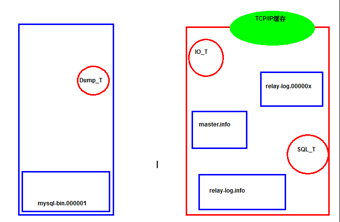
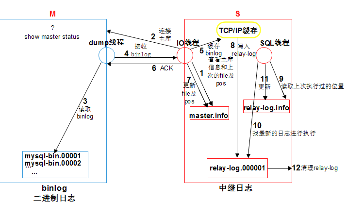

# 0.企业高可用性标准 ***

## 0.1 全年无故障率(非计划内故障停机)


```rust
99.9%                 ----> 0.001*365*24*60=525.6  min
99.99%                ----> 0.0001*365*24*60=52.56 min
99.999%               ----> 0.0001*365*24*60=5.256 min
```

## 0.2 高可用架构方案


```undefined
负载均衡:有一定的高可用性 
LVS  Nginx
主备系统:有高可用性,但是需要切换,是单活的架构
KA ,   MHA, MMM
真正高可用(多活系统): 
NDB Cluster  Oracle RAC  Sysbase cluster   , InnoDB Cluster（MGR）,PXC , MGC
```

# 1. 主从复制简介     **


```css
1.1. 基于二进制日志复制的
1.2. 主库的修改操作会记录二进制日志
1.3. 从库会请求新的二进制日志并回放,最终达到主从数据同步
1.4. 主从复制核心功能:
辅助备份,处理物理损坏                   
扩展新型的架构:高可用,高性能,分布式架构等
```

# 2. 主从复制前提(搭建主从的过程)     ***


```css
## 2.1 两台以上mysql实例 ,server_id,server_uuid不同
## 2.2 主库开启二进制日志
## 2.3 专用的复制用户
## 2.4 保证主从开启之前的某个时间点,从库数据是和主库一致(补课)
## 2.5 告知从库,复制user,passwd,IP port,以及复制起点(change master to)
## 2.6 线程(三个):Dump thread  IO thread  SQL thread 开启(start slave)
```

# 3. 主从复制搭建(Classic replication)   ***

## 3.1 清理主库数据


```kotlin
rm -rf /data/3307/data/*
```

## 3.2 重新初始化3307


```jsx
mysqld --initialize-insecure --user=mysql --basedir=/app/mysql --datadir=/data/3307/data
```

## 3.3 修改my.cnf ,开启二进制日志功能


```kotlin
[root@db01 3307]# vim /data/3307/my.cnf 
log_bin=/data/3307/data/mysql-bin
```

## 3.4 启动所有节点


```ruby
[root@db01 3307]# systemctl start mysqld3307
[root@db01 3307]# systemctl start mysqld3308
[root@db01 3307]# systemctl start mysqld3309
[root@db01 3307]# ps -ef |grep mysqld
mysql      3684      1  4 09:59 ?        00:00:00 /app/mysql/bin/mysqld --defaults-file=/data/3307/my.cnf
mysql      3719      1  7 09:59 ?        00:00:00 /app/mysql/bin/mysqld --defaults-file=/data/3308/my.cnf
mysql      3754      1  8 09:59 ?        00:00:00 /app/mysql/bin/mysqld --defaults-file=/data/3309/my.cnf
[root@db01 3307]# mysql -S /data/3307/mysql.sock -e "select @@server_id"
[root@db01 3307]# mysql -S /data/3308/mysql.sock -e "select @@server_id"
[root@db01 3307]# mysql -S /data/3309/mysql.sock -e "select @@server_id"
```

## 3.5 主库中创建复制用户


```csharp
[root@db01 3307]# mysql -S /data/3307/mysql.sock 
db01 [(none)]>grant replication slave on *.* to repl@'10.0.0.%' identified by '123';
db01 [(none)]>select user,host from mysql.user;
```

## 3.6 备份主库并恢复到从库


```kotlin
[root@db01 3307]# mysqldump -S /data/3307/mysql.sock -A --master-data=2 --single-transaction  -R --triggers >/backup/full.sql
-- CHANGE MASTER TO MASTER_LOG_FILE='mysql-bin.000001', MASTER_LOG_POS=653;
[root@db01 3307]# mysql -S /data/3308/mysql.sock
db01 [(none)]>source /backup/full.sql
```

## 3.7 告知从库关键复制信息


```bash
ip port user  password  binlog position 
[root@db01 3307]# mysql -S /data/3308/mysql.sock
db01 [mysql]>help change master to

CHANGE MASTER TO
  MASTER_HOST='10.0.0.51',
  MASTER_USER='repl',
  MASTER_PASSWORD='123',
  MASTER_PORT=3307,
  MASTER_LOG_FILE='mysql-bin.000001',
  MASTER_LOG_POS=653,
  MASTER_CONNECT_RETRY=10;
```

## 3.8 开启主从专用线程


```undefined
start slave ;
```

## 3.9 检查复制状态


```css
db01 [mysql]>show slave  status \G
Slave_IO_Running: Yes
Slave_SQL_Running: Yes
```

# 4. 主从复制的原理 (Classic Replication)*****

## 4.1 主从中设置到的文件和线程

### 4.1.1 线程


```undefined
主:
DUMP THREAD
从:
IO  THREAD
SQL THREAD
```

### 4.1.2 文件


```dart
主:
mysql-bin.000001
从: 
db01-relay.000001     ===>中继日志
master.info                 ===》主库信息记录日志
relay-log.info              ===> 记录中继应用情况信息
```

# 4.2 主从复制原理



image.png



image.png

主从复制原理描述：


```cpp
1.change master to 时，ip pot user password binlog position写入到master.info进行记录
2. start slave 时，从库会启动IO线程和SQL线程
3.IO_T，读取master.info信息，获取主库信息连接主库
4. 主库会生成一个准备binlog DUMP线程，来响应从库
5. IO_T根据master.info记录的binlog文件名和position号，请求主库DUMP最新日志
6. DUMP线程检查主库的binlog日志，如果有新的，TP(传送)给从从库的IO_T
7. IO_T将收到的日志存储到了TCP/IP 缓存，立即返回ACK给主库 ，主库工作完成
8.IO_T将缓存中的数据，存储到relay-log日志文件,更新master.info文件binlog 文件名和postion，IO_T工作完成
9.SQL_T读取relay-log.info文件，获取到上次执行到的relay-log的位置，作为起点，回放relay-log
10.SQL_T回放完成之后，会更新relay-log.info文件。
11. relay-log会有自动清理的功能。
细节：
1.主库一旦有新的日志生成，会发送“信号”给binlog dump ，IO线程再请求
```

# 5. 主从故障监控\分析\处理 *****

## 5.1 线程相关监控

## 主库:


```css
show full processlist;
每个从库都会有一行dump相关的信息
HOSTS: 
db01:47176
State:
Master has sent all binlog to slave; waiting for more updates
如果现实非以上信息,说明主从之间的关系出现了问题    
```

## 从库:


```css
db01 [(none)]>show slave status \G
*************************** 1. row ***************************
```

## 主库相关信息监控


```css
Master_Host: 10.0.0.51
Master_User: repl
Master_Port: 3307
Master_Log_File: mysql-bin.000005
Read_Master_Log_Pos: 444
```

## 从库中继日志的应用状态


```css
Relay_Log_File: db01-relay-bin.000002
Relay_Log_Pos: 485
```

## 从库复制线程有关的状态


```undefined
Slave_IO_Running: Yes
Slave_SQL_Running: Yes
Last_IO_Errno: 0
Last_IO_Error: 
Last_SQL_Errno: 0
Last_SQL_Error: 
```

## 过滤复制有关的状态


```undefined
Replicate_Do_DB: 
Replicate_Ignore_DB: 
Replicate_Do_Table: 
Replicate_Ignore_Table: 
Replicate_Wild_Do_Table: 
Replicate_Wild_Ignore_Table: 
```

## 主从延时相关状态(非人为)


```undefined
Seconds_Behind_Master: 0
```

## 延时从库有关的状态(人为)


```cpp
SQL_Delay: 0
SQL_Remaining_Delay: NULL
```

## GTID 复制有关的状态


```undefined
Retrieved_Gtid_Set: 
Executed_Gtid_Set: 
Auto_Position: 0
```

## 5.2  主从复制故障分析

### 5.2.1 IO

#### 5.2.1.1 连接主库


```csharp
(1) 用户 密码  IP  port
Last_IO_Error: error reconnecting to master 'repl@10.0.0.51:3307' - retry-time: 10  retries: 7
[root@db01 ~]# mysql -urepl  -p123333  -h 10.0.0.51 -P 3307
ERROR 1045 (28000): Access denied for user 'repl'@'db01' (using password: YES)

原因:
密码错误 
用户错误 
skip_name_resolve
地址错误
端口
```


image.png


image.png

## 处理方法


```undefined
stop  slave  
reset slave all 
change master to 
start slave
```

## 主库连接数上线,或者是主库太繁忙


```dart
show slave  staus \G 
Last_IO_Errno: 1040
Last_IO_Error: error reconnecting to master 'repl@10.0.0.51:3307' - retry-time: 10  retries: 7
处理思路:
拿复制用户,手工连接一下

[root@db01 ~]# mysql -urepl -p123 -h 10.0.0.51 -P 3307 
mysql: [Warning] Using a password on the command line interface can be insecure.
ERROR 1040 (HY000): Too many connections
处理方法:
db01 [(none)]>set global max_connections=300;

(3) 防火墙,网络不通
```

#### 5.2.1.2 请求二进制日志


```csharp
主库缺失日志
从库方面,二进制日志位置点不对
Last_IO_Error: Got fatal error 1236 from master when reading data from binary log: 'could not find next log; the first event 'mysql-bin.000001' at 154, the last event read from '/data/3307/data/mysql-bin.000002' at 154, the last byte read from '/data/3307/data/mysql-bin.000002' at 154.'
```


image.png


```undefined
注意: 在主从复制环境中,严令禁止主库中reset master; 可以选择expire 进行定期清理主库二进制日志
解决方案:
重新构建主从
```

### 5.2.2 SQL 线程故障

## SQL线程功能：


```cpp
(1)读写relay-log.info 
(2)relay-log损坏,断节,找不到
(3)接收到的SQL无法执行
```

## 导致SQL线程故障原因分析：


```rust
1. 版本差异，参数设定不同，比如：数据类型的差异，SQL_MODE影响
2.要创建的数据库对象,已经存在
3.要删除或修改的对象不存在  
4.DML语句不符合表定义及约束时.  
归根揭底的原因都是由于从库发生了写入操作.
Last_SQL_Error: Error 'Can't create database 'db'; database exists' on query. Default database: 'db'. Query: 'create database db'
```

## 处理方法(以从库为核心的处理方案)：


```csharp
方法一：
stop slave; 
set global sql_slave_skip_counter = 1;
#将同步指针向下移动一个，如果多次不同步，可以重复操作。
start slave;
方法二：
/etc/my.cnf
slave-skip-errors = 1032,1062,1007
常见错误代码:
1007:对象已存在
1032:无法执行DML
1062:主键冲突,或约束冲突

但是，以上操作有时是有风险的，最安全的做法就是重新构建主从。把握一个原则,一切以主库为主.
```

## 一劳永逸的方法:


```dart
(1) 可以设置从库只读.
db01 [(none)]>show variables like '%read_only%';
注意：
只会影响到普通用户，对管理员用户无效。
(2)加中间件
读写分离。
```

# 6. 主从延时监控及原因     *****


```undefined
主库做了修改操作,从库比较长时间才能追上.
```

## 6.1  外在因素


```undefined
网络 
主从硬件差异较大
版本差异
参数因素
```

## 6.2 主库


```css
(1) 二进制日志写入不及时
[rep]>select @@sync_binlog;
(2) CR的主从复制中,binlog_dump线程,事件为单元,串行传送二进制日志(5.6 5.5)

1. 主库并发事务量大,主库可以并行,传送时是串行
2. 主库发生了大事务,由于是串行传送,会产生阻塞后续的事务.

解决方案:
1. 5.6 开始,开启GTID,实现了GC(group commit)机制,可以并行传输日志给从库IO
2. 5.7 开始,不开启GTID,会自动维护匿名的GTID,也能实现GC,我们建议还是认为开启GTID
3. 大事务拆成多个小事务,可以有效的减少主从延时.
```

## 6.3  从库


```css
SQL线程导致的主从延时
在CR复制情况下: 从库默认情况下只有一个SQL,只能串行回放事务SQL
1. 主库如果并发事务量较大,从库只能串行回放
2. 主库发生了大事务,会阻塞后续的所有的事务的运行

解决方案:
1. 5.6 版本开启GTID之后,加入了SQL多线程的特性,但是只能针对不同库(database)下的事务进行并发回放.
2. 5.7 版本开始GTID之后,在SQL方面,提供了基于逻辑时钟(logical_clock),binlog加入了seq_no机制,
真正实现了基于事务级别的并发回放,这种技术我们把它称之为MTS(enhanced multi-threaded slave).
3. 大事务拆成多个小事务,可以有效的减少主从延时.
[https://dev.mysql.com/worklog/task/?id=6314]
```

# 7. 小结


```csharp
1. 主从复制原理
2. 主从复制故障
3. 主从延时：group commit    MTS   
```


\