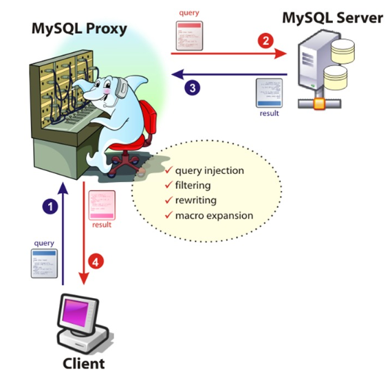
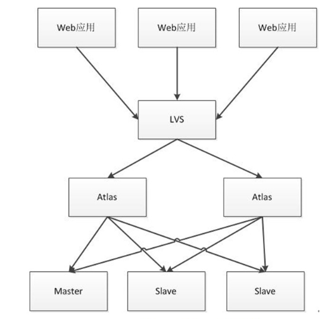

# 1. Atlas介绍



image.png




image.png


```cpp
 Atlas是由 Qihoo 360, Web平台部基础架构团队开发维护的一个基于MySQL协议的数据中间层项目。
它是在mysql-proxy 0.8.2版本的基础上，对其进行了优化，增加了一些新的功能特性。
360内部使用Atlas运行的mysql业务，每天承载的读写请求数达几十亿条。
下载地址
https://github.com/Qihoo360/Atlas/releases
注意：
1、Atlas只能安装运行在64位的系统上
2、Centos 5.X安装 Atlas-XX.el5.x86_64.rpm，Centos 6.X安装Atlas-XX.el6.x86_64.rpm。
3、后端mysql版本应大于5.1，建议使用Mysql 5.6以上
```

# 2.安装配置


```bash
yum install -y Atlas*
cd /usr/local/mysql-proxy/conf
mv test.cnf test.cnf.bak
 vi test.cnf
[mysql-proxy]
admin-username = user
admin-password = pwd
proxy-backend-addresses = 10.0.0.55:3306
proxy-read-only-backend-addresses = 10.0.0.51:3306,10.0.0.53:3306
pwds = repl:3yb5jEku5h4=,mha:O2jBXONX098=
daemon = true
keepalive = true
event-threads = 8
log-level = message
log-path = /usr/local/mysql-proxy/log
sql-log=ON
proxy-address = 0.0.0.0:33060
admin-address = 0.0.0.0:2345
charset=utf8
启动atlas
/usr/local/mysql-proxy/bin/mysql-proxyd test start
ps -ef |grep proxy
```

# 3. Atlas功能测试


```css
测试读操作：
mysql -umha -pmha  -h 10.0.0.53 -P 33060 
db03 [(none)]>select @@server_id;
测试写操作：
mysql> begin;select @@server_id;commit;
```

# 4. 生产用户要求


```csharp
开发人员申请一个应用用户 app(  select  update  insert)  密码123456,要通过10网段登录
1. 在主库中,创建用户
grant select ,update,insert on *.* to app@'10.0.0.%' identified by '123456';
2. 在atlas中添加生产用户
/usr/local/mysql-proxy/bin/encrypt  123456      ---->制作加密密码
vim test.cnf
pwds = repl:3yb5jEku5h4=,mha:O2jBXONX098=,app:/iZxz+0GRoA=
/usr/local/mysql-proxy/bin/mysql-proxyd test restart
[root@db03 conf]# mysql -uapp -p123456  -h 10.0.0.53 -P 33060
```

# 5. Atlas基本管理

# 连接管理接口


```css
mysql -uuser -ppwd -h127.0.0.1 -P2345
```

# 打印帮助：


```csharp
mysql> select * from help;
```

# 查询后端所有节点信息：


```ruby
mysql>  SELECT * FROM backends    ;
+-------------+----------------+-------+------+
| backend_ndx | address        | state | type |
+-------------+----------------+-------+------+
|           1 | 10.0.0.55:3306 | up    | rw   |
|           2 | 10.0.0.51:3306 | up    | ro   |
|           3 | 10.0.0.53:3306 | up    | ro   |
+-------------+----------------+-------+------+
3 rows in set (0.00 sec)
```

# 动态添加删除节点


```undefined
REMOVE BACKEND 3;
```

# 动态添加节点


```css
ADD SLAVE 10.0.0.53:3306;
```

# 保存配置到配置文件


```undefined
SAVE CONFIG;
```

# 6. 自动分表

# 介绍


```css
使用Atlas的分表功能时，首先需要在配置文件test.cnf设置tables参数。
tables参数设置格式：数据库名.表名.分表字段.子表数量，
比如：
你的数据库名叫school，表名叫stu，分表字段叫id，总共分为2张表，那么就写为school.stu.id.2，如果还有其他的分表，以逗号分隔即可。
```

# 7. 关于读写分离建议


```rust
MySQL-Router    ---> MySQL官方
ProxySQL         --->Percona
Maxscale         ---> MariaDB
```


