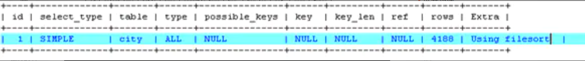
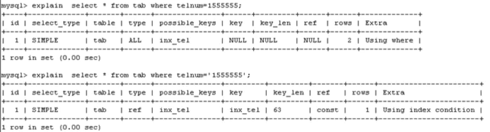

# 一、简答题

## 1.简述你们公司使用的MySQL版本，并说明具体小版本及GA时间？


```css
5.6.38 
5.7.20  
2017-9-13
```

## 2.请介绍你熟悉的数据库的种类和代表产品名称？


```css
NoSQL:Redis Mongodb memcache
RDBMS:Oracle  MySQL  MSSQL PG
```

## 3.请简述MySQL二进制安装重点步骤？


```undefined
1.下载,上传,解压
2. 创建用户
3. 创建相关目录并授权
4. 设置环境变量
5. 初始化数据
6. 配置文件
7. 配置启动脚本
```

## 4.怎么确认数据库启动成功了？


```ruby
ps -ef |grep mysqld
netstat -lnp|grep 3306
ss -lnp|grep grep 3306
mysql 登陆测试
```

## 5.简述你了解的MySQL分支版本情况？


```undefined
Oracle MySQL
MariaDB
Percona
```

## 6.请简述mysqld的程序结构（1条SQL语句的执行过程）


```css
连接层:
    提供连接协议,验证,专用连接线程
SQL层
    语法,语义,权限,解析,优化,执行,查询缓存,日志记录
存储引擎层
    相当于Linux文件系统,例如:InnoDB提供了事务,CSR,热备,MVCC,行级锁等
```

## 7.请简述你了解的MySQL的启动方式


```php
sys-v:mysql.server--->mysqld_safe---->mysqld
systemd: mysqld --defaults-file
mysqld_safe 
mysqld
```

## 8.简述MySQL配置文件默认读取顺序


```bash
mysqld --help --verbose|grep "my.cnf"
```

## 9.mysqld_safe --default-files=/opt/my.cnf & 是什么作用？


```undefined
自定义配置文件,后台启动mysql
```

## 10.忘记管理员root的密码处理过程，请对参数详细说明


```undefined
--skip-grant-tables   关闭连接层的验证功能
--skip-netwoking      关闭TCPIP协议
```

## 11.请列举SQL语句的常用种类


```undefined
DDL
DML
DCL
DQL
```

## 12.请说明聚集索引和辅助索引的区别


```undefined
辅助索引,叶子节点只存储,有序的某个列的所有值
聚集索引,存储的是整行数据
辅助索引一般是配合聚集索引使用,通过辅助所用找到主键值,然后通过聚集索引找到数据行,减少了回表查询带来的随机IO
```

## 13.请简述以下语句执行计划可能存在的问题

### 阐述以下语句可能存在的问题，并提出合理解决方案

explain select * from city where countrycode='CHN' order by population;



image.png


```csharp
1. countrycode没有走索引,有可能是没建立索引,或者是索引失效
2. 出现了filesort文件排序, orderby条件也没走索引

建议: 
1. 如果没有索引导致,建立联合索引(countrycode,population)
2. 如果是索引失效,删除索引重建
```

### 简述出现以下结果的可能原因



image.png


```undefined
怀疑是 telnum列是字符串类型,可能出现了隐式转换,需要进一步判断数据类型.
```

## 14. 请简述，影响索引树高度的因素？


```cpp
数据量级:分表分库分布式
索引键值太长:前缀索引
数据类型:char varchar选择,enum,选择合理的数据类型
```

## 15.请说明数据库启动失败的处理思路？


```undefined
有日志,看日志,没日志,使用mysqld直接测试启动
```

## 16. MySQL索引的种类都有哪些？


```undefined
B树
HASH
R树
```

## 17. 你了解的MySQL存储引擎种类有哪些？


```undefined
InnoDB,MyIAM,CSV
```

## 18.InnoDB存储引擎核心特性


```undefined
事务,CSR,MVCC,行级锁,热备,外键
```

# 二、操作题

## 1.创建管理员用户：oldboy能通过10.0.0.0/24网段任意地址登录管理MySQL


```css
grant all on *.* to  oldboy@'10.0.0.%' identified by '123';
```

## 2.创建应用用户：wordpress能通过172.16.1.0/24网段任意地址登录操作wordpress库下的所有表


```csharp
grant select,update,delete,insert on wordpress.* to wordpress@'172.16.1.%' identified by '123';
```

## 3.请写出/etc/my.cnf的基础配置信息


```jsx
[mysqld]
user=mysql
basedir=/usr/local/mysql
datadir=/data/mysql
socket=/tmp/mysql.sock
server_id=1
port=3306
[mysql]
socket=/tmp/mysql.sock
```

## 4.请写出使用oldboy用户远程登录MySQL的具体语句


```css
mysql -uoldboy -p -h 10.0.0.51 -P3306
```

## 5.查看当前数据库的字符集


```dart
show charset;
```

## 6. 创建GBK字符集的数据库oldboy，并查看已建库完整语句


```dart
create database oldboy charset gbk;
show create database oldboy;
```

## 7. 请分别介绍 NOT NULL default auto_increament 的作用


```cpp
Not NULL :非空
default: 默认值
auto_increament:自动增长
```

## 8. 创建用户oldboy，使之可以管理数据库oldboy


```css
grant all on oldboy.* to  oldboy@'10.0.0.%' identified by '123';
```

## 9. 收回oldboy用户的drop权限


```css
revoke drop on oldboy.* from  oldboy@'10.0.0.%';
```

## 10. 查看创建的用户oldboy拥有哪些权限


```css
show grants for oldboy@'10.0.0.%'
```

## 11. 查看表结构及建表的SQL语句


```dart
desc stu;
show create table stu;
```

## 12. 插入一条数据“1,oldboy”


```csharp
insert into t1 values(1,'oldboy');
```

## 13.再批量插入2行数据“2,老男孩”，“3,oldboyedu”


```undefined
insert into t1 values(1,'老男孩'),(2,'oldboyedu');
```

## 14.查询名字为oldboy的记录


```csharp
select * from t1 where name='oldboy'
```

## 15. 查看数据库中所有引擎的类型


```dart
show engines;
```

## 16.查看数据库关于日志的参数配置


```dart
show variables like '%log%';
```

## 17.查看handler_read_key当前的状态信息


```dart
show status like 'handler_read_key';
```

## 18. delete和truncate区别


```cpp
delete :逻辑逐条删除数据行
trucate:物理删除表段中的所有数据页
```

## 19.test表中，有id、name、shouji列。把id列设置为主键，在Name字段上创建普通索引


```csharp
create table test (
id int not null  primary key comment '学号',
name varchar(64) not null comment '姓名',
telnum char(11) not null comment '手机号'
)engine InnoDB Charset Utf8 comment '学生表';
alter table test add index idx_name(name);
```

## 20. 在手机字段上对前8个字符创建普通索引


```csharp
alter table add index idx_tel(telnum(8));
```

## 21.查看创建的索引及索引类型等信息


```bash
desc test;
show index from test
```

## 22.删除Name，shouji列的索引


```bash
alter table test drop index idx_name ;
alter table test drop index idx_tel;
```

## 23.对Name列的前6个字符以及手机列的前8个字符组建联合索引


```csharp
alter table test add index idx_n_t(name(6),telnum(8));
```

## 24. 将shouji列索引替换为唯一键索


```csharp
alter table test add unique index idx_tel(telnum);
```

## 25.如何查看world数据库下city表中population列的重复值情况


```csharp
select population,count(id) from world.city group by population having count(id)>1 order by count(id) desc ;
```

## 26. 请列出explain命令中type中多种类型


```cpp
ALL,INDEX,RANGE,REF,EQ_REF,SYSTEM(const),NULL
```

## 27.Select查询语句加强练习

### 统计世界上每个国家的总人口数.


```csharp
select countrycode,sum(population) from city group by countrycode;
```

### 统计中国各个省的总人口数量


```csharp
select district,sum(population) from city where countrycode='CHN' group by district;
```

### 统计世界上每个国家的城市数量


```csharp
select countrycode,count(name) from city group by countrycode;
```

### 统计中国每个省的总人口数，将总人口数小于100w进行从高到低排序显示


```csharp
select district,sum(population) from city where countrycode='CHN' group by district having sum(population)<1000000 order by sum(ppopulation);
```

## 28.生成整个数据库下的所有表的单独备份语句


```csharp
SELECT
CONCAT("mysqldump -uroot -p123 ",table_schema," ",table_name
," >/bak/",table_schema,"_",table_name,".sql")
FROM information_schema.tables;
```

### 29. SQL综合练习

### 1. 查询平均成绩大于60分的同学的学号和平均成绩；


```csharp
select student.sname,sc.sno,AVG(sc.score) as gg from student join sc on sc.sno=student.sno group by sc.sno having gg>60;
```

### 2. 查询所有同学的学号、姓名、选课数、总成绩；


```csharp
select student.sno,student.sname,count(sc.cno),sum(sc.score) from student join sc on sc.sno=student.sno group by sc.sno;
```

### 3. 查询各科成绩最高和最低的分：以如下形式显示：课程ID，最高分，最低分


```csharp
select sc.cno ,max(sc.score),min(sc.score) from student join sc on sc.sno=student.sno group by sc.cno;
```

### 4. 统计各位老师,所教课程的及格率(case)


```csharp
count(case  when isfull(socre,0)>=60 then 1 end)/count(*)
group by 学科

select teacher.tname,count(case when ifnull(sc.score,0)>=60 then 1 end)/count(*)*100  as '及格率%'
from teacher
join course
on course.tno=teacher.tno
join sc
on sc.cno=course.cno
group by teacher.tno;
```

### 5. 查询每门课程被选修的学生数


```csharp
select course.cname,count(sc.cno) from teacher join course on course.tno=teacher.tno join sc on sc.cno=course.cno group by sc.cno;
```

### 6. 查询出只选修了一门课程的全部学生的学号和姓名


```csharp
select sc.sno,student.sname,count(sc.cno) from teacher join course on course.tno=teacher.tno join sc on sc.cno=course.cno join student on student.sno=sc.sno group by sc.sno having count(sc.cno)<2;
```

### 7. 查询选修课程门数超过1门的学生信息


```csharp
select sc.sno,student.sname,count(sc.cno) from teacher join course on course.tno=teacher.tno join sc on sc.cno=course.cno join student on student.sno=sc.sno group by sc.sno having count(sc.cno)>1;
```

### 8. 统计每门课程:优秀(85分以上),良好(70-85),一般(60-70),不及格(小于60)的学生列表(case)


```csharp
,group_concat(case when isfull(score ,0) >=85 then sname  end) as '优秀'
,group_concat(case when isfull(score ,0)  between 70 and 85 then sname end ) as '良好'

select course.cname,
group_concat(case when ifnull(sc.score,0)>=85 then student.sname end) as '优秀',
group_concat(case when ifnull(sc.score,0) between 70 and 85 then student.sname end ) as '良好',
group_concat(case when ifnull(sc.score,0) between 60 and 70 then student.sname end) as '一般',
group_concat(case when ifnull(sc.score,0)< 60 then student.sname end) as '不及格'
from student
join sc
on sc.sno=student.sno
join course
on course.cno=sc.cno
group by course.cno;
```

### 9. 查询平均成绩大于85的所有学生的学号、姓名和平均成绩


```csharp
select student.sname,sc.sno,AVG(sc.score) as gg from student join sc on sc.sno=student.sno group by sc.sno having gg>85;
```


