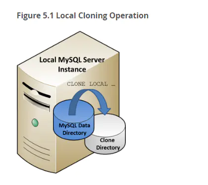
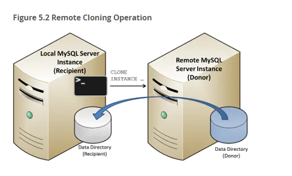

# 1 . Clone Plugin介绍

## 本地克隆：


```undefined
启动克隆操作的MySQL服务器实例中的数据，克隆到同服务器或同节点上的一个目录里
```



image.png

## 远程克隆：


```undefined
默认情况下，远程克隆操作会删除接受者(recipient)数据目录中的数据，并将其替换为捐赠者(donor)的克隆数据。
您也可以将数据克隆到接受者的其他目录，以避免删除现有数据。(可选)
```



image.png

# 2. 原理


```ruby
# PAGE COPY
这里有两个动作
开启redo archiving功能，从当前点开始存储新增的redo log，这样从当前点开始所有的增量修改都不会丢失。同时上一步在page track的page被发送到目标端。确保当前点之前所做的变更一定发送到目标端。
关于redo archiving，实际上这是官方早就存在的功能，主要用于官方的企业级备份工具，但这里clone利用了该特性来维持增量修改产生的redo。 
在开始前会做一次checkpoint， 开启一个后台线程log_archiver_thread()来做日志归档。当有新的写入时(notify_about_advanced_write_lsn)也会通知他去archive。当arch_log_sys处于活跃状态时，他会控制日志写入以避免未归档的日志被覆盖(log_writer_wait_on_archiver), 注意如果log_writer等待时间过长的话， archive任务会被中断掉.
# Redo Copy
停止Redo Archiving", 所有归档的日志被发送到目标端，这些日志包含了从page copy阶段开始到现在的所有日志，另外可能还需要记下当前的复制点，例如最后一个事务提交时的binlog位点或者gtid信息，在系统页中可以找到
# Done
目标端重启实例，通过crash recovery将redo log应用上去。
```

# 3. 限制


```kotlin
官方文档列出的一些限制：
The clone plugin is subject to these limitations:

*   DDL, is not permitted during a cloning operation. This limitation should be considered when selecting data sources. A workaround is to use dedicated donor instances, which can accommodate DDL operations being blocked while data is cloned. Concurrent DML is permitted.
*   An instance cannot be cloned from a different MySQL server version. The donor and recipient must have the same MySQL server version. For example, you cannot clone between MySQL 5.7 and MySQL 8.0\. The clone plugin is only supported in MySQL 8.0.17 and higher.
*   Only a single MySQL instance can be cloned at a time. Cloning multiple MySQL instances in a single cloning operation is not supported.
*   The X Protocol port specified byis not supported for remote cloning operations 
*   The clone plugin does not support cloning of MySQL server configurations.
*   The clone plugin does not support cloning of binary logs.
*   The clone plugin only clones data stored in `InnoDB`. Other storage engine data is not cloned.
*   Connecting to the donor MySQL server instance through MySQL Router is not supported.
*   Local cloning operations do not support cloning of general tablespaces that were created with an absolute path. A cloned tablespace file with the same path as the source tablespace file would cause a conflict.
```

# 4. 应用

# 4.1 本地

## 4.1.1 加载插件


```bash
INSTALL PLUGIN clone SONAME 'mysql_clone.so';
或
[mysqld]
plugin-load-add=mysql_clone.so
clone=FORCE_PLUS_PERMANENT

SELECT PLUGIN_NAME, PLUGIN_STATUS
FROM INFORMATION_SCHEMA.PLUGINS
WHERE PLUGIN_NAME LIKE 'clone';
```

## 4.1.2 创建克隆专用用户


```csharp
CREATE USER clone_user@'%' IDENTIFIED by 'password'; 
GRANT BACKUP_ADMIN ON *.* TO 'clone_user'; 
# BACKUP_ADMIN是MySQL8.0 才有的备份锁的权限
```

## 4.1.3 本地克隆


```ruby
[root@db01 3306]# mkdir -p /data/test/
[root@db01 3306]# chown -R mysql.mysql /data/
mysql -uclone_user -ppassword
CLONE LOCAL DATA DIRECTORY = '/data/test/clonedir';

# 观测状态
db01 [(none)]> SELECT STAGE, STATE, END_TIME FROM performance_schema.clone_progress;
+-----------+-------------+----------------------------+
| STAGE     | STATE       | END_TIME                   |
+-----------+-------------+----------------------------+
| DROP DATA | Completed   | 2020-04-20 21:13:19.264003 |
| FILE COPY | Completed   | 2020-04-20 21:13:20.025444 |
| PAGE COPY | Completed   | 2020-04-20 21:13:20.028552 |
| REDO COPY | Completed   | 2020-04-20 21:13:20.030042 |
| FILE SYNC | Completed   | 2020-04-20 21:13:20.439444 |
| RESTART   | Not Started | NULL                       |
| RECOVERY  | Not Started | NULL                       |
+-----------+-------------+----------------------------+
7 rows in set (0.00 sec)

#日志观测： 
set global log_error_verbosity=3;
tail -f db01.err
CLONE LOCAL DATA DIRECTORY = '/data/test/clonedir1';
```

## 4.1.4 启动新实例


```tsx
[root@db01 clonedir]# mysqld_safe  --datadir=/data/test/clonedir --port=3333 --socket=/tmp/mysql3333.sock --user=mysql --mysqlx=OFF &
```

# 4.2 远程clone

## 4.2.1 创建远程clone用户


```csharp
# 捐赠者授权

CREATE USER clone_user@'10.0.0.51' IDENTIFIED by 'password1'; 
GRANT BACKUP_ADMIN ON *.* TO 'clone_user'@'10.0.0.51'; 

# 接受者授权
CREATE USER clone_user@'10.0.0.52' IDENTIFIED by 'password2'; 
GRANT CLONE_ADMIN ON *.* TO 'clone_user'@'10.0.0.52';  
```

## 4.2.2 远程clone


```php
# 开始克隆
SET GLOBAL clone_valid_donor_list = '10.0.0.51:3306';
mysql -uclone_user -ppassword2 -h10.0.0.52  -P3306
CLONE INSTANCE FROM clone_user@'10.0.0.51':3306 IDENTIFIED BY 'password1';

# 查看状态：
SELECT STAGE, STATE, END_TIME FROM performance_schema.clone_progress;
SELECT STATE FROM performance_schema.clone_status;
```

4.2.3 构建主从


```csharp
# 主：
create user repl@'%' identified WITH 'mysql_native_password' by '123';
GRANT REPLICATION SLAVE, REPLICATION CLIENT ON *.* TO 'repl'@'%';
# 从：
CHANGE MASTER TO
  MASTER_HOST='10.0.0.51',
  MASTER_USER='repl',
  MASTER_PASSWORD='123',
  MASTER_PORT=3306,
  MASTER_AUTO_POSITION=1;
start slave;
```

1. 恢复MGR 节点


```csharp
# 假设三节点MGR某个节点异常，需要重新把这个节点加入到MGR集群中，具体操作过程如下：
# 贡献者端执行（10.0.0.51）
DROP USER 'donor_clone_user'@'10.0.0.51';
CREATE USER 'donor_clone_user'@'10.0.0.51' IDENTIFIED BY 'password';
GRANT BACKUP_ADMIN on *.* to 'donor_clone_user'@'10.0.0.51';
INSTALL PLUGIN clone SONAME 'mysql_clone.so';

# 接收者端执行（10.0.0.52）
DROP USER 'recipient_clone_user'@'10.0.0.52';
CREATE USER 'recipient_clone_user'@'10.0.0.52' IDENTIFIED BY 'password';
GRANT CLONE_ADMIN on *.* to 'recipient_clone_user'@'10.0.0.52';
INSTALL PLUGIN clone SONAME 'mysql_clone.so';
SET GLOBAL clone_valid_donor_list = '10.0.0.51:3306';
mysql -urecipient_clone_user -ppassword -h 10.0.0.52 -P3311
CLONE INSTANCE FROM 'donor_clone_user'@'10.0.0.51':3306 IDENTIFIED BY 'password';
mysql -uroot -p
start group_replication;
select * from performance_schema.replication_group_members;
```


作者：MySQL_oldguo
链接：https://www.jianshu.com/p/eeb2d31923b1
来源：简书
著作权归作者所有。商业转载请联系作者获得授权，非商业转载请注明出处。