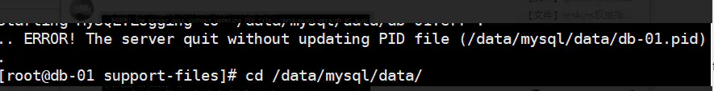
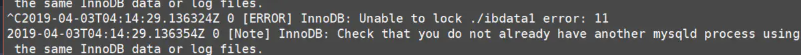
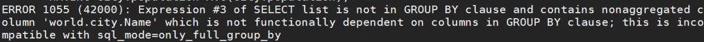
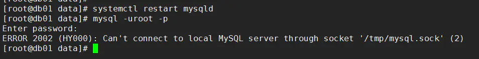
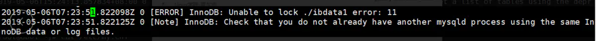

# 1.    业务是什么？


```undefined
产品的功能
用户的行为（热功能，热数据）
```

# 2.你们公司用什么版本数据库？


```css
5.6.38 
5.7.20 
```

# 3. 你们公司怎么还在用这么低的版本？


```css
我们这个业务已经运行了4年了，一直用的5.6版本，非常稳定，所以说暂时没有打算升级。
```

# 4. GA时间问题漏洞怎么说？


```css
答：刚去上家公司不到两年，交接的时候已经运行了2年多了，我接手的时候版本已经是5.6.38 ，应当是做过小版本的升级。
```

# 5. 我们现在公司用的是5.7，你能胜任吗？


```css
能。虽然我们生产中一直使用的5.6，但是我对5.7，8.0的新特性已经足够了解了。所以我完全能够胜任股公司的工作
```

# 6. 报错？


```kotlin
[root@db01 bin]# /data/mysql/bin/mysqld --initialize-insecure --user=mysql --basedir=/data/mysql --datadir=/data/mysql/data
/data/mysql/bin/mysqld: error while loading shared libraries: libaio.so.1: cannot open shared object file: No such file or directory
[root@db01 bin]#
[root@db01 ~]# yum install -y libaio-devel
```

# 7.关于初始化的新特性（5.6 和 5.7 ）


```kotlin
5.6 版本的初始化程序：
/data/mysql/scripts/mysql_install_db --user=mysql --basedir=/data/mysql --datadir=/data/mysql/data
初始化完成后：无密码和无安全策略的

5.7 版本的初始化程序：
（1）
/data/mysql/bin/mysqld --initialize --user=mysql --basedir=/data/mysql --datadir=/data/mysql/data
（2）
/data/mysql/bin/mysqld --initialize-insecure  --user=mysql --basedir=/data/mysql --datadir=/data/mysql/data

提示：5.7以后初始化命令变为bin/mysqld命令,提供了两种初始化方式
第一种初始化方式：开启临时密码和安全策略
第二种初始化方式和之前版本一样，是无密码无安全策略。
演示：

2019-04-03T03:40:15.595883Z 1 [Note] A temporary password is generated for root@localhost: **MWht)!4%sa,3**
安全策略？
密码的复杂度进行了要求，对于密码的过期时间设置了限制
```

# 8. 启动报错



image


```css
思路是看日志，日志行中[ERROR]的
```

# 9.报错



image


```undefined
以上问题是：已经启动了，在此启动会说文件占用
```

# 10.为什么数据库连接不上？


```undefined
没启动，账号密码错误，IP 、port 、 socket，分配不了连接线程
```

# 11.报错


image

# 12. SQL92是什么？


```undefined
关系型数据库中（MySQL，Oracle，MSSQL，DB2，PG）：SQL语句的标准
```

# 13. 问题


```ruby
[root@db01 ~]# mysql -uroot -p -S /tmp/mysql.sock -h 10.0.0.51 -P3306
Enter password:
mysql> show processlist;
+----+------+------------+------+---------+------+----------+------------------+
| Id | User | Host      | db  | Command | Time | State    | Info            |
+----+------+------------+------+---------+------+----------+------------------+
| 15 | root | localhost  | NULL | Sleep  |  25 |          | NULL            |
| 16 | root | db01:39646 | NULL | Query  |    0 | starting | show processlist |
+----+------+------------+------+---------+------+----------+------------------+
2 rows in set (0.00 sec)
```

# 14. mysql root密码忘记了？


```kotlin
1. 挂维护页
2. 关数据库
[root@db01 ~]# systemctl stop mysqld
3. 跳过授权启动
[root@db01 ~]# mysqld_safe --skip-grant-tables --skip-networking &
--skip-grant-tables : 连接层关闭验证模块，所有验证表不加载。
--skip-networking ：连接层关闭TCP/IP协议，禁止远程访问。
4. 改密码
mysql> alter user root@'localhost' identified by '456';
ERROR 1290 (HY000): The MySQL server is running with the --skip-grant-tables option so it cannot execute this statement
mysql>
mysql>
mysql>
mysql> flush privileges;
Query OK, 0 rows affected (0.00 sec)
mysql> alter user root@'localhost' identified by '456';
Query OK, 0 rows affected (0.00 sec)
mysql>
[root@db01 ~]# pkill mysqld
[root@db01 ~]# systemctl start mysqld
5.正常开启业务
```

# 15. 初始化配置优先级


```undefined
命令行>配置文件>预编译
```

# 16. mysql命令行显示定义


```undefined
prompt=Master [\\d]>
```

# 17.报错


image

# 18.数据库启动不了


```undefined
1.先看日志
2. 配置文件
3. 数据
4. 终极大招 mysqld  --defaults-file=xxxx --user=mysql &
```

# 19. char和varchar的优缺点，生产如何选择？


```cpp
char(11) ：***定长***的字符串类型,在存储字符串时，最大字符长度11个，立即分配11个字符长度的存储空间，如果存不满，***空格***填充。
varchar(11):***变******长***的字符串类型看，最大字符长度11个。在存储字符串时，自动判断字符长度，***按需***分配存储空间。
优缺点：
1. char类型存储时，相比varchar类型存储效率更高，不需要判断字符长度，直接分配磁盘空间
2.varchar类型，相比char类型，按需分配空间。
选择？
1. 从原则上来讲，将来字符串长度不固定的话，选择varchar类型，字符串长度固定不变则选择char类型
2. 实际上我们生产中在考虑性能问题的方面，需要有大量插入（insert）操作的应用中，我们可以考虑使用char去代替varchar。
3. 如果我们业务中，大量是查询类操作的应用中，数据量级又比较大情况下，变长长度数据类型，可以考虑采用varchar，一方面节省空间，可以有效的减少***索引树***的高度，从而提高索引的优化查询的效果。
```

# 20. 为什么数据库名，不能有大写字母。


```undefined
开发环境通常是windows的，不区分大小写，线上环境通常是Linux，区分大小写的。
```

# 21 . 领导让你熟悉数据库业务


```csharp
1. 和开发混到好，直接找他要ER图
2. 谁也不认识：
use xuexiao 
show tables；
desc xuesheng;
show create table xuesheng；
select  *  from xuesheng  where  id <5
create table ceshi like xuesheng; (复制结构一样的空表)
```

1. union 和 union all区别


```cpp
union 对结果集进行去重复，union all 不去重复
```

1. 在5.7 中，sql_mode使用的是严格模式


```csharp
sql_mode=only_full_group_by
参数的意思是：
在select 后的查询列，必须是在group by出现过的列，或者使用函数括起来的。
否则group by语句会报错
```



image

# 24. b-tree与b+tree的区别?


```jsx
叶子节点中，会存储相邻叶子结点的指针，可以很大程度优化范围查询（> < >= <=）
```

# 25. 为什么char和varchar会对索引高度产生影响？


```cpp
变长长度字符串，使用char类型，在数据量级很大的时候，使用此列建索引高度变高
 为什么表设计时设置为非空？
针对辅助索引，如果出现大量空值，会导致索引失效
```

# 26. 联合索引使用原则：


```csharp
1. 如果是where条件后有多列等值查询，那么只需要将这多列进行联合索引即可（= and or  in）
但是，我们建索引是尽量将唯一值多的列放在前面，尽量满足优化器的算法规则
2.如果是 where A   group by B  order by C，必须按照语句的执行顺序建立联合索引
```

# 27. SQL面试题


image


image


```csharp
select e.emp_id,e.emp_name,count(c.course_id) from e
join c 
on e.emp_id=c.emp_id
where e.dept_name='技术部';
```


image


```swift
select e.dept,t.course,count(emp_id)
from e 
join c
on e.emp_id=c.emp_id
join t
on c.course_id=t.course_id
where c.score>=60
```


image


```csharp
select e.emp_id,e.emp_name ,
case c.score
when c.score< 60
then '不及格'
when c.score >=60 and c.scoe <70
then '及格'
when score >=70 and c.scoe <85
then '良好'
when score >=85 
then '优秀'
END as '评级'
from e
join c
on e.emp_id=c.emp_id
join t
on c.course_id=t.corse_id
where t.tea_name='张三'
```


image


```swift
select e.detp_name ,e.emp_name,t.course_name,count(c.score)
from e 
join c
on e.emp_id=c.emp_id
join t
on c.course_id=t.course_id
where count(c.score)>0
order by t.course_name, c.score desc
limit 3
```


image


```csharp
select e.emp_name,t.course_name ,avg(c.score)
from e 
join c
on e.emp_id=c.emp_id
join t
on c.course_id=t.course_id
where t.course_name in (‘数据库’,'java')
group by e.emp_name
having count(t.course_name)>1 
```

# 28 . 报错原因是什么?



image


```css
1.数据库没有启动
2.socket文件位置不对
```

# 29. 数据库损坏？


```undefined
物理损坏
逻辑损坏
```

# 30 . 从mysqldump 全备中获取 库和表的备份


```kotlin
1、获得表结构
# sed -e'/./{H;$!d;}' -e 'x;/CREATE TABLE `city`/!d;q'  full.sql>createtable.sql

2、获得INSERT INTO 语句，用于数据的恢复

# grep -i 'INSERT INTO `city`'  full.sqll >data.sql &

3.获取单库的备份

# sed -n '/^-- Current Database: `world`/,/^-- Current Database: `/p' all.sql >world.sql
```

# 31.面试题


image


```bash
1. 联合索引： idx(status , signal)
2. 查询条件调整  where status   and signal 
```


image


```csharp
数据和类型 ，not null   ，注释 
```


image


```undefined
SQL语句是数据DDL操作，是属于列的添加操作
直接执行时会产生表锁，对业务的影响较大，数据量大，业务量大时，对于业务影响较大。
所以我们推荐使用 pt-osc 工具来进行online DDL,减少对业务的影响
```


image


image


```php
A->B架构转换
1. 主库写压力大，可以通过多级主从减轻主库的压力
B-》A架构转换
2.业务读多写少，通过多从库实现读写分离和读的负载均衡，另外可以配合MHA等架构进行高可用
```

# 32.报错



image.png

# 33 MySQL5.7中如何独立undo


```undefined
innodb_max_undo_log_size = 128M
innodb_undo_log_truncate = ON
innodb_undo_logs = 128
innodb_undo_tablespaces = 3
innodb_purge_rseg_truncate_frequency = 10
```

# 34 mysqldump 导出时，去掉auto_increment


```bash
mysqldump -uroot -p -d test -S /tmp/mysql.sock | sed 's/AUTO_INCREMENT=[0-9]*\s*//g' > test.sql
```

# 35  MySQL 5.7 如何开启ssl功能

## 1.生成证书文件


```csharp
[root@mycat1 ~]# mysql_ssl_rsa_setup  
[root@mycat1 ~]# ll /data/mysql/*.pem
-rw------- 1 root root 1675 Jun 10 16:00 /data/mysql/ca-key.pem
-rw-r--r-- 1 root root 1107 Jun 10 16:00 /data/mysql/ca.pem
-rw-r--r-- 1 root root 1107 Jun 10 16:00 /data/mysql/client-cert.pem
-rw------- 1 root root 1675 Jun 10 16:00 /data/mysql/client-key.pem
-rw------- 1 root root 1679 Jun 10 16:00 /data/mysql/private_key.pem
-rw-r--r-- 1 root root  451 Jun 10 16:00 /data/mysql/public_key.pem
-rw-r--r-- 1 root root 1107 Jun 10 16:00 /data/mysql/server-cert.pem
-rw------- 1 root root 1675 Jun 10 16:00 /data/mysql/server-key.pem
```

## 2.证书文件介绍


```bash
 ca-key.pem         #CA私钥
 ca.pem             #自签的CA证书，客户端连接也需要提供
 client-cert.pem    #客户端连接服务器端需要提供的证书文件
 client-key.pem     #客户端连接服务器端需要提供的私钥文件
 private_key.pem    #私钥/公钥对的私有成员
 public_key.pem     #私钥/公钥对的共有成员
 server-cert.pem    #服务器端证书文件
 server-key.pem     #服务器端私钥文件
```

## 3. 未完待续


```undefined

```

# 36. 为什么很多人喜欢使用varchar(255)?


```xml
1. InnoDB存储引擎的表索引单一字段或前缀长度，最长是767字节(bytes)。
存中文时，utf8字符集，那么767/3=255,
如果是utf8mb4应当是，767/4=191.
2. 字符串长度值视实际数据长度，需占用 1 或 2 个字节存储。
  当实际数据长度 <= 255 时，varchar字段长度 = 1 + N
  当实际数据长度 > 255 时，varchar字段长度 = 2 + N

总结：其实是很多开发人员的一些习惯吧，但是往往不知道原因。所以呢带大家普及一下。
```

