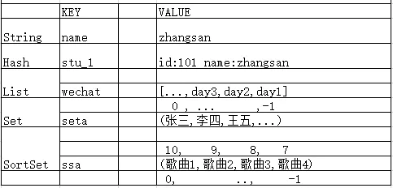
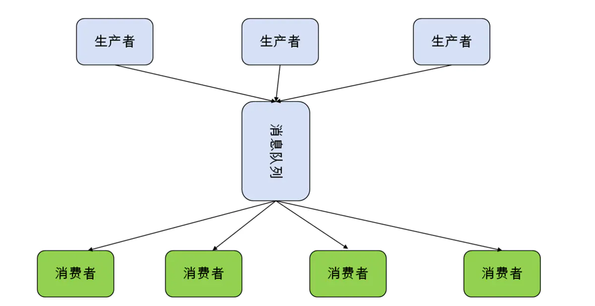
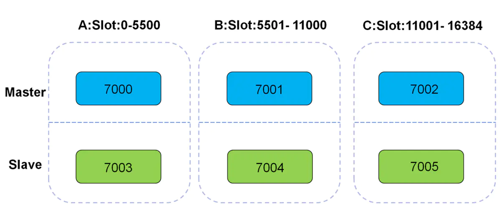

# 0. NoSQL 产品(key-value)


```css
RDBMS ：MySQL，Oracle ，MSSQL，PG
NoSQL  :Redis,MongoDB，列存储存储相关
NewSQL----->分布式数据库架构（学习了MongoDB）
缓存产品介绍：
memcached （大公司会做二次开发）
redis
Tair
```

# 1. Redis功能介绍


```undefined
数据类型丰富    （笔试、面试）*****
支持持久化      （笔试、面试） *****
多种内存分配及回收策略
支持事务            （面试）    ****
消息队列、消息订阅 
支持高可用                                 ****
支持分布式分片集群 （面试）   *****
缓存穿透\雪崩（笔试、面试）   *****
Redis API                  **
```

# 2、企业缓存产品介绍


```bash
Memcached:
优点：高性能读写、单一数据类型、支持客户端式分布式集群、一致性hash
多核结构、多线程读写性能高。
缺点：无持久化、节点故障可能出现缓存穿透、分布式需要客户端实现、跨机房数据同步困难、架构扩容复杂度高
Redis:  优点：高性能读写、多数据类型支持、数据持久化、高可用架构、支持自定义虚拟内存、支持分布式分片集群、单线程读写性能极高
缺点：多线程读写较Memcached慢
新浪、京东、直播类平台、网页游戏
    
memcache与redis在读写性能的对比
memcached 适合,多用户访问,每个用户少量的rw
redis     适合,少用户访问,每个用户大量rw 
            
Tair：
优点：高性能读写、支持三种存储引擎（ddb、rdb、ldb）、支持高可用、支持分布式分片集群、支撑了几乎所有淘宝业务的缓存。
    缺点：单机情况下，读写性能较其他两种产品较慢
```

# 3、Redis使用场景介绍


```undefined
Memcached：多核的缓存服务，更加适合于多用户并发访问次数较少的应用场景
Redis：单核的缓存服务，单节点情况下，更加适合于少量用户，多次访问的应用场景。
Redis一般是单机多实例架构，配合redis集群出现。
```

# 4、Redis安装部署：


```dart
下载：
wget http://download.redis.io/releases/redis-3.2.12.tar.gz
解压：
上传至 /data
tar xzf redis-3.2.12.tar.gz
mv redis-3.2.12 redis

安装：
yum -y install gcc automake autoconf libtool make
cd redis
make

环境变量：
vim /etc/profile 
export PATH=/data/redis/src:$PATH
source /etc/profile 

启动：
redis-server & 

连接测试：
redis-cli 
127.0.0.1:6379> set num 10
OK
127.0.0.1:6379> get num
10
```

# 5、Redis基本管理操作

## 5.1基础配置文件介绍


```kotlin
mkdir /data/6379
cat > /data/6379/redis.conf<<EOF
daemonize yes
port 6379
logfile /data/6379/redis.log
dir /data/6379
dbfilename dump.rdb
EOF

redis-cli shutdown 
redis-server /data/6379/redis.conf 
netstat -lnp|grep 63

+++++++++++配置文件说明++++++++++++++
redis.conf
是否后台运行：
daemonize yes
默认端口：
port 6379
日志文件位置
logfile /var/log/redis.log
持久化文件存储位置
dir /data/6379
RDB持久化数据文件:
dbfilename dump.rdb
++++++++++++++++++++++++++++++++++++++
redis-cli
127.0.0.1:6379> set name zhangsan 
OK
127.0.0.1:6379> get name
"zhangsan"
```

## 5.2 redis安全配置


```ruby
redis默认开启了保护模式，只允许本地回环地址登录并访问数据库。
禁止protected-mode
protected-mode yes/no （保护模式，是否只允许本地访问）

(1)Bind :指定IP进行监听
vim /data/6379/redis.conf
bind 10.0.0.51  127.0.0.1

(2)增加requirepass  {password}
vim /data/6379/redis.conf
requirepass 123456

----------验证-----
方法一：
[root@db03 ~]# redis-cli -a 123456
127.0.0.1:6379> set name zhangsan 
OK
127.0.0.1:6379> exit
方法二：
[root@db03 ~]# redis-cli
127.0.0.1:6379> auth 123456
OK
127.0.0.1:6379> set a b
[root@db01 src]# redis-cli -a 123 -h 10.0.0.51 -p 6379
10.0.0.51:6379> set b 2
OK
```

## 5.3 在线查看和修改配置


```undefined
CONFIG GET *
CONFIG GET requirepass
CONFIG GET r*
CONFIG SET requirepass 123
```

## 5.4 redis持久化（内存数据保存到磁盘）


```kotlin
RDB、AOF

RDB 持久化
    可以在指定的时间间隔内生成数据集的 时间点快照（point-in-time snapshot）。
    优点：速度快，适合于用做备份，主从复制也是基于RDB持久化功能实现的。
    缺点：会有数据丢失
rdb持久化核心配置参数：
vim /data/6379/redis.conf
dir /data/6379
dbfilename dump.rdb
save 900 1
save 300 10
save 60 10000

配置分别表示：
900秒（15分钟）内有1个更改
300秒（5分钟）内有10个更改
60秒内有10000个更改
  
AOF 持久化(append-only log file)
    记录服务器执行的所有写操作命令，并在服务器启动时，通过重新执行这些命令来还原数据集。 
    AOF 文件中的命令全部以 Redis 协议的格式来保存，新命令会被追加到文件的末尾。
    优点：可以最大程度保证数据不丢
    缺点：日志记录量级比较大

AOF持久化配置
appendonly yes
appendfsync always
appendfsync everysec
appendfsync no

是否打开aof日志功能
每1个命令,都立即同步到aof 
每秒写1次
写入工作交给操作系统,由操作系统判断缓冲区大小,统一写入到aof.

vim /data/6379/redis.conf
appendonly yes
appendfsync everysec 

面试： 
redis 持久化方式有哪些？有什么区别？
rdb：基于快照的持久化，速度更快，一般用作备份，主从复制也是依赖于rdb持久化功能
aof：以追加的方式记录redis操作日志的文件。可以最大程度的保证redis数据安全，类似于mysql的binlog
```

# 6、Redis数据类型(笔试)：


```dart
## 6.1 介绍
String ：      字符类型
Hash：         字典类型
List：         列表     
Set：          集合 
Sorted set：   有序集合
```



image.png

## 6.2 KEY的通用操作


```css
KEYS *   keys a  keys a*    查看已存在所有键的名字   ****
TYPE                        返回键所存储值的类型     ****
EXPIRE\ PEXPIRE             以秒\毫秒设定生存时间       ***
TTL\ PTTL                   以秒\毫秒为单位返回生存时间 ***
PERSIST                     取消生存时间设置            ***
DEL                         删除一个key
EXISTS                      检查是否存在
RENAME                      变更KEY名

---例子：
127.0.0.1:6379> set name zhangsan 
127.0.0.1:6379> EXPIRE name 60
(integer) 1
127.0.0.1:6379> ttl name
(integer) 57
127.0.0.1:6379> set a b ex 60
OK
127.0.0.1:6379> ttl a
127.0.0.1:6379> PERSIST a
(integer) 1
127.0.0.1:6379> ttl a
(integer) -1
```

## 6.3 Strings


```css
应用场景
session 共享
常规计数：微博数，粉丝数，订阅、礼物
key:value
----------
（1）
 set name zhangsan  
（2）
 MSET id 101 name zhangsan age 20 gender m
 等价于以下操作：
 SET id 101 
 set name zhangsan 
 set age 20 
 set gender m
（3）计数器
每点一次关注，都执行以下命令一次
127.0.0.1:6379> incr num
显示粉丝数量：
127.0.0.1:6379> get num

暗箱操作：
127.0.0.1:6379> INCRBY num 10000
(integer) 10006
127.0.0.1:6379> get num
"10006"
127.0.0.1:6379> DECRBY num 10000
(integer) 6
127.0.0.1:6379> get num
"6"
详细的例子：------------------------------------

增
set mykey "test"                为键设置新值，并覆盖原有值
getset mycounter 0              设置值,取值同时进行
setex mykey 10 "hello"          设置指定 Key 的过期时间为10秒,在存活时间可以获取value
setnx mykey "hello"             若该键不存在，则为键设置新值
mset key3  "zyx"  key4 "xyz"    批量设置键

删
del mykey                        删除已有键

改
append mykey "hello"            若该键并不存在,返回当前 Value 的长度
                                该键已经存在，返回追加后 Value的长度
incr mykey                      值增加1,若该key不存在,创建key,初始值设为0,增加后结果为1
decrby  mykey  5                值减少5
setrange mykey 20 dd            把第21和22个字节,替换为dd, 超过value长度,自动补0
查  
exists mykey                    判断该键是否存在，存在返回 1，否则返回0
get mykey                       获取Key对应的value
strlen mykey                    获取指定 Key 的字符长度
ttl mykey                       查看一下指定 Key 的剩余存活时间(秒数)
getrange mykey 1 20             获取第2到第20个字节,若20超过value长度,则截取第2个和后面所有的
mget key3 key4                  批量获取键
```

## 6.4 hash类型（字典类型）


```csharp
应用场景：
存储部分变更的数据，如用户信息等。
最接近mysql表结构的一种类型
主要是可以做数据库缓存。

存数据：
hmset stu  id 101 name zhangsan age 20 gender m
hmset stu1 id 102 name zhangsan1 age 21 gender f

取数据：
HMGET stu id name age gender
HMGET stu1 id name age gender

select concat("hmset city_",id," id ",id," name ",name," countrycode ",countrycode," district ",district," population ",population) from city limit 10 into outfile '/tmp/hmset.txt'

---------------------更多的例子
增
hset myhash field1 "s"    
若字段field1不存在,创建该键及与其关联的Hashes, Hashes中,key为field1 ,并设value为s ，若存在会覆盖原value
hsetnx myhash field1 s    
若字段field1不存在,创建该键及与其关联的Hashes, Hashes中,key为field1 ,并设value为s， 若字段field1存在,则无效
hmset myhash field1 "hello" field2 "world       一次性设置多个字段
删
hdel myhash field1                      删除 myhash 键中字段名为 field1 的字段
del myhash                              删除键
改  
hincrby myhash field 1                  给field的值加1

查
hget myhash field1                      获取键值为 myhash,字段为 field1 的值
hlen myhash                             获取myhash键的字段数量
hexists myhash field1                   判断 myhash 键中是否存在字段名为 field1 的字段
hmget myhash field1 field2 field3       一次性获取多个字段
hgetall myhash                          返回 myhash 键的所有字段及其值
hkeys myhash                            获取myhash 键中所有字段的名字
hvals myhash                            获取 myhash 键中所有字段的值
```

## 6.5 LIST（列表）


```ruby
应用场景
消息队列系统
比如sina微博
在Redis中我们的最新微博ID使用了常驻缓存，这是一直更新的。
但是做了限制不能超过5000个ID，因此获取ID的函数会一直询问Redis。
只有在start/count参数超出了这个范围的时候，才需要去访问数据库。
系统不会像传统方式那样“刷新”缓存，Redis实例中的信息永远是一致的。
SQL数据库（或是硬盘上的其他类型数据库）只是在用户需要获取“很远”的数据时才会被触发，
而主页或第一个评论页是不会麻烦到硬盘上的数据库了。

微信朋友圈：
127.0.0.1:6379> LPUSH wechat "today is nice day !"
127.0.0.1:6379> LPUSH wechat "today is bad day !"
127.0.0.1:6379> LPUSH wechat "today is good  day !"
127.0.0.1:6379> LPUSH wechat "today is rainy  day !"
127.0.0.1:6379> LPUSH wechat "today is friday !"

[5,4,3,2,1]
 0 1 2 3 4 

[e,d,c,b,a]
0 1 2 3  4

127.0.0.1:6379> lrange wechat  0 0
1) "today is friday !"
127.0.0.1:6379> lrange wechat  0 1
1) "today is friday !"
2) "today is rainy  day !"
127.0.0.1:6379> lrange wechat  0 2
1) "today is friday !"
2) "today is rainy  day !"
3) "today is good  day !"
127.0.0.1:6379> lrange wechat  0 3
127.0.0.1:6379> lrange wechat  -2 -1
1) "today is bad day !"
2) "today is nice day !"


-----------------
增 
lpush mykey a b             若key不存在,创建该键及与其关联的List,依次插入a ,b， 若List类型的key存在,则插入value中
lpushx mykey2 e             若key不存在,此命令无效， 若key存在,则插入value中
linsert mykey before a a1   在 a 的前面插入新元素 a1
linsert mykey after e e2    在e 的后面插入新元素 e2
rpush mykey a b             在链表尾部先插入b,在插入a
rpushx mykey e              若key存在,在尾部插入e, 若key不存在,则无效
rpoplpush mykey mykey2      将mykey的尾部元素弹出,再插入到mykey2 的头部(原子性的操作)
删
del mykey                   删除已有键 
lrem mykey 2 a              从头部开始找,按先后顺序,值为a的元素,删除数量为2个,若存在第3个,则不删除
ltrim mykey 0 2             从头开始,索引为0,1,2的3个元素,其余全部删除
改
lset mykey 1 e              从头开始, 将索引为1的元素值,设置为新值 e,若索引越界,则返回错误信息
rpoplpush mykey mykey       将 mykey 中的尾部元素移到其头部
查
lrange mykey 0 -1           取链表中的全部元素，其中0表示第一个元素,-1表示最后一个元素。
lrange mykey 0 2            从头开始,取索引为0,1,2的元素
lrange mykey 0 0            从头开始,取第一个元素,从第0个开始,到第0个结束
lpop mykey                  获取头部元素,并且弹出头部元素,出栈
lindex mykey 6              从头开始,获取索引为6的元素 若下标越界,则返回nil 
```

## 6.6 SET 集合类型（join union）


```css
应用场景：
案例：在微博应用中，可以将一个用户所有的关注人存在一个集合中，将其所有粉丝存在一个集合。
Redis还为集合提供了求交集、并集、差集等操作，可以非常方便的实现如共同关注、共同喜好、二度好友等功能，
对上面的所有集合操作，你还可以使用不同的命令选择将结果返回给客户端还是存集到一个新的集合中。

127.0.0.1:6379> sadd lxl pg1 jnl baoqiang gsy alexsb
(integer) 5
127.0.0.1:6379> sadd jnl baoqiang ms bbh yf wxg
(integer) 5
127.0.0.1:6379> SUNION lx jnl
1) "baoqiang"
2) "yf"
3) "bbh"
4) "ms"
5) "wxg"
127.0.0.1:6379> SUNION lxl  jnl
1) "gsy"
2) "yf"
3) "alexsb"
4) "bbh"
5) "jnl"
6) "pg1"
7) "baoqiang"
8) "ms"
9) "wxg"
127.0.0.1:6379> 
127.0.0.1:6379> 
127.0.0.1:6379> 
127.0.0.1:6379> 
127.0.0.1:6379> SINTER lxl jnl
1) "baoqiang"
127.0.0.1:6379> 
127.0.0.1:6379> 
127.0.0.1:6379> 
127.0.0.1:6379> 
127.0.0.1:6379> 
127.0.0.1:6379> 
127.0.0.1:6379> SDIFF jnl lxl
1) "wxg"
2) "yf"
3) "bbh"
4) "ms"
127.0.0.1:6379> 
127.0.0.1:6379> 
127.0.0.1:6379> 
127.0.0.1:6379> 
127.0.0.1:6379> SDIFF lxl jnl
1) "jnl"
2) "pg1"
3) "gsy"
4) "alexsb"

增
sadd myset a b c  
若key不存在,创建该键及与其关联的set,依次插入a ,b,若key存在,则插入value中,若a 在myset中已经存在,则插入了 d 和 e 两个新成员。
删
spop myset              尾部的b被移出,事实上b并不是之前插入的第一个或最后一个成员
srem myset a d f        若f不存在, 移出 a、d ,并返回2
改
smove myset myset2 a        将a从 myset 移到 myset2，
查
sismember myset a           判断 a 是否已经存在，返回值为 1 表示存在。
smembers myset          查看set中的内容
scard myset             获取Set 集合中元素的数量
srandmember myset       随机的返回某一成员
sdiff myset1 myset2 myset3      1和2得到一个结果,拿这个集合和3比较,获得每个独有的值
sdiffstore diffkey myset myset2 myset3      3个集和比较,获取独有的元素,并存入diffkey 关联的Set中
sinter myset myset2 myset3              获得3个集合中都有的元素
sinterstore interkey myset myset2 myset3  把交集存入interkey 关联的Set中
sunion myset myset2 myset3              获取3个集合中的成员的并集
sunionstore unionkey myset myset2 myset3  把并集存入unionkey 关联的Set中
```

## 6.7 SortedSet（有序集合）


```ruby
应用场景：
排行榜应用，取TOP N操作
这个需求与上面需求的不同之处在于，前面操作以时间为权重，这个是以某个条件为权重，比如按顶的次数排序，
这时候就需要我们的sorted set出马了，将你要排序的值设置成sorted set的score，将具体的数据设置成相应的value，
每次只需要执行一条ZADD命令即可。

127.0.0.1:6379> zadd topN 0 smlt 0 fskl 0 fshkl 0 lzlsfs 0 wdhbx 0 wxg 
(integer) 6
127.0.0.1:6379> ZINCRBY topN 100000 smlt
"100000"
127.0.0.1:6379> ZINCRBY topN 10000 fskl
"10000"
127.0.0.1:6379> ZINCRBY topN 1000000 fshkl
"1000000"
127.0.0.1:6379> ZINCRBY topN 100 lzlsfs
"100"
127.0.0.1:6379> ZINCRBY topN 10 wdhbx
"10"
127.0.0.1:6379> ZINCRBY topN 100000000 wxg
"100000000"

127.0.0.1:6379> ZREVRANGE topN 0 2 
1) "wxg"
2) "fshkl"
3) "smlt"
127.0.0.1:6379> ZREVRANGE topN 0 2 withscores
1) "wxg"
2) "100000000"
3) "fshkl"
4) "1000000"
5) "smlt"
6) "100000"
127.0.0.1:6379> 

增
zadd myzset 2 "two" 3 "three"       添加两个分数分别是 2 和 3 的两个成员
删
zrem myzset one two                 删除多个成员变量,返回删除的数量
改
zincrby myzset 2 one                将成员 one 的分数增加 2，并返回该成员更新后的分数
查 
zrange myzset 0 -1 WITHSCORES       返回所有成员和分数,不加WITHSCORES,只返回成员
zrank myzset one                    获取成员one在Sorted-Set中的位置索引值。0表示第一个位置
zcard myzset                        获取 myzset 键中成员的数量
zcount myzset 1 2                   获取分数满足表达式 1 <= score <= 2 的成员的数量
zscore myzset three                 获取成员 three 的分数
zrangebyscore myzset  1 2               获取分数满足表达式 1 < score <= 2 的成员
#-inf 表示第一个成员，+inf最后一个成员
#limit限制关键字
#2  3  是索引号
zrangebyscore myzset -inf +inf limit 2 3  返回索引是2和3的成员
zremrangebyscore myzset 1 2         删除分数 1<= score <= 2 的成员，并返回实际删除的数量
zremrangebyrank myzset 0 1              删除位置索引满足表达式 0 <= rank <= 1 的成员
zrevrange myzset 0 -1 WITHSCORES        按位置索引从高到低,获取所有成员和分数
#原始成员:位置索引从小到大
      one  0  
      two  1
#执行顺序:把索引反转
      位置索引:从大到小
      one 1
      two 0
#输出结果: two  
       one
zrevrange myzset 1 3                获取位置索引,为1,2,3的成员
#相反的顺序:从高到低的顺序
zrevrangebyscore myzset 3 0             获取分数 3>=score>=0的成员并以相反的顺序输出
zrevrangebyscore myzset 4 0 limit 1 2    获取索引是1和2的成员,并反转位置索引
```

# 7. 发布订阅



image.png


```css
PUBLISH channel msg
    将信息 message 发送到指定的频道 channel
SUBSCRIBE channel [channel ...]
    订阅频道，可以同时订阅多个频道
UNSUBSCRIBE [channel ...]
    取消订阅指定的频道, 如果不指定频道，则会取消订阅所有频道
PSUBSCRIBE pattern [pattern ...]
    订阅一个或多个符合给定模式的频道，每个模式以 * 作为匹配符，比如 it* 匹配所   有以 it 开头的频道( it.news 、 it.blog 、 it.tweets 等等)， news.* 匹配所有 以 news. 开头的频道( news.it 、 news.global.today 等等)，诸如此类
PUNSUBSCRIBE [pattern [pattern ...]]
    退订指定的规则, 如果没有参数则会退订所有规则
PUBSUB subcommand [argument [argument ...]]
    查看订阅与发布系统状态
注意：使用发布订阅模式实现的消息队列，当有客户端订阅channel后只能收到后续发布到该频道的消息，之前发送的不会缓存，必须Provider和Consumer同时在线。

发布订阅例子：
窗口1：
127.0.0.1:6379> SUBSCRIBE baodi 
窗口2：
127.0.0.1:6379> PUBLISH baodi "jin tian zhen kaixin!"
订阅多频道：
窗口1：
127.0.0.1:6379> PSUBSCRIBE wang*
窗口2：
127.0.0.1:6379> PUBLISH wangbaoqiang "jintian zhennanshou "
```

# 8、Redis事务


```css
redis的事务是基于队列实现的。
mysql的事务是基于事务日志和锁机制实现的。
redis是乐观锁机制。

开启事务功能时（multi）
multi 
command1      
command2
command3
command4
exec 
discard

4条语句作为一个组，并没有真正执行，而是被放入同一队列中。
如果，这是执行discard，会直接丢弃队列中所有的命令，而不是做回滚。
exec
当执行exec时，对列中所有操作，要么全成功要么全失败

127.0.0.1:6379> set a b
OK
127.0.0.1:6379> MULTI
OK
127.0.0.1:6379> set a b
QUEUED
127.0.0.1:6379> set c d
QUEUED
127.0.0.1:6379> exec
1) OK
2) OK
```

# 9. redis乐观锁实现（模拟买票）


```bash
发布一张票
set ticket 1
窗口1：
watch ticket
multi
set ticket 0       1---->0
窗口2：
multi 
set ticket 0 
exec 
窗口1：
exec
```

# 10、 服务器管理命令


```csharp
Info
Client list
Client kill ip:port
config get *
CONFIG RESETSTAT 重置统计
CONFIG GET/SET 动态修改
Dbsize
FLUSHALL 清空所有数据 
select 1
FLUSHDB 清空当前库
MONITOR 监控实时指令
SHUTDOWN 关闭服务器

关闭数据库：
redis-cli -a root shutdown
```

# 11、redis（Master-Replicaset） *****

## 11.1 原理：


```css
1. 副本库通过slaveof 10.0.0.51 6379命令,连接主库,并发送SYNC给主库 
2. 主库收到SYNC,会立即触发BGSAVE,后台保存RDB,发送给副本库
3. 副本库接收后会应用RDB快照
4. 主库会陆续将中间产生的新的操作,保存并发送给副本库
5. 到此,我们主复制集就正常工作了
6. 再此以后,主库只要发生新的操作,都会以命令传播的形式自动发送给副本库.
7. 所有复制相关信息,从info信息中都可以查到.即使重启任何节点,他的主从关系依然都在.
8. 如果发生主从关系断开时,从库数据没有任何损坏,在下次重连之后,从库发送PSYNC给主库
9. 主库只会将从库缺失部分的数据同步给从库应用,达到快速恢复主从的目的
```

## 11.2 主从数据一致性保证


```swift
min-slaves-to-write 1
min-slaves-max-lag  3
```

## 11.3 主库是否要开启持久化？


```undefined
如果不开有可能，主库重启操作，造成所有主从数据丢失！
```

# 12. 主从复制实现


```kotlin
1、环境：
准备两个或两个以上redis实例

mkdir /data/638{0..2}

配置文件示例：
cat >> /data/6380/redis.conf <<EOF
port 6380
daemonize yes
pidfile /data/6380/redis.pid
loglevel notice
logfile "/data/6380/redis.log"
dbfilename dump.rdb
dir /data/6380
requirepass 123
masterauth 123
EOF


cat >>   /data/6381/redis.conf <<EOF
port 6381
daemonize yes
pidfile /data/6381/redis.pid
loglevel notice
logfile "/data/6381/redis.log"
dbfilename dump.rdb
dir /data/6381
requirepass 123
masterauth 123
EOF


cat >>   /data/6382/redis.conf <<EOF
port 6382
daemonize yes
pidfile /data/6382/redis.pid
loglevel notice
logfile "/data/6382/redis.log"
dbfilename dump.rdb
dir /data/6382
requirepass 123
masterauth 123
EOF


启动：
redis-server /data/6380/redis.conf
redis-server /data/6381/redis.conf
redis-server /data/6382/redis.conf

主节点：6380
从节点：6381、6382

2、开启主从：
6381/6382命令行:

redis-cli -p 6381 -a 123 SLAVEOF 127.0.0.1 6380
redis-cli -p 6382 -a 123 SLAVEOF 127.0.0.1 6380


3、查询主从状态
 redis-cli -p 6380 -a 123 info replication
 redis-cli -p 6381 -a 123 info replication
 redis-cli -p 6382 -a 123 info replication
```

# 13 redis-sentinel（哨兵）


```csharp
1、监控
2、自动选主，切换（6381 slaveof no one）
3、2号从库（6382）指向新主库（6381）
4、应用透明 
5、自动处理故障节点

sentinel搭建过程

mkdir /data/26380
cd /data/26380
vim sentinel.conf
port 26380
dir "/data/26380"
sentinel monitor mymaster 127.0.0.1 6380 1
sentinel down-after-milliseconds mymaster 5000
sentinel auth-pass mymaster 123 

启动：
[root@db01 26380]# redis-sentinel /data/26380/sentinel.conf  &>/tmp/sentinel.log &

==============================
如果有问题：
1、重新准备1主2从环境
2、kill掉sentinel进程
3、删除sentinel目录下的所有文件
4、重新搭建sentinel
======================================

停主库测试：

[root@db01 ~]# redis-cli -p 6380 shutdown
[root@db01 ~]# redis-cli -p 6381
info replication

启动源主库（6380），看状态。

Sentinel管理命令：
redis-cli -p 26380
PING ：返回 PONG 。
SENTINEL masters ：列出所有被监视的主服务器
SENTINEL slaves <master name> 

SENTINEL get-master-addr-by-name <master name> ： 返回给定名字的主服务器的 IP 地址和端口号。 
SENTINEL reset <pattern> ： 重置所有名字和给定模式 pattern 相匹配的主服务器。 
SENTINEL failover <master name> ： 当主服务器失效时， 在不询问其他 Sentinel 意见的情况下， 强制开始一次自动故障迁移。
```

# 14. redis cluster



image.png

## 14.1 介绍

### 高性能


```undefined
1、在多分片节点中，将16384个槽位，均匀分布到多个分片节点中
2、存数据时，将key做crc16(key),然后和16384进行取模，得出槽位值（0-16383之间）
3、根据计算得出的槽位值，找到相对应的分片节点的主节点，存储到相应槽位上
4、如果客户端当时连接的节点不是将来要存储的分片节点，分片集群会将客户端连接切换至真正存储节点进行数据存储
```

### 高可用：


```undefined
在搭建集群时，会为每一个分片的主节点，对应一个从节点，实现slaveof的功能，同时当主节点down，实现类似于sentinel的自动failover的功能。

1、redis会有多组分片构成（3组）
2、redis cluster 使用固定个数的slot存储数据（一共16384slot）
3、每组分片分得1/3 slot个数（0-5500  5501-11000  11001-16383）
4、基于CRC16(key) % 16384 ====》值 （槽位号）。
```

## 14.2 规划、搭建过程：


```undefined
6个redis实例，一般会放到3台硬件服务器
注：在企业规划中，一个分片的两个分到不同的物理机，防止硬件主机宕机造成的整个分片数据丢失。
端口号：7000-7005
```

### 安装集群插件


```csharp
EPEL源安装ruby支持
yum install ruby rubygems -y
使用国内源
gem sources -l
gem sources -a http://mirrors.aliyun.com/rubygems/ 
gem sources  --remove https://rubygems.org/
gem sources -l
gem install redis -v 3.3.3
```

### 集群节点准备


```kotlin
mkdir /data/700{0..5}
cat > /data/7000/redis.conf <<EOF
port 7000
daemonize yes
pidfile /data/7000/redis.pid
loglevel notice
logfile "/data/7000/redis.log"
dbfilename dump.rdb
dir /data/7000
protected-mode no
cluster-enabled yes
cluster-config-file nodes.conf
cluster-node-timeout 5000
appendonly yes
EOF

cat >> /data/7001/redis.conf <<EOF
port 7001
daemonize yes
pidfile /data/7001/redis.pid
loglevel notice
logfile "/data/7001/redis.log"
dbfilename dump.rdb
dir /data/7001
protected-mode no
cluster-enabled yes
cluster-config-file nodes.conf
cluster-node-timeout 5000
appendonly yes
EOF

cat >> /data/7002/redis.conf <<EOF
port 7002
daemonize yes
pidfile /data/7002/redis.pid
loglevel notice
logfile "/data/7002/redis.log"
dbfilename dump.rdb
dir /data/7002
protected-mode no
cluster-enabled yes
cluster-config-file nodes.conf
cluster-node-timeout 5000
appendonly yes
EOF


cat >>  /data/7003/redis.conf <<EOF
port 7003
daemonize yes
pidfile /data/7003/redis.pid
loglevel notice
logfile "/data/7003/redis.log"
dbfilename dump.rdb
dir /data/7003
protected-mode no
cluster-enabled yes
cluster-config-file nodes.conf
cluster-node-timeout 5000
appendonly yes
EOF


cat >> /data/7004/redis.conf <<EOF
port 7004
daemonize yes
pidfile /data/7004/redis.pid
loglevel notice
logfile "/data/7004/redis.log"
dbfilename dump.rdb
dir /data/7004
protected-mode no
cluster-enabled yes
cluster-config-file nodes.conf
cluster-node-timeout 5000
appendonly yes
EOF

cat >> /data/7005/redis.conf <<EOF
port 7005
daemonize yes
pidfile /data/7005/redis.pid
loglevel notice
logfile "/data/7005/redis.log"
dbfilename dump.rdb
dir /data/7005
protected-mode no
cluster-enabled yes
cluster-config-file nodes.conf
cluster-node-timeout 5000
appendonly yes
EOF
```

### 启动节点：


```kotlin
redis-server /data/7000/redis.conf 
redis-server /data/7001/redis.conf 
redis-server /data/7002/redis.conf 
redis-server /data/7003/redis.conf 
redis-server /data/7004/redis.conf 
redis-server /data/7005/redis.conf 
[root@db01 ~]# ps -ef |grep redis
root       8854      1  0 03:56 ?        00:00:00 redis-server *:7000 [cluster]     
root       8858      1  0 03:56 ?        00:00:00 redis-server *:7001 [cluster]     
root       8860      1  0 03:56 ?        00:00:00 redis-server *:7002 [cluster]     
root       8864      1  0 03:56 ?        00:00:00 redis-server *:7003 [cluster]     
root       8866      1  0 03:56 ?        00:00:00 redis-server *:7004 [cluster]     
root       8874      1  0 03:56 ?        00:00:00 redis-server *:7005 [cluster]  
```

### 将节点加入集群管理


```css
redis-trib.rb create --replicas 1 127.0.0.1:7000 127.0.0.1:7001 \
127.0.0.1:7002 127.0.0.1:7003 127.0.0.1:7004 127.0.0.1:7005
```

### 集群状态查看


```ruby
集群主节点状态
redis-cli -p 7000 cluster nodes | grep master
集群从节点状态
redis-cli -p 7000 cluster nodes | grep slave
```

## 14.3 集群节点管理

### 增加新的节点


```kotlin
mkdir /data/7006
mkdir /data/7007
cat > /data/7006/redis.conf <<EOF
port 7006
daemonize yes
pidfile /data/7006/redis.pid
loglevel notice
logfile "/data/7006/redis.log"
dbfilename dump.rdb
dir /data/7006
protected-mode no
cluster-enabled yes
cluster-config-file nodes.conf
cluster-node-timeout 5000
appendonly yes
EOF

cat >  /data/7007/redis.conf <<EOF
port 7007
daemonize yes
pidfile /data/7007/redis.pid
loglevel notice
logfile "/data/7007/redis.log"
dbfilename dump.rdb
dir /data/7007
protected-mode no
cluster-enabled yes
cluster-config-file nodes.conf
cluster-node-timeout 5000
appendonly yes
EOF

redis-server /data/7006/redis.conf 
redis-server /data/7007/redis.conf 
```

### 添加主节点：


```css
redis-trib.rb add-node 127.0.0.1:7006 127.0.0.1:7000
```

### 转移slot（重新分片）


```css
redis-trib.rb reshard 127.0.0.1:7000
```

### 添加一个从节点


```css
redis-trib.rb add-node --slave --master-id 8ff9ef5b78e6da62bd7b362e1fe190cba19ef5ae 127.0.0.1:7007 127.0.0.1:7000
```

## 14.4 删除节点

### 将需要删除节点slot移动走


```css
redis-trib.rb reshard 127.0.0.1:7000
49257f251824dd815bc7f31e1118b670365e861a 
127.0.0.1:7006
0-1364 5461-6826 10923-12287
1365      1366     1365
```

### 删除一个节点


```css
删除master节点之前首先要使用reshard移除master的全部slot,然后再删除当前节点
redis-trib.rb del-node 127.0.0.1:7006 8ff9ef5b78e6da62bd7b362e1fe190cba19ef5ae


---------------------
设置redis最大内存
config set maxmemory 102400000
---------------------
```

# 15.  redis的多API支持


```swift
python为例
yum install -y python36 
python3 -V
yum install -y python36-pip
pip3 install redis 
pip3 install redis-py-cluster

++++++++++++源码方式+++++++++++++++
https://redis.io/clients
下载redis-py-master.zip
安装驱动：
unzip redis-py-master.zip
cd redis-py-master
python3 setup.py install

redis cluster的连接并操作（python2.7.2以上版本才支持redis cluster，我们选择的是3.6）
https://github.com/Grokzen/redis-py-cluster
安装redis-cluser的客户端程序
cd redis-py-cluster-unstable
python3 setup.py install
+++++++++++++++++++++++++++++++++
```

## 对redis的单实例进行连接操作


```ruby
[root@db01 ~]# redis-server /data/6379/redis.conf 

python3
>>>import redis
>>>r = redis.StrictRedis(host='10.0.0.51', port=6379, db=0,password='123456')
>>>r.set('oldboy', 'oldguo')
>>>r.get('oldboy')
```

## sentinel集群连接并操作


```ruby
[root@db01 ~]# redis-server /data/6380/redis.conf
[root@db01 ~]# redis-server /data/6381/redis.conf
[root@db01 ~]# redis-server /data/6382/redis.conf 
[root@db01 ~]# redis-sentinel /data/26380/sentinel.conf &
--------------------------------
## 导入redis sentinel包
>>>from redis.sentinel import Sentinel  
##指定sentinel的地址和端口号
>>> sentinel = Sentinel([('localhost', 26380)], socket_timeout=0.1)  
##测试，获取以下主库和从库的信息
>>> sentinel.discover_master('mymaster')  
>>> sentinel.discover_slaves('mymaster')  
```

## 配置读写分离


```ruby
#写节点
>>> master = sentinel.master_for('mymaster', socket_timeout=0.1,password="123")  
#读节点
>>> slave = sentinel.slave_for('mymaster', socket_timeout=0.1,password="123")  
###读写分离测试   key     
>>> master.set('oldboy', '123')  
>>> slave.get('oldboy')  
```

## python连接rediscluster集群测试


```python
使用

python3
>>> from rediscluster import StrictRedisCluster  
>>> startup_nodes = [{"host":"127.0.0.1", "port": "7000"},{"host":"127.0.0.1", "port": "7001"},{"host":"127.0.0.1", "port": "7002"}]  
### Note: decode_responses must be set to True when used with python3  
>>> rc = StrictRedisCluster(startup_nodes=startup_nodes, decode_responses=True)  
>>> rc.set("foo", "bar")  
True  
>>> print(rc.get("foo"))  
'bar'
```

# 16.一些概念

## 缓存穿透


```undefined
概念
访问一个不存在的key，缓存不起作用，请求会穿透到DB，流量大时DB会挂掉。

解决方案
采用布隆过滤器，使用一个足够大的bitmap，用于存储可能访问的key，不存在的key直接被过滤；
访问key未在DB查询到值，也将空值写进缓存，但可以设置较短过期时间。
```

## 缓存雪崩


```undefined
概念
大量的key设置了相同的过期时间，导致在缓存在同一时刻全部失效，造成瞬时DB请求量大、压力骤增，引起雪崩。

解决方案
可以给缓存设置过期时间时加上一个随机值时间，使得每个key的过期时间分布开来，不会集中在同一时刻失效。
```

## 缓存击穿


```bash
概念
一个存在的key，在缓存过期的一刻，同时有大量的请求，这些请求都会击穿到DB，造成瞬时DB请求量大、压力骤增。
解决方案
在访问key之前，采用SETNX（set if not exists）来设置另一个短期key来锁住当前key的访问，访问结束再删除该短期key。
```

========================Redis END=======================


