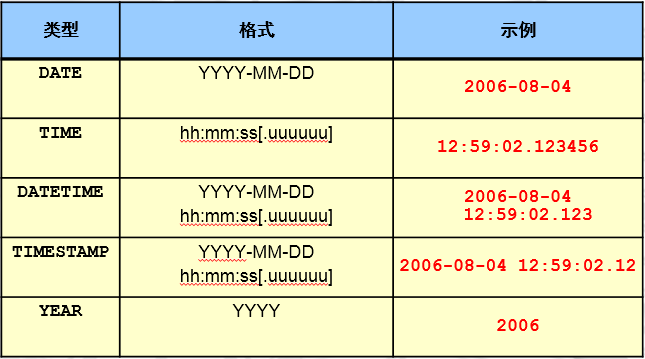
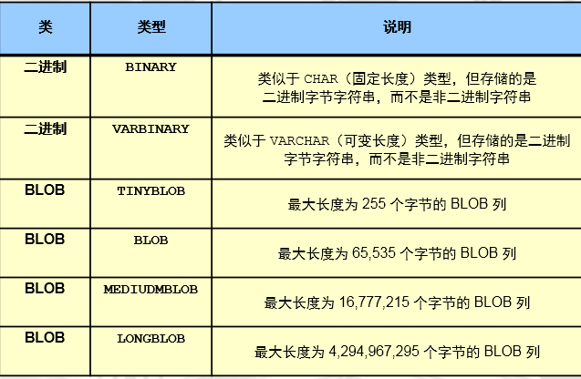

# 1、SQL介绍

```css
结构化查询语言
5.7 以后符合SQL92严格模式
通过sql_mode参数来控制
```

# 2、常用SQL分类

```undefined
DDL：数据定义语言
DCL：数据控制语言
DML：数据操作语言
DQL：数据的查询语言
```

# 3、数据类型、表属性、字符集

## 3.1  数据类型

### 3.1.1 作用

```undefined
保证数据的准确性和标准性。
```

### 3.1.2 种类

**数值类型**


image

```cpp
tinyint  ： -128~127
int       ：-2^31~2^31-1
说明：手机号是无法存储到int的。一般是使用char类型来存储收集号
```

**字符类型**


image

```csharp
char(11) ：
定长 的字符串类型,在存储字符串时，最大字符长度11个，立即分配11个字符长度的存储空间，如果存不满，空格填充。
varchar(11):
变长的字符串类型看，最大字符长度11个。在存储字符串时，自动判断字符长度，按需分配存储空间。
enum('bj','tj','sh')：
枚举类型，比较适合于将来此列的值是固定范围内的特点，可以使用enum,可以很大程度的优化我们的索引结构。
```

**时间类型**



image


 列值不能为空，也是表设计的规范，尽可能将所有的列设置为非空。可以设置默认值为0
**unique key** ：唯一键
 列值不能重复
**unsigned** ：无符号
 针对数字列，非负数。


其他属性:
 **key** :索引
 可以在某列上建立索引，来优化查询


```css
DATETIME 
范围为从 1000-01-01 00:00:00.000000 至 9999-12-31 23:59:59.999999。
TIMESTAMP 
1970-01-01 00:00:00.000000 至 2038-01-19 03:14:07.999999。
timestamp会受到时区的影响
```

**二进制类型**



image


## 3.2 表属性

### 3.2.1 列属性

```cpp
约束(一般建表时添加):
**primary key** ：主键约束
设置为主键的列，此列的值必须非空且唯一，主键在一个表中只能有一个，但是可以有多个列一起构成。
**not null**      ：非空约束
列值不能为空，也是表设计的规范，尽可能将所有的列设置为非空。可以设置默认值为0
**unique key** ：唯一键
列值不能重复
**unsigned** ：无符号
针对数字列，非负数。

其他属性:
**key** :索引
可以在某列上建立索引，来优化查询,一般是根据需要后添加
**default**           :默认值
列中，没有录入值时，会自动使用default的值填充
**auto_increment**:自增长
针对数字列，顺序的自动填充数据（默认是从1开始，将来可以设定起始点和偏移量）
**comment ** : 注释
```

### 3.2.2 表的属性

```undefined
存储引擎:
InnoDB（默认的）
字符集和排序规则:
utf8       
utf8mb4
```

## 3.3 字符集和校对规则

### 3.3.1 字符集

```undefined
utf8       
utf8mb4
```

### 3.3.2 校对规则（排序规则）

```undefined
大小写是否敏感
```

# 4、DDL应用

## 4.1 数据定义语言

## 4.2 库定义

### 4.2.1 创建

### 4.2.1 创建数据库

```dart
create database school;
create schema sch;
show charset;    #查看数据支持的字符集
show collation;  #查看所有字符集支持的校对规则  后面_ci是大小不敏感，  后面_bin大小写敏感
CREATE DATABASE test CHARSET utf8;
create database xyz charset utf8mb4 collate utf8mb4_bin; #创建xyz库字符集utf8mb4校验规则大小敏感

建库规范：
1.库名不能有大写字母   
2.建库要加字符集         
3.库名不能有数字开头
4.库名要和业务相关
    
```

建库标准语句

```dart
mysql> create database db charset utf8mb4;
mysql> show create database xuexiao;
```

### 4.2.2 删除(生产中禁止使用)

```rust
mysql> drop database oldboy;
```

### 4.2.3 修改

```undefined
SHOW CREATE DATABASE school;
ALTER DATABASE school  CHARSET utf8;
注意：修改字符集，修改后的字符集一定是原字符集的严格超集
```

### 4.2.4 查询库相关信息（DQL）

```dart
show databases；
show create database oldboy；
```

## 4.3 表定义

### 4.3.1 创建

```undefined
create table stu(
列1  属性（数据类型、约束、其他属性） ，
列2  属性，
列3  属性
)
```

### 4.3.2 建表

```php
USE school;
CREATE TABLE stu(
id      INT NOT NULL PRIMARY KEY AUTO_INCREMENT COMMENT '学号',
sname   VARCHAR(255) NOT NULL COMMENT '姓名',
sage    TINYINT UNSIGNED NOT NULL DEFAULT 0 COMMENT '年龄',
sgender ENUM('m','f','n') NOT NULL DEFAULT 'n' COMMENT '性别' ,
sfz     CHAR(18) NOT NULL UNIQUE  COMMENT '身份证',
intime  TIMESTAMP NOT NULL DEFAULT NOW() COMMENT '入学时间'
) ENGINE=INNODB CHARSET=utf8 COMMENT '学生表';
```

建表规范：


```undefined
1. 表名小写
2. 不能是数字开头
3. 注意字符集和存储引擎
4. 表名和业务有关
5. 选择合适的数据类型
6. 每个列都要有注释
7. 每个列设置为非空，无法保证非空，用0来填充。
```

### 4.3.2 删除(生产中禁用命令)

```rust
drop table t1;
```

### 4.3.3 修改

1.  在stu表中添加qq列

```php
DESC stu;
ALTER TABLE stu ADD qq VARCHAR(20) NOT NULL UNIQUE COMMENT 'qq号';
```

1.  在sname后加微信列

```php
ALTER TABLE stu ADD wechat VARCHAR(64) NOT NULL UNIQUE  COMMENT '微信号' AFTER sname ;
```

1.  在id列前加一个新列num

```dart
ALTER TABLE stu ADD num INT NOT NULL COMMENT '数字' FIRST;
DESC stu;
```

1.  把刚才添加的列都删掉(危险)

```dart
ALTER TABLE stu DROP num;
ALTER TABLE stu DROP qq;
ALTER TABLE stu DROP wechat;
```

1.  修改sname数据类型的属性

```cpp
ALTER TABLE stu MODIFY sname VARCHAR(128)  NOT NULL ;
```

1.  将sgender 改为 sg  数据类型改为 CHAR 类型

```php
ALTER TABLE stu CHANGE sgender sg CHAR(1) NOT NULL DEFAULT 'n' ;
DESC stu;

```

扩展： 修改表名

```bash
rename table 旧表名 to 新表名;

alter table 表名 drop primary key;  # 删除主键
```


### 4.3.4 表属性查询（DQL）

```dart
use school
show tables；
desc stu;
show create table stu；
CREATE TABLE ceshi LIKE stu;
```

# 5. DCL应用 ****

```undefined
grant 
revoke
```

# 6. DML应用

## 6.1 作用


```undefined
对表中的数据行进行增、删、改
```

## 6.2 insert

```csharp
--- 最标准的insert语句
INSERT INTO stu(id,sname,sage,sg,sfz,intime) 
VALUES
(1,'zs',18,'m','123456',NOW());
SELECT * FROM stu;
--- 省事的写法
INSERT INTO stu 
VALUES
(2,'ls',18,'m','1234567',NOW());
--- 针对性的录入数据
INSERT INTO stu(sname,sfz)
VALUES ('w5','34445788');
--- 同时录入多行数据
INSERT INTO stu(sname,sfz)
VALUES 
('w55','3444578d8'),
('m6','1212313'),
('aa','123213123123');
SELECT * FROM stu;
```

## 6.3 update

```bash
DESC stu;
SELECT * FROM stu;
UPDATE stu SET sname='zhao4' WHERE id=2;
注意：update语句必须要加where。
```

## 6.4 delete（危险！！）

```objectivec
DELETE FROM stu  WHERE id=3;
```

全表删除:

```cpp
DELETE FROM stu
truncate table stu;
区别:
delete: DML操作, 是逻辑性质删除,逐行进行删除,速度慢.
truncate: DDL操作,对与表段中的数据页进行清空,速度快.
```

伪删除：用update来替代delete，最终保证业务中查不到（select）即可

```objectivec
1.添加状态列
ALTER TABLE stu ADD state TINYINT NOT NULL DEFAULT 1 ;
SELECT * FROM stu;
2. UPDATE 替代 DELETE
UPDATE stu SET state=0 WHERE id=6;
3. 业务语句查询
SELECT * FROM stu WHERE state=1;
```

# 7. DQL应用(select )

## 7.1 单独使用

```css
-- select @@xxx 查看系统参数
SELECT @@port;
SELECT @@basedir;
SELECT @@datadir;
SELECT @@socket;
SELECT @@server_id;

SELECT @@innodb_flush_log_at_trx_commit;  # 复杂的语句记不住可以用下面show语句过滤查询
SHOW VARIABLES LIKE 'innodb%';
```

-- select 函数();  

```csharp
SELECT NOW();
SELECT DATABASE();
SELECT USER();
SELECT CONCAT("hello world");
SELECT CONCAT(USER,"@",HOST) FROM mysql.user;
SELECT GROUP_CONCAT(USER,"@",HOST) FROM mysql.user;
https://dev.mysql.com/doc/refman/5.7/en/func-op-summary-ref.html?tdsourcetag=s_pcqq_aiomsg
```

## 7.2 单表子句-from

```undefined
SELECT 列1,列2 FROM 表
SELECT  *  FROM 表
```

例子:
 -- 查询stu中所有的数据(不要对大表进行操作)

```undefined
SELECT * FROM stu ;
```

-- 查询stu表中,学生姓名和入学时间

```undefined
SELECT sname , intime FROM stu;
```

=====================
 oldguo带大家学单词：

```dart
world            ===>世界
city             ===>城市
country          ===>国家
countrylanguage  ===>国家语言

city:城市表
DESC city;
ID :         城市ID
NAME :       城市名
CountryCode: 国家代码，比如中国CHN 美国USA
District :   区域
Population : 人口

SHOW CREATE TABLE city;
SELECT * FROM city WHERE id<10;
```

======================

## 7.3 单表子句-where

```undefined
SELECT col1,col2 FROM TABLE WHERE colN 条件;
```

### 7.3.1 where配合等值查询

例子:
 -- 查询中国(CHN)所有城市信息

```bash
SELECT * FROM city WHERE countrycode='CHN';
```

-- 查询北京市的信息

```bash
SELECT * FROM city WHERE NAME='peking';
```

-- 查询甘肃省所有城市信息

```bash
SELECT * FROM city WHERE district='gansu';
```

### 7.3.2 where配合比较操作符(> < >= <= <>)

例子:
 -- 查询世界上少于100人的城市

```undefined
SELECT * FROM city WHERE population<100;
```

### 7.3.3 where配合逻辑运算符(and  or )

例子:
 -- 中国人口数量大于500w

```bash
SELECT * FROM city WHERE countrycode='CHN' AND population>5000000;
```

-- 中国或美国城市信息

```bash
SELECT * FROM city WHERE countrycode='CHN' OR countrycode='USA';
```

### 7.3.4 where配合模糊查询

例子:
 -- 查询省的名字前面带guang开头的

```ruby
SELECT * FROM city WHERE district LIKE 'guang%';    
注意:%不能放在前面,因为不走索引.
```

### 7.3.5 where配合in语句

-- 中国或美国城市信息

```csharp
SELECT * FROM city WHERE countrycode IN ('CHN' ,'USA');
```

### 7.3.6 where配合between and

例子:
 -- 查询世界上人口数量大于100w小于200w的城市信息

```undefined
SELECT * FROM city  WHERE population >1000000 AND population <2000000;
SELECT * FROM city  WHERE population BETWEEN 1000000 AND 2000000;
```

## 7.4 group by + 常用聚合函数

### 7.4.1 作用

```csharp
根据 by后面的条件进行分组，方便统计，by后面跟一个列或多个列
```

### 7.4.2 常用聚合函数

```swift
**max()**      ：最大值
**min()**      ：最小值
**avg()**      ：平均值
**sum()**      ：总和
**count()**    ：个数
group_concat() : 列转行
```

### 7.4.3 例子：

例子1：统计世界上每个国家的总人口数.

```php
USE world
SELECT countrycode ,SUM(population) FROM  city  GROUP BY countrycode;
```

例子2： 统计中国各个省的总人口数量(练习)

```bash
SELECT district,SUM(Population) FROM city  WHERE countrycode='chn' GROUP BY district;
```

例子3：统计世界上每个国家的城市数量(练习)

```objectivec
SELECT countrycode,COUNT(id)  FROM city GROUP BY countrycode;
```

## 7.5 having

```csharp
where|group|having
    
# group by 之后再进一次过滤条件， 只能用having
# 注意： having条件是不走索引的。一般可以用临时表解决。
    
```

例子4：统计中国每个省的总人口数，只打印总人口数小于100

```csharp
SELECT district,SUM(Population)
FROM city
WHERE countrycode='chn'
GROUP BY district
HAVING SUM(Population) < 1000000 ;
```

## 7.6 order by + limit

### 7.6.1 作用

```csharp
实现先排序，by后添加条件列
```

### 7.6.2 应用案例

1.  查看中国所有的城市，并按人口数进行排序(从大到小)

```bash
SELECT * FROM city WHERE countrycode='CHN' ORDER BY population DESC;
```

1.  统计中国各个省的总人口数量，按照总人口从大到小排序

```php
SELECT district AS 省 ,SUM(Population) AS 总人口
FROM city
WHERE countrycode='chn'
GROUP BY district
ORDER BY 总人口 DESC ;
```

1.  统计中国,每个省的总人口,找出总人口大于500w的,并按总人口从大到小排序,只显示前三名

```csharp
SELECT  district, SUM(population)  FROM  city 
WHERE countrycode='CHN'
GROUP BY district 
HAVING SUM(population)>5000000
ORDER BY SUM(population) DESC
LIMIT 3 ;

LIMIT N ,M --->跳过N,显示一共M行
LIMIT 5,5
LIMIT M OFFSET N  -->显示M行， 跳过N行    

SELECT  district, SUM(population)  FROM  city 
WHERE countrycode='CHN'
GROUP BY district 
HAVING SUM(population)>5000000
ORDER BY SUM(population) DESC
LIMIT 5,5;
```

## 7.7 distinct：去重复

```cpp
SELECT countrycode FROM city ;
SELECT DISTINCT(countrycode) FROM city  ;
```

## 7.8 联合查询- union all

```csharp
-- 中国或美国城市信息

SELECT * FROM city 
WHERE countrycode IN ('CHN' ,'USA');

SELECT * FROM city WHERE countrycode='CHN'
UNION ALL
SELECT * FROM city WHERE countrycode='USA'

说明:一般情况下,我们会将 IN 或者 OR 语句 改写成 UNION ALL,来提高性能
UNION     去重复
UNION ALL 不去重复
```

## 7.9 join 多表连接查询

### 7.9.0 案例准备

按需求创建一下表结构:

```php
use school
student ：学生表
sno：    学号
sname：学生姓名
sage： 学生年龄
ssex： 学生性别

teacher ：教师表
tno：     教师编号
tname：教师名字

course ：课程表
cno：  课程编号
cname：课程名字
tno：  教师编号

score  ：成绩表
sno：  学号
cno：  课程编号
score：成绩

-- 项目构建
drop database school;
CREATE DATABASE school CHARSET utf8;
USE school

CREATE TABLE student(
sno INT NOT NULL PRIMARY KEY AUTO_INCREMENT COMMENT '学号',
sname VARCHAR(20) NOT NULL COMMENT '姓名',
sage TINYINT UNSIGNED  NOT NULL COMMENT '年龄',
ssex  ENUM('f','m') NOT NULL DEFAULT 'm' COMMENT '性别'
)ENGINE=INNODB CHARSET=utf8;

CREATE TABLE course(
cno INT NOT NULL PRIMARY KEY COMMENT '课程编号',
cname VARCHAR(20) NOT NULL COMMENT '课程名字',
tno INT NOT NULL  COMMENT '教师编号'
)ENGINE=INNODB CHARSET utf8;

CREATE TABLE sc (
sno INT NOT NULL COMMENT '学号',
cno INT NOT NULL COMMENT '课程编号',
score INT  NOT NULL DEFAULT 0 COMMENT '成绩'
)ENGINE=INNODB CHARSET=utf8;

CREATE TABLE teacher(
tno INT NOT NULL PRIMARY KEY COMMENT '教师编号',
tname VARCHAR(20) NOT NULL COMMENT '教师名字'
)ENGINE=INNODB CHARSET utf8;

INSERT INTO student(sno,sname,sage,ssex)
VALUES (1,'zhang3',18,'m');

INSERT INTO student(sno,sname,sage,ssex)
VALUES
(2,'zhang4',18,'m'),
(3,'li4',18,'m'),
(4,'wang5',19,'f');

INSERT INTO student
VALUES
(5,'zh4',18,'m'),
(6,'zhao4',18,'m'),
(7,'ma6',19,'f');

INSERT INTO student(sname,sage,ssex)
VALUES
('oldboy',20,'m'),
('oldgirl',20,'f'),
('oldp',25,'m');


INSERT INTO teacher(tno,tname) VALUES
(101,'oldboy'),
(102,'hesw'),
(103,'oldguo');

DESC course;
INSERT INTO course(cno,cname,tno)
VALUES
(1001,'linux',101),
(1002,'python',102),
(1003,'mysql',103);

DESC sc;
INSERT INTO sc(sno,cno,score)
VALUES
(1,1001,80),
(1,1002,59),
(2,1002,90),
(2,1003,100),
(3,1001,99),
(3,1003,40),
(4,1001,79),
(4,1002,61),
(4,1003,99),
(5,1003,40),
(6,1001,89),
(6,1003,77),
(7,1001,67),
(7,1003,82),
(8,1001,70),
(9,1003,80),
(10,1003,96);

SELECT * FROM student;
SELECT * FROM teacher;
SELECT * FROM course;
SELECT * FROM sc;
```

### 7.9.1 语法


image

查询张三的家庭住址

```bash
SELECT A.name,B.address FROM
A JOIN  B
ON A.id=B.id
WHERE A.name='zhangsan'
```

### 7.9.2 例子：

1.  查询一下世界上人口数量小于100人的城市名和国家名

```php
SELECT b.name ,a.name ,a.population
FROM  city  AS a
JOIN  country AS b
ON    b.code=a.countrycode
WHERE  a.Population<100
```

1.  查询城市shenyang，城市人口，所在国家名（name）及国土面积（SurfaceArea）

```php
SELECT a.name,a.population,b.name ,b.SurfaceArea
FROM city  AS a JOIN country AS b
ON a.countrycode=b.code
WHERE a.name='shenyang';
```

### 7.9.3 别名

```php
列别名,表别名
SELECT 
a.Name AS an ,
b.name AS bn ,
b.SurfaceArea AS bs,
a.Population AS bp
FROM city AS a  JOIN country AS b
ON a.CountryCode=b.Code
WHERE a.name ='shenyang'; 
```

### 7.9.4 多表SQL练习题

1.  统计zhang3,学习了几门课

```php
SELECT st.sname , COUNT(sc.cno)
FROM student AS st
JOIN
sc
ON st.sno=sc.sno
WHERE st.sname='zhang3'
```

1.  查询zhang3,学习的课程名称有哪些?

```php
SELECT st.sname , GROUP_CONCAT(co.cname)
FROM student AS st
JOIN sc
ON st.sno=sc.sno
JOIN course AS co
ON sc.cno=co.cno
WHERE st.sname='zhang3'
```

1.  查询oldguo老师教的学生名.

```php
SELECT te.tname ,GROUP_CONCAT(st.sname)
FROM student AS st
JOIN sc
ON st.sno=sc.sno
JOIN course AS co
ON sc.cno=co.cno
JOIN teacher AS te
ON co.tno=te.tno
WHERE te.tname='oldguo';
```

1.  查询oldguo所教课程的平均分数

```php
SELECT te.tname,AVG(sc.score)
FROM teacher AS te
JOIN course AS co
ON te.tno=co.tno
JOIN sc
ON co.cno=sc.cno
WHERE te.tname='oldguo'
```

4.1 每位老师所教课程的平均分,并按平均分排序

```objectivec
SELECT te.tname,AVG(sc.score)
FROM teacher AS te
JOIN course AS co
ON te.tno=co.tno
JOIN sc
ON co.cno=sc.cno
GROUP BY te.tname
ORDER BY AVG(sc.score) DESC ;
```

1.  查询oldguo所教的不及格的学生姓名

```php
SELECT te.tname,st.sname,sc.score
FROM teacher AS te
JOIN course  AS co
ON te.tno=co.tno
JOIN sc
ON co.cno=sc.cno
JOIN student AS st
ON sc.sno=st.sno
WHERE te.tname='oldguo' AND sc.score<60;
```

5.1 查询所有老师所教学生不及格的信息

```php
SELECT te.tname,st.sname,sc.score
FROM teacher AS te
JOIN course  AS co
ON te.tno=co.tno
JOIN sc
ON co.cno=sc.cno
JOIN student AS st
ON sc.sno=st.sno
WHERE sc.score<60;
```

### 7.9.5 综合练习

```undefined
1. 查询平均成绩大于60分的同学的学号和平均成绩；
2. 查询所有同学的学号、姓名、选课数、总成绩；
3. 查询各科成绩最高和最低的分：以如下形式显示：课程ID，最高分，最低分 
4. 统计各位老师,所教课程的及格率
5. 查询每门课程被选修的学生数
6. 查询出只选修了一门课程的全部学生的学号和姓名
7. 查询选修课程门数超过1门的学生信息
8. 统计每门课程:优秀(85分以上),良好(70-85),一般(60-70),不及格(小于60)的学生列表
9. 查询平均成绩大于85的所有学生的学号、姓名和平均成绩 
```

# 8.information_schema.tables视图

```rust
DESC information_schema.TABLES
TABLE_SCHEMA    ---->库名
TABLE_NAME      ---->表名
ENGINE          ---->引擎
TABLE_ROWS      ---->表的行数
AVG_ROW_LENGTH  ---->表中行的平均行（字节）
INDEX_LENGTH    ---->索引的占用空间大小（字节）
```

1.  查询整个数据库中所有库和所对应的表信息

```css
SELECT table_schema,GROUP_CONCAT(table_name)
FROM  information_schema.tables
GROUP BY table_schema;
```

1.  统计所有库下的表个数

```css
SELECT table_schema,COUNT(table_name)
FROM information_schema.TABLES
GROUP BY table_schema
```

1.  查询所有innodb引擎的表及所在的库

```go
SELECT table_schema,table_name,ENGINE FROM information_schema.`TABLES`
WHERE ENGINE='innodb';
```

1.  统计world数据库下每张表的磁盘空间占用

```php
SELECT table_name,CONCAT((TABLE_ROWS*AVG_ROW_LENGTH+INDEX_LENGTH)/1024," KB")  AS size_KB
FROM information_schema.tables WHERE TABLE_SCHEMA='world';
```

1.  统计所有数据库的总的磁盘空间占用

```objectivec
SELECT
TABLE_SCHEMA,
CONCAT(SUM(TABLE_ROWS*AVG_ROW_LENGTH+INDEX_LENGTH)/1024," KB") AS Total_KB
FROM information_schema.tables
GROUP BY table_schema;
mysql -uroot -p123 -e "SELECT TABLE_SCHEMA,CONCAT(SUM(TABLE_ROWS*AVG_ROW_LENGTH+INDEX_LENGTH)/1024,' KB') AS Total_KB FROM information_schema.tables GROUP BY table_schema;"
```

1.  生成整个数据库下的所有表的单独备份语句


```jsx
模板语句：
mysqldump -uroot -p123 world city >/tmp/world_city.sql
SELECT CONCAT("mysqldump -uroot -p123 ",table_schema," ",table_name," >/tmp/",table_schema,"_",table_name,".sql" )
FROM information_schema.tables
WHERE table_schema NOT IN('information_schema','performance_schema','sys')
INTO OUTFILE '/tmp/bak.sh' ;

CONCAT("mysqldump -uroot -p123 ",table_schema," ",table_name," >/tmp/",table_schema,"_",table_name,".sql" )
```

1.  107张表，都需要执行以下2条语句

```csharp
ALTER TABLE world.city DISCARD TABLESPACE;
ALTER TABLE world.city IMPORT TABLESPACE;
SELECT CONCAT("alter table ",table_schema,".",table_name," discard tablespace")
FROM information_schema.tables
WHERE table_schema='world'
INTO OUTFILE '/tmp/dis.sql';
```

# 9. show 命令

```csharp
show  databases;                          #查看所有数据库
show tables;                                          #查看当前库的所有表
SHOW TABLES FROM                        #查看某个指定库下的表
show create database world                #查看建库语句
show create table world.city                #查看建表语句
show  grants for  root@'localhost'       #查看用户的权限信息
show  charset；                                   #查看字符集
show collation                                      #查看校对规则
show processlist;                                  #查看数据库连接情况
show index from                                 #表的索引情况
show status                                         #数据库状态查看
SHOW STATUS LIKE '%lock%';         #模糊查询数据库某些状态
SHOW VARIABLES                             #查看所有配置信息
SHOW variables LIKE '%lock%';          #查看部分配置信息
show engines                                       #查看支持的所有的存储引擎
show engine innodb status\G               #查看InnoDB引擎相关的状态信息
show binary logs                                    #列举所有的二进制日志
show master status                                 #查看数据库的日志位置信息
show binlog evnets in                             #查看二进制日志事件
show slave status \G                             #查看从库状态
SHOW RELAYLOG EVENTS               #查看从库relaylog事件信息
desc  (show colums from city)               #查看表的列定义信息
http://dev.mysql.com/doc/refman/5.7/en/show.html
```


