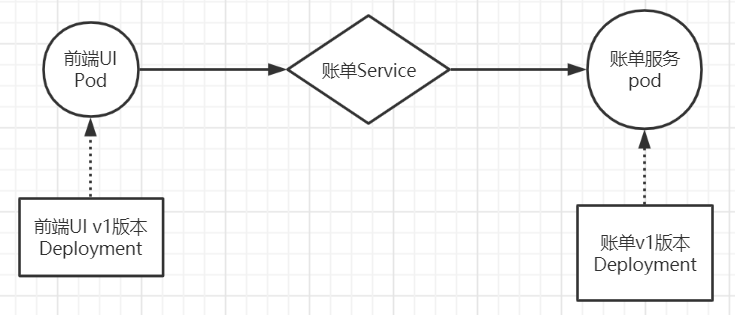
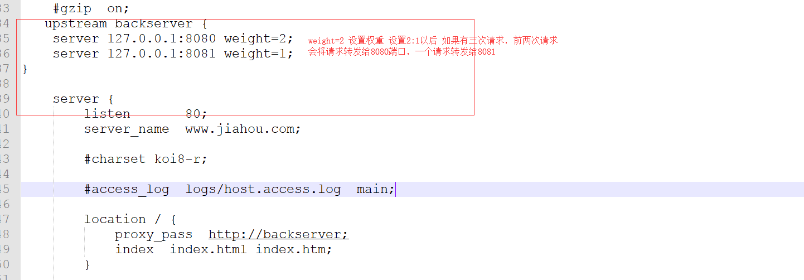
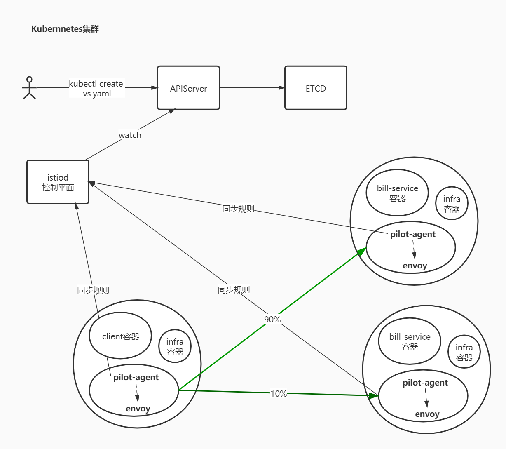
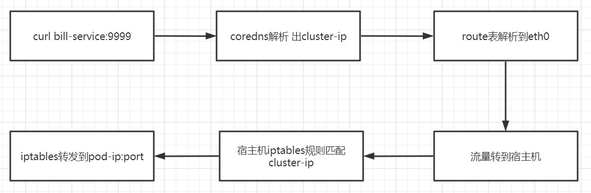

# 服务网络

微服务架构可谓是当前软件开发领域的技术热点，它在各种博客、社交媒体和会议演讲上的出镜率非常之高，无论是做基础架构还是做业务系统的工程师，对微服务都相当关注，而这个现象与热度到目前为止，已经持续了近 5 年之久。

尤其是近些年来，微服务架构逐渐发展成熟，从最初的星星之火到现在的大规模的落地与实践，几乎已经成为分布式环境下的首选架构。微服务成为时下技术热点，大量互联网公司都在做微服务架构的落地和推广。同时，也有很多传统企业基于微服务和容器，在做互联网技术转型。

而在这个技术转型中，国内有一个趋势，以 Spring Cloud 与 Dubbo 为代表的微服务开发框架非常普及和受欢迎。然而软件开发没有银弹，基于这些传统微服务框架构建的应用系统在享受其优势的同时，痛点也越加明显。这些痛点包括但不限于以下几点：

- **侵入性强**。想要集成 SDK 的能力，除了需要添加相关依赖，往往还需要在业务代码中增加一部分的代码、或注解、或配置；业务代码与治理层代码界限不清晰。
- **升级成本高**。每次升级都需要业务应用修改 SDK 版本，重新进行功能回归测试，并且对每一台机器进行部署上线，而这对于业务方来说，与业务的快速迭代开发是有冲突的，大多不愿意停下来做这些与业务目标不太相关的事情。
- **版本碎片化严重**。由于升级成本高，而中间件却不会停止向前发展的步伐，久而久之，就会导致线上不同服务引用的 SDK 版本不统一、能力参差不齐，造成很难统一治理。
- **中间件演变困难**。由于版本碎片化严重，导致中间件向前演进的过程中就需要在代码中兼容各种各样的老版本逻辑，带着 “枷锁” 前行，无法实现快速迭代。
- **内容多、门槛高**。Spring Cloud 被称为微服务治理的全家桶，包含大大小小几十个组件，内容相当之多，往往需要几年时间去熟悉其中的关键组件。而要想使用 Spring Cloud 作为完整的治理框架，则需要深入了解其中原理与实现，否则遇到问题还是很难定位。
- **治理功能不全**。不同于 RPC 框架，Spring Cloud 作为治理全家桶的典型，也不是万能的，诸如协议转换支持、多重授权机制、动态请求路由、故障注入、灰度发布等高级功能并没有覆盖到。而这些功能往往是企业大规模落地不可获缺的功能，因此公司往往还需要投入其它人力进行相关功能的自研或者调研其它组件作为补充。

#### [Service Mesh 服务网格](http://49.7.203.222:3000/#/istio/service-mesh?id=service-mesh-服务网格)

##### [架构和概念](http://49.7.203.222:3000/#/istio/service-mesh?id=架构和概念)

目的是解决系统架构微服务化后的服务间通信和治理问题。设计初衷是提供一种通用的服务治理方案。


Sidecar 在软件系统架构中特指边车模式。这个模式的灵感来源于我们生活中的边三轮：即在两轮摩托车的旁边添加一个边车的方式扩展现有的服务和功能。

这个模式的精髓在于实现了数据面（业务逻辑）和控制面的解耦：原来两轮摩托车的驾驶者集中注意力跑赛道，边车上的领航员专注周围信息和地图，专注导航。


Service Mesh 这个服务网络专注于处理服务和服务间的通讯。其主要负责构造一个稳定可靠的服务通讯的基础设施，并让整个架构更为的先进和 Cloud Native。在工程中，Service Mesh 基本来说是一组轻量级的与应用逻辑服务部署在一起的服务代理，并且对于应用服务是透明的。

##### [开源实现](http://49.7.203.222:3000/#/istio/service-mesh?id=开源实现)

###### [第一代服务网格 Linkerd和Envoy](http://49.7.203.222:3000/#/istio/service-mesh?id=第一代服务网格-linkerd和envoy)

Linkerd 使用Scala编写，是业界第一个开源的service mesh方案。作者 William Morgan 是 service mesh 的布道师和践行者。Envoy 基于C++ 11编写，无论是理论上还是实际上，后者性能都比 Linkderd 更好。这两个开源实现都是以 sidecar 为核心，绝大部分关注点都是如何做好proxy，并完成一些通用控制面的功能。 但是，当你在容器中大量部署 sidecar 以后，如何管理和控制这些 sidecar 本身就是一个不小的挑战。于是，第二代 Service Mesh 应运而生。

###### [第二代服务网格 Istio](http://49.7.203.222:3000/#/istio/service-mesh?id=第二代服务网格-istio)

Istio 是 Google 和 IBM 两位巨人联合 Lyft 的合作开源项目。是当前最主流的service mesh方案，也是事实上的第二代 service mesh 标准。


# [安装Istio](http://49.7.203.222:3000/#/istio/install)

#### [安装Istio](http://49.7.203.222:3000/#/istio/install?id=安装istio)

https://istio.io/latest/docs/setup/getting-started/

###### [下载 Istio](http://49.7.203.222:3000/#/istio/install?id=下载-istio)

下载内容将包含：安装文件、示例和 [istioctl](https://istio.io/latest/zh/docs/reference/commands/istioctl/) 命令行工具。

1. 访问 [Istio release](https://github.com/istio/istio/releases/tag/1.13.2) 页面下载与您操作系统对应的安装文件。在 macOS 或 Linux 系统中，也可以通过以下命令下载最新版本的 Istio：

   ```bash
   $ wget https://github.com/istio/istio/releases/download/1.13.2/istio-1.13.2-linux-amd64.tar.gz
   ```

2. 解压并切换到 Istio 包所在目录下。例如：Istio 包名为 `istio-1.13.2`，则：

   ```bash
   $ tar zxf istio-1.13.2-linux-amd64.tar.gz
   $ ll istio-1.13.2
   drwxr-x---  2 root root    22 Jul 15 13:32 bin
   -rw-r--r--  1 root root 11348 Jul 15 13:32 LICENSE
   drwxr-xr-x  5 root root    52 Jul 15 13:32 manifests
   -rw-r-----  1 root root   854 Jul 15 13:32 manifest.yaml
   -rw-r--r--  1 root root  5866 Jul 15 13:32 README.md
   drwxr-xr-x 20 root root   332 Jul 15 13:32 samples
   drwxr-xr-x  3 root root    57 Jul 15 13:32 tools
   ```

3. 将 `istioctl` 客户端拷贝到 path 环境变量中

   ```bash
   $ cp bin/istioctl /bin/
   ```

4. 配置命令自动补全

   `istioctl` 自动补全的文件位于 `tools` 目录。通过复制 `istioctl.bash` 文件到您的 home 目录，然后添加下行内容到您的 `.bashrc` 文件执行 `istioctl` tab 补全文件：

   ```bash
   $ cp tools/istioctl.bash ~
   $ source ~/istioctl.bash
   ```

###### [安装istio组件](http://49.7.203.222:3000/#/istio/install?id=安装istio组件)

https://istio.io/latest/zh/docs/setup/install/istioctl/#display-the-configuration-of-a-profile

使用istioctl直接安装：

```bash
$ istioctl install --set profile=demo
✔ Istio core installed
✔ Istiod installed
✔ Egress gateways installed
✔ Ingress gateways installed
✔ Installation complete

$ kubectl -n istio-system get po
NAME                                    READY   STATUS    RESTARTS   AGE
istio-egressgateway-7bf76dd59-n9t5l     1/1     Running   0          77s
istio-ingressgateway-586dbbc45d-xphjb   1/1     Running   0          77s
istiod-6cc5758d8c-pz28m                 1/1     Running   0          84s
```

istio针对不同的环境，提供了几种不同的初始化部署的[profile](https://istio.io/latest/docs/setup/additional-setup/config-profiles/)

```bash
# 查看提供的profile类型
$ istioctl profile list

# 获取kubernetes的yaml：
$ istioctl manifest generate --set profile=demo > istio-kubernetes-manifest.yaml
```

###### [卸载](http://49.7.203.222:3000/#/istio/install?id=卸载)

```bash
$ istioctl manifest generate --set profile=demo | kubectl delete -f -
```


# 快速入门

#### [快速入门](http://49.7.203.222:3000/#/istio/get-started?id=快速入门)

##### [场景一](http://49.7.203.222:3000/#/istio/get-started?id=场景一)

###### [模型图](http://49.7.203.222:3000/#/istio/get-started?id=模型图)



###### [资源清单](http://49.7.203.222:3000/#/istio/get-started?id=资源清单)


```
cat > front-tomcat-dpl-v1.yaml <<EOF
apiVersion: apps/v1
kind: Deployment
metadata:
  labels:
    app: front-tomcat
    version: v1
  name: front-tomcat-v1
  namespace: istio-demo
spec:
  replicas: 1
  selector:
    matchLabels:
      app: front-tomcat
      version: v1
  template:
    metadata:
      labels:
        app: front-tomcat
        version: v1
    spec:
      containers:
      - image: consol/tomcat-7.0:latest
        name: front-tomcat
EOF
```


```
cat > bill-service-dpl-v1.yaml <<EOF
apiVersion: apps/v1
kind: Deployment
metadata:
  labels:
    service: bill-service
    version: v1
  name: bill-service-v1
  namespace: istio-demo
spec:
  replicas: 1
  selector:
    matchLabels:
      service: bill-service
      version: v1
  template:
    metadata:
      labels:
        service: bill-service
        version: v1
    spec:
      containers:
      - image: nginx:alpine
        name: bill-service
        command: ["/bin/sh", "-c", "echo 'this is bill-service-v1'>/usr/share/nginx/html/index.html;nginx -g 'daemon off;'"]
EOF
```


```
cat > bill-service-svc.yaml <<EOF
apiVersion: v1
kind: Service
metadata:
  labels:
    service: bill-service
  name: bill-service
  namespace: istio-demo
spec:
  ports:
  - name: http
    port: 9999
    protocol: TCP
    targetPort: 80
  selector:
    service: bill-service
  type: ClusterIP
EOF
```

###### [操作](http://49.7.203.222:3000/#/istio/get-started?id=操作)

```bash
kubectl create namespace istio-demo
kubectl apply -f front-tomcat-dpl-v1.yaml
kubectl apply -f bill-service-dpl-v1.yaml
kubectl apply -f bill-service-svc.yaml

[root@k8s-master istio]# kubectl -n istio-demo get po
NAME                               READY   STATUS    RESTARTS   AGE
bill-service-v1-8665fd77d8-zdrrz   1/1     Running   0          6m18s
front-tomcat-v1-59d9cc6b65-58tlp   1/1     Running   0          5m57s
[root@k8s-master istio]# kubectl -n istio-demo exec front-tomcat-v1-59d9cc6b65-58tlp -- curl -s bill-service:9999
this is bill-service-v1
```

##### [场景二](http://49.7.203.222:3000/#/istio/get-started?id=场景二)

后台账单服务更新v2版本，前期规划90%的流量访问v1版本，导入10%的流量到v2版本

###### [模型图](http://49.7.203.222:3000/#/istio/get-started?id=模型图-1)


###### [资源清单](http://49.7.203.222:3000/#/istio/get-started?id=资源清单-1)

新增`bill-service-dpl-v2.yaml`

```yaml
cat > bill-service-dpl-v2.yaml <<EOF
apiVersion: apps/v1
kind: Deployment
metadata:
  labels:
    service: bill-service
    version: v2
  name: bill-service-v2
  namespace: istio-demo
spec:
  replicas: 1
  selector:
    matchLabels:
      service: bill-service
      version: v2
  template:
    metadata:
      labels:
        service: bill-service
        version: v2
    spec:
      containers:
      - image: nginx:alpine
        name: bill-service
        command: ["/bin/sh", "-c", "echo 'hello, this is bill-service-v2'>/usr/share/nginx/html/index.html;nginx -g 'daemon off;'"]
EOF
```

此时，访问规则会按照v1和v2的pod各50%的流量分配。

```bash
$ kubectl apply -f bill-service-dpl-v2.yaml
[root@k8s-master istio]# kubectl -n istio-demo get po
NAME                               READY   STATUS    RESTARTS   AGE
bill-service-v1-8665fd77d8-zdrrz   1/1     Running   0          18m
bill-service-v2-857d56bb46-wqhl6   1/1     Running   0          14s
front-tomcat-v1-59d9cc6b65-58tlp   1/1     Running   0          18m
[root@k8s-master istio]# kubectl -n istio-demo exec front-tomcat-v1-59d9cc6b65-58tlp -- curl -s bill-service:9999
this is bill-service-v1
[root@k8s-master istio]# kubectl -n istio-demo exec front-tomcat-v1-59d9cc6b65-58tlp -- curl -s bill-service:9999
hello, this is bill-service-v2
```


###### [使用Istio](http://49.7.203.222:3000/#/istio/get-started?id=使用istio)

注入：

```bash
istioctl kube-inject -f bill-service-dpl-v1.yaml|kubectl apply -f -
istioctl kube-inject -f bill-service-dpl-v2.yaml|kubectl apply -f -
istioctl kube-inject -f front-tomcat-dpl-v1.yaml|kubectl apply -f -
```

若想实现上述需求，需要解决如下两个问题：

- 让访问账单服务的流量按照我们期望的比例，其实是一条路由规则，如何定义这个规则
- 如何区分两个版本的服务

两个新的资源类型：`VirtualService`和`DestinationRule`

bill-service-destnation-rule.yaml
```
cat > bill-service-destnation-rule.yaml <<EOF
apiVersion: networking.istio.io/v1alpha3
kind: DestinationRule
metadata:
  name: dest-bill-service
  namespace: istio-demo
spec:
  host: bill-service
  subsets:
  - name: v1
    labels:
      version: v1
  - name: v2
    labels:
      version: v2
EOF
```

bill-service-virtualservice.yaml
```
cat > bill-service-virtualservice.yaml <<EOF
apiVersion: networking.istio.io/v1alpha3
kind: VirtualService
metadata:
  name: vs-bill-service
  namespace: istio-demo
spec:
  hosts:
  - bill-service
  http:
  - name: bill-service-route
    route:
    - destination:
        host: bill-service
        subset: v1
      weight: 90
    - destination:
        host: bill-service
        subset: v2
      weight: 10
EOF
```

使用client验证流量分配是否生效。

```bash
$ kubectl apply -f bill-service-virtualservice.yaml
$ kubectl apply -f bill-service-destnation-rule.yaml
[root@k8s-master istio]# kubectl -n istio-demo get po
NAME                               READY   STATUS    RESTARTS   AGE
bill-service-v1-5f48d5f4d6-cbcrc   2/2     Running   0          3m57s
bill-service-v2-84f9464779-dn9td   2/2     Running   0          3m57s
front-tomcat-v1-78fbb476d4-fpqnd   2/2     Running   0          3m56s
# kubectl -n istio-demo exec front-tomcat-v1-78fbb476d4-fpqnd -c front-tomcat -- curl -s bill-service:9999
this is bill-service-v1
# kubectl -n istio-demo exec front-tomcat-v1-78fbb476d4-fpqnd -c front-tomcat -- curl -s bill-service:9999
this is bill-service-v1
# kubectl -n istio-demo exec front-tomcat-v1-78fbb476d4-fpqnd -c front-tomcat -- curl -s bill-service:9999
this is bill-service-v1
```


# 服务网格细节剖析

## 宏观分析

执行的操作：

- 使用istioctl为pod注入了sidecar
- 创建了virtualservice和destinationrule

如何最终影响到了pod的访问行为？

###### [宏观角度](http://49.7.203.222:3000/#/istio/how-works/macroanalysis?id=宏观角度)

nginx的配置中，可以提供类似如下的配置片段实现按照权重的转发：



因为nginx是代理层，可以转发请求，istio也实现了流量转发的效果，肯定也有代理层，并且识别了前面创建的虚拟服务中定义的规则。

```bash
$ istioctl kube-inject -f front-tomcat-dpl-v1.yaml
```

可以看到注入后yaml中增加了很多内容：


pod被istio注入后，被纳入到服务网格中，每个pod都会添加一个名为istio-proxy的容器（常说的sidecar容器），istio-proxy容器中有两个进程，一个是`piolot-agent`，一个是`envoy`



```bash
[root@k8s-master istio]# kubectl -n istio-demo get po
NAME                               READY   STATUS    RESTARTS   AGE
bill-service-v1-5f48d5f4d6-cbcrc   2/2     Running   0          119m
bill-service-v2-84f9464779-dn9td   2/2     Running   0          119m
front-tomcat-v1-78fbb476d4-fpqnd   2/2     Running   0          119m
# kubectl -n istio-demo exec -ti front-tomcat-v1-78fbb476d4-fpqnd -c istio-proxy -- bash
# ps aux
```

目前已知：

- 在istio网格内，每个Pod都会被注入一个envoy代理
- envoy充当nginx的角色，做为proxy代理，负责接管pod的入口和出口流量

目前，还需要搞清楚几个问题：

- istio-init初始化容器作用是什么？
- istio-proxy如何接管业务服务的出入口流量？


##　[认识envoy](http://49.7.203.222:3000/#/istio/how-works/envoy)

###### [认识envoy](http://49.7.203.222:3000/#/istio/how-works/envoy?id=认识envoy)

`Envoy` 是为云原生应用设计的代理。

可以和nginx做类比： https://fuckcloudnative.io/posts/migrating-from-nginx-to-envoy/

```bash
$ docker run -d --name envoy -v `pwd`/envoy.yaml:/etc/envoy/envoy.yaml -p 10000:10000 envoyproxy/envoy-alpine:v1.15.2

$ curl localhost:10000
```

envoy.yaml
```yaml
cat > envoy.yaml <<EOF
admin:
  access_log_path: /tmp/admin_access.log
  address:
    socket_address: { address: 127.0.0.1, port_value: 9901 }

static_resources:
  listeners:
  - name: listener_0
    address:
      socket_address: { address: 0.0.0.0, port_value: 10000 }
    filter_chains:
    - filters:
      - name: envoy.http_connection_manager
        config:
          stat_prefix: ingress_http
          codec_type: AUTO
          route_config:
            name: local_route
            virtual_hosts:
            - name: local_service
              domains: ["*"]
              routes:
              - match: { prefix: "/" }
                route: { cluster: some_service }
          http_filters:
          - name: envoy.router
  clusters:
  - name: some_service
    connect_timeout: 2s
    type: STATIC
    lb_policy: ROUND_ROBIN
    hosts: [{ socket_address: { address: 10.103.211.217, port_value: 9999 }}]
EOF
```

脑补一下网络代理程序的流程，比如作为一个代理，首先要能获取请求流量，通常是采用监听端口的方式实现；其次拿到请求数据后需要对其做微处理，例如附加 `Header` 或校验某个 `Header` 字段的内容等，这里针对来源数据的层次不同，可以分为 `L3/L4/L7`，然后将请求转发出去；转发这里又可以衍生出如果后端是一个集群，需要从中挑选一台机器，如何挑选又涉及到负载均衡等。

- `listener` : Envoy 的监听地址。Envoy 会暴露一个或多个 Listener 来监听客户端的请求。
- `filter` : 过滤器。在 Envoy 中指的是一些“可插拔”和可组合的逻辑处理层，是 Envoy 核心逻辑处理单元。
- `route_config` : 路由规则配置。即将请求路由到后端的哪个集群。
- `cluster` : 服务提供方集群。Envoy 通过服务发现定位集群成员并获取服务，具体路由到哪个集群成员由负载均衡策略决定。

###### [envoy的xDS](http://49.7.203.222:3000/#/istio/how-works/envoy?id=envoy的xds)

Envoy的启动配置文件分为两种方式：静态配置和动态配置。

- 静态配置是将所有信息都放在配置文件中，启动的时候直接加载。
- 动态配置需要提供一个Envoy的服务端，用于动态生成Envoy需要的服务发现接口，这里叫XDS，通过发现服务来动态的调整配置信息，Istio就是实现了v2的API。

Envoy 接收到请求后，会先走 `FilterChain`，通过各种 L3/L4/L7 Filter 对请求进行微处理，然后再路由到指定的集群，并通过负载均衡获取一个目标地址，最后再转发出去。

其中每一个环节可以静态配置，也可以动态服务发现，也就是所谓的 `xDS`。这里的 `x` 是一个代词，类似云计算里的 `XaaS` 可以指代 IaaS、PaaS、SaaS 等。


所以，envoy的架构大致的样子如下：


**Downstream**

下游（downstream）主机连接到 Envoy，发送请求并或获得响应。

**Upstream**

上游（upstream）主机获取来自 Envoy 的链接请求和响应。

**监听器**

- 除了过滤器链之外，还有一种过滤器叫**监听器过滤器**（Listener filters），它会在过滤器链之前执行，用于操纵连接的**元数据**。这样做的目的是，无需更改 Envoy 的核心代码就可以方便地集成更多功能。
- 每个监听器都可以配置多个过[滤器链（Filter Chains）](https://www.envoyproxy.io/docs/envoy/latest/api-v3/config/listener/v3/listener_components.proto#envoy-v3-api-msg-config-listener-v3-filterchain)，监听器会根据 `filter_chain_match` 中的[匹配条件](https://www.envoyproxy.io/docs/envoy/latest/api-v3/config/listener/v3/listener_components.proto#envoy-v3-api-msg-config-listener-v3-filterchainmatch)将流量转交到对应的过滤器链，其中每一个过滤器链都由一个或多个**网络过滤器**（`Network filters`）组成。这些过滤器用于执行不同的代理任务，如速率限制，`TLS` 客户端认证，`HTTP` 连接管理，`MongoDB` 嗅探，原始 TCP 代理等。

###### [envoy在微服务治理中的工作环境](http://49.7.203.222:3000/#/istio/how-works/envoy?id=envoy在微服务治理中的工作环境)

可以在服务旁运行，以平台无关的方式提供必要的特性，所有到服务的流量都通过 `Envoy` 代理，这里 `Envoy` 扮演的就是 `Sidecar` 的角色。


针对于k8s的pod来讲：


在istio中，envoy的位置：


很明显，istio中，envoy进行流量治理，更多的使用的是XDS进行配置更新，而我们知道，XDS需要有服务端来提供接口，istiod中的pilot组件则提供了xDS服务端接口的实现 。


## [工作原理](http://49.7.203.222:3000/#/istio/how-works/principle?id=工作原理)

###### [工作原理](http://49.7.203.222:3000/#/istio/how-works/principle?id=工作原理)

目前为止，我们可以知道大致的工作流程：

- 用户端，通过创建服务治理的规则（VirtualService、DestinationRule等资源类型），存储到ETCD中
- istio控制平面中的Pilot服务监听上述规则，转换成envoy可读的规则配置，通过xDS接口同步给各envoy
- envoy通过xDS获取最新的配置后，动态reload，进而改变流量转发的策略

思考两个问题：

- istio中envoy的动态配置到底长什么样子？
- 在istio的网格内，front-tomcat访问到bill-service，流量的流向是怎么样的？

针对问题1：

每个envoy进程启动的时候，会在`127.0.0.1`启动监听15000端口

```bash
$ kubectl -n istio-demo exec -ti front-tomcat-v1-78cf497978-ppwwk -c istio-proxy -- bash
# netstat -nltp
# curl localhost:15000/help
# curl localhost:15000/config_dump
```

针对问题2：

```bash
$ kubectl -n istio-demo exec -ti front-tomcat-v1-78cf497978-ppwwk -c front-tomcat -- bash
# curl bill-service:9999
```

按照之前的认知，



现在为什么流量分配由5：5 变成了9：1？流量经过envoy了的处理


envoy如何接管由front-tomcat容器发出的请求流量？（istio-init

回顾iptables：


Istio 给应用 Pod 注入的配置主要包括：

- Init 容器 `istio-init`

  Istio 在 pod 中注入的 Init 容器名为 `istio-init`，作用是为 pod 设置 iptables 端口转发。

  我们在上面 Istio 注入完成后的 YAML 文件中看到了该容器的启动命令是：

  ```bash
  istio-iptables -p 15001 -z 15006 -u 1337 -m REDIRECT -i '*' -x "" -b '*' -d 15090,15021,15020
  ```

  Init 容器的启动入口是 `istio-iptables` 命令行，该命令行工具的用法如下：

  ```bash
  $ istio-iptables [flags]
    -p: 指定重定向所有 TCP 出站流量的 sidecar 端口（默认为 $ENVOY_PORT = 15001）
    -m: 指定入站连接重定向到 sidecar 的模式，“REDIRECT” 或 “TPROXY”（默认为 $ISTIO_INBOUND_INTERCEPTION_MODE)
    -b: 逗号分隔的入站端口列表，其流量将重定向到 Envoy（可选）。使用通配符 “*” 表示重定向所有端口。为空时表示禁用所有入站重定向（默认为 $ISTIO_INBOUND_PORTS）
    -d: 指定要从重定向到 sidecar 中排除的入站端口列表（可选），以逗号格式分隔。使用通配符“*” 表示重定向所有入站流量（默认为 $ISTIO_LOCAL_EXCLUDE_PORTS）
    -o：逗号分隔的出站端口列表，不包括重定向到 Envoy 的端口。
    -i: 指定重定向到 sidecar 的 IP 地址范围（可选），以逗号分隔的 CIDR 格式列表。使用通配符 “*” 表示重定向所有出站流量。空列表将禁用所有出站重定向（默认为 $ISTIO_SERVICE_CIDR）
    -x: 指定将从重定向中排除的 IP 地址范围，以逗号分隔的 CIDR 格式列表。使用通配符 “*” 表示重定向所有出站流量（默认为 $ISTIO_SERVICE_EXCLUDE_CIDR）。
    -k：逗号分隔的虚拟接口列表，其入站流量（来自虚拟机的）将被视为出站流量。
    -g：指定不应用重定向的用户的 GID。(默认值与 -u param 相同)
    -u：指定不应用重定向的用户的 UID。通常情况下，这是代理容器的 UID（默认值是 1337，即 istio-proxy 的 UID）。
    -z: 所有进入 pod/VM 的 TCP 流量应被重定向到的端口（默认 $INBOUND_CAPTURE_PORT = 15006）。
  ```

  以上传入的参数都会重新组装成 [`iptables` ](https://wangchujiang.com/linux-command/c/iptables.html)规则，关于 Istio 中端口用途请参考 [Istio 官方文档](https://istio.io/latest/docs/ops/deployment/requirements/)。

  这条启动命令的作用是：

  - 将应用容器的所有入站流量都转发到 sidecar的 15006 端口（15090 端口（Envoy Prometheus telemetry）和 15020 端口（Ingress Gateway）除外，15021（sidecar健康检查）端口）
  - 将所有出站流量都重定向到 sidecar 代理（通过 15001 端口）
  - 上述规则对id为1337用户除外，因为1337是istio-proxy自身的流量

  该容器存在的意义就是让 sidecar 代理可以拦截pod所有的入站（inbound）流量以及出站（outbound）流量，这样就可以实现由sidecar容器来接管流量，进而实现流量管控。

  因为 Init 容器初始化完毕后就会自动终止，因为我们无法登陆到容器中查看 iptables 信息，但是 Init 容器初始化结果会保留到应用容器和 sidecar 容器中。

  ```bash
  # 查看front-tomcat服务的istio-proxy容器的id
  $ docker ps |grep front-tomcat
  d02fa8217f2f        consol/tomcat-7.0                                   "/bin/sh -c /opt/tom…"   2 days ago          Up 2 days
                                                k8s_front-tomcat_front-tomcat-v1-78cf497978-ppwwk_istio-demo_f03358b1-ed17-4811-ac7e-9f70e6bd797b_0
  
  # 根据容器id获取front-tomcat容器在宿主机中的进程
  $ docker inspect d02fa8217f2f|grep -i pid
              "Pid": 28834,
              "PidMode": "",
              "PidsLimit": null,
  # 进入该进程的网络命名空间
  $ nsenter -n --target 28834
  # 查看命名空间的iptables规则
  $ iptables -t nat -vnL
  # PREROUTING 链：用于目标地址转换（DNAT），将所有入站 TCP 流量跳转到 ISTIO_INBOUND 链上。
  Chain PREROUTING (policy ACCEPT 148 packets, 8880 bytes)
   pkts bytes target     prot opt in     out     source               destination
    148  8880 ISTIO_INBOUND  tcp  --  *      *       0.0.0.0/0            0.0.0.0/0
  
  # INPUT 链：处理输入数据包，非 TCP 流量将继续 OUTPUT 链。
  Chain INPUT (policy ACCEPT 148 packets, 8880 bytes)
   pkts bytes target     prot opt in     out     source               destination
  
  # OUTPUT 链：将所有出站数据包跳转到 ISTIO_OUTPUT 链上。
  Chain OUTPUT (policy ACCEPT 46 packets, 3926 bytes)
   pkts bytes target     prot opt in     out     source               destination
      8   480 ISTIO_OUTPUT  tcp  --  *      *       0.0.0.0/0            0.0.0.0/0
  # POSTROUTING 链：所有数据包流出网卡时都要先进入POSTROUTING 链，内核根据数据包目的地判断是否需要转发出去，我们看到此处未做任何处理。
  Chain POSTROUTING (policy ACCEPT 46 packets, 3926 bytes)
   pkts bytes target     prot opt in     out     source               destination
  
  # ISTIO_INBOUND 链：将所有入站流量重定向到 ISTIO_IN_REDIRECT 链上，目的地为 15090，15020，15021端口的流量除外，发送到以上两个端口的流量将返回 iptables 规则链的调用点，即 PREROUTING 链的后继 POSTROUTING。
  Chain ISTIO_INBOUND (1 references)
   pkts bytes target     prot opt in     out     source               destination
      0     0 RETURN     tcp  --  *      *       0.0.0.0/0            0.0.0.0/0            tcp dpt:15008
      0     0 RETURN     tcp  --  *      *       0.0.0.0/0            0.0.0.0/0            tcp dpt:22
      0     0 RETURN     tcp  --  *      *       0.0.0.0/0            0.0.0.0/0            tcp dpt:15090
    143  8580 RETURN     tcp  --  *      *       0.0.0.0/0            0.0.0.0/0            tcp dpt:15021
      5   300 RETURN     tcp  --  *      *       0.0.0.0/0            0.0.0.0/0            tcp dpt:15020
      0     0 ISTIO_IN_REDIRECT  tcp  --  *      *       0.0.0.0/0            0.0.0.0/0
  
  # ISTIO_IN_REDIRECT 链：将所有入站流量跳转到本地的 15006 端口，至此成功的拦截了流量到sidecar中。
  Chain ISTIO_IN_REDIRECT (3 references)
   pkts bytes target     prot opt in     out     source               destination
      0     0 REDIRECT   tcp  --  *      *       0.0.0.0/0            0.0.0.0/0            redir ports 15006
  
  # ISTIO_OUTPUT 链：选择需要重定向到 Envoy（即本地） 的出站流量，所有非 localhost 的流量全部转发到 ISTIO_REDIRECT。为了避免流量在该 Pod 中无限循环，所有到 istio-proxy 用户空间的流量都返回到它的调用点中的下一条规则，本例中即 OUTPUT 链，因为跳出 ISTIO_OUTPUT 规则之后就进入下一条链 POSTROUTING。如果目的地非 localhost 就跳转到 ISTIO_REDIRECT；如果流量是来自 istio-proxy 用户空间的，那么就跳出该链，返回它的调用链继续执行下一条规则（OUTPUT 的下一条规则，无需对流量进行处理）；所有的非 istio-proxy 用户空间的目的地是 localhost 的流量就跳转到 ISTIO_REDIRECT。
  Chain ISTIO_OUTPUT (1 references)
   pkts bytes target     prot opt in     out     source               destination
      0     0 RETURN     all  --  *      lo      127.0.0.6            0.0.0.0/0
      0     0 ISTIO_IN_REDIRECT  all  --  *      lo      0.0.0.0/0           !127.0.0.1            owner UID match 1337
      0     0 RETURN     all  --  *      lo      0.0.0.0/0            0.0.0.0/0            ! owner UID match 1337
      8   480 RETURN     all  --  *      *       0.0.0.0/0            0.0.0.0/0            owner UID match 1337
      0     0 ISTIO_IN_REDIRECT  all  --  *      lo      0.0.0.0/0           !127.0.0.1            owner GID match 1337
      0     0 RETURN     all  --  *      lo      0.0.0.0/0            0.0.0.0/0            ! owner GID match 1337
      0     0 RETURN     all  --  *      *       0.0.0.0/0            0.0.0.0/0            owner GID match 1337
      0     0 RETURN     all  --  *      *       0.0.0.0/0            127.0.0.1
      0     0 ISTIO_REDIRECT  all  --  *      *       0.0.0.0/0            0.0.0.0/0
  
  # ISTIO_REDIRECT 链：将所有流量重定向到 Sidecar（即本地） 的 15001 端口。
  Chain ISTIO_REDIRECT (1 references)
   pkts bytes target     prot opt in     out     source               destination
      0     0 REDIRECT   tcp  --  *      *       0.0.0.0/0            0.0.0.0/0            redir ports 15001
  ```

```bash
$ kubectl -n istio-demo exec -ti front-tomcat-v1-78cf497978-ppwwk -c istio-proxy -- bash
istio-proxy@front-tomcat-v1-78cf497978-ppwwk:/$ netstat -nltp
Active Internet connections (only servers)
Proto Recv-Q Send-Q Local Address           Foreign Address         State       PID/Program name
tcp        0      0 127.0.0.1:15000         0.0.0.0:*               LISTEN      16/envoy
tcp        0      0 0.0.0.0:15001           0.0.0.0:*               LISTEN      16/envoy
tcp        0      0 0.0.0.0:15006           0.0.0.0:*               LISTEN      16/envoy
tcp        0      0 127.0.0.1:8005          0.0.0.0:*               LISTEN      -
tcp        0      0 0.0.0.0:8009            0.0.0.0:*               LISTEN      -
tcp        0      0 0.0.0.0:8778            0.0.0.0:*               LISTEN      -
tcp        0      0 0.0.0.0:15021           0.0.0.0:*               LISTEN      16/envoy
tcp        0      0 0.0.0.0:8080            0.0.0.0:*               LISTEN      -
tcp        0      0 0.0.0.0:15090           0.0.0.0:*               LISTEN      16/envoy
tcp6       0      0 :::15020                :::*                    LISTEN      1/pilot-agent
```

说明pod内的出站流量请求被监听在15001端口的envoy的进程接收到，进而就走到了envoy的Listener -> route -> cluster -> endpoint 转发流程。

问题就转变为：如何查看envoy的配置，跟踪转发的过程？


##　[调试envoy](http://49.7.203.222:3000/#/istio/how-works/debug-istio)

###### [调试envoy](http://49.7.203.222:3000/#/istio/how-works/debug-istio?id=调试envoy)

我们知道，envoy的配置非常复杂，直接在config_dump里去跟踪xDS的过程非常繁琐。因此istio提供了调试命令，方便查看envoy的流量处理流程。

```bash
$ istioctl proxy-config -h
```

比如，通过如下命令可以查看envoy的监听器：

```bash
# 查看15001的监听
$ istioctl proxy-config listener front-tomcat-v1-78cf497978-vv9wj.istio-demo --port 15001 -ojson
# virtualOutbound的监听不做请求处理，useOriginalDst: true, 直接转到原始的请求对应的监听器中

# 查看访问端口是9999的监听器
$ istioctl proxy-config listener front-tomcat-v1-78cf497978-ppwwk.istio-demo --port 9999 -ojson
...
    {
        "name": "0.0.0.0_9999",
        "address": {
            "socketAddress": {
                "address": "0.0.0.0",
                "portValue": 9999
            }
        },
        "filterChains": [
            {
                "filterChainMatch": {
                    "applicationProtocols": [
                        "http/1.0",
                        "http/1.1",
                        "h2c"
                    ]
                },
                "filters": [
                    {
                        "name": "envoy.filters.network.http_connection_manager",
                        "typedConfig": {
                            "@type": "type.googleapis.com/envoy.extensions.filters.network.http_connection_manager.v3.HttpConnectionManager",
                            "statPrefix": "outbound_0.0.0.0_9999",
                            "rds": {
                                "configSource": {
                                    "ads": {},
                                    "resourceApiVersion": "V3"
                                },
                                "routeConfigName": "9999"
                            },
...
```

> envoy收到请求后，会转给监听器进行处理请求，监听器先匹配address和port和socket都一致的Listener，如果没找到再找port一致，address==0.0.0.0的Listener

发现istio会为网格内的Service Port创建名为`0.0.0.0_<Port>`的虚拟监听器，本例中为`0.0.0.0_9999`。

envoy的15001端口收到请求后，直接转到了`0.0.0.0_9999`，进而转到了`"routeConfigName": "9999"`，即9999这个route中。

下面，看下route的内容：

```bash
$ istioctl pc route front-tomcat-v1-78cf497978-ppwwk.istio-demo --name 9999
NOTE: This output only contains routes loaded via RDS.
NAME     DOMAINS          MATCH     VIRTUAL SERVICE
9999     bill-service     /*        vs-bill-service.istio-demo

# 发现了前面创建的virtual service
$ istioctl pc route front-tomcat-v1-78cf497978-ppwwk.istio-demo --name 9999 -ojson
[
    {
        "name": "9999",
        "virtualHosts": [
            {
                "name": "allow_any",
                "domains": [
                    "*"
                ],
                "routes": [
                    {
                        "name": "allow_any",
                        "match": {
                            "prefix": "/"
                        },
                        "route": {
                            "cluster": "PassthroughCluster",
                            "timeout": "0s",
                            "maxGrpcTimeout": "0s"
                        }
                    }
                ],
                "includeRequestAttemptCount": true
            },
            {
                "name": "bill-service.istio-demo.svc.cluster.local:9999",
                "domains": [
                    "bill-service.istio-demo.svc.cluster.local",
                    "bill-service.istio-demo.svc.cluster.local:9999",
                    "bill-service",
                    "bill-service:9999",
                    "bill-service.istio-demo.svc.cluster",
                    "bill-service.istio-demo.svc.cluster:9999",
                    "bill-service.istio-demo.svc",
                    "bill-service.istio-demo.svc:9999",
                    "bill-service.istio-demo",
                    "bill-service.istio-demo:9999",
                    "10.111.219.247",
                    "10.111.219.247:9999"
                ],
                "routes": [
                    {
                        "name": "bill-service-route",
                        "match": {
                            "prefix": "/"
                        },
                        "route": {
                            "weightedClusters": {
                                "clusters": [
                                    {
                                        "name": "outbound|9999|v1|bill-service.istio-demo.svc.cluster.local",
                                        "weight": 90
                                    },
                                    {
                                        "name": "outbound|9999|v2|bill-service.istio-demo.svc.cluster.local",
                                        "weight": 10
                                    }
                                ]
                            },
...
```

满足访问domains列表的会优先匹配到，我们访问的是`10.111.219.247:9999`，因此匹配`bill-service.istio-demo.svc.cluster.local:9999`这组虚拟hosts，进而使用到基于weight的集群配置。


我们看到，流量按照预期的配置进行了转发：

```bash
90% -> outbound|9999|v1|bill-service.istio-demo.svc.cluster.local
10% -> outbound|9999|v2|bill-service.istio-demo.svc.cluster.local
```

下面，看一下cluster的具体内容：

```bash
$ istioctl pc cluster front-tomcat-v1-78cf497978-ppwwk.istio-demo --fqdn bill-service.istio-demo.svc.cluster.local -ojson
...
        "name": "outbound|9999|v1|bill-service.istio-demo.svc.cluster.local",
        "type": "EDS",
        "edsClusterConfig": {
            "edsConfig": {
                "ads": {},
                "resourceApiVersion": "V3"
            },
            "serviceName": "outbound|9999|v1|bill-service.istio-demo.svc.cluster.local"
        },
...
```

我们发现，endpoint列表是通过eds获取的，因此，查看endpoint信息：

```bash
$ istioctl pc endpoint front-tomcat-v1-78cf497978-ppwwk.istio-demo  --cluster 'outbound|9999|v1|bill-service.istio-demo.svc.cluster.local' -ojson
[
    {
        "name": "outbound|9999|v1|bill-service.istio-demo.svc.cluster.local",
        "addedViaApi": true,
        "hostStatuses": [
            {
                "address": {
                    "socketAddress": {
                        "address": "10.244.0.17",
                        "portValue": 80
                    }
                },
...
```

目前为止，经过envoy的规则，流量从front-tomcat的pod中知道要发往`10.244.0.7:80` 这个pod地址。前面提到过，envoy不止接管出站流量，入站流量同样会接管。


下面看下流量到达bill-service-v1的pod后的处理：

先回顾前面的iptables规则，除特殊情况以外，所有的出站流量被监听在15001端口的envoy进程拦截处理，同样的，分析bill-service-v1的iptables规则可以发现，监听在15006端口的envoy进程通过在PREROUTING链上添加规则，同样将进入pod的入站流量做了拦截。

```bash
# PREROUTING 链：用于目标地址转换（DNAT），将所有入站 TCP 流量跳转到 ISTIO_INBOUND 链上。
Chain PREROUTING (policy ACCEPT 148 packets, 8880 bytes)
 pkts bytes target     prot opt in     out     source               destination
  148  8880 ISTIO_INBOUND  tcp  --  *      *       0.0.0.0/0            0.0.0.0/0

# INPUT 链：处理输入数据包，非 TCP 流量将继续 OUTPUT 链。
Chain INPUT (policy ACCEPT 148 packets, 8880 bytes)
 pkts bytes target     prot opt in     out     source               destination

# ISTIO_INBOUND 链：将所有入站流量重定向到 ISTIO_IN_REDIRECT 链上，目的地为 15090，15020，15021端口的流量除外，发送到以上两个端口的流量将返回 iptables 规则链的调用点，即 PREROUTING 链的后继 POSTROUTING。
Chain ISTIO_INBOUND (1 references)
 pkts bytes target     prot opt in     out     source               destination
    0     0 RETURN     tcp  --  *      *       0.0.0.0/0            0.0.0.0/0            tcp dpt:15008
    0     0 RETURN     tcp  --  *      *       0.0.0.0/0            0.0.0.0/0            tcp dpt:22
    0     0 RETURN     tcp  --  *      *       0.0.0.0/0            0.0.0.0/0            tcp dpt:15090
  143  8580 RETURN     tcp  --  *      *       0.0.0.0/0            0.0.0.0/0            tcp dpt:15021
    5   300 RETURN     tcp  --  *      *       0.0.0.0/0            0.0.0.0/0            tcp dpt:15020
    0     0 ISTIO_IN_REDIRECT  tcp  --  *      *       0.0.0.0/0            0.0.0.0/0

# ISTIO_IN_REDIRECT 链：将所有入站流量跳转到本地的 15006 端口，至此成功的拦截了流量到sidecar中。
Chain ISTIO_IN_REDIRECT (3 references)
 pkts bytes target     prot opt in     out     source               destination
    0     0 REDIRECT   tcp  --  *      *       0.0.0.0/0            0.0.0.0/0            redir ports 15006
```

15006端口是一个名为 `virtualInbound`虚拟入站监听器，

```bash
$ istioctl pc l bill-service-v1-6c95ccb747-vwt2d.istio-demo --port 15006 -ojson
"name": "envoy.filters.network.http_connection_manager",
"typedConfig": {
    "@type": "type.googleapis.com/envoy.extensions.filters.network.http_connection_manager.v3.HttpConnectionManager",
    "statPrefix": "inbound_0.0.0.0_80",
    "routeConfig": {
        "name": "inbound|80||",
        "virtualHosts": [
            {
                "name": "inbound|http|9999",
                "domains": [
                    "*"
                ],
                "routes": [
                    {
                        "name": "default",
                        "match": {
                            "prefix": "/"
                        },
                        "route": {
                            "cluster": "inbound|80||",
                            "timeout": "0s",
                            "maxStreamDuration": {
                                "maxStreamDuration": "0s",
                                "grpcTimeoutHeaderMax": "0s"
                            }
                        },
                        "decorator": {
                            "operation": "bill-service.istio-demo.svc.cluster.local:9999/*"
                        }
                    }
                ]
            }
        ],
        "validateClusters": false
```

相比于`VirtualOutbound`， `virtualInbound` 不会再次转给别的虚拟监听器，而是直接由本监听器的`filterChains`处理，本例中我们可以发现本机目标地址为80的http请求，转发到了`inbound|9999|http|bill-service.istio-demo.svc.cluster.local`这个集群中。

查看该集群的信息：

```bash
$ istioctl pc cluster bill-service-v1-6c95ccb747-vwt2d.istio-demo -h
$ istioctl pc cluster bill-service-v1-6c95ccb747-vwt2d.istio-demo  --fqdn "inbound|80||" -ojson
[
    {
        "name": "inbound|80||",
        "type": "ORIGINAL_DST",
        "connectTimeout": "10s",
        "lbPolicy": "CLUSTER_PROVIDED",
        "circuitBreakers": {
            "thresholds": [
                {
                    "maxConnections": 4294967295,
                    "maxPendingRequests": 4294967295,
                    "maxRequests": 4294967295,
                    "maxRetries": 4294967295,
                    "trackRemaining": true
                }
            ]
        },
        "cleanupInterval": "60s",
        "upstreamBindConfig": {
            "sourceAddress": {
                "address": "127.0.0.6",
                "portValue": 0
            }
        },
        "metadata": {
            "filterMetadata": {
                "istio": {
                    "services": [
                        {
                            "host": "bill-service.istio-demo.svc.cluster.local",
                            "name": "bill-service",
                            "namespace": "istio-demo"
                        }
                    ]
                }
            }
        }
    }
]
```


# [istio流量分发控制](http://49.7.203.222:3000/#/istio/traffic-control)

##### [场景三](http://49.7.203.222:3000/#/istio/traffic-control?id=场景三)

###### [模型图](http://49.7.203.222:3000/#/istio/traffic-control?id=模型图)


###### [资源清单](http://49.7.203.222:3000/#/istio/traffic-control?id=资源清单)

front-tomcat-service.yaml
```
cat > front-tomcat-service.yaml <<EOF
apiVersion: v1
kind: Service
metadata:
  labels:
    app: front-tomcat
  name: front-tomcat
  namespace: istio-demo
spec:
  ports:
  - name: http
    port: 8080
    protocol: TCP
    targetPort: 8080
  selector:
    app: front-tomcat
  type: ClusterIP
EOF
```

front-tomcat-v2-dpl.yaml
```
cat > front-tomcat-v2-dpl.yaml <<EOF
apiVersion: apps/v1
kind: Deployment
metadata:
  labels:
    app: front-tomcat
    version: v2
  name: front-tomcat-v2
  namespace: istio-demo
spec:
  replicas: 1
  selector:
    matchLabels:
      app: front-tomcat
      version: v2
  template:
    metadata:
      labels:
        app: front-tomcat
        version: v2
    spec:
      containers:
      - image: consol/tomcat-7.0:latest
        name: front-tomcat
        command: ["/bin/sh", "-c", "echo 'hello tomcat version2'>/opt/tomcat/webapps/ROOT/index.html;/opt/tomcat/bin/deploy-and-run.sh;"]
EOF
```

front-tomcat-virtualservice.yaml
```
cat > front-tomcat-virtualservice.yaml <<EOF
apiVersion: networking.istio.io/v1alpha3
kind: VirtualService
metadata:
  name: front-tomcat
  namespace: istio-demo
spec:
  hosts:
  - front-tomcat
  http:
  - name: front-tomcat-route
    route:
    - destination:
        host: front-tomcat
        subset: v1
      weight: 90
    - destination:
        host: front-tomcat
        subset: v2
      weight: 10
---
apiVersion: networking.istio.io/v1alpha3
kind: DestinationRule
metadata:
  name: front-tomcat
  namespace: istio-demo
spec:
  host: front-tomcat
  subsets:
  - name: v1
    labels:
      version: v1
  - name: v2
    labels:
      version: v2
EOF
```

```bash
$ kubectl apply -f front-tomcat-service.yaml
$ kubectl apply -f <(istioctl kube-inject -f front-tomcat-v2-dpl.yaml)
$ kubectl apply -f front-tomcat-virtualservice.yaml

[root@k8s-master istio]# kubectl -n istio-demo get po
NAME                               READY   STATUS    RESTARTS   AGE
bill-service-v1-5f48d5f4d6-cbcrc   2/2     Running   0          3h17m
bill-service-v2-84f9464779-dn9td   2/2     Running   0          3h17m
front-tomcat-v1-78fbb476d4-fpqnd   2/2     Running   0          3h17m
front-tomcat-v2-6b5b6ff75f-2kshd   2/2     Running   0          31s
# 多次访问验证
[root@k8s-master istio]# kubectl -n istio-demo exec bill-service-v1-5f48d5f4d6-cbcrc -c bill-service -- curl -s front-tomcat:8080
hello tomcat version2
```


#　[istio小知识](http://49.7.203.222:3000/#/istio/some-istio-tips)

###### [一点小知识](http://49.7.203.222:3000/#/istio/some-istio-tips?id=一点小知识)

**同一个Pod，不同的表现**

```bash
$ kubectl -n istio-demo exec -ti front-tomcat-v1-78cf497978-ppwwk -c front-tomcat bash
# curl bill-service:9999

$ kubectl -n istio-demo exec -ti front-tomcat-v1-78cf497978-ppwwk -c istio-proxy bash
# curl bill-service:9999
```

可以发现，在front-tomcat中的访问请求，是受到我们设置的 9：1的流量分配规则限制的，但是istio-proxy中的访问是不受限制的。

> istio-proxy自身，发起的往10.244.0.17的请求，使用的用户是 `uid=1337(istio-proxy)`，因此不会被`istio-init`初始化的防火墙规则拦截，可以直接走pod的网络进行通信。

**集群内的Service都相应的创建了虚拟出站监听器**

```bash
$ kubectl -n istio-demo exec -ti front-tomcat-v1-78cf497978-ppwwk -c front-tomcat bash
# curl sonarqube.jenkins:9000

$ istioctl pc l front-tomcat-v1-78cf497978-ppwwk.istio-demo --port 9000 
ADDRESS      PORT MATCH     DESTINATION
10.97.243.33 9000 App: HTTP Route: sonarqube.jenkins.svc.cluster.local:9000
10.97.243.33 9000 ALL       Cluster: outbound|9000||sonarqube.jenkins.svc.cluster.local

$ istioctl pc r front-tomcat-v1-78cf497978-ppwwk.istio-demo --name 'sonarqube.jenkins.svc.cluster.local:9000'

$ istioctl pc ep front-tomcat-v1-78cf497978-ppwwk.istio-demo --cluster 'outbound|9000||sonarqube.jenkins.svc.cluster.local'
```

virtualOutBound 15001 --> virtial listener 10.97.243.33_9000 --> route sonarqube.jenkins.svc.cluster.local:9000 --> cluster outbound|9000||sonarqube.jenkins.svc.cluster.local --> 10.244.1.13:9000

**istio服务网格内，流量请求完全绕过了kube-proxy组件**

通过上述流程调试，我们可以得知，front-tomcat中访问bill-service:9999，流量是没有用到kube-proxy维护的宿主机中的iptables规则的。


验证一下：

```bash
# 停掉kube-proxy
$ kubectl -n kube-system edit daemonset kube-proxy
...
      dnsPolicy: ClusterFirst                 
      hostNetwork: true                       
      nodeSelector:                           
        beta.kubernetes.io/os: linux1    #把此处修改一个不存在的label值     
      priorityClassName: system-node-critical 
...

#清理iptables规则或者ipvs规则
$ iptables -F -t nat
$ ipvsadm -C

# 访问测试
$ kubectl -n istio-demo get  svc
NAME           TYPE        CLUSTER-IP       EXTERNAL-IP   PORT(S)    AGE
bill-service   ClusterIP   10.111.219.247   <none>        9999/TCP   2d18h
$ curl 10.111.219.247:9999 

# 进入front-tomcat容器进行访问
$ kubectl -n istio-demo exec -ti front-tomcat-v1-78cf497978-ppwwk -c front-tomcat bash
# curl 10.111.219.247:9999 
# curl bill-service:9999 会因为dns解析失败而访问失败，手动配置namespaceserver即可

$ kubectl -n istio-demo exec -ti front-tomcat-v1-78cf497978-ppwwk -c istio-proxy bash
# curl curl 10.111.219.247:9999 
```


# [访问网格内服务](http://49.7.203.222:3000/#/istio/visit-mesh-svc)

##### [使用ingress来访问网格服务](http://49.7.203.222:3000/#/istio/visit-mesh-svc?id=使用ingress来访问网格服务)

front-tomcat-ingress.yaml

```
cat > front-tomcat-ingress.yaml <<EOF
apiVersion: networking.k8s.io/v1
kind: Ingress
metadata:
  name: front-tomcat
  namespace: istio-demo
spec:
  rules:
  - host: tomcat.istio-demo.com
    http:
      paths:
      - path: /
        pathType: Prefix
        backend:
          service: 
            name: front-tomcat
            port:
              number: 8080
EOF
```

使用浏览器访问查看效果。

只有网格内部访问会遵从`virtualservice`的规则，在宿主机中直接访问Service的ClusterIP还是按照默认的规则转发。

Ingress：对接ingress controller，实现外部流量进入集群内部，只适用于 HTTP 流量，使用方式也很简单，只能对 service、port、HTTP 路径等有限字段匹配来路由流量，这导致它无法路由如 MySQL、Redis 和各种私有 RPC 等 TCP 流量。要想直接路由南北向的流量，只能使用 Service 的 LoadBalancer 或 NodePort，前者需要云厂商支持，后者需要进行额外的端口管理。有些 Ingress controller 支持暴露 TCP 和 UDP 服务，但是只能使用 Service 来暴露，Ingress 本身是不支持的，例如 nginx ingress controller，服务暴露的端口是通过创建 ConfigMap 的方式来配置的。

##### [ingressgateway访问网格服务](http://49.7.203.222:3000/#/istio/visit-mesh-svc?id=ingressgateway访问网格服务)


对于入口流量管理，您可能会问： 为什么不直接使用 Kubernetes Ingress API ？ 原因是 Ingress API 无法表达 Istio 的路由需求。 Ingress 试图在不同的 HTTP 代理之间取一个公共的交集，因此只能支持最基本的 HTTP 路由，最终导致需要将代理的其他高级功能放入到注解（annotation）中，而注解的方式在多个代理之间是不兼容的，无法移植。

Istio `Gateway` 通过将 L4-L6 配置与 L7 配置分离的方式克服了 `Ingress` 的这些缺点。 `Gateway` 只用于配置 L4-L6 功能（例如，对外公开的端口，TLS 配置），所有主流的L7代理均以统一的方式实现了这些功能。 然后，通过在 `Gateway` 上绑定 `VirtualService` 的方式，可以使用标准的 Istio 规则来控制进入 `Gateway` 的 HTTP 和 TCP 流量。

front-tomcat-gateway.yaml

```
cat > front-tomcat-gateway.yaml <<EOF
apiVersion: networking.istio.io/v1alpha3
kind: Gateway
metadata:
  name: front-tomcat-gateway
  namespace: istio-demo
spec:
  selector:
    istio: ingressgateway # use istio default controller
  servers:
  - port:
      number: 80
      name: http
      protocol: HTTP
    hosts:
    - tomcat.istio-demo.com
EOF

```


```bash
[root@k8s-master istio]# kubectl create -f front-tomcat-gateway.yaml
# 选择标签是 istio=ingressgateway
[root@k8s-master istio]# kubectl -n istio-system get po -l istio=ingressgateway
NAME                                    READY   STATUS    RESTARTS   AGE
istio-ingressgateway-77968dbd74-rrztz   1/1     Running   0          5h33m
kubectl -n istio-system get po
kubectl -n ingress-nginx get po
kubectl -n istio-system get po -l istio=ingressgateway

```


效果是在Istio的ingress网关上加了一条规则，允许``tomcat.istio-demo.com` 的外部http流量进入到网格中，但是只是接受访问和流量输入，当流量到达这个网关时，它还不知道发送到哪里去。

网关已准备好接收流量，我们必须告知它将收到的流量发往何处，这就用到了前面使用过的`VirtualService`。

要为进入上面的 Gateway 的流量配置相应的路由，必须为同一个 host 定义一个 `VirtualService`，并使用配置中的 `gateways` 字段绑定到前面定义的 `Gateway` 上

front-tomcat-gateway-virtualservice.yaml

```
cat > front-tomcat-gateway-virtualservice.yaml <<EOF
apiVersion: networking.istio.io/v1alpha3
kind: VirtualService
metadata:
  name: gateway-front-tomcat
  namespace: istio-demo
spec:
  gateways:
  - front-tomcat-gateway
  hosts:
  - tomcat.istio-demo.com
  http:
  - name: front-tomcat-route
    route:
    - destination:
        host: front-tomcat
        subset: v1
      weight: 90
    - destination:
        host: front-tomcat
        subset: v2
      weight: 10
EOF
```

该网关列表指定，只有通过我们指定的网关 `front-tomcat-gateway` 的流量是允许的。所有其他外部请求将被拒绝，并返回 404 响应。

> 请注意，在此配置中，来自网格中其他服务的内部请求不受这些规则约束

```bash
$ kubectl apply -f front-tomcat-gateway.yaml
$ kubectl apply -f front-tomcat-gateway-virtualservice.yaml

[root@k8s-master istio]# kubectl -n istio-system get svc
NAME                   TYPE           CLUSTER-IP       EXTERNAL-IP   PORT(S)                                                                      AGE
istio-egressgateway    ClusterIP      10.111.145.113   <none>        80/TCP,443/TCP                                                               5h52m
istio-ingressgateway   LoadBalancer   10.105.26.176    <pending>     15021:31943/TCP,80:32726/TCP,443:30477/TCP,31400:32683/TCP,15443:32727/TCP   5h52m
istiod                 ClusterIP      10.103.195.150   <none>        15010/TCP,15012/TCP,443/TCP,15014/TCP                                        5h53m
[root@k8s-master istio]# # tomcat.istio-demo -> 10.105.26.176:80,10.211.55.25:32726
vi /etc/hosts
10.211.55.25 tomcat.istio-demo.com
浏览器访问http://tomcat.istio-demo.com:32726
```

模拟访问：

```bash
$ kubectl -n istio-system get service istio-ingressgateway -o jsonpath='{.spec.ports[?(@.name=="http2")].nodePort}'
30779
$ curl  -HHost:tomcat.istio-demo.com 172.21.51.67:30779/
```

`172.21.51.143:30779`地址从何而来？


浏览器访问: `http://tomcat.istio-demo.com:30779/`

如何实现不加端口访问网格内服务？

```bash
[root@k8s-master istio]# kubectl get po -owide -n ingress-nginx
NAME                                        READY   STATUS    RESTARTS   AGE   IP             NODE         NOMINATED NODE   READINESS GATES
nginx-ingress-controller-55dd6f8d7b-2psbn   1/1     Running   52         17d   10.211.55.25   k8s-master   <none>           <none>
# 在一台80端口未被占用的机器中，如k8s-slave1,ip为10.211.55.26
cat > nginx-istio-dpl.yaml <<\EOF
apiVersion: apps/v1
kind: Deployment
metadata:
  labels:
    name: nginx-istio
  name: nginx-istio
  namespace: istio-system
spec:
  replicas: 1
  selector:
    matchLabels:
      name: nginx-istio
  strategy:
    type: Recreate
  template:
    metadata:
      labels:
        name: nginx-istio
    spec:
      containers:
      - image: nginx:alpine
        imagePullPolicy: IfNotPresent
        name: nginx
        volumeMounts:
        - mountPath: /etc/nginx/conf.d
          name: nginx-istio
      hostNetwork: true
      nodeSelector:
        istio-nginx: "true"
      volumes:
      - configMap:
          defaultMode: 420
          name: nginx-istio
        name: nginx-istio
EOF

cat > nginx-istio-configmap.yaml <<\EOF
apiVersion: v1
data:
  default.conf: |
    server {
        listen       80;
        listen  [::]:80;
        server_name  localhost;

        #charset koi8-r;
        #access_log  /var/log/nginx/host.access.log  main;

        location / {
            root   /usr/share/nginx/html;
            index  index.html index.htm;
        }
        error_page   500 502 503 504  /50x.html;
        location = /50x.html {
            root   /usr/share/nginx/html;
        }
    }
  tomcat.conf: |
    upstream tomcat-istiodemo {
      server 10.105.26.176:80;  # kubectl -n istio-system get svc换成istio-ingressgateway的地址
    }
    server {
        listen       80;
        listen  [::]:80;
        server_name  tomcat.istio-demo.com;

        location / {
            proxy_set_header Host $host;
            proxy_set_header X-Real-IP $remote_addr;
            proxy_set_header X-Forwarded-For $proxy_add_x_forwarded_for;
            proxy_http_version 1.1;
            proxy_pass http://tomcat-istiodemo;
        }
    }
kind: ConfigMap
metadata:
  name: nginx-istio
  namespace: istio-system
EOF


[root@k8s-master istio]# kubectl -n istio-system get svc
NAME                   TYPE           CLUSTER-IP       EXTERNAL-IP   PORT(S)                                                                      AGE
istio-egressgateway    ClusterIP      10.111.145.113   <none>        80/TCP,443/TCP                                                               6h8m
istio-ingressgateway   LoadBalancer   10.105.26.176    <pending>     15021:31943/TCP,80:32726/TCP,443:30477/TCP,31400:32683/TCP,15443:32727/TCP   6h8m
istiod                 ClusterIP      10.103.195.150   <none>        15010/TCP,15012/TCP,443/TCP,15014/TCP                                        6h10m   
$ kubectl label node k8s-slave2 istio-nginx=true
# kubectl label node k8s-slave2 istio-nginx-  #删除掉标签
# kubectl label node k8s-slave1 istio-nginx=true

$ kubectl apply -f nginx-istio-configmap.yaml
$ kubectl apply -f nginx-istio-dpl.yaml
[root@k8s-master istio]# kubectl -n istio-system get po -owide
NAME                                    READY   STATUS    RESTARTS   AGE    IP             NODE         NOMINATED NODE   READINESS GATES
istio-egressgateway-66fdd867f4-7fgb4    1/1     Running   0          6h5m   10.244.1.15    k8s-slave1  
istio-ingressgateway-77968dbd74-rrztz   1/1     Running   0          6h5m   10.244.1.14    k8s-slave1   
istiod-699b647f8b-llb85                 1/1     Running   0          6h6m   10.244.1.13    k8s-slave1   <none>           <none>
nginx-istio-68cfd787f7-tw42c            1/1     Running   0          22s    10.211.55.27   k8s-slave2   
# kubectl -n istio-system exec -ti nginx-istio-68cfd787f7-tw42c -- sh
/ # nginx -s reload
```

本地配置hosts

```bash
10.211.55.26 tomcat.istio-demo.com
```

直接访问`http://tomcat.istio-demo.com` 即可实现外部域名访问到网格内部服务


# 实例演示

## [注入sidecar](http://49.7.203.222:3000/#/istio/demo-show/inject)

##### [实例介绍](http://49.7.203.222:3000/#/istio/demo-show/inject?id=实例介绍)

创建bookinfo实例：

```bash
$ kubectl create namespace bookinfo
$ kubectl -n bookinfo create -f istio-1.13.2/samples/bookinfo/platform/kube/bookinfo.yaml 
$ kubectl -n bookinfo get po 
NAME                                  READY   STATUS    RESTARTS   AGE
details-v1-5974b67c8-wclnd            1/1     Running   0          34s
productpage-v1-64794f5db4-jsdbg       1/1     Running   0          33s
ratings-v1-c6cdf8d98-jrfrn            1/1     Running   0          33s
reviews-v1-7f6558b974-kq6kj           1/1     Running   0          33s
reviews-v2-6cb6ccd848-qdg2k           1/1     Running   0          34s
reviews-v3-cc56b578-kppcx             1/1     Running   0          34s
```

该应用由四个单独的微服务构成。 这个应用模仿在线书店的一个分类，显示一本书的信息。 页面上会显示一本书的描述，书籍的细节（ISBN、页数等），以及关于这本书的一些评论。

Bookinfo 应用分为四个单独的微服务：

- `productpage`. 这个微服务会调用 `details` 和 `reviews` 两个微服务，用来生成页面。
- `details`. 这个微服务中包含了书籍的信息。
- `reviews`. 这个微服务中包含了书籍相关的评论。它还会调用 `ratings` 微服务。
- `ratings`. 这个微服务中包含了由书籍评价组成的评级信息。

`reviews` 微服务有 3 个版本：

- v1 版本不会调用 `ratings` 服务。
- v2 版本会调用 `ratings` 服务，并使用 1 到 5 个黑色星形图标来显示评分信息。
- v3 版本会调用 `ratings` 服务，并使用 1 到 5 个红色星形图标来显示评分信息。


Bookinfo 是一个异构应用，几个微服务是由不同的语言编写的。这些服务对 Istio 并无依赖，但是构成了一个有代表性的服务网格的例子：它由多个服务、多个语言构成，并且 `reviews` 服务具有多个版本。

使用ingress访问productpage服务：

ingress-productpage.yaml

```
cat > ingress-productpage.yaml <<EOF
apiVersion: networking.k8s.io/v1
kind: Ingress
metadata:
  name: productpage
  namespace: bookinfo
spec:
  rules:
  - host: bookinfo.luffy.com
    http:
      paths:
      - path: /
        pathType: Prefix
        backend:
          service:
            name: productpage
            port:
              number: 9080
EOF
```


```bash
[root@k8s-master ~]# mkdir bookinfo
[root@k8s-master ~]# cd bookinfo/
[root@k8s-master bookinfo]# kubectl apply -f ingress-productpage.yaml
[root@k8s-master bookinfo]# curl -HHost:bookinfo.luffy.com 10.211.55.25
# 宿主机配置 hosts  
$ vi /etc/hosts
10.211.55.25。bookinfo.luffy.com
# 浏览器访问 http://bookinfo.luffy.com/productpage
# 观察🌟🌟 的变化是 默认策略是轮询reviews 的三个版本
```


如何实现更细粒度的流量管控？

##### [注入sidecar容器](http://49.7.203.222:3000/#/istio/demo-show/inject?id=注入sidecar容器)

###### [如何注入sidecar容器](http://49.7.203.222:3000/#/istio/demo-show/inject?id=如何注入sidecar容器)

1. 使用`istioctl kube-inject` 推荐\****

   ```bash
   $ kubectl -n bookinfo apply -f <(istioctl kube-inject -f samples/bookinfo/platform/kube/bookinfo.yaml)
   ```

2. 为命名空间打label （二选一）

   ```bash
   # 给命名空间打标签，这样部署在该命名空间的服务会自动注入sidecar容器
   $ kubectl label namespace dafault istio-injection=enabled
   ```

###### [注入bookinfo](http://49.7.203.222:3000/#/istio/demo-show/inject?id=注入bookinfo)

```bash
$ kubectl -n bookinfo apply -f <(istioctl kube-inject -f samples/bookinfo/platform/kube/bookinfo.yaml) 
```


```bash
[root@k8s-master istio-1.13.2]# kubectl -n bookinfo get po
NAME                              READY   STATUS    RESTARTS   AGE
details-v1-bdc964765-n5qrs        2/2     Running   0          3m37s
productpage-v1-7ff6d55f74-r55d2   2/2     Running   0          3m36s
ratings-v1-5f57f5f6bf-48v9z       2/2     Running   0          3m37s
reviews-v1-6cc86cdc44-69tfz       2/2     Running   0          3m37s
reviews-v2-6597ffc5b5-kprch       2/2     Running   0          3m37s
reviews-v3-764cb69d4b-6rdb4       2/2     Running   0          3m37s
```


## [流量路由](http://49.7.203.222:3000/#/istio/demo-show/traffic-control)

##### [流量路由](http://49.7.203.222:3000/#/istio/demo-show/traffic-control?id=流量路由)

实现ingress解决不了的按照比例分配流量

###### [ingress-gateway访问productpage](http://49.7.203.222:3000/#/istio/demo-show/traffic-control?id=ingress-gateway访问productpage)

```
cat > productpage-gateway.yaml <<EOF
apiVersion: networking.istio.io/v1alpha3
kind: Gateway
metadata:
  name: productpage-gateway
  namespace: bookinfo
spec:
  selector:
    istio: ingressgateway # use istio default controller
  servers:
  - port:
      number: 80
      name: http
      protocol: HTTP
    hosts:
    - bookinfo.luffy.com
EOF
 
cat > productpage-virtualservice.yaml <<EOF
apiVersion: networking.istio.io/v1alpha3
kind: VirtualService
metadata:
  name: vs-bookinfo
  namespace: bookinfo
spec:
  gateways:
  - productpage-gateway
  hosts:
  - bookinfo.luffy.com
  http:
  - route:
    - destination:
        host: productpage
        port:
          number: 9080
EOF

kubectl apply -f productpage-gateway.yaml
kubectl apply -f productpage-virtualservice.yaml
```

配置nginx，使用域名80端口访问。

```bash
  bookinfo-productpage.conf: |
    upstream bookinfo-productpage {
      server 10.108.185.207:80; #kubectl -n istio-system get svc更换成istio-ingressgateway的地址
    }
    server {
        listen       80;
        listen  [::]:80;
        server_name  bookinfo.luffy.com;

        location / {
            proxy_set_header Host $host;
            proxy_set_header X-Real-IP $remote_addr;
            proxy_set_header X-Forwarded-For $proxy_add_x_forwarded_for;
            proxy_http_version 1.1;
            proxy_pass http://bookinfo-productpage;
        }
    }
```


```basg
[root@k8s-master bookinfo]# kubectl -n istio-system get cm
nginx-istio                           2      72s
[root@k8s-master bookinfo]# kubectl -n istio-system edit cm nginx-istio #在default.conf:{..}后添加 
  bookinfo-productpage.conf: |
    upstream bookinfo-productpage {
      server 10.105.26.176:80;
    }
    server {
        listen       80;
        listen  [::]:80;
        server_name  bookinfo.luffy.com;

        location / {
            proxy_set_header Host $host;
            proxy_set_header X-Real-IP $remote_addr;
            proxy_set_header X-Forwarded-For $proxy_add_x_forwarded_for;
            proxy_http_version 1.1;
            proxy_pass http://bookinfo-productpage;
        }
    }

# 查看文件一更新
# kubectl -n istio-system exec nginx-istio-68cfd787f7-xwfqx  -- ls /etc/nginx/conf.d/
bookinfo-productpage.conf
default.conf
tomcat.conf
# kubectl -n istio-system exec nginx-istio-68cfd787f7-xwfqx  -- nginx -s reload
2022/11/07 11:07:23 [notice] 32#32: signal process started
# 宿主机修改hosts
vi /etc/hosts
10.211.55.26 bookinfo.luffy.com
# 浏览器访问http://bookinfo.luffy.com/productpage
```


###### [权重路由](http://49.7.203.222:3000/#/istio/demo-show/traffic-control?id=权重路由)

只想访问`reviews-v3`

```bash
cat > virtual-service-reviews-v3.yaml <<EOF
apiVersion: networking.istio.io/v1alpha3
kind: VirtualService
metadata:
  name: reviews
  namespace: bookinfo
spec:
  hosts:
    - reviews
  http:
  - route:
    - destination:
        host: reviews
        subset: v3
EOF

cat > destination-rule-reviews.yaml <<EOF
apiVersion: networking.istio.io/v1alpha3
kind: DestinationRule
metadata:
  name: reviews
  namespace: bookinfo
spec:
  host: reviews
  trafficPolicy:
    loadBalancer:
      simple: RANDOM
  subsets:
  - name: v1
    labels:
      version: v1
  - name: v2
    labels:
      version: v2
  - name: v3
    labels:
      version: v3
EOF

kubectl apply -f virtual-service-reviews-v3.yaml
kubectl apply -f destination-rule-reviews.yaml
# 访问productpage测试  http://bookinfo.luffy.com/productpage
```

实现如下流量分配：

```bash
0% -> reivews-v1
10% -> reviews-v2
90%  -> reviews-v3
```

```
cat > virtual-service-reviews-90-10.yaml <<EOF
apiVersion: networking.istio.io/v1alpha3
kind: VirtualService
metadata:
  name: reviews
  namespace: bookinfo
spec:
  hosts:
    - reviews
  http:
  - route:
    - destination:
        host: reviews
        subset: v2
      weight: 10
    - destination:
        host: reviews
        subset: v3
      weight: 90
EOF
kubectl apply -f virtual-service-reviews-90-10.yaml

# 假如v2版本的副本数扩容为3，v2版本的流量会如何分配？  会不会变成30%？
$ kubectl -n bookinfo scale deploy reviews-v2 --replicas=3
[root@k8s-master istio]# kubectl -n bookinfo get po
NAME                              READY   STATUS    RESTARTS   AGE
details-v1-bdc964765-n5qrs        2/2     Running   0          7h57m
productpage-v1-7ff6d55f74-r55d2   2/2     Running   0          7h57m
ratings-v1-5f57f5f6bf-48v9z       2/2     Running   0          7h57m
reviews-v1-6cc86cdc44-69tfz       2/2     Running   0          7h57m
reviews-v2-6597ffc5b5-kprch       2/2     Running   0          7h57m
reviews-v2-6597ffc5b5-n4ptz       2/2     Running   0          25s
reviews-v2-6597ffc5b5-rs62g       2/2     Running   0          25s
reviews-v3-764cb69d4b-6rdb4       2/2     Running   0          7h57m
# istioctl pc route productpage-v1-7ff6d55f74-r55d2.bookinfo --name 9080 -ojson
....
           {
                "name": "reviews.bookinfo.svc.cluster.local:9080",
                "domains": [
                    "reviews.bookinfo.svc.cluster.local",
                    "reviews.bookinfo.svc.cluster.local:9080",
                    "reviews",
                    "reviews:9080",
                    "reviews.bookinfo.svc",
                    "reviews.bookinfo.svc:9080",
                    "reviews.bookinfo",
                    "reviews.bookinfo:9080",
                    "10.111.120.41",
                    "10.111.120.41:9080"
                ],
                "routes": [
                    {
                        "match": {
                            "prefix": "/"
                        },
                        "route": {
                            "weightedClusters": {
                                "clusters": [
                                    {
                                        "name": "outbound|9080|v2|reviews.bookinfo.svc.cluster.local",
                                        "weight": 10
                                    },
                                    {
                                        "name": "outbound|9080|v3|reviews.bookinfo.svc.cluster.local",
                                        "weight": 90
                                    }
                                ]
                            },
....
结论： 还是一样
```

###### [访问路径路由](http://49.7.203.222:3000/#/istio/demo-show/traffic-control?id=访问路径路由)

实现效果如下：


```bash
[root@k8s-master istio]# kubectl -n bookinfo get vs
NAME          GATEWAYS                  HOSTS                    AGE
reviews                                 ["reviews"]              18m
vs-bookinfo   ["productpage-gateway"]   ["bookinfo.luffy.com"]   8h
[root@k8s-master istio]# kubectl -n bookinfo describe vs vs-bookinfo
# 修改外部流量进入网格后的规则
cat > virtualservice-bookinfo-with-uri-path.yaml <<EOF
apiVersion: networking.istio.io/v1alpha3
kind: VirtualService
metadata:
  name: vs-bookinfo
  namespace: bookinfo
spec:
  gateways:
  - productpage-gateway
  hosts:
  - bookinfo.luffy.com
  http:
  - name: productpage-route
    match:
    - uri:
        prefix: /productpage
    route:
    - destination:
        host: productpage
  - name: reviews-route
    match:
    - uri:
        prefix: /reviews
    route:
    - destination:
        host: reviews
  - name: ratings-route
    match:
    - uri:
        prefix: /ratings
    route:
    - destination:
        host: ratings
  - route:
    - destination:
        host: productpage
        port:
          number: 9080
EOF
kubectl apply -f virtualservice-bookinfo-with-uri-path.yaml
```

访问：

```
http://bookinfo.luffy.com/productpage
http://bookinfo.luffy.com/ratings/1
```

实际的访问对应为：

```bash
www.bookinfo.luffy.com/abc  -> productpage:8090/abc
www.bookinfo.luffy.com/ratings  ->  ratings:9080/ratings
www.bookinfo.luffy.com/reviews  ->  reviews:9080/reviews
```

`virtualservice`的配置中并未指定service的port端口，转发同样可以生效？

> 注意，若service中只有一个端口，则不用显式指定端口号，会自动转发到该端口中

###### [路径重写](http://49.7.203.222:3000/#/istio/demo-show/traffic-control?id=路径重写)

如果想实现rewrite的功能，

```bash
www.bookinfo.com/rate  -> ratings:8090/ratings
```

```bash

...
  - name: ratings-route
    match:
    - uri:
        prefix: /rate
    rewrite:
      uri: "/ratings"
    route:
    - destination:
        host: ratings
...


kubectl -n bookinfo edit vs vs-bookinfo
# 浏览器访问 http://bookinfo.luffy.com/rate/1
```

###### [DestinationRule 转发策略](http://49.7.203.222:3000/#/istio/demo-show/traffic-control?id=destinationrule-转发策略)

默认会使用轮询策略，此外也支持如下负载均衡模型，可以在 `DestinationRule` 中使用这些模型，将请求分发到特定的服务或服务子集。

| Name          | Description                                                  |
| ------------- | ------------------------------------------------------------ |
| `ROUND_ROBIN` | Round Robin policy. Default                                  |
| `LEAST_CONN`  | The least request load balancer uses an O(1) algorithm which selects two random healthy hosts and picks the host which has fewer active requests. |
| `RANDOM`      | The random load balancer selects a random healthy host. The random load balancer generally performs better than round robin if no health checking policy is configured. |
| `PASSTHROUGH` | This option will forward the connection to the original IP address requested by the caller without doing any form of load balancing. This option must be used with care. It is meant for advanced use cases. Refer to Original Destination load balancer in Envoy for further details. |

```yaml
apiVersion: networking.istio.io/v1alpha3
kind: DestinationRule
metadata:
  name: my-destination-rule
spec:
  host: my-svc
  trafficPolicy:     #默认的负载均衡策略模型为随机
    loadBalancer:
      simple: RANDOM
  subsets:
  - name: v1  #subset1，将流量转发到具有标签 version:v1 的 deployment 对应的服务上
    labels:
      version: v1
  - name: v2  #subset2，将流量转发到具有标签 version:v2 的 deployment 对应的服务上,指定负载均衡为轮询
    labels:
      version: v2
    trafficPolicy:
      loadBalancer:
        simple: ROUND_ROBIN
  - name: v3   #subset3，将流量转发到具有标签 version:v3 的 deployment 对应的服务上
    labels:
      version: v3
```

> https://preliminary.istio.io/latest/zh/docs/reference/config/networking/destination-rule/#DestinationRule

###### [使用https](http://49.7.203.222:3000/#/istio/demo-show/traffic-control?id=使用https)

方式一：把证书绑定在外部的nginx中， nginx 443端口监听外网域名并转发请求到Istio Ingress网关IP+http端口 ，如果使用公有云lb的话（如slb，clb），可以在lb层绑定证书

方式二：在istio侧使用证书

https://istio.io/latest/docs/tasks/traffic-management/ingress/secure-ingress/

###### [header头路由](http://49.7.203.222:3000/#/istio/demo-show/traffic-control?id=header头路由)

```bash
cat > virtual-service-reviews-header.yaml <<EOF
apiVersion: networking.istio.io/v1alpha3
kind: VirtualService
metadata:
  name: reviews
  namespace: bookinfo
spec:
  hosts:
  - reviews
  http:
  - match:
    - headers:
        end-user:
          exact: luffy
    route:
    - destination:
        host: reviews
        subset: v3
  - route:
    - destination:
        host: reviews
        subset: v2
EOF
kubectl apply -f virtual-service-reviews-header.yaml

# 浏览器访问http://bookinfo.luffy.com/productpage  始终是黑星星
# 点击登录 账号luffy 密码随机1 这样header头带有luffy  登录之后就是红星


# https://github.com/nocalhost/bookinfo-productpage/blob/main/productpage.py
# 刷新观察http://bookinfo.com/productpage
```

更多支持的匹配类型可以在此处查看。

https://istio.io/latest/docs/reference/config/networking/virtual-service/#HTTPMatchRequest


## 流量镜像

##### [流量镜像](http://49.7.203.222:3000/#/istio/demo-show/traffic-mirror?id=流量镜像)

###### [介绍](http://49.7.203.222:3000/#/istio/demo-show/traffic-mirror?id=介绍)

很多情况下，当我们对服务做了重构，或者我们对项目做了重大优化时，怎么样保证服务是健壮的呢？在传统的服务里，我们只能通过大量的测试，模拟在各种情况下服务的响应情况。虽然也有手工测试、自动化测试、压力测试等一系列手段去检测它，但是测试本身就是一个样本化的行为，即使测试人员再完善它的测试样例，无法全面的表现出线上服务的一个真实流量形态 。

流量镜像的设计，让这类问题得到了最大限度的解决。流量镜像讲究的不再是使用少量样本去评估一个服务的健壮性，而是在不影响线上坏境的前提下将线上流量持续的镜像到我们的预发布坏境中去，让重构后的服务在上线之前就结结实实地接受一波真实流量的冲击与考验，让所有的风险全部暴露在上线前夕，通过不断的暴露问题，解决问题让服务在上线前夕就拥有跟线上服务一样的健壮性。由于测试坏境使用的是真实流量，所以不管从流量的多样性，真实性，还是复杂性上都将能够得以展现，同时预发布服务也将表现出其最真实的处理能力和对异常的处理能力。

###### [实践](http://49.7.203.222:3000/#/istio/demo-show/traffic-mirror?id=实践)


```bash
# 准备httpbin v1
cat > httpbin-v1.yaml <<EOF
apiVersion: apps/v1
kind: Deployment
metadata:
  name: httpbin-v1
  namespace: bookinfo
spec:
  replicas: 1
  selector:
    matchLabels:
      app: httpbin
      version: v1
  template:
    metadata:
      labels:
        app: httpbin
        version: v1
    spec:
      containers:
      - image: docker.io/kennethreitz/httpbin
        imagePullPolicy: IfNotPresent
        name: httpbin
        command: ["gunicorn", "--access-logfile", "-", "-b", "0.0.0.0:80", "httpbin:app"]
EOF
istioctl kube-inject -f httpbin-v1.yaml | kubectl create -f -

$ curl $(kubectl -n bookinfo get po  -l version=v1,app=httpbin -ojsonpath='{.items[0].status.podIP}')/headers
{
  "headers": {
    "Accept": "*/*",
    "Content-Length": "0",
    "Host": "10.244.0.88",
    "User-Agent": "curl/7.29.0",
    "X-B3-Sampled": "1",
    "X-B3-Spanid": "777c7af4458c5b81",
    "X-B3-Traceid": "6b98ea81618deb4f777c7af4458c5b81"
  }
}

# 准备httpbin v2
cat > httpbin-v2.yaml <<EOF
apiVersion: apps/v1
kind: Deployment
metadata:
  name: httpbin-v2
  namespace: bookinfo
spec:
  replicas: 1
  selector:
    matchLabels:
      app: httpbin
      version: v2
  template:
    metadata:
      labels:
        app: httpbin
        version: v2
    spec:
      containers:
      - image: docker.io/kennethreitz/httpbin
        imagePullPolicy: IfNotPresent
        name: httpbin
        command: ["gunicorn", "--access-logfile", "-", "-b", "0.0.0.0:80", "httpbin:app"]
EOF
istioctl kube-inject -f httpbin-v2.yaml | kubectl create -f -

# Service文件
cat > httpbin-svc.yaml <<EOF
apiVersion: v1
kind: Service
metadata:
  name: httpbin
  namespace: bookinfo
  labels:
    app: httpbin
spec:
  ports:
  - name: http
    port: 8000
    targetPort: 80
  selector:
    app: httpbin
EOF
kubectl apply -f httpbin-svc.yaml


[root@k8s-master istio]# kubectl -n bookinfo get po -owide
NAME                              READY   STATUS            RESTARTS   AGE     IP                NOMINATED NODE   READINESS GATES
httpbin-v1-54d58c7b99-9hhsg       0/2     Running   0          2m22s   10.244.2.226  
httpbin-v2-6f8b9757c-c9rgz        0/2     Running   0          2m11s   10.244.2.227  
[root@k8s-master istio]# curl 10.244.2.226/headers
{
  "headers": {
    "Accept": "*/*",
    "Host": "10.244.2.226",
    "User-Agent": "curl/7.29.0",
    "X-B3-Sampled": "1",
    "X-B3-Spanid": "6d4e910e002a225e",
    "X-B3-Traceid": "5b31995671c320ad6d4e910e002a225e"
  }
} 
[root@k8s-master istio]# kubectl -n bookinfo logs -f httpbin-v1-54d58c7b99-9hhsg #查看访问日志
[2022-11-07 12:10:48 +0000] [1] [INFO] Starting gunicorn 19.9.0
[2022-11-07 12:10:48 +0000] [1] [INFO] Listening at: http://0.0.0.0:80 (1)
[2022-11-07 12:10:48 +0000] [1] [INFO] Using worker: sync
[2022-11-07 12:10:48 +0000] [9] [INFO] Booting worker with pid: 9
127.0.0.6 - - [07/Nov/2022:12:12:03 +0000] "GET /headers HTTP/1.1" 200 229 "-" "curl/7.29.0"

# 使用www.bookinfo.com/httpbin访问,因此直接修改bookinfo这个virtualservice即可
[root@k8s-master istio]# kubectl -n bookinfo get vs
NAME          GATEWAYS                  HOSTS                    AGE
reviews                                 ["reviews"]              75m
vs-bookinfo   ["productpage-gateway"]   ["bookinfo.luffy.com"]   8h
$ kubectl -n bookinfo edit vs vs-bookinfo
#添加httpbin的规则  访问前缀http://bookinfo.luffy.com/httpbin 流量走向 httpbin-v1容器上
...
  - match:
    - uri:
        prefix: /httpbin
    name: httpbin-route
    rewrite:
      uri: /
    route:
    - destination:
        host: httpbin
        subset: v1
...
# 创建gateway和virtualservice,由于都是使用http请求，因此，直接
cat > httpbin-destinationRule.yaml <<EOF
apiVersion: networking.istio.io/v1alpha3
kind: DestinationRule
metadata:
  name: httpbin
  namespace: bookinfo
spec:
  host: httpbin
  subsets:
  - name: v1
    labels:
      version: v1
  - name: v2
    labels:
      version: v2
EOF
kubectl apply -f httpbin-destinationRule.yaml

# 访问http://www.bookinfo.luffy.com/httpbin/headers，查看日志 # not fount是缓存的原因
# http://bookinfo.luffy.com/httpbin 可以查看到
# 可以查看到访问日志
[root@k8s-master istio]# kubectl -n bookinfo logs httpbin-v1-54d58c7b99-9hhsg

# 为httpbin-v1添加mirror设置，mirror点为httpbin-v2
$ kubectl -n bookinfo edit vs vs-bookinfo
...
  - match:
    - uri:
        prefix: /httpbin
    name: httpbin-route
    rewrite:
      uri: /
    route:
    - destination:
        host: httpbin
        subset: v1
    mirror:
      host: httpbin
      subset: v2
    mirror_percent: 100
...
---参数说明
    mirror_percent: 100   #比例100%
    
# 监测 v2的日志。浏览器去访问v1页面 http://bookinfo.luffy.com/httpbin/headers
[root@k8s-master istio]# kubectl -n bookinfo logs -f httpbin-v2-6f8b9757c-c9rgz
[2022-11-07 12:11:02 +0000] [1] [INFO] Starting gunicorn 19.9.0
[2022-11-07 12:11:02 +0000] [1] [INFO] Listening at: http://0.0.0.0:80 (1)
[2022-11-07 12:11:02 +0000] [1] [INFO] Using worker: sync
[2022-11-07 12:11:02 +0000] [9] [INFO] Booting worker with pid: 9
127.0.0.6 - - [07/Nov/2022:12:53:29 +0000] "GET //headers HTTP/1.1" 200 1033 "-" "Mozilla/5.0 (Macintosh; Intel Mac OS X 10_14_6) AppleWebKit/537.36 (KHTML, like Gecko) Chrome/97.0.4692.71 Safari/537.36"  
```


## [重试与熔断](http://49.7.203.222:3000/#/istio/demo-show/circuit-breaker)

##### [重试](http://49.7.203.222:3000/#/istio/demo-show/circuit-breaker?id=重试)

在网络环境不稳定的情况下，会出现暂时的网络不可达现象，这时需要重试机制，通过多次尝试来获取正确的返回信息。 istio 可以通过简单的配置来实现重试功能，让开发人员无需关注重试部分的代码实现，专心实现业务代码。

###### [实践](http://49.7.203.222:3000/#/istio/demo-show/circuit-breaker?id=实践)

浏览器访问`http://www.bookinfo.luffy.com/httpbin/status/502`

```bash
# 此时查看httpbin-v1的日志，显示一条状态码为502的日志
$ kubectl -n bookinfo logs -f httpbin-v1-5967569c54-sp874 -c istio-proxy
[2020-11-09T10:26:48.907Z] "GET /httpbin/status/502 HTTP/1.1" 502 - "-" "-" 0 0 5 4 "172.21.50.140,10.244.0.1" "Mozilla/5.0 (Windows NT 10.0; Win64; x64) AppleWebKit/537.36 (KHTML, like Gecko) Chrome/86.0.4240.183 Safari/537.36" "767cf33b-b8cf-9804-8c48-df131393c8a5" "bookinfo.com" "127.0.0.1:80" inbound|8000|http|httpbin.bookinfo.svc.cluster.local 127.0.0.1:48376 10.244.0.90:80 10.244.0.1:0 outbound_.8000_.v1_.httpbin.bookinfo.svc.cluster.local default
```

我们为`httpbin`服务设置重试机制，这里设置如果服务在 2 秒内没有返回正确的返回值，就进行重试，重试的条件为返回码为`5xx`，重试 3 次。

```bash
$ kubectl -n bookinfo edit vs vs-bookinfo
...
  - match:
    - uri:
        prefix: /httpbin
    mirror:
      host: httpbin
      subset: v2
    mirror_percent: 100
    name: httpbin-route
    retries:
      attempts: 3
      perTryTimeout: 2s
      retryOn: 5xx
    rewrite:
      uri: /
    route:
    - destination:
        host: httpbin
        subset: v1
...

# 再次查看httpbin-v1的日志，显示四条状态码为502的日志
[root@k8s-master istio]# kubectl -n bookinfo logs -f httpbin-v1-54d58c7b99-9hhsg
....

127.0.0.6 - - [07/Nov/2022:13:04:10 +0000] "GET //status/502 HTTP/1.1" 502 0 "-" "Mozilla/5.0 (Macintosh; Intel Mac OS X 10_14_6) AppleWebKit/537.36 (KHTML, like Gecko) Chrome/97.0.4692.71 Safari/537.36"
127.0.0.6 - - [07/Nov/2022:13:04:10 +0000] "GET //status/502 HTTP/1.1" 502 0 "-" "Mozilla/5.0 (Macintosh; Intel Mac OS X 10_14_6) AppleWebKit/537.36 (KHTML, like Gecko) Chrome/97.0.4692.71 Safari/537.36"
127.0.0.6 - - [07/Nov/2022:13:04:11 +0000] "GET //status/502 HTTP/1.1" 502 0 "-" "Mozilla/5.0 (Macintosh; Intel Mac OS X 10_14_6) AppleWebKit/537.36 (KHTML, like Gecko) Chrome/97.0.4692.71 Safari/537.36"
127.0.0.6 - - [07/Nov/2022:13:04:11 +0000] "GET //status/502 HTTP/1.1" 502 0 "-" "Mozilla/5.0 (Macintosh; Intel Mac OS X 10_14_6) AppleWebKit/537.36 (KHTML, like Gecko) Chrome/97.0.4692.71 Safari/537.36"

```


## [故障注入](http://49.7.203.222:3000/#/istio/demo-show/fault-injection)

##### [故障注入与超时机制](http://49.7.203.222:3000/#/istio/demo-show/fault-injection?id=故障注入与超时机制)

在一个微服务架构的系统中，为了让系统达到较高的健壮性要求，通常需要对系统做定向错误测试。比如电商中的订单系统、支付系统等若出现故障那将是非常严重的生产事故，因此必须在系统设计前期就需要考虑多样性的异常故障并对每一种异常设计完善的恢复策略或优雅的回退策略，尽全力规避类似事故的发生，使得当系统发生故障时依然可以正常运作。而在这个过程中，服务故障模拟一直以来是一个非常繁杂的工作。

istio提供了无侵入式的故障注入机制，让开发测试人员在不用调整服务程序的前提下，通过配置即可完成对服务的异常模拟。目前，包含两类：

- **abort**：非必配项，配置一个 Abort 类型的对象。用来注入请求异常类故障。简单的说，就是用来模拟上游服务对请求返回指定异常码时，当前的服务是否具备处理能力。
- **delay**：非必配项，配置一个 Delay 类型的对象。用来注入延时类故障。通俗一点讲，就是人为模拟上游服务的响应时间，测试在高延迟的情况下，当前的服务是否具备容错容灾的能力。

###### [延迟与超时](http://49.7.203.222:3000/#/istio/demo-show/fault-injection?id=延迟与超时)

目前针对非luffy登录用户，访问服务的示意为：

```bash
productpage --> reviews v2 --> ratings
               \
                -> details
```

可以通过如下方式，为`ratings`服务注入2秒的延迟：

```bash
cat > virtualservice-ratings-2s-delay.yaml <<EOF
apiVersion: networking.istio.io/v1alpha3
kind: VirtualService
metadata:
  name: ratings
  namespace: bookinfo
spec:
  hosts:
  - ratings
  http:
  - fault:
      delay:
        percentage:
          value: 100
        fixedDelay: 2s
    route:
    - destination:
        host: ratings
EOF
kubectl apply -f virtualservice-ratings-2s-delay.yaml

# 再次访问http://bookinfo.luffy.com/productpage，可以明显感觉2s的延迟
```

可以查看对应的envoy的配置：

```bash
[root@k8s-master kubesphere]# kubectl -n bookinfo get po
NAME                              READY   STATUS    RESTARTS   AGE
ratings-v1-5f57f5f6bf-48v9z       2/2     Running   0          18h
$ istioctl pc r ratings-v1-5f57f5f6bf-48v9z.bookinfo --name 9080 -ojson
```

此时的调用为:

```bash
productpage --> reviews v2 -（延迟2秒）-> ratings
               \
                -> details
```

此时，为reviews服务添加请求超时时间：

```bash
$ kubectl -n bookinfo edit vs reviews
...
  hosts:
  - reviews
  http:
  - match:
    - headers:
        end-user:
          exact: luffy
    route:
    - destination:
        host: reviews
        subset: v3
  - route:
    - destination:
        host: reviews
        subset: v2
    timeout: 0.5s
...
```

此使的调用关系为：

```bash
productpage -（0.5秒超时）-> reviews v2 -（延迟2秒）-> ratings
               \
                -> details
```

此时，http://bookinfo.luffy.com/productpage 如果使用非luffy用户，则会出现只延迟，不会失败的情况。

删除延迟：

```bash
$ kubectl -n bookinfo delete vs ratings
```

###### [状态码](http://49.7.203.222:3000/#/istio/demo-show/fault-injection?id=状态码)

```bash
cat > virtualservice-details-aborted.yaml <<EOF
apiVersion: networking.istio.io/v1alpha3
kind: VirtualService
metadata:
  name: details
  namespace: bookinfo
spec:
  hosts:
  - details
  http:
  - fault:
      abort:
        percentage:
          value: 50
        httpStatus: 500
    route:
    - destination:
        host: details
EOF
kubectl apply -f virtualservice-details-aborted.yaml

# 再次刷新查看details的状态，http://bookinfo.luffy.com/productpage 查看productpage的日志
$ kubectl -n bookinfo logs -f $(kubectl -n bookinfo get po -l app=productpage -ojsonpath='{.items[0].metadata.name}') -c istio-proxy
[2020-11-09T09:00:16.020Z] "GET /details/0 HTTP/1.1" 500 FI "-" "-" 0 18 0 - "-" "Mozilla/5.0 (Windows NT 10.0; Win64; x64) AppleWebKit/537.36 (KHTML, like Gecko) Chrome/86.0.4240.183 Safari/537.36" "f0387bb6-a445-922c-89ab-689dfbf548f8" "details:9080" "-" - - 10.111.67.169:9080 10.244.0.52:56552 - -
```


## [可观测性](http://49.7.203.222:3000/#/istio/demo-show/observability)

#### [可观察性](http://49.7.203.222:3000/#/istio/demo-show/observability?id=可观察性)

###### [安装集成组件](http://49.7.203.222:3000/#/istio/demo-show/observability?id=安装集成组件)

https://istio.io/latest/docs/ops/integrations

1. Grafana

   ```bash
   $ kubectl apply -f istio-1.13.2/samples/addons/grafana.yaml
   ```

2. Jaeger

   ```bash
   $ kubectl apply -f istio-1.13.2/samples/addons/jaeger.yaml
   ```

3. Kiali

   ```bash
   # 完善扩展组件地址：
   $ kubectl apply -f istio-1.13.2/samples/addons/kiali.yaml
   ```

4. Prometheus

   ```bash
   $ kubectl apply -f istio-1.13.2/samples/addons/prometheus.yaml
   ```

```bash
[root@k8s-master ~]# kubectl -n istio-system get po
NAME                                    READY   STATUS              RESTARTS   AGE
grafana-6c5dc6df7c-tc92t                0/1     ContainerCreating   0          62s
istio-egressgateway-66fdd867f4-7fgb4    1/1     Running             0          13h
istio-ingressgateway-77968dbd74-rrztz   1/1     Running             0          13h
istiod-699b647f8b-llb85                 1/1     Running             0          13h
jaeger-9dd685668-7vmnq                  1/1     Running             0          56s
kiali-699f98c497-twdm6                  0/1     ContainerCreating   0          51s
nginx-istio-68cfd787f7-xwfqx            1/1     Running             0          6h44m
prometheus-699b7cc575-qrp2q             0/2     ContainerCreating   0          46s
```


##### [prometheus](http://49.7.203.222:3000/#/istio/demo-show/observability?id=prometheus)

Prometheus：

```bash
cat > prometheus-ingress.yaml <<EOF
apiVersion: networking.k8s.io/v1
kind: Ingress
metadata:
  name: prometheus
  namespace: istio-system
spec:
  rules:
  - host: prometheus.istio.com
    http:
      paths:
      - path: /
        pathType: Prefix
        backend:
          service: 
            name: prometheus
            port:
              number: 9090
EOF
kubectl apply -f prometheus-ingress.yaml
```

查看默认添加的targets列表：


其中最核心的是`kubernetes-pods` 的监控，服务网格内的每个服务都作为一个target被监控，而且服务流量指标直接由sidecar容器来提供指标。

```bash
$ kubectl -n bookinfo get po -owide
$ curl 10.244.0.53:15020/stats/prometheus
[root@k8s-master ~]# kubectl -n bookinfo get po -owide
NAME                              READY   STATUS    RESTARTS   AGE     IP             NODE         NOMINATED NODE   READINESS GATES
details-v1-bdc964765-n5qrs        2/2     Running   0          12h     10.244.1.19    k8s-slave1   
httpbin-v1-54d58c7b99-9hhsg       2/2     Running   0          3h54m   10.244.2.226   k8s-slave2   
httpbin-v2-6f8b9757c-c9rgz        2/2     Running   0          3h54m   10.244.2.227   k8s-slave2   
productpage-v1-7ff6d55f74-r55d2   2/2     Running   0          12h     10.244.1.21    k8s-slave1   
[root@k8s-master ~]# kubectl -n bookinfo exec -ti httpbin-v1-54d58c7b99-9hhsg -c istio-proxy -- bash
istio-proxy@httpbin-v1-54d58c7b99-9hhsg:/$ netstat -lntup
Active Internet connections (only servers)
Proto Recv-Q Send-Q Local Address           Foreign Address         State       PID/Program name
tcp        0      0 127.0.0.1:15004         0.0.0.0:*               LISTEN      1/pilot-agent
tcp        0      0 0.0.0.0:15006           0.0.0.0:*               LISTEN      17/envoy
tcp        0      0 0.0.0.0:15006           0.0.0.0:*               LISTEN      17/envoy
tcp        0      0 0.0.0.0:15021           0.0.0.0:*               LISTEN      17/envoy
tcp        0      0 0.0.0.0:15021           0.0.0.0:*               LISTEN      17/envoy
tcp        0      0 0.0.0.0:80              0.0.0.0:*               LISTEN      -
tcp        0      0 0.0.0.0:15090           0.0.0.0:*               LISTEN      17/envoy
tcp        0      0 0.0.0.0:15090           0.0.0.0:*               LISTEN      17/envoy
tcp        0      0 127.0.0.1:15000         0.0.0.0:*               LISTEN      17/envoy
tcp        0      0 0.0.0.0:15001           0.0.0.0:*               LISTEN      17/envoy
tcp        0      0 0.0.0.0:15001           0.0.0.0:*               LISTEN      17/envoy
tcp6       0      0 :::15020                :::*                    LISTEN      1/pilot-agent
istio-proxy@httpbin-v1-54d58c7b99-9hhsg:/$ curl localhost:15020/stats/prometheus
```

对于这些监控指标采集的数据，可以在grafana中查看到。

```bash
cat > grafana-ingress.yaml <<EOF
apiVersion: networking.k8s.io/v1
kind: Ingress
metadata:
  name: grafana
  namespace: istio-system
spec:
  rules:
  - host: grafana.istio.com
    http:
      paths:
      - path: /
        pathType: Prefix
        backend:
          service:
            name: grafana
            port:
              number: 3000
EOF
kubectl apply -f grafana-ingress.yaml

[root@k8s-master ~]# echo '10.211.55.25 bookinfo.luffy.com' >> /etc/hosts
$ for i in $(seq 1 10000); do curl -s -o /dev/null "http://bookinfo.luffy.com/productpage"; done
```

访问界面后，可以查看到Istio Mesh Dashboard等相关的dashboard，因为在grafana的资源文件中， 中以 ConfigMap 的形式挂载了 Istio各个组件的仪表盘 JSON 配置文件：

```bash
$ kubectl -n istio-system get cm istio-services-grafana-dashboards
NAME                                DATA   AGE
istio-services-grafana-dashboards   3      7d1h
```

##### [jaeger](http://49.7.203.222:3000/#/istio/demo-show/observability?id=jaeger)

```bash
cat > jaeger-ingress.yaml <<EOF
apiVersion: networking.k8s.io/v1
kind: Ingress
metadata:
  name: jaeger
  namespace: istio-system
spec:
  rules:
  - host: jaeger.istio.com
    http:
      paths:
      - path: /
        pathType: Prefix
        backend:
          service:
            name: tracing
            port:
              number: 80
EOF
kubectl apply -f jaeger-ingress.yaml
```

##### [kiali](http://49.7.203.222:3000/#/istio/demo-show/observability?id=kiali)

kiali 是一个 可观测性分析服务

```bash
cat > kiali-ingress.yaml <<EOF
apiVersion: networking.k8s.io/v1
kind: Ingress
metadata:
  name: kiali
  namespace: istio-system
spec:
  rules:
  - host: kiali.istio.com
    http:
      paths:
      - path: /
        pathType: Prefix
        backend:
          service: 
            name: kiali
            port:
              number: 20001
EOF
kubectl apply -f kiali-ingress.yaml
```

集成了Prometheus、grafana、tracing、log、

> https://istio.io/latest/docs/tasks/observability/kiali/
>
> https://kiali.io/documentation/latest/configuration/authentication/

```bash
[root@k8s-master ~]# kubectl -n istio-system get ing
NAME         CLASS    HOSTS                  ADDRESS   PORTS   AGE
grafana      <none>   grafana.istio.com                80      2m23s
jaeger       <none>   jaeger.istio.com                 80      99s
kiali        <none>   kiali.istio.com                  80      77s
prometheus   <none>   prometheus.istio.com             80      3m57s
```


# 小结

#### [展望未来](http://49.7.203.222:3000/#/istio/summary?id=展望未来)

Kubernets已经成为了容器调度编排的事实标准，而容器正好可以作为微服务的最小工作单元，从而发挥微服务架构的最大优势。所以未来微服务架构会围绕Kubernetes展开。而Istio和Conduit这类Service Mesh天生就是为了Kubernetes设计，它们的出现补足了Kubernetes在微服务间服务通讯上的短板。虽然Dubbo、Spring Cloud等都是成熟的微服务框架，但是它们或多或少都会和具体语言或应用场景绑定，并只解决了微服务Dev层面的问题。若想解决Ops问题，它们还需和诸如Cloud Foundry、Mesos、Docker Swarm或Kubernetes这类资源调度框架做结合：


但是这种结合又由于初始设计和生态，有很多适用性问题需要解决。

Kubernetes则不同，它本身就是一个和开发语言无关的、通用的容器管理平台，它可以支持运行云原生和传统的容器化应用。并且它覆盖了微服务的Dev和Ops阶段，结合Service Mesh，它可以为用户提供完整端到端的微服务体验。

所以我认为，未来的微服务架构和技术栈可能是如下形式：


多云平台为微服务提供了资源能力（计算、存储和网络等），容器作为最小工作单元被Kubernetes调度和编排，Service Mesh管理微服务的服务通信，最后通过API Gateway向外暴露微服务的业务接口。

未来随着以Kubernetes和Service Mesh为标准的微服务框架的盛行，将大大降低微服务实施的成本，最终为微服务落地以及大规模使用提供坚实的基础和保障。

#### [小结](http://49.7.203.222:3000/#/istio/summary?id=小结)

- 第一代为Spring Cloud为代表的服务治理能力，是和业务代码紧耦合的，没法跨编程语言去使用

- 为了可以实现通用的服务治理能力，istio会为每个业务pod注入一个sidecar代理容器

  

- 为了能够做到服务治理，需要接管pod内的出入流量，因此通过注入的时候引入初始化容器istio-init实现pod内防火墙规则的初始化，分别将出入站流量拦截到pod内的15001和15006端口

- 同时，注入了istio-proxy容器，利用envoy代理，监听了15001和15006端口，对流量进行处理

  

- istio在istio-system命名空间启动了istiod服务，用于监听用户写入etcd中的流量规则，转换成envoy可度的配置片段，通过envoy支持的xDS协议，同步到网格内的各envoy中

- envoy获取规则后，做reload，直接应用到了用户期望的转发行为

- envoy提供了强大的流量处理规则，包含了流量路由、镜像、重试、熔断、故障注入等，同时，也内置了分布式追踪、Prometheus监控的实现，业务应用对于这一切都是感知不到的

最后，通过分析bookinfo中，从 Productpage服务调用Reviews服务的 请求流程 来回顾istio重点：


1. Productpage发起对Reviews服务的调用：`http://reviews:9080/reviews/0`

2. 请求被Productpage Pod的iptable规则拦截，重定向到本地的15001端口

   ```bash
   # OUTPUT 链：将所有出站数据包跳转到 ISTIO_OUTPUT 链上。
   Chain OUTPUT (policy ACCEPT 46 packets, 3926 bytes)
    pkts bytes target     prot opt in     out     source               destination
       8   480 ISTIO_OUTPUT  tcp  --  *      *       0.0.0.0/0            0.0.0.0/0
   
   # ISTIO_OUTPUT 链：选择需要重定向到 Envoy（即本地） 的出站流量，所有非 localhost 的流量全部转发到 ISTIO_REDIRECT。为了避免流量在该 Pod 中无限循环，所有到 istio-proxy 用户空间的流量都返回到它的调用点中的下一条规则，本例中即 OUTPUT 链，因为跳出 ISTIO_OUTPUT 规则之后就进入下一条链 POSTROUTING。如果目的地非 localhost 就跳转到 ISTIO_REDIRECT；如果流量是来自 istio-proxy 用户空间的，那么就跳出该链，返回它的调用链继续执行下一条规则（OUTPUT 的下一条规则，无需对流量进行处理）；所有的非 istio-proxy 用户空间的目的地是 localhost 的流量就跳转到 ISTIO_REDIRECT。
   Chain ISTIO_OUTPUT (1 references)
    pkts bytes target     prot opt in     out     source               destination
       0     0 RETURN     all  --  *      lo      127.0.0.6            0.0.0.0/0
       0     0 ISTIO_IN_REDIRECT  all  --  *      lo      0.0.0.0/0           !127.0.0.1            owner UID match 1337
       0     0 RETURN     all  --  *      lo      0.0.0.0/0            0.0.0.0/0            ! owner UID match 1337
       8   480 RETURN     all  --  *      *       0.0.0.0/0            0.0.0.0/0            owner UID match 1337
       0     0 ISTIO_IN_REDIRECT  all  --  *      lo      0.0.0.0/0           !127.0.0.1            owner GID match 1337
       0     0 RETURN     all  --  *      lo      0.0.0.0/0            0.0.0.0/0            ! owner GID match 1337
       0     0 RETURN     all  --  *      *       0.0.0.0/0            0.0.0.0/0            owner GID match 1337
       0     0 RETURN     all  --  *      *       0.0.0.0/0            127.0.0.1
       0     0 ISTIO_REDIRECT  all  --  *      *       0.0.0.0/0            0.0.0.0/0
   
   # ISTIO_REDIRECT 链：将所有流量重定向到 Sidecar（即本地） 的 15001 端口。
   Chain ISTIO_REDIRECT (1 references)
    pkts bytes target     prot opt in     out     source               destination
       0     0 REDIRECT   tcp  --  *      *       0.0.0.0/0            0.0.0.0/0            redir ports 15001
   ```

3. 15001端口上监听的Envoy Virtual Outbound Listener收到了该请求

   ```bash
   $ istioctl pc listener productpage-v1-785b4dbc96-2cw5v.bookinfo --port 15001 -ojson|more
   [
       {
           "name": "virtualOutbound",
           "address": {
               "socketAddress": {
                   "address": "0.0.0.0",
                   "portValue": 15001
               }
           },
   ...
   ```

4. 请求被Virtual Outbound Listener根据原目标IP（通配）和端口（9080）转发到0.0.0.0_9080这个 outbound listener

   ```bash
   $ istioctl pc listener productpage-v1-785b4dbc96-2cw5v.bookinfo --port 9080 -ojson
   [
       {
           "name": "0.0.0.0_9080",
           "address": {
               "socketAddress": {
                   "address": "0.0.0.0",
                   "portValue": 9080
               }
           },
           "filterChains": [
               {
                   "filterChainMatch": {
                       "applicationProtocols": [
                           "http/1.0",
                           "http/1.1",
                           "h2c"
                       ]
                   },
                   "filters": [
                       {
                           "name": "envoy.filters.network.http_connection_manager",
                           "typedConfig": {
                               "statPrefix": "outbound_0.0.0.0_9080",
                               "rds": {
                                   "configSource": {
                                       "ads": {},
                                       "resourceApiVersion": "V3"
                                   },
                                   "routeConfigName": "9080"
                               },
   ```

5. 根据0.0.0.0_9080 listener的http_connection_manager filter配置,该请求采用“9080” route进行分发

6. 9080的route中，根据domains进行匹配，将请求交给 `outbound|9080|v2|reviews.bookinfo.svc.cluster.local`这个cluster处理

   ```bash
   $ istioctl pc route productpage-v1-785b4dbc96-2cw5v.bookinfo --name 9080 -ojson
   ...
               {
                   "name": "reviews.bookinfo.svc.cluster.local:9080",
                   "domains": [
                       "reviews.bookinfo.svc.cluster.local",
                       "reviews.bookinfo.svc.cluster.local:9080",
                       "reviews",
                       "reviews:9080",
                       "reviews.bookinfo.svc.cluster",
                       "reviews.bookinfo.svc.cluster:9080",
                       "reviews.bookinfo.svc",
                       "reviews.bookinfo.svc:9080",
                       "reviews.bookinfo",
                       "reviews.bookinfo:9080",
                       "10.109.133.236",
                       "10.109.133.236:9080"
                   ],
                   "routes": [
                       {
                           "match": {
                               "prefix": "/",
                               "caseSensitive": true,
                               "headers": [
                                   {
                                       "name": "end-user",
                                       "exactMatch": "luffy"
                                   }
                               ]
                           },
                           "route": {
                               "cluster": "outbound|9080|v2|reviews.bookinfo.svc.cluster.local",
                               "timeout": "1s",
   ```

7. 该cluster为EDS

   ```bash
   $ istioctl pc cluster productpage-v1-785b4dbc96-2cw5v.bookinfo --fqdn reviews.bookinfo.svc.cluster.local --direction outbound -ojson
   ...
           "name": "outbound|9080|v3|reviews.bookinfo.svc.cluster.local",
           "type": "EDS",
           "edsClusterConfig": {
               "edsConfig": {
                   "ads": {},
                   "resourceApiVersion": "V3"
               },
               "serviceName": "outbound|9080|v3|reviews.bookinfo.svc.cluster.local"
           },
           "connectTimeout": "10s",
           "lbPolicy": "RANDOM",
           "circuitBreakers": {
               "thresholds": [
                   {
                       "maxConnections": 4294967295,
                       "maxPendingRequests": 4294967295,
                       "maxRequests": 4294967295,
                       "maxRetries": 4294967295
                   }
               ]
           },
   ```

8. 查寻EDS对应的endpoint列表

   ```bash
   $ istioctl pc endpoint productpage-v1-785b4dbc96-2cw5v.bookinfo --cluster "outbound|9080|v3|reviews.bookinfo.svc.cluster.local" -ojson
   [
       {
           "name": "outbound|9080|v3|reviews.bookinfo.svc.cluster.local",
           "addedViaApi": true,
           "hostStatuses": [
               {
                   "address": {
                       "socketAddress": {
                           "address": "10.244.0.37",
                           "portValue": 9080
                       }
                   },
   ...
   ```

9. envoy进程得到了最终需要访问的地址（reviews-v3的podip：port），由envoy做proxy转发出去

10. 此时，虽然还是会走一遍envoy的防火墙规则，但是由于是1337用户发起的请求，因此不会被再次拦截，直接走kubernetes的集群网络发出去

11. 请求到达reviews-v3， 被iptable规则拦截，重定向到本地的15006端口

    ```bash
    # PREROUTING 链：用于目标地址转换（DNAT），将所有入站 TCP 流量跳转到 ISTIO_INBOUND 链上。
    Chain PREROUTING (policy ACCEPT 148 packets, 8880 bytes)
     pkts bytes target     prot opt in     out     source               destination
      148  8880 ISTIO_INBOUND  tcp  --  *      *       0.0.0.0/0            0.0.0.0/0
    
    # INPUT 链：处理输入数据包，非 TCP 流量将继续 OUTPUT 链。
    Chain INPUT (policy ACCEPT 148 packets, 8880 bytes)
     pkts bytes target     prot opt in     out     source               destination
    
    # ISTIO_INBOUND 链：将所有入站流量重定向到 ISTIO_IN_REDIRECT 链上，目的地为 15090，15020，15021端口的流量除外，发送到以上两个端口的流量将返回 iptables 规则链的调用点，即 PREROUTING 链的后继 POSTROUTING。
    Chain ISTIO_INBOUND (1 references)
     pkts bytes target     prot opt in     out     source               destination
        0     0 RETURN     tcp  --  *      *       0.0.0.0/0            0.0.0.0/0            tcp dpt:15008
        0     0 RETURN     tcp  --  *      *       0.0.0.0/0            0.0.0.0/0            tcp dpt:22
        0     0 RETURN     tcp  --  *      *       0.0.0.0/0            0.0.0.0/0            tcp dpt:15090
      143  8580 RETURN     tcp  --  *      *       0.0.0.0/0            0.0.0.0/0            tcp dpt:15021
        5   300 RETURN     tcp  --  *      *       0.0.0.0/0            0.0.0.0/0            tcp dpt:15020
        0     0 ISTIO_IN_REDIRECT  tcp  --  *      *       0.0.0.0/0            0.0.0.0/0
    
    # ISTIO_IN_REDIRECT 链：将所有入站流量跳转到本地的 15006 端口，至此成功的拦截了流量到sidecar中。
    Chain ISTIO_IN_REDIRECT (3 references)
     pkts bytes target     prot opt in     out     source               destination
        0     0 REDIRECT   tcp  --  *      *       0.0.0.0/0            0.0.0.0/0            redir ports 15006
    ```

12. 被监听在15006端口的envoy进程处理

    ```bash
    $ istioctl pc listener reviews-v3-6c7d64cd96-75f4x.bookinfo --port 15006 -ojson|more
    [
        {
            "name": "virtualInbound",
            "address": {
                "socketAddress": {
                    "address": "0.0.0.0",
                    "portValue": 15006
                }
            },
    ...
    ```

13. VirtualInbound不再转给别的监听器，根据自身过滤器链的匹配条件，请求被Virtual Inbound Listener内部配置的Http connection manager filter处理 ， 该filter设置的路由配置为将其发送给 `inbound|9080|http|reviews.bookinfo.svc.cluster.local`这个inbound的cluster

    ```bash
                {
                    "filterChainMatch": {
                        "destinationPort": 9080
                    },
                    "filters": [
                        {
                            "name": "istio.metadata_exchange",
                            "typedConfig": {
                                "@type": "type.googleapis.com/udpa.type.v1.TypedStruct",
                                "value": {
                                    "protocol": "istio-peer-exchange"
                                }
                            }
                        },
                        {
                            "name": "envoy.filters.network.http_connection_manager",
                            "typedConfig": {
                                "statPrefix": "inbound_0.0.0.0_9080",
                                "routeConfig": {
                                    "name": "inbound|9080|http|reviews.bookinfo.svc.cluster.local",
                                    "virtualHosts": [
                                        {
                                            "name": "inbound|http|9080",
                                            "domains": [
                                                "*"
                                            ],
                                            "routes": [
                                                {
                                                    "name": "default",
                                                    "match": {
                                                        "prefix": "/"
                                                    },
                                                    "route": {
                                                        "cluster": "inbound|9080|http|reviews.bookinfo.svc.cluster.local",
                                                        "timeout": "0s",
                                                        "maxGrpcTimeout": "0s"
                                                    }
    ```

14. `inbound|9080|http|reviews.bookinfo.svc.cluster.local`配置的endpoint为本机的`127.0.0.1:9080`,因此转发到Pod内部的Reviews服务的9080端口进行处理。

    ```bash
    $ istioctl pc endpoint reviews-v3-6c7d64cd96-75f4x.bookinfo --cluster "inbound|9080|http|reviews.bookinfo.svc.cluster.local" -ojson
    [
        {
            "name": "inbound|9080|http|reviews.bookinfo.svc.cluster.local",
            "addedViaApi": true,
            "hostStatuses": [
                {
                    "address": {
                        "socketAddress": {
                            "address": "127.0.0.1",
                            "portValue": 9080
                        }
                    },
    ```


# 容器管理平台

- rancher
- kubesphere

https://kubesphere.com.cn/docs/quick-start/minimal-kubesphere-on-k8s/

安装kubesphere

```bash
# 前提要有一个存储 是走的default声明的
[root@k8s-master ~]# kubectl get sc
NAME            PROVISIONER     RECLAIMPOLICY   VOLUMEBINDINGMODE   ALLOWVOLUMEEXPANSION   AGE
nfs (default)   luffy.com/nfs   Delete          Immediate           false                  18d

mkdir kubesphere
cd kubesphere
wget https://github.com/kubesphere/ks-installer/releases/download/v3.3.1/kubesphere-installer.yaml
wget https://github.com/kubesphere/ks-installer/releases/download/v3.3.1/cluster-configuration.yaml
kubectl apply -f kubesphere-installer.yaml
kubectl apply -f cluster-configuration.yaml


[root@k8s-master kubesphere]# kubectl -n kubesphere-system get po
NAME                           READY   STATUS              RESTARTS   AGE
ks-installer-895b8994d-jnr66   0/1     ContainerCreating   0          107s
[root@k8s-master kubesphere]# kubectl get crd
[root@k8s-master ~]# kubectl -n kubesphere-system get po
NAME                                     READY   STATUS              RESTARTS   AGE
ks-apiserver-6cd95fb98f-kw7g5            1/1     Running   					 0          30m
ks-console-7d9857b6c-ssl55               1/1     Running             1          30m
ks-controller-manager-5958b94c9c-d7nfk   1/1     Running             1          30m
ks-installer-895b8994d-nln2p             1/1     Running             1          33m
[root@k8s-master ~]# kubectl -n kubesphere-system logs -f ks-installer-895b8994d-nln2p #查看启动过程
[root@k8s-master ~]# kubectl get svc/ks-console -n kubesphere-system
NAME         TYPE       CLUSTER-IP    EXTERNAL-IP   PORT(S)        AGE
ks-console   NodePort   10.96.77.43   <none>        80:30880/TCP   37m
# 浏览器访问10.211.55.25:30880 使用默认帐户和密码 (admin/P@88w0rd) 访问 Web 控制台。
```

