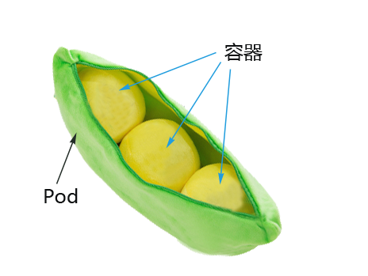
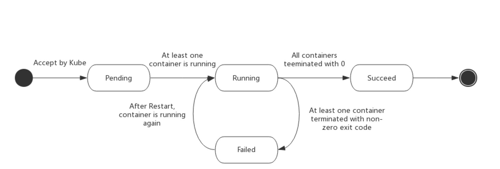
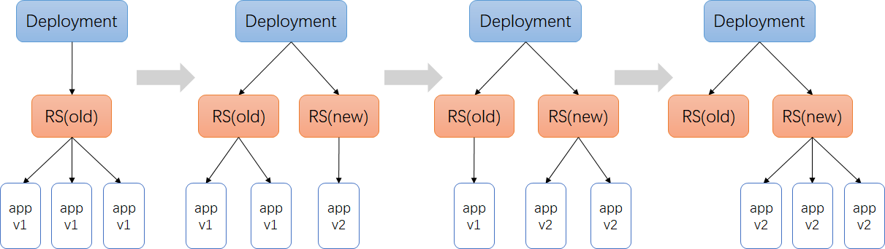
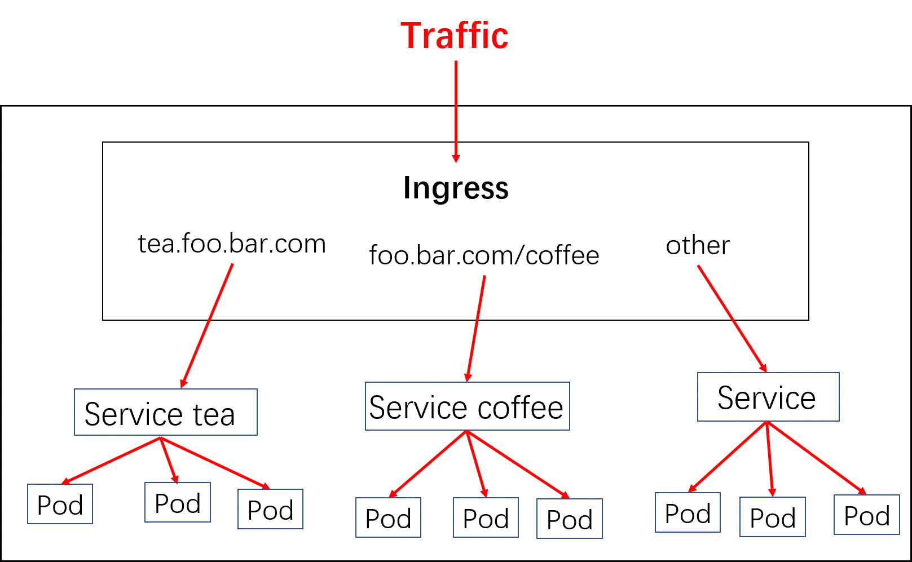

# 认识k8s

本章学习kubernetes的架构及工作流程，重点介绍如何使用Workload管理业务应用的生命周期，实现服务不中断的滚动更新，通过服务发现和集群内负载均衡来实现集群内部的服务间访问，并通过ingress实现外部使用域名访问集群内部的服务。

学习过程中会逐步对Django项目做k8s改造，从零开始编写所需的资源文件。通过本章的学习，学员会掌握高可用k8s集群的搭建，同时Django demo项目已经可以利用k8s的控制器、服务发现、负载均衡、配置管理等特性来实现生命周期的管理。

#### [纯容器模式的问题](http://49.7.203.222:3000/#/kubernetes-base/introduction?id=纯容器模式的问题)

1. 业务容器数量庞大，哪些容器部署在哪些节点，使用了哪些端口，如何记录、管理，需要登录到每台机器去管理？
2. 跨主机通信，多个机器中的容器之间相互调用如何做，iptables规则手动维护？
3. 跨主机容器间互相调用，配置如何写？写死固定IP+端口？
4. 如何实现业务高可用？多个容器对外提供服务如何实现负载均衡？
5. 容器的业务中断了，如何可以感知到，感知到以后，如何自动启动新的容器?
6. 如何实现滚动升级保证业务的连续性？
7. ......

#### [容器调度管理平台](http://49.7.203.222:3000/#/kubernetes-base/introduction?id=容器调度管理平台)

Docker Swarm Mesos Google Kubernetes

2017年开始Kubernetes凭借强大的容器集群管理功能, 逐步占据市场,目前在容器编排领域一枝独秀

https://kubernetes.io/

#### [架构图](http://49.7.203.222:3000/#/kubernetes-base/introduction?id=架构图)

如何设计一个容器管理平台？

- 集群架构，管理节点分发容器到数据节点
- 如何部署业务容器到各数据节点
- N个数据节点，业务容器如何选择部署在最合理的节点
- 容器如何实现多副本，如何满足每个机器部署一个容器的模型
- 多副本如何实现集群内负载均衡

分布式系统，两类角色：管理节点和工作节点


#### [核心组件](http://49.7.203.222:3000/#/kubernetes-base/introduction?id=核心组件)

- ETCD：分布式高性能键值数据库,存储整个集群的所有元数据
- ApiServer: API服务器,集群资源访问控制入口,提供restAPI及安全访问控制
- Scheduler：调度器,负责把业务容器调度到最合适的Node节点
- Controller Manager：控制器管理,确保集群资源按照期望的方式运行
  - Replication Controller
  - Node controller
  - ResourceQuota Controller
  - Namespace Controller
  - ServiceAccount Controller
  - Token Controller
  - Service Controller
  - Endpoints Controller
- kubelet：运行在每个节点上的主要的“节点代理”，脏活累活
  - pod 管理：kubelet 定期从所监听的数据源获取节点上 pod/container 的期望状态（运行什么容器、运行的副本数量、网络或者存储如何配置等等），并调用对应的容器平台接口达到这个状态。
  - 容器健康检查：kubelet 创建了容器之后还要查看容器是否正常运行，如果容器运行出错，就要根据 pod 设置的重启策略进行处理.
  - 容器监控：kubelet 会监控所在节点的资源使用情况，并定时向 master 报告，资源使用数据都是通过 cAdvisor 获取的。知道整个集群所有节点的资源情况，对于 pod 的调度和正常运行至关重要
- kube-proxy：维护节点中的iptables或者ipvs规则
- kubectl: 命令行接口，用于对 Kubernetes 集群运行命令 https://kubernetes.io/zh/docs/reference/kubectl/

静态Pod的方式：

```bash
## etcd、apiserver、controller-manager、kube-scheduler
$ kubectl -n kube-system get po
```

systemd服务方式：

```bash
$ systemctl status kubelet
```

kubectl：二进制命令行工具

### [理解集群资源](http://49.7.203.222:3000/#/kubernetes-base/introduction?id=理解集群资源)

组件是为了支撑k8s平台的运行，安装好的软件。

资源是如何去使用k8s的能力的定义。比如，k8s可以使用Pod来管理业务应用，那么Pod就是k8s集群中的一类资源，集群中的所有资源可以提供如下方式查看：

```bash
$ kubectl api-resources
```

如何理解namespace：

命名空间，集群内一个虚拟的概念，类似于资源池的概念，一个池子里可以有各种资源类型，绝大多数的资源都必须属于某一个namespace。集群初始化安装好之后，会默认有如下几个namespace：

```bash
$ kubectl get namespaces
NAME                   STATUS   AGE
default                Active   84m
kube-node-lease        Active   84m
kube-public            Active   84m
kube-system            Active   84m
kubernetes-dashboard   Active   71m
```

- 所有NAMESPACED的资源，在创建的时候都需要指定namespace，若不指定，默认会在default命名空间下
- 相同namespace下的同类资源不可以重名，不同类型的资源可以重名
- 不同namespace下的同类资源可以重名
- 通常在项目使用的时候，我们会创建带有业务含义的namespace来做逻辑上的整合

### [kubectl的使用](http://49.7.203.222:3000/#/kubernetes-base/introduction?id=kubectl的使用)

类似于docker，kubectl是命令行工具，用于与APIServer交互，内置了丰富的子命令，功能极其强大。 https://kubernetes.io/docs/reference/kubectl/overview/

```bash
$ kubectl -h
$ kubectl get -h
$ kubectl create -h
$ kubectl create namespace -h
```


# [工作流程](http://49.7.203.222:3000/#/kubernetes-base/workflow?id=工作流程)


1. 用户准备一个资源文件（记录了业务应用的名称、镜像地址等信息），通过调用APIServer执行创建Pod
2. APIServer收到用户的Pod创建请求，将Pod信息写入到etcd中
3. 调度器通过list-watch的方式，发现有新的pod数据，但是这个pod还没有绑定到某一个节点中
4. 调度器通过调度算法，计算出最适合该pod运行的节点，并调用APIServer，把信息更新到etcd中
5. kubelet同样通过list-watch方式，发现有新的pod调度到本机的节点了，因此调用容器运行时，去根据pod的描述信息，拉取镜像，启动容器，同时生成事件信息
6. 同时，把容器的信息、事件及状态也通过APIServer写入到etcd中

#### [架构设计的几点思考](http://49.7.203.222:3000/#/kubernetes-base/workflow?id=架构设计的几点思考)

1. 系统各个组件分工明确(APIServer是所有请求入口，CM是控制中枢，Scheduler主管调度，而Kubelet负责运行)，配合流畅，整个运行机制一气呵成。
2. 除了配置管理和持久化组件ETCD，其他组件并不保存数据。意味`除ETCD外`其他组件都是无状态的。因此从架构设计上对kubernetes系统高可用部署提供了支撑。
3. 同时因为组件无状态，组件的升级，重启，故障等并不影响集群最终状态，只要组件恢复后就可以从中断处继续运行。
4. 各个组件和kube-apiserver之间的数据推送都是通过list-watch机制来实现。


# Pod定义

##### [最小调度单元 Pod](http://49.7.203.222:3000/#/kubernetes-base/pod-base?id=最小调度单元-pod)

docker调度的是容器，在k8s集群中，最小的调度单元是Pod（豆荚）



###### [为什么引入Pod](http://49.7.203.222:3000/#/kubernetes-base/pod-base?id=为什么引入pod)

- 与容器引擎解耦

  Docker、Rkt。平台设计与引擎的具体的实现解耦

- 多容器共享网络|存储|进程 空间, 支持的业务场景更加灵活

###### [使用yaml格式定义Pod](http://49.7.203.222:3000/#/kubernetes-base/pod-base?id=使用yaml格式定义pod)

*myblog/one-pod/pod.yaml*

```yaml
apiVersion: v1
kind: Pod
metadata:
  name: myblog
  namespace: luffy
  labels:
    component: myblog
spec:
  containers:
  - name: myblog
    image: 172.21.51.143:5000/myblog:v1
    env:
    - name: MYSQL_HOST   #  指定root用户的用户名
      value: "127.0.0.1"
    - name: MYSQL_PASSWD
      value: "123456"
    ports:
    - containerPort: 8002
  - name: mysql
    image: mysql:5.7
    args:
    - --character-set-server=utf8mb4
    - --collation-server=utf8mb4_unicode_ci
    ports:
    - containerPort: 3306
    env:
    - name: MYSQL_ROOT_PASSWORD
      value: "123456"
    - name: MYSQL_DATABASE
      value: "myblog"
      
--------------------------------------------------json      
{
    "apiVersion": "v1",
    "kind": "Pod",
    "metadata": {
        "name": "myblog",
        "namespace": "luffy",
        "labels": {
            "component": "myblog"
        }
    },
    "spec": {
        "containers": [
            {
                "name": "myblog",
                "image": "172.21.51.143:5000/myblog:v1",
                "env": [
                    {
                        "name": "MYSQL_HOST",
                        "value": "127.0.0.1"
                    }
                ]
            },
            {
                ...
            }
        ]
    }
}
```

| apiVersion | 含义                                                         |
| ---------- | ------------------------------------------------------------ |
| alpha      | 进入K8s功能的早期候选版本，可能包含Bug，最终不一定进入K8s    |
| beta       | 已经过测试的版本，最终会进入K8s，但功能、对象定义可能会发生变更。 |
| stable     | 可安全使用的稳定版本                                         |
| v1         | stable 版本之后的首个版本，包含了更多的核心对象              |
| apps/v1    | 使用最广泛的版本，像Deployment、ReplicaSets都已进入该版本    |

资源类型与apiVersion对照表

| Kind                  | apiVersion                              |
| --------------------- | --------------------------------------- |
| ClusterRoleBinding    | rbac.authorization.k8s.io/v1            |
| ClusterRole           | rbac.authorization.k8s.io/v1            |
| ConfigMap             | v1                                      |
| CronJob               | batch/v1beta1                           |
| DaemonSet             | extensions/v1beta1                      |
| Node                  | v1                                      |
| Namespace             | v1                                      |
| Secret                | v1                                      |
| PersistentVolume      | v1                                      |
| PersistentVolumeClaim | v1                                      |
| Pod                   | v1                                      |
| Deployment            | v1、apps/v1、apps/v1beta1、apps/v1beta2 |
| Service               | v1                                      |
| Ingress               | extensions/v1beta1                      |
| ReplicaSet            | apps/v1、apps/v1beta2                   |
| Job                   | batch/v1                                |
| StatefulSet           | apps/v1、apps/v1beta1、apps/v1beta2     |

快速获得资源和版本

```bash
$ kubectl explain pod
$ kubectl explain Pod.apiVersion
```

###### [创建和访问Pod](http://49.7.203.222:3000/#/kubernetes-base/pod-base?id=创建和访问pod)


前提pod.yaml

```yaml
[root@k8s-master one-pod]# cat pod.yaml
apiVersion: v1
kind: Pod
metadata:
  name: myblog
  namespace: luffy
  labels:
    component: myblog
spec:
  containers:
  - name: myblog
    image: 10.211.55.27:5000/myblog:v2
    env:
    - name: MYSQL_HOST
      value: "127.0.0.1"
    - name: MYSQL_PASSWD
      value: "123456"
    ports:
    - containerPort: 80
  - name: mysql
    image: mysql:5.7
    args:
    - --character-set-server=utf8mb4
    - --collation-server=utf8mb4_unicode_ci
    ports:
    - containerPort: 3306
    env:
    - name: MYSQL_ROOT_PASSWORD
      value: "123456"
    - name: MYSQL_DATABASE
      value: "myblog"
```


```bash
## 创建namespace, namespace是逻辑上的资源池
$ kubectl create namespace luffy

## 使用指定文件创建Pod
$ kubectl create -f pod.yaml

## 查看pod，可以简写po
## 所有的操作都需要指定namespace，如果是在default命名空间下，则可以省略
$ kubectl -n luffy get pods -o wide
NAME     READY   STATUS    RESTARTS   AGE    IP             NODE
myblog   2/2     Running   0          3m     10.244.1.146   k8s-slave1

kubectl -n luffy describe pod <pod name>   # 查看pod详情信息
## 回顾流程

## 使用Pod Ip访问服务,3306和8002
$ curl 10.244.1.146:8002/blog/index/

## 进入容器,执行初始化, 不必到对应的主机执行docker exec
$ kubectl -n luffy exec -ti myblog -c myblog -- bash
/ # env
/ # python3 manage.py migrate
$ kubectl -n luffy exec -ti myblog -c mysql -- bash
/ # mysql -p123456

## 再次访问服务,3306和8002
$ curl 10.244.1.146:8002/blog/index/
```

###### [Infra容器](http://49.7.203.222:3000/#/kubernetes-base/pod-base?id=infra容器)

登录`k8s-slave1`节点

```bash
$ docker ps -a |grep myblog  ## 发现有三个容器
## 其中包含mysql和myblog程序以及Infra容器
## 为了实现Pod内部的容器可以通过localhost通信，每个Pod都会启动Infra容器，然后Pod内部的其他容器的网络空间会共享该Infra容器的网络空间(Docker网络的container模式)，Infra容器只需要hang住网络空间，不需要额外的功能，因此资源消耗极低。

## 登录master节点，查看pod内部的容器ip均相同，为pod ip
$ kubectl -n luffy exec -ti myblog -c myblog bash
/ # ifconfig
$ kubectl -n luffy exec -ti myblog -c mysql bash
/ # ifconfig
```

pod容器命名: `k8s_<container_name>_<pod_name>_<namespace>_<random_string>`

###### [查看pod详细信息](http://49.7.203.222:3000/#/kubernetes-base/pod-base?id=查看pod详细信息)

```bash
## 查看pod调度节点及pod_ip
$ kubectl -n luffy get pods -o wide
## 查看完整的yaml
$ kubectl -n luffy get po myblog -o yaml
## 查看pod的明细信息及事件
$ kubectl -n luffy describe pod myblog
# 查看命令空间事件
kubectl -n luffy get ev
```

###### [Troubleshooting and Debugging](http://49.7.203.222:3000/#/kubernetes-base/pod-base?id=troubleshooting-and-debugging)

```bash
#进入Pod内的容器
$ kubectl -n <namespace> exec <pod_name> -c <container_name> -ti /bin/sh

#查看Pod内容器日志,显示标准或者错误输出日志
$ kubectl -n <namespace> logs -f <pod_name> -c <container_name>
$ kubectl -n <namespace> logs -f --tial=100  <pod_name> -c <container_name>
```

###### [更新服务版本](http://49.7.203.222:3000/#/kubernetes-base/pod-base?id=更新服务版本)

```bash
$ kubectl apply -f demo-pod.yaml
```

###### [删除Pod服务](http://49.7.203.222:3000/#/kubernetes-base/pod-base?id=删除pod服务)

```bash
#根据文件删除
$ kubectl delete -f demo-pod.yaml

#根据pod_name删除
$ kubectl -n <namespace> delete pod <pod_name>
```


# Pod常用设置

###### [Pod数据持久化](http://49.7.203.222:3000/#/kubernetes-base/pod-setting?id=pod数据持久化)

若删除了Pod，由于mysql的数据都在容器内部，会造成数据丢失，因此需要数据进行持久化。

- 定点使用hostpath挂载，nodeSelector定点

  `myblog/one-pod/pod-with-volume.yaml`

  ```yaml
  apiVersion: v1
  kind: Pod
  metadata:
    name: myblog
    namespace: luffy
    labels:
      component: myblog
  spec:
    volumes: 
    - name: mysql-data
      hostPath: 
        path: /opt/mysql/data
    nodeSelector:   # 使用节点选择器将Pod调度到指定label的节点
      component: mysql
    containers:
    - name: myblog
      image: 172.21.51.143:5000/myblog:v1
      env:
      - name: MYSQL_HOST   #  指定root用户的用户名
        value: "127.0.0.1"
      - name: MYSQL_PASSWD
        value: "123456"
      ports:
      - containerPort: 8002
    - name: mysql
      image: mysql:5.7
      args:
      - --character-set-server=utf8mb4
      - --collation-server=utf8mb4_unicode_ci
      ports:
      - containerPort: 3306
      env:
      - name: MYSQL_ROOT_PASSWORD
        value: "123456"
      - name: MYSQL_DATABASE
        value: "myblog"
      volumeMounts:
      - name: mysql-data
        mountPath: /var/lib/mysql
  ```

  保存文件为`pod-with-volume.yaml`，执行创建

  ```bash
  ## 若存在旧的同名服务，先删除掉，后创建
  $ kubectl -n luffy delete pod myblog
  ## 创建
  $ kubectl create -f pod-with-volume.yaml
  
  ## 此时pod状态Pending
  $ kubectl -n luffy get po
  NAME     READY   STATUS    RESTARTS   AGE
  myblog   0/2     Pending   0          32s
  
  ## 查看原因，提示调度失败，因为节点不满足node selector
  $ kubectl -n luffy describe po myblog
  Events:
    Type     Reason            Age                From               Message
    ----     ------            ----               ----               -------
    Warning  FailedScheduling  12s (x2 over 12s)  default-scheduler  0/3 nodes are available: 3 node(s) didn't match node selector.
    
  ## 为节点打标签   在master上执行就可以
  $ kubectl label node k8s-slave1 component=mysql
  
  ## 再次查看，已经运行成功
  $ kubectl -n luffy get po
  NAME     READY   STATUS    RESTARTS   AGE     IP             NODE
  myblog   2/2     Running   0          3m54s   10.244.1.150   k8s-slave1
  
  ## 到k8s-slave1节点，查看/opt/mysql/data
  $ ll /opt/mysql/data/
  total 188484
  -rw-r----- 1 polkitd input       56 Mar 29 09:20 auto.cnf
  -rw------- 1 polkitd input     1676 Mar 29 09:20 ca-key.pem
  -rw-r--r-- 1 polkitd input     1112 Mar 29 09:20 ca.pem
  drwxr-x--- 2 polkitd input     8192 Mar 29 09:20 sys
  ...
  
  ## 执行migrate，创建数据库表，然后删掉pod，再次创建后验证数据是否存在
  $ kubectl -n luffy exec -ti myblog python3 manage.py migrate
  
  ## 访问服务，正常
  $ curl 10.244.1.150:8002/blog/index/ 
  
  ## 删除pod
  $ kubectl delete -f pod-with-volume.yaml
  $ kubectl -n luffy delete pod myblog   # 同步删除pod 需要等待
  $ kubectl -n luffy delete pod myblog --force --grace-period=0  #异步处理，
  ## 再次创建Pod
  $ kubectl create -f pod-with-volume.yaml
  
  ## 查看pod ip并访问服务
  $ kubectl -n luffy get po -o wide
  NAME     READY   STATUS    RESTARTS   AGE   IP             NODE  
  myblog   2/2     Running   0          7s    10.244.1.151   k8s-slave1
  
  ## 未重新做migrate，服务正常
  $ curl 10.244.1.151:8002/blog/index/
  ```

- 使用PV+PVC连接分布式存储解决方案

  - ceph
  - glusterfs
  - nfs

###### [服务健康检查](http://49.7.203.222:3000/#/kubernetes-base/pod-setting?id=服务健康检查)

检测容器服务是否健康的手段，若不健康，会根据设置的重启策略（restartPolicy）进行操作，两种检测机制可以分别单独设置，若不设置，默认认为Pod是健康的。

两种机制：

- LivenessProbe探针 存活性探测：用于判断容器是否存活，即Pod是否为running状态，如果LivenessProbe探针探测到容器不健康，则kubelet将kill掉容器，并根据容器的重启策略是否重启，如果一个容器不包含LivenessProbe探针，则Kubelet认为容器的LivenessProbe探针的返回值永远成功。

  ```yaml
  ...
    containers:
    - name: myblog
      image: 172.21.51.143:5000/myblog:v1
      livenessProbe:
        httpGet:
          path: /blog/index/
          port: 8002
          scheme: HTTP
        initialDelaySeconds: 10  # 容器启动后第一次执行探测是需要等待多少秒
        periodSeconds: 10     # 执行探测的频率
        timeoutSeconds: 2        # 探测超时时间
  ...
  ```

         // web浏览器打开可看到动图

  

- ReadinessProbe探针 可用性探测：用于判断容器是否正常提供服务，即容器的Ready是否为True，是否可以接收请求，如果ReadinessProbe探测失败，则容器的Ready将为False， Endpoint Controller 控制器将此Pod的Endpoint从对应的service的Endpoint列表中移除，不再将任何请求调度此Pod上，直到下次探测成功。（剔除此pod不参与接收请求不会将流量转发给此Pod）。

  ```yaml
  ...
    containers:
    - name: myblog
      image: 172.21.51.143:5000/myblog:v1
      readinessProbe: 
        httpGet: 
          path: /blog/index/
          port: 8002
          scheme: HTTP
        initialDelaySeconds: 10 
        timeoutSeconds: 2
        periodSeconds: 10
  ...
  ```

     // web浏览器打开可看到动图

三种类型：

- exec：通过执行命令来检查服务是否正常，返回值为0则表示容器健康

  ```bash
  ...
      livenessProbe:
        exec:
          command:
          - cat
          - /tmp/healthy
        initialDelaySeconds: 5
        periodSeconds: 5
  ...
  ```

- httpGet方式：通过发送http请求检查服务是否正常，返回200-399状态码则表明容器健康

- tcpSocket：通过容器的IP和Port执行TCP检查，如果能够建立TCP连接，则表明容器健康

  ```bash
    ...
        livenessProbe:
          tcpSocket:
            port: 8002
          initialDelaySeconds: 10  # 容器启动后第一次执行探测是需要等待多少秒
          periodSeconds: 10     # 执行探测的频率
          timeoutSeconds: 2        # 探测超时时间
    ...
  ```

示例：

完整文件路径 `myblog/one-pod/pod-with-healthcheck.yaml`

```yaml
  containers:
  - name: myblog
    image: 172.21.51.143:5000/myblog:v1
    env:
    - name: MYSQL_HOST   #  指定root用户的用户名
      value: "127.0.0.1"
    - name: MYSQL_PASSWD
      value: "123456"
    ports:
    - containerPort: 8002
    livenessProbe:
      httpGet:
        path: /blog/index/
        port: 8002
        scheme: HTTP
      initialDelaySeconds: 10  # 容器启动后第一次执行探测是需要等待多少秒
      periodSeconds: 10     # 执行探测的频率
      timeoutSeconds: 2        # 探测超时时间
    readinessProbe: 
      httpGet: 
        path: /blog/index/
        port: 8002
        scheme: HTTP
      initialDelaySeconds: 10 
      periodSeconds: 10
      timeoutSeconds: 2
```

- initialDelaySeconds：容器启动后第一次执行探测是需要等待多少秒。
- periodSeconds：执行探测的频率。默认是10秒，最小1秒。
- timeoutSeconds：探测超时时间。默认1秒，最小1秒。
- successThreshold：探测失败后，最少连续探测成功多少次才被认定为成功。默认是1。
- failureThreshold：探测成功后，最少连续探测失败多少次 才被认定为失败。默认是3，最小值是1。

K8S将在Pod开始**启动10s(initialDelaySeconds)后**利用HTTP访问8002端口的/blog/index/，如果**超过2s**或者返回码不在200~399内，则健康检查失败

###### [重启策略](http://49.7.203.222:3000/#/kubernetes-base/pod-setting?id=重启策略)

Pod的重启策略（RestartPolicy）应用于Pod内的所有容器，并且仅在Pod所处的Node上由kubelet进行判断和重启操作。当某个容器异常退出或者健康检查失败时，kubelet将根据RestartPolicy的设置来进行相应的操作。 Pod的重启策略包括Always、OnFailure和Never，默认值为Always。

- Always：当容器进程退出后，由kubelet自动重启该容器；
- OnFailure：当容器终止运行且退出码不为0时，由kubelet自动重启该容器；
- Never：不论容器运行状态如何，kubelet都不会重启该容器。

演示重启策略：

```yaml
apiVersion: v1
kind: Pod
metadata:
  name: test-restart-policy
spec:
  restartPolicy: Always
  containers:
  - name: busybox
    image: busybox
    args:
    - /bin/sh
    - -c
    - sleep 10
```

1. 使用默认的重启策略，即 restartPolicy: Always ，无论容器是否是正常退出，都会自动重启容器
2. 使用OnFailure的策略时
   - 如果把exit 1，去掉，即让容器的进程正常退出的话，则不会重启
   - 只有非正常退出状态才会重启
3. 使用Never时，退出了就不再重启

可以看出，若容器正常退出，Pod的状态会是Completed，非正常退出，状态为CrashLoopBackOff

###### [镜像拉取策略](http://49.7.203.222:3000/#/kubernetes-base/pod-setting?id=镜像拉取策略)

```yaml
spec:
  containers:
  - name: myblog
    image: 172.21.51.143:5000/myblog:v1
    imagePullPolicy: IfNotPresent
```

设置镜像的拉取策略，默认为IfNotPresent

- Always，总是拉取镜像，即使本地有镜像也从仓库拉取
- IfNotPresent ，本地有则使用本地镜像，本地没有则去仓库拉取
- Never，只使用本地镜像，本地没有则报错

###### [Pod资源限制](http://49.7.203.222:3000/#/kubernetes-base/pod-setting?id=pod资源限制)

为了保证充分利用集群资源，且确保重要容器在运行周期内能够分配到足够的资源稳定运行，因此平台需要具备

Pod的资源限制的能力。 对于一个pod来说，资源最基础的2个的指标就是：CPU和内存。

Kubernetes提供了个采用requests和limits 两种类型参数对资源进行预分配和使用限制。

完整文件路径：`myblog/one-pod/pod-with-resourcelimits.yaml`

```yaml
...
  containers:
  - name: myblog
    image: 172.21.51.143:5000/myblog:v1
    env:
    - name: MYSQL_HOST   #  指定root用户的用户名
      value: "127.0.0.1"
    - name: MYSQL_PASSWD
      value: "123456"
    ports:
    - containerPort: 8002
    resources:
      requests:
        memory: 100Mi
        cpu: 50m
      limits:
        memory: 500Mi
        cpu: 100m
...
```

requests：

- 容器使用的最小资源需求,作用于schedule阶段，作为容器调度时资源分配的判断依赖
- 只有当前节点上可分配的资源量 >= request 时才允许将容器调度到该节点
- request参数不限制容器的最大可使用资源
- requests.cpu被转成docker的--cpu-shares参数，与cgroup cpu.shares功能相同 (无论宿主机有多少个cpu或者内核，--cpu-shares选项都会按照比例分配cpu资源）
- requests.memory没有对应的docker参数，仅作为k8s调度依据

limits：

- 容器能使用资源的最大值

- 设置为0表示对使用的资源不做限制, 可无限的使用

- 当pod 内存超过limit时，会被oom

- 当cpu超过limit时，不会被kill，但是会限制不超过limit值

- limits.cpu会被转换成docker的–cpu-quota参数。与cgroup cpu.cfs_quota_us功能相同

- limits.memory会被转换成docker的–memory参数。用来限制容器使用的最大内存

  对于 CPU，我们知道计算机里 CPU 的资源是按`“时间片”`的方式来进行分配的，系统里的每一个操作都需要 CPU 的处理，所以，哪个任务要是申请的 CPU 时间片越多，那么它得到的 CPU 资源就越多。

然后还需要了解下 CGroup 里面对于 CPU 资源的单位换算：

```shell
1 CPU =  1000 millicpu（1 Core = 1000m）
```

这里的 `m` 就是毫、毫核的意思，Kubernetes 集群中的每一个节点可以通过操作系统的命令来确认本节点的 CPU 内核数量，然后将这个数量乘以1000，得到的就是节点总 CPU 总毫数。比如一个节点有四核，那么该节点的 CPU 总毫量为 4000m。

`docker run`命令和 CPU 限制相关的所有选项如下：

| 选项                  | 描述                                                    |
| --------------------- | ------------------------------------------------------- |
| `--cpuset-cpus=""`    | 允许使用的 CPU 集，值可以为 0-3,0,1                     |
| `-c`,`--cpu-shares=0` | CPU 共享权值（相对权重）                                |
| `cpu-period=0`        | 限制 CPU CFS 的周期，范围从 100ms~1s，即[1000, 1000000] |
| `--cpu-quota=0`       | 限制 CPU CFS 配额，必须不小于1ms，即 >= 1000，绝对限制  |

```shell
docker run -it --cpu-period=50000 --cpu-quota=25000 ubuntu:16.04 /bin/bash
```

将 CFS 调度的周期设为 50000，将容器在每个周期内的 CPU 配额设置为 25000，表示该容器每 50ms 可以得到 50% 的 CPU 运行时间。

> 注意：若内存使用超出限制，会引发系统的OOM机制，因CPU是可压缩资源，不会引发Pod退出或重建


# myblog 改造及优化

## [yaml优化](http://49.7.203.222:3000/#/kubernetes-base/demo-optimization?id=yaml优化)

目前完善后的yaml，`myblog/one-pod/pod-completed.yaml`

```yaml
apiVersion: v1
kind: Pod
metadata:
  name: myblog
  namespace: luffy
  labels:
    component: myblog
spec:
  volumes: 
  - name: mysql-data
    hostPath: 
      path: /opt/mysql/data
  nodeSelector:   # 使用节点选择器将Pod调度到指定label的节点
    component: mysql
  containers:
  - name: myblog
    image: 172.21.51.143:5000/myblog:v1
    env:
    - name: MYSQL_HOST   #  指定root用户的用户名
      value: "127.0.0.1"
    - name: MYSQL_PASSWD
      value: "123456"
    ports:
    - containerPort: 8002
    resources:
      requests:
        memory: 100Mi
        cpu: 50m
      limits:
        memory: 500Mi
        cpu: 100m
    livenessProbe:
      httpGet:
        path: /blog/index/
        port: 8002
        scheme: HTTP
      initialDelaySeconds: 10  # 容器启动后第一次执行探测是需要等待多少秒
      periodSeconds: 15     # 执行探测的频率
      timeoutSeconds: 2        # 探测超时时间
    readinessProbe: 
      httpGet: 
        path: /blog/index/
        port: 8002
        scheme: HTTP
      initialDelaySeconds: 10 
      timeoutSeconds: 2
      periodSeconds: 15
  - name: mysql
    image: mysql:5.7
    args:
    - --character-set-server=utf8mb4
    - --collation-server=utf8mb4_unicode_ci
    ports:
    - containerPort: 3306
    env:
    - name: MYSQL_ROOT_PASSWORD
      value: "123456"
    - name: MYSQL_DATABASE
      value: "myblog"
    resources:
      requests:
        memory: 100Mi
        cpu: 50m
      limits:
        memory: 500Mi
        cpu: 100m
    readinessProbe:
      tcpSocket:
        port: 3306
      initialDelaySeconds: 5
      periodSeconds: 10
    livenessProbe:
      tcpSocket:
        port: 3306
      initialDelaySeconds: 15
      periodSeconds: 20
    volumeMounts:
    - name: mysql-data
      mountPath: /var/lib/mysql
```

为什么要优化

- 考虑真实的使用场景，像数据库这类中间件，是作为公共资源，为多个项目提供服务，不适合和业务容器绑定在同一个Pod中，因为业务容器是经常变更的，而数据库不需要频繁迭代
- yaml的环境变量中存在敏感信息（账号、密码），存在安全隐患

## 解决问题一，需要拆分yaml

```yaml
myblog/two-pod/mysql.yaml
apiVersion: v1
kind: Pod
metadata:
  name: mysql
  namespace: luffy
  labels:
    component: mysql
spec:
  hostNetwork: true    # 声明pod的网络模式为host模式，效果同docker run --net=host
  volumes: 
  - name: mysql-data
    hostPath: 
      path: /opt/mysql/data
  nodeSelector:   # 使用节点选择器将Pod调度到指定label的节点
    component: mysql
  containers:
  - name: mysql
    image: mysql:5.7
    args:
    - --character-set-server=utf8mb4
    - --collation-server=utf8mb4_unicode_ci
    ports:
    - containerPort: 3306
    env:
    - name: MYSQL_ROOT_PASSWORD
      value: "123456"
    - name: MYSQL_DATABASE
      value: "myblog"
    resources:
      requests:
        memory: 100Mi
        cpu: 50m
      limits:
        memory: 500Mi
        cpu: 100m
    readinessProbe:
      tcpSocket:
        port: 3306
      initialDelaySeconds: 5
      periodSeconds: 10
    livenessProbe:
      tcpSocket:
        port: 3306
      initialDelaySeconds: 15
      periodSeconds: 20
    volumeMounts:
    - name: mysql-data
      mountPath: /var/lib/mysql
```

myblog.yaml

```yaml
apiVersion: v1
kind: Pod
metadata:
  name: myblog
  namespace: luffy
  labels:
    component: myblog
spec:
  containers:
  - name: myblog
    image: 172.21.51.143:5000/myblog:v1
    imagePullPolicy: IfNotPresent
    env:
    - name: MYSQL_HOST   #  指定root用户的用户名
      value: "172.21.51.55"  # 修改成数据库地址
    - name: MYSQL_PASSWD
      value: "123456"
    ports:
    - containerPort: 8002
    resources:
      requests:
        memory: 100Mi
        cpu: 50m
      limits:
        memory: 500Mi
        cpu: 100m
    livenessProbe:
      httpGet:
        path: /blog/index/
        port: 8002
        scheme: HTTP
      initialDelaySeconds: 10  # 容器启动后第一次执行探测是需要等待多少秒
      periodSeconds: 15     # 执行探测的频率
      timeoutSeconds: 2        # 探测超时时间
    readinessProbe: 
      httpGet: 
        path: /blog/index/
        port: 8002
        scheme: HTTP
      initialDelaySeconds: 10 
      timeoutSeconds: 2
      periodSeconds: 15
```

创建测试

```bash
## 先删除旧pod
$ kubectl -n luffy delete po myblog

## 分别创建mysql和myblog
$ kubectl create -f mysql.yaml
$ kubectl create -f myblog.yaml

## 查看pod，注意mysqlIP为宿主机IP，因为网络模式为host
$ kubectl -n luffy get po -o wide 
NAME     READY   STATUS    RESTARTS   AGE   IP                NODE
myblog   1/1     Running   0          41s   10.244.1.152      k8s-slave1
mysql    1/1     Running   0          52s   172.21.51.67   k8s-slave1

## 访问myblog服务正常
$ curl 10.244.1.152:8002/blog/index/
```

## 解决问题二，环境变量中敏感信息带来的安全隐患

为什么要统一管理环境变量

- 环境变量中有很多敏感的信息，比如账号密码，直接暴漏在yaml文件中存在安全性问题
- 团队内部一般存在多个项目，这些项目直接存在配置相同环境变量的情况，因此可以统一维护管理
- 对于开发、测试、生产环境，由于配置均不同，每套环境部署的时候都要修改yaml，带来额外的开销

k8s提供两类资源，configMap和Secret，可以用来实现业务配置的统一管理， 允许将配置文件与镜像文件分离，以使容器化的应用程序具有可移植性 。


- configMap，通常用来管理应用的配置文件或者环境变量，`myblog/two-pod/configmap.yaml`

  ```yaml
  apiVersion: v1
  kind: ConfigMap
  metadata:
    name: myblog
    namespace: luffy
  data:
    MYSQL_HOST: "172.21.51.55"
    MYSQL_PORT: "3306"
  ```

  创建并查看configMap：

  ```bash
  $ kubectl create -f configmap.yaml
  $ kubectl -n luffy get cm myblog -oyaml
  ```

  或者可以使用命令的方式，从文件中创建，比如：

  configmap.txt

  ```bash
  $ cat configmap.txt
  MYSQL_HOST=172.21.51.55
  MYSQL_PORT=3306
  $ kubectl create configmap myblog --from-env-file=configmap.txt
  ```

- Secret，管理敏感类的信息，默认会base64编码存储，有三种类型

  - Service Account ：用来访问Kubernetes API，由Kubernetes自动创建，并且会自动挂载到Pod的/run/secrets/kubernetes.io/serviceaccount目录中；创建ServiceAccount后，Pod中指定serviceAccount后，自动创建该ServiceAccount对应的secret；
  - Opaque ： base64编码格式的Secret，用来存储密码、密钥等；
  - kubernetes.io/dockerconfigjson ：用来存储私有docker registry的认证信息。

  `myblog/two-pod/secret.yaml`

  ```yaml
  apiVersion: v1
  kind: Secret
  metadata:
    name: myblog
    namespace: luffy
  type: Opaque
  data:
    MYSQL_USER: cm9vdA==       #注意加-n参数， echo -n root|base64
    MYSQL_PASSWD: MTIzNDU2
    
  ```
  
  创建并查看：
  
  ```bash
  $ kubectl create -f secret.yaml
  $ kubectl -n luffy get secret
  
  kubectl -n luffy get secret myblog -o yaml
  ```
  
  如果不习惯这种方式，可以通过如下方式：
  
  ```bash
  $ cat secret.txt
  MYSQL_USER=root
  MYSQL_PASSWD=123456
  $ kubectl -n luffy create secret generic myblog --from-env-file=secret.txt 
  ```

修改后的mysql的yaml，资源路径：`myblog/two-pod/mysql-with-config.yaml`

```yaml
...
spec:
  containers:
  - name: mysql
    args:
    - --character-set-server=utf8mb4
    - --collation-server=utf8mb4_unicode_ci
    env:
    - name: MYSQL_USER
      valueFrom:
        secretKeyRef:
          name: myblog
          key: MYSQL_USER
    - name: MYSQL_ROOT_PASSWORD
      valueFrom:
        secretKeyRef:
          name: myblog
          key: MYSQL_PASSWD
    - name: MYSQL_DATABASE
      value: "myblog"
...

--------------------------------------------完整版
apiVersion: v1
kind: Pod
metadata:
  name: mysql
  namespace: luffy
  labels:
    component: mysql
spec:
  hostNetwork: true    # 声明pod的网络模式为host模式，效果同docker run --net=host
  volumes: 
  - name: mysql-data
    hostPath: 
      path: /opt/mysql/data
  nodeSelector:   # 使用节点选择器将Pod调度到指定label的节点
    component: mysql
  containers:
  - name: mysql
    image: mysql:5.7
    args:
    - --character-set-server=utf8mb4
    - --collation-server=utf8mb4_unicode_ci
    ports:
    - containerPort: 3306
    env:
    - name: MYSQL_USER
      valueFrom:
        secretKeyRef:
          name: myblog
          key: MYSQL_USER
    - name: MYSQL_ROOT_PASSWORD
      valueFrom:
        secretKeyRef:
          name: myblog
          key: MYSQL_PASSWD
    - name: MYSQL_DATABASE
      value: "myblog"
    resources:
      requests:
        memory: 100Mi
        cpu: 50m
      limits:
        memory: 500Mi
        cpu: 100m
    readinessProbe:
      tcpSocket:
        port: 3306
      initialDelaySeconds: 5
      periodSeconds: 10
    livenessProbe:
      tcpSocket:
        port: 3306
      initialDelaySeconds: 15
      periodSeconds: 20
    volumeMounts:
    - name: mysql-data
      mountPath: /var/lib/mysql
```

整体修改后的myblog的yaml，资源路径：`myblog/two-pod/myblog-with-config.yaml`

```yaml
apiVersion: v1
kind: Pod
metadata:
  name: myblog
  namespace: luffy
  labels:
    component: myblog
spec:
  containers:
  - name: myblog
    image: 172.21.51.143:5000/myblog:v1
    imagePullPolicy: IfNotPresent
    env:
    - name: MYSQL_HOST
      valueFrom:
        configMapKeyRef:
          name: myblog
          key: MYSQL_HOST
    - name: MYSQL_PORT
      valueFrom:
        configMapKeyRef:
          name: myblog
          key: MYSQL_PORT
    - name: MYSQL_USER
      valueFrom:
        secretKeyRef:
          name: myblog
          key: MYSQL_USER
    - name: MYSQL_PASSWD
      valueFrom:
        secretKeyRef:
          name: myblog
          key: MYSQL_PASSWD
    ports:
    - containerPort: 8002
    resources:
      requests:
        memory: 100Mi
        cpu: 50m
      limits:
        memory: 500Mi
        cpu: 100m
    livenessProbe:
      httpGet:
        path: /blog/index/
        port: 8002
        scheme: HTTP
      initialDelaySeconds: 10  # 容器启动后第一次执行探测是需要等待多少秒
      periodSeconds: 15     # 执行探测的频率
      timeoutSeconds: 2        # 探测超时时间
    readinessProbe: 
      httpGet: 
        path: /blog/index/
        port: 8002
        scheme: HTTP
      initialDelaySeconds: 10 
      timeoutSeconds: 2
      periodSeconds: 15
```

在部署不同的环境时，pod的yaml无须再变化，只需要在每套环境中维护一套ConfigMap和Secret即可。但是注意configmap和secret不能跨namespace使用，且更新后，pod内的env不会自动更新，重建后方可更新。

```bash
kubectl -n luffy delete pod myblog mysql
kubectl create -f mysql-with-config.yaml
kubectl create -f myblog-with-config.yaml
```


# Pod 生命周期

###### [如何编写资源yaml](http://49.7.203.222:3000/#/kubernetes-base/pod-lifecycle?id=如何编写资源yaml)

1. 拿来主义，从机器中已有的资源中拿

   ```bash
   $ kubectl -n kube-system get po,deployment,ds
   ```

2. 学会在官网查找， https://kubernetes.io/docs/home/

3. 从kubernetes-api文档中查找， https://kubernetes.io/docs/reference/generated/kubernetes-api/v1.16/#pod-v1-core

4. kubectl explain 查看具体字段含义

###### [pod状态与生命周期](http://49.7.203.222:3000/#/kubernetes-base/pod-lifecycle?id=pod状态与生命周期)

Pod的状态如下表所示：

| 状态值               | 描述                                                         |
| -------------------- | ------------------------------------------------------------ |
| Pending              | API Server已经创建该Pod，等待调度器调度                      |
| ContainerCreating    | 拉取镜像启动容器中                                           |
| Running              | Pod内容器均已创建，且至少有一个容器处于运行状态、正在启动状态或正在重启状态 |
| Succeeded\|Completed | Pod内所有容器均已成功执行退出，且不再重启                    |
| Failed\|Error        | Pod内所有容器均已退出，但至少有一个容器退出为失败状态        |
| CrashLoopBackOff     | Pod内有容器启动失败，比如配置文件丢失导致主进程启动失败      |
| Unknown              | 由于某种原因无法获取该Pod的状态，可能由于网络通信不畅导致    |

生命周期示意图：



启动和关闭示意：


初始化容器：

- 验证业务应用依赖的组件是否均已启动
- 修改目录的权限
- 调整系统参数

```yaml
...
      initContainers:
      - command:
        - /sbin/sysctl
        - -w
        - vm.max_map_count=262144
        image: alpine:3.6
        imagePullPolicy: IfNotPresent
        name: elasticsearch-logging-init
        resources: {}
        securityContext:
          privileged: true
      - name: fix-permissions
        image: alpine:3.6
        command: ["sh", "-c", "chown -R 1000:1000 /usr/share/elasticsearch/data"]
        securityContext:
          privileged: true
        volumeMounts:
        - name: elasticsearch-logging
          mountPath: /usr/share/elasticsearch/data
...
```

验证Pod生命周期：

```yaml
apiVersion: v1
kind: Pod
metadata:
  name: pod-lifecycle
  namespace: luffy
  labels:
    component: pod-lifecycless
spec:
  initContainers:
  - name: init
    image: busybox
    command: ['sh', '-c', 'echo $(date +%s): INIT >> /loap/timing']
    volumeMounts:
    - mountPath: /loap
      name: timing
  containers:
  - name: main
    image: busybox
    command: ['sh', '-c', 'echo $(date +%s): START >> /loap/timing;
sleep 10; echo $(date +%s): END >> /loap/timing;']
    volumeMounts:
    - mountPath: /loap 
      name: timing
    livenessProbe:
      exec:
        command: ['sh', '-c', 'echo $(date +%s): LIVENESS >> /loap/timing']
    readinessProbe:
      exec:
        command: ['sh', '-c', 'echo $(date +%s): READINESS >> /loap/timing']
    lifecycle:
      postStart:
        exec:
          command: ['sh', '-c', 'echo $(date +%s): POST-START >> /loap/timing']
      preStop:
        exec:
          command: ['sh', '-c', 'echo $(date +%s): PRE-STOP >> /loap/timing']
  volumes:
  - name: timing
    hostPath:
      path: /tmp/loap
```

创建pod测试：

```bash
$ kubectl create -f pod-lifecycle.yaml

## 查看demo状态
$ kubectl -n luffy get po -o wide -w

## 去部署的节点的宿主机上 查看调度节点的/tmp/loap/timing
$ cat /tmp/loap/timing
1585424708: INIT
1585424746: START
1585424746: POST-START
1585424754: READINESS
1585424756: LIVENESS
1585424756: END
```

> 须主动杀掉 Pod 才会触发 `pre-stop hook`，如果是 Pod 自己 Down 掉，则不会执行 `pre-stop hook` ,且杀掉Pod进程前，进程必须是正常运行状态，否则不会执行pre-stop钩子


# pod操作小结

###### [小结](http://49.7.203.222:3000/#/kubernetes-base/pod-summary?id=小结)

1. 实现k8s平台与特定的容器运行时解耦，提供更加灵活的业务部署方式，引入了Pod概念
2. k8s使用yaml格式定义资源文件，yaml中Map与List的语法，与json做类比
3. 通过kubectl apply| get | exec | logs | delete 等操作k8s资源，必须指定namespace
4. 每启动一个Pod，为了实现网络空间共享，会先创建Infra容器，并把其他容器网络加入该容器
5. 通过livenessProbe和readinessProbe实现Pod的存活性和就绪健康检查
6. 通过requests和limit分别限定容器初始资源申请与最高上限资源申请
7. Pod通过initContainer和lifecycle分别来执行初始化、pod启动和删除时候的操作，使得功能更加全面和灵活
8. 编写yaml讲究方法，学习k8s，养成从官方网站查询知识的习惯

做了哪些工作：

1. 定义Pod.yaml，将myblog和mysql打包在同一个Pod中，使用myblog使用localhost访问mysql
2. mysql数据持久化，为myblog业务应用添加了健康检查和资源限制
3. 将myblog与mysql拆分，使用独立的Pod管理
4. yaml文件中的环境变量存在账号密码明文等敏感信息，使用configMap和Secret来统一配置，优化部署

只使用Pod, 面临的问题:

1. 业务应用启动多个副本
2. Pod重建后IP会变化，外部如何访问Pod服务
3. 运行业务Pod的某个节点挂了，可以自动帮我把Pod转移到集群中的可用节点启动起来
4. 我的业务应用功能是收集节点监控数据,需要把Pod运行在k8集群的各个节点上


# 工作负载

##### [Pod控制器](http://49.7.203.222:3000/#/kubernetes-base/workload?id=pod控制器)

###### [Workload (工作负载)](http://49.7.203.222:3000/#/kubernetes-base/workload?id=workload-工作负载)

控制器又称工作负载是用于实现管理pod的中间层，确保pod资源符合预期的状态，pod的资源出现故障时，会尝试 进行重启，当根据重启策略无效，则会重新新建pod的资源。


- ReplicaSet: 用户创建指定数量的pod副本数量，确保pod副本数量符合预期状态，并且支持滚动式自动扩容和缩容功能
- Deployment：工作在ReplicaSet之上，用于管理无状态应用，目前来说最好的控制器。支持滚动更新和回滚功能，提供声明式配置
- DaemonSet：用于确保集群中的每一个节点只运行特定的pod副本，通常用于实现系统级后台任务。比如EFK服务
- Job：只要完成就立即退出，不需要重启或重建
- Cronjob：周期性任务控制，不需要持续后台运行
- StatefulSet：管理有状态应用


# Deployment改造

###### [Deployment](http://49.7.203.222:3000/#/kubernetes-base/practice-deployment?id=deployment)

```yaml
myblog/deployment/deploy-mysql.yaml
[root@k8s-slave1 ~]# mkdir -p myblog/deployment/
[root@k8s-slave1 ~]# cd myblog/deployment/
[root@k8s-slave1 deployment]# vim mysql.dpl.yaml
--------------------------------------------------------------------
apiVersion: apps/v1
kind: Deployment
metadata:
  name: mysql
  namespace: luffy
spec:
  replicas: 1    #指定Pod副本数
  selector:        #指定Pod的选择器
    matchLabels:
      app: mysql
  template:
    metadata:
      labels:    #给Pod打label
        app: mysql
    spec:
      hostNetwork: true
      volumes: 
      - name: mysql-data
        hostPath: 
          path: /opt/mysql/data
      nodeSelector:   # 使用节点选择器将Pod调度到指定label的节点
        component: mysql
      containers:
      - name: mysql
        image: mysql:5.7
        args:
        - --character-set-server=utf8mb4
        - --collation-server=utf8mb4_unicode_ci
        ports:
        - containerPort: 3306
        env:
        - name: MYSQL_ROOT_PASSWORD
          valueFrom:
            secretKeyRef:
              name: myblog
              key: MYSQL_PASSWD
        - name: MYSQL_DATABASE
          value: "myblog"
        resources:
          requests:
            memory: 100Mi
            cpu: 50m
          limits:
            memory: 500Mi
            cpu: 100m
        readinessProbe:
          tcpSocket:
            port: 3306
          initialDelaySeconds: 5
          periodSeconds: 10
        livenessProbe:
          tcpSocket:
            port: 3306
          initialDelaySeconds: 15
          periodSeconds: 20
        volumeMounts:
        - name: mysql-data
          mountPath: /var/lib/mysql
```

myblog.dpl.yaml:

```yaml
apiVersion: apps/v1
kind: Deployment
metadata:
  name: myblog
  namespace: luffy
spec:
  replicas: 1    #指定Pod副本数
  selector:        #指定Pod的选择器
    matchLabels:
      app: myblog
  template:
    metadata:
      labels:    #给Pod打label
        app: myblog
    spec:
      containers:
      - name: myblog
        image: 172.21.51.143:5000/myblog:v1  #修改实际的仓库地址
        imagePullPolicy: IfNotPresent
        env:
        - name: MYSQL_HOST
          valueFrom:
            configMapKeyRef:
              name: myblog
              key: MYSQL_HOST
        - name: MYSQL_PORT
          valueFrom:
            configMapKeyRef:
              name: myblog
              key: MYSQL_PORT
        - name: MYSQL_USER
          valueFrom:
            secretKeyRef:
              name: myblog
              key: MYSQL_USER
        - name: MYSQL_PASSWD
          valueFrom:
            secretKeyRef:
              name: myblog
              key: MYSQL_PASSWD
        ports:
        - containerPort: 8002
        resources:
          requests:
            memory: 100Mi
            cpu: 50m
          limits:
            memory: 500Mi
            cpu: 100m
        livenessProbe:
          httpGet:
            path: /blog/index/
            port: 8002
            scheme: HTTP
          initialDelaySeconds: 10  # 容器启动后第一次执行探测是需要等待多少秒
          periodSeconds: 15     # 执行探测的频率
          timeoutSeconds: 2        # 探测超时时间
        readinessProbe: 
          httpGet: 
            path: /blog/index/
            port: 8002
            scheme: HTTP
          initialDelaySeconds: 10 
          timeoutSeconds: 2
          periodSeconds: 15
```

###### [创建Deployment](http://49.7.203.222:3000/#/kubernetes-base/practice-deployment?id=创建deployment)

```bash
kubectl -n luffy delete pod mysql myblog
kubectl create -f deploy-myblog.yaml  
kubectl create -f deploy-mysql.yaml
```

###### [查看Deployment](http://49.7.203.222:3000/#/kubernetes-base/practice-deployment?id=查看deployment)

```bash
# kubectl api-resources
$ kubectl -n luffy get deploy
NAME     READY   UP-TO-DATE   AVAILABLE   AGE
myblog   1/1     1            1           2m22s
mysql    1/1     1            1           2d11h

  * `NAME` 列出了集群中 Deployments 的名称。
  * `READY`显示当前正在运行的副本数/期望的副本数。
  * `UP-TO-DATE`显示已更新以实现期望状态的副本数。
  * `AVAILABLE`显示应用程序可供用户使用的副本数。
  * `AGE` 显示应用程序运行的时间量。

# 删除deploy 查看deploy
# kubectl -n luffy delete deploy myblog
# kubectl -n luffy get deploy

# 查看pod
$ kubectl -n luffy get po
NAME                      READY   STATUS    RESTARTS   AGE
myblog-7c96c9f76b-qbbg7   1/1     Running   0          109s
mysql-85f4f65f99-w6jkj    1/1     Running   0          2m28s

# 查看pod的标签
kubectl -n luffy get pod  --show-labels
# 删除pod 后面可以跟多个pod
kubectl -n luffy delete pod myblog-5cbd66856c-f9hk6 mysql-864b4c85b5-tcpwg
# 查看pod 日志  -c指定容器
kubectl -n luffy logs mysql-56b9db9c6-jxm9b -c mysql
# 删除deploy
kubectl -n luffy delete deploy mysql
# 查看replicaSet
$ kubectl -n luffy get rs

# 报错信息
[root@k8s-master ~]# kubectl -n luffy logs mysql-56b9db9c6-vvkxx
2022-10-12 08:39:53+00:00 [Note] [Entrypoint]: Entrypoint script for MySQL Server 5.7.36-1debian10 started.
2022-10-12 08:39:54+00:00 [Note] [Entrypoint]: Switching to dedicated user 'mysql'
2022-10-12 08:39:54+00:00 [Note] [Entrypoint]: Entrypoint script for MySQL Server 5.7.36-1debian10 started.
2022-10-12 08:39:55+00:00 [ERROR] [Entrypoint]: MYSQL_USER="root", MYSQL_USER and MYSQL_PASSWORD are for configuring a regular user and cannot be used for the root user
    Remove MYSQL_USER="root" and use one of the following to control the root user password:
    - MYSQL_ROOT_PASSWORD
    - MYSQL_ALLOW_EMPTY_PASSWORD
    - MYSQL_RANDOM_ROOT_PASSWORD
 # 解决  vim deploy-mysql.yaml
         env:  # 下面内容删除
        - name: MYSQL_USER
          valueFrom:
            secretKeyRef:
              name: myblog
              key: MYSQL_USER
```

###### [副本保障机制](http://49.7.203.222:3000/#/kubernetes-base/practice-deployment?id=副本保障机制)

controller实时检测pod状态，并保障副本数一直处于期望的值。

```bash
## 删除pod，观察pod状态变化
$ kubectl -n luffy delete pod myblog-7c96c9f76b-qbbg7
# kubectl -n luffy delete pod  myblog-7c96c9f76b-qbbg7 --force --grace-period=0

# 观察pod
$ kubectl -n luffy  get pods -o wide -w

## 设置两个副本, 或者通过kubectl -n luffy edit deploy myblog的方式，最好通过修改文件，然后apply的方式，这样yaml文件可以保持同步
$ kubectl -n luffy scale deploy myblog --replicas=2
deployment.extensions/myblog scaled

# 观察pod
$ kubectl -n luffy get pods -o wide -w
NAME                      READY   STATUS    RESTARTS   AGE
myblog-7c96c9f76b-qbbg7   1/1     Running   0          11m
myblog-7c96c9f76b-s6brm   1/1     Running   0          55s
mysql-85f4f65f99-w6jkj    1/1     Running   0          11m
```

###### [Pod驱逐策略](http://49.7.203.222:3000/#/kubernetes-base/practice-deployment?id=pod驱逐策略)

K8S 有个特色功能叫 pod eviction，它在某些场景下如节点 NotReady，或者资源不足时，把 pod 驱逐至其它节点，这也是出于业务保护的角度去考虑的。

1. Kube-controller-manager: 周期性检查所有节点状态，当节点处于 NotReady 状态超过一段时间后，驱逐该节点上所有 pod。

   - `pod-eviction-timeout`：NotReady 状态节点超过该时间后，执行驱逐，默认 5 min，适用于k8s 1.13版本之前

   - 1.13版本后，集群开启` TaintBasedEvictions 与TaintNodesByCondition` 功能，即[taint-based-evictions](https://kubernetes.io/docs/concepts/scheduling-eviction/taint-and-toleration/)，即节点若失联或者出现各种异常情况，k8s会自动为node打上污点，同时为pod默认添加如下容忍设置：

     ```yaml
       tolerations:
       - effect: NoExecute
         key: node.kubernetes.io/not-ready
         operator: Exists
         tolerationSeconds: 300
       - effect: NoExecute
         key: node.kubernetes.io/unreachable
         operator: Exists
         tolerationSeconds: 300
     ```

     即各pod可以独立设置驱逐容忍时间。

2. Kubelet: 周期性检查本节点资源，当资源不足时，按照优先级驱逐部分 pod

   - `memory.available`：节点可用内存
   - `nodefs.available`：节点根盘可用存储空间
   - `nodefs.inodesFree`：节点inodes可用数量
   - `imagefs.available`：镜像存储盘的可用空间
   - `imagefs.inodesFree`：镜像存储盘的inodes可用数量

###### [服务更新](http://49.7.203.222:3000/#/kubernetes-base/practice-deployment?id=服务更新)

修改服务，重新打tag模拟服务更新。

更新方式：

1. 修改yaml文件，使用`kubectl -n luffy apply -f deploy-myblog.yaml`来应用更新
2. `kubectl -n luffy edit deploy myblog`在线更新
3. `kubectl -n luffy set image deploy myblog myblog=172.21.51.143:5000/myblog:v2 --record`

修改文件测试：

```bash
$ vi mybolg/blog/template/index.html

$ docker build . -t 172.21.51.143:5000/myblog:v2 -f Dockerfile
$ docker push 172.21.51.143:5000/myblog:v2
```


# 滚动更新

###### [更新策略](http://49.7.203.222:3000/#/kubernetes-base/rolling-update-rollback?id=更新策略)

```yaml
...
spec:
  replicas: 2    #指定Pod副本数
  selector:        #指定Pod的选择器
    matchLabels:
      app: myblog
  strategy:
    rollingUpdate:
      maxSurge: 25%
      maxUnavailable: 25%
    type: RollingUpdate        #指定更新方式为滚动更新，默认策略，通过get deploy yaml查看
    ...
```



策略控制：

- maxSurge：最大激增数, 指更新过程中, 最多可以比replicas预先设定值多出的pod数量, 可以为固定值或百分比,默认为desired Pods数的25%。计算时向上取整(比如3.4，取4)，更新过程中最多会有replicas + maxSurge个pod
- maxUnavailable： 指更新过程中, 最多有几个pod处于无法服务状态 , 可以为固定值或百分比，默认为desired Pods数的25%。计算时向下取整(比如3.6，取3)

*在Deployment rollout时，需要保证Available(Ready) Pods数不低于 desired pods number - maxUnavailable; 保证所有的非异常状态Pods数不多于 desired pods number + maxSurge*。

以myblog为例，使用默认的策略，更新过程:

1. maxSurge 25%，2个实例，向上取整，则maxSurge为1，意味着最多可以有2+1=3个Pod，那么此时会新创建1个ReplicaSet，RS-new，把副本数置为1，此时呢，副本控制器就去创建这个新的Pod
2. 同时，maxUnavailable是25%，副本数2*25%，向下取整，则为0，意味着，滚动更新的过程中，不能有少于2个可用的Pod，因此，旧的Replica（RS-old）会先保持不动，等RS-new管理的Pod状态Ready后，此时已经有3个Ready状态的Pod了，那么由于只要保证有2个可用的Pod即可，因此，RS-old的副本数会有2个变成1个，此时，会删掉一个旧的Pod
3. 删掉旧的Pod的时候，由于总的Pod数量又变成2个了，因此，距离最大的3个还有1个Pod可以创建，所以，RS-new把管理的副本数由1改成2，此时又会创建1个新的Pod，等RS-new管理了2个Pod都ready后，那么就可以把RS-old的副本数由1置为0了，这样就完成了滚动更新

```bash
#查看滚动更新事件
$ kubectl -n luffy describe deploy myblog
...
Events:
  Type    Reason             Age   From                   Message
  ----    ------             ----  ----                   -------
  Normal  ScalingReplicaSet  11s   deployment-controller  Scaled up replica set myblog-6cf56fc848 to 1
  Normal  ScalingReplicaSet  11s   deployment-controller  Scaled down replica set myblog-6fdcf98f9 to 1
  Normal  ScalingReplicaSet  11s   deployment-controller  Scaled up replica set myblog-6cf56fc848 to 2
  Normal  ScalingReplicaSet  6s    deployment-controller  Scaled down replica set myblog-6fdcf98f9 to 0
$ kubectl get rs
NAME                     DESIRED   CURRENT   READY   AGE
myblog-6cf56fc848   2         2         2       16h
myblog-6fdcf98f9    0         0         0       16h
```

除了滚动更新以外，还有一种策略是Recreate，直接在当前的pod基础上先删后建：

```bash
...
  strategy:
    type: Recreate
...
```

我们课程中的mysql服务应该使用Recreate来管理：

```bash
$ kubectl -n luffy edit deploy mysql
...
  selector:
    matchLabels:
      app: mysql
  strategy:
    type: Recreate
  template:
    metadata:
      creationTimestamp: null
      labels:
        app: mysql
...
```

###### [服务回滚](http://49.7.203.222:3000/#/kubernetes-base/rolling-update-rollback?id=服务回滚)

通过滚动升级的策略可以平滑的升级Deployment，若升级出现问题，需要最快且最好的方式回退到上一次能够提供正常工作的版本。为此K8S提供了回滚机制。

**revision**：更新应用时，K8S都会记录当前的版本号，即为revision，当升级出现问题时，可通过回滚到某个特定的revision，默认配置下，K8S只会保留最近的几个revision，可以通过Deployment配置文件中的spec.revisionHistoryLimit属性增加revision数量，默认是10。

查看当前：

```bash
$ kubectl -n luffy rollout history deploy myblog ##CHANGE-CAUSE为空
$ kubectl delete -f deploy-myblog.yaml    ## 方便演示到具体效果，删掉已有deployment
```

记录回滚：

```bash
$ kubectl apply -f deploy-myblog.yaml --record

$ kubectl -n luffy set image deploy myblog myblog=172.21.51.143:5000/myblog:v2 --record=true
# 编辑模式后面加--record 也可以
$ kubectl -n luffy edit deploy myblog —record
```

查看deployment更新历史：

```bash
$ kubectl -n luffy rollout history deploy myblog
deployment.extensions/myblog
REVISION  CHANGE-CAUSE
1         kubectl create --filename=deploy-myblog.yaml --record=true
2         kubectl set image deploy myblog myblog=172.21.51.143:5000/demo/myblog:v1 --record=true
```

回滚到具体的REVISION:

```bash
$ kubectl -n luffy rollout undo deploy myblog --to-revision=1
deployment.extensions/myblog rolled back

# 访问应用测试
```


# Service 基础

##### [Kubernetes服务访问之Service](http://49.7.203.222:3000/#/kubernetes-base/service-clusterip?id=kubernetes服务访问之service)

通过以前的学习，我们已经能够通过Deployment来创建一组Pod来提供具有高可用性的服务。虽然每个Pod都会分配一个单独的Pod IP，然而却存在如下两个问题：

- Pod IP仅仅是集群内可见的虚拟IP，外部无法访问。
- Pod IP会随着Pod的销毁而消失，当ReplicaSet对Pod进行动态伸缩时，Pod IP可能随时随地都会变化，这样对于我们访问这个服务带来了难度。

###### [Service 负载均衡之Cluster IP](http://49.7.203.222:3000/#/kubernetes-base/service-clusterip?id=service-负载均衡之cluster-ip)

service是一组pod的服务抽象，相当于一组pod的LB，负责将请求分发给对应的pod。service会为这个LB提供一个IP，一般称为cluster IP 。使用Service对象，通过selector进行标签选择，找到对应的Pod:

```
myblog/deployment/svc-myblog.yaml
apiVersion: v1
kind: Service
metadata:
  name: myblog
  namespace: luffy
spec:
  ports:
  - port: 80
    protocol: TCP
    targetPort: 8002
  selector:
    app: myblog
  type: ClusterIP
```

操作演示：

```bash
## 别名
$ alias kd='kubectl -n luffy'

## 创建服务
$ kd create -f svc-myblog.yaml
$ kd get po --show-labels
NAME                      READY   STATUS    RESTARTS   AGE    LABELS
myblog-5c97d79cdb-jn7km   1/1     Running   0          6m5s   app=myblog
mysql-85f4f65f99-w6jkj    1/1     Running   0          176m   app=mysql

$ kd get svc
NAME     TYPE        CLUSTER-IP     EXTERNAL-IP   PORT(S)   AGE
myblog   ClusterIP   10.99.174.93   <none>        80/TCP    7m50s

$ kd describe svc myblog
Name:              myblog
Namespace:         demo
Labels:            <none>
Annotations:       <none>
Selector:          app=myblog
Type:              ClusterIP
IP:                10.99.174.93
Port:              <unset>  80/TCP
TargetPort:        8002/TCP
Endpoints:         10.244.0.68:8002
Session Affinity:  None
Events:            <none>

## 扩容myblog服务
$ kd scale deploy myblog --replicas=2
deployment.extensions/myblog scaled

## 再次查看
$ kd describe svc myblog
Name:              myblog
Namespace:         demo
Labels:            <none>
Annotations:       <none>
Selector:          app=myblog
Type:              ClusterIP
IP:                10.99.174.93
Port:              <unset>  80/TCP
TargetPort:        8002/TCP
Endpoints:         10.244.0.68:8002,10.244.1.158:8002
Session Affinity:  None
Events:            <none>
```

Service与Pod如何关联:

Endpoint是可被访问的服务端点，即一个状态为running的pod，它是service访问的落点，只有service关联的pod才可能成为endpoint。

service对象创建的同时，会创建同名的endpoints对象，若服务设置了readinessProbe, 当readinessProbe检测失败时，endpoints列表中会剔除掉对应的pod_ip，这样流量就不会分发到健康检测失败的Pod中

```bash
$ kd get endpoints myblog
NAME     ENDPOINTS                            AGE
myblog   10.244.0.68:8002,10.244.1.158:8002   7m
```

Service Cluster-IP如何访问:

```bash
$ kd get svc myblog
NAME   TYPE        CLUSTER-IP       EXTERNAL-IP   PORT(S)   AGE
myblog   ClusterIP   10.99.174.93   <none>        80/TCP    13m
$ curl 10.99.174.93/blog/index/
$ elinks 10.99.174.93/blog/index/
```

为mysql服务创建service： svc-mysql.yaml

```yaml
apiVersion: v1
kind: Service
metadata:
  name: mysql
  namespace: luffy
spec:
  ports:
  - port: 3306
    protocol: TCP
    targetPort: 3306
  selector:
    app: mysql
  type: ClusterIP
```

访问mysql：

```bash
$ kubectl create -f svc-mysql.yaml
$ kd get svc mysql
mysql    ClusterIP   10.108.214.84   <none>        3306/TCP   3s
[root@k8s-master deployment]# kd get endpoints mysql
NAME    ENDPOINTS             AGE
mysql   10.108.214.84:3306   51s
$ curl 10.108.214.84:3306
```

目前使用hostNetwork部署，通过宿主机ip+port访问，弊端：

- 服务使用hostNetwork，使得宿主机的端口大量暴漏，存在安全隐患
- 容易引发端口冲突

服务均属于k8s集群，尽可能使用k8s的网络访问，因此可以对目前myblog访问mysql的方式做改造：

- 为mysql创建一个固定clusterIp的Service，把clusterIp配置在myblog的环境变量中
- 利用集群服务发现的能力，组件之间通过service name来访问


# [服务发现](http://49.7.203.222:3000/#/kubernetes-base/coredns?id=服务发现)

在k8s集群中，组件之间可以通过定义的Service名称实现通信。

演示服务发现：

```bash
## 演示思路：在myblog的容器中直接通过service名称访问服务，观察是否可以访问通

# 先查看服务
$ kd get svc
NAME     TYPE        CLUSTER-IP      EXTERNAL-IP   PORT(S)    AGE
myblog   ClusterIP   10.99.174.93    <none>        80/TCP     59m
mysql    ClusterIP   10.108.214.84   <none>        3306/TCP   35m
$ kd get pod -owide
# 进入myblog容器
$ kd exec -ti myblog-5c97d79cdb-j485f bash
[root@myblog-5c97d79cdb-j485f myblog]# curl mysql:3306
5.7.29 )→  (mysql_native_password ot packets out of order
[root@myblog-5c97d79cdb-j485f myblog]# curl myblog/blog/index/
我的博客列表
```

虽然podip和clusterip都不固定，但是service name是固定的，而且具有完全的跨集群可移植性，因此组件之间调用的同时，完全可以通过service name去通信，这样避免了大量的ip维护成本，使得服务的yaml模板更加简单。因此可以对mysql和myblog的部署进行优化改造：

1. mysql可以去掉hostNetwork部署，使得服务只暴漏在k8s集群内部网络
2. configMap中数据库地址可以换成Service名称，这样跨环境的时候，配置内容基本上可以保持不用变化

修改deploy-mysql.yaml

```yaml
    spec:
      hostNetwork: true    # 去掉此行
      volumes: 
      - name: mysql-data
        hostPath: 
          path: /opt/mysql/data


        ports:
        - containerPort: 3306
          hostPort: 3306     # 去掉此行
          protocol: TCP
```

修改configmap.yaml

```yaml
apiVersion: v1
kind: ConfigMap
metadata:
  name: myblog
  namespace: luffy
data:
  MYSQL_HOST: "mysql"    # 此处替换为mysql
  MYSQL_PORT: "3306"
-------------------------------------------
$ kubectl apply -f configmap.yaml
```

应用修改：

```bash
$ kubectl delete -f deploy-mysql.yaml
$ kubectl create -f deploy-mysql.yaml
$ kubectl -n luffy get deploy
## myblog不用动，会自动因健康检测不过而重启

[root@k8s-master deployment]# kubectl -n luffy get deploy
[root@k8s-master deployment]# kubectl -n luffy get po -owide
[root@k8s-master deployment]# kubectl -n luffy get svc
NAME     TYPE        CLUSTER-IP      EXTERNAL-IP   PORT(S)    AGE
myblog   ClusterIP   10.96.51.241    <none>        80/TCP     27m
mysql    ClusterIP   10.111.61.164   <none>        3306/TCP   15m
[root@k8s-master deployment]# curl 10.96.51.241/blog/index/
```

服务发现实现：

`CoreDNS`是一个`Go`语言实现的链式插件`DNS服务端`，是CNCF成员，是一个高性能、易扩展的`DNS服务端`。

```bash
$ kubectl -n kube-system get po -o wide|grep dns
coredns-d4475785-2w4hk             1/1     Running   0          4d22h   10.244.0.64       
coredns-d4475785-s49hq             1/1     Running   0          4d22h   10.244.0.65

# 查看myblog的pod解析配置
$ kubectl -n luffy exec -ti myblog-5c97d79cdb-j485f /bin/bash
[root@myblog-5c97d79cdb-j485f myblog]# cat /etc/resolv.conf
nameserver 10.96.0.10
search luffy.svc.cluster.local svc.cluster.local cluster.local
options ndots:5

## 10.96.0.10 从哪来
$ kubectl -n kube-system get svc
NAME       TYPE        CLUSTER-IP   EXTERNAL-IP   PORT(S)         AGE
kube-dns   ClusterIP   10.96.0.10   <none>        53/UDP,53/TCP   51d

## 启动pod的时候，会把kube-dns服务的cluster-ip地址注入到pod的resolve解析配置中，同时添加对应的namespace的search域。 因此跨namespace通过service name访问的话，需要添加对应的namespace名称，
service_name.namespace
$ kubectl get svc   #  kubectl -n defatult get svc
NAME         TYPE        CLUSTER-IP   EXTERNAL-IP   PORT(S)   AGE
kubernetes   ClusterIP   10.96.0.1    <none>        443/TCP   26h
```


# NodePort

###### [Service负载均衡之NodePort](http://49.7.203.222:3000/#/kubernetes-base/service-nodeport?id=service负载均衡之nodeport)

cluster-ip为虚拟地址，只能在k8s集群内部进行访问，集群外部如果访问内部服务，实现方式之一为使用NodePort方式。NodePort会默认在 30000-32767 ，不指定的会随机使用其中一个。

```
myblog/deployment/svc-myblog-nodeport.yaml
apiVersion: v1
kind: Service
metadata:
  name: myblog-np
  namespace: luffy
spec:
  ports:
  - port: 80
    protocol: TCP
    targetPort: 8002
  selector:
    app: myblog
  type: NodePort
```

查看并访问服务：

```bash
$ kd create -f svc-myblog-nodeport.yaml
service/myblog-np created
$ kd get svc
NAME        TYPE        CLUSTER-IP       EXTERNAL-IP   PORT(S)        AGE
myblog      ClusterIP   10.99.174.93     <none>        80/TCP         102m
myblog-np   NodePort    10.105.228.101   <none>        80:30647/TCP   4s
mysql       ClusterIP   10.108.214.84    <none>        3306/TCP       77m

# 集群内每个节点的NodePort端口都会进行监听
$ curl 172.21.51.143:30647/blog/index/
我的博客列表
$ curl 172.21.51.143:30647/blog/index/
我的博客列表
## 浏览器访问
```

思考：

1. NodePort的端口监听如何转发到对应的Pod服务？
2. CLUSTER-IP为虚拟IP，集群内如何通过虚拟IP访问到具体的Pod服务？


# [kube-proxy](http://49.7.203.222:3000/#/kubernetes-base/kube-proxy?id=kube-proxy)

运行在每个节点上，监听 API Server 中服务对象的变化，再通过创建流量路由规则来实现网络的转发。[参照](https://kubernetes.io/docs/concepts/services-networking/service/#virtual-ips-and-service-proxies)

有三种模式：

- User space, 让 Kube-Proxy 在用户空间监听一个端口，所有的 Service 都转发到这个端口，然后 Kube-Proxy 在内部应用层对其进行转发 ， 所有报文都走一遍用户态，性能不高，k8s v1.2版本后废弃。

- Iptables， 当前默认模式，完全由 IPtables 来实现， 通过各个node节点上的iptables规则来实现service的负载均衡，但是随着service数量的增大，iptables模式由于线性查找匹配、全量更新等特点，其性能会显著下降。

- IPVS， 与iptables同样基于Netfilter，但是采用的hash表，因此当service数量达到一定规模时，hash查表的速度优势就会显现出来，从而提高service的服务性能。 k8s 1.8版本开始引入，1.11版本开始稳定，需要开启宿主机的ipvs模块。

  IPtables模式示意图：


```bash
$ iptables-save |grep -v myblog-np|grep  "luffy/myblog"
-A KUBE-SERVICES ! -s 10.244.0.0/16 -d 10.99.174.93/32 -p tcp -m comment --comment "demo/myblog: cluster IP" -m tcp --dport 80 -j KUBE-MARK-MASQ
-A KUBE-SERVICES -d 10.99.174.93/32 -p tcp -m comment --comment "demo/myblog: cluster IP" -m tcp --dport 80 -j KUBE-SVC-WQNGJ7YFZKCTKPZK

$ iptables-save |grep KUBE-SVC-WQNGJ7YFZKCTKPZK
-A KUBE-SVC-WQNGJ7YFZKCTKPZK -m statistic --mode random --probability 0.50000000000 -j KUBE-SEP-GB5GNOM5CZH7ICXZ
-A KUBE-SVC-WQNGJ7YFZKCTKPZK -j KUBE-SEP-7GWC3FN2JI5KLE47

$  iptables-save |grep KUBE-SEP-GB5GNOM5CZH7ICXZ
-A KUBE-SEP-GB5GNOM5CZH7ICXZ -p tcp -m tcp -j DNAT --to-destination 10.244.1.158:8002

$ iptables-save |grep KUBE-SEP-7GWC3FN2JI5KLE47
-A KUBE-SEP-7GWC3FN2JI5KLE47 -p tcp -m tcp -j DNAT --to-destination 10.244.1.159:8002
```

> 面试题： k8s的Service Cluster-IP能不能ping通

**iptables转换ipvs模式**

```bash
# 内核开启ipvs模块，集群各节点都执行
cat > /etc/sysconfig/modules/ipvs.modules <<EOF
#!/bin/bash
ipvs_modules="ip_vs ip_vs_lc ip_vs_wlc ip_vs_rr ip_vs_wrr ip_vs_lblc ip_vs_lblcr ip_vs_dh ip_vs_sh ip_vs_nq ip_vs_sed ip_vs_ftp nf_conntrack_ipv4"
for kernel_module in \${ipvs_modules}; do
    /sbin/modinfo -F filename \${kernel_module} > /dev/null 2>&1
    if [ $? -eq 0 ]; then
        /sbin/modprobe \${kernel_module}
    fi
done
EOF
chmod 755 /etc/sysconfig/modules/ipvs.modules && bash /etc/sysconfig/modules/ipvs.modules && lsmod | grep ip_vs

# 安装ipvsadm工具
$ yum install ipset ipvsadm -y

# 修改kube-proxy 模式
$ kubectl -n kube-system edit cm kube-proxy
...
    kind: KubeProxyConfiguration
    metricsBindAddress: ""
    mode: "ipvs"
    nodePortAddresses: null
    oomScoreAdj: null
...

# 重建kube-proxy
$ kubectl -n kube-system get po |grep kube-proxy|awk '{print $1}'|xargs kubectl -n kube-system delete po

$ kubectl -n kube-system get po
# 查看日志，确认使用了ipvs模式
$ kubectl -n kube-system logs -f kube-proxy-2rd4h
I0605 08:47:52.334298       1 node.go:136] Successfully retrieved node IP: 172.21.51.143
I0605 08:47:52.334430       1 server_others.go:142] kube-proxy node IP is an IPv4 address (172.21.51.143), assume IPv4 operation
I0605 08:47:52.766314       1 server_others.go:258] Using ipvs Proxier.
...

# 清理iptables规则
$ iptables -F -t nat
$ iptables -F

# 查看规则生效
$ ipvsadm -ln
```


# ingress


##### [Kubernetes服务访问之Ingress](http://49.7.203.222:3000/#/kubernetes-base/ingress?id=kubernetes服务访问之ingress)

对于Kubernetes的Service，无论是Cluster-Ip和NodePort均是四层的负载，集群内的服务如何实现七层的负载均衡，这就需要借助于Ingress，Ingress控制器的实现方式有很多，比如nginx, Contour, Haproxy, trafik, Istio。几种常用的ingress功能对比和选型可以参考[这里](https://www.kubernetes.org.cn/5948.html)

Ingress-nginx是7层的负载均衡器 ，负责统一管理外部对k8s cluster中Service的请求。主要包含：

- ingress-nginx-controller：根据用户编写的ingress规则（创建的ingress的yaml文件），动态的去更改nginx服务的配置文件，并且reload重载使其生效（是自动化的，通过lua脚本来实现）；

- Ingress资源对象：将Nginx的配置抽象成一个Ingress对象

  ```yaml
  apiVersion: networking.k8s.io/v1
  kind: Ingress
  metadata:
    name: ingress-wildcard-host
  spec:
    rules:
    - host: "foo.bar.com"
      http:
        paths:
        - pathType: Prefix
          path: "/bar"
          backend:
            service:
              name: service1
              port:
                number: 80
    - host: "bar.foo.com"
      http:
        paths:
        - pathType: Prefix
          path: "/foo"
          backend:
            service:
              name: service2
              port:
                number: 80
  ```

###### [示意图：](http://49.7.203.222:3000/#/kubernetes-base/ingress?id=示意图：)



###### [实现逻辑](http://49.7.203.222:3000/#/kubernetes-base/ingress?id=实现逻辑)

1）ingress controller通过和kubernetes api交互，动态的去感知集群中ingress规则变化 

2）然后读取ingress规则(规则就是写明了哪个域名对应哪个service)，按照自定义的规则，生成一段nginx配置

 3）再写到nginx-ingress-controller的pod里，这个Ingress controller的pod里运行着一个Nginx服务，控制器把生成的nginx配置写入/etc/nginx/nginx.conf文件中 

4）然后reload一下使配置生效。以此达到域名分别配置和动态更新的问题。

###### [安装](http://49.7.203.222:3000/#/kubernetes-base/ingress?id=安装)

[官方文档](https://github.com/kubernetes/ingress-nginx/blob/master/docs/deploy/index.md)


```bash
# 下载地址需要梯子， 内容放到结尾了
$ wget https://raw.githubusercontent.com/kubernetes/ingress-nginx/nginx-0.30.0/deploy/static/mandatory.yaml
# vim 命令行模式输入 :set paste  解决粘贴多行乱序问题
## 或者使用myblog/deployment/ingress/mandatory.yaml
## 修改部署节点
$ grep -n5 nodeSelector mandatory.yaml
212-    spec:
213-      hostNetwork: true #添加为host模式
214-      # wait up to five minutes for the drain of connections
215-      terminationGracePeriodSeconds: 300
216-      serviceAccountName: nginx-ingress-serviceaccount
217:      nodeSelector:
218-        ingress: "true"        #替换此处，来决定将ingress部署在哪些机器
219-      containers:
220-        - name: nginx-ingress-controller
221-          image: quay.io/kubernetes-ingress-controller/nginx-ingress-controller:0.30.0
222-          args:
```

创建ingress

```bash
# 为k8s-master节点添加label
$ kubectl label node k8s-master ingress=true
  
$ kubectl apply -f mandatory.yaml

[root@k8s-master ~]# kubectl get pod -n ingress-nginx
NAME                                        READY   STATUS    RESTARTS   AGE
nginx-ingress-controller-55dd6f8d7b-zfjwp   0/1     Pending   0          8m35s
[root@k8s-master ~]# kubectl -n ingress-nginx describe nginx-ingress-controller-55dd6f8d7b-zfjwp
[root@k8s-master ~]# kubectl get node --show-labels |grep ingress
[root@k8s-master ~]# kubectl label node k8s-master ingress=true
[root@k8s-master ~]# kubectl get pod -n ingress-nginx -owide
NAME                                        READY   STATUS    RESTARTS   AGE   IP              NODE         NOMINATED NODE   READINESS GATES
nginx-ingress-controller-55dd6f8d7b-zfjwp   1/1     Running   0          18m   192.168.31.20   k8s-master   <none>           <none>
```

使用示例：`myblog/deployment/ingress.yaml`

```yaml
# vim myblog.ing.yaml
apiVersion: networking.k8s.io/v1
kind: Ingress
metadata:
  name: myblog
  namespace: luffy
spec:
  rules:
  - host: myblog.luffy.com
    http:
      paths:
      - path: /
        pathType: Prefix
        backend:
          service: 
            name: myblog
            port:
              number: 80
        
$ kubectl apply -f myblog.ing.yaml
[root@k8s-master deployment]# kubectl -n luffy get ing
NAME     CLASS    HOSTS              ADDRESS   PORTS   AGE
myblog   <none>   myblog.luffy.com             80      54s
[root@k8s-master deployment]# kubectl -n luffy describe ingress myblog
Name:             myblog
Namespace:        luffy
Address:
Default backend:  default-http-backend:80 (<error: endpoints "default-http-backend" not found>)
Rules:
  Host              Path  Backends
  ----              ----  --------
  myblog.luffy.com
                    /   myblog:80 (10.244.1.26:8002,10.244.1.27:8002,10.244.1.28:8002)
Annotations:        <none>
Events:
  Type    Reason  Age   From                      Message
  ----    ------  ----  ----                      -------
  Normal  CREATE  115s  nginx-ingress-controller  Ingress luffy/myblog
  # 本机，添加如下hosts记录来演示效果
  $ echo '192.168.31.20 myblog.luffy.com' >> /etc/hosts
  $ elinks myblog.luffy.com/blog/index
```

ingress-nginx动态生成upstream配置：

```yaml
$ kubectl -n ingress-nginx get pod
$ kubectl -n ingress-nginx exec -ti nginx-ingress-xxxxxxx bash
# ps aux
# cat /etc/nginx/nginx.conf|grep myblog -A10 -B1
...
        ## start server myblog.luffy.com
        server {
                server_name myblog.luffy.com ;

                listen 80  ;
                listen [::]:80  ;
                listen 443  ssl http2 ;
                listen [::]:443  ssl http2 ;

                set $proxy_upstream_name "-";

                ssl_certificate_by_lua_block {
                        certificate.call()
                }

                location / {

                        set $namespace      "luffy";
                        set $ingress_name   "myblog";
                        set $service_name   "myblog";
                        set $service_port   "80";
                        set $location_path  "/";

                        rewrite_by_lua_block {
                                lua_ingress.rewrite({
                                        force_ssl_redirect = false,
                                        ssl_redirect = true,
                                        force_no_ssl_redirect = false,
                                        use_port_in_redirects = false,
                                })
--
                                balancer.log()

                                monitor.call()

                                plugins.run()
                        }

                        port_in_redirect off;

                        set $balancer_ewma_score -1;
                        set $proxy_upstream_name "luffy-myblog-80";
                        set $proxy_host          $proxy_upstream_name;
                        set $pass_access_scheme  $scheme;

                        set $pass_server_port    $server_port;

                        set $best_http_host      $http_host;
                        set $pass_port           $pass_server_port;

                        set $proxy_alternative_upstream_name "";

--
                        proxy_next_upstream_timeout             0;
                        proxy_next_upstream_tries               3;

                        proxy_pass http://upstream_balancer;

                        proxy_redirect                          off;

                }

        }
        ## end server myblog.luffy.com
 ...
```

###### [访问](http://49.7.203.222:3000/#/kubernetes-base/ingress?id=访问)

域名解析服务，将 `myblog.luffy.com`解析到ingress的地址上。ingress是支持多副本的，高可用的情况下，生产的配置是使用lb服务（内网F5设备，公网elb、slb、clb，解析到各ingress的机器，如何域名指向lb地址）

本机，添加如下hosts记录来演示效果。

```json
172.21.51.143 myblog.luffy.com
```

然后，访问 http://myblog.luffy.com/blog/index/

HTTPS访问：

```bash
#自签名证书
$ openssl req -x509 -nodes -days 2920 -newkey rsa:2048 -keyout tls.key -out tls.crt -subj "/CN=*.luffy.com/O=ingress-nginx"

# 证书信息保存到secret对象中，ingress-nginx会读取secret对象解析出证书加载到nginx配置中
$ kubectl -n luffy create secret tls tls-myblog --key tls.key --cert tls.crt
# 查看
$ kubectl -n luffy get secret
```

修改yaml       vim myblog.ing.yaml

```yaml
apiVersion: networking.k8s.io/v1
kind: Ingress
metadata:
  name: myblog
  namespace: luffy
spec:
  rules:
  - host: myblog.luffy.com
    http:
      paths:
      - path: /
        pathType: Prefix
        backend:
          service: 
            name: myblog
            port:
              number: 80
  tls:
  - hosts:
    - myblog.luffy.com
    secretName: tls-myblog
```

然后，访问 https://myblog.luffy.com/blog/index/

windows 修改hosts

```
C:\Windows\System32\drivers\etc
# hosts 属性 --》安全 --编辑--》添加当前用户 勾选 完全控制。

192.168.31.20 myblog.luffy.com
```


###### [常用注解说明](http://49.7.203.222:3000/#/kubernetes-base/ingress?id=常用注解说明)

nginx端存在很多可配置的参数，通常这些参数在ingress的定义中被放在annotations中实现，如下为常用的一些：

> 不加http请求默认会有308跳转https  加了之后没有308跳转了

 vim myblog.ing.yaml

```yaml
apiVersion: networking.k8s.io/v1
kind: Ingress
metadata:
  name: myblog
  namespace: luffy
  annotations:
    nginx.ingress.kubernetes.io/force-ssl-redirect: "false"
    nginx.ingress.kubernetes.io/proxy-body-size: 1000m
    nginx.ingress.kubernetes.io/ssl-redirect: "false"
    nginx.org/client-max-body-size: 1000m
spec:
  rules:
  - host: myblog.luffy.com
    http:
      paths:
      - path: /
        pathType: Prefix
        backend:
          service: 
            name: myblog
            port:
              number: 80
  tls:
  - hosts:
    - myblog.luffy.com
    secretName: tls-myblog
```

```
# 不用加host的curl 请求测试
# Host：指定域名 
 curl -HHost:myblog.luffy.com 192.168.31.20/admin/login -v
```


###### [多路径转发及重写的实现](http://49.7.203.222:3000/#/kubernetes-base/ingress?id=多路径转发及重写的实现)

1. 多path转发示例：

   目标：

```none
bookstore.luffy.com -> 192.168.31.20 -> /reviews   reviews:9080 (10.244.2.23:9080)
                                      /details   details:9080 (10.244.1.29:9080)
```

 实现：

```bash
cat > detail.dpl.yaml <<EOF
apiVersion: apps/v1
kind: Deployment
metadata:
  name: details
  labels:
    app: details
spec:
  replicas: 1
  selector:
    matchLabels:
      app: details
  template:
    metadata:
      labels:
        app: details
    spec:
      containers:
      - name: details
        image: docker.io/istio/examples-bookinfo-details-v1:1.16.2
        imagePullPolicy: IfNotPresent
        ports:
        - containerPort: 9080
EOF
cat > detail.svc.yaml <<EOF
apiVersion: v1
kind: Service
metadata:
  name: details
  labels:
    app: details
spec:
  ports:
  - port: 9080
    name: http
  selector:
    app: details
EOF 
----------------------------------
[root@k8s-master ingress]# kubectl create -f .
deployment.apps/details created
service/details created
[root@k8s-master ingress]# kubectl get po -owide
NAME                       READY   STATUS    RESTARTS   AGE     IP            NODE         NOMINATED NODE   READINESS GATES
details-7cd4cb8d54-28tcx   1/1     Running   0          5m57s   10.244.1.29   k8s-slave2   <none>           <none>
test-nginx                 1/1     Running   6          3d1h    10.244.2.20   k8s-slave1   <none>           <none>
[root@k8s-master ingress]# curl 10.244.1.29:9080/details/0
{"id":0,"author":"William Shakespeare","year":1595,"type":"paperback","pages":200,"publisher":"PublisherA","language":"English","ISBN-10":"1234567890","ISBN-13":"123-1234567890"}
--------------------------------------
cat > reviews.dpl.yaml <<EOF
apiVersion: apps/v1
kind: Deployment
metadata:
  name: reviews
  labels:
    app: reviews
spec:
  replicas: 1
  selector:
    matchLabels:
      app: reviews
  template:
    metadata:
      labels:
        app: reviews
    spec:
      containers:
      - name: reviews
        image: docker.io/istio/examples-bookinfo-reviews-v3:1.16.2
        imagePullPolicy: IfNotPresent
        env:
        - name: LOG_DIR
          value: "/tmp/logs"
        ports:
        - containerPort: 9080
EOF
cat > reviews.svc.yaml <<EOF
apiVersion: v1
kind: Service
metadata:
  name: reviews
  labels:
    app: reviews
spec:
  ports:
  - port: 9080
    name: http
  selector:
    app: reviews
EOF
-----------------------------
[root@k8s-master ingress]# kubectl apply -f .
service/details configured
deployment.apps/reviews created
[root@k8s-master ingress]# kubectl get po -owide
NAME                       READY   STATUS    RESTARTS   AGE    IP            NODE         NOMINATED NODE   READINESS GATES
details-7cd4cb8d54-28tcx   1/1     Running   0          16m    10.244.1.29   k8s-slave2   <none>           <none>
reviews-75d7bdcc65-vwjw8   1/1     Running   0          16s    10.244.2.23   k8s-slave1   <none>           <none>
test-nginx                 1/1     Running   6          3d1h   10.244.2.20   k8s-slave1   <none>           <none>
[root@k8s-master ingress]# curl 10.244.2.23:9080/reviews/0
{"id": "0","reviews": [{  "reviewer": "Reviewer1",  "text": "An extremely entertaining play by Shakespeare. The slapstick humour is refreshing!", "rating": {"error": "Ratings service is currently unavailable"}},{  "reviewer": "Reviewer2",  "text": "Absolutely fun and entertaining. The play lacks thematic depth when compared to other plays by Shakespeare.", "rating": {"error": "Ratings service is currently unavailable"}}]}
```

准备Ingress文件

```yaml
cat > bookstore.ingress.yaml <<EOF
apiVersion: networking.k8s.io/v1
kind: Ingress
metadata:
  name: bookstore
  namespace: default
spec:
  rules:
  - host: bookstore.luffy.com
    http:
      paths:
      - path: /reviews
        pathType: Prefix
        backend:
          service: 
            name: reviews
            port:
              number: 9080
      - path: /details
        pathType: Prefix
        backend:
          service: 
            name: details
            port:
              number: 9080
EOF
```

```bash
# 测试
[root@k8s-master ingress]# kubectl get svc
[root@k8s-master ingress]# kubectl create -f bookstore.ingress.yaml
ingress.networking.k8s.io/bookstore created
[root@k8s-master ingress]# kubectl get ing
NAME        CLASS    HOSTS                 ADDRESS   PORTS   AGE
bookstore   <none>   bookstore.luffy.com             80      6s
[root@k8s-master ingress]# kubectl describe ing bookstore
Name:             bookstore
Namespace:        default
Address:
Default backend:  default-http-backend:80 (<error: endpoints "default-http-backend" not found>)
Rules:
  Host                 Path  Backends
  ----                 ----  --------
  bookstore.luffy.com
                       /reviews   reviews:9080 (10.244.2.23:9080)
                       /details   details:9080 (10.244.1.29:9080)
Annotations:           <none>
Events:
  Type    Reason  Age   From                      Message
  ----    ------  ----  ----                      -------
  Normal  CREATE  26s   nginx-ingress-controller  Ingress default/bookstore
-----验证
curl -HHost:bookstore.luffy.com 192.168.31.20/reviews/0
curl 10.244.2.23:9080/reviews/0
curl -HHost:bookstore.luffy.com 192.168.31.20/details/0
curl 10.244.1.29:9080/details/0
```


1. URL重写

   目标：

   ```
   bookstore.luffy.com -> 192.168.31.20 -> /api/reviews   -> reviews service
                                       /details   -> details service
   ```

   实现：

   ```powershell
   # 在分界符EOF前添加反斜杠\，或者用单引号、双引号括起来; 防止变量替换
   cat > bookstore.reviews.ingress.yaml <<\EOF
   apiVersion: networking.k8s.io/v1
   kind: Ingress
   metadata:
     name: bookstore-reviews
     namespace: default
     annotations:
       nginx.ingress.kubernetes.io/rewrite-target: /reviews/$1
   spec:
     rules:
     - host: bookstore.luffy.com
       http:
         paths:
         - path: /api/reviews/(.*)
           pathType: Prefix
           backend:
             service: 
               name: reviews
               port:
                 number: 9080
   EOF
   ----------------
   [root@k8s-master ingress]# kubectl delete -f bookstore.ingress.yaml
   [root@k8s-master ingress]# kubectl apply -f bookstore.reviews.ingress.yaml
   [root@k8s-master ingress]# kubectl get ing
   NAME                CLASS    HOSTS                 ADDRESS   PORTS   AGE
   bookstore-reviews   <none>   bookstore.luffy.com             80      17m
   [root@k8s-master ingress]# kubectl describe ing bookstore-reviews
   Name:             bookstore-reviews
   Namespace:        default
   Address:
   Default backend:  default-http-backend:80 (<error: endpoints "default-http-backend" not found>)
   Rules:
     Host                 Path  Backends
     ----                 ----  --------
     bookstore.luffy.com
                          /api/reviews/(.*)   reviews:9080 (10.244.2.23:9080)
   Annotations:           nginx.ingress.kubernetes.io/rewrite-target: /reviews/$1
   Events:
     Type    Reason  Age    From                      Message
     ----    ------  ----   ----                      -------
     Normal  CREATE  17m    nginx-ingress-controller  Ingress default/bookstore-reviews
     Normal  UPDATE  8m16s  nginx-ingress-controller  Ingress default/bookstore-reviews
   [root@k8s-master ingress]# #curl bookstore.luffy.com/api/reviews/0 ==> 10.244.2.23:9080/reviews/0
   [root@k8s-master ingress]# curl -HHost:bookstore.luffy.com 192.168.31.20/api/reviews/0
   
   ----------------
   cat > bookstore.details.ingress.yaml <<EOF
   apiVersion: networking.k8s.io/v1
   kind: Ingress
   metadata:
     name: bookstore-details
     namespace: default
   spec:
     rules:
     - host: bookstore.luffy.com
       http:
         paths:
         - path: /details
           pathType: Prefix
           backend:
             service: 
               name: details
               port:
                 number: 9080
   EOF
   ---------------------------------
   [root@k8s-master ingress]# kubectl apply -f bookstore.details.ingress.yaml
   ingress.networking.k8s.io/bookstore-details created
   [root@k8s-master ingress]# kubectl get ing
   NAME                CLASS    HOSTS                 ADDRESS   PORTS   AGE
   bookstore-details   <none>   bookstore.luffy.com             80      21s
   bookstore-reviews   <none>   bookstore.luffy.com             80      22m
   [root@k8s-master ingress]# kubectl describe ing bookstore-details
   Name:             bookstore-details
   Namespace:        default
   Address:
   Default backend:  default-http-backend:80 (<error: endpoints "default-http-backend" not found>)
   Rules:
     Host                 Path  Backends
     ----                 ----  --------
     bookstore.luffy.com
                          /details   details:9080 (10.244.1.29:9080)
   Annotations:           <none>
   Events:
     Type    Reason  Age   From                      Message
     ----    ------  ----  ----                      -------
     Normal  CREATE  57s   nginx-ingress-controller  Ingress default/bookstore-details
   -------------------------------
   [root@k8s-master ingress]# #curl bookstore.luffy.com/details ==> 10.244.1.29:9080/details
   [root@k8s-master ingress]# curl -HHost:bookstore.luffy.com 192.168.31.20/details/0
   [root@k8s-master ingress]# curl 10.244.1.29:9080/details/0
   
   ```


# 小结

#### [小结](http://49.7.203.222:3000/#/kubernetes-base/summary?id=小结)

1. 核心讲如何通过k8s管理业务应用
2. 介绍k8s的架构、核心组件和工作流程，使用kubeadm快速安装k8s集群
3. 定义Pod.yaml，将myblog和mysql打包在同一个Pod中，myblog使用localhost访问mysql
4. mysql数据持久化，为myblog业务应用添加了健康检查和资源限制
5. 将myblog与mysql拆分，使用独立的Pod管理
6. yaml文件中的环境变量存在账号密码明文等敏感信息，使用configMap和Secret来统一配置，优化部署
7. 只用Pod去直接管理业务应用，对于多副本的需求，很难实现，因此使用Deployment Workload
8. 有了多副本，多个Pod如何去实现LB入口，因此引入了Service的资源类型，有CLusterIp和NodePort
9. ClusterIP是四层的IP地址，不固定，不具备跨环境迁移，因此利用coredns实现集群内服务发现，组件之间直接通过Service名称通信，实现配置的去IP化
10. 对Django应用做改造，django直接使用mysql:3306实现数据库访问
11. 为了实现在集群外部对集群内服务的访问，因此创建NodePort类型的Service
12. 介绍了Service的实现原理，通过kube-proxy利用iptables或者ipvs维护服务访问规则，实现虚拟IP转发到具体Pod的需求
13. 为了实现集群外使用域名访问myblog，因此引入Ingress资源，通过定义访问规则，实现七层代理
14. 考虑真实的场景，对Ingress的使用做了拓展，介绍多path转发及nginx URL重写的实现


mandatory.yaml

```yaml
apiVersion: v1
kind: Namespace
metadata:
  name: ingress-nginx
  labels:
    app.kubernetes.io/name: ingress-nginx
    app.kubernetes.io/part-of: ingress-nginx

---

kind: ConfigMap
apiVersion: v1
metadata:
  name: nginx-configuration
  namespace: ingress-nginx
  labels:
    app.kubernetes.io/name: ingress-nginx
    app.kubernetes.io/part-of: ingress-nginx

---
kind: ConfigMap
apiVersion: v1
metadata:
  name: tcp-services
  namespace: ingress-nginx
  labels:
    app.kubernetes.io/name: ingress-nginx
    app.kubernetes.io/part-of: ingress-nginx

---
kind: ConfigMap
apiVersion: v1
metadata:
  name: udp-services
  namespace: ingress-nginx
  labels:
    app.kubernetes.io/name: ingress-nginx
    app.kubernetes.io/part-of: ingress-nginx

---
apiVersion: v1
kind: ServiceAccount
metadata:
  name: nginx-ingress-serviceaccount
  namespace: ingress-nginx
  labels:
    app.kubernetes.io/name: ingress-nginx
    app.kubernetes.io/part-of: ingress-nginx

---
apiVersion: rbac.authorization.k8s.io/v1beta1
kind: ClusterRole
metadata:
  name: nginx-ingress-clusterrole
  labels:
    app.kubernetes.io/name: ingress-nginx
    app.kubernetes.io/part-of: ingress-nginx
rules:
  - apiGroups:
      - ""
    resources:
      - configmaps
      - endpoints
      - nodes
      - pods
      - secrets
    verbs:
      - list
      - watch
  - apiGroups:
      - ""
    resources:
      - nodes
    verbs:
      - get
  - apiGroups:
      - ""
    resources:
      - services
    verbs:
      - get
      - list
      - watch
  - apiGroups:
      - ""
    resources:
      - events
    verbs:
      - create
      - patch
  - apiGroups:
      - "extensions"
      - "networking.k8s.io"
    resources:
      - ingresses
    verbs:
      - get
      - list
      - watch
  - apiGroups:
      - "extensions"
      - "networking.k8s.io"
    resources:
      - ingresses/status
    verbs:
      - update

---
apiVersion: rbac.authorization.k8s.io/v1beta1
kind: Role
metadata:
  name: nginx-ingress-role
  namespace: ingress-nginx
  labels:
    app.kubernetes.io/name: ingress-nginx
    app.kubernetes.io/part-of: ingress-nginx
rules:
  - apiGroups:
      - ""
    resources:
      - configmaps
      - pods
      - secrets
      - namespaces
    verbs:
      - get
  - apiGroups:
      - ""
    resources:
      - configmaps
    resourceNames:
      # Defaults to "<election-id>-<ingress-class>"
      # Here: "<ingress-controller-leader>-<nginx>"
      # This has to be adapted if you change either parameter
      # when launching the nginx-ingress-controller.
      - "ingress-controller-leader-nginx"
    verbs:
      - get
      - update
  - apiGroups:
      - ""
    resources:
      - configmaps
    verbs:
      - create
  - apiGroups:
      - ""
    resources:
      - endpoints
    verbs:
      - get

---
apiVersion: rbac.authorization.k8s.io/v1beta1
kind: RoleBinding
metadata:
  name: nginx-ingress-role-nisa-binding
  namespace: ingress-nginx
  labels:
    app.kubernetes.io/name: ingress-nginx
    app.kubernetes.io/part-of: ingress-nginx
roleRef:
  apiGroup: rbac.authorization.k8s.io
  kind: Role
  name: nginx-ingress-role
subjects:
  - kind: ServiceAccount
    name: nginx-ingress-serviceaccount
    namespace: ingress-nginx

---
apiVersion: rbac.authorization.k8s.io/v1beta1
kind: ClusterRoleBinding
metadata:
  name: nginx-ingress-clusterrole-nisa-binding
  labels:
    app.kubernetes.io/name: ingress-nginx
    app.kubernetes.io/part-of: ingress-nginx
roleRef:
  apiGroup: rbac.authorization.k8s.io
  kind: ClusterRole
  name: nginx-ingress-clusterrole
subjects:
  - kind: ServiceAccount
    name: nginx-ingress-serviceaccount
    namespace: ingress-nginx

---

apiVersion: apps/v1
kind: Deployment
metadata:
  name: nginx-ingress-controller
  namespace: ingress-nginx
  labels:
    app.kubernetes.io/name: ingress-nginx
    app.kubernetes.io/part-of: ingress-nginx
spec:
  replicas: 1
  selector:
    matchLabels:
      app.kubernetes.io/name: ingress-nginx
      app.kubernetes.io/part-of: ingress-nginx
  template:
    metadata:
      labels:
        app.kubernetes.io/name: ingress-nginx
        app.kubernetes.io/part-of: ingress-nginx
      annotations:
        prometheus.io/port: "10254"
        prometheus.io/scrape: "true"
    spec:
      # wait up to five minutes for the drain of connections
      terminationGracePeriodSeconds: 300
      serviceAccountName: nginx-ingress-serviceaccount
      nodeSelector:
        kubernetes.io/os: linux
      containers:
        - name: nginx-ingress-controller
          image: quay.io/kubernetes-ingress-controller/nginx-ingress-controller:0.30.0
          args:
            - /nginx-ingress-controller
            - --configmap=$(POD_NAMESPACE)/nginx-configuration
            - --tcp-services-configmap=$(POD_NAMESPACE)/tcp-services
            - --udp-services-configmap=$(POD_NAMESPACE)/udp-services
            - --publish-service=$(POD_NAMESPACE)/ingress-nginx
            - --annotations-prefix=nginx.ingress.kubernetes.io
          securityContext:
            allowPrivilegeEscalation: true
            capabilities:
              drop:
                - ALL
              add:
                - NET_BIND_SERVICE
            # www-data -> 101
            runAsUser: 101
          env:
            - name: POD_NAME
              valueFrom:
                fieldRef:
                  fieldPath: metadata.name
            - name: POD_NAMESPACE
              valueFrom:
                fieldRef:
                  fieldPath: metadata.namespace
          ports:
            - name: http
              containerPort: 80
              protocol: TCP
            - name: https
              containerPort: 443
              protocol: TCP
          livenessProbe:
            failureThreshold: 3
            httpGet:
              path: /healthz
              port: 10254
              scheme: HTTP
            initialDelaySeconds: 10
            periodSeconds: 10
            successThreshold: 1
            timeoutSeconds: 10
          readinessProbe:
            failureThreshold: 3
            httpGet:
              path: /healthz
              port: 10254
              scheme: HTTP
            periodSeconds: 10
            successThreshold: 1
            timeoutSeconds: 10
          lifecycle:
            preStop:
              exec:
                command:
                  - /wait-shutdown

---

apiVersion: v1
kind: LimitRange
metadata:
  name: ingress-nginx
  namespace: ingress-nginx
  labels:
    app.kubernetes.io/name: ingress-nginx
    app.kubernetes.io/part-of: ingress-nginx
spec:
  limits:
  - min:
      memory: 90Mi
      cpu: 100m
    type: Container

```

