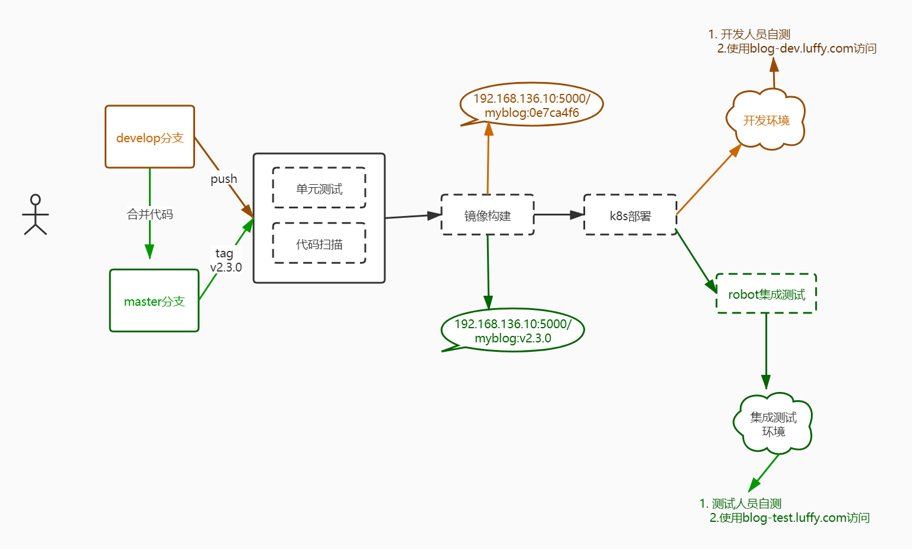

# [library工作流程](http://49.7.203.222:3000/#/jenkins-shared-library/workflow)

### [基于sharedLibrary进行CI/CD流程的优化](http://49.7.203.222:3000/#/jenkins-shared-library/workflow?id=基于sharedlibrary进行cicd流程的优化)

由于公司内部项目众多，大量的项目使用同一套流程做CICD

- 那么势必会存在大量的重复代码
- 一旦某个公共的地方需要做调整，每个项目都需要修改

因此本章主要通过使用groovy实现Jenkins的sharedLibrary的开发，以提取项目在CICD实践过程中的公共逻辑，提供一系列的流程的接口供公司内各项目调用。

开发完成后，对项目进行Jenkinsfile的改造，最后仅需通过简单的Jenkinsfile的配置，即可优雅的完成CICD流程的整个过程，此方式已在大型企业内部落地应用。

##### [Library工作模式](http://49.7.203.222:3000/#/jenkins-shared-library/workflow?id=library工作模式)

由于流水线被组织中越来越多的项目所采用，常见的模式很可能会出现。 在多个项目之间共享流水线有助于减少冗余并保持代码 "DRY"。

流水线支持引用 "共享库" ，可以在外部源代码控制仓库中定义并加载到现有的流水线中。

```
@Library('my-shared-library') _
```

在实际运行过程中，会把library中定义的groovy功能添加到构建目录中：

```bash
/var/jenkins_home/jobs/test-maven-build/branches/feature-CDN-2904.cm507o/builds/2/libs/my-shared-library/vars/devops.groovy
```

使用library后，Jenkinsfile大致的样子如下：

```bash
@Library('my-shared-library') _

...
  stages {
    stage('build image') {
      steps {
         container('tools') {
           devops.buildImage("Dockerfile","172.21.51.143:5000/demo:latest")
         }
      }
    }
  }
  
  post {
    success {
      script {
          container('tools') {
              devops.notificationSuccess("dingTalk")
          }
      }
    }
  }
...
```


# [开发环境搭建](http://49.7.203.222:3000/#/jenkins-shared-library/env)

##### [开发环境搭建](http://49.7.203.222:3000/#/jenkins-shared-library/env?id=开发环境搭建)

Groovy及SpringBoot、SpringCloud

- java
- groovy
- intelliJ idea

###### [下载安装包](http://49.7.203.222:3000/#/jenkins-shared-library/env?id=下载安装包)

链接：https://pan.baidu.com/s/1B-bg2_IsB8dU7_62IEtnTg 提取码：wx6j

###### [安装java](http://49.7.203.222:3000/#/jenkins-shared-library/env?id=安装java)

安装过程中可以勾选添加到环境变量

安装路径：D:\software\java\jdk

环境变量：

- JAVA_HOME D:\software\java\jdk
- CLASSPATH .;%JAVA_HOME%\lib\dt.jar;%JAVA_HOME%\lib\tools.jar;
- PATH %JAVA_HOME%\bin

###### [安装groovy](http://49.7.203.222:3000/#/jenkins-shared-library/env?id=安装groovy)

解压路径：D:\software\groovy-3.0.2

环境变量：

- GROOVY_PATH D:\software\groovy-3.0.2
- PATH D:\software\groovy-3.0.2\bin

###### [安装idea](http://49.7.203.222:3000/#/jenkins-shared-library/env?id=安装idea)  安装免费试用30天，到期重装又可以试用30天

安装路径：D:\software\IntelliJ IDEA 2019.2.3

新建项目测试


操作记录

```bash
安装路径：C:\Program Files\Java\jdk1.8.0_202
  环境变量：
  - JAVA_HOME C:\Program Files\Java\jdk1.8.0_202
  - CLASSPATH .;%JAVA_HOME%\lib\dt.jar;%JAVA_HOME%\lib\tools.jar;
  - PATH %JAVA_HOME%\bin
安装路径：C:\Program Files\groovy-3.0.2
  环境变量：
  - GROOVY_PATH C:\Program Files\groovy-3.0.2
  - PATH C:\Program Files\groovy-3.0.2\bin
安装路径：C:\Program Files\JetBrains\IntelliJ IDEA 2019.2.3
环境变量添加位置 ： 电脑属性-》高级系统设置--》环境变量--》 系统变量

验证：打开cmd
C:\Windows\system32>java -version
java version "1.8.0_202"
Java(TM) SE Runtime Environment (build 1.8.0_202-b08)
Java HotSpot(TM) 64-Bit Server VM (build 25.202-b08, mixed mode)

C:\Windows\system32>groovy -version
Groovy Version: 3.0.2 JVM: 1.8.0_202 Vendor: Oracle Corporation OS: Windows 10
 
 
 IntelliJ IDEA 2019.2.3 打开新建项目 
 					选 GRoovy类型  
 							Project SDK:  C:\Program Files\Java\jdk1.8.0_202
 							Groovy library: C:\Program Files\groovy-3.0.2
 				project name : jenkins-shared-library
 				Project location: c:
```


# [groovy语法介绍](http://49.7.203.222:3000/#/jenkins-shared-library/syntax)

##### [Library代码结构介绍](http://49.7.203.222:3000/#/jenkins-shared-library/syntax?id=library代码结构介绍)

共享库的目录结构如下:

```bash
(root)
+- src                     # Groovy source files
|   +- org
|       +- foo
|           +- Bar.groovy  # for org.foo.Bar class
+- vars
|   +- devops.groovy          # for global 'foo' variable
|   +- foo.txt             # help for 'foo' variable
```

`src` 目录应该看起来像标准的 Java 源目录结构。当执行流水线时，该目录被添加到类路径下。

`vars` 目录定义可从流水线访问的全局变量的脚本。 每个 `*.groovy` 文件的基名应该是一个 Groovy (~ Java) 标识符, 通常是 `camelCased`。

##### [Groovy基本语法介绍](http://49.7.203.222:3000/#/jenkins-shared-library/syntax?id=groovy基本语法介绍)

新建Groovy项目

- 变量

  使用数据类型的本地语法，或者使用def关键字

  ```groovy
  // Defining a variable in lowercase  
  int x = 5;
  
  // Defining a variable in uppercase  
  int X = 6; 
  
  // Defining a variable with the underscore in it's name 
  def _Name = "Joe"; 
  
  println(x); 
  println(X); 
  println(_Name); 
  ```

- 方法

  - 调用本地方法

    ```bash
    def sum(int a, int b){
        return a + b
    }
    
    println(sum(1,2))
    ```

  - 调用类中的方法

    ```bash
    # Hello.groovy
    package demo
    
    def sayHi(String content) {
        return ("hi, " + content)
    }
    
    
    
    # Demo.groovy
    import demo.Hello
    
    def demo() {
        return new Hello().sayHi("devops")
    }
    println(demo())
    
    
    
    # 级联调用
    # Hello.groovy
    package demo
    
    def init(String content) {
        this.content = content
        return this
    }
    
    def sayHi() {
        println("hi, " + this.content)
        return this
    }
    
    def sayBye() {
        println("bye " + this.content)
    }
    
    
    # Demo.groovy
    import demo.Hello
    
    def demo() {
        new Hello().init("devops").sayHi().sayBye()
    }
    
    demo()
    ```

- 异常捕获

  ```groovy
  def exceptionDemo(){
      try {
          def val = 10 / 0
          println(val)
      }catch(Exception e) {
          println(e.toString())
          throw e
      }
  }
  exceptionDemo()
  ```

- 计时器与循环

  ```groovy
  import groovy.time.TimeCategory
  
  
  use( TimeCategory ) {
      def endTime = TimeCategory.plus(new Date(), TimeCategory.getSeconds(15))
      def counter = 0
      while(true) {
          println(counter++)
          sleep(1000)
          if (new Date() >= endTime) {
              println("done")
              break
          }
      }
  }
  ```

- 解析yaml文件

  ```bash
  import org.yaml.snakeyaml.Yaml
  
  def readYaml(){
      def content = new File('myblog.yaml').text
      Yaml parser = new Yaml()
      def data = parser.load(content)
      def kind = data["kind"]
      def name = data["metadata"]["name"]
      println(kind)
      println(name)
  }
  readYaml()
  ```


# [jenkins集成第三方library](http://49.7.203.222:3000/#/jenkins-shared-library/library-within-jenkins)

##### [library与Jenkins集成](http://49.7.203.222:3000/#/jenkins-shared-library/library-within-jenkins?id=library与jenkins集成)

先来看一下如何使用shared library实现最简单的helloworld输出功能，来理清楚使用shared library的流程。

新建 Groovy script   name: com.luffy.devops.Hello

###### [Hello.groovy](http://49.7.203.222:3000/#/jenkins-shared-library/library-within-jenkins?id=hellogroovy)

```groovy
package com.luffy.devops

/**
* @author Yongxin
* @version v0.1
 */

/**
 * say hello
 * @param content
 */
def init(String content) {
    this.content = content
    return this
}


def sayHi() {
    echo "Hi, ${this.content},how are you?"
    return this
}

def answer() {
    echo "${this.content}: fine, thank you, and you?"
    return this
}

def sayBye() {
    echo "i am fine too , ${this.content}, Bye!"
    return this
}
```
`.gitignore`

```
.idea/*
.vscode/*
out
```

创建`vars/devops.groovy` 

```groovy
import com.luffy.devops.Hello

def hello(String content) {
    return new Hello().init(content)
}
```


```bash
# git push提交时候 记住密码
$ git config --global credential.helper store

[root@k8s-slave1 ~]# tree -a jenkins-shared-library/
jenkins-shared-library/
├── .gitignore
├── .idea
├── jenkins-shared-library.iml
├── src
│   └── com
│       └── luffy
│           └── devops
│               └── Hello.groovy
└── vars
    └── devops.groovy
    
[root@k8s-slave1 ~]# cat jenkins-shared-library/vars/devops.groovy
import com.luffy.devops.Hello

def hello(String content) {
    return new Hello().init(content)
}
[root@k8s-slave1 ~]# cat jenkins-shared-library/jenkins-shared-library.iml
<?xml version="1.0" encoding="UTF-8"?>
<module type="JAVA_MODULE" version="4">
  <component name="NewModuleRootManager" inherit-compiler-output="true">
    <exclude-output />
    <content url="file://$MODULE_DIR$">
      <sourceFolder url="file://$MODULE_DIR$/src" isTestSource="false" />
    </content>
    <orderEntry type="inheritedJdk" />
    <orderEntry type="sourceFolder" forTests="false" />
    <orderEntry type="library" name="groovy-3.0.2" level="application" />
  </component>

cd jenkins-shared-library
git init
git remote add origin http://gitlab.luffy.com/luffy/jenkins-shared-library.git
git add .
git commit -m "Initial commit"
git push -u origin master
```


在gitlab创建项目，把library代码推送到镜像仓库。 # 在luffy用户组下创建jenkins-shared-library 项目


###### [配置Jenkins](http://49.7.203.222:3000/#/jenkins-shared-library/library-within-jenkins?id=配置jenkins)

[系统管理] -> [系统设置] -> [ **Global Pipeline Libraries** ]

- Library Name：luffy-devops
- Default Version：master
- Source Code Management：Git
  - Git 仓库地址 http://gitlab.luffy.com/luffy/jenkins-shared-library.git
  - 凭据是之前的 root/\****


###### [Jenkinsfile中引用](http://49.7.203.222:3000/#/jenkins-shared-library/library-within-jenkins?id=jenkinsfile中引用)

`jenkins/pipelines/p11.yaml` //找一个之前执行成功jenkins构建记录 回放 粘贴如下代码测试

```
@Library('luffy-devops') _

pipeline {
    agent { label 'jnlp-slave'}

    stages {
        stage('hello-devops') {
            steps {
                script {
                    devops.hello("树哥").sayHi().answer().sayBye()
                }
            }
        } 
    }
    post {
        success { 
            echo 'Congratulations!'
        }
        failure {
            echo 'Oh no!'
        }
        always { 
            echo 'I will always say Hello again!'
        }
    }
}
```


# [library集成镜像构建及推送](http://49.7.203.222:3000/#/jenkins-shared-library/func-image-build)

##### [library集成镜像构建及推送](http://49.7.203.222:3000/#/jenkins-shared-library/func-image-build?id=library集成镜像构建及推送)

需要实现的逻辑点：

- docker build，docker push，docker login
- 账户密码，jenkins凭据，（library中获取凭据内容）
- docker login 10.211.55.27:5000
- try catch

###### [镜像构建逻辑实现](http://49.7.203.222:3000/#/jenkins-shared-library/func-image-build?id=镜像构建逻辑实现)
`devops.groovy`         Jenkins-shared-library/vars/devops.groovy

```groovy
import com.luffy.devops.*

def hello(String content) {
    return new Hello().init(content)
}
/**
 *
 * @param repo, 10.211.55.27:5000/demo/myblog/xxx/
 * @param tag, v1.0
 * @param dockerfile
 * @param credentialsId
 * @param context
 */
def docker(String repo, String tag, String credentialsId, String dockerfile="Dockerfile", String context=".") {
    return new Docker().docker(repo, tag, credentialsId, dockerfile, context)
}
```
`Docker.groovy`   Jenkins-shared-library/src/com/luffy/devops/Docker.groovy
逻辑中需要注意的点：

- 构建和推送镜像，需要登录仓库（需要认证）
- 构建成功或者失败，需要将结果推给gitlab端
- 为了将构建过程推送到钉钉消息中，需要将构建信息统一收集

```bash
package com.luffy.devops

/**
 *
 * @param repo
 * @param tag
 * @param credentialsId
 * @param dockerfile
 * @param context
 * @return
 */
def docker(String repo, String tag, String credentialsId, String dockerfile="Dockerfile", String context="."){
    this.repo = repo
    this.tag = tag
    this.dockerfile = dockerfile
    this.credentialsId = credentialsId
    this.context = context
    this.fullAddress = "${this.repo}:${this.tag}"
    this.isLoggedIn = false
    return this
}


/**
 * build image
 * @return
 */
def build() {
    this.login()
    retry(3) {
        try {
            sh "docker build ${this.context} -t ${this.fullAddress} -f ${this.dockerfile} "
        }catch (Exception exc) {
            throw exc
        }
        return this
    }
}


/**
 * push image
 * @return
 */
def push() {
    this.login()
    retry(3) {
        try {
            sh "docker push ${this.fullAddress}"
        }catch (Exception exc) {
            throw exc
        }
    }
    return this
}

/**
 * docker registry login
 * @return
 */
def login() {
    if(this.isLoggedIn || credentialsId == ""){
        return this
    }
    // docker login  从jenkins 凭据里获取帐号密码
    withCredentials([usernamePassword(credentialsId: this.credentialsId, usernameVariable: 'USERNAME', passwordVariable: 'PASSWORD')]) {
        def regs = this.getRegistry()
        retry(3) {
            try {
                sh "docker login ${regs} -u $USERNAME -p $PASSWORD"
            } catch (Exception exc) {
                echo "docker login err, " + exc.toString()
            }
        }
    }
    this.isLoggedIn = true;
    return this;
}

/**
 * get registry server
 * @return
 */
def getRegistry(){
    def sp = this.repo.split("/")
    if (sp.size() > 1) {
        return sp[0]
    }
    return this.repo
}
Jenkinsfile
```

需要先在Jenkins端创建仓库登录凭据`credential-registry`

​			 创建凭据 [新增凭据 http://jenkins.luffy.com/credentials/store/system/domain/_/newCredentials

​				类型：Username with password

​				用户名：     密码：

​				ID ：  credential-registry

`Jenkinsfile`

```groovy
@Library('luffy-devops') _

pipeline {
    agent { label 'jnlp-slave'}
    options {
        timeout(time: 20, unit: 'MINUTES')
        gitLabConnection('gitlab')
    }
    environment {
        IMAGE_REPO = "10.211.55.27:5000/demo/myblog"
        IMAGE_CREDENTIAL = "credential-registry"
    }
    stages {
        stage('checkout') {
            steps {
                container('tools') {
                    checkout scm
                }
            }
        }
        stage('docker-image') {
            steps {
                container('tools') {
                    script{
                        devops.docker(
                            "${IMAGE_REPO}",
                            "${GIT_COMMIT}",
                            IMAGE_CREDENTIAL                          
                        ).build().push()
                    }
                }
            }
        }
    }
    post {
        success { 
            echo 'Congratulations!'
        }
        failure {
            echo 'Oh no!'
        }
    }
}
```

###### [丰富构建通知逻辑](http://49.7.203.222:3000/#/jenkins-shared-library/func-image-build?id=丰富构建通知逻辑)

目前的构建镜像逻辑中缺少如下内容：

- try逻辑中，若发生异常，是否该把异常抛出
  - 若直接抛出异常可能会导致多次重复的异常信息
  - 若不抛出，则如果未构建成功镜像，流水线感知不到错误
- 通知gitlab端构建任务及状态
- 构建通知格式

需要针对上述问题，做出优化

1. 优化try逻辑.     Jenkins-shared-library/src/com/luffy/devops/Docker.groovy

   ```bash
   def build() {
       this.login()
       def isSuccess = false
       def errMsg
       retry(3) {
           try {
               sh "docker build ${this.context} -t ${this.fullAddress} -f ${this.dockerfile}"
               isSuccess = true
           }catch (Exception err) {
               //ignore
               errMsg = err.toString()
           }
           // check if build success
           if(isSuccess){
               //todo
           }else {
               // throw exception，aborted pipeline
               error errMsg
           }
           return this
       }
   }
   ```

2. 通知gitlab端构建任务及状态.   Jenkins-shared-library/src/com/luffy/devops/Docker.groovy

   ```bash
   def build() {
       this.login()
       def isSuccess = false
       def errMsg = ""
       retry(3) {
           try {
               sh "docker build ${this.context} -t ${this.fullAddress} -f ${this.dockerfile} "
               isSuccess = true
           }catch (Exception err) {
               //ignore
               errMsg = err.toString()
           }
           // check if build success
           def stage = env.STAGE_NAME + '-build'
           if(isSuccess){
               updateGitlabCommitStatus(name: '${stage}', state: 'success')
           }else {
               updateGitlabCommitStatus(name: '${stage}', state: 'failed')
               // throw exception，aborted pipeline
               error errMsg
           }
   
           return this
       }
   }
   ```

3. 钉钉消息通知格式

   由于每个stage都需要构建通知任务，因此抽成公共的逻辑，为各stage调用

   `BuildMessage.groovy`    Jenkins-shared-library/src/com/luffy/devops/BuildMessage.groovy

   ```bash
   package com.luffy.devops
   
   def updateBuildMessage(String source, String add) {
       if(!source){
           source = ""
       }
       env.BUILD_TASKS = source + add + "\n                    \n&nbsp;&nbsp;&nbsp;&nbsp;&nbsp;&nbsp;&nbsp;&nbsp;&nbsp;&nbsp;&nbsp;&nbsp;&nbsp;&nbsp;&nbsp;&nbsp;&nbsp;&nbsp;&nbsp;&nbsp;"
       return env.BUILD_TASKS
   }
   ```

   `Docker.groovy` 中调用

   ```bash
   def docker(String repo, String tag, String credentialsId, String dockerfile="Dockerfile", String context="."){
       ...
       this.msg = new BuildMessage()
       return this
   }
   
   
   ...
   
   def build() {
   ...
           // check if build success
           def stage = env.STAGE_NAME + '-build'
           if(isSuccess){
               updateGitlabCommitStatus(name: '${stage}', state: 'success')
               this.msg.updateBuildMessage(env.BUILD_TASKS, "${stage} OK...  √")
           }else {
               updateGitlabCommitStatus(name: '${stage}', state: 'failed')
               this.msg.updateBuildMessage(env.BUILD_TASKS, "${stage} Failed...  x")
               // throw exception，aborted pipeline
               error errMsg
           }
   
           return this
       }
   }
   ```

使用`Jenkinsfile`来验证上述修改是否正确：更新myblog项目里Jenkinsfile 文件

```groovy
@Library('luffy-devops') _

pipeline {
    agent { label 'jnlp-slave'}
    options {
        timeout(time: 20, unit: 'MINUTES')
        gitLabConnection('gitlab')
    }
    environment {
        IMAGE_REPO = "10.211.55.27:5000/demo/myblog"
        IMAGE_CREDENTIAL = "credential-registry"
        DINGTALK_CREDS = credentials('dingTalk')
    }
    stages {
        stage('checkout') {
            steps {
                container('tools') {
                    checkout scm
                }
            }
        }
        stage('git-log') {
            steps {
                script{
                    sh "git log --oneline -n 1 > gitlog.file"
                    env.GIT_LOG = readFile("gitlog.file").trim()
                }
                sh 'printenv'
            }
        } 
        stage('build-image') {
            steps {
                container('tools') {
                    script{
                        devops.docker(
                            "${IMAGE_REPO}",
                            "${GIT_COMMIT}",
                            IMAGE_CREDENTIAL                          
                        ).build().push()
                    }
                }
            }
        }
    }
    post {
        success { 
          container('tools') {
            sh """
                curl 'https://oapi.dingtalk.com/robot/send?access_token=${DINGTALK_CREDS_PSW}' \
                    -H 'Content-Type: application/json' \
                    -d '{
                        "msgtype": "markdown",
                        "markdown": {
                            "title":"myblog",
                            "text": "😄👍 构建成功 👍😄  \n**项目名称**：luffy  \n**Git log**: ${GIT_LOG}   \n**构建分支**: ${BRANCH_NAME}   \n**构建地址**：${RUN_DISPLAY_URL}  \n**构建任务**：${env.BUILD_TASKS}"
                        }
                    }'
               """ 
            }
        }
        failure {
            echo 'Oh no!'
        }
    }
}
```

接下来需要将`push`和`login`方法做同样的改造

最终的Docker.groovy文件为：

```bash
package com.luffy.devops

/**
 *
 * @param repo
 * @param tag
 * @param credentialsId
 * @param dockerfile
 * @param context
 * @return
 */
def docker(String repo, String tag, String credentialsId, String dockerfile="Dockerfile", String context="."){
    this.repo = repo
    this.tag = tag
    this.dockerfile = dockerfile
    this.credentialsId = credentialsId
    this.context = context
    this.fullAddress = "${this.repo}:${this.tag}"
    this.isLoggedIn = false
    this.msg = new BuildMessage()
    return this
}


/**
 * build image
 * @return
 */
def build() {
    this.login()
    def isSuccess = false
    def errMsg = ""
    retry(3) {
        try {
            sh "docker build ${this.context} -t ${this.fullAddress} -f ${this.dockerfile} "
            isSuccess = true
        }catch (Exception err) {
            //ignore
            errMsg = err.toString()
        }
        // check if build success
        def stage = env.STAGE_NAME + '-build'
        if(isSuccess){
            updateGitlabCommitStatus(name: "${stage}", state: 'success')
            this.msg.updateBuildMessage(env.BUILD_TASKS, "${stage} OK...  √")
        }else {
            updateGitlabCommitStatus(name: "${stage}", state: 'failed')
            this.msg.updateBuildMessage(env.BUILD_TASKS, "${stage} Failed...  x")
            // throw exception，aborted pipeline
            error errMsg
        }

        return this
    }
}


/**
 * push image
 * @return
 */
def push() {
    this.login()
    def isSuccess = false
    def errMsg = ""
    retry(3) {
        try {
            sh "docker push ${this.fullAddress}"
            isSuccess = true
        }catch (Exception err) {
            //ignore
            errMsg = err.toString()
        }
    }
    // check if build success
    def stage = env.STAGE_NAME + '-push'
    if(isSuccess){
        updateGitlabCommitStatus(name: "${stage}", state: 'success')
        this.msg.updateBuildMessage(env.BUILD_TASKS, "${stage} OK...  √")
    }else {
        updateGitlabCommitStatus(name: "${stage}", state: 'failed')
        this.msg.updateBuildMessage(env.BUILD_TASKS, "${stage} Failed...  x")
        // throw exception，aborted pipeline
        error errMsg
    }
    return this
}

/**
 * docker registry login
 * @return
 */
def login() {
    if(this.isLoggedIn || credentialsId == ""){
        return this
    }
    // docker login
    withCredentials([usernamePassword(credentialsId: this.credentialsId, usernameVariable: 'USERNAME', passwordVariable: 'PASSWORD')]) {
        def regs = this.getRegistry()
        retry(3) {
            try {
                sh "docker login ${regs} -u $USERNAME -p $PASSWORD"
            } catch (Exception ignored) {
                echo "docker login err, ${ignored.toString()}"
            }
        }
    }
    this.isLoggedIn = true;
    return this;
}

/**
 * get registry server
 * @return
 */
def getRegistry(){
    def sp = this.repo.split("/")
    if (sp.size() > 1) {
        return sp[0]
    }
    return this.repo
}
```

再次测试构建


# [library集成k8s服务部署](http://49.7.203.222:3000/#/jenkins-shared-library/func-k8s-deploy)

##### [library集成k8s服务部署](http://49.7.203.222:3000/#/jenkins-shared-library/func-k8s-deploy?id=library集成k8s服务部署)

###### [library实现部署简单版](http://49.7.203.222:3000/#/jenkins-shared-library/func-k8s-deploy?id=library实现部署简单版)

`devops.groovy`   jenins-shared-library/vars/devops.groovy

```
import com.luffy.devops.*

/**
 *
 * @param repo, 10.211.55.27:5000/demo/myblog/xxx/
 * @param tag, v1.0
 * @param dockerfile
 * @param credentialsId
 * @param context
 */
def docker(String repo, String tag, String credentialsId, String dockerfile="Dockerfile", String context=".") {
    return new Docker().docker(repo, tag, credentialsId, dockerfile, context)
}

/**
 * kubernetes deployer
 * @param resourcePath
 */
def deploy(String resourcePath){
    return new Deploy().init(resourcePath)
}
```

新增`Deploy.groovy`    jenins-shared-library/src/com/luffy/devops/Deploy.groovy

```groovy
package com.luffy.devops

def init(String resourcePath){
    this.resourcePath = resourcePath
    this.msg = new BuildMessage()
    return this
}


def start(){
    try{
        //env.CURRENT_IMAGE用来存储当前构建的镜像地址，需要在Docker.groovy中设置值
        sh "sed -i 's#{{IMAGE_URL}}#${env.CURRENT_IMAGE}#g' ${this.resourcePath}/*"
        sh "kubectl apply -f ${this.resourcePath}"
        updateGitlabCommitStatus(name: env.STAGE_NAME, state: 'success')
        this.msg.updateBuildMessage(env.BUILD_TASKS, "${env.stage_name} OK...  √")
    } catch (Exception exc){
        updateGitlabCommitStatus(name: env.STAGE_NAME, state: 'failed')
        this.msg.updateBuildMessage(env.BUILD_TASKS, "${env.stage_name} failed...  √")
        throw exc
    }
}
```

修改`Docker.groovy`

```groovy
def push() {
    this.login()
    def isSuccess = false
    def errMsg = ""
    retry(3) {
        try {
            sh "docker push ${this.fullAddress}"
            //把当前推送的镜像地址记录在环境变量中
            env.CURRENT_IMAGE = this.fullAddress
            isSuccess = true
        }catch (Exception err) {
            //ignore
            errMsg = err.toString()
        }
```

`Jenkinsfile` 中添加如下部分： stage('build-image')部分的下面

```groovy
        stage('deploy') {
            steps {
                container('tools') {
                    script{
                        devops.deploy("manifests").start()
                    }
                }
            }
        }
```

###### [library实现自动部署优化版](http://49.7.203.222:3000/#/jenkins-shared-library/func-k8s-deploy?id=library实现自动部署优化版)

简单版本最明显的问题就是无法检测部署后的Pod状态，如果想做集成测试，通常要等到最新版本的Pod启动后再开始。因此有必要在部署的时候检测Pod是否正常运行。

比如要去检查myblog应用的pod是否部署正常，人工检查的大致步骤：

1. `kubectl -n luffy get pod`，查看pod列表
2. 找到列表中带有myblog关键字的running的pod
3. 查看上述running pod数，是否和myblog的deployment中定义的replicas副本数一致
4. 若一致，则检查结束，若不一致，可能稍等几秒钟，再次执行相同的检查操作
5. 如果5分钟了还没有检查通过，则大概率是pod有问题，通过查看日志进一步排查

如何通过library代码实现上述过程：

1. library如何获取myblog的pod列表？

   - 首先要知道本次部署的是哪个workload，因此需要调用者传递workload的yaml文件路径

   - library解析workload.yaml文件，找到如下值：

     - pod所在的namespace
     - pod中使用的`labels`标签

   - 使用如下命令查找该workload关联的pod

     ```bash
     $ kubectl -n <namespace> get po -l <key1=value1> -l <key2=value2>
     
     # 如查找myblog的pod
     $ kubectl -n luffy get po -l app=myblog
     ```

2. 如何确定步骤1中的pod的状态？

   ```bash
   # 或者可以直接进行提取状态
   $ kubectl -n luffy get po -l app=myblog -ojsonpath='{.items[0].status.phase}'
   
   # 以json数组的形式存储
   $ kubectl -n luffy get po -l app=myblog -o json
   ```

3. 如何检测所有的副本数都是正常的？

   ```bash
   # 以json数组的形式存储
   $ kubectl -n luffy get po -l app=myblog -o json
   
   # 遍历数组，检测每一个pod查看是否均正常（terminating和evicted除外）
   ```

4. 如何实现在5分钟的时间内，若pod状态符合预期，则退出检测循环，若不符合预期则继续检测

   ```bash
   use( TimeCategory ) {
     def endTime = TimeCategory.plus(new Date(), TimeCategory.getMinutes(timeoutMinutes,5))
     while (true) {
       if (new Date() >= endTime) {
           //超时了，则宣告pod状态不对
           updateGitlabCommitStatus(name: 'deploy', state: 'failed')
           throw new Exception("deployment timed out...")
       }
       //循环检测当前deployment下的pod的状态
       try {
         if (this.isDeploymentReady()) {
             readyCount++
             if(readyCount > 5){
               updateGitlabCommitStatus(name: 'deploy', state: 'success')
               break;
             }
         }else {
             readyCount = 0
         }catch (Exception exc){
             echo exc.toString()
         }
         //每次检测若不满足所有pod均正常，则sleep 5秒钟后继续检测
         sleep(5)
       }
     }
   ```

`devops.groovy`

通过添加参数 watch来控制是否在pipeline中观察pod的运行状态

```groovy
/**
 * 
 * @param resourcePath       # 源代码目录
 * @param watch              # Boolean watch表示让调用方可以选择同步 或者异步
 * @param workloadFilePath   # 这个目录是部署项目的kind：deployment类型的 yaml文件目录
 * @return
 */
def deploy(String resourcePath, Boolean watch = true, String workloadFilePath){
    return new Deploy().init(resourcePath, watch, workloadFilePath)
}
```

完整版的`Deploy.groovy`

```groovy
package com.luffy.devops

import org.yaml.snakeyaml.Yaml
import groovy.json.JsonSlurperClassic
import groovy.time.TimeCategory

def init(String resourcePath, Boolean watch, String workloadFilePath) {
    this.resourcePath = resourcePath
    this.msg = new BuildMessage()
    this.watch = watch
    this.workloadFilePath = workloadFilePath
    if(!resourcePath && !workloadFilePath){
        throw Exception("illegal resource path")
    }
    return this
}

def start(){
    try{
        sh "sed -i 's#{{IMAGE_URL}}#${env.CURRENT_IMAGE}#g' ${this.resourcePath}/*"
        sh "kubectl apply -f ${this.resourcePath}"
    } catch (Exception exc){
        updateGitlabCommitStatus(name: env.STAGE_NAME, state: 'failed')
        this.msg.updateBuildMessage(env.BUILD_TASKS, "${env.stage_name} fail...  √")
        throw exc
    }

    if (this.watch) {
        // 初始化workload文件
        initWorkload()
        String namespace = this.workloadNamespace
        String name = env.workloadName
        if(env.workloadType.toLowerCase() == "deployment"){
            echo "begin watch pod status from deployment ${env.workloadName}..."
            monitorDeployment(namespace, name)
        }else {
            //todo
            echo "workload type ${env.workloadType} does not support for now..."
        }

    }else {
        updateGitlabCommitStatus(name: env.STAGE_NAME, state: 'success')
        this.msg.updateBuildMessage(env.BUILD_TASKS, "${env.STAGE_NAME} OK...  √")
    }
}

def initWorkload() {
    try {
        def content = readFile this.workloadFilePath
        Yaml parser = new Yaml()
        def data = parser.load(content)
        def kind = data["kind"]
        if (!kind) {
            throw Exception("workload file ${kind} illegal, will exit pipeline!")
        }
        env.workloadType = kind
        echo "${data}"
        this.workloadNamespace = data["metadata"]["namespace"]
        if (!this.workloadNamespace){
            this.workloadNamespace = "default"
        }
        env.workloadName = data["metadata"]["name"]

    } catch (Exception exc) {
        echo "failed to readFile ${this.workloadFilePath},exception: ${exc}."
        throw exc
    }
}

/**
 *
 * @param namespace
 * @param name
 * @param timeoutMinutes
 * @param sleepTime
 * @return
 */
def monitorDeployment(String namespace, String name, int timeoutMinutes = 5, sleepTime = 3) {
    def readyCount = 0
    def readyTarget = 3
    use( TimeCategory ) {
        def endTime = TimeCategory.plus(new Date(), TimeCategory.getMinutes(timeoutMinutes))
        def lastRolling
        while (true) {
            // checking timeout
            if (new Date() >= endTime) {
                echo "timeout, printing logs..."
                this.printContainerLogs(lastRolling)
                updateGitlabCommitStatus(name: 'deploy', state: 'failed')
                this.msg.updateBuildMessage(env.BUILD_TASKS, "${env.STAGE_NAME} Failed...  x")
                throw new Exception("deployment timed out...")
            }
            // checking deployment status
            try {
                def rolling = this.getResource(namespace, name, "deployment")
                lastRolling = rolling
                if (this.isDeploymentReady(rolling)) {
                    readyCount++
                    echo "ready total count: ${readyCount}"
                    if (readyCount >= readyTarget) {
                        updateGitlabCommitStatus(name: env.STAGE_NAME, state: 'success')
                        this.msg.updateBuildMessage(env.BUILD_TASKS, "${env.STAGE_NAME} OK...  √")
                        break
                    }

                } else {
                    readyCount = 0
                    echo "reseting ready total count: ${readyCount}，print pods event logs"
                    this.printContainerLogs(lastRolling)
                    sh "kubectl get pod -n ${namespace} -o wide"
                }
            } catch (Exception exc) {
                updateGitlabCommitStatus(name: 'deploy', state: 'failed')
                this.msg.updateBuildMessage(env.BUILD_RESULT, "${env.STAGE_NAME} Failed...  ×")
                echo "error: ${exc}"
            }
            sleep(sleepTime)
        }
    }
    return this
}

def getResource(String namespace = "default", String name, String kind="deployment") {
    sh "kubectl get ${kind} -n ${namespace} ${name} -o json > ${namespace}-${name}-yaml.yml"
    def jsonStr = readFile "${namespace}-${name}-yaml.yml"
    def jsonSlurper = new JsonSlurperClassic()
    def jsonObj = jsonSlurper.parseText(jsonStr)
    return jsonObj
}

def printContainerLogs(deployJson) {
    if (deployJson == null) {
        return;
    }
    def namespace = deployJson.metadata.namespace
    def name = deployJson.metadata.name
    def labels=""
    deployJson.spec.template.metadata.labels.each { k, v ->
        labels = "${labels} -l=${k}=${v}"
    }
    sh "kubectl describe pods -n ${namespace} ${labels}"
}

def isDeploymentReady(deployJson) {
    def status = deployJson.status
    def replicas = status.replicas
    def unavailable = status['unavailableReplicas']
    def ready = status['readyReplicas']
    if (unavailable != null) {
        return false
    }
    def deployReady = (ready != null && ready == replicas)
    // get pod information
    if (deployJson.spec.template.metadata != null && deployReady) {
        if (deployJson.spec.template.metadata.labels != null) {
            def labels=""
            def namespace = deployJson.metadata.namespace
            def name = deployJson.metadata.name
            deployJson.spec.template.metadata.labels.each { k, v ->
                labels = "${labels} -l=${k}=${v}"
            }
            if (labels != "") {
                sh "kubectl get pods -n ${namespace} ${labels} -o json > ${namespace}-${name}-json.json"
                def jsonStr = readFile "${namespace}-${name}-json.json"
                def jsonSlurper = new JsonSlurperClassic()
                def jsonObj = jsonSlurper.parseText(jsonStr)
                def totalCount = 0
                def readyCount = 0
                jsonObj.items.each { k, v ->
                    echo "pod phase ${k.status.phase}"
                    if (k.status.phase != "Terminating" && k.status.phase != "Evicted") {
                        totalCount++;
                        if (k.status.phase == "Running") {
                            readyCount++;
                        }
                    }
                }
                echo "Pod running count ${totalCount} == ${readyCount}"
                return totalCount > 0 && totalCount == readyCount && totalCount == replicas
            }
        }
    }
    return deployReady
}
```

修改`Jenkinsfile` 调用部分： manifests/myblog_all.yaml 指定yaml路径 myblog的deplpoyment单独拆出来

```bash
        stage('deploy') {
            steps {
                container('tools') {
                    script{
                        devops.deploy("manifests", true, "manifests/myblog.dpl.yaml").start()
                    }
                }
            }
        }
```


# [library集成消息推送](http://49.7.203.222:3000/#/jenkins-shared-library/func-msg-notify)

##### [library实现即时消息推送](http://49.7.203.222:3000/#/jenkins-shared-library/func-msg-notify?id=library实现即时消息推送)

###### [实现消息通知](http://49.7.203.222:3000/#/jenkins-shared-library/func-msg-notify?id=实现消息通知)

由于发送消息通知属于通用的功能，因此有必要把消息通知抽象成为通用的功能。

`devops.groovy`

```
..........以下增加内容
/**
 * notificationSuccess
 * @param project
 * @param receiver
 * @param credentialsId
 * @param title
 * @return
 */
def notificationSuccess(String project, String receiver="dingTalk", String credentialsId="dingTalk", String title=""){
    new Notification().getObject(project, receiver, credentialsId, title).notification("success")
}

/**
 * notificationFailed
 * @param project
 * @param receiver
 * @param credentialsId
 * @param title
 * @return
 */
def notificationFailed(String project, String receiver="dingTalk", String credentialsId="dingTalk", String title=""){
    new Notification().getObject(project, receiver, credentialsId, title).notification("failure")
}
```

新建`Notification.groovy`文件：jenkins-shared-library/src/com/luffy/devops/Notification.groovy

```groovy
package com.luffy.devops

/**
 *
 * @param type
 * @param credentialsId
 * @param title
 * @return
 */
def getObject(String project, String receiver, String credentialsId, String title) {
    this.project = project
    this.receiver = receiver
    this.credentialsId = credentialsId
    this.title = title
    return this
}


def notification(String type){
    String msg ="😄👍 ${this.title} 👍😄"

    if (this.title == "") {
        msg = "😄👍 流水线成功啦 👍😄"
    }
    // failed
    if (type == "failure") {
        msg ="😖❌ ${this.title} ❌😖"
        if (this.title == "") {
            msg = "😖❌ 流水线失败了 ❌😖"
        }
    }
    String title = msg
    // rich notify msg
    msg = genNotificationMessage(msg)
    if( this.receiver == "dingTalk") {
        try {
            new DingTalk().markDown(title, msg, this.credentialsId)
        } catch (Exception ignored) {}
    }else if(this.receiver == "wechat") {
        //todo
    }else if (this.receiver == "email"){
        //todo
    }else{
        error "no support notify type!"
    }
}


/**
 * get notification msg
 * @param msg
 * @return
 */
def genNotificationMessage(msg) {
    // project
    msg = "${msg}  \n  **项目名称**: ${this.project}"
    // get git log
    def gitlog = ""
    try {
        sh "git log --oneline -n 1 > gitlog.file"
        gitlog = readFile "gitlog.file"
    } catch (Exception ignored) {}

    if (gitlog != null && gitlog != "") {
        msg = "${msg}  \n  **Git log**: ${gitlog}"
    }
    // get git branch
    def gitbranch = env.BRANCH_NAME
    if (gitbranch != null && gitbranch != "") {
        msg = "${msg}  \n  **Git branch**: ${gitbranch}"
    }
    // build tasks
    msg = "${msg}  \n  **Build Tasks**: ${env.BUILD_TASKS}"

    // get buttons
    msg = msg + getButtonMsg()
    return msg
}
def getButtonMsg(){
    String res = ""
    def  buttons = [
            [
                    "title": "查看流水线",
                    "actionURL": "${env.RUN_DISPLAY_URL}"
            ],
            [
                    "title": "代码扫描结果",
                    "actionURL": "http://sonar.luffy.com/dashboard?id=${this.project}"
            ]
    ]
    buttons.each() {
        if(res == ""){
            res = "   \n >"
        }
        res = "${res} --- ["+it["title"]+"]("+it["actionURL"]+") "
    }
    return res
}
```

新建`DingTalk.groovy`文件： jenkins-shared-library/src/com/luffy/devops/DingTalk.groovy

```groovy
package com.luffy.devops

import groovy.json.JsonOutput


def sendRequest(method, data, credentialsId, Boolean verbose=false, codes="100:399") {
    def reqBody = new JsonOutput().toJson(data)
    withCredentials([usernamePassword(credentialsId: credentialsId, usernameVariable: 'USERNAME', passwordVariable: 'PASSWORD')]) {
        def response = httpRequest(
                httpMode:method,
                url: "https://oapi.dingtalk.com/robot/send?access_token=${PASSWORD}",
                requestBody:reqBody,
                validResponseCodes: codes,
                contentType: "APPLICATION_JSON",
                quiet: !verbose
        )
    }
}

def markDown(String title, String text, String credentialsId, Boolean verbose=false) {
    def data = [
            "msgtype": "markdown",
            "markdown": [
                    "title": title,
                    "text": text
            ]
    ]
    this.sendRequest("POST", data, credentialsId, verbose)
}
```

需要用到Http Request来发送消息，安装一下插件：http_request

###### [jenkinsfile调用](http://49.7.203.222:3000/#/jenkins-shared-library/func-msg-notify?id=jenkinsfile调用)

```groovy
@Library('luffy-devops') _

pipeline {
    agent { label 'jnlp-slave'}
    options {
        timeout(time: 20, unit: 'MINUTES')
        gitLabConnection('gitlab')
    }
    environment {
        IMAGE_REPO = "172.21.51.143:5000/demo/myblog"
        IMAGE_CREDENTIAL = "credential-registry"
        DINGTALK_CREDS = credentials('dingTalk')
    }
    stages {
        stage('checkout') {
            steps {
                container('tools') {
                    checkout scm
                }
            }
        }
        stage('docker-image') {
            steps {
                container('tools') {
                    script{
                        devops.docker(
                            "${IMAGE_REPO}",
                            "${GIT_COMMIT}",
                            IMAGE_CREDENTIAL                          
                        ).build().push()
                    }
                }
            }
        }
        stage('deploy') {
            steps {
                container('tools') {
                    script{
                        devops.deploy("manifests",true,"manifests/deployment.yaml").start()
                    }
                }
            }
        }
    }
    post {
        success { 
            script{
                devops.notificationSuccess("myblog","dingTalk")
            }
        }
        failure {
            script{
                devops.notificationFailed("myblog","dingTalk")
            }
        }
    }
}
```


# [library集成代码扫描](http://49.7.203.222:3000/#/jenkins-shared-library/func-code-scanner)

##### [library集成代码扫描](http://49.7.203.222:3000/#/jenkins-shared-library/func-code-scanner?id=library集成代码扫描)

sonarqube代码扫描作为通用功能，同样可以使用library实现。

`devops.groovy`

```
vi jenkins-shared-library/vars/devops.groovy
..... 以下增加内容
/**
 * sonarqube scanner
 * @param projectVersion
 * @param waitScan
 * @return
 */
def scan(String projectVersion="", Boolean waitScan = true) {
    return new Sonar().init(projectVersion, waitScan)
}
```

新建`Sonar.groovy`     jenkins-shared-library/src/com/luffy/devops/Sonar.groovy

- 可以传递projectVersion作为sonarqube的扫描版本
- 参数waitScan来设置是否等待本次扫描是否通过

```groovy
package com.luffy.devops


def init(String projectVersion="", Boolean waitScan = true) {
    this.waitScan = waitScan
    this.msg = new BuildMessage()
    if (projectVersion == ""){
        sh "git config --global --add safe.directory /home/jenkins/agent/workspace/multi-branch-myblog_master"
        projectVersion = sh(returnStdout: true, script: 'git log --oneline -n 1|cut -d " " -f 1')
    }
    sh "echo '\nsonar.projectVersion=${projectVersion}' >> sonar-project.properties"
    sh "cat sonar-project.properties"
    return this
}

def start() {
    try {
        this.startToSonar()
    }
    catch (Exception exc) {
        throw exc
    }
    return this
}

def startToSonar() {
    withSonarQubeEnv('sonarqube') {
        sh "sonar-scanner -X;"
        sleep 5
    }
    if(this.waitScan){
        //wait 3min
        timeout(time: 3, unit: 'MINUTES') {
            def qg = waitForQualityGate()
            String stage = "${env.stage_name}"
            if (qg.status != 'OK') {
                this.msg.updateBuildMessage(env.BUILD_TASKS, "${stage} Failed...  ×")
                updateGitlabCommitStatus(name: "${stage}", state: 'failed')
                error "Pipeline aborted due to quality gate failure: ${qg.status}"
            }else{
                this.msg.updateBuildMessage(env.BUILD_RESULT, "${stage} OK...  √")
                updateGitlabCommitStatus(name: "${stage}", state: 'success')
            }
        }
    }else{
        echo "skip waitScan"
    }
    return this
}
```

`Jenkinsfile`新增如下部分：

```groovy
        stage('CI'){
            failFast true
            parallel {
                stage('Unit Test') {
                    steps {
                        echo "Unit Test Stage Skip..."
                    }
                }
                stage('Code Scan') {
                    steps {
                        container('tools') {
                            script {
                               devops.scan().start()
                            }
                        }
                    }
                }
            }
        }
```


# [library集成robot自动化测试](http://49.7.203.222:3000/#/jenkins-shared-library/func-robot-framework)

##### [集成robot自动化测试](http://49.7.203.222:3000/#/jenkins-shared-library/func-robot-framework?id=集成robot自动化测试)

关于集成测试，我们需要知道的几点:

- 测试人员进行编写
- 侧重于不同模块的接口调用，对新加的功能进行验证
- 注重新版本对以前的集成用例进行回归

因此，更多的应该是跨模块去测试，而且测试用例是测试人员去维护，因此不适合把代码放在开发的git仓库中。

本节要实现的工作：

1. 创建新的git仓库`robot-cases`，用于存放robot测试用例
2. 为`robot-cases`项目创建Jenkinsfile
3. 配置Jenkins任务，实现该项目的自动化执行
4. 在myblog模块的流水线中，对该流水线项目进行调用

###### [初始化robot-cases项目](http://49.7.203.222:3000/#/jenkins-shared-library/func-robot-framework?id=初始化robot-cases项目)

1. 新建gitlab项目，名称为`robot-cases` http://gitlab.luffy.com/luffy/robot-cases

> //http://gitlab.luffy.com/luffy/robot-cases/-/settings/ci_cd
>
> 项目设置里 Auto DevOps 功能关闭

1. clone到本地

2. 本地拷贝myblog项目的`robot.txt`

   ```bash
   robot-cases/
   └── myblog
       └── robot.txt
   ```

```bash
[root@k8s-slave1 ~]# git clone http://gitlab.luffy.com/luffy/robot-cases.git
[root@k8s-slave1 ~]# cd robot-cases
[root@k8s-slave1 robot-cases]# mkdir myblog
[root@k8s-slave1 robot-cases]# cp ../myblog/robot.txt ./myblog/
[root@k8s-slave1 robot-cases]# rm -f ../myblog/robot.txt
[root@k8s-slave1 robot-cases]# cat ./myblog/robot.txt
*** Settings ***
Library           RequestsLibrary
Library           SeleniumLibrary

*** Variables ***
${demo_url}       http://myblog.luffy/admin

*** Test Cases ***
api
    [Tags]  critical
    Create Session    api    ${demo_url}
    ${alarm_system_info}    RequestsLibrary.Get Request    api    /
    log    ${alarm_system_info.status_code}
    log    ${alarm_system_info.content}
    should be true    ${alarm_system_info.status_code} == 200

ui
    [Tags]  critical
    ${chrome_options} =     Evaluate    sys.modules['selenium.webdriver'].ChromeOptions()    sys, selenium.webdriver
    Call Method    ${chrome_options}   add_argument    headless
    Call Method    ${chrome_options}   add_argument    no-sandbox
    ${options}=     Call Method     ${chrome_options}    to_capabilities
    Open Browser    ${demo_url}/    browser=chrome       desired_capabilities=${options}
    sleep    2s
    Capture Page Screenshot
    Page Should Contain    Django
    close browser
[root@k8s-slave1 robot-cases]# vi Jenkinsfile
[root@k8s-slave1 robot-cases]# git add .
[root@k8s-slave1 robot-cases]# git commit -m "first comiit "
[root@k8s-slave1 robot-cases]# git push
```


###### [配置Jenkinsfile及自动化任务](http://49.7.203.222:3000/#/jenkins-shared-library/func-robot-framework?id=配置jenkinsfile及自动化任务)

```bash
robot-cases/
├── Jenkinsfile
└── myblog
    └── robot.txt
```
`Jenkinsfile`
多个业务项目的测试用例都在一个仓库中，因此需要根据参数设置来决定执行哪个项目的用例

```groovy
pipeline {
    agent {
        label 'jnlp-slave'
    }

    options {
        buildDiscarder(logRotator(numToKeepStr:'10'))
        disableConcurrentBuilds()
        timeout(time: 20, unit: 'MINUTES')
        gitLabConnection('gitlab')
    }
    stages {
        stage('checkout') {
            steps {
                container('tools') {
                    checkout scm
                }
            }
        }
        stage('Test') {
            steps {
                script {
                    container('tools'){
                        switch(env.comp){
                            case "myblog":
                                env.testDir = "myblog"
                                break
                            case "business1":
                                env.testDir = "business1"
                                break
                            default:
                                env.testDir = "all"
                                break
                        }
                        sh 'robot -d artifacts/ ${testDir}/* || echo ok'
                        step([
                            $class : 'RobotPublisher',
                            outputPath: 'artifacts/',
                            outputFileName : "output.xml",
                            disableArchiveOutput : false,
                            passThreshold : 100,
                            unstableThreshold: 80.0,
                            onlyCritical : true,
                            otherFiles : "*.png"
                        ])
                        archiveArtifacts artifacts: 'artifacts/*', fingerprint: true
                    }
                }
            }
        }
    }
}
```

如何实现将`env.comp` 传递进去？

配置流水线的参数化构建任务并验证参数化构建

> jenkins 新建流水线。name ：**robot-cases**
>
> ​            流水线
>
> ​					定义 ：Pipeline scriptPipeline script from SCM
>
> ​						 SCM ：     Git
>
> ​							Repositories   Repository URL  http://gitlab.luffy.com/luffy/robot-cases.git
>
> ​							Credentials： root/\****
>
> 参数化构建过程：**字符参数**
>
> ​							名称：**comp**


###### [library集成触发任务](http://49.7.203.222:3000/#/jenkins-shared-library/func-robot-framework?id=library集成触发任务)

由于多个项目均需要触发自动构建，因此可以在library中抽象方法，实现接收comp参数，并在library中实现对`robot-cases`项目的触发。


`devops.groovy`
```
.... 以下增加内容 vi jenkins-shared-library/vars/devops.groovy
/**
 * 
 * @param comp
 * @return
 */
def robotTest(String comp=""){
    new Robot().acceptanceTest(comp)
}
```

新建`Robot.groovy`文件  vi jenkins-shared-library/src/com/luffy/devops/Robot.groovy

```groovy
package com.luffy.devops

def acceptanceTest(comp) {
    try{
        echo "Trigger to execute Acceptance Testing"
        def rf = build job: 'robot-cases',
                parameters: [
                        string(name: 'comp', value: comp)
                ],
                wait: true,
                propagate: false
        def result = rf.getResult()
        def msg = "${env.STAGE_NAME}... "
        if (result == "SUCCESS"){
            msg += "√ success"
        }else if(result == "UNSTABLE"){
            msg += "⚠ unstable"
        }else{
            msg += "× failure"
        }
        echo rf.getAbsoluteUrl()
        env.ROBOT_TEST_URL = rf.getAbsoluteUrl()
        new BuildMessage().updateBuildMessage(env.BUILD_TASKS, msg)
    } catch (Exception exc) {
        echo "trigger  execute Acceptance Testing exception: ${exc}"
        new BuildMessage().updateBuildMessage(env.BUILD_RESULT, msg)
    }
}
```

修改`Jenkinsfile`测试调用。 stage: deploy 后面添加

```groovy
        stage('integration test') {
            steps {
                container('tools') {
                    script{
                        devops.robotTest("myblog")
                    }
                }
            }
        }
```


Jenkinsfile完整版

```bash
@Library('luffy-devops') _

pipeline {
    agent { label 'jnlp-slave'}
    options {
        buildDiscarder(logRotator(numToKeepStr:'10'))
        disableConcurrentBuilds()
        timeout(time: 20, unit: 'MINUTES')
        gitLabConnection('gitlab')
    }
    environment {
        IMAGE_REPO = "10.211.55.27:5000/demo/myblog"
        IMAGE_CREDENTIAL = "credential-registry"
        DINGTALK_CREDS = credentials('dingTalk')
    }
    stages {
        stage('checkout') {
            steps {
                container('tools') {
                    checkout scm
                }
            }
        }
        stage('git-log') {
            steps {
                script{
                    sh "git log --oneline -n 1 > gitlog.file"
                    env.GIT_LOG = readFile("gitlog.file").trim()
                }
                sh 'printenv'
            }
        }
        stage('CI'){
            failFast true
            parallel {
                stage('Unit Test') {
                    steps {
                        echo "Unit Test Stage Skip..."
                    }
                }
                stage('Code Scan') {
                    steps {
                        container('tools') {
                            script {
                               devops.scan().start()
                            }
                        }
                    }
                }
            }
        }
        stage('build-image') {
            steps {
                container('tools') {
                    script{
                        devops.docker(
                            "${IMAGE_REPO}",
                            "${GIT_COMMIT}",
                            IMAGE_CREDENTIAL
                        ).build().push()
                    }
                }
            }
        }
        stage('deploy') {
            steps {
                container('tools') {
                    script{
                        devops.deploy("manifests", true, "manifests/myblog.dpl.yaml").start()
                    }
                }
            }
        }
        stage('integration test') {
            steps {
                container('tools') {
                    script{
                        devops.robotTest("myblog")
                    }
                }
            }
        }
    }
    post {
        success {
            script{
                devops.notificationSuccess("myblog","dingTalk")
            }
        }
        failure {
            script{
                devops.notificationFailed("myblog","dingTalk")
            }
        }
    }
}
```


# [多环境的CICD自动化实践](http://49.7.203.222:3000/#/jenkins-shared-library/cicd)

###### [library集成触发任务](http://49.7.203.222:3000/#/jenkins-shared-library/cicd?id=library集成触发任务)

##### [多环境的CICD自动化实现](http://49.7.203.222:3000/#/jenkins-shared-library/cicd?id=多环境的cicd自动化实现)

###### [实现目标及效果](http://49.7.203.222:3000/#/jenkins-shared-library/cicd?id=实现目标及效果)

目前项目存在`develop`和`master`两个分支，Jenkinsfile中配置的都是构建部署到相同的环境，实际的场景中，代码仓库的项目往往不同的分支有不同的作用，我们可以抽象出一个工作流程：



- 开发人员提交代码到develop分支
- Jenkins自动使用develop分支做单测、代码扫描、镜像构建（以commit id为镜像tag）、服务部署到开发环境
- 开发人员使用开发环境自测
- 测试完成后，在gitlab提交merge request请求，将代码合并至master分支
- 需要发版时，在gitlab端基于master分支创建tag（v2.3.0）
- Jenkins自动检测到tag，拉取tag关联的代码做单测、代码扫描、镜像构建（以代码的tag为镜像的tag）、服务部署到测试环境、执行集成测试用例，输出测试报告
- 测试人员进行手动测试
- 上线

###### [实现思路](http://49.7.203.222:3000/#/jenkins-shared-library/cicd?id=实现思路)

以myblog项目为例，目前已经具备的是develop分支代码提交后，可以自动实现：

- 单元测试、代码扫描
- 镜像构建
- k8s服务部署
- robot集成用例测试

和上述目标相比，差异点：

1. myblog应用目前只有一套环境，在luffy命名空间中。我们新建两个命名空间：
   - dev，用作部署开发环境
   - test，用作部署集成测试环境
2. 需要根据不同的分支来执行不同的任务，有两种方案实现：
   - develop和master分支使用不同的Jenkinsfile
     - 可行性很差，因为代码合并工作很繁琐
     - 维护成本高，多个分支需要维护多个Jenkinsfile
   - 使用同一套Jenkinsfile，配合library和模板来实现一套Jenkinsfile适配多套环境
     - 改造Jenkinsfile，实现根据分支来选择任务
     - 需要将deploy目录中所有和特定环境绑定的内容模板化
     - 在library中实现根据不同的分支，来替换模板中的内容

###### [Jenkinsfile根据分支选择任务](http://49.7.203.222:3000/#/jenkins-shared-library/cicd?id=jenkinsfile根据分支选择任务)

使用when关键字，配合正则表达式，实现分支的过滤选择：

```bash
pipeline {
    agent any
    stages {
        stage('Example Build') {
            steps {
                echo 'Hello World'
            }
        }
        stage('Example Deploy') {
            when {
                expression { BRANCH_NAME ==~ "develop" }
            }
            steps {
                echo 'Deploying to develop env'
            }
        }
    }
}
```

分别在develop和master分支进行验证。

针对本例，可以对Jenkinsfile做如下调整：

```bash
...
        stage('integration test') {
            when {
                expression { BRANCH_NAME ==~ /v.*/ }
            }
            steps {
                container('tools') {
                    script{
                        devops.robotTest(PROJECT)
                    }
                }
            }
        }
...
```

###### [模板化k8s的资源清单](http://49.7.203.222:3000/#/jenkins-shared-library/cicd?id=模板化k8s的资源清单)

因为需要使用同一套模板和Jenkinsfile来部署到不同的环境，因此势必要对资源清单进行模板化，前面的内容中只将`deployment.yaml`放到了项目的`manifests`清单目录，此处将部署myblog用到的资源清单均补充进去，包含：

- deployment.yaml
- service.yaml
- ingress.yaml
- configmap.yaml
- secret.yaml

涉及到需要进行模板化的内容包括：

- 镜像地址
- 命名空间
- ingress的域名信息

模板化后的文件：

```bash
[root@k8s-slave1 myblog]# mv manifests/* /tmp
[root@k8s-slave1 myblog]# cd manifests/
```

```bash
cat > deployment.yaml <<\EOF
apiVersion: apps/v1
kind: Deployment
metadata:
  name: myblog
  namespace: {{NAMESPACE}}
spec:
  replicas: 1   #指定Pod副本数
  selector:             #指定Pod的选择器
    matchLabels:
      app: myblog
  template:
    metadata:
      labels:   #给Pod打label
        app: myblog
    spec:
      containers:
      - name: myblog
        image: {{IMAGE_URL}}
        imagePullPolicy: IfNotPresent
        env:
        - name: MYSQL_HOST
          valueFrom:
            configMapKeyRef:
              name: myblog
              key: MYSQL_HOST
        - name: MYSQL_PORT
          valueFrom:
            configMapKeyRef:
              name: myblog
              key: MYSQL_PORT
        - name: MYSQL_USER
          valueFrom:
            secretKeyRef:
              name: myblog
              key: MYSQL_USER
        - name: MYSQL_PASSWD
          valueFrom:
            secretKeyRef:
              name: myblog
              key: MYSQL_PASSWD
        ports:
        - containerPort: 8002
        resources:
          requests:
            memory: 100Mi
            cpu: 50m
          limits:
            memory: 500Mi
            cpu: 100m
        livenessProbe:
          httpGet:
            path: /blog/index/
            port: 8002
            scheme: HTTP
          initialDelaySeconds: 10  # 容器启动后第一次执行探测是需要等待多少秒
          periodSeconds: 15     # 执行探测的频率
          timeoutSeconds: 2             # 探测超时时间
        readinessProbe: 
          httpGet: 
            path: /blog/index/
            port: 8002
            scheme: HTTP
          initialDelaySeconds: 10 
          timeoutSeconds: 2
          periodSeconds: 15
EOF
cat > configmap.yaml <<\EOF
apiVersion: v1
kind: ConfigMap
metadata:
  name: myblog
  namespace: {{NAMESPACE}}
data:
  MYSQL_HOST: mysql
  MYSQL_PORT: "3306"
EOF
cat > secret.yaml <<\EOF
apiVersion: v1
data:
  MYSQL_PASSWD: MTIzNDU2
  MYSQL_USER: cm9vdA==
kind: Secret
metadata:
  name: myblog
  namespace: {{NAMESPACE}}
type: Opaque
EOF
cat > service.yaml <<\EOF
apiVersion: v1
kind: Service
metadata:
  name: myblog
  namespace: {{NAMESPACE}}
spec:
  ports:
  - port: 80
    protocol: TCP
    targetPort: 8002
  selector:
    app: myblog
  sessionAffinity: None
  type: ClusterIP
status:
  loadBalancer: {}
EOF
cat > ingress.yaml <<\EOF
apiVersion: extensions/v1beta1
kind: Ingress
metadata:
  name: myblog
  namespace: {{NAMESPACE}}
spec:
  rules:
  - host: {{INGRESS_MYBLOG}}
    http:
      paths:
      - backend:
          serviceName: myblog
          servicePort: 80
        path: /
status:
  loadBalancer: {}
EOF
```

###### [实现library配置替换逻辑](http://49.7.203.222:3000/#/jenkins-shared-library/cicd?id=实现library配置替换逻辑)

我们需要实现使用相同的模板，做到如下事情：

- 根据代码分支来部署到不同的命名空间
  - develop分支部署到开发环境，使用命名空间 dev
  - v.*部署到测试环境，使用命名空间 test
- 不同环境使用不同的ingress地址来访问
  - 开发环境，`blog-dev.luffy.com`
  - 测试环境，`blog-test.luffy.com`

如何实现？sharedlibrary

所有的逻辑都会经过library这一层，我们具有完全可控权。

前面已经替换过镜像地址了，我们只需要实现如下逻辑：

- 检测当前代码分支，替换命名空间
- 检测当前代码分支，替换Ingress地址

问题来了，如何检测构建的触发是develop分支还是tag分支？

答案是：env.TAG_NAME，由tag分支触发的构建，环境变量中会带有TAG_NAME，且值为gitlab中的tag名称。

做个演示：

使用如下的Jenkinsfile，查看由master分支触发和由tag分支触发，printenv的值有什么不同

```groovy
pipeline {
    agent any
    stages {
        stage('Example Build') {
            steps {
                echo 'Hello World'
                sh 'printenv'
            }
        }
        stage('Example Deploy') {
            when {
                expression { BRANCH_NAME ==~ "develop" }
            }
            steps {
                echo 'Deploying to develop env'
            }
        }
    }
}
```

我们可以选择和替换image镜像地址一样，来执行替换：(不推荐)

```groovy
def tplHandler(){
    sh "sed -i 's#{{IMAGE_URL}}#${env.CURRENT_IMAGE}#g' ${this.resourcePath}/*"
    String namespace = "dev"
    String ingress = "blog-dev.luffy.com"
    if(env.TAG_NAME){
        namespace = "test"
        ingress = "blog-test.luffy.com"
    }
    sh "sed -i 's#{{NAMESPACE}}#${namespace}#g' ${this.resourcePath}/*"
    sh "sed -i 's#{{INGRESS_MYBLOG}}#${ingress}#g' ${this.resourcePath}/*"
}
```

但是我们的library是要为多个项目提供服务的，如果采用上述方式，则每加入一个项目，都需要对library做改动，形成了强依赖。因此需要想一种更优雅的方式来进行替换。

思路：

1. 开发环境和集成测试环境里准备一个configmap，取名为 `devops-config`

2. configmap的内容大致如下：

   - 开发环境

     ```bash
     NAMESPACE=dev
     INGRESS_MYBLOG=blog-dev.luffy.com
     INGRESS_BUSINESS_A=xxx.luffy.com
     ```

   - 测试环境

     ```bash
     NAMESPACE=test
     INGRESS_MYBLOG=blog-test.luffy.com
     ```

3. 约定：configmap的key值，拼接{{KEY}}则为代码中需要替换的模板部分，configmap的该key对应的value，则为该模板要被替换的值的内容。比如：

   ```bash
   NAMESPACE=dev
   INGRESS_MYBLOG=blog-dev.luffy.com
   {{NAMESPACE}} => dev
   {{INGRESS_MYBLOG}} -> blog-dev.luffy.com
   ```

   意思是约定项目的deploy的资源清单中：

   - 所有的`{{NAMESPACE}}`被替换为`dev`
   - 所有的`{{INGRESS_MYBLOG}}`被替换为`blog-dev.luffy.com`

4. 在library的逻辑中，实现读取触发当前构建的代码分支所关联的namespace下的`devops-config`这个configmap，然后遍历里面的值进行模板替换即可。

这样，则以后再有新增的项目，则只需要维护`devops-config`配置文件即可，shared-library则不需要随着项目的增加而进行修改，通过这种方式实现library和具体的项目解耦。

```groovy
# vi jenkins-shared-library/src/com/luffy/devops/Deploy.groovy
def start(){
    try{
        // sh "sed -i 's#{{IMAGE_URL}}#${env.CURRENT_IMAGE}#g' ${this.resourcePath}/*" //这行删除
        this.tplHandler() //新增代码
      
//.....中间代码省略。start方法结尾增加
def tplHandler(){
    sh "sed -i 's#{{IMAGE_URL}}#${env.CURRENT_IMAGE}#g' ${this.resourcePath}/*"
    String namespace = "dev"
    if(env.TAG_NAME){
        namespace = "test"
    }
    try {
        def configMapData = this.getResource(namespace, "devops-config", "configmap")["data"]
        configMapData.each { k, v ->
            echo "key is ${k}, val is ${v}"
            sh "sed -i 's#{{${k}}}#${v}#g' ${this.resourcePath}/*"
        }
    }catch (Exception exc) {
        echo "failed to get devops-config data,exception: ${exc}."
        throw exc
    }
}
```

###### [准备多环境](http://49.7.203.222:3000/#/jenkins-shared-library/cicd?id=准备多环境)

1. 创建开发和测试环境的命名空间

   ```bash
   $ kubectl create namespace dev
   $ kubectl create namespace test
   ```

2. 分别在dev和test命名空间准备mysql数据库。演示功能，因此mysql未作持久化

   ```bash
   $ cat mysql-all.yaml
   apiVersion: v1
   kind: Service
   metadata:
     name: mysql
     namespace: dev
   spec:
     ports:
     - port: 3306
       protocol: TCP
       targetPort: 3306
     selector:
       app: mysql
     type: ClusterIP
   ---
   apiVersion: v1
   kind: Secret
   metadata:
     name: myblog
     namespace: dev
   type: Opaque
   data:
     MYSQL_USER: cm9vdA==
     MYSQL_PASSWD: MTIzNDU2
   ---
   apiVersion: apps/v1
   kind: Deployment
   metadata:
     name: mysql
     namespace: dev
   spec:
     replicas: 1   #指定Pod副本数
     selector:             #指定Pod的选择器
       matchLabels:
         app: mysql
     template:
       metadata:
         labels:   #给Pod打label
           app: mysql
       spec:
         containers:
         - name: mysql
           image: mysql:5.7
           args:
           - --character-set-server=utf8mb4
           - --collation-server=utf8mb4_unicode_ci
           ports:
           - containerPort: 3306
           env:
           - name: MYSQL_ROOT_PASSWORD
             valueFrom:
               secretKeyRef:
                 name: myblog
                 key: MYSQL_PASSWD
           - name: MYSQL_DATABASE
             value: "myblog"
           resources:
             requests:
               memory: 100Mi
               cpu: 50m
             limits:
               memory: 500Mi
               cpu: 100m
           readinessProbe:
             tcpSocket:
               port: 3306
             initialDelaySeconds: 5
             periodSeconds: 10
             
   # 创建开发环境的数据库
   $ kubectl create -f mysql-all.yaml
   
   # 替换dev命名空间，创建测试环境的数据库
   $ sed -i 's/namespace: dev/namespace: test/g' mysql-all.yaml
   $ kubectl create -f mysql-all.yaml
   ```

3. 对myblog项目的k8s资源清单模板化改造

   - {{NAMESPACE}}
   - {{INGRESS_MYBLOG}}
   - {{IMAGE_URL}}

   ```bash
   # 上一步已经做完
   [root@k8s-slave1 manifests]# ll
   -rw-r--r--. 1 root root  130 11月  3 11:06 configmap.yaml
   -rw-r--r--. 1 root root 1702 11月  3 11:06 deployment.yaml
   -rw-r--r--. 1 root root  280 11月  3 11:06 ingress.yaml
   -rw-r--r--. 1 root root  147 11月  3 11:06 secret.yaml
   -rw-r--r--. 1 root root  245 11月  3 11:06 service.yaml
   ```

   

4. 初始化开发环境和测试环境的`devops-config`

   ```bash
   # 开发环境
   cat > devops-config-dev.txt <<EOF
   NAMESPACE=dev
   INGRESS_MYBLOG=blog-dev.luffy.com
   EOF
   $ kubectl -n dev create configmap devops-config --from-env-file=devops-config-dev.txt
   
   # 测试环境
   cat > devops-config-test.txt <<EOF
   NAMESPACE=test
   INGRESS_MYBLOG=blog-test.luffy.com
   EOF
   $ kubectl -n test create configmap devops-config --from-env-file=devops-config-test.txt
   ```

5. 提交最新的library代码

6. 提交最新的python-demo项目代码。`Jenkinsfile`      /myblog/Jenkinsfile

   ```bash
   # 创建两个分支  提醒jenkins多分分支设置里分支过滤添加一下这两个分支
   [root@k8s-slave1 myblog]# git checkout -b dev
   [root@k8s-slave1 myblog]# git push --set-upstream origin dev
   [root@k8s-slave1 myblog]# git checkout -b test  #这一步可以等dev流程构建完再创建
   [root@k8s-slave1 myblog]# git push --set-upstream origin test
   
   # git branch  #查看本地分支。  -r 查看远程分支  
   [root@k8s-slave1 myblog]# git branch -r
   # 切换dev分支
   [root@k8s-slave1 myblog]# git checkout dev
   [root@k8s-slave1 myblog]# vi Jenkinsfile
   ```

   

   ```groovy
   @Library('luffy-devops') _
   
   pipeline {
       agent { label 'jnlp-slave'}
       options {
           buildDiscarder(logRotator(numToKeepStr:'10'))
           disableConcurrentBuilds()
           timeout(time: 20, unit: 'MINUTES')
           gitLabConnection('gitlab')
       }
       environment {
           IMAGE_REPO = "10.211.55.27:5000/myblog"
           IMAGE_CREDENTIAL = "credential-registry"
           DINGTALK_CREDS = credentials('dingTalk')
           PROJECT = "myblog"
       }
       stages {
           stage('checkout') {
               steps {
                   container('tools') {
                       checkout scm
                   }
               }
           }
           stage('CI'){
               failFast true
               parallel {
                   stage('Unit Test') {
                       steps {
                           echo "Unit Test Stage Skip..."
                       }
                   }
                   stage('Code Scan') {
                       steps {
                           container('tools') {
                               script {
                                  devops.scan().start()
                               }
                           }
                       }
                   }
               }
           }
           stage('docker-image') {
               steps {
                   container('tools') {
                       script{
                           devops.docker(
                               "${IMAGE_REPO}",
                               "${GIT_COMMIT}",
                               IMAGE_CREDENTIAL                          
                           ).build().push()
                       }
                   }
               }
           }
           stage('deploy') {
               steps {
                   container('tools') {
                       script{
                           devops.deploy("manifests",true,"manifests/deployment.yaml").start()
                       }
                   }
               }
           }
           stage('integration test') {
               when {
                   expression { BRANCH_NAME ==~ /v.*/ }
               }
               steps {
                   container('tools') {
                       script{
                           devops.robotTest(PROJECT)
                       }
                   }
               }
           }
       }
       post {
           success { 
               script{
                   devops.notificationSuccess(PROJECT,"dingTalk")
               }
           }
           failure {
               script{
                   devops.notificationFailed(PROJECT,"dingTalk")
               }
           }
       }
   }
   ```

###### [验证多环境自动部署](http://49.7.203.222:3000/#/jenkins-shared-library/cicd?id=验证多环境自动部署)

模拟如下流程：

1. 提交代码到develop分支，观察是否部署到dev的命名空间中，注意，第一次部署，需要执行migrate操作：

   ```bash
    $ kubectl -n dev exec  myblog-9f9f7c8cd-k6tbj python3 manage.py migrate
   ```

2. 配置hosts解析，测试使用`http://blog-dev.luffy.com/blog/index/`进行访问到develop分支最新版本

```bash
[root@k8s-master cicd]# curl -HHost:blog-dev.luffy.com  10.211.55.25/blog/index/
```

1. 合并代码至master分支

2. 在gitlab中创建tag，观察是否自动部署至test的命名空间中，且使用`myblog-test.luffy.com/blog/index/`可以访问到最新版本

###### [实现打tag后自动部署](http://49.7.203.222:3000/#/jenkins-shared-library/cicd?id=实现打tag后自动部署)

我们发现，打了tag以后，多分支流水线中可以识别到该tag，但是并不会自动部署该tag的代码。因此，我们来使用一个新的插件： 

安装并配置多分支流水线，注意Build strategies 设置：

- Regular branches  #新增
- Skip initial build on first branch indexing.  # 分支第一次扫描就不执行任务了； 
- Tags  #新增
  - Ignore tags newer than 可以不用设置，不然会默认不自动构建新打的tag
  - Ignore tags older than   填3。表示最新的v1版本tag的时间超过3天了就不构建了

###### [优化镜像部署逻辑](http://49.7.203.222:3000/#/jenkins-shared-library/cicd?id=优化镜像部署逻辑)

针对部署到测试环境的代码，由于已经打了tag了，因此，我们期望构建出来的镜像地址可以直接使用代码的tag作为镜像的tag。

思路一：直接在Jenkinsfile调用`devops.docker`时传递tag名称

思路二：在shared-library中，根据`env.TAG_NAME`来判断当前是否是tag分支的构建，若TAG_NAME不为空，则可以在构建镜像时使用TAG_NAME作为镜像的tag

很明显我们更期望使用思路二的方式来实现，因此，需要调整如下逻辑：

```bash
# vi jenkins-shared-library/src/com/luffy/devops/Docker.groovy
def docker(String repo, String tag, String credentialsId, String dockerfile="Dockerfile", String context="."){
    this.repo = repo
    this.tag = tag
    if(env.TAG_NAME){
        this.tag = env.TAG_NAME
    }
    this.dockerfile = dockerfile
    this.credentialsId = credentialsId
    this.context = context
    this.fullAddress = "${this.repo}:${this.tag}"
    this.isLoggedIn = false
    this.msg = new BuildMessage()
    return this
}
```

提交代码，并进行测试，观察是否使用tag作为镜像标签进行部署。


###### 多个K8s集群部署怎么做？

参考 [使用 kubectl 管理多个 k8s 集群 - 知乎 (zhihu.com)](https://zhuanlan.zhihu.com/p/104687460)

```bash
使用  kubectl config use-context dev  做集群的切换。

提前在tools 镜像里配置好两个集群的kubeconfig 文件 # /root/.kube/config

修改 jenkins-shared-library/src/com/luffy/devops/Deploy.groovy
def tplHandler(){
    sh "sed -i 's#{{IMAGE_URL}}#${env.CURRENT_IMAGE}#g' ${this.resourcePath}/*"
    sh "kubectl config use-context dev" 
    String namespace = "dev"
    if(env.TAG_NAME){
    		sh "kubectl config use-context test"
        namespace = "test"
    }
    try {
        def configMapData = this.getResource(namespace, "devops-config", "configmap")["data"]
        configMapData.each { k, v ->
            echo "key is ${k}, val is ${v}"
            sh "sed -i 's#{{${k}}}#${v}#g' ${this.resourcePath}/*"
        }
    }catch (Exception exc) {
        echo "failed to get devops-config data,exception: ${exc}."
        throw exc
    }
}

```


 

# [小结](http://49.7.203.222:3000/#/jenkins-shared-library/summary?id=小结)

Jenkins-shared-library的代码地址： https://gitee.com/agagin/jenkins-shared-library

目标：让devops流程更好用

- 项目更简便的接入
- devops流程更方便维护

思路：把各项目中公用的逻辑，抽象成方法，放到独立的library项目中，在各项目中引入shared-library项目，调用library提供的方法。

- 镜像构建、推送
- k8s服务部署、监控
- 钉钉消息推送
- 代码扫描
- robot集成测试

为了兼容多环境的CICD，因此采用模板与数据分离的方式，项目中的定义模板，shared-library中实现模板替换。为了实现shared-library与各项目解耦，使用configmap来维护模板与真实数据的值，思路是约定大于配置。