# jenkins

 代码上线发展史 

代码发布上线是每一个 IT 企业必须要面临的，而且不管是对开发或者是运维来说，代 码上线本身就是一个件非常痛苦的事情，很多时候每一次发布都是一次考验。为了提高上线 的效率，代码上线的方式，方法，工具也不断的发展，基本上可以分为以下几个阶段。

 没有构建服务器 

软件在开发者的机器上通过脚本或者手动构建，源代码保存在代码服务器中，但是开发者经常要修改本地代码，因此每次发布，都需要手动合并代码，再进行手动构建，这个过程费时费力。

 晚上进行构建 

在这个阶段，团队有构建服务器，自动化的构建在晚上进行。构建过程只是简单的编译代码，没有可靠的和可重复的单元测试。然而，开发人员每天提交代码。如果某个开发人员 提的代码和其他人的代码冲突的话，构建服务器会在第二天通过邮件通知团队。所以又一段 时间构建是处于失败状态的。

 晚上进行构建并进行自动化测试 

团队对 CI 和自动化测试越来越重视。无论什么时候版本管理系统中的代码改变了都会 触发编译构建过程，团队成员可以看到是代码中的什么改变触发了这个构建。并且，构建脚本会编译应用并且会执行一系列的单元测试或集成测试。除了邮件，构建服务器还可以通过 其他方式通知团队成员，如微信，钉钉通知。

 代码质量度量 

自动化的代码质量和测试覆盖率的度量手段有助于评价代码质量和测试的有效性。

 更加认真的对待测试 

CI和测试紧密相关，如今测试驱动开发被广泛的使用，是的对自动化的构建更加有信心。应用不仅仅是简单的编译和测试，而是如果测试成功会被自动的部署到一个应用服务器，以此进行更多的测试工作与性能测试。

 验收测试与自动化部署 

验收测试驱动的开发被使用，使得我们能够了解项目的状态。这些自动化的测试使用行 为驱动的开发和测试驱动的开发工具来作为交流和文档工具，发布非开发人员也能读懂的测 试结果报告。由于测试在开发的早起就已经被自动化的执行了，所以我们能更加清楚地了解 到什么已经做了，什么还没有做。每当代码改变或晚上，应用被自动化地部署到测试环境中， 以供 QA 团队测试。当测试通过之后，软件的一个版本将被手工部署到生产环境中，团队也可以在出现问题的时候回滚之前的发布记录。

 centos7安装jenkins 

最小硬件需求:256M 内存、1G 磁盘空间，通常根据需要 Jenkins 服务器至少 1G 内存， 50G+磁盘空间。

软件需求：由于jenkins是使用java语言开发，因此运行需要安装java运行时环境（jdk）。

```
[root@m01 ci_cd_rpm]# pwd
/opt/ci_cd_rpm
[root@m01 ci_cd_rpm]# ls
git-2.9.5.tar.gz                      hello-world.tar.gz  jdk-8u121-linux-x64.rpm      nexus-3.13.0-01-unix.tar.gz
gitlab-ce-10.2.2-ce.0.el7.x86_64.rpm  java-demo.tar.gz    jenkins-2.99-1.1.noarch.rpm  plugins.tar.gz
```

## 配置jdk环境

可以通过清华镜像站下载jenkins安装包，以及jdk环境可以通过yum直接安装，也可以下载好rpm包安装

```plain
[root@m01 ci_cd_rpm]# rpm -ivh jdk-8u121-linux-x64.rpm
准备中...                          ################################# [100%]
正在升级/安装...
   1:jdk1.8.0_121-2000:1.8.0_121-fcs  ################################# [100%]
Unpacking JAR files...
    tools.jar...
    plugin.jar...
    javaws.jar...
    deploy.jar...
    rt.jar...
    jsse.jar...
    charsets.jar...
    localedata.jar...
[root@m01 ci_cd_rpm]#
[root@m01 ci_cd_rpm]#
[root@m01 ci_cd_rpm]# java -version
java version "1.8.0_121"
Java(TM) SE Runtime Environment (build 1.8.0_121-b13)
Java HotSpot(TM) 64-Bit Server VM (build 25.121-b13, mixed mode)
```

## 安装jenkins

安装方式有很多，这里超哥用rpm安装

```plain
[root@m01 ci_cd_rpm]# rpm -ivh jenkins-2.99-1.1.noarch.rpm
警告：jenkins-2.99-1.1.noarch.rpm: 头V4 DSA/SHA1 Signature, 密钥 ID d50582e6: NOKEY
准备中...                          ################################# [100%]
正在升级/安装...
   1:jenkins-2.99-1.1                 ################################# [100%]
# 检查jenkins版本
[root@m01 ci_cd_rpm]# java -jar /usr/lib/jenkins/jenkins.war --version
2.99
```

## 启动jenkins

```plain
[root@m01 ci_cd_rpm]# systemctl start jenkins
[root@m01 ci_cd_rpm]# systemctl status jenkins
[root@m01 ci_cd_rpm]# netstat -tunlp |grep 8080
tcp6       0      0 :::8080                 :::*                    LISTEN      10819/java
# 注意关闭防火墙
iptables -F
```

## jenkins配置文件

学习jenkins首先要明白一点，那就是jenkins一切皆文件，jenkins没有数据库，所有的数据都是以文件的形式存在，所以我们要了解jenkins的主要目录和文件。

```plain
[root@m01 ci_cd_rpm]# rpm -ql jenkins
/etc/init.d/jenkins
/etc/logrotate.d/jenkins
/etc/sysconfig/jenkins
/usr/lib/jenkins
/usr/lib/jenkins/jenkins.war
/usr/sbin/rcjenkins
/var/cache/jenkins
/var/lib/jenkins
/var/log/jenkins
jenkins加载插件很多，非常吃内存，且所有操作都是io操作，需要系统IO速度较快，需要机器配置较高
jenkins配置文件：/etc/sysconfig/jenkins
jenkins核心目录：/var/lib/jenkins
/usr/lib/jenkins/jenkins.war WAR包
/etc/sysconfig/jenkins 配置文件
/var/lib/jenkins/ 默认的JENKINS_HOME目录
/var/log/jenkins/jenkins.log Jenkins日志文件
/var/lib/jenkins/secrets/initialAdminPassword 存放初始密码
/var/lib/jenkins/plugins    插件目录
```

## jenkins初始化

jenkins首次启动可能会出现页面访问一直提示：


```plain
访问  192.168.178.120:8080  jenkins站点
一直显示"Please wait while Jenkins is getting ready to work ..." 无法进入
```

进行如下修改

```plain
[root@m01 jenkins]# cp hudson.model.UpdateCenter.xml hudson.model.UpdateCenter.xml.bak
# 修改如下配置
[root@m01 jenkins]# cat hudson.model.UpdateCenter.xml
<?xml version='1.0' encoding='UTF-8'?>
<sites>
  <site>
    <id>default</id>
    <url>http://mirror.xmission.com/jenkins/updates/update-center.json</url>
  </site>
</sites>
[root@m01 jenkins]# systemctl reload jenkins
[root@m01 jenkins]# systemctl restart jenkins
```

这个过程会比较缓慢

### 解锁jenkins

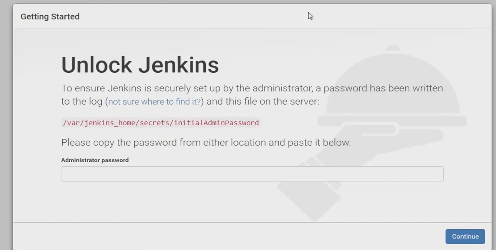

```plain
# 默认账号admin，密码如下
[root@m01 jenkins]# cat /var/lib/jenkins/secrets/initialAdminPassword
98da9a6fe9814531b790fbe125799bf0
```

### 自定义jenkins插件

这里安装插件由于会非常缓慢，我们可以后期手动安装，直接点击右上角的❎

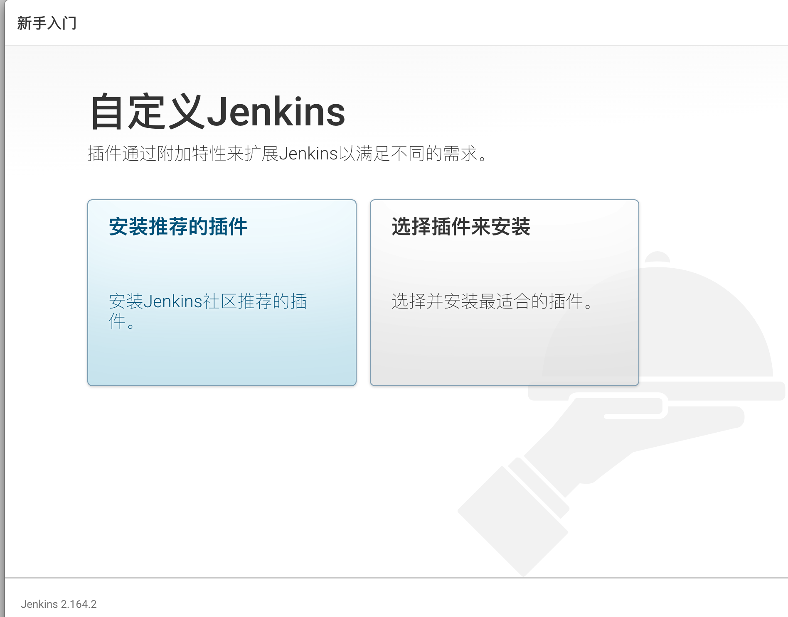

此时进入jenkins首页

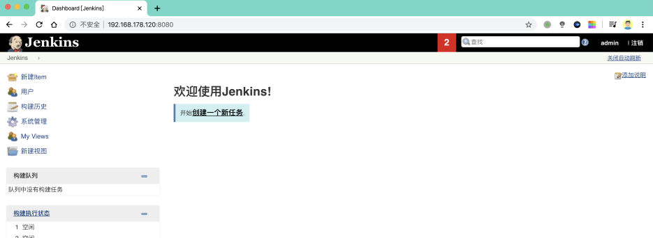

默认没安装插件，所以页面功能很少

### 修改jenkins用户密码

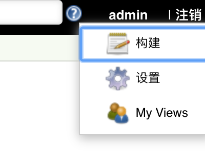

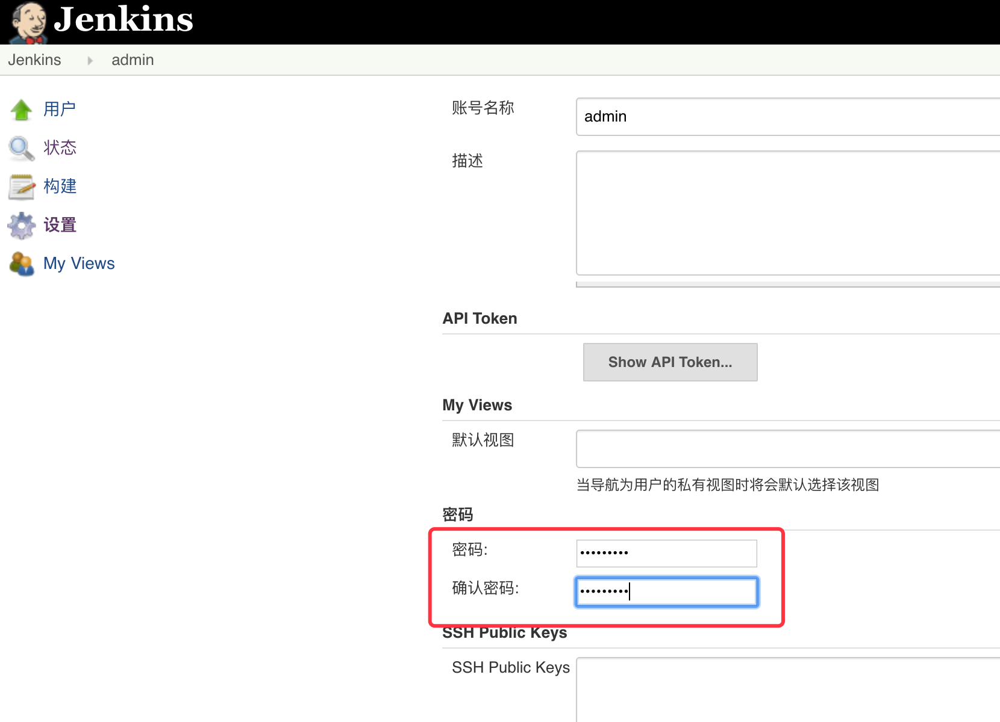

```plain
默认admin密码太长，可以修改自己记住的
chaoge666
```

## 插件安装

国外jenkins插件安装太难了，请用如下方式

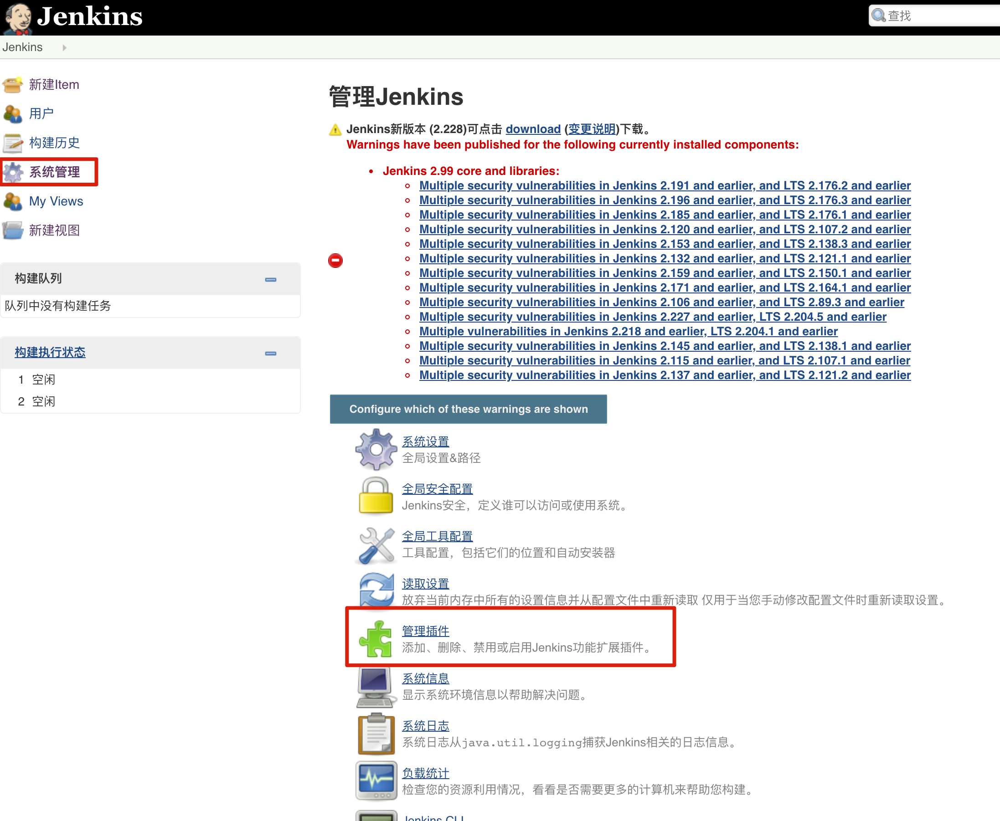

### 指定jenkins代理下载插件

可以配置下载插件代理地址

也可以去官网、清华源等地址手动下载jenkins插件，再上传

```
jenkins镜像文件后缀`.hpi`文件
```

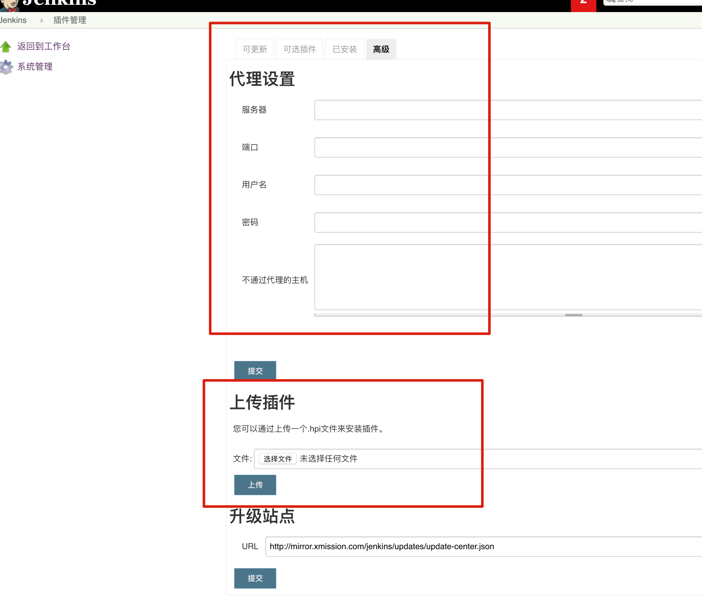

### 使用清华镜像站下载插件

```plain
https://mirrors.tuna.tsinghua.edu.cn/jenkins/plugins/
下载.hpi文件，然后在jenkins里面导入上传即可，自动安装，重启生效
```

### 修改jenkins默认升级插件源

```plain
如图，换为
https://mirrors.tuna.tsinghua.edu.cn/jenkins/updates/update-center.json
点击提交，也就是修改了linux的文件hudson.model.UpdateCenter.xml
```

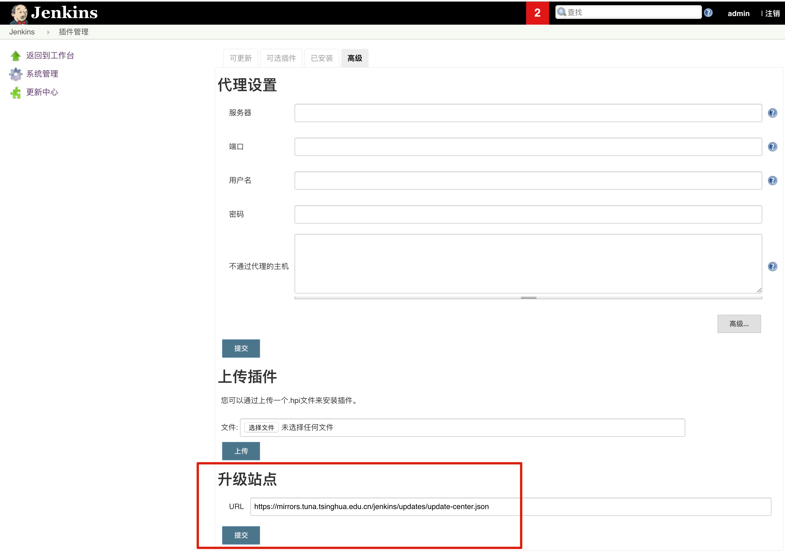

### jenkins插件迁移

```plain
可以把插件备份的机器，所有的插件目录/var/lib/jenkins/plugins 资料直接打包
解压缩到新插件目录即可，jenkins一切皆文件，可以直接迁移
jenkins没有数据库，一切皆文件，都是写在xml文件里
超哥已经提供了插件压缩包
/opt/ci_cd_rpm/plugins.tar.gz
# 解压缩
[root@m01 ci_cd_rpm]# tar -zxvf plugins.tar.gz
# 复制，移动所有插件到当前jenkins的插件目录
[root@m01 plugins]# pwd
/opt/ci_cd_rpm/plugins
[root@m01 plugins]#
[root@m01 plugins]# mv * /var/lib/jenkins/plugins/
# 重启jenkins，查看插件列表
systemctl restart jenkins
# 重启之后，jenkins自动应用所有新插件，且正确应用了
```

## 查看插件列表

```plain
系统管理 > 系统信息 >  插件
系统管理 > 插件管理 > 已安装
```

### 新功能预览

```plain
jenkins首页 > 新建Item > 多了很多新功能
```

## Jenkins主目录学习

```plain
[root@m01 plugins]# rpm -ql jenkins
/etc/init.d/jenkins                    # 启动目录
/etc/logrotate.d/jenkins        # 日志切割
/etc/sysconfig/jenkins          # jenkins主配置文件
/usr/lib/jenkins                        #jenkins程序文件 jenkins.war，如 直接替换新版jenkins.war包，重启即升级
/usr/lib/jenkins/jenkins.war
/usr/sbin/rcjenkins
/var/cache/jenkins
/var/lib/jenkins                      # jenkins主目录，如果要备份jenkins所有数据，直接拷贝这个目录即可
/var/log/jenkins
```

### 一切皆文件之用户目录

```plain
/var/lib/jenkins/users  # 该目录下存放用户信息
如 admin的信息/var/lib/jenkins/users/admin/config.xml ，改密码等等
```

### 主配置文件解读

jenkins默认的用户为jenkins，生产环境建议使用jenkins用户，然后使用sudo进行授权，在学习过程中若是想要避免权限问题，可以直接改为root用户。

```plain
默认配置参数
[root@m01 plugins]# grep -Ev "^$|^#" /etc/sysconfig/jenkins
JENKINS_HOME="/var/lib/jenkins"                #jenkins主数据目录，数据备份，也只需要打包该文件夹即可
JENKINS_JAVA_CMD=""
JENKINS_USER="jenkins"                                # 启动用户
JENKINS_JAVA_OPTIONS="-Djava.awt.headless=true"
JENKINS_PORT="8080"                                         # 启动端口，可以改
JENKINS_LISTEN_ADDRESS=""                          # 监听地址
JENKINS_HTTPS_PORT=""
JENKINS_HTTPS_KEYSTORE=""
JENKINS_HTTPS_KEYSTORE_PASSWORD=""
JENKINS_HTTPS_LISTEN_ADDRESS=""
JENKINS_DEBUG_LEVEL="5"
JENKINS_ENABLE_ACCESS_LOG="no"
JENKINS_HANDLER_MAX="100"
JENKINS_HANDLER_IDLE="20"
JENKINS_ARGS=""
```

## 修改jenkins时区

```
打开jenkins的【系统管理】---> 【脚本命令行】
在命令框中输入一下命令【时间时区设为 亚洲上海】
System.setProperty('org.apache.commons.jelly.tags.fmt.timeZone', 'Asia/Shanghai')
```


## Jenkins创建job

构建作业是一个持续集成服务器的基本职能，构建的形式多种多样，可以是编译和单元测试，也可能是打包及部署，或者是其他类似的作业。在 Jenkins 中，构建作业很容 易建立，而且根据你的需要你可以安装各种插件，来创建多种形式的构建作业，下面我们先来学习创建自由式构建作业。

自由式的构建作业是最灵活和可配置的选项，并且可以用于任何类型的项目，它的配置 相对简单，其中很多配置在的选项也会用在其他构建作业中。

在 Jenkins 主页面，点击左侧菜单栏的“新建”或者“New job”

### freestyle-job介绍

- 自由风格项目，比较灵活，可以构建任何形式的项目
- 在页面添加模块配置与参数
- 每个job仅能实现一个开发功能
- 无法将配置代码化，不利于Job配置迁移和版本控制
- 学习相对简单

### Jenkins创建freestyle项目

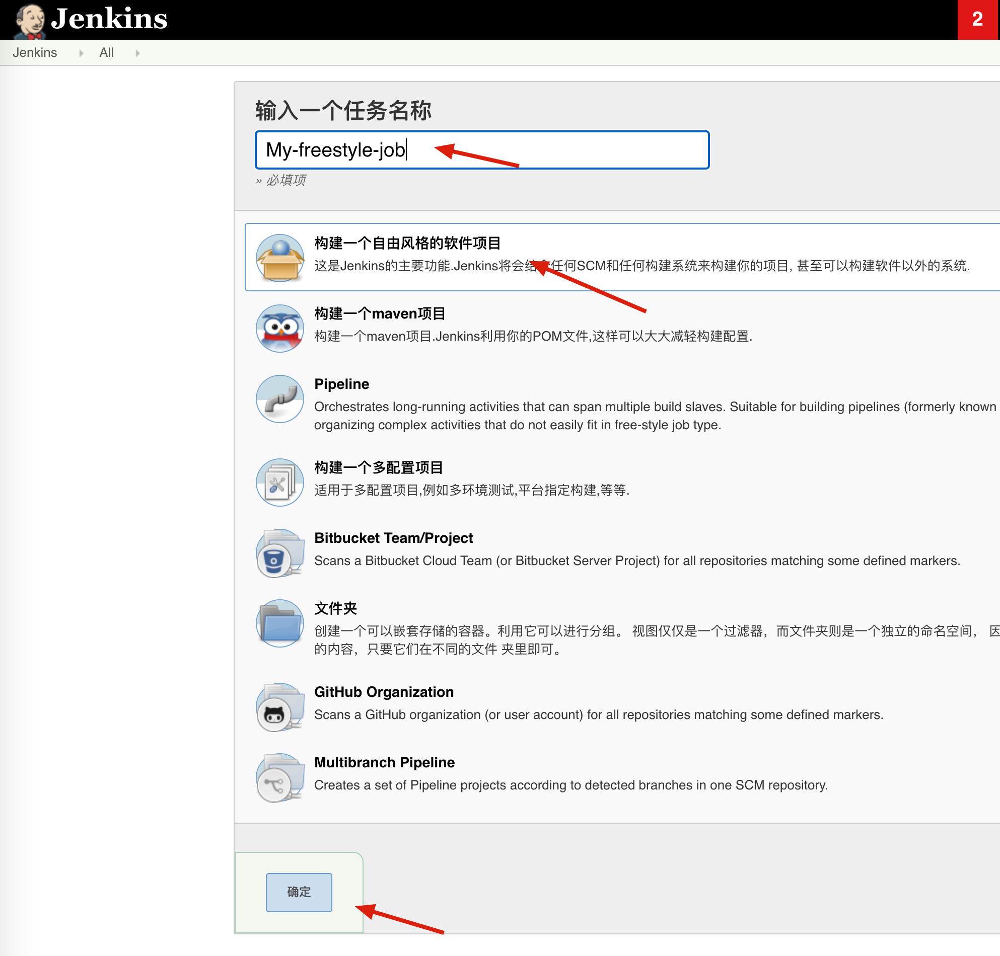

```plain
1.输入任务名字，job名字，定义一个有意义的名字，根据业务命名
注意，一旦确定job名字，就不要轻易修改了，jenkins一切皆文件
job名字已经被写入各种配置了，生成一系列的文件，文件夹
[root@m01 jobs]# pwd
/var/lib/jenkins/jobs
[root@m01 jobs]# ls
My-freestyle-job
如果你修改了文件夹，这里会生成一个新的job文件夹配置，数据目录就会紊乱出错
```


勾选“丢弃旧的构建”，这是我们必须提前考虑的重要方面，就是我们如何处理构建历史，构建作业会消耗大理的磁盘空间，尤其是你存储的构建产物(比如执行 java 构建时会 生成的 JAR、WAR 等)。


选项允许你限制在构建历史记录的作业数。你可以告诉 Jenkins 只保留最近的几次构 建，或者只保留指定数量的构建，此外，Jenkins 永远不会删除最后一个稳定和成功的构建。 具体数据的指定要根据你项目的实际情况而定，我一般设置为 5、5

```plain
丢弃旧的构建
如果项目特别多，文件大，会造成jenkins数据目录过大，特别是编译类型的项目
    保持构建5天
    保留构建最大个数5个 
构建触发器
    手动构建
    定义触发器
构建环境
构建
    执行一系列的操作
    Execute shell
        执行linux命令
```

### Execute shell执行命令、脚本

我们通过几个示例来学习具体的配置。


```plain
查看jenkins执行命令，是在哪个目录操作的
```

保存设置后，回退到job主页面，可以进行job运行。

#### 执行job立即构建

点击立即构建，即可执行job的任务，我们定义的构建动作是，执行shell命令

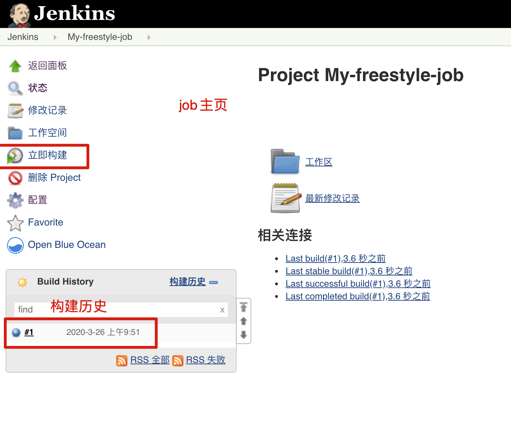

jenkins-job主页面


#### 构建结果日志

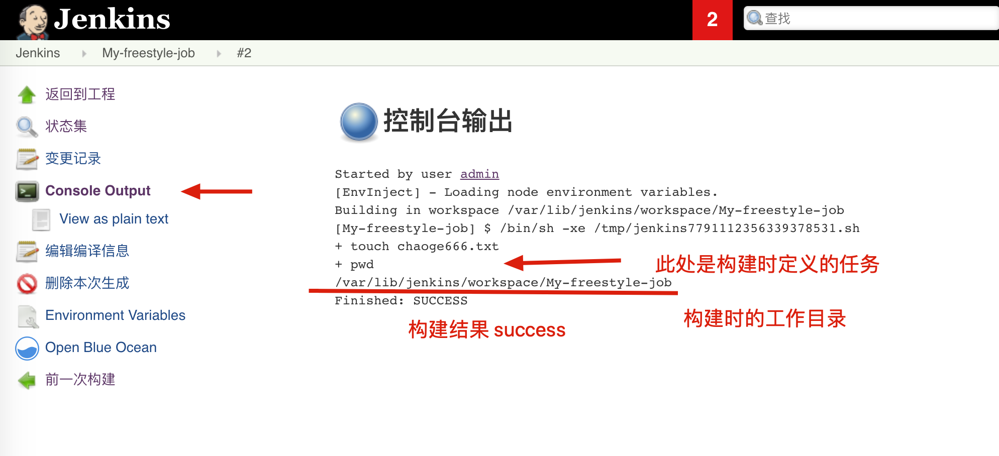

在上面的控制台输出内容中，我们可以看job执行时的当前工作目录是`jenkins主目录+workspaces+job名称`定义的目录。

```plain
# jenkins执行job的工作目录
/var/lib/jenkins/workspace/My-freestyle-job
# 由于仅仅是执行pwd，没有任何文件生成，若是对代码构建，源代码就是下载到了这里
[root@m01 workspace]# pwd
/var/lib/jenkins/workspace
[root@m01 workspace]# ls
My-freestyle-job
# job目录
[root@m01 My-freestyle-job]# pwd
/var/lib/jenkins/jobs/My-freestyle-job
# job的构建记录 都在这里了，所有构建记录都以文件形式记录下了
[root@m01 My-freestyle-job]# ls
builds  config.xml  lastStable  lastSuccessful  nextBuildNumber
```

#### 增加一个构建动作


```
job的执行结果，创建了一个文件，在当前job的workspace里
[root@m01 My-freestyle-job]# pwd
/var/lib/jenkins/workspace/My-freestyle-job
[root@m01 My-freestyle-job]# ls
readme.chaoge
```

在jenkisn站点检查工作空间

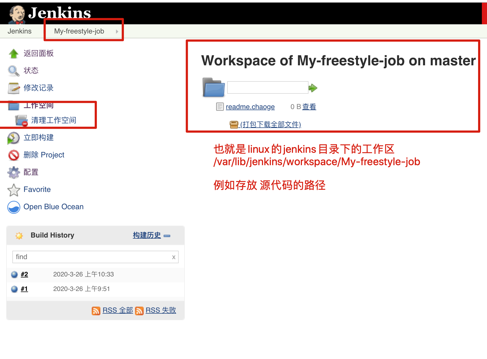

```plain
例如运维可以使用jenkins的job功能，给其他不懂linux命令的同事，通过一键点击，就能够执行linux命令
例如服务重启等
可以有效的防止不懂linux的技术人员，在服务器上做奇怪的操作
```

# Jenkins连接gitlab获取代码

既然是持续集成，对代码进行构建，我们得获取代码仓库的内容，这里选择我们搭建的gitlab服务器

## **友情提醒**

**1.在自己虚拟机做实验，若是gitlab，jenkins运行在一台服务器，内存需要给大一点，该两个服务非常吃内存**

```plain
[root@lb02 ~]# free -m
              total        used        free      shared  buff/cache   available
Mem:           3725        2229         221          61        1274        1149
Swap:          2047           0        2047
```

**2.jenkins会和gitlab冲突端口，8080，修改jenkins端口来的方便**

```plain
[root@lb02 ~]# grep 9080 /etc/sysconfig/jenkins
JENKINS_PORT="9080"
重启jenkins
[root@lb02 ~]# systemctl restart jenkins
```

## 环境准备

1.服务配置

```plain
1.启动gitlab，且检查
[root@lb02 ~]# gitlab-ctl restart/status 
2.启动jenkins，且检查
[root@lb02 ~]# systemctl start/status jenkins
```

2.访问服务

Jenkins


Gitlab


## 配置jenkins结合gitlab

在gitlab上复制仓库地址

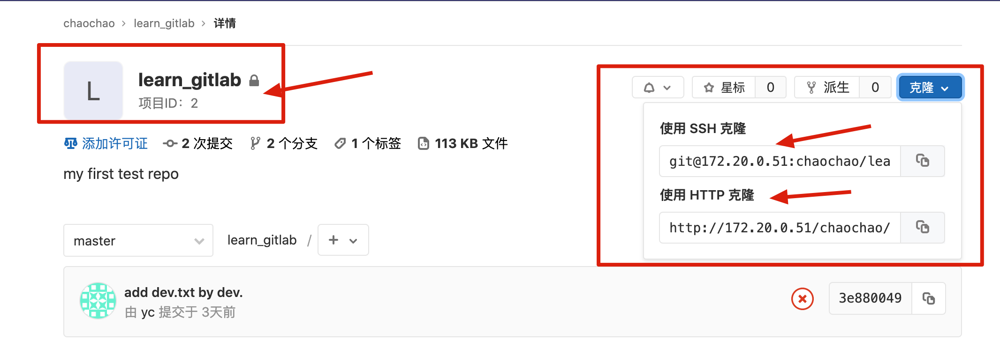

```plain
git@172.20.0.51:chaochao/learn_gitlab.git
```

在jenkins上找到job配置页面，下拉倒`源码管理`，勾选git管理

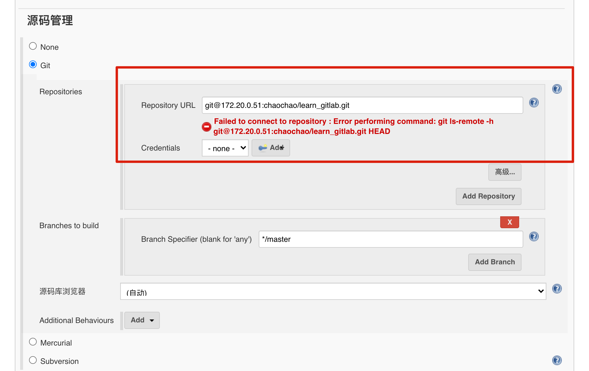

这里提示是该jenkins服务器，`git`安装有问题，可以做如下操作

```plain
yum install git -y
```

安装完毕git后，刷新jenkins页面，看到如下结果

这里新的报错是因为key认证失败，是因为我们选择的协议是ssh方式，还得配置ssh认证，我们在学习gitlab的时候，配置过客户端机器的ssh-key，为什么这里还需要认证，我们看下jenkins启动的用户

```plain
[root@lb02 ~]# ps -ef|grep jenkins
jenkins    7206      1 10 10:59 ?        00:00:52 /etc/alternatives/java -Dcom.sun.akuma.Daemon=daemonized -Djava.awt.headless=true -DJENKINS_HOME=/var/lib/jenkins -jar /usr/lib/jenkins/jenkins.war --logfile=/var/log/jenkins/jenkins.log --webroot=/var/cache/jenkins/war --daemon --httpPort=9080 --debug=5 --handlerCountMax=100 --handlerCountMaxIdle=20
```

该jenkins进程是jenkins用户启动的，而我们gitlab配置的ssh-key是root用户连接，还得重新再添加ssh-key

## jenkins添加gitlab认证


```plain
1.先在jenkins服务器上生成ssh-key密钥对
[root@lb02 ~]# ssh-keygen -t rsa
Generating public/private rsa key pair.
Enter file in which to save the key (/root/.ssh/id_rsa):
Enter passphrase (empty for no passphrase):
Enter same passphrase again:
Your identification has been saved in /root/.ssh/id_rsa.
Your public key has been saved in /root/.ssh/id_rsa.pub.
The key fingerprint is:
SHA256:RSQnEbaLTtE8IO/tZGraDx1yMu7s98HvupV3tIQK2fg root@lb02
The key's randomart image is:
+---[RSA 2048]----+
|    . . *++      |
|     o = *       |
|      o = .      |
|     . + ++   .  |
|      B S+ . . ..|
|     + @ oo .....|
|      * o oEo ...|
|     * ..  + . . |
|    ..=o..++o    |
+----[SHA256]-----+
[root@lb02 ~]# cat ~/.ssh/id_rsa.pub
ssh-rsa AAAAB3NzaC1yc2EAAAADAQABAAABAQDK7oK32itYWvGv0UuQZ4nj+eHI++scL4qlzlKlH0A52Fr24vYO5RMTlcINHcMBUAgF8j4KIvB7jngCvfToypM9YSajKwTtCmmFHR7gXg3NbszWJn0jm0y32gIiTX0UQXxaPFohz+rMKB3ts+bl4ryyHarSUrnJ5dVJBpE5RD/mLiqLCyUJlJ+lZjNjNEok4tqZrn+Gi21fZFidwFiOr74RCZVgT4LarYkOaYpeX/v3HYQIzA4E4Y7khFIW525wuA7r/weus+2lfmtCMVUoq81C9pFyEDSrOA9P/Ejsv2AhDHU8eCnfpF/mnZ1KZIYgou9TfS0c3KIFq4mrZCkS+bGB root@lb02
```

2.复制粘贴该密钥，到gitlab


由于jenkins服务还是普通用户在运行，我们给改为root用户，提升权限，编辑配置文件

```plain
[root@lb02 ~]# grep -i "_USER" /etc/sysconfig/jenkins
JENKINS_USER="root"
# 重启服务，且查看
[root@lb02 ~]# systemctl restart jenkins
[root@lb02 ~]# ps -ef|grep jenkins
root      10772      1 99 11:19 ?        00:00:08 /etc/alternatives/java -Dcom.sun.akuma.Daemon=daemonized -Djava.awt.headless=true -DJENKINS_HOME=/var/lib/jenkins -jar /usr/lib/jenkins/jenkins.war --logfile=/var/log/jenkins/jenkins.log --webroot=/var/cache/jenkins/war --daemon --httpPort=9080 --debug=5 --handlerCountMax=100 --handlerCountMaxIdle=20
```

3.还得配置gitlab服务器的ssh-key认证


4.此时看不到任何报错了


## 启动该job，立即构建


## 控制台查看详细日志


查看jenkins的job工作区

```plain
已经是下载完毕了代码
[root@lb02 My-freestyle-job]# pwd
/var/lib/jenkins/workspace/My-freestyle-job
[root@lb02 My-freestyle-job]# ls
chaoge666.txt  dev.txt  push_code.txt
```

## 获取gitlab分支代码

该操作可以用于构建测试环境

```plain
1.在dev分支推送新的代码记录
[root@lb02 code]# git clone git@172.20.0.51:chaochao/learn_gitlab.git
[root@lb02 code]# cd learn_gitlab/
[root@lb02 learn_gitlab]# git branch
* master
[root@lb02 learn_gitlab]# git checkout -b dev
切换到一个新分支 'dev'
[root@lb02 learn_gitlab]# echo "我是dev分支，超哥开发的新功能代码" > dev_code.txt
[root@lb02 learn_gitlab]# git add .
[root@lb02 learn_gitlab]# git commit -m "add code.txt by dev."
[root@lb02 learn_gitlab]# git remote -v
origin    git@172.20.0.51:chaochao/learn_gitlab.git (fetch)
origin    git@172.20.0.51:chaochao/learn_gitlab.git (push)
# 提送到dev分支
[root@lb02 learn_gitlab]# git push -u origin dev
Counting objects: 4, done.
Delta compression using up to 2 threads.
Compressing objects: 100% (2/2), done.
Writing objects: 100% (3/3), 352 bytes | 0 bytes/s, done.
Total 3 (delta 0), reused 0 (delta 0)
remote:
remote: To create a merge request for dev, visit:
remote:   http://172.20.0.51/chaochao/learn_gitlab/merge_requests/new?merge_request%5Bsource_branch%5D=dev
remote:
To git@172.20.0.51:chaochao/learn_gitlab.git
   3e88004..c3f90ab  dev -> dev
分支 dev 设置为跟踪来自 origin 的远程分支 dev。
```

查看gitlab代码仓库，dev分支内容


jenkins获取dev分支代码


jenkins获取具体commit记录代码


# 持续集成介绍

1.持续集成

- 让产品可以快速迭代，同时还能保持高质量，简化工作流程。

2.持续交付

- 让测试通过后的代码，可以准备用于部署
- 持续交付，重复前者所有的操作。

3.持续部署

- 基于交付集成之上，无论何时，代码都确保可以部署，且是自动化的。

4.持续集成实现的思路（git、jenkins、shell）

5.版本控制系统

- 将文件的每一次变化，集中在一个系统中加以版本记录，以便后续查阅文件的历史记录。

## 版本控制系统

- 常见版本控制系统

- - SVN ，集中式
  - Git，分布式

- git版本控制

- - 基本使用
  - git与github关联

- 代码托管平台

- - github
  - gitlab

- - - 配置域名
    - 配置邮箱
    - gitlab基本使用
    - gitlab的用户组、用户、项目
    - gitlab基本运维、备份、恢复

- jenkins

- - jenkins是什么，干什么的，为什么要学它
  - jenkins安装、汉化
  - jenkins插件、加速插件、安装插件、导入本地插件
  - jenkins项目创建，自由风格项目，以及jenkins-shell
  - jenkins+gitlab
  - 手动搭建一套集群环境，然后实现代码上线
  - jenkins构建项目，html，php
  - jenkins构建项目脚本开发，部署、回滚
  - jenkins构建Java项目，编译、部署（jar，war）
  - jenkins通知功能

- - - 邮件
    - 钉钉

- - 拿到源代码后，对源码进行质量扫描

- - - SonarQube

- - - - 安装
      - 手动推代码至Sonarqube测试
      - jenkins集成SOnarqube

- jenkins流水线pipeline

- - pipeline语法
  - pipeline实现html项目流水线部署
  - pipeline实现java项目流水线部署

- jenkins分布式构建
- jenkins权限控制

## 什么是集成

在实际软件开发中，常会有如下两种场景：

1.现在有一个电商平台需要开发，由于电商平台模块众多，此时就需要不同开发人员开发不同的模块，最红把所有人的代码都集中到一个系统中。集成后对其进行部署上线。

2.随着时间的推移，无论是修复bug还是新功能开发，后续都要对系统进行不断的更新、迭代。


## 什么是持续集成（CI）

持续集成（Continuous integration ，CI）

持续集成就是在于”持续“两字，频繁的（一天多次）的将代码集成到主干(master)，重复如上的工作。


```plain
程序员
    ↓推代码
git仓库，gitlab
    ↓仓库通知CI服务器，jenkins
jenkins执行脚本，如对代码编译，测试，运行
    ↓通知集成结果
程序员对结果处理
```

## 使用持续集成好处

1.快速发现错误，每完成一点更新，就集成到主干，可以快速发现bug，也容易定位错误。

2.节省人力成本，省去手动反复部署操作

3.加快软件开发进程

4.实时交付

5.防止大幅度偏离主干，如果不经常集成，主干也在更新，会导致后续集成难度增大，或是难以集成。

## 使用持续集成目的

让产品可以快速迭代，同时还能保持高质量。（程序员写了新功能，很可能有bug，快速进行jenkins集成测试，能够快速发现bug，定位、解决bug，再次集成操作，整个过程自动化，非常高效且省时省力）

持续集成核心目的：代码集成到主干之前，对代码进行自动化测试。只要有一个测试用例失败，就不能集成，当然持续集成并不能完全的消除bug，主要目的是让bug更容易发现和改正。

## 什么情况需要持续集成

如果项目开发的规模较小，软件集成不是问题。

如果项目很大，需要不断添加新功能，或不断的升级产品，则需要进行反复集成，因此必须使用持续集成来简化工作。

# 持续交付（CD）

Continuous Delivery

交付，产品从开始到结束诞生的产物，在服务器上健康运行。

持续交付指的是在持续集成的环境基础之上，将代码部署到预生产环境。

- 持续集成对代码进行集成测试
- 持续交付，对代码进行部署

## 持续交付过程

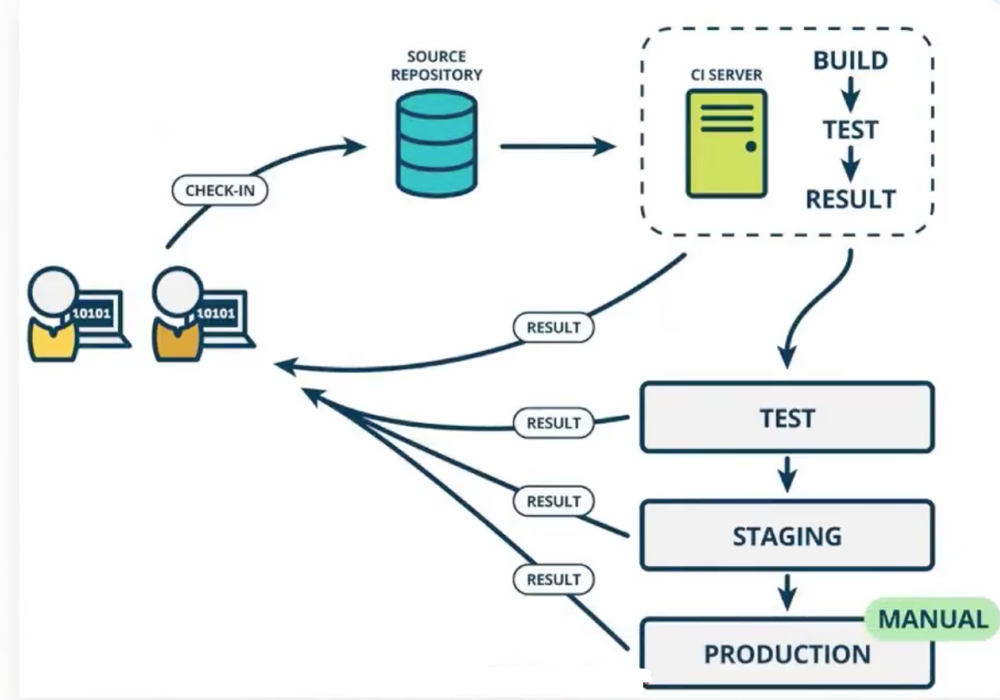

- 代码开发

- - 开发自己单元测试

- 代码合并到主干
- 测试人员介入，功能测试、自动化测试
- 代码进行生产部署，jenkins一键自动化部署

# 持续部署(CD)

Continuous Deployment

持续部署是持续交付的下一步，指代码在任何时刻都是可部署的，最后将部署到生产环境的过程自动化。

持续部署和持续交付的区别就在于最终部署到生产环境`是自动化的`。

## 持续部署过程

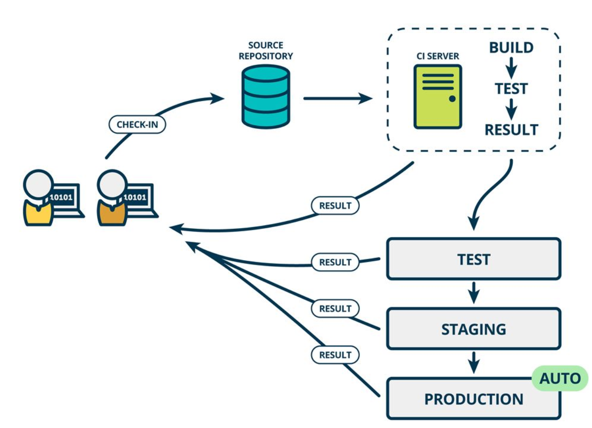

```plain
当有人提交了代码，就自动的通知jenkins对代码进行构建 > 测试 > 确认代码可运行  > 构建到生产服务器 
整个过程全自动化，但是有可能出现难以预料的问题
最好的是半自动化，使用持续交付
```

# 持续集成实施流程

根据持续集成的设计，代码从提交到进入生产环境，整个过程如下：


jenkins本身没有太多功能，但是支持丰富的插件，进行调度，完成工作。

# 关于版本控制

什么是“版本控制”？我为什么要关心它呢？ 版本控制是一种记录一个或若干文件内容变化，以便将来查阅特定版本修订情况的系统。

## 本地版本控制系统

许多人习惯用复制整个项目目录的方式来保存不同的版本，或许还会改名加上备份时间以示区别。 这么做唯一的好处就是简单，但是特别容易犯错。 有时候会混淆所在的工作目录，一不小心会写错文件或者覆盖意想外的文件。

如果你在学校写过毕业论文，那你一定遇见过这样的问题

一个论文翻来覆去的改，写一点觉得有问题，写一点还觉得有问题，还不容易写好了，导师还挑刺，说这改的还不如上回，给改回去、、、


- **看着这一堆乱七八糟的文件，你自己也不记得，每一个文件到底写了什么内容，还得一个个看，想删又不敢删。。。**
- **当你写完了毕业论文，你还得用U盘拷给导师，或者发个邮件给他，但是你回家可能还得改论文，那你发给导师的论文和你本地最新的论文又不一致了。。**

**于是这么多令人fuck指的操作，你就希望有没有一个软件，帮你记录文件变动的操作，并且同事还能一起操作，不需要自己传输文件，想知道变动了什么，只需要去软件里看看，这是不是很nb？**

## 这个软件雏形？

对于文件使用版本号，日期的管理，这种方式比起没有版本管理好得多，但是也很臃肿，且他人不容易看得懂

| 版本 | 文件名                     | 用户    | 说明               | 日期       |
| ---- | -------------------------- | ------- | ------------------ | ---------- |
| 1    | 美国皇家大学毕业论文v1.doc | yuchao  | 论文初稿           | 7/12 10:38 |
| 2    | 美国皇家大学毕业论文v2.doc | yuchao  | 论文修改版         | 7/12 18:09 |
| 3    | 美国皇家大学毕业论文v3.doc | Onlyu   | 小于帮我修改论文   | 7/13 9:51  |
| 4    | 美国皇家大学毕业论文v4.doc | Wupeiqi | 武沛奇帮我修改论文 | 7/14 15:17 |

## 新式版本控制

现在的版本控制系统又是如何管理的，且还能实现快速回退功能。


## 版本控制系统解决了什么问题

1.追溯文件历史变更记录

2.多人团队协同开发

3.代码集中统一管理


# Git工具

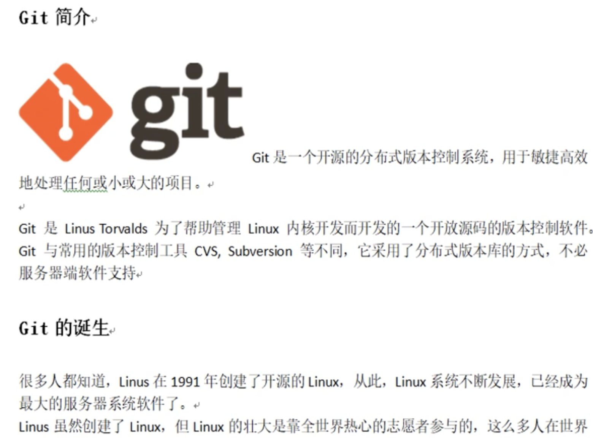


## 集中式和分布式版本控制

Linus一直痛恨的CVS及SVN都是集中式的版本控制系统，而Git是分布式版本控制系统，集中式和分布式版本控制系统有什么区别呢？

先说集中式版本控制系统，版本库是集中存放在中央服务器的，而干活的时候，用的都是自己的电脑，所以要先从中央服务器取得最新的版本，然后开始干活，干完活了，再把自己的活推送给中央服务器。中央服务器就好比是一个图书馆，你要改一本书，必须先从图书馆借出来，然后回到家自己改，改完了，再放回图书馆。

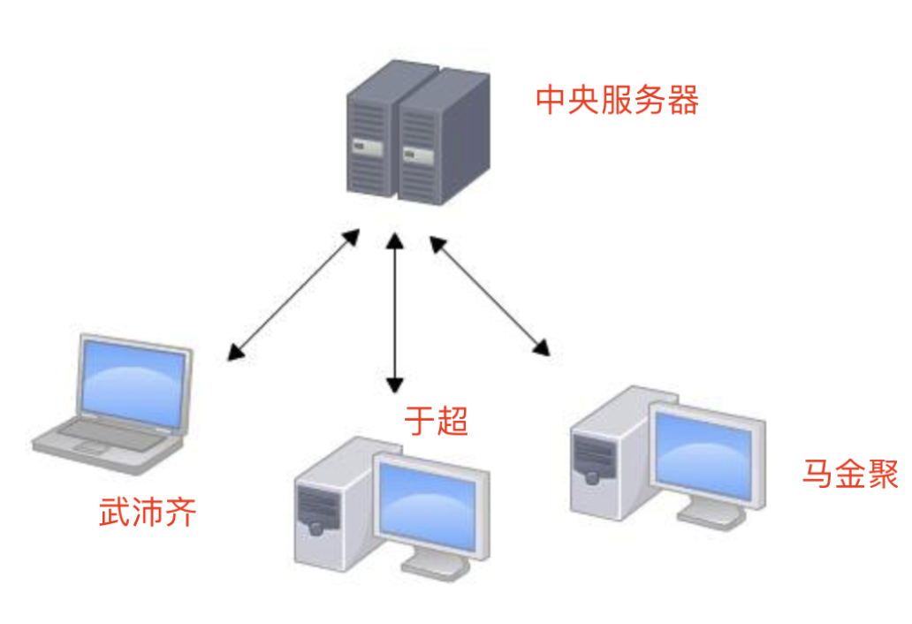

集中式版本控制，典型代表SVN

集中式版本控制系统最大的毛病就是必须联网才能工作，如果在局域网内还好，带宽够大，速度够快，可如果在互联网上，遇到网速慢的话，可能提交一个10M的文件就需要5分钟，这还不得把人给憋死啊。

**而且如果集中式版本服务器宕机了，所有人都没法工作。**

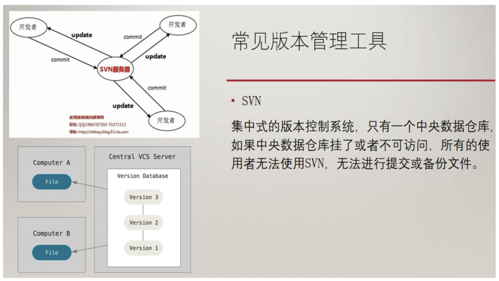

## 分布式版本控制

分布式版本控制，没有中央服务器的概念，每个人都有自己的版本库，因此每个人在工作时候，**不需要联网，版本库本地即可管理。**

既然每个人都是一个完整的版本库，同事之间如果需要协作开发，就需要找一个用于“交换文件”的中央服务器，这个服务器不存在也不影响大家干活，只是用于交换文件内容。

GIT最强大的功能还有分支管理，远甩SVN等软件。


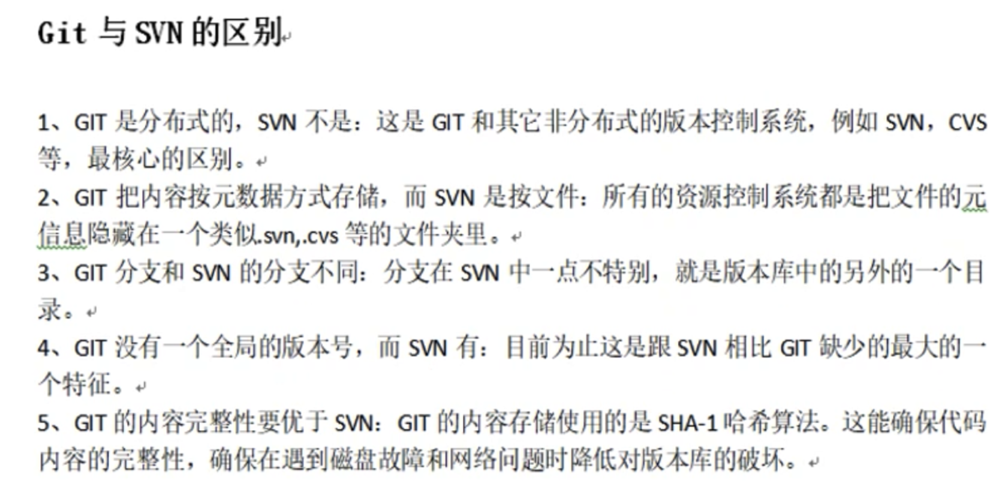


# Git工具

## 命令行

Git有多重方式使用

- 原生命令行，才能使用git所有命令，会git命令再去用gui图形工具，完全无压力
- GUI图形软件，只是实现了git的部分功能，以减免操作难度，难以记住git原生命令
- 不同的人会有不同的GUI图形工具，但是所有人用的git原生命令都一样，推荐学习命令

### Windows安装

在Windows上使用Git，可以从Git官网直接[下载安装程序](https://git-scm.com/downloads)，然后按默认选项安装即可。

安装完成后，在开始菜单里找到“Git”->“Git Bash”，蹦出一个类似命令行窗口的东西，就说明Git安装成功！

### 在 Mac 上安装

在mac安装git方式很多，最简单是用brew包管理

安装homebrew，然后通过homebrew安装Git，具体方法请参考homebrew的文档：http://brew.sh/。

```plain
brew install git
```

如果你想安装更新的版本，可以使用二进制安装程序。 官方维护的 OSX Git 安装程序可以在 Git 官方网站下载，网址为 http://git-scm.com/download/mac。

### 在 Linux 上安装

如果你想在 Linux 上用二进制安装程序来安装 Git，可以使用发行版包含的基础软件包管理工具来安装。 如果以Centos 上为例，你可以使用 yum：

```plain
sudo yum install git
```

如果你在基于 Debian 的发行版上，请尝试用 apt-get：

```plain
sudo apt-get install git
```

## 环境准备

准备好一台linux机器，且进行环境初始化，主机名、配置yum源、安装基础软件包、关闭防火墙、同步系统时间等。

安装git

```plain
[root@chaogelinux ~]# yum install git -y
[root@chaogelinux ~]# git --version
git version 1.8.3.1
```

# 运行git前的配置

既然已经在系统上安装了 Git，你会想要做几件事来定制你的 Git 环境。 每台计算机上只需要配置一次，程序升级时会保留配置信息。 你可以在任何时候再次通过运行命令来修改它们。

Git 自带一个 `git config` 的工具来帮助设置控制 Git 外观和行为的配置变量。 这些变量存储在三个不同的位置：

**这个用户指的是linux用户**

三种环境参数

- **--system**
- **--global**
- **--local**
- `/etc/gitconfig` 文件: 包含系统上每一个用户及他们仓库的通用配置。 如果使用带有 `--system` 选项的 `git config` 时，它会从此文件读写配置变量。
- `~/.gitconfig` 或 `~/.config/git/config` 文件：只针对当前用户。 可以传递 `--global` 选项让 Git 读写此文件。
- 当前使用仓库的 Git 目录中的 `config` 文件（就是 `.git/config`）：针对该仓库。 `--local` 当前仓库配置

## 用户信息配置

通常配置git，只需要配置好你是谁，你的邮箱，这样就知道是谁在提交代码了。

```plain
$ git config --global user.name "Only yu"
$ git config --global user.email "yc_uuu@163.com"
$ git config --global color.ui true
我们这里配置的是--global参数，因此是在用户家目录下，可以查看
[root@chaogelinux ~]# cat .gitconfig
[user]
    name = pyyu
    email = yc_uuu@163.com
[color]
    ui = true
```

## Git配置相关命令

```plain
yum install git -y  安装git
git --version　　查看git版本
git config --system --list 查看系统所有linux用户的通用配置,此命令检查/etc/gitconfig
git config --global --list 查看当前linux用户的配置，检查~/.gitconfig文件
git config --local --list 查看git目录中的仓库配置文件，.git/config文件
git config --global user.name "pyyu"　　配置当前linux用户全局用户名，这台机器所有git仓库都会用这个配置
git config --global user.email "yc_uuu@163.com"  配置当前linux用户全局邮箱
git config --global color.ui true 配置git语法高亮显示
git config --list 列出git能找到的所有配置,从不同的文件中读取所有结果
git config user.name　　列出git某一项配置
git help 获取git帮助
man git man手册
git help config 获取config命令的手册
```

# Git工作流程

## Git四个区域

使用git就是将本地文件（工作目录workspace）的文件，添加到暂存区（stage）,然后提交到本地仓库（repository），最终可以协同开发，推送到远程仓库（remote）。


## Git实践

git版本库，也叫做git仓库（repository），也就是一个文件夹。

这个目录的所有内容被git软件管理，所有的修改，删除，git都会跟踪记录，便于可以跟踪历史记录，以后可以还原文件。

### 三种场景需求：

#### 1.把已有的项目代码，纳入git管理

```plain
cd mysite    mysite项目所在代码
git init        初始化git仓库
git init命令会创建一个.git隐藏子目录，这个目录包含初始化git仓库所有的核心文件。
此步仅仅是初始化，此时项目里的代码还没有被git跟踪，因此还需要git add对项目文件跟踪，然后git commit提交到本地仓库
```

想知道.git文件做了什么事，请看git原理 >[Git 内部原理](https://git-scm.com/book/zh/v2/ch00/ch10-git-internals)

#### 2.新建一个项目，直接用git管理

```plain
cd 某个文件夹
git init mysite      此步会在当前路径创建mysite文件夹，mysite文件夹中包含了.git的初始化文件夹，所有配置
```

#### PS:git原理

.git这个目录中

```plain
[root@pyyuc ~/git_learning/mysite 11:08:19]#tree .git
.git
├── branches
├── config　　　　这个项目独有的配置
├── description
├── HEAD　　　　head文件指示目前被检出的分支
├── hooks　　hooks目录包含服务端和客户端的钩子脚本 hook scripts
│   ├── applypatch-msg.sample
│   ├── commit-msg.sample
│   ├── post-update.sample
│   ├── pre-applypatch.sample
│   ├── pre-commit.sample
│   ├── prepare-commit-msg.sample
│   ├── pre-push.sample
│   ├── pre-rebase.sample
│   └── update.sample
├── index  index文件保存暂存区的信息，只有git add之后才会生成，默认还没有这个文件
├── info　　　　info目录是全局性排除文件，用于放置不想被记录在.gitignore文件中的忽略模式（ignored patterns）
│   └── exclude
├── objects　　存储所有数据内容
│   ├── info
│   └── pack
└── refs　　refs目录存储指向数据（分支）的提交对象的指针
    ├── heads
    └── tags
.git文件夹解析
```

#### 3.获取远程代码仓库代码

```plain
如果你想获取github上的代码，或者你公司gitlab私有仓库的代码，可以使用git clone命令，下载克隆远程仓库的代码。
git clone https://github.com/django/django.git
下载出来的代码已经是被git管理的本地仓库
你会发现所有的项目文件都在这里，等待后续开发
```

## Git生命周期演练

### git工作区

在我们进行git init mygit初始化一个git项目时，这个mygit文件夹，就是一个工作区（working Directory）

```plain
yudanL-2:mygit root# pwd
/data/mygit
yudanL-2:mygit root# ls
.git    my.txt
```

### git仓库

工作区里有一个.git隐藏文件夹，就是git的本地仓库

.git文件夹里有一个index文件，就是git的暂存区，也叫做stage

.git文件夹里的HEAD文件就是git的一个指针

原理图

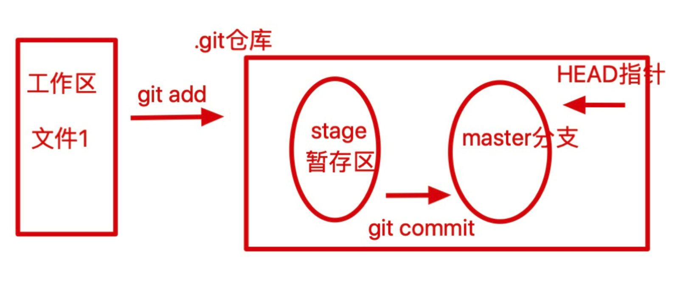

```plain
git init mysite                          初始化git仓库
git status                                 查看git状态
echo 'print("挣了一个亿")' > main.py        新建一个代码文件，此时是未被git跟踪的
git status                                查看状态
    On branch master
    No commits yet
    Untracked files:
      (use "git add <file>..." to include in what will be committed)
        main.py
    nothing added to commit but untracked files present (use "git add" to track)
git add main.py　　开始跟踪main.py文件
git status 　　此时再看已经被跟踪，现在已是可以被提交的状态,此时处于暂存区
git commit -m "echo main.py"  告诉git，把暂存区的main.py提交到本地仓库
git log 　　　　查看刚才的commit记录
```

### 检查git文件状态

```plain
git status 
此命令查看git工作目录的文件，处于生命周期的哪一个状态 注意，只能在git工作目录中输入这个命令，他会去找.git文件夹 
第一次输入git status会看到此状态，没有任何东西需要提交
[root@pyyuc ~/git_learning/mysite 12:00:34]#git status
# On branch master
#
# Initial commit
#
nothing to commit (create/copy files and use "git add" to track)
说明当前工作目录很干净，所有的已跟踪文件，已经被提交且未更改。
此时处在master默认分支。
```

### 给文件重命名

有同学会说，这也太简单了，mv不就得了吗

```plain
我们还是在git版本库中操作
修改main.py为mymain.py
mv main.py  mymain.py
查看状态
git status直接mv的操作，会被git记录为两个形容，一、删除原有文件、二、新建了mymain.py文件此时新文件还未被跟踪，需要git add , git commit原本的main.py还需要从暂存区删除
[root@pyyuc ~/mysite 14:57:57]#git status
# On branch master
# Changes not staged for commit:
#   (use "git add/rm <file>..." to update what will be committed)
#   (use "git checkout -- <file>..." to discard changes in working directory)
#
#    deleted:    main.py
#
# Untracked files:
#   (use "git add <file>..." to include in what will be committed)
#
#    mymain.py
no changes added to commit (use "git add" and/or "git commit -a")git rm main.py　　删除暂存区的main.pygit commit -m "mv mymain.py"　　提交新的mymain.py
```

这样的步骤很麻烦，可以直接git mv 命令即可

刚才的mv记录，可以通过git log查看历史记录，已经提交的id

可以通过git reset 回退历史版本，回退到改名之前

```plain
[root@pyyuc ~/mysite 15:10:12]#git log
commit f60fa7f1312843aa57edc9464192c9d891f23fb5
Author: pyyu <yc_uuu@163.com>
Date:   Sat Dec 22 15:08:02 2018 +0800
    mv mymain.py
commit 65e0a2239909fd5aabc5928ec4431de3f163a195
Author: pyyu <yc_uuu@163.com>
Date:   Sat Dec 22 14:51:07 2018 +0800
    echo main.py
回退到上一次commit版本，（注意这个命令，很危险，慎用）
git reset --hard 65e0a2239909fd5aabc5928ec4431de3f163a195 
--hard 清空暂存区和工作目录资料
```

文件改名最正确的姿势

```plain
git mv main.py mymain.py 　
git commit -m "mv mymain.py"
```

### git版本历史

在我们使用git的时候，会对代码文件不停的修改，不断的提交到代码仓库。

这个就如同我们打游戏时候，保存关卡记录的操作

在打boss之前，先做一个存档，防止你这个渣渣，被boss一招秒杀，又得从头再来。。。。。

因此被boss弄死，可以从存档，重新开始游戏。。。。

#### git log

**当你的代码写好了一部分功能，就可以保存一个"存档"，这个存档操作就是git commit，如果代码出错，可以随时回到"存档"记录**

**查看"存档"记录，查看commit提交记录的命令 git log**

我们可以吧git commit操作与虚拟机的快照做对比理解，简单理解就是每次commit，就等于我们对代码仓库做了一个快照。

可以演示下vmware快照

那么我们如何知道文件快照了多少次呢？

git log命令显示，从最新的commit记录到最远的记录顺序。

```plain
git log --oneline    一行显示git记录
git log --oneline  --all  一行显示所有分支git记录
git log --oneline --all -4 --graph 显示所有分支的版本演进的最近4条
git log -4  显示最近4条记录
git log --all     显示所有分支的commit信息
git branch -v 查看分支信息
git help --web log 以web界面显示log的参数
```

### git文件对比

我们先记住如下几个命令的作用：

- git diff：

- - 当工作区有改动，暂存区为空，diff比较的是`工作区`和`最后一次commit提交的仓库`的共同文件
  - 当工作区有改动，暂存区不为空，diff比较的是`工作区`和`暂存区`的共同文件

- git diff --cached或git diff --staged

- - 显示`暂存区`（已add但未commit的文件）和`最后一次commit`之间所有的不相同的文件，增删改信息。

- git diff HEAD：

- - 显示工作区（已跟踪但未add的文件）和暂存区（已add但未commit的文件）和本地仓库(最后一次commit的文件)所有不相同文件的增删改。

#### 命令实践

情况一：工作区，暂存区，都没有改动

```plain
# 情况一，工作区，暂存区，都没有改动
[yuchao@yumac ~/learn_git]$git status
On branch master
nothing to commit, working tree clean
[yuchao@yumac ~/learn_git]$
[yuchao@yumac ~/learn_git]$git diff
```

情况二：工作区有改动，暂存区为空（未git add的情况），比较的是工作区和本地仓库

```plain
# 情况二，工作区有改动，暂存区为空（未git add的情况），比较的是工作区和本地仓库
[yuchao@yumac ~/learn_git]$cat learn.txt
超哥带你学git
[yuchao@yumac ~/learn_git]$
[yuchao@yumac ~/learn_git]$
[yuchao@yumac ~/learn_git]$echo "超哥带你学git，好嗨哦" >> learn.txt
[yuchao@yumac ~/learn_git]$
[yuchao@yumac ~/learn_git]$git status
On branch master
Changes not staged for commit:
  (use "git add <file>..." to update what will be committed)
  (use "git restore <file>..." to discard changes in working directory)
    modified:   learn.txt
no changes added to commit (use "git add" and/or "git commit -a")
[yuchao@yumac ~/learn_git]$git diff
diff --git a/learn.txt b/learn.txt
index 46cf52a..8f433a7 100644
--- a/learn.txt
+++ b/learn.txt
@@ -1 +1,2 @@
 超哥带你学git
+超哥带你学git，好嗨哦
```

情况三：工作区有改动，暂存区不为空，比较的是工作区和本地仓库

```plain
# 情况三，工作区有改动，暂存区不为空，比较的是工作区和本地仓库
[yuchao@yumac ~/learn_git]$git add .
[yuchao@yumac ~/learn_git]$git diff
# 看不到任何结果，是因为工作区和暂存区内容一样的
# 因此可以在本地再添加一些信息
[yuchao@yumac ~/learn_git]$echo "超哥带你学git，真的很嗨哦" >> learn.txt
[yuchao@yumac ~/learn_git]$git diff
diff --git a/learn.txt b/learn.txt
index 8f433a7..dc0a6ba 100644
--- a/learn.txt
+++ b/learn.txt
@@ -1,2 +1,3 @@
 超哥带你学git
 超哥带你学git，好嗨哦
+超哥带你学git，真的很嗨哦
# 添加工作区的内容放入，暂存区
[yuchao@yumac ~/learn_git]$git add .
[yuchao@yumac ~/learn_git]$git diff
[yuchao@yumac ~/learn_git]$git status
On branch master
Changes to be committed:
  (use "git restore --staged <file>..." to unstage)
    modified:   learn.txt
# 提交暂存区的内容
[yuchao@yumac ~/learn_git]$git commit -m "second commit with modified learn.txt"
[master 688c0ba] second commit with modified learn.txt
 1 file changed, 2 insertions(+)
[yuchao@yumac ~/learn_git]$
[yuchao@yumac ~/learn_git]$git diff
```

情况四：刚才比较的都是本地工作区的文件区别，现在比较`暂存区`和`本地仓库`的区别

```plain
# 案例1，当前暂存区为空
[yuchao@yumac ~/learn_git]$git status
On branch master
nothing to commit, working tree clean
[yuchao@yumac ~/learn_git]$
[yuchao@yumac ~/learn_git]$git diff --cached
# 暂存区有内容
[yuchao@yumac ~/learn_git]$echo "git diff很强大哦" >> learn.txt
[yuchao@yumac ~/learn_git]$git add .
[yuchao@yumac ~/learn_git]$git status
On branch master
Changes to be committed:
  (use "git restore --staged <file>..." to unstage)
    modified:   learn.txt
[yuchao@yumac ~/learn_git]$
# 使用git diff查看git diff --cached区别
# 直接git diff没有结果，因为比较的是工作区和暂存区信息，是一样的，已经git add了
[yuchao@yumac ~/learn_git]$git diff  
# 使用git add --cached，发现区别，比较的是暂存区和本地仓库的区别
[yuchao@yumac ~/learn_git]$git diff  --cached
diff --git a/learn.txt b/learn.txt
index dc0a6ba..52ef4f1 100644
--- a/learn.txt
+++ b/learn.txt
@@ -1,3 +1,4 @@
 超哥带你学git
 超哥带你学git，好嗨哦
 超哥带你学git，真的很嗨哦
+git diff很强大哦
```

情况五：比较所有区域的区别

git diff head：

- 显示工作区（已跟踪但未add的文件）和暂存区（已add但未commit的文件）和本地仓库(最后一次commit的文件)所有不相同文件的增删改。

```plain
# 所有区域没有内容变化，没有结果
[yuchao@yumac ~/learn_git]$git diff HEAD
# 工作区有内容变化，和本地仓库有文件差异
[yuchao@yumac ~/learn_git]$echo "git diff 最后一个示例了" >> learn.txt
[yuchao@yumac ~/learn_git]$
[yuchao@yumac ~/learn_git]$
[yuchao@yumac ~/learn_git]$git diff head
diff --git a/learn.txt b/learn.txt
index 52ef4f1..a382ed8 100644
--- a/learn.txt
+++ b/learn.txt
@@ -2,3 +2,4 @@
 超哥带你学git，好嗨哦
 超哥带你学git，真的很嗨哦
 git diff很强大哦
+git diff 最后一个示例了
# 工作区，暂存区，本地仓库三个比较，仍有区别
[yuchao@yumac ~/learn_git]$git add .
[yuchao@yumac ~/learn_git]$
[yuchao@yumac ~/learn_git]$
[yuchao@yumac ~/learn_git]$git diff head
diff --git a/learn.txt b/learn.txt
index 52ef4f1..a382ed8 100644
--- a/learn.txt
+++ b/learn.txt
@@ -2,3 +2,4 @@
 超哥带你学git，好嗨哦
 超哥带你学git，真的很嗨哦
 git diff很强大哦
+git diff 最后一个示例了
# 提交暂存区后，所有区域没有区别了
[yuchao@yumac ~/learn_git]$git commit -m "learn git diff end."
[master e670d84] learn git diff end.
 1 file changed, 1 insertion(+)
[yuchao@yumac ~/learn_git]$
[yuchao@yumac ~/learn_git]$
[yuchao@yumac ~/learn_git]$
[yuchao@yumac ~/learn_git]$git diff head
```

总结，看来`git diff head`能最大程度的检查出git区域间的文件一致。

## git仓库文件管理生命周期

```plain
还记得git的四个区域吗？本地文件夹，暂存区，本地仓库，远程仓库吗？
本地文件夹未初始化，git是不认识的
本地文件git init后，就成了git仓库
```

请记住，在工作文件夹的每一个文件，只有两种状态，一个是`未跟踪`，一个是`已跟踪`

已跟踪的指的是已经被纳入git版本管理的文件，在git快照中有他的记录

未跟踪的是这个文件既不在git快照中，也不在暂存区

git init初始化时的工作文件夹，都属于已跟踪了，后续的编辑操作都会标记为，已修改文件，因此需要将修改后的文件，加入暂存区，然后提交暂存区的文件。


## Git版本回退

我们已知git commit可以提交代码到本地仓库，如同虚拟机的快照，当也可以进行版本回退。

```plain
git log可以查看历史版本记录
git reset --hard命令可以回退版本
git reset --hard HEAD^ 回退到上个版本
HEAD表示当前版版本
HEAD^表示上个版本
HEAD^^上上个版本
也可以直接git reset --hard 版本id号
这个时候就发现，git commit -m 所标记的注释信息非常重要了吧
```

### 版本回退原理

```plain
[yuchao@yumac ~/learn_git]$git reset --hard 81f0c645e4f4ca3fa20876939b04aa0da7996624
HEAD is now at 81f0c64 my first commit with touch learn.txt
```

git版本指针


## git穿梭未来

穿梭未来有点吓人，其实还是基于git log的恢复，如快照的恢复了。

当你发现你git reset回退版本选错了ID，怎么办？别怕

`git reflog`帮你记录你每一次执行的命令

```plain
git reflog
80f9496 HEAD@{1}: reset: moving to HEAD^
b7a8740 (HEAD -> master) HEAD@{2}: commit: echo 123
80f9496 HEAD@{3}: commit: echo my.txt
bf5879e HEAD@{4}: commit (initial): echo my.txt
```

我想回到某一个点，可以再次git reset --hard 版本id

## git stash

保存当前暂存区和工作区的改动存储起来，执行完毕git stash之后，再次运行git status就会发现当前已是个干净的工作区，通过git stash list查看结果

命令整理

```plain
git stash 保存暂存区，工作区进度
git stash list 查看stash保存的列表以及id
git stash pop  恢复最新的stash进度到工作区
git stash pop stash_id  恢复指定的stash进度
git stash clear 清空所有存储的stash进度
git stash drop stash_id  删除一个存储的stash进度
```

### git stash实际用法

`git stash`会把所有未提交的修改(已经git add 还未git commit)都保存起来，用于以后续恢复当前工作目录。 比如下面的中间状态，通过`git stash`命令推送一个新的储藏，当前的工作目录就干净了。

```plain
[yuchao@yumac ~/learn_git]$echo "练习stash" >>  learn_stash.txt
[yuchao@yumac ~/learn_git]$echo "练习stash22" >>  learn_stash22.txt
[yuchao@yumac ~/learn_git]$
[yuchao@yumac ~/learn_git]$
[yuchao@yumac ~/learn_git]$git add .
[yuchao@yumac ~/learn_git]$
[yuchao@yumac ~/learn_git]$
[yuchao@yumac ~/learn_git]$git status
On branch master
Changes to be committed:
  (use "git restore --staged <file>..." to unstage)
    new file:   learn_stash.txt
    new file:   learn_stash22.txt
[yuchao@yumac ~/learn_git]$
[yuchao@yumac ~/learn_git]$
[yuchao@yumac ~/learn_git]$ls
learn.txt        learn_stash.txt        learn_stash22.txt
# 如上有3个文件，已经被加入了暂存区
# 使用stash可以吧暂存区还未提交的内容，临时存储起来
[yuchao@yumac ~/learn_git]$git stash save "my two file named learn_stash.txt"
Saved working directory and index state On master: my two file named learn_stash.txt
[yuchao@yumac ~/learn_git]$
[yuchao@yumac ~/learn_git]$
# 发现只剩下一个文件了
[yuchao@yumac ~/learn_git]$ls
learn.txt
# 找回stash文件内容
# 查看储藏室列表
[yuchao@yumac ~/learn_git]$git stash list
stash@{0}: On master: my two file named learn_stash.txt
# 找回储藏室的文件内容
[yuchao@yumac ~/learn_git]$git stash pop
On branch master
Changes to be committed:
  (use "git restore --staged <file>..." to unstage)
    new file:   learn_stash.txt
    new file:   learn_stash22.txt
Dropped refs/stash@{0} (e5a0fb591a48d66753d7d8f43574529efd02af29)
[yuchao@yumac ~/learn_git]$
[yuchao@yumac ~/learn_git]$
[yuchao@yumac ~/learn_git]$ls
learn.txt        learn_stash.txt        learn_stash22.txt
```

# Git分支

在前面我们基本了解Git的使用方法，这一节我们看下GIt重要概念【分支】

在开发软件的时候，可能有多人同时开发一个软件功能或者修复BUG。

假设超哥要开发一个同性在线交友的网站，这个写代码的工作进行分配，分给两个小弟进行功能开发，一个是武沛奇分支，一个是苑昊分支，他俩自己的分支别人看不到，当他俩代码写完后，合并到master主分支上，这样既保证主代码的安全，又能协同开发，互不影响。

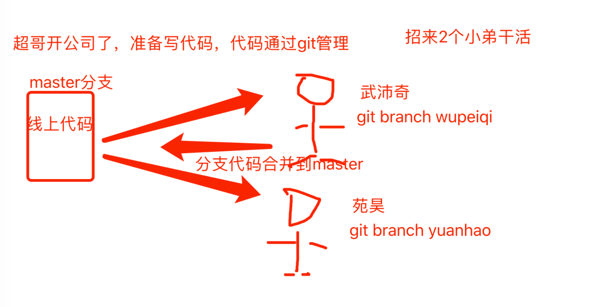

## git分支命令

```plain
1.查看分支，查看当前分支情况，在哪一个就有*符
[yuchao@yumac ~/learn_git]$git branch
* master
此例的意思就是，我们有一个叫做 master 的分支，并且该分支是当前分支。
当你执行 git init 的时候，默认情况下 Git 就会为你创建 master 分支。
如果我们要手动创建一个分支。执行 git branch (branchname) 即可。
2.创建分支
[yuchao@yumac ~/learn_git]$git branch onlyu
[yuchao@yumac ~/learn_git]$git branch
* master
  onlyu
现在我们可以看到，有了一个新分支 onlyu。
接下来我们将演示如何切换分支，我们用 git checkout (branch) 切换到我们要修改的分支。  
3.git分支练习
[yuchao@yumac ~/learn_git]$echo "超哥带你学git分支" > branch.txt
[yuchao@yumac ~/learn_git]$git add .
[yuchao@yumac ~/learn_git]$git commit -m "add branch.txt"
[master 91618a9] add branch.txt
 1 file changed, 1 insertion(+)
 create mode 100644 branch.txt
[yuchao@yumac ~/learn_git]$
[yuchao@yumac ~/learn_git]$
[yuchao@yumac ~/learn_git]$
[yuchao@yumac ~/learn_git]$ls
branch.txt    learn.txt
# 此时切换分支，Git会还原工作区的内容，到创建分支时的状态
[yuchao@yumac ~/learn_git]$git checkout onlyu
Switched to branch 'onlyu'
[yuchao@yumac ~/learn_git]$ls
learn.txt
# 切换回master，数据又回来了
[yuchao@yumac ~/learn_git]$git checkout master
Switched to branch 'master'
[yuchao@yumac ~/learn_git]$ls
branch.txt    learn.txt
4.我们也可以直接创建且切换分支
[yuchao@yumac ~/learn_git]$git checkout -b yuchao
Switched to a new branch 'yuchao'
[yuchao@yumac ~/learn_git]$git branch
  master
  onlyu
* yuchao
[yuchao@yumac ~/learn_git]$echo "我是分支yuchao，你好" >> yuchao.txt
[yuchao@yumac ~/learn_git]$git add .
[yuchao@yumac ~/learn_git]$git commit -m "add yuchao.txt"
[yuchao 1304234] add yuchao.txt
 1 file changed, 1 insertion(+)
 create mode 100644 yuchao.txt
[yuchao@yumac ~/learn_git]$ls
branch.txt    learn.txt    yuchao.txt
# 如缩减，当我们回退到主分支的时候，新创建的文件已然消失了
# 使用分支，实现了在不同的分支环境下工作，且可以来回切换
[yuchao@yumac ~/learn_git]$git checkout master
Switched to branch 'master'
[yuchao@yumac ~/learn_git]$ls
branch.txt    learn.txt
5.删除分支，删除分支后，随之分支管理的文件内容也被删了
[yuchao@yumac ~/learn_git]$git branch -d onlyu
Deleted branch onlyu (was e670d84).
[yuchao@yumac ~/learn_git]$git branch
* master
  yuchao
6.一旦分支有了独立的内容，你最终目的是，将分支独立开发的内容合并到主干分支。
# 主分支下内容
[yuchao@yumac ~/learn_git]$git branch
* master
  onlyu
  yuchao
[yuchao@yumac ~/learn_git]$ls
branch.txt    learn.txt
# yuchao分支下的内容
[yuchao@yumac ~/learn_git]$git checkout yuchao
Switched to branch 'yuchao'
[yuchao@yumac ~/learn_git]$ls
branch.txt    learn.txt    yuchao.txt
# 合并yuchao分支的文件内容到主干master
# 回退到master分支，然后执行命令
[yuchao@yumac ~/learn_git]$git checkout master
Switched to branch 'master'
[yuchao@yumac ~/learn_git]$ls
branch.txt    learn.txt
[yuchao@yumac ~/learn_git]$git merge yuchao
Updating 91618a9..1304234
Fast-forward
 yuchao.txt | 1 +
 1 file changed, 1 insertion(+)
 create mode 100644 yuchao.txt
 # 此时发现已经在master主干分支，新增了一个文件
 [yuchao@yumac ~/learn_git]$ls
branch.txt    learn.txt    yuchao.txt
合并完之后，就可以删除该分支了，下次需要用分支开发，可以再次创建即可
[yuchao@yumac ~/learn_git]$git branch -d yuchao
Deleted branch yuchao (was 1304234).
```

## git合并分支冲突

合并不仅仅是简单的对文件添加、移除，git可以合并且修改。

我们准备数据

```plain
1.准备开始进行开发了，新建一个分支
[yuchao@yumac ~/learn_git]$git branch chaoge
[yuchao@yumac ~/learn_git]$git checkout chaoge
Switched to branch 'chaoge'
[yuchao@yumac ~/learn_git]$ls
branch.txt    learn.txt    yuchao.txt
[yuchao@yumac ~/learn_git]$vim chaoge.php
[yuchao@yumac ~/learn_git]$head -3 chaoge.php
<?php
echo "超哥带你学git合并冲突如何解决";
?>
2.将创建的文件内容，提交到chaoge分支
[yuchao@yumac ~/learn_git]$git commit -m "add chaoge.php"
[chaoge 3f6cccf] add chaoge.php
 1 file changed, 3 insertions(+)
 create mode 100644 chaoge.php
 3.此时我们切换回master分支，chaoge.php文件应该是不存在的
 [yuchao@yumac ~/learn_git]$git checkout master
Switched to branch 'master'
[yuchao@yumac ~/learn_git]$ls
branch.txt    learn.txt    yuchao.txt
4.我们在master分支下，也创建名为chaoge.php的文件，且写入内容
[yuchao@yumac ~/learn_git]$git checkout master
[yuchao@yumac ~/learn_git]$head -3 chaoge.php
<?php
echo "我是冲突，嘿嘿嘿";
?>
# 提交到本地仓库
[yuchao@yumac ~/learn_git]$git add .
[yuchao@yumac ~/learn_git]$git commit -m "add chaoge.php  by master"
[master 4d74537] add chaoge.php  by master
 1 file changed, 3 insertions(+)
 create mode 100644 chaoge.php
 5.此时你会发现，chaoge.php文件在master分支和chaoge分支，都有自己的代码内容，是不是？
 如果此时你合并分支，会发现如下问题
 [yuchao@yumac ~/learn_git]$git merge chaoge
CONFLICT (add/add): Merge conflict in chaoge.php
Auto-merging chaoge.php
Automatic merge failed; fix conflicts and then commit the result.
发现了git给与的提示是，自动合并失败了，需要你自己手动解决冲突，然后提交结果
6.查看文件内容，文件被git自动修改了
第二行发生了文件内容冲突
master主分支上内容是 echo "我是冲突，嘿嘿嘿"
chaoge分支合并过来的内容是 echo "超哥带你学git合并冲突如何解决"
此时根据你自己的需求，决定如何修改代码文件，再次提交即可
[yuchao@yumac ~/learn_git]$cat -n  chaoge.php
     1    <?php
     2    <<<<<<< HEAD
     3    echo "我是冲突，嘿嘿嘿";
     4    =======
     5    echo "超哥带你学git合并冲突如何解决";
     6    >>>>>>> chaoge
     7    ?>
7.自己决定对代码修改
[yuchao@yumac ~/learn_git]$git diff
diff --cc chaoge.php
index b4689a3,ae89ca8..0000000
--- a/chaoge.php
+++ b/chaoge.php
@@@ -1,3 -1,3 +1,7 @@@
  <?php
++<<<<<<< HEAD
 +echo "我是冲突，嘿嘿嘿";
++=======
+ echo "超哥带你学git合并冲突如何解决";
++>>>>>>> chaoge
  ?>
# 手动修改代码为确定版本，比如两个代码我都要保留
[yuchao@yumac ~/learn_git]$cat chaoge.php
<?php
echo "我是冲突，嘿嘿嘿";
echo "超哥带你学git合并冲突如何解决";
?>
[yuchao@yumac ~/learn_git]$git add .
[yuchao@yumac ~/learn_git]$git status
On branch master
All conflicts fixed but you are still merging.
  (use "git commit" to conclude merge)
Changes to be committed:
    modified:   chaoge.php
[yuchao@yumac ~/learn_git]$git commit -m "merge chaoge with change chaoge.php"
[master 4ba1c7d] merge chaoge with change chaoge.php
现在我们就解决了合并中的冲突，然后提交了结果
```

# Git标签

## git标签有什么用

Git仓库内的数据发生变化时，我们经常会打上一个类似于软件版本的标签tag，这样通过标签就可以把版本库中的某个版本给记录下来，便于以后我们可以将特定的数据取出来。

标签就是版本库的一个快照。

## 为啥用git标签

git不是已经有commit了吗，可以附加提交信息，为什么还要tag呢？

开发小王：请吧上周一发布的版本打包发布，commit_id是3f6cccf0708525b58fe191c80325b73a54adee99

运维小于：你这什么乱七八糟的数字，，，太难找了，请你换个方法

开发小王换了个方式：请吧上周一发布的版本打包，版本号是v1.2，按照tag v1.2查找commit 记录就行了！

所以tag就是一个容易记住的名字，和某个commit记录绑定在一起。

## git标签使用

对当前提交的代码创建标签，-a标签名称，-m标签描述。

```plain
1.# 对当前最新的commit记录进行标签
[yuchao@yumac ~/learn_git]$git tag -a "v1.0" -m "修复了支付bug"
2.# 直接输入，则查看当前标签
[yuchao@yumac ~/learn_git]$git tag
v1.0
3.# 指定commitID创建标签，选中commit id 前7位就够了
git tag -a v1 1304234 -m "添加了yuchao.txt"
4.# 查看标签列表
[yuchao@yumac ~/learn_git]$git tag
v1
v1.0
5.# 查看标签里有什么git show
[yuchao@yumac ~/learn_git]$git show v1
tag v1
Tagger: yc <yc_uuu@163.com>
Date:   Tue Jul 7 15:26:15 2020 +0800
添加了yuchao.txt
commit 1304234d1240469587a7d448ba3f8e0c09f8a340 (tag: v1)
Author: yc <yc_uuu@163.com>
Date:   Tue Jul 7 11:37:20 2020 +0800
    add yuchao.txt
diff --git a/yuchao.txt b/yuchao.txt
new file mode 100644
index 0000000..9b91134
--- /dev/null
+++ b/yuchao.txt
@@ -0,0 +1 @@
+我是分支yuchao，你好
6.# 通过git log查看tag
# --graph：显示ASCII图形表示的分支合并历史
# —pretty＝：使用其他格式显示历史提交信息
# -abbrev-commit：仅显示SHA-1的前几个字符，而非所有的40个字符 
[yuchao@yumac ~/learn_git]$git log --oneline --decorate --graph
*   4ba1c7d (HEAD -> master, tag: v1.0) merge chaoge with change chaoge.php
|\
| * 3f6cccf (chaoge) add chaoge.php
* | 4d74537 add chaoge.php  by master
|/
* 1304234 (tag: v1) add yuchao.txt
* 91618a9 add branch.txt
* e670d84 learn git diff end.
* eeef559 modify learn.txt
* 688c0ba second commit with modified learn.txt
* 81f0c64 my first commit with touch learn.txt
7.删除tag
[yuchao@yumac ~/learn_git]$git tag -d v1
Deleted tag 'v1' (was e2118b3)
[yuchao@yumac ~/learn_git]$git tag
v1.0
```


# gitee远程仓库

git是一个分布式版本控制系统，同一个git仓库可以分布在不同的机器上，但是开发团队必须保证在同一个网络中，且必须有一个项目的原始版本，通常的办法就是让一台电脑充当服务器的角色，每天24小时开机，其他每个人都可以在这台"服务器"仓库里克隆一份代码到自己的电脑上。

并且也可以把各自的代码提交到代码仓库里，也能从代码仓库拉取别人的提交。

这样的代码仓库服务器，我们可以自由的搭建，也可以选择使用免费的托管平台。

Git代码托管平台，首先推荐的是Github，世界范围内的开发者都在使用Github托管代码，可以找到大量优秀的开源项目，缺点就是访问可能会卡一点。

其次选择的就是Gitee，国内的代码托管平台，以及自建Gitlab服务器。 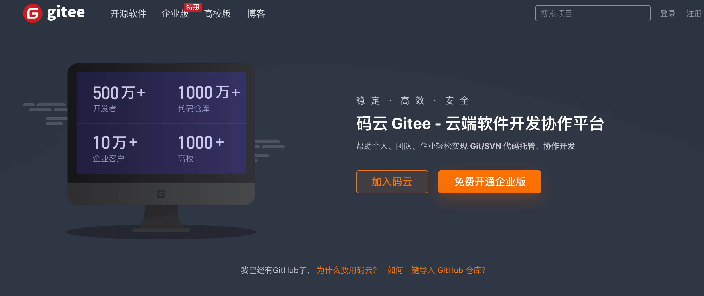

Gitee 提供免费的 Git 仓库，还集成了代码质量检测、项目演示等功能。对于团队协作开发，Gitee 还提供了项目管理、代码托管、文档管理的服务。

官网地址

```plain
https://gitee.com/
注册后登录即可
```

## 创建空仓库

点击右上角的➕，新建仓库


创建完毕空仓库后，页面出现如下仓库使用方式，我们可以选择HTTPS和SSH形式下载代码的方式

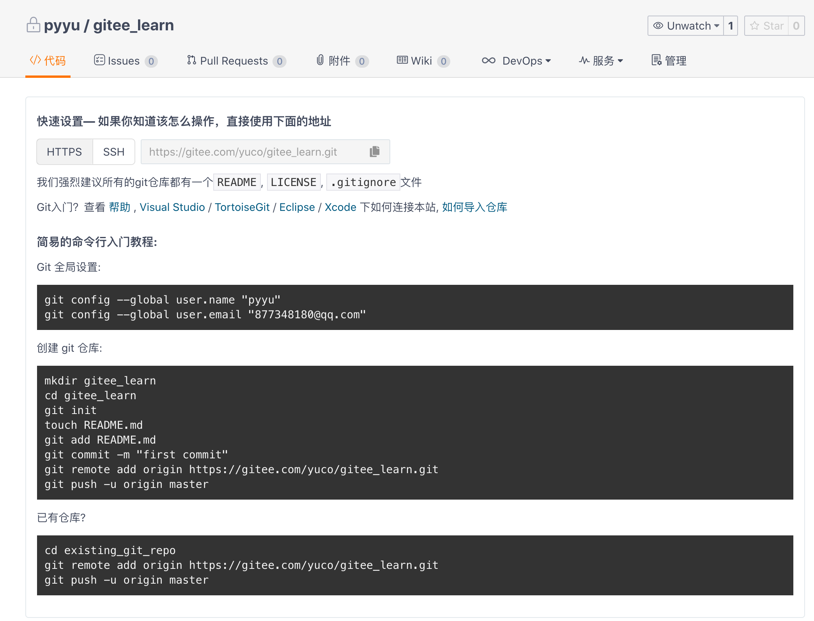

到这里，我们仓库就已经创建好了，接着就是要将本地客户端和服务端连接起来，存在于两种情况

- 本地已经有一个git仓库了
- 本地还没有git仓库

## 配置客户端连接gitee仓库(HTTPS)

### 推送本地仓库到远程

HTTPS协议也就指的是使用账号密码连接

1.git全局设置

```plain
git config --global user.name "pyyu"
git config --global user.email "877348180@qq.com"
```

2.创建git仓库

```plain
mkdir gitee_learn
cd gitee_learn
git init
touch README.md
git add README.md
git commit -m "first commit"
# 为本地仓库gitee_learn添加远程仓库别名origin，地址是如下链接
git remote add origin https://gitee.com/yuco/gitee_learn.git
git push -u origin master
# 输入正确gitee账号密码之后即可正确把代码推送到远程仓库
[yuchao@yumac ~/gitee_learn]$git push -u origin master
Username for 'https://gitee.com': 877348180@qq.com
Password for 'https://877348180@qq.com@gitee.com':
Enumerating objects: 3, done.
Counting objects: 100% (3/3), done.
Writing objects: 100% (3/3), 203 bytes | 203.00 KiB/s, done.
Total 3 (delta 0), reused 0 (delta 0)
remote: Powered by GITEE.COM [GNK-5.0]
To https://gitee.com/yuco/gitee_learn.git
 * [new branch]      master -> master
Branch 'master' set up to track remote branch 'master' from 'origin'.
```

3.此时可以访问远程代码仓库了，发现本地创建的文件已经推送上去

```plain
https://gitee.com/yuco/gitee_learn
```

## 免密推送代码（SSH）

```plain
可以直接访问地址
https://gitee.com/profile/sshkeys
```


我们要在客户端生成key，结合gitee实现无密码登录，在linux和windows均可以使用ssh-keygen命令生成，需要注意的是在windows下只能生成rsa加密方式的key。

```plain
# 使用如下命令，生成公私钥对
[yuchao@yumac ~/gitee_learn]$ssh-keygen -t rsa
Generating public/private rsa key pair.
Enter file in which to save the key (/Users/yuchao/.ssh/id_rsa):
/Users/yuchao/.ssh/id_rsa already exists.
Overwrite (y/n)? y
Enter passphrase (empty for no passphrase):
Enter same passphrase again:
Your identification has been saved in /Users/yuchao/.ssh/id_rsa.
Your public key has been saved in /Users/yuchao/.ssh/id_rsa.pub.
The key fingerprint is:
SHA256:PRbwYXXO1gVueXRb4K9LdNK2a7CXVOvm3fQ2bTCe8 yuchao@yumac
The key's randomart image is:
+---[RSA 3072]----+
|        . o.. o+X|
|         + . = =o|
|          o   O o|
|         . o + o |
|        S = .o+|
|         . o..=Xo|
|           .. B+=|
|            .=.E*|
|            o++o*|
+----[SHA256]-----+
# 我们把公钥信息复制到gitee中
[yuchao@yumac ~/gitee_learn]$cat /Users/yuchao/.ssh/id_rsa.pub
ssh-rsa AAAAB3NzaC1yc2EAAAADAQABAAABgQDBmqRVCYkYg6PHxugxTjBcAkl1WrMkx3OkMD/ltQAwNM+R/wKozlNwbPLY1ZMUx2A6nKmBoTdvy0rKyX2OhxzbOwoUJsW+InhDoBuY8CGUyFoqhN96lVVxa+9v8/+LYNJOXePS7FArSbo0B23yeRnL389fPVLiHXIiLtFpxFRUEv3pEUcQNdZKeKLKcdboGjHxDNZQpHmVSgWSy039oGd7f8uC4VaM6Lk6qYq4i8lUwR3CudHxcgzkjnfiMGmZdxCdnPHcWdzQvjv4AmyeBSNfrjgaNYnHxrw/OF8GwfJsqfv+xhCG9XINQQgzVp+METIu0qE4GnyXiGB/7KgFeb3t/tR0gI40s19MlgCsS6uCQrHF8Z9qc0qbhdVCVjvk/PYuFWidZHzsz25o1Ay2s5b/yoxUYDaG+drvA95G7uKti6TJ9YLM+cAJMUlgQCmLHKiwxbeKdZuboKG9Z3JzAtLqBSgqgoIFB8b/03S6y6dozciNYEBal6XSOPy+Pltv8= yuchao@yumac
```


此时我们就得修改代码仓库的远程别名，修改如下

```plain
# 查看当前远程配置
[yuchao@yumac ~/gitee_learn]$git remote -v
origin    https://gitee.com/yuco/gitee_learn.git (fetch)
origin    https://gitee.com/yuco/gitee_learn.git (push)
# 修改为ssh协议的url
[yuchao@yumac ~/gitee_learn]$git remote set-url origin git@gitee.com:yuco/gitee_learn.git
[yuchao@yumac ~/gitee_learn]$git remote -v
origin    git@gitee.com:yuco/gitee_learn.git (fetch)
origin    git@gitee.com:yuco/gitee_learn.git (push)
# 可以新增一个文件，用git管理提交到本地仓库后，推送到gitee
# -u指定服务器地址
# 代码推送到远程主机的master主干
[yuchao@yumac ~/gitee_learn]$git push -u origin master
Enumerating objects: 4, done.
Counting objects: 100% (4/4), done.
Delta compression using up to 8 threads
Compressing objects: 100% (2/2), done.
Writing objects: 100% (3/3), 313 bytes | 313.00 KiB/s, done.
Total 3 (delta 0), reused 0 (delta 0)
remote: Powered by GITEE.COM [GNK-5.0]
To gitee.com:yuco/gitee_learn.git
   5c29d38..74c25be  master -> master
Branch 'master' set up to track remote branch 'master' from 'origin'.
```

### 克隆远程仓库到本地

如果我们在任意一个其他的客户端想要获取仓库的代码，我们只需要克隆一份远程仓库代码即可，在克隆之前，仍然要配置好客户端和gitee的认证关系，或是使用账号密码下载即可。

此时可以再准备一台linux机器，模拟另一个客户端

```plain
# 以配置好了ssh-key为准，直接使用ssh协议的下载
[yuchao@yumac /tmp]$git clone git@gitee.com:yuco/gitee_learn.git
Cloning into 'gitee_learn'...
remote: Enumerating objects: 6, done.
remote: Counting objects: 100% (6/6), done.
remote: Compressing objects: 100% (3/3), done.
remote: Total 6 (delta 0), reused 0 (delta 0), pack-reused 0
Receiving objects: 100% (6/6), done.
# 克隆好了之后，我们本地已然有了代码
[yuchao@yumac /tmp]$ls gitee_learn/
README.md    git.txt
# 此时该用户也可以继续开发新功能，然后推送到远程代码仓库，供他人下载
[yuchao@yumac /tmp/gitee_learn]$echo "我是程序员小于，我新建了一个文件" >> cc.txt
[yuchao@yumac /tmp/gitee_learn]$
[yuchao@yumac /tmp/gitee_learn]$git add .
[yuchao@yumac /tmp/gitee_learn]$git commit -m "add cc.txt by 小于"
[master bfcf9d4] add cc.txt by 小于
 1 file changed, 1 insertion(+)
 create mode 100644 cc.txt
[yuchao@yumac /tmp/gitee_learn]$
[yuchao@yumac /tmp/gitee_learn]$
[yuchao@yumac /tmp/gitee_learn]$git push -u origin master
Enumerating objects: 4, done.
Counting objects: 100% (4/4), done.
Delta compression using up to 8 threads
Compressing objects: 100% (2/2), done.
Writing objects: 100% (3/3), 360 bytes | 360.00 KiB/s, done.
Total 3 (delta 0), reused 0 (delta 0)
remote: Powered by GITEE.COM [GNK-5.0]
To gitee.com:yuco/gitee_learn.git
   74c25be..bfcf9d4  master -> master
Branch 'master' set up to track remote branch 'master' from 'origin'.
# 此时远程仓库又有了新的代码
https://gitee.com/yuco/gitee_learn
```

# git fetch使用

上述案例，我们在另一个客户端推送了新的代码，此时代码仓库中是最新的，但是其他客户端代码是不是已经旧了，我们得更新代码对把。需要把代码仓库里的更新取回本地，这就得用到git fetch命令。

`git fetch`作用是取回所有分支(branch)的更新，如果只想更新特定的分支代码，可以指定分支名，比如取回远程origin仓库的master分支代码，即可这么写

```plain
git fetch origin master
```

案例

```plain
[yuchao@yumac ~/gitee_learn]$git fetch
remote: Enumerating objects: 4, done.
remote: Counting objects: 100% (4/4), done.
remote: Compressing objects: 100% (2/2), done.
remote: Total 3 (delta 0), reused 0 (delta 0), pack-reused 0
Unpacking objects: 100% (3/3), done.
From gitee.com:yuco/gitee_learn
   74c25be..bfcf9d4  master     -> origin/master
```

取回来的更新，要在本地主机上采用`远程主机名/分支名`的形式读取，比如origin主机上的master，那就是origin/master来读取。

```plain
可以采用git branch -r选项，查看远程分支，-a查看所有分支
[yuchao@yumac ~/gitee_learn]$git branch -r
  origin/master
[yuchao@yumac ~/gitee_learn]$git branch -a
* master
  remotes/origin/master
```

取回远程主机的更新以后，可以在其基础上，使用git checkout命令创建一个新分支，待会用于合并。

```plain
[yuchao@yumac ~/gitee_learn]$git checkout -b remote-master origin/master
Branch 'remote-master' set up to track remote branch 'master' from 'origin'.
Switched to a new branch 'remote-master'
# 此时查看的是远程分支上的数据
[yuchao@yumac ~/gitee_learn]$ls
README.md    cc.txt        git.txt
[yuchao@yumac ~/gitee_learn]$git branch
  master
* remote-master
```

使用`git merge命令`合并远程分支的代码到master主干

```plain
# 回到master，合并分支
# 切换分支时，git已经提示你，master分支的代码已经落后了，可以更新了
[yuchao@yumac ~/gitee_learn]$git checkout master
Switched to branch 'master'
Your branch is behind 'origin/master' by 1 commit, and can be fast-forwarded.
  (use "git pull" to update your local branch)
 # 将分支代码合并到主干，结束操作
[yuchao@yumac ~/gitee_learn]$git merge remote-master
Updating 74c25be..bfcf9d4
Fast-forward
 cc.txt | 1 +
 1 file changed, 1 insertion(+)
 create mode 100644 cc.txt
```


# Gitlab

# Gitlab介绍

**我们了解了git是以个人为中心，但是人人都得数据交互呀。。python程序员每天都忙着进行py交易**

交互数据的方式

- 使用github或者码云等公有代码仓库，托管代码的地方，谁都可以看
- 公司内部使用gitlab私有仓库

github和gitlab的区别

- github国外公共仓库不安全，国内的码云代码仓库，可能会暴露自己公司代码机密，等着被开除吧。。
- 自建gitlab私有代码仓库，更加安全
- 从代码私有性方面来看，公司不希望员工随意获取全部代码，使用Gitlab无疑是最好的选择
- 若是开源项目，Github还是代码托管的首选平台。

Gitlab是一个开源分布式的版本控制系统，由Ruby语言开发，Gitlab主要实现的功能、管理项目源代码、对源代码进行版本控制，以及源代码的复用和查找。

Gitlab优势和应用场景：

- 开源免费，搭建简单，维护成本低，适合中小型公司。
- 权限管理，实现代码对部分人可见，确保醒目安全性。
- 离线同步，保证我们不需要依赖于网络环境进行代码提交（代码本地仓库管理然后推到远程仓库）

# Gitlab安装配置

环境准备

```plain
操作系统centos7
内存：2G及以上
磁盘：50G
安全：关闭防火墙，selinux
```

1.安装GItlab所需的依赖包

```plain
yum install curl policycoreutils-python openssh-server postfix wget -y
```

2.安装gitlab，可以在线装，也可以安装本地准备好的rpm包，如果没有找超哥要

```plain
[root@lb02 opt]# yum localinstall gitlab-
gitlab-12-0-stable-zh.tar.gz          gitlab-ce-12.0.3-ce.0.el7.x86_64.rpm
[root@lb02 opt]# yum localinstall gitlab-ce-12.0.3-ce.0.el7.x86_64.rpm -y
```

3.配置gitlab服务，修改域名和邮箱

```plain
# 安装好后，默认提示Please configure a URL for your GitLab instance by setting `external_url`
# configuration in /etc/gitlab/gitlab.rb file.
需要修改配置文件，换成你自己的服务器地址就好
vim /etc/gitlab/gitlab.rb
external_url 'http://172.20.0.51'
配置邮箱，打开注释，修改配置，注意别改错了，否则将无法收到邮件
### Email Settings
gitlab_rails['gitlab_email_enabled'] = true
gitlab_rails['gitlab_email_from'] = 'yc_uuu@163.com'
gitlab_rails['gitlab_email_display_name'] = 'Onlyu-Gitlab'
# email server settings
gitlab_rails['smtp_enable'] = true
gitlab_rails['smtp_address'] = "smtp.163.com"
gitlab_rails['smtp_port'] = 465
gitlab_rails['smtp_user_name'] = "yc_uuu@163.com"
gitlab_rails['smtp_password'] = ""
gitlab_rails['smtp_domain'] = "smtp.163.com"
gitlab_rails['smtp_authentication'] = "login"
gitlab_rails['smtp_enable_starttls_auto'] = true
gitlab_rails['smtp_tls'] = true
```

可以进入gitlab命令行，测试邮件收发是否正常

```plain
[root@lb02 ~]# gitlab-rails console
-------------------------------------------------------------------------------------
 GitLab:       12.0.3 (08a51a9db93)
 GitLab Shell: 9.3.0
 PostgreSQL:   10.7
-------------------------------------------------------------------------------------
Loading production environment (Rails 5.1.7)
irb(main):005:0> Notify.test_email('877348180@qq.com','hello','hello yuchao').deliver_now
Notify#test_email: processed outbound mail in 0.9ms
Sent mail to 877348180@qq.com (374.3ms)
Date: Wed, 08 Jul 2020 18:11:00 +0800
From: Onlyu-Gitlab <yc_uuu@163.com>
Reply-To: Onlyu-Gitlab <noreply@gitlab.onlyu.com>
To: 877348180@qq.com
Message-ID: <5f059bb4e7e31_e5253fb2a3fcf98c83859@lb02.mail>
Subject: hello
Mime-Version: 1.0
Content-Type: text/html;
 charset=UTF-8
Content-Transfer-Encoding: 7bit
Auto-Submitted: auto-generated
X-Auto-Response-Suppress: All
<!DOCTYPE html PUBLIC "-//W3C//DTD HTML 4.0 Transitional//EN" "http://www.w3.org/TR/REC-html40/loose.dtd">
<html><body><p>hello yuchao</p></body></html>
=> #<Mail::Message:70036107130080, Multipart: false, Headers: <Date: Wed, 08 Jul 2020 18:11:00 +0800>, <From: Onlyu-Gitlab <yc_uuu@163.com>>, <Reply-To: Onlyu-Gitlab <noreply@gitlab.onlyu.com>>, <To: 877348180@qq.com>, <Message-ID: <5f059bb4e7e31_e5253fb2a3fcf98c83859@lb02.mail>>, <Subject: hello>, <Mime-Version: 1.0>, <Content-Type: text/html; charset=UTF-8>, <Content-Transfer-Encoding: 7bit>, <Auto-Submitted: auto-generated>, <X-Auto-Response-Suppress: All>>
```

4.初始化gitlab

```plain
# 注意，当修改了gitlab配置文件，就得reconfigure
[root@lb02 opt]# gitlab-ctl reconfigure
# 启停
gitlab-ctl start |restart |status |stop
# 初始化之后，gitlab组件都已经启动了
[root@lb02 opt]# gitlab-ctl status
```

**Gitlab服务构成**

```plain
GitLab 由主要由以下服务构成，他们共同承担了 Gitlab 的运作需要
Nginx:静态 web 服务器。
gitlab-shell:用于处理 Git 命令和修改 authorized keys 列表。 
gitlab-workhorse: 轻量级的反向代理服务器。 logrotate:日志文件管理工具。
postgresql:数据库。
redis:缓存数据库。
sidekiq:用于在后台执行队列任务(异步执行)。
unicorn:An HTTP server for Rack applications，GitLab Rails 应用是托管在这个
```

6.首次访问gitlab

```plain
http://172.20.0.51/
首次需要输入2次密码
chaoge666
chaoge666
然后可以登录，默认账号密码
root
chaoge666
```

7.gitlab管理命令

```plain
gitlab-ctl start
gitlab-ctl stop
gitlab-ctl stop postgresql
gitlab-ctl restart 
gitlab-ctl status
gitlab-ctl reconfigure
gitlab-ctl tail
gitlab-ctl tail redis
```

gitlab主要目录

```plain
/var/opt/gitlab/git-data/repositories/ ：库默认存储目录
/opt/gitlab  ：应用代码和相应的依赖程序
/var/opt/gitlab/ ： gitlab-ctl reconfigure生成的数据和配置
/etc/gitlab ：配置文件目录
/var/log/gitlab：此目录下存放了gitlab各个组件产生的日志
/var/opt/gitlab/backups ：备份文件生成的目录
```

## gitlab汉化配置

汉化地址`https://gitlab.com/xhang/gitlab`，可以进行下载

```plain
解压缩下载的汉化包
[root@lb02 opt]# tar -xf gitlab-12-0-stable-zh.tar.gz
# 确保汉化包，和gitlab软件包版一致
# 停止gitlab
[root@lb02 opt]# gitlab-ctl stop
# 中文覆盖英文，使用原生cp命令，直接进行覆盖，出现的错误直接忽略
[root@lb02 opt]# \cp -rf gitlab-12-0-stable-zh/* /opt/gitlab/embedded/service/gitlab-rails/
# 再次启动
gitlab-ctl start
# 稍微等待一会，再次访问gitlab，若是出现502，再等会
http://172.20.0.51/
```

再次修改gitlab字符集

```plain
个人中心 > settings > Preferences > Localization > Language >  简体中文
刷新后，此时gitlab基本已经是中文维护了
```

## Gitlab关闭用户注册

我们GItlab是企业级内部私有代码仓库，所有用户都英国由管理员创建，而非外部注册，我们可以关闭其功能，保障平台安全。


1.使用root用户管理员登录，点击`管理中心` > `settings设置`


2.保存后，退出登录，发现已经没有注册选项了。

# Gitlab仓库管理

## 用户、组、项目联系


## 创建组

Gitlab是通过组（group）的概念来统一管理仓库(project)和用户(user)，通过创建组，在组下创建仓库，再将用户加入组，从而实现用户和仓库的权限管理。

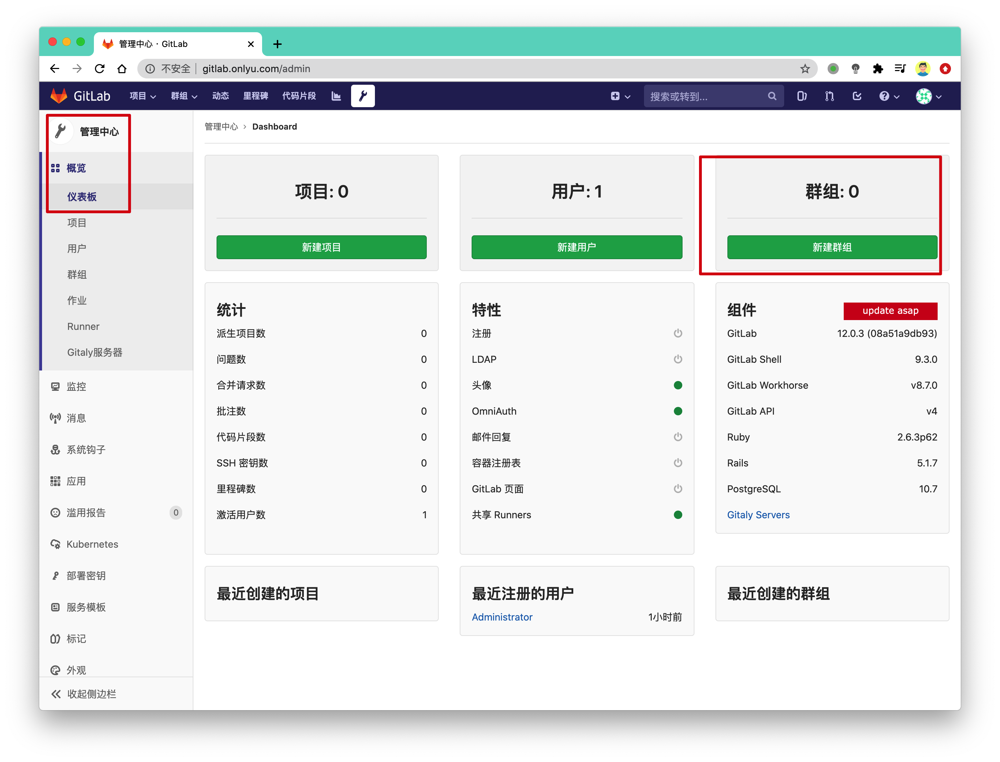

点击新建群组，在创建组页面中，组路径和名称为必填项，且该两处内容最好一致。

可见性级别，选择私有的即可

- Private：只有授权的用户才能看到
- Internal：只要登录了gitlab即可看见
- Public：公开仓库

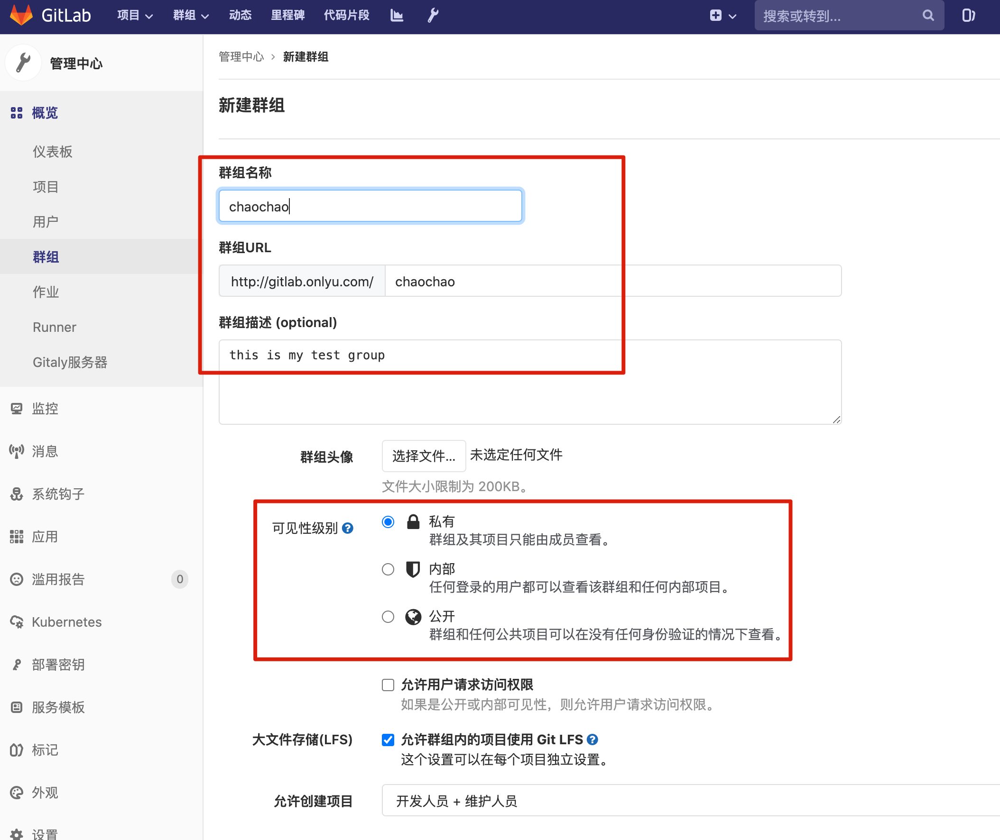

点击创建，即可创建组

## 创建项目

在gitlab中，你可以创建project用来存储你的程序代码、作为一个问题跟踪器，用于代码协作，用于持续集成中的构建、测试和部署等。

在管理员区域点击New project按钮，或者点击导航栏的＋。

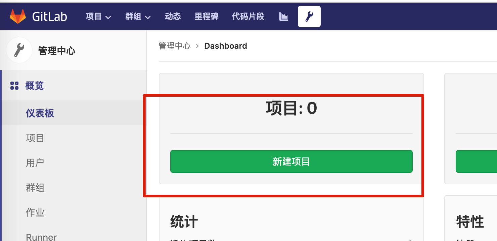


选择项目所属的组，输入项目名称，项目描述，选择可见级别，完成项目创建。

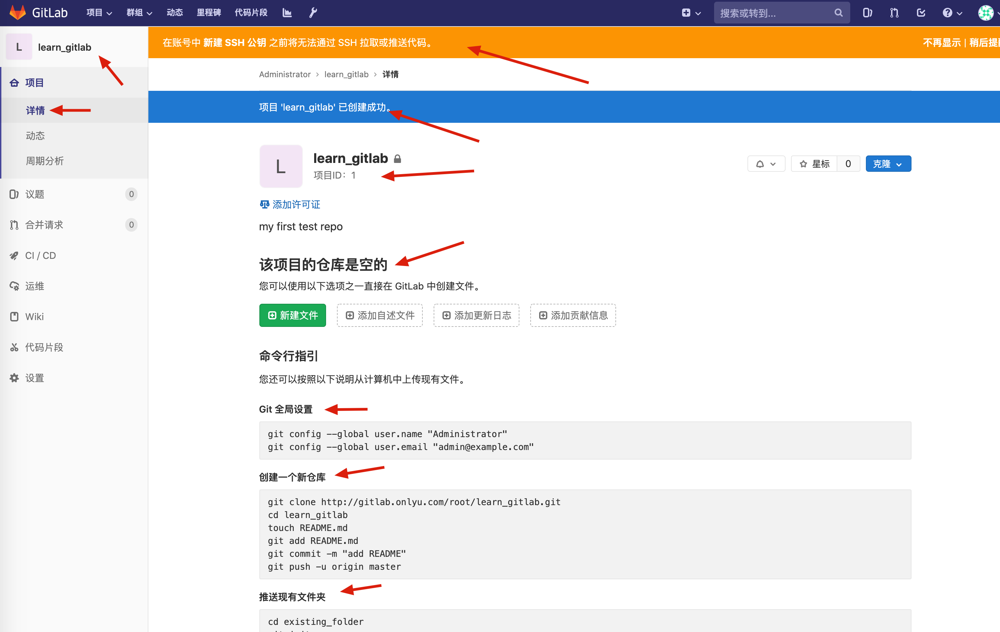

## 创建用户

在管理页面点击顶部的管理员区域，点击创建用户

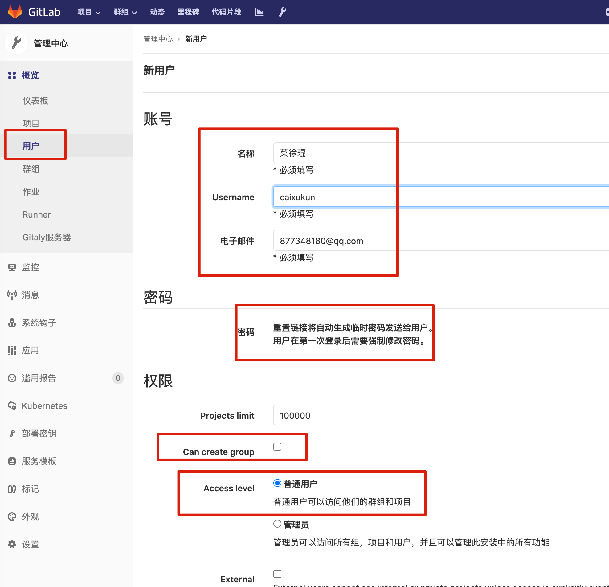

### 用户收到邮件

在正确配置邮箱后，用户收到邮件，可以自行修改密码


自行修改密码

```plain
caixukun666
```

改完密码后，应该会再收到一封邮件

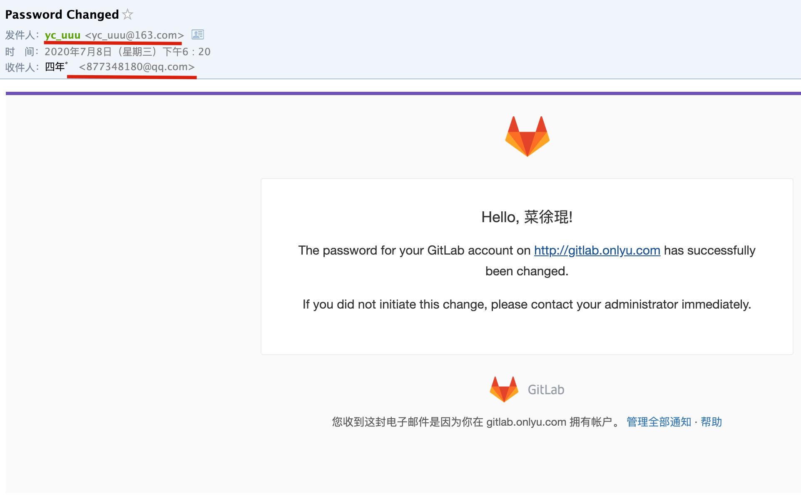

### 用户登录gitlab


默认普通用户登录后，是看不到项目的，这是因为你这个用户还没有加入组呀，是不是

### 再创建一个普通用户

注意用户信息得唯一，不得重复，如邮箱也要输入正确地址，否则只能通过管理员修改

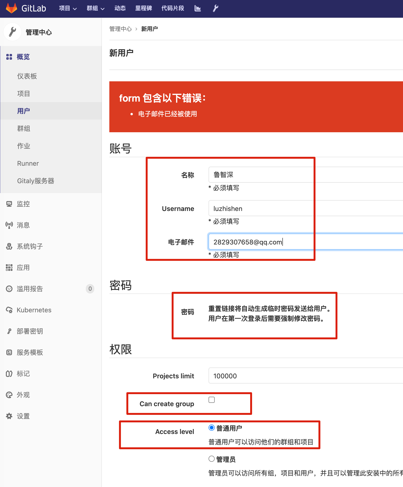

管理员可以手动给普通用户修改密码。

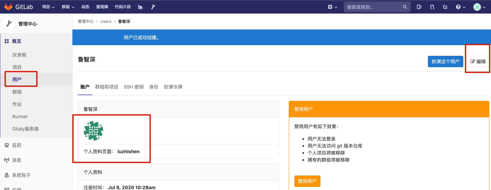

### root管理员来分配组权限

此时两个普通用户登录都是看不到项目的，因为都还没有分配组权限。

给菜徐琨用户分配管理员权限，因为root是超级用户，我们得针对每一个组有一个领导是不是。


给鲁智深用户开发人员权限，开发人员权限，只有推送代码，提交代码了。

### 分别用普通用户登录查看

菜徐琨作为【所有者】登录，可以对项目进行修改操作，邀请成员等等

鲁智深首次登录，若是管理员修改的密码，自己还得再修改一次，登陆后，作为【开发人员】，权限较低，看不到`设置`选项。

# 配置SSH KEY

前面我们已经在GitLab建立了仓库，并且授权用户可以使用仓库，我们所有的操作都是在Web界面进行的，接着我们就要配置客户端来连接代码仓库了。

我们的仓库是私有的，只有授权的用户才可以访问到该仓库，那么只要将客户端的用户 与我们GitLab的用户绑定，客户端即可访问到GitLab上的仓库，我们建议使用SSH方式实 现客户端与 Gitlab 用户的绑定，具体配置如下。

```plain
1.选择登陆一个客户端机器，生成ssh密钥对，注意，若是已经有了，可以直接复制，不需要再生成，否则会覆盖原有的密钥对
[yuchao@yumac ~]$ssh-keygen -t rsa
2.和码云的操作一样，添加本地的公钥信息，发给gitlab，我们用root用户登录gitlab
cat ~/.ssh/id_rsa.pub  # 复制结果，粘贴到gitlab的密钥输入框里即可
```

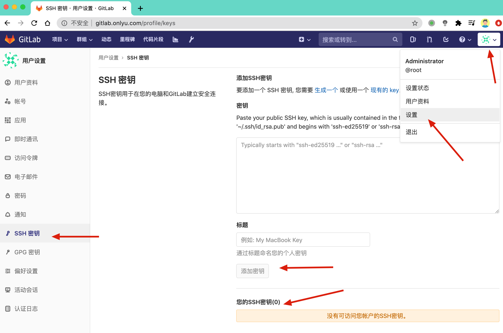

## 推送代码到gitlab

推送代码的几种情况

```plain
命令行指引
您还可以按照以下说明从计算机中上传现有文件。
Git 全局设置
git config --global user.name "Administrator"
git config --global user.email "admin@example.com"
创建一个新仓库
git clone git@172.20.0.51:chaochao/learn_gitlab.git
cd learn_gitlab
touch README.md
git add README.md
git commit -m "add README"
git push -u origin master
推送现有文件夹
cd existing_folder
git init
git remote add origin git@172.20.0.51:chaochao/learn_gitlab.git
git add .
git commit -m "Initial commit"
git push -u origin master
推送现有的 Git 仓库
cd existing_repo
git remote rename origin old-origin
git remote add origin git@172.20.0.51:chaochao/learn_gitlab.git
git push -u origin --all
git push -u origin --tags
```

## 在客户端上执行命令

```plain
1.若是本地没有代码仓库，首次可以直接git clone获取代码
git clone git@172.20.0.51:chaochao/learn_gitlab.git
2.可以进入代码仓库，编写代码后提交
[yuchao@yumac ~/luffy_code/learn_gitlab]$cd learn_gitlab
[yuchao@yumac ~/luffy_code/learn_gitlab]$echo "首次用客户端推送代码到gitlab测试~~" > push_code.txt
[yuchao@yumac ~/luffy_code/learn_gitlab]$git add .
[yuchao@yumac ~/luffy_code/learn_gitlab]$git commit -m 'first commit txt file. '
[master (root-commit) 09584dc] first commit txt file.
 1 file changed, 1 insertion(+)
 create mode 100644 push_code.txt
 [yuchao@yumac ~/luffy_code/learn_gitlab]$git push -u origin master
Enumerating objects: 3, done.
Counting objects: 100% (3/3), done.
Writing objects: 100% (3/3), 265 bytes | 265.00 KiB/s, done.
Total 3 (delta 0), reused 0 (delta 0)
To gitlab.onlyu.com:chaochao/learn_gitlab.git
 * [new branch]      master -> master
Branch 'master' set up to track remote branch 'master' from 'origin'.
3.此时代码已经推送到远程仓库
```

## 推送分支代码

```plain
# 新建分支，且切换
[yuchao@yumac ~/luffy_code/learn_gitlab]$git checkout -b dev
Switched to a new branch 'dev'
[yuchao@yumac ~/luffy_code/learn_gitlab]$git branch
* dev
  master
# 分支下，开发代码，且commit
[yuchao@yumac ~/luffy_code/learn_gitlab]$echo "我是dev分支下的代码" > dev.txt
[yuchao@yumac ~/luffy_code/learn_gitlab]$git add .
[yuchao@yumac ~/luffy_code/learn_gitlab]$
[yuchao@yumac ~/luffy_code/learn_gitlab]$
[yuchao@yumac ~/luffy_code/learn_gitlab]$git commit -m "add dev.txt  by dev."
[dev 3e88004] add dev.txt  by dev.
 1 file changed, 1 insertion(+)
 create mode 100644 dev.txt
 #代码推送
 [yuchao@yumac ~/luffy_code/learn_gitlab]$git push -u origin dev
Enumerating objects: 4, done.
Counting objects: 100% (4/4), done.
Delta compression using up to 8 threads
Compressing objects: 100% (2/2), done.
Writing objects: 100% (3/3), 301 bytes | 301.00 KiB/s, done.
Total 3 (delta 0), reused 0 (delta 0)
remote:
remote: To create a merge request for dev, visit:
remote:   http://gitlab.onlyu.com/chaochao/learn_gitlab/merge_requests/new?merge_request%5Bsource_branch%5D=dev
remote:
To gitlab.onlyu.com:chaochao/learn_gitlab.git
 * [new branch]      dev -> dev
Branch 'dev' set up to track remote branch 'dev' from 'origin'.
```

此时在gitlab项目中，已然生成了dev分支，且可以看到分支下的代码

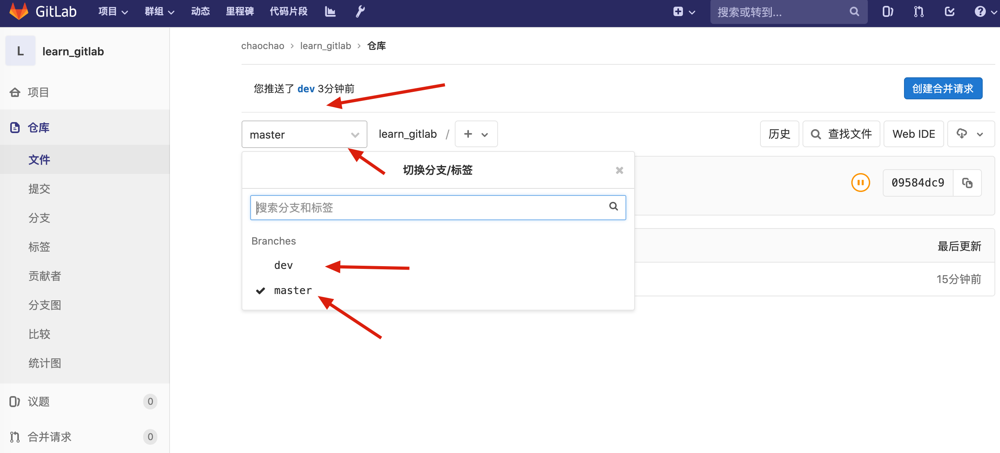

### 合并分支且推送gitlab

dev开发了新功能，领导在确认无误后，决定给合并到master分支，线上运行的就是master主干分支的代码

```plain
1.在本地合并分支
[yuchao@yumac ~/luffy_code/learn_gitlab]$git checkout master
Switched to branch 'master'
Your branch is up to date with 'origin/master'.
[yuchao@yumac ~/luffy_code/learn_gitlab]$
[yuchao@yumac ~/luffy_code/learn_gitlab]$
[yuchao@yumac ~/luffy_code/learn_gitlab]$git merge dev
Updating 09584dc..3e88004
Fast-forward
 dev.txt | 1 +
 1 file changed, 1 insertion(+)
 create mode 100644 dev.txt
2.本地合完了代码，还得推送到gitlab才行
[yuchao@yumac ~/luffy_code/learn_gitlab]$git push -u origin master
Total 0 (delta 0), reused 0 (delta 0)
To gitlab.onlyu.com:chaochao/learn_gitlab.git
   09584dc..3e88004  master -> master
Branch 'master' set up to track remote branch 'master' from 'origin'.
```

此时master和dev都有相同的代码了。

## 推送tag

```plain
[yuchao@yumac ~/luffy_code/learn_gitlab]$git tag -a "v1.0" -m "first tag."
[yuchao@yumac ~/luffy_code/learn_gitlab]$git tag
v1.0
[yuchao@yumac ~/luffy_code/learn_gitlab]$git push origin v1.0
Enumerating objects: 1, done.
Counting objects: 100% (1/1), done.
Writing objects: 100% (1/1), 152 bytes | 152.00 KiB/s, done.
Total 1 (delta 0), reused 0 (delta 0)
To gitlab.onlyu.com:chaochao/learn_gitlab.git
 * [new tag]         v1.0 -> v1.0
```


# Gitlab备份、恢复、升级

对 gitlab 进行备份将会创建一个包含所有库和附件的归档文件。对备份的恢复只能恢 复到与备份时的 gitlab 相同的版本。将 gitlab 迁移到另一台服务器上的最佳方法就是通过 备份和还原。gitlab提供了一个简单的命令行来备份整个gitlab，并且能灵活的满足需求。

## 修改备份配置

备份文件将保存在配置文件中定义的 backup_path 中，文件名为 TIMESTAMP_gitlab_backup.tar,TIMESTAMP 为备份时的时间戳。TIMESTAMP 的格式为: EPOCH_YYYY_MM_DD_Gitlab-version。

默认的备份文件目录为:/var/opt/gitlab/backups，如果自定义备份目录需要赋予目 录 git 权限，具体操作如下:

```plain
# 修改默认存放路径，修改配置文件
vim /etc/gitlab/gitlab.rb
# 打开参数，备份默认保留七天
gitlab_rails['backup_keep_time'] = 604800
gitlab_rails['backup_path'] = "/data/backups/gitlab"
# 执行如下命令，重新加载gitlab
[root@lb02 ~]# mkdir -p /data/backups/gitlab
[root@lb02 ~]# chown -R git.git /data/backups/gitlab
[root@lb02 ~]# gitlab-ctl reconfigure
# 手动备份，此时就会在对应的备份目录下，产生数据
[root@lb02 ~]# gitlab-rake gitlab:backup:create
```

## 定时备份

对于数据安全，备份操作可以进行定时任务添加，做到每天备份一次。

```plain
[root@lb02 gilab]# crontab -l
0 2 * * * /usr/bin/gitlab-rake gitlab:backup:create &>/dev/null
```

## 数据恢复

Gitlab的恢复只能恢复到与原本备份文件相同的gitlab版本中，恢复时，需要停止数据库的写入操作，但是保持gitlab是运行的。

暂停数据库写入

```plain
[root@lb02 gilab]# gitlab-ctl stop unicorn
ok: down: unicorn: 0s, normally up
[root@lb02 gilab]# gitlab-ctl stop sidekiq
ok: down: sidekiq: 0s, normally up
[root@lb02 gilab]# gitlab-ctl status
run: alertmanager: (pid 58110) 77023s; run: log: (pid 4372) 103339s
run: gitaly: (pid 58129) 77022s; run: log: (pid 3915) 103432s
run: gitlab-monitor: (pid 58137) 77022s; run: log: (pid 4266) 103349s
run: gitlab-workhorse: (pid 58150) 77021s; run: log: (pid 4169) 103369s
run: grafana: (pid 58164) 77021s; run: log: (pid 4466) 103309s
run: logrotate: (pid 110927) 2128s; run: log: (pid 4219) 103359s
run: nginx: (pid 58198) 77020s; run: log: (pid 4193) 103365s
run: node-exporter: (pid 58206) 77019s; run: log: (pid 4244) 103354s
run: postgres-exporter: (pid 58213) 77019s; run: log: (pid 4399) 103335s
run: postgresql: (pid 58226) 77018s; run: log: (pid 3967) 103425s
run: prometheus: (pid 58229) 77018s; run: log: (pid 5342) 103115s
run: redis: (pid 58248) 77019s; run: log: (pid 3804) 103439s
run: redis-exporter: (pid 58254) 77018s; run: log: (pid 4340) 103344s
down: sidekiq: 9s, normally up; run: log: (pid 4151) 103374s
down: unicorn: 119s, normally up; run: log: (pid 4132) 103382s
```

进行数据恢复

整个恢复过程基本是在删除表，创建表。

```plain
# 只需要填写备份文件的时间戳信息即可
[root@lb02 gilab]# gitlab-rake gitlab:backup:restore BACKUP=1594278431_2020_07_09_12.0.3
Unpacking backup ... done
Before restoring the database, we will remove all existing
tables to avoid future upgrade problems. Be aware that if you have
custom tables in the GitLab database these tables and all data will be
removed.
Do you want to continue (yes/no)? yes
```

重新启动gitlab数据库

```plain
[root@lb02 gilab]# gitlab-ctl restart
```

重新访问gitlab，可以用`gitlab-ctl tail`查看日志信息

```plain
http://172.20.0.51/
```

## 升级操作

升级操作不建议操作，只需做了解过程即可，或者再建一台虚拟机操作

```plain
1.关闭gitlab自带的服务
[root@lb02 gilab]# gitlab-ctl stop unicorn
[root@lb02 gilab]# gitlab-ctl stop sidekiq
gitlab-ctl stop nginx
2.立即备份现有gitlab数据
gitlab-rake gitlab:backup:create
3.下载新版本的gitlab软件包
4.直接安装新版本
yum localinstall 新版gitlab
如果出现报错，解决办法如下
//报错.
Error executing action `run` on resource 'ruby_block[directory resource: /var/opt/gitlab/git-data/repositories]'
//解决方法:
[root@gitlab-ce ~]# chmod 2770 /var/opt/gitlab/git-data/repositories
5.安装完毕后，启动gitlab即可
gitlab-ctl reconfigure
gitlab-ctl restart
# 查看gitlab版本
head -1 /opt/gitlab/version-manifest.txt
```


# jenkins结合gitlab

### 选择gitlab代码仓库

### 安装gitlab的笔记

```plain
1.centos7安装配置gitlab，服务器环境学习环境，最少2G，生产环境至少4G，关闭防火墙
2.安装依赖环境
yum install curl policycoreutils openssh-server openssh-clients policycoreutils-python postfix wget -y
3.确保服务启动
[root@m01 My-freestyle-job]# systemctl enable postfix
[root@m01 My-freestyle-job]# systemctl start postfix
4.获取gitlab软件包，或者直接向超哥要，QQ:87734810
[root@m01 ci_cd_rpm]# wget https://mirrors.tuna.tsinghua.edu.cn/gitlab-ce/yum/el7/gitlab-ce-10.2.2-ce.0.el7.x86_64.rpm
5.rpm命令安装gitlab软件
[root@m01 ci_cd_rpm]# rpm -ivh gitlab-ce-10.2.2-ce.0.el7.x86_64.rpm
6.首次安装初始化gitlab，只能执行一次，这个过程可能较长
gitlab-ctl reconfigure
7.对gitlab进行启停，gitlab默认运行会开启诸多服务
gitlab-ctl status/stop/start    启动gitlab
gitlab-ctl reconfigure    重新加载配置
gitlab-ctl tail                 检查日志
gitlab-ctl status
[root@m01 ci_cd_rpm]# gitlab-ctl status
run: gitaly: (pid 42025) 26s; run: log: (pid 41657) 91s
run: gitlab-monitor: (pid 42041) 26s; run: log: (pid 41767) 79s
run: gitlab-workhorse: (pid 42014) 27s; run: log: (pid 41601) 105s
run: logrotate: (pid 41637) 97s; run: log: (pid 41636) 97s
run: nginx: (pid 41615) 103s; run: log: (pid 41614) 103s
run: node-exporter: (pid 41712) 85s; run: log: (pid 41711) 85s
run: postgres-exporter: (pid 42062) 24s; run: log: (pid 41891) 60s
run: postgresql: (pid 41340) 153s; run: log: (pid 41339) 153s
run: prometheus: (pid 42050) 25s; run: log: (pid 41809) 66s
run: redis: (pid 41276) 159s; run: log: (pid 41275) 159s
run: redis-exporter: (pid 41790) 72s; run: log: (pid 41789) 72s
run: sidekiq: (pid 41580) 111s; run: log: (pid 41579) 111s
run: unicorn: (pid 42132) 15s; run: log: (pid 41535) 117s
8.修改gitlab主配置文件，
# 修改gitlab占用过多内存的配置
# 修改gitlab的仓库地址显示
# 很多程序会占用8080端口，修改gitlab自带端口，打开如下注释
[root@m01 ci_cd_rpm]# grep -Ev "^#|^$" /etc/gitlab/gitlab.rb
unicorn['worker_processes'] = 2                  # 填写CPU核数+1，减少进程数
external_url 'http://192.168.178.120'
unicorn['port'] = 8088    
postgresql['shared_buffers'] = "256MB"    # 减少数据库缓存
unicorn['worker_memory_limit_min'] = "200 * 1 << 20"    # 减少内存占用
unicorn['worker_memory_limit_max'] = "300 * 1 << 20"
sidekiq['concurrency'] = 16        # 减少任务调度并发数
postgresql['max_worker_processes'] = 8  #数据库并发数改为8
# 改完之后，重新加载gitlab
[root@m01 ci_cd_rpm]# gitlab-ctl reconfigure
9.通过浏览器访问页面服务器ip，默认开启了nginx的web端口，设置初始密码，操作类似github
http://192.168.178.120/
10.首次登录，设置账户密码
账户root
密码chaoge666
11.有关gitlab的配置文件
gitlab-ce一键安装后可以利用rpm -ql gitlab-ce查询其文件安装路径及相关文件路径，其默认安装路径为/opt/gitlab/、程序数据及配置文件保存路径为/var/opt/gitlab下。
相关默认位置
代码仓库保存位置：/var/opt/gitlab/git-data/repositories/
代码仓库备份位置：/var/opt/gitlab/backups/
postgresql数据及配置目录：/var/opt/gitlab/postgresql/data/
redis默认配置目录：/var/opt/gitlab/redis
gitlab主要配置文件：/etc/gitlab/gitlab.rb
```


### 创建gitlab代码仓库

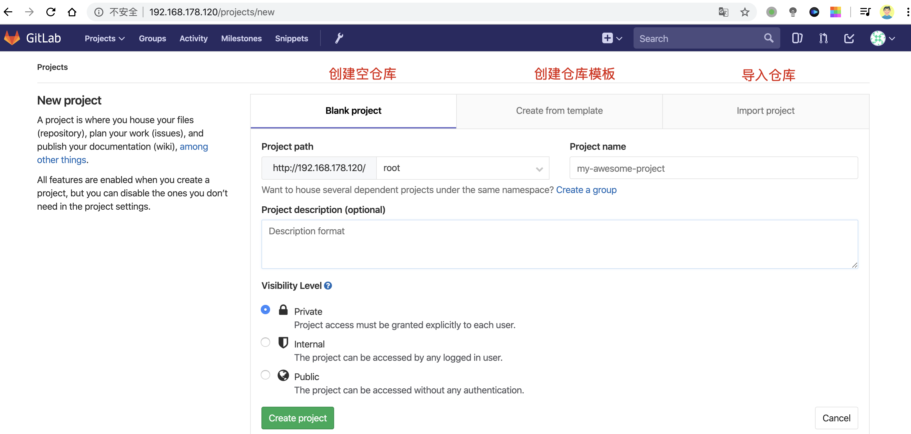

### 从码云导入代码项目

或者这个代码https://gitee.com/kangjie1209/monitor?_from=gitee_search

```plain
1.登录码云
2.获取码云仓库代码的 URL地址
https://gitee.com/kangjie1209/monitor.git
```

#### 从URL导入仓库


#### 创建gitlab仓库

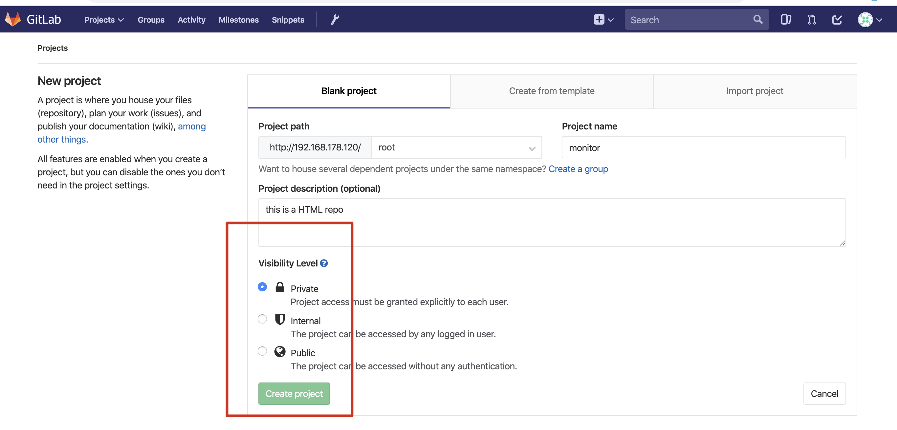

#### gitlab导入URL仓库完毕


#### 在jenkins中添加git代码管理

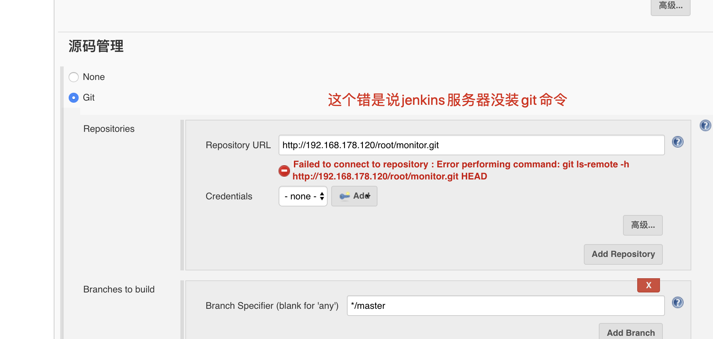

```plain
1.检查是否有git
[root@m01 ci_cd_rpm]# git
-bash: git: 未找到命令
2.安装git工具
[root@m01 ci_cd_rpm]# yum install git -y
3.保存jenkins配置之后，再次查看仓库地址配置
```

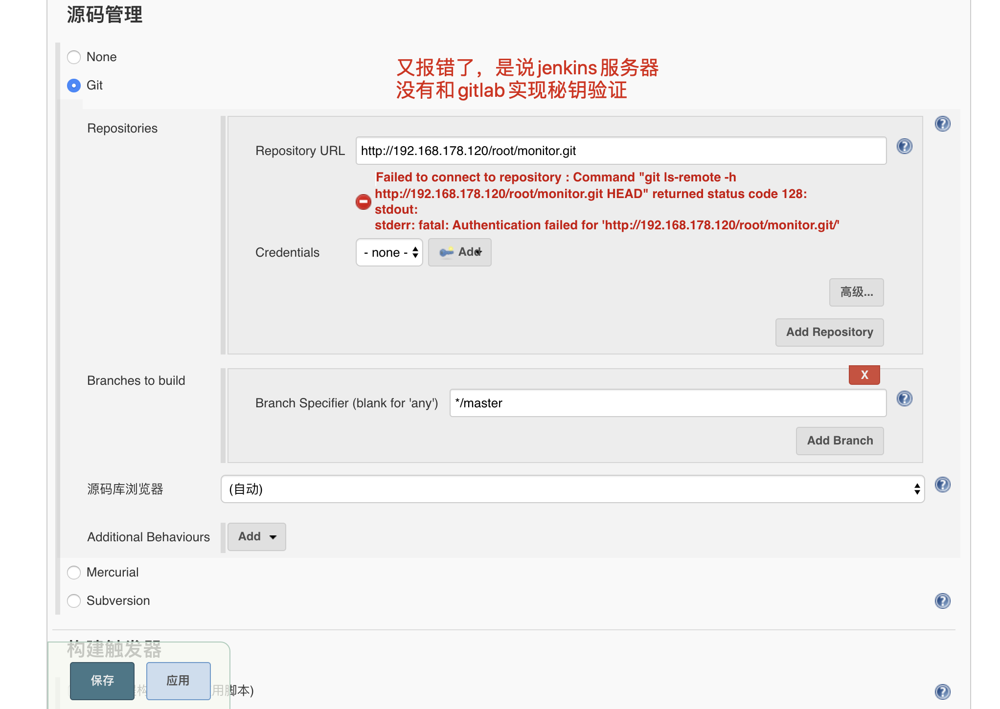

#### root用户和gitlab的认证配置

```plain
1.生成ssh公私钥对，把公钥信息，发送给gitlab服务
[root@m01 ci_cd_rpm]# ssh-keygen -t rsa
[root@m01 ci_cd_rpm]# cat ~/.ssh/id_rsa.pub
ssh-rsa AAAAB3NzaC1yc2EAAAADAQABAAABAQCrVGf5zoGu359mhWOhT5Rnh0sDVdh1mUiH0sO6aOJsn+WJZF4gGpGzG4TtJe0mHAozAElStWCmPnv2cQch5eM+nLtG/o/xY/P1JDSx+U2lY6GOGTIbbFIDO9FZrcMpGtP4e0sby1/KYslia4JWcOMFBYQUVPUpc9NOxLLPJK7qXUBy+dV0hYRbkn5GdG+d+GotZEqTC4nE7UoYhwRg2Ld7yRtotiMoD099WL1lsljfP2QRZ9hSurGgZ+BQZeSZ57d+LJBypVsYq11iaL7s6oaUFMeIAs6YkQK8l7GcWh4KLYn4G8Q4ljZGfVHpC5A2fW16rPZGE4qqddkGfX9AujjT root@m01
```

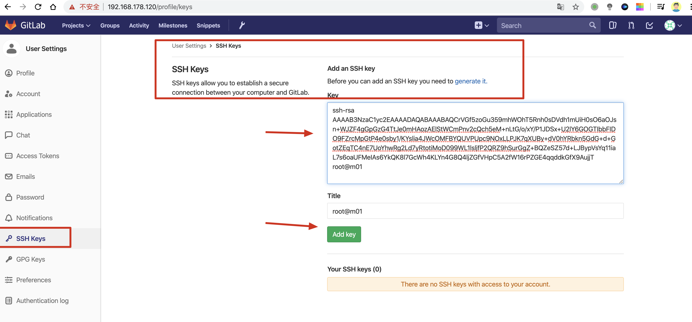


#### 测试jenkins服务器本地拉取代码

```plain
[root@m01 ~]# git clone git@192.168.178.120:root/monitor.git
正克隆到 'monitor'...
remote: Counting objects: 435, done.
remote: Compressing objects: 100% (372/372), done.
remote: Total 435 (delta 53), reused 435 (delta 53)
接收对象中: 100% (435/435), 8.78 MiB | 0 bytes/s, done.
处理 delta 中: 100% (53/53), done.
```

#### 再次测试jenkins和gitlab的连接性


```plain
jenkins是用root启动的
root到gitlab也是通的
因此如上jenkins+gitlab已经连接上了
```

#### 修改jenkins启动用户(禁止该操作，有迷之bug)

```plain
jenkins获取gitlab代码经常会出现问题，例如权限不足，我们这里可以把jenkins的启动用户改回去为jenkins
[root@m01 ~]# grep "JENKINS_USER" /etc/sysconfig/jenkins
JENKINS_USER="jenkins"
# 重启jenkins服务
systemctl restart jenkins
```


```plain
# 发现jenkins配置文件的权限有问题
[root@m01 ~]# ll /var/lib/jenkins/config.xml
-rw------- 1 root root 1822 3月  26 11:05 /var/lib/jenkins/config.xml
# 修改为jenkins用户
[root@m01 ~]# chown jenkins:jenkins /var/lib/jenkins/config.xml
[root@m01 ~]# ll /var/lib/jenkins/config.xml
-rw------- 1 jenkins jenkins 1822 3月  26 11:05 /var/lib/jenkins/config.xml
# 重启服务
systemctl restart jenkins
```

我们会发现更换jenkins用户后，后台的内容都变化了，因为jenkins一切皆文件，用户换了，就生成了新配置

#### 用私钥添加仓库认证

```plain
新建iterm > 自由风格软件项目 > My-freestyle-job
```


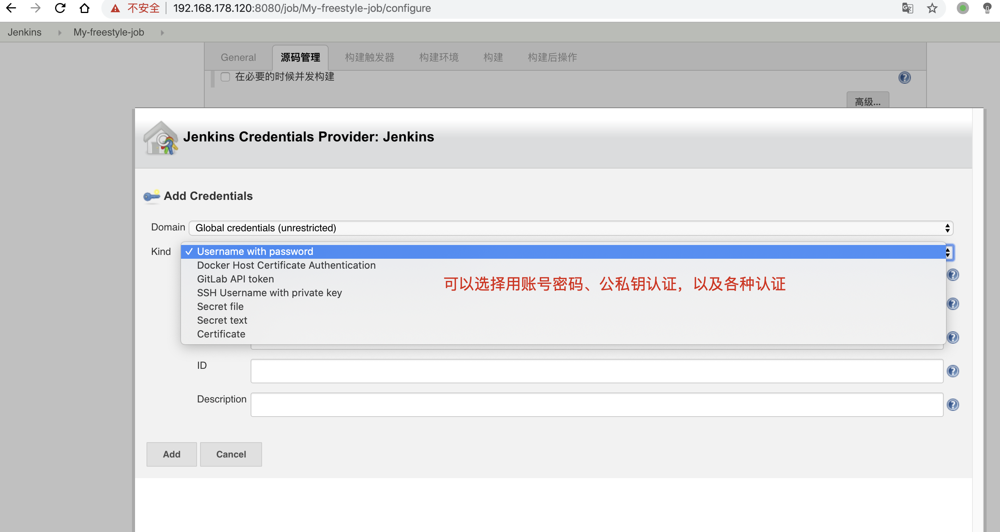

让jenkins拿着root用户的私钥，连接gitlab仓库

```plain
[root@m01 ~]# cat ~/.ssh/id_rsa
```


使用root的私钥认证


点击保存即可

#### 点击立即构建拉取代码

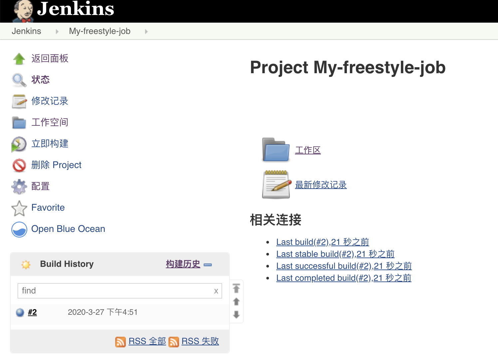

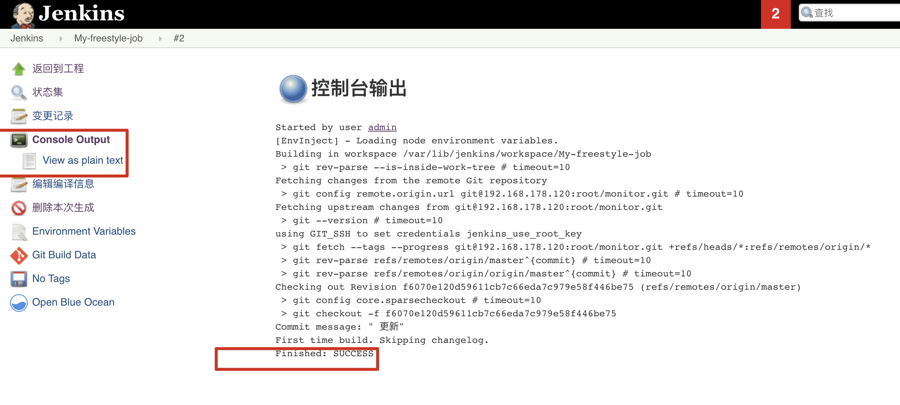

工作区里已经有了gitlab下载的代码


```plain
jenkins拉取的代码，在linux的位置
[root@m01 My-freestyle-job]# pwd
/var/lib/jenkins/workspace/My-freestyle-job
```

## jenkins部署html网站

### 准备一个客户端linux

目的准备用jenkins部署代码，发送到该客户端机器，用nginx部署html静态代码

### 在jenkins服务端编写脚本

jenkins拉取gitlab的代码，想要发送给客户端机器 常规思路都是进行打包发送，因为大量零散的文件，会造成大量IO，速度较慢，打包压缩后发送，能够提升传输效率。

### 配置jenkins和客户端免密登录

配置jenkins和客户端免密登录，发送jenkins机器公钥给目标机器

```plain
[root@m01 My-freestyle-job]# ssh-copy-id -i ~/.ssh/id_rsa.pub root@192.168.178.121
```

编写部署脚本

```plain
[root@m01 My-freestyle-job]# mkdir -p /server/scripts
[root@m01 My-freestyle-job]# cd /server/scripts/
[root@m01 scripts]# cat deploy.sh
#!/bin/bash
name=web-$(date +%F)-$(($RANDOM+10000))
# 脚本接收2个参数，第一个是主机地址  ，第二个是任务名
host=$1
job_name=$2
# 进入jenkins工作区，压缩所有文件放入指定目录，生成压缩文件
cd /var/lib/jenkins/workspace/${job_name}  && tar -zcf /opt/${name}.tar.gz ./*
# 远程连接客户端机器，在客户端机器中创建对应资料文件夹，命名以 时间+随机数区分
ssh ${host} "cd /opt/nginx && mkdir ${name}"
# 远程拷贝压缩文件，发给目标机器的nginx站点目录下
scp /opt/${name}.tar.gz ${host}:/opt/nginx/${name}
# 远程操控客户端机器，进入nginx站点，解压缩文件后，删除源文件
ssh ${host} "cd /opt/nginx/${name}  && tar -zxf ${name}.tar.gz && rm -f ${name}.tar.gz"
# 远程操控客户端机器，进入nginx站点，删除旧html配置，创建软连接指向新的文件
ssh ${host} "cd /opt/nginx/ && rm -rf html && ln -s /opt/nginx/${name} /opt/nginx/html"
```

### 配置jenkins触发脚本执行

```plain
1.访问jenkins站点
http://192.168.178.120:8080/
2.修改job配置
```

配置好jenkins下载的代码仓库地址，且配置认证授权


配置jenkins的job，触发执行linux命令

```plain
# 这个JOB_NAME就是当前JOB的名字
/usr/bin/sh /server/scripts/deploy.sh 192.168.178.121  ${JOB_NAME}
```

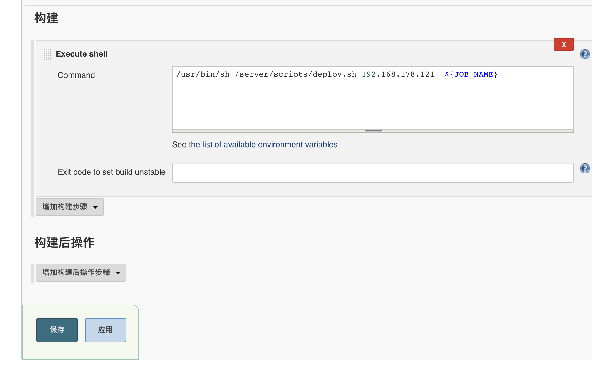

### 点击立即构建

构建中


## 检查构建结果

jenkins机器

```plain
[root@m01 scripts]# ls /opt/web* -l
-rw-r--r-- 1 root root 4654245 3月  27 11:48 /opt/web-2020-03-27-29090.tar.gz
```

客户端机器

```plain
# 客户端机器，已经生成了软连接，指向站点资料
[root@web01 ~]# ll /opt/nginx/
总用量 8
drwx------ 2 nginx root    6 3月  18 23:16 client_body_temp
drwxr-xr-x 3 root  root 4096 3月  27 11:27 conf
drwx------ 2 nginx root    6 3月  18 23:16 fastcgi_temp
lrwxrwxrwx 1 root  root   31 3月  27 11:49 html -> /opt/nginx/web-2020-03-27-29090
drwxr-xr-x 2 root  root   84 3月  27 11:26 logs
drwx------ 2 nginx root    6 3月  18 23:16 proxy_temp
drwxr-xr-x 2 root  root   19 3月  18 22:43 sbin
drwx------ 2 nginx root    6 3月  18 23:16 scgi_temp
drwx------ 2 nginx root    6 3月  18 23:16 uwsgi_temp
drwxr-xr-x 8 root  root 4096 3月  27 11:48 web-2020-03-27-29090
```

### 测试访问脚本部署的站点页面

也就是访问192.168.178.121页面，是否有我们从jenkins机器的脚本分发的页面


## 构建触发器

### jenkins设置


### gitlab设置

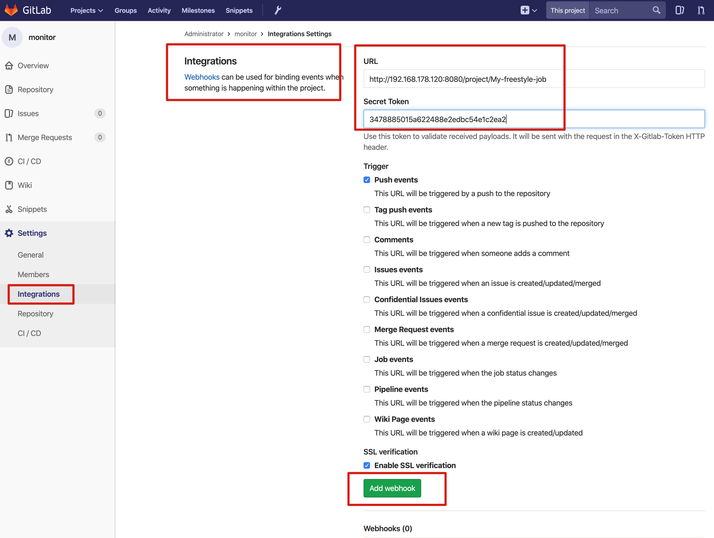

结果 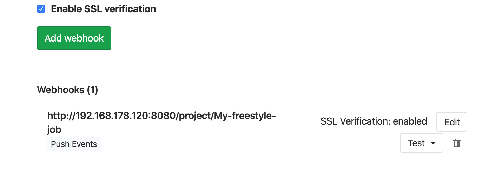

### 实践


jenkins自动触发

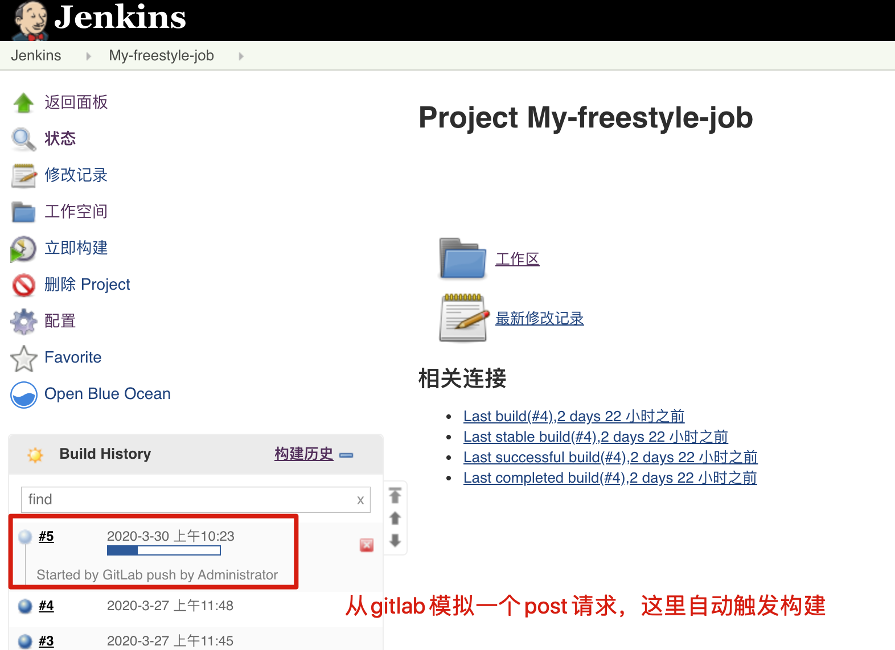

### 手动发送post请求触发构建

```plain
1.克隆项目
[root@m01 ~]# git clone git@192.168.178.120:root/monitor.git
2.修改git配置
git config --global user.name "pyyu"
git config --global user.email "yc_uuu@163.com"
git config --global color.ui true
git remote  add origin git@192.168.178.120:root/monitor.git
3.修改代码内容，用git提交到仓库
修改index.html，修改此处
<a class="logo pull-left" href="index.html" style="width: 233px">超哥push触发构建</a>
4.git添加
git add .
git commit -m 'modify index.html on m01'
5.推送改代码
[root@m01 monitor]# git push origin master
Counting objects: 5, done.
Delta compression using up to 2 threads.
Compressing objects: 100% (3/3), done.
Writing objects: 100% (3/3), 315 bytes | 0 bytes/s, done.
Total 3 (delta 2), reused 0 (delta 0)
To git@192.168.178.120:root/monitor.git
   f6070e1..ff07938  master -> master
```


#### 自动构建结果


## Jenkins返回构建状态

```plain
jenkins > 系统管理 > 系统配置
```

填写gitlab地址


### 生成gitlab的token

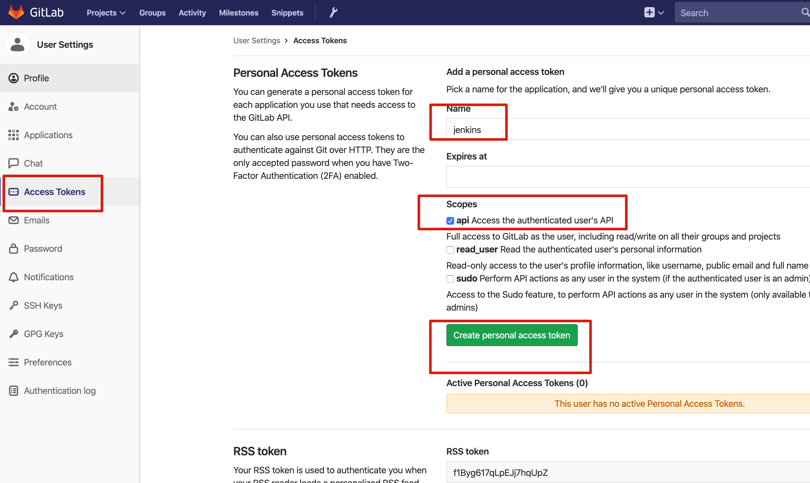

生成如下token信息


粘贴token到jenkins

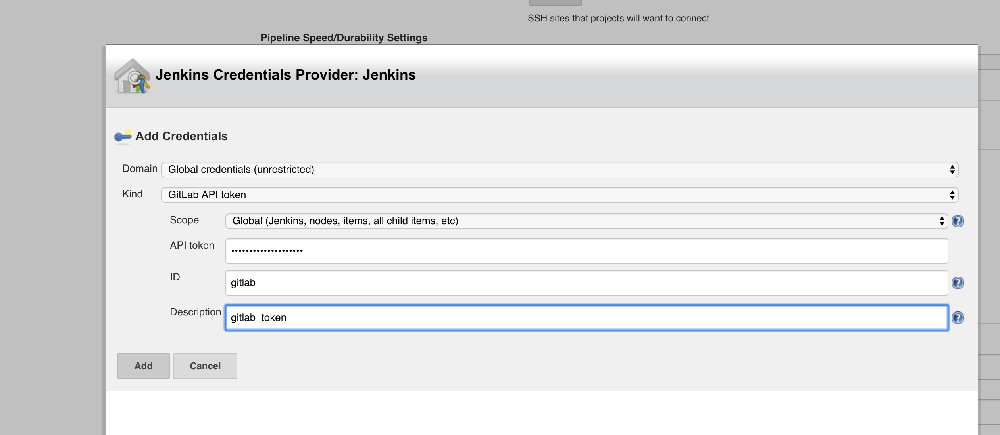

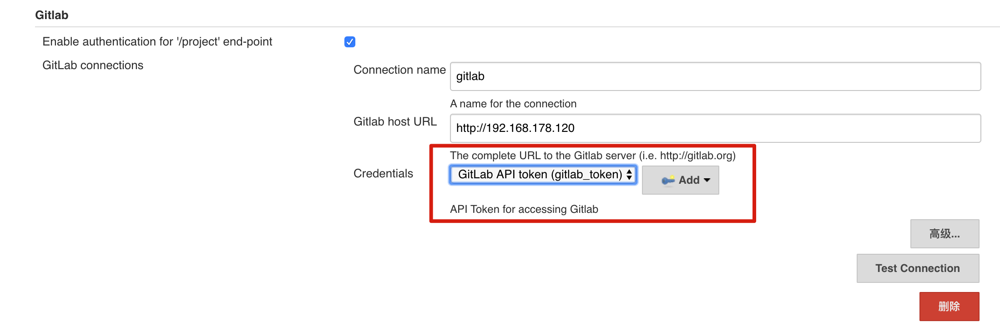

### 配置job

配置【构建后操作】

构建完成后，让jenkins做什么事

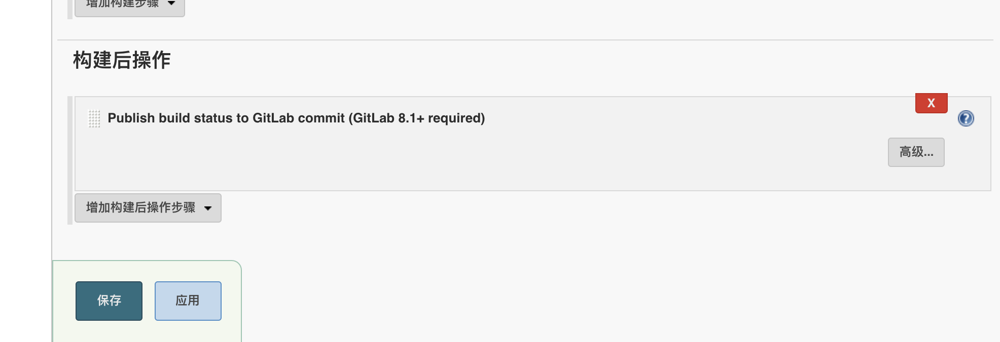

当jenkins构建完毕后，结果会发给gitlab

在jenkins端点击构建后，检查gitlab代码仓库


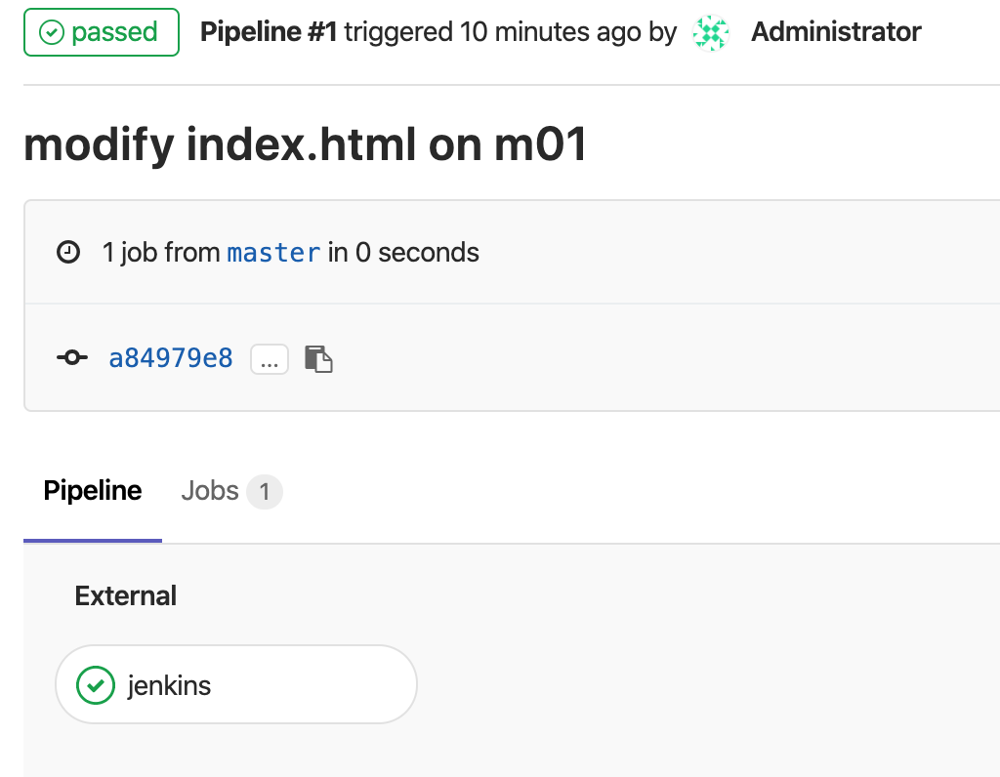


## 配置构建发送邮件

我们配置构建完毕任务后，通过邮件来通知相关人员构建的执行情况，具体配置如下：

```plain
在jenkins主页面 > 系统管理 >  系统设置  > 快捷搜索Jenkins Location
```

找到**Jenkins Location**之后，填好`JenkinsURL`和`系统管理员的邮箱`

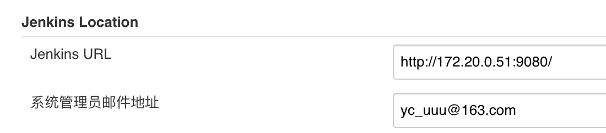

下拉倒最底行，找到【邮件通知】部分


以收到测试邮件的信息为准，表示此处邮箱通知发送没有问题。

保存设置。

### 继续配置job

当jenkins系统设置的邮箱配置好，即可针对job进行配置，点击我们创建的job【My-freestyle-job】

选择如下区域

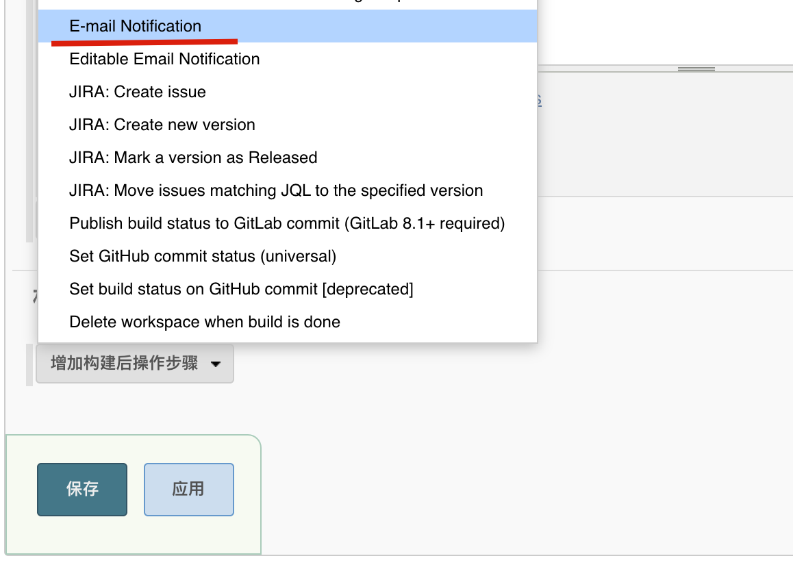

配置E-mail Notification选项

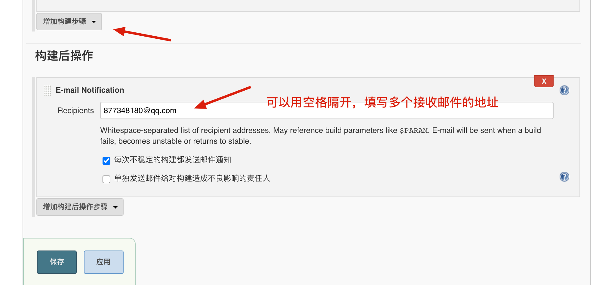

当构建失败后，会发邮件通知。

我们可以手动故意模拟错误设置，执行错误的shell，让jenkins构建失败，查看邮件通知，会收到构建失败的控制台日志信息。

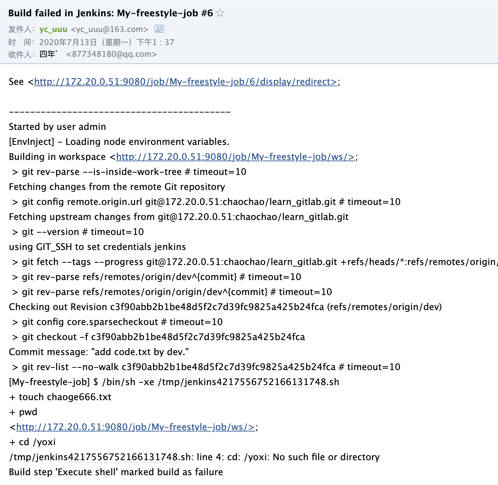


# Jenkins创建maven项目

## Java项目部署概述

### 什么是Java项目

就是java编写的代码，称之为java项目

### 为什么java项目需要编译

java编写的代码无法直接在服务器上运行，需要借助maven工具进行打包。

理解：Java源代码就像汽车的一堆散件，必须组装成一辆完整的汽车，才能进行使用，组装汽车零件的过程就是java代码编译过程，

### 手动vs自动编译

手动部署：

```plain
得到程序员小哥写好的java源代码
↓
使用maven手动构建
↓
推送war包至tomcat进行发布
```

java项目部署架构图

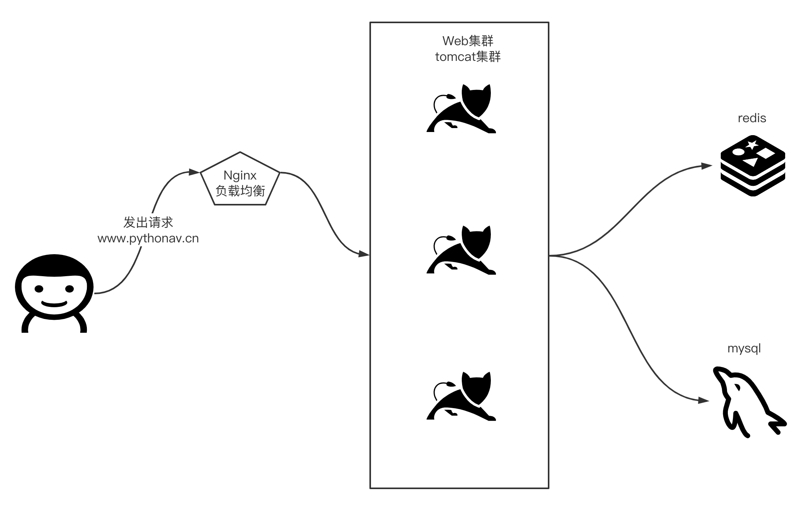

手动部署Maven项目的过程非常机械化，完全可以实现自动化。


### maven了解

在了解Maven之前，我们先来看看一个Java项目需要的东西。首先，我们需要确定引入哪些依赖包。例如，如果我们需要用到[commons logging](https://commons.apache.org/proper/commons-logging/)，我们就必须把commons logging的jar包放入classpath。如果我们还需要[log4j](https://logging.apache.org/log4j/)，就需要把log4j相关的jar包都放到classpath中。这些就是依赖包的管理。

其次，我们要确定项目的目录结构。例如，`src`目录存放Java源码，`resources`目录存放配置文件，`bin`目录存放编译生成的`.class`文件。

此外，我们还需要配置环境，例如JDK的版本，编译打包的流程，当前代码的版本号。

最后，除了使用Eclipse这样的IDE进行编译外，我们还必须能通过命令行工具进行编译，才能够让项目在一个独立的服务器上编译、测试、部署。

这些工作难度不大，但是非常琐碎且耗时。如果每一个项目都自己搞一套配置，肯定会一团糟。我们需要的是一个标准化的Java项目管理和构建工具。

Maven就是是专门为Java项目打造的管理和构建工具，它的主要功能有：

- 提供了一套标准化的项目结构；
- 提供了一套标准化的构建流程（编译，测试，打包，发布……）；
- 提供了一套依赖管理机制。

### Maven项目结构

一个使用Maven管理的普通的Java项目，它的目录结构默认如下：

```plain
a-maven-project
├── pom.xml
├── src
│   ├── main
│   │   ├── java
│   │   └── resources
│   └── test
│       ├── java
│       └── resources
└── target
```

## 部署maven

安装jdk

```plain
[root@lb02 My-freestyle-job]# java -version
java version "1.8.0_121"
Java(TM) SE Runtime Environment (build 1.8.0_121-b13)
Java HotSpot(TM) 64-Bit Server VM (build 25.121-b13, mixed mode)
```

获取maven安装文件

```plain
1.清华镜像站
https://mirrors.tuna.tsinghua.edu.cn/apache/maven/
2.下载maven
wget https://mirrors.tuna.tsinghua.edu.cn/apache/maven/maven-3/3.3.9/binaries/apache-maven-3.3.9-bin.tar.gz
3.解压缩，安装
tar -xf apache-maven-3.3.9-bin.tar.gz
ln -s /opt/apache-maven-3.3.9/ /usr/local/maven
4.测试mvn命令
[root@lb02 opt]# /usr/local/maven/bin/mvn -v
Apache Maven 3.3.9 (bb52d8502b132ec0a5a3f4c09453c07478323dc5; 2015-11-11T00:41:47+08:00)
Maven home: /usr/local/maven
Java version: 1.8.0_121, vendor: Oracle Corporation
Java home: /usr/java/jdk1.8.0_121/jre
Default locale: zh_CN, platform encoding: UTF-8
OS name: "linux", version: "3.10.0-862.el7.x86_64", arch: "amd64", family: "unix"
5.添加环境变量
echo "export PATH=/usr/local/maven/bin:$PATH" >> /etc/profile
source /etc/profile
```

## 认识maven

maven的工作目录结构如下

```plain
[root@lb02 apache-maven-3.3.9]# pwd
/opt/apache-maven-3.3.9
[root@lb02 apache-maven-3.3.9]# ll
总用量 32
drwxr-xr-x 2 root root    97 7月  13 15:58 bin        mvn运行的脚本，连接java
drwxr-xr-x 2 root root    42 7月  13 15:58 boot    类加载器,maven自己的类库
drwxr-xr-x 3 root root    63 11月 11 2015 conf        配置文件目录
drwxr-xr-x 3 root root  4096 7月  13 15:58 lib        运行maven时需要的java类库
-rw-r--r-- 1 root root 19335 11月 11 2015 LICENSE
-rw-r--r-- 1 root root   182 11月 11 2015 NOTICE
-rw-r--r-- 1 root root  2541 11月 11 2015 README.txt
```

### maven命令

```plain
1.创建一个名为hello-world的maven项目
[root@lb02 持续集成新版本课程]# tree hello-world
hello-world
├── pom.xml
└── src
    ├── main
    │   └── java
    │       └── com
    │           └── juvenxu
    │               └── mvnbook
    │                   └── helloworld
    │                       └── HelloWorld.java
    └── test
        └── java
            └── com
                └── juvenxu
                    └── mvnbook
                        └── helloworld
                            └── HelloWorldTest.java
13 directories, 3 files
2.清理mvn clean，项目临时产生的文件，一般是模块下达target目录
[root@lb02 hello-world]# mvn clean
3.项目打包命令mvn package
[root@lb02 hello-world]# mvn package
[root@lb02 hello-world]# cd target/
[root@lb02 target]# ll
总用量 8
drwxr-xr-x 3 root root   17 7月  13 16:25 classes
-rw-r--r-- 1 root root 3133 7月  13 16:26 hello-world-1.0-SNAPSHOT.jar
drwxr-xr-x 2 root root   28 7月  13 16:25 maven-archiver
drwxr-xr-x 3 root root   35 7月  13 16:25 maven-status
-rw-r--r-- 1 root root 2875 7月  13 16:25 original-hello-world-1.0-SNAPSHOT.jar
drwxr-xr-x 2 root root  125 7月  13 16:25 surefire-reports
drwxr-xr-x 3 root root   17 7月  13 16:25 test-classes
4.测试命令，执行src/test/java目录下的测试用例
[root@lb02 hello-world]# mvn test
5.模块安装，将打包好的jar/war文件复制到本地仓库
[root@lb02 hello-world]# mvn install
# 重点输出的信息
[INFO] Installing /opt/持续集成新版本课程/hello-world/target/hello-world-1.0-SNAPSHOT.jar to /root/.m2/repository/com/juvenxu/mvnbook/hello-world/1.0-SNAPSHOT/hello-world-1.0-SNAPSHOT.jar
[INFO] Installing /opt/持续集成新版本课程/hello-world/pom.xml to /root/.m2/repository/com/juvenxu/mvnbook/hello-world/1.0-SNAPSHOT/hello-world-1.0-SNAPSHOT.pom
[root@lb02 hello-world]# cd /root/.m2/repository/com/juvenxu/mvnbook/hello-world/1.0-SNAPSHOT/
[root@lb02 1.0-SNAPSHOT]# ll
总用量 16
-rw-r--r-- 1 root root 3133 7月  13 16:30 hello-world-1.0-SNAPSHOT.jar
-rw-r--r-- 1 root root 1683 8月  26 2010 hello-world-1.0-SNAPSHOT.pom
-rw-r--r-- 1 root root  710 7月  13 16:31 maven-metadata-local.xml
-rw-r--r-- 1 root root  195 7月  13 16:31 _remote.repositories
```

# 开发人员提交代码到gitlab

新建项目

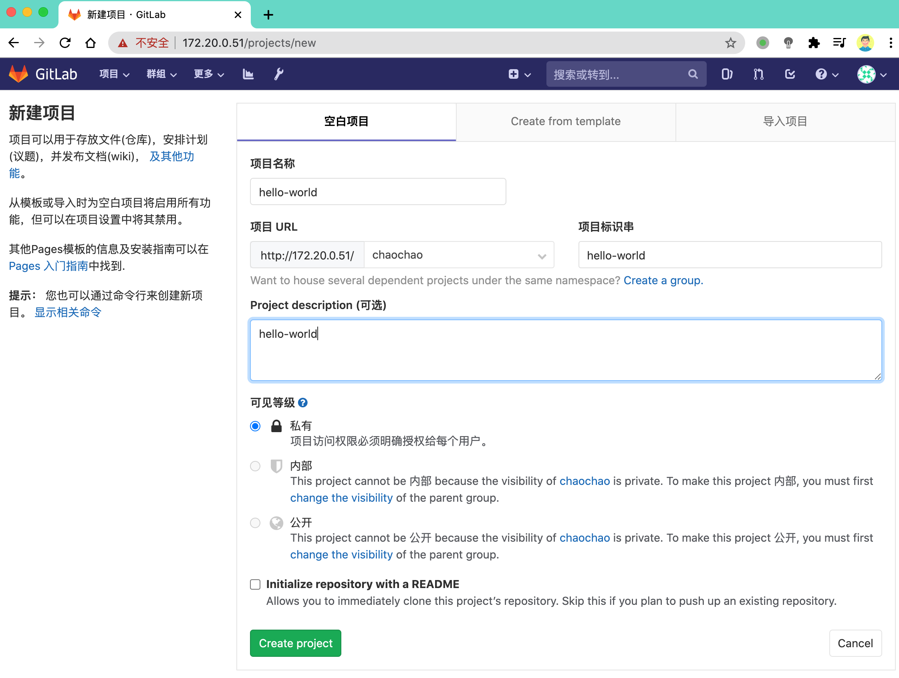

## 修改maven配置

添加国内源

```
vim /usr/local/maven/conf/settings.xml
找到159行，添加
    <mirror>
      <id>alimaven</id>
      <name>aliyun maven.</name>
      <url>http://maven.aliyun.com/nexus/content/groups/public/</url>
      <mirrorOf>central</mirrorOf>
    </mirror>
```

手动编译代码为war包

```
[root@lb02 hello-world]# pwd
/opt/持续集成新版本课程/hello-world
[root@lb02 hello-world]#
[root@lb02 hello-world]# ls
pom.xml  src  target
[root@lb02 hello-world]# mvn package -Dmaven.test.skip=true
生成了war包
[INFO] Replacing /opt/持续集成新版本课程/hello-world/target/hello-world-1.0-SNAPSHOT.jar with /opt/持续集成新版本课程/hello-wo
```


