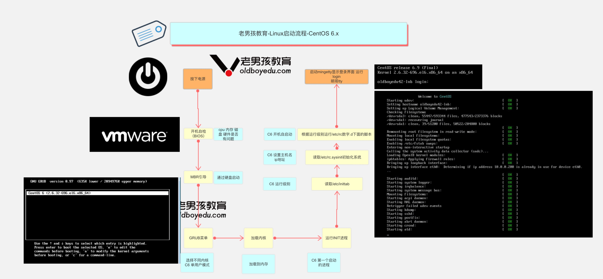

Linux严格区分大小写

① Linux操作系统不以“扩展名”来判断文件的类型，而是通过权限位标识符来进行判断

② 有一些特殊的文件，有扩展名称=>压缩包、二进制软件包、程序文件、网页文件


在Linux系统中，一切皆文件！ 

目录从根 / 开始

Linux中存储设备都必须在挂载之后才能使用

Linux操作系统：分区+格式化+挂载，存储设备必须挂载后才能使用（硬盘、光盘、U盘）

```bash
mount命令： mount   空格   /dev/sda1  空格  /mnt/file
```


# linux 命令行

```
root@VM-4-16-ubuntu:~# pwd
root 是当前用户名称
@ 分隔符
VM-4-16-ubuntu 主机名称
～ 当前用户所在位置
# 身份标识符 # 超时管理员。 $ 普通用户

# tab键提供命令补全
```

# 操作系统目录分隔符

```
window平台命令行分隔符  反斜杠
\ 
linux平台命令分隔符    正斜杠
/
```

# Linux与Windows的目录结构比较

```bash
# Linux首先是建立一个根"/"文件系统，所有的目录也都是由根目录衍生出来。
在Linux底下，所有的文件与目录都是由根目录开始，是目录与文件的源头，然后一个个的分支下来，如同树枝状，因此称为这种目录配置为：目录树。

Linux 系统目录结构基本特点：
1.Linux下一切从根开始
2.Linux下面的目录是一个有层次的目录结构
3.在linux中每个目录可以挂载到不同的设备(磁盘)上
4.Linux 下设备不挂载不能使用，不挂载的设备相当于没门没窗户的监狱(进不去出不来)，挂载相当于给设备创造了一个入口(挂载点，一般为目录)
```

# linux目录挂载


### Linux系统的文件目录用途

/bin：系统命令目录

/sbin：超级命令目录，只能超级管理员可以执行的命令

/boot：系统目录，类似于Windows中的C盘

/dev ：设备文件目录，硬盘、光驱、U盘都属于设备文件，/dev/sr0代表光驱设备。注意，次目录下的文件没有办法直接使用，必须先挂载

/etc ：非常重要，代表系统的配置文件目录。大部分软件安装完成后，其配置文件都存放在此目录

/home：普通用户的家目录，用户登录后会自动切换到此目录

/root：超级管理员的家目录，超级管理员登录后会自动切换到此目录

/media：挂载目录，早期Linux挂载目录，用于挂载光盘以及软盘

/mnt：挂载目录，用来挂载额外的设备，如 U 盘、移动硬盘和其他操作系统的分区

/opt ：第三方软件目录，这个目录是放置和安装其他软件的位置，手工安装的源码包软件都可以安装到这个目录中。不过笔者还是习惯把软件放到 /usr/local/ 目录中，也就是说，/usr/local/ 目录也可以用来安装软件

/usr ：系统程序目录，类似Windows中的Program Files

/proc：虚拟文件系统。该目录中的数据并不保存在硬盘上，而是保存到内存中。主要保存系统的内核、进程、外部设备状态和网络状态等。

/tmp ：临时文件目录，在该目录下，所有用户都可以访问和写入。建议此目录中不能保存重要数据，最好每次开机都把该目录清理

/var ：经常变化的文件目录，网页文件、数据文件、日志文件


- **/bin**：bin是Binary的缩写, 这个目录存放着最经常使用的命令。
- **/boot：**这里存放的是启动Linux时使用的一些核心文件，包括一些连接文件以及镜像文件。
- **/dev ：**dev是Device(设备)的缩写, 该目录下存放的是Linux的外部设备，在Linux中访问设备的方式和访问文件的方式是相同的。
- **/etc：**这个目录用来存放所有的系统管理所需要的配置文件和子目录。
- **/home**：用户的主目录，在Linux中，每个用户都有一个自己的目录，一般该目录名是以用户的账号命名的。
- **/lib**：这个目录里存放着系统最基本的动态连接共享库，其作用类似于Windows里的DLL文件。几乎所有的应用程序都需要用到这些共享库。
- **/lost+found**：这个目录一般情况下是空的，当系统非法关机后，这里就存放了一些文件。
- **/media**：linux系统会自动识别一些设备，例如U盘、光驱等等，当识别后，linux会把识别的设备挂载到这个目录下。
- **/mnt**：系统提供该目录是为了让用户临时挂载别的文件系统的，我们可以将光驱挂载在/mnt/上，然后进入该目录就可以查看光驱里的内容了。
- **/opt**： 这是给主机额外安装软件所摆放的目录。比如你安装一个ORACLE数据库则就可以放到这个目录下。默认是空的。
- **/proc**：这个目录是一个虚拟的目录，它是系统内存的映射，我们可以通过直接访问这个目录来获取系统信息。 这个目录的内容不在硬盘上而是在内存里，我们也可以直接修改里面的某些文件，比如可以通过下面的命令来屏蔽主机的ping命令，使别人无法ping你的机器：

```plain
echo 1 > /proc/sys/net/ipv4/icmp_echo_ignore_all
```

- **/root**：该目录为系统管理员，也称作超级权限者的用户主目录。
- **/sbin**：s就是Super User的意思，这里存放的是系统管理员使用的系统管理程序。
- **/selinux**： 这个目录是Redhat/CentOS所特有的目录，Selinux是一个安全机制，类似于windows的防火墙，但是这套机制比较复杂，这个目录就是存放selinux相关的文件的。
- **/srv**： 该目录存放一些服务启动之后需要提取的数据。
- **/sys**：这是linux2.6内核的一个很大的变化。该目录下安装了2.6内核中新出现的一个文件系统 sysfs 。
  sysfs文件系统集成了下面3种文件系统的信息：针对进程信息的proc文件系统、针对设备的devfs文件系统以及针对伪终端的devpts文件系统。该文件系统是内核设备树的一个直观反映。当一个内核对象被创建的时候，对应的文件和目录也在内核对象子系统中被创建。
- **/tmp**：这个目录是用来存放一些临时文件的。
- **/usr**：这是一个非常重要的目录，用户的很多应用程序和文件都放在这个目录下，类似于windows下的program files目录。
- **/usr/bin：**系统用户使用的应用程序。
- **/usr/sbin：**超级用户使用的比较高级的管理程序和系统守护程序。
- **/usr/src：**内核源代码默认的放置目录。
- **/var**：这个目录中存放着在不断扩充着的东西，我们习惯将那些经常被修改的目录放在这个目录下。包括各种日志文件。

在linux系统中，有几个目录是比较重要的，平时需要注意不要误删除或者随意更改内部文件。

**/etc： 上边也提到了，这个是系统中的配置文件，如果你更改了该目录下的某个文件可能会导致系统不能启动。**

**/bin, /sbin, /usr/bin, /usr/sbin: 这是系统预设的执行文件的放置目录，比如 ls 就是在/bin/ls 目录下的。**

**值得提出的是，/bin, /usr/bin 是给系统用户使用的指令（除root外的通用户），而/sbin, /usr/sbin 则是给root使用的指令。**

**/var： 这是一个非常重要的目录，系统上跑了很多程序，那么每个程序都会有相应的日志产生，而这些日志就被记录到这个目录下，具体在/var/log 目录下，另外mail的预设放置也是在这里。**


# Linux文件及目录管理命令

| 命令         | 对应英文             | 作用                   |
| ------------ | -------------------- | ---------------------- |
| ls           | list                 | 查看文件夹内容         |
| pwd          | print work directory | 查看当前所在目录       |
| cd 目录名    | Change directory     | 切换文件夹             |
| touch 文件名 | touch                | 如果文件不存在，则创建 |
| mkdir 目录名 | Make directory       | 创建目录               |
| rm 文件名    | Remove               | 删除指定文件           |

### cd

```bash
# 主要功能：cd全称change directory，切换目录（从一个目录跳转到另外一个目录）
# cd [路径]
选项说明：
路径既可以是绝对路径，也可以是相对路径

.    当前目录
..    上一层目录
-    前一个工作目录
~    当前【用户】所在的家目录
/            顶级根目录
```


### 切换用户

```
# su - root
Password:123456
[root@localhost ~]# 切换成功
```


### uname

```
#主要功能：获取计算机操作系统相关信息
root@VM-4-16-ubuntu:~# uname -a
Linux VM-4-16-ubuntu 4.15.0-193-generic #204-Ubuntu SMP Fri Aug 26 19:20:21 UTC 2022 x86_64 x86_64 x86_64 GNU/Linux
```

### tree

```bash
yum install tree -y
tree命令语法：
tree常用参数
-C 在文件和目录清单加上色彩，便于区分各种类型。
-d 显示目录名称而非内容。
-D 列出文件或目录的更改时间。
-f 在每个文件或目录之前，显示完整的相对路径名称。
-F 在条目后加上文件类型的指示符号(* ， /， = ， @ ， | ，其中的一个) 目录/
```


### ls

```
# 主要功能：ls完整写法list show，以平铺的形式显示当前目录下的文件信息
# ls 其他目录的绝对路径或相对路径
# ls [选项] [路径]
选项说明：
-l ：ls -l，代表以详细列表的形式显示当前或其他目录下的文件信息(简写命令=>ll)
-h ：ls -lh，通常与-l结合一起使用，代表以较高的可读性显示文件的大小(kb/mb/gb)
-a ：ls -a，a是all缩写，代表显示所有文件（也包含隐藏文件=>大部分以.开头）

-t 根据最后修改时间排序，默认是以文件名排序，通常与-l 连用
-F 在条目后加上文件类型的指示符号(* ， /， = ， @ ， | ，其中的一个)
    注:可以标识文件类型
    加上 * 代表可执行的普通文件
    加上 = 表示套接字
    加上 | 表示FIFOS(队列系统)
  加上 @表示符号链接
  加上 / 表示文件夹
-d 显示目录本身的信息 而不是显示目录的内容
-r, --reverse                 逆序排列
-S                            根据文件大小排序,从大到小排序
-i 显示索引节点信息(索引节点相当于身份证号)
--full-time 以完整的时间格式输出(也就是按照中国的时间日期显示)

案例：
ls -lt 按照时间进行排序
ls -lrt 找出最新的文件
ls -d */    列出当前所有目录
ll -hS    ./*    显示出当前目录下所有内容详细，且以kb,mb,gb单位从大到小排序
```

计算机中的单位

```bash
# 1TB = 1024GB
# 1GB = 1024MB
# 1MB = 1024KB
# 1KB（千字节） = 1024B（字节）
```


### mkdir

```bash
用法：mkdir [选项]... 目录...
若指定目录不存在则创建目录。
-m, --mode=模式       设置权限模式(类似chmod)，而不是rwxrwxrwx 减umask
-p, --parents         需要时创建目标目录的上层目录，但即使这些目录已存在也不当作错误处理
mkdir {1..3}加花括号创建连续的目录，用..隔开 花括号内可以是连续的数字、连续的字母mkdir {a..e}

案例：
mkdir {alex,pyyu,mjj}  创建三个文件夹，逗号隔开
mkdir alex{1..5}    创建连续的目录
mkdir cunzhang longting  创建少量连续目录
```

### *touch命令*

创建文件或修改文件时间戳

```bash
用法：touch [选项]... 文件...
将每个文件的访问时间和修改时间改为当前时间。
不存在的文件将会被创建为空文件，除非使用-c 或-h 选项。
touch {连续数字或字母} 创建多个文件序列
touch {1..10}
touch {a..z}
  -c, --no-create       不创建任何文件
  -t STAMP              使用[[CC]YY]MMDDhhmm[.ss] 格式的时间替代当前时间
  -r, --reference=文件  使用指定文件的时间属性替代当前文件时间
  
  
  修改文件时间
touch -t 06010808 alex1    #修改alex1文件的时间是 6月1号8点8分
touch -r alex1 alex2        #把alex2的时间改成alex1一样
```

### *cp复制*

复制命令

```bash
用法：cp [选项]... [-T] 源文件 目标文件
　或：cp [选项]... 源文件... 目录
　或：cp [选项]... -t 目录 源文件...
将源文件复制至目标文件，或将多个源文件复制至目标目录。
-r 递归式复制目录，即复制目录下的所有层级的子目录及文件 -p 复制的时候 保持属性不变
-d 复制的时候保持软连接(快捷方式)
-a 等于-pdr
-p                等于--preserve=模式,所有权,时间戳，复制文件时保持源文件的权限、时间属性
-i, --interactive        覆盖前询问提示

案例
复制 > copy > cp
#移动xxx.py到/tmp目录下
cp xxx.py /tmp/
#移动xxx.py顺便改名为chaoge.py
cp xxx.py /tmp/chaoge.py
Linux下面很多命令，一般没有办法直接处理文件夹,因此需要加上（参数） 
cp -r 递归,复制目录以及目录的子孙后代
cp -p 复制文件，同时保持文件属性不变    可以用stat
cp -a 相当于-pdr
#递归复制test文件夹，为test2
cp -r test test2
cp是个好命令，操作文件前，先备份
cp main.py main.py.bak
移动多个文件，放入文件夹c中
cp -r  文件1  文件2  文件夹a   文件夹c

案例2
[root@pylinux opt]# cp luffy_boy.zip  luffy_boy.zip.bak2
cp：是否覆盖"luffy_boy.zip.bak2"？ y
[root@pylinux opt]# cp luffy_boy.zip  luffy_boy.zip.bak2 -i
cp：是否覆盖"luffy_boy.zip.bak2"？ y
cp确认是否覆盖是-i参数作用，默认alias因为添加了别名
[root@pylinux opt]# alias
alias cp='cp -i'
[root@pylinux opt]# cp luffyCity/ luffyCity2    #必须添加-r参数才可以复制递归目录
cp: omitting directory 'luffyCity/'
[root@pylinux opt]#
[root@pylinux opt]#
[root@pylinux opt]#
[root@pylinux opt]# cp -r luffyCity/ luffyCity2
[root@pylinux opt]#
[root@pylinux opt]#
[root@pylinux opt]# ls
luffyCity  luffyCity2
```

### mv

```bash
mv命令就是move的缩写，作用是移动或是重命名文件
用法：mv [选项]... [-T] 源文件 目标文件
　或：mv [选项]... 源文件... 目录
　或：mv [选项]... -t 目录 源文件...
将源文件重命名为目标文件，或将源文件移动至指定目录。
-f, --force                  覆盖前不询问
-i, --interactive            覆盖前询问
-n, --no-clobber             不覆盖已存在文件如果您指定了-i、-f、-n 中的多个，仅最后一个生效。
-t, --target-directory=DIRECTORY      将所有参数指定的源文件或目录移动至 指定目录
-u, --update                  只在源文件文件比目标文件新，或目标文件不存在时才进行移动

案例：
移动（搬家）命令  > move > mv
1.给文件重命名
mv abc  abc.py  
2.如果目标文件存在，-i参数则提示是否覆盖
mv test1.txt  test2.txt 
3.使用反斜杠命令屏蔽别名
\mv kunkun wuyifan
4.取消别名
5.移动单个文件
mv file1.txt  dir/
6.移动多个文件
mv file1.txt file2.txt dir/
7.通配符移动多个文件
mv dir/file*   ../
```


### rm

```
用法：rm [选项]... 文件...
删除 (unlink) 文件。
rm命令就是remove的含义，删除一个或者多个文件，这是Linux系统重要命令
-f, --force           强制删除。忽略不存在的文件，不提示确认
-i                    在删除前需要确认
-I                    在删除超过三个文件或者递归删除前要求确认。
-d, --dir    删除空目录
-r, -R, --recursive   递归删除目录及其内容
-v, --verbose         详细显示进行的步骤
      --help            显示此帮助信息并退出
      --version         显示版本信息并退出
 
案例：
1.删除普通文件,需要确认提示,默认添加了-i参数
rm file1.txt
2.强制删除文件，不提示
rm -f file2.txt
3.递归删除文件夹
[root@pylinux tmp]# rm -r heh/
rm：是否进入目录"heh/"? y
rm：是否删除普通空文件 "heh/kuanmian2"？y
rm：是否删除普通空文件 "heh/kuanmian"？y
rm：是否删除目录 "heh/"？y

炸弹命令
1.强制删除且不让用户确认
rm -rf 文件夹
2.强制删除且显示过程
[root@pylinux tmp]# rm -rfv ./*
已删除"./456.txt"
已删除目录："./q/w/e/r/t/yt"
已删除目录："./q/w/e/r/t"
已删除目录："./q/w/e/r"
已删除目录："./q/w/e"
已删除目录："./q/w"
已删除目录："./q"
```


### pwd

```bash
#主要功能：pwd=print working directory，打印当前工作目录（告诉我们，我们当前位置）

```


### clear

```
主要功能：清屏
```


### type

```bash
# 主要功能：主要用来结合help命令，用于判断命令的类型（属于内部命令还是外部命令）
# type 命令
内部命令：命令 is a shell builtin
外部命令：没有显示以上信息的就是外部命令

```


### History 

```bash
# 主要功能：显示系统以前输入的前1000条命令


```


### hostnamectl

```bash
# 主要功能：用于设置计算机的主机名称（给计算机起个名字），此命令式CentOS7新增的命令。
hostnamectl ： hostname + control

# 获取计算机名称
# hostname	CentOS6
# hostnamectl  CentOS7

### 机的主机名称

Centos7中主机名分3类，静态的（static）、瞬态的（transient）、和灵活的（pretty）。

① 静态static主机名称：电脑关机或重启后，设置的名称亦然有效

② 瞬态transient主机名称：临时主机名称，电脑关机或重启后，设置的名称就失效了

③ 灵活pretty主机名称：可以包含一些特殊字符

CentOS 7中和主机名有关的文件为/etc/hostname，它是在系统初始化的时候被读取的，并且内核根据它的内容设置瞬态主机名。

> 更改主机名称，让其永久生效？① 使用静态的 ② 改/etc/hostname文件


① 瞬态主机名称（临时设置）
# hostnamectl --transient set-hostname 主机名称
主机名称 建议遵循 FQDN协议（功能+公司域名）
web01.itcast.cn
web02.itcast.cn

案例：临时设置主机名称为yunwei.itcast.cn
# hostnamectl --transient set-hostname yunwei.itcast.cn
# su 立即生效

② 静态主机名称（永久生效）
# hostnamectl --static set-hostname 主机名称
温馨提示：--static也可以省略不写

案例：把计算机的主机名称永久设置为yunwei.itcast.cn
# hostnamectl --static set-hostname yunwei.itcast.cn
# su 立即生效

③ 灵活主机名称（主机名称可以添加特殊字符）
# hostnamectl --pretty set-hostname 主机名称（包含特殊字符）

案例：把计算机的主机名称通过灵活设置，设置为yunwei's server01
# hostnamectl --pretty set-hostname "yunwei's server01"
查看灵活的主机名称
# hostnamectl --pretty
```

# linux帮助命令

```bash
语法
man 命令  
如：
man  ls  
进入man帮助文档后，按下q退出

语法：
命令 --help
帮助命令的精简版
如 ls --help

语法：
help  命令  
只针对bash内置命令

语法：
info 命令


互联网有很多在线linux中文文档网站
```


# linux开关机命令

### reboot

```bash
主要功能：立即重启计算机
```


poweroff

halt

### shutdown

```bash
# 主要功能：立即关机或延迟关机
# shutdown -h 0或now
# shutdown -h 0
# shutdown -h now
选项说明：
-h ：halt缩写，代表关机

# 在Linux系统中，立即关机除了使用shutdown -h 0以外还可以使用halt -p命令

# 10分钟后关机
# shutdown -h 10
光标一直不停的闪，取消关机
# 按Ctrl + C（CentOS6，中断关机。CentOS7中还需要使用shutdown -c命令）
# shutdown -c


重启
语法：
shutdown -r参数    -r --reboot    Reboot the machine
shutdown -r 10    #十分钟后重启
shutdown -r 0        #立刻重启
shutdown -r now #立刻重启
```


*关机、重启、注销命令列表*

| 命令            | 说明                              |
| --------------- | --------------------------------- |
| shutdown -h now | 立刻关机，企业用法                |
| shutdown -h 1   | 1分钟后关机，也可以写时间如 11:30 |
| halt            | 立刻关闭系统，需手工切断电源      |
| init 0          | 切换运行级别为0，0表示关机        |
| poweroff        | 立刻关闭系统，且关闭电源          |
| 重启            |                                   |
| reboot          | 立刻重启机器，企业用法            |
| Shutdown -r now | 立刻重启，企业用法                |
| shutdown -r 1   | 一分钟后重启                      |
| Init 6          | 切换运行级别为6，此级别是重启     |
| 注销命令        |                                   |
| logout          | 注销退出当前用户                  |
| exit            | 注销退出当前用户，快捷键ctrl + d  |

# linux命令行常用快捷键

```bash
ctrl + c     cancel取消当前操作
ctrl + l    清空屏幕内容
ctrl + d    退出当前用户
ctrl + a     光标移到行首
ctrl + e    光标移到行尾
ctrl + u  删除光标到行首的内容
```


# linux 环境变量

```bash
执行命令：
echo $PATH
echo命令是有打印的意思
$符号后面跟上PATH,表示输出PATH的变量
```


# 绝对路径与相对路径

```bash
例如你现在在/home 这个目录下，如要进入/var/log这个路径，如何写呢？
1. cd /var/log (绝对路径)
2. cd ../var/log(相对路径)
```


# Linux系统文件与启动流程

### /etc初始化系统重要文件

- /etc/sysconfig/network-scripts/ifcfg-eth0:网卡配置文件
- /etc/resolv.conf:Linux系统DNS客户端配置文件
- /etc/hostname (CentOS7) /etc/sysconfig/network:(CentOS 6)主机名配置文件
- /etc/hosts:系统本地的DNS解析文件
- /etc/fstab:配置开机设备自动挂载的文件
- /etc/rc.local:存放开机自启动程序命令的文件
- /etc/inittab:系统启动设定运行级别等配置的文件
- /etc/profile及/etc/bashrc:配置系统的环境变量/别名等的文件
- /etc/profile.d:用户登录后执行的脚本所在的目录
- /etc/issue和/etc/issue.net:配置在用户登录终端前显示信息的文件
- /etc/init.d:软件启动程序所在的目录(centos 6)
- /usr/lib/systemd/system/ 软件启动程序所在的目录(centos 7)
- /etc/motd:配置用户登录系统之后显示提示内容的文件
- /etc/redhat-release:声明RedHat版本号和名称信息的文件
- /etc/sysctl.conf:Linux内核参数设置文件


### /proc重要路径

/proc/meminfo:系统内存信息

/proc/cpuinfo:关于处理器的信息，如类型，厂家，型号，性能等

/proc/loadavg:系统负载信息，uptime 的结果

/proc/mounts:已加载的文件系统的列表


### /var目录下文件

/var/log:记录系统及软件运行信息文件所在的目录

/var/log/messages:系统级别日志文件

/var/log/secure:用户登录信息日志文件

/var/log/dmesg:记录硬件信息加载情况的日志文件


# Linux开机启动流程

作为一个运维人，必须得保障服务器正确工作，机器宕机了，也得明确是什么问题，从何查起，那么了解启动流程就能够对症下药，排查问题。



- *BIOS自检*

检查硬件是否健康。如 cpu 风扇是否正常，内存是否正常，时钟是否正常，这个过程是读取 ROM 上的指令执行的。

- *微控制器*

系统想要启动必须先加载 BIOS，按下电源键时，给微控制器下达一条复位指令，各寄存器复位，最 后下达一条跳转指令，跳转到 BIOS 的 ROM，使得硬件去读取主板上的 BIOS 程序，在这之前都是 由硬件来完成，之后硬件就会把控制权交给 BIOS。

- *BIOS->POST*

随后 BIOS 程序加载 CMOS(可读写的 RAM 芯片，保存 BIOS 设置硬件参数的数据)的信息，借 CMOS 取得主机的各项硬件配置。取得硬件配置的信息之后，BIOS 进行加电自检(Power-on self Test，POST)过程,检测计算机各种硬件信息，如果发现硬件错误则会报错(发出声音警告)。之后 BIOS 对硬件进行初始化。BIOS 将自己复制到物理内存中继续执行，开始按顺序搜寻可引导存储设 备，决定存储设备的顺序(即定义第一个可引导的磁盘，当然是在有两个磁盘的前提)，接下来就 会读取磁盘的内容，但是要读取磁盘文件必须要有文件系统，这对 BIOS 挂载文件系统来说是不可 能，因此需要一个不依赖文件系统的方法使得 BIOS 读取磁盘内容，这种方法就是引入 MBR。最后 BIOS 通过 INT13 硬件中断功能读取第一个可引导的存储设备的 MBR(0 磁道 0 扇区)中的 boot loader。将 MBR 加载到物理内存中执行。MBR 载入内存后，BIOS 将控制权转交给 MBR(准确的 说应该是 MBR 中的 boot loader)，然后 MBR 接管任务开始执行。

- *MBR引导*

载入了第一个可引导的存储设备的 MBR 后，MBR 中的 boot loader 就要读取所在磁盘的操作系统核 心文件(即后面所说的内核)了。 但是不同操作系统的文件系统格式不同，还有一个磁盘可以安装多个操作系统，如何让 boot loader 做到引导的就是用户想要的操作系统，这么多不同的功能单靠一个 446 字节的 boot loader 是远远不 够的。必须有一个相对应的程序来处理各自对应的操作系统核心文件，这个程序就是操作系统的 loader(注意不是 MBR 中的 boot loader)，这样一来 boot loader 只需要将控制权交给对应操作系统 的 loader，让它负责去启动操作系统就行了。 一个硬盘的每个分区的第一个扇区叫做 boot sector，这个扇区存放的就是操作系统的 loader，所以常 说一个分区只能安装一个操作系统。MBR 的 boot loader 有三个功能:提供选单，读取内核文件，转 交给其它 loader。 提供选单就是给用户提供一张选项单，让用户选择进入哪个操作系统;读取内核文件的意思是，系 统会有一个默认启动的操作系统，这个操作系统的 loader 在所在分区的 boot sector 有一份，除此之 外，也会将这个默认启动的操作系统的 loader 复制一份到 MBR 的 boot loader 中，这样一来 MBR 就 会直接读取 boot loader 中的 loader 了，然后就是启动默认的操作系统;转交给其它的 loader，当用 户选择其它操作系统启动的时候，boot loader 会将控制权转交给对应的 loader，让它负责操作系统的 启动。

- *GRUB引导*

grub 是 boot loader 中的一种，就 grub 来说，为了打破在 MBR 中只有 446Bytes 用于存放 boot loader这一限制，所以这一步的实现是这样的:grub 是通过分成三个阶段来实现加载内核这一功能的，这三个阶段分别是:stage1, stage1.5 以及 stage2。 stage1:存放于 MBR 的前 446Bytes，用于加载 stage1.5 阶段，目的是为了识别并驱动 stage2(或者 /boot)所在分区的文件系统。 stage1.5:存放于 MBR 之后的扇区，加载 stage2 所在分区的文件系统驱动，让 stage1 中的 boot loader 能识别 stage2 所在分区的文件系统。 stage2:存放于磁盘分区之上，具体存放于/boot/grub 目录之下，主要用于加载内核文件(vmlinuz- VERSION-RELEASE)以及 ramdisk 这个临时根文件系统(initrd-VERSION-RELEASE.img 或 initramfs- VERSION-RELEASE.img)。 概述:假如要启动的是硬盘设备，首先硬件平台主板 BIOS 必须能够识别硬盘，然后 BIOS 才能加载 硬盘中的 boot loader，而 boot loader 自身加载后就能够直接识别当前主机上的硬盘设备了;不过， 能够识别硬盘设备不代表能够识别硬盘设备中的文件系统，因为文件系统是额外附加的一层软件组 织的文件结构，所以要对接一种文件系统，就必须要有对应的能够识别和理解这种文件系统的驱 动，这种驱动就称为文件系统驱动。而 stage1.5 就是向 grub 提供文件系统驱动的，这样 stage1 就能 访问 stage2 及内核所在的分区(/boot)了。

- *加载内核*

内核(Kerenl)在得到系统控制权之后，首先要进行自身初始化，而初始化的主要作用是: 探测可识别到的所有硬件设备; 加载硬件驱动程序，即加载真正的根文件系统所在设备的驱动程序(有可能会借助于 ramdisk 加载 驱动); 以只读方式挂载根文件系统(如果有借助于 ramdisk 这个临时文件系统(虚根)，则在这一步之后 会执行根切换;否则不执行根切换); 运行用户空间的第一个应用程序:/sbin/init。 到这里内核空间的启动流程就结束了，而接下来是用户空间完成后续的系统启动流程。 注意:ramdisk 和内核是由 boot loader 一同加载到内存当中的，ramdisk 是用于实现系统初始化的、 基于内存的磁盘设备，即加载至内存(的某一段空间)后把内存当磁盘使用，并在内存中作为临时 根文件系统提供给内核使用，帮助内核挂载真正的根文件系统。而之所以能够帮助内核挂载根文件 系统是因为在 ramdisk 这个临时文件系统的/lib/modules 目录下有真正的根文件系统所在设备的驱动 程序;除此之外，这个临时文件系统也遵循 FHS，例如有这些固定目录结构:/bin, /sbin, /lib, /lib64, /etc, /mnt, /media, ... 因为 Linux 内核有一个特性就是通过使用缓冲/缓存来达到加速对磁盘上文件的访问的目的，而 ramdisk 是加载到内存并模拟成磁盘来使用的，所以 Linux 就会为内存中的“磁盘”再使用一层缓冲 /缓存，但是 ramdisk 本来就是内存，它只不过被当成硬盘来使用罢了，这就造成双缓冲/缓存了，而 且不会起到提速效果，甚至影响了访问性能;CentOS 5 系列以及之前版本的 ramdisk 文件为 initrd- VERSION-RELEASE.img，就会出现上述所说到的问题;而为了解决一问题，CentOS 6/7 系列版本就将其改为 initramfs-VERSION-RELEASE.img，使用文件系统的方式就可以避免双缓冲/缓存了，可 以说这是一种提速机制。

- *启动init进程*

grub 中默认指定 init=/sbin/init 程序，可以在 grub.conf 中 kernel 行自定义执行程序 init=/bin/bash,此时 可以绕过下面步骤直接进入 bash 界面。 内核源代码文件中显示 996 行左右，规定了 init 启动的顺序，/sbin/init->/etc/init->/bin/init->/bin/sh。

- *读取/etc/inittab 文件*

inittab 文件里面定义了系统默认运行级别，这一步做了一些工作如下: 初始运行级别(RUN LEVEL); 系统初始化脚本; 对应运行级别的脚本目录; 定义 UPS 电源终端/恢复脚本; 在虚拟控制台生成 getty,以生成终端; 在运行级别 5 初始化 X。

- *执行/etc/rc.d/rc.sysinit 程序*

系统初始化一些脚本，主要完成以下工作。 设置主机名; 设置欢迎信息;

激活 udev 和 selinux 可以在 grub.conf 中,kernel 行添加 selinux=0 以关闭 selinux; 挂载/etc/fstab 文件中定义的文件系统; 检测根文件系统，并以读写方式重新挂载根文件系统; 设置系统时钟;

激活 swap 设备; 根据/etc/sysctl.conf 文件设置内核参数; 激活 lvm 及 software raid 设备; 加载额外设备的驱动程序; 清理操作。 /etc/rc*.d/文件(各种服务) 里面定义的是各种服务的启动脚本，可以 ls 查看，S 开头代表开机启动的服务，K 开头的是关机要 执行的任务。#代表数字，一个数字代表一个运行级别，共 7 个运行级别。 /etc/rc.d/rc.local 文件 这里面可以自定义开机启动的命令。

- *执行/bin/login*

执行/bin/login 程序，等待用户登录。

### centos7启动流程


CentOS7 和 CentOS6 启动流程差不多，只不过到 init 程序时候，改为了 systemd，因此详细解释一下 systemd 后的启动流程。
●uefi或BIOS初始化，开始post开机自检;
●加载mbr到内存
●加载内核和inintamfs模块
●内核开始初始化，使用systemd代替centos6的init程序
1.执行initrd.target，包括挂载/etc/fstab文件中的系统，此时挂载后，就可以切换到根目录了
2.从initramfs根文件系统切换到磁盘根目录
3.systemd执行默认target配置
CentOS7 系表面是有“运行级别”这个概念，实际上是为了兼容以前的系统，每个所谓的“运行级 别”都有对应的软连接指向，默认的启动级别是/etc/systemd/system/default.target，根据它的指向可 以找到系统要进入哪个模式。
centos7的7个启动模式是：
●0 ==> runlevel0.target, poweroff.target
●1 ==> runlevel1.target, rescue.target
●2 ==> runlevel2.target, multi-user.target
●3 ==> runlevel3.target, multi-user.target
●4 ==> runlevel4.target, multi-user.target
●5 ==> runlevel5.target, graphical.target
●6 ==> runlevel6.target, reboot.target
●systemd执行sysinit.target;
●systemd启动multi-user.target下的本机与服务器服务;
●systemd执行multi-user.target下的/etc/rc.d/rc.local。
●Systemd 执行 multi-user.target 下的 getty.target 及登录服务;
●systemd 执行 graphical 需要的服务。


