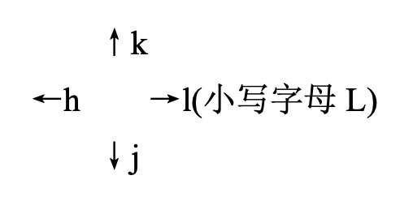
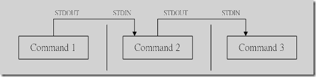

#vim

**什么是vim**

Vim是从 vi 发展出来的一个文本编辑器。代码补完、编译及错误跳转等方便编程的功能特别丰富，在程序员中被广泛使用。

简单的来说， vi 是老式的字处理器，不过功能已经很齐全了，但是还是有可以进步的地方。 vim 则可以说是程序开发者的一项很好用的工具。

**vi/vim 的使用**

基本上 vi/vim 共分为三种模式，分别是**命令模式（Command mode）**，**输入模式（Insert mode）**和**底线命令模式（Last line mode）**。 这三种模式的作用分别是：

**vim工作模式**

命令模式:进入 vim 默认的模式

编辑模式:按 i 进入的 a i o 也可以进入

底行模式: 按下:(冒号)之后进入到的模式


vim基础用法

●vi oldboy.txt #打开文件

●打开后无法直接编辑，需要按 i 进入编辑模式

●修改这个文件内容吧

●修改完后，按 esc 退出编辑模式:wq

●保存退出 #注意":"必须是英文符号

```bash
:wq 保存并退出
:q! 强制退出不保存
:wq! 强制保存退出
```


**命令模式**

用户刚刚启动 vi/vim，便进入了命令模式。

此状态下敲击键盘动作会被Vim识别为命令，而非输入字符。比如我们此时按下i，并不会输入一个字符，i被当作了一个命令



移动光标

```bash
w(e)　　移动光标到下一个单词
b　　　　移动到光标上一个单词
数字0　　移动到本行开头
$　　　　移动光标到本行结尾
H　　　　移动光标到屏幕首行
M　　　　移动到光标到屏幕的中间一行
L　　　　移动光标到屏幕的尾行
gg　　　 移动光标到文档的首行
G　　　　移动光标到文档尾行
ctrl + f　　下一页
ctrl + b　　上一页
`.　　移动光标到上一次的修改行
```

查找

```bash
/chaoge     在整篇文档中搜索chaoge字符串,向下查找
?chaoge     在整篇文档中搜索chaoge字符串,向上查找
*        查找整个文档，匹配光标所在的所有单词,按下n查找下一处,N上一处
#        查找整个文档，匹配光标所在的所有单词,按下n查找下一处,N上一处
gd        找到光标所在单词匹配的单词，并停留在非注释的第一个匹配上
%　　　　找到括号的另一半！！
```

*复制、删除、粘贴*

```bash
yy    拷贝光标所在行
dd    删除光标所在行
D     删除当前光标到行尾的内容
dG    删除当前行到文档尾部的内容
p     粘贴yy所复制的内容
x　　  向后删除字符
X     先前删除字符
u     撤销上一步的操作
.       重复前一个执行过的动作
```

*数字与命令*

```bash
3yy　　　　拷贝光标所在的3行
5dd　　　　删除光标所在5行
```

*快捷操作*

```bash
删除光标所在位置到行尾的内容并进入编辑模式 C(大写字母)
在命令模式下按下字母i，即可进入输入模式，可以编写代码啦。。。
在当前行下面插入一行并进入编辑模式 o(小写字母)
在当前行上面插入一行并进入编辑模式 O(大写字母)
快速到达行尾并进入编辑模式 A
快速保存并退出 ZZ
```

*批量快捷操作*

```bash
批量删除:
进入批量编辑模式(可视块)
ctrl+v 
选择 上下左右
删除 d 
批量增加:进入批量编辑模式(可视块)ctrl+v
选择区域
输入大写的 I 进入编辑模式 编辑
按下ESC键
批量去掉注释
1. 进入命令行模式，按ctrl + v进入 visual block模式，按字母l横向选中列的个数，例如 // 需要选中2列
2. 按字母j，或者k选中注释符号
3. 按d键就可全部取消注释
```

**vim批量缩进**

```bash
:set tabstop=4 设定tab宽度为4个字符
:set shiftwidth=4 设定自动缩进为4个字符
:set expandtab 用space替代tab的输入
:set noexpandtab 不用space替代tab的输入
1.命令模式，按下v，进入可视模式
2.光标移动选择行，输入 > 大于号，缩进，输入< 缩进
输入行号缩进：
1.显示行号
:set nu        #显示
:set nonu    #关闭
2.行号缩进
:10,20 >    #10到20行，缩进一次
```

**底线命令模式**

在命令模式下输入冒号（英文的:），就进入了底线命令模式，在底线命令模式下可以输入单个或多个字符的命令，常用命令有：

```bash
:q!     强制退出
:wq!    强制写入退出
:set nu 显示行号
:数字　　调到数字那行
:set nonu 取消显示行号
随时按下esc可以退出底线命令模式
```

### vim执行流程与常见故障解析


# 重定向符号

| 符号                                 | 解释                        |
| ------------------------------------ | --------------------------- |
| 重定向的意思是，”将数据传到其他地方“ |                             |
| < 或者<<                             | 标准输入stdin，代码为0      |
| >或>>                                | 标准输出stdout，代码为1     |
| 2>或2>>                              | 标准错误输出stderr，代码为2 |

# 特殊符号

| 符号 | 解释                                                      |
| ---- | --------------------------------------------------------- |
| *    | 匹配任意个字符                                            |
| ?    | 匹配一个字符                                              |
| \|   | 管道符                                                    |
| &    | 后台进程符                                                |
| &&   | 逻辑与符号，命令1 && 命令2 ，当命令1执行成功继续执行命令2 |
| \|\| | 逻辑或符号，命令1 \|命令2，当命令1执行失败才会执行命令2   |
| #    | 注释符                                                    |
| " "  | 双引号表示字符串，能够识别，``反引号，$符，\ 转义符       |
| ' '  | 单引号表示普通字符串，无特殊含义                          |
| $    | 变量符 如 $name                                           |
| \    | 转义字符                                                  |

# cat命令

cat命令用于查看纯文本文件（常用于内容较少的）， 可以理解为是`猫`，瞄一眼文件内容

其单词是`concatenate`，指的是可以连接多个文件且打印到屏幕，或是重定向到文件中

*cat功能*

| 功能                   | 说明                                                        |
| ---------------------- | ----------------------------------------------------------- |
| 查看文件内容           | cat file.txt                                                |
| 多个文件合并           | cat file.txt file2.txt > file3.tx                           |
| 非交互式编辑或追加内容 | cat >> file.txt << EOF 欢迎来到路飞学城 EOF                 |
| 清空文件内容           | cat /dev/null > file.txt 【/dev/null是linux系统的黑洞文件】 |

参数：

```bash
用法：cat [选项] [文件]...
将[文件]或标准输入组合输出到标准输出。
清空文件内容,慎用
> 文件名
-A, --show-all           等价于 -vET
-b, --number-nonblank    对非空输出行编号
-e                       等价于 -vE
-E, --show-ends          在每行结束处显示 $
-n, --number             对输出的所有行编号
-s, --squeeze-blank      不输出多行空行
-t                       与 -vT 等价
-T, --show-tabs          将跳格字符显示为 ^I
-u                       (被忽略)
-v, --show-nonprinting   使用 ^ 和 M- 引用，除了 LFD 和 TAB 之外
--help     显示此帮助信息并退出
--version  输出版本信息并退出
如果[文件]缺省，或者[文件]为 - ，则读取标准输入。

案例：
#查看文件，显示行号
cat -n xxx.py
#猫,查看文件
cat xxx.py
#在每一行的结尾加上$符
[root@master tmp]# cat -E 1.txt
#追加文字到文件
cat >>/tmp/oldboy.txt << EOF
唧唧复唧唧
木兰开飞机
开的什么机
波音747
EOF
[root@luffycity tmp]# cat -b file.txt            #输出非空行的编号
     1    欢迎来到路飞学城
     2    学生还有五分钟到达战场
     3    全军出击
[root@luffycity tmp]#
[root@luffycity tmp]#
[root@luffycity tmp]#
[root@luffycity tmp]# cat -n file.txt        #输出所有行的编号
     1    欢迎来到路飞学城
     2    学生还有五分钟到达战场
     3
     4
     5    全军出击
[root@luffycity tmp]# cat -E file.txt        #显示出每行的结束符，$符号
欢迎来到路飞学城$
学生还有五分钟到达战场$
$
$
全军出击$
[root@luffycity tmp]# cat -s file.txt        # -s参数把多个空行，换成一个，可以让文件更精炼阅读
欢迎来到路飞学城
学生还有五分钟到达战场
全军出击
[root@luffycity tmp]# cat > alex.txt        #cat写入内容，用ctrl+c 结束，一般不用
我是金角老妖怪alex
^C
```


# tac命令

与cat命令作用相反，反向读取文件内容

```bash
[root@luffycity tmp]# cat alex.txt
我是金角老妖怪alex
我是老妖怪alex
[root@luffycity tmp]#
[root@luffycity tmp]# tac alex.txt
我是老妖怪alex
我是金角老妖怪alex
```

# 管道符



```bash
Linux提供的管道符“|”讲两条命令隔开，管道符左边命令的输出会作为管道符右边命令的输入。
常见用法：
#检查python程序是否启动
ps -ef|grep "python"
#找到/tmp目录下所有txt文件
ls /tmp|grep '.txt'
#检查nginx的端口是否存活
netstat -tunlp |grep nginx
```

# more命令

More是一个过滤器, 用于分页显示 (一次一屏) 文本，以当前屏幕窗口尺寸为准

```bash
语法
more 参数  文件
-num 指定屏幕显示大小为num行
+num 从num行开始显示
交互式more的命令：
空格     向下滚动一屏
Enter 向下显示一行
=            显示当前行号
q            退出

案例：
#显示5行内容
[root@luffycity tmp]# more -5 alex.txt
root:x:0:0:root:/root:/bin/bash
root:x:0:0:root:/root:/bin/bash
root:x:0:0:root:/root:/bin/bash
root:x:0:0:root:/root:/bin/bash
root:x:0:0:root:/root:/bin/bash
--More--(0%)
#从6行开始输出内容到屏幕
more +6 alex.txt
#将显示结果分页输出，需控制窗口大小
[root@luffycity tmp]# netstat -tunlp |more -3
```

# less

less命令是more的反义词

```bash
语法：
less 参数 文件
-N 显示每行编号
-e 到文件结尾自动退出，否则得手动输入q退出
子命令
整个的翻页
b    向前一页
f 向后一页
空格    查看下一行，等于 ↓
y            查看上一行，等于↑
q退出
```

# head命令

用于显示文件内容头部，默认显示开头10行

```bash
用法：head [选项]... [文件]...
将每个指定文件的头10 行显示到标准输出。
如果指定了多于一个文件，在每一段输出前会给出文件名作为文件头。
如果不指定文件，或者文件为"-"，则从标准输入读取数据。
  -c,  --bytes=[-]K     显示每个文件的前K 字节内容；
                        如果附加"-"参数，则除了每个文件的最后K字节数据外
                        显示剩余全部内容
  -n, --lines=[-]K      显示每个文件的前K 行内容；
                        如果附加"-"参数，则除了每个文件的最后K 行外显示
                        剩余全部内容
  -q, --quiet, --silent 不显示包含给定文件名的文件头
  -v, --verbose         总是显示包含给定文件名的文件头
      --help            显示此帮助信息并退出
      --version         显示版本信息并退出
      
案例：
[root@luffycity ~]# head -5 /etc/passwd        #显示前五行
root:x:0:0:root:/root:/bin/bash
bin:x:1:1:bin:/bin:/sbin/nologin
daemon:x:2:2:daemon:/sbin:/sbin/nologin
adm:x:3:4:adm:/var/adm:/sbin/nologin
lp:x:4:7:lp:/var/spool/lpd:/sbin/nologin
[root@luffycity ~]# head -c 6 /etc/passwd        #显示文件前6个字节
root:x[root@luffycity ~]#
#显示多个文件
[root@luffycity tmp]# echo 你就是金角大王吧 > alex.txt
[root@luffycity tmp]#
[root@luffycity tmp]#
[root@luffycity tmp]# echo 你就是银角大王吧 > peiqi.txt
[root@luffycity tmp]#
[root@luffycity tmp]#
[root@luffycity tmp]# head alex.txt  peiqi.txt
==> alex.txt <==
你就是金角大王吧
==> peiqi.txt <==
你就是银角大王吧
```


# tail

显示文件内容的末尾，默认输出后10行

```bash
-c 数字                            指定显示的字节数
-n 行数                            显示指定的行数
-f                                  实时刷新文件变化
-F 等于 -f --retry                 不断打开文件，与-f合用
--pid=进程号                 进程结束后自动退出tail命令
-s 秒数                            检测文件变化的间隔秒数

案例：
#显示文件后10行
tail alex.txt
#显示文件后5行
tail -5 alex.txt
#从文件第3行开始显示文件
tail -n +3 alex.txt
#检测文件变化
tail -f alex.txt
# -F与-f参数的用法
[root@luffycity tmp]# tail -f alex.txt            #    -f文件不存在，直接报错，退出
tail: cannot open 'alex.txt' for reading: No such file or directory
tail: no files remaining
[root@luffycity tmp]# tail -F alex.txt            # -F    文件不存在报错，等待文件生成
tail: cannot open 'alex.txt' for reading: No such file or directory
tail: 'alex.txt' has appeared;  following end of new file
qwe
```


# cut

cut - 在文件的每一行中提取片断

在每个文件FILE的各行中, 把提取的片断显示在标准输出。

```bash
语法
cut 参数  文件
-b         以字节为单位分割
-n         取消分割多字节字符，与-b一起用
-c         以字符为单位
-d         自定义分隔符，默认以tab为分隔符
-f         与-d一起使用，指定显示哪个区域
N       第 N 个 字节, 字符 或 字段, 从 1 计数 起 
N-       从 第 N 个 字节, 字符 或 字段 直至 行尾 
N-M     从 第 N 到 第 M (并包括 第M) 个 字节, 字符 或 字段 
-M       从 第 1 到 第 M (并包括 第M) 个 字节, 字符 或 字段
```

案例

```bash
# *以字节作为分隔符 -b参数*
[root@luffycity tmp]# cat alex.txt
My name is alex and i like da xi gua
#切割出第四个字符
[root@luffycity tmp]# cut -b 4  alex.txt
n
[root@luffycity tmp]# cut -b 4-6 alex.txt        #输出第4到6的字符
nam
[root@luffycity tmp]# cut -b 4,6 alex.txt        #输出第4和6的字符
nm
[root@luffycity tmp]# cut -b -5  alex.txt        #输出第一个到第五个的字符
My na    
[root@luffycity tmp]# cut -b 5- alex.txt        #输出第五个字符到结尾的字符
ame is alex and i like da xi gua

# 以字符作为分隔符 -c 参数，区别在于中英文
[root@luffycity tmp]# cut -b 3-7 alex.txt        #字节切割
 name
[root@luffycity tmp]#
[root@luffycity tmp]# cut -c 3-7 alex.txt        #字符切割，没有区别，因为1个英文字母是1个字节存储
 name
[root@luffycity tmp]# cat alex.txt
My name is alex and i like da xi gua
#注意点如下
[root@pylinux tmp]# cat peiqi.txt
我是小猪佩奇
i am xiao zhu pei qi
[root@pylinux tmp]# cut -c 6- peiqi.txt        #从第六个字符开始切割到结尾
奇                                      #由于当前机器是utf-8编码，一个汉字等于一个字符
xiao zhu pei qi            #英文字符正常
[root@pylinux tmp]# cut -b  6- peiqi.txt    #从第六个字节开始切割到结尾
�小猪佩奇                         #乱码，-b以二进制字节计算
xiao zhu pei qi    
#加上-n参数，取消切割多字节的字符
[root@pylinux tmp]# cut -nc 6- peiqi.txt
奇
xiao zhu pei qi
[root@pylinux tmp]# cut -nb 6- peiqi.txt
奇

# 自定义分隔符
cut -f7 -d : /etc/passwd |head -5       #以冒号切割，显示第七区域信息
[root@pylinux tmp]# cut -f6-7 -d : /etc/passwd |head -5        #以冒号切割，显示第6-7的区域信息
/root:/bin/bash
/bin:/sbin/nologin
/sbin:/sbin/nologin
/var/adm:/sbin/nologin
/var/spool/lpd:/sbin/nologin
```


# sort

sort命令将输入的文件内容按照规则排序，然后输出结果

```bash
用法：sort [选项]... [文件]...
　或：sort [选项]... --files0-from=F
串联排序所有指定文件并将结果写到标准输出。
 -b, --ignore-leading-blanks   忽略前导的空白区域
 -n, --numeric-sort            根据字符串数值比较
 -r, --reverse                 逆序输出排序结果
 -u, --unique          配合-c，严格校验排序；不配合-c，则只输出一次排序结果
 -t, --field-separator=分隔符  使用指定的分隔符代替非空格到空格的转换
 -k, --key=位置1[,位置2]       在位置1 开始一个key，在位置2 终止(默认为行尾)
 
案例：
#sort 是默认以第一个数据来排序，而且默认是以字符串形式来排序,所以由字母 a 开始升序排序
[root@luffycity tmp]# cat /etc/passwd | sort  
[root@luffycity tmp]# sort -n sort.txt        #按照数字从大到小排序
[root@luffycity tmp]# sort -nr sort.txt        #降序排序
[root@luffycity tmp]# sort -u sort.txt        #去重排序
[root@luffycity tmp]# sort -t " " -k 2 sort.txt            #指定分隔符，指定序列
10.0.0.15 a
10.0.0.12 e
10.0.0.22 e
10.0.0.54 f
10.0.0.34 q
10.0.0.63 q
10.0.0.3 r
10.0.0.34 r
10.0.0.4 v
10.0.0.44 w
10.0.0.5 x
[root@luffycity tmp]# cat /etc/passwd| sort -t ":" -k 3     #以分号分割，对第三列排序，以第一位数字排序
#以分号分割，对第一个区域的第2到3个字符排序
[root@luffycity tmp]# cat /etc/passwd | sort -t ":" -k 1.2,1.3
```

# uniq 

uniq命令可以输出或者忽略文件中的重复行，常与sort排序结合使用

```bash
用法：uniq [选项]... [文件]
从输入文件或者标准输入中筛选相邻的匹配行并写入到输出文件或标准输出。
不附加任何选项时匹配行将在首次出现处被合并。
-c, --count           在每行前加上表示相应行目出现次数的前缀编号
-d, --repeated        只输出重复的行
-u, --unique          只显示出现过一次的行,注意了，uniq的只出现过一次，是针对-c统计之后的结果

案例
#测试数据文件
[root@luffycity tmp]# cat luffy.txt    
10.0.0.1
10.0.0.1
10.0.0.51
10.0.0.51
10.0.0.1
10.0.0.1
10.0.0.51
10.0.0.31
10.0.0.21
10.0.0.2
10.0.0.12
10.0.0.2
10.0.0.5
10.0.0.5
10.0.0.5
10.0.0.5
[root@luffycity tmp]# uniq luffy.txt            #仅仅在首次出现的时候合并，最好是排序后去重
10.0.0.1
10.0.0.51
10.0.0.1
10.0.0.51
10.0.0.31
10.0.0.21
10.0.0.2
10.0.0.12
10.0.0.2
10.0.0.5
[root@luffycity tmp]# sort luffy.txt |uniq -c            #排序后去重且显示重复次数
      4 10.0.0.1
      1 10.0.0.12
      2 10.0.0.2
      1 10.0.0.21
      1 10.0.0.31
      4 10.0.0.5
      3 10.0.0.51
[root@luffycity tmp]# sort luffy.txt |uniq -c  -d            #找出重复的行，且计算重复次数
      4 10.0.0.1
      2 10.0.0.2
      4 10.0.0.5
      3 10.0.0.51
[root@luffycity tmp]# sort luffy.txt |uniq -c -u        #找到只出现一次的行
      1 10.0.0.12
      1 10.0.0.21
      1 10.0.0.31
```

# wc

wc命令用于统计文件的行数、单词、字节数

```bash
-c, --bytes打印字节数
-m, --chars  打印字符数 
-l, --lines  打印行数 
-L, --max-line-length  打印最长行的长度
-w, --words 打印单词数

[root@luffycity tmp]# wc -l luffy.txt        #统计文本有多少行，如同cat -n 看到的行数
21 luffy.txt
#统计单词数量，以空格区分
[root@luffycity tmp]# echo "alex peiqi  yuchao  mjj  cunzhang" | wc -w
5
[root@luffycity tmp]# echo "alex" |wc -m        #统计字符数，由于结尾有个$
5
[root@luffycity tmp]# echo "alex" |cat -E        #证明结尾有个$
alex$
[root@luffycity tmp]# wc -L alex.qq            #统计最长的行，字符数
9 alex.qq
[root@luffycity tmp]# who|wc -l        #当前机器有几个登录客户端
```

# tr命令

tr命令从标准输入中替换、缩减或删除字符，将结果写入到标准输出

```bash
用法：tr [选项]... SET1 [SET2]
从标准输入中替换、缩减和/或删除字符，并将结果写到标准输出。
字符集1：指定要转换或删除的原字符集。
当执行转换操作时，必须使用参数“字符集2”指定转换的目标字符集。
但执行删除操作时，不需要参数“字符集2”；
字符集2：指定要转换成的目标字符集。
-c或——complerment：取代所有不属于第一字符集的字符；
-d或——delete：删除所有属于第一字符集的字符；
-s或--squeeze-repeats：把连续重复的字符以单独一个字符表示；
-t或--truncate-set1：先删除第一字符集较第二字符集多出的字符。

案例；
#将输入字符由小写换为大写：
[root@luffycity ~]# echo "My name is alex" | tr 'a-z' 'A-Z'
MY NAME IS ALEX
#tr删除字符或数字，只要匹配上属于第一个字符串的字符，都被删掉
[root@luffycity ~]# echo "My name is alex and i am 30 years old." | tr -d "0-9"
My name is alex and i am  years old.
[root@luffycity ~]# echo "My name is alex and i am 33456 years old." | tr -d "1234"
My name is alex and i am 56 years old.
#删除字符，所有的数字，以及小写字符
[root@luffycity ~]# echo "My name is alex and i am 33456 years old." | tr -d "0-9","a-z"


[root@luffycity tmp]# tr "[a-z]" "[A-Z]" < alex.txt            #全部换成大写
I AM LUFFYCITY CTO.
I AM 30 YEARS OLD.
I LIKE EAT DA XI GUA .
#删除文中出现的换行符、制表符（tab键）
tr -d "\n\t" < alex.txt
#去重连续的字符，tr是挨个匹配" ia" 每一个字符，包括空格去重
[root@luffycity tmp]# echo "iiiii      am  aaaaalex,iiii like  hot girl" | tr -s " ia"
i am alex,i like hot girl
#-c取反结果，将所有除了'a'以外的全部替换为'A'
[root@luffycity tmp]# echo 'i am alex' | tr -c 'a' 'A'
AAaAAaAAAA
```


# stat

**stat命令**用于显示文件的状态信息。stat命令的输出信息比ls命令的输出信息要更详细。

```bash
-L, --dereference     跟随链接
  -f, --file-system     显示文件系统状态而非文件状态
  -c --format=格式      使用指定输出格式代替默认值，每用一次指定格式换一新行
      --printf=格式     类似 --format，但是会解释反斜杠转义符，不使用换行作
                                输出结尾。如果您仍希望使用换行，可以在格式中
                                加入"\n"
  -t, --terse           使用简洁格式输出
      --help            显示此帮助信息并退出
      --version         显示版本信息并退出
 有效的文件格式序列(不使用 --file-system)：
  %a    八进制权限
```

文件：指定要显示信息的普通文件或者文件系统对应的设备文件名。

```bash
[root@www ~]#stat abc.ph
  文件："abc.ph"
  大小：0               块：0          IO 块：4096   普通空文件
设备：801h/2049d        Inode：1200314     硬链接：1
权限：(0644/-rw-r--r--)  Uid：(    0/    root)   Gid：(    0/    root)
最近访问：2013-05-14 13:24:30.830729223 +0800
最近更改：2013-05-14 13:24:30.830729223 +0800
最近改动：2013-05-14 13:24:30.830729223 +0800
创建时间：-
[root@luffycity tmp]# stat test.txt
  File: 'test.txt'
  Size: 16            Blocks: 8          IO Block: 4096   regular file
Device: fd00h/64768d    Inode: 17540200    Links: 1
Access: (0644/-rw-r--r--)  Uid: (    0/    root)   Gid: (    0/    root)
Context: unconfined_u:object_r:user_tmp_t:s0
Access: 2019-10-18 14:58:59.465647961 +0800
Modify: 2019-10-18 14:58:57.799636638 +0800
Change: 2019-10-18 14:58:57.799636638 +0800
 Birth: -
#显示文件权限
[root@pylinux test_find]# stat -c  %a alex.txt
644


# stat 的时间戳
Access: 2019-10-18 14:58:59.465647961 +0800
Modify: 2019-10-18 14:58:57.799636638 +0800
Change: 2019-10-18 14:58:57.799636638 +0800
access、最近访问，文件每次被cat之后，时间变化，由于操作系统特性，做了优化，频繁访问，时间不变
modify，最近更改，更改文件内容，vim等
change，最近改动，文件元数据改变，如文件名
```


# find

**ind命令**用来在指定目录下查找文件。任何位于参数之前的字符串都将被视为欲查找的目录名。

如果使用该命令时，不设置任何参数，则find命令将在当前目录下查找子目录与文件。

并且将查找到的子目录和文件全部进行显示。

```bash
root@VM-4-16-ubuntu:~# find --help
Usage: find [-H] [-L] [-P] [-Olevel] [-D debugopts] [path...] [expression]

find 处理符号链接。 要查找的路径。 参数。限定条件。 执行动作
find  -H -L -P      PATH     option tests actions


find 查找目录和文件，语法：
find 路径 -命令参数 [输出形式]
参数说明：
路径：告诉find在哪儿去找你要的东西，
```

| 参数                     | 解释                                                         |
| ------------------------ | ------------------------------------------------------------ |
| pathname                 | 要查找的路径                                                 |
| **options选项**          |                                                              |
| -maxdepth                | <目录层级>：设置最大目录层级；                               |
| -mindepth                | <目录层级>：设置最小目录层级；                               |
| **tests模块**            |                                                              |
| -atime                   | 按照文件访问access的时间查找，单位是天                       |
| -ctime                   | 按照文件的改变change状态来查找文件，单位是天                 |
| -mtime                   | 根据文件修改modify时间查找文件【最常用】                     |
| -name                    | 按照文件名字查找，支持* ? [] 通配符                          |
| -group                   | 按照文件的所属组查找                                         |
| -perm                    | 按照文件的权限查找                                           |
| -size n[cwbkMG]          | 按照文件的大小 为 n 个由后缀决定的数据块。 其中后缀为： b: 代表 512 位元组的区块（如果用户没有指定后缀，则默认为 b） c: 表示字节数 k: 表示 kilo bytes （1024字节） w: 字 （2字节） M:兆字节（1048576字节） G: 千兆字节 （1073741824字节） |
| -type 查找某一类型的文件 | b - 块设备文件。 d - 目录。 c - 字符设备文件。 p - 管道文件。 l - 符号链接文件。 f - 普通文件。 s - socket文件 |
| -user                    | 按照文件属主来查找文件。                                     |
| -path                    | 配合-prune参数排除指定目录                                   |
| **Actions模块**          |                                                              |
| -prune                   | 使find命令不在指定的目录寻找                                 |
| -delete                  | 删除找出的文件                                               |
| **-exec 或-ok**          | **对匹配的文件执行相应shell命令**                            |
| -print                   | 将匹配的结果标准输出                                         |
| **OPERATORS**            |                                                              |
| !                        | 取反                                                         |
| -a -o                    | 取交集、并集，作用类似&&和\                                  |

案例

```bash
# 根据名字查找
[root@luffycity tmp]# ls
alex.txt
[root@luffycity tmp]# find . -name "alex.txt" -delete        #找出名为alex.txt且删除
[root@luffycity tmp]# ls    #已经找不到
[root@luffycity tmp]# touch python{1..10}.pid
[root@luffycity tmp]# ls
python1.pid  python10.pid  python2.pid  python3.pid  python4.pid  python5.pid  python6.pid  python7.pid  python8.pid  python9.pid
[root@luffycity tmp]#
[root@luffycity tmp]#
[root@luffycity tmp]# find . -name "*.pid"        #找出所有的pid
./python1.pid
./python2.pid
....
[root@luffycity tmp]# find . -name "[0-9]*.pid"        #找到所以以数字开头的pid文件
./123a.pid
./123b.pid
.....
```

UNIX/Linux文件系统每个文件都有三种时间戳：

- **访问时间**（-atime/天，-amin/分钟）：用户最近一次访问时间（文件修改了，还未被读取过，则不变）。
- **修改时间**（-mtime/天，-mmin/分钟）：文件最后一次修改时间（数据变动）。
- **变化时间**（-ctime/天，-cmin/分钟）：文件数据元（例如权限等）最后一次修改时间
- 文件任何数据改变，change变化，无论是元数据变动，或是对文件mv，cp等
- 文件内容被修改时，modify和change更新
- 当change更新后，第一次访问该文件（cat，less等），access time首次会更新，之后则不会

```bash
touch -a ：仅更新Access time（同时更新Change为current time）
touch -m：仅更新Modify time（同时更新Change为current time）
touch -c：不创建新文件
touch -t：使用指定的时间更新时间戳（仅更改Access time与Modify time，Change time更新为current time）


# find根据修改时间查找文件
#一天以内，被访问access过的文件
find . -atime -1  
#一天以内，内容变化的文件
find . -mtime -1 
#恰好在7天内被访问过的文件
[root@pylinux home]# find /  -maxdepth 3  -type f -atime 7
```

时间说明

- -atime -2 **搜索在2天内被访问过的文件**
- -atime 2 **搜索恰好在2天前被访问过的文件**
- -atime +2 **超过2天内被访问的文件**

```bash
# find反向查找
[root@pylinux opt]# find . -maxdepth 1  -type d      #在opt目录下 查找最大目录深度为1 文件夹类型的数据
[root@pylinux opt]# find . -maxdepth 1  ! -type d    # 加上感叹号，后面接条件，代表取除了文件夹以外类型

# 根据权限查找
[root@pylinux opt]# find . -maxdepth 2  -perm 755 -type f  #寻找权限类型是755的文件
# 按照文件大小查
[root@pylinux opt]# du -h `find . -maxdepth 2 -size +10M`        #找出超过10M大小的文件
14M    ./Python-3.7.3/python
24M    ./Python-3.7.3/libpython3.7m.a
322M    ./s21-centos-vim.tar.gz

# 查找文件时忽略目录
[root@pylinux s18tngx]# find . -path "./conf.d" -prune -o -name "*.conf" -print
#根据用户组匹配
[root@pylinux home]# find / -maxdepth 3 -group yu        #全局搜索深度为3，用户组是yu的文件
/home/yu
/home/yu/.bashrc
/home/yu/.bash_profile
/home/yu/.bash_history
/home/yu/.cache
/home/yu/.bash_logout
/home/yu/.config

# 使用-exec或是-ok再次处理
# # -ok比-exec更安全，存在用户提示确认

#找出以.txt结尾的文件后执行删除动作且确认
[root@pylinux opt]# find /opt/luffy_boy  -type f -name "*.txt" -ok  rm  {}  \;
备注
-exec 跟着shell命令，结尾必须以;分号结束，考虑系统差异，加上转义符\;
{}作用是替代find查阅到的结果
{}前后得有空格


#找到目录中所有的.txt文件，且将查询结果写入到all.txt文件中
[root@pylinux opt]# find ./mydj2/ -type f -name "*.txt" -exec cat {} \; > all.txt

#把30天以前的日志，移动到old文件夹中
find . -type f -mtime +30 -name "*.log" -exec cp {} old \;
```


# xargs命令

xargs 又称管道命令，构造参数等。

是给命令传递参数的一个过滤器,也是组合多个命令的一个工具它把一个数据流分割为一些足够小的块,以方便过滤器和命令进行处理 。

简单的说就是`把其他命令的给它的数据，传递给它后面的命令作为参数`

```bash
-d 为输入指定一个定制的分割符，默认分隔符是空格
-i 用 {} 代替 传递的数据
-I string 用string来代替传递的数据-n[数字] 设置每次传递几行数据
-n 选项限制单个命令行的参数个数
-t 显示执行详情
-p 交互模式
-P n 允许的最大线程数量为n
-s[大小] 设置传递参数的最大字节数(小于131072字节)
-x 大于 -s 设置的最大长度结束 xargs命令执行
-0，--null项用null分隔，而不是空白，禁用引号和反斜杠处理

# 多行输入变单行
[root@luffycity tmp]# cat mjj.txt
1 2 3 4
5 6 7 8
9 10
[root@luffycity tmp]# xargs < mjj.txt
1 2 3 4 5 6 7 8 9 10


# -n参数限制每行输出个数
[root@luffycity tmp]# xargs -n 3 < mjj.txt        #每行最多输出3个
1 2 3
4 5 6
7 8 9
10

# 自定义分隔符-d参数
[root@luffycity tmp]# echo "alex,alex,alex,alex,alex," |xargs -d ","
alex alex alex alex alex
#定义分隔符后，限制每行参数个数
[root@luffycity tmp]# echo "alex,alex,alex,alex,alex," |xargs -d "," -n 2
alex alex
alex alex
alex


-i参数的用法，用{}替换传递的数据
-I 参数用法，用string代替数据

#找到当前目录所有的.txt文件，然后拷贝到其他目录下
[root@luffycity tmp]# find . -name "*.txt" |xargs -i  cp {} heihei/
[root@luffycity tmp]# find . -name "*.txt" |xargs -I data cp data  heihei/
#找到当前目录下所有txt文件，然后删除
[root@luffycity tmp]# find . -name "*.txt" |xargs -i rm -rf {}
```

**重点**

xargs识别字符串的标识是空格或是换行符，因此如果遇见文件名有空格或是换行符，xargs就会识别为两个字符串，就会报错

- -print0在find中表示每一个结果之后加一个NULL字符，而不是换行符（find默认在结果后加上\n，因此结果是换行输出的）
- Xargs -0 表示xargs用NULL作为分隔符

```
#修改find的输出结果，-print0可以改结尾为null
[root@luffycity tmp]# find . -name "*.txt" -print
./hello luffycity.txt
[root@luffycity tmp]# find . -name "*.txt" -print0
./hello luffycity.txt[root@luffycity tmp]#
#修改xargs，理解默认分隔符是NULL
find . -name "*.txt" -print0 |xargs -0 rm
```


# Linux文件属性与管理


图解：

1. Inode索引节点号，（人的身份证，家庭地址等信息，唯一），系统寻找文件名 > Inode号 > 文件内容
2. 文件权限，第一个字符是文件类型，随后9个字符是文件权限，最后一个. 有关selinux
3. 文件硬链接数量，与ln命令配合
4. 文件所属用户
5. 文件所属用户组
6. 文件目录大小
7. 文件修改时间
8. 文件名


## 文件扩展名：

Linux文件的扩展名只是方便阅读，对文件类型不影响

Linux通过文件属性区分文件类型


## 文件类型

可以通过ls -F 给文件结尾加上特殊标识

| 格式              | 类型                                                |
| ----------------- | --------------------------------------------------- |
| ls -l看第一个字符 |                                                     |
| -                 | 普通文件regular file，（二进制，图片，日志，txt等） |
| d                 | 文件夹directory                                     |
| b                 | 块设备文件，/dev/sda1，硬盘，光驱                   |
| c                 | 设备文件，终端/dev/tty1,网络串口文件                |
| s                 | 套接字文件，进程间通信（socket）文件                |
| p                 | 管道文件pipe                                        |
| l                 | 链接文件,link类型，快捷方式                         |

**普通文件**

通过如下命令生成都是普通文件(windows中各种扩展名的文件，放入linux也是普通文件类型)

- echo
- touch
- cp
- cat
- 重定向符号 >

普通文件特征就是文件类型是，"-"开头，以内容区分一般分为

- 纯文本，可以用cat命令读取内容，如字符、数字、特殊符号等
- 二进制文件（binary），Linux中命令属于这种格式，例如ls、cat等命令

**文件夹**

文件权限开头带有d字符的文件表示文件夹，是一种特殊的Linux文件

- mkdir
- cp拷贝文件夹

**链接类型**

- ln命令创建

类似windows的快捷方式


## file命令

显示文件的类型

```plain
[root@luffycity tmp]# file /usr/bin/python2.7        #二进制解释器类型
/usr/bin/python2.7: ELF 64-bit LSB executable
[root@luffycity tmp]# file /usr/bin/yum                    #yum是python的脚本文件
/usr/bin/yum: Python script, ASCII text executable
[root@luffycity tmp]# file /usr/bin/cd                #shell脚本，内置命令
/usr/bin/cd: POSIX shell script, ASCII text executable
[root@luffycity tmp]# file hehe.txt            #text类型
hehe.txt: ASCII text
[root@luffycity tmp]# file heihei            #文件夹
heihei: directory
[root@luffycity tmp]# file /usr/bin/python2            #软链接类型
/usr/bin/python2: symbolic link to `python2.7'
```

## which

查找PATH环境变量中的文件，linux内置命令不在path中

```plain
[root@luffycity tmp]# which python
/usr/bin/python
```

## whereis命令

whereis命令用来定位指令的二进制程序、源代码文件和man手册页等相关文件的路径。

```plain
[root@luffycity tmp]# whereis python
python: /usr/bin/python /usr/bin/python2.7 /usr/lib/python2.7 /usr/lib64/python2.7 /etc/python /usr/include/python2.7 /usr/share/man/man1/python.1.gz
```

## tar命令

tar命令在linux系统里，可以实现对多个文件进行，压缩、打包、解包

*打包*

将一大堆文件或目录汇总成一个整体。

*压缩*

将大文件压缩成小文件，节省磁盘空间。

```bash
语法：
tar(选项)(参数)
-A或--catenate：新增文件到以存在的备份文件；
-B：设置区块大小；
-c或--create：建立新的备份文件；
-C <目录>：这个选项用在解压缩，若要在特定目录解压缩，可以使用这个选项。
-d：记录文件的差别；
-x或--extract或--get：从备份文件中还原文件；
-t或--list：列出备份文件的内容；
-z或--gzip或--ungzip：通过gzip指令处理备份文件；
-Z或--compress或--uncompress：通过compress指令处理备份文件；
-f<备份文件>或--file=<备份文件>：指定备份文件；
-v或--verbose：显示指令执行过程；
-r：添加文件到已经压缩的文件；
-u：添加改变了和现有的文件到已经存在的压缩文件；
-j：支持bzip2解压文件；
-v：显示操作过程；
-l：文件系统边界设置；
-k：保留原有文件不覆盖；
-m：保留文件不被覆盖；
-w：确认压缩文件的正确性；
-p或--same-permissions：用原来的文件权限还原文件；
-P或--absolute-names：文件名使用绝对名称，不移除文件名称前的“/”号；不建议使用
-N <日期格式> 或 --newer=<日期时间>：只将较指定日期更新的文件保存到备份文件里；
--exclude=<范本样式>：排除符合范本样式的文件。
-h, --dereference跟踪符号链接；将它们所指向的文件归档并输出

#仅打包，不压缩

#tar 参数 包裹文件名  需要打包的文件
[alex@luffycity tmp]$ tar -cvf alltmp.tar ./*

#打包后且用gzip命令压缩，节省磁盘空间
[alex@luffycity tmp]$ tar -zcvf alltmp.tar ./*

注意
● f参数必须写在最后，后面紧跟压缩文件名
● tar命令仅打包，习惯用.tar作为后缀
● tar命令加上z参数，文件以.tar.gz或.tgz表示

#列出tar包内的文件
#根据tar包文件后缀，决定是否添加z参数，调用gzip
[alex@luffycity tmp]$ tar -ztvf alltmp2.tar.gz

#拆开tar包
[root@luffycity tmp]# tar -xf alltmp.tar

# 拆开tar的压缩包
tar -zxvf ../alltmp2.tar.gz ./

# 拆除tar包中部分文件
#正常解压命令，单独加上你要拆除的文件名，指定路径
#先看下tar包中有什么内容，再指定文件解压
[root@luffycity tmp]# tar -ztvf ../alltmp2.tar.gz
[root@luffycity tmp]# tar -zxvf ../alltmp2.tar.gz ./alltmp.tar
./alltmp.tar

#指定目录解tar包
[root@luffycity tmp]# tar -xf alltmp.tar -C /opt/data/

# 排除文件解包
#注意--exclude 跟着文件名或是文件夹，不得加斜杠，排除多个文件，就写多个--exclude
[root@luffycity tmp]# tar -zxvf ../alltmp2.tar.gz   --exclude data

# 打包链接文件
-h参数能够保证，打包的不仅仅是个快捷方式，而是找到源文件

#打包/etc下所有普通文件
[root@luffycity tmp]# tar -zcvf etc.tgz `find /etc -type f`
[root@luffycity tmp]# tar -tzvf etc.tgz
```


## gzip命令

要说tar命令是个纸箱子用于打包，gzip命令就是压缩机器

gzip通过压缩算法*lempel-ziv* 算法(*lz77*) 将文件压缩为较小文件，节省60%以上的存储空间，以及网络传输速率


```bash
gzip(选项)(参数)
-a或——ascii：使用ASCII文字模式；
-c或--stdout或--to-stdout 　把解压后的文件输出到标准输出设备。 
-d或--decompress或----uncompress：解开压缩文件；
-f或——force：强行压缩文件。不理会文件名称或硬连接是否存在以及该文件是否为符号连接；
-h或——help：在线帮助；
-l或——list：列出压缩文件的相关信息；
-L或——license：显示版本与版权信息；
-n或--no-name：压缩文件时，不保存原来的文件名称及时间戳记；
-N或——name：压缩文件时，保存原来的文件名称及时间戳记；
-q或——quiet：不显示警告信息；
-r或——recursive：递归处理，将指定目录下的所有文件及子目录一并处理；
-S或<压缩字尾字符串>或----suffix<压缩字尾字符串>：更改压缩字尾字符串；
-t或——test：测试压缩文件是否正确无误；
-v或——verbose：显示指令执行过程；
-V或——version：显示版本信息；
-<压缩效率>：压缩效率是一个介于1~9的数值，预设值为“6”，指定愈大的数值，压缩效率就会愈高；
--best：此参数的效果和指定“-9”参数相同；
--fast：此参数的效果和指定“-1”参数相同。
```

案例

```plain
#压缩目录中每一个html文件为.gz,文件夹无法压缩，必须先tar打包
gzip *.html        #gzip压缩，解压都会删除源文件
```

*列出压缩文件中信息*

```plain
[root@luffycity tmp]# gzip -l *.gz        #不解压显示压缩文件内信息，以及压缩率
         compressed        uncompressed  ratio uncompressed_name
                 28                   0   0.0% 10.html
                 24                   0   0.0% 123
                 27                   0   0.0% 1.html
                 27                   0   0.0% 2.html
                 27                   0   0.0% 3.html
                 27                   0   0.0% 4.html
                 27                   0   0.0% 5.html
                 27                   0   0.0% 6.html
                 27                   0   0.0% 7.html
                 27                   0   0.0% 8.html
                 27                   0   0.0% 9.html
           23581672           118888884  80.2% alex.txt
           23582535           118896640  80.2% alltmp.tar
                289                 470  44.9% glances.log
                 45                  16 -12.5% hehe.txt
           47164836           237786010  80.2% (totals)
```

*解压缩且显示过程*

```plain
[root@luffycity tmp]# gzip -dv *.gz
10.html.gz:      0.0% -- replaced with 10.html
123.gz:      0.0% -- replaced with 123
1.html.gz:      0.0% -- replaced with 1.html
2.html.gz:      0.0% -- replaced with 2.html
3.html.gz:      0.0% -- replaced with 3.html
4.html.gz:      0.0% -- replaced with 4.html
5.html.gz:      0.0% -- replaced with 5.html
6.html.gz:      0.0% -- replaced with 6.html
7.html.gz:      0.0% -- replaced with 7.html
8.html.gz:      0.0% -- replaced with 8.html
9.html.gz:      0.0% -- replaced with 9.html
alex.txt.gz:     80.2% -- replaced with alex.txt
alltmp.tar.gz:     80.2% -- replaced with alltmp.tar
glances.log.gz:     44.9% -- replaced with glances.log
hehe.txt.gz:    -12.5% -- replaced with hehe.txt
```

*压缩保留源文件*

```plain
#-c参数
[root@luffycity tmp]# gzip -c  alltmp.tar > alltmp.tar.gz
```

**gzip套件提供了许多方便的工具命令，可以直接操作压缩文件内容**

- zcat，直接读取压缩文件内容`zcat hehe.txt.gz`
- zgrep
- zless
- zdiff

## zip命令

zip 命令：是一个应用广泛的跨平台的压缩工具，压缩文件的后缀为 zip文件，还可以压缩文件夹

```plain
语法：
zip 压缩文件名  要压缩的内容
-A 自动解压文件
-c 给压缩文件加注释
-d 删除文件
-F 修复损坏文件
-k 兼容 DOS
-m 压缩完毕后，删除源文件
-q 运行时不显示信息处理信息
-r 处理指定目录和指定目录下的使用子目录
-v 显示信息的处理信息
-x “文件列表” 压缩时排除文件列表中指定的文件
-y 保留符号链接
-b<目录> 指定压缩到的目录
-i<格式> 匹配格式进行压缩
-L 显示版权信息
-t<日期> 指定压缩文件的日期
-<压缩率> 指定压缩率
最后更新 2018-03-08 19:33:4
```

案例

```plain
#压缩当前目录下所有内容为alltmp.zip文件
[root@luffycity tmp]# zip alltmp.zip ./*
#压缩多个文件夹
[root@luffycity tmp]# zip -r data.zip ./data ./data2
```

**unzip命令用于解压**

参数

```plain
-l：显示压缩文件内所包含的文件；
-d<目录> 指定文件解压缩后所要存储的目录。
```

案例

```plain
#查看压缩文件内容
[root@luffycity tmp]# unzip -l data.zip
#解压缩zip文件
[root@luffycity tmp]# unzip data.zip
```

## date命令

date命令用于显示当前系统时间，或者修改系统时间

语法
date  参数   时间格式

```bash
-d, --date=STRING
    显示由 STRING 指定的时间, 而不是当前时间 
-s, --set=STRING
    根据 STRING 设置时间 
-u, --utc, --universal
    显示或设置全球时间(格林威治时间)
```

时间格式

```bash
%%
    文本的 % 
%a
    当前区域的星期几的简写 (Sun..Sat) 
%A
    当前区域的星期几的全称 (不同长度) (Sunday..Saturday) 
%b
    当前区域的月份的简写 (Jan..Dec) 
%B
    当前区域的月份的全称(变长) (January..December) 
%c
    当前区域的日期和时间 (Sat Nov 04 12:02:33 EST 1989) 
%d
    (月份中的)几号(用两位表示) (01..31) 
%D
    日期(按照 月/日期/年 格式显示) (mm/dd/yy) 
%e
    (月份中的)几号(去零表示) ( 1..31) 
%h
    同 %b 
%H
    小时(按 24 小时制显示，用两位表示) (00..23) 
%I
    小时(按 12 小时制显示，用两位表示) (01..12) 
%j
    (一年中的)第几天(用三位表示) (001..366) 
%k
    小时(按 24 小时制显示，去零显示) ( 0..23) 
%l
    小时(按 12 小时制显示，去零表示) ( 1..12) 
%m
    月份(用两位表示) (01..12) 
%M
    分钟数(用两位表示) (00..59) 
%n
    换行 
%p
    当前时间是上午 AM 还是下午 PM 
%r
    时间,按 12 小时制显示 (hh:mm:ss [A/P]M) 
%s
    从 1970年1月1日0点0分0秒到现在历经的秒数 (GNU扩充) 
%S
    秒数(用两位表示)(00..60) 
%t
    水平方向的 tab 制表符 
%T
    时间,按 24 小时制显示(hh:mm:ss) 
%U
    (一年中的)第几个星期，以星期天作为一周的开始(用两位表示) (00..53) 
%V
    (一年中的)第几个星期，以星期一作为一周的开始(用两位表示) (01..52) 
%w
    用数字表示星期几 (0..6); 0 代表星期天 
%W
    (一年中的)第几个星期，以星期一作为一周的开始(用两位表示) (00..53) 
%x
    按照 (mm/dd/yy) 格式显示当前日期 
%X
    按照 (%H:%M:%S) 格式显示当前时间 
%y
    年的后两位数字 (00..99) 
%Y
    年(用 4 位表示) (1970...) 
%z
    按照 RFC-822 中指定的数字时区显示(如, -0500) (为非标准扩充) 
%Z
    时区(例如, EDT (美国东部时区)), 如果不能决定是哪个时区则为空 
默认情况下,用 0 填充数据的空缺部分. GNU 的 date 命令能分辨在 `%'和数字指示之间的以下修改.
    `-' (连接号) 不进行填充 `_' (下划线) 用空格进行填充
```

显示当前系统部分时间

```bash
1.显示短年份
date +%y
2.显示长年份
date +%Y
3.显示月份
date +%m
4.显示几号
date +%d
5.显示几时
date +%H
6.显示几分
date +%M
7.显示整秒
date +%S
8.显示时间如，年-月-日
date +%F
9.显示时间如，时：分：秒
date +%T
```

-d参数指定时间显示，仅仅是显示

```bash
1.显示昨天
 date +%F -d "-1day"
2.显示昨天
date +%F -d "yesterday"
3.显示前天
date +%F -d "-2day"
4.显示明天日期
date +%F -d "+1day"
5.显示明天，英文表示
date +%F -d "tomorrow"
6.显示一个月之前，之后
[root@pylinux /]# date +%F -d "1month"
2019-12-01
[root@pylinux /]# date +%F -d "-1month"
2019-10-01
7.显示一年后
date +%F -d "1year"
8.显示60分钟后
date +%T -d "60min"
+表示未来
-表示过去
day表示日
month表示月份
year表示年
min表示分钟
```

-s设置时间

```bash
设置时间较少，一般配置ntp时间服务器
1.设置时间
[root@pylinux /]# date -s "20170808"
2017年 08月 08日 星期二 00:00:00 CST
[root@pylinux /]#
[root@pylinux /]# date
2017年 08月 08日 星期二 00:00:00 CST
2.修改分钟
[root@pylinux /]# date -s "05:06:33"
2017年 08月 08日 星期二 05:06:33 CST
[root@pylinux /]# date
2017年 08月 08日 星期二 05:06:33 CST
3.修改日期和分钟
[root@pylinux /]# date -s "20180606 05:30:30"
2018年 06月 06日 星期三 05:30:30 CST
[root@pylinux /]# date
2018年 06月 06日 星期三 05:30:31 CST
4.可设置不同格式的时间
date -s "2018-06-06 05:30:30"
date -s "2018/07/07 05:30:30"
```


## shred命令

文件粉碎工具

```bash
用法：shred [选项]... 文件...
多次覆盖文件，使得即使是昂贵的硬件探测仪器也难以将数据复原。
-u, --remove 覆盖后截断并删除文件
shred heihei.txt  随机覆盖文件内容，不删除源文件

彻底粉碎且删除文件
[root@pylinux tmp]# ls -lh
总用量 25M
-rw-r--r-- 1 root root 25M 10月 14 15:02 heihei.txt
[root@pylinux tmp]#
[root@pylinux tmp]# shred -u heihei.txt
```


# Linux用户管理

Linux系统不同用户权限不一样，好比小张想用我的服务器，我为了保护隐私与资料安全，开通普通用户(useradd xiaozhang)，普通用户权限较低，随便他折腾了。

还有计算机程序默认创建的用户，如ftp，nobody等等

用户信息存放在/etc/passwd文件中

*用户角色划分*

- root
- 普通用户
- 虚拟用户

现代操作系统一般属于多用户的操作系统，也就是说，同一台机器可以为多个用户建立账户，一般这些用户都是为普通用户，这些普通用户能同时登录这台计算机，计算机对这些用户分配一定的资源。

普通用户在所分配到的资源内进行各自的操作，相互之间不受影响。但是这些普通用户的权限是有限制的，且用户太多的话，管理就不便，从而引入root用户。

此用户是唯一的，且拥有系统的所有权限。root用户所在的组称为root组。

“组”是具有相似权限的多个用户的集合。

### root的权利

Linux系统的特性就是可以满足多个用户，同时工作，因此Linux系统必须具备很好的安全性。

在安装RHEL7时设置的root管理员密码，这个root管理员就是所有UNIX系统中的超级用户，它拥有最高的系统所有权，能够管理系统的各项功能，如添加/删除用户，启动/关闭进程，开启/禁用硬件设备等等。

因此“能力越大，责任越大”，root权限必须很好的掌握，否则一个错误的命令可能会摧毁整个系统。

### root为什么叫root？

- UID，user Identify，好比身份证号
- GID，group Identify，好比户口本的家庭编号
- 在Linux系统中，用户也有自己的UID身份账号且唯一
- 在Linux中UID为0，就是超级用户，如要设置管理员用户，可以改UID为0，建议用sudo
- 系统用户UID为1~999 Linux安装的服务程序都会`创建独有的用户`负责运行。
- 普通用户UID从1000开始：由管理员创建（centos7），最大值1000~60000范围
- centos6创建普通用户是500开始

```bash
UID 用户id号，身份证号
GID 用户组id号，部门编号
root 用户、组、id都为0，属于老板
```

### 用户组group

为了方便管理属于同一组的用户，Linux 系统中还引入了用户组的概念。通过使用用 户组号码(GID，Group IDentification)，我们可以把多个用户加入到同一个组中，从而方 便为组中的用户统一规划权限或指定任务。

假设有一个公司中有多个部门，每个部门中又 有很多员工。

如果只想让员工访问本部门内的资源，则可以针对部门而非具体的员工来设 置权限。

例如，可以通过对技术部门设置权限，使得只有技术部门的员工可以访问公司的 数据库信息等。

Linux管理员在创建用户时，将自动创建一个与其同名的用户组，这个用户组只有该用户一个人，

Linux/unix是一个多用户、多任务的操作系统。

root：默认在Unix/linux操作系统中拥有最高的管理权限。

普通用户：是管理员或者具备管理权限的用户所创建的，只能读、看，不能增、删、改。

### 用户和组的关系

- 一对一，一个用户可以存在一个组里，组里就一个成员
- 一对多，一个用户呆在多个组里面
- 多对一，多个用户在一个组里，这些用户和组有相同的权限
- 多对多，多个用户存在多个组里

### 常用命令解释器

```bash
/bin/sh 默认 
/bin/bash 默认
/sbin/nologin 虚拟用户
/dash ubuntu 
csh unix
tsh unix
```


### 用户信息配置文件

```bash
/etc/passwd 用户信息
/etc/shadow  用户密码信息
/etc/group 用户组信息
/etc/gshadow 用户组密码信息
/etc/skel
```


 /etc/passwd字段信息解释 

| 字段名      | 解释                                                         |
| ----------- | ------------------------------------------------------------ |
| 用户名      | 对应UID，是用户登录系统的名字，系统中唯一不得重复            |
| 用户密码    | 存放在/etc/shadow文件中进行保护密码                          |
| 用户UID     | 用户ID号，由一个整数表示                                     |
| 用户组GID   | 范围、最大值和UID一样，默认创建用户会创建用户组              |
| 用户说明    | 对此用户描述                                                 |
| 用户家目录  | 用户登录后默认进去的家目录，一般是【/home/用户名】           |
| shell解释器 | 当前登录用户使用的解释器。centos/redhat系统中，默认的都是bash。若是禁止此用户登录机器，改为/sbin/nologin即可 |

 用户/密码文件权限 


Plain Text

复制代码

1

2

3

4

5

6

7

8

9

10

11

12

13

\#用户信息文件，权限是644，所有人可读，有一定安全隐患

[root@pylinux ~]# ll /etc/passwd

-rw-r--r-- 1 root root 1698 10月 13 2019 /etc/passwd

\#用户密码文件，除了root用户，其他用户默认是没有任何权限，

[root@pylinux ~]# ll /etc/shadow

---------- 1 root root 892 10月 20 2019 /etc/shadow

\#用户密码文件

[root@pylinux ~]# tail -5 /etc/shadow

mysql:!!:17980::::::

yu:$1$Kx9cz6sK$GE3jiHtjJikn9Ai4ECINn/:18031:0:99999:7:::

epmd:!!:18074::::::

rabbitmq:!!:18074::::::

py:!!:18182:0:99999:7:::

 用户组/组密码文件 


Plain Text

复制代码

1

2

3

4

5

\#用户组信息文件

/etc/group

\#用户组密码文件

/etc/gshadow

对于大型服务器，用户和用户组数量较多，需要定制复杂的权限控制，会用到组密码

 用户管理的命令 

| 命令     | 作用                     |
| -------- | ------------------------ |
| useradd  | 创建用户                 |
| usermod  | 修改用户信息             |
| userdel  | 删除用户及配置文件       |
| passwd   | 更改用户密码             |
| chpasswd | 批量更新用户密码         |
| chage    | 修改用户密码属性         |
| id       | 查看用户UID、GID、组信息 |
| su       | 切换用户                 |
| sudo     | 用root身份执行命令       |
| visudo   | 编辑sudoers配置文件      |

用户创建家目录过程

```bash
1.命令创建
useradd chaoge
2.系统把/etc/skel目录下的内容复制到创建的用户家目录
[root@luffycity skel]# pwd
/etc/skel
[root@luffycity skel]# ls -la
total 24
drwxr-xr-x.  3 root root   78 Oct 17 13:59 .
drwxr-xr-x. 85 root root 8192 Oct 17 14:03 ..
-rw-r--r--.  1 root root   18 Apr 11  2018 .bash_logout
-rw-r--r--.  1 root root  193 Apr 11  2018 .bash_profile
-rw-r--r--.  1 root root  231 Apr 11  2018 .bashrc
drwxr-xr-x.  4 root root   39 Oct 13 17:42 .mozilla
3.修改权限拥有者
[root@luffycity skel]# ls /home/yu/ -la
total 16
drwx------. 3 yu   yu    99 Oct 16 18:36 .
drwxr-xr-x. 4 root root  28 Oct 16 18:35 ..
-rw-------. 1 yu   yu    77 Oct 16 18:36 .bash_history
-rw-r--r--. 1 yu   yu    18 Apr 11  2018 .bash_logout
-rw-r--r--. 1 yu   yu   193 Apr 11  2018 .bash_profile
-rw-r--r--. 1 yu   yu   231 Apr 11  2018 .bashrc
drwxr-xr-x. 4 yu   yu    39 Oct 13 17:42 .mozilla
```


### useradd命令

useradd命令用于Linux中创建的新的系统用户。

useradd可用来建立用户帐号。帐号建好之后，再用passwd设定帐号的密码，而可用userdel删除帐号。

使用useradd指令所建立的帐号，实际上是保存在/etc/passwd文本文件中。


```bash
-c<备注>：加上备注文字。备注文字会保存在passwd的备注栏位中；
-d<登入目录>：指定用户登入时的启始目录；
-D：变更预设值；
-e<有效期限>：指定帐号的有效期限；
-f<缓冲天数>：指定在密码过期后多少天即关闭该帐号；
-g<群组>：指定用户所属的群组；
-G<群组>：指定用户所属的附加群组；
-m：自动建立用户的登入目录；
-M：不要自动建立用户的登入目录；
-n：取消建立以用户名称为名的群组；
-r：建立系统帐号；
-s<shell>：指定用户登入后所使用的shell；
-u<uid>：指定用户id。
```


### 创建用户流程

- 1.useradd chaoge
- 2.系统读取/etc/login.defs（用户定义文件），和/etc/default/useradd（用户默认配置文件）俩文件中定义的规则创建新用户
- 3.向/etc/passwd和/etc/group文件中添加用户和组信息，向/etc/shadow和/etc/gshadow中添加密码信息
- 4.根据/etc/default/useradd文件中配置的信息创建用户家目录
- 5.把/etc/skel中所有的文件复制到新用户家目录中

文件/etc/login.defs

```bash
[root@pylinux ~]# grep -v "^#" /etc/login.defs |grep -v "^$"
MAIL_DIR    /var/spool/mail        #用户的邮件存放位置
PASS_MAX_DAYS    99999                    #密码最长使用天数
PASS_MIN_DAYS    0                            #更换密码最短时间
PASS_MIN_LEN    8                        #密码最小长度
PASS_WARN_AGE    7                            #密码失效前几天开始报警
UID_MIN                  1000        #UID开始位置
UID_MAX                 60000        #UID结束位置
SYS_UID_MIN               201        
SYS_UID_MAX               999
GID_MIN                  1000
GID_MAX                 60000
SYS_GID_MIN               201
SYS_GID_MAX               999
CREATE_HOME    yes                    #是否创建家目录
UMASK           077            #家目录的umask值
USERGROUPS_ENAB yes
ENCRYPT_METHOD MD5            #密码加密算法
MD5_CRYPT_ENAB yes
```

文件/etc/default/useradd

```bash
[root@pylinux ~]# grep -v "^#" /etc/default/useradd | grep -v "^$"
GROUP=100        
HOME=/home                    #在/home目录下创建家目录
INACTIVE=-1                    #开启用户过期
EXPIRE=                            #用户终止日期
SHELL=/bin/bash            #新用户默认解释器
SKEL=/etc/skel            #用户环境变量文件存放目录
CREATE_MAIL_SPOOL=yes
```

### 创建用户有关的目录/etc/skel

此目录存放新用户需要的基础环境变量文件，添加新用户的时候，这个目录下所有文件自动被复制到新家目录下，且默认是隐藏文件，以点开头。

```bash
[root@pylinux ~]# ls -la /etc/skel/
总用量 28
drwxr-xr-x.  2 root root  4096 4月  11 12:59 .
drwxr-xr-x. 97 root root 12288 7月  11 05:14 ..
-rw-r--r--.  1 root root    18 4月  11 08:53 .bash_logout        #用户环境变量文件，退出加载
-rw-r--r--.  1 root root   193 4月  11 08:53 .bash_profile        #环境变量文件，登录加载
-rw-r--r--.  1 root root   231 4月  11 08:53 .bashrc                    #环境变量文件，登录加载
```

### 面试题，如何恢复用户命令提示符

```bsah
1.正常切换用户
su - yu
[root@pylinux ~]# su - yu
[yu@pylinux ~]$
2.删除用户家目录下环境变量文件
[yu@pylinux ~]$ rm -rf .bash*
3.退出登录，再次登录，发现命令提示符故障
[yu@pylinux ~]$ logout
[root@pylinux ~]#
[root@pylinux ~]#
[root@pylinux ~]# su - yu
上一次登录：三 7月 11 06:19:08 CST 2018pts/1 上
-bash-4.2$
4.恢复方法
-bash-4.2$ cp /etc/skel/.bash*  ~/
-bash-4.2$ logout
[root@pylinux ~]# su - yu
上一次登录：三 7月 11 06:20:10 CST 2018pts/1 上
[yu@pylinux ~]$
```

### *用户管理命令案例*

*useradd命令*

```b
-c<备注>：加上备注文字。备注文字会保存在passwd的备注栏位中；
-d<登入目录>：指定用户登入时的启始目录；
-D：变更预设值；
-e<有效期限>：指定帐号的有效期限；
-f<缓冲天数>：指定在密码过期后多少天即关闭该帐号；
-g<群组>：指定用户所属的群组；
-G<群组>：指定用户所属的附加群组；
-m：自动建立用户的登入目录；
-M：不要自动建立用户的登入目录；
-n：取消建立以用户名称为名的群组；
-r：建立系统帐号；
-s<shell>：指定用户登入后所使用的shell；
-u<uid>：指定用户id。
```


```bs
#创建普通用户
[root@luffycity ~]# useradd chaoge
[root@luffycity ~]# ls -l /home/
total 0
drwx------. 3 chaoge chaoge  78 Oct 17 14:42 chaoge
[root@luffycity ~]# grep -w chaoge /etc/passwd        #  grep过滤 -w必须全字符串匹配
chaoge:x:1002:1002::/home/chaoge:/bin/bash
[root@luffycity ~]# grep -w chaoge  /etc/shadow        #默认没密码，通过passwd设置密码
chaoge:!!:18186:0:99999:7:::
[root@luffycity ~]# grep -w chaoge  /etc/group
chaoge:x:1002:
[root@luffycity ~]# id chaoge        #查看用户信息
uid=1002(chaoge) gid=1002(chaoge) groups=1002(chaoge)

# 用户且指定uid和属组
1.创建用户组
groupadd -g 801 old
2.创建新用户
useradd -g old -u 888 oldchao
3.检查用户信息
[root@luffycity ~]# id oldchao
uid=888(oldchao) gid=801(old) groups=801(old)

-M -s参数用法
#创建用户禁止登陆，且不创建家目录
[root@luffycity ~]# useradd -M -s /sbin/nologin oldyu
[root@luffycity ~]# grep -w oldyu /etc/passwd
oldyu:x:1003:1003::/home/oldyu:/sbin/nologin
[root@luffycity ~]# ls /home/    #没有oldyu
alex  chaoge  oldchao  yu

多个参数用法，指定用户信息
[root@luffycity ~]# useradd -u 789 -s /bin/sh -c learn_linux -G root,old -e "2019/10/18" -f 2 -d /tmp/luffychao luffychao
[root@luffycity ~]# id luffychao    #检查用户信息
uid=789(luffychao) gid=1004(luffychao) groups=1004(luffychao),0(root),801(old)

-D参数用来修改配置文件/etc/default/useradd文件的默认值
useradd -D 参数选项
-e default_expire_date 用户停止日期
-s default_shell  用户登录后使用的解释器


-D使用案例
[root@pylinux ~]# grep -i "shell" /etc/default/useradd        #检查默认创建用户的登录解释器
SHELL=/bin/bash
[root@pylinux ~]#
[root@pylinux ~]#
[root@pylinux ~]# useradd -D -s /sbin/nologin        #修改默认解释为禁止登录
[root@pylinux ~]# grep -i "shell" /etc/default/useradd        #检查配置文件参数
SHELL=/sbin/nologin
[root@pylinux ~]#
[root@pylinux ~]# useradd testyu                                #此时创建新用户
[root@pylinux ~]# grep "testyu" /etc/passwd            #检查信息，发现是禁止登录
testyu:x:1002:1002::/home/testyu:/sbin/nologin
[root@pylinux ~]# useradd -D -s /bin/bash                #最好还是改回去，防止后面出错
[root@pylinux ~]# grep -i "shell" /etc/default/useradd     #验证是否修改回来
SHELL=/bin/bash
```

### usermode命令

usermod命令用于修改系统已存在的用户信息，只能修改未使用中的用户

```
语法
usermod(选项)(参数)
选项
-c<备注>：修改用户帐号的备注文字；
-d<登入目录>：修改用户登入时的目录；
-e<有效期限>：修改帐号的有效期限；
-f<缓冲天数>：修改在密码过期后多少天即关闭该帐号；
-g<群组>：修改用户所属的群组；
-G<群组>；修改用户所属的附加群组；
-l<帐号名称>：修改用户帐号名称；
-L：锁定用户密码，使密码无效；
-s<shell>：修改用户登入后所使用的shell；
-u<uid>：修改用户ID；
-U:解除密码锁定。


[root@luffycity ~]# usermod -u 788 -s /sbin/nologin  -c changeUser -G old -e "2020/10/10" -f 10 -d /home/luffychao luffychao
[root@luffycity ~]#
[root@luffycity ~]#
[root@luffycity ~]# id luffychao
uid=788(luffychao) gid=1004(luffychao) groups=1004(luffychao),801(old)
[root@luffycity ~]#
[root@luffycity ~]# grep -w luffychao /etc/passwd
luffychao:x:788:1004:changeUser:/home/luffychao:/sbin/nologin
```


### userdel命令

删除用户与相关文件

- 建议注释/etc/passwd用户信息而非直接删除用户

```
语法
userdel(选项)(参数)
选项
-f：强制删除用户，即使用户当前已登录；
-r：删除用户的同时，删除与用户相关的所有文件。

[root@luffycity ~]# userdel oldyu        #保留家目录
[root@luffycity ~]# userdel -rf oldchao    #强制删除用户与家目录
```


### groupadd命令

**groupadd命令**用于创建一个新的工作组，新工作组的信息将被添加到系统文件中。

```
语法
groupadd - 建立新群组
groupadd [ -ggid [ -o ]] [ -r ] [ -f ] group [[ ]]
选项
-g：指定新建工作组的id；
-r：创建系统工作组，系统工作组的组ID小于500；
-K：覆盖配置文件“/ect/login.defs”；
-o：允许添加组ID号不唯一的工作组。

group -g 801 old
```


### groupdel命令

删除用户组

```bash
groupdel 组名
```

### passwd命令

passwd命令修改用户密码和过期时间等，root可以改普通用户，反之不可以

```bash
语法
passwd(选项)(参数)
选项
-d：删除密码，仅有系统管理者才能使用；
-f：强制执行；
-k：设置只有在密码过期失效后，方能更新；
-l：锁住密码；
-s：列出密码的相关信息，仅有系统管理者才能使用；
-u：解开已上锁的帐号。
-i：密码过期多少天后禁用账户
-x：设置x天后可以修改密码
-n：设置n天内不得改密码
-e：密码立即过期，强制用户修改密码
-w：用户在密码过期前收到警告信息的天数

#
[root@luffycity ~]# passwd            #对当前用户改密
Changing password for user root.
New password:
BAD PASSWORD: The password is shorter than 8 characters
Retype new password:
passwd: all authentication tokens updated successfully.        #即使密码太简单，也能改

# 修改普通用户密码
[root@luffycity ~]# passwd luffychao
Changing password for user luffychao.
New password:
BAD PASSWORD: The password is shorter than 8 characters
Retype new password:
passwd: all authentication tokens updated successfully.

# 列出用户密码信息
[root@luffycity ~]# passwd -S luffychao
luffychao PS 2019-10-17 0 99999 7 10 (Password set, SHA512 crypt.)

一条命令设置密码，企业常用

[root@luffycity ~]# echo "123123" |passwd --stdin luffychao        #--stdin从标准输入中获取123123
Changing password for user luffychao.
passwd: all authentication tokens updated successfully.


passwd实际场景
7天内用户不得改密码，60天后可以修改，过期前10天通知用户，过期30天后禁止用户登录
[root@luffycity ~]# passwd -n 7 -x 60 -w 10 -i 30 luffychao
Adjusting aging data for user luffychao.
passwd: Success
[root@luffycity ~]# passwd -S luffychao
luffychao PS 2019-10-17 7 60 10 30 (Password set, SHA512 crypt.)
```

### 批量更新密码命令

```bash
1.查看当前机器的用户信息
tail /etc/passwd 
2.批量改密码，ctrl+d结束输入
[root@pylinux ~]# chpasswd
yu:123
py:456
testyu:789
```


### 用户查询相关命令

### id命令

id命令用于检查用户和组以及对应的UID，GID等信息

```bash
[root@pylinux ~]# id yu
uid=1000(yu) gid=1000(yu) 组=1000(yu)
[root@pylinux ~]# id -u yu    #显示用户id
1000
[root@pylinux ~]# id -g yu    #显示组id
1000    
[root@pylinux ~]# id -un yu    #显示用户名
yu    
[root@pylinux ~]# id -gn yu    #显示组名
yu
```


### whoami、who、w、last、lastlog


```
#whoami显示可用于查看当前登录的用户，我是谁
[root@pylinux ~]# whoami
root
w命令显示当前以登录的用户
root@pylinux ~]# w
 04:15:01 up 15 days, 18:03,  1 user,  load average: 0.00, 0.01, 0.05
USER     TTY      FROM             LOGIN@   IDLE   JCPU   PCPU WHAT
root     pts/0    122.71.x5.xx     04:05    5.00s  0.07s  0.00s w
1.显示当前系统时间、系统从启动到运行的时间、系统运行中的用户数量和平均负载（1、5、15分钟平均负载）
2.第二行信息
user：用户名
tty:用户使用的终端号
from：表示用户从哪来，远程主机的ip信息
login：用户登录的时间和日期
IDLE：显示终端空闲时间
JCPU：该终端所有进程以及子进程使用系统的总时间
PCPU：活动进程使用的系统时间
WHAT：用户执行的进程名称

[root@pylinux ~]# who
root     pts/0        2018-07-12 04:05 (122.71.x5.xx)
名称      用户终端            用户登录的系统时间  从哪来的机器ip

# last、lastlog命令查看用户详细的登录信息
#last命令显示已登录的用户列表和登录时间
[root@pylinux ~]# last
root     pts/0        122.71.x5.xx     Thu Jul 12 04:05   still logged in
root     pts/0        122.71.x5.xx     Thu Jul 12 04:02 - 04:05  (00:02)
root     pts/1        122.71.x5.xx     Wed Jul 11 16:56 - 16:57  (00:00)
wtmp begins Sun Jul  8 06:23:25 2018

# lastlog命令显示当前机器所有用户最近的登录信息
[root@pylinux ~]# lastlog
用户名           端口     来自             最后登陆时间
root             pts/0    122.71.65.73     四 7月 12 04:05:09 +0800 2018
bin                                        **从未登录过**
yu               pts/0                     四 7月 12 04:05:51 +0800 2018
epmd                                       **从未登录过**
rabbitmq                                   日 9月 29 03:42:01 +0800 2019
py               pts/0                     四 7月 12 04:06:02 +0800 2018
testyu                                     **从未登录过**
```


### Linux用户身份切换命令

su命令用于切换到指定用户

```bhas
语法
su(选项)(参数)
选项
-c<指令>或--command=<指令>：执行完指定的指令后，即恢复原来的身份；
-f或——fast：适用于csh与tsch，使shell不用去读取启动文件；
-l或——login：改变身份时，也同时变更工作目录，以及HOME,SHELL,USER,logname。此外，也会变更PATH变量；
-m,-p或--preserve-environment：变更身份时，不要变更环境变量；
-s<shell>或--shell=<shell>：指定要执行的shell；
--help：显示帮助；
--version；显示版本信息。


root切换普通用户，无须密码
第一种（不推荐） su 用户
[root@luffycity ~]# su chaoge        #直接切换，没有完全切换环境变量
[chaoge@luffycity root]$ env|egrep "USER|MAIL|PWD|LOGNAME"
USER=chaoge
MAIL=/var/spool/mail/root
PWD=/root
LOGNAME=chaoge

第二种（标准切换法）
su - 用户
#用户切换
[root@luffycity ~]# su - chaoge
[chaoge@luffycity ~]$ pwd
/home/chaoge
[chaoge@luffycity ~]$ env|egrep "USER|MAIL|PWD|LOGNAME"
USER=chaoge
MAIL=/var/spool/mail/chaoge
PWD=/home/chaoge
LOGNAME=chaoge


普通用户切换其他用户，需要输入用户密码
[chaoge@luffycity root]$ su - root
Password:
Last login: Thu Oct 17 09:39:35 CST 2019 from 192.168.178.1 on pts/1
[root@luffycity ~]#
```


### visudo命令

visudo用于编辑/etc/sudoers文件，且提供语法检测，用于配置sudo命令

*给chaoge用户配置sudo使用权*

```bash
1.直接输入visudo命令，相当于打开vim /etc/sudoers
找到如下行
 89 ## The COMMANDS section may have other options added to it.
 90 ##
 91 ## Allow root to run any commands anywhere
 92 root    ALL=(ALL)       ALL
 2.添加你想让执行sudo命令的用户
 89 ## The COMMANDS section may have other options added to it.
 90 ##
 91 ## Allow root to run any commands anywhere
 92 root    ALL=(ALL)       ALL
 93 chaoge  ALL=(ALL)       ALL
 3.保存退出，使用vim/vi的模式，此时已经可以用chaoge用户，使用sudo命令了
```


sudo配置文件

| 用户或组 | 机器=（角色） | 允许执行命令                         |
| -------- | ------------- | ------------------------------------ |
| User     | machine=      | Commands                             |
| oldboy   | ALL=(ALL)     | /usr/sbin/useradd、/usr/sbin/userdel |

**配置sudo目的在于即能让运维方便干活（权限不足问题），又不威胁系统安全（权限把控）**


**sudo命令**用来以其他身份来执行命令，预设的身份为root。在`/etc/sudoers`中设置了可执行sudo指令的用户。

普通用户不需要root密码即可用root权限执行命令。

```bash
语法
sudo(选项)(参数)
选项
-b：在后台执行指令；
-h：显示帮助；
-H：将HOME环境变量设为新身份的HOME环境变量；
-k：结束密码的有效期限，也就是下次再执行sudo时便需要输入密码；。
-l：列出目前用户可执行与无法执行的指令；
-p：改变询问密码的提示符号；
-s<shell>：执行指定的shell；
-u<用户>：以指定的用户作为新的身份。若不加上此参数，则预设以root作为新的身份；
-v：延长密码有效期限5分钟；
-V ：显示版本信息。


使用sudo命令
[root@luffycity ~]# su - chaoge
Last login: Thu Oct 17 16:55:26 CST 2019 on pts/0
[chaoge@luffycity ~]$ ls /root/
ls: cannot open directory /root/: Permission denied
[chaoge@luffycity ~]$ sudo ls /root
We trust you have received the usual lecture from the local System
Administrator. It usually boils down to these three things:
    #1) Respect the privacy of others.
    #2) Think before you type.
    #3) With great power comes great responsibility.
[sudo] password for chaoge:
123  123456  456  anaconda-ks.cfg
```

- 配置了/etc/sudoers文件后，可以对用户命令提权，sudo 命令
- 想要切换root执行操作，可以sudo su - ，需要输入当前用户密码


## Centos7忘记root密码怎么办

*第一，重启linux，进入系统的GRUB菜单界面，按下小写字母e进入编辑界面*


*第二，按下方向键，找到以字符串Linux16开头的行，光标移动到结尾，然后输入init=/bin/bash enforcing=0*

代表登录系统后，加载bash解释器，然后关闭selinux


*第三，按下ctrl+x组合键以单用户模式启动Linux*

*第四，输入如下命令，重新挂载根目录，进入可写状态，因为默认单用户模式是只读的*

```bash
mount -o rw,remount / #重新挂载
passwd root                        #修改密码
exec /sbin/init                #重启
```

*第五，更改完毕密码后,重启系统*

```bash
如果在第二步，没有添加enforcing参数的话，则需要额外的再添加命令
touch /.autorelabel 
告诉系统下次启动重新标记系统所有相关文件，因为selinux在开启时，修改root密码引发安全报错
如果加了enforcing=0，则代表关闭了selinux，不需要再创建 /.autorelabel文件了
```


*第六，重启机器，验证新的密码*


# Linux文件权限

```bash
root@VM-4-16-ubuntu:~# ll -d /tmp
drwxrwxrwt 12 root root 4096 Nov  9 06:25 /tmp/
第一位 文件类型 - 普通文件。d 目录文件
234 位  属主
567 位。属组
89十 位 其他人
root   用户
root  用户组

# 文件权限
r    read可读，可以用cat等命令查看
w    write写入，可以编辑或者删除这个文件
x    executable    可以执行
-        没有权限

#文件夹权限
权限这里测试不要用root实验！！！！root太牛逼了
请用普通用户执行！！！！！测试文件、文件夹权限操作，请用普通用户！
r    可以对此目录执行ls列出所有文件
w    可以在这个目录创建文件
x    可以cd进入这个目录，或者查看详细信息
```

### 如何知道我和文件之间的权限

- 你是什么身份，皇帝还是老百姓
- 文件属于你吗，还是属于你们家
- 你和这个文件具体的关系

```
rwx权限表示
r read 读取 4
w  write 写  2
x  execute  执行 1
-           无权限  0

常见权限对应
444 r--r--r--
600 rw-------
644 rw-r--r--
666 rw-rw-rw-
700 rwx------
744 rwxr--r--
755 rwxr-xr-x
777 rwxrwxrwx
```

### chmod命令

**chmod命令**用来变更文件或目录的权限。

在UNIX系统家族里，文件或目录权限的控制分别以读取、写入、执行3种一般权限来区分，另有3种特殊权限可供运用。

用户可以使用chmod指令去变更文件与目录的权限，设置方式采用文字或数字代号皆可。

符号连接的权限无法变更，如果用户对符号连接修改权限，其改变会作用在被连接的原始文件。

```bash
权限范围：
操作对像
   u 文件属主权限
   g 同组用户权限
   o 其它用户权限
   a 所有用户（包括以上三种）
权限设定
   + 增加权限
   - 取消权限
   =  唯一设定权限
权限类别
   r 读权限
   w 写权限
   x 执行权限
   X 表示只有当该档案是个子目录或者该档案已经被设定过为可执行。
   s 文件属主和组id
   i 给文件加锁，使其它用户无法访问
   r-->4
   w-->2
   x-->1
   
   
# 设置所有人可读
[root@luffycity tmp]# chmod ugo+r data.zip    #第一写法
[root@luffycity tmp]# chmod a+r data.zip        #第二种

# 文件属主和属组内成员可写，其他人不可写
[root@luffycity tmp]# chmod ug+w,o-w data.zip

# 文件属主可以执行
[root@luffycity tmp]# chmod u+x data.zip

# 设置data目录所有资料，任何人可读取
[root@luffycity tmp]# chmod -R a+r data/

# 所有人都可以读、写、执行
chmod 777 filename.txt

使用数字权限转化
chmod 755 alex.txt
chmod 644 alex.txt
chmod 777 alex.txt
chmod 0 alex.txt  #所有人无权限
chmod 65  alex.txt  #属主是0权限，group权限6，其他人权限5
chmod 4    alex.txt        #其实是004，只有其他人可读
```

**实际效果，r w x对于文件的操作**

| 权限 | 效果                                                         |
| ---- | ------------------------------------------------------------ |
| r    | 可以读取、阅读文件内容                                       |
| w    | 可以新增、修改文件内容，删除文件的权限由父目录权限控制，删除权限又父目录的w控制 |
| x    | 1.可读取文件内容并执行 如 . luffy.sh source luffy.sh sh luffy.sh 2.普通用户必须对文件有r权限才可执行 3.root只需要任意u,g,o存在x权限即可执行 |

**rwx对于目录的权限**

| 权限 | 效果                                                         |
| ---- | ------------------------------------------------------------ |
| r    | 1.可以浏览目录下内容，如ls 2.没有x无法进入目录 3.可以看到目录下文件名，无法访问文件信息（内容，权限） |
| w    | 【有x权限前提下】文件夹有增加、删除、修改文件夹中文件名的权限 |
| x    | 1.进入文件夹，如cd 2.没有r无法查看列表 3.没有w无法创建文件   |

## chown命令

修改文件属主、属组信息

```
语法：
chown alex    test.txt    #文件属于alex
chown :组     test.txt        #修改文件属组
chown 用户:组             #修改
参数
  -R, --recursive               递归处理所有的文件及子目录
  -v, --verbose                 为处理的所有文件显示诊断信息
  
chown alex:alex nginx.conf         #将nginx.conf所属用户和组改为alex,alex
chown -R  alex:alex   data            #将data目录下所有内容属主和属组改为alex
chown .alex  test.txt            #test.txt的属组改为alex
```


## chgrp命令

**chgrp命令**用来改变文件或目录所属的用户组。

该命令用来改变指定文件所属的用户组。

其中，组名可以是用户组的id，也可以是用户组的组名。

案例

```
-c或——changes：效果类似“-v”参数，但仅回报更改的部分；
-f或--quiet或——silent：不显示错误信息；
-h或--no-dereference：只对符号连接的文件作修改，而不是该其他任何相关文件；
-R或——recursive：递归处理，将指令目录下的所有文件及子目录一并处理；
-v或——verbose：显示指令执行过程；
--reference=<参考文件或目录>：把指定文件或目录的所属群组全部设成和参考文件或目录的所属群组相同；
chgrp -R  alex  /data   #把/data目录下所有文件的属组改为alex
```

## umask命令

**umask 命令用来限制新文件权限的掩码。**

也称之为遮罩码，防止文件、文件夹创建的时候，权限过大

**当新文件被创建时，其最初的权限由文件创建掩码决定。**

**用户每次注册进入系统时，umask命令都被执行，并自动设置掩码改变默认值，新的权限将会把旧的覆盖。**

- umask默认配置在/etc/profile 61-64行


```
bsaumask值就是指“Linux文件的默认属性需要减掉的权限”。
比如Linux普通文件的最大默认属性是666，目录文件的最大属性是777。但是我们不想要用户在新建立文件时，文件的属性是666或777，那么我们就要设置umask值。
Linux系统预置的umask值是022，那么用户在新建立普通文件时，普通文件的属性就是666-022=644，新建立目录文件时，目录文件的属性就是777-022=755。h


语法参数
-S:以字符的形势显示当前的掩码。
-p：带umask开头以数字的形势显示当前掩码
```


### 计算umask文件权限

系统默认umask数值对应的权限

```
记住公式
默认的文件、文件夹权限，减去umaks的值等于最终的权限值
文件最大777  文件夹最大777


默认umask值,root和普通用户不一样
#root用户umask
[root@localhost ~]# umask        #查看当前用户预设权限
0022
[root@localhost ~]# umask -S     #以字母的形势显示权限，7-0 7-2 7-2
u=rwx,g=rx,o=rx
[root@localhost ~]# umask -p     
umask 0022
#普通用户umask
[chaoge@luffycity tmp]$ umask
0002
[chaoge@luffycity tmp]$ umask -S
u=rwx,g=rwx,o=rx
[chaoge@luffycity tmp]$ umask -p
umask 0002
```

案例

root登录系统默认创建文件，文件夹的权限

```bash
[root@luffycity tmp]# touch file.txt            #文件是644
[root@luffycity tmp]# mkdir luffy                    #文件夹是755
[root@luffycity tmp]# ll
total 0
-rw-r--r--. 1 root root 0 Oct 18 11:19 file.txt
drwxr-xr-x. 2 root root 6 Oct 18 11:19 luffy
```

普通用户

```bash
[chaoge@luffycity tmp]$ touch chao.txt                #权限664
[chaoge@luffycity tmp]$ mkdir chao                        #权限775
[chaoge@luffycity tmp]$ ll
total 0
drwxrwxr-x. 2 chaoge chaoge 6 Oct 18 11:27 chao
-rw-rw-r--. 1 chaoge chaoge 0 Oct 18 11:27 chao.txt
```

- 操作系统创建文件，默认最大权限是666(-rw-rw-rw-)

- 创建普通文件权限是

  ```bash
  #文件默认起始权限666，减去umask默认值022，等于创建文件的权限
  666
  022
  -----
  644            #系统创建文件权限默认是644   -  rw-  r-- r--
  ```

  

  - umask值不得大于6
  - umask计算出的文件权限不得拥有执行权限x，如果计算结果中有执行权限，则需要将其加一

```
#文件默认权限666，假设umask值设置为045
666
045
-----
621   #存在执行权限，必须+1，默认文件不得执行
----
622        #最终文件权限
```


演示

```
#临时修改默认umask变量值
[root@luffycity tmp]# umask 045
[root@luffycity tmp]# umask
0045
#创建文件，查看权限，此时默认已经是644的权限
[root@luffycity tmp]# touch chao.txt
[root@luffycity tmp]# ll
total 0
-rw--w--w-. 1 root root 0 Oct 18 11:43 chao.txt
```


### 计算目录umask权限

```
#目录最大权限777，减去umask值，得到目录创建后的权限
777
022
------
755


案例
[root@luffycity tmp]# umask
022
[root@luffycity tmp]# mkdir chao
[root@luffycity tmp]# ll
total 0
drwxr-xr-x. 2 root root 6 Oct 18 11:54 chao
```

### Linux默认权限

- 文件644 rw- r-- r--
- 目录655rwx r-x r-x


### chattr命令

chattr命令用于更改文件的扩展属性，比chmod更改的rwx权限更底层

```bash
参数
a：只能向文件中添加数据，不得删除
-R：递归更改目录属性
-V：显示命令执行过程
模式
+ 增加参数
- 移除参数
= 更新为指定参数
A 不让系统修改文件最后访问时间
a 只能追加文件数据，不得删除
i 文件不能被删除、改名、修改内容


[root@luffycity tmp]# chattr +i chao.txt
[root@luffycity tmp]# lsattr chao.txt
----i----------- chao.txt
[root@luffycity tmp]# rm -rf chao.txt
rm: cannot remove 'chao.txt': Operation not permitted
[root@luffycity tmp]# echo qqqq > chao.txt
[root@luffycity tmp]# chattr -i chao.txt
[root@luffycity tmp]# rm -rf chao.txt

-a 参数， 只能追加内容
[root@luffycity tmp]# chattr +a test.txt
[root@luffycity tmp]# lsattr test.txt
-----a---------- test.txt
[root@luffycity tmp]#
[root@luffycity tmp]#
[root@luffycity tmp]# echo "qwe" > test.txt
-bash: test.txt: Operation not permitted
[root@luffycity tmp]# echo "qwe" >> test.txt
[root@luffycity tmp]#
[root@luffycity tmp]#
[root@luffycity tmp]# cat test.txt
happy
qweqe
qwe
```

### lsattr命令

**lsattr命令**用于查看文件的第二扩展文件系统属性，结合chattr一起用

```
-R
    递归地列出目录以及其下内容的属性.
-V
    显示程序版本.
-a
    列出目录中的所有文件,包括以`.'开头的文件的属性.
-d
    以列出其它文件的方式那样列出目录的属性, 而不列出其下的内容.
-v
    显示文件版本.
    
    
    
    
[root@localhost ~]# chattr +i nginx.conf                #设置该文件不能进行任何形势的修改
[root@localhost ~]# mv nginx.conf nginx.conf_bak
mv: 无法将"nginx.conf" 移动至"nginx.conf_bak": 不允许的操作
[root@localhost ~]# lsattr nginx.conf                       #查看chattr设置的权限
----i--------e- nginx.conf
[root@localhost ~]# chattr -i nginx.conf                    #取消-i的权限设置
[root@localhost ~]# lsattr nginx.conf                      #查看chattr设置的权限
-------------e- nginx.conf
```


# Linux文件管理练习题

1linux命令格式是什么样？
2linux命令必须添加参数才能执行吗
3解释linux的命令提示符，如何用linux命令解析 [root@pylinux opt]#
4linux的目录分隔符是？
5简述Linux的目录结构
6切换到上一级目录
7切换到上一次目录
8切换到用户家目录
9查看当前工作目录
10当前目录是/home，以绝对、相对两种路径方式进入/opt目录
11列出/opt/下所有文件，包含隐藏文件，且显示详细信息（时间、文件大小）
12以树状结构显示文件夹内容
13一条命令创建/tmp/chaoge/linux文件夹
14创建python脚本first.py
15一条命令创建/tmp/chaoge1.txt 、 /tmp/chaoge2.txt 、/tmp/chaoge3.txt
16复制/opt/下所有内容到/tmp/下
17更改文件名first.txt为second.txt
18把/opt/下所有内容移动到/tmp下
19强制删除/tmp下所有内容
20查看ls命令的帮助信息
21立即重启的命令
22如何永久设置linux环境变量
23linux的常见配置文件目录是
24vim三种模式是?使用流程是?
25查看文件且显示行号
26如何清空文件内容，注意是空内容，而非空格
27显示文件前30行
28显示文件后50行
29实时刷新文件内容
30读取文件内容且倒序排序
31读取文件内容进行排序后去重
32读取文件内容且排序后，统计重复行的次数
33统计文件一共有多少行
34如何查看文件的详细信息（inode号，访问、修改时间、链接数）
35找出服务器上所有以".py"结尾的文件
36找出服务器2天内被访问过的文件
37找出服务器大于50M的文件
38找出/tmp/目录下所有的txt文件，然后删除
39把/data/html/文件夹打包压缩成data_html.tgz文件
40如何解压缩alltmp.gz文件
41如何解压缩data.zip文件
42显示具体的系统时间，时：分：秒
43如何彻底粉碎文件


