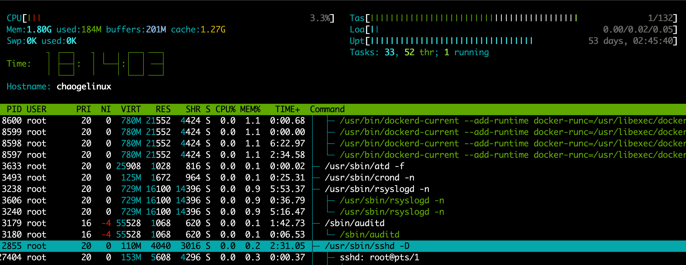

# Linux进程管理


linux下存在进程（process）和线程（thread）两种操作系统系统的基本概念。
1.计算机核心是CPU，承担机器的计算任务，好比是一座工厂，时刻在运行着。


2.假设工厂电力有限，一次只能供电一个车间，一个车间在工作，其他车间都得停下来（理解为CPU一次只能处理一个任务）


3.进程的概念，好比是一个工厂的车间，每一个车间代表CPU正在处理的任务。任一时刻，CPU总是在运行一个进程，其他进程处于非运行的状态。


4.在一个车间里，想要完成工作，肯定会有很多工人，协同完成一个任务，每一个工人可以理解为操作系统的线程。因此，工厂里有很多个干活的工人，进程里有很多工作的线程。


5.工厂内的空间很大，工人们共享这个空间，理解为进程内的内存空间是共享的，每个线程共享内存。

6.问题是工厂内的小房间，容量大小个不同，有的可以容纳多个人，有的只能进去一个，好比卫生间，里面有人了，你就等等吧。。

理解为，进程内有一个线程正在使用一块内存，其他线程必须等待它结束了，才能使用这块内存。


7.那问题是，有时候，这个线程2，可能不愿意等着，就要去抢占那个卫生间，引起混乱，，那以后其他的线程可以方便的时候，加一把锁，后面的人看到门被锁了，那没辙了，等着吧，等锁打开了，才能进去。

这就理解为进线程中的互斥锁的概念（Mutual exclusion，缩写Mutex），防止多个线程同时读写内存。

8.可以总结出linux系统特性：

- 以多进程形式，允许同时多个任务（同时多个工厂在干活）
- 以多线程形式，允许单个任务分成不同的部分去运行（一个工厂的活，可以分给多个工人去完成）
- 锁的机制，防止线程资源抢夺


## Linux管理进程的命令

## ps命令

ps命令用于报告当前系统的进程状态。可以搭配kill指令随时中断、删除不必要的程序。ps命令是最基本同时也是非常强大的进程查看命令，使用该命令可以确定有哪些进程正在运行和运行的状态、进程是否结束、进程有没有僵死、哪些进程占用了过多的资源等等，总之大部分信息都是可以通过执行该命令得到的。

```plain
参数
-a  显示所有终端机下执行的进程，除了阶段作业领导者之外。
　　 a  显示现行终端机下的所有进程，包括其他用户的进程。
　　-A  显示所有进程。
　　-c  显示CLS和PRI栏位。
　　 c  列出进程时，显示每个进程真正的指令名称，而不包含路径，参数或常驻服务的标示。
　　-C<指令名称> 　指定执行指令的名称，并列出该指令的进程的状况。
　　-d 　显示所有进程，但不包括阶段作业领导者的进程。
　　-e 　此参数的效果和指定"A"参数相同。
　　 e 　列出进程时，显示每个进程所使用的环境变量。
　　-f 　显示UID,PPIP,C与STIME栏位。
　　 f 　用ASCII字符显示树状结构，表达进程间的相互关系。
　　-g<群组名称> 　此参数的效果和指定"-G"参数相同，当亦能使用阶段作业领导者的名称来指定。
　　 g 　显示现行终端机下的所有进程，包括群组领导者的进程。
　　-G<群组识别码> 　列出属于该群组的进程的状况，也可使用群组名称来指定。
　　 h 　不显示标题列。
　　-H 　显示树状结构，表示进程间的相互关系。
　　-j或j 　采用工作控制的格式显示进程状况。
　　-l或l 　采用详细的格式来显示进程状况。
　　 L 　列出栏位的相关信息。
　　-m或m 　显示所有的执行绪。
　　 n 　以数字来表示USER和WCHAN栏位。
　　-N 　显示所有的进程，除了执行ps指令终端机下的进程之外。
　　-p<进程识别码> 　指定进程识别码，并列出该进程的状况。
　 　p<进程识别码> 　此参数的效果和指定"-p"参数相同，只在列表格式方面稍有差异。
　　 r 　只列出现行终端机正在执行中的进程。
　　-s<阶段作业> 　指定阶段作业的进程识别码，并列出隶属该阶段作业的进程的状况。
　 　s 　采用进程信号的格式显示进程状况。
　　 S 　列出进程时，包括已中断的子进程资料。
　　-t<终端机编号> 　指定终端机编号，并列出属于该终端机的进程的状况。
　　 t<终端机编号> 　此参数的效果和指定"-t"参数相同，只在列表格式方面稍有差异。
　　-T 　显示现行终端机下的所有进程。
　　-u<用户识别码> 　此参数的效果和指定"-U"参数相同。
　　 u 　以用户为主的格式来显示进程状况。
　　-U<用户识别码> 　列出属于该用户的进程的状况，也可使用用户名称来指定。
　　 U<用户名称> 　列出属于该用户的进程的状况。
　　 v 　采用虚拟内存的格式显示进程状况。
　　-V或V 　显示版本信息。
　　-w或w 　采用宽阔的格式来显示进程状况。　
　 　x 　显示所有进程，不以终端机来区分。
　　 X 　采用旧式的Linux i386登陆格式显示进程状况。
　　 -y 配合参数"-l"使用时，不显示F(flag)栏位，并以RSS栏位取代ADDR栏位
　　-<进程识别码> 　此参数的效果和指定"p"参数相同。
　　--cols<每列字符数> 　设置每列的最大字符数。
　　--columns<每列字符数> 　此参数的效果和指定"--cols"参数相同。
　　--cumulative 　此参数的效果和指定"S"参数相同。
　　--deselect 　此参数的效果和指定"-N"参数相同。
　　--forest 　此参数的效果和指定"f"参数相同。
　　--headers 　重复显示标题列。
　　--help 　在线帮助。
　　--info 　显示排错信息。
　　--lines<显示列数> 设置显示画面的列数。
　　--no-headers  此参数的效果和指定"h"参数相同，只在列表格式方面稍有差异。
　　--group<群组名称> 　此参数的效果和指定"-G"参数相同。
　　--Group<群组识别码> 　此参数的效果和指定"-G"参数相同。
　　--pid<进程识别码> 　此参数的效果和指定"-p"参数相同。
　　--rows<显示列数> 　此参数的效果和指定"--lines"参数相同。
　　--sid<阶段作业> 　此参数的效果和指定"-s"参数相同。
　　--tty<终端机编号> 　此参数的效果和指定"-t"参数相同。
　　--user<用户名称> 　此参数的效果和指定"-U"参数相同。
　　--User<用户识别码> 　此参数的效果和指定"-U"参数相同。
　　--version 　此参数的效果和指定"-V"参数相同。
　　--widty<每列字符数> 　此参数的效果和指定"-cols"参数相同。
```

### ps使用案例

#### *不接受任何参数*

ps不加参数，输出的是当前用户所在终端的进程

```plain
[root@chaogelinux ~]# ps
  PID TTY          TIME CMD
 8683 pts/1    00:00:00 ps
11641 pts/1    00:00:00 bash
PID：进程的标识号
TTY：进程所属的控制台号码
TIME：进程使用CPU总的时间
CMD：正在执行的命令行
```

#### *ps组合命令*

ps -ef 参数

```plain
[root@chaogelinux ~]# ps -ef
UID        PID  PPID  C STIME TTY          TIME CMD
root         1     0  0 10月20 ?      00:14:31 /usr/lib/systemd/systemd --system --deserialize 21
root         2     0  0 10月20 ?      00:00:00 [kthreadd]
root         3     2  0 10月20 ?      00:00:44 [ksoftirqd/0]
root         5     2  0 10月20 ?      00:00:00 [kworker/0:0H]
root         7     2  0 10月20 ?      00:00:00 [migration/0]
root         8     2  0 10月20 ?      00:00:00 [rcu_bh]
```

输出解释

- UID ：由该用户执行的进程
- PID：进程的标识号
- PPID：进程的父进程标识号
- C：CPU使用的资源百分比
- STIME：进程开始的时间
- TTY：该进程是哪个终端上运行的，若无终端，显示?。tty1-tty6是本机的登录进程，pts/0等表示远程连接
- TIME：进程使用的CPU的时长
- CMD：正在执行的命令行

#### 查找特定进程

```plain
[root@chaogelinux ~]# ps -ef|grep ssh  #通过管道符，二次过滤
```

### ps命令组合2

组合命令，使用BSD语法显示进程信息

```plain
[root@chaogelinux ~]# ps aux
USER       PID %CPU %MEM    VSZ   RSS TTY      STAT START   TIME COMMAND
root         1  0.0  0.1 125452  3460 ?        Ss   10月20  14:31 /usr/lib/systemd/systemd --system --deserialize 21
root         2  0.0  0.0      0     0 ?        S    10月20   0:00 [kthreadd]
root         3  0.0  0.0      0     0 ?        S    10月20   0:44 [ksoftirqd/0]
```

解释

- USER：该进程属于的用户
- PID：该进程号码
- %CPU：进程占用CPU的资源比率
- %MEM：该进程占用物理内存百分比
- VSZ：进程使用的虚拟内存，单位Kbytes
- RSS：该进程占用固定的内存量，单位Kbytes
- TTY：该进程运行的终端位置
- STAT：进程目前状态

- - R：运行中
  - S：终端睡眠中，可以被唤醒
  - D：不可中断睡眠
  - T：正在检测或是停止了
  - Z：已停止，无法由父进程正常终止，变成了zombie僵尸进程
  - +：前台进程
  - I：多线程进程
  - N：低优先级进程
  - <：高优先级进程
  - s：进程领导者（含有子进程）
  - L：锁定到内存中

- START：进程启动时间
- TIME：CPU运行时间
- COMMAND：进程命令

#### 显示指定用户的进程

```plain
[root@chaogelinux ~]# ps -u root
  PID TTY          TIME CMD
    1 ?        00:14:32 systemd
    2 ?        00:00:00 kthreadd
    3 ?        00:00:44 ksoftirqd/0
    5 ?        00:00:00 kworker/0:0H
    7 ?        00:00:00 migration/0
    8 ?        00:00:00 rcu_bh
```

#### 显示进程树

UNIX风格参数

-e显示所有进程

-H显示进程树

```plain
[root@chaogelinux ~]# ps -eH
22684 ?        00:00:00   systemd-udevd
 2855 ?        00:02:19   sshd
11638 ?        00:00:00     sshd
11641 pts/1    00:00:00       bash
14025 pts/1    00:00:00         ps
 3179 ?        00:01:34   auditd
 3238 ?        00:05:32   rsyslogd
```

#### 自定义格式

显示进程在哪一个CPU上运行

```plain
[root@manage01 ~]$ ps -eo pid,args,psr
  PID COMMAND                     PSR
    1 /usr/lib/systemd/systemd --   1
    2 [kthreadd]                    0
    3 [ksoftirqd/0]                 0
    5 [kworker/0:0H]                0
    7 [migration/0]                 0
    8 [rcu_bh]                      1
    9 [rcu_sched]                   1
   10 [watchdog/0]                  0
   11 [watchdog/1]                  1
   12 [migration/1]                 1
   13 [ksoftirqd/1]                 1
```

## pstree命令

pstree指令用ASCII字符显示树状结构，清楚地表达程序间的相互关系。如果不指定程序识别码或用户名称，则会把系统启动时的第一个程序视为基层，并显示之后的所有程序。若指定用户名称，便会以隶属该用户的第一个程序当作基层，然后显示该用户的所有程序。 使用ps命令得到的数据精确，但数据庞大，这一点对掌握系统整体概况来说是不容易的。pstree命令正好可以弥补这个缺憾。它能将当前的执行程序以树状结构显示。pstree命令支持指定特定程序（PID）或使用者（USER）作为显示的起始。

```plain
-a 　显示每个程序的完整指令，包含路径，参数或是常驻服务的标示。
-c 　不使用精简标示法。
-G 　使用VT100终端机的列绘图字符。
-h 　列出树状图时，特别标明执行的程序。
-H<程序识别码> 　此参数的效果和指定"-h"参数类似，但特别标明指定的程序。
-l 　采用长列格式显示树状图。
-n 　用程序识别码排序。预设是以程序名称来排序。
-p 　显示程序识别码。
-u 　显示用户名称。
-U 　使用UTF-8列绘图字符。
-V 　显示版本信息。
```

案例

### 显示进程树

```plain
[root@chaogelinux tmp]# pstree
systemd─┬─YDLive───{YDLive}
        ├─YDService───12*[{YDService}]
        ├─acpid
        ├─2*[agetty]
        ├─atd
        ├─auditd───{auditd}
        ├─crond
        ├─dbus-daemon
        ├─dockerd-current─┬─docker-containe───9*[{docker-containe}]
        │                 └─17*[{dockerd-current}]
        ├─lsmd
        ├─lvmetad
        ├─master─┬─pickup
        │        └─qmgr
        ├─nginx───nginx
        ├─polkitd───6*[{polkitd}]
        ├─rsyslogd───2*[{rsyslogd}]
        ├─sshd───sshd───bash───pstree
        ├─systemd-journal
        ├─systemd-logind
        ├─systemd-udevd
        └─tuned───4*[{tuned}]
```

显示进程是哪个用户执行的

```plain
pstree -u
```

# 显示Linux线程数量

```plain
1.查看进程树关系
[root@ape-backend01 ~]# pstree -p
找到如下信息
           ├─supervisord(17636)───gunicorn(20836)─┬─gunicorn(20841)─┬─{gunicorn}(20856)
           │                                      │                 ├─{gunicorn}(20857)
           │                                      │                 ├─{gunicorn}(20858)
           │                                      │                 ├─{gunicorn}(20859)
           │                                      │                 ├─{gunicorn}(21633)
           │                                      │                 ├─{gunicorn}(21634)
           │                                      │                 ├─{gunicorn}(21635)
           │                                      │                 ├─{gunicorn}(25245)
           │                                      │                 └─{gunicorn}(25246)
           │                                      ├─gunicorn(20844)─┬─{gunicorn}(20860)
2.gunicorn是一个web应用服务器，用于运行后台代码的，它的一个worker 进程id号是 【20841】 ，后面的都是线程单位了
3.查看进程抽象文件
[root@ape-backend01 ~]# cat /proc/20841/status |grep -i thre
Threads:    10
```

### pgrep命令

pgrep 是通过程序的名字来查询进程的工具，一般是用来判断程序是否正在运行。

```plain
-u 显示指定用户的所有进程号
```

案例

```plain
1.可以看做ps和grep的结合，找出ssh有关的进程号
[root@chaogelinux tmp]# pgrep ssh
2855
16874
2.显示指定用户，所有相关的进程号
[root@chaogelinux tmp]# pgrep -u root
3.过滤进程，以及其id
[root@chaogelinux tmp]# pgrep -l nginx
15932 nginx
15933 nginx
```

## kill命令

kill 命令：发送指定的信号到相应进程。不指定信号将发送SIGTERM（15）终止指定进程。

```plain
参数：
-l  <信号编号>，若不加信号的编号参数，则使用“-l”参数会列出全部的信号名称
-a  当处理当前进程时，不限制命令名和进程号的对应关系
-p  指定kill 命令只打印相关进程的进程号，而不发送任何信号
-s  指定发送信号
-u  指定用户
```

**案例**

列出所有信号名称

```plain
kill -l 
[root@chaogelinux tmp]# kill -l
 1) SIGHUP     2) SIGINT     3) SIGQUIT     4) SIGILL     5) SIGTRAP
 6) SIGABRT     7) SIGBUS     8) SIGFPE     9) SIGKILL    10) SIGUSR1
11) SIGSEGV    12) SIGUSR2    13) SIGPIPE    14) SIGALRM    15) SIGTERM
16) SIGSTKFLT    17) SIGCHLD    18) SIGCONT    19) SIGSTOP    20) SIGTSTP
21) SIGTTIN    22) SIGTTOU    23) SIGURG    24) SIGXCPU    25) SIGXFSZ
26) SIGVTALRM    27) SIGPROF    28) SIGWINCH    29) SIGIO    30) SIGPWR
31) SIGSYS    34) SIGRTMIN    35) SIGRTMIN+1    36) SIGRTMIN+2    37) SIGRTMIN+3
38) SIGRTMIN+4    39) SIGRTMIN+5    40) SIGRTMIN+6    41) SIGRTMIN+7    42) SIGRTMIN+8
43) SIGRTMIN+9    44) SIGRTMIN+10    45) SIGRTMIN+11    46) SIGRTMIN+12    47) SIGRTMIN+13
48) SIGRTMIN+14    49) SIGRTMIN+15    50) SIGRTMAX-14    51) SIGRTMAX-13    52) SIGRTMAX-12
53) SIGRTMAX-11    54) SIGRTMAX-10    55) SIGRTMAX-9    56) SIGRTMAX-8    57) SIGRTMAX-7
58) SIGRTMAX-6    59) SIGRTMAX-5    60) SIGRTMAX-4    61) SIGRTMAX-3    62) SIGRTMAX-2
63) SIGRTMAX-1    64) SIGRTMAX
```

常用信号解释

| 信号 | 解释                              |
| ---- | --------------------------------- |
| 1    | 挂起，终端掉线或是用户退出        |
| 2    | 中断，通常是ctrl+c发出此信号      |
| 3    | 退出，通常是ctrl + \ 发出信号     |
| 9    | 立即结束的信号                    |
| 15   | 终止，通常是系统关机时候发送      |
| 20   | 暂停进程，通常是ctrl + z 发出信号 |

### *终止进程*

kill默认发送的信号是15，用于终止进程

```plain
1.获取进程id，然后kill杀死
ps -ef|grep nginx 
root     15932     1  0 11月27 ?      00:00:00 nginx: master process nginx
[root@chaogelinux tmp]# kill 15932 
2.此时杀不到nginx进程
[root@chaogelinux tmp]# ps -ef|grep nginx
root     20454 16877  0 17:50 pts/0    00:00:00 grep --color=auto nginx
3.等同于kill -s  15 15932
```

### *特殊信号0*

kill的信号中，存在一个特殊信号0，使用kill -0 $pid，代表不发给任何信号给pid，但是会对pid是否存在对应的进程做检查，存在此进程返回0，不存在返回1

验证流程

```plain
#验证nginx进程id是否正常
[root@chaogelinux tmp]# ps -ef|grep nginx
root     21627     1  0 18:05 ?        00:00:00 nginx: master process nginx
root     21628 21627  0 18:05 ?        00:00:00 nginx: worker process
root     21842 16877  0 18:08 pts/0    00:00:00 grep --color=auto nginx
[root@chaogelinux tmp]#
[root@chaogelinux tmp]#
[root@chaogelinux tmp]# kill -0 21627
[root@chaogelinux tmp]# echo $?
0
#正常杀死nginx，发送15信号
[root@chaogelinux tmp]# kill -15 21627
[root@chaogelinux tmp]#
[root@chaogelinux tmp]# ps -ef|grep nginx
root     21958 16877  0 18:09 pts/0    00:00:00 grep --color=auto nginx
#杀死不存在的信号
[root@chaogelinux tmp]# kill -0 21627 2> /dev/null
[root@chaogelinux tmp]# echo $?
1
```

## killall命令

kill杀死进程需要获取进程的pid号，killall命令可以直接通过名字杀死

```plain
参数
killall 发送一条信号给所有运行任意指定命令的进程. 如果没有指定信号名, 则发送 SIGTERM.
信号可以以名字 (如 -HUP ) 或者数字 (如 -1 ) 的方式指定. 信号 0 (检查进程是否存在)只能以数字方式指定.
如果命令名包括斜杠 (/), 那么执行该特定文件的进程将被杀掉, 这与进程名无关.
如果对于所列命令无进程可杀, 那么 killall 会返回非零值. 如果对于每条命令至少杀死了一个进程, killall 返回 0.
killall 进程决不会杀死自己 (但是可以杀死其它 killall 进程). [[ ]]
OPTIONS (选项)
-e
    对于很长的名字, 要求准确匹配. 如果一个命令名长于 15 个字符, 则可能不能用整个名字 (溢出了). 在这种情况下, killall 会杀死所有匹配名字前 15 个字符的所有进程. 有了 -e 选项,这样的记录将忽略. 如果同时指定了 -v 选项, killall 会针对每个忽略的记录打印一条消息.
-g
    杀死属于该进程组的进程. kill 信号给每个组只发送一次, 即使同一进程组中包含多个进程.
-i
    交互方式，在杀死进程之前征求确认信息.
-l
    列出所有已知的信号名.
-q
    如果没有进程杀死, 不会提出抱怨.
-v
    报告信号是否成功发送.
-V
    显示版本信息.
-w
    等待所有杀的进程死去. killall 会每秒检查一次是否任何被杀的进程仍然存在, 仅当都死光后才返回. 注意: 如果信号被忽略或没有起作用, 或者进程停留在僵尸状态, killall 可能会永久等待.
```

案例

```plain
1.杀死所有nginx的进程
[root@chaogelinux tmp]# nginx
[root@chaogelinux tmp]# killall nginx
[root@chaogelinux tmp]# killall nginx
nginx: no process found
2.杀死所有已chaoge用户启动的nginx
[root@chaogelinux tmp]# killall -u chaoge  nginx
3.等待进程被全部杀死
[root@chaogelinux ~]# nginx
[root@chaogelinux ~]# ps -ef|grep nginx
root      7727     1  0 14:49 ?        00:00:00 nginx: master process nginx
root      7728  7727  0 14:49 ?        00:00:00 nginx: worker process
root      7737  7670  0 14:49 pts/0    00:00:00 grep --color=auto nginx
[root@chaogelinux ~]# killall -w nginx
```

## pkill命令

pkill命令可以通过进程名终止指定的进程，对比killall杀死进程可能要执行多次，pkill可以杀死进程以及子进程

```plain
-f 显示完整程序
-l 显示源代码
-n 显示新程序
-o 显示旧程序
-v 与条件不符合的程序
-x 与条件符合的程序
-p<进程号> 列出父进程为用户指定进程的进程信息
-t<终端> 指定终端下的所有程序
-u<用户> 指定用户的程序
```

### 1.通过进程名杀死

```plain
[root@chaogelinux ~]# ps -ef|grep nginx
root     10758     1  0 15:12 ?        00:00:00 nginx: master process nginx
root     10759 10758  0 15:12 ?        00:00:00 nginx: worker process
root     10764  7670  0 15:12 pts/0    00:00:00 grep --color=auto nginx
[root@chaogelinux ~]# pkill nginx
[root@chaogelinux ~]# ps -ef|grep nginx
root     10775  7670  0 15:12 pts/0    00:00:00 grep --color=auto nginx
```

### 2.通过终端名杀死进程

```plain
#检查多个终端
[root@chaogelinux ~]# w
 15:14:11 up 52 days, 23:45,  2 users,  load average: 0.00, 0.01, 0.05
USER     TTY      FROM             LOGIN@   IDLE   JCPU   PCPU WHAT
root     pts/0    222.35.243.40    14:49    3.00s  0.05s  0.00s w
root     pts/1    222.35.243.40    15:13   11.00s  0.06s  0.03s vim /tmp/hehe
#根据终端名杀死进程
[root@chaogelinux ~]# pkill -t pts/1
```

### 3.通过用户杀死进程

```plain
[root@chaogelinux ~]# ps -ef|grep vim
chaoge   11520 11470  0 15:18 pts/1    00:00:00 vim /tmp/qwe
root     11542  7670  0 15:18 pts/0    00:00:00 grep --color=auto vim
[root@chaogelinux ~]# pkill -u chaoge
```

## top命令

top命令用于实时的监控系统处理器状态，以及各种进程的资源占用情况。

还可以按照CPU的使用量、内存使用量进行排序显示，以及交互式的命令操作

```plain
参数
-b 批处理
-c 显示完整的治命令
-I 忽略失效过程
-s 保密模式
-S 累积模式
-d<时间> 设置间隔时间
-u<用户名> 指定用户名
-p<进程号> 指定进程
-n<次数> 循环显示的次数
```

### 交互式命令

在top执行过程中，输入一些指令，可以查看不同的结果

```plain
z：打开，关闭颜色
Z: 全局显示颜色修改
h：显示帮助画面，给出一些简短的命令总结说明；
k：终止一个进程；
i：忽略闲置和僵死进程，这是一个开关式命令；
q：退出程序；
r：重新安排一个进程的优先级别；
S：切换到累计模式；
s：改变两次刷新之间的延迟时间（单位为s），如果有小数，就换算成ms。输入0值则系统将不断刷新，默认值是5s；
f或者F：从当前显示中添加或者删除项目；
o或者O：改变显示项目的顺序；
l：切换显示平均负载和启动时间信息；
m：切换显示内存信息；
t：切换显示进程和CPU状态信息；
c：切换显示命令名称和完整命令行；
M：根据驻留内存大小进行排序；
P：根据CPU使用百分比大小进行排序；
T：根据时间/累计时间进行排序；
w：将当前设置写入~/.toprc文件中。
B：全局字体加粗
数字1：用于多核监控CPU，监控每个逻辑CPU的情况
b：打开，关闭加粗
x，高亮的形式排序对应的列
< > ：移动选择排序的列
```

1.显示进程信息

```plain
top - 16:27:50 up 53 days, 59 min,  1 user,  load average: 0.15, 0.05, 0.06
Tasks:  71 total,   1 running,  70 sleeping,   0 stopped,   0 zombie
%Cpu(s):  0.0 us,  0.0 sy,  0.0 ni,100.0 id,  0.0 wa,  0.0 hi,  0.0 si,  0.0 st
KiB Mem :  1882892 total,    72944 free,   179568 used,  1630380 buff/cache
KiB Swap:        0 total,        0 free,        0 used.  1515404 avail Mem
  PID USER      PR  NI    VIRT    RES    SHR S %CPU %MEM     TIME+ COMMAND
    1 root      20   0  125452   3460   2064 S  0.0  0.2  15:00.92 systemd
    2 root      20   0       0      0      0 S  0.0  0.0   0:00.40 kthreadd
    3 root      20   0       0      0      0 S  0.0  0.0   0:45.95 ksoftirqd/0
    5 root       0 -20       0      0      0 S  0.0  0.0   0:00.00 kworker/0:0H
    7 root      rt   0       0      0      0 S  0.0  0.0   0:00.00 migration/0
```

**系统资源解释**

```plain
前五行是系统整体的统计信息。第一行是任务队列信息，同 uptime 命令的执行结果。其内容如下：
01:06:48                        当前时间
up 1:22                            系统运行时间，格式为时:分
1 user                            当前登录用户数
load average: 0.06, 0.60, 0.48    系统负载，即任务队列的平均长度。
三个数值分别为 1分钟、5分钟、15分钟前到现在的平均值。
第二、三行为进程和CPU的信息。当有多个CPU时，这些内容可能会超过两行。内容如下：
Tasks: 29 total        进程总数
1 running            正在运行的进程数
28 sleeping            睡眠的进程数
0 stopped            停止的进程数
0 zombie            僵尸进程数
Cpu(s): 0.3% us        用户空间占用CPU百分比
1.0% sy                内核空间占用CPU百分比
0.0% ni                用户进程空间内改变过优先级的进程占用CPU百分比
98.7% id            空闲CPU百分比
0.0% wa                等待输入输出的CPU时间百分比
0.0% hi     
0.0% si     
最后两行为内存信息。内容如下：
Mem: 191272k total        物理内存总量
173656k used            使用的物理内存总量
17616k free                空闲内存总量
22052k buffers            用作内核缓存的内存量
Swap: 192772k total        交换区总量
0k used                    使用的交换区总量
192772k free            空闲交换区总量
123988k cached            缓冲的交换区总量。
内存中的内容被换出到交换区，而后又被换入到内存，但使用过的交换区尚未被覆盖，
该数值即为这些内容已存在于内存中的交换区的大小。
相应的内存再次被换出时可不必再对交换区写入。
```

### **动态进程字段的解释**

```plain
PID              进程id
PPID              父进程id
RUSER              Real
UID              进程所有者的用户id
USER              进程所有者的用户名
GROUP              进程所有者的组名
TTY              启动进程的终端名。不是从终端启动的进程则显示为
PR              优先级
NI              nice值。负值表示高优先级，正值表示低优先级
P              最后使用的CPU，仅在多CPU环境下有意义
%CPU              上次更新到现在的CPU时间占用百分比
TIME              进程使用的CPU时间总计，单位秒
TIME+              进程使用的CPU时间总计，单位1/100秒
%MEM              进程使用的物理内存百分比
VIRT              进程使用的虚拟内存总量，单位kb。VIRT=SWAP+RES
SWAP              进程使用的虚拟内存中，被换出的大小，单位kb。
RES              进程使用的、未被换出的物理内存大小，单位kb。RES=CODE+DATA
CODE              可执行代码占用的物理内存大小，单位kb
DATA              可执行代码以外的部分(数据段+栈)占用的物理内存大小，单位kb
SHR              共享内存大小，单位kb
nFLT              页面错误次数
nDRT              最后一次写入到现在，被修改过的页面数。
S              进程状态。
-              D=不可中断的睡眠状态
-              R=运行
-              S=睡眠
-              T=跟踪/停止
-              Z=僵尸进程
COMMAND              命令名/命令行
WCHAN              若该进程在睡眠，则显示睡眠中的系统函数名
Flags              任务标志，参考
```

### *显示多核不同的CPU信息*

进入top命令，按下数字1，查看逻辑CPU的个数

```plain
top - 16:48:42 up 790 days, 34 min,  1 user,  load average: 0.07, 0.05, 0.05
Tasks:  98 total,   1 running,  97 sleeping,   0 stopped,   0 zombie
%Cpu0  :  0.3 us,  0.3 sy,  0.0 ni, 99.3 id,  0.0 wa,  0.0 hi,  0.0 si,  0.0 st
%Cpu1  :  0.3 us,  0.3 sy,  0.0 ni, 99.0 id,  0.3 wa,  0.0 hi,  0.0 si,  0.0 st
KiB Mem :  3881920 total,   158848 free,  1387584 used,  2335488 buff/cache
KiB Swap:        0 total,        0 free,        0 used.  2172544 avail Mem
  PID USER      PR  NI    VIRT    RES    SHR S  %CPU %MEM     TIME+ COMMAND
29472 root      10 -10  130908   8596   5592 S   1.3  0.2 440:45.25 AliYunDun
```

### 按照内存使用量排序

```plain
按下top后，再按下M
top - 16:56:16 up 53 days,  1:27,  1 user,  load average: 0.00, 0.04, 0.05
Tasks:  71 total,   1 running,  70 sleeping,   0 stopped,   0 zombie
%Cpu(s):  1.0 us,  1.0 sy,  0.0 ni, 98.0 id,  0.0 wa,  0.0 hi,  0.0 si,  0.0 st
KiB Mem :  1882892 total,   108896 free,   180564 used,  1593432 buff/cache
KiB Swap:        0 total,        0 free,        0 used.  1514404 avail Mem
  PID USER      PR  NI    VIRT    RES    SHR S %CPU %MEM     TIME+ COMMAND
  329 root      20   0  161620  89284  88932 S  0.0  4.7  15:54.28 systemd-journal
10699 root      20   0  219072  66672   4136 S  0.7  3.5  13:50.58 YDService
 8596 root      20   0  799712  21528   4424 S  0.3  1.1  23:49.07 dockerd-current
```

### 显示进程完整路径

```plain
[root@chaogelinux ~]# top -c
```

### 设置刷新的时间

设置top的检测信息，几秒钟更新一次

```plain
[root@chaogelinux ~]# top -d 2
```

### 设置top命令刷新次数

```plain
top -n 2 #top命令更新2次后退出
```

### 显示指定的进程信息

检测某一个进程的实时资源使用量

```plain
[root@chaogelinux ~]# ps -ef|grep nginx
root     24372     1  0 16:59 ?        00:00:00 nginx: master process nginx
root     24373 24372  0 16:59 ?        00:00:00 nginx: worker process
root     24415 15184  0 16:59 pts/0    00:00:00 grep --color=auto nginx
[root@chaogelinux ~]# top -p 24372
```

### 指定列高亮显示

b指令加粗

x指令高亮

z打开关闭颜色

< > 左右移动，进行列排序

组合使用指令

```
top  
z
x
b
<
>
```


## nohup命令

nohup命令可以将程序已忽略挂起信号的方式运行起来，被运行程序的输出信息将不显示到终端。

无论是否将nohup命令的输出重定向到终端，输出都将写入到当前目录的nohup.out文件，如果当前目录的nohup.out文件不可写入，则输出到$HOME/nohup.out文件中

```plain
参数
用法：nohup 命令 [参数]...
　或：nohup 选项
忽略挂起信号运行指定的命令。
      --help            显示此帮助信息并退出
      --version         显示版本信息并退出
如果标准输入是一个终端，重定向自/dev/null。
如果标准输出是一个终端，尽可能将输出添加到"nohup.out"，
否则添加到"$HOME/nohup.out"。
如果标准错误输出是一个终端，重定向它到标准输出。
要保存输出内容到一个文件，使用 "nohup COMMAND > FILE" 形式的命令。
```

### nohup案例

让执行的命令在当前会话终止后，继续保持运行（用户关闭终端后，程序将结束运行，nohup可以让它一直在后台运行）

1.nohup 直接加命令

```plain
[root@chaogelinux ~]# nohup ping www.pythonav.cn
nohup: 忽略输入并把输出追加到"nohup.out"
#此时关闭终端，再次登录新终端，检查进程
[root@chaogelinux ~]# ps -ef|grep ping
root     27372 15184  0 17:22 pts/0    00:00:00 ping www.pythonav.cn
root     27453 27407  0 17:22 pts/1    00:00:00 grep --color=auto ping
#检查命令的输出
[root@chaogelinux ~]# tail -f ./nohup.out
64 bytes from 123.206.16.61 (123.206.16.61): icmp_seq=39 ttl=63 time=0.480 ms
64 bytes from 123.206.16.61 (123.206.16.61): icmp_seq=40 ttl=63 time=0.418 ms
64 bytes from 123.206.16.61 (123.206.16.61): icmp_seq=41 ttl=63 time=0.392 ms
64 bytes from 123.206.16.61 (123.206.16.61): icmp_seq=42 ttl=63 time=0.422 ms
64 bytes from 123.206.16.61 (123.206.16.61): icmp_seq=43 ttl=63 time=0.384 ms
```

### 2.一般不会去关闭当前窗口，而是nohup配合&符号，直接把程序放入后台

```plain
[root@chaogelinux ~]# nohup ping www.pythonav.com &
[1] 27783
[root@chaogelinux ~]# nohup: 忽略输入并把输出追加到"nohup.out"
[root@chaogelinux ~]#
#不用关闭窗口了
```

### 3.不显示命令执行结果，直接重定向

```plain
#解释把命令结果，重定向写入到mynohup.out文件，然后把标准错误2输出到标准输出1，因此意思是（正确输出，错误输出都写入到mynohup.out） 
[root@chaogelinux ~]# nohup ping www.luffycity.com > mynohup.out 2>&1 &
[2] 28457
[root@chaogelinux ~]# tail -f mynohup.out
```

## bg命令

**bg命令**用于将作业放到后台运行，使前台可以执行其他任务。

该命令的运行效果与在指令后面添加符号`&`的效果是相同的，都是将其放到系统后台执行。

如果一个程序要运行很久，但是你又得做其他的事，你就可以这么招

```plain
1.执行命令
[root@chaogelinux ~]# ping pythonav.cn
PING pythonav.cn (123.206.16.61) 56(84) bytes of data.
64 bytes from 123.206.16.61 (123.206.16.61): icmp_seq=1 ttl=63 time=0.408 ms
64 bytes from 123.206.16.61 (123.206.16.61): icmp_seq=2 ttl=63 time=0.365 ms
64 bytes from 123.206.16.61 (123.206.16.61): icmp_seq=3 ttl=63 time=0.391 ms
64 bytes from 123.206.16.61 (123.206.16.61): icmp_seq=4 ttl=63 time=0.394 ms
2.输入快捷键ctrl+z，把程序放入后台，并且暂停运行
64 bytes from 123.206.16.61 (123.206.16.61): icmp_seq=20 ttl=63 time=0.411 ms
64 bytes from 123.206.16.61 (123.206.16.61): icmp_seq=21 ttl=63 time=0.412 ms
^Z
[1]+  已停止               ping pythonav.cn
[root@chaogelinux ~]#
[root@chaogelinux ~]#
3.检查后台的任务
[root@chaogelinux ~]# jobs  #job可以查到后台正在执行的命令序号
[1]+  已停止               ping pythonav.cn
4.后台中的程序，通过号码放入前台继续运行
[root@chaogelinux ~]#
[root@chaogelinux ~]# fg 1
ping pythonav.cn
64 bytes from 123.206.16.61 (123.206.16.61): icmp_seq=1 ttl=63 time=0.428 ms
64 bytes from 123.206.16.61 (123.206.16.61): icmp_seq=2 ttl=63 time=0.445 ms
64 bytes from 123.206.16.61 (123.206.16.61): icmp_seq=3 ttl=63 time=0.530 ms
5.再次放入后台，ctrl + z ，暂停进程，可以再通过bg命令，将一个后台暂停的进程继续运行，等于命令加上 & 符
注意这个命令
[root@chaogelinux ~]# bg 1
[1]+ ping pythonav.cn &
[root@chaogelinux ~]# 64 bytes from 123.206.16.61 (123.206.16.61): icmp_seq=31 ttl=63 time=0.431 ms
64 bytes from 123.206.16.61 (123.206.16.61): icmp_seq=32 ttl=63 time=0.411 ms
64 bytes from 123.206.16.61 (123.206.16.61): icmp_seq=33 ttl=63 time=0.492 ms
64 bytes from 123.206.16.61 (123.206.16.61): icmp_seq=34 ttl=63 time=0.427 ms
6.可以通过如下方法，将日志重定向，而不是打印在前台
>/dev/null 2>&1 等价于  1>/dev/null 2>/dev/null  等价于 &> /dev/null
```

## runlevel

读取系统的/var/run/utmp文件夹定位系统的运行级别记录，然后显示当前系统的执行等级

```plain
0 ：停机
1 ：单用户模式
2 ：多用户模式，无网络
3 ：完全的多用户模式
4 ：用户自定义
5 ：图形界面多用户模式
6 ：重启
```

直接输出当前运行模式

```plain
[root@chaogelinux ~]# runlevel
N 3
```

## init

init是Linux的进程初始化工具，是所有Linux进程的父进程，进程ID号是1。

init命令的主要任务是根据配置文件`/etc/inittab`创建Linux进程

```plain
Systemd 是 Linux 系统中最新的初始化系统（init），它主要的设计目标是克服 sysvinit 固有的缺点，提高系统的启动速度。
[root@chaogelinux ~]# ps aux
USER       PID %CPU %MEM    VSZ   RSS TTY      STAT START   TIME COMMAND
root         1  0.0  0.1 125452  3460 ?        Ss   10月20  15:02 /usr/lib/systemd/systemd --system --deserialize 21
# 0 - 停机（千万不能把initdefault 设置为0 ） 
# 1 - 单用户模式 　
# 2 - 多用户，没有 NFS 
# 3 - 完全多用户模式(标准的运行级) 　
# 4 - 没有用到 
# 5 - X11 （xwindow) 
# 6 - 重新启动 （千万不要把initdefault 设置为6 ）
因此 
init 0 代表直接关机
init 6 代表重启
```

## service命令

service命令用于对系统服务管理，centos7已经用systemctl替代

service命令用于对系统服务进行管理，比如启动（start）、停止（stop）、重启（restart）、重新加载配置（reload）、查看状态（status）等

```plain
# service mysqld        #打印指定服务mysqld的命令行使用帮助。
# service mysqld start    #启动mysqld
# service mysqld stop    #停止mysqld
# service mysqld restart    #重启mysqld
# service mysqld reload    #重新加载my.cnf配置文件
# service nginx stop/start/restart/reload
```

## htop命令

顾名思义，top就是比htop更好用的工具

```plain
#安装命令
[root@chaogelinux ~]# yum install htop -y
```

### 1.直接输入htop命令，进入画面，各项指标和top相似


### 调整htop的风格

在htop监控页面中，添加主机名，以及时间

```plain
1. 进入htop
2. 按下setup，进入设置
3. 上下左右，移动，状态栏会发生变化（空格键，更改风格）
4. 按下回车键，可以选择添加表(meters)
5. F10保存
6. htop能够记忆用户的设置
```



### 搜索进程

```plain
按下F3
输入nginx  查找nginx的进程
```


### 杀死进程

```plain
定位到想要杀死进程的哪一行，按下F9
选择发送给进程的信号，一般是15，正常中断进程
回车，进程就挂了
```


### 显示进程树

​	按下F5

### 快捷键

```
M：按照内存使用百分比排序，对应MEM%列；
    P：按照CPU使用百分比排序，对应CPU%列；
    T：按照进程运行的时间排序，对应TIME+列；
    K：隐藏内核线程；
    H：隐藏用户线程；
    #：快速定位光标到PID所指定的进程上。      
    /：搜索进程名
```


## glances命令

Glances 是一个由 Python 编写，使用 psutil 库来从系统抓取信息的基于 curses 开发的跨平台命令行系统监视工具。    

glances 可以为 Unix 和 Linux 性能专家提供监视和分析性能数据的功能，其中包括：

●CPU 使用率

●内存使用情况

●内核统计信息和运行队列信息

●磁盘 I/O 速度、传输和读/写比率

●文件系统中的可用空间

●磁盘适配器

●网络 I/O 速度、传输和读/写比率

●页面空间和页面速度

●消耗资源最多的进程

●计算机信息和系统资源

glances 工具可以在用户的终端上实时显示重要的系统信息，并动态地对其进行更新。这个高效的工具可以工作于任何终端屏幕。另外它并不会消耗大量的 CPU 资源，通常低于百分之二。glances 在屏幕上对数据进行显示，并且每隔两秒钟对其进行更新。您也可以自己将这个时间间隔更改为更长或更短的数值。glances 工具还可以将相同的数据捕获到一个文件，便于以后对报告进行分析和绘制图形。输出文件可以是电子表格的格式 (.csv) 或者 html 格式。

### 安装glances

方式1

```
通过python的包管理工具pip直接安装，类似于yum的作用
[root@chaogelinux ~]# pip3 install glances
```


方式2

```
通过linux的yum工具安装，需要配置epel源
yum install
```


 glances界面 

```
glances 是一个命令行工具包括如下命令选项：
-b：显示网络连接速度 Byte/ 秒
-B @IP|host ：绑定服务器端 IP 地址或者主机名称
-c @IP|host：连接 glances 服务器端
-C file：设置配置文件默认是 /etc/glances/glances.conf 
-d：关闭磁盘 I/O 模块
-e：显示传感器温度
-f file：设置输出文件（格式是 HTML 或者 CSV）
-m：关闭挂载的磁盘模块
-n：关闭网络模块
-p PORT：设置运行端口默认是 61209 
-P password：设置客户端 / 服务器密码
-s：设置 glances 运行模式为服务器
-t sec：设置屏幕刷新的时间间隔，单位为秒，默认值为 2 秒，数值许可范围：1~32767 
-h : 显示帮助信息
-v : 显示版本信息
```


进程信息字段

```bash
VIRT: 虚拟内存大小
RES: 进程占用的物理内存值
%CPU：该进程占用的 CPU 使用率
%MEM：该进程占用的物理内存和总内存的百分比
PID: 进程 ID 号
USER: 进程所有者的用户名
TIME+: 该进程启动后占用的总的 CPU 时间
IO_R 和 IO_W: 进程的读写 I/O 速率
NAME: 进程名称
NI: 进程优先级
S: 进程状态，其中 S 表示休眠，R 表示正在运行，Z 表示僵死状态。
IOR/s 磁盘读取
IOW/s 磁盘写入
```


 glances交互式命令 

```
h ： 显示帮助信息
q ： 离开程序退出
c ：按照 CPU 实时负载对系统进程进行排序
m ：按照内存使用状况对系统进程排序
i：按照 I/O 使用状况对系统进程排序
p： 按照进程名称排序
d ： 显示磁盘读写状况 
w ： 删除日志文件
l ：显示日志
s： 显示传感器信息
f ： 显示系统信息
1 ：轮流显示每个 CPU 内核的使用情况（次选项仅仅使用在多核 CPU 系统）
```


 glances运行web服务 

```
1.安装python的包管理工具pip
yum install python python-pip python-devel gcc -y
2.安装web模块，bottle
pip install bottle
3.启动服务
[root@chaogelinux ~]# glances -w
Glances web server started on http://0.0.0.0:61208/
```


### glances服务器/客户端模式

glances支持C/S模块，可以实现远程监控，而不用登陆另一台服务器

```
1.运行服务端
[root@chaogelinux ~]# glances -s -B 0.0.0.0
Glances server is running on 0.0.0.0:61209
2.客户端连接
glances -c 服务端ip
```


若有收获，就点个赞吧