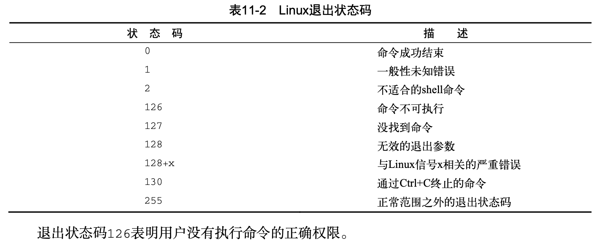
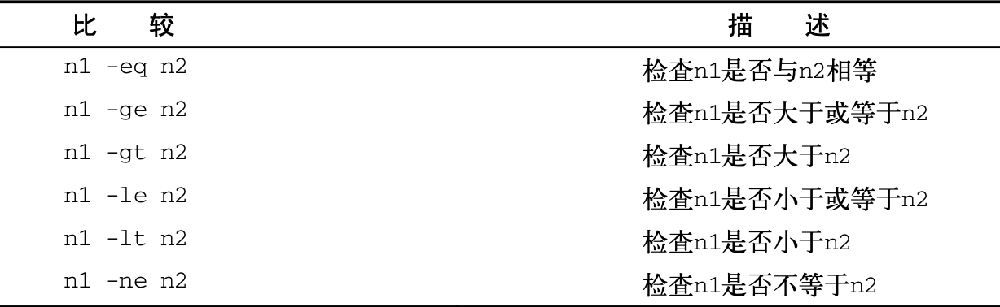
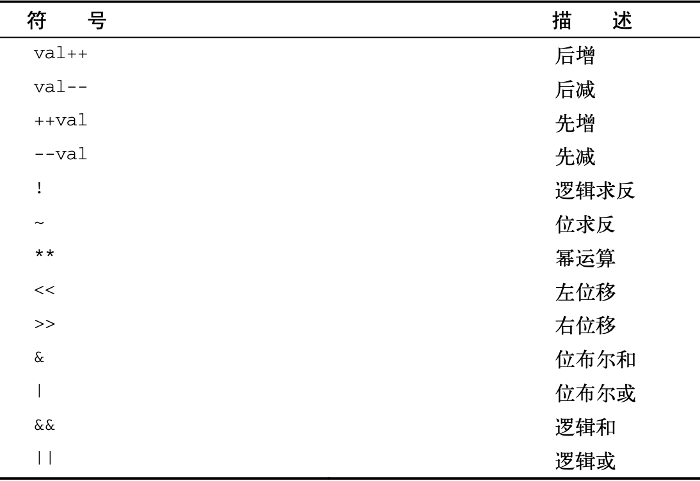
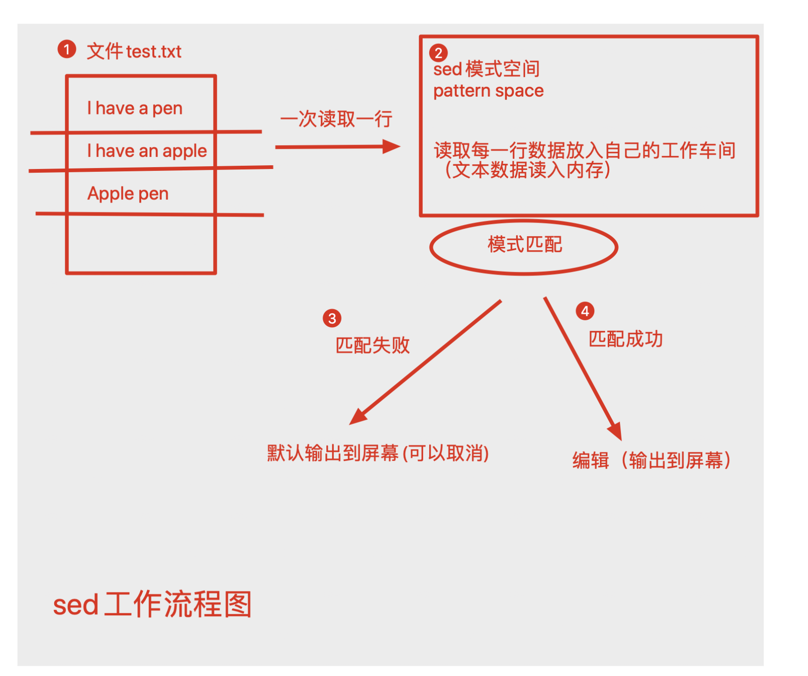
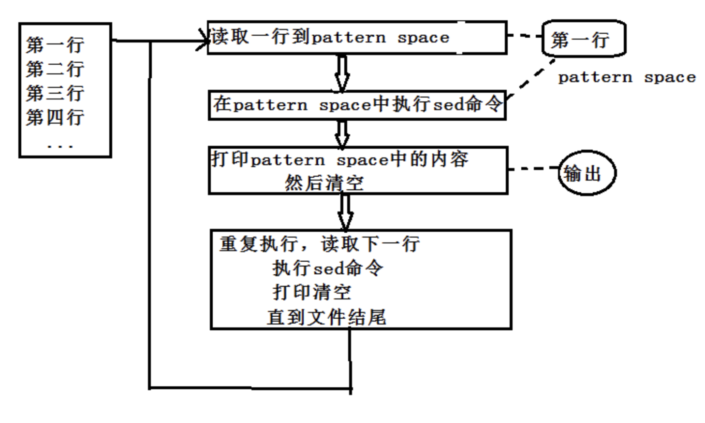
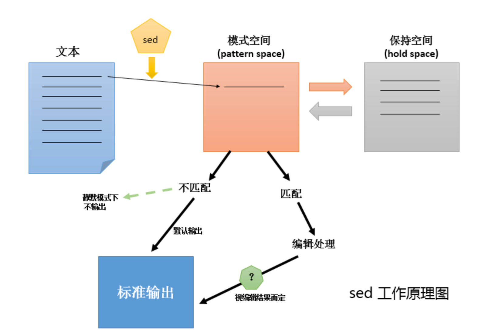
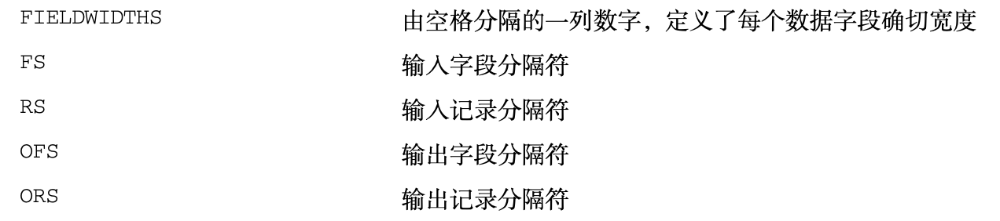
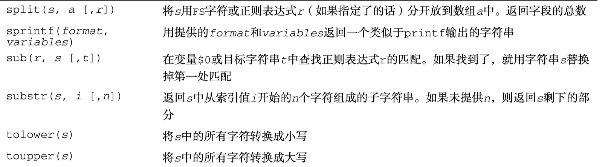
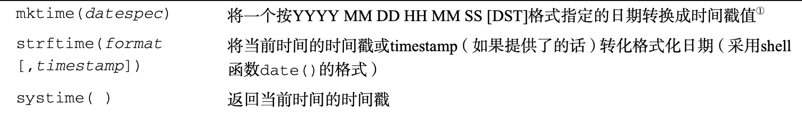

# shell开发

学习了linux系统命令操作之后，为了提升运维效率，我们得学习shell脚本开发。

## 使用多个命令

shell脚本的关键是在于处理多个命令，且处理每个命令的结果，或者将不同的命令结果进行传递，再次加工。

shell支持多个命令连接起来执行。

```plain
[root@web01 ~]# clear
[root@web01 ~]# date;whoami
Sun Sep 27 17:57:45 CST 2020
root
```

恭喜你，铁子，你已经会了第一个shell脚本。这个脚本简单到只有2个命令，这种形式，命令少还好说，如果命令较长，较多，那就很难在命令行敲打了。

我们可以把命令组合成一个文本文件，然后执行这个文件即可。

## shell脚本文件

shell脚本文件，第一行必须指定想要用的shell。

```plain
#!/bin/bash
```

shell脚本里，`#号`是注释行，shell不会处理脚本中的注释行，然而第一行例外，该写法会通知shell用哪个解释器来运行脚本。

shell脚本中可以书写你想要执行的命令，且可以添加注释行。

```plain
[root@web01 ~]# cat test.sh
#!/bin/bash
# This is test script
date
whoami
echo "It's Over."
```

### 执行脚本

用解释器读取脚本

```plain
[root@web01 ~]# sh test.sh
Mon Sep 28 09:34:28 CST 2020
root
It's Over.
[root@web01 ~]# bash test.sh
Mon Sep 28 09:34:36 CST 2020
root
It's Over.
```

直接运行文件，需要赋予权限

```plain
[root@web01 ~]# ./test.sh
-bash: ./test.sh: Permission denied
[root@web01 ~]# ll test.sh
-rw-r--r-- 1 root root 64 Sep 28 09:34 test.sh
[root@web01 ~]# chmod +x test.sh
[root@web01 ~]#
[root@web01 ~]# ll test.sh
-rwxr-xr-x 1 root root 64 Sep 28 09:34 test.sh
# 执行
[root@web01 ~]# ./test.sh
Mon Sep 28 09:35:35 CST 2020
root
It's Over.
```

当以`./test.sh`该形式执行脚本，则以文件第一行的`shebang`指定的解释器执行文件。

## 常用echo

在shell脚本里，shell命令会有自己的输出，若是你想要自定义内容打印，以告知用户，当前脚本在做什么事。

可以通过echo命令来实现，注意`单引号`、`双引号`。

```plain
[root@web01 ~]# cat test.sh
#!/bin/bash
# This script displays the date and who's logged on
echo "The time and date are:"
date
echo ''
echo "Let's see who's logged into the system:"
who
[root@web01 ~]# ./test.sh
The time and date are:
Mon Sep 28 09:45:20 CST 2020
Let's see who's logged into the system:
root     tty1         2020-09-27 11:01
root     pts/0        2020-09-27 17:57 (10.0.1.1)
```

### 使用变量与echo

脚本里，可以在环境变量名称前加上`$`来使用环境变量。

```plain
[root@web01 ~]# cat test.sh
#!/bin/bash
# display user information from the system
echo "User info for userid: $USER"
echo UID: $UID
echo HOME: $HOME
[root@web01 ~]# ./test.sh
User info for userid: root
UID: 0
HOME: /root
```

### 转义符

当一些情况，我们不希望shell解析一些符号，可以使用`单引号`和`转义符`对符号不做解析。

echo识别变量的情况

```plain
[root@web01 ~]# echo "The cost of the item is $15"
The cost of the item is 5
```

这显然不是超哥想要的，改成如下写法

```plain
[root@web01 ~]# echo ' The cost of the item is $15'
 The cost of the item is $15
```

方法二

```plain
[root@web01 ~]# echo "The cost of the item is \$15"
The cost of the item is $15
```

现在允许shell解读`$`只是一个普通的美元符了。

### 变量应用

```plain
[root@web01 ~]# cat test.sh
#!/bin/bash
# test variables
days=10
guest="超哥"
echo "$guest checked in $days days ago"
[root@web01 ~]# ./test.sh
超哥 checked in 10 days ago
```

变量被引用时会输出赋予给它的值，变量会在shell脚本退出后消失。

### 变量再赋值

变量每次被引用的时候，都会输出赋予的值，需要加上`$`符

```plain
[root@web01 ~]#
[root@web01 ~]# cat test.sh
#!/bin/bash
# assigning a variable value to another variable
value1=10
value2=$value1
echo "The resulting value is $value2"
[root@web01 ~]# ./test.sh
The resulting value is 10
[root@web01 ~]#
```

若是忘记用美元符，则结果就错误了。

```plain
[root@web01 ~]# cat test.sh
#!/bin/bash
# assigning a variable value to another variable
value1=10
value2=value1
echo "The resulting value is $value2"
[root@web01 ~]#
[root@web01 ~]#
[root@web01 ~]# ./test.sh
The resulting value is value1
```

## 命令替换

shell一大特性就是可以从命令中提取结果，再赋予给变量，这样处理脚本数据特别方便。

有两个方式将命令输出赋予给变量

反引号 ``

$() 格式

来看超哥的用法

```plain
[root@web01 ~]# cat test.sh
#!/bin/bash
testing=$(date)
echo "The date and time are:" $testing
# 结果
[root@web01 ~]# ./test.sh
The date and time are: Mon Sep 28 10:31:39 CST 2020
```

再来看案例

```plain
[root@web01 ~]# cat test.sh
#!/bin/bash
# copy the /usr/bin directory listing to a log file
today=$(date +%y%m%d)
ls /usr/bin -al > log.$today
today变量是取出命令的值，也就是提取了日期，然后在结合到文件名里使用
[root@web01 ~]# ./test.sh
[root@web01 ~]# cat log.200928 |wc -l
1240
```

### 反引号

```plain
反引号和$()的作用相同，用于命令替换（command substitution），即完成引用的命令的执行，将其结果替换出来，与变量替换差不多。比如：
[root@web01 ~]# echo `date '--date=1 hour ago' +%Y-%m-%d-%H`
2020-09-28-10
等同于
[root@web01 ~]# echo $(date '--date=1 hour ago' +%Y-%m-%d-%H)
2020-09-28-10
```

## 数值计算

编程语言都支持数字计算，但是对于shell来说，数值计算稍微麻烦点。

### expr命令

expr命令允许在命令行处理数学表达式，简单的计算器命令

案例

注意必须有空格

```plain
[root@web01 ~]# expr 1 + 5
6
# expr并不是很好用，比较麻烦
# 很多符号在shell里有特殊含义因此必须得转义使用
[root@web01 ~]# expr 5 * 2
expr: syntax error
[root@web01 ~]# expr 5 \* 2
10
# 求长度
[root@web01 ~]# expr length 123132134524asdqweqweqewqfgdfgdfgdf
35
# 逻辑判断，必须加上引号
[root@web01 ~]# expr 33 '>'  3
1
[root@web01 ~]# expr 33 '>'  333
0
# 除法
[root@web01 ~]# expr 50 / 5
10
# 逻辑判断，是否是数字
[root@web01 ~]# cat test.sh
#!/bin/bash
NUM=4
expr $NUM + 3 > /dev/null 2>&1
echo $?
STR="chaoge"
expr $STR + 3 > /dev/null 2>&1
echo $?
[root@web01 ~]# sh test.sh
0
2
```

### 方括号

bash提供了更简单的方式进行数学表达式计算

超哥提示：保持良好的shell书写习惯，注意空格，语法

```plain
$[ 表达式 ]
```

案例

```plain
[root@web01 ~]# cat test.sh
#!/bin/bash
var1=$[ 1 + 5 ]
echo $var1
var2=$[ $var1 * 2 ]
echo $var2
# 执行
[root@web01 ~]# bash test.sh
6
12
```

再来一个

```plain
[root@web01 ~]# cat test.sh
#!/bin/bash
var1=100
var2=50
var3=45
var4=$[ $var1 * ($var2-$var3) ]
echo "The final result is $var4"
[root@web01 ~]# bash test.sh
The final result is 500
```

方括号的写法，就不用担心shell会误解`*`号，因为写在了`[]`中括号里面。

bash计算的能力还是较弱，更多实际的数学运算，还是得借助其他工具。

### bc命令

bc是bash计算器，允许在命令行中进行浮点数计算，返回结果。

bc能够识别：

- 整数、浮点数
- 变量、数组
- 注释、#号或/**/
- 表达式
- 编程语句
- 函数

```plain
[root@web01 ~]# bc
bc 1.06.95
Copyright 1991-1994, 1997, 1998, 2000, 2004, 2006 Free Software Foundation, Inc.
This is free software with ABSOLUTELY NO WARRANTY.
For details type `warranty'.
3*2.2
6.6
3*(1.1+2.2)
9.9
quit
```

### 脚本中用bc

可以使用命令替换结合bc命令使用，也就是`反引号或者$()`

```plain
[root@web01 ~]# cat test.sh
#!/bin/bash
var1=$(echo "3.44*2"|bc)
echo "The answer is $var1"
[root@web01 ~]#
[root@web01 ~]#
[root@web01 ~]#
[root@web01 ~]# sh test.sh
The answer is 6.88
```

可以结合变量替换再使用

```plain
[root@web01 ~]# cat test.sh
#!/bin/bash
var1=20
var2=2.32
var3=$(echo "$var1 * $var1"|bc)
var4=$(echo "$var3 * $var2"|bc)
echo "The final result is $var4"
[root@web01 ~]# bash test.sh
The final result is 928.00
```

## 退出脚本

刚才我们的所有操作都是命令结束自动退出的，其实还可以选择其他优雅的方式，为脚本画上句号。

shell运行的每个命令都有退出状态码 exit status

exit status是一个0～255的整数值

### 状态码

linux提供变量存储上一个命令执行结果状态。

$? 变量

```plain
[root@web01 ~]# date
Mon Sep 28 14:19:54 CST 2020
[root@web01 ~]#
[root@web01 ~]# echo $?
0
退出码是0则表示命令执行无误。
[root@web01 ~]# datee
-bash: datee: command not found
[root@web01 ~]#
[root@web01 ~]# echo $?
127
退出码非0则表示有误
```



```plain
# 例如没有权限的状态码
[root@web01 ~]# chmod -x test.sh
[root@web01 ~]#
[root@web01 ~]# ./test.sh
-bash: ./test.sh: Permission denied
[root@web01 ~]#
[root@web01 ~]# echo $?
126
```

### exit命令

正常情况下，shell脚本会以最后一个命令的状态码退出。

```plain
# 注意超哥这里的最后一行，故意写错
[root@web01 ~]# cat test.sh
#!/bin/bash
var1=20
var2=2.32
var3=$(echo "$var1 * $var1"|bc)
var4=$(echo "$var3 * $var2"|bc)
echoo "The final result is $var4"
# 查看状态码
[root@web01 ~]# bash test.sh
test.sh: line 6: echoo: command not found
[root@web01 ~]# echo $?
127
```

可以改变默认的状态码行为，使用exit

```plain
[root@web01 ~]# cat test.sh
#!/bin/bash
# test the exit status
var1=10
var2=30
var3=$[ $var1 + $var2 ]
echo "The answer is $var3"
exit 5
[root@web01 ~]#
[root@web01 ~]#
[root@web01 ~]#
[root@web01 ~]# bash test.sh
The answer is 40
[root@web01 ~]# echo $?
5
```


# shell逻辑控制

先前我们的shell脚本都是按照顺序，自上而下的依次处理。但是许多程序要求对于shell脚本可以进行逻辑流程控制，这类命令称之为`结构化命令（structured command）`

结构化命令允许你修改程序执行的顺序。

## if-then语句

语法

```plain
if command
then
    command
fi
```

如果你之前学过其他编程语言，if语句后面要求语句的结果得是`True`或`False`。

但是bash的if语句并不然。

bash的if语句会直接运行if后面的命令，如果该命令执行正确（状态码为0），处于then的命令就会被执行。否则就不会执行，或者执行其他逻辑的语句，最后到fi结束逻辑控制。

```plain
[root@web01 ~]# cat test.sh
#!/bin/bash
# testing the if statement
if pwd
then
    echo "It worked"
fi
[root@web01 ~]#
[root@web01 ~]# bash test.sh
/root
It worked
```

另一个案例

```plain
[root@web01 ~]# cat test.sh
#!/bin/bash
# testing a bad command
if badcommand
then
    echo "It worked."
fi
echo "We are outside the if statement."
[root@web01 ~]#
[root@web01 ~]#
[root@web01 ~]# bash test.sh
test.sh: line 3: badcommand: command not found
We are outside the if statement.
```

这个案例就演示了if后面的命令非正确时，bash会跳过then的语句。

## if-then-else语句

在这里，就增加了一个逻辑的选择

```plain
if command
then 
    command
else
    command
fi
```

案例

```plain
[root@web01 ~]# cat test.sh
#!/bin/bash
# testing the else section
testuser=someone
if grep $testuser /etc/passwd
then
    echo "The bash file for user $testuser are:"
    ls -a /home/$testuser/.b*
    echo
else
    echo "The user $testuser does not exist on this system."
    echo
fi
# 结果
[root@web01 ~]# bash test.sh
The user someone does not exist on this system.
```

可以看出语句翻译是

```plain
如果 ..
那么
    执行...
否则
    执行...
结束
```

## 嵌套if

其实就是比刚才多几个判断，来看超哥怎么写

```plain
1.创建一个测试的目录
[root@web01 ~]# mkdir /home/cccc
2.脚本
[root@web01 ~]# cat test.sh
#!/bin/bash
testuser=cccc
if grep $testuser /etc/passwd
then
    echo "The user $testuser exists on this system."
else
    echo "The user $testuser does not exist on this system."
    if ls -d /home/$testuser/
        then
            echo "However,$testuser has a directory."
    fi
fi
3.执行
[root@web01 ~]# bash test.sh
The user cccc does not exist on this system.
/home/cccc/
However,cccc has a directory.
```

这种写法问题在于代码不易阅读，很难理清逻辑。

### elif

语法

```plain
if command1
then
    commands
elif command2
then
    more commands
fi
# 超哥翻译
如果 ...
    那么
        执行..
又如果...
    那么
        执行...
结束
```

案例，这样的逻辑，更适合阅读。

```plain
[root@web01 ~]# cat test.sh
#!/bin/bash
testuser=cccc
if grep $testuser /etc/passwd
then
    "The user $testuser exists on this system."
elif ls -d /home/$testuser
then
    echo "The user $testuser does not exist on this system."
    echo "However,$testuser has a directory."
fi
[root@web01 ~]# bash test.sh
/home/cccc
The user cccc does not exist on this system.
However,cccc has a directory.
```

再来一个案例，用于判断`cccc`用户的两种情况

- 有家目录，用户信息被删除
- 没有家目录，用户也不存在

```plain
[root@web01 ~]# cat test.sh
#!/bin/bash
testuser=cccc
if grep $testuser /etc/passwd
then
    echo "The user $testuser exists on this system."
elif ls -d /home/$testuser
then
    echo "The user $testuser does not exist on this system."
    echo "However,$testuser has a directory."
else
    echo "The user $testuser does not exist on this system."
    echo "And $testuser does not have a directory."
fi
# 执行分别看结果
[root@web01 ~]# bash test.sh
/home/cccc
The user cccc does not exist on this system.
However,cccc has a directory.
# 删除家目录，再执行
[root@web01 ~]# rmdir /home/cccc/
[root@web01 ~]# bash test.sh
ls: cannot access /home/cccc: No such file or directory
The user cccc does not exist on this system.
And cccc does not have a directory.
```

## test命令

```plain
test 命令最短的定义可能是评估一个表达式；如果条件为真，则返回一个 0 值。如果表达式不为真，则返回一个大于 0 的值 — 也可以将其称为假值。检查最后所执行命令的状态的最简便方法是使用 $? 值。
参数：
1. 关于某个文件名的『类型』侦测(存在与否)，如 test -e filename 
-e 该『文件名』是否存在？(常用) 
-f 该『文件名』是否为文件(file)？(常用) 
-d 该『文件名』是否为目录(directory)？(常用) 
-b 该『文件名』是否为一个 block device 装置？ 
-c 该『文件名』是否为一个 character device 装置？ 
-S 该『文件名』是否为一个 Socket 文件？ 
-p 该『文件名』是否为一个 FIFO (pipe) 文件？ 
-L 该『文件名』是否为一个连结档？ 
2. 关于文件的权限侦测，如 test -r filename 
-r 侦测该文件名是否具有『可读』的属性？ 
-w 侦测该文件名是否具有『可写』的属性？ 
-x 侦测该文件名是否具有『可执行』的属性？ 
-u 侦测该文件名是否具有『SUID』的属性？ 
-g 侦测该文件名是否具有『SGID』的属性？ 
-k 侦测该文件名是否具有『Sticky bit』的属性？ 
-s 侦测该文件名是否为『非空白文件』？ 
3. 两个文件之间的比较，如： test file1 -nt file2 
-nt (newer than)判断 file1 是否比 file2 新 
-ot (older than)判断 file1 是否比 file2 旧 
-ef 判断 file2 与 file2 是否为同一文件，可用在判断 hard link 的判定上。 主要意义在判定，两个文件是否均指向同一个 inode 哩！ 
4. 关于两个整数之间的判定，例如 test n1 -eq n2 
-eq 两数值相等 (equal) 
-ne 两数值不等 (not equal) 
-gt n1 大于 n2 (greater than) 
-lt n1 小于 n2 (less than) 
-ge n1 大于等于 n2 (greater than or equal) 
-le n1 小于等于 n2 (less than or equal) 
5. 判定字符串的数据 
test -z string 判定字符串是否为 0 ？若 string 为空字符串，则为 true 
test -n string 判定字符串是否非为 0 ？若 string 为空字符串，则为 false。
注： -n 亦可省略 
test str1 = str2 判定 str1 是否等于 str2 ，若相等，则回传 true 
test str1 != str2 判定 str1 是否不等于 str2 ，若相等，则回传 false 
6. 多重条件判定，例如： test -r filename -a -x filename 
-a (and)两状况同时成立！例如 test -r file -a -x file，则 file 同时具有 r 与 x 权限时，才回传 true。 
-o (or)两状况任何一个成立！例如 test -r file -o -x file，则 file 具有 r 或 x 权限时，就可回传 true。 
! 反相状态，如 test ! -x file ，当 file 不具有 x 时，回传 true
```

test命令对于shell脚本是重要的命令，提供了在`if-then`语句里测试不同条件的路径。

我们来看用法，条件为真，返回`0`，条件不成立，返回`大于0`的值。

```plain
1.判断文件存在
[root@web01 ~]# test hello.sh
[root@web01 ~]# echo $?
0
2.判断目录
[root@web01 ~]# test -d data
[root@web01 ~]# echo $?
0
3.测试可写权限
[root@web01 ~]# test -w hello.sh
[root@web01 ~]# echo $?
0
4.测试执行权限
[root@web01 ~]# test -x hello.sh
[root@web01 ~]#
[root@web01 ~]#
[root@web01 ~]# echo $?
1
5.测试文件是否有内容，有则0，无则1
[root@web01 ~]# cat hello.sh
#!/bin/bash
echo 'hello 超哥，你讲的课真有意思'
[root@web01 ~]#
[root@web01 ~]# test -s hello.sh
[root@web01 ~]#
[root@web01 ~]# echo $?
0
```

结合控制语句

```plain
[root@web01 ~]# cat test.sh
#!/bin/bash
# Testing the test command
my_var="Full"
if test $my_var
then
    echo "The $my_var expression returns a True."
else
    echo "The $my_var expression returns a False."
fi
[root@web01 ~]#
[root@web01 ~]#
[root@web01 ~]# bash test.sh
The Full expression returns a True.
若是删除my_var变量，该脚本，就False了。
```

### 简洁的测试方法

bash提供了可以不用test命令的写法，进行判断

```plain
# 注意空格
if [ 条件 ]
then
    commands
fi
在中括号里，写入测试条件。
```

### 数值比较

test命令常见用法是数值比较。



```plain
[root@web01 ~]# cat test.sh
#!/bin/bash
# Using numeric test evaluations
value1=10
value2=11
if [ $value1 -gt 5 ]
then
    echo "The test value $value1 is greater than 5"
fi
if [ $value1 -eq $value2 ]
then
    echo "The values are equal."
else
    echo "The values are different."
fi
[root@web01 ~]#
[root@web01 ~]#
[root@web01 ~]# bash test.sh
The test value 10 is greater than 5
The values are different.
```

注意bash只能处理整数。

### 案例

-d 测试目录是否存在，在目录操作时，判断下是否存在是个好习惯。

```plain
[root@web01 ~]# cat test.sh
#!/bin/bash
jump_directory=/home/cccc
if [ -d $jump_directory ]
then
    echo "The $jump_directory exists."
    cd $jump_directory
    ls
else
    echo "The $jump_directory does not exist."
fi
```

## 符合条件测试

[ 条件 ] && [ 条件2 ]

[ 条件 ] || [ 条件2 ]

布尔运算符

案例

```plain
[root@web01 ~]# cat test.sh
#!/bin/bash
# 超哥带你学shell
if [ -d $HOME ] && [ -w $HOME/testing ]
then
    echo "The file exists and you can write to it."
else
    echo "I cannot wirte to the file."
fi
[root@web01 ~]#
[root@web01 ~]#
[root@web01 ~]# bash test.sh
I cannot wirte to the file.
# 对文件创建，修改权限测试
```

## 双括号特性

### 双小括号

bash支持双括号，写入高级数学表达式。



可以在if语句里使用双括号，可以用在普通的命令。

```plain
# 10的平方是100，脚本
[root@web01 ~]# cat test.sh
#!/bin/bash
# 超哥带你学shell
val1=10
if (( $val1 ** 2 > 90 ))
then
    (( val2 = $val1**2 ))
    echo "The square of $val1 is $val2"
fi
[root@web01 ~]#
[root@web01 ~]#
[root@web01 ~]# bash test.sh
The square of 10 is 100
# 注意双括号里不需要转义，val2语句是赋值语句
```

### 双方括号

双方括号提供了针对字符串的高级特性，模式匹配，正则表达式的匹配。

```plain
[root@web01 ~]# cat test.sh
#!/bin/bash
# 超哥带你学shell
if [[ $USER == r* ]]
then
    echo "Hello $USER"
else
    echo "Sorry,I do not know you."
fi
[root@web01 ~]#
[root@web01 ~]#
[root@web01 ~]# bash test.sh
Hello root
[root@web01 ~]#
```

在双中括号里，进行了`==`双等号，进行字符串匹配`r*`，也就找到了`root`。

## case语句

当我们有一个场景，在计算后，要进行多个组的值判断，用一个low的办法写。

```plain
[root@web01 ~]# cat test.sh
#!/bin/bash
# 超哥带你学shell
if [[ $USER = "root" ]]
then
    echo "Welcome $USER"
    echo "Please enjoy your visit"
elif [ $USER = "chaoge" ]
then
    echo "Welcome $USER"
    echo "Please enjoy your visit"
elif [ $USER = "testing" ]
then
    echo "Special testing account"
elif [ $USER = "cc" ]
then
    echo "Do not forget to logout when you're done."
else
    echo "Sorry,you are not allowed here."
fi
[root@web01 ~]#
# 执行
[root@web01 ~]# bash test.sh
Welcome root
Please enjoy your visit
```

我们会发现，这样的写法，重复性太高，有点太啰嗦了。

有了case语句你就会发现，再也不需要写那么多elif不停的检查同一个变量`$USER`。

不low的写法

```plain
语法：
#! /bin/sh -
name=`basename $0 .sh`
case $1 in
 s|start)
        echo "start..."
        ;;
 stop)
        echo "stop ..."
        ;;
 reload)
        echo "reload..."
        ;;
 *)
        echo "Usage: $name [start|stop|reload]"
        exit 1
        ;;
esac
exit 0
# 语法
case "变量" in 
值1)
    命令
    ;;
值2)
    命令2
    ;;
*)
    命令3
esac
```

案例

```plain
[root@web01 ~]# cat test.sh
#!/bin/bash
# 超哥带你学shell
case $USER in
root | chaoge)
    echo "Welcome,$USER"
    echo "Please enjoy your visit"
;;
cc)
    echo "Welcome cc"
;;
yuchao)
    echo "Welcome yuchao"
;;
*)
    echo "Sorry,you are not allowed here"
;;
esac
[root@web01 ~]# bash test.sh
Welcome,root
Please enjoy your visit
```

这样的case语句，比起写多个if-elif是简单的多了。

# for命令

for语句提供了重复一些过程的作用，也就是循环执行一组命令，直到某个特定条件结束。

```plain
bash提供for命令，允许你遍历一组值
语法
for var in list
do 
    commands
done
```

for循环在list变量值里，反复迭代，第一次迭代，使用第一个值，第二次用第二个值，以此类推，直到所有元素都过一遍。

案例

```plain
[root@web01 ~]# cat test.sh
#!/bin/bash
# 超哥带你学shell
for test in yuchao apple orange potato
do
    echo "The next is $test"
done
[root@web01 ~]#
[root@web01 ~]#
[root@web01 ~]#
[root@web01 ~]# bash test.sh
The next is yuchao
The next is apple
The next is orange
The next is potato
```

## for循环的坑

```plain
1.看案例
[root@web01 ~]# cat test.sh
#!/bin/bash
# 超哥带你学shell
for test in I don't know if this'll work
do
    echo "word: $test"
done
[root@web01 ~]#
[root@web01 ~]#
[root@web01 ~]# bash test.sh
word: I
word: dont know if thisll
word: work
```

本意我们是想以空格区分，循环出每个单词，这里shell被单引号给误导了，这里得进行转义，解决办法

- 转义符
- 双引号

```plain
# 双引号
[root@web01 ~]# cat test.sh
#!/bin/bash
# 超哥带你学shell
for test in I "don't" know if "this'll" work
do
    echo "word: $test"
done
# 转义符
[root@web01 ~]# cat test.sh
#!/bin/bash
# 超哥带你学shell
for test in I don\'t  know if this\'ll work
do
    echo "word: $test"
done
```

### 空格坑

for默认循环是以空格区分，如果你的数据包含了空格，那又该怎么办

```plain
[root@web01 ~]# cat test.sh
#!/bin/bash
# 超哥带你学shell
for test in China New York
do
    echo "Now going to $test"
done
[root@web01 ~]#
[root@web01 ~]#
[root@web01 ~]#
[root@web01 ~]# bash test.sh
Now going to China
Now going to New
Now going to York
```

这不是我们要的结果，用双引号解决这个问题

```plain
[root@web01 ~]# cat test.sh
#!/bin/bash
# 超哥带你学shell
for test in China "New York"
do
    echo "Now going to $test"
done
[root@web01 ~]#
[root@web01 ~]#
[root@web01 ~]# bash test.sh
Now going to China
Now going to New York
```

## 从变量遍历

```plain
[root@web01 ~]# cat test.sh
#!/bin/bash
# 超哥带你学shell
list="yuchao apple orange potato"
for state in $list
do
    echo "Hello $state?"
done
[root@web01 ~]#
[root@web01 ~]#
[root@web01 ~]#
[root@web01 ~]# bash test.sh
Hello yuchao?
Hello apple?
Hello orange?
Hello potato?
```

## 从文件里遍历

```plain
1.准备文件
[root@web01 ~]# cat test.txt
yuchao
apple
orange
potato
2.for脚本
[root@web01 ~]# cat test.sh
#!/bin/bash
# 超哥带你学shell
file="./test.txt"
for state in $(cat $file)
do
    echo "Hello $state"
done
[root@web01 ~]#
[root@web01 ~]#
[root@web01 ~]#
[root@web01 ~]# bash test.sh
Hello yuchao
Hello apple
Hello orange
Hello potato
```

## 通配符遍历

可以使用for命令自动遍历目录中的文件，得使用`通配符`支持匹配。

### 遍历判断文件/目录

```plain
[root@web01 ~]# cat test.sh
#!/bin/bash
# 超哥带你学shell
for file in /opt/*
do
    if [ -d "$file" ]
    then
        echo "$file is a directory"
    elif [ -f "$file" ]
    then
        echo "$file is a file"
    fi
done
[root@web01 ~]#
[root@web01 ~]#
[root@web01 ~]# bash test.sh
/opt/2020-07-22-16-48-00-docker-guacamole-v2.1.0.tar.gz is a file
/opt/apache-tomcat-9.0.36.tar.gz is a file
/opt/guacamole is a directory
/opt/jumpserver is a directory
```

for循环在/opt目录下挨个遍历，因为`*`就已经匹配了所有的内容，然后`-d`参数进行判断目录，以此进行逻辑判断，到底是目录或是其他。

### 遍历多个目录

```plain
[root@web01 ~]# cat test.sh
#!/bin/bash
# 超哥带你学shell
for file in /home/* /root/*.txt
do
    if [ -d "$file" ]
    then
        echo "$file is a directory"
    elif [ -f "$file" ]
    then
        echo "$file is a file"
    fi
done
```

## While循环

while循环命令可以理解是`if-then`和`for`循环的混杂体。

```plain
语法
while test command
do
    other command
done
```

while语句的`test command`和`if-then`语句格式一样，可以使用任何的普通bash shell命令。

注意的是while的`test command`的退出状态码，必须随着循环里的命令改变，否则状态码如果不变化，循环会不停止的继续下去。

```plain
[root@web01 ~]# cat test.sh
#!/bin/bash
# 超哥带你学shell
var1=10
while [ $var1 -gt 0 ]
do
    echo $var1
    var1=$[ $var1 -1 ]
done
[root@web01 ~]#
[root@web01 ~]#
[root@web01 ~]#
[root@web01 ~]# bash test.sh
10
9
8
7
6
5
4
3
2
1
```

只要条件成立，while命令就会不断的循环下去，直到条件不成立，结束循环。

## 多个测试命令

while可以写入多个测试命令，只有最后一个测试命令的退出状态码会被决定是否退出循环。

```plain
[root@web01 ~]# cat test.sh
#!/bin/bash
# 超哥带你学shell
var1=10
while echo $var1
    [ $var1 -ge 0 ]
do
    echo "This is inside the loop"
    var1=$[ $var1 -1 ]
done
```

注意写法，换行，多个测试命令要单独的出现在一行。

这里是先显示var1变量的值，第二个测试是方括号里判断var1是否大于0

在循环体内部，先打印消息，然后进行变量计算。

因此脚本执行结果是

```plain
[root@web01 ~]# bash test.sh
10
This is inside the loop
9
This is inside the loop
8
This is inside the loop
7
This is inside the loop
6
This is inside the loop
5
This is inside the loop
4
This is inside the loop
3
This is inside the loop
2
This is inside the loop
1
This is inside the loop
0
This is inside the loop
-1
```

## unitl命令

until和while是相反的语意，until命令要求你指定一个`返回非零退出码的测试命令`。

只有退出状态码不是0，bash才会执行循环的命令。

```plain
语法：
until test commands
do
    other commands
done
```

until也支持多个测试命令，只有最后一个决定bash是否执行其他命令。

```plain
[root@web01 ~]# cat test.sh
#!/bin/bash
# 超哥带你学shell
var1=100
until [ $var1 -eq 0 ]
do
    echo $var1
    var1=$[ $var1 -25 ]
done
[root@web01 ~]#
[root@web01 ~]#
[root@web01 ~]#
[root@web01 ~]# bash test.sh
100
75
50
25
```

多条件until

```plain
[root@web01 ~]# cat test.sh
#!/bin/bash
# 超哥带你学shell
var1=100
until echo $var1
    [ $var1 -eq 0 ]
do
    echo "Inside the loop：$var1"
    var1=$[ $var1 - 25 ]
done
[root@web01 ~]#
[root@web01 ~]#
[root@web01 ~]# bash test.sh
100
Inside the loop：100
75
Inside the loop：75
50
Inside the loop：50
25
Inside the loop：25
0
```

## 嵌套循环

也就是在循环体内，再写上循环语句命令，使用嵌套循环要小心了。

### C语言风格的for循环

案例

```plain
[root@chaogelinux shell]# cat test.sh
#!/bin/bash
for (( i=1;i<=10;i++ ))
do
    echo "The next number is $i"
done
[root@chaogelinux shell]#
[root@chaogelinux shell]#
[root@chaogelinux shell]# bash test.sh
The next number is 1
The next number is 2
The next number is 3
The next number is 4
The next number is 5
The next number is 6
The next number is 7
The next number is 8
The next number is 9
The next number is 10
for循环通过定义好的变量i，进行迭代的使用。
```

### for使用多个变量

C语言风格的for循环允许迭代多个变量，循环会单独的处理每个变量，可以为每个变量定义不同的迭代过程。

```plain
[root@chaogelinux shell]# cat test.sh
#!/bin/bash
for (( a=1,b=10;a<=10;a++,b-- ))
do
    echo "$a - $b"
done
[root@chaogelinux shell]#
[root@chaogelinux shell]#
[root@chaogelinux shell]#
[root@chaogelinux shell]# bash test.sh
1 - 10
2 - 9
3 - 8
4 - 7
5 - 6
6 - 5
7 - 4
8 - 3
9 - 2
10 - 1
```

每次迭代，a在增加的同时，减小了b变量。

### 嵌套循环案例

```plain
[root@chaogelinux shell]# cat test.sh
#!/bin/bash
for (( a = 1;a <=3;a++ ))
do
    echo "Starting loop $a:"
    for (( b = 1; b <=3; b++ ))
    do
        echo "    Inside loop:$b"
    done
done
[root@chaogelinux shell]#
[root@chaogelinux shell]#
[root@chaogelinux shell]# bash test.sh
Starting loop 1:
    Inside loop:1
    Inside loop:2
    Inside loop:3
Starting loop 2:
    Inside loop:1
    Inside loop:2
    Inside loop:3
Starting loop 3:
    Inside loop:1
    Inside loop:2
    Inside loop:3
```

## 循环处理文件数据

遍历读取文件内的数据，一般用到两个知识点：

- 嵌套循环
- 修改IFS环境变量

修改IFS环境变量，是因为文件里的数据都是单独的每一行

### IFS字段分隔符

IFS是一个特殊的环境变量，叫做内部字段分隔符，IFS环境变量定义了bash shell用作字段分隔符的一系列字符，bash shell将如下字段当作分隔符

- 空格
- 制表符
- 换行符

案例

```plain
[root@chaogelinux shell]# cat test.sh
#!/bin/bash
IFS.OLD=$IFS
IFS=$'\n'
for entry in $(cat /etc/passwd)
do
    echo "Value in $entry ."
    IFS=:
    for value in $entry
    do
        echo "    $value"
    done
done
```

这里修改了两个不同的IFS变量，来进行解析文件数据

- 第一个IFS=$'\n'，用于解析文件的每一行
- 第二个IFS=: ，是修改IFS的值为冒号，然后解析每一行单独的值。

## 控制循环

刚才我们学习的都是循环后自动结束，也是有办法手动结束的。

- break
- continue

break用于强制退出任意类型的循环。

```plain
[root@chaogelinux shell]# cat test.sh
#!/bin/bash
# 超哥带你学shell
for var1 in `seq 10`
do
    if [ $var1 -eq 5 ]
    then
        break
    fi
    echo "Iteration number: $var1"
done
echo "The for loop is completed"
[root@chaogelinux shell]#
[root@chaogelinux shell]#
[root@chaogelinux shell]# bash test.sh
Iteration number: 1
Iteration number: 2
Iteration number: 3
Iteration number: 4
The for loop is completed
```

break也适用于while，untile循环。

### 终止内部循环break

跳出多个循环时，break会自动终止你在的最内层循环。

```plain
[root@chaogelinux shell]# cat test.sh
#!/bin/bash
# 超哥带你学shell
for (( a = 1; a < 4 ; a++ ))
do
    echo "Outer loop: $a"
    for (( b = 1; b < 100; b++ ))
    do
        if [ $b -eq 5 ]
        then
            break
        fi
        echo "    Inner loop: $b"
    done
done
[root@chaogelinux shell]#
[root@chaogelinux shell]#
[root@chaogelinux shell]#
[root@chaogelinux shell]# bash test.sh
Outer loop: 1
    Inner loop: 1
    Inner loop: 2
    Inner loop: 3
    Inner loop: 4
Outer loop: 2
    Inner loop: 1
    Inner loop: 2
    Inner loop: 3
    Inner loop: 4
Outer loop: 3
    Inner loop: 1
    Inner loop: 2
    Inner loop: 3
    Inner loop: 4
```

外层循环是执行结束了，内部循环到了5立即结束了。

### 终止外层循环break

语法

```plain
break n 
n表示跳出的循环层级，默认是1，下一层就是2
```

案例

```plain
[root@chaogelinux shell]# cat test.sh
#!/bin/bash
# 超哥带你学shell
for (( a = 1; a < 4; a++ ))
do
    echo "Outer loop: $a"
    for (( b = 1;b < 100; b++ ))
    do
        if [ $b -gt 4 ]
        then
            break 2
        fi
        echo "    Inner loop: $b"
    done
done
[root@chaogelinux shell]# bash test.sh
Outer loop: 1
    Inner loop: 1
    Inner loop: 2
    Inner loop: 3
    Inner loop: 4
```

当内层`$b`等于4的时候，立即停止外层，也就结束了。

### continue

continue用于跳过某次循环，当条件满足时，然后继续循环。

```plain
[root@chaogelinux shell]# cat test.sh
#!/bin/bash
# 超哥带你学shell
for (( var1 = 1;var1<15;var1++ ))
do
    if [ $var1 -gt 5 ] && [ $var1 -lt 10 ]
    then
        continue
    fi
    echo "Iteration number: $var1"
done
[root@chaogelinux shell]#
[root@chaogelinux shell]#
[root@chaogelinux shell]# bash test.sh
Iteration number: 1
Iteration number: 2
Iteration number: 3
Iteration number: 4
Iteration number: 5
Iteration number: 10
Iteration number: 11
Iteration number: 12
Iteration number: 13
Iteration number: 14
```

当条件是大于5且小于10的时候，shell会执行continue命令，跳过此阶段的循环条件。

## 处理循环的输出

在shell脚本里，循环输出后的结果，可以进行重定向输出

```plain
[root@chaogelinux shell]# cat test.sh
#!/bin/bash
# 超哥带你学shell
for (( a = 1;a<10;a++ ))
do
    echo "The number is $a"
done > test.txt
echo "Finished"
[root@chaogelinux shell]#
[root@chaogelinux shell]#
[root@chaogelinux shell]#
[root@chaogelinux shell]# bash test.sh
Finished
[root@chaogelinux shell]#
[root@chaogelinux shell]# cat test.txt
The number is 1
The number is 2
The number is 3
The number is 4
The number is 5
The number is 6
The number is 7
The number is 8
The number is 9
```


# Shell高级篇

函数的作用与在于，当你需要重复的使用一段代码，如果是一小段代码重复还好，若是大段重复代码就太麻烦了。函数就可以解决这个问题。

函数是定义一个代码块，且命名，然后可以在脚本里任何位置调用。

## 创建函数

```plain
创建函数语法
function name {
    commands
}
```

案例

```plain
[root@chaogelinux shell]# cat test.sh
#!/bin/bash
# 超哥带你学shell
function func1 {
    echo "This is an example of a function"
}
count=1
while [ $count -le 5 ]
do
    func1
    count=$[ $count + 1 ]
done
echo "This is the end of the loop"
func1
echo "Now this is the end of the script"
[root@chaogelinux shell]#
[root@chaogelinux shell]#
[root@chaogelinux shell]# bash test.sh
This is an example of a function
This is an example of a function
This is an example of a function
This is an example of a function
This is an example of a function
This is the end of the loop
This is an example of a function
Now this is the end of the script
```

每次应用函数名`func1`，shell就会执行func1里定义好的命令。

## 函数简写

```plain
[root@chaogelinux shell]# cat test.sh
#!/bin/bash
# 超哥带你学shell
demoFunc(){
    echo "This is a shell function."
}
echo "start.."
demoFunc
echo "end.."
[root@chaogelinux shell]#
[root@chaogelinux shell]#
[root@chaogelinux shell]# bash test.sh
start..
This is a shell function.
end..
```

## 函数常见的坑

要注意代码的上下路径，要先定义函数，再执行函数。

```plain
[root@chaogelinux shell]# cat test.sh
#!/bin/bash
# 超哥带你学shell
count=1
echo "This line comes befor the function definition."
function func1 {
    echo "This is an example of a function"
}
while [ $count -le 5 ]
do
    func1
    count=$[ $count + 1 ]
done
echo "This is the end of the loop."
func2
echo "Now this is the end of the script"
function func2 {
    echo "This is an example of a function"
}
[root@chaogelinux shell]#
[root@chaogelinux shell]#
[root@chaogelinux shell]#
[root@chaogelinux shell]# bash test.sh
This line comes befor the function definition.
This is an example of a function
This is an example of a function
This is an example of a function
This is an example of a function
This is an example of a function
This is the end of the loop.
test.sh:行17: func2: 未找到命令
Now this is the end of the script
```

这里就有代码报错了，就因为func2函数还未定义就调用了，所以报错。

### 坑2

注意函数名唯一，重复定义则会覆盖函数体的代码。

```plain
[root@chaogelinux shell]# cat test.sh
#!/bin/bash
# 超哥带你学shell
function func1 {
    echo "This is the first definition of the function name"
}
func1
function func1 {
    echo "This is the repeat definition of the function name"
}
func1
echo "This is the end of the script"
[root@chaogelinux shell]#
[root@chaogelinux shell]#
[root@chaogelinux shell]#
[root@chaogelinux shell]# bash test.sh
This is the first definition of the function name
This is the repeat definition of the function name
This is the end of the script
[root@chaogelinux shell]#
```

func2还是能够正常工作，但是就覆盖了func1的内容，这就很容易产生错误了。

## 返回值

bash脚本在退出的时候会有状态码，前面已经和大家说过了。

函数结束后，也会有退出码，来看

```plain
[root@chaogelinux shell]# cat test.sh
#!/bin/bash
# 超哥带你学shell
func1() {
    echo "trying to display a non-existent file"
    ls -l chaoge666
}
echo "testing the function:"
func1
echo "The exit status is :$?"
[root@chaogelinux shell]#
[root@chaogelinux shell]#
[root@chaogelinux shell]# bash test.sh
testing the function:
trying to display a non-existent file
ls: 无法访问chaoge666: 没有那个文件或目录
The exit status is :2
[root@chaogelinux shell]# echo $?
0
```

这个脚本特点是，函数执行报错了，退出状态码是2，脚本应该会报错，但是最后一行命令，确实正确执行的，那么整个脚本的执行退出码，就是0，那这就是有隐藏问题的了。

## 函数使用return

### 使用$?

函数可以用return命令来制定特定的退出状态码。

```plain
[root@chaogelinux shell]# cat test.sh
#!/bin/bash
# 超哥带你学shell
funcWithReturn(){
    read -p "Enter a value: " value
    read -p "Enter another value:" value2
    return $(($value*$value2))
}
funcWithReturn
echo "The final answer is $?"
[root@chaogelinux shell]#
[root@chaogelinux shell]#
[root@chaogelinux shell]#
[root@chaogelinux shell]# bash test.sh
Enter a value: 8
Enter another value:7
The final answer is 56
```

函数返回值是在调用函数之后，通过`&?`来获得。

但是这种方式会有坑，记住

- 函数结束后会立即取返回值
- 退出状态码在0~255

如果在提取函数返回值之前执行了其他的命令，函数的返回值会丢失。

例如

```plain
[root@chaogelinux shell]# cat test.sh
#!/bin/bash
# 超哥带你学shell
funcWithReturn(){
    read -p "Enter a value: " value
    read -p "Enter another value:" value2
    return $(($value*$value2))
}
funcWithReturn
ls /tt
echo "The final answer is $?"
```

因此，记住，`$?`取得的是脚本最后一条命令的状态码。

还有就是超出0~255的范围。

### 使用返回值变量

可以吧函数的执行结果，保存到变量里。

```plain
[root@chaogelinux shell]# cat test.sh
#!/bin/bash
# 超哥带你学shell
function db1 {
    read -p "Enter a value: " value
    echo $[ $value * 2 ]
}
result=$(db1)
echo "The new value is $result"
[root@chaogelinux shell]#
[root@chaogelinux shell]#
[root@chaogelinux shell]# bash test.sh
Enter a value: 5
The new value is 10
```

## 函数中处理变量

作用域指的就是变量可见的区域，函数里定义的变量和普通变量作用域不同，函数里的变量属于是局部的。

函数可以使用两种变量

- 全局变量
- 局部变量

### 全局变量

全局变量是在整个shell脚本里都有效的变量。可以在函数哪读取全局变量的值。

默认情况下，脚本里定义的任何变量都是全局变量，只要不是写在函数体内。

```plain
[root@chaogelinux shell]# cat test.sh
#!/bin/bash
# 超哥带你学shell
db1() {
    value=$[ $value * 2 ]
}
read -p "Enter a value: " value
db1
echo "The new value is : $value"
[root@chaogelinux shell]#
[root@chaogelinux shell]#
[root@chaogelinux shell]#
[root@chaogelinux shell]# bash test.sh
Enter a value: 9
The new value is : 18
```

这里即使value是在函数外赋值，在db1函数执行后，也会计算value值，重新赋值。

### 局部变量

无需在函数中使用全局变量，函数内部使用的任何变量都可以被声明为局部变量，为了实现这一点，只需要加上local关键字即可。

local关键字保证了变量局限在函数中，即使函数外也有同名的变量，shell也会保持该变量的值是分离的。

```plain
[root@jenkins01 shell]# cat test.sh
#!/bin/bash
func1(){
    local temp=$[ $value + 5 ]
    result=$[ $temp * 2 ]
}
temp=4
value=6
func1
echo "The result is $result"
if [ $temp -gt $value ]
then
    echo "temp is larger"
else
    echo "temp is smaller"
fi
```

执行结果

```plain
[root@jenkins01 shell]# bash test.sh
The result is 22
temp is smaller
```

我们会发现，即使函数里的temp数值发生了变化，也不会影响到函数体外层的temp变量。


# sed和awk进阶

# sed进阶

# 正则表达式练习题

## 计算PATH目录下的文件数

PATH目录下的都是二进制命令文件

```plain
1.查看PATH值
[root@gitlab01 ~]# echo $PATH
/usr/local/sbin:/usr/local/bin:/usr/sbin:/usr/bin
2.获取每个目录的字符串，利用sed替换功能
[root@node02 ~]# echo $PATH|sed 's/:/ /g'
/usr/local/sbin /usr/local/bin /usr/sbin /usr/bin /root/bin
3.分离目录后，可以for循环遍历取值了
[root@node02 ~]# my_path=$(echo $PATH|sed 's/:/ /g')
[root@node02 ~]# for dir in $my_path;do echo $dir;done
/usr/local/sbin
/usr/local/bin
/usr/sbin
/usr/bin
/root/bin
4.最终计算文件脚本
[root@node02 tmp]# cat test.sh
#!/bin/bash
# 超哥带你学shell编程
my_path=$(echo $PATH|sed 's/:/ /g')
count=0
for dir in $my_path
do
    check_dir=$(ls $dir)
    for item in $check_dir
    do
        count=$[ $count + 1 ]
    done
    echo "$dir ---- $count"
    count=0 # 归零，否则影响全局的count数量
done
[root@node02 tmp]# bash test.sh
/usr/local/sbin ---- 0
/usr/local/bin ---- 0
/usr/sbin ---- 540
/usr/bin ---- 1139
/root/bin ---- 0
```

## 验证电话号码

```plain
# 对于一些数据表单的输入，例如电话号码，输入错误，需要进行检测
以下是美国电话号码格式
(123)456-7890
(123) 456-7890
123-456-7890 
123.456.7890
这也就表明了电话输入的格式，可以有四种，因此你的正则必须完美的校验上述电话形式。
1.正则构建，最好从左边开始，先判断是否有空格
^\(?   脱字符后面跟着转义符和括号,问号表示括号，可有可无 
2.紧接着是三位区号，美国区号从2开始，没有0或1，最大到9结束
[2-9][0-9]{2}  这表示第一个数字是2-9，第二个是0-9，第三个同样
3.区号后面的括号，也是可有可无的，因此
\)?
4.从上述的电话看出，区号后面，可能有单破折线，或者空格，或者什么都没有，或者小数点，可以这么写
(| |-|\.) 
如此的写法表示，首先括号分组，后面也是同样的规则
然后用管道符进行表示，四种状态，空，空格，横杠，小数点
5.再接着是三位电话交换机号码，数字即可
[0-9]{3}
6.在电话交换机号码后面，必须有一个空格，一个单破折现，或者一个点。（这次不存在没有空格的情况），因此
( |-|\.)
7.最后就是尾部匹配4位本地电话分机号
[0-9]{4}$
```

总结

```plain
完整的匹配模式
^\(?[2-9][0-9]{2}\)?(| |-|\.)[0-9]{3}( |-|\.)[0-9]{4}$
```

此时可以集合sed，awk进行对电话号码过滤验证。

```plain
[root@node02 tmp]# cat phone_list
000-000-0000
123-456-7890
212-555-1234
(317)555-1234
(202) 555-9876
33523
1234567890
234.123.4567
[root@node02 tmp]#
[root@node02 tmp]#
[root@node02 tmp]#
[root@node02 tmp]# cat phone_list | awk '/^\(?[2-9][0-9]{2}\)?(| |-|\.)[0-9]{3}( |-|\.)[0-9]{4}$/{print $0}'
212-555-1234
(317)555-1234
(202) 555-9876
234.123.4567
```

## 解析邮件地址

邮件地址是手机号之外的另一大通信方式，也存在千奇百怪的格式。

username@hostname

点号

单破折线

加号

下划线

有效的邮件用户名里，这些字符都有可能存在组合。

邮件地址hostname格式是 一个或多个域名和一个服务器名字组成，也有一定的规则。

点号

下划线

```plain
1.左侧的用户名正则，用户名里可以有多个有效字符
^([a-zA-Z0-9_\-\.\+]+)@. 中括号里的字符，匹配一次或者任意多次
这个分组指定了用户名中允许出现的字符，正则加号，确保至少有一个字符
2.hostname的匹配规则
([a-zA-Z0-9_\-\.]+)
这样的模式，可以匹配，例如
server
server.subdomain
server.subdomain.subdomain
3.顶级域名的匹配规则，也就是例如.cn .com .org此类
顶级域名只能是字母，不少于二个字符，长度不搞过五个字符。
\.([a-zA-Z]{2,5})$
4.因此整个的匹配邮箱的规则，可以是
^([a-zA-Z0-9_\-\.\+]+)@([a-zA-Z0-9_\-\.]+)\.([a-zA-Z]{2,5})$
```

案例

```plain
使用该正则，就可以过滤掉不正确的邮件地址
[root@node02 tmp]# cat email_list
yuchao@163.com
yy@163.com.
yy@ee.n
yy.city@163.now
yy_city@163.cn
yy#city@163.cc
yy+city@163.cc
yy*city@163.org
[root@node02 tmp]#
[root@node02 tmp]#
[root@node02 tmp]# cat email_list | awk '/^([a-zA-Z0-9_\-\.\+]+)@([a-zA-Z0-9_\-\.]+)\.([a-zA-Z]{2,5})$/{print $0}'
yuchao@163.com
yy.city@163.now
yy_city@163.cn
yy+city@163.cc
```

# sed进阶

sed编辑器可以满足大多数日常文本需求，这里超哥在给大家讲讲些高级用法。

## 多行命令

sed命令的特点是单行数据操作，基于换行符的位置吧数据分成行。然后sed一行一行的处理，重复过程。

如果需要跨行对数据处理，这就麻烦了。

比如文本里找一个短语`Linux System Administrators Group`，这个长语句可能出现在两行，默认的sed就无法识别这种短语。

sed开发者也考虑到了这个情况，提供了处理方案。

sed特殊指令

N: 将数据流中的下一行加进来，创建一个多行组处理，multiline group

D：删除多行组的一行

P：打印多行组的一行

## next命令

sed小写的n命令会告诉sed编辑器移动到数据流中的下一行文本。

sed编辑器再移动到下一行文本前，会在当前行执行完毕所有定义好的命令。单行next命令改变了这个流程。

看下案例。

```plain
# 数据文件
[root@node02 tmp]# cat data.txt
This is an apple.
This is a boy.
This is a gril.
[root@node02 tmp]#
[root@node02 tmp]#
[root@node02 tmp]#
[root@node02 tmp]# sed '/^$/d' data.txt
This is an apple.
This is a boy.
This is a gril.
这种写法是删除空行
```

若是我们想要指定删除某个语句后面的空行，可以用n指令。

```plain
# 删除apple下一行的空格
[root@node02 tmp]# cat data.txt
This is an apple.
This is a boy.
This is a gril.
[root@node02 tmp]#
[root@node02 tmp]#
[root@node02 tmp]# sed '/apple/{n;d}' data.txt
This is an apple.
This is a boy.
This is a gril.
```

此时sed编辑器匹配到apple这一行后，通过n指令，让sed编辑器移动到文本的下一行，也就是空行，然后通过d指令，删除了该行。

此时sed执行完毕命令后，继续重复查找apple，然后尝试删除apple的下一行。

如果找不到apple字符串，也就不会执行任何动作了。

### 合并文本行

刚才使用小写的n将文本的下一行移动到sed的`模式空间`，属于是单行处理。

大写的N指令将下一行文本添加到模式空间中已经有的文本的后面，实现多行文本处理。

这个作用是将数据流的两个文本行合并在同一个模式空间里处理。

```plain
[root@node02 tmp]# cat data2.txt
This is the header line.
This is the first data line.
This is the second data line.
This is the last line.
[root@node02 tmp]#
[root@node02 tmp]#
[root@node02 tmp]# sed '/first/{N;s/\n/ /}' data2.txt
This is the header line.
This is the first data line. This is the second data line.
This is the last line.
```

这里sed找到first一行后，用N指令把下一行合并到first该行，并且执行s替换指令，结果是如上合并了一行。

案例：在数据文件里，查找替换一个可能分散两行的文本短语

```plain
[root@node02 tmp]# cat data.txt
On Tuesday, the Linux System
Administrator's group meeting will be held.
All System Administrators should attend.
Thank you for your attendance.
[root@node02 tmp]#
[root@node02 tmp]#
[root@node02 tmp]# sed 's/System Administrator/Desktop User/' data.txt
On Tuesday, the Linux System
Administrator's group meeting will be held.
All Desktop Users should attend.
Thank you for your attendance.
[root@node02 tmp]#
```

这里发现没有变化，是因为该短语出现在了两行，替换命令无法识别

用N命令解决

```plain
[root@node02 tmp]# sed 'N;s/System.Administrator/Desktop User/' data.txt
On Tuesday, the Linux Desktop User's group meeting will be held.
All Desktop Users should attend.
Thank you for your attendance.
```

这里注意，是使用了两个点，一是N指令，二是`通配符.`来匹配空格和换行符的情况。

当匹配出现了换行符，它就从字符串里删除了换行符，缺导致了两行合并

想要解决这个办法，可以如此：

```plain
[root@node02 tmp]# cat data.txt
On Tuesday, the Linux System
Administrator's group meeting will be held.
All System Administrators should attend.
Thank you for your attendance.
[root@node02 tmp]#
[root@node02 tmp]#
[root@node02 tmp]# sed '
> s/System Administrator/Desktop User/
> N
> s/System\nAdministrator/Desktop\nUser/
> ' data.txt
On Tuesday, the Linux Desktop
User's group meeting will be held.
All Desktop Users should attend.
Thank you for your attendance.
```

用这种写法，可以保证，先进行单行替换处理，即使在最后一行也可以工作，因为N指令在最后一行时会停止工作。

### 多行删除

sed基础中说了删除命令(d)，sed编辑器用于删除模式空间里的当前行，和N一起使用的时候，要小心点了。

```plain
#这里是坑了
[root@node02 tmp]# cat data.txt
On Tuesday, the Linux System
Administrator's group meeting will be held.
All System Administrators should attend.
Thank you for your attendance.
[root@node02 tmp]#
[root@node02 tmp]#
[root@node02 tmp]#
[root@node02 tmp]# sed 'N;/System\nAdministrator/d' data.txt
All System Administrators should attend.
Thank you for your attendance.
```

这里会发现直接在模式空间里删除了两行。

sed提供了大写的D，只删除模式空间里的第一行，该指令会删除到换行符位置的所有字符。

```plain
[root@node02 tmp]# sed 'N;/System\nAdministrator/D' data.txt
Administrator's group meeting will be held.
All System Administrators should attend.
Thank you for your attendance.
```

这里就只删除了第一行。

用这个方式可以删除文件的开头空白行。

```plain
[root@node02 tmp]# cat data2.txt
This is the header line.
This is the first data line.
This is the second data line.
This is the last line.
[root@node02 tmp]#
[root@node02 tmp]#
[root@node02 tmp]# sed '/^$/{N;/header/D}' data2.txt
This is the header line.
This is the first data line.
This is the second data line.
This is the last line.
[root@node02 tmp]#
```

sed编辑器会查找空白行，然后用N命令把下一行的文本添加到模式空间，如果新的模式空间里有单词header，D指令就删除模式空间的第一行，也就删除了空白行。

记住sed是按行处理，如果不结合N和D指令，很难做到不删除其他空白行情况下，只删除第一个空白行。

## 保持空间

sed我们已知有一块模式空间（pattern space）用于sed编辑器执行命令的时候，保存待检查的文本。



sed还有一块空间叫做保持空间的缓冲区域（hold space）。

sed之所以能以行为单位的编辑或修改文本，其原因在于它使用了两个空间：一个是活动的“模式空间（pattern space）”，另一个是起辅助作用的“保持空间（hold space）这2个空间的使用。

模式空间：可以想成工程里面的流水线，数据之间在它上面进行处理。 保持空间：可以想象成仓库，我们在进行数据处理的时候，作为数据的暂存区域。

正常情况下，如果不显示使用某些高级命令，保持空间不会使用到！



一般情况下，数据的处理只使用模式空间（pattern space），按照如上的逻辑即可完成主要任务。但是某些时候，通过使用保持空间（hold space），还可以带来意想不到的效果。

*sed编辑器的保持空间命令。*


这些命令可以将文本从模式空间复制到保持空间。



这些保持空间的命令用于将文本从模式空间复制到保持空间。这样就可以清空模式空间加载其他需要处理的字符串。

案例，理解如何用h和g命令将数据在两个缓冲空间移动。

```plain
[root@node02 tmp]# cat data2.txt
This is the header line.
This is the first data line.
This is the second data line.
This is the last line.
[root@node02 tmp]#
[root@node02 tmp]#
[root@node02 tmp]#
[root@node02 tmp]#
[root@node02 tmp]# sed -n '/first/{h;p;n;p;g;p}' data2.txt
This is the first data line.
This is the second data line.
This is the first data line.
```

我们看下这个案例

1. sed过滤含有first的单词的行
2. 当出现含有first单词的行，h指令将该行复制到保持空间
3. p命令此时打印模式空间第一行的数据，也就是first的行
4. n命令提取数据流的下一行，并且也放到了模式空间
5. p命令再次打印模式空间的内容，也就是打印了second那一行。
6. g命令此时将保持空间的内容放回模式空间，替换当前文本
7. p命令再次打印模式空间的内容，又打印了first内容了。

此时可以看出，保持空间的指令，可以来回移动文本行，再看一个案例

```plain
[root@node02 tmp]# sed -n '/first/{h;n;p;g;p}' data2.txt
This is the second data line.
This is the first data line.
```

若是这里去掉一个p打印，则会看出不同的结果了。

## 排除命令

sed编辑会将一些处理命令应用到数据流中的每一个文本行，单个行，或者一些区间行。也支持排除某个区间。

sed支持用`感叹号!`来排除命令，让某个命令不起作用。

```plain
[root@node02 tmp]# cat data2.txt
This is the header line.
This is the first data line.
This is the second data line.
This is the last line.
[root@node02 tmp]#
[root@node02 tmp]#
[root@node02 tmp]#
[root@node02 tmp]# sed -n '/header/p' data2.txt
This is the header line.
[root@node02 tmp]#
[root@node02 tmp]#
[root@node02 tmp]#
[root@node02 tmp]# sed -n '/header/!p' data2.txt
This is the first data line.
This is the second data line.
This is the last line.
```

# sed实战

## 向文本中插入空白行

```plain
[root@node02 tmp]# cat data2.txt
This is the header line.
This is the first data line.
This is the second data line.
This is the last line.
[root@node02 tmp]#
[root@node02 tmp]#
[root@node02 tmp]# sed 'G' data2.txt
This is the header line.
This is the first data line.
This is the second data line.
This is the last line.
```

这里的技巧在于，sed`G命令`会简单的保持空间内容附加到模式空间后。

当sed启动时候，保持空间默认只有一个空行，将它附加到已有行后面，就是上述的效果了。

## 向文本中插入空白行，去掉最后一行的空白

```plain
# 使用排除符号! 和尾行符号$确保sed不会在最后一行添加空白行
[root@node02 tmp]# sed '$!G' data2.txt
This is the header line.
This is the first data line.
This is the second data line.
This is the last line.
```

这里的技巧在于，只要不是最后一行，G命令就会附加保持空间的内容，且忽略最后一行。

## 对可能存在空白行的文件，加倍行间距

如果文件已经有了一些空白行，但是你想要给所有的行加倍间距怎么办？上面的案例没发用，因为会导致有些区域空白太多。

```plain
[root@node02 tmp]# cat data2.txt
This is the header line.
This is the first data line.
This is the second data line.
This is the last line.
[root@node02 tmp]#
[root@node02 tmp]#
[root@node02 tmp]#
[root@node02 tmp]#
[root@node02 tmp]#
[root@node02 tmp]#
[root@node02 tmp]# sed '$!G' data2.txt
This is the header line.
This is the first data line.
This is the second data line.
This is the last line.
```

想要解决的办法是，先删除数据流所有的空白行，然后再用G加入新行。

答案如下

```plain
[root@node02 tmp]# sed '/^$/d' data2.txt
This is the header line.
This is the first data line.
This is the second data line.
This is the last line.
[root@node02 tmp]#
[root@node02 tmp]#
[root@node02 tmp]# sed '/^$/d;$!G' data2.txt
This is the header line.
This is the first data line.
This is the second data line.
This is the last line.
```

## 给文件中行编号

sed可以使用`=`命令打印当前行号。

```plain
[root@node02 tmp]# sed '=' data2.txt
1
This is the header line.
2
This is the first data line.
3
This is the second data line.
4
This is the last line.
```

这样太丑，你应该会想到可以用`N`命令合并行处理。

```plain
[root@node02 tmp]# sed '=' data2.txt | sed 'N;s/\n/ /'
1 This is the header line.
2 This is the first data line.
3 This is the second data line.
4 This is the last line.
```

你可能会想到其他有些linux命令也会显示行号，但是可能不那么合适

```plain
[root@node02 tmp]# nl data2.txt
     1    This is the header line.
     2    This is the first data line.
     3    This is the second data line.
     4    This is the last line.
[root@node02 tmp]#
[root@node02 tmp]#
[root@node02 tmp]#
[root@node02 tmp]# cat -n data2.txt
     1    This is the header line.
     2    This is the first data line.
     3    This is the second data line.
     4    This is the last line.
[root@node02 tmp]# grep '.' data2.txt -n
1:This is the header line.
2:This is the first data line.
3:This is the second data line.
4:This is the last line.
```

因此sed会是一个很合适的小工具。

## 删除行

若是用sed删除所有的空白行很简单，但是选择性的删除空白行，则麻烦了些

```plain
[root@node02 tmp]# cat data2.txt
This is the header line.
This is the first data line.
This is the second data line.
This is the last line.
[root@node02 tmp]#
[root@node02 tmp]#
[root@node02 tmp]#
[root@node02 tmp]# sed '/^$/d' data2.txt
This is the header line.
This is the first data line.
This is the second data line.
This is the last line.
```

### 删除连续的空白行

有些文件里会有讨厌的多个空白行，删除连续的空白行是用地址区间检查数据流。

删除连续的空白行的关键在于创建一个`非空白行`和`空白行`的地址区间，sed碰到该区间，不删除，其他的空白行区间则删除。

```plain
sed语法
区间是/./到/^$/
sed '/./,/^$/!d'   !d这表示不删除该区间
这就好比sed '1,3p' 打印1到3行一样
```

案例

```plain
[root@node02 tmp]# cat data2.txt
This is the header line.
This is the first data line.
This is the second data line.
This is the last line.
[root@node02 tmp]#
[root@node02 tmp]#
[root@node02 tmp]# sed '/./,/^$/!d' data2.txt
This is the header line.
This is the first data line.
This is the second data line.
This is the last line.
```

无论数据行之间有多少个空白行，都会只保留一个空白行了。

### 删除开头的空白行

数据文件经常也会存在空白行，若是导入数据库也会生成空项，较为麻烦。

```plain
sed命令
/./,$!d
该sed命令表示不删除有益内容，删除开头空白行。
```

案例

```plain
[root@node02 tmp]# cat data2.txt
This is the header line.
This is the first data line.
This is the second data line.
This is the last line.
[root@node02 tmp]#
[root@node02 tmp]#
[root@node02 tmp]#
[root@node02 tmp]#
[root@node02 tmp]# sed '/./,$!d' data2.txt
This is the header line.
This is the first data line.
This is the second data line.
This is the last line.
[root@node02 tmp]#
```

## 删除HTML标签

现在从网站上下载html并且保存使用的场景还是较多，例如爬虫等场景，HTML的标签较多，如何筛选出有益的信息。

```plain
[root@node02 tmp]# cat data2.txt
<html>
<head>
<title>This is the page title</title> </head>
<body>
<p>
This is the <b>first</b> line in the Web page.
This should provide some <i>useful</i>
information to use in our sed script.
</body>
</html>
```

对HTML标签的删除大部分是成对的删除，例如

```plain
<b> </b>
```

对于标签的删除正则，要小心，否则会删错，例如这样的正则

```plain
s/<.*>//g 这样的正则是有问题的
[root@node02 tmp]# sed 's/<.*>//g' data2.txt
This is the  line in the Web page.
This should provide some
information to use in our sed script.
```

这里是有问题，发现titile标签整行被删除了，以及加粗，斜体的文本都不见了。

sed认为的是在大于号、小于号之间的文本都要被替换为空。

正确的正则改成如下

```plain
# 正确的思路应该是让sed编辑器忽略掉，嵌入在原始标签里的大于号，排除写法[^>]
[root@node02 tmp]# cat data2.txt
<html>
<head>
<title>This is the page title</title> </head>
<body>
<p>
This is the <b>first</b> line in the Web page.
This should provide some <i>useful</i>
information to use in our sed script.
</body>
</html>
[root@node02 tmp]#
[root@node02 tmp]# sed 's/<[^>]*>//g;/^$/d' data2.txt
This is the page title
This is the first line in the Web page.
This should provide some useful
information to use in our sed script.
```

# sed基本练习题

## 以行为单位添加/删除

将/etc/passwd的内容输出并且打印行号，同时在第1行之前插入两行文本，第一行内容为"How are you?"，第二行内容为"How old are you?"：

```plain
[root@node02 tmp]# nl /etc/passwd | sed '1i How are you?\nHow old are you?' | head -5
How are you?
How old are you?
     1    root:x:0:0:root:/root:/bin/bash
     2    bin:x:1:1:bin:/bin:/sbin/nologin
     3    daemon:x:2:2:daemon:/sbin:/sbin/nologin
```

在/etc/passwd第2行之后追加文本"Drink tea?"：

```plain
[root@node02 tmp]# nl /etc/passwd|sed '2a Drink Tea?'  | head -5
     1    root:x:0:0:root:/root:/bin/bash
     2    bin:x:1:1:bin:/bin:/sbin/nologin
Drink Tea?
     3    daemon:x:2:2:daemon:/sbin:/sbin/nologin
     4    adm:x:3:4:adm:/var/adm:/sbin/nologin
```

删除/etc/passwd第2行至第5行内容：

```plain
[root@node02 tmp]# nl /etc/passwd|sed '2,5d' | head -5
     1    root:x:0:0:root:/root:/bin/bash
     6    sync:x:5:0:sync:/sbin:/bin/sync
     7    shutdown:x:6:0:shutdown:/sbin:/sbin/shutdown
     8    halt:x:7:0:halt:/sbin:/sbin/halt
     9    mail:x:8:12:mail:/var/spool/mail:/sbin/nologin
 sed将2-5行匹配到模式空间，然后d命令删除了模式空间的内容，因此这几行没输出
```

题：把文本第二行之后的空白行删除

这里注意要用到next命令

```plain
[root@node02 tmp]# cat data2.txt
<html>
<head>
<title>This is the page title</title> </head>
<body>
<p>
This is the <b>first</b> line in the Web page.
This should provide some <i>useful</i>
information to use in our sed script.
</body>
</html>
[root@node02 tmp]#
[root@node02 tmp]#
[root@node02 tmp]# sed '2n;/^$/d' data2.txt
<html>
<head>
<title>This is the page title</title> </head>
<body>
<p>
This is the <b>first</b> line in the Web page.
This should provide some <i>useful</i>
information to use in our sed script.
</body>
</html>
```

## {}提示

对某一行执行多次处理，用`{}`将命令扩起来，花括号内每个命令用分号分割。

## 以行为单环替换/打印

将/etc/passwd第三行替换为文本"This is the third line."：

提示：

c \TEXT：将指定行的内容替换为文本TEXT；

```plain
[root@node02 tmp]# nl /etc/passwd | sed '3c This is the third line'
     1    root:x:0:0:root:/root:/bin/bash
     2    bin:x:1:1:bin:/bin:/sbin/nologin
This is the third line
     4    adm:x:3:4:adm:/var/adm:/sbin/nologin
     5    lp:x:4:7:lp:/var/spool/lpd:/sbin/nologin
```

使用编辑命令y实现对应转换字符：

提示

y：用于(对应)转换字符；

例如 a > A b > B，注意字符数对应

```plain
[root@node02 tmp]#
[root@node02 tmp]# cat data.txt
On Tuesday, the Linux System
Administrator's group meeting will be held.
All System Administrators should attend.
Thank you for your attendance.
[root@node02 tmp]#
[root@node02 tmp]#
[root@node02 tmp]#
[root@node02 tmp]#
[root@node02 tmp]# sed 'y/abc/ABC/' data.txt
On TuesdAy, the Linux System
AdministrAtor's group meeting will Be held.
All System AdministrAtors should Attend.
ThAnk you for your AttendAnCe.
```

显示/etc/passwd前十行

提示

q：读取匹配到的行后退出；

```plain
# 注意，一个文件若是非常大，sed用p处理会处理每一行，因此用q节省cpu资源。
[root@node02 tmp]# nl /etc/passwd | sed '10q'
     1    root:x:0:0:root:/root:/bin/bash
     2    bin:x:1:1:bin:/bin:/sbin/nologin
     3    daemon:x:2:2:daemon:/sbin:/sbin/nologin
     4    adm:x:3:4:adm:/var/adm:/sbin/nologin
     5    lp:x:4:7:lp:/var/spool/lpd:/sbin/nologin
     6    sync:x:5:0:sync:/sbin:/bin/sync
     7    shutdown:x:6:0:shutdown:/sbin:/sbin/shutdown
     8    halt:x:7:0:halt:/sbin:/sbin/halt
     9    mail:x:8:12:mail:/var/spool/mail:/sbin/nologin
    10    operator:x:11:0:operator:/root:/sbin/nologin
```

搜索/etc/passwd中root用户对应的一行，将'bash'改为'blueshell'，再输出该行：

```plain
# -n 不自动打印模式空间的内容
[root@node02 ~]# nl /etc/passwd | sed '/^root/{s/bash/blueshell/;p}' /etc/passwd -n
root:x:0:0:root:/root:/bin/blueshell
# 替换后立即退出
[root@node02 ~]# nl /etc/passwd | sed '/^root/{s/bash/blueshell/;q}' /etc/passwd
root:x:0:0:root:/root:/bin/blueshell
```

在两个数字之间添加 : 符号

```plain
# -r, --regexp-extended  在脚本中使用扩展正则表达式
[root@node02 tmp]# cat num.txt
789
345
[root@node02 tmp]#
[root@node02 tmp]#
[root@node02 tmp]#
[root@node02 tmp]#
[root@node02 tmp]# sed -r 's/([0-9])([0-9])([0-9])/\1:\2:\3/' num.txt
7:8:9
3:4:5
```

输出ens33网卡ip

```plain
# 正则锚点用法
[root@node02 tmp]#  ifconfig ens33 | sed -n '/inet\>/p' | sed -e 's/^.*inet //' -e 's/netmask.*$//'
172.18.0.69
```

将/etc/passwd第1到第5行中shell为/bin/bash的用户的shell改为'/bin/greenshell'，再输出：

```plain
# sed执行多次命令的花括号用法
[root@node02 tmp]# sed '1,5{s@/bin/bash@/bin/greenshell@;p}' /etc/passwd -n
root:x:0:0:root:/root:/bin/greenshell
bin:x:1:1:bin:/bin:/sbin/nologin
daemon:x:2:2:daemon:/sbin:/sbin/nologin
adm:x:3:4:adm:/var/adm:/sbin/nologin
lp:x:4:7:lp:/var/spool/lpd:/sbin/nologin
```


# awk进阶

我们所学的centos7，awk，也就是gawk

```plain
[root@node02 tmp]# ll /usr/bin/awk
lrwxrwxrwx. 1 root root 4 Jun  4 19:05 /usr/bin/awk -> gawk
```

awk能够对原始数据进行格式化展示，适合处理各种数据格式化任务。

## 使用变量

awk该编程语言一特性就是使用变量存取值，支持两种类型变量

- 内置变量
- 自定义变量

awk的一些内置变量，存放处理数据文件中的数据字段和记录的信息。

## 内置变量

### 字段和记录分隔符

已知awk使用`$1 $2 $3`的形式记录字段的位置，以此类推，awk默认分隔符是`空格`。

以及可以使用`-F`选项修改分隔符，`NR`内置变量指定行号。

```plain
[root@node02 tmp]# awk -F ":" 'NR==1,NR==5{print $1}' /etc/passwd
root
bin
daemon
adm
lp
```

awk数据字段和记录变量



案例

awk逐行处理文本的时候，以输入分割符为准，把文本切成多个片段，默认符号是空格

当我们处理特殊文件，没有空格的时候，可以自由指定分隔符特点

FS变量就是控制分隔符的作用

```plain
[root@node02 tmp]# cat num.txt
data11,data12,data13,data14,data15
data21,data22,data23,data24,data25
data31,data32,data33,data34,data35
[root@node02 tmp]# awk 'BEGIN{FS=","}{print $1,$2,$3}' num.txt
data11 data12 data13
data21 data22 data23
data31 data32 data33
```

还可以通过修改OFS变量，控制输出时的分隔符。

```plain
[root@node02 tmp]# gawk 'BEGIN{FS=",";OFS="|"}{print $1,$2,$3}' num.txt
data11|data12|data13
data21|data22|data23
data31|data32|data33
[root@node02 tmp]# gawk 'BEGIN{FS=",";OFS=" | "}{print $1,$2,$3}' num.txt
data11 | data12 | data13
data21 | data22 | data23
data31 | data32 | data33
```

## 数据变量

除了字段和记录分隔符变量，awk还提供了些内置变量用于了解数据的变化。


ARGC和ARGV变量允许awk从shell中获取命令行参数的总数，但是awk不会把脚本文件当作参数的一部分

ARGC变量表示命令行上的参数，包括awk命令和文件名

```plain
[root@node02 tmp]# awk 'BEGIN{print ARGC}'
1
[root@node02 tmp]#
[root@node02 tmp]# awk 'BEGIN{print ARGC}' data.txt
2
```

ARGV数组值从索引0开始，表示awk本身，索引1表示第一个命令行参数

```plain
[root@node02 tmp]# awk 'BEGIN{print ARGV[0]}' data.txt
awk
[root@node02 tmp]# awk 'BEGIN{print ARGV[0],ARGV[1]}' data.txt
awk data.txt
[root@node02 tmp]# awk 'BEGIN{print ARGV[0],ARGV[1],ARGV[2]}' data.txt
awk data.txt
[root@node02 tmp]# awk 'BEGIN{print ARGV[0],ARGV[1],ARGV[2]}' data.txt xxxx
awk data.txt xxxx
```

awk内置变量的引用不用加美元符。

### ENVIRON变量

该变量用关联数组提取shell环境变量，注意点：关联数组用`文本字符串`作为数组的索引值，而不是数值。

在[计算机科学](https://zh.wikipedia.org/wiki/计算机科学)中，**关联数组**（英语：**Associative Array**），又称**映射**（**Map**）、**字典**（**Dictionary**）是一个抽象的[数据结构](https://zh.wikipedia.org/wiki/数据结构)，它包含着类似于（键，值）的有序对。一个关联数组中的有序对可以重复（如C++中的multimap）也可以不重复（如C++中的map）。

数组索引中的key是shell的环境变量名，值是shell环境变量的值。

```plain
[root@node02 tmp]# awk 'BEGIN{print ENVIRON["HOME"],ENVIRON["PATH"]}'
/root /usr/local/sbin:/usr/local/bin:/usr/sbin:/usr/bin:/root/bin
```

awk跟踪数据字段和记录时，变量`FNR,NF和NR`用起来就很方便了，比如你不知道awk到底分隔了多少个数据字段，可以根据NF变量获取最后一个数据字段。

```plain
FNR    FNR：各文件分别计数的行号
NF    NF：number of Field，当前行的字段的个数(即当前行被分割成了几列)，字段数量
NR    NR：行号，当前处理的文本行的行号。
```

案例

```plain
[root@chaogelinux ~]# awk 'BEGIN{FS=":";OFS=" - "}{print $1,$NF}' /etc/passwd | head -3
root - /bin/bash
bin - /sbin/nologin
daemon - /sbin/nologin
```

NF变量就记录了字段的数量，因此`$NF`也就是打印最后一个字段。

### NR和FNR变量

`FNR`和`NR`变量类似，FNR变量含有当前数据文件中已经被处理过的记录数量

NR变量含有已处理过的记录总数。

看下案例差别

```plain
[root@chaogelinux ~]# awk 'BEGIN{FS=":"}{print $1,"FNR="FNR}' /etc/passwd | head -5
root FNR=1
bin FNR=2
daemon FNR=3
adm FNR=4
lp FNR=5
```

可以看出，`FNR`变量是记录处理的记录数量，也就是行数。

那NR和FNR的区别在哪?

```plain
[root@chaogelinux ~]# cat /tmp/pwd.txt
root:x:0:0:root:/root:/bin/bash
bin:x:1:1:bin:/bin:/sbin/nologin
daemon:x:2:2:daemon:/sbin:/sbin/nologin
adm:x:3:4:adm:/var/adm:/sbin/nologin
lp:x:4:7:lp:/var/spool/lpd:/sbin/nologin
[root@chaogelinux ~]# awk 'BEGIN{FS=":"}{print $1,"FNR="FNR,"NR="NR}END{print "There ware",NR,"records processed"}' /tmp/pwd.txt /tmp/pwd.txt
root FNR=1 NR=1
bin FNR=2 NR=2
daemon FNR=3 NR=3
adm FNR=4 NR=4
lp FNR=5 NR=5
root FNR=1 NR=6
bin FNR=2 NR=7
daemon FNR=3 NR=8
adm FNR=4 NR=9
lp FNR=5 NR=10
There ware 10 records processed
```

我们会发现，FNR变量的值在awk处理第二个文件数据的时候被重置，而NR变量则在处理第二个数据文件时继续统计。

## 自定义变量

shell脚本与awk变量

awk允许自定义变量在程序中使用，awk自定义的变量可以是任意数目的字母，数字，下划线，不得已数字开头，而且区分大小写。

例如

```plain
[root@chaogelinux ~]# awk 'BEGIN{testing="Hello chaoge.";print testing}'
Hello chaoge.
[root@chaogelinux ~]# awk 'BEGIN{v1="超哥nb";print v1;v1="超哥不错哦";print v1}'
超哥nb
超哥不错哦
```

数值计算

```plain
[root@chaogelinux ~]# awk 'BEGIN{x=4;x=x*2+3;print x}'
11
```

命令行与变量赋值，花式用法

使用awk命令可以给脚本中的变量赋值

该作用可以不改变脚本的情况下，改变脚本的作用。

```plain
[root@chaogelinux ~]# cat data
data11,data12,data13,data14,data15
data21,data22,data23,data24,data25
data31,data32,data33,data34,data35
[root@chaogelinux ~]#
[root@chaogelinux ~]#
[root@chaogelinux ~]#
[root@chaogelinux ~]#
[root@chaogelinux ~]# awk -f script1 n=2 data
data12
data22
data32
[root@chaogelinux ~]#
[root@chaogelinux ~]# cat script1
BEGIN{FS=","}
{print $n}
[root@chaogelinux ~]# awk -f script1 n=3 data
data13
data23
data33
```

使用命令行参数定义变量会有一个问题，设置了变量之后，这个值在代码的BEGIN部分不可用。例如

```plain
[root@chaogelinux ~]# cat script2
BEGIN{print "The starting value is",n;FS=","}
{print $n}
[root@chaogelinux ~]#
[root@chaogelinux ~]#
[root@chaogelinux ~]# awk -f script2 n=3 data
The starting value is
data13
data23
data33
```

发现这里只是打印了第三列的值，但是明没有在BEGIN里输出n的值

这里可以用-v选项解决，允许在awk的BEGIN开始之前设定变量。

```plain
[root@chaogelinux ~]# awk -v n=3 -f script2 data
The starting value is 3
data13
data23
data33
```

## 处理数组

为了能够在单个变量中，存储多个值，许多编程语言都提供了数组，awk也支持`关联数组`功能，也就是可以理解为是`字典`的作用。

```plain
例如
"name":"chaoge"
"age":18
```

关联数组的索引可以是任意文本字符串，每一个字符串都可以对应一个数值。

定义数组变量

语法

var[index]=element

var是变量名字，index是索引，element是值

案例

```plain
[root@chaogelinux ~]# awk 'BEGIN{student["name"]="超哥";print student["name"]}'
超哥
```

关联数组计算

```plain
[root@chaogelinux ~]# awk 'BEGIN{num[1]=6;num[2]=7;sum=num[1]+num[2];print sum}'
13
```

### 遍历数组变量

关联数组的问题是必须要知道索引是什么，否则无法取值。

可以利用for循环遍历出所有的索引。

```plain
for (var in array)
{
    语句
}
```

例如

```plain
[root@chaogelinux ~]# awk 'BEGIN{
> var["a"]=1
> var["b"]=2
> var["d"]=3
> var["h"]=4
> for (s in var)
> {print "Index: ",s," - Value:",var[s]}}'
Index:  h  - Value: 4
Index:  a  - Value: 1
Index:  b  - Value: 2
Index:  d  - Value: 3
```

注意，索引值的返回是没有顺序的，但是对应的值是唯一的。

### 删除数组变量

```plain
语法
delete array[index]
```

一旦删除了索引，就无法用用它提取元素了。

```plain
[root@chaogelinux ~]# awk 'BEGIN{
var["a"]=1
var["b"]=2
var["d"]=3
var["h"]=4
for (s in var)
{print "Index: ",s," - Value:",var[s]};delete var["d"];print "----";for (s in var){print "Index:",s,"Value:",var[s]}}'
```

## 使用模式

awk的模式，我们已知有BEGIN和END俩关键字来处理，数据流开始与结束两个模式。

### 正则表达式

正则表达式必须出现在要控制的脚本左花括号前面。

```plain
# 匹配含有data的记录
[root@chaogelinux ~]# awk 'BEGIN{FS=","}/data/{print $1}' data
data11
data21
data31
```

### 匹配操作符

(matching operator)匹配操作符是波浪线`~`，来看下如何用

```plain
$1 ~ /^data/
$1表示记录中的第一个数据字段，该正则会过滤出第一个字段以文本data开头的所有记录。
```

例如

```plain
[root@chaogelinux ~]# cat data
data11,data12,data13,data14,data15
data21,data22,data23,data24,data25
data31,data32,data33,data34,data35
[root@chaogelinux ~]#
[root@chaogelinux ~]#
[root@chaogelinux ~]#
[root@chaogelinux ~]# awk -F "," '$2 ~ /^data2/{print $1,$2,$3}' data
data21 data22 data23
```

该匹配操作符使用正则`^data2`来比较第二个数据字段。

再看个实际场景，搜索特定数据。

```plain
[root@chaogelinux ~]# awk -F : '$1 ~ /yu/{print $1,$NF}' /etc/passwd
yu /bin/bash
yu1 /bin/bash
yu2 /bin/bash
pyyu /bin/bash
pyyuc /bin/bash
[root@chaogelinux ~]# awk -F : '$1 ~ /^yu/{print $1,$NF}' /etc/passwd
yu /bin/bash
yu1 /bin/bash
yu2 /bin/bash
```

这个语法会在第一列中查找文本`以yu开头`。如果找到了该记录，打印该记录的第一个和最后一个字段。

### 排除语法

搜索出除了以a,b,c开头的行

```plain
[root@chaogelinux ~]# head -5 /etc/passwd
root:x:0:0:root:/root:/bin/bash
bin:x:1:1:bin:/bin:/sbin/nologin
daemon:x:2:2:daemon:/sbin:/sbin/nologin
adm:x:3:4:adm:/var/adm:/sbin/nologin
lp:x:4:7:lp:/var/spool/lpd:/sbin/nologin
[root@chaogelinux ~]# head -5 /etc/passwd | awk -F : '$1 !~ /^[a-c]/{print $1,$NF}'
root /bin/bash
daemon /sbin/nologin
lp /sbin/nologin
```

## 数学表达式

除了正则，还可以用数学表达式，过滤如UID,GID寻找用户信息。

```plain
# 找出所有组ID为0的用户。
[root@chaogelinux ~]# awk -F :  '$4==0{print $1}' /etc/passwd
root
sync
shutdown
halt
operator
```

常见的数学表达式

```plain
 x == y:值x等于y。
 x <= y:值x小于等于y。
 x < y:值x小于y。
 x >= y:值x大于等于y。 
 x > y:值x大于y。
```

例如找出uid大于1000的用户信息

```plain
[root@chaogelinux ~]# awk -F :  '$3>1000{print $0}' /etc/passwd
yu1:x:1001:1004::/home/yu1:/bin/bash
yu2:x:1002:1002::/home/yu2:/bin/bash
pyyu:x:1500:1500::/home/pyyu:/bin/bash
tom:x:1501:1500::/home/tom:/bin/bash
jerry:x:1502:1502::/var/jerry:/sbin/nologin
eva:x:1503:1503:The girl eva userinfo:/home/eva:/bin/bash
mjj:x:1504:1504::/home/mjj:/bin/bash
xiaomage:x:1505:1505::/home/xiaomage:/bin/bash
pyyuc:x:2000:2000::/home/pyyuc:/bin/bash
alex:x:2001:1500::/home/alex:/bin/bash
virtual_chao:x:2003:2003::/var/ftpdir:/sbin/nologin
nfsnobody:x:65534:65534:Anonymous NFS User:/var/lib/nfs:/sbin/nologin
cc:x:2004:2004::/home/cc:/bin/bash
only:x:2005:2005::/home/only:/bin/bash
test1:x:2006:2006::/home/test1:/bin/bash
chaoge:x:2007:2007::/home/chaoge:/bin/bash
chao:x:2008:2008::/home/chao:/bin/bash
susu:x:2009:2010::/home/susu:/bin/bash
```

## 结构化命令

awk也支持逻辑判断

### if语句

awk支持标准的if语句

```plain
if (条件)
    语句
```

案例，如果uid在1000,2000之间就打印出用户信息

```plain
[root@chaogelinux ~]# awk -F: '{if ($3 > 1000 && $3 < 2000)print $0}' /etc/passwd
yu1:x:1001:1004::/home/yu1:/bin/bash
yu2:x:1002:1002::/home/yu2:/bin/bash
pyyu:x:1500:1500::/home/pyyu:/bin/bash
tom:x:1501:1500::/home/tom:/bin/bash
jerry:x:1502:1502::/var/jerry:/sbin/nologin
eva:x:1503:1503:The girl eva userinfo:/home/eva:/bin/bash
mjj:x:1504:1504::/home/mjj:/bin/bash
xiaomage:x:1505:1505::/home/xiaomage:/bin/bash
```

执行多条语句

```plain
[root@chaogelinux ~]# cat data
10
5
13
50
34
[root@chaogelinux ~]#
[root@chaogelinux ~]#
[root@chaogelinux ~]#
[root@chaogelinux ~]#
[root@chaogelinux ~]# awk '{
> if ($1>20)
> {
> x=$1*2
> print x
> }
> }' data
100
68
```

### if else

awk也支持if语句不成立，执行其他语句。

```plain
[root@chaogelinux ~]# awk '{
> if ($1 > 20)
> { x= $1 *2;print x}
> else {x=$1/2;print x}
> }' data
5
2.5
6.5
100
68
```

### 单行写法

单行写法，要注意分号;和花括号{}的使用。

```plain
[root@chaogelinux ~]# awk '{if($1>20) print $1*2;else print $1/2}' data
5
2.5
6.5
100
68
```

### while语句

awk也支持while的循环功能。

```plain
语法
while (条件)
{
    语句
}
```

while循环会遍历数据，且检查结束条件。

```plain
[root@chaogelinux ~]# cat data
130 120 135
160 113 140
145 170 215
# 该循环作用是相加三个列的值，求平均值
[root@chaogelinux ~]# awk '{
> total=0
> i=1
> while (i<4)
> {
> total+=$i
> i++
> }
> avg=total/3
> print "Average:",avg
> }' data
Average: 128.333
Average: 137.667
Average: 176.667
```

### 循环中断

awk支持在while循环里使用break和continue跳出循环。

```plain
[root@chaogelinux ~]# awk '{
> total=0
> i=1
> while (i<4)
> {
> total+=$i
> if (i==2)
> break
> i++
> }
> avg=total/2
> print "The average of the first tow data elements is:",avg
> }' data
The average of the first tow data elements is: 125
The average of the first tow data elements is: 136.5
The average of the first tow data elements is: 157.5
```

### for循环

awk也支持for循环，且是c语言风格。

```plain
[root@chaogelinux ~]# awk '{
> total=0
> for (i=1;i<4;i++)
> {
> total+=$i
> }
> avg=total/3
> print "Average:",avg
> }' data
Average: 128.333
Average: 137.667
Average: 176.667
```

for循环的计数器比起while要好用了。

## awk内置函数

awk内置的函数功能非常强大，可以进行常见的数学，字符串等运算。

### 数学函数


int()函数用法，得到整数，如同其他编程语言的floor函数

floor函数，其功能是“向下取整”，或者说“向下舍入”、“向零取舍”，即取不大于x的最大整数，与“四舍五入”不同，下取整是直接取按照数轴上最接近要求值的左边值，即不大于要求值的最大的那个整数值。

Int()函数会生成值和0之间最接近该值整数。

例如int()函数值为5.6返回5，值为-5.6时取-5

rand()函数用于创建随机数，但是只会在0和1之间，要得到更大的数，就要放大返回值。

srand() 随机数种子，计算机无法产生绝对的随机数，生成只能是伪随机数，也就是根据某规则生成的，因此可以加入随机数种子，根据系统时间的变化，产生不同的随机数。

具体用法，注意随机数种子必须写在BEGIN里，这是awk的机制，我们必须在awk开始计算前，加入随机种子。

```plain
[root@chaogelinux ~]# awk -F "\t" 'BEGIN{
srand();
}{
value=int(rand()*100)
print value
if(value<=10)
print "值："value"\t次数："NR
}'
```

随机数简单写法

```plain
[root@chaogelinux ~]# awk 'BEGIN{srand();print rand()}'
0.547909
[root@chaogelinux ~]# awk 'BEGIN{srand();print rand()}'
0.999358
[root@chaogelinux ~]# awk 'BEGIN{srand();print int(100*rand())}'
29
[root@chaogelinux ~]# awk 'BEGIN{srand();print int(100*rand())}'
4
```

### 字符串函数




函数使用案例

大写转换，统计长度

```plain
[root@chaogelinux ~]# awk 'BEGIN{x="chaoge";print toupper(x);print length(x)}'
CHAOGE
6
```

全局替换函数

```plain
[root@chaogelinux ~]# awk '
BEGIN{
str="Hello,chaoge"
print "替换前的字符串：",str
gsub("chaoge","超哥",str)
print "替换后的字符串: ",str
}'
替换前的字符串： Hello,chaoge
替换后的字符串:  Hello,超哥
```

排序函数asort()，经过排序后的数组，索引会被重置

asort根据value进行排序

```plain
# 生成关联数组
[root@chaogelinux ~]# awk 'BEGIN{t["a"]=66;t["b"]=88;t["c"]=22;for(i in t){print i,t[i]}}'
a 66
b 88
c 22
# asort()排序，新数组
[root@chaogelinux ~]# awk 'BEGIN{t["a"]=66;t["b"]=88;t["c"]=22;asort(t,newt);for(i in newt){print i,newt[i]}}'
1 22
2 66
3 88
```

排序函数asorti()，排序的是索引

当关联数组的索引是字符串时，可以使用asorti()函数排序，如果是数字，直接for循环即可

```plain
# 当前关联数组
[root@chaogelinux ~]# awk 'BEGIN{t["z"]=66;t["q"]=88;t["a"]=3;for(i in t){print i,t[i]}}'
z 66
a 3
q 88
# 排序后
[root@chaogelinux ~]# awk 'BEGIN{t["z"]=66;t["q"]=88;t["a"]=3;\
> len=asorti(t,newt);\
> for(i=1;i<=len;i++){print i,newt[i]} }
> '
1 a
2 q
3 z
# 那么可以根据排序后的索引，对原关联数组再进行排序
[root@chaogelinux ~]# awk 'BEGIN{t["z"]=66;t["q"]=88;t["a"]=3;\
> len=asorti(t,newt);\
> for(i=1;i<=len;i++){print i,newt[i],t[newt[i]]}}'
1 a 3
2 q 88
3 z 66
```

### 时间函数



时间函数用在日志文件格式化处理非常有用。

```plain
[root@chaogelinux ~]# awk 'BEGIN{
> date=systime()
> day=strftime("%A,%B %d,%Y",date)
> print day
> }'
星期一,十月 12,2020
```

## 自定义函数

自定义函数

```plain
function name([variables])
{
    语句
}
```

自定义函数必须写在awk最开始的地方。

定义awk脚本

```plain
[root@chaogelinux ~]# cat func.awk
function find_min(num1,num2)
{
    if (num1<num2)
        return num1
    return num2
}
function find_max(num1,num2)
{
    if (num1>num2)
        return num1
    return num2
}
function main(num1,num2)
{
    # 找最小值
    result=find_min(num1,num2)
    print "最小值= ",result
    # 找最大值
    result=find_max(num1,num2)
    print "最大值= ",result
}
BEGIN {
main(10,30)
}
# 执行
[root@chaogelinux ~]# awk -f func.awk
最小值=  10
最大值=  30
```

## awk实践

现有一个数据文件，可以使用awk进行格式化数据处理。

```
[root@chaogelinux ~]# cat scores.txt
Rich Blum,team1,100,115,95
Barbara Blum,team1,110,115,100
Christine Bresnahan,team2,120,115,118
Tim Bresnahan,team2,125,112,116
```

对每只队伍的成绩排序，且计算总平均分

```plain
# 脚本
[root@chaogelinux ~]#
c[root@chaogelinux ~]# cat bowling.sh
#!/bin/bash
# for循环首先迭代出队名然后去重
for team in $(awk -F, '{print $2}' scores.txt|uniq)
do
    # 循环内部计算，传递shell变量给awk
    awk -v team=$team 'BEGIN{FS=",";total=0}
    {
        # 如果队名一致，就计算三场总分
        if ($2==team)
    {
        total+=$3+$4+$5;
}
}
    END {
        # 求平均数
        avg=total/6;
        print "Total for",team,"is",total,",the average is ",avg
}' scores.txt
done
```

执行结果

```
[root@chaogelinux ~]# bash bowling.sh
Total for team1 is 635 ,the average is  105.833
Total for team2 is 706 ,the average is  117.667
```

