# 云计算

 KVM 

 什么是虚拟化 

在计算机技术中，虚拟化（技术）或虚拟技术（英语：Virtualization）是一种资源管理技术，是将计算机的各种实体资源（CPU、内存、磁盘空间、网络适配器等），予以抽象、转换后呈现出来并可供分区、组合为一个或多个电脑配置环境。


由此，打破实体结构间的不可切割的障碍，使用户可以比原本的配置更好的方式来应用这些电脑硬件资源。这些资源的新虚拟部分是不受现有资源的架设方式，地域或物理配置所限制。

一般所指的虚拟化资源包括计算能力和数据存储。

由于目前信息技术领域的很多企业都曾在宣传中将该企业的某种技术称为虚拟化技术，这些技术涵盖的范围可以从Java虚拟机技术到系统管理软件，这就使得准确的界定虚拟技术变得困难。因此各种相关学术论文在谈到虚拟技术时常常提到的便是如前面所提到的那个不严格的定义。

```plain
虚拟化就是通过模拟计算机硬件（cpu，内存，硬盘，网卡等）来实现在一台物理机上运行多个不同的操作系统，且使得每个操作系统之间都是隔离的。
```

# 为什么用虚拟化

同一台物理机运行多个不同版本应用软件

硬件依赖性较低和便于数据迁移

```plain
虚拟化技术可使当前的 x86 服务器运行多个操作系统和应用，让您的数据中心变得更加高效。工作负载能够更快部署，性能和可用性可得到提升，操作可自动进行，这些都有助于简化 IT 的管理，并降低其拥有和运维成本。
Vmware服务器虚拟化(VMware Vsphere)
　　对操作系统和应用进行抽象化，使其与物理硬件分离，使您可以获得一个更加经济高效、敏捷和简化的服务器环境。借助服务器虚拟化，多个操作系统能够以虚拟机方式运行在一个物理服务器上，每个虚拟机均可访问底层服务器计算资源。 
　　
　　目前，大多数服务器的容量的利用率不足 15%，这导致服务器数量剧增以及增加了复杂性。服务器虚拟化可以解决这些效率低下问题。VMware vSphere 提供全面的服务器虚拟化平台，可实现以下成效：
　　●服务器资源利用率提升80%
　　●资金和运维成本节省高达50%
　　●10：1或更高的服务器整合率
```


虚拟计算资源池

在实体服务器没有虚拟化技术成为云服务器之前，当时企业都是以物理服务器也就是实体机来运行。那个时候我们没有充分的利用起服务器“计算”的能力，而且也因为实体机泛滥也造成电费飙升，所以当时跟IT沾边的产业其价格均不菲。

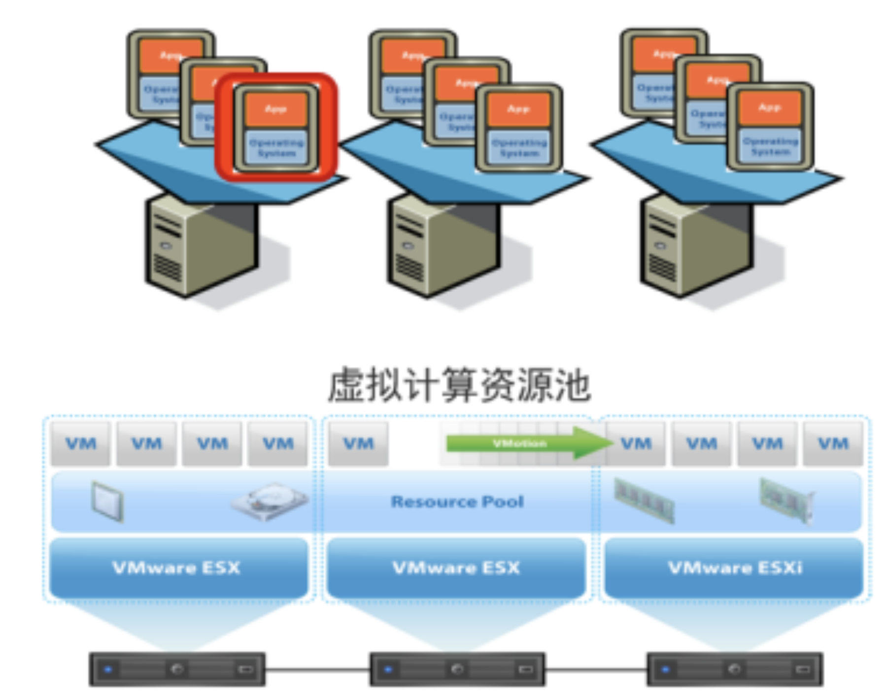

# 虚拟化技术的优势

 1.降低运营成本

　　服务器虚拟化降低了IT基础设施的运营成本，令系统管理员摆脱了繁重的物理服务器、OS、中间件及兼容性的管理工作，减少人工干预频率，使管理更加强大、便捷。

　　2.提高应用兼容性

　　服务器虚拟化提供的封装性和隔离性使大量应用独立运行于各种环境中，管理人员不需频繁根据底层环境调整应用，只需构建一个应用版本并将其发布到虚拟化后的不同类型平台上即可。

　　3.加速应用部署

　　采用服务器虚拟化技术只需输入激活配置参数、拷贝虚拟机、启动虚拟机、激活虚拟机即可完成部署，大大缩短了部署时间，免除人工干预，降低了部署成本。

　　4.提高服务可用性

　　用户可以方便地备份虚拟机，在进行虚拟机动态迁移后，可以方便的恢复备份，或者在其他物理机上运行备份，大大提高了服务的可用性。

　　5.提升资源利用率

　　通过服务器虚拟化的整合，提高了CPU、内存、存储、网络等设备的利用率，同时保证原有服务的可用性，使其安全性及性能不受影响。

　　6.动态调度资源

　　在服务器虚拟化技术中，数据中心从传统的单一服务器变成了统一的资源池，用户可以即时地调整虚拟机资源，同时数据中心管理程序和数据中心管理员可以灵活根据虚拟机内部资源使用情况灵活分配调整给虚拟机的资源。

　　7.降低能源消耗

　　通过减少运行的物理服务器数量，减少CPU以外各单元的耗电量，达到节能减排的目的。

## **不同类型的服务器虚拟化**

在服务器虚拟化世界中，实体服务器称为主机，并运行主机操作系统。每个VM都是一个来宾，并运行一个来宾操作系统。来宾彼此分隔。

通过基于标准虚拟机管理程序的虚拟化，虚拟机管理程序或虚拟机监视器（VMM）位于主机操作系统和底层硬件层之间，为来宾操作系统提供必要的资源

在安装到虚拟机之前，半虚拟化和完全虚拟化会修改客户机操作系统。由于修改后的来宾操作系统直接与虚拟机管理程序进行通信，因此可以提高性能，从而消除了仿真开销。

硬件辅助的虚拟化还试图减少虚拟机监控程序的开销，但是这样做是通过硬件扩展而不是软件修改来实现的。

## KVM内核级的虚拟机

使用内核级虚拟化，而不是使用管理程序，您可以运行单独版本的Linux内核。这使得使用用于在主要Linux内核和虚拟机之间进行通信的设备驱动程序轻松在单个主机上运行多个虚拟机。

最后，通过系统级或OS虚拟化，您可以在操作系统内核的单个实例上运行多个但逻辑上不同的环境。使用系统级虚拟化，所有VM必须共享操作系统的同一副本，而服务器虚拟化允许不同的VM具有不同的操作系统。

若是用的VMware虚拟机，则显示的是VMware

公有云的服务器，基本上都是KVM了。


目前国内的公有云底层采用的都是kvm虚拟化，经过多年的发展，kvm计算已经非常成熟，kvm已经是内核虚拟化的标配。

# KVM简介


　　KVM，基于内核的虚拟机（英语：*Kernel-based Virtual Machine*，缩写为 KVM），是一种用于Linux内核中的虚拟化基础设施，可以将Linux内核转化为一个hypervisor。KVM在2007年2月被导入Linux 2.6.20核心中，以可加载核心模块的方式被移植到FreeBSD及illumos上。

　　KVM在具备Intel VT或AMD-V功能的x86平台上运行。它也被移植到S/390，PowerPC与IA-64平台上。在Linux内核3.9版中，加入ARM架构的支持。

　　KVM目前由Red Hat等厂商开发，对CentOS/Fedora/RHEL等Red Hat系发行版支持极佳。

## 关于KVM

1. KVM是开源软件，全称是kernel-based virtual machine（基于内核的虚拟机）。
2. 是x86架构且硬件支持虚拟化技术（如 intel VT 或 AMD-V）的Linux全虚拟化解决方案。
3. 它包含一个为处理器提供底层虚拟化 可加载的核心模块kvm.ko（kvm-intel.ko或kvm-AMD.ko）。
4. KVM还需要一个经过修改的QEMU软件（qemu-kvm），作为虚拟机上层控制和界面。
5. KVM能在不改变linux或windows镜像的情况下同时运行多个虚拟机，（它的意思是多个虚拟机使用同一镜像）并为每一个虚拟机配置个性化硬件环境（网卡、磁盘、图形适配器……）同时KVM还能够使用ksm技术帮助宿主服务器节约内存。
6. 在主流的Linux内核，如2.6.20以上的内核均已包含了KVM核心。

# 安装KVM

## 系统环境说明

主机名 ip 系统 内存 硬盘

kvm01 10.0.1.50 centos7 4G 50G

**注意开启vmware里的cpu设置，开启虚拟化Intel VT-x，无论是mac，还是windows**

注意使用kvm的机器，不要使用lvm分区，否则特别卡，使用标准分区，且不需要swap分区

硬盘给大一点，因为后面要还要创建虚拟机

云服务器也都没有使用lvm

系统初始化，关闭防火墙，等

我们这里的学习架构是

```plain
vmware 创建虚拟机 > kvm01
```

## 安装kvm管理工具


　在电脑运算中，红帽公司的Virtual Machine Manager是一个虚拟机管理员，可以让用户管理多个虚拟机。

　　基于内核的虚拟机libvirt与Virtual Machine Manager。

**Virtual Machine Manager可以让用户**：

　　🎃 创建、编辑、引导或停止虚拟机。

　　🎃 查看并控制每个虚拟机的控制台。

　　🎃 查看每部虚拟机的性能以及使用率。

　　🎃 查看每部正在运行中的虚拟机以及主控端的即时性能及使用率信息。

　　🎃 不论是在本机或远程，皆可使用KVM、Xen、QEMU。

### 其他虚拟化软件

KVM只需要CPU支持虚拟化，不需要使用专门的修改内核，兼容性好，性能好

**🍪 Xen**

性能特别好，但是需要使用专门修改之后的内核，兼容性差

　　Xen是一个开放源代码虚拟机监视器，由XenProject开发。它打算在单个计算机上运行多达128个有完全功能的操作系统。

　　在旧（无虚拟硬件）的处理器上执行Xen，操作系统必须进行显式地修改（“移植”）以在Xen上运行（但是提供对用户应用的兼容性）。这使得Xen无需特殊硬件支持，就能达到高性能的虚拟化。

**🍪 QEMU**

Qemu 软件纯模拟全虚拟化，特别慢

　　QEMU是一套由Fabrice Bellard所编写的模拟处理器的自由软件。它与Bochs，PearPC近似，但其具有某些后两者所不具备的特性，如高速度及跨平台的特性。经由KVM（早期为kqemu加速器，现在kqemu已被KVM取代）这个开源的加速器，QEMU能模拟至接近真实电脑的速度。QEMU有两种主要运作模式：

　　**User mode模拟模式**，亦即是用户模式。

　　QEMU能引导那些为不同中央处理器编译的Linux程序。而Wine及Dosemu是其主要目标。

　　**System mode模拟模式**，亦即是系统模式。

　　QEMU能模拟整个电脑系统，包括中央处理器及其他周边设备。它使得为系统源代码进行测试及除错工作变得容易。其亦能用来在一部主机上模拟数部不同虚拟电脑。

## 安装命令

```plain
# 为了加速下载，可以挂载本地光盘镜像，注意要先连接dvd
[root@kvm01 ~]# mount /dev/cdrom /mnt
mount: /dev/sr0 is write-protected, mounting read-only
[root@kvm01 ~]# ls /mnt
CentOS_BuildTag  EULA  images    LiveOS    repodata              RPM-GPG-KEY-CentOS-Testing-7
EFI              GPL   isolinux  Packages  RPM-GPG-KEY-CentOS-7  TRANS.TBL
# 编写一个本地镜像仓库repo文件
[root@kvm01 yum.repos.d]# ls
bak  local.repo
[root@kvm01 yum.repos.d]# cat local.repo
[local]
name=local repo
baseurl=file:///mnt
gpgcheck=0
# 系统环境初始化安装，安装速度，非一般的感觉
yum install gcc gcc-c++ autoconf automake make zlib zlib-devel openssl openssl-devel pcre pcre-devel wget http-tools vim net-tools -y
# 安装kvm工具
yum install libvirt virt-install qemu-kvm -y 
libvirt 管理kvm虚拟机的生命周期
virt-install  创建虚拟机
qemu-kvm 使用qemu-img为虚拟机提供硬盘的工具
```

## 安装kvm虚拟机的准备

需要安装VNC工具

下载vnc软件方法，tightvnc官网：[http://www.tightvnc.com](http://www.tightvnc.com/)

　　VNC软件，用于VNC（Virtual Network Computing），为一种使用RFB协议的显示屏画面分享及远程操作软件。此软件借由网络，可发送键盘与鼠标的动作及即时的显示屏画面。

　　VNC与操作系统无关，因此可跨平台使用，例如可用Windows连接到某Linux的电脑，反之亦同。甚至在没有安装客户端程序的电脑中，只要有支持JAVA的浏览器，也可使用。

　　安装VNC时，使用默认安装即可，无需安装server端。

```plain
# 启动libvirtd
[root@kvm01 ~]# systemctl start libvirtd.service
# 启动日志
[root@kvm01 yum.repos.d]# systemctl status libvirtd.service
● libvirtd.service - Virtualization daemon
   Loaded: loaded (/usr/lib/systemd/system/libvirtd.service; enabled; vendor preset: enabled)
   Active: active (running) since Tue 2020-09-01 23:04:58 CST; 25s ago
     Docs: man:libvirtd(8)
           https://libvirt.org
 Main PID: 2254 (libvirtd)
    Tasks: 19 (limit: 32768)
   CGroup: /system.slice/libvirtd.service
           ├─2254 /usr/sbin/libvirtd
           ├─2398 /usr/sbin/dnsmasq --conf-file=/var/lib/libvirt/dnsmasq/default.conf --leasef...
           └─2400 /usr/sbin/dnsmasq --conf-file=/var/lib/libvirt/dnsmasq/default.conf --leasef...
Sep 01 23:04:58 kvm01 systemd[1]: Started Virtualization daemon.
Sep 01 23:04:59 kvm01 dnsmasq[2398]: started, version 2.76 cachesize 150
Sep 01 23:04:59 kvm01 dnsmasq[2398]: compile time options: IPv6 GNU-getopt DBus no-i18n IDN...ify
Sep 01 23:04:59 kvm01 dnsmasq-dhcp[2398]: DHCP, IP range 192.168.122.2 -- 192.168.122.254, ... 1h
Sep 01 23:04:59 kvm01 dnsmasq-dhcp[2398]: DHCP, sockets bound exclusively to interface virbr0
Sep 01 23:04:59 kvm01 dnsmasq[2398]: reading /etc/resolv.conf
Sep 01 23:04:59 kvm01 dnsmasq[2398]: using nameserver 1.2.4.8#53
Sep 01 23:04:59 kvm01 dnsmasq[2398]: read /etc/hosts - 2 addresses
Sep 01 23:04:59 kvm01 dnsmasq[2398]: read /var/lib/libvirt/dnsmasq/default.addnhosts - 0 ad...ses
Sep 01 23:04:59 kvm01 dnsmasq-dhcp[2398]: read /var/lib/libvirt/dnsmasq/default.hostsfile
Hint: Some lines were ellipsized, use -l to show in full.
# libvirt启动还带着dhcp服务，用于给kvm虚拟机分配ip
```

安装完毕vnc客户端即可

## 创建第一个KVM虚拟机

创建命令

注意，要先吧镜像文件，拷贝到`/data/CentOS-7-x86_64-DVD-1804.iso`

镜像可以找超哥要

上传镜像

```plain
# 客户端本地上传,windows可以使用xftp上传，不要使用lrzsz会报错
[yuchao@yumac 软件包]$scp CentOS-7-x86_64-DVD-1804.iso root@10.0.1.50:/data/
root@10.0.1.50's password:
CentOS-7-x86_64-DVD-1804.iso                                                    100% 4263MB  61.5MB/s   01:09
[yuchao@yumac 软件包]$
# linux服务端检查
[root@kvm01 data]# ll -h
total 4.2G
-rwxr-xr-x 1 root root 4.2G Sep  1 23:18 CentOS-7-x86_64-DVD-1804.iso
```

参数解释

| **参数**                                    | **参数说明**                                                 |
| ------------------------------------------- | ------------------------------------------------------------ |
| **--virt-type HV_TYPE**                     | 要使用的管理程序名称 (kvm, qemu, xen, ...)                   |
| **--os-type**                               | 系统类型                                                     |
| **--os-variant DISTRO_VARIANT**             | 在客户机上安装的操作系统，例如：'fedora18'、'rhel6'、'winxp' 等。 |
| **-n NAME, --name NAME**                    | 客户机实例名称                                               |
| **--memory MEMORY**                         | 配置客户机虚拟内存大小                                       |
| **--vcpus VCPUS**                           | 配置客户机虚拟 CPU(vcpu) 数量。                              |
| **--disk DISK**                             | 指定存储的各种选项。                                         |
| **-cdrom CDROM**                            | 光驱安装介质                                                 |
| **-w NETWORK, --network NETWORK**           | 配置客户机网络接口。                                         |
| **--graphics GRAPHICS**                     | 配置客户机显示设置，linux默认黑屏，指定用vnc输出图形化       |
| **虚拟化平台选项:**                         |                                                              |
| **-v, --hvm**                               | 这个客户机应该是一个全虚拟化客户机                           |
| **-p, --paravirt**                          | 这个客户机应该是一个半虚拟化客户机                           |
| **--container**                             | 这个客户机应该是一个容器客户机                               |
| **--virt-type HV_TYPE**                     | 要使用的管理程序名称 (kvm, qemu, xen, ...)                   |
| **--arch ARCH**                             | 模拟 CPU 架构                                                |
| **--machine MACHINE**                       | 机器类型为仿真类型                                           |
| **其它选项:**                               |                                                              |
| **--noautoconsole**                         | 不要自动尝试连接到客户端控制台                               |
| **--autostart**                             | 主机启动时自动启动域。                                       |
| **--noreboot**                              | 安装完成后不启动客户机。                                     |
| 以上信息通过 " virt-install --help " 获得。 |                                                              |

创建虚拟机命令

```plain
# 命令如下，这一系列命令，就如同vmware创建虚拟机时候的下一步，下一步选项
virt-install --virt-type kvm --os-type=linux --os-variant rhel7 --name centos7 --memory 1024 --vcpus 1 --disk /data/centos2.raw,format=raw,size=10 --cdrom /data/CentOS-7-x86_64-DVD-1804.iso --network network=default --graphics vnc,listen=0.0.0.0,port=5900 --noautoconsole
```

如果参数写错了，或者cpu未开启虚拟化支持，都会报错

正确结果如下

```plain
[root@kvm01 data]# virt-install --virt-type kvm --os-type=linux --os-variant rhel7 --name centos7 --memory 1024 --vcpus 1 --disk /data/centos2.raw,format=raw,size=10 --cdrom /data/CentOS-7-x86_64-DVD-1804.iso --network network=default --graphics vnc,listen=0.0.0.0,port=5900 --noautoconsole
Starting install...
Allocating 'centos2.raw'                                                  |  10 GB  00:00:00
Domain installation still in progress. You can reconnect to
the console to complete the installation process.
```

注意，开启后，有60s的时间，抓紧打开vpn进行连接，因为要进行系统安装


连接vpn后，看到正确的系统安装页面


装系统和以前没有区别，区别在于分区的时候，kvm的虚拟机不需要swap分区，直接所有的容量都给根目录即可。

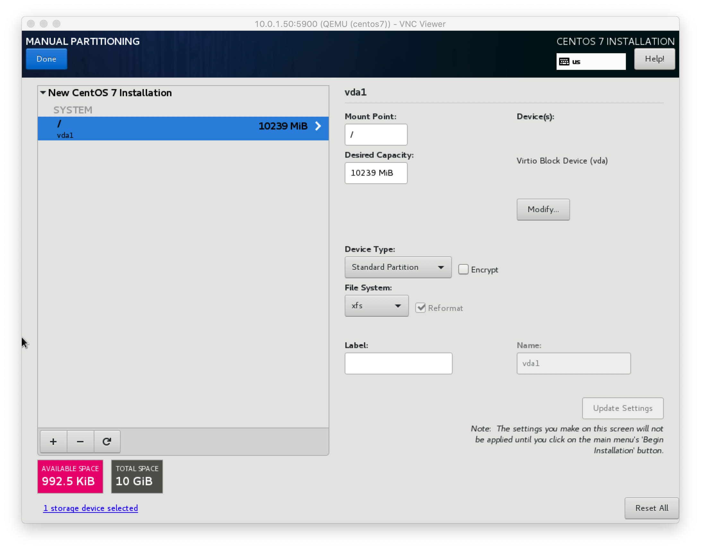

最终虚拟机安装界面

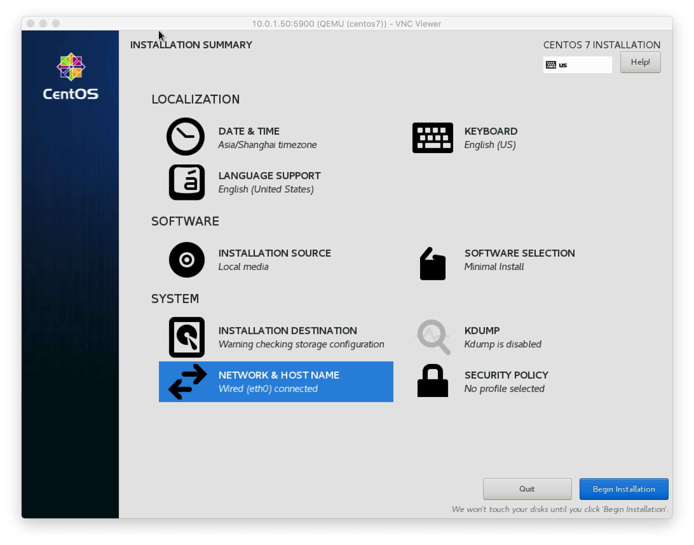

等待安装完毕，安装完毕后，会自动重启，重新开机即可vnc远程连接使用

```plain
[root@kvm01 data]# virsh  start centos7
Domain centos7 started
[root@kvm01 data]# virsh vncdisplay centos7
:0
# 端口默认从5900开始，以此类推 5901
```

装好的kvm虚拟机，vnc远程连接，你用或者不用，它不关机都在哪里。。


# kvm虚拟机管理

virsh命令常用参数总结

| **参数**                            | **参数说明**                                 |
| ----------------------------------- | -------------------------------------------- |
| **基础操作**                        |                                              |
| **list**                            | 查看虚拟机列表，列出域                       |
| **start**                           | 启动虚拟机，开始一个（以前定义的）非活跃的域 |
| **shutdown**                        | 关闭虚拟机，关闭一个域                       |
| **destroy(\****危险)**              | 强制关闭虚拟机，销毁（停止）域               |
| **vncdisplay**                      | 查询虚拟机vnc端口号                          |
| **配置管理操作**                    |                                              |
| **dumpxml**                         | 导出主机配置信息                             |
| **undefine**                        | 删除主机                                     |
| **define**                          | 导入主机配置                                 |
| **domrename**                       | 对虚拟机进行重命名                           |
| **挂起与恢复**                      |                                              |
| **suspend**                         | 挂起虚拟机                                   |
| **resume**                          | 恢复虚拟机                                   |
| **自启动管理**                      |                                              |
| **autostart**                       | 虚拟机开机启动                               |
| **autostart --disable**             | 取消虚拟机开机启动                           |
| **以上参数通过virsh --help** 获得。 |                                              |

## kvm虚拟机操作过程

kvm虚拟机配置文件位置

```plain
[root@kvm01 data]# ll /etc/libvirt/qemu/centos7.xml
-rw------- 1 root root 3907 Sep  1 23:36 /etc/libvirt/qemu/centos7.xml
```

修改虚拟机配置命令

```plain
[root@kvm01 data]# virsh edit centos7
Domain centos7 XML configuration not changed.
```

**使用该命令可以对文件进行语法校验，改错了会自动提示**

### 备份与恢复虚拟机

```plain
1.备份虚拟机配置，注意关机时备份
[root@kvm01 data]# virsh dumpxml centos7 > bak_centos7.xml
2.列出所有虚拟机状态
[root@kvm01 data]# virsh list --all
 Id    Name                           State
----------------------------------------------------
 -     centos7                        shut off
3.删除虚拟机配置，注意删除命令，做好备份后再执行
[root@kvm01 data]# virsh undefine centos7
Domain centos7 has been undefined # centos7已经被取消定义
4.导入虚拟机，从xml配置文件，再次导入
[root@kvm01 data]# virsh define bak_centos7.xml
Domain centos7 defined from bak_centos7.xml
再次查看
[root@kvm01 data]# virsh list --all
 Id    Name                           State
----------------------------------------------------
 -     centos7                        shut off
 5.给虚拟机重命名
 [root@kvm01 data]# virsh domrename centos7 cckvm7
Domain successfully renamed
[root@kvm01 data]# virsh list --all
 Id    Name                           State
----------------------------------------------------
 -     cckvm7                         shut off
 6.虚拟机的开机和关机
 [root@kvm01 data]# virsh start cckvm7
Domain cckvm7 started
[root@kvm01 data]# virsh list
 Id    Name                           State
----------------------------------------------------
 3     cckvm7                         running
 开机后可以远程vpn连接
# 关机
[root@kvm01 data]# virsh shutdown cckmv7
# 危险命令，强制关闭虚拟机且摧毁，直接拔电源
[root@kvm01 data]# virsh destroy cckvm7
Domain cckvm7 destroyed
# 若是该虚拟机不在使用了，可以删除，轻易别删除，否则还得在安装
[root@kvm01 data]# virsh undefine cckvm7
Domain cckvm7 has been undefined
7.虚拟机的挂起和恢复
[root@kvm01 data]# virsh suspend centos7
Domain centos7 suspended
[root@kvm01 data]# virsh list  
 Id    Name                           State
----------------------------------------------------
 6     centos7                        paused        # 此时是暂停的状态了
# 重新恢复虚拟机
[root@kvm01 data]# virsh resume centos7
Domain centos7 resumed
[root@kvm01 data]# virsh list
 Id    Name                           State
----------------------------------------------------
 6     centos7                        running
 8.查询虚拟机端口
 [root@kvm01 data]# virsh vncdisplay centos7
:0
# :0 即 为 5900 端口，以此类推 :1为5901 。
[root@kvm01 data]# netstat -tunlp
Active Internet connections (only servers)
Proto Recv-Q Send-Q Local Address           Foreign Address         State       PID/Program name
tcp        0      0 0.0.0.0:5900            0.0.0.0:*               LISTEN      3205/qemu-kvm
9.设置kvm开机自启
[root@kvm01 data]# systemctl enable libvirtd
[root@kvm01 data]# systemctl is-enabled libvirtd
enabled
10.设置虚拟机开机自启
[root@kvm01 data]# virsh autostart centos7
Domain centos7 marked as autostarted
# 其实这条命令是设置了软连接
[root@kvm01 data]# ll /etc/libvirt/qemu/autostart/centos7.xml
lrwxrwxrwx 1 root root 29 Sep  2 00:40 /etc/libvirt/qemu/autostart/centos7.xml -> /etc/libvirt/qemu/centos7.xml
# 取消开机自启，软连接也就删除了
[root@kvm01 data]# virsh  autostart --disable centos7
Domain centos7 unmarked as autostarted
```

# kvm虚拟机console登录

1：常规情况下，安装完 KVM 之后，可能都会通过 VNC 连接到 KVM 虚拟机里面去修改 IP 等信息。但是一旦虚拟机比较多的话，打开过多的端口会造成安全问题

2：很多时候，我们是通过跳板机连接的宿主机，你的window和kvm宿主机没有直达的路由，这时候vnc都用不了，如何快速进入到 KVM 虚拟机里面去排查问题呢？

答案是，可以使用console功能登录kvm虚拟机。

## terminal和console的区别

terminal是支持彩色显示，将主机的程序输出在屏幕上的一个设备。

但是在系统正确启动之前，terminal是无法连接到主机的，为了记录出主机开机过程日志，便于调试维护，也就多了一个控制台的功能，一台计算机只有一个控制台，也就是console功能了。

默认console功能是无法使用的，需要修改服务器配置。

## centos7配置console登录

```plain
1.进入kvm虚拟机内，执行如下命令，先登录kvm虚拟机
[root@kvm01 data]# ssh root@192.168.122.60
The authenticity of host '192.168.122.60 (192.168.122.60)' can't be established.
ECDSA key fingerprint is SHA256:2/5RZL0Kwpq8TyHmT2mxOoA8tiMEZSoeSn7ZZGv797Y.
ECDSA key fingerprint is MD5:0c:77:0c:b8:cf:a4:b6:ad:bc:4e:63:e4:cf:68:0f:50.
Are you sure you want to continue connecting (yes/no)? yes
Warning: Permanently added '192.168.122.60' (ECDSA) to the list of known hosts.
root@192.168.122.60's password:
Last login: Wed Sep  2 00:25:39 2020
[root@localhost ~]#
2.登录进来后，执行命令
[root@localhost ~]# grubby --update-kernel=ALL --args="console=ttyS0,115200n8"
[root@localhost ~]# reboot
Connection to 192.168.122.60 closed by remote host.
Connection to 192.168.122.60 closed.
```

进入kvm的console界面

```plain
[root@kvm01 data]# virsh console centos7
```

若是想要退出console，需要执行组合键`ctrl + ]`


# kvm磁盘&快照&克隆

# KVM虚拟机磁盘格式转换

刚才我们发现，kvm创建的虚拟机文件，如下格式

```plain
[root@kvm01 data]# ls
centos2.raw  CentOS-7-x86_64-DVD-1804.iso
```

这个raw就是我们的虚拟机文件

有关虚拟机文件的其他格式还有

## raw

官方解释：（默认）原始格式是光盘映像的纯二进制映像，并且非常便于移植。 在支持稀疏文件的文件系统上，这种格式的图像仅使用记录在其中的数据实际使用的空间。

raw格式的镜像文件，特点就是赤裸裸，占用空间较大，不适合远程传输，不支持快照snapshot功能，但是性能较好。

KVM和XEN默认的镜像格式就是raw，好处在于例如需要转换为其他格式的虚拟机镜像是很简单的。

从空间使用上来看，raw镜像很像磁盘，使用多少即是多少，例如

```plain
[root@kvm01 data]# du -h centos2.raw
1.8G    centos2.raw
```

但是如果要把整块磁盘都拿走的话，就得全盘操作，例如copy镜像，就是拷贝10G大小，非常消耗网络宽带和I/O。

还有一个特点就是，如果raw格式的虚拟机磁盘不够用了，可以在原有磁盘上直接追加空间，比较犀利。

## cow

官方解释：写入时复制格式，仅出于历史原因受支持，并且不适用于Windows上的QEMU

该格式被遗弃，后来被qcow格式取代。

## qcow

copy on write，写入时复制，占用空间小，适合传输，支持快照，但是性能比raw差一点。

## qcow2

目前比较主流的虚拟化镜像格式，性能接近raw的裸格式，有如下特点：

- 更小的存储空间
- 支持snapshot，快照，且可以管理历史快照
- 支持zlib磁盘压缩
- 支持AES加密

## vmdk

这是vmware创建的虚拟机镜像文件格式，我们可以点开自己的虚拟机目录看一下即可。

vmdk格式无论是从性能，还是功能，快照等，都是非常出色的。

## 练习管理磁盘映像文件

```plain
# 创建qcow2格式磁盘文件  -f 指定镜像格式  指定磁盘大小是2G
[root@kvm01 data]# qemu-img create -f qcow2 chaoge.qcow2 2G
Formatting 'chaoge.qcow2', fmt=qcow2 size=2147483648 encryption=off cluster_size=65536 lazy_refcounts=off
# 查看当前虚拟机信息
[root@kvm01 data]# qemu-img info centos2.raw
image: centos2.raw
file format: raw
virtual size: 10G (10737418240 bytes)
disk size: 1.7G
# 查看我们自己创建的qcow2磁盘文件信息
[root@kvm01 data]# qemu-img info chaoge.qcow2
image: chaoge.qcow2
file format: qcow2
virtual size: 2.0G (2147483648 bytes)
disk size: 196K
cluster_size: 65536
Format specific information:
    compat: 1.1
    lazy refcounts: false
# 调整磁盘映像文件大小
[root@kvm01 data]# qemu-img resize chaoge.qcow2 +5G
Image resized.
# 磁盘映像格式转换
-f 指定源格式  -O 指定输出格式 
[root@kvm01 data]# qemu-img convert -f qcow2 -O raw chaoge.qcow2 chaoge.raw
```

## 转换现有虚拟机磁盘格式

```plain
# 现有虚拟机磁盘文件
[root@kvm01 data]# ll
total 6175880
-rw------- 1 qemu qemu 10737418240 Sep  2 15:30 centos2.raw
-rwxr-xr-x 1 qemu qemu  4470079488 Sep  1 23:18 CentOS-7-x86_64-DVD-1804.iso
-rw-r--r-- 1 root root      262656 Sep  2 15:19 chaoge.qcow2
-rw-r--r-- 1 root root  7516192768 Sep  2 15:32 chaoge.raw
# 关闭虚拟机
[root@kvm01 data]# virsh shutdown centos7
Domain centos7 is being shutdown
# 查看虚拟机配置信息，用的磁盘文件是那个一个
[root@kvm01 data]# virsh edit centos7
Domain centos7 XML configuration not changed.
找到配置  <source file='/data/centos2.raw'/>
# 转换磁盘格式
# 注意区别，源格式是raw，看下容量是
[root@kvm01 data]# ll |grep centos2
total 6175880
-rw------- 1 root root 10737418240 Sep  2 15:40 centos2.raw
# 转换格式命令
[root@kvm01 data]# qemu-img convert -f raw -O qcow2 centos2.raw centos7.qcow2
# 转换后的容量
[root@kvm01 data]# ll -h|grep centos7
-rw-r--r-- 1 root root 1.8G Sep  2 15:43 centos7.qcow2
# 转换后得修改虚拟机配置文件，让其读取新的磁盘映像文件
[root@kvm01 data]# virsh edit centos7
Domain centos7 XML configuration edited.
需要修改的参数
      <driver name='qemu' type='qcow2'/>
      <source file='/data/centos7.qcow2'/>
# 可以删除旧的raw磁盘文件，查看是否会读取新的qcow2格式磁盘，正确启动虚拟机
[root@kvm01 data]# rm -rf centos2.raw
[root@kvm01 data]# virsh start centos7
Domain centos7 started
# 此时我们可以用vnc或者ssh或者console登录kvm虚拟机都可以，然后写入文件，查看磁盘镜像大小
[root@kvm01 data]# ssh root@192.168.122.60
root@192.168.122.60's password:
Last login: Wed Sep  2 15:47:03 2020 from gateway
[root@localhost ~]# dd if=/dev/zero of=/tmp/test.raw bs=500M count=1
# 刷新磁盘容量
[root@localhost ~]# sync
# 退出虚拟机后，再次查看磁盘镜像空间大小，qcow2格式就是用多少空间，占多少空间，写入时复制
[root@kvm01 data]# ll -h |grep centos7
-rw-r--r-- 1 qemu qemu 2.2G Sep  2 15:52 centos7.qcow2
```

# KVM虚拟机添加硬盘

```plain
1.进入磁盘目录，创建一个新的硬盘
[root@kvm01 data]# qemu-img create -f qcow2 chaoge-add01.qcow2 3G
Formatting 'chaoge-add01.qcow2', fmt=qcow2 size=3221225472 encryption=off cluster_size=65536 lazy_refcounts=off
2.查看创建的磁盘信息
[root@kvm01 data]# qemu-img info chaoge-add01.qcow2
image: chaoge-add01.qcow2
file format: qcow2
virtual size: 3.0G (3221225472 bytes)
disk size: 196K
cluster_size: 65536
Format specific information:
    compat: 1.1
    lazy refcounts: false
3.为虚拟机添加硬盘
# 先关机
[root@kvm01 data]# virsh shutdown centos7
Domain centos7 is being shutdown
# 可以热添加硬盘，无须关机
[root@kvm01 data]#  virsh attach-disk centos7 /data/chaoge-add01.qcow2 vdb --live --cache=none --subdriver=qcow2
Disk attached successfully
4.可以进入kvm虚拟机内，查看磁盘信息，发现多了一块vdb磁盘，3G大小
[root@localhost ~]# fdisk -l
Disk /dev/vda: 10.7 GB, 10737418240 bytes, 20971520 sectors
Units = sectors of 1 * 512 = 512 bytes
Sector size (logical/physical): 512 bytes / 512 bytes
I/O size (minimum/optimal): 512 bytes / 512 bytes
Disk label type: dos
Disk identifier: 0x000afefe
   Device Boot      Start         End      Blocks   Id  System
/dev/vda1   *        2048    20971519    10484736   83  Linux
Disk /dev/vdb: 3221 MB, 3221225472 bytes, 6291456 sectors
Units = sectors of 1 * 512 = 512 bytes
Sector size (logical/physical): 512 bytes / 512 bytes
I/O size (minimum/optimal): 512 bytes / 512 bytes
5.若是磁盘空间不足，想要调整磁盘大小，可以卸载，重新调整磁盘大小
[root@kvm01 data]# virsh detach-disk centos7 vdb
Disk detached successfully
# 卸载后，kvm虚拟机内的磁盘也就消失了。
6.增加磁盘容量，刚才是3G，再加两G
[root@kvm01 data]# qemu-img resize chaoge-add01.qcow2 +2G
Image resized.
7.重新添加磁盘给kvm虚机
[root@kvm01 data]# virsh attach-disk centos7 /data/chaoge-add01.qcow2 vdb --live --cache=none --subdriver=qcow2
Disk attached successfully
# 可以进入kvm再次查看，虚拟机磁盘
[root@localhost ~]# fdisk -l|grep vdb
Disk /dev/vdb: 5368 MB, 5368709120 bytes, 10485760 sectors
8.在虚拟机内，可以对磁盘进行格式化使用
[root@localhost ~]# mkfs.xfs /dev/vdb
meta-data=/dev/vdb               isize=512    agcount=4, agsize=327680 blks
         =                       sectsz=512   attr=2, projid32bit=1
         =                       crc=1        finobt=0, sparse=0
data     =                       bsize=4096   blocks=1310720, imaxpct=25
         =                       sunit=0      swidth=0 blks
naming   =version 2              bsize=4096   ascii-ci=0 ftype=1
log      =internal log           bsize=4096   blocks=2560, version=2
         =                       sectsz=512   sunit=0 blks, lazy-count=1
realtime =none                   extsz=4096   blocks=0, rtextents=0
挂载磁盘使用
[root@localhost ~]# mount /dev/vdb  /mnt
[root@localhost ~]# df -h |grep vdb
/dev/vdb        5.0G   33M  5.0G   1% /mnt
# 刷新centos7磁盘信息
[root@localhost ~]# xfs_growfs /mnt
meta-data=/dev/vdb               isize=512    agcount=4, agsize=327680 blks
         =                       sectsz=512   attr=2, projid32bit=1
         =                       crc=1        finobt=0 spinodes=0
data     =                       bsize=4096   blocks=1310720, imaxpct=25
         =                       sunit=0      swidth=0 blks
naming   =version 2              bsize=4096   ascii-ci=0 ftype=1
log      =internal               bsize=4096   blocks=2560, version=2
         =                       sectsz=512   sunit=0 blks, lazy-count=1
realtime =none                   extsz=4096   blocks=0, rtextents=0
```

| **参数**        | **参数说明** |
| --------------- | ------------ |
| **vdb**         | 第二块硬盘   |
| **--live**      | 热添加       |
| **--subdriver** | 驱动类型     |

# KVM快照管理

注意：raw格式的磁盘无法创建快照，不支持。

想要使用快照功能，磁盘格式必须是qcow2

就好比我们使用vmware的快照功能，现在转化为命令行了

kvm快照命令参数

```plain
使用virsh进行KVM虚拟机快照相关命令：
    iface-begin                       创建一个当前网卡的快照，它可以用来稍后提交或者恢复
    snapshot-create                创建一个快照
    snapshot-create-as           使用一组参数创建一个快照
    snapshot-current              取得当前快照的集合
    snapshot-delete                删除一个快照
    snapshot-dumpxml          从一个虚拟机的快照导出xml文件
    snapshot-edit                   编辑一个快照的xml文件
    snapshot-info                   快照信息
    snapshot-list                     列出虚拟机的快照列表
    snapshot-parent               获取一个快照的父快照名称
    snapshot-revert                将虚拟机恢复到一个快照
```

实践

```plain
1.创建快照
[root@kvm01 data]# virsh snapshot-create centos7
Domain snapshot 1599034267 created
2.查看快照列表
[root@kvm01 data]# virsh snapshot-list centos7
 Name                 Creation Time             State
------------------------------------------------------------
 1599034267           2020-09-02 16:11:07 +0800 running
3.查看快照信息
[root@kvm01 data]# virsh snapshot-info centos7 --snapshotname  1599034267
Name:           1599034267
Domain:         centos7
Current:        yes
State:          running
Location:       internal
Parent:         -
Children:       0
Descendants:    0
Metadata:       yes
4.登录虚拟机，进行删修改作，然后可以用快照还原
[root@kvm01 data]# ssh root@192.168.122.60
[root@localhost opt]# ls
a.txt  c.txt  e.txt  g.txt  i.txt  k.txt  m.txt  o.txt  q.txt  s.txt  u.txt  w.txt  y.txt
b.txt  d.txt  f.txt  h.txt  j.txt  l.txt  n.txt  p.txt  r.txt  t.txt  v.txt  x.txt  z.txt
5.还原快照
[root@kvm01 data]# virsh snapshot-revert centos7 --snapshotname 1599034267
6.再次进入kvm虚机，查看文件内容，已经还原
[root@localhost ~]# cd /opt/
[root@localhost opt]# ls
[root@localhost opt]#
7.快照管理
[root@kvm01 data]# ll /var/lib/libvirt/qemu/snapshot/centos7/
total 8
-rw------- 1 root root 5032 Sep  2 16:34 1599034267.xml
8.删除快照
[root@kvm01 data]# virsh snapshot-delete centos7 --snapshotname 1599034267
Domain snapshot 1599034267 deleted
[root@kvm01 data]# ll /var/lib/libvirt/qemu/snapshot/centos7/
total 0
```

# KVM虚拟机克隆

复制一个虚拟机，需修改如 MAC 地址，名称等所有主机端唯一的配置。

虚拟机的内容并没有改变：virt-clone 不修改任何客户机系统内部的配置，它只复制磁盘和主机端的修改。

所以像修改密码，修改静态 IP 地址等操作都在本工具复制范围内。

如何修改此类型的配置，请参考 virt-sysprep。

克隆命令

```plain
# 克隆时，虚拟机必须关闭
[root@kvm01 data]# virt-clone --auto-clone -o centos7
ERROR    Domain with devices to clone must be paused or shutoff.
# 克隆开始
[root@kvm01 data]# virt-clone --auto-clone -o centos7
WARNING  Setting the graphics device port to autoport, in order to avoid conflicting.
Allocating 'centos7-clone.qcow2'                20% [=======                              ] 206 MB/s | 2.0 GB  00:00:39 ETA
# 克隆完成
[root@kvm01 data]# virt-clone --auto-clone -o centos7
WARNING  Setting the graphics device port to autoport, in order to avoid conflicting.
Allocating 'centos7-clone.qcow2'                                                                     |  10 GB  00:00:09
Allocating 'chaoge-add01-clone.qcow2'                                                                | 5.0 GB  00:00:00
Clone 'centos7-clone' created successfully.
# 克隆猴，会生成新的磁盘文件
[root@kvm01 data]# ll
total 8727752
-rw------- 1 root root 1830289408 Sep  2 17:13 centos7-clone.qcow2
-rw-r--r-- 1 root root 2624389120 Sep  2 16:47 centos7.qcow2
# 启动克隆后的虚机
[root@kvm01 data]# virsh start centos7-clone
Domain centos7-clone started
[root@kvm01 data]# virsh list
 Id    Name                           State
----------------------------------------------------
 9     centos7-clone                  running
# 修改克隆的虚机名称，可以当做第二个虚机使用，注意得关机后改名
[root@kvm01 data]# virsh domrename centos7-clone cc-centos7
Domain successfully renamed
# 对比虚机配置文件差异
配置文件目录
[root@kvm01 data]# ll /etc/libvirt/qemu/
total 16
drwxr-xr-x 2 root root    6 Sep  2 00:40 autostart
-rw------- 1 root root 4359 Sep  2 17:13 cc-centos7.xml
-rw------- 1 root root 4342 Sep  2 16:34 centos7.xml
drwx------ 3 root root   42 Sep  1 23:04 networks
# 导出配置文件，对比配置信息
[root@kvm01 data]# virsh dumpxml centos7 > centos7.xml.dump
[root@kvm01 data]# virsh dumpxml cc-centos7 > cc.xml.dump
[root@kvm01 data]# vimdiff centos7.xml.dump cc.xml.dump
2 files to edit
```

| **参数**                                          | **参数说明**                                   |
| ------------------------------------------------- | ---------------------------------------------- |
| **--auto-clone**                                  | 从原始客户机配置中自动生成克隆名称和存储路径。 |
| **-o ORIGINAL_GUEST,**--original ORIGINAL_GUEST** | 原始客户机名称；必须为关闭或者暂停状态。       |


# kvm网络&迁移

# KVM桥接

我们运行虚拟机的目的是，在虚拟机中运行我们的业务，现在业务所需要的服务都已经运行了，可是除了在宿主机上能访问，其他人都访问不了！！！

我们会利用kvm，创建虚拟机，运行业务服务，如tomcat，lnmp，mysql等等

```plain
[root@kvm01 data]# virsh start centos7
Domain centos7 started
[root@kvm01 data]# virsh list
 Id    Name                           State
----------------------------------------------------
 11    centos7                        running
[root@kvm01 data]# virsh vncdisplay centos7
:0
# 进入虚机，启动一个web服务
[root@localhost ~]# curl -I  127.0.0.1
HTTP/1.1 200 OK
Server: nginx/1.16.1
Date: Wed, 02 Sep 2020 11:29:42 GMT
Content-Type: text/html
Content-Length: 4833
Last-Modified: Fri, 16 May 2014 15:12:48 GMT
Connection: keep-alive
ETag: "53762af0-12e1"
Accept-Ranges: bytes
# 离开了虚机，就无法访问nginx了
```

因此，我们得配置虚机网络，否则虚机也就没有意义了

# 配置kvm桥接

桥接网络，大家应该都还记得，也就是和宿主机处于同一个网络环境。我们vmware里是常用桥接的。

```plain
1.创建桥接网络，在宿主机上执行，注意这个ens33，是根据你宿主机的网卡名字来写，然后创建br0网络
[root@kvm01 ~]# virsh iface-bridge ens33  br0
2.执行后网络会自动重启，网卡配置文件会自动被修改
[root@kvm01 ~]# cat /etc/sysconfig/network-scripts/ifcfg-ens33
DEVICE=ens33
ONBOOT=yes
BRIDGE="br0"
[root@kvm01 ~]# cat /etc/sysconfig/network-scripts/ifcfg-br0
DEVICE="br0"
ONBOOT="yes"
TYPE="Bridge" # 以前是以太网，现在是桥接模式了
BOOTPROTO="none"
IPADDR="10.0.1.50"
NETMASK="255.255.255.0"
GATEWAY="10.0.1.2"
IPV6INIT="yes"
IPV6_AUTOCONF="yes"
DHCPV6C="no"
STP="on"
DELAY="0"
3.查看宿主机网桥信息
[root@kvm01 ~]# brctl show
bridge name    bridge id        STP enabled    interfaces
br0        8000.000c29610466    yes        ens33
                            vnet0
virbr0        8000.525400e8129d    yes        virbr0-nic
```

修改虚机配置

```plain
3.基于桥接网络创建虚机，或者修改当前虚机，使用桥接网络
修改虚机配置文件
# 修改前配置
     77     <interface type='network'>
     78       <mac address='52:54:00:92:78:2b'/>
     79       <source network='default'/>
     80       <model type='virtio'/>
     81       <address type='pci' domain='0x0000' bus='0x00' slot='0x03' function='0x0'/>
     82     </interface>
# 修改后配置
    <interface type='bridge'>
      <mac address='52:54:00:92:78:2b'/>
      <source bridge='br0'/>
      <model type='virtio'/>
      <address type='pci' domain='0x0000' bus='0x00' slot='0x03' function='0x0'/>
    </interface>
 4.查看虚机端口
 [root@kvm01 ~]# virsh vncdisplay centos7
:0
```

## 注意网络环境

我们要注意的是，在kvm虚机默认网络情况下，是dhcp动态分配的192.168网段地址

那么现在，我们配置kvm虚机和宿主机进行网络桥接，处于同一个网段

**那么，如果你的宿主机是动态分配ip地址，那完全没问题，虚机会自动分配ip**

**如果你的宿主机是分配静态ip地址，kvm虚机也得配置静态ip**

```plain
超哥这里的网络环境是，宿主机使用的是自定义nat，设置静态ip
# 超哥的kvm虚机网络配置文件
[root@localhost ~]# cat /etc/sysconfig/network-scripts/ifcfg-eth0
TYPE="Ethernet"
PROXY_METHOD="none"
BROWSER_ONLY="no"
BOOTPROTO="static"
DEFROUTE="yes"
IPV4_FAILURE_FATAL="no"
IPV6INIT="yes"
IPV6_AUTOCONF="yes"
IPV6_DEFROUTE="yes"
IPV6_FAILURE_FATAL="no"
IPV6_ADDR_GEN_MODE="stable-privacy"
NAME="eth0"
UUID="d684faa2-5a62-4065-94e3-68769f9ffcee"
DEVICE="eth0"
ONBOOT="yes"
IPADDR="10.0.1.51"
NETMASK=255.255.255.0
GATEWAY=10.0.1.2
DNS1=1.2.4.8
# 重启网络即可
[root@localhost ~]# systemctl restart network
# 注意，一个坑，关闭kvm虚机内的防火墙
[root@localhost ~]# iptables -F
[root@localhost ~]# setenforce 0 # 注意去永久关闭
[root@localhost ~]# systemctl stop firewalld
[root@localhost ~]# systemctl disable firewalld
Removed symlink /etc/systemd/system/multi-user.target.wants/firewalld.service.
Removed symlink /etc/systemd/system/dbus-org.fedoraproject.FirewallD1.service.
# 修改nginx页面
[root@localhost ~]# echo "<meta charset=utf-8> 超哥教你学kvm" > /usr/share/nginx/html/index.html
```

## 一定注意关闭kvm虚机的防火墙

## 此时已经可以正确访问虚机内服务


## kvm网络拓扑图

默认网络，default，nat模式


桥接模式


# kvm热添加技术

热添加技术就是不停机的情况下，在线热添加硬盘，内存，cpu，网卡等设备，热添加技术一般都是在虚拟机资源不够了，又不能停机的情况下使用的，热添加技术是虚拟机相对于物理机的一个很大的优势，它让资源分配变得更灵活！

```plain
1.创建硬盘
[root@kvm01 data]# qemu-img create -f qcow2 centos7-add01.qcow2 5G
Formatting 'centos7-add01.qcow2', fmt=qcow2 size=5368709120 encryption=off cluster_size=65536 lazy_refcounts=off
2.查看新硬盘信息
[root@kvm01 data]# qemu-img info centos7-add01.qcow2
image: centos7-add01.qcow2
file format: qcow2
virtual size: 5.0G (5368709120 bytes)
disk size: 196K
cluster_size: 65536
Format specific information:
    compat: 1.1
    lazy refcounts: false
3.检查虚机内硬盘信息
[root@kvm01 ~]# !ssh
ssh root@10.0.1.51
root@10.0.1.51's password:
Last login: Wed Sep  2 20:15:42 2020 from 10.0.1.50
# 虚机内的信息
[root@localhost ~]# fdisk -l
Disk /dev/vda: 10.7 GB, 10737418240 bytes, 20971520 sectors
Units = sectors of 1 * 512 = 512 bytes
Sector size (logical/physical): 512 bytes / 512 bytes
I/O size (minimum/optimal): 512 bytes / 512 bytes
Disk label type: dos
Disk identifier: 0x000afefe
   Device Boot      Start         End      Blocks   Id  System
/dev/vda1   *        2048    20971519    10484736   83  Linux
Disk /dev/vdb: 5368 MB, 5368709120 bytes, 10485760 sectors
Units = sectors of 1 * 512 = 512 bytes
Sector size (logical/physical): 512 bytes / 512 bytes
I/O size (minimum/optimal): 512 bytes / 512 bytes
4.发现虚机内已经是2块硬盘了，注意硬盘的名字
# 新添加硬盘，名字是vdc，热添加（开机时添加），驱动名字是qcow2
[root@kvm01 data]# virsh attach-disk centos7 /data/centos7-add01.qcow2 vdc --live --cache=none --subdriver=qcow2
Disk attached successfully
5.再去虚机内查看信息
[root@localhost ~]# fdisk -l |grep "/dev/vd*"
Disk /dev/vda: 10.7 GB, 10737418240 bytes, 20971520 sectors
/dev/vda1   *        2048    20971519    10484736   83  Linux
Disk /dev/vdb: 5368 MB, 5368709120 bytes, 10485760 sectors
Disk /dev/vdc: 5368 MB, 5368709120 bytes, 10485760 sectors
6.我们可以给硬盘进行分区，格式化文件系统，挂载使用
也可以不分区，直接格式化使用，查看是否可以使用磁盘皆可。
这跟农民伯伯种地是一个道理。
把一亩地分成十个畦是为了浇水的时候方便，但是这不意味这不分畦就不能种庄稼。
```

# 热添加网卡

我们这些操作，都是纯命令行操作，若是vmware这样的软件，提供了图形化点击，就简单多了

```plain
1.命令,注意命令的正确
[root@kvm01 data]# virsh attach-interface centos7 --type bridge --model virtio --source br0
Interface attached successfully
2.添加完了之后，ssh远程检查虚机内配置
[root@kvm01 data]# ssh root@10.0.1.51 ip addr show
root@10.0.1.51's password:
1: lo: <LOOPBACK,UP,LOWER_UP> mtu 65536 qdisc noqueue state UNKNOWN group default qlen 1000
    link/loopback 00:00:00:00:00:00 brd 00:00:00:00:00:00
    inet 127.0.0.1/8 scope host lo
       valid_lft forever preferred_lft forever
    inet6 ::1/128 scope host
       valid_lft forever preferred_lft forever
2: eth0: <BROADCAST,MULTICAST,UP,LOWER_UP> mtu 1500 qdisc pfifo_fast state UP group default qlen 1000
    link/ether 52:54:00:92:78:2b brd ff:ff:ff:ff:ff:ff
    inet 10.0.1.51/24 brd 10.0.1.255 scope global noprefixroute eth0
       valid_lft forever preferred_lft forever
    inet6 fe80::7cbc:14d3:6233:1dec/64 scope link noprefixroute
       valid_lft forever preferred_lft forever
3: eth1: <BROADCAST,MULTICAST,UP,LOWER_UP> mtu 1500 qdisc pfifo_fast state UP group default qlen 1000
    link/ether 52:54:00:f3:d5:74 brd ff:ff:ff:ff:ff:ff
    inet6 fe80::ca86:9b12:c215:10d9/64 scope link noprefixroute
       valid_lft forever preferred_lft forever
3.要注意命令添加的网卡，都是临时生效，想要永久，还得改配置文件
[root@kvm01 data]# virsh edit centos7
Domain centos7 XML configuration edited.
# 添加配置 83~86
     77     <interface type='bridge'>
     78       <mac address='52:54:00:92:78:2b'/>
     79       <source bridge='br0'/>
     80       <model type='virtio'/>
     81       <address type='pci' domain='0x0000' bus='0x00' slot='0x03' function='0x0'/>
     82     </interface>
     83     <interface type='bridge'>
     84       <source bridge='br0'/>
     85       <model type='virtio'/>
     86     </interface>
4.重启kvm虚机，查看是否还有网卡2
[root@kvm01 data]# virsh shutdown centos7
Domain centos7 is being shutdown
[root@kvm01 data]#
[root@kvm01 data]#
[root@kvm01 data]#
[root@kvm01 data]# virsh start  centos7
Domain centos7 started
# 即使重启后，kvm也多了一个网卡的配置
[root@localhost ~]# ip a
1: lo: <LOOPBACK,UP,LOWER_UP> mtu 65536 qdisc noqueue state UNKNOWN group default qlen 1000
    link/loopback 00:00:00:00:00:00 brd 00:00:00:00:00:00
    inet 127.0.0.1/8 scope host lo
       valid_lft forever preferred_lft forever
    inet6 ::1/128 scope host
       valid_lft forever preferred_lft forever
2: eth0: <BROADCAST,MULTICAST,UP,LOWER_UP> mtu 1500 qdisc pfifo_fast state UP group default qlen 1000
    link/ether 52:54:00:92:78:2b brd ff:ff:ff:ff:ff:ff
    inet 10.0.1.51/24 brd 10.0.1.255 scope global noprefixroute eth0
       valid_lft forever preferred_lft forever
    inet6 fe80::7cbc:14d3:6233:1dec/64 scope link noprefixroute
       valid_lft forever preferred_lft forever
3: eth1: <BROADCAST,MULTICAST,UP,LOWER_UP> mtu 1500 qdisc pfifo_fast state UP group default qlen 1000
    link/ether 52:54:00:1f:8a:93 brd ff:ff:ff:ff:ff:ff
    inet6 fe80::7558:4ee3:be5e:c53a/64 scope link noprefixroute
       valid_lft forever preferred_lft forever
5.只需要给该网卡添加配置参数，即可使用
[root@localhost network-scripts]# uuidgen eth1
6f586f3d-a33f-4822-9c62-16600321458b
# 网卡配置修改如下
[root@localhost network-scripts]# cat ifcfg-eth1
TYPE="Ethernet"
PROXY_METHOD="none"
BROWSER_ONLY="no"
BOOTPROTO="static"
DEFROUTE="yes"
IPV4_FAILURE_FATAL="no"
IPV6INIT="yes"
IPV6_AUTOCONF="yes"
IPV6_DEFROUTE="yes"
IPV6_FAILURE_FATAL="no"
IPV6_ADDR_GEN_MODE="stable-privacy"
NAME="eth1"
UUID="6f586f3d-a33f-4822-9c62-16600321458b"
DEVICE="eth1"
ONBOOT="yes"
IPADDR="10.0.1.52"
NETMASK=255.255.255.0
GATEWAY=10.0.1.2
DNS1=1.2.4.8
6.重启网卡即可，使用
systemctl restart network
```

# 热添加CPU

```plain
1. 默认创建的虚机，最大cpu核数就是1，得提前指定最大核数
# 注意这里的操作，是先彻底删除旧的虚机，留下磁盘文件即可
# 然后新的虚机启动时，用该磁盘启动，即可快速开机
virt-install --virt-type kvm --os-type=linux --os-variant rhel7 --name web01 --memory 1024 --vcpus 1,maxvcpus=4 --disk /data/centos7.qcow2,format=qcow2,size=10 --boot hd --network bridge=br0 --graphics vnc,listen=0.0.0.0 --noautoconsole
# 检查当前cpu数量
2.热添加cpu命令
[root@kvm01 data]# virsh setvcpus web01 --count=2
```

当前虚机的cpu数量，只有一个

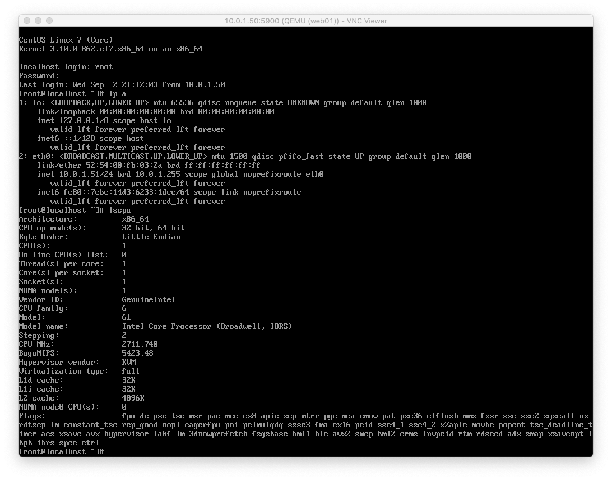

执行完毕热添加命令，再检查

```plain
[root@kvm01 data]# ssh root@10.0.1.51 lscpu |grep "^CPU(s)"
root@10.0.1.51's password:
CPU(s):                2
```

# 热添加内存

```plain
1.先查看当前虚拟机的内存情况
[root@kvm01 data]# ssh root@10.0.1.51 "free -m"
root@10.0.1.51's password:
              total        used        free      shared  buff/cache   available
Mem:            991          68         828           6          94         796
Swap:             0           0           0
2.想要能够修改内存，还得再创建的时候，指定好最大内存参数
# 基于虚机的磁盘，取消当前虚机，然后再重新创建
[root@kvm01 data]# virsh destroy web01
Domain web01 destroyed
[root@kvm01 data]#
[root@kvm01 data]#
[root@kvm01 data]# virsh undefine web01
Domain web01 has been undefined
# 重新创建，注意参数
[root@kvm01 data]# virt-install --virt-type kvm --os-type=linux --os-variant rhel7 --name web01 --memory 512,maxmemory=2048 --vcpus=1,maxvcpus=2 --disk /data/centos7.qcow2,format=qcow2,size=10 --boot hd --network bridge=br0 --graphics vnc,listen=0.0.0.0  --noautoconsole
Starting install...
Domain creation completed.
# 热添加内存
[root@kvm01 data]# ssh root@10.0.1.51 "free -m"
root@10.0.1.51's password:
              total        used        free      shared  buff/cache   available
Mem:            302          69          86           8         146          76
Swap:             0           0           0
[root@kvm01 data]#
[root@kvm01 data]#
[root@kvm01 data]#
# 修改内存大小
[root@kvm01 data]# virsh setmem web01 2G
[root@kvm01 data]# ssh root@10.0.1.51 "free -m"
root@10.0.1.51's password:
              total        used        free      shared  buff/cache   available
Mem:           1838          69        1623           8         145        1612
Swap:             0           0           0
```

# KVM虚拟机冷热迁移

## 冷迁移实践

准备一台和KVM01配置相同的机器，配置好kvm环境

```plain
# 安装kvm组件
[root@kvm02 yum.repos.d]# yum install libvirt virt-install qemu-kvm -y
# 启动服务
[root@kvm02 ~]# systemctl start libvirtd
# 配置桥接网络
[root@kvm02 ~]# virsh iface-bridge ens33 br0
# 
[root@kvm02 ~]# mkdir -p /data
```

导出kvm01的配置文件

```plain
# 导出虚机配置文件
[root@kvm01 data]# virsh dumpxml web01 > web01.xml
[root@kvm01 data]#
[root@kvm01 data]#
[root@kvm01 data]# ls
centos7.qcow2  CentOS-7-x86_64-DVD-1804.iso  web01.xml
# 发送虚机配置文件，以及磁盘文件，发送给kvm01机器
[root@kvm01 data]# scp -rp web01.xml  centos7.qcow2 10.0.1.63:/data/
```

在kvm02上操作

```plain
[root@kvm02 data]# ls
centos7.qcow2  web01.xml
# 导入配置文件
[root@kvm02 data]# virsh define web01.xml
Domain web01 defined from web01.xml
[root@kvm02 data]# virsh list
 Id    Name                           State
----------------------------------------------------
[root@kvm02 data]# virsh list --all
 Id    Name                           State
----------------------------------------------------
 -     web01                          shut off
# 启动虚拟机
[root@kvm02 data]# virsh start web01
error: Failed to start domain web01
error: unsupported configuration: Domain requires KVM, but it is not available. Check that virtualization is enabled in the host BIOS, and host configuration is setup to load the kvm modules.
# 若是出现如上问题，说明你的这台虚拟机，没开启cpu虚拟化，关机，搞起来，跟着超哥指挥，没错
# 再来，奥力给
[root@kvm02 ~]# virsh list --all
 Id    Name                           State
----------------------------------------------------
 -     web01                          shut off
[root@kvm02 ~]#
[root@kvm02 ~]#
[root@kvm02 ~]# virsh start web01
Domain web01 started
# 此时可以用vnc去连接虚拟机
10.0.1.63:5900
```

至此kvm的冷迁移，就完成了。

## 热迁移实践

热迁移： 相比KVM虚拟机冷迁移中需要拷贝虚拟机虚拟磁盘文件，kvm虚拟机热迁移无需拷贝虚拟磁盘文件，但是需要迁移到的宿主机之间需要有相同的目录结构虚拟机磁盘文件，也就是共享存储，这次通过大家熟悉的nfs来实现，当然也可以采用Glusterfs等分布式文件系统来实现.


 上一节我们学习了在线热添加技术，就很容易理解了。假设我初级只有一台16G内存的物理机，为了充分利用资源，我可能运行了8台2G内存的虚拟机，然后访问量增加，虚拟机的2G内存不够用了，需要扩容，扩容之前我们就需要先迁移一部分虚拟机到其他宿主机上了，有的业务特别核心，暂停的时间不能太长，这时候就要用到我们的热迁移了。

假设我们有2台宿主机kvm01和kvm02,在kvm01上挂起虚拟机vm01，发送vm的虚拟机配置文件和运行时内存中的数据到kvm02, 接受完毕，kvm02恢复vm01,热迁移完成。


环境准备

| 主机名 | ip        | 内存 | 网络            | 软件需求 | 虚拟化     |
| ------ | --------- | ---- | --------------- | -------- | ---------- |
| kvm01  | 10.0.0.11 | 2G   | 创建br0桥接网卡 | kvm和nfs | 开启虚拟化 |
| kvm02  | 10.0.0.12 | 2G   | 创建br0桥接网卡 | kvm和nfs | 开启虚拟化 |
| nfs01  | 10.0.0.31 | 1G   | 无              | nfs      | 无         |

具体操作流程

```plain
一：在kvm01和kvm02上安装kvm和nfs,配置桥接网卡
二：在nfs01上安装配置nfs
三：kvm01和kvm02挂载共享目录/opt
四：安装一台基于桥接模式的虚拟机
五：在kvm01上安装图形界面、vnc服务端和virt-manager
六：启动vnc服务端
七：使用vnc连接宿主机，使用virt-manager进行迁移
```

### 实践步骤

```plain
实现kvm虚拟机热迁移核心：共享存储。在这里使用的时NFS共享存储，关于nfs的详情参考：
1、安装virt-manager所需桌面及vnc-server
# 用本地光盘镜像，加速安装，否则太大，是很难安装的
[root@kvm01 yum.repos.d]# mount /dev/cdrom /mnt
mount: /dev/sr0 is write-protected, mounting read-only
[root@kvm01 yum.repos.d]# yum groupinstall "GNOME Desktop" -y
2.安装vnc-server端
[root@kvm01 yum.repos.d]# yum install tigervnc-server -y
3.virt-manager需要软件
[root@kvm01 yum.repos.d]# yum install openssh-askpass -y
```

配置vnc服务

```plain
1.复制vnc配置文件
[root@kvm01 yum.repos.d]# \cp /usr/lib/systemd/system/vncserver@.service  /usr/lib/systemd/system/vncserver@\:1.service
2.修改配置文件，和超哥的一样
[root@kvm01 yum.repos.d]#  egrep -v "^#|^$" /usr/lib/systemd/system/vncserver@\:1.service
[Unit]
Description=Remote desktop service (VNC)
After=syslog.target network.target
[Service]
Type=forking
User=root
# Clean any existing files in /tmp/.X11-unix environment
ExecStartPre=/bin/sh -c '/usr/bin/vncserver -kill %i > /dev/null 2>&1 || :'
ExecStart=/sbin/runuser -l root -c "/usr/bin/vncserver %i -geometry 1280x720"
PIDFile=/root/.vnc/%H%i.pid
ExecStop=/bin/sh -c '/usr/bin/vncserver -kill %i > /dev/null 2>&1 || :'
[Install]
WantedBy=multi-user.target
3.修改后，重读配置文件
[root@kvm01 yum.repos.d]# systemctl daemon-reload
4.设置vnc连接密码
[root@kvm01 yum.repos.d]# vncpasswd
Password:
Verify:
Would you like to enter a view-only password (y/n)? n   # n为非只读用户
A view-only password is not used
5.启动vnc，设置开机自启
[root@kvm01 system]# systemctl start vncserver@\:1.service
6.查看密码文件
[root@kvm01 ~]# ll ~/.vnc/
total 20
-rw-r--r-- 1 root root 332 Sep  2 23:12 config
-rw-r--r-- 1 root root 621 Sep  2 23:12 kvm01:1.log
-rw-r--r-- 1 root root   6 Sep  2 23:12 kvm01:1.pid
-rw------- 1 root root   8 Sep  2 22:57 passwd
-rwxr-xr-x 1 root root  92 Sep  2 23:12 xstartup
7.查看vnc服务端口
[root@kvm01 ~]# !net
netstat -tunlp |grep 5901
tcp        0      0 0.0.0.0:5901            0.0.0.0:*               LISTEN      35203/Xvnc
tcp6       0      0 :::5901                 :::*                    LISTEN      35203/Xvnc
```

### 配置NFS存储

```plain
1.安装配置nfs
[root@kvm01 ~]# yum install nfs-utils rpcbind -y
2.修改配置文件
[root@kvm01 ~]# cat /etc/exports
/data 10.0.1.0/24(rw,sync,all_squash,anonuid=0,anongid=0)
3.启动nfs服务
[root@kvm01 ~]# systemctl restart rpcbind
[root@kvm01 ~]# systemctl restart nfs
[root@kvm01 ~]#
[root@kvm01 ~]#
[root@kvm01 ~]# systemctl enable rpcbind
[root@kvm01 ~]# systemctl enable nfs
Created symlink from /etc/systemd/system/multi-user.target.wants/nfs-server.service to /usr/lib/systemd/system/nfs-server.service.
```

## kvm02上操作

```plain
1.安装nfs
[root@kvm02 ~]#  yum install nfs-utils rpcbind -y
2.查看共享信息
[root@kvm02 ~]# showmount -e 10.0.1.50
Export list for 10.0.1.50:
/data 10.0.1.0/24
3.挂载目录
[root@kvm02 ~]# mount.nfs 10.0.1.50:/data /data
[root@kvm02 ~]#
[root@kvm02 ~]#  ls /data/
centos7.qcow2  CentOS-7-x86_64-DVD-1804.iso  web01.xml
# 加入开机自启
[root@kvm02 ~]# echo 'mount.nfs 10.0.1.50:/data /data' >> /etc/rc.local
[root@kvm02 ~]# chmod  +x /etc/rc.d/rc.local
```

## 实现热迁移

1.vnc连接kvm

```plain
10.0.1.50:5901
输入密码
chaoge666
进入linux服务器
```


2.使用vmm虚拟系统管理器

```plain
[root@kvm01 ~]# yum install virt-manager -y
```

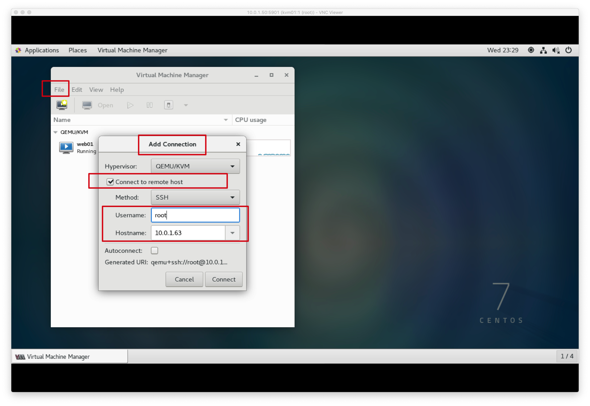

## 主机热迁移

### 迁移前

吧kvm01的虚拟机，迁移到Kvm02机器上去


```plain
注意：先吧kvm02上的虚拟机给关掉
因为咱们刚才已经冷迁移过了
# 删除步骤
[root@kvm02 ~]# virsh destroy web01
Domain web01 destroyed
[root@kvm02 ~]# virsh undefine web01
Domain web01 has been undefined
```

### 迁移后


```plain
虚拟机已经从kvm01 迁移到了kvm02
[root@kvm02 ~]# virsh list
 Id    Name                           State
----------------------------------------------------
 3     web01                          running
 [root@kvm01 ~]# virsh list
 Id    Name                           State
----------------------------------------------------
```

### 虚拟机的配置信息

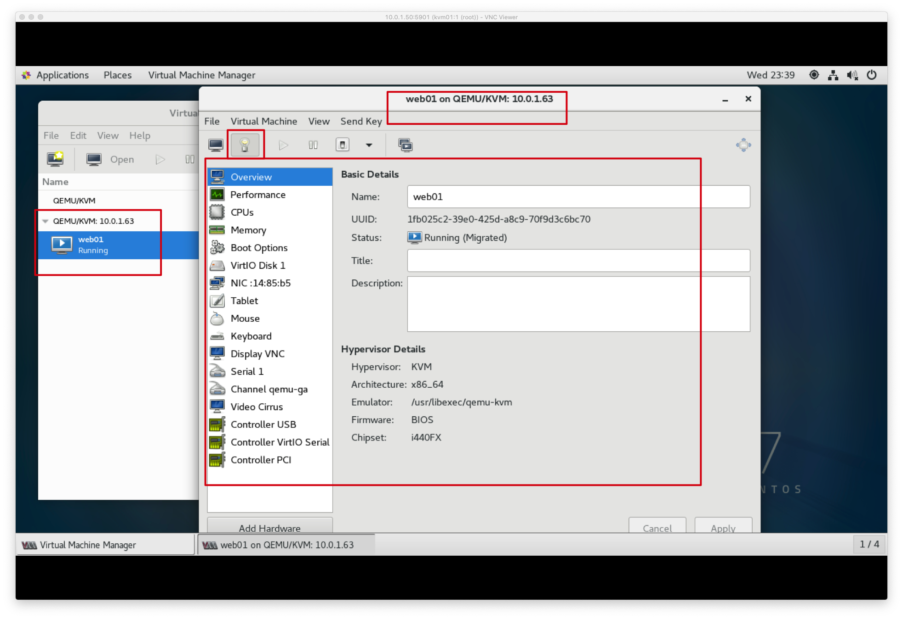


# 容器

我们先看看很久很久以前，服务器是怎么部署应用的！


由于物理机的诸多问题，后来出现了虚拟机。


但是虚拟化也是有局限性的，每一个虚拟机都是一个完整的操作系统，要分配系统资源，虚拟机多道一定程度时，操作系统本身资源也就消耗殆尽，或者说必须扩容

## 为什么学docker

某公司的产品运行在内部的虚拟化平台中，如openstack，也就是我们所学的KVM虚拟化，创建虚拟机。

但是不断增加的云端应用，增加了对硬件资源的消耗，不断的创建虚拟机，给公司带来了难题，公司已经在云平台上运行了多台云主机，消耗了大量的硬件资源。

怎么才能够高效的利用硬件资源实现云服务呢？

容器技术，此时就派上用场了。

## 容器技术

Docker最初是DotCloud公司在法国期间发起的一个公司内部项目，后来以Apache2.0授权协议开源，代码在Github上维护。

Docker是基于Google公司推出的Golang语言开发而来，基于Linux内核的Cgroups、NameSpace，以及Union FS等技术，对进程进行封装隔离，属于操作系统层面的虚拟化技术。

由于隔离的进程独立于宿主机和其他隔离的进程，也被称之为容器。

最初的Docker是基于LXC的，后来去除LXC转而使用自行开发的Libcontainer。

Docker被定义为开源的容器引擎，可以方便的对容器进行管理。例如对镜像打包封装，引入Docker Registry对镜像统一管理。

利用Docker可以实现开发，测试，生产环境的部署一致性，极大的减少运维成本。

## 容器和虚拟机的差异

### 传统虚拟机技术

虚拟机是虚拟出一套硬件，在其上面运行一个完整的操作系统，例如我们使用KVM，指定系统镜像，然后装系统，最终可以使用，在该系统上再运行所需的应用程序。

KVM创建虚拟机时，指定较少的cpu，内存，硬盘等资源，虚拟机性能较低。


### 容器技术

容器内的应用程序直接运行在宿主机的内核上，容器内没有自己的内核，也没有对硬件进行虚拟，因此容器比起虚拟机更为轻便。

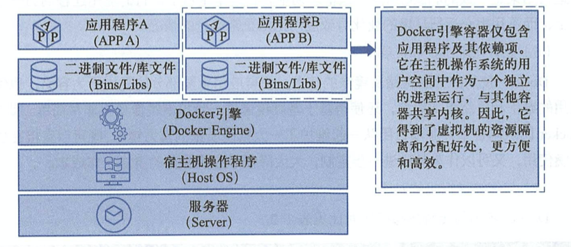

### 容器对比KVM的好处

- 容器能够提供宿主机的性能，而kvm虚拟机是分配宿主机硬件资源，性能较弱
- 同样配置的宿主机，最多可以启动10个虚拟机的话，可以启动100+的容器数量。
- 启动一个KVM虚拟机，得有一个完整的开机流程，花费时间较长，或许得20S，而启动一个容器只需要1S。
- KVM需要硬件CPU的虚拟化支持，而容器不需要。

## 为什么选择docker

### docker更高效的利用系统资源

容器不需要进行硬件虚拟化以及运行一个完整操作系统的额外开销，docker对系统资源的利用率更高，无论是应用执行，文件存储，还是在内存消耗等方面，都比传统虚拟机更高效。因此一个同样配置的主机，可以运行处更多数量的容器实例。

### 更快的启动时间

传统的虚拟机启动时间较久，docker容器直接运行在宿主机的内核上，无须启动一个完整的操作系统，因此可以达到秒级启动，大大的解决开发，测试，部署的时间。

### 一致性的环境

在企业里，程序从开发环境，到测试服务器，到生产环境，难以保证机器环境一致性，极大可能出现系统依赖冲突，导致难以部署等Bug。

然而利用docker的容器-镜像技术，提供了除了内核以外完整的运行时环境，确保了应用环境的一致性。

### 持续交付和部署

还是刚才所说的一致性的环境，对于开发和运维的人员，最希望的就是环境部署迁移别处问题，利用docker可以定制镜像，以达到持续集成，持续交付和部署。

通过Dockerfile来进行镜像构建，实现系统集成测试，运维进行生产环境的部署。

且Dockerfile可以使镜像构建透明化，方便技术团队能够快速理解运行环境部署流程。

### 更轻松的迁移

Docker可以在很多平台运行，无论是物理机，虚拟机，云服务器等环境，运行结果都是一致的。用于可以轻松的将一个平台的应用，迁移到另一个平台，而不用担心环境的变化，导致程序无法运行。

# Docker VS 传统虚拟机

| 特性       | 容器               | 虚拟机     |
| ---------- | ------------------ | ---------- |
| 启动       | 秒级               | 分钟级     |
| 硬盘使用   | 一般为 MB          | 一般为 GB  |
| 性能       | 接近原生           | 弱         |
| 系统支持量 | 单机支持上千个容器 | 一般几十个 |

# Docker使用情况

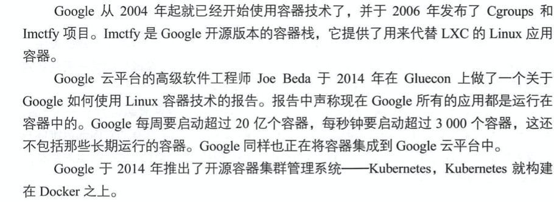

## 企业与容器集群

### 京东容器集群


架构图


### 淘宝容器集群

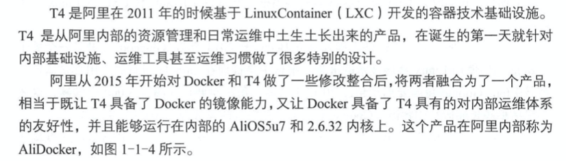


阿里成立专门的项目组推进docker应用，目标是把双11流量覆盖的核心应用，全部升级为镜像化的Docker应用。

# Docker安装部署

## Docker引擎

Docker Engine是C/S架构的

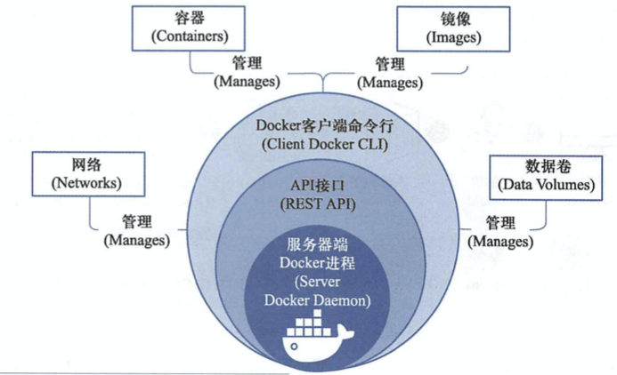

Docker由已下几个部件组成。

### Docker Daemon

安装使用Docker，得先运行Docker Daemon进程，用于管理docker，如：

- 镜像 images
- 容器 containers
- 网络 network
- 数据卷 Data Volumes

### Rest接口

提供和Daemon交互的API接口

### Docker Client

客户端使用REST API和Docker Daemon进行访问。

## Docker平台组成


### Images

镜像是一个只读模板，用于创建容器，也可以通过Dockerfile文本描述镜像的内容。

镜像的概念类似于编程开发里面向对象的类，从一个基类开始（基础镜像Base Image）

构建容器的过程，就是运行镜像，生成容器实例。

Docker镜像的描述文件是Dockerfile，包含了如下的指令

- FROM 定义基础镜像
- MAINTAINER 作者
- RUN 运行Linux命令
- ADD 添加文件/目录
- ENV 环境变量
- CMD 运行进程

### Container

容器是一个镜像的运行实例，镜像 > 容器。

创建容器的过程

- 获取镜像，如`docker pull centos`，从镜像仓库拉取
- 使用镜像创建容器
- 分配文件系统，挂载一个读写层，在读写层加载镜像
- 分配网络/网桥接口，创建一个网络接口，让容器和宿主机通信
- 容器获取IP地址
- 执行容器命令，如/bin/bash
- 反馈容器启动结果。

## Registry

Docker镜像需要进行管理，docker提供了Registry仓库，其实它也是一个容器。可以用于可以基于该容器运行私有仓库。

也可以使用Docker Hub互联网公有镜像仓库。

## 安装Docker


机器环境初始化

```plain
1.防火墙
2.yum源
3.安装基础软件
wget -O /etc/yum.repos.d/CentOS-Base.repo http://mirrors.aliyun.com/repo/Centos-7.repo
wget -O /etc/yum.repos.d/epel.repo http://mirrors.aliyun.com/repo/epel-7.repo
yum install -y bash-completion vim lrzsz wget expect net-tools nc nmap tree dos2unix htop iftop iotop unzip telnet sl psmisc nethogs glances bc ntpdate  openldap-devel
[root@docker01 ~]# systemctl disable firewalld
Removed symlink /etc/systemd/system/multi-user.target.wants/firewalld.service.
Removed symlink /etc/systemd/system/dbus-org.fedoraproject.FirewallD1.service.
[root@docker01 ~]# systemctl stop firewalld
[root@docker01 ~]# sed -i 's/SELINUX=enforcing/SELINUX=disabled/g' /etc/selinux/config
[root@docker01 ~]# iptables -F
[root@docker01 ~]#
[root@docker01 ~]# iptables -X
[root@docker01 ~]#
[root@docker01 ~]# iptables -Z
[root@docker01 ~]# iptables-save
# Generated by iptables-save v1.4.21 on Fri Sep  4 01:29:08 2020
*filter
:INPUT ACCEPT [25:1732]
:FORWARD ACCEPT [0:0]
:OUTPUT ACCEPT [13:1208]
COMMIT
# Completed on Fri Sep  4 01:29:08 2020
```

## docker01机器准备

```plain
1.docker必须安装在centos7平台，内核版本不低于3.10
在centos平台运行docker可能会遇见些告警信息，修改内核配置参数，打开内核转发功能
vim /etc/sysctl.conf
# 写入参数
# Controls IP packet forwarding
net.ipv4.ip_forward = 1
#
# # Controls source route verification
net.ipv4.conf.default.rp_filter = 0
#
net.ipv4.conf.all.rp_filter = 0
2.重新加载内核参数
[root@docker01 ~]# sysctl -p
net.ipv4.ip_forward = 1
net.ipv4.conf.default.rp_filter = 0
net.ipv4.conf.all.rp_filter = 0
# 要保持本地软件源较新，可以用阿里云yum源更新软件
3.安装docker-ce社区版
wget -O /etc/yum.repos.d/docker-ce.repo https://mirrors.ustc.edu.cn/docker-ce/linux/centos/docker-ce.repo
sed -i 's#download.docker.com#mirrors.ustc.edu.cn/docker-ce#g' /etc/yum.repos.d/docker-ce.repo
yum install docker-ce -y
```

## 镜像加速器

使用docker首要操作就是获取镜像文件，默认下载是从Docker Hub下载，网速较慢，国内很多云服务商都提供了加速器服务，阿里云加速器，Daocloud加速器，灵雀云加速器。

```plain
1.修改docker配置文件，我们选用七牛云镜像站
[root@docker01 ~]# cat /etc/docker/daemon.json
{"registry-mirrors": ["https://reg-mirror.qiniu.com"]}
2.重启
[root@docker01 ~]# systemctl restart docker
```

## docker管理

```plain
1.检查服务状态
[root@docker01 ~]# docker version
Client: Docker Engine - Community
 Version:           19.03.12
 API version:       1.40
 Go version:        go1.13.10
 Git commit:        48a66213fe
 Built:             Mon Jun 22 15:46:54 2020
 OS/Arch:           linux/amd64
 Experimental:      false
Server: Docker Engine - Community
 Engine:
  Version:          19.03.12
  API version:      1.40 (minimum version 1.12)
  Go version:       go1.13.10
  Git commit:       48a66213fe
  Built:            Mon Jun 22 15:45:28 2020
  OS/Arch:          linux/amd64
  Experimental:     false
 containerd:
  Version:          1.2.13
  GitCommit:        7ad184331fa3e55e52b890ea95e65ba581ae3429
 runc:
  Version:          1.0.0-rc10
  GitCommit:        dc9208a3303feef5b3839f4323d9beb36df0a9dd
 docker-init:
  Version:          0.18.0
  GitCommit:        fec3683
2.检查系统内核
[root@docker01 ~]# uname -a
Linux docker01 3.10.0-862.el7.x86_64 #1 SMP Fri Apr 20 16:44:24 UTC 2018 x86_64 x86_64 x86_64 GNU/Linux
3.检查系统是否安装了存储驱动，看到结果即可
[root@docker01 ~]# ls -l /sys/class/misc/device-mapper/
total 0
-r--r--r-- 1 root root 4096 Sep  4 01:44 dev
drwxr-xr-x 2 root root    0 Sep  4 01:44 power
lrwxrwxrwx 1 root root    0 Sep  4 01:44 subsystem -> ../../../../class/misc
-rw-r--r-- 1 root root 4096 Sep  4 01:44 uevent
# 若是没有，单独安装即可
[root@docker01 ~]# yum install device-mapper -y
# 加载存储驱动模块
[root@docker01 ~]# modprobe dm-mod
```

## 启动第一个容器

```plain
1.获取nginx镜像
[root@docker01 ~]# docker run -d -p 80:80 nginx
Unable to find image 'nginx:latest' locally
latest: Pulling from library/nginx
bf5952930446: Pulling fs layer
cb9a6de05e5a: Pulling fs layer
9513ea0afb93: Pulling fs layer
b49ea07d2e93: Waiting
a5e4a503d449: Waiting
latest: Pulling from library/nginx
bf5952930446: Pull complete
cb9a6de05e5a: Pull complete
9513ea0afb93: Pull complete
b49ea07d2e93: Pull complete
a5e4a503d449: Pull complete
Digest: sha256:b0ad43f7ee5edbc0effbc14645ae7055e21bc1973aee5150745632a24a752661
Status: Downloaded newer image for nginx:latest
e1238321422cd13b4b217d5d955e67eac4766765a8edb201308c37c178a22ccc
# 参数解释
docker run 参数     镜像
-d 后台运行
-p 端口映射
nginx 镜像名
默认我们机器上是没有docker镜像的，docker run是在运行时，寻找且自动下载镜像
2.检查服务器上所有镜像
[root@docker01 ~]# docker images
REPOSITORY          TAG                 IMAGE ID            CREATED             SIZE
nginx               latest              4bb46517cac3        2 weeks ago         133MB
3.检查正在运行的docker容器
[root@docker01 ~]# docker ps
CONTAINER ID        IMAGE               COMMAND                  CREATED              STATUS              PORTS                NAMES
e1238321422c        nginx               "/docker-entrypoint.…"   About a minute ago   Up About a minute   0.0.0.0:80->80/tcp   ecstatic_gould
4.访问容器内的nginx服务
```

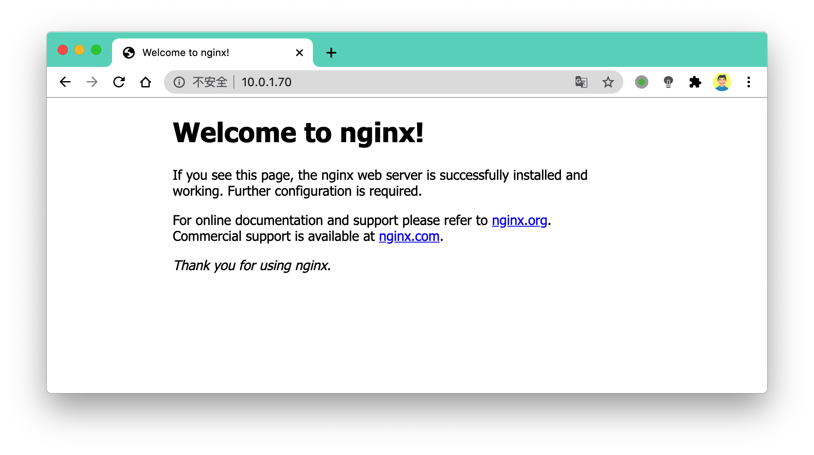

看到这个页面，就说明你正确安装了docker，且运行了第一个nginx容器服务。

# Docker生命周期

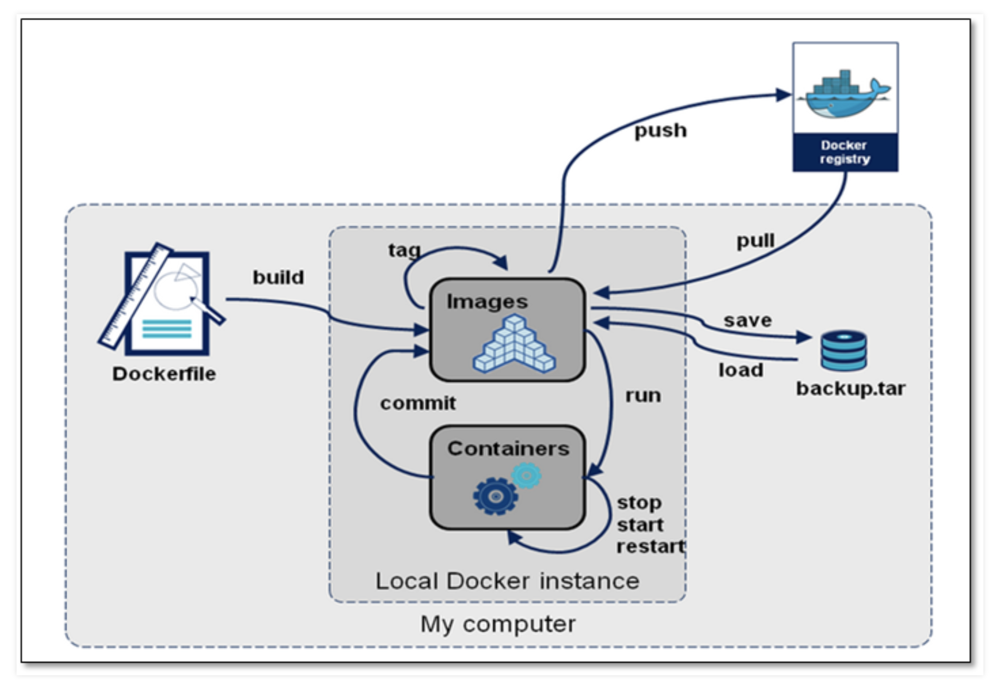

## Docker镜像管理

一个完成的Docker镜像可以支撑容器的运行，镜像提供文件系统

```plain
# 下载centos系统镜像
[root@docker01 ~]# docker pull centos
```

## 内核与发行版

传统的虚拟机安装操作系统所提供的系统镜像，包含两部分：

- Linux内核版本，例如

```plain
[root@docker01 ~]# uname -r
3.10.0-862.el7.x86_64
```

- 系统发行版本（centos，ubuntu）

```plain
[root@docker01 ~]# cat /etc/redhat-release
CentOS Linux release 7.5.1804 (Core)
```

而docker镜像：

docker镜像是不包含系统内核的，下载的是某一个发行版。

例如

```plain
# 获取centos7.5发行版本
[root@docker01 ~]# docker search centos:7.5
# 获取mysql5.6
[root@docker01 ~]# docker search mysql:5.6
```

## docker镜像定义

我们如果自定义镜像，刚才超哥已经和大家说了，docker镜像不包含linux内核，和宿主机共用。

我们如果想要定义一个mysql5.6镜像，我们会这么做

- 获取基础镜像，选择一个发行版平台（ubutu，centos）
- 在centos镜像中安装mysql5.6软件

导出镜像，可以命名为mysql:5.6镜像文件。

从这个过程，我们可以感觉出这是一层一层的添加的，docker镜像的层级概念就出来了，底层是centos镜像，上层是mysql镜像，centos镜像层属于父镜像。


Docker镜像是在基础镜像之后，然后安装软件，配置软件，添加新的层，构建出来。

这种现象在学习dockerfile构建时候，更为清晰。

## Docker为什么分层镜像

镜像分享一大好处就是共享资源，例如有多个镜像都来自于同一个base镜像，那么在docker host只需要存储一份base镜像。

内存里也只需要加载一份host，即可为多个容器服务。

即使多个容器共享一个base镜像，某个容器修改了base镜像的内容，例如修改/etc/下配置文件，其他容器的/etc/下内容是不会被修改的，修改动作只限制在单个容器内，这就是容器的写入时复制特性（Copy-on-write）。

### 可写的容器层

当容器启动后，一个新的可写层被加载到镜像的顶部，这一层通常被称为`容器层`，`容器层`下的都称为`镜像层`。


所有对容器的修改动作，都只会发生在`容器层`里，只有`容器层`是可写的，其余`镜像层`都是只读的。

| **文件操作** | **说明**                                                     |
| ------------ | ------------------------------------------------------------ |
| **添加文件** | 在容器中创建文件时，新文件被添加到容器层中。                 |
| **读取文件** | 在容器中读取某个文件时，Docker 会从上往下依次在各镜像层中查找此文件。一旦找到，立即将其复制到容器层，然后打开并读入内存。 |
| **修改文件** | 在容器中修改已存在的文件时，Docker 会从上往下依次在各镜像层中查找此文件。一旦找到，立即将其复制到容器层，然后修改之。 |
| **删除文件** | 在容器中删除文件时，Docker 也是从上往下依次在镜像层中查找此文件。找到后，会在容器层中**记录下此删除操作**。（只是记录删除操作） |

只有当需要修改时才复制一份数据，这种特性被称作 Copy-on-Write。可见，容器层保存的是镜像变化的部分，不会对镜像本身进行任何修改。

这样就解释了我们前面提出的问题：容器层记录对镜像的修改，所有镜像层都是只读的，不会被容器修改，所以镜像可以被多个容器共享。

## Docker镜像的内容

docker镜像层级管理的方式大大便捷了Docker镜像的分发和存储。Docker hub是为全世界的镜像仓库。

- Docker镜像代表一个容器的文件系统内容
- 镜像层级技术属于`联合文件系统`
- 容器是一个动态的环境，每一层镜像里的文件都属于静态内容

- - dockerfile里的ENV、VOLUME、CMD等内容都会落实到容器环境里

### UnionFS

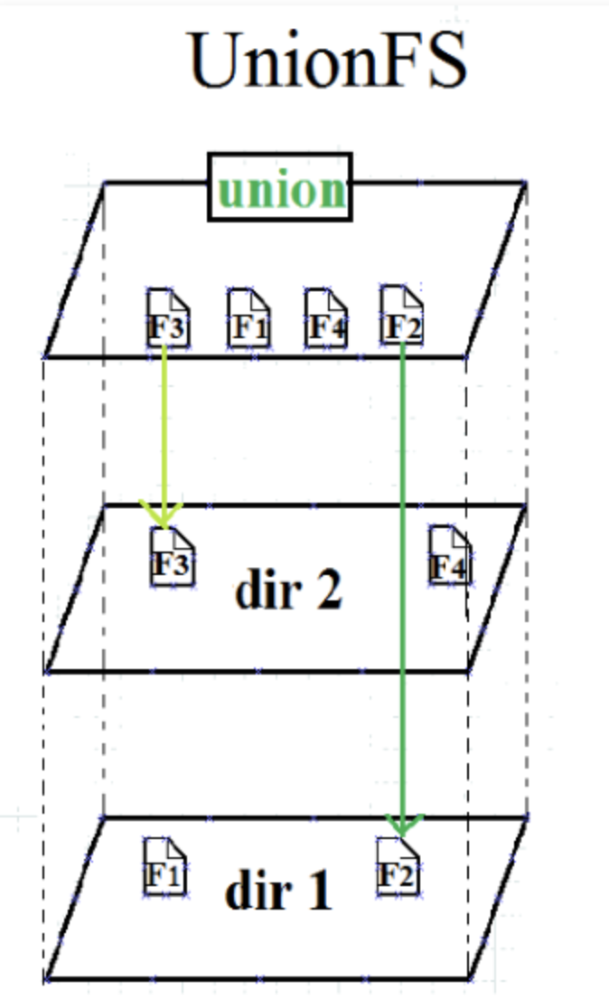

## 获取Docker镜像

```plain
1.获取镜像，docker hub里有大量高质量的镜像
[root@docker01 ~]# docker pull centos  # 默认标签tag是centos:latest
[root@docker01 ~]# docker pull  centos:7.2.1511  # 指定版本下载
2.查看所有镜像
[root@docker01 ~]# docker images
REPOSITORY          TAG                 IMAGE ID            CREATED             SIZE
nginx               latest              4bb46517cac3        3 weeks ago         133MB
centos              latest              0d120b6ccaa8        3 weeks ago         215MB
centos              7.2.1511            9aec5c5fe4ba        17 months ago       195MB
3.docker本地镜像，都放在
[root@docker01 ~]# ll /var/lib/docker/
total 4
drwx------  2 root root   24 Sep  4 01:37 builder
drwx--x--x  4 root root   92 Sep  4 01:37 buildkit
drwx------  2 root root    6 Sep  4 19:08 containers
drwx------  3 root root   22 Sep  4 01:37 image
drwxr-x---  3 root root   19 Sep  4 01:37 network
drwx------ 10 root root 4096 Sep  4 19:08 overlay2
drwx------  4 root root   32 Sep  4 01:37 plugins
drwx------  2 root root    6 Sep  4 19:05 runtimes
drwx------  2 root root    6 Sep  4 01:37 swarm
drwx------  2 root root    6 Sep  4 19:06 tmp
drwx------  2 root root    6 Sep  4 01:37 trust
drwx------  2 root root   25 Sep  4 01:37 volumes
# 可以通过docker info查看
[root@docker01 docker]# docker info | grep "Docker Root Dir"
 Docker Root Dir: /var/lib/docker
# 所有镜像存储的位置
[root@docker01 sha256]# pwd
/var/lib/docker/image/overlay2/imagedb/content/sha256
# 该目录都是json文件，记录镜像和容器的关系
[root@docker01 sha256]# ll
total 16
-rw------- 1 root root 2180 Sep  4 02:00 0d120b6ccaa8c5e149176798b3501d4dd1885f961922497cd0abef155c869566
-rw------- 1 root root 7512 Sep  4 01:48 4bb46517cac397bdb0bab6eba09b0e1f8e90ddd17cf99662997c3253531136f8
-rw------- 1 root root 2604 Sep  4 19:06 9aec5c5fe4ba9cf7a8d2a50713dd197c3b0cbd5f5fcd03babe4c1d65c455dabf
4.运行镜像，以某一个base镜像来启动一个容器，参数解释
-i
-t
--rm
bash
[root@docker01 ~]# docker run -it --rm centos:7.2.1511 bash
[root@ade0c7e6bb85 /]#
[root@ade0c7e6bb85 /]#
[root@ade0c7e6bb85 /]# cat /etc/redhat-release
CentOS Linux release 7.2.1511 (Core)
5.运行centos8容器
[root@docker01 ~]# docker run -it --rm  centos:latest bash
[root@1f2b4e7eb18c /]# cat /etc/redhat-release
CentOS Linux release 8.2.2004 (Core)
6.退出容器
[root@1f2b4e7eb18c /]# exit
exit
[root@docker01 ~]#
7.centos支持下载的镜像标签列表
https://hub.docker.com/_/centos
```

### 镜像操作管理

```plain
1.查询镜像
[root@docker01 ~]# docker images
REPOSITORY          TAG                 IMAGE ID            CREATED             SIZE
nginx               latest              4bb46517cac3        3 weeks ago         133MB
centos              latest              0d120b6ccaa8        3 weeks ago         215MB
centos              7.2.1511            9aec5c5fe4ba        17 months ago       195MB
列表展示了仓库名，标签，镜像ID，创建时间，占用空间
2.docker镜像体积
docker镜像是多层存储结构，可以继承，复用。因此不同的镜像也会使用相同的base images，从而使用些共同的层layer。
因此docker使用联合文件系统，相同的层只需要保存一份，实际镜像占用硬盘空间要比列表镜像小的多。
```

### none镜像

none镜像（dangline image 虚悬镜像）

出现none镜像的原因：

- 在docker hub上镜像如果更新后，名称变化，用户再docker pull就会出现该情况
- docker build时候，镜像名重复，也会导致新旧镜像同名，旧镜像名称被取消，出现none

### 列出镜像

```plain
1.根据仓库名列出镜像
[root@docker01 ~]# docker images centos
REPOSITORY          TAG                 IMAGE ID            CREATED             SIZE
centos              latest              0d120b6ccaa8        3 weeks ago         215MB
centos              8.2.2004            831691599b88        2 months ago        215MB
centos              7.2.1511            9aec5c5fe4ba        17 months ago       195MB
2.列出制定镜像
[root@docker01 ~]# docker images centos:8.2.2004
REPOSITORY          TAG                 IMAGE ID            CREATED             SIZE
centos              8.2.2004            831691599b88        2 months ago        215MB
3.列出特定格式，镜像id
-q 只列出id 
-q, --quiet           Only show numeric IDs
[root@docker01 ~]# docker images -q
4bb46517cac3
0d120b6ccaa8
831691599b88
9aec5c5fe4ba
4.格式化输出信息
[root@docker01 ~]# docker images --format "{{.ID}}:{{.Repository}}"
4bb46517cac3:nginx
0d120b6ccaa8:centos
831691599b88:centos
9aec5c5fe4ba:centos
# 格式化等距显示
[root@docker01 ~]# docker images --format "table {{.ID}}\t{{.Repository}}\t{{.Tag}}"
IMAGE ID            REPOSITORY          TAG
4bb46517cac3        nginx               latest
0d120b6ccaa8        centos              latest
831691599b88        centos              8.2.2004
9aec5c5fe4ba        centos              7.2.1511
```

### 查找镜像

```plain
1.默认是先在本地寻找镜像，没有去docker hub搜索
[root@docker01 ~]# docker search centos
NAME                               DESCRIPTION                                     STARS               OFFICIAL            AUTOMATED
centos                             The official build of CentOS.                   6172                [OK]
```

### 删除本地镜像

```plain
[root@docker01 ~]# docker pull hello-world
Using default tag: latest
latest: Pulling from library/hello-world
0e03bdcc26d7: Pull complete
Digest: sha256:7f0a9f93b4aa3022c3a4c147a449bf11e0941a1fd0bf4a8e6c9408b2600777c5
Status: Downloaded newer image for hello-world:latest
docker.io/library/hello-world:latest
[root@docker01 ~]# docker images hello-world
REPOSITORY          TAG                 IMAGE ID            CREATED             SIZE
hello-world         latest              bf756fb1ae65        8 months ago        13.3kB
# 删除镜像，可以用 ID，名字，摘要等
# 根据id删除
[root@docker01 ~]# docker rmi bf7
Untagged: hello-world:latest
Untagged: hello-world@sha256:7f0a9f93b4aa3022c3a4c147a449bf11e0941a1fd0bf4a8e6c9408b2600777c5
Deleted: sha256:bf756fb1ae65adf866bd8c456593cd24beb6a0a061dedf42b26a993176745f6b
Deleted: sha256:9c27e219663c25e0f28493790cc0b88bc973ba3b1686355f221c38a36978ac63
# 删除镜像名
docker rmi hello-world
```

根据摘要删除

```plain
1.查看摘要
[root@docker01 ~]# docker images --digests
REPOSITORY          TAG                 DIGEST                                                                    IMAGE ID            CREATED             SIZE
nginx               latest              sha256:b0ad43f7ee5edbc0effbc14645ae7055e21bc1973aee5150745632a24a752661   4bb46517cac3        3 weeks ago         133MB
centos              latest              sha256:76d24f3ba3317fa945743bb3746fbaf3a0b752f10b10376960de01da70685fbd   0d120b6ccaa8        3 weeks ago         215MB
centos              8.2.2004            sha256:4062bbdd1bb0801b0aa38e0f83dece70fb7a5e9bce223423a68de2d8b784b43b   831691599b88        2 months ago        215MB
hello-world         latest              sha256:7f0a9f93b4aa3022c3a4c147a449bf11e0941a1fd0bf4a8e6c9408b2600777c5   bf756fb1ae65        8 months ago        13.3kB
centos              7.2.1511            sha256:50cca1e74da4b6a4eb4ade029c8fdd4ee8564776801914d9bd89df8c6344add0   9aec5c5fe4ba        17 months ago       195MB
2.删除摘要
[root@docker01 ~]# docker rmi hello-world@sha256:7f0a9f93b4aa3022c3a4c147a449bf11e0941a1fd0bf4a8e6c9408b2600777c5
Untagged: hello-world@sha256:7f0a9f93b4aa3022c3a4c147a449bf11e0941a1fd0bf4a8e6c9408b2600777c5
```

根据id删除镜像

```plain
[root@docker01 ~]# docker rmi $(docker images -q hello-world)
Untagged: hello-world:latest
Untagged: hello-world@sha256:7f0a9f93b4aa3022c3a4c147a449bf11e0941a1fd0bf4a8e6c9408b2600777c5
Deleted: sha256:bf756fb1ae65adf866bd8c456593cd24beb6a0a061dedf42b26a993176745f6b
Deleted: sha256:9c27e219663c25e0f28493790cc0b88bc973ba3b1686355f221c38a36978ac63
```

删除所有镜像，危险命令

```plain
[root@docker01 ~]# docker rmi `docker images -aq`
```

### 导出镜像

```plain
[root@docker01 my_docker]# docker image save centos:7.2.1511 > centos-7.2.1511.tgz
[root@docker01 my_docker]# ll -h
total 193M
-rw-r--r-- 1 root root 193M Sep  5 00:30 centos-7.2.1511.tgz
```

### 导入镜像

```plain
1.删除centos7.2镜像
2.导入镜像压缩文件
[root@docker01 my_docker]# docker image load -i centos-7.2.1511.tgz
a11c91bfd866: Loading layer [==================================================>]    202MB/202MB
Loaded image: centos:7.2.1511
[root@docker01 my_docker]#
```

### 查看镜像详细信息

```plain
[root@docker01 my_docker]# docker image inspect 9aec5c5fe4ba
```

## 批量删除none镜像

```plain
docker rm `docker ps -aq`
docker rmi $(docker images|grep "none"|awk '{print $3}')
```

# docker容器管理

### 启动容器

`docker run`等于创建+启动

**注意：容器内的进程必须处于前台运行状态，否则容器就会直接退出**

我们运行nginx基础镜像，没有运行任何程序，因此容器直接挂掉

```plain
[root@docker01 my_docker]# docker run 9aec5c5fe4ba
[root@docker01 my_docker]# docker ps
CONTAINER ID        IMAGE               COMMAND             CREATED             STATUS              PORTS               NAMES
[root@docker01 my_docker]# docker ps -a
CONTAINER ID        IMAGE               COMMAND             CREATED             STATUS                     PORTS               NAMES
1741addf17b1        9aec5c5fe4ba        "/bin/bash"         5 seconds ago       Exited (0) 4 seconds ago                       fervent_bell
[root@docker01 my_docker]#
```

### 启动活着的容器

-d 后台运行容器

-p 端口映射

```plain
[root@docker01 my_docker]# docker run -d  -p 80:80 nginx
92cca7c78019f6ae39f1e530e8c611c0b15c12bb62f9192431161470b1b27d2c
[root@docker01 my_docker]#
[root@docker01 my_docker]#
[root@docker01 my_docker]# docker ps
CONTAINER ID        IMAGE               COMMAND                  CREATED             STATUS              PORTS                NAMES
92cca7c78019        nginx               "/docker-entrypoint.…"   1 second ago        Up 1 second         0.0.0.0:80->80/tcp   serene_jackson
# 此时可以正确访问nginx服务，
```

### 查看容器信息

```plain
[root@docker01 my_docker]# docker container inspect 92c
```

### 查看所有容器记录

活着的

以及挂掉的

```plain
[root@docker01 my_docker]# docker ps -a
```

### 停止容器

```plain
[root@docker01 my_docker]# docker stop 92c
[root@docker01 my_docker]# docker container kill 92c
```

### 进入容器空间

1.创建容器且进入

```plain
[root@docker01 my_docker]# docker run -it centos bash
[root@0b889f541209 /]#
```

2.exec命令

```plain
[root@docker01 my_docker]# docker exec -it 92c bash
root@92cca7c78019:/#
```

### 删除所有容器

**危险命令**

```plain
[root@docker01 my_docker]# docker rm -f `docker ps -aq`
-f 强制删除
```

### 容器端口映射

| **p hostPort:containerPort**      | 端口映射 -p 8080:80                |
| --------------------------------- | ---------------------------------- |
| **-p ip:hostPort:containerPort**  | 配置监听地址 -p 10.0.0.100:8080:80 |
| **-p ip::containerPort**          | 随机分配端口 -p 10.0.0.100::80     |
| **-p hostPort:containerPort:udp** | 指定协议 -p 8080:80:tcp            |
| **-p 81:80 –p 443:443**           | 指定多个                           |

```plain
[root@docker01 my_docker]# docker run -d -p 81:80 nginx
70cd2663eeedd4ae699f416db921fb9c144523b3c71b1593d0caa6aa43c97435
```


# docker实践

# DockerFile镜像定制

定制docker镜像的方式有两种：

- 手动修改容器内容，导出新的镜像
- 基于Dockerfile自行编写指令，基于指令流程创建镜像。

## dockerfile简介

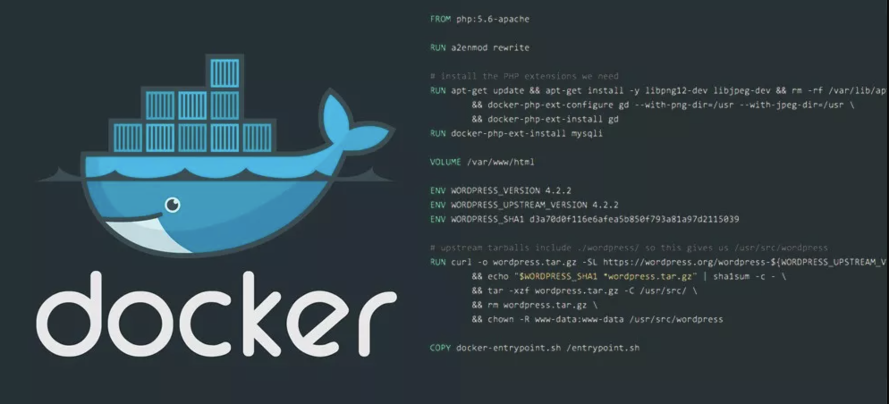

镜像是多层存储，每一层在前一层的基础上进行修改；

容器也是多层存储，以镜像为基础层，在其基础上加一层作为容器运行时的存储层。

刚才说了，创建镜像的两个方法

- 手动修改容器内容，然后docker commit提交容器为新的镜像
- 通过在dockerfile中定义一系列的命令和参数构成的脚本，然后这些命令应用于基础镜像，依次添加层，最终生成一个新的镜像。极大的简化了部署工作。

官方提供的dockerfile实例

```plain
https://github.com/CentOS/CentOS-Dockerfiles
```

dockerfile主要组成部分：

基础镜像信息 FROM centos:6.8

制作镜像操作指令RUN yum insatll openssh-server -y

容器启动时执行指令 CMD ["/bin/bash"]

## dockerfile指令

FROM 这个镜像的妈妈是谁？（指定基础镜像）

MAINTAINER 告诉别人，谁负责养它？（指定维护者信息，可以没有）

RUN 你想让它干啥（在命令前面加上RUN即可）

ADD 给它点创业资金（COPY文件，会自动解压）

WORKDIR 我是cd,今天刚化了妆（设置当前工作目录）

VOLUME 给它一个存放行李的地方（设置卷，挂载主机目录）

EXPOSE 它要打开的门是啥（指定对外的端口）

CMD 奔跑吧，兄弟！（指定容器启动后的要干的事情）

dockerfile其他指令：

COPY 复制文件

ENV 环境变量

ENTRYPOINT 容器启动后执行的命令

## 快速入门dockerfile

写一个dockerfile构建一个nginx镜像，可以运行nginx服务

```plain
[root@docker01 my_docker]# cat Dockerfile
FROM nginx
RUN echo '<meta charset=utf8>超哥带你用docker运行nginx服务.' > /usr/share/nginx/html/index.html
```

运行容器

```plain
[root@docker01 my_docker]# docker run -d -p80:80 10a
6e37f142cceea68504dcba9b753d1ab76f285f14a446c0976f125d73d8dec063
[root@docker01 my_docker]# curl 10.0.1.70
<meta charset=utf8>超哥带你用docker运行nginx服务.
```

### COPY

```plain
copy指令从宿主机复制文件/目录到新的一层镜像内
如
copy chaoge.py /home/
# 支持多个文件，以及通配符形式复制，语法要满足Golang的filepath.Match
copy chaoge* /tmp/cc?.txt. /home/
# COPY指令能够保留源文件的元数据，如权限，访问时间等等，这点很重要
```

### ADD

```plain
特性和COPY基本一致，不过多了些功能
1.源文件是一个URL，此时docker引擎会下载该链接，放入目标路径，且权限自动设为600，若这不是期望结果，还得增加一层RUN指令进行调整
2.源文件是一个URL，且是一个压缩包，不会自动解压，也得单独用RUN指令解压
3.源文件是一个压缩文件，且是gzip，bzip2，xz，tar情况，ADD指令会自动解压缩该文件到目标路径
```

Dockerfile官方更为推荐使用COPY，ADD包含了更多复杂的功能，且ADD会使构建缓存失效，导致镜像构建缓慢。

### CMD

```plain
用法，注意是双引号
CMD ["参数1","参数2"]
在指定了entrypoint指令后，用CMD指定具体的参数
docker不是虚拟机，容器就是一个进程，既然是进程，那么程序在启动的时候需要指定些运行参数，这就是CMD指令作用
例如centos镜像默认的CMD是/bin/bash，直接docker run -it centos会直接进入bash解释器。
也可以启动容器时候，指定参数. docker run -it centos cat /etc/os-releasea
CMD运行shell命令，也会被转化为shell形式
例如
CMD echo $PATH
会被转化为
CMD ["sh","-c","echo $PATH"]
```

### 容器内运行程序

这里要注意的是，docker不是虚拟机的概念，虚拟机里的程序运行，基本上都是在后台运行，利用systemctl运行，但是容器内没有后台进程的概念，必须在前台运行。

容器就是为了主进程而存在的，主进程如果退出了，容器也就失去意义，自动退出。

例如有一个经典问题

```plain
CMD systemctl start nginx
这样的写法是错误的，容器会立即退出
因为systemctl start nginx是希望以守护进程形式启动nginx，且CMD命令会转化为
CMD ["sh","-c","systemctl start nginx"]
这样的命令主进程是sh解释器，执行完毕后立即结束了，因此容器也就退出了。
因此正确的做法应该是CMD ["nginx","-g","daemon off;"]
```

### ENTRYPOINT

和RUN指令一样，分为两种格式

- exec
- shell

作用和CMD一样，都是在指定容器启动程序以及参数。

当指定了ENTRYPOINT之后，CMD指令的语义就有了变化，而是吧CMD的内容当作参数传递给ENTRYPOINT指令。

```plain
实际用法
```

1.准备好dockerfile

```plain
[root@docker01 my_docker]# cat Dockerfile
FROM centos:7.2.1511
RUN rpm --rebuilddb &&  yum install epel-release -y
RUN rpm --rebuilddb &&  yum install curl -y
CMD ["curl","-s","http://ipinfo.io/ip"]
```

2.构建镜像

```plain
[root@docker01 my_docker]# docker build -t myip .
```

3.运行镜像，生成容器，由于容器里没有进程运行，直接挂了

```plain
[root@docker01 my_docker]# docker run myip
221.218.209.75
[root@docker01 my_docker]# docker ps
CONTAINER ID        IMAGE               COMMAND             CREATED             STATUS              PORTS               NAMES
[root@docker01 my_docker]# docker ps -a
CONTAINER ID        IMAGE               COMMAND                  CREATED             STATUS                      PORTS               NAMES
eb288469d896        myip                "curl -s http://ipin…"   11 seconds ago      Exited (0) 10 seconds ago                       zealous_mendel
[root@docker01 my_docker]# docker logs eb2
221.218.209.75
```

4.这样看起来，感觉把该镜像当作命令来使用了，但是如果加上参数，就不行了

```plain
myip该镜像，核心在于CMD，实质命令是curl，如果想要使用参数-I 查看HTTP头部信息
1.无法添加参数，该形式
[root@docker01 my_docker]# docker run myip -I
docker: Error response from daemon: OCI runtime create failed: container_linux.go:349: starting container process caused "exec: \"-i\": executable file not found in $PATH": unknown.
ERRO[0000] error waiting for container: context canceled
```

解决办法：

第一种，重新传入完整的参数

```plain
[root@docker01 ~]# docker run myip curl -s http://ipinfo.io/ip -I
HTTP/1.1 200 OK
Date: Fri, 04 Sep 2020 10:25:08 GMT
Content-Type: text/html; charset=utf-8
Content-Length: 15
X-Powered-By: Express
Access-Control-Allow-Origin: *
Set-Cookie: flash=; Path=/; Expires=Thu, 01 Jan 1970 00:00:00 GMT
Via: 1.1 google
Expires: Fri, 04 Sep 2020 10:25:08 GMT
Cache-Control: private
```

但是这种形式，没什么意义

使用ENTRYPOINT可以解决该问题

```plain
[root@docker01 my_docker]# cat Dockerfile
FROM centos:7.2.1511
RUN rpm --rebuilddb &&  yum install epel-release -y
RUN rpm --rebuilddb &&  yum install curl -y
ENTRYPOINT ["curl","-s","http://ipinfo.io/ip"]
[root@docker01 my_docker]# docker build -t myip .
[root@docker01 my_docker]# docker run myip -I
HTTP/1.1 200 OK
Date: Fri, 04 Sep 2020 10:28:45 GMT
Content-Type: text/html; charset=utf-8
Content-Length: 15
X-Powered-By: Express
Access-Control-Allow-Origin: *
Set-Cookie: flash=; Path=/; Expires=Thu, 01 Jan 1970 00:00:00 GMT
Via: 1.1 google
Expires: Fri, 04 Sep 2020 10:28:45 GMT
Cache-Control: private
```

#### 总结

这就是当entrypoint存在时，给镜像运行时传入参数，也就是CMD的内容，会座位参数传递给ENTRYPOINT。

这里的`-I`参数就传递给了`curl -s http://ipinfo.io/ip -I`

### ENV

这个指令简单，简单的设置环境变量而已，无论是其他指令还是RUN，都可以应用该环境变量。

```plain
ENV NAME="chaoge nb"
ENV MYSQL_VERSION=5.6
预先定义了环境变量后，在后续的操作都可以采用 $NAME. $MYSQL_VERSION形式进行方便的操作，维护起来更为专业，简单。
```

ADD、COPY、ENV、EXPOSE、LABEL、WORKDIR、VOLUME等都支持。

### ARG

ARG和ENV一样属于设置环境变量，区别在于ARG设置的是构建环境的环境变量，容器运行时是不会存在这些变量的。

### VOLUME

容器在运行时，应该保证存储层不存在写入操作，需要写入数据的操作，例如数据库类动态数据，应该保存在卷中。（VOLUME）

```plain
VOLUME /data   如此写法，容器运行时候该/data目录回自动挂载为匿名卷，任何向/data写入的操作都不会记录到容器里，保证了容器存储层的无状态化。
# 测试的dockerfile文件
FROM centos
MAINTAINER chaoge
VOLUME ["/data1","/data2"]
这样volume指定了2个挂载点/data1和/data2，会自动和宿主机的目录做映射关系。
可以通过命令查看
docker inspect 容器
查找"Mounts"寻找宿主机的源目录。
```

有关容器内数据的存储，还可以通过docker命令参数-v实现。

```plain
docker run -d -v /my_data:/data  容器id
表示把容器内的/data目录和宿主机的/my_data作映射关系
```

### EXPOSE

该指令用于指定容器运行时提供的端口服务，这里只是声明为要用哪个端口，不是说会开启这个端口。

作用是

- 帮助镜像使用者快速理解该镜像的端口服务，便于配置映射关系`docker run -p`
- 启动容器时可以进行随机端口映射`docker run -P`

### WORKDIR

该指令用于指定工作目录，前提该目录得存在，要更改工作目录，得用该指令

```plain
WORKDIR /opt
```

### USER

和WORKDIR指令类似，用于改变环境，作用是切换到其他用户，改变之后的指令执行的身份。

注意用户要提前存在

```plain
USER root
USER chaoge
```

dockerfile的指令还有很多

## Docker commit

镜像是容器的基础，除了可以去docker hub下载镜像，还可以基于本地容器进行镜像提交，定制镜像。

镜像是多层存储，每一层都是在前一层的基础上修改。

### 自定制web镜像

```plain
1.运行nginx容器
[root@docker01 my_docker]# docker run --name web01 -d -p 80:80 nginx
253e960c0be8680bb71842a6903525c9dc13f181058e141ef0b469f988f19083
[root@docker01 my_docker]# docker ps
CONTAINER ID        IMAGE               COMMAND                  CREATED             STATUS              PORTS                NAMES
253e960c0be8        nginx               "/docker-entrypoint.…"   2 seconds ago       Up 1 second         0.0.0.0:80->80/tcp   web01
2.默认的首页内容
[root@docker01 my_docker]# curl -s  127.0.0.1 |grep h1
<h1>Welcome to nginx!</h1>
3.若是我想要修改这个欢迎页面，泽可以进入容器修改其内容
[root@docker01 my_docker]# docker exec -it web01 bash
root@253e960c0be8:/# echo '<h1>welcome~everyone</h1>' > /usr/share/nginx/html/index.html
root@253e960c0be8:/# exit
exit
4.此时再访问web01站点
[root@docker01 my_docker]# curl 127.0.1
<h1>welcome~everyone</h1>
5.此时修改了容器的文件，也就是修改了容器的存储层，希望能够将该容器保存下载，做成镜像
docker commit作用是吧容器的存储层保存下来制作为镜像，在原镜像基础上，再叠加容器的存储层，制作新的镜像。
[root@docker01 my_docker]# docker commit --author "chaoge <yc_uuu@163.com>" --message "修改首页欢迎页面" web01 nginx01
sha256:e408b4e4688b49b2762468c580118852ba1e0402fdcf88274d4c8180ba270660
6.检查新的镜像
[root@docker01 my_docker]# docker images
REPOSITORY          TAG                 IMAGE ID            CREATED             SIZE
nginx01             latest              e408b4e4688b        14 seconds ago      133MB
7.查看镜像历史记录
[root@docker01 my_docker]# docker history nginx01
IMAGE               CREATED              CREATED BY                                      SIZE                COMMENT
e408b4e4688b        About a minute ago   nginx -g daemon off;                            1.22kB              修改首页欢迎页面
4bb46517cac3        3 weeks ago          /bin/sh -c #(nop)  CMD ["nginx" "-g" "daemon…   0B
<missing>           3 weeks ago          /bin/sh -c #(nop)  STOPSIGNAL SIGTERM           0B
<missing>           3 weeks ago          /bin/sh -c #(nop)  EXPOSE 80                    0B
<missing>           3 weeks ago          /bin/sh -c #(nop)  ENTRYPOINT ["/docker-entr…   0B
<missing>           3 weeks ago          /bin/sh -c #(nop) COPY file:0fd5fca330dcd6a7…   1.04kB
<missing>           3 weeks ago          /bin/sh -c #(nop) COPY file:1d0a4127e78a26c1…   1.96kB
<missing>           3 weeks ago          /bin/sh -c #(nop) COPY file:e7e183879c35719c…   1.2kB
<missing>           3 weeks ago          /bin/sh -c set -x     && addgroup --system -…   63.4MB
<missing>           3 weeks ago          /bin/sh -c #(nop)  ENV PKG_RELEASE=1~buster     0B
<missing>           3 weeks ago          /bin/sh -c #(nop)  ENV NJS_VERSION=0.4.3        0B
<missing>           3 weeks ago          /bin/sh -c #(nop)  ENV NGINX_VERSION=1.19.2     0B
<missing>           4 weeks ago          /bin/sh -c #(nop)  LABEL maintainer=NGINX Do…   0B
<missing>           4 weeks ago          /bin/sh -c #(nop)  CMD ["bash"]                 0B
<missing>           4 weeks ago          /bin/sh -c #(nop) ADD file:3af3091e7d2bb40bc…   69.2MB
8.可以用新镜像运行
[root@docker01 my_docker]# docker run --name nginx01 -d -p 81:80 nginx01
64be8aabff2a206ac95865e893fa3f13bdaf10b8cb8eaa8cfb3c1f72e79f10b2
[root@docker01 my_docker]# docker ps
CONTAINER ID        IMAGE               COMMAND                  CREATED             STATUS              PORTS                NAMES
64be8aabff2a        nginx01             "/docker-entrypoint.…"   4 seconds ago       Up 3 seconds        0.0.0.0:81->80/tcp   nginx01
[root@docker01 my_docker]# curl http://10.0.1.70:81/
<h1>welcome~everyone</h1>
此时新的容器服务，81端口和80端口就是一样了
9.此时我们就完成了一次镜像定制
```

但是企业里很少用docker commit提交镜像，因为在提交前的镜像操作都是黑箱操作，无人得知镜像是如何制作而来，并且镜像是分层存储，容器内的命令执行，可能会篡改很多文件，可以通过`docker diff`查看

```plain
1.查看容器的修改记录
[root@docker01 my_docker]# docker diff web01
C /root
A /root/.bash_history
C /run
A /run/nginx.pid
C /var
C /var/cache
C /var/cache/nginx
A /var/cache/nginx/uwsgi_temp
A /var/cache/nginx/client_temp
A /var/cache/nginx/fastcgi_temp
A /var/cache/nginx/proxy_temp
A /var/cache/nginx/scgi_temp
C /etc
C /etc/nginx
C /etc/nginx/conf.d
C /etc/nginx/conf.d/default.conf
C /usr
C /usr/share
C /usr/share/nginx
C /usr/share/nginx/html
C /usr/share/nginx/html/index.html
2.如果是软件安装，编译构建，还有有更大量的修改动作，如果提交该镜像，会导致镜像过分臃肿。
3.docker commit可以用在一些特殊场景，例如容器被入侵，需要提交保存镜像场景。
```

# 实践dockerfile构建镜像

利用dockerfile构建运行一个python web程序。

```plain
1.宿主机准备镜像目录，代码文件，配置文件
[root@docker01 ~]# mkdir /my_docker
[root@docker01 my_docker]# touch Dockerfile
# 准备代码文件，python脚本
[root@docker01 my_docker]# cat app.py
#coding:utf8
from flask import Flask
app=Flask(__name__)
@app.route('/')
def hello():
    return "hello docker,i am chaoge."
if __name__=="__main__":
    app.run(host='0.0.0.0',port=8080)
2.写入文件内容,便携dockerfile
[root@docker01 my_docker]# cat Dockerfile
FROM centos:7.6.1810
RUN curl -o /etc/yum.repos.d/CentOS-Base.repo https://mirrors.aliyun.com/repo/Centos-7.repo;
RUN curl -o /etc/yum.repos.d/epel.repo http://mirrors.aliyun.com/repo/epel-7.repo;
RUN yum makecache fast;
RUN yum install python-devel python-pip -y
RUN pip install flask
COPY app.py /opt
WORKDIR /opt
EXPOSE 8080
CMD ["python","app.py"]
3.执行构建命令，创建新镜像，可以考虑加上忽略缓存的参数，--no-cache
[root@docker01 my_docker]# docker build -t 'chaoge01/my_flask' .
4.运行镜像，启动容器
[root@docker01 my_docker]# docker run --name flask01 -d -p 85:8080 chaoge01/my_flask
f083a709e7a2d5f3a7b739ee249bc1411dd18318bfa6d583c7150ff246c65676
[root@docker01 my_docker]# docker ps
CONTAINER ID        IMAGE               COMMAND             CREATED             STATUS              PORTS                  NAMES
f083a709e7a2        chaoge01/my_flask   "python app.py"     2 seconds ago       Up 1 second         0.0.0.0:85->8080/tcp   flask01
```

5.访问容器服务


# Docker容器

容器是docker的核心概念，容器是一个或者一组应用，它的运行状态如下

- docker利用容器运行应用程序
- 容器是镜像的运行实例，可以被run、start、stop、rm
- 每个容器都是相互隔离，保证平台安全
- 容器可以看作是一个简易版Linux环境（有root权限，进程，用户空间，网络）
- 镜像是只读的，容器在启动的时候创建一层可写层。

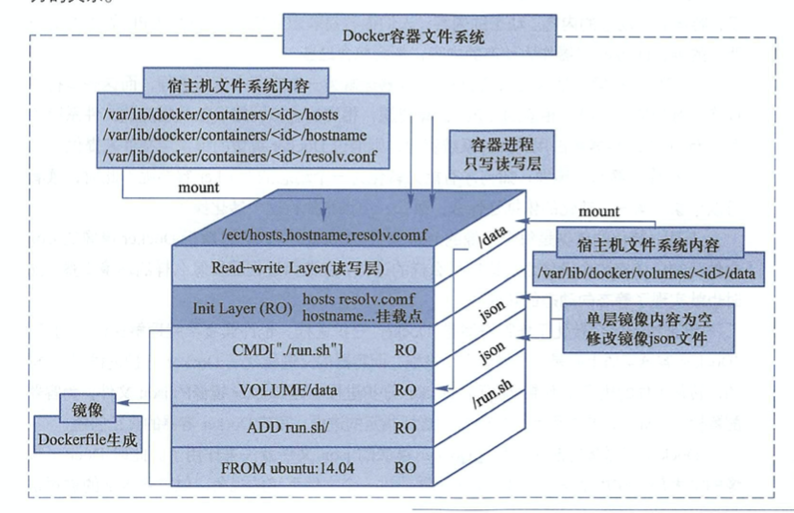

dockerfile面向开发，docker image作为交付标准，docker container涉及部署和运维，三者合起来完成docker体系。

上图可以理解

```plain
FROM ubuntu:14.04            选择基础镜像
ADD run.sh                    添加文件进镜像，这一层镜像只有一个内容，就是这个文件
VOLUME /data                设定存储目录，并未添加文件，只是更新了镜像的json文件，便于启动时候读区该层信息
CMD ["./run.sh"]        更新json文件，设定程序入口
```

## 容器操作

启动容器方式：

- 基于镜像创建

```plain
[root@docker01 my_docker]# docker run ubuntu /bin/echo 'Hello world'
启动交互式容器
[root@docker01 my_docker]# docker run -it ubuntu /bin/bash
root@30b2c5171302:/# pwd
/
root@30b2c5171302:/# whoami
root
```

docker run启动容器的时候，docker后台操作流程是

- 检查本地是否有该镜像，没有就下载
- 利用镜像创建且启动一个容器
- 分配容器文件系统，在只读的镜像层挂载读写层
- 宿主机的网桥接口会分配一个虚拟接口到容器中
- 容器获得地址池里的ip地址
- 执行用户指定的程序
- 若程序里没有进程在运行，容器执行完毕后立即终止

```plain
docker start可以启动一个处于stop状态的容器。
```

## 后台运行容器

```plain
1.在宿主机下，前台运行容器，会占用窗口，打印日志
[root@docker01 my_docker]# docker run --rm --name my_nginx02  -p 80:80 nginx
/docker-entrypoint.sh: /docker-entrypoint.d/ is not empty, will attempt to perform configuration
/docker-entrypoint.sh: Looking for shell scripts in /docker-entrypoint.d/
/docker-entrypoint.sh: Launching /docker-entrypoint.d/10-listen-on-ipv6-by-default.sh
10-listen-on-ipv6-by-default.sh: Getting the checksum of /etc/nginx/conf.d/default.conf
10-listen-on-ipv6-by-default.sh: Enabled listen on IPv6 in /etc/nginx/conf.d/default.conf
/docker-entrypoint.sh: Launching /docker-entrypoint.d/20-envsubst-on-templates.sh
/docker-entrypoint.sh: Configuration complete; ready for start up
10.0.1.1 - - [05/Sep/2020:08:46:14 +0000] "GET / HTTP/1.1" 200 612 "-" "Mozilla/5.0 (Macintosh; Intel Mac OS X 10_15_6) AppleWebKit/537.36 (KHTML, like Gecko) Chrome/85.0.4183.83 Safari/537.36" "-"
2020/09/05 08:46:14 [error] 28#28: *1 open() "/usr/share/nginx/html/favicon.ico" failed (2: No such file or directory), client: 10.0.1.1, server: localhost, request: "GET /favicon.ico HTTP/1.1", host: "10.0.1.70", referrer: "http://10.0.1.70/"
10.0.1.1 - - [05/Sep/2020:08:46:14 +0000] "GET /favicon.ico HTTP/1.1" 404 555 "http://10.0.1.70/" "Mozilla/5.0 (Macintosh; Intel Mac OS X 10_15_6) AppleWebKit/537.36 (KHTML, like Gecko) Chrome/85.0.4183.83 Safari/537.36" "-"
```

使用-d参数在后台运行

```plain
[root@docker01 my_docker]# docker run --rm --name my_nginx02  -d -p 80:80 nginx
eb6a2382bd1671bfbf47de176c1320355717a9ea132c4e469b9cc1cdc820436c
```

此时容器在后台运行，日志可以通过`docker logs 容器`查看

## docker logs

```plain
# 查看容器日志
[root@docker01 my_docker]# docker logs eb6
# 跟踪容器日志
[root@docker01 my_docker]# docker logs -f eb6
```

## 查看容器记录

```plain
docket ps   在运行的容器
docker ps -a 挂掉以及活着的容器
```

## 停止容器

```plain
docker stop
```

## 进入容器

```plain
容器在-d后台运行时，想要进入容器内操作
[root@docker01 my_docker]# docker exec -it eb6 bash
```

## 导入/导出/容器快照

```plain
# 导出镜像到本地文件
[root@docker01 my_docker]# docker export my_nginx02 > my_nginx02.tar
[root@docker01 my_docker]# ls
app.py  Dockerfile  my_nginx02.tar
# 用户可以导入容器快照，恢复为镜像
[root@docker01 my_docker]# docker import my_nginx02.tar test/my_nginx:v1.0
sha256:36321d2fc1c8d348452dff561a6e1de4567cea48c7303c9113d8b62c647b6cf4
[root@docker01 my_docker]# docker images
REPOSITORY          TAG                 IMAGE ID            CREATED             SIZE
test/my_nginx       v1.0                36321d2fc1c8        4 seconds ago       131MB
```

## 导入/导出/镜像

```plain
docker save 镜像
docker load 镜像文件
docker import 容器快照
注意这俩区别，容器快照文件会丢失所有历史记录和容器内元数据
镜像文件会保存完整记录，体积较大
```

## 删除容器

```plain
docker rm 容器id # 删除一个停止状态的容器
docker rm -f 容器。# 强制终止容器且删除
```

## 查看容器日志

```plain
docker logs 容器
docker logs -f 容器  # 跟踪容器日志
docker logs -ft 容器 # 跟踪容器日志与时间戳
```

## 查看容器进程列表

```plain
[root@docker01 my_docker]# docker top eb6
UID                 PID                 PPID                C                   STIME               TTY                 TIME                CMD
root                20906               20889               0                   Sep06               ?                   00:00:00            nginx: master process nginx -g daemon off;
101                 20955               20906               0                   Sep06               ?                   00:00:00            nginx: worker process
```

## 查看容器列表系统资源状态

```plain
docket stats
```

## 查看容器信息参数

```plain
[root@docker01 my_docker]# docker inspect 容器id
```

## 获取容器ip

```plain
[root@docker01 my_docker]# docker inspect --format '{{ .NetworkSettings.IPAddress }}'  eb6
172.17.0.3
```


# docker仓库

仓库的概念也就是用于存储，docker仓库用于存储镜像。

镜像构建完成后，很容易可以在宿主机上运行，但是如果要在其他服务器上运行，则需要考虑镜像的分发，存储的问题。

## docker registry

镜像注册服务就是用于提供集中式的存储，分发镜像的服务。

一个Docker Registry中可以包含多个仓库（Repositroy）

每个仓库可以包含多个标签（Tag），每个标签对应一个镜像。

通常一个仓库会包含同一个软件不同版本的镜像

```plain
centos8
centos7.2.xx
标签常用于对应该软件的各个版本，开发者可以通过
<仓库名>:<标签>
这样的格式指定软件具体版本，若不给出标签，默认用latest作为默认标签
```

### 仓库名

```plain
仓库名一般以两段形式出现，例如chaoge/centos
前者是docker registry多用户的用户名，后者是软件名
# 常见用法
docker pull chaoge/centos:7.2.1511
```

## 共有/私有/仓库

Docker Registry有两种形式

- 公开，开放给所有用户，提供给所有用户搜索，拉取，提交，更新镜像，还免费保管用户镜像数据。

- - 此类服务受限于网络限制，无法及时立即获取所需镜像，简单说就是需要用什么得现下载，得看网速
  - 优点是可以获取绝大部分公开的镜像，方便使用

- 私有范围的Registry服务，用在学校，企业内网的研发环境

- - 局域网环境，保证了镜像拉取速度
  - 保证核心镜像数据安全
  - 存在镜像不丰富问题

### 公开服务仓库

最常见的Registry是Docker Hub，也是docker默认允许用户管理镜像的Registry服务，拥有大量高质量的官方镜像。

由于网络地域原因，公开服务在国内访问较慢，也就出现了针对镜像服务的加速器。

- 阿里云加速器
- DaoCloud加速器
- 灵雀云加速器
- 等等

使用加速器，可以从国内的地址获取Docker Hub的镜像，速度会快很多。

### 私有服务仓库

除了私用公开服务外，还可以在自己本地搭建私有Docker Registry。

开源的Docker Registry镜像只提供了Docker Registry API的功能，没有图形化功能。

## 镜像注册

```plain
1.注册docker官网维护的大型公共仓库 Docker Hub
https://hub.docker.com/
```

2.注册完毕账号后，可以根据自己需要，创建，公开/私有的镜像仓库。


## 操作使用共有仓库

```plain
docker search 镜像名
```

## 加速器配置

```plain
1.修改docker配置文件
[root@docker01 my_docker]# cat /etc/docker/daemon.json
{"registry-mirrors": ["https://reg-mirror.qiniu.com"]}
2.重启docker
[root@docker01 my_docker]# systemctl daemon-reload
[root@docker01 my_docker]# systemctl restart docker
```

## 私有仓库部署

Repository是集中存放镜像的地方，且私有仓库优点是

- 省贷款
- 传输速度快
- 方便存储

当开发者编译完成Image之后，就可以推送到Registry了，公开或私有的皆可。

```plain
1.获取registry镜像，加上参数，确保每次重启
docker run -d \
      --name cc_registry \
      --restart=always \
    -p 5000:5000 \
    -v /opt/data/registry:/var/lib/registry \
    registry
[root@docker01 my_docker]# docker ps
CONTAINER ID        IMAGE               COMMAND                  CREATED             STATUS              PORTS                    NAMES
1979dd1975f0        registry            "/entrypoint.sh /etc…"   2 seconds ago       Up 1 second         0.0.0.0:5000->5000/tcp   cc_registry
2.推送本地镜像到私有仓库中
# 必须先修改镜像名，以
仓库地址/软件名 形式上传
[root@docker01 my_docker]# docker tag hello-world 10.0.1.70:5000/cc-hello-world:latest
[root@docker01 my_docker]# docker images |grep hello
10.0.1.70:5000/cc-hello-world   latest              bf756fb1ae65        8 months ago        13.3kB
hello-world                     latest              bf756fb1ae65        8 months ago        13.3kB
3.上传到私有仓库
注意，要修改docker配置文件
[root@docker01 my_docker]# cat /etc/docker/daemon.json
{"registry-mirrors": ["https://reg-mirror.qiniu.com"],"insecure-registries":["10.0.1.70:5000"]}
[root@docker01 my_docker]# systemctl restart docker
# 推送本地镜像
[root@docker01 my_docker]# docker push 10.0.1.70:5000/cc-hello-world
The push refers to repository [10.0.1.70:5000/cc-hello-world]
9c27e219663c: Pushed
latest: digest: sha256:90659bf80b44ce6be8234e6ff90a1ac34acbeb826903b02cfa0da11c82cbc042 size: 525
4.通过docker api查询镜像信息
[root@docker01 my_docker]# curl -s  127.0.0.1:5000/v2/_catalog | python -m json.tool
{
    "repositories": [
        "cc-hello-world"
    ]
}
5.此时可以删掉本地镜像
6.从私有仓库中下载镜像
[root@docker01 my_docker]# docker pull 10.0.1.70:5000/cc-hello-world
```


# Docker存储&网络&API

# Docker存储

## 数据卷Data Volumes

我们使用docker容器，也需要关注容器内的存储

Data Volumes是一个可供一个或多个容器使用的特殊目录

- 数据卷可以在容器内共享和重用
- 数据卷的修改会立即生效
- 数据卷的更新，不回影响镜像
- 数据卷会一直存在，即使容器被删除

数据卷的用法类似于Linux的mount挂载操作

**镜像中被指定为挂载点的目录**

其中文件会被隐藏，显示挂载的数据卷。

## 数据卷容器Data Volume Containers

数据卷容器涉及容器间共享的持久化、序列化的数据。

数据卷容器就是一个普通的容器，专门用于提供数据卷供给其他容器挂载使用。

## 创建数据卷

```plain
1.启动容器时候，用-v参数 指定挂载一个本地主机目录到容器中去
# 此时容器会自动创建如下的目录
# 宿主机的/chaoge_web目录会和容器内的/webapp目录作挂载关系
[root@docker01 ~]# docker run -d -P --name cc_web -v /chaoge_web:/webapp training/webapp
e5c38e028290d45efed6b7e6af6e370d757bf2a9a51eca73e63629a20cf8e46e
# 此时我们可以在/chaoge_web目录写入数据，进入容器查看挂载点的数据
2.上述挂载命令，默认权限是读写，用户可以指定权限，限制挂载点的操作
[root@docker01 ~]# docker run -d -P --name web -v /chaoge_web:/webapp:ro training/webapp python app.py
34c8eaba91969a6f6aedc5c698473dca0b296be72d20fe0cc9129ff05246e1a1
# 此时在宿主机/chaoge_web目录写入数据，进入容器内挂载点，发现是只读文件系统
```

## 查看数据卷具体信息

```plain
[root@docker01 chaoge_web]# docker inspect web 
# 部分信息如下
  "Mounts": [
            {
                "Type": "bind",
                "Source": "/chaoge_web",
                "Destination": "/webapp",
                "Mode": "ro",
                "RW": false,
                "Propagation": "rprivate"
            }
        ],
```

可以再启一个容器，查看数据卷挂载

```plain
1.启动命令
[root@docker01 chaoge_web]# docker run -d -P --name web02 -v /webapp training/webapp python app.py
0770c34853d5ff43a93944f8042130ad5935cc2d10a32cbe068c43e29412a64a
2.查看数据卷挂载情况
        "Mounts": [
            {
                "Type": "volume",
                "Name": "6e94214c1fc99c20670eabfcae81e1d7cd6d27508b7ff1feb06161071ac12163",
                "Source": "/var/lib/docker/volumes/6e94214c1fc99c20670eabfcae81e1d7cd6d27508b7ff1feb06161071ac12163/_data",
                "Destination": "/webapp",
                "Driver": "local",
                "Mode": "",
                "RW": true,
                "Propagation": ""
            }
        ],
```

## 创建数据卷/容器

```plain
1.创建数据卷容器
[root@docker01 _data]# docker run -d -v /dbdata --name dbdata training/postgres
2.在其他容器中使用--volumes-from 来挂载dbdata中的数据卷
[root@docker01 _data]# docker run -d --volumes-from dbdata --name db1 training/postgres
1b497a4e1c0a2b4cbd9c05df28947061a077550f9860aa27aa6aec0070e6296b
[root@docker01 _data]# docker run -d --volumes-from dbdata --name db2 training/postgres
31945794f2d357cdffdf5aabd1919390bcf04d2bc5b42a02949c5c9778e63c15
[root@docker01 _data]#
[root@docker01 _data]#
[root@docker01 _data]# docker ps
CONTAINER ID        IMAGE               COMMAND                  CREATED              STATUS              PORTS               NAMES
31945794f2d3        training/postgres   "su postgres -c '/us…"   3 seconds ago        Up 1 second         5432/tcp            db2
1b497a4e1c0a        training/postgres   "su postgres -c '/us…"   7 seconds ago        Up 5 seconds        5432/tcp            db1
cf4220beca71        training/postgres   "su postgres -c '/us…"   About a minute ago   Up About a minute   5432/tcp            dbdata
3.查看数据卷挂载情况
[root@docker01 _data]# docker inspect db2 |grep -i volume
            "VolumeDriver": "",
            "VolumesFrom": [
                "Type": "volume",
                "Source": "/var/lib/docker/volumes/b59cf0766e072a4b0d84f4ac360b0de7f24ccc3e96ee369bd94aa624705e3607/_data",
            "Volumes": null,
```

图解挂载

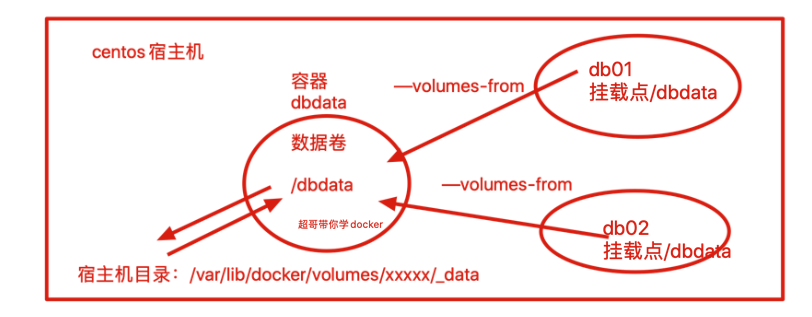

# Docker网络

我们使用容器，不单是运行单机程序，当然是需要运行网络服务在容器中，那么如何配置docker的容器网络，基础网络配置，网桥配置，端口映射，还是很重要。

## docker网络功能

docker的网络功能就是利用Linux的`network namespace`，`network bridge`，虚拟网络设备实现的。

默认情况下，docker安装完毕会生成网桥`docker0`

docker的网络接口默认都是虚拟的网络接口。

Docker容器网络在宿主机和容器内分别创建一个虚拟接口，让他们彼此通信。

```plain
# 默认的网桥
[root@docker01 db_backup]# ifconfig
docker0: flags=4163<UP,BROADCAST,RUNNING,MULTICAST>  mtu 1500
        inet 172.17.0.1  netmask 255.255.0.0  broadcast 172.17.255.255
        inet6 fe80::42:8dff:fe7b:916f  prefixlen 64  scopeid 0x20<link>
        ether 02:42:8d:7b:91:6f  txqueuelen 0  (Ethernet)
        RX packets 105087  bytes 4543670 (4.3 MiB)
        RX errors 0  dropped 0  overruns 0  frame 0
        TX packets 134319  bytes 628048552 (598.9 MiB)
        TX errors 0  dropped 0 overruns 0  carrier 0  collisions 0
```

docker创建一个容器的流程

- 创建一对虚拟接口，分别放到本地主机和新容器中。
- 宿主机一端桥接到默认的docker0，且有一个唯一的名字。
- 另一端放入容器里，改名为eth0，该接口只能在容器的命名空间里可见。
- 从网桥可用地址段获取一个空闲ip，分配给容器的eth0，且配置默认路由桥接到宿主机网卡
- 完成这些之后，容器可以使用eth0虚拟网卡和其他容器连接。


```plain
docker run 启动的时候，若没有添加--net参数，默认使用bridge桥接模式
docker实际是通过iptables做了DNAT规则，实现端口转发
```

## --net参数

```plain
--net=bridge 这个是默认值，连接到默认的网桥。
--net=host 告诉 Docker 不要将容器网络放到隔离的命名空间中，即不要容器化容器内的网络。此时容器使用本地主机的网络，它拥有完全的本地主机接口访问权限。容器进程可以跟主机其它 root 进程一样可以打开低范围的端口，可以访问本地网络服务比如 D-bus，还可以让容器做一些影响整个主机系统的事情，比如重启主机。因此使用这个选项的时候要非常小心。如果进一步的使用 --privileged=true，容器会被允许直接配置主机的网络堆栈。
--net=container:NAME_or_ID 让 Docker 将新建容器的进程放到一个已存在容器的网络栈中，新容器进程有自己的文件系统、进程列表和资源限制，但会和已存在的容器共享 IP 地址和端口等网络资源，两者进程可以直接通过 lo 环回接口通信。
--net=none 让 Docker 将新容器放到隔离的网络栈中，但是不进行网络配置。之后，用户可以自己进行配置。
```

容器结束后，docker会晴空容器，连着容器内的eth0会随着网络命名空间一起被清除。

### docker高级网络配置

首先，要实现网络通信，机器需要至少一个网络接口（物理接口或虚拟接口）来收发数据包；此外，如果不同子网之间要进行通信，需要路由机制。

Docker 中的网络接口默认都是虚拟的接口。虚拟接口的优势之一是转发效率较高。 Linux 通过在内核中进行数据复制来实现虚拟接口之间的数据转发，发送接口的发送缓存中的数据包被直接复制到接收接口的接收缓存中。对于本地系统和容器内系统看来就像是一个正常的以太网卡，只是它不需要真正同外部网络设备通信，速度要快很多。

Docker 容器网络就利用了这项技术。它在本地主机和容器内分别创建一个虚拟接口，并让它们彼此连通（这样的一对接口叫做 `veth pair`）。

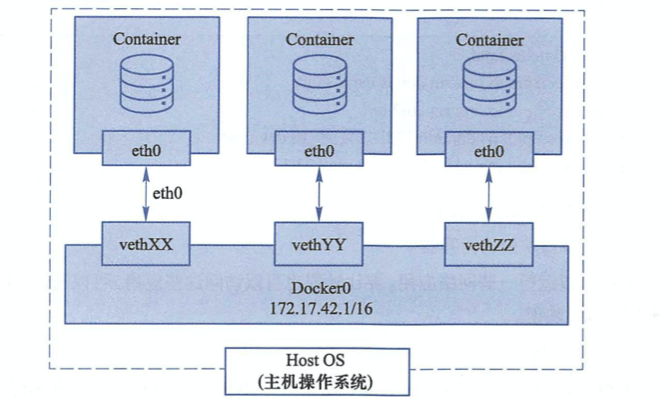

docker在启动时，在主机上创建一个docker0虚拟网桥，实际上是一个Linux的网桥，理解就是一个软件交换机。

docker随机分配一个本地未占用的私有网断地址给docker0接口。例如`172.17.42.1 子网掩码255.255.0.0`

此后启动的容器接口也会分配一个同一网段`172.17.0.0/16`

当创建一个Docker容器的时候，同时创建一对`veth pair(数据包发送到一个接口时，另一个接口也会得到同样数据包)`接口

这样的接口一端在容器，即eth0，另一端在宿主机，并且挂载到bridge0，例如veth***。

这样，主机就可以和容器通信，容器之间也可以相互通信了。

如下，三个容器，三个虚拟网络接口

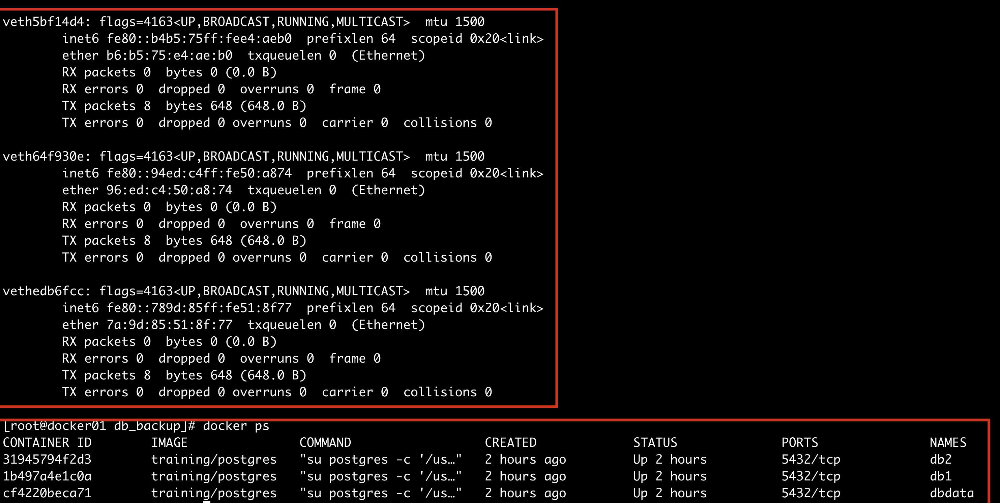

## 配置容器网络

### --net=none

```plain
1.该参数用户可以自行配置网络，让容器可以访问网络权限
[root@docker01 db_backup]# docker run -it --rm --net=none centos /bin/bash
[root@77cfd664d329 /]# 
# 此时容器是没有网络接口的
[root@77cfd664d329 /]# ip a
1: lo: <LOOPBACK,UP,LOWER_UP> mtu 65536 qdisc noqueue state UNKNOWN group default qlen 1000
    link/loopback 00:00:00:00:00:00 brd 00:00:00:00:00:00
    inet 127.0.0.1/8 scope host lo
       valid_lft forever preferred_lft forever
2.查找容器进程的pid，且创建网络命名空间，注意这里再开一个窗口
[root@docker01 ~]# docker inspect -f '{{.State.Pid}}' 77c
46882
[root@docker01 ~]# pid=46882
[root@docker01 ~]# mkdir -p /var/run/netns
[root@docker01 ~]# ln -s /proc/$pid/ns/net /var/run/netns/$pid
3.检查桥接网卡的ip和掩码信息
[root@docker01 ~]# ip addr show docker0
3: docker0: <BROADCAST,MULTICAST,UP,LOWER_UP> mtu 1500 qdisc noqueue state UP group default
    link/ether 02:42:8d:7b:91:6f brd ff:ff:ff:ff:ff:ff
    inet 172.17.0.1/16 brd 172.17.255.255 scope global docker0
       valid_lft forever preferred_lft forever
    inet6 fe80::42:8dff:fe7b:916f/64 scope link
       valid_lft forever preferred_lft forever
4.创建一对虚拟接口，A和B，绑定A到网桥docker0，且启用它。
[root@docker01 ~]# ip link add A type veth peer name B
# 安装网桥管理工具
[root@docker01 ~]# yum install bridge-utils -y
[root@docker01 ~]# brctl addif docker0 A
[root@docker01 ~]# ip link set A up
5.将B放入容器的网络名称空间，命名为eth0
[root@docker01 ~]# ip link set B netns $pid
[root@docker01 ~]# ip netns exec $pid ip link set dev B name eth0
[root@docker01 ~]# ip netns exec $pid ip link set eth0 up
[root@docker01 ~]# ip netns exec $pid ip addr add 172.17.42.99/16 dev eth0
[root@docker01 ~]# ip netns exec $pid ip route add default via 172.17.42.1
```


至此，自定义docker网络过程结束。

## 配置容器端口

容器里运行web服务，是基本需求，想要让外部访问容器内应用，可以通过参数

```plain
-p  port:port
-P  随机port:port
宿主机：容器
```


## -P随机映射

```plain
1.使用-P 参数
docker随机映射端口到容器内部打开的端口。也就是dockerfiler EXPOSE指令 打开的端口
[root@docker01 db_backup]# docker run -d -P training/webapp python app.py
58c26b81a390de884aee7cd51090e169a6d5eb987d3f548f082e760f00b0e3e5
[root@docker01 db_backup]# docker ps
CONTAINER ID        IMAGE               COMMAND             CREATED             STATUS              PORTS                     NAMES
58c26b81a390        training/webapp     "python app.py"     2 seconds ago       Up 1 second         0.0.0.0:32778->5000/tcp   distracted_hermann
2.检查端口转发情况
[root@docker01 db_backup]# docker port 58c
5000/tcp -> 0.0.0.0:32778
3.检查容器内日志信息，可以加上-f参数
[root@docker01 db_backup]# docker logs 58c
 * Running on http://0.0.0.0:5000/ (Press CTRL+C to quit)
```


## -p指定端口映射

```plain
[root@docker01 db_backup]# docker run -d -p 5000:5000 training/webapp python app.py
f9f92b81ee097c0ca584ed8551f07735ce60b8903c6b5e5ca9a4c2a01b91cc9f
[root@docker01 db_backup]# docker ps
CONTAINER ID        IMAGE               COMMAND             CREATED             STATUS              PORTS                     NAMES
f9f92b81ee09        training/webapp     "python app.py"     3 seconds ago       Up 2 seconds        0.0.0.0:5000->5000/tcp    intelligent_benz
58c26b81a390        training/webapp     "python app.py"     28 minutes ago      Up 28 minutes       0.0.0.0:32778->5000/tcp   distracted_hermann
-p参数语法
宿主机访问的端口:容器内端口
# 查看宿主机端口情况
[root@docker01 db_backup]# netstat -tunlp
Active Internet connections (only servers)
Proto Recv-Q Send-Q Local Address           Foreign Address         State       PID/Program name
tcp        0      0 0.0.0.0:22              0.0.0.0:*               LISTEN      45472/sshd
tcp        0      0 127.0.0.1:25            0.0.0.0:*               LISTEN      1361/master
tcp6       0      0 :::32778                :::*                    LISTEN      50118/docker-proxy
tcp6       0      0 :::5000                 :::*                    LISTEN      51660/docker-proxy
tcp6       0      0 :::22                   :::*                    LISTEN      45472/sshd
tcp6       0      0 ::1:25                  :::*                    LISTEN      1361/master
```

此类写法，默认是绑定到宿主机所有地址，如

- 127.0.0.1
- 0.0.0.0

### 绑定指定地址

此时容器内服务，只能在宿主机本地访问了

```plain
[root@docker01 db_backup]#
[root@docker01 db_backup]# docker run -d -p 127.0.0.1:5000:5000 training/webapp python app.py
0746b0626ee5baceb291b76bab3f4a3eca6ec3e2cacb35e0b8df55b57f05bb30
[root@docker01 db_backup]# docker ps
CONTAINER ID        IMAGE               COMMAND             CREATED             STATUS              PORTS                      NAMES
0746b0626ee5        training/webapp     "python app.py"     3 seconds ago       Up 1 second         127.0.0.1:5000->5000/tcp   eloquent_raman
[root@docker01 db_backup]#
[root@docker01 db_backup]#
[root@docker01 db_backup]# netstat -tunlp
Active Internet connections (only servers)
Proto Recv-Q Send-Q Local Address           Foreign Address         State       PID/Program name
tcp        0      0 127.0.0.1:5000          0.0.0.0:*               LISTEN      53557/docker-proxy
```

## 配置容器互联link

容器的连接，上述超哥讲解了，可以通过网桥形式通信，还可以在容器之间指定连接方式。

通过`linking`形式，在容器之间创建隧道。

```plain
1.创建容器且命名
[root@docker01 db_backup]# docker run -d -P --name web01 training/webapp python app.py
2.查看容器名
[root@docker01 db_backup]# docker ps -l
CONTAINER ID        IMAGE               COMMAND             CREATED             STATUS              PORTS                     NAMES
ad8b97933b31        training/webapp     "python app.py"     5 seconds ago       Up 3 seconds        0.0.0.0:32779->5000/tcp   web01
3.通过docker inspect查看
[root@docker01 db_backup]# docker inspect -f "{{.Name}}" ad8
/web01
```

### 容器互联操作

父容器：web01

子容器：db

```plain
1.创建一个新的数据库容器
[root@docker01 db_backup]# docker run -d --name db training/postgres
e7815c6d7e9095a4224b28080da86a206c851e51367282c5a79f29bf1c769f6a
[root@docker01 db_backup]# docker ps
CONTAINER ID        IMAGE               COMMAND                  CREATED             STATUS              PORTS                     NAMES
e7815c6d7e90        training/postgres   "su postgres -c '/us…"   2 seconds ago       Up 2 seconds        5432/tcp                  db
ad8b97933b31        training/webapp     "python app.py"          2 minutes ago       Up 2 minutes        0.0.0.0:32779->5000/tcp   web01
2.删除之前的容器，重新创建，且建立连接关系
[root@docker01 db_backup]# docker rm -f web01
web01
3.重新创建，加上--link
[root@docker01 db_backup]# docker run -d -P --name web01 --link db:db training/webapp python app.py
d947259fcaf27cf54cde66a673999db5b85917dcd9c603e6f432a8e5d5b488ff
```

`--link`参数格式语法

```plain
--link name:alias
name是需要连接的容器名
alias是连接的别名
```

查看容器进程信息，查看具体的`link`关系

```plain
[root@docker01 ~]# docker inspect web01 -f "{{ .HostConfig.Links}}"
[/db:/web01/db]
```

查看容器内环境变量env，检查有关db容器的信息

以DB开头的就是用于web容器连接db容器的信息

```plain
[root@docker01 ~]# docker exec -i  d94 env
PATH=/usr/local/sbin:/usr/local/bin:/usr/sbin:/usr/bin:/sbin:/bin
HOSTNAME=d947259fcaf2
DB_PORT=tcp://172.17.0.3:5432
DB_PORT_5432_TCP=tcp://172.17.0.3:5432
DB_PORT_5432_TCP_ADDR=172.17.0.3
DB_PORT_5432_TCP_PORT=5432
DB_PORT_5432_TCP_PROTO=tcp
DB_NAME=/web01/db
DB_ENV_PG_VERSION=9.3
HOME=/root
```

除了环境变量外，docker使用--link参数，还会修改父容器的hosts文件，也就web01容器

在web01点hosts文件中写了子容器的主机名解析关系。

```plain
[root@docker01 ~]# docker exec -i web01 cat /etc/hosts
127.0.0.1    localhost
::1    localhost ip6-localhost ip6-loopback
fe00::0    ip6-localnet
ff00::0    ip6-mcastprefix
ff02::1    ip6-allnodes
ff02::2    ip6-allrouters
172.17.0.3    db e7815c6d7e90
172.17.0.2    d947259fcaf2
```

## 容器访问控制

容器的访问控制，主要通过Linux的iptables防火墙进行管理和实现。

### 容器访问外部网络

容器想要和外部通信，需要linux内核转发支持 1.检查内核转发，看到如下结果才正确，结果需要为1

```plain
[root@docker01 ~]# sysctl net.ipv4.ip_forward
net.ipv4.ip_forward = 1
```

2.也可以在启动docker服务时候，指定参数--ip-forward=true docker会打开上述转发参数

```plain
--ip-forward=true
```

3.容器间通信

```plain
docker容器默认通过docker0网桥通信
本地iptables是否允许通过
```

4.访问所有端口

```plain
docker启动服务的时候，默认会添加一条转发策略到iptables的forward链上。
查看策略是允许还是禁止。
也可以通过参数。--ice=true/false 决定 允许/禁止 容器通信。
```

5.若是默认禁止了容器通信，可以通过link选择容器通信

```plain
--link 用法
```

6.外部访问容器

```plain
通过docker run的参数 -p. -P
实现容器端口映射
```

7.查看容器默认网桥,brctl命令需要安装

```plain
[root@chaogelinux ~]# brctl show
bridge name    bridge id        STP enabled    interfaces
docker0        8000.0242461b94df    no        veth225675e
```

### 自定义网桥

除了默认的docker0，还可以指定网桥，连接容器

```plain
启动docker时，可以加上参数 
-b bridge
--bridge=bridge 
指定网桥启动
```

### 实践

```plain
1.停止docker服务
[root@docker01 ~]# systemctl stop docker
2.停止网桥服务，就看不到了
[root@docker01 ~]# ip link set dev docker0 down
[root@docker01 ~]# ifconfig
ens33: flags=4163<UP,BROADCAST,RUNNING,MULTICAST>  mtu 1500
        inet 10.0.1.70  netmask 255.255.255.0  broadcast 10.0.1.255
        inet6 fe80::ad00:1ca6:831:d693  prefixlen 64  scopeid 0x20<link>
        ether 00:0c:29:f4:60:9b  txqueuelen 1000  (Ethernet)
        RX packets 978734  bytes 1372176080 (1.2 GiB)
        RX errors 0  dropped 0  overruns 0  frame 0
        TX packets 223611  bytes 18104058 (17.2 MiB)
        TX errors 0  dropped 0 overruns 0  carrier 0  collisions 0
lo: flags=73<UP,LOOPBACK,RUNNING>  mtu 65536
        inet 127.0.0.1  netmask 255.0.0.0
        inet6 ::1  prefixlen 128  scopeid 0x10<host>
        loop  txqueuelen 1000  (Local Loopback)
        RX packets 332  bytes 29426 (28.7 KiB)
        RX errors 0  dropped 0  overruns 0  frame 0
        TX packets 332  bytes 29426 (28.7 KiB)
        TX errors 0  dropped 0 overruns 0  carrier 0  collisions 0
3.删除网桥
[root@docker01 ~]# ifconfig docker0
docker0: flags=4098<BROADCAST,MULTICAST>  mtu 1500
        inet 172.17.0.1  netmask 255.255.0.0  broadcast 172.17.255.255
        ether 02:42:8d:7b:91:6f  txqueuelen 0  (Ethernet)
        RX packets 105275  bytes 4556332 (4.3 MiB)
        RX errors 0  dropped 0  overruns 0  frame 0
        TX packets 134486  bytes 628064769 (598.9 MiB)
        TX errors 0  dropped 0 overruns 0  carrier 0  collisions 0
[root@docker01 ~]# brctl delbr docker0
[root@docker01 ~]# ifconfig  docker0
docker0: error fetching interface information: Device not found
4.创建网桥docker0
[root@docker01 ~]# brctl addbr bridge0
[root@docker01 ~]# ip addr add 192.168.5.1/24 dev bridge0
[root@docker01 ~]# ip link set dev bridge0 up
[root@docker01 ~]# ifconfig
bridge0: flags=4163<UP,BROADCAST,RUNNING,MULTICAST>  mtu 1500
        inet 192.168.5.1  netmask 255.255.255.0  broadcast 0.0.0.0
        inet6 fe80::346f:5ff:feb7:63f2  prefixlen 64  scopeid 0x20<link>
        ether 36:6f:05:b7:63:f2  txqueuelen 1000  (Ethernet)
        RX packets 0  bytes 0 (0.0 B)
        RX errors 0  dropped 0  overruns 0  frame 0
        TX packets 6  bytes 508 (508.0 B)
        TX errors 0  dropped 0 overruns 0  carrier 0  collisions 0
ens33: flags=4163<UP,BROADCAST,RUNNING,MULTICAST>  mtu 1500
        inet 10.0.1.70  netmask 255.255.255.0  broadcast 10.0.1.255
        inet6 fe80::ad00:1ca6:831:d693  prefixlen 64  scopeid 0x20<link>
        ether 00:0c:29:f4:60:9b  txqueuelen 1000  (Ethernet)
        RX packets 979039  bytes 1372201512 (1.2 GiB)
        RX errors 0  dropped 0  overruns 0  frame 0
        TX packets 223769  bytes 18121988 (17.2 MiB)
        TX errors 0  dropped 0 overruns 0  carrier 0  collisions 0
lo: flags=73<UP,LOOPBACK,RUNNING>  mtu 65536
        inet 127.0.0.1  netmask 255.0.0.0
        inet6 ::1  prefixlen 128  scopeid 0x10<host>
        loop  txqueuelen 1000  (Local Loopback)
        RX packets 332  bytes 29426 (28.7 KiB)
        RX errors 0  dropped 0  overruns 0  frame 0
        TX packets 332  bytes 29426 (28.7 KiB)
        TX errors 0  dropped 0 overruns 0  carrier 0  collisions 0
5.确认网桥创建，且启动了
[root@docker01 ~]# ip addr show bridge0
6.修改docker配置文件，添加docker默认网桥连接
[root@docker01 ~]# cat /etc/docker/daemon.json
{"registry-mirrors": ["https://reg-mirror.qiniu.com"],"insecure-registries":["10.0.1.70:5000"],"bridge":"bridge0"}
7.重启docker服务
8.此时创建新的容器，已经桥接到了新的bridge0
[root@docker01 ~]# docker run -it centos bash
[root@28b76067a253 /]# ping baidu.com
PING baidu.com (220.181.38.148) 56(84) bytes of data.
64 bytes from 220.181.38.148 (220.181.38.148): icmp_seq=1 ttl=127 time=8.90 ms
64 bytes from 220.181.38.148 (220.181.38.148): icmp_seq=2 ttl=127 time=7.81 ms
64 bytes from 220.181.38.148 (220.181.38.148): icmp_seq=3 ttl=127 time=9.57 ms
```

# Docker API

```plain
https://docs.docker.com/engine/api/v1.24/
```

API是程序开发的一个接口，docker api类型包括RESTful，基于HTTP协议和RPC协议。

所谓restful风格就是对HTTP协议的各种封装，如

- get
- post
- delete
- update
- put
- 等等

restfule服务器提供这些请求的接口(地址，路径，参数，也就是一个完整的url）

docker提供了三种API使用

- Registry，提供存储docker镜像的功能
- Docker Hub API：提供了docker hub集成的功能
- Docker Remote API：提供了和Docker守护进程集成的功能（也就是docker命令各种操作）

## Docker Remote API

核心介绍docker remote api，因为这是核心docker命令操作。

docker默认的守护进程会绑定在本地主机的套接字

```plain
通过配置文件查看
[root@docker01 ~]# cat /usr/lib/systemd/system/docker.service |grep sock
Requires=docker.socket
ExecStart=/usr/bin/dockerd -H fd:// --containerd=/run/containerd/containerd.sock
```

docker的守护进程需要root身份去运行，否则会导致权限不足，管理资源。

```plain
[root@docker01 ~]# ps -ef|grep docker
root      66459      1  0 14:05 ?        00:00:00 /usr/bin/dockerd -H fd:// --containerd=/run/containerd/containerd.sock
```

如果只查询宿主机本地的docker API，那么没什么问题，如果想要远程访问，本地sock套接字文件就不行了，得把docker守护进程绑定到网络接口上。

## remote API操作

```plain
1.修改Remote API配置信息，改为网络接口形式
[root@docker01 ~]# cat /usr/lib/systemd/system/docker.service |grep dockerd
#ExecStart=/usr/bin/dockerd -H fd:// --containerd=/run/containerd/containerd.sock
ExecStart=/usr/bin/dockerd -H tcp://0.0.0.0:2375
2.重启服务
[root@docker01 ~]# systemctl daemon-reload
[root@docker01 ~]# systemctl restart docker
[root@docker01 ~]# ps -ef|grep docker
root      69712      1  8 14:58 ?        00:00:00 /usr/bin/dockerd -H tcp://0.0.0.0:2375
root      69847  59079  0 14:58 pts/0    00:00:00 grep --color=auto docker
3.通过远程主机，查看是否能够连接docker守护进程。
# 远程查看镜像
[yuchao@yumac ~]$docker -H 10.0.1.70:2375 images
# 远程启动容器
[yuchao@yumac ~]$docker -H 10.0.1.70:2375 run -d -P training/webapp python app.py
63df24d4f52ef96d00cb6d869c87a8d8a3be0f3f6506f63e35ede2c90de3d17d
# 远程查看
[yuchao@yumac ~]$docker -H 10.0.1.70:2375 ps
CONTAINER ID        IMAGE               COMMAND             CREATED             STATUS              PORTS                     NAMES
63df24d4f52e        training/webapp     "python app.py"     8 seconds ago       Up 5 seconds        0.0.0.0:32768->5000/tcp   competent_ishizaka
4.此时就已经可以远程使用docker remote api了
```

## 实践docker remote api

```plain
1.在docker宿主机本地实践api，查看docker信息，已经可以通过http协议访问
[root@docker01 ~]# curl -s  http://127.0.0.1:2375/info |python -m json.tool
2.管理镜像信息，获取docker守护进程里的列表
[root@docker01 ~]# curl -s  http://127.0.0.1:2375/images/json |python -m json.tool
3.在docker hub搜索镜像，也就是之前我们使用的docker search ubuntu这样
[root@docker01 ~]# curl -s  http://127.0.0.1:2375/images/search?term="ubuntu" |python -m json.tool
4.通过API管理容器
[root@docker01 ~]# curl -s  http://127.0.0.1:2375/containers/json  |python -m json.tool
这条命令，就等同于
[root@docker01 ~]# docker  -H 127.0.0.1:2375 ps
CONTAINER ID        IMAGE               COMMAND             CREATED             STATUS              PORTS                     NAMES
63df24d4f52e        training/webapp     "python app.py"     9 minutes ago       Up 9 minutes        0.0.0.0:32768->5000/tcp   competent_ishizaka
5.创建容器，一个大坑是，超哥提示，创建容器，该镜像本地必须存在对吧！！
[root@docker01 ~]# curl -X POST -H "Content-Type:application/json" http://127.0.0.1:2375/containers/create -d '{"image":"centos"}'
{"Id":"072c0a7ef96dae6d5bdd093bab4d03f349ec5ee5383cd5ed27c582c951b81d7f","Warnings":[]}
6.删除容器，后面跟着容器id
[root@docker01 ~]# curl  -X DELETE    http://127.0.0.1:2375/containers/072c0a7ef96d?v=1
```

## 总结

最后建议，改回sock本地进程通信形式，更方便的使用docker命令。


# Docker容器编排

随着网站架构的升级，容器也使用的越发频繁，应用服务和容器间的关系也越发复杂。这就要求研发人员能够更好的方法去管理数量较多的容器服务，而不能手动的去挨个管理。

例如一个LNMP的架构，就得部署web服务器，后台程序，数据库，负载均衡等等都需要统一部署在容器里，那么这时候就需要使用统一的容器编排服务`docker-compose`，通过一个单独的`docker-compose.yml`模板文件为一个项目定义一组相关联的应用容器。

## docker-compose

docker-compose的定位就是*定义和运行多个docker容器应用*。

之前我们了解可以用dockerfile模板文件让用户方便的定义一个单独的应用容器，然而，如LNMP这样的Web项目，就涉及多个服务之间的配合，如nginx,mysql,php,redis等。


docker-compose就可以满足这样的需求，允许用户通过`docker-compose.yml`模板文件，来定义各容易间的关系。

## compose两个重要的概念

- 服务，service：一个应用的容器，实际上可以包括若干个相同镜像的容器实例。
- 项目，project：由一组关联的应用容器组成的一个完成业务单元。

Compose默认管理的是project，通过子命令对项目中的一组容器进行生命周期管理。

Compose由python语言开发，调用了Docker提供的API对容器进行管理。

## 安装compose

compose需要`docker engine 1.7.1+`

安装形式

- python的pip包管理工具
- 二进制文件
- 运行在容器里

```plain
1.安装compose
[root@docker01 ~]# yum install epel-release -y
2.安装pip工具，默认是python2版本
[root@docker01 ~]# yum install python-pip python-devel -y
3.安装docker-compose
# 更换pip源
[root@docker01 ~]# cat ~/.pip/pip.conf
[global]
index-url = https://pypi.tuna.tsinghua.edu.cn/simple
# 升级pip工具版本
pip install --upgrade pip
4.下载
[root@docker01 ~]# pip install -U docker-compose
5.检查
[root@docker01 ~]# docker-compose version
/usr/lib/python2.7/site-packages/paramiko/transport.py:33: CryptographyDeprecationWarning: Python 2 is no longer supported by the Python core team. Support for it is now deprecated in cryptography, and will be removed in a future release.
  from cryptography.hazmat.backends import default_backend
docker-compose version 1.26.2, build unknown
docker-py version: 4.3.1
CPython version: 2.7.5
OpenSSL version: OpenSSL 1.0.2k-fips  26 Jan 2017
```

也可以用二进制方式安装，注意python2,3的区别

```plain
1.下载安装
curl -L https://github.com/docker/compose/releases/download/1.25.5/docker-compose-`uname -s`-`uname -m` > /usr/local/bin/docker-compose
chmod +x /usr/local/bin/docker-compose
2.检查版本
[root@docker01 ~]# docker-compose version
docker-compose version 1.25.5, build 8a1c60f6
docker-py version: 4.1.0
CPython version: 3.7.5
OpenSSL version: OpenSSL 1.1.0l  10 Sep 2019
```

## 实践docker-compose

编写一个python web案例，涉及两个容器

- python web容器
- redis数据库

部署步骤

```plain
1.创建compose目录,dockerfile
[root@docker01 ~]# mkdir /chaoge_compose_app
[root@docker01 ~]# cd /chaoge_compose_app/
2.创建代码文件，依赖文件
# 代码文件
[root@docker01 chaoge_compose_app]# cat app.py
from flask import Flask
from redis import Redis
app = Flask(__name__)
redis = Redis(host='redis', port=6379)
@app.route('/')
def hello():
    count = redis.incr('hits')
    return 'Welcome to Chao Ge Class about docker-compose,this page has been visited {} times\n'.format(count)
if __name__ == "__main__":
    app.run(host="0.0.0.0", debug=True)
# 依赖文件
[root@docker01 chaoge_compose_app]# cat requirements.txt
flask
redis
# 代码文件目录格式
[root@docker01 chaoge_compose_app]# ls
app.py  Dockerfile  requirements.txt
3.检查dockerfile
[root@docker01 chaoge_compose_app]# cat Dockerfile
FROM python:2.7
MAINTAINER chaoge yc_uuu@163.com
COPY app.py /opt
COPY requirements.txt /opt
WORKDIR /opt
RUN pip install --upgrade pip -i https://pypi.douban.com/simple
RUN pip install -r requirements.txt -i https://pypi.douban.com/simple
4.构建镜像
[root@docker01 chaoge_compose_app]# docker build  --no-cache -t chaoge/python_web .
5.获取redis镜像且运行
[root@docker01 chaoge_compose_app]# docker pull redis
[root@docker01 chaoge_compose_app]# docker run -d -p 6379:6379 --name redis redis
6.运行flask web容器，且进行容器互联
[root@docker01 chaoge_compose_app]# docker run -d -p 5000:5000 --link redis:redis --name flask_web chaoge/python_web python app.py
499ba911294af0709b39dacd92fc87a33f6c0725b33d90076f810dd3060fa117
 7.访问页面
```

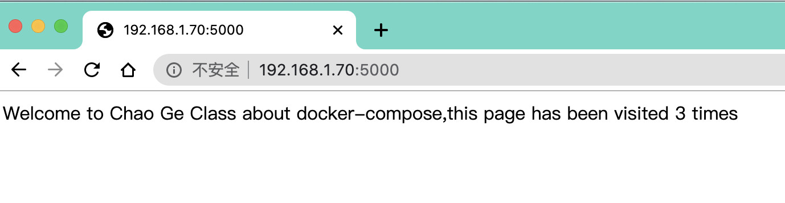

每次刷新，查看页面刷新统计次数。

## 构建docker compose yml

准备好yml文件

```plain
[root@docker01 chaoge_compose_app]# cat docker-compose.yml
web:
  image: chaoge/python_web
  command: python app.py
  ports:
    - "5000:5000"
  links:
    - redis
redis:
  image: redis
```

可以停止之前运行的flask web容器，用compose形式运行。

```plain
[root@docker01 chaoge_compose_app]# docker-compose up
/usr/lib/python2.7/site-packages/paramiko/transport.py:33: CryptographyDeprecationWarning: Python 2 is no longer supported by the Python core team. Support for it is now deprecated in cryptography, and will be removed in a future release.
  from cryptography.hazmat.backends import default_backend
Creating chaoge_compose_app_redis_1 ... done
Creating chaoge_compose_app_web_1   ... done
Attaching to chaoge_compose_app_redis_1, chaoge_compose_app_web_1
redis_1  | 1:C 08 Sep 2020 19:18:29.356 # oO0OoO0OoO0Oo Redis is starting oO0OoO0OoO0Oo
redis_1  | 1:C 08 Sep 2020 19:18:29.356 # Redis version=6.0.7, bits=64, commit=00000000, modified=0, pid=1, just started
redis_1  | 1:C 08 Sep 2020 19:18:29.356 # Warning: no config file specified, using the default config. In order to specify a config file use redis-server /path/to/redis.conf
redis_1  | 1:M 08 Sep 2020 19:18:29.357 * Running mode=standalone, port=6379.
redis_1  | 1:M 08 Sep 2020 19:18:29.357 # WARNING: The TCP backlog setting of 511 cannot be enforced because /proc/sys/net/core/somaxconn is set to the lower value of 128.
redis_1  | 1:M 08 Sep 2020 19:18:29.357 # Server initialized
redis_1  | 1:M 08 Sep 2020 19:18:29.357 # WARNING overcommit_memory is set to 0! Background save may fail under low memory condition. To fix this issue add 'vm.overcommit_memory = 1' to /etc/sysctl.conf and then reboot or run the command 'sysctl vm.overcommit_memory=1' for this to take effect.
redis_1  | 1:M 08 Sep 2020 19:18:29.357 # WARNING you have Transparent Huge Pages (THP) support enabled in your kernel. This will create latency and memory usage issues with Redis. To fix this issue run the command 'echo never > /sys/kernel/mm/transparent_hugepage/enabled' as root, and add it to your /etc/rc.local in order to retain the setting after a reboot. Redis must be restarted after THP is disabled.
redis_1  | 1:M 08 Sep 2020 19:18:29.357 * Ready to accept connections
web_1    |  * Serving Flask app "app" (lazy loading)
web_1    |  * Environment: production
web_1    |    WARNING: This is a development server. Do not use it in a production deployment.
web_1    |    Use a production WSGI server instead.
web_1    |  * Debug mode: on
web_1    |  * Running on http://0.0.0.0:5000/ (Press CTRL+C to quit)
web_1    |  * Restarting with stat
web_1    |  * Debugger is active!
web_1    |  * Debugger PIN: 214-249-451
web_1    | 192.168.1.35 - - [08/Sep/2020 19:18:37] "GET / HTTP/1.1" 200 -
web_1    | 192.168.1.35 - - [08/Sep/2020 19:18:37] "GET /favicon.ico HTTP/1.1" 404 -
web_1    | 192.168.1.35 - - [08/Sep/2020 19:18:39] "GET / HTTP/1.1" 200 -
web_1    | 192.168.1.35 - - [08/Sep/2020 19:18:39] "GET /favicon.ico HTTP/1.1" 404 -
web_1    | 192.168.1.35 - - [08/Sep/2020 19:18:39] "GET / HTTP/1.1" 200 -
web_1    | 192.168.1.35 - - [08/Sep/2020 19:18:39] "GET /favicon.ico HTTP/1.1" 404 -
```

也可以后台运行compose

```plain
[root@docker01 chaoge_compose_app]# docker-compose up -d
/usr/lib/python2.7/site-packages/paramiko/transport.py:33: CryptographyDeprecationWarning: Python 2 is no longer supported by the Python core team. Support for it is now deprecated in cryptography, and will be removed in a future release.
  from cryptography.hazmat.backends import default_backend
Starting chaoge_compose_app_redis_1 ... done
Starting chaoge_compose_app_web_1   ... done
[root@docker01 chaoge_compose_app]#
[root@docker01 chaoge_compose_app]#
[root@docker01 chaoge_compose_app]# docker ps
CONTAINER ID        IMAGE               COMMAND                  CREATED             STATUS              PORTS                    NAMES
cbb605e808f7        chaoge/python_web   "python app.py"          59 seconds ago      Up 7 seconds        0.0.0.0:5000->5000/tcp   chaoge_compose_app_web_1
9e9f2039dec9        redis               "docker-entrypoint.s…"   59 seconds ago      Up 7 seconds        6379/tcp                 chaoge_compose_app_redis_1
```

现在我们就基本的一键运行了2个容器服务，且互相连接。

## compose运行wordpress

只需要开发compose.yml文件即可

```plain
--default_authentication_plugin=mysql_native_password
有关mysql8的密码加密插件修改
yml参数解释：解决容器的依赖、启动先后的问题。先启动，然后启动wordpress
depends_on:
  - db
```

yml配置文件

```plain
[root@docker01 wordpress]# cat /chaoge_compose_app/wordpress/docker-compose.yml
version: "3"
services:
   db:
     image: mysql:8.0
     command:
      - --default_authentication_plugin=mysql_native_password
      - --character-set-server=utf8mb4
      - --collation-server=utf8mb4_unicode_ci
     volumes:
       - db_data:/var/lib/mysql
     restart: always
     environment:
       MYSQL_ROOT_PASSWORD: chaoge888
       MYSQL_DATABASE: wordpress
       MYSQL_USER: wordpress
       MYSQL_PASSWORD: wordpress
   wordpress:
     depends_on:
       - db
     image: wordpress:latest
     ports:
       - "8000:80"
     restart: always
     environment:
       WORDPRESS_DB_HOST: db:3306
       WORDPRESS_DB_USER: wordpress
       WORDPRESS_DB_PASSWORD: wordpress
volumes:
  db_data:
```

一键运行wordpress

```plain
[root@docker01 wordpress]# docker-compose up -d
```


# Docker Swarm集群

```
swarm`一词的解释，比如动物的群集行为，鸟群，鱼群，秋天往南飞的大雁群，都称之为`Swarm behavior
```

Docker Swarm是docker公司发布的一套管理Docker集群的工具，将一群容器变成一个单一的主机。

Swarm使用`Docker API`作为前端访问入口，各种形式的docker工具都可以和Swarm集成使用。

来自 Docker 官网的这张图片形象的展示了集群中管理节点与工作节点的关系。


运行 Docker 的主机可以主动初始化一个 `Swarm` 集群或者加入一个已存在的 `Swarm` 集群，这样这个运行 Docker 的主机就成为一个 `Swarm` 集群的节点 (`node`) 。

节点分为管理 (`manager`) 节点和工作 (`worker`) 节点。

管理节点用于 `Swarm` 集群的管理，`docker swarm` 命令基本只能在管理节点执行（节点退出集群命令 `docker swarm leave` 可以在工作节点执行）。一个 `Swarm` 集群可以有多个管理节点，但只有一个管理节点可以成为 `leader`，`leader` 通过 `raft` 协议实现。

工作节点是任务执行节点，管理节点将服务 (`service`) 下发至工作节点执行。管理节点默认也作为工作节点。你也可以通过配置让服务只运行在管理节点。

## 服务和任务

任务 （`Task`）是 `Swarm` 中的最小的调度单位，目前来说就是一个单一的容器。

服务 （`Services`） 是指一组任务的集合，服务定义了任务的属性。服务有两种模式：

- `replicated services` 按照一定规则在各个工作节点上运行指定个数的任务。
- `global services` 每个工作节点上运行一个任务

两种模式通过 `docker service create` 的 `--mode` 参数指定。

来自 Docker 官网的这张图片形象的展示了容器、任务、服务的关系。

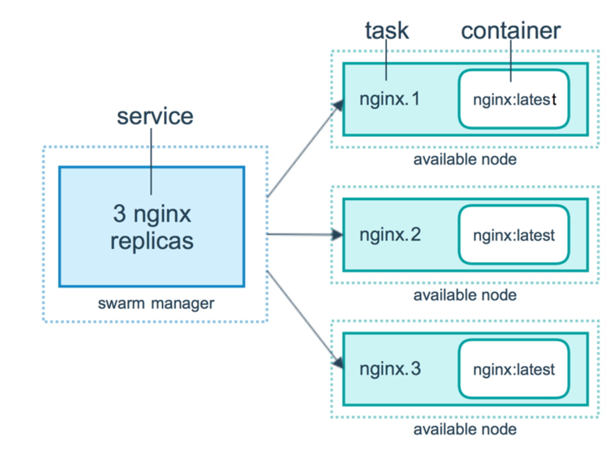

## 创建Swarm集群

我们知道 `Swarm` 集群由 **管理节点** 和 **工作节点** 组成。本节我们来创建一个包含`一个管理节点`和`两个工作节点`的最小 `Swarm` 集群。

## Docker Machine

Docker Machine 是 Docker 官方编排（Orchestration）项目之一，负责在多种平台上快速安装 Docker 环境。

Docker Machine 项目基于 Go 语言实现，目前在 [Github](https://github.com/docker/machine) 上进行维护。

本章将介绍 Docker Machine 的安装及使用。


### 安装Docker Machine

**宿主机的配置高一点，因为要运行多个docker主机**

```plain
2 cpu
4G
```

安装docker-machine

```plain
在 Linux 上的也安装十分简单，从 官方 GitHub Release 处直接下载编译好的二进制文件即可。
例如，在 Linux 64 位系统上直接下载对应的二进制包。
$ sudo curl -L https://github.com/docker/machine/releases/download/v0.16.1/docker-machine-`uname -s`-`uname -m` > /usr/local/bin/docker-machine
$ sudo chmod +x /usr/local/bin/docker-machine
[root@docker01 ~]# docker-machine version
docker-machine version 0.16.1, build cce350d7
```

### 创建本地主机实例

使用 `virtualbox` 类型的驱动，创建一台 Docker 主机，命名为 test。

```plain
[root@docker01 ~]# docker-machine create -d virtualbox test
Creating CA: /root/.docker/machine/certs/ca.pem
Creating client certificate: /root/.docker/machine/certs/cert.pem
Running pre-create checks...
Error with pre-create check: "VBoxManage not found. Make sure VirtualBox is installed and VBoxManage is in the path"
# 注意这里报错了，需要安装virtualbox源
[root@docker01 ~]# cat /etc/yum.repos.d/virtulbox.repo
[virtualbox]
name=Oracle Linux / RHEL / CentOS-$releasever / $basearch - VirtualBox
baseurl=http://download.virtualbox.org/virtualbox/rpm/el/$releasever/$basearch
enabled=1
gpgcheck=0
repo_gpgcheck=0
gpgkey=https://www.virtualbox.org/download/oracle_vbox.asc
#安装virtualbox
yum install -y VirtualBox-5.2
```

解决完环境问题，再来安装docker主机

```plain
# 执行命令
docker-machine create \
      -d  virtualbox  \
      --engine-opt dns=114.114.114.114 \
      --engine-registry-mirror https://hub-mirror.c.163.com \
      test
# 如果又发现如下错误，
Error with pre-create check: "This computer doesn't have VT-X/AMD-v enabled. Enabling it in the BIOS is mandatory"
需要你打开cpu支持虚拟化。
去vmware里找到cpu设置打开。
# 再来重新创建，执行命令
[root@docker01 ~]#
[root@docker01 ~]# docker-machine create \
>       -d  virtualbox  \
>       --engine-opt dns=114.114.114.114 \
>       --engine-registry-mirror https://hub-mirror.c.163.com \
>       test
Running pre-create checks...
(test) Image cache directory does not exist, creating it at /root/.docker/machine/cache...
(test) No default Boot2Docker ISO found locally, downloading the latest release...
(test) Latest release for github.com/boot2docker/boot2docker is v19.03.12
(test) Downloading /root/.docker/machine/cache/boot2docker.iso from https://github.com/boot2docker/boot2docker/releases/download/v19.03.12/boot2docker.iso...
(test) 0%....10%....20%....30%....40%....50%....60%....70%....80%....90%....100%
Creating machine...
(test) Copying /root/.docker/machine/cache/boot2docker.iso to /root/.docker/machine/machines/test/boot2docker.iso...
(test) Creating VirtualBox VM...
(test) Creating SSH key...
(test) Starting the VM...
(test) Check network to re-create if needed...
(test) Found a new host-only adapter: "vboxnet0"
(test) Waiting for an IP...
Waiting for machine to be running, this may take a few minutes...
Detecting operating system of created instance...
Waiting for SSH to be available...
Detecting the provisioner...
Provisioning with boot2docker...
Copying certs to the local machine directory...
Copying certs to the remote machine...
Setting Docker configuration on the remote daemon...
Checking connection to Docker...
Docker is up and running!
To see how to connect your Docker Client to the Docker Engine running on this virtual machine, run: docker-machine env test
```

### 使用主机

```plain
[root@docker01 ~]# docker-machine ls
NAME   ACTIVE   DRIVER       STATE     URL                         SWARM   DOCKER      ERRORS
test   -        virtualbox   Running   tcp://192.168.99.100:2376           v19.03.12
1.登陆test主机
[root@docker01 ~]# docker-machine ssh test
   ( '>')
  /) TC (\   Core is distributed with ABSOLUTELY NO WARRANTY.
 (/-_--_-\)           www.tinycorelinux.net
docker@test:~$
```

在docker-machine配置好了之后，可以利用该工具，学习`docker swarm`了.

利用该工具，可以少开几个vm虚拟机了。

### docker-machine命令

### 操作命令

- `active` 查看活跃的 Docker 主机
- `config` 输出连接的配置信息
- `create` 创建一个 Docker 主机
- `env` 显示连接到某个主机需要的环境变量
- `inspect` 输出主机更多信息
- `ip` 获取主机地址
- `kill` 停止某个主机
- `ls` 列出所有管理的主机
- `provision` 重新设置一个已存在的主机
- `regenerate-certs` 为某个主机重新生成 TLS 认证信息
- `restart` 重启主机
- `rm` 删除某台主机
- `ssh` SSH 到主机上执行命令
- `scp` 在主机之间复制文件
- `mount` 挂载主机目录到本地
- `start` 启动一个主机
- `status` 查看主机状态
- `stop` 停止一个主机
- `upgrade` 更新主机 Docker 版本为最新
- `url` 获取主机的 URL
- `version` 输出 docker-machine 版本信息
- `help` 输出帮助信息

每个命令，又带有不同的参数，查看具体用法命令如下

```plain
$ docker-machine COMMAND --help
```

## 初始化swarm集群

在 `Docker Machine` 一节中我们了解到 `Docker Machine` 可以在数秒内创建一个虚拟的 Docker 主机，下面我们使用它来创建三个 Docker 主机，并加入到集群中。

我们首先创建一个 Docker 主机作为管理节点。

```plain
1.创建管理节点
docker-machine create -d virtualbox  \
      -engine-opt dns=114.114.114.114 \
      --engine-registry-mirror https://hub-mirror.c.163.com \
      manager
2.连接manager主机
[root@docker01 ~]# docker-machine ssh manager
   ( '>')
  /) TC (\   Core is distributed with ABSOLUTELY NO WARRANTY.
 (/-_--_-\)           www.tinycorelinux.net
docker@manager:~$ docker swarm init --advertise-addr 192.168.99.100
Swarm initialized: current node (lo9mvfevybtcy7dqmr2bi9cxb) is now a manager.
To add a worker to this swarm, run the following command:
    docker swarm join --token SWMTKN-1-5w739v2n2bxxcmeoqc4gycmkwsbxm1j1np2uiyhwxyjhxzhe6h-8x5iwwatcan0by1no0yhtc80e 192.168.99.100:2377
To add a manager to this swarm, run 'docker swarm join-token manager' and follow the instructions.
```

执行 `docker swarm init` 命令的节点自动成为管理节点。

### 增加工作节点

上一步我们初始化了一个 `Swarm` 集群，拥有了一个管理节点，下面我们继续创建两个 Docker 主机作为工作节点，并加入到集群中。

```plain
# 创建worker1节点
docker-machine create -d virtualbox \
      -engine-opt dns=114.114.114.114 \
      --engine-registry-mirror https://hub-mirror.c.163.com \
      worker1
 # 加入swarm集群
 [root@docker01 ~]# docker-machine ssh worker1
   ( '>')
  /) TC (\   Core is distributed with ABSOLUTELY NO WARRANTY.
 (/-_--_-\)           www.tinycorelinux.net
# 加入集群
    docker swarm join --token SWMTKN-1-5w739v2n2bxxcmeoqc4gycmkwsbxm1j1np2uiyhwxyjhxzhe6h-8x5iwwatcan0by1no0yhtc80e 192.168.99.100:2377
    This node joined a swarm as a worker.
```

操作woker2节点

```plain
# 创建
docker-machine create -d virtualbox \
      -engine-opt dns=114.114.114.114 \
      --engine-registry-mirror https://hub-mirror.c.163.com \
      worker2
# 加入swarm集群
[root@docker01 ~]# docker-machine ssh worker1
   ( '>')
  /) TC (\   Core is distributed with ABSOLUTELY NO WARRANTY.
 (/-_--_-\)           www.tinycorelinux.net
docker@worker1:~$
    docker swarm join --token SWMTKN-1-5w739v2n2bxxcmeoqc4gycmkwsbxm1j1np2uiyhwxyjhxzhe6h-8x5iwwatcan0by1no0yhtc80e 192.168.99.100:2377
```

### 查看集群信息

```plain
[root@docker01 ~]# docker-machine ssh manager
   ( '>')
  /) TC (\   Core is distributed with ABSOLUTELY NO WARRANTY.
 (/-_--_-\)           www.tinycorelinux.net
docker@manager:~$ docker node ls
ID                            HOSTNAME            STATUS              AVAILABILITY        MANAGER STATUS      ENGINE VERSION
lo9mvfevybtcy7dqmr2bi9cxb *   manager             Ready               Active              Leader              19.03.12
1lfq4isfe3zf3tpk9rqt807pv     worker1             Ready               Active                                  19.03.12
fjj2y0nz5dbb8qk8srftxxxot     worker2             Ready               Active                                  19.03.12
```

## 部署服务

我们使用 `docker service` 命令来管理 `Swarm` 集群中的服务，该命令只能在管理节点运行。

### 新建nginx服务

现在我们在上一节创建的 `Swarm` 集群中运行一个名为 `nginx` 服务。

```plain
docker@manager:~$ docker service create --replicas 3 -p 80:80 --name nginx nginx:1.13.7-alpine
ctolfg0bzgilqcoz20bq7uzt8
overall progress: 3 out of 3 tasks
1/3: running   [==================================================>]
2/3: running   [==================================================>]
3/3: running   [==================================================>]
verify: Service converged
--replicas 3 表示在三个docker主机上分别创建nginx服务
[root@docker01 ~]# docker-machine ls
NAME      ACTIVE   DRIVER       STATE     URL                         SWARM   DOCKER      ERRORS
manager   -        virtualbox   Running   tcp://192.168.99.100:2376           v19.03.12
worker1   -        virtualbox   Running   tcp://192.168.99.101:2376           v19.03.12
worker2   -        virtualbox   Running   tcp://192.168.99.102:2376           v19.03.12
[root@docker01 ~]# curl 192.168.99.100
```

## 查看服务

```plain
[root@docker01 ~]# docker-machine ssh manager
   ( '>')
  /) TC (\   Core is distributed with ABSOLUTELY NO WARRANTY.
 (/-_--_-\)           www.tinycorelinux.net
# 查看swarm集群服务状态
docker@manager:~$ docker service ls
ID                  NAME                MODE                REPLICAS            IMAGE                 PORTS
ctolfg0bzgil        nginx               replicated          3/3                 nginx:1.13.7-alpine   *:80->80/tcp
# 查看服务详情
docker@manager:~$ docker service ps nginx
ID                  NAME                IMAGE                 NODE                DESIRED STATE       CURRENT STATE            ERROR               PORTS
11gbhumx91nf        nginx.1             nginx:1.13.7-alpine   worker2             Running             Running 15 minutes ago
pf5icmgqlitk        nginx.2             nginx:1.13.7-alpine   worker1             Running             Running 15 minutes ago
1hdmj18a2m2g        nginx.3             nginx:1.13.7-alpine   manager             Running             Running 15 minutes ago
# 查看服务日志
docker@manager:~$ docker service logs nginx
nginx.1.11gbhumx91nf@worker2    | 10.0.0.2 - - [09/Sep/2020:10:56:01 +0000] "GET / HTTP/1.1" 200 612 "-" "curl/7.29.0" "-"
nginx.3.1hdmj18a2m2g@manager    | 10.0.0.2 - - [09/Sep/2020:10:56:07 +0000] "GET / HTTP/1.1" 200 612 "-" "curl/7.29.0" "-"
nginx.2.pf5icmgqlitk@worker1    | 10.0.0.3 - - [09/Sep/2020:10:48:11 +0000] "GET / HTTP/1.1" 200 612 "-" "curl/7.54.1" "-"
nginx.2.pf5icmgqlitk@worker1    | 10.0.0.2 - - [09/Sep/2020:02:53:40 +0000] "GET / HTTP/1.1" 200 612 "-" "curl/7.29.0" "-"
```

## 服务伸缩

我们可以使用 `docker service scale` 对一个服务运行的容器数量进行伸缩。

当业务处于高峰期时，我们需要扩展服务运行的容器数量。

```plain
docker@manager:~$ docker service scale nginx=5
nginx scaled to 5
overall progress: 5 out of 5 tasks
1/5: running   [==================================================>]
2/5: running   [==================================================>]
3/5: running   [==================================================>]
4/5: running   [==================================================>]
5/5: running   [==================================================>]
verify: Service converged
# 检查服务详情
docker@manager:~$ docker service ps nginx
ID                  NAME                IMAGE                 NODE                DESIRED STATE       CURRENT STATE            ERROR               PORTS
11gbhumx91nf        nginx.1             nginx:1.13.7-alpine   worker2             Running             Running 17 minutes ago
pf5icmgqlitk        nginx.2             nginx:1.13.7-alpine   worker1             Running             Running 17 minutes ago
1hdmj18a2m2g        nginx.3             nginx:1.13.7-alpine   manager             Running             Running 17 minutes ago
wiaj3oyho8mh        nginx.4             nginx:1.13.7-alpine   worker1             Running             Running 22 seconds ago
akb0qtkwhewa        nginx.5             nginx:1.13.7-alpine   manager             Running             Running 22 seconds ago
```

当业务平稳，可以减少运行服务的容器数量

```plain
docker@manager:~$ docker service scale nginx=2
nginx scaled to 2
overall progress: 2 out of 2 tasks
1/2: running   [==================================================>]
2/2: running   [==================================================>]
verify: Service converged
docker@manager:~$
docker@manager:~$
docker@manager:~$ docker service ps nginx
ID                  NAME                IMAGE                 NODE                DESIRED STATE       CURRENT STATE            ERROR               PORTS
11gbhumx91nf        nginx.1             nginx:1.13.7-alpine   worker2             Running             Running 18 minutes ago
pf5icmgqlitk        nginx.2             nginx:1.13.7-alpine   worker1             Running             Running 18 minutes ago
```

## 删除服务

```plain
docker@manager:~$
docker@manager:~$ docker service rm nginx
nginx
docker@manager:~$ docker service ls
ID                  NAME                MODE                REPLICAS            IMAGE               PORTS
```

# Swarm和Compose

正如之前使用 `docker-compose.yml` 来一次配置、启动多个容器，在 `Swarm` 集群中也可以使用 `compose` 文件 （`docker-compose.yml`） 来配置、启动多个服务。

上一节中，我们使用 `docker service create` 一次只能部署一个服务，使用 `docker-compose.yml` 我们可以一次启动多个关联的服务。

我们以在 `Swarm` 集群中部署 `WordPress` 为例进行说明。

准备好`docker-compose.yml`文件，注意是在`swarm manager节点中创建compose文件`

```plain
docker@manager:~$ cat docker-compose.yml
version: "3"
services:
  wordpress:
    image: wordpress
    ports:
      - 80:80
    networks:
      - overlay
    environment:
      WORDPRESS_DB_HOST: db:3306
      WORDPRESS_DB_USER: wordpress
      WORDPRESS_DB_PASSWORD: wordpress
    deploy:
      mode: replicated
      replicas: 3
  db:
    image: mysql
    networks:
       - overlay
    volumes:
      - db-data:/var/lib/mysql
    environment:
      MYSQL_ROOT_PASSWORD: chaoge888
      MYSQL_DATABASE: wordpress
      MYSQL_USER: wordpress
      MYSQL_PASSWORD: wordpress
    deploy:
      placement:
        constraints: [node.role == manager]
  visualizer:
    image: dockersamples/visualizer:stable
    ports:
      - "8080:8080"
    stop_grace_period: 1m30s
    volumes:
      - "/var/run/docker.sock:/var/run/docker.sock"
    deploy:
      placement:
        constraints: [node.role == manager]
volumes:
  db-data:
networks:
  overlay:
docker@manager:~$
```

在 `Swarm` 集群管理节点新建该文件，其中的 `visualizer` 服务提供一个可视化页面，我们可以从浏览器中很直观的查看集群中各个服务的运行节点。

在 `Swarm` 集群中使用 `docker-compose.yml` 我们用 `docker stack` 命令，下面我们对该命令进行详细讲解。

## 部署服务

部署服务使用 `docker stack deploy`，其中 `-c` 参数指定 compose 文件名。

```
docker@manager:~$ docker stack deploy -c docker-compose.yml wordpress
Creating network wordpress_overlay
Creating network wordpress_default
Creating service wordpress_db
docker@manager:~$ docker service ls
ID                  NAME                   MODE                REPLICAS            IMAGE                             PORTS
ml3a3g1tyys7        wordpress_db           replicated          0/1                 mysql:latest
i06f1rn72kzn        wordpress_visualizer   replicated          0/1                 dockersamples/visualizer:stable   *:8080->8080/tcp
u0mugqk0l666        wordpress_wordpress    replicated          0/3                 wordpress:latest
```

