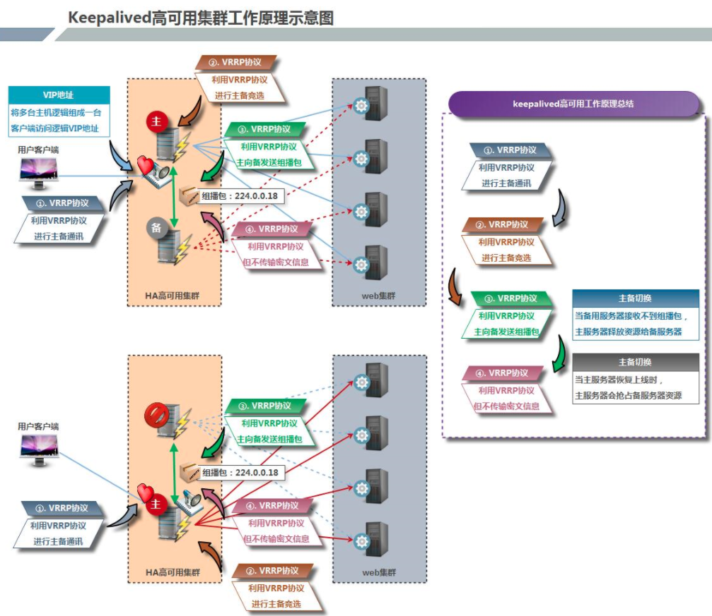
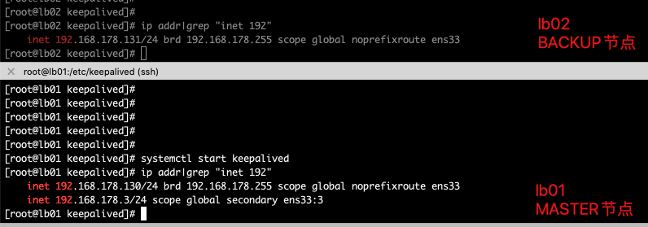
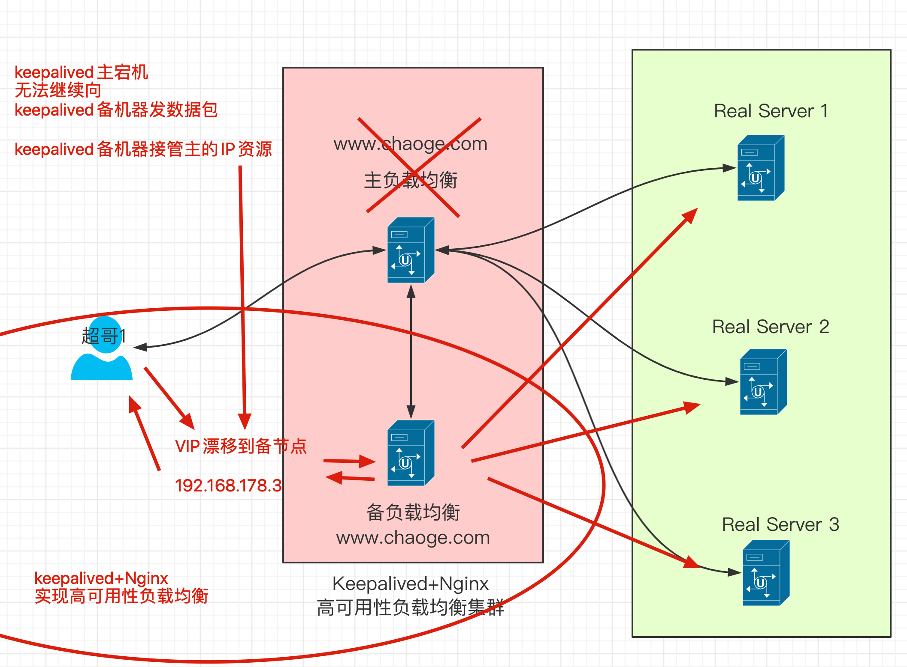
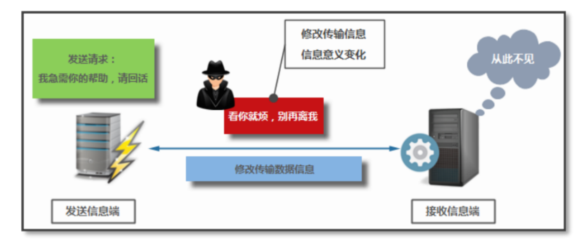
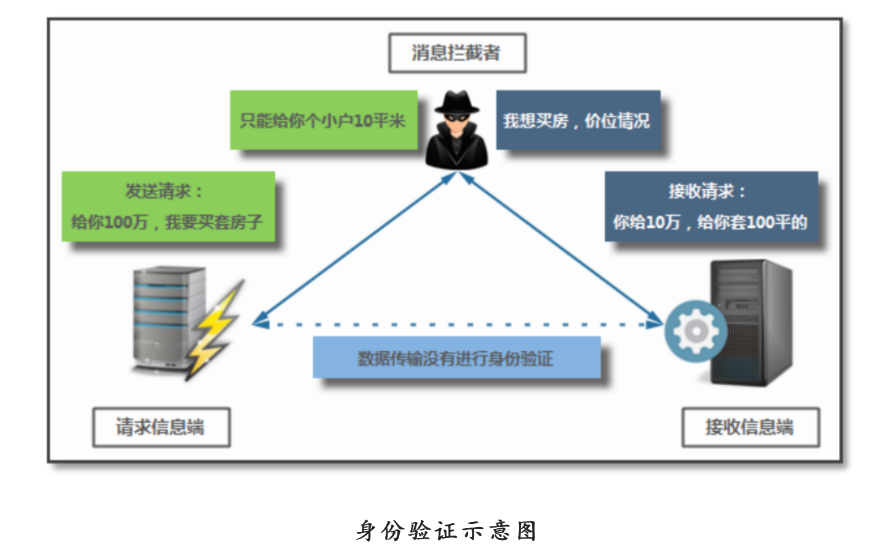
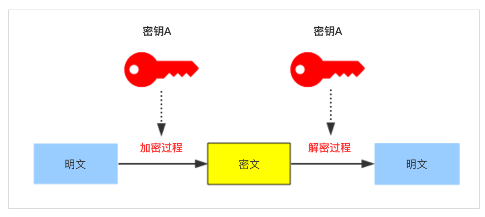
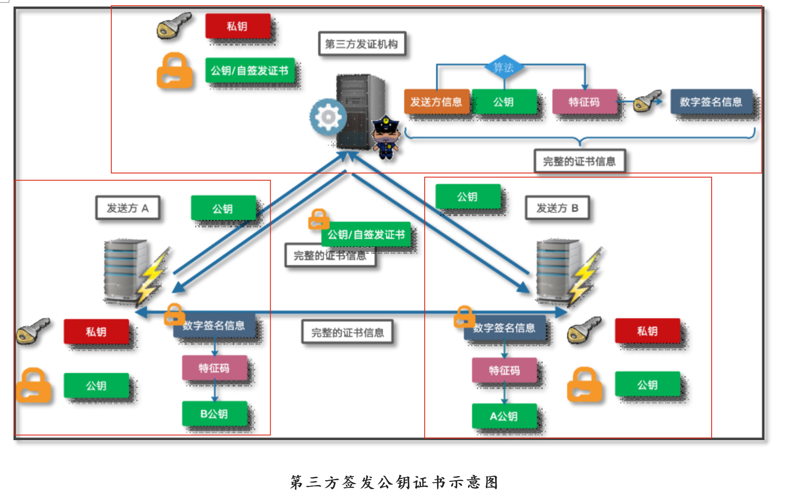
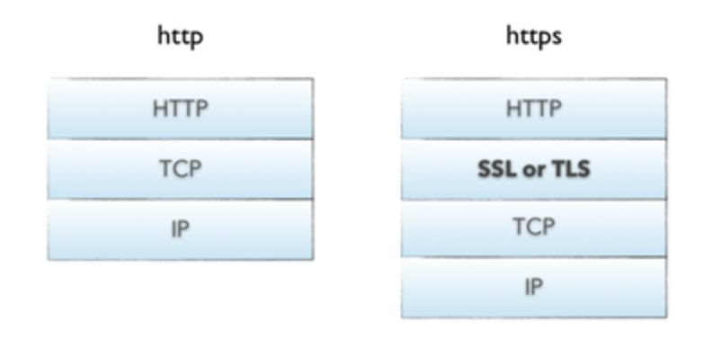
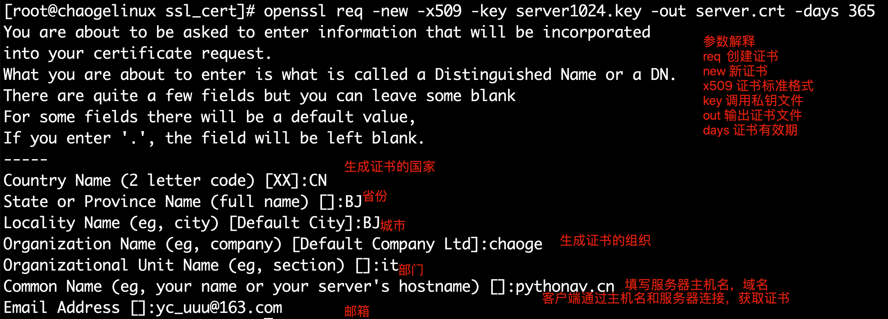

**企业级集群高可用方案**


Keepalived软件起初是专为LVS负载均衡软件设计的，用来管理并监控LVS集群系统中各个服务节点的状态，后来又加入了可以实现高可用的VRRP功能。因此，Keepalived除了能够管理LVS软件外，还可以作为其他服务（例如：Nginx、Haproxy、MySQL等）的高可用解决方案软件。

　　Keepalived软件主要是通过VRRP协议实现高可用功能的。VRRP是Virtual Router RedundancyProtocol(虚拟路由器冗余协议）的缩写，VRRP出现的目的就是为了解决静态路由单点故障问题的，它能够保证当个别节点宕机时，整个网络可以不间断地运行。

　　所以，Keepalived 一方面具有配置管理LVS的功能，同时还具有对LVS下面节点进行健康检查的功能，另一方面也可实现系统网络服务的高可用功能。

 keepalived官网[http://www.keepalived.org](http://www.keepalived.org/)

## keepalived服务的三个重要功能

### 管理LVS负载均衡软件

LVS，全称Linux Virtual Server，是国人章文嵩发起的一个开源项目。

在社区具有很大的热度，是一个基于四层、具有强大性能的反向代理服务器。

```
早期使用lvs需要修改内核才能使用，但是由于性能优异，现在已经被收入内核。
```


我们这里不多介绍LVS，他和Nginx一样，能够实现反向大力功能。

早期的LVS软件需要通过命令或者脚本实现管理，如果LVS机器突然宕机，会导致整个负载均衡无法工作，因此引入了Keepalived软件，它和LVS紧密协作。

### Keepalived+lvs架构图


### 对LVS集群节点健康检查

keepalived可以在自身的配置文件中修改对LVS节点的管理、启停，以及当LVS集群节点失效的时候，踢出集群，并且转换IP地址等配置，转移到健康的节点上，从而保证用户的访问不受影响。

当故障的节点恢复后，keepalived服务能够重新将其加入LVS集群中。

### 作为系统网络服务的高可用共而过

keepalived能够实现任意两台主机之间，例如master和backup主机之间的故障和自动转义，这个主机可以是普通的禁止停机的业务服务器，也可以是例如LVS、Nginx这样的反向代理服务器。

## keepalived高可用&故障切换原理

 Keepalived高可用服务对之间的故障切换转移，是通过 VRRP (Virtual Router Redundancy Protocol ,虚拟路由器冗余协议）来实现的。

　　在 Keepalived服务正常工作时，主 Master节点会不断地向备节点发送（多播的方式）心跳消息，用以告诉备Backup节点自己还活看，当主 Master节点发生故障时，就无法发送心跳消息，备节点也就因此无法继续检测到来自主 Master节点的心跳了，于是调用自身的接管程序，接管主Master节点的 IP资源及服务。而当主 Master节点恢复时，备Backup节点又会释放主节点故障时自身接管的IP资源及服务，恢复到原来的备用角色。

　　那么，什么是VRRP呢？

　　**VRRP ,全 称 Virtual Router Redundancy Protocol ,中文名为虚拟路由冗余协议 ，VRRP的出现就是为了解决静态踣甶的单点故障问题，VRRP是通过一种竞选机制来将路由的任务交给某台VRRP路由器的。**

### VRRP描述

有关VRRP协议的描述，我们可以记住如下点：

- VRRP协议，全称是 Virtual Router Redundancy Protocol，中文名是虚拟路由冗余协议，它的出现是为了解决静态路由的单点故障。
- VRRP协议是通过一种竞选协议机制来将路由任务交给某台VRRP路由器。
- VRRP通过IP多播的方式（默认多播地址224.0..18）实现高可用之间的通信。
- 工作时`主节点发包`，`备节点接包`，当`备节点`接收不到`主节点`的数据包的时候，就启动接管程序接管主节点的资源。备用节点可以存在多个，通过优先级竞选。一般keepaived只配置一对主备。

### keepalived描述

keepalived高可用性服务器之间是通过VRRP进行通信的，VRRP协议是通过竞选机制来确定主备身份，主节点的优先级高于备节点。

工作时，主节点优先获取所有的资源，备用节点处于等待状态，只有当备节点，得不到主节点的数据消息，备节点开始工作，接管主节点素有的资源，然后顶替它的位置，

当Keepalived服务对之间，作为主节点的机器会一直发送VRRP广播数据包，告诉备节点，我还活着，因此备节点不会抢占资源，当主节点宕机，备节点接替，整个切换过程最快小于1S。



## keepalived高可用服务搭建

准备四台linux机器

| hostname | IP              | 说明                                |
| -------- | --------------- | ----------------------------------- |
| lb01     | 192.168.178.130 | keepalived主服务器(nginx主负载均衡) |
| lb02     | 192.168.178.131 | Keepalived备服务器(Nginx辅负载均衡) |
| web01    | 192.168.178.121 | web01                               |
| Web02    | 192.168.178.122 | Web02                               |

### 系统环境准备

```plain
[root@lb01 conf]# cat /etc/redhat-release
CentOS Linux release 7.5.1804 (Core)
[root@lb01 conf]#
[root@lb01 conf]# uname -r
3.10.0-862.el7.x86_64
[root@lb01 conf]# uname -m
x86_64
```

### 安装keepalived(lb01，lb02)

```plain
[root@lb01 conf]# yum install keepalived -y
[root@lb01 conf]# rpm -qa keepalived
keepalived-1.3.5-16.el7.x86_64
[root@lb02 nginx-1.16.0]# yum install keepalived -y
[root@lb02 nginx-1.16.0]# rpm -qa keepalived
keepalived-1.3.5-16.el7.x86_64
```

## keepalived配置文件

默认的配置文件路径在

```plain
/etc/keepalived/keepalived.conf
```

keepalived在上面介绍了主要有3个功能，这里超哥仅仅分享其高可用的功能，非高可用性相关的功能可以将其注释掉。

有关高可用性的配置，有两大区块

### 全局定义部分（global definition）

这部分主要定义keepalived的故障通知机制和Router ID标识。

```plain
[root@lb01 conf]# head -12 /etc/keepalived/keepalived.conf | cat -n
     1    ! Configuration File for keepalived
     2
     3    global_defs {
     4       notification_email {
     5         acassen@firewall.loc
     6         failover@firewall.loc
     7         sysadmin@firewall.loc
     8       }
     9       notification_email_from Alexandre.Cassen@firewall.loc
    10       smtp_server 192.168.200.1
    11       smtp_connect_timeout 30
    12       router_id LVS_DEVEL
```

行内容解释

1.注释行，!和#作用一样

2.空行

3~8.定义邮件报警的地址，当keepalived主备切换，或者RS(后端服务器 real server)故障时发送告警邮件。这里一般不用，运维使用高级监控软件。

9.指定告警邮件，发信人的地址

10.指定邮件服务器地址，例如本地配置了sendmail服务

11.连接邮件服务器的超时时间

**12.重要参数，指定keepalived的路由标识（router_id），在局域网内，该ID应该是唯一的。**

### VRRP实例配置

主要配置keepalived主备状态，接口、优先级，认证方式，IP地址等信息。

```
/etc/keepalived/keepalived.conf
19 vrrp_instance VI_1 {
 20     state MASTER
 21     interface eth0
 22     virtual_router_id 51
 23     priority 100
 24     advert_int 1
 25     authentication {
 26         auth_type PASS
 27         auth_pass 1111
 28     }
 29     virtual_ipaddress {
 30         192.168.200.16
 31         192.168.200.17
 32         192.168.200.18
 33     }
 34 }
```

参数解释：

1. 定义vrrp实例，名字是VI_1，每一个vrrp实例可以理解为是keepalived的一个业务，vrrp实例在配置文件中可以有多个，并且**主节点的keepalived配置的vrrp_instance在备节点也必须存在，才能实现故障迁移**（keepalived是一款工具，真正干活的配置是vrrp_instance）
2. 参数作用是表示当前实例VI_1的角色是主节点，该参数值只有`MASTER`和`BACKUP`两种，严格区分大小写。MASTER表示工作中的主节点，BACKUP表示备用节点。BACKUP在MASTER故障时，接替其工作继续运转。
3. insterface为网络通信接口，对外提供服务器的网络接口，根据自己机器修改
4. 唯一虚拟路由ID标识，最好是数字，在当前`keepalived.conf`配置文件中必须是唯一的，**且在MASTER和BACKUP的配置中相同实例的virtual_router_id必须是一样的，否则会出现脑裂问题**
5. 定义实例的优先级，也是一串数字，数字越大，优先级越高。在同一个`vrrp_instance`实例里，MASTER的优先级必须高于BACKUP，一般配置MASTER和BACKUP间隔大小在50，例如MASTER的优先级150，BACKUP的优先级是小于100的数值。
6. 定义MASTER和BACKUP之间的通信检查时间，默认单位是秒

25~28.权限配置参数，密码类型是PASS，密码为明文方式，长度建议不超过8个字符，一般用4位数字，同一个VRRP实例，MASTER和BACKUP的密码必须一样才能通信。

29~34.定义虚拟IP的地址，可以配置多个IP地址，且明确子网掩码和IP绑定的网络接口（网卡名），否则虚拟IP的子网掩码默认是32位，网络接口和前面的`Interface`参数一致。**这里的虚拟IP（VIP）就是实际工作中需要使用的IP地址，和域名进行绑定解析**

## keepalived实战单实例

事实上网络服务的高可用功能原理是比较简单的，本质上就是把手动的操作自动化解决了。

如果没有配置高可用服务，当服务器宕机了就得找一个新的服务器，重新进行环境初始化，配置IP，搭建服务，整个手动恢复的时间比较漫长，对于用户而言，那可真是糟透了。这个切换过程必须自动化完成，效率更好，体验更好。

高可用性的实验配置，就是开启一对服务器，同事配置好高可用服务，但是只有获取到虚拟IP（VIP）的主服务器提供服务，若是主节点宕机，VIP会自动漂移到备用服务器上，此时用户的请求，也就跟着走到了备用服务器，这个过程完全自动化，快速迁移。

### 配置主keepalived服务器 lb01-master

```plain
1.备份旧配置文件，定义新配置文件
[root@lb01 conf]# cd /etc/keepalived/
[root@lb01 keepalived]# cp keepalived.conf{,.bak}
[root@lb01 keepalived]# ls
keepalived.conf  keepalived.conf.bak
[root@lb01 keepalived]# >keepalived.conf
2.删除所有旧的配置，定义新配置，这个需要根据自己机器环境修改
[root@lb01 keepalived]# cat keepalived.conf -n
     1    global_defs {
     2        router_id lb01
     3    }
     4
     5    vrrp_instance VI_1 {
     6        state MASTER
     7        interface ens33
     8        virtual_router_id 51
     9        priority 150
    10        advert_int 1
    11        authentication {
    12            auth_type PASS
    13            auth_pass 1111
    14        }
                # 定义虚拟IP，也就是VIP，提供给用户访问的高可用地址，绑定网络接口ens33，别名ens33:3，主备节点要相同
    15        virtual_ipaddress {
    16            192.168.178.3/24 dev ens33 label ens33:3
    17        }
    18    }
```

【启动keepalived】

```plain
[root@lb01 keepalived]# ps -ef|grep keep|grep -v grep
[root@lb01 keepalived]# systemctl start keepalived
[root@lb01 keepalived]# ps -ef|grep keep|grep -v grep
root      28529      1  1 11:16 ?        00:00:00 /usr/sbin/keepalived -D
root      28530  28529  0 11:16 ?        00:00:00 /usr/sbin/keepalived -D
root      28531  28529  0 11:16 ?        00:00:00 /usr/sbin/keepalived -D
```

此时检查是否生成新的VIP地址，`192.168.178.3`

```plain
[root@lb01 keepalived]# ip addr|grep "inet 192"
    inet 192.168.178.130/24 brd 192.168.178.255 scope global noprefixroute ens33
    inet 192.168.178.3/24 scope global secondary ens33:3
```

出现如上的VIP地址，表示lb01的keepaived单实例配置以及成功了。

### 配置keepalived备服务器lb02-BACKUP

注意lb02和lb01的参数区别

```plain
[root@lb02 keepalived]# cat -n keepalived.conf
     1
     2    global_defs {
     3        router_id lb02
     4    }
     5
     6    vrrp_instance VI_1 {
     7        state BACKUP
     8        interface ens33
     9        virtual_router_id 51
    10        priority 100
    11        advert_int 1
    12        authentication {
    13            auth_type PASS
    14            auth_pass 1111
    15        }
    16        virtual_ipaddress {
    17            192.168.178.3/24 dev ens33 label ens33:3
    18        }
    19    }
```

配置完毕，启动服务，检查服务状态

```plain
[root@lb02 keepalived]# ps -ef|grep keep|grep -v grep
root      29374      1  0 13:48 ?        00:00:00 /usr/sbin/keepalived -D
root      29375  29374  0 13:48 ?        00:00:00 /usr/sbin/keepalived -D
root      29376  29374  0 13:48 ?        00:00:00 /usr/sbin/keepalived -D
```

检查配置结果，是否出现了虚拟IP（VIP）

- **正确的结果应该是没有出现VIP**
- 因为lb02位BACKUP，当主节点正常的时候，它不会接管VIP
- 若是lb02看到了VIP，表示配置出错了！

```plain
[root@lb02 keepalived]# ip addr|grep "inet 192"
    inet 192.168.178.131/24 brd 192.168.178.255 scope global noprefixroute ens33
```

### 如果出现lb01、lb02抢夺VIP资源，排查故障思路

- 主备服务器是否能够通信，可以ping检测
- 是否没有正确配置防火墙，或是忘记关闭防火墙
- 两台服务器的keepalived.conf是否写错（例如虚拟路由ID是否不一致）

## 高可用主备服务切换实践

### 停止主服务器的keepalived或者直接关机

```plain
[root@lb01 keepalived]# ip addr|grep "inet 192"
    inet 192.168.178.130/24 brd 192.168.178.255 scope global noprefixroute ens33
    inet 192.168.178.3/24 scope global secondary ens33:3
[root@lb01 keepalived]#
[root@lb01 keepalived]# systemctl stop keepalived
[root@lb01 keepalived]# ip addr|grep "inet 192"
    inet 192.168.178.130/24 brd 192.168.178.255 scope global noprefixroute ens33
可以看到，关闭服务后，VIP消失了
```

### 检查BACKUP机器状态

```plain
[root@lb02 keepalived]# ip addr|grep "inet 192"
    inet 192.168.178.131/24 brd 192.168.178.255 scope global noprefixroute ens33
    inet 192.168.178.3/24 scope global secondary ens33:3
```

可以看到备节点lb02此时已经接管了VIP，并且这个接管期间，备节点还会主动发送ARP广播，让局域网内所有的客户端更新本地ARP缓存表，以便访问新接管VIP服务的节点。

```plain
arp是地址解析协议（ARP、Address Resolution Protocol），主要功能是根据IP地址获取物理地址（MAC地址）
```

### 恢复主节点，查看VIP动态

```plain
root@lb01 keepalived]# systemctl start keepalived
[root@lb01 keepalived]# ip addr|grep "inet 192"
    inet 192.168.178.130/24 brd 192.168.178.255 scope global noprefixroute ens33
    inet 192.168.178.3/24 scope global secondary ens33:3
```



此时会发现，再次启动keepalived主服务，MASTER很快会接管VIP，备服务器正确应该是释放了VIP，此时用户的请求也就再次转移到新机器了。

### 明确单实例主备模式配置文件区别

| 区别参数  | MASTER参数 | BACKUP参数 |
| --------- | ---------- | ---------- |
| router_id | lb01       | Lb02       |
| state     | MASTER     | BACKUP     |
| priority  | 150        | 100        |

## 脑裂问题

### 什么是脑裂

由于某些问题，导致两台高可用服务器在指定时间内无法检测到对方的心跳消息，导致各自都取得资源和服务的拥有权，这样回导致同一个IP地址或服务同时存在，引发的冲突问题。并且可能两台机器使用同一个VIP地址，用户写入数据可能会分别写入两台机器，导致服务器两端数据不一致，造成数据混乱，这种情况就是`脑裂`问题。

### 导致脑裂的原因

一般来说，导致脑裂的原因有如下，也是排错的思路

- 高可用服务器之间的心跳线路故障，无法通信
- 心跳线坏了、断裂、老化（心跳线指的是服务器之间使用网线连接）
- 网卡或驱动损坏，IP配置冲突
- 防火墙阻挡了心跳消息传输
- 配置文件写错，虚拟路由ID不一致

### 解决脑裂方案

- 使用双心跳线路，防止单线路损坏，另一个还是好的，同时使用串行电缆和以外网电缆
  
  
- 当检测到脑裂情况时，强行关闭一个心跳节点（需要额外设备支持，如Stonith），备节点收不到心跳消息的时候，通过单独的线路发送关机命令，强制关闭主节点电源。
- 做好脑裂监控报警，如手机短信，邮件，微信等，在发生脑裂问题时，人为第一时间介入仲裁，降低损失。
- 注意如果开启了防火墙，一定要允许心跳消息通过，允许IP段访问。
- 使用专业级监控软件，Nagios等进行脑裂检测。

## Keepalived双实例双主模式实战

上一节超哥给大家分享的是单实例，主备模式的高可用VIP漂移，keepalived还支持多实例，双向主备模式。

A业务在lb01上是主模式，在lb02上是备模式

B业务在lb01上是备模式，在lb02上是主模式

| hostname | IP              | 解释                                          |
| -------- | --------------- | --------------------------------------------- |
| lb01     | 192.168.178.130 | VIP：192.168.178.3（绑定A业务www.chaoge.com） |
| lb02     | 192.168.178.131 | VIP：192.168.178.4（绑定B业务bbs.chaoge.com） |

### 配置lb01

添加一个VRRP实例，第20行起

```plain
[root@lb01 keepalived]# cat /etc/keepalived/keepalived.conf -n
     1    global_defs {
     2        router_id lb01
     3    }
     4
     5    vrrp_instance VI_1 {
     6        state MASTER
     7        interface ens33
     8        virtual_router_id 51
     9        priority 150
    10        advert_int 1
    11        authentication {
    12            auth_type PASS
    13            auth_pass 1111
    14        }
    15        virtual_ipaddress {
    16            192.168.178.3/24 dev ens33 label ens33:3
    17        }
    18    }
    19
    20    vrrp_instance VI_2 {
    21    state BACKUP
    22    interface ens33
    23    virtual_router_id 52
    24    priority 100
    25    advert_int 1
    26    authentication {
    27        auth_type PASS
    28        auth_pass 1111
    29    }
    30
    31    virtual_ipaddress {
    32        192.168.178.4 dev ens33 label ens33:4
    33    }
    34
    35    }
```

此处的配置，在lb01机器VI_1实例属于MASTER角色，VI_2实例属于BACKUP角色，看好了兄弟们。

### 配置lb02

```plain
[root@lb02 keepalived]# cat -n /etc/keepalived/keepalived.conf
     1
     2    global_defs {
     3        router_id lb02
     4    }
     5
     6    vrrp_instance VI_1 {
     7        state BACKUP
     8        interface ens33
     9        virtual_router_id 51
    10        priority 100
    11        advert_int 1
    12        authentication {
    13            auth_type PASS
    14            auth_pass 1111
    15        }
    16        virtual_ipaddress {
    17            192.168.178.3/24 dev ens33 label ens33:3
    18        }
    19    }
    20
    21    vrrp_instance VI_2 {
    22
    23    state MASTER
    24    interface ens33
    25    virtual_router_id 52
    26    priority 150
    27    advert_int 1
    28    authentication {
    29        auth_type PASS
    30        auth_pass 1111
    31    }
    32    virtual_ipaddress {
    33        192.168.178.4/24 dev ens33 label ens33:4
    34    }
    35    }
```

注意此处的配置，实例VI_1是BACKUP，实例VI_2角色是MASTER

## 分别重启lb01/lb02服务

```plain
[root@lb01 keepalived]# systemctl restart keepalived
[root@lb02 keepalived]# systemctl restart keepalived
```

### 检查VIP状态

### lb01机器

| vrrp实例 | 角色   | VIP                                      | 优先级ID | 虚拟路由ID |
| -------- | ------ | ---------------------------------------- | -------- | ---------- |
| VI_1     | MASTER | 192.168.178.3/24 dev ens33 label ens33:3 | 150      | 51         |
| VI_2     | BACKUP | 192.168.178.4/24 dev ens33 label ens33:4 | 100      | 52         |

```plain
[root@lb01 keepalived]# ip addr |grep "inet 192"
    inet 192.168.178.130/24 brd 192.168.178.255 scope global noprefixroute ens33
    inet 192.168.178.3/24 scope global secondary ens33:3
此处结果正确，只有实例1是MASTER，因此只有一个VIP
```

### lb02机器

```plain
[root@lb02 keepalived]# ip addr |grep "inet 192"
    inet 192.168.178.131/24 brd 192.168.178.255 scope global noprefixroute ens33
    inet 192.168.178.4/24 scope global secondary ens33:4
同理，只出现了实例2的VIP
```

| vrrp实例 | 角色   | VIP                                      | 优先级ID | 虚拟路由ID |
| -------- | ------ | ---------------------------------------- | -------- | ---------- |
| VI_1     | BACKUP | 192.168.178.3/24 dev ens33 label ens33:3 | 100      | 51         |
| VI_2     | MASTER | 192.168.178.4/24 dev ens33 label ens33:4 | 150      | 52         |

## 模拟多实例故障

### 停掉任意一个keepalived节点(lb02)

```plain
[root@lb02 keepalived]# systemctl stop keepalived
[root@lb02 keepalived]# ip addr|grep "inet 192"
    inet 192.168.178.131/24 brd 192.168.178.255 scope global noprefixroute ens33
发现此时lb02的VIP已经丢失
```

### 检查lb01机器

```plain
[root@lb01 keepalived]# ip addr|grep "inet 192"
    inet 192.168.178.130/24 brd 192.168.178.255 scope global noprefixroute ens33
    inet 192.168.178.4/32 scope global ens33:4
    inet 192.168.178.3/24 scope global secondary ens33:3
此时VI_2实例的VIP已经成功漂移到另一台机器
```

### 恢复keepalived（再次检查VIP漂移）

```plain
[root@lb02 keepalived]# systemctl start keepalived
[root@lb02 keepalived]# ip addr|grep "inet 192"
    inet 192.168.178.131/24 brd 192.168.178.255 scope global noprefixroute ens33
[root@lb02 keepalived]# ip addr|grep "inet 192"
    inet 192.168.178.131/24 brd 192.168.178.255 scope global noprefixroute ens33
    inet 192.168.178.4/24 scope global secondary ens33:4
发现VIP漂移还是需要点时间的
```

### 总结

- Lb01、lb02主备节点都已经实现了各自服务提供的VIP服务
- 任意节点宕机，VIP都能够实现漂移工作
- 在实际工作下，可以把业务网站的域名解析到VIP上提供服务，例如Nginx的负载均衡，实现高可用性负载均衡

## 高可用性负载均衡实战

这里的实验，兄弟们，你们需要和超哥画的这个架构图一致，进行部署


该架构图，利用keepalived的VIP漂移高可用，防止Nginx单点故障宕机

### 架构部署规划

| hostname | IP              | 解释                                          |
| -------- | --------------- | --------------------------------------------- |
| lb01     | 192.168.178.130 | VIP：192.168.178.3（绑定A业务www.chaoge.com） |
| lb02     | 192.168.178.131 | VIP：192.168.178.4（绑定B业务bbs.chaoge.com） |

### Nginx负载均衡配置(两台机器配置一样)

无论哪一个负载均衡节点宕机，都会通过VIP的漂移，让另一个机器继续工作，用户是无感知的

### lb01(nginx.conf)

```plain
[root@lb01 keepalived]# cat -n /opt/nginx/conf/nginx.conf
     1    worker_processes  1;
     2    events {
     3        worker_connections  1024;
     4    }
     5    http {
     6        include       mime.types;
     7        default_type  application/octet-stream;
     8    upstream www_pools {
     9    server 192.168.178.121;
    10    server 192.168.178.122;
    11    }
    12        server {
    13            listen       80;
    14            server_name  www.chaoge.com;
    15
    16        location / {
    17
    18        proxy_pass http://www_pools;
    19        proxy_set_header Host $host;
    20    }
    21
    22
    23
    24    }
    25
    26    }
# 重启nginx
[root@lb01 keepalived]# nginx -s reload
# 检查
[root@lb01 keepalived]# netstat -tunlp|grep nginx
tcp        0      0 0.0.0.0:80              0.0.0.0:*               LISTEN      27706/nginx: master
```

### lb02(nginx.conf)

```plain
[root@lb02 keepalived]# cat -n /opt/nginx/conf/nginx.conf
     1
     2    worker_processes  1;
     3    events {
     4        worker_connections  1024;
     5    }
     6    http {
     7        include       mime.types;
     8        default_type  application/octet-stream;
     9    upstream www_pools {
    10    server 192.168.178.121;
    11    server 192.168.178.122;
    12    }
    13        server {
    14            listen       80;
    15            server_name  www.chaoge.com;
    16            location / {
    17            proxy_pass http://www_pools;
    18            proxy_set_header Host $host;
    19    }
    20    }
    21    }
# 重启nginx
nginx -s reload
# 检查
[root@lb02 keepalived]# netstat -tunlp|grep nginx
tcp        0      0 0.0.0.0:80              0.0.0.0:*               LISTEN      29698/nginx: master
```

### lb01(keepalived.conf)

```plain
1.检查配置文件，配置好VI_1实例，实例配置如下
[root@lb01 keepalived]# cat -n /etc/keepalived/keepalived.conf
     1    global_defs {
     2        router_id lb01
     3    }
     4
     5    vrrp_instance VI_1 {
     6        state MASTER
     7        interface ens33
     8        virtual_router_id 51
     9        priority 150
    10        advert_int 1
    11        authentication {
    12            auth_type PASS
    13            auth_pass 1111
    14        }
    15        virtual_ipaddress {
    16            192.168.178.3/24 dev ens33 label ens33:3
    17        }
    18    }
    19
2.此处的VIP就是交给Nginx负载均衡的高可用IP地址
```

### lb02(keepalived.conf)

```plain
[root@lb02 keepalived]# cat -n /etc/keepalived/keepalived.conf
     1
     2    global_defs {
     3        router_id lb02
     4    }
     5
     6    vrrp_instance VI_1 {
     7        state BACKUP
     8        interface ens33
     9        virtual_router_id 51
    10        priority 100
    11        advert_int 1
    12        authentication {
    13            auth_type PASS
    14            auth_pass 1111
    15        }
    16        virtual_ipaddress {
    17            192.168.178.3/24 dev ens33 label ens33:3
    18        }
    19    }
    20
```

### web01站点配置

```plain
1.检查nginx.conf，有关www.chaoge.com虚拟主机配置如下
server {
listen 80;
server_name www.chaoge.com;
 charset utf-8;
location / {
        root html/www;
        index index.html index.htm;
}
access_log logs/access_www.log main;
}
2.定义好用于测试负载均衡的站点资料
[root@web01 logs]# echo "我是real server web01，超哥真的太细了" > /opt/nginx/html/www/index.html
```

### web02站点配置

```plain
1.检查nginx.conf，有关www.chaoge.com虚拟主机配置如下
server {
listen 80;
server_name www.chaoge.com;
charset utf-8;
location / {
        root html/www;
        index index.html index.htm;
}
access_log logs/access_www.log main;
}
2.定义好测试负载均衡的站点资料
[root@web02 nginx-1.16.0]# echo "我是real server web02，超哥牛皮666" > /opt/nginx/html/www/index.html
```

### 用户访问模拟配置

在本地客户端的hosts文件中写好解析关系，用于测试站点访问

**将域名解析到VIP上**

```plain
超哥这里是mac，因此直接使用命令行，windows的兄弟请搜索hosts文件，在C盘目录下
yumac:~ root# tail -1 /etc/hosts
192.168.178.3 www.chaoge.com
```

浏览器访问域名`www.chaoge.com`


此时负载均衡一切正常，用于访问正常，此时我们模拟一台Nginx负载均衡宕机


## 关闭Nginx负载均衡主节点

可以选择直接关机lb01负载均衡机器，或者简单的关闭keepalived服务

```plain
1.关闭服务
systemctl stop keepalived
2.直接关机来的效果更好，模拟机器宕机
poweroff
```

在关闭了lb01负载均衡之后，模拟宕机，我们继续用客户端访问该站点，看是否正常


发现对于用户来说，一切正常

### 检查lb02负载均衡节点

发现VIP已经成功漂移到备节点，整个实验大功告成

```plain
[root@lb02 keepalived]# ip addr|grep "192.168.178.3"
    inet 192.168.178.3/24 scope global secondary ens33:3
```




# 搭建安全的站点

## 网络安全背景

 网络就是实现不同主机之间的通讯。网络出现之初利用TCP/IP协议簇的相关协议概念，已经满足了互连两台主机之间可以进行通讯的目的，虽然看似简简单单几句话，就描述了网络概念与网络出现的目的，但是为了真正实现两台主机之间的稳定可靠通讯，其实是一件非常困难的事情了，如果还要再通讯的基础上保证数据传输的安全性，可想而知，绝对是难上加难，因此，网络发明之初，并没有太关注TCP/IP互联协议中的安全问题。

 对于默认的两台主机而言，早期传输数据信息并没有通过加密方式传输数据，设备两端传输的数据本身实际是明文的，只要能截取到传输的数据包，就可以直接看到传输的数据信息，所以根本没有安全性可言。

早期利用明文方式传输的协议有：FTP、HTTP、SMTP、Telnet等。

## 网络安全涉及问题

 通过上文的介绍，其实已经了解到早期网络设备间进行通讯时，是采用明文进行数据传输的，并没有网络安全技术可言。我们可以提出一种假设，如果在网络上的两台主机之间传输数据，就是采用明文的方式；并且对于网络传输而言，并没有相关的网络安全技术保驾护航，这样在互联网上进行数据传输，都有哪些网络风险需要进行面对。

### 数据机密性

 在网络传输数据信息时，对数据的加密是至关重要的，否则所有传输的数据都是可以随时被第三方看到，完全没有机密性可言。

数据机密性示意图


### 数据完整性

 网络传输数据的完整性，也是安全领域中需要考虑的重要环节，如果不能保证传输数据的完整性，那传输过程中的数据就有可能被任何人所篡改，而传输数据双方又不能及早的进行发现。

 将会造成互连通讯双方所表达信息的意义完全不一致。因此，对于不完整的数据信息，接收方应该进行相应判断，如果完整性验证错误，就拒绝接收相应的数据。

数据完整性



### 身份验证问题

 网络中传输数据时，很有可能传输的双方是第一次建立连接，进行相互通讯，既然是第一次见面沟通，如何确认对方的身份信息，的确是我要进行通讯的对象呢？如果不是正确的通讯对象，在经过通讯后，岂不是将所有数据信息发送给了一个陌生人。



## 数据加密算法

网络安全涉及很多方面，而网络数据的安全传输通常会面临以下几方面的威胁：

- ***数据窃听与机密性：*** 即怎样保证数据不会因为被截获或窃听而暴露。
- ***数据篡改与完整性：*** 即怎样保证数据不会被恶意篡改。
- ***身份冒充与身份验证：*** 即怎样保证数据交互双方的身份没有被冒充。

针对以上几个问题，可以用以下几种数据加密方式来解决（每种数据加密方式又有多种不同的算法实现）：

| 数据加密方式 | 描述                                                   | 主要解决的问题 | 常用算法         |
| ------------ | ------------------------------------------------------ | -------------- | ---------------- |
| 对称加密     | 指数据加密和解密使用相同的密钥                         | 数据的机密性   | DES, AES         |
| 非对称加密   | 也叫公钥加密，指数据加密和解密使用不同的密钥--密钥对儿 | 身份验证       | DSA，RSA         |
| 单向加密     | 指只能加密数据，而不能解密数据                         | 数据的完整性   | MD5，SHA系列算法 |

## 解决方案-保证数据机密性

### 普通算法

 为了保证数据的机密性，首先可以采用的方法就是将数据通过相应算法，转换为其它的数据信息，然后再通过相应算法反推出真正的数据是什么，这样一来就保证了数据在网络传输过程中安全性，不会被其它人轻易的看到传输过程中的数据信息。

数据加密前的信息称为明文数据（plaintext），经过加密算法转换后进行传输的信息称为密文数据（ciphertext）；反之经过解密算法转换后，会将密文数据恢复为明文数据进行显示接收。

```plain
网站此时利用普通常见算法，针对密码加密，基本保证数据再传输时候，不是明文
但是黑客可能会有一个庞大的算法本，里面记录了常见的密码和加密后的密文，一一对应，然后可以利用程序大量计算，反解出明文密码
撞库是黑客通过收集互联网已泄露的用户和密码信息，生成对应的字典表，尝试批量登陆其他网站后，得到一系列可以登录的用户。 很多用户在不同网站使用的是相同的帐号密码，因此黑客可以通过获取用户在A网站的账户从而尝试登录B网址，这就可以理解为撞库攻击。
```


- 该方案优点，实现数据传输加密，避免了明文传输数据的危险性。
- 缺点，利用加密算法，明文改密文，但是第三方若是获得加密算法，依然可以将其破解改为明文

### 对称加密算法

（Symmetric Cryptography）

 普通算法虽然已经解决了明文数据的机密性，可以在网络传输过程中不被直接看到明文数据。但是新的问题又产生了，既然明文数据是通过算法改变成了新的数据信息，如果第三方获得了算法，利用算法也是可以将密文数据信息，再次转换为明文数据信息，因此出现了对称加密算法。

 形象比喻来说：数据加密算法就好比是一本密码规则手册，而对称加密算法就是将手册放在了一个保险柜中进行了上锁传输，只有传递数据信息的双方知道打开保险柜的密码。




```plain
对称加密算法，如其名，就是使用同一个秘钥进行加密和解密。
优点是速度较快，适合对数据量比较大的数据进行加密。
缺点是密钥的保存方式需要保证，一旦加密或者解密的哪一方泄漏了密钥，都会导致信息的泄漏。
常用的对称加密算法有:DES、3DES、DESX、Blowfish、IDEA、RC4、RC5、RC6、AES。
```

缺点

```plain
对称加密的一大缺点是密钥的管理与分配，换句话说，如何把密钥发送到需要解密你的消息的人的手里是一个问题。在发送密钥的过程中，密钥有很大的风险会被黑客们拦截。现实中通常的做法是将对称加密的密钥进行非对称加密，然后传送给需要它的人。
```

### 非对称加密

（Asymmetric Cryptography）


与对称加密相对的，非对称加密需要两个密钥，一个`公开密钥（Public Key`）,一个`私有密钥（Private Key`）。公钥和私钥是一对，如果使用公钥进行加密的数据，只有对应的私钥才能解密。

相对的，如果是使用私钥加密的数据，只有对应的公钥才能解密。

```plain
简单理解，比喻关系
公钥---锁
私钥---开锁钥匙
私钥只能由一方安全保管，不能外泄，而公钥则可以发给任何请求它的人。非对称加密使用这对密钥中的一个进行加密，而解密则需要另一个密钥。
比如，你向银行请求公钥，银行将公钥发给你，你使用公钥对消息加密，那么只有私钥的持有人--银行才能对你的消息解密。与对称加密不同的是，银行不需要将私钥通过网络发送出去，因此安全性大大提高。
```

**优点是公钥可以被任何人知道，而公钥的泄漏也不会导致信息泄漏，但是一旦私钥泄漏了就会导致信息泄漏。**

常用的非对称加密算法有：**RSA**、**ECC（移动设备用）**、**Diffie-Hellman**、**El Gamal**、**DSA（数字签名用）**。

缺点

```plain
虽然非对称加密很安全，但是和对称加密比起来，它非常的慢，所以我们还是要用对称加密来传送消息，但对称加密所使用的密钥我们可以通过非对称加密的方式发送出去。为了解释这个过程，请看下面的例子：
1.使用对称加密，速度快
2.使用非对称加密的方式，针对第一步的秘钥加密传输
（1） 超哥需要在银行的网站做一笔交易，他的浏览器首先生成了一个随机数作为对称密钥。
（2） 超哥的浏览器向银行的网站请求公钥(非对称加密的公钥~~)。
（3） 银行将公钥发送给超哥。
（4） 超哥的浏览器使用银行的公钥将自己的对称密钥加密(这里是重点,已经是【对称加密+非对称加密】)。
（5） 超哥的浏览器将加密后的对称密钥发送给银行。
（6） 银行使用私钥解密得到超哥浏览器的对称密钥。
（7） 超哥与银行可以使用对称密钥来对沟通的内容进行加密与解密了。
```


## 总结

```plain
1.对称加密方式，加密解密使用同样的密钥，速度较快，但是密钥需要在网络中传输，因此可能被截获，不安全
2.非对称加密，使用一对密钥，公钥，私钥，因此安全性很高，但是加密和解密速度很慢
3.常用的方式是，结合两种加密方式，效率与安全性都有又了保障。
```

## 网站安全证书

 从上述加解密方式来看，对于网站的身份验证来看，公钥的获取尤为重要，发送方在顺利生成公私钥后，需要准确的将公钥传递给接收方，才能安全完成验证工作。

### 如何安全获取公钥

默认情况，下可能存在中间人攻击的情况


中间人攻击原理我们已经讲过，黑客伪装成机器A，把自己假的公钥发给了接收方，后续的通信都将是错误的，属于认贼作父了。。。

为了解决上述的问题，需要引入一个**公证人，第三方可信任的安全机构**

### 前方高能，记住原理



\1) A和B端首先生成自己的公钥和私钥的密钥对，为了使对方能相信自己的公钥信息，将自己的公钥信息告知给第三方发证机构，利用第三方机构对自己的公钥进行公证。第三方机构会制作一个数字证书（机构 编号 以及发证机构的戳），并且第三方机构也要给自己设置一个合法的公钥和私钥，并且公钥设置为第三方机构的公钥证书。

\2) 发证机关计算出数字证书数据的特征码，并用自己的私钥进行加密，并将加密的信息附加到特征码后成为数字签名。

\3) A和B两端获得公正过的证书信息，并通过证书信息传递，得到对方的公钥。

\4) A和B两端与第三方机构建立连接，获得第三方证书，通过第三方证书获得第三方公钥，利用第三方公钥只要能解密数字签名即可。

### 获取第三方证书

 最安全的方式只能通过物理的手段，将公钥信息发送给发证机构，发证机构根据公钥制作正证书，并获得发证机构的证书信息，由于发证机构需要进行收取公钥，制作成证书，返回给申请者。当然采用物理手段只是针对于一些和支付交易相关的证书获取，例如：财务网银证书的获取，都会向先关机构申请到一个类似U盘的硬件，里面就存放了第三方签证的证书信息；(是不是想起来你在银行获得到那个U盾？)

 而对于一些非支付交易的证书获取，只需要通过网络将自身的公钥以及个人信息发送给证书签发机构即可，没必要过于繁琐了。

 对于第三方证书签发机构来说，对公钥与申请人信息进行制作证书的工作繁琐，因此需要进行收费，并且不便宜。并且证书的验证是单向的，无需双向进行证书传递验证，但当有支付功能时需要双向验证，例如淘宝产生了支付宝。

### 证书里有什么

目前标准的证书存储格式是x509，还有其他的证书格式，需要包含的内容为：

- 公钥信息，以及证书过期时间
- 证书的合法拥有人信息
- 证书该如何被使用
- CA颁发机构信息
- CA签名的校验码

互联网上使用的SSL和TLS证书管理机制均使用x509的格式

## Openssl软件

 浏览器第一代，网景公司生产了最初的浏览器，但是为了提高浏览器访问页面的安全性，对TCP/IP模型进行了一定改进，在传输层与应用层之间，创建了一个3.5层的概念，称为SSL（(Secure Sockets Layer 安全套接层)）层

 SSL不是一个软件，只是一个库，让应用层将数据传输到传输层前，调用了ssl层的功能对数据进行了加密，目前比较流行的版本是（SSLv2 v3），但是SSL是netscape公司进行定义的，不够开放性，因此为了使加密功能更加开放，TSL（传输层安全协议）协议就出现了，目前比较流行的版本是（TSL v1==SSL v3），TSL更像是传输层上实现的数据加密。



### SSL通信原理

由于借助SSL实现安全数据通讯的方式比较多，本文只以最基本的HTTP协议为例，了解一下SSL数据安全通讯的过程。具体实现过程说明如下：

1. http是基于tcp协议进行建立的，因此在建立tcp连接之前要先进行tcp的三次握手过程
2. 三次握手之后，不马上进行数据的传输，而是进行SSL的建立
3. 客户端首先向服务器端发起数据传输请求，但服务端不会回复http数据包，而是与客户端一来一回协商生成/建立SSL会话，确认是选用SSLv2还是SSLv3，TSL协议，并且还要协商加密算法。
4. 服务端与客户端的加密协议协商好后，服务端会将自己的证书发送给客户端
5. 客户端在获取到证书后，先进行对证书的验证，确认是否是信任机构颁发的，并且验证证书是否是完整的，以及确认证书是没有注销的，验证完毕后，获得的证书中的公钥就可以进行使用了
6. 证书合法性验证完毕后，客户端会建立生成一个会话密钥
7. 客户端选择随机数生成一个随机密钥，并且利用服务端的公钥对随机密钥进行加密，发给服务端
8. 服务器端收到公钥加密的数据，就可以利用自己的私钥进行解密，获得对称密钥，就可以对传输数据进行加密了


### Openssl软件实践

openssl由三部分组成：

- libcrpto：通用加密库
- libssl：TSL/SSL组成库，基于会话实现了身份认证，数据加密和会话完整性。
- openssl：提供命令行工具，例如模拟创建证书

### openssl命令行

```plain
# 检查版本
[root@chaogelinux ~]# openssl version
OpenSSL 1.0.2k-fips  26 Jan 2017
# 配置文件
[root@chaogelinux ~]# cat /etc/pki/tls/openssl.cnf
#获取openssl命令操作
[root@chaogelinux ~]# openssl -?
openssl:Error: '-?' is an invalid command.
# 标准命令
Standard commands
asn1parse         ca                ciphers           cms
crl               crl2pkcs7         dgst              dh
dhparam           dsa               dsaparam          ec
...
# 信息摘要命令，单向加密命令
Message Digest commands (see the `dgst' command for more details)
md2               md4               md5               rmd160
sha               sha1
# 加密命令
Cipher commands (see the `enc' command for more details)
aes-128-cbc       aes-128-ecb       aes-192-cbc       aes-192-ecb
aes-256-cbc       aes-256-ecb       base64            bf
bf-cbc            bf-cfb            bf-ecb            bf-ofb
# 测试机器对openssl支持的加密算法进行速度测试，检测服务器性能
openssl speed
```

### openssl加密命令

```plain
语法
openssl enc -加密算法  -in filename -out filename  
# 对文件加密
[root@chaogelinux ~]# cat my.pwd
yu:123
[root@chaogelinux ~]#
[root@chaogelinux ~]#
# 输入密码后加密成功，超哥这里是888888
[root@chaogelinux ~]# openssl enc -des3 -salt -a -in my.pwd -out my.pwd.des3
enter des-ede3-cbc encryption password:
Verifying - enter des-ede3-cbc encryption password:
#解密文件
[root@chaogelinux ~]# cat my.pwd.des3
U2FsdGVkX19ZDOFtbdZz3QNu+bxm3DKd
[root@chaogelinux ~]#
# 输入密码后，解密文件
[root@chaogelinux ~]# openssl enc -des3 -d -salt -a -in my.pwd.des3 -out my.pwd.src
enter des-ede3-cbc decryption password:
[root@chaogelinux ~]#
[root@chaogelinux ~]# cat my.pwd.src
yu:123
参数解释：
enc openssl把众多的对称加密算法，统一集成在了enc指令，用法是 enc -算法名
-des3 指定算法
-d    指定解密
-e  指定加密
-salt 密码加盐，防止密码被破解
-a 基于base64位编码，可选参数
```

### openssl创建私有证书

1.创建私钥和公钥，模拟证书颁发机构生成证书，生成一对密钥

```plain
# 指定私钥长度1024，并且将生成的私钥信息保存在文件里，且利用小括号功能，修改子shell的umask
[root@chaogelinux ssl_cert]# (umask 077;openssl genrsa -out server1024.key 1024)
Generating RSA private key, 1024 bit long modulus
..........++++++
...................++++++
e is 65537 (0x10001)
# 读取私钥文件，选择非对称加密算法rsa，生成公钥，写入到文件中
[root@chaogelinux ssl_cert]# openssl rsa -in server1024.key -pubout -out server1024.key.pub
# 检查文件
[root@chaogelinux ssl_cert]# ls
server1024.key  server1024.key.pub
# 生成自签的证书
[root@chaogelinux ssl_cert]# openssl req -new -x509 -key server1024.key -out server.crt -days 365
You are about to be asked to enter information that will be incorporated
into your certificate request.
What you are about to enter is what is called a Distinguished Name or a DN.
There are quite a few fields but you can leave some blank
For some fields there will be a default value,
If you enter '.', the field will be left blank.
-----
Country Name (2 letter code) [XX]:CN
State or Province Name (full name) []:BJ
Locality Name (eg, city) [Default City]:BJ
Organization Name (eg, company) [Default Company Ltd]:chaoge
Organizational Unit Name (eg, section) []:it
Common Name (eg, your name or your server's hostname) []:pythonav.cn
```



```plain
# 证书和公私钥
[root@chaogelinux ssl_cert]# ls
server1024.key  server1024.key.pub  server.crt
```

## Nginx部署HTTPS

 利用证书实现HTTPS访问Nginx服务，需要nginx使用ssl模块配置HTTPS支持，默认情况下ssl模块并未被安装，如果要使用该模块则需要在编译时指定–with-http_ssl_module参数，安装模块依赖于OpenSSL库和一些引用文件，这些文件并不在同一个软件包中，通常这个文件名类似libssl-dev。

 nginx的https协议需要ssl模块的支持，我们在编译nginx时使用--with-http_ssl_module参数加入SSL模块。还需要服务器私钥，服务器证书，如果是公司对外环境，这个证书需要购买第三方的权威证书，否则用户体验得不到保障

 这里仅仅在本地的虚拟机环境上使用并测试。

### 部署https实践

```plain
1.创建Nginx需要的证书文件
确保机器安装了openssl和openssl-devel，创建证书
yum install openssl openssl-devel -y 
2.确保nginx支持了ssl模块，查看nginx编译信息即可
nginx -V
3.模拟证书颁发机构CA创建证书
进入nginx安装目录，便于管理证书
[root@chaogelinux ~]# cd /opt/ngx112/
[root@chaogelinux ngx112]# mkdir key
[root@chaogelinux ngx112]# cd key/
# 生成私钥文件，利用字shell降低文件权限
[root@chaogelinux key]# (umask 077;openssl genrsa -out server1024.key 1024)
Generating RSA private key, 1024 bit long modulus
.++++++
...++++++
e is 65537 (0x10001)
# 自己签发证书，crt证书扩展名
[root@chaogelinux key]# openssl req -new -x509 -key server1024.key -out server.crt -days 365
You are about to be asked to enter information that will be incorporated
into your certificate request.
What you are about to enter is what is called a Distinguished Name or a DN.
There are quite a few fields but you can leave some blank
For some fields there will be a default value,
If you enter '.', the field will be left blank.
-----
Country Name (2 letter code) [XX]:CN
State or Province Name (full name) []:BJ
Locality Name (eg, city) [Default City]:BJ
Organization Name (eg, company) [Default Company Ltd]:chaoge
Organizational Unit Name (eg, section) []:it
Common Name (eg, your name or your server's hostname) []:pythonav.cn
Email Address []:yc_uuu@163.com
# 向机构申请证书，我们这里生成的是证书请求文件，而不是直接生成证书了，运维发送该文件给机构，请求合法证书
[root@chaogelinux key]# openssl req -new -key server1024.key -out server.csr
You are about to be asked to enter information that will be incorporated
into your certificate request.
What you are about to enter is what is called a Distinguished Name or a DN.
There are quite a few fields but you can leave some blank
For some fields there will be a default value,
If you enter '.', the field will be left blank.
-----
Country Name (2 letter code) [XX]:CN
State or Province Name (full name) []:BJ
Locality Name (eg, city) [Default City]:BJ
Organization Name (eg, company) [Default Company Ltd]:chaoge
Organizational Unit Name (eg, section) []:it
Common Name (eg, your name or your server's hostname) []:pythonav.cn
Email Address []:yc_uuu@163.com
# 针对这个请求文件，做一个加密处理，告知办法机构，可以用这个密码解密，了解公司信息，也可以直接回车不写密码
Please enter the following 'extra' attributes
to be sent with your certificate request
A challenge password []:
# 一般这个证书颁发，需要等到一周内的时间，因此我们直接使用本地的自己签发的证书即可，进行练习
4.配置Nginx，加载私钥，证书
修改nginx.conf，添加
include extra/443.conf;
# 创建https配置文件
vim 443.conf 写入
[root@web01 extra]# cat 443.conf
server {
        server_name _;
        listen 443 ssl;
        ssl_certificate /opt/nginx/key/server.crt;
        ssl_certificate_key /opt/nginx/key/server1024.key;
        charset utf-8;
    location / {
         root html;
         index index.html index.htm;
}
}
~
# 修改80端口虚拟主机，进行请求转发给443
}
server {
    listen 80;
    server_name www.chaoge.com;
    charset utf-8;
     rewrite ^(.*)$ https://$host$1 permanent;
    location / {
            root html;
            index index.html index.htm;
    }
    }
include extra/443.conf;
}
# 检测语法，重启nginx
[root@web01 extra]# nginx -t
nginx: the configuration file /opt/nginx-1.16.0//conf/nginx.conf syntax is ok
nginx: configuration file /opt/nginx-1.16.0//conf/nginx.conf test is successful
```


## 使用腾讯云获取证书

自签证书，不受浏览器和互联网认可，因此只是学习使用，线上操作，我们还得去机构，购买证书，具体操作请看https://pythonav.com/wiki/detail/3/40/