# 期末架构

 在上实际90年代初第一个Web服务的出现，开始做互联网站，互联网站发展至今已有了巨大的变化，全球有一半的人口使用互联网，人们的生活因为互联网有了巨大的改变。
 从百度、谷歌等信息搜索，从淘宝、京东网上购物到斗鱼、虎牙文化娱乐，互联网渗透人们的每个角落，且这种趋势还在加速。
 在互联网飞跃发展的过程里，电子商务的便捷背后缺是不堪重负的网站架构，一些B2C的网站逢促销必然宕机，铁道部电子购票网站频繁的故障和延迟更是把这种现象表现的淋漓尽致。

一边是企业在网站技术上的投入，一边网站却在关键时刻，频繁宕机；

一边程序员夜以继日的加班，一边网站新功能上线故障，导致功能延缓上线；

一边是互联网业务快速发展挑战传统行业，一般是网站安全漏洞让网民胆战心惊；

打造一个高可用、高性能、易扩展、可伸缩且安全的网站，这是技术人员必须攻克，解决的难关。

## 大型网站架构特点

和传统企业应用系统相比，大型网站系统具备如下特点：

- **高并发，大流量**：需要扛得住高并发，大流量的用户访问。Google日均PV数35亿，日均IP访问数3亿；腾讯QQ同时在线用户数过亿；淘宝双11当天活动交易额过百亿，活动开始的第一分钟独立访问用户数达千万
- **高可用**：网站系统需要7*24小时不间断提供服务，大型网站的宕机事件通常都会成为新闻焦点，例如百度域名曾被黑客劫持无法访问。
- **海量数据，高可用数据库**：需要存储，管理海量数据，使用大量的服务器
- **世界各地用户分布广泛，网络环境复杂**：大型网站都是为全球用户提供服务，全球各地网络环境千差万别，即使国内也有多个运营商网络互通难的问题，面对海外用户还得假设海外数据中心。
- **服务器安全问题**：互联网的开放性，很容易受到黑客攻击，需要保护服务器安全，保证数据安全。
- **需求快速变更，发布频繁**：和传统应用比较不同，互联网产品为了快速满足市场需求，产品发布率很高，一天内网站发布几十次已是正常。
- **渐进式发展**：即使是世界级大型网站，也都是由小型架构慢慢演变而来，如阿里巴巴本是在马云家中客厅诞生。

## 网站架构演化发展历程

大型网站都是由小型网站发展而来，网站架构也是一样，从小网站逐步演化，最开始小网站访问人数很少，一台服务器即可完成工作。

此时应用程序，数据库，文件等所有资源都在一台服务器，也就是我们常见的LAMP、LNMP单机，使用各种开源软件和一台普通的服务器即可运行网站。


### 应用服务和数据库分离

随着网站业务的发展，用户量增多，一台服务器逐渐支撑不住，越来越多的用户访问导致网站响应速度变慢，越来越多的数据，导致存储空间不足。这时候应该把应用和数据分离，使用三台服务器的架构，分别运行应用服务器、文件服务器、数据库服务器。

这三台机器对硬件资源要求各不同，

- 应用服务器需要处理大量的业务逻辑，需要更强大，更快的CPU处理器
- 数据库服务器需要更快速的读写数据，因此需要更强大的磁盘和大内存
- 文件服务器要存储大量用户上传的文件，因此需要更大容量的硬盘。


应用和数据分离后，不同作用的服务器承担不同的服务角色，各司其职，网站的并发处理能力和存储空间都得到了很大的改善，进一步支持网站业务。

但是随着公司发展，用户持续增长，网站此时架构又一次面临挑战，数据库压力太大，导致用户访问延迟，用户体验变差，老板又要拍板骂人了，运维架构师需要对网站架构进一步优化。

### 缓存

网站访问特点也逃不掉现实世界的二八定律：80%的业务访问集中在20%的商品数据上。

例如淘宝的用户最关注的都是成交量多，评价较好的商品；

百度搜索的也集中在当时的一些热门词汇；

很明显，对于网站的数据，就有热数据，冷数据之分，大部分的业务集中在一小部分数据上，那么如果把热门的数据缓存再内存中，是不是可以减轻数据库的访问压力，提高网站的整体访问效果呢，当然是可以。

PS：内存的I/O速度是远超于磁盘的

网站的缓存主要分两种：

- 缓存再应用服务器上的本地缓存
- 缓存放在专门的分布式缓存服务器上

本地缓存的访问更快，没有网络延时，但是应用服务器的内存有限，缓存的数据量有限制，而且会有缓存和应用程序争夺内存的情况。

远程分布式缓存可以采用集群的方案，部署较大内存的服务器作为专门的缓存服务器，可以在理论上实现内存不受限的扩容服务。当然这需要有成本代价。


使用缓存后，数据库的访问压力得到有效的缓解，但是应用服务器在后续也有了瓶颈，主要使用负载均衡集群方式改善。

### 服务器集群

 使用集群是网站解决高并发，海量请求的常见手段，俗话说三个臭皮匠，胜过诸葛亮。一台服务器的处理能力，存储空间都会有瓶颈，此时压根不要企图再去换一个更强大的服务器，对于大型网站而言，无论多么强大的服务器，都满足不了业务增长的需求，此时你的做法应该是再增加一个`臭皮匠`，也就是增加一台服务器，去分担原有服务器的压力。

 对于网站架构而言，通过增加机器的形式改善负载压力，就可以持续不断的改善系统性能，实现系统的可伸缩性。

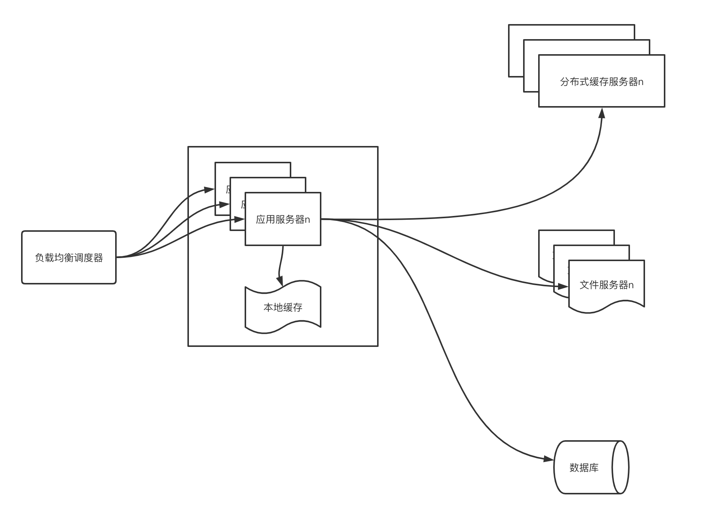

通过负载均衡调度服务器，将用户的请求分发到应用服务器集群中的任何一台机器上，根据用户访问量，来决定增/删集群中的服务器，以此来解决应用服务器的压力，不再是网站性能的瓶颈。

### 数据库读写分离

 网站在使用缓存后，使得大部分数据的`读取`操作，不通过数据库就可以访问完成，但是也会有一部分的读取操作（例如缓存未命中，缓存过期）和全部的`写入`操作需要访问数据库，在网站达到一定规模之后，数据库因为负载压力过高而成为网站瓶颈。

 目前主流的数据库软件都提供了主从热备功能 ，配置两台数据库的主从关系，可以将一台数据库的数据，同步更新到另一台机器上。网站利用该功能，可以实现读写分离，减轻数据库负载压力。


应用服务器进行`写入操作的时候，访问主数据库`，主数据库通过主从复制机制将数据更新同步到从数据库，这样当

应用服务器`读取数据的时候，可以通过从库获取数据`，以此实现数据读写分离，针对不同的网站业务，读，写的操作比率，也是不一样的，如电商类站点，用户浏览商品居多，读取居多；博客类站点，用户写入数据居多，需要依次进行不同的优化调整。

### 反向代理与CDN

 随着网站业务不断的发展，用户规模越来越大，由于中国复杂的网络环境，不同地区的用户访问体验，差距较大，若是你打开一个站点，等待时间稍微久了点，你可能下次就不愿意再访问该站点了，网站访问延迟和用户流失率成正比关系，为了留住用户，网站需要提升访问速度，配置`CDN和反向代理。`

 CDN和反向代理的基本原理都是基于缓存来实现，区别在于CDN部署在网络运营商的机房，用户在请求网站时，根据CDN地址可以访问离自己最近的机房，获取数据。

 反向代理则部署在网站的中心机房，当用户请求到达中心机房后，首先访问到的是反向代理服务器，如果代理服务器中有缓存数据，则直接返回给用户。


使用CDN和反向代理的目的都是在与尽早的返回数据给用户，加快用户访问站点速度，也可以减轻后端服务器的负载压力。

### 分布式数据库

 随着网站架构的越来越复杂，用户量继续增长，数据库这一层的压力，主从复制也无法满足需求了，这时候需要用分布式数据库，以及分布式文件系统。

 分布式数据库是指将网站数据库进行拆分，针对业务将数据库拆分，不同的业务数据存储在不同的物理服务器上。


### NoSQL与搜索引擎

随着网站业务越来越复杂，对于数据的存储和查询需求也更加复杂，网站这时候会用到非关系型数据库NoSQL和搜索引擎技术。

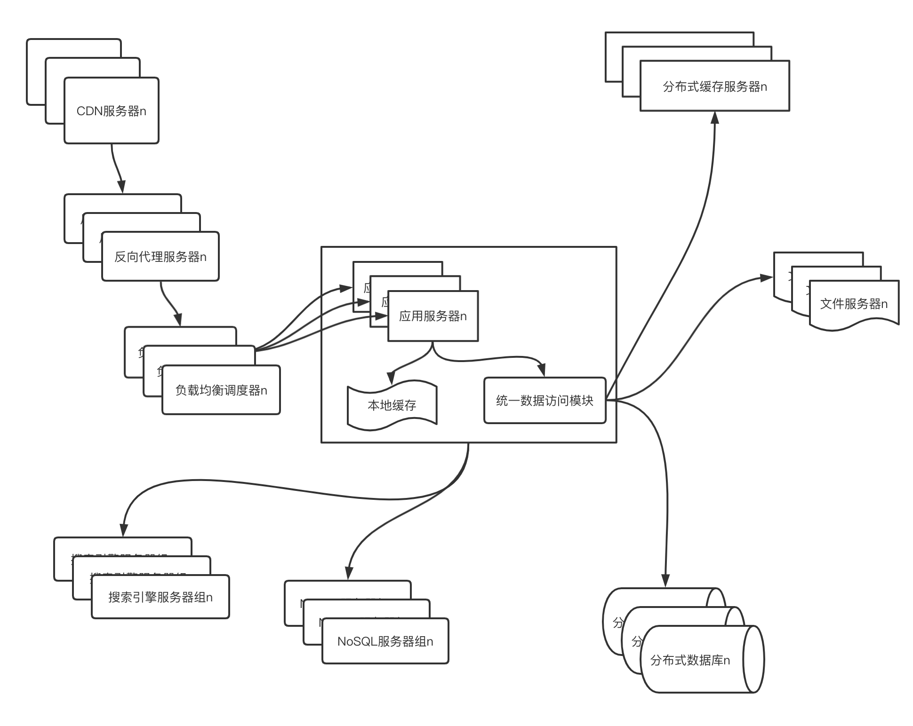

### 业务拆分

 大型网站由于业务复杂，会通过业务拆分的手段将网站的业务拆封成不同的产品线，例如一个电商网站可以把业务拆成【首页、订单、卖家、买家】等不同的产品线，归给不同的团队负责开发、维护。

 业务落实到技术上，也会根据产品线划分，吧网站应用拆封独立维护，流程图如下。

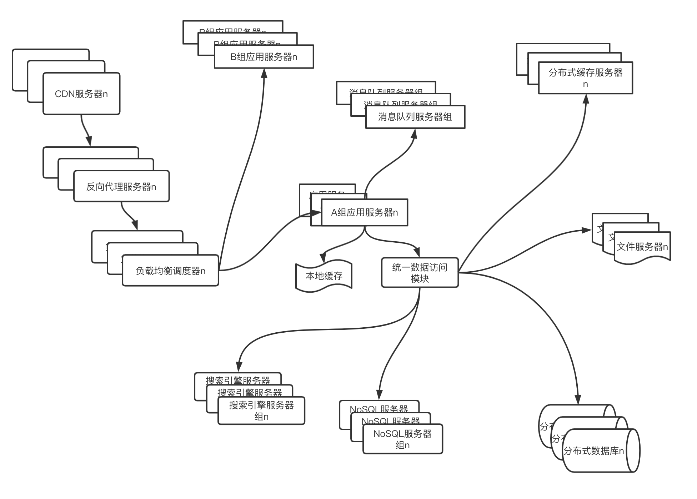

大型网站架构的演化大致先到这，大多数的技术问题都可以得以解决。

大型网站架构的设计解决了海量数据的管理和高并发事务的处理，那么多现在很多大型公司开始建设云计算平台，把网站架构设计的计算作为一种资源进行出售，中小型的网站不再需要关心自己服务器的架构问题，只需要按需求付费，购买云计算平台提供的负载均衡、数据库高可用、消息队列、文件共享等等服务，即可完成自身业务需求的存储、计算资源等。

## 网站架构价值观

 这个世界任何事都是从小到大的积累过程，任何一个网站都是从小型规模做起，网站的价值在于能给用户提供什么，能做什么，而不在于该网站是怎么设计出来的。

因此一个网站最需要做的就是为用户提供更好的服务，创造价值，得到用户的认可，能够活下去。

随着互联网的高速发展，互联网巨头公司能够产出越来越多的新兴软件，对技术挑战，对于小公司十年如一日的使用LNMP黄金架构即可开发自己的网站，该架构便宜又简单，对付一个中小网站绰绰有余。


# 期末架构演进


对于中小型站点，搭建LNMP集群环境足以支撑网站运行

```plain
接入层，nginx+keepalived 实现高可用性负载均衡
配置管理层，ansible对服务器集群进行批量部署，代码更新，文件分发，服务启停等
web业务层，nginx反向代理，结合php进行动静态请求分发
数据层，MySQL做好主从复制
共享存储，NFS+Rsync+定时任务，实现远程数据同步
```

## Kickstart-Cobbler

既然要搭建网站架构运行环境，就得安装多台服务器，面对数量众多的服务器，如何批量安装操作系统呢？总不能手动的挨个装吧。

作为中小公司的运维，经常会遇到一些机械式的重复工作，例如：有时公司同时上线几十甚至上百台服务器，而且需要我们在短时间内完成系统安装。

常规的办法有什么？

*光盘安装系统===>一个服务器DVD内置光驱百千块，百台服务器都配光驱就浪费了，因为一台服务器也就开始装系统能用的上，以后用的机会屈指可数。用USB外置光驱，插来插去也醉了。* U盘安装系统===>还是同样的问题，要一台一台服务器插U盘。

*网络安装系统(ftp,http,nfs) ===>这个方法不错，只要服务器能联网就可以装系统了，但还是需要一台台服务器去敲键盘点鼠标。时刻想偷懒的我们，有没有更好的方法！*

高逼格的方法： *Kickstart* Cobbler


## VPN之PPTP

```plain
1. 远程访问VPN服务
员工个人电脑通过远程拨号到企业办公网络，如公司的OA系统。
运维人员远程拨号到IDC机房，远程维护服务器
2. 企业内部网络之间VPN服务
公司分支机构的局域网和总公司的LAN之间的VPN连接。如各大超市之间的业务结算等。
3. 互联网公司多IDC机房之间VPN服务
不同机房之间业务管理和业务访问，数据流动。
4. 企业外部VPN服务
在供应商、合作伙伴的LAN和本公司的LAN之间建立的VPN服务。
5. 访问国外的网站
翻墙业务应用。
```

### VPN企业案例需求

```plain
有一子公司内部只有一台服务器，且只有内网ip地址，没有公网ip，但是可以和公网通信。
该公司所有网络设备都归总部管辖，子公司没有理由申请。公司内部也有VPN服务器，但是账号也需要申请。
该场景，如何让外部用户也可以访问到内部服务器？
该答案，听超哥慢慢给你来说..
```

## NoSQL

```plain
MySQL：磁盘上的数据库，数据写入读取相对较慢
Memcached：内存中的数据库，数据读写都快，但是数据易丢失
数据存储，数据仓库选择MySQL这种磁盘的数据库
高并发，业务大的应用选择Memcached这种内存数据库
工作中，MySQL+Memcached/Redis搭配使用
```

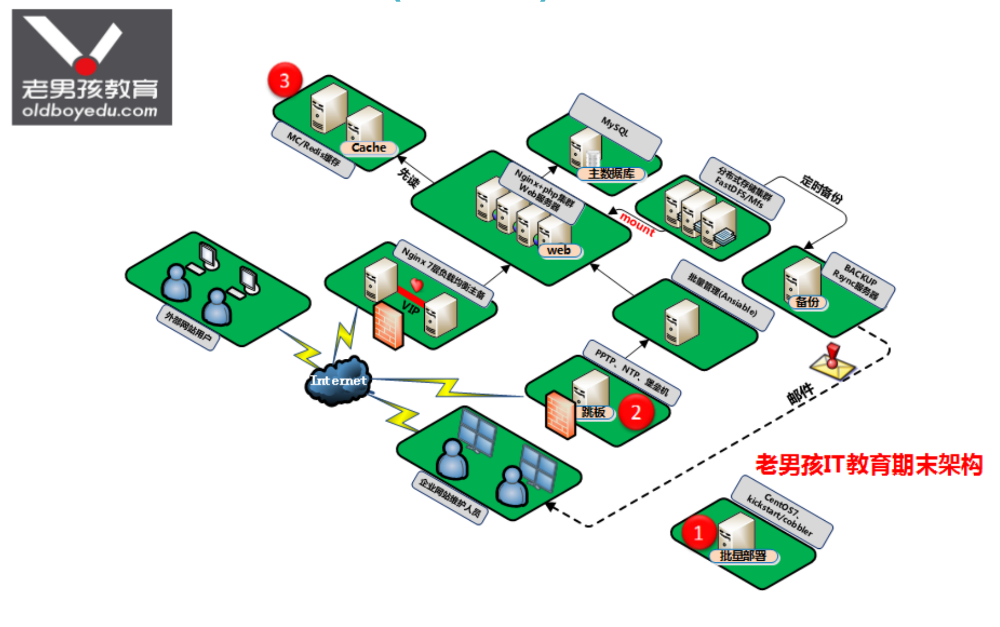

## 监控


```plain
我们的职责
1.保障企业数据的安全可靠。
2.为客户提供7*24小时服务。
3.不断提升用户的体验。
在关键时刻，提前提醒我们服务器要出问题了
当出问题之后，可以便于找到问题的根源
```

### 监控什么

```plain
远程管理服务器有远程管理卡，比如Dell idRAC，HP ILO，IBM IMM
查看硬件的温度/风扇转速，电脑有撸大师，服务器就有ipmitool。使用ipmitool实现对服务器的命令行远程管理
yum -y install OpenIPMI ipmitool  IPMI在物理机可以成功，虚拟机不行
CPU性能好不好、忙不忙可以用lscpu、uptime、top、htop。
内存够不够可以用free
磁盘剩多少写的快不快可以用df、dd、iotop
网络太卡找iftop， nethogs
```

## tomcat

```plain
Tomcat服务器是一个免费的开放源代码的Web应用服务器，在中小型系统和并发访问用户不是很多的场合下被普遍使用，是开发和调试JSP网页的首选。
Tomcat和Nginx、Apache(httpd)、lighttpd等Web服务器一样，具有处理HTML页面的功能，另外它还是一个Servlet和JSP容器，独立的Servlet容器是Tomcat的默认模式。不过，Tomcat处理静态HTML的能力不如Nginx/Apache服务器。
目前Tomcat最新版本为9.0。Java容器还有resin、weblogic等。
Tomcat官网：http://tomcat.apache.org/
```


## LVS

### 负载均衡概念

```plain
负载均衡（Load Balance）集群提供了一种廉价、有效、透明的方法，来扩展网络设备和服务器的负载、带宽、增加吞吐量、加强网络数据处理能力、提高网络的灵活性和可用性。
单台计算机无法承受大规模的并发访问或数据流量了，此时需要搭建负载均衡集群把流量分摊到多台节点设备上分别处理，即减少用户等待响应的时间又提升了用户体验；
7*24小时的服务保证，任意一个或多个有限后端节点设备宕机，不能影响整个业务的运行。
```

### 为什么用LVS

```plain
工作在网络模型的7层，可以针对http应用做一些分流的策略，比如针对域名、目录结构，Nginx单凭这点可利用的场合就远多于LVS了。
最新版本的Nginx也支持4层TCP负载，曾经这是LVS比Nginx好的地方。
Nginx对网络稳定性的依赖非常小，理论上能ping通就就能进行负载功能，这个也是它的优势之一，相反LVS对网络稳定性依赖比较大。
Nginx安装和配置比较简单，测试起来比较方便，它基本能把错误用日志打印出来。LVS的配置、测试就要花比较长的时间了，LVS对网络依赖比较大。
简单一句话，当并发超过了Nginx上限，就可以使用LVS了。
日1000-2000W PV或并发请求1万以下都可以考虑用Nginx。
大型门户网站，电商网站需要用到LVS。
```

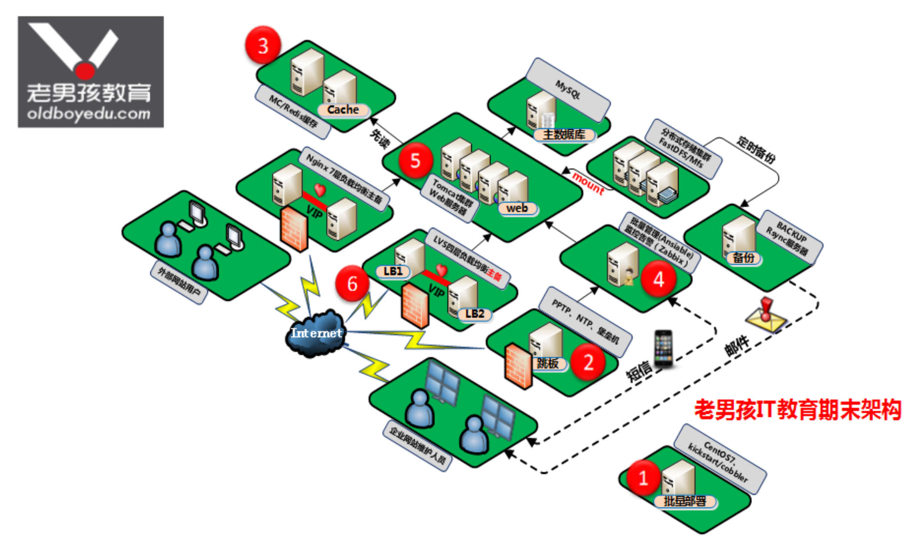

学习lvs实现负载均衡的配置

## GIT/CI/CD


```plain
持续集成是一种软件开发实践，即团队开发成员经常集成他们的工作，通常每个成员每天至少集成一次，也就意味着每天可能会发生多次集成。每次集成都通过自动化的构建（包括编译，发布，自动化测试)来验证，从而尽快地发现集成错误。许多团队发现这个过程可以大大减少集成的问题，让团队能够更快的开发优质的软件。
```

### 概念

- **持续集成**(`Continuous Integration`)：**频繁地(一天多次)将代码集成到主干。**让产品可以快速迭代，同时还能保持高质量。它的核心措施是，代码集成到主干之前，必须通过自动化测试。只要有一个测试用例失败，就不能集成。“持续集成并不能消除 Bug，而是让它们非常容易发现和改正。”
- **持续交付**(`Continuous Delivery`)：**频繁地将软件的新版本，交付给质量团队或者用户，以供评审。**如果评审通过，代码就进入生产阶段。持续交付可以看作持续集成的下一步。它强调的是，不管怎么更新，软件是随时随地可以交付的。
- **持续部署**(`continuous Deployment`)：**代码通过评审以后，自动部署到生产环境。**是持续部署是持续交付的下一步，持续部署的目标是，代码在任何时刻都是可部署的，可以进入生产阶段。

### 持续集成的好处

- **自动化构建且状态对每个人可见**。可以使用`Maven`、`Gradle`等来实现自动化构建，可以在构建过程中实现自动化测试（前提是有写单元测试用例）。集成服务器在持续集成过程中发现问题可以及时发送警告给相关的干系人。
- **解放了重复性劳动。**自动化部署工作可以解放集成、测试、部署等重复性劳动，而机器集成的频率明显比手工高很多。
- **更快地发现和修复问题。**持续集成更早的获取变更，更早的进入测试，更早的发现问题，解决问题的成本显著下降。
- **更快的交付成果。**更早发现错误减少解决错误所需的工作量。集成服务器在构建环节发现错误可以及时通知开发人员修复。集成服务器在部署环节发现错误可以回退到上一版本，服务器始终有一个可用的版本。
- **减少手工的错误。**在重复性动作上，人容易犯错，而机器犯错的几率几乎为零。
- **减少了等待时间。**缩短了从开发、集成、测试、部署各个环节的时间，从而也就缩短了中间可以出现的等待时机。持续集成，意味着开发、集成、测试、部署也得以持续。
- **更高的产品质量。**集成服务器往往提供代码质量检测等功能，对不规范或有错误的地方会进行标致，也可以设置邮件和短信等进行警告。

## 期末架构图


# 自动化装机系统

## 以前是怎么装系统的

作为中小公司的运维，经常会遇到一些机械式的重复工作，例如：有时公司同时上线几十甚至上百台服务器，而且需要我们在短时间内完成系统安装。

常规的办法有什么？

- 光盘安装系统===>一个服务器DVD内置光驱百千块，百台服务器都配光驱就浪费了，因为一台服务器也就开始装系统能用的上，以后用的机会屈指可数。用USB外置光驱，插来插去也醉了。
- U盘安装系统===>还是同样的问题，要一台一台服务器插U盘。
- 网络安装系统(ftp,http,nfs) ===>这个方法不错，只要服务器能联网就可以装系统了，但还是需要一台台服务器去敲键盘点鼠标。时刻想偷懒的我们，有没有更好的方法！

高逼格的方法：

- Kickstart
- Cobbler

在进入主题前，首先会向大家介绍一下什么是pxe，pxe能干什么，Kickstart是什么，Cobbler又有什么特别。

### 什么是PXE

- PXE，全名Pre-boot Execution Environment，预启动执行环境；
- 通过**网络接口**启动计算机，不依赖本地存储设备（如硬盘）或本地已安装的操作系统；
- 由Intel和Systemsoft公司于1999年9月20日公布的技术；
- Client/Server的工作模式；
- PXE客户端会调用网际协议(IP)、用户数据报协议(UDP)、动态主机设定协议(DHCP)、小型文件传输协议(TFTP)等网络协议；
- PXE客户端(client)这个术语是指机器在PXE启动过程中的角色。一个PXE客户端可以是一台服务器、笔记本电脑或者其他装有PXE启动代码的机器（我们电脑的网卡）。

### PXE的工作过程

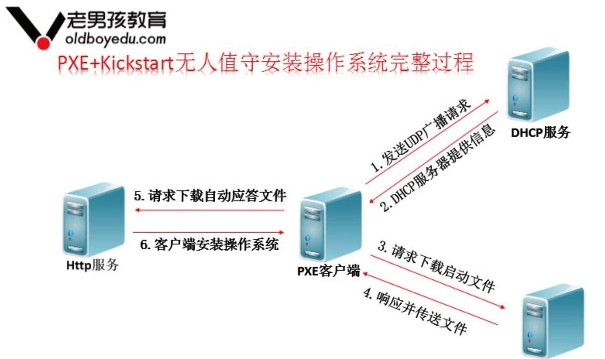

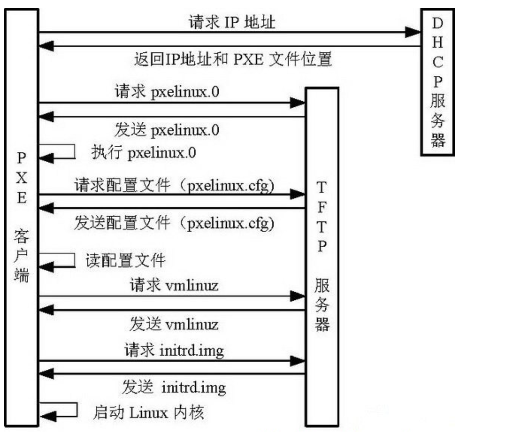

1. PXE Client向DHCP发送请求 PXE Client从自己的PXE网卡启动，通过PXE BootROM(自启动芯片)会以UDP(简单用户数据报协议)发送一个广播请求，向本网络中的DHCP服务器索取IP。
2. DHCP服务器提供信息 DHCP服务器收到客户端的请求，验证是否来至合法的PXE Client的请求，验证通过它将给客户端一个“提供”响应，这个“提供”响应中包含了为客户端分配的IP地址、pxelinux启动程序(TFTP)位置，以及配置文件所在位置。
3. PXE客户端请求下载启动文件 客户端收到服务器的“回应”后，会回应一个帧，以请求传送启动所需文件。这些启动文件包括：pxelinux.0、pxelinux.cfg/default、vmlinuz、initrd.img等文件。
4. Boot Server响应客户端请求并传送文件 当服务器收到客户端的请求后，他们之间之后将有更多的信息在客户端与服务器之间作应答, 用以决定启动参数。BootROM由TFTP通讯协议从Boot Server下载启动安装程序所必须的文件(pxelinux.0、pxelinux.cfg/default)。default文件下载完成后，会根据该文件中定义的引导顺序，启动Linux安装程序的引导内核。
5. 请求下载自动应答文件 客户端通过pxelinux.cfg/default文件成功的引导Linux安装内核后，安装程序首先必须确定你通过什么安装介质来安装linux，如果是通过网络安装(NFS, FTP, HTTP)，则会在这个时候初始化网络，并定位安装源位置。接着会读取default文件中指定的自动应答文件ks.cfg所在位置，根据该位置请求下载该文件。
6. 客户端安装操作系统 将ks.cfg文件下载回来后，通过该文件找到OS Server，并按照该文件的配置请求下载安装过程需要的软件包。OS Server和客户端建立连接后，将开始传输软件包，客户端将开始安装操作系统。安装完成后，将提示重新引导计算机。

## 批量装机软件介绍

Redhat系主要有两种Kickstart和Cobbler。

Kickstart是一种无人值守的安装方式。它的工作原理是在安装过程中记录人工干预填写的各种参数，并生成一个名为ks.cfg的文件。如果在自动安装过程中出现要填写参数的情况，安装程序首先会去查找ks.cfg文件，如果找到合适的参数，就采用所找到的参数；如果没有找到合适的参数，便会弹出对话框让安装者手工填写。所以，如果ks.cfg文件涵盖了安装过程中所有需要填写的参数，那么安装者完全可以只告诉安装程序从何处下载ks.cfg文件，然后就去忙自己的事情。等安装完毕，安装程序会根据ks.cfg中的设置重启/关闭系统，并结束安装。

Cobbler集中和简化了通过网络安装操作系统需要使用到的DHCP、TFTP和DNS服务的配置。Cobbler不仅有一个命令行界面，还提供了一个Web界面，大大降低了使用者的入门水平。Cobbler内置了一个轻量级配置管理系统，但它也支持和其它配置管理系统集成，如Puppet，暂时不支持SaltStack。

**简单的说，Cobbler是对kickstart的封装，简化安装步骤、使用流程，降低使用者的门槛**

# 环境准备

准备好一台用于部署kickstart服务端的机器

**注意：虚拟机网卡连接方式，采用NAT模式，不要用桥接，且关闭VM网卡中的DHCP服务**

环境准备如下

```plain
1.安装基础软件，如果是最小化安装的话
yum install -y bash-completion vim lrzsz wget expect net-tools nc nmap tree dos2unix htop iftop iotop unzip telnet sl psmisc nethogs glances bc ntpdate 
2.配置yum源
wget -O /etc/yum.repos.d/CentOS-Base.repo http://mirrors.aliyun.com/repo/Centos-7.repo
wget -O /etc/yum.repos.d/epel.repo http://mirrors.aliyun.com/repo/epel-7.repo
yum clean all
yum makecache
3.关闭防火墙
[root@kickstart yum.repos.d]# systemctl stop firewalld
[root@kickstart yum.repos.d]# systemctl disable firewalld
Removed symlink /etc/systemd/system/multi-user.target.wants/firewalld.service.
Removed symlink /etc/systemd/system/dbus-org.fedoraproject.FirewallD1.service.
[root@client01 ~]# sed -i  's/enforcing/disabled/g' /etc/selinux/config 
[root@kickstart ~]# getenforce 
Disabled
4.关闭vmware的dhcp服务，设置linux静态ip
[root@kickstart ~]# cat /etc/sysconfig/network-scripts/ifcfg-ens33 
TYPE="Ethernet"
PROXY_METHOD="none"
BROWSER_ONLY="no"
BOOTPROTO="static"
DEFROUTE="yes"
IPV4_FAILURE_FATAL="no"
IPV6INIT="yes"
IPV6_AUTOCONF="yes"
IPV6_DEFROUTE="yes"
IPV6_FAILURE_FATAL="no"
IPV6_ADDR_GEN_MODE="stable-privacy"
NAME="ens33"
UUID="b4c06569-fc94-4e94-9c63-0391c7a35432"
DEVICE="ens33"
ONBOOT="yes"
IPADDR=172.18.41.133
NETMASK=255.255.255.0
DNS1=1.2.4.8
GATEWAY=172.18.41.2
5.系统检查
[root@kickstart ~]#  cat /etc/redhat-release
CentOS Linux release 7.5.1804 (Core) 
[root@kickstart ~]# uname -r
3.10.0-862.el7.x86_64
[root@kickstart ~]# ifconfig  ens33 |awk  'NR==2 {print $2}'
172.18.41.133
[root@kickstart ~]# iptables -L
Chain INPUT (policy ACCEPT)
target     prot opt source               destination         
Chain FORWARD (policy ACCEPT)
target     prot opt source               destination         
Chain OUTPUT (policy ACCEPT)
target     prot opt source               destination  
6.时间同步更新
[root@kickstart ~]# ntpdate -u ntp.aliyun.com
修改时区
[root@kickstart ~]# ln -sf /usr/share/zoneinfo/Asia/Shanghai /etc/localtime 
[root@kickstart ~]# date
Tue Jul 21 19:05:06 CST 2020
```

------

## 主机IP设置方式

每一台主机的IP地址可以通过以下两种方法来设置：

1：手动输入、这种方式比较容易因为输入错误而影响到主机的网络通信，而且可能会因为占用其他主机的IP地址而干扰到该主机的运行，因为会加重系统管理员的负担。

2：自动向DHCP服务器申请、用户的计算机会自动向DHCP服务器申请IP地址，接收到此请求的DHCP服务器会分配IP地址给用户的计算机。他可以减轻管理负担，避免因手动输入错误而造成的困扰。

我们将手动输入的IP地址为静态IP地址（static IP address），而向DHCP服务器租用的IP地址为动态IP地址（dynamic IP address）。

## 为什么用DHCP

DHCP（Dynamic Host Configuration Protocol）称为动态主机配置协议。

**①**DHCP服务器用于为客户机动态分配IP地址，避免了TCP/IP网络中地址的冲突，便于对网络的IP地址进行管理；

**②**在使用TCP/IP协议通信的网络中，每台计算机都必须至少有一个IP地址，这样才能与其他计算机通信。对于一个较大规模的网络来说，逐个地为每台计算机分配和设置IP地址，将是一件很麻烦的事情，也不便于管理和维护；

**③**对于像笔记本这样的移动用户，经常从一个子网移动到另一个子网，需要不断地手动更换IP地址，很不方便；

**④**DHCP服务器通过动态的IP地址分配还能解决IP地址资源不足的情况，因此DHCP产生了。


### 提供的服务

1.提供IP地址和子网掩码 2.提供IP地址对应的网络地址和广播地址 3.默认网关地址 4.DNS服务器地址

### 通俗的解释

你们寝室里有六个人（对应到客户机），每个人都需要用床（对应到IP地址）睡觉，所以每个人回到寝室都会需要一张床。这样的话每个人每次回到寝室的时候都需要宿管（对应到网络管理员）都需要给他分配一个床位，这样就很麻烦。 现在有一个“动态床位分配系统”（对应到DHCP服务器），你们每个人回到寝室的时候都会收到一张纸条，纸条上写了你可以使用哪个床位，这就简单多了。 再然后可能小明（对应到一个特定的客户机）有洁癖，他需要一个固定的床位（对应到一个需要固定IP的设备，比如打印机或者提供某些服务的服务器）。

所以“动态床位分配系统”可以添加一条规则`叫小明的人来了就分配给他三号床位`，就解决了这个问题。

### DHCP的租约

 DHCP服务器利用租约机制，实现了对整个网络IP地址的自动统一分配和集中管理。当客户机向DHCP服务器请求分配IP地址时，DHCP服务器会自动从地址池中找出一个未使用的IP地址，分配给客户机。在分配IP地址给客户机的同时，还可以为客户机指定默认网关（路由）和DNS服务器等信息，便于客户机能与其他网段的计算机通信或者实现访问Internet网。当租约时间到的时候如果客户机还在使用这个IP那么就可以续约，继续使用当前IP而不是从新分配一个。

### DHCP工作流程


网络中的DHCP客户端向DHCP服务器申请IP地址的过程是靠**RARP**`逆地址解析协议 (Reverse Address Resolution Protocol)`（知道MAC，找IP）协议来实现的。

DHCP租约过程就是DHCP客户机动态获取IP地址的过程。

DHCP租约过程分为4步：

**①**客户机请求IP（客户机发**DHCPDISCOVER**广播包）；

**②**服务器响应（服务器发**DHCPOFFER**广播包）；

**③**客户机选择IP（客户机发**DHCPREQUEST**广播包）；

**④**服务器确定租约（服务器发**DHCPACK/DHCPNAK**广播包）。

### DHCP报文

```plain
DHCP协议中的报文
DHCP报文共有一下几种：
DHCP DISCOVER ：客户端开始DHCP过程发送的包，是DHCP协议的开始
DHCP OFFER ：服务器接收到DHCP DISCOVER之后做出的响应，它包括了给予客户端的IP（yiaddr）、客户端的MAC地址、租约过期时间、服务器的识别符以及其他信息
DHCP REQUEST ：客户端对于服务器发出的DHCP OFFER所做出的响应。在续约租期的时候同样会使用。
DHCP ACK ：服务器在接收到客户端发来的DHCP REQUEST之后发出的成功确认的报文。在建立连接的时候，客户端在接收到这个报文之后才会确认分配给它的IP和其他信息可以被允许使用。
DHCP NAK ：DHCP ACK的相反的报文，表示服务器拒绝了客户端的请求。
DHCP RELEASE ：一般出现在客户端关机、下线等状况。这个报文将会使DHCP服务器释放发出此报文的客户端的IP地址
DHCP INFORM ：客户端发出的向服务器请求一些信息的报文
DHCP DECLINE :当客户端发现服务器分配的IP地址无法使用（如IP地址冲突时），将发出此报文，通知服务器禁止使用该IP地址。
```

### DHCP的作用域

作用域是指DHCP服务器可分配租用给DHCP客户机的IP地址范围。DHCP服务器应该至少配置一个作用域，各作用域的IP地址范围（IP地址池）不能出现重叠。

### **保留IP**

保留IP用于有特定服务的客户机，需要将保留的IP与客户机的MAC地址绑定。

### IP租约的更新

当客户机重新启动或租期达50%时，就需要重新更新租约，客户机直接向提供租约的服务器发送请求DHCPREQUEST消息，要求更新现有的地址租约。如果DHCP服务器接收到请求，它将发送DHCP确认信息给客户机，更新客户机租约。如果客户机无法与提供租约的服务器取得联系，则客户机一直等到租期到达87.5%时，进入到一种重新申请的状态，它向网络上所有的服务器广播DHCPDISCOVER请求更新现有的IP租约。

### IP租约的释放

使用ipconfig/release使DHCP客户机向DHCP服务器发送DHCPRELEASE消息并释放其租约。

如果客户机在租约时间内保持关闭并且不更新租约，在租约到期后DHCP服务器可能将客户机的IP地址分配给其他的客户机。如果客户机不发送DHCPRELEASE消息，那么它在重启后，将试图尝试继续使用上一次使用过的IP地址。

## 部署DHCP服务端

```plain
# 机器1 dhcp服务端
[root@kickstart ~]# ifconfig  ens33 |awk  'NR==2 {print $2}'
172.18.41.133
[root@kickstart ~]# hostname
kickstart
```

### dhcp服务端

```plain
[root@kickstart ~]# yum install dhcp -y
# 查询软件包信息
[root@kickstart ~]# rpm -qa dhcp
dhcp-4.2.5-79.el7.centos.x86_64
```

查看dhcp配置文件

```plain
[root@kickstart ~]# cat /etc/dhcp/dhcpd.conf
#
# DHCP Server Configuration file.
#   see /usr/share/doc/dhcp*/dhcpd.conf.example
#   see dhcpd.conf(5) man page
#
```

查看dhcp示例配置文件

```
cat /usr/share/doc/dhcp-4.2.5/dhcpd.conf.example
#
# DHCP Server Configuration file.
#   see /usr/share/doc/dhcp*/dhcpd.conf.example
#   see dhcpd.conf(5) man page
#
# dhcpd.conf
#
# Sample configuration file for ISC dhcpd
#
# option定义选项
# option definitions common to all supported networks...
option domain-name "example.org";
option domain-name-servers ns1.example.org, ns2.example.org;
default-lease-time 600;         #默认租约时间单位秒
max-lease-time 7200;            #最大租约时间单位秒
# Use this to enble / disable dynamic dns updates globally.
#ddns-update-style none;
# If this DHCP server is the official DHCP server for the local
# network, the authoritative directive should be uncommented.
#authoritative;
# Use this to send dhcp log messages to a different log file (you also
# have to hack syslog.conf to complete the redirection).
log-facility local7;
# No service will be given on this subnet, but declaring it helps the 
# DHCP server to understand the network topology.
subnet 10.152.187.0 netmask 255.255.255.0 {       #定义子网
}
# This is a very basic subnet declaration.
subnet 10.254.239.0 netmask 255.255.255.224 {
  range 10.254.239.10 10.254.239.20;              #指定IP地址池
  # # 定义其他参数，如 dns,gateway
  option routers rtr-239-0-1.example.org, rtr-239-0-2.example.org;  
}
# This declaration allows BOOTP clients to get dynamic addresses,
# which we don't really recommend.
subnet 10.254.239.32 netmask 255.255.255.224 {
  range dynamic-bootp 10.254.239.40 10.254.239.60;
  option broadcast-address 10.254.239.31;
  option routers rtr-239-32-1.example.org;
}
# A slightly different configuration for an internal subnet.
# 选项可以写在子网内，优先级更高，全局优先级低
subnet 10.5.5.0 netmask 255.255.255.224 {
  range 10.5.5.26 10.5.5.30;
  option domain-name-servers ns1.internal.example.org;      #DNS服务器，最多三个
  option domain-name "internal.example.org";                #可选 设置默认搜索域
  option routers 10.5.5.1;                                  #网关
  option broadcast-address 10.5.5.31;                       #可选 备选广播地址
  default-lease-time 600;
  max-lease-time 7200;
}
# Hosts which require special configuration options can be listed in
# host statements.   If no address is specified, the address will be
# allocated dynamically (if possible), but the host-specific information
# will still come from the host declaration.
# host 用于区别不同的主机名
host passacaglia {                                
  hardware ethernet 0:0:c0:5d:bd:95;              
  filename "vmunix.passacaglia";
  server-name "toccata.fugue.com";
}
# Fixed IP addresses can also be specified for hosts.   These addresses
# should not also be listed as being available for dynamic assignment.
# Hosts for which fixed IP addresses have been specified can boot using
# BOOTP or DHCP.   Hosts for which no fixed address is specified can only
# be booted with DHCP, unless there is an address range on the subnet
# to which a BOOTP client is connected which has the dynamic-bootp flag
# set.
# host 用于区别不同的主机名，例如针对该MAC地址，设置固定IP，主机名
host fantasia {                                 #主机
  hardware ethernet 08:00:07:26:c0:a5;          #指定文件服务器MAC地址
  fixed-address fantasia.fugue.com;             #指定固定IP地址
}
# You can declare a class of clients and then do address allocation
# based on that.   The example below shows a case where all clients
# in a certain class get addresses on the 10.17.224/24 subnet, and all
# other clients get addresses on the 10.0.29/24 subnet.
class "foo" {
  match if substring (option vendor-class-identifier, 0, 4) = "SUNW";
}
shared-network 224-29 {
  subnet 10.17.224.0 netmask 255.255.255.0 {
    option routers rtr-224.example.org;
  }
  subnet 10.0.29.0 netmask 255.255.255.0 {
    option routers rtr-29.example.org;
  }
  pool {
    allow members of "foo";
    range 10.17.224.10 10.17.224.250;
  }
  pool {
    deny members of "foo";
    range 10.0.29.10 10.0.29.230;
  }
}
```

配置文件参数通常包括三部分，分别是声明（declarations）、参数(parameters)、选项(option)。

a、声明是用来描述dhcpd服务器中对网络布局的划分，是网络设置的逻辑范围。

B、参数用来表明如何执行任务，是否要执行任务或将哪些网络配置选项发送给客户。

c、选项是用来配置dhcp的可选参数，全部用option关键字作为开始。

**一个标准的DHCP配置文件应该包括全局配置参数、子网网段声明、地址配置选项以及地址配置参数：**


全局配置参数用于定义整个配置文件的全局参数，而子网网段声明用于配置整个子网段的地址属性

### 服务端编写dhcpd.conf

查看当前网络环境，局域网段

```plain
[root@kickstart ~]#  ip a
1: lo: <LOOPBACK,UP,LOWER_UP> mtu 65536 qdisc noqueue state UNKNOWN group default qlen 1000
    link/loopback 00:00:00:00:00:00 brd 00:00:00:00:00:00
    inet 127.0.0.1/8 scope host lo
       valid_lft forever preferred_lft forever
    inet6 ::1/128 scope host 
       valid_lft forever preferred_lft forever
2: ens33: <BROADCAST,MULTICAST,UP,LOWER_UP> mtu 1500 qdisc pfifo_fast state UP group default qlen 1000
    link/ether 00:0c:29:e9:ed:77 brd ff:ff:ff:ff:ff:ff
    inet 172.18.41.133/24 brd 172.18.41.255 scope global ens33
       valid_lft forever preferred_lft forever
    inet6 fe80::20c:29ff:fee9:ed77/64 scope link 
       valid_lft forever preferred_lft forever
```

设置dhcpd.conf配置文件

```plain
[root@kickstart ~]# cat /etc/dhcp/dhcpd.conf 
#
# DHCP Server Configuration file.
#   see /usr/share/doc/dhcp*/dhcpd.conf.example
#   see dhcpd.conf(5) man page
#
subnet 172.18.41.0 netmask 255.255.255.0 {    
range 172.18.41.100 172.18.41.199;                # range设置起始，结束ip范围
option subnet-mask 255.255.255.0;                # 选项，设置掩码
option routers 172.18.41.2;                        # dhcp服务的网关设置，这里不写，客户端则无法上网
option domain-name-servers 1.2.4.8；               # 保证dhcp客户端可以域名解析
default-lease-time 21600;                        # 默认的IP租用期限
max-lease-time 43200;                                # 最大的IP租用期限
next-server 172.18.41.133;                        # 告知客户端tftp服务器的ip
filename "/pxelinux.0";                            # 指明引导文件，用于指定PXE的运行程序文件，放在TFTP服务器的目录下
}
```

配置文件解释

```plain
filename:指明引导文件名称，用于指定PXE的运行程序文件，一般是在TFTP服务器的工作目录下，这个是关于PXE启动的配置。流程如下：
        客户机通过网络启动，一般采用的就是intel的PXE来启动；
        PXE首先指定DHCP，获取自身IP地址、TFTP服务器或者NFS服务器的IP地址、PXE程序等内容；
        执行获取的PXE程序，获得详细配置内容，再获取linux虚拟系统和intrid等内容；
        最后加载整个linux系统到内核。
next-server server-name(一般是IP)：客户端启动后，获得了IP地址，会加载引导文件，这里就定义提供引导文件的服务器IP地址
```

启动dhcp服务，检查日志，状态

```plain
[root@kickstart ~]# systemctl start dhcpd
[root@kickstart ~]# systemctl is-enabled dhcpd
disabled
[root@kickstart ~]# systemctl is-active  dhcpd
active
# 部分日志如下
[root@kickstart ~]# tail -f /var/log/messages 
Jul 21 06:23:06 kickstart systemd: Starting DHCPv4 Server Daemon...
Jul 21 06:23:06 kickstart dhcpd: Internet Systems Consortium DHCP Server 4.2.5
Jul 21 06:23:06 kickstart dhcpd: Copyright 2004-2013 Internet Systems Consortium.
Jul 21 06:23:06 kickstart dhcpd: All rights reserved.
Jul 21 06:23:06 kickstart dhcpd: For info, please visit https://www.isc.org/software/dhcp/
Jul 21 06:23:06 kickstart dhcpd: Not searching LDAP since ldap-server, ldap-port and ldap-base-dn were not specified in the config file
Jul 21 06:23:06 kickstart dhcpd: Wrote 0 leases to leases file.
Jul 21 06:23:06 kickstart dhcpd: Listening on LPF/ens33/00:0c:29:e9:ed:77/172.18.41.0/24
Jul 21 06:23:06 kickstart dhcpd: Sending on   LPF/ens33/00:0c:29:e9:ed:77/172.18.41.0/24
Jul 21 06:23:06 kickstart dhcpd: Sending on   Socket/fallback/fallback-net
Jul 21 06:23:06 kickstart systemd: Started DHCPv4 Server Daemon.
```

检查服务状态

```plain
[root@kickstart ~]# systemctl status dhcpd
● dhcpd.service - DHCPv4 Server Daemon
   Loaded: loaded (/usr/lib/systemd/system/dhcpd.service; disabled; vendor preset: disabled)
   Active: active (running) since Tue 2020-07-21 06:23:06 EDT; 5min ago
     Docs: man:dhcpd(8)
           man:dhcpd.conf(5)
 Main PID: 10396 (dhcpd)
   Status: "Dispatching packets..."
   CGroup: /system.slice/dhcpd.service
           └─10396 /usr/sbin/dhcpd -f -cf /etc/dhcp/dhcpd.conf -user dhcpd -group dhcpd --no-pid
Jul 21 06:23:06 kickstart dhcpd[10396]: Internet Systems Consortium DHCP Server 4.2.5
Jul 21 06:23:06 kickstart dhcpd[10396]: Copyright 2004-2013 Internet Systems Consortium.
Jul 21 06:23:06 kickstart dhcpd[10396]: All rights reserved.
Jul 21 06:23:06 kickstart dhcpd[10396]: For info, please visit https://www.isc.org/software/dhcp/
Jul 21 06:23:06 kickstart dhcpd[10396]: Not searching LDAP since ldap-server, ldap-port and ldap-base-dn were not specified ...ig file
Jul 21 06:23:06 kickstart dhcpd[10396]: Wrote 0 leases to leases file.
Jul 21 06:23:06 kickstart dhcpd[10396]: Listening on LPF/ens33/00:0c:29:e9:ed:77/172.18.41.0/24
Jul 21 06:23:06 kickstart dhcpd[10396]: Sending on   LPF/ens33/00:0c:29:e9:ed:77/172.18.41.0/24
Jul 21 06:23:06 kickstart dhcpd[10396]: Sending on   Socket/fallback/fallback-net
Jul 21 06:23:06 kickstart systemd[1]: Started DHCPv4 Server Daemon.
Hint: Some lines were ellipsized, use -l to show in full.
```

查看dhcp端口监听udp

```plain
[root@kickstart ~]# ss -unlp
State      Recv-Q Send-Q                      Local Address:Port                                     Peer Address:Port              
UNCONN     0      0                               127.0.0.1:323                                                 *:*                   users:(("chronyd",pid=652,fd=1))
UNCONN     0      0                                       *:67                                                  *:*                   users:(("dhcpd",pid=10396,fd=7))
UNCONN     0      0                                     ::1:323                                                :::*                   users:(("chronyd",pid=652,fd=2))
```

设置dhcp服务开机自启

```plain
[root@kickstart ~]# systemctl enable dhcpd
Created symlink from /etc/systemd/system/multi-user.target.wants/dhcpd.service to /usr/lib/systemd/system/dhcpd.service.
[root@kickstart ~]# systemctl is-enabled dhcpd
disabled
[root@kickstart ~]# systemctl is-active  dhcpd
active
```

这里备注下，一般软件配置启动后，经常需要开机自启，但是Kickstart不能，且用完注意要关闭服务，因为你难道希望每次开机都重装系统吗？~~~~

# PXE和tftp

这里注意，虚拟机的内存至少分配2G，PXE工作原理


## TFTP服务器

TFTP（Trivial File Transfer Protocol,简单文件传输协议）是TCP/IP协议族中的一个用来在客户机与服务器之间进行简单文件传输的协议，提供不复杂、开销不大的文件传输服务。端口号为69。

## xinetd

inux服务器端tftp-server的配置

tftp服务器需要安装xinetd（守护tftp）、tftp和tftp-server 3个软件

```plain
[root@kickstart ~]# yum install tftp-server tftp xinetd -y
```

修改xinetd配置文件，管理tftp

```plain
[root@kickstart ~]# cat /etc/xinetd.d/tftp 
# default: off
# description: The tftp server serves files using the trivial file transfer \
#    protocol.  The tftp protocol is often used to boot diskless \
#    workstations, download configuration files to network-aware printers, \
#    and to start the installation process for some operating systems.
service tftp
{
    socket_type        = dgram
    protocol        = udp
    wait            = yes
    user            = root
    server            = /usr/sbin/in.tftpd
    server_args        = -s /var/lib/tftpboot
    disable            = no
    per_source        = 11
    cps            = 100 2
    flags            = IPv4
}
```

### 启动xinetd服务

通过xinetd启动tftp服务即可

```plain
[root@kickstart ~]# systemctl start xinetd
[root@kickstart ~]# netstat -a | grep tftp
udp        0      0 0.0.0.0:tftp            0.0.0.0:*   
[root@kickstart ~]# lsof -i:69
COMMAND   PID USER   FD   TYPE DEVICE SIZE/OFF NODE NAME
xinetd  15519 root    5u  IPv4  67791      0t0  UDP *:tftp
```

连接tftp

```plain
[root@kickstart ~]# tftp 172.18.41.133
```

默认tftp工具的目录，可以创建测试文件

```plain
[root@kickstart ~]# cd /var/lib/tftpboot/
[root@kickstart tftpboot]# ls
[root@kickstart tftpboot]# touch test.cc
[root@kickstart tftpboot]# ls
test.cc
```

进入任意目录，测试下载tftp目录内容

```plain
[root@kickstart tftpboot]# cd /tmp/
[root@kickstart tmp]# tftp 172.18.41.133
tftp> ?
tftp-hpa 5.2
Commands may be abbreviated.  Commands are:
connect     connect to remote tftp
mode        set file transfer mode
put         send file
get         receive file
quit        exit tftp
verbose     toggle verbose mode
trace       toggle packet tracing
literal     toggle literal mode, ignore ':' in file name
status      show current status
binary      set mode to octet
ascii       set mode to netascii
rexmt       set per-packet transmission timeout
timeout     set total retransmission timeout
?           print help information
help        print help information
tftp> get test.cc
tftp> quit
[root@kickstart tmp]# ls
test.cc
```

清空测试数据

```plain
[root@kickstart tmp]# rm -rf /var/lib/tftpboot/test.cc
```

# HTTP服务器部署网络镜像

既然是自动化装机系统，我们要想办法吧IOS系统镜像光盘的内容，发布出去，提供下载等，生产环境需要进行镜像复制，学习阶段为了节省时间，用HTTPD展示就好，是发布镜像源的一个步骤。

```plain
# 安装
[root@kickstart syslinux]# yum install httpd -y
# 插入一行配置
[root@kickstart syslinux]# sed -i "277i ServerName 127.0.0.1:80" /etc/httpd/conf/httpd.conf
# 启动
[root@kickstart syslinux]# systemctl start httpd
# 建立站点目录
mkdir /var/www/html/CentOS-7/
# 通过vmware挂上centos7镜像文件，该步骤重要，如下的图片
# 挂载目录
[root@kickstart syslinux]# mount /dev/cdrom /var/www/html/CentOS-7/
mount: /dev/sr0 is write-protected, mounting read-only
# 查看挂载情况
[root@kickstart syslinux]# df -h |grep www
/dev/sr0                 4.2G  4.2G     0 100% /var/www/html/CentOS-7
# 访问站点，访问IOS镜像的内容,注意大小写，内容如下图
http://172.18.41.133/CentOS-7/
```


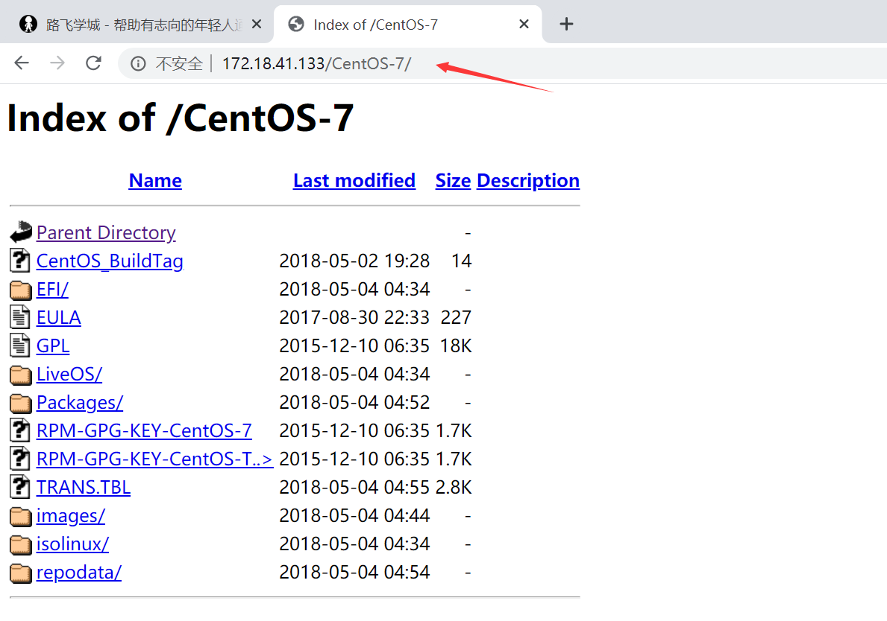

### 部署PXE

syslinux是一个功能强大的引导加载程序，而且兼容各种介质。SYSLINUX是一个小型的Linux操作系统，它的目的是简化首次安装Linux的时间，并建立修护或其它特殊用途的启动盘。

如果没有找到pxelinux.0这个文件,可以安装一下。

```plain
[root@kickstart syslinux]# yum install syslinux -y
```

拷贝pxelinux.0该文件，放入tfpt目录，便于提供给客户端下载

```plain
# 把pxelinux.0文件 发给tftp目录，用于发给客户端
cp /usr/share/syslinux/pxelinux.0 /var/lib/tftpboot/
# 拷贝启动菜单程序文件
[root@kickstart syslinux]# cp -a /var/www/html/CentOS-7/isolinux/* /var/lib/tftpboot/
# 拷贝自动重启文件
[root@kickstart ~]# cp /usr/share/syslinux/reboot.c32 /var/lib/tftpboot/
# 检查tftp目录下的启动菜单文件
[root@kickstart syslinux]# tree -F /var/lib/tftpboot/
/var/lib/tftpboot/
├── boot.cat
├── boot.msg
├── grub.conf
├── initrd.img   # 驱动文件
├── isolinux.bin
├── isolinux.cfg
├── memtest
├── pxelinux.0   # 启动代码
├── pxelinux.cfg/
│   └── default # 配置文件
├── reboot.c32  # 重启系统
├── splash.png
├── TRANS.TBL
├── vesamenu.c32  # 界面框架
└── vmlinuz*      # 内核文件
# 新建一个pxelinux.cfg目录，用于存放客户端的配置文件
[root@kickstart syslinux]#  mkdir -p /var/lib/tftpboot/pxelinux.cfg
# 拷贝PXE配置文件，且改名
[root@kickstart syslinux]# cp /var/www/html/CentOS-7/isolinux/isolinux.cfg /var/lib/tftpboot/pxelinux.cfg/default
# 提升tftp目录权限
[root@kickstart tftpboot]# chmod 777 -R /var/lib/tftpboot/
```

配置文件了解

**这些文件内的参数，就是你开机安装系统看见的画面**

```plain
[root@kickstart tftpboot]# cat /var/lib/tftpboot/pxelinux.cfg/default
default vesamenu.c32  # 默认加载一个菜单
#prompt 1             # 开启会显示命令行'boot: '提示符。prompt值为0时则不提示，将会直接启动'default'参数中指定的内容。
timeout 600           # timeout时间是引导时等待用户手动选择的时间，设为1可直接引导，单位为1/10秒。
display boot.msg
# 菜单背景图片、标题、颜色。
menu background splash.jpg
menu title Welcome to CentOS 6.7!
menu color border 0 #ffffffff #00000000
menu color sel 7 #ffffffff #ff000000
menu color title 0 #ffffffff #00000000
menu color tabmsg 0 #ffffffff #00000000
menu color unsel 0 #ffffffff #00000000
menu color hotsel 0 #ff000000 #ffffffff
menu color hotkey 7 #ffffffff #ff000000
menu color scrollbar 0 #ffffffff #00000000
# label指定在boot:提示符下输入的关键字，比如boot:linux[ENTER]，这个会启动label linux下标记的kernel和initrd.img文件。
label linux       # 一个标签就是前面图片的一行选项。
  menu label ^Install or upgrade an existing system
  menu default
  kernel vmlinuz  # 指定要启动的内核。同样要注意路径，默认是/tftpboot目录。
  append initrd=initrd.img # 指定追加给内核的参数，initrd.img是一个最小的linux系统
label vesa
  menu label Install system with ^basic video driver
  kernel vmlinuz
  append initrd=initrd.img nomodeset
label rescue
  menu label ^Rescue installed system
  kernel vmlinuz
  append initrd=initrd.img rescue
label local
  menu label Boot from ^local drive
  localboot 0xffff
label memtest86
  menu label ^Memory test
  kernel memtest
  append -
```

## 定制pxe网络安装文件

修改cfg文件，修改如下配置

```plain
1.修改第一行，让centos直接默认安装linux，不去手动再选择
default linux
2.制定apache的系统iso下载地址
 61 label linux
 62   menu label ^Install CentOS 7
 63   kernel vmlinuz
 64 # append initrd=initrd.img inst.stage2=hd:LABEL=CentOS\x207\x20x86_64 quiet
 65   append initrd=initrd.img inst.repo=http://172.18.41.133/CentOS-7/ net.ifnames=0 biosdevname=0
```

# DHCP客户端配置

再准备好一个linux虚拟机客户端，客户端注意网络连接选择，选择适配器，不要开启dhcp功能

**且不要选择默认的NAT网卡，因为已经关闭了DHCP服务，你也无法获取IP地址，选择我们自己创建的DHCP服务器**

### VMWARE新建虚拟机

### *新添加一块网络适配器**

**严格检查，你的配置，是否和我一样**

创建lan区段和dhcp服务端同一个局域网


### dhcp服务端检查

```plain
# 检查系统日志，有关信息
[root@kickstart ~]# tail -f /var/log/messages 
Jul 27 12:28:17 kickstart dhcpd: DHCPDISCOVER from 00:0c:29:a5:a7:e7 via ens33
Jul 27 12:28:17 kickstart dhcpd: DHCPOFFER on 172.18.41.101 to 00:0c:29:a5:a7:e7 via ens33
Jul 27 12:28:17 kickstart dhcpd: DHCPREQUEST for 172.18.41.101 (172.18.41.133) from 00:0c:29:a5:a7:e7 via ens33
Jul 27 12:28:17 kickstart dhcpd: DHCPACK on 172.18.41.101 to 00:0c:29:a5:a7:e7 via ens33
Jul 27 12:34:33 kickstart dhcpd: DHCPDISCOVER from 00:0c:29:a5:a7:e7 via ens33
Jul 27 12:34:34 kickstart dhcpd: DHCPOFFER on 172.18.41.101 to 00:0c:29:a5:a7:e7 via ens33
Jul 27 12:34:35 kickstart dhcpd: DHCPREQUEST for 172.18.41.101 (172.18.41.133) from 00:0c:29:a5:a7:e7 via ens33
Jul 27 12:34:35 kickstart dhcpd: DHCPACK on 172.18.41.101 to 00:0c:29:a5:a7:e7 via ens33
Jul 27 12:34:35 kickstart in.tftpd[14636]: Error code 0: TFTP Aborted
Jul 27 12:34:35 kickstart in.tftpd[14637]: Client ::ffff:172.18.41.101 finished /pxelinux.0
Jul 27 12:34:35 kickstart in.tftpd[14648]: Client ::ffff:172.18.41.101 finished /pxelinux.cfg/default
Jul 27 12:34:35 kickstart in.tftpd[14649]: Client ::ffff:172.18.41.101 finished /boot.msg
Jul 27 12:34:37 kickstart in.tftpd[14651]: Client ::ffff:172.18.41.101 finished /vmlinuz
Jul 27 12:34:53 kickstart in.tftpd[14652]: Client ::ffff:172.18.41.101 finished /initrd.img
Jul 27 12:35:04 kickstart dhcpd: DHCPDISCOVER from 00:0c:29:a5:a7:e7 via ens33
Jul 27 12:35:04 kickstart dhcpd: DHCPOFFER on 172.18.41.101 to 00:0c:29:a5:a7:e7 via ens33
Jul 27 12:35:04 kickstart dhcpd: DHCPREQUEST for 172.18.41.101 (172.18.41.133) from 00:0c:29:a5:a7:e7 via ens33
Jul 27 12:35:04 kickstart dhcpd: DHCPACK on 172.18.41.101 to 00:0c:29:a5:a7:e7 via ens33
# 该文件存着客户端的动态分配信息，可以对比一下mac地址，也可以针对该mac地址，在dhcpd.conf中设置固定ip
[root@kickstart ~]# cat /var/lib/dhcpd/dhcpd.leases
```

## 直到你的客户端，出现如下界面，通过pxe网络安装系统成功

我们没有借助本地磁盘工具，通过网络，获取镜像源，直到系统开始安装界面


客户端机器通过网络，分配了dhcp地址

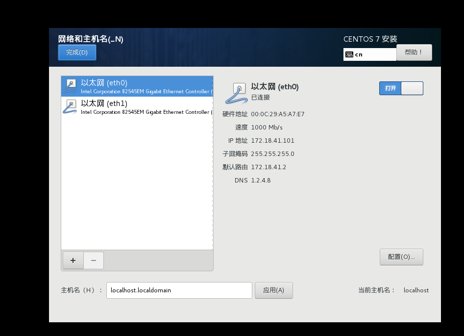

安装介质，是我们制定的apache站点目录，获取ISO镜像文件

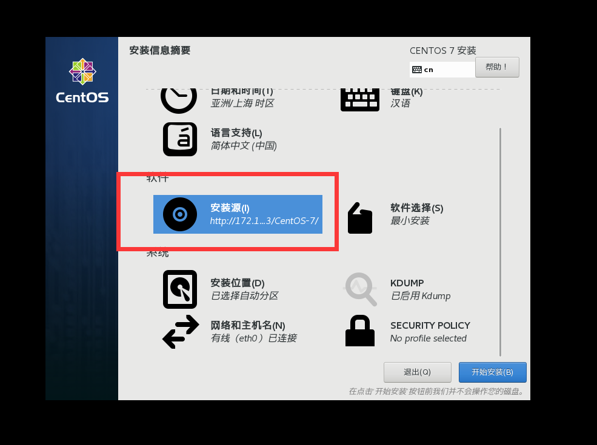

手动通过pxe远程安装，搞定，最终安装完毕系统，查看ip


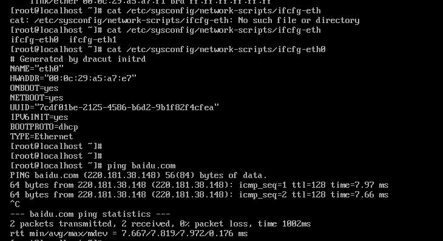

# kickstart自动应答装机

上述我们还是通过鼠标点击，进行装机，这些步骤，可以写成脚本文件，自动化装机。

通常，我们在安装操作系统的过程中，需要大量的和服务器交互操作，为了减少这个交互过程，kickstart就诞生了。使用这种kickstart，只需事先定义好一个Kickstart自动应答配置文件ks.cfg（通常存放在安装服务器上），并让安装程序知道该配置文件的位置，在安装过程中安装程序就可以自己从该文件中读取安装配置，这样就避免了在安装过程中多次的人机交互，从而实现无人值守的自动化安装。

**生成kickstart配置文件的三种方法：**

- 方法1、 每安装好一台Centos机器，Centos安装程序都会创建一个kickstart配置文件，记录你的真实安装配置。如果你希望实现和某系统类似的安装，可以基于该系统的kickstart配置文件来生成你自己的kickstart配置文件。（生成的文件名字叫anaconda-ks.cfg位于/root/anaconda-ks.cfg）
- 方法2、Centos提供了一个图形化的kickstart配置工具。在任何一个安装好的Linux系统上运行该工具，就可以很容易地创建你自己的kickstart配置文件。kickstart配置工具命令为redhat-config-kickstart（RHEL3）或system-config-kickstart（RHEL4，RHEL5）.网上有很多用CentOS桌面版生成ks文件的文章，如果有现成的系统就没什么可说。但没有现成的，也没有必要去用桌面版，命令行也很简单。
- 方法3、阅读kickstart配置文件的手册。用任何一个文本编辑器都可以创建你自己的kickstart配置文件。

## 学习ks文件语法

查看系统自动生成的anaconda-ks.cfg

```plain
[root@kickstart ~]# cat anaconda-ks.cfg 
#version=DEVEL
# System authorization information
auth --enableshadow --passalgo=sha512
# Use CDROM installation media  
cdrom
# Use graphical install
graphical
# Run the Setup Agent on first boot
firstboot --enable
ignoredisk --only-use=sda
# Keyboard layouts
keyboard --vckeymap=us --xlayouts='us'
# System language
lang en_US.UTF-8
# Network information
network  --bootproto=dhcp --device=ens33 --ipv6=auto --no-activate
network  --hostname=localhost.localdomain
# Root password
rootpw --iscrypted $6$ZKWLL9mzgiTsIKeR$UJkJsUmfX6REEv2v98NQ7F41.c9qbLaWilCo9MGN50dMmPNGu76cQM5AOIXl82ynnVVG6/UIou07Y0b2L6SsV1
# System services
services --enabled="chronyd"
# System timezone
timezone America/New_York --isUtc
# System bootloader configuration
bootloader --append=" crashkernel=auto" --location=mbr --boot-drive=sda
autopart --type=lvm
# Partition clearing information
clearpart --none --initlabel
%packages
@^minimal
@core
chrony
kexec-tools
%end
%addon com_redhat_kdump --enable --reserve-mb='auto'
%end
%anaconda
pwpolicy root --minlen=6 --minquality=1 --notstrict --nochanges --notempty
pwpolicy user --minlen=6 --minquality=1 --notstrict --nochanges --emptyok
pwpolicy luks --minlen=6 --minquality=1 --notstrict --nochanges --notempty
%end
```

### ks文件语法

```plain
命令段
包组段  %packages开头，以%end结束
脚本段  以%post开头，以%end结束，在安装完系统之后，执行的linux命令，脚本
       以%pre开头，以%end结束，在安装完系统之前执行的linux命令，脚本
```

通过工具检查ks文件语法

```plain
yum install pykickstart
ksvalidator /var/www/html/ks_config/CentOS-7-ks.cfg
该工具只是基本的对文件语法进行简单检测，并不能保证完全正确，还需人为检查
用python脚本对文件加密
python -c 'import crypt;print(crypt.crypt("chaoge666"))'
得到如下结果
```

### 超哥提供的模板ks.csf文件

创建在apache网络站点目录下

```
/var/www/html/
```

创建如下文件

http://172.18.41.133/CentOS-7/

```plain
#platform=x86, AMD64, 或 Intel EM64T
#version=DEVEL
# Install OS instead of upgrade
install
# Keyboard layouts
# old format: keyboard us
# new format:
keyboard --vckeymap=us --xlayouts='us'
# Root password
rootpw --iscrypted $6$c5oKshUR42AwnPEV$UQ7oK03nFVG/UFPKF/B/RkGjm5Su2DCjb6rjwBi6UsL./PsKUFd2TxkqpY2Am/b6bBfLTyp6Lb2Y.iNPI0rkU1
# Use network installation
url --url="http://172.18.41.133/CentOS-7"
# System language
lang en_US
# yum configuation
repo --name="Red Hat Enterprise Linux" --baseurl="http://172.18.41.133/CentOS-7" --cost=100
# System authorization information
auth  --useshadow  --passalgo=sha512
# Use text mode install
text
firstboot --disable
# SELinux configuration
selinux --disabled
# System services
services --enabled="chronyd"
ignoredisk --only-use=sda
# Firewall configuration
firewall --disabled
# Network information
network  --bootproto=dhcp --device=ens33
# Reboot after installation
reboot
# System timezone
timezone America/New_York
# System bootloader configuration
bootloader --append="crashkernel=auto" --location=mbr --boot-drive=sda
#autopart --type=lvm
# Clear the Master Boot Record，清空分区，重新分区
zerombr
# Partition clearing information
clearpart --all --initlabel
# Disk partitioning information
part /boot --fstype="xfs" --size=500
part swap --fstype="swap" --size=2048
part / --fstype="xfs" --grow --size=1
# 安装系统软件包
%packages
@core
%end
```

超哥这一套东西哪里学的呢?

```plain
https://access.redhat.com/documentation/zh-cn/red_hat_enterprise_linux/7/html-single/installation_guide/index#chap-kickstart-installations 
请看红帽官网
```

### 修改pxe配置文件

修改pxelinux.cfg/default文件

备份原有pxe配置文件

```plain
[root@kickstart pxelinux.cfg]# cp default{,.bak}
[root@kickstart pxelinux.cfg]# ls
default  default.bak
```

写入新的文件信息

```plain
[root@kickstart pxelinux.cfg]# >default
[root@kickstart pxelinux.cfg]# cat /var/lib/tftpboot/pxelinux.cfg/default
# 使用欢迎界面
default vesamenu.c32
#default menu.c32
#prompt 1
# 倒计时600毫秒
timeout 600
# 欢迎词
MENU TITLE welcome to centos.
# 如下三个驱动
# 启动本地设备
label local
  menu label Boot from ^local drive
  localboot 0xffff
# 启动来自于ks配置文件
MENU SEPARATOR
label linux
  menu label ^Install or upgrade an existing system for ks
  # 系统默认选ks
  menu default
  kernel vmlinuz
  append initrd=initrd.img ks=http://172.18.41.133/ks_config/CentOS7-ks.cfg
# 安装基本驱动
MENU SEPARATOR
label vesa
  menu label Install system with ^basic video driver
  kernel vmlinuz
  append initrd=initrd.img xdriver=vesa nomodeset
```

### 检验配置是否正确

1.检验iso文件是否可以获取

```plain
[root@kickstart pxelinux.cfg]# curl  http://172.18.41.133/CentOS-7/
```

2.检验pxe文件是否可以获取

```plain
[root@kickstart pxelinux.cfg]# curl  http://172.18.41.133/ks_config/CentOS7-ks.cfg
```

至此，我们就部署好了如下

- dhcp服务器
- tftp服务器
- pxe配置文件
- kickstart配置文件

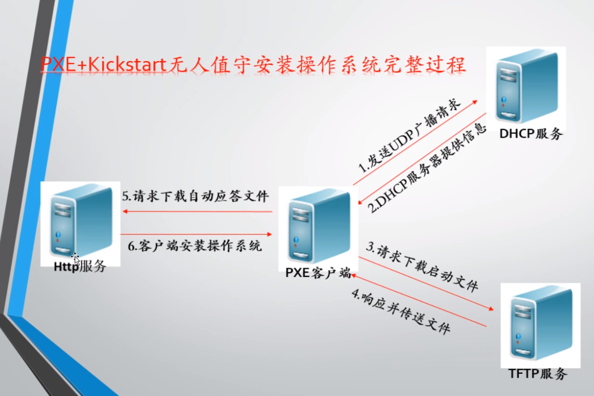

# 开始ks自动化装机

上述准备工作，做好之后，开始装机

```plain
1.服务端可以观察日志
[root@kickstart pxelinux.cfg]# tail -f /var/log/messages
```

2.创建一个虚拟机,vmware，注意点如下

```plain
大于等于2G内存
添加网卡，选择lan区段
```


### 自动化安装界面

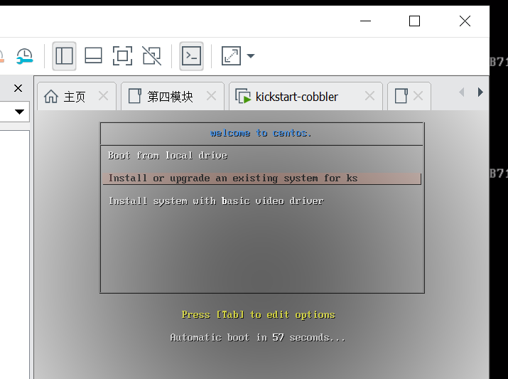

区别就是，本来这些选项都是图形化的，这里已经是黑屏的了


待自动装机完毕后，系统会自动重启，进入centos操作系统，大功告成

输入账号密码，登录，开始玩耍吧

```plain
root
chaoge666
```

# cobbler

Cobbler是一个Linux系统安装的服务，可以通过网络启动(PXE)的方式来快速安装、重装物理服务器和虚拟机，同时还可以管理DHCP，DNS等。 Cobbler可以使用命令行方式管理，也提供了基于Web的界面管理工具(cobbler-web)，还提供了API接口，可以方便二次开发使用。 Cobbler是较早前的kickstart的升级版，优点是比较容易配置，还自带web界面比较易于管理。

通过点点点就可以创建系统以及ks文件。

官网：http://cobbler.github.io/

## 环境准备

```plain
1.准备好linux机器，使用kickstart那台机器即可
[root@ks-cobbler ~]# hostname
ks-cobbler
[root@ks-cobbler ~]# ifconfig |awk 'NR==2{print $2}'
172.18.41.133
加上一个本地hosts解析
[root@ks-cobbler ~]# tail -1 /etc/hosts
172.18.41.133 ks-cobbler
```

## 安装coobler

```plain
1.yum自动化安装即可，提前配置好yum源
yum install cobbler cobbler-web dhcp tftp-server pykickstart httpd python-django -y
2.检查软件包
[root@ks-cobbler ~]# rpm -qa cobbler cobbler-web dhcp tftp-server pykickstart httpd python-djangotftp-server-5.2-22.el7.x86_64
pykickstart-1.99.66.21-1.el7.noarch
cobbler-2.8.5-0.3.el7.x86_64
dhcp-4.2.5-79.el7.centos.x86_64
httpd-2.4.6-93.el7.centos.x86_64
cobbler-web-2.8.5-0.3.el7.noarch
3.启动cobbler,与http
systemctl start cobblerd
systemctl start httpd
4.检查cobbler配置
[root@ks-cobbler ~]# cobbler check
```

## 修改cobbler配置

```plain
1.修改配置文件/etc/cobbler/settings ，修改如下参数
# 备份配置文件
[root@ks-cobbler ~]# cp /etc/cobbler/settings{,.bak}
# 防止误重装
sed -i 's/pxe_just_once: 0/pxe_just_once: 1/' /etc/cobbler/settings
# 配置Cobbler统一管理DHCP
sed -i 's/manage_dhcp: 0/manage_dhcp: 1/' /etc/cobbler/settings
# 配置DHCP Cobbler模版，这里sed提供了备份功能
sed -i.ori 's#192.168.1#172.18.41#g;22d;23d' /etc/cobbler/dhcp.template
2.根据cobbler check依次修改配置文件，修改如下配置，注意改了之后要重启cobblerd服务,才可以生效
# 请注意,填写ip地址
# 修改/etc/cobbler/settings
server: 172.18.41.113
next_server: 172.18.41.113
# 修改xinetd配置文件, /etc/xinetd.d/tftp ，因为xinetd是管理tftp的，我们用cobbler去管理了
disable                 = no
# 需要安装驱动，cobbler要控制其他机器
cobbler get-loaders
[root@ks-cobbler ~]# cobbler get-loaders
task started: 2020-07-29_153446_get_loaders
task started (id=Download Bootloader Content, time=Wed Jul 29 15:34:46 2020)
downloading https://cobbler.github.io/loaders/README to /var/lib/cobbler/loaders/README
downloading https://cobbler.github.io/loaders/COPYING.elilo to /var/lib/cobbler/loaders/COPYING.elilo
downloading https://cobbler.github.io/loaders/COPYING.yaboot to /var/lib/cobbler/loaders/COPYING.yaboot
downloading https://cobbler.github.io/loaders/COPYING.syslinux to /var/lib/cobbler/loaders/COPYING.syslinux
downloading https://cobbler.github.io/loaders/elilo-3.8-ia64.efi to /var/lib/cobbler/loaders/elilo-ia64.efi
downloading https://cobbler.github.io/loaders/yaboot-1.3.17 to /var/lib/cobbler/loaders/yaboot
downloading https://cobbler.github.io/loaders/pxelinux.0-3.86 to /var/lib/cobbler/loaders/pxelinux.0
downloading https://cobbler.github.io/loaders/menu.c32-3.86 to /var/lib/cobbler/loaders/menu.c32
downloading https://cobbler.github.io/loaders/grub-0.97-x86.efi to /var/lib/cobbler/loaders/grub-x86.efi
downloading https://cobbler.github.io/loaders/grub-0.97-x86_64.efi to /var/lib/cobbler/loaders/grub-x86_64.efi
*** TASK COMPLETE ***
# 还需要用到rsync服务，开启该服务
systemctl restart  rsyncd
systemctl enable rsyncd
# 修改cobbler安装的系统，默认的密码是"cobbler",可以改下
[root@ks-cobbler ~]# openssl passwd -1
Password: 
Verifying - Password: 
$1$7QqeCcrC$WwDO644o8wUumCUBuxw6S.
# 修改默认root密码为，chaoge666
default_password_crypted: "$1$7QqeCcrC$WwDO644o8wUumCUBuxw6S."
# 修改有关cobbler脑裂配置，可以使用fencing tools
# 改完如上配置，重启cooblerd
systemctl restart cobblerd
# 再次检查，吧修改的配置，让其生效
cobbler sync
cobbler check
# 剩下的两条无所谓
[root@ks-cobbler ~]# cobbler check
The following are potential configuration items that you may want to fix:
1 : debmirror package is not installed, it will be required to manage debian deployments and repositories
2 : fencing tools were not found, and are required to use the (optional) power management features. install cman or fence-agents to use them
Restart cobblerd and then run 'cobbler sync' to apply changes.
```

## 重启核心服务

```plain
systemctl restart cobblerd httpd tftp.socket rsyncd.service
[root@ks-cobbler ~]# systemctl is-active cobblerd httpd tftp.socket rsyncd.service
active
active
active
active
```

## 访问cobbler web

访问站点是

```plain
# 必须用https协议
https://172.18.41.133/cobbler_web
账户密码都是cobbler
```

登录页面

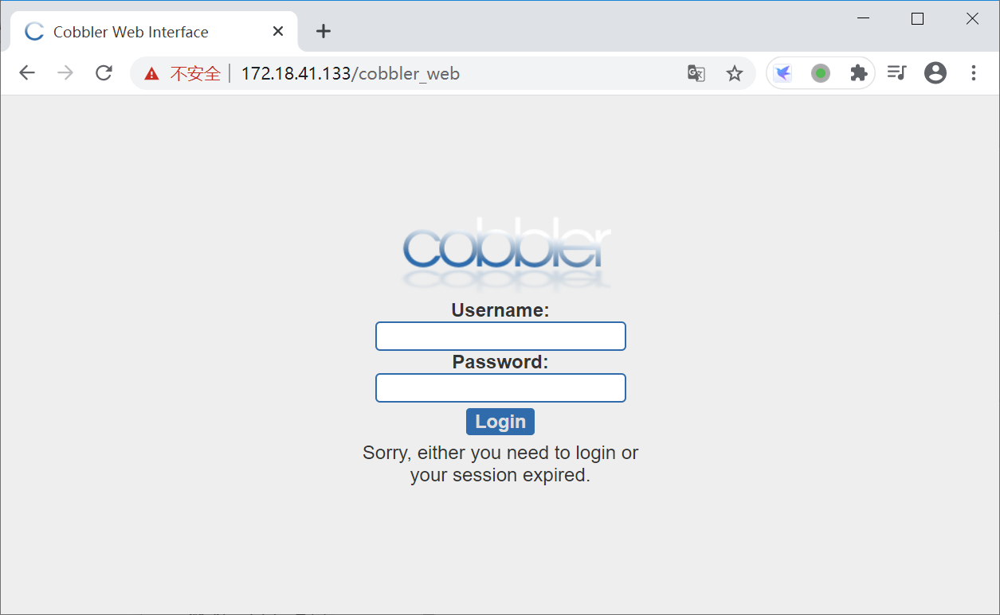

进入首页

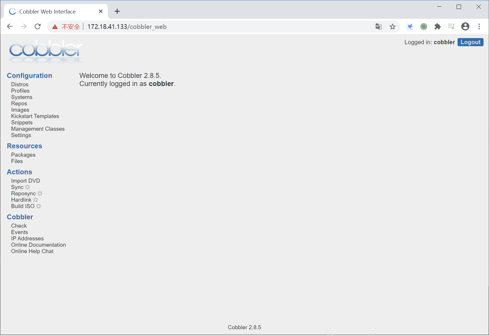

## 导入系统镜像

在cobbler web界面，导入dvd-iso镜像文件信息

cobbler web镜像存放点在

```plain
[root@ks-cobbler ks_mirror]# pwd
/var/www/cobbler/ks_mirror
```

在vmware里挂在好光盘，进行mount

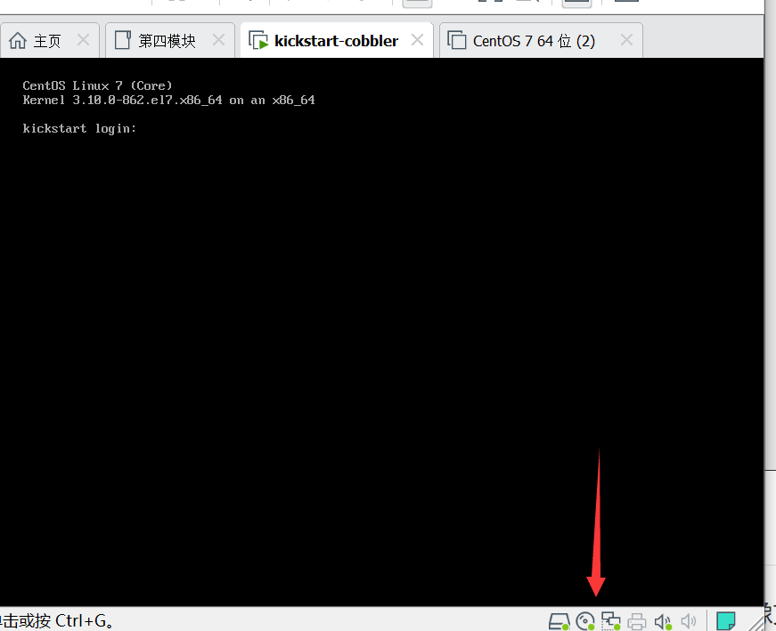

```plain
[root@ks-cobbler ks_mirror]# mount /dev/cdrom /mnt
mount: /dev/sr0 is write-protected, mounting read-only
[root@ks-cobbler ks_mirror]# df -h
Filesystem               Size  Used Avail Use% Mounted on
/dev/mapper/centos-root   17G  1.6G   16G   9% /
devtmpfs                 899M     0  899M   0% /dev
tmpfs                    911M     0  911M   0% /dev/shm
tmpfs                    911M  9.6M  902M   2% /run
tmpfs                    911M     0  911M   0% /sys/fs/cgroup
/dev/sda1               1014M  142M  873M  14% /boot
tmpfs                    183M     0  183M   0% /run/user/0
/dev/sr0                 4.2G  4.2G     0 100% /mnt
```

配置如图所示


导入镜像的任务


在linux中检查cobbler导入操作

```plain
[root@ks-cobbler ks_mirror]# cd /var/www/cobbler/
[root@ks-cobbler cobbler]# ls
images  ks_mirror  links  localmirror  misc  pub  rendered  repo_mirror  svc
[root@ks-cobbler cobbler]# du -sh .
4.2G    .
# cobbler默认是调用rsync进行同步数据
```

导入结束


## apache显示cobbler镜像站点

http://172.18.41.133/cobbler/

## cobbler-web

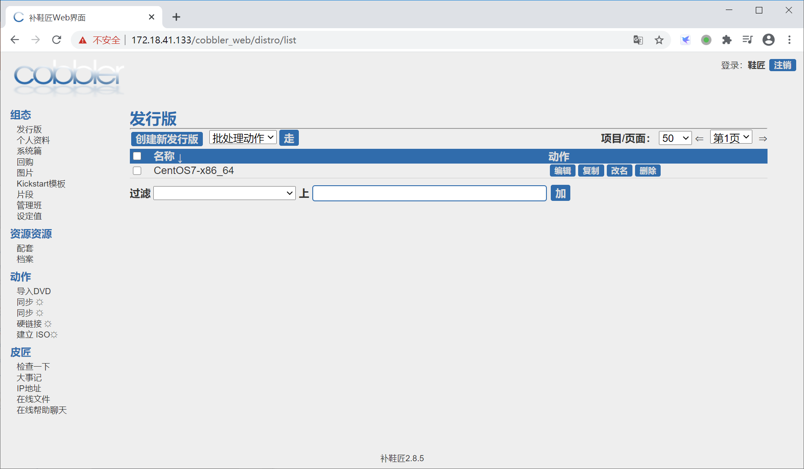

## 新建vmware虚拟机

测试用cobbler自动装机，创建方式和手动安装方式一样，注意：

- 内存大小
- 添加网络适配器
- 删除usb
- 关闭dvd开机链接

出现如下页面，正常

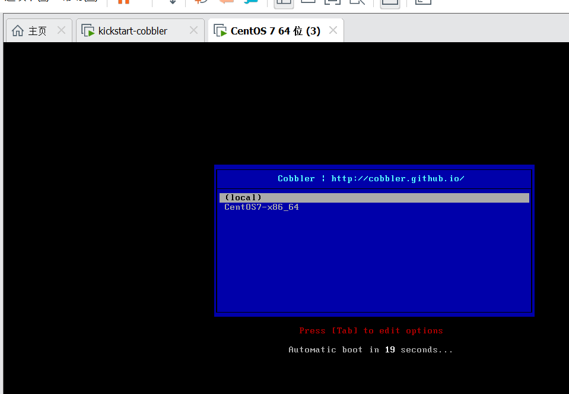

该界面由pxe启动文件控制

```plain
[root@ks-cobbler cobbler]# cat /var/lib/tftpboot/pxelinux.cfg/default 
DEFAULT menu
PROMPT 0
MENU TITLE Cobbler | http://cobbler.github.io/
TIMEOUT 200
TOTALTIMEOUT 6000
ONTIMEOUT local
LABEL local
        MENU LABEL (local)
        MENU DEFAULT
        LOCALBOOT -1
LABEL CentOS7-x86_64
        kernel /images/CentOS7-x86_64/vmlinuz
        MENU LABEL CentOS7-x86_64
        append initrd=/images/CentOS7-x86_64/initrd.img ksdevice=bootif lang=  kssendmac text  ks=http://172.18.41.133/cblr/svc/op/ks/profile/CentOS7-x86_64
        ipappend 2
MENU end
```

自动安装，选择第二个


装机使用的ks文件在这，cobbler生成的

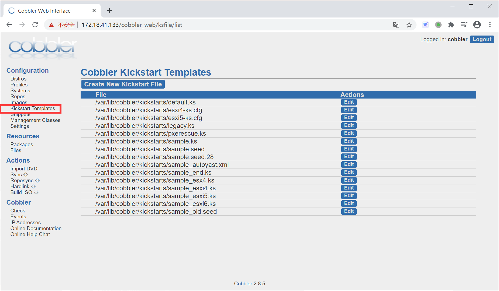

## 创建自定义系统ks文件

超哥就是那么贴心啊，都给你准备好

```plain
# Kickstart Configurator for CentOS 7 by chaoge
install
# $tree 是在cobbler-web中Distros配置中Kickstart Metadata定义的变量，在超哥这个电脑上，地址就是
http://172.18.41.133/cblr/links/CentOS7-x86_64/
url --url=$tree
text
lang en_US.UTF-8
keyboard us
zerombr
bootloader --location=mbr --driveorder=sda --append="crashkernel=auto rhgb quiet"
# 有关自定义的网络配置，设置静态ip
# network  --bootproto=static --device=eth0 --gateway=10.0.0.254 --ip=10.0.0.202 --nameserver=223.5.5.5 --netmask=255.255.255.0 --activate
# network  --bootproto=static --device=eth1 --ip=172.16.1.202 --netmask=255.255.255.0 --activate
# network  --hostname=Cobbler
# network --bootproto=dhcp --device=eth1 --onboot=yes --noipv6 --hostname=CentOS7
# cobbler网络配置，这里的配置目录在
$SNIPPET('networl_config')
timezone --utc Asia/Shanghai
authconfig --enableshadow --passalgo=sha512
# 设置root密码，用变量替换，该变量在cobbler-web的setting中
rootpw  --iscrypted $default_password_crypted
clearpart --all --initlabel
part /boot --fstype xfs --size 1024
part swap --size 1024
part / --fstype xfs --size 1 --grow
# 服务配置
firstboot --disable
selinux --disabled
firewall --disabled
logging --level=info
reboot
#定义安装前的工作
%pre
$SNIPPET('log_ks_pre')
$SNIPPET('kickstart_start')
$SNIPPET('pre_install_network_config')
# 监控系统安装过程
$SNIPPET('pre_anamon')
%end
# 安装软件包
%packages
@base
@compat-libraries
@debugging
@development
tree
nmap
sysstat
lrzsz
dos2unix
telnet 
wget 
vim 
bash-completion
%end
%post
systemctl disable postfix.service
%end
```

此时可以去cobbler-web添加我们定义的ks文件模板，

复制粘贴即可，但是注意，不支持中文，所以中文注释都给删掉吧

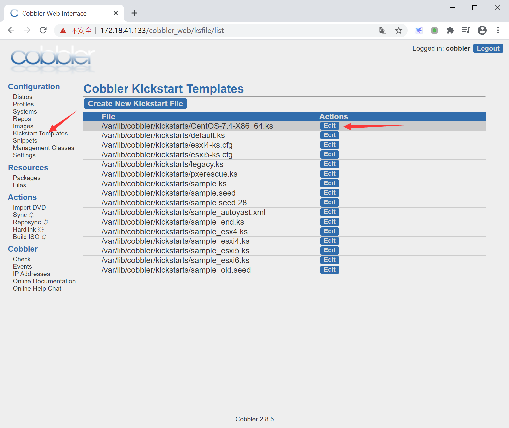

该文件存放在linux上

```plain
[root@ks-cobbler kickstarts]# ll
total 68
-rw-r--r-- 1 root root 1211 Jul 29 16:54 CentOS-7.4-X86_64.ks
-rw-r--r-- 1 root root  115 Aug 30  2019 default.ks
-rw-r--r-- 1 root root   22 Aug 30  2019 esxi4-ks.cfg
-rw-r--r-- 1 root root   22 Aug 30  2019 esxi5-ks.cfg
drwxr-xr-x 2 root root   56 Jul 29 14:04 install_profiles
-rw-r--r-- 1 root root 1424 Aug 30  2019 legacy.ks
-rw-r--r-- 1 root root  292 Aug 30  2019 pxerescue.ks
-rw-r--r-- 1 root root 2825 Aug 30  2019 sample_autoyast.xml
-rw-r--r-- 1 root root 1856 Aug 30  2019 sample_end.ks
-rw-r--r-- 1 root root    0 Aug 30  2019 sample_esx4.ks
-rw-r--r-- 1 root root  324 Aug 30  2019 sample_esxi4.ks
-rw-r--r-- 1 root root  386 Aug 30  2019 sample_esxi5.ks
-rw-r--r-- 1 root root  386 Aug 30  2019 sample_esxi6.ks
-rw-r--r-- 1 root root 1913 Aug 30  2019 sample.ks
-rw-r--r-- 1 root root 3419 Aug 30  2019 sample_old.seed
-rw-r--r-- 1 root root 6694 Aug 30  2019 sample.seed
-rw-r--r-- 1 root root 6706 Jun 18  2019 sample.seed.28
[root@ks-cobbler kickstarts]#
```

配置cobbler读取自定义的ks文件

cobbler默认读取的是

```plain
sample_end.ks 
改为
CentOS-7.4-X86_64.ks
```


最后还得修改cobbler-web的system选项，定义好模板

点击create创建系统模板


自定义虚拟机网络


可以再创建个ens34


最后点击save保存

最后点击cobbler-web的sync按钮，等同于命令行执行cobbler sync


最后，点击开机虚拟机，查看自动安装系统吧


# 跳板机架构

跳板机、堡垒机是什么？

## 为什么需要堡垒机


近年来数据安全事故频发，包括斯诺登事件、希拉里邮件丑闻以及携程宕机事件等，数据安全与防止泄露成为政府和企业都非常关心的议题，因此堡垒机也应运而生。

**案例一**

让我们共同回顾最具代表性的数据泄露引发的安全事故，美国著名的斯诺登事件。2013年6月，美国《华盛顿邮报》报道，美国国家安全局和联邦调查局于2007年启动了一个代号为“棱镜”的秘密监控项目，直接进入美国网际网路公司的中心服务器里挖掘数据、收集情报。洩露这些绝密文件的并非国家安全局的内部员工，而是国家安全局的外聘人员爱德华·斯诺登。

斯诺登事件若放在今天，将不可能发生，因为我们有了堡垒机！其中的管理员角色可以设置敏感操作的事前拦截、事中断开、事后审计，并且可以做到全程无代理实时监控。类似斯诺登这样的外聘人员将无法接触到这些敏感信息，更不用说泄露出来了。并且某些堡垒机支持录屏功能也可以帮助用户进行审计和追责。

**案例二**

2015年5月28日上午11点至晚上8点，在某旅游出行平台官网及APP上登录、下单或交易时，跳转均出现问题，导致操作无法顺利完成。造成直接经济损失巨大，按照其上一季度的财报公布的数据，宕机的损失为平均每小时106.48万美元。

最终，平台回应此事称系由于员工误操作删除了服务器上的执行代码导致。不论是因为黑客攻击还是员工误操作，真金白银800万美元的经验教训告诫我们对于数据的安全和备份必须要引起重视！堡垒机能解决这2个问题，一是攻击面小，二是可定制双机备份。

## 跳板机

跳板机就是一台服务器，运维人员在维护过程中首先要统一登录到这台服务器，然后再登录到目标设备进行维护和操作；

在腾讯，跳板机是开发者登录到服务器的唯一途径，开发者必须先登录跳板机，再通过跳板机登录到应用服务器。

跳板机属于内控堡垒机范畴，是一种用于单点登陆的主机应用系统。跳板机就是一台服务器，维护人员在维护过程中，首先要统一登录到这台服务器上，然后从这台服务器再登录到目标设备进行维护。但跳板机并没有实现对运维人员操作行为的控制和审计，此外，跳板机存在严重的安全风险，一旦跳板机系统被攻入，则将后端资源风险完全暴露无遗。

### 跳板机的优缺点

优势：集中式进行管理

缺点：

没有实现对运维人员操作行为的控制和审计，使用跳板机的过程中还是会出现误操作，违规操作等导致的事故，一旦出现操作事故很难定位到原因和责任人。

## 运维思想

- 审计是事后行为，可以发现问题及责任人，但是无法防止问题发生
- 只有事先严格控制，才能从源头解决根本问题。
- 系统账号的作用只是区分工作角色，但是无法确认该执行人的身份

## 堡垒机

**堡垒机的理念起于跳板机；**

人们逐渐认识到跳板机的不足，需要更新、更好的安全技术理念来实现运维操作管理，需要一种能满足角色管理与授权审批、信息资源访问控制、操作记录和审计、系统变更和维护控制要求，并生成一些统计报表配合管理规范来不断提升IT内控的合规性的产品。

2005年前后，运维堡垒机开始以一个独立的产品形态被广泛部署，有效地降低了运维操作风险，使得运维操作管理变得更简单、更安全。

2005年齐治科技研发出世界第一台运维堡垒机；（齐治科技官网http://www.shterm.com/）

### 堡垒机作用

1）核心系统运维和安全审计管控；

2）过滤和拦截非法访问、恶意攻击，阻断不合法命令，审计监控、报警、责任追踪；

3）报警、记录、分析、处理；

### 堡垒机核心功能

1）单点登录功能

支持对X11、Linux、Unix、数据库、网络设备、安全设备等一系列授权账号进行密码的自动化周期更改，简化密码管理，让使用者无需记忆众多系统密码，即可实现自动登录目标设备，便捷安全；

2）账号管理

设备支持统一账户管理策略，能够实现对所有服务器、网路设备、安全设备等账号进行集中管理，完成对账号整个生命周期的监控，并且可以对设备进行特殊角

设置，如：审计巡检员、运维操作员、设备管理员等自定义，以满足审计需求；

3）身份认证

设备提供统一的认证接口，对用户进行认证，支持身份认证模式包括动态口令、静态密码、硬件key、生物特征等多种认证方式，设备具有灵活的定制接口，可以与其他第三方认证服务器直接结合；

安全的认证模式，有效提高了认证的安全性和可靠性；

4）资源授权

设备提供基于用户、目标设备、时间、协议类型IP、行为等要素实现细粒度的操作授权，最大限度保护用户资源的安全；

5）访问控制

设备支持对不同用户进行不同策略的制定，细粒度的访问控制能够最大限度的

保护用户资源的安全，严防非法、越权访问事件的发生；

6）操作审计

设备能够对字符串、图形、文件传输、数据库等安全操作进行行为审计；通过设备录像方式监控运维人员对操作系统、安全设备、网络设备、数据库等进行的各种操作，对违规行为进行事中控制；对终端指令信息能够进行精确搜索，进行录像精确定位；

### 堡垒机应用场景

1）多个用户使用同一账号

多出现在同一工作组中，由于工作需要，同时系统管理员账号唯一，因此只能多用户共享同一账号；如果发生安全事故，不仅难以定位账号的实际使用者和责任人，而且无法对账号的使用范围进行有效控制，存在较大的安全风险和隐患；

2）一个用户使用多个账号。

目前一个维护人员使用多个账号时较为普遍的情况，用户需要记忆多套口令同时在多套主机系统、网络设备之间切换，降低工作效率，增加工作复杂度；

3）缺少统一的权限管理平台，难以实现更细粒度的命令权限控制。

维护人员的权限大多是粗放管理，无基于最小权限分配原则的用户权限管理，难以实现更细粒度的命令权限控制，系统安全性无法充分保证；

4）无法制定统一的访问审计策略，审计粒度粗。

各个网络设备、主机系统、数据库是分别单独审计记录访问行为，由于没有统一审计策略，而且各系统自身审计日志内容深浅不一，难以及时通过系统自身审计发现违规操作行为和追查取证；

5）传统的网路安全审计系统无法对维护人员经常使用的SSH、RDP等加密、图形操作协议进行内容审计。

### 目标价值

1）目标

堡垒机的核心思路是逻辑上将人与目标设备分离，建立“人-〉主账号（堡垒机用户账号）-〉授权—>从账号（目标设备账号）的模式;在这种模式下，基于唯一身份标识，通过集中管控安全策略的账号管理、授权管理和审计，建立针对维护人员的“主账号-〉登录—〉访问操作-〉退出”的全过程完整审计管理，实现对各种运维加密/非加密、图形操作协议的命令级审计。

2）系统价值

堡垒机的作用主要体现在下述几个方面：

#### 企业角度

通过细粒度的安全管控策略，保证企业的服务器、网络设备、数据库、安全设备等安全可靠运行，降低人为安全风险，避免安全损失，保障企业效益。

#### 管理员角度

所有运维账号的管理在一个平台上进行管理，账号管理更加简单有序；

通过建立用户与账号的唯一对应关系，确保用户拥有的权限是完成任务所需的最小权限；

直观方便的监控各种访问行为，能够及时发现违规操作、权限滥用等。

鉴于多账号同时使用超管进行的操作，便于实名制的认证和自然人的关联。

#### 普通用户角度

运维人员只需记忆一个账号和口令，一次登录，便可实现对其所维护的多台设备的访问，无须记忆多个账号和口令，提高了工作效率，降低工作复杂度。

#### 应用

一种用于单点登陆的主机应用系统，目前电信、移动、联通三个运营商广泛采用堡垒机来完成单点登陆。

在银行、证券等金融业机构也广泛采用堡垒机来完成对财务、会计操作的审计。

在电力行业的双网改造项目后，采用堡垒机来完成双网隔离之后跨网访问的问题，能够很好的解决双网之间的访问的安全问题。

#### 相关厂商

目前，已经有相当多的厂商开始涉足这个领域，如：思福迪、帕拉迪、圣博润、尚思卓越、绿盟、[3]科友、齐治、金万维、极地、派拉等，这些都是目前行业里做的专业且受到企业用户好评的厂商，但每家厂商的产品所关注的侧重又有所差别。

以某运维安全审计产品为例，其产品更侧重于运维安全管理，它集单点登录、账号管理、身份认证、资源授权、访问控制和操作审计为一体的新一代运维安全审计产品，它能够对操作系统、网络设备、安全设备、数据库等操作过程进行有效的运维操作审计，使运维审计由事件审计提升为操作内容审计，通过系统平台的事前预防、事中控制和事后溯源来全面解决企业的运维安全问题，进而提高企业的IT运维管理水平。

## 案例

## 某连锁酒店企业

### 客户现状及需求：

IT系统分散在总部以及全国各地的分支连锁酒店，每个酒店所在的地区都有相应的技术人员进行系统运维；总部也有运维人员，对全国IT系统的总的运维质量负最终责任。

酒店实体越来越 多,总部的IT运维工作日益复杂，运维问题日益突出。一个最基础的场景是：当某酒店的IT系统出现问题，当地的IT运维人员无法解决时，就会向总部发起求 助。而此时，总部的技术工程师根本无法获悉最原始的问题，因为原来的问题在经过分部的运维工程师的操作后，已经面目全非，还可能引入了新的问题，整个过程没有记录，没有管控，找不到解决问题的线索。所以总部工程师迫切希望知道，从一开始问题的表象，到分支机构的运维人员的运维操作，都是怎么一回事。除此之外，还有另外的一些运维问题列表如下：

1、运维人员管理手段落后，时无法定责，也无法对各方的运维工作本身的质量和数量进行有效考核和评估。

2、设备账户管理缺失，该连锁酒店的每一名运维人员都要负责多套信息系统的运维管理工作，同时，大多数情况下，某套信息系统往往要多个运维人员联合管理。在这种情况下，口令丢失、登录失败、密码被随便修改等情况就时有发生。并且对第三方代维人员来说，也没有更强的针对设备账号的监测机制和有效的生命周期管理机制；

### 解决之道：

来进行统一认证，认证成功后对其具有权限的IT设备进行运维操作。整个运维过程全程录像，并有危险操作的告警及阻断功能。

通 过这种“跳板机”的解决方案，运维人员只需要记住一个口令就可以运维到被授权的设备，运维过程全程录像，且可以对应到运维人员。使用运维审计集中管理客户端软件，分散在全国各地的酒店IT系统的运维录像可以被总部的运维人员随时查询，还可以通过播放器进行远程的录像流畅播放。

### 客户收益:

运维安全审计堡垒平台之后，所有的运维人员都以统一的用户身份登入系统；所有的运维操作都被记录；操作对应到实际的自然人而不是设备账户。在出现问题后，可以迅速的调出运维操作录像进行查看，根据录像进行问题的追本溯源，直接定位问题根源所在，为解决IT系统的故障提供了宝贵的第一手资料。

在部署安全审计堡垒平台之后，问题的解决时间平均缩短到一到两个小时，数量级的提高了运维工作质量。另外，由于有录像可以学习，交流和借鉴，从一定程度上，提高了所有运维人员的运维经验。

# 简单总结堡垒机

简单来说，堡垒机的核心价值就是用来解决“运维权限混乱，操作无审计”的问题。当我们的公司运维人员越来越多，所需要管理的主机资源也越来越多时，管理跟技术手段不到位所带来的运维安全风险也越来越高，这个时候我们应该怎么做呢？

• 首先，在事前，我们需要规定用户所能访问资源的权限，使权限实现最小化

打个比方，我们把主机资源看作是一个房子，那我们的运维人员就是一个客人，普通客人只能在我们里面客厅活动，如果说他要进入卧室，那需要主人的同意。

• 第二，在事中的时候，我们需要实时监控我们运维人员的操作，一旦发现有危险操作时可以进行阻断。就好比，在房间里面装了一个“摄像头”，我们可以看到客人在房间里面的一举一动。

• 事后，我们需要追溯溯源，还原事故现场；

客人在“房间”里的一举一动，都会被录制下来，方便回放查看。

政府、企业，以及其他各行各业都会面临着运维安全风险：

• 第一，就是来源身份定位难：当多个运维人员使用相同的账号对主机进行操作时，我们的管理者无法区分谁是谁，一旦发生运维事故，很难快速地定位“责任人”。

• 第二，就是操作过程不透明：顾名思义，就是指我们的运维人员做了什么管理者无从得知？尤其是在第三方运维场景，我们经常会听到数据窃取、违规操作导致服务器异常等此类的新闻，我们缺乏相应的手段进行规避。

• 第三，账号共享、权限泛滥：我们知道人是最难管理的，一旦掌握了主机的账号密码，就不可避免地会造成账号的泄露，最终导致权限泛滥、难以管理。

• 第四，是合规性要求。无论是网络安全法、等级保护，还是行业的法律法规，都有要求我们建设安全、完善的审计系统，从而确保我们的审计信息是完整、安全、可靠。

针对上述我们提到的运维安全风险，安恒堡垒机是怎么解决的呢！简单来讲：

• 堡垒机给每个运维人员分配了一个堡垒机账户，确保身份的唯一，其次，利用堡垒机的单点登录能力，使我们的运维人员无需知道主机的账号密码，从而可以有效防止账号泄漏和共享，并且运维人员需要访问什么主机，需要我们的管理者事先授权。

• 另外，我们通过实时监控、录像回放等方式，也有效地解决了操作过程不透明的问题。

• 总的来讲，安恒堡垒机通过一定的技术手段实现了事前的授权、事中的监控、事后的审计，满足合规性的要求

# JumpServer


官网文档：https://docs.jumpserver.org/zh/master/

## 部署堡垒机

### 组件介绍

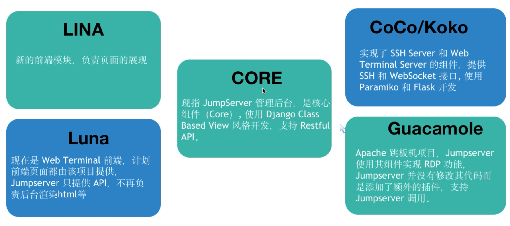

### 核心架构

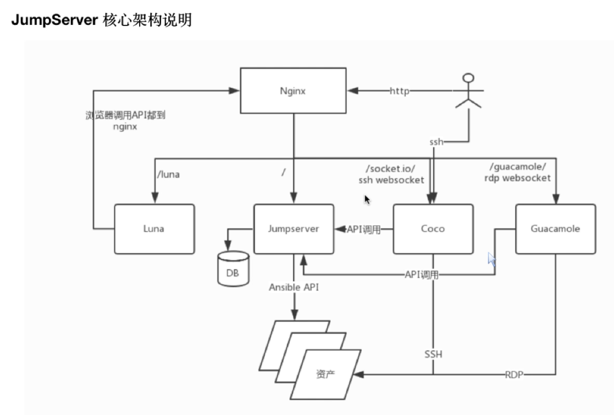

## 安装环境


服务器硬件环境

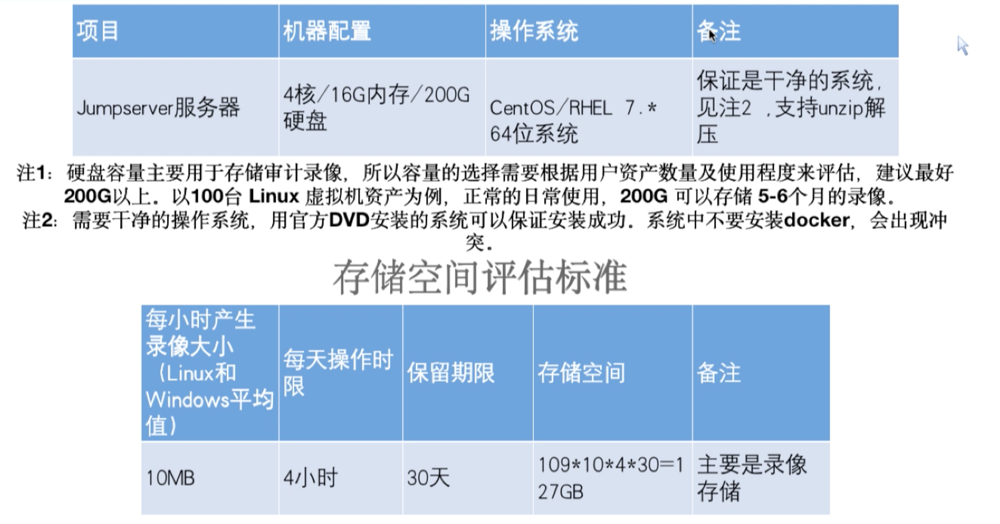

### 基本环境准备

```plain
JumpServer 环境要求:
硬件配置: 2个CPU核心, 4G 内存, 50G 硬盘（最低）
操作系统: Linux 发行版 x86_64
Python = 3.6.x
Mysql Server ≥ 5.6
Mariadb Server ≥ 5.5.56
Redis
```

## 非常重要

一定注意，若是基础环境，没有正确安装，后面编译安装软件，会报错的

```plain
1.环境准备
    centos7
    关闭防火墙 firewalld selinux
    iptables -F
    systemctl stop firewalld
    systemctl disable firewalld
# yum源配置
    wget -O /etc/yum.repos.d/CentOS-Base.repo http://mirrors.aliyun.com/repo/Centos-7.repo
    wget -O /etc/yum.repos.d/epel.repo http://mirrors.aliyun.com/repo/epel-7.repo
# 基础环境安装
    yum install -y bash-completion vim lrzsz wget expect net-tools nc nmap tree dos2unix htop iftop iotop unzip telnet sl psmisc nethogs glances bc ntpdate  openldap-devel
2.第一个里程：需要部署跳板机依赖软件，重要
yum -y install git python-pip  gcc automake autoconf python-devel vim sshpass lrzsz readline-devel  zlib zlib-devel openssl openssl-devel
  git              --- 用于下载jumpserver软件程序
  python-pip       --- 用于安装python软件
  gcc             --- 解析代码中C语言信息（解释器）
  automake        --- 实现软件自动编译过程  
  autoconf        --- 实现软件自动配置过程
  python-devel    --- 系统中需要有python依赖
  readline-devel  --- 在操作python命令信息时，实现补全功能
3.修改系统字符集为中文
localedef -c -f UTF-8 -i zh_CN zh_CN.UTF-8
export LC_ALL=zh_CN.UTF-8
# 写入配置文件，永久生效
echo 'LANG="zh_CN.UTF-8"' > /etc/locale.conf
# 检查系统字符集
(py3) [root@jumpserver koko 10:30:23]$locale
LANG=en_US.UTF-8
LC_CTYPE="zh_CN.UTF-8"
LC_NUMERIC="zh_CN.UTF-8"
LC_TIME="zh_CN.UTF-8"
LC_COLLATE="zh_CN.UTF-8"
LC_MONETARY="zh_CN.UTF-8"
LC_MESSAGES="zh_CN.UTF-8"
LC_PAPER="zh_CN.UTF-8"
LC_NAME="zh_CN.UTF-8"
LC_ADDRESS="zh_CN.UTF-8"
LC_TELEPHONE="zh_CN.UTF-8"
LC_MEASUREMENT="zh_CN.UTF-8"
LC_IDENTIFICATION="zh_CN.UTF-8"
LC_ALL=zh_CN.UTF-8
```

### 部署mysql5.6

```plain
1.获取mysql5.6软件包
wget https://cdn.mysql.com//Downloads/MySQL-5.6/MySQL-5.6.49-1.el7.x86_64.rpm-bundle.tar
2.解压缩
[root@jumpserver opt 17:42:14]$mkdir mysql_rpm
# 指定目录解压
[root@jumpserver opt 17:46:06]$tar -xf MySQL-5.6.49-1.el7.x86_64.rpm-bundle.tar  -C ./mysql_rpm/
# yum批量安装
[root@jumpserver mysql_rpm 17:48:44]$yum localinstall ./*
3.查看mysql默认配置文件，注意如下的修改
[root@jumpserver mysql_rpm 17:52:25]$cat /etc/my.cnf
[mysqld]
datadir=/var/lib/mysql
socket=/var/lib/mysql/mysql.sock
# Disabling symbolic-links is recommended to prevent assorted security risks
symbolic-links=0
# Settings user and group are ignored when systemd is used.
# If you need to run mysqld under a different user or group,
# customize your systemd unit file for mariadb according to the
# instructions in http://fedoraproject.org/wiki/Systemd
[mysqld_safe]
log-error=/var/log/mysql/mysql.log
pid-file=/var/run/mysql/mysql.pid
#
# include all files from the config directory
#
!includedir /etc/my.cnf.d
4.mysql5.6版本默认会生成随机密码，密码文件在
/root/.mysql_secret
5.查看密码后，修改该密码，注意-p参数后没有空格，注意该方式是不安全的，密码会暴露
[root@jumpserver mysql_rpm 18:03:55]$mysqladmin -uroot -pv5U10QaOoc_90b3f password chaoge666
Warning: Using a password on the command line interface can be insecure.
# 最好的方式是进入mysql后，再修改密码
[root@jumpserver mysql_rpm 18:06:52]$mysql -uroot -pchaoge666
mysql> update mysql.user set password=password('chaoge888') where user='root';
Query OK, 4 rows affected (0.00 sec)
Rows matched: 4  Changed: 4  Warnings: 0
mysql> flush privileges;   # 必须刷新后，数据库密码才会变化
Query OK, 0 rows affected (0.00 sec)
# 此时密码已经更新了
[root@jumpserver mysql_rpm 18:07:54]$mysql -uroot -pchaoge888
6.创建jumpserver数据库，修改字符集
mysql> create database jumpserver default charset 'utf8' collate 'utf8_bin';
Query OK, 1 row affected (0.00 sec)
7.创建jumpserver普通用户
mysql> create user 'jumpserver'@'%' IDENTIFIED BY 'chaoge888';
mysql> flush privileges;
Query OK, 0 rows affected (0.00 sec)
8.给jumpserver用户授权
mysql> grant all privileges on jumpserver.* to 'jumpserver'@'%' identified by 'chaoge888';
mysql> flush privileges;
Query OK, 0 rows affected (0.00 sec)
```

### 部署python3.6.10

```plain
1.下载python3.6.10源代码，可以选择用第三方工具下载后上传至linux，较为快速
cd /opt && \
wget https://www.python.org/ftp/python/3.6.10/Python-3.6.10.tgz
tar -zxf Python-3.6.10.tgz
cd Python-3.6.10/
[root@jumpserver Python-3.6.10 17:29:33]$./configure --prefix=/opt/python3-6-10/
[root@jumpserver Python-3.6.10 17:29:44]$make && make install
# 配置环境变量
[root@jumpserver bin 17:33:16]$echo PATH="/opt/python3-6-10/bin:$PATH" >> /etc/profile
[root@jumpserver bin 17:33:21]$tail -1 /etc/profile
PATH=/opt/python3-6-10/bin:/usr/local/sbin:/usr/local/bin:/usr/sbin:/usr/bin:/root/bin
#重新登录会话
[root@jumpserver ~ 17:33:46]$python
python             python2.7-config   python3.6          python3.6m-config
python2            python2-config     python3.6-config   python3-config
python2.7          python3            python3.6m         python-config
2.创建python虚拟环境
[root@jumpserver mysql_rpm 18:10:10]$python3.6 -m venv /opt/py3
# 激活虚拟环境，此时PATH变量已经变化，只会影响python命令
[root@jumpserver mysql_rpm 18:10:14]$source /opt/py3/bin/activate
(py3) [root@jumpserver mysql_rpm 18:11:45]$which python
/opt/py3/bin/python
(py3) [root@jumpserver mysql_rpm 18:15:03]$which python3
/opt/py3/bin/python3
3.更换pip下载源
[root@jumpserver ~ 18:22:20]$cat ~/.pip/pip.conf
[global]
index-url =  https://mirrors.aliyun.com/pypi/simple/
```

### 部署redis

```plain
[root@jumpserver ~ 18:23:38]$yum install redis -y
[root@jumpserver ~ 18:23:44]$systemctl start redis
```

### 部署jumeserver

```plain
1.下载jumpserver程序
cd /opt && \
wget https://github.com/jumpserver/jumpserver/releases/download/v2.1.0/jumpserver-v2.1.0.tar.gz
[root@jumpserver opt]# tar xf jumpserver-v2.1.0.tar.gz
[root@jumpserver opt]# ln -s /opt/jumpserver-v2.1.0/ /opt/jumpserver
2.安装jumpserver代码依赖模块 
# 可能需要再次尝试这一步
(py3) [root@jumpserver requirements 18:26:35]$yum install -y bash-completion vim lrzsz wget expect net-tools nc nmap tree dos2unix htop iftop iotop unzip telnet sl psmisc nethogs glances bc ntpdate  openldap-devel
(py3) [root@jumpserver mysql_rpm 18:15:12]$cd /opt/jumpserver/requirements
pip install wheel && \
pip install --upgrade pip setuptools && \
pip install -r requirements.txt
```

#### 修改jumpserver配置文件

先生成jumpserver运行所需的随机密钥

```plain
# 生成随机加密密钥
if [ "$SECRET_KEY" = "" ]; then SECRET_KEY=`cat /dev/urandom | tr -dc A-Za-z0-9 | head -c 50`; echo "SECRET_KEY=$SECRET_KEY" >> ~/.bashrc; echo $SECRET_KEY; else echo $SECRET_KEY; fi
if [ "$BOOTSTRAP_TOKEN" = "" ]; then BOOTSTRAP_TOKEN=`cat /dev/urandom | tr -dc A-Za-z0-9 | head -c 16`; echo "BOOTSTRAP_TOKEN=$BOOTSTRAP_TOKEN" >> ~/.bashrc; echo $BOOTSTRAP_TOKEN; else echo $BOOTSTRAP_TOKEN; fi
# 生成后添加在如下配置文件里
(py3) [root@jumpserver koko 10:01:50]$tail -2 ~/.bashrc
SECRET_KEY=l6n5h5KcBtx5mSLzIbhzCbXMvjc2TjBdVMlExSicqmMIh82Hb7
BOOTSTRAP_TOKEN=cNPXcM3piwPML73h
# 备份配置文件
cd /opt/jumpserver && \
cp config_example.yml config.yml && \
#修改配置文件，有如下修改
(py3) [root@jumpserver jumpserver 18:32:51]$grep -Ev '^#|^$' config.yml
SECRET_KEY: "$SECRET_KEY"
BOOTSTRAP_TOKEN: "$BOOTSTRAP_TOKEN"
DEBUG: true
LOG_LEVEL: DEBUG
SESSION_EXPIRE_AT_BROWSER_CLOSE: false
DB_ENGINE: mysql
DB_HOST: 127.0.0.1
DB_PORT: 3306
DB_USER: jumpserver
DB_PASSWORD: chaoge888
DB_NAME: jumpserver
HTTP_BIND_HOST: 0.0.0.0
HTTP_LISTEN_PORT: 8080
WS_LISTEN_PORT: 8070
REDIS_HOST: 127.0.0.1
REDIS_PORT: 6379
```

### 数据库迁移

```plain
python3 /opt/jumpserver/apps/manage.py makemigrations
python3 /opt/jumpserver/apps/manage.py migrate
```

#### 启动jms

确保都是在python虚拟环境下的

```plain
(py3) [root@jumpserver jumpserver 18:33:30]$cd /opt/jumpserver
(py3) [root@jumpserver jumpserver 18:33:36]$./jms start -d
2020-07-31 18:33:41 Fri Jul 31 18:33:41 2020
2020-07-31 18:33:41 Jumpserver version v2.1.0, more see https://www.jumpserver.org
- Start Gunicorn WSGI HTTP Server
2020-07-31 18:33:41 Check database connection ...
```

## 部署koko

运行jumpserver还需要部署koko服务（基于GO语言开发的SSH客户端），KOKO是使用Go语言重新开发的Unix资产连接组件，

与之前使用的Coco（即基于Python语言开发的SSH客户端）相比，Koko支持多线程，性能更强，且负载更低。

```plain
# 下载源代码
cd /opt && \
wget https://github.com/jumpserver/koko/releases/download/v2.1.0/koko-v2.1.0-linux-amd64.tar.gz
# 解压缩配置
tar -xf koko-v2.1.0-linux-amd64.tar.gz && \
mv koko-v2.1.0-linux-amd64 koko && \
chown -R root:root koko && \
cd koko
# 修改配置文件
# BOOTSTRAP_TOKEN 需要从 jumpserver/config.yml 里面获取, 保证一致
cp config_example.yml config.yml && \
vi config.yml  
# 修改如下几处配置
(py3) [root@jumpserver koko 09:45:20]$grep -Ev '^#|^$' /opt/koko/config.yml
CORE_HOST: http://127.0.0.1:8080
BOOTSTRAP_TOKEN: "$BOOTSTRAP_TOKEN"
LOG_LEVEL: INFO
REDIS_HOST: 127.0.0.1
REDIS_PORT: 6379
REDIS_PASSWORD:
REDIS_CLUSTERS:
REDIS_DB_ROOM:
# 运行KoKo
./koko -d
```

### koko常见问题

koko非常容易启动失败，如出现【名称重复，未认证等】，做如下操作

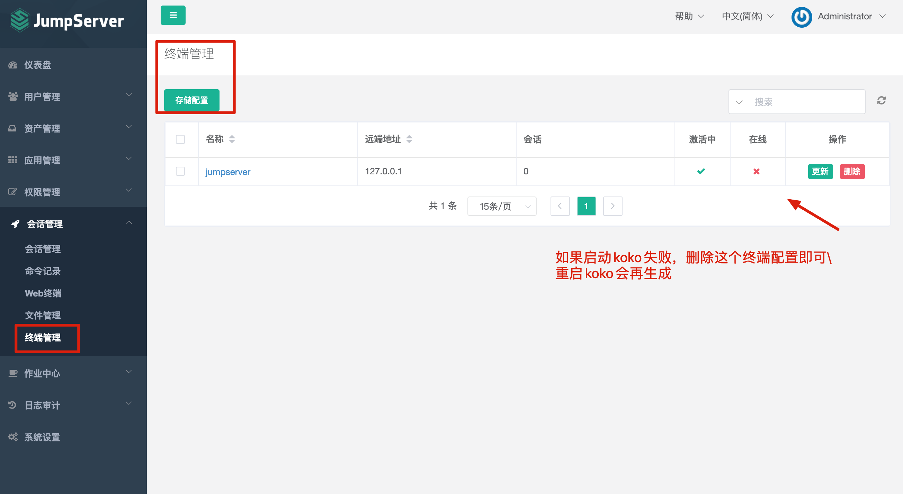

## 部署Guacamole

Guacamole 是一个基于 HTML 5 和 JavaScript 的 VNC 查看器，服务端基于 Java 的 VNC-to-XML 代理开发。要求浏览器支持 HTML 5。

Guacamole 是提供远程桌面的解决方案的开源项目，通过浏览器就能操作虚拟机，适用于Chrome，Firefox，IE10等浏览器（浏览器需要支持HTML5）。 由于使用 HTML5，Guancamole 只要在一个服务器安装成功，你访问你的桌面就是访问一个 web 浏览器。

Guacamole不是一个独立的Web应用程序，而是由许多部件组成的。Web应用程序实际上是整个项目里最小最轻量的，大部分的功能依靠Guacamole的底层组件来完成。

用户通过浏览器连接到Guacamole的服务端。Guacamole的客户端是用javascript编写的，Guacamole server通过web容器（比如tomcat）把服务提供给用户。一旦加载，客户端通过http承载着Guacamole自己的定义的协议与服务端通信。


```plain
1.获取源代码包，该资料，github也没有下载了，可以向超哥索要，qq:877348180，也可以选择用docker安装
[root@jumpserver opt 10:25:19]$ls |grep gua
2020-07-22-16-48-00-docker-guacamole-v2.1.0.tar.gz
2.解压缩配置
[root@jumpserver opt 10:26:09]$tar -xf 2020-07-22-16-48-00-docker-guacamole-v2.1.0.tar.gz
[root@jumpserver opt 10:26:36]$mv docker-guacamole-2.1.0 guacamole
3.解压执行程序
cd /opt/guacamole && \
tar -xf guacamole-server-1.2.0.tar.gz && \
tar -xf ssh-forward.tar.gz -C /bin/ && \
chmod +x /bin/ssh-forward
4.编译安装程序
[root@jumpserver guacamole 10:27:52]$cd /opt/guacamole/guacamole-server-1.2.0/
5.安装编译所需的依赖环境，根据官方文档的要求来http://guacamole.apache.org/doc/gug/installing-guacamole.html
# 非常重要，必须安装
yum install cairo-devel libjpeg-turbo-devel     libjpeg-devel     libpng-devel libtool uuid-devel -y
# 可选的依赖环境
yum install  freerdp-devel pango-devel     libssh2-devel libtelnet-devel libvncserver-devel libwebsockets-devel  pulseaudio-libs-devel openssl-devel libvorbis-devel libwebp-devel -y
# 安装FFmpeg
# FFmpeg是用于处理多媒体文件的免费和开放源代码工具集合。它包含一组共享的音频和视频库，例如libavcodec，libavformat和libavutil。使用FFmpeg，您可以在各种视频和音频格式之间转换，设置采样率，捕获流音频/视频和调整视频大小。
sudo yum install epel-release -y
sudo rpm -v --import http://li.nux.ro/download/nux/RPM-GPG-KEY-nux.ro
sudo rpm -Uvh http://li.nux.ro/download/nux/dextop/el7/x86_64/nux-dextop-release-0-5.el7.nux.noarch.rpm
yum install ffmpeg ffmpeg-devell -y 
#检查ffmpeg安装
ffmpeg -version
6.编译安装guacamole
cd /opt/guacamole/guacamole-server-1.2.0
./configure --with-init-dir=/etc/init.d && \
make && \
make install
7.配置好java环境
yum install -y java-1.8.0-openjdk
8.创建guacamole所需的文件夹
mkdir -p /config/guacamole /config/guacamole/extensions /config/guacamole/record /config/guacamole/drive && \
chown daemon:daemon /config/guacamole/record /config/guacamole/drive && \
cd /config
9.下载tomcat
cd /opt && \
wget http://mirrors.tuna.tsinghua.edu.cn/apache/tomcat/tomcat-9/v9.0.36/bin/apache-tomcat-9.0.36.tar.gz
10.部署tomncat与guacamole结合
cd /opt && \
tar -xf apache-tomcat-9.0.36.tar.gz && \
mv apache-tomcat-9.0.36 tomcat9 && \
rm -rf /opt/tomcat9/webapps/* && \
sed -i 's/Connector port="8080"/Connector port="8081"/g' /opt/tomcat9/conf/server.xml && \
echo "java.util.logging.ConsoleHandler.encoding = UTF-8" >> /opt/tomcat9/conf/logging.properties && \
ln -sf /opt/guacamole/guacamole-1.0.0.war /opt/tomcat9/webapps/ROOT.war && \
ln -sf /opt/guacamole/guacamole-auth-jumpserver-1.0.0.jar /config/guacamole/extensions/guacamole-auth-jumpserver-1.0.0.jar && \
ln -sf /opt/guacamole/root/app/guacamole/guacamole.properties /config/guacamole/guacamole.properties
12.设置Guacamole运行环境
export JUMPSERVER_SERVER=http://127.0.0.1:8080
echo "export JUMPSERVER_SERVER=http://127.0.0.1:8080" >> ~/.bashrc
export BOOTSTRAP_TOKEN=zxffNymGjP79j6BN
echo "export BOOTSTRAP_TOKEN=zxffNymGjP79j6BN" >> ~/.bashrc
export JUMPSERVER_KEY_DIR=/config/guacamole/keys
echo "export JUMPSERVER_KEY_DIR=/config/guacamole/keys" >> ~/.bashrc
export GUACAMOLE_HOME=/config/guacamole
echo "export GUACAMOLE_HOME=/config/guacamole" >> ~/.bashrc
export GUACAMOLE_LOG_LEVEL=ERROR
echo "export GUACAMOLE_LOG_LEVEL=ERROR" >> ~/.bashrc
export JUMPSERVER_ENABLE_DRIVE=true
echo "export JUMPSERVER_ENABLE_DRIVE=true" >> ~/.bashrc
# 检查环境变量文件
"""参数解释
JUMPSERVER_SERVER 指 core 访问地址
BOOTSTRAP_TOKEN 为 Jumpserver/config.yml 里面的 BOOTSTRAP_TOKEN 值
JUMPSERVER_KEY_DIR 认证成功后 key 存放目录
GUACAMOLE_HOME 为 guacamole.properties 配置文件所在目录
GUACAMOLE_LOG_LEVEL 为生成日志的等级
JUMPSERVER_ENABLE_DRIVE 为 rdp 协议挂载共享盘
"""
[root@jumpserver opt 11:23:13]$tail -8 ~/.bashrc
SECRET_KEY=l6n5h5KcBtx5mSLzIbhzCbXMvjc2TjBdVMlExSicqmMIh82Hb7
BOOTSTRAP_TOKEN=cNPXcM3piwPML73h
export JUMPSERVER_SERVER=http://127.0.0.1:8080
export BOOTSTRAP_TOKEN=zxffNymGjP79j6BN
export JUMPSERVER_KEY_DIR=/config/guacamole/keys
export GUACAMOLE_HOME=/config/guacamole
export GUACAMOLE_LOG_LEVEL=ERROR
export JUMPSERVER_ENABLE_DRIVE=true
13.启动服务
/etc/init.d/guacd start
sh /opt/tomcat9/bin/startup.sh
```

## 部署Lina组件

Lina 是 JumpServer 的前端 UI 项目, 主要使用 [Vue](https://cn.vuejs.org/), [Element UI](https://element.eleme.cn/) 完成, 名字来源于 Dota 英雄 [Lina](https://baike.baidu.com/item/莉娜/16693979)

```plain
cd /opt
wget https://github.com/jumpserver/lina/releases/download/v2.1.0/lina-v2.1.0.tar.gz
tar -xf lina-v2.1.0.tar.gz
mv lina-v2.1.0 lina
chown -R nginx:nginx lina  # 需要提前装好nginx
```

## 部署luna

Luna是Web Terminal前端，jumpserver提供api数据

下载地址https://github.com/jumpserver/luna/releases

```plain
cd /opt && \ 
wget https://github.com/jumpserver/luna/releases/download/v2.1.1/luna-v2.1.1.tar.gz && \
tar -zxf luna-v2.1.1.tar.gz && \
mv /opt/luna-v2.1.1 /opt/luna
chown -R root.root /opt/luna-v2.1.1/
```

## 部署nginx

nginx用作对jumpserver的动静态文件处理，以及反向代理

```plain
[root@jumpserver opt 11:28:43]$yum install nginx -y
```

修改nginx.conf

```plain
# 删除原有nginx.conf虚拟主机的配置
[root@jumpserver nginx 11:34:23]$sed -i  '38,58d' /etc/nginx/nginx.conf
```

**[root@jumpserver nginx 11:31:27]$vim /etc/nginx/conf.d/jumpserver.conf # 加入如下配置**

```plain
server {
    listen 80;
    client_max_body_size 100m;  # 录像及文件上传大小限制
    location /ui/ {
        try_files $uri / /index.html;
        alias /opt/lina/;
    }
    location /luna/ {
        try_files $uri / /index.html;
        alias /opt/luna/;  # luna 路径, 如果修改安装目录, 此处需要修改
    }
    location /media/ {
        add_header Content-Encoding gzip;
        root /opt/jumpserver/data/;  # 录像位置, 如果修改安装目录, 此处需要修改
    }
    location /static/ {
        root /opt/jumpserver/data/;  # 静态资源, 如果修改安装目录, 此处需要修改
    }
    location /koko/ {
        proxy_pass       http://localhost:5000;
        proxy_buffering off;
        proxy_http_version 1.1;
        proxy_set_header Upgrade $http_upgrade;
        proxy_set_header Connection "upgrade";
        proxy_set_header X-Real-IP $remote_addr;
        proxy_set_header Host $host;
        proxy_set_header X-Forwarded-For $proxy_add_x_forwarded_for;
        access_log off;
    }
    location /guacamole/ {
        proxy_pass       http://localhost:8081/;
        proxy_buffering off;
        proxy_http_version 1.1;
        proxy_set_header Upgrade $http_upgrade;
        proxy_set_header Connection $http_connection;
        proxy_set_header X-Real-IP $remote_addr;
        proxy_set_header Host $host;
        proxy_set_header X-Forwarded-For $proxy_add_x_forwarded_for;
        access_log off;
    }
    location /ws/ {
        proxy_set_header X-Real-IP $remote_addr;
        proxy_set_header Host $host;
        proxy_set_header X-Forwarded-For $proxy_add_x_forwarded_for;
        proxy_pass http://localhost:8070;
        proxy_http_version 1.1;
        proxy_buffering off;
        proxy_set_header Upgrade $http_upgrade;
        proxy_set_header Connection "upgrade";
    }
    location /api/ {
        proxy_pass http://localhost:8080;
        proxy_set_header X-Real-IP $remote_addr;
        proxy_set_header Host $host;
        proxy_set_header X-Forwarded-For $proxy_add_x_forwarded_for;
    }
    location /core/ {
        proxy_pass http://localhost:8080;
        proxy_set_header X-Real-IP $remote_addr;
        proxy_set_header Host $host;
        proxy_set_header X-Forwarded-For $proxy_add_x_forwarded_for;
    }
    location / {
        rewrite ^/(.*)$ /ui/$1 last;
    }
}
```

重启服务

```plain
nginx -t 
nginx -s reload
```

# 至此jumpserver正确启动

```plain
服务全部启动后, 访问 JumpServer 服务器 nginx 代理的 80 端口, 不要通过8080端口访问 默认账号: admin 密码: admin
```

后续的使用请参考 [安全建议](https://docs.jumpserver.org/zh/master/install/install_security/) [快速入门](https://docs.jumpserver.org/zh/master/admin-guide/quick_start/)

访问入口

```plain
http://192.168.178.134
```


# Jumpserver实践

## 提前启动好jumpserver服务端

```plain
source /opt/py3/bin/activate
/opt/jumpserver/jms start -d 
# koko
/opt/koko/koko -d 
/etc/init.d/guacd start 
sh /opt/tomcat9/bin/startup.sh 
# nginx
nginx
# mysql
# redis
# 快捷登录配置，以及免密登录客户端
[root@jumpserver ~ 16:20:50]$tail -2 ~/.bash_profile
alias sshweb01="ssh root@192.168.178.145"
alias sshdb01="ssh root@192.168.178.146"
```

## 只允许跳板机登录client

所有主机想要被管理必须经过跳板机管理

```plain
注意，最好提前设置免密登录，来的方便
1.设置防火墙规则
client机器可以iptables规则，只允许跳板机连接
iptables -A INPUT -s 192.168.178.134 -p tcp --dport 22 -j ACCEPT
iptables -A INPUT -p tcp --dport 22 -j REJECT
2.检查客户端机器防火墙规则
[root@web-01 ~]# iptables -L
Chain INPUT (policy ACCEPT)
target     prot opt source               destination
ACCEPT     tcp  --  192.168.178.134      anywhere             tcp dpt:ssh
REJECT     tcp  --  anywhere             anywhere             tcp dpt:ssh reject-with icmp-port-unreachable
Chain FORWARD (policy ACCEPT)
target     prot opt source               destination
Chain OUTPUT (policy ACCEPT)
target     prot opt source               destination
```

# Jumpserver用户配置

## 修改admin密码

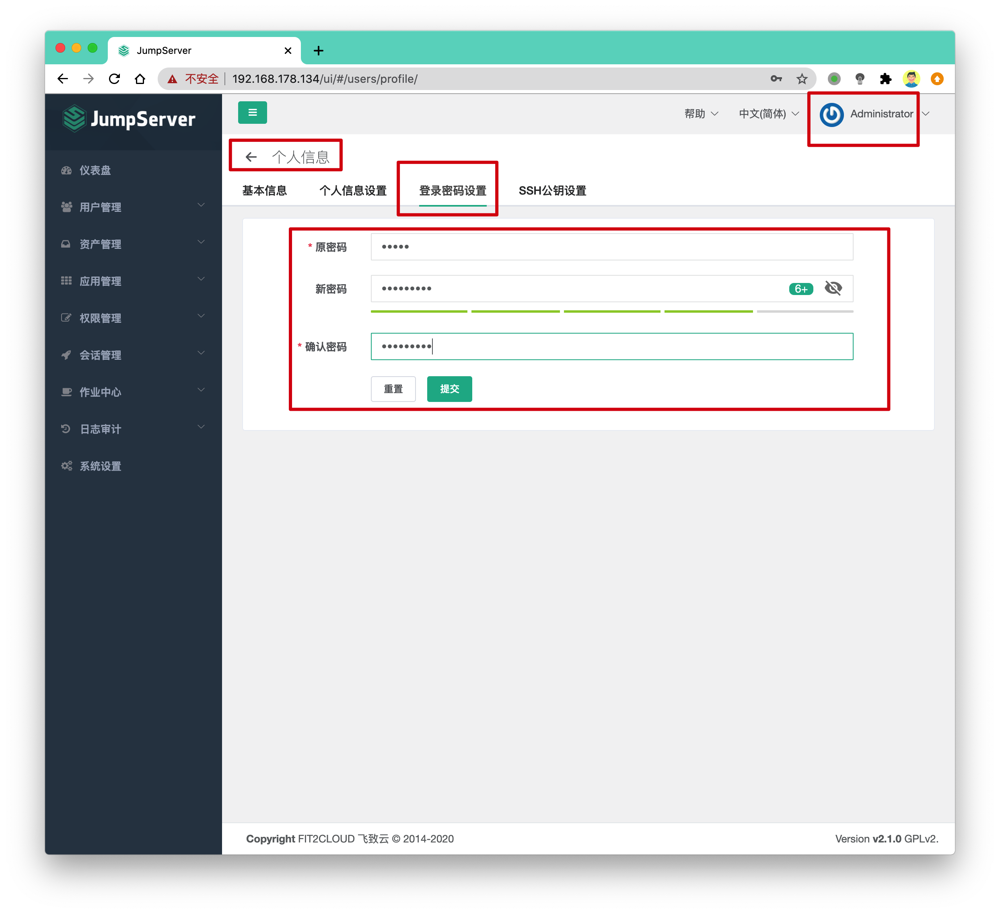

## 设置邮箱发送

第一步，smtp服务器，授权码添加


第二步，邮件基本设置，必须，否则无法发邮件

```plain
这里的url站点，是做了nginx代理的，因此是80端口
```

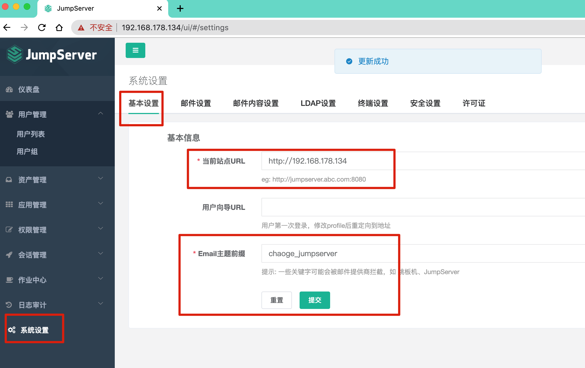

## 用户创建

添加用户

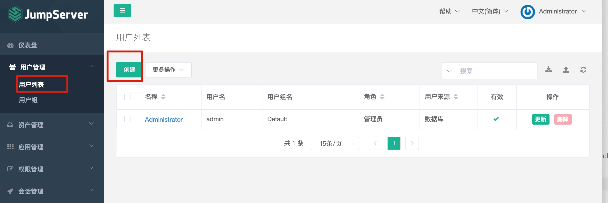

用户信息添加


查看用户信息


此时正确的应该是收到了用户创建的邮件。


点击重置密码后，进入该页面，修改用户自己的密码


## 普通用户登录

首次登录

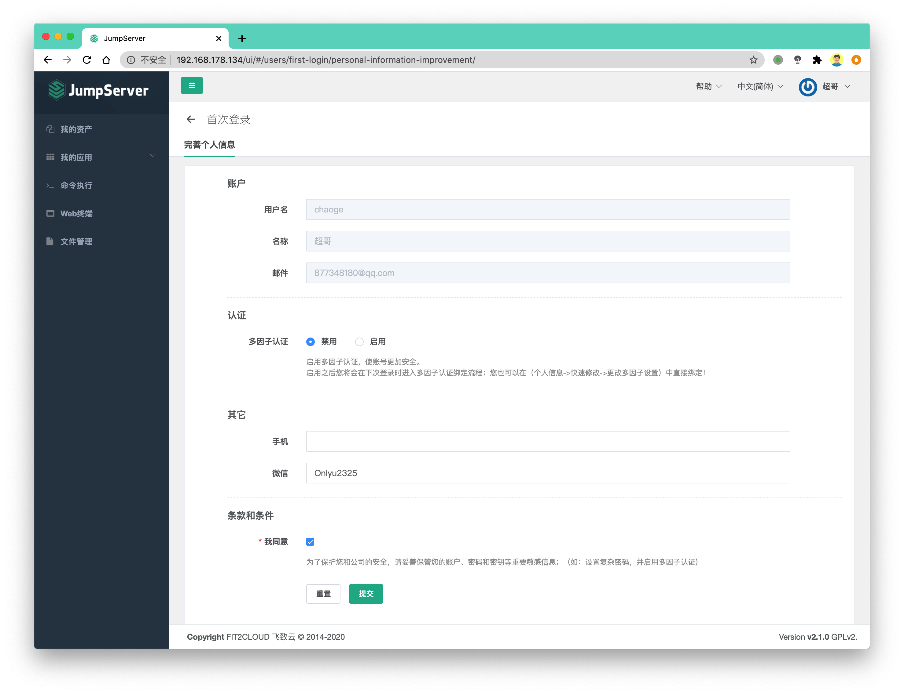

# 资产管理配置

## 添加管理用户**

管理用户是资产（被管控的服务器）上的root用户，或者是拥有sudo权限的用户，jumpserver使用该用户进行`推送系统用户`、`获取资产硬件信息`等

管理用户是，jumpserver操作`被管理机器`时的用户。

加一个root用户，进行使用

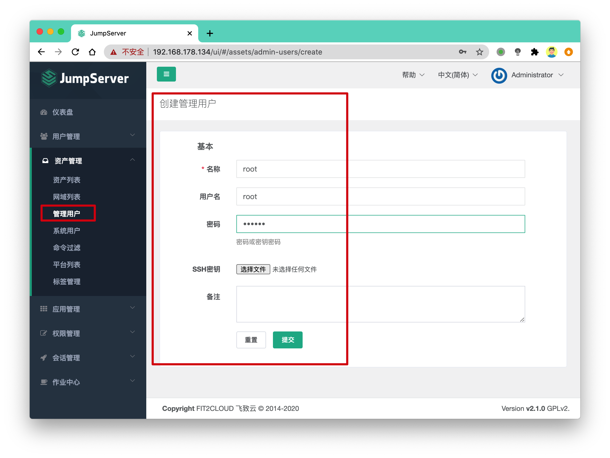

## 添加资产主机

选择资产添加

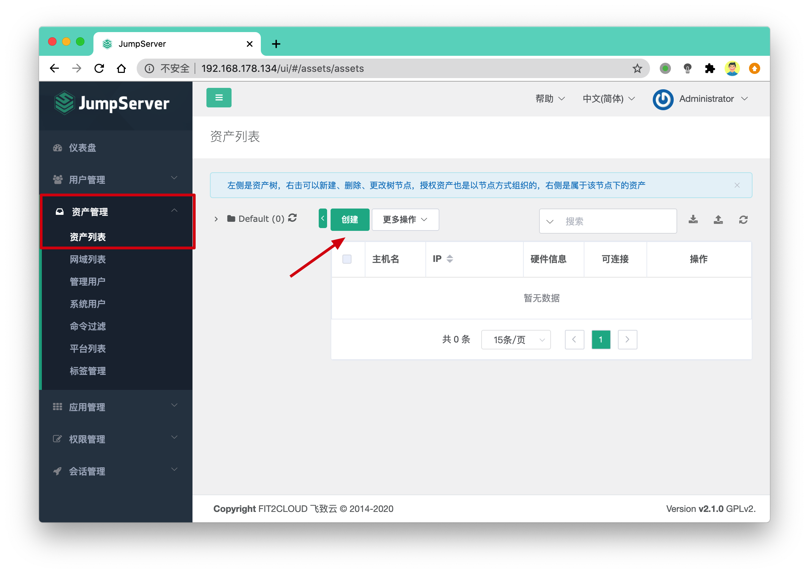

添加资产信息

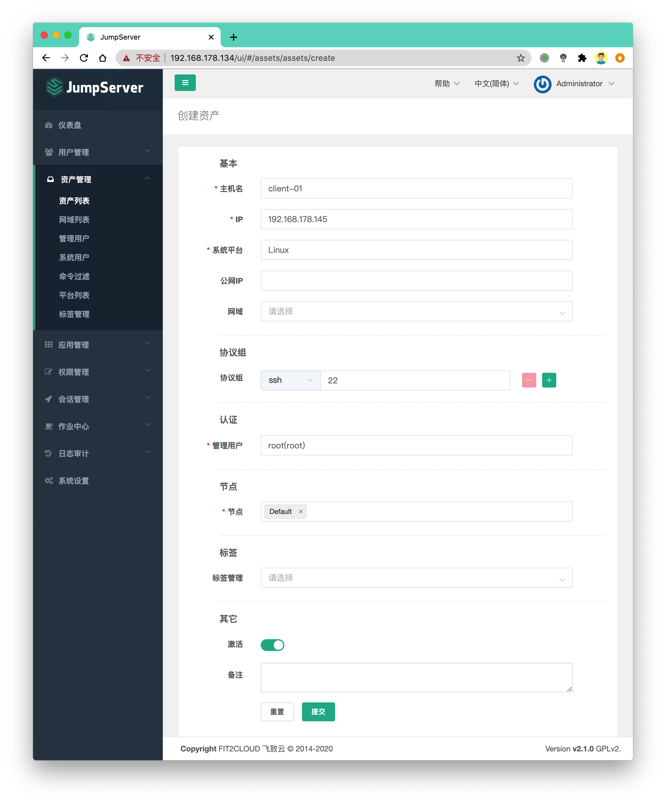

## 查看资产主机

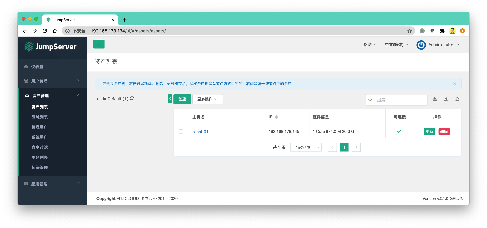

## 可以继续添加主机

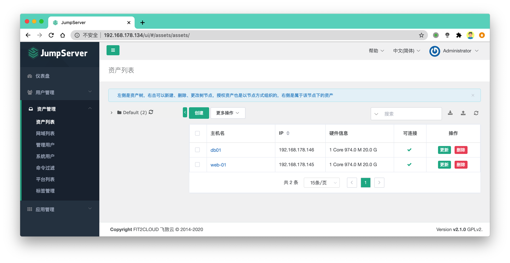

## 导出资产文件

可以导出资产文件，格式为csv数据文件


# 系统用户**

系统用户是 JumpServer 跳转登录资产时使用的用户，可以理解为登录资产用户，如 web，sa，dba（`ssh web@some-host`），而不是使用某个用户的用户名跳转登录服务器（`ssh xiaoming@some-host`）；

简单来说是用户使用自己的用户名登录 JumpServer，JumpServer 使用系统用户登录资产。 系统用户创建时，如果选择了自动推送，JumpServer 会使用 Ansible 自动推送系统用户到资产中，如果资产（交换机）不支持 Ansible，请手动填写账号密码。

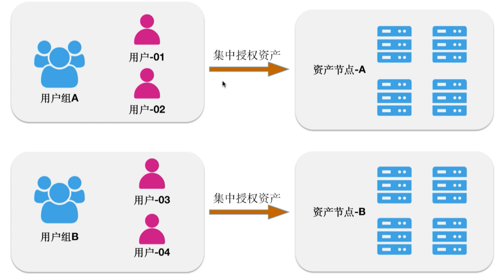

添加过程


jumpserver创建系统用户，会自动基于ansible在目标机器上创建该用户

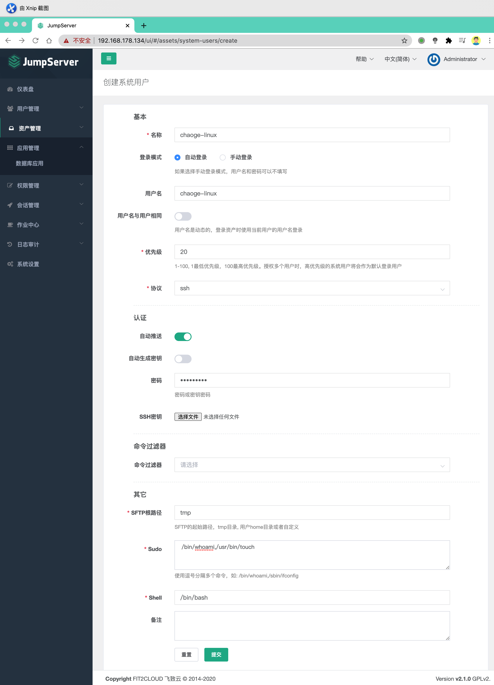

## 资产授权

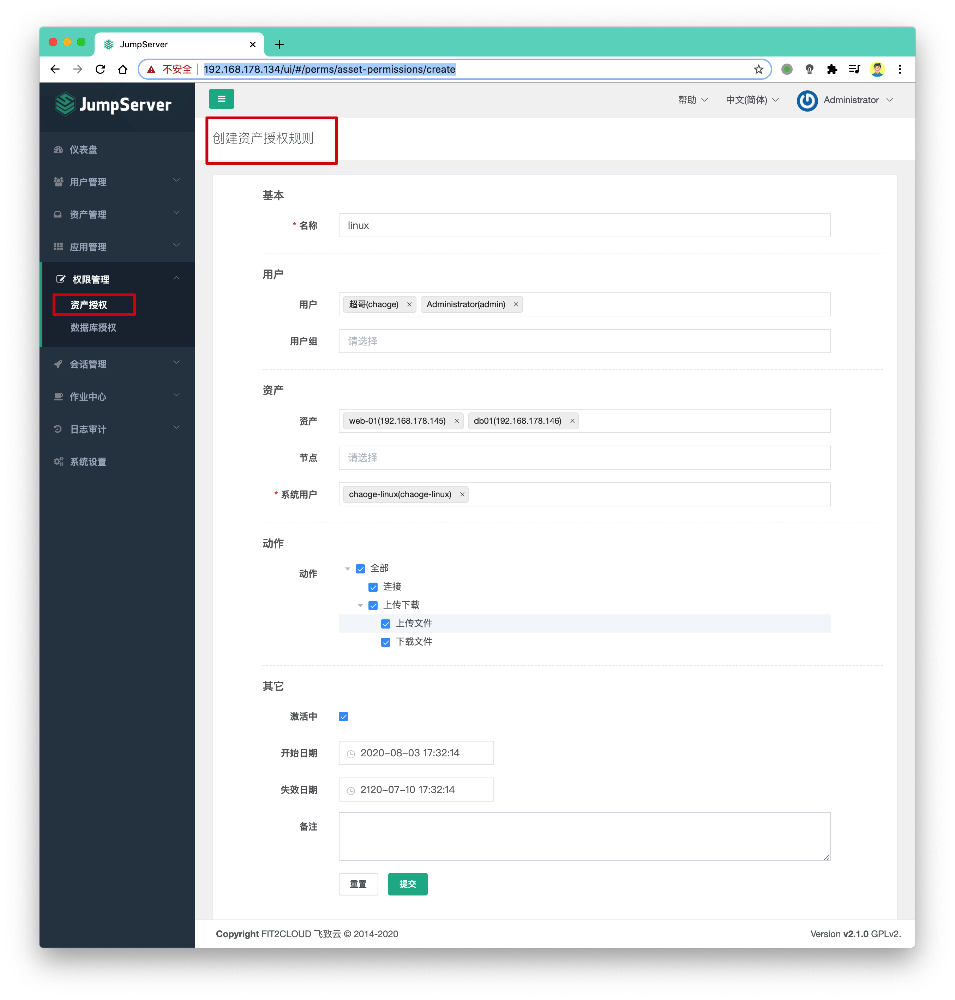

## 使用资产

- 系统内建webterminal
- 客户端工具

### admin的用户界面/管理界面

### web终端

```plain
得提前配置好luna，方可使用该功能
```

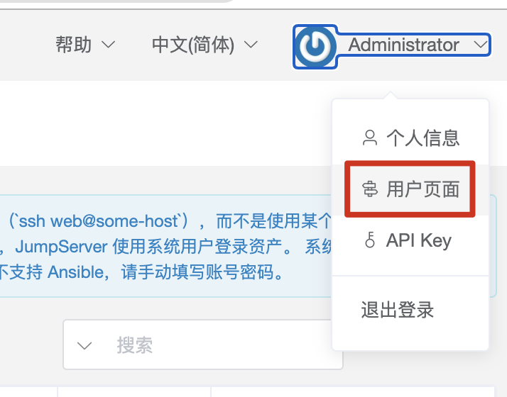


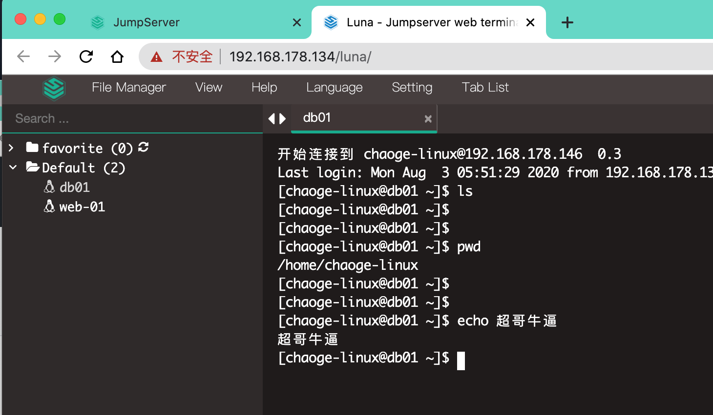

### ssh终端

ssh得配置好koko组件方可使用

```plain
# 连接的命令就已经不同了，使用ssh命令，以及jumpserver平台账号，以及koko端口
[yuchao@yumac ~]$ssh admin@192.168.178.134 -p2222
```


根据提示使用ssh终端管理即可

```plain
1. 输入p显示主机信息，然后输入主机id，即可自动连接，注意我们资产机，是不允许ssh登录的，只能通过jumpserver
可以正常输入普通命令
使用sudo命令，权限被/etc/sudoers文件配置所控制
```

# 会话管理

可在jumpserver界面，掌握当前登录机器的数量


## 监控会话

点击会话ID，可以查看该会话，执行了哪些命令、以及强制中断该会话

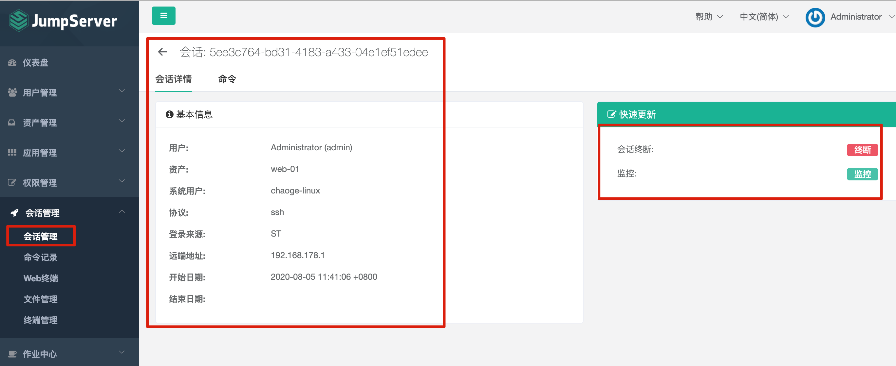

中断会话


命令监控


## 历史会话

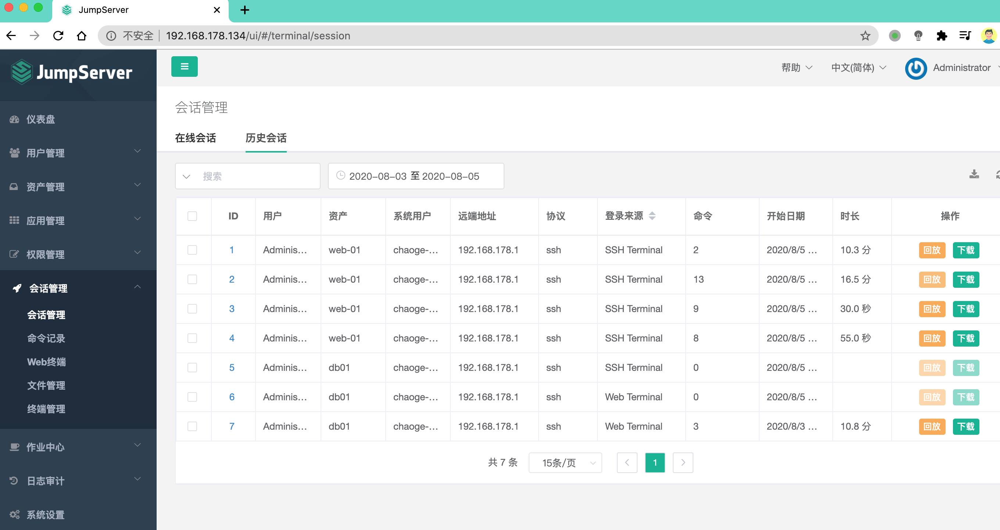

jumpserver提供强大的历史会话功能，查看命令历史，操作视频回放，最大程度定位运维安全。


# 缓存数据库

# Memcached

## 谁在用Memcached

国外：Yahoo, facebook, twitter, wiki等

国内：新浪网，豆瓣网，开心网，搜狐，赶集网等

## 是什么


## 有什么用


## 介绍Memcached

Memcached是一套利用系统内存进行数据缓存的软件，常用于在动态Web集群，系统后端，数据库前端处使用。

用处：

- 可以临时缓存Web系统查询过的数据库数据，当用户请求查询数据时，由Memcached优先提供服务，从而减少Web系统直接请求数据库的次数，大大的降低后端数据库的压力，从而提升网站系统的性能。
- Memcached是通过分配指定的内存空间存取数据，比起MySQL要快很多（MySQL读写磁盘）
- Memcached也用来共享存储集群架构所有Web阶段服务器的session会话数据。

Memcached是一个开源的，支持高性能，高并发的分布式内存缓存系统，由C语言开发。从软件名称上看，mem就是内存的缩写，cache就是缓存的意思，最后一个字符d就是daemon的意思，表示该软件是`守护进程模式内存缓存`。

Memcached分为`服务端`和`客户端`两部分。

Memcached是以LiveJournal旗下Danga Interactive公司的Brad Fitzpatric为首开发的一款软件。现在已成为mixi、hatena、Facebook、Vox、LiveJournal等众多服务中提高Web应用扩展性的重要因素。

Memcached是一种基于内存的key-value存储，用来存储小块的任意数据（字符串、对象）。这些数据可以是数据库调用、API调用或者是页面渲染的结果。

Memcached简洁而强大。它的简洁设计便于快速开发，减轻开发难度，解决了大数据量缓存的很多问题。它的API兼容大部分流行的开发语言。

本质上，它是一个简洁的key-value存储系统。

一般的使用目的是，通过缓存数据库查询结果，减少数据库访问次数，以提高动态Web应用的速度、提高可扩展性。

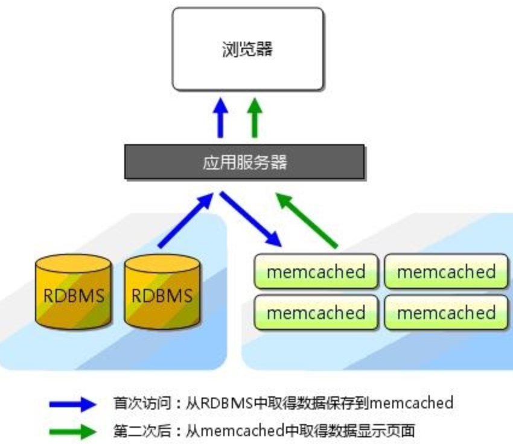

Memcached 官网：https://memcached.org/。

## Memcached作用

传统场景下，多数Web应用都将数据保存到关系型数据库中（MySQL），Web服务器从该数据库中读取数据给与用户响应，显示在浏览器中。

但是随着数据库的增大，集中式的访问，关系型数据库的负担会加重，导致响应缓慢，造成网站打开延迟等问题，影响用户体验。

此时在MySQL前面试用Memcached的作用就出现了，通过Memcached在内存中缓存MySQL的查询结果，减少MySQL的访问，提升整体网站架构性能。

生产环境下Memcached也被用来保存经常需要读取的数据，好比我们的浏览器也会对网页数据缓存一样，通过内存缓存的读取速度要远快于磁盘。

## 内存缓存软件

| 软件              | 类型        | 作用                                       | 数据场景                                                     |
| ----------------- | ----------- | ------------------------------------------ | ------------------------------------------------------------ |
| Memcached         | 纯内存      | 缓存网站后端各类数据                       | 缓存用户重复请求的动态数据，如博客，帖子，用户session信息    |
| Redis、MemcacheDB | 持久化+内存 | 缓存后端数据库数据，作为关系型数据库的补充 | 除了用户重复请求的动态数据，以及当做数据库使用，存储如点赞数，排行榜，计数器，粉丝统计等需要持久化的数据。 |
| Squid，Nginx      | 内存+磁盘   | 缓存Web前端数据                            | 用于缓存静态数据，如图片，文件，JS，CSS，HTML，代码等。提供CDN功能 |

## 网站更新缓存工作流

- 当程序需要更新或删除数据时，首先会处理后端数据库中的数据。
- 处理后端数据库的同事，也会通知Memcached，它缓存的数据过期了，因此要保证Mecmached的数据和数据库中保持一致，这个一致性非常重要。

### 场景1：电商数据


```plain
上述流程图，例如Memcached用来存储商品分类功能的数据，一般商品分类是很少变动的，因此可以提前把该数据放在Memcached，Web后端直接读取Memcached即可，无须访问mysql，减轻数据库压力，还能提升访问速度。
若是商品分类有了变化，公司内部管理人员需要更新数据库后，再同时更新到缓存Memcached里。
```

### 场景2：热点数据缓存

热点数据缓存指的是如淘宝的卖家，在卖家新增商品后，网站程序会吧这个商品写入后端数据库，同时吧这部分的数据，放入Memcached内存，下一次访问该商品的请求，就直接从Memcached里读取，这个方式用来缓存网站的热点数据，也就是会被用户经常访问的数据。

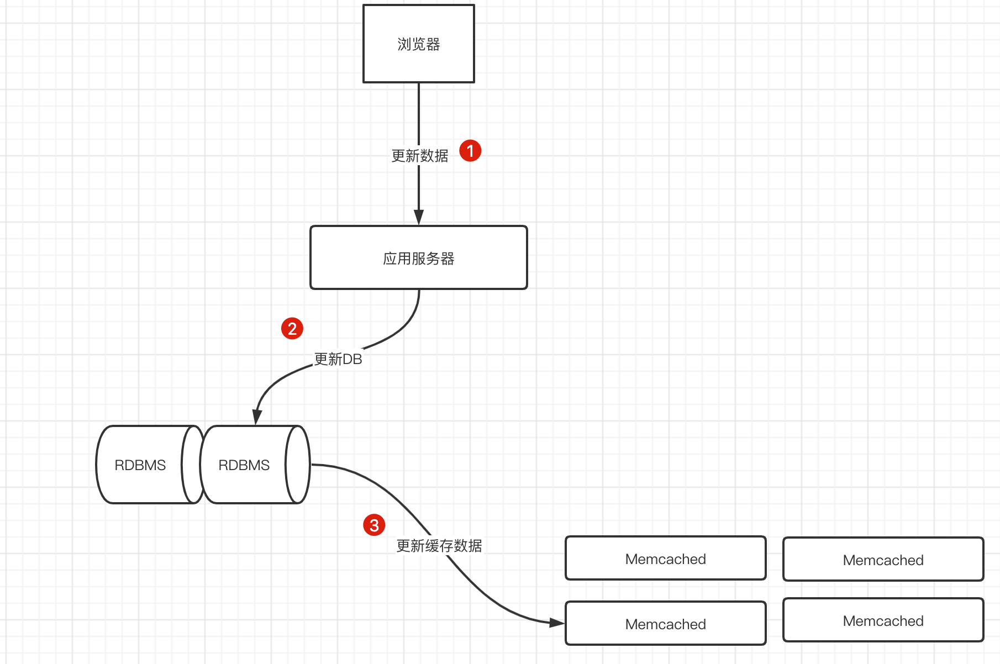

这种形式一般通过程序实现，也可以在MySQL上做设置，直接由MySQL吧数据更新到Memcached中，实现例如从库的效果。


- 如果碰到电商双11，秒杀高并发的业务场景，必须要事先预热各种缓存，包括前端的Web缓存和后端的数据库缓存。
- 也就是先把数据放入内存预热，然后逐步动态更新。此时，会先读取缓存，如果缓存里没有对应的数据，再去读取数据库，然后把读到的数据放入缓存。如果数据库里的数据更新，需要同时触发缓存更新，防止给用户过期的数据，当然对于百万级别并发还有很多其他的工作要做。
- 绝大多数的网站动态数据都是保存在数据库当中的，每次频繁地存取数据库，会导致数据库性能急剧下降，无法同时服务更多的用过户（比如MySQL特别频繁的锁表就存在此问题），那么，就可以让Memcached来分担数据库的压力。增加Memcached服务的好处除了可以分担数据库的压力以外，还包括无须改动整个网站架构，只须简单地修改下程序逻辑，让程序先读取Memcached缓存查询数据即可，当然别忘了，更新数据时也要更新Memcached缓存。

## 作为集群节点的session会话共享存储

也就是吧客户端用户请求多个前端应用服务器集群产生的session信息，统一存储到一个Memcached缓存中。

### Memcached在Web集群架构图

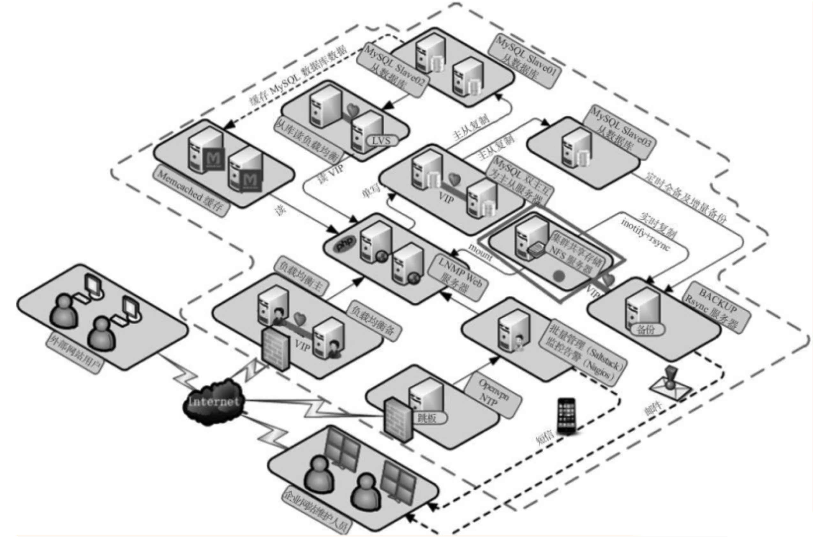

图2


### session/cookie是什么


简单来说Cookies就是服务器暂存放在你的电脑里的资料让服务器辨认电脑，很多购物网站的购物车功能、论坛自动登录功能都是靠Cookie实现。

**cookie是什么意思?**

　　Cookie的英文直译是饼干，在计算机术语中是指一种能够让网站服务器把少量数据储存到客户端的硬盘或内存，或是从客户端的硬盘读取数据的一种技术。Cookie可以为用户带来很多便捷，但同时，它也会给用户制造一些麻烦。

　　**浏览器中的Cookie**

　　当你浏览某网站时，由Web服务器置于你硬盘上的一个非常小的文本文件，它可以记录你的用户ID、密码、浏览过的网页、停留的时间等信息。当你再次来到该网站时，网站通过读取Cookie，得知你的相关信息，就可以做出相应的动作，如在页面显示欢迎你的标语，或者让你不用输入ID、密码就直接登录等等。如果你清理了Cookie，那么你曾登录过的网站就没有你的修改过的相关信息。Cookie是非常常见的， 基本上你的浏览器中都会存储了成百上千条Cookie信息。

### Cookies和session


## Memcached特点

作为高并发，高性能的缓存服务，具有如下特点：

- 协议简单。Memcached的协议实现很简单，采用的是基于文本行的协议，能通过telnet/nc等命令直接操作memcached服务存储数据。
- 支持epoll/kqueue异步I/O模型，使用libevent作为事件处理通知机制。
- 简单的说，libevent是一套利用c开发的程序库，它将BSD系统的kqueue，Linux系统的epoll等事件处理功能封装成一个接口，确保即使服务器端的连接数增加也能发挥很好的性能。Memcached就是利用这个libevent库进行异步事件处理的。
- 采用key/value键值数据类型。被缓存的数据以key/value键值形式存在，例如：

```plain
benet–>36,key=benet,value=36
yunjisuan–>28,key=yunjisuan,value=28
#通过benet key可以获取到36值，同理通过yunjisuan key可以获取28值
```

- 全内存缓存，效率高。Memcached管理内存的方式非常高效，即全部的数据都存放于Memcached服务事先分配好的内存中，无持久化存储的设计，和系统的物理内存一样，当重启系统或Memcached服务时，Memcached内存中的数据就会丢失。
- 如果希望重启后，数据依然能保留，那么就可以采用redis这样的持久性内存缓存系统。
- 当内存中缓存的数据容量达到服务启动时设定的内存值时，就会自动使用LRU算法（最近最少被使用的）删除过期的缓存数据。也可以在存放数据时对存储的数据设置过期时间，这样过期后数据就自动被清除，Memcached服务本身不会监控数据过期，而是在访问的时候查看key的时间戳判断是否过期。
- 可支持分布式集群 Memcached没有像MySQL那样的主从复制方式，分布式Memcached集群的不同服务器之间是互不通信的，每一个节点都独立存取数据，并且数据内容也不一样。通过对Web应用端的程序设计或者通过支持hash算法的负载均衡软件，可以让Memcached支持大规模海量分布式缓存集群应用。

下面是利用Web端程序实现Memcached分布式的简单代码： #建立了一个数组

```plain
"memcached_servers" ==>array(
'10.4.4.4:11211',
'10.4.4.5:11211',
'10.4.4.6:11211',
)
```

下面使用Tengine反向代理负载均衡的一致性哈希算法实现分布式Memcached的配置。

```plain
http {
  upstream test {
      consistent_hash $request_uri;
      server 127.0.0.1:11211 id=1001 weight=3;
      server 127.0.0.1:11212 id=1002 weight=10;
      server 127.0.0.1:11213 id=1003 weight=20;
  }
}
提示：
Tengine是淘宝网开源的Nginx的分支，上述代码来自：
http://tengine.taobao.org/document_cn/http_upstream_consistent_hash_cn.html
```

### Memcached预热重启理念

当网站架构需要大面积重启Memcached时，首先要在前端控制网站入口的访问流量，然后重启Memcached集群，并且进行数据预热，当所有数据预热完毕后，再逐步开放前端网站入口的流量。

## Memcached安装

准备好一台Linux虚拟机，超哥这里用的是如下环境

基本的linux初始化就不用多说了。。反复的说了一万遍了

```plain
[root@memcached01 ~]# cat /etc/redhat-release
CentOS Linux release 7.5.1804 (Core)
[root@memcached01 ~]# uname -r
3.10.0-862.el7.x86_64
```

系统初始化

```plain
wget -O /etc/yum.repos.d/CentOS-Base.repo http://mirrors.aliyun.com/repo/Centos-7.repo
wget -O /etc/yum.repos.d/epel.repo http://mirrors.aliyun.com/repo/epel-7.repo
yum install -y bash-completion vim lrzsz wget expect net-tools nc nmap tree dos2unix htop iftop iotop unzip telnet sl psmisc nethogs glances bc ntpdate  openldap-devel git python-pip  gcc automake autoconf python-devel vim sshpass lrzsz readline-devel lsof
```

安装Memcached前需要先安装libevent，有关libevent的内容在前文已经介绍，此处用yum命令安装libevent。操作命令如下：

```plain
yum install -y libevent libevent-devel nc 
# 在centos 7 系统上 nc命令改为了nmap-ncat
[root@memcached01 ~]# rpm -qa libevent libevent-devel nmap-ncat
libevent-devel-2.0.21-4.el7.x86_64
libevent-2.0.21-4.el7.x86_64
nmap-ncat-6.40-19.el7.x86_64
```

安装memcached

```plain
[root@memcached01 ~]# yum install memcached -y
[root@memcached01 ~]# rpm -qa memcached
memcached-1.4.15-10.el7_3.1.x86_64
```

## memcached启动

启动Memcached

```plain
[root@memcached01 ~]# which memcached
/usr/bin/memcached
# 启动第一个memcached实例
[root@memcached01 ~]# memcached -m 16m -p 11211 -d -u root -c 8192
```

检查服务启动

```plain
[root@memcached01 ~]# lsof -i :11211
COMMAND     PID USER   FD   TYPE DEVICE SIZE/OFF NODE NAME
memcached 11937 root   26u  IPv4  62741      0t0  TCP *:memcache (LISTEN)
memcached 11937 root   27u  IPv6  62742      0t0  TCP *:memcache (LISTEN)
memcached 11937 root   28u  IPv4  62745      0t0  UDP *:memcache
memcached 11937 root   29u  IPv6  62746      0t0  UDP *:memcache
[root@memcached01 ~]# netstat -antup | grep 11211
tcp        0      0 0.0.0.0:11211           0.0.0.0:*               LISTEN      11937/memcached
tcp6       0      0 :::11211                :::*                    LISTEN      11937/memcached
udp        0      0 0.0.0.0:11211           0.0.0.0:*                           11937/memcached
udp6       0      0 :::11211                :::*                                11937/memcached
[root@memcached01 ~]# ps -ef | grep memcached | grep -v grep
root      11937      1  0 02:50 ?        00:00:00 memcached -m 16m -p 11211 -d -u root -c 8192
```

可以再启动第二个数据库实例

```plain
[root@memcached01 ~]# memcached -m 16m -p 11212 -d -u root -c 8192
```

同样的检查服务状态

```plain
[root@memcached01 ~]# ps -ef | grep memcached | grep -v grep
root      11937      1  0 02:50 ?        00:00:00 memcached -m 16m -p 11211 -d -u root -c 8192
root      11959      1  0 02:53 ?        00:00:00 memcached -m 16m -p 11212 -d -u root -c 8192
```

若是想要开机就自动运行memcached，可以加入开机启动文件

```plain
[root@memcached01 ~]# tail -2 /etc/rc.local
memcached -m 16m -p 11211 -d -u root -c 8192
memcached -m 16m -p 11212 -d -u root -c 8192
```

### Memcached启动命令相关参数说明

**进程与连接设置**

| 命令参数   | 说明                                                         |
| ---------- | ------------------------------------------------------------ |
| -d         | 以守护进程（daemon）方式运行服务                             |
| -u         | 指定运行memcached的用户，如果当前用户为root，需要使用此参数指定用户 |
| -l         | 指定memcached进程监听的服务器ip地址，可以不设置此参数        |
| -p（小写） | 指定memcached服务监听TCP端口号，默认为11211                  |
| -P（大写） | 设置保存memcached的pid文件（$$）,保存PID到指定文件           |

**内存相关设置：**

| 命令参数 | 说明                                                |
| -------- | --------------------------------------------------- |
| -m       | 指定memcached服务可以缓存数据的最大内存，默认是64MB |
| -M       | memcached服务内存不够时禁止LRU，如果内存满了会报错  |
| -n       | 为key+value——flags分配的最小内存空间，默认为48字节  |
| -f       | chunk size增长因子，默认为1。25                     |
| -L       | 启用大内存页，可以降低内存浪费，改进性能            |

**并发连接设置：**

| 并发连接设置 | 说明                                                         |
| ------------ | ------------------------------------------------------------ |
| -c           | 最大的并发连接数，默认是1024                                 |
| -t           | 线程数，默认4.由于memcached采用的是NIO，所以太多线程作用不大 |
| -R           | 每个event最大请求数，默认是20                                |
| -C           | 禁用CAS（可以禁止版本计数，减少开销）                        |

**测试参数：**

| -v   | 打印较少的errors/warnings                        |
| ---- | ------------------------------------------------ |
| -vv  | 打印非常多调试信息和错误输出到控制台             |
| -vvv | 打印极多的调试信息和错误输出，也打印内部状态转发 |

**其他选项可通过“memcached -h”命令来显示**

## 写入Memcached数据

```plain
Memcached中添加数据时，注意添加的数据一般为键值对的形式，例如：key1–>values1,key2–>values2
```

## 测试Memcached语句

**这里把Memcached添加，查询，删除等的命令和MySQL数据库做一个基本类比，见下表：**

| MySQL数据库管理   | memcached管理         |
| ----------------- | --------------------- |
| MySQL的insert语句 | memcached的set命令    |
| MySQL的select语句 | memcached的get命令    |
| MySQL的delete语句 | memcached的delete命令 |

注意：

**memcached的服务器客户端通信并不使用复杂的XML等格式，而使用简单的基于文本行的协议。**

**我们可以使用telnet、nc等命令，可以连接memcached服务端，进行数据操作。**

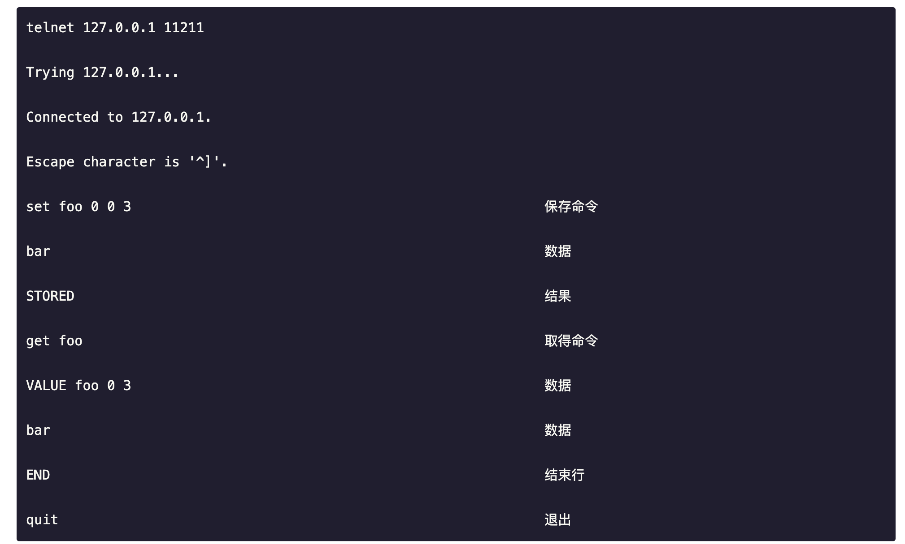

**通过printf配合nc向Memcached中写入数据，命令如下：**

```plain
备注：
printf 是格式化打印的命令，printf 命令格式化输出。
nc  功能强大的网络工具
```

### 读写案例

写入数据

```plain
# set命令设置的字符数量，必须准确，否则会报错，例如
# 对key1 设置值 chaogee ，字符是7个
[root@memcached01 ~]# printf "set key1 0 0 6\r\nchaogee\r\n"|nc 127.0.0.1 11211
CLIENT_ERROR bad data chunk
ERROR
# 字符数量正确后
[root@memcached01 ~]# printf "set key1 0 0 6\r\nchaoge\r\n"|nc 127.0.0.1 11211
STORED
```

读取数据

```plain
[root@memcached01 ~]# printf "get key1\r\n" | nc 127.0.0.1 11211
VALUE key1 0 6
chaoge  # 读取到的值
END
```

通过printf配合nc从Memcached中删除数据，命令如下

```plain
[root@memcached01 ~]# printf "delete key1\r\n" | nc 127.0.0.1 11211
DELETED  #出现它表示删除了
# 再次获取就已经找不到了
[root@memcached01 ~]#  printf "get key1\r\n" | nc 127.0.0.1 11211
END
```

## telnet连接memcached

```plain
1.安装telnet
[root@memcached01 ~]# yum install telnet -y
2.写入数据
[root@memcached01 ~]# telnet 127.0.0.1 11211
Trying 127.0.0.1...
Connected to 127.0.0.1.
Escape character is '^]'.
set user01 0 0 7          # 设置key与字节数
chaogee                                # 设置7个字符
STORED
get user01
VALUE user01 0 7
chaogee
END
delete user01
DELETED
get user01
END
quit
Connection closed by foreign host.
[root@memcached01 ~]#
```

## 操作Memcached命令语法


下表展示命令的详细说明


## 关闭memcached服务

```plain
[root@memcached01 ~]#  ps -ef | grep memcached | grep -v grep
root      11937      1  0 02:50 ?        00:00:00 memcached -m 16m -p 11211 -d -u root -c 8192
root      11959      1  0 02:53 ?        00:00:00 memcached -m 16m -p 11212 -d -u root -c 8192
# 在启动memcached的时候，最好指定pid文件，关于启停管理。
[root@cache01 ~]# memcached -m 16m -p 11211 -d -u root -c 8192 -P /var/run/11211.pid
[root@cache01 ~]# memcached -m 16m -p 11212 -d -u root -c 8192 -P /var/run/11212.pid
# 杀死pid即可
[root@memcached01 ~]# ps -ef|grep memcached |grep -v grep |awk '{print $2}' | xargs kill
# 重启了服务端，数据也就丢了
[root@memcached01 ~]# memcached -m 16m -p 11211 -d -u root -c 8192 -P /var/run/11211.pid
[root@memcached01 ~]#
[root@memcached01 ~]#
[root@memcached01 ~]# telnet 127.0.0.1 11211
Trying 127.0.0.1...
Connected to 127.0.0.1.
Escape character is '^]'.
get key1
END
quit
Connection closed by foreign host.
[root@memcached01 ~]#
# 重新启动，查看数据
[root@memcached01 ~]# ps -ef | grep memcached | grep -v grep
root      13749      1  0 03:31 ?        00:00:00 memcached -m 16m -p 11211 -d -u root -c 8192 -P /var/run/11211.pid
[root@memcached01 ~]#
[root@memcached01 ~]#
[root@memcached01 ~]# kill `cat /var/run/11211.pid`
[root@memcached01 ~]# ps -ef | grep memcached | grep -v grep
```

## 企业工作场景中如何配置Memcached

在企业实际工作中，一般是开发人员提出需求，说要部署一个Memcached数据缓存。运维人员在接到这个不确定的需求后，需要和开发人员深入沟通，进而确定要将内存指定为多大，或者和开发人员商量如何根据具体业务来指定内存缓存的大小。此外，还要确定业务的重要性，进而决定是否采取负载均衡，分布式缓存集群等架构，最后确定要使用多大的并发连接数等。

对于运维人员，部署Memcached一般就是安装Memcached服务器端，把服务启动起来，做好监控，配好开机自启动，基本就OK了。

客户端的PHP程序环境一般在安装LNMP环境时都会提前安装Memcached客户端插件，Java程序环境下，开发人员会用第三方的JAR包直接连接Memcached服务。


# Memcached客户端

这里超哥采用LNMP架构，结合Memcached做缓存，那么就需要大家按照前面的课程，搭建出LNMP环境，以正确访问出`phpinfo`页面为准。

## LNMP快速部署

Nginx

```plain
yum install pcre pcre-devel  openssl openssl-devel -y 
wget http://nginx.org/download/nginx-1.16.0.tar.gz
useradd nginx -u 1111 -s /sbin/nologin -M
tar -zxf nginx-1.16.0.tar.gz
cd nginx-1.16.0/
./configure --user=nginx --group=nginx --prefix=/opt/nginx-1.16.0/ --with-http_stub_status_module --with-http_ssl_module
make && make install
# 启动
[root@memcached01 nginx-1.16.0]# /opt/nginx-1.16.0/sbin/nginx
```

mysql

```plain
[root@memcached01 nginx-1.16.0]# yum install mariadb-server mariadb -y
[root@memcached01 nginx-1.16.0]# systemctl start mariadb
```

php

```plain
yum install  gcc gcc-c++ make zlib-devel libxml2-devel libjpeg-devel libjpeg-turbo-devel libiconv-devel \
freetype-devel libpng-devel gd-devel libcurl-devel libxslt-devel libxslt-devel -y
[root@memcached01 nginx-1.16.0]# cd /opt/lnmp/
[root@memcached01 lnmp]# ls
nginx-1.16.0  nginx-1.16.0.tar.gz
[root@memcached01 lnmp]#
[root@memcached01 lnmp]# wget http://mirrors.sohu.com/php/php-7.3.5.tar.gz
tar -zxvf php-7.3.5.tar.gz
cd php-7.3.5
./configure --prefix=/opt/php7.3.5 \
--enable-mysqlnd \
--with-mysqli=mysqlnd \
--with-pdo-mysql=mysqlnd \
--with-freetype-dir \
--with-jpeg-dir \
--with-png-dir \
--with-zlib \
--with-libxml-dir=/usr \
--enable-xml \
--disable-rpath \
--enable-bcmath \
--enable-shmop \
--enable-sysvsem \
--enable-inline-optimization \
--with-curl \
--enable-mbregex \
--enable-fpm \
--enable-mbstring \
--with-gd \
--with-openssl \
--with-mhash \
--enable-pcntl \
--enable-sockets \
--with-xmlrpc \
--enable-soap \
--enable-short-tags \
--enable-static \
--with-xsl \
--with-fpm-user=nginx \
--with-fpm-group=nginx \
--enable-ftp \
--enable-opcache=no
make && make install
# 配置文件
[root@memcached01 php-7.3.5]# pwd
/opt/lnmp/php-7.3.5
[root@memcached01 php-7.3.5]# cp php.ini-development /opt/php7.3.5/lib/php.ini
[root@memcached01 php-7.3.5]# cd /opt/php7.3.5/etc/
[root@memcached01 etc]# ls
pear.conf  php-fpm.conf.default  php-fpm.d
[root@memcached01 etc]# cp php-fpm.conf.default php-fpm.conf
[root@memcached01 etc]#
[root@memcached01 etc]#
[root@memcached01 etc]#  cp php-fpm.d/www.conf.default php-fpm.d/www.conf
# 启动
[root@memcached01 etc]# /opt/php7.3.5/sbin/php-fpm
[root@memcached01 etc]# ps -ef|grep php
root      14782      1  0 04:48 ?        00:00:00 php-fpm: master process (/opt/php7.3.5/etc/php-fpm.conf)
nginx     14783  14782  0 04:48 ?        00:00:00 php-fpm: pool www
nginx     14784  14782  0 04:48 ?        00:00:00 php-fpm: pool www
```

nginx结合php

```plain
[root@memcached01 etc]# cat /opt/nginx-1.16.0/conf/nginx.conf
#user  nobody;
worker_processes  1;
#error_log  logs/error.log;
#error_log  logs/error.log  notice;
#error_log  logs/error.log  info;
#pid        logs/nginx.pid;
events {
    worker_connections  1024;
}
http {
    include       mime.types;
    default_type  application/octet-stream;
    sendfile        on;
    keepalive_timeout  65;
    gzip  on;
include extra/03_blog.conf;
}
[root@memcached01 etc]# mkdir /opt/nginx-1.16.0/conf/extra
[root@memcached01 etc]# cat /opt/nginx-1.16.0/conf/extra/03_blog.conf
server {
listen 80;
server_name _;
location / {
    root html/blog;
    index index.html;
}
#添加有关php程序的解析
location ~ .*\.(php|php5)?$ {
    root html/blog;
    fastcgi_pass 127.0.0.1:9000;
    fastcgi_index index.php;
    include fastcgi.conf;
}
}
# 重启
[root@memcached01 etc]# /opt/nginx-1.16.0/sbin/nginx -s reload
```

测试lnmp

```plain
[root@memcached01 extra]# mkdir /opt/nginx-1.16.0/html/blog
[root@memcached01 etc]# echo "<?php phpinfo(); ?>"  > /opt/nginx-1.16.0/html/blog/index.php
```


## 部署memcached支持php插件

memcached是分为服务端和客户端的。服务端我们已经启动，这里为lnmp连接memcached属于客户端的插件配置。

这里要注意的是，新版php7对于memcached的支持还需要手动装插件，这里是一个坑，遇见坑不怕，咱可以看报错，上google。。

跟着超哥的办法来，准没问题。

### 安装依赖环境（重要）

```plain
# 安装依赖环境
cd /opt && \
wget https://launchpad.net/libmemcached/1.0/1.0.18/+download/libmemcached-1.0.18.tar.gz
[root@memcached01 opt]# tar -zxf libmemcached-1.0.18.tar.gz
[root@memcached01 opt]# cd libmemcached-1.0.18/
[root@memcached01 libmemcached-1.0.18]# ./configure --prefix=/opt/libmemcached
[root@memcached01 libmemcached-1.0.18]# make && make install
```

### 安装memcached扩展

```plain
# 然后
cd /opt && \
git clone https://github.com/php-memcached-dev/php-memcached.git
[root@memcached01 opt]# cd php-memcached/
[root@memcached01 php-memcached]# /opt/php7.3.5/bin/phpize
Configuring for:
PHP Api Version:         20180731
Zend Module Api No:      20180731
Zend Extension Api No:   320180731
[root@memcached01 php-memcached]# ./configure --with-libmemcached-dir=/opt/libmemcached/   --with-php-config=/opt/php7.3.5/bin/php-config
[root@memcached01 php-memcached]# make && make install
# 最后检查php的插件目录，是否出现了mencached
[root@memcached01 opt]# ls /opt/php7.3.5/lib/php/extensions/no-debug-non-zts-20180731/
memcached.so  # 看到该模块才是正确
```

### 安装memcache扩展

```plain
1.下载
cd /opt && \
git clone https://github.com/websupport-sk/pecl-memcache
2.安装
[root@memcached01 opt]# cd pecl-memcache/
[root@memcached01 pecl-memcache]# /opt/php7.3.5/bin/phpize
Configuring for:
PHP Api Version:         20180731
Zend Module Api No:      20180731
Zend Extension Api No:   320180731
[root@memcached01 pecl-memcache]# ./configure  --with-php-config=/opt/php7.3.5/bin/php-config
[root@memcached01 pecl-memcache]# make && make install
# 检查扩展文件，看到这俩才是正确
[root@memcached01 pecl-memcache]# ls /opt/php7.3.5/lib/php/extensions/no-debug-non-zts-20180731/
memcached.so  memcache.so
```

## 验证phpinfo

验证下是否正确结合了php-memcached，以及memcache，这两个

```plain
修改/opt/php7.3.5/lib/php.ini
# 修改如下3行信息
 751 extension_dir = "/opt/php7.3.5/lib/php/extensions/no-debug-non-zts-20180731/"
 752 extension = memcached.so
 753 extension = memcache.so
# 重新加载php-fpm服务，检验配置文件语法，正确才行
[root@memcached01 opt]# /opt/php7.3.5/sbin/php-fpm -t
[07-Aug-2020 05:31:38] NOTICE: configuration file /opt/php7.3.5/etc/php-fpm.conf test is successful
# 重启
[root@memcached01 opt]# pkill php-fpm
[root@memcached01 opt]# ps -ef|grep php-fpm
root      43691  11317  0 05:32 pts/0    00:00:00 grep --color=auto php-fpm
[root@memcached01 opt]# /opt/php7.3.5/sbin/php-fpm
[root@memcached01 opt]# ps -ef|grep php-fpm
root      43693      1  0 05:32 ?        00:00:00 php-fpm: master process (/opt/php7.3.5/etc/php-fpm.conf)
nginx     43694  43693  0 05:32 ?        00:00:00 php-fpm: pool www
nginx     43695  43693  0 05:32 ?        00:00:00 php-fpm: pool www
root      43697  11317  0 05:32 pts/0    00:00:00 grep --color=auto php-fpm
```

### 见证奇迹的时刻

跟着超哥历经了千辛万苦，坐等结果！！


只有看到如上页面表示正确安装memcached扩展

太棒了...

## 验证php操作memcached

php代码文件

```plain
[root@memcached01 blog]# pwd
/opt/nginx-1.16.0/html/blog
[root@memcached01 blog]# cat test_memcached.php
<?php                               #PHP开始标识
$memcache = new Memcache;           #创建一个Memcache对象
$memcache->connect('10.0.1.40','11211') or die ("Could not connect Mc server");                               #连接Memcached服务器
$memcache->set('name01','chaoge nb');         #设置一个变量到内存中
$get=$memcache->get('name01');                 #从内存中取出key
echo $get;                              #输出key值到屏幕
?>                                      #PHP结束标识
```

确保memcached运行着

```plain
[root@memcached01 blog]# memcached -m 16m -p 11211 -d -u root -c 8192 -P /var/run/11211.pid
[root@memcached01 blog]# ps -ef|grep memcache
root      46448      1  0 05:55 ?        00:00:00 memcached -m 16m -p 11211 -d -u root -c 8192 -P /var/run/11211.pid
root      46455  11317  0 05:55 pts/0    00:00:00 grep --color=auto memcache
```

测试该脚本

```plain
[root@memcached01 blog]# /opt/php7.3.5/bin/php test_memcached.php
chaoge nb                                      #PHP结束标识
```

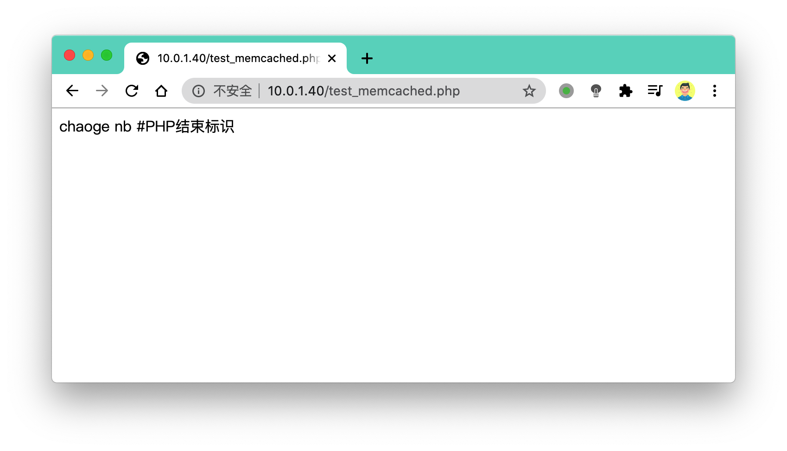

# Memadmin工具

在工作里，我们经常会去寻找一些强大的第三方工具，去帮助我们更方便的管理系统。

运维人员除了通过命令行的形式，去管理memcached，还可以使用一些很好用的第三方工具。例如memadmin工具，该软件依赖于PHP环境，且功能强大。

## 环境部署

该工具是基于PHP开发的，因此得部署好PHP环境，超哥前面已经带着大家部署了LNMP环境，因此直接进行操作即可。

```plain
1.获取软件包，官网http://www.junopen.com/memadmin/
下载地址：http://www.junopen.com/memadmin/memadmin-1.0.12.tar.gz
wget http://www.junopen.com/memadmin/memadmin-1.0.12.tar.gz
2.解压缩
[root@memcached01 opt]# tar -zxf memadmin-1.0.12.tar.gz
3.移动该程序，到lnmp站点下即可，此时去了解下nginx的配置
[root@memcached01 opt]# mv memadmin /opt/nginx-1.16.0/html/blog/
4.此时已经可以直接访问该程序
http://10.0.1.40/memadmin/index.php
默认的账号密码是 admin
```

### 新建连接

这样的数据库管理界面，最好是通过nginx进行访问限制，只能内网访问。


## 开始管理

只要memcached正确启动，连接的ip+port正确，即可进入管理

基本界面

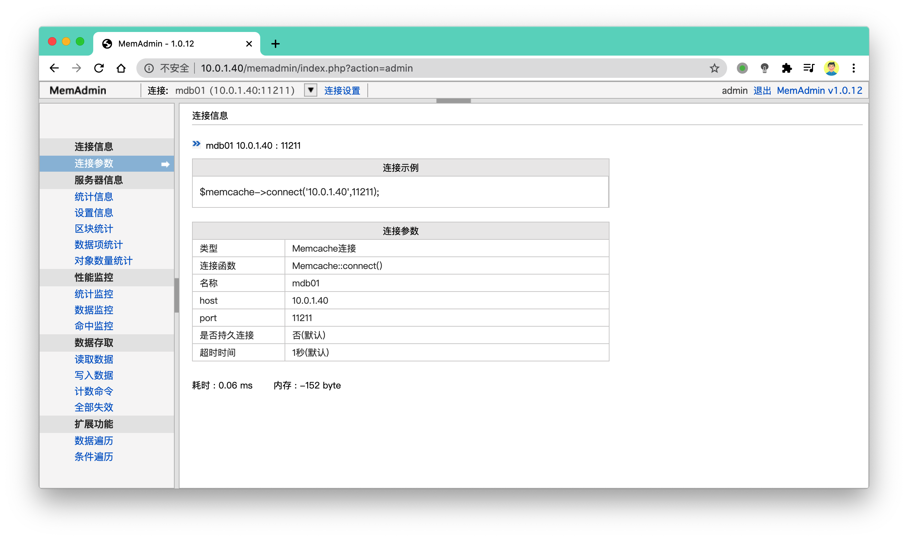

数据库统计信息

常见数据库的key信息如下，主要统计memcached的读写次数，总key等。


通过这样的页面，可以更为直观清晰的掌握数据库信息，这也是运维开发人员的重要技能。

### 统计get次数


设置监控刷新频率


```plain
[root@memcached01 blog]# printf "get chaoge01\r\n"|nc 10.0.1.40 11211
END
[root@memcached01 blog]# printf "get chaoge01\r\n"|nc 10.0.1.40 11211
END
[root@memcached01 blog]# printf "get chaoge01\r\n"|nc 10.0.1.40 11211
END
[root@memcached01 blog]# printf "get chaoge01\r\n"|nc 10.0.1.40 11211
END
```


### 统计get次数

```plain
[root@memcached01 blog]# printf "set name01 0 0 8\r\nchaoge66\r\n" | nc 10.0.1.40 11211
STORED
[root@memcached01 blog]# printf "set name02 0 0 8\r\nchaoge66\r\n" | nc 10.0.1.40 11211
STORED
```

### 统计多个指标


### 统计命中数

命中率就表示用户get查找数据，在memcached缓存中成功找到了。

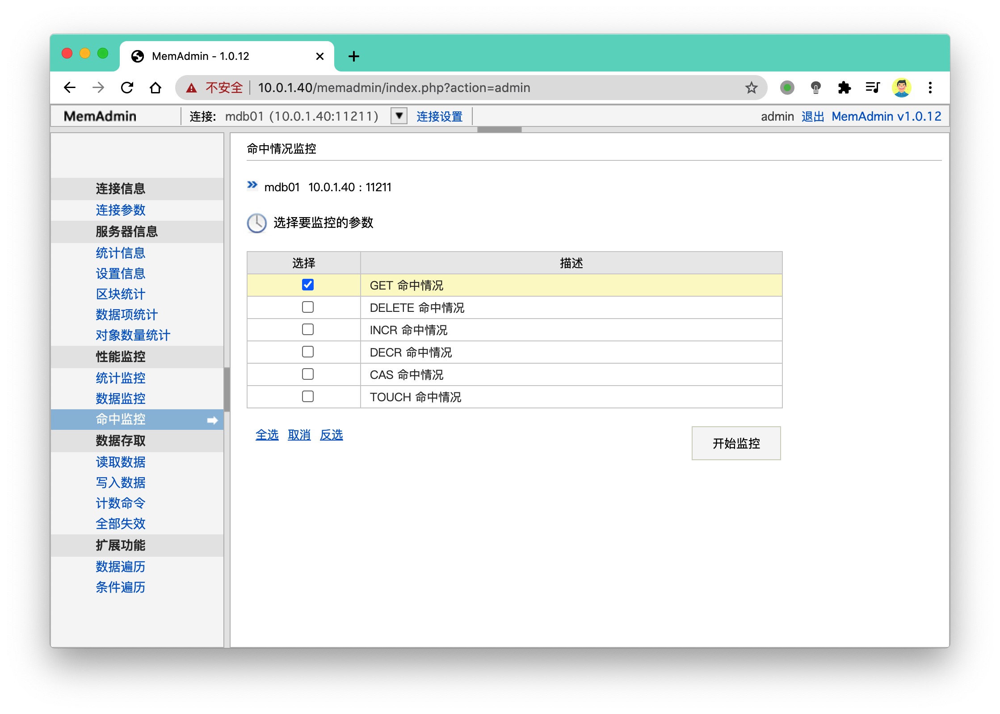

多次未找到数据，命中率越来越低

```plain
[root@memcached01 blog]# printf "get chaoge01\r\n"|nc 10.0.1.40 11211
END
[root@memcached01 blog]# printf "get chaoge01\r\n"|nc 10.0.1.40 11211
END
[root@memcached01 blog]# printf "get chaoge01\r\n"|nc 10.0.1.40 11211
END
[root@memcached01 blog]# printf "get chaoge01\r\n"|nc 10.0.1.40 11211
END
```

成功找到数据，命中率变高，运维同学可以根据此命中率，来判断，用户获取数据是否有缓存失效等问题

```plain
[root@memcached01 blog]# printf "get name01\r\n"|nc 10.0.1.40 11211
VALUE name01 0 8
chaoge66
END
[root@memcached01 blog]# printf "get name01\r\n"|nc 10.0.1.40 11211
VALUE name01 0 8
chaoge66
END
[root@memcached01 blog]# printf "get name01\r\n"|nc 10.0.1.40 11211
VALUE name01 0 8
chaoge66
END
[root@memcached01 blog]# printf "get name01\r\n"|nc 10.0.1.40 11211
VALUE name01 0 8
chaoge66
END
[root@memcached01 blog]# printf "get name01\r\n"|nc 10.0.1.40 11211
VALUE name01 0 8
chaoge66
END
```

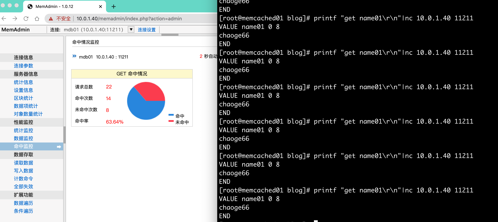

### 读写数据


获取数据


# memcached案例一

## 部署wordpress

```plain
1.准备好lnmp环境
可以去看超哥笔记
http://book.luffycity.com/linux-book/%E4%BC%81%E4%B8%9A%E7%BA%A7%E8%B4%9F%E8%BD%BD%E5%9D%87%E8%A1%A1%E5%AE%9E%E6%88%98/LNMP%E9%BB%84%E9%87%91%E6%9E%B6%E6%9E%84.html?h=wordpress
```

**2.注意严格按照超哥的笔记来操作，使用mysql，而不是mariadb数据库**

- wordpress只能用mysql，而不是mariadb。
  -且虚拟机的内存给大一点

## 部署memcached来缓存wordpress数据

```plain
wordpress缓存数据缓存到memcached中
https://cn.wordpress.org/plugins/memcached/
下载链接
wget https://downloads.wordpress.org/plugin/memcached.3.2.2.zip
#解压缩
unzip memcached.3.2.2.zip
# 得到配置文件
[root@memcached01 memcached]# pwd
/opt/memcached
[root@memcached01 memcached]# ls
object-cache.php  readme.txt
# 需要做做如下的事情
# 吧object-cache.php文件，移动到nginx站点下，也就是wordpress站点下
Install this file to wp-content/object-cache.php
# 操作如下
[root@memcached01 wp-content]# cd /opt/memcached
[root@memcached01 memcached]# ls
object-cache.php  readme.txt
[root@memcached01 memcached]#
[root@memcached01 memcached]# cp object-cache.php /opt/nginx-1.16.0/html/blog/wp-content/
# 修改该配置文件，修改wordpress的缓存放入memcached地址
[roo t@memcached01 wp-content]# grep 10.0.1.40 object-cache.php  -n
745:            $buckets = array( '10.0.1.40:11211' );
# 此时可以访问博客站点，，可以打开memadmin检测
```

此时使用memadmin来统计get命中率

其实在登录的时候，wordpress的数据以及缓存到memached里了

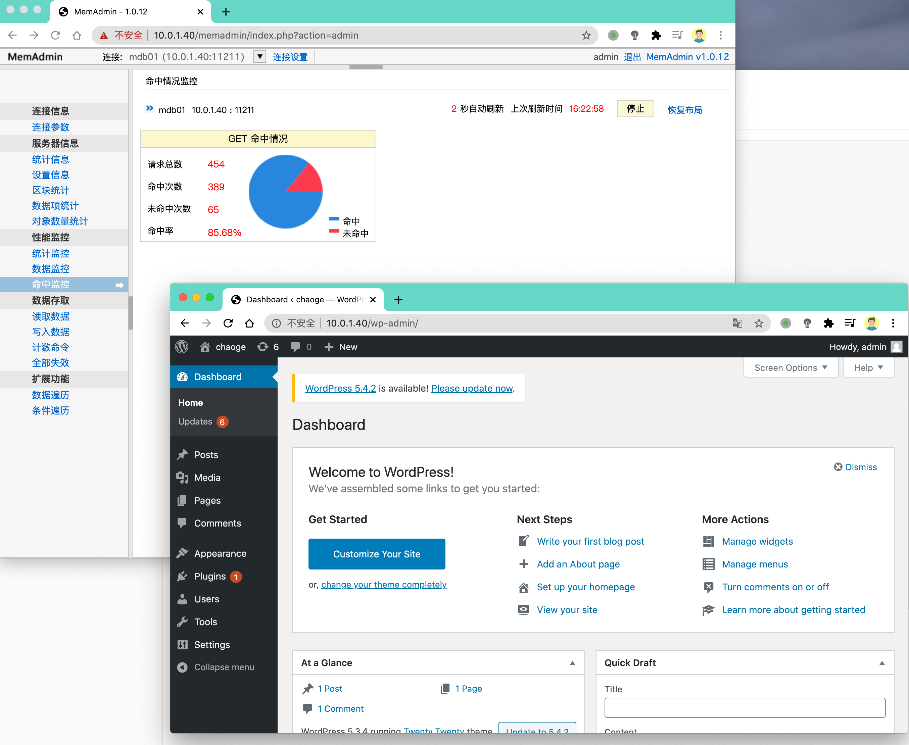

用wordpress来写一篇文章

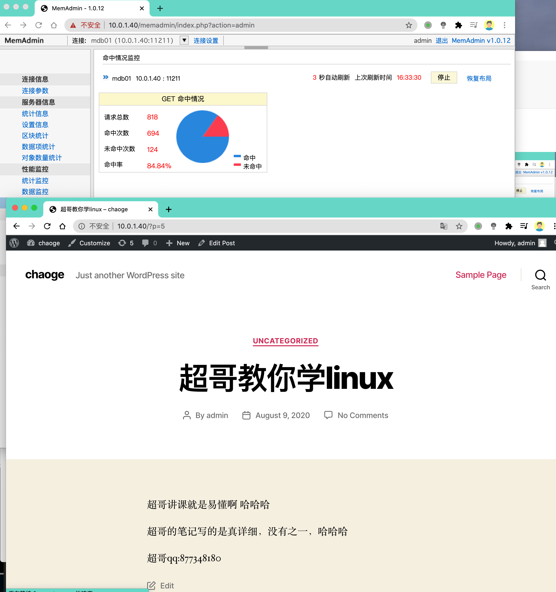

此时可以查看memcached的数据到底存了些什么

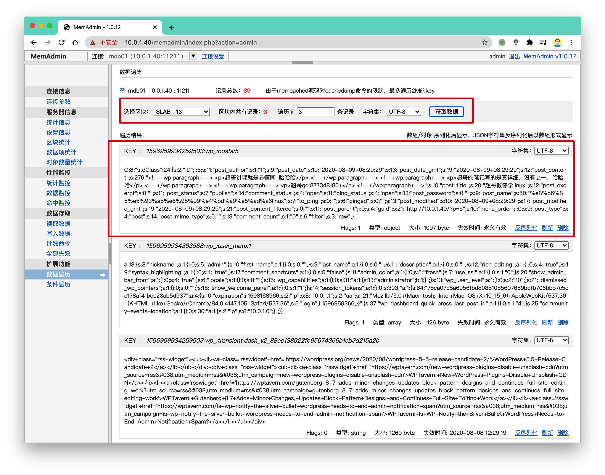

也可以在命令行中，登录查看wordpress数据

```plain
1.wordpress数据是存在mysql数据库的，且缓存到memcached里，加快访问，可以在mysql里找数据
大致SQL如下
mysql> show databases;
mysql> use wordpress;
mysql> shwo tables;
mysql> desc wp_posts;
select * from wp_posts where ID=6\G;
```

# memcached案例二(会话共享)

## session的作用

session主要是web开发中设置，服务器会为每个用户创建一个会话(session)，存储用户的相关信息，便于再后续的请求中，都能够定位同一个上下文。

```plain
例如你在登录了淘宝网之后，又继续点击淘宝网的其他页面进行了跳转，淘宝网是怎么知道，你还是你？这就是因为session的作用，服务器通过你的session记录，知道了你，还是你。
如果用户没有session，服务器会创建一个session独享，直到会话过期或者主动释放（用户退出登录），服务器才会终止session。
```


## 分布式架构的session

### 单体服务器架构

在单体服务器的年代，session直接保存在单台机器，完全没有任何问题，也就是我们学习的LNMP架构。

### 分布式架构

这就涉及到我们所学的web集群，lnmp集群了

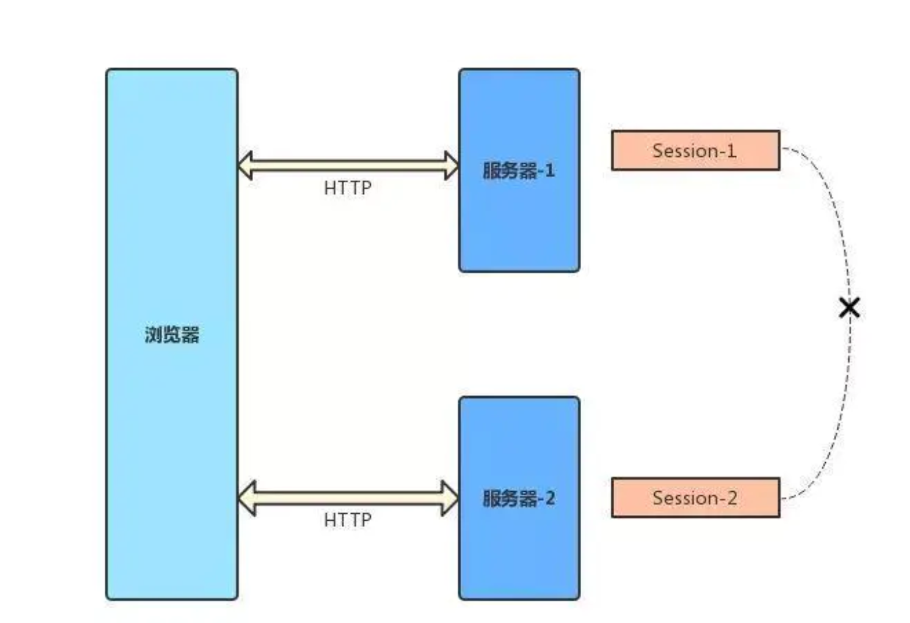

随着分布式架构的流行，单个服务器已经不能满足系统的需要了，通常都会把系统部署在多台服务器上，通过负载均衡把请求分发到其中的一台服务器上；

那么很有可能第一次请求访问的 A 服务器，创建了 Session ，但是第二次访问到了 B 服务器，这时就会出现取不到 Session 的情况；

于是，分布式架构中，Session 共享就成了一个很大的问题。

## 分布式架构session解决方案

- 禁用session

这种场景是存在的，当然不会用于普通的web站点，而是在一些【无状态服务】下进行的接口开发，每一次的接口访问，是不依赖于上一次的session的。这个我们了解即可。

- 存入cookie

cookie是存在用户浏览器本地的，如果我们把session也存入用户本地，这可以解决session分布式的问题，但是缺点也很大，就是信息不安全，如果黑客在你本地盗取了cookie，你的账户就有危险了。

- IP绑定策略

这种方案是利用负载均衡的IP绑定策略，例如超哥交给大家的Nginx负载均衡的算法，ip_hash，能够保证用户请求只发往一个后台机器，但是这种也有缺点，就是当后端对应的单台服务器如果挂掉，则会影响一大批用户，风险也很大。

- 服务器session同步

在服务器之间进行对session文件同步，可以保证每台服务器上都有有效的session信息，但是缺点是服务器规模如果较大，效率会很低，且有延迟。

- 【优选方案】使用缓存数据库

最优的方案是将用户session信息存入redis，memcached这样的数据库中，这的优点是

1.使用memcached进行session共享

2.可以水平扩展，增加memcached服务器

3.可以跨服务器进行session共享，甚至跨平台，如网页和app端

4.服务器重启数据也不丢失，这个得依赖于redis的持久化功能，memcached无法实现

## 部署memcached会话共享

完成session共享有如下2个方案：

```plain
1.通过程序实现，web01只需要向memcached里写入session，web01向memcached读取session，当做普通数据来读写
2.通过php的配置修改，php默认是将用户session存储在文件里，改为Memcached存储
```

## 修改php配置文件

```plain
有关session设置的，php配置文件，有如下
[root@memcached01 php7.3.5]# grep '^session'  lib/php.ini
session.save_handler = files
session.use_strict_mode = 0
session.use_cookies = 1
session.use_only_cookies = 1
session.name = PHPSESSID
session.auto_start = 0
session.cookie_lifetime = 0
session.cookie_path = /
session.cookie_domain =
session.cookie_httponly =
session.cookie_samesite =
session.serialize_handler = php
session.gc_probability = 1
session.gc_divisor = 1000
session.gc_maxlifetime = 1440
session.referer_check =
session.cache_limiter = nocache
session.cache_expire = 180
session.use_trans_sid = 0
session.sid_length = 26
session.trans_sid_tags = "a=href,area=href,frame=src,form="
session.sid_bits_per_character = 5
```

修改操作如下

修改两行有关会话数据的配置

```plain
[root@memcached01 php7.3.5]# grep 'session.save' lib/php.ini  -n
1337:; http://php.net/session.save-handler
1338:session.save_handler = files
1346:;     session.save_path = "N;/path"
1362:;     session.save_path = "N;MODE;/path"
1366:; http://php.net/session.save-path
1367:;session.save_path = "/tmp"
1458:;       (see session.save_path above), then garbage collection does *not*
```

修改命令

```plain
# 替换一行配置，并且在最底行加上一行配置
[root@memcached01 php7.3.5]# sed -i 's#session.save_handler = files#session.save_handler = memcache#;$a session.save_path = "tcp://10.0.1.40:11211"'  /opt/php7.3.5/lib/php.ini
# 检查替换结果
[root@memcached01 php7.3.5]# grep '^session.save' lib/php.ini  -n
1338:session.save_handler = memcache
1948:session.save_path = "tcp://10.0.1.40:11211"
```

再来检查php的配置，因为需要php能够支持session的处理，通过phpinfo检查，或者命令

```plain
[root@memcached01 php7.3.5]# /opt/php7.3.5/bin/php -i |grep session
# 或者添加phpinfo文件，在lnmp站点下
cat test_info.php
<?php
phpinfo();
?>
```


这里是告诉大家，如果你公司用的是php进行开发，那么php保存会话，写入到memcached的配置就是这样，改如上两行配置即可。当你公司用php开发的网站，用户登录后，php就会将用户的session信息，存入到memcached里，这就是我们运维人员所需要学会，以及执行的任务。


# 监控体系

# zabbix

## 什么是监控

我们的生活里，离不开监控，监控能够最大程度上，发挥如下作用

- 实时监测，即使你不在电脑前，也能实时掌握监控区域情况，提高工作效率
- 事后录像查询，如果不法事件未能即使发现制止，可以调取录像，让不法分子无处遁形。
- 给与不法分子震慑作用，当不法分子意识到自己暴露在监控内，就不敢使坏。
- 远程查看，远程操控，只需要联网，即可在任何设备上，试试查看监控。

## 服务器监控

## 为什么会有监控

### 运维的职责

```plain
1.保障企业数据的安全可靠。
2.为客户提供7*24小时服务。
3.不断提升用户的体验。
在关键时刻，提前提醒我们服务器要出问题了。
当出问题之后，可以便于找到问题的根源。
```

在有监控系统之前，运维人员需要登录服务器手动敲打命令来获取系统数据，例如前面超哥交给大家的iotop，glances，htop，free，ps等查看服务器状态的命令。

运维人员通过系统管理的命令来获取服务器数据，为了分析问题，可能会把数据复制到本地机器，通过excel等工具进行制表，画图分析服务器性能动态。

这种手动管理服务器的麻烦在于，服务器出现问题的时候，运维无法即使的发现，可能服务器内存满了，网站应用挂了，用户过来投诉才能发现，那此时老板可能会训斥运维同学一小时以上。。多么可怕。

## 有了监控软件之后

超哥作为一个运维，会使用监控系统查看服务器状态以及网站流量指标，利用监控系统的数据去了解上线发布的结果，和网站的健康状态。

利用一个优秀的监控软件，我们可以：

- 通过一个友好的界面进行浏览整个网站所有的服务器状态
- 可以在web前端方便的查看监控数据
- 可以回溯寻找事故发生时系统的问题和报警情况

有了一套完善的监控体系，你就可以悠闲的喝着咖啡干活，而不用提心吊胆。

监控系统是整个运维自动化体系中非常重要的环节，从服务器上架到机房，到最后下架回收，整个过程都应该有监控的存在。

- 服务器上架的硬件监控，检测线路，服务器接口状态
- 服务器运行时的监控，系统指标监控，且在出现异常的时候发出报警通知对应的人员
- 在服务器回收的时候，要取消硬件，软件的监控

并且大型公司还会对监控系统进行开发，确保有API能够方便的和其他部门同事进行协同工作。

## 互联网公司里的运维

一般公司里的运维，大致可以分为基础运维、应用运维、运维开发、监控组四大部分。

- 基础运维，负责IDC运维，服务器上下架，网络设备等
- 应用运维，也就是system administrator，系统管理员
- 运维开发，负责运维工具的开发，系统开发等，例如开发监控系统，代码发布系统
- 监控组，也就是24小时值班的人员，需要时刻关注服务器，网站的状况，出现问题后，第一时间联系相关运维以及研发人员。

### 运维的难处

国内的互联网大厂，拥有几百，几千台服务器是很常见的，因此运维工程师的招聘需求量很大，且工作量也很大，每天在几千台服务器上敲命令，查看系统状态，发布代码，任务是非常繁琐的。

国内常见的运维新闻就是：

- 又是一年一度的双十一，今晚又是一个不眠之夜，对于程序员，运维，整个IT团队都要熬夜了（但是他们的收益也是巨大的）
- 新浪某男星又被爆出丑闻，微博又瘫痪啦！

从这样的新闻就可以看出运维人员的难处，超哥也曾彻夜不眠的维护服务器，心塞呀。

超哥也还遇见过一些难事：

- 服务器崩溃，网站后台500挂了，由于没有监控，大伙都还不知道，直到其他部门的同事打来电话一顿凶
- 代码发布太过于繁琐，每一台机器都要自己手动执行部署，一台一台的检查
- 机器之间环境不统一，代码一样，但是这台能行，另一台就不行
- 分析问题困难，比如想要知道服务器历史状态，就比较麻烦
- 资产统计困难，作为运维新人，都不清晰公司的服务器架构，资产状况，那那能行？

### 所谓运维自动化


如上的这些问题，几乎所有的运维同学都会遇见过，那么成长之后的运维，如何解决这些问题？

- 硬件标准化，包括服务器所有的硬件指标
- 软件标准化，软件版本，系统环境一致性等
- 运维自动化，监控体系，代码发布体系，CMDB。

监控体系，部署如zabbix等系统实现：

- 系统状态监控
- 应用状态监控
- 出错时即使告警

发布系统，部署CI/CD运维体系：

- 代码发布
- 代码检查
- 代码回滚，发布

服务器标准化，部署如cobbler+pxe实现自动化装机，ansible实现工程自动化配置，做到硬件，软件的标准化。

CMDB系统，也读作配置管理数据库，存储了所有的运维数据，包括服务器硬件信息，网络设备信息，属于运维的心脏。

## 监控系统

监控系统是所有运维人的天眼，能够帮助你盯着服务器且在第一时间发现网站的问题，发出告警，通知运维同学解决问题。

### 监控生命周期

服务器上架机柜

进行基础设施监控

- 服务器温度，风扇转速（ipmitool命令对服务器进行远程管理，注意只能用在物理机，vmware不行）
- 存储的容量，性能（df，fdisk，dd，iotop）
- CPU性能好坏（lscpu，uptime，top，htop，glances）
- 内存容量（free）
- 网络情况（iftop,nethogs）

应用监控

- 数据库mysql,redis
- nginx
- php-fpm
- python

若是服务器在维护中，还得暂停监控指标，否则监控会不停的报警。

监控系统在运维自动化系统中，实现如下功能

- 监控数据收集，可视化展示（图表展示，柱状图，曲线图，折线图）
- 异常数据报警
- 结合如CMDB等系统协同工作

## 理想化的运维监控利器

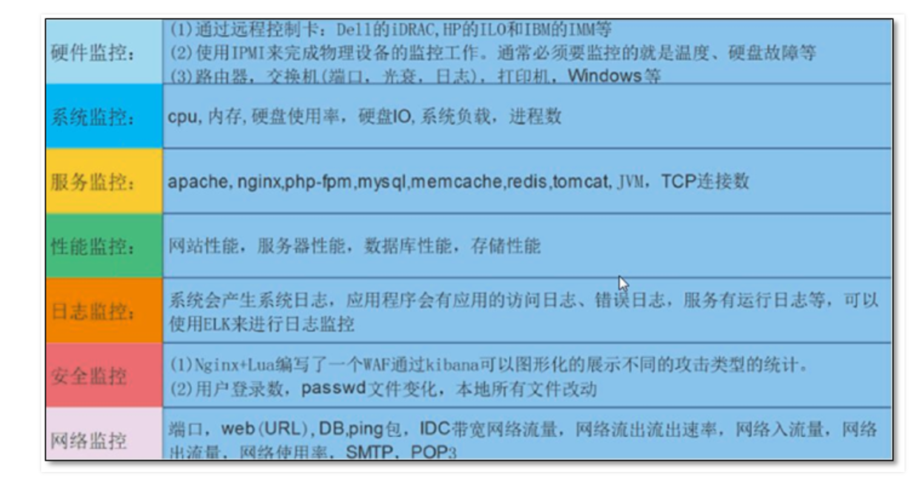

一个完善且理想的监控系统，得有如下特点

- 监控系统能够自定义监控的内容，自己通过脚本采集所需的数据
- 数据需要存入到数据库，日后对该数据进行分析计算
- 监控系统可以简易，快速的部署到服务器
- 数据可视化直观清晰

异常告警通知：

- 可以定义复杂度告警逻辑，做到监控项之间的关联告警，例如程序之间的依赖检测，而不是只单独检测某一个指标
- 告警可以确认响应，让运维组内的人知道已经有人在处理告警问题了
- 报警方式可以自定义，如短信，邮件，以及微信，钉钉等
- 告警内容可以自定义，能够写入一些简单的分析，便于运维人员直观了解数据，否则还得去服务器查看
- 报警后，可以预处理一些任务，如自我修复，重启，采集数据等

协同工作：

- 监控系统有强大的API，提供给研发同学调用，其他系统调用。
- 监控数据是开放性，数据结构主流，便于解析。
- 监控可视化可以简易的插件使用，而非复杂的js文件

# zabbix介绍

Zabbix 是由 Alexei Vladishev 开发的一种网络监视、管理系统，基于 Server-Client 架构。可用于监视各种网络服务、服务器和网络机器等状态。

使用各种 Database-end 如 MySQL, PostgreSQL, SQLite, Oracle 或 IBM DB2 储存资料。Server 端基于 C语言、Web 管理端 frontend 则是基于 PHP 所制作的。

Zabbix 可以使用多种方式监视。可以只使用 Simple Check 不需要安装 Client 端，亦可基于 SMTP 或 HTTP ... 各种协议定制监视。

　　在客户端如 UNIX, Windows 中安装 Zabbix Agent 之后，可监视 CPU Load、网络使用状况、硬盘容量等各种状态。而就算没有安装 Agent 在监视对象中，Zabbix 也可以经由 SNMP、TCP、ICMP、利用 IPMI、SSH、telnet 对目标进行监视。

Zabbbix自带的Item足够满足普通小公司的监控需求，对于大公司也可以设定自定义的Item，自动生成报表，也有API可以和其他系统集成。

## 为何是zabbix不是其他监控

zabbix就是可以满足理想化的监控系统需求

- 支持自定义监控脚本，提供需要输出的值即可
- zabbix存储的数据库表结构稍有复杂但是逻辑清晰
- zabbix存在模板的概念，可以方便的将一组监控项进行部署
- zabbix每一个item也就是监控项，都可以看到历史记录，且web界面友好
- zabbix有强大的Trigger(触发器)定义规则，可以定义复杂的报警逻辑
- zabbix提供了ack报警确认机制
- zabbix支持邮件，短信，微信等告警
- zabbix在触发告警后，可以远程执行系统命令
- zabbix有原生的PHP绘图模块

## zabbix专有词汇

对于英文的掌握，是IT人员必须学习的技能，以下是使用zabbix必须掌握的一些关键词

- zabbix server，服务端，收集数据，写入数据
- zabbix agent，部署在被监控的机器上，是一个进程，和zabbix server进行交互，以及负责执行命令
- Host，服务器的概念，指zabbix监控的实体，服务器，交换机等
- Hosts，主机组
- Applications，应用
- Events，事件
- Media，发送通知的通道
- Remote command，远程命令
- Template，模板
- Item，对于某一个指标的监控，称之为Items，如某台服务器的内存使用状况，就是一个item监控项
- Trigger，触发器，定义报警的逻辑，有正常，异常，未知三个状态
- Action，当Trigger符合设定值后，zabbix指定的动作，如发个邮件给超哥，说服务器有问题了

## zabbix程序组件

- Zabbix_server，服务端守护进程
- Zabbix_agentd，agent守护进程
- zabbix_proxy，代理服务器
- zabbix_database，存储系统，mysql，pgsql
- Zabbix_web，web GUI图形化界面
- Zabbix_get，命令行工具，测试向agent发起数据采集请求
- Zabbix_sender，命令行工具，测试向server发送数据
- Zabbix_java_gateway，java网关

# 安装zabbix5.0

5.0 版本对基础环境的要求有大的变化，最大的就是对 php 版本的要求，最低要求 7.2.0 版本,对 php 扩展组件版本也有要求，详见官网文档

```plain
https://www.zabbix.com/documentation/current/manual/installation/requirements
```

准备好一台linux服务器，ip地址，设置

```plain
[root@zabbix-server01 ~]# hostname
zabbix-server01
[root@zabbix-server01 ~]# ifconfig ens33 |awk 'NR==2{print $2}'
10.0.1.50
# 关闭防火墙，selinux
sed -i 's/SELINUX=enforcing/SELINUX=disabled/' /etc/selinux/config
systemctl disable --now firewalld
reboot
[root@zabbix-server01 ~]# free -m
              total        used        free      shared  buff/cache   available
Mem:           3773         106        3516          11         149        3454
Swap:          2047           0        2047
```

安装zabbix服务端配置

官网安装文档

```plain
https://www.zabbix.com/download?zabbix=5.0&os_distribution=red_hat_enterprise_linux&os_version=7&db=mysql&ws=apache
```

超哥的安装步骤

```plain
1.获取zabbix官方源
rpm -Uvh https://mirrors.aliyun.com/zabbix/zabbix/5.0/rhel/7/x86_64/zabbix-release-5.0-1.el7.noarch.rpm
# 这一步很重要
sed -i 's#http://repo.zabbix.com#https://mirrors.aliyun.com/zabbix#' /etc/yum.repos.d/zabbix.repo
yum clean all
2.安装zabbix server和agent
yum install zabbix-server-mysql zabbix-agent -y
3.安装 Software Collections，便于后续安装高版本的 php，默认 yum 安装的 php 版本为 5.4 过低。
SCL(Software Collections)可以让你在同一个操作系统上安装和使用多个版本的软件，而不会影响整个系统的安装包。
软件包会安装在/opt/rh目录下
为了避免系统广泛冲突，/opt/rh包安装在目录中，例如，这允许你在CentOS 7机器上安装Python 3.5，而不会删除或干扰Python 2.7.
/etc/opt/rh/软件包的所有配置文件都存储在目录中相应的目录中，SCL包提供了定义使用所包含应用程序所需的环境变量的shell脚本，例如，PATH，LD_LIBRARY_PATH和MANPATH ，这些脚本存储在文件系统中，作为 /opt/rh/package-name/enable 。
yum install centos-release-scl -y
4.修改zabbix前端源
vim /etc/yum.repos.d/zabbix.repo  
[zabbix-frontend]
name=Zabbix Official Repository frontend - $basearch
baseurl=https://mirrors.aliyun.com/zabbix/zabbix/5.0/rhel/7/$basearch/frontend
enabled=1        # 修改这里
gpgcheck=1
gpgkey=file:///etc/pki/rpm-gpg/RPM-GPG-KEY-ZABBIX-A14FE591
5.安装zabbix前端环境
yum install zabbix-web-mysql-scl zabbix-apache-conf-scl -y
6.安装zabbix所需的数据库，直接用centos7自带的mariadb
yum install mariadb-server -y
7.启动数据库，且配置开机启动
[root@zabbix-server01 opt]# systemctl enable --now mariadb
Created symlink from /etc/systemd/system/multi-user.target.wants/mariadb.service to /usr/lib/systemd/system/mariadb.service.
[root@z
8.初始化mariadb，设置root密码，chaoge666
mysql_secure_installation
9.使用root用户登录mariadb，建立zabbix数据库，这里的编码设置，非常重要，否则zabbix无法安装
create database zabbix character set utf8 collate utf8_bin;
create user zabbix@localhost identified by 'chaoge666';
grant all privileges on zabbix.* to zabbix@localhost;
flush privileges;
quit;
10.使用以下命令导入 zabbix 数据库，zabbix 数据库用户为 zabbix，密码为chaoge666
zcat /usr/share/doc/zabbix-server-mysql*/create.sql.gz | mysql -uzabbix -p zabbix
11.修改 zabbix server 配置文件/etc/zabbix/zabbix_server.conf 里的数据库密码
[root@zabbix-server01 data]# grep '^DBPassword' /etc/zabbix/zabbix_server.conf
DBPassword=chaoge666
12.修改 zabbix 的 php 配置文件 /etc/opt/rh/rh-php72/php-fpm.d/zabbix.conf 里的时区
[root@zabbix-server01 data]# grep 'timezone' /etc/opt/rh/rh-php72/php-fpm.d/zabbix.conf
php_value[date.timezone] = Asia/Shanghai
13.启动相关服务
systemctl restart zabbix-server zabbix-agent httpd rh-php72-php-fpm
systemctl enable zabbix-server zabbix-agent httpd rh-php72-php-fpm
14.访问zabbix入口
```


检查组件是否正常

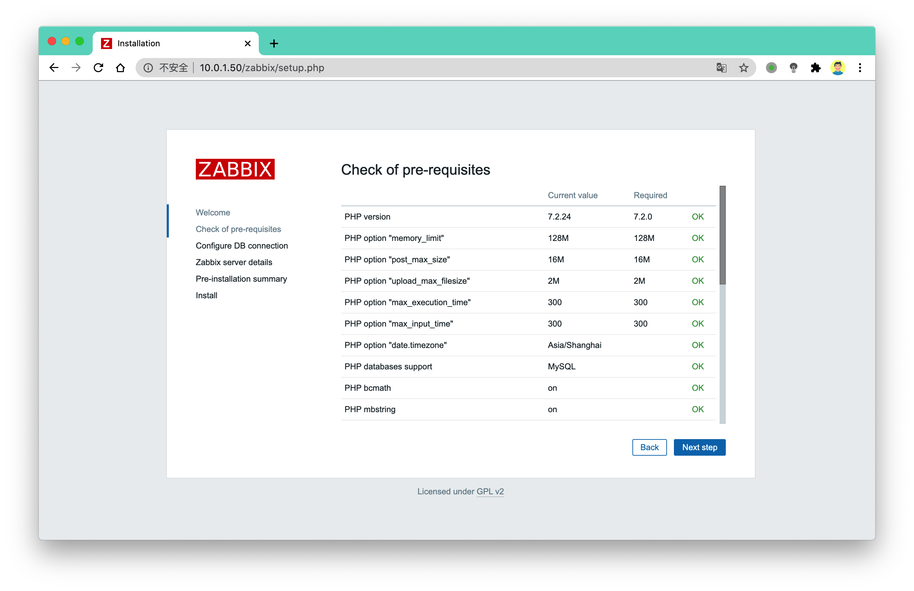

输入配置数据库 zabbix 用户的密码，chaoge666

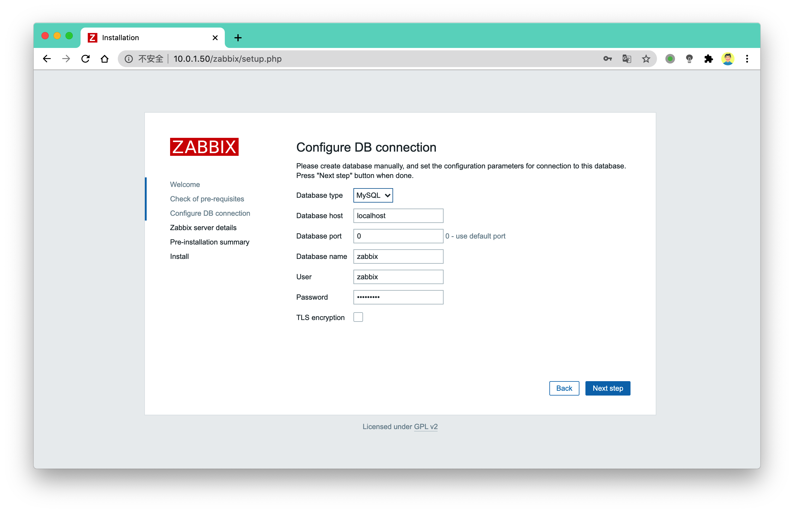

下一步


安装信息细节

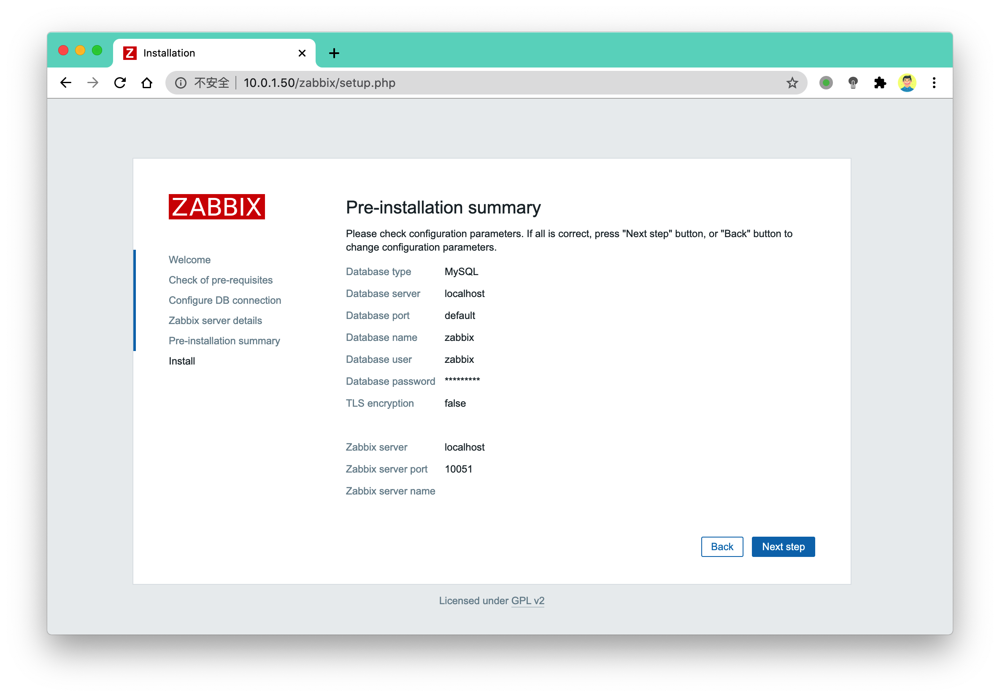

成功安装


登录账号为 Admin，密码：zabbix，注意大小写

## zabbix首页


# zabbix实践

## 修改zabbix语言


主页的仪表盘是可以编辑，随意拖动修改大小的

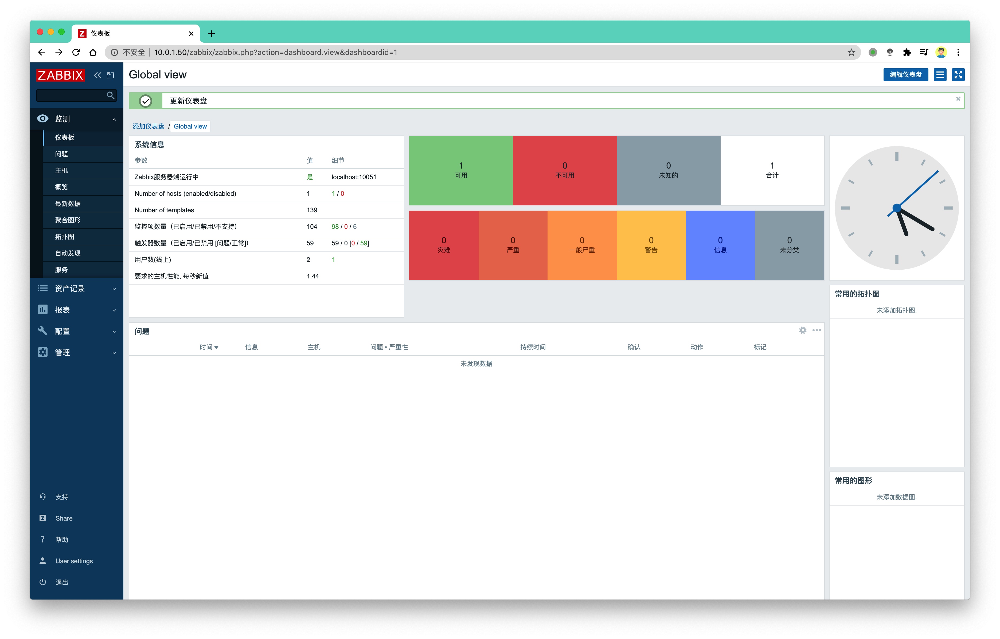

# 部署zabbix客户端

Zabbix 5.0 版本推出了使用 go 语言重写的 Agent2，也是 5.0 版本新特性，Agent2 有如下特性：

- 完成的插件框架支持，可扩张服务及应用监控
- 支持灵活的采集周期调度
- 更高效的数据采集及传输
- 可完全替换先有的 agent
- …..

特性较多，建议使用。

由于使用 go 语言编写,编译安装与之前版本有所区别。

Agent2 默认使用的 10050 端口，与 Zabbix Agent 端口一样，不修改端口情况下，同一台机器不能同时启动 Zabbix Agent 与 Zabbix Agent2。

## yum安装

再准备一台linux虚拟机，且配置好专有的yum源，参考超哥部署zabbix-server的yum源配置

```plain
# 信息
10.0.1.51
zbz-agent01
# yum源配置，防火墙关闭
# 注意时间正确
yum install ntpdate -y
ntpdate -u ntp.aliyun.com
mv /etc/localtime{,.bak}
ln -s /usr/share/zoneinfo/Asia/Shanghai /etc/localtime
```

安装步骤

```plain
1.安装agent2
yum install zabbix-agent2 -y
2.配置文件了解
默认配置文件为 /etc/zabbix/zabbix_agent2.conf
默认二进制文件为 /usr/sbin/zabbix_agent2
3.启动agent2且开机自启
systemctl enable --now zabbix-agent2
4.检查端口
[root@zbz-agent01 ~]# netstat -tunlp|grep zabbix
tcp6       0      0 :::10050                :::*                    LISTEN      1236/zabbix_agent2
5.查看systemctl管理的单元文件
[root@zbz-agent01 ~]# cat /lib/systemd/system/zabbix-agent2.service
```

修改agent2配置文件，修改如下，填写zabbix-server主机ip和主机名

```plain
[root@zbz-agent01 ~]# grep -Ev '^#|^$' /etc/zabbix/zabbix_agent2.conf
PidFile=/var/run/zabbix/zabbix_agent2.pid
LogFile=/var/log/zabbix/zabbix_agent2.log
LogFileSize=0
Server=10.0.1.50
ServerActive=10.0.1.50
Hostname=zbz-agent01
Include=/etc/zabbix/zabbix_agent2.d/*.conf
ControlSocket=/tmp/agent.sock
```

Server 和 ServerActive 配置为 zabibx server 或 zabbix proxy 地址，Hostname 配置为主机名即可。

Agent2 没有组件依赖，可直接拷贝编译好的二进制文件和配置文件在其他主机上运行即可。

改了配置文件，注意重启agent2

```plain
[root@zbz-agent01 ~]# systemctl restart zabbix-agent2
```

## 检测server-client连通性

zabbix-server

```plain
[root@zabbix-server01 alternatives]# yum install zabbix-get -y
[root@zabbix-server01 alternatives]# zabbix_get -s '10.0.1.51' -p 10050 -k "agent.ping"
1
[root@zabbix-server01 alternatives]# zabbix_get -s '10.0.1.51' -p 10050 -k "system.hostname"
zbz-agent01
```

## zabbix-server监控主机

默认zabbix5.0已经监控了自己


### 服务器可视化指标

点击对应主机的【图形】即可看见


### 解决zabbix乱码问题

上述的图标数据，下面的小白框表示乱码含义，是因为我们改了zabbix的语言为中文

服务器需要安装字体

```plain
[root@zabbix-server01 ~]# yum -y install wqy-microhei-fonts
[root@zabbix-server01 ~]# \cp /usr/share/fonts/wqy-microhei/wqy-microhei.ttc /usr/share/fonts/dejavu/DejaVuSans.ttf
[root@zabbix-server01 ~]#
此时zabbix已然正确展示中文数据
```


## 添加agent主机

选择创建主机

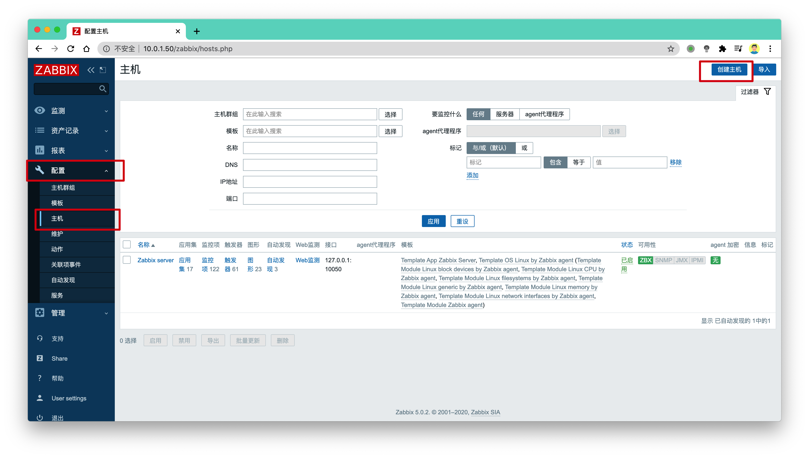

添加监控模板

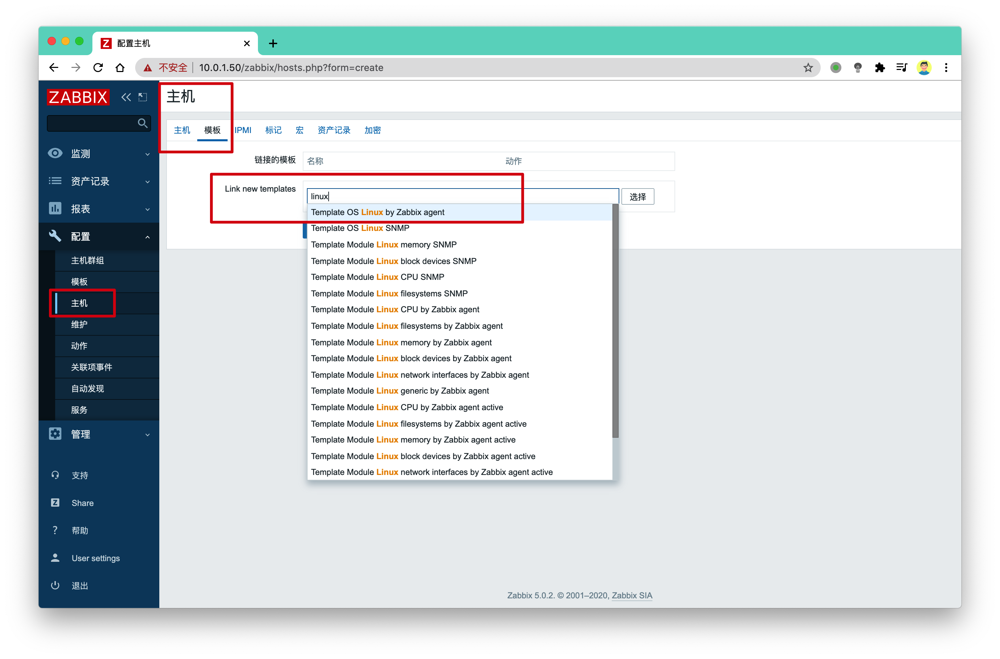

添加客户端主机01

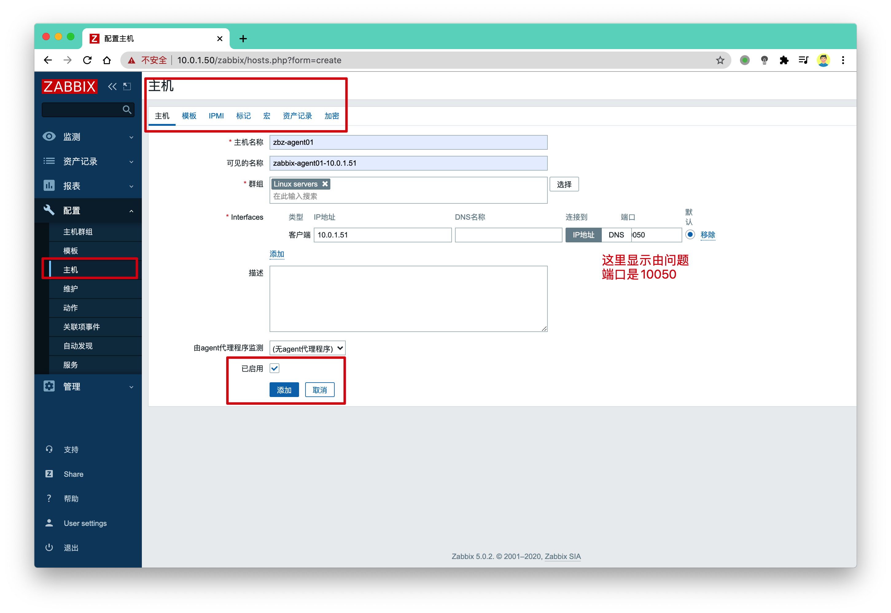

稍微等待会，结果如下，zabbix即正确的监控了agent01机器

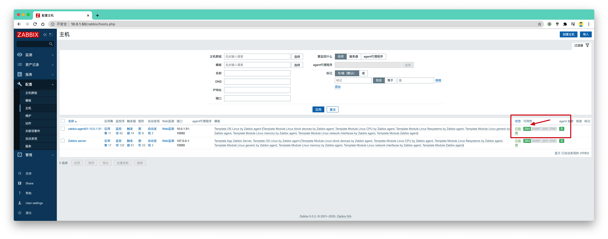

## 查看监控内容

在最新数据中，可以进行筛选，输入ip或者主机名都可以搜索出来

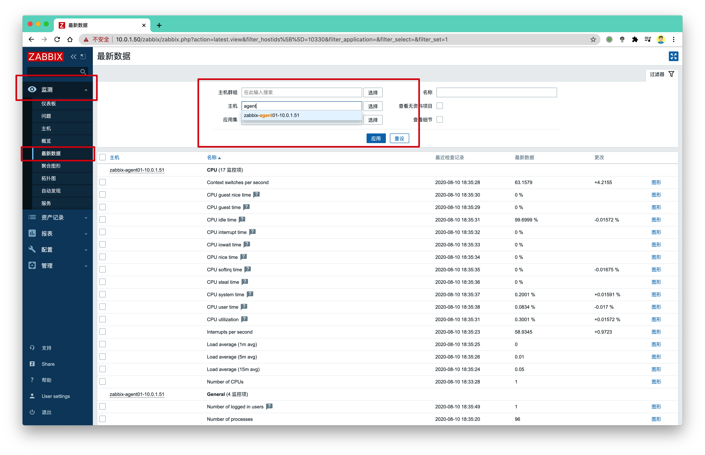

## 可视化监控agent的cpu动态

```plain
在agent01机器上，执行程序，消耗cpu
利用shell或者python皆可
```


## 自定义监控（制作模板）

zabbix自带模板`Template OS Linux (Template App Zabbix Agent)`提供CPU、内存、磁盘、网卡等常规监控，只要新加主机关联此模板，就可自动添加这些监控项。

### 制作模板(监控登录人数)

**需求：限制登录人数不超过三个，超过三人则发出报警**

服务器不希望有太多人在操作，除了管理员以外的人，人数超了，我就怀疑有问题，需要看看是谁，防止他乱操作服务器，给我们运维背锅呀。

### 自定义key

```plain
# zabbix自带的key
[root@zabbix-server01 ~]# zabbix_get -s 10.0.1.51 -p 10050 -k "system.uname"
Linux zbz-agent01 3.10.0-862.el7.x86_64 #1 SMP Fri Apr 20 16:44:24 UTC 2018 x86_64
[root@zabbix-server01 ~]#
[root@zabbix-server01 ~]#
[root@zabbix-server01 ~]# zabbix_get -s 10.0.1.51 -p 10050 -k "system.hostname"
zbz-agent01
# 若是写错了key，则报错，未知的指标
[root@zabbix-server01 ~]# zabbix_get -s 10.0.1.51 -p 10050 -k "system.hostname1"
ZBX_NOTSUPPORTED: Unknown metric system.hostname1
# 未登记，自定义的key，一样，位置的指标
[root@zabbix-server01 ~]# zabbix_get -s 10.0.1.51 -p 10050 -k "login.user"
ZBX_NOTSUPPORTED: Unknown metric login.user
```

我们需要自定义监控项

### 查看模板-监控项


```
监控项里的 【键值】
就是zabbix-get 使用的key
例如 ，检测客户端存活
[root@zabbix-server01 ~]# zabbix_get -s 10.0.1.51 -p 10050 -k "agent.ping"
1
# 检根文件系统空间大小
[root@zabbix-server01 ~]# zabbix_get -s 10.0.1.51 -p 10050 -k "vfs.fs.size[/,used]"
1217146880
[root@zabbix-server01 ~]# zabbix_get -s 10.0.1.51 -p 10050 -k "vfs.fs.size[/,total]"
18238930944
```


### 自定义监控项语法

当zabbix自带模板，以及监控项，无法满足我们需求，我们就可以自定义监控项

自定义监控其实就是添加监控的key，监控的命令

```plain
# 首先显示用户登录命令
who
who |wc -l  # 显示登录人数
```

需要添加监控项配置文件，路径

```plain
/etc/zabbix/zabbix_agent2.d/
# zabbix配置文件，大多数软件配置都会使用include形式来优化配置文件
[root@zbz-agent01 zabbix_agent2.d]# grep -i '^include' /etc/zabbix/zabbix_agent2.conf
Include=/etc/zabbix/zabbix_agent2.d/*.conf
# 自定义的配置文件，语法是
UserParameter=<key>,<shell command>
UserParameter=login-user,who|wc -l
UserParameter=login-user,/bin/sh /server/scripts/login.sh
# 超哥定义的配置文件，要注意的是key名要唯一，可以写入多个key
[root@zbz-agent01 zabbix_agent2.d]# cat /etc/zabbix/zabbix_agent2.d/userparameter_login.conf
UserParameter=login.user,who|wc -l
UserParameter=login.user2,who|wc -l
# 重启agent
systemctl restart zabbix-agent2
```

在服务端zabbix，用命令检测自定义的key

```plain
[root@zabbix-server01 ~]# zabbix_get -s 10.0.1.51 -p 10050 -k "login.user"
1
[root@zabbix-server01 ~]# zabbix_get -s 10.0.1.51 -p 10050 -k "login.user"
2
# 客户端
[root@zbz-agent01 zabbix_agent2.d]# who
root     pts/0        2020-08-11 01:39 (10.0.1.1)
root     pts/1        2020-08-11 09:52 (10.0.1.1)
```

### zabbix-server注册模板(页面操作)

上述是在命令行添加配置，下面就是页面操作了

整个流程是

- 创建模板
- 创建应用集：对监控项分类
- 创建监控项：定义item，监控的内容
- 创建触发器：当监控项获取到值，且达到触发条件就会告警
- 创建图形
- 主机进行模板关联

#### 创建模板


找到自己添加的模板


#### 创建应用集

应用集作用好比文件夹分类一样，作用是给监控项分类。


#### 添加监控项

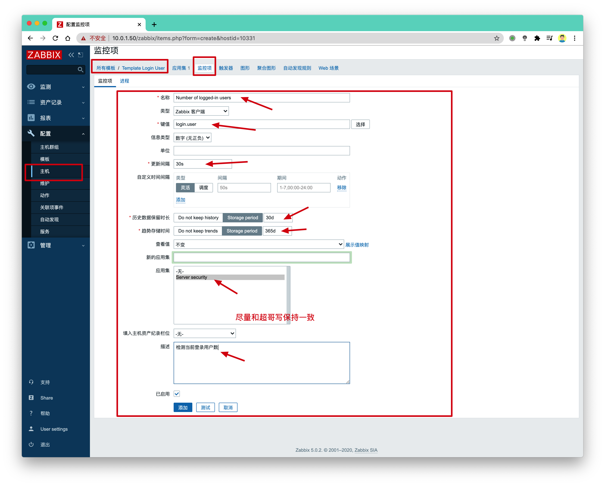

#### 创建触发器

创建触发器，当监控项获取的值，到达一定条件，就触发报警

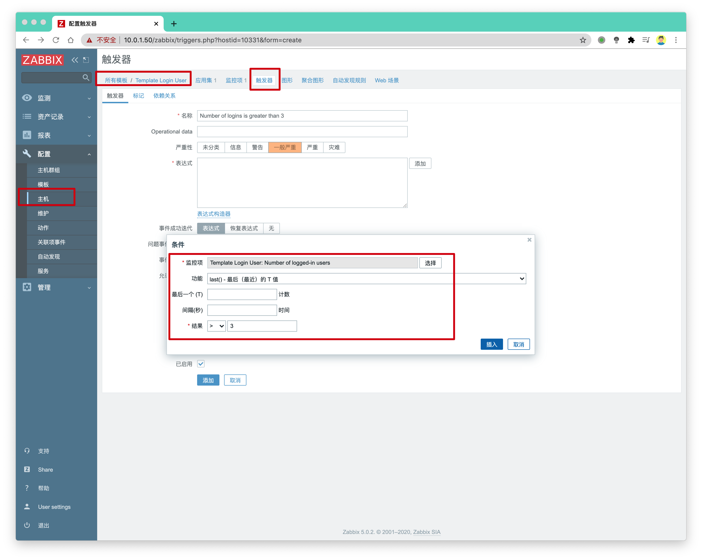

创建触发器

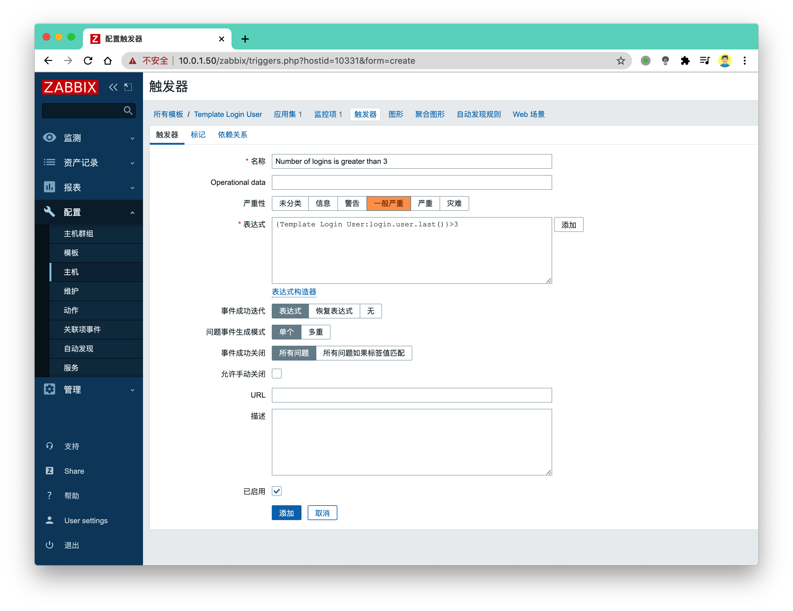

#### 创建图形

以图形的方式展示监控的信息


#### 主机关联模板

上述所有配置都是吧登录用户监控的模板添加好了，以及图形展示，但是还未绑定具体的服务器，那检测谁呢是不是


一个主机可以关联多个监控模板

#### 查看最新数据-图形

查看zabbix监控中的用户登录数

我们可以多登录些用户，超过3个，查看是否告警

```plain
[root@zabbix-server01 ~]# zabbix_get -s 10.0.1.51 -p 10050 -k "login.user"
4
```

#### 最新仪表盘数据

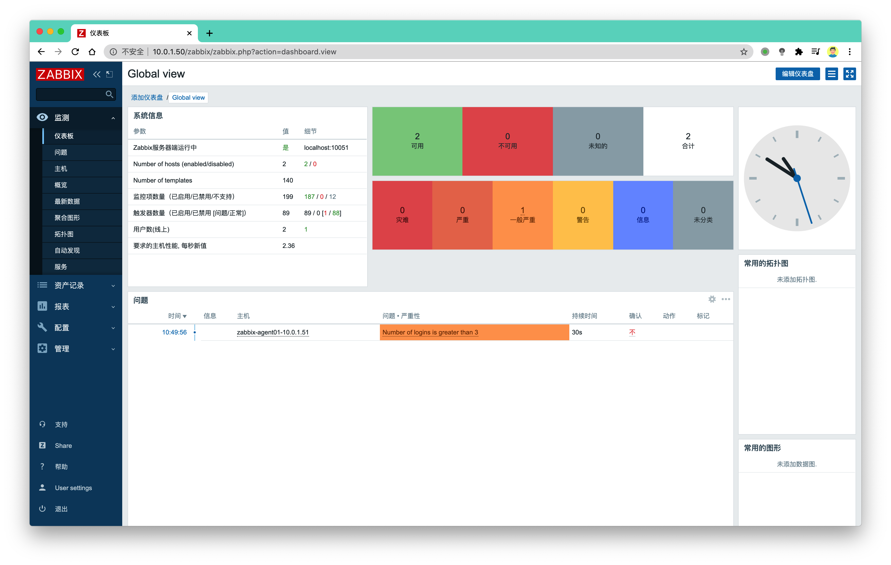

图形监控


#### 确认问题

管理员可以在线确认该问题，修改描述，也可以修复问题，如踢出多余登录的用户等。

如果想要手动关闭该问题，可以在`触发器`里设置，允许手动关闭该问题。


# zabbix进阶

## 邮件报警


设置收件人邮箱

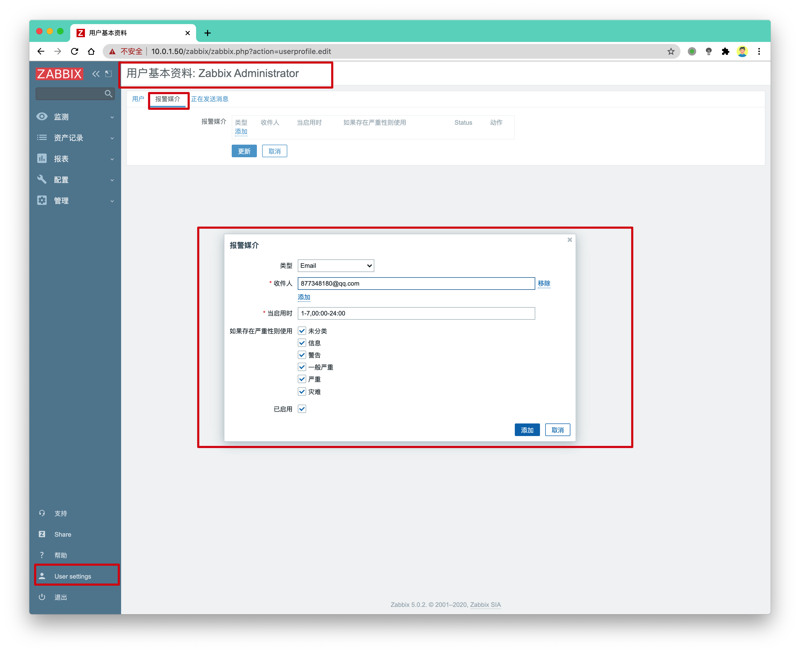

点击更新

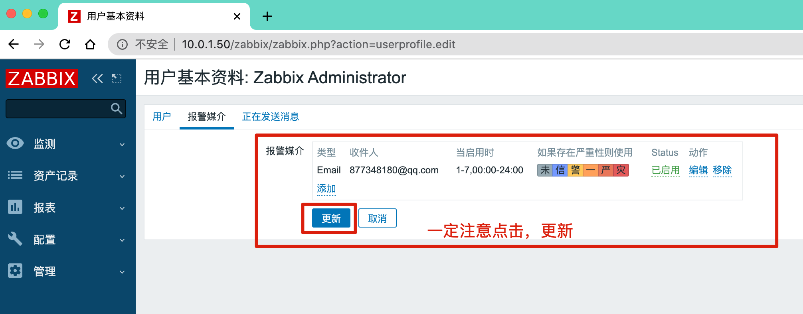

此时主机出现问题时，会发送邮件给指定的用户


以及邮箱会收到信息

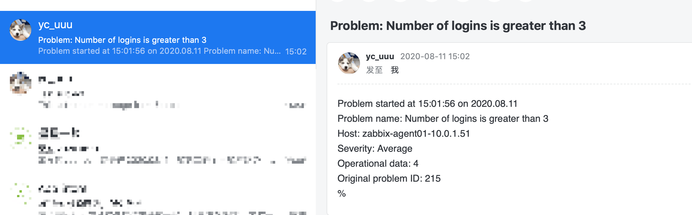

## 聚合图形

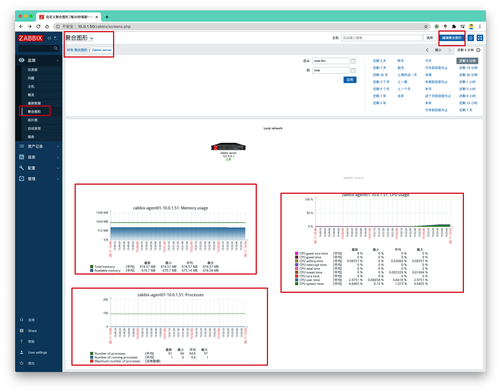

## 全网监控服务器

如何利用zabbix去监控我们整个的web集群，假如我们有50台，100台机器，该怎么去监控，手动的挨个添加？肯定不行。

### 监控方案

问题：如何快速添加100台机器

思路：

- 克隆监控模板
- 自动注册和自动发现
- 使用zabbix和api接口，利用curl，或者python进行开发自己的运维监控平台

```plain
接口指的就是，好比笔记本提供的一个USB接口，我们无论使用金士顿的U盘，还是其他厂家的U盘，只要是符合这个接口的U盘规格，都可以插入且使用U盘，读写U盘或者笔记本里的数据。
我们所使用的各种软件也是一样，也提供了API接口给与开发人员使用，便于获取数据。
[root@zabbix-server01 ~]# curl -i -X POST -H 'Content-Type:application/json' -d'{"jsonrpc": "2.0","method":"user.login","params":{"user":"Admin","password":"zabbix"},"auth": null,"id":0}' "http://10.0.1.50/zabbix/api_jsonrpc.php"
HTTP/1.1 200 OK
Date: Wed, 12 Aug 2020 01:29:46 GMT
Server: Apache/2.4.6 (CentOS)
X-Powered-By: PHP/7.2.24
Access-Control-Allow-Origin: *
Access-Control-Allow-Headers: Content-Type
Access-Control-Allow-Methods: POST
Access-Control-Max-Age: 1000
Transfer-Encoding: chunked
Content-Type: application/json
{"jsonrpc":"2.0","result":"43fb04aa42fb8c9f7cf2248fbeb77498","id":0}
```

### 监控方案实施

#### 硬件监控

zabbix自带的模板，已经包含主要的监控项


#### 应用服务监控

1.rsync备份服务器监控，监控rsync端口

```plain
1.监控873端口存活  net.tcp.port[,873]
2.模拟推拉文件，查看结果
```

2.监控NFS服务器

```plain
1.监控端口111的存活，  net.tcp.port[,111]
2.通过nfs命令查看，showmount -e ip|wc -l
```

3.监控mysql服务器

```plain
1.监控3306端口， net.tcp.port[,3006]
2.进行登录测试，mysql -uroot -p -h
3.zabbix-agent自定义的模板
```

4.监控web服务器

```plain
1.监控80端口，net.tcp.port[,80]
2.通过状态码查看，如zabbix自带的web监控
```

5.通过url地址监控

```plain
zabbix自带web检测
```

6.监控代理服务器

```plain
检测nginx代理端口
```

#### 监控服务通用方法

1.端口监控

```plain
使用netstat
ss
lsof
等命令
结合grep查看是否有结果
```

2.进程监控

```plain
通过ps命令结合grep查看
```

3.模拟客户端连接

```plain
web服务，通过curl命令访问
mysql，SQL语句验证
memcached，set写入，get获取，查看结果
```

## 客户端提前部署好

看下超哥前面的部署文档

```plain
[root@zbz-agent01 ~]# systemctl is-active  zabbix-agent2
active
```

可以再开一个机器，用于我们练习`自动发现、自动注册`

```plain
下载rpm环境
http://repo.zabbix.com/zabbix/5.0/rhel/7/x86_64/zabbix-agent2-5.0.2-1.el7.x86_64.rpm
安装
[root@vpn_server opt]# yum localinstall zabbix-agent2-5.0.2-1.el7.x86_64.rpm  -y
# 修改配置文件，启动zabbix-agent2
```

在zabbix-server服务端验证

```plain
[root@zabbix-server01 ~]# zabbix_get -s 10.0.1.63 -p 10050 -k 'agent.ping'
1
```

## 自动发现/自动注册

***自动发现：***

```plain
zabbix Server主动发现所有客户端，然后将客户端登记自己的小本本上，缺点zabbix server压力山大（网段大，客户端多），时间消耗多。
```

***自动注册：***

```plain
zabbix agent主动到zabbix Server上报到，登记；缺点agent有可能找不到Server（配置出错）
```

### 两种模式

```plain
被动模式：默认  agent被server抓取数据 （都是在agent的立场上说）
主动模式：agent主动将数据发到server端 （都是在agent的立场上说）
```

**注意：** **两种模式都是在agent**上进行配置

### hosts解析设置

客户端，服务端都给准备好

```plain
cat /etc/hosts
10.0.1.50 zabbix-server01
10.0.1.51 zbz-agent01
10.0.1.63 vpn_server
```

## 自动发现-被动模式

- 准备好zabbix-server
- zabbix-agent2

- - 10.0.1.51
  - 10.0..1.63


### 自动发现设置

**注意，提前启动好**`**zabbix-agent2**`


### 创建发现动作

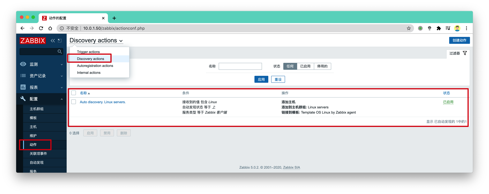

动作设置


自动发现，动作操作


### 等待客户端自动出现


## 自动注册-主动模式

1.配置安装好zabbix-server

2.安装配置好zabbix-agent2，还得添加额外的配置

```plain
1.在准备一台linux机器，安装配置zabbix-agent2
2.修改相关配置如下
[root@jumpserver opt 11:02:43]$grep -Ev '^#|^$' /etc/zabbix/zabbix_agent2.conf
PidFile=/var/run/zabbix/zabbix_agent2.pid
LogFile=/var/log/zabbix/zabbix_agent2.log
LogFileSize=0
Server=10.0.1.50
ServerActive=10.0.1.50
Hostname=jumpserver
HostnameItem=system.hostname        # 比之前多了一行这个配置
Include=/etc/zabbix/zabbix_agent2.d/*.conf
ControlSocket=/tmp/agent.sock
3.启动
systemctl start zabbix-agent2
4.去服务端验证
[root@zabbix-server01 ~]# zabbix_get -s 10.0.1.69 -p 10050 -k 'agent.ping'
1
```

### 在zabbix-server上配置

创建动作


添加动作条件


添加操作

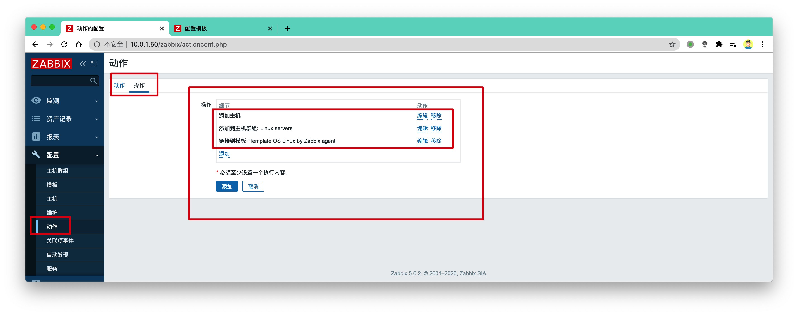

最后等待客户端，自动被添加即可


最后出现和超哥标记出来的主机就好啦


# 分布式监控与SNMP


我们看如上的场景，我们使用zabbix，如果是在一个局域网内中，监控agent没有任何问题，但是如果夸数据中心，跨越机房了，zabbix-server和zabbix-agent之间的延迟，可能会高到服务端认为客户端机器挂掉了。

那么这里我们就得使用zabbix支持的`分布式架构`功能。

zabbix支持proxy模式分布式，部署较为简单，proxy和zabbix-server一样，能够从被监控的主机上获取数据，且保存在本地数据库，达到一定条件之后，会吧这些数据发给zabbix-server，再进行后续的操作，例如执行触发器，发送报警等。

zabbix-server会定期将自己的配置，发送给proxy，这样保证配置都是在server上然后同步给proxy，保证分布式架构的一致性。

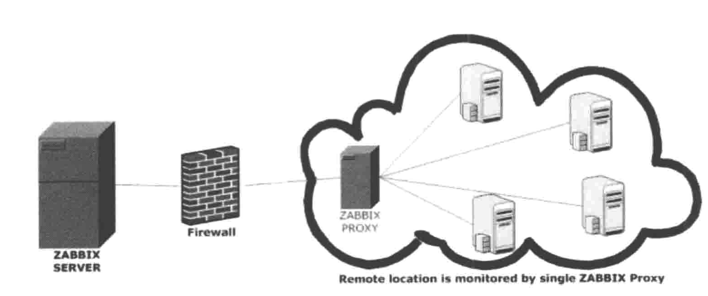

proxy也主要用来解决网络问题，比如公司一般会有多个IDC机房，由于网络地域原因，机房之间的互通性不太好，又可能有防火墙的问题导致zabbix-server和zabbix-server之间的连通性不好。

上图就是企业常见用法，在每个IDC机房里防止一个zabbix-proxy代理服务器用来检测本机房，这样我们只需要解决proxy和server之间的连通问题就好，zabbix-server和proxy之间的数据传输可靠性可以完全放心，proxy也会有缓存，保证数据的完整性。

```
分布式监控的作用
```

- 分担压力，降低server负载

- - Agent > Proxy > Server

- 多机房监控

- - 上海IDC > Proxy > Server

## 部署分布式监控

环境准备

```plain
zabbix-server      zabbix-server01      10.0.1.50
zabbix-proxy       vpn_server    10.0.1.63
zabbix-agent     zbz-agent01   10.0.1.51
确保三台机器的防火墙关闭
10.0.1.50 zabbix-server01
10.0.1.51 zbz-agent01
10.0.1.63 vpn_server
```

部署

```plain
1.确保zabbix-server配置的自动发现和自动注册都给关闭了，【注意】
2.zabbix-server 服务端无须变动，运行着就可以
3.准备vpn_server机器，部署数据库，存储agent的监控数据，最终发给server
# 确保准备好了zabbix的源
# 安装使用了mysql的proxy
1.获取zabbix官方源
rpm -Uvh https://mirrors.aliyun.com/zabbix/zabbix/5.0/rhel/7/x86_64/zabbix-release-5.0-1.el7.noarch.rpm
# 这一步很重要
sed -i 's#http://repo.zabbix.com#https://mirrors.aliyun.com/zabbix#' /etc/yum.repos.d/zabbix.repo
#安装
[root@vpn_server ~]# yum install zabbix-proxy-mysql zabbix-get -y
4.安装部署数据库
[root@zbz-agent01 ~]# yum install mariadb-server mariadb -y
[root@vpn_server ~]# systemctl start mariadb
5.建立数据库用户
mysql
create database zabbix_proxy character set utf8 collate utf8_bin;
grant all privileges on zabbix_proxy.* to zabbix@'localhost' identified by 'zabbix';
flush privileges;
exit
6.导入zabbix-proxy数据文件
[root@vpn_server ~]# rpm -ql zabbix-proxy-mysql
/etc/logrotate.d/zabbix-proxy
/etc/zabbix/zabbix_proxy.conf
/usr/lib/systemd/system/zabbix-proxy.service
/usr/lib/tmpfiles.d/zabbix-proxy.conf
/usr/lib/zabbix/externalscripts
/usr/sbin/zabbix_proxy_mysql
/usr/share/doc/zabbix-proxy-mysql-5.0.2
/usr/share/doc/zabbix-proxy-mysql-5.0.2/AUTHORS
/usr/share/doc/zabbix-proxy-mysql-5.0.2/COPYING
/usr/share/doc/zabbix-proxy-mysql-5.0.2/ChangeLog
/usr/share/doc/zabbix-proxy-mysql-5.0.2/NEWS
/usr/share/doc/zabbix-proxy-mysql-5.0.2/README
/usr/share/doc/zabbix-proxy-mysql-5.0.2/schema.sql.gz
/usr/share/man/man8/zabbix_proxy.8.gz
/var/log/zabbix
/var/run/zabbix
# 导入数据
zcat /usr/share/doc/zabbix-proxy-mysql-5.0.2/schema.sql.gz |mysql -uzabbix -pzabbix zabbix_proxy
7.修改proxy配置，连接数据库
sed -i.ori '162a DBPassword=zabbix' /etc/zabbix/zabbix_proxy.conf
sed -i 's#Server=127.0.0.1#Server=10.0.1.50#' /etc/zabbix/zabbix_proxy.conf
sed -i 's#Hostname=Zabbix proxy#Hostname=zbz-agent01#' /etc/zabbix/zabbix_proxy.conf
8.检查zabbix-proxy配置
[root@vpn_server ~]# grep ^'[a-Z]' /etc/zabbix/zabbix_proxy.conf
Server=10.0.1.50
ServerPort=10051
Hostname=vpn_server
LogFile=/var/log/zabbix/zabbix_proxy.log
LogFileSize=0
PidFile=/var/run/zabbix/zabbix_proxy.pid
SocketDir=/var/run/zabbix
DBHost=localhost
DBPassword=zabbix
DBName=zabbix_proxy
DBUser=zabbix
SNMPTrapperFile=/var/log/snmptrap/snmptrap.log
Timeout=4
ExternalScripts=/usr/lib/zabbix/externalscripts
LogSlowQueries=3000
StatsAllowedIP=127.0.0.1
9.启动zabbix-proxy服务
systemctl restart zabbix-proxy.service
```

此时日志应该会报错，还得再web界面操作，添加proxy信息，才能正常通信。

### web页面添加代理

### 创建代理

稍等片刻后，server即可找到代理


```plain
从日志中，我们可以看出，发生了什么
[root@zabbix-server01 ~]# tail -f /var/log/zabbix/zabbix_server.log
 12040:20200812:171223.145 cannot parse proxy data from active proxy at "10.0.1.63": proxy "vpn_server" not found
 12042:20200812:171224.147 cannot parse proxy data from active proxy at "10.0.1.63": proxy "vpn_server" not found
 12042:20200812:171225.151 cannot parse proxy data from active proxy at "10.0.1.63": proxy "vpn_server" not found
 12042:20200812:171226.158 cannot parse proxy data from active proxy at "10.0.1.63": proxy "vpn_server" not found
 12042:20200812:171227.161 cannot parse proxy data from active proxy at "10.0.1.63": proxy "vpn_server" not found
 12042:20200812:171228.164 cannot parse proxy data from active proxy at "10.0.1.63": proxy "vpn_server" not found
 12044:20200812:171229.168 cannot parse proxy data from active proxy at "10.0.1.63": proxy "vpn_server" not found
 12044:20200812:171230.171 cannot parse proxy data from active proxy at "10.0.1.63": proxy "vpn_server" not found
 12044:20200812:171231.175 cannot parse proxy data from active proxy at "10.0.1.63": proxy "vpn_server" not found
 12042:20200812:171253.214 sending configuration data to proxy "vpn_server" at "10.0.1.63", datalen 3662
```

此时proxy和server已经正确可以通信了

### Agent客户端配置

跟着超哥的配置来，除了官网，以及日志分析，不要去相信乱七八糟的教程！！


```plain
1.修改agent配置，指向proxy
# 检查配置
[root@zbz-agent01 ~]# egrep -i '^server|^hostname' /etc/zabbix/zabbix_agent2.conf
Server=10.0.1.63
ServerActive=10.0.1.63
Hostname=zbz-agent01  
# 重启agent
[root@zbz-agent01 ~]# systemctl restart zabbix-agent2
```

这一切都可以通过日志来看到结果

```plain
# 我们可以模拟，停掉zabbix-agent，查看server和proxy的日志
[root@vpn_server ~]# tail /var/log/zabbix/zabbix_proxy.log
  3655:20200812:173017.815 proxy #17 started [task manager #1]
  3666:20200812:173017.845 proxy #28 started [preprocessing worker #3]
  3664:20200812:173017.845 proxy #26 started [preprocessing worker #1]
  3665:20200812:173017.893 proxy #27 started [preprocessing worker #2]
  3656:20200812:173018.854 enabling Zabbix agent checks on host "zbz-agent01": host became available
  3656:20200812:173051.020 Zabbix agent item "vfs.fs.size[/,total]" on host "zbz-agent01" failed: first network error, wait for 15 seconds
  3661:20200812:173106.920 Zabbix agent item "vm.memory.size[available]" on host "zbz-agent01" failed: another network error, wait for 15 seconds
  3661:20200812:173121.939 Zabbix agent item "net.tcp.port[<10.0.1.51>,3306]" on host "zbz-agent01" failed: another network error, wait for 15 seconds
  3661:20200812:173136.959 temporarily disabling Zabbix agent checks on host "zbz-agent01": host unavailable
  3661:20200812:173236.020 enabling Zabbix agent checks on host "zbz-agent01": host became available
```


# SNMP监控

如果我们需要监控打印机、路由器等设备,肯定不能使用 zabbix agentd,因为他们不能安装软件

还好他们一般都支持SNMP协议,这样我可以使用SNMP来监控他们.如果你希望使用SNMP-agent来获取这些设备的信息

那么在安装 zabbix server 的时候你需要增加 snmp 的支持，备注:SNMP 检查基于 UDP 协议。

```plain
snmp simple network manager protocol 简单网络管理协议
　很多无法安装zabbix-agent的设备，都可以通过snmp协议监控
```

部署

```plain
1.服务端安装snmp程序
[root@zabbix-server01 ~]# yum -y install net-snmp net-snmp-utils
2.配置snmp程序
# 开启snmp的配置
sed -i.ori '57a view systemview   included  .1' /etc/snmp/snmpd.conf
systemctl start snmpd.service
3.测试snmp命令
snmpwalk -v 2c -c public 127.0.0.1 sysname
# 参数解释
# snmpwalk 类似 zabbix_get
# -v 2c  指定使用snmp协议的版本  snmp分为v1 v2 v3
# -c public  指定暗号
# sysname  类似zabbix的key
[root@zabbix-server01 ~]# snmpwalk -v 2c -c public 127.0.0.1 sysname
SNMPv2-MIB::sysName.0 = STRING: zabbix-server01
```

## snmp-OID

Zabbix的snmp监控还没开始讲，不过先给大家列一些snmp常用的一些OID，比如cpu、内存、硬盘什么的。

先了解这些，再使用snmp监控服务器。

SNMP代理提供大量的对象标识符（OID－Object Identifiers）。一个OID是一个唯一的键值对。该代理存放这些值并让它们可用。

用法

```plain
[root@zabbix-server01 ~]# snmpwalk -v 2c -c public 127.0.0.1 .1.3.6.1.2.1.1.5.0
SNMPv2-MIB::sysName.0 = STRING: zabbix-server01
[root@zabbix-server01 ~]# snmpwalk -v 2c -c public 127.0.0.1 .1.3.6.1.2.1.1.1.0
SNMPv2-MIB::sysDescr.0 = STRING: Linux zabbix-server01 3.10.0-862.el7.x86_64 #1 SMP Fri Apr 20 16:44:24 UTC 2018 x86_64
[root@zabbix-server01 ~]#
```

| 系统参数（1.3.6.1.2.1.1） |                    |                   |          |
| ------------------------- | ------------------ | ----------------- | -------- |
| OID                       | 描述               | 备注              | 请求方式 |
| .1.3.6.1.2.1.1.1.0        | 获取系统基本信息   | SysDesc           | GET      |
| .1.3.6.1.2.1.1.3.0        | 监控时间           | sysUptime         | GET      |
| .1.3.6.1.2.1.1.4.0        | 系统联系人         | sysContact        | GET      |
| .1.3.6.1.2.1.1.5.0        | 获取机器名         | SysName           | GET      |
| .1.3.6.1.2.1.1.6.0        | 机器坐在位置       | SysLocation       | GET      |
| .1.3.6.1.2.1.1.7.0        | 机器提供的服务     | SysService        | GET      |
| .1.3.6.1.2.1.25.4.2.1.2   | 系统运行的进程列表 | hrSWRunName       | WALK     |
| .1.3.6.1.2.1.25.6.3.1.2   | 系统安装的软件列表 | hrSWInstalledName | WALK     |

|                       | 网络接口（1.3.6.1.2.1.2）          |                |              |      |
| --------------------- | ---------------------------------- | -------------- | ------------ | ---- |
| OID                   | 描述                               | 备注           | 请求方式     |      |
| .1.3.6.1.2.1.2.1.0    | 网络接口的数目                     | IfNumber       | GET          |      |
| .1.3.6.1.2.1.2.2.1.2  | 网络接口信息描述                   | IfDescr        | WALK         |      |
| .1.3.6.1.2.1.2.2.1.3  | 网络接口类型                       | IfType         | WALK         |      |
| .1.3.6.1.2.1.2.2.1.4  | 接口发送和接收的最大IP数据报[BYTE] | IfMTU          | WALK         |      |
| .1.3.6.1.2.1.2.2.1.5  | 接口当前带宽[bps]                  | IfSpeed        | WALK         |      |
| .1.3.6.1.2.1.2.2.1.6  | 接口的物理地址                     | IfPhysAddress  | WALK         |      |
| .1.3.6.1.2.1.2.2.1.8  | 接口当前操作状态[up\               | down]          | IfOperStatus | WALK |
| .1.3.6.1.2.1.2.2.1.10 | 接口收到的字节数                   | IfInOctet      | WALK         |      |
| .1.3.6.1.2.1.2.2.1.16 | 接口发送的字节数                   | IfOutOctet     | WALK         |      |
| .1.3.6.1.2.1.2.2.1.11 | 接口收到的数据包个数               | IfInUcastPkts  | WALK         |      |
| .1.3.6.1.2.1.2.2.1.17 | 接口发送的数据包个数               | IfOutUcastPkts | WALK         |      |

| CPU及负载                  |                                 |                 |          |
| -------------------------- | ------------------------------- | --------------- | -------- |
| OID                        | 描述                            | 备注            | 请求方式 |
| . 1.3.6.1.4.1.2021.11.9.0  | 用户CPU百分比                   | ssCpuUser       | GET      |
| . 1.3.6.1.4.1.2021.11.10.0 | 系统CPU百分比                   | ssCpuSystem     | GET      |
| . 1.3.6.1.4.1.2021.11.11.0 | 空闲CPU百分比                   | ssCpuIdle       | GET      |
| . 1.3.6.1.4.1.2021.11.50.0 | 原始用户CPU使用时间             | ssCpuRawUser    | GET      |
| .1.3.6.1.4.1.2021.11.51.0  | 原始nice占用时间                | ssCpuRawNice    | GET      |
| . 1.3.6.1.4.1.2021.11.52.0 | 原始系统CPU使用时间             | ssCpuRawSystem. | GET      |
| . 1.3.6.1.4.1.2021.11.53.0 | 原始CPU空闲时间                 | ssCpuRawIdle    | GET      |
| . 1.3.6.1.2.1.25.3.3.1.2   | CPU的当前负载，N个核就有N个负载 | hrProcessorLoad | WALK     |
| . 1.3.6.1.4.1.2021.11.3.0  | ssSwapIn                        | GET             |          |
| . 1.3.6.1.4.1.2021.11.4.0  | SsSwapOut                       | GET             |          |
| . 1.3.6.1.4.1.2021.11.5.0  | ssIOSent                        | GET             |          |
| . 1.3.6.1.4.1.2021.11.6.0  | ssIOReceive                     | GET             |          |
| . 1.3.6.1.4.1.2021.11.7.0  | ssSysInterrupts                 | GET             |          |
| . 1.3.6.1.4.1.2021.11.8.0  | ssSysContext                    | GET             |          |
| . 1.3.6.1.4.1.2021.11.54.0 | ssCpuRawWait                    | GET             |          |
| . 1.3.6.1.4.1.2021.11.56.0 | ssCpuRawInterrupt               | GET             |          |
| . 1.3.6.1.4.1.2021.11.57.0 | ssIORawSent                     | GET             |          |
| . 1.3.6.1.4.1.2021.11.58.0 | ssIORawReceived                 | GET             |          |
| . 1.3.6.1.4.1.2021.11.59.0 | ssRawInterrupts                 | GET             |          |
| . 1.3.6.1.4.1.2021.11.60.0 | ssRawContexts                   | GET             |          |
| . 1.3.6.1.4.1.2021.11.61.0 | ssCpuRawSoftIRQ                 | GET             |          |
| . 1.3.6.1.4.1.2021.11.62.0 | ssRawSwapIn.                    | GET             |          |
| . 1.3.6.1.4.1.2021.11.63.0 | ssRawSwapOut                    | GET             |          |
| .1.3.6.1.4.1.2021.10.1.3.1 | Load5                           | GET             |          |
| .1.3.6.1.4.1.2021.10.1.3.2 | Load10                          | GET             |          |
| .1.3.6.1.4.1.2021.10.1.3.3 | Load15                          | GET             |          |

| 内存及磁盘（1.3.6.1.2.1.25） |                                         |                          |          |
| ---------------------------- | --------------------------------------- | ------------------------ | -------- |
| OID                          | 描述                                    | 备注                     | 请求方式 |
| .1.3.6.1.2.1.25.2.2.0        | 获取内存大小                            | hrMemorySize             | GET      |
| .1.3.6.1.2.1.25.2.3.1.1      | 存储设备编号                            | hrStorageIndex           | WALK     |
| .1.3.6.1.2.1.25.2.3.1.2      | 存储设备类型                            | hrStorageType[OID]       | WALK     |
| .1.3.6.1.2.1.25.2.3.1.3      | 存储设备描述                            | hrStorageDescr           | WALK     |
| .1.3.6.1.2.1.25.2.3.1.4      | 簇的大小                                | hrStorageAllocationUnits | WALK     |
| .1.3.6.1.2.1.25.2.3.1.5      | 簇的的数目                              | hrStorageSize            | WALK     |
| .1.3.6.1.2.1.25.2.3.1.6      | 使用多少，跟总容量相除就是占用率        | hrStorageUsed            | WALK     |
| .1.3.6.1.4.1.2021.4.3.0      | Total Swap Size(虚拟内存)               | memTotalSwap             | GET      |
| .1.3.6.1.4.1.2021.4.4.0      | Available Swap Space                    | memAvailSwap             | GET      |
| .1.3.6.1.4.1.2021.4.5.0      | Total RAM in machine                    | memTotalReal             | GET      |
| .1.3.6.1.4.1.2021.4.6.0      | Total RAM used                          | memAvailReal             | GET      |
| .1.3.6.1.4.1.2021.4.11.0     | Total RAM Free                          | memTotalFree             | GET      |
| .1.3.6.1.4.1.2021.4.13.0     | Total RAM Shared                        | memShared                | GET      |
| .1.3.6.1.4.1.2021.4.14.0     | Total RAM Buffered                      | memBuffer                | GET      |
| .1.3.6.1.4.1.2021.4.15.0     | Total Cached Memory                     | Memcached                | GET      |
| .1.3.6.1.4.1.2021.9.1.2      | Path where the disk is mounted          | dskPath                  | WALK     |
| .1.3.6.1.4.1.2021.9.1.3      | Path of the device for the partition    | dskDevice                | WALK     |
| .1.3.6.1.4.1.2021.9.1.6      | Total size of the disk/partion (kBytes) | dskTotal                 | WALK     |
| .1.3.6.1.4.1.2021.9.1.7      | Available space on the disk             | dskAvail                 | WALK     |
| .1.3.6.1.4.1.2021.9.1.8      | Used space on the disk                  | dskUsed                  | WALK     |
| .1.3.6.1.4.1.2021.9.1.9      | Percentage of space used on disk        | dskPercent               | WALK     |
| .1.3.6.1.4.1.2021.9.1.10     | Percentage of inodes used on disk       | dskPercentNode           | WALK     |

## 添加主机-snmp

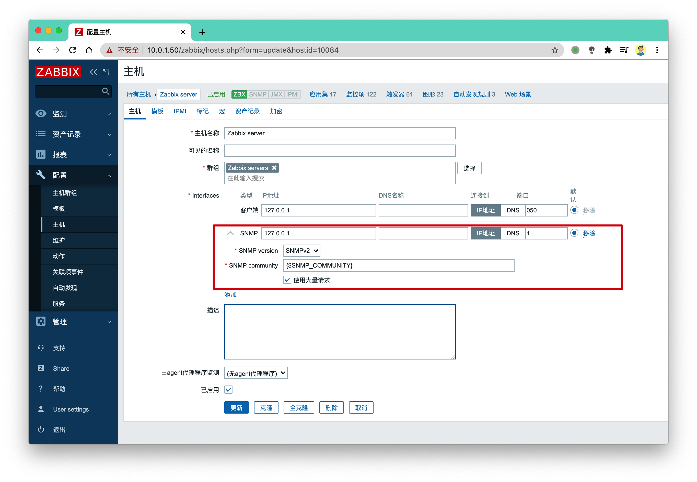

取消原有的主机模板，重新添加

注意点击原有的模板，【取消并清理】否则有些监控项冲突

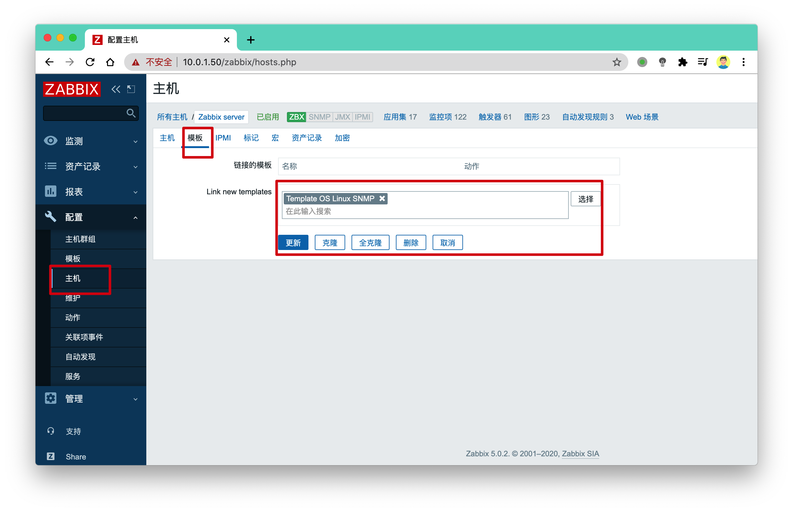

稍微等待会，zabbix-server已然改为snmp监控了

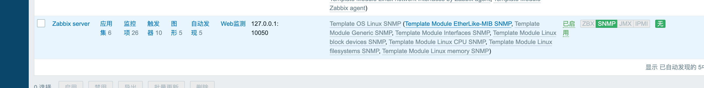

# Zabbix自定义监控Nginx

zabbix本身有监控nginx的模板，可以直接使用该模板，我们再针对nginx做一些自定义的监控，主要是结合nginx的status模块添加监控。

zabbix自带的Nginx监控模板，这个我们先不用


## zabbix-agent部署好nginx

```plain
1.直接yum快速安装
yum install nginx -y
2.添加nginx的status状态功能
vim /etc/nginx/nginx.conf
        location /status {
            stub_status on;
            access_log off;
}
3.启动nginx，查看状态页
[root@zbz-agent01 ~]# curl  http://10.0.1.51/status
Active connections: 3
server accepts handled requests
 3 3 3
Reading: 0 Writing: 1 Waiting: 2
4.监控内容解释
Active  connections：当前所有处于打开状态的活动连接数(TCP连接数，即三次握手四次挥手次数)
accepts ：                        已经接收连接数
handled ：                      已经处理过的连接数
requests ：                已经处理过的请求数，在保持连接模式下，请求数量可能会大于连接数量
Reading:                          正处于接收请求的连接数
Writing:                          请求已经接收完成，处于响应过程的连接数
Waiting :                      保持连接模式，处于活动状态的连接数
5.添加nginx的监控项，需要我们自定义了
[root@zbz-agent01 ~]# cd /etc/zabbix/zabbix_agent2.d/
# 作用主要是，格式化输出，取出每个指标的值
[root@zbz-agent01 zabbix_agent2.d]# cat userparameter_nginx.conf
UserParameter=nginx.active,curl -s http://127.0.0.1/status  2>/dev/null| grep 'Active' | awk '{print $NF}'
UserParameter=nginx.reading,curl -s http://127.0.0.1/status 2>/dev/null| grep 'Reading' | awk '{print $2}'
UserParameter=nginx.writing,curl -s http://127.0.0.1/status 2>/dev/null| grep 'Writing' | awk '{print $4}'
UserParameter=nginx.waiting,curl -s http://127.0.0.1/status 2>/dev/null| grep 'Waiting' | awk '{print $6}'
UserParameter=nginx.accepts,curl -s http://127.0.0.1/status 2>/dev/null| awk NR==3 | awk '{print $1}'
UserParameter=nginx.handled,curl -s http://127.0.0.1/status 2>/dev/null| awk NR==3 | awk '{print $2}'
UserParameter=nginx.requests,curl -s http://127.0.0.1/status 2>/dev/null| awk NR==3 | awk '{print $3}'
6.启动nginx和zabbix-agent服务
[root@zbz-agent01 zabbix_agent2.d]# systemctl start zabbix-agent2
```

### zabbix-server配置

注意可能要关闭之前超哥讲解的snmp配置，还原为zbx默认agent形式

#### 添加监控项，依次添加7个


注意，关闭proxy代理，还要更改zabbix-agent的配置文件,重启服务

可以在添加好监控项之后，【测试】一下，看是否正确。


### 创建图形


## 查看图形效果


可以用ab压测命令，增大网站压力，查看zabbix图形监控

```plain
[root@zbz-agent01 zabbix_agent2.d]# yum install httpd-tools -y
ab -c 100 -n 100000 http://127.0.0.1/
```


# Tomcat与JavaWeb开发

Tomcat是Apache软件基金会（Apache Software Foundation）项目中的一个核心项目，由Apache、Sun和其他一些公司及个人共同开发而成。

Tomcat服务器是一个免费的开放源代码的Web应用服务器，属于轻量级应用服务器，在中小型系统和并发访问用户不是很多的场合下被普遍使用，是开发和调试JSP程序的首选。

Tomcat和Nginx、Apache(httpd)、lighttpd等Web服务器一样，具有处理HTML页面的功能，另外它还是一个Servlet和JSP容器，独立的Servlet容器是Tomcat的默认模式。

Tomcat处理静态HTML的能力不如Nginx/Apache服务器。

Java容器还有resin、weblogic等。

## Web运行原理

学了LNMP之后，对于Web网站的解析过程，相比各位已经有所了解，当超哥在浏览器中输入一个URL之后，经过DNS解析之后对应的服务器就会吧该URL对应的网页，通过远程Web服务器发送到客户端，且由客户端的浏览器将其展示出来。


Web服务器上存放了各种静态文件，如HTML，图片，音视频等，这些信息通过超文本技术相互连接，也就是HTML文件，且采用HTTP协议和Web服务器通信，这样就能拿到Web服务器上的各种资料。


## Tomcat架构


Tomcat本身完全用Java语言开发，Tomcat目前可以和大部分Web服务器（IIS，Apache，Nginx）一起工作，且Tomcat是运行Java代码等容器。

常见用法是，nginx+tomcat，实现动静态请求分离。


Tomcat本身由一系列可配置等组件构成，核心组件是Servlet容器组件，Servlet就是一个用java语言开发，运行在服务器上的插件，用于解析动态的用户请求。

在使用java开发的公司，进行代码部署，常见做法是：

- 将Tomcat作为独立的Web服务器单独运行，Tomcat的运行必须依赖于Java虚拟机进程（Java Virtual Machine，JNM）进程。
- JVM虚拟机解决了JAVA程序，可以运行在任何平台上，解决了可移植性。


### JDK

Tomcat运行必须得有java环境，这个JDK是：

```plain
Java Development Kit（JDK）sun公司对Java开发人员发布的免费软件开发工具包（SDK，Software development kit）
```

JDK是 Java 语言的软件开发工具包，主要用于移动设备、嵌入式设备上的java应用程序。JDK是整个java开发的核心，它包含了JAVA的运行环境（JVM+Java系统类库）和JAVA工具。

JDK包含了一批用于Java开发的组件，其中包括：

```plain
javac：编译器，将后缀名为.java的源代码编译成后缀名为“.class”的字节码
java：运行工具，运行.class的字节码
jar：打包工具，将相关的类文件打包成一个文件
javadoc：文档生成器，从源码注释中提取文档，注释需匹配规范
jdb debugger：调试工具
jps：显示当前java程序运行的进程状态
javap：反编译程序
appletviewer：运行和调试applet程序的工具，不需要使用浏览器
javah：从Java类生成C头文件和C源文件。这些文件提供了连接胶合，使Java和C代码可进行交互。
javaws：运行JNLP程序
extcheck：一个检测jar包冲突的工具
apt：注释处理工具 
jhat：java堆分析工具
jstack：栈跟踪程序
jstat：JVM检测统计工具
jstatd：jstat守护进程
jinfo：获取正在运行或崩溃的java程序配置信息
jmap：获取java进程内存映射信息
idlj：IDL-to-Java编译器。将IDL语言转化为java文件 
policytool：一个GUI的策略文件创建和管理工具
jrunscript：命令行脚本运行
```

JDK下载页面

```plain
http://www.oracle.com/technetwork/java/javase/downloads/index.html
```

## 安装Tomcat&JDK

```plain
安装时候选择tomcat软件版本要与程序开发使用的版本一致。jdk版本要进行与tomcat保持一致。
准备2个linux虚拟机，
一个运行nginx进行负载均衡
一个用来运行tomcat
```

系统环境说明

```plain
[root@tomcat01 ~]# cat /etc/redhat-release
CentOS Linux release 7.5.1804 (Core)
[root@tomcat01 ~]# uname -a
Linux tomcat01 3.10.0-862.el7.x86_64 #1 SMP Fri Apr 20 16:44:24 UTC 2018 x86_64 x86_64 x86_64 GNU/Linux
[root@tomcat01 ~]# getenforce
Disabled
[root@tomcat01 ~]# systemctl status firewalld
● firewalld.service - firewalld - dynamic firewall daemon
   Loaded: loaded (/usr/lib/systemd/system/firewalld.service; disabled; vendor preset: enabled)
   Active: inactive (dead)
     Docs: man:firewalld(1)
[root@tomcat01 ~]#
[root@tomcat01 ~]# iptables -L
Chain INPUT (policy ACCEPT)
target     prot opt source               destination
Chain FORWARD (policy ACCEPT)
target     prot opt source               destination
Chain OUTPUT (policy ACCEPT)
target     prot opt source               destination
```

安装JDK

```plain
# 软件包可以自己下载，也可以找超哥要资料
[root@tomcat01 opt]# ls
apache-tomcat-8.0.27  apache-tomcat-8.0.27.tar.gz  jdk1.8.0_60  jdk-8u60-linux-x64.tar.gz
# 创建软连接
[root@tomcat01 opt]# ln -s /opt/jdk1.8.0_60/ /opt/jdk
# 替换配置文件
sed -i.ori '$a export JAVA_HOME=/opt/jdk\nexport PATH=$JAVA_HOME/bin:$JAVA_HOME/jre/bin:$PATH\nexport CLASSPATH=.:$JAVA_HOME/lib:$JAVA_HOME/jre/lib:$JAVA_HOME/lib/tools.jar' /etc/profile
# 读取配置文件
source /etc/profile
# 检查配置
[root@tomcat01 opt]# echo $PATH
/opt/jdk/bin:/opt/jdk/jre/bin:/usr/local/sbin:/usr/local/bin:/usr/sbin:/usr/bin:/root/bin
# 测试JDK是否安装好
[root@tomcat01 opt]# java -version
java version "1.8.0_60"
Java(TM) SE Runtime Environment (build 1.8.0_60-b27)
Java HotSpot(TM) 64-Bit Server VM (build 25.60-b23, mixed mode)
```

部署Tomcat

```plain
# 配置软连
[root@tomcat01 opt]# ln -s /opt/apache-tomcat-8.0.27 /opt/tomcat
# 设置环境变量
[root@tomcat01 opt]# echo 'export TOMCAT_HOME=/opt/tomcat' >> /etc/profile
# 读取生效，检查配置
[root@tomcat01 opt]# source /etc/profile
[root@tomcat01 opt]#
[root@tomcat01 opt]#
[root@tomcat01 opt]# chown -R root.root /opt/jdk /opt/tomcat/
# 检车tomcat是否安装正确
[root@tomcat01 opt]# /opt/tomcat/bin/version.sh
Using CATALINA_BASE:   /opt/tomcat
Using CATALINA_HOME:   /opt/tomcat
Using CATALINA_TMPDIR: /opt/tomcat/temp
Using JRE_HOME:        /opt/jdk
Using CLASSPATH:       /opt/tomcat/bin/bootstrap.jar:/opt/tomcat/bin/tomcat-juli.jar
Server version: Apache Tomcat/8.0.27
Server built:   Sep 28 2015 08:17:25 UTC
Server number:  8.0.27.0
OS Name:        Linux
OS Version:     3.10.0-862.el7.x86_64
Architecture:   amd64
JVM Version:    1.8.0_60-b27
JVM Vendor:     Oracle Corporation
```

### Tomcat目录介绍

```plain
# 目录解释
[root@tomcat01 opt]# tree /opt/tomcat/ -L 1
/opt/tomcat/
├── bin              # 存放tomcat管理脚本
├── conf             # tomcat 配置文件存放目录
├── lib              # web应用调用的jar包存放路径
├── LICENSE
├── logs             # tomcat 日志存放目录，catalina.out 为主要输出日志
├── NOTICE
├── RELEASE-NOTES
├── RUNNING.txt
├── temp             # 存放临时文件
├── webapps         # web程序存放目录
└── work             # 存放编译产生的.java 与 .class文件
7 directories, 4 files
# 日志说明
```

#### webapps目录介绍

```plain
[root@tomcat01 opt]# tree  /opt/tomcat/webapps/ -L 1
/opt/tomcat/webapps/
├── docs            # tomcat 帮助文档
├── examples        # web应用实例
├── host-manager    # 主机管理
├── manager         # 管理
└── ROOT             # 默认站点根目录
5 directories, 0 files
```

#### Tomcat配置文件

```plain
[root@tomcat01 opt]# tree  /opt/tomcat/conf/
/opt/tomcat/conf/
├── catalina.policy
├── catalina.properties
├── context.xml
├── logging.properties
├── server.xml                    # tomcat主配置，例如更改端口等
├── tomcat-users.xml        # tomcat管理用户配置
├── tomcat-users.xsd
└── web.xml
```

### Tomcat管理

```plain
启动，关闭程序
[root@tomcat01 opt]# /opt/tomcat/bin/startup.sh
[root@tomcat01 opt]# /opt/tomcat/bin/shutdown.sh
```

启动关闭

```plain
[root@tomcat01 opt]# /opt/tomcat/bin/startup.sh
Using CATALINA_BASE:   /opt/tomcat
Using CATALINA_HOME:   /opt/tomcat
Using CATALINA_TMPDIR: /opt/tomcat/temp
Using JRE_HOME:        /opt/jdk
Using CLASSPATH:       /opt/tomcat/bin/bootstrap.jar:/opt/tomcat/bin/tomcat-juli.jar
Tomcat started.
[root@tomcat01 opt]# netstat -tunlp
Active Internet connections (only servers)
Proto Recv-Q Send-Q Local Address           Foreign Address         State       PID/Program name
tcp        0      0 0.0.0.0:22              0.0.0.0:*               LISTEN      972/sshd
tcp        0      0 127.0.0.1:25            0.0.0.0:*               LISTEN      1122/master
tcp6       0      0 127.0.0.1:8005          :::*                    LISTEN      13972/java
tcp6       0      0 :::8009                 :::*                    LISTEN      13972/java
tcp6       0      0 :::8080                 :::*                    LISTEN      13972/java
tcp6       0      0 :::22                   :::*                    LISTEN      972/sshd
tcp6       0      0 ::1:25                  :::*                    LISTEN      1122/master
udp        0      0 127.0.0.1:323           0.0.0.0:*                           645/chronyd
udp6       0      0 ::1:323                 :::*                                645/chronyd
# 关闭
[root@tomcat01 opt]# /opt/tomcat/bin/shutdown.sh
Using CATALINA_BASE:   /opt/tomcat
Using CATALINA_HOME:   /opt/tomcat
Using CATALINA_TMPDIR: /opt/tomcat/temp
Using JRE_HOME:        /opt/jdk
Using CLASSPATH:       /opt/tomcat/bin/bootstrap.jar:/opt/tomcat/bin/tomcat-juli.jar
[root@tomcat01 opt]#
[root@tomcat01 opt]#
[root@tomcat01 opt]# !net
netstat -tunlp
Active Internet connections (only servers)
Proto Recv-Q Send-Q Local Address           Foreign Address         State       PID/Program name
tcp        0      0 0.0.0.0:22              0.0.0.0:*               LISTEN      972/sshd
tcp        0      0 127.0.0.1:25            0.0.0.0:*               LISTEN      1122/master
tcp6       0      0 :::22                   :::*                    LISTEN      972/sshd
tcp6       0      0 ::1:25                  :::*                    LISTEN      1122/master
udp        0      0 127.0.0.1:323           0.0.0.0:*                           645/chronyd
udp6       0      0 ::1:323                 :::*                                645/chronyd
```

### 启动tomcat访问

```plain
[root@tomcat01 opt]# /opt/tomcat/bin/startup.sh
Using CATALINA_BASE:   /opt/tomcat
Using CATALINA_HOME:   /opt/tomcat
Using CATALINA_TMPDIR: /opt/tomcat/temp
Using JRE_HOME:        /opt/jdk
Using CLASSPATH:       /opt/tomcat/bin/bootstrap.jar:/opt/tomcat/bin/tomcat-juli.jar
Tomcat started.
```


日志检查

```plain
[root@tomcat01 opt]# tail /opt/tomcat/logs/catalina.out
12-Aug-2020 23:27:51.600 INFO [localhost-startStop-1] org.apache.catalina.startup.HostConfig.deployDirectory Deployment of web application directory /opt/apache-tomcat-8.0.27/webapps/docs has finished in 25 ms
12-Aug-2020 23:27:51.601 INFO [localhost-startStop-1] org.apache.catalina.startup.HostConfig.deployDirectory Deploying web application directory /opt/apache-tomcat-8.0.27/webapps/examples
12-Aug-2020 23:27:52.017 INFO [localhost-startStop-1] org.apache.catalina.startup.HostConfig.deployDirectory Deployment of web application directory /opt/apache-tomcat-8.0.27/webapps/examples has finished in 416 ms
12-Aug-2020 23:27:52.017 INFO [localhost-startStop-1] org.apache.catalina.startup.HostConfig.deployDirectory Deploying web application directory /opt/apache-tomcat-8.0.27/webapps/host-manager
12-Aug-2020 23:27:52.065 INFO [localhost-startStop-1] org.apache.catalina.startup.HostConfig.deployDirectory Deployment of web application directory /opt/apache-tomcat-8.0.27/webapps/host-manager has finished in 48 ms
12-Aug-2020 23:27:52.065 INFO [localhost-startStop-1] org.apache.catalina.startup.HostConfig.deployDirectory Deploying web application directory /opt/apache-tomcat-8.0.27/webapps/manager
12-Aug-2020 23:27:52.092 INFO [localhost-startStop-1] org.apache.catalina.startup.HostConfig.deployDirectory Deployment of web application directory /opt/apache-tomcat-8.0.27/webapps/manager has finished in 27 ms
12-Aug-2020 23:27:52.106 INFO [main] org.apache.coyote.AbstractProtocol.start Starting ProtocolHandler ["http-nio-8080"]
12-Aug-2020 23:27:52.121 INFO [main] org.apache.coyote.AbstractProtocol.start Starting ProtocolHandler ["ajp-nio-8009"]
12-Aug-2020 23:27:52.122 INFO [main] org.apache.catalina.startup.Catalina.start Server startup in 1028 ms
```

## Tomcat管理功能

生产环境一般禁用，或者设置访问权限。

Tomcat管理功能用于对Tomcat自身以及部署在Tomcat上的应用进行管理的web应用。在默认情况下是处于禁用状态的。

默认访问不了,没有账户密码

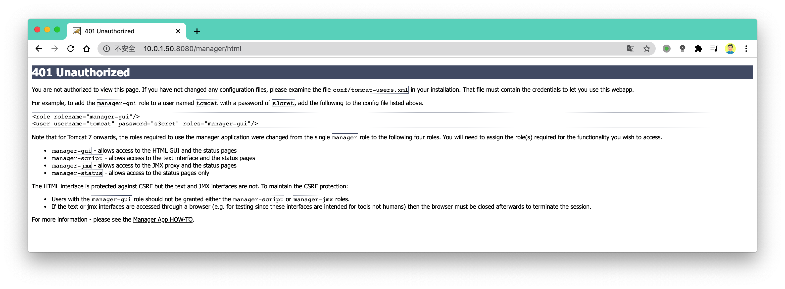

如果需要开启这个功能，就需要配置管理用户，即配置tomcat-users.xml 文件。

```plain
# 配置文件
[root@tomcat01 opt]# tail -5  /opt/tomcat/conf/tomcat-users.xml
 <role rolename="manager-gui"/>
 <role rolename="admin-gui"/>
 <user username="tomcat" password="tomcat" roles="manager-gui,admin-gui"/>
</tomcat-users>
# 修改配置文件，重启服务
[root@tomcat01 opt]# /opt/tomcat/bin/shutdown.sh
Using CATALINA_BASE:   /opt/tomcat
Using CATALINA_HOME:   /opt/tomcat
Using CATALINA_TMPDIR: /opt/tomcat/temp
Using JRE_HOME:        /opt/jdk
Using CLASSPATH:       /opt/tomcat/bin/bootstrap.jar:/opt/tomcat/bin/tomcat-juli.jar
[root@tomcat01 opt]# /opt/tomcat/bin/startup.sh
Using CATALINA_BASE:   /opt/tomcat
Using CATALINA_HOME:   /opt/tomcat
Using CATALINA_TMPDIR: /opt/tomcat/temp
Using JRE_HOME:        /opt/jdk
Using CLASSPATH:       /opt/tomcat/bin/bootstrap.jar:/opt/tomcat/bin/tomcat-juli.jar
Tomcat started.
```

查看管理后台页面


## Tomcat配置文件解析

```plain
/opt/tomcat/conf/server.xml
# 默认配置内容很多
[root@tomcat01 opt]# grep -Ev  '^#|^$' /opt/tomcat/conf/server.xml
# 主要的标签部分，通过如下的缩进关系，了解他们的关系
<server>                                    # 顶级组件，在配置的顶层，运行一个JVM中的tomcat实例
     <service>                        # 容器类组件，可以包含其他组件，如engine，host，context
         <connector />        # 连接类组件，连接用户请求到tomcat,如connector，类似listen监听端口
               <engine>        # 核心容器组件，通过connector接受用户请求，处理请求，转发给虚拟主机host
                     <host>    # 类似于nginx的虚拟主机
                         <context>  </context>  # 最内层的组件，不得嵌套，配置web站点，webapp目录，类似于nginx配置的alias定义的目录。
                             </host>
                             <host>
                         <context></context>
                     </host>
               </engine>
         </service>
</server>
```

### 组件名称

| **组件名称**          | **功能介绍**                                                 |
| --------------------- | ------------------------------------------------------------ |
| **engine**            | 核心容器组件，catalina引擎，负责通过connector接收用户请求，并处理请求，将请求转至对应的虚拟主机host。 |
| **host**              | 类似于httpd中的虚拟主机，一般而言支持基于FQDN的虚拟主机。    |
| **context**           | 定义一个应用程序，是一个最内层的容器类组件（不能再嵌套）。配置context的主要目的指定对应对的webapp的根目录，类似于httpd的alias，其还能为webapp指定额外的属性，如部署方式等。 |
| **connector**         | 接收用户请求，类似于httpd的listen配置监听端口的。            |
| **service（服务）**   | 将connector关联至engine，因此一个service内部可以有多个connector，但只能有一个引擎engine。service内部有两个connector，一个engine。因此，一般情况下一个server内部只有一个service，一个service内部只有一个engine，但一个service内部可以有多个connector。 |
| **server**            | 表示一个运行于JVM中的tomcat实例。                            |
| **Valve**             | 阀门，拦截请求并在将其转至对应的webapp前进行某种处理操作，可以用于任何容器中，比如记录日志(access log valve)、基于IP做访问控制(remote address filter valve)。 |
| **logger**            | 日志记录器，用于记录组件内部的状态信息，可以用于除context外的任何容器中。 |
| **realm**             | 可以用于任意容器类的组件中，关联一个用户认证库，实现认证和授权。可以关联的认证库有两种：UserDatabaseRealm、MemoryRealm和JDBCRealm。 |
| **UserDatabaseRealm** | 使用JNDI自定义的用户认证库。                                 |
| **MemoryRealm**       | 认证信息定义在tomcat-users.xml中。                           |
| **JDBCRealm**         | 认证信息定义在数据库中，并通过JDBC连接至数据库中查找认证用户。 |

### server.xml注释版

```plain
<?xml version='1.0' encoding='utf-8'?>
<!--
<Server>元素代表整个容器,是Tomcat实例的顶层元素.由org.apache.catalina.Server接口来定义.它包含一个<Service>元素.并且它不能做为任何元素的子元素.
    port指定Tomcat监听shutdown命令端口.终止服务器运行时,必须在Tomcat服务器所在的机器上发出shutdown命令.该属性是必须的.
    shutdown指定终止Tomcat服务器运行时,发给Tomcat服务器的shutdown监听端口的字符串.该属性必须设置
-->
<Server port="8005" shutdown="SHUTDOWN">
  <Listener className="org.apache.catalina.startup.VersionLoggerListener" />
  <Listener className="org.apache.catalina.core.AprLifecycleListener" SSLEngine="on" />
  <Listener className="org.apache.catalina.core.JreMemoryLeakPreventionListener" />
  <Listener className="org.apache.catalina.mbeans.GlobalResourcesLifecycleListener" />
  <Listener className="org.apache.catalina.core.ThreadLocalLeakPreventionListener" />
  <GlobalNamingResources>
    <Resource name="UserDatabase" auth="Container"
              type="org.apache.catalina.UserDatabase"
              description="User database that can be updated and saved"
              factory="org.apache.catalina.users.MemoryUserDatabaseFactory"
              pathname="conf/tomcat-users.xml" />
  </GlobalNamingResources>
  <!--service服务组件-->
  <Service name="Catalina">
    <!-- Connector主要参数说明（见下表） -->
    <Connector port="8080" protocol="HTTP/1.1"
               connectionTimeout="20000"
               redirectPort="8443" />
    <Connector port="8009" protocol="AJP/1.3" redirectPort="8443" />
    <!--engine,核心容器组件,catalina引擎,负责通过connector接收用户请求,并处理请求,将请求转至对应的虚拟主机host
        defaultHost指定缺省的处理请求的主机名，它至少与其中的一个host元素的name属性值是一样的
    -->
    <Engine name="Catalina" defaultHost="localhost">
      <!--Realm表示存放用户名，密码及role的数据库-->
      <Realm className="org.apache.catalina.realm.LockOutRealm">
        <Realm className="org.apache.catalina.realm.UserDatabaseRealm"
               resourceName="UserDatabase"/>
      </Realm>
      <!-- 详情常见下表（host参数详解）-->
      <Host name="localhost"  appBase="webapps"
            unpackWARs="true" autoDeploy="true">
        <!-- 详情常见下表（Context参数说明 ）-->
        <Context path="" docBase="" debug=""/>
        <Valve className="org.apache.catalina.valves.AccessLogValve" directory="logs"
               prefix="localhost_access_log" suffix=".txt"
               pattern="%h %l %u %t &quot;%r&quot; %s %b" />
      </Host>
    </Engine>
  </Service>
</Server>
```

### Connector主要参数说明

| **参数**              | **参数说明**                                                 |
| --------------------- | ------------------------------------------------------------ |
| **connector**         | 接收用户请求，类似于httpd的listen配置监听端口.               |
| **port**              | 指定服务器端要创建的端口号，并在这个端口监听来自客户端的请求。 |
| **address**           | 指定连接器监听的地址，默认为所有地址（即0.0.0.0）            |
| **protocol**          | 连接器使用的协议，支持HTTP和AJP。AJP（Apache Jserv Protocol）专用于tomcat与apache建立通信的， 在httpd反向代理用户请求至tomcat时使用（可见Nginx反向代理时不可用AJP协议）。 |
| **minProcessors**     | 服务器启动时创建的处理请求的线程数                           |
| **maxProcessors**     | 最大可以创建的处理请求的线程数                               |
| **enableLookups**     | 如果为true，则可以通过调用request.getRemoteHost()进行DNS查询来得到远程客户端的实际主机名，若为false则不进行DNS查询，而是返回其ip地址 |
| **redirectPort**      | 指定服务器正在处理http请求时收到了一个SSL传输请求后重定向的端口号 |
| **acceptCount**       | 指定当所有可以使用的处理请求的线程数都被使用时，可以放到处理队列中的请求数，超过这个数的请求将不予处理 |
| **connectionTimeout** | 指定超时的时间数(以毫秒为单位)                               |

### host参数详解

| **参数**              | **参数说明**                                                 |
| --------------------- | ------------------------------------------------------------ |
| **host**              | 表示一个虚拟主机                                             |
| **name**              | 指定主机名                                                   |
| **appBase**           | 应用程序基本目录，即存放应用程序的目录.一般为appBase="webapps" ，相对于CATALINA_HOME而言的，也可以写绝对路径。 |
| **unpackWARs**        | 如果为true，则tomcat会自动将WAR文件解压，否则不解压，直接从WAR文件中运行应用程序 |
| **autoDeploy**        | 在tomcat启动时，是否自动部署。                               |
| **xmlValidation**     | 是否启动xml的校验功能，一般xmlValidation="false"。           |
| **xmlNamespaceAware** | 检测名称空间，一般xmlNamespaceAware="false"。                |

### Context参数说明

| **参数**       | **参数说明**                                                 |
| -------------- | ------------------------------------------------------------ |
| **Context**    | 表示一个web应用程序，通常为WAR文件                           |
| **docBase**    | 应用程序的路径或者是WAR文件存放的路径,也可以使用相对路径，起始路径为此Context所属Host中appBase定义的路径。 |
| **path**       | 表示此web应用程序的url的前缀，这样请求的url为http://localhost:8080/path/**** |
| **reloadable** | 这个属性非常重要，如果为true，则tomcat会自动检测应用程序的/WEB-INF/lib 和/WEB-INF/classes目录的变化，自动装载新的应用程序，可以在不重启tomcat的情况下改变应用程序 |

## Tomcat部署jpress

tomcat部署代码的方式有两种：

- 开发打包好的代码，直接放在webapps目录下
- 使用开发工具将程序打包成war包，再传到webapps目录下

jpress官网：[http://jpress.io](http://jpress.io/)

下载地址：https://github.com/JpressProjects/jpress

```plain
JPress，一个专业的建站神器。
部署：
1.安装配置数据库
yum install mariadb-server mariadb -y
systemctl start mariadb.service
2.配置数据库信息
mysql
create database jpress DEFAULT CHARACTER SET utf8;
grant all on jpress.* to jpress@'localhost' identified by '123456';
exit
3.上线jpress代码,上传代码至webapps目录即可,tomcat会自动解压war包
[root@tomcat01 webapps]# ls
docs  examples  host-manager  jpress-web-newest  jpress-web-newest.war  manager  ROOT
4.此时我门可以直接访问该站点
http://10.0.1.50:8080/jpress-web-newest/install
```


数据库信息制定


设置站点信息


等待安装


重启tomcat

```plain
[root@tomcat01 webapps]# /opt/tomcat/bin/shutdown.sh
Using CATALINA_BASE:   /opt/tomcat
Using CATALINA_HOME:   /opt/tomcat
Using CATALINA_TMPDIR: /opt/tomcat/temp
Using JRE_HOME:        /opt/jdk
Using CLASSPATH:       /opt/tomcat/bin/bootstrap.jar:/opt/tomcat/bin/tomcat-juli.jar
[root@tomcat01 webapps]#
[root@tomcat01 webapps]# /opt/tomcat/bin/startup.sh
Using CATALINA_BASE:   /opt/tomcat
Using CATALINA_HOME:   /opt/tomcat
Using CATALINA_TMPDIR: /opt/tomcat/temp
Using JRE_HOME:        /opt/jdk
Using CLASSPATH:       /opt/tomcat/bin/bootstrap.jar:/opt/tomcat/bin/tomcat-juli.jar
Tomcat started.
```

再次访问jpress站点

```plain
http://10.0.1.50:8080/jpress-web-newest/
```

## 访问jpress管理后台

http://10.0.1.50:8080/jpress-web-newest/admin/login


## Tomcat多实例

多实例指的是，同一个服务，基于不同的端口，运行多个实例（进程），例如

- mysql多实例，一台机器，可以运行多个独立的数据库，端口分别是3306,3307,3308
- nginx多虚拟主机，基于不同的ip，域名，端口

多实例的作用是，如：

- 一个服务器可以运行多个站点，如www.chaoge_linux.com，如www.chaoge_python.com，属于独立的服务
- 一个机器运行一个站点多个实例，进行负载均衡，不过这种形式还是分机器为好

### 多实例配置

```plain
1.拷贝多份程序文件，修改端口，以区分多实例，准备2份tomcat代码
[root@tomcat01 tomcat]# pwd
/tomcat
[root@tomcat01 tomcat]# ls
apache-tomcat-8.0.27  apache-tomcat-8.0.27.tar.gz  tomcat8_1  tomcat8_2
2.修改配置文件，修改端口，以启动多实例
[root@tomcat01 tomcat]# sed -i 's#8005#8011#;s#8080#8081#' tomcat8_1/conf/server.xml
[root@tomcat01 tomcat]# sed -i 's#8005#8012#;s#8080#8082#' tomcat8_2/conf/server.xml
3.可以比较下配置文件
[root@tomcat01 tomcat]# diff tomcat8_1/conf/server.xml tomcat8_2/conf/server.xml
22c22
< <Server port="8011" shutdown="SHUTDOWN">
---
> <Server port="8012" shutdown="SHUTDOWN">
67c67
<          Define a non-SSL/TLS HTTP/1.1 Connector on port 8081
---
>          Define a non-SSL/TLS HTTP/1.1 Connector on port 8082
69c69
<     <Connector port="8081" protocol="HTTP/1.1"
---
>     <Connector port="8082" protocol="HTTP/1.1"
75c75
<                port="8081" protocol="HTTP/1.1"
---
>                port="8082" protocol="HTTP/1.1"
4.启动2个实例tomcat
[root@tomcat01 ~]# /tomcat/tomcat8_1/bin/startup.sh
Using CATALINA_BASE:   /opt/tomcat8_1
Using CATALINA_HOME:   /opt/tomcat8_1
Using CATALINA_TMPDIR: /opt/tomcat8_1/temp
Using JRE_HOME:        /opt/jdk
Using CLASSPATH:       /opt/tomcat8_1/bin/bootstrap.jar:/opt/tomcat8_1/bin/tomcat-juli.jar
Tomcat started.
[root@tomcat01 ~]#
[root@tomcat01 ~]# /tomcat/tomcat8_2/bin/startup.sh
Using CATALINA_BASE:   /opt/tomcat8_2
Using CATALINA_HOME:   /opt/tomcat8_2
Using CATALINA_TMPDIR: /opt/tomcat8_2/temp
Using JRE_HOME:        /opt/jdk
Using CLASSPATH:       /opt/tomcat8_2/bin/bootstrap.jar:/opt/tomcat8_2/bin/tomcat-juli.jar
Tomcat started.
[root@tomcat01 ~]# !ps
ps -ef|grep tomcat
root       1432      1 78 23:08 pts/0    00:00:05 /opt/jdk/bin/java -Djava.util.logging.config.file=/opt/tomcat8_1/conf/logging.properties -Djava.util.logging.manager=org.apache.juli.ClassLoaderLogManager -Djava.endorsed.dirs=/opt/tomcat8_1/endorsed -classpath /opt/tomcat8_1/bin/bootstrap.jar:/opt/tomcat8_1/bin/tomcat-juli.jar -Dcatalina.base=/opt/tomcat8_1 -Dcatalina.home=/opt/tomcat8_1 -Djava.io.tmpdir=/opt/tomcat8_1/temp org.apache.catalina.startup.Bootstrap start
root       1456      1 43 23:08 pts/0    00:00:01 /opt/jdk/bin/java -Djava.util.logging.config.file=/opt/tomcat8_2/conf/logging.properties -Djava.util.logging.manager=org.apache.juli.ClassLoaderLogManager -Djava.endorsed.dirs=/opt/tomcat8_2/endorsed -classpath /opt/tomcat8_2/bin/bootstrap.jar:/opt/tomcat8_2/bin/tomcat-juli.jar -Dcatalina.base=/opt/tomcat8_2 -Dcatalina.home=/opt/tomcat8_2 -Djava.io.tmpdir=/opt/tomcat8_2/temp org.apache.catalina.startup.Bootstrap start
root       1472   1331  0 23:08 pts/0    00:00:00 grep --color=auto tomcat
5.检查端口
[root@tomcat01 ~]# netstat -tunlp|grep java
tcp6       0      0 :::8009                 :::*                    LISTEN      1432/java
tcp6       0      0 127.0.0.1:8011          :::*                    LISTEN      1432/java
tcp6       0      0 127.0.0.1:8012          :::*                    LISTEN      1456/java
tcp6       0      0 :::8081                 :::*                    LISTEN      1432/java
tcp6       0      0 :::8082                 :::*                    LISTEN      1456/java
6.修改配置，以区分两个tomcat实例
[root@tomcat01 tomcat]# echo "超哥不错哦, 我是tomcat 8082" >> /tomcat/tomcat8_2/webapps/ROOT/index.jsp
[root@tomcat01 tomcat]# echo "超哥牛呀 我是tomcat 8081" >> /tomcat/tomcat8_1/webapps/ROOT/index.jsp
7.访问tomcat站点
http://10.0.1.50:8081/
```

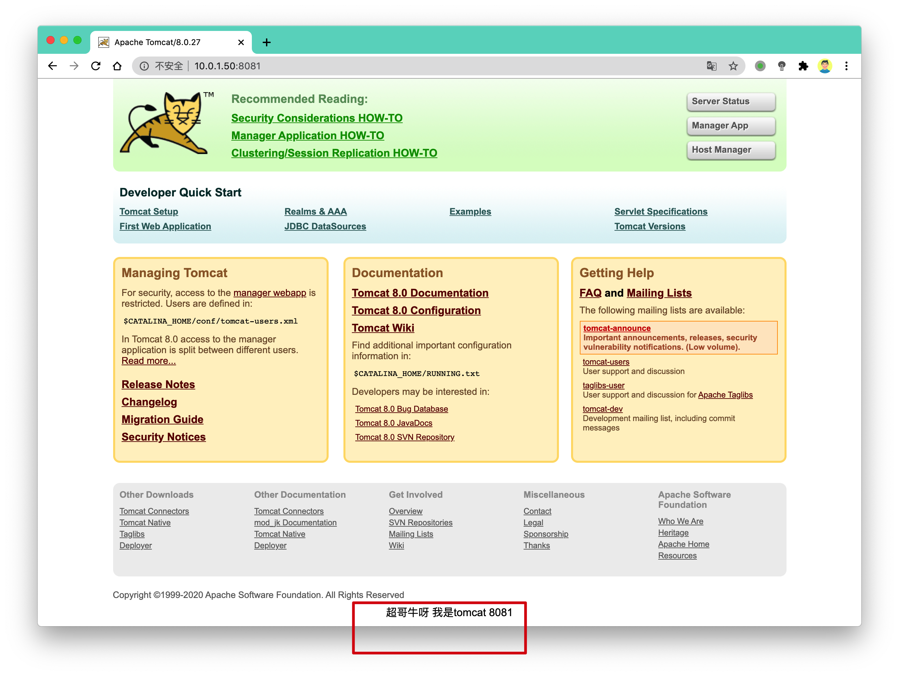

实例2


此时我们就达到了如下的效果

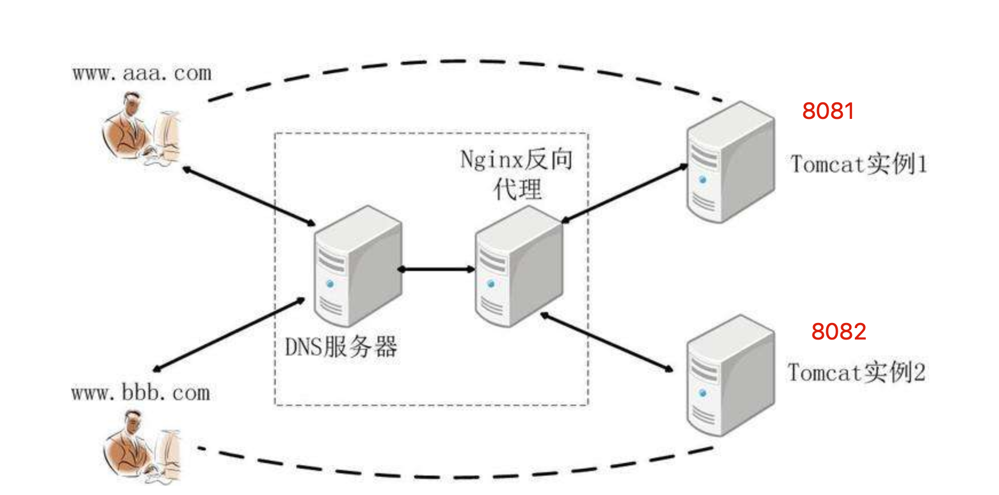

## Tomcat反向代理集群

超哥部署操作如下

```plain
1.部署好nginx服务，进行负载均衡使用，讲道理超哥应该用多台机器操作，不过对于集群的负载均衡，前面已经带着各位学习过LNMP集群搭建了，这里用一个单机部署
yum install nginx -y
2.修改nginx配置文件，进行负载均衡，tomcat
 upstream tomcat_lb {
        server 10.0.1.50:8081;
        server 10.0.1.50:8082;
}
 location / {
        root html;
        index index.jsp index.htm;
        proxy_pass http://tomcat_lb;
        }
3.重新加载nginx
[root@tomcat01 tomcat]# nginx -s reload
```

验证负载均衡

```plain
[root@tomcat01 tomcat]# curl -s  10.0.1.50 |tail -1
超哥牛呀 我是tomcat 8081
[root@tomcat01 tomcat]# curl -s  10.0.1.50 |tail -1
超哥不错哦, 我是tomcat 8082
```

浏览器访问效果

```plain
http://10.0.1.50/  
分别强制刷新查看结果，默认轮询机制
```

## Zabbix监控tomcat

### 客户端开发java状态监控

在tomcat机器上配置如下

```plain
1.使用jps命令检测java的进程信息，内存使用等
[root@tomcat01 opt]# jps -lvm
37908 sun.tools.jps.Jps -lvm -Denv.class.path=.:/opt/jdk/lib:/opt/jdk/jre/lib:/opt/jdk/lib/tools.jar -Dapplication.home=/opt/jdk1.8.0_60 -Xms8m
20811 org.apache.catalina.startup.Bootstrap start -Djava.util.logging.config.file=/opt/tomcat/conf/logging.properties -Djava.util.logging.manager=org.apache.juli.ClassLoaderLogManager -Djava.endorsed.dirs=/opt/tomcat/endorsed -Dcatalina.base=/opt/tomcat -Dcatalina.home=/opt/tomcat -Djava.io.tmpdir=/opt/tomcat/temp
3.修改tomcat配置文件，进行远程监控
vim /opt/tomcat/bin/catalina.sh # 97行加入
CATALINA_OPTS="$CATALINA_OPTS
-Dcom.sun.management.jmxremote
-Dcom.sun.management.jmxremote.port=12345
-Dcom.sun.management.jmxremote.authenticate=false
-Dcom.sun.management.jmxremote.ssl=false
-Djava.rmi.server.hostname=10.0.1.51"
4.重启tomcat
 /opt/tomcat/bin/shutdown.sh
 /opt/tomcat/bin/startup.sh
5.检查端口
[root@tomcat01 opt]# netstat -tunlp|grep 12345
tcp6       0      0 :::12345                :::*                    LISTEN      38700/java
```

### zabbix-server添加监控

zabbix想要监控tomcat，需要借助于zabbix-java-gateway工具

```plain
1.需要安装监控依赖
[root@zabbix-server01 ~]# yum install zabbix-java-gateway -y
# 修改zabbix服务端配置文件
[root@zabbix-server01 ~]# vim /etc/zabbix/zabbix_java_gateway.conf
# 修改配置
sed -i -e '220a JavaGateway=127.0.0.1' -e '236a StartJavaPollers=5'  /etc/zabbix/zabbix_server.conf
3.启动zabbix-java-gateway服务
[root@zabbix-server01 ~]# systemctl start zabbix-java-gateway.service
[root@zabbix-server01 ~]# systemctl restart zabbix-server.service
4.检测java状态
[root@zabbix-server01 ~]# netstat -tunlp|grep java
tcp6       0      0 :::10052                :::*                    LISTEN      5541/java
5.查看java进程
[root@zabbix-server01 ~]# ps -ef|grep java
zabbix     5541      1  0 16:47 ?        00:00:00 java -server -Dlogback.configurationFile=/etc/zabbix/zabbix_java_gateway_logback.xml -classpath lib:lib/android-json-4.3_r3.1.jar:lib/logback-classic-0.9.27.jar:lib/logback-core-0.9.27.jar:lib/slf4j-api-1.6.1.jar:bin/zabbix-java-gateway-5.0.2.jar -Dzabbix.pidFile=/var/run/zabbix/zabbix_java.pid -Dsun.rmi.transport.tcp.responseTimeout=3000 com.zabbix.gateway.JavaGateway
zabbix     5584   5565  0 16:47 ?        00:00:00 /usr/sbin/zabbix_server: java poller #1 [got 0 values in 0.000019 sec, idle 5 sec]
zabbix     5585   5565  0 16:47 ?        00:00:00 /usr/sbin/zabbix_server: java poller #2 [got 0 values in 0.000019 sec, idle 5 sec]
zabbix     5586   5565  0 16:47 ?        00:00:00 /usr/sbin/zabbix_server: java poller #3 [got 0 values in 0.000020 sec, idle 5 sec]
zabbix     5587   5565  0 16:47 ?        00:00:00 /usr/sbin/zabbix_server: java poller #4 [got 0 values in 0.000019 sec, idle 5 sec]
zabbix     5588   5565  0 16:47 ?        00:00:00 /usr/sbin/zabbix_server: java poller #5 [got 0 values in 0.000055 sec, idle 5 sec]
root       5696   2302  0 16:49 pts/0    00:00:00 grep --color=auto java
```

#### 添加web监控界面

添加主机


添加模板

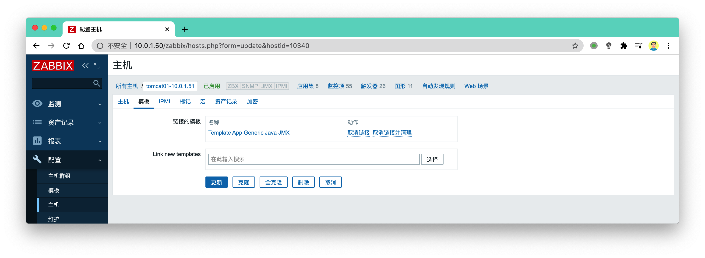

正确添加后，则显示绿灯JMX类型的监控


## Tomcat排错

思路1：查看日志

```plain
tail -f /opt/tomcat/logs/catalina.out
```

思路2：使用经典脚本

```plain
[root@tomcat01 opt]# cat show-busy-java-threads.sh -n
     1    #!/bin/bash
     2    # @Function
     3    # Find out the highest cpu consumed threads of java, and print the stack of these threads.
     4    #
     5    # @Usage
     6    #   $ ./show-busy-java-threads.sh
     7    #
     8    # @author Jerry Lee
     9
    10    readonly PROG=`basename $0`
    11    readonly -a COMMAND_LINE=("$0" "$@")
    12
    13    usage() {
    14        cat <<EOF
    15    Usage: ${PROG} [OPTION]...
    16    Find out the highest cpu consumed threads of java, and print the stack of these threads.
    17    Example: ${PROG} -c 10
    18
    19    Options:
    20        -p, --pid       find out the highest cpu consumed threads from the specifed java process,
    21                        default from all java process.
    22        -c, --count     set the thread count to show, default is 5
    23        -h, --help      display this help and exit
    24    EOF
    25        exit $1
    26    }
    27
    28    readonly ARGS=`getopt -n "$PROG" -a -o c:p:h -l count:,pid:,help -- "$@"`
    29    [ $? -ne 0 ] && usage 1
    30    eval set -- "${ARGS}"
    31
    32    while true; do
    33        case "$1" in
    34        -c|--count)
    35            count="$2"
    36            shift 2
    37            ;;
    38        -p|--pid)
    39            pid="$2"
    40            shift 2
    41            ;;
    42        -h|--help)
    43            usage
    44            ;;
    45        --)
    46            shift
    47            break
    48            ;;
    49        esac
    50    done
    51    count=${count:-5}
    52
    53    redEcho() {
    54        [ -c /dev/stdout ] && {
    55            # if stdout is console, turn on color output.
    56            echo -ne "\033[1;31m"
    57            echo -n "$@"
    58            echo -e "\033[0m"
    59        } || echo "$@"
    60    }
    61
    62    yellowEcho() {
    63        [ -c /dev/stdout ] && {
    64            # if stdout is console, turn on color output.
    65            echo -ne "\033[1;33m"
    66            echo -n "$@"
    67            echo -e "\033[0m"
    68        } || echo "$@"
    69    }
    70
    71    blueEcho() {
    72        [ -c /dev/stdout ] && {
    73            # if stdout is console, turn on color output.
    74            echo -ne "\033[1;36m"
    75            echo -n "$@"
    76            echo -e "\033[0m"
    77        } || echo "$@"
    78    }
    79
    80    # Check the existence of jstack command!
    81    if ! which jstack &> /dev/null; then
    82        [ -z "$JAVA_HOME" ] && {
    83            redEcho "Error: jstack not found on PATH!"
    84            exit 1
    85        }
    86        ! [ -f "$JAVA_HOME/bin/jstack" ] && {
    87            redEcho "Error: jstack not found on PATH and $JAVA_HOME/bin/jstack file does NOT exists!"
    88            exit 1
    89        }
    90        ! [ -x "$JAVA_HOME/bin/jstack" ] && {
    91            redEcho "Error: jstack not found on PATH and $JAVA_HOME/bin/jstack is NOT executalbe!"
    92            exit 1
    93        }
    94        export PATH="$JAVA_HOME/bin:$PATH"
    95    fi
    96
    97    readonly uuid=`date +%s`_${RANDOM}_$$
    98
    99    cleanupWhenExit() {
   100        rm /tmp/${uuid}_* &> /dev/null
   101    }
   102    trap "cleanupWhenExit" EXIT
   103
   104    printStackOfThread() {
   105        local line
   106        local count=1
   107        while IFS=" " read -a line ; do
   108            local pid=${line[0]}
   109            local threadId=${line[1]}
   110            local threadId0x=`printf %x ${threadId}`
   111            local user=${line[2]}
   112            local pcpu=${line[4]}
   113
   114            local jstackFile=/tmp/${uuid}_${pid}
   115
   116            [ ! -f "${jstackFile}" ] && {
   117                {
   118                    if [ "${user}" == "${USER}" ]; then
   119                        jstack ${pid} > ${jstackFile}
   120                    else
   121                        if [ $UID == 0 ]; then
   122                            sudo -u ${user} jstack ${pid} > ${jstackFile}
   123                        else
   124                            redEcho "[$((count++))] Fail to jstack Busy(${pcpu}%) thread(${threadId}/0x${threadId0x}) stack of java process(${pid}) under user(${user})."
   125                            redEcho "User of java process($user) is not current user($USER), need sudo to run again:"
   126                            yellowEcho "    sudo ${COMMAND_LINE[@]}"
   127                            echo
   128                            continue
   129                        fi
   130                    fi
   131                } || {
   132                    redEcho "[$((count++))] Fail to jstack Busy(${pcpu}%) thread(${threadId}/0x${threadId0x}) stack of java process(${pid}) under user(${user})."
   133                    echo
   134                    rm ${jstackFile}
   135                    continue
   136                }
   137            }
   138            blueEcho "[$((count++))] Busy(${pcpu}%) thread(${threadId}/0x${threadId0x}) stack of java process(${pid}) under user(${user}):"
   139            sed "/nid=0x${threadId0x} /,/^$/p" -n ${jstackFile}
   140        done
   141    }
   142
   143
   144    ps -Leo pid,lwp,user,comm,pcpu --no-headers | {
   145        [ -z "${pid}" ] &&
   146        awk '$4=="java"{print $0}' ||
   147        awk -v "pid=${pid}" '$1==pid,$4=="java"{print $0}'
   148    } | sort -k5 -r -n | head --lines "${count}" | printStackOfThread
```

# Tomcat优化

## tomcat安全优化

### 端口保护

| **类别**           | **配置内容及说明**                                           | **标准配置** | **备注**                                                     |
| ------------------ | ------------------------------------------------------------ | ------------ | ------------------------------------------------------------ |
| telnet管理端口保护 | 1.修改默认的8005管理端口为不易猜测的端口（大于1024）；2.修改SHUTDOWN指令为其他字符串； |              | 1.以上配置项的配置内容只是建议配置，可以按照服务实际情况进行合理配置，但要求端口配置在**8000~8999**之间； |

### api连接端口保护

| **类别**         | **配置内容及说明**                                           | **标准配置** | **备注**                                                     |
| ---------------- | ------------------------------------------------------------ | ------------ | ------------------------------------------------------------ |
| Ajp 连接端口保护 | 1.修改默认的ajp 8009端口为不易冲突的大于1024端口；2.通过iptables规则限制ajp端口访问的权限仅为线上机器； |              | 以上配置项的配置内容仅为建议配置，请按照服务实际情况进行合理配置，但要求端口配置在**8000~8999**之间；；保护此端口的目的在于防止线下的测试流量被mod_jk转发至线上tomcat服务器； |

### 禁用管理端（强制）

| 类别       | ***\*****配置内容及说明\****                                 | ***\*****标准配置\**** | ***\*****备注\****                                           |
| ---------- | ------------------------------------------------------------ | ---------------------- | ------------------------------------------------------------ |
| 禁用管理端 | 1. 删除默认的{Tomcat安装目录}/conf/tomcat-users.xml文件，重启tomcat后将会自动生成新的文件；2. 删除{Tomcat安装目录}/webapps下默认的所有目录和文件；3.将tomcat 应用根目录配置为tomcat安装目录以外的目录； |                        | 对于前段web模块，Tomcat管理端属于tomcat的高危安全隐患，一旦被攻破，黑客通过上传web shell的方式将会直接取得服务器的控制权，后果极其严重； |

### 文件列表访问控制（强制）

| **类别**         | **配置内容及说明**                                         | **标准配置**                                                 | **备注**                                             |
| ---------------- | ---------------------------------------------------------- | ------------------------------------------------------------ | ---------------------------------------------------- |
| 文件列表访问控制 | 1.conf/web.xml文件中default部分listings的配置必须为false； | **listings**</param-name>**false**</param-value></init-param> | false为不列出目录文件，true为允许列出，默认为false； |

### 版本信息隐藏（强制）

| **类别**     | **配置内容及说明**                                           | **标准配置**                                                 | **备注**                                                     |
| ------------ | ------------------------------------------------------------ | ------------------------------------------------------------ | ------------------------------------------------------------ |
| 版本信息隐藏 | 1.修改conf/web.xml，重定向403、404以及500等错误到指定的错误页面；2.也可以通过修改应用程序目录下的WEB-INF/web.xml下的配置进行错误页面的重定向； | **403**</error-code>**/forbidden.jsp**</error-page>**404**</error-code>**/notfound.jsp**</error-page>**500**</error-code>**/systembusy.jsp**</error-page> | 在配置中对一些常见错误进行重定向，避免当出现错误时tomcat默认显示的错误页面暴露服务器和版本信息；必须确保程序根目录下的错误页面已经存在； |

### Server header重写（推荐）

| **类别**          | **配置内容及说明**                       | **标准配置**           | **备注**                                                     |
| ----------------- | ---------------------------------------- | ---------------------- | ------------------------------------------------------------ |
| Server header重写 | 在HTTP Connector配置中加入server的配置； | server="**webserver**" | 当tomcat HTTP端口直接提供web服务时此配置生效，加入此配置，将会替换http 响应Server header部分的默认配置，默认是`Apache-Coyote/1.1` |

### 访问限制（可选）

| **类别** | **配置内容及说明**         | **标准配置或操作** | **备注**                                                     |
| -------- | -------------------------- | ------------------ | ------------------------------------------------------------ |
| 访问限制 | 通过配置，限定访问的ip来源 |                    | 通过配置信任ip的白名单，拒绝非白名单ip的访问，此配置主要是针对高保密级别的系统，一般产品线不需要； |

### 起停脚本权限回收（推荐）

| **类别**         | **配置内容及说明**                                           | **标准配置或操作**        | **备注**                             |
| ---------------- | ------------------------------------------------------------ | ------------------------- | ------------------------------------ |
| 起停脚本权限回收 | 去除其他用户对Tomcat的bin目录下shutdown.sh、startup.sh、catalina.sh的可执行权限； | chmod -R 744 tomcat/bin/* | 防止其他用户有起停线上Tomcat的权限； |

### 访问日志格式规范（推荐）

| **类别**         | **配置内容及说明**                                | **标准配置或操作** | **备注**                                                     |
| ---------------- | ------------------------------------------------- | ------------------ | ------------------------------------------------------------ |
| 访问日志格式规范 | 开启Tomcat默认访问日志中的Referer和User-Agent记录 |                    | 开启Referer和User-Agent是为了一旦出现安全问题能够更好的根据日志进行问题排查； |

## Tomcat性能优化

tomcat由java程序开发，较为吃内存，性能好坏主要在于内存的调整

**上策：优化代码**

该项需要开发经验足够丰富，对开发人员要求较高

**中策：jvm优化机制 垃圾回收机制 把不需要的内存回收**

优化jvm--优化垃圾回收策略

优化catalina.sh配置文件。在catalina.sh配置文件中添加以下代码

```plain
# tomcat分配1G内存模板
JAVA_OPTS="-Djava.awt.headless=true -Dfile.encoding=UTF-8 -server -Xms1024m -Xmx1024m -XX:NewSize=512m -XX:MaxNewSize=512m -XX:PermSize=512m -XX:MaxPermSize=512m"        
JAVA_OPTS="-Djava.awt.headless=true -Dfile.encoding=UTF-8 -server -Xms800m -Xmx800m -XX:NewSize=400m -XX:MaxNewSize=400m -XX:PermSize=400m -XX:MaxPermSize=400m"    
# 重启服务
su -c '/opt/tomcat/tomcat8_1/bin/shutdown.sh' tomcat
su -c '/opt/tomcat/tomcat8_1/bin/startup.sh' tomcat
```


# LVS负载均衡

## 为什么要负载均衡

- Internet的飞速发展，网络流量的迅猛增长，越来越多的关键性业务通过互联网开展。
- 很多门户网站面临前所未有的工作负载

- - google每天处理几亿条搜索请求
  - 雅虎网页每天被访问34亿次(2007年数据)
  - YouTube视频网站
  - 社交网站等等

## 假设网络服务的需求

- 渐进的可扩展性
- 7*24的可用性
- 可管理型
- 价格有效性

## 解决方案

- 单服务升级

- - 升级过程复杂，成本太高，单一机器故障

- 服务器集群，属于有效的网络服务架构

- - 集群系统的冗余性---高可用性
  - 分而治之（本意即使将一个较大的力量打碎分成小的力量，这样每个小的力量都不足以对抗大的力量。）---高性能、高吞吐率
  - 节点可以动态调整---可扩展性
  - 高性能/价格比

- ## 负载均衡

- ```plain
  有关负载均衡的配置，看超哥的文章
  http://book.luffycity.com/linux-book/%E9%AB%98%E6%80%A7%E8%83%BDWeb%E9%9B%86%E7%BE%A4%E5%AE%9E%E6%88%98/Nginx%E8%B4%9F%E8%BD%BD%E5%9D%87%E8%A1%A1%E9%9B%86%E7%BE%A4.html
  ```

- 

- ### 为什么需要负载均衡

- ```plain
  负载均衡（Load Balance）集群提供了一种廉价、有效、透明的方法，来扩展网络设备和服务器的负载、带宽、增加吞吐量、加强网络数据处理能力、提高网络的灵活性和可用性。
  单台计算机无法承受大规模的并发访问或数据流量了，此时需要搭建负载均衡集群把流量分摊到多台节点设备上分别处理，即减少用户等待响应的时间又提升了用户体验；
  7*24小时的服务保证，任意一个或多个有限后端节点设备宕机，不能影响整个业务的运行。
  ```

- ## LVS详解

- 中文官网`http://www.linuxvirtualserver.org/zh`

- 全称`Linux Virtual Server`，linux虚拟服务器的目标是

- - 提供一个基本的框架，使用一组高性价比的商业化服务器建立高可扩展性的网络服务

- ```plain
  LVS是Linux Virtual Server的简写，意即Linux虚拟服务器，是一个虚拟的服务器集群系统，可以在UNIX/LINUX平台下实现负载均衡集群功能。它是由章文嵩博士于98年在国防科技大学读博的时候创建的开源项目，是中国国内最早出现的开源软件项目之一。从Linux 2.4开始，LVS的代码已经进入了官方内核中，并得到了广泛的应用。
  官网：http://www.linuxvirtualserver.org/index.html
  中文资料
  LVS项目介绍           http://www.linuxvirtualserver.org/zh/lvs1.html 
  LVS集群的体系结构     http://www.linuxvirtualserver.org/zh/lvs2.html 
  LVS集群中的IP负载均衡技术  http://www.linuxvirtualserver.org/zh/lvs3.html
  LVS集群的负载调度      http://www.linuxvirtualserver.org/zh/lvs4.html
  ```

- ### 为什么用lvs

- ```plain
  简单一句话，当并发超过了Nginx上限，就可以使用LVS了。
  日1000-2000W PV或并发请求1万以下都可以考虑用Nginx。
  大型门户网站，电商网站需要用到LVS。
  ```

- #### lvs和nginx比较

- #### LVS 特点是

- 1. 首先它是基于 4 层的网络协议的，抗负载能力强，对于服务器的硬件要求除了网卡外，其他没有太多要求；
  2. 配置性比较低，这是一个缺点也是一个优点，因为没有可太多配置的东西，大大减少了人为出错的几率；
  3. 应用范围比较广，不仅仅对 web 服务做负载均衡，还可以对其他应用（mysql）做负载均衡；
  4. LVS 架构中存在一个虚拟 IP 的概念，需要向 IDC 多申请一个 IP 来做虚拟 IP。

- #### Nginx 负载均衡器的特点

- 1. 工作在网络的 7 层之上，可以针对 http 应用做一些分流的策略，比如针对域名、目录结构；
  2. Nginx 安装和配置比较简单，测试起来比较方便；
  3. 也可以承担高的负载压力且稳定，一般能支撑超过上万次的并发；
  4. Nginx 可以通过端口检测到服务器内部的故障，比如根据服务器处理网页返回的状态码、超时等等，并且会把返回错误的请求重新提交到另一个节点，不过其中缺点就是不支持 url 来检测；
  5. Nginx 对请求的异步处理可以帮助节点服务器减轻负载；
  6. Nginx 能支持 http 和 Email，这样就在适用范围上面小很多；
  7. 默认有三种调度算法: 轮询、weight 以及 ip_hash（可以解决会话保持的问题），还可以支持第三方的 fair 和 url_hash 等调度算法；

- ### LVS讲解

- 在实际应用场景下，LVS常常与Keepalived搭配工作，实现高可用、高性能、可伸缩、可管理的服务器集群。

- LVS主要由内核模块`IPVS`、`KTCPVS`与对应的管理程序`ipvsadm`、`tcpvsadm`组成。`IPVS`（IP Virtual Server）负责IP负载均衡，即四层网络的交换。`KTCPVS`（Kernel TCP Virtual Server）是基于内容的负载均衡，即七层网络的交换。

- ### IPVS原理

- 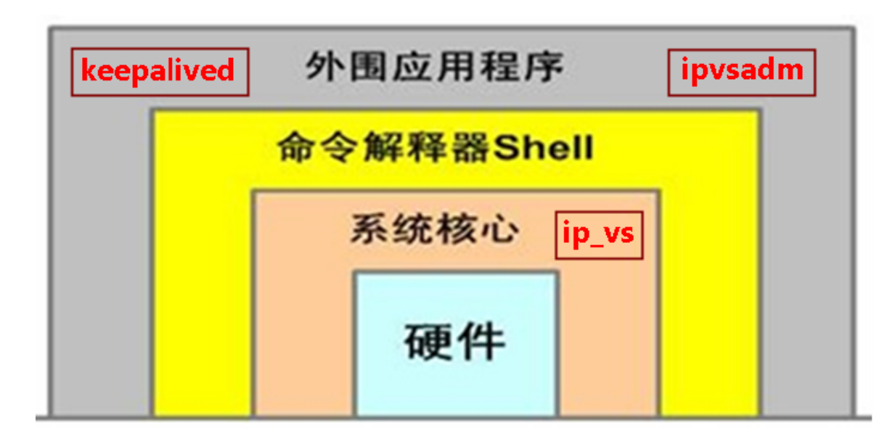

- `IPVS`的工作原理为：当SYN报文到达时，它就选择后边的一台服务器，将报文转发过去，在此之后的所有包含相同IP和TCP报文头地址的数据包都会被转到之前选择的服务器上，这个网络级别的转发效率最高。

- ```plain
  LVS无需安装
  安装的是管理工具，第一种叫ipvsadm，第二种叫keepalive
  ipvsadm是通过命令行管理，而keepalive读取配置文件管理
  后面我们会用Shell脚本实现keepalive的功能
  早在2.2内核时， IPVS就已经以内核补丁的形式出现。
  从2.4.23版本开始，IPVS软件就合并到Linux内核的常用版本的内核补丁的集合。
  从2.4.24以后IPVS已经成为Linux官方标准内核的一部分。
  ```

- ### LVS转发方式

- `IPVS`支持三种转发方式：

- - **VS/NAT（Virtual Server via Network Address Translation）：**通过网络地址转换，调度器重写请求报文的目标地址，根据预设的调度算法，将请求分派给后端的真实服务器；真实服务器的响应报文通过调度器时，报文的源地址被重写，再返回给客户，完成整个负载调度过程。
  - **VS/TUN（Virtual Server via IP Tunneling）：**调度器把请求报文通过IP隧道转发至真实服务器，而真实服务器将响应直接返回给客户。
  - **VS/DR（Virtual Server via Direct Routing）：**通过改写请求报文的MAC地址，将请求发送到真实服务器，而真实服务器将响应直接返回给客户。

- 采用`VS/NAT`技术时，由于请求和响应报文都必须经过调度器地址重写，因此它的伸缩能力有限，当服务器结点数目升到20时，调度器本身有可能成为系统的新瓶颈。但是可以与DNS负载均衡协同工作，进一步增加集群的规模。

- 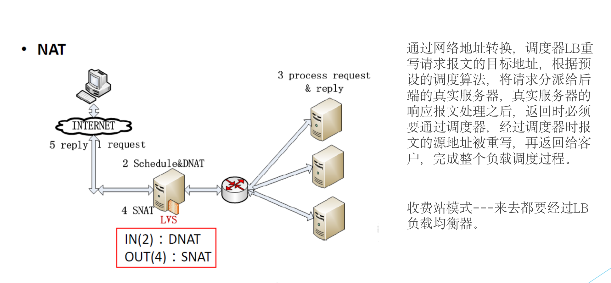

- 而使用`VS/TUN`与`VS/DR`时，调度器只处理请求报文，真实服务器的响应是直接返回给客户端的，因此可以极大的提高转发的性能，由于一般网络服务应答比请求报文大许多，使用`VS/TUN`与`VS/DR`时，最大吞吐量可以提高10倍，可以调度上百台服务器，本身不会成为系统的瓶颈。

- 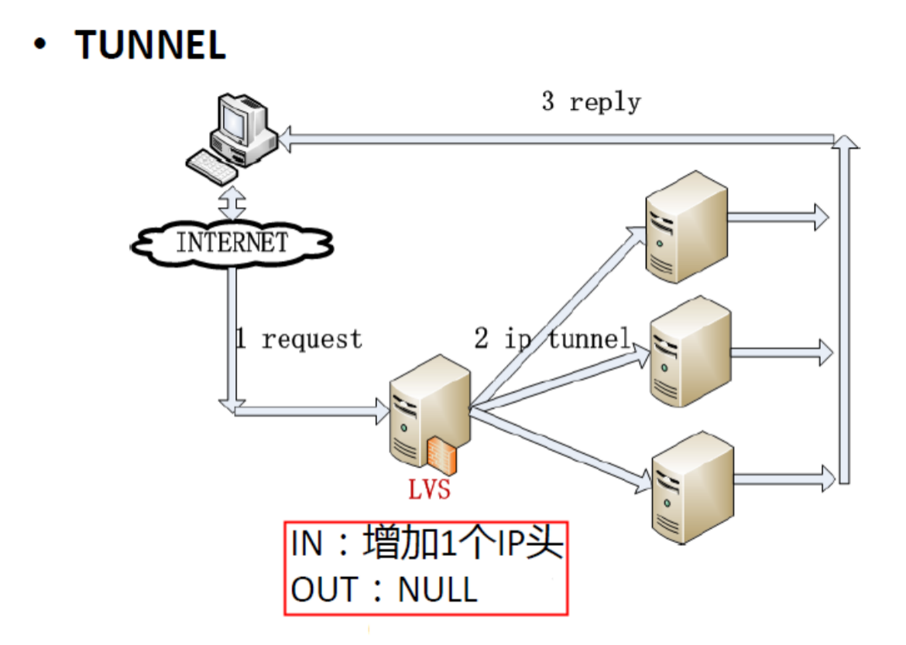

- `VS/DR`比`VS/TUN`的性能要稍好一些，它没有IP隧道的开销，对集群中的真实服务器也没有必须支持IP隧道协议的要求，但是要求调度器与真实服务器都有一块网卡连在同一物理网段上，且服务器网络设备（或者设备别名）不作ARP响应。

- 

- ### 调度算法

- `IPVS`支持十种负载均衡调度算法：

- - **轮叫（Round Robin）：**以轮叫的方式依次将请求调度到不同的服务器，会略过权值是0的服务器。
  - **加权轮叫（Weighted Round Robin）：**按权值的高低和轮叫方式分配请求到各服务器。服务器的缺省权值为1。假设服务器A的权值为1，B的权值为2，则表示服务器B的处理性能是A的两倍。例如，有三个服务器A、B和C分别有权值4、3和2，则在一个调度周期内(mod sum(W(Si)))调度序列为AABABCABC。
  - **最少链接（Least Connections）：**把新的连接请求分配到当前连接数最小的服务器。
  - **加权最少链接（Weighted Least Connections）：**调度新连接时尽可能使服务器的已建立连接数和其权值成比例，算法的实现是比较连接数与加权值的乘积，因为除法所需的CPU周期比乘法多，且在Linux内核中不允许浮点除法。
  - **基于局部性的最少链接（Locality-Based Least Connections）：**主要用于Cache集群系统，将相同目标IP地址的请求调度到同一台服务器，来提高各台服务器的访问局部性和主存Cache命中率。LBLC调度算法先根据请求的目标IP地址找出该目标IP地址最近使用的服务器，若该服务器是可用的且没有超载，将请求发送到该服务器；若服务器不存在，或者该服务器超载且有服务器处于其一半的工作负载，则用“最少链接”的原则选出一个可用的服务器，将请求发送到该服务器。
  - **带复制的基于局部性最少链接（Locality-Based Least Connections with Replication）：**主要用于Cache集群系统，它与LBLC算法的不同之处是它要维护从一个目标IP地址到一组服务器的映射。LBLCR算法先根据请求的目标IP地址找出该目标IP地址对应的服务器组；按“最小连接”原则从该服务器组中选出一台服务器，若服务器没有超载，将请求发送到该服务器；若服务器超载；则按“最小连接”原则从整个集群中选出一台服务器，将该服务器加入到服务器组中，将请求发送到该服务器。同时，当该服务器组有一段时间没有被修改，将最忙的服务器从服务器组中删除，以降低复制的程度。
  - **目标地址散列（Destination Hashing）：**通过一个散列（Hash）函数将一个目标IP地址映射到一台服务器，若该服务器是可用的且未超载，将请求发送到该服务器，否则返回空。使用素数乘法Hash函数：`(dest_ip* 2654435761UL) & HASH_TAB_MASK`。
  - **源地址散列（Source Hashing）：**根据请求的源IP地址，作为散列键（Hash Key）从静态分配的散列表找出对应的服务器，若该服务器是可用的且未超载，将请求发送到该服务器，否则返回空。
  - **最短期望延迟（Shortest Expected Delay Scheduling）：**将请求调度到有最短期望延迟的服务器。最短期望延迟的计算公式为(连接数 + 1) / 加权值。
  - **最少队列调度（Never Queue Scheduling）：**如果有服务器的连接数是0，直接调度到该服务器，否则使用上边的SEDS算法进行调度。

- LVS允许运行时动态的增减负载均衡池中的服务器及调整其权值，所以可以自行通过软件实现一些动态反馈负载均衡算法，如根据服务器网络流量、CPU、内存、磁盘IO等资源的使用情况综合调整权重（Redhat Piranha提供了类似功能）。现在很多应框架也提供了友好的监控接口，如Spring Boot Actuator，JMX等，让自行实现动态反馈负载均衡更加简单。从性能方面考虑，官方建议权值调整时间间隔应该在5到20秒之间。

- ## 部署LVS

- ### 使用ipvsadm管理集群

- `ipvsadm`是`IPVS`的命令行管理工具

- 在开始之前先介绍几个概念：

- - **Director Server（DS）：**负责负载均衡调度的LVS服务器
  - **Real Server（RS）：**负载均衡池中真实工作的服务器
  - **Director Server IP（DIP）：**`DS`的IP地址
  - **Real Server IP（RIP）：**`RS`的IP地址
  - **Virtual Server IP（VIP）：**虚拟服务器的IP地址，在`VS/DR`模式下，`DS`与`RS`除了有自己的IP，同时还需要配置相同的`VIP`

- 

- DR原理图

- 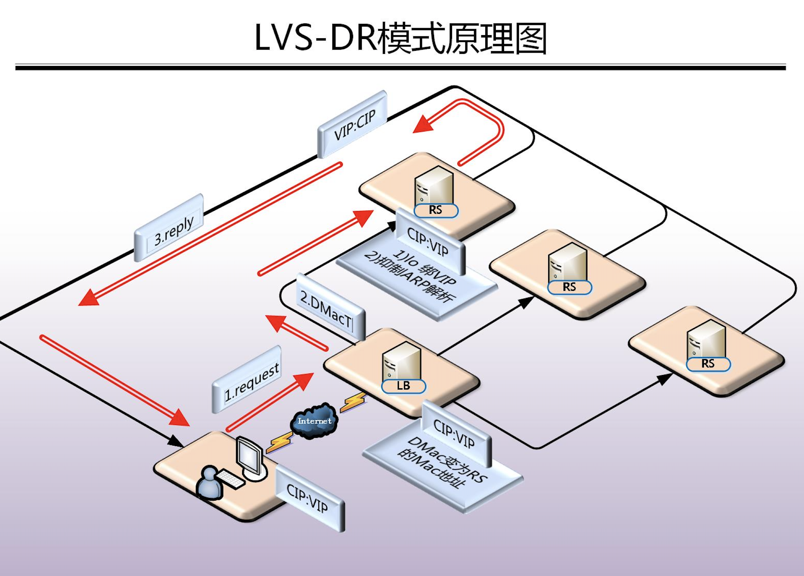

- ### LVS集群DR工作模式

- ```plain
  a)通过在调度器LB上修改数据包的目的MAC地址实现转发。注意，源IP地址仍然是CIP，目的IP地址仍然是VIP。
  b)请求的报文经过调度器，而RS响应处理后的报文无需经过调度器LB，因此，并发访问量大时使用效率很高，比Nginx代理模式强于此处。
  c)因DR模式是通过MAC地址的改写机制实现转发的，因此，所有RS节点和调度器LB只能在同一个局域网中。需要注意RS节点的VIP的绑定(lo:vip/32)和ARP抑制问题。
  d)强调下：RS节点的默认网关不需要是调度器LB的DIP，而应该直接是IDC机房分配的上级路由器的IP(这是RS带有外网IP地址的情况)，理论上讲，只要RS可以出网即可，不需要必须配置外网IP，但走自己的网关，那网关就成为瓶颈了。
  e)由于DR模式的调度器仅进行了目的MAC地址的改写，因此，调度器LB无法改变请求报文的目的端口。LVS DR模式的办公室在二层数据链路层（MAC），NAT模式则工作在三层网络层（IP）和四层传输层（端口）。
  f)当前，调度器LB支持几乎所有UNIX、Linux系统，但不支持windows系统。真实服务器RS节点可以是windows系统。
  g)总之，DR模式效率很高，但是配置也较麻烦。因此，访问量不是特别大的公司可以用haproxy/Nginx取代之。这符合运维的原则：简单、易用、高效。日1000-2000W PV或并发请求1万以下都可以考虑用haproxy/Nginx(LVS的NAT模式)
  h)直接对外的访问业务，例如web服务做RS节点，RS最好用公网IP地址。如果不直接对外的业务，例如：MySQL，存储系统RS节点，最好只用内部IP地址。
  ```

- ## LVS集群搭建

- 实验环境的拓扑结构

- 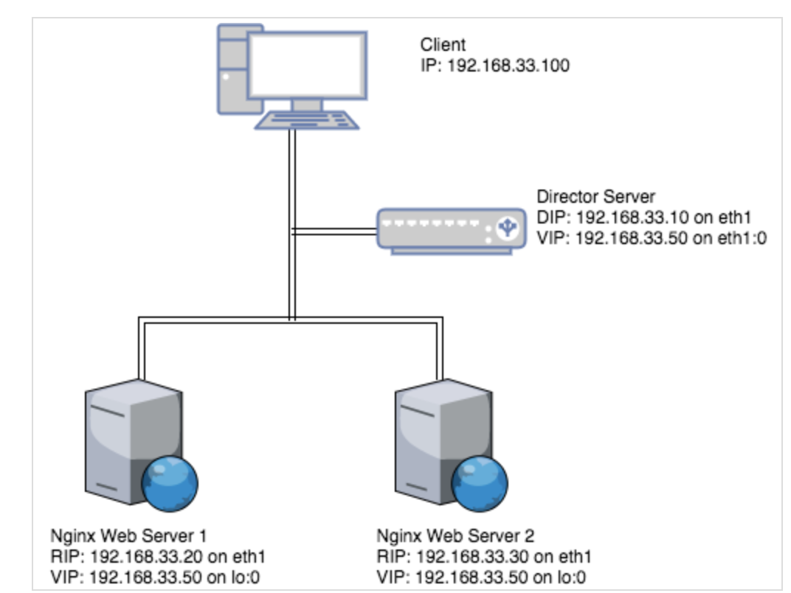

- 实验环境中，因为客户端与`DS`、`RS`在同一个物理网网段中，所以会有ARP问题。因为`DS`、`RS`都有相同的`VIP`，当客户端需要访问`VIP`地址时，`RS`有可能先于`DS`对`ARP`解析进行抢答，这样客户端就会直接与`RS`交互，`DS`就起不到负载均衡的作用了。所以要在`RS`的相应网络接口上禁用ARP功能，禁用的命令如下：

- 示例

- ```plain
  ifconfig eth1:0 192.168.33.50 netmask 255.255.255.255 broadcast 192.168.33.50 up
  route add -host 192.168.33.50 dev eth1:0
  ipvsadm -D -t 192.168.33.50:80
  ipvsadm -A -t 192.168.33.50:80 -s rr
  ipvsadm -a -t 192.168.33.50:80 -r 192.168.33.20 -g
  ipvsadm -a -t 192.168.33.50:80 -r 192.168.33.30 -g
  ipvsadm -l --stats
  ```

- ### 环境环境准备

- ```plain
  三台linux机器
  主机名        ip地址            软件
  lb01  10.0.1.30     lvs keepalived
  lb02  10.0.1.29     lvs  keepalived
  web01 10.0.1.31            nginx(用作web展示)
  web02 10.0.1.32            nginx(用作web展示)
  ```

- 机器环境初始化

- ```plain
  # 防火墙
  systemctl stop firewalld
  systemctl disable firewalld
  iptables -F
  [root@web02 ~]# getenforce
  Disabled
  yum install -y wget 
  # yum源，基础软件安装
  wget -O /etc/yum.repos.d/CentOS-Base.repo http://mirrors.aliyun.com/repo/Centos-7.repo
  wget -O /etc/yum.repos.d/epel.repo http://mirrors.aliyun.com/repo/epel-7.repo
  yum clean all
  yum install -y bash-completion vim lrzsz wget expect net-tools nc nmap tree dos2unix htop iftop iotop unzip telnet sl psmisc nethogs glances bc ntpdate  openldap-devel git python-pip  gcc automake autoconf python-devel  sshpass lrzsz readline-devel lsof
  ```

- ### 确保web01/02可访问

- ```plain
  yum install nginx -y # 利用nginx做基本的静态页面展示
  echo "This is web01 page." > /usr/share/nginx/html/index.html
  echo "This is web02 page." > /usr/share/nginx/html/index.html
  # 启动nginx
  nginx
  ```

- 在lb01上测试访问

- ```plain
  [root@lb01 ~]# curl 10.0.1.32
  This is web02 page.
  [root@lb01 ~]#
  [root@lb01 ~]#
  [root@lb01 ~]# curl 10.0.1.31
  This is web01 page.
  ```

- ### 安装Ipvsdam

- 安装lvs管理工具

- ```plain
  # 检查系统内核加载的模块
  执行lsmod指令，会列出所有已载入系统的模块。Linux操作系统的核心具有模块化的特性，应此在编译核心时，务须把全部的功能都放入核心。您可以将这些功能编译成一个个单独的模块，待需要时再分别载入。
  # 检查系统是否支持ip_vs模块，默认是没开启的
  [root@lb01 ~]# lsmod |grep ip_vs
  [root@lb01 ~]#
  # 安装工具
  [root@lb01 ~]# yum install ipvsadm -y
  # 激活LVS内核
  [root@lb01 ~]# ipvsadm
  IP Virtual Server version 1.2.1 (size=4096)
  Prot LocalAddress:Port Scheduler Flags
    -> RemoteAddress:Port           Forward Weight ActiveConn InActConn
  # 检查系统模块支持
  [root@lb01 ~]# lsmod |grep ip_vs
  ip_vs                 141432  0
  nf_conntrack          133053  1 ip_vs
  libcrc32c              12644  3 xfs,ip_vs,nf_conntrack
  ```

- ### LVS搭建

- 配置LVS负载均衡服务，在lb01上操作

- #### 步骤1：

- 绑定VIP地址

- ```plain
  [root@lb01 ~]# ip addr add 10.0.1.40 dev ens33
  [root@lb01 ~]# ip addr
  1: lo: <LOOPBACK,UP,LOWER_UP> mtu 65536 qdisc noqueue state UNKNOWN group default qlen 1000
      link/loopback 00:00:00:00:00:00 brd 00:00:00:00:00:00
      inet 127.0.0.1/8 scope host lo
         valid_lft forever preferred_lft forever
      inet6 ::1/128 scope host
         valid_lft forever preferred_lft forever
  2: ens33: <BROADCAST,MULTICAST,UP,LOWER_UP> mtu 1500 qdisc pfifo_fast state UP group default qlen 1000
      link/ether 00:0c:29:49:da:2f brd ff:ff:ff:ff:ff:ff
      inet 10.0.1.30/24 brd 10.0.1.255 scope global noprefixroute ens33
         valid_lft forever preferred_lft forever
      inet 10.0.1.40/32 scope global ens33
         valid_lft forever preferred_lft forever
      inet6 fe80::d972:afb:d0a9:7126/64 scope link noprefixroute
         valid_lft forever preferred_lft forever
  ```

- #### 步骤2：

- 清楚当前所有的LVS规则

- ```plain
  [root@lb01 ~]# ipvsadm -C
  ```

- #### 步骤3：

- 设置连接超时时间，--set参数

- ```
  --set tcp tcpfin udp set connection timeout values
  [root@lb01 ~]# ipvsadm --set 30 5 60
  ```

- #### 步骤4：

- 添加虚拟服务(-A)

- ```
  --add-service -A add virtual service with options
  ```

- -t 指定虚拟服务的IP端口

- ```
  --tcp-service -t service-address service-address is host[:port]
  ```

- -s 指定调度算法

- ```
  --scheduler -s scheduler one of rr|wrr|lc|wlc|lblc|lblcr|dh|sh|sed|nq,
  ```

- -p 指定超时时间

- ```
  --persistent -p [timeout] persistent service
  [root@lb01 ~]# ipvsadm -A -t 10.0.1.40:80 -s wrr -p 20
  ```

- #### 步骤5：

- 将虚拟服务关联到真实服务 -a

- 也就是关联到web01/02两台机器

- ```
  --add-server -a add real server with options
  ```

- -r 指定真实服务的IP端口

- ```
  --real-server -r server-address server-address is host (and port)
  ```

- -g LVS的模式 DR模式

- ```
  --gatewaying -g gatewaying (direct routing) (default)
  ```

- -w 指定权重

- ```
  --weight -w weight capacity of real server
  [root@lb01 ~]# ipvsadm -a -t 10.0.1.40:80 -r 10.0.1.31:80 -g -w 1
  [root@lb01 ~]# ipvsadm -a -t 10.0.1.40:80 -r 10.0.1.32:80 -g -w 1
  ```

- #### 步骤6

- 查看lvs配置结果

- ```plain
  [root@lb01 ~]# ipvsadm -ln
  IP Virtual Server version 1.2.1 (size=4096)
  Prot LocalAddress:Port Scheduler Flags
    -> RemoteAddress:Port           Forward Weight ActiveConn InActConn
  TCP  10.0.1.40:80 wrr persistent 20
    -> 10.0.1.31:80                 Route   1      0          0
    -> 10.0.1.32:80                 Route   1      0          0
  ```

- ### ipvsadm命令参数

- ***ipvsadm\**\****参数说明：*(***\*更多参照 man ipvsadm)**

- | **参数*********(******短格式******)*** | **参数*********(******长格式******)***                       | **参数说明**                                                 |                      |      |      |       |        |      |      |      |                          |
  | -------------------------------------- | ------------------------------------------------------------ | ------------------------------------------------------------ | -------------------- | ---- | ---- | ----- | ------ | ---- | ---- | ---- | ------------------------ |
  | **-A**                                 | --add-service                                                | 在内核的虚拟服务器表中添加一条新的虚拟服务器记录。也就是增加一台新的虚拟服务器。 |                      |      |      |       |        |      |      |      |                          |
  | **-E**                                 | --edit-service                                               | 编辑内核虚拟服务器表中的一条虚拟服务器记录。                 |                      |      |      |       |        |      |      |      |                          |
  | **-D**                                 | --delete-service                                             | 删除内核虚拟服务器表中的一条虚拟服务器记录。                 |                      |      |      |       |        |      |      |      |                          |
  | **-C**                                 | --clear                                                      | 清除内核虚拟服务器表中的所有记录。                           |                      |      |      |       |        |      |      |      |                          |
  | **-R**                                 | --restore                                                    | 恢复虚拟服务器规则                                           |                      |      |      |       |        |      |      |      |                          |
  | **-S**                                 | --save                                                       | 保存虚拟服务器规则，输出为-R 选项可读的格式                  |                      |      |      |       |        |      |      |      |                          |
  | **-a**                                 | --add-server                                                 | 在内核虚拟服务器表的一条记录里添加一条新的真实服务器记录。也就是在一个虚拟服务器中增加一台新的真实服务器 |                      |      |      |       |        |      |      |      |                          |
  | **-e**                                 | --edit-server                                                | 编辑一条虚拟服务器记录中的某条真实服务器记录                 |                      |      |      |       |        |      |      |      |                          |
  | **-d**                                 | --delete-server                                              | 删除一条虚拟服务器记录中的某条真实服务器记录                 |                      |      |      |       |        |      |      |      |                          |
  | **-L\                                  | -l**                                                         | --list                                                       | 显示内核虚拟服务器表 |      |      |       |        |      |      |      |                          |
  | **-Z**                                 | --zero                                                       | 虚拟服务表计数器清零（清空当前的连接数量等）                 |                      |      |      |       |        |      |      |      |                          |
  | **-**                                  | --set *tcp tcpfin udp*                                       | 设置连接超时值                                               |                      |      |      |       |        |      |      |      |                          |
  | **-**                                  | --start-daemon                                               | 启动同步守护进程。他后面可以是master 或backup，用来说明LVS Router 是master 或是backup。在这个功能上也可以采用keepalived 的VRRP 功能。 |                      |      |      |       |        |      |      |      |                          |
  | **-**                                  | --stop-daemon                                                | 停止同步守护进程                                             |                      |      |      |       |        |      |      |      |                          |
  | **-h**                                 | --help                                                       | 显示帮助信息                                                 |                      |      |      |       |        |      |      |      |                          |
  | **-t**                                 | --tcp-service *service-address [vip:port] or [real-server-ip:port]* | 说明虚拟服务器提供的是tcp 的服务                             |                      |      |      |       |        |      |      |      |                          |
  | **-u**                                 | --udp-service *service-address [vip:port] or [real-server-ip:port]* | 说明虚拟服务器提供的是udp 的服务                             |                      |      |      |       |        |      |      |      |                          |
  | **-f**                                 | --fwmark-service *fwmark*                                    | 说明是经过iptables 标记过的服务类型。                        |                      |      |      |       |        |      |      |      |                          |
  | **-s**                                 | --scheduler *scheduler*                                      | 使用的调度算法，有这样几个选项rr\                            | wrr\                 | lc\  | wlc\ | lblc\ | lblcr\ | dh\  | sh\  | sed\ | nq默认的调度算法是： wlc |
  | **-p**                                 | --persistent *[timeout]*                                     | 持久稳固的服务。这个选项的意思是来自同一个客户的多次请求，将被同一台真实的服务器处理。timeout 的默认值为300秒。 |                      |      |      |       |        |      |      |      |                          |
  | **-M**                                 | --netmask netmask                                            | persistent granularity mask                                  |                      |      |      |       |        |      |      |      |                          |
  | **-r**                                 | --real-server *server-address*                               | 真实的服务器[Real-Server:port]                               |                      |      |      |       |        |      |      |      |                          |
  | **-g**                                 | --gatewaying                                                 | 指定LVS 的工作模式为直接路由模式（也是LVS 默认的模式）       |                      |      |      |       |        |      |      |      |                          |
  | **-i**                                 | --ipip                                                       | 指定LVS 的工作模式为隧道模式                                 |                      |      |      |       |        |      |      |      |                          |
  | **-m**                                 | --masquerading                                               | 指定LVS 的工作模式为NAT 模式                                 |                      |      |      |       |        |      |      |      |                          |
  | **-w**                                 | --weight *weight*                                            | 真实服务器的权值                                             |                      |      |      |       |        |      |      |      |                          |
  | **-**                                  | --mcast-interface                                            | interface 指定组播的同步接口                                 |                      |      |      |       |        |      |      |      |                          |
  | **-c**                                 | --connection                                                 | 显示LVS 目前的连接 如：ipvsadm -L -c                         |                      |      |      |       |        |      |      |      |                          |
  | **-**                                  | --timeout                                                    | 显示tcp tcpfin udp 的timeout 值 如：ipvsadm -L --timeout     |                      |      |      |       |        |      |      |      |                          |
  | **-**                                  | --daemon                                                     | 显示同步守护进程状态                                         |                      |      |      |       |        |      |      |      |                          |
  | **-**                                  | --stats                                                      | 显示统计信息                                                 |                      |      |      |       |        |      |      |      |                          |
  | **-**                                  | --rate                                                       | 显示速率信息                                                 |                      |      |      |       |        |      |      |      |                          |
  | **-**                                  | --sort                                                       | 对虚拟服务器和真实服务器排序输出                             |                      |      |      |       |        |      |      |      |                          |
  | **-**                                  | --numeric -n                                                 | 输出IP 地址和端口的数字形式                                  |                      |      |      |       |        |      |      |      |                          |

- ## 客户端操作web01/web02

- ### 步骤1：

- 在lo回环地址绑定VIP，让RS机器能够接收到vip的数据包。

- 在lo回环地址上配置vip，可以完成，且只能配置在lo回环地址上，不能配置在ens33上，否则会造成arp缓存表紊乱，导致lvs集群无法工作。

- ```plain
  ip addr add 10.0.1.40/32  dev lo
  [root@web01 ~]# ip addr add 10.0.1.40/32  dev lo
  [root@web02 ~]# ip addr add 10.0.1.40/32  dev lo
  ```

- ### 步骤2：ARP控制

- ### **修改内核参数抑制ARP响应**

- ```plain
  arp说明
  ARP协议,全称"Address Resolution Protocol",中文名是地址解析协议，使用ARP协议可实现通过IP地址获得对应主机的物理地址(MAC地址)。
  ARP协议要求通信的主机双方必须在同一个物理网段（即局域网环境）！
  为了系统ip和mac地址解析的效率，系统会把缓存结果保存下来，这个结果就是arp缓存。
  Windows查看ARP缓存命令 arp -a
  Linux查看ARP缓存命令 arp -n
  [root@web01 ~]# arp -n
  Address                  HWtype  HWaddress           Flags Mask            Iface
  10.0.1.1                 ether   00:50:56:c0:00:02   C                     ens33
  10.0.1.2                 ether   00:50:56:e0:bb:fd   C                     ens33
  10.0.1.30                ether   00:0c:29:49:da:2f   C                     ens33
  10.0.1.32                ether   00:0c:29:69:cf:24   C
  Linux解析IP对应的MAC地址
  [root@web01 ~]# arping -c 1 -I ens33 10.0.1.32
  ARPING 10.0.1.32 from 10.0.1.31 ens33
  Unicast reply from 10.0.1.32 [00:0C:29:69:CF:24]  0.857ms
  Sent 1 probes (1 broadcast(s))
  Received 1 response(s)
  若是没有arp命令，安装yum install net-tools -y
  ```

- ### LVS在DR模式下关闭arp功能

- 实验环境中，因为客户端与`DS`、`RS`在同一个物理网网段中，所以会有ARP问题。因为`DS`、`RS`都有相同的`VIP`，当客户端需要访问`VIP`地址时，`RS`有可能先于`DS`对`ARP`解析进行抢答，这样客户端就会直接与`RS`交互，`DS`就起不到负载均衡的作用了。所以要在`RS`的相应网络接口上禁用ARP功能，禁用的命令如下：

- ```plain
  arp作用是根据ip地址获取mac地址
  [root@web01 ~]# cat >>/etc/sysctl.conf<<EOF
  > net.ipv4.conf.all.arp_ignore = 1
  > net.ipv4.conf.all.arp_announce = 2
  > net.ipv4.conf.lo.arp_ignore = 1
  > net.ipv4.conf.lo.arp_announce = 2
  > EOF
  # 让内核参数生效
  [root@web01 ~]# sysctl -p
  net.ipv4.conf.all.arp_ignore = 1
  net.ipv4.conf.all.arp_announce = 2
  net.ipv4.conf.lo.arp_ignore = 1
  net.ipv4.conf.lo.arp_announce = 2
  [root@web01 ~]#
  # 同样的操作，在web02也执行即可，注意
  ```

- #### 禁止arp参数解释

- ***arp_announce***

- 对网络接口上，本地IP地址的发出的，ARP回应，作出相应级别的限制:

- 确定不同程度的限制,宣布对来自本地源IP地址发出Arp请求的接口

- | **数值** | **含义**                                                     |
  | -------- | ------------------------------------------------------------ |
  | **默认** | 在任意网络接口（eth0,eth1，lo）上的任何本地地址              |
  | **1**    | 尽量避免不在该网络接口子网段的本地地址做出arp回应. 当发起ARP请求的源IP地址 是被设置应该经由路由达到此网络接口的时候很有用.此时会检查来访IP是否为所有接口 上的子网段内ip之一.如果改来访IP不属于各个网络接口上的子网段内,那么将采用级别2的方式来进行处理. |
  | **2**    | 对查询目标使用最适当的本地地址.在此模式下将忽略这个IP数据包的源地址并尝试 选择与能与该地址通信的本地地址.首要是选择所有的网络接口的子网中外出访问子网中 包含该目标IP地址的本地地址. 如果没有合适的地址被发现,将选择当前的发送网络接口 或其他的有可能接受到该ARP回应的网络接口来进行发送. |

- ***arp_ignore\*****定义**

- **对目标地定义对目标地址为本地IP**的ARP**询问不同的应答模式0**

- | **数值** | **含义**                                                     |
  | -------- | ------------------------------------------------------------ |
  | 默认值   | 回应任何网络接口上对任何本地IP地址的arp查询请求              |
  | **1**    | 只回答目标IP地址是来访网络接口本地地址的ARP查询请求          |
  | **2**    | 只回答目标IP地址是来访网络接口本地地址的ARP查询请求,且来访IP必须在该网络接口的子网段内 |
  | **3**    | 不回应该网络界面的arp请求，而只对设置的唯一和连接地址做出回应 |
  | **4-7**  | 保留未使用                                                   |
  | **8**    | 不回应所有（本地地址）的arp查询                              |

- ### 是否抑制ARP的广播图

- 未抑制arp的广播图，是有误的

- 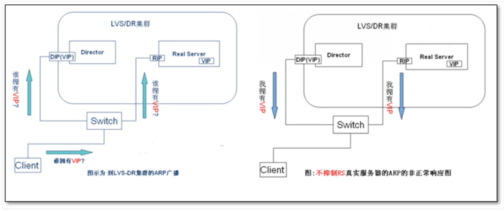

- 抑制arp之后的广播情况，正确了

- 

- ### ARP缓存之双刃剑

- a) 主机有了arp缓存表，可以加快ARP的解析速度，减少局域网内广播风暴。因为arp是发广播解析的，频繁的解析也是消耗带宽的，尤其是机器多的时候。

- b) 正是有了arp缓存表，给恶意黑客带来了攻击服务器主机的风险，这个就是arp欺骗攻击。

- c) 切换路由器，负载均衡器等设备时，可能会导致短时网络中断。因为所有的客户端ARP缓存表没有更新

- ### 服务器切换ARP问题

- 　当集群中一台提供服务的lb01机器宕机后，然后VIP会转移到备机lb02上，但是客户端的ARP缓存表的地址解析还是宕机的lb01的MAC地址。从而导致，即使在lb02上添加VIP，也会发生客户端无法访问的情况。

- 　　解决办法是：当lb01宕机，VIP地址迁移到lb02时，需要通过arping命令通知所有网络内机器更新本地的ARP缓存表，从而使得客户机访问时重新广播获取MAC地址。

- 　　这个是自己开发服务器高可用脚本及所有高可用软件必须考虑到的问题。

- ### arp刷新

- ```plain
  [root@web01 ~]# arping -I ens33 -c 1 -U 10.0.1.40  # 后面是VIP地址
  ARPING 10.0.1.40 from 10.0.1.40 ens33
  Sent 1 probes (1 broadcast(s))
  Received 0 response(s)
  ```

- ## 至此LVS配置完成

- 可以在mac/win本地访问vip地址

- ```plain
  http://10.0.1.40/
  ```

- 

- 这里要注意的是，lvs不像nginx一样，非常明显的一比一的关系，每次刷新，分别看到web01/web02

- 如果想要其结果，可以等待10s以上，或者换一个浏览器访问vip即可。

- 因为lvs只有在访问量非常大的时候，才能明显的基于一比一的请求转发。

- 可以分别看到web01和web02的页面。

- # LVS结合keepalived方案

- 之前的lvs虽然配置成功也实现了负载均衡，但是我们测试的时候发现，当某台real server把nginx停掉，那么director照样会把请求转发过去，这样就造成了某些请求不正常。所以需要有一种机制用来检测real server的状态，这时就可以使用keepalive。

- ```plain
  [root@web01 ~]# nginx -s stop
  ```

- 

- 我们是不希望发生如上的情况的。

- ## keepalived的作用

- 在 lvs+keepalived 环境里面，lvs 主要的工作是提供调度算法，把客户端请求按照需求调度在 real 服务器，keepalived 主要的工作是提供 lvs 控制器的一个冗余，并且对 real 服务器做健康检查，发现不健康的 real 服务器，就把它从 lvs 集群中剔除，real 服务器只负责提供服务。

- 除了可以检测RS状态外(剔除故障的RS)，还可以添加备用director。也就是说keepalived在这里也可以配置HA集群的功能，当然了也需要一台备用的director服务器。备用director也需要安装keepalive软件。

- 注意：keepalive不像nginx和Apache那样，会自动检测配置文件是否错误。所以应该仔细检查配置文件。

- ## 架构原理

- ## keepalived

- Keepalived 是运行在 lvs 之上，是一个用于做双机热备（HA）的软件，它的主要功能是实现真实机的故障隔离及负载均衡器间的失败切换，提高系统的可用性。

- ### 运行原理

- keepalived 通过选举（看服务器设置的权重）挑选出一台热备服务器做 MASTER 机器，MASTER 机器会被分配到一个指定的虚拟 ip，外部程序可通过该 ip 访问这台服务器，如果这台服务器出现故障（断网，重启，或者本机器上的 keepalived crash 等），keepalived 会从其他的备份机器上重选（还是看服务器设置的权重）一台机器做 MASTER 并分配同样的虚拟 IP，充当前一台 MASTER 的角色。

- ### 选举策略

- 选举策略是根据 VRRP 协议，完全按照权重大小，权重最大（0～255）的是 MASTER 机器，下面几种情况会触发选举

- 1. keepalived 启动的时候
  2. master 服务器出现故障（断网，重启，或者本机器上的 keepalived crash 等，而本机器上其他应用程序 crash 不算）
  3. 有新的备份服务器加入且权重最大

- 

- ## keepalived 的配置文件说明

- Keepalived 是运行在 lvs 之上, 它的主要功能是实现 RealServer(真实服务器)的故障隔离及 Director(负载均衡器)间的 FailOver(失败切换).

- - keepalived 是 lvs 的扩展项目, 因此它们之间具备良好的兼容性
  - 对 RealServer 的健康检查, 实现对失效机器 / 服务的故障隔离
  - 负载均衡器之间的失败切换 failover

- ## 部署过程

- 在lb01/02机器安装keepalived软件

- 毕竟我们要实现两台机器的高可用性，因此准备2太，安装keepalived服务

- ```plain
  [root@lb01 ~]# yum install keepalived -y
  [root@lb01 ~]# rpm -qa keepalived
  keepalived-1.3.5-16.el7.x86_64
  ```

- ## 修改配置文件lb01

- ```plain
  [root@lb01 ~]# cp /etc/keepalived/keepalived.conf{,.bak}
  [root@lb01 ~]# cat /etc/keepalived/keepalived.conf
  ! Configuration File for keepalived
  # 全局ip
  global_defs {
     router_id LVS_01
  }
  # 实例配置
  vrrp_instance VI_1 {
      state MASTER
      interface ens33
      virtual_router_id 51
      priority 150
      advert_int 1
      authentication {
          auth_type PASS
          auth_pass 1111
      }
      virtual_ipaddress {
      10.0.1.40/24
      }
  }
  # 虚拟服务器配置
  virtual_server 10.0.1.40 80 {
      delay_loop 6
      lb_algo wrr
      lb_kind DR
      nat_mask 255.255.255.0
      persistence_timeout 50
      protocol TCP
        # 真实服务器一
      real_server 10.0.1.31 80 {
          weight 1
      TCP_CHECK {
           connect_timeout 8
           nb_get_retry 3
           delay_before_retry 3
           connect_port 80
            }
          }
          # 真实服务器二
      real_server 10.0.1.32 80 {
          weight 1
      TCP_CHECK {
           connect_timeout 8
           nb_get_retry 3
           delay_before_retry 3
           connect_port 80
            }
          }
  }
  ```

- 参数解释

- TCP方式

- ```plain
  onnect_port 80         # 设置监控检查的端口
  bindto  <IPADD>         # 设置健康检查的 IP 地址
  connect_timeout   3     # 设置连接超时时间
  nb_get_retry  3         # 设置重连次数
  delay_before_retry  2   # 设置重连间隔
  ```

- Virtual_server虚拟主机配置

- ```plain
  关于 keeplived 的虚拟主机配置有三种如下所示
  virtual server IP port
  virtual server fwmark int
  virtual server group string
  以常用的第一种为例
  virtual_server 192.168.1.2 80
  含义: 设置一个 virtual server: VIP:Vport
  delay_loop 3
  含义: 设置 service polling 的 delay 时间即服务轮询的时间间隔
  lb_algo rr|wrr|lc|wlc|lblc|sh|dh
  含义: 设置 LVS 调度算法
  lb_kind NAT|DR|TUN
  含义: 设置 LVS 集群模式
  persistence_timeout 120
  含义: 设置会话保持时间秒为单位即以用户在 120 秒内被分配到同一个后端 realserver, 超过此时间就重新分配
  persistence_granularity
  含义: 设置 LVS 会话保持粒度 ipvsadm 中的 - M 参数默认是 0xffffffff 即每个客户端都做会话保持
  protocol TCP
  含义: 设置健康检查用的是 TCP 还是 UDP
  ha_suspend
  含义: suspendhealthchecker’s activity
  virtualhost
  含义: HTTP_GET 做健康检查时检查的 web 服务器的虚拟主机即 host 头
  sorry_server
  含义: 设置 backupserver 就是当所有后端 realserver 节点都不可用时就用这里设置的也就是临时把所有的请求都发送到这里
  real_server
  含义: 设置后端真实节点主机的权重等设置主要后端有几台这里就要设置几个
  weight 1
  含义: 设置给每台的权重 0 表示失效 (不知给他转发请求知道他恢复正常) 默认是 1
  inhibit_on_failure
  含义: 表示在节点失败后把他权重设置成 0 而不是冲 IPVS 中删除
  notify_up |
  含义: 设置检查服务器正常 (UP) 后要执行的脚本
  notify_down |
  含义: 设置检查服务器失败 (down) 后要执行的脚本
  注: keepalived 检查机制说明
  keepalived 健康检查方式有: HTTP_GET|SSL_GET|TCP_CHECK|SMTP_CHECK|MISC_CHECK 几种如下所示
  ```

- ### 修改lb02配置文件

- ```plain
  1.安装keepalived服务
  [root@lb02 ~]# yum install keepalived -y
  2.修改配置文件
  [root@lb02 ~]# cat /etc/keepalived/keepalived.conf
  ! Configuration File for keepalived
  global_defs {
     router_id LVS_02
  }
  vrrp_instance VI_1 {
      state BACKUP
      interface ens33
      virtual_router_id 51
      priority 100
      advert_int 1
      authentication {
          auth_type PASS
          auth_pass 1111
      }
      virtual_ipaddress {
       10.0.1.40/24
      }
  }
  virtual_server 10.0.1.40 80 {
      delay_loop 6
      lb_algo wrr
      lb_kind DR
      nat_mask 255.255.255.0
      persistence_timeout 50
      protocol TCP
      real_server 10.0.1.31 80 {
          weight 1
          TCP_CHECK {
          connect_timeout 8
          nb_get_retry 3
          delay_before_retry 3
          connect_port 80
          }
      }
      real_server 10.0.1.32 80 {
          weight 1
          TCP_CHECK {
          connect_timeout 8
          nb_get_retry 3
          delay_before_retry 3
          connect_port 80
          }
      }
  }
  ```

- ## 启动keepalived服务

- 注意，先关闭先前设置的ipvsadm的配置，重启网络即可

- ```plain
  systemctl restart network
  ```

- 启动keepalived，即可生成vip

- ```plain
  [root@lb02 ~]# systemctl start keepalived
  [root@lb01 ~]# systemctl start keepalived
  ```

- 检查vip的漂移，只有正确漂移，才能保证实验的准确。

- 如有失败，检查配置文件，防火墙！

- ```plain
  1.停止 lb01的kp服务，检查lb02的vip漂移
  2.启动lb01的kp服务，检查lb02的vip漂移
  ```

- 检查ipvsadm的状态

- ```plain
  [root@lb01 ~]# ipvsadm -ln
  IP Virtual Server version 1.2.1 (size=4096)
  Prot LocalAddress:Port Scheduler Flags
    -> RemoteAddress:Port           Forward Weight ActiveConn InActConn
  TCP  10.0.1.40:80 wrr persistent 50
    -> 10.0.1.31:80                 Route   1      0          0
    -> 10.0.1.32:80                 Route   1      0          0
  [root@lb02 ~]# ipvsadm -ln
  IP Virtual Server version 1.2.1 (size=4096)
  Prot LocalAddress:Port Scheduler Flags
    -> RemoteAddress:Port           Forward Weight ActiveConn InActConn
  TCP  10.0.1.40:80 wrr persistent 50
    -> 10.0.1.31:80                 Route   1      0          0
    -> 10.0.1.32:80                 Route   1      0          0
  [root@lb02 ~]# ipvsadm -ln
  IP Virtual Server version 1.2.1 (size=4096)
  Prot LocalAddress:Port Scheduler Flags
    -> RemoteAddress:Port           Forward Weight ActiveConn InActConn
  TCP  10.0.1.40:80 wrr persistent 50
    -> 10.0.1.31:80                 Route   1      0          0
    -> 10.0.1.32:80                 Route   1      0          0
  ```

- ## 在web01/02上配置

- ```plain
  1.抑制客户端arp解析
  ip addr add 10.0.1.40/32 dev lo
  2.修改内核参数，抑制arp响应
  cat >>/etc/sysctl.conf<<EOF
  net.ipv4.conf.all.arp_ignore = 1
  net.ipv4.conf.all.arp_announce = 2
  net.ipv4.conf.lo.arp_ignore = 1
  net.ipv4.conf.lo.arp_announce = 2
  EOF
  sysctl -p
  3.注意命令修改知识临时生效，可以写入rc.local，实现永久生效。
  ```

- # 验证lvs+keepalived

- 访问lvs

- 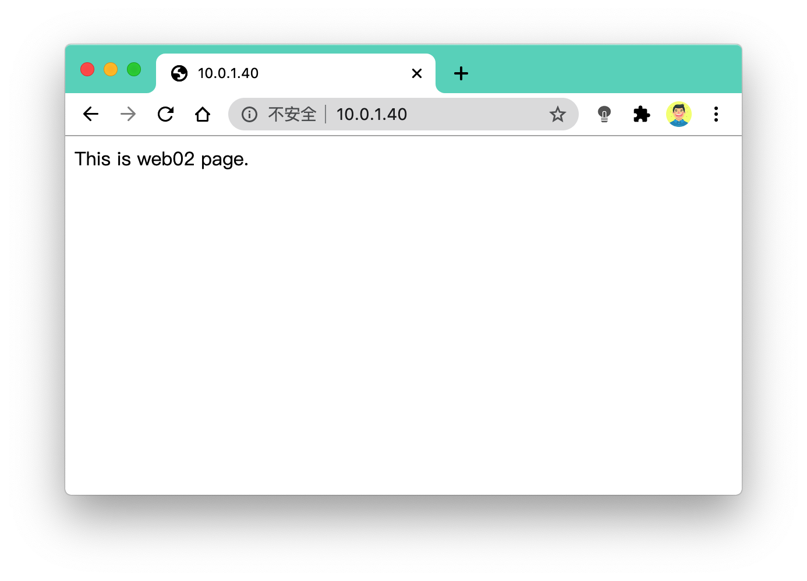

- 解析关系一

- 

- lb01如果宕机，也不影响服务

- ```plain
  # 停止lb01的vip
  [root@lb01 ~]# systemctl stop keepalived
  # 检查lb02的vip
  [root@lb02 ~]# ip a
  1: lo: <LOOPBACK,UP,LOWER_UP> mtu 65536 qdisc noqueue state UNKNOWN group default qlen 1000
      link/loopback 00:00:00:00:00:00 brd 00:00:00:00:00:00
      inet 127.0.0.1/8 scope host lo
         valid_lft forever preferred_lft forever
      inet6 ::1/128 scope host
         valid_lft forever preferred_lft forever
  2: ens33: <BROADCAST,MULTICAST,UP,LOWER_UP> mtu 1500 qdisc pfifo_fast state UP group default qlen 1000
      link/ether 00:0c:29:69:cf:24 brd ff:ff:ff:ff:ff:ff
      inet 10.0.1.29/24 brd 10.0.1.255 scope global noprefixroute ens33
         valid_lft forever preferred_lft forever
      inet 10.0.1.40/24 scope global secondary ens33
         valid_lft forever preferred_lft forever
      inet6 fe80::78d:ecac:9c74:2916/64 scope link noprefixroute
         valid_lft forever preferred_lft forever
  ```

- 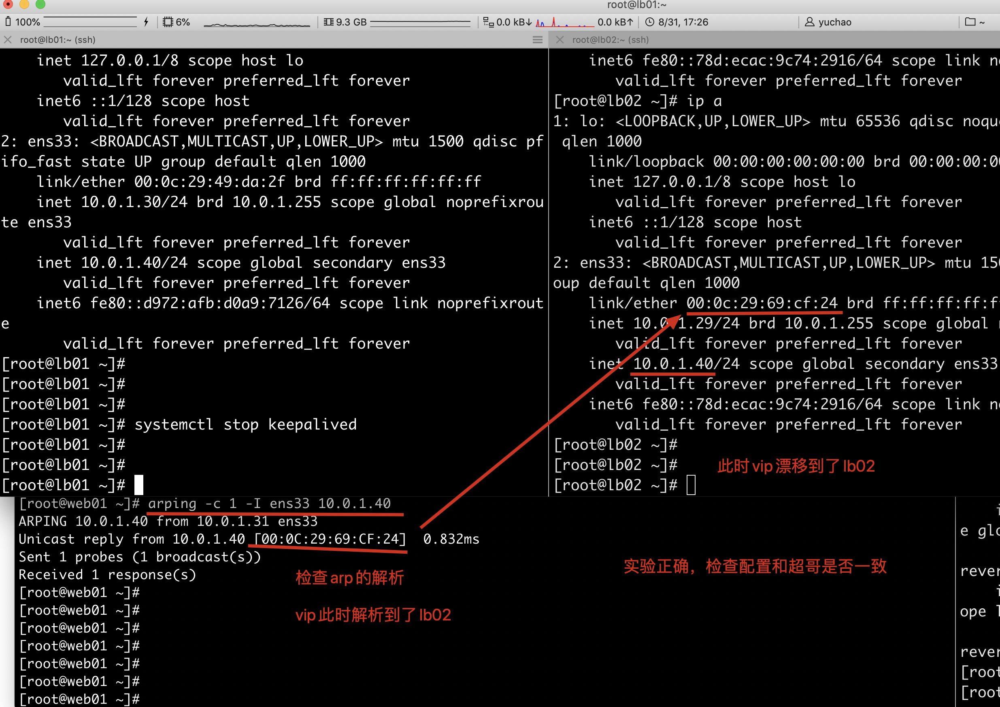

- 即使断开了lb01，页面也不影响访问

- 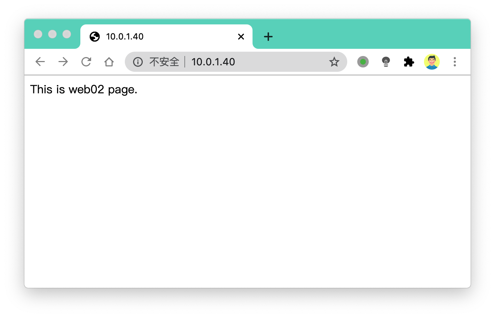

- 此时可以恢复lb01的vip，检查arp解析。

- ```plain
  [root@lb01 ~]# systemctl start keepalived
  [root@web01 ~]# arping -c 1 -I ens33 10.0.1.40
  ARPING 10.0.1.40 from 10.0.1.31 ens33
  Unicast reply from 10.0.1.40 [00:0C:29:49:DA:2F]  0.974ms
  Sent 1 probes (1 broadcast(s))
  Received 1 response(s)
  ```

- 奥力给，搞定

- 