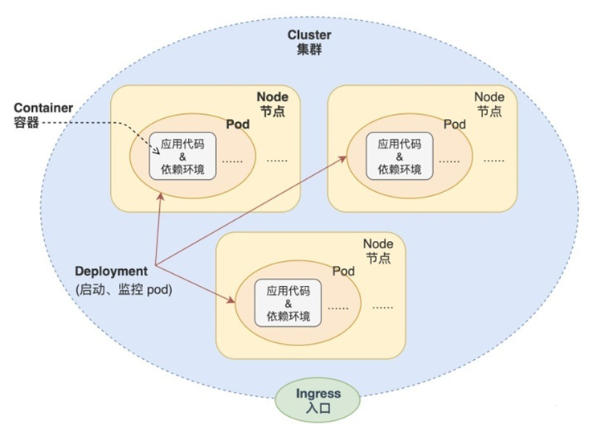
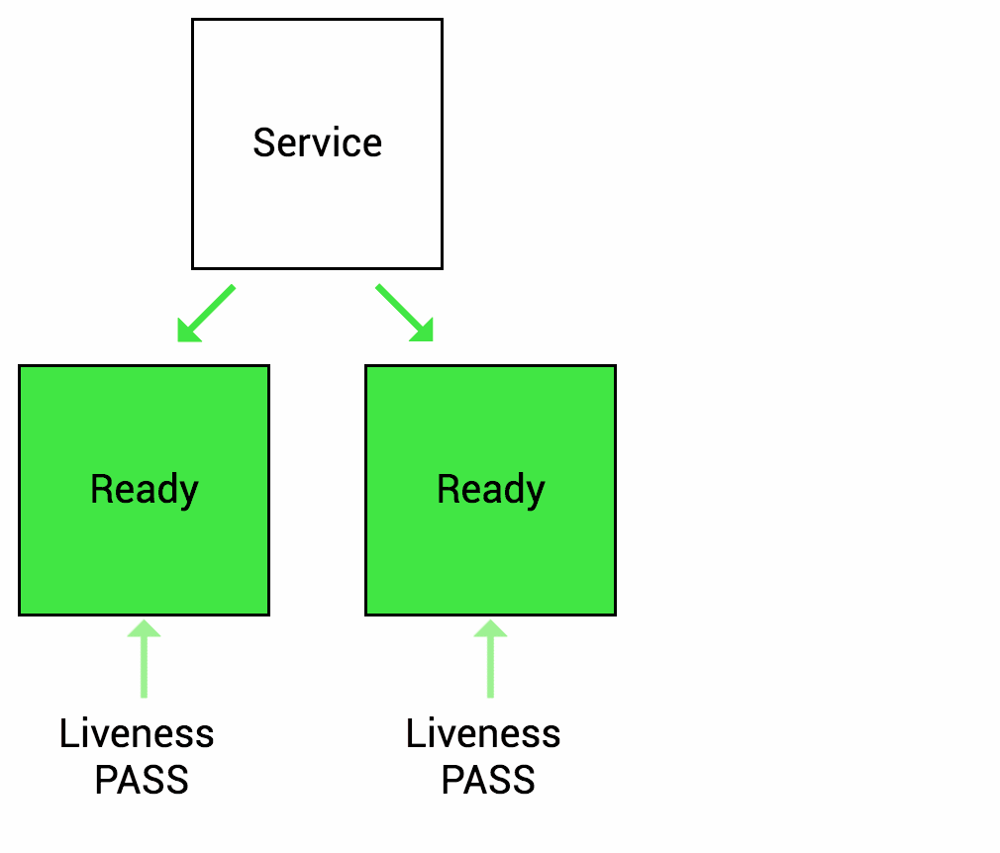
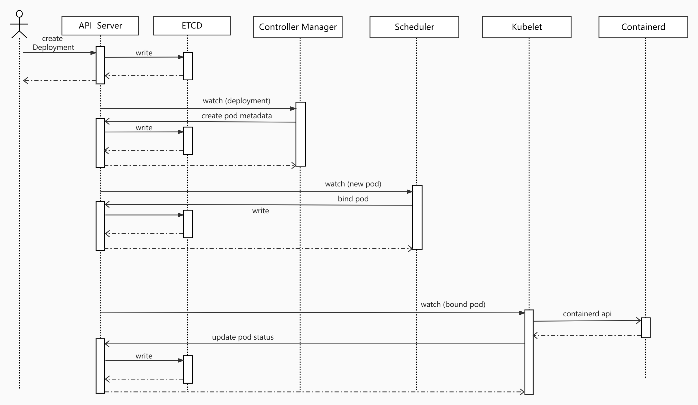
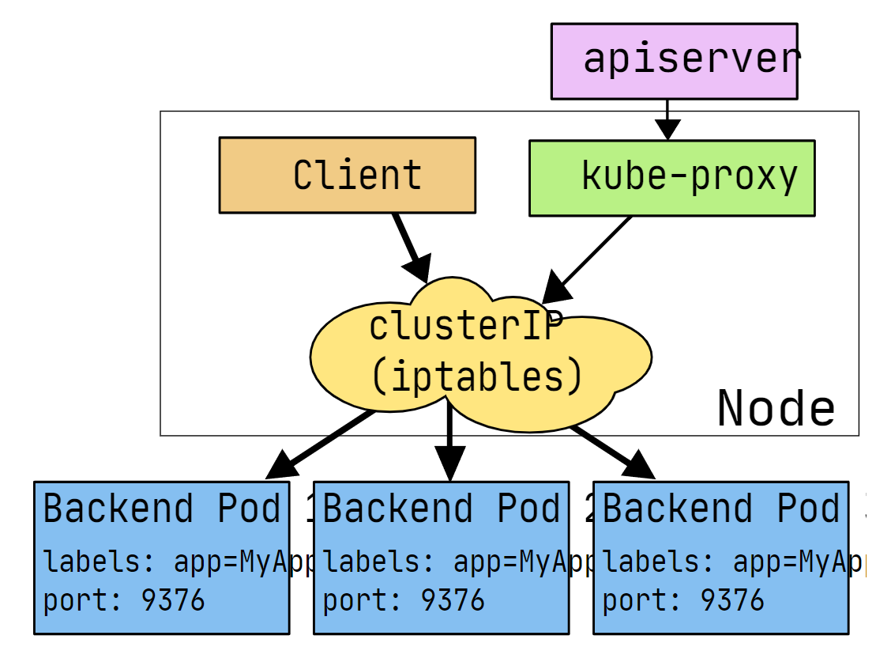
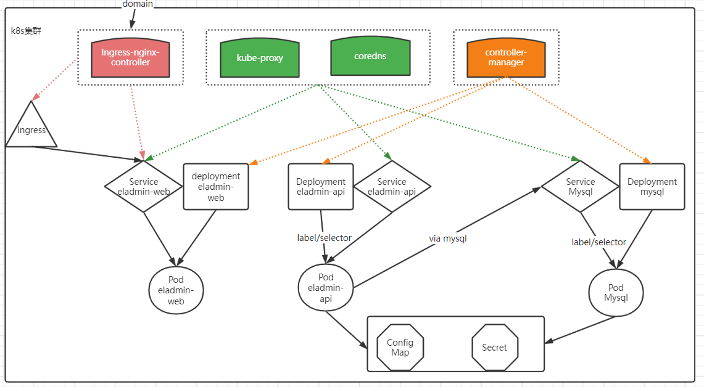

# 认识K8S

本章学习kubernetes的架构及工作流程，重点介绍如何使用Workload管理业务应用的生命周期，实现服务不中断的滚动更新，通过服务发现和集群内负载均衡来实现集群内部的服务间访问，并通过ingress实现外部使用域名访问集群内部的服务。

学习过程中会逐步对容器项目做k8s改造，从零开始编写所需的资源文件。通过本章的学习，学员会掌握高可用k8s集群的搭建，同时容器项目已经可以利用k8s的控制器、服务发现、负载均衡、配置管理等特性来实现生命周期的管理。

#### [纯容器模式的问题](http://49.7.203.222:2023/#/kubernetes-base/introduction?id=纯容器模式的问题)

1. 业务容器数量庞大，哪些容器部署在哪些节点，使用了哪些端口，如何记录、管理，需要登录到每台机器去管理？
2. 跨主机通信，多个机器中的容器之间相互调用如何做，iptables规则手动维护？
3. 跨主机容器间互相调用，配置如何写？写死固定IP+端口？
4. 如何实现业务高可用？多个容器对外提供服务如何实现负载均衡？
5. 容器的业务中断了，如何可以感知到，感知到以后，如何自动启动新的容器?
6. 如何实现滚动升级保证业务的连续性？
7. ......

#### [容器调度管理平台](http://49.7.203.222:2023/#/kubernetes-base/introduction?id=容器调度管理平台)

- Docker Swarm
- Mesos
- Google Kubernetes

2017年开始Kubernetes凭借强大的容器集群管理功能, 逐步占据市场,目前在容器编排领域一枝独秀

https://kubernetes.io/

#### [架构图](http://49.7.203.222:2023/#/kubernetes-base/introduction?id=架构图)

如何设计一个容器管理平台？

- 集群架构，管理节点分发容器到数据节点
- 如何部署业务容器到各数据节点
- N个数据节点，业务容器如何选择部署在最合理的节点
- 容器如何实现多副本，如何满足每个机器部署一个容器的模型
- 多副本如何实现集群内负载均衡

分布式系统，两类角色：管理节点和工作节点


#### [核心组件](http://49.7.203.222:2023/#/kubernetes-base/introduction?id=核心组件)

- ETCD：分布式高性能键值数据库,存储整个集群的所有元数据
- ApiServer: API服务器,集群资源访问控制入口,提供restAPI及安全访问控制
- Scheduler：调度器,负责把业务容器调度到最合适的Node节点
- Controller Manager：控制器管理,确保集群资源按照期望的方式运行
  - Replication Controller
  - Node controller
  - ResourceQuota Controller
  - Namespace Controller
  - ServiceAccount Controller
  - Token Controller
  - Service Controller
  - Endpoints Controller
- kubelet：运行在每个节点上的主要的“节点代理”，脏活累活
  - pod 管理：kubelet 定期从所监听的数据源获取节点上 pod/container 的期望状态（运行什么容器、运行的副本数量、网络或者存储如何配置等等），并调用对应的容器平台接口达到这个状态。
  - 容器健康检查：kubelet 创建了容器之后还要查看容器是否正常运行，如果容器运行出错，就要根据 pod 设置的重启策略进行处理.
  - 容器监控：kubelet 会监控所在节点的资源使用情况，并定时向 master 报告，资源使用数据都是通过 cAdvisor 获取的。知道整个集群所有节点的资源情况，对于 pod 的调度和正常运行至关重要
- kube-proxy：维护节点中的iptables或者ipvs规则
- kubectl: 命令行接口，用于对 Kubernetes 集群运行命令 https://kubernetes.io/zh/docs/reference/kubectl/

静态Pod的方式：

```bash
## etcd、apiserver、controller-manager、kube-scheduler
$ kubectl -n kube-system get po
```

systemd服务方式：

```bash
$ systemctl status kubelet
```

kubectl：二进制命令行工具

### [理解集群资源](http://49.7.203.222:2023/#/kubernetes-base/introduction?id=理解集群资源)

组件是为了支撑k8s平台的运行，安装好的软件。

资源是如何去使用k8s的能力的定义。比如，k8s可以使用Pod来管理业务应用，那么Pod就是k8s集群中的一类资源，集群中的所有资源可以提供如下方式查看：

```bash
$ kubectl api-resources
```

如何理解namespace：

命名空间，集群内一个虚拟的概念，类似于资源池的概念，一个池子里可以有各种资源类型，绝大多数的资源都必须属于某一个namespace。集群初始化安装好之后，会默认有如下几个namespace：

```bash
$ kubectl get namespaces
NAME                   STATUS   AGE
default                Active   84m
kube-node-lease        Active   84m
kube-public            Active   84m
kube-system            Active   84m
kubernetes-dashboard   Active   71m
```

- 所有NAMESPACED的资源，在创建的时候都需要指定namespace，若不指定，默认会在default命名空间下
- 相同namespace下的同类资源不可以重名，不同类型的资源可以重名
- 不同namespace下的同类资源可以重名
- 通常在项目使用的时候，我们会创建带有业务含义的namespace来做逻辑上的整合

### [kubectl的使用](http://49.7.203.222:2023/#/kubernetes-base/introduction?id=kubectl的使用)

类似于docker，kubectl是命令行工具，用于与APIServer交互，内置了丰富的子命令，功能极其强大。 https://kubernetes.io/docs/reference/kubectl/overview/

```bash
$ kubectl -h
$ kubectl get -h
$ kubectl create -h
$ kubectl create namespace -h
```


# 改造Pod

##### [最小调度单元 Pod](http://49.7.203.222:2023/#/kubernetes-base/pod-base?id=最小调度单元-pod)

docker调度的是容器，在k8s集群中，最小的调度单元是Pod（豆荚）


###### [为什么引入Pod](http://49.7.203.222:2023/#/kubernetes-base/pod-base?id=为什么引入pod)

- 与容器引擎解耦

  Docker、Rkt。平台设计与引擎的具体的实现解耦

- 多容器共享网络|存储|进程 空间, 支持的业务场景更加灵活

###### [Pod在集群中的形态](http://49.7.203.222:2023/#/kubernetes-base/pod-base?id=pod在集群中的形态)



###### [使用yaml格式定义Pod](http://49.7.203.222:2023/#/kubernetes-base/pod-base?id=使用yaml格式定义pod)

*pod-eladmin-api.yaml*

```yaml
apiVersion: v1
kind: Pod
metadata:
  name: eladmin-api
  namespace: luffy
  labels:
    app: eladmin-api
spec:
  containers:
  - name: eladmin-api
    image: 172.21.65.226:5000/eladmin/eladmin-api:v1
    env:
    - name: DB_HOST   #  指定数据库地址
      value: "172.21.65.226"
    - name: DB_USER   #  指定数据库连接使用的用户
      value: "root"
    - name: DB_PWD
      value: "luffyAdmin!"
    - name: REDIS_HOST
      value: "172.21.65.226"
    - name: REDIS_PORT
      value: "6379"
    ports:
    - containerPort: 8000
# http://www.wetools.com/yaml/
{
    "apiVersion": "v1",
    "kind": "Pod",
    "metadata": {
        "name": "eladmin-api",
        "namespace": "luffy",
        "labels": {
            "app": "eladmin-api"
        }
    },
    "spec": {
        "containers": [
            {
                "name": "eladmin-api",
                "image": "172.21.65.226:5000/eladmin/eladmin-api:v1",
                "env": [
                    {
                        "name": "DB_HOST",
                        "value": "172.21.65.226"
                    },
                    {
                        "name": "DB_USER",
                        "value": "root"
                    },
                    {
                        "name": "DB_PWD",
                        "value": "luffyAdmin!"
                    },
                    {
                        "name": "REDIS_HOST",
                        "value": "172.21.65.226"
                    },
                    {
                        "name": "REDIS_PORT",
                        "value": "6379"
                    }
                ],
                "ports": [
                    {
                        "containerPort": 8000
                    }
                ]
            }
        ]
    }
}
```

| apiVersion | 含义                                                         |
| ---------- | ------------------------------------------------------------ |
| alpha      | 进入K8s功能的早期候选版本，可能包含Bug，最终不一定进入K8s    |
| beta       | 已经过测试的版本，最终会进入K8s，但功能、对象定义可能会发生变更。 |
| stable     | 可安全使用的稳定版本                                         |
| v1         | stable 版本之后的首个版本，包含了更多的核心对象              |
| apps/v1    | 使用最广泛的版本，像Deployment、ReplicaSets都已进入该版本    |

支持的资源类型与apiVersion

```bash
kubectl api-resources
```

快速获得资源和版本

```bash
$ kubectl explain pod
$ kubectl explain Pod.apiVersion
```

###### [创建和访问Pod](http://49.7.203.222:2023/#/kubernetes-base/pod-base?id=创建和访问pod)

```bash
## 创建namespace, namespace是逻辑上的资源池
kubectl create namespace luffy

## 使用指定文件创建Pod
kubectl create -f pod-eladmin-api.yaml


## ImagePullBackOff，创建镜像拉取所用的密钥信息
kubectl -n luffy create secret docker-registry registry-172-21-65-226 --docker-username=admin --docker-password=admin --docker-email=admin@admin.com --docker-server=172.21.65.226:5000

## 给pod配置上述密钥
apiVersion: v1
kind: Pod
metadata:
  name: eladmin-api
  namespace: luffy
  labels:
    app: eladmin-api
spec:
  imagePullSecrets:
  - name: registry-172-21-65-22
  containers:
  - name: eladmin-api
...

## 删除pod重建,两种方式
kubectl -n luffy delete pod eladmin-api
kubectl delete -f pod-eladmin-api.yaml


## 查看pod，可以简写po
## 所有的操作都需要指定namespace，如果是在default命名空间下，则可以省略
$ kubectl -n luffy get pods -o wide
NAME     READY   STATUS    RESTARTS   AGE    IP             NODE
eladmin-api   1/1     Running   0     11m   10.244.1.15   k8s-slave1 

## 回顾流程

## 使用Pod Ip访问服务,3306和8002
$ curl 10.244.1.15:8000/auth/code

## 进入容器,执行初始化, 不必到对应的主机执行docker exec
$ kubectl -n luffy exec -ti eladmin-api bash
/ # env
```

###### [Infra容器](http://49.7.203.222:2023/#/kubernetes-base/pod-base?id=infra容器)

登录`k8s-slave1`节点

```bash
$ nerdctl -n k8s.io ps -a|grep eladmin-api  ## 发现有二个容器
## 其中包含eladmin容器以及pause容器
## 为了实现Pod内部的容器可以通过localhost通信，每个Pod都会启动pause容器，然后Pod内部的其他容器的网络空间会共享该pause容器的网络空间(Docker网络的container模式)，pause容器只需要hang住网络空间，不需要额外的功能，因此资源消耗极低。


$ crictl  -r "unix:///var/run/containerd/containerd.sock" pull 172.21.65.226:5000/eladmin/eladmin-api:v1
$ crictl  -r "unix:///var/run/containerd/containerd.sock" rmi xxxxx
$ nerdctl pull 172.21.65.226:5000/eladmin/eladmin-api:v1
$ crictl -r "unix:///var/run/containerd/containerd.sock" logs -f 5627a65b98416
```

###### [查看pod详细信息](http://49.7.203.222:2023/#/kubernetes-base/pod-base?id=查看pod详细信息)

```bash
## 查看pod调度节点及pod_ip
$ kubectl -n luffy get pods -o wide
## 查看完整的yaml
$ kubectl -n luffy get po eladmin-api -o yaml
## 查看pod的明细信息及事件
$ kubectl -n luffy describe pod eladmin-api
```

###### [Troubleshooting and Debugging](http://49.7.203.222:2023/#/kubernetes-base/pod-base?id=troubleshooting-and-debugging)

```bash
#进入Pod内的容器
$ kubectl -n <namespace> exec <pod_name> -c <container_name> -ti /bin/sh

#查看Pod内容器日志,显示标准或者错误输出日志
$ kubectl -n <namespace> logs -f <pod_name> -c <container_name>
```

###### [更新服务版本](http://49.7.203.222:2023/#/kubernetes-base/pod-base?id=更新服务版本)

```bash
$ kubectl apply -f pod-eladmin-api.yaml
```

###### [删除Pod服务](http://49.7.203.222:2023/#/kubernetes-base/pod-base?id=删除pod服务)

```bash
#根据文件删除
$ kubectl delete -f pod-eladmin-api.yaml

#根据pod_name删除
$ kubectl -n <namespace> delete pod <pod_name>
```

###### [Pod多容器](http://49.7.203.222:2023/#/kubernetes-base/pod-base?id=pod多容器)

*pod-eladmin.yaml*

```yaml
apiVersion: v1
kind: Pod
metadata:
  name: eladmin
  namespace: luffy
  labels:
    app: eladmin
spec:
  imagePullSecrets:
  - name: registry-172-21-65-226
  containers:
  - name: eladmin-api
    image: 172.21.65.226:5000/eladmin/eladmin-api:v1
    env:
    - name: DB_HOST   #  指定数据库地址
      value: "172.21.65.226"
    - name: DB_USER   #  指定数据库连接使用的用户
      value: "root"
    - name: DB_PWD
      value: "luffyAdmin!"
    - name: REDIS_HOST
      value: "172.21.65.226"
    - name: REDIS_PORT
      value: "6379"
    ports:
    - containerPort: 8000
  - name: eladmin-web
    image: 172.21.65.226:5000/eladmin/eladmin-web:v1
    ports:
    - containerPort: 80
```


# [工作流程](http://49.7.203.222:2023/#/kubernetes-base/workflow?id=工作流程)


1. 用户准备一个资源文件（记录了业务应用的名称、镜像地址等信息），通过调用APIServer执行创建Pod
2. APIServer收到用户的Pod创建请求，将Pod信息写入到etcd中
3. 调度器通过list-watch的方式，发现有新的pod数据，但是这个pod还没有绑定到某一个节点中
4. 调度器通过调度算法，计算出最适合该pod运行的节点，并调用APIServer，把信息更新到etcd中
5. kubelet同样通过list-watch方式，发现有新的pod调度到本机的节点了，因此调用容器运行时，去根据pod的描述信息，拉取镜像，启动容器，同时生成事件信息
6. 同时，把容器的信息、事件及状态也通过APIServer写入到etcd中

#### [架构设计的几点思考](http://49.7.203.222:2023/#/kubernetes-base/workflow?id=架构设计的几点思考)

1. 系统各个组件分工明确(APIServer是所有请求入口，CM是控制中枢，Scheduler主管调度，而Kubelet负责运行)，配合流畅，整个运行机制一气呵成。
2. 除了配置管理和持久化组件ETCD，其他组件并不保存数据。意味`除ETCD外`其他组件都是无状态的。因此从架构设计上对kubernetes系统高可用部署提供了支撑。
3. 同时因为组件无状态，组件的升级，重启，故障等并不影响集群最终状态，只要组件恢复后就可以从中断处继续运行。
4. 各个组件和kube-apiserver之间的数据推送都是通过list-watch机制来实现。


# 中间件改造

##### [数据库和Redis改造Pod启动](http://49.7.203.222:2023/#/kubernetes-base/pod-base-middleware?id=数据库和redis改造pod启动)

###### [Redis容器改造Pod](http://49.7.203.222:2023/#/kubernetes-base/pod-base-middleware?id=redis容器改造pod)

*redis.yaml*

```yaml
apiVersion: v1
kind: Pod
metadata:
  name: redis
  namespace: luffy
  labels:
    app: redis
spec:
  # hostNetwork: true
  containers:
  - name: redis
    image: redis:3.2
    ports:
    - containerPort: 6379
```

*思考：是否可以用hostNetwork*

使用Service类型资源实现负载：

*service-redis.yaml*

```yaml
apiVersion: v1
kind: Service
metadata:
  name: redis
  namespace: luffy
spec:
  ports:
  - port: 6379
    protocol: TCP
    targetPort: 6379
  selector:
    app: redis
  type: ClusterIP
```

###### [Mysql容器改造Pod](http://49.7.203.222:2023/#/kubernetes-base/pod-base-middleware?id=mysql容器改造pod)

*mysql.yaml*

```yaml
apiVersion: v1
kind: Pod
metadata:
  name: mysql
  namespace: luffy
  labels:
    app: mysql
spec:
  containers:
  - name: mysql
    image: mysql:5.7
    env:
    - name: MYSQL_DATABASE   #  指定数据库地址
      value: "eladmin"
    - name: MYSQL_ROOT_PASSWORD
      value: "luffyAdmin!"
    ports:
    - containerPort: 3306
    args:
    - --character-set-server=utf8mb4
    - --collation-server=utf8mb4_unicode_ci
    volumeMounts:
    - name: mysql-data
      mountPath: /var/lib/mysql
  volumes: 
  - name: mysql-data
    hostPath: 
      path: /opt/mysql/data
```

*思考：服务部署节点不固定，如何保障数据持久化*

- 定点部署

  ```bash
  # 给Pod添加节点选择器
    nodeSelector:   # 使用节点选择器将Pod调度到指定label的节点
      mysql: "true"
  
  # 给节点打标签
  kubectl label node k8s-master mysql=true
  
  # 停掉之前的mysql容器，用Pod部署
  docker stop mysql
  kubectl create -f mysql.yaml
  
  cat mysql.service.yaml
  apiVersion: v1
  kind: Service
  metadata:
    name: mysql
    namespace: luffy
  spec:
    ports:
    - port: 3306
      protocol: TCP
      targetPort: 3306
    selector:
      app: mysql
    type: ClusterIP
    
  
  # 创建mysql的service
  kubectl create -f mysql.service.yaml
  
  # 修改eladmin-api的环境变量，重建eladmin-api服务
  ```

- 使用PV+PVC连接分布式存储解决方案

  - ceph
  - glusterfs
  - nfs


# Pod常用设置

###### [Pod数据持久化](http://49.7.203.222:2023/#/kubernetes-base/pod-setting?id=pod数据持久化)

通过挂载卷的方式，参考mysql的pod

###### [服务健康检查](http://49.7.203.222:2023/#/kubernetes-base/pod-setting?id=服务健康检查)

检测容器服务是否健康的手段，若不健康，会根据设置的重启策略（`restartPolicy`）进行操作，两种检测机制可以分别单独设置，若不设置，默认认为Pod是健康的。

两种机制：

- LivenessProbe探针 存活性探测：用于判断容器是否存活，即Pod是否为running状态，如果`LivenessProbe`探针探测到容器不健康，则`kubelet`将kill掉容器，并根据容器的重启策略是否重启，如果一个容器不包含`LivenessProbe`探针，则`Kubelet`认为容器的`LivenessProbe`探针的返回值永远成功。

  ```yaml
  ...
    containers:
    - name: eladmin-api
      image: 172.21.65.226:5000/eladmin/eladmin-api:v1
      livenessProbe:
        tcpSocket:
          port: 8000
        initialDelaySeconds: 20  # 容器启动后第一次执行探测是需要等待多少秒
        periodSeconds: 15     # 执行探测的频率
        timeoutSeconds: 3        # 探测超时时间
  ...
  
  # 可配置的参数如下：
  initialDelaySeconds：容器启动后第一次执行探测是需要等待多少秒。
  periodSeconds：执行探测的频率。默认是10秒，最小1秒。
  timeoutSeconds：探测超时时间。默认1秒，最小1秒。
  successThreshold：探测失败后，最少连续探测成功多少次才被认定为成功。默认是1。
  failureThreshold：探测成功后，最少连续探测失败多少次
  
  # 本例配置的情况，健康检查的逻辑为：
  K8S将在Pod开始启动20s(initialDelaySeconds)后探测Pod内的8000端口是否可以建立TCP连接，并且每15秒钟探测一次，如果连续3次探测失败，则kubelet重启该容器
  ```

  

- ReadinessProbe探针 可用性探测：用于判断容器是否正常提供服务，即容器的Ready是否为True，是否可以接收请求，如果`ReadinessProbe`探测失败，则容器的Ready将为False，`Endpoint Controller`控制器将此Pod的Endpoint从对应的service的Endpoint列表中移除，不再将任何请求调度此Pod上，直到下次探测成功。（剔除此pod不参与接收请求不会将流量转发给此Pod）。

  ```yaml
  ...
    containers:
    - name: eladmin-api
      image: 172.21.65.226:5000/eladmin/eladmin-api:v1
      readinessProbe:
        httpGet:
          path: /auth/code
          port: 8000
          scheme: HTTP
        initialDelaySeconds: 20  # 容器启动后第一次执行探测是需要等待多少秒
        periodSeconds: 15     # 执行探测的频率
        timeoutSeconds: 3        # 探测超时时间
  ...
  
  # K8S将在Pod开始启动10s(initialDelaySeconds)后利用HTTP访问8000端口的/auth/code，如果超过3s**或者返回码不在200~399内，则健康检查失败
  ```

三种类型：

- exec：通过执行命令来检查服务是否正常，返回值为0则表示容器健康

  ```bash
  ...
      livenessProbe:
        exec:
          command:
          - cat
          - /tmp/healthy
        initialDelaySeconds: 5
        periodSeconds: 5
  ...
  ```

- httpGet方式：通过发送http请求检查服务是否正常，返回200-399状态码则表明容器健康

  ```bash
    containers:
    - name: eladmin-api
      image: 172.21.65.226:5000/eladmin/eladmin-api:v1
      readinessProbe:
        httpGet:
          path: /auth/code
          port: 8000
          scheme: HTTP
        initialDelaySeconds: 20  # 容器启动后第一次执行探测是需要等待多少秒
        periodSeconds: 15     # 执行探测的频率
        timeoutSeconds: 3        # 探测超时时间
  ```

- tcpSocket：通过容器的IP和Port执行TCP检查，如果能够建立TCP连接，则表明容器健康

  ```bash
    ...
        livenessProbe:
          tcpSocket:
            port: 8000
          initialDelaySeconds: 10  # 容器启动后第一次执行探测是需要等待多少秒
          periodSeconds: 10     # 执行探测的频率
          timeoutSeconds: 2        # 探测超时时间
    ...
  ```

以Redis为例，演示效果：

```yaml
apiVersion: v1
kind: Pod
metadata:
  name: redis
  namespace: luffy
  labels:
    app: redis
spec:
  # hostNetwork: true
  containers:
  - name: redis
    image: redis:3.2
    ports:
    - containerPort: 6379
    livenessProbe:
      tcpSocket:
        port: 6379
      initialDelaySeconds: 10  # 容器启动后第一次执行探测是需要等待多少秒
      periodSeconds: 10         # 执行探测的频率
      timeoutSeconds: 2         # 探测超时时间
    readinessProbe:
      tcpSocket:
        port: 6379
      initialDelaySeconds: 10
      timeoutSeconds: 2
      periodSeconds: 10
```

> Readiness 决定了Service是否将流量导入到该Pod，Liveness决定了容器是否需要被重启

###### [重启策略](http://49.7.203.222:2023/#/kubernetes-base/pod-setting?id=重启策略)

Pod的重启策略（`RestartPolicy`）应用于Pod内的所有容器，并且仅在Pod所处的Node上由kubelet进行判断和重启操作。当某个容器异常退出或者健康检查失败时，kubelet将根据`RestartPolicy`的设置来进行相应的操作。 Pod的重启策略包括`Always`、`OnFailure`和`Never`，默认值为`Always`。

- Always：当容器进程退出后，由`kubelet`自动重启该容器；
- OnFailure：当容器终止运行且退出码不为0时，由`kubelet`自动重启该容器；
- Never：不论容器运行状态如何，`kubelet`都不会重启该容器。

演示重启策略：

```yaml
1. eladmin-api 服务连接不上数据库的情况下，分别设置三种重启策略，观察Pod的重启表现
```

1. 使用默认的重启策略，即 `restartPolicy: Always` ，无论容器是否是正常退出，都会自动重启容器

2. 使用

   ```
   OnFailure
   ```

   的策略时

   - 如果Pod的1号进程是正常退出，则不会重启
   - 只有非正常退出状态才会重启

3. 使用Never时，退出了就不再重启

可以看出，若容器正常退出，Pod的状态会是`Completed`，非正常退出，状态为`Error`或者`CrashLoopBackOff`

###### [镜像拉取策略](http://49.7.203.222:2023/#/kubernetes-base/pod-setting?id=镜像拉取策略)

```yaml
spec:
  containers:
  - name: eladmin-api
    image: 172.21.65.226:5000/eladmin/eladmin-api:v1
    imagePullPolicy: IfNotPresent
```

设置镜像的拉取策略，默认为IfNotPresent

- Always，总是拉取镜像，即使本地有镜像也从仓库拉取
- IfNotPresent ，本地有则使用本地镜像，本地没有则去仓库拉取
- Never，只使用本地镜像，本地没有则报错

###### [Pod资源限制](http://49.7.203.222:2023/#/kubernetes-base/pod-setting?id=pod资源限制)

为了保证充分利用集群资源，且确保重要容器在运行周期内能够分配到足够的资源稳定运行，因此平台需要具备

Pod的资源限制的能力。 对于一个pod来说，资源最基础的2个的指标就是：CPU和内存。

Kubernetes提供了个采用requests和limits 两种类型参数对资源进行预分配和使用限制。

```yaml
...
apiVersion: v1
kind: Pod
metadata:
  name: redis
  namespace: luffy
  labels:
    app: redis
spec:
  containers:
  - name: redis
    image: redis:3.2
    ports:
    - containerPort: 6379
    livenessProbe:
      tcpSocket:
        port: 6379
      initialDelaySeconds: 10  # 容器启动后第一次执行探测是需要等待多少秒
      periodSeconds: 10         # 执行探测的频率
      timeoutSeconds: 2         # 探测超时时间
    readinessProbe:
      tcpSocket:
        port: 6379
      initialDelaySeconds: 10  # 容器启动后第一次执行探测是需要等待多少秒
      periodSeconds: 10         # 执行探测的频率
      timeoutSeconds: 2         # 探测超时时间
    resources:
      requests:
        memory: 300Mi
        cpu: 50m
      limits:
        memory: 1Gi
        cpu: 200m
...
```

requests：

- 容器使用的最小资源需求,作用于schedule阶段，作为容器调度时资源分配的判断依赖
- 只有当前节点上可分配的资源量 >= request 时才允许将容器调度到该节点
- request参数不限制容器的最大可使用资源
- requests.cpu被转成docker的--cpu-shares参数，与cgroup cpu.shares功能相同 (无论宿主机有多少个cpu或者内核，--cpu-shares选项都会按照比例分配cpu资源）
- requests.memory没有对应的docker参数，仅作为k8s调度依据

limits：

- 容器能使用资源的最大值

- 设置为0表示对使用的资源不做限制, 可无限的使用

- 当pod 内存超过limit时，会被oom

- 当cpu超过limit时，不会被kill，但是会限制不超过limit值

- limits.cpu会被转换成docker的–cpu-quota参数。与cgroup cpu.cfs_quota_us功能相同

- limits.memory会被转换成docker的–memory参数。用来限制容器使用的最大内存

  对于 CPU，我们知道计算机里 CPU 的资源是按`“时间片”`的方式来进行分配的，系统里的每一个操作都需要 CPU 的处理，所以，哪个任务要是申请的 CPU 时间片越多，那么它得到的 CPU 资源就越多。

然后还需要了解下 CGroup 里面对于 CPU 资源的单位换算：

```shell
1 CPU =  1000 millicpu（1 Core = 1000m）
```

这里的 `m` 就是毫、毫核的意思，Kubernetes 集群中的每一个节点可以通过操作系统的命令来确认本节点的 CPU 内核数量，然后将这个数量乘以1000，得到的就是节点总 CPU 总毫数。比如一个节点有四核，那么该节点的 CPU 总毫量为 4000m。

> 注意：若内存使用超出限制，会引发系统的OOM机制，因CPU是可压缩资源，不会引发Pod退出或重建

###### [改造后yaml](http://49.7.203.222:2023/#/kubernetes-base/pod-setting?id=改造后yaml)

*redis.yaml*

```yaml
apiVersion: v1
kind: Pod
metadata:
  name: redis
  namespace: luffy
  labels:
    app: redis
spec:
  containers:
  - name: redis
    image: redis:3.2
    ports:
    - containerPort: 6379
    livenessProbe:
      tcpSocket:
        port: 6379
      initialDelaySeconds: 10  # 容器启动后第一次执行探测是需要等待多少秒
      periodSeconds: 10         # 执行探测的频率
      timeoutSeconds: 2         # 探测超时时间
    readinessProbe:
      tcpSocket:
        port: 6379
      initialDelaySeconds: 10  # 容器启动后第一次执行探测是需要等待多少秒
      periodSeconds: 10         # 执行探测的频率
      timeoutSeconds: 2         # 探测超时时间
    resources:
      requests:
        memory: 100Mi
        cpu: 50m
      limits:
        memory: 4Gi
        cpu: 2
```

*mysql.yaml*

```yaml
apiVersion: v1
kind: Pod
metadata:
  name: mysql
  namespace: luffy
  labels:
    app: mysql
spec:
  containers:
  - name: mysql
    image: mysql:5.7
    env:
    - name: MYSQL_DATABASE   #  指定数据库地址
      value: "eladmin"
    - name: MYSQL_ROOT_PASSWORD
      value: "luffyAdmin!"
    ports:
    - containerPort: 3306
    args:
    - --character-set-server=utf8mb4
    - --collation-server=utf8mb4_unicode_ci
    livenessProbe:
      tcpSocket:
        port: 3306
      initialDelaySeconds: 15  # 容器启动后第一次执行探测是需要等待多少秒
      periodSeconds: 10         # 执行探测的频率
      timeoutSeconds: 2         # 探测超时时间
    readinessProbe:
      tcpSocket:
        port: 3306
      initialDelaySeconds: 15  # 容器启动后第一次执行探测是需要等待多少秒
      periodSeconds: 10         # 执行探测的频率
      timeoutSeconds: 2         # 探测超时时间
    resources:
      requests:
        memory: 200Mi
        cpu: 50m
      limits:
        memory: 1Gi
        cpu: 500m
    volumeMounts:
    - name: mysql-data
      mountPath: /var/lib/mysql
  volumes:
  - name: mysql-data
    hostPath:
      path: /opt/mysql/
  nodeSelector:   # 使用节点选择器将Pod调度到指定label的节点
    mysql: "true"
```

*eladmin-api.yaml*

```yaml
apiVersion: v1
kind: Pod
metadata:
  name: eladmin-api
  namespace: luffy
  labels:
    app: eladmin-api
spec:
  imagePullSecrets:
  - name: registry-172-21-65-226
  restartPolicy: Always
  containers:
  - name: eladmin-api
    image: 172.21.65.226:5000/eladmin/eladmin-api:v1
    env:
    - name: DB_HOST   #  指定数据库地址
      value: "10.99.14.241"
    - name: DB_USER   #  指定数据库连接使用的用户
      value: "root"
    - name: DB_PWD
      value: "luffyAdmin!"
    - name: REDIS_HOST
      value: "10.105.226.34"
    - name: REDIS_PORT
      value: "6379"
    ports:
    - containerPort: 8000
    livenessProbe:
      tcpSocket:
        port: 8000
      initialDelaySeconds: 20  # 容器启动后第一次执行探测是需要等待多少秒
      periodSeconds: 15     # 执行探测的频率
      timeoutSeconds: 3        # 探测超时时间
    readinessProbe:
      httpGet:
        path: /auth/code
        port: 8000
        scheme: HTTP
      initialDelaySeconds: 20  # 容器启动后第一次执行探测是需要等待多少秒
      periodSeconds: 15     # 执行探测的频率
      timeoutSeconds: 3        # 探测超时时间
    resources:
      requests:
        memory: 200Mi
        cpu: 50m
      limits:
        memory: 3Gi
        cpu: 2
```


# 配置优化

###### [yaml优化](http://49.7.203.222:2023/#/kubernetes-base/config-optimization?id=yaml优化)

*思考：为什么要优化*

`yaml`的环境变量中存在敏感信息（账号、密码），存在安全隐患

为什么要统一管理环境变量

- 环境变量中有很多敏感的信息，比如账号密码，直接暴漏在yaml文件中存在安全性问题
- 对于开发、测试、生产环境，由于配置均不同，每套环境部署的时候都要修改yaml，带来额外的开销

###### [ConfigMap和Secret](http://49.7.203.222:2023/#/kubernetes-base/config-optimization?id=configmap和secret)

k8s提供两类资源，`configMap`和`Secret`，可以用来实现业务配置的统一管理， 允许将配置文件与镜像文件分离，以使容器化的应用程序具有可移植性 。


- `configMap`，通常用来管理应用的配置文件或者环境变量

  ```yaml
  apiVersion: v1
  kind: ConfigMap
  metadata:
    name: eladmin
    namespace: luffy
  data:
    DB_HOST: "10.99.14.241"
    DB_USER: "root"
    REDIS_HOST: "10.105.226.34"
    REDIS_PORT: "6379"
  ```

  创建并查看`configmap`：

  ```bash
  $ kubectl create -f configmap.yaml
  $ kubectl -n luffy get configmap eladmin -oyaml
  ```

  或者可以使用命令的方式，从文件中创建，比如：

  ```bash
  $ cat env-configs.txt
  DB_HOST=10.99.14.241
  REDIS_HOST=10.105.226.34
  REDIS_PORT=6379
  $ kubectl -n luffy create configmap eladmin --from-env-file=env-configs.txt
  ```

- Secret，管理敏感类的信息，默认会base64编码存储，有三种类型

  - `Service Account` ：用来访问`Kubernetes API`，由`Kubernetes`自动创建，并且会自动挂载到Pod的`/run/secrets/kubernetes.io/serviceaccount`目录中；创建`ServiceAccount`后，Pod中指定`serviceAccount`后，自动创建该`ServiceAccount`对应的secret；
  - `Opaque` ： `base64`编码格式的`Secret`，用来存储密码、密钥等；
  - `kubernetes.io/dockerconfigjson` ：用来存储私有`docker registry`的认证信息。

  ```bash
  cat env-secret.txt
  DB_PWD=luffyAdmin!
  DB_USER=root
  
  kubectl -n luffy create secret generic eladmin-secret --from-env-file=env-secret.txt 
  kubectl -n luffy get secret
  ```

  也可以通过如下方式：

  ```yaml
  apiVersion: v1
  kind: Secret
  metadata:
  name: eladmin-secret
    namespace: luffy
  type: Opaque
  data:
    DB_USER: cm9vdA==        #注意加-n参数， echo -n root|base64
    DB_PWD: bHVmZnlBZG1pbiE=
  ```

###### [从配置中引用环境变量](http://49.7.203.222:2023/#/kubernetes-base/config-optimization?id=从配置中引用环境变量)

```yaml
# mysql的pod
...
  containers:
  - name: mysql
    image: mysql:5.7
    env:
    - name: MYSQL_DATABASE   #  指定数据库地址
      value: "eladmin"
    - name: MYSQL_ROOT_PASSWORD
      valueFrom:
        secretKeyRef:
          name: eladmin-secret
          key: DB_PWD
    ports:
    - containerPort: 3306
...

# eladmin-api的yaml
...
  containers:
  - name: eladmin-api
    image: 172.21.65.226:5000/eladmin/eladmin-api:v1
    env:
    - name: DB_HOST   #  指定数据库地址
      valueFrom:
        configMapKeyRef:
          name: eladmin
          key: DB_HOST
    - name: DB_USER   #  指定数据库连接使用的用户
      valueFrom:
        secretKeyRef:
          name: eladmin-secret
          key: DB_USER
    - name: DB_PWD
      valueFrom:
        secretKeyRef:
          name: eladmin-secret
          key: DB_PWD
    - name: REDIS_HOST
      valueFrom:
        configMapKeyRef:
          name: eladmin
          key: REDIS_HOST
    - name: REDIS_PORT
      valueFrom:
        configMapKeyRef:
          name: eladmin
          key: REDIS_PORT
    ports:
    - containerPort: 8000
...
```

在部署不同的环境时，pod的yaml无须再变化，只需要在每套环境中维护一套`ConfigMap和Secret`即可。但是注意`configmap`和`secret`不能跨`namespace`使用，且更新后，pod内的env不会自动更新，重建后方可更新。


# Pod生命周期

###### [如何编写资源yaml](http://49.7.203.222:2023/#/kubernetes-base/pod-lifecycle?id=如何编写资源yaml)

1. 拿来主义，从机器中已有的资源中拿

   ```bash
   $ kubectl -n kube-system get po,deployment,ds
   ```

2. 学会在官网查找， https://kubernetes.io/docs/home/

3. 从kubernetes-api文档中查找， https://kubernetes.io/docs/reference/generated/kubernetes-api/v1.16/#pod-v1-core

4. kubectl explain 查看具体字段含义

###### [pod状态与生命周期](http://49.7.203.222:2023/#/kubernetes-base/pod-lifecycle?id=pod状态与生命周期)

Pod的状态如下表所示：

| 状态值               | 描述                                                         |
| -------------------- | ------------------------------------------------------------ |
| Pending              | API Server已经创建该Pod，等待调度器调度                      |
| ContainerCreating    | 拉取镜像启动容器中                                           |
| Running              | Pod内容器均已创建，且至少有一个容器处于运行状态、正在启动状态或正在重启状态 |
| Succeeded\|Completed | Pod内所有容器均已成功执行退出，且不再重启                    |
| Failed\|Error        | Pod内所有容器均已退出，但至少有一个容器退出为失败状态        |
| CrashLoopBackOff     | Pod内有容器启动失败，比如配置文件丢失导致主进程启动失败      |
| Unknown              | 由于某种原因无法获取该Pod的状态，可能由于网络通信不畅导致    |

启动和关闭示意：


初始化容器：

- 验证业务应用依赖的组件是否均已启动
- 修改目录的权限
- 调整系统参数

```yaml
...
      initContainers:
      - command:
        - /sbin/sysctl
        - -w
        - vm.max_map_count=262144
        image: alpine:3.6
        imagePullPolicy: IfNotPresent
        name: elasticsearch-logging-init
        resources: {}
        securityContext:
          privileged: true
      - name: fix-permissions
        image: alpine:3.6
        command: ["sh", "-c", "chown -R 1000:1000 /usr/share/elasticsearch/data"]
        securityContext:
          privileged: true
        volumeMounts:
        - name: elasticsearch-logging
          mountPath: /usr/share/elasticsearch/data
...
```

验证Pod生命周期：

```yaml
apiVersion: v1
kind: Pod
metadata:
  name: pod-lifecycle
  labels:
    component: pod-lifecycless
spec:
  initContainers:
  - name: init
    image: busybox
    command: ['sh', '-c', 'echo $(date +%s): INIT >> /loap/timing']
    volumeMounts:
    - mountPath: /loap
      name: timing
  containers:
  - name: main
    image: busybox
    command: ['sh', '-c', 'echo $(date +%s): START >> /loap/timing;
sleep 10; echo $(date +%s): END >> /loap/timing;']
    volumeMounts:
    - mountPath: /loap 
      name: timing
    livenessProbe:
      exec:
        command: ['sh', '-c', 'echo $(date +%s): LIVENESS >> /loap/timing']
    readinessProbe:
      exec:
        command: ['sh', '-c', 'echo $(date +%s): READINESS >> /loap/timing']
    lifecycle:
      postStart:
        exec:
          command: ['sh', '-c', 'echo $(date +%s): POST-START >> /loap/timing']
      preStop:
        exec:
          command: ['sh', '-c', 'echo $(date +%s): PRE-STOP >> /loap/timing']
  volumes:
  - name: timing
    hostPath:
      path: /tmp/loap
```

创建pod测试：

```bash
$ kubectl create -f pod-lifecycle.yaml

## 查看demo状态
$ kubectl  get po -o wide -w

## 查看调度节点的/tmp/loap/timing
$ cat /tmp/loap/timing
1585424708: INIT
1585424746: START
1585424746: POST-START
1585424754: READINESS
1585424756: LIVENESS
1585424756: END
```

> 须主动杀掉 Pod 才会触发 `pre-stop hook`，如果是 Pod 自己 Down 掉，则不会执行 `pre-stop hook` ,且杀掉Pod进程前，进程必须是正常运行状态，否则不会执行pre-stop钩子


# Pod操作小结

###### [小结](http://49.7.203.222:2023/#/kubernetes-base/pod-summary?id=小结)

1. 实现k8s平台与特定的容器运行时解耦，提供更加灵活的业务部署方式，引入了Pod概念，作为k8s平台中业务服务运行时的最小调度单元
2. k8s使用yaml格式定义资源文件，yaml比json更加简洁
3. 通过kubectl create|apply| get | exec | logs | delete 等操作k8s资源，必须指定namespace
4. 每启动一个Pod，为了实现网络空间共享，会先创建pause容器，并把其他容器网络加入该容器，来实现Pod内所有容器使用同一个网络空间
5. 通过nodeSelector选择器影响k8s的调度行为，实现服务定点部署
6. Pod重建后Pod IP发生变化，所以使用Service类型的资源为Pod创建上层的VIP对外提供服务
7. 通过livenessProbe和readinessProbe实现Pod的存活性和就绪健康检查
8. 通过requests和limit分别限定容器初始资源申请与最高上限资源申请
9. 通过configMap和Secret来管理业务应用所需的配置（包含环境变量和配置文件等）
10. Pod通过initContainer和lifecycle分别来执行初始化、pod启动和删除时候的操作，使得功能更加全面和灵活
11. 编写yaml讲究方法，学习k8s，养成从官方网站查询知识的习惯

做了哪些工作：

1. 定义Pod.yaml，将`eladmin-api`,`redis`,`mysql`等服务使用Pod来启动
2. mysql数据持久化，各应用添加了健康检查和资源限制
3. yaml文件中的环境变量存在账号密码明文等敏感信息，使用configMap和Secret来统一配置，优化部署

只使用Pod, 面临的问题:

1. 业务应用启动多个副本
2. 集群外部如何访问Pod服务
3. 运行业务Pod的某个节点挂了，可以自动帮我把Pod转移到集群中的可用节点启动起来
4. 我的业务应用功能是收集节点监控数据,需要把Pod运行在k8集群的各个节点上


# 工作负载

##### [Pod控制器](http://49.7.203.222:2023/#/kubernetes-base/workload?id=pod控制器)

###### [Workload (工作负载)](http://49.7.203.222:2023/#/kubernetes-base/workload?id=workload-工作负载)

控制器又称工作负载是用于实现管理pod的中间层，确保pod资源符合预期的状态，pod的资源出现故障时，会尝试 进行重启，当根据重启策略无效，则会重新新建pod的资源。


- ReplicaSet: 用户创建指定数量的pod副本数量，确保pod副本数量符合预期状态，并且支持滚动式自动扩容和缩容功能
- Deployment：工作在ReplicaSet之上，用于管理无状态应用，目前来说最好的控制器。支持滚动更新和回滚功能，提供声明式配置
- DaemonSet：用于确保集群中的每一个节点只运行特定的pod副本，通常用于实现系统级后台任务。比如EFK服务
- Job：只要完成就立即退出，不需要重启或重建
- Cronjob：周期性任务控制，不需要持续后台运行
- StatefulSet：管理有状态应用


# [Deployment改造](http://49.7.203.222:2023/#/kubernetes-base/practice-deployment?id=deployment)

*deployment-mysql.yaml*

```yaml
apiVersion: apps/v1
kind: Deployment
metadata:
  name: mysql
  namespace: luffy
spec:
  replicas: 1    #指定Pod副本数
  selector:        #指定Pod的选择器
    matchLabels:
      app: mysql
  template:
    metadata:
      labels:    #给Pod打label,必须和上方的matchLabels匹配
        app: mysql
        from: luffy
    spec:
      containers:
      - name: mysql
        image: mysql:5.7
        args:
        - --character-set-server=utf8mb4
        - --collation-server=utf8mb4_unicode_ci
        ports:
        - containerPort: 3306
        env:
        - name: MYSQL_ROOT_PASSWORD
          valueFrom:
            secretKeyRef:
              name: eladmin-secret
              key: DB_PWD
        - name: MYSQL_DATABASE
          value: "eladmin"
        resources:
          requests:
            memory: 200Mi
            cpu: 50m
          limits:
            memory: 1Gi
            cpu: 500m
        readinessProbe:
          tcpSocket:
            port: 3306
          initialDelaySeconds: 5
          periodSeconds: 10
        livenessProbe:
          tcpSocket:
            port: 3306
          initialDelaySeconds: 15
          periodSeconds: 20
        volumeMounts:
        - name: mysql-data
          mountPath: /var/lib/mysql
      volumes: 
      - name: mysql-data
        hostPath: 
          path: /opt/mysql/
      nodeSelector:   # 使用节点选择器将Pod调度到指定label的节点
        mysql: "true"
```

*deploy-eladmin-api.yaml*

```yaml
apiVersion: apps/v1
kind: Deployment
metadata:
  name: eladmin-api
  namespace: luffy
spec:
  replicas: 1    #指定Pod副本数
  selector:        #指定Pod的选择器
    matchLabels:
      app: eladmin-api
  template:
    metadata:
      labels:    #给Pod打label
        app: eladmin-api
    spec:
      imagePullSecrets:
      - name: registry-172-21-65-226
      containers:
      - name: eladmin-api
        image: 172.21.65.226:5000/eladmin/eladmin-api:v1
        imagePullPolicy: IfNotPresent
        env:
        - name: DB_HOST
          valueFrom:
            configMapKeyRef:
              name: eladmin
              key: DB_HOST
        - name: REDIS_HOST
          valueFrom:
            configMapKeyRef:
              name: eladmin
              key: REDIS_HOST
        - name: REDIS_PORT
          valueFrom:
            configMapKeyRef:
              name: eladmin
              key: REDIS_PORT
        - name: DB_USER
          valueFrom:
            secretKeyRef:
              name: eladmin-secret
              key: DB_USER
        - name: DB_PWD
          valueFrom:
            secretKeyRef:
              name: eladmin-secret
              key: DB_PWD
        ports:
        - containerPort: 8000
        resources:
          requests:
            memory: 200Mi
            cpu: 50m
          limits:
            memory: 4Gi
            cpu: 2
        livenessProbe:
          tcpSocket:
            port: 8000
          initialDelaySeconds: 20  # 容器启动后第一次执行探测是需要等待多少秒
          periodSeconds: 15     # 执行探测的频率
          timeoutSeconds: 3        # 探测超时时间
        readinessProbe: 
          httpGet: 
            path: /auth/code
            port: 8000
            scheme: HTTP
          initialDelaySeconds: 20 
          timeoutSeconds: 3
          periodSeconds: 15
```

*deployment-redis.yaml*

```yaml
apiVersion: apps/v1
kind: Deployment
metadata:
  name: redis
  namespace: luffy
spec:
  replicas: 1    #指定Pod副本数
  selector:        #指定Pod的选择器
    matchLabels:
      app: redis
  template:
    metadata:
      labels:    #给Pod打label,必须和上方的matchLabels匹配
        app: redis
    spec:
      containers:
      - name: redis
        image: redis:3.2
        ports:
        - containerPort: 6379
        resources:
          requests:
            memory: 100Mi
            cpu: 50m
          limits:
            memory: 1Gi
            cpu: 500m
        readinessProbe:
          tcpSocket:
            port: 6379
          initialDelaySeconds: 5
          periodSeconds: 10
        livenessProbe:
          tcpSocket:
            port: 6379
          initialDelaySeconds: 15
          periodSeconds: 20
```

###### [创建Deployment](http://49.7.203.222:2023/#/kubernetes-base/practice-deployment?id=创建deployment)

```bash
$ kubectl create -f deploy-eladmin-api.yaml
```

###### [查看Deployment](http://49.7.203.222:2023/#/kubernetes-base/practice-deployment?id=查看deployment)

```bash
# kubectl api-resources
$ kubectl -n luffy get deploy
NAME          READY   UP-TO-DATE   AVAILABLE   AGE
eladmin-api   1/1     1            1           6m41s
mysql         1/1     1            1           27m
redis         1/1     1            1           90s

  * `NAME` 列出了集群中 Deployments 的名称。
  * `READY`显示当前正在运行的副本数/期望的副本数。
  * `UP-TO-DATE`显示已更新以实现期望状态的副本数。
  * `AVAILABLE`显示应用程序可供用户使用的副本数。
  * `AGE` 显示应用程序运行的时间量。

# 查看pod
$ kubectl -n luffy get po -owide

# 查看replicaSet
$ kubectl -n luffy get rs
```

###### [副本保障机制](http://49.7.203.222:2023/#/kubernetes-base/practice-deployment?id=副本保障机制)

controller实时检测pod状态，并保障副本数一直处于期望的值。

```bash
## 删除pod，观察pod状态变化
$ kubectl -n luffy delete pod eladmin-api-5bff94959d-hxz2r

# 观察pod
$ kubectl get pods -o wide

## 设置两个副本, 或者通过kubectl -n luffy edit deploy eladmin-api的方式，最好通过修改文件，然后apply的方式，这样yaml文件可以保持同步
$ kubectl -n luffy scale deploy eladmin-api --replicas=2
deployment.extensions/eladmin-api scaled

# 观察pod
$ kubectl get pods -o wide
```

###### [服务更新](http://49.7.203.222:2023/#/kubernetes-base/practice-deployment?id=服务更新)

修改服务，重新打tag模拟服务更新。

更新方式：

```bash
# 1. 修改yaml文件，然后apply更新应用
kubectl -n luffy apply -f deploy-eladmin-api.yaml

# 2 直接在线更新
kubectl -n luffy edit deploy eladmin-api

# 3 命令更新
kubectl -n luffy set image deploy eladmin-api eladmin-api=172.21.65.226:5000/eladmin/eladmin-api:v2 --record
```

修改文件测试：

```bash
$ docker build . -t 172.21.65.226:5000/eladmin/eladmin-api:v2 -f Dockerfile
$ docker push 172.21.65.226:5000/eladmin/eladmin-api:v2
```


# [Deployment工作流程](http://49.7.203.222:2023/#/kubernetes-base/workflow-deployment?id=工作流程)




# 滚动更新

###### [更新策略](http://49.7.203.222:2023/#/kubernetes-base/rolling-update-rollback?id=更新策略)

```yaml
...
spec:
  replicas: 2    #指定Pod副本数
  selector:        #指定Pod的选择器
    matchLabels:
      app: eladmin-api
  strategy:
    rollingUpdate:
      maxSurge: 25%
      maxUnavailable: 25%
    type: RollingUpdate        #指定更新方式为滚动更新，默认策略，通过get deploy yaml查看
    ...
```


策略控制：

- maxSurge：最大激增数, 指更新过程中, 最多可以比replicas预先设定值多出的pod数量, 可以为固定值或百分比,默认为desired Pods数的25%。计算时向上取整(比如0.5，取1)，更新过程中最多会有replicas + maxSurge个pod
- maxUnavailable： 指更新过程中, 最多有几个pod处于无法服务状态 , 可以为固定值或百分比，默认为desired Pods数的25%。计算时向下取整(比如0.5，取0)

*在Deployment rollout时，需要保证Available(Ready) Pods数不低于 replicas - maxUnavailable; 保证所有的非异常状态Pods数不多于 replicas + maxSurge*。

以`eladmin-api`为例，使用默认的策略，更新过程:

1. maxSurge 25%，2个实例，向上取整，则maxSurge为1，意味着最多可以有2+1=3个Pod，那么此时会新创建1个ReplicaSet，RS-new，把副本数置为1，此时呢，副本控制器就去创建这个新的Pod
2. 同时，maxUnavailable是25%，副本数2*25%，向下取整，则为0，意味着，滚动更新的过程中，不能有少于2个可用的Pod，因此，旧的Replica（RS-old）会先保持不动，等RS-new管理的Pod状态Ready后，此时已经有3个Ready状态的Pod了，那么由于只要保证有2个可用的Pod即可，因此，RS-old的副本数会有2个变成1个，此时，会删掉一个旧的Pod
3. 删掉旧的Pod的时候，由于总的Pod数量又变成2个了，因此，距离最大的3个还有1个Pod可以创建，所以，RS-new把管理的副本数由1改成2，此时又会创建1个新的Pod，等RS-new管理了2个Pod都ready后，那么就可以把RS-old的副本数由1置为0了，这样就完成了滚动更新

```bash
#查看滚动更新事件
$ kubectl -n luffy describe deploy eladmin-api

$ kubectl get rs
```

除了滚动更新以外，还有一种策略是Recreate，直接在当前的pod基础上先删后建：

```bash
...
  strategy:
    type: Recreate
...
```

我们课程中的mysql服务应该使用Recreate来管理：

```bash
$ kubectl -n luffy edit deploy mysql
...
  selector:
    matchLabels:
      app: mysql
  strategy:
    type: Recreate
  template:
    metadata:
      creationTimestamp: null
      labels:
        app: mysql
...
```

###### [服务回滚](http://49.7.203.222:2023/#/kubernetes-base/rolling-update-rollback?id=服务回滚)

通过滚动升级的策略可以平滑的升级Deployment，若升级出现问题，需要最快且最好的方式回退到上一次能够提供正常工作的版本。为此K8S提供了回滚机制。

**revision**：更新应用时，K8S都会记录当前的版本号，即为revision，当升级出现问题时，可通过回滚到某个特定的revision，默认配置下，K8S只会保留最近的几个revision，可以通过Deployment配置文件中的spec.revisionHistoryLimit属性增加revision数量，默认是10。

查看当前：

```bash
$ kubectl -n luffy rollout history deploy eladmin-api ##CHANGE-CAUSE为空
$ kubectl delete -f deployment-eladmin-api.yaml    ## 方便演示到具体效果，删掉已有deployment
```

记录回滚：

```bash
$ kubectl apply -f deployment-eladmin-api.yaml --record

$ kubectl -n luffy edit deploy eladmin-api --record=true
```

查看deployment更新历史：

```bash
$ kubectl -n luffy rollout history deploy eladmin-api
deployment.apps/eladmin-api
REVISION  CHANGE-CAUSE
1         kubectl create --filename=deployment-eladmin-api.yaml --record=true
2         kubectl edit  deployment eladmin-api --record=true
```

回滚到具体的REVISION:

```bash
$ kubectl -n luffy rollout undo deploy eladmin-api --to-revision=1
deployment.apps/eladmin-api rolled back

# 访问应用测试
```


# Service基础

##### [Kubernetes服务访问之Service](http://49.7.203.222:2023/#/kubernetes-base/service-clusterip?id=kubernetes服务访问之service)

通过以前的学习，我们已经能够通过Deployment来创建一组Pod来提供具有高可用性的服务。虽然每个Pod都会分配一个单独的Pod IP，然而却存在如下两个问题：

- Pod IP仅仅是集群内可见的虚拟IP，外部无法访问。
- Pod IP会随着Pod的销毁而消失，当ReplicaSet对Pod进行动态伸缩时，Pod IP可能随时随地都会变化，这样对于我们访问这个服务带来了难度。

###### [Service 负载均衡之Cluster IP](http://49.7.203.222:2023/#/kubernetes-base/service-clusterip?id=service-负载均衡之cluster-ip)

service是一组pod的服务抽象，相当于一组pod的LB，负责将请求分发给对应的pod。service会为这个LB提供一个IP，一般称为cluster IP 。使用Service对象，通过selector进行标签选择，找到对应的Pod:

```
service-eladmin-api.yaml
apiVersion: v1
kind: Service
metadata:
  name: eladmin-api
  namespace: luffy
spec:
  ports:
  - port: 8000
    protocol: TCP
    targetPort: 8000
  selector:
    app: eladmin-api
  type: ClusterIP
```

操作演示：

```bash
## 别名
$ alias kd='kubectl -n luffy'

## 创建服务
$ kd create -f service-eladmin-api.yaml
$ kd get po --show-labels
NAME                      READY   STATUS    RESTARTS   AGE    LABELS
eladmin-api-5d979bb778-nv9qs   1/1     Running   0          7h57m   app=eladmin-api
mysql-858f99d446-vvmgz         1/1     Running   0          10h     app=mysql,from=luffy
redis-7957d49f44-smd9r         1/1     Running   0          9h      app=redis

$ kd get svc
NAME     TYPE        CLUSTER-IP     EXTERNAL-IP   PORT(S)   AGE
eladmin-api   ClusterIP   10.99.182.32    <none>        8000/TCP   2m3s
mysql         ClusterIP   10.99.14.241    <none>        3306/TCP   16h
redis         ClusterIP   10.105.226.34   <none>        6379/TCP   45h

$ kd describe svc eladmin-api
Name:              eladmin-api
Namespace:         luffy
Labels:            <none>
Annotations:       <none>
Selector:          app=eladmin-api
Type:              ClusterIP
IP Family Policy:  SingleStack
IP Families:       IPv4
IP:                10.99.182.32
IPs:               10.99.182.32
Port:              <unset>  8000/TCP
TargetPort:        8000/TCP
Endpoints:         10.244.2.38:8000
Session Affinity:  None
Events:            <none>

## 扩容eladmin-api服务
$ kd scale deploy eladmin-api --replicas=2
deployment.apps/eladmin-api scaled

## 再次查看 service后关联的Endpoints
$ kd describe svc eladmin-api
```

Service与Pod如何关联:

service对象创建的同时，会创建同名的endpoints对象，若服务设置了readinessProbe, 当readinessProbe检测失败时，endpoints列表中会剔除掉对应的pod_ip，这样流量就不会分发到健康检测失败的Pod中

```bash
$ kd get endpoints eladmin-api
NAME     ENDPOINTS                            AGE
eladmin-api   10.244.0.68:8002,10.244.1.158:8002   7m
```

Service Cluster-IP如何访问:

```bash
$ kd get svc eladmin-api
NAME          TYPE        CLUSTER-IP     EXTERNAL-IP   PORT(S)    AGE
eladmin-api   ClusterIP   10.99.182.32   <none>        8000/TCP   54m
$ curl 10.99.182.32:8000/auth/code

### 业务自身支持localhost:8000/auth/code -> pod-ip:8000/auth/code -> service-cluster-ip:8000/auth/code
```

*思考：为何访问cluster-ip可以成功访问到pod的服务*


# [kube-proxy](http://49.7.203.222:2023/#/kubernetes-base/kube-proxy?id=kube-proxy)

运行在每个节点上，监听 API Server 中服务对象的变化，再通过创建流量路由规则来实现网络的转发。[参照](https://kubernetes.io/docs/concepts/services-networking/service/#virtual-ips-and-service-proxies)

有三种模式：

- User space, 让 Kube-Proxy 在用户空间监听一个端口，所有的 Service 都转发到这个端口，然后 Kube-Proxy 在内部应用层对其进行转发 ， 所有报文都走一遍用户态，性能不高，k8s v1.2版本后废弃。

- Iptables， 当前默认模式，完全由 IPtables 来实现， 通过各个node节点上的iptables规则来实现service的负载均衡，但是随着service数量的增大，iptables模式由于线性查找匹配、全量更新等特点，其性能会显著下降。

- IPVS， 与iptables同样基于Netfilter，但是采用的hash表，因此当service数量达到一定规模时，hash查表的速度优势就会显现出来，从而提高service的服务性能。 k8s 1.8版本开始引入，1.11版本开始稳定，需要开启宿主机的ipvs模块。

  IPtables模式示意图：

  


```bash
$ kubectl -n luffy get service eladmin-api
NAME          TYPE        CLUSTER-IP     EXTERNAL-IP   PORT(S)    AGE
eladmin-api   ClusterIP   10.99.182.32   <none>        8000/TCP   94m

$ iptables-save |grep 10.99.182.32
[root@k8s-master week2]# iptables-save |grep eladmin-api|grep 10.99.182.32
-A KUBE-SERVICES -d 10.99.182.32/32 -p tcp -m comment --comment "luffy/eladmin-api cluster IP" -m tcp --dport 8000 -j KUBE-SVC-DTK5GE7MKO2S7DFZ
-A KUBE-SVC-DTK5GE7MKO2S7DFZ ! -s 10.244.0.0/16 -d 10.99.182.32/32 -p tcp -m comment --comment "luffy/eladmin-api cluster IP" -m tcp --dport 8000 -j KUBE-MARK-MASQ

$ iptables-save |grep KUBE-SVC-DTK5GE7MKO2S7DFZ
-A KUBE-SVC-DTK5GE7MKO2S7DFZ -m comment --comment "luffy/eladmin-api -> 10.244.0.15:8000" -m statistic --mode random --probability 0.50000000000 -j KUBE-SEP-FYSS62BM2LFBPNZO
-A KUBE-SVC-DTK5GE7MKO2S7DFZ -m comment --comment "luffy/eladmin-api -> 10.244.2.38:8000" -j KUBE-SEP-MYTXET6SGXYSFLWJ

$  iptables-save |grep KUBE-SEP-GB5GNOM5CZH7ICXZ
-A KUBE-SEP-GB5GNOM5CZH7ICXZ -p tcp -m tcp -j DNAT --to-destination 10.244.1.158:8002

$ iptables-save |grep KUBE-SEP-7GWC3FN2JI5KLE47
-A KUBE-SEP-7GWC3FN2JI5KLE47 -p tcp -m tcp -j DNAT --to-destination 10.244.1.159:8002
```

> 面试题： k8s的Service Cluster-IP能不能ping通

**iptables转换ipvs模式**

```bash
# 内核开启ipvs模块，集群各节点都执行
cat > /etc/sysconfig/modules/ipvs.modules <<EOF
#!/bin/bash
ipvs_modules="ip_vs ip_vs_lc ip_vs_wlc ip_vs_rr ip_vs_wrr ip_vs_lblc ip_vs_lblcr ip_vs_dh ip_vs_sh ip_vs_nq ip_vs_sed ip_vs_ftp nf_conntrack_ipv4"
for kernel_module in \${ipvs_modules}; do
    /sbin/modinfo -F filename \${kernel_module} > /dev/null 2>&1
    if [ $? -eq 0 ]; then
        /sbin/modprobe \${kernel_module}
    fi
done
EOF
chmod 755 /etc/sysconfig/modules/ipvs.modules && bash /etc/sysconfig/modules/ipvs.modules && lsmod | grep ip_vs

# 安装ipvsadm工具
$ yum install ipset ipvsadm -y

# 修改kube-proxy 模式
$ kubectl -n kube-system edit cm kube-proxy
...
    kind: KubeProxyConfiguration
    metricsBindAddress: ""
    mode: "ipvs"
    nodePortAddresses: null
    oomScoreAdj: null
...

# 重建kube-proxy
$ kubectl -n kube-system get po |grep kube-proxy|awk '{print $1}'|xargs kubectl -n kube-system delete po

# 查看日志，确认使用了ipvs模式
$ kubectl -n kube-system logs -f 
I0605 08:47:52.334298       1 node.go:136] Successfully retrieved node IP: 172.21.65.226
I0605 08:47:52.334430       1 server_others.go:142] kube-proxy node IP is an IPv4 address (172.21.65.226), assume IPv4 operation
I0605 08:47:52.766314       1 server_others.go:258] Using ipvs Proxier.
...

# 清理iptables规则
$ iptables -F -t nat
$ iptables -F

# 查看规则生效
$ ipvsadm -ln
```


# [服务发现](http://49.7.203.222:2023/#/kubernetes-base/coredns?id=服务发现)

在k8s集群中，组件之间可以通过定义的Service名称实现通信。

演示服务发现：

```bash
## 演示思路：在eladmin-api的容器中直接通过service名称访问mysql服务，观察是否可以访问通

# 先查看服务
$ kubectl -n luffy get svc
NAME          TYPE        CLUSTER-IP      EXTERNAL-IP   PORT(S)    AGE
eladmin-api   ClusterIP   10.99.182.32    <none>        8000/TCP   4h50m
mysql         ClusterIP   10.99.14.241    <none>        3306/TCP   21h
redis         ClusterIP   10.105.226.34   <none>        6379/TCP   2d1h

# 进入eladmin-web容器
$ kubectl -n luffy exec -ti eladmin-web-7b9d5994fd-lhznk -- sh
# curl eladmin-api:8000
# nslookup eladmin-api
```

虽然podip和clusterip都不固定，但是service name是固定的，而且具有完全的跨集群可移植性，因此组件之间调用的同时，完全可以通过service name去通信，这样避免了大量的ip维护成本，使得服务的yaml模板更加简单。因此可以对`mysql`和`eladmin-api`的部署进行优化改造：

1. configMap中数据库地址可以换成Service名称，这样跨环境的时候，配置内容基本上可以保持不用变化

修改deploy-mysql.yaml

```yaml

```

修改configmap.yaml

```bash
$ kubectl -n luffy edit configmap eladmin
# Please edit the object below. Lines beginning with a '#' will be ignored,
# and an empty file will abort the edit. If an error occurs while saving this file will be
# reopened with the relevant failures.
#
apiVersion: v1
data:
  DB_HOST: mysql
  REDIS_HOST: redis
  REDIS_PORT: "6379"
kind: ConfigMap
metadata:
  creationTimestamp: "2022-10-28T13:33:26Z"
  name: eladmin
  namespace: luffy
  resourceVersion: "452964"
  uid: 54ab5ed4-64f9-4175-aab5-0ddadeb187e0
```

重建服务：

```bash
$ kubectl -n luffy scale deployment eladmin-api --replicas=0

$ kubectl -n luffy scale deployment eladmin-api --replicas=2
```

服务发现实现：

`CoreDNS`是一个`Go`语言实现的链式插件`DNS服务端`，是CNCF成员，是一个高性能、易扩展的`DNS服务端`。

```bash
$ kubectl -n kube-system get po -o wide|grep dns
coredns-d4475785-2w4hk             1/1     Running   0          4d22h   10.244.0.64       
coredns-d4475785-s49hq             1/1     Running   0          4d22h   10.244.0.65

# 查看eladmin-api的pod解析配置
$ kubectl -n luffy exec -ti eladmin-api-5d979bb778-2g62k -- bash
root@eladmin-api-5d979bb778-2g62k:/opt/eladmin# cat /etc/resolv.conf
search luffy.svc.cluster.local svc.cluster.local cluster.local in.ctcdn.cn ss.in.ctcdn.cn
nameserver 10.96.0.10
options ndots:5

## 10.96.0.10 从哪来
$ kubectl -n kube-system get svc
NAME       TYPE        CLUSTER-IP   EXTERNAL-IP   PORT(S)         AGE
kube-dns   ClusterIP   10.96.0.10   <none>        53/UDP,53/TCP   51d

## 启动pod的时候，会把kube-dns服务的cluster-ip地址注入到pod的resolve解析配置中，同时添加对应的namespace的search域。 因此跨namespace通过service name访问的话，需要添加对应的namespace名称，
service_name.namespace
$ kubectl get svc
NAME         TYPE        CLUSTER-IP   EXTERNAL-IP   PORT(S)   AGE
kubernetes   ClusterIP   10.96.0.1    <none>        443/TCP   26h
```


# NodePort

###### [Service负载均衡之NodePort](http://49.7.203.222:2023/#/kubernetes-base/service-nodeport?id=service负载均衡之nodeport)

cluster-ip为虚拟地址，只能在k8s集群内部进行访问，集群外部如果访问内部服务，实现方式之一为使用NodePort方式。NodePort会默认在 30000-32767 ，不指定的会随机使用其中一个。

```bash
$ cat service-eladmin-api-nodeport.yaml
apiVersion: v1
kind: Service
metadata:
  name: eladmin-api-nodeport
  namespace: luffy
spec:
  ports:
  - port: 8000
    protocol: TCP
    targetPort: 8000
  selector:
    app: eladmin-api
  type: NodePort
```

查看并访问服务：

```bash
$ kubectl  create -f service-eladmin-api-nodeport.yaml
service/eladmin-api-nodeport created
$ kubectl -n luffy get svc
NAME                   TYPE        CLUSTER-IP       EXTERNAL-IP   PORT(S)          AGE
eladmin-api            ClusterIP   10.99.182.32     <none>        8000/TCP         5h22m
eladmin-api-nodeport   NodePort    10.103.117.186   <none>        8000:30207/TCP   5s

# curl 172.21.65.226:30207/auth/code
#集群内每个节点的NodePort端口都会进行监听
```

*思考：推荐的集群外访问服务的方式是什么*


# ingress

##### [Kubernetes服务访问之Ingress](http://49.7.203.222:2023/#/kubernetes-base/ingress?id=kubernetes服务访问之ingress)

对于Kubernetes的Service，无论是Cluster-Ip和NodePort均是四层的负载，集群内的服务如何实现七层的负载均衡，这就需要借助于Ingress，Ingress控制器的实现方式有很多，比如nginx, Contour, Haproxy, trafik, Istio。几种常用的ingress功能对比和选型可以参考[这里](https://www.kubernetes.org.cn/5948.html)

Ingress-nginx是7层的负载均衡器 ，负责统一管理外部对k8s cluster中Service的请求。主要包含：

- ingress-nginx-controller：根据用户编写的ingress规则（创建的ingress的yaml文件），动态的去更改nginx服务的配置文件，并且reload重载使其生效（是自动化的，通过lua脚本来实现）；

- Ingress资源对象：将Nginx的配置抽象成一个Ingress对象

  ```yaml
  apiVersion: networking.k8s.io/v1
  kind: Ingress
  metadata:
    name: ingress-wildcard-host
  spec:
    ingressClassName: nginx
    rules:
    - host: "foo.bar.com"
      http:
        paths:
        - pathType: Prefix
          path: "/bar"
          backend:
            service:
              name: service1
              port:
              number: 80
    - host: "bar.foo.com"
      http:
        paths:
        - pathType: Prefix
          path: "/foo"
          backend:
            service:
              name: service2
              port:
                number: 80
  ```

###### [示意图：](http://49.7.203.222:2023/#/kubernetes-base/ingress?id=示意图：)


###### [实现逻辑](http://49.7.203.222:2023/#/kubernetes-base/ingress?id=实现逻辑)

1）ingress controller通过和kubernetes api交互，动态的去感知集群中ingress规则变化 2）然后读取ingress规则(规则就是写明了哪个域名对应哪个service)，按照自定义的规则，生成一段nginx配置 3）再写到nginx-ingress-controller的pod里，这个Ingress controller的pod里运行着一个Nginx服务，控制器把生成的nginx配置写入/etc/nginx/nginx.conf文件中 4）然后reload一下使配置生效。以此达到域名分别配置和动态更新的问题。

###### [安装](http://49.7.203.222:2023/#/kubernetes-base/ingress?id=安装)

[官方文档](https://github.com/kubernetes/ingress-nginx/blob/master/docs/deploy/index.md)

```bash
$ wget https://raw.githubusercontent.com/kubernetes/ingress-nginx/controller-v1.4.0/deploy/static/provider/cloud/deploy.yaml
## 修改部署节点
$ vim deploy.yaml
504         volumeMounts:
505         - mountPath: /usr/local/certificates/
506           name: webhook-cert
507           readOnly: true
508       dnsPolicy: ClusterFirst
509       nodeSelector:
510         ingress: "true"
511       hostNetwork: true
512       serviceAccountName: ingress-nginx
513       terminationGracePeriodSeconds: 300
514       volumes:

# 替换镜像地址
sed -i 's#registry.k8s.io/ingress-nginx/kube-webhook-certgen:v20220916-gd32f8c343@sha256:39c5b2e3310dc4264d638ad28d9d1d96c4cbb2b2dcfb52368fe4e3c63f61e10f#myifeng/registry.k8s.io_ingress-nginx_kube-webhook-certgen:v1.3.0#g' deploy.yaml

sed -i 's#registry.k8s.io/ingress-nginx/controller:v1.4.0@sha256:34ee929b111ffc7aa426ffd409af44da48e5a0eea1eb2207994d9e0c0882d143#myifeng/registry.k8s.io_ingress-nginx_controller:v1.4.0#g' deploy.yaml
```

创建ingress

```bash
# 为k8s-master节点添加label
$ kubectl label node k8s-master ingress=true

$ kubectl apply -f deploy.yaml
```

###### [使用示例：](http://49.7.203.222:2023/#/kubernetes-base/ingress?id=使用示例：)

```yaml
apiVersion: networking.k8s.io/v1
kind: Ingress
metadata:
  name: eladmin-api
  namespace: luffy
spec:
  ingressClassName: nginx
  rules:
  - host: eladmin-api.luffy.com
    http:
      paths:
      - path: /
        pathType: Prefix
        backend:
          service: 
            name: eladmin-api
            port:
              number: 8000
```

ingress-nginx动态生成upstream配置：

```yaml
$ kubectl -n ingress-nginx exec -ti nginx-ingress-xxxxxxx bash
# ps aux
# cat /etc/nginx/nginx.conf|grep eladmin-api -A10 -B1
...
        ## start server eladmin-api.luffy.com
        server {
                server_name eladmin-api.luffy.com ;

                listen 80  ;
                listen [::]:80  ;
                listen 443  ssl http2 ;
                listen [::]:443  ssl http2 ;

                set $proxy_upstream_name "-";

                ssl_certificate_by_lua_block {
                        certificate.call()
--
                        set $namespace      "luffy";
                        set $ingress_name   "eladmin-api";
                        set $service_name   "eladmin-api";
                        set $service_port   "8000";
                        set $location_path  "/";
                        set $global_rate_limit_exceeding n;

                        rewrite_by_lua_block {
                                lua_ingress.rewrite({
                                        force_ssl_redirect = false,
                                        ssl_redirect = true,
                                        force_no_ssl_redirect = false,
                                        preserve_trailing_slash = false,
--
                        set $balancer_ewma_score -1;
                        set $proxy_upstream_name "luffy-eladmin-api-8000";
                        set $proxy_host          $proxy_upstream_name;
                        set $pass_access_scheme  $scheme;

                        set $pass_server_port    $server_port;

                        set $best_http_host      $http_host;
                        set $pass_port           $pass_server_port;

                        set $proxy_alternative_upstream_name "";

--
        }
        ## end server eladmin-api.luffy.com
 ...
```

域名解析服务，将 `eladmin-api.luffy.com`解析到ingress的地址上。ingress是支持多副本的，高可用的情况下，生产的配置是使用lb服务（内网F5设备，公网elb、slb、clb，解析到各ingress的机器，如何域名指向lb地址）

本机，添加如下hosts记录来演示效果。

```json
172.21.65.226 eladmin-api.luffy.com
```

然后，访问 http://eladmin-api.luffy.com/auth/code

###### [使用ingress访问eladmin-web服务](http://49.7.203.222:2023/#/kubernetes-base/ingress?id=使用ingress访问eladmin-web服务)

综合来看下，如何使用ingress来实现eladmin-web项目的访问，总结了三种方式：

- **方式一: **

  | 项目        | 访问地址                                                     |
  | ----------- | ------------------------------------------------------------ |
  | eladmin-web | [http://eladmin.luffy.com](http://eladmin.luffy.com/)        |
  | eladmin-api | [http://eladmin-api.luffy.com](http://eladmin-api.luffy.com/) |

  此方式，`eladmin-api`对应的地址和目前前端配置的地址( [http://eladmin.luffy.com:8000](http://eladmin.luffy.com:8000/) )有差异，因此需要对前端的代码做调整：

  *.env.production*

  ```c++
  ENV = 'production'
  
  # 如果使用 Nginx 代理后端接口，那么此处需要改为 '/'，文件查看 Docker 部署篇，Nginx 配置
  # 接口地址，注意协议，如果你没有配置 ssl，需要将 https 改为 http
  VUE_APP_BASE_API  = 'http://eladmin-api.luffy.com'
  # 如果接口是 http 形式， wss 需要改为 ws
  VUE_APP_WS_API = 'ws://eladmin-api.luffy.com'
  ```

  前端代码调整，因此需要重新构建一版前端：

  ```bas
  docker build . -t 172.21.65.226:5000/eladmin/eladmin-web:v2
  docker push 172.21.65.226:5000/eladmin/eladmin-web:v2
  ```

  然后为`eladmin-web`准备`Deployment`、`Service`、`Ingress` 资源清单：

  *eladmin-web-all.yaml*

  ```yaml
  # deployment-eladmin-web.yaml
  apiVersion: apps/v1
  kind: Deployment
  metadata:
    name: eladmin-web
    namespace: luffy
  spec:
    replicas: 1   #指定Pod副本数
    selector:             #指定Pod的选择器
      matchLabels:
        app: eladmin-web
    template:
      metadata:
        labels:   #给Pod打label
          app: eladmin-web
      spec:
        imagePullSecrets:
        - name: registry-172-21-65-226
        containers:
        - name: eladmin-web
          image: 172.21.65.226:5000/eladmin/eladmin-web:v2
          imagePullPolicy: IfNotPresent
          ports:
          - containerPort: 80
          resources:
            requests:
              memory: 200Mi
              cpu: 50m
            limits:
              memory: 2Gi
              cpu: 2
          livenessProbe:
            tcpSocket:
              port: 80
            initialDelaySeconds: 15  # 容器启动后第一次执行探测是需要等待多少秒
            periodSeconds: 15     # 执行探测的频率
            timeoutSeconds: 3             # 探测超时时间
          readinessProbe:
            tcpSocket:
              port: 80
            initialDelaySeconds: 15
            timeoutSeconds: 3
            periodSeconds: 15
  # service-eladmin-web.yaml
  apiVersion: v1
  kind: Service
  metadata:
    name: eladmin-web
    namespace: luffy
  spec:
    ports:
    - port: 80
      protocol: TCP
      targetPort: 80
    selector:
      app: eladmin-web
    type: ClusterIP
  # ingress-eladmin-web.yaml
  apiVersion: networking.k8s.io/v1
  kind: Ingress
  metadata:
    name: eladmin-web
    namespace: luffy
  spec:
    ingressClassName: nginx
    rules:
    - host: eladmin.luffy.com
      http:
        paths:
        - path: /
          pathType: Prefix
          backend:
            service: 
              name: eladmin-web
              port:
                number: 80
  ```

  本机，添加如下hosts记录来演示效果。

  ```json
  172.21.65.226 eladmin.luffy.com
  ```

  然后，访问 [http://eladmin.luffy.com](http://eladmin.luffy.com/)

- **方式二：**

  规划使用如下地址访问：

  | 项目        | 访问地址                                                     |
  | ----------- | ------------------------------------------------------------ |
  | eladmin-web | [http://eladmin.luffy.com](http://eladmin.luffy.com/)        |
  | eladmin-api | [http://eladmin.luffy.com:8000](http://eladmin.luffy.com:8000/) |

  此方式，`eladmin-api`对应的地址和目前前端配置的地址( [http://eladmin.luffy.com:8000](http://eladmin.luffy.com:8000/) )没有差异，但是`ingress-nginx`安装时只暴漏了 80和443端口进行服务转发，8000端口没有对外暴漏，因此，需要配置使用`ingress-nginx`转发tcp服务：

  - 修改`ingress-nginx-controller`的配置

    ```bash
    # 新添加文档中的L440和L441
    $ vim deploy.yaml
    ...
    431     spec:
    432       containers:
    433       - args:
    434         - /nginx-ingress-controller
    435         - --publish-service=$(POD_NAMESPACE)/ingress-nginx-controller
    436         - --election-id=ingress-controller-leader
    437         - --controller-class=k8s.io/ingress-nginx
    438         - --ingress-class=nginx
    439         - --configmap=$(POD_NAMESPACE)/ingress-nginx-controller
    440         - --tcp-services-configmap=$(POD_NAMESPACE)/tcp-services
    441         - --udp-services-configmap=$(POD_NAMESPACE)/udp-services
    442         - --validating-webhook=:8443
    443         - --validating-webhook-certificate=/usr/local/certificates/cert
    444         - --validating-webhook-key=/usr/local/certificates/key
    445         env:
    446         - name: POD_NAME
    447           valueFrom:
    448             fieldRef:
    449               fieldPath: metadata.name
    ...
    ```

  - 重建服务

    ```bash
    $ kubectl -n ingress-nginx scale deployment ingress-nginx-controller --replicas 0
    $ kubectl -n ingress-nginx scale deployment ingress-nginx-controller --replicas 1
    ```

  - 创建`tcp-services`配置

    ```bash
    $ cat tcp-services.cm.yaml
    apiVersion: v1
    kind: ConfigMap
    metadata:
      name: tcp-services
      namespace: ingress-nginx
    data:
      8000: "luffy/eladmin-api:8000"
    ```

  - 创建并验证

    ```bash
    kubectl create -f tcp-services.cm.yaml
    curl 172.21.65.226:8000/auth/code
    ```

  验证可以成功通过ingress-controller的8000端口转发到后端服务，因此我们创建前端ingress资源：

  然后为`eladmin-web`准备`Deployment`、`Service`、`Ingress` 资源清单：

  *eladmin-web-all.yaml*

  ```yaml
  # deployment-eladmin-web.yaml
  apiVersion: apps/v1
  kind: Deployment
  metadata:
    name: eladmin-web
    namespace: luffy
  spec:
    replicas: 1   #指定Pod副本数
    selector:             #指定Pod的选择器
      matchLabels:
        app: eladmin-web
    template:
      metadata:
        labels:   #给Pod打label
          app: eladmin-web
      spec:
        imagePullSecrets:
        - name: registry-172-21-65-226
        containers:
        - name: eladmin-web
          image: 172.21.65.226:5000/eladmin/eladmin-web:v1
          imagePullPolicy: IfNotPresent
          ports:
          - containerPort: 80
          resources:
            requests:
              memory: 200Mi
              cpu: 50m
            limits:
              memory: 2Gi
              cpu: 2
          livenessProbe:
            tcpSocket:
              port: 80
            initialDelaySeconds: 15  # 容器启动后第一次执行探测是需要等待多少秒
            periodSeconds: 15     # 执行探测的频率
            timeoutSeconds: 3             # 探测超时时间
          readinessProbe:
            tcpSocket:
              port: 80
            initialDelaySeconds: 15
            timeoutSeconds: 3
            periodSeconds: 15
  # service-eladmin-web.yaml
  apiVersion: v1
  kind: Service
  metadata:
    name: eladmin-web
    namespace: luffy
  spec:
    ports:
    - port: 80
      protocol: TCP
      targetPort: 80
    selector:
      app: eladmin-web
    type: ClusterIP
  # ingress-eladmin-web.yaml
  apiVersion: networking.k8s.io/v1
  kind: Ingress
  metadata:
    name: eladmin-web
    namespace: luffy
  spec:
    ingressClassName: nginx
    rules:
    - host: eladmin.luffy.com
      http:
        paths:
        - path: /
          pathType: Prefix
          backend:
            service: 
              name: eladmin-web
              port:
                number: 80
  ```

  本机，添加如下hosts记录来演示效果。

  ```json
  172.21.65.226 eladmin.luffy.com
  ```

  然后，访问 [http://eladmin.luffy.com](http://eladmin.luffy.com/)

- ###### [方式三：](http://49.7.203.222:2023/#/kubernetes-base/ingress?id=方式三：)

  规划使用如下地址访问：

  | 项目        | 访问地址                                              |
  | ----------- | ----------------------------------------------------- |
  | eladmin-web | [http://eladmin.luffy.com](http://eladmin.luffy.com/) |
  | eladmin-api | http://eladmin.luffy.com/apis                         |

  此方式，`eladmin-api`对应的地址和目前前端配置的地址( [http://eladmin.luffy.com:8000](http://eladmin.luffy.com:8000/) )存在差异，，因此需要对前端的代码做调整：

  *.env.production*

  ```c++
  ENV = 'production'
  
  # 如果使用 Nginx 代理后端接口，那么此处需要改为 '/'，文件查看 Docker 部署篇，Nginx 配置
  # 接口地址，注意协议，如果你没有配置 ssl，需要将 https 改为 http
  VUE_APP_BASE_API  = 'http://eladmin.luffy.com/apis'
  # 如果接口是 http 形式， wss 需要改为 ws
  VUE_APP_WS_API = 'ws://eladmin.luffy.com/apis'
  ```

  前端代码调整，因此需要重新构建一版前端：

  ```bas
  docker build . -t 172.21.65.226:5000/eladmin/eladmin-web:v3
  docker push 172.21.65.226:5000/eladmin/eladmin-web:v3
  ```

  然后为`eladmin-web`准备`Deployment`、`Service`、`Ingress` 资源清单：

  *eladmin-web-all.yaml*

  ```yaml
  # deployment-eladmin-web.yaml
  apiVersion: apps/v1
  kind: Deployment
  metadata:
    name: eladmin-web
    namespace: luffy
  spec:
    replicas: 1   #指定Pod副本数
    selector:             #指定Pod的选择器
      matchLabels:
        app: eladmin-web
    template:
      metadata:
        labels:   #给Pod打label
          app: eladmin-web
      spec:
        imagePullSecrets:
        - name: registry-172-21-65-226
        containers:
        - name: eladmin-web
          image: 172.21.65.226:5000/eladmin/eladmin-web:v3
          imagePullPolicy: IfNotPresent
          ports:
          - containerPort: 80
          resources:
            requests:
              memory: 200Mi
              cpu: 50m
            limits:
              memory: 2Gi
              cpu: 2
          livenessProbe:
            tcpSocket:
              port: 80
            initialDelaySeconds: 15  # 容器启动后第一次执行探测是需要等待多少秒
            periodSeconds: 15     # 执行探测的频率
            timeoutSeconds: 3             # 探测超时时间
          readinessProbe:
            tcpSocket:
              port: 80
            initialDelaySeconds: 15
            timeoutSeconds: 3
            periodSeconds: 15
  # service-eladmin-web.yaml
  apiVersion: v1
  kind: Service
  metadata:
    name: eladmin-web
    namespace: luffy
  spec:
    ports:
    - port: 80
      protocol: TCP
      targetPort: 80
    selector:
      app: eladmin-web
    type: ClusterIP
  # ingress-eladmin-web.yaml
  apiVersion: networking.k8s.io/v1
  kind: Ingress
  metadata:
    name: eladmin-api
    namespace: luffy
    annotations:
      nginx.ingress.kubernetes.io/rewrite-target: /$1
  spec:
    ingressClassName: nginx
    rules:
    - host: eladmin.luffy.com
      http:
        paths:
        - path: /apis/(.*)
          pathType: Prefix
          backend:
            service: 
              name: eladmin-api
              port:
                number: 8000
  ```

  本机，添加如下hosts记录来演示效果。

  ```json
  172.21.65.226 eladmin.luffy.com
  ```

  然后，访问 [http://eladmin.luffy.com](http://eladmin.luffy.com/)

###### [HTTPS访问：](http://49.7.203.222:2023/#/kubernetes-base/ingress?id=https访问：)

```bash
#自签名证书
$ openssl req -x509 -nodes -days 2920 -newkey rsa:2048 -keyout tls.key -out tls.crt -subj "/CN=*.luffy.com/O=ingress-nginx"

# 证书信息保存到secret对象中，ingress-nginx会读取secret对象解析出证书加载到nginx配置中
$ kubectl -n luffy create secret tls tls-eladmin --key tls.key --cert tls.crt
```

修改yaml

*.env.production*

```c++
ENV = 'production'

# 如果使用 Nginx 代理后端接口，那么此处需要改为 '/'，文件查看 Docker 部署篇，Nginx 配置
# 接口地址，注意协议，如果你没有配置 ssl，需要将 https 改为 http
VUE_APP_BASE_API  = 'https://eladmin.luffy.com/apis/'
# 如果接口是 http 形式， wss 需要改为 ws
VUE_APP_WS_API = 'wss://eladmin.luffy.com/apis/'
```

前端代码调整，因此需要重新构建一版前端：

```bas
docker build . -t 172.21.65.226:5000/eladmin/eladmin-web:v4
docker push 172.21.65.226:5000/eladmin/eladmin-web:v4
```

修改`eladmin-web`使用v4版本的镜像：

```bash
kubectl -n luffy edit deployment eladmin-web
```

为ingress加载https证书：

```yaml
apiVersion: networking.k8s.io/v1
kind: Ingress
metadata:
  name: eladmin-web
  namespace: luffy
spec:
  ingressClassName: nginx
  rules:
  - host: eladmin.luffy.com
    http:
      paths:
      - path: /
        pathType: Prefix
        backend:
          service:
            name: eladmin-web
            port:
              number: 80
  tls:
  - hosts:
    - eladmin.luffy.com
    secretName: tls-eladmin
```

###### [常用注解说明](http://49.7.203.222:2023/#/kubernetes-base/ingress?id=常用注解说明)

nginx端存在很多可配置的参数，通常这些参数在ingress的定义中被放在annotations中实现，如下为常用的一些：

```yaml
apiVersion: networking.k8s.io/v1
kind: Ingress
metadata:
  name: eladmin-web
  namespace: luffy
  annotations:
    nginx.ingress.kubernetes.io/force-ssl-redirect: "false"
    nginx.ingress.kubernetes.io/proxy-body-size: 1000m
    nginx.ingress.kubernetes.io/ssl-redirect: "false"
    nginx.org/client-max-body-size: 1000m
spec:
  ingressClassName: nginx
  rules:
  - host: eladmin.luffy.com
    http:
      paths:
      - path: /
        pathType: Prefix
        backend:
          service: 
            name: eladmin-web
            port:
              number: 80
  tls:
  - hosts:
    - eladmin.luffy.com
    secretName: tls-eladmin
```

# [小结](http://49.7.203.222:2023/#/kubernetes-base/summary?id=小结)

