## 计算机硬件与存储


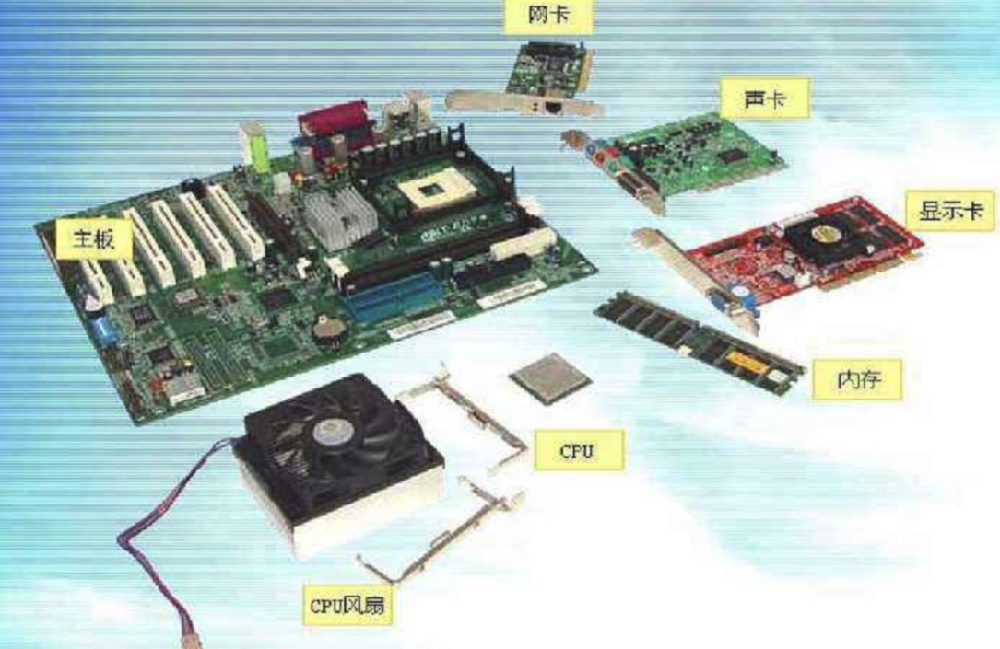


### 磁盘知识体系

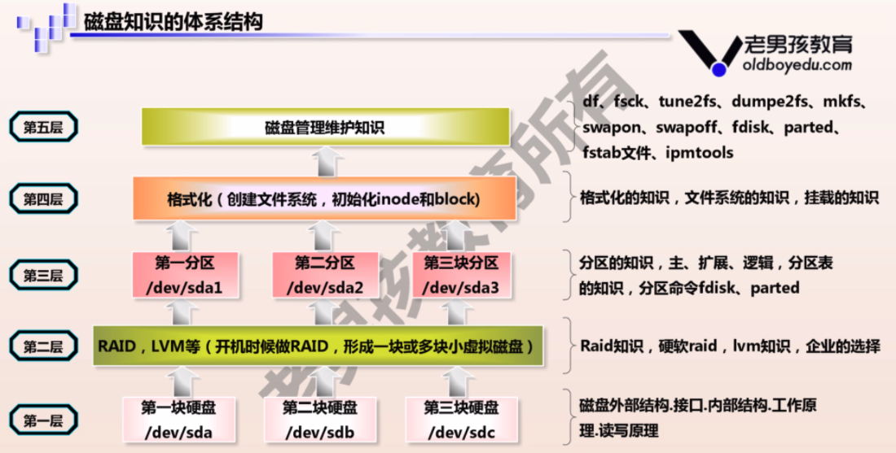


### Linux磁盘存储的经典描述

```
磁盘要放入计算机且被Linux系统识别，到可以使用磁盘存储数据，过程如下：
1.磁盘要存数据，相当于人盖房子
2.磁盘要分区后才能够存储数据，相当于房子改好了，需要隔断分出卧室，厨房，卫生间等区域
3.磁盘分区完成后，还得格式化后才能使用，且创建文件系统后才可以存储数据，相当于家里得装修后才能开始住人，不同的文件系统相当于不同的装修风格
4.磁盘分区，格式化，创建文件系统后，还得进行挂载到不同的文件夹，才能存放数据，相当于房子还得安装门、窗，才能和外界通信，进出
```

## 机械硬盘原理
机械硬盘由坚硬金属材料制成的涂以磁性介质的盘片，盘片两面称为盘面或扇面，都可以记录信息，由磁头对盘面进行操作，一般用磁头号区分。
结构特性决定了机械硬盘如果受到剧烈冲击，磁头与盘面可能产生的哪怕是轻微撞击都有可能报废。
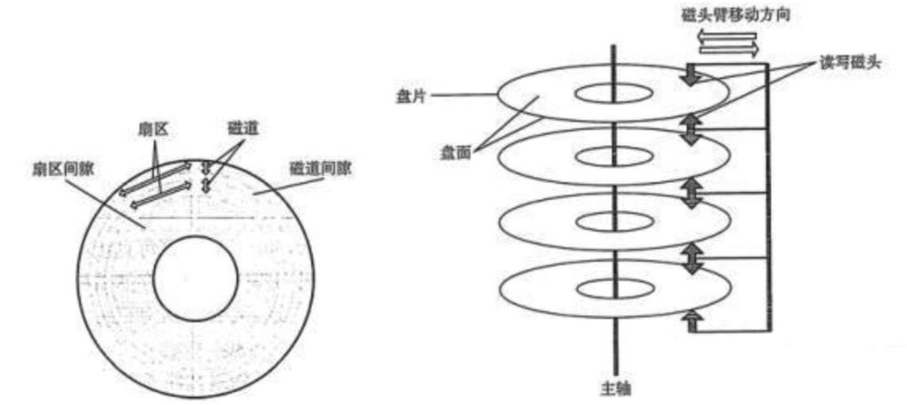
磁头不动，硬盘旋转，磁头就会在磁盘表面画出一个圆形轨迹且磁化，数据就保存在磁化区域中，称之为磁道。
每个磁道分段，一个弧就是一个扇区。
一个硬盘表面可以有多个扇面，每个扇面磁道数相同，具有相同周长的磁道形成的圆柱称之为柱面，柱面数与磁道数相等。


磁盘的每一面被分为很多条磁道，即表面上的一些同心圆，越接近中心，圆就越小。
而每一个磁道又按512个字节（0.5 KB）为单位划分为等分，叫做扇区。
文件数据存储在硬盘上，**硬盘中最小的存储单位是扇区（sector)**
**磁头读取扇区数据是按照`连续的多个扇区，称之为块（block）`**
`操作系统`文件存取的**最小单位是块，且单位是4kb，也就是8个扇区。**

## 磁盘常见概念

---


```
计算容量单位
对于计算机而言，只认识一个叫做二进制 的容量单位，我们称之为 bit ， 但是由于bit 单位太小，计算机又用Byte 单位来统计

1 Byte = 8 bit

同样的，由于计算机存储越来越大，Byte 也太小了，计算又出现简化的单位 KB MB GB TB

常见的单位换算关系

* bit -- 位
* Byte --字节。 1Byte = 8 Bits
* Kilobyte （KB） -- 千字节      1kb= 1024 = 2的10次方 bytes
* Megabyte （MB）  --- 兆字节 1MB =1024KB
* Gigabyte （GB）。千兆字节。 1GB = 1024MB

```


### 磁盘管理的名词解释

```
扇区(sector)是磁盘最小的物理存储单元，单位是512字节
操作系统无法对数目众多的扇区进行寻址，因此操作系统将相邻的扇区组合在一起，形成了块（8个扇区，4k大小）
在Linux文件系统中多个连续的扇区称之为block，块，也是在系统中被认为是最小的存储单位  du -h /tmp/*
在windows文件系统中多个连续的扇区称作簇
操作系统规定，一个block只能存放一个文件的内容，因此文件占用空间，只能是block的整数倍 du -h /etc/*
即使文件大小，小于一个block，也就是小于4k，同样占用一个block的大小
```

硬盘中最小的存储单位是扇区（sector），扇区大小是512B，而硬盘在文件读写操作的时候并非以扇区为单位，是以`簇`为单位，一个`簇`包含了多个扇区。
在Windows下如NTFS等文件系统中叫做簇；
在Linux下如Ext4等文件系统中叫做块（block）


---

## 磁盘分区
硬盘分区是就使用分区编辑器（partition editor）将一个硬盘上划分几个独立的逻辑部分，盘片一旦划分成数个分区，不同类的目录与文件可以存储进不同的分区。
越多分区，也就有更多不同的地方，可以将文件的性质区分得更细，按照更为细分的性质，存储在不同的地方以管理文件；但太多分区就成了麻烦。
硬盘分区就像给一间空荡的房子划分出卧室，厨房，客厅等相互隔离的空间一样。主要是为了方面用户的使用。
另一方面，通过合理的硬盘分区，有效保护系统盘空间，确实能够提高系统运行速度，再者，硬盘分区也可以有效地对数据进行保护。

你当然可以不分区，只不过，当你面对越来越多的子目录，或者是越来越慢的Windows，不得不费功夫去管理你的文件，或者重装Windows的时候，恐怕会悔不当初。

_mbr原理_
MBR：Master Boot Record，主分区引导记录。
磁盘的每块扇区都被分配了一个逻辑块地址，`引导扇区`是每个分区的第一扇区，`主引导扇区`是整个硬盘的第一扇区。
MBR就保存在主引导扇区中，且扇区还保存了硬盘分区表DPT（Disk Partition Table），和结束标志字（Magic number）。扇区总计512字节，MBR占446字节（0000H - 01BDH），DPT占据64个字节（01BEH - 01FDH），最后的magic number占2字节（01FEH – 01FFH）。
MBR分区缺点是，硬盘容量最大2T

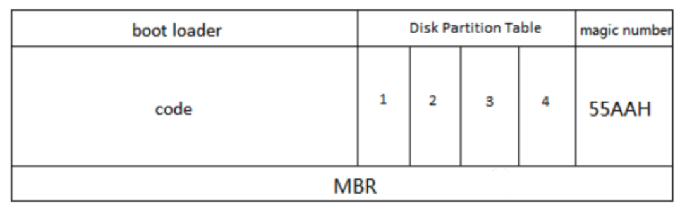
_GPT原理_
GPT分区：全称为Globally Unique Identifier Partition Table，也叫做GUID分区表，由于MBR限制在2TB容量，GPT诞生了，优点如下

- GPT分区的硬盘容量几乎无限制
- 分区个数无限制
- 自带磁盘数据保险机制
## 文件系统
### 格式化文件系统


- FAT16/FAT32，最早期的windows文件系统，缺点单个文件不能超过2G/4G大小，现在一部蓝光电影十几G肯定不行
- NTFS，支持文件加密，采用日志式文件系统，详细记录磁盘读写操作，提高数据和系统安全性，突破了4GB单个文件大小，对于flash闪存设备，过多读写造成磁盘寿命较短
- exFAT，单个文件支持16GB，适合于flash闪存设备使用（ssd，u盘）
### 平均寻道时间
平均寻道时间，它是了解硬盘性能至关重要的参数之一。它是指硬盘在接收到系统指令后，磁头从开始移动到数据所在的磁道所花费时间的平均值，它在一定程度上体现了硬盘读取数据的能力，是影响硬盘内部数据传输率的重要参数。

读写头沿径向移动，移到要读取的扇区所在磁道的上方，这段时间称为寻道时间（seek time）。
通过盘片的旋转，使得要读取的扇区转到读写头的下方，这段时间称为旋转延迟时间（rotational latency time)

### 磁盘转速

**RPM（revolutions per minute）它是指硬盘内电机主轴的旋转速度，也就是硬盘盘片在一分钟内所能完成的最大转数。**

电脑刚诞生初期，几乎所有硬盘都是3600RPM，这是由于美国的交流电是60Hz

```
1分=60s
60Hz * 1转/Hz * 60s/分钟 = 3600转/分钟
```
市场如今主流的5400、7200转速
```
3600RPM * 1.5 = 5400 RPM
3600RPM * 2 = 7200RPM
```
**5400和7200转速比较**
_情况一_

_情况二_

_总结_


## Linux磁盘分区

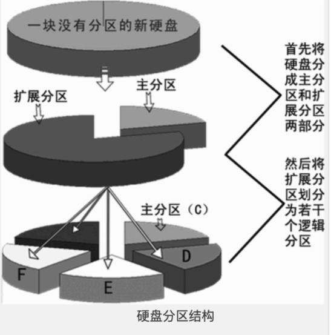

- 主分区，primary partition
- 扩展分区，extended
   - 逻辑分区

**linux一切接文件，磁盘设备在系统中也以文件形式展示**
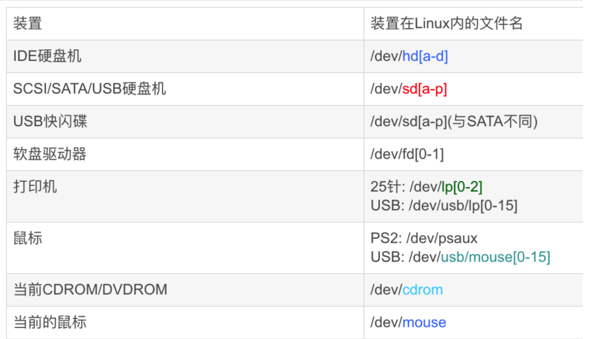

- `/dev/vd[a-d][1-128]`：为虚拟磁盘的磁盘文件名
```
/dev/sda–第一个SCSI磁盘或简单的硬盘。。
/dev/sdb–第二个SCSI磁盘。
/dev/sdc–第三个SCSI磁盘。
/dev/hda–IDE主控制器上的主磁盘。
/dev/hdb–IDE主控制器上的从磁盘。
```
**注意：CentOS 6和7统统将硬盘设备文件标识为/dev/sd[a-z]**
### 分区类型
在系统上的/dev/sda1、/dev/sda2又是何物？答：代表分区（Partition）
```
/dev/sda1
/dev/sda2
/dev/sda3
/dev/sda4
/dev/sda5
```
**一个硬盘的结构如下：**
系统默认分区1~4留给了主分区和扩展分区

- 主分区1 * (星号代表是引导分区，引导分区装在这里)
- 主分区2
- 主分区3
- 主分区4(extended)
   - 逻辑分区n
### fdisk命令
分区管理命令fdisk，命令危险，慎重使用
```
fdisk - manipulate disk partition table 用来管理磁盘分区表，修改、查看
fdisk -l [-u] [device...]
fdisk -l /dev/sda
```

```
[root@luffycity ~]# fdisk /dev/sda
欢迎使用 fdisk (util-linux 2.23.2)。
更改将停留在内存中，直到您决定将更改写入磁盘。
使用写入命令前请三思。
命令(输入 m 获取帮助)：m
命令操作
   a   toggle a bootable flag
   b   edit bsd disklabel
   c   toggle the dos compatibility flag
   d   delete a partition
   g   create a new empty GPT partition table
   G   create an IRIX (SGI) partition table
   l   list known partition types
   m   print this menu
   n   add a new partition
   o   create a new empty DOS partition table
   p   print the partition table
   q   quit without saving changes
   s   create a new empty Sun disklabel
   t   change a partition's system id
   u   change display/entry units
   v   verify the partition table
   w   write table to disk and exit
   x   extra functionality (experts only)
命令(输入 m 获取帮助)：
                n：创建新分区
                d：删除已有分区
                t：修改分区类型
                l：查看所有已经ID
                w：保存并退出
                q：不保存并退出
                m：查看帮助信息
                p：显示现有分区信息
```
### 新加一块硬盘进行磁盘分区
我们添加了/dev/sdb新硬盘
```
[root@local-pyyu ~]# fdisk -l |grep sd[a-c]
磁盘 /dev/sda：21.5 GB, 21474836480 字节，41943040 个扇区
/dev/sda1   *        2048     2099199     1048576   83  Linux
/dev/sda2         2099200    41943039    19921920   8e  Linux LVM
磁盘 /dev/sdb：21.5 GB, 21474836480 字节，41943040 个扇区
fdisk磁盘分区命令
-v 打印 fdisk 的版本信息并退出．
-l 列出指定设备的分区表信息并退出。
-u 以扇区数而不是以柱面数的形式显示分区表中各分区的信息．
-s 分区 将分区的 大小 （单位为块）信息输出到标准输出
```
## 分区命令步骤图解
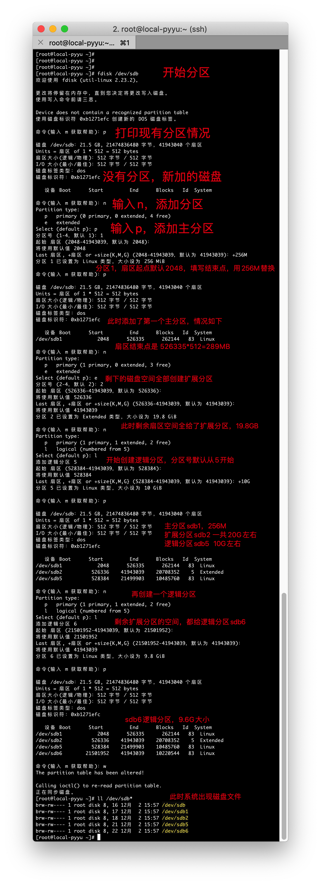

---

### 检查系统识别了新的分区
有时候删除文件，系统仍然提示占用空间，或内核未能读取到新创建的分区，可以用如下命令重读分区
```
[root@local-pyyu ~]# cat /proc/partitions
major minor  #blocks  name
   8        0   20971520 sda
   8        1    1048576 sda1
   8        2   19921920 sda2
   8       16   20971520 sdb
   8       17     262144 sdb1
   8       18          1 sdb2
   8       21   10485760 sdb5
   8       22   10220544 sdb6
  11        0    1048575 sr0
 253        0   17821696 dm-0
 253        1    2097152 dm-1
```
### partprobe命令
centos 5系列：
partprobe命令用于重读分区表，当出现删除文件后，出现仍然占用空间。可以partprobe在不重启的情况下重读分区。
有时候使用fdisk命令对磁盘分区后，内核找不到新分区，得重启机器才能识别新分区，使用partprobe可以不重启重读新的分区表。
```
[root@localhost ~]# partprobe   /dev/sdb          #重读磁盘分区表
```
### partx
partx命令告用来诉内核当前磁盘的分区情况
```
#让内核重读分区表
# partx -a /dev/sdb
```
## 针对超过2TB的磁盘分区
### parted命令
```
-l 显示所有分区信息
```
小于2TB的磁盘都可以用fdisk分区，但是大于2TB的磁盘，只能用parted命令分区，且转换磁盘为GPT格式
```
#哥哥这里删除了/dev/sdb磁盘的所有分区，使用的是20G的硬盘模拟,同学们可以自己添加新硬盘
[root@local-pyyu ~]# fdisk -l
磁盘 /dev/sdb：21.5 GB, 21474836480 字节，41943040 个扇区
Units = 扇区 of 1 * 512 = 512 bytes
扇区大小(逻辑/物理)：512 字节 / 512 字节
I/O 大小(最小/最佳)：512 字节 / 512 字节
磁盘标签类型：dos
磁盘标识符：0xb1271efc
   设备 Boot      Start         End      Blocks   Id  System
```
Parted开始分区，针对/dev/sdb磁盘，`GPT分区表没有extend类型`
```
[root@local-pyyu ~]# parted /dev/sdb
GNU Parted 3.1
使用 /dev/sdb
Welcome to GNU Parted! Type 'help' to view a list of commands.
(parted) mklabel gpt
警告: The existing disk label on /dev/sdb will be destroyed and all data on this disk will be lost. Do you want to continue?
是/Yes/否/No? Yes
(parted) mkpart primary 0 500
警告: The resulting partition is not properly aligned for best performance.
忽略/Ignore/放弃/Cancel? Ignore
(parted) p
Model: VMware, VMware Virtual S (scsi)
Disk /dev/sdb: 21.5GB
Sector size (logical/physical): 512B/512B
Partition Table: gpt
Disk Flags:
Number  Start   End    Size   File system  Name     标志
 1      17.4kB  500MB  500MB               primary
(parted) mkpart logical 501 10000
(parted) p
Model: VMware, VMware Virtual S (scsi)
Disk /dev/sdb: 21.5GB
Sector size (logical/physical): 512B/512B
Partition Table: gpt
Disk Flags:
Number  Start   End     Size    File system  Name     标志
 1      17.4kB  500MB   500MB                primary
 2      501MB   10.0GB  9499MB               logical
(parted) q
信息: You may need to update /etc/fstab.
[root@local-pyyu ~]# ls /dev/sdb*
/dev/sdb  /dev/sdb1  /dev/sdb2
[root@local-pyyu ~]#
```

用fdisk命令检查sdb磁盘情况

```
[root@local-pyyu ~]# fdisk -l /dev/sdb
WARNING: fdisk GPT support is currently new, and therefore in an experimental phase. Use at your own discretion.
磁盘 /dev/sdb：21.5 GB, 21474836480 字节，41943040 个扇区
Units = 扇区 of 1 * 512 = 512 bytes
扇区大小(逻辑/物理)：512 字节 / 512 字节
I/O 大小(最小/最佳)：512 字节 / 512 字节
磁盘标签类型：gpt
Disk identifier: 24DA7CEB-EAD9-4540-A5C6-B9F7D566D388
#         Start          End    Size  Type            Name
 1           34       976562  476.8M  Microsoft basic primary
 2       978944     19531775    8.9G  Microsoft basic logical
```
### 更换gpt表为mbr
```
fdisk命令是针对MBR分区格式的，虽然能用g命令把磁盘格式化为GPT，但是无法再重新格式化为MBR格式，因为fdisk命令无法操作GPT格式的磁盘。
可以使用parted命令更换磁盘分区格式
[root@gege /]# parted /dev/sdb    //选中要转换到的磁盘
GNU Parted 3.1
Using /dev/sdb
Welcome to GNU Parted! Type 'help' to view a list of commands.
(parted) mktable
New disk label type? msdos               
// 按照习惯MBR格式一般在linux下称作dos，如果在New disk label type?后输入dos或者mbr会提示无效命令，这时候要用help mktable查看
//帮助信息，可以看到parted命令中MBR分区被称作msdos，其它分区如下： aix, amiga, bsd, dvh, gpt, mac, msdos, pc98, sun, loop
Warning: The existing disk label on /dev/sdb will be destroyed and all data on this disk will be lost. Do you want to continue?
Yes/No? Yes
```

# Linux软硬链接
# 软硬链接
### ln命令
硬链接与软链接

ln命令是单词link缩写，功能是创建文件之间的链接（make links between files)，链接类型包括

- 硬链接 hard link
- 软链接 symbolic link
| 命令参数 | 解释 |
| --- | --- |
| ln无参数 | 创建硬链接 |
| -s | 创建软链接（符号链接） |

**细说链接知识**

- 硬链接，创建语法`ln 源文件 目标文件`，硬链接生成的是普通文件
- 软链接/符号链接，创建语法是`ln -s 源文件 目标文件`，生成符号链接文件

ln命令实践
```
[root@pylinux tmp]# touch alex.txt
[root@pylinux tmp]#
[root@pylinux tmp]#
[root@pylinux tmp]# ln alex.txt alex_hardlink                    #创建硬链接
[root@pylinux tmp]# ln -s alex.txt   alex_softlink        #创建软连接
[root@pylinux tmp]#
[root@pylinux tmp]# ls -lih
总用量 0
2370 -rw-r--r-- 2 root root 0 10月 14 15:25 alex_hardlink
7979 lrwxrwxrwx 1 root root 8 10月 14 15:25 alex_softlink -> alex.txt
2370 -rw-r--r-- 2 root root 0 10月 14 15:25 alex.txt
[root@pylinux tmp]# echo "我是金角大王" > alex.txt
[root@pylinux tmp]#
[root@pylinux tmp]#
[root@pylinux tmp]# cat alex_hardlink
我是金角大王
[root@pylinux tmp]# cat alex_softlink
我是金角大王
[root@pylinux tmp]#
[root@pylinux tmp]#
[root@pylinux tmp]# echo "我是金角大王的一根白头发" >> alex.txt
[root@pylinux tmp]# cat alex_hardlink
我是金角大王
我是金角大王的一根白头发
[root@pylinux tmp]# cat alex_softlink
我是金角大王
我是金角大王的一根白头发
```
### _readlink命令_
查看软链接文件的内容
```
使用cat查看软连接文件，只能看到源文件的内容
软链接文件存储的是源文件的路径
[root@pylinux tmp]# echo "我是金角老妖怪" > heihei.txt
[root@pylinux tmp]# ln -s /tmp/heihei.txt /tmp/yg.txt
[root@pylinux tmp]# readlink yg.txt
/tmp/heihei.txt
[root@pylinux tmp]# cat yg.txt
我是金角老妖怪
#硬链接看不到信息
[root@pylinux tmp]# readlink hh2.txt
[root@pylinux tmp]# readlink hh.txt
/tmp/hehe.txt
```
## inode与硬链接
操作系统中专门用于管理和存储文件的信息软件称之为`文件系统`，**文件系统将文件的`元信息(文件创建者，日期，大小等,可以通过stat命令查看元信息)`存储在一个称之为inode的区域**，中文是**索引节点**
查看文件inode号
```
[root@pylinux tmp]# ls -li
总用量 43356
  2370 -rw-r--r-- 1 root root 43523616 7月   7 2018 alex.txt.gz
   434 -rw-r--r-- 1 root root   855682 7月   7 2018 alltmp.zip
 13331 -rw-r--r-- 2 root root       14 11月  5 11:44 hehe.txt
 13331 -rw-r--r-- 2 root root       14 11月  5 11:44 hh2.txt
  7917 lrwxrwxrwx 1 root root       13 11月  5 11:45 hh.txt -> /tmp/hehe.txt
144495 drwxr-xr-x 2 root root     4096 7月   7 2018 各位今天也要好好学习哦.txt
```
通过ls -l查看到的数据，唯独文件名不是Inode存储的数据信息
Inode存储的信息不限于

- 文件大小
- 属主
- 用户组
- 文件权限
- 文件类型
- 修改时间

还包括了文件的文件的实体指针（指向Block的位置，也就是Inode和Block的关系）
### inode大小
硬盘格式化的时候，系统自动分为2个区，一个数据区，存放数据，一个是inode区（inode table）存放inode信息
每个inode节点大小，一般是128字节或是256字节，inode节点的总数在格式化的时候就决定了，

```
[root@gegelinux ~]# dumpe2fs -h /dev/vda1 |grep -i 'inode size'
dumpe2fs 1.42.9 (28-Dec-2013)
Inode size:              256
```
### Block磁盘块
Block是存放实际文件数据的单元，例如图片，视频，文本等数据，单个的文件占用多个block来存储。
操作系统标识文件并非以以文件名，而是以inode号码识别，文件名只是一个绰号而已。
文件系统读取文件

打个比方，比如一本书，存储设备或分区就相当于这本书，block 相当于书中的每一页内容，而inode 就相当于这本书前面的目录，一本书有很多内容，一个知识点可能有多页，如果想查找某部分或某知识点的内容，一般先查 书的目录，通过目录能更快的找到想要看的内容。

书本 首页的目录索引就相当于Inode  每一页相当于一个block ， 整本书就是一块磁盘或分区

inode 为每个文件进行信息索引，所以就有了 inode的数值，（书的目录提供简单信息描述，inode也描述了文件的一些元信息）操作系统根据指令，能通过 inode 值最快的找到相应 的文件。
**硬链接**
一般情况，文件名与inode号是一对一的，linux系统允许`多个文件路径`指向`同一个inode号码`（一个超市有多个门)
特性：

- 目录不支持硬链接
- 不得跨文件系统
- 硬链接数会增加Inode引用计数

这意味着：

- 用不同的文件名字可以访问一样的内容
- 修改文件内容，影响所有文件名
- 删除一个文件名，不影响另一个文件名正常操作

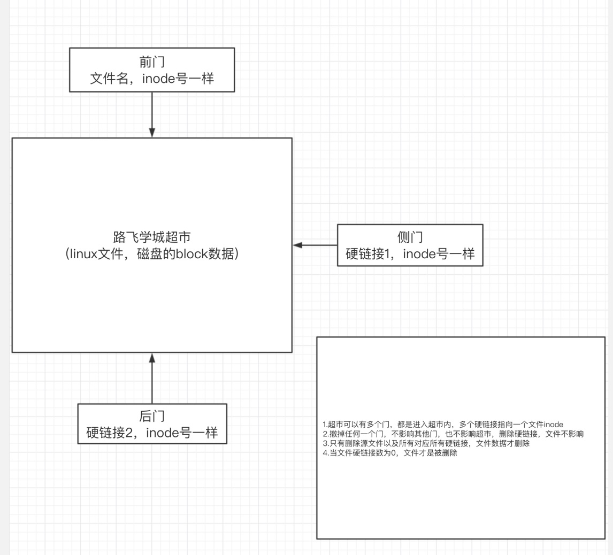
```bash
kanghuadeMacBook-Pro:~ kanghua$ echo "我是黑三老妖精" > alex.txt
kanghuadeMacBook-Pro:~ kanghua$ ln alex.txt alex.txt2 #创建硬链接1
kanghuadeMacBook-Pro:~ kanghua$ ln alex.txt alex.txt3 #创建硬链接2
kanghuadeMacBook-Pro:~ kanghua$ ls -li alex.tx*   # 三个文件指向同一个inode号
20279649 -rw-r--r--  3 kanghua  staff  22 11  9 23:20 alex.txt
20279649 -rw-r--r--  3 kanghua  staff  22 11  9 23:20 alex.txt2
20279649 -rw-r--r--  3 kanghua  staff  22 11  9 23:20 alex.txt3
```

**软连接**
软连接就类似windows的快捷方式了，是指向一个文件路径的另一个文件路径。
特性：

- 软连接是两个独立的文件，有各自的inode，创建软连接不会增加符号引用计数
- 支持目录软连接，可以跨文件系统
- 软链接有自己的inode号
- 软链接文件类型是l
- 软链接指向源文件，若源文件不存在，软链接失效(白字红底闪烁报错)
```
硬链接文件类型是普通文件 - 
软链接文件类型是链接类型 l 
语法：
ln -s 源文件绝对路径 目标文件绝对路径
[root@pylinux tmp]# ls -li
total 12
16777289 -rw-r--r--. 3 root root 19 Oct 14 16:58 alex.txt
16777289 -rw-r--r--. 3 root root 19 Oct 14 16:58 alex.txt2
16777289 -rw-r--r--. 3 root root 19 Oct 14 16:58 alex.txt3
[root@pylinux tmp]#
[root@pylinux tmp]# ln -s /tmp/alex.txt  /opt/alex.txt.softlink
[root@pylinux tmp]#
[root@pylinux tmp]#
[root@pylinux tmp]# ls -li /opt/alex.txt.softlink
461 lrwxrwxrwx. 1 root root 8 Oct 14 17:09 /opt/alex.txt.softlink -> /tmp/alex.txt
```
**软硬链接原理图**
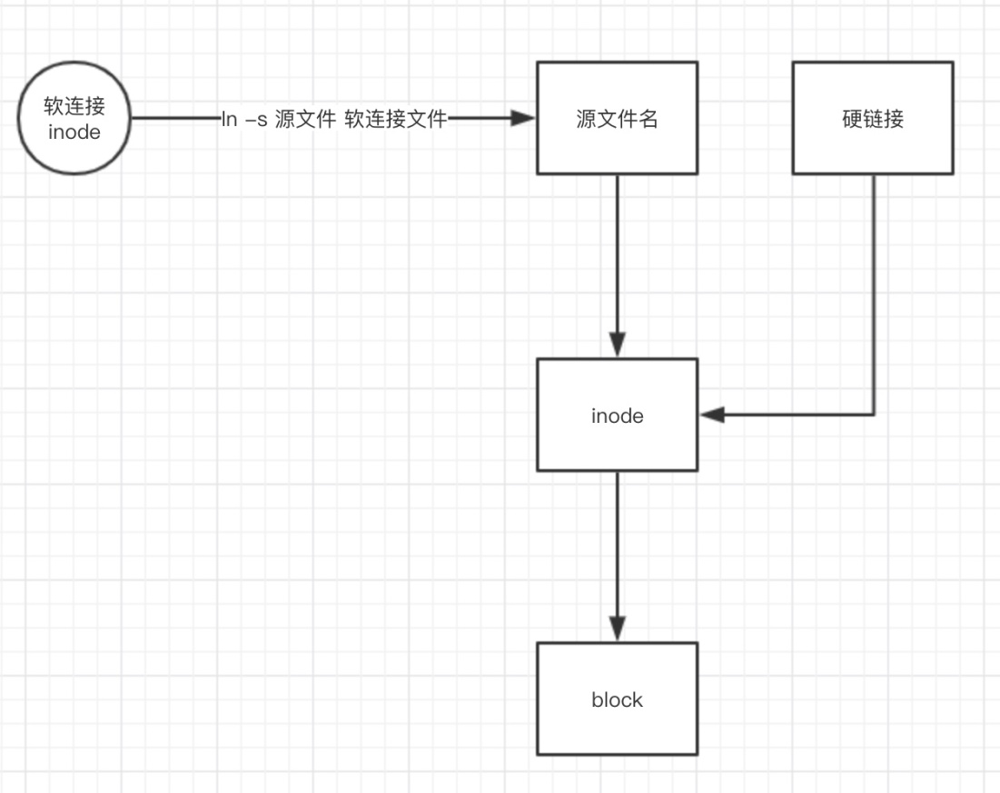
**软硬链接总结**

- 删除`软链接`对`源文件`，`硬链接`无影响
- 删除`硬链接`，对`软链接`，`源文件`无影响
- 删除`源文件`，对`硬链接`无影响，`软连接`失效
- 只有删除`源文件`，`硬链接`，`文件硬链接`数为0，文件失效
- 许多硬件的快照功能就是`硬链接`道理
- 源文件和硬链接有相同inode号，理解为`同一个文件`或是`一个文件多个入口`
- `软链接`与源文件inode号不同，是不同的文件，是源文件的快捷方式

**文件夹的链接数**

- 文件夹创建后，默认有.和..两个目录
   - .的inode号就是当前目录的inode号,如同`硬链接`
   - ..的inode号是上级目录的inode号，如同父目录的`硬链接`
   - 因此任意一个目录，硬链接基数都是2（目录名+当前目录名）
- 文件夹系统禁止创建硬链接


### 查看和管理Inode
无论是硬盘、U盘等在linux中被格式化为ext系列的文件系统后，都分为两部分

- Inode，默认128或256字节
- Block，默认1~4k
- 一般磁盘分区都很大，inode和block都会有很多个

查看文件系统Inode总数以及剩余数量
```
df -i   如果满了，删除大量小文件，存储了过多的元信息，小于1kb的文件
df -h        如果满了，删除大容量的文件
```


# Linux文件系统管理

## Linux支持的文件系统
### VFS
我们知道文件系统的种类有很多。
除了Linux标准的文件系统Ext2/Ext3/Ext4外，还有很多种文件系统 。linux通过叫做VFS的中间层对这些文件系统提供了完美的支持。
**Virtualenv File System虚拟文件系统**
虚拟文件系统（VFS）是一个处于用户进程和各类文件系统之间的抽象接口层，VFS提供访问 文件系统对象的通用对象模型（例如，i-node、文件对象、页缓存、）和方法，它对用户进程 隐藏了各种文件系统的差别。
正是因为有VFS，所以用户进程不用关心使用的是那种文件系 统，也更不需要知道各个文件系统应该使用哪个系统调用。
**案例**
```
$ cp /floppy/TEST /tmp/test
```
其中/floppy是MS-DOS磁盘的一个安装点
而/tmp是一个标准的第二扩展文件系统（second Extended Filesystom, Ext2）的目录。
如图VFS是用户的应用程序与文件系统实现之间的抽象层。
cp程序并不需要知道/floppy/TEST 和 /tmp/test是什么文件系统类型。
相反，cp程序直接与VFS交互，这是通过Unix程序设计人员都熟悉的普通系统调用来进行的。
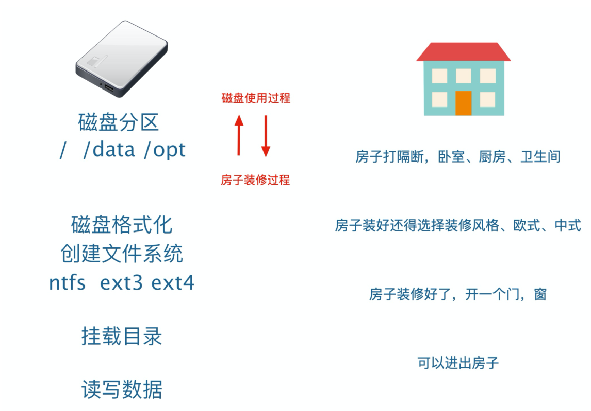
下图显示了VFS的概况。
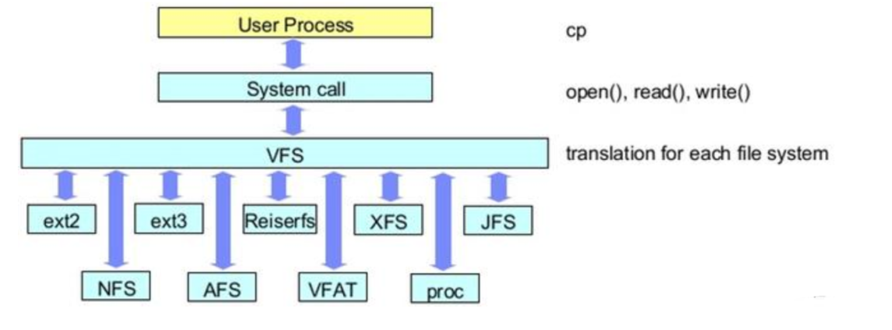

---

磁盘分区完毕后，还得进行格式化（format）方可使用，好比家里的房子，打好隔断后，还得装修完毕才能使用。
磁盘格式化是因为`不同的操作系统`设置的文件属性、权限各不相同，还得将分区格式化后，称为操作系统能够识别、兼容的文件系统（filesystem）
不同的操作系统、使用的文件系统各不相同，如：
windows 98

- FAT
- FAT16

windows 2000

- NTFS

Linux自带文件系统

- Ext2
- ext3 、centos 5
- ext4、 centos 6
- xfs、 centos 7

_网络文件系统_

- Smb，Server Message Block、服务消息块，文件共享协议
- NFS，Network File System(_NFS_)，网络文件系统，访问网络中其他主机的文件就像是自己计算机一样

_集群文件系统_

- Gfs， google File System，Google公司为了存储海量搜索数据而设计的专用文件系统。
- ocfs，Oracle Cluster File System是由Oracle开发并在GNU通用公共许可证下发布的共享磁盘文件系统。主要是为了适应使用集群计算的Oracle数据库管理系统。

_分布式文件系统_

- Ceph 是一个统一的分布式存储系统，设计初衷是提供较好的性能、可靠性和可扩展性。

_交换文件系统_

- swap


### 日志文件系统
journaling fs就是我们常说的： 日志型文件系统。
比较典型的有： ext3, ext4, xfs等， 而ext2是不支持 日志的文件系统，该文件系统基本上已经不再使用；
**简单介绍其实现原理**： 在磁盘上有一块区域专门用来保存日志，叫做journaling 区域，在更新磁盘上特定的block之前，首先把要做的变更 记录到 journaling 区域，然后才去更新相应的block。
这样在系统崩溃的时候，可以通过journaling区域的信息，进行replay, 从而实现 恢复；

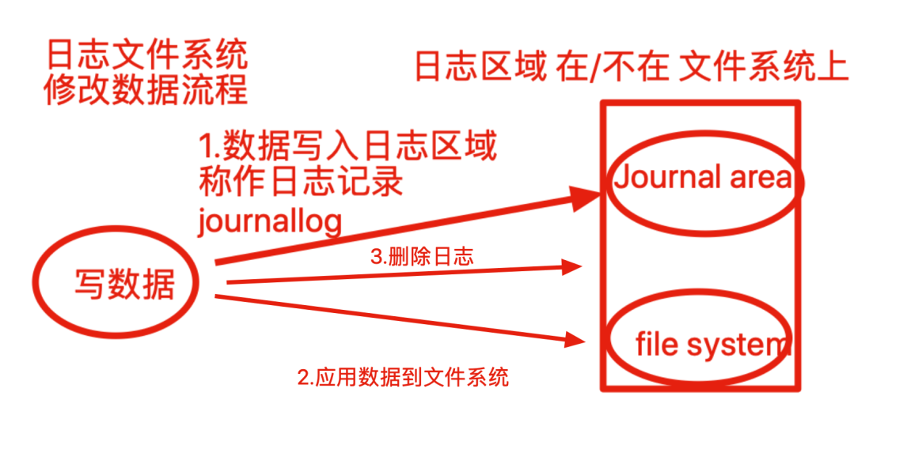
如果是非日志文件系统，进行读写操作，内核直接修改文件元数据，如果在写入过程异常崩溃，文件一致性就会出错，且修复过程很漫长，因此必须使用日志类型文件系统。

## 文件系统创建工具

- 创建文件系统

```
mkfs命令
mkfs把分区格式化为某种文件系统

-------------
mkfs.ext2
mkfs.ext3
mkfs.ext4
mkfs.vfat
mkfs.xfs
```


- 修复文件系统

```
fsck
检查并修复Linux文件系统
-------
fsck.ext2
fsck.ext3
fsck.ext4
```


- 查看文件系统属性

```
dumpe2fs命令用于打印文件系统的超级块和块组信息,用于ext2 ext3 ext4文件
然而centos7使用的xfs文件系统，更换xfs_info命令查看分区信息
```

- 调整文件系统特性

```
tune2fs 
调整/查看ext2/ext3文件系统的文件系统参数，Windows下面如果出现意外断电死机情况，下次开机一般都会出现系统自检。
Linux系统下面也有文件系统自检，而且是可以通过tune2fs命令，自行定义自检周期及方式。
-c max-mount-counts 设置强制自检的挂载次数  -1表示关闭
# tune2fs -c 30 /dev/hda1           #设置强制检查前文件系统可以挂载的次数
# tune2fs -c -l /dev/hda1           #关闭强制检查挂载次数限制。
```

- 列出所有设备的关系、文件系统

```
lsblk  列出所有的块设备，而且还能显示他们之间的依赖关系
[root@local-pyyu ~]# lsblk -f
NAME            FSTYPE      LABEL UUID                                   MOUNTPOINT
sda
├─sda1          xfs               2cf87472-f9c2-43cd-aa0e-1d8827ac307f   /boot
└─sda2          LVM2_member       VWePn4-g5RI-mWqG-6ted-DpQf-JU5Y-2OGJwi
  ├─centos-root xfs               d417666c-9823-47db-b69d-f0c9318304c4   /
  └─centos-swap swap              ce7999ab-4ffc-455a-9849-af8aa3ed2975   [SWAP]
sdb
├─sdb1          xfs               5a912c96-90ec-4769-900c-53900a153ed4
├─sdb2
└─sdb5          ext4              628b3a87-267e-4100-9450-a8a9b4978ec7
sr0
```
### 格式化文件系统
给刚打好隔断的房间，装修------给刚分区号的磁盘格式化文件系统

```
#格式化为xfs文件系统
[root@local-pyyu ~]# mkfs.xfs -f /dev/sdb5
meta-data=/dev/sdb5              isize=512    agcount=4, agsize=327680 blks
         =                       sectsz=512   attr=2, projid32bit=1
         =                       crc=1        finobt=0, sparse=0
data     =                       bsize=4096   blocks=1310720, imaxpct=25
         =                       sunit=0      swidth=0 blks
naming   =version 2              bsize=4096   ascii-ci=0 ftype=1
log      =internal log           bsize=4096   blocks=2560, version=2
         =                       sectsz=512   sunit=0 blks, lazy-count=1
realtime =none                   extsz=4096   blocks=0, rtextents=0
[root@local-pyyu ~]# lsblk -f -a
NAME            FSTYPE      LABEL UUID                                   MOUNTPOINT
sda
├─sda1          xfs               2cf87472-f9c2-43cd-aa0e-1d8827ac307f   /boot
└─sda2          LVM2_member       VWePn4-g5RI-mWqG-6ted-DpQf-JU5Y-2OGJwi
  ├─centos-root xfs               d417666c-9823-47db-b69d-f0c9318304c4   /
  └─centos-swap swap              ce7999ab-4ffc-455a-9849-af8aa3ed2975   [SWAP]
sdb
├─sdb1          xfs               5a912c96-90ec-4769-900c-53900a153ed4
├─sdb2
└─sdb5          xfs               5db9857c-4ea6-4819-a265-89b2eb41396d
sr0
```
格式化为ext4

```
[root@local-pyyu ~]# mkfs.ext4 /dev/sdb5
mke2fs 1.42.9 (28-Dec-2013)
文件系统标签=
OS type: Linux
块大小=4096 (log=2)
分块大小=4096 (log=2)
Stride=0 blocks, Stripe width=0 blocks
327680 inodes, 1310720 blocks
65536 blocks (5.00%) reserved for the super user
第一个数据块=0
Maximum filesystem blocks=1342177280
40 block groups
32768 blocks per group, 32768 fragments per group
8192 inodes per group
Superblock backups stored on blocks:
    32768, 98304, 163840, 229376, 294912, 819200, 884736
Allocating group tables: 完成
正在写入inode表: 完成
Creating journal (32768 blocks): 完成
Writing superblocks and filesystem accounting information: 完成
```
关闭文件系统自检

```
[root@local-pyyu ~]# tune2fs -c -1 /dev/sdb5
tune2fs 1.42.9 (28-Dec-2013)
Setting maximal mount count to -1
```
**如有需要将GPT改为MBR，还得用parted命令，fdisk命令无用**
修改命令如下

```
parted /dev/sdb
(parted)mktable   #输入格式化命令
New disk label type? msdos   #这里是更换为MBR格式
Warning: The existing disk label on /dev/vdb will be destroyed and all data on
this disk will be lost. Do you want to continue?
Yes/No?Yes    #确认格式化
```
### fsck
**fsck命令**被用于检查并且试图修复文件系统中的错误。当文件系统发生错误四化，可用fsck指令尝试加以修复。
Linux在开机的时候，系统会自动调用fsck命令进行需要自检的磁盘检查

```
fsck命令
-a：自动修复文件系统，不询问任何问题；
-A：依照/etc/fstab配置文件的内容，检查文件内所列的全部文件系统；
-N：不执行指令，仅列出实际执行会进行的动作；
-P：当搭配"-A"参数使用时，则会同时检查所有的文件系统；
-r：采用互动模式，在执行修复时询问问题，让用户得以确认并决定处理方式；
-R：当搭配"-A"参数使用时，则会略过/目录的文件系统不予检查；
-s：依序执行检查作业，而非同时执行；
-t<文件系统类型>：指定要检查的文件系统类型；
-T：执行fsck指令时，不显示标题信息；
-V：显示指令执行过程。
```
系统开机过程会读取/etc/fstab文件，最后一列为1或2，磁盘在开机时候就会调用fsck自检

```
cat /etc/fstab
# /etc/fstab
# Created by anaconda on Fri Aug 18 03:51:14 2017
#
# Accessible filesystems, by reference, are maintained under '/dev/disk'
# See man pages fstab(5), findfs(8), mount(8) and/or blkid(8) for more info
#
UUID=59d9c*********933****76b5 /                       ext4    defaults        1 1
最后一列为0表示不对磁盘检查，1是检查
```

```
[root@www ~]# fsck -t ext3 /dev/sda1 #检查ext3 类型的分区/dev/sad1
```
# 总结

```
xfs文件系统   用xfs_info显示信息
                        用xfs_admin修改信息
ext3 ext4  用dumpe2fs显示信息  
            用tune2fs修改信息
```

# Linux文件系统挂载


## 挂载
Linux 下设备不挂载不能使用，不挂载的设备相当于没门没窗户的监狱(进不去出不来)，挂载相当于给设备创造了一个入口(挂载点，一般为目录)
例如Linux访问U盘数据


**挂载**通常是将一个`存储设备`挂接到一个已经存在的`目录`上，访问这个`目录`就是访问该存储设备的内容。
对于Linux系统来说，一切皆文件，所有文件都放在以`根目录`为起点的树形目录结构中，任何硬件设备也都是文件形式
如图所示，是U盘存储设备和Linux系统自己的文件系统结构，此时Linux想要使用U盘的硬件设备，必须将Linux`本身的目录`和硬件设备的文件目录合二为一，此过程就称之为`挂载`。

```
挂载操作会隐藏原本Linux目录中的文件，因此选择Linux本身的目录，最好是新建空目录用于挂载
挂载之后，这个目录被称为挂载点
```

### mount命令
mount命令可以`将指定的文件系统`挂载到`指定目录（挂载点）`，在Linux系统下必须先挂载后才能访问设备资料

- 新的硬盘插到机器上，分区、格式化文件系统后，此时可以可以存放数据了
- 此时的硬盘插到linux上，也只是读取出了一个封闭的盒子，无法读写
- 和linux的文件夹进行`关联、挂载`后，即可通过访问`被挂载的文件夹`，访问到硬盘的数据
| 参数 | 解释 |
| --- | --- |
| -l | 显示系统以挂载的设备信息 |
| -a | 加载文件/etc/fstab中设置的所有设备 |
| -t | t<文件系统类型> 指定设备的文件系统类型。如果不设置，mount自行选择挂载的文件类型
minix Linux最早使用的文件系统。
ext2 Linux目前的常用文件系统。
msdos MS-DOS 的 FAT。
vfat Win85/98 的 VFAT。
nfs 网络文件系统。
iso9660 CD-ROM光盘的标准文件系统。
ntfs Windows NT的文件系统。
hpfs OS/2文件系统。Windows NT 3.51之前版本的文件系统。
auto 自动检测文件系统。 |
| -o | 添加挂载选项，是安全、性能优化重要参数 |
| -r | 只读，等于-o ro |
| -w | 读写，等-o rw |

对于mount的-o参数如下

| 参数 | 含义 |
| --- | --- |
| async | 以异步方式处理文件系统I/O操作，数据不会同步写入磁盘，而是写到缓冲区，提高系统性能，但损失数据安全性 |
| sync | 所有I/O操作同步处理，数据同步写入磁盘，性能较弱，数据安全性高 |
| atime/noatime | 文件被访问时是否修改时间戳，不更改时间，可以提高磁盘I/O速度 |
| auto/noauto | 通过-a参数可以自动被挂载/不自动挂载 |
| defaults | 默认值包括rw、suid、dev、exec、auto、nouser、async，/etc/fstab大多默认值 |
| exec/noexec | 是否允许执行二进制程序，取消提供安全性 |
| suid/nosuid | 是否允许suid(特殊权限)生效 |
| user/nouser | 是否允许普通用户挂载 |
| remount | 重新挂载 |
| ro | 只读 |
| rw | 读写 |

案例
**xfs文件系统，mount多出很多新选项**

```
#显示已经挂载情况
[root@local-pyyu ~]# mount -l
/dev/sda1 on /boot type xfs (rw,relatime,attr2,inode64,noquota)
#分区dev/sda1挂载在 /boot文件夹  文件系统类型是 xfs，参数是(rw,relatime,attr2,inode64,noquota)
rw 读写
relatime   mount 选项 relatime（relative atime 的意思）。relatime 的意思是访问文件时，仅在 atime 早于文件的更改时间时对 atime 进行更新。
attr2   在磁盘上存储内联扩展属性，提升性能
inode64 允许在文件系统的任意位置创建 inode
noquota 强制关闭所有文件系统限额功能
```
### mount挂载案例
注意，如果分区未格式化，是无法写入数据的!!!

```
[root@local-pyyu ~]# mount /dev/sdb5 /mnt
mount: /dev/sdb5 写保护，将以只读方式挂载
mount: 未知的文件系统类型“(null)”
如何解决，格式化文件系统即可
[root@local-pyyu ~]# lsblk -f  #看一下文件系统类型
[root@local-pyyu ~]# mkfs.xfs /dev/sdb5  #格式化分区
[root@local-pyyu ~]# mount /dev/sdb5 /mnt  #此时正常挂载
```
默认挂载结果

```
/dev/sdb5 on /mnt type xfs (rw,relatime,attr2,inode64,noquota)  #centos7默认的挂载选项
```
**挂载使用分区，挂载过程图**
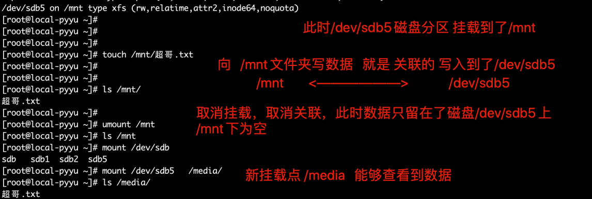

### 只读挂载

```
[root@local-pyyu ~]# mount -o ro /dev/sdb5 /mnt
[root@local-pyyu ~]# mount  
[root@local-pyyu ~]# ls /mnt
哥哥.txt
[root@local-pyyu ~]# touch /mnt/哥哥强啊.txt
touch: 无法创建"/mnt/哥哥强啊.txt": 只读文件系统
```
### 禁止可执行文件

```
[root@local-pyyu ~]# mount -o noexec /dev/sdb5 /mnt
[root@local-pyyu ~]# cd /mnt
[root@local-pyyu mnt]# echo 'echo 爱的供养' > love.sh
[root@local-pyyu mnt]# chmod 777 love.sh
[root@local-pyyu mnt]# ll
总用量 4
-rwxrwxrwx 1 root root 18 12月  3 16:33 love.sh
-rw-r--r-- 1 root root  0 12月  3 16:02 哥哥.txt
[root@local-pyyu mnt]# ./love.sh
-bash: ./love.sh: 权限不够
```
### umount取消挂载
umount可卸除目前挂在Linux目录中的文件系统。

```
语法
-f 强制卸载
-l 懒惰的卸载。从文件系统层次分离文件系统,在不繁忙的情况下清理所有对文件系统的引用，常和-f参数共用
```
取消挂载案例

```
umount 设备|文件夹
umount /dev/sdb5 
umount /media
```
### 取消挂载出错，设备繁忙

- 注意挂载点被使用中无法卸载，如被进程占用

```
[root@local-pyyu mnt]# pwd
/mnt
[root@local-pyyu mnt]# umount /mnt
umount: /mnt：目标忙。
```
解决方案：

- 查看挂载点被哪个进程占用

```
lsof /mnt
```
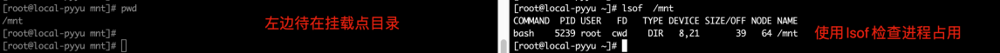

```
[root@local-pyyu ~]# fuser -v /mnt
                     用户     进程号 权限   命令
/mnt:                root     kernel mount /mnt
                     root       5239 ..c.. bash
```

- 杀死正在使用挂载点的进程

```
[root@local-pyyu ~]# fuser -km /mnt
```
### 查看系统以挂载的设备

- mount -l
- cat /etc/mtab
- cat /proc/mounts
## 交换分区
swap分区是一块特殊的硬盘空间，当实际内存不够用的时候，操作系统会从内存中取出一部分暂时不用的数据，放在交换内存中，从而使当前的程序腾出更多的内存量。
使用swap交换分区作用是，通过操作系统的调取，程序可以用到的内存远超过实际物理内存。磁盘价格要比内存便宜的多，因此使用swap交换空间是很实惠的，但是由于频繁的读写硬盘，这种方式会降低系统运行效率。
swap分区大小，根据物理内存大小和硬盘容量计算

```
swap交换空间只是用来应急的，容量分配要适量
```

- 内存小于1G，必须用swap提升内存使用量，否则运行不了几个应用
- 内存使用过多的应用，如视频制作等，使用swap防止内存不足，导致的软件崩溃
- 电脑休眠、内存数据断电丢失，因此将内存数据暂时存入swap交换空间，电脑休眠回复后，数据从swap读入内存，继续工作

**centos建议分配swap**

- 内存小于2G，swap分配等同内存大小空间
- 内存大于2G，分配2G交换空间
### 创建swap分区
第一步：先分区
第二步：格式化（swap命令不同，是mkswap）
第三步：使用swap分区
#### 分区

### 格式化文件系统
mkswap可将磁盘分区或文件设为Linux的交换区。

```
[root@local-pyyu ~]# mkswap /dev/sdb1
mkswap: /dev/sdb1: warning: wiping old xfs signature.
正在设置交换空间版本 1，大小 = 511996 KiB
无标签，UUID=64fb54dd-9383-44f9-a77f-c899898a9d68
```
### 开启swap交换分区

```
[root@local-pyyu ~]# swapon /dev/sdc1
[root@local-pyyu ~]# free -m
              total        used        free      shared  buff/cache   available
Mem:           3862         290        1729          11        1842        3170
Swap:          2547           0        2547
```
### free命令
free 命令主要是用来查看内存和 swap 分区的使用情况的，其中：

- total：是指总数；
- used：是指已经使用的；
- free：是指空闲的；
- shared：是指共享的；
- buffers：是指缓冲内存数；
- cached：是指缓存内存数，单位是KB；


```
[root@local-pyyu ~]# free -m
              total        used        free      shared  buff/cache   available
Mem:           3862         140        3552          11         168        3498
Swap:          2047           0        2047
```
### buff和cache

- buffers，缓冲，buffers是给写入数据加速的
- Cached，缓存，Cached是给读取数据时加速的

**cached是指把读取出来的数据保存在内存中，再次读取，不用读取硬盘而直接从内存中读取，加速数据读取过程。**

**buffers是指写入数据时，把分散的写入操作保存到内存，达到一定程度集中写入硬盘，减少磁盘碎片，以及反复的寻道时间，加速数据写入。**

```
可以理解为果园运输草莓
1.摘草莓的小姑娘，使用编织篮采摘
2.摘完一筐一筐草莓后，一起倒进运输车
而非，摘一个扔进车里一个


```
好比BT下载资料，电脑需要长时间24h的挂机运转，但是BT下载是碎片化的，如果直接写入磁盘也是零散的数据，由于机械磁盘的特性，写入大量零散的数据，会造成磁盘高负荷的机械运动，增加寻址时间，造成硬盘过早老化而损坏。
因此引入buffer，当数据攒到一定程度，例如512MB的时候，再一次性写入磁盘，这种化零为整的写入方式，大大降低了磁盘的负荷

### 总结buffer和cache

- 都是基于内存的中间层
- cache解决时间问题、提高读取速度
- buffer解决空间问题、给数据一个暂存空间
- cache利用内存提供的高速读写特性
- buffer利用内存提供的存储容量
### 我的内存被吃了
电脑无故提示内存不足，监控报警，新程序无法运行，都是物理内存不足，可能要释放cache缓存

```
释放缓存区的内存
1）清理pagecache（页面缓存）
[root@backup ~]# echo 1 > /proc/sys/vm/drop_caches     或者 # sysctl -w vm.drop_caches=1
2）清理dentries（目录缓存）和inodes
[root@backup ~]# echo 2 > /proc/sys/vm/drop_caches     或者 # sysctl -w vm.drop_caches=2
3）清理pagecache、dentries和inodes
[root@backup ~]# echo 3 > /proc/sys/vm/drop_caches     或者 # sysctl -w vm.drop_caches=3
上面三种方式都是临时释放缓存的方法，要想永久释放缓存，需要在/etc/sysctl.conf文件中配置：vm.drop_caches=1/2/3，然后sysctl -p生效即可！
另外，可以使用sync命令来清理文件系统缓存，还会清理僵尸(zombie)对象和它们占用的内存
sync：将内存缓冲区内的数据写入磁盘。
[root@backup ~]# sync
```
### 启用swap分区
使用swapon命令

```
原本的swap大小
[root@local-pyyu ~]# free -m
              total        used        free      shared  buff/cache   available
Mem:           3862         140        3552          11         168        3498
Swap:          2047           0        2047
```
激活swap分区

```
[root@local-pyyu ~]# swapon /dev/sdb1
```
查看swap空间

```
[root@local-pyyu ~]# free -m
              total        used        free      shared  buff/cache   available
Mem:           3862         141        3552          11         168        3497
Swap:          2547           0        2547
```
关闭swap空间

```
[root@local-pyyu ~]# swapoff /dev/sdb1
```

## 开机自动挂载
/etc/fstab是用来存放文件系统的静态信息的文件，当系统启动的时候，系统会自动地从这个文件读取信息，并且会自动将此文件中指定的文件系统挂载到指定的目录。


```
# <fie sysytem><mount point><type><options><dump><pass>
```

- File system

指定设备名称、或是远程的文件系统NFS

```
mount 192.168.178.100:/home/nfs   /mnt/nfs  -o nolock   #远程挂载不加锁
也可以挂载设备/dev/sda1  或是光盘  /dev/cdrom  或是u盘等
也可以是硬盘的卷标
也可以是用硬盘UUID
```

- mount point挂载点


```
自己创建一个目录，或是已存在的目录，然后挂载文件系统到这个目录，即可访问目录->访问文件系统
注意swap分区没有挂载点，填写none
```

- type类型


```
Linux能够支持的文件系统
ext3、 ext2、ext、swap
nfs、hpfs、ncpfs、ntfs、affs
umsdos、proc、reiserfs、squashfs、ufs。
adfs、befs、cifs、iso9660
kafs、minix、msdos、vfat
```

- options


```
可以通过man mount查看完整的参数
defaults，它代表包含了选项rw,suid,dev,exec,auto,nouser和 async。
```

- dump


```
表示将整个内容备份，一般为0不备份
1，每天备份
2，每隔一天备份
```

- fsck


```
一般为0
0 不自检
1，首要自检，一般只有根分区挂载点为1
2，次级自检
```
### 自动挂载在/etc/fstab所有定义的设备

```
cat /etc/fstab
/dev/sdb5       /gege   xfs  defaults 0 0
mount -a
```
## 报告文件系统磁盘空间的使用情况
df命令命令列出的是文件系统的可用空间

```
-i 用inode代替块
-l  只显示本地文件系统
-h 以kb mb gb显示单位
-T 显示每个文件系统的类型
```

```
[root@local-pyyu ~]# df -T
文件系统                类型        1K-块    已用     可用 已用% 挂载点
/dev/mapper/centos-root xfs      17811456 2601828 15209628   15% /
devtmpfs                devtmpfs  1965092       0  1965092    0% /dev
tmpfs                   tmpfs     1977356       0  1977356    0% /dev/shm
tmpfs                   tmpfs     1977356   11848  1965508    1% /run
tmpfs                   tmpfs     1977356       0  1977356    0% /sys/fs/cgroup
/dev/sda1               xfs       1038336  132684   905652   13% /boot
tmpfs                   tmpfs      395472       0   395472    0% /run/user/0
[root@local-pyyu ~]# df -T -h
文件系统                类型      容量  已用  可用 已用% 挂载点
/dev/mapper/centos-root xfs        17G  2.5G   15G   15% /
devtmpfs                devtmpfs  1.9G     0  1.9G    0% /dev
tmpfs                   tmpfs     1.9G     0  1.9G    0% /dev/shm
tmpfs                   tmpfs     1.9G   12M  1.9G    1% /run
tmpfs                   tmpfs     1.9G     0  1.9G    0% /sys/fs/cgroup
/dev/sda1               xfs      1014M  130M  885M   13% /boot
tmpfs                   tmpfs     387M     0  387M    0% /run/user/0
[root@local-pyyu ~]# df -i -h
文件系统                Inode 已用(I) 可用(I) 已用(I)% 挂载点
/dev/mapper/centos-root  8.5M     82K    8.5M       1% /
devtmpfs                 480K     404    480K       1% /dev
tmpfs                    483K       1    483K       1% /dev/shm
tmpfs                    483K    1.3K    482K       1% /run
tmpfs                    483K      16    483K       1% /sys/fs/cgroup
/dev/sda1                512K     325    512K       1% /boot
tmpfs                    483K       1    483K       1% /run/user/0
```
## 统计文件、目录磁盘使用情况
**linux`操作系统`文件存取的**最小单位是块，且单位是4kb，也就是8个扇区。

```
du(Disk Usage) - 报告磁盘空间使用情况
-a或-all 显示目录中个别文件的大小。
-b或-bytes 显示目录或文件大小时，以byte为单位。
-c或--total 除了显示个别目录或文件的大小外，同时也显示所有目录或文件的总和。
-k或--kilobytes 以KB(1024bytes)为单位输出。
-m或--megabytes 以MB为单位输出。
-s或--summarize 仅显示总计，只列出最后加总的值。
-h或--human-readable 以K，M，G为单位，提高信息的可读性。
-x或--one-file-xystem 以一开始处理时的文件系统为准，若遇上其它不同的文件系统目录则略过。
-L<符号链接>或--dereference<符号链接> 显示选项中所指定符号链接的源文件大小。
-S或--separate-dirs 显示个别目录的大小时，并不含其子目录的大小。
-X<文件>或--exclude-from=<文件> 在<文件>指定目录或文件。
--exclude=<目录或文件> 略过指定的目录或文件。
-D或--dereference-args 显示指定符号链接的源文件大小。
-H或--si 与-h参数相同，但是K，M，G是以1000为换算单位。
-l或--count-links 重复计算硬件链接的文件。
```
显示当前目录下`所有目录，和文件`大小统计

```
[root@gegelinux testdu]# du -h
4.0K    ./gege_nginx/uwsgi_temp
4.0K    ./gege_nginx/proxy_temp
4.0K    ./gege_nginx/client_body_temp
12K    ./gege_nginx/html
64K    ./gege_nginx/conf
884K    ./gege_nginx/logs
4.0K    ./gege_nginx/fastcgi_temp
3.5M    ./gege_nginx/sbin
4.0K    ./gege_nginx/scgi_temp
4.5M    ./gege_nginx
4.6M    .
```
显示所有文件的统计大小

```
du -ah
```
单独统计文件大小

```
[root@gegelinux testdu]# du  mysql-5.5.15-1-mdv2011.0.x86_64.rpm  -h
88K    mysql-5.5.15-1-mdv2011.0.x86_64.rpm
```
统计/opt目录下，第一层文件夹所有的文件，文件夹大小

```
[root@gegelinux testdu]# du -ah --max-depth=1 /opt
```
统计/opt下所有文件文件夹大小，且从大到小排序

```
[root@gegelinux testdu]# du -sh /opt/* | sort -rn
```
统计当前目录下所有文件，文件夹大小，除了`*.conf`文件

```
du -ah --exclude='*.conf'
```
仅仅统计第一层文件夹的大小

```
[root@gegelinux testdu]# du -h --max-depth=1 /opt
```

# RAID技术
RAID，全称为Redundant Arrays of Independent Drives，即磁盘冗余阵列。
这是由多块独立磁盘（多为硬盘）组合的一个超大容量磁盘组。
计算机一直是在飞速的发展，更新，整体计算机硬件也得到极大的提升，由于磁盘的特性，需要持续、频繁、大量的读写操作，相比较于其他硬件设备，很容易损坏，导致数据丢失。
_Raid历史_
1988年，在美国加州大学伯克利分校提出且定义了RAID技术。RAID技术意为将多个硬盘设备组成一个容量更大、安全性更好的磁盘阵列组，将数据切割为多个区段后分别存放在不同的物理硬盘上，利用分散读写技术提升磁盘阵列组的整体性能，并且数据同步在不同的多个物理硬盘，也起到了数据冗余备份的作用。
_Raid特性_
Raid磁盘阵列组能够提升数据冗余性，当然也增加了硬盘的价格成本，只不过数据本身的价值是超过硬盘购买的价格的，Raid除了能够保障数据丢失造成的严重损失，还能提升硬盘读写效率，被应用在广泛的企业中。

---

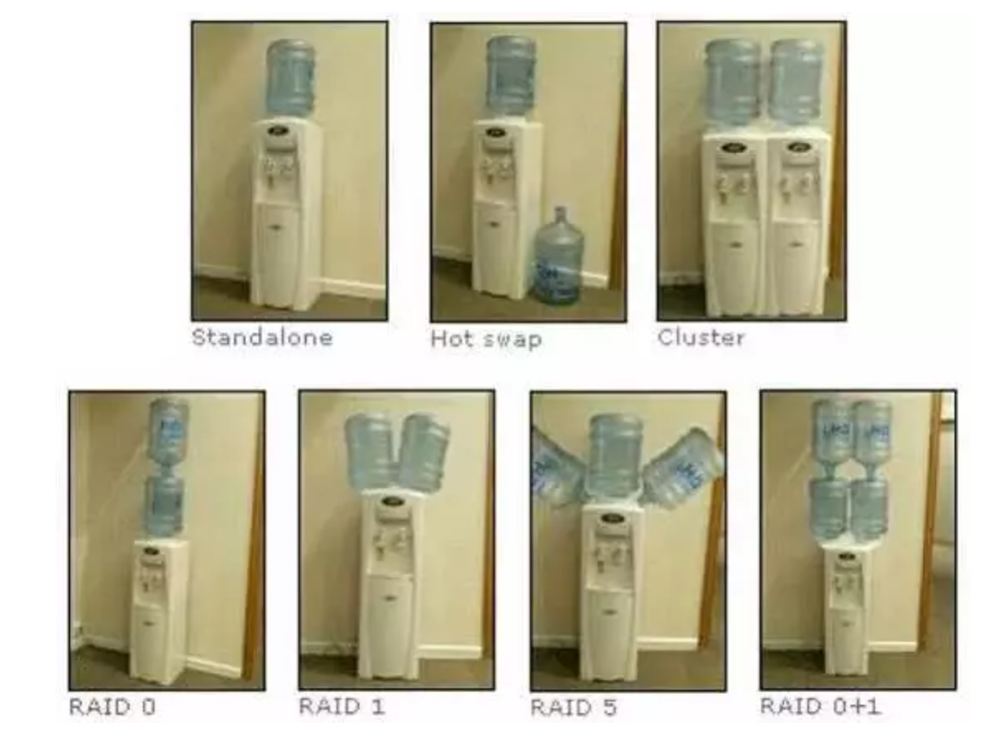
先不谈磁盘，饮水机各位应该都了解

- _standalone_

独立模式，最常见的模式，一台饮水机，一桶水
（一块磁盘读写数据）

- _Hot swap_

热备份模式，一桶水可能会喝完，水桶可能会坏，旁边放一个预备水桶，随时替代
（防止单独一块硬盘突然损坏，故障，另一块硬盘随时等待接替）

- _Cluster_

集群模式，一堆饮水机一起提供服务，提高用户接水效率
（一堆硬盘共同提供工作，提高读写效率）

---

## 不同的Raid级别
由于技术角度因素、成本控制因素等，不同的企业在数据的可靠性以及性能上做了权衡，制定出不同的Raid方案
### Raid 0
将`两个或两个`以上`相同型号`、`容量`的硬盘`组合`，磁盘阵列的总容量便是多个硬盘的总和。
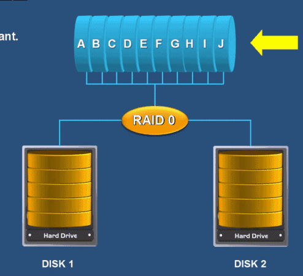
数据`依次`写入物理硬盘，理想状态下，硬盘读写性能会翻倍
但是raid 0 任意一块硬盘故障都会导致整个系统数据被破坏，数据分别写入两个硬盘设备，没有数据备份的功能。
**Raid 0 适用于对于数据安全性不太关注，追求性能的场景。**
好比你有一些小秘密，不想放云盘，数据量又比较大，可以快速写入raid 0。
_本来读写都是一块硬盘，数据都得排队，效率肯定低_
_raid 0 把数据打散，好比多了条队同时排，效率一下子就提升了_

### raid 1
由于raid 0的特性，数据依次写入到各个物理硬盘中，数据是分开放的，因此损坏任意一个硬盘，都会对完整的数据破坏，对于企业数据来说，肯定是不允许。
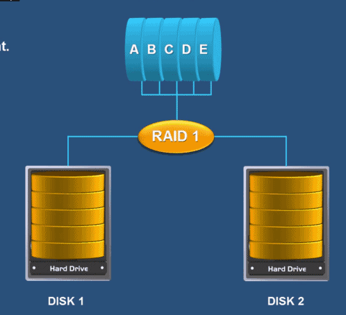
Raid 1技术，是将`两块以上`硬盘绑定，数据写入时，同时写入多个硬盘，因此即使有硬盘故障，也有数据备份。
但是这种方式，无疑极大降低磁盘利用率，假设两块硬盘一共4T，真实数据只有2TB，利用率50%，如果是三块硬盘组成raid 1，利用率只有33%，也是不可取的。
那有没有一种方案，能够控制成本、保证数据安全性、以及读写速度呢？

### raid 3
**计算机的异或：数字相同则为0，数字不同则为1**
计算机的数据只有0和1对于异或处理，如下
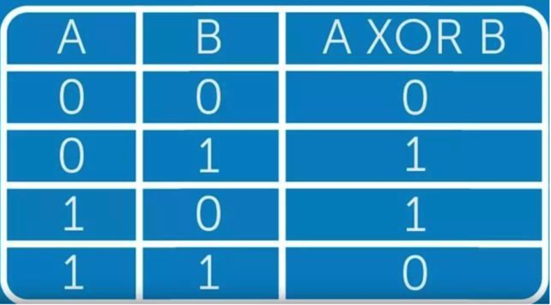

```
[root@gegelinux testdu]# python
Python 2.7.5 (default, Aug  7 2019, 00:51:29)
[GCC 4.8.5 20150623 (Red Hat 4.8.5-39)] on linux2
Type "help", "copyright", "credits" or "license" for more information.
>>>
>>>
>>> 1^0
1
>>> 1^1
0
>>> 0^0
0
>>> 0^1
1
```
**异或：AxorBxorCxorD**
A异或B异或C异或D
**结论：1的个数是奇数，结果为1；1的个数是偶数，结果是0**

```
>>> 0^0^1^1
0
>>> 1^0^1^1
1
>>> 1^0^1
0
>>> 1^0^1^1^1
0
```
异或的作用是，只要知道异或的结果，任何一个值都能够反推出来

因此raid 3 至少需要3块硬盘，只要校验盘没坏，坏了一块数据盘可以反推数据来恢复。
但是你会发现同样也浪费了一块磁盘，但是要比raid 1 节约不少。
如果校验盘坏了呢？（你咋这么多事呢。。)

### raid 5

Raid 5规则下，校验码会均匀放在每一块硬盘，磁盘1存放磁盘2、3、4的校验码
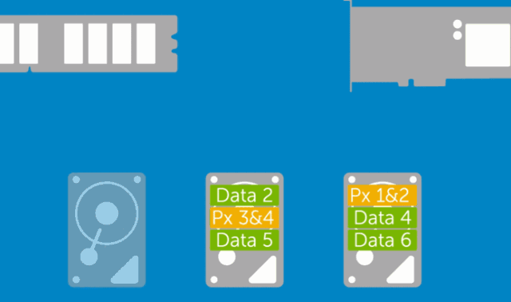
这样任意一块挂了都能够恢复，提升了容错率，但是也仅仅是只能挂掉一块

### Raid 10
Raid 5技术是在读写速度和数据安全性上做了一定的妥协，对于企业来说，最核心的就是数据，成本不是问题。

Raid 10 其实是raid 0 加上raid 1，吸收了raid 0的效率，raid 1的安全性，因此至少需要四块硬盘搭建raid 10。
1.通过raid 1两两镜像复制，保障数据安全性
2.针对两个raid 1部署raid 0，进一步提升磁盘读写速度
3.只要坏的不是同一组中所有硬盘，那么就算坏掉一半硬盘都不会丢失数据

### 硬RAID、软RAID

由CPU去控制硬盘驱动器进行数据转换、计算的过程就是软件RAID
由专门的RAID卡上的主控芯片操控，就是硬件RAID
软件RAID和硬件RAID的差异如下

- 软件RAID额外消耗CPU资源，性能弱
- 硬件RAID更加稳定，软件RAID可能造成磁盘发热过量，造成威胁
- 兼容性问题，软件RAID依赖于操作系统，硬件RAID胜出
## 部署RAID 10
额外添加4块硬盘，用于搭建RAID 10

检查linux的磁盘

```
[root@local-pyyu ~]# fdisk -l |grep '/dev/sd[a-z]'
磁盘 /dev/sda：21.5 GB, 21474836480 字节，41943040 个扇区
/dev/sda1   *        2048     2099199     1048576   83  Linux
/dev/sda2         2099200    41943039    19921920   8e  Linux LVM
磁盘 /dev/sdb：5368 MB, 5368709120 字节，10485760 个扇区
磁盘 /dev/sdc：5368 MB, 5368709120 字节，10485760 个扇区
磁盘 /dev/sde：5368 MB, 5368709120 字节，10485760 个扇区
磁盘 /dev/sdd：5368 MB, 5368709120 字节，10485760 个扇区
```
### mdadm命令

```
mdadm 用于建设，管理和监控软件RAID阵列
可能需要单独安装
yum install mdadm -y
```
参数

| 参数 | 解释 |
| --- | --- |
| -C | 用未使用的设备，创建raid |
| -a | yes or no，自动创建阵列设备 |
| -A | 激活磁盘阵列 |
| -n | 指定设备数量 |
| -l | 指定raid级别 |
| -v | 显示过程 |
| -S | 停止RAID阵列 |
| -D | 显示阵列详细信息 |
| -f | 移除设备 |
| -x | 指定阵列中备用盘的数量 |
| -s | 扫描配置文件或/proc/mdstat，得到阵列信息 |

**创建RAID10，且命名为/dev/md0**
已知现有四块新的磁盘

```
磁盘 /dev/sdb：5368 MB, 5368709120 字节，10485760 个扇区
磁盘 /dev/sdc：5368 MB, 5368709120 字节，10485760 个扇区
磁盘 /dev/sde：5368 MB, 5368709120 字节，10485760 个扇区
磁盘 /dev/sdd：5368 MB, 5368709120 字节，10485760 个扇区
```
创建raid 10命令

```
mdadm -Cv /dev/md0  -a yes -n 4 -l 10 /dev/sdb /dev/sdc /dev/sdd /dev/sde
-C 表示创建RAID阵列卡
-v 显示创建过程
/dev/md0 指定raid阵列的名字
-a  yes  自动创建阵列设备文件
-n 4 参数表示用4块盘部署阵列
-l 10 代表指定创建raid 10级别
最后跟着四块磁盘设备名
```
创建raid10

```
[root@local-pyyu ~]# mdadm -Cv /dev/md0  -a yes -n 4 -l 10 /dev/sdb /dev/sdc /dev/sdd /dev/sde
mdadm: layout defaults to n2
mdadm: layout defaults to n2
mdadm: chunk size defaults to 512K
mdadm: size set to 5237760K
mdadm: Fail create md0 when using /sys/module/md_mod/parameters/new_array
mdadm: Defaulting to version 1.2 metadata
mdadm: array /dev/md0 started.
```
检查raid 10分区

```
[root@local-pyyu ~]# fdisk -l |grep /dev/md
磁盘 /dev/md0：10.7 GB, 10726932480 字节，20951040 个扇区
```
格式化磁盘阵列文件系统

```
[root@local-pyyu ~]# mkfs.xfs /dev/md0
meta-data=/dev/md0               isize=512    agcount=16, agsize=163712 blks
         =                       sectsz=512   attr=2, projid32bit=1
         =                       crc=1        finobt=0, sparse=0
data     =                       bsize=4096   blocks=2618880, imaxpct=25
         =                       sunit=128    swidth=256 blks
naming   =version 2              bsize=4096   ascii-ci=0 ftype=1
log      =internal log           bsize=4096   blocks=2560, version=2
         =                       sectsz=512   sunit=8 blks, lazy-count=1
realtime =none                   extsz=4096   blocks=0, rtextents=0
```
新建文件夹，用于挂载分区

```
[root@local-pyyu ~]# mkdir /gegeRAID10
[root@local-pyyu ~]# mount /dev/md0 /gegeRAID10/
[root@local-pyyu ~]# mount |grep md0
/dev/md0 on /gegeRAID10 type xfs (rw,relatime,attr2,inode64,sunit=1024,swidth=2048,noquota)
```
检查挂载分区使用情况

```
[root@local-pyyu ~]# df -hT |grep md0
/dev/md0                xfs        10G   33M   10G    1% /gegeRAID10
```
检查raid 10磁盘阵列的信息

```
[root@local-pyyu ~]# mdadm -D /dev/md0
/dev/md0:
           Version : 1.2
     Creation Time : Thu Dec  5 16:44:18 2019
        Raid Level : raid10
        Array Size : 10475520 (9.99 GiB 10.73 GB)
     Used Dev Size : 5237760 (5.00 GiB 5.36 GB)
      Raid Devices : 4
     Total Devices : 4
       Persistence : Superblock is persistent
       Update Time : Thu Dec  5 17:49:29 2019
             State : clean
    Active Devices : 4
   Working Devices : 4
    Failed Devices : 0
     Spare Devices : 0
            Layout : near=2
        Chunk Size : 512K
Consistency Policy : resync
              Name : local-pyyu:0  (local to host local-pyyu)
              UUID : 9eb470b5:4dc5b8c9:8c0568c3:6bfdebf6
            Events : 17
    Number   Major   Minor   RaidDevice State
       0       8       16        0      active sync set-A   /dev/sdb
       1       8       32        1      active sync set-B   /dev/sdc
       2       8       48        2      active sync set-A   /dev/sdd
       3       8       64        3      active sync set-B   /dev/sde
```
此时可以向磁盘中写入数据，检查分区使用情况

```
[root@local-pyyu gegeRAID10]# df -h|grep md0
/dev/md0                  10G  190M  9.8G    2% /gegeRAID10
[root@local-pyyu gegeRAID10]# pwd
/gegeRAID10
[root@local-pyyu gegeRAID10]# ll -h
总用量 158M
-rw-r--r-- 1 root root 158M 12月  6 11:08 ceshi.txt
```
raid10加入开机挂载配置文件，让其永久生效

```
vim /etc/fstab  #添加如下配置
/dev/md0 /gegeRAID10 xfs defaults 0 0
```
### 故障一块硬盘怎么办
模拟一块硬盘故障，剔除一块磁盘

```
磁盘 /dev/sdb：5368 MB, 5368709120 字节，10485760 个扇区
磁盘 /dev/sdc：5368 MB, 5368709120 字节，10485760 个扇区
磁盘 /dev/sde：5368 MB, 5368709120 字节，10485760 个扇区
磁盘 /dev/sdd：5368 MB, 5368709120 字节，10485760 个扇区
```
移除一块硬盘设备

```
[root@local-pyyu gegeRAID10]# mdadm /dev/md0 -f /dev/sdd
mdadm: set /dev/sdd faulty in /dev/md0
```
检查RAID10状态

```
[root@local-pyyu gegeRAID10]# mdadm -D /dev/md0
/dev/md0:
           Version : 1.2
     Creation Time : Thu Dec  5 16:44:18 2019
        Raid Level : raid10
        Array Size : 10475520 (9.99 GiB 10.73 GB)
     Used Dev Size : 5237760 (5.00 GiB 5.36 GB)
      Raid Devices : 4
     Total Devices : 4
       Persistence : Superblock is persistent
       Update Time : Fri Dec  6 13:45:10 2019
             State : clean, degraded
    Active Devices : 3
   Working Devices : 3
    Failed Devices : 1
     Spare Devices : 0
            Layout : near=2
        Chunk Size : 512K
Consistency Policy : resync
              Name : local-pyyu:0  (local to host local-pyyu)
              UUID : 9eb470b5:4dc5b8c9:8c0568c3:6bfdebf6
            Events : 19
    Number   Major   Minor   RaidDevice State
       0       8       16        0      active sync set-A   /dev/sdb
       1       8       32        1      active sync set-B   /dev/sdc
       -       0        0        2      removed
       3       8       64        3      active sync set-B   /dev/sde
       2       8       48        -      faulty   /dev/sdd
```
RAID10磁盘阵列，挂掉一块硬盘并不影响使用，只需要购买新的设备，替换损坏的磁盘即可

```
先取消RAID10阵列的挂载，注意必须没有人在使用挂载的设备
[root@local-pyyu /]# umount /gegeRAID10/
重启操作系统
reboot
添加新设备
[root@local-pyyu ~]# mdadm /dev/md0 -a /dev/sdd
mdadm: added /dev/sdd
会有一个修复中的过程
[root@local-pyyu ~]# mdadm -D /dev/md0
/dev/md0:
           Version : 1.2
     Creation Time : Thu Dec  5 16:44:18 2019
        Raid Level : raid10
        Array Size : 10475520 (9.99 GiB 10.73 GB)
     Used Dev Size : 5237760 (5.00 GiB 5.36 GB)
      Raid Devices : 4
     Total Devices : 4
       Persistence : Superblock is persistent
       Update Time : Fri Dec  6 13:58:06 2019
             State : clean, degraded, recovering
    Active Devices : 3
   Working Devices : 4
    Failed Devices : 0
     Spare Devices : 1
            Layout : near=2
        Chunk Size : 512K
Consistency Policy : resync
    Rebuild Status : 27% complete
              Name : local-pyyu:0  (local to host local-pyyu)
              UUID : 9eb470b5:4dc5b8c9:8c0568c3:6bfdebf6
            Events : 41
    Number   Major   Minor   RaidDevice State
       0       8       16        0      active sync set-A   /dev/sdb
       1       8       32        1      active sync set-B   /dev/sdc
       4       8       48        2      spare rebuilding   /dev/sdd
       3       8       64        3      active sync set-B   /dev/sde
等待RAID 10 修复完毕
[root@local-pyyu ~]# mdadm -D /dev/md0
/dev/md0:
           Version : 1.2
     Creation Time : Thu Dec  5 16:44:18 2019
        Raid Level : raid10
        Array Size : 10475520 (9.99 GiB 10.73 GB)
     Used Dev Size : 5237760 (5.00 GiB 5.36 GB)
      Raid Devices : 4
     Total Devices : 4
       Persistence : Superblock is persistent
       Update Time : Fri Dec  6 13:58:25 2019
             State : clean
    Active Devices : 4
   Working Devices : 4
    Failed Devices : 0
     Spare Devices : 0
            Layout : near=2
        Chunk Size : 512K
Consistency Policy : resync
              Name : local-pyyu:0  (local to host local-pyyu)
              UUID : 9eb470b5:4dc5b8c9:8c0568c3:6bfdebf6
            Events : 54
    Number   Major   Minor   RaidDevice State
       0       8       16        0      active sync set-A   /dev/sdb
       1       8       32        1      active sync set-B   /dev/sdc
       4       8       48        2      active sync set-A   /dev/sdd
       3       8       64        3      active sync set-B   /dev/sde
```
## 重启软RAID
**注意要配置软RAID的配置文件，否则如果停止软RAID后就无法激活了，严格按照笔记来**

```
#手动创建配置文件
[root@local-pyyu ~]# echo DEVICE /dev/sd[b-e] > /etc/mdadm.conf
#扫描磁盘阵列信息，追加到/etc/mdadm.conf配置文件中
[root@local-pyyu /]# mdadm -Ds >> /etc/mdadm.conf
[root@local-pyyu /]# cat /etc/mdadm.conf
DEVICE /dev/sdb /dev/sdc /dev/sdd /dev/sde
ARRAY /dev/md/0 metadata=1.2 name=local-pyyu:0 UUID=9eb470b5:4dc5b8c9:8c0568c3:6bfdebf6
```
1.取消软RAID的挂载

```
umount /gegeRAID10/
```
2.停止软RAID


```
[root@local-pyyu ~]# mdadm -S /dev/md0
mdadm: stopped /dev/md0
[root@local-pyyu /]# mdadm -D /dev/md0   #看不到结果了
mdadm: cannot open /dev/md0: No such file or directory
```
3.在有配置文件情况下，可以正常启停RAID


```
[root@local-pyyu /]# mdadm -A /dev/md0        #重新激活RAID
mdadm: Fail create md0 when using /sys/module/md_mod/parameters/new_array
mdadm: /dev/md0 has been started with 4 drives.
[root@local-pyyu /]# mdadm -D /dev/md0   #此时可以看到RAID 10 正常了
```
## 删除软件RAID
1.先卸载磁盘


```
[root@local-pyyu /]# umount /dev/md0
```
2.停止raid服务

```
mdadm -S /dev/md0
```
3.卸载raid中所有硬盘

```
mdadm --misc --zero-superblock /dev/sdb
mdadm --misc --zero-superblock /dev/sdc
mdadm --misc --zero-superblock /dev/sdd
mdadm --misc --zero-superblock /dev/sde
```
4.删除raid配置文件


```
rm -f /etc/mdadm.conf
```
5.删除开机自动挂载配置文件中相关的内容


```
vim /etc/fstab 
/dev/md0 /gegeRAID10 xfs defaults 0 0  #删除
```
## 软RAID与备份盘
1.此处我们还用刚才的4块盘做演示，三块盘做raid，一块盘做备份盘，防止磁盘故障


```
我们以raid 5 来配置三块磁盘 加上一块备份盘
[root@local-pyyu tmp]# mdadm -Cv /dev/md0 -n 3 -l 5 -x 1 /dev/sdb /dev/sdc /dev/sdd /dev/sde
mdadm: layout defaults to left-symmetric
mdadm: layout defaults to left-symmetric
mdadm: chunk size defaults to 512K
mdadm: size set to 5237760K
mdadm: Fail create md0 when using /sys/module/md_mod/parameters/new_array
mdadm: Defaulting to version 1.2 metadata
mdadm: array /dev/md0 started.
```
2.检查raid状态


```
[root@local-pyyu tmp]# mdadm -D /dev/md0
/dev/md0:
           Version : 1.2
     Creation Time : Fri Dec  6 15:47:46 2019
        Raid Level : raid5
        Array Size : 10475520 (9.99 GiB 10.73 GB)
     Used Dev Size : 5237760 (5.00 GiB 5.36 GB)
      Raid Devices : 3
     Total Devices : 4
       Persistence : Superblock is persistent
       Update Time : Fri Dec  6 15:48:12 2019
             State : clean
    Active Devices : 3
   Working Devices : 4
    Failed Devices : 0
     Spare Devices : 1
            Layout : left-symmetric
        Chunk Size : 512K
Consistency Policy : resync
              Name : local-pyyu:0  (local to host local-pyyu)
              UUID : 76645a7d:74bc7aca:6b5c214d:f72ecb0f
            Events : 18
    Number   Major   Minor   RaidDevice State
       0       8       16        0      active sync   /dev/sdb
       1       8       32        1      active sync   /dev/sdc
       4       8       48        2      active sync   /dev/sdd
       3       8       64        -      spare   /dev/sde
```
格式化磁盘文件系统


```
[root@local-pyyu tmp]# mkfs.xfs -f /dev/md0
meta-data=/dev/md0               isize=512    agcount=16, agsize=163712 blks
         =                       sectsz=512   attr=2, projid32bit=1
         =                       crc=1        finobt=0, sparse=0
data     =                       bsize=4096   blocks=2618880, imaxpct=25
         =                       sunit=128    swidth=256 blks
naming   =version 2              bsize=4096   ascii-ci=0 ftype=1
log      =internal log           bsize=4096   blocks=2560, version=2
         =                       sectsz=512   sunit=8 blks, lazy-count=1
realtime =none                   extsz=4096   blocks=0, rtextents=0
```
挂载文件系统，开始使用分区

```
[root@local-pyyu tmp]# mount /dev/md0 /gegeRAID5/
```
检查挂载情况

```
[root@local-pyyu tmp]# mount |grep md0
/dev/md0 on /gegeRAID5 type xfs (rw,relatime,attr2,inode64,sunit=1024,swidth=2048,noquota)
[root@local-pyyu gegeRAID5]# df -h|grep md0
/dev/md0                  10G   33M   10G    1% /gegeRAID5
```
写入数据

```
[root@local-pyyu gegeRAID5]# echo {1..10000000} > ceshi.txt
[root@local-pyyu gegeRAID5]# df -h
```
### 见证备份磁盘的作用
1.此时raid中的磁盘情况


```
[root@local-pyyu gegeRAID5]# mdadm -D /dev/md0 |grep sd
       0       8       16        0      active sync   /dev/sdb
       1       8       32        1      active sync   /dev/sdc
       4       8       48        2      active sync   /dev/sdd
       3       8       64        -      spare   /dev/sde
```
2.剔除一块磁盘


```
[root@local-pyyu gegeRAID5]# mdadm /dev/md0 -f /dev/sdb
mdadm: set /dev/sdb faulty in /dev/md0
```
3.惊喜的发现，备份磁盘上来了


```
[root@local-pyyu gegeRAID5]# mdadm -D /dev/md0 |grep sd
       3       8       64        0      spare rebuilding   /dev/sde
       1       8       32        1      active sync   /dev/sdc
       4       8       48        2      active sync   /dev/sdd
       0       8       16        -      faulty   /dev/sdb
```
4.磁盘已然可以用

# LVM逻辑卷
服务器上的磁盘管理，我们可以用RAID技术提高硬盘读写速度，以及保证数据安全性

```
[root@local-pyyu gegeRAID5]# df -h |grep md
/dev/md0                  10G  108M  9.9G    2% /gegeRAID5
```
但是磁盘分区或是配置好raid后，磁盘容量就已经确定了，如果存储数据业务较多，磁盘容量不够了，再想调整磁盘空开就比较麻烦了。

- 不同的分区相对独立，没有关系，可能空间利用率很低
- 某一个分区满了的时候，无法扩充，只能重新分区、设置容量、 新建文件系统，很是麻烦
- 如果要合并分区使用，还得考虑再分区，且要进行数据备份
## 使用lvm
LVM(Logical Volume Manager)逻辑卷管理，是一种将一个或多个硬盘的分区在逻辑上集合，相当于一个大硬盘来使用，当硬盘的空间不够使用的时候，可以继续将其它的硬盘的分区加入其中，这样可以事项一种磁盘空间的动态管理，相对于普通的磁盘分区有很大的灵活性，使用普通的磁盘分区，当一个磁盘的分区空间不够使用的时候，可能就会带来很大的麻烦。
基于分区创建lvm

- 硬盘的多个分区由lvm统一为`卷组`，可以弹性的调整卷组的大小，充分利用硬盘容量
- 文件系统创建在逻辑卷上，逻辑卷可以根据需求改变大小（卷组总容量范围内）

基于硬盘创建lvm

- 多块硬盘做成逻辑卷，将整个逻辑卷同意管理，可以动态对分区进行扩缩空间容量
## 图解lvm
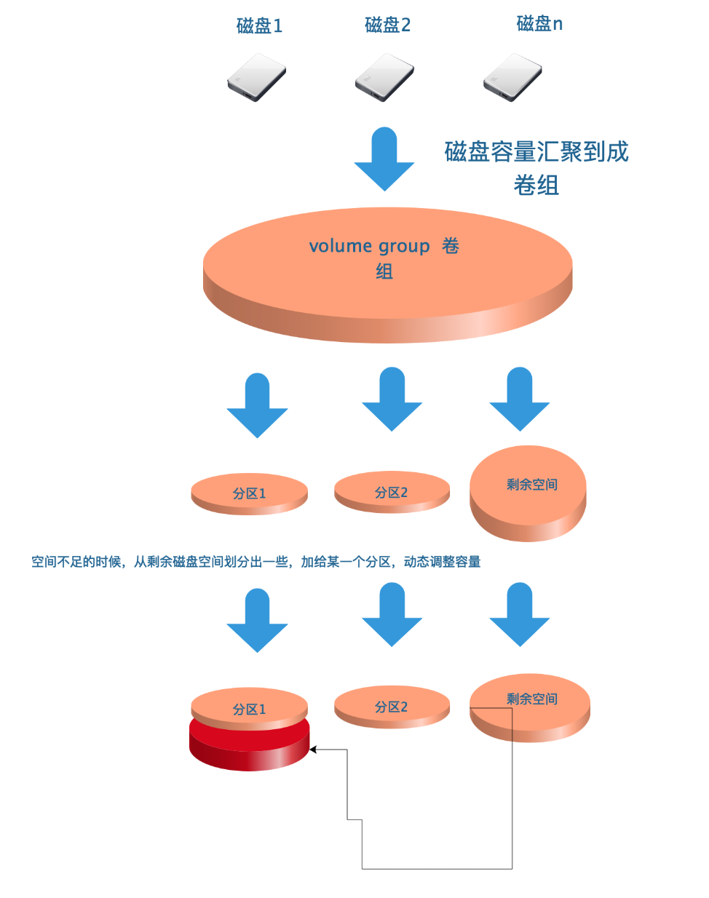
## lvm名词

- PP（Physical Parttion）：物理分区，LVM建立在物理分区之上
- PV（Physical Volume）：物理卷，处于LVM最底层，一般一个PV对应一个PP
- PE（physical Extends）：物理区域，PV中可以用于分配的最小存储单元，同一个VG中所有的PV的PE大小相同，如1M、2M
- VG（Volume Group）：卷组，建立在PV之上，可以划分多个PV
- LE（Logical Extends）：逻辑扩展单元，组成LV的基本单元，一个LE对应一个PE
- LV（Logical Volume）：逻辑卷，建立在VG之上，是一个可以动态改变大小的分区


### LVM原理
LVM是通过`交换PE`的方式，达到弹性变更文件系统大小的

- 剔除原本LV中的PE，就可以减少LV的容量
- 把其他PE添加到LV，就可以扩容LV容量
- 一般默认PE大小是4M，LVM最多有65534个PE，所以LVM最大的VG是256G单位
- PE是LVM最小的存存储单位，类似文件系统的block单位，因此PE大小影响VG容量
- LV如同/dev/sd[a-z]的分区概念
### LVM优点

- 文件系统可以跨多个磁盘，大小不会受到磁盘限制
- 可在系统运行的情况下，动态扩展文件系统大小
- 可以增加新的磁盘到LVM的存储池中
### LVM配置流程

1. 物理分区阶段：将物理磁盘`fdisk`格式化修改System ID为LVM标记（8e）
2. PV阶段：通过`pvcreate`、`pvdisplay`将Linux分区处理为物理卷PV
3. VG阶段：接下来通过`vgcreate`、`vgdisplay`将创建好的物理卷PV处理为卷组VG
4. LV阶段：通过`lvcreate`将卷组分成若干个逻辑卷LV
5. 开始使用：通过`mkfs`对LV格式化，最后挂载LV使用

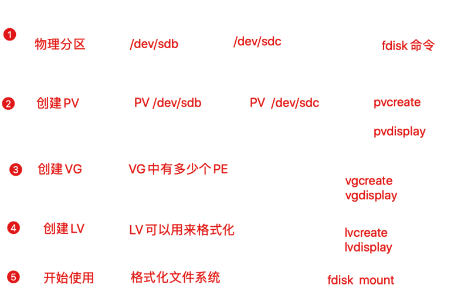
### 物理卷管理命令
| 命令 | 功能 |
| :---: | :---: |
| pvcreate | 创建物理卷 |
| pvscan | 查看物理卷信息 |
| pvdisplay | 查看各个物理卷的详细参数 |
| pvremove | 删除物理卷 |

**pvcreate**

```
# 将普通的分区加上PV属性
# 例如：将分区/dev/sda6创建为物理卷
pvcreate /dev/sda6
```
**pvremove**

```
# 删除分区的PV属性
# 例如：删除分区/dev/sda6的物理卷属性
pvremove /dev/sda6
```
**pvscan、pvdisplay**


- 都是用来查看PV的信息
- `pvdisplay`更为详细


```
[root@local-pyyu ~]# pvscan  |grep sd[b-c]
  PV /dev/sdb    VG storage         lvm2 [<5.00 GiB / <5.00 GiB free]
  PV /dev/sdc    VG storage         lvm2 [<5.00 GiB / <5.00 GiB free]
```
### 卷组（VG）管理相关命令
| 命令 | 功能 |
| :---: | :---: |
| vgcreate | 创建卷组 |
| vgscan | 查看卷组信息 |
| vgdisplay | 查看卷组的详细参数 |
| vgreduce | 缩小卷组，把物理卷从卷组中删除 |
| vgextend | 扩展卷组，把某个物理卷添加到卷组中 |
| vgremove | 删除卷组 |

### 逻辑卷（LV）管理相关命令

```
lvcreate 
-L 指定逻辑卷的大小，单位为“kKmMgGtT”字节
-l 指定逻辑卷的大小（LE个数）
-n 后面跟逻辑卷名 
-s 创建快照
```
| 命令 | 功能 |
| :---: | :---: |
| lvcreate | 创建逻辑卷 |
| lvscan | 查看逻辑卷信息 |
| lvdisplay | 查看逻辑卷的具体参数 |
| lvextend | 增大逻辑卷大小 |
| lvreduce | 减小逻辑卷大小 |
| lvremove | 删除逻辑卷 |

## 创建LVM案例
_1.选择两块硬盘，创建pv_

```
[root@local-pyyu ~]# pvcreate /dev/sdb /dev/sdc
  Physical volume "/dev/sdb" successfully created.
  Physical volume "/dev/sdc" successfully created.
```
_2.创建卷组_

```
[root@local-pyyu ~]# vgcreate storage /dev/sdb /dev/sdc
  Volume group "storage" successfully created
```
_3.查看卷组信息_

```
[root@local-pyyu ~]# vgdisplay
  --- Volume group ---
  VG Name               storage
  System ID
  Format                lvm2
  Metadata Areas        2
  Metadata Sequence No  1
  VG Access             read/write
  VG Status             resizable
  MAX LV                0
  Cur LV                0
  Open LV               0
  Max PV                0
  Cur PV                2
  Act PV                2
  VG Size               9.99 GiB
  PE Size               4.00 MiB
  Total PE              2558
  Alloc PE / Size       0 / 0
  Free  PE / Size       2558 / 9.99 GiB
  VG UUID               0P4fJW-YtM0-eWn4-PsPy-ftoI-8qJz-AF0ogi
```
_4.扩展、缩减卷组VG_

```
1.添加新的PV到卷组
[root@local-pyyu ~]# pvcreate /dev/sdd
  Physical volume "/dev/sdd" successfully created.
2.扩展卷组容量
[root@local-pyyu ~]# vgextend storage /dev/sdd
  Volume group "storage" successfully extended
3.检查卷组容量，此时扩展到15G
[root@local-pyyu ~]# vgdisplay
  --- Volume group ---
  VG Name               storage
  System ID
  Format                lvm2
  Metadata Areas        3
  Metadata Sequence No  2
  VG Access             read/write
  VG Status             resizable
  MAX LV                0
  Cur LV                0
  Open LV               0
  Max PV                0
  Cur PV                3
  Act PV                3
  VG Size               <14.99 GiB
  PE Size               4.00 MiB
  Total PE              3837
  Alloc PE / Size       0 / 0
  Free  PE / Size       3837 / <14.99 GiB
  VG UUID               0P4fJW-YtM0-eWn4-PsPy-ftoI-8qJz-AF0ogi
4.移除卷组，把新物理卷从卷组中删除
[root@local-pyyu ~]# vgreduce storage /dev/sdd
  Removed "/dev/sdd" from volume group "storage"
5.把pv从vg中删除
[root@local-pyyu ~]# pvremove /dev/sdd
  Labels on physical volume "/dev/sdd" successfully wiped.
```
_5.创建逻辑卷_

```
[root@local-pyyu ~]# lvcreate -n lv1 -L 200M storage
  Logical volume "lv1" created.
```
_6.检查逻辑卷信息_

```
[root@local-pyyu ~]# lvdisplay
  --- Logical volume ---
  LV Path                /dev/storage/lv1
  LV Name                lv1
  VG Name                storage
  LV UUID                BoaU79-cd8Z-ZWVQ-EBWT-KTjd-AOrK-Xh3J61
  LV Write Access        read/write
  LV Creation host, time local-pyyu, 2019-12-08 17:20:14 +0800
  LV Status              available
  # open                 0
  LV Size                200.00 MiB
  Current LE             50
  Segments               1
  Allocation             inherit
  Read ahead sectors     auto
  - currently set to     8192
  Block device           253:2
```
_7.对新生成的逻辑卷格式化，然后挂载使用_

```
#格式化文件系统
[root@local-pyyu ~]# mkfs.xfs /dev/storage/lv1
meta-data=/dev/storage/lv1       isize=512    agcount=4, agsize=12800 blks
         =                       sectsz=512   attr=2, projid32bit=1
         =                       crc=1        finobt=0, sparse=0
data     =                       bsize=4096   blocks=51200, imaxpct=25
         =                       sunit=0      swidth=0 blks
naming   =version 2              bsize=4096   ascii-ci=0 ftype=1
log      =internal log           bsize=4096   blocks=855, version=2
         =                       sectsz=512   sunit=0 blks, lazy-count=1
realtime =none                   extsz=4096   blocks=0, rtextents=0
#挂载使用
[root@local-pyyu ~]# mkdir /gege_lvm
[root@local-pyyu ~]# mount /dev/storage/lv1 /gege_lvm/
#检查此时的分区使用量
[root@local-pyyu ~]# df -h -T |grep gege
文件系统                类型      容量  已用  可用 已用% 挂载点
/dev/mapper/storage-lv1 xfs       197M   11M  187M    6% /gege_lvm
```
_8.向lvm中写入数据_

```
[root@local-pyyu gege_lvm]# pwd
/gege_lvm
[root@local-pyyu gege_lvm]# echo {1..10000000} > 哥哥带你学lvm.txt
[root@local-pyyu gege_lvm]# df -h -T |grep gege
/dev/mapper/storage-lv1 xfs       197M   86M  112M   44% /gege_lvm
```
## LVM逻辑卷扩容
实验中，我们使用两块硬盘，创建物理卷，然后创建出10G的卷组，且创建了200M的逻辑卷，此时感觉逻辑卷空间不够，可以进行动态扩容，只要卷组中的资源足够，就可以一直扩容。

```
[root@local-pyyu gege_lvm]# pvs
  PV         VG      Fmt  Attr PSize   PFree
  /dev/sda2  centos  lvm2 a--  <19.00g     0
  /dev/sdb   storage lvm2 a--   <5.00g  4.80g
  /dev/sdc   storage lvm2 a--   <5.00g <5.00g
[root@local-pyyu gege_lvm]# vgs
  VG      #PV #LV #SN Attr   VSize   VFree
  centos    1   2   0 wz--n- <19.00g     0
  storage   2   1   0 wz--n-   9.99g <9.80g
[root@local-pyyu gege_lvm]# lvs
  LV   VG      Attr       LSize   Pool Origin Data%  Meta%  Move Log Cpy%Sync Convert
  root centos  -wi-ao---- <17.00g
  swap centos  -wi-ao----   2.00g
  lv1  storage -wi-ao---- 200.00m
```
_1.第一步要卸载挂载的设备_
**提示：此处也可以不用卸载，LVM支持无需停机的情况下，方便调整各个分区大小**

```
[root@local-pyyu /]# umount /gege_lvm/
```
_2.把逻辑卷扩容大小_

```
[root@local-pyyu /]# lvextend -L 1G /dev/storage/lv1
  Size of logical volume storage/lv1 changed from 200.00 MiB (50 extents) to 1.00 GiB (256 extents).
  Logical volume storage/lv1 successfully resized.
```
_3.调整xfs文件系统的容量大小，xfs只支持增大_

```
[root@local-pyyu ~]# xfs_growfs /dev/storage/lv1
meta-data=/dev/mapper/storage-lv1 isize=512    agcount=4, agsize=12800 blks
         =                       sectsz=512   attr=2, projid32bit=1
         =                       crc=1        finobt=0 spinodes=0
data     =                       bsize=4096   blocks=51200, imaxpct=25
         =                       sunit=0      swidth=0 blks
naming   =version 2              bsize=4096   ascii-ci=0 ftype=1
log      =internal               bsize=4096   blocks=855, version=2
         =                       sectsz=512   sunit=0 blks, lazy-count=1
realtime =none                   extsz=4096   blocks=0, rtextents=0
data blocks changed from 51200 to 262144
xfs文件系统只支持增大分区空间的情况，不支持减小的情况（切记！！！！！）。
硬要减小的话，只能在减小后将逻辑分区重新通过mkfs.xfs命令重新格式化才能挂载上，这样的话这个逻辑分区上原来的数据就丢失了。
```
_4.重新挂载分区，检查分区大小_

```
[root@local-pyyu ~]# mount /dev/storage/lv1 /gege_lvm/
[root@local-pyyu ~]# df -h -T |grep gege
文件系统                类型      容量  已用  可用 已用% 挂载点
/dev/mapper/storage-lv1 xfs      1021M  108M  913M   11% /gege_lvm
```
## 删除逻辑卷
删除逻辑卷，需要提前备份好重要的数据，然后依次删除逻辑卷、卷组、物理卷。
1.取消挂载，删除自动挂载的配置


```
[root@local-pyyu ~]# umount /gege_lvm/
```
2.删除逻辑卷


```
[root@local-pyyu ~]# lvremove /dev/storage/lv1
Do you really want to remove active logical volume storage/lv1? [y/n]: y
  Logical volume "lv1" successfully removed
```
3.删除卷组


```
[root@local-pyyu ~]# vgremove storage
  Volume group "storage" successfully removed
```
4.删除物理卷设备


```
[root@local-pyyu ~]# pvs
  PV         VG     Fmt  Attr PSize   PFree
  /dev/sda2  centos lvm2 a--  <19.00g    0
  /dev/sdb          lvm2 ---    5.00g 5.00g
  /dev/sdc          lvm2 ---    5.00g 5.00g
  [root@local-pyyu ~]# pvremove /dev/sdb /dev/sdc
  Labels on physical volume "/dev/sdb" successfully wiped.
  Labels on physical volume "/dev/sdc" successfully wiped.
```
5.此时可以检查下lvm相关信息


```
lvs
pvs
vgs
```
