# 互联网服务基础

### ip划分

ip地址主要分为四类

- A类，ip范围`0.0.0.0~126.255.255.255`，A类地址主要分配给超大型网络环境的公司，例如苹果公司。
- B类，ip范围`128.0.0.0~191.255.255.255`，主要分配给有大规模局域网数量的公司
- C类，ip范围`192.0.0.0~223.255.255.255`，主要分配给如校园网等小型局域网
- D类和E类地址比较特殊，D类属于广播地址，E类属于保留地址


### 公网ip与局域网ip

好比寄快递，需要明确省、市、县、小区、门牌号等。

**局域网**

局域网的ip好比是某一个小区的门牌号，用于某一个群体内部交互数据使用的ip地址，离开这个群体，也就失效了

如果这个小区名字是唯一的，全中国就一个，通过互联网系统查询，只有这一个唯一的小区门牌号，全世界大家都能找到你，这个就是一个公网IP

- 公网ip，例如，123.206.16.61、123.206.16.62
- 局域网ip，例如192.168.10.11，例如192.168.5.44

- 如果A公司内部机器传输资料，192.168.10.12只需发给192.168.10.11即可
- 如果A公司的某一个电脑，要发数据给B公司的某一个电脑，就得

- - A公司某一电脑数据发给公网ip
  - 然后再发送给B公司的公网ip
  - 然后再转发给B公司的某一个局域网ip

- 

- 

## 什么是dns

**【网页浏览的原理】**

大家日常上网的时候，打开的网页本质上就是你从对方服务器上获取的文件，比如说你现在正在看的这篇文章，就存储在知乎的服务器上，你通过知乎客户端的浏览器，获取到了这些数据，并下载到了你的手机缓存当中，然后你的手机再把他们显示到屏幕上。

浏览网页的本质，就是下载文件，并将下载下来的网页文件变成你所能看到的图像。网页文件一般是.html结尾的，不相信的话你可以用电脑浏览器，随便打开一个网址，右键空白处，网页另存为，然后你就会发现你存储下来了一个.html结尾的网页文件，这时候你就算断网，双击这个网页文件你依旧可以用浏览器浏览，因为这个html文件被你保存到电脑上了。

所以浏览网页的原理就是，在互联网上找到了对方的电脑，然后从对方的电脑里拷贝出来html网页文件到你的电脑上，并将其转化成了文字和图片显示到显示器或手机上。

**【域名与IP的关系】**

既然你要浏览网页需要在整个互联网上找到对方的电脑，那你就需要输入对方的IP才可以访问，比如大家可以在浏览器里输入这个IP地址`123.206.16.61`你们可以看看打开的是不是哥哥的网站。是不是很有意思，你靠着IP地址可以访问网站，你输入www.pythonav.cn也可以上百度，这是什么原理呢？

在早期的时候，上网就是这么麻烦，你想要访问对方的网站，你必须要知道对方的IP，然后在你的浏览器里输入IP地址，然后就可以访问了，但是IP地址是4组数字，记IP地址的难度不亚于背一个陌生人的手机号，于是乎，我们用一串英文字母来代替IP地址，这就是网站域名。

例如哥哥的网站域名就是`www.baidu.com`，对应的ip地址是`123.206.16.61`，ip很难记，域名可以自定义很好记。

但是这里就有一个问题了，你输入的是域名，你的电脑该怎么将他变成IP地址呢？就比如你输入的是`www.pythonav.cn`，为什么你的电脑知道对方的IP是`123.206.16.61`呢？这个东西就是hosts文件，hosts文件就在你的`C:\windows\system32\drivers\etc`文件夹下，linux就是`/etc/hosts`，他相当于电脑的电话本，他记录着每一个域名对应的IP地址，当你输入域名而不是IP的时候，他就会在这个电话本里找到对应的域名，然后把他转化成IP地址。

**【DNS解析服务器】**

但是这样也有问题，那就是Hosts文件是有限的，就和你不可能拥有这个世界上所有人的电话号码一样。既然我们自己不可能拥有全世界所有人的电话号码，但是我们可以将收集电话号码这个任务交给一个专门来干这个活的人，然后大家想要问电话的时候去他那查一下就可以了。

这就是DNS服务器，DNS服务器有着相当全的域名和IP，当你输入一串网站的时候，这串网站并不会直接访问，而是先将这个网站发送给DNS服务器，DNS服务器帮你把这串网站变成了IP地址，然后返回给你的电脑，你再访问这个IP地址，这样就解决了IP难记，而域名不能直接访问的问题了。

所以这样就可以解释文章开头那个故障了，你打不开网页，却可以上QQ，因为上QQ不需要涉及到DNS解析服务，直接访问的就是腾讯服务器的IP，但是你打开网页输入的是域名，而你的DNS服务器输入错误或者DNS服务器炸了，所以你电脑不知道这串域名对应的IP，你自然就没法访问这个网站，而如果你手动直接输入IP，你依旧是可以访问网站的。

**【什么是DNS劫持？】**

那DNS服务器会告诉你A网站的IP是A，B网站的IP是B，那假如你输入的A网站域名，但是他给你B的IP，你是不是就访问到别的网站去了？

既然DNS服务器可以这么玩，我是不是可以将用户引导到我的网站上？比如你要看个电影，然后你输入了爱奇艺的官网，然后我作为DNS服务器，我把优酷的IP返回给你，最后就是你虽然输入的爱奇艺官网，但是却得到了优酷的IP并访问了优酷的IP，进入了优酷的网站上。

当然这里我只是举个例子，我举这个例子就是想告诉大家，DNS服务器想给你返回什么IP就给你返回什么，所以他可以在幕后操作一些东西。最简单的就是广告。比如A网站没有广告，你直接访问就是没有的，但是你的DNS服务器把A网站下载下来了，给这个网站加了个广告，然后重新上传到了一个IP上，并把这个IP告诉了你，那就是你虽然输入的A网站的域名，但是你访问的是一个包含了广告的复制版A网站，虽然两者功能一样，但是却完全不是一个服务器上的。

这些就被我们成为DNS劫持，DNS劫持对于网络访问的影响和体验是非常严重的，除了DNS服务器，你的路由器同样可以这么干，所以在买路由器的时候也有人会关注这个路由器是否会进行DNS劫持。

如何修改Linux的dns配置

```plain
[root@gege ~]# cat /etc/resolv.conf
# Your system has been configured with 'manage-resolv-conf' set to true.
# As a result, cloud-init has written this file with configuration data
# that it has been provided. Cloud-init, by default, will write this file
# a single time (PER_ONCE).
#
nameserver  114.114.114.114
```

## DNS域名解析服务

相较于由数字构成的 IP 地址，域名更容易被理解和记忆，所以我们通常更习惯通过域名 的方式来访问网络中的资源。但是，网络中的计算机之间只能基于 IP 地址来相互识别对方的 身份，而且要想在互联网中传输数据，也必须基于外网的 IP 地址来完成。

为了降低用户访问网络资源的门槛，DNS(Domain Name System，域名系统)技术应运 而生。这是一项用于管理和解析域名与 IP 地址对应关系的技术，简单来说，就是能够接受用 户输入的域名或 IP 地址，然后自动查找与之匹配(或者说具有映射关系)的 IP 地址或域名， 即将域名解析为 IP 地址(正向解析)，或将 IP 地址解析为域名(反向解析)。这样一来，我们 只需要在浏览器中输入域名就能打开想要访问的网站了。DNS 域名解析技术的正向解析也是 我们最常使用的一种工作模式。

鉴于互联网中的域名和 IP 地址对应关系数据库太过庞大，DNS 域名解析服务采用了类 似目录树的层次结构来记录域名与 IP 地址之间的对应关系，从而形成了一个分布式的数据库 系统

域名后缀一般分为国际域名和国内域名。原则上来讲，域名后缀都有严格的定义，但在实际使用时可以不必严格遵守。

目前最常见的域名后缀有.com(商业组织)、.org(非营利组 织)、.gov(政府部门)、.net(网络服务商)、.edu(教研机构)、.pub(公共大众)、.cn(中国 国家顶级域名)等。


dns解析流程

1、在浏览器中输入www.baidu.com域名，操作系统会先检查自己本地的hosts文件是否有这个网址映射关系，如果有，就先调用这个IP地址映射，完成域名解析。
2、如果hosts里没有这个域名的映射，则查找本地DNS解析器缓存，是否有这个网址映射关系，如果有，直接返回，完成域名解析。
3、如果hosts与本地DNS解析器缓存都没有相应的网址映射关系，首先会找TCP/ip参数中设置的首选DNS服务器（常见8.8.8.8；114.114.114.114）在此我们叫它本地DNS服务器，此服务器收到查询时，如果要查询的域名，包含在本地配置区域资源中，则返回解析结果给客户机，完成域名解析，此解析具有权威性。
4、如果本地DNS服务器本地区域文件与缓存解析都失效，则根据本地DNS服务器的设置（是否设置转发器）进行查询，如果未用转发模式，本地DNS就把请求发至13台根DNS，根DNS服务器收到请求后会判断这个域名(.com)是谁来授权管理，并会返回一个负责该顶级域名服务器的一个IP。本地DNS服务器收到IP信息后，将会联系负责.com域的这台服务器。这台负责.com域的服务器收到请求后，如果自己无法解析，它就会找一个管理.com域的下一级DNS服务器地址(baidu.com)给本地DNS服务器。当本地DNS服务器收到这个地址后，就会找baidu.com域服务器，重复上面的动作，进行查询，直至找到www.baidu.com主机。
5、如果用的是转发模式，此DNS服务器就会把请求转发至上一级DNS服务器，由上一级服务器进行解析，上一级服务器如果不能解析，或找根DNS或把转请求转至上上级，以此循环。不管是本地DNS服务器用是是转发，还是根提示，最后都是把结果返回给本地DNS服务器，由此DNS服务器再返回给客户机。


### dnsmasq

1、dnsmasq是一款小巧且方便地用于配置DNS服务器和DHCP服务器的工具，适用于小型网络，它提供了DNS解析功能和可选择的DHCP功能。

 2、dnsmasq可以解决小范围的dns查询问题，如果业务是跨机房、跨地区的话不建议使用dnsmasq做为dns解析服务器。

#### 【dnsmasq的配置文件】

1.主配置文件，安装后自动生成

```plain
/etc/dnsmasq.conf
```

2.内部需要解析的ip和域名

```plain
/etc/dnsmasq.hosts
```

3.dnsmasq的上游DNS服务器

```plain
可以配置为resolv.conf，添加nameserver
/etc/resolv.dnsmasq.conf
```

#### 主配置文件

```plain
#过滤文件中排除空行^$和  ^#或者^;的行 
[root@local-pyyu ~]# grep -Ev '^$|^[#;]' /etc/dnsmasq.conf
#定义dnsmasq从哪里获取上游DNS服务器的地址，默认是从/etc/resolv.conf获取
resolv-file=/etc/resolv.dnsmasq.conf
#访问baidu.com时的所有域名都会被解析成123.206.16.61
address=/baidu.com/123.206.16.61
address=/taobao.com/123.206.16.61
#定义dnsmasq监听的地址，默认是监控本机的所有网卡上。局域网内主机若要使用dnsmasq服务时，指定本机的IP地址
listen-address=192.168.178.180
#本地域名配置文件（不支持泛域名），添加内部需要解析的地址和域名（重新加载即可生效）
addn-hosts=/etc/dnsmasq.hosts
#记录dns查询日志服务器
log-queries
##设置日志记录
log-facility=/var/log/dnsmasq.log
#包含其他文件夹下所有配置文件
conf-dir=/etc/dnsmasq.d,.rpmnew,.rpmsave,.rpmorig
```

#### 内部解析地址配置

```plain
#添加需要内部解析的域名
[root@local-pyyu ~]# cat /etc/dnsmasq.hosts
123.206.16.61 testgege.com
```

#### 添加上游dns服务器地址

```plain
#当某个域名无法解析的时候，发给上游服务器查询
[root@local-pyyu ~]# cat /etc/resolv.dnsmasq.conf
nameserver 223.5.5.5
nameserver 223.6.6.6
```

#### 配置日志切割

```plain
[root@local-pyyu ~]# cat /etc/logrotate.d/dnsmasq
/var/log/dnsmasq.log {
    daily
    copytruncate
    missingok
    rotate 30
    compress
    notifempty
    dateext
    size 200M
}
```

#### 启动dnsmasq服务

```plain
systemctl start dnsmasq
```

#### 配置dns客户端地址

```plain
# 此时我们本地机器，以及是dns的服务端
[root@local-pyyu ~]# cat /etc/resolv.conf
# Generated by NetworkManager
search localdomain
nameserver 192.168.178.180
```

#### 测试dns域名解析

【以下所有操作，可以检测dnsmasq日志文件】

```plain
[root@local-pyyu ~]# tail -f  /var/log/dnsmasq.log
#安装dns客户端软件  dig与nslookup
yum install bind-utils -y 
dig www.4399.com|grep -i 'query time'  #第二次访问就能够缓存加速了
[root@local-pyyu ~]# nslookup baidu.com  #用本地dns
Server:        192.168.178.180
Address:    192.168.178.180#53
Name:    baidu.com
Address: 123.206.16.61
[root@local-pyyu ~]#
[root@local-pyyu ~]#
[root@local-pyyu ~]# nslookup baidu.com 223.5.5.5 #用公网dns
Server:        223.5.5.5
Address:    223.5.5.5#53
Non-authoritative answer:
Name:    baidu.com
Address: 39.156.69.79
Name:    baidu.com
Address: 220.181.38.148
[root@local-pyyu ~]# nslookup taobao.com  #用本地dns
Server:        192.168.178.180
Address:    192.168.178.180#53
Name:    taobao.com
Address: 123.206.16.61
[root@local-pyyu ~]# nslookup www.jd.com  #转发给上游服务器
Server:        192.168.178.180
Address:    192.168.178.180#53
Non-authoritative answer:
www.jd.com    canonical name = www.jd.com.gslb.qianxun.com.
www.jd.com.gslb.qianxun.com    canonical name = www.jdcdn.com.
www.jdcdn.com    canonical name = img2x-v6-sched.jcloudedge.com.
Name:    img2x-v6-sched.jcloudedge.com
Address: 117.131.205.3
Name:    img2x-v6-sched.jcloudedge.com
Address: 2409:8c02:11c:20:8000::3
```


# sshd

 初识ssh 

SSH是一套网络协议，目的在于安全的网络服务与加密远程登录。

实现了SSH协议的最主流的开源软件OpenSSH

 为什么需要SSH 

如果一个用户从本地计算机，使用SSH协议登录另一台远程计算机，我们就可以认为，这种登录是安全的，即使被中途截获，密码也不会泄露。

Secure Shell是Linux系统首选的登录方式，以前使用FTP或telnet登录服务器，都是以明文的形式在网络中发送账号密码，很容易被黑客截取到数据，篡改后威胁服务器数据安全。因此如何对数据加密，安全传输是重中之重，主要方式有两种：

●对称加密（秘钥加密）

●非对称加密（公钥加密）

### 【对称加密】

`加密，解密使用同一套秘钥`


对称加密强度很高，难以破解，问题是当机器数量较多的时候，大量的发送密钥，难以保证密钥安全性，一旦某一个Client被窃取密钥，其他机器的安全性也就崩塌了

**因此，非对称加密应运而生**

### 【非对称加密】

`非对称加密分为：公钥（Public Key）与私钥（Private Key）
使用公钥加密后的密文，只能使用对应的私钥才能解开，破解的可能性很低。`

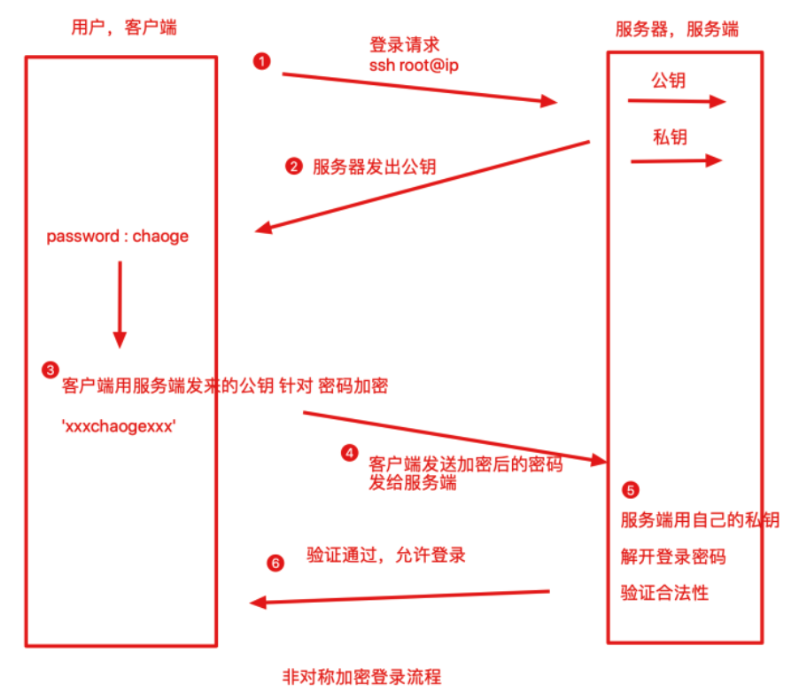

此种方式是私钥放在Server端，即使client在登录的时候，传输数据被窃取，黑客也没有私钥进行解密，因此保证了数据安全。


### 中间人攻击

【Client如何保证自己接收到的公钥就是来源于目标Server机器的？】

上图看似理所当然，然而此时一位不愿意透露姓名的黑客路过，并且做了如下事情

1. 拦截客户端的登录请求
2. 向客户端发送`黑客自己`的公钥，这时客户端可能并不知道，并且用了此公钥对数据进行了加密
3. 客户端发送`假的公钥，加密后的数据`，黑客拿到了此`加密后的数据`，再用自己的私钥进行解密
4. 客户端的数据此时已被黑客截取


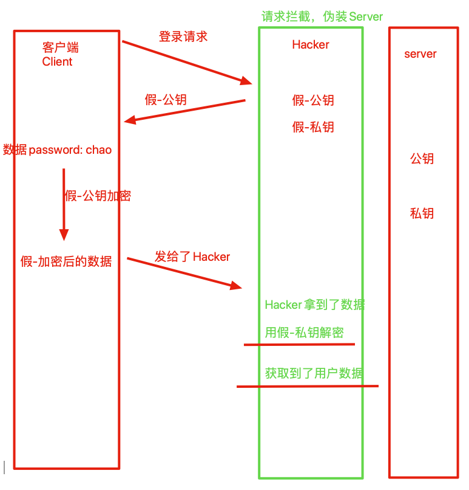


### 如何确保Server目标正确

#### 【基于口令的验证】

SSH的公私钥都是基于命令在本地生成的，没法公认，因此只能通过Client端自行的对公钥确认。

```plain
yumac: ~ gege$sshpyyu
The authenticity of host 'pyyuc (123.206.16.61)' can't be established.
ECDSA key fingerprint is SHA256:CVwhwfUiD53HpLPrretR4pGltYRL6QB+5lyI.
Are you sure you want to continue connecting (yes/no)? yes
```

这一段ssh连接的信息，表述的是`无法确认123.206.16.61这台机器的真实性`，但是知道了这台机器的指纹，`SHA256:1aJYXhw/rqhK0D0SweH6wzaVOZ73HE6fDbrZBZgxi60.`，让用户自行确认是否登录。

【获取远程主机的指纹信息---根据公钥生成】

```plain
如何验证这个公钥指纹，通过命令远程获取公钥指纹信息
yumac: ~ gege$ssh-keyscan 123.206.16.61 |grep ecdsa
# 123.206.16.61:22 SSH-2.0-OpenSSH_7.4
# 123.206.16.61:22 SSH-2.0-OpenSSH_7.4
# 123.206.16.61:22 SSH-2.0-OpenSSH_7.4
123.206.16.61 ecdsa-sha2-nistp256 AAAAE2VjZHNhLXNoYTItbmlzdHAyNTYAAATYAAABBBOsxiQ1GdeMx/xudRdmcW27sLbV76kAnjkwJeWkPXMgxb7ll3zvIGGZ8IIghD/gfivZuv0ATmnGVOW2bXWgcJBM=
```

对比

这个时候，Server应该展示出`公钥指纹`，以便用户自行核对。

可以登录server后查看指纹信息

```plain
[root@gege .ssh]# cat /etc/ssh/ssh_host_ecdsa_key.pub
ecdsa-sha2-nistp256 AAAAE2VjZHNhLXNoYTItbmlzdHAyNTYAyNTYAAABBBOsxiQ1GdeMx/xudRdmcW27sLbV76kAnjkwJeWkPXMgxb7ll3zvIGGZ8IIghD/gfivZuv0ATmnGVOW2bXWgcJBM= root@vm_32_137_centos
#指纹信息通过公钥计算而来
[root@gege .ssh]# ssh-keygen -E SHA256 -lf /etc/ssh/ssh_host_ecdsa_key.pub
256 SHA256:CVwhwfUka2JLs1iD5GltYRL6QB+5lyI root@vm_32_137_centos (ECDSA)
```

也可以远程扫描server指纹信息

```plain
yumac: ~ gege$ssh-keyscan -t ecdsa 123.206.16.61| ssh-keygen -lf -
# 123.206.16.61:22 SSH-2.0-OpenSSH_7.4
256 SHA256:CVwhwfUkaLPrretR4pGltYRL6QB+5lyI 123.206.16.61 (ECDSA)
```

【确认server身份，准备连接】

假设用户决定连接远程主机的公钥。

```plain
Are you sure you want to continue connecting (yes/no)?   yes
```

系统此时应该会返回一句信息

```plain
Are you sure you want to continue connecting (yes/no)? yes
Warning: Permanently added '123.206.16.61' (ECDSA) to the list of known hosts.
root@123.206.16.61's password:
```

此时表示Client已经确认Server的身份，准备开始连接，输入`Server机器的密码`，如果密码正确，则可以登录。

【ssh配置文件】

和Linux用户有关ssh的配置文件，存放在此路径：`$HOME/.ssh/`

```plain
[root@gege .ssh]# pwd
/root/.ssh
[root@gege .ssh]# ls
authorized_keys  id_rsa  id_rsa.pub  known_hosts
```

- Known_hosts：当Client接收Server的公钥以后，Server的公钥信息会放在Client`$HOME/.ssh/known_hosts文件中`，下次再次连接的时候，系统能够识别出Server的公钥已经存在了本地，因此可以跳过警告部分，直接提示输入密码了
- authorized_keys：Server远程主机将`用户的公钥`，保存在已登录用户的`$HOME/.ssh/authorized_keys`文件中。
- id_rsa：私钥文件
- id_rsa.pub：公钥文件

输入正确的Server地址，用户名、密码之后，即可正确登录服务器。 也就是第一张图的登录流程

#### 【基于公钥认证】

基于口令的认证存在一些缺点，每次登陆都需要输入密码，当我们机器数量众多的时候，难以维护了。

我们更希望能够免密登录`公钥登录`


公钥登录流程如下

- client发送自己的`公钥`给server，写入server的`authorized_keys`中
- server端接收到client的连接请求后，在自己的`authorized_keys`文件中匹配client的公钥信息`pubkey`，并且生成一个`随机数R`，使用client的公钥`pibkey`针对该`随机数R`进行加密，得到一个加密后的随机数**pubkey(R)**
- client通过私钥进行解密得到`随机数R`，再对随机数R和当前会话的sessionkey采用MD5生成摘要Digest1，再发送给server端
- server端会对随机数R和当前client的sessionkey用同样摘要算法生成Digest2
- 结果比较client发来的Digest1与Digest2是否一致，正确则完成认证


## ssh登录原理实战

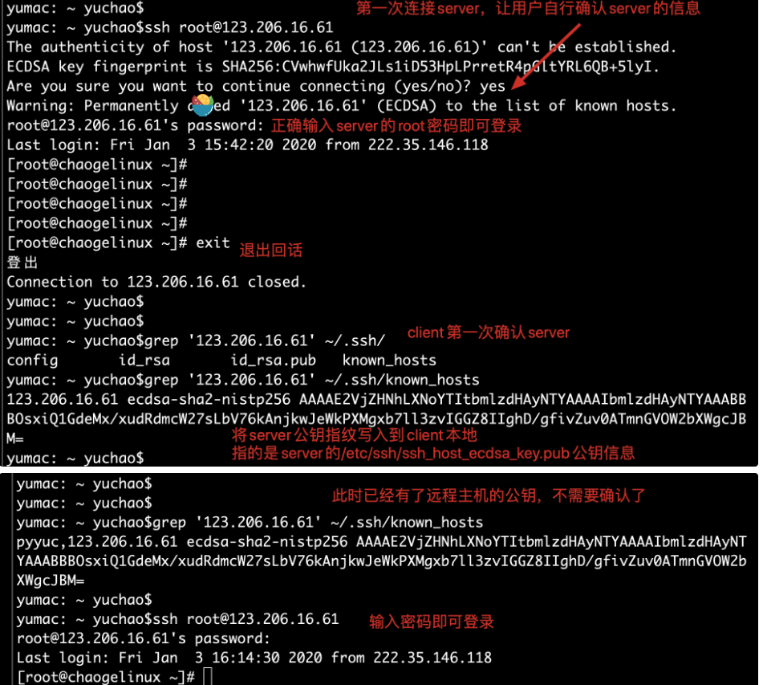


## 配置SSH公钥认证

1.client本地生成公私钥

```plain
[root@gegelinux .ssh]# ssh-keygen -t rsa  #指定rsa密钥类型，默认一路回车
#会生成如下的公私钥
Your identification has been saved in /root/.ssh/id_rsa.
Your public key has been saved in /root/.ssh/id_rsa.pub.
```

2.client发送自己的公私钥到server中

```plain
#发送自己的公钥，写入到远端server的authorized_keys中
yumac: ~ yuchao$ssh-copy-id root@123.206.16.61
/usr/bin/ssh-copy-id: INFO: Source of key(s) to be installed: "/Users/yuchao/.ssh/id_rsa.pub"
/usr/bin/ssh-copy-id: INFO: attempting to log in with the new key(s), to filter out any that are already installed
/usr/bin/ssh-copy-id: INFO: 1 key(s) remain to be installed -- if you are prompted now it is to install the new keys
root@123.206.16.61's password:
Number of key(s) added:        1
Now try logging into the machine, with:   "ssh 'root@123.206.16.61'"
and check to make sure that only the key(s) you wanted were added.
```

3.此时可以免密登录了

```plain
yumac: ~ yuchao$ssh root@123.206.16.61   #直接输入登录命令即可
Last failed login: Fri Jan  3 16:54:46 CST 2020 from 189.39.13.1 on ssh:notty
There were 3 failed login attempts since the last successful login.
Last login: Fri Jan  3 16:14:59 2020 from 222.35.146.118
[root@gegelinux ~]#
[root@gegelinux ~]# cat ~/.ssh/authorized_keys
ssh-rsa AAAAB3NzaC1yc2EAAAADAQABAAABAQDbkHjqnRe31HCteHc0BSfovvs9GqutyBfWvAJQy51Std1Ir3qBnHs29aKjwPL/jm/xHlZWgQ8mD/Xr091j2EVwGKUSMfCfH9nwbfu+0mwfwZKseJx5uliERShCpkRzA3Bhe6KOAqL1cgpfFzwKzO2Raga1PIGiCYcM/DIDlQh75/rEk9H5FGutamGiGrrtJfL4drRg6zEknrxSDWAMB3/MH6WUmkSWmGnECxOsPSy1PJN6Kqp1B yuchao@yumac
```

## ssh配置文件

Linux强调一切皆文件，Linux系统中修改服务的运行参数，都是在修改程序的配置文件。

ssh服务的配置文件存放于`/etc/ssh/sshd_config`

```plain
[root@gegelinux ~]# grep -Ev '^$|^[# ]' /etc/ssh/sshd_config
Port 22    #默认端口
AddressFamily any    #配置地址家族，any支持ipv4，ipv6
ListenAddress 0.0.0.0 #设置sshd服务监听的ip地址，注意多网卡的绑定
HostKey /etc/ssh/ssh_host_rsa_key  #ssh各密钥存放的位置 
HostKey /etc/ssh/ssh_host_ecdsa_key
HostKey /etc/ssh/ssh_host_ed25519_key
PermitRootLogin yes  #是否允许root管理员直接登录，保证系统安全
StrictModes yes    #当用户的私钥改变，直接拒绝连接
MaxAuthTries 6    #最大密码尝试次数
MaxSessions 10    #最大终端数
AuthorizedKeysFile .ssh/authorized_keys    #信任主机的公钥文件存放地
PasswordAuthentication yes #是否设置密码验证机制
PermitEmptyPasswords no  #是否允许空密码登录，禁止
```

对于centos7系列，默认以及安装且启用了SSHD服务，可以直接使用ssh命令登录服务器

对于生产环境，服务器一般禁止root管理员直接登录服务器，可以大大降低被黑客暴力破解的几率，需要修改sshd的主配置文件，修改如下参数

```plain
PermitRootLogin yes   #禁止root直接登录,使用普通用户登录安全性较高
```

注意的是，修改了配置文件，重启服务方可生效

```plain
systemctl restart sshd
systemctl enable sshd
```

以后直接用root登录会被禁止，应该使用普通用户登录后，sudo执行命令

## ssh与服务器安全实战

Linux强调一切皆文件，Linux系统更改各种软件的配置参数，也就是在修改文件内容而已

sshd服务的配置文件，默认在`/etc/ssh/sshd_config`

```plain
默认的sshd配置文件，如下
[root@gege_linux ~]# grep -Ev '^$|^[# ]' /etc/ssh/sshd_config
HostKey /etc/ssh/ssh_host_rsa_key
HostKey /etc/ssh/ssh_host_ecdsa_key
HostKey /etc/ssh/ssh_host_ed25519_key
SyslogFacility AUTHPRIV
AuthorizedKeysFile    .ssh/authorized_keys
PasswordAuthentication yes
ChallengeResponseAuthentication no
GSSAPIAuthentication no
GSSAPICleanupCredentials no
UsePAM yes
X11Forwarding yes
UseDNS no
AcceptEnv LANG LC_CTYPE LC_NUMERIC LC_TIME LC_COLLATE LC_MONETARY LC_MESSAGES
AcceptEnv LC_PAPER LC_NAME LC_ADDRESS LC_TELEPHONE LC_MEASUREMENT
AcceptEnv LC_IDENTIFICATION LC_ALL LANGUAGE
AcceptEnv XMODIFIERS
Subsystem    sftp    /usr/libexec/openssh/sftp-server
```

在生产服务器下，运维人员一般会禁止root用户登录服务器，最大程度的保证服务器的安全，被黑客攻击的几率，以及修改ssh的远程连接端口

- 修改ssh的端口 ，Port 23354
- 禁止root登录，PermitRootLogin no
- 禁止用密码登录，只能用被信任的机器，用公私钥进行登录，PasswordAuthentication no

```plain
修改/etc/ssh/sshd_config 文件的如下参数,此时一个安全的ssh服务器以及配置完毕，参数如下
[root@gege_linux ~]# grep -Ev '^$|^[# ]' /etc/ssh/sshd_config
Port 23354
AddressFamily any
ListenAddress 0.0.0.0
HostKey /etc/ssh/ssh_host_rsa_key
HostKey /etc/ssh/ssh_host_ecdsa_key
HostKey /etc/ssh/ssh_host_ed25519_key
SyslogFacility AUTHPRIV
PermitRootLogin no
AuthorizedKeysFile    .ssh/authorized_keys
PasswordAuthentication no
ChallengeResponseAuthentication no
GSSAPIAuthentication no
GSSAPICleanupCredentials no
UsePAM yes
X11Forwarding yes
UseDNS no
AcceptEnv LANG LC_CTYPE LC_NUMERIC LC_TIME LC_COLLATE LC_MONETARY LC_MESSAGES
AcceptEnv LC_PAPER LC_NAME LC_ADDRESS LC_TELEPHONE LC_MEASUREMENT
AcceptEnv LC_IDENTIFICATION LC_ALL LANGUAGE
AcceptEnv XMODIFIERS
Subsystem    sftp    /usr/libexec/openssh/sftp-server
```

注意了，此时别立即重启服务

配置一个普通用户的账号，且支持公钥登录的形式

```plain
1.登录服务器，创建普通用户，设置登录密码
useradd yuchao
passwd yuchao
2.在自己本地机器，生成一个普通用户的公私钥对
ssh-keygen -t rsa
3.发送公钥给服务器，配置公钥登录
ssh-copy-id yuchao@192.168.178.142
4.在正确配置了公私钥登录之后，yuchao这个用户就可以免密登录linux服务器了
ssh yuchao@192.168.178.142
```

在linux机器上配置yuchao用户支持sudo命令

```plain
1.使用root登录服务器，配置yuchao用户支持sudo命令
vim  /etc/sudoers文件
添加如下行
## Allow root to run any commands anywhere
root    ALL=(ALL)       ALL
yuchao  ALL=(ALL)       ALL
2.此时尝试用yuchao用户登录，是否能够使用sudo命令
```

到了最后一步了，使用root账号，重启linux的sshd服务器，以后root用户就无法使用密码登录了，只能用yuchao这个用户进行免密登录，最大程度保证服务器的安全了

```plain
1.使用root用户重启sshd服务
ssh root@192.168.178.142
2.重启sshd服务
systemctl restart sshd
3.此时机器已经禁止root登录，禁止密码登录，且修改了ssh端口为23354
4.此时只能使用配置好的yuchao用户进行免密登录了
ssh yuchao@192.168.178.142 -p 23354
```

如上的学习配置，要酌情根据自己的机器环境去操作，不要太过于固执，灵活学习，灵活使用~~谢谢大家

## Screen命令

作为linux服务器管理员,经常要使用ssh登陆到远程linux机器上做一些耗时的操作。

也许你遇到过使用telnet或SSH远程登录linux,运行一些程序。如果这些程序需要运行很长时间(几个小时)，而程序运行过程中出现网络故障，或者客户机故障，这时候客户机与远程服务器的链接将终端，并且远程服务器没有正常结束的命令将被迫终止。 又比如你SSH到主机上后，开始批量的scp命令，如果这个ssh线程断线了，scp进程就中断了。在远程服务器上正在运行某些耗时的作业，但是工作还没做完快要下班了，退出的话就会中断操作了，如何才好呢？

因此screen命令是能够实现多窗口远程控制的一个程序，解决由于网络异常或是窗口端口导致的服务断开，还能使用screen在多个远程会话中自由切换。

- 远程会话恢复：由于网络中断，导致的会话断开，需要重新连接，screen能确保用户不会丢失对远程会话的控制
- 多窗口，运行多个远程会话
- 会话共享：多个用户同时登录到远程服务器时，可以使用会话共享功能让用户之间的数据共享

### 安装screen命令

```plain
1.提前配置好epel仓库源
[root@gegelinux ~]# yum install screen -y
2.直接安装
[root@gegelinux ~]# yum install screen -y
```

### 管理远程会话

Screen常用参数

| 参数  | 作用                                                         |
| ----- | ------------------------------------------------------------ |
| -S    | 创建会话窗口                                                 |
| -A    | 所有的窗口都调整为当前终端的大小                             |
| -d    | 断开screen进程（得有用户是Attached状态，可以用screen -list查看） |
| -ls   | 同于-list，显示目前所有的screen                              |
| -r    | 恢复离线的screen进程，可以指定多个pid.tty.host               |
| -x    | 恢复离线的screen作业                                         |
| -wipe | 检查目前所有的screen作业，并删除已经无法使用的screen作业     |

【实际操作案例】

```plain
1.进入一个新的screen会话，名字叫做s1
[root@gegelinux ~]# screen -S s1
2.此时会立刻进入screen，检查会话信息
[root@gegelinux ~]# screen -ls
There is a screen on:
        27686.s1        (Attached)
1 Socket in /var/run/screen/S-root.
3.想要退出screen会话，直接输入exit
[root@gegelinux ~]# screen -S s1
[screen is terminating]
```

screen实际应用，模拟突然端口远程会话

```plain
1.新建一个会话，执行一个持续执行的任务
[root@gegelinux ~]# screen -S myPing
2.执行一个ping任务
ping baidu.com
3.直接关闭窗口
4.检查screen会话
发现有个myPing是挂掉的状态
[root@gegelinux ~]# screen -ls
There is a screen on:
    28570.myPing    (Detached)
1 Socket in /var/run/screen/S-root.
5.恢复会话
[root@gegelinux ~]# screen -r myPing
6.退出会话直接exit
7.还可以再次尝试用screen新建一个会话，使用vim编辑文件，然后关闭窗口
```

### 会话共享

screen命令不仅可以保护用户在极端的情况下不会丢失对系统的远程控制，还可以进行会话共享，分屏切割，会话锁定等功能。

例如会话共享，可以让多个用户看到一样的内容

【利用screen完成远程协助功能】

```plain
1.小王同学创建一个screen会话，等待哥哥连接
screen -S shareScreen
2.哥哥登录服务器，查看以存在的会话信息
[root@gegelinux ~]# screen -ls
3.哥哥加入会话，且开始操作，协助小王解决问题，小王坐在电脑前默默观看
screen -x  shareScreen
4.小王默默观看哥哥一顿输出，解决bug
5.哥哥退出screen输入ctrl + a + d 组合键，留下小王满意的笑容
ctrl + a + d #哥哥退出screen
6.小王退出screen，正常操作linux
exit
```


# web基础

## 网上冲浪

网上冲浪：在Internet互联网上获取各种信息，进行工作、娱乐，在英文中上网是" surfing the internet",因"surfing"的意思是冲浪，即称为“网上冲浪”，这是一种形象的说法。

这是一个非常上古的词汇了，小学初中写英语作文的时候还经常“surfing the internet”，当时要想上网，是需要专门找到连接互联网的电脑才可以进行上网。去“网上冲浪”是一件专门的事情，就好比现在说要去游泳，要去图书馆看书一样。

不像现在，每个人随时随地都在网上冲浪。


## HTTP协议

你知道我们打开浏览器（Web browser）的地址栏输入网站名字（域名），web页面如何展示的吗

你浏览器的地址栏内输入某个URL（Uniform Resource Locator,统一资源定位符），机器可以上网，就可以看到Web页面，就算你不了解其内部原理，也能看到结构

Web页面肯定不是凭空出现的，根据浏览器地址栏指定的URL，浏览器向`Web Server`（Web服务器）中获取文件资源（resource），从而显示出页面。


Web使用的是一种名为HTTP（HyperText Transfer Protocol，超文本传输协议），完成客户端到服务端的一系列请求过程。

### TCP/IP协议

通常互联网就是以TCP/IP协议的基础运作，HTTP是TCP/IP的一个子集。

计算机与网络设备要相互通信，双方就必须基于相同的方法。比如， 如何探测到通信目标、由哪一边先发起通信、使用哪种语言进行通 信、怎样结束通信等规则都需要事先确定。不同的硬件、操作系统之 间的通信，所有的这一切都需要一种规则。而我们就把这种规则称为 协议(protocol)。

*协议存在各式各样的内容，TCP/IP是互联网各协议的总称*

- ICMP（Internet Control Message Protocol）Internet控制报文协议。 它是TCP/IP协议簇的一个子协议，用于在IP主机、路由器之间传递控制消息。
- Internet Protocol简称IP，又译为网际协议或互联网协议
- DNS 协议建立在 UDP 或 TCP 协议之上，默认使用 53 号端口。客户端默认通过 UDP 协议进行通讯，但是由于广域网中不适合传输过大的 UDP 数据包，因此规定当报文长度超过了 512 字节时，应转换为使用 TCP 协议进行数据传输。
- Internet 协议集支持一个无连接的传输协议，该协议称为用户数据报协议（UDP，User Datagram Protocol）。 UDP 为应用程序提供了一种无需建立连接就可以发送封装的IP 数据报的方法。
- FTP（File Transfer Protocol，文件传输协议） 是TCP/IP 协议组中的协议之一。 FTP协议包括两个组成部分，其一为FTP服务器，其二为FTP客户端。 其中FTP服务器用来存储文件，用户可以使用FTP客户端通过FTP协议访问位于FTP服务器上的资源。
- SNMP 是专门设计用于在 IP 网络管理网络节点（服务器、工作站、路由器、交换机及HUBS等）的一种标准协议，它是一种应用层协议。 SNMP 使网络管理员能够管理网络效能，发现并解决网络问题以及规划网络增长。通过 SNMP 接收随机消息（及事件报告）网络管理系统获知网络出现问题。
- http是一个简单的请求-响应协议，它通常运行在TCP之上。它指定了客户端可能发送给服务器什么样的消息以及得到什么样的响应。

**TCP/IP协议分为了四层**

- 应用层
- 传输层
- 网络层
- 数据链路层


- 应用层，决定了向用户提供应用服务器时的活动，例如FTP，DNS，HTTP
- 传输层，用于在网络中两台计算机之间的数据传输，TCP(Transmission Control Protocol，传输控制协议)和 UDP(User Data Protocol，用户数据报 协议)。
- 网络层，处理网络上传输的数据包，规定了数据传输的路线，目的地
- 数据链路层，处理网络连接的硬件层，如操作系统，网卡等硬件设备驱动


### TCP传输原理

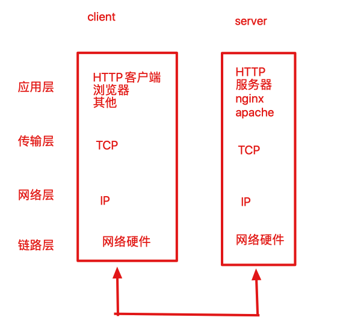


HTTP协议传输时，通过分层的顺序与目标机器通信。发送端从应用层向下走，接收方目的地是应用层。

1. 客户端发起一个HTTP请求（访问一个页面）
2. TCP/IP协议为了传输方便，在TCP传输层，将请求报文分割，且在每个报文上打上标机，转发给网络层
3. 网络层再增加一个标机，目标机器的MAC地址发给链路层，这时候，网卡就知道数据发给谁了
4. 接受者在链路层接收到数据，向上走，最终到应用层(web nginx)

### 数据包封装


数据包在每一层传输的时候，都会加上一层对应层所属的首部信息，反之接收方在数据传输的时候，每一层都会进行相应的解包，这种称之为数据包的封装。

## IP协议

IP协议（Internet Protocol）处于OSI模型(**开放式系统互联模型**（英语：**O**pen **S**ystem **I**nterconnection Model，缩写：OSI；简称为**OSI模型**)中的网络层。

IP协议作用是把数据包发送到指定的目的地，这里的重要条件就是`IP地址`和`MAC地址`

IP地址是指定了机器在网络的地址信息

MAC地址是指网卡所属的固定的地址。

IP地址可以动态分配，自由变化，而MAC地址基本不会更改，一般机器的出厂后就固定了。

### IP与ARP

MAC地址属于数据链路层，IP的通信依赖于MAC地址，互联网上，局域网的通信还是很少的，通常都是经过多台计算机中转才能够到达目标机器，在进行中转时，利用下一站的中转设备的MAC地址来搜索下一个中转目标，ARP协议就是根据通信方的IP地址来解析出MAC地址。

计算机和网络设备的中转路线，是路由器、交换机等网络设备内部工作，进行路由选择（routing）。

这就好比送快递的货车，将货物送到集散中心，明确送货后，快递公司能够查询送件的目的地，明确出一条路线，下一站送往哪一个集散中心，最终的集散中心再判断能否送到客户家里。


## TCP协议

TCP协议位于传输层，提供可靠的字节流服务（Byte Stream Service），指的是以字节流的形式传递给接收者，没有固定的报文边界限制，只能知道总共发送的数据，但是不知道一次能读取到多少数据，为了更容易传输大数据将数据切割了。

### 三次握手

为了数据传输的准确性，服务端和客户端之间需要三次的交互（三次握手）

- 第一次，client发送`syn`包`（syn=j）`给server，进入SYN_SEND状态，等待服务器确认
- 第二次，server收到`syn`包，确认client发来的syn（ack=j+1），同时自己发送一个SYN包（syn=k），也就是SYN+ACK包，此时server进入SYN_RECV状态
- 第三次，客户端接收到服务器的`SYN+ACK`包，向服务器发送确认包`ACK(ack=k+1)`，此时包发送完毕了，客户端和服务器进入`ESTABLISHED`状态，完成三次握手。

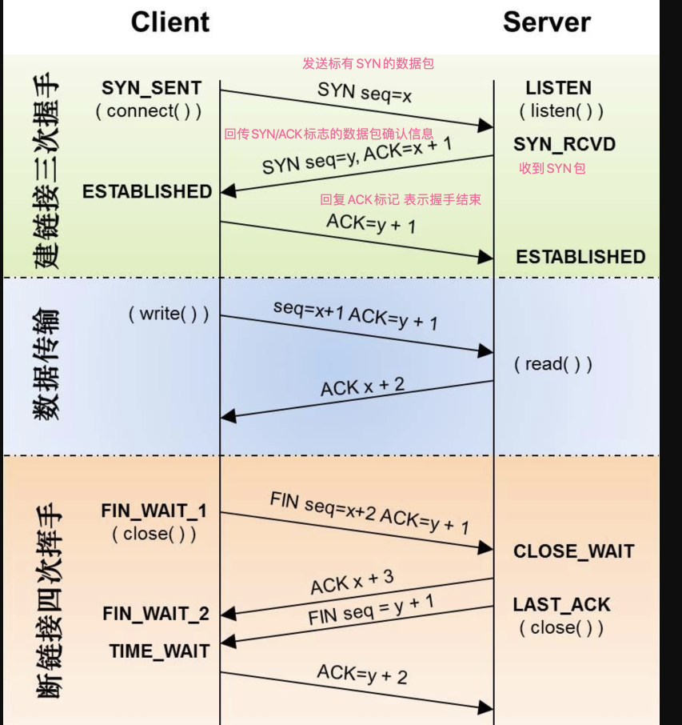

## DNS协议


## HTTP

http：hyper text transfer protocol

HTTP协议用于client和server之间通信，一般是请求一个静态资源称之为客户端，提供资源的一方称之为服务端。


### URL与URI

### 一句话理解

统一资源标志符URI就是在某一规则下能把一个资源独一无二地标识出来。 例如身份证号，定位唯一的一个人，绝对不会重复，身份证号就好比是URI

统一资源定位符URL 定位到这个人，他在哪 住址协议://地球/中国/北京/昌平/沙河/哥哥 同于 http://www.luffy.com/index/index.html

URI（Uniform Resource Identifier ）

url中文叫“统一资源标识符”，是一个用于标识某一互联网资源名称的字符串，在世界范围内标识定位某一个唯一信息资源。

例如

```plain
#访问一张郭达的照片
http://www.pythonav.cn:80/man.jpg
```

url主要用在各种www客户端和服务器程序上，url可以用一种统一的格式来描述各种信息资源，包括文件，服务器地址和目录等

【url组成】

1. 协议
2. 主机ip或域名
3. 端口
4. 文件资源具体地址

第一部分用"://"隔开，第二部分用"/"符号隔开

### HTML

超文本标记语言（英语：HyperText Markup Language，简称：HTML）是一种用于创建网页的标准标记语言。

```plain
<!DOCTYPE html>
<html>
<head>
<meta charset="utf-8">
<title>gege.linux</title>
</head>
<body>
    <h1>我的第一个标题</h1>
    <p>我的第一个段落。</p>
</body>
</html>
```

获取html源码的方式

```plain
curl www.pythonav.cn
浏览器检查网页源码
```

### CSS

CSS 指层叠样式表 (**C**ascading **S**tyle **S**heets)

CSS作用是定义如何显示HTML元素样式


### JS

JavaScript 是互联网上最流行的脚本语言，这门语言可用于 HTML 和 web，更可广泛用于服务器、PC、笔记本电脑、平板电脑和智能手机等设备。

JavaScript 是一种轻量级的编程语言。

JavaScript 是可插入 HTML 页面的编程代码。

JavaScript 插入 HTML 页面后，可由所有的现代浏览器执行。

 静态资源 

在网页设计中，纯HTMl格式的网页（包含图片，视频，JS，CSS等样式）通常被称作“静态网页”。

静态网页是相对于动态网页而言的，是指没有后台数据库，不包含程序，不可交互的网页。

静态网页的特点
开发人员写了什么，显示就是什么，一旦编写完成，就不会有任何改变。静态网页一般适用于更新较少的展示型网页，例如（酒水，家具，水果等宣传页），是很多中小网站的展示方式。


静态网页资源对应文件扩展名为

- 纯文本文件，如.htm .html .xml .js .css
- 图片或数据文档，如 .jpg .gif .bmp .txt .ppt
- 视频类文件 .mp4 .avi .flv 等

静态网页重要特性

- 每个页面有一个固定的url地址，url地址不含有问号"?"或"&"等符号
- 网页一经发布到服务器，网页内容是保存在服务器文件系统上的，每个网页都是独立的一个文件
- 网页内容固定不变，容易被搜索引擎收录（优点）
- 网页没有数据库支撑，在网站制作和维护上工作量很大（缺点）
- 网页的交互性很差，缺少程序的功能实现（缺点）
- 客户端解析网址时，由于不需要读取数据库，因此服务器端可以接受更高的并发访问。请求到来时，直接从磁盘上返回数据。（优点）

举例（吃火锅，现成的蔬菜）

【有关高并发架构思想】

在高并发，高访问量的场景下做架构优化时，比较关键的就是把动态网页转化成静态网页，而不是直接请求数据库和动态服务器，并且可以吧静态内容推到缓存中，这样就提升用户体验，节约服务器压力成本。


### 动态网页资源

服务端需要通过执行程序做出处理，发送给客户端的是程序的运行结果
动态网页是和静态网页相对而言的，动态网页的url后缀一般是.asp  .aspx  .php .js .cgi 
并且动态网页都有标志性的符号"? &"，后端都有数据库的支持。


动态网页地址

添加新随笔
https://i.cnblogs.com/EditPosts.aspx?opt=1

动态网页资源特点

1. 网页以数据库技术为支撑，大大降低网站维护的工作量
2. 动态网页技术的网站可以实现更多的功能，如用户注册，用户登录，投票，用户管理，博客管理等
3. 动态网页不是独立存在服务器上的网页文件，用户请求动态程序时，服务器解析程序并且可能读取数据库返回一个完整的网页内容
4. 搜索引擎（爬虫）一般不会抓取网址中的“？”后面的内容，因此企业都会做伪静态技术页面

举例（饭店炒菜，现做）

## 网站并发压力

在我们的生活中，拥挤，堵塞这些词，太常见，去超市排队，去银行排队，下班回家堵车，都很让人着急，我们都希望能快速的解决这些问题，处理效率高一点点。

这和我们日常的上网也是一样，我们浏览网页，网页迅速的给与反馈，响应我们早已觉得理所当然，然而也会在一些特殊时候，例如淘宝的双11活动，某电商的秒杀活动等，短时间内，网站浏览人数骤增，网站的压力迅速增长，能够处理请求的能力也随之变弱，这就好比一个商场搞促销活动，一下子涌进了很多人，超市整个的购买能力就会下降许多了。

### 并发模型

#### 【单进程模式】

我们已知HTTP连接处理流程是一次请求，一次响应，这种工作机制如同银行的处理机制是类似的。

1.银行起初只有一个柜台，假设处理一个客户需要5分钟，大厅来了10个人要办理业务，其他9个人只能等待，当排队的人过多的时候，大厅坐不下，保安就会拒绝后来的人进入大厅。

> 这就是一台服务器，单进程处理请求，一次只能处理一个请求，剩余的请求排队，当服务器连接数满了，服务器就会拒绝连接了。
> 单进程和单线程没有区别，因为一个进程至少有一个工作线程。循环处理请求是最初级的做法。当大量请求进来的时候，单线程一个一个处理请求，请求容易积压，得不到响应。这是无并发的模式。

#### 【多进程模式】

2.银行规模扩大，柜台数也扩张，此时扩张为10个柜台，同时可以处理业务，当有100个用户，还有90个等待，同样的如果大厅排队人数过多，保安也禁止后续客户进入了。

> 有同学问，那你为啥不开一百个窗口，这不要成本的吗？朋友，一百个窗口得多大场地，招来100个客服，即使一上午只有五六个客户，你也得付钱给一百个窗口的客服，太贵！
> 这就是服务器的多进程工作模式，服务器有多个进程处理客户端的请求
> 主进程（master）监听服务器80端口以及用户连接数，当客户请求来临，主进程fork（派生）出一个子进程来处理连接，子进程处理完毕后，生成响应报文，再由父进程将其销毁。
> 父进程（主进程）继续等待其他客户的请求连接，但是进程占用服务器资源较多，服务器负载会升高。
> 父进程启动多个子进程，每个子进程响应一个请求
> 主进程
>     子进程1
>     子进程2
>     子进程3
>     子进程3
> 这样的设计好处是隔离性，即使挂掉某一个子进程也不影响父进程，缺点是对系统资源消耗较大。

#### 【复用的IO结构】

银行开10个柜台假设已是极限，如何还能加快事情的处理效率？

- 原本一个柜台只有一个客服，处理一个客户要5分钟
- 现在每个柜台安排多个工作人员，第一个人负责客户问题接待，第二个人负责票据打印，第三个人负责备案文档....
- 如此这般，当第二个工作人员打印票票据的时候，第一个工作人员，又可以接待下一个客户
- 对于用户而言，无感知后台的工作人员是几位，处理一个客户问题的时间大大缩短了

> 这种模型是一个进程响应n个请求，但并不是单纯的一个进程，而是背后的多线程在工作。

## 服务器接入与响应过程

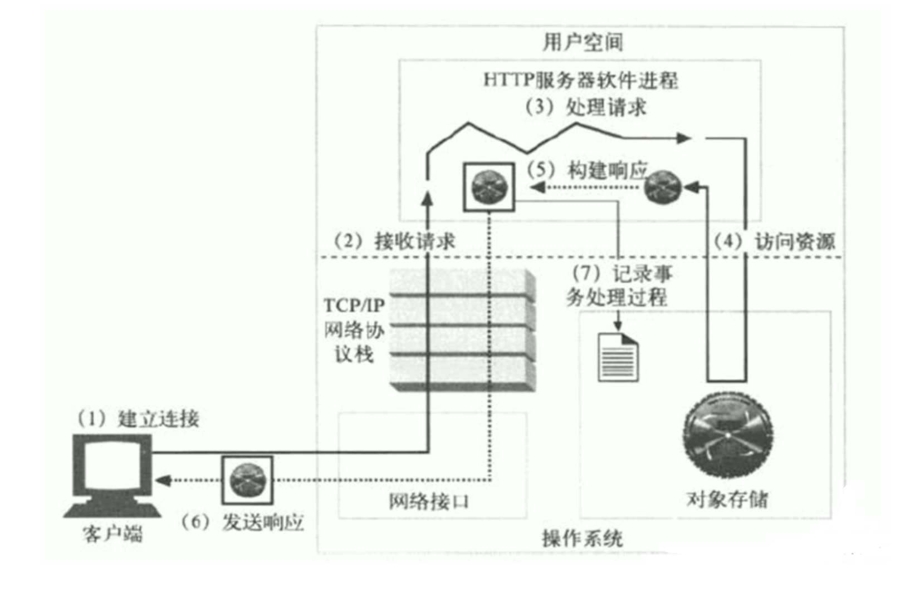

如图一次完整的http请求处理流程

1. 建立连接，客户端发起请求，与服务器完成三次握手之后再建立连接
2. 接收请求，服务器接收到请求后，内核根据socket把客户端请求的资源交给应用程序
3. 处理请求，对请求报文解析，明确客户端请求的资源与请求方法等信息
4. 访问资源，内核去磁盘中调取资源
5. 构建响应，应用程序创建响应报文
6. 发送响应，通过socket发给客户端
7. 记录事务，记录日志

## http协议汇总

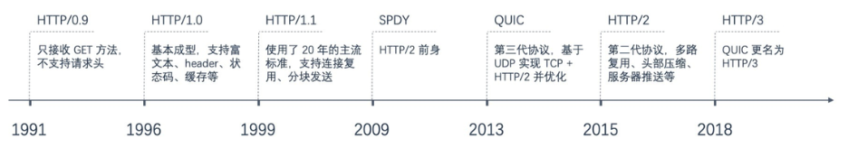

### 事务

我们再计算机领域总会听见事务一词。

事务是指是程序中一系列严密的逻辑操作，而且所有操作必须全部成功完成，否则在每个操作中所作的所有更改都会被撤消。可以通俗理解为：就是把多件事情当做一件事情来处理，好比大家同在一条船上，要活一起活，要完一起完 。

事务有四个特性（ACID）

- 原子性（Atomicity）：执行操作指令，要么全部成功，要么全部失败，只要一个失败，其他指令都失效，进行数据回滚，回到执行命令之前的操作
- **一致性**（Consistency）**：**事务的执行使数据从一个状态转换为另一个状态，但是对于整个数据的完整性保持稳定。
- **隔离性**（Isolation）**：**隔离性是当多个用户并发访问数据库时，比如操作同一张表时，数据库为每一个用户开启的事务，不能被其他事务的操作所干扰，多个并发事务之间要相互隔离。
- **持久性**（Durability）**：**当事务正确完成后，它对于数据的改变是永久性的。

> A想要从自己的帐户中转1000块钱到B的帐户里。那个从A开始转帐，到转帐结束的这一个过程，称之为一个事务。在这个事务里，要做如下操作：
>  1. 从A的帐户中减去1000块钱。如果A的帐户原来有3000块钱，现在就变成2000块钱了。
>  2. 在B的帐户里加1000块钱。如果B的帐户如果原来有2000块钱，现在则变成3000块钱了。
> 如果在A的帐户已经减去了1000块钱的时候，忽然发生了意外，比如停电什么的，导致转帐事务意外终止了，而此时B的帐户里还没有增加1000块钱。那么，我们称这个操作失败了，要进行回滚。回滚就是回到事务开始之前的状态，也就是回到A的帐户还没减1000块的状态，B的帐户的原来的状态。此时A的帐户仍然有3000块，B的帐户仍然有2000块。
> 我们把这种要么一起成功（A帐户成功减少1000，同时B帐户成功增加1000），要么一起失败（A帐户回到原来状态，B帐户也回到原来状态）的操作叫原子性操作。
> 如果把一个事务可看作是一个程序,它要么完整的被执行,要么完全不执行。这种特性就叫原子性。

### HTTP事务

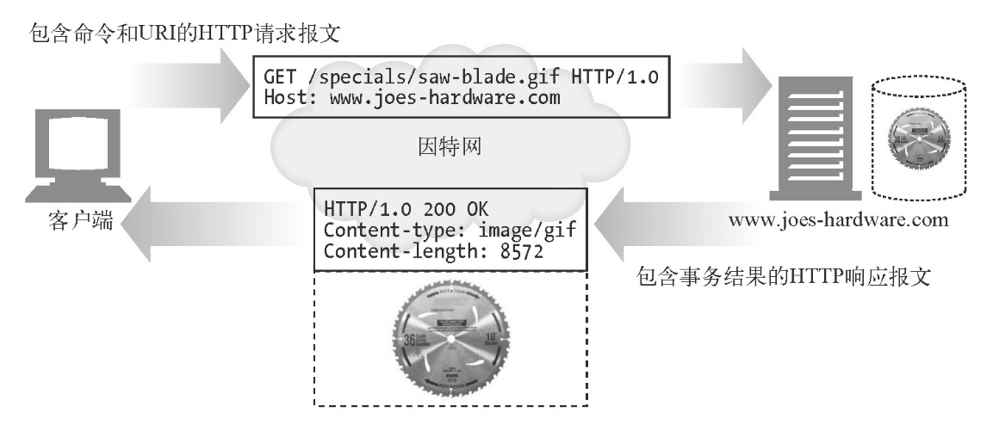

一道经典的面试题，当我们再浏览器输入一个站点，回车之后发生了什么，对于运维人员需要回答出什么？

#### 1.DNS解析

```plain
1.浏览器解析www.pythonav.cn这个域名对应的IP地址
2.浏览器搜索自身的DNS缓存，是否存在域名对应的记录
3.DNS缓存中也找不到，系统读取hosts文件，查看是否存在对应IP记录
4.hosts文件也没有，浏览器会发起DNS系统调用，向本地配置的DNS服务器地址发起域名解析请求，对应的域名服务器再寻找是否存在记录
```

#### 2.建立TCP连接

```plain
解析到对应的IP地址之后，User-Agent正常是浏览器，会以随机端口（1024<端口<65535）向服务器的80端口发起tcp连接
此请求经过TCP/IP的四层封包之后，进入服务器,进行解包操作，进入网卡，然后内核的TCP\IP协议栈，且通过防火墙，最后达到web应用程序，建立TCP连接。
第一次握手：客户端发送syn包(syn=j)到服务器，并进入SYN_SEND状态，等待服务器确认；
第二次握手：服务器收到syn包，必须确认客户的SYN（ack=j+1），同时自己也发送一个SYN包（syn=k），即SYN+ACK包，此时服务器进入SYN_RECV状态；
第三次握手：客户端收到服务器的SYN＋ACK包，向服务器发送确认包ACK(ack=k+1)，此包发送完毕，客户端和服务器进入ESTABLISHED状态，完成三次握手。
握手过程中传送的包里不包含数据，三次握手完毕后，客户端与服务器才正式开始传送数据。理想状态下，TCP连接一旦建立，在通信双方中的任何一方主动关闭连接之前，TCP 连接都将被一直保持下去。断开连接时服务器和客户端均可以主动发起断开TCP连接的请求，断开过程需要经过“第四次握手”，就是服务器和客户端交互，最终确定断开。
```

#### 3.发起HTTP请求

```plain
HTTP协议即超文本传送协议(Hypertext Transfer Protocol )，是Web联网的基础，也是手机联网常用的协议之一，HTTP协议是建立在TCP协议之上的一种应用。HTTP连接最显著的特点是客户端发送的每次请求都需要服务器回送响应，在请求结束后，会主动释放连接。从建立连接到关闭连接的过程称为“一次连接”。
1）在HTTP 1.0中，客户端的每次请求都要求建立一次单独的连接，在处理完本次请求后，就自动释放连接。
2）在HTTP 1.1中则可以在一次连接中处理多个请求，并且多个请求可以重叠进行，不需要等待一个请求结束后再发送下一个请求。由于HTTP在每次请求结束后都会主动释放连接，因此HTTP连接是一种“短连接”，要保持客户端程序的在线状态，需要不断地向服务器发起连接求。通常 的做法是即时不需要获得任何数据，客户端也保持每隔一段固定的时间向服务器发送一次“保持连接”的请求，服务器在收到该请求后对客户端进行回复，表明知道客户端“在线”。若服务器长时间无法收到客户端的请求，则认为客户端“下线”，若客户端长时间无法收到服务器的回复，则认为网络已经断开。
```

经过TCP三次握手后，浏览器发起HTTP请求，使用HTTP的GET方法，请求URL是/，按照HTTP/1.0协议。

例如某一个HTTP请求日志记录

```plain
192.168.178.1 - - [17/Jan/2020:14:30:11 +0800] "GET / HTTP/1.1" 304 - "-" "Mozilla/5.0 (Macintosh; Intel Mac OS X 10_15_2) AppleWebKit/537.36 (KHTML, like Gecko) Chrome/79.0.3945.117 Safari/537.36"
```

【request Method】

```plain
GET、向服务器获取数据，资源
POST、向服务器提交数据，登录，注册
HEAD、获取URL的响应头信息（只要脑袋），不要响应主体信息(不要身体数据)
PUT、将请求主体部分发给服务器
DELETE、删除服务器指定的资源
TRACE、追踪请求到达服务器发生的变动
OPTIONS、让服务器返回对指定的URL支持的所有请求方法
```

【URL请求体】


- Accept 就是告诉服务器端，我接受那些MIME类型
- Accept-Encoding 这个看起来是接受那些压缩方式的文件
- Accept-Lanague 告诉服务器能够发送哪些语言
- Connection 告诉服务器支持keep-alive特性
- Cookie 每次请求时都会携带上Cookie以方便服务器端识别是否是同一个客户端
- Host 用来标识请求服务器上的那个虚拟主机，比如Nginx里面可以定义很多
- 虚拟主机．那这里就是用来标识要访问那个虚拟主机。
- User-Agent 用户代理，一般情况是浏览器，也有其他类型，如：wget curl 搜引擎的蜘蛛等
- If-Modified-Since 是浏览器向服务器端询问某个资源文件如果自从什么时间修
  过，那么重新发给我，这样就保证服务器端资源．文件更新时，浏览器再次去
  求，而不是使用缓存中的文件。
- If-None-Match：本地缓存中存储的文档的ETag标签是否与服务器文档的Etag不匹配；

【状态码】

HTTP状态码是用以表示网页服务器超文本传输协议响应状态的3位数字代码。

HTTP请求状态如何，用状态码表示结果

状态码类别

> 1xx    信息状态码，服务器收到请求，需要客户端继续操作
> 2xx 操作成功
> 3xx 重定向状态码，需要进一步的操作
> 4xx 客户端错误，请求语法错误等
> 5xx 服务端错误，服务器处理过程中出错了

常见状态码

> 一些常见HTTP状态码为：
> 200 – 服务器成功返回网页
> 404 – 请求的网页不存在
> 503 – 服务不可用
> 常见HTTP状态码大全
> 1xx（临时响应）
> 表示临时响应并需要请求者继续执行操作的状态代码。
> 代码 说明
> http状态码 100 （继续） 请求者应当继续提出请求。 服务器返回此代码表示已收到请求的第一部分，正在等待其余部分。
> http状态码 101 （切换协议） 请求者已要求服务器切换协议，服务器已确认并准备切换。
> 2xx （成功）
> 表示成功处理了请求的状态代码。
> 代码 说明
> http状态码 200 （成功） 服务器已成功处理了请求。 通常，这表示服务器提供了请求的网页。
> http状态码 201 （已创建） 请求成功并且服务器创建了新的资源。
> http状态码 202 （已接受） 服务器已接受请求，但尚未处理。
> http状态码 203 （非授权信息） 服务器已成功处理了请求，但返回的信息可能来自另一来源。
> http状态码 204 （无内容） 服务器成功处理了请求，但没有返回任何内容。
> http状态码 205 （重置内容） 服务器成功处理了请求，但没有返回任何内容。
> http状态码 206 （部分内容） 服务器成功处理了部分 GET 请求。
> 3xx （重定向）
> 表示要完成请求，需要进一步操作。 通常，这些状态代码用来重定向。
> 代码 说明
> http状态码 300 （多种选择） 针对请求，服务器可执行多种操作。 服务器可根据请求者 (user agent) 选择一项操作，或提供操作列表供请求者选择。
> http状态码 301 （永久移动） 请求的网页已永久移动到新位置。 服务器返回此响应（对 GET 或 HEAD 请求的响应）时，会自动将请求者转到新位置。
> http状态码 302 （临时移动） 服务器目前从不同位置的网页响应请求，但请求者应继续使用原有位置来进行以后的请求。
> http状态码 303 （查看其他位置） 请求者应当对不同的位置使用单独的 GET 请求来检索响应时，服务器返回此代码。
> http状态码 304 （未修改） 自从上次请求后，请求的网页未修改过。 服务器返回此响应时，不会返回网页内容。
> http状态码 305 （使用代理） 请求者只能使用代理访问请求的网页。 如果服务器返回此响应，还表示请求者应使用代理。
> http状态码 307 （临时重定向） 服务器目前从不同位置的网页响应请求，但请求者应继续使用原有位置来进行以后的请求。
> 4xx（请求错误）
> 这些状态代码表示请求可能出错，妨碍了服务器的处理。
> 代码 说明
> http状态码 400 （错误请求） 服务器不理解请求的语法。
> http状态码 401 （未授权） 请求要求身份验证。 对于需要登录的网页，服务器可能返回此响应。
> http状态码 403 （禁止） 服务器拒绝请求。
> http状态码 404 （未找到） 服务器找不到请求的网页。
> http状态码 405 （方法禁用） 禁用请求中指定的方法。
> http状态码 406 （不接受） 无法使用请求的内容特性响应请求的网页。
> http状态码 407 （需要代理授权） 此状态代码与 401（未授权）类似，但指定请求者应当授权使用代理。
> http状态码 408 （请求超时） 服务器等候请求时发生超时。
> http状态码 409 （冲突） 服务器在完成请求时发生冲突。 服务器必须在响应中包含有关冲突的信息。
> http状态码 410 （已删除） 如果请求的资源已永久删除，服务器就会返回此响应。
> http状态码 411 （需要有效长度） 服务器不接受不含有效内容长度标头字段的请求。
> http状态码 412 （未满足前提条件） 服务器未满足请求者在请求中设置的其中一个前提条件。
> http状态码 413 （请求实体过大） 服务器无法处理请求，因为请求实体过大，超出服务器的处理能力。
> http状态码 414 （请求的 URI 过长） 请求的 URI（通常为网址）过长，服务器无法处理。
> http状态码 415 （不支持的媒体类型） 请求的格式不受请求页面的支持。
> http状态码 416 （请求范围不符合要求） 如果页面无法提供请求的范围，则服务器会返回此状态代码。
> http状态码 417 （未满足期望值） 服务器未满足”期望”请求标头字段的要求。
> 5xx（服务器错误）
> 这些状态代码表示服务器在尝试处理请求时发生内部错误。 这些错误可能是服务器本身的错误，而不是请求出错。
> 代码 说明
> http状态码 500 （服务器内部错误） 服务器遇到错误，无法完成请求。
> http状态码 501 （尚未实施） 服务器不具备完成请求的功能。 例如，服务器无法识别请求方法时可能会返回此代码。
> http状态码 502 （错误网关） 服务器作为网关或代理，从上游服务器收到无效响应。
> http状态码 503 （服务不可用） 服务器目前无法使用（由于超载或停机维护）。 通常，这只是暂时状态。
> http状态码 504 （网关超时） 服务器作为网关或代理，但是没有及时从上游服务器收到请求。
> http状态码 505 （HTTP 版本不受支持） 服务器不支持请求中所用的 HTTP 协议版本。

【响应头信息】


> Connection            使用keep-alive特性
> Content-Encoding      使用gzip方式对资源压缩
> Content-Length: 主体的长度
> Content-type          MIME类型为html类型，字符集是 UTF-8
> Date                  响应的日期
> Server                使用的WEB服务器
> Last-Modified：最后一次修改的时间
> Server：服务器程序软件名称和版本

#### 4.浏览器解析HTML

浏览器拿到index.html文件之后，解析html网页文件，遇见静态资源（js、css、img）就去服务器再次发请求下载，这个时候就用上keep-alive特性了，建立一次HTTP连接，可以请求多个资源，下载资源的顺序就是按照代码里的顺序，但是由于每个资源大小不一样，而浏览器又多线程请求请求资源，顺序并不一定是代码里面的顺序。

#### 5.浏览器对页面进行渲染

浏览器对请求到的静态资源进行渲染

> dns解析
> 发起tcp三次握手
> 建立tcp连接后发起http请求
> 服务器响应http请求，返回html资源
> 浏览器解析html代码，请求html中的其他静态资源
> 浏览器渲染页面，呈现画面


## 网络流量度量术语

### IP

IP(独立IP),即 Internet Protocol,这里指独立IP数,独立IP数是指不同IP地址的计算机访问网站时被计的总次数。独立IP数是衡量网站流量的一个重要指标。一般一天内(00:00-24:00)相同IP地址的客户端访问网站页面只会被计为一次,记录独立IP的时间可为一天或一个月,目前通用的标准为“一天”。假设有部分同学在教室的局域网中同时打开了博客(www.luffycity.com),请问对于51CTO网站是几个独立IP?答:是一个独立IP。

这是因为,国内所有的公司几乎都是采用局域网共享上网的,即通过路由器NAT地址转换上网,每个计算机在局域网内的私有IP是不同的,但是在外网上,就必须由路由器把每个私网地址转换成了路由器接口的固定公网IP(多IP映射暂不考虑),所以说,对于网站来说一天内多个相同IP的客户端访问会被计为一个独立IP。

再假设一个客户机用户通过ADSL等直接拨号上网,但是上网的时候偶尔掉线,一共重新拨号了3次(相近时间重新拨号IP地址相同的几率是极小的),然后每次都继续打开同一个博客地址,请问此时,网站独立IP数是多少?答:是3个独立IP。由此可见,通过独立IP数度量网站访问量,和实际的访问情况不是很匹配。国内的企业、学校等多数是用NAT上网的,一个独立IP背后可能有数十上百个客户端访问。独立IP数虽然不是很准确,但却是MT技术人员比较关心的一个衡量网站的指标。

### PV

PV(访问量)即 Page View,中文翻译为页面浏览,即页面浏览量或单击量,不管客户端是不是相同,也不管IP是不是相同,用户只要访问网站页面就会被计算PV,一次计一个PV。

PV的具体度量方法就是从客户浏览器发出一个对web服务器的请求( Request),Web服务器接到这个请求后,将该请求对应的网页(Page)发送给浏览器,这样就产生了一个PV。这里有一个问题,就是只要这个请求发送给了浏览器,无论这个页面是否完全打开(或下载完成),都会被计数(1次为1个PV),一般为了防止用户快速刷PV很多网站会把PV的统计程序放在页面的最下面。

用PV衡量网站时,PV数反映的是浏览某网站的页面数量,每刷新一次页面也算次。因此,可以说PV数与来访用户的数量成正比,但PV数并不是真正的页面来访者数量,而是网站被访问的页面数量,因为一个来访者可能产生多个PV。

问:如果一个用户要访问赶集网或58同城租房,你觉得用户可能会产生多少PV?

答:平均可能会有十几到几十个PV,一个来访者访问网站的PV数的多少是和网站提供的业务直接相关的。对于分类网站,用户浏览网站可能是为了找房子、找工作,因此一个用户访问的页面会很多,自然PV也就会很多PV( Page View)是网站被访问的页面数量的一个指标,但不能直接知道有多少人访问了这个网站。

一个来访者访问网站,可能产生若干PV数,但是独立IP数就只有1个,因此,如果对比一个网站的独立IP数和PV数,不难看出,PV数一定会大于等于独立IP数,其比例视网站的业务而定,对于分类门户,可能会达到10:1,甚至更多。

### UV

UV(独立访客)即 Unique Visitor,同一个客户端(PC或移动端)访问网站被计为一个访客。一天(00:00-24:00)内相同的客户端访问同一个网站只计一次UV。UV一般是以客户端 Cookie等技术作为统计依据的,实际统计会有误差。

考虑到一台客户端计算机可能会有多人使用,因此,UV(独立访客)实际上并不定是独立的自然人访问。

### IP、PV、UV的区别

针对该主题,下面以一个访问示例来讲解吧。

假设某城市的一个网吧里,有10个人都进入了www.luffycity.com的网站,每个人平均访问了5个页面,但是这个网吧的对外出口是一个公网IP(注意:也可以配置多个IP出口,此处不计特殊情况),所以,对于 luffycity网站来说,只会计算一个独立IP访问

但是因为网吧里有10人在访问www.luffycity.com的网站,并且平均都访问了5次因此,对于 luffycity网站来说,PV数就是10×5=50个PV。

而因为有10个人访问,就是10个不同的客户端访问,因此,UV(独立访客)为10。

那么,在此访问示例中,网站独立IP数为1个,PV数为50个,UV(独立访客)为10个。

通过上述结果,我们不难得出一个结论,一个网站的独立IP数量要比网站实际访问的pv数量小得多。通常情况下(国内互联网环境下),网站的UV数也会大于独立IP数。

PV数高说明访问的页面数多,但是不一定就代表来访者多;但PV数一定与来访者的数量成正比,不过,PV并不直接决定页面的真实来访者数量。比如在访问某网站时,一个人也可通过不断地刷新页面,制造出非常高的PV数。PV数多,用户访问网站页面的总数量多,通常服务器的压力会大一些。

## 度量方法

### IP

- 可以统计Web服务器的访问日志信息，对IP地址去重后计数，得到访客IP数量
- 在网站结尾页面嵌入JS统计代码，待用户加载完网页后，IP发给统计IP数量的服务器，一般这种是第三方统计公司的业务。
- 用第三方的统计工具，如谷歌的GA

### PV

- 分析Web服务器的访问日志，只计算HTML、后台服务请求等数量
- 第三方统计工具

### UV

- 通过客户端HTTP请求统计，网站服务器对客户端的（ip、时间、浏览器、操作系统）等信息，如果这些信息相同，又来自于同一个IP，就可以计算是一个UV统计。
- 通过cookie统计，每个浏览器在访问网站之后，网站服务器会发送给客户端一个cookie文件，当下次浏览器再访问网站时候就会携带者cookie，用于记录自己的身份信息，因此两次请求都是同样的cookie就是计算一个UV值，但是也有特殊原因，浏览器禁止cookie，用户清除cookie等。


# apache

Web服务器一般是网站服务器，是安装在计算机中的一个程序，可以向浏览器等Web客户端发送文档，你可以在Web服务器上放置数据文件，让全世界的人来浏览。


目前世界主流的Web服务有

- Apache
- Nginx
- IIS
- lighttpd

Apache是世界使用排名第一的Web服务器软件。它可以运行在几乎所有广泛使用的计算机平台上，由于其跨平台和安全性被广泛使用，是最流行的Web服务器端软件之一。它快速、可靠并且可通过简单的API扩充，将Perl/Python等解释器编译到服务器中。同时Apache音译为阿帕奇，是北美印第安人的一个部落，叫阿帕奇族，在美国的西南部。也是一个基金会的名称、一种武装直升机等等。

Apache HTTP服务器是一个模块化的服务器，源于NCSAhttpd服务器，经过多次修改，成为世界使用排名第一的Web服务器软件。 它可以运行在几乎所有广泛使用的计算机平台上。

Apache是市场占有率很高的一款Web服务器，跨平台和安全性被广泛认可，可以运行在WIndows、Linux、Unix系统中。支持虚拟主机功能（ip、port、FQDN）、高度集成模块、https加密，检测用户访问日志、反向代理，负载均衡，用户认证等功能。

## 安装apchae

linux安装软件的方式选择

- 源代码编译
- rpm包安装
- yum自动化安装

源代码编译安装可以自定义些第三方功能，添加额外参数，最大化定制软件安装，缺点是编译时间较长。

rpm包需手动解决依赖关系，因此不推荐

yum需配置好仓库源，推荐使用

```plain
1.安装命令
[root@gegelinux ~]# yum install httpd -y
2.添加httpd开机自启
[root@gegelinux ~]# systemctl start httpd
[root@gegelinux ~]# systemctl enable httpd
3.检查程序进程和端口
[root@gegelinux ~]# netstat -tunlp|grep httpd
tcp6       0      0 :::80                   :::*                    LISTEN      2344/httpd
[root@gegelinux ~]# ps -ef|grep httpd
root       2344      1  0 15:34 ?        00:00:00 /usr/sbin/httpd -DFOREGROUND
apache     2345   2344  0 15:34 ?        00:00:00 /usr/sbin/httpd -DFOREGROUND
apache     2346   2344  0 15:34 ?        00:00:00 /usr/sbin/httpd -DFOREGROUND
apache     2347   2344  0 15:34 ?        00:00:00 /usr/sbin/httpd -DFOREGROUND
apache     2348   2344  0 15:34 ?        00:00:00 /usr/sbin/httpd -DFOREGROUND
apache     2349   2344  0 15:34 ?        00:00:00 /usr/sbin/httpd -DFOREGROUND
4.此时启了一个web服务端，可以用客户端访问  ,注意关闭防火墙
http://192.168.178.185/
```

## apache配置文件

Linux下学习软件使用，以及针对软件定制各种功能，其实就是在修改配置文件，因此我们得知道各配置文件的位置

| 文件路径                              | 作用                         |
| ------------------------------------- | ---------------------------- |
| /etc/httpd/conf/httpd.conf            | apache主配置文件             |
| /etc/httpd                            | apache主配置目录             |
| /etc/httpd/conf.d/*.conf              | apache子配置文件             |
| /usr/sbin/httpd                       | 二进制脚本                   |
| /var/log/httpd/                       | 日志路径access_log error_log |
| /var/www/html                         | 站点资源目录                 |
| /usr/lib/systemd/system/httpd.service | httpd服务脚本文件            |
| /usr/lib64/httpd/modules/             | httpd模块文件路径            |

### 【http主配置文件学习】

```
/etc/httpd/conf/httpd.conf
#过滤掉注释空白行
[root@gegelinux ~]# grep -Ev '^[# ]|^$' /etc/httpd/conf/httpd.conf
ServerRoot "/etc/httpd"
Listen 80
Include conf.modules.d/*.conf
User apache
Group apache
ServerAdmin root@localhost
<Directory />
</Directory>
DocumentRoot "/var/www/html"
<Directory "/var/www">
</Directory>
<Directory "/var/www/html">
</Directory>
<IfModule dir_module>
</IfModule>
<Files ".ht*">
</Files>
ErrorLog "logs/error_log"
LogLevel warn
<IfModule log_config_module>
</IfModule>
<IfModule alias_module>
</IfModule>
<Directory "/var/www/cgi-bin">
</Directory>
<IfModule mime_module>
</IfModule>
AddDefaultCharset UTF-8
<IfModule mime_magic_module>
</IfModule>
EnableSendfile on
IncludeOptional conf.d/*.conf
```

主配置文件中，主要分为3类

- 全局配置，全局性
- 主服务器配置
- 虚拟主机

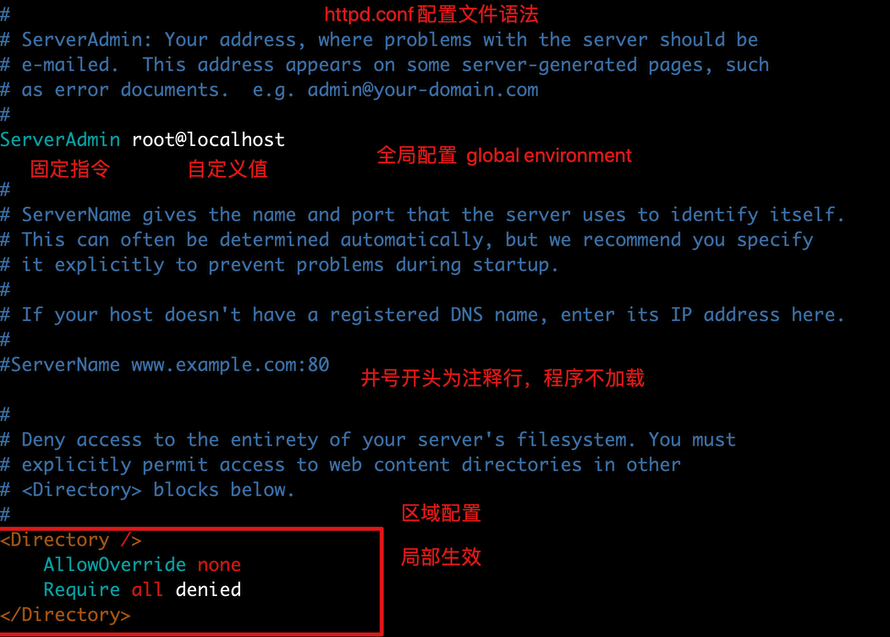

#### 常见参数解析

| 参数                                 | 解析                   |
| ------------------------------------ | ---------------------- |
| ServerRoot "/etc/httpd"              | 定义服务工作目录       |
| ServerAdmin root@localhost           | 管理员邮箱地址         |
| User apache                          | 运行服务的用户信息     |
| Group apache                         | 运行服务的用户组       |
| ServerName www.example.com:80        | 填写服务器域名         |
| DocumentRoot "/var/www/html"         | 定义网站根目录         |
|                                      | 定义网站数据目录的权限 |
| Listen                               | 监听的IP地址和端口号   |
| DirectoryIndex index.html            | 默认的首页页面文件     |
| ErrorLog "logs/error_log"            | 定义错误日志位置       |
| CustomLog "logs/access_log" combined | 定义访问日志路径       |

### apache常见配置

 【修改首页内容】 

```
[root@gegelinux ~]# vim /var/www/html/index.html
[root@gegelinux ~]# curl 127.0.0.1
<meta charset=utf8>
哥带你学apache
```

### 【修改网站资源目录路径】

```plain
1.修改配置文件如下，两处修改
[root@gegelinux ~]# cat /etc/httpd/conf/httpd.conf
DocumentRoot "/www"
<Directory "/www">
    AllowOverride None
    # Allow open access:
    Require all granted
</Directory>
2.创建资源目录，创建html文件
[root@gegelinux conf]# cat /www/index.html
<meta charset=utf8>
我是新的首页，你好兄弟们
3.修改了配置文件，还得重启http服务才能生效
systemctl restart httpd
4.注意关闭防火墙和selinux，影响实验
[root@gegelinux conf]# systemctl stop firewalld
[root@gegelinux conf]# systemctl disable firewalld
[root@gegelinux conf]# iptables -F
[root@gegelinux conf]# setenforce 0  #临时关闭selinux
[root@gegelinux conf]# grep -i '^selinux' /etc/selinux/config    
SELINUX=disabled    #永久关闭selinux，重启机器生效
SELINUXTYPE=targeted
```

此时可以访问新资源目录的内容了

```bash
[root@gegelinux conf]# curl 127.0.0.1
<meta charset=utf8>
我是新的首页，你好兄弟们
```

### 【修改监听端口】

```plain
[root@gegelinux ~]# grep -i "^listen"  /etc/httpd/conf/httpd.conf
Listen 85
```

访问效果

```
[root@gegelinux ~]# curl 127.0.0.1:85
<meta charset=utf8>
我是新的首页，你好兄弟们
```

### 【apache的工作模式】

apache是经典的网站黄金架构`lanmp`中的`a`

Apache提供了三种稳定的（多进程处理模块）`MPM(Mutli-Processing Modules 多通道处理模块)`，使得Apache能够使用更多不同的工作环境，扩展了Apache的功能。

```plain
检查默认的apache工作模式
[root@gegelinux ~]# httpd -V|grep -i "server mpm"
Server MPM:     prefork
```

可以在编译apache软件时候，添加编译参数，更改mpm模式

```plain
--with-mpm=prefork|worker|event
```

apache提供了三种工作模式

```plain
1.prefork
Apache在启动之初，就预先fork一些子进程，然后等待请求进来。之所以这样做，是为了减少频繁创建和销毁进程的开销。每个子进程只有一个线程，在一个时间点内，只能处理一个请求。
优点：成熟稳定，兼容所有新老模块。同时，不需要担心线程安全的问题。
缺点：一个进程相对占用更多的系统资源，消耗更多的内存。而且，它并不擅长处理高并发请求。
2.worker
使用了多进程和多线程的混合模式。它也预先fork了几个子进程(数量比较少)，然后每个子进程创建一些线程，同时包括一个监听线程。每个请求过来，会被分配到1个线程来服务。线程比起进程会更轻量，因为线程通常会共享父进程的内存空间，因此，内存的占用会减少一些。在高并发的场景下，因为比起prefork有更多的可用线程，表现会更优秀一些。
优点：占据更少的内存，高并发下表现更优秀。
缺点：必须考虑线程安全的问题。
3.event
它和worker模式很像，最大的区别在于，它解决了keep-alive场景下，长期被占用的线程的资源浪费问题。event MPM中，会有一个专门的线程来管理这些keep-alive类型的线程，当有真实请求过来的时候，将请求传递给服务线程，执行完毕后，又允许它释放。这样增强了高并发场景下的请求处理能力。
HTTP采用keepalive方式减少TCP连接数量，但是由于需要与服务器线程或进程进行绑定，导致一个繁忙的服务器会消耗完所有的线程。Event MPM是解决这个问题的一种新模型，它把服务进程从连接中分离出来。在服务器处理速度很快，同时具有非常高的点击率时，可用的线程数量就是关键的资源限制，此时Event MPM方式是最有效的，但不能在HTTPS访问下工作。
```

### 【Userdir】

userdir模块可以很方便的与他人共享目录资源

**修改/etc/httpd/conf.d/userdir.conf**

```bash
1.启用userdir，
<IfModule mod_userdir.c>
    #
    # UserDir is disabled by default since it can confirm the presence
    # of a username on the system (depending on home directory
    # permissions).
    #
    #UserDir disabled  #添加注释，表示启用
    #
    # To enable requests to /~user/ to serve the user's public_html
    # directory, remove the "UserDir disabled" line above, and uncomment
    # the following line instead:
    #
    UserDir public_html
</IfModule>
<Directory "/home/*/public_html">
    #AllowOverride FileInfo AuthConfig Limit Indexes
    AllowOverride all
    authuserfile "/etc/httpd/passwd"        
    authname "input your account"
    authtype basic
    require user chao
    #Options MultiViews Indexes SymLinksIfOwnerMatch IncludesNoExec
    #Require method GET POST OPTIONS
</Directory>
2.创建网站数据文件夹，注意权限
[root@gegelinux conf.d]# su - gege
[gege@gegelinux ~]$ mkdir public_html
3.创建首页文件
[gege@gegelinux ~]$ echo "哥哥带你学apache，666" > public_html/index.html
4.设置权限
[root@gegelinux www]# chmod -Rf 755 /home/gege/
5.创建需要验证的账户密码，生成数据库文件
[root@gegelinux www]# htpasswd -c /etc/httpd/passwd chao
New password:
Re-type new password:
Adding password for user chao
6.重启httpd，注意退回root
[root@gegelinux conf.d]# systemctl restart httpd
7.可以访问http://192.168.178.187/~gege/   格式是 ip/~用户名  
8.访问目录下资源
[root@gegelinux public_html]# pwd
/home/gege/public_html
[root@gegelinux public_html]# ls
hehe.html  index.html
```

### 【虚拟主机】

虚拟主机，也叫“网站空间”，就是把一台运行在互联网上的物理服务器划分成多个“虚拟”服务器。虚拟主机技术极大的促进了网络技术的应用和普及。同时虚拟主机的租用服务也成了网络时代的一种新型经济形式。


如果每台Linux服务器，只能跑一个网站，那一些只有简单业务的网站，或者个人博客站点，对于硬件资源来说是浪费的，且需要支付服务器的费用。

对于Apache是支持虚拟主机的，能够以用户请求的不同的IP、域名、端口来区分不同的站点。

#### 基于IP的虚拟主机

在一台服务器上绑定多个IP地址，每个IP地址部署一个站点，访问不同的IP地址，apache服务器返回不同的网站资源。

```plain
服务器绑定三个ip地址
[root@gegelinux ~]# ip a|grep 'inet'
    inet 127.0.0.1/8 scope host lo
    inet6 ::1/128 scope host
    inet 192.168.178.187/24 brd 192.168.178.255 scope global noprefixroute dynamic ens33
    inet 192.168.178.111/24 scope global secondary ens33
    inet 192.168.178.112/24 scope global secondary ens33
    inet6 fe80::22c3:376e:b0ae:5076/64 scope link noprefixroute
```

配置三个文件夹，对应三个站点资料

```plain
[root@gegelinux ~]# mkdir -p /www/{hanju,cartoon,football}
[root@gegelinux ~]# echo "我是韩剧，来自于192.168.178.187" > /www/hanju/index.html
[root@gegelinux ~]# echo "我是卡通，来自于192.168.178.111" > /www/cartoon/index.html
[root@gegelinux ~]# echo "我是足球，来自于192.168.178.112" > /www/football/index.html
```

修改httpd.conf配置文件，最底行添加apache虚拟主机的配置

```
<VirtualHost 192.168.178.187>
DocumentRoot /www/hanju
#ServerName
<Directory /www/hanju >
AllowOverride None
Require all granted
</Directory>
</VirtualHost>
<VirtualHost 192.168.178.111>
DocumentRoot /www/cartoon
#ServerName
<Directory /www/cartoon >
AllowOverride None
Require all granted
</Directory>
</VirtualHost>
<VirtualHost 192.168.178.112>
DocumentRoot /www/football
#ServerName
<Directory /www/football >
AllowOverride None
Require all granted
</Directory>
</VirtualHost>
```

重启httpd

`systemctl restart httpd`

浏览器访问


#### 多域名虚拟主机

刚才的操作是多IP虚拟主机，那么当服务器仅允许有一个IP地址的时候，就无法实现多虚拟主机了，Apache还支持基于不同的域名、返回不同的站点资源。


这种配置方式，需要配置多个域名，可以使用本地hosts文件，也可以配置DNS记录。

```bash
1.配置hosts文件解析
[root@gegelinux ~]# cat /etc/hosts
127.0.0.1   localhost localhost.localdomain localhost4 localhost4.localdomain4
::1         localhost localhost.localdomain localhost6 localhost6.localdomain6
192.168.178.189 www.gege.com www.yuyu.com
2.分别创建不同的虚拟主机站点，且创建前端文件
[root@gegelinux ~]# mkdir -p /www/{gege,yuyu}
[root@gegelinux ~]# echo "哥哥666" > /www/gege/index.html
[root@gegelinux ~]# echo "哥哥带你学apache" > /www/yuyu/index.html
3.修改apache的配置文件，写入虚拟主机的参数
[root@gegelinux ~]# cat /etc/httpd/conf/httpd.conf
<VirtualHost 192.168.178.189>
DocumentRoot "/www/gege"
ServerName "www.gege.com"
<Directory "/www/gege" >
AllowOverride None
Require all granted
</Directory>
</VirtualHost>
<VirtualHost 192.168.178.189>
DocumentRoot /www/yuyu
ServerName "www.yuyu.com"
<Directory "/www/yuyu" >
AllowOverride None
Require all granted
</Directory>
</VirtualHost>
4.检测页面内容
[root@gegelinux ~]# curl www.gege.com
哥哥666
[root@gegelinux ~]# curl www.yuyu.com
哥哥带你学apache
```


#### 【多端口号虚拟主机】

apache默认端口是80提供web服务器功能，可以基于多个端口实现多虚拟主机

```plain
1.生成多个数据文件夹
[root@gegelinux ~]# mkdir -p /www/{66,99}
[root@gegelinux ~]# echo "端口号66的虚拟主机" > /www/66/index.html
[root@gegelinux ~]# echo "端口号99的虚拟主机" > /www/99/index.html
2.修改配置文件，支持多端口的虚拟主机
#######
<VirtualHost 192.168.178.189:66>
DocumentRoot "/www/66"
ServerName "www.gege.com"
<Directory "/www/66" >
AllowOverride None
Require all granted
</Directory>
</VirtualHost>
<VirtualHost 192.168.178.189:99>
DocumentRoot "/www/99"
ServerName "www.yuyu.com"
<Directory "/www/99" >
AllowOverride None
Require all granted
</Directory>
</VirtualHost>
3.重启httpd
[root@gegelinux ~]# systemctl restart httpd
4.查看不同端口的页面内容
[root@gegelinux ~]# curl www.gege.com
哥哥666
[root@gegelinux ~]# curl www.gege.com:66
端口号66的虚拟主机
[root@gegelinux ~]# curl www.yuyu.com
gege带你学apache
[root@gegelinux ~]# curl www.yuyu.com:99
端口号99的虚拟主机
```

### 资源限制访问

当我们有部分资源不希望被别人访问的时候，可以通过参数拒绝资源目录被访问

【案例】

拒绝其他人访问站点资源. http://192.168.178.189:99/

```
1.创建一个资源文件，禁止用户访问
[root@gegelinux ~]# mkdir -p /www/denyhtml/
[root@gegelinux ~]# echo "小样，想偷看我？" > /www/denyhtml/index.html
2.修改httpd配置文件
<Directory "/www/99" >
Order allow,deny
#Allow from 192.168.178.0/24
</Directory>
</VirtualHost>
3.打开注释，允许某个网段访问
4.重启httpd
[root@gegelinux ~]# systemctl restart httpd
5.即可访问资源了
```

### 注意！httpd的版本问题

```plain
apache目录站点 访问限制总结：
2.4之前版本的：
语法是
Order Deny,allow
Allow from 192.168.178.190
2.4版本开始：
不再使用上述的语法了
改为 
Require all granted  # 允许所有ip访问
Require ip 192.168.178.190  #只允许某个ip访问
Require ip 192.168.178.0/24 # 允许某个我那网段访问
```

### 限制访问详解

```plain
给指定的文件夹配置对应的访问权限是Apache配置中的基础应用，也是Apache使用者的必备技能之一。
在Apache配置文件中，给指定目录设置基本的访问权限，主要是靠Allow、Deny、Order三个指令的配合使用来实现的。
1.Allow指令
Allow指令的作用与其英文单词的含义一致，用于设置允许访问当前目录(及其子目录)或文件的用户范围。例如，Allow from all表示允许所有用户访问。下面，我们参考更多的例子，以帮助理解(Deny与Order用法一致)：
<Directory /web>
#只允许IP为123.10.10.2的用户访问/web目录
Allow from 123.10.10.2
</Directory>
<Directory /web>
#只允许IP以10.10开头的用户访问/web目录
Allow from 10.10
</Directory>
<Directory /web>
#只允许域名为365mini.com的用户访问
Allow from 365mini.com
</Directory>
2.Deny指令
同样的，Deny指令的作用就是“Deny(拒绝)”，用于设置拒绝访问当前目录或文件的用户范围。例如，Deny from all表示拒绝所有用户访问。
3.Order指令
在Apache的配置文件中，Order指令用于控制Allow指令和Deny指令的生效顺序。例如，Order Allow,Deny表示当前配置段中的Allow指令先生效，Deny指令后生效。
在Apache中，Allow指令和Deny指令在同一配置段中都可以有多条。不过，对于Allow和Deny指令而言，如果先生效的指令与后生效的指令的作用范围存在冲突，则起冲突的作用范围部分以后生效的指令为准。
下面，我们同样参考几个具体的例子以帮助大家理解：
<Directory /web>
Order Allow,Deny
Allow from all
Deny from 112.2.10.2
#先允许所有用户访问，再拒绝112.2.10.2
#总结：允许除IP为112.2.10.2外的所有用户访问
</Directory>
<Directory /web>
Order Allow,Deny
Deny from 112.2.10.2
Allow from all
#先允许所有用户访问，再拒绝112.2.10.2
#总结：允许除IP为112.2.10.2外的所有用户访问
#(即使Deny指令在Allow指令之前，但是根据Order Allow,Deny语句，仍然先看Allow，再看Deny)
</Directory>
<Directory /web>
Order Deny,Allow
Deny from 112.2.10.2
Allow from all
Deny from 123.10.10.1
#先拒绝112.2.10.2访问
#再拒绝123.10.10.1访问
#最后允许所有用户访问
#总结：允许所有用户访问
#(即使Allow指令在Deny指令前，但是根据Order Deny,Allow语句，仍然先看Deny，再看Allow)
</Directory>
```

### 定义访客日志格式

有时候我们需要定制apache默认显示的日志格式，增加或者减少日志记录的内容，更好的让运维人员掌握用户访问信息。

并且日志可能会给系统造成大量的IO操作，造成较多的负担，如果关闭日志功能，甚至可能提高40%的性能，那当然是不能关闭，而是调整日志级别。

查看httpd配置文件

```plain
ErrorLog "logs/error_log"  #错误日志存放位置
#
# LogLevel: Control the number of messages logged to the error_log.
# Possible values include: debug, info, notice, warn, error, crit,
# alert, emerg.
#
LogLevel warn
<IfModule log_config_module>
    #
    # The following directives define some format nicknames for use with
    # a CustomLog directive (see below).
    #
    LogFormat "%h %l %u %t \"%r\" %>s %b \"%{Referer}i\" \"%{User-Agent}i\"" combined
    LogFormat "%h %l %u %t \"%r\" %>s %b" common
    <IfModule logio_module>
      # You need to enable mod_logio.c to use %I and %O
      LogFormat "%h %l %u %t \"%r\" %>s %b \"%{Referer}i\" \"%{User-Agent}i\" %I %O" combinedio
    </IfModule>
    #
    # The location and format of the access logfile (Common Logfile Format).
    # If you do not define any access logfiles within a <VirtualHost>
    # container, they will be logged here.  Contrariwise, if you *do*
    # define per-<VirtualHost> access logfiles, transactions will be
    # logged therein and *not* in this file.
    #
    #CustomLog "logs/access_log" common
    #
    # If you prefer a logfile with access, agent, and referer information
    # (Combined Logfile Format) you can use the following directive.
    #
    CustomLog "logs/access_log" combined
</IfModule>
```

#### 日志级别

```plain
# LogLevel: Control the number of messages logged to the error_log.
# Possible values include: debug, info, notice, warn, error, crit,
# alert, emerg.
#
LogLevel warn
#解释
emerg 紧急 - 系统无法使用。 "Child cannot open lock file. Exiting"  
alert 必须立即采取措施。 "getpwuid: couldn't determine user name from uid"  
crit 致命情况。 "socket: Failed to get a socket, exiting child"  
error 错误情况。 "Premature end of script headers"  
warn 警告情况。 "child process 1234 did not exit, sending another SIGHUP"  
notice 一般重要情况。 "httpd: caught SIGBUS, attempting to dump core in ..."  
info 普通信息。 "Server seems busy, (you may need to increase StartServers, or Min/MaxSpareServers)..."  
debug 出错级别信息 "Opening config file ..."
```

#### 日志格式

```plain
LogFormat "%h %l %u %t \"%r\" %>s %b \"%{Referer}i\" \"%{User-Agent}i\"" combined #组合日志
    LogFormat "%h %l %u %t \"%r\" %>s %b" common    #通用日志格式
%…a: 远程IP地址
%…A: 本地IP地址
%…B: 已发送的字节数，不包含HTTP头
%…b: CLF格式的已发送字节数量，不包含HTTP头。例如当没有发送数据时，写入‘-’而不是0。
%…{FOOBAR}e: 环境变量FOOBAR的内容
%…f: 文件名字
%…h: 远程主机
%…H 请求的协议
%…{Foobar}i: Foobar的内容，发送给服务器的请求的标头行。
%…l: 远程登录名字（来自identd，如提供的话）
%…m 请求的方法
%…{Foobar}n: 来自另外一个模块的注解“Foobar”的内容
%…{Foobar}o: Foobar的内容，应答的标头行
%…p: 服务器响应请求时使用的端口
%…P: 响应请求的子进程ID。
%…q 查询字符串（如果存在查询字符串，则包含“?”后面的部分；否则，它是一个空字符串。）
%…r: 请求的第一行，如 "GET / HTTP/1.1"
%…>s: 状态。对于进行内部重定向的请求，这是指*原来*请求 的状态。如果用%…>s，则是指后来的请求。
%…t: 以公共日志时间格式表示的时间（或称为标准英文格式）
%…{format}t: 以指定格式format表示的时间
%…T: 为响应请求而耗费的时间，以秒计
%…D: Apache 2.0 开始，提供了一个新的参数 %D。可以记录服务器处理请求的微秒时间
%…u: 远程用户（来自auth；如果返回状态（%s）是401则可能是伪造的）
%…U: 用户所请求的URL路径
%…v: 响应请求的服务器的ServerName
%…V: 依照UseCanonicalName设置得到的服务器名字
%…{Referer}i：请求报文中首部“referer”的值；即从哪个页面中的超链接跳转至当前页面的；
%…{User-Agent}i：请求报文中首部“User-Agent”的值；即发出请求的应用程序；
```

日志显示格式

```plain
192.168.178.1 - - [17/Jan/2020:09:24:14 +0800] "GET / HTTP/1.1" 304 - "-" "Mozilla/5.0 (iPhone; CPU iPhone OS 11_0 like Mac OS X) AppleWebKit/604.1.38 (KHTML, like Gecko) Version/11.0 Mobile/15A372 Safari/604.1"
192.168.178.1 - - [17/Jan/2020:09:24:24 +0800] "GET / HTTP/1.1" 304 - "-" "Mozilla/5.0 (Linux; Android 5.0; SM-G900P Build/LRX21T) AppleWebKit/537.36 (KHTML, like Gecko) Chrome/79.0.3945.117 Mobile Safari/537.36"
192.168.178.1 - - [17/Jan/2020:09:24:35 +0800] "GET / HTTP/1.1" 304 - "-" "Mozilla/5.0 (Linux; Android 8.0.0; Pixel 2 XL Build/OPD1.170816.004) AppleWebKit/537.36 (KHTML, like Gecko) Chrome/79.0.3945.117 Mobile Safari/537.36"
```


### status状态页

对于运维人员来说，需要实时监控httpd实时运行情况，负载情况，连接数等，能够更好的掌握服务器情况，需要在编译安装apache的时候，开启mod_status模块

```plain
/etc/httpd/conf/httpd.conf配置文件中添加状态参数
<Location /server-status>
SetHandler server-status
<RequireAll>
Require ip 192.168.178.0/24
</RequireAll>
</Location>
重启httpd 
访问状态页路径
http://192.168.178.191/server-status
```

【针对apache进行压力测试】

使用Apache自带的压力测试工具

```plain
1.可能需要单独安装软件包
[root@gegelinux ~]# yum install httpd-tools
```

ab命令常用参数

```plain
此外，我们再根据上面的用法介绍界面来详细了解每个参数选项的作用。
-n    即requests，用于指定压力测试总共的执行次数。
-c    即concurrency，用于指定的并发数。
-t    即timelimit，等待响应的最大时间(单位：秒)。
-b    即windowsize，TCP发送/接收的缓冲大小(单位：字节)。
-p    即postfile，发送POST请求时需要上传的文件，此外还必须设置-T参数。
-u    即putfile，发送PUT请求时需要上传的文件，此外还必须设置-T参数。
-T    即content-type，用于设置Content-Type请求头信息，例如：application/x-www-form-urlencoded，默认值为text/plain。
-v    即verbosity，指定打印帮助信息的冗余级别。
-w    以HTML表格形式打印结果。
-i    使用HEAD请求代替GET请求。
-x    插入字符串作为table标签的属性。
-y    插入字符串作为tr标签的属性。
-z    插入字符串作为td标签的属性。
-C    添加cookie信息，例如："Apache=1234"(可以重复该参数选项以添加多个)。
-H    添加任意的请求头，例如："Accept-Encoding: gzip"，请求头将会添加在现有的多个请求头之后(可以重复该参数选项以添加多个)。
-A    添加一个基本的网络认证信息，用户名和密码之间用英文冒号隔开。
-P    添加一个基本的代理认证信息，用户名和密码之间用英文冒号隔开。
-X    指定使用的和端口号，例如:"126.10.10.3:88"。
-V    打印版本号并退出。
-k    使用HTTP的KeepAlive特性。
-d    不显示百分比。
-S    不显示预估和警告信息。
-g    输出结果信息到gnuplot格式的文件中。
-e    输出结果信息到CSV格式的文件中。
-r    指定接收到错误信息时不退出程序。
-h    显示用法信息，其实就是ab -help。
```

案例

```plain
1.发出100个并发数，总共发出10000个请求
[root@gegelinux ~]# ab -c 100 -n 100000 http://192.168.178.191/
2.检查状态页的信息
http://192.168.178.191/server-status
```

状态页参数解析


```
1.检查服务器的进程数量，apache每一请求会启动一个进程
开启100个并发，发出一万个请求
[root@gegelinux ~]# ab -c 100 -n 10000 http://192.168.178.191/
2.检查进程数
[root@gegelinux ~]# ps -ef|grep httpd |wc -l
107
```

### curl命令

curl是基于URL语法在命令行下工作的传输工具，支持诸多协议，FTP、HTTP、HTTPS、等。

```plain
-A/--user-agent <string>              设置用户代理发送给服务器
-b/--cookie <name=string/file>    cookie字符串或文件读取位置
-c/--cookie-jar <file>                    操作结束后把cookie写入到这个文件中
-C/--continue-at <offset>            断点续转
-D/--dump-header <file>              把header信息写入到该文件中
-e/--referer                                  来源网址
-f/--fail                                          连接失败时不显示http错误
-o/--output                                  把输出写到该文件中
-O/--remote-name                      把输出写到该文件中，保留远程文件的文件名
-r/--range <range>                      检索来自HTTP/1.1或FTP服务器字节范围
-s/--silent                                    静音模式。不输出任何东西
-T/--upload-file <file>                  上传文件
-u/--user <user[:password]>      设置服务器的用户和密码
-w/--write-out [format]                指定输出内容
-x/--proxy <host[:port]>              在给定的端口上使用HTTP代理
-#/--progress-bar                        进度条显示当前的传送状态
```

#### 1.保存网页html元素

获取网页html元素

```plain
[root@gegelinux ~]# curl www.pythonav.cn > /tmp/index.html
```

#### 2.参数保存网页

同于第一条命令，-o 指定文件名字

```plain
[root@gegelinux ~]# curl -o /tmp/luffy.html  www.pythonav.cn
```

#### 3.测试页面返回值

-o 输出内容到文件

-s 不输出页面内容

-w 指定输出内容

```plain
[root@gegelinux ~]# curl -o /dev/null -s -w %{http_code} www.pythonav.cn
```

#### 4.保存站点cookie

```plain
[root@gegelinux tmp]# curl -c cookiec.txt  www.baidu.com
[root@gegelinux tmp]# cat cookiec.txt
# Netscape HTTP Cookie File
# http://curl.haxx.se/docs/http-cookies.html
# This file was generated by libcurl! Edit at your own risk.
.baidu.com    TRUE    /    FALSE    1579334979    BDORZ    27315
```

#### 5.模拟客户端

伪装user-agent

```plain
#原本客户端地址
222.35.242.113 - - [17/Jan/2020:16:17:06 +0800] "GET / HTTP/1.1" 200 9503 "-" "curl/7.64.1" "-"
#指定客户端地址
yumac: ~ yuchao$curl -A "Mozilla/5.0 (Macintosh; Intel Mac OS X 10_15_2) AppleWebKit/537.36 (KHTML, like Gecko) Chrome/79.0.3945.117 Safari/537.36"  www.pythonav.cn
```

#### 6.下载资源

-O 大写字母O参数，直接保存资源到本地，用源文件名

```plain
curl -O http://hcdn1.luffycity.com/static/frontend/public_class/PY1@2x_1566529821.1110113.png
```

#### 7.断点续传

```plain
curl -O -C http://hcdn1.luffycity.com/static/frontend/public_class/PY1@2x_1566529821.1110113.png
```


# 黄金架构LAMP


## 什么是LAMP

LAMP是公认的最常见、最古老的黄金Web技术栈、

其实就是

```plain
Linux 操作系统
Apache/Nginx    web服务器 
Mysql/Mariadb
Perl/Php/Python
```

### Linux

Linux到底好在哪？用Linus本人的话说就是，普通老百姓用户，压根别说你是在`使用`操作系统，你需要的只是应用程序，而不是操作系统。

操作系统主要是提供给程序员API，用于构建和运行应用的一个平台。

如果来说，你常用的应用在Linux下运行的更好，更方便，那没问题。

但是如果你平时用的软件，都和Linux没什么关系，那你没必要选择Linux。

那当然作为运维人员，你可以一手使用windows、一手使用Linux，毕竟你的服务器运维工作，几乎都是Linux环境了。

Linux系统主要是以开发者为中心，Windows主要以消费者为中心这是本质的区别。

Linux的特点是几乎所有的开发任务相关工具，都有很完善的支持，从底层的编译器，make编译工具，到bash脚本，git代码管理，vim编辑器，依赖管理工具等等都很齐全。

然而Windows/Mac的操作系统很少能完善这些开发工具的，Linux则是默认预装的开发环境。

WIndows几乎都是图形化接口，而Linux几乎都是现有命令行，再由图形化操作接口，更容易实现自动化。

简单来说

### Apache

Apache Web Server虽然称之为`web服务器`，但是不是意味着他是一个`物理服务器`，它只是电脑软件中的一个软件而已，Web服务器的作用是将HTTP请求从前端转发到后端应用上。

### PHP

PHP是一门服务端脚本编程语言，主要用于web开发，常用PHP脚本嵌入HTML源码中执行。

PHP是全球知名的编程语言之一，程序员可以免费试用，PHP支持多种操作系统，开发效率高，支持多种数据库操作。

国内众多网站，百度、雅虎、新浪都在大量使用PHP语言进行开发，知名的论坛软件Discuz也是由PHP开发且占据了80%的论坛软件市场。

### MySQL

Mysql是一款数据库管理系统，也就是一个存储数据的工具，用户可以自行对数据库进行增加、删除、修改、查询等操作。

MySQL是数据库管理系统中的一款软件，被业界广泛使用，例如新浪、QQ、淘宝、都在大量使用MySQL数据库。

腾讯QQ使用Linux与MySQL数据库，存储注册用户2.8亿的信息，活跃人数9000万，凭借万台服务器搭建的数据库集群，腾讯QQ同时在线人数也达到了千万，这证明了MySQL数据库的大容量、快速响应特点。

MySQL是一款关系型数据库，尤其适合Web应用，特别是电商领域，MySQL遍布各种行业、移动、爱立信、惠普、银行、思科、摩托萝拉、等等。

## LAMP架构

 LAMP（Linux-Apache-MySQL-PHP）网站架构是目前国际流行的Web框架，该框架包括：Linux操作系统，Apache网络服务器，MySQL数据库，Perl、PHP或者Python编程语言，所有组成产品均是开源软件，是国际上成熟的架构框架，很多流行的商业应用都是采取这个架构，LAMP具有通用、跨平台、高性能、低价格的优势，因此LAMP无论是性能、质量还是价格都是企业搭建网站的首选平台。

LAMP是一个多C/S架构的平台，最初级为web客户端(浏览器)基于TCP/IP通过http协议发起传送，这个请求可能是动态的，也可能是静态的。

 所以web服务器通过发起请求的后缀来判断，如果是静态的资源就由web服务器自行处理，然后将资源发给客户端。如果是动态这时web服务器会通过CGI（Common Gateway interface）协议发起给php。

 这里但是如果php是以模块形式与Web服务器联系，（安装在同一台服务器）那么他们是通过内部共享内存的方式。

 如果是php单独的放置与一台服务器，那么他们是通过sockets套接字监听的方式通信（安装在不同的服务器上，远程通信，这又是一个C/S架构）。

 这时php会相应的执行一段程序，如果在执行程序时，需要用到数据。

那么php就会通过mysql协议发送给mysql服务器（也可以看作是一个C/S架构）。由mysql服务器处理，将数据供给php程序。

【流程解析】

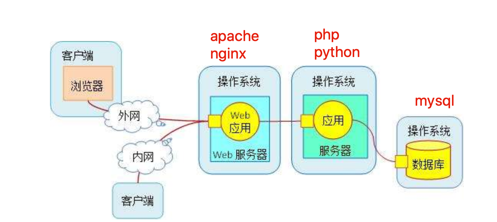

1.用户通过浏览器发送http请求，到达`web服务器（apache或nginx）`

2.web服务器解析用户请求信息，明确他到底要什么，如果是`静态资源请求`，直接通过linux内核读取硬盘上的数据，然后构建响应报文，给与用户。如果`是动态资源请求`，则转发请求给`应用服务器（php,python）`，由php解析动态请求，解析完毕后，返回给apache，发给用户

3.如果涉及数据库操作，利用`php-mysql`驱动，获取数据库数据，再返回给php，最终给与用户


## 搭建LAMP

### 部署linux系统环境

注意关闭防火墙、selinux

```plain
[root@gegelinux ~]# iptables -F
[root@gegelinux ~]# systemctl stop firewalld
[root@gegelinux ~]# systemctl disable firewalld
[root@gegelinux ~]# getenforce
Disabled
```

### 部署apache

```plain
[root@gegelinux ~]# systemctl start httpd 
[root@gegelinux ~]# systemctl status httpd
```

测试apache访问

```
curl 192.168.178.251  
#浏览器访问
```

### 部署mysql（mariadb）

```plain
[root@gegelinux ~]# yum install mariadb-server mariadb 
[root@gegelinux ~]# systemctl start mariadb
```

检查mariadb的数据文件夹，存在mysql.sock文件，表示启动了，以及属主、属组权限

```plain
[root@gegelinux ~]# ls -l /var/lib/mysql/
总用量 28700
-rw-rw----. 1 mysql mysql    16384 2月   3 17:37 aria_log.00000001
-rw-rw----. 1 mysql mysql       52 2月   3 17:37 aria_log_control
-rw-rw----. 1 mysql mysql 18874368 2月   3 17:37 ibdata1
-rw-rw----. 1 mysql mysql  5242880 2月   3 17:37 ib_logfile0
-rw-rw----. 1 mysql mysql  5242880 2月   3 17:34 ib_logfile1
drwx------. 2 mysql mysql     4096 2月   3 17:34 mysql
srwxrwxrwx. 1 mysql mysql        0 2月   3 17:37 mysql.sock
drwx------. 2 mysql mysql     4096 2月   3 17:34 performance_schema
drwx------. 2 mysql mysql        6 2月   3 17:34 test
```

登录mariadb数据库

```plain
[root@gegelinux ~]# mysql -uroot -p
Enter password:
Welcome to the MariaDB monitor.  Commands end with ; or \g.
Your MariaDB connection id is 2
Server version: 5.5.64-MariaDB MariaDB Server
Copyright (c) 2000, 2018, Oracle, MariaDB Corporation Ab and others.
Type 'help;' or '\h' for help. Type '\c' to clear the current input statement.
MariaDB [(none)]>
```

设置mariadb用户root的登录密码

```plain
[root@gegelinux ~]# mysqladmin -uroot password "chaoge666"
再次登录必须输入正确密码
[root@gegelinux ~]# mysql -uroot -pchaoge666
```

### 部署php

```
1.解决php安装的依赖开发环境
  yum install -y zlib-devel libxml2-devel libjpeg-devel libjpeg-turbo-devel libiconv-devel freetype-devel libpng-devel gd-devel libcurl-devel libxslt-devel libtool-ltdl-devel pcre pcre-devel apr apr-devel zlib-devel gcc make -y
2.安装php，以及php连接mysql数据库的驱动
[root@gegelinux ~]# yum install php php-fpm php-mysql -y
3.php不需要额外修改，但是需要修改apache配置文件，支持php
[root@gegelinux ~]# cat /etc/httpd/conf/httpd.conf  #添加如下相关配置
DocumentRoot "/www"
    TypesConfig /etc/mime.types
    AddType application/x-httpd-php  .php
    AddType application/x-httpd-php-source  .phps
    DirectoryIndex  index.php index.html
4.修改首页文件内容
[root@gegelinux ~]# cat /www/index.php
<meta charset=utf8>
我是新的首页，你好兄弟们
<?php
phpinfo();
?>
5.启动php进程
systemctl start php-fpm

# 浏览器访问
```

### 测试php连接mysql

```plain
1.添加php脚本
[root@gegelinux www]# cat /www/gege.php
<?php
     $conn = mysql_connect('localhost','root','chaoge666');
 if ($conn)
   echo "php已成功连接mysql，你真棒";
 else
   echo "你咋回事，这都搞不定，细心检查下吧";
 mysql_close();
?>
```

访问php脚本文件，测试是否能够连接mysql数据库

```
curl ip/gege.php
```


若是关闭了数据库，或者出现其他配置错误问题，

```
[root@gegelinux www]# systemctl stop mariadb
```

## 基于LAMP搭建论坛

Crossday Discuz! Board是一套通用的社区论坛软件系统，用户可以在不需要任何编程的基础上，通过简单的设置和安装，搭建起具备完善功能、很强负载能力和可高度定制的论坛服务。

Discuz! 的基础架构采用世界上最流行的web编程组合PHP+MYSQL实现，是一个经过完善设计，适用于各种服务器环境的高效论坛系统解决方案。

```bash
1.下载discuz源码包
wget http://download.comsenz.com/DiscuzX/3.2/Discuz_X3.2_SC_UTF8.zip
2.安装解压缩命令，解压缩源代码
yum install unzip -y 
[root@gegelinux www]# unzip Discuz_X3.2_SC_UTF8.zip
3.吧解压出的upload文件，拷贝到apache的根目录下
[root@gegelinux www]# mv upload/* .
mv：是否覆盖"./index.php"？ y
4.给与最高权限，便于实验
[root@gegelinux www]# chmod -R 777 /www/*
```

访问apache首页，查看是否进入论坛安装界面

http://192.168.178.252/install/

跟桌步骤一步一步

此时我们基于lamp搭建的个人论坛就好了


# vsftpd

对于使用互联网的用户来说，首要目的就是获取资料，能够获取文件资料的方式有很多，其中一种就是文件传输，如今的互联网机器有各种型号、品牌，类型，如dell、惠普、浪潮、IBM、也分为个人PC、工作站、服务器、大型机、超级计算机等，并且还分为Windows、Linux、Unix、Mac等不同的操作系统。

为了能够在这么多样的机器之间传输文件，FTP（文件传输协议、File Transfer protocol）诞生了。

FTP是一种在互联网中进行文件传输的协议，基于C/S模式，默认服务端口号是20、21

20端口用于数据传输、21端口用于接收客户端的FTP命令与参数。

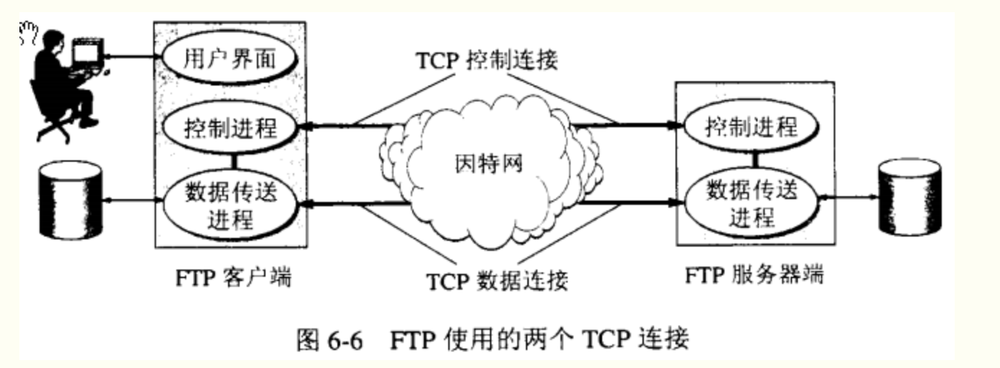

FTP服务器按照FTP协议在互联网上提供文件存储于文件访问的服务

FTP客户端用于向服务器索要资源

FTP工作模式主要分为两种

- 主动模式（PORT）：FTP服务器主动向客户端发起连接请求
- 被动模式（PASV）：FTP服务器等待客户端发起连接请求。

## 安装vsftpd服务

FTP是一种传输协议，实现了这种协议的工具，有一款Linux平台上的程序，名为vsftpd（ver secure ftp daemon，非常安全的FTP守护进程）

```plain
基于centos平台，直接yum安装
[root@gegelinux ~]# yum install vsftpd -y
#注意关闭防火墙规则
iptables -F
```

#### vsftpd配置文件

### 注意配置文件，不得有任何莫名其妙的空格！否则会重启失败

```plain
#过滤出非注释行，非空行
[root@gegelinux ~]# grep -vE '^#|^$' /etc/vsftpd/vsftpd.conf
anonymous_enable=YES  #是否开启匿名用户允许访问
local_enable=YES    #是否允许本地用户登录FTP
write_enable=YES    #write_enable=YES #全局设置，是否容许写入，开启允许上传的权限
local_umask=022     #本地用户上传文件的umask
dirmessage_enable=YES    #允许为目录配置显示信息,显示每个目录下面的message_file文件的内容
xferlog_enable=YES    #开启日志功能，以及存放路径
xferlog_file=/var/log/vsftpd.log  #日志路径
connect_from_port_20=YES    #使用20端口进行连接
xferlog_std_format=YES    #标准日志格式
listen=YES        #绑定到监听端口
listen_ipv6=YES    #开启ipv6
pam_service_name=vsftpd    #设置PAM的名称
userlist_enable=YES    #设置用户已列表，允许或是禁止
tcp_wrappers=YES    #控制主机访问，检查/etc/hosts.allow  hosts.deny的配置达到防火墙作用
```

#### vsftpd服务程序

vsftpd允许用户三种认证的模式登录到FTP服务器。

- 本地用户模式，基于Linux本地账号密码进行认证，配置简单，但是一旦被破解，服务器信息就很危险
- 匿名用户模式，任何人无需密码直接登录
- 虚拟用户模式，单独为FTP创建用户数据库，基于口令验证账户信息，只适用于FTP，不会影响其他用户信息，最为安全。

#### 安装ftp客户端

ftp客户端有多种形式，图形化、命令行

- ftp命令客户端

```plain
ftp> ascii  # 设定以ASCII方式传送文件(缺省值) 
ftp> bell   # 每完成一次文件传送,报警提示. 
ftp> binary # 设定以二进制方式传送文件. 
ftp> bye    # 终止主机FTP进程,并退出FTP管理方式. 
ftp> case   # 当为ON时,用MGET命令拷贝的文件名到本地机器中,全部转换为小写字母. 
ftp> cd     # 同UNIX的CD命令. 
ftp> cdup   # 返回上一级目录. 
ftp> chmod  # 改变远端主机的文件权限. 
ftp> close  # 终止远端的FTP进程,返回到FTP命令状态, 所有的宏定义都被删除. 
ftp> delete # 删除远端主机中的文件. 
ftp> dir [remote-directory] [local-file] # 列出当前远端主机目录中的文件.如果有本地文件,就将结果写至本地文件. 
ftp> get [remote-file] [local-file] # 从远端主机中传送至本地主机中. 
ftp> help [command] # 输出命令的解释. 
ftp> lcd # 改变当前本地主机的工作目录,如果缺省,就转到当前用户的HOME目录. 
ftp> ls [remote-directory] [local-file] # 同DIR. 
ftp> macdef                 # 定义宏命令. 
ftp> mdelete [remote-files] # 删除一批文件. 
ftp> mget [remote-files]    # 从远端主机接收一批文件至本地主机. 
ftp> mkdir directory-name   # 在远端主机中建立目录. 
ftp> mput local-files # 将本地主机中一批文件传送至远端主机. 
ftp> open host [port] # 重新建立一个新的连接. 
ftp> prompt           # 交互提示模式. 
ftp> put local-file [remote-file] # 将本地一个文件传送至远端主机中. 
ftp> pwd  # 列出当前远端主机目录. 
ftp> quit # 同BYE. 
ftp> recv remote-file [local-file] # 同GET. 
ftp> rename [from] [to]     # 改变远端主机中的文件名. 
ftp> rmdir directory-name   # 删除远端主机中的目录. 
ftp> send local-file [remote-file] # 同PUT. 
ftp> status   # 显示当前FTP的状态. 
ftp> system   # 显示远端主机系统类型. 
ftp> user user-name [password] [account] # 重新以别的用户名登录远端主机. 
ftp> ? [command] # 同HELP. [command]指定需要帮助的命令名称。如果没有指定 command，ftp 将显示全部命令的列表。
ftp> ! # 从 ftp 子系统退出到外壳。
```

- FileZilla图形化工具

```plain
安装ftp命令行
yum install ftp -y
```

### 匿名用户模式

匿名用户模式是最不安全的方式，一般用在访问不重要的，允许公开的文件，且放在企业内网环境中，置于防火墙规则下，保证基本的安全性。

vsftpd默认开启了匿名用户模式，修改配置文件，定义匿名用户的权限，如下

```plain
[root@gegelinux ~]# grep '^anon' /etc/vsftpd/vsftpd.conf
anonymous_enable=YES    #允许匿名访问
anon_upload_enable=YES    #允许匿名用户上传
anon_mkdir_write_enable=YES    #允许匿名用户创建目录
anon_other_write_enable=YES    #允许匿名用户修改目录
```

重启服务，且加载开机自启

```plain
[root@gegelinux ~]# systemctl restart vsftpd  #重启服务
[root@gegelinux ~]# systemctl enable vsftpd        #开启自启
```

此时可以使用ftp命令连接到FTP服务器了。

连接了FTP服务端，其实连接的是目录`/var/ftp/`

```plain
[root@gegelinux ftp]# pwd
/var/ftp
[root@gegelinux ftp]# ls
pub
```

使用ftp客户端命令，连接ftp服务端

```plain
[root@gegelinux ~]# ftp 123.206.16.61        #连接ftp服务器的ip地址
Connected to 10.141.32.137 (10.141.32.137).
220 (vsFTPd 3.0.2)
Name (10.141.32.137:root): anonymous        #填入默认的账号
331 Please specify the password.
Password:                                                                #密码为空，直接回车
230 Login successful.
Remote system type is UNIX.
Using binary mode to transfer files.
ftp>
ftp> ls    
227 Entering Passive Mode (10,141,32,137,98,195).
150 Here comes the directory listing.
drwxr-xr-x    2 0        0            4096 Oct 30  2018 pub
226 Directory send OK.
ftp> cd pub        #切换工作目录
250 Directory successfully changed.
ftp> mkdir chaoge                #发现在这里创建文件夹报错了
550 Create directory operation failed.
```

由于我们使用匿名用户登录ftp，默认访问的是/var/ftp文件夹，我们来检查下文件夹权限

```plain
[root@gegelinux ftp]# pwd
/var/ftp
[root@gegelinux ftp]# ll
总用量 4
drwxr-xr-x 2 root root 4096 10月 31 2018 pub
```

由于pub文件夹，属于root用户，因此ftp无法向其写入内容，可以修改文件夹的user、group

```plain
#检查系统用户ftp
[root@gegelinux ftp]# id ftp
uid=14(ftp) gid=50(ftp) 组=50(ftp)
#更改pub的属主
[root@gegelinux ftp]# chown -Rf ftp /var/ftp/pub/        #递归处理所有的文件及子目录  去除错误信息
[root@gegelinux ftp]# ll
总用量 4
drwxr-xr-x 2 ftp root 4096 10月 31 2018 pub
```

再次登录ftp，写入数据

```plain
yumac: ~ yuchao$ftp 123.206.16.61
Connected to 123.206.16.61.
220 (vsFTPd 3.0.2)
Name (123.206.16.61:yuchao): anonymous
331 Please specify the password.
Password:
230 Login successful.
ftp> mkdir chaoge666        #创建文件夹
257 "/pub/chaoge666" created
ftp> rename chaoge666 chaoge888    #重命名文件夹
350 Ready for RNTO.
250 Rename successful.
ftp> rmdir chaoge888        #删除文件夹
250 Remove directory operation successful.
```

此时成功写入了ftp文件夹数据，服务器上检查文件信息

```plain
[root@gegelinux pub]# pwd
/var/ftp/pub
[root@gegelinux pub]# ls
chaoge666
[root@gegelinux pub]# ls
chaoge888
```

### 本地用户模式

使用Linux本地用户模式，比匿名用户来的安全，修改配置文件，关闭匿名模式，开启本地用户模式

相关配置文件

```plain
[root@gegelinux pub]# ls /etc/vsftpd/
ftpusers  user_list  vsftpd.conf  vsftpd_conf_migrate.sh
```

修改配置文件如下/etc/vsftpd/vsftpd.conf

```plain
anonymous_enable=NO    #关闭匿名用户模式
local_enable=YES    #开启本地用户模式
write_enable=YES    #设置可写权限
local_umask=022    #文件umask值
userlist_enable=YES    #启用【禁止登录的用户名单】文件名是，ftpusers，user_list
userlist_deny=YES    #开启禁止登录名单
```

重启vsftpd服务，加载配置

```plain
systemctl restart vsftpd
systemctl enable vsftpd
```

【此时可以使用ftp客户端连接了，使用linux本地用户信息】

假设当前服务器上用户管理中存在一个用户`chaoge`

```plain
[root@gegelinux ~]# grep 'chaoge' /etc/passwd
chaoge:x:2002:2002::/home/chaoge:/bin/bash
```

此时客户端可以使用此用户连接FTP，默认访问的是该用户的家目录，也就是`/home/chaoge文件夹内容`

```plain
yumac: ~ yuchao$ftp 123.206.16.61
Connected to 123.206.16.61.
220 (vsFTPd 3.0.2)
Name (123.206.16.61:yuchao): chaoge
331 Please specify the password.
Password:
230 Login successful.
ftp> ls
200 PORT command successful. Consider using PASV.
150 Here comes the directory listing.
-rw-rw-r--    1 2002     2002           31 Nov 21 01:57 fine.txt
226 Directory send OK.    
ftp> mkdir 哥哥到此一游            #新建文件夹
257 "/home/chaoge/哥哥到此一游" created
```

有些用户是无法登录ftp，是因为vsftp有一个名单，写上了禁止谁登录

```
ftpusers ， user_list
[root@gegelinux vsftpd]# pwd
/etc/vsftpd
[root@gegelinux vsftpd]# ls
ftpusers  user_list  vsftpd.conf  vsftpd_conf_migrate.sh
#文件中写入的名字，都是禁止登录的
[root@gegelinux vsftpd]# cat ftpusers
# Users that are not allowed to login via ftp
root
bin
daemon
adm
lp
sync
shutdown
halt
mail
news
uucp
operator
games
nobody
####如此，禁止登录的用户
yumac: ~ yuchao$ftp 123.206.16.61
Connected to 123.206.16.61.
220 (vsFTPd 3.0.2)
Name (123.206.16.61:yuchao): root
530 Permission denied.
ftp: Login failed.
```

### 虚拟用户模式

了解了有匿名用户、本地用户、再来了解下虚拟用户模式，顾名思义是虚拟创建出的用户，也是最为安全的一种。

首先安装Berkeley DB工具

```plain
yum install db4 db4-utils -y
```

创建用于进行FTP认证的用户数据库，奇数行账户名、偶数行是密码

```plain
[root@gegelinux vsftpd]# cat ftp_user.txt
chaoge
666
pyyu
888
```

由于这样的明文信息很不安全，vsftpd也无法加载该格式的数据，因此还得用db_load命令对`ftp_user.txt`文件数据加密，且设置权限使得普通用户无权限查阅。

```plain
#创建加密文件  -T 和-t参数必须加上，用于转化普通文本为vsftpd识别的数据库文件
[root@gegelinux vsftpd]# db_load -T -t hash -f /etc/vsftpd/ftp_user.txt /etc/vsftpd/ftp_user.db
#检查文件属性
[root@gegelinux vsftpd]# file ftp_user.db
ftp_user.db: Berkeley DB (Hash, version 9, native byte-order)
#降低文件权限
[root@gegelinux vsftpd]# ll ftp_user.db
-rw-r--r-- 1 root root 12288 1月   8 09:36 ftp_user.db
[root@gegelinux vsftpd]# chmod 600 ftp_user.db
[root@gegelinux vsftpd]# ll ftp_user.db
-rw------- 1 root root 12288 1月   8 09:36 ftp_user.db
#删除旧的数据文件
[root@gegelinux vsftpd]# rm -rf ftp_user.txt
```

创建当虚拟用户登录后默认访问的文件夹路径，且和linux中的一个本地用户做一个映射关系，防止`匿名用户登录后，创建了文件夹，但是系统没有此用户报错权限问题`

```plain
#新建一个用户，指定用户家目录，且禁止登录
useradd -d /var/ftpdir -s /sbin/nologin virtual_chao
#检查此ftpdir的属性
[root@gegelinux vsftpd]# ls -ld /var/ftpdir/
drwx------ 2 virtual_chao virtual_chao 4096 1月   8 09:46 /var/ftpdir/
#更改文件夹权限
[root@gegelinux vsftpd]# chmod -Rf 755 /var/ftpdir/
#添加virtual_chao用户至ftpusers禁止用户登录文件，增大系统安全，但是不会影响虚拟用户登录
[root@gegelinux vsftpd]# echo 'virtual_chao' >> ftpusers
```

此时需要创建支持虚拟用户的PAM文件，PAM是一组安全机制的模块，编辑认证文件`/etc/pam.d/vsftpd`

```plain
#注释掉文中所有语句，添加以下2句，注意db参数指定的是db_load生成的文件路径，无需添加后缀
[root@gegelinux pam.d]# cat /etc/pam.d/vsftpd
auth required pam_userdb.so db=/etc/vsftpd/ftp_user
account required pam_userdb.so db=/etc/vsftpd/ftp_user
```

最后修改vsftpd配置文件

```plain
[root@gegelinux pam.d]# grep -Ev '^$|^#' /etc/vsftpd/vsftpd.conf
anonymous_enable=NO     #禁止匿名模式
local_enable=YES        #允许本地用户
write_enable=YES    
local_umask=022
anon_upload_enable=YES
anon_mkdir_write_enable=YES
anon_other_write_enable=YES
dirmessage_enable=YES
xferlog_enable=YES
connect_from_port_20=YES
xferlog_std_format=YES
listen=NO
listen_ipv6=YES
pam_service_name=vsftpd        #指定PAM认证文件
userlist_enable=YES
userlist_deny=YES
tcp_wrappers=YES
guest_enable=YES        #开启虚拟用户
guest_username=virtual_chao        #指定虚拟用户账号
allow_writeable_chroot=YES      #如果用户被限制只能在其家目录，允许用户可以对家目录写入数据
```

【针对不同的虚拟用户设置不同的权限】

用户ftp认证的虚拟账号，ftp_user.txt

- chaoge，允许上传，新建，修改，查看，删除权限
- pyyu，只读权限

这样的需求可以通过vsftpd配置实现，定义`user_config_dir`参数实现不同的虚拟用户，不同的权限配置

```plain
#新建管理虚拟用户权限的文件夹
mkdir /etc/vsftpd/virtual_user_dir
#进入文件夹，创建权限的配置文件
[root@gegelinux vsftpd]# cd /etc/vsftpd/virtual_user_dir/
[root@gegelinux virtual_user_dir]# cat chaoge
anon_upload_enable=YES
anon_mkdir_write_enable=YES
anon_other_write_enable=YES
#再创建一个pyyu文件，禁止写入
[root@gegelinux virtual_user_dir]# pwd
/etc/vsftpd/virtual_user_dir
[root@gegelinux virtual_user_dir]# ls
chaoge  pyyu
[root@gegelinux virtual_user_dir]# cat pyyu
anon_upload_enable=NO
anon_mkdir_write_enable=NO
anon_other_write_enable=NO
```

编辑vsftpd主配置文件，添加如下一行

```plain
cat /etc/vsftpd/vsftpd.conf
user_config_dir=/etc/vsftpd/virtual_user_dir
```

重启vsftpd服务，注意配置文件，不得有任何莫名其妙的空格！否则会重启失败

```plain
systemctl restart vsftpd
```

【此时使用客户端登录用户chaoge，进行读写】

```plain
yumac: ~ yuchao$ftp 123.206.16.61
Connected to 123.206.16.61.
220 (vsFTPd 3.0.2)
Name (123.206.16.61:yuchao): chaoge    #用匿名用户登录chaoge
331 Please specify the password.
Password:
230 Login successful.
ftp> ls            #此时看到的是匿名用户映射的家目录内容
200 PORT command successful. Consider using PASV.
150 Here comes the directory listing.
-rw-r--r--    1 0        0               0 Jan 08 02:49 haha
226 Directory send OK.
ftp> mkdir 哥哥到此一游        #chaoge有权限增加文件
257 "/哥哥到此一游" created
#####检查服务器上的FTP目录
[root@gegelinux ftpdir]# pwd
/var/ftpdir
[root@gegelinux ftpdir]# ls
haha  哥哥到此一游
```

【使用pyyu用户登录ftp服务端，查看是否能够读写】

```plain
yumac: ~ yuchao$ftp 123.206.16.61
Connected to 123.206.16.61.
220 (vsFTPd 3.0.2)
Name (123.206.16.61:yuchao): pyyu
331 Please specify the password.
Password:
230 Login successful.
ftp> mkdir pyyu也想到此一游                #无法写入数据，只能读取
550 Permission denied.
ftp> ls
200 PORT command successful. Consider using PASV.
150 Here comes the directory listing.
-rw-r--r--    1 0        0               0 Jan 08 02:49 haha
drwx------    2 2003     2003         4096 Jan 08 02:50 哥哥到此一游
226 Directory send OK.
```


# nfs

已知samba主要用于linux与windows之间共享文件夹

那用于Linux之间进行文件共享则是用NFS服务（Network FileSystem）

目的在于让不同的机器，不同的操作系统可以彼此分享各自的文件数据。

NFS服务可以将远程Linux系统上的文件共享资源挂载到本地机器的目录上。

NFS很像Windows系统的网络共享、安全功能、网络驱动器映射，这也和Linux系统的samba服务类似。

一般情况下，Windows网络共享服务或samba服务用语办公局域网共享，而中小型网站集群架构后端通常用NFS数据共享，如果大型网络集群，还会用更复杂的文件系统，如GlusterFS、FastDFS等。

NFS系统已有30年发展历史，代表了一个稳定的网络文件系统，具备可扩展，高性能等特点。

由于网络速度的加快和延迟的减少，NFS系统一直是通过网络提供文件系统的不错的选择，特别是在中小型互联网企业用的广泛。

## NFS在企业的应用架构

在企业集群架构的工作场景中，NFS网络文件系统一般被用来存储共享视频、图片、静态文件，通常网站用户上传的文件也都会放在NFS共享里，例如BBS产品(论坛)产生的图片、附件、头像等，然后前端所有的节点访问静态资源时都会读取NFS存储上的资源。

阿里云等公有云平台的NAS就是云版的NFS服务应用。


在企业架构集群中，如图就是NFS系统工作位置，NFS作为所有前端服务的共享存储，存储内容包括用户上传的图片，附件，头像等，注意网站后端代码等重要数据不得放在NFS共享。

## 企业生产集群为什么需要共享存储

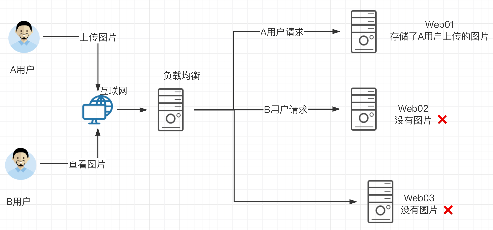

先看一下如果没有共享存储的问题

A用户上传图片到web01服务器，然后用户B访该图片，结果B的请求被负载均衡分发到了Web02，但是由于没有配置共享存储，web02没有该图片，导致用户B看不到该资源，用户心理很不爽呀。

那么如果配置了共享存储，无论A用户上传的图片是发给了web01还是其他，最终都会存储到共享存储上，用户B再访问该图片的时候，无论请求被负载均衡发给了web01、web02、web03最终都会去共享存储上寻找资源，这样也就能够访问到资源了。

这个共享存储对于中小企业，也就是使用服务器配置NFS网络文件共享系统实现。

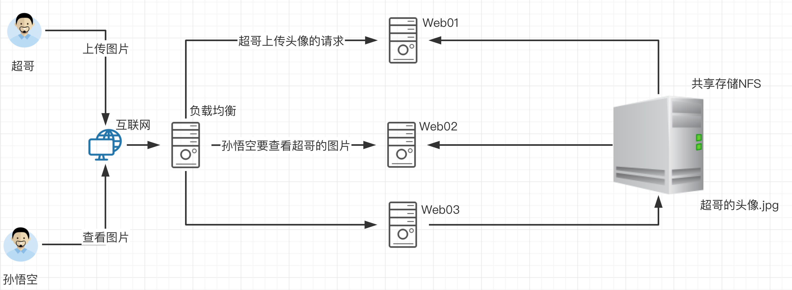

中小型互联网企业一般不会购买硬件存储，成本过高，大公司由于业务发展快，需要购买硬件存储分散网站的压力，但是网站的并发压力如果继续增长，硬件设备的扩展就会费劲，且金钱成本翻倍增长。

因此企业也就采用了开源的软件技术替换硬件设备，如用Lvs+Haproxy替换了NetScaler负载均衡设备。

## NFS工作原理

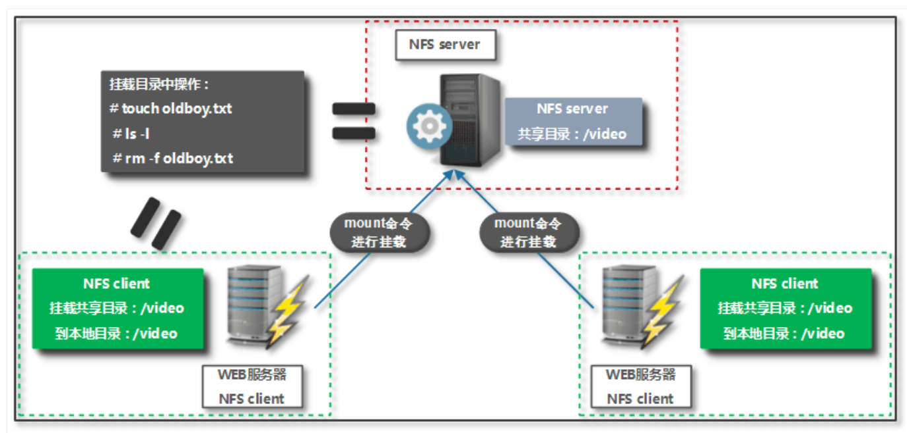

如图是企业中NFS服务器和客户端的挂载结构

1.在NFS服务端设置一个共享的目录/video，其他有权限访问NFS服务器的客户端都可以吧该目录/video挂载到本地客户端的某个挂载点（挂载点就是一个目录，可以自由定义路径）

客户端正确挂载完毕后，进入NFS客户端的挂载点，也就能够看到NFS服务端的/video共享目录下的数据。在客户端查看时，NFS服务端/video的目录数据就相当于本地一个目录而已，根本察觉不到任何区别。

## NFS与RPC原理

我们已知NFS是通过网络来进行数据传输（网络文件系统），因此NFS会使用一些port来传输数据，但是NFS在传输数据的时，使用的端口是随机选择（可以重启NFS服务查看端口）。

既然NFS是随机端口选择（好比银行的取钱窗口总发生变化，你知道几号窗口是取钱业务吗？）那么NFS在传输数据的时候，怎么知道NFS服务器使用的端口是哪个呢？

答案就是NFS使用的RPC（Remote Procedure Call，就是远程过程调用）协议来实现的。

### 什么是RPC

NFS服务就是使用RPC协议的帮忙，RPC服务实现的功能是记录每个NFS功能对应的端口号，并且在NFS客户端发出请求的时候，把该功能和对应的端口信息传递给发出请求的NFS客户端，保证客户端能够正确的连接到NFS的端口，达到数据传输的目的。RPC就好比是一个中介，处在客户端、服务端之间。


这就好比哥哥要租房，此时哥哥就是一个`NFS客户端`，中介来介绍房子信息，中介就好比RPC服务，房源拥有者也就相当于NFS服务端，提供数据的，中介手里必须得先储备好房东的信息，才能给房源信息转达给租客。

那么RPC服务又是如何知道每个NFS的端口呢？（中介如何知道房东的具体信息呢？）

当NFS服务器启动时会随机采用若干端口，并且主动在RPC服务中注册相关端口以及功能信息。

如此一来RPC服务就知道NFS服务对应的端口功能了，RPC服务默认使用固定111端口来监听NFS客户端提交的请求，并将正确的NFS端口信息回复给NFS客户端，这样，NFS客户端就可以和NFS服务器进行数据通信了。


### RPCBIND服务

在启动NFS服务端之前，必须先启动RPC服务，在centos7服务器下为rpcbind服务，否则NFSserver无法向RPC注册信息了。另外如果RPC服务重启，原来注册的NFS服务端信息也就失效了，也必须重启服务，再次注册信息给RPC服务。

特别要注意的是，修改NFS配置文件后不需要重启NFS，只需要执行`exportfs -rv` 命令即可或是`systemctl reload nfs`

### NFS工作原理


当访问程序通过NFS客户端向NFS服务器端存储文件时，其数据请求流程如下：

1.用户访问网站程序，由程序在NFS客户端上发出存取文件的请求，此时NFS客户端（执行程序的机器）的RPC服务（rpcbind）就会通过网络向NFS服务器的RPC服务的111端口发出NFS文件存取功能的请求。

2.NFS服务器RPC找到对应注册的NFS端口，通知NFS客户端RPC服务

3.此时NFS客户端获取到正确的端口，并与NFS daemon联机存取数据

4.NFS客户端把数据存取成功后返回给前端程序，告知用户存取结果，完成一次存取请求。

这也就证明，必须先启动RPC服务，再启动NFS服务的步骤。

## 安装配置NFS

### NFS软件列表

安装nfs服务，需要安装如下软件包

- nfs-utils：NFS服务的主程序，包括了rpc.nfsd、rpc.mountd这两个守护进程以及相关文档，命令
- rpcbind：是centos7/6环境下的RPC程序

```plain
1.检查默认NFS软件安装情况
[root@gegelinux ~]# rpm -qa nfs-utils rpcbind
rpcbind-0.2.0-48.el7.x86_64
nfs-utils-1.3.0-0.65.el7.x86_64
2.安装软件包命令
yum install nfs-utils rpcbind -y
```

### 【环境配置】

NFS也是C/S模式，准备一个NFS服务端，一个NFS客户端，两台linux机器

在Server机器上创建用于NFS文件共享的文件夹，且设置好权限

```plain
[root@gegelinux chaoge]# mkdir /nfsShare
[root@gegelinux chaoge]# chmod -Rf 777 /nfsShare/
```

### 【修改NFS服务的配置文件】

默认配置文件路径是`/etc/exports`

```plain
exports配置文件语法
NFS共享目录  NFS客户端地址(参数1、参数2...) 客户点地址2（参数1、参数2...）
例如
/        master(rw)  master2(rw,no_root_squash)
/pub   *(rw)
/home/chao   123.206.16.61(ro)
```

【nfs语法参数解释】

```plain
1.NFS共享目录：为NFS服务器要共享的实际目录，必须绝对路径，注意目录的本地权限，如果要读写共享，要让本地目录可以被NFS客户端的(nfsnobody)读写
2.NFS客户端地址，也就是NFS服务器端授权可以访问共享目录的客户端地址，详见下表
3.权限参数，对授权的NFS客户端访问权限设置，见下表
```

【NFS客户端地址配置说明】

| 客户端地址         | 具体地址         | 说明                                            |
| ------------------ | ---------------- | ----------------------------------------------- |
| 单一客户端         | 192.168.178.142  | 用的少                                          |
| 整个网段           | 192.168.178.0/24 | 24表示子网掩码255.255.255.0，指定网段，用的较多 |
| 授权域名客户端     | nfs.chaoge.com   | 弃用                                            |
| 授权整个域名客户端 | *.chaoge.com     | 弃用                                            |

### 配置案例

1.案例一

```plain
#修改nfs配置文件为如下示例
[root@gegelinux nfsShare]# cat /etc/exports
/nfsShare *(insecure,rw,sync,root_squash)
#表示共享该文件夹，且提供给所有网段的机器可访问，配置规则是，可读写，数据同步写入到磁盘，把root管理员映射为本地的匿名用户，insecure是客户端从大于1024的端口发送链接
```

2.案例二

```plain
/home/chaoge   192.168.178.0/24(ro)
只读共享，例如一些生成服务器的日志目录，又不想给开发服务器的权限，可以用此办法，共享目录给他人只读查看
```

### 配置参数解释

```plain
ro 只读
rw 读写
root_squash 当nfs客户端以root访问时，它的权限映射为NFS服务端的匿名用户，它的用户ID/GID会变成nfsnobody
no_root_squash 同上，但映射客户端的root为服务器的root，不安全，避免使用
all_squash 所有nfs客户端用户映射为匿名用户，生产常用参数
sync 数据同步写入到内存与硬盘，优点数据安全，缺点性能较差
async 数据写入到内存，再写入硬盘，效率高，但可能内存数据会丢
```

### 启动NFS服务端

NFS服务都是基于RPC协议通信的默认端口是111，要确保系统运行了rpcbind服务

要注意的是`rpcbind服务`即使停止，111端口也不会挂掉，因为还有`rpcbind.socket`服务

```plain
[root@gegelinux ~]# systemctl status rpcbind
● rpcbind.socket - RPCbind Server Activation Socket
   Loaded: loaded (/usr/lib/systemd/system/rpcbind.socket; enabled; vendor preset: enabled)
   Active: active (running) since 二 2020-03-10 10:59:12 CST; 4h 35min ago
   Listen: /var/run/rpcbind.sock (Stream)
           0.0.0.0:111 (Stream)
           0.0.0.0:111 (Datagram)
3月 10 10:59:12 gegelinux systemd[1]: Listening on RPCbind Server Activation Socket.
# 启动rpcbind服务
systemctl restart rpcbind
#启动
systemctl restart nfs-server
```

## 配置NFS服务端过程

创建共享目录且设置权限

```plain
1.确保RPC服务启动了
systemctl start rpcbind
2.创建需要共享的目录，以及资料，并且授权
mkdir -p /nfs_data
touch /nfs_data/好嗨哦.txt  
3.修改文件夹的user，group，这里更换权限是防止NFS客户端无法写入数据，当然也可以修改服务端目录777权限，但是不安全，不推荐
chown -R nfsnobody.nfsnobody  /nfs_data/
4.上一步修改的用户是nfs的匿名用户
[root@gegelinux ~]# grep nfsnobody /etc/passwd
nfsnobody:x:65534:65534:Anonymous NFS User:/var/lib/nfs:/sbin/nologin
```

配置NFS服务端配置文件，并且查看挂载情况

```plain
1.编辑配置文件，写入如下挂载参数
[root@gegelinux ~]# cat /etc/exports
/nfs_data *(insecure,rw,sync)
2.重新加载nfs服务
systemctl reload nfs
3.查看NFS服务端挂载情况
[root@gegelinux ~]# showmount -e
Export list for gegelinux:
/nfs_data *
4.查看NFS服务端挂载默认的参数，如下大多数参数都是默认的，不做过多了解
[root@gegelinux ~]# cat /var/lib/nfs/etab
/nfs_data    *(rw,sync,wdelay,hide,nocrossmnt,secure,root_squash,no_all_squash,no_subtree_check,secure_locks,acl,no_pnfs,anonuid=65534,anongid=65534,sec=sys,rw,secure,root_squash,no_all_squash)
5.把本地机器当做客户端做一个简单的挂载测试
[root@gegelinux ~]# mount -t nfs 123.206.16.61:/nfs_data /mnt
[root@gegelinux ~]#
[root@gegelinux ~]#
# 发现已经可以查看到挂载目录的数据
[root@gegelinux ~]# ls /mnt/
好嗨哦.txt
# 检查挂载情况
[root@gegelinux ~]# df -h |tail -1
123.206.16.61:/nfs_data   50G   22G   26G   47% /mnt
[root@gegelinux ~]# mount |tail -1
123.206.16.61:/nfs_data on /mnt type nfs4 (rw,relatime,vers=4.1,rsize=262144,wsize=262144,namlen=255,hard,proto=tcp,timeo=600,retrans=2,sec=sys,clientaddr=10.141.32.137,local_lock=none,addr=123.206.16.61)
至此NFS服务端挂载成功，配置完毕
```

注意：

- `/etc/exports文件的语法不要写错，细心`
- 修改/etc/exports文件后，注意要重启`systemctl reload nfs`或是`exportfs -r`重新加载配置，无需重启

## NFS客户端

在另一台linux机器上连接nfs服务端

```plain
[root@web01 ~]# yum install nfs-utils rpcbind -y  #安装操作nfs的命令套件
# 确保rpcbind服务正常
systemctl status rpcbind
# 检查远程挂载情况，需要服务端防火墙关闭，或是配置了规则
[root@chaoge_linux mnt]# showmount -e 123.206.16.61
Export list for 123.206.16.61:
/nfs_data *
#以nfs协议挂载
[root@chaoge_linux ~]# mount -t nfs 123.206.16.61:/nfs_data /mnt
```

此时进入挂载的目录，查看远程NFS服务端的文件夹资料

```plain
[root@chaoge_linux ~]# cd /mnt
[root@chaoge_linux mnt]# ls
好嗨哦.txt
```

## 如果出现挂载异常

- 检查配置笔记，是否有出错
- 注意防火墙问题

## 配置开机自动挂载，每次开机都能使用nfs

将挂载命令写入到`/etc/fstab`文件

```plain
[root@web01 nfsShare]# tail -1 /etc/fstab
123.206.16.61:/nfsShare /nfsShare nfs defaults 0 0
```

## Autofs自动挂载服务

【为什么要用autofs】

Linux的mount命令用于挂载文件系统

对于`本地固定`的设备，例如硬盘分区可以使用mount进行挂载

```plain
[root@gegelinux nfsShare]# mount -l |grep ext4
/dev/vda1 on / type ext4 (rw,noatime,data=ordered)
```

在`/etc/fstab`文件中，如果定义了过多的自动挂载配置，无疑都会随着服务器开机而进行挂载，但是这些挂载后的资源，我们都一定会使用吗？如果不用则会给服务器造成硬件资源压力，以及网络带宽压力。

因此一些具有`动态特性`的文件系统，如`光盘、软盘、U盘、甚至NFS、SMB`等文件系统，特点是当需要，且使用的时候才有必要挂载。

当光盘或是U盘需要使用的时候，我们即可插入服务器，进行相应的挂载即可，但是NFS或SMB这样的远程共享，我们就不一定知道何时使用，进行挂载，何时不用，也不造成资源浪费。

【autofs特点】

Autofs和mount的不同点在于，Autofs是一种守护进程。它在后台检测用户是否要访问一个还没有挂载的文件系统，autofs会自动检查该文件系统是否存在，存在则自动挂载。

且autofs检测到已经挂载的文件系统有一段时间没用，则会自动将其卸载，省去了人力维护挂载设备的成本，以及不会造成服务器资源浪费。

【autofs的缺点】

autofs特点是只有用户请求时才执行挂载，所以当高并发访问时，开始请求的瞬间需要执行挂载，性能较差，因此在高并发业务场景下，宁愿保持挂载也不使用autofs自动挂载。

### 安装autofs

我们应该是在`需要挂载`的那台机器执行

```plain
[root@gegelinux nfsShare]# yum install autofs -y
```

【修改autofs配置文件】

autofs配置文件以`挂载点 子配置文件`的格式填写

```plain
#默认的配置文件如下
[root@web01 ~]# grep -v '^#' /etc/auto.master
# 定义了一个挂载点是/misc ，需要在auto.misc文件中定义挂载动作
/misc    /etc/auto.misc  
/net    -hosts
+dir:/etc/auto.master.d
+auto.master
```

**添加nfs自动挂载配置，添加一行配置，改为如下**

```plain
[root@web01 ~]# grep -v '^#' /etc/auto.master
/misc    /etc/auto.misc
/- /etc/auto.home  #添加了这里，需要创建auto.home配置文件
/net    -hosts
+dir:/etc/auto.master.d
+auto.master
```

接着就是定义子配置文件的内容了。

```plain
[root@web01 home]# cat /etc/auto.home
/var/autofs  -rw,soft,intr 123.206.16.61:/nfsShare
```

此时检查系统文件系统情况（检查挂载情况）

```plain
#此时并没有/var/autofs文件系统的挂载数据
[root@web01 home]# df -hT
Filesystem     Type      Size  Used Avail Use% Mounted on
devtmpfs       devtmpfs  1.9G     0  1.9G   0% /dev
tmpfs          tmpfs     1.9G   16K  1.9G   1% /dev/shm
tmpfs          tmpfs     1.9G  532K  1.9G   1% /run
tmpfs          tmpfs     1.9G     0  1.9G   0% /sys/fs/cgroup
/dev/vda1      ext4       50G   30G   17G  65% /
tmpfs          tmpfs     380M     0  380M   0% /run/user/0
```

启动autofs

```plain
systemctl restart autofs
systemctl enable autofs
```

**当我们进入了/var/autofs，autofs服务会自动检测，且自动挂载**

```plain
[root@web01 autofs]# pwd
/var/autofs
[root@web01 autofs]# ls
haha  哥哥带你学autofs  哥哥带你学nfs
[root@web01 autofs]# df -hT
Filesystem              Type      Size  Used Avail Use% Mounted on
devtmpfs                devtmpfs  1.9G     0  1.9G   0% /dev
tmpfs                   tmpfs     1.9G   16K  1.9G   1% /dev/shm
tmpfs                   tmpfs     1.9G  532K  1.9G   1% /run
tmpfs                   tmpfs     1.9G     0  1.9G   0% /sys/fs/cgroup
/dev/vda1               ext4       50G   30G   17G  65% /
tmpfs                   tmpfs     380M     0  380M   0% /run/user/0
123.206.16.61:/nfsShare nfs4       50G   16G   31G  35% /var/autofs
```


大功告成，我们可以设置，多少秒不使用之后，自动取消挂载

```plain
[root@web01 ~]# cat /etc/autofs.conf |grep -i "timeout ="
timeout = 10
```


# samba


我们所了解过的FTP文件传输，的确可以让不同主机之间进行文件传输，此方式特点是`传输文件`，用户想要在客户端直接修改服务器的数据，还是较为麻烦。

既然如此，Linux上有一款应用叫做Samba，是一个能让Linux系统应用微软网络通讯协议的软件。

微软为了解决局域网的文件共享，制定了SMB协议，也就是（Server Messages Block，服务器消息块），后来SMB通信协议应用到了Linux系统上，就形成了现在的`Samba软件`。

- Samba最大的功能就是可以用于Linux与windows系统直接的文件共享和打印共享
- Samba既可以用于windows与Linux之间的文件共享
- 也可以用于Linux与Linux之间的资源共享
- 由于NFS(网络文件系统）可以很好的完成Linux与Linux之间的数据共享
- 因而 Samba较多的用在了Linux与windows之间的数据共享上面。

## 安装Sumba服务

```plain
#安装samba
[root@gegelinux ftpdir]# yum install samba -y
#默认主配置文件
[root@gegelinux ftpdir]# cat /etc/samba/smb.conf -n
```

## Samba配置文件核心参数

smb的配置文件如下

```plain
[root@gegelinux ftpdir]# ls /etc/samba/
lmhosts  smb.conf  smb.conf.example
```

`smb.sonf.example`配置样例文件，里面有关于配置Samba服务器样例

smb的配置文件，主要分为`全局配置`和`共享配置`

- [global] 全局
- 共享

- - [home]
  - [printers]

【全局配置】

```plain
workgroup = MYGROUP
Samba服务器加入的工作组名，一个局域网内，必须有相同的工作组名。
server string = Samba Server Version %v
Samba服务器注释，可以不选，%v代表显示Samba版本号
netbios name = samba
主机NetBIOS名
netbios name = samba
主机NetBIOS名
interfaces = lo eth0
设置Samba服务器端监听网卡，可以写网卡名称或者IP地址
hosts allow/deny = 10.10.10.1 
允许连接到Samba server客户端IP，多个参数用空格分开。可以用一个IP表示，也可以用一个网段表示。
max connections = 0
用来指定连接Samba server服务器最大连接数如果操作则连接请求被拒绝。0表示不限制。
deadtime = 0
来设置断掉一个没有任何文件的链接时间。单位十分钟，0代表Samba server不自动断开任何连接
time server = yes/no
用来设置让nmdb成为Windows客户端的时间服务器
log file = /var/log/samba/%m.log
设置Samba server日志文件存储位置和日志名称。文件后面加一个%m（主机名），每个主机都会有一个主机名.log日志文件
max log size = 50
限制每个日志文件的最大容量为50KB，0代表不限制
Security = user
设置客户端访问Samba服务器的验证方式，Samba4版本已经不使用share和server方式，这里不介绍
1) user:Samba用户名和密码登录
2) domain：添加Samba服务器到N域，由NT与控制起来进行身份验证。域安全级别，使用主域控制器（PDC）来完成认证
passdb backend = tdbsam
后台管理用户密码方式
1）smbpasswd：该方式是使用smb自己的工具smbpasswd来给系统用户
2）tdbsam：该方式则是使用一个数据库文件来建立用户数据库。
3）ldapsam：该方式则是基于LDAP的账户管理方式来验证用户。
smb passwd file = /etc/samba/smbpasswd
用来定义samba用户的密码文件。smbpasswd文件如果没有那就要手工新建。
username map = /etc/samba/smbusers
用来定义用户名映射，比如可以将root换administrator、admin等。
guest account = nobody
用来设置guest用户名。
socket options = TCP_NODELAY SO_RCVBUF=8192 SO_SNDBUF=8192
用来设置服务器和客户端之间会话的Socket选项，可以优化传输速度
load printers = yes/no
设置是否在启动Samba时就共享打印机。
```

【共享参数】

```plain
comment = 任意字符串
comment是对该共享的描述，可以是任意字符串。
browseable = yes/no
browseable用来指定该共享是否可以浏览。
path = 共享目录路径
path用来指定共享目录的路径。
writable = yes/no
用来指定该共享路径是否可写
invalid users = 禁止访问该共享的用户
invalid users用来指定不允许访问该共享资源的用户。
例如：invalid users = root，@bob（多个用户或者组中间用逗号隔开。）
public = yes/no
用来指定该共享是否允许guest账户访问。
guest ok = yes/no
用来指定该共享是否允许guest账户访问。
```

## 配置共享资源

samba的配置文件，全局配置参数是针对整体的资源共享设置，生效于每一个独立的共享资源。

区域配置参数可以设置单独的共享资源，仅仅对该资源有效。

```plain
#修改smb.conf如下，添加以下参数
[chaoge]
comment = This is test configure
path = /home/chaoge
public = no
writable = yes
guest ok = yes
```

### pdbedit命令

pdbedit是samba的用户管理命令

语法

```plain
pdbedit -a username：新建Samba账户。
pdbedit -r username：修改Samba账户。
pdbedit -x username：删除Samba账户。
pdbedit -u, --user=USER      use username
pdbedit -L：列出Samba用户列表，读取passdb.tdb数据库文件。
pdbedit -Lv：列出Samba用户列表详细信息。
pdbedit -c “[D]” -u username：暂停该Samba用户账号。
pdbedit -c “[]” -u username：恢复该Samba用户账号。
```

创建用于访问samba共享资源的账户信息

**注意samba创建的用户数据库必须在当前系统中存在**

```plain
[root@gegelinux samba]# id chaoge
uid=2002(chaoge) gid=2002(chaoge) 组=2002(chaoge)
[root@gegelinux samba]# pdbedit -a -u chaoge
new password:
retype new password:
Unix username:        chaoge
NT username:
Account Flags:        [U          ]
User SID:             S-1-5-21-4265721185-3061822781-1370749960-1000
Primary Group SID:    S-1-5-21-4265721185-3061822781-1370749960-513
Full Name:
Home Directory:       \\gegelinux\chaoge
HomeDir Drive:
Logon Script:
Profile Path:         \\gegelinux\chaoge\profile
Domain:               gegelinux
Account desc:
Workstations:
Munged dial:
Logon time:           0
Logoff time:          三, 06 2月 2036 23:06:39 CST
Kickoff time:         三, 06 2月 2036 23:06:39 CST
Password last set:    三, 08 1月 2020 14:35:13 CST
Password can change:  三, 08 1月 2020 14:35:13 CST
Password must change: never
Last bad password   : 0
Bad password count  : 0
Logon hours         : FFFFFFFFFFFFFFFFFFFFFFFFFFFFFFFFFFFFFFFFFF
[root@gegelinux samba]#
```

此时检查用于共享的资源目录，注意权限

```plain
[root@gegelinux samba]# ll /home/chaoge/
总用量 8
-rw-rw-r-- 1 chaoge chaoge   31 11月 21 09:57 fine.txt
drwxr-xr-x 2 chaoge chaoge 4096 1月   8 09:24 哥哥到此一游
```

重启smb服务，注意防火墙，是否允许smb的端口

```plain
systemctl restart smb
#检查端口运行情况
[root@gegelinux ~]# netstat -tunlp|grep smb
tcp        0      0 0.0.0.0:445             0.0.0.0:*               LISTEN      2545/smbd
tcp        0      0 0.0.0.0:139             0.0.0.0:*               LISTEN      2545/smbd
tcp6       0      0 :::445                  :::*                    LISTEN      2545/smbd
tcp6       0      0 :::139                  :::*                    LISTEN      2545/smbd
```

### 【此时进行远程连接】

可以自由选择windows或是mac，进行远程连接

mac中点击【连接服务器】

win中选择【运行】【填入smb服务器地址】

第一步：

前往文件。。。  连接服务器

第二步：

输入地址  smb://ip

第三步：

输入smb用户的账户密码

第四步： 选择 装载 确认

第五步：

此时可以访问共享文件夹了`/home/gege`


# iptables

## 防火墙是什么

防火墙好比一堵真的墙，能够隔绝些什么，保护些什么。

防火墙的本义是指古代构筑和使用木制结构房屋的时候，为防止火灾的发生和蔓延，人们将坚固的石块堆砌在房屋周围作为屏障，这种防护构筑物就被称之为“防火墙”。其实与防火墙一起起作用的就是“门”。

如果没有门，各房间的人如何沟通呢，这些房间的人又如何进去呢？当火灾发生时，这些人又如何逃离现场呢？

这个门就相当于我们这里所讲的防火墙的“安全策略”，所以在此我们所说的防火墙实际并不是一堵实心墙，而是带有一些小孔的墙。

这些小孔就是用来留给那些允许进行的通信，在这些小孔中安装了过滤机制，就是防火墙的过滤策略了。

## 防火墙的作用

防火墙具有很好的保护作用。入侵者必须首先穿越防火墙的安全防线，才能接触目标计算机。

## 防火墙的功能

防火墙对流经它的网络通信进行扫描，这样能够过滤掉一些攻击，以免其在目标计算机上被执行。防火墙还可以关闭不使用的端口。而且它还能禁止特定端口的流出通信。

最后，它可以禁止来自特殊站点的访问，从而防止来自不明入侵者的所有通信。

## 防火墙概念

防火墙一般有硬件防火墙和软件防火墙

硬件防火墙：在硬件级别实现部分防火墙功能，另一部分功能基于软件实现，性能高，成本高。

软件防火墙：应用软件处理逻辑运行于通用硬件平台之上的防火墙，性能低，成本低。

## 软件防火墙

Linux提供的软件防火墙，名为`iptables`，它可以理解为是一个客户端代理，通过`iptables`的代理，将用户配置的安全策略执行到对应的`安全框架`中，这个安全框架称之为`netfilter`。

iptables是一个命令行的工具，位于用户空间，我们用这个工具操作真正的框架，也就是netfilter

真正实现流量过滤的防火墙框架是`netfilter`，位于内核空间，它俩共同组成了Linux的软件防火墙，一般用来代替昂贵的硬件防火墙，实现数据包过滤，网络地址转换等。

*在Centos7发行版本下，firewalld防火墙又取代了iptables防火墙*

```plain
iptables是将配置好的规则交给内核层的netfilter网络过滤器来处理
filrewalld服务是将配置好的防火墙规则交给内核层的nftables网络过滤器处理
这俩工具二选一即可，都只是命令行工具，
```

### iptables

iptables就是按照规则办事的，（rules）规则就是运维事先定义好的规则。

```plain
[root@gegelinux tmp]# iptables -L
Chain INPUT (policy ACCEPT)
target     prot opt source               destination
Chain FORWARD (policy ACCEPT)
target     prot opt source               destination
Chain OUTPUT (policy ACCEPT)
target     prot opt source               destination
```

iptables会从上至下的读取防火墙规则，找到匹配的规则后，就结束匹配工作，并且执行对应的动作。

如果读取所有的防火墙规则都没有符合的，就执行默认的规则。

规则一般两种：允许、拒绝。

- 当默认策略是全部拒绝的时候，就要设置一些允许流量通过的规则，否则就全部禁止了
- 当默认策略是全部允许的时候，就得设置一些拒绝的规则，否则机器就没安全可言了

规则就存储在内核空间的信息包过滤表中，这些规则定义了源地址信息、目的地址、传输的协议类型、服务类型等

当数据包符合规则条件时候，iptables就根据所定义的方法来处理这些数据包，`放行accept、拒绝reject、丢弃drop`。


### 链

iptables服务吧用于处理或者过滤流量的策略称之为规则，多条规则就组成了一个`规则链`，规则链根据数据包处理位置的不同进行分类。


具体5条链如下

- 路由选择前处理数据包，prerouting链
- 处理流入的数据包，input链
- 处理流出的数据包，output链
- 处理转发的数据包，forward链
- 进行路由选择后处理数据包，postrouting链

正常情况下，服务器内网向外网发出的流量一般是良性可控的，主要处理的都是input链，从外网流入的流量，需要严格把控，能够很大程度防止恶意流量，造成服务器隐患。

防火墙的规则链，这在生活里很常见，例如`外卖禁止入内`、`禁止小贩入内`、`共享单车禁止入内`、`车辆进入要登记`

等等。

这些校园、小区门口都有一些规则，用于控制外来的人员，这就好比服务器设置的防火墙规则，禁止哪些流量进入。

好比现在有一个人送外卖，直接第一条规则就禁止入内了，外卖小哥只能离开或是想其他办法

现在又来了一个骑着共享单车的想要进入校园，他不是送外卖的，第一条规则通过，但是第二条规则，给他拦下来了。

现在有一个学生要进去校园，两条规则都不符合，如果默认规则是放行，学生则可以直接进入校园。

### 动作

校园大门口的保安，除了在门上贴上告示，定义一些`规则链`以外，在学生进入后还得有一些动作，好比服务器流量进入后，防火墙还得有一些动作去处理流量。

- accept，允许数据包通过
- reject，拒绝数据包通过，还会给客户端一个响应，告知它被拒绝了
- log，在`/var/log/message`中记录日志，然后数据包传递给下一个规则，不做处理
- drop，直接丢弃数据包，不给任何回应，客户端会以为自己的请求扔进大海了，直到请求超时报错
- SNAT，源地址转换，解决内网用户用同一个公网的问题
- DNAT，目标地址转换
- redirect，在本机做端口映射


【drop和reject区别】

例如小明在家里，忽然有陌生人敲门，发现是自己的朋友来找自己出去玩，但是不想去，因此拒绝了他们（这就是reject）

如果小明透过猫眼发现门外是一个坏人敲门，小明闷不吭声，假装自己不在家（这就是drop）

### iptables命令

```plain
语法
iptables(选项)(参数)
这些选项指定执行明确的动作：若指令行下没有其他规定,该行只能指定一个选项. 对于长格式的命令和选项名,所用字母长度只要保证iptables能从其他选项中区 分出该指令就行了。
-A -append
在所选择的链末添加一条或更多规则。当源（地址）或者/与 目的（地址）转换 为多于一个(多个)地址时，这条规则会加到所有可能的地址(组合)后面。
-D -delete
从所选链中删除一条或更多规则。这条命令可以有两种方法：可以把被删除规则 指定为链中的序号(第一条序号为1),或者指定为要匹配的规则。
-R -replace
从选中的链中取代一条规则。如果源（地址）或者/与 目的（地址）被转换为多地 址，该命令会失败。规则序号从1开始。
-I -insert
根据给出的规则序号向所选链中插入一条或更多规则。所以，如果规则序号为1， 规则会被插入链的头部。这也是不指定规则序号时的默认方式。
-L -list
显示所选链的所有规则。如果没有选择链，所有链将被显示。也可以和z选项一起 使用，这时链会被自动列出和归零。精确输出受其它所给参数影响。
-F -flush
清空所选链。这等于把所有规则一个个的删除。
--Z -zero
把所有链的包及字节的计数器清空。它可以和 -L配合使用，在清空前察看计数器，请参见前文。
-N -new-chain
根据给出的名称建立一个新的用户定义链。这必须保证没有同名的链存在。
-X -delete-chain
删除指定的用户自定义链。这个链必须没有被引用，如果被引用，在删除之前你必须删 除或者替换与之有关的规则。如果没有给出参数，这条命令将试着删除每个非 内建的链。
-P -policy
设置链的目标规则。
-E -rename-chain
根据用户给出的名字对指定链进行重命名，这仅仅是修饰，对整个表的结构没有影响。 TARGETS参数给出一个合法的目标。只有非用户自定义链可以使用规则，而且内建链和用 户自定义链都不能是规则的目标。
-h Help.
帮助。给出当前命令语法非常简短的说明。
p -protocal [!]protocol
规则或者包检查(待检查包)的协议。指定协议可以是tcp、udp、icmp中的一个或 者全部，也可以是数值，代表这些协议中的某一个。当然也可以使用在/etc/pro tocols中定义的协议名。在协议名前加上"!"表示相反的规则。数字0相当于所有 all。Protocol all会匹配所有协议，而且这是缺省时的选项。在和check命令结合 时，all可以不被使用。
-s -source [!] address[/mask]
指定源地址，可以是主机名、网络名和清楚的IP地址。mask说明可以是网络掩码 或清楚的数字，在网络掩码的左边指定网络掩码左边”1”的个数，因此，mask 值为24等于255.255.255.0。在指定地址前加上"!"说明指定了相反的地址段。标志 
 --src 是这个选项的简写。
-d --destination [!] address[/mask]
指定目标地址，要获取详细说明请参见 -s标志的说明。标志 --dst 是这个选项的简写。
-j --jump target
(-j 目标跳转)指定规则的目标；也就是说，如果包匹配应当做什么。目标可以是用 户自定义链（不是这条规则所在的），某个会立即决定包的命运的专用内建目标， 或者一个扩展（参见下面的EXTENSIONS）。如果规则的这个选项被忽略，那么匹 配的过程不会对包产生影响，不过规则的计数器会增加。
-i -in-interface [!] [name]
(i -进入的（网络）接口 [!][名称])这是包经由该接口接收的可选的入口名称，包通过 该接口接收（在链INPUT、FORWORD和PREROUTING中进入的包）。当在接口名 前使用"!"说明后，指的是相反的名称。如果接口名后面加上"+"，则所有以此接口名 开头的接口都会被匹配。如果这个选项被忽略，会假设为"+"，那么将匹配任意接口。
-o --out-interface [!][name]
(-o --输出接口[名称])这是包经由该接口送出的可选的出口名称，包通过该口输出（在 链FORWARD、OUTPUT和POSTROUTING中送出的包）。当在接口名前使用"!"说明 后，指的是相反的名称。如果接口名后面加上"+"，则所有以此接口名开头的接口都会 被匹配。如果这个选项被忽略，会假设为"+"，那么将匹配所有任意接口。
--dport num  匹配目标端口号
--sport num  匹配来源端口号
```

iptables命令顺序

```plain
iptables -t 表名 <-A/I/D/R> 规则链名 [规则号] <-i/o 网卡名> -p 协议名 <-s 源IP/源子网> --sport 源端口 <-d 目标IP/目标子网> --dport 目标端口 -j 动作
```

表名包括：

- **raw**：高级功能，如：网址过滤。
- **mangle**：数据包修改（QOS），用于实现服务质量。
- **net**：地址转换，用于网关路由器。
- **filter**：包过滤，用于防火墙规则。

规则链名包括：

- **INPUT链**：处理输入数据包。
- **OUTPUT链**：处理输出数据包。
- **PORWARD链**：处理转发数据包。
- **PREROUTING链**：用于目标地址转换（DNAT）。
- **POSTOUTING链**：用于源地址转换（SNAT）。

动作包括：

- **ACCEPT**：接收数据包。
- **DROP**：丢弃数据包。
- **REDIRECT**：重定向、映射、透明代理。
- **SNAT**：源地址转换。
- **DNAT**：目标地址转换。
- **MASQUERADE**：IP伪装（NAT），用于ADSL。
- **LOG**：日志记录。

### 案例

*1.禁止服务器被ping，服务器拒绝icmp的流量，给与响应*

```plain
#给INPUT链添加规则，指定icmp协议，指定icmp类型 是8(回显请求)，  -s指定网段范围  -j 跳转的目标，即将做什么
iptables -A INPUT -p icmp --icmp-type 8 -s 0/0 -j REJECT
#客户端机器
yumac: ~ yuchao$ping 123.206.16.61
PING 123.206.16.61 (123.206.16.61): 56 data bytes
92 bytes from pyyuc (123.206.16.61): Destination Port Unreachable
Vr HL TOS  Len   ID Flg  off TTL Pro  cks      Src      Dst
 4  5  00 5400 c4b6   0 0000  33  01 6b31 192.168.11.14  123.206.16.61
```

*2.服务器禁ping，请求直接丢弃*

```plain
[root@gegelinux ~]# iptables -F
[root@gegelinux ~]# iptables -A INPUT -p icmp --icmp-type 8 -s 0/0 -j DROP
yumac: ~ yuchao$ping 123.206.16.61
PING 123.206.16.61 (123.206.16.61): 56 data bytes
Request timeout for icmp_seq 0
Request timeout for icmp_seq 1
Request timeout for icmp_seq 2
```

3.检查防火墙规则

```plain
[root@gegelinux ~]# iptables -L
Chain INPUT (policy ACCEPT)
target     prot opt source               destination
DROP       icmp --  anywhere             anywhere             icmp echo-request
Chain FORWARD (policy ACCEPT)
target     prot opt source               destination
Chain OUTPUT (policy ACCEPT)
target     prot opt source               destination
```

4.清空所有防火墙规则链

```plain
[root@gegelinux ~]# iptables -F
[root@gegelinux ~]# iptables -L
Chain INPUT (policy ACCEPT)
target     prot opt source               destination
Chain FORWARD (policy ACCEPT)
target     prot opt source               destination
Chain OUTPUT (policy ACCEPT)
target     prot opt source               destination
```

**5.注意不要轻易在云服务器上设置，默认拒绝的规则，否则ssh流量进不去，直接断开远程连接了**

6.删除**第一条**规则

```plain
[root@gegelinux ~]# iptables -L
Chain INPUT (policy ACCEPT)
target     prot opt source               destination
DROP       icmp --  anywhere             anywhere             icmp echo-request
Chain FORWARD (policy ACCEPT)
target     prot opt source               destination
Chain OUTPUT (policy ACCEPT)
target     prot opt source               destination
[root@gegelinux ~]#
[root@gegelinux ~]# iptables -D INPUT 1
```

7.禁止访问本机的80端口

```plain
#禁止流量进入，指定tcp类型，拒绝的端口是80，动作是拒绝
iptables -A INPUT -p tcp --dport 80 -j DROP
#客户端访问
pythonav.cn
```

8.禁止服务器的FTP端口,也就是禁止21端口

```plain
yumac: ~ yuchao$ftp 123.206.16.61
Connected to 123.206.16.61.
220 (vsFTPd 3.0.2)
Name (123.206.16.61:yuchao): chaoge
331 Please specify the password.
Password:
230 Login successful.
ftp> ls
200 PORT command successful. Consider using PASV.
150 Here comes the directory listing.
-rw-r--r--    1 0        0               0 Jan 08 02:49 haha
drwx------    2 2003     2003         4096 Jan 08 02:50 哥哥到此一游
226 Directory send OK.
ftp>
#服务器禁止21端口流量
[root@gegelinux ~]# iptables -A INPUT -p tcp --dport 21 -j DROP
#此时已经无法连接ftp
yumac: ~ yuchao$ftp 123.206.16.61
```

9.只允许指定的ip远程连接此服务器，拒绝其他主机22端口流量

```plain
#iptables自上而下匹配
iptables -A INPUT -s 222.35.242.139/24 -p tcp --dport 22 -j ACCEPT
iptables -A INPUT -p tcp --dport 22 -j REJECT
[root@gegelinux ~]# iptables -L
Chain INPUT (policy ACCEPT)
target     prot opt source               destination
ACCEPT     tcp  --  222.35.242.0/24      anywhere             tcp dpt:ssh
REJECT     tcp  --  anywhere             anywhere             tcp dpt:ssh reject-with icmp-port-unreachable
Chain FORWARD (policy ACCEPT)
target     prot opt source               destination
Chain OUTPUT (policy ACCEPT)
target     prot opt source               destination
#换一台ip的机器，直接被拒绝
[root@web01 ~]# ssh root@123.206.16.61
ssh: connect to host 123.206.16.61 port 22: Connection refused
#只要删除第二条拒绝的规则，即可
[root@gegelinux ~]# iptables -D INPUT 2
#又可以连接了
[root@web01 ~]# ssh root@123.206.16.61
```

10.禁止指定的机器ip，访问本机的80端口策略，可以封禁某些恶意请求

```plain
#此时的防火墙规则
[root@gegelinux ~]# iptables -L
Chain INPUT (policy ACCEPT)
target     prot opt source               destination
ACCEPT     tcp  --  222.35.242.0/24      anywhere             tcp dpt:ssh
REJECT     tcp  --  anywhere             anywhere             tcp dpt:ssh reject-with icmp-port-unreachable
Chain FORWARD (policy ACCEPT)
target     prot opt source               destination
Chain OUTPUT (policy ACCEPT)
target     prot opt source               destination
#在规则链开头，追加一个新规则,禁止某个ip地址，访问本机的80端口
[root@gegelinux ~]# iptables -I INPUT -p tcp -s 222.35.242.139/24 --dport 80 -j REJECT
[root@gegelinux ~]# iptables -L
Chain INPUT (policy ACCEPT)
target     prot opt source               destination
REJECT     tcp  --  222.35.242.0/24      anywhere             tcp dpt:http reject-with icmp-port-unreachable
ACCEPT     tcp  --  222.35.242.0/24      anywhere             tcp dpt:ssh
REJECT     tcp  --  anywhere             anywhere             tcp dpt:ssh reject-with icmp-port-unreachable
Chain FORWARD (policy ACCEPT)
target     prot opt source               destination
Chain OUTPUT (policy ACCEPT)
target     prot opt source               destination
[root@gegelinux ~]#
#此时已经无法访问
yumac: ~ yuchao$curl 123.206.16.61
curl: (7) Failed to connect to 123.206.16.61 port 80: Connection refused
```

11.禁止所有的主机网段，访问本机的8000~9000的端口

```plain
[root@gegelinux ~]# iptables -A INPUT -p tcp -s 0/0 --dport  8000:9000 -j REJECT
[root@gegelinux ~]#
[root@gegelinux ~]#
[root@gegelinux ~]# iptables -A INPUT -p udp -s 0/0 --dport  8000:9000 -j REJECT
```

### firewalld

防火墙是 Linux 系统的主要的安全工具，可以提供基本的安全防护，在 Linux 历史上已经使用过的防火墙工具包括：ipfwadm、ipchains、iptables。在 Firewalld 中新引入了区域（Zones）这个概念。

#### firewalld 区域

firewalld通过将网络划分为不同的区域，制定出不同的区域之间访问控制策略。

例如公网环境是不可信任的区域，企业内网是高度信任的区域。

例如公共WIFI完全不受信任，家庭网一般完全可信。

firewalld 提供了支持网络 / 防火墙区域 (zone) 定义网络链接以及接口安全等级的动态防火墙管理工具

它支持 IPv4, IPv6 防火墙设置以及以太网桥接，并且拥有运行时配置和永久配置选项。

这个区域指的就是firewalld预先配置好的防火墙策略模板，用户根据不同的场景选择合适的策略模板。

例如我们一台机器可能会运行在不同的环境，公司中，咖啡馆，家庭。

- 公司，只允许访问samba服务
- 咖啡厅，只允许进行网页浏览
- 家中，允许所有流量进出

免费的公共wifi就等同于你把你的车敞开车门停在停车场内，你可以想象下有多不安全。所以在公共场所使用免费wifi时不要使用网上银行，因为电脑黑客无处不在。


如果来回切换多个环境，我们就得反复修改规则，很是麻烦，因此firewalld提供了防火墙规则模板，我们只需要切换不同的区域，即可实现不同的防火墙规则，很是方便。

| zone区域         | 策略                                                         |
| ---------------- | ------------------------------------------------------------ |
| drop（丢弃）     | 任何接收的网络数据包都被丢弃，没有任何回复。仅能有发送出去的网络连接。 |
| block（限制）    | 任何接收的网络连接都被 IPv4 的 icmp-host-prohibited 信息和 IPv6 的 icmp6-adm-prohibited 信息所拒绝。 |
| public（公共）   | 在公共区域内使用，不能相信网络内的其他计算机不会对您的计算机造成危害，只能接收经过选取的连接。 |
| external（外部） | 特别是为路由器启用了伪装功能的外部网。您不能信任来自网络的其他计算，不能相信它们不会对您的计算机造成危害，只能接收经过选择的连接。 |
| dmz（非军事区）  | 用于您的非军事区内的电脑，此区域内可公开访问，可以有限地进入您的内部网络，仅仅接收经过选择的连接。 |
| work（工作）     | 用于工作区。您可以基本相信网络内的其他电脑不会危害您的电脑。仅仅接收经过选择的连接。 |
| home（家庭）     | 用于家庭网络。您可以基本信任网络内的其他计算机不会危害您的计算机。仅仅接收经过选择的连接。 |
| internal（内部） | 用于内部网络。同于home                                       |
| trusted（信任）  | 可接受所有的网络连接。                                       |
|                  | 说明：firewalld 的缺省区域是 public。                        |

### firewalld-cmd命令

### **请使用public区域，权限放开的较多，便于做实验**

启动CentOS/RHEL 7后，防火墙规则设置由firewalld服务进程默认管理。

```plain
[root@gegelinux ~]# systemctl status firewalld
● firewalld.service - firewalld - dynamic firewall daemon
   Loaded: loaded (/usr/lib/systemd/system/firewalld.service; disabled; vendor preset: enabled)
   Active: inactive (dead)
     Docs: man:firewalld(1)
```

一个叫做firewall-cmd的命令行客户端支持和这个守护进程通信以永久修改防火墙规则。

```plain
# firewall-cmd --list-all-zones    #查看所有的zone信息
# firewall-cmd --get-default-zone     #查看默认zone是哪一个
# firewall-cmd --zone=internal --change-zone=p3p1  #临时修改接口p3p1所属的zone为internal
# firewall-cmd --add-service=http    #暂时开放http
# firewall-cmd --permanent --add-service=http  #永久开放http
# firewall-cmd --zone=public --add-port=80/tcp --permanent  #在public中永久开放80端口
# firewall-cmd --permanent --zone=public --remove-service=ssh   #从public zone中移除服务
# firewall-cmd --reload   #重新加载配置
```

有关firewalld-cmd命令可以这么查看

```plain
[root@gegelinux ~]# firewall-cmd --help
```

需要注意的是，firewalld配置的策略是`运行时生效(Runtime)`，系统重启，配置也就丢失了

**可以在配置参数的时候，添加**`**--permanent**`**参数，防火墙配置永久生效**

案例

```plain
# firewall-cmd --zone=public --add-port=80/tcp --permanent    #开放80 端口
--zone #作用域
--add-port=80/tcp  #添加端口，格式为：端口/通讯协议
--permanent   #永久生效，没有此参数重启后失效
```

### firewalld案例

```plain
[root@gegelinux ~]# firewall-cmd --get-default-zone      #服务没有运行
FirewallD is not running
#启动服务
systemctl start firewalld
```

1.检查当前firewalld的区域

```plain
[root@gegelinux ~]# firewall-cmd --get-default-zone
public
```

2.设置当前区域为家庭区域，个人学习时候，还是使用public

```plain
[root@gegelinux ~]# firewall-cmd --set-default-zone=home
success
[root@gegelinux ~]# firewall-cmd --get-default-zone
home
[root@gegelinux ~]# firewall-cmd --set-default-zone=home
success
```

3.永久修改eth0网卡为public家庭区域

```plain
[root@gegelinux ~]# firewall-cmd --permanent --zone=public --change-interface=eth0
success
#改完了重新加载服务
[root@gegelinux ~]# firewall-cmd --reload
success
[root@gegelinux ~]# firewall-cmd --permanent --zone=public --change-interface=eth0
success
#查询eth0网卡默认区域
[root@gegelinux ~]# firewall-cmd --get-zone-of-interface=eth0
home
```

4.拒绝所有流量包

**慎用，会断开ssh流量，一般用于服务器被恶意攻击**

```plain
firewall-cmd --panic-on  #立刻回断开所有的流量连接
firewall-cmd --panic-off    #解封
```

5.查询public区域是否允许了

```plain
#防火墙允许ssh通过
[root@gegelinux ~]# firewall-cmd  --zone=public--query-service=ssh
yes
#防火墙是否允许了http服务
[root@gegelinux ~]# firewall-cmd  --zone=public  --query-service=http
no
#此时服务器的80端口是无法访问的
#防火墙是否允许了ftp服务
[root@gegelinux ~]# firewall-cmd  --zone=public  --query-service=ftp
no
```

修改firewalld规则，允许http,ftp服务通过，永久生效

添加参数`--permanent`则是永久生效，必须得重启

```plain
#临时配置，立即生效
[root@gegelinux ~]# firewall-cmd --zone=public --add-service=http
success
#永久配置，需要reload
[root@gegelinux ~]# firewall-cmd  --permanent --zone=public --add-service=http
success
[root@gegelinux ~]# firewall-cmd --reload
success
#永久配置ftp规则允许通过
[root@gegelinux ~]# firewall-cmd --permanent --zone=public --add-service=ftp
success
[root@gegelinux ~]# firewall-cmd --reload
success
#如果拒绝就删除即可，永久删除，也得reload重新加载
[root@gegelinux ~]# firewall-cmd --permanent --zone=public --remove-service=ftp
success
[root@linuxprobe ~]# firewall-cmd --reload
success
```

*临时打开某个端口的访问策略*

```plain
[root@gegelinux ~]# firewall-cmd --zone=public --add-port=8000-9000/tcp
success
#列出端口情况
[root@gegelinux ~]# firewall-cmd --zone=public --list-ports
8000-9000/tcp
```

【防火墙端口转发】

如下管理命令

```plain
#列出home区域的端口转发情况
[root@gegelinux ~]# firewall-cmd --permanent  --zone=public --list-forward-ports
#转发语句，将23344端口的流量，转发给22端口
[root@gegelinux ~]# firewall-cmd --permanent --zone=public --add-forward-port=port=23344:proto=tcp:toport=22:toaddr=192.168.178.185
success
#记住，firewalld 加上--permanent参数，必须reload才行
[root@gegelinux ~]# firewall-cmd --reload
success
#如要删除转发语句
firewall-cmd --permanent --zone=public --remove-forward-port=port=23344:proto=tcp:toport=22:toaddr=192.168.178.185
```


# iptables入门到精通

这里哥哥主要讲的是Linux软件防火墙，iptables。

**iptables**其实不是真正的防火墙，我们可以把它理解成一个客户端代理，用户通过iptables这个代理，将用户的安全设定执行到对应的"安全框架"中，这个"安全框架"才是真正的防火墙，这个框架的名字叫**netfilter**。

netfilter才是防火墙真正的安全框架（framework），netfilter位于内核空间。

iptables其实是一个命令行工具，位于用户空间，我们用这个工具操作真正的框架。

netfilter/iptables（下文中简称为iptables）组成Linux平台下的包过滤防火墙，与大多数的Linux软件一样，这个包过滤防火墙是免费的，它可以代替昂贵的商业防火墙解决方案，完成封包过滤、封包重定向和网络地址转换（NAT）等功能。

Netfilter是Linux操作系统核心层内部的一个数据包处理模块，它具有如下功能：

- 网络地址转换(Network Address Translate)
- 数据包内容修改
- 以及数据包过滤的防火墙功能

所以说，虽然我们使用service iptables start启动iptables"服务"，但是其实准确的来说，iptables并没有一个守护进程，所以并不能算是真正意义上的服务，而应该算是内核提供的功能。

## 基础回顾

我们知道iptables是按照规则来办事的，我们就来说说规则（rules），规则其实就是网络管理员预定义的条件，规则一般的定义为"如果数据包头符合这样的条件，就这样处理这个数据包"。规则存储在内核空间的信息包过滤表中，这些规则分别指定了源地址、目的地址、传输协议（如TCP、UDP、ICMP）和服务类型（如HTTP、FTP和SMTP）等。当数据包与规则匹配时，iptables就根据规则所定义的方法来处理这些数据包，如放行（accept）、拒绝（reject）和丢弃（drop）等。配置防火墙的主要工作就是添加、修改和删除这些规则。

这样说可能并不容易理解，我们来换个容易理解的角度，从头说起.

当客户端访问服务器的web服务时，客户端发送报文到网卡，而tcp/ip协议栈是属于内核的一部分，所以，客户端的信息会通过内核的TCP协议传输到用户空间中的web服务中，而此时，客户端报文的目标终点为web服务所监听的套接字（IP：Port）上，当web服务需要响应客户端请求时，web服务发出的响应报文的目标终点则为客户端，这个时候，web服务所监听的IP与端口反而变成了原点，我们说过，netfilter才是真正的防火墙，它是内核的一部分，所以，如果我们想要防火墙能够达到"防火"的目的，则需要在内核中设置关卡，所有进出的报文都要通过这些关卡，经过检查后，符合放行条件的才能放行，符合阻拦条件的则需要被阻止，于是，就出现了input关卡和output关卡，而这些关卡在iptables中不被称为"关卡",而被称为"链"。


其实我们上面描述的场景并不完善，因为客户端发来的报文访问的目标地址可能并不是本机，而是其他服务器，当本机的内核支持`IP_FORWARD`时，我们可以将报文转发给其他服务器，所以，这个时候，我们就会提到iptables中的其他"关卡"，也就是其他"链"，他们就是 "路由前"、"转发"、"路由后"，他们的英文名是

PREROUTING、FORWARD、POSTROUTING

也就是说，当我们启用了防火墙功能时，报文需要经过如下关卡，也就是说，根据实际情况的不同，如果报文需要转发，那么报文则不会经过input链发往用户空间，而是直接在内核空间中经过forward链和postrouting链转发出去的。

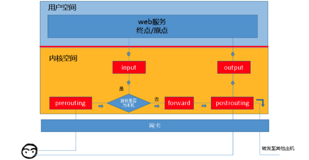

所以，根据上图，我们能够想象出某些常用场景中，报文的流向：

到本机某进程的报文：PREROUTING --> INPUT

由本机转发的报文：PREROUTING --> FORWARD --> POSTROUTING

由本机的某进程发出报文（通常为响应报文）：OUTPUT --> POSTROUTING

## 链

现在，我们想象一下，这些"关卡"在iptables中为什么被称作"链"呢？我们知道，防火墙的作用就在于对经过的报文匹配"规则"，然后执行对应的"动作",所以，当报文经过这些关卡的时候，则必须匹配这个关卡上的规则，但是，这个关卡上可能不止有一条规则，而是有很多条规则，当我们把这些规则串到一个链条上的时候，就形成了"链",所以，我们把每一个"关卡"想象成如下图中的模样 ，这样来说，把他们称为"链"更为合适，每个经过这个"关卡"的报文，都要将这条"链"上的所有规则匹配一遍，如果有符合条件的规则，则执行规则对应的动作。


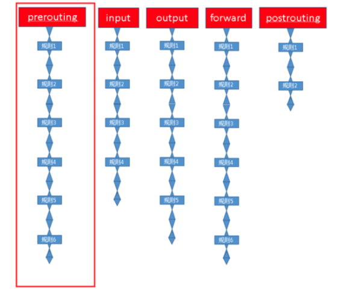

## 表

我们再想想另外一个问题，我们对每个"链"上都放置了一串规则，但是这些规则有些很相似，比如，A类规则都是对IP或者端口的过滤，B类规则是修改报文，那么这个时候，我们是不是能把实现相同功能的规则放在一起呢，必须能的。

**我们把具有相同功能的规则的集合叫做"表"**，所以说，不同功能的规则，我们可以放置在不同的表中进行管理，而iptables已经为我们定义了4种表，每种表对应了不同的功能，而我们定义的规则也都逃脱不了这4种功能的范围，所以，学习iptables之前，我们必须先搞明白每种表 的作用。

iptables为我们提供了如下规则的分类，或者说，iptables为我们提供了如下"表"

filter表：负责过滤功能，防火墙；内核模块：iptables_filter

nat表：network address translation，网络地址转换功能；内核模块：iptable_nat

mangle表：拆解报文，做出修改，并重新封装 的功能；iptable_mangle

raw表：关闭nat表上启用的连接追踪机制；iptable_raw

也就是说，我们自定义的所有规则，都是这四种分类中的规则，或者说，所有规则都存在于这4张"表"中。

## 表链关系

但是我们需要注意的是，某些"链"中注定不会包含"某类规则"，就像某些"关卡"天生就不具备某些功能一样，比如，A"关卡"只负责打击陆地敌人，没有防空能力，B"关卡"只负责打击空中敌人，没有防御步兵的能力，C"关卡"可能比较NB，既能防空，也能防御陆地敌人，D"关卡"最屌，海陆空都能防。

**那让我们来看看，每个"关卡"都有哪些能力，或者说，让我们看看每个"链"上的规则都存在于哪些"表"中。**

我们还是以图为例，先看看prerouting"链"上的规则都存在于哪些表中。

注意：下图只用于说明prerouting链上的规则存在于哪些表中，并没有描述表的顺序。


这幅图是什么意思呢？它的意思是说，prerouting"链"只拥有nat表、raw表和mangle表所对应的功能，所以，prerouting中的规则只能存放于nat表、raw表和mangle表中。

那么，根据上述思路，我们来总结一下，每个"关卡"都拥有什么功能，

或者说，每个"链"中的规则都存在于哪些"表"中。

PREROUTING 的规则可以存在于：raw表，mangle表，nat表。

INPUT 的规则可以存在于：mangle表，filter表，（centos7中还有nat表，centos6中没有）。

FORWARD 的规则可以存在于：mangle表，filter表。

OUTPUT 的规则可以存在于：raw表mangle表，nat表，filter表。

POSTROUTING 的规则可以存在于：mangle表，nat表。

但是，**我们在实际的使用过程中，往往是通过"表"作为操作入**口，对规则进行定义的，之所以按照上述过程介绍iptables，是因为从"关卡"的角度更容易从入门的角度理解，但是为了以便在实际使用的时候，更加顺畅的理解它们，此处我们还要将各"表"与"链"的关系罗列出来，

表（功能）<--> 链（钩子）：

raw 表中的规则可以被哪些链使用：PREROUTING，OUTPUT

mangle 表中的规则可以被哪些链使用：PREROUTING，INPUT，FORWARD，OUTPUT，POSTROUTING

nat 表中的规则可以被哪些链使用：PREROUTING，OUTPUT，POSTROUTING（centos7中还有INPUT，centos6中没有）

filter 表中的规则可以被哪些链使用：INPUT，FORWARD，OUTPUT

### 优先级次序

其实我们还需要注意一点，因为数据包经过一个"链"的时候，会将当前链的所有规则都匹配一遍，但是匹配时总归要有顺序，我们应该一条一条的去匹配，而且我们说过，相同功能类型的规则会汇聚在一张"表"中，那么，哪些"表"中的规则会放在"链"的最前面执行呢，这时候就需要有一个优先级的问题，我们还拿prerouting"链"做图示。(此时是有顺序的绘制)


prerouting链中的规则存放于三张表中，而这三张表中的规则执行的优先级如下：

raw --> mangle --> nat

但是我们知道，iptables为我们定义了4张"表",当他们处于同一条"链"时，执行的优先级如下。

优先级次序（由高而低）：

raw --> mangle --> nat --> filter

但是我们前面说过，某些链天生就不能使用某些表中的规则，所以，4张表中的规则处于同一条链的目前只有output链，它就是传说中海陆空都能防守的关卡。

为了更方便的管理，我们还可以在某个表里面创建自定义链，将针对某个应用程序所设置的规则放置在这个自定义链中，但是自定义链接不能直接使用，只能被某个默认的链当做动作去调用才能起作用，我们可以这样想象，自定义链就是一段比较"短"的链子，这条"短"链子上的规则都是针对某个应用程序制定的，但是这条短的链子并不能直接使用，而是需要"焊接"在iptables默认定义链子上，才能被IPtables使用，这就是为什么默认定义的"链"需要把"自定义链"当做"动作"去引用的原因。这是后话，后面再聊，在实际使用时我们即可更加的明白。

## 数据经过防火墙的流程

结合上述所有的描述，我们可以将数据包通过防火墙的流程总结为下图：


我们在写Iptables规则的时候，要时刻牢记这张路由次序图，灵活配置规则。

我们将经常用到的对应关系重新写在此处，方便对应图例查看。

链的规则存放于哪些表中（从链到表的对应关系）：

PREROUTING 的规则可以存在于：raw表，mangle表，nat表。

INPUT 的规则可以存在于：mangle表，filter表，（centos7中还有nat表，centos6中没有）。

FORWARD 的规则可以存在于：mangle表，filter表。

OUTPUT 的规则可以存在于：raw表mangle表，nat表，filter表。

POSTROUTING 的规则可以存在于：mangle表，nat表。

表中的规则可以被哪些链使用（从表到链的对应关系）：

raw 表中的规则可以被哪些链使用：PREROUTING，OUTPUT

mangle 表中的规则可以被哪些链使用：PREROUTING，INPUT，FORWARD，OUTPUT，POSTROUTING

nat 表中的规则可以被哪些链使用：PREROUTING，OUTPUT，POSTROUTING（centos7中还有INPUT，centos6中没有）

filter 表中的规则可以被哪些链使用：INPUT，FORWARD，OUTPUT

下图中nat表在centos7中的情况就不再标明。


## 规则概念

说了一圈又说回来了，在上述描述中我们一直在提规则，可是没有细说，现在说说它。

先说说规则的概念，然后再通俗的解释它。

规则：根据指定的匹配条件来尝试匹配每个流经此处的报文，一旦匹配成功，则由规则后面指定的处理动作进行处理；

那么我们来通俗的解释一下什么是iptables的规则，之前打过一个比方，每条"链"都是一个"关卡"，每个通过这个"关卡"的报文都要匹配这个关卡上的规则，如果匹配，则对报文进行对应的处理，比如说，你我二人此刻就好像两个"报文"，你我二人此刻都要入关，可是城主有命，只有器宇轩昂的人才能入关，不符合此条件的人不能入关，于是守关将士按照城主制定的"规则"，开始打量你我二人，最终，你顺利入关了，而我已被拒之门外，因为你符合"器宇轩昂"的标准，所以把你"放行"了，而我不符合标准，所以没有被放行，其实，"器宇轩昂"就是一种"匹配条件"，"放行"就是一种"动作"，"匹配条件"与"动作"组成了规则。

了解了规则的概念，那我们来聊聊规则的组成部分,此处只是大概的将规则的结构列出，后面的文章中会单独对规则进行总结。

规则由匹配条件和处理动作组成。

### 匹配条件

匹配条件分为基本匹配条件与扩展匹配条件

**基本匹配条件：**

源地址Source IP，目标地址 Destination IP

上述内容都可以作为基本匹配条件。

**扩展匹配条件：**

除了上述的条件可以用于匹配，还有很多其他的条件可以用于匹配，这些条件泛称为扩展条件，这些扩展条件其实也是netfilter中的一部分，只是以模块的形式存在，如果想要使用这些条件，则需要依赖对应的扩展模块。

源端口Source Port, 目标端口Destination Port

上述内容都可以作为扩展匹配条件。

### 处理动作

处理动作在iptables中被称为target（这样说并不准确，我们暂且这样称呼），动作也可以分为基本动作和扩展动作。

此处列出一些常用的动作，之后的文章会对它们进行详细的示例与总结：

**ACCEPT**：允许数据包通过。

**DROP**：直接丢弃数据包，不给任何回应信息，这时候客户端会感觉自己的请求泥牛入海了，过了超时时间才会有反应。

**REJECT**：拒绝数据包通过，必要时会给数据发送端一个响应的信息，客户端刚请求就会收到拒绝的信息。

**SNAT**：源地址转换，解决内网用户用同一个公网地址上网的问题。

**MASQUERADE**：是SNAT的一种特殊形式，适用于动态的、临时会变的ip上。

**DNAT**：目标地址转换。

**REDIRECT**：在本机做端口映射。

**LOG**：在/var/log/messages文件中记录日志信息，然后将数据包传递给下一条规则，也就是说除了记录以外不对数据包做任何其他操作，仍然让下一条规则去匹配。

# iptables规则查询

之前在iptables的概念中已经提到过，在实际操作iptables的过程中，是以"表"作为操作入口的，如果你经常操作关系型数据库，那么当你听到"表"这个词的时候，你可能会联想到另一个词----"增删改查"，当我们定义iptables规则时，所做的操作其实类似于"增删改查"，那么，我们就先从最简单的"查"操作入手，开始实际操作iptables。

在之前的文章中，我们已经总结过，iptables为我们预定义了4张表，它们分别是raw表、mangle表、nat表、filter表，不同的表拥有不同的功能。

filter负责过滤功能，比如允许哪些IP地址访问，拒绝哪些IP地址访问，允许访问哪些端口，禁止访问哪些端口，filter表会根据我们定义的规则进行过滤，filter表应该是我们最常用到的表了，所以此处，我们以filter表为例，开始学习怎样实际操作iptables。

## 查看filter表中的规则

本地的虚拟机，开机默认没有规则，规则我们可以自己手动添加

```plain
[root@node02 ~]# iptables -t filter -L
Chain INPUT (policy ACCEPT)
target     prot opt source               destination
Chain FORWARD (policy ACCEPT)
target     prot opt source               destination
Chain OUTPUT (policy ACCEPT)
target     prot opt source               destination
```

语法

iptables -t filter -L

iptables -t raw -L

iptables -t mangle -L

iptables -t nat -L

-t选项对应表，若是不指定表，默认就是filter表

-L选项列出该表规则

## 查看INPUT链规则

本地的虚拟机，开机默认没有规则，规则我们可以自己手动添加

```plain
[root@node02 ~]# iptables -L INPUT
Chain INPUT (policy ACCEPT)
target     prot opt source               destination
```

这样看的链信息不详细，可以：

```plain
[root@node02 ~]# iptables -vL INPUT
Chain INPUT (policy ACCEPT 334 packets, 31525 bytes)
 pkts bytes target     prot opt in     out     source               destination
```

使用-v参数后，显示的信息更详细了

## iptables字段属性

其实，这些字段就是规则对应的属性，说白了就是规则的各种信息，那么我们来总结一下这些字段的含义。

**pkts**:对应规则匹配到的报文的个数。

**bytes**:对应匹配到的报文包的大小总和。

**target**:规则对应的target，往往表示规则对应的"动作"，即规则匹配成功后需要采取的措施。

**prot**:表示规则对应的协议，是否只针对某些协议应用此规则。

**opt**:表示规则对应的选项。

**in**:表示数据包由哪个接口(网卡)流入，我们可以设置通过哪块网卡流入的报文需要匹配当前规则。

**out**:表示数据包由哪个接口(网卡)流出，我们可以设置通过哪块网卡流出的报文需要匹配当前规则。

**source**:表示规则对应的源头地址，可以是一个IP，也可以是一个网段。

**destination**:表示规则对应的目标地址。可以是一个IP，也可以是一个网段。

## 查看规则命令

来看一些存在规则的情况

```plain
[root@gegelinux ~]# iptables -L
Chain INPUT (policy ACCEPT)
target     prot opt source               destination
Chain FORWARD (policy ACCEPT)
target     prot opt source               destination
DOCKER-ISOLATION  all  --  anywhere             anywhere
DOCKER     all  --  anywhere             anywhere
ACCEPT     all  --  anywhere             anywhere             ctstate RELATED,ESTABLISHED
ACCEPT     all  --  anywhere             anywhere
ACCEPT     all  --  anywhere             anywhere
Chain OUTPUT (policy ACCEPT)
target     prot opt source               destination
Chain DOCKER (1 references)
target     prot opt source               destination
ACCEPT     tcp  --  anywhere             172.17.0.2           tcp dpt:mysql
ACCEPT     tcp  --  anywhere             172.17.0.3           tcp dpt:teradataordbms
Chain DOCKER-ISOLATION (1 references)
target     prot opt source               destination
RETURN     all  --  anywhere             anywhere
```

每个人的防火墙规则，都不会一模一样，这里的是哥哥一台docker服务器上的防火墙规则，这里我们先不用在意，只需要知道，docker容器技术的通信是借助于iptables实现的。

细心如你一定发现了，上图中的源地址与目标地址都为anywhere，看来，iptables默认为我们进行了名称解析，但是在规则非常多的情况下如果进行名称解析，效率会比较低，所以，在没有此需求的情况下，我们可以使用-n选项，表示不对IP地址进行名称反解，直接显示IP地址，示例如下。

```plain
[root@gegelinux ~]# iptables -vL -n
Chain INPUT (policy ACCEPT 7245K packets, 510M bytes)
 pkts bytes target     prot opt in     out     source               destination
Chain FORWARD (policy ACCEPT 0 packets, 0 bytes)
 pkts bytes target     prot opt in     out     source               destination
60164  104M DOCKER-ISOLATION  all  --  *      *       0.0.0.0/0            0.0.0.0/0
32219  101M DOCKER     all  --  *      docker0  0.0.0.0/0            0.0.0.0/0
21174  100M ACCEPT     all  --  *      docker0  0.0.0.0/0            0.0.0.0/0            ctstate RELATED,ESTABLISHED
27945 3820K ACCEPT     all  --  docker0 !docker0  0.0.0.0/0            0.0.0.0/0
    0     0 ACCEPT     all  --  docker0 docker0  0.0.0.0/0            0.0.0.0/0
Chain OUTPUT (policy ACCEPT 7295K packets, 576M bytes)
 pkts bytes target     prot opt in     out     source               destination
Chain DOCKER (1 references)
 pkts bytes target     prot opt in     out     source               destination
10070  758K ACCEPT     tcp  --  !docker0 docker0  0.0.0.0/0            172.17.0.2           tcp dpt:3306
  762  100K ACCEPT     tcp  --  !docker0 docker0  0.0.0.0/0            172.17.0.3           tcp dpt:8002
Chain DOCKER-ISOLATION (1 references)
 pkts bytes target     prot opt in     out     source               destination
60164  104M RETURN     all  --  *      *       0.0.0.0/0            0.0.0.0/0
[root@gegelinux ~]#
```

如上图所示，规则中的源地址与目标地址已经显示为IP，而非转换后的名称。

当然，我们也可以只查看某个链的规则，并且不让IP进行反解，这样更清晰一些，比如 iptables -nvL FORWARD

```plain
[root@gegelinux ~]# iptables -nvL FORWARD
Chain FORWARD (policy ACCEPT 0 packets, 0 bytes)
 pkts bytes target     prot opt in     out     source               destination
60164  104M DOCKER-ISOLATION  all  --  *      *       0.0.0.0/0            0.0.0.0/0
32219  101M DOCKER     all  --  *      docker0  0.0.0.0/0            0.0.0.0/0
21174  100M ACCEPT     all  --  *      docker0  0.0.0.0/0            0.0.0.0/0            ctstate RELATED,ESTABLISHED
27945 3820K ACCEPT     all  --  docker0 !docker0  0.0.0.0/0            0.0.0.0/0
    0     0 ACCEPT     all  --  docker0 docker0  0.0.0.0/0            0.0.0.0/0
```

如果你习惯了查看有序号的列表，你在查看iptables表中的规则时肯定会很不爽，没有关系，满足你，使用--line-numbers即可显示规则的编号，示例如下。

```plain
[root@gegelinux ~]# iptables --line-number -nvL FORWARD
Chain FORWARD (policy ACCEPT 0 packets, 0 bytes)
num   pkts bytes target     prot opt in     out     source               destination
1    60164  104M DOCKER-ISOLATION  all  --  *      *       0.0.0.0/0            0.0.0.0/0
2    32219  101M DOCKER     all  --  *      docker0  0.0.0.0/0            0.0.0.0/0
3    21174  100M ACCEPT     all  --  *      docker0  0.0.0.0/0            0.0.0.0/0            ctstate RELATED,ESTABLISHED
4    27945 3820K ACCEPT     all  --  docker0 !docker0  0.0.0.0/0            0.0.0.0/0
5        0     0 ACCEPT     all  --  docker0 docker0  0.0.0.0/0            0.0.0.0/0
```

--line-numbers选项并没有对应的短选项，不过我们缩写成--line时，centos中的iptables也可以识别。

我知道你目光如炬，你可能早就发现了，表中的每个链的后面都有一个括号，括号里面有一些信息，如下图红色标注位置，那么这些信息都代表了什么呢？我们来看看。

上图中INPUT链后面的括号中包含policy ACCEPT ，0 packets，0bytes 三部分。

**policy**表示当前链的默认策略，policy ACCEPT表示上图中INPUT的链的默认动作为ACCEPT，换句话说就是，默认接受通过INPUT关卡的所有请求，所以我们在配置INPUT链的具体规则时，应该将需要拒绝的请求配置到规则中，说白了就是"黑名单"机制，默认所有人都能通过，只有指定的人不能通过，当我们把INPUT链默认动作设置为接受(ACCEPT)，就表示所有人都能通过这个关卡，此时就应该在具体的规则中指定需要拒绝的请求，就表示只有指定的人不能通过这个关卡，这就是黑名单机制，**但是**，你一定发现了，上图中所显示出的规则，大部分都是接受请求(ACCEPT)，并不是想象中的拒绝请求(DROP或者REJECT)，这与我们所描述的黑名单机制不符啊，按照道理来说，默认动作为接受，就应该在具体的规则中配置需要拒绝的人，但是上图中并不是这样的，之所以出现上图中的情况，是因为IPTABLES的工作机制导致到，上例其实是利用了这些"机制"，完成了所谓的"白名单"机制，并不是我们所描述的"黑名单"机制，我们此处暂时不用关注这一点，之后会进行详细的举例并解释，此处我们只要明白policy对应的动作为链的默认动作即可，或者换句话说，

我们只要理解，policy为链的默认策略即可。

**packets**表示当前链（上例为INPUT链）默认策略匹配到的包的数量，0 packets表示默认策略匹配到0个包。

**bytes**表示当前链默认策略匹配到的所有包的大小总和。

其实，我们可以把packets与bytes称作"计数器"，上图中的计数器记录了默认策略匹配到的报文数量与总大小，"计数器"只会在使用-v选项时，才会显示出来。

当被匹配到的包达到一定数量时，计数器会自动将匹配到的包的大小转换为可读性较高的单位，如下图所示。


# iptables规则管理

上一篇文章中，我们已经学会了怎样使用iptables命令查看规则，那么这篇文章我们就来总结一下，怎样管理规则。

之前，我们把查看iptables规则的操作比作"增删改查"当中的"查"，那么在这篇文章中，我们就聊聊怎样对iptables进行"增、删、改"操作。

注意：在参照本文进行iptables实验时，请务必在个人的测试机上进行，因为如果iptables规则设置不当，有可能使你无法连接到远程主机中。

首先，查看一下filter表中的INPUT链中的规则，查看规则的相关命令在前文已经总结了，此处不再赘述，如果你忘了，请回顾前文。

使用如下命令查看filter表INPUT链的规则

```plain
[root@gegelinux ~]# iptables -nL INPUT
Chain INPUT (policy ACCEPT)
target     prot opt source               destination
```

## 规则练习

清空INPUT链中规则

```plain
[root@node02 ~]# iptables -F INPUT
[root@node02 ~]#
[root@node02 ~]# iptables -vnL INPUT
Chain INPUT (policy ACCEPT 189 packets, 29462 bytes)
 pkts bytes target     prot opt in     out     source               destination
```

清空INPUT链以后，filter表中的INPUT链已经不存在任何的规则，但是可以看出，INPUT链的默认策略是ACCEPT，也就是说，INPUT链默认"放行"所有发往本机的报文，当没有任何规则时，会接受所有报文，当报文没有被任何规则匹配到时，也会默认放行报文。

那么此刻，我们就在另外一台机器上，使用ping命令，向当前机器发送报文，如下图所示，ping命令可以得到回应，证明ping命令发送的报文已经正常的发送到了防火墙所在的主机，ping命令所在机器IP地址为`192.168.1.34`，当前测试防火墙主机的IP地址为`192.168.1.42`，我们就用这样的环境，对iptables进行操作演示。

```plain
[root@jenkins01 ~]# ping 192.168.1.42
PING 192.168.1.42 (192.168.1.42) 56(84) bytes of data.
64 bytes from 192.168.1.42: icmp_seq=1 ttl=64 time=0.680 ms
64 bytes from 192.168.1.42: icmp_seq=2 ttl=64 time=0.927 ms
^C
--- 192.168.1.42 ping statistics ---
2 packets transmitted, 2 received, 0% packet loss, time 1000ms
rtt min/avg/max/mdev = 0.680/0.803/0.927/0.126 ms
[root@jenkins01 ~]#
```

## 添加规则

拒绝来自于34机器的所有报文

添加42机器的规则

```plain
[root@node02 ~]# iptables -t filter -I INPUT -s 192.168.1.34 -j DROP
[root@node02 ~]# iptables -vnL INPUT
Chain INPUT (policy ACCEPT 12 packets, 962 bytes)
 pkts bytes target     prot opt in     out     source               destination
    0     0 DROP       all  --  *      *       192.168.1.34         0.0.0.0/0
```

上图中，使用 -t选项指定了要操作的表，此处指定了操作filter表，与之前的查看命令一样，不使用-t选项指定表时，默认为操作filter表。

使用-I选项，指明将"规则"插入至哪个链中，-I表示insert，即插入的意思，所以-I INPUT表示将规则插入于INPUT链中，即添加规则之意。

使用-s选项，指明"匹配条件"中的"源地址"，即如果报文的源地址属于-s对应的地址，那么报文则满足匹配条件，-s为source之意，表示源地址。

使用-j选项，指明当"匹配条件"被满足时，所对应的动作，上例中指定的动作为DROP，在上例中，当报文的源地址为192.168.1.34时，报文则被DROP（丢弃）。

再次查看filter表中的INPUT链，发现规则已经被添加了，在iptables中，动作被称之为"target"，所以，上图中taget字段对应的动作为DROP。

34机器再访问

```plain
[root@jenkins01 ~]# ping 192.168.1.42
PING 192.168.1.42 (192.168.1.42) 56(84) bytes of data.
```

能够发现请求直接被丢弃了。

我们再去42机器上检查防火墙数据包信息

```plain
[root@node02 ~]# iptables -nvL INPUT
Chain INPUT (policy ACCEPT 261 packets, 35021 bytes)
 pkts bytes target     prot opt in     out     source               destination
  168 14112 DROP       all  --  *      *       192.168.1.34         0.0.0.0/0
```

*只要34机器的ping命令不结束，42机器上就会一直收到报文，总大小目前是14112bytes，还会一直增长*

再添加一个接受34机器的报文规则

使用如下命令在filter表的INPUT链中追加一条规则，这条规则表示接受所有来自192.168.1.34的发往本机的报文。

```plain
[root@node02 ~]# iptables -A INPUT -s 192.168.1.34 -p icmp -j ACCEPT
```

上图中的命令并没有使用-t选项指定filter表，我们一直在说，不使用-t选项指定表时表示默认操作filter表。

上图中，使用-A选项，表示在对应的链中"追加规则"，-A为append之意，所以，-A INPUT则表示在INPUT链中追加规则，而之前示例中使用的-I选项则表示在链中"插入规则"，聪明如你一定明白了，它们的本意都是添加一条规则，只是-A表示在链的尾部追加规则，-I表示在链的首部插入规则而已。

使用-j选项，指定当前规则对应的动作为ACCEPT。

执行完添加规则的命令后，再次查看INPUT链，发现规则已经成功"追加"至INPUT链的末尾，那么现在，第一条规则指明了丢弃所有来自192.168.1.34的报文，第二条规则指明了接受所有来自192.168.1.34的报文，那么结果到底是怎样的呢？实践出真知，在34主机上再次使用ping命令向42主机发送报文，发现仍然是ping不通的，看来第二条规则并没有生效。

```plain
[root@node02 ~]# iptables -vnL INPUT
Chain INPUT (policy ACCEPT 11 packets, 768 bytes)
 pkts bytes target     prot opt in     out     source               destination
  195 16380 DROP       all  --  *      *       192.168.1.34         0.0.0.0/0
    0     0 ACCEPT     icmp --  *      *       192.168.1.34         0.0.0.0/0
```

并且可以根据规则的数据包大小查看，第二条规则，没有收到任何的报文。

### 规则加载顺序

其实iptables规则加载是有顺序的，来试着再加一个规则

允许接受所有来自于34机器的报文

看下是否有用，这一次不一样的，是我们把语句添加到最前面。

```plain
[root@node02 ~]# iptables -I INPUT -s 192.168.1.34 -j ACCEPT
[root@node02 ~]#
[root@node02 ~]#
[root@node02 ~]# iptables -nvL INPUT
Chain INPUT (policy ACCEPT 45 packets, 3132 bytes)
 pkts bytes target     prot opt in     out     source               destination
    0     0 ACCEPT     all  --  *      *       192.168.1.34         0.0.0.0/0
  784 65856 DROP       all  --  *      *       192.168.1.34         0.0.0.0/0
    0     0 ACCEPT     icmp --  *      *       192.168.1.34         0.0.0.0/0
```

查看42机器是否正常接受

```plain
[root@jenkins01 ~]# ping 192.168.1.42
PING 192.168.1.42 (192.168.1.42) 56(84) bytes of data.
64 bytes from 192.168.1.42: icmp_seq=1 ttl=64 time=0.350 ms
```

此时我们发现，42机器已经正常可以接受报文了，且报文的统计也有了结果。

```plain
[root@node02 ~]# iptables -nvL INPUT
Chain INPUT (policy ACCEPT 138 packets, 12642 bytes)
 pkts bytes target     prot opt in     out     source               destination
    3   252 ACCEPT     all  --  *      *       192.168.1.34         0.0.0.0/0
  784 65856 DROP       all  --  *      *       192.168.1.34         0.0.0.0/0
    0     0 ACCEPT     icmp --  *      *       192.168.1.34         0.0.0.0/0
```

总结：所以iptables的规则是有顺序加载的，自上而下，只要有规则匹配到，符合条件，那么就执行对应的动作

例如上述，报文被第一条规则匹配到了，且放行了，因为报文已经被放行了，即使第二条规则匹配到了刚才已经被“放行”的报文，也无法进行丢弃操作了。

### 按照号码添加规则

```plain
1.查看号码
[root@node02 ~]# iptables --line -vnL INPUT
Chain INPUT (policy ACCEPT 308 packets, 43019 bytes)
num   pkts bytes target     prot opt in     out     source               destination
1        9   756 ACCEPT     all  --  *      *       192.168.1.34         0.0.0.0/0
2      784 65856 DROP       all  --  *      *       192.168.1.34         0.0.0.0/0
3        0     0 ACCEPT     icmp --  *      *       192.168.1.34         0.0.0.0/0
2.在指定编号出插入规则。
[root@node02 ~]# iptables -I INPUT 2 -s 192.168.1.34 -j REJECT
[root@node02 ~]# iptables --line -vnL INPUT
Chain INPUT (policy ACCEPT 13 packets, 916 bytes)
num   pkts bytes target     prot opt in     out     source               destination
1        9   756 ACCEPT     all  --  *      *       192.168.1.34         0.0.0.0/0
2        0     0 REJECT     all  --  *      *       192.168.1.34         0.0.0.0/0            reject-with icmp-port-unreachable
3      784 65856 DROP       all  --  *      *       192.168.1.34         0.0.0.0/0
4        0     0 ACCEPT     icmp --  *      *       192.168.1.34         0.0.0.0/0
```

此时就插入在了编号为2的位置。a

## 删除规则

- 根据编号删除
- 根据匹配条件删除

```plain
1.查看规则
[root@node02 ~]# iptables --line -vnL INPUT
Chain INPUT (policy ACCEPT 13 packets, 916 bytes)
num   pkts bytes target     prot opt in     out     source               destination
1        9   756 ACCEPT     all  --  *      *       192.168.1.34         0.0.0.0/0
2        0     0 REJECT     all  --  *      *       192.168.1.34         0.0.0.0/0            reject-with icmp-port-unreachable
3      784 65856 DROP       all  --  *      *       192.168.1.34         0.0.0.0/0
4        0     0 ACCEPT     icmp --  *      *       192.168.1.34         0.0.0.0/0
2.删除第三条规则
[root@node02 ~]# iptables -t filter -D INPUT 3
[root@node02 ~]# iptables --line -vnL INPUT
Chain INPUT (policy ACCEPT 7 packets, 488 bytes)
num   pkts bytes target     prot opt in     out     source               destination
1        9   756 ACCEPT     all  --  *      *       192.168.1.34         0.0.0.0/0
2        0     0 REJECT     all  --  *      *       192.168.1.34         0.0.0.0/0            reject-with icmp-port-unreachable
3        0     0 ACCEPT     icmp --  *      *       192.168.1.34         0.0.0.0/0
3.根据具体动作删除
[root@node02 ~]# iptables  -t filter -D INPUT -s 192.168.1.34 -j ACCEPT
[root@node02 ~]#
[root@node02 ~]# iptables --line -vnL INPUT
Chain INPUT (policy ACCEPT 9 packets, 628 bytes)
num   pkts bytes target     prot opt in     out     source               destination
1        0     0 REJECT     all  --  *      *       192.168.1.34         0.0.0.0/0            reject-with icmp-port-unreachable
2        0     0 ACCEPT     icmp --  *      *       192.168.1.34         0.0.0.0/0
```

删除某条链所有的规则

iptables -t 表 -F 链

其实，-F选项不仅仅能清空指定链上的规则，其实它还能清空整个表中所有链上的规则，不指定链名，只指定表名即可删除表中的所有规则，命令如下

iptables -t 表名 -F 链

不过再次强调，在没有保存iptables规则时，请勿随便清空链或者表中的规则，除非你明白你在干什么。

## 修改规则

修改规则可以用-R选项，修改规则有坑，慎用，建议是，不如删除对应规则，重新添加。

```plain
# 当前规则
[root@node02 ~]# iptables --line -vnL INPUT
Chain INPUT (policy ACCEPT 9 packets, 628 bytes)
num   pkts bytes target     prot opt in     out     source               destination
1        0     0 REJECT     all  --  *      *       192.168.1.34         0.0.0.0/0            reject-with icmp-port-unreachable
2        0     0 ACCEPT     icmp --  *      *       192.168.1.34         0.0.0.0/0
# 修改条目1，REJECT为DROP
[root@node02 ~]# iptables -t filter -R INPUT 1 -s 192.168.1.34 -j DROP
[root@node02 ~]#
[root@node02 ~]# iptables --line -vnL INPUT
Chain INPUT (policy ACCEPT 9 packets, 628 bytes)
num   pkts bytes target     prot opt in     out     source               destination
1        0     0 DROP       all  --  *      *       192.168.1.34         0.0.0.0/0
2        0     0 ACCEPT     icmp --  *      *       192.168.1.34         0.0.0.0/0
```

这里的坑是，修改时，必须填入具体的匹配规则，例如-s地址，否则会导致ip变化，请看

```plain
[root@node02 ~]# iptables --line -vnL INPUT
Chain INPUT (policy ACCEPT 9 packets, 628 bytes)
num   pkts bytes target     prot opt in     out     source               destination
1        0     0 DROP       all  --  *      *       192.168.1.34         0.0.0.0/0
2        0     0 ACCEPT     icmp --  *      *       192.168.1.34         0.0.0.0/0
[root@node02 ~]# iptables -t filter -R INPUT 1 -j ACCEPT
[root@node02 ~]#
[root@node02 ~]# iptables --line -vnL INPUT
Chain INPUT (policy ACCEPT 0 packets, 0 bytes)
num   pkts bytes target     prot opt in     out     source               destination
1        9   628 ACCEPT     all  --  *      *       0.0.0.0/0            0.0.0.0/0
2        0     0 ACCEPT     icmp --  *      *       192.168.1.34         0.0.0.0/0
```

注意，这里没加上-s，导致source原地址，变为了0.0.0.0，如果动作是REJECT，会导致你的服务器立即拒绝所有流量，ssh断开，无法连接！！！

所以修改规则，要慎重，加上原有的规则，听哥哥话啊！！！

## 修改默认策略policy

每条链都有自己的策略

```plain
[root@node02 ~]# iptables --line -vnL
Chain INPUT (policy ACCEPT 0 packets, 0 bytes)
num   pkts bytes target     prot opt in     out     source               destination
1      122 12232 ACCEPT     all  --  *      *       0.0.0.0/0            0.0.0.0/0
2        0     0 ACCEPT     icmp --  *      *       192.168.1.34         0.0.0.0/0
Chain FORWARD (policy ACCEPT 0 packets, 0 bytes)
num   pkts bytes target     prot opt in     out     source               destination
Chain OUTPUT (policy ACCEPT 22 packets, 2752 bytes)
num   pkts bytes target     prot opt in     out     source               destination
```

默认策略，理解为就是默认的动作。

当报文没有被任何的规则匹配到时，防火墙会执行默认的策略，放行或是拒绝。

若是要修改默认策略。

```plain
# 修改默认策略选项 -P
[root@node02 ~]# iptables -t filter -P FORWARD DROP
[root@node02 ~]#
[root@node02 ~]#
[root@node02 ~]# iptables --line -vnL
Chain INPUT (policy ACCEPT 0 packets, 0 bytes)
num   pkts bytes target     prot opt in     out     source               destination
1      708 92461 ACCEPT     all  --  *      *       0.0.0.0/0            0.0.0.0/0
2        0     0 ACCEPT     icmp --  *      *       192.168.1.34         0.0.0.0/0
Chain FORWARD (policy DROP 0 packets, 0 bytes)
num   pkts bytes target     prot opt in     out     source               destination
Chain OUTPUT (policy ACCEPT 7 packets, 848 bytes)
num   pkts bytes target     prot opt in     out     source               destination
```

## 保存规则

默认的情况下，我们对"防火墙"所做出的修改都是"临时的"，换句话说就是，当重启iptables服务或者重启服务器以后，我们平常添加的规则或者对规则所做出的修改都将消失，为了防止这种情况的发生，我们需要将规则"保存"。

centos7保存iptables语句

```plain
# 安装服务，管理规则
[root@node02 ~]# yum install iptables-services -y
# 停止firewalld
[root@node02 ~]# systemctl stop firewalld
[root@node02 ~]#
[root@node02 ~]# systemctl disable  firewalld
[root@node02 ~]#
# 启用iptables服务
systemctl start iptables
systemctl enable iptables
# 使用命令保存规则
[root@node02 ~]# service iptables save
iptables: Saving firewall rules to /etc/sysconfig/iptables:[  OK  ]
[root@node02 ~]#
[root@node02 ~]#
[root@node02 ~]# cat /etc/sysconfig/iptables
# Generated by iptables-save v1.4.21 on Wed Oct 14 10:53:06 2020
*mangle
:PREROUTING ACCEPT [33135:11923265]
:INPUT ACCEPT [33123:11923025]
:FORWARD ACCEPT [0:0]
:OUTPUT ACCEPT [5349:370320]
:POSTROUTING ACCEPT [5349:370320]
COMMIT
# Completed on Wed Oct 14 10:53:06 2020
# Generated by iptables-save v1.4.21 on Wed Oct 14 10:53:06 2020
*filter
:INPUT ACCEPT [0:0]
:FORWARD ACCEPT [0:0]
:OUTPUT ACCEPT [385:36841]
-A INPUT -m state --state RELATED,ESTABLISHED -j ACCEPT
-A INPUT -p icmp -j ACCEPT
-A INPUT -i lo -j ACCEPT
-A INPUT -p tcp -m state --state NEW -m tcp --dport 22 -j ACCEPT
-A INPUT -j REJECT --reject-with icmp-host-prohibited
-A FORWARD -j REJECT --reject-with icmp-host-prohibited
COMMIT
# Completed on Wed Oct 14 10:53:06 2020
[root@node02 ~]#
```

由于我们只是在filter表中定义了每条链的规则，其他表中并没有设置规则，因此保存的只有filter表的规则。

每当我们修改了规则，想要永久生效，必须使用service iptables save保存规则，会写入文件

如果误操作了规则，也没有保存，可以service iptables restart重新加载文件里的规则。

# iptables匹配条件

## 匹配更多源地址

前面我们的规则都是在对单个ip地址进行匹配，其实也可以指定多个地址段

```plain
# 清空规则
[root@node02 ~]# iptables -t filter -F
# 插入规则
[root@node02 ~]# iptables -t filter -I INPUT -s 192.168.1.34,192.168.1.33 -j DROP
[root@node02 ~]#
[root@node02 ~]#
[root@node02 ~]# iptables -vnL INPUT
Chain INPUT (policy ACCEPT 42 packets, 3046 bytes)
 pkts bytes target     prot opt in     out     source               destination
    0     0 DROP       all  --  *      *       192.168.1.33         0.0.0.0/0
    0     0 DROP       all  --  *      *       192.168.1.34         0.0.0.0/0
# 此时33,34两台机器的流量，就被42机器拒绝了
# 除了指定ip，还可以指定网段192.168.0.1~192.168.255.254，注意语句，别把ssh禁止了
[root@node02 ~]# iptables -t filter -I INPUT -s 192.168.1.0/16 -j ACCEPT
[root@node02 ~]#
[root@node02 ~]#
[root@node02 ~]# iptables -nvL INPUT
Chain INPUT (policy ACCEPT 0 packets, 0 bytes)
 pkts bytes target     prot opt in     out     source               destination
   61  8092 ACCEPT     all  --  *      *       192.168.0.0/16       0.0.0.0/0
```

条件取反

```plain
# 条件取反写法
# 只要报文的源ip不是192.168.1.34，就接受此报文（注意，这里不存在说法，如果是34就拒绝！，即使是34也不会自动拒绝）
[root@node02 ~]# iptables -t filter -A INPUT ! -s 192.168.1.34 -j ACCEPT
[root@node02 ~]#
[root@node02 ~]#
[root@node02 ~]# iptables -vnL INPUT
Chain INPUT (policy ACCEPT 0 packets, 0 bytes)
 pkts bytes target     prot opt in     out     source               destination
   45  3132 ACCEPT     all  --  *      *      !192.168.1.34         0.0.0.0/0
# 34机器尝试访问，还是可以访问的
[root@jenkins01 ~]# ping 192.168.1.42
PING 192.168.1.42 (192.168.1.42) 56(84) bytes of data.
64 bytes from 192.168.1.42: icmp_seq=1 ttl=64 time=0.355 ms
64 bytes from 192.168.1.42: icmp_seq=2 ttl=64 time=0.383 ms
^C
--- 192.168.1.42 ping statistics ---
2 packets transmitted, 2 received, 0% packet loss, time 1000ms
rtt min/avg/max/mdev = 0.355/0.369/0.383/0.014 ms
[root@jenkins01 ~]#
```

这是因为，INPUT链默认规则是ACCEPT，该条语句，只是对ip范围取反，但是也没有指定34机器到来的报文就拒绝，因此走了默认规则，所以可以通信。

## 匹配目标地址

除了通过-s指定源地址作为条件，还可以通过-d指定目标地址作为匹配条件

源地址表示报文从哪来

目标地址表示报文要去哪

```plain
# 当前机器的ip
[root@node02 ~]# ip a | awk '/inet /{print $1,$2}'
inet 127.0.0.1/8
inet 172.18.0.69/24
inet 192.168.1.42/24
inet 192.168.1.150/24
# 例如该42机器，想要拒绝34机器的请求，且只针对42这个地址，并不禁止向150地址发请求，就可以指定目标地址。
[root@node02 ~]# iptables -t filter -I INPUT -s 192.168.1.34 -d 192.168.1.42 -j DROP
[root@node02 ~]# iptables -vnL INPUT
Chain INPUT (policy ACCEPT 48 packets, 3276 bytes)
 pkts bytes target     prot opt in     out     source               destination
    0     0 DROP       all  --  *      *       192.168.1.34         192.168.1.42
[root@node02 ~]#
```

此时34机器向42地址发请求就会被拒绝了，然而150地址还是可以放行。

```plain
[root@jenkins01 ~]# ping 192.168.1.42
PING 192.168.1.42 (192.168.1.42) 56(84) bytes of data.
^C
--- 192.168.1.42 ping statistics ---
3 packets transmitted, 0 received, 100% packet loss, time 2001ms
[root@jenkins01 ~]#
[root@jenkins01 ~]#
[root@jenkins01 ~]# ping 192.168.1.150
PING 192.168.1.150 (192.168.1.150) 56(84) bytes of data.
64 bytes from 192.168.1.150: icmp_seq=1 ttl=64 time=0.362 ms
64 bytes from 192.168.1.150: icmp_seq=2 ttl=64 time=0.898 ms
^C
--- 192.168.1.150 ping statistics ---
2 packets transmitted, 2 received, 0% packet loss, time 1000ms
rtt min/avg/max/mdev = 0.362/0.630/0.898/0.268 ms
[root@jenkins01 ~]#
[root@jenkins01 ~]#
[root@jenkins01 ~]#
```

规则的匹配条件，是`与`的关系，也就是得满足`来源地址，目标地址`才会被正确的匹配，执行动作。

## 协议类型

我们可以使用-p参数，指定匹配的报文协议类型，例如tcp，udp等。

```plain
# 拒绝来自于34的tcp协议请求。
[root@node02 ~]# iptables -t filter -I INPUT -s 192.168.1.34 -d 192.168.1.150 -p tcp -j REJECT
[root@node02 ~]#
[root@node02 ~]#
[root@node02 ~]# iptables -vnL INPUT
Chain INPUT (policy ACCEPT 41 packets, 2852 bytes)
 pkts bytes target     prot opt in     out     source               destination
    0     0 REJECT     tcp  --  *      *       192.168.1.34         192.168.1.150        reject-with icmp-port-unreachable
```

34机器发请求测试

ssh属于tcp协议

ping属于icmp协议

```plain
[root@jenkins01 ~]# ssh root@192.168.1.150
ssh: connect to host 192.168.1.150 port 22: Connection refused
[root@jenkins01 ~]#
[root@jenkins01 ~]# ping 192.168.1.150
PING 192.168.1.150 (192.168.1.150) 56(84) bytes of data.
64 bytes from 192.168.1.150: icmp_seq=1 ttl=64 time=0.357 ms
64 bytes from 192.168.1.150: icmp_seq=2 ttl=64 time=0.336 ms
^C
--- 192.168.1.150 ping statistics ---
2 packets transmitted, 2 received, 0% packet loss, time 1000ms
rtt min/avg/max/mdev = 0.336/0.346/0.357/0.021 ms
```

centos7中，-p选项支持如下协议类型

tcp, udp, udplite, icmp, icmpv6,esp, ah, sctp, mh

当不使用-p指定协议类型时，默认表示所有类型的协议都会被匹配到，与使用-p all的效果相同。

## 网卡接口

每台Linux服务器或许会有多个网卡，可以通过`iptables 的-i选项`匹配报文从哪块网卡进入。

```plain
# 查看网络接口
ifconfig
# 拒绝ens37进入的ping请求
[root@node02 ~]# iptables -t filter -I INPUT -i ens37 -p icmp -j DROP
[root@node02 ~]#
[root@node02 ~]# iptables -nvL
Chain INPUT (policy ACCEPT 27 packets, 1872 bytes)
 pkts bytes target     prot opt in     out     source               destination
    0     0 DROP       icmp --  ens37  *       0.0.0.0/0            0.0.0.0/0
Chain FORWARD (policy ACCEPT 0 packets, 0 bytes)
 pkts bytes target     prot opt in     out     source               destination
Chain OUTPUT (policy ACCEPT 14 packets, 1320 bytes)
 pkts bytes target     prot opt in     out     source               destination
[root@node02 ~]#
```

发请求测试

```plain
[root@jenkins01 ~]# ping 192.168.1.150
PING 192.168.1.150 (192.168.1.150) 56(84) bytes of data.
^C
--- 192.168.1.150 ping statistics ---
6 packets transmitted, 0 received, 100% packet loss, time 5001ms
[root@jenkins01 ~]# ping 192.168.1.42
PING 192.168.1.42 (192.168.1.42) 56(84) bytes of data.
^C
--- 192.168.1.42 ping statistics ---
2 packets transmitted, 0 received, 100% packet loss, time 1000ms
# ssh是tcp协议，所以可以通过
[root@jenkins01 ~]# ssh root@192.168.1.42
Last login: Wed Oct 14 14:39:19 2020 from 192.168.1.34
[root@node02 ~]#
```

## 流量 进/出

-i选项只能用于PREROUTING链、INPUT链、FORWARD链，控制流量进入

-o选项只能用于FORWARD链、OUTPUT链、POSTROUTING链，控制流量的出去

-o选项是用于匹配报文将由哪个网卡"流出"的

## 端口匹配

### --dport

使用--dport可以匹配报文的目标端口，destination-port，目标端口

使用该参数，必须指定好某种协议，也就是必须用-p参数

-m 参数，指定对应的扩展模块，使用--dport必须指定某个扩展模块，也就是-m参数

```plain
[root@node02 ~]# iptables -t filter -I INPUT -s 192.168.1.34 -p tcp -m tcp --dport 22 -j REJECT
[root@node02 ~]#
[root@node02 ~]#
[root@node02 ~]# iptables -nvL
Chain INPUT (policy ACCEPT 29 packets, 2012 bytes)
 pkts bytes target     prot opt in     out     source               destination
    0     0 REJECT     tcp  --  *      *       192.168.1.34         0.0.0.0/0            tcp dpt:22 reject-with icmp-port-unreachable
```

这里要记住的是iptables在指定端口匹配时，必须指定-p 协议，-m 扩展模块

### 匹配多个目标端口

iptables可以基于tcp扩展模块的--dport选项，指定一个连续的端口范围，例如22:25，也就是22，23，24，25。

但是无法指定多个离散不连续的端口，这就得借助于multiport扩展模块，该模块只支持tcp，udp

```plain
[root@node02 ~]# iptables -t filter -I INPUT -s 192.168.1.34 -p tcp -m multiport --dports 22,3306,80 -j DROP
[root@node02 ~]#
[root@node02 ~]# iptables -vnL INPUT
Chain INPUT (policy ACCEPT 39 packets, 2712 bytes)
 pkts bytes target     prot opt in     out     source               destination
    0     0 DROP       tcp  --  *      *       192.168.1.34         0.0.0.0/0            multiport dports 22,3306,80
    0     0 DROP       tcp  --  *      *       192.168.1.34         0.0.0.0/0            tcp spt:22
[root@node02 ~]#
```

上述就是禁止了34机器，访问该node02机器的22,3306,80三个端口

## 常用扩展模块

在上一节针对多个端口的规则匹配，我们使用了`-m multiport`模块，这一节再看看其他模块。

### iprange扩展模块

前提

在不使用扩展模块情况下，使用-s或-d选项可以匹配报文的源地址和目标地址

指定ip地址时，-s选项可以指定多个IP地址

若是要指定一段连续的IP范围地址，可以用iprange扩展模块。

--src-range 源地址范围

--dst-range 目标地址范围

```plain
[root@chaoge01 ~]# iptables -t filter -I INPUT -m iprange --src-range 192.168.1.10-192.168.1.40 -j DROP
[root@chaoge01 ~]#
[root@chaoge01 ~]#
[root@chaoge01 ~]# iptables -vnL INPUT
Chain INPUT (policy ACCEPT 15 packets, 1064 bytes)
 pkts bytes target     prot opt in     out     source               destination
    0     0 DROP       all  --  *      *       0.0.0.0/0            0.0.0.0/0            source IP range 192.168.1.10-192.168.1.40
```

测试

```plain
[root@jenkins01 ~]# ssh root@192.168.1.42
^C
[root@jenkins01 ~]#
[root@jenkins01 ~]#
[root@jenkins01 ~]# ping 192.168.1.42
PING 192.168.1.42 (192.168.1.42) 56(84) bytes of data.
^C
--- 192.168.1.42 ping statistics ---
2 packets transmitted, 0 received, 100% packet loss, time 999ms
[root@jenkins01 ~]#
```

### string扩展模块

string扩展模块，是根据报文中对应的字符串，进行条件匹配。

-m string 指定string模块

--algo bm指定用bm算法匹配字符串

--string "xxoo" 定义字符串内容，可以是URL里任意字符，如果是需要block下载某些类型的文件或请求，这个有很大的发挥空间。

```plain
# 准备好一台nginx服务器，展示页面34地址的机器
[root@chaoge01 ~]# curl 192.168.1.34/index.html
hello,xxoo
# 在42机器上添加防火墙规则，禁止含有xxoo的报文，进入42这台机器
[root@chaoge01 ~]# iptables -F
[root@chaoge01 ~]#
[root@chaoge01 ~]#
[root@chaoge01 ~]# iptables -t filter -I INPUT -m string --algo bm --string "xxoo" -j REJECT
[root@chaoge01 ~]#
[root@chaoge01 ~]#
[root@chaoge01 ~]# curl 192.168.1.34/index.html
[root@chaoge01 ~]# curl 192.168.1.34
```

我们会发现请求无法进入42这台机器了

利用这个功能可以实现一些防止入侵的规则。

保护该机器的80端口，拒收含有cmd.exe字符串的报文请求

```plain
# 在42这台机器添加
[root@chaoge01 ~]# iptables -I INPUT 1 -p tcp --dport 80 -m string --string "cmd.exe" --algo bm -j DROP
# 客户端测试，无法访问
[root@jenkins01 ~]# curl 192.168.1.42/123cmd.exe123123
```

防止电子邮件诈骗

```plain
iptables -I INPUT -p tcp --dport 25 -m string --string "BTC" --algo bm -j DROP
```

### time模块

通过time模块进行根据时间段区匹配，报文到达的时间范围内，就符合匹配规则。

限制早上9点到晚上6点，该机器，无法上网（访问80，443端口）

思路：限制该机器，出口的流量

-m time 表示time模块

--timestart 表示时间的开始时间

--timestop 停止时间

```plain
# 此时电脑就无法发出80端口的请求了
[root@chaoge01 ~]# iptables -t filter -I OUTPUT -p tcp --dport 80 -m time --timestart 09:00:00 --timestop 22:00:00 -j REJECT
# 无法发出
[root@chaoge01 ~]# curl http://baidu.com
# 禁止443端口的流量发出
[root@chaoge01 ~]# iptables -t filter -I OUTPUT -p tcp --dport 443 -m time --timestart 09:00:00 --timestop 22:00:00 -j REJECT
```

禁止访问百度页面

```plain
[root@chaoge01 ~]# iptables -t filter -I OUTPUT -m string --algo bm --string "baidu" -j REJECT
[root@chaoge01 ~]#
```

周六日，禁止访问网页

--weekdays 可以指定每个星期具体到哪一天，可以指定多个数字或Mon,Tue,Wed

```plain
[root@chaoge01 ~]# iptables -t filter -I OUTPUT -p tcp --dport 80 -m time --weekdays 6,7 -j REJECT
```

周六日的具体时间段，禁止浏览网页

```plain
[root@chaoge01 ~]# iptables -t filter -I OUTPUT -p tcp --dport 80 -m time --weekdays 6,7 --timestart 09:00:00 --timestop 18:00:00 -j REJECT
```

### connlimit扩展模块

该模块可以限制每个ip地址同时连接到server的链接数量。

限制每个ip地址，只能连接2个ssh终端到server

```plain
[root@chaoge01 ~]# iptables -I INPUT -p tcp --dport 22 -m connlimit --connlimit-above 2 -j REJECT
```


# iptables进阶

## 黑白名单机制

前文中一直在强调一个概念：报文在经过iptables的链时，会匹配链中的规则，遇到匹配的规则时，就执行对应的动作，如果链中的规则都无法匹配到当前报文，则使用链的默认策略（默认动作），链的默认策略通常设置为ACCEPT或者DROP。

那么，当链的默认策略设置为ACCEPT时，如果对应的链中没有配置任何规则，就表示接受所有的报文，如果对应的链中存在规则，但是这些规则没有匹配到报文，报文还是会被接受。

同理，当链的默认策略设置为DROP时，如果对应的链中没有配置任何规则，就表示拒绝所有报文，如果对应的链中存在规则，但是这些规则没有匹配到报文，报文还是会被拒绝。

所以，当链的默认策略设置为ACCEPT时，按照道理来说，我们在链中配置规则时，对应的动作应该设置为DROP或者REJECT，为什么呢？

因为默认策略已经为ACCEPT了，如果我们在设置规则时，对应动作仍然为ACCEPT，那么所有报文都会被放行了，因为不管报文是否被规则匹配到都会被ACCEPT，所以就失去了访问控制的意义。

所以，当链的默认策略为ACCEPT时，链中的规则对应的动作应该为DROP或者REJECT，表示只有匹配到规则的报文才会被拒绝，没有被规则匹配到的报文都会被默认接受，这就是"黑名单"机制。

### 白名单案例

```plain
# 放行ssh服务的报文，以及web服务的报文
[root@chaoge01 ~]# iptables -I INPUT -p tcp --dport 22 -j ACCEPT
[root@chaoge01 ~]# iptables -I INPUT -p tcp --dport 80 -j ACCEPT
```

现在放行了特定的报文，其他的报文全部拒绝，那么可以直接DROP即可，实现白名单机制

```plain
[root@chaoge01 ~]# iptables -nvL INPUT
Chain INPUT (policy ACCEPT 2 packets, 226 bytes)
 pkts bytes target     prot opt in     out     source               destination
    0     0 ACCEPT     tcp  --  *      *       0.0.0.0/0            0.0.0.0/0            tcp dpt:80
  174 12204 ACCEPT     tcp  --  *      *       0.0.0.0/0            0.0.0.0/0            tcp dpt:22
[root@chaoge01 ~]# iptables -P INPUT DROP
[root@chaoge01 ~]#
[root@chaoge01 ~]# iptables -nvL INPUT
Chain INPUT (policy DROP 1 packets, 229 bytes)
 pkts bytes target     prot opt in     out     source               destination
    0     0 ACCEPT     tcp  --  *      *       0.0.0.0/0            0.0.0.0/0            tcp dpt:80
  233 16296 ACCEPT     tcp  --  *      *       0.0.0.0/0            0.0.0.0/0            tcp dpt:22
[root@chaoge01 ~]#
```

此时你要注意了，我们已经吧默认的规则改成了`DROP`，因为我们单独给了白名单，才放行了`22端口，ssh服务`，因此还是可以远程连接服务器的。

如果你现在执行清空规则语句，那么白名单被清空了，默认规则又是拒绝，会导致所有报文都被拒绝，ssh也会断开了。

因此，默认策略改为拒绝，是很不明智的操作，因为很大可能给你自己带来大麻烦。

最好的是，默认是Accept，然后添加所需的规则，如果有`拒绝所有请求`的规则，也放在最底行加载。

### 黑名单案例

```plain
# 1.修改默认策略为 ACCEPT
[root@chaoge01 ~]# iptables -P INPUT ACCEPT
[root@chaoge01 ~]# iptables -vnL INPUT
Chain INPUT (policy ACCEPT 5 packets, 420 bytes)
 pkts bytes target     prot opt in     out     source               destination
    0     0 ACCEPT     tcp  --  *      *       0.0.0.0/0            0.0.0.0/0            tcp dpt:80
  329 23084 ACCEPT     tcp  --  *      *       0.0.0.0/0            0.0.0.0/0            tcp dpt:22
# 尾部追加一个拒绝的规则
[root@chaoge01 ~]# iptables -A INPUT -j REJECT
[root@chaoge01 ~]#
[root@chaoge01 ~]#
[root@chaoge01 ~]# iptables -vnL INPUT
Chain INPUT (policy ACCEPT 0 packets, 0 bytes)
 pkts bytes target     prot opt in     out     source               destination
    0     0 ACCEPT     tcp  --  *      *       0.0.0.0/0            0.0.0.0/0            tcp dpt:80
  412 28904 ACCEPT     tcp  --  *      *       0.0.0.0/0            0.0.0.0/0            tcp dpt:22
    0     0 REJECT     all  --  *      *       0.0.0.0/0            0.0.0.0/0            reject-with icmp-port-unreachable
```

所以，这是最好的形式

- 放行了指定的重要的业务
- 最后一条拒绝其他无用的报文，保证机器安全
- 即使手误删除了规则，默认规则也是ACCEPT，也不会造成很大麻烦

# iptables网络防火墙

防火墙从逻辑上讲，主要分为

- 主机防火墙：针对单个服务器进行防护。
- 网络防火墙：处于网络入口，针对网络入口进行防护，防护躲在防火墙背后的局域网。


橘黄色主机为iptables所在主机，使用iptables进行网络防火墙服务。

浅蓝色区域表示被网络防火墙防护的主机区域。

## 报文流程

当外网中的主机与防火墙内部的主机通信时，无论是进、出的报文，都必须得经过iptables主机，由防火墙主机进行*过滤且转发*。

所以，防火墙的主要工作是，*过滤且转发*。

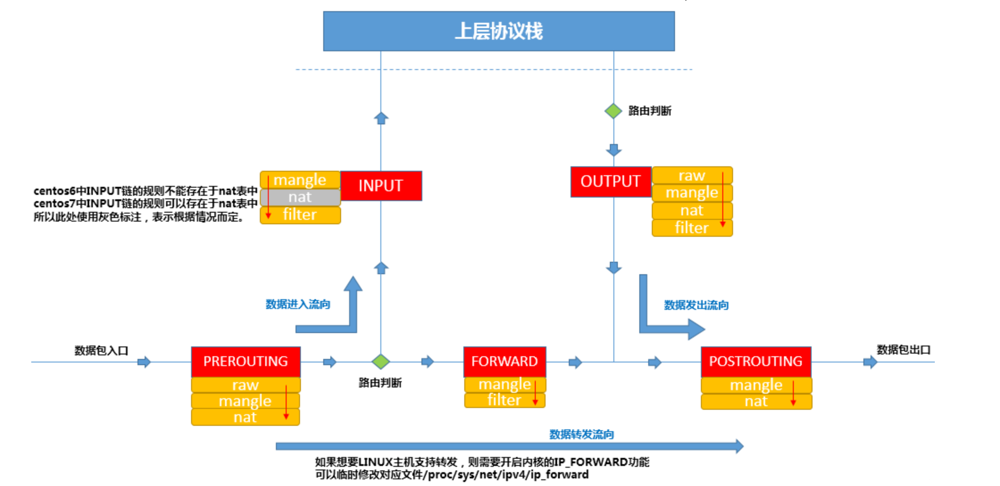

前文，我们使用iptables都是用作 主机防火墙的作用

且为们只用到了INPUT和OUTPUT链，因为提供了过滤功能的链只有三条，INPUT，OUTPUT，FORWARD，当报文发往本机的时候，如果想要过滤，只能在进、出链中实现。

此时我们改变了iptables主机的作用，提供网络防火墙服务，需要实现“过滤并转发”，要实现转发功能，报文只有经过FORWARD链，因此转发规则是定义在FORWARD链里的。

## 环境设计


内部网络：172.18.0.xx，

外部网络：192.168.1.xx

网络防火墙主机：网卡2，192.168.1.42，有两块网卡，同时可以和内部，外部网络通信，网卡1，172.18.0.69

访问形式：

主机A > 想要访问主机C，172.18.0.70，默认情况是无法访问的，且不是一个网段，这里我们可以使用B主机的防火墙转发功能实现。

### vmware设置

主机A：桥接模式， 192.168.1.33 主机B：桥接模式， 192.168.1.42。仅主机模式，172.18.0.69 主机C：仅主机模式，172.18.0.18 ，网关指向iptables网络防火墙，GATEWAY="172.18.0.69"

简化路由设置，让A主机访问172.18.0.0网段时，网关直接指向B主机。

```plain
[root@a ~]# route add -net 172.18.0.0/16 gw 192.168.1.42
[root@a ~]#
[root@a ~]# route -n
Kernel IP routing table
Destination     Gateway         Genmask         Flags Metric Ref    Use Iface
0.0.0.0         192.168.1.1     0.0.0.0         UG    100    0        0 ens37
172.18.0.0      192.168.1.42    255.255.0.0     UG    0      0        0 ens37
192.168.1.0     0.0.0.0         255.255.255.0   U     100    0        0 ens37
```

此时主机A通往172.18网络的网关已经是指向主机B，主机A能够访问到内网172.18.0.0码?

```plain
[root@a ~]# ping 172.18.0.69
PING 172.18.0.69 (172.18.0.69) 56(84) bytes of data.
64 bytes from 172.18.0.69: icmp_seq=1 ttl=64 time=0.456 ms
64 bytes from 172.18.0.69: icmp_seq=2 ttl=64 time=0.381 ms
[root@a ~]# ping 172.18.0.18
PING 172.18.0.18 (172.18.0.18) 56(84) bytes of data.
^C
--- 172.18.0.18 ping statistics ---
7 packets transmitted, 0 received, 100% packet loss, time 6000ms
[root@a ~]#
```

为什么主机A，能够访问主机B的内网地址，却无法访问主机C的内网地址？

答案是：

主机A通过route -n路由表得知，发往172.18.0.0/16网段的报文网关是B主机

当主机A访问例如主机C的172.18.0.18，报文到达主机B时，B主机发现A的目标是172.18.0.18，而自己的IP是172.18.0.69，此时主机B需要将该报文转发给172.18.0.18（主机C），但是Linux默认不会转发报文，因此主机C就没收到主机A的报文，这是根本原因所在，所以C主机没有给予主机A回复。

那为什么主机B的172.18.0.69又能够给主机A回复呢？

答案：

主机B是双网卡，192.168.1.42和172.18.0.69都是主机B的地址，主机A通过路由表把报文发给了主机B，主机B自然也就能直接回应主机A。

## Linux内核转发配置

检查Linux转发语句是否开启

```plain
[root@b ~]# cat /proc/sys/net/ipv4/ip_forward
0
# 默认为0，则是关闭了转发动作，改为1就是开启转发功能。
# 打开转发
[root@b ~]# echo 1 > /proc/sys/net/ipv4/ip_forward
# 打开转发
[root@b ~]# sysctl -w net.ipv4.ip_forward=1
net.ipv4.ip_forward = 1
# 以上两个方法都是临时生效，重启网络就失效了，可以永久修改
[root@b ~]# tail -1  /usr/lib/sysctl.d/00-system.conf
net.ipv4.ip_forward = 1
[root@b ~]#
```

此时B主机已经有了报文转发功能，此时可以再用主机A，尝试访问内网的B和C，都是可以ping通的。

```plain
[root@a ~]# ping 172.18.0.69
PING 172.18.0.69 (172.18.0.69) 56(84) bytes of data.
64 bytes from 172.18.0.69: icmp_seq=1 ttl=64 time=0.648 ms
^C
--- 172.18.0.69 ping statistics ---
1 packets transmitted, 1 received, 0% packet loss, time 0ms
rtt min/avg/max/mdev = 0.648/0.648/0.648/0.000 ms
[root@a ~]#
[root@a ~]#
[root@a ~]# ping 172.18.0.18
PING 172.18.0.18 (172.18.0.18) 56(84) bytes of data.
64 bytes from 172.18.0.18: icmp_seq=1 ttl=63 time=0.742 ms
64 bytes from 172.18.0.18: icmp_seq=2 ttl=63 time=0.361 ms
^C
--- 172.18.0.18 ping statistics ---
2 packets transmitted, 2 received, 0% packet loss, time 1001ms
rtt min/avg/max/mdev = 0.361/0.551/0.742/0.191 ms
```

## 网络防火墙测试

实验开始前，先清空主机A和C的iptables规则，防止影响网络防火墙的实验。

```plain
# 清空A和C的规则，不指定链，默认所有链
[root@a ~]# iptables -F
[root@c ~]# iptables -F
```

查看网络防火墙机器--机器B的filter表规则，也就是提供过滤+转发的链

```plain
[root@b ~]# iptables -nvL
Chain INPUT (policy ACCEPT 2914 packets, 296K bytes)
 pkts bytes target     prot opt in     out     source               destination
Chain FORWARD (policy ACCEPT 142 packets, 15584 bytes)
 pkts bytes target     prot opt in     out     source               destination
Chain OUTPUT (policy ACCEPT 455 packets, 54664 bytes)
 pkts bytes target     prot opt in     out     source               destination
[root@b ~]#
```

FORWARD转发链目前没有规则，默认策略是放行，我们可以使用`白名单机制`，也就是FORWARD末端用一条拒绝的规则，然后添加`放行规则`在默认拒绝的规则之前即可。

```plain
# 添加默认拒绝规则
[root@b ~]# iptables -nvL FORWARD
Chain FORWARD (policy ACCEPT 0 packets, 0 bytes)
 pkts bytes target     prot opt in     out     source               destination
    0     0 REJECT     all  --  *      *       0.0.0.0/0            0.0.0.0/0            reject-with icmp-port-unreachable
[root@b ~]#
```

测试主机A和C已经无法通信了，若要通信还得添加放行规则

```plain
[root@a ~]# ping 172.18.0.18
PING 172.18.0.18 (172.18.0.18) 56(84) bytes of data.
From 192.168.1.42 icmp_seq=1 Destination Port Unreachable
From 192.168.1.42 icmp_seq=2 Destination Port Unreachable
^C
--- 172.18.0.18 ping statistics ---
2 packets transmitted, 0 received, +2 errors, 100% packet loss, time 999ms
[root@a ~]#
```

本来B主机已经支持转发了，但是经过iptables的FORWARD链的规则，将报文拒绝了，因此也就无法转发。

启用web服务进行调试，A和C机器，启动nginx

```plain
[root@c ~]# curl 127.0.0.1
hello c
[root@a ~]# curl 127.0.0.1
hello a
```

由于B机器已经禁止了转发报文，因此A和C是无法互相访问到web服务的。

```plain
[root@a ~]# curl 172.18.0.18
curl: (7) Failed connect to 172.18.0.18:80; Connection refused
[root@c ~]# curl 192.168.1.33
curl: (7) Failed connect to 192.168.1.33:80; Connection refused
```

配置转发规则，让C可以访问A，内网可以访问外网。

```plain
[root@b ~]# iptables -I FORWARD  -s 172.18.0.0/16 -p tcp --dport 80 -j ACCEPT
[root@b ~]#
[root@b ~]# iptables -vnL FORWARD
Chain FORWARD (policy ACCEPT 0 packets, 0 bytes)
 pkts bytes target     prot opt in     out     source               destination
    0     0 ACCEPT     tcp  --  *      *       172.18.0.0/16        0.0.0.0/0            tcp dpt:80
   19  2876 REJECT     all  --  *      *       0.0.0.0/0            0.0.0.0/0            reject-with icmp-port-unreachable
[root@b ~]#
```

此时在防火墙放行了内网的web请求，**"因此我们认为 c > B > A 是没有问题的了"**

```plain
# 尝试下
[root@c ~]# curl 192.168.1.33
```

为什么C还是无法访问A？

因为我们刚才加的规则是，允许172.18.0.0内网主机访问80端口的请求，的确可以转发出去

但是外部主机回应的报文，并没有允许进入防火墙，因此还得添加规则

```plain
[root@b ~]# iptables -I FORWARD -d 172.18.0.0/16 -p tcp --sport 80 -j ACCEPT
[root@b ~]#
[root@b ~]#
[root@b ~]# iptables -vnL FORWARD
Chain FORWARD (policy ACCEPT 0 packets, 0 bytes)
 pkts bytes target     prot opt in     out     source               destination
    0     0 ACCEPT     tcp  --  *      *       0.0.0.0/0            172.18.0.0/16        tcp spt:80
    7   420 ACCEPT     tcp  --  *      *       172.18.0.0/16        0.0.0.0/0            tcp dpt:80
   26  3296 REJECT     all  --  *      *       0.0.0.0/0            0.0.0.0/0            reject-with icmp-port-unreachable
[root@b ~]#
```

注意这里的选项，-d. --sport

此时当外部主机响应了报文，也就是从80端口给予了响应，目标是响应给172.18.0.0内网地址。

再来尝试访问，C > A

```plain
[root@c ~]# curl 192.168.1.33
hello a
```

### 防火墙转发理念

此时我们会发现，主机的配置规则，要考虑双向性，流量的进入，出口，都得设置。

此时C可以访问A，反之还是不行的，因为我们没有配置其他规则。

我们可以对规则进行优化，无论是 进 > 出，还是 出 > 进 ，只要是响应的报文，统统放行。

### state扩展模块

--state 状态模块，用于表示两台机器的连接状态

对于state模块的连接而言，"连接"其中的报文可以分为5种状态，报文状态可以为NEW、ESTABLISHED、RELATED、INVALID、UNTRACKED

**NEW**：连接中的第一个包，状态就是NEW，我们可以理解为新连接的第一个包的状态为NEW。

**ESTABLISHED**：我们可以把NEW状态包后面的包的状态理解为ESTABLISHED，表示连接已建立。

**RELATED**：数据传输时建立的关系

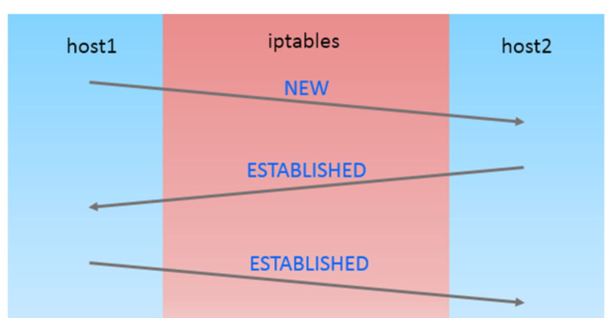

案例

```plain
# 1. 目前的规则
[root@b ~]# iptables -nvL FORWARD
Chain FORWARD (policy ACCEPT 0 packets, 0 bytes)
 pkts bytes target     prot opt in     out     source               destination
    4   459 ACCEPT     tcp  --  *      *       0.0.0.0/0            172.18.0.0/16        tcp spt:80
   13   816 ACCEPT     tcp  --  *      *       172.18.0.0/16        0.0.0.0/0            tcp dpt:80
   40  4004 REJECT     all  --  *      *       0.0.0.0/0            0.0.0.0/0            reject-with icmp-port-unreachable
[root@b ~]#
2.删除刚才单独添加的响应规则
[root@b ~]# iptables -D FORWARD 1
3.添加新规则，只要是响应报文就放行，完成双向的效果
# 第一条规则，只有是回应本机器的报文才能通过防火墙，如果是主动发来的报文无法通过
# 第二条规则，当请求来自于172.18.0.0时，目标地址是80，允许转发
# 第三条规则，拒绝所有请求
[root@b ~]# iptables -I FORWARD -m state --state ESTABLISHED,RELATED -j ACCEPT
[root@b ~]# iptables -nvL FORWARD
Chain FORWARD (policy ACCEPT 0 packets, 0 bytes)
 pkts bytes target     prot opt in     out     source               destination
    0     0 ACCEPT     all  --  *      *       0.0.0.0/0            0.0.0.0/0            state RELATED,ESTABLISHED
   13   816 ACCEPT     tcp  --  *      *       172.18.0.0/16        0.0.0.0/0            tcp dpt:80
   40  4004 REJECT     all  --  *      *       0.0.0.0/0            0.0.0.0/0            reject-with icmp-port-unreachable
[root@b ~]#
```

因此上述结果，应该是：

只允许C机器发出80的请求，得到响应，事实如下。

只允许 C > A ，内 > 外

```plain
[root@c ~]# curl 192.168.1.33
hello a
[root@a ~]# curl 172.18.0.18
curl: (7) Failed connect to 172.18.0.18:80; Connection refused
[root@a ~]#
```

再来一个案例：

允许内部网络ssh连接外部网络。

```plain
[root@b ~]# iptables -I FORWARD -s 172.18.0.0/16 -p tcp --dport 22 -j ACCEPT
```

# iptables总结

- 规则顺序很重要
- 规则里有多个匹配条件时，条件之间属于"与"的关系
- 在没有顺序要求时，不同类的规则，匹配次数多的，频率高的放在规则前面。
- iptables用作网络防火墙时，考虑双向性。
- 注意链的默认策略，黑名单，白名单机制


