# 企业级负载均衡实战

 初识Nginx 

 常见Web服务器介绍 

Web服务器常指的是（world wide web ，www）服务器、也是HTTP服务器，主要用于提供网上信息浏览。

我们大部分人接触互联网，都基本上是通过浏览器访问互联网中各种资源。

Web 网络服务是一种被动访问的服务程序，即只有接收到互联网中其他主机发出的 请求后才会响应，最终用于提供服务程序的 Web 服务器会通过 HTTP(超文本传输协议)或 HTTPS(安全超文本传输协议)把请求的内容传送给用户。

Unix和Linux平台下的常用Web服务器常见有：

●Apache

●Nginx

●Lighttpd

●Tomcat

●IBM WebSphere

其中最为广泛的是Nginx，在Windows平台上最常用的是微软的IIS(Internet Information Server，互联网信息服务)是 Windows 系统中默认的 Web 服务程序。


### Apache

Apache是世界主流的Web服务器，世界上大多著名网站都是Apache搭建，优势在于开放源代码，开发维护团队强大、支持跨平台应用（Unix、Linux、Windows），强大的移植性等优点。

Apache属于重量级产品，功能以模块化定制，消耗内存较高，性能稍弱于其他轻量级Web服务器。

### Lighttpd

Lighttpd是一款高安全性、快速、且灵活的Web服务器产品，专为高性能环境而设计，相比其他Web服务器，内存占用量小，能够有效管理CPU负载，支持（FastCGI、SCGI，Auth，输出压缩，url重写，别名）等重要功能，是Nginx的重要对手之一。

### Tomcat服务器

Tomcat是一个开源、运行基于Java的Web应用软件的容器，Tomcat Server根据servlet和JSP规范执行，但是Tomcat对于平台文件、高并发处理较弱。要使用Tomcat需要对Java的应用部署有足够的了解。

### IBM WebSphere Application Server

WebSphere Applicaiton Server是一种强大的Web应用服务器，基于Java的应用环境、建立、部署和管理网站应用

### Microsoft IIS

微软的IIS是一种灵活，安全易管理的Web服务器，从流媒体到Web应用程序，IIS提供了图形化的管理界面，用于配置和管理网络服务。

IIS是一整套Web组件，包含了Web服务器，FTP服务器，SMTP服务器等常用的网页浏览、文件传输，邮件新闻等功能。

缺点是只能运行在Windows平台，还得购买商业化的操作系统。

## Nginx

Nginx是俄罗斯人Igor Sysoev（伊戈尔·塞索耶夫）开发的一款高性能的HTTP和反向代理服务器。

Nginx以高效的epoll、kqueue、eventport作为网络IO模型，在高并发场景下，Nginx能够轻松支持5w并发连接数的响应，并且消耗的服务器内存、CPU等系统资源消耗却很低，运行非常稳定。

国内著名站点，新浪博客、网易、淘宝、豆瓣、迅雷等大型网站都在使用Nginx作为`Web服务器`或是`反向代理服务器`。

### 为何选择Nginx

在互联网的快速普及，全球化、物联网的迅速发展，世界排名前3的分别是Apache、IIS、Nginx，而Nginx一直在呈现增长趋势。

### Nginx资源消耗低/性能强

官方提供的测试数据，Nginx能支持5W的并发连接，在实际生产环境下可支撑2~4W的并发连接数。

Apache使用的网络I/O模型是传统的select模型，以Prefork多进程模式运转，需要经常派生子进程，消耗系统资源要比Nginx高得多。且一个进程在同一时间只会处理一个请求。

如Apache Web Server支撑这日均千万PV的网站，服务器平均负载在50~60，CPU消耗在70%~90%，而整体迁移到Nginx后，系统平均负载降低至1~4，CPU使用率在20%~40%，效果可见。

常见LNMP（linux、Nginx、Mysql、PHP）服务器在3万并发连接下，开启10个Nginx进程消耗不过`（15MB*10=150MB)`内存。就算开启64个php-cgi进程，也就消耗`20MB*64=1280MB`，总共后台进程使用不到2GB内存，且服务器如果内存较小，开启php-cgi进程数量可以再少点。

在压力测试，3W的并发连接下，Nginx+PHP的程序任然能够飞速运转，从Nginx的日志统计下(每分钟的第15秒有多少条日志)，单机处理请求能力在700次/秒，那么日承受访问量在`700*60*60*24=6048,0000`，且服务器的负载不会太高。

### Nginx成本低

Nginx强大功能其一在于反向代理、负载均衡，属于是软件负载均衡，企业购买硬件的`F5、NetScaler`等硬件负载均衡设备价格昂贵，而Nginx属于开源软件，遵循BSD协议，可以免费试用，甚至二次开发用于商业用途。

BSD协议指的是给与用户更自由的协议，可以自由试用、修改源代码

### Nginx优势

- 配置文件简单易读
- 支持Rewrite重写，根据域名、URL的不同，转发HTTP请求到不同的后端服务器组
- 高可用性，稳定性，宕机几率很低
- 节省资源，支持GZIP压缩静态资源
- 支持热部署，可以7*24小时不间断运行，数月时间可不重启，在kill进程的情况下对软件修改。

### Nginx的网络模型

### 网络IO概念说明

#### 内核空间/用户空间

**内核：操作系统的核心是内核，独立于普通的应用程序，可以操作底层硬件，处理受保护的内存空间。**

**操作系统为了保护内核，使得用户进程无法直接操作内核（kernel），操作系统单独开辟了两个虚拟内存空间，一是内核空间，二是用户空间。**

#### 进程切换

为了控制进程执行，操作系统内核得有能力挂起CPU上运行的进程，或是恢复之前已挂起的进程，这种行为称之为进程切换。

#### 进程阻塞

正在执行的进程，由于某些事件的等待，如请求资源加载中，资源加载失败等，系统自动执行阻塞语句，block，让该进程处于阻塞状态，因此进程的阻塞是一种主动行为，因此也之后又处于运行状态的进程（获取到CPU）才能转变为阻塞状态，阻塞状态下不吃CPU资源。

#### 文件描述符

这是计算机科学里的一个术语，表述指向文件引用的一个抽象概念。它是一个索引值，指向内核为每一个进程打开文件的记录表。

程序打开一个文件，系统内核就向该进程发送一个文件描述符。

#### Linux IO模型

数据的IO操作，例如读取文件，数据会被拷贝到操作系统内核的缓冲区，然后从缓冲区拷贝到应用程序的内存空间。

```plain
一个读取操作，经历两个阶段
1.等待数据准备
2.数据从内核拷贝到进程
```

对于网络IO

```plain
1.等待网络上的数据分段到达，然后复制到内核的缓冲区
2.数据从内核缓存区拷贝到进程
网络应用主要处理两个问题，网络IO，数据计算
网络IO的延迟等待，是最主要的性能瓶颈。
```

为何选择Nginx，重点在于网络模型的区别

常见的IO模型

- 阻塞
- 非阻塞
- IO多路复用
- 异步IO

网络IO指的是输入、输出，本质上是socket读取，socket在linux中被抽象为流，IO就是对流的操作。

### 同步阻塞IO（block IO）

```plain
哥哥和媳妇在麦当劳点餐，点过之后不知道什么时候能做好，只能坐在餐厅等待，直到用餐结束才离开。
但是媳妇其实还想去买个包包的，但是不知道饭菜什么时候好，只能慢慢等，浪费了时间，也没去逛街买包。
```

在linux下默认所有的socket都是blocking阻塞的，阻塞指的是进程被等待了，CPU处理其他任务了。


> 用户进程调用recv()进行系统调用，内核开始IO第一个阶段，准备数据（网络IO情况下，内核要等待所有数据接收完毕）。
> 这个过程指的是，数据拷贝到操作系统内核是需要一定时间的。
> 用户进程这里整个进程被阻塞，当内核数据准备好之后，将数据从内核中再拷贝到用户内存，内核返回结果后，用户进程解除block阻塞状态，重新运行。
> 同步阻塞IO特点是，IO执行的2个阶段都是阻塞的，用户空间发起调用，内核准备数据阻塞，内核拷贝数据到用户空间阻塞。

同步阻塞模型，优/缺点是

1.能够及时返回数据，无延迟
2.对于开发人员负担较低
3.对用户不友好，性能较弱


### 同步非阻塞

哥哥和媳妇还是在麦当劳，点好了餐，但是不愿意白等着，又想去逛会商场，又害怕餐好了来迟了。
因此我们去逛一会，回来问一下客服，餐做好没
没好的话，待会再来问一遍

同步非阻塞就是`每隔一会检索一次`的轮询polling方式。

在网络IO时候，非阻塞IO同样进行recvform系统调用，且检查数据是否准备好了，这里和阻塞IO不一样，非阻塞模式将`整个阻塞时间片`拆分成N小的阻塞，CPU仍有机会不断的操作该进程。


> 当用户进程发起read操作，内核若是没有数据，不会立即阻塞用户进程，而是立即返回了error报错
> 对于用户进程而言，这就不再是等待了，而是立即有了一个结果，已知是error的时候，知道了数据还未准备好，于是再次发起系统调用。
> 一旦内核准备好了数据，且在此收到用户的系统调用，内核立即将数据拷贝到用户内存，然后返回给用户进程。
> 区别就在于发起recvfrom时候的阻塞拆分了，用户进程需要不断的主动询问内核数据是否准备好

#### 同步阻塞和非阻塞的区别

非阻塞优点是，能够在等待某一任务的时间里继续处理其他任务，也包括继续提交新任务。 
非阻塞缺点缺点是：任务完成的延迟变大，因为要多次轮询系统调用操作，而有可能任务就在轮询过程中完成了，造成整体数据吞吐量降低。 

### IO多路复用

```
哥哥还是和媳妇在餐厅吃饭点餐，这回餐厅装了电子屏，可以显示食物制作进度，这样哥哥和他媳妇逛街一回，回来不用再去问服务员了，可能服务员压根不想理你呢，直接看电子屏即可快速知道结果
```

由于刚才所说的`同步非阻塞`需要不断的主动轮询，轮询会消耗大量CPU时间。

计算机系统后台可能存在N个任务，如果能循环的查询多个任务的进度，并且这个轮询还不是用户进程发起的（不是哥哥反复回来询问），而是有人帮忙查询，那可太方便了。

```plain
因此Linux下的select、poll、epoll就是做这个事的，且epoll效率最高
```

#### select

`select轮询方式`和`非阻塞轮询`区别在于

```
select轮询可以同时监听多个socket，当一个socket的数据准备好了，即可进行IO操作，进程发起recvform系统调用，将数据由内核拷贝到用户进程，这个过程是阻塞的。
但是这里的select或是poll阻塞进程，和同步IO的阻塞不一样，同步IO的阻塞是数据全部准备好，一次性处理，而select是有一部分数据就调用用户进程来处理。
IO多路复用，就是轮询多个socket,好比餐厅的电子屏，监控着多个食品订单的完成情况
```


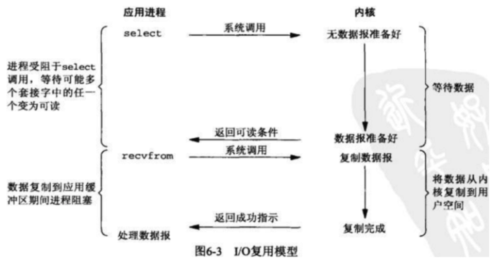

```
IO多路复用指的就是linux下的select，poll，epoll，也被称作事件驱动IO
它们的好处在于：单进程就可以同时处理多个socket连接。原理就是select，poll，epoll这个函数会不断的轮询负责的所有socket，当某个socket有数据到达了，就通知用户进程。
当用户进程调用了select这个函数，整个进程就会被阻塞了，kernel内核会监视所有select负责的socket，有一个socket准备好了数据，select就返回给用户进程，用户进程发起系统调用，数据拷贝到用户进程。
```

其实IO多路复用和阻塞IO并没有太大的区别，有可能还更差一点，因为还额外的调用了select，有了额外的消耗。好处就是select可以同时处理多个连接。

```
如果连接数不是很多的情况下，用IO多路复用还不如使用（多线程+阻塞IO）的性能更好。
IO多路复用优势在于同时处理更多的连接，而不是处理速度
```

### 异步非阻塞IO模型

```
哥哥媳妇不想逛街了，又不想在餐厅等着，因此他俩直接选择回家休息。拿起手机点外卖，饭好了外卖员直接送到家，这也太舒服了，又不用干等着，还能做些别的事，饭菜就能送来了。
```

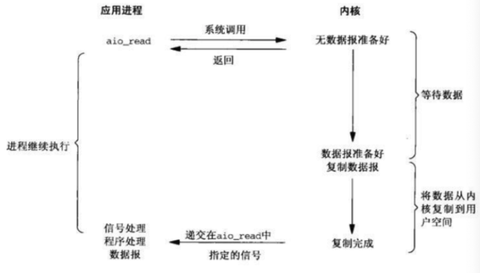

用户进程发起aio_read系统调用，无论内核数据是否准备好，都会直接返回给用户进程，用户进程可以继续做其他事情。等待socket数据准备好了，内核直接复制给用户进程，接着向进程发出通知，整个过程都是非阻塞的。

### 网络IO模型总结

```plain
1.阻塞和非阻塞的区别
阻塞IO会一直阻塞对应的进程，直到数据操作完毕，
非阻塞IO在内核准备数据阶段就立刻返回
2.同步IO和异步IO的区别
区别在于，同步IO在IO操作的时候会被进程阻塞，blocking io，non-blocking io，IO multiplexing都属于同步IO
异步IO，在进程发起IO操作之后，内核就直接返回了，直到内核发送一个信号，告诉进程IO完成了，整个进程完全没有被阻塞。
```


## Nginx架构组成


### Nginx安装配置

Nginx如今分为商业版，开源版，支持Linux与Windows平台下载使用

```plain
nginx.com  商业版
nginx.org  开源版
https://tengine.taobao.org/
```

【环境准备】

```plain
操作系统：CentOS Linux release 7.3.1611 (Core)
GCC编译环境：yum install -y gcc gcc-c++ autoconf automake make 
模块依赖性：Nginx支持的功能模块需要有第三方的库支持，例如gzip的zlib库，rewrite重写需要的pcre库，HTTPS需要的openssl库等等。
yum install zlib zlib-devel openssl openssl-devel pcre pcre-devel wget httpd-tools vim
系统基础开发环境：yum groupinstall "Development Tools" "Basic Web Server"
确保防火墙关闭  iptables -F  
关闭selinux
yum源配置正确
网络连接状态正常
```

【Nginx下载】

- yum自动安装，不支持自由扩展第三方功能
- 源码编译安装

```plain
1.下载Nginx源代码  nginx.org官网
[root@chaogelinux Learn_Nginx]# wget nginx.org/download/nginx-1.14.0.tar.gz
2.解压缩Nginx源代码
[root@chaogelinux Learn_Nginx]# tar -zxf nginx-1.14.0.tar.gz
3.复制Nginx默认提供的vim语法插件
[root@chaogelinux nginx-1.14.0]# mkdir ~/.vim
[root@chaogelinux nginx-1.14.0]# cp -r contrib/vim/* ~/.vim/
4.Nginx源代码目录介绍
auto 检测系统模块
CHANGES nginx更改记录文件
conf 存放nginx配置文件
configure 释放编译文件的定制脚本
contrib 提供了perl与vim插件
html 存放标准html页面语法
src 存放nginx源码
5.开始编译Nginx，扩展编译模块
#列出Nginx的编译选项，如制定安装路径，配置文件、日志文件等路径，指定开启模块功能等
[root@chaogelinux nginx-1.14.0]# ./configure --help  
#编译Nginx初步，
[root@chaogelinux nginx-1.14.0]# ./configure --prefix=/home/Learn_Nginx/nginx/ --with-http_ssl_module  --with-http_flv_module --with-http_gzip_static_module --with-http_stub_status_module  --with-threads  --with-file-aio
6.执行make编译
make 
7.首次编译安装，生成Nginx的可执行命令
make install 
8.检查Prefix指定的安装目录
[root@chaogelinux nginx-1.14.0]# ls /home/Learn_Nginx/
nginx  nginx-1.14.0  nginx-1.14.0.tar.gz
9.Nginx的程序目录
[root@chaogelinux nginx]# pwd
/home/Learn_Nginx/nginx
[root@chaogelinux nginx]# ls
conf  html  logs  sbin
依次是配置文件，静态文件，日志，二进制命令目录
10.创建nginx的环境变量文件，修改如下，创建/etc/profile.d/nginx.sh脚本文件便于以后维护
[root@chaogelinux ~]# cat /etc/profile.d/nginx.sh
export PATH=/home/Learn_Nginx/nginx/sbin:$PATH
11.退出会话，重新登录终端，此时可以正常使用nginx
[root@chaogelinux ~]# echo $PATH
/home/Learn_Nginx/nginx/sbin:/usr/local/sbin:/usr/local/bin:/usr/sbin:/usr/bin:/root/bin
12.检查nginx的编译模块信息
[root@chaogelinux ~]# nginx -V
nginx version: nginx/1.14.0
built by gcc 4.8.5 20150623 (Red Hat 4.8.5-39) (GCC)
built with OpenSSL 1.0.2k-fips  26 Jan 2017
TLS SNI support enabled
configure arguments: --prefix=/home/Learn_Nginx/nginx114/ --with-http_ssl_module --with-http_flv_module --with-http_gzip_static_module --with-http_stub_status_module --with-threads --with-file-aio
```

### Nginx配置文件语法

- nginx.conf由指令与指令块构成
- 每行语句由分号结束，指令和参数之间由空格分隔
- 指令块可以大括号{}组织多条指令块
- 配置文件中#号添加注释信息
- 支持`$变量`使用变量
- 支持include语句，组合多个配置文件
- 部分指令支持正则表达式

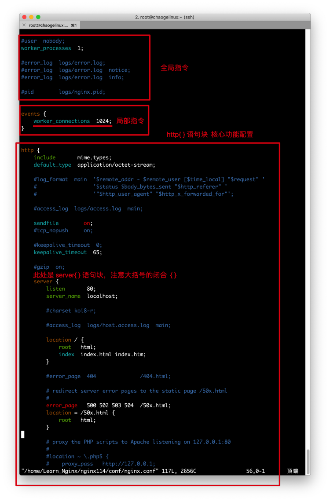

### nginx.conf指令注释

```plain
######Nginx配置文件nginx.conf中文详解#####
#定义Nginx运行的用户和用户组
user www www;
#nginx进程数，建议设置为等于CPU总核心数。
worker_processes 8;
#全局错误日志定义类型，[ debug | info | notice | warn | error | crit ]
error_log /usr/local/nginx/logs/error.log info;
#进程pid文件
pid /usr/local/nginx/logs/nginx.pid;
#指定进程可以打开的最大描述符：数目
#工作模式与连接数上限
#这个指令是指当一个nginx进程打开的最多文件描述符数目，理论值应该是最多打开文件数（ulimit -n）与nginx进程数相除，但是nginx分配请求并不是那么均匀，所以最好与ulimit -n 的值保持一致。
#现在在linux 2.6内核下开启文件打开数为65535，worker_rlimit_nofile就相应应该填写65535。
#这是因为nginx调度时分配请求到进程并不是那么的均衡，所以假如填写10240，总并发量达到3-4万时就有进程可能超过10240了，这时会返回502错误。
worker_rlimit_nofile 65535;
events
{
    #参考事件模型，use [ kqueue | rtsig | epoll | /dev/poll | select | poll ]; epoll模型
    #是Linux 2.6以上版本内核中的高性能网络I/O模型，linux建议epoll，如果跑在FreeBSD上面，就用kqueue模型。
    #补充说明：
    #与apache相类，nginx针对不同的操作系统，有不同的事件模型
    #A）标准事件模型
    #Select、poll属于标准事件模型，如果当前系统不存在更有效的方法，nginx会选择select或poll
    #B）高效事件模型
    #Kqueue：使用于FreeBSD 4.1+, OpenBSD 2.9+, NetBSD 2.0 和 MacOS X.使用双处理器的MacOS X系统使用kqueue可能会造成内核崩溃。
    #Epoll：使用于Linux内核2.6版本及以后的系统。
    #/dev/poll：使用于Solaris 7 11/99+，HP/UX 11.22+ (eventport)，IRIX 6.5.15+ 和 Tru64 UNIX 5.1A+。
    #Eventport：使用于Solaris 10。 为了防止出现内核崩溃的问题， 有必要安装安全补丁。
    use epoll;
    #单个进程最大连接数（最大连接数=连接数*进程数）
    #根据硬件调整，和前面工作进程配合起来用，尽量大，但是别把cpu跑到100%就行。每个进程允许的最多连接数，理论上每台nginx服务器的最大连接数为。
    worker_connections 65535;
    #keepalive超时时间。
    keepalive_timeout 60;
    #客户端请求头部的缓冲区大小。这个可以根据你的系统分页大小来设置，一般一个请求头的大小不会超过1k，不过由于一般系统分页都要大于1k，所以这里设置为分页大小。
    #分页大小可以用命令getconf PAGESIZE 取得。
    #[root@web001 ~]# getconf PAGESIZE
    #4096
    #但也有client_header_buffer_size超过4k的情况，但是client_header_buffer_size该值必须设置为“系统分页大小”的整倍数。
    client_header_buffer_size 4k;
    #这个将为打开文件指定缓存，默认是没有启用的，max指定缓存数量，建议和打开文件数一致，inactive是指经过多长时间文件没被请求后删除缓存。
    open_file_cache max=65535 inactive=60s;
    #这个是指多长时间检查一次缓存的有效信息。
    #语法:open_file_cache_valid time 默认值:open_file_cache_valid 60 使用字段:http, server, location 这个指令指定了何时需要检查open_file_cache中缓存项目的有效信息.
    open_file_cache_valid 80s;
    #open_file_cache指令中的inactive参数时间内文件的最少使用次数，如果超过这个数字，文件描述符一直是在缓存中打开的，如上例，如果有一个文件在inactive时间内一次没被使用，它将被移除。
    #语法:open_file_cache_min_uses number 默认值:open_file_cache_min_uses 1 使用字段:http, server, location  这个指令指定了在open_file_cache指令无效的参数中一定的时间范围内可以使用的最小文件数,如果使用更大的值,文件描述符在cache中总是打开状态.
    open_file_cache_min_uses 1;
    #语法:open_file_cache_errors on | off 默认值:open_file_cache_errors off 使用字段:http, server, location 这个指令指定是否在搜索一个文件是记录cache错误.
    open_file_cache_errors on;
}
#设定http服务器，利用它的反向代理功能提供负载均衡支持
http
{
    #文件扩展名与文件类型映射表
    include mime.types;
    #默认文件类型
    default_type application/octet-stream;
    #默认编码
    #charset utf-8;
    #服务器名字的hash表大小
    #保存服务器名字的hash表是由指令server_names_hash_max_size 和server_names_hash_bucket_size所控制的。参数hash bucket size总是等于hash表的大小，并且是一路处理器缓存大小的倍数。在减少了在内存中的存取次数后，使在处理器中加速查找hash表键值成为可能。如果hash bucket size等于一路处理器缓存的大小，那么在查找键的时候，最坏的情况下在内存中查找的次数为2。第一次是确定存储单元的地址，第二次是在存储单元中查找键 值。因此，如果Nginx给出需要增大hash max size 或 hash bucket size的提示，那么首要的是增大前一个参数的大小.
    server_names_hash_bucket_size 128;
    #客户端请求头部的缓冲区大小。这个可以根据你的系统分页大小来设置，一般一个请求的头部大小不会超过1k，不过由于一般系统分页都要大于1k，所以这里设置为分页大小。分页大小可以用命令getconf PAGESIZE取得。
    client_header_buffer_size 32k;
    #客户请求头缓冲大小。nginx默认会用client_header_buffer_size这个buffer来读取header值，如果header过大，它会使用large_client_header_buffers来读取。
    large_client_header_buffers 4 64k;
    #设定通过nginx上传文件的大小
    client_max_body_size 8m;
    #开启高效文件传输模式，sendfile指令指定nginx是否调用sendfile函数来输出文件，对于普通应用设为 on，如果用来进行下载等应用磁盘IO重负载应用，可设置为off，以平衡磁盘与网络I/O处理速度，降低系统的负载。注意：如果图片显示不正常把这个改成off。
    #sendfile指令指定 nginx 是否调用sendfile 函数（zero copy 方式）来输出文件，对于普通应用，必须设为on。如果用来进行下载等应用磁盘IO重负载应用，可设置为off，以平衡磁盘与网络IO处理速度，降低系统uptime。
    sendfile on;
    #开启目录列表访问，合适下载服务器，默认关闭。
    autoindex on;
    #此选项允许或禁止使用socke的TCP_CORK的选项，此选项仅在使用sendfile的时候使用
    tcp_nopush on;
    tcp_nodelay on;
    #长连接超时时间，单位是秒
    keepalive_timeout 120;
    #FastCGI相关参数是为了改善网站的性能：减少资源占用，提高访问速度。下面参数看字面意思都能理解。
    fastcgi_connect_timeout 300;
    fastcgi_send_timeout 300;
    fastcgi_read_timeout 300;
    fastcgi_buffer_size 64k;
    fastcgi_buffers 4 64k;
    fastcgi_busy_buffers_size 128k;
    fastcgi_temp_file_write_size 128k;
    #gzip模块设置
    gzip on; #开启gzip压缩输出
    gzip_min_length 1k;    #最小压缩文件大小
    gzip_buffers 4 16k;    #压缩缓冲区
    gzip_http_version 1.0;    #压缩版本（默认1.1，前端如果是squid2.5请使用1.0）
    gzip_comp_level 2;    #压缩等级
    gzip_types text/plain application/x-javascript text/css application/xml;    #压缩类型，默认就已经包含textml，所以下面就不用再写了，写上去也不会有问题，但是会有一个warn。
    gzip_vary on;
    #开启限制IP连接数的时候需要使用
    #limit_zone crawler $binary_remote_addr 10m;
    #负载均衡配置
    upstream pythonav.cn {
        #upstream的负载均衡，weight是权重，可以根据机器配置定义权重。weigth参数表示权值，权值越高被分配到的几率越大。
        server 192.168.80.121:80 weight=3;
        server 192.168.80.122:80 weight=2;
        server 192.168.80.123:80 weight=3;
        #nginx的upstream目前支持4种方式的分配
        #1、轮询（默认）
        #每个请求按时间顺序逐一分配到不同的后端服务器，如果后端服务器down掉，能自动剔除。
        #2、weight
        #指定轮询几率，weight和访问比率成正比，用于后端服务器性能不均的情况。
        #例如：
        #upstream bakend {
        #    server 192.168.0.14 weight=10;
        #    server 192.168.0.15 weight=10;
        #}
        #2、ip_hash
        #每个请求按访问ip的hash结果分配，这样每个访客固定访问一个后端服务器，可以解决session的问题。
        #例如：
        #upstream bakend {
        #    ip_hash;
        #    server 192.168.0.14:88;
        #    server 192.168.0.15:80;
        #}
        #3、fair（第三方）
        #按后端服务器的响应时间来分配请求，响应时间短的优先分配。
        #upstream backend {
        #    server server1;
        #    server server2;
        #    fair;
        #}
        #4、url_hash（第三方）
        #按访问url的hash结果来分配请求，使每个url定向到同一个后端服务器，后端服务器为缓存时比较有效。
        #例：在upstream中加入hash语句，server语句中不能写入weight等其他的参数，hash_method是使用的hash算法
        #upstream backend {
        #    server squid1:3128;
        #    server squid2:3128;
        #    hash $request_uri;
        #    hash_method crc32;
        #}
        #tips:
        #upstream bakend{#定义负载均衡设备的Ip及设备状态}{
        #    ip_hash;
        #    server 127.0.0.1:9090 down;
        #    server 127.0.0.1:8080 weight=2;
        #    server 127.0.0.1:6060;
        #    server 127.0.0.1:7070 backup;
        #}
        #在需要使用负载均衡的server中增加 proxy_pass http://bakend/;
        #每个设备的状态设置为:
        #1.down表示单前的server暂时不参与负载
        #2.weight为weight越大，负载的权重就越大。
        #3.max_fails：允许请求失败的次数默认为1.当超过最大次数时，返回proxy_next_upstream模块定义的错误
        #4.fail_timeout:max_fails次失败后，暂停的时间。
        #5.backup： 其它所有的非backup机器down或者忙的时候，请求backup机器。所以这台机器压力会最轻。
        #nginx支持同时设置多组的负载均衡，用来给不用的server来使用。
        #client_body_in_file_only设置为On 可以讲client post过来的数据记录到文件中用来做debug
        #client_body_temp_path设置记录文件的目录 可以设置最多3层目录
        #location对URL进行匹配.可以进行重定向或者进行新的代理 负载均衡
    }
    #虚拟主机的配置
    server
    {
        #监听端口
        listen 80;
        #域名可以有多个，用空格隔开
        server_name www.w3cschool.cn w3cschool.cn;
        index index.html index.htm index.php;
        root /data/www/w3cschool;
        #对******进行负载均衡
        location ~ .*.(php|php5)?$
        {
            fastcgi_pass 127.0.0.1:9000;
            fastcgi_index index.php;
            include fastcgi.conf;
        }
        #图片缓存时间设置
        location ~ .*.(gif|jpg|jpeg|png|bmp|swf)$
        {
            expires 10d;
        }
        #JS和CSS缓存时间设置
        location ~ .*.(js|css)?$
        {
            expires 1h;
        }
        #日志格式设定
        #$remote_addr与$http_x_forwarded_for用以记录客户端的ip地址；
        #$remote_user：用来记录客户端用户名称；
        #$time_local： 用来记录访问时间与时区；
        #$request： 用来记录请求的url与http协议；
        #$status： 用来记录请求状态；成功是200，
        #$body_bytes_sent ：记录发送给客户端文件主体内容大小；
        #$http_referer：用来记录从那个页面链接访问过来的；
        #$http_user_agent：记录客户浏览器的相关信息；
        #通常web服务器放在反向代理的后面，这样就不能获取到客户的IP地址了，通过$remote_add拿到的IP地址是反向代理服务器的iP地址。反向代理服务器在转发请求的http头信息中，可以增加x_forwarded_for信息，用以记录原有客户端的IP地址和原来客户端的请求的服务器地址。
        log_format access '$remote_addr - $remote_user [$time_local] "$request" '
        '$status $body_bytes_sent "$http_referer" '
        '"$http_user_agent" $http_x_forwarded_for';
        #定义本虚拟主机的访问日志
        access_log  /usr/local/nginx/logs/host.access.log  main;
        access_log  /usr/local/nginx/logs/host.access.404.log  log404;
        #对 "/" 启用反向代理
        location / {
            proxy_pass http://127.0.0.1:88;
            proxy_redirect off;
            proxy_set_header X-Real-IP $remote_addr;
            #后端的Web服务器可以通过X-Forwarded-For获取用户真实IP
            proxy_set_header X-Forwarded-For $proxy_add_x_forwarded_for;
            #以下是一些反向代理的配置，可选。
            proxy_set_header Host $host;
            #允许客户端请求的最大单文件字节数
            client_max_body_size 10m;
            #缓冲区代理缓冲用户端请求的最大字节数，
            #如果把它设置为比较大的数值，例如256k，那么，无论使用firefox还是IE浏览器，来提交任意小于256k的图片，都很正常。如果注释该指令，使用默认的client_body_buffer_size设置，也就是操作系统页面大小的两倍，8k或者16k，问题就出现了。
            #无论使用firefox4.0还是IE8.0，提交一个比较大，200k左右的图片，都返回500 Internal Server Error错误
            client_body_buffer_size 128k;
            #表示使nginx阻止HTTP应答代码为400或者更高的应答。
            proxy_intercept_errors on;
            #后端服务器连接的超时时间_发起握手等候响应超时时间
            #nginx跟后端服务器连接超时时间(代理连接超时)
            proxy_connect_timeout 90;
            #后端服务器数据回传时间(代理发送超时)
            #后端服务器数据回传时间_就是在规定时间之内后端服务器必须传完所有的数据
            proxy_send_timeout 90;
            #连接成功后，后端服务器响应时间(代理接收超时)
            #连接成功后_等候后端服务器响应时间_其实已经进入后端的排队之中等候处理（也可以说是后端服务器处理请求的时间）
            proxy_read_timeout 90;
            #设置代理服务器（nginx）保存用户头信息的缓冲区大小
            #设置从被代理服务器读取的第一部分应答的缓冲区大小，通常情况下这部分应答中包含一个小的应答头，默认情况下这个值的大小为指令proxy_buffers中指定的一个缓冲区的大小，不过可以将其设置为更小
            proxy_buffer_size 4k;
            #proxy_buffers缓冲区，网页平均在32k以下的设置
            #设置用于读取应答（来自被代理服务器）的缓冲区数目和大小，默认情况也为分页大小，根据操作系统的不同可能是4k或者8k
            proxy_buffers 4 32k;
            #高负荷下缓冲大小（proxy_buffers*2）
            proxy_busy_buffers_size 64k;
            #设置在写入proxy_temp_path时数据的大小，预防一个工作进程在传递文件时阻塞太长
            #设定缓存文件夹大小，大于这个值，将从upstream服务器传
            proxy_temp_file_write_size 64k;
        }
        #设定查看Nginx状态的地址
        location /NginxStatus {
            stub_status on;
            access_log on;
            auth_basic "NginxStatus";
            auth_basic_user_file confpasswd;
            #htpasswd文件的内容可以用apache提供的htpasswd工具来产生。
        }
        #本地动静分离反向代理配置
        #所有jsp的页面均交由tomcat或resin处理
        location ~ .(jsp|jspx|do)?$ {
            proxy_set_header Host $host;
            proxy_set_header X-Real-IP $remote_addr;
            proxy_set_header X-Forwarded-For $proxy_add_x_forwarded_for;
            proxy_pass http://127.0.0.1:8080;
        }
        #所有静态文件由nginx直接读取不经过tomcat或resin
        location ~ .*.(htm|html|gif|jpg|jpeg|png|bmp|swf|ioc|rar|zip|txt|flv|mid|doc|ppt|
        pdf|xls|mp3|wma)$
        {
            expires 15d; 
        }
        location ~ .*.(js|css)?$
        {
            expires 1h;
        }
    }
}
######Nginx配置文件nginx.conf中文详解#####
nginx.conf详解
```

#### nginx.conf重要的指令块

核心功能都在于http{}指令块里，http{}块还包含了以下指令

- server{} 指令块 ，对应一个站点配置，反向代理，静态资源站点
- location{} ，对应一个url
- upstream{} ，定义上游服务，负载均衡池

### Nginx命令行

- 启停指令

- - nginx -s stop
  - nginx -s reload
  - nginx 首次输入表示启动

- nginx帮助指令

```plain
[root@chaogelinux nginx114]# nginx  -h
nginx version: nginx/1.14.0
Usage: nginx [-?hvVtTq] [-s signal] [-c filename] [-p prefix] [-g directives]
Options:
  -?,-h         : this help   #帮助信息
  -v            : show version and exit        #显示版本
  -V            : show version and configure options then exit #显示编译信息与版本
  -t            : test configuration and exit    #测试配置文件语法
  -T            : test configuration, dump it and exit    #测试语法且输出内容
  -q            : suppress non-error messages during configuration testing
  -s signal     : send signal to a master process: stop, quit, reopen, reload #发送信号，stop立即停止，quit优雅停止，reload重读配置文件，reopen重新记录日志
  -p prefix     : set prefix path (default: /home/Learn_Nginx/nginx114//)
  -c filename   : set configuration file (default: conf/nginx.conf) #使用指定配置文件
  -g directives : set global directives out of configuration file #覆盖默认参数
```

### 命令行功能案例

#### 配置文件重读

在nginx正在运行时，如实修改了nginx.conf或是新增了一些功能配置，让其生效，可能需要重启整个nginx进程、

但是你不能保证某个时间段没有用户在访问nginx，重启会断开用户的连接，造成莫名的故障

因此nginx提供了reload重载功能，不停止服务，更新配置文件

```plain
1.修改nginx.conf
worker_processes  3; #定义nginx工作进程数的
2.重载配置文件
nginx -s reload
3.检查linux进程
[root@chaogelinux nginx114]# vim conf/nginx.conf
[root@chaogelinux nginx114]#
[root@chaogelinux nginx114]# ps -ef|grep nginx
root      6191     1  0 10:33 ?        00:00:00 nginx: master process nginx
nobody    6213  6191  0 10:33 ?        00:00:00 nginx: worker process
nobody    6214  6191  0 10:33 ?        00:00:00 nginx: worker process
nobody    6215  6191  0 10:33 ?        00:00:00 nginx: worker process
root      6345  5283  0 10:38 pts/0    00:00:00 grep --color=auto nginx
```

### Nginx-master信号

nginx进程信号传递如图


```plain
1.master不处理请求，而是分配worker进程，负责重启，热部署，重载等功能。
2.master根据worker_processes 定义开始的workers数量
3.worker运行后，master处于挂起状态，等待信号
4.可以发送kill，或者nginx -s 参数发出信号
```

#### 信号集

| nginx -s 对应参数 | 信号  | 含义                                      | English                                                      |
| ----------------- | ----- | ----------------------------------------- | ------------------------------------------------------------ |
| stop              | TERM  | 强制关闭整个服务                          | Shut down quickly.                                           |
| null              | INT   | 强制关闭整个服务                          | Shut down quickly.                                           |
| quit              | QUIT  | 优雅地关闭整个服务                        | Shut down gracefully.                                        |
| reopen            | USR1  | 重新打开日志记录                          | Reopen log files.                                            |
| reload            | HUP   | 重新读取配置文件,并且优雅地退出老的worker | Reload configuration, start the new worker process with a new configuration, and gracefully shut down old worker processes. |
| null              | USR2  | 平滑升级到新版本                          | Upgrade the nginx executable on the fly.                     |
| null              | WINCH | 优雅地关闭worker(在热更新的时候必用)      | Shut down worker processes gracefully.                       |

#### 热部署

nginx作为一个优秀的反向代理服务器，同时具备高可用的特性，Nginx也支持热部署。

热部署指的是`在不重启或关闭进程情况下，新应用直接替换掉旧的应用`

```plain
热部署大致流程
1.备份旧的二进制文件
2.编译安装新的二进制文件，覆盖旧的二进制文件
3.发送USR2信号给旧master进程
4.发送WINCH信号给旧master进程
5.发送QUIT信号给旧master进程
环境准备：
1.旧nginx版本 nginx version: nginx/1.14.0
2.新nginx版本 nginx version: nginx/1.17.8
```

【nginx热部署】

nginx工作模式是master-worker（包工头-工人）

刚才所说的nginx支持`reload重载`仅仅是nginx的master进程，检查配置文件语法是否正确，错则返回错误、正确也`不会改变`已经建立连接的worker，只得等待worker处理完毕请求之后，`杀死旧配置文件的worker，启动新配置文件的worker`。

但是Nginx这里提提供了热部署功能，就是在`不影响用户体验下，进行软件版本升级`，也就是不主动杀死worker，替换软件的二进制文件。

```plain
1.目前运行的是旧的nginx版本，如下检查
[root@chaogelinux sbin]# ps -ef|grep nginx
root     20311     1  0 15:12 ?        00:00:00 nginx: master process nginx
nobody   20312 20311  0 15:12 ?        00:00:00 nginx: worker process
root     20314 13589  0 15:12 pts/0    00:00:00 grep --color=auto nginx
[root@chaogelinux sbin]#
[root@chaogelinux sbin]#
[root@chaogelinux sbin]# curl 127.0.0.1/123  #访问错误页面，返回nginx版本了
<html>
<head><title>404 Not Found</title></head>
<body bgcolor="white">
<center><h1>404 Not Found</h1></center>
<hr><center>nginx/1.14.0</center>
</body>
</html>
```

### 热部署的坑

> 如果出现发送 kill -USR2信号后，未出现新的master进程
>
> 是因为：
>
> 旧的nginx必须用绝对路径启动，然后再发送kill -USR2信号
>
> 具体解释看图


### 热部署具体操作

```plain
1.备份旧版本的nginx二进制文件
[root@chaogelinux sbin]# pwd
/home/Learn_Nginx/nginx/sbin
[root@chaogelinux sbin]# mv nginx nginx.old
[root@chaogelinux sbin]# ls
nginx.old
2.检查旧版本nginx的编译参数
[root@chaogelinux Learn_Nginx]# nginx.old -V
nginx version: nginx/1.14.0
built by gcc 4.8.5 20150623 (Red Hat 4.8.5-39) (GCC)
built with OpenSSL 1.0.2k-fips  26 Jan 2017
TLS SNI support enabled
configure arguments: --prefix=/home/Learn_Nginx/nginx/ --with-http_ssl_module --with-http_flv_module --with-http_gzip_static_module --with-http_stub_status_module --with-threads --with-file-aio
3.编译安装新版本nginx
#下载新nginx源码
[root@chaogelinux Learn_Nginx]# wget http://nginx.org/download/nginx-1.17.8.tar.gz
#编译安装新版本nginx
[root@chaogelinux Learn_Nginx]# tar -zxf nginx-1.17.8.tar.gz
#开始编译
[root@chaogelinux Learn_Nginx]# cd nginx-1.17.8/
[root@chaogelinux nginx-1.17.8]#
[root@chaogelinux nginx-1.17.8]# ./configure --prefix=/home/Learn_Nginx/nginx/ --with-http_ssl_module --with-http_flv_module --with-http_gzip_static_module --with-http_stub_status_module --with-threads --with-file-aio
#编译安装
[root@chaogelinux nginx-1.17.8]# make && make install 
4.此时发现已存在2个版本nginx程序
[root@chaogelinux sbin]# ls
nginx  nginx.old
5.替换旧的nginx可执行文件
[root@chaogelinux sbin]# cp -a /home/Learn_Nginx/nginx-1.17.8/objs/nginx /home/Learn_Nginx/nginx/sbin/
cp：是否覆盖"/home/Learn_Nginx/nginx/sbin/nginx"？ y
5.1检查旧的nginx进程，请注意，这里用绝对路径启动nginx
请注意，这里用绝对路径启动nginx
请注意，这里用绝对路径启动nginx
例如
/home/Learn_Nginx/nginx/sbin/nginx
注意这里的PID和PPID（pid是当前进程的id号，ppid是启动该进程的pid，也就是父ID，可知该pid由谁启动）
[root@chaogelinux sbin]# ps -ef|grep nginx
root     20311     1  0 15:12 ?        00:00:00 nginx: master process nginx
nobody   20312 20311  0 15:12 ?        00:00:00 nginx: worker process
root     20314 13589  0 15:12 pts/0    00:00:00 grep --color=auto nginx
6.发送USR2信号给旧版本主进程，使得nginx旧版本停止接收请求，切换为新nginx版本
[root@chaogelinux sbin]# kill -USR2 `cat ../logs/nginx.pid `
7.检查此时的nginx进程
nginx-master首先会重命名pid文件，在文件后面添加.oldbin后缀
然后会再启动一个新的master进程以及worker，且使用的是新版Nginx 
nginx能够自动将新来的请求，过度到新版master进程下，实现平滑过度
#可以发现新的master进程由旧master启动，由PPID可看出
[root@chaogelinux sbin]# ps -ef|grep nginx
root     20311     1  0 15:12 ?        00:00:00 nginx: master process nginx
nobody   20312 20311  0 15:12 ?        00:00:00 nginx: worker process
root     20335 20311  0 15:13 ?        00:00:00 nginx: master process nginx
nobody   20336 20335  0 15:13 ?        00:00:00 nginx: worker process
root     20338 13589  0 15:13 pts/0    00:00:00 grep --color=auto nginx
[root@chaogelinux sbin]# ls ../logs/
access.log        error.log         nginx.pid         nginx.pid.oldbin
8.发送WINCH信号给旧master进程，优雅的关闭旧worker进程
[root@chaogelinux sbin]# kill -WINCH `cat ../logs/nginx.pid.oldbin`
#再次检查进程情况，旧master的worker已经关闭了，旧master不会自己退出，用作版本回退
[root@chaogelinux sbin]# ps -ef|grep nginx
root     20311     1  0 15:12 ?        00:00:00 nginx: master process nginx
root     20335 20311  0 15:13 ?        00:00:00 nginx: master process nginx
nobody   20336 20335  0 15:13 ?        00:00:00 nginx: worker process
root     20607 13589  0 15:25 pts/0    00:00:00 grep --color=auto nginx
9.如果你觉得没问题了，可以关闭旧master进程
[root@chaogelinux sbin]# ps -ef|grep nginx
root     20335     1  0 15:13 ?        00:00:00 nginx: master process nginx
nobody   20336 20335  0 15:13 ?        00:00:00 nginx: worker process
root     20665 13589  0 15:28 pts/0    00:00:00 grep --color=auto nginx
```

### nginx日志切割

日志切割是线上很常见的操作，控制单个文件大小，便于管理日志

```plain
1.查看当前nginx日志
[root@chaogelinux logs]# ll
总用量 12
-rw-r--r-- 1 root root 1645 2月  11 15:30 access.log
-rw-r--r-- 1 root root 2370 2月  11 15:30 error.log
-rw-r--r-- 1 root root    6 2月  11 15:13 nginx.pid
#大致看下日志内容
[root@chaogelinux logs]# tail -2  access.log
192.168.178.12 - - [11/Feb/2020:15:32:22 +0800] "GET / HTTP/1.1" 304 0 "-" "Mozilla/5.0 (Macintosh; Intel Mac OS X 10_15_3) AppleWebKit/537.36 (KHTML, like Gecko) Chrome/79.0.3945.130 Safari/537.36"
192.168.178.12 - - [11/Feb/2020:15:32:23 +0800] "GET / HTTP/1.1" 304 0 "-" "Mozilla/5.0 (Macintosh; Intel Mac OS X 10_15_3) AppleWebKit/537.36 (KHTML, like Gecko) Chrome/79.0.3945.130 Safari/537.36"
2.给文件重命名，注意用mv而不是cp（涉及到文件inode知识）
[root@chaogelinux logs]# mv access.log access.log$(date +"%Y-%m-%d--%H:%M:%S")
[root@chaogelinux logs]# ll
总用量 16
-rw-r--r-- 1 root root 4630 2月  11 15:32 access.log2020-02-11--15:43:49
-rw-r--r-- 1 root root 2370 2月  11 15:30 error.log
-rw-r--r-- 1 root root    6 2月  11 15:13 nginx.pid
3.发送USR1信号给nginx-master,重新打开日志记录，生成新的日志文件
nginx -s reopen  #等同于 Kill -USR1 nginx.pid 
4.注意，在以上的nginx重命名日志切割，不要着急立即对文件修改，且要sleep 等待1秒
由于nginx的工作模式，master下发指令给worker只是做了标记，当业务量大的时候，这个修改操作可能会慢一点，不会理解生效
5.在生产环境下，主要以crontab形式，执行cut_nginx_log.sh脚本的
[root@bogon sbin]# pwd
/opt/nginx/sbin
[root@bogon sbin]# cat cut_nginx_log.sh
#!/bin/bash
# 脚本写入crontab，每天0点执行，这是一个nginx日志切割脚本
#nginx日志存放点
logs_path="/opt/tngx232/logs/"
mkdir -p ${logs_path}$(date -d "yesterday" +"%Y")/$(date -d "yesterday" +"%m")
mv ${logs_path}access.log ${logs_path}$(date -d "yesterday" +"%Y")/$(date -d "yesterday" +"%m")/access_$(date -d "yesterday" +"%Y-%m-%d").log
kill -USR1 `cat /opt/tngx232/logs/nginx.pid`
6.写入crontab
crontab -l 
0 0 * * * /bin/bash /opt/nginx/sbin/cut_nginx_log.sh
```


# Nginx静态资源站点

## Nginx虚拟主机

虚拟主机指的就是一个独立的站点，具有独立的域名，有完整的www服务，例如网站、FTP、邮件等。

Nginx支持多虚拟主机，在一台机器上可以运行完全独立的多个站点。


一些草根流量站长，常会搭建个人站点进行资源分享交流，并且可能有多个不同业务的站点，如果每台服务器只运行一个网站，那么将造成资源浪费，成本浪费。

利用虚拟主机的功能，就不用为了运行一个网站而单独配置一个Nginx服务器，或是单独再运行一组Nginx进程。

虚拟主机可以在一台服务器，同一个Nginx进程上运行多个网站。

nginx.conf主配置文件中，最简单的一段虚拟主机配置如下

```plain
http{
    server {
            #监听端口
            listen 80;
            #填写域名匹配
            server_name  localhost;
            #访问日志
            access_log  logs/host.access.log  main;
            #url匹配
            location / {
                        root   html;
            index  index.html index.htm;
            }
    }
}
```

### 搭建一个静态资源网站

修改nginx.conf，自上而下找到第一个server{}指令块，修改如下

```plain
准备好资源文件目录，内容自定义
[root@chaogelinux website]# pwd
/website
[root@chaogelinux website]# ls
index.html  pic
1.修改nginx.conf
server {
          listen       80;
          server_name  localhost;
          #默认编码
          charset utf-8;
          access_log  logs/host.access.log  main;
        location / {
              #定义虚拟主机的资源目录,
            root   /website/;
            #定义首页文件的名字
            index  index.html index.htm;
        }
      }
2.重载nginx配置文件
nginx -s reload
```

访问网站首页

```plain
http://123.206.16.61:80/index.html
简写
http://123.206.16.61/
```


访问网站图片资源

```plain
http://123.206.16.61/pic/2.jpg
```


访问gif动图

```plain
http://123.206.16.61/pic/1.gif
```


访问文本

```plain
http://123.206.16.61/learn_linux.txt
```

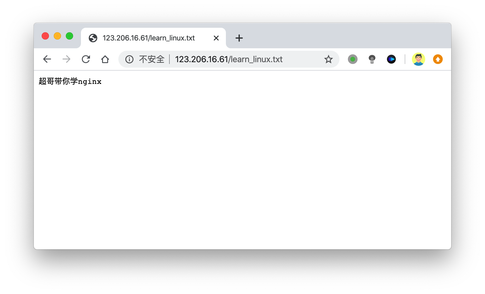

### 静态资源压缩

nginx支持gzip对资源压缩传输，经过gzip压缩后的页面大小可以为原本的30%甚至更小，用户浏览体验会快很多。

```plain
准备好nginx静态资源
[root@bogon html]# ll -h
total 1.2M
-rw-r--r--. 1 root root  537 Feb 11 18:35 50x.html
-rw-r--r--. 1 root root 1.2M Feb 11 19:06 apple.txt
-rw-r--r--. 1 root root  612 Feb 11 18:35 index.html
```

开启gzip前，静态资源加载如下

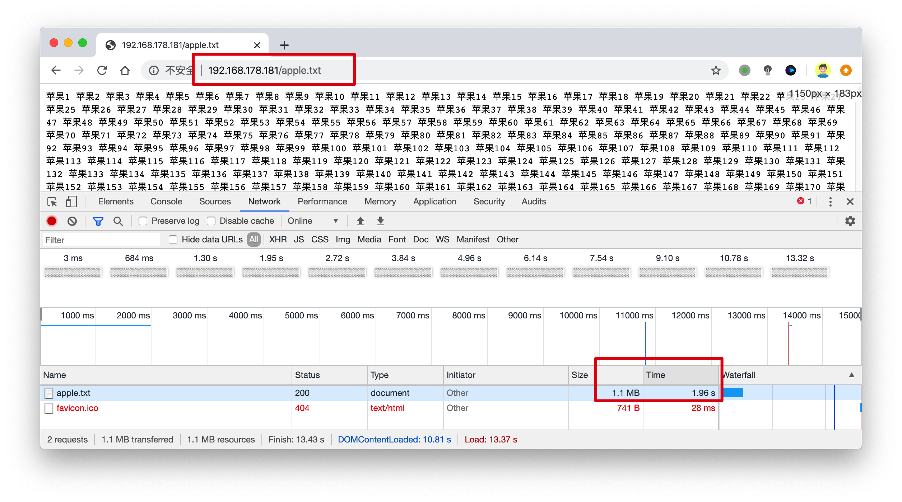

```plain
nginx.conf开启gzip压缩功能，添加如下语句，针对静态资源压缩
        gzip on;
        gzip_http_version 1.1;
        gzip_comp_level 4;
        gzip_types text/plain application/javascript application/x-javascript text/css application/xml text/javascript application/x-httpd-php image/jpeg image/gif image/png;
#重载nginx
nginx -s reload
```


开启了gzip压缩后，整体的传输资源大小，以及相应速度，都大幅度提高了

### 基于IP多虚拟主机

Linux操作系统都能够支持给网卡绑定多个IP地址，可以使得一块网卡上运行多个基于IP的虚拟主机。

环境准备

```plain
添加ip别名
[root@bogon ~]# ifconfig ens33:1 192.168.178.200 broadcast 192.168.178.255 netmask 255.255.255.0 up
#此时机器有2个ip，确保都可以通信即可
[root@bogon ~]# ifconfig |grep 192
        inet 192.168.178.181  netmask 255.255.255.0  broadcast 192.168.178.255
        inet 192.168.178.200  netmask 255.255.255.0  broadcast 192.168.178.255
[root@bogon ~]# curl   192.168.178.200   
[root@bogon ~]# curl   192.168.178.181
```

修改nginx.conf支持多虚拟主机

```plain
#第一个虚拟主机
    server {
        #监听的端口和ip
        listen       192.168.178.181:80;
        #主机域名
        server_name  192.168.178.181;
        charset utf-8;
        access_log  logs/host.access.log;
        #url匹配
        location / {
            #HTML文件存放的目录
            root   /website/s1;
            #默认首页文件，从左往右寻找，index.html或是index.htm文件
            index  index.html index.htm;
            }
        }
   #第二个ip虚拟主机
   #第二个虚拟主机
server {
listen 192.168.178.200:80;
server_name 192.168.178.200;
location / {
        index index.html index.htm;
        root /website/s2;
}
}
```

分别准备好网站资源

```plain
[root@bogon nginx]# echo "我是来自于192.168.178.181的站点 s1.html" > /website/s1/index.html
[root@bogon nginx]# echo "我是来自于192.168.178.200的站点 s2.html" > /website/s2/index.html
```

测试访问页面，基于不同ip的虚拟主机

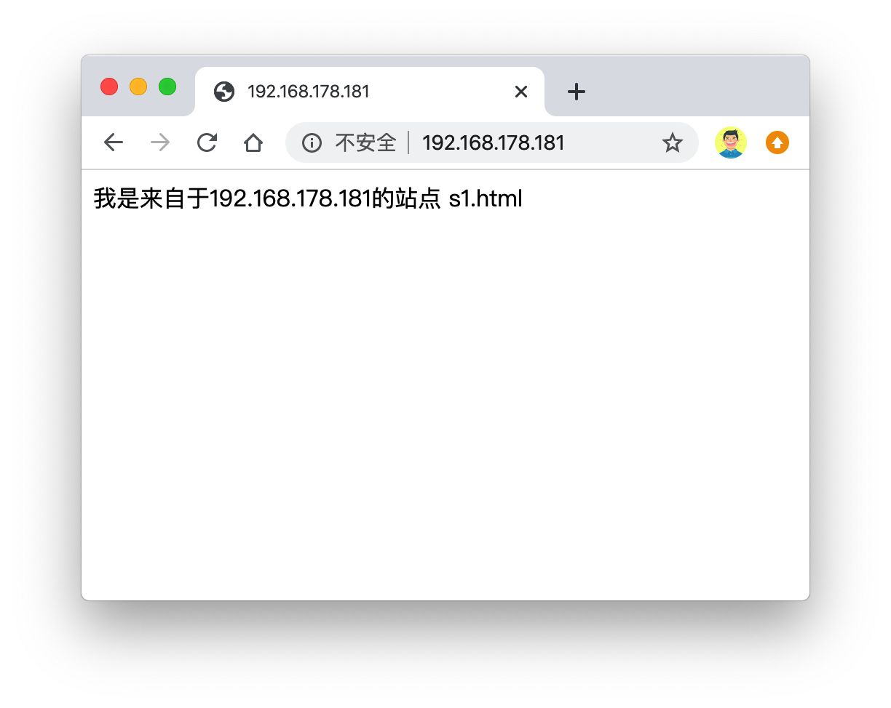

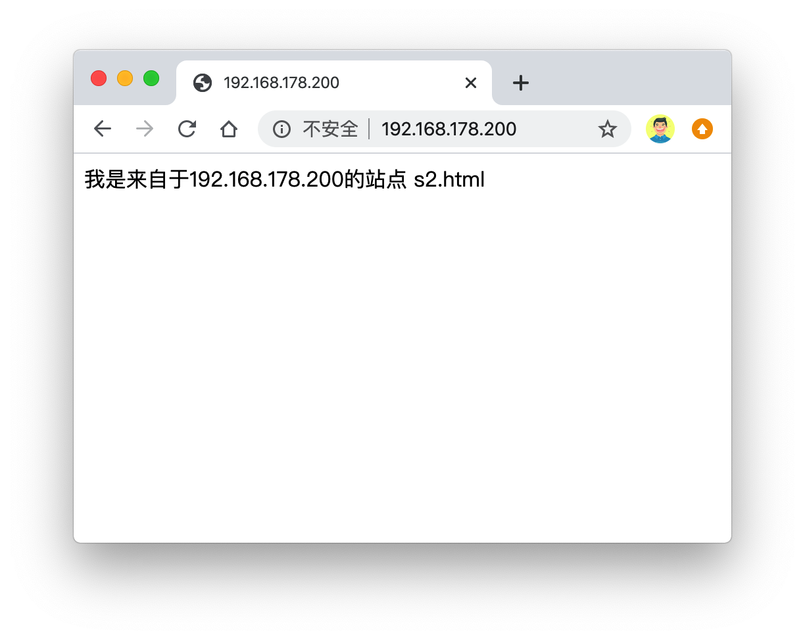

### 基于域名的多虚拟主机

基于多IP的虚拟主机可能会造成IP地址不足的问题，如果没有特殊需求，更常用的是基于多域名的形式。

只需要你单独配置DNS服务器，将主机名对应到正确的IP地址，修改Nginx配置，可以识别到不同的主机即可，这样就可以使得多个虚拟主机用同一个IP，解决了IP不足的隐患。

```plain
1.在本地hosts文件中，添加对应的解析记录，由于测试使用
[root@bogon ~]# cat /etc/hosts|grep 127.0.0.1
127.0.0.1   localhost localhost.localdomain localhost4 localhost4.localdomain4
127.0.0.1 www.chaogenginx.com
127.0.0.1 www.chaogelinux.com
```

修改nginx.conf支持多域名的虚拟主机

```plain
1.第一个server{}指令块的配置
    server {
        #监听的端口和ip
        listen       80;
        #主机域名
        server_name  www.chaogelinux.com;
        charset utf-8;
        access_log  logs/host.access.log;
        #url匹配
        location / {
            #HTML文件存放的目录
            root   /website/s1;
            #默认首页文件，从左往右寻找，index.html或是index.htm文件
            index  index.html index.htm;
        }
     }
 2.第二个server{}的配置
 #第二个虚拟主机
server {
listen 80;
server_name www.chaogenginx.com;
location / {
    index index.html index.htm;
    root /website/s2;
}
}
3.生成2个站点的首页
  echo "我是多域名虚拟主机，来自于域名www.chaogelinux.com" > /website/s1/index.html
  echo "我是来自于域名www.chaogenginx.com的多域名虚拟主机" > /website/s2/index.html
```

测试访问多域名

```plain
[root@bogon ~]# curl www.chaogelinux.com
我是多域名虚拟主机，来自于域名www.chaogelinux.com
[root@bogon ~]#
[root@bogon ~]# curl www.chaogenginx.com
我是来自于域名www.chaogenginx.com的多域名虚拟主机
[root@bogon ~]#
[root@bogon ~]#
[root@bogon ~]# curl 127.0.0.1  #默认server{}匹配顺序，自上而下
我是多域名虚拟主机，来自于域名www.chaogelinux.com
```

### 基于端口的多虚拟主机

基于端口的配置在生产环境比较少见，用于特殊场景，例如公司内部测试平台网站，使用特殊端口的后台，OA系统、网站后台，CRM后台等。

案例：运行基于80、81端口的虚拟主机运行

```plain
1.第一个虚拟主机
        server {
        #监听的端口和ip
        listen       80;
        #主机域名
        server_name  www.chaogelinux.com;
        access_log logs/www.chaogelinux.log;
        charset utf-8;
        #url匹配
        location / {
            #HTML文件存放的目录
            root   /website/s1/;
            #默认首页文件，从左往右寻找，index.html或是index.htm文件
            index  index.html index.htm;
        #autoindex off;
        }
}
2.#第二个虚拟主机
server {
listen 81;
server_name www.chaogenginx.com;
access_log logs/www.chaogenginx.com;
charset utf-8;
location / {
        index index.html index.htm;
        root /website/s2;
        #autoindex on;
}
}
3.nginx -s reload
4.访问80、81端口
[root@bogon nginx]# curl 127.0.0.1:81
我是来自于域名www.chaogenginx.com的多域名虚拟主机
[root@bogon nginx]# curl 127.0.0.1:80
我是多域名虚拟主机，来自于域名www.chaogelinux.com


<head>
<link rel="shortcut icon" href="#"/>
</head>
```

## Nginx访客日志功能

日志对于程序员很重要，可用于问题排错，记录程序运行状态，一个好的日志能够给与精确的问题定位。

Nginx日志功能需要在nginx.conf中打开相关指令`log_format`，设置日志格式，以及设置日志的存储位置`access_log`，指定日志的格式，路径，缓存大小。

```plain
nginx.conf中有关访客日志定义如下
 #a
log_format  main  '$remote_addr - $remote_user [$time_local] "$request" '
                      '$status $body_bytes_sent "$http_referer" '
                    '"$http_user_agent" "$http_x_forwarded_for"';
 access_log  logs/access.log  main;
参数解释 
$remote_addr ：记录访问网站的客户端地址
$remote_user ：记录远程客户端用户名称
$time_local ：记录访问时间与时区
$request ：记录用户的 http 请求起始行信息
$status ：记录 http 状态码，即请求返回的状态，例如 200 、404 、502 等
$body_bytes_sent ：记录服务器发送给客户端的响应 body 字节数
$http_referer ：记录此次请求是从哪个链接访问过来的，可以根据 referer 进行防盗链设置
$http_user_agent ：记录客户端访问信息，如浏览器、手机客户端等
$http_x_forwarded_for ：当前端有代理服务器时，设置 Web 节点记录客户端地址的配置，此参数生效的前提是代理服务器上也进行了相关的 x_forwarded_for 设置
```

查看日志格式

```plain
tail -2 logs/access.log
192.168.178.1 - - [11/Feb/2020:19:24:37 +0800] "GET / HTTP/1.1" 304 0 "-" "Mozilla/5.0 (Macintosh; Intel Mac OS X 10_15_3) AppleWebKit/537.36 (KHTML, like Gecko) Chrome/79.0.3945.130 Safari/537.36"
127.0.0.1 - - [12/Feb/2020:10:26:26 +0800] "GET / HTTP/1.1" 200 65 "-" "curl/7.29.0"
```

### 多虚拟主机定义日志

由于Nginx支持多虚拟主机，日志功能也是可以区分开的，用`access_log`定义存储位置。

日志指令语法

```plain
access_log  path  [format  buffer=size  | off]
path代表日志存放路径
```

【关闭日志】

```plain
access_log off;
```

【多虚拟主机的访客日志】

```plain
1.虚拟主机1
 server {
        #监听的端口和ip
        listen       80;
        #主机域名
        server_name  www.chaogelinux.com;
        access_log logs/www.chaogelinux.log;
        charset utf-8;
        #url匹配
        location / {
            #HTML文件存放的目录
            root   /website/s1;
            #默认首页文件，从左往右寻找，index.html或是index.htm文件
            index  index.html index.htm;
        }
     }
2.虚拟主机2 
server {
listen 80;
server_name www.chaogenginx.com;
access_log logs/www.chaogenginx.com;
location / {
        index index.html index.htm;
        root /website/s2;
}
}
3.重载nginx
nginx -s reload
4.分别发送请求，检测日志动态
[root@bogon logs]# pwd
/opt/nginx/logs
[root@bogon logs]# ls
error.log  nginx.pid  www.chaogelinux.log  www.chaogenginx.com
[root@bogon ~]# curl www.chaogenginx.com
我是来自于域名www.chaogenginx.com的多域名虚拟主机
[root@bogon ~]# curl www.chaogelinux.com
我是多域名虚拟主机，来自于域名www.chaogelinux.com
```

## Nginx目录浏览功能

例如将你电脑的资料共享出来，方便快速访问

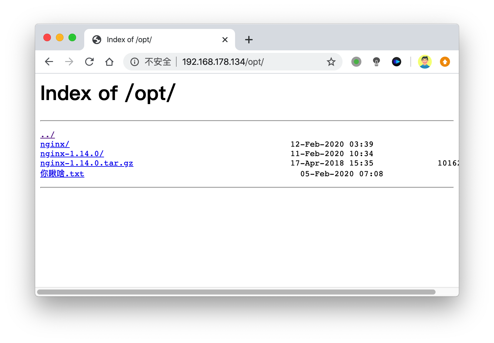

```plain
server {
        #监听的端口和ip
        listen       80;
        #主机域名
        server_name  www.chaogelinux.com;
        access_log logs/www.chaogelinux.log;
        #目录有中文的时候，这里必须改
        charset utf-8;
        #url匹配
        location / {
            #需要列出目录索引的位置
            root   /;     
            #开启目录索引功能
                        autoindex on;
        }
```

### Nginx的浏览器缓存

配置浏览器缓存可以加速静态资源的访问，浏览器对用户访问的资源进行存储，下次访问，不用再去向服务器寻求资料，直接本地显示，加速访问体验，节省网络资源，提高效率。

Nginx通过expires指令配置缓存，可以控制HTTP响应中的Expires和Cache-Control的头部信息，用来控制页面缓存

例如HTML页面经常引用JavaScript以及图片等文件，这些文件很少被修改，可以设置浏览器对该类资源在本地缓存定期的时间。

添加缓存之前响应信息

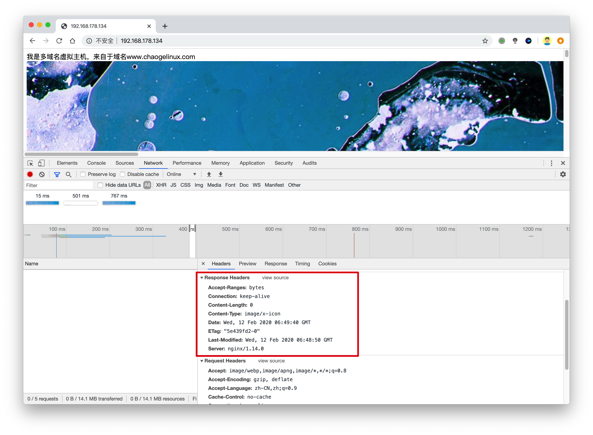

添加缓存配置之后

nginx.conf修改server{}语句块

```plain
location ~ .*\.(gif|jpg|jpeg|png|bmp|swf)$ {
            root /website/s1/;
            expires 30d;
}
        location ~ .*\.(js|css)?$ {
             root /website/s1/;
             expires 1h;
}
```


## 规范Nginx.conf

对于Nginx的使用，需要反复修改Nginx.conf，修改次数多了之后，就难以观看了，Nginx提供了`include`指令，可以将其他目录的配置文件，导入进主配置文件nginx.conf中。

思路可以根据虚拟主机域名或是功能别名，创建配置文件，例如

- bbs.conf
- crm.conf
- blog.conf

然后使用include指令

```plain
include        mime.types;
include        fastcgi_params;
include                 vhosts/*.conf;
```

Nginx优化配置文件案例

nginx.conf主配置文件，修改为如下简略信息

```plain
1.创建统一管理配置文件目录
mkdir -p /opt/nginx/conf/extra
2.读取nginx.conf配置文件，将第一个server{}虚拟主机配置导出为bbs.conf
[root@bogon conf]# sed -n '29,87p' nginx.conf > extra/bbs.conf
3.删除原有的配置
[root@bogon conf]# sed -i  '29,87d' nginx.conf
4.生成第二个blog.conf，导出第二个虚拟主机的配置
[root@bogon conf]# sed -n '29,41p' nginx.conf > extra/blog.conf
[root@bogon conf]# sed -i '29,41d' nginx.conf #删除主配置文件的参数
5.主配置文件，添加include配置
http {
    include       mime.types;
    default_type  application/octet-stream;
    log_format  main  '$remote_addr - $remote_user [$time_local] "$request" '
                      '$status $body_bytes_sent "$http_referer" '
                      '"$http_user_agent" "$http_x_forwarded_for"';
    sendfile        on;
    tcp_nopush     on;
    include extra/*.conf;
}
6.此时nginx的两个虚拟主机任然可以用
[root@bogon conf]# curl 127.0.0.1
我是多域名虚拟主机，来自于域名www.chaogelinux.com


<head>
<link rel="shortcut icon" href="#"/>
</head>
[root@bogon conf]# curl 127.0.0.1:81
我是来自于域名www.chaogenginx.com的多域名虚拟主机
实现了配置文件拆分，方便可观
```

## Nginx状态信息功能

Nginx状态信息（status）配置及信息详解 nginx与php-fpm一样内建了一个状态页，对于想了解nginx的状态以及监控nginx非常有帮助。为了后续的zabbix监控，我们需要先了解一下nginx的状态页。

Nginx状态信息（status）介绍 Nginx软件在编译时又一个with-http_stub_status_module模块，这个模块功能是记录Nginx的基本访问状态信息，让使用者了解Nginx的工作状态。 要想使用状态模块，在编译时必须增加--with-http_stub_status_module参数。

```plain
检查Nginx是否开启此功能
[root@bogon conf]# nginx -V
nginx version: nginx/1.14.0
built by gcc 4.8.5 20150623 (Red Hat 4.8.5-39) (GCC)
built with OpenSSL 1.0.2k-fips  26 Jan 2017
TLS SNI support enabled
configure arguments: --prefix=/opt/nginx/ --with-http_ssl_module --with-http_flv_module --with-http_gzip_static_module --with-http_stub_status_module --with-threads --with-file-aio
```

有的，那么修改nginx.conf，支持此功能

```plain
[root@bogon extra]# cat status.conf
  server {
  listen 85;
  location / {
         stub_status on;
         access_log off;
}
}
nginx -s reload
```

使用ab命令，进行nginx压力测试

```plain
yum -y install httpd-tools
ab -kc 1000 -n 100000 http://127.0.0.1/  #开启会话保持，1000个并发，发送十万个请求
-n requests #执行的请求数，即一共发起多少请求。
-c concurrency #请求并发数。
-k #启用HTTP KeepAlive功能，即在一个HTTP会话中执行多个请求。
```


## Nginx错误日志

Nginx能够将自身运行故障的信息也写入到指定的日志文件中。对于错误信息的调试，是维护Nginx的重要手段，指令是`error_log`，可以放在http{}全局中，也可以单独为虚拟主机记录。

```plain
语法：
error_log file  level;
日志级别在乎debug|info|notice|warn|error|crit|alert|emerg
级别越高，日志记录越少，生产常用模式是warn|error|crit级别
日志的记录，会给服务器增加额外大量的IO消耗，按需修改
```

nginx.conf修改如下，针对虚拟主机添加错误日志

```plain
#修改配置文件
[root@bogon extra]# cat blog.conf
#第二个虚拟主机
server {
listen 81; 
server_name www.chaogenginx.com;
access_log logs/www.chaogenginx.com;
charset utf-8;
error_log logs/blog.error.log;  #添加本行即可
location / {
    index index.html index.htm;
    root /website/s2;
}
}
#检查日志
[root@bogon extra]# nginx -s reload
[root@bogon extra]#
[root@bogon extra]#
[root@bogon extra]# ls ../../logs/
access.log  blog.error.log  error.log  nginx.pid  www.chaogelinux.log  www.chaogenginx.com
```

## Nginx location作用

Nginx的locaiton作用是根据用户请求的URI不同，来执行不同的应用。

针对用户请求的网站URL进行匹配，匹配成功后进行对应的操作。

```plain
nginx.conf中server{}指令块的location指令如下
        location / {
            root   html;
            index  index.html index.htm;
        }
        location = /50x.html {
            root   html;
        }
```

语法

```plain
location [ = | ~| ~* | ^~ ]  url {
    #指定对应的动作
}
#正则表达式解释
匹配符 匹配规则 优先级
=    精确匹配    1
^~    以某个字符串开头，不做正则    2
~*    正则匹配    3
/blog/ 匹配常规字符串，有正则就优先正则 4
/    通用匹配，不符合其他location的默认匹配    5
```

实际演练

| 请求url         | 完整url                               | 匹配后动作 |
| --------------- | ------------------------------------- | ---------- |
| /               | http://192.168.178.134/               | 配置A      |
| /index.html     | http://192.168.178.134/index.html     | 配置B      |
| /blog/blog.html | http://192.168.178.134/blog/blog.html | 配置C      |
| /img/1.jpg      | http://192.168.178.134/1.jpg          | 配置D      |
| /blog/1.jpg     | http://192.168.178.134/blog/1.jpg     | 配置E      |

修改nginx.conf如下

```plain
[root@bogon extra]# cat www.conf
server {
    listen 83;
    server_name _;
    #最低级匹配，不符合其他locaiton就来这
    location / {
        return 401;
}
    #优先级最高
    location = / {
        return 402;
}
    #以/blog/开头的url，来这里，如符合其他locaiton，则以其他优先
    location /blog/ {
        return 403;
}
    #匹配任何以/img/开头的请求，不匹配正则
    location ^~ /img/ {
        return 404;
}
    #匹配任何以.gif结尾的请求，支持正则
    location ~* \.(gif|jpg|jpeg)$ {
        return 500;
}
}
```

通过curl命令，检测nginx的locaiton匹配

```plain
curl命令
-s 不输出错误和进度信息，静默输出
-o  输出写入到指定文件中 /dev/null 就是丢弃输出，扔进黑洞
-I 只显示响应头
-w 完成后输出哪些内容
#用户请求的url为空或者有一个/
[root@bogon extra]# curl  -s -o /dev/null -I -w "%{http_code}\n" 127.0.0.1:83
402
[root@bogon extra]# curl  -s -o /dev/null -I -w "%{http_code}\n" 127.0.0.1:83/
402
#用户请求存在index.html或者其他任意不符合其他location的字符串
[root@bogon extra]# curl  -s -o /dev/null -I -w "%{http_code}\n" 127.0.0.1:83/index.html
401
#访问以/blog/开头的url
[root@bogon extra]# curl  -s -o /dev/null -I -w "%{http_code}\n" 127.0.0.1:83/blog/index.html
403
#访问以/img/开头的url
[root@bogon extra]# curl  -s -o /dev/null -I -w "%{http_code}\n" 127.0.0.1:83/img/2.gif
404
#匹配以gif结尾的url，由于/blog/优先级最低，因此匹配1.gif的规则
[root@bogon extra]# curl  -s -o /dev/null -I -w "%{http_code}\n" 127.0.0.1:83/blog/1.gif
500
#由于/img/优先级更高，因此优先匹配
[root@bogon extra]# curl  -s -o /dev/null -I -w "%{http_code}\n" 127.0.0.1:83/img/1.gif
404
```

## Nginx地址重写

Nginx rewrire技术主要是实现URL地址重写，且支持正则表达式的规则。


rewrite能够实现URL的跳转，需要nginx在编译安装的时候，装好了PCRE这个软件。

通过rewrite可以规范URL、根据变量进行URL跳转等，常用的功能如

- 对于爬虫的封禁，让其跳转无用页面
- 动态的URL伪装成HTMl页面，便于搜索引擎的抓取
- 旧域名、旧目录的更新，需要跳转到新的URL地址

语法

```plain
rewrite ^/(.*) http://192.168.178.134/$1 permanent;
#解释
rewrite是指令，开启一个跳转规则
正则是 ^/(.*) 表示匹配所有，匹配成功后跳转到后面的url地址
$1 表示取出前面正则括号里的内容
permanent表示 301 重定向的标记
```

【rewrite的结尾参数 flag标记】

| 标记      | 解释a                                          |
| --------- | ---------------------------------------------- |
| last      | 规则匹配完成后，继续向下匹配新的Locaiton       |
| break     | 本条规则完成匹配后，立即停止                   |
| redirect  | 返回302临时重定向，浏览器地址栏显示跳转后的URL |
| permanent | 返回301永久重定向，浏览器地址显示跳转后的URL   |

*last和break用于实现URL重写，浏览器地址栏不发生变化*

*redirect和permanent用于实现URL跳转，浏览器地址栏跳转新的URL*

### 实现301 URL跳转

```plain
#请求直接跳转到百度
[root@bogon extra]# cat learn_rewrite.conf
server {
listen 90;
server_name _;
rewrite ^/(.*) http://www.baidu.com/$1 permanent;
}
```

## Nginx访问认证

有时候，我们一些站点内容想要进行授权查看，只能输入账号密码之后才能访问，例如一些重要的内网平台，CRM，CMDB，企业内部WIKI等等。

```plain
htpasswd是Apache密码生成工具，Nginx支持auth_basic认证，因此我门可以将生成的密码用于Nginx中，输入一行命令即可安装：yum -y install httpd-tools ，参数如下：
-c 创建passwdfile.如果passwdfile 已经存在,那么它会重新写入并删去原有内容.
-n 不更新passwordfile，直接显示密码
-m 使用MD5加密（默认）
-d 使用CRYPT加密（默认）
-p 使用普通文本格式的密码
-s 使用SHA加密
-b 命令行中一并输入用户名和密码而不是根据提示输入密码，可以看见明文，不需要交互
-D 删除指定的用户
#接认证文件，htpasswd -bc .access username password  #在当前目录生成.access文件，用户名username，密码：password，默认采用MD5加密方式。
nginx的认证模块指令，语法：
location / {
    auth_basic "string"; 可以填写off或是string
    auth_basic_user_file conf/htpasswd;  
}
```

案例

```plain
[root@chaogelinux extra]# cat www.conf
server {
    listen 80;
    server_name _;
    location / {
    root html/www;
    index index.html;
    auth_basic    "learn nginx auth_module";
    #nginx会去这个文件中验证账号密码
    auth_basic_user_file /home/Learn_Nginx/nginx/conf/extra/htpasswd;
    }
}
[root@chaogelinux www]# cat index.html
<meta charset=utf8>
只有正确输入了账号密码，才能看到此页面
重启nginx
nginx -s reload
生成密码文件
[root@chaogelinux extra]# htpasswd -bc ./htpasswd  chaoge  666
Adding password for user chaoge
```

访问测试

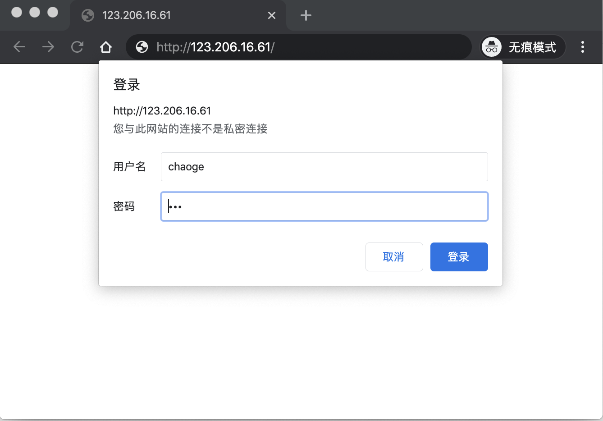

## root和alias区别

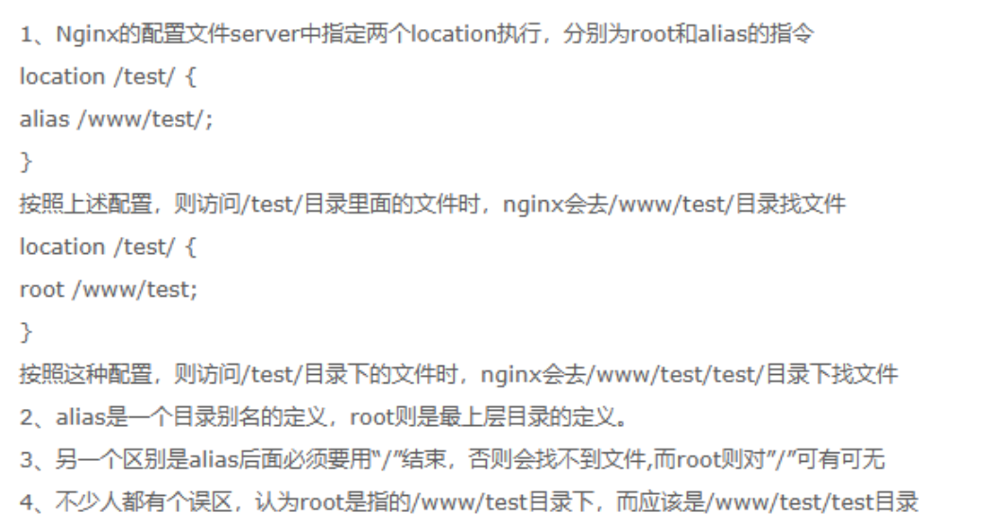


# LNMP黄金架构

之前学习Apache了解过LAMP（Linux、Apache、Mysql、Perl/PHP/Python）

由于上述架构，已然是一个商业版软件的代名词，后来自由软件趋势兴起，如何用开源软件替代商业软件，这是人们追求的，所有的Linux发行版几乎都会内置这样的软件。

但是由于Nginx的兴趣，卓越的性能，更简单的配置，更强大的功能，更低的资源消耗，LAMP已经渐渐被LNMP取代。


LNMP是网站架构初期最合适的单体架构。因为初创型技术团队对于技术的选型，需要考虑如下因素

1. 在创业初期，研发资源有限，研发人力有限，技术储备有限，需要选择一个易维护、简单的技术架构；
2. 产品需要快速研发上线，并能够满足快速迭代要求，现实情况决定了一开始没有时间和精力来选择一个过于复杂的分布式架构系统，研发速度必须要快；
3. 创业初期，业务复杂度比较低，业务量也比较小，如果选择过于复杂的架构，反而会增加研发难度以及运维难度；
4. 遵从选择合适的技术而不是最好的技术原则，并权衡研发效率和产品目标，同时创业初期只有一个PHP研发人员，过于复杂的技术架构必然会带来比较高昂的学习成本。

基于如上的因素，LNMP架构就是最合适的。


如此架构，一般三台服务器足以，Nginx与后台系统部署在一台机器，Mysql数据库单独服务器，Mencached缓存一台服务器。这样的架构优势在于

- 单体架构，架构简单，清晰的分层结构；
- 可以快速研发，满足产品快速迭代要求；
- 没有复杂的技术，技术学习成本低，同时运维成本低，无需专业的运维，节省开支。

## LNMP组合工作流程

LNMP工作流是用户通过浏览器输入域名访问Nginx web服务，Nginx判断请求是静态请求则由Nginx返回给用户。如果是动态请求(如.php结尾)，那么Nginx会将该请求通过FastCGI接口发送给PHP引擎（php-fpm进程）进行解析，如果该动态请求需要读取mysql数据库，php会继续向后读取数据库，最终Nginx将获取的数据返回给用户。


## Nginx安装配置

```plain
1.安装nginx所需的pcre库，让nginx支持url重写的rewrite功能
yum install pcre pcre-devel -y
2.安装openssl-devel模块，nginx需要支持https
[root@web01 opt]# yum install openssl openssl-devel -y
2.1 安装gcc编译器
yum install gcc -y
3.下载nginx源码包
[root@web01 opt]# mkdir -p /home/chaoge/tools
[root@web01 opt]# cd /home/chaoge/tools/
[root@web01 tools]# wget http://nginx.org/download/nginx-1.16.0.tar.gz
[root@web01 tools]# echo $?
0
4.创建nginx普通用户
[root@web01 tools]# useradd nginx -u 1111 -s /sbin/nologin -M
5.开始解压缩编译nginx
[root@web01 tools]# tar -zxf nginx-1.16.0.tar.gz
[root@web01 nginx-1.16.0]# ./configure --user=nginx --group=nginx --prefix=/opt/nginx-1.16.0/ --with-http_stub_status_module --with-http_ssl_module
[root@web01 nginx-1.16.0]# echo $?
0
[root@web01 nginx-1.16.0]# make && make install
[root@web01 nginx-1.16.0]# echo $?
0
6.配置软连接，生产环境常用操作，便于运维、开发、测试使用，以及nginx以后的升级
[root@web01 nginx-1.16.0]# ln -s /opt/nginx-1.16.0/ /opt/nginx
[root@web01 nginx-1.16.0]# ll /opt/
总用量 0
lrwxrwxrwx  1 root  root   18 3月  18 22:45 nginx -> /opt/nginx-1.16.0/
drwxr-xr-x  6 root  root   54 3月  18 22:43 nginx-1.16.0
7.配置nginx环境变量
[root@web01 ~]# tail -1 /etc/profile
export PATH="/opt/nginx/sbin:/opt/mysql/bin:/usr/local/sbin:/usr/local/bin:/usr/sbin:/usr/bin"
[root@web01 ~]#
[root@web01 ~]# echo $PATH
/opt/nginx/sbin:/opt/mysql/bin:/usr/local/sbin:/usr/local/bin:/usr/sbin:/usr/bin
```

## LNMP之MySQL数据库

Mysql是互联网领域非常重要的，深受广大用户欢迎的一款开源数据库。MysSQL是一款关系型数据库，且把数据保存在不同的二维表，且把数据表再放入数据库中管理，而不是所有的数据统一放在一个大仓库，这样的设计提高MySQL的读写速度。

我们会在后面章节专门学习MYSQL，进阶DBA

## 安装Mysql

安装方式我们可以选择多种

- Yum/rpm包安装，简单、快速、无法定制化、新手推荐使用
- 二进制安装，解压缩后直接简单配置即可使用，速度较快，专业DBA常用
- 源码编译安装，特点是可以定制化安装需求，缺点过程较为复杂

```plain
1.创建mysql用户
[root@web01 ~]# useradd -s /sbin/nologin mysql
[root@web01 ~]# id mysql
uid=1000(mysql) gid=1000(mysql) 组=1000(mysql)
2.下载mysql二进制软件包，提前配置好yum源，下载wget命令
[root@web01 ~]# yum install wget -y
wget -O /etc/yum.repos.d/epel.repo http://mirrors.aliyun.com/repo/epel-7.re
wget -O /etc/yum.repos.d/CentOS-Base.repo http://mirrors.aliyun.com/repo/Centos-7.repo
[root@web01 ~]# mkdir -p /home/mysql/tools
[root@web01 ~]# cd /home/mysql/tools/
# 该mysql文件600M左右，下载时间看网速
[root@web01 tools]# wget  http://mirrors.163.com/mysql/Downloads/MySQL-5.7/mysql-5.7.28-linux-glibc2.12-x86_64.tar.gz
```

【软件包选择】2103227582

```plain
mysql二进制安装包体积较大，名字和源代码包有些区别，但是安装过程较快
mysql二进制包  mysql-5.7.26-linux-glibc2.12-x86_64.tar.gz        615M
mysql源码包   mysql-5.7.26.tar.gz                52M
```

### 二进制方式安装mysql

我们这里搭建LNMP环境，nginx和mysql是安装在一台机器上的，当然也可以是分开在不同的服务器上

```plain
1.解压并且移动mysql二进制软件包路径
[root@web01 tools]# tar -zvxf mysql-5.7.26-linux-glibc2.12-x86_64.tar.gz
[root@web01 tools]# mv mysql-5.7.26-linux-glibc2.12-x86_64 /opt/mysql-5.7.26
2.生成软连接
[root@web01 opt]# ln -s /opt/mysql-5.7.26/ /opt/mysql
[root@web01 opt]# ls -l /opt/
总用量 0
lrwxrwxrwx 1 root root  18 3月  18 10:15 mysql -> /opt/mysql-5.7.26/
drwxr-xr-x 9 root root 129 3月  18 10:13 mysql-5.7.26
3.卸载centos7自带的mariadb库，防止冲突
[root@web01 mysql]# rpm -e --nodeps mariadb-libs
4.手动创建mysql配置文件 vim /etc/my.cnf
[root@web01 mysql]# cat /etc/my.cnf
[mysqld]
basedir=/opt/mysql/
datadir=/opt/mysql/data
socket=/tmp/mysql.sock
server_id=1
port=3306
log_error=/opt/mysql/data/mysql_err.log
[mysql]
socket=/tmp/mysql.sock
```

### 初始mysql数据库文件

```plain
1.卸载系统自带的centos7 mariadb-libs，且安装mysql的依赖环境
rpm -qa mariadb-libs #检查是否存在
[root@web01 mysql]# yum install libaio-devel -y
2.创建mysql数据文件夹且授权
[root@web01 mysql]# mkdir -p /opt/mysql/data
[root@web01 mysql]# chown -R mysql.mysql /opt/mysql/
3.初始化数据库
[root@web01 mysql]# /opt/mysql/bin/mysqld --initialize-insecure --user=mysql --basedir=/opt/mysql/ --datadir=/opt/mysql/data/
# 参数解释
--user=mysql 指定用户
--basedir 指定mysql安装目录
--datadir=/opt/mysql/data 指定数据文件夹
--initialize-insecure 关闭mysql安全策略
--initialize 开启mysql安全模式
```

### 配置mysql客户端

```plain
1.配置mysql启动脚本，定义mysqld.service，脚本如下
[root@web01 mysql]# cat /etc/systemd/system/mysqld.service
[Unit]
Description=MySQL server by chaoge
Documentation=man:mysqld(8)
Documentation=http://dev.mysql.com/doc/refman/en/using-systemd.html
After=network.target
After=syslog.target
[Install]
WantedBy=multi-user.target
[Service]
User=mysql
Group=mysql
ExecStart=/opt/mysql/bin/mysqld --defaults-file=/etc/my.cnf
LimitNOFILE=5000
```

### 启动mysql数据库

```plain
[root@web01 mysql]# systemctl start mysqld
[root@web01 mysql]# systemctl enable mysqld
Created symlink from /etc/systemd/system/multi-user.target.wants/mysqld.service to /etc/systemd/system/mysqld.service.
[root@web01 mysql]# systemctl status mysqld
● mysqld.service - MySQL server by chaoge
   Loaded: loaded (/etc/systemd/system/mysqld.service; disabled; vendor preset: disabled)
   Active: active (running) since 三 2020-03-18 11:30:01 EDT; 6s ago
     Docs: man:mysqld(8)
           http://dev.mysql.com/doc/refman/en/using-systemd.html
 Main PID: 5315 (mysqld)
   CGroup: /system.slice/mysqld.service
           └─5315 /opt/mysql/bin/mysqld --defaults-file=/etc/my.cnf
3月 18 11:30:01 web01 systemd[1]: Started MySQL server by chaoge.
3月 18 11:30:01 web01 systemd[1]: Starting MySQL server by chaoge...
```

检查mysql启动状态

```plain
[root@web01 mysql]# netstat -tunlp|grep mysql
tcp6       0      0 :::3306                 :::*                    LISTEN      5315/mysqld
[root@web01 mysql]# ps -ef|grep mysql |grep -v grep
mysql      5315      1  0 11:30 ?        00:00:00 /opt/mysql/bin/mysqld --defaults-file=/etc/my.cnf
```

### 配置mysql命令环境变量

```plain
[root@web01 mysql]# echo "export PATH=/opt/mysql/bin:$PATH" >> /etc/profile
[root@web01 mysql]# source /etc/profile
[root@web01 mysql]# echo $PATH
/opt/mysql/bin:/usr/local/sbin:/usr/local/bin:/usr/sbin:/usr/bin:/root/bin
```

### 登录mysql

默认无须输入密码直接进入mysql数据库，且身份是root

```plain
[root@web01 ~]# mysql
Welcome to the MySQL monitor.  Commands end with ; or \g.
Your MySQL connection id is 3
Server version: 5.7.26 MySQL Community Server (GPL)
Copyright (c) 2000, 2019, Oracle and/or its affiliates. All rights reserved.
Oracle is a registered trademark of Oracle Corporation and/or its
affiliates. Other names may be trademarks of their respective
owners.
Type 'help;' or '\h' for help. Type '\c' to clear the current input statement.
mysql> show databases;
+--------------------+
| Database           |
+--------------------+
| information_schema |
| mysql              |
| performance_schema |
| sys                |
+--------------------+
4 rows in set (0.02 sec)
mysql> select user();            # 查看当前登录的用户
+----------------+
| user()         |
+----------------+
| root@localhost |
+----------------+
1 row in set (0.00 sec)
# 查看mysql所有用户信息
mysql> select user,authentication_string,host from mysql.user;
+---------------+-------------------------------------------+-----------+
| user          | authentication_string                     | host      |
+---------------+-------------------------------------------+-----------+
| root          |                                           | localhost |
| mysql.session | *THISISNOTAVALIDPASSWORDTHATCANBEUSEDHERE | localhost |
| mysql.sys     | *THISISNOTAVALIDPASSWORDTHATCANBEUSEDHERE | localhost |
+---------------+-------------------------------------------+-----------+
3 rows in set (0.01 sec)
```

默认mysql账号root是没有密码的，我们给其设置密码，加大安全性

```plain
[root@web01 ~]# mysqladmin -uroot password 'chaoge666'
mysqladmin: [Warning] Using a password on the command line interface can be insecure.
Warning: Since password will be sent to server in plain text, use ssl connection to ensure password safety.
# 再次登录，输入密码
[root@web01 ~]# mysql -uroot -p
Enter password:
Welcome to the MySQL monitor.  Commands end with ; or \g.
Your MySQL connection id is 6
Server version: 5.7.26 MySQL Community Server (GPL)
Copyright (c) 2000, 2019, Oracle and/or its affiliates. All rights reserved.
Oracle is a registered trademark of Oracle Corporation and/or its
affiliates. Other names may be trademarks of their respective
owners.
Type 'help;' or '\h' for help. Type '\c' to clear the current input statement.
mysql>
```

具体mysql知识，跟着后期mysql精讲课程学习

## FastCGI介绍

CGI（Common Gateway Interface），全文名是`通用网关接口`，用于HTTP服务器和其他机器通信的一种工具。


传统CGI程序性能较弱，因此每次HTTP服务器遇到动态程序的时候，都需要重启解析器来执行解析，之后的处理结果才会返回给HTTP服务器。

这样在高并发场景下访问几乎是太差劲了，因此诞生了FastCGI。

FastCGI是一个可伸缩、高速的在HTTP服务器和动态脚本之间通信的接口（在Linux环境下，FastCGI接口就是socket，这个socket可以是文件socket，也可以是IP socket，也就意味着本地通信，远程通信两种），主要优点是把动态语言和HTTP服务器分离开。

多数主流的web服务器都支持FastCGI，如Apache、nginx、LightHttpd等

同时FastCGI也被许多脚本语言所支持，比较流行的脚本语言之一为PHP。

Fast-CGI接口采用c/s架构，可以将`HTTP服务器`和`脚本解析服务器`分离开。

当HTTP服务器遇见静态请求，直接返回，遇见动态请求转发给动态服务器，交给FastCGI去处理，实现动静分离，提升服务器性能。


当HTTP服务器发送一个动态请求给FastCGI。

------

当进来一个请求时，Web 服务器把环境变量和这个页面请求通过一个`unix domain socket`(都位于同一物理服务器）或者一个`IP Socket`（FastCGI部署在其它物理服务器）传递给FastCGI进程。

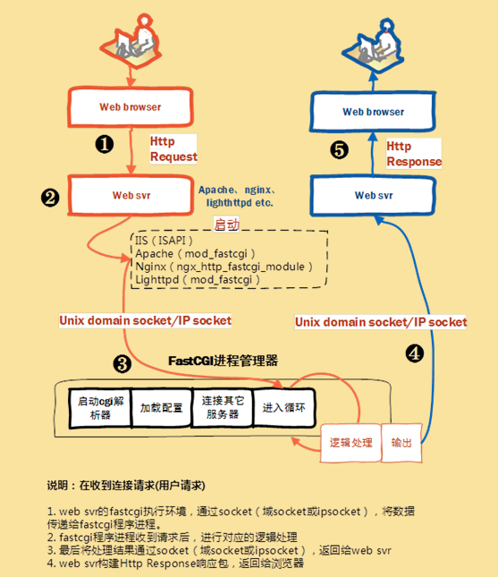

## Nginx FastCGI的运行原理

Nginx默认不支持外部动态程序直接解析，所有的外部程序都得通过FastCGI接口调用。FastCGI接口运行在LInux平台默认是socket进程通信，为了调用CGI程序，还需要FastCGI的wrapper（启动cgi的程序），这个wrapper绑定在某个固定的socket上，例如端口或者文件socket都行。

当Nginx把CGI请求发送给该socket，通过FastCGI接口wrapper接收到请求，派生出一个新的线程，这个线程调用解释器或者外部程序处理脚本来读取返回的数据；

wrapper再吧返回的数据通过FastCGI接口沿着固定的socket传递给Nginx；

最后Nginx把返回的数据交给客户端。

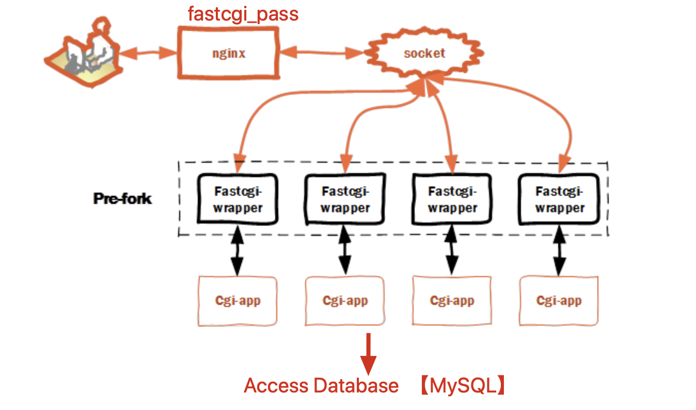

## FastCGI部署(本地部署)

1.检查Nginx和mysql的安装路径

```plain
[root@web01 ~]# ll /opt/
总用量 0
lrwxrwxrwx  1 root  root   18 3月  18 10:15 mysql -> /opt/mysql-5.7.26/
drwxr-xr-x 10 mysql mysql 213 3月  18 10:47 mysql-5.7.26
lrwxrwxrwx  1 root  root   18 3月  18 22:45 nginx -> /opt/nginx-1.16.0/
drwxr-xr-x  6 root  root   54 3月  18 22:43 nginx-1.16.0
```

2.保证nginx、mysql都启动了

```plain
[root@web01 ~]# netstat -tunlp|grep -E "nginx|mysql"
tcp        0      0 0.0.0.0:80              0.0.0.0:*               LISTEN      17214/nginx: master
tcp6       0      0 :::3306                 :::*                    LISTEN      5315/mysqld
```

3.安装部署PHP程序所需的系统库，不要求必须安装，而是安装上之后，可以扩展php更多功能

```plain
yum install  gcc gcc-c++ make zlib-devel libxml2-devel libjpeg-devel libjpeg-turbo-devel libiconv-devel \
freetype-devel libpng-devel gd-devel libcurl-devel libxslt-devel libxslt-devel -y
```

默认yum源中缺少libiconv-devel软件包，需要编译安装，用于php的编码转换

```plain
[root@web01 ~]# wget -P /home/chaoge/tools/  http://ftp.gnu.org/pub/gnu/libiconv/libiconv-1.15.tar.gz
[root@web01 ~]# cd /home/chaoge/tools/
[root@web01 tools]# ls
libiconv-1.15.tar.gz  nginx-1.16.0  nginx-1.16.0.tar.gz
[root@web01 tools]# tar zxf libiconv-1.15.tar.gz
[root@web01 libiconv-1.15]# cd libiconv-1.15
[root@web01 libiconv-1.15]# ./configure --prefix=/opt/libiconv
[root@web01 libiconv-1.15]# make && make install
```

### 安装PHP（FastCGI形式）

```plain
1.下载获取php软件包
[root@web01 tools]# wget http://mirrors.sohu.com/php/php-7.3.5.tar.gz
2.解压缩php源码包，编译安装
[root@web01 tools]# tar -zxvf php-7.3.5.tar.gz
[root@web01 tools]# cd php-7.3.5
[root@web01 php-7.3.5]#
./configure --prefix=/opt/php7.3.5 \
--enable-mysqlnd \
--with-mysqli=mysqlnd \
--with-pdo-mysql=mysqlnd \
--with-iconv-dir=/opt/libiconv \
--with-freetype-dir \
--with-jpeg-dir \
--with-png-dir \
--with-zlib \
--with-libxml-dir=/usr \
--enable-xml \
--disable-rpath \
--enable-bcmath \
--enable-shmop \
--enable-sysvsem \
--enable-inline-optimization \
--with-curl \
--enable-mbregex \
--enable-fpm \
--enable-mbstring \
--with-gd \
--with-openssl \
--with-mhash \
--enable-pcntl \
--enable-sockets \
--with-xmlrpc \
--enable-soap \
--enable-short-tags \
--enable-static \
--with-xsl \
--with-fpm-user=nginx \
--with-fpm-group=nginx \
--enable-ftp \
--enable-opcache=no
```

待看到如下显示，表示正确的编译了php


对于如上的参数，根据自己实际工作环境优化增删即可

部分参数解释

```plain
--prefix=  指定php安装路径
--enable-mysqlnd 使用php自带的mysql相关软件包
--with-fpm-user=nginx  指定PHP-FPM程序的用户是nginx，和nginx服务保持统一
--enable-fpm 激活php-fpm方式，以FastCGI形式运行php程序
3.在执行完编译脚本文件后，开始执行编译安装
[root@web01 php-7.3.5]# make && make install
```

看到如此的画面，表示php正确安装结束了，可以用特殊变量验证

```plain
[root@web01 php-7.3.5]# echo $?
0
```


【编译安装结束后，配置环境变量】

```plain
[root@web01 php-7.3.5]# ln -s /opt/php7.3.5/ /opt/php
```

### php配置文件

配置文件路径

```plain
[root@web01 php-7.3.5]# ls php.ini*
php.ini-development  php.ini-production
```

俩配置文件，分别默认用于开发环境，生成环境，配置参数有所不同

```plain
# 可以用如下命令对比文件区别
[root@web01 php-7.3.5]# vimdiff php.ini-development php.ini-production
开发环境下开起了更多的日志、调试信息，生产环境该参数都关闭了
```

拷贝php配置文件到php默认目录，且改名

```plain
[root@web01 php-7.3.5]# cp php.ini-development /opt/php/lib/php.ini
```

### FastCGI的配置文件

```plain
1.默认FastCGI的配置文件路径
[root@web01 etc]# pwd
/opt/php/etc
[root@web01 etc]# ls
pear.conf  php-fpm.conf.default  php-fpm.d
2.生成2个php-frpm的配置文件，先用默认配置，后续可以再后话
[root@web01 etc]# cp php-fpm.conf.default php-fpm.conf
[root@web01 etc]# cp php-fpm.d/www.conf.default php-fpm.d/www.conf
```

### 启动PHP服务（FastCGI模式）

```plain
# 启动服务，并且检查状态
[root@web01 etc]# /opt/php/sbin/php-fpm
[root@web01 etc]# netstat -tunlp|grep php
tcp        0      0 127.0.0.1:9000          0.0.0.0:*               LISTEN      109647/php-fpm: mas
```

### 修改Nginx支持PHP

```plain
1.修改nginx配置文件，在最底行添加 包含文件参数,建议删除nginx.conf原有的server配置
[root@web01 conf]# vim /opt/nginx/conf/nginx.conf
http {
    include       mime.types;
    default_type  application/octet-stream;
    sendfile        on;
    keepalive_timeout  65;
    gzip  on;
include extra/01_www.conf;
include extra/02_bbs.conf;
include extra/03_blog.conf;
include extra/04_status.conf;
}
```

【配置PHP的解析配置文件】

```plain
[root@web01 conf]# mkdir extra
[root@web01 conf]# vim extra/03_blog.conf
[root@web01 conf]#
[root@web01 conf]#
[root@web01 conf]# cat extra/03_blog.conf
server {
listen 80;
server_name blog.chaoge.com;
location / {
    root html/blog;
    index index.html;
}
#添加有关php程序的解析
location ~ .*\.(php|php5)?$ {
    root html/blog;
    fastcgi_pass 127.0.0.1:9000;
    fastcgi_index index.php;
    include fastcgi.conf;
}
}
```

### 检查且启动nginx

```plain
[root@web01 conf]# touch extra/01_www.conf
[root@web01 conf]# touch extra/02_bbs.conf
[root@web01 conf]# touch extra/04_status.conf
[root@web01 conf]# nginx -t
nginx: the configuration file /opt/nginx-1.16.0//conf/nginx.conf syntax is ok
nginx: configuration file /opt/nginx-1.16.0//conf/nginx.conf test is successful
```

### 测试LNMP环境

```plain
[root@web01 conf]# mkdir -p /opt/nginx/html/blog
[root@web01 conf]# echo "<?php phpinfo(); ?>" > ../html/blog/test_info.php
[root@web01 conf]#
```

当看见如下页面，表示lnmp环境已经能够正确解析了


测试正确后，保证服务器安全，就得删除该test_info.php文件了

### 测试php访问mysql

php的代码，直接在网页中解析即可

```plain
[root@web01 conf]# cat ../html/blog/test_mysql.php
<?php
$link_id=mysqli_connect('localhost','root','chaoge666') or mysql_error();
if($link_id){
    echo "mysql successful by chaoge.\n";
}else {
    echo mysql_error();
}
?>
```

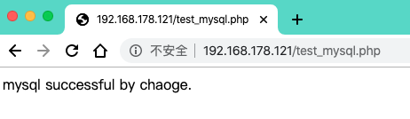

看到如此的画面，lnmp环境基本搭建完毕，nginx+php+mysql的形式。

## LNMP远程部署

上述php-fpm和nginx在一起，这里的讲解，是php-fpm和nginx在两台服务器，远程访问

参考博客

```plain
https://xuchen.wang/archives/nginxphp.html
还有注意，修改php-fpm的启动地址，改为0.0.0.0:9000
配置文件夹在安装目录的etc/php-fpm.d/下面的已conf为后缀的文件，一般在安装时我们设置成了www.conf。
把 listen = 127.0.0.1:9000 后面的端口号9000换成你需要的端口，然后重启php
```


## LNMP部署开源博客


利用开源工具wordpress可以搭建出精美的博客站点，它是一套利用php语言和mysql数据库开发的程序，用于可以在支持php环境和mysql数据库的服务器上搭建blog站点。

你只需要掌握LNMP环境搭建，即可轻松部署wordpress程序。

### LNMP环境准备

```plain
1.登录数据库创建用于存储数据库的wordpress库，存储博客数据
mysql> create database wordpress;
Query OK, 1 row affected (0.02 sec)
mysql> show databases like 'wordpress';
+----------------------+
| Database (wordpress) |
+----------------------+
| wordpress            |
+----------------------+
1 row in set (0.01 sec)
2.创建专用于wordpress的数据库用户
mysql> grant all on wordpress.* to wordpress@'localhost' identified by '123456';
Query OK, 0 rows affected, 1 warning (0.01 sec)
3.刷新权限表
mysql> flush privileges;
Query OK, 0 rows affected (0.02 sec)
4.查询用户信息
mysql> select user,authentication_string,host from mysql.user;
+---------------+-------------------------------------------+-----------+
| user          | authentication_string                     | host      |
+---------------+-------------------------------------------+-----------+
| root          | *83F7A15725AF362EF5EAFC16E1F3F97FDAB9B411 | localhost |
| mysql.session | *THISISNOTAVALIDPASSWORDTHATCANBEUSEDHERE | localhost |
| mysql.sys     | *THISISNOTAVALIDPASSWORDTHATCANBEUSEDHERE | localhost |
| wordpress     | *6BB4837EB74329105EE4568DDA7DC67ED2CA2AD9 | localhost |
+---------------+-------------------------------------------+-----------+
4 rows in set (0.00 sec)
5.nginx配置，选择blog虚拟主机配置，添加一个index.php参数
[root@web01 conf]# cat extra/03_blog.conf
server {
listen 80;
server_name _;
location / {
    root html/blog;
    index index.php index.html;  #在这里新增
}
#添加有关php程序的解析
location ~ .*\.(php|php5)?$ {
    root html/blog;
    fastcgi_pass 127.0.0.1:9000;
    fastcgi_index index.php;
    include fastcgi.conf;
}
}
```

### Wordpress博客程序准备

```plain
1.下载获取wordpress程序
wget https://wordpress.org/latest.zip
wget https://wordpress.org/latest.tar.gz
2.哥哥机器上的资料
[root@web01 conf]# ls /home/chaoge/tools/wordpress-5.3.2.*
/home/chaoge/tools/wordpress-5.3.2.tar.gz  /home/chaoge/tools/wordpress-5.3.2.zip
3.解压缩zip版代码
[root@web01 tools]# yum install unzip -y
[root@web01 tools]# unzip wordpress-5.3.2.zip
[root@web01 tools]# mv wordpress /opt/nginx/html/blog/
[root@web01 tools]# cd /opt/nginx/html/blog/
[root@web01 blog]# ls
test_mysql.php  wordpress
4.移动worpress代码到nginx目录下，且授权
[root@web01 blog]# mv wordpress/* .
[root@web01 blog]# ls
index.php       wordpress           wp-comments-post.php  wp-includes        wp-mail.php       xmlrpc.php
license.txt     wp-activate.php     wp-config-sample.php  wp-links-opml.php  wp-settings.php
readme.html     wp-admin            wp-content            wp-load.php        wp-signup.php
test_mysql.php  wp-blog-header.php  wp-cron.php           wp-login.php       wp-trackback.php
[root@web01 blog]#
[root@web01 blog]#
[root@web01 blog]# chown -R nginx.nginx ../blog/
5.最后一步，注意别忘记重启nginx
nginx -s reload
```

### 访问安装wordpress

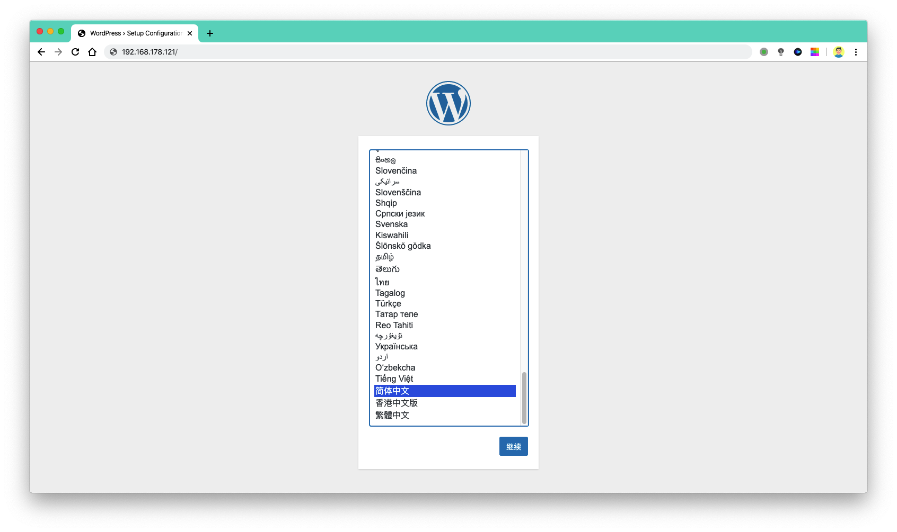


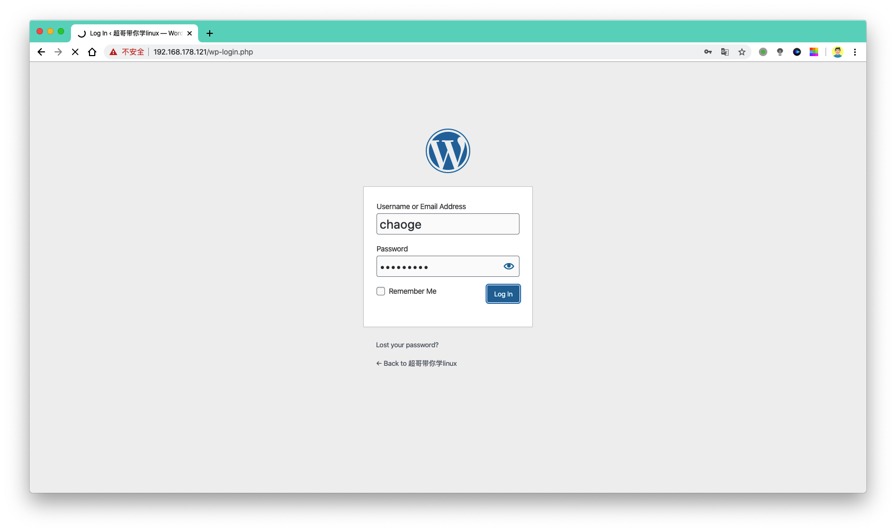


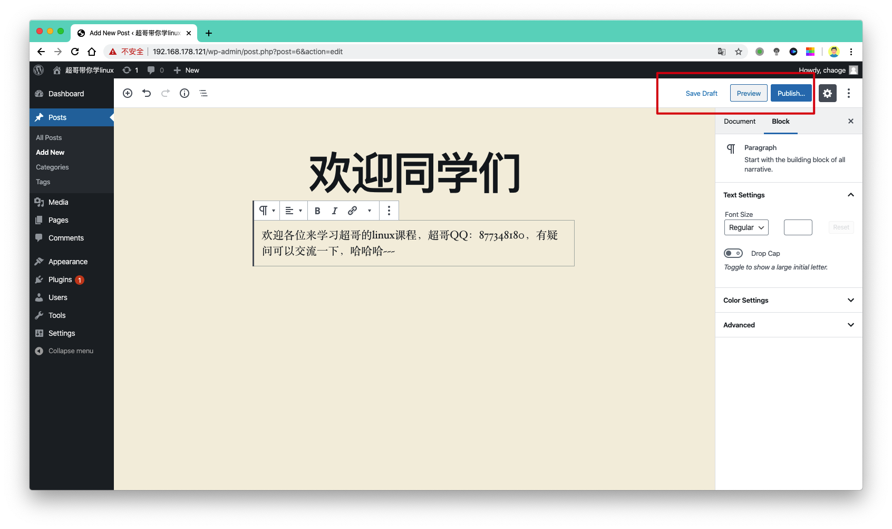


#### **至此博客站点就搭建好了，同学们可自行下载中文版wordpress，自由搭建博客了**