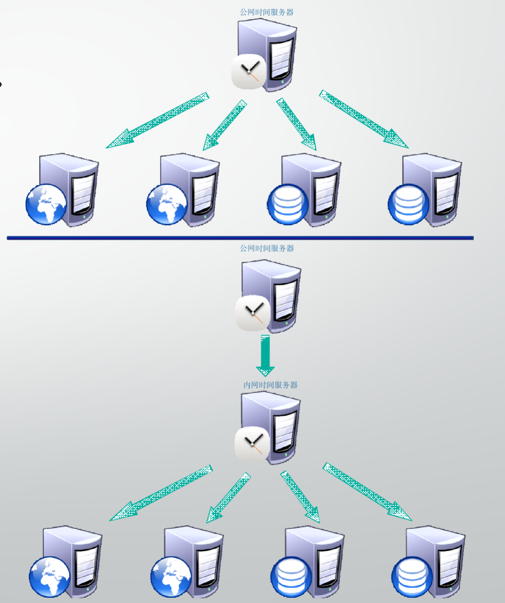

# 时间服务器与vpn

# NTP时间服务器


## 时间服务器

时间对于人类的作息非常重要，按时起床，按时上班，赶火车、火箭发射等等，都需要时间上的把控。

还有如卫星运转、监控、交换机、计算机时间等等，都离不开对时间的精准同步。

为什么每次计算机重启之后，时间都能够保持正确同步呢？是因为你的电脑主板上有一个用于记录BIOS配置的电池，如果电池没电了，或者某些因素，导致BIOS数据被清空，电脑开机后，时间就不准确了。

又或者可能操作系统程序的问题，软件上导致了时间不准确，那么我们都得调整下时间，得让计算机保持正确的状态。

生活里我们可以通过电视台，广播站，电话等等来调整我们的手表等事件。那么当计算机时间不准，我们如何让主机时间正确呢。

时间对于现代人来说是很重要的，因为『 Time is money 』。既然时间如此重要，对于因特网来说应该也是很重要吧？

## NTP时间协议



NTP（Network Time Protocol，网络时间协议）是用来使网络中的各个计算机时间同步的一种协议。它的用途是把计算机的时钟同步到世界协调时UTC，其精度在局域网内可达0.1ms，在互联网上绝大多数的地方其精度可以达到1-50ms。

NTP服务器就是利用NTP协议提供时间同步服务的。 ntp软件（支持ntp协议） CentOS6自带 CentOS7需要安装的 chrony软件（支持ntp协议） CentOS7自带

NTP基于UDP报文进行传输，使用的UDP端口号为123。

使用NTP的目的是对网络内所有具有时钟的设备进行时钟同步，使网络内所有设备的时钟保持一致，从而使设备能够提供基于统一时间的多种应用。

对于运行NTP的本地系统，既可以接受来自其他时钟源的同步，又可以作为时钟源同步其他的时钟，并且可以和其他设备互相同步。

## NTP的应用

对于网络中的各台设备来说，如果依靠管理员手工输入命令来修改系统时钟是不可能的，不但工作量巨大，而且也不能保证时钟的精确性。通过NTP，可以很快将网络中设备的时钟同步，同时也能保证很高的精度。 NTP主要应用于需要网络中所有设备时钟保持一致的场合，比如：

- 在网络管理中，对于从不同设备采集来的日志信息、调试信息进行分析的时候，需要以时间作为参照依据。如nginx的访客日志
- 计费系统要求所有设备的时钟保持一致。
- 完成某些功能，如定时重启网络中的所有设备，此时要求所有设备的时钟保持一致。
- 多个系统协同处理同一个比较复杂的事件时，为保证正确的执行顺序，多个系统必须参考同一时钟。
- 在备份服务器和客户端之间进行增量备份时，要求备份服务器和所有客户端之间的时钟同步。

## 环境准备

准备一台linux虚拟机，且安装ntp服务

```plain
yum install ntp -y
[root@master-70 ~]# rpm -ql ntp |grep conf
/etc/ntp.conf
/etc/sysconfig/ntpd
/usr/share/man/man5/ntp.conf.5.gz
```

### 修改ntp配置文件

【权限控制】

```plain
在 ntp.conf 档案内可以利用『 restrict 』来控管权限，这个参数的设定方式为：
restrict [你的IP] mask [netmask_IP] [parameter]
其中 parameter 的参数主要有底下这些：
ignore： 拒绝所有类型的 NTP 联机；
nomodify： 客户端不能使用 ntpc 与 ntpq 这两支程序来修改服务器的时间参数， 但客户端仍可透过这部主机来进行网络校时的；
noquery： 客户端不能够使用 ntpq, ntpc 等指令来查询时间服务器，等于不提供 NTP 的网络校时啰；
notrap： 不提供 trap 这个远程事件登录 (remote event logging) 的功能。
notrust： 拒绝没有认证的客户端。
那如果你没有在 parameter 的地方加上任何参数的话，这表示『该 IP 或网段不受任何限制』的意思喔！一般来说，我们可以先关闭 NTP 的权限，然后再一个一个的启用允许登入的网段。
# 修改配置文件
vim  /etc/ntp.conf 
  6 # Permit time synchronization with our time source, but do not
  7 # permit the source to query or modify the service on this system.
  8 # restrict default nomodify notrap nopeer noquery
  9 restrict default nomodify
```

【server设定上游服务器】

```plain
上层 NTP 服务器的设定方式为：
server [IP or hostname] [prefer]
在 server 后端可以接 IP 或主机名，个人比较喜欢使用 IP 来设定说！至于那个 perfer 表示『优先使用』的服务器。
iburst 当一个运程NTP服务器不可用时，向它发送一系列的并发包进行检测。
 20 # Use public servers from the pool.ntp.org project.
 21 # Please consider joining the pool (http://www.pool.ntp.org/join.html).
 22 #server 0.centos.pool.ntp.org iburst
 23 #server 1.centos.pool.ntp.org iburst
 24 #server 2.centos.pool.ntp.org iburst
 25 #server 3.centos.pool.ntp.org iburst
 26 server ntp1.aliyun.com iburst
 27 server ntp2.aliyun.com iburst
 28 server ntp3.aliyun.com iburst
```

## 启动ntp

```plain
[root@master-70 ~]# systemctl start ntpd
[root@master-70 ~]# systemctl is-active ntpd
active
```

【观察ntpd服务端】

```plain
[root@master-70 ~]# netstat -tunlp|grep ntp
udp        0      0 172.17.0.1:123          0.0.0.0:*                           4408/ntpd
udp        0      0 172.20.0.70:123         0.0.0.0:*                           4408/ntpd
udp        0      0 127.0.0.1:123           0.0.0.0:*                           4408/ntpd
udp        0      0 0.0.0.0:123             0.0.0.0:*                           4408/ntpd
udp6       0      0 fe80::3c1d:54eb:697:123 :::*                                4408/ntpd
udp6       0      0 ::1:123                 :::*                                4408/ntpd
udp6       0      0 :::123                  :::*                                4408/ntpd
主要是udp封包，且是在123端口，这就表示ntp服务启动了
```

### ntpstat

可以使用ntpstat命令检测NTP服务到期是否和上游机器通信。

```plain
[root@master-70 ~]# ntpstat
synchronised to NTP server (120.25.115.20) at stratum 3
   time correct to within 964 ms
   polling server every 64 s
这里表示和上游服务器的校准时间是964毫秒，1秒=1000毫秒
且会隔64秒进行主动更新时间
```

### ntpq

该命令可以列出我们NTP服务器和上游NTP的状态。

```plain
[root@master-70 ~]# ntpq -p
     remote           refid      st t when poll reach   delay   offset  jitter
==============================================================================
*120.25.115.20   10.137.53.7      2 u    4   64    1   41.932   -0.187   0.388
 203.107.6.88    100.107.25.114   2 u    3   64    1   14.751   -0.931   0.857
 这个 ntpq -p 可以列出目前我们的 NTP 与相关的上层 NTP 的状态，上头的几个字段的意义为：
remote：亦即是 NTP 主机的 IP 或主机名啰～注意最左边的符号
如果有『 * 』代表目前正在作用当中的上层 NTP
如果是『 + 』代表也有连上线，而且可作为下一个提供时间更新的候选者。
refid：参考的上一层 NTP 主机的地址
st：就是 stratum 阶层啰！
when：几秒钟前曾经做过时间同步化更新的动作；
poll：下一次更新在几秒钟之后；
reach：已经向上层 NTP 服务器要求更新的次数
delay：网络传输过程当中延迟的时间，单位为 10^(-6) 秒
offset：时间补偿的结果，单位与 10^(-3) ，单位，毫秒
jitter：Linux 系统时间与 BIOS 硬件时间的差异时间， 单位为 10^(-6) 秒。
这里的时间已经非常精确了
```

要注意服务器的123端口正确开放，你自己的NTP服务器正确的连接了上层NTP服务器。

```plain
[root@master-70 ~]# ntpq -p
     remote           refid      st t when poll reach   delay   offset  jitter
==============================================================================
*120.25.115.20   10.137.53.7      2 u  103  128  377   44.820    0.206  75.029
+203.107.6.88    10.137.38.86     2 u  112  128   37   15.475    0.601  39.386
[root@master-70 ~]#
[root@master-70 ~]#
```

## 客户端配置

上面介绍了NTP服务器的安装与设定，如果客户端机器数量较少时，是没必要配置NTP服务器的，但是若是搭建计算机集群系统，那么使用时间服务器是很合适的。

### Linux手动时间更新

我们在之前学过Linux时间管理命令，且Linux系统有两个时间：

- 软件时间：Linux自己的时间，从1970/01/01开始
- 硬件时间：计算机系统在BIOS记录的时间

### 软件时间date

```plain
查看当前系统时间
[root@master-70 ~]# date
2020年 07月 15日 星期三 02:00:04 EDT
# 这里注意，超哥linux机器当前时间是EDT时区，是美国时间，差了北京时间12个小时
# 修改时区操作
[root@master-70 ~]# mv /etc/localtime /etc/localtime.bak
[root@master-70 ~]# ln -s /usr/share/zoneinfo/Asia/Shanghai /etc/localtime
[root@master-70 ~]# date
2020年 07月 15日 星期三 17:01:36 CST
```

回退时间到前一小时

```plain
[root@master-70 ~]# date
2020年 07月 15日 星期三 17:01:36 CST
# 上述修改时间的格式是 
date  月份日期小时分钟年份
date MMDDhhmmYYYY
MM 月份
DD 日期
hh 小时
mm 分钟
YYYY 年份
# 时间回到上一小时
[root@master-70 ~]# date 071516002020  
2020年 07月 15日 星期三 16:00:00 CST
```

### hwclock

查看，修改BIOS的时间

在修改软件始终方面，我们是通过date命令修改，如果要修改BIOS时间，得用hwclock指令

```
两个参数
-r  read 读取BIOS时间
-w  写入，当前linux时间将写入BIOS中
```

