# 高性能Web集群实战

Rsync数据复制

## Rsync服务概念特性

Rsync是一款开源的、快速的、多功能的、可实现`全量及增量`的本地或远程数据同步备份的优秀工具。并且可以不进行改变原有数据的属性信息，实现数据的备份迁移特性。Rsync软件适用于unix/linux/windows等多种操作系统平台。 Rsync是一个快速和非常通用的文件复制工具。它能本地复制，远程复制，或者远程守护进程方式复制。它提供了大量的参数来控制其行为的各个方面，并且允许非常灵活的方式来实现文件的传输复制。它以其delta-transfer算法闻名。减少通过网络数据发送数量，利用只发送源文件和目标文件之间的差异信息，从而实现数据的增量同步复制。

Rsync被广泛用于数据备份和镜像

，并且作为一种改进后的复制命令用于日常运维。

Rsync具备使本地和远程两台主机之间的`数据快速复制`，`远程备份的功能`，Rsync命令本身即可实现`异地主机复制数据`，功能类似scp又优于scp，scp每次都是`全量备份`，rsync可以实现`增量拷贝`（和scp一样都是基于ssh服务传输），Rsync软件还支持配置守护进程，实现异机数据复制。

增量复制是Rsync一特点，优于scp,cp命令。

*Rsync实现如下功能*

- 本地数据同步复制，效果如cp
- 远程数据同步复制，如scp
- 本地数据删除，如rm
- 远程数据查看，如ls

*Rsync软件特性*

- 支持拷贝普通文件，特殊文件（link文件，设备文件）
- 支持排除指定文件、目录的同步功能（同步数据时，指定文件不同步）
- 能够保持原有文件所有属性均不变（stat查看的状态）
- 实现增量复制（只复制变化的数据，数据传输效率极高）
- 可以配合ssh、rcp、rsh等方式进行隧道加密文件传输（rsync本身不加密数据）
- 可以通过socket（进行通信文件）传输文件和数据（c/s架构）
- 支持匿名用户模式传输

## 增量传输


Rsync软件的增量备份是一大特点，在备份复制数据时，Rsync通过其quick cheek算法，仅复制文件（容量、最后修改时间变化）的文件或是目录，也可以指定文件权限的变化复制，甚至可以复制一个文件里仅变化的内容，因此可以实现快速的备份复制数据。

Rsync在centos7系统上默认是3.x版本，效率更高，原理是一边比对差异，一边对差异的数据进行复制，比centos6上的Rsync 2.x更高效。

```plain
查看rsync版本
[root@chaogelinux ~]# rsync --version
rsync  version 3.1.2  protocol version 31
yum install rsync -y
```

## Rsync语法参数

```
Rsync命令参数详解
在对rsync服务器配置结束以后，下一步就需要在客户端发出rsync命令来实现将服务器端的文件备份到客户端来。rsync是一个功能非常强大的工具，其命令也有很多功能特色选项，我们下面就对它的选项一一进行分析说明。Rsync的命令格式可以为以下六种：
　　rsync [OPTION]... SRC DEST
　　rsync [OPTION]... SRC [USER@]HOST:DEST
　　rsync [OPTION]... [USER@]HOST:SRC DEST
　　rsync [OPTION]... [USER@]HOST::SRC DEST
　　rsync [OPTION]... SRC [USER@]HOST::DEST
　　rsync [OPTION]... rsync://[USER@]HOST[:PORT]/SRC [DEST]
　　对应于以上六种命令格式，rsync有六种不同的工作模式：
　　1)拷贝本地文件。当SRC和DES路径信息都不包含有单个冒号":"分隔符时就启动这种工作模式。如：rsync -a /data /backup
　　2)使用一个远程shell程序(如rsh、ssh)来实现将本地机器的内容拷贝到远程机器。当DST路径地址包含单个冒号":"分隔符时启动该模式。如：rsync -avz *.c foo:src
　　3)使用一个远程shell程序(如rsh、ssh)来实现将远程机器的内容拷贝到本地机器。当SRC地址路径包含单个冒号":"分隔符时启动该模式。如：rsync -avz foo:src/bar /data
　　4)从远程rsync服务器中拷贝文件到本地机。当SRC路径信息包含"::"分隔符时启动该模式。如：rsync -av root@172.16.78.192::www /databack
　　5)从本地机器拷贝文件到远程rsync服务器中。当DST路径信息包含"::"分隔符时启动该模式。如：rsync -av /databack root@172.16.78.192::www
    6)列远程机的文件列表。这类似于rsync传输，不过只要在命令中省略掉本地机信息即可。如：rsync -v rsync://172.16.78.192/www
rsync参数的具体解释如下：
-v, --verbose 详细模式输出
-q, --quiet 精简输出模式
-c, --checksum 打开校验开关，强制对文件传输进行校验
-a, --archive 归档模式，表示以递归方式传输文件，并保持所有文件属性，等于-rlptgoD
-r, --recursive 对子目录以递归模式处理
-R, --relative 使用相对路径信息
-b, --backup 创建备份，也就是对于目的已经存在有同样的文件名时，将老的文件重新命名为~filename。可以使用--suffix选项来指定不同的备份文件前缀。
--backup-dir 将备份文件(如~filename)存放在在目录下。
-suffix=SUFFIX 定义备份文件前缀
-u, --update 仅仅进行更新，也就是跳过所有已经存在于DST，并且文件时间晚于要备份的文件。(不覆盖更新的文件)
-l, --links 保留软链结
-L, --copy-links 想对待常规文件一样处理软链结
--copy-unsafe-links 仅仅拷贝指向SRC路径目录树以外的链结
--safe-links 忽略指向SRC路径目录树以外的链结
-H, --hard-links 保留硬链结     -p, --perms 保持文件权限
-o, --owner 保持文件属主信息     -g, --group 保持文件属组信息
-D, --devices 保持设备文件信息    -t, --times 保持文件时间信息
-S, --sparse 对稀疏文件进行特殊处理以节省DST的空间
-n, --dry-run现实哪些文件将被传输
-W, --whole-file 拷贝文件，不进行增量检测
-x, --one-file-system 不要跨越文件系统边界
-B, --block-size=SIZE 检验算法使用的块尺寸，默认是700字节
-e, --rsh=COMMAND 指定使用rsh、ssh方式进行数据同步
--rsync-path=PATH 指定远程服务器上的rsync命令所在路径信息
-C, --cvs-exclude 使用和CVS一样的方法自动忽略文件，用来排除那些不希望传输的文件
--existing 仅仅更新那些已经存在于DST的文件，而不备份那些新创建的文件
--delete 删除那些DST中SRC没有的文件
--delete-excluded 同样删除接收端那些被该选项指定排除的文件
--delete-after 传输结束以后再删除
--ignore-errors 及时出现IO错误也进行删除
--max-delete=NUM 最多删除NUM个文件
--partial 保留那些因故没有完全传输的文件，以是加快随后的再次传输
--force 强制删除目录，即使不为空
--numeric-ids 不将数字的用户和组ID匹配为用户名和组名
--timeout=TIME IP超时时间，单位为秒
-I, --ignore-times 不跳过那些有同样的时间和长度的文件
--size-only 当决定是否要备份文件时，仅仅察看文件大小而不考虑文件时间
--modify-window=NUM 决定文件是否时间相同时使用的时间戳窗口，默认为0
-T --temp-dir=DIR 在DIR中创建临时文件
--compare-dest=DIR 同样比较DIR中的文件来决定是否需要备份
-P 等同于 --partial
--progress 显示备份过程
-z, --compress 对备份的文件在传输时进行压缩处理
--exclude=PATTERN 指定排除不需要传输的文件模式
--include=PATTERN 指定不排除而需要传输的文件模式
--exclude-from=FILE 排除FILE中指定模式的文件
--include-from=FILE 不排除FILE指定模式匹配的文件
--version 打印版本信息
--address 绑定到特定的地址
--config=FILE 指定其他的配置文件，不使用默认的rsyncd.conf文件
--port=PORT 指定其他的rsync服务端口
--blocking-io 对远程shell使用阻塞IO
-stats 给出某些文件的传输状态
--progress 在传输时现实传输过程
--log-format=formAT 指定日志文件格式
--password-file=FILE 从FILE中得到密码
--bwlimit=KBPS 限制I/O带宽，KBytes per second      
-h, --help 显示帮助信息
```

## Rsync工作方式

1本地数据传输

类似cp的复制，实现文件，目录的增量复制。

2.远程Shell数据传输

借助SSH服务在两台服务器之间传输，没有客户端/服务端之分，两台机器是相对的复制关系。

### 本地数据传输

*语法模式*

```plain
rsync命令  参数   src源文件/目录    dest目标文件/目录
```

1.本地文件复制

```plain
# 复制hosts文件
[root@chaogelinux ~]# rsync /etc/hosts /tmp/
```

2.复制目录内容

-r, --recursive 对子目录以递归模式处理

```plain
# 复制/data下所有内容到/tmp
rsync -r /data/ /tmp/
# 复制/data整个文件夹到/tmp
rsync -r /data  /tmp   
注意如上的区别
```

3.删除文件夹数据，使用参数--delete

--delete 删除那些DST中SRC没有的文件

```plain
# 新建空文件夹
[root@chaogelinux ~]# mkdir /opt/null
# 同步删除数据
[root@chaogelinux ~]# rsync -r --delete /opt/null/ /tmp/
```

4.清空文件内容，使用参数--delete，参数--delete必须和-r结合用

```plain
1.echo "超哥带你学Rsync" > /tmp/test.txt
2.touch /tmp/null
3.rsync -r --delete /tmp/null /tmp/test.txt
```

5.查询文件和目录信息，如同ls -l

```plain
1.查询文件、文件夹信息
[root@chaogelinux ~]# rsync /etc/hosts
-rw-r--r--            248 2020/03/05 15:47:44 hosts
[root@chaogelinux ~]# rsync /opt
drwxr-xr-x          4,096 2020/03/08 17:17:55 opt
```

### 远程数据传输

远程传输分为两种情况【拉取|推送】

拉取：远端服务器数据，拉取到本地

推送：本地数据发送给远程服务器

*拉取pull*

```
语法
rsync  option               user@host:src                   dest
命令        可选参数        用户名@主机ip:源路径            本地路径
```

*推送push*

```
语法
rsync        option        src            user@host:dest
命令        参数            本地路径        用户@主机ip:目的路径
```


1.拉取远程主机文件，拷贝到本地

```plain
1.把远程主机的/etc/hosts文件，拷贝到本地/tmp
rsync -av -e 'ssh -p 22' root@123.206.16.61:/etc/hosts  /tmp
-e, --rsh=COMMAND 指定使用rsh、ssh方式进行数据同步，若是默认22，可以不写该参数
-a, --archive 归档模式，表示以递归方式传输文件，并保持所有文件属性
-v, --verbose 详细模式输出
#执行结果
[root@web01 tmp]# rsync -av -e 'ssh -p 22' root@123.206.16.61:/etc/hosts  /tmp
The authenticity of host '123.206.16.61 (123.206.16.61)' can't be established.
ECDSA key fingerprint is SHA256:CVwhwfUka2JLs1iD53HpLPrretR4pGltYRL6QB+5lyI.
ECDSA key fingerprint is MD5:4b:41:6f:bd:84:ce:24:c3:70:d1:04:a1:5d:01:8d:34.
Are you sure you want to continue connecting (yes/no)? yes
Warning: Permanently added '123.206.16.61' (ECDSA) to the list of known hosts.
root@123.206.16.61's password:
receiving incremental file list
hosts
sent 43 bytes  received 339 bytes  58.77 bytes/sec
total size is 248  speedup is 0.65
```

2.把本地的/etc/hosts文件推送到远程服务器的/tmp下

```plain
rsync -av /etc/hosts   root@123.206.16.61:/tmp/
```

【提示】

- 远程数据传输，指定SSH协议默认需要输入主机密码，可以配置SSH免密登录更为方便
- 工作环境下，采用rsync守护进程更为合适

### 守护进程传输模式

守护进程传输模式是在客户端和服务端之间进行的数据复制。

服务端需要配置守护进程，在客户端执行命令，实现数据`拉取`和`推送`。

语法参数

【拉取语法】

```plain
1.拉取模式语法，推荐使用，看清楚参数的符号！
rsync        参数        user@host::src        dest
2.拉取第二种
rsync        参数        rsync://user@host:port/src
```

【推送语法】

```plain
1.推送语法
rsync  参数  源路径    user@host::dest
2.推送第二种
rsync  参数  src    rsync://user@host:port/dest
```

通过语法可知，拉取和推送数据的语法几乎是相同的

想要通过守护传输模式进行复制传输数据，还得额外部署Rsync Daemon服务才行

### 守护进程传输模式实战

#### 【准备三台linux服务器】

```plain
1.准备3台linux机器
老师机器的环境
192.168.178.140 web01            Nginx web服务器
192.168.178.139 backup    Rsync备份存储服务器
192.168.178.138  nfs01            NFS存储服务器
```

三台机器的终端

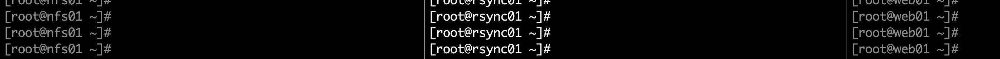

#### 【环境部署，Rsync备份服务器】

```plain
1.准备linux系统环境  
[root@chaoge_linux ~]# cat /etc/redhat-release
CentOS Linux release 7.7.1908 (Core)
[root@chaoge_linux ~]# uname -r    # 查看内核版本
3.10.0-1062.9.1.el7.x86_64
[root@chaoge_linux ~]# uname -m    # 查看系统架构
x86_64
2.是否安装了rsync软件，若是未安装可以yum安装即可  
[root@chaogelinux ~]# rpm -qa rsync
rsync-3.1.2-6.el7_6.1.x86_64
```

【配置需求】

在Rsync备份机器上以rsync守护进程的方式部署Rsync服务，使得所有Rsync节点的客户端主机，可以把本地数据通过rsync命令备份数据到BACKUP服务器上。

【备份架构拓扑图】

以Rsync守护进程模式部署架构，并且以远程数据同步方式由客户端节点向服务器端推送数据


### Rsync守护进程客户端访问原理图


### Rsync服务端部署一

| 步骤 | 举例                                     | Rsync步骤                                       |
| ---- | ---------------------------------------- | ----------------------------------------------- |
| 1    | 确认是否有个房间可以当做仓库             | 确认Rsync程序是否安装                           |
| 2    | 装修改造房间为仓库                       | 修改Rsync配置文件信息                           |
| 3    | 确认仓库的管理员                         | 创建负责Rsync服务的虚拟用户                     |
| 4    | 仓库中有柜子可以存储，管理员可以打开柜子 | 创建Rsync服务备份数据的目录，进行对虚拟用户授权 |
| 5    | 仓库要提升安全，上个锁                   | 配置Rsync服务安全相关密钥，且对密钥文件授权600  |
| 6    | 确认仓库可以用了                         | 启动Rsync服务，让其可以工作                     |
| 7    | 确定仓库每天开门工作                     | 设置Rsync服务开机启动                           |

【第一步，修改rsyncd.conf配置文件】

Rsync守护进程配置在BACKUP服务器上

```plain
1.确认安装rsync服务
yum install rsync -y 
2.修改配置文件，默认是 /etc/rsyncd.conf
写入如下参数
######by chaoge   rsyncd.conf
uid = rsync
gid = rsync
fake super = yes # 无需让rsync以root身份运行即可保存文件完整属性
use chroot = no
max connections = 200
pid file = /var/run/rsyncd.pid
lock file = /var/run/rsync.lock
log file = /var/log/rsyncd.log
ignore errors
read only = false
list = false
hosts allow = 192.168.178.0/24
hosts deny = 0.0.0.0/32
auth users = rsync_backup
secrets file = /etc/rsync.password
[backup]
comment = This is chaoge backup!
path = /backup/
```

【rsyncd.conf参数解释】

| **配置参数**                    | **参数说明**                                                 |
| ------------------------------- | ------------------------------------------------------------ |
| uid = rsync                     | 指定rsync服务运行的时候，向磁盘进行读取和写入操作的操作者    |
| gid = rsync                     | 指定rsync服务运行的时候，向磁盘进行读取和写入操作的操作者    |
| use chroot = no                 | 进行数据同步存储时，安全相关参数，默认内网进行数据同步，可以关闭 |
| max connections = 200           | 定义向备份服务器进行数据存储的并发连接数                     |
| timeout = 300                   | 定义与备份服务器建立的网络连接，在多长时间没有数据传输时，就释放连接 |
| pid file = /var/run/rsyncd.pid  | 服务程序运行时，会将进程的pid信息存储到一个指定的pid文件中   |
| lock file = /var/run/rsync.lock | 定义锁文件，主要用于配合max connections 参数，当达到最大连接就禁止继续访问 |

| **配置参数**                   | **参数说明**                                                 |
| ------------------------------ | ------------------------------------------------------------ |
| log file = /var/log/rsyncd.log | 定义服务的日志文件保存路径信息                               |
| [backup]                       | 指定备份目录的模块名称信息                                   |
| path = /backup                 | 指定数据进行备份的目录信息                                   |
| ignore errors                  | 在进行数据备份传输过程过程中，忽略一些I/O产生的传输错误      |
| read only = false              | 设置对备份的目录的具有读写权限，即将只读模式进行关闭         |
| list = false                   | 确认是否可以将服务配置的模块信息，在客户端可以查看显示       |
| hosts allow = 172.16.1.0/24    | 设置备份目录允许进行网络数据备份的主机地址或网段信息，即设置白名单 |

| **配置参数**                       | **参数说明**                                                 |
| ---------------------------------- | ------------------------------------------------------------ |
| hosts deny = 0.0.0.0/32            | 设置备份目录禁止进行网络数据备份的主机地址或网段信息，即设置黑名单 |
| auth users = rsync_backup          | 指定访问备份数据目录的认证用户信息，为虚拟定义的用户，不需要进行创建 |
| secrets file = /etc/rsync.password | 设置访问备份数据目录进行认证用户的密码文件信息，会在文件中设置认证用户密码信息 |

| 配置参数     | 参数说明                                                     |
| ------------ | ------------------------------------------------------------ |
| [backup]     | 指定模块名称，便于日后维护                                   |
| path=/backup | 在当前模块中，Daemon使用的文件系统或目录，注意目录权限和配置文件权限一直，防止读写出问题 |
| `#exclude=`  | 排除文件或目录，相对路径                                     |
| [chaoge]     | 还可以添加其他模块                                           |

### Rsync服务端配置二

【配置数据备份的目录】

```plain
1.根据rsyncd.conf中定义的目录，创建目录、用户
[root@rsync01 ~]# useradd rsync -s /sbin/nologin -M  # 创建同步的账户
[root@rsync01 ~]# mkdir -p /backup
[root@rsync01 ~]# chown -R rsync.rsync /backup/
2.配置用于Rsync复制的账户、密码、文件权限，在Rsync备份服务端创建
[root@rsync01 ~]# echo "rsync_backup:chaoge" > /etc/rsync.password
[root@rsync01 ~]#
[root@rsync01 ~]#
[root@rsync01 ~]# chmod 600 /etc/rsync.password
检查密码文件，权限
[root@rsync01 ~]# ll /etc/rsync.password
-rw-------. 1 root root 20 Mar 11 15:16 /etc/rsync.password
[root@rsync01 ~]# cat /etc/rsync.password
rsync_backup:chaoge
3.启动rsync服务，开机自启
systemc    start rsyncd
systemc    enable rsyncd
systemc    status rsyncd
4.检查Rsync服务进程、端口
[root@rsync01 ~]# netstat -tunlp|grep rsync
tcp        0      0 0.0.0.0:873             0.0.0.0:*               LISTEN      9356/rsync
tcp6       0      0 :::873                  :::*                    LISTEN      9356/rsync
[root@rsync01 ~]# ps -ef|grep rsync|grep -v grep
root       9356      1  0 15:18 ?        00:00:00 /usr/bin/rsync --daemon --no-detach
```

### Rsync客户端(nfs01)配置

```plain
1.确认rsync命令是否有
2.创建和rsync服务端连接的账户密码文件，且授权
3.注意Rsync客户端要和服务端的配置区别开
```

配置过程

```plain
1.安装rsync
yum install rsync -y
2.创建密码文件，和服务端相同
[root@nfs01 ~]# echo "chaoge" > /etc/rsync.password
3.授权文件
[root@nfs01 ~]# chmod 600 /etc/rsync.password
4.验证文件密码、权限
[root@nfs01 ~]# cat /etc/rsync.password
chaoge
[root@nfs01 ~]# ll /etc/rsync.password
-rw-------. 1 root root 7 3月  11 15:30 /etc/rsync.password
5.配置特殊变量RSYNC_PASSWORD，可以替代密码文件
[root@nfs01 ~]# export RSYNC_PASSWORD=chaoge    #临时生效
[root@nfs01 ~]# echo "export RSYNC_PASSWORD=chaoge" >> /etc/bashrc    #永久开机生效
验证密码变量
[root@nfs01 ~]# tail -1 /etc/bashrc
export RSYNC_PASSWORD=chaoge
[root@nfs01 ~]# echo $RSYNC_PASSWORD
chaoge
```

至此Rsync守护进程方式，服务端、客户端都配置完毕

### 测试数据同步

#### 推送：客户端同步文件给服务端

```plain
1.从客户端推送 /opt目录 同步到服务端Rsync指定的目录（/bakcup）下
[root@nfs01 ~]# rsync -avzP /opt  rsync_backup@192.168.178.139::backup --password-file=/etc/rsync.password
2.也可以直接使用密码变量，进行同步
[root@nfs01 ~]# tail -1 /etc/bashrc
export RSYNC_PASSWORD=chaoge
[root@nfs01 ~]# rsync -avzP /etc/ rsync_backup@192.168.178.139::backup
```

【客户端推送命令解释】

```plain
rsync -avzP /opt  rsync_backup@192.168.178.139::backup --password-file=/etc/rsync.password
参数解释
-avzP /opt
-a  保持文件原有属性
-v    显示传输细节情况
-z    对传输数据压缩传输
-P    显示文件传输的进度信息
/opt  要推送的本地目录，注意/opt/ 表示推送该目录下内容
选项解释
rsync_backup@192.168.178.139::backup --password-file=/etc/rsync.password
# 验证rsync服务端参数 grep 'auth user' /etc/rsyncd.conf
rsync_backup    rsync同步数据的虚拟认证用户 
# 是rsync服务端配置文件中定义的模块名  /etc/rsyncd.conf 
@192.168.178.139::backup   要推送的目的地ip地址以及模块名称
--password-file=/etc/rsync.password   #指定密码文件
```

【进入Rsync服务端查询同步的数据】

```plain
[root@rsync01 ~]# ls /backup/
```

#### 拉取：从服务器端同步文件或目录到客户端

把rsync服务端的备份目录中的数据，拷贝到客户端的某个目录

```plain
1.在客户端执行
[root@nfs01 ~]# rsync -avz rsync_backup@192.168.178.139::backup  /tmp --password-file=/etc/rsync.password
2.此时也就吧rsync服务端的/backup目录下的内容，同步到客户端的/tmp目录下了
[root@nfs01 ~]# ls /tmp/
```

## 注意同步问题

#### 【客户端的错误现象：No route to host】

```plain
[root@nfs01 tmp]# rsync -avz /etc/hosts rsync_backup@172.16.1.41::backup
rsync: failed to connect to 172.16.1.41: No route to host (113)
rsync error: error in socket IO (code 10) at clientserver.c(124) [sender=3.0.6]
```

办法：

```plain
1.关闭iptables，或者添加规则
iptables -F
systemctl stop firewalld
2.关闭selinux
[root@nfs01 ~]# setenforce 0  #临时关闭
[root@rsync01 ~]# sed -i 's/enforcing/disabled/g' /etc/selinux/config  #重启永久关闭
```

#### 【注意命令同步的细节】

```plain
1.同步整个文件夹
[root@nfs01 ~]# rsync -avzP /etc rsync_backup@192.168.178.139::backup
2.同步文件夹下内容
[root@nfs01 ~]# rsync -avzP /etc/ rsync_backup@192.168.178.139::backup
```

#### 【ERROR: The remote path must start with a module name not a /】

```plain
rsync客户端执行rsync命令错误：
客户端的错误现象：  
[root@nfs01 tmp]# rsync -avz /etc/hosts rsync_backup@172.16.1.41::/backup
ERROR: The remote path must start with a module name not a /
rsync error: error starting client-server protocol (code 5) at main.c(1503) [sender=3.0.6]
```

办法

```plain
原因：客户端命令敲错了
rsync命令语法理解错误，::/backup是错误的语法，应该为::backup(rsync模块)
```

#### 【@ERROR: auth failed on module backup】

```plain
客户端的错误现象：
[root@nfs01 tmp]# rsync -avz /etc/hosts rsync_backup@172.16.1.41::backup
Password:
@ERROR: auth failed on module backup
rsync error: error starting client-server protocol (code 5) at main.c(1503) [sender=3.0.6]
```

办法

```plain
1.密码文件错误/etc/rsync.password
2.密码文件参数和实际的密码文件名不一致，检查secrets file = /etc/rsync.password
3.密码文件权限不对 ll /etc/rsync.password  不是600
4.检查免密文件，是否手误
[root@rsync01 ~]# cat /etc/rsync.password
rsync_backup:chaoge
5.rsync客户端的密码文件写错，只需要写入密码即可
[root@nfs01 ~]# cat /etc/rsync.password
chaoge
```

#### 【@ERROR: Unknown module 'backup'】

```plain
[root@nfs01 tmp]# rsync -avz /etc/hosts rsync_backup@172.16.1.41::backup
@ERROR: Unknown module 'backup'
rsync error: error starting client-server protocol (code 5) at main.c(1503) [sender=3.0.6]
```

办法

```plain
异常问题解决：
1、 /etc/rsyncd.conf配置文件模块名称书写错误
2、配置文件中网段限制不对
```

#### 【Permission denied】

```plain
[root@nfs01 tmp]# rsync -avz /etc/hosts rsync_backup@172.16.1.41::backup
Password:
sending incremental file list
hosts
rsync: mkstemp ".hosts.5z3AOA" (in backup) failed: Permission denied (13)
sent 196 bytes  received 27 bytes  63.71 bytes/sec
total size is 349  speedup is 1.57
rsync error: some files/attrs were not transferred (see previous errors) (code 23) at main.c(1039) [sender=3.0.6]
```

办法

```plain
1. 共享目录的属主和属组不正确，不是rsync
2. 共享目录的权限不正确，不是755
3.注意防火墙，selinux的关闭
```

#### 【chdir failed 】

```plain
[root@nfs01 tmp]# rsync -avz /etc/hosts rsync_backup@172.16.1.41::backup
Password:
@ERROR: chdir failed
rsync error: error starting client-server protocol (code 5) at main.c(1503) [sender=3.0.6]
```

办法

```plain
异常问题解决：
1. 备份存储目录没有建立
2. 建立的备份存储目录和配置文件定义不一致
```

#### 【invalid uid rsync】

```plain
[root@nfs01 tmp]# rsync -avz /etc/hosts rsync_backup@172.16.1.41::backup
Password:
@ERROR: invalid uid rsync
rsync error: error starting client-server protocol (code 5) at main.c(1503) [sender=3.0.6]
```

办法

```plain
异常问题解决：
rsync服务对应rsync虚拟用户不存在了
```

#### 客户端有/etc/rsync.password依旧需要输入密码

```plain
1.密码文件也得是600权限
2.密码文件名字是否正常
```

#### 【Connection refused (111)】

```plain
[root@oldboy-muban ~]#  rsync -avz /etc/hosts rsync_backup@172.16.1.41::backup
rsync: failed to connect to 172.16.1.41: Connection refused (111)
rsync error: error in socket IO (code 10) at clientserver.c(124) [sender=3.0.6]
```

办法

```plain
1.检查防火墙，selinux的关闭
2.检查rsync服务端rsyncd是否开启
```

### Rsync服务端排错思路

1. 检查rsync服务端的配置文件路径是否正确：`/etc/rsyncd.conf`
2. 查看配置文件的`host allow`,`host deny`允许的ip网段是否允许客户端访问
3. 查看配置文件中的path参数路径是否存在，权限是否正确（和配置文件的UUID参数对应）
4. 查看rsync服务是否启动，端口、进程是否存活
5. 查看iptables防火墙、selinux是否允许rsync服务通过，或是关闭
6. 查看服务端rsync配置文件的密码文件，权限是否600，格式，语法是否正确，且和配置文件的`secrect files`参数对应
7. 如果是推送数据，要查看配置rsyncd.conf中的用户对该`rsync模块`下的文件是否可以读取

### Rsync客户端排错

1. 查看rsync客户端配置的密码文件权限是否600，密码文件格式是否正确，是否和服务端的密码一致
2. 尝试telnet连接rsync服务端的`873`端口，检测服务是否可以连接
3. 客户端执行命令语法要检查，细心


# Rsync扩展

## Rsync多模块

前文都是访问单个的rsync模块，访问同步的目录/backup，rsync支持同时从其他目录拉取资料呢？当然可以

【修改rsyncd.conf配置多模块】

```plain
######by chaoge   rsyncd.conf
uid = rsync
gid = rsync
fake super = yes
use chroot = no
max connections = 200
pid file = /var/run/rsyncd.pid
lock file = /var/run/rsync.lock
log file = /var/log/rsyncd.log
ignore errors
read only = false
list = false
hosts allow = 192.168.178.0/24
hosts deny = 0.0.0.0/32
auth users = rsync_backup
secrets file = /etc/rsync.password
[backup]
comment = This is chaoge backup!
path = /backup/
######
[data]    # 新增的模块
path=/data/        # 新增的备份目录
```

2.创建目录且授权

```plain
[root@rsync01 ~]# mkdir -p /data
[root@rsync01 ~]# chown -R rsync.rsync /data
[root@rsync01 ~]# ls -ld /data/
drwxr-xr-x. 2 rsync rsync 6 Mar 12 10:31 /data/
```

3.重启rsync服务

```plain
[root@rsync01 ~]# systemctl restart rsyncd
```

4.客户端同步测试

```plain
[root@nfs01 ~]# mkdir -p /data
[root@nfs01 ~]# touch /data/爱的魔力转圈圈.txt
[root@nfs01 ~]# rsync -avz /data rsync_backup@192.168.178.148::data
sending incremental file list
data/
data/爱的魔力转圈圈.txt
sent 136 bytes  received 39 bytes  350.00 bytes/sec
total size is 0  speedup is 0.00
```

5.rsync服务端查看数据

```plain
[root@rsync01 ~]# ls /data/data/
爱的魔力转圈圈.txt
```

## 排除指定目录和文件数据复制

【1.准备好Rsync服务端工作】

```plain
1.准备好测试的文件夹目录
cd /backup/
mkdir {a..d}
touch a/1 b/2 c/3 d/4
yum install tree -y
# 备份目录下有如下文件
[root@rsync01 backup]# tree
.
├── a
│   └── 1
├── b
│   └── 2
├── c
│   └── 3
├── chaoge.txt
└── d
    └── 4
```

【2.在客户端上拉取文件，且排除a c目录机器内部文件，以及b目录下的2文件，其他文件进行同步】

```plain
--exclude=文件   # 匹配排除文件
1.准备好一个测试的目录，用于数据同步  
ls /mnt
2.执行同步且排除文件的命令
[root@nfs01 ~]# rsync --exclude=a --exclude=b/2  --exclude=c -avzP rsync_backup@192.168.178.148::backup /mnt --password-file=/etc/rsync.password
3.检查同步的文件，是否正确
[root@nfs01 ~]# tree /mnt
/mnt
├── b
├── chaoge.txt
└── d
    └── 4
```

至此可以看出同步的过程以及tree命令可以清晰看出同步的文件结果

### 方法二，在Rsync服务端配置

```plain
1.修改rsync服务端配置文件，添加如下配置，排除指定目录
exclude=a c b/2
2.重启服务
[root@rsync01 backup]# systemctl restart rsyncd
```

3.在客户端验证拉取，仍然能够看到同样的结果

```plain
[root@nfs01 ~]# rsync --exclude=a --exclude=b/2  --exclude=c -avzP rsync_backup@192.168.178.148::backup /mnt --password-file=/etc/rsync.password^C
[root@nfs01 ~]#
[root@nfs01 ~]#
[root@nfs01 ~]# rsync -avzP rsync_backup@192.168.178.148::backup /mnt
```

## 服务器之间数据无差异复制

【问题背景】

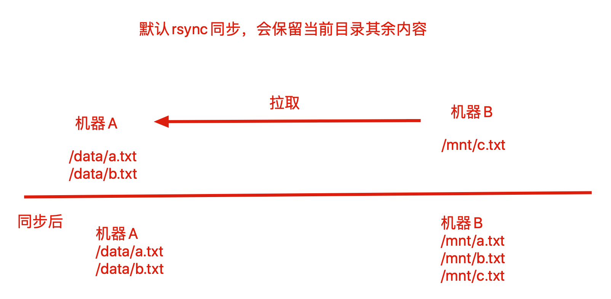

【无差异复制】


实现该同步方式，主要是使用rsync的`--delete`参数

所谓无差异复制，指的是`无论拉取，还是推送，都保持两边的数据完全一致`，也就删除其他多余文件的参数

【1.本地推送式删除】

```plain
# 保持/mnt下内容和/tmp完全一致，删除其他多余文件
[root@rsync01 tmp]# rsync -avzP --delete /tmp/  /mnt/
```

【2.拉取数据无差异同步】

注意rsyncd.conf配置文件，之前配置过`排除文件的参数`

```plain
rsync -avzP --delete rsync_backup@192.168.178.148::backup /mnt/ --password-file=/etc/rsync.password
```

**再次强调，**`**--delete**`**参数就是保证**`**客户端**`**和**`**服务端**`**的数据完全一致，这可能是个危险的命令！！**

【3.推送数据无差异同步】

**也就是将本地的目录和远程服务端的目录保持一致，使用不当可能会造成远程服务器的备份数据丢失！！小心使用**

```plain
[root@nfs01 ~]# rsync -avz  --delete /tmp/ rsync_backup@192.168.178.157::backup --password-file=/etc/rsync.password[root@nfs01 ~]# rsync -avz  --delete /tmp/ rsync_backup@192.168.178.157::backup --password-file=/etc/rsync.password
```

### --delete参数总结与生产环境

- Rsync推送企业工作场景：数据备份、上传

```plain
本地有的资料，远端机器完全一致
在使用场景是备份、上传情况下，一般不用加上--delete参数，除非是NFS服务的实施复制，数据必须完全一致性
```

- Rsync拉取场景：代码发布、下载

```plain
Rsync无差异同步还可以用于负载均衡下的Web服务器之间的同步，或者NFS共享数据的同步
```

## Rsync断点续传

Rsync支持大文件断点续传，参数如下

```plain
--partial  
默认情况rsync传输中断后，将会删除所有部分传输的文件，某些情况下用户希望能保留已经传输的内容，该参数告知rsync保留部分已传输的文件，可以使得剩余文件部分传输
--partial-dir=DIR
保留部分传输文件，这是个更好的参数，能够指定目录保存部分数据，而不是写入目标文件
下次传输的时候，rsync将使用该目录的数据，来恢复整体数据传输，结束后删除该目录
```

【断点续传案例】

```plain
1.加上断点续传指定目录参数，传输中断，部分数据也保存在了指定目录,传输结束后，会删除该文件
[root@nfs01 tmp]# rsync -avzP --partial-dir=/tmp/ /tmp/1  rsync_backup@192.168.178.157::backup
```

## Rsync限速

```plain
限速参数
--bwlimit=KBPS
该参数允许最大传输速率是多少KB/s，设置为0则不限速
```

在某公司，白天高峰期某DBA人员在数据库服务器通过rsync复制百G数据到备份服务器，导致数据库服务器带宽占满，造成用户无法访问。

这就应该用rsync限速功能，限制复制速度在带宽的1/3这样，就能够解决该问题

当然，尽量别在高峰期做大数据复制行为！

```plain
1.快四生成1G文件
dd if=/dev/zero of=test1  bs=10M count=128
2.不限速传输形式
[root@nfs01 tmp]# rsync -avzP /tmp/test1 rsync_backup@192.168.178.157::backup
sending incremental file list
test1
    495,026,176  36%   91.26MB/s    0:00:09  ^C
rsync error: received SIGINT, SIGTERM, or SIGHUP (code 20) at rsync.c(638) [sender=3.1.2]
3.限速传输
[root@nfs01 tmp]# rsync -avzP --bwlimit=10 /tmp/  rsync_backup@192.168.178.157::backup
```

# 生产经验

rsync默认增量复制，与oss的数据复制的时候，注意参数，无法用-a参数，因为涉及到权限问题，-a是保持属性

rsync -r


# 企业级实时复制实践

## 实时复制介绍

网站集群架构中，数据永远是最核心且重要的，数据丢失，将会给企业造成巨大损失

【数据遭到破坏】

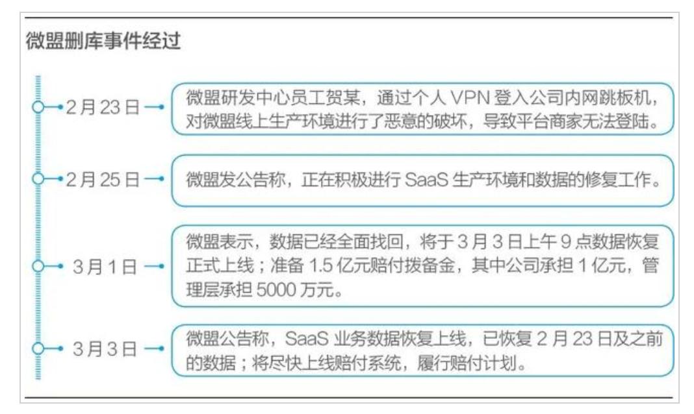


## 数据备份方案

企业网站和应用都得有完全的数据备份方案确保数据不丢失，通常企业有如下的数据备份方案

### 定时任务定期备份

需要周期性备份的数据可以分两类：

- 后台程序代码、运维配置文件修改，一般会定时任务执行脚本进行文件备份，然后配置Rsync工具推送到远程服务器备份
- 对于数据库文件用定时任务脚本配合数据库提供的备份工具，定时生成备份文件，配合Rsync备份到远端

为什么要用实时同步服务

因为定时任务有缺陷，一分钟以内的数据无法进行同步，容易造成数据丢失

### 实施复制方案

实施复制是最适合企业备份重要数据的方式，用于用户提交的数据备份，对于用户提交的普通文件（jpg、tar、zip、MP4、txt、html）等待，都可以用`Inofity+Sersync+Rsync`实时备份方案。

对于数据文件，还有更复杂的分布式存储方案，把数据同时备份成多份，如FastDFS、GlusterFS等

对于提交到数据库中的数据，还可以用数据库的主从复制（如MySQL），这是软件自带的实时备份。

## 图解备份方式

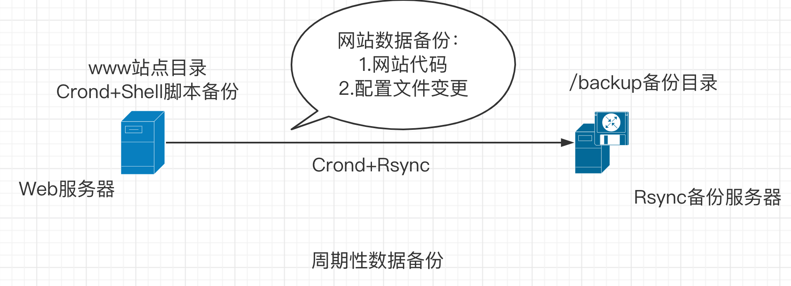

### 图解实时复制


## 实时复制环境准备

【部署机器准备】

```plain
NFS01机器  192.168.178.111        /data共享目录
BACKUP机器                                      /backup 备份目录
```

### 实时复制说明

1.实时复制软件会监控磁盘文件系统的变化，比如指定的/data目录，实时复制软件进程会实时监控这个/data目录中对应文件系统数据的变化。

2.一旦/data目录文件发生变化，就会执行rsync命令，将变化的数据推送到备份服务器对应的备份目录中

### 实施复制软件介绍

企业常用实时复制软件如下两款

| 软件          | 依赖程序      | 部署难点 | 说明             |
| ------------- | ------------- | -------- | ---------------- |
| Inotify-tools | Rsync守护进程 | 复制脚本 | 监控目录数据变化 |
| Sersync*      | Rsync守护进程 | 配置文件 | 监控目录数据变化 |

## Inotify机制

Inotify是一种异步的系统事件监控机制，通过Inotify可以监控文件系统中添加、删除、修改等事件，利用这个内核接口，第三方软件可以监控文件系统下的情况变化。

那么Inofity-tools就是该类软件的实现，是一个监控指定目录数据实时变化的软件。

实现了Inotify的软件还有`Sersync`、`Inotify-tools`

```plain
Sersync软件是在Inotify的基础上进行开发的，功能更加强大，支持配置文件中定义、重试机制、过滤机制、提供CDN数据更新、多线程操作等。
```

【Inotify机制的优点】

- 监控文件系统的事件变化，通过复制工具实现实时数据复制
- 支持多线程实时复制

【Inotify的缺点】

- 实测当文件数量大于200个（10~100kb），复制存在延迟。

## Inofity+Rsync实施复制实战

无论是Inotify-tools还是Sersync、本身的核心功能都是`监控指定目录内的数据变化`，具体的复制到远端服务器的功能还是借助Rsync工具配合，Inotify机制软件工作流程如下

1. 备份源客户端开机运行Inotify软件，检测指定目录的文件系统变化
2. 一旦获取到指定监控目录的数据发生变化，即刻执行Rsync命令复制数据。
3. 将变化的数据发送到Rsync服务端的备份目录。

## 项目部署实施

【1.确保远程数据传输服务部署完成】

### 前提配置好Rsync Daemon模式

```plain
也就是可以在客户端机器，推送、拉取数据到BACKUP服务器，才能配置Inofity-tools
将rsync守护进程模式部署完毕
rsync服务端部署
a 检查rsync软件是否已经安装
b 编写rsync软件主配置文件
c 创建备份目录管理用户
d 创建备份目录，并进行授权
e 创建认证文件，编写认证用户和密码信息，设置文件权限为600
f 启动rsync守护进程服务
```

### 在NFS01机器配置

```plain
rsync客户端部署
a 检查rsync软件是否已经安装    
b 创建认证文件，编写认证用户密码信息即可，设置文件权限为600
c 利用客户端进行数据同步测试
当前也就是rsync客户端机器，配置如下部署
1.设置密码环境变量，方便的使用rsync命令
[root@nfs01 ~]# echo "export RSYNC_PASSWORD=chaoge"  >> /etc/bashrc
2.加载配置文件
source /etc/bashrc
3.检查环境变量
[root@nfs01 ~]# echo $RSYNC_PASSWORD
chaoge
4.作为Rsync客户端，测试推送和拉取数据是否正常
#推送本地数据给Rsync服务端
[root@nfs01 ~]# rsync -avz /data/ rsync_backup@192.168.178.110::backup
5.拉取服务端资料
[root@nfs01 ~]# rsync -avz rsync_backup@192.168.178.110::backup  /tmp
```

### 检查Linux版本是否支持Inotify机制

只有Linux内核版本在2.6.13起才支持，以及是否存在三个系统文件，存在则支持

```plain
1.检查linux内核版本
[root@nfs01 ~]# uname -r
3.10.0-1062.9.1.el7.x86_64
2.检查Inotify相关文件
[root@nfs01 ~]# ls -l /proc/sys/fs/inotify/
总用量 0
[root@nfs01 ~]# cd /proc/sys/fs/inotify/
[root@nfs01 inotify]# ll
总用量 0
-rw-r--r-- 1 root root 0 2018-02-25 19:45 max_queued_events    
-rw-r--r-- 1 root root 0 2018-02-25 19:45 max_user_instances
-rw-r--r-- 1 root root 0 2018-02-25 19:45 max_user_watches
max_user_watches:    设置inotifywait或inotifywatch命令可以监视的文件数量（单进程）
默认只能监控8192个文件
max_user_instances:    设置每个用户可以运行的inotifywait或inotifywatch命令的进程数
默认每个用户可以开启inotify服务128个进程
max_queued_events:    设置inotify实例事件（event）队列可容纳的事件数量
默认监控事件队列长度为16384
```

### Inotify-tools工具安装

```plain
1.yum安装，需配置epel源
[root@nfs01 ~]# yum install inotify-tools -y
2.检查软件
[root@nfs01 ~]# rpm -ql inotify-tools|head -2
/usr/bin/inotifywait        # 重要软件命令
/usr/bin/inotifywatch        # 重用软件命令
```

### Inotify命令工具

上述操作我们安装好了Inotify-tools软件，生成2个重要的命令

- inotifywait：在被监控的目录等待特定文件系统事件（open、close、delete等事件），执行后处于阻塞状态，适合在Shell脚本中使用，是实现监控的关键
- Inotifywatch：收集被监控的文件系统使用的统计数据（文件系统事件发生的次数统计）

【inotifywait命令解释】

```plain
inotifywait用于等待文件或文件集上的一个待定事件，可以监控任何文件和目录设置，并且可以递归地监控整个目录树；
inotifywatch用于收集被监控的文件系统计数据，包括每个inotify事件发生多少次等信息
从上面可知inotifywait是一个监控事件，可以配合shell脚本使用它。与它相关的参数：
语法格式：inotifywait [-hcmrq][-e][-t][–format][-timefmt][…]
-m： 即“–monitor” 表示始终保持事件监听状态。
-d：类似于-m参数，将命令运行在后台，记录出发的事件信息，记录在指定文件里，加上--outfile参数
-r： 即“–recursive” 表示递归查询目录
-q： 即“–quiet” 表示打印出监控事件
-o： 即“–outfile” 输出事情到一个文件而不是标准输出
-s: 即“–syslog” 输入错误信息到系统日志
-e： 即“–event”， 通过此参数可以指定要监控的事件，常见的事件有modify、delete、create、close_write、move、close、unmount和attrib等
-format： 指定输出格式；常用的格式符如：
%w：表示发生事件的目录
%f：表示发生事件的文件
%e：表示发生的事件
%Xe:事件以“X”分隔
%T：使用由-timefmt定义的时间格式
-timefmt：指定时间格式，用于-format选项中的%T格式
```

利用Inotify软件监控的事件主要是如下

```plain
Events    含义
access    文件或目录被读取
modify    文件或目录内容被修改
attrib    文件或目录属性被改变
close    文件或目录封闭，无论读/写模式
open    文件或目录被打开
moved_to    文件或目录被移动至另外一个目录
move    文件或目录被移动到另一个目录或从另一个目录移动至当前目录
create    文件或目录被创建在当前目录
delete    文件或目录被删除
umount    文件系统被卸载
```

### Inotify可监控的事件

```plain
可监控的事件
有几种事件能够被监控。一些事件，比如 IN_DELETE_SELF 只适用于正在被监控的项目，而另一些，比如 IN_ATTRIB 或者 IN_OPEN 则只适用于监控过的项目，或者如果该项目是目录，则可以应用到其所包含的目录或文件。
IN_ACCESS
被监控项目或者被监控目录中的条目被访问过。例如，一个打开的文件被读取。
IN_MODIFY
被监控项目或者被监控目录中的条目被修改过。例如，一个打开的文件被修改。
IN_ATTRIB
被监控项目或者被监控目录中条目的元数据被修改过。例如，时间戳或者许可被修改。
IN_CLOSE_WRITE
一个打开的，等待写入的文件或目录被关闭。
IN_CLOSE_NOWRITE
一个以只读方式打开的文件或目录被关闭。
IN_CLOSE
一个掩码，可以很便捷地对前面提到的两个关闭事件（IN_CLOSE_WRITE | IN_CLOSE_NOWRITE）进行逻辑操作。
IN_OPEN
文件或目录被打开。
IN_MOVED_FROM
被监控项目或者被监控目录中的条目被移出监控区域。该事件还包含一个 cookie 来实现 IN_MOVED_FROM 与 IN_MOVED_TO 的关联。
IN_MOVED_TO
文件或目录被移入监控区域。该事件包含一个针对 IN_MOVED_FROM 的 cookie。如果文件或目录只是被重命名，将能看到这两个事件，如果它只是被移入或移出非监控区域，将只能看到一个事件。如果移动或重命名一个被监控项目，监控将继续进行。参见下面的 IN_MOVE-SELF。
IN_MOVE
可以很便捷地对前面提到的两个移动事件（IN_MOVED_FROM | IN_MOVED_TO）进行逻辑操作的掩码。
IN_CREATE
在被监控目录中创建了子目录或文件。
IN_DELETE
被监控目录中有子目录或文件被删除。
IN_DELETE_SELF
被监控项目本身被删除。监控终止，并且将收到一个 IN_IGNORED 事件。
IN_MOVE_SELF
监控项目本身被移动。
```

### 测试create事件

```plain
# 语法
inotifywait -mrq --timefmt "%F" --format "%T %w%f 事件信息：%e" /data  <-- 相对完整的命令应用
# 指定事件监控
inotifywait -mrq --timefmt "%F" --format "%T %w%f 事件信息：%e" -e create /data  
# 实际案例，监控/data目录的创建
[root@nfs01 ~]# inotifywait -mrq --timefmt '%d/%m/%y %H:%M' --format '%T%w%f' -e create /data
# 参数解释
-m： 即“–monitor” 表示始终保持事件监听状态。
-r： 即“–recursive” 表示递归查询目录
-q： 即“–quiet” 表示打印出监控事件
--timefmt：指定时间格式
%m 　月份(以01-12来表示)。
%d 　日期(以01-31来表示)。
 %y 　年份(以00-99来表示)。
%w：表示发生事件的目录
%f：表示发生事件的文件
%T：使用由-timefmt定义的时间格式
%e：表示发生的事件
#日志检测
16/03/20 09:26/data/超哥带你学inotify.txt
16/03/20 09:26/data/嗨起来
16/03/20 09:27/data/今天是个好日子.txt
-e： 即“–event”， 通过此参数可以指定要监控的事件，常见的事件有modify、delete、create、close_write、move、close、unmount和attrib等
```

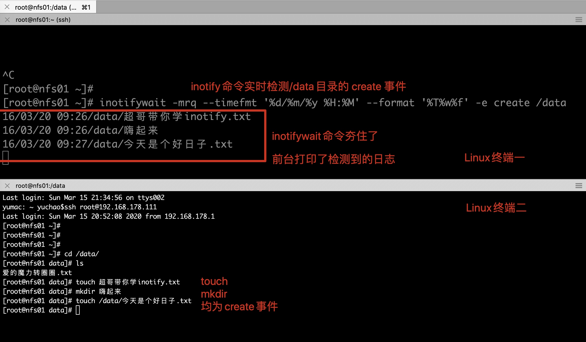

【上述案例解读】

```plain
命令中只监控了create的事件，并没有检测其他事件，因此也只有create会被inotify监控到
-e： 即“–event”， 通过此参数可以指定要监控的事件，常见的事件有modify、delete、create、close_write、move、close、unmount和attrib等
```


### 测试delete事件

```plain
1.在NFS01客户端机器上检测inotify功能，检测delete事件，只有在该目录下的删除动作，才会触发监控
[root@nfs01 ~]# inotifywait -mrq --format '%w%f' -e delete /data
2.再开一个终端，进行删除动作
[root@nfs01 data]# rm -rf 爱的魔力转圈圈.txt
```

### close_write事件

```plain
检测不同的时间，其实就是-e参数指定的不同，其实很简单
[root@nfs01 ~]# inotifywait -mrq --format '%w%f' -e close_write /data
```


### inotify增删改事件

| 重要事件    | 包含事件                   | 说明                                               |
| ----------- | -------------------------- | -------------------------------------------------- |
| close       | close_write、close_nowrite | 文件或目录关闭，不管是`读`还是`写`都包含`关闭`操作 |
| close_write | create                     | 含创建文件事件，不含创建目录事件，自身有修改事件   |
| move        | moved_to、moved_from       | 文件或目录无论是移动、移除监控目录，都被监控       |

### 扩展：sed命令触发事件

#### 在NFS01上开启Inotify监控功能

```plain
1.监控所有事件，且格式化输出
[root@nfs01 ~]# inotifywait -mrq /data --format "%w%f 事件：%e"
```


#### 利用sed修改文件内容

```plain
# 替换chaoge.txt的内容，且进行备份，旧内容在chaoge.txt.bak  ，替换后内容在chaoge.txt
[root@nfs01 data]# sed -i.bak  's/默认监控所有事件/超哥带你学inotify事件/g' /data/chaoge.txt
# sed修改文件事件如下
1. 创建临时文件
2. 把源文件内容放入临时文件中
3. 修改临时文件内容
4. 对源文件进行备份 -i.bak ---- chaoge.txt.bak
5. 对临时文件重命名为chaoge.txt
```

#### sed修改文件inotify事件图


## Inotify-tools软件部署实战

### 手工配置inotify的监控事件，增删改查

```plain
# 检测目录的增删改事件
[root@nfs01 ~]# inotifywait -mrq --timefmt "%y-%m-%d %T"   --format "%T  %w%f 当前事件有：%e" -e close_write,delete  /data/
```

再开一个终端，修改数据

```plain
[root@nfs01 data]# touch /data/超哥带你学inotify.txt
[root@nfs01 data]# echo "超哥带你飞" >> /data/超哥带你学inotify.txt.bak
[root@nfs01 data]#
[root@nfs01 data]# rm -rf /data/*
#Inotify能够检测到如下信息
/data/超哥带你学inotify.txt
/data/超哥带你学inotify.txt.bak
/data/chaoge.txt
/data/chaoge.txt.bak
/data/超哥带你学inotify.txt.bak
/data/嗨起来
```

### 编写实时监控和复制脚本

```plain
1.生成一个数字1，2，3的文件
seq 3 > /tmp/chaoge.txt
2.编写一个脚本，能够循环读取文件内容
[root@nfs01 tmp]# cat test.sh
cat ./chaoge.txt | \
while read line
do
  echo $line
done
3.检查文件
[root@nfs01 tmp]# ls
chaoge.txt  test.sh
4.执行该脚本，-x参数执行脚本，输出执行过程，调试利器，也可以不加
[root@nfs01 tmp]# sh -x test.sh
+ read line                    #按行读取
+ cat ./chaoge.txt  #读取文件
+ echo 1    #输出1
1
+ read line                #按行读取
+ echo 2                    #输出2
2
+ read line
+ echo 3
3
+ read line
```

【操作实时同步的脚本】

```plain
1.创建统一管理脚本的文件夹
[root@nfs01 tmp]# mkdir -p /MyInotify/scripts
2.创建针对事件变化完整复制的脚本 monitor.sh
[root@nfs01 scripts]# cat monitor.sh
#!/bin/bash
cmd="/usr/bin/inotifywait"
$cmd -mrq --timefmt "%y-%m-%d %T"   --format "%T  %w%f 当前事件有：%e"  -e close_write,delete /data | \
while read line
do
        cd /data && \
        rsync -az --delete ./ rsync_backup@192.168.178.139::backup
done
--------------------------------------------------------------------------------------------
```

#### 在nfs01机器上执行脚本

```plain
[root@nfs01 scripts]# sh -x  monitor.sh
```


```plain
测试脚本没问题后，可以将脚本运行在后台，实时监听文件变化，进行同步，保证数据备份安全
1.脚本放置后台运行，在前台运行会占用终端，且终端关了，任务会断
[root@nfs01 scripts]# /bin/sh /MyInotify/scripts/monitor.sh &>/dev/null &
[1] 3004
[root@nfs01 scripts]# jobs
[1]+  运行中               /bin/sh /MyInotify/scripts/monitor.sh &>/dev/null &
[root@nfs01 scripts]#
2.该任务添加至开机启动文件
[root@nfs01 scripts]# tail -2 /etc/rc.local
# inotify + rsync  script by chaoge
/bin/sh /MyInotify/scripts/monitor.sh &>/dev/null &
```

至此Rsync+inotify实施复制已经结束

### Inotify优化参数

```plain
有关inotify的内核参数文件，可以针对企业需求进行优化，修改如下
[root@nfs01 scripts]# cat /proc/sys/fs/inotify/max_*
16384
128
8192
[root@nfs01 scripts]# echo "50000000" > /proc/sys/fs/inotify/max_user_watches
[root@nfs01 scripts]# echo "50000000" > /proc/sys/fs/inotify/max_queued_events
```


# Sersync

```plain
提到数据同步就必然会谈到rsync，一般简单的服务器数据传输会使用ftp/sftp等方式，但是这样的方式效率不高，不支持差异化增量同步也不支持实时传输。针对数据实时同步需求大多数人会选择rsync+inotify-tools的解决方案，sersync是国人基于前两者开发的工具，不仅保留了优点同时还强化了实时监控，文件过滤，简化配置等功能，帮助用户提高运行效率，节省时间和网络资源。
```

Sersync项目利用Inotify和Rsync工具技术实现对服务器数据实时复制。

当事件发生变化后，利用rsync命令把变化的数据复制到远端服务器上。

Sersync特点

- 使用C++编写，支持对监控事件的过滤
- Sersync采用xml配置文件，由守护进程启动，配置起来比起简易的`inotify+rsync更简单`
- 使用多线程复制，可以并发复制多个不同文件，效率更高
- Sersync自带异常检测机制，可以通过`失败队列`对出错的文件重新复制
- 自带crontab功能，实现对`失败队列`中的文件定时整体复制
- 自带socket和HTTP协议扩展，定制特殊需求，二次开发

## Sersync软件架构原理

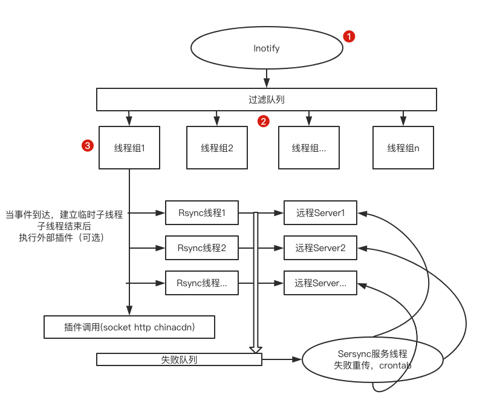

上图执行原理解释

1. Inotify监控指定目录对应事件的变化，当有事件变化时进入事件过滤队列
2. 过滤队列负责过滤掉不需要触发复制的数据，也可以过滤短时间内产生的重复Inotify事件信息，过滤后的事件触发Rsync对应变化数据进行复制。
3. 图中线程组（线程是等待线程队列的守护线程），当事件队列中中有事件发生后，线程组守护线程会逐个唤醒复制线程（线程就是干活的工人，没活的时候打盹，来活了逐个唤醒准备干活），当队列的Inotify事件较多的时候，复制线程就会全部唤醒一起工作，提升复制效率。（活太多，所有工人全部喊起来，加快工作效率）
4. 除了线程组以外，还有Sersync服务线程负责处理`复制失败的文件`，它们再次复制，对于再次复制失败的文件（执行失败的命令），会记录到rsync_fail_log.sh脚本中，然后再定期执行脚本，同时利用自带的cron功能，实现每隔一段时间将所有未复制的数据整体复制。

## Sersync部署

### 确保rsync服务正确，c/s端

```plain
1.大前提Rsync Daemon服务正确
[root@nfs01 scripts]# rsync -avz --delete /data/ rsync_backup@192.168.178.110::backup
```

### 确保当前客户端机器，是否支持Inotify

```plain
[root@nfs01 scripts]# ls /proc/sys/fs/inotify/
max_queued_events  max_user_instances  max_user_watches
```

### Sersync安装

```plain
1.资料参考地址
https://github.com/wsgzao/sersync
2.下载获取sersync软件包，上传至linux
[root@nfs01 ~]# ls /MyInotify/tools/
sersync_installdir_64bit.zip
[root@nfs01 bin]# pwd
/MyInotify/tools/sersync_installdir_64bit/sersync/bin
# 给与命令可执行权限
[root@nfs01 bin]# chmod +x sersync
[root@nfs01 bin]# ll
总用量 1768
-rwxr-xr-x 1 root root 1810128 10月 26 2011 sersync
```

### Sersync配置文件

```plain
1.修改配置文件，修改如下部分
[root@nfs01 conf]# vim /MyInotify/tools/sersync_installdir_64bit/sersync/conf/confxml.xml
# 配置文件解释
# sersync的过滤功能，排除指定的文件不复制
  6     <filter start="false">
  7         <exclude expression="(.*)\.svn"></exclude>
  8         <exclude expression="(.*)\.gz"></exclude>
  9         <exclude expression="^info/*"></exclude>
 10         <exclude expression="^static/*"></exclude>
 11     </filter>
# 指定监控事件，也就是触发监控管理的事件，true开启，false关闭
 12     <inotify>
 13         <delete start="true"/>
 14         <createFolder start="true"/>
 15         <createFile start="false"/>
 16         <closeWrite start="true"/>
 17         <moveFrom start="true"/>
 18         <moveTo start="true"/>
 19         <attrib start="false"/>
 20         <modify start="false"/>
 21     </inotify>
 # sersync主要功能点
 23     <sersync>
 24         <localpath watch="/data">
 # 填写rsync同步服务端ip地址，以及同步的模块名，支持复制到多台服务器
 25             <remote ip="192.168.178.110" name="bakcup"/>
 26             <!--<remote ip="192.168.8.39" name="tongbu"/>-->
 27             <!--<remote ip="192.168.8.40" name="tongbu"/>-->
 28         </localpath>
 # 配置rsync的信息
 29         <rsync>
 # 命令的参数
 30             <commonParams params="-artuz"/>
 # 填写rsync服务端验证的账号，密码文件
 31             <auth start="true" users="rsync_backup" passwordfile="/etc/rsync.password"/>
 32             <userDefinedPort start="false" port="874"/><!-- port=874 -->
 33             <timeout start="false" time="100"/><!-- timeout=100 -->
 34             <ssh start="false"/>
 35         </rsync>
```

主要需要配置的地方如上

### Sersync部署应用

```plain
1.生成sersync命令快捷键
[root@nfs01 conf]# ln -s /MyInotify/tools/sersync_installdir_64bit/sersync/bin/sersync /usr/local/bin/
2.查看命令帮助
[root@nfs01 conf]# sersync -h
set the system param
execute：echo 50000000 > /proc/sys/fs/inotify/max_user_watches
execute：echo 327679 > /proc/sys/fs/inotify/max_queued_events
parse the command param
_______________________________________________________ 
参数-d:启用守护进程模式
参数-r:在监控前，将监控目录与远程主机用rsync命令推送一遍
参数-n: 指定开启守护线程的数量，默认为10个
参数-o:指定配置文件，默认使用confxml.xml文件
参数-m:单独启用其他模块，使用 -m refreshCDN 开启刷新CDN模块
参数-m:单独启用其他模块，使用 -m socket 开启socket模块
参数-m:单独启用其他模块，使用 -m http 开启http模块
不加-m参数，则默认执行同步程序
________________________________________________________________
```

Sersync软件服务开启，命令如下

```plain
[root@nfs01 conf]# sersync -r -d -o /MyInotify/tools/sersync_installdir_64bit/sersync/conf/confxml.xml
set the system param
execute：echo 50000000 > /proc/sys/fs/inotify/max_user_watches
execute：echo 327679 > /proc/sys/fs/inotify/max_queued_events
parse the command param
option: -r     rsync all the local files to the remote servers before the sersync work
option: -d     run as a daemon
option: -o     config xml name：  /MyInotify/tools/sersync_installdir_64bit/sersync/conf/confxml.xml
daemon thread num: 10
parse xml config file
host ip : localhost    host port: 8008
daemon start，sersync run behind the console
config xml parse success
please set /etc/rsyncd.conf max connections=0 Manually
sersync working thread 12  = 1(primary thread) + 1(fail retry thread) + 10(daemon sub threads)
Max threads numbers is: 22 = 12(Thread pool nums) + 10(Sub threads)
please according your cpu ，use -n param to adjust the cpu rate
------------------------------------------
rsync the directory recursivly to the remote servers once
working please wait...
execute command: cd /data && rsync -artuz -R --delete ./ 192.168.178.110::bakcup >/dev/null 2>&1
run the sersync:
watch path is: /data
```

添加sersync命令至开机启动

```plain
[root@nfs01 data]# echo "/MyInotify/tools/sersync_installdir_64bit/sersync/bin/sersync -d" >> /etc/rc.local
[root@nfs01 data]#
[root@nfs01 data]# tail -1 /etc/rc.local
/MyInotify/tools/sersync_installdir_64bit/sersync/bin/sersync -d
```

命令部署测试

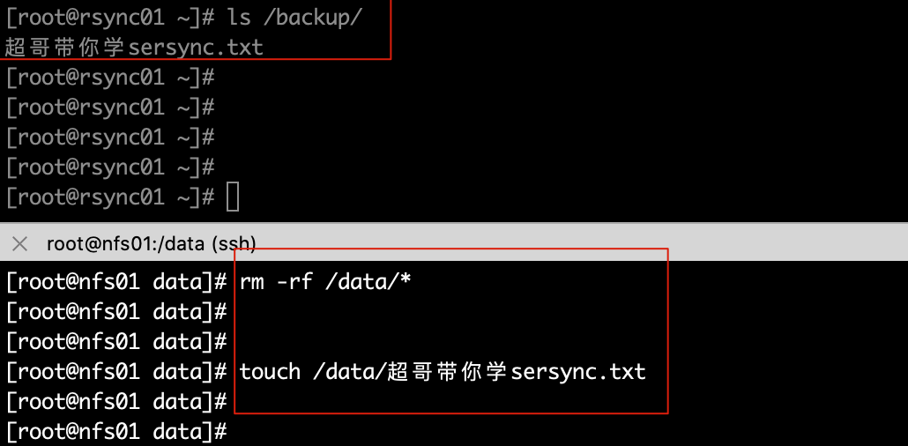


# Ansible自动化运维

## 人工运维时代

运维人员大多需要维护数量众多的机器，反复重复的劳动力，很多机器需要同时部署相同的服务或是执行命令，还得反复登录不同的机器执行。

例如在backup服务器上部署Rsync服务，需要在所有其他的服务器上部署Rsync客户端配置一遍。

一台台机器登录执行命令实在太繁琐，运维人员也常用Xshell、SecureCRT之类的工具添加多个服务器的标签，提高快速连接服务器的效率。

## 自动化运维时代

SSH自动化运维时代是指2003~2012年，当时SSH自动化运维是很流行的，通过再管理机器统一创建秘钥对，将私钥留在管理机上，公钥发到所有被管理的机器，然后开发脚本实现批量管理。

系统管理员日常会进行大量的重复性操作，例如安装软件，修改配置文件，创建用户，批量执行命令等等。如果主机数量庞大，单靠人工维护实在让人难以忍受。

早期运维人员会根据自己的生产环境来写特定脚本完成大量重复性工作，这些脚本复杂且难以维护。

系统管理员面临的问题主要是1、系统配置管理，2、远程执行命令，因此诞生了很多开源软件，系统维护方面有fabric、puppet、chef、ansible、saltstack等，这些软件擅长维护系统状态或方便的对大量主机进行批量的命令执行。

其中有两款软件都是用Python语言开发的，也就是`saltstack`、`ansible`，学习简单，功能强大。

### 自动化运维趋势

如今的自动化运维，不再是一个批量自动化管理软件就可以解决所有问题了，运维管理高速发展，从人肉运维到自动化运维，再到数据化运维、可视化运维、到AI智能运维，运维界倡导DevOps、AIOps运维，前景十分广阔，给用户更广阔的施展空间。

### 自动化运维好处

- 提高工作效率，减少重复性工作
- 大大减少人为出错的可能性
- 数据化管理、数据化汇报、问题可追溯

## Ansible介绍

Ansible是一个同时管理多个远程主机的软件（任何可以通过SSH协议登录的机器），因此Ansible可以管理`远程虚拟机`、`物理机`，也可以是本地主机。

Ansible通过SSH协议实现`管理节点`、`远程节点`的通信。只要是能够SSH登录的主机完成的操作，都可以通Ansible自动化操作，比如批量复制、批量删除、批量修改、批量查看、批量安装、重启、更新等。

## Ansible特点

Ansible的编排引擎可以出色的完成配置管理、流程控制、资源部署等多方面的操作。和其他IT自动化产品比较，Ansible无须安装客户端软件，管理简便，功能强大，便于维护。

Ansible基于Python开发，由主要的Paramiko和PyYAML两个关键模块构建。

- 安装部署简单，学习曲线平坦
- 管理主机便捷，支持多台主机并行管理
- 无须单独在被管理主机上安装客户端软件（no agents），无须占用其他端口，仅利用SSH服务工作。
- 远程执行安全，轻松对执行的内容进行审计、评估、重写
- 能够立即管理远程主机，无须事先安装任何客户端。
- 不仅支持python、还可以使用其他语言开发模块。
- 非root账户可用
- 不需要安装服务端(no servers)，不需要守护进程服务
- 有活跃的官方社区

在云计算时代，基础架构必须满足按需自动伸缩、按使用量计费的基本特性，因此自动化运维软件是必备的工具之一。

## Ansible软件架构

Ansible是基于模块工作的，本身没有批量部署的能力。真正具有批量部署的是Ansible所运行的模块，Ansible只是提供一种框架。


## Ansible服务器规划

| 主机名  | ip              | 用途            | 说明       |
| ------- | --------------- | --------------- | ---------- |
| m01     | 192.168.178.120 | 中心分发服务器  | 管理机     |
| rsync01 | 192.168.178.110 | Rsync备份服务器 | 未配免密钥 |
| web01   | 192.168.178.121 | web01服务器     | 配置免密钥 |
| nfs01   | 192.168.178.111 | nfs共享存储     | 未配密钥   |
|         |                 |                 |            |

## Ansible管理机安装部署

```plain
1.在管理节点，管理机上安装ansible软件
[root@m01 ~]# yum install epel-release ansible libselinux-python -y
2.检查ansible软件
[root@m01 ~]# rpm -ql ansible |grep -E '^/etc|^/usr/bin'
/etc/ansible                                #Ansible软件主目录
/etc/ansible/ansible.cfg        #Ansible主配置文件
/etc/ansible/hosts                    #Ansible软件被管理节点的主机列表文件
/etc/ansible/roles                
/usr/bin/ansible                        #Anisble批量管理命令
/usr/bin/ansible-2
/usr/bin/ansible-2.7
/usr/bin/ansible-config
/usr/bin/ansible-connection
/usr/bin/ansible-console
/usr/bin/ansible-console-2
/usr/bin/ansible-console-2.7
/usr/bin/ansible-doc
/usr/bin/ansible-doc-2
/usr/bin/ansible-doc-2.7
/usr/bin/ansible-galaxy
/usr/bin/ansible-galaxy-2
/usr/bin/ansible-galaxy-2.7
/usr/bin/ansible-inventory
/usr/bin/ansible-playbook            #Ansible程序剧本执行命令
/usr/bin/ansible-playbook-2
/usr/bin/ansible-playbook-2.7
/usr/bin/ansible-pull
/usr/bin/ansible-pull-2
/usr/bin/ansible-pull-2.7
/usr/bin/ansible-test
/usr/bin/ansible-vault
/usr/bin/ansible-vault-2
/usr/bin/ansible-vault-2.7
3.检查Ansible版本
[root@m01 ~]# ansible --version
ansible 2.9.6
  config file = /etc/ansible/ansible.cfg
  configured module search path = [u'/root/.ansible/plugins/modules', u'/usr/share/ansible/plugins/modules']
  ansible python module location = /usr/lib/python2.7/site-packages/ansible
  executable location = /usr/bin/ansible
  python version = 2.7.5 (default, Apr 11 2018, 07:36:10) [GCC 4.8.5 20150623 (Red Hat 4.8.5-28)]
```

## Anisble命令及参数

```plain
ansible是新出现的自动化运维工具，基于Python开发，集合了众多运维工具（puppet、cfengine、chef、func、fabric）的优点，实现了批量系统配置、批量程序部署、批量运行命令等功能。
Options:
  -a MODULE_ARGS, --args=MODULE_ARGS    
             #module arguments
             #指定执行模块使用的参数  
  --ask-vault-pass      
             #ask for vault password
             #加密playbook文件时提示输入密码
  -B SECONDS, --background=SECONDS
             #run asynchronously, failing after X seconds(default=N/A)
             #后台运行超时时间,异步运行，X秒之后失败
  -C, --check           
             #don't make any changes; instead, try to predict some of the changes that may occur
             #模拟执行，不会真正在机器上执行(查看执行会产生什么变化)
  -D, --diff            
             #when changing (small) files and templates, show the differences in those files; works great with --check
             #当更新的文件数及内容较少时，该选项可显示这些文件不同的地方，该选项结合-C用会有较好的效果
  -e EXTRA_VARS, --extra-vars=EXTRA_VARS
             #set additional variables as key=value or YAML/JSON
             #执行命令时添加额外参数变量
  -f FORKS, --forks=FORKS
             #specify number of parallel processes to use(default=5)
             #并行任务数。FORKS被指定为一个整数,默认是5
  -h, --help            
             #show this help message and exit
             #打开帮助文档API
  -i INVENTORY, --inventory-file=INVENTORY
             #specify inventory host path(default=/etc/ansible/hosts) or comma separated host list.
             #指定要读取的Inventory文件
  -l SUBSET, --limit=SUBSET
             #further limit selected hosts to an additional pattern
             #限定执行的主机范围
  --list-hosts          
             #outputs a list of matching hosts; does not execute anything else
             #列出执行匹配到的主机，但并不会执行
  -m MODULE_NAME, --module-name=MODULE_NAME
             #module name to execute (default=command)
             #指定执行使用的模块，默认使用 command 模块
  -M MODULE_PATH, --module-path=MODULE_PATH
             #specify path(s) to module library (default=None)
             #要执行的模块的路径
  --new-vault-password-file=NEW_VAULT_PASSWORD_FILE
             #new vault password file for rekey
             #    
  -o, --one-line        
             #condense output
             #压缩输出，摘要输出.尝试一切都在一行上输出
  --output=OUTPUT_FILE  
             #output file name for encrypt or decrypt; use - for stdout
             #
  -P POLL_INTERVAL, --poll=POLL_INTERVAL
             #set the poll interval if using -B (default=15)
             #设置轮询间隔，每隔数秒。需要- B
  --syntax-check        
             #perform a syntax check on the playbook, but do not execute it
             #检查Playbook中的语法书写
  -t TREE, --tree=TREE  
             #log output to this directory
             #将日志内容保存在该输出目录,结果保存在一个文件中在每台主机上
  --vault-password-file=VAULT_PASSWORD_FILE
             #vault password file
             #
  -v, --verbose         
             #verbose mode (-vvv for more, -vvvv to enable connection debugging)
             #执行详细输出
  --version             
             #show program's version number and exit
             #显示版本
  Connection Options:
    control as whom and how to connect to hosts
    -k, --ask-pass      
             #ask for connection password
             #
    --private-key=PRIVATE_KEY_FILE, --key-file=PRIVATE_KEY_FILE
             #use this file to authenticate the connection
             #
    -u REMOTE_USER, --user=REMOTE_USER
             #connect as this user (default=None)
             #指定远程主机以USERNAME运行命令
    -c CONNECTION, --connection=CONNECTION
             #connection type to use (default=smart)
             #指定连接方式，可用选项paramiko (SSH)、ssh、local，local方式常用于crontab和kickstarts
    -T TIMEOUT, --timeout=TIMEOUT
             #override the connection timeout in seconds(default=10)
             #SSH连接超时时间设定，默认10s
    --ssh-common-args=SSH_COMMON_ARGS
             #specify common arguments to pass to sftp/scp/ssh (e.g.ProxyCommand)
             #
    --sftp-extra-args=SFTP_EXTRA_ARGS
             #specify extra arguments to pass to sftp only (e.g. -f, -l)
             #
    --scp-extra-args=SCP_EXTRA_ARGS
             #specify extra arguments to pass to scp only (e.g. -l)
             #
    --ssh-extra-args=SSH_EXTRA_ARGS
             #specify extra arguments to pass to ssh only (e.g. -R)
             #
  Privilege Escalation Options:
    control how and which user you become as on target hosts
    -s, --sudo          
             #run operations with sudo (nopasswd) (deprecated, use become)
             #相当于Linux系统下的sudo命令
    -U SUDO_USER, --sudo-user=SUDO_USER
             #desired sudo user (default=root) (deprecated, use become)
             #使用sudo，相当于Linux下的sudo命令
    -S, --su            
             #run operations with su (deprecated, use become)
             #
    -R SU_USER, --su-user=SU_USER
             #run operations with su as this user (default=root) (deprecated, use become)
             #
   -b, --become        
             #run operations with become (does not imply password prompting)
             #
    --become-method=BECOME_METHOD
             #privilege escalation method to use (default=sudo),valid choices: [ sudo | su | pbrun | pfexec | doas |dzdo | ksu | runas ]
             #
    --become-user=BECOME_USER
             #run operations as this user (default=root)
             #
    --ask-sudo-pass     
             #ask for sudo password (deprecated, use become)
             #
    --ask-su-pass       
             #ask for su password (deprecated, use become)
             #
    -K, --ask-become-pass
             #ask for privilege escalation password
             #
```

## Ansible被管理节点

需要安装的机器

- web01
- web02
- nfs01
- backup

```plain
安装如下依赖软件
[root@web01 ~]# yum install epel-release libselinux-python -y
```

## Ansible批量管理方式

Ansible批量管理主机有两种方式：

- 传统的密码认证
- 密钥管理

【配置基础环境，Ansible管理的主机清单】

```plain
1.备份旧配置文件
cp  /etc/ansible/hosts{,.bak}
2.添加被管理机器的ip地址
[root@m01 ~]# tail -3 /etc/ansible/hosts
[chaoge]
192.168.178.111
192.168.178.110
```

### SSH密码认证批量管理主机

Ansible是直接利用`本地SSH`以及一些`远程SSH服务`作为客户端的，且基本上客户端的SSH服务默认都是开启的，无须额外配置

```plain
1.在m01机器，执行ansible命令批量远程管理
[root@m01 ~]# ansible chaoge -m command -a "hostname" -k -u root
SSH password:
192.168.178.111 | FAILED | rc=-1 >>
Using a SSH password instead of a key is not possible because Host Key checking is enabled and sshpass does not support this.  Please add this host's fingerprint to your known_hosts file to manage this host.
192.168.178.110 | FAILED | rc=-1 >>
Using a SSH password instead of a key is not possible because Host Key checking is enabled and sshpass does not support this.  Please add this host's fingerprint to your known_hosts file to manage this host.
```

【错误解释】


【解决办法】

```plain
1.手动访问客户端机器，生成指纹密钥
[root@m01 ~]# ssh root@192.168.178.110
The authenticity of host '192.168.178.110 (192.168.178.110)' can't be established.
ECDSA key fingerprint is SHA256:KWavzpTvLG/Eg/DbO0+oy8TBHJ4o1QUH8dWjY7VAQlc.
ECDSA key fingerprint is MD5:7a:12:de:3b:ba:2f:3e:5c:f5:9d:07:2f:14:4f:bb:32.
Are you sure you want to continue connecting (yes/no)? yes
Warning: Permanently added '192.168.178.110' (ECDSA) to the list of known hosts.
root@192.168.178.110's password:
[root@m01 ~]# ssh root@192.168.178.111 'hostname'
The authenticity of host '192.168.178.111 (192.168.178.111)' can't be established.
ECDSA key fingerprint is SHA256:/dH+yX5xi4q40+GIr/bCAj8pwC4bS0fWRoMUY13xuXY.
ECDSA key fingerprint is MD5:81:00:96:f0:4c:f6:d3:71:3a:dc:18:16:08:d4:55:7f.
Are you sure you want to continue connecting (yes/no)? yes
Warning: Permanently added '192.168.178.111' (ECDSA) to the list of known hosts.
root@192.168.178.111's password:
```

【再次执行命令测试anisble】

```plain
[root@m01 ~]# ansible chaoge -m command -a "hostname" -k -u root
SSH password:
192.168.178.110 | CHANGED | rc=0 >>
rsync01
192.168.178.111 | CHANGED | rc=0 >>
nfs01
```

【配置免密登录客户端机器，批量管理】

每次执行ansible命令都要输入root的用户密码，如果主机密码不一致，还得输入多次

可以在`/etc/ansible/hosts`主机列表文件中添加指定配置参数，实现远程管理主机的效果

## 主机清单文件参数

**对于主机列表文件的配置参数修改**

| 参数             | 参数类型 | 参数说明                  |
| ---------------- | -------- | ------------------------- |
| Ansible_host     | 通用连接 | 远程主机ip                |
| ansible_port     | ↑        | 设置SSH连接端口，默认22   |
| Ansible_user     | ↑        | 默认SSH远程连接的用户身份 |
| Ansible_ssh_pass | 连接控制 | 指定SSH远程主机密码       |

Ansible软件使用的前提是SSH+KEY免密验证的环境，如果没有配置也可以使用Ansible，如下

```plain
1.修改/etc/ansible/hosts文件，在文件中定义主机密码
[root@m01 ~]# tail -3 /etc/ansible/hosts
[chaoge]
192.168.178.111 ansible_ssh_user=root  ansible_ssh_pass=111111
192.168.178.110 ansible_ssh_user=root  ansible_ssh_pass=111111
```

此时可以不用输入密码，即可远程操作服务器

```plain
# 参数-k  -m  都是可以省略的  -m是默认参数，-k 输入密码也不用了
[root@m01 ~]# ansible chaoge -a "hostname"
192.168.178.111 | CHANGED | rc=0 >>
nfs01
192.168.178.110 | CHANGED | rc=0 >>
rsync01
```

### SSH密钥方式批量管理主机

此方法比起SSH密码登录更为安全方便

```plain
1.在m01管理机创建SSH密钥对
[root@m01 ~]# ssh-keygen -f ~/.ssh/id_rsa -P "" > /dev/null 2>&1
2.检查公私钥文件
[root@m01 ~]# ll ~/.ssh/
总用量 16
-rw-------. 1 root root  394 3月  10 23:41 authorized_keys
-rw-------  1 root root 1675 3月  16 23:13 id_rsa
-rw-r--r--  1 root root  390 3月  16 23:13 id_rsa.pub
-rw-r--r--  1 root root  354 3月  16 22:52 known_hosts
```

交互式分发公钥信息，把ssh服务创建的公钥信息分发到客户端机器

直接编写批量分发脚本，省时省力

```plain
1.编写脚本如下
[root@m01 ~]# cat /server/scripts/distribution.sh
#!/bin/bash
rm -rf ~/.ssh/id_rsa*
ssh-keygen -f ~/.ssh/id_rsa -P "" > /dev/null 2>&1
SSH_Pass=111111
Key_Path=~/.ssh/id_rsa.pub
for ip in 110 111
do
    sshpass -p$SSH_Pass ssh-copy-id -i $Key_Path "-o StrictHostKeyChecking=no" 192.168.178.$ip
done
# 非交互式分发公钥命令需要用sshpass指定SSH密码，通过-o StrictHostKeyChecking=no 跳过SSH连接确认信息
2.执行脚本，快速分发公钥，实现免密登录
[root@m01 ~]# sh /server/scripts/distribution.sh
```

修改Ansible被管理主机列表文件，可以注释掉主机密码

```plain
[root@m01 ~]# tail -5 /etc/ansible/hosts
[chaoge]
#192.168.178.111 ansible_ssh_user=root  ansible_ssh_pass=111111
#192.168.178.110 ansible_ssh_user=root  ansible_ssh_pass=111111
192.168.178.111
192.168.178.110
```

再次Ansible命令远程批量执行命令，已经不再需要输入密码，非常简单

```plain
[root@m01 ~]# ansible chaoge -a "hostname"
192.168.178.111 | CHANGED | rc=0 >>
nfs01
192.168.178.110 | CHANGED | rc=0 >>
rsync01
```

### 总结

在生产环境下，ansible管理连接方式二选一即可

要求下更高的话，采用普通用户管理再提权管理。

主机连接安全性上，若是用了密钥管理，那么对于管理机的安全性就得严格把控，最好禁止SSH外网连接，启用内网VPN连接，加强安全性，否则管理机被入侵，对于客户端机器是很危险的。

## Ansible批量管理模式与命令

Ansible实现批量管理主机的模式主要有俩：

- 利用ansible命令实现批量管理（ad-hoc）模式
- 利用ansible剧本实现批量管理（playbook）模式

Ad-hoc和playbook的关系就好比shell命令与shell scripts的关系

### ad-hoc模式

Ansible的ad-hoc模式也就是ansible的命令行模式，该模式通常用来临时处理一些任务。例如

- 临时批量查看所有被管控机器的内存、负载、磁盘
- 临时批量分发某个特定文件

### Playbook模式

Ansible的playbook模式就是针对特定的具体较大的任务，事先写好执行剧本，然后在其他机器上批量执行相同的任务，属于定制化的批量执行任务，例如

- 一键安装Rsync
- 一键搭建LNMP集群等

## Ansible命令


ansible批量管理命令主要涉及6部分

1. ansible主命令
2. 指定ansible管理的主机信息，可以是主机组名、主机ip地址、或是`all` （也可以写*，表示所有主机）
3. 调用ansible的模块参数 `-m`
4. 指定用哪一个功能模块
5. 调用对应模块的功能参数
6. 执行对应模块中的哪些功能

### ansible-doc命令

列出所有的ansible支持的模块

```plain
# 模块支持的有3000+数量
[root@m01 ~]# ansible-doc -l 
# 查看某个模块的具体用法
[root@m01 ~]# ansible-doc -s command
```

# Anisble模块精讲

## Ansible模块详解

Ansible自动化软件的核心功能就在于其众多的模块，可以说学习Ansible就是学习模块的使用，剩余的是对Ansible剧本编写的熟练度。

### command模块

该模块作用：在远程节点上执行一个命令

| 选项参数          | 选项说明                                                     |
| ----------------- | ------------------------------------------------------------ |
| chdir             | 在执行命令执行，通过cd命令进入指定目录                       |
| creates           | 定义一个文件是否存在，若不存在，则运行相应命令；存在则跳过   |
| free_form（必须） | 参数信息中可以输入任何系统命令，实现远程管理                 |
| removes           | 定义一个文件是否存在，如果存在，则运行相应命令；如果不存在则跳过 |

command模块是ansible命令基本模块，可以不用指定，其次要注意的是

- 使用command模块执行远程命令，命令不得用变量（$HOME）、不得出现特殊符号`< 、>、|、；、&`，否则无法识别，需要则使用shell模块实现

### command案例

#### 【获取所有被管控机器负载信息】

```plain
# 最简写法，uptime可以换成其他任意linux命令，注意不得携带管道符、重定向等符号
[root@m01 ~]# ansible chaoge -a 'uptime'
192.168.178.111 | CHANGED | rc=0 >>
 14:53:50 up  4:16,  2 users,  load average: 0.00, 0.01, 0.05
192.168.178.110 | CHANGED | rc=0 >>
 14:53:50 up 1 day,  7:06,  3 users,  load average: 0.01, 0.03, 0.05
```

#### 【切换到/tmp目录，然后输出当前目录】

```plain
[root@m01 ~]# ansible chaoge -a "pwd chdir=/tmp"
192.168.178.110 | CHANGED | rc=0 >>
/tmp
192.168.178.111 | CHANGED | rc=0 >>
/tmp
```

#### 【command模块的参数creates实践】

`creates=/etc`作用是，判断该目录是否存在，存在则跳过动作

```plain
# 不存在则执行动作
[root@m01 ~]# ansible chaoge -a "pwd creates=/chaoge"
192.168.178.111 | CHANGED | rc=0 >>
/root
192.168.178.110 | CHANGED | rc=0 >>
/root
# 反之，存在则跳过
[root@m01 ~]# ansible chaoge -a "pwd creates=/etc"
192.168.178.110 | SUCCESS | rc=0 >>
skipped, since /etc exists
192.168.178.111 | SUCCESS | rc=0 >>
skipped, since /etc exists
```

#### 【removes实践】

removes作用是判断当该目录存在则执行对应操作，反之则不然，和creates参数作用相反

```plain
[root@m01 ~]# ansible chaoge -a "ls /opt  removes=/chaoge"
192.168.178.110 | SUCCESS | rc=0 >>
skipped, since /chaoge does not exist
192.168.178.111 | SUCCESS | rc=0 >>
skipped, since /chaoge does not exist
[root@m01 ~]#
[root@m01 ~]#
[root@m01 ~]# ansible chaoge -a "ls /opt  removes=/opt"
192.168.178.111 | CHANGED | rc=0 >>
alltmp.tgz
heihei
heiheihei
Python-3.6.2
Python-3.6.2.tgz
tmp
tngx232
192.168.178.110 | CHANGED | rc=0 >>
我是备份服务器上的资料.txt
```

#### 【command模块的参数warn】

```plain
[root@m01 ~]# ansible chaoge -a "chmod 000 /etc/hosts"
[WARNING]: Consider using the file module with mode rather than running 'chmod'.  If you need to use command because file is
insufficient you can add 'warn: false' to this command task or set 'command_warnings=False' in ansible.cfg to get rid of this
message.
192.168.178.110 | CHANGED | rc=0 >>
192.168.178.111 | CHANGED | rc=0 >>
[root@m01 ~]# ansible chaoge -a "chmod 000 /etc/hosts warn=False"
192.168.178.110 | CHANGED | rc=0 >>
192.168.178.111 | CHANGED | rc=0 >>
```

### shell模块

shell模块功能：在远程节点上执行命令（复杂的命令）

shell模块常用参数

| 选项参数          | 选项说明                                                     |
| ----------------- | ------------------------------------------------------------ |
| chdir             | 在执行命令执行，通过cd命令进入指定目录                       |
| creates           | 定义一个文件是否存在，若不存在，则运行相应命令；存在则跳过   |
| free_form（必须） | 参数信息中可以输入任何系统命令，实现远程管理                 |
| removes           | 定义一个文件是否存在，如果存在，则运行相应命令；如果不存在则跳过 |

### shell模块案例

#### 【批量查询sshd进程】

```plain
[root@m01 ~]# ansible chaoge -m shell -a "ps -ef|grep sshd |grep -v grep"
192.168.178.110 | CHANGED | rc=0 >>
root        989      1  0 3月16 ?       00:00:00 /usr/sbin/sshd -D
root       2926    989  0 10:27 ?        00:00:00 sshd: root@pts/0
root       4062    989  2 15:17 ?        00:00:00 sshd: root@pts/1
192.168.178.111 | CHANGED | rc=0 >>
root       1011      1  0 10:37 ?        00:00:00 /usr/sbin/sshd -D
root       1271   1011  0 10:37 ?        00:00:00 sshd: root@pts/0
root       2352   1011  3 15:17 ?        00:00:00 sshd: root@pts/1
```

#### 【批量执行远程脚本】

注意的是，该脚本，必须在客户端机器上存在

通过一条命令，做如下事情

- 创建文件夹
- 生成sh脚本文件
- 赋予脚本可执行权限
- 执行脚本
- 忽略warning信息

```plain
[root@m01 ~]# ansible chaoge -m shell -a "mkdir -p /server/scripts/;echo 'hostname' > /server/scripts/hostname.sh;chmod +x /server/scripts/hostname.sh;/usr/bin/bash /server/scripts/hostname.sh warn=False"
192.168.178.110 | CHANGED | rc=0 >>
rsync01
192.168.178.111 | CHANGED | rc=0 >>
nfs01
```

### script模块

模块功能：把本地脚本传输到远程节点上并运行脚本

比起`shell`模块，script模块功能更强大，本地有一份脚本，就可以在所有机器上运行。

scripts模块的功能参数

| 选项参数          | 选项说明                                                     |
| ----------------- | ------------------------------------------------------------ |
|                   |                                                              |
| creates           | 定义一个文件是否存在，若不存在，则运行相应命令；存在则跳过   |
| free_form（必须） | 参数信息中可以输入任何系统命令，实现远程管理                 |
| removes           | 定义一个文件是否存在，如果存在，则运行相应命令；如果不存在则跳过 |

#### 批量执行远程脚本

1.在管理节点m01创建脚本

```plain
# echo -e 参数，开启转义符功能
[root@m01 ~]# echo -e "pwd\nhostname" > /server/scripts/pwd.sh
[root@m01 ~]# cat /server/scripts/pwd.sh
pwd
hostname
[root@m01 ~]# chmod +x /server/scripts/pwd.sh
```

2.批量在所有客户端机器运行脚本

```plain
[root@m01 ~]# ansible chaoge -m script -a "/server/scripts/pwd.sh"
192.168.178.111 | CHANGED => {
    "changed": true,
    "rc": 0,
    "stderr": "Shared connection to 192.168.178.111 closed.\r\n",
    "stderr_lines": [
        "Shared connection to 192.168.178.111 closed."
    ],
    "stdout": "/root\r\nnfs01\r\n",
    "stdout_lines": [
        "/root",
        "nfs01"
    ]
}
192.168.178.110 | CHANGED => {
    "changed": true,
    "rc": 0,
    "stderr": "Shared connection to 192.168.178.110 closed.\r\n",
    "stderr_lines": [
        "Shared connection to 192.168.178.110 closed."
    ],
    "stdout": "/root\r\nrsync01\r\n",
    "stdout_lines": [
        "/root",
        "rsync01"
    ]
}
```

利用script模块批量让所有被管控机器执行脚本，该脚本不用在远程主机上存在

## Ansible文件类型模块

### copy模块

该模块功能，复制文件到远程主机

copy模块重要功能参数

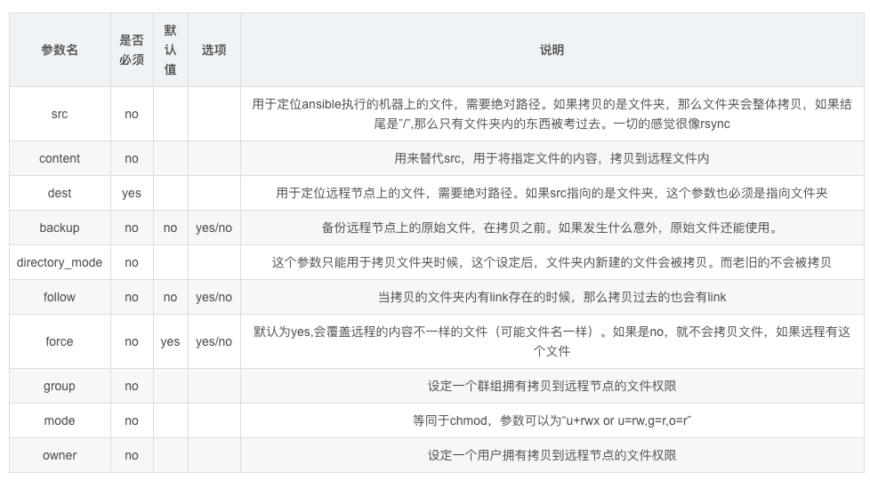

copy模块是远程推送数据模块，只能把数据推送给远程主机节点，无法拉取数据到本地

#### 批量远程复制文件

```plain
1.先批量在客户端机器，创建一个普通用户、用户组
[root@m01 ~]# ansible chaoge -a "useradd chaoge"
192.168.178.110 | CHANGED | rc=0 >>
192.168.178.111 | CHANGED | rc=0 >>
2.批量拷贝文件，发送至客户端节点
[root@m01 ~]# ansible chaoge -m copy -a "src=/etc/passwd dest=/tmp/chaoge.pwd owner=chaoge group=chaoge mode=0755"
192.168.178.111 | CHANGED => {
    "ansible_facts": {
        "discovered_interpreter_python": "/usr/bin/python"
    },
    "changed": true,
    "checksum": "d937f489e461c91b5602fe6f1d4c94c2bfb8bc2c",
    "dest": "/tmp/chaoge.pwd",
    "gid": 1006,
    "group": "chaoge",
    "mode": "0755",
    "owner": "chaoge",
    "path": "/tmp/chaoge.pwd",
    "size": 882,
    "state": "file",
    "uid": 1006
}
192.168.178.110 | CHANGED => {
    "ansible_facts": {
        "discovered_interpreter_python": "/usr/bin/python"
    },
    "changed": true,
    "checksum": "d937f489e461c91b5602fe6f1d4c94c2bfb8bc2c",
    "dest": "/tmp/chaoge.pwd",
    "gid": 1001,
    "group": "chaoge",
    "mode": "0755",
    "owner": "chaoge",
    "path": "/tmp/chaoge.pwd",
    "size": 882,
    "state": "file",
    "uid": 1001
}
3.远程批量查看远程节点机器的文件信息
[root@m01 ~]# ansible chaoge -a "ls -l /tmp/chaoge.pwd"
192.168.178.110 | CHANGED | rc=0 >>
-rwxr-xr-x 1 chaoge chaoge 882 3月  17 15:58 /tmp/chaoge.pwd
192.168.178.111 | CHANGED | rc=0 >>
-rwxr-xr-x 1 chaoge chaoge 882 3月  17 15:58 /tmp/chaoge.pwd
```

#### 远程批量复制文件、备份、追加内容

```plain
[root@m01 ~]# ansible chaoge -m copy -a "content='Hello,my name is chaoge' dest=/tmp/chaoge.txt backup=yes"
192.168.178.110 | CHANGED => {
    "ansible_facts": {
        "discovered_interpreter_python": "/usr/bin/python"
    },
    "changed": true,
    "checksum": "ff01bb3c925b0d7bb8a9862405b8587d9ef32e7c",
    "dest": "/tmp/chaoge.txt",
    "gid": 0,
    "group": "root",
    "md5sum": "16519058efb06c433fd4e3a541661e82",
    "mode": "0644",
    "owner": "root",
    "size": 23,
    "src": "/root/.ansible/tmp/ansible-tmp-1584432573.22-170647904364949/source",
    "state": "file",
    "uid": 0
}
192.168.178.111 | CHANGED => {
    "ansible_facts": {
        "discovered_interpreter_python": "/usr/bin/python"
    },
    "backup_file": "/tmp/chaoge.txt.3517.2020-03-17@16:09:34~",
    "changed": true,
    "checksum": "ff01bb3c925b0d7bb8a9862405b8587d9ef32e7c",
    "dest": "/tmp/chaoge.txt",
    "gid": 0,
    "group": "root",
    "md5sum": "16519058efb06c433fd4e3a541661e82",
    "mode": "0644",
    "owner": "root",
    "size": 23,
    "src": "/root/.ansible/tmp/ansible-tmp-1584432573.23-1067849199582/source",
    "state": "file",
    "uid": 0
}
```

上述命令含义是

```plain
批量对服务器文件拷贝操作，把content参数定义的内容，写入到chaoge.txt文件中，并且对chaoge.txt旧文件内容备份
```

远程检查命令执行结果

注意，得使用shell模块，支持通配符，更方便

```plain
[root@m01 ~]# ansible chaoge -m shell -a "ls -l /tmp/chaoge*"
192.168.178.110 | CHANGED | rc=0 >>
-rw-r--r-- 1 root root 31 3月  17 16:14 /tmp/chaoge.txt
-rw-r--r-- 1 root root 23 3月  17 16:14 /tmp/chaoge.txt.5425.2020-03-17@16:14:51~
192.168.178.111 | CHANGED | rc=0 >>
-rw-r--r-- 1 root root 31 3月  17 16:14 /tmp/chaoge.txt
-rw-r--r-- 1 root root 23 3月  17 16:14 /tmp/chaoge.txt.3754.2020-03-17@16:14:51~
```

### file模块

file模块作用是`创建`、以及`设置`文件目录属性。

```plain
file模块可以帮助我们完成一些对文件的基本操作，比如，创建文件或目录、删除文件或目录、修改文件权限等
此处我们介绍一些file模块的常用参数，然后再给出对应示例。
path参数 ：必须参数，用于指定要操作的文件或目录，在之前版本的ansible中，使用dest参数或者name参数指定要操作的文件或目录，为了兼容之前的版本，使用dest或name也可以。
state参数 ：此参数非常灵活，此参数对应的值需要根据情况设定，比如，当我们需要在远程主机中创建一个目录的时候，我们需要使用path参数指定对应的目录路径，假设，我想要在远程主机上创建/testdir/a/b目录，那么我则需要设置path=/testdir/a/b，但是，我们无法从"/testdir/a/b"这个路径看出b是一个文件还是一个目录，ansible也同样无法单单从一个字符串就知道你要创建文件还是目录，所以，我们需要通过state参数进行说明，当我们想要创建的/testdir/a/b是一个目录时，需要将state的值设置为directory，"directory"为目录之意，当它与path结合，ansible就能知道我们要操作的目标是一个目录，同理，当我们想要操作的/testdir/a/b是一个文件时，则需要将state的值设置为touch，当我们想要创建软链接文件时，需将state设置为link，想要创建硬链接文件时，需要将state设置为hard，当我们想要删除一个文件时（删除时不用区分目标是文件、目录、还是链接），则需要将state的值设置为absent，"absent"为缺席之意，当我们想让操作的目标"缺席"时，就表示我们想要删除目标。
src参数 ：当state设置为link或者hard时，表示我们想要创建一个软链或者硬链，所以，我们必须指明软链或硬链链接的哪个文件，通过src参数即可指定链接源。
force参数  :  当state=link的时候，可配合此参数强制创建链接文件，当force=yes时，表示强制创建链接文件，不过强制创建链接文件分为两种情况，情况一：当你要创建的链接文件指向的源文件并不存在时，使用此参数，可以先强制创建出链接文件。情况二：当你要创建链接文件的目录中已经存在与链接文件同名的文件时，将force设置为yes，回将同名文件覆盖为链接文件，相当于删除同名文件，创建链接文件。情况三：当你要创建链接文件的目录中已经存在与链接文件同名的文件，并且链接文件指向的源文件也不存在，这时会强制替换同名文件为链接文件。
owner参数 ：用于指定被操作文件的属主，属主对应的用户必须在远程主机中存在，否则会报错。
group参数 ：用于指定被操作文件的属组，属组对应的组必须在远程主机中存在，否则会报错。
mode参数：用于指定被操作文件的权限，比如，如果想要将文件权限设置为"rw-r-x---"，则可以使用mode=650进行设置，或者使用mode=0650，效果也是相同的，如果你想要设置特殊权限，比如为二进制文件设置suid，则可以使用mode=4700，很方便吧。
recurse参数：当要操作的文件为目录，将recurse设置为yes，可以递归的修改目录中文件的属性。
```

file模块主要用于创建文件、目录数据，以及对现有的文件、目录权限进行修改

#### file模块创建数据文件

#### 【远程创建文件夹】

```plain
[root@m01 ~]# ansible chaoge -m file -a "dest=/tmp/chaoge_dir state=directory"
192.168.178.111 | CHANGED => {
    "ansible_facts": {
        "discovered_interpreter_python": "/usr/bin/python"
    },
    "changed": true,
    "gid": 0,
    "group": "root",
    "mode": "0755",
    "owner": "root",
    "path": "/tmp/chaoge_dir",
    "size": 6,
    "state": "directory",
    "uid": 0
}
192.168.178.110 | CHANGED => {
    "ansible_facts": {
        "discovered_interpreter_python": "/usr/bin/python"
    },
    "changed": true,
    "gid": 0,
    "group": "root",
    "mode": "0755",
    "owner": "root",
    "path": "/tmp/chaoge_dir",
    "size": 6,
    "state": "directory",
    "uid": 0
}
2.远程检查文件夹是否生成
[root@m01 ~]# ansible chaoge -m shell -a "ls -ld /tmp/chaoge_*"
192.168.178.110 | CHANGED | rc=0 >>
drwxr-xr-x 2 root root 6 3月  17 16:25 /tmp/chaoge_dir
192.168.178.111 | CHANGED | rc=0 >>
drwxr-xr-x 2 root root 6 3月  17 16:25 /tmp/chaoge_dir
```

#### 【远程批量生成文件】

```plain
[root@m01 ~]# ansible chaoge -m file -a "dest=/tmp/chaoge_666 state=touch owner=chaoge group=chaoge mode=777"
192.168.178.110 | CHANGED => {
    "ansible_facts": {
        "discovered_interpreter_python": "/usr/bin/python"
    },
    "changed": true,
    "dest": "/tmp/chaoge_666",
    "gid": 1001,
    "group": "chaoge",
    "mode": "0777",
    "owner": "chaoge",
    "size": 0,
    "state": "file",
    "uid": 1001
}
192.168.178.111 | CHANGED => {
    "ansible_facts": {
        "discovered_interpreter_python": "/usr/bin/python"
    },
    "changed": true,
    "dest": "/tmp/chaoge_666",
    "gid": 1006,
    "group": "chaoge",
    "mode": "0777",
    "owner": "chaoge",
    "size": 0,
    "state": "file",
    "uid": 1006
}
2.远程批量检查文件
[root@m01 ~]# ansible chaoge -m shell -a "ls -l /tmp/chaoge_666"
192.168.178.110 | CHANGED | rc=0 >>
-rwxrwxrwx 1 chaoge chaoge 0 3月  17 16:31 /tmp/chaoge_666
192.168.178.111 | CHANGED | rc=0 >>
-rwxrwxrwx 1 chaoge chaoge 0 3月  17 16:31 /tmp/chaoge_666
```

#### 【远程创建软连接文件】

```plain
[root@m01 ~]# ansible chaoge -m file -a "src=/etc/hosts dest=/tmp/hosts_link state=link"
192.168.178.110 | CHANGED => {
    "ansible_facts": {
        "discovered_interpreter_python": "/usr/bin/python"
    },
    "changed": true,
    "dest": "/tmp/hosts_link",
    "gid": 0,
    "group": "root",
    "mode": "0777",
    "owner": "root",
    "size": 10,
    "src": "/etc/hosts",
    "state": "link",
    "uid": 0
}
192.168.178.111 | CHANGED => {
    "ansible_facts": {
        "discovered_interpreter_python": "/usr/bin/python"
    },
    "changed": true,
    "dest": "/tmp/hosts_link",
    "gid": 0,
    "group": "root",
    "mode": "0777",
    "owner": "root",
    "size": 10,
    "src": "/etc/hosts",
    "state": "link",
    "uid": 0
}
2.远程批量检查软连接文件属性
[root@m01 ~]# ansible chaoge -a "ls -l /tmp/hosts_link"
192.168.178.110 | CHANGED | rc=0 >>
lrwxrwxrwx 1 root root 10 3月  17 16:34 /tmp/hosts_link -> /etc/hosts
192.168.178.111 | CHANGED | rc=0 >>
lrwxrwxrwx 1 root root 10 3月  17 16:34 /tmp/hosts_link -> /etc/hosts
```

## Ansible软件管理模块

### yum模块

yum包管理模块，功能参数如下


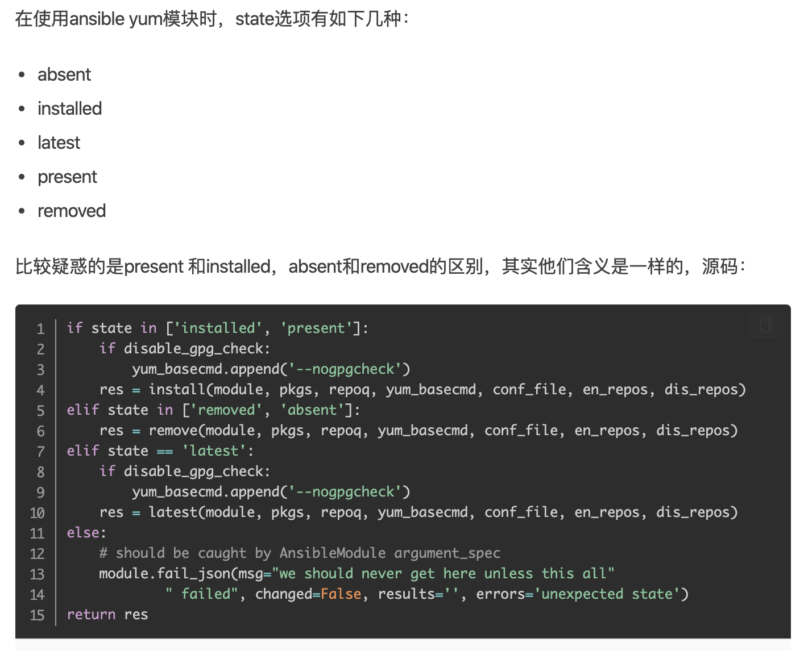

yum模块的参数功能很多，如上是常用的参数

#### yum模块批量安装nginx

```plain
1.检查客户端机器是否安装了nginx
[root@m01 ~]# ansible chaoge -m shell -a "rpm -qa nginx warn=false"
192.168.178.110 | CHANGED | rc=0 >>
192.168.178.111 | CHANGED | rc=0 >>
2.通过yum模块批量安装软件
[root@m01 ~]# ansible chaoge -m yum -a "name=nginx state=installed"
其实yum模块，就是远程在节点机器上执行，可以快速登录到节点机器，检查进程
/usr/bin/python /usr/bin/yum -d 2 -y install nginx
3.远程检查ansible命令执行结果
[root@m01 ~]# ansible chaoge -m shell -a "rpm -qa nginx warn=false"
192.168.178.110 | CHANGED | rc=0 >>
nginx-1.16.1-1.el7.x86_64
192.168.178.111 | CHANGED | rc=0 >>
nginx-1.16.1-1.el7.x86_64
4.远程删除软件包
ansible chaoge -m yum -a "name=nginx state=absent"
5.升级nginx软件包
ansible chaoge -m yum -a "state=latest name=nginx"
6.升级系统所有软件包，排除某些服务
ansible chaoge -m yum -a "state=latest name='*' exclude='nginx'"
```

## Ansible服务管理模块

### service/systemd模块

该模块作用是针对yum包管理

service适用于centos6前的系统

systemd命令应用于centos7系统

**要注意的是service模块依旧对centos7有效，但是建议大家使用systemd模块**

- systemd模块用于控制远程主机的systemd服务，说白了，就是Linux下的systemd命令。需要远程主机支持systemd
- 用法和service模块基本相同

```plain
如果使用systemctl 管理程序的话，可以使用systemd模块，systemctl 可以 控制程序启/停，reload，开机启动，观察程序状态（status）等，掌握使用后管理就更方便了
主要参数
daemon_reload：在执行任何其他操作之前运行守护进程重新加载，以确保systemd已经读取其他更改
enabled：服务是否开机自动启动yes|no。enabled和state至少要有一个被定义
masked：是否将服务设置为masked状态，被mask的服务是无法启动的
name：必选项，服务名称
no_block(2.3后新增)：不要同步等待操作请求完成
state：对当前服务执行启动，停止、重启、重新加载等操作（started,stopped,restarted,reloaded）
user：使用服务的调用者运行systemctl，而不是系统的服务管理者
```

#### 管理crond定时任务服务

```plain
1.一条命令快速检查 所有客户端机器，crond服务是否启动
[root@m01 ~]# ansible chaoge -m shell -a "systemctl status crond" |grep Active
   Active: active (running) since 二 2020-03-17 10:27:39 CST; 6h ago
   Active: active (running) since 二 2020-03-17 10:37:34 CST; 6h ago
2.检查所有crond服务是否开机自启
[root@m01 ~]# ansible chaoge -m shell -a "systemctl list-unit-files" | grep crond
crond.service                                 enabled
crond.service                                 enabled
3.systemd管理服务
ansible chaoge -m systemd -a "name=crond state=stopped"
ansible chaoge -m systemd -a "name=crond state=started"
ansible chaoge -m systemd -a "name=crond state=restarted"
ansible chaoge -m systemd -a "name=crond state=reloaded"
```

#### 管理nginx服务，启动nginx，添加至开机自启

```plain
1.命令如下
[root@m01 ~]# ansible chaoge -m systemd -a "name=nginx enabled=yes state=started"
停止服务
ansible chaoge -m systemd -a "name=nginx stata=stoped"
重启
ansible chaoge -m systemd -a "name=nginx state=restarted"
重载
ansible chaoge -m systemd -a "name=nginx state=reloaded"
2.检查命令执行结果
服务器是否启动
[root@m01 ~]# ansible chaoge -m shell -a "systemctl status nginx" |grep Active
   Active: active (running) since 二 2020-03-17 17:14:35 CST; 4min 20s ago
   Active: active (running) since 二 2020-03-17 17:13:14 CST; 5min ago
服务是否开机自启
[root@m01 ~]# ansible chaoge -m shell -a "systemctl list-unit-files" | grep nginx
nginx.service                                 enabled
nginx.service                                 enabled
```

### cron模块

cron模块作用是管理定时任务的条目


常见的参数如此，使用ansible编写定时任务，和直接编写是没有什么区别的

#### 对比系统crontab和ansible模块cron


#### ansible批量添加定时任务

```plain
1.批量添加定时任务
[root@m01 ~]# ansible chaoge -m cron -a "name=chaoge_cron job='/usr/sbin/ntpdate ntp.aliyun.com > /dev/null 2>&1' minute=*/5"
192.168.178.111 | CHANGED => {
    "ansible_facts": {
        "discovered_interpreter_python": "/usr/bin/python"
    },
    "changed": true,
    "envs": [],
    "jobs": [
        "chaoge_cron"
    ]
}
192.168.178.110 | CHANGED => {
    "ansible_facts": {
        "discovered_interpreter_python": "/usr/bin/python"
    },
    "changed": true,
    "envs": [],
    "jobs": [
        "chaoge_cron"
    ]
}
2.批量检查定时任务
[root@m01 ~]# ansible chaoge -a "crontab -l"
192.168.178.110 | CHANGED | rc=0 >>
#Ansible: chaoge_cron
*/5 * * * * /usr/sbin/ntpdate ntp.aliyun.com > /dev/null 2>&1
192.168.178.111 | CHANGED | rc=0 >>
#Ansible: chaoge_cron
*/5 * * * * /usr/sbin/ntpdate ntp.aliyun.com > /dev/null 2>&1
3.若要删除定时任务，可以：
[root@m01 ~]# ansible chaoge -m cron -a "name='chaoge_cron' state=absent"
192.168.178.110 | CHANGED => {
    "ansible_facts": {
        "discovered_interpreter_python": "/usr/bin/python"
    },
    "changed": true,
    "envs": [],
    "jobs": []
}
192.168.178.111 | CHANGED => {
    "ansible_facts": {
        "discovered_interpreter_python": "/usr/bin/python"
    },
    "changed": true,
    "envs": [],
    "jobs": []
}
4.验证定时任务是否已被删除
[root@m01 ~]# ansible chaoge -a "crontab -l"
192.168.178.111 | CHANGED | rc=0 >>
192.168.178.110 | CHANGED | rc=0 >>
```

### Ansible用户和组模块

### user模块

user模块管理系统用户

| 模块参数    | 参数描述                         |
| ----------- | -------------------------------- |
| create_home | 创建家目录，设置no则不创建家目录 |
| group       | 创建用户组                       |
| name        | 创建用户的名字                   |
| password    | 创建用户的密码                   |
| uid         | 创建用户的UID                    |
| shell       | chuan                            |

#### 创建test用户

UID设置8888，禁止登录，禁止家目录生成

```plain
[root@m01 ~]# ansible chaoge -m user -a "name=test uid=8888 shell=/sbin/nologin create_home=no"
192.168.178.110 | CHANGED => {
    "ansible_facts": {
        "discovered_interpreter_python": "/usr/bin/python"
    },
    "changed": true,
    "comment": "",
    "create_home": false,
    "group": 8888,
    "home": "/home/test",
    "name": "test",
    "shell": "/sbin/nologin",
    "state": "present",
    "system": false,
    "uid": 8888
}
192.168.178.111 | CHANGED => {
    "ansible_facts": {
        "discovered_interpreter_python": "/usr/bin/python"
    },
    "changed": true,
    "comment": "",
    "create_home": false,
    "group": 8888,
    "home": "/home/test",
    "name": "test",
    "shell": "/sbin/nologin",
    "state": "present",
    "system": false,
    "uid": 8888
}
2.验证创建是否成功
[root@m01 ~]# ansible chaoge -m shell -a "tail -1 /etc/passwd"
192.168.178.110 | CHANGED | rc=0 >>
test:x:8888:8888::/home/test:/sbin/nologin
192.168.178.111 | CHANGED | rc=0 >>
test:x:8888:8888::/home/test:/sbin/nologin
[root@m01 ~]# ansible chaoge -m shell -a "ls /home"
192.168.178.110 | CHANGED | rc=0 >>
chaoge
192.168.178.111 | CHANGED | rc=0 >>
caixukun
chaoge
haoge
pyyu
wwwchao
yuchao
```

### group模块

管理系统用户组

```plain
模块参数    参数描述
name    创建指定的组名
gid        组的GID
state        absent，移除远程主机的组
                present，创建远端主机的组
[root@m01 ~]# ansible chaoge -m group -a "name=cc  gid=9999"
192.168.178.110 | CHANGED => {
    "ansible_facts": {
        "discovered_interpreter_python": "/usr/bin/python"
    },
    "changed": true,
    "gid": 9999,
    "name": "cc",
    "state": "present",
    "system": false
}
192.168.178.111 | CHANGED => {
    "ansible_facts": {
        "discovered_interpreter_python": "/usr/bin/python"
    },
    "changed": true,
    "gid": 9999,
    "name": "cc",
    "state": "present",
    "system": false
}
[root@m01 ~]# ansible chaoge -m shell -a "tail -1 /etc/group"
192.168.178.111 | CHANGED | rc=0 >>
cc:x:9999:
192.168.178.110 | CHANGED | rc=0 >>
cc:x:9999:
```

## ansible模块总结

如上都是Ansible软件的基本模块功能，其支持的模块非常多，达千余种，每个模块都有不同的功能，可以根据官方文档进一步学习。

# Ansible核心组件playbook

Ansible核心功能点就在于`playbook`，Ansible主要的工作都是在于`配置管理`，它在实际的工作中会大量编写和使用剧本。

如果说ansible 模块 是你车间里的工具，那么playbooks 是你的说明书／使用手册，并且资源清单上的主机是你的原材料。

在ansible 上使用Playbooks是一种完全不同于adhoc的任务执行模式，并且特别强大。

简单地说，playbooks是一个非常简单的配置管理和多机器部署系统的基础，以及非常适合部署复杂应用程序的系统。

Playbooks可以对任务进行编排，就像我们要安装一个程序，写个安装shell脚本一样，在哪一步复制配置文件，最后一步启动服务。

虽然/usr/bin/ansible 可以运行一些临时任务，但是针对复杂的配置，并且可以将配置标准化，这个时候就需要Playbooks了。

## Playbook剧本语法

既然要写剧本，就得按照剧本的格式去编写

【Anisble剧本】

ansible软件的playbook编写需要遵循`YAML`语法，因此我们得先学一下YAML语法结构

### playbook安装nginx

1.批量卸载所有的nginx

```plain
[root@m01 ~]# ansible chaoge -m yum -a "name=nginx state=absent"
[root@m01 ~]# ansible chaoge -m shell -a "rpm -qa nginx warn=false"
192.168.178.110 | CHANGED | rc=0 >>
192.168.178.111 | CHANGED | rc=0 >>
```

2.查看一个YAML文件，请严格注意

- **语法的对齐，不得多一个少一个空格**
- 输入法保证英文

```plain
[root@m01 scripts]# cat nginx.yaml -n
     1    # install nginx yaml ,by chaoge
     2    - hosts: all
     3      tasks:
     4          - name: Install nginx Package
     5            yum: name=nginx state=present
     6          - name: Copy Nginx.conf
     7            copy: src=./nginx.conf dest=/etc/nginx/nginx.conf mode=0644
```

3.解释如上的playbook代码，按行解释

```plain
1.表示注释信息，可以用#，也可以用 ---  三个短横线
2.定义playbook管理的目标主机，all表示所有的主机，也可以写 主机组名
3.定义playbok所有的任务集合信息，比如该文件，定义了2个任务  ，安装nginx，拷贝nginx配置文件
4.定义了任务的名词，自定义的帮助信息
5.定义任务的具体操作，比如这里用yum模块实现nginx的安装
6.
7.第六、第七两行作用是使用copy模块，把本地当前的nginx.conf配置文件，分发给其他所有客户端机器，且授权
```

通过如上的剧本解读，各位兄弟姐妹们应该已经有了点感觉，其实编写剧本并不是特别复杂的事。我们需要注意如下两点：

- 剧本内容组成规范
- 剧本语法规范

## playbook内容组成规范

刚才说了，剧本就像演员演戏，导演提供的文字资料，因此剧本重要的就是定义`演员的信息`，`演员的任务`

而Ansible的剧本也是由最基本的两个部分组成

- hosts定义剧本管理的主机信息（演员有哪些）
- tasks定义被管理的主机需要执行的任务动作（演员需要做什么事）


### 剧本&hosts部分

定义剧本的hosts部分，可以有如下多种方式，常见的有

```plain
# 方式一：定义所管理的主机IP地址
- hosts: 192.168.178.111
  tasks: 
    动作...
# 方式二：定义所管理主机的名字
- hosts: backup01
  tasks:
    动作...
# 方式三：定义管理主机
- hosts: 192.168.178.111, rsync01
  tasks:
    动作...
# 方式四：管理所有主机
- hosts: all
  tasks:
    动作...
```

定义剧本管理主机信息有一个重要的前提，就是被管理的主机，必须在Ansible主机清单文件中定义

也就是默认的`/etc/ansible/hosts`，否则剧本无法直接管理对应主机。

### 剧本&tasks部分

- 变量形式定义task任务
- 字典形式定义任务

```plain
# 方式一：采用变量格式设置任务
tasks:
  - name: make sure apache is running
    service: name=https state=running
# 当传入的参数列表过长时，可以将其分割到多行
tasks:
  - name: copy ansible inventory(清单) file to client
    copy: src=/etc/ansible/hosts dest=/etc/ansible/hosts
          owner=root group=root mode=0644
# 方式二：采用字典格式设置多任务
tasks:
   - name: copy ansible inventory file to client
     copy:
         src: /etc/ansible/hosts
         dest: /etc/ansible/hosts
         owner: root
         group: root
         mode: 0644
```

### yaml语法

```plain
在学习saltstack过程中，第一要点就是States编写技巧，简称SLS文件。这个文件遵循YAML语法。初学者看这玩意很容易懵逼，来，超哥拯救你学习YAML语法
json xml yaml 数据序列化格式
yaml容易被解析，应用于配置文件
salt的配置文件是yaml配置文件，不能用tab
saltstack,k8s,ansible都用的yaml格式配置文件
语法规则
    大小写敏感
    使用缩进表示层级关系   
    缩进时禁止tab键，只能空格
    缩进的空格数不重要，相同层级的元素左侧对其即可
    # 表示注释行
yaml支持的数据结构
    对象： 键值对，也称作映射 mapping 哈希hashes 字典 dict    冒号表示 key: value   key冒号后必须有
    数组： 一组按次序排列的值，又称为序列sequence 列表list     短横线  - list1
    纯量： 单个不可再分的值
对象：键值对
yaml
    first_key:
      second_key:second_value
python
    {
        'first_key':{
            'second_key':'second_value',
        }
    }
```

## playbook编写语法规范

剧本编写，初学者最头疼的问题就是`没遵循语法`

### 剧本编写缩进

编写剧本要注意不同的行信息之间需要有缩进关系，一般是两个空格作一个缩进

**注意一句话：空格数目无所谓，左侧对其即可**

```plain
- hosts: chaoge
  tasks:
- name: exec scripts
  script: /server/scripts/chaoge.sh
```

### 剧本编写字典规范

编写剧本时，有时需要定义变量信息，或是模块参数，可以用字典形式设置

字典数据格式：注意key和value之间有一个冒号+空格

```
key: value
```

是一个key对应一个value值，

具体的playbook案例

```plain
- hosts: chaoge
  tasks:
- name: create file
  file:
    path: /chaoge/666.txt
    state: directory
    mode: 644
    owner: chaoge
    group: chaoge
```

### 剧本编写列表规范

列表数据结构

在编写剧本的时候，剧本中有些信息比较相近，且缩进关系保持一致

例如高中一班，有男同学，女同学之分

男同学的成员成为一列

女同学的成员成为一列

【yaml数据结构如下】

```plain
"男同学": 
  - 张三
  - 李四
  - 王二麻
"女同学":
  - 花花
  - 月月
  - 兔兔
列表数据用一个短横杠+空格组成
```

## playbook执行命令

剧本编写完毕后，得执行才能开始工作。

在Ansible程序里，加载模块的功能可以直接用ansible命令操作

加载剧本中的功能，可以使用`ansible-playbook`命令：

```plain
ansible-playboook nginx.yaml
```

可以用相对、绝对路径

【查看剧本执行详细输出】

```plain
ansible-playbook nginx.yml --verbose
```

【查看剧本执行影响的主机列表】

```plain
ansible-playbook nginx.yml --list-hosts
```

【执行playbook指定加载的主机清单文件】

```plain
ansible-playbook nginx.yml -i /etc/ansible/hosts
```

【执行playbook时检查剧本语法】

```plain
ansible-playbook nginx.yml --syntax-check
```

【调试playbook任务，模拟执行，不影响主机配置】

```plain
ansible-playbook nginx.yml -C
```

## playbook的输出信息

剧本执行过程中会产生响应的输出，根据输出的信息可以掌握剧本是否正确执行，根据输出的措施信息，可以掌握剧本中编写的逻辑错误。


```plain
当本地执行了任务，会得到返回值changed
如果不需要执行了，得到返回值ok
```

#### 准备一个copy剧本

```plain
[root@m01 scripts]# cat copy_hosts.yml
- hosts: all
  tasks:
      - name: copy the /etc/hosts
        copy: src=/etc/hosts dest=/etc/hosts
```

第一次执行结果

```plain
[root@m01 scripts]# ansible-playbook copy_hosts.yml
PLAY [all] ***************************************************************************
TASK [Gathering Facts] ***************************************************************
ok: [192.168.178.111]
ok: [192.168.178.110]
TASK [copy the /etc/hosts] ***********************************************************
ok: [192.168.178.110]
changed: [192.168.178.111]
PLAY RECAP ***************************************************************************
192.168.178.110            : ok=2    changed=0    unreachable=0    failed=0    skipped=0    rescued=0    ignored=0
192.168.178.111            : ok=2    changed=1    unreachable=0    failed=0    skipped=0    rescued=0    ignored=0
```

第二次执行

```plain
[root@m01 scripts]# ansible-playbook copy_hosts.yml
PLAY [all] ***************************************************************************
TASK [Gathering Facts] ***************************************************************
ok: [192.168.178.111]
ok: [192.168.178.110]
TASK [copy the /etc/hosts] ***********************************************************
ok: [192.168.178.110]
ok: [192.168.178.111]
PLAY RECAP ***************************************************************************
192.168.178.110            : ok=2    changed=0    unreachable=0    failed=0    skipped=0    rescued=0    ignored=0
192.168.178.111            : ok=2    changed=0    unreachable=0    failed=0    skipped=0    rescued=0    ignored=0
```

由于第一次执行剧本文件，已经复制过，第二次执行，ansible会根据文件属性避免重复复制。

【剧本输出的字段信息】

| 字段                  | 输出解释                                                     |
| --------------------- | ------------------------------------------------------------ |
| play[all]             | 显示执行过程中加载的客户端主机或组信息                       |
| TASK[Gathering Facts] | 显示对客户端主机执行的任务信息，默认是是先收集主机信息       |
| TASK[xxxx]            | 显示对客户端主机具体执行的任务，默认加载模块命令，显示name定义的值 |
| PLAY RECAP            | 剧本执行结果汇总，对主机的改动次数，出现的错误等信息         |

### Playbook实践与rsync

```plain
举例一键创建rsync服务的过程：
[root@m01 myyaml]# cat  install_rsync.yaml
- hosts: 192.168.178.115
  tasks:
    - name: step01,install rsync service
      yum: name=rsync state=installed
    - name: step02,edit rsync conf file
      copy: src=/etc/ansible/rsync_conf/rsyncd.conf dest=/etc/rsync/conf/
    - name: step03,create user rsync
      user: name=rsync state=present  createhome=no shell=/sbin/nolgoin
    - name: step04,create user auth file
      copy: src=/etc/ansible/rsync_conf/rsync.password dest=/etc/rsync/conf/ mode=0600
    - name: step05,create backup dir
      file: dest=/data_backup/  state=directory owner=rsync group=rsync
    - name: step06,run rsync server
      shell: rsync --daemon creates=/var/run/rsync.pid
```

## playbook扩展配置

### playbook中变量形式

在剧本中通过设置变量，实现对应的参数配置，在某些场景下，需要对剧本进行优化调整。

剧本中定义变量如下：

- playbook中用户自定义的变量
- ansible自动在执行playbook时去客户机上搜集远程主机的系统信息变量
- 在文件模板中，可以直接用如上的变量
- 把任务的运行结果当做变量使用，称之为注册变量
- 允许用户在执行playbook时传入变量的值，称之为额外变量

### 用户自定义的变量

#### playbook中定义变量

用户可以在playbook中通过`vars`关键字定义变量，之后在通过`{{}}`符号调用变量值。

实际操作

在剧本文件中，用户自定义变量http_port，值为80。在tasks的firewalld中，可以通过调用变量值。

```plain
- hosts: web
  vars:
      http_port: 80
  remote_user: root
  tasks:
      - name: insert firewalld rule for httpd
        firewalld: port={{ http_port }}/tcp permanent=true state=enabled imme-diate=yes
```

#### 变量单独写在文件里

当变量较多、或是变量需要在多个playbook中重复使用的时候，可以把变量放在一个单独的文件中，再通过关键字`var_files`把该变量引入到playbook中，使用变量的方法和文件中定义的方法相同。

```plain
- hosts: web
  vars_files:
      - vars/server_vars.yml
  remote_user: root
  tasks:
      - name: insert firewalld rule for httpd
        firewalld: port={{ http_port }}/tcp permanent=true state=enabled immediate=yes
```

变量文件`/vars/server_vars.yml`的内容为，可以交给多个剧本文件去读取

```plain
http_port: 80
```

#### 定义、使用复杂的变量

在某些场景下需要使用变量的值，可能不仅仅是一个简单的`字符串`或是`数字`，而是一个`对象`。

对象在yaml数据结构中如下：

对象就是一个字典形式数据结构

```plain
foo:
    field1: one
    field2: tow
```

如果要访问复杂变量中的子属性，可以使用`中括号`或是`点`，代码如下

若是大家学过编程语言，例如python的dict字典数据结构，对于yaml的理解就非常简单了

```plain
foo['field1']
foo.field2
```

#### 远程主机的系统变量（Facts）

ansible能够通过模块`setup`来搜集主机的系统信息，这些搜集到的信息被称之为Facts。

每个playbook在执行前都会默认执行setup模块，自动收集客户机信息，这些Facts信息可以直接以变量的形式使用。

【可以通过命令直接在命令行调用setup模块，查看所有可以调用的Facts变量信息。】

```plain
[root@m01 scripts]# ansible 192.168.178.111  -m setup -u root  # 指定ip
[root@m01 scripts]# ansible chaoge  -m setup -u root                     # 指定主机组
[root@m01 scripts]# ansible all  -m setup -u root                             # 指定所有主机
```

【在剧本中调用收集到的Facts变量信息】

该脚本能够判断，不同的主机信息，进行不同的软件包安装

when相当于shell脚本里的if 判断，when语句就是用来实现这个功能的，它是一个jinja2的语法，但是不需要双大括号，用法很简单

```plain
- hosts: all
  user: root
  tasks:
      - name: print system info 
        debug: msg={{ ansible_os_family }}
      - name: install git on redhat linux
        yum: name=git state=installed
        when: ansible_on_family == "redhat"
      - name: install git on ubuntu linux
        apt: name=git state=installed
```

#### 使用复杂的Facts变量

当通过setup模块收集到主机信息时，有些Facts变量属性较为复杂，例如

【setup参数】

```plain
选项    作用
ansible_python_version    显示python版本
ansible_distribution_major_version    显示是系统主版本
ansible_machine    显示系统类型，例：32位，还是64位
ansible_all_ipv4_addresses    仅显示ipv4的信息
ansible_devices    仅显示磁盘设备信息
ansible_distribution    显示是什么系统
ansible_eth0    仅显示eth0的信息
ansible_kernel    仅显示内核版本
ansible_lvm    显示lvm相关信息
ansible_memtotal_mb    显示系统总内存
ansible_memfree_mb    显示可用系统内存
ansible_memory_mb    详细显示内存情况
ansible_mounts    显示系统磁盘挂载情况
ansible_processor    显示cpu个数(具体显示每个cpu的型号)
ansible_processor_vcpus    显示cpu个数(只显示总的个数)
ansible_swaptotal_mb    显示总的swap内存
ansible_swapfree_mb    显示swap内存的可用内存
# 单独筛选网卡信息
[root@m01 scripts]# ansible chaoge -m setup -u root  -a "filter=ansible_all_ipv4_addresses"
```

若是要访问复杂变量的子属性，有两种方式，这其实都是python的jinja2模块语法，可以写在playbook里使用

```plain
1.中括号调用
{{ ansible_ens33["ipv4"]["address"] }}
2.点号调用
{{ ansible_ens33.ipv4.address }}
```

### 文件模板中使用变量

这里要讲的是template模块

`template`模块使用了`Jinjia2`[模版语言](http://jinja.pocoo.org/docs/)，进行文档内变量的替换的模块。

template模块用法和copy模块用法基本一致，它主要用于复制配置文件。可以按需求修改配置文件内容来复制模板到被控主机上。

模版中可以使用如下6个变量：

- `ansible_managed` - 包含一个字符串，可用于描述模板名称，主机，模板文件的修改时间和所有者的uid
- `template_host` - 包含模板机器的节点名称
- `template_uid` - 所有者的uid
- `template_path` - 模版路径
- `template_fullpath` - 模版的绝对路径
- `template_run_date` - 模版呈现的时间

【模块参数】

| 名称                   | 必选 | 默认值 | 可选值           | 备注                                                         |
| ---------------------- | ---- | ------ | ---------------- | ------------------------------------------------------------ |
| backup                 | no   | no     | `yes`/`no`       | 在覆盖之前将原文件备份，备份文件包含时间戳信息               |
| follow                 | no   | no     | `yes`/`no`       | 是否遵循目的机器中的文件系统链接                             |
| force                  | no   | yes    | `yes`/`no`       | 是否强制执行                                                 |
| group                  | no   |        |                  | 设置文件/目录的所属组                                        |
| mode                   | no   |        |                  | 设置文件权限，模式实际上是八进制数字（如`0644`），少了前面的零可能会有意想不到的结果。从版本1.8开始，可以将模式指定为符号模式（例如`u+rwx`或`u=rw,g=r,o=r`） |
| newline_sequence(2.4+) | no   | `\n`   | `\n`,`\r`,`\r\n` | 指定要用于模板文件的换行符                                   |
| owner                  | no   |        |                  | 设置文件/目录的所属用户                                      |
| src                    | no   |        |                  | Jinja2格式化模板的文件位置                                   |
| trim_blocks            | no   | no     | `yes`/`no`       | 设置为True，则块之后的第一个换行符被移除                     |
| unsafe_writes          | no   |        | `yes`/`no`       | 是否以不安全的方式进行，可能导致数据损坏                     |
| validate               | no   | None   |                  | 复制前是否检验需要复制目的地的路径                           |

【建立模板文件】

```plain
[root@m01 scripts]# cat index.html.j2
Hello "{{ chaoge_var }}"
```

- 由于Ansible是使用`Jinja2`来编写`template`模版的，所以需要使用`*.j2`为文件后缀
- 上面的`""`代表我们在该template里使用了名为`chaoge_var`的变量

【编写playbook，加入变量】

```plain
[root@m01 scripts]# cat template_demo.yml
---
- name: play the template module
  hosts: all
  vars:
    chaoge_var: "world,I am yuchao"
  tasks:
    - name: write the default index.html file
      template:
        src: index.html.j2
        dest: /tmp/hello_world.html
        mode: 0644
```

【执行剧本】

```plain
[root@m01 scripts]# ansible-playbook template_demo.yml
PLAY [play the template module] **********************************************************************
TASK [Gathering Facts] *******************************************************************************
ok: [192.168.178.110]
ok: [192.168.178.111]
TASK [write the default index.html file] *************************************************************
changed: [192.168.178.110]
changed: [192.168.178.111]
PLAY RECAP *******************************************************************************************
192.168.178.110            : ok=2    changed=1    unreachable=0    failed=0    skipped=0    rescued=0    ignored=0
192.168.178.111            : ok=2    changed=1    unreachable=0    failed=0    skipped=0    rescued=0    ignored=0
```

【验证剧本执行结果】

发现写在j2模板文件中的变量已经被替换

```plain
[root@m01 scripts]# ansible chaoge  -a "cat /tmp/hello_world.html"
192.168.178.111 | CHANGED | rc=0 >>
Hello "world,I am yuchao"
192.168.178.110 | CHANGED | rc=0 >>
Hello "world,I am yuchao"
```


# Playbook部署rsync同步

练习playbook编写，一键完成rsync部署操作

其实就是在剧本中按照规则，写好部署rsync服务端的操作（回头看看笔记去）

1.编写剧本

```plain
# 定义剧本，功能是安装部署rsync的几个步骤
# 看好，左侧对其的元素，就是属于同级的关系，例如 hosts和tasks
# tasks定义了多个任务，分别使用不同的模块去执行，多个任务都是平级关系      
# 要注意剧本使用的文件，源文件要提前准备好，由src参数定义的是源文件绝对路径
# playbook rsync
# rsync server   
- hosts: 192.168.178.110    
  tasks:
    - name: step01 install rsync
      yum: name=rsync state=installed
    - name: step02 edit rsync conf file
      copy: src=/etc/ansible/conf/rsync_conf/rsyncd.conf dest=/etc/
    - name: step03 create rsync user
      user: name=rsync state=present createhome=no shell=/sbin/nologin
    - name: step04 create auth file
      copy: src=/etc/ansible/conf/rsync_conf/rsync.passwd dest=/etc/ mode=600
    - name: step05 create backup dir
      file: dest=/backup state=directory owner=rsync group=rsync
    - name: step06 boot rsync server
      shell: rsync --daemon creates=/var/run/rsyncd.pid
# rsync client  nfs01
- hosts: 192.168.178.111    
  tasks:
    - name: step01:create auth file
      copy: src=/etc/ansible/conf/rsync_conf/rsync_client.password dest=/etcrsync.password mode=600
```

2.执行剧本

```plain
ansible-playbook /etc/ansible/ansible-playbook/build_rsync.yml
# 测试一下脚本是否正确
ansible-playbook -C /etc/ansible/ansible-playbook/build_rsync.yml
```

# Anisble进阶系列

告警信息

```plain
[WARNING]: Platform linux on host test123 is using the discovered Python
interpreter at /usr/bin/python, but future installation of another Python
interpreter could change this. See https://docs.ansible.com/ansible/2.9/referen
ce_appendices/interpreter_discovery.html for more information.
```

这个一般是由于ansible的版本太高，而官方推荐你放弃py2而使用py3 我们只需要在ansible.cfg的 [default] 字段中插入简单的选项即可. interpreter_python = python3路径

注意：这里要求的是目标机器，要安装好python3

```plain
yum install python3-devel python3 -y
```


# playbook剧本

服务器准备

```plain
master01-170    192.168.1.170  ansible    
client01-171    192.168.1.171        client01
client02-172  192.168.1.172        client02
```

安装配置好ansible，客户端，服务端，免密通信。

修改vim tab空格数量

[root@master01-170 playbook]# cat ~/.vimrc set ts=4 set expandtab set autoindent

### yum_repository模块

**name参数：**必须参数，用于指定要操作的唯一的仓库ID，也就是”.repo”配置文件中每个仓库对应的”中括号”内的仓库ID。

**baseurl参数：**此参数用于设置 yum 仓库的 baseurl。

**description参数：**此参数用于设置仓库的注释信息，也就是”.repo”配置文件中每个仓库对应的”name字段”对应的内容。

**file参数：**此参数用于设置仓库的配置文件名称，即设置”.repo”配置文件的文件名前缀，在不使用此参数的情况下，默认以 name 参数的仓库ID作为”.repo”配置文件的文件名前缀，同一个”.repo” 配置文件中可以存在多个 yum 源。

**enabled参数：**此参数用于设置是否激活对应的 yum 源，此参数默认值为 yes，表示启用对应的 yum 源，设置为 no 表示不启用对应的 yum 源。

**gpgcheck参数：**此参数用于设置是否开启 rpm 包验证功能，默认值为 no，表示不启用包验证，设置为 yes 表示开启包验证功能。

**gpgcakey参数：**当 gpgcheck 参数设置为 yes 时，需要使用此参数指定验证包所需的公钥。

**state参数：**默认值为 present，当值设置为 absent 时，表示删除对应的 yum 源。

案例

在agent机器上设置yum源,源文件路径是/etc/yum.repos.d/aliEpel.repo

```plain
[root@master01-170 ~]# ansible clients  -m yum_repository -a 'name=aliEpel description="alibaba EPEL" baseurl=https://mirrors.aliyun.com/epel/$releasever\Server/$basearch/'
# 删除yum源文件
[root@master01-170 ~]# ansible clients -m yum_repository -a "name=aliEpel state=absent"
```

## 剧本引入

需求：批量安装nginx服务

```plain
# 配置yum源
[root@master01-170 ~]# ansible clients  -m yum_repository -a 'name=aliEpel description="alibaba EPEL" baseurl=https://mirrors.aliyun.com/epel/$releasever\Server/$basearch/'
# 下载nginx软件
[root@master01-170 ~]# ansible clients -m yum -a "name=nginx disable_gpg_check=yes enablerepo=aliEpel"
# 启动nginx服务
[root@master01-170 ~]# ansible clients  -m systemd -a "name=nginx enabled=yes state=started"
```

每安装一个新机器，或许就要执行一次以上三条命令，很是麻烦，我们可以把安装服务的命令写成脚本形式，这种脚本在ansible里就是`剧本`。

我们把要做的事情写成playbook，把不同的模块按照顺序写在剧本里，ansible会一步步的执行，直到结束。

并且剧本遵循的是YAML语法。

用剧本完成ad-hoc命令

ansible clients -m ping ping主机

ansible clients -m file -a "path=/testdir/test state=directory" 创建目录

```plain
# ad-hoc转换成剧本
[root@master01-170 playbook]# cat test.yml
---
- hosts: clients
  remote_user: root
  tasks:
    - name: Ping the hosts
      ping:
    - name: make directory test
      file:
        path: /testdir/test
        state: directory
# 运行脚本
[root@master01-170 playbook]# ansible-playbook test.yml
```

playbook的输出，也就是剧本执行后的结果，包含任务的名字

`TASK [Gathering Facts]` 默认任务，收集主机信息

`TASK [Ping the hosts]` 执行ping任务，以剧本里的`name`参数命名

```
TASK [make directory test]
```

剧本改写，写入多个play。

```plain
[root@master01-170 playbook]#
[root@master01-170 playbook]# cat test.yml
---
- hosts: 192.168.1.171
  remote_user: root
  tasks:
    - name: Ping the hosts
      ping:
    - name: make directory test
      file:
        path: /testdir/test
        state: directory
- hosts: 192.168.1.172
  remote_user: root
  tasks:
  - name: touch file
    file:
        path: /file
        state: touch
- hosts:
        all
  remote_user: root
  tasks:
  - name: create user yuchao
    user:
      name: yuchao
[root@master01-170 playbook]#
```

上述有多个play，好比一个剧本里有多个剧情一样，并且针对的主机不一样，任务不一样。

```plain
[root@master01-170 playbook]# ansible-playbook test.yml
```

### 剧本语法检测

该命令只是模拟的执行playbook，不会产生任何实际结果。

```plain
[root@master01-170 playbook]# ansible-playbook --syntax-check test.yml
playbook: test.yml
```

如此只返回了playbook的名称，表示没有语法错误。

## linefile模块

lineinfile类似于linux的sed工具，用于修改文件内容。

实际上，在大多数时候，我们在linux上的操作，就是针对文件的操作，通过配置管理工具对配置文件作统一的配置修改是一个非常酷的功能。

path : 指定要操作的文件 line : 指定文本内容 regexp : 使用成则表达式匹配多行,当替换时只有最后匹配的那一行会被替换,当删除时所有匹配行都删除 state : 删除(absent) 默认值为(present) backrefs : 开启后项引用(yes) / 开启时如果正则没有匹配到行则不对文本进行修改,默认不开启时会将line对应内容写到文尾 insertafter : 可以在将文本插入到"指定行"之前可以设置insertafter的值为EOF(插入到文尾)或者正则表达式(匹配到时插入到匹配行后,没有匹配到时则插入到文尾,当有backrefs参数时忽略此参数) insertbefore : 在匹配行的前面插入信息 backup : 是否在修改文件前对文件进行备份 create : 当要操作文件不存在时,是否创建对应文件

### 修改匹配行

将/etc/selinux/config中匹配到以'SELINUX='开头的行，将其替换为'SELINUX=disabled'

```plain
[root@master01-170 playbook]# cat lineinfile.yml
---
- hosts: all
  remote_user: root
  tasks:
    - name: modify selinux to disabled
      lineinfile:
       path: /etc/selinux/config
       regex: '^SELINUX='
       line: 'SELINUX=disabled'
# 执行剧本
[root@master01-170 playbook]# ansible-playbook lineinfile.yml
```

在匹配的行前/后，添加文本

```plain
1.在客户端准备好测试文件
[root@client01-171 ~]# cat /opt/nginx.conf
Listen 127.0.0.1
Listen 80
Port
[root@client02-172 ~]# cat /opt/nginx.conf
Listen 127.0.0.1
Listen 80
Port
2.匹配行前啊追加文件内容
[root@master01-170 playbook]# cat lineinfile.yml
---
- hosts: all
  remote_user: root
  tasks:
    - name: add line before Listen 80
      lineinfile:
        dest: /opt/nginx.conf
        insertbefore: '^Listen 80'
        line: 'Listen 8080'
[root@master01-170 playbook]#
[root@cient02-172 ~]# cat /opt/nginx.conf
Listen 127.0.0.1
Listen 8080
Listen 80
Port
```

在匹配的行，后面添加内容

```plain
[root@master01-170 playbook]# cat lineinfile.yml
---
- hosts: all
  remote_user: root
  tasks:
    - name: add line before Listen 80
      lineinfile:
        dest: /opt/nginx.conf
        insertafter: '^Port'
        line: 'chao ge niu pi'
[root@master01-170 playbook]# ansible-playbook lineinfile.yml
[root@cient02-172 ~]# cat /opt/nginx.conf
Listen 127.0.0.1
Listen 8080
Listen 80
Port
chao ge niu pi
```

# ansible核心元素

Playbook的核心元素：

Hosts：主机组； Tasks：任务列表； Variables：变量，设置方式有四种； Templates：包含了模板语法的文本文件； Handlers：由特定条件触发的任务；

## 什么是handler

每个主流的编程语言都会有event机制，那么handler就是playbook的event。

Handlers里面的每一个handler，也是对module的一次调用。而handlers与tasks不同，tasks会默认的按定义顺序执行每一个task，handlers则不会，它需要在tasks中被调用，才有可能被执行。

Tasks中的任务都是有状态的，changed或者ok。 在Ansible中，只在task的执行状态为changed的时候，才会执行该task调用的handler，这也是handler与普通的event机制不同的地方。

## 应用场景

什么时候用到handlers？

例如当你在playbook里的tasks中修改了nginx的配置文件，你需要`重启nginx`。

如果安装了nginx的插件，重启nginx。

当有这样的场景，就可以把`重启nginx`设计为一个handler。

剧本：想要将Nginx的某个server虚拟主机端口从8080改为8090，并且修改后重启nginx

可以写成如下剧本

```plain
[root@master01-170 playbook]# cat test.yml
---
- hosts: all
  remote_user: root
  tasks:
  - name: Modify the configuration
    lineinfile:
      path=/etc/nginx/conf.d/chaoge.conf
      regexp="listen(.*) 8080 (.*)"
      line="listen\1 8090 \2"
      backrefs=yes
      backup=yes
  - name: restart nginx
    service:
      name=nginx
      state=restarted
# 客户端配置文件路径
[root@client01-171 conf.d]# pwd
/etc/nginx/conf.d
[root@client01-171 conf.d]# ls
chaoge.conf
[root@cient02-172 conf.d]# cat chaoge.conf
    server {
    listen       8080 default_server;
        server_name  _;
        root         /usr/share/nginx/html;
        # Load configuration files for the default server block.
        include /etc/nginx/default.d/*.conf;
        location / {
        }
    }
# 执行剧本
[root@master01-170 playbook]# ansible-playbook test.yml
PLAY [all] **************************************************************************************************************************************
TASK [Gathering Facts] **************************************************************************************************************************
ok: [192.168.1.171]
ok: [192.168.1.172]
TASK [Modify the configuration] *****************************************************************************************************************
changed: [192.168.1.171]
changed: [192.168.1.172]
TASK [restart nginx] ****************************************************************************************************************************
changed: [192.168.1.171]
changed: [192.168.1.172]
PLAY RECAP **************************************************************************************************************************************
192.168.1.171              : ok=3    changed=2    unreachable=0    failed=0    skipped=0    rescued=0    ignored=0
192.168.1.172              : ok=3    changed=2    unreachable=0    failed=0    skipped=0    rescued=0    ignored=0
[root@master01-170 playbook]#
```

我们会发现服务器的配置已经被批量替换了。执行了两个task任务

Modify the configuration

restart nginx

### Handlers引入

上述的nginx配置剧本，如果我们再次执行，会发现问题，因为配置不会有任何更改，还是会执行重启nginx的动作，这种重启就是没有必要的。

那么这里就得调整playbook的形式，我们可以使用`handlers`来解决该问题

handlers中的任务会被tasks中的任务进行调用

只有当tasks中的任务真正执行，造成了实际的改变，handlers才会执行。

好比，只有当tasks里修改nginx配置文件生效，才会重启nginx，这个流程。

案例

```plain
[root@master01-170 playbook]# cat test.yml
---
- hosts: all
  remote_user: root
  tasks:
  - name: Modify the configuration
    lineinfile:
        path=/etc/nginx/conf.d/chaoge.conf
        regexp="listen(.*) 8090(.*)"
        line="listen\1 8099\2"
        backrefs=yes
        backup=yes
    notify:
        restart nginx
  handlers:
  - name: restart nginx
    service:
      name=nginx
      state=restarted
```

解释：

从剧本里可见，handlers也是定义了一个任务可以被调用，和tasks处于同一个缩进

在上一个tasks任务列表里，定义了关键字`nofity`用于调用handlers里面的任务

```plain
# 执行剧本
[root@master01-170 playbook]# ansible-playbook test.yml
# 去客户端，检查配置文件，检查nginx端口
[root@cient02-172 conf.d]# netstat -tunlp
[root@cient02-172 conf.d]# cat chaoge.conf
```

### handlers多个任务

handlers也是定义任务列表，因此可以有多个任务，且被tasks中不同的任务notify（通知）。

```plain
[root@master01-170 playbook]# cat test.yml
---
- hosts: all
  remote_user: root
  tasks:
  - name: make testfile1
    file: path=/testdir/testfile1
          state=directory
    notify: m1
  - name: make testfile2
    file: path=/testdir/testfile2
          state=directory
    notify: m2
  handlers:
  - name: m1
    file: path=/testdir/m1
          state=touch
  - name: m2
    file: path=/testdir/m2
          state=touch
```

再次证明，tasks和handlers都是任务列表，并且tasks执行后会通过notify通知handlers执行

```plain
# 执行
[root@master01-170 playbook]# ansible-playbook test.yml
# 检查
[root@cient02-172 conf.d]# tree /testdir/
/testdir/
├── m1
├── m2
├── testfile1
└── testfile2
```

handler执行的顺序，默认情况下，所有的tasks执行完毕后，才会执行各个handler

## meta模块

这里的需求是，我们希望在触发某个tasks之后，立即执行对应的hander，可以用到meta模块了。

```plain
[root@master01-170 playbook]# cat test.yml
---
- hosts: all
  remote_user: root
  tasks:
  - name: tasks1
    file: path=/testdir/testfile
          state=directory
    notify: handler1
  - name: task2
    file: path=/testdir/testfile2
          state=directory
    notify: handler2
  - meta: flush_handlers
  - name: task3
    file: path=/testdir/testfile3
          state=directory
    notify: handler3
  handlers:
  - name: handler1
    file: path=/testdir/ht1
          state=touch
  - name: handler2
    file: path=/testdir/ht2
          state=touch
  - name: handler3
    file: path=/testdir/ht3
          state=touch
```

如上的剧本里，我们单独定义里一个meta特殊的任务，该任务会影响剧本的执行方式。

meta: flush_handlers

表示立即执行之前tasks对应的handlers

执行结果

```plain
[root@master01-170 playbook]# ansible-playbook test.yml
PLAY [192.168.1.172] ***********************************************************************************************************
TASK [Gathering Facts] *********************************************************************************************************
ok: [192.168.1.172]
TASK [tasks1] ******************************************************************************************************************
changed: [192.168.1.172]
TASK [task2] *******************************************************************************************************************
changed: [192.168.1.172]
RUNNING HANDLER [handler1] *****************************************************************************************************
changed: [192.168.1.172]
RUNNING HANDLER [handler2] *****************************************************************************************************
changed: [192.168.1.172]
TASK [task3] *******************************************************************************************************************
changed: [192.168.1.172]
RUNNING HANDLER [handler3] *****************************************************************************************************
changed: [192.168.1.172]
PLAY RECAP *********************************************************************************************************************
192.168.1.172              : ok=7    changed=6    unreachable=0    failed=0    skipped=0    rescued=0    ignored=0
[root@master01-170 playbook]#
```

我们会发现剧本执行顺序是

Task1,task2

Handler1 handler2

然后

Task3

Handler3

这就是因为在task任务后面，添加了meta任务能够立即触发执行handler任务，这就使得handler的使用更加的灵活。

这样我们可以实现，例如当nginx配置文化实际的修改之后，触发handler执行重启nginx动作。

### 执行多个handler（listen）

如果我们有需要在一个task任务里，一次性notify通知多个handler，怎么实现？

借助另一个关键字， listen

listen理解为组名

我们可以把多个handler分成小组，那么在需要一次性通知多个handler时，只需要使用组名即可被通知。

```plain
[root@master01-170 playbook]# cat test.yml
---
- hosts: 192.168.1.172
  remote_user: root
  tasks:
  - name: task1
    file: path=/testdir/testfile
          state=directory
    notify: handler group1
  handlers:
  - name: handler1
    listen: handler group1
    file: path=/testdir/ht1
          state=touch
  - name: handler2
    listen: handler group1
    file: path=/testdir/ht2
          state=touch
```

执行

```plain
[root@master01-170 playbook]# ansible-playbook test.yml
```

如此handler1，handler2的listen值都是handler group1，因此当tasks1触发notify，能够全部通知到且执行。

# playbook之tags用法

你写了一个很长的playbook，其中有很多的任务，这并没有什么问题，不过在实际使用这个剧本时，你可能只是想要执行其中的一部分任务而已，或者，你只想要执行其中一类任务而已，而并非想要执行整个剧本中的全部任务，这个时候我们该怎么办呢？我们可以借助tags实现这个需求。

见名知义，tags可以帮助我们对任务进行'打标签'的操作，当任务存在标签以后，我们就可以在执行playbook时，借助标签，指定执行哪些任务，或者指定不执行哪些任务了，这样说可能不够直观，我们来看一个小示例（为了方便示例此处只写3个任务进行举例）。

```plain
[root@master01-170 playbook]# cat test.yml
---
- hosts: 192.168.1.172
  remote_user: root
  tasks:
  - name: tasks1
    file:
      path: /testdir/t1
      state: touch
    tags: t1
  - name: task2
    file: path=/testdir/t2
        state=touch
    tags: t2
  - name: task3
    file: path=/testdir/t3
        state=touch
[root@master01-170 playbook]#
```

上例的play中有3个task，每个task都有对应的tags，为了方便示例，我只是简单的把tags的值写成了t1、t2、t3，在实际的使用中，我们应该让tags的值能够见名知义，现在每个task都有了标签，假如在执行上述playbook时，我们只想执行task2，该怎样执行呢？我们可以使用如下命令

```plain
# 注意ansible的file模块，state=touch  要保证路径中的文件夹存在
# 单独运行t2标签的任务
[root@master01-170 playbook]# ansible-playbook --tags=t2 test.yml
```

如你所见，可以使用--tags选项指定某个标签，当指定标签后，只有标签对应的任务会被执行，其他任务都不会被执行，执行上述命令后，只有task2会执行，因为task2的标签值为t2，task1和task3都不会执行，这样就达到了只执行playbook中部分任务的目的。

借助标签，除了能够指定"需要执行的任务"，还能够指定"不执行的任务"，示例命令如下。

```plain
[root@master01-170 playbook]# ansible-playbook --skip-tags='t2' test.yml
```

我们可以使用 --skip-tags选项指定"不执行的任务"，执行上述命令后，task1和task3会执行，task2不会执行，因为我们已经在命令中指定了'跳过'标签t2所对应的任务，相当于使用了'排除法'，t2对应的任务被排除了，其他任务都会执行。

除了使用上例中的语法指定标签，还能够使用下例中的两种语法指定标签的值。

案例

```plain
[root@master01-170 playbook]# cat test.yml
---
- hosts: 192.168.1.172
  remtoe_user: root
  tasks:
  - name: tasks1
    file:
      path: /testdir/t1
      state: touch
    tags:
      - t1
  - name: task2
    file: path=/testdir/t2
          state=touch
    tags: ['t2']
```

ansible剧本支持的写法

```plain
语法一：
tags:
 - testtag
 - t1
语法二：
tags: tag1,t1
语法三：
tags: ['tagtest','t2']
```

上述示例的语法一使用了YAML块序列的语法格式指定多个标签，语法二与语法三都是在原来语法的基础上，使用'逗号'隔开多个标签。

## 使用相同标签

如下例所示,不同的任务可以使用相同的标签。

```plain
[root@master01-170 playbook]# cat test.yml
---
- hosts: 192.168.1.172
  remtoe_user: root
  tasks:
  - name: install httpd package
    tags: httpd,package
    yum:
      name=httpd
      state=latest
  - name: start up httpd service
    tags: httpd,service
    service:
      name: httpd
      state: started
[root@master01-170 playbook]#
```

上例中每个任务都有多个标签，而且上例中两个任务都有一个共同的标签，就是httpd标签，所以，当我们执行'ansible-playbook --tags=httpd test.yml'，上述两个任务都会执行。

上例的play中的所有任务都有共同的httpd标签，像这种情况，我们可以把httpd标签提取出来，写在play中，示例如下。

注意超哥这里的剧本写法。

```plain
[root@master01-170 playbook]# cat test.yml
---
- hosts: 192.168.1.172
  remtoe_user: root
  tags: httpd
  tasks:
    - name: install httpd package
      tags: ['package']
      yum:
        name: httpd
        state: latest
    - name: start up httpd service
      tags:
        - service
      service:
        name=httpd
        state=started
```

当tags写在play中而非task中时，play中的所有task会继承当前play中的tags，而上例中，两个任务都会继承httpd标签，同时还有拥有自己的标签。

调用多个标签

在调用标签时，也可以一次性指定多个标签，调用多个标签需要用逗号隔开，命令如下

```plain
[root@master01-170 playbook]# ansible-playbook --tags package,service test.yml
```

## 特殊tag

其实，ansible还预置了5个特殊tag，这5个特殊tag分别为

always

never(2.5版本中新加入的特殊tag)

tagged

untagged

all

当我们把任务的tags的值指定为always时，那么这个任务就总是会被执行，除非你使用'--skip-tags'选项明确指定不执行对应的任务，这样说可能不容易理解，不如看个小示例，示例如下

```plain
[root@master01-170 playbook]# cat test.yml
---
- hosts: 192.168.1.172
  remote_user: root
  tasks:
  - name: task1
    file:
      path: /testdir/t1
      state: touch
    tags:
      - t1
  - name: task2
    file: path=/testdir/t2
          state=touch
    tags: ['t2']
  - name: task3
    file: path=/testdir/t3
          state=touch
    tags: t3,always
```

上例中，task3的标签有两个，t3和always，那么我们来执行一下这个playbook，假设，我只想运行上述playbook中标签为t1的任务，那么我会执行如下图中的命令

```plain
ansible-playbook --tags t1 test.yml
```

如图所示，在执行上述playbook时，我只指定了't1'，正常情况下应该只执行't1'对应的任务，也就是应该只执行task1，但是实际上执行了task1和task3，这是因为task3的标签的值包含always关键字，所以即使task3对应的标签没有被调用，task3也会执行，这就是always的作用。

always也是可以跳过的，使用--skip-tags

```plain
# 注意这里跳过的是t3，因为如果直接跳过always，可能会影响剧本里所有的always
ansible-playbook --skip-tags t3 test.yml
```


# playbook变量

在ansible中使用变量，能让我们的工作变得更加灵活，在ansible中，变量的使用方式有很多种，我们慢慢聊。

先说说怎样定义变量，变量名应该由字母、数字、下划线组成，变量名需要以字母开头，ansible内置的关键字不能作为变量名。

由于之前的几篇文章都是在通过剧本举例，所以我们先聊聊怎样在playbook中使用变量。

如果我们想要在某个play中定义变量，可以借助vars关键字，示例如下

playbook定义变量的几种语法

```plain
语法一示例：
  testvar1: testfile
  testvar2: testfile2
语法二示例：
  - testvar1: testfile
  - testvar2: testfile2
语法三示例：
nginx:
  conf80: /etc/nginx/conf.d/80.conf
  conf8080: /etc/nginx/conf.d/8080.conf
```

## 变量定义案例

```plain
[root@master01-170 playbook]# cat test.yml
---
- hosts: 192.168.1.172
  vars:
    testvar1: testfile
  remote_user: root
  tasks:
  - name: task1
    file:
      path: /testdir/{{ testvar1 }}
      state: touch
```

上例中，先使用vars关键字，表示在当前play中进行变量的相关设置。

vars关键字的下一级定义了一个变量，变量名为testvar1，变量值为testfile

当我们需要使用testvar1的变量值时，则需要引用这个变量，如你所见，使用""可以引用对应的变量。

也可以定义多个变量

```plain
vars:
  testvar1: testfile
  testvar2: testfile2
# 除了使用上述语法，使用YAML的块序列语法也可以定义变量，示例如下
vars:
  - testvar1: testfile
  - testvar2: testfile2
```

在定义变量时，还能够以类似"属性"的方式定义变量，示例如下

```plain
[root@master01-170 playbook]# cat test.yml
---
- hosts: 192.168.1.172
  remote_user: root
  vars:
    nginx:
      conf80: /etc/nginx/conf.d/80.conf
      conf8080: /etc/nginx/conf.d/8080.conf
  tasks:
  - name: task1
    file:
      path: "{{nginx.conf80}}"
      state: touch
  - name: task2
    file:
      path: "{{nginx.conf8080}}"
      state: touch
[root@master01-170 playbook]#
```

如此的写法，定义了两个变量`conf80、conf8080`，对应的变量值是配置文件路径。

引用该两个变量的方式

```plain
# 方式一
"{{nginx.nginx80}}"
# 方式二
"{{nginx['conf8080']}}"
```

这样使用变量在逻辑上比较清晰，可以看出conf80与conf8080都属于nginx相关的配置。

注意双引号

变量的引用，建议一定加上引号，最严谨

变量如果出现在开头的位置，例如

path: ""

这种情况必须有双引号，否则报错

若是非在开头，到是可以不加引号

path: /testdir/

## 变量多种引用形式

当在playbook中为模块的参数赋值时，可以使用"冒号"，也可以使用"等号"，当使用"等号"为模块的参数赋值时，则不用考虑引用变量时是否使用"引号"的问题，示例如下

```plain
[root@master01-170 playbook]# cat test.yml
---
- hosts: 192.168.1.172
  remote_user: root
  vars:
    nginx:
      conf80: /etc/nginx/conf.d/80.conf
      conf8080: /etc/nginx/conf.d/8080.conf
  tasks:
  - name: task1
    file:
      path={{nginx.conf80}}
      state=touch
  - name: task2
    file:
      path={{nginx['conf8080']}}
      state=touch
```

### 文件引入变量

除了能够在playbook中直接定义变量，我们还可以在某个文件中定义变量，然后再在playbook中引入对应的文件，引入文件后，playbook

即可使用文件中定义的变量，你可能会问，为什么要多此一举呢？

这是因为在某些工作场景中这样做很有用，比如，你想要让别人阅读你的playbook，却不想让别人看到某些值，可以使用这种办法，因为别人在阅读playbook时，只能看到引入的变量名，但是看不到变量对应的值，这种将变量分离到某个文件中的做法叫做"变量文件分离"，"变量文件分离"除了能够隐藏某些值，还能够让你将不同类的信息放在不同的文件中，并且让这些信息与剧本主体分开。

先来看看"变量文件分离"的一些小例子

首先，我们来定义一个专门用来存放nginx相关变量的文件（文件名为nginx_vars.yml），在文件中定义变量时，不要使用vars关键字，直接定义变量即可，定义变量的语法与在playbook中定义变量的几种语法相同。

你可以选择你觉得较为舒适的语法定义变量，如下所示，直接在nginx_vars.yml文件中定义变量即可。

```plain
[root@master01-170 playbook]# cat nginx_vars.yml
nginx:
  conf80: /etc/nginx/conf.d/80.conf
  conf8080: /etc/nginx/conf.d/8080.conf
```

在nginx_vars.yml中定义完相关变量后，即可在playbook中引入文件中的变量，在playbook中引入包含变量的文件时，**需要使用"vars_files"关键字**，**被引入的文件需要以"- "开头**，以YAML中块序列的语法引入，示例如下

```plain
[root@master01-170 playbook]# cat test.yml
---
- hosts: 192.168.1.172
  remote_user: root
  vars_files:
    - /playbook/nginx_vars.yml
  tasks:
    - name: task1
      file:
      path: "{{nginx.conf80}}"
      state: touch
    - name: task2
      file:
        path={{nginx['conf8080']}}
        state=touch
```

上例中使用"vars_files"关键字引入了对应的变量文件，然后使用了文件中定义的变量。

上例中"vars_files"关键字只引入了一个变量文件，也可以引入多个变量文件，每个被引入的文件都需要以"- "开头，示例如下

```plain
vars_files:
  - /playbook/nginx_vars.yml
  - /playbook/other_vars.yml
```

"vars"关键字和"vars_files"关键字可以同时使用，如下

```plain
vars:
  - conf90: /etc/nginx/conf.d/90.conf
  vars_files:
  - /testdir/ansible/nginx_vars.yml
```

# Facts变量

远程主机的系统变量（Facts）

ansible能够通过模块`setup`来搜集主机的系统信息，这些搜集到的信息被称之为Facts。

每个playbook在执行前都会默认执行setup模块，自动收集客户机信息，这些Facts信息可以直接以变量的形式使用。

【可以通过命令直接在命令行调用setup模块，查看所有可以调用的Facts变量信息。】

```plain
[root@master01-170 playbook]# ansible 192.168.1.171 -m setup -u root
```

当我们运行一个playbook时，默认都会运行一个名为"[Gathering Facts]"的任务，前文中已经大致的介绍过这个默认的任务，ansible通过"[Gathering Facts]"这个默认任务收集远程主机的相关信息（例如远程主机的IP地址，主机名，系统版本，硬件配置等信息），其实，这些被收集到的远程主机信息会保存在对应的变量中，当我们想要使用这些信息时，我们可以获取对应的变量，从而使用这些信息。

```plain
[root@master01-170 playbook]# ansible-playbook test.yml
PLAY [all] ***************************************************************************************************************************
TASK [Gathering Facts] ***************************************************************************************************************
ok: [192.168.1.171]
ok: [192.168.1.172]
```

如果想要查看"[Gathering Facts]"任务收集的信息内容，我们可以借助一个模块：setup模块。

当执行playbook时，playbook其实就是自动调用了setup模块从而执行了"[Gathering Facts]"任务，所以我们可以通过手动执行setup模块查看"[Gathering Facts]"任务收集到的信息。

```plain
[root@master01-170 playbook]# ansible 192.168.1.171 -m setup -u root
192.168.1.171 | SUCCESS => {
    "ansible_facts": {
        "ansible_all_ipv4_addresses": [
            "192.168.1.171"
        ],
        "ansible_all_ipv6_addresses": [
            "2408:8207:7895:f9a0:4395:c448:d330:eeb1",
            "fe80::8e6a:55bf:7a8a:70d5"
        ],
        "ansible_apparmor": {
            "status": "disabled"
        },
        "ansible_architecture": "x86_64",
        "ansible_bios_date": "07/29/2019",
        "ansible_bios_version": "6.00",
....
```

部分信息如上，返回的是json格式信息。

部分解释：

"ansible_memory_mb"表示远程主机的内存配置信息。

"ansible_all_ipv4_addresses"表示远程主机中的所有ipv4地址

"ansible_distribution"表示远程主机的系统发行版

"ansible_distribution_version"表示远程主机的系统版本号

## 信息过滤

返回的信息的确很多，很全面，但是，并不是每一次我们都需要看这么多信息，如果你只是想查看某一类信息，你可以通过关键字对信息进行过滤，比如，我只是想要查看远程主机的内存配置信息，那么我可以使用如下命令。

```plain
[root@master01-170 playbook]# ansible 192.168.1.171 -m setup -a 'filter=ansible_memory_mb'
192.168.1.171 | SUCCESS => {
    "ansible_facts": {
        "ansible_memory_mb": {
            "nocache": {
                "free": 3389,
                "used": 381
            },
            "real": {
                "free": 2640,
                "total": 3770,
                "used": 1130
            },
            "swap": {
                "cached": 0,
                "free": 0,
                "total": 0,
                "used": 0
            }
        },
        "discovered_interpreter_python": "/usr/bin/python"
    },
    "changed": false
}
```

这样就精简很多了，因为精准的返回了你需要的信息，我知道，有的朋友可能跟我一样，记性不好，所以通常记不住准确的关键字，所以我们可以使用通配符，进行相对模糊的过滤，示例如下

```plain
[root@master01-170 playbook]# ansible 192.168.1.171 -m setup -a 'filter=*memory*'
```

主机版本

```plain
[root@master01-170 playbook]# ansible 192.168.1.171 -m setup -a 'filter=*distr*'
```

## 自定义主机信息

我们也可以在管控机器上给远程主机加入些自定义的信息，这些信息也可以被setup模块搜集。

ansible默认会去目标主机的/etc/ansible/facts.d目录下查找主机中的自定义信息，并且规定，自定义信息需要写在以".fact"为后缀的文件中，同时，这些以".fact"为后缀的文件中的内容需要是INI格式或者是json格式的。

INI风格

```plain
[root@cient02-172 ~]# mkdir -p  /etc/ansible/facts.d/
[root@cient02-172 ~]#
[root@cient02-172 ~]# cd /etc/ansible/facts.d/
[root@cient02-172 facts.d]#
[root@cient02-172 facts.d]# cat testinfo.fact
[testmsg]
msg1=This is the first message
msg2=This is the second message
```

也可以写入JSON风格

```plain
[root@cient02-172 facts.d]# cat testinfo2.fact
{
  "testmsg":{
      "msg1":"This is the first message",
      "msg2":"This is the second message"
  }
}
```

通过上述方式，我们可以在目标主机的本地自定义信息，这些在远程主机本地自定义的信息被称为"local facts"，当我们运行setup模块时，远程主机的"local facts"信息也会被收集。

我们可以通过"ansible_local"关键字过滤远程主机的"local facts"信息，示例命令如下

```plain
[root@master01-170 playbook]# ansible 192.168.1.172 -m setup -a 'filter=ansible_local'
192.168.1.172 | SUCCESS => {
    "ansible_facts": {
        "ansible_local": {
            "testinfo": {
                "testmsg": {
                    "msg1": "This is the first message",
                    "msg2": "This is the second message"
                }
            },
            "testinfo2": {
                "testmsg": {
                    "msg1": "This is the first message",
                    "msg2": "This is the second message"
                }
            }
        },
        "discovered_interpreter_python": "/usr/bin/python"
    },
    "changed": false
}
```

可以看出在`ansible_local`信息中，找出了fact结尾的文件名，以及文件中的json数据。

之前说过，当setup收集远程主机的"local facts"时，默认会查找远程主机的/etc/ansible/facts.d目录

如果你把"local facts"信息文件放在了其他自定义路径，在使用setup模块时，需要使用"fact_path"参数指定对应的路径，假设，我把".fact"文件放在了目标主机的"/testdir"目录下，示例命令如下

```plain
[root@master01-170 playbook]# ansible 192.168.1.172 -m setup -a 'fact_path=/testdir'
```

## debug调试模块

setup模块返回的这些信息都存在了对应的变量中，我们可以通过引用变量从而使用对应的信息，但是别急，我们先来了解一下另外一个模块，这个模块叫"debug模块"。

见名知义，debug模块的作用就是帮助我们进行调试的，debug模块可以帮助我们把信息输出到ansible控制台上，以便我们能够定位问题。

那么我们先来看一个debug模块的playbook小示例，如下。

```plain
[root@master01-170 playbook]# cat test.yml
---
- hosts: 192.168.1.172
  remote_user: root
  tasks:
    - name: touch testfile
      file:
        path: /testdir/testfile
        state: touch
    - name: debug demo
      debug:
        msg: this is debug info,The test file has beend touched
[root@master01-170 playbook]#
# 执行
[root@master01-170 playbook]#
[root@master01-170 playbook]# ansible-playbook test.yml
PLAY [192.168.1.172] *****************************************************************************
TASK [Gathering Facts] ***************************************************************************
ok: [192.168.1.172]
TASK [touch testfile] ****************************************************************************
changed: [192.168.1.172]
TASK [debug demo] ********************************************************************************
ok: [192.168.1.172] => {
    "msg": "this is debug info,The test file has beend touched"
}
PLAY RECAP ***************************************************************************************
192.168.1.172              : ok=3    changed=1    unreachable=0    failed=0    skipped=0    rescued=0    ignored=0
[root@master01-170 playbook]#
```

可以看出msg信息已经被ansible输出了。

debug模块除了能够使用msg参数输出自定义的信息，还能够直接输出变量中的信息，通过debug模块直接输出变量信息需要使用var参数，示例如下

```plain
[root@master01-170 playbook]# cat test.yml
---
- hosts: 192.168.1.172
  remote_user: root
  vars:
    testvar: value of test variable
  tasks:
    - name: debug demo
      debug:
        var: testvar
[root@master01-170 playbook]#
# 执行
[root@master01-170 playbook]# ansible-playbook test.yml
PLAY [192.168.1.172] ************************************************************************************************************
TASK [Gathering Facts] **********************************************************************************************************
ok: [192.168.1.172]
TASK [debug demo] ***************************************************************************************************************
ok: [192.168.1.172] => {
    "testvar": "value of test variable"
}
PLAY RECAP **********************************************************************************************************************
192.168.1.172              : ok=2    changed=0    unreachable=0    failed=0    skipped=0    rescued=0    ignored=0
[root@master01-170 playbook]#
```

变量的名称以及变量的值都输出到了屏幕上，这个功能可以帮助我们调试playbook中变量，让我们了解变量的值是否符合我们的要求。

当然，使用debug的msg参数时也可以引用变量的值，这样我们自定义的信息就更加灵活了，示例如下。

```plain
[root@master01-170 playbook]# cat test.yml
---
- hosts: 192.168.1.172
  remote_user: root
  vars:
    testvar: value of test variable
  tasks:
    - name: debug demo
      debug:
        msg: "The msg is : {{testvar}}"
[root@master01-170 playbook]#
# 执行
[root@master01-170 playbook]# ansible-playbook test.yml
PLAY [192.168.1.172] *********************************************************************
TASK [Gathering Facts] *******************************************************************
ok: [192.168.1.172]
TASK [debug demo] ************************************************************************
ok: [192.168.1.172] => {
    "msg": "The msg >>>> value of test variable"
}
PLAY RECAP *******************************************************************************
192.168.1.172              : ok=2    changed=0    unreachable=0    failed=0    skipped=0    rescued=0    ignored=0
[root@master01-170 playbook]#
```

获取playbook运行时主机变量值

playbook在运行时默认都会运行"[Gathering Facts]"任务，"[Gathering Facts]"任务会收集远程主机的相关信息，这些信息会保存在对应的变量中，我们在playbook中可以使用这些变量，从而利用这些信息，那么我们怎样在playbook获取到这些变量的值呢？

在setup模块的示例中，我们可以通过"ansible_memory_mb"关键字获取远程主机的内存信息，其实，"ansible_memory_mb"就是一个变量名，换句话说就是，我们可以在playbook中直接引用名为"ansible_memory_mb"的变量，从而获取到远程主机的内存信息，示例如下

```plain
[root@master01-170 playbook]# cat test.yml
---
- hosts: 192.168.1.172
  remote_user: root
  tasks:
  - name: debug demo
    debug:
      msg: "Remote host memory info：{{ansible_memory_mb}}"
[root@master01-170 playbook]#
# 执行
[root@master01-170 playbook]# ansible-playbook test.yml
PLAY [192.168.1.172] ***********************************************************************************************
TASK [Gathering Facts] *********************************************************************************************
ok: [192.168.1.172]
TASK [debug demo] **************************************************************************************************
ok: [192.168.1.172] => {
    "msg": "Remote host memory info：{u'real': {u'total': 1819, u'used': 789, u'free': 1030}, u'swap': {u'cached': 0, u'total': 0, u'free': 0, u'used': 0}, u'nocache': {u'used': 326, u'free': 1493}}"
}
PLAY RECAP *********************************************************************************************************
192.168.1.172              : ok=2    changed=0    unreachable=0    failed=0    skipped=0    rescued=0    ignored=0
[root@master01-170 playbook]#
```

如图所示，我们自定义的信息中包含了远程主机的内存信息，同时被输出了，只是格式上没有手动执行setup模块返回的信息格式易读，手动执行setup模块获取到的内存信息返回如下。

```plain
[root@master01-170 playbook]# ansible 192.168.1.171 -m setup -a 'filter=ansible_memory_mb'
```

"ansible_memory_mb"中其实包含了 "nocache"、"real"、 "swap"三个部分的信息，如果我们只想获得"real"部分的信息，在playbook中引用变量时可以使用如下两种语法。

```plain
语法一示例：
debug:
     msg: "Remote host memory information : {{ansible_memory_mb.real}}"
语法二示例：
debug:
     msg: "Remote host memory information : {{ansible_memory_mb['real']}}"
上述两种语法前文中已经进行过示例，此处不再赘述。
```

# 注册变量register

ansible的模块在运行之后，其实都会返回一些"返回值"，只是默认情况下，这些"返回值"并不会显示而已，我们可以把这些返回值写入到某个变量中，这样我们就能够通过引用对应的变量从而获取到这些返回值了，这种将模块的返回值写入到变量中的方法被称为"注册变量"，那么怎样将返回值注册到变量中呢？我们来看一个playbook示例。

```plain
[root@master01-170 playbook]# cat test.yml
---
- hosts: 192.168.1.172
  remote_user: root
  tasks:
    - name: test shell
      shell: "echo test > /tmp/test_shell_file"
      register: testvar
    - name: shell module return values
      debug:
        var: testvar
[root@master01-170 playbook]#
```

上例中共有两个任务，第一个任务使用shell模块在172主机中创建了一个测试文件

/var/test_shell_file，将字符"test"输入到了测试文件中，然后使用"register"关键字将当前shell任务的返回值写入了名为"testvar"的变量中

第二个任务使用debug模块输出了第一个任务中的注册变量的值，没错，注册变量就是这么简单，使用register关键字指定对应的变量名即可。

```plain
#执行结果
[root@master01-170 playbook]# ansible-playbook test.yml
PLAY [192.168.1.172] ***********************************************************************************************
TASK [Gathering Facts] *********************************************************************************************
ok: [192.168.1.172]
TASK [test shell] **************************************************************************************************
changed: [192.168.1.172]
TASK [shell module return values] **********************************************************************************
ok: [192.168.1.172] => {
    "testvar": {
        "changed": true,
        "cmd": "echo test > /tmp/test_shell_file",
        "delta": "0:00:00.002412",
        "end": "2020-10-17 12:20:35.315831",
        "failed": false,
        "rc": 0,
        "start": "2020-10-17 12:20:35.313419",
        "stderr": "",
        "stderr_lines": [],
        "stdout": "",
        "stdout_lines": []
    }
}
PLAY RECAP *********************************************************************************************************
192.168.1.172              : ok=3    changed=1    unreachable=0    failed=0    skipped=0    rescued=0    ignored=0
[root@master01-170 playbook]#
```

从上述返回信息可以看出，返回值是json格式的，上述返回值中包含一些键值对，比如 "changed": true 或 "cmd": "echo test > /var/testshellfile"等, 如果你只是想要获取到返回值中的某一项特定值，只需要指定键值对中的key即可，假设，我只是想要获取到上述返回信息中cmd的值，则可以使用如下两种语法（前文中已经对如下两种语法进行过示例，此处不再赘述）。

```plain
语法一
  - name: shell module return values
    debug:
      msg: "{{testvar.cmd}}"
语法二
  - name: shell module return values
    debug:
      msg: "{{testvar['cmd']}}"
```

上述示例的返回信息为shell模块的返回值，如果你想要了解返回值中每一项的含义，则可以查看官方手册，我使用的是2.4版本的ansible，所以我可以参考2.4版本的官网文档，找到shell模块的介绍，官网链接如下

[https://docs.ansible.com/ansible/2.4/shell_module.html](http://www.zsythink.net/wp-content/themes/begin/inc/go.php?url=https://docs.ansible.com/ansible/2.4/shell_module.html)

不同的模块，返回值也不尽相同，ansible官网对一些常见的返回值进行了总结，链接如下

[https://docs.ansible.com/ansible/2.4/common_return_values.html](http://www.zsythink.net/wp-content/themes/begin/inc/go.php?url=https://docs.ansible.com/ansible/2.4/common_return_values.html)

如果你想要查看模块对应的返回值，可以先查找官方手册，但是，并不是所有模块的官方手册中都对模块的返回值进行了描述，你可以使用上述示例中的方法，自己查看模块的返回值，这些返回值不仅仅能够用于输出，通常我们会利用到这些返回值，比如，通过模块的返回值决定之后的一些动作，所以，注册变量在playbook中还是会被经常用到的，在之后的文章中我们会给出示例，此处不用纠结。

# 用户输入与剧本

在运行某些脚本时，有时候脚本会提示用户输入一些信息，脚本需要根据用户输入的信息决定下一步的动作，这种"交互"有时候是必须的，那么，在playbook中该怎样实现这种交互呢？我们可以这样做，提示用户输入信息，然后将用户输入的信息存入到指定的变量中，当我们需要使用这些"输入的信息"时，只要引用对应的变量即可。

我们来看一个小示例，如下

```plain
[root@master01-170 playbook]# cat test.yml
---
- hosts: 192.168.1.172
  remote_user: root
  vars_prompt:
    - name: "your_name"
      prompt: "what is your name?"
    - name: "your_age"
      prompt: "How old are you"
  tasks:
    - name: output vars
      debug:
        msg: Your name is {{your_name}},You are {{your_age}} years old.
[root@master01-170 playbook]#
```

如上例所示，我们使用"vars_prompt"关键字创建了两个变量，这两个变量的名称分别为"your_name" 和 "your_age"，当运行上例playbook时，会出现 "What is your name"的提示信息，然后用户输入的信息会存入到"your_name"变量中，之后，会出现 "How old are you"的提示信息，用户输入的信息会存入到"your_age"变量中，上例中的"output vars"任务会输出一句话，这句话中包含了上述两个变量的值，我们来看一下上例的执行效果。

```plain
[root@master01-170 playbook]# ansible-playbook test.yml
what is your name?:
How old are you:
PLAY [192.168.1.172] ***********************************************************************************************
TASK [Gathering Facts] *********************************************************************************************
ok: [192.168.1.172]
TASK [output vars] *************************************************************************************************
ok: [192.168.1.172] => {
    "msg": "Your name is yuchao,You are 18 years old."
}
PLAY RECAP *********************************************************************************************************
192.168.1.172              : ok=2    changed=0    unreachable=0    failed=0    skipped=0    rescued=0    ignored=0
[root@master01-170 playbook]#
```

如上图所示，运行playbook时会提示输入你的名字，输入你的年龄，你输入的内容并不会显示在屏幕上，在完成提示输入的内容后，在"output vars"任务的输出中可以看到用户输入的名字和年龄。

如你所见，当你使用这种方式提示用户时，默认情况下不会显示用户输入的信息，这种方式比较适合用户输入密码时的场景，如果你想要显示用户输入的信息，可以使用如下示例中的方法。

```plain
[root@master01-170 playbook]# cat test.yml
---
- hosts: 192.168.1.172
  remote_user: root
  vars_prompt:
    - name: "your_name"
      prompt: "what is your name?"
      private: no
    - name: "your_age"
      prompt: "How old are you"
      private: no
  tasks:
    - name: output vars
      debug:
        msg: Your name is {{your_name}},You are {{your_age}} years old.
[root@master01-170 playbook]#
```

如上例所示，我们在定义" vars_prompt"中的变量时，使用private关键字，将变量的private属性设置为no即可， "private: no"表示变量值为非私有的，可见的，默认情况下 private值为yes，表示不可见。

我们还能为提示信息设置默认值，即如果用户不输入任何信息，则将默认值赋予变量，示例playbook如下。

```plain
[root@master01-170 playbook]# cat test.yml
---
- hosts: 192.168.1.172
  remote_user: root
  vars_prompt:
    - name: "solution"
      prompt: "Choose the solution you want\n
      A: a\n
      B: b\n
      C: c\n"
      private: no
      default: A
  tasks:
    - name: output vars
      debug:
        msg: The final solution is {{solution}}
[root@master01-170 playbook]#
```

如上例所示，我们使用了default关键字设置了"solution"变量的默认值，如果用户没有输入任何值（直接回车），则将"solution"变量的值设置为A，如果用户输入了值，则"solution"变量值为用户输入的值。

```plain
[root@master01-170 playbook]# ansible-playbook test.yml
```

之前的示例中，我们提到可以利用提示信息让用户设置密码，有了这项功能，我们就可以编写出一个playbook，这个playbook可以让用户手动输入用户名和密码，然后根据用户输入的信息去创建系统用户了，聪明如你一定想到了，创建系统用户可以使用user模块，前文已经总结过user模块，此处不再赘述，那么我们来尝试编写一个可交互创建系统用户的playbook吧，经过思考，我编写了如下playbook，你可以帮我看看如下playbook中存在什么问题。

```plain
[root@master01-170 playbook]# cat test.yml
---
- hosts: 192.168.1.172
  remote_user: root
  vars_prompt:
    - name: "user_name"
      prompt: "Enter user name"
      private: no
    - name: "user_password"
      prompt: "Enter user password"
  tasks:
    - name: create user
      user:
        name: "{{user_name}}"
        password: "{{user_password}}"
[root@master01-170 playbook]#
```

上例的playbook似乎没有什么不妥，但是细心如你一定发现了，user模块的password参数虽然可以指定用户的密码，但是password参数对应的值必须是一个"明文密码哈希过后的字符串"（如果你不明白我在说什么，可以参考之前文章中总结的user模块的使用方法），而上例中，用户经过提示后输入的密码字符串并未经过哈希操作，所以，即使通过上述playbook可以创建用户，创建后的用户也无法通过设置的密码进行登录，因为保存在/etc/shadow文件中的密码字段是一个未哈希的明文的密码字段。那么，我们该怎么办呢？没错，我们需要对用户输入的密码字符串进行哈希，然后将哈希过后的字符串传入user模块的password参数中，ansible已经为我们考虑到了这一点，我们可以使用"encrypt"关键字，对用户输入的字符串进行哈希，用户输入的信息被哈希以后会存入对应的变量中，示例如下：

```plain
[root@master01-170 playbook]# cat test.yml
---
- hosts: 192.168.1.172
  remote_user: root
  vars_prompt:
    - name: "user_name"
      prompt: "Enter user name"
      private: no
    - name: "user_password"
      prompt: "Enter user password"
      encrypt: "sha512_crypt"
  tasks:
    - name: create user
      user:
        name: "{{user_name}}"
        password: "{{user_password}}"
[root@master01-170 playbook]#
```

如上例所示（先不要着急运行上述playbook），encrypt关键字表示对用户输入的信息进行哈希，encrypt: "sha512_crypt"表示使用sha512算法对用户输入的信息进行哈希，哈希后的字符串会存入到上例中的"hash_string"变量中，利用encrypt关键字，就可以解决之前遇到的创建用户时指定密码字符串的问题。

除了能够使用"encrypt"关键字对字符串进行哈希加密，还能够使用"confirm"关键字实现类似确认密码的功能，我们在为用户设置密码时，通常需要输入两次完全相同的密码，才能够设置成功，通过"confirm"关键字就能实现类似的效果，示例playbook如下

```plain
[root@master01-170 playbook]# cat test.yml
---
- hosts: 192.168.1.172
  remote_user: root
  vars_prompt:
    - name: "user_name"
      prompt: "Enter user name"
      private: no
    - name: "user_password"
      prompt: "Enter user password"
      encrypt: "sha512_crypt"
      confirm: yes
  tasks:
    - name: create user
      user:
        name: "{{user_name}}"
        password: "{{user_password}}"
```

## 命令行传入变量

除了之前总结过的定义变量的方法，我们还能够在执行playbook时直接传入需要使用的变量，我们来看一小示例，如下：

```plain
[root@master01-170 playbook]# cat test.yml
---
- hosts: 192.168.1.172
  remote_user: root
  tasks:
  - name: "Passing Variables On the Command Line"
    debug:
      msg: "{{pass_var}}"
```

上例中的playbook中，并没有定义pass_var变量，而是直接引用了pass_var变量，我们可以在调用上述playbook时直接从命令行传入pass_var变量，方法如下

注意传入变量的引号，才会被当作一个整体

```plain
[root@master01-170 playbook]# ansible-playbook test.yml --extra-vars "pass_var='cmdline pass var'"
PLAY [192.168.1.172] **************************************************************************************
TASK [Gathering Facts] ************************************************************************************
ok: [192.168.1.172]
TASK [Passing Variables On the Command Line] **************************************************************
ok: [192.168.1.172] => {
    "msg": "cmdline pass var"
}
PLAY RECAP ************************************************************************************************
192.168.1.172              : ok=2    changed=0    unreachable=0    failed=0    skipped=0    rescued=0    ignored=0
[root@master01-170 playbook]#
```

## 传入多个变量

在调用playbook时使用 "--extra-vars" 选项可以传递对应的变量与变量值， "--extra-vars" 是长选项，对应的短选项是"-e"，我们也可以一次性传入多个变量，变量之间用空格隔开，如下。

```plain
[root@master01-170 playbook]# ansible-playbook test.yml -e 'pass_var="t1" pass_var1="t2"'
```

在使用-e传入多个变量的时候，要保证yml文件中有同样的变量名在接受值，否则会报错

并且yml文件中变量即使有值，也会以命令行传入的变量值优先。

```plain
[root@master01-170 playbook]# cat test.yml
---
- hosts: 192.168.1.172
  remote_user: root
  vars:
    pass_var: test_default
  tasks:
    - name: "Passing Variables On The Command Line"
      debug:
        msg: "{{pass_var}}"
```

上例的playbook中定义了pass_var变量，其值为"test_default"，在执行上述playbook时，从命令行再次传入pass_var变量，命令如下

```plain
# 不传入变量执行
[root@master01-170 playbook]# ansible-playbook test.yml
# 传入变量执行
[root@master01-170 playbook]# ansible-playbook test.yml -e 'pass_var="test_vars"'
```

执行上述命令后，你会发现，最终输出的值为"test"而非"test_default"，也就是说，命令行传入的变量的优先级要高于playbook中的变量，通过这种方法，我们就能够更加灵活的指定变量的值了。

例如在进行web部署的剧本里，或许要传入，修改些服务的端口，密码等等配置。

## ad-hoc传入变量

不仅ansible-playbook命令可以使用"-e"传递变量，ansible命令也同样可以，所以在执行ad-hoc命令时也可以使用同样的方法传入变量，如下

```plain
[root@master01-170 playbook]# ansible clients -e 'v1=test' -m shell -a "echo {{v1}}"
```

上述的几个示例从命令行中传递变量时，都是使用了"key=value"的形式，除了使用"key=value"的方式传递变量，ansible还支持通过json的格式传入变量，示例如下

```plain
[root@master01-170 playbook]# ansible clients -e '{"t1":"v1"}' -m shell -a "echo {{t1}}"
192.168.1.171 | CHANGED | rc=0 >>
v1
192.168.1.172 | CHANGED | rc=0 >>
v1
```

传入复杂json变量

取值方式如下

```plain
[root@master01-170 playbook]# ansible clients -e '{"Student":["cc","yc"]}' -m shell -a "echo {{Student}}"
192.168.1.171 | CHANGED | rc=0 >>
[ucc, uyc]
192.168.1.172 | CHANGED | rc=0 >>
[ucc, uyc]
[root@master01-170 playbook]# ansible clients -e '{"Student":["cc","yc"]}' -m shell -a "echo {{Student[0]}}"
192.168.1.171 | CHANGED | rc=0 >>
cc
192.168.1.172 | CHANGED | rc=0 >>
cc
[root@master01-170 playbook]# ansible clients -e '{"Student":["cc","yc"]}' -m shell -a "echo {{Student[1]}}"
192.168.1.171 | CHANGED | rc=0 >>
yc
192.168.1.172 | CHANGED | rc=0 >>
yc
```

命令行不仅能够传入变量，还能传入变量文件，变量文件中的变量都会一并被传入，变量文件可以是json格式的，也可以是YAML格式的，此处使用YAML格式的变量文件进行示例，示例文件内容如下

```plain
# 测试变量文件，定义了两个变量
[root@master01-170 playbook]# cat testvar
testvar: test_var_file
countlist:
  - one
  - two
  - three
  - four
# 剧本
[root@master01-170 playbook]# cat test.yml
---
- hosts: 192.168.1.172
  remote_user: root
  tasks:
    - name: "Passing Variables On The Command Line"
      debug:
        msg: "{{testvar}} {{countlist[0]}}"
[root@master01-170 playbook]#
```

如playbook所示，playbook中引用了变量文件中定义的两个变量，那么，我们怎样从命令行中将变量文件中的变量传入playbook呢？示例如下

```plain
[root@master01-170 playbook]# ansible-playbook test.yml -e "@/playbook/testvar"
PLAY [192.168.1.172] ********************************************************************************************************
TASK [Gathering Facts] ******************************************************************************************************
ok: [192.168.1.172]
TASK [Passing Variables On The Command Line] ********************************************************************************
ok: [192.168.1.172] => {
    "msg": "test_var_file one"
}
PLAY RECAP ******************************************************************************************************************
192.168.1.172              : ok=2    changed=0    unreachable=0    failed=0    skipped=0    rescued=0    ignored=0
[root@master01-170 playbook]#
```

如上述命令所示，使用"@"符号加上变量文件的路径，即可在命令行中传入对应的变量文件，变量文件中的所有变量都可以在playbook中引用，还是很方便的吧。

# Ansible清单

我们已经知道，如果想要管理受管主机，则需要将受管主机添加到ansible的管理清单中，当安装ansible以后，会提供一个默认的管理清单，即/etc/ansible/hosts文件，今天我们就来详细的聊聊它。

仍然以我们之前的演示环境为例，我们有4台主机，IP如下

10.1.1.71

10.1.1.70

10.1.1.61

10.1.1.60

主机71为ansible主机，同时，主机71的公钥已经配置在了其他3台主机中。

在前文中，我们已经介绍了怎样简单的配置清单，比如通过IP地址的方式配置受管主机，或者通过别名的方式配置受管主机，此处不再赘述，假设，我想要通过ansible管理主机60与主机61，那么我可以在/etc/ansible/hosts中写入如下内容

```plain
10.1.1.60
10.1.1.61
```

配置完成后，即可通过命令管理该两台主机。

```plain
ansible 10.1.1.60 -m ping
ansible 10.1.1.61 -m ping
```

如上的简写，可以写成如下，一次性操作`清单文件 /etc/ansible/hosts`定义的所有的主机

```plain
ansible all -m ping
# 此时会执行60,61两台机器
```

## 清单主机变量

这里介绍 Ansible Invento 的内置的一些参数,这些参数我们在实际工作中也会经常使用到.

| 内置参数                     | 参数说明                                                     |
| ---------------------------- | ------------------------------------------------------------ |
| ansible_ssh_host             | 指定被管理的主机的真实IP                                     |
| ansible_ssh_port             | 指定连接到被管理主机的ssh端口号,默认是22                     |
| ansible_ssh_user             | ssh连接时默认使用的用户名                                    |
| ansible_ssh_pass             | ssh连接时的密码                                              |
| ansible_sudo_pass            | 使用sudo连接用户时的密码                                     |
| ansible_sudo_exec            | 如果sudo命令不在默认路径,需要指定sudo命令路径                |
| ansible_ssh_private_key_file | 秘钥文件路径,秘钥文件如果不想使用ssh-agent管理时可以使用此选项 |
| ansible_shell_type           | 目标系统的shell的类型，默认sh                                |
| ansible_connection           | SSH 连接的类型：local,ssh,paramiko                           |
| ansible_python_interpreter   | 用来指定python解释器的路径                                   |

## 主机组

是不是很简单，有没有很方便？那么，聪明如你一定会想，我们能不能自定义一些类似"all"这样的关键字呢？

答案是肯定的，清单支持"分组"功能，我们可以将某些主机分为一组，然后通过组名去管理组内的所有主机。

比如，主机60和主机61都属于A模块的服务器，主机70属于B模块的服务器，那么，我们则可以在清单中进行如下配置。

```plain
[root@master01-170 ~]# tail -4 /etc/ansible/hosts
[client01]
192.168.1.171
[client02]
192.168.1.172
```

此时定义了两个组，client01,client02，我们可以通过组名管理组内主机

```plain
[root@master01-170 ~]# ansible client01 -m ping
192.168.1.171 | SUCCESS => {
    "ansible_facts": {
        "discovered_interpreter_python": "/usr/bin/python"
    },
    "changed": false,
    "ping": "pong"
}
[root@master01-170 ~]# ansible client02 -m ping
192.168.1.172 | SUCCESS => {
    "ansible_facts": {
        "discovered_interpreter_python": "/usr/bin/python"
    },
    "changed": false,
    "ping": "pong"
}
```

当然，在实际的应用中，我们并不会使用"A"或者"B"这样的名字作为组名，此处是为了演示方便，在实际使用时，组名应该尽量的见名知义。

例如

[web]

[mysql]

[tomcat]

## 清单技巧

当主机的地址连续时，可以简写，表示171~172

```plain
[root@master01-170 ~]# tail -2 /etc/ansible/hosts
[clients]
192.168.1.[171:172]
[root@master01-170 ~]# ansible clients -m ping
192.168.1.171 | SUCCESS => {
    "ansible_facts": {
        "discovered_interpreter_python": "/usr/bin/python"
    },
    "changed": false,
    "ping": "pong"
}
192.168.1.172 | SUCCESS => {
    "ansible_facts": {
        "discovered_interpreter_python": "/usr/bin/python"
    },
    "changed": false,
    "ping": "pong"
}
```

清单写入主机名，前提是该主机名可以解析

注意写法，也是简写

简写可以是连续的数字，字母

```plain
[root@master01-170 ~]# tail -2 /etc/hosts
192.168.1.171 chaoge01.com
192.168.1.172 chaoge02.com
# 清单文件
[root@master01-170 ~]# tail -2 /etc/ansible/hosts
[clients]
chaoge0[1:2].com
# 执行剧本
[root@master01-170 ~]# ansible clients -m ping
chaoge01.com | SUCCESS => {
    "ansible_facts": {
        "discovered_interpreter_python": "/usr/bin/python"
    },
    "changed": false,
    "ping": "pong"
}
chaoge02.com | SUCCESS => {
    "ansible_facts": {
        "discovered_interpreter_python": "/usr/bin/python"
    },
    "changed": false,
    "ping": "pong"
}
```

# 清单中用变量

在清单中，可以配置需要被管理的远程主机，也可以将部分远程主机分为一组，其实，在配置清单时，还可以为主机或主机组设置变量，具体方法见如下总结。

## 主机变量

在清单中配置远程主机时，可以同时为主机配置对应的变量，当操作这个主机时，即可直接使用对应的变量。

比如，我在/etc/ansible/hosts中定义test172主机时，可以为test172主机配置一个名为testhostvar的变量，变量值为test172_host_var，示例如下

提示：清单文件语法

/etc/ansible/hosts 写入

[主机组名]

主机名 自定义变量

```plain
# 定义清单变量，也可以如此简写
[root@master01-170 ~]# tail -1 /etc/ansible/hosts
test172  ansible_host=192.168.1.172 testhostvar=test172_host_var
# 使用变量
[root@master01-170 ~]# ansible test172 -m shell -a "echo {{testhostvar}} {{ansible_host}}"
test172 | CHANGED | rc=0 >>
test172_host_var 192.168.1.172
```

## yml配置清单变量

yml清单变量，写入文件

```plain
[root@master01-170 ~]# tail -8 /etc/ansible/hosts
#### yu
all:
  hosts:
    test172:
      ansible_host: 192.168.1.172
      ansible_port: 22
      testhostvar: test172_host_var
      testhostvar1: test172_host_var1
      testhostvar3:
        t1: v1
        t2: v2
```

引用变量

```plain
[root@master01-170 ~]# ansible test172 -m shell -a "echo {{testhostvar3.t1}}"
test172 | CHANGED | rc=0 >>
v1
[root@master01-170 ~]# ansible test172 -m shell -a "echo {{testhostvar3['t2']}}"
test172 | CHANGED | rc=0 >>
v2
```

# set_fact定义变量

set_fact是一个模块，可以在tasks中定义变量，例如

```plain
[root@master01-170 playbook]# cat test.yml
---
- hosts: 192.168.1.172
  remote_user: root
  tasks:
    - set_fact:
      testvar: "test"
    - debug:
        msg: "{{testvar}}"
```

如上例所示，我们通过set_fact模块定义了一个名为testvar的变量，变量值为test，然后使用debug模块输出了这个变量。

```plain
[root@master01-170 playbook]# ansible-playbook test.yml
```

是不是很简单，通过set_fact模块就能够在tasks中定义变量了，我们也可以通过set_fact将一个变量的值赋予另一个变量，示例如下

```plain
[root@master01-170 playbook]# cat test.yml
---
- hosts: 192.168.1.172
  remote_user: root
  vars:
    testvar1: test1_string
  tasks:
    - shell: "echo test2_string"
      register: shellreturn
    - set_fact:
        testsf1: "{{testvar1}}"
        testsf2: "{{shellreturn.stdout}}"
    - debug:
        msg: "{{testsf1}} {{testsf2}}"
[root@master01-170 playbook]#
```

上例中，我们先定义了一个变量testvar1，又使用register将shell模块的返回值注册到了变量shellreturn中，

之后，使用set_fact模块将testvar1变量的值赋予了变量testsf1，将shellreturn变量中的stdout信息赋值给了testsf2变量，

最后，使用debug模块输出了testsf1与testsf2的值。

## set_fact和vars区别

其实，通过set_fact模块创建的变量还有一个特殊性，通过set_fact创建的变量就像主机上的facts信息一样，可以在之后的play中被引用，什么意思呢？我们慢慢聊。

前文中已经总结过，默认情况下，每个play执行之前都会执行一个名为"[Gathering Facts]"的默认任务，这个任务会收集对应主机的相关信息，我们可以称这些信息为facts信息，我们已经总结过怎样通过变量引用这些facts信息，此处不再赘述，而通过set_fact模块创建的变量可以在之后play中被引用，就好像主机的facts信息可以在play中引用一样，这样说可能还是不是特别容易理解，不如来看一个小例子，如下

```plain
[root@master01-170 playbook]# cat test.yml
---
- hosts: 192.168.1.172
  remote_user: root
  vars:
    testvar1: tv1
  tasks:
    - set_fact:
        testvar2: tv2
    - debug:
        msg: "{{testvar1}} ------ {{testvar2}}"
- hosts: test192.168.1.171
  remote_user: root
  tasks:
    - name: other play get testvar2
      debug:
        msg: "{{testvar2}}"
    - name: other play get testvar1
      debug:
        msg: "{{testvar1}}"
[root@master01-170 playbook]#
```

上例中一共有两个play，第一个play中，我们通过两种方式创建了两个变量，第一个变量testvar1使用vas关键字创建，第二个变量使用set_fact创建。

如果执行上例的playbook，可以发现，这两个变量在第一个play中都可以正常的输出。但是在第二个play中，testvar2可以被正常输出了，testvar1却不能被正常输出，会出现未定义testvar1的错误

因为在第一个play中针对172主机进行操作时，testvar1是通过vars关键字创建的，而testvar2是通过set_fact创建的，所以testvar2就好像172的facts信息一样，可以在第二个play中引用到，而创建testvar1变量的方式则不能达到这种效果，虽然testvar2就像facts信息一样能被之后的play引用，但是在facts信息中并不能找到testvar2，只是"效果上"与facts信息相同罢了。

## register变量特点

前文已经总结了注册变量的用法，其实注册变量也可以在之后的play操作同一主机时被调用到，示例如下

```plain
[root@master01-170 playbook]# cat test.yml
---
- hosts: 192.168.1.172
  remote_user: root
  vars:
    testvar3: tv3
  tasks:
    - shell: "echo tv4"
      register: testvar4
    - debug:
        msg: "{{testvar3}} --- {{testvar4.stdout}}"
- hosts: 192.168.1.171
  remote_user: root
  tasks:
    - name: other play get testvar4
      debug:
        msg: "{{testvar4.stdout}}"
    - name: other play get testvar3
      debug:
        msg: "{{testvar3}}"
[root@master01-170 playbook]#
```

执行上例的playbook时，在第二个play中获取"testvar3"时会报错，而在第二个play中获取注册变量"testvar4"时则正常，但是，注册变量中的信息是模块的返回值，这并不是我们自定义的信息

所以，如果想要在tasks中给变量自定义信息，并且在之后的play操作同一个主机时能够使用到之前在tasks中定义的变量时，则可以使用set_facts定义对应的变量。

细心如你一定发现了，上述示例中，即使是跨play获取变量，也都是针对同一台主机，但是某些时候，我们可能想要在操作一台主机时，获取到之前操作的另一台主机中定义的变量，那么该怎样做呢？具体做法就放在下一篇文章中总结吧，这篇文章就先总结到这里，希望能够对你有所帮助。

# 内置变量

ansible中还有一些内置变量可供我们使用，当然，这些内置变量的变量名是被ansible保留的，我们定义变量时不能使用这些变量名。

## 内置变量ansible_version

先从一个简单的内置变量说起，比如，我们可以通过内置变量ansible_version获取到ansible的版本号，示例命令如下。

```plain
[root@master01-170 ~]# ansible 192.168.1.172 -m debug -a "msg={{ansible_version}}"
192.168.1.172 | SUCCESS => {
    "msg": {
        "full": "2.9.13",
        "major": 2,
        "minor": 9,
        "revision": 13,
        "string": "2.9.13"
    }
}
```

## 内置变量hostvars

除了ansible_version，还有一些非常有用的内置变量。比如内置变量hostvars

hostvars可以帮助我们在操作当前主机时获取到其他主机中的信息。

提前准备好主机清单

```plain
[root@master01-170 playbook]# cat /etc/ansible/hosts
#### yu
all:
  children:
    testB:
      hosts:
        test171:
          ansible_host: 192.1681.172
          ansible_port: 22
        test172:
          ansible_host: 192.168.1.172
          ansible_port: 22
      vars:
        test_group_var1: "group var test1"
        test_group_var2: "group var test2"
[root@master01-170 playbook]#
```

假设，我想要在操作test171主机时获取到test172主机中的facts信息，我该怎么办呢？示例如下

```plain
[root@master01-170 playbook]# cat test.yml
---
- name: "play1: Gather facts of test171"
  hosts: test171
  remote_user: root
- name: "play 2: Get facts of test171 when operating on test172"
  hosts: test172
  remote_user: root
  tasks:
  - debug:
      msg: "{{hostvars['test171'].ansible_ens33.ipv4}}"
[root@master01-170 playbook]#
# 执行
[root@master01-170 playbook]# ansible-playbook test.yml
```

上例中有两个play，第一个play针对test171主机执行，但是第一个play中没有显式指定任何task（后文会解释原因），第二个play针对test172主机执行，在第二个play中只有一个task，即使用debug模块，输出了test171主机中的ens33网卡的IP信息，

如你所见，我们可以借助hostvars在操作当前主机时输出其他主机中的facts信息，上例中使用hostvars加上清单中的主机名称再加上facts的key，即可获取到对应的facts信息，有了前文的总结作为基础，你一定想到了，上例中的msg的值改为如下写法也是可以的。

```plain
{{hostvars.test171.ansible_ens33.ipv4}}
```

上例中的第一个play中并没有任何的task，为什么还需要第一个play呢？如果你将上例的第一个play删除，只保留第二个play，运行时则会报错，这是因为，虽然第一个play中没有任何task，但是当第一个play执行时，默认会调用"[Gathering Facts]"任务

也就是说，默认会收集test171主机的facts信息，只有被收集过的facts信息才能被后面的play引用到，如果压根没有收集对应主机的facts信息，即使使用hostvars内置变量，也无法获取到对应主机的facts信息，我们来做个试验，我们可以直接把上例的第一个play从playbook中删除，也可以指明让第一个play不收集对应的facts信息，使用"gather_facts"关键字可以控制当前play是否收集对应主机的facts信息，示例如下:

```plain
[root@master01-170 playbook]# cat test.yml
---
- name: "play1: Gather facts of test171"
  hosts: test171
  remote_user: root
  gather_facts: no
- name: "play 2: Get facts of test171 when operating on test172"
  hosts: test172
  remote_user: root
  tasks:
  - debug:
      msg: "{{hostvars['test171'].ansible_ens33.ipv4}}"
[root@master01-170 playbook]#
```

如上例所示，第一个play中的"gather_facts: no"表示设置当前play不收集对应主机的信息，运行上例playbook会报错，因为第二个play在操作test172时，无法获取到test171主机中的facts信息，原因是test171的facts信息并未被收集过，所以，调用其他主机的facts信息的前提是对应主机的facts信息已经被收集过。

其实，除了facts信息，我们还能够利用hostvars内置变量从别的主机中获取到其他类型的一些变量信息，比如，其他主机的注册变量、主机变量、组变量等信息，我们先来看一个获取其他主机的注册变量的小示例，如下：

```plain
[root@master01-170 playbook]# cat test.yml
---
- hosts: test171
  remote_user: root
  gather_facts: no
  tasks:
    - shell: "echo register_var_in_play1"
      register: shellreturn
- hosts: test172
  remote_user: root
  gather_facts: no
  tasks:
    - debug:
      msg: "{{hostvars.test171.shellreturn.stdout}}"
[root@master01-170 playbook]#
```

## 内置变量inventory_hostname

通过inventory_hostname变量可以获取到被操作的当前主机的主机名称，这里所说的主机名称并不是linux系统的主机名，而是`对应主机在清单中配置的名称`，假设我的清单配置如下

```plain
[root@tech_chaoge01 ~]# tail -3 /etc/ansible/hosts
[test_group]
192.168.28.129
test129 ansible_host=192.168.28.129
主机清单文件里，第一个是ip形式
第二个是加了个别名test129，同属于一个组
```

那么我们使用内置变量inventory_hostname获取一下各个主机的对应的主机名，看看会返回什么，示例如下

```plain
[root@tech_chaoge01 ~]# ansible test_group -m debug -a "msg={{inventory_hostname}}"
192.168.28.129 | SUCCESS => {
    "msg": "192.168.28.129"
}
test129 | SUCCESS => {
    "msg": "test129"
}
```

从返回信息可以看出，如果使用IP配置主机，inventory_hostname的值就是IP，如果使用别名，inventory_hostname的值就是别名。

## 内置变量inventory_hostname_short

与内置变量inventory_hostname类似，通过inventory_hostname_short也可以获取当前play操作的主机在清单中对应的名称，但是这个名称更加简短，假设我的清单配置如下

```plain
[root@tech_chaoge01 ~]# ansible test_group -m debug -a "msg={{inventory_hostname_short}}"
192.168.28.129 | SUCCESS => {
    "msg": "192"
}
test129 | SUCCESS => {
    "msg": "test129"
}
```

可以看到，无论是IP还是别名，如果清单的主机名称中包含"."，inventory_hostname_short都会取得主机名中第一个"."之前的字符作为主机的简短名称。

## 内置变量play_hosts

通过内置变量play_hosts可以获取到当前play所操作的所有主机的主机名列表，示例playbook如下：

```plain
[root@tech_chaoge01 ~]# cat test.yml
---
- hosts: test129
  remote_user: root
  gather_facts: no
  tasks:
    - debug:
      msg: "{{play_hosts}}"
[root@tech_chaoge01 ~]#
```

执行结果

```plain
[root@tech_chaoge01 ~]# ansible-playbook test.yml
PLAY [test129] **************************************************************************************************************************************
TASK [debug] ****************************************************************************************************************************************
ok: [test129] => {
    "msg": [
        "test129"
    ]
}
PLAY RECAP ******************************************************************************************************************************************
test129                    : ok=1    changed=0    unreachable=0    failed=0    skipped=0    rescued=0    ignored=0
[root@tech_chaoge01 ~]#
```

## 内置变量groups

通过groups内置变量可以获取到清单中"所有分组"的"分组信息"，什么意思呢？我们先来看一个清单配置，假设我的清单配置如下：

```plain
[root@tech_chaoge01 ~]# cat /etc/ansible/hosts
[test_group]
192.168.28.129
test129 ansible_host=192.168.28.129
[test_groupB]
test129.chaoge.com ansible_host=192.168.28.129
```

输出内置变量，随意操作一台机器

```plain
[root@tech_chaoge01 ~]# ansible test_group -m debug -a "msg={{groups}}"
192.168.28.129 | SUCCESS => {
    "msg": {
        "all": [
            "test129.chaoge.com",
            "192.168.28.129",
            "test129"
        ],
        "test_group": [
            "192.168.28.129",
            "test129"
        ],
        "test_groupB": [
            "test129.chaoge.com"
        ],
        "ungrouped": []
    }
}
test129 | SUCCESS => {
    "msg": {
        "all": [
            "test129.chaoge.com",
            "192.168.28.129",
            "test129"
        ],
        "test_group": [
            "192.168.28.129",
            "test129"
        ],
        "test_groupB": [
            "test129.chaoge.com"
        ],
        "ungrouped": []
    }
}
[root@tech_chaoge01 ~]#
```

从上述返回信息可以看出，所有主机默认被分成了组名为"all"的组，testA组中有两台主机，testB组中有一台主机，由于testA组和testB组都属于test组的子组，所以testA组与testB组中的主机都属于test组，由于有三台主机在清单中并未分组，所以，ansible自动将没有分组的主机分到了名为"ungrouped"的组中，即组名为"未分组"的组。

我们还能够通过组名，获取到指定组的分组信息，假设，我想要获取到上例中test组中的主机名称，则可以使用如下方法。

```plain
[root@tech_chaoge01 ~]# ansible test_group -m debug -a "msg={{groups.test_group}}"
[root@tech_chaoge01 ~]# ansible test_group -m debug -a "msg={{groups[test_group]}}"
```

## 内置变量inventory_dir

我们可以通过inventory_dir变量获取到ansible主机中清单文件的存放路径，我使用的是默认的清单文件/etc/ansible/hosts，所以，inventory_dir变量对应的值为/etc/ansible，如下例所示

```plain
[root@tech_chaoge01 ~]# ansible test129 -m debug -a "msg={{inventory_dir}}"
test129 | SUCCESS => {
    "msg": "/etc/ansible"
}
```

ansible中还有其他的一些变量的使用方法，但是需要结合其他的一些知识点，所以之后遇到了实际的使用场景，我们再进行介绍吧。


# playbook循环

在使用ansible的过程中，我们经常需要处理一些返回信息，而这些返回信息中，通常可能不是单独的一条返回信息，而是一个信息列表，如果我们想要循环的处理信息列表中的每一条信息，我们该怎么办呢？这样空口白话的描述有些费力，不如通过一些小示例，结合场景来描述。

```plain
[root@tech_chaoge01 ~]# tail -2 /etc/ansible/hosts
192.168.28.129
test129 ansible_host=192.168.28.129
```

如果我想要获取到清单中所有未分组的主机的主机名，则可以执行如下命令

```plain
[root@tech_chaoge01 ~]# ansible test129 -m debug -a "msg={{groups.ungrouped}}"
test129 | SUCCESS => {
    "msg": [
        "192.168.28.129",
        "test129"
    ]
}
```

可以看出有2个未分组的主机，我们也可以指定访问第一条，或是第二条记录。

```plain
[root@tech_chaoge01 ~]# ansible test129 -m debug -a "msg={{groups.ungrouped[0]}}"
test129 | SUCCESS => {
    "msg": "192.168.28.129"
}
[root@tech_chaoge01 ~]# ansible test129 -m debug -a "msg={{groups.ungrouped[1]}}"
test129 | SUCCESS => {
    "msg": "test129"
}
```

但是问题是，如果信息数量不确定，也就难以通过这种索引的形式去访问。

可以使用循环的方式去处理

```plain
[root@tech_chaoge01 ~]# vim test.yml ^C
[root@tech_chaoge01 ~]# cat test.yml
---
- hosts: test129
  remote_user: root
  gather_facts: no
  tasks:
    - debug:
        msg: "{{item}}"
      with_items: "{{groups.ungrouped}}"
[root@tech_chaoge01 ~]#
```

上例中，我们通过""获取到了未分组的返回信息，并使用关键字"with_items"接收了返回信息，然后使用debug模块输出了名为"item"变量的变量值，聪明如你一定已经明白了，"with_items"关键字会把返回的列表信息自动处理，将每一条信息单独放在一个名为"item"的变量中，我们只要获取到名为"item"变量的变量值，即可循环的获取到列表中的每一条信息，所以，上例中返回信息中的每一条信息都会循环的被debug模块处理，执行上述playbook后结果如下

```plain
[root@tech_chaoge01 ~]# ansible-playbook test.yml
PLAY [test129] ******************************************************************************************
TASK [debug] ********************************************************************************************
ok: [test129] => (item=192.168.28.129) => {
    "msg": "192.168.28.129"
}
ok: [test129] => (item=test129) => {
    "msg": "test129"
}
PLAY RECAP **********************************************************************************************
test129                    : ok=1    changed=0    unreachable=0    failed=0    skipped=0    rescued=0    ignored=0
```

从结果可以看出，debug模块对每一条信息都单独输出了。

## 自定义列表值

```plain
[root@tech_chaoge01 ~]# cat test.yml
---
- hosts: test129
  remote_user: root
  gather_facts: no
  tasks:
    - debug:
        msg: "{{item}}"
      with_items:
        - 1
          2
          3
```

如上是自定义了3个值，进行循环debug打印，这里也可以换一个写法

```plain
[root@tech_chaoge01 ~]# cat test.yml
---
- hosts: test129
  remote_user: root
  gather_facts: no
  tasks:
    - debug:
        msg: "{{item}}"
      with_items: [1,2,3]
```

输出结果

```plain
[root@tech_chaoge01 ~]# ansible-playbook test.yml
PLAY [test129] ******************************************************************************************
TASK [debug] ********************************************************************************************
ok: [test129] => (item=1) => {
    "msg": 1
}
ok: [test129] => (item=2) => {
    "msg": 2
}
ok: [test129] => (item=3) => {
    "msg": 3
}
PLAY RECAP **********************************************************************************************
test129                    : ok=1    changed=0    unreachable=0    failed=0    skipped=0    rescued=0    ignored=0
```

自定义复杂列表

```plain
[root@tech_chaoge01 ~]# cat test.yml
---
- hosts: test129
  remote_user: root
  gather_facts: no
  tasks:
    - debug:
        msg: "{{item}}"
      with_items:
        - { k1:v1,k2:v2 }
        - { k3:v3,k4:v4 }
[root@tech_chaoge01 ~]#
```

执行剧本

```plain
[root@tech_chaoge01 ~]# ansible-playbook test.yml
PLAY [test129] ******************************************************************************************
TASK [debug] ********************************************************************************************
ok: [test129] => (item={u'k2': u'v2', u'k1': u'v1'}) => {
    "msg": {
        "k1": "v1",
        "k2": "v2"
    }
}
ok: [test129] => (item={u'k3': u'v3', u'k4': u'v4'}) => {
    "msg": {
        "k3": "v3",
        "k4": "v4"
    }
}
PLAY RECAP **********************************************************************************************
test129                    : ok=1    changed=0    unreachable=0    failed=0    skipped=0    rescued=0    ignored=0
[root@tech_chaoge01 ~]#
```

循环在目标机器创建多个文件

```plain
[root@tech_chaoge01 ~]# cat test.yml
---
- hosts: test129
  remote_user: root
  gather_facts: no
  vars:
    dirs:
      - ["/tmp/a","/tmp/b","/tmp/c","/tmp/d"]
  tasks:
    - file:
        path: "{{item}}"
        state: touch
      with_items: "{{dirs}}"
[root@tech_chaoge01 ~]#
```

执行结果

```plain
[root@tech_chaoge01 ~]# ansible-playbook test.yml
PLAY [test129] ******************************************************************************************
TASK [file] *********************************************************************************************
changed: [test129] => (item=/tmp/a)
changed: [test129] => (item=/tmp/b)
changed: [test129] => (item=/tmp/c)
changed: [test129] => (item=/tmp/d)
PLAY RECAP **********************************************************************************************
test129                    : ok=1    changed=1    unreachable=0    failed=0    skipped=0    rescued=0    ignored=0
[root@tech_chaoge01 ~]#
```

因此，重复的操作越多，循环的作用就越明显。

## jinja2模板语法

```plain
[root@tech_chaoge01 ~]# cat test.yml
---
- hosts: test129
  remote_user: root
  gather_facts: no
  tasks:
  - shell: "{{item}}"
    with_items:
      - "ls /tmp"
      - "ls /opt"
    register: returnvalue
  - debug:
      msg: "{{item.stdout}}"
    with_items: "{{returnvalue.results}}"
```

我们调用shell模块，shell执行的命令，遍历执行with_items的语句，并且返回值注册到returnvalue变量里。

再调用debug模块，输出shell执行后的标准输出。

换一种写法，用jinja2语法的for循环，jinja2是一种模板语言，jinja2是一个基于python的模板引擎，所以，在ansible中，我们可以使用jinja2编写模板文件，后续在对jinja2学习。

```plain
[root@tech_chaoge01 ~]# cat test.yml
---
- hosts: test129
  remote_user: root
  gather_facts: no
  tasks:
  - shell: "{{item}}"
    with_items:
      - "ls /tmp"
      - "ls /opt"
    register: returnvalue
  - debug:
      msg:
        "
          {{ i.stdout }}
         "
[root@tech_chaoge01 ~]#
```

## 嵌套列表with_flattened

看清楚了yaml语法，以下表示对是列表中嵌套列表

with_items遍历的值每一项都是列表，并且每一项都值又是一个列表

也就是大列表中嵌套了小列表

```plain
[root@tech_chaoge01 ~]# cat test.yml
---
- hosts: test129
  remote_user: root
  gather_facts: no
  tasks:
  - debug:
      msg: "{{item}}"
    with_items:
      - [1,2,3]
      - [a,b]
```

执行结果

```plain
[root@tech_chaoge01 ~]# ansible-playbook test.yml
PLAY [test129] ***************************************************************************************************************************************************************************
TASK [debug] *****************************************************************************************************************************************************************************
ok: [test129] => (item=1) => {
    "msg": 1
}
ok: [test129] => (item=2) => {
    "msg": 2
}
ok: [test129] => (item=3) => {
    "msg": 3
}
ok: [test129] => (item=a) => {
    "msg": "a"
}
ok: [test129] => (item=b) => {
    "msg": "b"
}
PLAY RECAP *******************************************************************************************************************************************************************************
test129                    : ok=1    changed=0    unreachable=0    failed=0    skipped=0    rescued=0    ignored=0
```

我们会发现，with_items将嵌套在大列表中的每个小列表都"展开"了，且得到了小列表中的元素。

我们如果想要输出小列表一个整体，该如何表示？

```plain
# 修改with_items改为with_list
[root@tech_chaoge01 ~]# cat test.yml
---
- hosts: test129
  remote_user: root
  gather_facts: no
  tasks:
  - debug:
      msg: "{{item}}"
    with_list:
      - [ 1,2,3 ]
      - [ a,b ]
# 执行
[root@tech_chaoge01 ~]# ansible-playbook test.yml
PLAY [test129] ***************************************************************************************************************************************************************************
TASK [debug] *****************************************************************************************************************************************************************************
ok: [test129] => (item=[1, 2, 3]) => {
    "msg": [
        1,
        2,
        3
    ]
}
ok: [test129] => (item=[u'a', u'b']) => {
    "msg": [
        "a",
        "b"
    ]
}
PLAY RECAP *******************************************************************************************************************************************************************************
test129                    : ok=1    changed=0    unreachable=0    failed=0    skipped=0    rescued=0    ignored=0
```

如上述信息所示，经过with_list处理后，每个嵌套在大列表中的小列表都被当做一个整体存放在item变量中，最终被debug作为一个小整体输出了，而不会像with_items一样将小列表"展开拉平"后一并将小列表中的元素循环输出。

前一篇文章中有很多示例，其实这些示例中的with_items关键字都可以替换成with_list关键字，替换后都可正常执行，这是因为，前一篇文章中的示例中的列表都是简单的单层列表，当处理单层的简单列表时，with_list与with_items没有任何区别，只有在处理上例中的"嵌套列表"时，才会体现出区别，区别就是，with_items会将嵌套在内的小列表"拉平"，拉平后循环处理所有元素，而with_list则不会"拉平"嵌套的列表，with_list只会循环的处理列表（最外层列表）中的每一项。

其实，当处理这种嵌套的列表时，如果想要实现"拉平"的效果，我们还能使用另外一个关键字，它就是with_flattened关键字，示例playbook如下：

```plain
[root@tech_chaoge01 ~]# cat test.yml
---
- hosts: test129
  remote_user: root
  gather_facts: no
  tasks:
  - debug:
      msg: "{{item}}"
    with_flattened:
      - [ 1,2,3 ]
      - [ a,b ]
[root@tech_chaoge01 ~]#
```

此刻，你一定已经明白了with_list、with_items、with_flattened之间的区别了，在处理简单的单层列表时，他们没有区别，但是当处理嵌套的多层列表时，with_items与with_flattened会将嵌套列表"拉平展开"，循环的处理每个元素，而with_list只会处理最外层的列表，将最外层的列表中的每一项循环处理。

嵌套列表的yaml语法

```plain
# 第一种
with_list:
  - 
   - 1
   - 2
   - 3 
# 第二种等同于上面
with_list:
 - [1,2,3]
 - [a,b]
```

目前为止，我们已经了解到了三个关键字可以用于循环操作，它们是with_list、with_items、with_flattened，那么我们再来认识一个新的关键字，它就是"with_together"，with_together可以将两个列表中的元素"对齐合并"，单单用语言来描述，不是特别容易理解，不如来看一个小示例，示例playbook如下：

```plain
[root@tech_chaoge01 ~]# cat test.yml
---
- hosts: test129
  remote_user: root
  gather_facts: no
  tasks:
  - debug:
      msg: "{{item}}"
    with_together:
      - [ 1,2,3 ]
      - [ a,b,c ]
```

如上例所示，我们定义了一个嵌套的列表，大列表内一共有两个小列表，每个小列表内有三个值，然后使用with_together关键字处理这个嵌套列表，上例playbook执行结果如下

```plain
[root@tech_chaoge01 ~]# ansible-playbook test.yml
PLAY [test129] **********************************************************************************************************************************************
TASK [debug] ************************************************************************************************************************************************
ok: [test129] => (item=[1, u'a']) => {
    "msg": [
        1,
        "a"
    ]
}
ok: [test129] => (item=[2, u'b']) => {
    "msg": [
        2,
        "b"
    ]
}
ok: [test129] => (item=[3, u'c']) => {
    "msg": [
        3,
        "c"
    ]
}
PLAY RECAP **************************************************************************************************************************************************
test129                    : ok=1    changed=0    unreachable=0    failed=0    skipped=0    rescued=0    ignored=0
[root@tech_chaoge01 ~]#
```

第一个小列表中的第1个值与第二个小列表中的第1个值合并在一起输出了，

第一个小列表中的第2个值与第二个小列表中的第2个值合并在一起输出了，

第一个小列表中的第3个值与第二个小列表中的第3个值合并在一起输出了，

这就是with_together所谓的"对齐合并"功能，聪明如你一定已经明白了。

不过上例中，两个小列表中的元素数量相同，如果元素数量不同的小列表使用with_together对齐合并，会是什么效果呢？

这里就不进行示例了，快动手试试吧。

```plain
答案是，补充null值
```

## 列表组合with_cartesian

前文中我们已经了解了一些用于循环的关键字，比如 with_list、with_items、with_flattened、with_together，这篇文章我们继续。

假设，现在我有一个需求，我需要在目标主机的测试目录中创建a、b、c三个目录，这三个目录都有相同的子目录，它们都有test1和test2两个子目录，使用最原始的办法，我们可以在目标主机上执行如下一堆命令

```plain
# 本办法
mkdir -p a/test1
mkdir -p a/test2
mkdir -p b/test1
mkdir -p b/test2
mkdir -p c/test1
mkdir -p c/test2
# shell语法
[root@tech_chaoge01 ~]# mkdir -p {a,b,c}/{test1,test2}
```

ansible完成上述需求

```plain
[root@tech_chaoge01 ~]# ansible test129 -m shell -a "mkdir -p /testdir/{a,b,c}/{test1,test2}"
```

以上属于讨巧写法，其实也可以借助循环来完成，使用关键字`with_cartesian`，来看案例

```plain
[root@tech_chaoge01 ~]# cat test.yml
---
- hosts: test129
  remote_user: root
  gather_facts: no
  tasks:
  - debug:
      msg: "{{item}}"
    with_cartesian:
      - [ a,b,c]
      - [ test1,test2 ]
[root@tech_chaoge01 ~]#
```

查看结果

```plain
[root@tech_chaoge01 ~]# ansible-playbook test.yml
PLAY [test129] **********************************************************************************************************************************************
TASK [debug] ************************************************************************************************************************************************
ok: [test129] => (item=[u'a', u'test1']) => {
    "msg": [
        "a",
        "test1"
    ]
}
ok: [test129] => (item=[u'a', u'test2']) => {
    "msg": [
        "a",
        "test2"
    ]
}
ok: [test129] => (item=[u'b', u'test1']) => {
    "msg": [
        "b",
        "test1"
    ]
}
ok: [test129] => (item=[u'b', u'test2']) => {
    "msg": [
        "b",
        "test2"
    ]
}
ok: [test129] => (item=[u'c', u'test1']) => {
    "msg": [
        "c",
        "test1"
    ]
}
ok: [test129] => (item=[u'c', u'test2']) => {
    "msg": [
        "c",
        "test2"
    ]
}
PLAY RECAP **************************************************************************************************************************************************
test129                    : ok=1    changed=0    unreachable=0    failed=0    skipped=0    rescued=0    ignored=0
[root@tech_chaoge01 ~]#
```

从输出信息可以看出，第一个小列表中的每个元素与第二个小列表中的每个元素都"两两组合在了一起"，如下图所示。

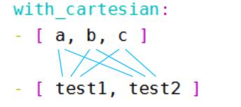

我们可以利用该特性，创建我们所需的目录

```plain
[root@tech_chaoge01 ~]#
[root@tech_chaoge01 ~]#
[root@tech_chaoge01 ~]# vim test.yml
[root@tech_chaoge01 ~]#
[root@tech_chaoge01 ~]# cat test.yml
---
- hosts: test129
  remote_user: root
  gather_facts: no
  tasks:
  - file:
      state: directory
      path: "/testdir/{{item.0}}/{{item.1}}"
    with_cartesian:
      - [a,b,c]
      - [test1,test2]
```

上例playbook执行后，即可在目标主机中创建出符合我们要求的目录。

## 循环编号with_indexed_items

我们继续来聊聊关于循环的关键字。

今天聊聊 "with_indexed_items"的用法，顾名思义，"with_indexed_items"应该与"索引"有关，没错，"with_indexed_items"的作用就是在循环处理列表时为列表中的每一项添加"数字索引"，"索引"从0开始，这样说可能不够直观，我们来看一个小示例，示例playbook如下：

```plain
[root@tech_chaoge01 ~]# cat test.yml
---
- hosts: test129
  remote_user: root
  gather_facts: no
  tasks:
  - debug:
      msg: "{{item}}"
    with_indexed_items:
      - test1
      - test2
      - test3
[root@tech_chaoge01 ~]#
```

上例中我们定义了一个列表，列表中有3个值，test1、test2、test3，我们使用"with_indexed_items"关键字处理这个列表，然后使用debug模块输出了item的信息，那么上例playbook执行后输出的信息如下：

```plain
[root@tech_chaoge01 ~]# ansible-playbook test.yml
PLAY [test129] *************************************************************************************************************************************************************
TASK [debug] ***************************************************************************************************************************************************************
ok: [test129] => (item=[0, u'test1']) => {
    "msg": [
        0,
        "test1"
    ]
}
ok: [test129] => (item=[1, u'test2']) => {
    "msg": [
        1,
        "test2"
    ]
}
ok: [test129] => (item=[2, u'test3']) => {
    "msg": [
        2,
        "test3"
    ]
}
PLAY RECAP *****************************************************************************************************************************************************************
test129                    : ok=1    changed=0    unreachable=0    failed=0    skipped=0    rescued=0    ignored=0
[root@tech_chaoge01 ~]#
```

从上述输出信息的msg中可以看到，"with_indexed_items"在处理列表中的每一项时，按照顺序为每一项添加了编号，test1对应的索引编号是0，test2的编号是1，test3的编号是2，"with_indexed_items"将添加过编号的每一项放入到了item中，所以，我们可以在处理每一项的时候同时获取到对应的编号，playbook如下

```plain
[root@tech_chaoge01 ~]# cat test.yml
---
- hosts: test129
  remote_user: root
  gather_facts: no
  tasks:
  - debug:
      msg: "index is : {{item.0}},value is {{item.1}}"
    with_indexed_items:
      - test1
      - test2
      - test3
```

上例中，我们已经能够通过"with_indexed_items"获取到列表中每个项的值以及对应的编号，但是，上述两个示例都是简单的单层列表，如果遇到像前文中出现的多层嵌套列表，"with_indexed_items"会怎样处理呢?我们来试试，示例playbook如下：

```plain
[root@tech_chaoge01 ~]# cat test.yml
---
- hosts: test129
  remote_user: root
  gather_facts: no
  tasks:
  - debug:
      msg: "index is : {{item.0}},value is {{item.1}}"
    with_indexed_items:
      - [test1,test2]
      - [test3,test4,test5]
      - [test6,test7]
[root@tech_chaoge01 ~]#
```

如上例所示，我们定义了一个嵌套的列表，列表中的每一项又是一个小列表，我们使用"with_indexed_items"处理这个列表，上例执行后，输出如下

```plain
[root@tech_chaoge01 ~]# ansible-playbook test.yml
PLAY [test129] *************************************************************************************************************************************************************
TASK [debug] ***************************************************************************************************************************************************************
ok: [test129] => (item=[0, u'test1']) => {
    "msg": "index is : 0,value is test1"
}
ok: [test129] => (item=[1, u'test2']) => {
    "msg": "index is : 1,value is test2"
}
ok: [test129] => (item=[2, u'test3']) => {
    "msg": "index is : 2,value is test3"
}
ok: [test129] => (item=[3, u'test4']) => {
    "msg": "index is : 3,value is test4"
}
ok: [test129] => (item=[4, u'test5']) => {
    "msg": "index is : 4,value is test5"
}
ok: [test129] => (item=[5, u'test6']) => {
    "msg": "index is : 5,value is test6"
}
ok: [test129] => (item=[6, u'test7']) => {
    "msg": "index is : 6,value is test7"
}
PLAY RECAP *****************************************************************************************************************************************************************
test129                    : ok=1    changed=0    unreachable=0    failed=0    skipped=0    rescued=0    ignored=0
[root@tech_chaoge01 ~]#
```

你目光如炬，一定发现了，当我们定义了两层的嵌套列表时，"with_indexed_items"会将嵌套的两层列表"拉平"，"拉平"后按照顺序为每一项编号，"拉平"效果跟之前总结的"with_flattened"效果类似（如果忘了怎样使用"with_flattened"请回顾前文），但是，当处理这种嵌套的多层列表时，"with_indexed_items"的拉平效果与"with_flattened"的完全一致么，我们再来实验一下，我们把上例的嵌套列表改的更加复杂一些，再多嵌套一层，示例playbook如下

```plain
[root@tech_chaoge01 ~]# cat test.yml
---
- hosts: test129
  remote_user: root
  gather_facts: no
  tasks:
  - debug:
      msg: "{{item}}"
    with_indexed_items:
      - [test1,test2]
      - [test3,[test4,test5]]
      - [test6]
[root@tech_chaoge01 ~]#
```

我们这里在前文基础上，又套了一层列表

```plain
[root@tech_chaoge01 ~]# ansible-playbook test.yml
PLAY [test129] *************************************************************************************************************************************************************
TASK [debug] ***************************************************************************************************************************************************************
ok: [test129] => (item=[0, u'test1']) => {
    "msg": [
        0,
        "test1"
    ]
}
ok: [test129] => (item=[1, u'test2']) => {
    "msg": [
        1,
        "test2"
    ]
}
ok: [test129] => (item=[2, u'test3']) => {
    "msg": [
        2,
        "test3"
    ]
}
ok: [test129] => (item=[3, [u'test4', u'test5']]) => {
    "msg": [
        3,
        [
            "test4",
            "test5"
        ]
    ]
}
ok: [test129] => (item=[4, u'test6']) => {
    "msg": [
        4,
        "test6"
    ]
}
PLAY RECAP *****************************************************************************************************************************************************************
test129                    : ok=1    changed=0    unreachable=0    failed=0    skipped=0    rescued=0    ignored=0
[root@tech_chaoge01 ~]#
```

你肯定看出了问题所在，没错，当多加了一层嵌套以后，"with_indexed_items"并不能像"with_flattened"一样将嵌套的列表"完全拉平"，第二层列表中的项如果仍然是一个列表，"with_indexed_items"则不会拉平这个列表，而是将其当做一个整体进行编号。

## 数字序列with_sequence

现在我有一个需求，我需要使用ansible在目标主机中创建5个目录，这5个目录的名字是test2、test4、test6、test8、test10，我该怎么办呢？当然，我可以使用shell模块执行一条命令去完成，但是我们现在正在总结"循环"的使用方法，所以，我要用循环完成这个需求，使用循环完成这个任务很简单，我们只需要借助一个循环的关键字，它就是"with_sequence"，放开刚才的需求不说，我们先来看一个"with_sequence"的小示例，示例playbook如下：

```plain
[root@tech_chaoge01 ~]# cat test.yml
---
- hosts: test129
  remote_user: root
  gather_facts: no
  tasks:
  - debug:
      msg: "{{item}}"
    with_sequence: start=1 end=5 stride=1
[root@tech_chaoge01 ~]#
```

我们先不用纠结上例的"with_sequence"设置是什么意思，我们先来看一下上例的执行效果，先执上述playbook后，debug模块的输出结果如下

```plain
[root@tech_chaoge01 ~]# ansible-playbook test.yml
PLAY [test129] *************************************************************************************************************************************************************
TASK [debug] ***************************************************************************************************************************************************************
ok: [test129] => (item=1) => {
    "msg": "1"
}
ok: [test129] => (item=2) => {
    "msg": "2"
}
ok: [test129] => (item=3) => {
    "msg": "3"
}
ok: [test129] => (item=4) => {
    "msg": "4"
}
ok: [test129] => (item=5) => {
    "msg": "5"
}
PLAY RECAP *****************************************************************************************************************************************************************
test129                    : ok=1    changed=0    unreachable=0    failed=0    skipped=0    rescued=0    ignored=0
[root@tech_chaoge01 ~]#
```

如输出信息所示，debug模块被循环调用了5次，msg的值从1一直输出到了5，值的大小每次增加1，没错，这正是"with_sequence"关键字的作用，"with_sequence"可以帮助我们按照顺序生成数字序列，上例的playbook中，with_sequence的设置是"start=1 end=5 stride=1"，其中start=1表示从1开始，end=5表示到5结束， stride=1表示步长为1，即从1到5每次增加1。

我们也可以换一种书写格式，如下格式如上例中的格式效果相同

```plain
with_sequence:
      start=1
      end=5
      stride=1
```

其实还有更简单的写法，生成连续的数字序列

```plain
[root@tech_chaoge01 ~]# cat test.yml
---
- hosts: test129
  remote_user: root
  gather_facts: no
  tasks:
  - debug:
      msg: "{{item}}"
    with_sequence: count=5
[root@tech_chaoge01 ~]#
```

上例中count=5表示数字序列默认从1开始，到5结束，默认步长为1，与上述两种写法的效果相同。

当我们不指定stride的值时，stride的值默认为1，但是，当end的值小于start的值时，则必须指定stride的值，而且stride的值必须是负数，示例如下

```plain
[root@tech_chaoge01 ~]# cat test.yml
---
- hosts: test129
  remote_user: root
  gather_facts: no
  tasks:
  - debug:
      msg: "{{item}}"
    with_sequence: start=6 end=2 stride=-2
[root@tech_chaoge01 ~]#
```

上例中start的值为6，end的值为2，stride的值为-2，表示从6开始，每次减2，到2结束，上例playbook的执行结果如下：

```plain
[root@tech_chaoge01 ~]# ansible-playbook test.yml
PLAY [test129] ***************************************************************************************************************************************************
TASK [debug] *****************************************************************************************************************************************************
ok: [test129] => (item=6) => {
    "msg": "6"
}
ok: [test129] => (item=4) => {
    "msg": "4"
}
ok: [test129] => (item=2) => {
    "msg": "2"
}
PLAY RECAP *******************************************************************************************************************************************************
test129                    : ok=1    changed=0    unreachable=0    failed=0    skipped=0    rescued=0    ignored=0
[root@tech_chaoge01 ~]#
```

看完上述总结，你肯定已经明白了"with_sequence"循环的用法，所以，我们可以使用"with_sequence"完成上述创建目录的需求，示例playbook如下：

test2、test4、test6、test8、test10

```plain
[root@tech_chaoge01 ~]# cat test.yml
---
- hosts: test129
  remote_user: root
  gather_facts: no
  tasks:
    - file:
        path: "/testdir/test{{item}}"
        state: directory
      with_sequence:
        start=2
        end=10
        stride=2
[root@tech_chaoge01 ~]#
```

## 随机数with_random_choice

"with_random_choice"的用法非常简单，使用"with_random_choice"可以从列表的多个值中随机返回一个值，先来看一个小示例，playbook如下：

```plain
[root@tech_chaoge01 ~]#
[root@tech_chaoge01 ~]# cat test.yml
---
- hosts: test129
  remote_user: root
  gather_facts: no
  tasks:
    - file:
        path: "/testdir/test{{item}}"
        state: directory
      with_random_choice: [1,2,3,4,5,6]
```

如上例所示，我们定义了一个列表，列表中有5个值，我们使用"with_random_choice"处理这个列表。

连续执行上例playbook，可以看出每次返回的结果是从列表中随机选中的一个

## 循环字典with_dict

今天继续来认识两个用于循环的关键字，它们是"with_dict"和"with_subelements"

先聊聊"with_dict"，顾名思义，"with_dict"的使用场景应该与"字典"有关，我们先来看一个小例子，结合示例更加容易说明白，示例playbook如下：

```plain
[root@tech_chaoge01 ~]# cat test.yml
---
- hosts: test129
  remote_user: root
  gather_facts: no
  vars:
    users:
      alice: female
      bob: male
  tasks:
  - debug:
      msg: "{{item}}"
    with_dict: "{{users}}"
[root@tech_chaoge01 ~]#
```

在上例中，我们使用字典的方式定义了users变量，users中一共有两个用户，alice和bob，从变量的键值对可以看出，alice是女性，bob是男性，然后，我们使用"with_dict"关键字处理了这个字典格式的变量，那么我们来看一下执行效果，上例playbook执行后debug模块的输出信息如下：

```plain
[root@tech_chaoge01 ~]# ansible-playbook test.yml
PLAY [test129] *************************************************************************************************************************************
TASK [debug] ***************************************************************************************************************************************
ok: [test129] => (item={u'key': u'bob', u'value': u'male'}) => {
    "msg": {
        "key": "bob",
        "value": "male"
    }
}
ok: [test129] => (item={u'key': u'alice', u'value': u'female'}) => {
    "msg": {
        "key": "alice",
        "value": "female"
    }
}
PLAY RECAP *****************************************************************************************************************************************
test129                    : ok=1    changed=0    unreachable=0    failed=0    skipped=0    rescued=0    ignored=0
[root@tech_chaoge01 ~]#
```

从输出信息可以看出，字典格式的users变量经过"with_dict"处理后，字典中的每个键值对被放到了item变量中，而且，键值对中的"键"被放入了"key"关键字中，键值对中的"值"被放入了"value"关键字中，所以，我们可以通过key关键字和value关键字分别获取到字典中键值对的"键"和"值"，示例playbook如下

```plain
[root@tech_chaoge01 ~]# cat test.yml
---
- hosts: test129
  remote_user: root
  gather_facts: no
  vars:
    users:
      alice: female
      bob: male
  tasks:
  - debug:
      msg: "User name: {{item.key}}, User's gender:{{item.value}}"
    with_dict: "{{users}}"
[root@tech_chaoge01 ~]#
```

执行结果

```plain
[root@tech_chaoge01 ~]# ansible-playbook test.yml
PLAY [test129] *************************************************************************************************************************************
TASK [debug] ***************************************************************************************************************************************
ok: [test129] => (item={u'key': u'bob', u'value': u'male'}) => {
    "msg": "User name: bob, User's gender:male"
}
ok: [test129] => (item={u'key': u'alice', u'value': u'female'}) => {
    "msg": "User name: alice, User's gender:female"
}
PLAY RECAP *****************************************************************************************************************************************
test129                    : ok=1    changed=0    unreachable=0    failed=0    skipped=0    rescued=0    ignored=0
[root@tech_chaoge01 ~]#
```

你一定已经明白了"with_dict"的作用，那么我们来扩展一下，将上例中字典格式的变量变得"丰富"一点，示例playbook如下：

```plain
[root@tech_chaoge01 ~]# cat test.yml
---
- hosts: test129
  remote_user: root
  gather_facts: no
  vars:
    users:
      alice:
        name: Alice Appleworth
        gender: female
        telephone: 123-456-7890
      bob:
        name: Bob banana
        gender: male
        telephone: 987-654-3210
  tasks:
    - debug:
        msg: "{{item}}"
      with_dict: "{{users}}"
[root@tech_chaoge01 ~]#
```

如上例所示，我们将alice和bob的信息完善了，每个人都有自己姓名，性别，电话等信息，上例playbook执行后debug输出信息如下：

```plain
[root@tech_chaoge01 ~]# ansible-playbook test.yml
PLAY [test129] *********************************************************************************************
TASK [debug] ***********************************************************************************************
ok: [test129] => (item={u'key': u'bob', u'value': {u'gender': u'male', u'name': u'Bob banana', u'telephone': u'987-654-3210'}}) => {
    "msg": {
        "key": "bob",
        "value": {
            "gender": "male",
            "name": "Bob banana",
            "telephone": "987-654-3210"
        }
    }
}
ok: [test129] => (item={u'key': u'alice', u'value': {u'gender': u'female', u'name': u'Alice Appleworth', u'telephone': u'123-456-7890'}}) => {
    "msg": {
        "key": "alice",
        "value": {
            "gender": "female",
            "name": "Alice Appleworth",
            "telephone": "123-456-7890"
        }
    }
}
PLAY RECAP *************************************************************************************************
test129                    : ok=1    changed=0    unreachable=0    failed=0    skipped=0    rescued=0    ignored=0
[root@tech_chaoge01 ~]#
```

从输出信息可以看出，gender、name、telephone都被放入了value关键字中，聪明如你一定想到了，这种情况下，如果想要获取到gender、name、telephone的值，则可以使用如下playbook中的方法

```plain
[root@tech_chaoge01 ~]# cat test.yml
---
- hosts: test129
  remote_user: root
  gather_facts: no
  vars:
    users:
      alice:
        name: Alice Appleworth
        gender: female
        telephone: 123-456-7890
      bob:
        name: Bob banana
        gender: male
        telephone: 987-654-3210
  tasks:
    - debug:
        msg: "user {{item.key}} is {{item.value.name}},Gender: {{item.value.gender}},Tel:{{item.value.telephone}}"
      with_dict: "{{users}}"
[root@tech_chaoge01 ~]#
```

查看结果

```plain
[root@tech_chaoge01 ~]# ansible-playbook test.yml
PLAY [test129] *********************************************************************************************************************************
TASK [debug] ***********************************************************************************************************************************
ok: [test129] => (item={u'key': u'bob', u'value': {u'gender': u'male', u'name': u'Bob banana', u'telephone': u'987-654-3210'}}) => {
    "msg": "user bob is Bob banana,Gender: male,Tel:987-654-3210"
}
ok: [test129] => (item={u'key': u'alice', u'value': {u'gender': u'female', u'name': u'Alice Appleworth', u'telephone': u'123-456-7890'}}) => {
    "msg": "user alice is Alice Appleworth,Gender: female,Tel:123-456-7890"
}
PLAY RECAP *************************************************************************************************************************************
test129                    : ok=1    changed=0    unreachable=0    failed=0    skipped=0    rescued=0    ignored=0
[root@tech_chaoge01 ~]#
```

## with_subelements

聊完"with_dict"，现在来聊聊另一个关键字："with_subelements"，单单靠语言描述"with_subelements"的作用有些麻烦，也不容易理解，不如先来看一个小示例，示例playbook如下：

```plain
[root@tech_chaoge01 ~]# cat test.yml
---
- hosts: test129
  remote_user: root
  gather_facts: no
  vars:
    users:
      - name: bob
        gender: male
        hobby:
          - Skateboard
          - VideoGame
      - name: alice
        gender: female
        hobby:
          - Music
  tasks:
    - debug:
        msg: "{{item}}"
      with_subelements:
        - "{{users}}"
        - hobby
[root@tech_chaoge01 ~]#
```

如上例所示，我们定义了一个复合结构的字典变量，users变量，users变量列表中有两个块序列，这两个块序列分别代表两个用户，bob和alice，alice是个妹子，bob是个汉子，bob的爱好是滑板和打游戏，alice的爱好是听音乐

上例中，我们使用"with_subelements"关键字处理了users变量，在处理users变量的同时，还指定了一个属性，"hobby属性"，细心如你一定已经发现了，"hobby属性"正是"users"变量中每个用户的"子属性"，换句话说，"hobby属性"是users中每个块序列的子元素，而且，hobby属性是一个"键值对"，其"值"是一个列表，因为每个人可以有多个爱好，那么经过"with_subelements"处理后，每个item是什么样子的呢？我们来看一下执行效果，执行上例playbook后，debug模块输出如下：

```plain
[root@tech_chaoge01 ~]# ansible-playbook test.yml
PLAY [test129] ***********************************************************************************************
TASK [debug] *************************************************************************************************
ok: [test129] => (item=[{u'gender': u'male', u'name': u'bob'}, u'Skateboard']) => {
    "msg": [
        {
            "gender": "male",
            "name": "bob"
        },
        "Skateboard"
    ]
}
ok: [test129] => (item=[{u'gender': u'male', u'name': u'bob'}, u'VideoGame']) => {
    "msg": [
        {
            "gender": "male",
            "name": "bob"
        },
        "VideoGame"
    ]
}
ok: [test129] => (item=[{u'gender': u'female', u'name': u'alice'}, u'Music']) => {
    "msg": [
        {
            "gender": "female",
            "name": "alice"
        },
        "Music"
    ]
}
PLAY RECAP ***************************************************************************************************
test129                    : ok=1    changed=0    unreachable=0    failed=0    skipped=0    rescued=0    ignored=0
[root@tech_chaoge01 ~]#
```

从上述输出信息可以看出，一共输出了三个item，第一个item中，bob的名字和性别组成了一个小整体，与bob的滑板爱好组合在了一起，第二个item中，bob的名字和性别组成了一个整体，与bob的打电动爱好组合在了一起，第三个item中，alice的名字与性别组成了一个整体，与alice的音乐爱好组合在了一起，你一定看出了一些规律，规律就是，"with_subelements"会将hobby子元素列表中的每一项作为一个整体，将其他子元素作为一个整体，然后组合在一起，所以，我们可以将上例的playbook修改一下，将msg信息的可读性提高一点，示例如下：

```plain
[root@tech_chaoge01 ~]# cat test.yml
---
- hosts: test129
  remote_user: root
  gather_facts: no
  vars:
    users:
      - name: bob
        gender: male
        hobby:
          - Skateboard
          - VideoGame
      - name: alice
        gender: female
        hobby:
          - Music
  tasks:
    - debug:
        msg: "{{item.0.name}}'s hobby is {{item.1}}"
      with_subelements:
        - "{{users}}"
        - hobby
[root@tech_chaoge01 ~]#
```

由于item由两个整体组成，所以，我们通过item.0获取到第一个小整体，即gender和name属性，然后通过item.1获取到第二个小整体，即hobby列表中的每一项，上例执行后，最终每个msg信息的输出如下：

```plain
[root@tech_chaoge01 ~]# ansible-playbook test.yml
PLAY [test129] ***********************************************************************************************
TASK [debug] *************************************************************************************************
ok: [test129] => (item=[{u'gender': u'male', u'name': u'bob'}, u'Skateboard']) => {
    "msg": "bob's hobby is Skateboard"
}
ok: [test129] => (item=[{u'gender': u'male', u'name': u'bob'}, u'VideoGame']) => {
    "msg": "bob's hobby is VideoGame"
}
ok: [test129] => (item=[{u'gender': u'female', u'name': u'alice'}, u'Music']) => {
    "msg": "alice's hobby is Music"
}
PLAY RECAP ***************************************************************************************************
test129                    : ok=1    changed=0    unreachable=0    failed=0    skipped=0    rescued=0    ignored=0
```

经过上述示例，你一定已经明白了"with_subelements"的用法了，"with_subelements"可以处理一个像上例中一样的复合结构的字典数据，在处理这个字典的同时，需要指定一个子元素，这个子元素的值必须是一个列表，之后，"with_subelements"会将子元素的列表中的每一项作为一个整体，将其他子元素作为一个整体，然后将两个整体组合成item。

## with_file读文件内容

假设你的ansible主机中有几个文件（注意：是ansible主机中的文件，不是远程目标主机中的文件），你想要获取到这些文件的内容，那么可以借助"with_file"关键字，循环的获取到这些文件的内容，示例如下：

注意，即使剧本的目标主机是client，with_file拿的是ansible本机的文件内容

提前可以准备该两个文件

```plain
[root@tech_chaoge01 ~]# cat test.yml
---
- hosts: test129
  remote_user: root
  gather_facts: no
  tasks:
    - debug:
        msg: "{{item}}"
      with_file:
        - /testdir/a.txt
        - /tmp/b.txt
[root@tech_chaoge01 ~]#
```

如上定义了一个文件列表，分别是2个文件的路径，执行剧本，查看是否能拿到文件数据。

```plain
[root@tech_chaoge01 ~]# ansible-playbook test.yml
PLAY [test129] **************************************************************************************************
TASK [debug] ****************************************************************************************************
ok: [test129] => (item=I'm aaa) => {
    "msg": "I'm aaa"
}
ok: [test129] => (item=I'm bbb) => {
    "msg": "I'm bbb"
}
PLAY RECAP ******************************************************************************************************
test129                    : ok=1    changed=0    unreachable=0    failed=0    skipped=0    rescued=0    ignored=0
[root@tech_chaoge01 ~]#
```

## with_fileglob

"with_file"是用来获取文件内容的，而"with_fileglob"是用来匹配文件名称的，我们可以通过"with_fileglob"关键字，在指定的目录中匹配符合模式的文件名，"with_file"与"with_fileglob"也有相同的地方，它们都是针对ansible主机的文件进行操作的，而不是目标主机，那么，我们来看一个"with_fileglob"小示例，示例如下：

[root@tech_chaoge01 ~]# tree /testdir/ /testdir/ ├── a ├── a.txt ├── b ├── b.txt ├── c ├── c.txt ├── d ├── d.txt └── e.txt

```plain
[root@tech_chaoge01 ~]# cat test.yml
---
- hosts: test129
  remote_user: root
  gather_facts: no
  tasks:
    - debug:
        msg: "{{item}}"
      with_fileglob: 
        - /testdir/*
[root@tech_chaoge01 ~]#
```

如上例所示，我们定义了一个列表，这个列表中只有一个值，这个值是一个路径，路径中包含一个通配符，按照我们通常的理解，"/testdir/*"应该代表了/testdir目录中的所有文件，我们用"with_fileglob"处理了这个列表，那么我们来看看执行效果，执行后返回信息如下

```plain
[root@tech_chaoge01 ~]# ansible-playbook test.yml
PLAY [test129] ***********************************************************************************
TASK [debug] *************************************************************************************
ok: [test129] => (item=/testdir/a.txt) => {
    "msg": "/testdir/a.txt"
}
ok: [test129] => (item=/testdir/b.txt) => {
    "msg": "/testdir/b.txt"
}
ok: [test129] => (item=/testdir/c.txt) => {
    "msg": "/testdir/c.txt"
}
ok: [test129] => (item=/testdir/d.txt) => {
    "msg": "/testdir/d.txt"
}
ok: [test129] => (item=/testdir/e.txt) => {
    "msg": "/testdir/e.txt"
}
PLAY RECAP ***************************************************************************************
test129                    : ok=1    changed=0    unreachable=0    failed=0    skipped=0    rescued=0    ignored=0
[root@tech_chaoge01 ~]#
```

可以看出，找出了该目录下所有的文本文件，但是不会列出文件夹。

也可以定义多个目录进行匹配

```plain
[root@tech_chaoge01 ~]# cat test.yml
---
- hosts: test129
  remote_user: root
  gather_facts: no
  tasks:
    - debug:
        msg: "{{item}}"
      with_fileglob:
        - /testdir/*
        - /opt/test*.???
[root@tech_chaoge01 ~]#
```

第二条匹配项，会匹配/opt目录下进行正则查找的文件，如`testfile.txt、test1.log`等文件。


# playbook条件判断

绝大多数语言中，都使用"if"作为条件判断的关键字，而在ansible中，条件判断的关键字是"when"，我们来看一个简单的示例，如下

如果。。。if

当。。。when

```plain
[root@tech_chaoge01 ~]# cat test.yml
---
- hosts: test129
  remote_user: root
  tasks:
    - debug:
        msg: "System release is centos"
      when: ansible_distribution == "CentOS"
[root@tech_chaoge01 ~]#
```

如上例所示，使用when关键字指明条件，条件是ansible_distribution的值是CentOS，细心如你一定已经发现了，ansible_distribution就是facts信息中的一个key，通过ansible_distribution可以获取到目标主机系统的发行版

```plain
在之前的文章中，如果我们需要获取到facts中的key的值，都是通过引用变量的方式获取的，即"{{ key }}"，但是，在使用when关键字时，我们并没有为ansible_distribution添加"{{ }}"。
没错，在when关键字中引用变量时，变量名不需要加"{{ }}", 那么上例playbook表示，如果ansible_distribution的值是CentOS，则调用debug模块，输出"System release is centos"这句话，如果ansible_distribution的值不是CentOS，则不满足条件，则不会调用debug模块。
```

执行结果

```plain
[root@tech_chaoge01 ~]# ansible-playbook test.yml
PLAY [test129] ***********************************************************************************
TASK [Gathering Facts] ***************************************************************************
ok: [test129]
TASK [debug] *************************************************************************************
ok: [test129] => {
    "msg": "System release is centos"
}
PLAY RECAP ***************************************************************************************
test129                    : ok=2    changed=0    unreachable=0    failed=0    skipped=0    rescued=0    ignored=0
[root@tech_chaoge01 ~]#
```

你肯定已经理解了，我们可以使用when关键字为任务指定条件，条件成立，则执行任务，条件不成立，则不执行任务，那么我们再来看一个用于循环的条件判断示例，如下：

```plain
[root@tech_chaoge01 ~]# cat test.yml
---
- hosts: test129
  remote_user: root
  gather_facts: no
  tasks:
    - debug:
        msg: "{{item}}"
      with_items:
        - 1
        - 2
        - 3
      when: item > 1
```

上述剧本执行结果是只有item的值大于1的时候，才会debug输出信息。

在上述两个示例中，我们使用了 "==" 和 ">" 两个比较运算符，在ansible中，我们可以使用如下比较运算符。

== :比较两个对象是否相等，相等为真

!= :比较两个对象是否不等，不等为真

\> :比较两个值的大小，如果左边的值大于右边的值，则为真

< :比较两个值的大小，如果左边的值小于右边的值，则为真

\>= :比较两个值的大小，如果左边的值大于右边的值或左右相等，则为真

<= :比较两个值的大小，如果左边的值小于右边的值或左右相等，则为真

我们总结的这些运算符其实都是jinja2的运算符，ansible使用jinja2模板引擎，在ansible中也可以直接使用jinja2的这些运算符。

说完了比较运算符，再来说说逻辑运算符，可用的逻辑运算符如下

and :逻辑与，当左边与右边同时为真，则返回真

or :逻辑或，当左边与右边有任意一个为真，则返回真

not :取反，对一个操作体取反

( ) :组合，将一组操作体包装在一起，形成一个较大的操作体

## 逻辑运算符

```plain
[root@tech_chaoge01 ~]# cat test.yml
---
- hosts: test129
  remote_user: root
  tasks:
    - debug:
        msg: "System release is centos7"
      when: ansible_distribution == "CentOS" and ansible_distribution_major_version == "7"
[root@tech_chaoge01 ~]#
```

执行结果

```plain
[root@tech_chaoge01 ~]# ansible-playbook test.yml
PLAY [test129] **********************************************************************************************
TASK [Gathering Facts] **************************************************************************************
ok: [test129]
TASK [debug] ************************************************************************************************
ok: [test129] => {
    "msg": "System release is centos7"
}
PLAY RECAP **************************************************************************************************
test129                    : ok=2    changed=0    unreachable=0    failed=0    skipped=0    rescued=0    ignored=0
[root@tech_chaoge01 ~]#
```

上例表示，如果想要debug模块能够输出"System release is centos7"这句话，需要同时满足两个条件，ansible_distribution的值是CentOS，同时ansible_distribution_major_version的值是7

其实，当我们需要使用"逻辑与"时，除了使用"and"这种写法，还能够使用另一种"列表"的写法，示例如下

```plain
[root@tech_chaoge01 ~]# cat test.yml
---
- hosts: test129
  remote_user: root
  tasks:
    - debug:
        msg: "System release is centos7"
      when:
        - ansible_distribution == "CentOS"
        - ansible_distribution_major_version == "7"
[root@tech_chaoge01 ~]#
```

上例的when中定义了一个列表，这个列表中的每一项都是一个条件，列表中的所有条件同时成立时，对应的任务才会执行。

再来看一个示例，这个示例同时用到了逻辑与、逻辑或、分组组合，示例如下

```plain
[root@tech_chaoge01 ~]# cat test.yml
---
- hosts: test129
  remote_user: root
  tasks:
    - debug:
        msg: "System release is centos7 or centos6"
      when:
        ansible_distribution == "CentOS" and
        (ansible_distribution_major_version == "7"  or ansible_distribution_major_version== "6")
[root@tech_chaoge01 ~]#
```

还有"取反"的示例，如下示例表示如果系统的发行版不是centos，则输出"System release is not centos"这句话

```plain
[root@tech_chaoge01 ~]#
[root@tech_chaoge01 ~]# cat test.yml
---
- hosts: test129
  remote_user: root
  tasks:
    - debug:
        msg: "System release is not centos"
      when: not ansible_distribution == "CentOS"
[root@tech_chaoge01 ~]#
```

该剧本执行后，不会debug输出信息，是因为，超哥的server本来就是centos呀。

当我们调用shell模块运行命令时，通常需要获取到shell模块的返回信息，以便之后的模块能够根据返回信息的值判断之后进行怎样的操作，示例如下，如下示例存在一个问题，我们一起来看一下

```plain
[root@tech_chaoge01 ~]# cat test.yml
---
- hosts: test129
  remote_user: root
  tasks:
    - name: task1
      shell: "ls /testabc"
      register: returnmsg
    - name: task2
      debug:
        msg: "Command execution successful"
      when: returnmsg.rc == 0
    - name: task3
      debug:
        msg: "Command execution failed"
      when: returnmsg.rc != 0
[root@tech_chaoge01 ~]#
```

从上述示例可以看出我们的意图，我们想要通过shell模块在远程主机test70中执行命令 "ls /testabc"，我们将shell模块的返回值注册到了变量returnmsg，然后通过returnmsg获取到了命令执行的返回码，如果返回码为0，则证明命令完全正常执行，如果返回码不为0，则证明命令执行时出错了，test70主机中其实并不存在/testabc这个文件或者目录，所以，按照理想的情况，debug模块应该会输出"Command execution failed"这句话，那么我们执行一下上例的playbook，看看执行结果与我们预想的是否相同，执行情况如下：

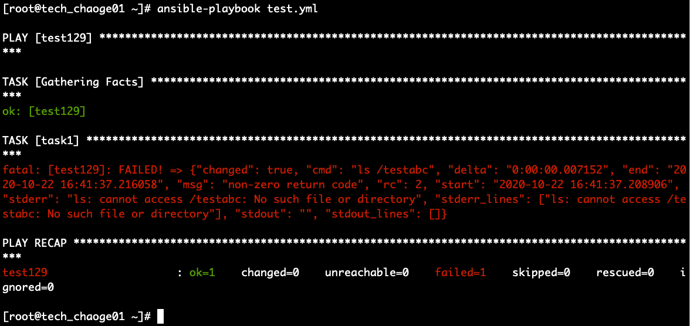

如图所示，由于远程主机中并不存在"/testabc"，所以task1执行报错了，这在我们的预料之中，但是之后的task2和task3并未执行，这是因为ansible默认的机制是当playbook中的某个task执行后，如果task报错，playbook会在报错task的位置上停止，报错task之后的task则不会执行

所以，由于上例的task1报错了，palybook就停止在task1的位置了，task2和task3压根就没执行，更别说判断task1的执行结果了，那么，我们需要一种方法，即使task1执行报错，也能接着执行之后的task，以便之后的task能够获取到task1的状态，那么我们该怎么办呢？

很简单，通过"ignore_errors"关键字即可实现这种效果，"ignore_errors"表示即使当前task执行报错，ansible也会忽略这个错误，继续执行playbook，示例如下：

```plain
[root@tech_chaoge01 ~]# cat test.yml
---
- hosts: test129
  remote_user: root
  tasks:
    - name: task1
      shell: "ls /testabc"
      register: returnmsg
      ignore_errors: true
    - name: task2
      debug:
        msg: "Command execution successful"
      when: returnmsg.rc == 0
    - name: task3
      debug:
        msg: "Command execution failed"
      when: returnmsg.rc != 0
[root@tech_chaoge01 ~]#
```

执行剧本

```plain
[root@tech_chaoge01 ~]# ansible-playbook test.yml
PLAY [test129] *******************************************************************************************
TASK [Gathering Facts] ***********************************************************************************
ok: [test129]
TASK [task1] *********************************************************************************************
fatal: [test129]: FAILED! => {"changed": true, "cmd": "ls /testabc", "delta": "0:00:00.005838", "end": "2020-10-22 16:51:40.647917", "msg": "non-zero return code", "rc": 2, "start": "2020-10-22 16:51:40.642079", "stderr": "ls: cannot access /testabc: No such file or directory", "stderr_lines": ["ls: cannot access /testabc: No such file or directory"], "stdout": "", "stdout_lines": []}
...ignoring
TASK [task2] *********************************************************************************************
skipping: [test129]
TASK [task3] *********************************************************************************************
ok: [test129] => {
    "msg": "Command execution failed"
}
PLAY RECAP ***********************************************************************************************
test129                    : ok=3    changed=1    unreachable=0    failed=0    skipped=1    rescued=0    ignored=1
[root@tech_chaoge01 ~]#
```

能够发现，task1出错了，也被忽略了，task2不符合条件，task3正确的执行了。

## 条件判断与tests

在linux中，我们可以使用test命令进行一些常用的判断操作，比如，使用test命令判断"/testdir"是否存在，示例如下

```plain
[root@tech_chaoge01 ~]# test -e /testdir
[root@tech_chaoge01 ~]# echo $?
0
```

上述命令表示判断"/testdir"是否存在于系统中，如果"/testdir"存在，则返回true，如果"/testdir"不存在，则返回false，而在linux中，命令的返回值为0表示true，返回值为非0表示false，上例的返回值为0，所以"/testdir"存在于文件系统中，我们也可以在shell脚本中使用test命令进行判断，示例如下

```plain
[root@tech_chaoge01 ~]# cat test.sh
#!/bin/bash
if test -e /testdir;then
  echo "testdir exist"
fi
```

其实，在ansible中，也有类似的用法，只不过ansible没有使用linux的test命令，而是使用了jinja2的tests，借助tests，我们可以进行一些判断操作，tests会将判断后的布尔值返回，如果条件成立，则返回true，如果条件不成立，tests会返回false，我们通常会在条件判断时使用到tests，那么怎样在ansible中使用jinja2的tests进行判断呢？我们先来看一个小例子，示例如下：

```plain
[root@tech_chaoge01 ~]# cat test.yml
---
- hosts: test129
  remote_user: root
  gather_facts: no
  vars:
    testpath: /testdir
  tasks:
    - debug:
        msg: "file exist"
      when: testpath is exists
[root@tech_chaoge01 ~]#
```

执行

```plain
[root@tech_chaoge01 ~]# ansible-playbook test.yml
PLAY [test129] ************************************************************************************
TASK [debug] **************************************************************************************
ok: [test129] => {
    "msg": "file exist"
}
PLAY RECAP ****************************************************************************************
test129                    : ok=1    changed=0    unreachable=0    failed=0    skipped=0    rescued=0    ignored=0
```

如上例所示，我们定义了一个testpath变量，这个变量的值是"/testdir"路径，我通过when判断"/testdir"路径是否存在，没错，就是这么简单，"is exists"中的"exists"就是tests的一种，它与"test -e"命令的作用是相同的，通过"exists"可以判断ansible主机中的对应路径是否存在**（注意：是ansible控制主机中的路径，与目标主机没有关系）**，当对应的路径存在于ansible控制节点时，"is exists"为真，是不是很简单？

"is exists"可以在路径存在时返回真，但是有时，我们想要在路径不存在时返回真，我们该怎么办呢？我们可以使用"is not exists"，"is not exists"表示对应路径不存在时返回真，示例如下：

```plain
[root@tech_chaoge01 ~]# cat test.yml
---
- hosts: test129
  remote_user: root
  gather_facts: no
  vars:
    testpath: /testdir
  tasks:
    - debug:
        msg: "file exist"
      when: testpath is not exists
[root@tech_chaoge01 ~]#
```

上例取反的效果与"is not"的效果相同。

在ansible中，除了能够使用"exists"这种tests，还有一些别的tests能够使用，我们来认识一下这些tests

## 判断变量的tests

defined ：判断变量是否已经定义，已经定义则返回真

undefind ：判断变量是否已经定义，未定义则返回真

none ：判断变量值是否为空，如果变量已经定义，但是变量值为空，则返回真

上述tests的使用示例如下：

```plain
[root@tech_chaoge01 ~]# cat test.yml
---
- hosts: test129
  remote_user: root
  gather_facts: no
  vars:
    testvar: "test"
    testvar1:
  tasks:
    - debug:
        msg: "Variable is defined"
      when: testvar is defined
    - debug:
        msg: "Variable2 is undefined"
      when: testvar2 is undefined
    - debug:
        msg: "The variable is defined,but there is no value"
      when: testvar1 is none
[root@tech_chaoge01 ~]#
```

我们判断的是

testvar已经定义

Testvar2未定义

testvar1为空值

## 执行结果tests

success 或 succeeded：通过任务的返回信息判断任务的执行状态，任务执行成功则返回真

failure 或 failed：通过任务的返回信息判断任务的执行状态，任务执行失败则返回真

change 或 changed：通过任务的返回信息判断任务的执行状态，任务执行状态为changed则返回真

skip 或 skipped：通过任务的返回信息判断任务的执行状态，当任务没有满足条件，而被跳过执行时，则返回真

```plain
[root@tech_chaoge01 ~]# cat test.yml
---
- hosts: test129
  remote_user: root
  gather_facts: no
  vars:
    doshell: "yes"
  tasks:
    - shell: "cat /testdir/abc"
      when: doshell == 'yes'
      register: returnmsg
      ignore_errors: true
    - debug:
        msg: "success"
      when: returnmsg is success
    - debug:
        msg: "failed"
      when: returnmsg is failure
    - debug:
        msg: "changed"
      when: returnmsg is change
    - debug:
        msg: "skip"
      when: returnmsg is skip
[root@tech_chaoge01 ~]#
```

如上例所示，我们调用了shell模块，将shell模块的返回信息注册在了returnmsg变量中，之后的debug任务均通过returnmsg变量判断shell模块的执行状态，

因为shell模块有可能执行失败，所以，我们为shell模块添加了"ignore_errors: true"，以便即使shell模块执行失败，也能执行后面的任务，

并且，我为shell模块添加了判断条件，当不满足条件时，shell模块则会跳过，即不会执行，

你可以修改一下条件，以便测试skip的判断效果。

执行结果

```plain
# 在目标机器，存在，不存在 /testdir/abc 文件，两种情况
```

## 路径判断tests

注：如下tests的判断均针对于ansible主机中的路径，与目标主机无关

file : 判断路径是否是一个文件，如果路径是一个文件则返回真

directory ：判断路径是否是一个目录，如果路径是一个目录则返回真

link ：判断路径是否是一个软链接，如果路径是一个软链接则返回真

mount：判断路径是否是一个挂载点，如果路径是一个挂载点则返回真

exists：判断路径是否存在，如果路径存在则返回真

剧本案例

```plain
[root@tech_chaoge01 ~]# cat test.yml
---
- hosts: test129
  remote_user: root
  gather_facts: no
  vars:
    testpath1: "/testdir/test"
    testpath2: "/testdir"
    testpath3: "/testdir/testsoftlink"
    testpath4: "/testdir/testhardlink"
    testpath5: "/boot"
  tasks:
    - debug:
        msg: "file"
      when: testpath1 is file
    - debug:
        msg: "directory"
      when: testpath2 is directory
    - debug:
        msg: "link"
      when: testpath3 is link
    - debug:
        msg: "link"
      when: testpath4 is link
    - debug:
        msg: "mount"
      when: testpath5 is mount
    - debug:
        msg: "exists"
      when: testpath1 is exists
[root@tech_chaoge01 ~]#
```

上述执行，为真则执行，为假则跳过。

## 字符串判断tests

lower：判断包含字母的字符串中的字母是否是纯小写，字符串中的字母全部为小写则返回真

upper：判断包含字母的字符串中的字母是否是纯大写，字符串中的字母全部为大写则返回真

上述tests的使用示例如下：

```plain
[root@tech_chaoge01 ~]# cat test.yml
---
- hosts: test129
  remote_user: root
  gather_facts: no
  vars:
    str1: "abc"
    str2: "ABC"
  tasks:
    - debug:
        msg: "This string is all lowercase"
      when: str1 is lower
    - debug:
        msg: "This string is all uppercase"
      when: str2 is upper
[root@tech_chaoge01 ~]#
```

执行判断两个变量，全是大写，还是小写。

## 判断变量是否是字符串/数字

**string**：判断对象是否是一个字符串，是字符串则返回真

```plain
[root@tech_chaoge01 ~]# cat test.yml
---
- hosts: test129
  remote_user: root
  gather_facts: no
  vars:
    testvar1: 1
    testvar2: "1"
    testvar3: a
  tasks:
    - debug:
        msg: "This variable is a string"
      when: testvar1 is string
    - debug:
        msg: "This variable is a string"
      when: testvar2 is string
    - debug:
        msg: "This variable is a string"
      when: testvar3 is string
[root@tech_chaoge01 ~]#
```

只有后2个变量属于字符串

**number**：判断对象是否是一个数字，是数字则返回真

```plain
[root@tech_chaoge01 ~]# cat test.yml
---
- hosts: test129
  remote_user: root
  gather_facts: no
  vars:
    testvar1: 1
    testvar2: "1"
    testvar3: 18.22
  tasks:
    - debug:
        msg: "This variable is a number"
      when: testvar1 is number
    - debug:
        msg: "This variable is a number"
      when: testvar2 is number
    - debug:
        msg: "This variable is a number"
      when: testvar3 is number
[root@tech_chaoge01 ~]#
```

只有，1，3的变量会被判断为数字

## 条件判断与block

在前文中，我们总结了条件判断的语法，以及一些tests的使用方法，这篇文章我们再来总结一些与条件判断有关的知识点

前文中，我们使用"when"关键字对条件进行判断，如果条件成立，则执行对应的任务，但是，细心如你一定已经发现了，当条件成立时，我们只能执行一个任务，如果我们想要在条件成立时，执行三个任务，该怎么办呢？难道我们要在这三个任务的每个任务中都加入相同的条件判断么？这种方法也太麻烦了，显然应该有更好的方法，没错，我们可以借助"block"解决这个小问题。

在ansible中，可以使用"block"关键字将多个任务整合成一个"块"，这个"块"将被当做一个整体，我们可以对这个"块"添加判断条件，当条件成立时，则执行这个块中的所有任务，我们来看一个小示例，如下

```plain
[root@tech_chaoge01 ~]# cat test.yml
---
- hosts: test123
  remote_user: root
  gather_facts: no
  tasks:
    - debug:
        msg: "task1 not in block"
    - block:
        - debug:
            msg: "task2 in block1"
        - debug:
            msg: "task3 in block1"
      when: 2>1
[root@tech_chaoge01 ~]#
```

执行剧本

```plain
[root@tech_chaoge01 ~]# ansible-playbook test.yml
PLAY [test123] *****************************************************************************************************
TASK [debug] *******************************************************************************************************
ok: [test123] => {
    "msg": "task1 not in block"
}
TASK [debug] *******************************************************************************************************
ok: [test123] => {
    "msg": "task2 in block1"
}
TASK [debug] *******************************************************************************************************
ok: [test123] => {
    "msg": "task3 in block1"
}
PLAY RECAP *********************************************************************************************************
test123                    : ok=3    changed=0    unreachable=0    failed=0    skipped=0    rescued=0    ignored=0
```

上述包含三个任务执行，第一个是debug输出一句话。之后通过block执行了2个任务，两个debug任务分别输出各自的信息了。注意when和block是对其的，当when成立后，执行block。

其实，block除了能够与when结合在一起使用，还有一个很有用的功能，就是"错误处理"功能。

错误处理指的是，例如执行任务A，如果执行失败了，后续的的处理动作。

前文中提到的jinja2的tests，有个一名为failed的test，借助failed也可以实现类似的功能，此处我们先回顾一下failed的用法，然后对比着failed的示例，介绍block的用法，使用failed完成上述错误处理的示例代码如下

```plain
[root@tech_chaoge01 ~]# cat test.yml
---
- hosts: test123
  remote_user: root
  gather_facts: no
  tasks:
    - shell: "ls /ooo"
      register: return_value
      ignore_errors: true
    - debug:
        msg: "I cought an error"
      when: return_value is failed
[root@tech_chaoge01 ~]#
```

如上例所示，我在shell任务中执行了'ls /ooo'命令，而test70主机中并不存在/ooo这个路径，所以shell模块执行时一定会出错，我将shell任务执行的返回值注册到了return_value变量中，然后使用"is failed"进行判断，如果条件成立，代表shell任务执行出错，则执行debug任务，输出对应的信息，上述示例就能实现我们刚才所要求的功能

如果用block来实现，该怎样编写playbook呢？来看一个小示例，如下:

```plain
[root@tech_chaoge01 ~]# cat test.yml
---
- hosts: test123
  remote_user: root
  gather_facts: no
  tasks:
    - block:
        - shell: "ls /tmp"
        - shell: "ls /testdir"
        - shell: "ls /zzz"
      rescue:
        - debug:
            msg: "I caught an error"
[root@tech_chaoge01 ~]#
```

如上例所示，block中有三个任务，这三个任务中的任何一个任务出错，都会执行rescue中的任务，所以通常，我们会使用block和rescue结合，完成"错误捕捉，报出异常"的功能。

其实，不仅block中可以有多个任务，rescue中也可以定义多个任务，当block中的任何一个任务出错时，会按照顺序执行rescue中的任务。

你一定已经理解了，我们来扩展一下，上例中只使用到了block与rescue关键字，其实，我们还能够再加入always关键字，加入always关键字以后，无论block中的任务执行成功还是失败，always中的任务都会被执行，示例如下：

```plain
[root@tech_chaoge01 ~]# cat test.yml
---
- hosts: test123
  remote_user: root
  gather_facts: no
  tasks:
    - block:
        - debug:
            msg: "I execute normally"
        - command: /bin/false
        - debug:
            msg: "I never execute,due to the above task failing"
      recuse:
        - debug:
            msg: "I caught an error"
        - command: /bin/false
        - debug:
            msg: "I also never execute"
      always:
        - debug:
            msg: "This always executes"
[root@tech_chaoge01 ~]#
```

如上例所示，block中有多个任务，rescue中也有多个任务，上例中故意执行"/bin/false"命令，模拟任务出错的情况，当block中的'/bin/false'执行后，其后的debug任务将不会被执行，因为'/bin/false'模拟出错。

出错后直接执行rescue中的任务，在执行rescue中的任务时，会先输出 'I caught an error'，然后又在rescue中使用'/bin/false'模拟出错的情况，出错后之后的debug任务不会被执行，直接执行always中的任务，always中的任务一定会被执行，无论block中的任务是否出错，快动手测试一下实际的执行效果吧。

## 条件判断与错误处理

前一篇文章中，我们总结了block的使用方法，block除了可以将多个任务组合成一"块"，还有错误处理的功能，那么在这片文章中，我们就来继续聊聊与错误处理有关的知识点。

在编写shell脚本时，有可能会有这样的需求，当脚本执行到某个阶段时，需要对某个条件进行判断，如果条件成立，则立即终止脚本的运行，在shell脚本中实现这个需求很简单，只需要在条件成立时调用"exit"命令即可终止脚本的运行， 那么在编写playbook时，如果有类似的需求，我们该怎么办呢？

想要在playbook中按照我们的意愿中断剧本的执行，其实也很简单，我们只需要借助一个模块即可完成，这个模块就是"fail"模块。

我们知道，在执行playbook时，如果playbook中的任何一个任务执行失败，playbook都会停止运行，除非这个任务设置了"ignore_errors: true"，在任务没有设置"ignore_errors: yes"的情况下，任务执行失败后，playbook就会自动终止，而fail模块天生就是一个用来"执行失败"的模块，当fail模块执行后，playbook就会认为有任务失败了，从而终止运行，实现我们想要的中断效果，来看一个小示例：

```plain
[root@tech_chaoge01 ~]# cat test.yml
---
- hosts: test123
  remote_user: root
  gather_facts: no
  tasks:
    - debug:
        msg: "1"
    - debug:
        msg: "2"
    - fail:
    - debug:
        msg: "3"
[root@tech_chaoge01 ~]#
```

如上，在调用fail模块后，中断了剧本的执行。

可以指定fail模块自定义报错。

```plain
[root@tech_chaoge01 ~]# cat test.yml
---
- hosts: test123
  remote_user: root
  gather_facts: no
  tasks:
    - debug:
        msg: "1"
    - debug:
        msg: "2"
    - fail:
        msg: "Interrupt running playbook"
    - debug:
        msg: "3"
```

此时fail中断后的信息就已经是我们自定义的了。

当然，上述示例只是为了初步介绍fail模块的用法，我们通常并不会毫无理由的想要去中断playbook，通常需要对某些条件进行判断，如果条件满足，则中断剧本，所以，fail模块通常与when结合使用

比如，如果之前模块执行后的标准输出信息中包含字符串'error'，则认为中断剧本的条件成立，就立即调用fail模块，以终断playbook，示例如下：

```plain
[root@tech_chaoge01 ~]# cat test.yml
---
- hosts: test123
  remote_user: root
  gather_facts: no
  tasks:
    - shell: "echo 'This is a string for testing-error'"
      register: return_value
    - fail:
        msg: "Conditions established,Interrupt running playbook"
      when: "error" in return_value.stdout
    - debug:
        msg: "I never execute,Because the playbook has stopped"
[root@tech_chaoge01 ~]#
```

上例中，我们使用shell模块故意输出了一个包含'error'字符串的文本，并且将shell模块执行后的返回值注册到了变量' return_value'中，在之后调用了fail模块，并对fail模块添加了判断条件，对应的条件为 "'error' in return_value.stdout"，这个条件表示shell模块执行后的标注输出信息中如果包含'error'字符串，则条件成立，其中，'in'关键字的用法与python中'in'的用法相同，可以使用'in'关键字判断一个字符串是否存在于另一个字符串中，也可以用于判断一个特定的值是否存在于列表中，由于shell标准输出的信息中的确包含error字符串，所以fail模块对应的条件成立，最终调用fail模块，playbook终止运行。

不过需要注意的是，当使用"in"或者"not in"进行条件判断时，整个条件需要用引号引起，并且，需要判断的字符串也需要使用引号引起，所以，使用'in'或者'not in'进行条件判断时，如下两种语法是正确的：

when: ' "successful" not in return_value.stdout '

when: " 'successful' not in return_value.stdout "

看完上述示例，你一定已经明白了怎样在条件满足时终止playbook，其实，还有另一种方法可以实现类似的效果，我们可以借助'failed_when'关键字来完成类似功能

'failed_when'的作用就是，当对应的条件成立时，将对应任务的执行状态设置为失败，这样说可能不是特别容易理解，不如先来看一个小示例，如下：

```plain
[root@tech_chaoge01 ~]# cat test.yml
---
- hosts: test123
  remote_user: root
  gather_facts: no
  tasks:
    - debug:
        msg: "I execute normally"
    - shell: "echo 'THis is a string for testing error'"
      register: return_value
      failed_when: '"error" in return_value.stdout'
    - debug:
        msg: "I never execute,Because the playbook has stopped"
[root@tech_chaoge01 ~]#
```

上例中，一共有三个任务，第一个任务通过debug模块输出 "I execute normally"，第二个任务调用shell模块，echo了'This is a string for testing error'这句话，并且将返回值注册到了'return_value'变量中，' failed_when'关键字与shell关键字对齐，表示其对应的条件是针对shell模块的，' failed_when'对应的条件是 ' "error" in return_value.stdout'，表示"error"字符串如果存在于shell模块执行后的标准输出中，则条件成立，当条件成立后，shell模块的执行状态将会被设置为失败，由于shell模块的执行状态被设置为失败，所以playbook会终止运行，于是，最后的debug模块并不会被执行，那么，执行上例playbook，效果如下

```plain
[root@tech_chaoge01 ~]# ansible-playbook test.yml
PLAY [test123] ************************************************************************
TASK [debug] **************************************************************************
ok: [test123] => {
    "msg": "I execute normally"
}
TASK [shell] **************************************************************************
[WARNING]: Platform linux on host test123 is using the discovered Python interpreter
at /usr/bin/python, but future installation of another Python interpreter could change
this. See
https://docs.ansible.com/ansible/2.9/reference_appendices/interpreter_discovery.html
for more information.
fatal: [test123]: FAILED! => {"ansible_facts": {"discovered_interpreter_python": "/usr/bin/python"}, "changed": true, "cmd": "echo 'THis is a string for testing error'", "delta": "0:00:00.039103", "end": "2020-10-23 15:55:46.010799", "failed_when_result": true, "rc": 0, "start": "2020-10-23 15:55:45.971696", "stderr": "", "stderr_lines": [], "stdout": "THis is a string for testing error", "stdout_lines": ["THis is a string for testing error"]}
PLAY RECAP ****************************************************************************
test123                    : ok=1    changed=0    unreachable=0    failed=1    skipped=0    rescued=0    ignored=0
[root@tech_chaoge01 ~]#
```

看到这里，你应该已经明白了' failed_when'的作用，它的作用就是，当' failed_when'关键字对应的条件成立时，' failed_when'会将对应的任务的执行状态设置为失败，以停止playbook的运行，但是需要注意的时，' failed_when'虽然会将任务的执行状态设置为失败，但是并不代表任务真的失败了，就以上例来说，上例的shell模块的确是完全正常的执行了，只不过在执行之后，' failed_when'对应的条件成立了，' failed_when'将shell模块的执行状态设置为失败而已，所以，' failed_when'并不会影响shell模块的执行过程，只会在条件成立时影响shell模块最终的执行状态，以便停止playbook的运行。

理解了' failed_when'关键字以后，顺势理解'changed_when'关键字就容易多了。

' failed_when'关键字的作用是在条件成立时，将对应任务的执行状态设置为失败

'changed_when'关键字的作用是在条件成立时，将对应任务的执行状态设置为changed

有了前文作为基础，我就不再对'changed_when'做过多解释了，我们直接来看一个小示例：

```plain
[root@tech_chaoge01 ~]# cat test.yml
---
- hosts: test123
  remote_user: root
  gather_facts: no
  tasks:
    - debug:
        msg: "test message"
      changed_when: 2>1
[root@tech_chaoge01 ~]#
```

我们知道，debug模块在正常执行的情况下只能是"ok"状态，上例中，我们使用'changed_when'关键字将debug模块的执行后的状态定义为了"changed"，你可以尝试执行上例playbook，执行效果如下：

```plain
[root@tech_chaoge01 ~]# ansible-playbook test.yml
PLAY [test123] ****************************************************************************
TASK [debug] ******************************************************************************
changed: [test123] => {
    "msg": "test message"
}
PLAY RECAP ********************************************************************************
test123                    : ok=1    changed=1    unreachable=0    failed=0    skipped=0    rescued=0    ignored=0
[root@tech_chaoge01 ~]#
```

如果没有"changed_when"，看到的debug任务执行结果是如下形式的

```plain
TASK [debug] ******************************************************************************
ok: [test123] => {
    "msg": "test message"
}
```

前文中总结过handlers的用法，我们知道，只有任务作出了实际的操作时（执行后状态为changed），才会真正的执行对应的handlers，而在某些时候，如果想要通过任务执行后的返回值将任务的最终执行状态判定为changed，则可以使用'changed_when'关键字，以便条件成立时，可以执行对应的handlers

其实，'changed_when'除了能够在条件成立时将任务的执行状态设置为"changed"，还能让对应的任务永远不能是changed状态，示例如下：

```plain
# 先看下默认的shell模块执行结果
[root@tech_chaoge01 ~]# cat test.yml
---
- hosts: test123
  remote_user: root
  gather_facts: no
  tasks:
    - shell: "ls /tmp"
      #changed_when: false
[root@tech_chaoge01 ~]#
# 默认执行状态是changed
[root@tech_chaoge01 ~]# ansible-playbook test.yml
PLAY [test123] ****************************************************************************
TASK [shell] ******************************************************************************
changed: [test123]
PLAY RECAP ********************************************************************************
test123                    : ok=1    changed=1    unreachable=0    failed=0    skipped=0    rescued=0    ignored=0
# 当修改changed_when之后
[root@tech_chaoge01 ~]# cat test.yml
---
- hosts: test123
  remote_user: root
  gather_facts: no
  tasks:
    - shell: "ls /root"
      changed_when: false
[root@tech_chaoge01 ~]#
# 执行结果变化
TASK [shell] ******************************************************************************
ok: [test123]
```

当将'changed_when'直接设置为false时，对应任务的状态将不会被设置为'changed'，如果任务原本的执行状态为'changed'，最终则会被设置为'ok'，所以，上例playbook执行后，shell模块的执行状态最终为'ok'。


# playbook过滤器

现在我有一个需求，我想要将获取到的变量的值中的所有字母都变成大写，如果想要在playbook中实现这个需求，我该怎么办呢？我可以借助一个叫做"过滤器"的东西，帮助我完成刚才的需求

"过滤器（filters）"可以帮助我们对数据进行处理，这样解释可能不够直观，不如这样，我们先来看一个过滤器的小例子，然后结合示例解释过滤器是个什么东西，示例如下：

```plain
[root@tech_chaoge01 ~]# cat test.yml
---
- hosts: test123
  remote_user: root
  gather_facts: no
  vars:
    testvar: 1a2b3c
  tasks:
    - debug:
        msg: "{{testvar|upper}}"
[root@tech_chaoge01 ~]#
```

如上例所示，testvar变量的值中包含三个小写字母，在使用debug模块输出这个变量的值时，我们使用了一个管道符，将testvar变量传递给了一个名为"upper"的东西，"upper"就是一个"过滤器"，执行上例playbook后你会发现，testvar中的所有小写字母都被变成了大写。

```plain
[root@tech_chaoge01 ~]# ansible-playbook test.yml
PLAY [test123] ****************************************************************************
TASK [debug] ******************************************************************************
ok: [test123] => {
    "msg": "1A2B3C"
}
PLAY RECAP ********************************************************************************
test123                    : ok=1    changed=0    unreachable=0    failed=0    skipped=0    rescued=0    ignored=0
```

通过上述示例，你一定已经明白了，过滤器是一种能够帮助我们处理数据的工具，其实，ansible中的过滤器功能来自于jinja2模板引擎，我们可以借助jinja2的过滤器功能在ansible中对数据进行各种处理，而上例中的upper就是一种过滤器，这个过滤器的作用就是将小写字母变成大写，你一定已经发现了，当我们想要通过过滤器处理数据时，只需要将数据通过管道符传递给对应的过滤器即可，当然，过滤器不只有upper，还有很多其他的过滤器，这些过滤器有些是jinja2内置的，有些是ansible特有的，如果这些过滤器都不能满足你的需求，jinja2也支持自定义过滤器。

这篇文章我们就来总结一些常用的过滤器的用法，在总结时，不会区分它是jinja2内置的过滤器，还是ansible所独有的，我们总结的目的是在ansible中使用这些过滤器，如果你想要了解jinja2中有哪些内置过滤器，可以参考jinja2的官网链接，如下

```plain
https://jinja.palletsprojects.com/en/2.10.x/templates/
```

## 字符串过滤器

我们先来总结一些跟字符串操作有关的过滤器，示例如下：

```plain
[root@tech_chaoge01 ~]# cat test.yml
---
- hosts: test123
  remote_user: root
  vars:
    testvar: "abc123ABC 666"
    testvar1: " abc"
    testvar2: "123456789"
    testvar3: "1a2b,@#$%^&"
  tasks:
    - debug:
      # 转换纯大写
        msg: "{{testvar|upper}}"
      # 纯小写
    - debug:
        msg: "{{testvar|lower}}"
      # 首字母大写，后续纯小写
    - debug:
        msg: "{{testvar|capitalize}}"
      # 反转字符串
    - debug:
        msg: "{{testvar|reverse}}"
      # 返回第一个字符
    - debug:
        msg: "{{testvar|first}}"
      # 返回最后一个字符
    - debug:
        msg: "{{testvar|last}}"
      # 去除开头结尾空格
    - debug:
        msg: "{{testvar1|trim}}"
      # 字符串放在中间，设置字符串长度，不够字符数用空格补齐
    - debug:
        msg: "{{testvar1|center(width=30)}}"
      # 返回字符串长度，length同于count
    - debug:
        msg: "{{testvar2|length}}"
      # 字符串转成列表，每个字符迭代
    - debug:
        msg: "{{testvar3|list}}"
      # 字符串转为列表，且随机打乱元素
    - debug:
        msg: "{{testvar3|shuffle}}"
      # 字符串转为列表，且随机打乱元素，加入随机数种子
    - debug:
        msg: "{{testvar3|shuffle(seed=(ansible_date_time.epoch))}}"
[root@tech_chaoge01 ~]#
#将字符串转换成列表，每个字符作为一个元素，并且随机打乱顺序
#在随机打乱顺序时，将ansible_date_time.epoch的值设置为随机种子
#也可以使用其他值作为随机种子，ansible_date_time.epoch是facts信息
```

## 数字过滤器

```plain
[root@tech_chaoge01 ~]# cat test.yml
---
- hosts: test123
  remote_user: root
  vars:
    testvar4: -1
  tasks:
    - debug:
        # 字符串不能和数值直接计算，需要转换后计算
        # 值转为int类型
        msg: "{{8+('8'|int)}}"
    - debug:
        # 将对应的值转换为int，若无法转换，默认为0
        # 使用int(default=6)，当int儒法强制转换时，则返回6
        msg: "{{'a'|int(default=6)}}"
    - debug:
        # 强转为浮点数，转不了，默认0.0
        msg: "{{'8'|float}}"
    - debug:
        # 浮点数强转的默认值
        msg: "{{'a'|float(8.88)}}"
    - debug:
        # 获取绝对值
        msg: "{{testvar4|abs}}"
    - debug:
        # 四舍五入
        msg: "{{12.5|round}}"
    - debug:
        # 获取小数点后5位
        msg: "{{3.1415926|round(5)}}"
    - debug:
        # 返回随机数
        msg: "{{10|random(start=5)}}"
    - debug:
        # 从范围内返回一个随机数，步长是3
        msg: "{{15|random(start=5,step=3)}}"
    - debug:
        # 范围内返回随机数，且是5的倍数
        msg: "{{15|random(step=5)}}"
    - debug:
        # 返回随机数，且加入随机数种子
        msg: "{{15|random(seed=(ansible_date_time.epoch))}}"
[root@tech_chaoge01 ~]#
```

## 列表操作过滤器

```plain
# 列表是python的数据类型，是一个数据容器
[root@tech_chaoge01 ~]# cat test.yml
---
- hosts: test123
  remote_user: root
  vars:
    testvar7: [22,18,5,33,27,30]
    testvar8: [1,[7,2,[15,9]],3,5]
    testvar9: [1,'b',5]
    testvar10: [1,'A','b',['QQ','wechat'],'CdEf']
    testvar11: ['abc',1,3,'a',3,'1','abc']
    testvar12: ['abc',2,'a','b','a']
  tasks:
  - debug:
#返回列表长度,length与count等效,可以写为count
      msg: "{{ testvar7 | length }}"
  - debug:
#返回列表中的第一个值
      msg: "{{ testvar7 | first }}"
  - debug:
#返回列表中的最后一个值
      msg: "{{ testvar7 | last }}"
  - debug:
#返回列表中最小的值
      msg: "{{ testvar7 | min }}"
  - debug:
#返回列表中最大的值
      msg: "{{ testvar7 | max }}"
  - debug:
#将列表升序排序输出
      msg: "{{ testvar7 | sort }}"
  - debug:
#将列表降序排序输出
      msg: "{{ testvar7 | sort(reverse=true) }}"
  - debug:
#返回纯数字非嵌套列表中所有数字的和
      msg: "{{ testvar7 | sum }}"
  - debug:
#如果列表中包含列表，那么使用flatten可以'拉平'嵌套的列表
#2.5版本中可用,执行如下示例后查看效果
      msg: "{{ testvar8 | flatten }}"
  - debug:
#如果列表中嵌套了列表，那么将第1层的嵌套列表‘拉平’
#2.5版本中可用,执行如下示例后查看效果
      msg: "{{ testvar8 | flatten(levels=1) }}"
  - debug:
#过滤器都是可以自由结合使用的，就好像linux命令中的管道符一样
#如下，取出嵌套列表中的最大值
      msg: "{{ testvar8 | flatten | max }}"
  - debug:
#将列表中的元素合并成一个字符串
      msg: "{{ testvar9 | join }}"
  - debug:
#将列表中的元素合并成一个字符串,每个元素之间用指定的字符隔开
      msg: "{{ testvar9 | join(' , ') }}"
  - debug:
#从列表中随机返回一个元素
#对列表使用random过滤器时，不能使用start和step参数
      msg: "{{ testvar9 | random }}"
  - debug:
#从列表中随机返回一个元素,并将ansible_date_time.epoch的值设置为随机种子
#seed参数从ansible2.3版本开始可用
      msg: "{{ testvar9 | random(seed=(ansible_date_time.epoch)) }}"
  - debug:
#随机打乱顺序列表中元素的顺序
#shuffle的字面意思为洗牌
      msg: "{{ testvar9 | shuffle }}"
  - debug:
#随机打乱顺序列表中元素的顺序
#在随机打乱顺序时，将ansible_date_time.epoch的值设置为随机种子
#seed参数从ansible2.3版本开始可用
      msg: "{{ testvar9 | shuffle(seed=(ansible_date_time.epoch)) }}"
  - debug:
#将列表中的每个元素变成纯大写
      msg: "{{ testvar10 | upper }}"
  - debug:
#将列表中的每个元素变成纯小写
      msg: "{{ testvar10 | lower }}"
  - debug:
#去掉列表中重复的元素，重复的元素只留下一个
      msg: "{{ testvar11 | unique }}"
  - debug:
#将两个列表合并，重复的元素只留下一个
#也就是求两个列表的并集
      msg: "{{ testvar11 | union(testvar12) }}"
  - debug:
#取出两个列表的交集，重复的元素只留下一个
      msg: "{{ testvar11 | intersect(testvar12) }}"
  - debug:
#取出存在于testvar11列表中,但是不存在于testvar12列表中的元素
#去重后重复的元素只留下一个
#换句话说就是:两个列表的交集在列表1中的补集
      msg: "{{ testvar11 | difference(testvar12) }}"
  - debug:
#取出两个列表中各自独有的元素,重复的元素只留下一个
#即去除两个列表的交集，剩余的元素
      msg: "{{ testvar11 | symmetric_difference(testvar12) }}"
[root@tech_chaoge01 ~]#
```

## 变量未定义时相关操作的过滤器

```plain
[root@tech_chaoge01 ~]# cat test.yml
---
- hosts: test123
  remote_user: root
  gather_facts: no
  vars:
    testvar6: ''
  tasks:
  - debug:
    # 如果变量没定义，返回一个指定的默认值
    # 如果变量值是空字符串，会输出空字符
    # default的过滤器 别名可以写d
      msg: "{{testvar5|default('chaoge')}}"
  - debug:
    # 变量值若是空字符串，或者为定义，返回一个指定的默认值
      msg: "{{testvar6|default('chaoge',boolean=true)}}"
  - debug:
    # 如果对应的变量为定义，强制报错变量未定义，而不是默认错误
      msg: "{{testvar5|mandatory}}"
[root@tech_chaoge01 ~]#
```

# JSON过滤器

在实际工作中，经常需要调用别人的接口，别人的接口会返回我们需要的数据，有时候，返回的数据就是json格式的，比如，公司为某些域名配置了CDN，当我们需要分析这些域名的访问日志时，则需要从CDN厂商获取到对应的日志，通常情况下，CDN服务商会暴露一个接口给我们，我们调用这个接口，即可获取到对应域名的日志列表，然后根据列表下载所有的日志，从而达到我们的目的，我们先一起来看一段示例数据，如下数据是我调用了CDN厂商接口后，返回的一段json格式的数据，如下

```plain
{"logs":[{"domainName":"asia1.cdn.test.com","files":[{"dateFrom":"2018-09-05-0000","dateTo":"2018-09-05-2359","logUrl":"http://log.testcd.com/log/chaoge/asia1.cdn.test.com/2018-09-05-0000-2330_asia1.cdn.test.com.all.log.gz?wskey=XXXXX5a","fileSize":254,"fileName":"2018-09-05-0000-2330_asia1.cdn.test.com.all.log.gz","fileMd5":"error"}]},{"domainName":"image1.cdn.test.com","files":[{"dateFrom":"2018-09-05-2200","dateTo":"2018-09-05-2259","logUrl":"http://log.testcd.com/log/image1.cdn.test.com/2018-09-05-2200-2230_image1.cdn.test.com.cn.log.gz?wskey=XXXXX1c","fileSize":10509,"fileName":"2018-09-05-2200-2230_image1.cdn.test.com.cn.log.gz","fileMd5":"error"},{"dateFrom":"2018-09-05-2300","dateTo":"2018-09-05-2359","logUrl":"http://log.testcd.com/log//image1.cdn.test.com/2018-09-05-2300-2330_image1.cdn.test.com.cn.log.gz?wskey=XXXXXfe","fileSize":5637,"fileName":"2018-09-05-2300-2330_image1.cdn.test.com.cn.log.gz","fileMd5":"error"}]}]}
```

这段json数据并没有很高的可读性，因为它并没有进行任何缩进和换行，如果你想让这段数据有更高的可读性，则可以将这段数据所在的文件当做变量文件引入到playbook中，然后输出对应的变量即可，示例如下

```plain
[root@tech_chaoge01 ~]# cat test.yml
---
- hosts: test123
  remote_user: root
  gather_facts: no
  tasks:
    - include_vars:
        file: "/root/cdn.log"
        name: testvar
    - debug:
        msg: "{{testvar}}"
[root@tech_chaoge01 ~]#
```

我们使用include_vars模块，将此文件当做变量文件引入了playbook中，在总结变量时我们提到过，变量文件的格式可以是yaml格式的，也可以是json格式的，上例就是将json格式的数据文件当做变量文件使用的，并且，将此文件的json数据赋值给了testvar变量，然后使用debug模块输出了testvar变量的值，那么，我们执行一下上例的playbook，可以发现，json数据已经被格式化为了有一定可读性的json文本输出在了控制台中，输出信息如下：

```plain
[root@tech_chaoge01 ~]# ansible-playbook test.yml
PLAY [test123] **************************************************************************
TASK [include_vars] *********************************************************************
ok: [test123]
TASK [debug] ****************************************************************************
ok: [test123] => {
    "msg": {
        "logs": [
            {
                "domainName": "asia1.cdn.test.com",
                "files": [
                    {
                        "dateFrom": "2018-09-05-0000",
                        "dateTo": "2018-09-05-2359",
                        "fileMd5": "error",
                        "fileName": "2018-09-05-0000-2330_asia1.cdn.test.com.all.log.gz",
                        "fileSize": 254,
                        "logUrl": "http://log.testcd.com/log/chaoge/asia1.cdn.test.com/2018-09-05-0000-2330_asia1.cdn.test.com.all.log.gz?wskey=XXXXX5a"
                    }
                ]
            },
            {
                "domainName": "image1.cdn.test.com",
                "files": [
                    {
                        "dateFrom": "2018-09-05-2200",
                        "dateTo": "2018-09-05-2259",
                        "fileMd5": "error",
                        "fileName": "2018-09-05-2200-2230_image1.cdn.test.com.cn.log.gz",
                        "fileSize": 10509,
                        "logUrl": "http://log.testcd.com/log/chaoge/image1.cdn.test.com/2018-09-05-2200-2230_image1.cdn.test.com.cn.log.gz?wskey=XXXXX1c"
                    },
                    {
                        "dateFrom": "2018-09-05-2300",
                        "dateTo": "2018-09-05-2359",
                        "fileMd5": "error",
                        "fileName": "2018-09-05-2300-2330_image1.cdn.test.com.cn.log.gz",
                        "fileSize": 5637,
                        "logUrl": "http://log.testcd.com/log/chaoge/image1.cdn.test.com/2018-09-05-2300-2330_image1.cdn.test.com.cn.log.gz?wskey=XXXXXfe"
                    }
                ]
            }
        ]
    }
}
PLAY RECAP ******************************************************************************
test123                    : ok=2    changed=0    unreachable=0    failed=0    skipped=0    rescued=0    ignored=0
[root@tech_chaoge01 ~]#
```

## JSON和YAML

其实，json是yaml的子集，yaml是json的超集，yaml格式的数据和json格式的数据是可以互相转换的，所以，对于ansible来说，当我们把上例中的json数据文件当做变量文件引入时，就好像引入了一个我们定义好的yaml格式的变量文件一样，对于ansible来说是没有区别的，而且，即使在变量文件中使用yaml格式定义了变量，在使用debug模块输出变量信息时，ansible也会自动将yaml格式的数据转化为json格式后进行输出，细心如你一定已经在前面的文章中发觉到这一点了，那么，我们把上述json数据转换成yaml的格式，同时列出上述数据的json格式与yaml格式，你可以根据自己的使用习惯，选择阅读哪种格式的数据，以便你能够更好的理解这段数据的含义，yaml格式如下

```plain
# 如果觉得好用，请收藏或则分享本站https://www.bejson.com/json/json2yaml/
logs:
  - domainName: asia1.cdn.test.com
    files:
      - dateFrom: 2018-09-05-0000
        dateTo: 2018-09-05-2359
        logUrl: >-
          http://log.testcd.com/log/chaoge/asia1.cdn.test.com/2018-09-05-0000-2330_asia1.cdn.test.com.all.log.gz?wskey=XXXXX5a
        fileSize: 254
        fileName: 2018-09-05-0000-2330_asia1.cdn.test.com.all.log.gz
        fileMd5: error
  - domainName: image1.cdn.test.com
    files:
      - dateFrom: 2018-09-05-2200
        dateTo: 2018-09-05-2259
        logUrl: >-
          http://log.testcd.com/log/chaoge/image1.cdn.test.com/2018-09-05-2200-2230_image1.cdn.test.com.cn.log.gz?wskey=XXXXX1c
        fileSize: 10509
        fileName: 2018-09-05-2200-2230_image1.cdn.test.com.cn.log.gz
        fileMd5: error
      - dateFrom: 2018-09-05-2300
        dateTo: 2018-09-05-2359
        logUrl: >-
          http://log.testcd.com/log/chaoge/image1.cdn.test.com/2018-09-05-2300-2330_image1.cdn.test.com.cn.log.gz?wskey=XXXXXfe
        fileSize: 5637
        fileName: 2018-09-05-2300-2330_image1.cdn.test.com.cn.log.gz
        fileMd5: error
```

从上述信息可以看出，cdn厂商返回的j数据是一个日志列表，这个日志列表中一共有两个对象，对象的属性有"domainName"和 "files"，很明显，cdn厂商将日志按照域名进行了划分，返回了对应域名下的所有日志， "files"属性是一个列表，列表中列出了对应域名中的所有日志文件的信息，第一个域名的files列表中只有一个日志文件，第二个域名的files列表中一共有两个日志文件。

此刻，如果我们想要获取到整个列表中的所有日志文件的logUrl，我们该怎么办呢？

没错，聪明如你一定想到了，我们可以通过with_subelements循环，获取到当前整个大列表中的所有日志的logUrl属性，前文已经总结过了with_subelements的用法，此处不再赘述，如果你忘记了它的用法，请回顾前文，此处直接写出示例，如下：

```plain
[root@tech_chaoge01 ~]# cat test.yml
---
- hosts: test123
  remote_user: root
  gather_facts: no
  tasks:
    - include_vars:
        file: "/root/cdn.log"
        name: testvar
    - debug:
        msg: "{{item.1.logUrl}}"
      with_subelements:
        - "{{testvar.logs}}"
        - files
[root@tech_chaoge01 ~]#
```

其实，除了使用with_subelements，我们还有另外一种方法，就是使用过滤器，有一个名为json_query的过滤器，可以帮助我们解决上述问题。

我们先来看几个关于json_query的小示例，等熟悉了json_query过滤器以后，再回过头来通过json_query解决上面的问题，小示例如下

假设我们现在有一段简单的json数据，如下：

```plain
{
  "users": [
    {
      "name": "tom",
      "age": 18
    },
    {
      "name": "jerry",
      "age": 20
    }
  ]
}
```

json对应的yaml转化写法是

```plain
---
users:
  - name: tom
    age: 18
  - name: jerry
    age: 20
```

从上述示例可以看出，一共有两个用户，两个用户的名字分别为tom和jerry，年龄分别为18和20，如果我们想要通过json_query过滤器获取到上述json中的所有user的name，则可以使用如下方法：

```plain
[root@tech_chaoge01 ~]# cat test.yml
---
- hosts: test123
  remote_user: root
  gather_facts: no
  tasks:
    - include_vars:
        file: "/root/testvar"
        name: testvar
    - debug:
        msg: "{{testvar|json_query('users[*].name')}}"
[root@tech_chaoge01 ~]#
```

我们将这段数据当做变量赋值给了testvar变量，之后，使用json_query过滤器对这个变量进行了处理，json_query('users[*].name')表示找到users列表中所有元素的name属性，执行上例playbook后，debug模块的输出信息如下：

```plain
[root@tech_chaoge01 ~]# cat testvar
---
users:
  - name: tom
    age: 18
  - name: jerry
    age: 20
[root@tech_chaoge01 ~]#
# 执行剧本
[root@tech_chaoge01 ~]# ansible-playbook test.yml
PLAY [test123] ********************************************************************
TASK [include_vars] ***************************************************************
ok: [test123]
TASK [debug] **********************************************************************
ok: [test123] => {
    "msg": [
        "tom",
        "jerry"
    ]
}
PLAY RECAP ************************************************************************
test123                    : ok=2    changed=0    unreachable=0    failed=0    skipped=0    rescued=0    ignored=0
[root@tech_chaoge01 ~]#
```

找出所有的age属性

```plain
- debug:
      msg: "{{ testvar | json_query('users[*].age') }}"
```

我们再来看一段数据，这段数据位于ansible主机的/testdir/ansible/testvarfile1文件中，此处不再将如下yaml数据转换成json格式，在如下示例中，两种格式没有任何区别，示例数据如下

```plain
[root@tech_chaoge01 ~]# cat testvar1
---
test:
  users:
    - name: tom
      age: 18
      hobby:
        - Skateboard
        - VideoGame
    - name: jerry
      age: 20
      hobby:
        - Music
[root@tech_chaoge01 ~]#
```

从上述示例可以看出，一共有两个用户，除了姓名和年龄属性，每个用户还有爱好属性，爱好属性是一个列表，如果，我们想要获取到所有的爱好，改怎样使用json_query来完成呢？示例如下：

```plain
[root@tech_chaoge01 ~]# cat test.yml
---
- hosts: test123
  remote_user: root
  gather_facts: no
  tasks:
    - include_vars:
        file: "/root/testvar1"
        name: testvar
    - debug:
        msg: "{{testvar|json_query('test.users[*].hobby[*]')}}"
[root@tech_chaoge01 ~]#
```

没错，上例表示，获取到users列表中所有hobby列表的所有项，正如你所看到的，当数据结构中存在列表时，我们可以使用"列表名[*]"获取到列表下面的所有项，那么，我们来执行一下上例的playbook，执行后debug模块输出结果如下：

```plain
[root@tech_chaoge01 ~]# ansible-playbook test.yml
PLAY [test123] **************************************************************************
TASK [include_vars] *********************************************************************
ok: [test123]
TASK [debug] ****************************************************************************
ok: [test123] => {
    "msg": [
        [
            "Skateboard",
            "VideoGame"
        ],
        [
            "Music"
        ]
    ]
}
PLAY RECAP ******************************************************************************
test123                    : ok=2    changed=0    unreachable=0    failed=0    skipped=0    rescued=0    ignored=0
[root@tech_chaoge01 ~]#
```

返回给我们的数据是一个json列表，这个列表中嵌套了两个列表，正是上述示例数据中两个用户的"爱好列表"，如果你想要将上例嵌套的列表拉平后输出，则可以使用之前总结的循环进行操作，此处不再赘述。

在上述示例中，我们都是获取到users列表中的所有用户的信息，但是如果我们想要根据条件获取到某个用户的某些信息，该怎么办呢？比如，我想要获取到tom的爱好，则可以使用如下方法：

```plain
[root@tech_chaoge01 ~]# cat test.yml
---
- hosts: test123
  remote_user: root
  gather_facts: no
  tasks:
    - include_vars:
        file: "/root/testvar1"
        name: testvar
    - debug:
        msg: "{{testvar|json_query('test.users[?name==`tom`].hobby[*]')}}"
[root@tech_chaoge01 ~]#
```

上例中

```plain
json_query('test.users[?name==`tom`].hobby[*]')
```

表示只查找users列表中name属性等于tom的hobby信息，你肯定发现了，上例中，我们使用了"反引号"将tom引起来了，这是因为当你在添加查询条件时，对需要为对应的值添加引号，但是，上例中msg的值的外侧已经存在一对双引号，双引号内又有一对单引号，所以，为了不让引号之间互相冲突，此处使用反引号将tom引起，除了使用反引号，也可以如下方法，实现相同的效果：

```plain
[root@tech_chaoge01 ~]# cat test.yml
---
- hosts: test123
  remote_user: root
  gather_facts: no
  tasks:
    - include_vars:
        file: "/root/testvar1"
        name: testvar
    - debug:
        msg: "{{testvar|json_query(querystring)}}"
      vars:
        querystring: "test.users[?name=='tom'].age"
[root@tech_chaoge01 ~]#
```

如上例所示，我们在debug任务中使用vars关键字定义了一个只有当前debug任务能够使用的变量，从而避免了多层引号嵌套时所产生的冲突问题。

我们也可以同时获取到用户的姓名、年龄两个属性的值，当需要同时获取多个属性值时，需要通过键值对的方式调用属性，示例如下：

```plain
[root@tech_chaoge01 ~]# cat test.yml
---
- hosts: test123
  remote_user: root
  gather_facts: no
  tasks:
    - include_vars:
        file: "/root/testvar1"
        name: testvar
    - debug:
        msg: "{{testvar|json_query('test.users[*].{uname:name,uage:age}')}}"
[root@tech_chaoge01 ~]#
```

如上例所示 ，json_query('test.users[*].{uname:name,uage:age}')表示找到users列表中所有用户的name值和age值，如你所见，uname和uage是我自定义的名称，你也可以随意定义，但是，name和age必须用数据中的属性的键名对应，执行上例playbook后，debug模块输出信息如下：

```plain
[root@tech_chaoge01 ~]# ansible-playbook test.yml
PLAY [test123] ***********************************************************************************
TASK [include_vars] ******************************************************************************
ok: [test123]
TASK [debug] *************************************************************************************
ok: [test123] => {
    "msg": [
        {
            "uage": 18,
            "uname": "tom"
        },
        {
            "uage": 20,
            "uname": "jerry"
        }
    ]
}
PLAY RECAP ***************************************************************************************
test123                    : ok=2    changed=0    unreachable=0    failed=0    skipped=0    rescued=0    ignored=0
```

好了，说了这么多，json_query过滤器的用法你肯定已经掌握了，所以，我们回过头来，使用json_query来解决一下文章最开始的问题，我们的目标是，使用json_query过滤器找到cdn厂商返回的json数据中的所有日志的logUrl，那么我们可以怎么编写playbook呢？示例如下 ：

```plain
[root@tech_chaoge01 ~]# cat test.yml
---
- hosts: test123
  remote_user: root
  gather_facts: no
  vars_files:
    - /root/cdn.log
  tasks:
    - debug:
        msg: "{{item}}"
      with_items: "{{logs|json_query('[*].files[*].logUrl')}}"
[root@tech_chaoge01 ~]#
```

执行

```plain
[root@tech_chaoge01 ~]# ansible-playbook test.yml
PLAY [test123] ********************************************************************
TASK [debug] **********************************************************************
ok: [test123] => (item=http://log.testcd.com/log/chaoge/asia1.cdn.test.com/2018-09-05-0000-2330_asia1.cdn.test.com.all.log.gz?wskey=XXXXX5a) => {
    "msg": "http://log.testcd.com/log/chaoge/asia1.cdn.test.com/2018-09-05-0000-2330_asia1.cdn.test.com.all.log.gz?wskey=XXXXX5a"
}
ok: [test123] => (item=http://log.testcd.com/log/chaoge/image1.cdn.test.com/2018-09-05-2200-2230_image1.cdn.test.com.cn.log.gz?wskey=XXXXX1c) => {
    "msg": "http://log.testcd.com/log/chaoge/image1.cdn.test.com/2018-09-05-2200-2230_image1.cdn.test.com.cn.log.gz?wskey=XXXXX1c"
}
ok: [test123] => (item=http://log.testcd.com/log/chaoge/image1.cdn.test.com/2018-09-05-2300-2330_image1.cdn.test.com.cn.log.gz?wskey=XXXXXfe) => {
    "msg": "http://log.testcd.com/log/chaoge/image1.cdn.test.com/2018-09-05-2300-2330_image1.cdn.test.com.cn.log.gz?wskey=XXXXXfe"
}
PLAY RECAP ************************************************************************
test123                    : ok=1    changed=0    unreachable=0    failed=0    skipped=0    rescued=0    ignored=0
```

## 更多过滤器

别小瞧这些小知识点，每一个都很简单，不难掌握，但是一旦用上，就会有种雪中送炭的作用。

```plain
---
- hosts: test123
  remote_user: root
  gather_facts: no
  tasks:
  ######################################################################
  #在调用shell模块时，如果引用某些变量时需要添加引号，则可以使用quote过滤器代替引号
  #示例如下，先看示例，后面会有注解
  - shell: "echo {{teststr | quote}} > /testdir/testfile"
    vars:
      teststr: "a\nb\nc"
  #上例中shell模块的写法与如下写法完全等效
  #shell: "echo '{{teststr}}' > /testdir/testfile"
  #没错，如你所见，quote过滤器能够代替引号
  #上例中，如果不对{{teststr}}添加引号，则会报错，因为teststr变量中包含"\n"转义符
  ######################################################################
  #ternary过滤器可以实现三元运算的效果 示例如下
  #如下示例表示如果name变量的值是John，那么对应的值则为Mr,否则则为Ms
  #简便的实现类似if else对变量赋值的效果
  - debug: 
      msg: "{{ (name == 'John') | ternary('Mr','Ms') }}"
    vars:
      name: "John"
  ######################################################################
  #basename过滤器可以获取到一个路径字符串中的文件名
  - debug:
      msg: "{{teststr | basename}}"
    vars:
      teststr: "/testdir/ansible/testfile"
  ######################################################################
  #获取到一个windows路径字符串中的文件名,2.0版本以后的ansible可用
  - debug:
      msg: "{{teststr | win_basename}}"
    vars:
      teststr: 'D:\study\think'
  ######################################################################
  #dirname过滤器可以获取到一个路径字符串中的路径名
  - debug:
      msg: "{{teststr | dirname}}"
    vars:
      teststr: "/testdir/ansible/testfile"
  ######################################################################
  #获取到一个windows路径字符串中的文件名,2.0版本以后的ansible可用
  - debug:
      msg: "{{teststr | win_dirname}}"
    vars:
      teststr: 'D:\study\chaogethink'
  ######################################################################
  #将一个windows路径字符串中的盘符和路径分开,2.0版本以后的ansible可用
  - debug:
      msg: "{{teststr | win_splitdrive}}"
    vars:
      teststr: 'D:\study\chaogethink'
  #可以配合之前总结的过滤器一起使用，比如只获取到盘符，示例如下
  #msg: "{{teststr | win_splitdrive | first}}"
  #可以配合之前总结的过滤器一起使用，比如只获取到路径，示例如下
  #msg: "{{teststr | win_splitdrive | last}}"
  ######################################################################
  #realpath过滤器可以获取软链接文件所指向的真正文件
  - debug:
      msg: "{{ path | realpath }}"
    vars:
      path: "/testdir/ansible/testsoft"
  ######################################################################
  #relpath过滤器可以获取到path对于“指定路径”来说的“相对路径”
  - debug:
      msg: "{{ path | relpath('/testdir/testdir') }}"
    vars:
      path: "/testdir/ansible"
  ######################################################################
  #splitext过滤器可以将带有文件名后缀的路径从“.后缀”部分分开
  - debug:
      msg: "{{ path | splitext }}"
    vars:
      path: "/etc/nginx/conf.d/test.conf"
  #可以配置之前总结的过滤器，获取到文件后缀
  #msg: "{{ path | splitext | last}}"
  #可以配置之前总结的过滤器，获取到文件前缀名
  #msg: "{{ path | splitext | first | basename}}"
  ######################################################################
  #to_uuid过滤器能够为对应的字符串生成uuid
  - debug:
      msg: "{{ teststr | to_uuid }}"
    vars:
      teststr: "This is a test statement" 
  ######################################################################
  #bool过滤器可以根据字符串的内容返回bool值true或者false
  #字符串的内容为yes、1、True、true则返回布尔值true，字符串内容为其他内容则返回false
  - debug:
      msg: "{{ teststr | bool }}"
    vars:
      teststr: "1"
  #当和用户交互时，有可能需要用户从两个选项中选择一个，比如是否继续，
  #这时，将用户输入的字符串通过bool过滤器处理后得出布尔值，从而进行判断，比如如下用法
  #- debug:
  #    msg: "output when bool is true"
  #  when: some_string_user_input | bool
  ######################################################################
  #map过滤器可以从列表中获取到每个元素所共有的某个属性的值，并将这些值组成一个列表
  #当列表中嵌套了列表，不能越级获取属性的值，也就是说只能获取直接子元素的共有属性值。
  - vars:
      users:
      - name: tom
        age: 18
        hobby:
        - Skateboard
        - VideoGame
      - name: jerry
        age: 20
        hobby:
        - Music
    debug:
      msg: "{{ users | map(attribute='name') | list }}"
  #也可以组成一个字符串，用指定的字符隔开，比如分号
  #msg: "{{ users | map(attribute='name') | join(';') }}"
  ######################################################################
  #与python中的用法相同，两个日期类型相减能够算出两个日期间的时间差
  #下例中，我们使用to_datatime过滤器将字符串类型转换成了日期了类型，并且算出了时间差
  - debug:
      msg: '{{ ("2016-08-14 20:00:12"| to_datetime) - ("2012-12-25 19:00:00" | to_datetime) }}'
  #默认情况下，to_datatime转换的字符串的格式必须是“%Y-%m-%d %H:%M:%S”
  #如果对应的字符串不是这种格式，则需要在to_datetime中指定与字符串相同的时间格式，才能正确的转换为时间类型
  - debug:
      msg: '{{ ("20160814"| to_datetime("%Y%m%d")) - ("2012-12-25 19:00:00" | to_datetime) }}'
  #如下方法可以获取到两个日期之间一共相差多少秒
  - debug:
      msg: '{{ ( ("20160814"| to_datetime("%Y%m%d")) - ("20121225" | to_datetime("%Y%m%d")) ).total_seconds() }}'
  #如下方法可以获取到两个日期“时间位”相差多少秒，注意：日期位不会纳入对比计算范围
  #也就是说，下例中的2016-08-14和2012-12-25不会纳入计算范围
  #只是计算20:00:12与08:30:00相差多少秒
  #如果想要算出连带日期的秒数差则使用total_seconds()
  - debug:
      msg: '{{ ( ("2016-08-14 20:00:12"| to_datetime) - ("2012-12-25 08:30:00" | to_datetime) ).seconds }}'
  #如下方法可以获取到两个日期“日期位”相差多少天，注意：时间位不会纳入对比计算范围
  - debug:
      msg: '{{ ( ("2016-08-14 20:00:12"| to_datetime) - ("2012-12-25 08:30:00" | to_datetime) ).days }}'
  ######################################################################
  #使用base64编码方式对字符串进行编码
  - debug:
      msg: "{{ 'hello' | b64encode }}"
  #使用base64编码方式对字符串进行解码
  - debug:
      msg: "{{ 'aGVsbG8=' | b64decode }}"
  #######################################################################
  #使用sha1算法对字符串进行哈希
  - debug:
      msg: "{{ '123456' | hash('sha1') }}"
  #使用md5算法对字符串进行哈希
  - debug:
      msg: "{{ '123456' | hash('md5') }}"
  #获取到字符串的校验和,与md5哈希值一致
  - debug:
      msg: "{{ '123456' | checksum }}"
  #使用blowfish算法对字符串进行哈希，注:部分系统支持
  - debug:
      msg: "{{ '123456' | hash('blowfish') }}"
  #使用sha256算法对字符串进行哈希,哈希过程中会生成随机"盐",以便无法直接对比出原值
  - debug:
      msg: "{{ '123456' | password_hash('sha256') }}"
  #使用sha256算法对字符串进行哈希,并使用指定的字符串作为"盐"
  - debug:
      msg: "{{ '123456' | password_hash('sha256','mysalt') }}"
  #使用sha512算法对字符串进行哈希,哈希过程中会生成随机"盐",以便无法直接对比出原值
  - debug:
      msg: "{{ '123123' | password_hash('sha512') }}"
  #使用sha512算法对字符串进行哈希,并使用指定的字符串作为"盐"
  - debug:
      msg: "{{ '123123' | password_hash('sha512','ebzL.U5cjaHe55KK') }}"
  #如下方法可以幂等的为每个主机的密码生成对应哈希串
  #有了之前总结的过滤器用法作为基础，你一定已经看懂了
  - debug:
      msg: "{{ '123123' | password_hash('sha512', 65534|random(seed=inventory_hostname)|string) }}"
```


# playbook插件

前文中，我们总结了一些"过滤器"的使用方法，"过滤器"其实是ansible中的一种"插件"，除了过滤器，ansible中还有很多其他种类的插件，比如我们之前总结的"tests"，也是插件的一种，ansible官网为我们总结了各个插件的作用，并且将这些插件按照功能进行了分类，如果你想要了解它们，可以访问官网的插件概览页面，地址如下：

```plain
https://docs.ansible.com/ansible/latest/plugins/plugins.html
```

其实，我们一直都在使用这些插件，比如，我们在清单文件(/etc/ansible/hosts文件)中定义目标主机时，其实就使用到了"Inventory(清单)种类的插件"，当我们连接目标主机时，就使用到了"Connection种类的插件"，前文中总结的各种"循环"，在本质上也是一种插件。

刚才提到，前文中总结的"循环"在本质上也是一种插件，这种插件叫做"lookup插件"，这样描述"循环"和"lookup插件"可能不够直观，不如我们先来回忆一些"循环"的使用方法，以便能够更好的描述"循环"和"lookup插件"之间的关系。

我们总结过，当使用"with_indexed_items"关键字处理列表时，会自动的为列表中的每个元素添加序号，示例如下：

```plain
[root@chaogelinux ~]# cat learn_ansible.yml
---
- hosts: master01
  remote_user: root
  gather_facts: no
  tasks:
    - debug:
        msg: "index is {{item.0}},value is {{item.1}}"
      with_indexed_items: ['a','b','c']
[root@chaogelinux ~]#
```

只要你看过之前的总结，你肯定能明白上述示例的含义，此处不再赘述（如果不明白请回顾前文），执行上例的playbook后，debug模块会输出如下信息

```plain
[root@tech_chaoge01 ~]# ansible-playbook learn_ansible.yml
PLAY [test123] *****************************************************************************************************************
TASK [debug] *******************************************************************************************************************
ok: [test123] => (item=[0, u'a']) => {
    "msg": "index is 0,values is a"
}
ok: [test123] => (item=[1, u'b']) => {
    "msg": "index is 1,values is b"
}
ok: [test123] => (item=[2, u'c']) => {
    "msg": "index is 2,values is c"
}
PLAY RECAP *********************************************************************************************************************
test123                    : ok=1    changed=0    unreachable=0    failed=0    skipped=0    rescued=0    ignored=0
[root@tech_chaoge01 ~]#
```

其实，我们完全能够换一种写法，我们可以使用lookup插件，也可以做到与上述示例完全相同的效果，示例如下：

```plain
[root@tech_chaoge01 ~]# cat learn_ansible.yml
---
- hosts: test123
  remote_user: root
  gather_facts: no
  tasks:
    - debug:
        msg: "index is {{item.0}},values is {{item.1}}"
      loop: "{{lookup('index_items',['a','b','c'])}}"
[root@tech_chaoge01 ~]#
```

如你所见，两个示例的不同之处在于

第一个示例使用"with_indexed_items关键字"处理列表

第二个示例使用"loop关键字"配合"lookup插件"处理列表

上例中，"lookup('indexed_items',['a','b','c'])" 这段代码就是在使用lookup插件，它的含义是，使用名为'indexed_items'的lookup插件处理['a','b','c']这个列表，没错，'indexed_items'就是一个lookup插件。

如果你执行上例的playbook，会发现，执行结果与之前的结果完全相同。

虽然说上述示例能够对lookup插件有一个初步的认识，但是仅仅依靠上述一个示例，还是不能够很明显的看出"循环"和"lookup"的关系，别急，我们再来看一个示例，之前总结过，我们可以使用"with_dict"关键字循环的获取到"字典"中的每个键值对，示例如下

```plain
[root@tech_chaoge01 ~]# cat learn_ansible.yml
---
- hosts: test123
  remote_user: root
  gather_facts: no
  vars:
    users:
      alice: female
      bob: male
  tasks:
    - debug:
        msg: "{{item.key}} is {{item.value}}"
      with_dict: "{{users}}"
[root@tech_chaoge01 ~]#
```

执行上例playbook以后，debug模块的输出信息如下

```plain
[root@tech_chaoge01 ~]# ansible-playbook learn_ansible.yml
PLAY [test123] *****************************************************************************************************************
TASK [debug] *******************************************************************************************************************
ok: [test123] => (item={u'key': u'bob', u'value': u'male'}) => {
    "msg": "bob is male"
}
ok: [test123] => (item={u'key': u'alice', u'value': u'female'}) => {
    "msg": "alice is female"
}
PLAY RECAP *********************************************************************************************************************
test123                    : ok=1    changed=0    unreachable=0    failed=0    skipped=0    rescued=0    ignored=0
[root@tech_chaoge01 ~]#
```

其实，我们也可以换一种写法，没错，仍然是使用lookup插件，示例如下：

```plain
[root@tech_chaoge01 ~]# cat learn_ansible.yml
---
- hosts: test123
  remote_user: root
  gather_facts: no
  vars:
    users:
      alice: female
      bob: male
  tasks:
    - debug:
        msg: "{{item.key}} is {{item.value}}"
      loop: "{{lookup('dict',users)}}"
[root@tech_chaoge01 ~]#
```

如你所见，两个示例的区别在于

第一个示例使用"with_dict关键字"处理users字典变量

第二个示例使用"loop关键字"配合"lookup插件"处理users字典变量

上例中，"lookup('dict',users)"表示使用名为'dict'的lookup插件处理users字典变量，没错，'dict'也是一个lookup插件

看完上述两个示例，你一定已经学会了怎样使用lookup插件，没错，lookup插件的用法如下

lookup('插件名',被处理数据或参数)

## 循环和lookup插件的关系

那么话说回来，之前总结的"循环"和lookup插件有什么关系呢？聪明如你，一定已经从之前的示例中总结出了一些规律，没错，规律如下：

当我们需要使用循环时，可以使用"with*"开头的关键字处理数据，也可以使用"loop"关键字，使用loop关键字时，可以根据情况配合对应的lookup插件处理数据，具体的lookup插件名称与"with*"之后的名称相同，其实，在2.4版本的官网手册中有如下一句话：


在2.6版本的官网手册中，这句话稍微有些变动，如下：


这两句话的大概意思是，以"with*"开头的循环实际上就是"with*"和"lookup()"的组合，lookup插件可以作为循环的数据源，通过以上描述，你应该已经明白了我们之前总结的循环与各种lookup插件之间的关系了吧。

说到循环，我们顺势再聊一些关于循环的使用习惯的问题，在2.5版本之前的ansible中，大多数人都会使用以"with_"开头的关键字进行循环操作，从2.5版本开始，官方开始推荐使用"loop"关键字代替"with_xxx"风格的关键字，在推荐使用"loop"关键字的同时，官方认为，loop关键字结合lookup插件的使用方法不够简洁明了，所以官方同时推荐，在使用loop关键字进行循环操作时，最好配合过滤器来处理数据，官方认为这样做会使语法变得更加简洁明了，如果想要详细的描述官方推荐的使用方法，可能还需要更多的篇幅，所以，我会在之后的文章中单独的进行总结，以便大家可以更好的过渡到新的使用习惯，但在这篇文章中，我们先来聊聊lookup插件。

这篇文章一直在聊循环和lookup插件之间的关系，但是需要注意，不要错误的以为lookup插件只能实现循环操作，lookup插件有很多，有的lookup插件与"循环操作"完全没有关系，lookup类型的插件的主要作用是访问外部的数据源，比如，获取到外部数据并赋值给某个变量，以便之后使用这些数据，lookup插件的操作都是在ansible主机中进行的，与目标主机没有关系。

## lookup更多插件用法

如果你想要查看有哪些lookup插件可以使用，可以使用如下命令进行查看

```plain
[root@tech_chaoge01 ~]# ansible-doc -t lookup -l
```

上述命令中，"-t"选项用于指定插件类型，"-l"选项表示列出列表

如果你想要单独查看某个插件的使用方法，比如dict插件的使用方法，则可以使用如下命令

```plain
[root@tech_chaoge01 ~]# ansible-doc -t lookup dict
```

先来认识一个很常用的lookup插件，file插件

file插件可以获取到指定文件的文件内容（注：文件位于ansible主机中），示例如下

```plain
[root@tech_chaoge01 ~]# cat learn_ansible.yml
---
- hosts: test123
  remote_user: root
  gather_facts: no
  tasks:
    - debug:
        msg: "{{lookup('file','/root/testfile')}}"
[root@tech_chaoge01 ~]#
```

测试文件的内容

```plain
[root@tech_chaoge01 ~]# cat testfile
我是测试数据，在ansible主机上
```

执行剧本

```plain
[root@tech_chaoge01 ~]# ansible-playbook learn_ansible.yml
PLAY [test123] *****************************************************************************************************************
TASK [debug] *******************************************************************************************************************
ok: [test123] => {
    "msg": "我是测试数据，在ansible主机上"
}
PLAY RECAP *********************************************************************************************************************
test123                    : ok=1    changed=0    unreachable=0    failed=0    skipped=0    rescued=0    ignored=0
[root@tech_chaoge01 ~]#
```

如果想要获取多个文件中的内容，则可以传入多个文件路径，示例如下

```plain
[root@tech_chaoge01 ~]# cat learn_ansible.yml
---
- hosts: test123
  remote_user: root
  gather_facts: no
  tasks:
    - debug:
        msg: "{{lookup('file','/root/testfile','/root/testfile2')}}"
[root@tech_chaoge01 ~]#
```

执行结果

```plain
[root@tech_chaoge01 ~]# ansible-playbook learn_ansible.yml
PLAY [test123] *************************************************************************************************************
TASK [debug] ***************************************************************************************************************
ok: [test123] => {
    "msg": "我是测试数据，在ansible主机上,我是测试文件2，超哥牛皮"
}
PLAY RECAP *****************************************************************************************************************
test123                    : ok=1    changed=0    unreachable=0    failed=0    skipped=0    rescued=0    ignored=0
[root@tech_chaoge01 ~]#
```

你一定已经看出来了，file插件获得多个文件中的内容时，会将多个文件中的内容放置在一个字符串中，并用"逗号"隔开每个文件中的内容，当我们想要得到一个完整的字符串时，这样非常方便，但是在某些时候，我可能并不想将所有文件的内容变成一整个字符串，而是想要获得一个字符串列表，将每个文件的内容当做列表中的一个独立的字符串，如果我想要实现这样的需求，该怎样做呢？

我们可以使用"wantlist"参数，表示我们想要获取到的值是一个列表，而非字符串，示例如下

```plain
[root@tech_chaoge01 ~]# cat learn_ansible.yml
---
- hosts: test123
  remote_user: root
  gather_facts: no
  tasks:
    - debug:
        msg: "{{lookup('file','/root/testfile','/root/testfile2',wantlist=true)}}"
[root@tech_chaoge01 ~]#
```

执行

```plain
[root@tech_chaoge01 ~]# ansible-playbook learn_ansible.yml
PLAY [test123] *************************************************************************************************************
TASK [debug] ***************************************************************************************************************
ok: [test123] => {
    "msg": [
        "我是测试数据，在ansible主机上",
        "我是测试文件2，超哥牛皮"
    ]
}
PLAY RECAP *****************************************************************************************************************
test123                    : ok=1    changed=0    unreachable=0    failed=0    skipped=0    rescued=0    ignored=0
[root@tech_chaoge01 ~]#
```

执行上例playbook，会发现各个文件的内容已经分开作为单独的字符串存放在了一个列表中。

从上述示例可以引出一个注意点：大多数lookup插件的默认行为会返回一个用逗号隔开的字符串，如果想要返回一个列表，则需要使用"wantlist=True"，在2.5版本的ansible中，引入了一个新的jinja2函数，这个函数叫做"query"，通过query函数也可以调用lookup插件，但是通过query函数调用lookup插件时，query函数的默认行为是返回一个列表，也就是说，如下两种写法是等价的

```plain
- debug:
      msg: "{{ lookup('file','/testdir/testfile',wantlist=true) }}"
  - debug:
      msg: "{{ query('file','/testdir/testfile') }}"
```

而"query"函数又有一个简写的格式"q"，所以，如下写法与上述两种写法也是等价的

```plain
- debug:
      msg: "{{ q('file','/testdir/testfile') }}"
```

具体的剧本

```plain
[root@tech_chaoge01 ~]# cat learn_ansible.yml
---
- hosts: test123
  remote_user: root
  gather_facts: no
  tasks:
    - debug:
        msg: "{{q('file','/root/testfile','/root/testfile2')}}"
[root@tech_chaoge01 ~]#
```

在2.6版本的ansible中，我们可以使用errors关键字控制lookup插件出错时的处理机制，如果我想要在lookup插件执行出错时忽略错误，则可以将errors的值设置为ignore，示例如下：

```plain
[root@tech_chaoge01 ~]# cat learn_ansible.yml
---
- hosts: test123
  remote_user: root
  gather_facts: no
  tasks:
    - debug:
        msg: "{{q('file','/root/testfile','/root/testfile2',errors='ignore')}}"
[root@tech_chaoge01 ~]#
```

例如当该2个文件不存在时

```plain
[root@tech_chaoge01 ~]# ansible-playbook learn_ansible.yml
PLAY [test123] *************************************************************************************************************
TASK [debug] ***************************************************************************************************************
[WARNING]: Unable to find '/root/testfile' in expected paths (use -vvvvv to see paths)
ok: [test123] => {
    "msg": []
}
PLAY RECAP *****************************************************************************************************************
test123                    : ok=1    changed=0    unreachable=0    failed=0    skipped=0    rescued=0    ignored=0
[root@tech_chaoge01 ~]#
```

可以看到ansible并没有报错，而是忽略了错误信息。

如上例所示，errors的值需要使用引号引起，errors的值可以设置为ignore、warn或者strict，缺省值为strict

你肯定早就看出来了，当使用file插件对多个文件进行操作时，与之前总结的with_file在本质上没有什么区别。

我们通过file插件，了解到了lookup插件的特性，那么现在，我们来总结一些其他的lookup插件的用法

## 更多插件总结

```plain
---
- hosts: test70
  remote_user: root
  gather_facts: no
  tasks:
  #file插件可以获取ansible主机中指定文件的内容
  - debug:
      msg: "{{ lookup('file','/testdir/testfile') }}"
  #env插件可以获取ansible主机中指定变量的值
  - debug:
      msg: "{{ lookup('env','PATH') }}"
  #first_found插件可以获取列表中第一个找到的文件
  #按照列表顺序在ansible主机中查找
  - debug:
      msg: "{{ lookup('first_found',looklist) }}"
    vars:
      looklist:
        - /testdir
        - /tmp/staging
  #当使用with_first_found时，可以在列表的最后添加- skip: true
  #表示如果列表中的所有文件都没有找到，则跳过当前任务,不会报错
  #当不确定有文件能够被匹配到时，推荐这种方式
  - debug:
      msg: "{{item}}"
    with_first_found:
      - /testdir1
      - /tmp/staging
      - skip: true
  #ini插件可以在ansible主机中的ini文件中查找对应key的值
  #如下示例表示从test.ini文件中的testA段落中查找testa1对应的值
  #测试文件/testdir/test.ini的内容如下(不包含注释符#号)
  #[testA]
  #testa1=Andy
  #testa2=Armand
  #
  #[testB]
  #testb1=Ben
  - debug:
      msg: "{{ lookup('ini','testa1 section=testA file=/testdir/test.ini') }}"
  #当未找到对应key时，默认返回空字符串，如果想要指定返回值，可以使用default选项,如下
  #msg: "{{ lookup('ini','test666 section=testA file=/testdir/test.ini default=notfound') }}"
  #可以使用正则表达式匹配对应的键名，需要设置re=true，表示开启正则支持,如下
  #msg: "{{ lookup('ini','testa[12] section=testA file=/testdir/test.ini re=true') }}"
  #ini插件除了可以从ini类型的文件中查找对应key，也可以从properties类型的文件中查找key
  #默认在操作的文件类型为ini，可以使用type指定properties类型，如下例所示
  #如下示例中，application.properties文件内容如下(不包含注释符#号)
  #http.port=8080
  #redis.no=0
  #imageCode = 1,2,3
  - debug:
      msg: "{{ lookup('ini','http.port type=properties file=/testdir/application.properties') }}"
  #dig插件可以获取指定域名的IP地址
  #此插件依赖dnspython库,可使用pip安装pip install dnspython
  #如果域名使用了CDN，可能返回多个地址
  - debug:
      msg: "{{ lookup('dig','www.baidu.com',wantlist=true) }}"
  #password插件可以生成随机的密码并保存在指定文件中
  - debug:
      msg: "{{ lookup('password','/tmp/testpasswdfile') }}"
  #以上插件还有一些参数我们没有涉及到，而且也还有很多插件没有总结，等到用到对应的插件时，再行介绍吧
  #你也可以访问官网的lookup插件列表页面，查看各个插件的用法
  #https://docs.ansible.com/ansible/latest/plugins/lookup.html
```


# playbook之include

在进行编程时，我们都会将可以重复利用的代码提取出来，将提取出的代码作为一个逻辑单元，这个逻辑单元通常被称为"函数"或者"方法"，"函数"可以让我们更加方便的、重复的调用一段代码，而且，如果需要更改这段代码的逻辑，只要更改函数本身即可，所有调用函数之处的逻辑都会随之改变，同时，函数还可以让程序的可读性变强，比如，主干程序中只有几行代码，这几行代码只是调用了对应的几个函数，我们通常通过函数名称，就能大概的推算出函数的功能，当我们阅读主干程序时，看到各个函数的名称之后，就能够大概推算出整个主干程序的作用和逻辑，如果不使用函数，而是将所有代码都写在主干程序文件中，那么只能一行一行的阅读所有代码以后，才能大概的了解主干程序的作用，所以综上所述，函数能为我们带来很多的方便之处。

在ansible中，其实也有类似的功能，这种功能被称之为"include"，通过include，我们可以在一个playbook中包含另一个文件，以便实现我们刚才所描述的效果，这篇文章我们就来了解一下"include"的用法。

注意：ansible经过版本的迭代更新，"include"的使用方法也有所变化，此处我们先从比较原始的使用方法开始介绍"include"，然后再介绍新的使用方式，原始的使用方式以及对应的关键字在之后的版本中可能会被弃用，所以官网推荐我们使用新的方式进行操作，但是此处我们仍然从原始的使用方式开始总结，以便你看到别人早期编写的playbook时，也能够理解其含义。

先来看一个小示例，假设，我想要编写两个playbook，这两个playbook分别用于安装LAMP环境和LNMP环境，两个playbook的大致内容如下：

```plain
# lamp.yml
[root@tech_chaoge01 ~]# cat learn_ansible.yml
---
- hosts: test123
  remote_user: root
  gather_facts: no
  tasks:
    - yum:
        name: mysql
        state: present
    - yum:
        name: php-fpm
        state: present
    - yum:
        name: httpd
        state: present
[root@tech_chaoge01 ~]#
# lnmp.yml
[root@tech_chaoge01 ~]# cat lnmp.yml
---
- hosts: test123
  remote_user: root
  gather_facts: no
  tasks:
    - yum:
        name: mysql
        state: present
    - yum:
        name: php-fpm
        state: present
    - yum:
        name: nginx
        state: present
[root@tech_chaoge01 ~]#
```

你一定看出来了，无论在lamp.yml中还是在lnmp.yml中，安装mysql和php部分的任务完全相同的，所以，我们可以把这两个任务提取出来，作为一个逻辑单元，示例如下，我们把安装mysql和php部分的任务提取到install_MysqlAndPhp.yml文件中，文件内容如下：

```plain
[root@tech_chaoge01 ~]# cat install_mysql_php.yml
- yum:
    name: mysql
    state: present
- yum:
    name: php-fpm
    state: present
[root@tech_chaoge01 ~]#
```

如上，我们把同样的服务安装，提取到了单独的yml文件里，当我们需要安装mysql和php-fpm时，只需要调用此yml文件即可，那么怎样调用这个文件呢？方法如下，我们只要把lamp.yml和lnmp.yml修改为如下模样即可：

```plain
[root@tech_chaoge01 ~]# cat lamp.yml
---
- hosts: test123
  remote_user: root
  gather_facts: no
  tasks:
    - include: install_mysql_php.yml
    - yum:
        name: httpd
        state: present
[root@tech_chaoge01 ~]#
[root@tech_chaoge01 ~]# cat lnmp.yml
---
- hosts: test123
  remote_user: root
  gather_facts: no
  tasks:
    - include: install_mysql_php.yml
    - yum:
        name: nginx
        state: present
```

正如你所看到的，我们使用了include模块，引用了install_Mysql_Php.yml文件，当我们引用此文件时，install_MysqlAndPhp.yml文件中的tasks都会在被引用处执行，这就是include的用法，是不是很简单，没错，include模块可以指定一个文件，这个文件中的内容是一个任务列表（一个或多个任务），当使用include模块引用对应的文件时，文件中的任务会在被引用处执行，就好像写在被引用处一样。

## handler与include_tasks

经过上述描述，你一定已经明白了怎样使用"include"，上例中，是在tasks关键字中使用include引用了对应的任务列表，其实，在handlers关键字中，也可以使用include，在前文中我们总结过，handlers其实也是一种任务，只是这种任务有相应的触发条件而已（此处不再赘述），那么怎样在handlers关键字中使用include呢？示例如下

**注意：在新版本ansible中，handlers中不允许写include，改为include_tasks了**

```plain
[root@tech_chaoge01 ~]# cat test_include.yml
---
- hosts: test123
  remote_user: root
  gather_facts: no
  tasks:
    - file:
        path: /tmp/ttt
        state: touch
      notify: test include handlers
  handlers:
    - name: test include handlers
      include_tasks: include_handler.yml
[root@tech_chaoge01 ~]#
# 触发的文件
[root@tech_chaoge01 ~]# cat include_handler.yml
- debug:
    msg: "task1 of handlers"
- debug:
    msg: "task2 of handlers"
- debug:
    msg: "task3 of handlers"
[root@tech_chaoge01 ~]#
```

如上例所示，当"test include handlers"被触发时，include_handler.yml中的任务将会执行

在上述示例中，无论是在tasks中使用include，还是在handlers中使用include_tasks，都是引用了一个任务列表

其实，"include"不仅能够引用任务列表，还能够引用playbook，比如，在一个playbook中引用另一个playbook，示例如下：

```plain
[root@tech_chaoge01 ~]# cat lamp.yml
---
- hosts: test123
  remote_user: root
  gather_facts: no
  tasks:
    - include: install_mysql_php.yml
    - yum:
        name: httpd
        state: present
- include: lnmp.yml
[root@tech_chaoge01 ~]#
```

如上例所示，我们在lamp.yml的结尾引入了lnmp.yml，当我们在执行lamp.yml时，会先执行lamp相关的任务，然后再执行lnmp.yml中的任务。

## include传入变量

在使用"函数"或者"方法"时，可能会需要传入一些"参数"，以便更加灵活的根据实际情况作出对应的处理，那么，include有没有相似的功能呢？答案是肯定的，示例如下：

```plain
[root@tech_chaoge01 ~]# cat test_include.yml
---
- hosts: test123
  remote_user: root
  gather_facts: no
  tasks:
    - include: in.yml
        test_var1=hello
        test_var2=test
[root@tech_chaoge01 ~]#
[root@tech_chaoge01 ~]# cat in.yml
- debug:
    msg: "{{test_var1}}"
- debug:
    msg: "{{test_var2}}"
[root@tech_chaoge01 ~]#
```

如上例所示，在in.yml文件中一共有两个debug任务，这两个任务分别需要两个变量，在in.yml中并未定义任何变量，而是在test_include1.yml中使用include模块引用in.yml时，传入了两个参数，这两个参数的名字与变量名相同，执行上例playbook，可以看到in.yml中的两个任务都正常输出了，这就是向include文件传参的方法，是不是很容易，除了上述方法，我们还能够使用vars关键字，以key: value变量的方式传入参数变量，示例如下：

```plain
[root@tech_chaoge01 ~]# cat test_include.yml
---
- hosts: test123
  remote_user: root
  gather_facts: no
  tasks:
    - include: in.yml
      vars:
        test_var1: hello
        test_var2: world
[root@tech_chaoge01 ~]#
```

上述两种方式都可以传入参数变量，通过vars关键字也能够传入结构稍微复杂的变量数据，以便在包含的文件中使用，示例如下：

```plain
[root@tech_chaoge01 ~]# cat test_include.yml
---
- hosts: test123
  remote_user: root
  gather_facts: no
  tasks:
    - include: in.yml
      vars:
        users:
          bob:
            gender: male
          lucy:
            gender: female
[root@tech_chaoge01 ~]#
[root@tech_chaoge01 ~]# cat in.yml
- debug:
    msg: "{{item.key}}is {{item.value.gender}}"
  loop: "{{users|dict2items}}"
[root@tech_chaoge01 ~]#
```

回忆：

dict2items是一个过滤器，能够把字典格式的数据进行转换处理，如：

users是一个字典格式的变量，它的结构是这样的

users:

alice: female

bob: male

当users字典被dict2items转换处理以后，会变成如下模样

users:

\- key: alice

value: female

\- key: bob

value: male

## 对include打tag

在前文中，我们也总结过tags的使用方法，我们也可以针对某个include去打标签，示例如下：

```plain
[root@tech_chaoge01 ~]# cat test_include.yml
---
- hosts: test123
  remote_user: root
  gather_facts: no
  tasks:
    - include: in1.yml
      tags: t1
    - include: in2.yml
      tags: t2
[root@tech_chaoge01 ~]#
[root@tech_chaoge01 ~]# cat in1.yml
- debug:
    msg: "task1 in in1.yml"
- debug:
    msg: "task2 in in1.yml"
[root@tech_chaoge01 ~]#
[root@tech_chaoge01 ~]# cat in2.yml
- debug:
    msg: "task1 in in2.yml"
- debug:
    msg: "task2 in in2.yml"
[root@tech_chaoge01 ~]#
```

如上例所示，两个include分别对应两个tag，如果我们在执行test_include1.yml时，指定tag为t2，那么in2.yml中的所有任务将会被执行，执行效果如下:

```plain
[root@tech_chaoge01 ~]# ansible-playbook --tags=t2  test_include.yml
PLAY [test123] ****************************************************************************************
TASK [debug] ******************************************************************************************
ok: [test123] => {
    "msg": "task1 in in2.yml"
}
TASK [debug] ******************************************************************************************
ok: [test123] => {
    "msg": "task2 in in2.yml"
}
PLAY RECAP ********************************************************************************************
test123                    : ok=2    changed=0    unreachable=0    failed=0    skipped=0    rescued=0    ignored=0
[root@tech_chaoge01 ~]#
```

所以，tag是针对include文件中的所有任务生效的。

## include条件判断

经过上述描述 ，你一定已经猜到了，我们也可以对include添加条件判断，还可以对include进行循环操作，示例如下：

```plain
[root@chaogelinux ~]# cat learn_ansible.yml
---
- hosts: master01
  remote_user: root
  gather_facts: no
  tasks:
    - include: in3.yml
      when: 2 > 1
    - include: in3.yml
      loop:
        - 1
        - 2
        - 3
[root@chaogelinux ~]#
[root@chaogelinux ~]#
[root@chaogelinux ~]# cat in3.yml
- debug:
    msg: "task1 in in3.yml"
- debug:
    msg: "task2 in in3.yml"
[root@chaogelinux ~]#
```

通过上例，你一定看明白了，如果我们想要循环的调用多个任务，则可以使用上例中的方法，将需要循环调用的多个任务写入到一个yml文件中，然后使用include调用这个yml文件，再配合loop进行循环即可。

说到循环，我们再来看一个小例子

```plain
[root@chaogelinux ~]# cat A.yml
---
- hosts: master01
  remote_user: root
  gather_facts: no
  tasks:
    - include: B.yml
      loop:
        - 1
        - 2
        - 3
[root@chaogelinux ~]#
[root@chaogelinux ~]# cat B.yml
- debug:
    msg: "{{item}}--task1 in B.yml"
- debug:
    msg: "{{item}}--task2 in B.yml"
[root@chaogelinux ~]#
```

如上例所示，我们在A.yml中include了B.yml，并且循环调用了B.yml中的两个任务，在B.yml中，我们输出了item的信息，上例playbook执行结果如下

如你所见，我们在B文件中输出了item的信息，而item的信息正是A文件中loop对应的列表，换句话说就是，内层文件中的任务使用的item其实是外层文件中的item。

聪明如你，一定想到了一个问题，如果B文件中也有循环操作，当我们在B文件中输出item信息时，item信息是B文件中的item信息，还是A文件中的item信息呢？我们一起来试试看，示例如下

```plain
[root@chaogelinux ~]# cat A.yml
---
- hosts: master01
  remote_user: root
  gather_facts: no
  tasks:
    - include: B.yml
      loop:
        - 1
        - 2
[root@chaogelinux ~]#
[root@chaogelinux ~]# cat B.yml
- debug:
    msg: "{{item}}--task in B.yml"
  loop:
    - a
    - b
    - c
[root@chaogelinux ~]#
```

如上例所示，B.yml中循环调用了debug模块，而在A.yml中，又循环的调用了B.yml，当出现这种"双层循环"的情况时，B文件中的item信息到底是什么呢？上例playbook执行效果如下：

```plain
[root@chaogelinux ~]# ansible-playbook A.yml
PLAY [master01] **************************************************************************
TASK [include] ***************************************************************************
included: /root/B.yml for master01
included: /root/B.yml for master01
TASK [debug] *****************************************************************************
[WARNING]: The loop variable 'item' is already in use. You should set the `loop_var`
value in the `loop_control` option for the task to something else to avoid variable
collisions and unexpected behavior.
ok: [master01] => (item=a) => {
    "msg": "a--task in B.yml"
}
ok: [master01] => (item=b) => {
    "msg": "b--task in B.yml"
}
ok: [master01] => (item=c) => {
    "msg": "c--task in B.yml"
}
TASK [debug] *****************************************************************************
[WARNING]: The loop variable 'item' is already in use. You should set the `loop_var`
value in the `loop_control` option for the task to something else to avoid variable
collisions and unexpected behavior.
ok: [master01] => (item=a) => {
    "msg": "a--task in B.yml"
}
ok: [master01] => (item=b) => {
    "msg": "b--task in B.yml"
}
ok: [master01] => (item=c) => {
    "msg": "c--task in B.yml"
}
PLAY RECAP *******************************************************************************
master01                   : ok=4    changed=0    unreachable=0    failed=0    skipped=0    rescued=0    ignored=0
[root@chaogelinux ~]#
```

如上图所示，当出现上述"双层循环"的情况时，内层item的信息为B.yml中的loop列表，而不是A.yml中的loop列表，在这种情况下，如果想要在B文件中获取到A文件中的item信息，该怎么办呢？其实，上图中紫色的警告信息中，已经包含了我们想要的答案，

## loop_var

没错，正如你所看到的，在上例的情况中，使用'loop_var选项'即可在B文件中获取到A文件中的item信息，看到'loop_var'，有没有觉得很眼熟？眼熟就对了，在前一篇文章中，我们保留了一个loop_control选项没有介绍，这个选项就是'loop_var'选项，那么现在，我们就来介绍一下loop_control的loop_var选项，示例如下：

```plain
[root@chaogelinux ~]# cat A.yml
---
- hosts: master01
  remote_user: root
  gather_facts: no
  tasks:
    - include: B.yml
      loop:
        - 1
        - 2
      loop_control:
        loop_var: outer_item
[root@chaogelinux ~]#
[root@chaogelinux ~]# cat B.yml
- debug:
    msg: "{{item}}--task in B.yml"
  loop:
    - a
    - b
    - c
```

如上例所示，我们在A文件中循环调用了B文件，并且在循环时使用了loop_control的loop_var选项，我们将loop_var选项的值设置为"outer_item"，这表示，我们将外层循环的item值存放在了"outer_item"变量中，在B文件中的debug任务中，同时输出了"outer_item"变量和"item"变量的值，执行A.yml，执行结果如下：

```plain
[root@chaogelinux ~]# ansible-playbook A.yml
PLAY [master01] ****************************************************************************
TASK [include] *****************************************************************************
included: /root/B.yml for master01
included: /root/B.yml for master01
TASK [debug] *******************************************************************************
ok: [master01] => (item=a) => {
    "msg": "a--task in B.yml"
}
ok: [master01] => (item=b) => {
    "msg": "b--task in B.yml"
}
ok: [master01] => (item=c) => {
    "msg": "c--task in B.yml"
}
TASK [debug] *******************************************************************************
ok: [master01] => (item=a) => {
    "msg": "a--task in B.yml"
}
ok: [master01] => (item=b) => {
    "msg": "b--task in B.yml"
}
ok: [master01] => (item=c) => {
    "msg": "c--task in B.yml"
}
PLAY RECAP *********************************************************************************
master01                   : ok=4    changed=0    unreachable=0    failed=0    skipped=0    rescued=0    ignored=0
```

从执行结果可以看出，"outer_item"变量中的值正是外层循环中item的值，这就是loop_var选项的作用。

当出现这种"双层循环"的情况时，则可以在外层循环中使用loop_var选项指定一个变量，这个变量可以用来代替外层循环中的item变量，以便在内层循环中获取到外层循环的item的值，从而避免了两层循环中"item"变量名的冲突，看到这里，你一定已经看明白了。

## include_tasks

先来介绍一下include_tasks模块，在理解了include以后，再来理解include_tasks，简直不要太轻松，我们知道，include模块可以用来包含一个任务列表，include_tasks模块的作用也是用来包含一个任务列表，在之后的版本中，如果我们想要包含一个任务列表，那么就可以使用"include_tasks"关键字代替"include"关键字，示例如下：

```plain
[root@chaogelinux ~]# cat intest.yml
---
- hosts: all
  remote_user: root
  gather_facts: no
  tasks:
    - debug:
        msg: "test task1"
    - include_tasks: in.yml
    - debug:
        msg: "test task2"
[root@chaogelinux ~]#
[root@chaogelinux ~]# cat in.yml
- debug:
    msg: "task1 in in.yml"
- debug:
    msg: "task2 in in.yml"
[root@chaogelinux ~]#
```

如上例所示，当我们需要包含一个任务列表时，"include_tasks"关键字的用法与"include"完全相同，那么我们执行一下上例的playbook，看看执行效果如何

```plain
[root@chaogelinux ~]# ansible-playbook intest.yml
PLAY [all] **************************************************************************************************
TASK [debug] ************************************************************************************************
ok: [master01] => {
    "msg": "test task1"
}
TASK [include_tasks] ****************************************************************************************
included: /root/in.yml for master01
TASK [debug] ************************************************************************************************
ok: [master01] => {
    "msg": "task1 in in.yml"
}
TASK [debug] ************************************************************************************************
ok: [master01] => {
    "msg": "task2 in in.yml"
}
TASK [debug] ************************************************************************************************
ok: [master01] => {
    "msg": "test task2"
}
PLAY RECAP **************************************************************************************************
master01                   : ok=5    changed=0    unreachable=0    failed=0    skipped=0    rescued=0    ignored=0
```

如上图所示，当我们使用"include_tasks"时，"include_tasks"本身会被当做一个"task"，这个"task"会把被include的文件的路径输出在控制台中，这就是"include_tasks模块"与"include模块"之间的区别，如果将上例中的"include_tasks"关键字替换成"include"，控制台中则不会显示上图中标注的任务信息，由此可见"include"是透明的，"include_tasks"是可见的，"include_tasks"更像是一个任务，这个任务包含了其他的一些任务。

从2.7版本开始，"include_tasks"模块加入了file参数和apply参数，先来聊聊file参数，file参数可以用来指定要包含的任务列表文件，语法如下：

```plain
- include_tasks:
      file: in.yml
```

上例表示包含in.yml文件，in.yml文件中的任务将被引用，你可能会有疑问，上例的写法和如下写法的效果相同吗？

```plain
- include_tasks: in.yml
```

没错，这两种写法的最终效果是完全相同的，只不过一个使用了"file"参数的方式，另一个使用了"free_form"的方式（free_form的意思前文中已经总结过，此处不再赘述），虽然语法上不同，但是本质上没有区别。

在前一篇文章中我们演示过，如果为include添加tags，那么tags是对include文件中的所有任务生效的，也就是说，如果调用include对应的tag，那么include文件中的所有任务都会执行，如果对"include_tasks"添加tags，tags是不是也会对include_tags中的所有任务生效呢？我们来试试，示例如下

```plain
[root@chaogelinux ~]# cat intest.yml
---
- hosts: all
  remote_user: root
  gather_facts: no
  tasks:
    - debug:
        msg: "test task1"
    - include_tasks:
        file: in.yml
      tags: t1
    - debug:
        msg: "test task2"
```

如上例所示，我们为"include_tasks"任务添加了标签t1，那么，我们在执行此playbook时，指定使用t1标签，执行后输出如下

```plain
[root@chaogelinux ~]# ansible-playbook intest.yml --tags t1
PLAY [all] *********************************************************************************************************************************
TASK [include_tasks] ***********************************************************************************************************************
included: /root/in.yml for master01
PLAY RECAP *********************************************************************************************************************************
master01                   : ok=1    changed=0    unreachable=0    failed=0    skipped=0    rescued=0    ignored=0
[root@chaogelinux ~]#
```

从执行后的输出信息可以看出，当我们指定t1标签后，"include_tasks"这个任务本身被调用了，而"include_tasks"对应文件中的任务却没有被调用，所以我们可以得出结论，在使用tags时，"include_tasks"与"include"并不相同，标签只会对"include_tasks"任务本身生效，而不会对其中包含的任务生效。

如果我们想要tags对"include_tasks"中包含的所有任务都生效，该怎么实现呢？这时，我们就需要使用到"include_tasks"模块的apply参数了，示例如下：

```plain
[root@chaogelinux ~]# cat intest.yml
---
- hosts: all
  remote_user: root
  gather_facts: no
  tasks:
    - include_tasks:
        file: in.yml
        apply:
          tags:
            - t1
[root@chaogelinux ~]#
```

如上例所示，除了使用file参数指定包含的任务列表文件以外，还使用了apply参数，apply参数调用了tags关键字，tags关键字用于指定一个标签列表，列表中的标签将会被应用到in.yml文件中的所有任务上，换句话说就是，apply参数可以指定哪些标签会被应用到被包含的任务上，聪明如你，一定看懂了，但是，按照上述语法，就能够正常的将t1标签应用到in.yml中的所有任务吗？不如我们来实际测试一下，看看与我们预想的结果是否一致，上例playbook执行后结果如下

```plain
[root@chaogelinux ~]# ansible-playbook intest.yml --tags t1
PLAY [all] *********************************************************************************************************************************
PLAY RECAP *********************************************************************************************************************************
[root@chaogelinux ~]#
```

如你所见，当我们执行上例playbook以后，并没有如我们预想的一样调用in.yml中的任务，就连"include_tasks"任务自身也没有被调用，我们该怎么办呢？如果想让上例playbook按照我们所想的那样运行，则需要使用如下方法：

```plain
[root@chaogelinux ~]# cat intest.yml
---
- hosts: all
  remote_user: root
  gather_facts: no
  tasks:
    - include_tasks:
        file: in.yml
        apply:
          tags:
            - t1
      tags:
        always
```

如上例所示，在使用"include_tasks"时，不仅使用apply参数指定了tags，同时还使用tags关键字，对"include_tasks"本身添加了always标签（前文中已经总结过always标签的含义，如果你忘记了可以回顾前文），按照上例的语法，才能够按照我们所想的那样，将t1标签应用到in.yml中的所有任务上，效果如下：

```plain
[root@chaogelinux ~]# ansible-playbook intest.yml --tags t1
PLAY [all] ******************************************************************************************************
TASK [include_tasks] ********************************************************************************************
included: /root/in.yml for master01
TASK [debug] ****************************************************************************************************
ok: [master01] => {
    "msg": "task1 in in.yml"
}
TASK [debug] ****************************************************************************************************
ok: [master01] => {
    "msg": "task2 in in.yml"
}
PLAY RECAP ******************************************************************************************************
master01                   : ok=3    changed=0    unreachable=0    failed=0    skipped=0    rescued=0    ignored=0
```

从上述执行结果可以看出，当我们调用t1标签时，in.yml中的所有任务都执行了，但是你可能会有疑问，如果对"include_tasks"自身添加了always标签，那么我们调用其他标签时，in.yml文件中的任务也会"always"执行吗？我们来测试一下，playbook如下：

```plain
[root@chaogelinux ~]# cat intest.yml
---
- hosts: all
  remote_user: root
  gather_facts: no
  tasks:
    - debug:
        msg: "test task"
      tags: t0
    - include_tasks:
        file: in.yml
        apply:
          tags:
            - t1
      tags: always
[root@chaogelinux ~]#
```

执行上例playbook时，我们只调用t0标签，看看t1标签对应的in.yml中的任务会不会"always"执行，测试结果如下：

```plain
[root@chaogelinux ~]# ansible-playbook intest.yml --tags t0
PLAY [all] ******************************************************************************************************
TASK [debug] ****************************************************************************************************
ok: [master01] => {
    "msg": "test task"
}
TASK [include_tasks] ********************************************************************************************
included: /root/in.yml for master01
PLAY RECAP ******************************************************************************************************
master01                   : ok=2    changed=0    unreachable=0    failed=0    skipped=0    rescued=0    ignored=0
[root@chaogelinux ~]#
```

从上述测试结果可以看出，in.yml中的任务并未"always"执行，而"include_tasks"任务本身却"always"执行了，所以，我们可以得出结论，上例中的always标签只是针对"include_tasks"任务自身而言的，之所以为"include_tasks"任务添加always标签，就是为了让apply参数中的t1标签能够针对包含的所有任务生效，always标签并不会对被包含的所有任务生效，如果想要被包含的任务也都"always"执行，该怎么办呢？你一定已经想到了，没错，在apply参数的tags列表中添加always标签即可，示例如下：

```plain
[root@chaogelinux ~]# cat intest.yml
---
- hosts: all
  remote_user: root
  gather_facts: no
  tasks:
    - debug:
        msg: "test task"
      tags: t0
    - include_tasks:
        file: in.yml
        apply:
          tags:
            - t1
            - always
      tags: always
[root@chaogelinux ~]#
```

综上所述就是，apply参数中的tags用于给in.yml中的任务统一打标签，"include_tasks"对应的tags用于给"include_tasks"任务自身打标签，同时，如果想要apply参数中的tags能够生效，"include_tasks"的标签中必须包含always标签，是不是觉得有点"绕"，多动手试试就不绕了。

# playbook之模板jinja2

当安装完redis以后，redis默认配置的监听地址为"127.0.0.1"，这样是安全的，但是，如果我需要让redis监听在非"127.0.0.1"的IP地址上，以便让其他主机也能够使用本机上的redis服务，那么我就需要修改默认的配置，没错，修改redis配置文件中的bind设置，即可将redis绑定在指定的IP上，假设，现在需要一次性在10台主机上安装redis，并且让安装后的redis都监听在redis所在主机的非"127.0.0.1"的IP地址上，我们该怎么办呢？通过ansible在10台主机上安装redis很容易，但是安装完成后，10台主机中的redis都是使用默认的监听地址"127.0.0.1"的，难道我们要在安装完成后，挨个的手动修改这10台主机中的redis配置文件吗？显然，应该有更加方便的方法能够解决这个问题，没错，这个方法就是使用"模板"。

此处，先大致的描述一下"模板"的用法，以便先在脑海中形成概念方便理解，我们会在之后进行具体的示例和解释，到时候我们自然会更加清晰的理解"模板"。

如果想要解决上述问题，我们可以先创建一个"模板"文件，ansible会根据"模板"文件，为每一台主机生成对应的配置文件，大致步骤如下：

1、找一个现成的redis配置文件，作为"模板"文件，你可以从之前安装过redis的主机中拷贝一份，也可以从redis的rpm包中提取一份。

2、修改模板文件，将IP设置部分使用变量进行替换。

3、使用ansible调用"template"模块，对"模板文件"进行渲染，根据模板生成每个主机对应的配置文件，并将最终生成的配置文件拷贝到目标主机中。

了解完上述步骤，你可能已经初步的有了一个大致的概念，那么现在，我们来看看具体该怎样实现。

首先，就是准备一个redis配置文件作为模板文件，所有主机的redis配置文件都是根据这个模板文件生成的，此处，我已经从之前安装过redis的主机中拷贝了一个redis.conf文件到ansible控制机中，打开这个配置文件，可以看到，默认监听的地址为"0.0.0.0"，如下图所示

```plain
[root@chaogelinux ~]# grep 'bind 0.0.0.0' /etc/redis.conf
bind 0.0.0.0
```

按照要求，每个主机上的redis都应该监听在自己的`非本地回环`地址上，但是，每个主机的IP地址都不一样，我们怎样才能获取到每个机器的IP地址呢？你肯定已经想到了，我们在使用ansible连接到对应主机时，就已经获取到了对应主机的IP地址，对应的IP就存放在"ansible_host"变量中（在配置ansible清单时也是将远程主机的IP地址写入到ansible_host变量中，如果你忘记了，情回顾前文)

但是需要注意，ansible控制机对应的ansible_host变量的值并不是自己的IP，而是在清单中配置的主机别名

所以，我们只要在bind设置中使用"ansible_host"变量进行替换即可，修改redis.conf文件，如下图所示：

```plain
[root@chaogelinux ~]# grep '^bind' /etc/redis.conf
bind {{ ansible_host }}
```

完成上述修改后，模板配置文件就算准备好了，那么，我们就来编写一个playbook，来完成上述工作场景，示例playbook如下：

```plain
[root@chaogelinux ~]# cat template.yml
---
- hosts: all
  remote_user: root
  gather_facts: no
  tasks:
    - yum:
        name: redis
        state: present
    - template:
        src: /testdir/ansible/redis.conf
        dest: /etc/redis.conf
[root@chaogelinux ~]#
```

如上例所示，先使用yum模块安装了redis，然后调用template模块，上例template模块使用了两个参数，src参数和dest参数，src参数对应的文件就是ansible主机中的模板文件，即我们刚才修改过的redis.conf配置文件模板，dest参数表示将最终生成的配置文件拷贝到目标主机的所在路径，也就是说，上例playbook会调用template模块，使用ansible主机中的/testdir/ansible/redis.conf 文件作为模板文件，根据模板文件，对目标主机test70生成最终的配置文件，最终的配置文件会被拷贝到test70主机的/etc目录中，并且文件名为redis.conf，通过yum安装redis后默认的配置文件路径即为 /etc/redis.conf，我们使用template模块生成了最终的配置文件后，覆盖了yum默认配置文件，如上例所示，template模块不仅能够根据模板文件生成文件，还会自动将生成的文件拷贝到远程主机中的指定位置，那么我们来运行一下上例playbook

```plain
[root@chaogelinux ~]# ansible-playbook template.yml
PLAY [all] *****************************************************************************************************************************
TASK [yum] *****************************************************************************************************************************
changed: [master01]
TASK [template] ************************************************************************************************************************
changed: [master01]
PLAY RECAP *****************************************************************************************************************************
master01                   : ok=2    changed=2    unreachable=0    failed=0    skipped=0    rescued=0    ignored=0
```

playbook执行完毕后，我们到目标主机test70上查看/etc/redis.conf文件，redis.conf中的bind配置如下图所示

```plain
[root@chaogelinux ~]# grep '^bind' /etc/redis.conf
bind 123.206.16.61
```

可以看到，test70中的redis.conf文件中的bind配置对应的IP地址为123.206.16.61，这个IP正是test123主机的IP地址，这种效果完全符合我们的预期，在test123主机中安装完redis以后，并没有手动的修改配置文件，而是利用"模板"，自动生成了对应配置文件，并拷贝到了远程主机中的指定位置

上例中，为了演示方便，目标主机只指定了test123一台主机，你也可以在上例playbook中一次性的指定多台目标主机试试，最终的效果就是每台主机中的redis都监听在自己的IP地址上。(注意这里的ip，还是以ansible清单文件中，写入的地址为准的)

## ad-hoc命令调用template模块

经过上述描述，你一定已经明白了模板的作用和用法，模板功能可以帮助我们灵活的生成配置文件，我们只需要先选择一个文件作为模板文件，然后修改模板文件中需要灵活生成的部分，使用变量进行替换（对应的变量必须提前定义好或者能够在运行时获取），模板文件中不需要灵活生成的部分保持不变即可，当需要为各个目标主机生成配置文件时，只需调用template模块，template模块会在ansible控制机中对模板文件进行渲染，最终生成各个主机对应的配置文件，然后拷贝到远程主机的指定位置中。

除了在playbook中能够使用template模块，在ad-hoc命令中也可以直接调用template模块，在ad-hoc命令中使用template模块比较方便我们测试模板文件的最终生成效果，示例如下：

```plain
[root@chaogelinux ~]#  ansible master01  -m template -a "src=/testdir/ansible/redis.conf dest=/etc/redis.conf"
```

直接在ansible主机中执行上述ad-hoc命令，执行完成后，即可在目标主机中的对应位置获取到最终生成的文件。

由于template模块还负责将最终生成的文件拷贝到远程主机上，所以还有一些常用的参数，可以用于设置配置文件的权限，如下：

**owner参数**: 指定最终生成的文件拷贝到远程主机后的属主。

**group参数**: 指定最终生成的文件拷贝到远程主机后的属组。

**mode参数**: 指定最终生成的文件拷贝到远程主机后的权限，如果你想将权限设置为"rw-r--r--"，则可以使用mode=0644表示，如果你想要在user对应的权限位上添加执行权限，则可以使用mode=u+x表示。

除了上述参数，还有如下参数也很常用

**force参数**: 当远程主机的目标路径中已经存在同名文件，并且与最终生成的文件内容不同时，是否强制覆盖，可选值有yes和no，默认值为yes，表示覆盖，如果设置为no，则不会执行覆盖拷贝操作，远程主机中的文件保持不变。

**backup参数**: 当远程主机的目标路径中已经存在同名文件，并且与最终生成的文件内容不同时，是否对远程主机的文件进行备份，可选值有yes和no，当设置为yes时，会先备份远程主机中的文件，然后再将最终生成的文件拷贝到远程主机。

上述参数的具体示例就不再多写了，有了前文中总结的模块作为基础，搞定上述参数自然不在话下。

前文中我们提到过，ansible使用的是jinja2模板引擎，你肯定早就想到了，当template模块对模板文件进行渲染时，使用的就是jinja2模板引擎，所以，如果想要更加灵活的编辑模板文件，最好还要了解一些与jinja2有关的基本知识点，

```plain
其实，我们一直都在使用jinja2的语法，当我们在playbook中引用变量时，会将变量用双括号"{{  }}"括起，这就是jinja2的语法，在jinja2中，使用"{{  }}"装载变量，除了"{{  }}"，还有一些其他的jinja2基本语法，我们一起来了解一下，如下：
{{    }}  ：用来装载表达式，比如变量、运算表达式、比较表达式等。
  ：用来装载控制语句，比如 if 控制结构，for循环控制结构。
{#   #}  ：用来装载注释，模板文件被渲染后，注释不会包含在最终生成的文件中。
```

单单靠嘴描述，不够清晰，不如我们一起来动手熟悉一下上述基础语法吧，在ansible主机中准备一个测试文件，我的测试文件名为test.j2

仍然从我们最熟悉的变量操作开始测试，test.j2中写入如下内容：

```plain
[root@chaogelinux ~]# cat test.j2
test jinja2 variable
test {{ testvar1 }} test
[root@chaogelinux ~]#
```

# Nginx负载均衡集群


如上是中等规模网站集群架构逻辑图

## 集群是什么

```
集群就上指一组若干个 互相独立的计算机，利用高速通信网络组成一个较大的计算机服务系统，每个集群几点都是运行各自服务的独立服务器，这些服务器之间彼此同心，协同向用户提供应用程序，系统资源和数据，并以单一系统的模式加以管理，当用户请求集群系统时，集群给用户的感觉就是一个单一独立的服务器，而实际上用户请求的是一组集群服务器
```

### 为什么要集群

```
1 高性能
2 价格有效性
	通常一套系统集群架构，只需要几台或者数十台服务器主机即可，比动则价值几百万的专用超级计算机便宜了很多
3 可伸缩性。
 	 当服务负载，压力增长时，针对集群系统进行简单的扩展可满足需求。且不会降低服务质量。
4 高可用性
	 单一计算机系统总会面临设备损坏的问题，一个部件坏掉影响正常提供服务。
 	 集群架构技术可以使的系统在其中个别硬件故障发生仍然可以继续工作。
5 透明性
	 多个独立计算机组成的松耦合集群系统构成一个虚拟服务器。集群中一部分服务器的上下线，不会中断整个系统服务，这对用户也是透明的。
```

## 集群的分类

计算机集群按照功能可以分成如下几类

- 负载均衡集群
- 高可用性集群
- 高性能计算集群
- 网格计算

## 负载均衡集群

负载均衡集群为企业提供了更实用，性价比更高的系统架构方案。

负载均衡把很多客户集中的访问请求压力平均的分摊在计算机集群中进行处理。

每个节点承担一定的访问压力，并且实现请求在各个节点之间动态分配。


负载均衡集群运行时，一般是通过一个或者多个前端负载均衡器，将用户请求分发给后端的一组服务器上，从而达到整个系统的高性能和高可用性。

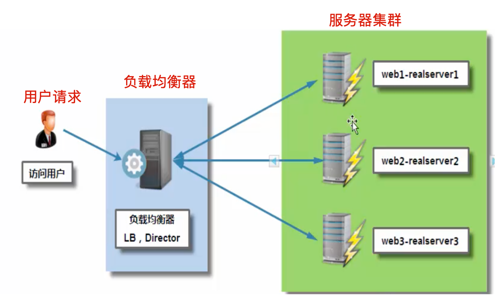

## 高可用性集群

高可用性集群指的是，集群中任意一个节点宕机的情况，该节点上所有的任务会自动转移到其他节点上，整个过程不会影响整个集群的运行。

当高可用集群中的一个节点系统发生故障时，运行着的集群服务器会迅速做出反应，把该系统的服务分配到集群中其他正在工作的机器上运行。

如果高可用性集群中主节点出现故障，那么宕机时间内将由备用节点代替它。

备用节点可以完全接管主节点（IP地址及其他资源），因此对于使用高可用性集群系统的用户是无感知的，不会影响用户访问。


高可用性集群的作用：

- 当一台机器宕机时，另一台机器接管宕机机器的IP资源和服务资源，继续提供服务。
- 用于例如负载均衡器的高可用，数据库的高可用

## 高性能计算集群

也成为并行计算，通常该集群系统用于解决复杂的科学问题，天气预报，石油勘探，核反应模拟等。

高性能计算机集群就如同一台超级计算机，该计算机系统由数十个至上万个独立的服务器组成。

## 常见集群硬、软件设备介绍

互联网企业常用的开源集群软件有：

- nginx
- lvs
- haproxy
- keepalived
- heartbeat

企业常用的商业集群硬件有：

- f5
- netscaler
- radware
- A10


淘宝、京东、新浪等公司用过Netscaler等负载均衡产品，以及F5产品。

## 产品选择

- 当企业业务重要、技术力量又有欠缺，希望能够出钱购买产品得到优质服务的情况，可以直接购买硬件负载均衡设备，例如银行、证券、金融、汽车等非互联网大型行业。
- 对于门户网站来说，大部分企业选择用软硬件结合的方式，来分担单一产品的风险。
- 对于中小型企业，考虑成本问题，更希望通过运维人员通过软件技术解决集群问题。

比较而言，软件、硬件区别

- 硬件负载均衡成本高、性能强、安全性高、更稳定，但是不易于二次开发、扩展
- 开源负载均衡软件对运维人员的技术能力较高、如果开发能力强，对于开源软件二次开发是不错的选择，目前互联网公司更倾向于使用开源负载均衡设备。

## 如何选择开源负载均衡产品

中小互联网公司的服务器在用户并发量和总访问量还不是很大的情况下，建议首选Nginx负载均衡，其理由是：

- Nginx负载均衡配置简单
- 使用方便
- 安全稳定
- 社区活跃
- 使用人多居多
- 在淘宝公司的大流量业务得到了验证

另一个负载均衡产品是Haproxy同样很优秀，但是社区不如Nginx活跃。

当考虑使用Nginx进行负载均衡的时候，对其要进行高可用性设计，首选建议是用Keepalived软件，同样是因为配置简单、使用方便、安全稳定，另一款软件是Heartbeat（使用复杂，不推荐）

如果是大型互联网企业，负载均衡产品还会用`LVS+Keepalived`在网站架构前端做4层转发，后端再用`Nginx/Haproxy`做7层转发，最后是应用服务器。

## Nginx负载均衡集群

负载均衡集群提供了一种廉价、有效、透明的方法扩展网络设备和服务器设备，集群能够提升计算机服务的负载能力、带宽、吞吐量，网络灵活性、高可用性等属性。

### 搭建负载均衡的背景

- 把单台计算机无法承受的大规模并发访问，大量的数据流量分摊给多台服务器设备进行处理，减少集中式的压力，减少用户的等待时间，提升用户体验。
- 单个重负担的运算压力分摊给多台机器节点并行处理，每个节点处理完毕后将结果汇总给用户，集群系统处理能力大幅度提升
- 高可用性负载均衡系统，保证了7*24小时的服务提供，同组集群内所有的计算机节点都提供相同的服务，单点故障也不会影响用户访问。

## Nginx负载均衡实践

严格的来说，Nginx仅仅是作为Proxy反向代理的作用，因为这个反向代理的效果正是负载均衡的作用，所以称之为Nginx负载均衡。

### 负载均衡、反向代理区别？

普通的负载均衡软件，例如LVS，其表现的功能只是对请求数据包的转发、传递，其主要的DR模式功能是：

- 从负载均衡下的节点服务器观察，接收到的请求信息依然是`访问负载均衡器`的真实客户端的信息

然而反向代理的概念就不一样了：

- 反向代理是在接收到用户的请求后，再`代理用户`重新向代理下的节点服务器发送请求，在节点服务器上观察，此时的客户端已经是代理服务器了，而非是真实的客户端用户。

再次一句话概括：

- LVS等负载均衡是仅仅转发用户的请求数据包
- Nginx反向代理是接收到用户请求后，重新向后端节点发出新请求。

## Nginx负载均衡部署

Nginx提供负载均衡的模块是：

```plain
ngx_http_proxy_module        proxy代理模块，用于把请求抛给后端的服务器节点，或是upstream服务器池
ngx_http_upstream_module    负载均衡模块，实现服务器的负载均衡节点配置，以及健康检查
```

Web服务器，直接面向用户，往往要承载大量并发请求，单台服务器难以负荷，我使用多台WEB服务器组成集群，前端使用Nginx负载均衡，将请求分散的打到我们的后端服务器集群中

实现负载的分发。那么会大大提升系统的吞吐率、请求性能、高容灾。

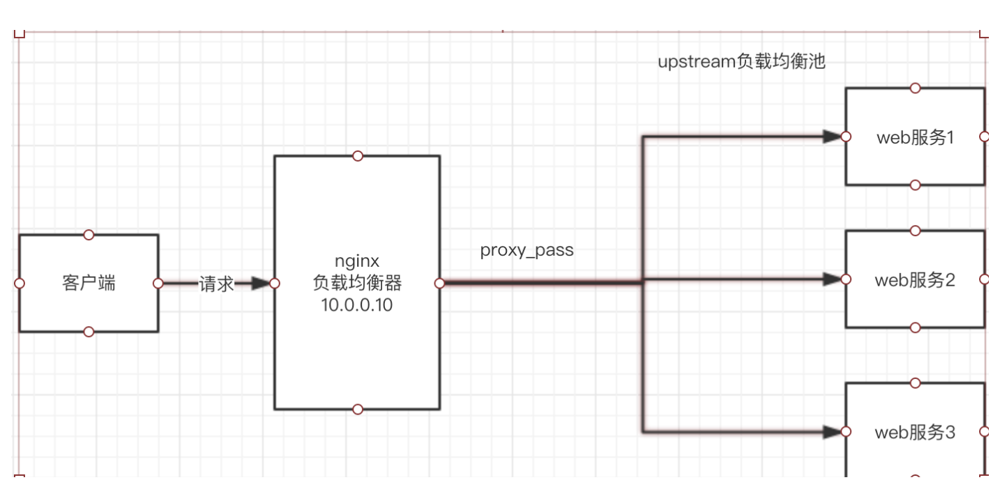

所有的请求统一发给Nginx负载均衡服务器，然后由负载均衡器通过调度算法再来请求Web01/02/03

### 服务器准备

准备四台VM虚拟机

- lb01，主负载均衡器，`192.168.178.130`
- lb02，备负载均衡器（防止主节点故障），`192.168.178.131`
- Web01，站点1，`192.168.178.121`
- Web02，站点2（防止站点1故障），`192.168.178.122`

### 软件准备

```plain
系统：CentOS Linux release 7.5.1804 (Core)
软件：nginx version: nginx/1.16.0
```

分别在四台机器上安装Nginx，因为Nginx提供如下功能

- 负载均衡
- web站点功能

```plain
1.安装依赖环境，重要
注意统一更换阿里云yum源!
yum install gcc patch libffi-devel python-devel  zlib-devel bzip2-devel openssl-devel ncurses-devel sqlite-devel readline-devel tk-devel gdbm-devel db4-devel libpcap-devel xz-devel openssl openssl-devel wget vim -y
2.编译安装nginx，编译安装能够统一管理目录，便于后期维护
mkdir -p /home/chaoge/tools
wget -P /home/chaoge/tools/ http://nginx.org/download/nginx-1.16.0.tar.gz
3.解压缩安装nginx
cd /home/chaoge/tools/
tar xf nginx-1.16.0.tar.gz
cd nginx-1.16.0
./configure --user=nginx --group=nginx --prefix=/opt/nginx-1.16.0 && make && make install
4.统一配置nginx环境变量
ln -s /opt/nginx-1.16.0/ /opt/nginx
检查软连接
ls -dl /opt/nginx
5.配置nginx环境变量
echo "PATH='/opt/nginx/sbin:/opt/mysql/bin:/usr/local/sbin:/usr/local/bin:/usr/sbin:/usr/bin'" >> /etc/profile
source /etc/profile
6.检查nginx环境变量
which nginx
```


### 配置测试nginx的服务(web01,web02)

在Nginx的两台Web服务器上，进行操作（web01,web02），两台机器操作完全一致

注意可能要备份之前的配置文件

```plain
[root@web01 opt]# cp /opt/nginx/conf/nginx.conf{,.bak}
```

示例配置文件，修改为如下

```plain
[root@web01 opt]# cat /opt/nginx/conf/nginx.conf
#user  nobody;
worker_processes  1;
#error_log  logs/error.log;
#error_log  logs/error.log  notice;
#error_log  logs/error.log  info;
#pid        logs/nginx.pid;
events {
    worker_connections  1024;
}
http {
    include       mime.types;
    default_type  application/octet-stream;
    sendfile        on;
    keepalive_timeout  65;
    gzip  on;
server {
listen 80;
server_name bbs.chaoge.com;
location / {
    root html/bbs;
    index index.html;
}
access_log logs/access_bbs.log main;
}
server {
listen 80;
server_name www.chaoge.com;
location / {
    root html/www;
    index index.html index.htm;
}
access_log logs/access_www.log main;
}
}
```

创建测试站点的资源数据

```plain
1.创建数据文件夹
mkdir -p /opt/nginx/html/{www,bbs}
2.创建nginx静态网页文件
[root@web01 opt]# echo "chaoge_www_121" > /opt/nginx/html/www/index.html
[root@web01 opt]# echo "chaoge_bbs_121" > /opt/nginx/html/bbs/index.html
```

启动nginx，检测语法

```plain
[root@web01 opt]# nginx -t
nginx: the configuration file /opt/nginx-1.16.0//conf/nginx.conf syntax is ok
nginx: configuration file /opt/nginx-1.16.0//conf/nginx.conf test is successful
[root@web01 opt]#
[root@web01 opt]# nginx
[root@web01 opt]# netstat -tunlp|grep 80
tcp        0      0 0.0.0.0:80              0.0.0.0:*               LISTEN      7981/nginx: master
```

配置本地dns解析

```plain
[root@web01 opt]# echo "192.168.178.121 www.chaoge.com bbs.chaoge.com" >> /etc/hosts
```

使用curl命令检测nginx站点

```plain
[root@web01 opt]# curl www.chaoge.com
chaoge_www_121
[root@web01 opt]# curl bbs.chaoge.com
chaoge_bbs_121
```

### 同样的步骤，在web02上再执行一遍即可，注意区分两台机器的IP

```plain
区别就在这里
[root@web01 opt]# echo "chaoge_www_122" > /opt/nginx/html/www/index.html
[root@web01 opt]# echo "chaoge_bbs_122" > /opt/nginx/html/bbs/index.html
[root@web02 nginx-1.16.0]# echo "192.168.178.122 www.chaoge.com bbs.chaoge.com" >> /etc/hosts
```

### 小提示

- 在负载均衡的搭建上，两台web服务器的资料应该是一样的，这里是超哥是为了方便大家直观的感受区别
- 通过如上的配置，就配置好了两台web服务器的多域名虚拟主机

## 实现一个简单的负载均衡

配置两台负载均衡的机器，也是一样的操作（lb01,lb02）

### 配置lb01

该负载均衡功能是由Nginx提供，修改nginx.conf如下

```plain
1.添加一个负载均衡池参数
# 定义web服务器地址池，也就是121,122两个节点
upstream www_pools {
server 192.168.178.121 weight=1;
server 192.168.178.122 weight=1;
}
2.修改server{}虚拟主机参数
server {
        listen       80;
        server_name  www.chaoge.com;
        #charset koi8-r;
        #access_log  logs/host.access.log  main;
        location / {
                proxy_pass http://www_pools;
        }
        ...
}
```

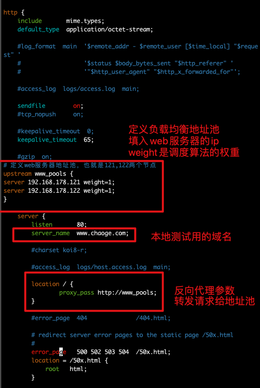

### 启动lb01负载均衡器

```plain
[root@lb01 nginx-1.16.0]# nginx -t
nginx: the configuration file /opt/nginx-1.16.0/conf/nginx.conf syntax is ok
nginx: configuration file /opt/nginx-1.16.0/conf/nginx.conf test is successful
# 如果出现如下错误，表明当nginx还未启动，找不到pid文件
[root@lb01 nginx-1.16.0]# nginx -s reload
nginx: [error] invalid PID number "" in "/opt/nginx-1.16.0/logs/nginx.pid"
# 直接启动nginx即可
[root@lb01 nginx-1.16.0]# nginx
[root@lb01 nginx-1.16.0]#
# 检查负载均衡器
[root@lb01 nginx-1.16.0]# netstat -tunlp|grep 80
tcp        0      0 0.0.0.0:80              0.0.0.0:*               LISTEN      7500/nginx: master
```

### 配置hosts文件

```plain
1.添加一个本地测试域名
echo "192.168.178.130 www.chaoge.com bbs.chaoge.com" >> /etc/hosts
```

### 访问负载均衡器，查看效果

请求走到了负载均衡器，也就是nginx、进行代理转发请求

```plain
[root@lb01 nginx-1.16.0]# curl www.chaoge.com
chaoge_bbs_122
[root@lb01 nginx-1.16.0]# curl www.chaoge.com
chaoge_bbs_121
[root@lb01 nginx-1.16.0]# curl www.chaoge.com
chaoge_bbs_122
[root@lb01 nginx-1.16.0]# curl bbs.chaoge.com
chaoge_bbs_121
[root@lb01 nginx-1.16.0]# curl bbs.chaoge.com
chaoge_bbs_122
[root@lb01 nginx-1.16.0]# curl bbs.chaoge.com
chaoge_bbs_121
```

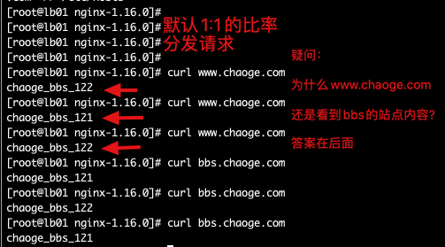


# upstream模块详解


## upstream模块介绍

Nginx的负载均衡功能来自于其模块`ngx_http_upstream_module`模块，该模块支持的代理方式有：

- uwsgi_pass
- Fastcgi_pass
- proxy_pass
- Memcached_pass
- ...

`ngx_http_upstream_module`模块允许Nginx定义一组或多组节点服务器，使用时可以通过`proxy_pass`代理方式，把用户请求发送到事先定于好的`upstream组`中。具体写法就是

```plain
upstream www_pools {
server x.x.x.x;
server x.x.x.x;
}
proxy_pass http://www_pools;
```

### 完整的upstream配置案例

```plain
upstream www_pools {
server 192.168.178.121;
server 192.168.178.122:80 weight=1 max_fails=1 fail_timeout=10s;
server 192.168.178.123:80 weight=10 max_fails=2 fail_timeout=20s backup;
server 192.168.178.124:80 wetight=10 max_fails=2 fail_timeout=20s backup;
}
```

### 使用域名及socket的upstream配置

```plain
upstream backend {
server backend1.example.com weight=5;
server backend2.example.com:8080;
server unix:/tmp/backend3;
server backend3.example.com:8080 backup;
}
```

### upstream模块参数

```plain
# 参数解释
server是固定关键字，后面跟着服务器ip或是域名，默认是80端口，也可以指定端口
weight表示节点的权重，数字越大，分配的请求越多，注意nginx结尾的分号
max_fails Nginx尝试连接后端节点失败的次数，根据企业情况调整，默认是1
backup 其它所有的非backup机器down或者忙的时候，请求backup机器，实现热备效果。
fail_timeout 在max_fails定义的次数失败后，距离下次检查的间隔时间，默认10s
down 表示当前主机暂停，不参与负载均衡
upstream模块的内容应放于nginx.conf配置中的 http{}标签内
其默认调度算法是wrr(权重轮询，weighted round-robin)
```

## upstream模块调度算法

调度算法一般分几类：

- 第一类是静态调度算法：负载均衡器根据自身设定的规则进行分配，不需要考虑后端节点的健康情况。例如轮询、加权轮询、哈希类型调度算法。
- 第二类是动态调度算法，负载均衡器会判断后端节点的当前状态，来决定是否分发请求。例如链接数最少的优先分发，响应时间短的优先分发，如least_conn、fail等都是动态调度。

### rr轮询（round-robin）

按照请求顺序逐一分配给不同的后端节点服务器，如果后端节点宕机，宕机的服务器会被自动从地址池中剔除，新的请求会发给正常的服务器。

### wrr（权重轮询）

给后端节点服务器增加权重，数值越大，优先获得客户端请求，可以以服务器配置来决定比例大小，从而解决新旧服务器的性能不均衡问题等。

```plain
upstream backend {
server 192.168.178.122 weight=1;
server 192.168.178.121 weight=2;
}
```

### ip_hash

每个请求按客户端IP的hash结果分配，当新的请求到达，将其客户端IP通过哈希算法得到一个唯一值，在随后的客户端请求中，如果客户端的IP哈希值相等，该请求就会固定发给一台服务器。

该调度算法可以解决动态网页中的session共享问题。

注意了使用ip_hash不得再使用weight、backup两个参数，造成冲突了，即使写了也不生效。

```plain
upstream chaoge_backend {
ip_hash;
server 192.168.178.121;
server 192.168.178.122;
}
```

### fail

该算法根据后端服务器节点的响应时间来分配，响应时间短的优先分配，该算法根据页面大小和加载时间长短进行负载均衡，nginx本身不支持fail形式，如果要支持该算法，必须下载nginx的`upstream_fail`模块

```plain
upstream chaoge_backend {
fair;
server 192.168.178.121;
server 192.168.178.122;
}
```

### least_conn

该算法根据后端节点的链接数决定分配请求，哪个机器链接数少，就发给谁。

### url_hash

和ip_hash类似，该算法根据客户端请求的URL信息进行hash得到唯一值，让每个URL固定的发给同一个后端服务器，后端服务器为`缓存服务器`效果最佳。

Nginx本身是不支持url_hash的，需要单独安装hash模块

url_hash(web缓存节点)和ip_hash(会话保持)功能类似。

```plain
upstream chaoge_backend {
server squid1:3128;
server squid:3128;
hash $request_uri;
hash_method crc32;
}
```

## proxy_pass指令

proxy_pass指令属于`ngx_http_proxy_module`模块，此模块可以把请求转发到另一台服务器，在实际的反向代理工作中，会通过location功能指定的URL，然后把接收到的符合URL的请求通过proxy_pass参数抛给定义好的`upstream`地址池。

### proxy_pass案例

案例1

```plain
在nginx.conf配置文件中定义
location /name/ {
proxy_pass http://127.0.0.1/remote/;
}
例如当请求URL是： http://192.168.178.121/name  ，会进入该locaiton的作用域，通过参数proxy_pass请求转发给了http://127.0.0.1/remote/
```

案例2

```plain
location ~ .*\.php$ {
        proxy_pass http://www.example.cn$request_uri;
        proxy_set_header Host $proxy_host;
        proxy_set_header X-Forwarded-For $remote_addr;
    }
所有请求以.php结尾的URL，进行转发
```

### proxy_pass参数

| 参数                    | 作用解释                                                     |
| ----------------------- | ------------------------------------------------------------ |
| proxy_set_header        | 设置反向代理向后端发送的http请求头信息，如添加host主机头部字段，让后端服务器能够获取到真实客户端的IP信息等 |
| client_body_buffer_size | 指定客户端请求主体缓冲区大小                                 |
| proxy_connect_timeout   | 反向代理和后端节点连接的超时时间，也是建立握手后等待响应的时间 |
| proxy_send_timeout      | 表示代理后端服务器的数据回传时间，在规定时间内后端若数据未传完，nginx会断开连接 |
| proxy_read_timeout      | 设置Nginx从代理服务器获取数据的超时时间                      |
| proxy_buffer            | 设置缓冲区的数量大小                                         |


# Nginx负载均衡实战

## 定义一组www服务器池

```plain
upstream www_pools {
server 192.168.178.121 weight=1;
server 192.168.178.122 weight=1;
}
```

## 配置虚拟主机实现代理

注意这里是部分代码，修改了第一个server虚拟主机

```plain
server {
        listen       80;
        server_name  www.chaoge.com;
        #charset koi8-r;
        #access_log  logs/host.access.log  main;
        location / {
        # 通过代理参数吧用户的请求转发给地址池中的服务器处理
                proxy_pass http://www_pools;
        }    
}
```

## 实测负载均衡效果

```plain
[root@lb01 nginx-1.16.0]# curl www.chaoge.com
chaoge_bbs_121
[root@lb01 nginx-1.16.0]# curl www.chaoge.com
chaoge_bbs_122
[root@lb01 nginx-1.16.0]# curl www.chaoge.com
chaoge_bbs_121
[root@lb01 nginx-1.16.0]# curl www.chaoge.com
chaoge_bbs_122
```

从测试结果中，可以看出，请求逐一的分给两个节点服务器了，实现了请求分发功能。

但是问题是，为何看到的网页内容，一直都是bbs的内容，而非出现www呢？

【图解答案】


## 如何解决上述问题

其根本原因是，用户访问域名时候确实是www.chaoge.com，请求首先是发给了Nginx反向代理服务器

问题是：

- 代理服务器(lb01)重新发起请求时，默认并没有在请求头里告诉节点服务器要找哪一个虚拟主机【www.chaoge.com】还是【bbs.chaoge.com】
- 因此后端节点服务器接收到请求之后，并没有主机头信息，默认把请求发给了第一个虚拟主机去处理（以web01的nginx.conf中的配置，也就是bbs站点内容了）

解决办法：

- 在反向代理时候，添加主机头信息，明确告诉节点服务器找哪个虚拟主机

```plain
proxy_set_header Host $host;
```

在代理服务器向节点服务器发送HTTP请求头中添加host主机头信息后，若是后端服务器配置了多个虚拟主机，也就可以根据主机头的信息，来进行匹配决定发给哪一个虚拟主机【bbs还是www】。

nginx.conf修改如下，修改location的配置

```plain
server {
        listen       80;
        server_name  www.chaoge.com;
        #charset koi8-r;
        #access_log  logs/host.access.log  main;
        location / {
                proxy_pass http://www_pools;
         # 添加该参数，在向后端发请求的时候，就会保留客户端的主机头信息，发给节点服务器
                proxy_set_header Host $host;
        }
}
```

最终效果，结果和域名就完全对应上了

```plain
[root@lb01 nginx-1.16.0]# curl www.chaoge.com
chaoge_www_121
[root@lb01 nginx-1.16.0]# curl www.chaoge.com
chaoge_www_122
[root@lb01 nginx-1.16.0]# curl www.chaoge.com
chaoge_www_121
[root@lb01 nginx-1.16.0]# curl www.chaoge.com
chaoge_www_122
[root@lb01 nginx-1.16.0]# curl bbs.chaoge.com
chaoge_bbs_121
[root@lb01 nginx-1.16.0]# curl bbs.chaoge.com
chaoge_bbs_122
[root@lb01 nginx-1.16.0]# curl bbs.chaoge.com
chaoge_bbs_121
```

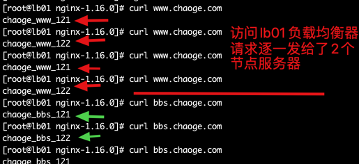

## 反向代理&记录用户IP地址企业案例

对于互联网的资源，有时候程序员喜欢用爬虫程序去捉取

- 通过python网络爬虫脚本，大量获取文章、图片、视频等资源

那么对于网站管理员就不乐意了，爬虫程序频繁的网站网站获取资料，也就给管理员的服务器带来了额外的压力，那么运维人员一般会通过`Nginx的access.log`追踪用户的ip地址，发现异常、频繁的ip地址记录，就可以将其封禁，或者限制他的访问速率。

爬虫程序这时候如果发现自己的ip地址被限制了，他也会想些办法，逃避这个封禁，再次获取资料，那么他就会利用`代理IP`的方式再去爬取网站资料。


这时候对于系统管理员也不乐意了，如果我只是封禁了代理的IP，我如何抓到`背后的那个坏人呢！（真实的客户端IP）`

### 反向代理后的节点

在反向代理或者代理IP这样的形式，访问服务器后，服务器捉到的都是反向代理机器的IP地址。

```plain
以我们之前的机器配置
web01 192.168.178.121
web02 192.168.178.122
lb01  192.168.178.130
lb01就是一台反向代理服务器（负载均衡的功能）
```

【演示反向代理功能】


上述图片解读：

- 使用客户端机器web02，访问负载均衡器lb01（反向代理），看到了机器web01和web02的资料
- 在web服务器上检测客户端信息，发现客户端是192.168.178.130（这不是lb01吗）
- 我们明明用的是web02发出的请求

这就是反向代理的含义所在，用户请求发给了反向代理，反向代理再次发出了一个请求。

【如何解决这样的问题，捉到客户端的IP而非代理服务器呢？】

### X-Forwarded-For

在反向代理请求后端节点服务器的`请求头`中添加获取客户端IP的字段信息，然后在后端节点可以通过程序或者相关配置接收`X-Forwarded-For`传过来的真实用户的IP信息。

【lb01反向代理节点配置如下】

部分nginx.conf代码如下，注意重点修改的部分

```plain
http {
    include       mime.types;
    default_type  application/octet-stream;
# 定义web服务器地址池，也就是121,122两个节点
upstream www_pools {
server 192.168.178.121 weight=1;
server 192.168.178.122 weight=1;
}
    server {
        listen       80;
        server_name  www.chaoge.com;
        #charset koi8-r;
        #access_log  logs/host.access.log  main;
        location / {
                proxy_pass http://www_pools;
                proxy_set_header Host $host;
                # 添加此处代码即可，代理服务器向后端发送HTTP请求时，请求头中添加该参数信息，用于后端服务器程序、日志等接受真实用户的IP，而非是代理服务器的IP
                proxy_set_header X-Forwarded-For $remote_addr;
        }
}
}
```

重新加载lb01的nginx

```plain
[root@lb01 nginx-1.16.0]# nginx -s reload
```

特别注意，不仅要在代理服务器配置，添加获取真实IP的字段，还要再节点服务器中添加配置，接受用户真实的IP，配置日志格式等操作。

【修改节点服务器的nginx.conf】

部分代码修改如下，关注重点修改的部分

```plain
[root@web01 opt]# grep -Ev "^#|^$" /opt/nginx/conf/nginx.conf
worker_processes  1;
events {
    worker_connections  1024;
}
http {
    include       mime.types;
    default_type  application/octet-stream;
    sendfile        on;
    keepalive_timeout  65;
    gzip  on;
 # 重点修改这里的代码即可，添加结尾的参数$http_x_forwarded_for，即可在日志中获取客户端的真实IP
 # 注意access日志文件具体的路径，由下面虚拟主机的参数定义
log_format  main  '$remote_addr - $remote_user [$time_local] "$request" '
                 '$status $body_bytes_sent "$http_referer" '
                  '"$http_user_agent" "$http_x_forwarded_for"';
server {
listen 80;
server_name bbs.chaoge.com;
location / {
    root html/bbs;
    index index.html;
}
# 注意这里的日志配置！！！一定要写和我一样的！！
access_log logs/access_bbs.log main;
}
server {
listen 80;
server_name www.chaoge.com;
location / {
    root html/www;
    index index.html index.htm;
}
# 注意这里的日志配置！！！一定要写和我一样的！！
access_log logs/access_www.log main;
}
}
```

重启节点服务器的nginx

```plain
[root@web01 opt]# nginx -s reload
```

### 测试效果一

配置步骤

```plain
1.在自己的电脑本地hosts文件中添加解析记录，超哥这里是mac的命令行终端
# windows的兄弟们，自行搜索hosts文件路径
yumac:~ root# tail -1 /etc/hosts
192.168.178.130 www.chaoge.com bbs.chaoge.com
2.在自己的本地电脑浏览器访问站点
```


```plain
3.检查121节点的日志信息
[root@web01 logs]# tail -f /opt/nginx/logs/access_www.log
192.168.178.130 - - [22/Mar/2020:11:29:08 -0400] "GET /favicon.ico HTTP/1.0" 404 555 "http://www.chaoge.com/" "Mozilla/5.0 (Macintosh; Intel Mac OS X 10_15_3) AppleWebKit/537.36 (KHTML, like Gecko) Chrome/80.0.3987.149 Safari/537.36" "192.168.178.1"
4.日志解析
192.168.178.130 显示的是远程访客的地址，也就是lb01负载均衡发来的请求
"192.168.178.1" 是通过X-Forwarded-For参数获取到的真实客户端的ip，也就是你笔记本的ip地址
```

### 测试效果二

直接用curl命令测试访问

```plain
1.使用一台节点服务器去访问 负载均衡器
[root@web02 nginx-1.16.0]# curl www.chaoge.com
chaoge_www_122
[root@web02 nginx-1.16.0]# curl www.chaoge.com
chaoge_www_121
[root@web02 nginx-1.16.0]# curl www.chaoge.com
chaoge_www_122
2.在一台节点服务器上查看访客日志
[root@web01 logs]# tail -f /opt/nginx/logs/access_www.log
192.168.178.130 - - [22/Mar/2020:11:34:49 -0400] "GET / HTTP/1.0" 200 15 "-" "curl/7.29.0" "192.168.178.122"
最终通过日志，发现检测到了真实发请求的，其实是web02机器，ip为192.168.178.122
```

### 总结

- nginx的accesslog日志，其日志格式里`$remote_addr`变量，表示远程客户端的IP地址（可能是代理IP地址）
- 其`$http_x_forwarded_for`变量，是接收了在反向代理中配置的`proxy_set_header X-Forwarded-For $remote_addr`，获取了用户真实的IP（躲在代理IP后）

当然这里的`X-Forwarded-For`并不是万能的，所谓道高一尺魔高一丈，对于代理的形式还有很多种。

| 代理参数                                                | 解释                                                         |
| ------------------------------------------------------- | ------------------------------------------------------------ |
| proxy_pass [http://server_pools](http://server_pools/); | 把用户的请求转发到反向代理定义的upstream地址池               |
| proxy_set_header Host $host;                            | 在代理服务器向后端节点机器发送HTTP请求时，加入host字段信息，可以用于当后端节点存在多个虚拟主机，且通过域名区分，可以通过该host参数，识别代理的主机是哪一个 |
| Proxy_set_header X-Forwarded-For $remote_addr;          | 代理服务器向后端节点发出请求时，添加该字段信息，能提供给后端节点机器，获取到真实客户端的IP地址 |

## 反向代理参数优化

对于nginx众多的虚拟主机配置，如果写入一个文件里，难以维护，阅读，可以把参数配置，写入到单独的配置文件中，再通过nginx的`include`方式获取。

【不合适的写法】

部分nginx.conf配置如下

```plain
# 定义web服务器地址池，也就是121,122两个节点
upstream www_pools {
server 192.168.178.121 weight=1;
server 192.168.178.122 weight=2;
}
    server {
        listen       80;
        server_name  www.chaoge.com;
        default_type application/octet-stream;
        #charset koi8-r;
        #access_log  logs/host.access.log  main;
        location / {
                proxy_pass http://www_pools;
                # 代理参数都写这里，不易维护，观察
                proxy_set_header Host $host;
                                proxy_set_header X-Forwarded-For $remote_addr;
        }
}
```

【合适的写法】

```
/opt/nginx/conf/nginx.conf
# 定义web服务器地址池，也就是121,122两个节点
upstream www_pools {
server 192.168.178.121 weight=1;
server 192.168.178.122 weight=2;
}
    server {
        listen       80;
        server_name  www.chaoge.com;
        default_type application/octet-stream;
        #charset koi8-r;
        #access_log  logs/host.access.log  main;
        location / {
                proxy_pass http://www_pools;
                # 包含语法，读取该文件中的配置，加载到当前文件中
                include proxy.conf;
        }
}
```

生成规范的代理配置文件，注意和nginx.conf写在同一级目录

```plain
[root@lb01 conf]# cat proxy.conf
proxy_set_header Host $host;
proxy_set_header X-Forwarded-For $remote_addr;
proxy_connect_timeout 60;
proxy_send_timeout 60;
proxy_read_timeout 60;
proxy_buffer_size 4k;
proxy_buffers 4 32k;
proxy_busy_buffers_size 64k;
proxy_temp_file_write_size 64k;
```

详细的参数，解释，在官方文档可以查阅

```plain
http://nginx.org/en/docs/http/ngx_http_proxy_module.html
```

## 反向代理企业案例

### 企业级动静分离案例

该场景是，通过nginx实现动静分离，配置反向代理规则，实现动态请求和静态请求分别转发给不同的服务器解析，以解决网站性能、安全、用户体验等问题。

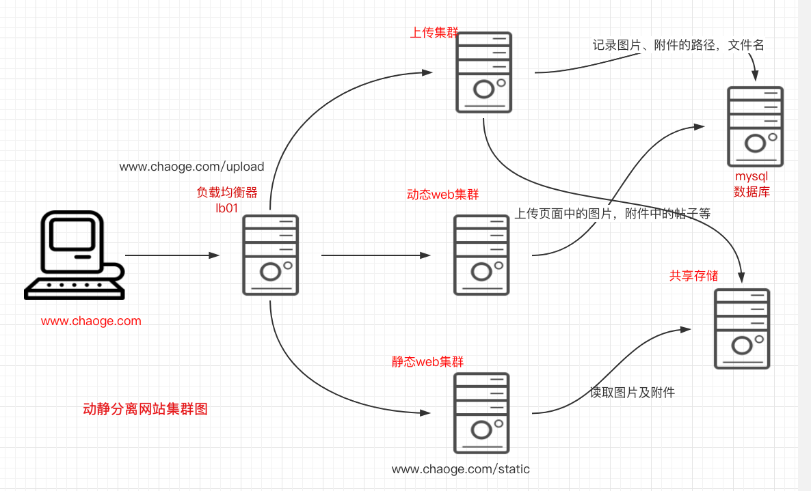

该架构图是企业常见的动静分离集群架构图，例如该网站域名是www.chaoge.com

- 当用户请求www.chaoge.com/upload/xx，该形式的URL，代理服务器会将其转发到上游服务器`upload_pools`
- 当用户访问www.chaoge.com/static/xx，该形式的URL，代理服务器会将其转发到静态服务器地址池`static_pools`
- 当用户访问www.chaoge.com/xx，该形式的URL，也就是不包含指定的路径URL，代理服务器将其默认都转发给动态服务器池处理数据

### 案例配置准备

了解了需求，配置地址池即可，这里需要用到三台虚拟机，兄弟们可以自由定义

- web01
- web02
- web03

使用克隆的形式，创建虚拟机亦可

【配置静态服务器池】

```plain
upstream static_pools {
server 192.168.178.121 weight=1;
}
```

【配置上传服务器池】

```plain
upstream upload_pools {
    server 192.168.178.122 weight=1;
}
```

【默认地址池，动态地址池，】

```plain
upstream default_pools {
    server 192.168.178.131 weight=1;
}
```

### 实际配置思路

【方案1】

使用nginx的location功能，匹配不同的URL（路径），请求分发给不同的服务器池

```plain
location /static/ {
    proxy_pass http://static_pools;
    include proxy.conf;
}
location /upload/ {
proxy_pass http://upload_pools;
include proxy.conf;
}
location / {
proxy_pass http://default_pools;
include proxy.conf;
}
```

【方案2】

使用shell语句进行判断

```plain
if ($request_url ~* "^/static/(.*)$")
{
    proxy_pass http://static_pools/$1;
}
if ($request_url ~* "^/upload/(.*)$")
{
    proxy_pass http://uoload_pools/$1;
}
location / {
    proxy_pass http://default_pools;
    include proxy.conf;
}
```

### nginx实战配置

```plain
1.编辑nginx.conf，修改添加如下代码
# 定义三个地址池
upstream static_pools {
        server 192.168.178.121 weight=1;
}
upstream uoload_pools {
        server 192.168.178.122 weight=1;
}
upstream default_pools {
        server 192.168.178.131 weight=1;
}
# 定义虚拟主机
    server {
        listen       80;
        server_name  www.chaoge.com;
        default_type application/octet-stream;
# 通过locaiton进行URL路径匹配
        location / {
                proxy_pass http://default_pools;
                include proxy.conf;
        }
        location /static/ {
                proxy_pass http://static_pools;
                include proxy.conf;
}
        location /upload/ {
                proxy_pass http://upload_pools;
                include proxy.conf;
}
}
```

检查配置，重启配置

```plain
[root@lb01 conf]# nginx -t
nginx: the configuration file /opt/nginx-1.16.0/conf/nginx.conf syntax is ok
nginx: configuration file /opt/nginx-1.16.0/conf/nginx.conf test is successful
[root@lb01 conf]# nginx -s reload
```

### 分别配置三个地址池

#### 【修改静态服务器配置】

### **---这里很重要---**

```plain
创建一个static文件夹，因为请求转发给了此台机器，URL如下
www.chaoge.com/static/index.html  
# 必须在网页站点目录下，存在该static文件夹
[root@web01 logs]# mkdir -p /opt/nginx/html/www/static/
[root@web01 logs]# echo "我是超哥配置的静态服务器static" > /opt/nginx/html/www/static/index.html
修改nginx.conf支持中文
server {
listen 80;
server_name www.chaoge.com;
charset utf-8;
location / {
        root html/www;
        index index.html index.htm;
}
access_log logs/access_www.log main;
}
# 重启nginx
nginx -s reload
```

#### 【修改uploads服务器配置】

这里其实访问的是`www.chaoge.com/upload`

因此必须得有upload目录

```plain
[root@web02 nginx-1.16.0]# mkdir -p /opt/nginx/html/www/upload/
[root@web02 nginx-1.16.0]# echo "我是超哥配置的uploads服务器" > /opt/nginx/html/www/upload/index.html
# 让nginx支持中文
server {
listen 80;
server_name www.chaoge.com;
charset utf-8;
location / {
    root html/www;
    index index.html index.htm;
}
access_log logs/access_www.log main;
}
# 重启nginx
nginx -s reload
```

#### 【配置默认的动态服务器】

```plain
1.确保nginx.conf配置文件正确
 server {
        listen       80;
        server_name  www.chaoge.com;
              # 让nginx支持中文
        charset utf-8;
        #access_log  logs/host.access.log  main;
        location / {
            root   html/www;
            index  index.html index.htm;
        }
}
2.生成首页文件
[root@web03 nginx-1.16.0]# mkdir -p /opt/nginx/html/www/static
[root@web03 nginx-1.16.0]# cat /opt/nginx/html/www/staticindex.html
<meta charset=utf8>
我是超哥配置默认动态服务器
3.启动nginx，或者重启 nginx -s reload
nginx
```

### 明确配置

| 主机  | IP，端口        | 测试地址                                | 显示内容 |
| ----- | --------------- | --------------------------------------- | -------- |
| web01 | 192.168.178.121 | http://www.chaoge.com/static/index.html |          |
| web02 | 192.168.178.122 | http://www.chaoge.com/upload/index.html |          |
| web03 | 192.168.178.131 | http://www.chaoge.com/index.html        |          |

### 测试访问结果

这里请使用一个单独的客户端机器，配置好本地dns，进行测试访问

```plain
yumac: ~ yuchao$tail -1 /etc/hosts
192.168.178.130 www.chaoge.com bbs.chaoge.com
```

使用浏览器访问，结果如下

【默认动态请求】


【静态请求】


【上传请求】


看到如上结果，已经达到我们预期的结果了，如果有不一样，细心检查配置步骤和超哥的是否一样，哪里有了差错

## URL转发应用场景

根据HTTP的URL转发的场景，被称之为七层转发（应用层转发），然而LVS的负载均衡一般用于TCP的转发，也就被称之为4层转发。

利用Nginx的七层转发，可以实现动静分离，移动、PC端页面区分，交给不同的后端服务器处理，让用户得到更佳的访问体验。

## 客户端设备匹配转发实战

对于大多数网站，都是由区分移动端页面，PC端页面，对于用户不同的客户端设备，返回不同的页网站页面。


因此，为了让用户有更好的访问体验，就需要在服务器后端设立不同的服务器来满足不同的客户端访问。

例如，移动端客户访问网站，请求就转发给处理移动端页面的服务器，移动端还分为苹果、安卓、手机、ipad等不同的设备。

那么如何实现该方案呢

### 基于4层负载均衡的转发

四层转发就是`IP+PORT`的形式转发

在常规的4层负载均衡架构下，可以使用不同的域名来实现该需求，例如

- 人为分配，让移动端用户访问`m.chaoge.com`
- PC端用户访问`www.chaoge.com`
- 通过不同的域名来引导用户访问指定的后端服务器


但是这样的形式，用户需要记住不同的域名，用户肯定是不乐意的，体验较差

### 基于7层的负载均衡

在7层负载均衡下就不需要人为拆分域名了，移动端、PC端只需要一个`www.chaoge.com`域名即可。

方法就是通过获取用户请求中的客户端信息（来自于哪个浏览器，手机、ipad等等客户端），是通过`$http_user_agent`获取，根据该变量获取到的用户客户端信息，再决定交给哪一个后端服务器去处理。

这是企业常用的解决方案。


### 根据客户端转发实战

我们可以模拟出当不同的浏览器，访问站点的时候，系统检测到的用户客户端信息

以下均是通过accesslog捉到的信息

#### curl命令客户端

```plain
[root@web02 nginx-1.16.0]# curl www.chaoge.com/static/index.html
我是超哥配置的静态服务器static
# 日志记录如下
192.168.178.130 - - [23/Mar/2020:01:59:34 -0400] "GET /static/index.html HTTP/1.0" 200 43 "-" "curl/7.29.0" "192.168.178.122"
```

#### safari客户端

```plain
192.168.178.130 - - [23/Mar/2020:02:00:36 -0400] "GET /static/ HTTP/1.0" 200 43 "-" "Mozilla/5.0 (Macintosh; Intel Mac OS X 10_15_3) AppleWebKit/605.1.15 (KHTML, like Gecko) Version/13.0.5 Safari/605.1.15" "192.168.178.1"
```

#### chrome客户端

```plain
192.168.178.130 - - [23/Mar/2020:02:01:43 -0400] "GET /static/index.html HTTP/1.0" 200 43 "-" "Mozilla/5.0 (Macintosh; Intel Mac OS X 10_15_3) AppleWebKit/537.36 (KHTML, like Gecko) Chrome/80.0.3987.149 Safari/537.36" "192.168.178.1"
```

#### Nginx根据客户端信息转发配置

### 补充：location修饰符解释

```plain
= 表示精确匹配。只有请求的url路径与后面的字符串完全相等时，才会命中。
~ 表示该规则是使用正则定义的，区分大小写。
~* 表示该规则是使用正则定义的，不区分大小写。
^~ 表示如果该符号后面的字符是最佳匹配，采用该规则，不再进行后续的查找。
利用shell语句进行逻辑判断
location / {
# 这里进行浏览器判断
if ($http_user_agent ~* "MSIE")
{
    proxy_pass http://static_pools;
}
if ($http_user_agent ~* "Chrome")
{
    proxy_pass http://upload_pools;
}
if ($http_user_agent ~* "Safari")
{
    proxy_pass http://static_pools;
}
proxy_pass http://default_pools;
include proxy.conf;
}
```

### Nginx实际配置

修改nginx.conf如下，无须完整贴代码，看好修改了哪些配置即可

```plain
[root@lb01 conf]# grep -Ev "^#|^$" /opt/nginx/conf/nginx.conf
worker_processes  1;
events {
    worker_connections  1024;
}
http {
    include       mime.types;
    default_type  application/octet-stream;
    log_format  main  '$remote_addr - $remote_user [$time_local] "$request" '
                      '$status $body_bytes_sent "$http_referer" '
                      '"$http_user_agent" "$http_x_forwarded_for"';    
    sendfile        on;
    keepalive_timeout  65;
upstream www_pools {
server 192.168.178.121 weight=1;
server 192.168.178.122 weight=2;
}
upstream static_pools {
    server 192.168.178.121 weight=1;
}
upstream upload_pools {
    server 192.168.178.122 weight=1;
}
upstream default_pools {
    server 192.168.178.131 weight=1;
}
    server {
        listen       80;
        server_name  www.chaoge.com;
    default_type application/octet-stream;
# 修改如下代码
# 我们这里直接返回状态码，更直观看见区别，也可以编写proxy_pass
location / {
if ($http_user_agent ~* "MSIE")
{
        proxy_pass http://static_pools;
}
if ($http_user_agent ~* "Chrome")
{
        #proxy_pass http://upload_pools;
        return 401;
}
if ($http_user_agent ~* "Safari")
{
        #proxy_pass http://static_pools;
        return 402;
}
proxy_pass http://default_pools;
include proxy.conf;
}
}
}
```

检测nginx语法，重启nginx

```plain
[root@lb01 conf]# nginx -t
nginx: the configuration file /opt/nginx-1.16.0/conf/nginx.conf syntax is ok
nginx: configuration file /opt/nginx-1.16.0/conf/nginx.conf test is successful
[root@lb01 conf]# nginx -s reload
```

#### 查看实际转发效果

上述代码含义

- 当谷歌浏览器访问，返回401状态码
- 当safari浏览器访问，返回402

### 检测移动端客户端

```plain
1.修改nginx.conf支持移动端检测，修改部分代码如下
location / {
if ($http_user_agent ~* "android")
{
return "501";
}
if ($http_user_agent ~* "iphone")
{
return "502";
}
proxy_pass http://default_pools;
include proxy.conf;
}
# 重启
nginx -s reload
```

直接通过curl命令，模拟客户端发起HTTP请求

```plain
[root@lb01 conf]# curl -A "android" www.chaoge.com
<html>
<head><title>501 Not Implemented</title></head>
<body>
<center><h1>501 Not Implemented</h1></center>
<hr><center>nginx/1.16.0</center>
</body>
</html>
[root@lb01 conf]#
[root@lb01 conf]#
[root@lb01 conf]# curl -A "iphone" www.chaoge.com
<html>
<head><title>502 Bad Gateway</title></head>
<body>
<center><h1>502 Bad Gateway</h1></center>
<hr><center>nginx/1.16.0</center>
</body>
</html>
```

## 通过文件扩展名转发

【方法一：通过location匹配】

1.通过检测用户发请求的文件后缀名来转发

```plain
location ~ .*.(gif|jpgjpeg|png|bmp|swf|css|js)$ {
        # proxy_pass http://static_pools;
        # include proxy.conf;
        return 503;
}
# 重启nginx -s reload
```

【方法二：通过shell语句判断】

```plain
if ($request_uri ~* ".*\.(php|php5)$")
{
    proxy_pass http://php_server_pols;
}
if ($request_uri ~* ".*\.(jsp|jsp*|do|do*)$")
{
    proxy_pass http://java_server_pools;
}
```

### nginx根据请求扩展名转发实践

据此可以实现用户请求动静分离，例如图片，视频等请求静态资源服务器

php，jsp，等动态请求转发给动态服务器

```plain
# 修改nginx.conf添加如下代码
    server {
        listen       80;
        server_name  www.chaoge.com;
        default_type application/octet-stream;
          location / {
          if ($http_user_agent ~* "MSIE")
          {
                  proxy_pass http://static_pools;
          }
          if ($http_user_agent ~* "Chrome")
          {
                  #proxy_pass http://upload_pools;
                  return 401;
          }
          if ($http_user_agent ~* "Safari")
          {
                  #proxy_pass http://static_pools;
                  return 402;
          }
          if ($http_user_agent ~* "android")
          {
          return "501";
          }
          if ($http_user_agent ~* "iphone")
          {
          return "502";
          }
          proxy_pass http://default_pools;
          include proxy.conf;
          }
          location ~ .*.(gif|jpg|jpeg|png|bmp|swf|css|js)$ {
                  # proxy_pass http://static_pools;
                  # include proxy.conf;
                  return 503;
          }
          location ~ .*.(php|php3|php5)$ {
                  return 504;
          }
          }
# 重启nginx
nginx -s reload
```

#### 客户端发出请求，验证配置


看到这，我们利用文件后缀进行判断的实验也已经大功告成